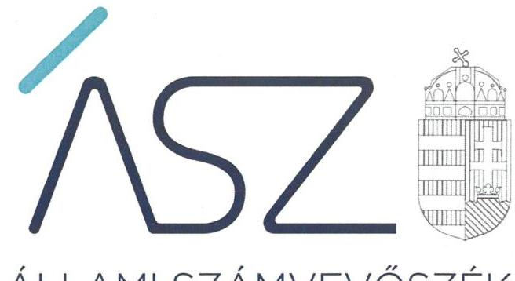

ÁLLAMI SZÁMVEVŐSZÉK

# JELENTÉS 

## A központi költségvetési szervek ellenőrzése

Pécsi Tudományegyetem
2022.

22048
www.asz.hu

---

ÁLLAMI SZÁMVEVŐSZÉK

# JELENTÉS 

A központi költségvetési szervek ellenőrzése

Pécsi Tudományegyetem

22048
www.asz.hu

---

# AZ ELLENŐRZÉST VEZETTE ÉS A VÉGREHAJTÁSÁÉRT FELELŐS: 

DR. CZINDER ENIKŐ ellenőrzésvezető
SZAPPANOS JÚLIA ellenőrzésvezető
JANIK JÓZSEF ellenőrzésvezető

## A PROGRAM ÖSSZEÁLLÍTÁSÁÉRT FELELŐS:

NAGY ADRIENN projektvezető

## DÁM-POLYÁK ORSOLYA projektvezető

## A TÉMÁHOZ KAPCSOLÓDÓ KORÁBBI SZÁMVEVŐSZÉKI JELENTÉSEK:

- címe: Jelentés a Pécsi Tudományegyetem ellenőrzéséről Az állami felsőoktatási intézmények gazdálkodásának, működésének ellenőrzése
- sorszáma: 15063
- címe: Jelentés - Az állami felsőoktatási intézmények gazdálkodásának, működésének ellenőrzéséről készült jelentések utóellenőrzése - Pécsi Tudományegyetem
- sorszáma: 16179

IKTATÓSZÁM: EL-3769-001/2022.
TÉMASZÁM: 2549
ELLENŐRZÉS-AZONOSÍTÓ SZÁM: V0926

---

# TARTALOMJEGYZÉK 

- ÖSSZEGZÉS ..... 5
- AZ ELLENŐRZÉS CÉLJA ..... 6
- AZ ELLENŐRZÉS TERÜLETE ..... 7
- AZ ELLENŐRZÉS HÁTTERE, INDOKOLTSÁGA ..... 8
- A JELENTÉS LÉNYEGES KÉRDÉSKÖREI ..... 9
- AZ ELLENŐRZÉS HATÓKÖRE ÉS MÓDSZEREI ..... 10
- MEGÁLLAPÍTÁSOK ..... 12
- ÉRTELMEZŐ SZÓTÁR ..... 15
- FÜGGELÉK: ÉSZREVÉTELEK ..... 17
- RÖVIDÍTÉSEK JEGYZÉKE ..... 19

---

.

---

# ÖSSZEGZÉS 

A Pécsi Tudományegyetem vagyongazdálkodásának szabályozottsága biztosított volt. Az Egyetemnél a 2018-2019. években a nemzeti vagyon nyilvántartása és kimutatása szabályszerű volt. A fenntartóváltáshoz kapcsolódóan a jogszabályban előírt záró beszámolót az Egyetem a jogszabályi előírásoknak megfelelően elkészítette. Az Egyetemnél szervezeti teljesítménycélokat meghatároztak, azok megvalósulását mérték és értékelték.

## Az ellenőrzés társadalmi indokoltsága

Az államháztartás központi alrendszerébe tartozó szervezet vagyona a nemzeti vagyon része. Magyarország Alaptörvénye rögzíti, hogy a vagyonnal való gazdálkodás célja a közérdek szolgálata. Magyarország versenyképessége szoros kapcsolatban van a felsőoktatás minőségével, amely nem képzelhető el hatékony és eredményes közpénz felhasználás nélkül. Az ellenőrzött időszakban a Pécsi Tudományegyetem az államháztartás központi alrendszerébe tartozó szervezet volt.

Az ellenőrzést indokolja az is, hogy a Pécsi Tudományegyetem a felsőoktatási modellváltással érintett intézmények közé tartozik, 2021. augusztus 1-től a Pécsi Tudományegyetem fenntartója a Universitas Quinqueecclesiensis Alapítvány. Az Egyetem fenntartói jogait, amelyeket addig az állam nevében az illetékes miniszter gyakorolt, a kormány által létrehozott közérdekű vagyonkezelő alapítvány vette át, és azokat az alapítvány kuratóriuma gyakorolja.

Az Állami Számvevőszék tanácsadó funkciója keretében az ellenőrzési megállapításokon keresztül támogatja a közfeladat ellátását szolgáló vagyonnal való szabályos gazdálkodást.

## Főbb megállapítások, következtetések

A Pécsi Tudományegyetemnél a 2018-2020. években a vagyongazdálkodás szabályozottságát a jogszabályi előírásokkal összhangban kialakított számviteli politika, eszközök és a források értékelési szabályzata, eszközök és a források leltárkészítési és leltározási szabályzata, önköltségszámítás rendjére vonatkozó szabályzat és további, a gazdálkodás rendjére vonatkozó szabályzatok támogatták.

Az Egyetem az ellenőrzött időszakban rendelkezett az irányító szerv által jóváhagyott éves költségvetési beszámolóval. A 2018., 2019., 2020. éves költségvetési beszámolókat főkönyvi kivonattal alátámasztották. A nemzeti vagyon nyilvántartásához és kimutatásához az Egyetem leltárt készített, amely tételesen és ellenőrizhető módon tartalmazta a mérlegben szereplő eszközöket és forrásokat mennyiségben és értékben. Az Egyetemnél a 2018-2019. években a nemzeti vagyon nyilvántartása és kimutatása szabályszerű volt. A 2020. évben a vagyonváltozást eredményező gazdasági események elszámolása, a kapcsolódó részletező nyilvántartások vezetése kapcsán az ellenőrzés szabálytalanságokat tárt fel.

A 2021. augusztus 1-jei fenntartóváltáshoz kapcsolódóan a jogszabályban előírt záró beszámolót az Egyetem elkészítette, a záró mérleg tételeit leltárral alátámasztotta.

A Pécsi Tudományegyetem kialakította a teljesítményelv érvényesülésének alapját jelentő mérési követelményeket, azokat mérte és értékelte, a teljesítményértékelésről beszámolót készített.

---

# AZ ELLENŐRZÉS CÉLJA 

ményeinek érvényesítése megtörtént-e.

AZ ELLENŐRZÉS CÉLJA annak értékelése, hogy az államháztartás központi alrendszerébe tartozó közpénzekkel gazdálkodó szervezet gazdálkodását elszámoltathatóan végzi-e. Az ellenőrzés értékeli továbbá, hogy sor került-e az ellenőrzött szervezetnél az eredményesség, a hatékonyság és a gazdaságosság követelményeinek érvényesülését biztosító, mérhető, nyomon követhető teljesítménycélok kitűzésére, teljesítménykövetelmények kialakítására, illetve hogy az ellenőrzött időszakban a teljesítménycélok mérése, értékelése, az eredményesség, a hatékonyság és a gazdaságosság követel-

---

# AZ ELLENŐRZÉS TERÜLETE 

## Pécsi Tudományegyetem

A Pécsi Tudományegyetem ${ }^{1}$ az ellenőrzött időszakban központi költségvetési szervként működött. Az Egyetem jogállását az Nftv. ${ }^{2}$ határozta meg. Az Egyetem közfeladatként - az Nftv. 2. § (1) bekezdése alapján - oktatási és tudományos kutatási tevékenységet folytatott; főtevékenységként - szakágazati besorolás szerint - felsőfokú oktatást végzett. Az Egyetem felsőoktatási tevékenységét pécsi székhelyén, valamint több településen működtetett telephelyein folytatta, tíz karon folyt felsőoktatási képzés, vállalkozási tevékenységet nem végzett. Az ellenőrzött időszakban az Egyetem irányító szerve és fenntartója 2019. szeptember 1-től az Innovációs és Technológiai Minisztérium, ezt megelőzően az Emberi Erőforrások Minisztériuma volt.

A Pécsi Tudományegyetem fenntartója 2021. augusztus 1. napjától megváltozott, az új fenntartó az Universitas Quinqueecclesiensis Alapítvány lett.

Az Egyetem vezető testülete - az Nftv. 12. § (1) bekezdésében foglaltaknak megfelelően - a szenátus volt. Az Egyetem élén a rektor állt, akinek személye az ellenőrzött időszakban egy alkalommal változott. Az Egyetem - Nftv. 13/A. § (1)-(2) bekezdései szerinti - működtetését a kancellár végezte, akinek személye az ellenőrzött időszakban egy alkalommal változott.

---

# AZ ELLENŐRZÉS HÁTTERE, INDOKOLTSÁGA 

Az államháztartás központi alrendszerébe tartozó szervezet vagyona a nemzeti vagyon része, mellyel történő gazdálkodás a közérdek szolgálata érdekében történik. Az ÁSZ ellenőrzi az éves költségvetési törvény végrehajtását, majd az ellenőrzés során feltárt kockázatok és a terület folyamatos kockázat-elemzésével beazonosított kockázatok kezelése érdekében ráépülő ellenőrzésekkel ellenőrzi a költségvetési szervek gazdálkodását, működését. Ezáltal az ellenőrzések megállapításaival támogatja az ellenőrzött szervezetek szabályszerű gazdálkodását, javaslataival elősegíti az Alaptörvényben megfogalmazott alapvetések érvényesülését a mindennapi életben a szervezetek szintjén.

A központi költségvetés rendszerében zajló folyamatok holisztikus elemzései, a kockázatok folyamatos figyelemmel kísérésének módszerével, az így kiválasztott szervezetek célzott, hatékony ellenőrzéseivel az ÁSZ betölti a legfőbb gazdasági ellenőrző szerv küldetését.

Az egyes ellenőrzések megállapításaival és egy időszak ellenőrzési eredményeinek elemzésével az ÁSZ ráirányíthatja a jogalkotók figyelmét a központi alrendszerben vagy annak egy ágazatában esetlegesen felmerülő vagyongazdálkodási, szabályozási feszültségekre.

---

# A JELENTÉS LÉNYEGES KÉRDÉSKÖREI 

1. Biztosított volt-e a vagyongazdálkodás szabályozottsága?
2. A nemzeti vagyon nyilvántartását és kimutatását a valóságnak megfelelő módon, szabályszerűen végezték-e?
3. Az Egyetem a fenntartóváltás során a használatában levő vagyontárgyakat szabályszerűen mutatta-e ki a záró beszámolójában?
4. A központi költségvetési szerv rendelkezett-e szervezeti teljesítménycélokkal, a központi költségvetési szerv vezetője kialakította-e és érvényesítette-e a szervezeti teljesítmény mérésére alkalmas követelményeket?

---

# AZ ELLENŐRZÉS HATÓKÖRE ÉS MÓDSZEREI 

## Az ellenőrzés típusa

Megfelelőségi ellenőrzés és teljesítmény-ellenőrzés.

## Az ellenőrzött időszak

A 2018-2020. évek, továbbá 2021. január 1-jétől a felsőoktatási intézmény Nftv. szerinti fenntartóváltásának napjáig, 2021. augusztus 1-ig terjedő időszak, a 4. lényeges kérdéskör teljesítmény-ellenőrzés tekintetében a 2020. év

## Az ellenőrzés tárgya

A központi költségvetési szerv vagyongazdálkodási feltételeinek kialakítása, annak szabályszerűsége, az elszámoltathatóság biztosítása a szabályozás szintjén. Az intézménynél hozott vagyonváltozást eredményező döntések, a vagyonban bekövetkezett változások végrehajtásának, elszámolásának szabályszerűsége. Az intézmény könyveiben, mérlegében kimutatott nemzeti vagyon nyilvántartásának szabályszerűsége, vagyon kimutatása, értékelése és a mérleg leltárral való alátámasztásának szabályszerűsége. A felsőoktatási intézmény záró beszámolójában kimutatott nemzeti vagyon kimutatása és a mérleg leltárral való alátámasztásának szabályszerűsége. Az ellenőrzött szervezetnél kialakított, az eredményesség, a hatékonyság és a gazdaságosság követelményeinek érvényesülését biztosító, mérhető, nyomon követhető teljesítménycélok, valamint az azokhoz meghatározott célértékek, teljesítménykövetelmények meghatározása; a célok megvalósulásának mérése, értékelése; az eredményesség, a hatékonyság és a gazdaságosság követelményeinek érvényesítése a jogszabályi előírások alapján elkészítendő dokumentumokban.

## Az ellenőrzött szervezet

Pécsi Tudományegyetem

## Az ellenőrzés jogalapja

Az ellenőrzés jogszabályi alapját az ÁSZ tv. 1. § (3) bekezdés, 5. § (2)-(4) és (6) bekezdései, valamint az Áht. ${ }^{3}$ 61. § (2) bekezdésének előírásai képezik.

---

# Az ellenőrzés módszerei 

Az ellenőrzést az ÁSZ a program kérdéseire adott válaszok kiértékelésével és a vonatkozó időszakban hatályos jogszabályok, az ellenőrzés szakmai szabályai, a jelen ellenőrzésre irányadó ÁSZ módszertanok alapján folytatja le.

Az ellenőrzés során az ellenőrzött szervezettel történő kapcsolattartást az ÁSZ a szervezeti és működési szabályzatának vonatkozó előírásai alapján biztosítja.

Az ellenőrzési kérdések megválaszolásához szükséges bizonyítékok megszerzése az ellenőrzött szervezet által rendelkezésre bocsátott dokumentumokra és adatokra alapozva, továbbá megfigyelés, szemle (szemrevételezés), kérdésfeltevés (információkérés), érték alapján szűkített, lényeges sokaságon végrehajtott mintavétellel, valamint elemző eljárás útján történik. Az ellenőrzési bizonyítékként felhasználható adatforrások közé tartoznak az ellenőrzési program részletes szempontjainál felsorolt adatforrások, valamint minden egyéb - az ellenőrzés folyamán feltárt, az ellenőrzés szempontjából információt tartalmazó - dokumentum. Az ellenőrzés lefolytatásához az ellenőrzött szervezet tanúsítványok kitöltésével, valamint az ÁSZ által kért dokumentumok rendelkezésre bocsátásával szolgáltat adatokat, amelyekről az ellenőrzött szervezet vezetője teljességi és hitelességi nyilatkozatot állít ki. A rendelkezésre bocsátott dokumentumok, adatok és információk kontrollja az ellenőrzés keretében történik.

A 2020. évi vagyonnövekedések és vagyoncsökkenések elszámolásának szabályszerűségét, a nemzeti vagyon nyilvántartásának és év végi értékelésének szabályszerűségét lényeges sokaságból véletlen mintavételi eljárással kiválasztott tételek alapján ellenőrizte az ÁSZ. A mintavételi sokaságok esetében a mintavétel a legnagyobb értékű tételekre - a lényeges sokaságra - terjedtek ki.

A mintavételi sokaságok esetében a mintavétel azokra a legnagyobb értékű tételekre - a lényeges sokaságra - terjedt ki, melyek összértéke eléri a teljes sokaság összértékének 50\%-át. A mintavétellel ellenőrzött területek esetében minden egyes tétel vonatkozásában a szabályszerűségre vonatkozó kérdéseket tettünk fel, amelyek eredménye összesítésre került. „Szabályszerűnek" értékeltünk egy ellenőrzött területet, amennyiben 95\%-os bizonyossággal a lényeges sokaságban az átlagos hibaarány legfeljebb 10\%, „nem szabályszerűnek, amennyiben 10\%-nál magasabb arányt képviselt. Abban az esetben, ha a lényeges sokaság tekintetében a 10\%-os hibaarányhoz való viszony megítélésének megbízhatósága nem érte el a 95\%-ot, annak elérése érdekében értékelésünket további szempontokkal egészítettük ki, és figyelembe vettük a feltárt hibák értékét. Amennyiben valamely lényeges sokaság elemszáma kisebb, mint az előírt mintaelemszám, a lényeges sokaság tételes ellenőrzésére került sor.Az ellenőrzés részét képezi a szabályszerűségi ellenőrzésre épülő teljesítmény ellenőrzés, melynek keretében az ÁSZ arra fókuszál, hogy a központi költségvetési szervek a jogszabályi előírások alapján elkészítendő dokumentumokban, vagy más egyéb, nem jogszabály által meghatározott dokumentumokban alakítottak-e ki és érvényesítették-e a szervezet teljesítményének mérésére alkalmas követelményeket.

---

# 1. Biztosított volt-e a vagyongazdálkodás szabályozottsága? 

## Összegző megállapítás

A vagyongazdálkodás szabályozottsága a 2018-2020. években biztosított volt.

AZ EGYETEM a Számv.tv. ${ }^{4}$ és az Áhsz. ${ }^{5}$ előírásaival összhangban rendelkezett hatályos számviteli szabályozással (számviteli politikával, az eszközök és a források értékelési szabályzatával, az eszközök és a források leltárkészítési és leltározási szabályzatával, számlarenddel, önköltségszámítási szabályzattal).

Az Egyetem az ellenőrzött időszakra kialakította a Gazdálkodási Szabályzatát, az Ügyrendjét, a Selejtezési Szabályzatát, a gépjárművek igénybevételének, használatának rendjéről a Szállítási szabályzatát.

## 2. A nemzeti vagyon nyilvántartását és kimutatását a valóságnak megfelelő módon, szabályszerűen végezték-e?

Összegző megállapítás

Az Egyetemnél a 2018-2019. években a nemzeti vagyon nyilvántartása és kimutatása szabályszerű volt. A 2020. évben a vagyonváltozást eredményező gazdasági események elszámolása, a kapcsolódó részletező nyilvántartások vezetése kapcsán szabálytalanságokat tárt fel az ellenőrzés.

A 2018-2020. ÉVEKBEN az Egyetem rendelkezett az irányító szerv által jóváhagyott éves költségvetési beszámolóval. A 2018., 2019., 2020. éves költségvetési beszámolókat főkönyvi kivonattal alátámasztották. A nemzeti vagyon nyilvántartásához és kimutatásához az Egyetem leltárt készített, amely tételesen és ellenőrizhető módon tartalmazta
 a mérlegben szereplő eszközöket és forrásokat mennyiségben és értékben.
Az Egyetemnél a 2020. évben a vagyonváltozást eredményező gazdasági események elszámolása, a kapcsolódó részletező nyilvántartások vezetése kapcsán az alábbi szabálytalanságokat tárta fel az ellenőrzés:
$\longrightarrow$ Az Ávr ${ }^{6}$ 50. § (1a) bekezdésében előírtak ellenére az Egyetem által kötött szerződésekhez a 30 mintatétel közül egy esetben nem igazolt a szervezet képviselőjének nyilatkozata arra vonatkozóan, hogy átlátható szervezetnek minősül;
$\longrightarrow$ Az eszközök beszerzéséhez, felújításához tartozóan az üzembehelyezési bizonylatok a 30 mintatétel közül egy esetben nem tartalmazták a Számv. tv. 167. § (1) bekezdés d) pontjában előírtakat;
$\longrightarrow$ A mintatételek alapján a számviteli nyilvántartásokba bejegyzett, valamint az állományból kivezetett (selejtezett) eszközök könyv szerinti értékének az Áhsz. 26. § (10a) bekezdésében előírtak szerinti

---

elszámolását alátámasztó számviteli bizonylatokhoz kapcsolódóan nem igazolták a Számv. tv. 167. § (1) bekezdése h) pontjában előírtak érvényesítését, az érintett könyvviteli számlákra történő hivatkozást;

- A mintatételek alapján egy esetben az immateriális javak részletező nyilvántartását nem az Áhsz 14. sz. melléklet VI. 1. b), f), k) pontjaiban, valamint a tárgyi eszközök részletező nyilvántartását 13 esetben nem az Áhsz 14. sz. melléklet VII. 4. b) és 1. h) és n) pontjaiban, 16 esetben nem az Áhsz 14. sz. melléklet 5. a) és 1. h) és n) pontjaiban előírtak szerinti tartalommal vezették;
- A mintatételek alapján a selejtezések esetében nem tartották be a Számv. tv. 165. § (2) bekezdésében előírtakat, amely szerint a számviteli (könyvviteli) nyilvántartásokba csak szabályszerűen kiállított bizonylat alapján szabad adatokat bejegyezni.

# 3. Az Egyetem a fenntartóváltás során a használatában levő vagyontárgyakat szabályszerűen mutatta-e ki a záró beszámolójában? 

Összegző megállapítás

A fenntartóváltás napját megelőző fordulónappal készített záró költségvetési beszámoló elkészítésével az Egyetem a nemzeti vagyon nyilvántartását és kimutatását szabályszerűen végezte.

Az Egyetem elkészítette a fenntartóváltás napját megelőző fordulónappal a záró beszámolót az Nftv. 117/C. § (4a) bekezdés rendelkezésével összhangban.

Az Egyetemnél a fenntartóváltás napját megelőző fordulónappal készített, 2021. évi záró beszámoló összeállítása a Számv. tv. 21. § (2) bekezdésben előírtak szerint történt, az Egyetem a záró mérleg tételeit leltárral alátámasztotta.

## 4. A központi költségvetési szerv rendelkezett-e szervezeti teljesítménycélokkal, a központi költségvetési szerv vezetője kialakította-e és érvényesítette-e a szervezeti teljesítmény mérésére alkalmas követelményeket?

Összegző megállapítás

Az Egyetem rendelkezett szervezeti teljesítménycélokkal, a szervezeti teljesítmény mérésére alkalmas követelményeket kialakította, a teljesítménycélok megvalósulását értékelte.

Az Egyetemnél a szervezeti teljesítmény mérésére alkalmas követelmények kialakítása megtörtént. A stratégiai jövőkép elemeihez kapcsolt részcélok és akciók részletes meghatározását tartalmazó Intézmény-

---

fejlesztési Terv meghatározott a szervezeti célok elérése érdekében eredményességi követelményeket. A teljesítménycélok megvalósulását mérte és értékelte, teljesítményértékelési beszámolót készített.
A szervezeti célok elérését veszélyeztető kockázatok csökkentésére irányuló kontrollokkal rendelkeztek.

---

# ÉRTELMEZŐ SZÓTÁR 

állami vagyon
állami vagyon kezelője /vagyonkezelő
irányító szerv
működtetés
nemzeti vagyon

Állami vagyonnak minősül:
a) az állam tulajdonában lévő dolog, valamint a dolog módjára hasznosítható természeti erő,
b) az a) pont hatálya alá nem tartozó mindazon vagyon, amely vonatkozásában törvény az állam kizárólagos tulajdonjogát nevesíti,
c) az állam tulajdonában lévő tagsági jogviszonyt megtestesítő értékpapír, illetve az államot megillető egyéb társasági részesedés,
d) az államot megillető olyan immateriális, vagyoni értékkel rendelkező jogosultság, amelyet jogszabály vagyoni értékű jogként nevesít,
e) az állam tulajdonában lévő pénzügyi eszközök.
(Forrás: Vtv. ${ }^{7}$ 1. § (2) bekezdése)
Az állami tulajdonában álló vagyon tekintetében - a nemzeti vagyonról szóló törvényben vagyonkezelőként meghatározott azon személy, amellyel az állami vagyon vagyonkezelésére a Magyar Nemzeti Vagyonkezelő Zrt. valamint annak jogelődje, vagy az állami tulajdonosi joggyakorlója vagyonkezelési szerződést kötött, továbbá akit törvény vagyonkezelőnek kijelölt. (Forrás: Vtvr. 1. § (7) bekezdés b) pontja és az Nvtv. ${ }^{8}$ 3. § (1) bekezdés 19. a) pontja)
A költségvetési szerv tekintetében az e törvényben meghatározott irányítási hatáskört gyakorló szerv. (Forrás: Áht. 1. § 9. pontja)
a nemzeti vagyon birtoklásából, használatából, hasznai szedéséből, a nemzeti vagyon fenntartásából és üzemeltetéséből álló tevékenységek együttese, amely jogszabály vagy szerződés alapján - a nemzeti vagyon felújítására, fejlesztésére, a birtoklásának, használatának hasznai szedése jogának továbbengedésére is kiterjedhet. (Forrás: Nvtv. 3. § (1) bekezdés 10. pontja)
Nemzeti vagyonba tartozik:
a) az állam vagy a helyi önkormányzat kizárólagos tulajdonában álló dolgok,
b) az a) pont hatálya alá nem tartozó, az állam vagy a helyi önkormányzat tulajdonában lévő dolog,
c) az állam vagy a helyi önkormányzat tulajdonában lévő pénzügyi eszközök, továbbá az államot vagy a helyi önkormányzatot megillető társasági részesedések,
d) az államot vagy a helyi önkormányzatot megillető bármely vagyoni értékkel rendelkező jogosultság, amelyet jogszabály vagyoni értékű jogként nevesít,
e) Magyarország határa által körbezárt terület feletti légtér,
f) az üvegházhatású gázok kibocsátási egységeinek kereskedelméről szóló törvény szerinti kibocsátási egység és légiközlekedési kibocsátási egység, valamint az ENSZ Éghajlatváltozási Keretegyezménye és annak Kiotói Jegyzőkönyve végrehajtási keretrendszeréről szóló törvény szerinti kiotói egység,
g) állami vagy helyi önkormányzati fenntartású közgyűjtemény (muzeális intézmény, levéltár, közgyűjteményként működő kép- és hangarchívum, valamint könyvtár) saját gyűjteményében nyilvántartott kulturális javak körébe tartozó dolog, kivéve, ha az állami vagy önkormányzati tulajdon jogszerű létrejötte kétséget kizáró módon nem bizonyítható és a dologra nézve más a tulajdonjogát bizonyítja vagy a kulturális javakra vonatkozó jogszabályokban meghatározott eljárás keretében valószínűsíti,
h) a régészeti lelet,
i) a nemzeti adatvagyon körébe tartozó állami nyilvántartások fokozottabb védelméről szóló törvény szerinti nemzeti adatvagyon (Forrás: Nvtv. 1. § (2) bekezdés a)-i) pontok).

---

tulajdonosi joggyakorló
vagyongazdálkodás

Aki a nemzeti vagyon felett az államot vagy a helyi önkormányzatot megillető tulajdonosi jogok és kötelezettségek összességének gyakorlására jogosult. (Forrás: Nvtv. 3. § (1) bekezdés 17. pontja)
A nemzeti vagyongazdálkodás feladata a nemzeti vagyon rendeltetésének megfelelő, az állam, az önkormányzat mindenkori teherbíró képességéhez igazodó, elsődlegesen a közfeladatok ellátásához és a mindenkori társadalmi szükségletek kielégítéséhez szükséges, egységes elveken alapuló, átlátható, hatékony és költségtakarékos működtetése, értékének megőrzése, állagának védelme, értéknövelő használata, hasznosítása, gyarapítása, továbbá az állam vagy a helyi önkormányzat feladatának ellátása szempontjából feleslegessé váló vagyontárgyak elidegenítése. (Forrás: Nvtv. 7. § (2) bekezdése)

---

# FÜGGELÉK: ÉSZREVÉTELEK 

A jelentéstervezetet a Számvevőszék 15 napos észrevételezésre megküldte az ellenőrzött szervezet vezetőjének az ÁSZ tv. 29. §* (1) bekezdése előírásának megfelelően.

A Pécsi Tudományegyetem rektora az ellenőrzés megállapításaira észrevételt tett. Az ÁSZ tv. 29. § (3) bekezdésével összhangban az ÁSZ a Függelékben feltünteti a megállapításokkal kapcsolatban tett, figyelembe nem vett észrevételeket, és megindokolja, hogy azokat miért nem fogadta el.

[^0]
[^0]:    ** 29. § (1) Az Állami Számvevőszék az ellenőrzési megállapításait megküldi az ellenőrzött szervezet vezetőjének vagy az általa megbízott személynek, és annak, akinek személyes felelősségét állapította meg.
    (2) Az ellenőrzött szervezet vezetője és a felelősként megjelölt személy az ellenőrzés megállapításaira tizenöt napon belül írásban észrevételt tehet.
    (3) Az Állami Számvevőszék az észrevételre a beérkezésétől számított harminc napon belül írásban válaszol. A figyelembe nem vett észrevételeket köteles a jelentésben feltüntetni, és megindokolni, hogy azokat miért nem fogadta el.

---

Az ellenőrzés megállapításaival kapcsolatban a Pécsi Tudományegyetem rektora által 2022. július 5-én tett észrevételek és azok el nem fogadásának indokolása.

# 1. A Pécsi Tudományegyetem által kötött szerződésekhez kapcsolódó átláthatósági nyilatkozatokkal kapcsolatban tett észrevétel 

Az ÁSZ felülvizsgálta a kapcsolódó dokumentumokat és az Ávr 50. § (1a) bekezdésében előírtak ellenére az Egyetem által kötött szerződésekhez a 30 mintatétel közül egy esetben nem igazolt a szervezet képviselőjének nyilatkozata arra vonatkozóan, hogy átlátható szervezetnek minősül.

A fentiekre tekintettel az ellenőrzés megállapítása megalapozott.

## 2. Az eszközök beszerzéséhez, felújításához kapcsolódóan az üzembehelyezési bizonylatok adattartalmával kapcsolatban tett észrevétel

Az ÁSZ felülvizsgálta a kapcsolódó dokumentumokat és az eszközök beszerzéséhez, felújításához tartozóan az üzembehelyezési bizonylatok a 30 mintatétel közül egy esetben nem tartalmazták a Számv. tv. 167. § (1) bekezdés d) pontjában előírtakat.

A fentiekre tekintettel az ellenőrzés megállapítása megalapozott.

## 3. A számviteli nyilvántartásokba bejegyzett, valamint az állományból kivezetett (selejtezett) eszközök könyv szerinti értékének elszámolását alátámasztó számviteli bizonylatokkal kapcsolatban tett észrevétel

A Pécsi Tudományegyetem az adatbekérés során a selejtezési mintatételekhez rendelkezésre bocsátott dokumentumokhoz a kivezetés számviteli bizonylatát nem bocsátotta rendelkezésre, így a dokumentumokból nem állapítható meg a számlakijelölés. A dokumentumok nem tartalmazzák a selejtezéssel érintett főkönyvi számlák számát (eszközök bruttó értékére, valamint a halmozott értékcsökkenés kivezetésére vonatkozóan). A jogszabály a könyvelést alátámasztó bizonylatokra vonatkozóan előírt tartalmi követelmények között nem tesz különbséget amiatt, hogy a kivezetett, selejtezett eszközök a beszámoló értékére nem voltak hatással, mivel nettó értékük már nulla volt. Rektor úr észrevételében hivatkozott belső SAP bizonylatokat nem bocsátottak az ellenőrzés rendelkezésére, illetve észrevételezés során sem kerültek mellékelésre.

A fentiekre tekintettel az ellenőrzés megállapítása megalapozott.

## 4. A tárgyi eszközök és az immateriális javak részletező nyilvántartásának adattartalmára vonatkozó észrevétel

Az Egyetem által az adatbekérés során a kiválasztott mintatételekhez rendelkezésre bocsátott eszközkartonok nem tartalmaztak minden, az Áhsz. 14. mellékletében előírt adatot, ahogy azt Rektor úr észrevételében is elismerte. A mintatételek alapján egy esetben az immateriális javak részletező nyilvántartását nem az Áhsz 14. sz. melléklet VI. 1. b), f), k) pontjaiban, valamint a tárgyi eszközök részletező nyilvántartását 13 esetben nem az Áhsz 14. sz. melléklet VII. 4. b) és 1. h) és n) pontjaiban, 16 esetben nem az Áhsz 14. sz. melléklet 5. a) és 1. h) és n) pontjaiban előírtak szerinti tartalommal vezették.

A fentiekre tekintettel az ellenőrzés megállapítása megalapozott.

---

# RÖVIDÍTÉSEK JEGYZÉKE 

${ }^{1}$ Egyetem
${ }^{2}$ Nftv.
${ }^{3}$ Áht.
${ }^{4}$ Számv.tv.
${ }^{5}$ Áhsz.
${ }^{6}$ Ávr.
${ }^{7}$ Vtv.
${ }^{8}$ Nvtv.

Pécsi Tudományegyetem
a nemzeti felsőoktatásról szóló 2011. évi CCIV. törvény (hatályos: 2012. január 1-től)
2011. évi CXCV. törvény az államháztartásról (hatályos 2011. december 31-től)
2000. évi C. törvény a számvitelről (hatályos: 2001. január 1-jétől)
4/2013. (I. 11.) Korm. rendelet az államháztartás számviteléről (hatályos: 2014. január 1-jétől)
4/2013. (I. 11.) Korm. rendelet az államháztartásról szóló törvény végrehajtásáról
2007. évi CVI. törvény az állami vagyonról (hatályos 2007. szeptember 25-től)
2011. évi CXCVI. törvény a nemzeti vagyonról (hatályos: 2011. december 31-től)

---

# ASZ 

ÁLLAMI SZÁMVEVŐSZÉK
1052 Budapest, Apáczai Cs. J. u. 10. I 1364 Budapest 4. Pf. 54 TEL: +36 14849100
email: szamvevoszek@asz.hu
web: www.asz.hu | www.aszhirportal.hu

