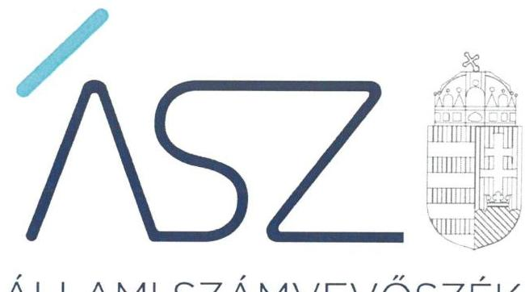
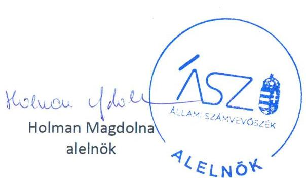
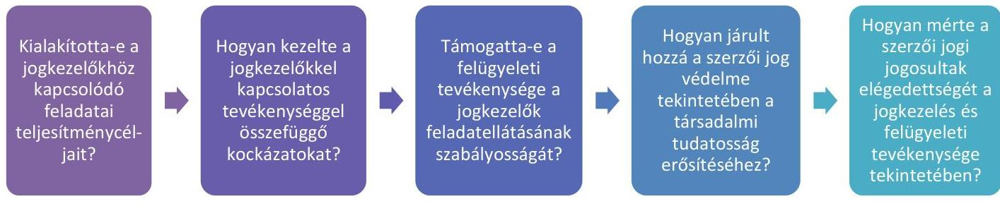
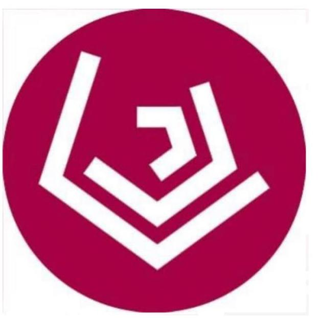

ÁLLAMI SZÁMVEVŐSZÉK

# JELENTÉS 

A szerzői jog rendszerének ellenőrzése

Teljesítmény-ellenőrzés

2022.

22050
www.asz.hu

---

ÁLLAMI SZÁMVEVŐSZÉK

# JELENTÉS 

A szerzői jog rendszerének ellenőrzése

Teljesítmény-ellenőrzés

22050
www.asz.hu

---

# AZ ELLENŐRZÉST VEZETTE ÉS A VÉGREHAJTÁSÁÉRT FELELŐS: 

DR. NAGY IMRE ellenőrzésvezető
NEMESVÁRI-HORTHY ESZTER ellenőrzésvezető

## A PROGRAM ÖSSZEÁLLÍTÁSÁÉRT FELELŐS:

SZABÓ CECÍLIA program készítéséért felelős vezető

## A TÉMÁHOZ KAPCSOLÓDÓ KORÁBBI SZÁMVEVŐSZÉKI JELENTÉSEK:

- címe: A szerzői jog rendszerének ellenőrzése - A Szellemi Tulajdon Nemzeti Hivatala tevékenységének és a szerzői jogot kezelő szervezetek elszámoltathatóságának és átláthatóságának ellenőrzése
- sorszáma: 22028

Jelentéseink az Országgyúlés számítógépes hálózatán és az interneten a www.asz.hu címen is olvashatóak.

IKTATÓSZÁM: EL-3776-001/2022.
TÉMASZÁM: 2570
ELLENŐRZÉS-AZONOSÍTÓ SZÁM: V0913

---

# TARTALOMJEGYZÉK 

■ ÖSSZEGZÉS ..... 5
■ AZ ELLENŐRZÉS CÉLJA ..... 7
■ AZ ELLENŐRZÉS TERÜLETE ..... 8
■ AZ ELLENŐRZÉS HÁTTERE, INDOKOLTSÁGA ..... 9
■ A JELENTÉS LÉNYEGES KÉRDÉSKÖREI ..... 10
■ AZ ELLENŐRZÉS HATÓKÖRE ÉS MÓDSZEREI ..... 11
■ MEGÁLLAPÍTÁSOK ..... 12
■ MELLÉKLETEK ..... 17
I. sz. melléklet: Értelmező szótár ..... 17
■ FÜGGELÉK: ÉSZREVÉTELEK ..... 19
■ RÖVIDÍTÉSEK JEGYZÉKE ..... 21

---

.

---

# ÖSSZEGZÉS 

A Szellemi Tulajdon Nemzeti Hivatala 2020-ban és 2021-ben a jogkezelőkkel kapcsolatos tevékenysége tekintetében célokat és követelményeket határozott meg, kockázatokat azonosított és azokat kezelte. Felügyeleti tevékenysége támogatta a szerzői jogokhoz kapcsolódó jogszabályi előírások érvényesülését a jogkezelőknél. A hivatal tevékenysége hozzájárult a szellemi tulajdon védelméhez kapcsolódó ismeretek terjesztéséhez.

## Az ellenőrzés társadalmi indokoltsága

A Szellemi Tulajdon Nemzeti Hivatala jogkezelőkkel kapcsolatos feladatellátása, felügyeleti tevékenysége eredményes működtetésében elsősorban a szellemi alkotásokat előállítók érdekeltek, akik számára a szerzői jog védelme elismertségük, megbecsülésük, megélhetésük miatt fontos. Az állam számára a szerzői jogok védelme, az értékteremtő kreativitás és innováció a versenyképesség fokozása miatt lényeges, amely támogatja új munkahelyek létesítését. A hamisítási tevékenység költségvetési bevétel-kiesést okoz, negatív hatása van a foglalkoztatottságra, gazdasági növekedésre, veszélyt jelent a fogyasztók biztonságára és gyengíti az integritás érvényesülését.

Az Állami Számvevőszék korábban több alkalommal ellenőrizte a Szellemi Tulajdon Nemzeti Hivatala működését, gazdálkodását és tevékenységét. A legutóbbi, 2022. június 24-én nyilvánosságra hozott jelentésével lezárt ellenőrzésében az Állami Számvevőszék azt értékelte, hogy a Szellemi Tulajdon Nemzeti Hivatala feladatellátását szabályszerűen kialakított kontrollkörnyezetben végezte-e és a jogkezelő szervezetek elszámoltathatóak, átláthatóak-e. Az ellenőrzés értékelte a közös jogkezelő szervezetek és a független jogkezelő szervezetek nyilvántartásának vezetését, felügyeletét és a reprezentatív közös jogkezelő szervezetek díjszabásának jóváhagyását, illetve azok jogkezelő szervezeteknél történő végrehajtását.

Az Állami Számvevőszék korábban elvégzett megfelelőségi ellenőrzése ${ }^{1}$ megállapította, hogy a Szellemi Tulajdon Nemzeti Hivatala a 2020. évben kialakította a szervezeti teljesítmény követelmények érvényesülését biztosító, mérhető teljesítménycélokat. A teljesítmény követelmények meghatározása megalapozta a Szellemi Tulajdon Nemzeti Hivatalánál a teljesítmény-ellenőrzés lefolytatását a jogkezelőkhöz kapcsolódó feladatellátás tekintetében.

## Főbb megállapítások, következtetések

A teljesítmény-ellenőrzés célja annak értékelése volt, hogy a Szellemi Tulajdon Nemzeti Hivatala jogkezelőkkel kapcsolatos feladatellátása 2020-ban és 2021-ben hogyan járult hozzá a szellemi tulajdon védelméhez. Az ellenőrzés ennek érdekében az alábbi kérdésekre kereste a választ a Szellemi Tulajdon Nemzeti Hivatala tekintetében.

A Szellemi Tulajdon Nemzeti Hivatala a szerzői és a szerzői joghoz kapcsolódó jogokkal összefüggő feladatai keretében az éves munkaterveiben meghatározta a szervezeti célokat, amelyek kiterjedtek a jogkezelőkkel kapcsolatos feladatellátásra is. A meghatározott célokhoz, feladatokhoz eredménykritériumokat rendelt.

A Szellemi Tulajdon Nemzeti Hivatala a jogkezelőkkel kapcsolatos feladatellátást veszélyeztető kockázatokat azonosította, kezelte és nyomon követte. Éves kockázati leltárakat készített, amelyekben a jogkezelőkkel kapcsolatos

---

tevékenysége vonatkozásában felmérte a felmerülő lehetséges kockázatok bekövetkezésének valószínűségét és hatását. A kockázati leltárak alapján az egyes kockázatok csökkentése érdekében elvégzendő feladatokról, felelősökről és határidőkről intézkedési tervek készültek, amelyek végrehajtásáról az érintett szervezeti egységek beszámoltak.

A Szellemi Tulajdon Nemzeti Hivatala felügyeleti tevékenysége támogatta a jogkezelők feladatellátásának szabályosságát. Felügyeleti tevékenysége keretében nyomon követte a jogkezelők jogkezelési tevékenységét. Amennyiben ennek során a jogszabályban előírt feltételek hiányát állapította meg, intézkedett a hiányosságok megszüntetése érdekében. A felügyeleti ellenőrzés eredményeként - amennyiben szükséges volt - végzésben hívta fel a jogkezelőt nyilatkozattételre, adatszolgáltatásra vagy tájékoztatásra. Indokolt esetben ezt követően felügyeleti intézkedést tett, vagyis felhívta a jogkezelőt a jogsértő állapot megszüntetésére és a jogszerű működés helyreállítására, illetve a jogkezelő engedélyének részbeni visszavonását kezdeményezte. Emellett rendszeresen visszamérte a jogkezelők jogkezelési tevékenységének megfelelőségét, és amennyiben szükséges volt, további felügyeleti intézkedést tett.

A Szellemi Tulajdon Nemzeti Hivatalának tevékenysége hozzájárult a szellemi tulajdon védelméhez kapcsolódó ismeretek terjesztéséhez. Megismertette, népszerűsítette a szellemi tulajdon védelme érdekében folytatott a szerzői és a szerzői joghoz kapcsolódó jogokkal összefüggő tevékenységét, valamint ismeretterjesztő tevékenységet folytatott a szerzői jog jogosultjai és a felhasználók körében a szellemi tulajdon-védelmi tudatosság növelése érdekében. Szórólapok kiadásával, konferenciák és képzések szervezésével, valamint a szerzői jog témakörébe tartozó könyvek kiadásával és ingyenes internetes elérhetőségének biztosításával támogatta a szellemi tulajdon védelmének érvényesülését.

A Szellemi Tulajdon Nemzeti Hivatala 2020-ban és 2021-ben mérte és értékelte a szerzői jogi ügyekben a hivatalt személyesen vagy elektronikus levélben megkereső ügyfelek elégedettségét.

---

# AZ ELLENŐRZÉS CÉLJA 

Az ellenőrzés célja annak értékelése volt, hogy a Szellemi Tulajdon Nemzeti Hivatala (továbbiakban: SZTNH) jogkezelőkkel kapcsolatos feladatellátása hogyan járult hozzá a szellemi tulajdon védelméhez.

---

# AZ ELLENŐRZÉS TERÜLETE 

## Szellemi Tulajdon Nemzeti Hivatala

A Szellemi Tulajdon Nemzeti Hivatala 1896. március 1-jén jött létre. Az SZTNH ${ }^{2}$ jogállása a találmányok szabadalmi oltalmáról szóló 1995. évi XXXIII. törvény 115/D. § (1) bekezdése alapján a szellemi tulajdon védelméért felelős kormányzati főhivatal.

Az SZTNH feladat- és hatáskörébe tartozik többek között a szerzői és a szerzői joghoz kapcsolódó jogokkal összefüggő egyes feladatok, köztük a jogkezelőkkel kapcsolatos feladatok ellátása. A jogkezelőkkel kapcsolatos feladatok ellátására az SZTNH szervezeti és működési szabályzata a Szerzői Jogi Főosztályt jelölte ki.

A Kjkt. ${ }^{3}$ felhatalmazása alapján az SZTNH hatóságként jár el a közös jogkezelő szervezet és független jogkezelő szervezet jogkezelési tevékenységének bejelentése, a reprezentatív közös jogkezelő szervezetként végzett közös jogkezelési tevékenység engedélyezése, az engedély módosítása és visszavonása, a közös jogkezelő szervezetek és független jogkezelő szervezetek nyilvántartása valamint a közös jogkezelő szervezetek és független jogkezelő szervezetek jogkezelési tevékenysége feletti felügyeleti ügyekben.

Magyarországon a közös jogkezelés jelenlegi rendszere európai uniós irányelv alapján 2016-ban került kialakításra a Kjkt. elfogadásával. Az irányelv és az az alapján elfogadott törvényi szabályozás alapvető struktúra- és koncepcióváltást eredményezett a korábbi rendszerben. A Kjkt. alapján már nem minden esetben elvárás a közös jogkezelő szervezetekkel szemben a reprezentativitás, vagyis hogy a tevékenységükkel érintett jogosultak jelentős részétől rendelkezzenek megbízással a közös jogkezelésre. Így a Kjkt. lehetővé tette a reprezentatív közös jogkezelő szervezetek mellett a (nem reprezentatív) közös jogkezelő szervezetek és a független jogkezelő szervezetek működését is. A független jogkezelő szervezetek a közös jogkezelő szervezetektől eltérően a jogosultaktól szervezetileg elkülönülnek, és a tevékenységükkel összefüggő, saját vállalkozási tevékenységet is végezhetnek.

---

# AZ ELLENŐRZÉS HÁTTERE, INDOKOLTSÁGA 

Az SZTNH jogkezelőkkel kapcsolatos feladatellátása, felügyeleti tevékenysége eredményes működtetésében elsősorban a szellemi alkotásokat előállítók érdekeltek, akik számára a szerzői jog védelme elismertségük, megbecsülésük, megélhetésük miatt fontos.

Az állam számára a szerzői jogok védelme, az értékteremtő kreativitás és innováció a versenyképesség fokozása miatt lényeges, amely támogatja új munkahelyek létesítését. A hamisítási tevékenység költségvetési bevétel-kiesést okoz, negatív hatása van a foglalkoztatottságra, gazdasági növekedésre, veszélyt jelent a fogyasztók biztonságára és gyengíti az integritás érvényesülését.

Az Állami Számvevőszék (továbbiakban: ÁSZ) korábban lefolytatott megfelelőségi ellenőrzése és a most elvégzett teljesítmény-ellenőrzés a döntéshozók, az ellenőrzött szervezet és a társadalom számára visszajelzést ad a szerzői jog rendszerének működéséről, a szellemi tulajdon védelme érdekében végrehajtott intézkedésekről és elért eredményekről. Az ÁSZ teljesítmény-ellenőrzése támogatja az SZTNH feladatellátását, ezáltal hozzájárul a szellemi tulajdon védelméhez.

---

# A JELENTÉS LÉNYEGES KÉRDÉSKÖREI 

1.     - Kialakította-e az SZTNH a jogkezelőkhöz kapcsolódó feladatai teljesítménycéljait?
2.     - Hogyan kezelte az SZTNH a jogkezelőkkel kapcsolatos tevékenységgel összefüggő kockázatokat?
3.     - Támogatta-e az SZTNH felügyeleti tevékenysége a jogkezelők feladatellátásának szabályosságát?
4.     - Hogyan járult hozzá az SZTNH a szerzői jog védelme tekintetében a társadalmi tudatosság erősítéséhez?
5.     - Hogyan mérte az SZTNH a szerzői jogi jogosultak elégedettségét a jogkezelés és felügyeleti tevékenysége tekintetében?

---

# AZ ELLENŐRZÉS HATÓKÖRE ÉS MÓDSZEREI 

## Az ellenőrzés típusa

Teljesítmény-ellenőrzés.

## Az ellenőrzött időszak

2020-2021. évek.

## Az ellenőrzés tárgya

Az ellenőrzés tárgyát képezi az SZTNH jogkezelőkkel kapcsolatos feladatellátásának értékelése.

## Az ellenőrzött szervezet

Szellemi Tulajdon Nemzeti Hivatala

## Az ellenőrzés jogalapja

Az Állami Számvevőszékről szóló 2011. évi LXVI. törvény 1. § (3) bekezdése és az 5. § (3) bekezdései

## Az ellenőrzés módszerei

Az ellenőrzés végrehajtása az ellenőrzési program szempontjai, kérdéskörei, az ellenőrzött időszakban hatályos jogszabályok, az ellenőrzés szakmai szabályai és a jelen ellenőrzésre irányadó ÁSZ módszertanok alapján történt. Az ellenőrzés ideje alatt az ellenőrzött szervezettel való kapcsolattartás az ÁSZ Szervezeti és Működési Szabályzatának vonatkozó előírásai alapján történt.

Az ellenőrzési kérdések megválaszolásához szükséges bizonyítékok megszerzése az ellenőrzött által rendelkezésre bocsátott dokumentumokra, adatokra alapozva történt. Az ellenőrzési bizonyítékként felhasználható adatforrások közé tartoztak egyrészt az adatbekérő levelek mellékletében szereplő dokumentumok jegyzékében rögzített adatforrások, másrészt minden az ellenőrzés folyamán feltárt, az ellenőrzés szempontjából információt tartalmazó dokumentum.

---

# 1. Kialakította-e az SZTNH a jogkezelőkhöz kapcsolódó feladatai teljesítménycéljait? 

Összegző megállapítás

Az SZTNH 2020-ban és 2021-ben gondoskodott a szervezeti célok és az azokhoz kapcsolódó teljesítmény követelmények meghatározásáról, amelyek kiterjedtek a jogkezelőkkel kapcsolatos feladatok ellátására is. Az SZTNH a teljesítmény mérés feltételeit kialakította.

Az Állami Számvevőszék korábbi megfelelőségi ellenőrzése ${ }^{1}$ megállapította, hogy az SZTNH a 2020. évben kialakította a szervezeti teljesítmény követelmények érvényesülését biztosító, mérhető teljesítménycélokat. A teljesítmény követelmények meghatározása megalapozta az SZTNH-nál a teljesítmény-ellenőrzés lefolytatását a jogkezelőkhöz kapcsolódó feladatellátás tekintetében.

A teljesítmény-ellenőrzés ez alapján vizsgálta, hogy az SZTNH-nál 2020-ban és 2021-ben milyen célokat határoztak meg a jogkezelőkkel kapcsolatos feladatellátás vonatkozásában és milyen eredménykritériumokat rendeltek a meghatározott célokhoz.

Az SZTNH a 2020. és 2021. évi munkaterveiben meghatározta a tevékenységéhez kapcsolódó szervezeti célokat. A munkatervekben foglaltak szerint a nemzeti szellemi tulajdon-védelmi (iparjogvédelmi, szerzői jogi tevékenység) hatósági tevékenység esetében az SZTNH célja a mennyiségi és minőségi követelményeinek a nemzetközi szakmai elvárásokkal és a hazai vállalkozások érdekeivel összhangban való magas színvonalú teljesítése volt.

A munkatervekben foglaltakon túl az évente kiadott minőségcélok és információbiztonsági célkitűzések határoztak meg további célokat és feladatokat, amelyek a jogkezelőkkel kapcsolatos feladatok ellátására is kiterjedtek. A meghatározott célokhoz, feladatokhoz eredménykritériumokat rendeltek.

A 2020. évben ilyen cél és feladat volt egyrészt a hatósági folyamatok ügyviteli szempontú racionalizálása, optimalizálása, másrészt a felülvizsgált, racionalizált hatósági folyamatok paraméterezése, és az alkalmazott határidők felülvizsgálata.

A 2021. évben a minőségcélok és információbiztonsági célkitűzések között célként és feladatként szerepelt a Szerzői Jogi Főosztály tekintetében a folyamatok teljesítményének mérése, értékelése, dokumentált információ fenntartása, emellett az Intézményi mutatószámrendszer előző évi értékeinek kiszámítása és elemzés készítése az SZTNH teljesítményének értékeléséhez. További célkitűzésként került meghatározásra a Szerzői
 Jogi Főosztály tekintetében a minőség kockázatainak csökkentésére hozott korábbi intézkedések hatásosságának értékelése, a maradványkockázat értékének kimutatása, szükség esetén újabb kockázatcsökkentő intézkedés meghatározása.

Az intézményi mutatószámrendszer előző évi értékeinek kiszámításához és elemzés készítéséhez kapcsolódó feladatok ellátásának alapját az

---

intézményi teljesítmény mérésére alkalmas mutatók alkalmazásáról 2016. évben kiadott gazdasági vezetői utasítás képezte. A hivatkozott gazdasági vezetői utasítás célja volt, hogy rögzítse a gazdaságosság, eredményesség és hatékonyság követelményeinek hivatalon belüli érvényesítésének javítására irányuló intézkedések meghozatalának folyamatát, valamint az intézkedések megalapozását szolgáló mutatószámrendszer kialakítását. A gazdasági vezetői utasítás a gazdaságossági, a hatékonysági és az általános mutatószámok között határozott meg mutatószámokat a szerzői jogi hatósági tevékenységre vonatkozóan.

# 2. Hogyan kezelte az SZTNH a jogkezelőkkel kapcsolatos tevékenységgel összefüggő kockázatokat? 

### 2.1. számú megállapítás

Az SZTNH a jogkezelőkkel összefüggő feladatok ellátása tekintetében kockázatokat azonosított és intézkedéseket határozott meg azok kezelésére, továbbá gondoskodott az intézkedések végrehajtásának nyomon követéséről.

Az Állami Számvevőszék korábbi megfelelőségi ellenőrzése ${ }^{1}$ megállapította, hogy az SZTNH a 2020. évben szabályszerűen kialakította az integrált kockázatkezelési rendszerét.

A teljesítmény-ellenőrzés ez alapján értékelte, hogy az integrált kockázatkezelési rendszer 2020. és 2021. évi működtetése során az SZTNH hogyan mérte fel és kezelte a jogkezelőkkel összefüggő feladatok ellátásához kapcsolódó kockázatokat.

Az SZTNH a 2020. és 2021. évben kockázati leltárat készített az SZTNH integrált kockázatkezelési rendszere által rögzített kockázatokról. A kockázati leltárak tartalmazták a kockázatokat a szerzői jogokkal és a szerzői joghoz kapcsolódó jogokkal összefüggő egyes feladatok ellátása tekintetében is. 2020-ban 16, 2021-ben 3 ilyen kockázatot azonosítottak, amelyek a jogkezelőkkel kapcsolatos feladatok ellátását is érintették.

A kockázati leltárak alapján az SZTNH 2020-ban és 2021-ben intézkedési terveket készített. Az intézkedési tervekben megtörtént a kockázatok kezeléséhez szükséges feladatok meghatározása, a felelősök és határidők kijelölése.

Az intézkedési tervekben foglalt feladatok végrehajtását az SZTNH nyomon követte. A főosztályi, szakterületi beszámolók alapján 2020-ban és 2021-ben tájékoztató készült az intézkedési tervben foglaltak végrehajtásának állásáról. A tájékoztató minden feladat esetében tartalmazta, hogy a kockázat elfogadható szintre csökkent-e, vagy szükséges az adott feladat továbbvitele.

---

# 3. Támogatta-e az SZTNH felügyeleti tevékenysége a jogkezelők feladatellátásának szabályosságát? 

3.1. számú megállapítás

Az SZTNH a 2020-2021. években a jogkezelők feletti felügyeleti tevékenységével támogatta a jogkezelők feladatellátásának szabályosságát.

Az Állami Számvevőszék korábbi megfelelőségi ellenőrzése ${ }^{1}$ megállapította, hogy az SZTNH 2020-ban a közös jogkezelő szervezetek és független jogkezelő szervezetek felett a jogszabályi előírások szerint gyakorolta felügyeleti tevékenységét.

A teljesítmény-ellenőrzés a 2020. és 2021. évek tekintetében azt értékelte, hogy a felügyeleti eljárás keretében az SZTNH mely esetekben állapította meg a jogkezelésre vonatkozó jogszabályok megsértését, erre milyen intézkedéseket tett, illetve megvizsgálta-e az intézkedések hatásait.

Az SZTNH a 2020. és 2021. évben a jogkezelők tevékenysége felett gyakorolt felügyelet keretében vizsgálta a jogkezelő szervezetek jogszabályi előírásoknak megfelelő működését.

A felügyeleti tevékenysége során az SZTNH több esetben végzésben nyilatkozattételre, adatszolgáltatásra, tájékoztatásra hívta fel a jogkezelőket a felügyeleti eljárás során észlelt hiányosságok, szabálytalanságok kapcsán. Egyes esetekben a jogkezelők tájékoztatása, adatszolgáltatása alapján az SZTNH megállapította, hogy nincs szükség felügyeleti intézkedés alkalmazására.

A 2020. évben egy esetben alkalmazott az SZTNH felügyeleti intézkedést, amely során határidő tűzésével a jogsértő állapot megszüntetésére és a jogszerű működés helyreállítására hívta fel a jogkezelő figyelmét. A felügyeleti intézkedés kapcsán az SZTNH a 2021. évben lefolytatott felügyeleti eljárásban visszamérte a felügyeleti intézkedés alapján tett lépéseket a jogkezelő részéről, és további intézkedést rendelt el.

A 2021. évben öt jogkezelő esetében alkalmazott az SZTNH felügyeleti intézkedést, amely során határidő tűzésével a jogsértő állapot megszüntetésére és a jogszerű működés helyreállítására hívta fel a jogkezelők figyelmét, egy esetben pedig a jogkezelő engedélyének részbeni visszavonásának kezdeményezésére került sor.

## 4. Hogyan járult hozzá az SZTNH a szerzői jog védelme tekintetében a társadalmi tudatosság erősítéséhez?

4.1. számú megállapítás

Az SZTNH a 2020-2021. években az ismeretterjesztő és képzési tevékenységével hozzájárult a szerzői jog védelme tekintetében a társadalmi tudatosság erősítéséhez.

Az SZTNH a 2020. évben ismeretterjesztő szórólapokon foglalta össze az önkéntes műnyilvántartással és az árvaművek felhasználásával kapcsolatos ismereteket. A szórólapok mellett az SZTNH a 2020. évben kiadta a „Bevezetés a szerzői jogba" és „A szerzői jogi ágazatok gazdasági súlya Magyarországon 6." című könyveket, amelyek ingyenes elérhetőségét és

---

letölthetőségét biztosította az SZTNH honlapján. Emellett az SZTNH által korábban megjelentetett két könyv díjmentes elérhetőségét és letölthetőségét biztosította honlapján, amelyek szintén a szerzői jog témaköréhez kapcsolódnak. A 2021. évben az SZTNH új kiadványt nem jelentetett meg a szerzői jog területén, ugyanakkor a korábban megjelentetett kiadványok elérhetőségét és letölthetőségét a honlapján továbbra is biztosította.

Az SZTNH a kiadványok megjelentetésén túl konferenciákon való részvétellel és képzések szervezésével járult hozzá ahhoz, hogy a jogosultak, felhasználók bővíthessék ismereteiket a szellemi tulajdon, ezen belül a szerzői jog védelme területén. Az SZTNH a 2020. és 2021. években elindította a díj és vizsgaköteles alap- és középfokú szerzői jogi tanfolyamát, amelyek célja az alapvető szerzői jogi ismeretek elsajátítása, bővítése volt.

Az SZTNH a tanfolyamok mellett a 2020. évben webináriumot szervezett szerzői jogi helyzetkép címmel, valamint a DEX Dalszerző EXPO-n biztosított helyszíni tanácsadást a dalszerző expo résztvevőinek. 2021-ben az SZTNH részvételével zajlott le a SMART konferencián az EU szerzői jogi platformszabályairól szóló pro-kontra beszélgetés.

# 5. Hogyan mérte az SZTNH a szerzői jogi jogosultak elégedettségét a jogkezelés és felügyeleti tevékenysége tekintetében? 

### 5.1. számú megállapítás Az SZTNH az ügyfelek elégedettségét mérte és értékelte.

Az SZTNH Szerzői Jogi Főosztályának éves beszámolói szerint 2020-ban és 2021-ben mérték és értékelték a szerzői jogi ügyekben a hivatalt személyesen vagy elektronikus levélben megkereső ügyfelek elégedettségét.

---

.

---

# MELLÉKLETEK 

## I. SZ. MELLÉKLET: ÉRTELMEZŐ SZÓTÁR

felügyeleti tevékenység
független jogkezelő szervezet
közös jogkezelés
közös jogkezelő szervezet

Az SZTNH felügyeleti eljárása - amely nem minősül hatósági ellenőrzésnek - kiterjed különösen annak vizsgálatára, hogy
a) a közös jogkezelő szervezet és a független jogkezelő szervezet működése, gazdálkodása, valamint a szerzői jogok és a szerzői joghoz kapcsolódó jogok közös kezeléséről szóló 2016. évi XCIII. törvény (továbbiakban: Kjkt.) 102. § (1) bekezdése szerinti dokumentumai megfelelnek-e a jogkezelésre vonatkozó jogszabályokban foglalt követelményeknek,
b) a közös jogkezelés megkezdésének a Kjkt. 32. § szerint irányadó feltételei folyamatosan megvalósulnak-e,
c) a reprezentatív közös jogkezelő szervezet vonatkozásában a Kjkt. 34. §-ban foglalt engedélyezési feltételek folyamatosan megvalósulnak-e, a több tagállam területére kiterjedő hatályú engedélyeket adó közös jogkezelő szervezet megfelel-e a második részben foglalt követelményeknek. (Kjkt. 108. §)
Olyan szervezet, amely céljaként vagy fő tevékenységeként szerzői jogot vagy kapcsolódó jogot kezel több jogosult érdekében és közös javára erre vonatkozó törvény, szerződés vagy egyéb jogviszony alapján, továbbá
a) nem áll a jogosultak tulajdonában vagy ellenőrzése alatt, és
b) nyereségszerzési céllal működik. (Kjkt. 4. § 4. pont)
Egyes szerzői vagyoni jogok és a szerzői joghoz kapcsolódó vagyoni jogok több jogosult érdekében és közös javára közös jogkezelő szervezet által történő gyakorlása és érvényesítése függetlenül attól, hogy azt törvény írja elő vagy az a jogosultak elhatározásán alapul, és a következőkre terjed ki:
a) a szerzői művek és kapcsolódó jogi teljesítmények felhasználásának engedélyezése vagy díjigény érvényesítése,
b) a jogdíjak és a felhasználás egyéb feltételeinek megállapítása, vagy az ebben való részvétel,
c) a felhasználás figyelemmel kísérése,
d) a jogdíjak beszedése,
e) a jogdíjak jogosultak között történő felosztása, kifizetése, vagy felosztás céljára másik szervezetnek történő átadása,
f) fellépés a szerzői jog vagy kapcsolódó jog megsértésével szemben, ideértve az eljárás kezdeményezését a bíróság, illetve hatóság előtt, valamint az eljárás során nyilatkozat, észrevétel vagy indítvány megtételét és eljárási cselekmény elvégzését. (Kjkt. 4. § 7. pont)
Olyan szervezet, amely erre vonatkozó törvény, szerződés vagy egyéb jogviszony alapján céljaként vagy fő tevékenységeként közös jogkezelést végez, és a következő feltételek közül legalább az egyiket teljesíti:
a) tagjai jogosultak vagy jogosultakat képviselő szervezetek - ideértve más közös jogkezelő szervezeteket és a jogosultak szövetségeit is - vagy ez utóbbi személyek ellenőrzése alatt áll,
b) nyereségszerzési cél nélkül működik. (Kjkt. 4. § 8. pont)

---

szerzői jog

A szerzői jog védelemben részesíti az irodalmi, tudományos, művészeti alkotásokat, valamint - az un. kapcsolódó jogok révén - a felhasználásukhoz kapcsolódó teljesítményeket. A szerzői jog a mű szerzőjének vagyoni és személyhez fűződő jogosultságokat biztosít. A szerzői jog egyik alapvető célja a szellemi alkotás ösztönzése. (Szellemi Tulajdon Nemzeti Hivatala: Szerzői jogi alapfogalmak https://www.sztnh.gov.hu/hu/szerzoi-jog/szerzoi-jogi-alapfogalmak)
szellemi tulajdon Szellemi tulajdon alatt az alkotó elme szüleményeit értjük: ide tartoznak a találmányok, az irodalmi és művészeti alkotások, valamint a kereskedelemben alkalmazott megjelölések, nevek, képek és formák. A szellemi tulajdon tárgyai jogi védelmet élveznek: ez biztosítja, hogy a találmányok vagy egyéb alkotások jogosultjai tevékenységükért megfelelő erkölcsi és anyagi elismerésben részesüljenek. A szellemitulajdon-jogok két nagy ágát az iparjogvédelmi és a szerzői jogok alkotják. (Szellemi Tulajdon Nemzeti Hivatala: Mit jelent a szellemi tulajdon? https://www.sztnh.gov.hu/hu/mit-jelent/mit-jelent-a-szellemi-tulajdon)

---

# FÜGGELÉK: ÉSZREVÉTELEK 

A jelentéstervezetet a Számvevőszék 15 napos észrevételezésre megküldte az ellenőrzött szervezet vezetőjének az ÁSZ tv. 29. § (1) bekezdése előírásának megfelelően.

A Szellemi Tulajdon Nemzeti Hivatalának elnöke, mint az ellenőrzött szervezet vezetője a jelentéstervezetre nem tett észrevételt.

[^0]
[^0]:    * 29. § (1) Az Állami Számvevőszék az ellenőrzési megállapításait megküldi az ellenőrzött szervezet vezetőjének vagy az általa megbízott személynek, és annak, akinek személyes felelősségét állapította meg.
    (2) Az ellenőrzött szervezet vezetője és a felelősként megjelölt személy az ellenőrzés megállapításaira tizenöt napon belül írásban észrevételt tehet.
    (3) Az Állami Számvevőszék az észrevételre a beérkezésétől számított harminc napon belül írásban válaszol. A figyelembe nem vett észrevételeket köteles a jelentésben feltüntetni, és megindokolni, hogy azokat miért nem fogadta el.

---

.

---

# RÖVIDÍTÉSEK JEGYZÉKE 

${ }^{1}$ Korábbi megfelelőségi ellenőrzés

A szerzői jog rendszerének ellenőrzése - A Szellemi Tulajdon Nemzeti Hivatala tevékenységének és a szerzői jogot kezelő szervezetek elszámoltathatóságának és átláthatóságának ellenőrzése (22028. számú számvevőszéki jelentés)
${ }^{2}$ SZTNH
${ }^{3}$ Kjkt.
Szellemi Tulajdon Nemzeti Hivatala
2016. évi XCIII. törvény a szerzői jogok és a szerzői joghoz kapcsolódó jogok közös kezeléséről

---

# ÁSZ 

ÁLLAMI SZÁMVEVŐSZÉK
1052 Budapest, Apáczai Cs. J. u. 10. I 1364 Budapest 4. Pf. 54 TEL: +36 14849100
email: szamvevoszek@asz.hu
web: www.asz.hu | www.aszhirportal.hu

