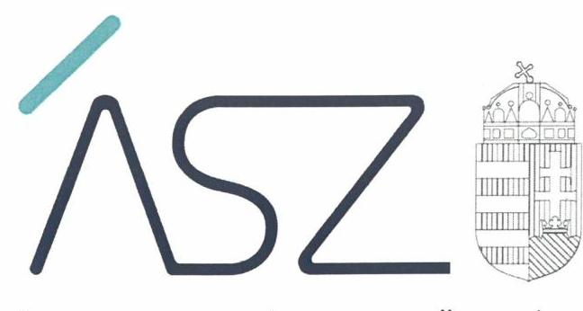
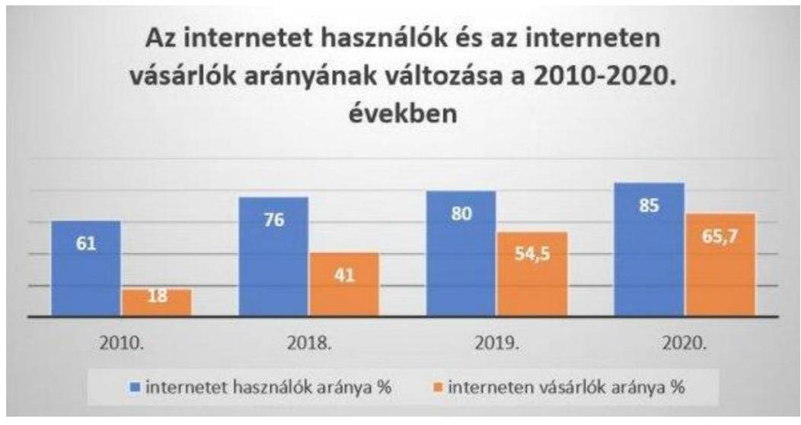
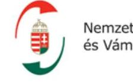

ÁLLAMI SZÁMVEVŐSZÉK

# JELENTÉS 

Az elektronikus kereskedelem hazai ellenőrzését végző szervezetek ellenőrzési tevékenységének ellenőrzése
$\qquad$
2022.

22051
www.asz.hu

---

ÁLLAMI SZÁMVEVŐSZÉK

# JELENTÉS 

Az elektronikus kereskedelem hazai ellenőrzését végző szervezetek ellenőrzési tevékenységének ellenőrzése

22051
www.asz.hu

---

AZ ELLENŐRZÉST VEZETTE ÉS A VÉGREHAJTÁSÁÉRT FELELŐS:
HORVÁTH BÁLINT TAMÁS ellenőrzésvezető
ÓDOR ZOLTÁN TAMÁS ellenőrzésvezető
A PROGRAM ÖSSZEÁLLÍTÁSÁÉRT FELELŐS:
PÉTER ÁKOS projektvezető

IKTATÓSZÁM: EL-3777-001/2022.
TÉMASZÁM: 2600
ELLENŐRZÉS-AZONOSÍTÓ SZÁM: V0944

Jelentéseink az Országgyúlés számítógépes hálózatán és az interneten a www.asz.hu címen is olvashatóak.

---

# TARTALOMJEGYZÉK 

■ ÖSSZEGZÉS ..... 5
■ AZ ELLENŐRZÉS CÉLJA ..... 8
■ AZ ELLENŐRZÉS TERÜLETE ..... 9
■ AZ ELLENŐRZÉS HÁTTERE, INDOKOLTSÁGA ..... 11
■ A JELENTÉS LÉNYEGES KÉRDÉSKÖREI ..... 12
■ AZ ELLENŐRZÉS HATÓKÖRE ÉS MÓDSZEREI ..... 13
■ MEGÁLLAPÍTÁSOK ..... 15
■ MELLÉKLETEK ..... 23
I. sz. melléklet: Értelmező szótár ..... 23
■ FÜGGELÉK: ÉSZREVÉTELEK ..... 25
■ RÖVIDÍTÉSEK JEGYZÉKE ..... 27

---

.

---

# ÖSSZEGZÉS 

Az elektronikus kereskedelem ellenőrzését végző szervezetek 2019-2020-ban kialakították az online kereskedelem ellenőrzésére vonatkozó tevékenységeik szabályozási kereteit. A fogyasztóktól, piaci szereplőktől érkező panaszok, bejelentések, jelzések kezelését megfelelően szabályozták. Az egyes szervezetek az elektronikus kereskedelemmel kapcsolatos ellenőrzéseiket szabályszerűen végezték, kezdeményezték a szükséges eljárásokat, az ellenőrzések utólagos nyomon követése során a jogszabályi előírásoknak megfelelően jártak el.
Az értékelt hat szervezetből az e-kereskedelem ellenőrzésével összefüggésben öt szabott ki bírságot 2019-2020-ban - a saját adatszolgáltatásuk alapján - összesen 6 milliárd 685,3 millió Ft értékben, amelynek több mint 90\%-át a Gazdasági Versenyhivatal által kiszabott bírságok tették ki.

## Az ellenőrzés társadalmi indokoltsága

Az elektronikus kereskedelmi tevékenység volumenének elmúlt években bekövetkezett ugrásszerű növekedése hatással van a gazdaság fejlődésére, a lakossági fogyasztás emelkedése, a vállalatok jövedelmezőségének esetleges javulása növeli a költségvetés bevételeit. Az elektronikus kereskedelmi tevékenység hazai térnyerését mutatja, hogy Magyarországon az interneten vásárlók aránya az internetet használók között a 2010. évi 18\%-ról 2018-ra 41\%-ra nőtt, a csomagküldő és internet üzlettípus belföldi forgalma a $\mathrm{KSH}^{1}$ adatai szerint 2018-ban elérte az 543,2 milliárd Ft-ot, 2019-ben a 765,3 milliárd Ft-ot, 2020-ban pedig a 1111,2 milliárd Ft-ot. Az elektronikus kereskedelmi tevékenység bővülése a fogyasztói szokásokat is átalakította, a fogyasztók vásárlásaik jelentős részét már online felületen bonyolítják le.

A koronavírus-járvány hatásai a 2020. évtől tovább növelték az internetes kereskedelmi forgalmat, mivel egyre többen részesítik előnyben a biztonságosabb internetes vásárlást. Az elmúlt években a leggyorsabban növekedő ágazattá vált az „e-kereskedelem". Ezzel egyidejűleg az internetes kereskedelmi tevékenységet végző szervezetek feladatai is nőttek és emellett egyre inkább a közfigyelem fókuszába kerültek.

Az ÁSZ² ellenőrzése az elektronikus kereskedelem hazai ellenőrzését végző szervezetek ellenőrzési tevékenységét értékeli, az ellenőrző szervezetek ellenőrzései, vizsgálatai, eljárásai végrehajtási feltételeinek kialakításán, illetve az elvégzett ellenőrzések szabályszerűségének értékelésén keresztül.

Forrás: KSH (ÁSZ szerkesztés)

---

# Főbb megállapítások, következtetések 

A GAZDASÁGI VERSENYHIVATAL (GVH) az ellenőrzött időszakban az alapvető működési kereteinek belső szabályozásában kitért az elektronikus kereskedelem területére és megfelelően szabályozta a fogyasztóktól, piaci szereplőktől érkező panaszok, bejelentések, jelzések kezelését. Az előzetes felmérések, elemzések tekintetében a GVH nem élt azzal a jogszabály által biztosított lehetőséggel, hogy az elektronikus kereskedelem területét illetően - az ellenőrzött időszakra vonatkozóan - piacelemzési javaslatot készítsen. Az egyes termékek, szolgáltatások elektronikus kereskedelmének területén a GVH az ellenőrzéseit szabályszerűen végezte, eljárásai során megtette a megállapításait, és azokat utóvizsgálat és a kiszabott bírságok befizetése tekintetében figyelemmel kísérte.

A GVH - saját adatszolgáltatása alapján - 2019-ben 7, 2020-ban 9, az elektronikus kereskedelmet érintő ellenőrzést zárt le, ezekből 2019-ben 3, 2020-ban 7 vizsgálat zárult jogsértés megállapításával. Az e-kereskedelem ellenőrzésével összefüggésben a GVH 2019-ben 664 millió Ft, 2020-ban pedig 5 milliárd 542 millió Ft bírságot szabott ki.

AZ INNOVÁCIÓS ÉS TECHNOLÓGIAI MINISZTÉRIUM (ITM) az elektronikus kereskedelem ellenőrzése tekintetében releváns szervezeti egysége a Fogyasztóvédelmi Szolgáltatás-ellenőrzési Főosztály 2019-2020-ban működtette az e-kereskedelem ellenőrzését szolgáló IT Laboratóriumot. Az ITM IT Laboratóriuma által végzett ellenőrzések következtében induló fogyasztóvédelmi hatósági eljárásokat a fogyasztóvédelmi hatóságként eljáró, illetékes megyei és fővárosi kormányhivatalok folytatták le. Az ITM az elektronikus kereskedelem területét szabályszerűen figyelemmel kísérte, az IT Laboratórium által végzett ellenőrzések nyomon követése biztosított volt az ellenőrzött időszakban.

A ITM IT Laboratórium vizsgálatai felhasználásával az e-kereskedelmet érintő, az online értékesítés fogyasztóvédelmi szempontú lezárt ellenőrzések száma - az ITM saját adatszolgáltatása alapján - 2019-ben 81, 2020-ban pedig 114 volt. Ebből a 2019-ben 59, 2020-ban 74 db vizsgálat zárult jogsértés megállapításával. Ennek következményeként 2019-ben 600 ezer Ft, 2020-ban pedig 10,5 millió Ft bírság kiszabására került sor.

A NEMZETI ADATVÉDELMI ÉS INFORMÁCIÓSZABADSÁG HATÓSÁG (NAIH) az ellenőrzés során arról nyilatkozott, hogy az elektronikus kereskedelem ellenőrzése a Hatóságnál 2019-2020-ban nem volt elkülönült feladat. Ezért a NAIH az alapvető működési kereteinek szabályozása során az elektronikus kereskedelem területére nem is tért ki, a fogyasztóktól, piaci szereplőktől érkező panaszok, bejelentések, jelzések kezelését ugyanakkor szabályozta. Az ellenőrzéseit a NAIH szabályszerűen végezte, dokumentálta, az ellenőrzéseket követően a szükséges intézkedéseket megtette.

A NAIH - saját adatszolgáltatása alapján - 2019-ben 18, 2020-ban pedig 55, az e-kereskedelemmel kapcsolatos ellenőrzést végzett, ezekből 2, illetve 12 vizsgálat zárult jogsértés megállapításával. A NAIH 2019-ben 2 millió Ft, 2020-ban pedig 360 ezer Ft bírságot szabott ki.

A NEMZETI ADÓ- ÉS VÁMHIVATALNÁL (NAV) az elektronikus kereskedelem ellenőrzésével kapcsolatos tevékenységek szabályozása és a feladatok ellátása szabályszerű volt 2019-2020-ban. A NAV kialakította a panaszok és a közérdekű bejelentések vonatkozásában a szabályszerű működési kereteket, rendelkezett hatályos, a panaszok kezelésének rendjéről szóló szabályzattal, valamint közérdekű bejelentések kezeléséről szóló szabályzattal. A NAV az elektronikus kereskedelem ellenőrzésével kapcsolatban az ellenőrzött időszakban készített előzetes felméréseket, elemzéseket, az egyes termékek, szolgáltatások elektronikus kereskedelmének területén. Az e-kereskedelemmel kapcsolatos ellenőrzéseit szabályszerűen végezte és az ellenőrzéseket követően megtette a szükséges intézkedéseket.

A NAV - saját adatszolgáltatása alapján - 2019-ben 771, 2020-ban pedig 1733 elektronikus kereskedelmet érintő ellenőrzést végzett, ezekből 2019-ben 140, 2020-ban pedig 270 vizsgálat zárult jogsértés megállapításával. Az elektronikus kereskedelmet érintő ellenőrzései során a NAV 2019-ben 141,7 millió Ft, 2020-ban pedig 311,4 millió Ft bírságot szabott ki.

---

A NEMZETI ÉLELMISZERLÁNC-BIZTONSÁGI HIVATAL (NÉBIH) 2019-2020-ban az alapvető működési keretei szabályozásával rendelkezett, azokban nem tért ki az elektronikus kereskedelem területére, ezt ugyanakkor jogszabály nem írta elő számára. A NÉBIH az elektronikus kereskedelemmel kapcsolatban a fogyasztóktól, piaci szereplőktől érkező panaszok, bejelentések, jelzések kezelését szabályozta. A NÉBIH az egyes termékek, szolgáltatások elektronikus kereskedelmének területén ellenőrzéseit, eljárásait 2019-2020-ban a jogszabályoknak megfelelően, szabályszerűen végezte, a vizsgálatait követően kezdeményezte a szükséges intézkedések megtételét.

A NÉBIH-nél - saját adatszolgáltatása alapján - az e-kereskedelmet érintő, lezárult ellenőrzések száma 2019-ben 13, 2020-ban 22 volt. Ezek a vizsgálatok 9-9 esetben zárultak jogsértés megállapításával. A NÉBIH 2019-ben és 2020-ban összesen 12,7 millió Ft bírságot szabott ki az elektronikus kereskedelemmel kapcsolatos ellenőrzései során.

# AZ ORSZÁGOS GYÓGYSZERÉSZETI ÉS ÉLELMEZÉS-EGÉSZSÉGÜGYI INTÉZET 

(OGYÉI) az alapvető működési kereteit meghatározó szabályzatokban kitért az elektronikus kereskedelem területére. Az OGYÉI szabályozta az elektronikus kereskedelemmel kapcsolatban a fogyasztóktól, piaci szereplőktől érkező panaszok, bejelentések, jelzések kezelésének eljárásrendjét. Az OGYÉI az ellenőrzéseit szabályszerűen végezte, az ellenőrzéssel érintett szervezetek későbbi tevékenységét figyelemmel kísérte.

Az OGYÉI - saját adatszolgáltatása alapján - 2019-2020-ban összesen két elektronikus kereskedelemmel összefüggő ellenőrzést zárt le, amelyek során jogszabálysértést nem állapított meg.

## Következtetés

Az elektronikus kereskedelem ellenőrzésében érintett szervezetek rendelkeztek az alapvető szabályozásokkal, az egyes szabályzatokban a hatból négy szervezetnél tértek ki az e-kereskedelem ellenőrzésével kapcsolatosan ellátandó feladatokra. Az elektronikus kereskedelem ellenőrzésére vonatkozó vizsgálataikat az ellenőrzött szervezetek szabályszerűen végezték, azok utólagos nyomon követését a jogszabályi előírásoknak megfelelően biztosították.

---

# AZ ELLENŐRZÉS CÉLJA 

AZ ELLENŐRZÉS CÉLJA annak értékelése, hogy az elektronikus kereskedelem ellenőrzését végző szervezetek 2019-2020-ban hogyan alakították ki az elektronikus kereskedelem ellenőrzésének feltételeit, az ellenőrzések lefolytatása szabályszerűen történt-e.

---

# **AZ ELLENŐRZÉS TERÜLETE**

## **Az e-kereskedelem hazai ellenőrzésében érintett szervezetek**

Az elektronikus kereskedelemmel foglalkozó ellenőrző szervezetek vizsgálatával az Állami Számvevőszék azt értékeli, hogy az egyes szervezetek hogyan alakították ki az ellenőrzési feladataik feltételeit, hogyan kezelték az elektronikus kereskedelemmel kapcsolatban érkező panaszokat, bejelentéseket, azok, illetve saját elemzéseik alapján hogyan tervezték meg, alakították ki ellenőrzéseiket, vizsgálataikat.

Az ellenőrzés értékeli továbbá, hogy az ellenőrzött szervezetek az elektronikus kereskedelem azon kiválasztott, a lakosság által leginkább érintett területein hogyan folytatták le ellenőrzéseiket, vizsgálataikat, valamint az elektronikus kereskedelmi tevékenységet végző ellenőrzött szervezetek későbbi magatartását hogyan követték nyomon. Az ellenőrzés kiterjed az elektronikus kereskedelemhez kapcsolódó adó- és vámbevételek teljesüléséhez kapcsolódó ellenőrzésekre is.

**A GAZDASÁGI VERSENYHIVATAL** (GVH) a piaci verseny tisztaságán őrködő, 1991. január 1-je óta működő autonóm államigazgatási szerv Magyarországon. Célja, hogy a piacok jól, a fogyasztók hasznára működjenek. Fellép, ha a vállalkozások megtévesztik a fogyasztókat, ha a kivételesen erős piaci helyzetben levő cégek visszaélnek erőfölényükkel, ha a vállalkozások versenykorlátozó megállapodást kötnek, kartelleznek.

**AZ INNOVÁCIÓS ÉS TECHNOLÓGIAI MINISZTÉRIUM** (ITM) 2018. május 18-án alapított és 2022. május 24-én megszűnt minisztérium, amely az ellenőrzött időszakban a fogyasztóvédelemmel kapcsolatos irányítási és koordinációs feladatokat látott el. Az ITM elektronikus kereskedelem ellenőrzése tekintetében releváns szervezeti egysége a Fogyasztóvédelmi Szolgáltatás-ellenőrzési Főosztály működtette az e-kereskedelem ellenőrzését szolgáló IT Laboratóriumot.

**A NEMZETI ADATVÉDELMI ÉS INFORMÁCIÓSZABADSÁG HATÓSÁG** (NAIH) 2012. január 1-je óta működő autonóm közigazgatási szerv Magyarországon. Célja, hogy ellenőrizze és elősegítse a személyes adatok védelmét és az információszabadság érvényesülését. A NAIH autonóm szervként felettes szervvel nem rendelkezik, nem utasítható és független mind szervezetileg, mind pénzügyileg.

**A NEMZETI ADÓ- ÉS VÁMHIVATAL** (NAV) államigazgatási és fegyveres rendvédelmi feladatokat ellátó központi hivatalként, 2011. január 1-jétől működő központi költségvetési szerv, amely feladatait központi és területi szervei útján látja el. Alaptevékenysége az adók, illetékek, vámok beszedése, a vonatkozó jogszabályok betartatása, szabályszegések szankcionálása.

Nemzeti Adó- és Vámhivatal

---

## NÉBIH

Nemzeti
Élelmiszerlánc-biztonsági
Hivatal

## A NEMZETI ÉLELMISZERLÁNC-BIZTONSÁGI HIVATAL (NÉBIH) a magyar élelmiszerlánc biztonságának felügyeletéért felelős országos hatáskörű állami szervezet, amely 2012. március 15-én alakult meg. Feladatait a 2013-ban elkészült Élelmiszerlánc-biztonsági stratégiának megfelelően látja el. Az Agrárminisztérium háttérintézményeként országos hatáskörben felügyeli az élelmiszerlánc-biztonsági szabályok betartását, együttműködve a megyei kormányhivatalokkal.

## AZ ORSZÁGOS GYÓGYSZERÉSZETI ÉS ÉLELMEZÉS-

EGÉSZSÉGÜGYI INTÉZET 2015. március 1-jétől (OGYÉI) hatóságként felel a gyógyszerfelügyeletért, az egészségügyi géntechnológiai és a gyógyszerpiacfelügyeleti feladatok ellátásáért. Hatáskörébe tartozik az élelmezés- és táplálkozás-egészségügy, valamint a kozmetikai termékekkel összefüggő szakterületen számos hatósági és tudományos kutatási, felügyeleti, tájékoztatási és szakértői feladatok ellátása.

---

# AZ ELLENŐRZÉS HÁTTERE, INDOKOLTSÁGA 

Az ellenőrzés keretében az Állami Számvevőszék olyan szervezeteket vett górcső alá, amelyek maguk is végeznek ellenőrzési, felügyeleti tevékenységet. Ezáltal a számvevői munka hatványozottan hasznosulhat, hiszen a számvevőszéki megállapítások az egyes intézmények ellenőrző tevékenységének szabályszerűségét értékelik, arról adnak visszajelzést a döntéshozók, illetve a társadalom, a fogyasztók számára. Ezáltal az ÁSZ ellenőrzési megállapításai hozzájárulhatnak az ellenőrző szervezetek ellenőrző tevékenységének szabályszerűségéhez, az elektronikus kereskedelem területén a fogyasztói biztonság és bizalom erősítéséhez, továbbá az internetes kereskedelemből a költségvetést megillető bevételek minél teljesebb körű teljesüléséhez.

Az ÁSZ ellenőrzés rávilágít

 arra, hogy az érintett szervezetek az elektronikus kereskedelem ellenőrzése tekintetében kialakították-e az alapvető szabályozási környezetet, az ellenőrzéseiket tervezetten, szabályosan végezték-e, illetve nyomon követték-e azok utólagos hasznosulását.

---

# A JELENTÉS LÉNYEGES KÉRDÉSKÖREI 

1.     - Hogyan kísérték figyelemmel az ellenőrző szervezetek az elektronikus kereskedelem területét?
2.     - Hogyan szabályozták az ellenőrzést végző szervezetek az elektronikus kereskedelemmel kapcsolatban a fogyasztóktól, piaci szereplőktől érkező panaszokat, bejelentéseket, jelzéseket?
3.     - Az egyes termékek, szolgáltatások elektronikus kereskedelmének területén az ellenőrzést végző szervezetek szabályszerűen végezték-e az ellenőrzéseiket, eljárásaikat?
4.     - Az ellenőrzéseket végző szervezetek nyomon követték-e az ellenőrzéseik hasznosulását?

---

# AZ ELLENŐRZÉS HATÓKÖRE ÉS MÓDSZEREI 

## Az ellenőrzés típusa

Megfelelőségi ellenőrzés.

## Az ellenőrzött időszak

2019-2020. évek.

## Az ellenőrzés tárgya

Az ellenőrzés tárgya az elektronikus kereskedelem hazai ellenőrzését végző szervezetek ellenőrzési tevékenységének értékelése, az ellenőrző szervezetek szabályozási környezetén, illetve az ellenőrzési tevékenység eljárásain keresztül. Az ellenőrzés kiterjed az elektronikus kereskedelemmel kapcsolatos ellenőrzéseket, vizsgálatokat megelőző panaszok, bejelentések kivizsgálásának szabályozott végrehajtására, valamint a külső jelzések alapján végzett elemzések, kockázatelemzések, egyéb ellenőrzéseket megalapozó feltárásokra is. A számvevőszéki ellenőrzés magába foglalja az ellenőrző szervezetek által az elektronikus kereskedelemmel kapcsolatban végzett ellenőrzésekkel érintett szervezetek utólagos nyomon követésének értékelését is.

## Az ellenőrzött szervezet

Gazdasági Versenyhivatal, Innovációs és Technológiai Minisztérium, Nemzeti Adatvédelmi és Információszabadság Hatóság, Nemzeti Adó- és Vámhivatal, Nemzeti Élelmiszerlánc-biztonsági Hivatal, Országos Gyógyszerészeti és Élelmezés-egészségügyi Intézet

## Az ellenőrzés jogalapja

Az ÁSZ tv. ${ }^{3}$ 1. § (3) bekezdés, az 5. § (3) bekezdés és a 33. § (7) bekezdésében foglaltak képezik.

---

# Az ellenőrzés módszerei 

Az ellenőrzést az ellenőrzési program szempontjai, kérdéskörei, az ellenőrzött időszakban hatályos jogszabályok, az ellenőrzés szakmai szabályai, az ÁSZ megfelelőségi ellenőrzési módszertana alapján kell elvégezni.

Az ÁSZ az ellenőrzés ideje alatt az ellenőrzött szervezettekkel történő kapcsolattartást a Szervezeti és Működési Szabályzatának vonatkozó előírásai alapján biztosítja.

A program ellenőrzési szempontjait, kritériumait a jogszabályok, közjogi szervezetszabályozó eszközök, uniós jogszabályok, további belső utasítások, belső szabályozók előírásai képezik.

Az ellenőrzési kérdések megválaszolásához szükséges bizonyítékok megszerzése a következő ellenőrzési eljárások alkalmazásával történik: megfigyelés, szemle, kérdésfeltevés (információkérés), összehasonlítás, mintavételezés, valamint elemző eljárás. Az ellenőrzés során szükség esetén helyszíni szemlére is sor kerülhet.

Az ellenőrzési bizonyítékként felhasználható adatforrások közé tartoznak egyrészt az ellenőrzési programban felsorolt adatforrások, másrészt adatforrás lehet még minden - az ellenőrzés folyamán - feltárt, az ellenőrzés szempontjából releváns információkat tartalmazó dokumentum.

Az ÁSZ statisztikai módszereken alapuló mintavételt alkalmaz. Az ellenőrzött szervezetek által végzett elektronikus kereskedelemmel kapcsolatos ellenőrzéseik, vizsgálataik szabályozott végrehajtásának értékelését az ellenőrzött területek szerint véletlen mintavételi eljárással kiválasztott tételek alapján értékeli az ÁSZ. A mintavétellel ellenőrzött területek esetében minden egyes tétel vonatkozásában szabályszerűségre vonatkozó kérdéseket tesz fel az ÁSZ, amelyek eredménye összesítésre kerül. Az értékelés kategóriái:
$\longrightarrow$ „szabályszerűnek" értékelendő egy ellenőrzött területet, amennyiben $95 \%$-os bizonyossággal az átlagos hibaarány legfeljebb $10 \%$,
$\longrightarrow$ „nem szabályszerűnek" értékelendő, amennyiben az átlagos hibaarány 10\%-nál magasabb arányt képviselt.
Abban az esetben, ha az ellenőrzött sokaság tekintetében a 10\%-os hibaarányhoz való viszony megítélésének megbízhatósága nem érte el a 95\%-ot, annak elérése érdekében az értékelés további szempontokkal egészül ki. Ha az ellenőrzött sokaság elemszáma az előírt minta elemszám alatt van, akkor tételes ellenőrzésre kerül sor.

Az ellenőrzés során minden olyan körülményt és adatot is ellenőrizni kell, amely a program végrehajtása kapcsán felmerült újabb összefüggéseknek az ellenőrzés céljaival összhangban lévő feltárásához szükséges.

---

# 1. Hogyan kísérték figyelemmel az ellenőrző szervezetek az elektronikus kereskedelem területét? 

Összegző megállapítás

Az elektronikus kereskedelem ellenőrzését végző szervezetek 2019-2020-ban szabályszerűen kísérték figyelemmel az elektronikus kereskedelem területét.
1.1. számú megállapítás

Az elektronikus kereskedelem ellenőrzését végző szervezetek 2019-2020-ban kialakították a szabályszerű szervezeti működést biztosító alapvető szabályozási keretrendszerüket.

A GVH ${ }^{4}$ az ellenőrzött időszakban az alapvető működési kereteinek belső szabályozásában kitért az elektronikus kereskedelem területére. A GVH rendelkezett az ellenőrzött időszak alatt SZMSZ ${ }_{1,2}{ }^{5}$-szel az Áht. ${ }^{6}$ 10. § (5) bekezdésében foglaltak szerint. Az SZMSZ ${ }_{1,2}$ tartalmazta a GVH szervezetét, feladatai ellátásának részletes belső rendjét és módját az Áht. 10. § (5) bekezdésében előírtaknak megfelelően. Az GVH SZMSZ-e a Tpvt. ${ }^{7}$, az Fttv. ${ }^{8}$ és a Kertv. ${ }^{9}$ előírásai szerint együttesen valamennyi tisztességtelen kereskedelmi tevékenységet végzők ellenőrzésére, a velük szemben lefolytatandó eljárással kapcsolatban tartalmazott feladatokat. A GVH vezetője a Bkr. ${ }^{10}$ 6. § (3) bekezdés előírása szerint elkészítette a költségvetési szerv ellenőrzési nyomvonalát.

Az ITM ${ }^{11}$ az Áht. 10. § (5) bekezdésében foglaltaknak megfelelően rendelkezett SZMSZ-szel. A 2019.03.01-től hatályos SZMSZ tartalmazott feladatot az elektronikus kereskedelem ellenőrzésével kapcsolatban. A FSZEF ${ }^{12}$ koordinációs feladatai körében segíti a szolgáltatások ellenőrzését (távol lévők között kötött szerződések és az azok alapján nyújtott szolgáltatások, különös tekintettel az elektronikus kereskedelemre; elektronikus hírközlési szolgáltatások; stb.). A FSZEF funkcionális feladatai körében ellátja az e-kereskedelem terén a külön jogszabályban meghatározott súlyos jogsértést elkövető vállalkozások adatbázisban való feltüntetésével, módosításával és eltávolításával összefüggő feladatokat, továbbá szintén funkcionális feladatai körében működteti az e-kereskedelem ellenőrzését szolgáló IT Laboratóriumot. Az ITM IT Laboratóriuma által végzett ellenőrzéseket felhasználva a fogyasztóvédelmi eljárásokat a fogyasztóvédelmi hatóságként eljáró, illetékes megyei és fővárosi kormányhivatalok folytatták le az ellenőrzött időszakban. Az elektronikus kereskedelmi szolgáltatásokkal összefüggő fogyasztóvédelmi ügyek tekintetében a Kormány a 387/2016. (XII. 2.) Korm. rendelet ${ }^{13}$ 3. § (4) bekezdés d) pontja, illetve a (9) bekezdés alapján fogyasztóvédelmi hatóságként a megyei és fővárosi kormányhivatalokat jelölte ki.

Az ITM elektronikus kereskedelem ellenőrzését végző szervezeti egysége, az FSZEF a Bkr. 6. § (3) bekezdésének megfelelően rendelkezett folyamatleírással és ellenőrzési nyomvonallal az ellenőrzött időszakban.

---

A NAIH ${ }^{14}$ az Áht. 10. § (5) bekezdésében foglaltaknak megfelelően rendelkezett SZMSZ-szel. NAIH az ellenőrzés során arról nyilatkozott, hogy az elektronikus kereskedelem ellenőrzése a 2019-2020. években nem volt elkülönült feladat, ebből következően a NAIH az alapvető működési kereteinek szabályozása során az elektronikus kereskedelem területére külön nem tért ki.

A NAV ${ }^{15}$ az Áht. 10. § (5) bekezdésében foglaltaknak megfelelően kialakította a szabályszerű működés jogszabályi kereteit, rendelkezett az ellenőrzött időszakra vonatkozó, hatályos SZMSZ ${ }_{1-3}{ }^{16}$-mal. Az SZMSZ ${ }_{1-3}$ nem tért ki tartalmában az elektronikus kereskedelem ellenőrzésével, az elektronikus kereskedelmi tevékenységet folytató szervezetekkel szemben folytatandó eljárással kapcsolatos feladatra, ezt a megyei adó- és vámigazgatóságok ügyrendjei tartalmazták.

A NAV az elektronikus kereskedelem ellenőrzését végző szervezeti egységei ellenőrzési nyomvonalát elkészítette.

A NÉBIH ${ }^{17}$ az ellenőrzött időszakban az Áht. 10. § (5) bekezdésében foglaltaknak megfelelően rendelkezett SZMSZ-szel, abban nem tért ki az elektronikus kereskedelem ellenőrzésével és az elektronikus kereskedelmi tevékenységet folytató szervezetekkel szemben folytatandó eljárással kapcsolatos feladatok ellátására, erre jogszabály nem is kötelezte.

Az OGYÉI ${ }^{18}$ az ellenőrzött időszakban az Áht. 10. § (5) bekezdésében foglaltaknak megfelelően rendelkezett SZMSZ-szel, amely tartalmazott az elektronikus kereskedelem ellenőrzésével összefüggő feladatokat.

Az OGYÉI vezetője az elektronikus kereskedelem ellenőrzését végző szervezeti egység (Tisztigyógyszerészeti Főosztály) ellenőrzési nyomvonalát elkészítette.

# 1.2. számú megállapítás 

Az elektronikus kereskedelem ellenőrzését végző szervezetek nem minden esetben végeztek előzetes felméréseket, elemzéseket az elektronikus kereskedelem területét illetően.

A GVH 2019-2020-ban nem élt a Tpvt. 43/C § (1) bekezdésében biztosított jogszabályi lehetőséggel, az elektronikus kereskedelemről előzetes felméréseket, elemzéseket nem végzett. Ugyanakkor a GVH 2019. március 28-án a Tpvt. 43/C. §-a szerinti piacelemzés megindításáról tett közzé, a Tpvt. 43/C. § (2) bekezdésében előírt hirdetményt, a digitális összehasonlító eszközök alkalmazására jellemző, fogyasztóvédelmi szempontból releváns piaci folyamatok, valamint ezeknek a fogyasztói döntésre gyakorolt hatásai feltárása céljából.

A GVH az SZMSZ ${ }_{1}$ 38. § (1) bekezdésében és az SZMSZ ${ }_{2}$ 46. § (1) bekezdésében foglaltaknak megfelelően meghatározta a 2019-2020. évi versenyfelügyeleti feladatainak ellátása érdekében a prioritásokat. Az Éves versenypártolási prioritások nem tértek ki tartalmukban az elektronikus kereskedelem ellenőrzésével kapcsolatos feladatra.

A GVH a Tpvt. 33. § (3) bekezdésében lévő véleményezési feladatainak ellátása érdekében az az SZMSZ ${ }_{1}$ 46. § (3) bekezdésében foglaltaknak megfelelően a 2019. évre vonatkozóan és a 2020. évre vonatkozóan is készített versenypártolási tervet.

---

Az ITM az ellenőrzött időszakban végzett előzetes felméréseket, elemzéseket az elektronikus kereskedelem vonatkozásában, készített ellenőrzési és vizsgálati programot, ellenőrzési útmutatót. Az ITM a 387/2016. Korm. Rendelet 5. § (4) bekezdésének d) pontjának, és az SZMSZ ${ }^{19}$ I.6.7.2.2. e), illetve 5.6. pontjainak megfelelően rendelkezett a 2019., és 2020. évekre vonatkozó Fogyasztóvédelmi hatóság ellenőrzési és vizsgálati programmal.

Az ITM a Pftv. ${ }^{20}$ 15. §, SZMSZ I.6.7.2.4. b) pont 4. pont, e) pont 7. pont, I.6.7.2.3. b) pont 2. pont és 11.1 pont alapján elkészítette az online értékesítés fogyasztóvédelmi szempontú ellenőrzéséhez az ellenőrzési útmutatót a 2019. és 2020. évekre vonatkozóan.

A NAV az elektronikus kereskedelem ellenőrzésével kapcsolatban az ellenőrzött időszakban készített előzetes felméréseket, elemzéseket. Az előzetes felmérések, elemzések, vizsgálatok, tervek kialakításához az ellenőrzött időszakban rendelkezett kockázatelemzési és kockázatkezelési eljárásrenddel.

A NAV 2021. évre szóló ellenőrzési tervéről, a jogkövetést segítő eljárások fő téma- és célcsoportjairól szóló 5004/2021/VEZ körlevél kiemelt ellenőrzési területként nevesíti az e-kereskedelmi tevékenységet folytató adózók vizsgálatát. A fentiek alapján elkészítették az e-kereskedelmi tevékenységet folytató adózók elemzését 2019-2020. évek vonatkozásában, amely alapján 262 adózó esetében kezdeményezték ellenőrzés lefolyatását az Air. ${ }^{21}$ 88. §-ában előírtak szerint.

A NAV az Elektronikus Kereskedelmi Bizottság keretében végzett internetes monitoring tevékenysége az e-kereskedelmi tevékenységet folytatók elemzése keretében internetes adatgyűjtést végzett, amely során 3400 db alapvetően termékértékesítéssel foglalkozó weboldal tekintetében beazonosította a portálok működtetéséhez köthető adózókat. Az hivatkozott adózói körből 2739 db magyar adószámmal rendelkező adózó került azonosításra. Az elemzett adózók 262 féle tevékenységet jelentettek be, amelyből a leggyakoribb főtevékenység a csomagküldő, internetes kiskereskedelem volt. A 2739 adózó 39,2 %-a, 1074 adózó 2017. I-2019. III. negyedévekre vonatkozóan ellenőrzésekkel, 2,6\%-a adóellenőrzéssel érintett.

A NAV az ITM fogyasztóvédelmi szakterülete közötti együttműködés keretében vizsgálta az ITM-től érkezett külföldi webáruházakra vonatkozó jelzéseket. Az Európai Fogyasztói Központhoz számos fogyasztói panasz érkezik olyan webshoppokkal kapcsolatban, amelyek magyar nyelven (is) elérhetőek, a magyar fogyasztók felé végeznek értékesítő tevékenységet, üzemeltetőjük azonban külföldi.

A NAV különböző témákban végzett internetes adatgyűjtéseket pl. illatszerforgalmazók, óraforgalmazók, műtárgykereskedők, mobiltelefon forgalmazók, mezőgazdasági kisgép kereskedők, számítástechnikai alkatrészeket forgalmazók, karácsonyi termékeket forgalmazók, valamint webáruház elemzéseket készített, továbbá járvány monitoring keretében internetes adatgyűjtést végzett az élelmiszerrel kereskedők, közösségi média, internetes kereskedők, ételkiszállítók körében, az arcmaszkok és kézfertőtlenítők témakörében is.

---

A NAIH és az OGYÉI az elektronikus kereskedelem területe vonatkozásában előzetes felméréseket, elemzéseket nem végzett, ugyanakkor erre jogszabály nem is kötelezte őket.

A NÉBIH az Éltv. 32. § (1) bek. p)-q) pontjai, 47/A. § (2) bek.
 b) pontja továbbá a 22/2012. (II.29.) Korm. rendelet 4/A. § f)-g) pontjai alapján az egységes elveken alapuló kockázatbecslési eljárást kidolgozta.

Az OGYÉI a Pftv. 29. § (1) bekezdésnek megfelelően az ellenőrzött időszakra vonatkozó piacfelügyeleti tervét elkészítette.

# 2. Hogyan szabályozták az ellenőrzést végző szervezetek az elektronikus kereskedelemmel kapcsolatban a fogyasztóktól, piaci szereplőktől érkező panaszokat, bejelentéseket, jelzéseket? 

### 2.1. számú megállapítás

Az elektronikus kereskedelem ellenőrzését végző szervezetek 2019-2020-ban a fogyasztóktól, piaci szereplőktől érkező panaszok, bejelentések, jelzések kezelését a jogszabályi előírásoknak megfelelően szabályozták.

A GVH hatáskörébe tartozó jogsértés esetén a bejelentés és a panasz a Tpvt. IX. fejezet 43/G-43/O §-aiban szabályozott módon történhet. A GVH a panaszok kezelésének rendjét, eljárását megfelelően szabályozta. Az SZMSZ ${ }_{1}$ 63. §-ban, az SZMSZ ${ }_{2}$ 69. §-ban a panasz és egyéb nyilatkozat személyesen történő megtételének, az iratokba való betekintésnek a lehetőségét ügyfélfogadási idővel biztosította. A 4/2018. (V. 17.) GVH utasítás és a szervezeti egységek ügyrendjei szabályozták a panasszal kapcsolatos eljárást.

A GVH a (közérdekű) bejelentések kezelését az ellenőrzött időszak alatt a belső szabályozásában szabályozta, a szervezeti egységek ügyrendje is tartalmazott bejelentések kezelésére szabályokat.

Az ITM az elektronikus kereskedelemmel kapcsolatban a fogyasztóktól, piaci szereplőktől érkező panaszok, bejelentések, jelzések kezelését nem szabályozta, mivel ez az arra kijelölt kormányhivatalok feladata volt az ellenőrzött időszakban.

A NAIH az ellenőrzés részére átadott nyilatkozatban leírtak alapján a panaszok, bejelentések, jelzések kezelésével kapcsolatos külön szabályozást nem készített, ugyanakkor az ügyrendjében az Ávr. ${ }^{22}$ 13. § (5) bekezdésben előírtak alapján az ügyfélszolgálati munkatárs feladatkörei között (Ügyrend 2. számú függelék 2. pontja) rögzítésre kerültek a panaszok kezelésével kapcsolatos feladatok.

A NAV, a NÉBIH és az OGYÉI az ellenőrzött az ellenőrzött időszakban a panaszok és a közérdekű bejelentések vonatkozásában kialakították a Panasztv. ${ }^{23}$ 1. § (1) bekezdés, az Ávr. 13. § (5) bekezdés és az Áht. 10. § (5) bekezdés előírásainak megfelelően a szabályszerű működési kereteket, rendelkeztek hatályos, a panaszok kezelésének rendjéről szóló szabályzattal, valamint közérdekű bejelentések kezeléséről szóló szabályzattal.

---

# 3. Az egyes termékek, szolgáltatások elektronikus kereskedelmének területén az ellenőrzést végző szervezetek szabályszerűen végezték-e az ellenőrzéseiket, eljárásaikat? 

### 3.1. számú megállapítás

Az elektronikus kereskedelem ellenőrzését végző szervezetek 2019-2020-ban kezdeményezték a szükséges eljárásokat, az ellenőrzéseiket szabályszerűen végezték.

A GVH az egyes termékek, szolgáltatások elektronikus kereskedelmének területén az ellenőrzéseit szabályszerűen dokumentálta, eljárásai során megtette a (tény)megállapításait.

Az ellenőrzés során rendelkezésére bocsátott mintatételek dokumentumainak értékelése alapján a versenyfelügyeleti eljárásokban a termékek/szolgáltatások vonatkozásában az elektronikus kereskedelemhez kapcsolódó eljárásról szóló vizsgálati jelentéseket minden esetben elkészítették a Tpvt. 71. § (1) bekezdésében előírtaknak megfelelően.

A versenyfelügyeleti eljárásokban a termékek/szolgáltatások vonatkozásában az elektronikus kereskedelemhez kapcsolódó eljárásról szóló vizsgálati jelentések tartalmazták a Tpvt. 71. § (2) bekezdés b) pontban foglalt tartalmi elemeket, a megállapított tényállást, a tényállást alátámasztó bizonyítékokat. A vizsgálati jelentések tartalmazták a Tpvt. 71. § (2) bekezdés c) pontjának megfelelően a vizsgáló indítványát.

A GVH 2019-ben 7, 2020-ban 9, az elektronikus kereskedelmet érintő ellenőrzést zárt le, ezekből 2019-ben 3, 2020-ban 7 vizsgálat zárult jogsértés megállapításával. Az e-kereskedelem ellenőrzésével összefüggésben a GVH 2019-ben 664 millió Ft, 2020-ban pedig 5 milliárd 542 millió Ft bírságot szabott ki.

Az ITM tekintetében az ITM IT Laboratóriuma végzett ellenőrzéseket, amelyeket felhasználva a fogyasztóvédelmi eljárásokat a fogyasztóvédelmi hatóságként eljáró, illetékes megyei és fővárosi kormányhivatalok folytatták le az ellenőrzött időszakban.

Az ITM IT Laboratórium ellenőrzései tekintetében, az e-kereskedelmet érintő, az online értékesítés fogyasztóvédelmi szempontú lezárt ellenőrzések száma 2019-ban 81, 2020-ban pedig 114 volt. Ebből a 2019-ben 59, 2020-ban 74 db vizsgálat zárult jogsértés megállapításával. Ennek következményeként 2019-ben 600 ezer Ft, 2020-ban pedig 10,5 millió Ft bírság kiszabására került sor.

A NAIH az elektronikus kereskedelemmel kapcsolatos ellenőrzéseit az Info tv. ${ }^{24}$ 55. § (1) bekezdésének megfelelően szabályszerűen, dokumentáltan végezte az ellenőrzött időszakban. Az ellenőrzés során értékelt 14 db mintatétel alapján az elektronikus kereskedelemmel kapcsolatos ellenőrzések dokumentálása minden esetben szabályszerű volt.

A NAIH az Info tv. 59. § (1) bekezdésben adott lehetőséggel nem élt, az elektronikus kereskedelmet folytató szervezetet érintő adatvédelmi ellenőrzésekkel kapcsolatosan jelentést nem készített.

---

A NAIH 2019-ban 18, 2020-ban pedig 55, az e-kereskedelemmel kapcsolatos ellenőrzést végzett, ezekből 2, illetve 12 vizsgálat zárult jogsértés megállapításával. A NAIH 2019-ben 2 millió Ft, 2020-ban pedig 360 ezer Ft bírságot szabott ki.

A NAV az egyes termékek, szolgáltatások elektronikus kereskedelmének területén az ellenőrzéseit szabályszerűen végezte az ellenőrzött időszakban, az Áir. 115. § (1) bekezdésének megfelelően valamennyi, az ellenőrzésre kiválasztott minta jegyzőkönyvvel dokumentálásra került. Az elkészített jegyzőkönyvek a hivatkozott jogszabály előírásainak megfelelően tartalmazták az adózó azonosításához szükséges adatokat, valamint a megállapításokat.

A NAV 2019-ben 771, 2020-ban pedig 1733 elektronikus kereskedelmet érintő ellenőrzést végzett, ezekből 2019-ben 140, 2020-ban pedig 270 vizsgálat zárult jogsértés megállapításával. Az elektronikus kereskedelmet érintő ellenőrzései során a NAV 2019-ben 141,7 millió Ft, 2020-ban pedig 311,4 millió Ft bírságot szabott ki.

A NÉBIH az Ákr. ${ }^{25}$ 78. § (1) bekezdés és a 103. § (1) bekezdés szerint az elektronikus kereskedelemben kapható étrendkiegészítőkhöz, egyéb élelmiszerekhez kapcsolódó ellenőrzéseiről írásos feljegyzést készített, amely minden ellenőrzött esetben rendelkezésre állt.

A NÉBIH-nél az e-kereskedelmet érintő, lezárult ellenőrzések száma 2019-ben 13, 2020-ban 22 volt. Ezek a vizsgálatok 9-9 esetben zárultak jogsértés megállapításával. A NÉBIH 2019-ben és 2020-ban összesen 12,7 millió Ft bírságot szabott ki az elektronikus kereskedelemmel kapcsolatos ellenőrzései során.

Az OGYÉI által megküldött tanúsítvány alapján a 2019. évben nem került sor e-kereskedelmet érintő ellenőrzésre, a 2020. évben pedig 2 db. lezárt ellenőrzésre került sor. A 2020. évben lezárt ellenőrzések során jogsértés megállapítására nem került sor. Az OGYÉI az ellenőrzéssel érintett szervezetek későbbi tevékenységét figyelemmel kísérte.

# 4. Az ellenőrzéseket végző szervezetek nyomon követték-e az ellenőrzéseik hasznosulását? 

4.1. számú megállapítás

Az elektronikus kereskedelem ellenőrzését végző szervezeteknél az ellenőrzések nyomon követése biztosított volt az ellenőrzött időszakban.

A GVH a Tpvt. 33. § (3) bekezdésében lévő jogalap, az SZMSZ1 38. § (9) bekezdésében és az SZMSZ2 46. § (9) bekezdésében foglaltak szerint készítette el a 2019-2020. évi éves versenypártolási terv teljesüléséről az írásbeli beszámolót. Az éves versenypártolási terv teljesüléséről készített 2019. és 2020. évi írásbeli beszámolók kitértek tartalmukban az elektronikus kereskedelem ellenőrzésével kapcsolatos feladatokra. A GVH az elektronikus kereskedelemmel kapcsolatos ellenőrzései nyomon követését jogszabályban előírt beszámolók készítésével biztosította.

---

A Tpvt. 43/D § (1) bekezdése nem kötelező jelleggel, bizonyos feltételek fennállása esetén írja elő ágazati vizsgálat indítását. A GVH nyilatkozattal megerősítette, hogy az ellenőrzött időszak alatt az ellenőrzés tárgykörében ágazati vizsgálatot nem folytatott.

A GVH 2020. évben a Tpvt. 43/C. § (3) bekezdés szerint a piacelemzés eredményeként a vizsgált kérdéseket, a piacelemzés során feltárt tényeket és megállapításokat, az esetlegesen szükségesnek mutatkozó további intézkedéseket, valamint az alkalmazott módszertant bemutató tanulmányt készített, „A digitális összehasonlító eszközök fogyasztói döntésre gyakorolt hatásai feltárására irányuló piacelemzés eredményeit bemutató tanulmány" (DÖE) címmel.

A GVH elnöke az ellenőrzött időszak alatt a Tpvt. 36. § (2) bekezdés c) pontjában foglaltaknak megfelelően beszámolt az Országgyűlésnek a GVH tevékenységéről és a törvény alkalmazása során szerzett tapasztalatai alapján arról, hogy a gazdasági verseny tisztasága és szabadsága miként érvényesül. A GVH az elektronikus kereskedelemmel kapcsolatos ellenőrzéseit, vizsgálatait követően megtette, illetve kezdeményezte a szükséges intézkedéseket az ellenőrzések eredményessége, hasznosulása érdekében.

Az ITM 2019-ben és 2020-ban az elektronikus kereskedelem területén végzett ellenőrzések kapcsán hasznosította a fogyasztóvédelmi hatáskörben eljáró fővárosi és megyei kormányhivatalok által készített jelentések elemzéseinek eredményeit, a Pftv. 15. § (1) bekezdésének és az SZMSZ I.6.7.2.3. b) pontjának 2. pontjának és 11.2. pontjának megfelelően. A rendelkezésre bocsátott összefoglalók az ellenőrzött évekről tartalmazták az eredmények értékelését.

Az ITM 2019-ben és 2020-ban ellátta az elektronikus kereskedelem terén súlyos jogsértést elkövető vállalkozások adatbázisban való feltüntetésével, módosításával és eltávolításával összefüggő feladatokat, amelyek a Pftv. vhr. ${ }^{26}$ 4. § (1)-(2) bekezdésében, az Fgytv. ${ }^{27}$ 51/B. § (1) bekezdésében, és az SZMSZ I.6.7.2.3. pont d) pont 2. pontjában vannak meghatározva.

A NAIH az ellenőrzés során arról nyilatkozott, hogy az elektronikus kereskedelem ellenőrzése a Hatóságnál 2019-2020-ban nem volt elkülönült feladat, az elektronikus kereskedelem tekintetében a tevékenységéről szóló beszámolót nem készített.

Az Info tv. 55. § (1) bekezdés a) pontjában, illetve az 56. §-ban előírtak alapján az elektronikus kereskedelmet folytató szervezeteket érintő adatvédelmi ellenőrzéseit követően az intézkedéseit megtette, indokolt esetben további eljárásokat indított.

A NAIH, amennyiben az elektronikus kereskedelmet folytató szervezetet érintő adatvédelmi ellenőrzését követő intézkedések keretében tett felszólítás ellenére a jogsérelem orvoslására, illetve a jogsérelem közvetlen veszélyének megszüntetésére nem került sor, az Info tv. 58. §-ában előírtak alapján a további intézkedéseket megtette.

Az ellenőrzés során rendelkezésére bocsátott mintatételek dokumentumainak értékelése alapján az elektronikus kereskedelemmel kapcsolatos ellenőrzések hasznosulása érdekében a szükséges intézkedéseket minden esetben megtette, illetve indokolt esetben (négy alkalommal) további eljárásokat indított.

---

A NAV az Áir. 117. § előírásainak megfelelően minden esetben határozatot hozott, amelyek minden esetben szabályszerűek voltak.

A NÉBIH az Ákr. 101. § (1) bekezdés előírása szerint megindított eljárásokban az elektronikus kereskedelemmel kapcsolatos ellenőrzéseit, vizsgálatait követően az ellenőrzések eredményessége, hasznosulása érdekében a szükséges intézkedéseket megtette, illetve kezdeményezte. Az ellenőrzött esetekben a NÉBIH az Ákr. 80. § (1) bekezdésének és 81. § (1) bekezdésének megfelelően kiadta a döntésről szóló határozatot, illetve végzést. Az ellenőrzött mintatételek szabályszerűek voltak.

Az OGYÉI-nél a 2019. évben nem került sor e-kereskedelmet érintő ellenőrzésre. A 2020. évben 2 db lezárt ellenőrzés volt, amelyek során jogsértés megállapítására nem került sor.

---

# MELLÉKLETEK 

- I. SZ. MELLÉKLET: ÉRTELMEZŐ SZÓTÁR
elektronikus kereskedelmi szolgáltatás
fogyasztóvédelem
fogyasztóvédelmi hatóság
hagyományos kereskedelem
internetes vásárlás
piacfelügyeleti hatóság
szűkített egyablakos rendszer
versenyfelügyeleti eljárás

Olyan információs társadalommal összefüggő szolgáltatás, amelynek célja valamely birtokba vehető forgalomképes ingó dolog - ideértve a pénzt és az értékpapírt, valamint a dolog módjára hasznosítható természeti erőket -, szolgáltatás, ingatlan, vagyoni értékű jog (a továbbiakban együtt: áru) üzletszerű értékesítése, beszerzése, cseréje vagy más módon történő igénybevétele. (Ekertv. ${ }^{28} 40$ 2. § a) pont)
A fogyasztóvédelem célja az egyensúly helyreállítása, a fogyasztó jogainak, érdekeinek képviselete, érvényre juttatása.
Hatáskörrel rendelkező hatóság: minden országos, regionális vagy helyi szinten létrehozott, a fogyasztók érdekeinek védelmét szolgáló jogszabályok végrehajtására hatáskörrel rendelkező hatóság. (2006/2004/EK rendelet 41 3. cikk c) pontja)
A hagyományos kereskedelem vagy kereskedelem az üzlet olyan része, amely magában foglalja azokat a tevékenységeket, amelyek megkönnyítik a cserét. A kereskedelem kifejezés az áruk és szolgáltatások készpénzre vagy termékre történő vásárlására és eladására vonatkozik, valamint a kereskedelemhez kapcsolódó segédeszközökre, minden olyan tevékenységre vonatkozik, mint a banki, biztosítási, szállítási, hirdetési, biztosítási, csomagolási stb. cseréje.
Az internetes vásárlás a távollévők között megkötött szerződések
 körébe tartozik. A szerződés megkötésére a kereskedő (szolgáltató, eladó) és a fogyasztó (azaz a szakmai vagy gazdasági tevékenységen kívül eső célból szerződést kötő természetes személy) egyidejű tényleges fizikai jelenlétének hiányában, nem személyes találkozás (pld: üzlethelyiségben, vásáron, piacon, kereskedelmi ügynök közreműködésével stb.) során, hanem elektronikus úton kerül sor. (forrás: Európai Fogyasztó Központ, https://www.magyar-efk.hu)
Az egyes tagállamok területén a piacfelügyelet ellátásáért felelős nemzeti hatóság (A Pftv. 2. pont 26. pontja alapján a 765/2008/EK Rendelet 2. cikk 18. pontjában meghatározott fogalom).
Olyan adózók számára kínál egyszerű, hatékony, egyablakos és elektronikus ügyintézési lehetőséget, akik az Európai Közösség országaiba teljesítenek távolról is nyújtható szolgáltatást (vagyis távközlési, rádió- és televízióműsor-, illetve elektronikus szolgáltatást) olyan fogyasztók számára, akik nem alanyai az általános forgalmi adónak (ill. a hozzáadottérték-adónak). (Forrás: NAV)
A Gazdasági Versenyhivatal a hatáskörébe tartozó, a Tpvt.-ben és az uniós versenyszabályokban tilalmazott piaci magatartások, így az üzleti döntések tisztességtelen befolyásolása, a gazdasági erőfölénnyel való visszaélés és a versenykorlátozó megállapodások, valamint az egyéb törvények alapján a hatáskörébe tartozó jogsértés (jelentős piaci erővel visszaélés, tisztességtelen kereskedelmi gyakorlat) feltételezett megvalósulása esetén hivatalból elrendelt vizsgálata.

---

.

---

# FÜGGELÉK: ÉSZREVÉTELEK 

A jelentéstervezetet a Számvevőszék 15 napos észrevételezésre megküldte az ellenőrzött szervezet vezetőjének az ÁSZ tv. 29. § (1) bekezdése előírásának megfelelően.

A Technológiai és Ipari Minisztérium minisztere, a Nemzeti Adatvédelmi és Információszabadság Hatóság elnöke, a Nemzeti Adó- és Vámhivatal elnöke és az Országos Gyógyszerészeti és Élelmezés-egészségügyi Intézet főigazgatója, mint ellenőrzött szervezetek vezetői a jelentéstervezetre észrevételt nem tettek. A Gazdasági Versenyhivatal elnöke, mint az ellenőrzött szervezet vezetője a jelentéstervezetre elfogadott észrevételt tett.

A Nemzeti Élelmiszerlánc-biztonsági Hivatal elnöke, mint az ellenőrzött szervezet vezetője az ellenőrzés megállapításaira részben elfogadott észrevételeket tett. Az ÁSZ tv. 29. § (3) bekezdésével összhangban az ÁSZ a Függelékben feltünteti a megállapításokkal kapcsolatban tett, figyelembe nem vett észrevételeket, és megindokolja, hogy azokat miért nem fogadta el.

1. A jelentés 1.2 megállapításához kapcsolódóan Elnök úr az észrevételében felhívta a figyelmet arra, hogy „a NÉBIH az ellenőrzési időszakban végrehajtott célellenőrzései kapcsán végzett előzetesen adatgyűjtéseket, így többek között a gyógyszerhatóanyagot nagy valószínűséggel tartalmazó potencianövelő, illetve férfiegészség támogató készítmények felderítése céljából, a COVID-19 betegség megelőzését, kezelését, illetve immunerősítést ígérő termékek azonosítása és a tej, illetve tejtermék megnevezéseket jogszerűtlenül használó növényi alapú termékek és imitátumok feltárása céljából végzett weboldal ellenőrzéseket. A rendőrség szerveivel történő együttműködés keretében pedig köztiszteletben álló személyek arcképével hirdetett, gyógyszerek tulajdonságaival felruházott élelmiszerek azonosítása céljából végzett felmérést."

Tekintettel arra, hogy az Elnök úr által kiegészítésként közöltekkel kapcsolatban az ellenőrzés során, az ellenőrzött időszakra vonatkozóan nem merültek fel információk, az 1.2 megállapítás megalapozott, annak kiegészítése nem indokolt.
2. Elnök úr az észrevételében rávilágított arra, hogy „a vizsgált hatóságok hatásköre és ellenőrzéseik céljai azonos témakör - jelen esetben az e-kereskedelem ellenőrzése - esetén is jelentős eltérést mutatnak. Az elvégzett hatósági ellenőrzések számában, illetve a kiszabott bírságok mértékében mutatkozó különbözőségek - amelyekre a jelentéstervezet is rámutat - téves képet adhatnak az azok mögött rejlő munka valós mélységéről. A weboldalak hatósági ellenőrzése az egyes hatóságok különböző jogszabályi felhatalmazásainak megfelelően eltérő célok teljesülésének vizsgálatát foglalja magában és az alkalmazott szankciók skálája is eltérő."

Tekintettel arra, hogy jelentésben az ÁSZ az egyes szervezeteket egymástól elkülönítetten értékelte, ezért Elnök úr figyelemfelhívásának jelentőségét nem vitatva, a jelentés módosítása nem indokolt.

[^0]
[^0]:    * 29. § (1) Az Állami Számvevőszék az ellenőrzési megállapításait megküldi az ellenőrzött szervezet vezetőjének vagy az általa megbízott személynek, és annak, akinek személyes felelősségét állapította meg.
    (2) Az ellenőrzött szervezet vezetője és a felelősként megjelölt személy az ellenőrzés megállapításaira tizenöt napon belül írásban észrevételt tehet.
    (3) Az Állami Számvevőszék az észrevételre a beérkezésétől számított harminc napon belül írásban válaszol. A figyelembe nem vett észrevételeket köteles a jelentésben feltüntetni, és megindokolni, hogy azokat miért nem fogadta el.

---

.

---

# RÖVIDÍTÉSEK JEGYZÉKE 

${ }^{1}$ KSH
${ }^{2}$ ÁSZ
${ }^{3}$ ÁSZ tv.
${ }^{4}$ GVH
${ }^{5}$ GVH SZMSZ ${ }_{1,2}$
${ }^{6}$ Áht.
${ }^{7}$ Tpvt.
${ }^{8}$ Fttv.
${ }^{9}$ Kertv.
${ }^{10}$ Bkr.
${ }^{11}$ ITM
${ }^{12}$ FSZEF
${ }^{13}$ 387/2016. (XII. 2.) Korm. rendelet
${ }^{14}$ NAIH
${ }^{15}$ NAV
${ }^{16}$ NAV SZMSZ ${ }_{1-3}$

## ${ }^{17}$ NÉBIH

${ }^{18}$ OGYÉI
${ }^{19}$ ITM SZMSZ
${ }^{20}$ Pftv.

Központi Statisztikai Hivatal
Állami Számvevőszék
2011. évi LXVI. törvény az Állami Számvevőszékről (hatályos: 2011. július 1-től)
Gazdasági Versenyhivatal
A Gazdasági Versenyhivatal Szervezeti és Működési Szabályzata (SZMSZ ${ }_{1}$ 13/2014. (X. 22.) GVH utasítás hatályos: 2014. november 1-től elérhető a jogtárban, SZMSZ 2 2/2020. (VII.14.) GVH utasítás hatályos: 2020. július 15-től)
2011. évi CXCV. törvény az államháztartásról (hatályos: 2011. december 31-től)
1996. évi LVII. törvény a tisztességtelen piaci magatartás és a versenykorlátozás tilalmáról (hatályos: 1997. január 1-től)
2008. évi XLVII. törvény - a fogyasztókkal szembeni tisztességtelen kereskedelmi gyakorlat tilalmáról (hatályos: 2008. június 29-től)
2005. évi CLXIV. törvény a kereskedelemről (hatályos 2006. június 1-től) 370/2011. (XII. 31.) Korm. rendelet - a költségvetési szervek belső kontrollrendszeréről és belső ellenőrzéséről (hatályos 2012. január 1-től) Innovációs és Technológiai Minisztérium
Fogyasztóvédelmi Szolgáltatás-ellenőrzési Főosztály 387/2016. (XII. 2.) Korm. rendelet a fogyasztóvédelmi hatóság kijelöléséről
Nemzeti Adatvédelmi és Információszabadság Hatóság
Nemzeti Adó- és Vámhivatal
A nemzetgazdasági miniszter 26/2015. (XII.30.) NGM utasítása a Nemzeti Adó- és Vámhivatal Szervezeti és Működési szabályzatáról (egységes szerkezetben az azt módosító 17/2016. (X.6.) NGM utasítással, a 7/2017. (II.21.) NGM utasítással, a 23/2017. (VIII.11) NGM utasítással, a 4/2018. (III.26.) NGM utasítással)
A nemzetgazdasági miniszter 26/2015. (XII.30.) NGM utasítása a Nemzeti Adó- és Vámhivatal Szervezeti és Működési szabályzatáról (egységes szerkezetben az azt módosító 17/2016. (X.6.) NGM utasítással, a 7/2017. (II.21.) NGM utasítással, a 23/2017. (VIII.11) NGM utasítással, 4/2018. (III.26.) NGM utasítással, valamint a 4/2019. (III.29.) PM utasítással)

A nemzetgazdasági miniszter 26/2015. (XII.30.) NGM utasítása a Nemzeti Adó- és Vámhivatal Szervezeti és Működési szabályzatáról (egységes szerkezetben az azt módosító 17/2016. (X.6.) NGM utasítással, a 7/2017. (II.21.) NGM utasítással, a 23/2017. (VIII.11) NGM utasítással, 4/2018. (III.26.) NGM utasítással, a 4/2019. (III.29.) PM utasítással, valamint a 12/2020. (VI.11.) PM utasítással)
Nemzeti Élelmiszerlánc-biztonsági Hivatal
Országos Gyógyszerészeti és Élelmezés-egészségügyi Intézet
4/2019. (II. 28.) ITM utasítás az Innovációs és Technológiai Minisztérium Szervezeti és Működési Szabályzatáról (hatályos: 2019.03.01-től)
2012. évi LXXXVIII. törvény a termékek piacfelügyeletéről

---

${ }^{21}$ Air.
${ }^{22}$ Ávr.
${ }^{23}$ Panasztv.
${ }^{24}$ Info tv.
${ }^{25}$ Ákr.
${ }^{26}$ Pftv. vhr.
${ }^{27}$ Egytv.
${ }^{28}$ Ekertv.
2017. évi CLI. törvény az adóigazgatási rendtartásról (Hatályba lép: 2018. január 1-jén)
368/2011. (XII. 31.) Korm. rendelet az államháztartásról szóló törvény végrehajtásáról
2013. évi CLXV. törvény a panaszokról és a közérdekű bejelentésekről (hatályos 2014. január 1-jétől)
2011. évi CXII. törvény az információs önrendelkezési jogról és az információszabadságról
2016. évi CL. törvény az általános közigazgatási rendtartásról (hatályos 2018. január 1-jétől)

6/2013. (I. 18.) Korm. rendelet a piacfelügyeleti tevékenység részletes szabályairól
1997. évi CLV. törvény a fogyasztóvédelemről
2001. évi CVIII. törvény az elektronikus kereskedelmi szolgáltatások, valamint az információs társadalommal összefüggő szolgáltatások egyes kérdéseiről

---

# ASZ 

ÁLLAMI SZÁMVEVŐSZÉK
1052 Budapest, Apáczai Cs. J. u. 10. I 1364 Budapest 4. Pf. 54 TEL: +36 14849100
email: szamvevoszek@asz.hu
web: www.asz.hu | www.aszhirportal.hu

