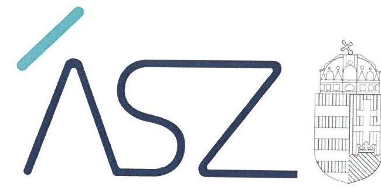

ÁLLAMI SZÁMVEVŐSZÉK

# JELENTÉS 

## A központi költségvetési szervek ellenőrzése

Magyar Táncművészeti Egyetem
2022.

22055
www.asz.hu

---

ÁLLAMI SZÁMVEVŐSZÉK

# JELENTÉS 

A központi költségvetési szervek ellenőrzése

Magyar Táncművészeti Egyetem

22055
www.asz.hu

---

|  AZ ELLENŐRZÉST VEZETTE ÉS A VÉGREHAJTÁSÁÉRT FELELŐS: |  |  |  |  |   |
| --- | --- | --- | --- | --- | --- |
|   |  |  |  |  | SZAPPANOS JÚLIA ellenőrzésvezető  |
|   |  |  |  |  | JANIK JÓZSEF ellenőrzésvezető  |
|   |  |  |  |  | A PROGRAM ÖSSZEÁLLÍTÁSÁÉRT FELELŐS:  |
|   |  |  |  |  | NAGY ADRIENN projektvezető  |
|   |  |  |  |  | DÁM-POLYÁK ORSOLYA projektvezető  |
|   |  |  |  |  | A TÉMÁHOZ KAPCSOLÓDÓ KORÁBBI SZÁMVEVŐSZÉKI JELENTÉSEK:  |
|   |  |  |  | - címe: | Jelentés a Magyar Táncművészeti Főiskola ellenőrzéséről – Az állami felsőoktatási intézmények gazdálkodásának, működésének ellenőrzése  |
|   |  |  |  | - sorszáma: | 14205  |
|  Jelentéseink az Országgyűlés számítógépes hálózatán és az interneten a www.asz.hu címen is olvashatóak. |  |  |  | - címe: | Jelentés – Az állami felsőoktatási intézmények gazdálkodásának, működésének ellenőrzéséről készült jelentések utóellenőrzése – Magyar Táncművészeti Főiskola  |
|   |  |  |  | - sorszáma: | 17049  |
|   |  |  |  |  | IKTATÓSZÁM: EL-3785-001/2022.  |
|   |  |  |  |  | TÉMASZÁM: 2549  |
|   |  |  |  |  | ELLENŐRZÉS-AZONOSÍTÓ SZÁM: V0926  |

---

# TARTALOMJEGYZÉK 

■ÖSSZEGZÉS ..... 5
—■AZ ELLENŐRZÉS CÉLJA ..... 6
—■AZ ELLENŐRZÉS TERÜLETE ..... 7
—■AZ ELLENŐRZÉS HÁTTERE, INDOKOLTSÁGA ..... 8
—■A JELENTÉS LÉNYEGES KÉRDÉSKÖREI ..... 9
—■AZ ELLENŐRZÉS HATÓKÖRE ÉS MÓDSZEREI ..... 10
—■ MEGÁLLAPÍTÁSOK ..... 12
—■ MELLÉKLETEK ..... 15
I. sz. melléklet: Értelmező szótár ..... 15
—■ FÜGGELÉK: ÉSZREVÉTELEK ..... 17
—■ RÖVIDÍTÉSEK JEGYZÉKE ..... 19

---

.

---

# ÖSSZEGZÉS 

Az Állami Számvevőszék 2018. évtől a 2021. évi fenntartóváltást megelőző időszakra végzett ellenőrzése megállapította, hogy a Magyar Táncművészeti Egyetemnél a vagyongazdálkodási keretek kialakítása megfelelt a jogszabályi előírásoknak. Az Egyetem beszámolási kötelezettségének eleget tett. A beszámolók mérlegtételeinek leltárral történő alátámasztása 2019-2020. években nem volt igazolt, a záró beszámoló esetében igazolt volt. A szervezeti teljesítmény méréséhez az Egyetem meghatározott célokat, azokat mérte és értékelte.

## Az ellenőrzés társadalmi indokoltsága

Az államháztartás központi alrendszerébe tartozó szervezet vagyona a nemzeti vagyon része. Magyarország Alaptörvénye rögzíti, hogy a vagyonnal való gazdálkodás célja a közérdek szolgálata. Magyarország versenyképessége szoros kapcsolatban van a felsőoktatás minőségével, amely nem képzelhető el hatékony és eredményes közpénz felhasználás nélkül. Az ellenőrzött időszakban a Magyar Táncművészeti Egyetem az államháztartás központi alrendszerébe tartozó szervezet volt.

Az ellenőrzést indokolja az is, hogy a Magyar Táncművészeti Egyetem a felsőoktatási modellváltással érintett intézmények közé tartozik, 2021. augusztus 1-től a Magyar Táncművészeti Egyetem fenntartója a Magyar Táncművészeti Egyetemért Alapítvány. Az Egyetem fenntartói jogait, amelyeket addig az állam nevében az illetékes miniszter gyakorolt, a kormány által létrehozott közérdekű vagyonkezelő alapítvány vette át, és azokat az alapítvány kuratóriuma gyakorolja.

Az Állami Számvevőszék tanácsadó funkciója keretében az ellenőrzési megállapításokon keresztül támogatja a közfeladat ellátását szolgáló vagyonnal való szabályos gazdálkodást.

## Főbb megállapítások, következtetések

A Magyar Táncművészeti Egyetemnél a vagyongazdálkodás szabályozottságát a kialakított számviteli politika, eszközök és a források értékelési szabályzata, eszközök és a források leltárkészítési és leltározási szabályzata, önköltségszámítás rendjére vonatkozó szabályzat és további, a gazdálkodás rendjére vonatkozó szabályzatok támogatták.

A Magyar Táncművészeti Egyetem a 2018-2020 közötti időszakban az éves költségvetési beszámolókat, valamint a 2021. évi fenntartóváltáshoz kapcsolódóan a jogszabályban előírt záró beszámolót elkészítette. A 2019-2020. években az Egyetem a beszámolókban kimutatott eszközök és források állományának leltárral való alátámasztottsága szabályszerűségét nem igazolta. A záró beszámoló elkészítéséhez a leltár összeállításáról gondoskodott.

A Magyar Táncművészeti Egyetem kialakította a teljesítményelv érvényesülésének feltételeit jelentő célokat, követelményeket. A teljesítménycélok megvalósulását mérték és értékelték, amivel megteremtették a feltételeket ahhoz, hogy a szervezet a kitűzött célok irányába haladjon.

---

# AZ ELLENŐRZÉS CÉLJA 

ményeinek érvényesítése megtörtént-e.

AZ ELLENŐRZÉS CÉLJA annak értékelése, hogy az államháztartás központi alrendszerébe tartozó közpénzekkel gazdálkodó szervezet gazdálkodását elszámoltathatóan végzi-e. Az ellenőrzés értékeli továbbá, hogy sor került-e az ellenőrzött szervezetnél az eredményesség, a hatékonyság és a gazdaságosság követelményeinek érvényesülését biztosító, mérhető, nyomon követhető teljesítménycélok kitűzésére, teljesítménykövetelmények kialakítására, illetve hogy az ellenőrzött időszakban a teljesítménycélok mérése, értékelése, az eredményesség, a hatékonyság és a gazdaságosság követel-

---

# **AZ ELLENŐRZÉS TERÜLETE**

## **Magyar Táncművészeti Egyetem**

A Magyar Táncművészeti Egyetem1 jogelődjét, az 54/1951. (II. 25.) MT. sz. rendelettel alapított Állami Balett Intézetet az 1983. évi 18. tvr. minősítette főiskolává 1983. szeptember 1-től. A Magyar Táncművészeti Főiskola elnevezést az 1048/1990. (III. 21.) MT számú határozat állapította meg 1990. július 1-i hatállyal. Az oktatás szabályozására vonatkozó egyes törvények módosításáról szóló 2016. évi CXXVI. törvény 2017. február 1-től az intézmény részére egyetemi rangot biztosított, megnevezését Magyar Táncművészeti Egyetemként határozta meg. Az Egyetem cél szerinti alaptevékenysége az oktatás, tudományos kutatás, előadóművészeti- és alkotóművészeti tevékenység.

Az Egyetem fenntartója az ellenőrzött időszakban az Emberi Erőforrások Minisztériuma, majd 2019. szeptember 1-től az Innovációs és Technológiai Minisztérium volt. A Magyar Táncművészeti Egyetem fenntartója 2021. augusztus 1. napjától a Magyar Táncművészeti Egyetemért Alapítvány lett. A Magyar Táncművészeti Egyetemért Alapítványról a 2021. évi XVII. törvény rendelkezett.

Az Egyetem vezető testülete a Szenátus, annak elnöke a rektor, mint első számú vezető volt. Az Egyetem a 2021. évi fenntartó váltásig az államháztartás központi alrendszerébe tartozó költségvetési szerv volt, annak működtetését az Nftv.2 13/A. § felhatalmazása alapján a kancellár végezte. Az ellenőrzött időszakban a rektor személye egy alkalommal változott, a kancellár személye nem változott.

---

# AZ ELLENŐRZÉS HÁTTERE, INDOKOLTSÁGA 

Az államháztartás központi alrendszerébe tartozó szervezet vagyona a nemzeti vagyon része, mellyel történő gazdálkodás a közérdek szolgálata érdekében történik. Az ÁSZ ${ }^{3}$ ellenőrzi az éves költségvetési törvény végrehajtását, majd az ellenőrzés során feltárt kockázatok és a terület folyamatos kockázat-elemzésével beazonosított kockázatok kezelése érdekében ráépülő ellenőrzésekkel ellenőrzi a költségvetési szervek gazdálkodását, működését. Ezáltal az ellenőrzések megállapításaival támogatja az ellenőrzött szervezetek szabályszerű gazdálkodását, javaslataival elősegíti az Alaptörvényben megfogalmazott alapvetések érvényesülését a mindennapi életben a szervezetek szintjén.

A központi költségvetés rendszerében zajló folyamatok holisztikus elemzései, a kockázatok folyamatos figyelemmel kísérésének módszerével, az így kiválasztott szervezetek célzott, hatékony ellenőrzéseivel az ÁSZ betölti a legfőbb gazdasági ellenőrző szerv küldetését.

Az egyes ellenőrzések megállapításaival és egy időszak ellenőrzési eredményeinek elemzésével az ÁSZ ráirányíthatja a jogalkotók figyelmét a központi alrendszerben vagy annak egy ágazatában esetlegesen felmerülő vagyongazdálkodási, szabályozási feszültségekre.

---

# A JELENTÉS LÉNYEGES KÉRDÉSKÖREI 

1. Biztosított volt-e a vagyongazdálkodás szabályozottsága?
2. A nemzeti vagyon kimutatását szabályszerűen végezték-e?
3. Az Egyetem a fenntartóváltás során elkészítette-e a záró beszámolót?
4. A központi költségvetési szerv rendelkezett-e szervezeti teljesítménycélokkal, a központi költségvetési szerv vezetője kialakította-e és érvényesítette-e a szervezeti teljesítmény mérésére alkalmas követelményeket?

---

# AZ ELLENŐRZÉS HATÓKÖRE ÉS MÓDSZEREI 

## Az ellenőrzés típusa

Megfelelőségi ellenőrzés és teljesítmény-ellenőrzés.

## Az ellenőrzött időszak

A 2018-2020. évek, továbbá 2021. január 1-jétől a felsőoktatási intézmény Nftv. szerinti fenntartóváltásának napját (2021. augusztus 1.) megelőző időszak, a 4. lényeges kérdéskör teljesítmény-ellenőrzés tekintetében a 2020. év.

## Az ellenőrzés tárgya

A központi költségvetési szerv vagyongazdálkodási feltételeinek kialakítása, annak szabályszerűsége, az elszámoltathatóság biztosítása a szabályozás szintjén. Az intézmény könyveiben, mérlegében kimutatott nemzeti vagyon nyilvántartásának szabályszerűsége, vagyon kimutatása, értékelése és a mérleg leltárral való alátámasztásának szabályszerűsége. A felsőoktatási intézmény záró beszámolójában kimutatott nemzeti vagyon kimutatása és a mérleg leltárral való alátámasztásának szabályszerűsége. Az ellenőrzött szervezetnél kialakított, az eredményesség, a hatékonyság és a gazdaságosság követelményeinek érvényesülését biztosító, mérhető, nyomon követhető teljesítménycélok, valamint az azokhoz meghatározott célértékek, teljesítménykövetelmények meghatározása; a célok megvalósulásának mérése, értékelése; az eredményesség, a hatékonyság és a gazdaságosság követelményeinek érvényesítése a jogszabályi előírások alapján elkészítendő dokumentumokban.

## Az ellenőrzött szervezet

Magyar Táncművészeti Egyetem

## Az ellenőrzés jogalapja

Az ellenőrzés jogszabályi alapját az ÁSZ tv. ${ }^{4}$ 1. § (3) bekezdés, 5. § (2)-(3)(4) és (6) bekezdései, valamint az Áht. ${ }^{5}$ 61. § (2) bekezdésének előírásai képezik.

---

# Az ellenőrzés módszerei 

Az ÁSZ az ellenőrzést az ellenőrzési program szempontjai, az ellenőrzött időszakban hatályos jogszabályok, az ellenőrzés szakmai szabályai, a jelen ellenőrzésre irányadó ÁSZ módszertanok figyelembevételével hajtja végre. Az ellenőrzés során az ellenőrzött szervezettel történő kapcsolattartást az ÁSZ a szervezeti és működési szabályzatának vonatkozó előírásai alapján biztosítja.

Az ellenőrzési kérdések megválaszolásához szükséges bizonyítékok megszerzése az ellenőrzött szervezet által rendelkezésre bocsátott dokumentumokra és adatokra alapozva, továbbá megfigyelés, szemle (szemrevételezés), kérdésfeltevés (információkérés), érték alapján szűkített, lényeges sokaságon végrehajtott mintavétellel, valamint elemző eljárás útján történik. Az ellenőrzési bizonyítékként felhasználható adatforrások közé tartoznak az ellenőrzési program részletes szempontjainál felsorolt adatforrások, valamint minden egyéb - az ellenőrzés folyamán feltárt, az ellenőrzés szempontjából információt tartalmazó - dokumentum. Az ellenőrzés lefolytatásához az ellenőrzött szervezet az ÁSZ által kért dokumentumok rendelkezésre bocsátásával szolgáltat adatokat, amelyekről az ellenőrzött szervezet vezetője teljességi és hitelességi nyilatkozatot állít ki. A rendelkezésre bocsátott dokumentumok, adatok és információk kontrollja az ellenőrzés keretében történik.

Az ellenőrzés részét képezi a szabályszerűségi ellenőrzésre épülő teljesítmény-ellenőrzés, melynek keretében az ÁSZ arra fókuszál, hogy a központi költségvetési szervek a jogszabályi előírások alapján elkészítendő dokumentumokban, vagy más egyéb, nem jogszabály által meghatározott dokumentumokban alakítottak-e ki és érvényesítették-e a szervezet teljesítményének mérésére alkalmas követelményeket.

---

# 1. Biztosított volt-e a vagyongazdálkodás szabályozottsága? 

## Összegző megállapítás

A vagyongazdálkodás szabályozottsága a 2018-2020. években biztosított volt.

AZ EGYETEM a 2018-2020. években rendelkezett számviteli politikával, az eszközök és a források értékelési szabályzatával, az eszközök és a források leltárkészítési és leltározási szabályzatával, önköltségszámítás rendjére vonatkozó szabályzattal. Rendelkezett továbbá gazdálkodási szabályzattal, kötelezettségvállalási és utalványozási szabályzattal, gépjárművek igénybevételének, használatának rendjével. Az anyag és eszközgazdálkodás számviteli politikában nem szabályozott kérdéseit a 2019. január 30-tól hatályos belső szabályzatban rendezte.
Az Egyetem rendelkezett számlarenddel, azonban a számlarend
$\longrightarrow$ a Számv.tv. ${ }^{6}$ 161. § (2) bekezdés a) pontjában és az Áhsz. ${ }^{7}$ 51. § (2) bekezdésében előírtak ellenére nem tartalmazta minden alkalmazásra kijelölt számla számjelét és megnevezését,
$\longrightarrow$ az Áhsz. 51. § (3) bekezdésében előírtak ellenére nem szabályozta az összesítő bizonylat tartalmi és formai követelményeit.

## 2. A nemzeti vagyon kimutatását szabályszerűen végezték-e?

Összegző megállapítás

Az Egyetem a beszámolási kötelezettségének
 eleget tett. A mérlegsorokat alátámasztó leltárak teljeskörűsége a 2018. évben nem volt igazolt. A 2019-2020. években az Egyetem a mérleg leltárral való alátámasztottságának szabályszerűségét nem igazolta.

A 2018-2020. években az Egyetem az éves költségvetési beszámolókat elkészítette. A beszámolókban és a számviteli nyilvántartásokban kimutatott eszközök és források állományának valódiságát a 2018. évben a Nemzeti vagyonba tartozó befektetett eszközök tekintetében támasztotta alá leltárral. Az ellenőrzés során az Egyetem nem igazolta a 2019-2020. évek beszámolója alátámasztását az Áhsz. 5. § (1) bekezdésében és 22. § (1) bekezdésében, valamint a Számv.tv. 69. § (1) bekezdésében előírtak szerinti leltárral.

A kötelezettségvállalási és teljesítésigazolási gazdálkodási jogkörökre jogosultakról és aláírás mintájukról az előírt, naprakész nyilvántartást vezették.

---

# 3. Az Egyetem a fenntartóváltás során elkészítette-e a záró beszámolót? 

## Összegző megállapítás

A fenntartóváltás során az Egyetem a záró beszámolót elkészítette.

Az Egyetem elkészítette a fenntartóváltás napját megelőző fordulónappal a záró beszámolót az Nftv. 117/C. § (4a) bekezdésének rendelkezésével összhangban. A mérleg tételeinek alátámasztásához, a beszámoló elkészítéséhez a leltár összeállításáról gondoskodott.

## 4. A központi költségvetési szerv rendelkezett-e szervezeti teljesítménycélokkal, a központi költségvetési szerv vezetője kialakította-e és érvényesítette-e a szervezeti teljesítmény mérésére alkalmas követelményeket?

Összegző megállapítás Az Egyetem rendelkezett szervezeti teljesítménycélokkal, kialakította és érvényesítette a teljesítmény mérésére alkalmas követelményeket.

Az Egyetemen meghatároztak szervezeti teljesítménycélokat, kialakították a szervezeti teljesítmény mérésére alkalmas követelményeket. Az Egyetem Intézményfejlesztési tervében részletesen meghatározta a stratégiai irányokat, stratégiai célokat, és számszerűsített teljesítménymutatókat.

A szervezeti teljesítménycélok megvalósulását mérték, a mérések eredményeit értékelték, a teljesítmény-követelmények értékelése megtörtént.

---

.

---

# MELLÉKLETEK 

- I. SZ. MELLÉKLET: ÉRTELMEZŐ SZÓTÁR
állami vagyon
állami vagyonnak minősül:
a) az állam tulajdonában lévő dolog, valamint a dolog módjára hasznosítható természeti erő,
b) az a) pont hatálya alá nem tartozó mindazon vagyon, amely vonatkozásában törvény az állam kizárólagos tulajdonjogát nevesíti,
c) az állam tulajdonában lévő tagsági jogviszonyt megtestesítő értékpapír, illetve az államot megillető egyéb társasági részesedés,
d) az államot megillető olyan immateriális, vagyoni értékkel rendelkező jogosultság, amelyet jogszabály vagyoni értékű jogként nevesít,
e) az állam tulajdonában álló a befektetési vállalkozásokról és az árutőzsdei szolgáltatókról, valamint az általuk végezhető tevékenységek szabályairól szóló 2007. évi CXXXVIII. törvény szerinti pénzügyi eszköz,
f) azon országgyűlési képviselőről, aki más, Alaptörvényben nevesített közjogi tisztséget is betöltve közfeladatot lát el, e közfeladata ellátása körében vagy ezzel összefüggésben, költségvetési forrásból készített, szerzői vagy szomszédos jogi védelmet élvező műhöz vagy teljesítményhez, különösen kép-, illetve hangfelvételhez kapcsolódó, felhasználási szerződés útján vagy a szerzői jogról szóló törvény alapján meg-szerzett felhasználási engedély, illetve vagyoni jog.
(Forrás: Vtv. ${ }^{8}$ 1. § (2) bekezdése)
Az állami tulajdonában álló vagyon tekintetében - a nemzeti vagyonról szóló törvényben vagyonkezelőként meghatározott azon személy, amellyel az állami vagyon vagyonkezelésére a Magyar Nemzeti Vagyonkezelő Zrt. valamint annak jogelődje, vagy az állami tulajdonosi joggyakorlója vagyonkezelési szerződést kötött, továbbá akit törvény vagyonkezelőnek kijelölt. (Forrás: Vtvr. ${ }^{9}$ 1. § (7) bekezdés b) pontja és az Nvtv. ${ }^{10}$ 3. § (1) bekezdés § 19. a) pontja)
a nemzeti vagyon birtoklásából, használatából, hasznai szedéséből, a nemzeti vagyon fenntartásából és üzemeltetéséből álló tevékenységek együttese, amely - jogszabály vagy szerződés alapján - a nemzeti vagyon felújítására, fejlesztésére, a birtoklásának, használatának hasznai szedése jogának továbbengedésére is kiterjedhet. (Forrás: Nvtv. 3. § (1) bekezdés 10. pontja)

---

nemzeti vagyon

Nemzeti vagyonba tartozik:
a) az állam vagy a helyi önkormányzat kizárólagos tulajdonában álló dolgok,
b) az a) pont hatálya alá nem tartozó, az állam vagy a helyi önkormányzat tulajdonában lévő dolog,
c) az állam vagy a helyi önkormányzat tulajdonában lévő pénzügyi eszközök, továbbá az államot vagy a helyi önkormányzatot megillető társasági részesedések,
d) az államot vagy a helyi önkormányzatot megillető bármely vagyoni értékkel rendelkező jogosultság, amelyet jogszabály vagyoni értékű jogként nevesít,
e) Magyarország határa által körbezárt terület feletti légtér,
f) az üvegházhatású gázok kibocsátási egységeinek kereskedelméről szóló törvény szerinti kibocsátási egység és légiközlekedési kibocsátási egység, valamint az ENSZ Éghajlatváltozási Keretegyezménye és annak Kiotói Jegyzőkönyve végrehajtási keretrendszeréről szóló törvény szerinti kiotói egység,
g) állami vagy helyi önkormányzati fenntartású közgyűjtemény (muzeális intézmény, levéltár, közgyűjteményként múködő kép- és hangarchívum, valamint könyvtár) saját gyűjteményében nyilvántartott kulturális javak körébe tartozó dolog, kivéve, ha a dolog más tulajdonában áll,
h) a régészeti lelet,
i) a nemzeti adatvagyon körébe tartozó állami nyilvántartások fokozottabb védelméről szóló törvény szerinti nemzeti adatvagyon. (Forrás: Nvtv. 1. § (2) bekezdés a)-i) pontok)
vagyongazdálkodás

A nemzeti vagyongazdálkodás feladata a nemzeti vagyon megőrzése, értékének és állagának védelme, rendeltetésének megfelelő, az állam, az önkormányzat mindenkori teherbíró képességéhez igazodó, elsődlegesen a közfeladatok ellátásához és a mindenkori társadalmi szükségletek kielégítéséhez szükséges, egységes elveken alapuló, átlátható, hatékony és költségtakarékos működtetése, értéknövelő használata, hasznosítása, gyarapítása, továbbá az állam vagy a helyi önkormányzat feladatának ellátása szempontjából feleslegessé váló vagyontárgyak elidegenítése, azzal, hogy a nemzeti vagyon megőrzése érdekében végzett bontás vagy átalakítás nem minősül az állagvédelmi kötelezettség megszegésének. A kiemelt kulturális örökségvédelmi és természetvédelmi szempontok - kulturális és természeti értékek jövő nemzedékek számára való megőrzése érdekében történő - érvényesítésének nem akadálya a vagyon értékváltozása. (Forrás: Nvtv. 7. § (2) bekezdése)

---

# FÜGGELÉK: ÉSZREVÉTELEK 

A jelentéstervezetet a Számvevőszék 15 napos észrevételezésre megküldte az ellenőrzött szervezet vezetőjének az ÁSZ tv. 29. § (1) bekezdése előírásának megfelelően.

A Magyar Táncművészeti Egyetem rektora az ellenőrzés megállapításaira nem tett észrevételt.

[^0]
[^0]:    * 29. § (1) Az Állami Számvevőszék az ellenőrzési megállapításait megküldi az ellenőrzött szervezet vezetőjének vagy az általa megbízott személynek, és annak, akinek személyes felelősségét állapította meg.
    (2) Az ellenőrzött szervezet vezetője és a felelősként megjelölt személy az ellenőrzés megállapításaira tizenöt napon belül írásban észrevételt tehet.
    (3) Az Állami Számvevőszék az észrevételre a beérkezésétől számított harminc napon belül írásban válaszol. A figyelembe nem vett észrevételeket köteles a jelentésben feltüntetni, és megindokolni, hogy azokat miért nem fogadta el.

---

.

---

# RÖVIDÍTÉSEK JEGYZÉKE 

${ }^{1}$ Egyetem
${ }^{2}$ Nftv.
${ }^{3}$ ÁSZ
${ }^{4}$ ÁSZ tv.
${ }^{5}$ Áht.
${ }^{6}$ Számv.tv.
${ }^{7}$ Áhsz.
${ }^{8} \mathrm{Vtv}$.
${ }^{9}$ Vtvr.
${ }^{10} \mathrm{Nvtv}$.

Magyar Táncművészeti Egyetem
Nemzeti felsőoktatásról szóló 2011. évi CCIV. törvény (hatályos: 2012. január 1-jétől)
Állami Számvevőszék
Az Állami Számvevőszékről szóló 2011. évi LXVI. törvény
2011. évi CXCV. törvény az államháztartásról (hatályos 2011. december 31-től)
2000. évi C. törvény a számvitelről (hatályos: 2001. január 1-jétől)
4/2013. (I. 11.) Korm. rendelet az államháztartás számviteléről (hatályos: 2014. január 1-jétől)
2007. évi CVI. törvény az állami vagyonról (hatályos 2007. szeptember 25-től)
254/2007. (X. 4.) Korm. rendelet az állami vagyonnal való gazdálkodásról (hatályos: 2007. október 4-től)
2011. évi CXCVI. törvény a nemzeti vagyonról (hatályos: 2011. december 31-től)

---

# ÁSZ 

ÁLLAMI SZÁMVEVŐSZÉK
1052 Budapest, Apáczai Cs. J. u. 10. I 1364 Budapest 4. Pf. 54 TEL: +36 14849100
email: szamvevoszek@asz.hu
web: www.asz.hu | www.aszhirportal.hu
