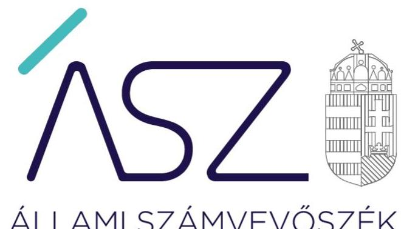
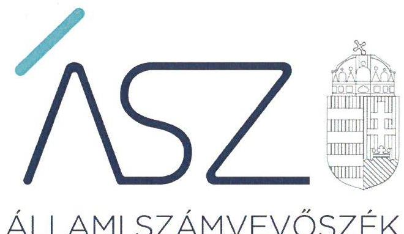
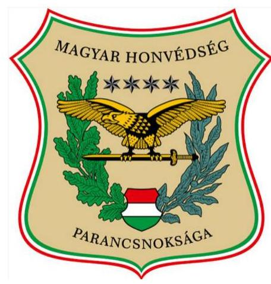

ÁLLAMI SZÁMVEVŐSZÉK

# JELENTÉS 

## Központi költségvetési szervek ellenőrzése

Középirányítói szervek ellenőrzése
Magyar Honvédség Parancsnoksága
2022.

22057
www.asz.hu

---

ÁLLAMI SZÁMVEVŐSZÉK

# JELENTÉS 

## Központi költségvetési szervek ellenőrzése

Középirányítói szervek ellenőrzése
Magyar Honvédség Parancsnoksága

22057
www.asz.hu

---

# AZ ELLENŐRZÉST VEZETTE ÉS A VÉGREHAJTÁSÁÉRT FELELŐS: 

DR. KOVÁCS DIÁNA ellenőrzésvezető
DR. DOMOKOS MAGDOLNA ellenőrzésvezető

A PROGRAM ÖSSZEÁLLÍTÁSÁÉRT FELELŐS:
SZABÓ CECÍLIA programkészítéséért felelős vezető

Jelentéseink az Országgyűlés számítógépes hálózatán és az interneten a www.asz.hu címen is olvashatóak.

IKTATÓSZÁM: EL-3596-021/2022
TÉMASZÁM: 26/3
ELLENŐRZÉS-AZONOSÍTÓ SZÁM: V0958

---

# TARTALOMJEGYZÉK 

■ ÖSSZEGZÉS ..... 5
■ AZ ELLENŐRZÉS CÉLJA ..... 6
■ AZ ELLENŐRZÉS TERÜLETE ..... 7
■ AZ ELLENŐRZÉS HÁTTERE, INDOKOLTSÁGA ..... 8
■ A JELENTÉS LÉNYEGES KÉRDÉSKÖREI ..... 9
■ AZ ELLENŐRZÉS HATÓKÖRE ÉS MÓDSZEREI ..... 10
■ MEGÁLLAPÍTÁSOK ..... 12
■ MELLÉKLETEK ..... 17
I. sz. melléklet: Értelmező szótár ..... 17
■ FÜGGELÉK: ÉSZREVÉTELEK ..... 19
■ RÖVIDÍTÉSEK JEGYZÉKE ..... 21

---

.

---

# ÖSSZEGZÉS 

A 2021. évben a Magyar Honvédség Parancsnoksága az ellenőrzéssel érintett, irányító szerve által az irányítási jogkör vonatkozásában átruházott feladatait, középirányító szervként az ellenőrzött gazdálkodás-irányítási feladatait szabályszerűen ellátta. A Magyar Honvédség Parancsnoksága a 2019-2021. években a vagyongazdálkodás szabályozási kereteit kialakította, beszámolási kötelezettségének eleget tett.

## Az ellenőrzés társadalmi indokoltsága

A középirányító szervek az irányító szerv által az irányítási jogkör vonatkozásában átruházott feladataik ellátásával elősegítik az alárendeltségükbe tartozó költségvetési szervek közfeladatainak szabályszerű és hatékony ellátását. Ezzel hozzájárulnak ahhoz, hogy mind az intézményekre, mind a középirányító szervi feladatok ellátására fordított közpénzek, a rájuk bízott nemzeti vagyon cél szerint hasznosuljanak, működésük átlátható és elszámoltatható legyen. Ezek alapján a közpénzügyek átláthatóságának előmozdítása és a közvagyon védelme érdekében szükséges a középirányító költségvetési szervek feladatellátásának ellenőrzése.

## Főbb megállapítások, következtetések

A 2021. évben a Magyar Honvédség Parancsnoksága (a továbbiakban MHP) ellátta az irányító szerve által átruházott, az alárendeltségébe tartozó katonai szervezetek jelentéstételre, beszámolásra kötelezéséhez kapcsolódó feladatokat, valamint e katonai szervezeteknél belső ellenőrzés keretében ellenőrzést végzett.

A 2019-2021. években az MHP a vagyongazdálkodás területén az ellenőrzött szabályozásokat kialakította. Az MHP az előírt szabályok szerint rendelkezett a gazdálkodás részletes rendjét meghatározó szabályozással, számviteli politikával és az annak keretében elkészítendő szabályzatokkal. Az MHP a 2019-2021. években az éves költségvetési beszámolókat elkészítette, melyek alátámasztására főkönyvi kivonattal, a mérleg összes tételének alátámasztására - a 2019. évben a passzív időbeli elhatárolásokat kivéve - összeállított leltárral rendelkezett.

A 2021. évben az MHP középirányító szervként gazdálkodás-irányítási feladatellátásának körében meghatározta a középirányítói feladatokat ellátó szervezeti egységeinek működési rendjét. Az MHP az egyes szakterületekhez kapcsolódóan előírta a költségvetés tervezési szabályait, továbbá középirányítói feladatairól negyedévente beszámolót készített a HM¹ részére. Az MHP a jogszabályok alapján az alárendeltségébe tartozó katonai szervezetek vonatkozásában elosztotta a kiadási és bevételi tervezési kereteket, jóváhagyta az elemi költségvetési javaslatot, a zárszámadáshoz kapcsolódóan elrendelte az évvégi leltározást, a jóváhagyott költségvetési létszámkeretet lebontotta, és meghatározta a személyi juttatások és járulékok tervezési kereteit.

---

# AZ ELLENŐRZÉS CÉLJA 

AZ ELLENŐRZÉS CÉLJA annak értékelése, hogy a központi költségvetési szervek körébe tartozó, középirányítói feladatokat ellátó MHP² feladatellátása szabályszerű volt-e.

---

# **AZ ELLENŐRZÉS TERÜLETE**

### **Magyar Honvédség Parancsnoksága**

Az MHP a HM minisztere által 2019. január 1-jei hatállyal alapított központi költségvetési szerv, melynek alaptevékenysége Magyarország függetlenségének, területi épségének és határainak katonai védelme, a nemzetközi szerződésből eredő közös védelmi és békefenntartó feladatok ellátása, valamint a nemzetközi jog szabályaival összhangban humanitárius tevékenység végzése.

Az MHP az MH³ Hadrendjébe tartozó önálló állománytáblával rendelkező katonai szervezet. Az MH PK⁴ egyszemélyi vezetőként vezeti az MHP-t. Az ellenőrzött időszakon belül 2021. június 3-i hatállyal változás történt az MH PK személyében, akit a honvédelmi miniszter javaslatára a köztársasági elnök nevez ki. A 290/2011. (XII. 22.) Korm. rendelet⁵ 2019. január 1-jétől hatályos 12. §-a alapján az MHP az Áht.⁶ szerinti középirányító szerve az alárendeltségébe tartozó, költségvetési szervként működő katonai szervezeteknek. Az MHP átruházott irányítói feladatai körébe tartozik a költségvetési szerv szervezeti és működési szabályzatának jóváhagyása, a költségvetési szerv gazdasági vezetőjének kinevezése vagy megbízása, felmentése vagy megbízásának visszavonása, a költségvetési szerv tevékenységének hatékonysági ellenőrzése, valamint törvényességi, szakszerűségi szempontú pénzügyi ellenőrzése, jogszabályban meghatározott esetekben a költségvetési szerv döntéseinek előzetes vagy utólagos jóváhagyása, egyedi utasítás kiadása feladat elvégzésére vagy mulasztás pótlására, valamint jelentéstételre vagy beszámolásra való kötelezése.

A honvédelmi szervezetek működési, gazdálkodási rendjére az általános államháztartási gazdálkodási szabályokon túl sajátos előírások érvényesülnek. A 346/2009. (XII. 30.) Korm. rendelet⁷ 2. § (1)-(2) bekezdés előírása szerint a honvédelmi szervezetek gazdálkodása és ellátása intézményi, illetve térítés-mentes természetbeni ellátáson alapuló központi gazdálkodás és ellátás keretében valósul meg. A központi gazdálkodás a honvédelmi szervezetek feladatai ellátásához szükséges erőforrások tervezésére, beszerzésére, felhasználására és kezelésére, valamint a központi költségvetés XIII. fejezete költségvetési előirányzatai tervezésére, felhasználására, módosítására és átcsoportosítására, továbbá beszámolására, a könyvvezetésre és az adatszolgáltatásra irányuló gazdálkodási tevékenységek összessége, amelyeket az erre kijelölt honvédelmi szervezetek végeznek. Az MHP esetében a dologi költségvetési előirányzatok, illetve a vagyonbiztosítás tekintetében felmerülő feladatokat az ellenőrzött időszakban más kijelölt költségvetési szerv látta el. Az MHP nemzeti vagyonba tartozó befektetett eszközzel, nemzeti vagyonba tartozó forgóeszközzel nem rendelkezett, a beszámolók szerint teljesített éves bevételét és kiadását, a könyvviteli mérleg szerinti pénzeszközök, a követelések és kötelezettségek állományi értékét az 1. táblázat mutatja be.

|  táblázat |  |  |  |  | adatok- Ft  |
| --- | --- | --- | --- | --- | --- |
|  Év | Bevételek | Kiadások | Pénzeszközök | Követelések | Kötelezettségek  |
|  2019. | 5 744 125 025 | 5 744 081 431 | 2 278 145 | 61 958 528 | 2 234 551  |
|  2020. | 6 439 447 893 | 6 416 696 874 | 9 695 076 | 49 204 507 | 6 944 057  |
|  2021. | 6 631 376 416 | 6 631 360 416 | 6 069 265 | 53 153 352 | 6 053 265  |
|   |  |  |  |  | Forrás: MHP beszámolói  |

---

# AZ ELLENŐRZÉS HÁTTERE, INDOKOLTSÁGA 

A középirányító szervi feladatokat ellátó központi költségvetési szervek ellenőrzésével az ÁSZ hozzájárul az intézményrendszer szabályszerűbb, eredményesebb és hatékonyabb feladatellátásához, gazdálkodásához. Az elvégzett ellenőrzések során az ÁSZ „jó gyakorlatokat" is azonosíthat, amelyeket tanácsadó funkciója keretében szélesebb körben - a középirányító szervekkel és az irányító szervekkel - is megismertet, ezáltal is hozzájárulva a költségvetési rendszer szabályozott, átlátható, kiegyensúlyozott működéséhez.

---

# A JELENTÉS LÉNYEGES KÉRDÉSKÖREI 

1. Az MHP ellátta-e az irányító szerve által átruházott ellenőrzési, jelentéstételre és beszámolásra kötelezési feladatokat?
2. Az MHP hogyan látta el a vagyongazdálkodás egyes feladatait?
3. Az MHP hogyan látta el a középirányítói feladatait az ellenőrzött területeken?

---

# AZ ELLENŐRZÉS HATÓKÖRE ÉS MÓDSZEREI 

## Az ellenőrzés típusa

Szabályszerűségi ellenőrzés.

## Az ellenőrzött időszak

Az 1. és a 3. lényeges kérdéskör vonatkozásában a 2021. év. A 2. lényeges kérdéskör vonatkozásában a 2019-2021. évek.

## Az ellenőrzés tárgya

Az ellenőrzés tárgyát képezi az MHP középirányítói feladatának ellátása az ellenőrzött területek vonatkozásában.

## Az ellenőrzött szervezet

MHP mint középirányítói feladatokat ellátó központi költségvetési szerv

## Az ellenőrzés jogalapja

Az ellenőrzés jogalapját az Állami Számvevőszékről szóló 2011. évi LXVI. törvény 1. § (3) bekezdésének, 5. § (2)-(3) bekezdésének, a (4) bekezdés a) pontjának és a (6) bekezdésének, valamint az Áht. szerinti 61. § (2) bekezdésének előírásai képezik.

## Az ellenőrzés módszerei

Az ellenőrzés végrehajtása az ellenőrzési program szempontjai, kérdéskörei, az ellenőrzött időszakban hatályos jogszabályok, az ellenőrzés szakmai szabályai, az Állami Számvevőszék (ÁSZ) megfelelőségi ellenőrzési módszertana alapján történik.

Az ellenőrzés ideje alatt az ellenőrzött szervezettel történő kapcsolattartás az ÁSZ Szervezeti és Működési Szabályzatának vonatkozó előírásai alapján valósul meg.

Az ellenőrzési kérdések megválaszolásához szükséges bizonyítékok megszerzése az ellenőrzött által rendelkezésre bocsátott dokumentumokra, adatokra alapozva megfigyelés, szemle (szemrevételezés), kérdésfeltevés (információkérés), valamint elemző eljárás útján történik.

---

Az ellenőrzési bizonyítékként felhasználható adatforrások közé tartoznak egyrészt az adatbekérő levelek mellékletében szereplő dokumentumok jegyzékében rögzített adatforrások, másrészt minden az ellenőrzés folyamán feltárt, az ellenőrzés szempontjából információt tartalmazó dokumentum.

Az ellenőrzés lefolytatásához az ellenőrzött szervezet az ÁSZ által kért, teljességi és hitelességi nyilatkozattal alátámasztott dokumentumok rendelkezésre bocsátásával szolgáltat adatokat.

---

# 1. Az MHP ellátta-e az irányító szerve által átruházott ellenőrzési, jelentéstételre és beszámolásra kötelezési feladatokat? 

Összegző megállapítás

Az MHP a 2021. évben az ellenőrzéssel érintett, irányító szerve által átruházott feladatokat ellátta, középirányítói hatáskörében az alárendelt katonai szervezeteket jelentéstételre, beszámolásra kötelezte, az alárendelt katonai szervezetei kapcsán ellenőrzési jogkörében a Bkr. szerint végzett ellenőrzést.
1.1. számú megállapítás

Az MHP középirányító szervként a 2021. évben az átruházott irányítói feladatok ellátása körében jelentéstételre, beszámolásra kötelezte az alárendelt katonai szervezeteket a vagyongazdálkodást érintően is.

Az MHP a 2021. évben a 290/2011. (XII. 22.) Korm. rendelet előírása szerint középirányító szervre átruházott irányítási hatáskörének gyakorlása keretében az MHP az alárendelt katonai szervezeteket jelentéstételre, beszámolásra kötelezte, mely magában foglalta a vagyongazdálkodás területét is.

Az MHP 2021. évi Munkaterve⁸ tartalmazta az Információs Kapcsolatok Rendszere keretében a jelentések rendszerét, mely a középirányítói hatáskörbe tartozó katonai szervezetekre is kiterjedően, azok közreműködésével jelentéstételi kötelezettséget határozott meg a létesítés, felújítás, karbantartás, őrzés-védelem, továbbá az ingatlan- és az anyaggazdálkodás vonatkozásában. A Munkaterv tartalmazott továbbá a HM utasításaiban előírtak teljesítésével kapcsolatosan jelentésre való kötelezést, abban való közreműködést az MHP-nek alárendelt katonai szervezetekre vonatkozóan.

A 346/2009. (XII. 30.) Korm. rendelet 2. § d-g) pontjai alapján a központi gazdálkodás és ellátás keretében valósul meg a HM fejezetnél az ingatlanberuházás, a HM vagyonkezelésében lévő ingatlanok felújítása, fenntartása és üzemeltetése, a központi logisztikai beszerzési feladatok ellátása, a honvédelmi szervezet haditechnikai és egyéb eszközökkel, valamint anyagokkal, továbbá közjogi szervezetszabályozó eszközben meghatározott egészségügyi anyagokkal történő ellátása. HM utasításban⁹ rögzítetten a központi logisztikai ellátó szervezetek az MHP középirányítása alá tartozó szervezetek. Az MH PK által kiadott a Magyar Honvédség Parancsnoksága és az alárendeltségébe tartozó honvédségi szervezetek központi és intézményi logisztikai gazdálkodásának rendjéről szóló szakutasítás jelentéstételi kötelezettséget írt elő a központi logisztikai ellátó szervezetek számára az eszköz és szolgáltatásigényekről, a központi raktári készletek helyzetéről.

---

### 1.2. számú megállapítás

Az MHP 2021-ben az alárendelt katonai szervezeteknél a Bkr. előírásai alapján végzett ellenőrzést, melyeket a belső ellenőrzési nyilvántartásában szerepeltetett.

Az ellenőrzött 2021. évben - átruházott irányítási jogkörében - az MHP nem végzett a 290/2011. (XII. 22.) Korm. rendelet szerinti pénzügyi, hatékonysági ellenőrzést, azonban ennek évenkénti, vagy más időbeli gyakoriságára vonatkozó rendelkezést a jogszabály nem tartalmaz.

Az MHP a 2021. évben a Bkr.¹⁰ 21. § (3) bekezdés c) pontjának előírása alapján belső ellenőrzést végzett az alárendeltségébe tartozó katonai szervezeteknél. A honvédelmi miniszter HM utasításban¹¹ történt kijelölése alapján az MHP
 ellenőrzési tevékenysége az intézményi szintű belső ellenőrzésen túl átruházott hatáskörben kiterjedt az MHP középirányítása alá tartozó katonai szervezetekre is a fejezetszintű belső ellenőrzés vonatkozásában. Az MHP a 2021. évben a Bkr. előírásai szerint két ellenőrzést végzett az alárendelt katonai szervezeteknél, melyek tárgya a katonai szervezetek által, csapathatáskörben engedélyezett beszerzési eljárások végrehajtásának szabályossága, valamint az MHP-nál és a középirányítása alá tartozó katonai szervezeteknél az időkeretben történő foglalkoztatáshoz kapcsolódó MH és intézményi szintű folyamatok voltak.

Az MHP a 2021. évben a Bkr. 50. §-a szerint a belső ellenőrzésekről nyilvántartást vezetett, mely tartalmazta a 2021. évben lezárt, alárendelt katonai szervezeteknél végzett ellenőrzéseket.

# 2. Az MHP hogyan látta el a vagyongazdálkodás egyes feladatait? 

Összegző megállapítás

### 2.1. számú megállapítás

Az MHP a 2019-2021. években a vagyongazdálkodás területén ellenőrzött szabályozásokat kialakította, az éves költségvetési beszámolókat elkészítette, a mérleg tételeinek alátámasztásához a leltárt összeállította.

Az MHP a 2019-2021. években a vagyongazdálkodás területén ellenőrzött szabályozásokat kialakította.

Az MHP a 2019-2021. évben az Áht. szabályai szerint rendelkezett a gazdálkodás részletes rendjét meghatározó szabályozással. Az MHP 2019. január 1-jei alapítását követően elkészítette az MHP és az alárendeltségébe tartozó katonai szervezetei gazdálkodásának ideiglenes szabályozását, melynek célja az MH PK részletes gazdálkodási és beszerzési intézkedéseinek kiadásáig a 2018. év zárási-, illetve a 2019. év gazdálkodási feladatainak megindítása érdekében szükséges szabályok meghatározása volt, tekintettel a területen a 2019. január 1-jével életbe lépett szervezeti, illetve abból következő gazdálkodási hatáskör változásokra. A 2020. és 2021. évekre vonatkozóan meghatározásra kerültek az MHP gazdálkodására vonatkozó szabályok, melyek kiterjednek a gazdálkodási jog- és hatáskörök jogszabályokban és belső rendelkezésekben meghatározottak szerinti érvényesítésére, illetve a gazdálkodás során érvényesítendő eljárási szabályok, szabályozók alkalmazására.

Az MHP a 2019-es évtől szakutasításokban rendezte az MHP és az alárendeltségébe tartozó katonai szervezetek központi és intézményi logisztikai gazdálkodásának rendjét, melyben szabályozta a logisztikai gazdálkodási feladatok tervezéséhez, végrehajtásához, a beszámoláshoz, a központi és intézményi logisztikai előirányzatok felhasználásához, a készlet- és eszközgazdálkodáshoz, a nyilvántartáshoz, az elszámoláshoz kapcsolódó jogosultságok, hatáskörök és feladatok belső eljárási rendjét.

Az MHP intézményi feladatai közé tartozott a pénzügyi, a költségvetési és a logisztikai gazdálkodás, melyhez kapcsolódóan 2019. évtől szabályozta a gazdálkodási jogkörgyakorlás eljárási szabályait, az előirányzatok és kötelezettségvállalások nyilvántartásának részleteit.

Az MHP a 2019-2021. években a Számv.tv. ${ }^{12}$ és az Áhsz. ${ }^{13}$ előírása szerint rendelkezett számviteli politikával és az annak keretében elkészítendő szabályzatokkal. A 346/2009. (XII. 30.) Korm. rendelet előírásában meghatározottak alapján az Áhsz. szabályai szerinti számviteli politika és annak szabályzatai a honvédelmi szervezetek részére egységesen, a HM fejezet egészére vonatkozóan kerültek kialakításra. Az ellenőrzött időszakra vonatkozóan a HM által kiadott szakutasítások tartalmazták a HM fejezet egységes számviteli politikájáról és számlarendjéről szóló szabályokat, melyek alkalmazását az MHP belső irányítási eszközei előírták.

Az MHP kinevezett vezetői az ellenőrzött időszakra vonatkozóan a Bkr. rendelkezése szerint nyilatkozatban értékelték a belső kontrollrendszer minőségét.

# 2.2. számú megállapítás 

Az MHP a 2019-2021. években az éves költségvetési beszámolókat elkészítette, a mérleg tételeinek alátámasztásához a leltárt összeállította.

Az MHP a 2019-2021. évekre vonatkozóan a Számv.tv. és az Áhsz. előírásának megfelelően rendelkezett az MH PK által aláírt, az irányító szerv által jóváhagyott éves költségvetési beszámolóval.

Az MHP a 2019-2021. években leltárkészítési kötelezettsége keretében a Számv.tv. és az Áhsz. előírásai szerint elkészítette a mérleg tételeit alátámasztó leltárakat a pénzeszközökre, követelésekre, kötelezettségekre, saját tőke értékére. E leltári dokumentumok adatai a mérlegben szereplő értékekkel egyezőséget mutattak.

Az MHP a 2019. évben a Számv. tv. 69. § (1) bekezdés, Áhsz. 22. § (1) bekezdés előírása ellenére a mérlegben szereplő, a költségek, ráfordítások időbeli elhatárolásához kapcsolódó tételek (passzív időbeli elhatárolás) értékét leltárral nem támasztotta alá. A 2020-2021. években a passzív időbeli elhatárolásokra vonatkozóan a leltárt elkészítette, ennek adatai a mérlegben szereplő passzív időbeli elhatárolások összegével egyezőséget mutattak, a mérlegben szereplő értéket leltárral alátámasztotta.

Az MHP 2019-2021. évekre vonatkozó éves költségvetési beszámolóinak és a főkönyvi kivonatainak adatai alapján nemzeti vagyonba tartozó befektetett eszközzel, nemzeti vagyonba tartozó forgóeszközzel nem rendelkezett, aktív időbeli elhatárolást nem mutatott ki, ezekkel kapcsolatban leltárkészítési kötelezettsége nem merült fel.

# 3. Az MHP hogyan látta el a középirányítói feladatait az ellenőrzött területeken? 

Összegző megállapítás

Az MHP 2021. évben szabályszerűen látta el középirányítói feladatait az ellenőrzött gazdálkodás-irányítási feladatai tekintetében.

Az MHP a 2021. évben gazdálkodás-irányítási feladatellátás kereteinek kialakítása körében elkészítette a középirányítói feladatokat ellátó szervezeti egységeinek működési rendjét, működésével kapcsolatban követelményeket határozott meg, középirányítói tevékenységéről beszámolt.

Az MHP, mint középirányító szerv az Ávr. ${ }^{14}$-ben meghatározottak alapján rendelkezett 2021. évben hatályos, középirányítói feladatokat ellátó szervezeti egységeinek ügyrendjével. Az MHP a Haderőnemi Szemlélőségek irányítása által, azok útján szervezte meg az egyes szakmai területeken a középirányítószervi feladatok ellátását, melyek e tevékenységüket meghatározott katonai szervezetek vonatkozásában végezték. Az MHP Pénzügyi Gazdasági Főnöksége feladatkörébe tartozott a pénzügyi, számviteli, gazdálkodó, gazdasági elemző és szakmai döntés-előkészítő feladatok ellátása, valamint az MHP középirányítása alá tartozó katonai szervezetek pénzügyi és gazdálkodási tevékenységének közjogi szervezetszabályozó eszközben meghatározott területeken való szakmai felügyelete és koordinációja. Az MHP szervezeti egységeinek ügyrendje tartalmazta az ellátott feladatok munkafolyamatainak leírását, a szervezeti egység vezetőinek és alkalmazottainak feladat- és hatáskörét, a helyettesítés rendjét, továbbá a szervezeti egység költségvetési szerven belüli belső és azon kívüli külső kapcsolattartásának módját.

Az MHP az Áht. előírásaiban meghatározottak alapján az egyes szakterületekhez kapcsolódóan előírta a költségvetés tervezési szabályait, meghatározta, hogy a különböző szakterületek költségvetésük terhére mit tervezhetnek, kialakította az ezzel kapcsolatos tervezési, beszerzési, engedélyezési rendet. Az MHP PK a Bkr. előírása alapján intézkedésben kiadta a honvédségi szervezetek elöljárói ellenőrzéseinek követelményeit és értékelési rendjét az ellenőrzött honvédségi szervezet egységes követelmények szerinti objektív értékelése, minősítése érdekében.

Az MHP az Áht. előírása, továbbá a vonatkozó HM utasításában ${ }^{15}$ foglaltak szerint beszámolt a HM részére, középirányítói feladatairól az MH PK minden negyedévben beszámolót készített. A beszámolók tartalmazták az állománycsoportokra, önkéntes tartalékos rendszerre vonatkozó létszámadatok változását, a gazdálkodás alakulását, emellett a negyedév parancsnoki értékelését az ellátott feladatok kapcsán.
3.2. számú megállapítás

Az MHP a 2021. évben ellátta az alárendelt katonai szervezetek vonatkozásában az ellenőrzött gazdálkodás-irányítási feladatokat.

Az MHP a 2021. évben a 346/2009. (XII.30.) Korm. rendelet alapján ellátta az alárendelt katonai szervezetek vonatkozásában a költségvetési tervezéshez, zárszámadáshoz, létszám-meghatározáshoz kapcsolódóan ellenőrzött gazdálkodás-irányítási feladatokat. ${ }^{16}$

A gazdálkodás-irányítási feladatok keretében az MHP a katonai szervezetek vonatkozásában elosztotta az elemi költségvetési tervjavaslat összeállításához szükséges - az MHP részére kiadott - 2021. évre vonatkozó kiadási és bevételi tervezési kereteket, továbbá az elemi költségvetési tervjavaslatot előzetesen jóváhagyta.

A zárszámadáshoz kapcsolódóan az MHP a katonai szervezetek vonatkozásában meghatározta és elrendelte az év végi leltározást, továbbá előírta a zárszámadáshoz kapcsolódó adatszolgáltatást.

Az MHP a középirányítói feladatai keretében a katonai szervezetek tekintetében az állomány - csoportonkénti költségvetési létszámszükségletet előzetesen meghatározta és részletes indokolással ellátta, a HM miniszter által jóváhagyott költségvetési létszámkeretet lebontotta, és a személyi juttatások és járulékok tervezési kereteit meghatározta.

# MELLÉKLETEK 

I. SZ. MELLÉKLET: ÉRTELMEZŐ SZÓTÁR

Irányító szerv

Magyar Honvédség Parancsnoksága
középirányító szerv
katonai szervezet
nemzeti vagyon

A Magyar Honvédség Parancsnoksága, valamint a középirányítása alá tartozó katonai szervezetek irányító szerve a Honvédelmi Minisztérium. (Forrás: Magyar Honvédség Parancsnoksága, valamint a középirányítása alá tartozó katonai szervezetek alapító okiratai)
Az MHP a Honvédelmi Minisztérium által 2019. január 1-i hatállyal alapított központi költségvetési szerv, alaptevékenysége Magyarország függetlenségének, területi épségének és határainak katonai védelme, nemzetközi szerződésből eredő közös védelmi és békefenntartó feladatok ellátása, valamint a nemzetközi jog szabályaival összhangban humanitárius tevékenység végzése. A 290/2011. (XII. 22.) Korm. rendelet 2019. január 1-től hatályos 12. §-a határozza meg az MHP-nak az alárendeltségébe tartozó - költségvetési szervként működő - katonai szervezetek középirányító szerveként ellátandó feladatait. (Forrás: 290/2011. (XII. 22.) Korm. rendelet, Magyar Honvédség Parancsnoksága 11568-65/2018. sz., 2018. december 19-én kelt alapító okirata)
a) az állam vagy a helyi önkormányzat kizárólagos tulajdonában álló dolgok,
b) az a) pont hatálya alá nem tartozó, az állam vagy a helyi önkormányzat tulajdonában lévő dolog
c) az állam vagy a helyi önkormányzat tulajdonában lévő pénzügyi eszközök, továbbá az államot vagy a helyi önkormányzatot megillető társasági részesedések, az államot vagy a helyi önkormányzatot megillető bármely vagyoni értékkel rendelkező jogosultság, amelyet jogszabály vagyoni értékű jogként nevesít (Forrás: Nvtv. ${ }^{17}$ 1. § (2) bekezdés a)-d) pontok)

# FÜGGELÉK: ÉSZREVÉTELEK 

A jelentéstervezetet a Számvevőszék 15 napos észrevételezésre megküldte az ellenőrzött szervezet vezetőjének az ÁSZ tv. 29. §* (1) bekezdése előírásának megfelelően.

A Magyar Honvédség Parancsnokságának vezetője az ellenőrzés megállapításaira nem tett észrevételt.

[^0]
[^0]:    * 29. § (1) Az Állami Számvevőszék az ellenőrzési megállapításait megküldi az ellenőrzött szervezet vezetőjének vagy az általa megbízott személynek, és annak, akinek személyes felelősségét állapította meg.
    (2) Az ellenőrzött szervezet vezetője és a felelősként megjelölt személy az ellenőrzés megállapításaira tizenöt napon belül írásban észrevételt tehet.
    (3) Az Állami Számvevőszék az észrevételre a beérkezésétől számított harminc napon belül írásban válaszol. A figyelembe nem vett észrevételeket köteles a jelentésben feltüntetni, és megindokolni, hogy azokat miért nem fogadta el.

# RÖVIDÍTÉSEK JEGYZÉKE 

${ }^{1} \mathrm{HM}$
${ }^{2}$ MHP
${ }^{3} \mathrm{MH}$
${ }^{4} \mathrm{MH} \mathrm{PK}$
${ }^{5}$ 290/2011. (XII. 22.) Korm. rendelet
${ }^{6}$ Áht.
${ }^{7}$ 346/2009. (XII. 30.) Korm. rendelet
${ }^{8}$ Munkaterv
${ }^{9}$ HM Utasítás
${ }^{10}$ Bkr.
${ }^{11}$ HM utasítás
${ }^{12}$ Számv.tv.
${ }^{13}$ Áhsz.
${ }^{14}$ Ávr.
${ }^{15}$ HM Utasítás
${ }^{16}$ ellenőrzött gazdálkodás-irányítási feladatok
${ }^{17}$ Nvtv.

## Honvédelmi Minisztérium

Magyar Honvédség Parancsnoksága
Magyar Honvédség
Magyar Honvédség parancsnoka
a honvédelemről és a Magyar Honvédségről, valamint a különleges jogrendben bevezethető intézkedésekről szóló 2011. évi CXIII. törvény egyes rendelkezéseinek végrehajtásáról szóló 290/2011. (XII. 22.) Korm. rendelet (hatályos: 2012. I. 1-jétől)
az államháztartásról szóló 2011. évi CXCV. törvény (hatályos: 2012. I. 1-jétől)
a honvédelmi szervezetek működésének az államháztartás működési rendjétől eltérő szabályairól szóló 346/2009. (XII. 30.) Korm. rendelet (hatályos: 2010. I. 1-jétől)
Magyar Honvédség Parancsnoksága 2021. évi Munkaterve
47/2018. (XII. 21.) HM utasítás 1. melléklete (hatályos: 2021. V. 23-ig ), 20/2021. (V. 19.) HM utasítás 2. melléklete (hatályos: 2021. V. 24-től)
a költségvetési szervek belső kontrollrendszeréről és belső ellenőrzéséről szóló 370/2011. (XII. 31.) Korm. rendelet (hatályos: 2012. I. 1-jétől)
a Honvédelmi Minisztérium fejezet államháztartási belső ellenőrzési rendjének szabályairól szóló 33/2014. (IV.30.) HM utasítás (hatályos: 2014. V. 3-tól)
a számvitelről szóló 2000. évi C. törvény (hatályos: 2001. I. 1-jétől)
az államháztartás számviteléről szóló 4/2013. (I. 11.) Korm. rendelet (hatályos: 2014. I. 1-jétől)
az államháztartásról szóló törvény végrehajtásáról szóló 368/2011. (XII. 31.) Korm. rendelet (hatályos: 2011. XII. 31-től)
20/2021. (V. 19.) HM utasítás (hatályos: 2021. 12.01-től)
a 346/2009. (XII.30.) Korm. rendelet 7/C. § (1) bek. a) pont aa), da)
 és db) alpontjai, valamint a 3. bekezdés a), b) és c) pontjai alapján ellátott gazdálkodás-irányítási feladatok
2011. évi CXCVI. törvény a nemzeti vagyonról (hatályos: 2011. XII. 31-jétől)

---

# ÁSZ 

ÁLLAMI SZÁMVEVŐSZÉK
1052 Budapest, Apáczai Cs. u. 10. I 1364 Budapest 4. Pf. 54 TEL: +36 1 4849100
email: szamvevoszek@asz.hu
web: www.asz.hu | www.aszhirportal.hu

