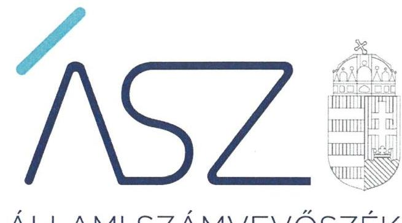
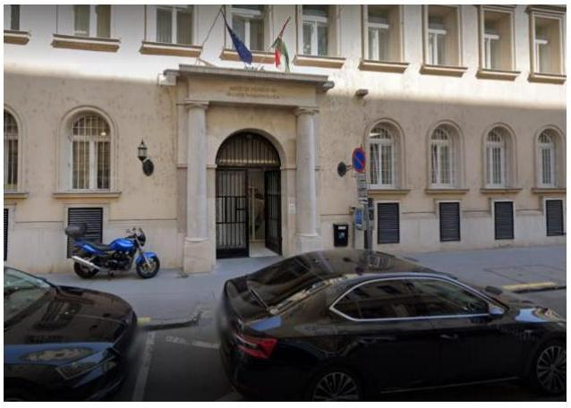

ÁLLAMI SZÁMVEVŐSZÉK

# JELENTÉS 

Központi költségvetési szervek ellenőrzése -
Középirányítói feladatok ellenőrzése
Büntetés-végrehajtás Országos Parancsnoksága
2022.

22058
www.asz.hu

---

ÁLLAMI SZÁMVEVŐSZÉK

# JELENTÉS 

Központi költségvetési szervek ellenőrzése -
Középirányítói feladatok ellenőrzése
Büntetés-végrehajtás Országos Parancsnoksága

22058
www.asz.hu

---

# AZ ELLENŐRZÉST VEZETTE ÉS A VÉGREHAJTÁSÁÉRT FELELŐS: 

DR. GÁL NÓRA ellenőrzésvezető
SIPOSNÉ DÓCZI KLÁRA IBOLYA ellenőrzésvezető
A PROGRAM ÖSSZEÁLLÍTÁSÁÉRT FELELŐS:
SZABÓ CECÍLIA program készítésért felelős vezető

IKTATÓSZÁM: EL-3791-001/2022
Jelentéseink az Országgyúlés számítógépes hálózatán és az interneten a www.asz.hu címen is olvashatóak.

TÉMASZÁM: 2619
ELLENŐRZÉS-AZONOSÍTÓ SZÁM: V0963

---

# TARTALOMJEGYZÉK 

■ ÖSSZEGZÉS ..... 5
■ AZ ELLENŐRZÉS CÉLJA ..... 6
■ AZ ELLENŐRZÉS TERÜLETE ..... 7
■ AZ ELLENŐRZÉS HÁTTERE, INDOKOLTSÁGA ..... 8
■ A JELENTÉS LÉNYEGES KÉRDÉSKÖREI ..... 9
■ AZ ELLENŐRZÉS HATÓKÖRE ÉS MÓDSZEREI ..... 10
■ MEGÁLLAPÍTÁSOK ..... 12
■ MELLÉKLETEK ..... 15
I. sz. melléklet: Értelmező szótár ..... 15
■ FÜGGELÉK: ÉSZREVÉTELEK ..... 17
■ RÖVIDÍTÉSEK JEGYZÉKE ..... 19

---

.

---

# ÖSSZEGZÉS 

A Büntetés-végrehajtás Országos Parancsnoksága a vagyongazdálkodás számviteli szabályozási kereteit a 2019-2021. években kialakította, gondoskodott a nemzeti vagyon kimutatásáról. A 2021. évben az irányító szerve által előírt belső ellenőrzési feladatokat, valamint az Állami Számvevőszék által ellenőrzött középirányítói feladatait szabályszerűen látta el.

## Az ellenőrzés társadalmi indokoltsága

A Büntetés-végrehajtás Országos Parancsnokságának kiemelt szerepe van abban, hogy az irányítása alá tartozó szervezetek közfeladataikat szabályszerűen és hatékonyan végezzék el. Középirányító szervi feladatellátásán keresztül hozzájárulhat ahhoz, hogy mind az intézetekre, intézményekre, társaságokra, mind az irányító szervi feladatok ellátására fordított közpénz, a rájuk bízott nemzeti vagyon cél szerint hasznosuljon, múködésük átlátható és elszámoltatható legyen. A Büntetés-végrehajtás Országos Parancsnokságának a gazdálkodáshoz kapcsolódó középirányítói feladatellátása tehát hangsúlyos terület, ezért ennek ellenőrzése hozzáadott értéket teremt a közpénzügyek átláthatóságának előmozdítása és a közvagyon védelme területén.

## Főbb megállapítások, következtetések

A Büntetés-végrehajtás Országos Parancsnoksága a 2021. évben a Belügyminisztérium, mint irányító szerv által előírt középirányítói hatáskörök gyakorlását tartalmazó beszámolót elkészítette, valamint ellátta az irányító szerv által előírt belső ellenőrzési feladatokat. Az éves belső ellenőrzési tervét az irányító szervvel történt egyeztetést követően határidőben elkészítette. Az irányítása alá tartozó szervezetek belső ellenőrzéseiről a jogszabályi előírások szerinti nyilvántartást vezetett.

A Büntetés-végrehajtás Országos Parancsnoksága a 2019., 2020. és 2021. évben a vagyongazdálkodás számviteli szabályozási kereteit kialakította. A jogszabályi előírások szerint rendelkezett számviteli politikával és az ennek keretében elkészítendő egyéb szabályzatokkal. Rendelkezett továbbá a szabályszerű vagyongazdálkodás alapját képező, jogszabályban előírt vagyonkimutatással.

A Büntetés-végrehajtás Országos Parancsnoksága a 2019., 2020. és 2021. évben az éves költségvetési beszámolóit főkönyvi kivonattal alátámasztotta, a mennyiségi leltározást a jogszabályi előírás szerint elvégezte.

A Büntetés-végrehajtás Országos Parancsnoksága a Szervezeti és Működési Szabályzatában meghatározta a középirányítói feladatok ellátásának belső szabályait. A középirányítói feladatait az Állami Számvevőszék által ellenőrzött területeken - a normatív tartalmú belső szabályozások kiadása, jelentéstételre, illetve beszámolásra kötelezés alkalmazása, továbbá a büntetés-végrehajtási szervezetek éves költségvetési beszámolóinak ellenőrzése vonatkozásában - ellátta.

A Büntetés-végrehajtás Országos Parancsnoksága a saját szervezetére vonatkozóan meghatározta a szervezeti teljesítménycélokat és az ezek eléréséhez szükséges eredményességi teljesítmény-követelményeket a 2021. évre.

---

# AZ ELLENŐRZÉS CÉLJA

**AZ ELLENŐRZÉS CÉLJA** annak értékelése, hogy a Büntetés-végrehajtás Országos Parancsnoksága (BVOP¹) középirányítói feladatainak ellátása során hozzá-járul-e a „jól irányított állam” működéséhez.

---

# **A2 ELLENŐRZÉS TERÜLETE**

## **Büntetés-végrehajtás Országos Parancsnoksága**

A Büntetés-végrehajtás Országos Parancsnoksága központi államigazgatási szerv, közfeladata szerint rendvédelmi szerv. Főtevékenysége a büntetés-végrehajtási tevékenység, országos illetékességgel és működési területtel. Irányító szerve a Belügyminisztérium. A BVOP önállóan működő és gazdálkodó költségvetési szerv. A BVOP a Büntetés-végrehajtási Szervezet középirányító szerve, irányítása alá tartozik 33 szervezet² és 12 gazdasági társaság.

A BVOP szervezeti és működési rendjét, a belső és külső kapcsolataira vonatkozó rendelkezéseket a Szervezeti és Működési Szabályzat³ határozza meg.

Alaptevékenysége a büntetés-végrehajtási szervek szolgálati feladatai végrehajtásának – így különösen a fogva tartás biztonságával, a fogvatartottak nevelésével, foglalkoztatásával, egészségügyi ellátásával, szállításával és nyilvántartásával kapcsolatos tevékenységeknek - felügyelete, ellenőrzése és szakmai irányítása; a büntetés-végrehajtási szervek központi anyagi-technikai ellátása; valamint a büntetés-végrehajtási szervezet költségvetésének keretei között a büntetés-végrehajtási szervek feladatainak ellátásához szükséges feltételek – biztosítása.

A 2019-2021. évek időszakára vonatkozóan a főbb mérleg adatok alakulását a következő táblázat mutatja be.

1. táblázat

|  A BVOP FŐBB MÉRLEGADATAIRÓL |  |  |   |
| --- | --- | --- | --- |
|  Megnevezés | 2019. év | 2020. év | 2021. év  |
|  Nemzeti vagyonba tartozó befektetett eszközök | 7 184 339 402 | 6 679 143 187 | 5 449 407 367  |
|  Nemzeti vagyonba tartozó forgó eszközök | 535 933 854 | 600 702 497 | 503 380 924  |
|  Pénzeszközök | 7 381 426 501 | 1 531 798 351 | 1 264 359 394  |
|  Követelések | 11 631 718 877 | 7 739 514 142 | 7 459 545 604  |
|  Aktív időbeli elhatárolások | 0 | 83 746 649 | 2 900 587  |
|  Saját tőke | 24 476 554 372 | 14 066 738 269 | 12 194 128 504  |
|  Kötelezettségek | 1 422 173 499 | 1 699 638 847 | 1 539 257 512  |
|  Passzív időbeli elhatárolások | 594 138 343 | 489 895 111 | 878 113 579  |
|  Eszközök/Források összesen: | 26 492 866 214 | 16 256 272 227 | 14 611 499 595  |

*adatok Ft-ban*

*Forrás: BVOP 2019., 2020., 2021. évi beszámolói*

---

# AZ ELLENŐRZÉS HÁTTERE, INDOKOLTSÁGA 

A BVOP középirányítói feladatkörében képviseli a Belügyminisztériumot. Az ÁSZ ${ }^{4}$ ellenőrzése ezért az irányító számára visszajelzést ad a BVOP államháztartási gazdálkodásához kapcsolódó feladatellátásáról.

Az ellenőrzési tapasztalatok alapján az ÁSZ „jó gyakorlatokat" is azonosíthat, amelyeket tanácsadó funkciója keretében szélesebb körben is megismertethet az érintettekkel, ezáltal is hozzájárulva a költségvetési rendszer szabályozott, átlátható, és kiegyensúlyozott múködéséhez.

---

# A JELENTÉS LÉNYEGES KÉRDÉSKÖREI 

1. A BVOP ellátta-e az irányító szerve által előírt feladatokat?
2. A BVOP hogyan látta el a vagyonkimutatási feladatait?
3. A BVOP hogyan látta el a középirányító szervi feladatait?

---

# AZ ELLENŐRZÉS HATÓKÖRE ÉS MÓDSZEREI 

## Az ellenőrzés típusa

Szabályszerúségi ellenőrzés.

## Az ellenőrzött időszak

Az 1. és a 3. fókuszterület vonatkozásában a 2021. év. A 2. fókuszterület vonatkozásában a 2019-2021. évek.

## Az ellenőrzés tárgya

Az ellenőrzés tárgyát képezi a BVOP feladatellátása tekintetében a felelős vezetés követelményeinek és az elszámoltathatóság alapelveinek érvényesítése.

Az Állami Számvevőszék ellenőrzése az irányítószerv által előírt feladatellátás vonatkozásában a középirányítói hatáskörök gyakorlásáról történő beszámolásra és a belső ellenőrzési feladatok ellátására terjedt ki.

A vagyongazdálkodás területén az ellenőrzés a számviteli szabályozási keretek kialakítására és a nemzeti vagyon kimutatásának szabályszerűségére terjedt ki.

A középirányító szervi feladatellátás körében az ellenőrzés a középirányító szervi feladatellátás szabályozási kereteinek kialakítására, valamint a normatív tartalmú belső szabályozások kiadásának tényére, a jelentéstételre, illetve beszámolásra kötelezés alkalmazásának tényére, továbbá a büntetés-végrehajtási szervezetek éves költségvetési beszámolói ellenőrzésének megtörténtére terjedt ki.

Az Állami Számvevőszék a Büntetés-végrehajtás Országos Parancsnoksága szakmai feladatellátását nem ellenőrizte.

## Az ellenőrzött szervezet

A Büntetés-végrehajtás Országos Parancsnoksága, mint középirányítói feladatokat ellátó központi költségvetési szerv.

## Az ellenőrzés jogalapja

Az ellenőrzés jogalapját az ÁSZ tv. ${ }^{5}$ 1. § (3) bekezdésének, 5. § (2)-(3) bekezdésének, valamint az Áht. ${ }^{6}$ 61. § (2) bekezdésének előírásai képezik.

---

# Az ellenőrzés módszerei 

Az ellenőrzés végrehajtása az ellenőrzési program szempontjai, kérdéskörei, az ellenőrzött időszakban hatályos jogszabályok, az ellenőrzés szakmai szabályai, az ÁSZ megfelelőségi ellenőrzési módszertana alapján történik.

Az ellenőrzés ideje alatt az ellenőrzött szervezettel történő kapcsolattartás az ÁSZ SZMSZ7-ének vonatkozó előírásai alapján valósul meg.

Az ellenőrzési kérdések megválaszolásához szükséges bizonyítékok megszerzése az ellenőrzött által rendelkezésre bocsátott dokumentumokra, adatokra alapozva megfigyelés, szemle (szemrevételezés), kérdésfeltevés (információkérés), interjú, kockázatalapú mintavételezés, valamint elemző eljárás útján történik.

Az ellenőrzési bizonyítékként felhasználható adatforrások közé tartoznak egyrészt az adatbekérő levelek mellékletében szereplő dokumentumok jegyzékében rögzített adatforrások, másrészt minden az ellenőrzés folyamán feltárt, az ellenőrzés szempontjából információt tartalmazó dokumentum.

Az ellenőrzés lefolytatásához az ellenőrzött szervezet a tanúsítvány kitöltésével, hitelesítésével és az ÁSZ által kért, teljességi és hitelességi nyilatkozattal alátámasztott dokumentumok rendelkezésre bocsátásával szolgáltat adatokat.

---

# 1. A BVOP ellátta-e az irányító szerve által előírt feladatokat? 

## Összegző megállapítás

A BVOP ellátta az irányító szerve által előírt beszámolási és belső ellenőrzéshez kapcsolódó feladatokat.

A BVOP az Áht. 9. § e) és i) pontja és a 11/2018. (VI. 12.) BM utasítás ${ }^{8} 44$. § (2) bekezdése szerinti irányítószervi ${ }^{9}$ beszámoltatással összefüggésben a 2021. évre vonatkozóan végzett beszámolási tevékenységet.

A BVOP belső ellenőrzési vezetője a 14/2011. (V. 23.) BM utasítás ${ }^{10}$ 3. § (2)-(3) bekezdésben foglaltaknak megfelelően az éves ellenőrzési tervet a tervévet megelőző év október 15-ig egyeztette a Belügyminisztérium belső ellenőrzési vezetőjével.

A BVOP a 2021. év vonatkozásában a Bkr. ${ }^{11} 31 . \S$ (1) bekezdésében foglaltaknak megfelelően az éves belső ellenőrzési tervet összeállította, és a 14/2011. (V. 23.) BM utasítás 3. § (1) és (5) bekezdésében foglaltaknak megfelelően az éves belső ellenőrzési tervében elkülönítetten szerepeltette az irányítása alá tartozó költségvetési szervekre vonatkozó ellenőrzési terveket, valamint ezek alapján elkészítette az összefoglaló éves ellenőrzési tervet és azt az előírt határidőre megküldte a Belügyminisztérium belső ellenőrzési vezetőjének.

A Bkr. 50. § (1) bekezdésében foglaltaknak megfelelően a BVOP a 2021. évben az irányítása alá tartozó szervezeteknél végzett ellenőrzésekről nyilvántartást vezetett.

## 2. A BVOP hogyan látta el a vagyonkimutatási feladatait?

## Összegző megállapítás

A BVOP a vagyongazdálkodás alapvető számviteli szabályozási kereteit kialakította és gondoskodott a nemzeti vagyon kimutatásáról a 2019., 2020. és 2021. években.

A BVOP az ellenőrzött időszakban a Számv. tv. 14. § (3) és (5) bekezdésében és az Áhsz. 50. § (1) bekezdésében foglaltak szerint rendelkezett számviteli politikával ${ }_{1,2}{ }^{12}$, az eszközök és a források leltárkészítési és leltározási szabályzatával ${ }_{1,2}{ }^{13}$, az eszközök és a források értékelési szabályzatával ${ }_{1,2}{ }^{14}$, pénzkezelési szabályzattal ${ }_{1,2}{ }^{15}$, számlarenddel ${ }_{1,2}{ }^{16}$, valamint az Áht. 10.§ (5) bekezdésében előírt, a gazdálkodás részletes rendjét meghatározó szabályzattal ${ }_{1,2}{ }^{17}$.

A Számv. tv. 14. § (4) bekezdésében és az Áhsz. 1. § 3. pontjában, valamint az 50. § (1) bekezdésében foglaltaknak megfelelően a BVOP számviteli politikája az ellenőrzött időszak mindegyik évében tartalmazta a gazdálkodóra jellemző szabályokat, előírásokat, módszereket, amelyekkel meghatározza, hogy mit tekint a számviteli elszámolás, az értékelés szempontjából lényegesnek, jelentősnek.

---

Az eszközök és a források leltárkészítési és leltározási szabályzatában ${ }_{1,2}$ a mennyiségi felvétellel történő leltározás gyakoriságának szabályozása megfelelt a Számv. tv. 69. § (3) bekezdésében és az Áhsz. 22. § (2) bekezdésében foglaltaknak.

Az eszközök és a források értékelési szabályzata ${ }_{1,2}$ a Számv. tv. 46. §ában és az Áhsz. 50. § (2) bekezdés a) pontjában foglaltaknak megfelelően tartalmazta a követelések értékelésének elveit, szempontjait.

A számlarend ${ }_{1,2}$ a Számv. tv. 161. § (2) bekezdés a) pontjában és az Áhsz. 51. § (2) bekezdésében foglaltaknak megfelelően tartalmazta minden alkalmazásra kijelölt számla számjelét és megnevezését. A Számv. tv. 161. § (2) bekezdés c) pontjában és az Áhsz. 51. § (3) bekezdésében foglaltaknak megfelelően szabályozták a főkönyvi számla és az analitikus nyilvántartások kapcsolatát, a főkönyvi számla és az analitikus nyilvántartások egyeztetésének módját, dokumentálását, a részletező nyilvántartások vezetési módját, a pénzügyi könyveléshez készült összesítő bizonylatok elkészítésének rendjét.

A BVOP vezetője az ellenőrzött időszakban évenként nyilatkozatban értékelte a költségvetési szerv belső kontrollrendszerének minőségét a Bkr. 11. § (1) bekezdésében foglalt előírás szerint.

A BVOP az ellenőrzött időszak éveiben az Áhsz. 5. § (1) és 32. § (1a) bekezdéseinek megfelelően rendelkezett az irányító szerv által jóváhagyott éves költségvetési beszámolóval, az éves költségvetési beszámolóit főkönyvi kivonattal alátámasztotta az Áhsz. 5. § (1) bekezdésében foglaltak szerint.

A Számv. tv. 69. § (1) bekezdésében, az Áhsz. 22. § (1) bekezdésében foglaltaknak megfelelően a BVOP elkészítette a 2019., 2020. évi beszámolói mérlegének alátámasztására szolgáló leltárt a nemzeti vagyonba tartozó befektetett és forgó eszközök, a pénzeszközök, a követelések és a kötelezettségek, az aktív és passzív időbeli elhatárolások vonatkozásában. Elkészítette továbbá a 2021. évi beszámoló mérlegének alátámasztására szolgáló leltárt a nemzeti vagyonba tartozó befektetett és forgó eszközök, a követelések és a kötelezettségek, az aktív és passzív időbeli elhatárolások vonatkozásában.

Az Áhsz. 53. § (8) bekezdés b) pontjában foglaltaknak megfelelően a BVOP a mennyiségi felvétellel készült leltár kiértékelését, a mennyiségi felvétellel végzett leltározás során az eltérések okainak kivizsgálását az ellenőrzött időszak mindhárom évében elvégezte.

Az ellenőrzött években a BVOP rendelkezett a jogszabályban előírt vagyonkimutatással.

# 3. A BVOP hogyan látta el a középirányító szervi feladatait? 

## Összegző megállapítás

A BVOP az ellenőrzött középirányító szervi feladatait szabályszerűen látta el a 2021. évben.

A BVOP SZMSZ ${ }^{18}$-e szervezeti egységekhez rendelve tartalmazta a középirányítói feladatokat az Áht. 10. § (5) bekezdésben és az Ávr. 13. § (1) bekezdés e) pontjában foglaltaknak megfelelően.

---

A BVOP SZMSZ-ében és belső szabályzatában ${ }^{19}$ az Áht. 10. § (5) bekezdésben és az Ávr. 13. § (1) bekezdés g) pontjában és (5) bekezdésben foglalt előírásoknak megfelelően meghatározták a beruházásokat érintő döntési hatásköröket és felelősségi viszonyokat, a beruházások előkészítésével kapcsolatos feladatokat ellátó szervezeti egységet és a beruházás előkészítését végző munkakörhöz tartozó feladatköröket és hatásköröket.

A BVOP a büntetés-végrehajtási szervezetről szóló törvény ${ }^{20}$ 4. § (3) bekezdés a) pontja alapján jóváhagyta valamennyi büntetés-végrehajtási szervezet SZMSZ-ét, valamint a 4/2015 (IV. 10.) BM utasítás ${ }^{21}$ 5. §-ban foglalt felhatalmazás alapján elkészítette a büntetés-végrehajtási szervezetekre is kiterjedő hatályú Gazdálkodási szabályzatot, amely kijelöli és egységesen kezeli a gazdálkodás főbb kereteit.

A BVOP a büntetés-végrehajtási szervezetről szóló törvény 4. § (3) bekezdés f) pontjában foglalt felhatalmazás alapján a büntetés-végrehajtási szervezetek esetében alkalmazta a jelentéstételre, illetve beszámolásra kötelezést, mint irányítási eszközt, valamint a büntetés-végrehajtási szervezetekre vonatkozó normatív tartalmú utasításokat adott ki a büntetésvégrehajtási szervezetről szóló törvény 4. § (2) bekezdés c) pontjában foglalt felhatalmazás alapján.

A BVOP irányítási jogkörében ellenőrizte a büntetés-végrehajtási szervezetek 2021. évi éves költségvetési beszámolóit, és továbbította az irányítószerv felé az összesített költségvetési beszámolóját a 4/2015 (IV. 10.) BM utasítás 6. § da) pontjában foglalt előírásnak megfelelően.

A BVOP 2021. I. félévi munkaterve és II. félévi munkaterve tartalmazzák a kialakított szervezeti teljesítménycélokat és az ezek elérése érdekében meghatározott eredményességi teljesítménykövetelményeket. A szervezeti célokhoz határidőt és felelőst rendeltek.

---

# MELLÉKLETEK 

- I. SZ. MELLÉKLET: ÉRTELMEZŐ SZÓTÁR
irányító szerv A költségvetési szerv tekintetében az Áht-ban meghatározott irányítási hatáskört gyakorló szerv. (Forrás: Áht. 1. § 9. pontja)

---

.

---

# FÜGGELÉK: ÉSZREVÉTELEK 

A jelentéstervezetet a Számvevőszék 15 napos észrevételezésre megküldte az ellenőrzött szervezet vezetőjének az ÁSZ tv. 29. §* (1) bekezdése előírásának megfelelően.

Az országos parancsnok, mint az ellenőrzött szervezet vezetője az ellenőrzés megállapításaira nem tett észrevételt.

[^0]
[^0]:    * 29. § (1) Az Állami Számvevőszék az ellenőrzési megállapításait megküldi az ellenőrzött szervezet vezetőjének vagy az általa megbízott személynek, és annak, akinek személyes felelősségét állapította meg.
    (2) Az ellenőrzött szervezet vezetője és a felelősként megjelölt személy az ellenőrzés megállapításaira tizenöt napon belül írásban észrevételt tehet.
    (3) Az Állami Számvevőszék az észrevételre a beérkezésétől számított harminc napon belül írásban válaszol. A figyelembe nem vett észrevételeket köteles a jelentésben feltüntetni, és megindokolni, hogy azokat miért nem fogadta el.

---

.

---

# RÖVIDÍTÉSEK JEGYZÉKE 

${ }^{1}$ BVOP
${ }^{2}$ BVOP intézetek és intézmények
${ }^{3}$ Szervezeti és Múködési Szabályzat
${ }^{4}$ ÁSZ
${ }^{5}$ ÁSZ tv.
${ }^{6}$ Áht.
${ }^{7}$ ÁSZ SZMSZ
${ }^{8}$ 11/2018. (VI. 12.) BM utasítás
${ }^{9}$ irányítószerv
${ }^{10}$ 14/2011. (V. 23.) BM utasítás
${ }^{11}$ Bkr.
${ }^{12}$ Számviteli politika ${ }_{1,2}$

Büntetés-végrehajtás Országos Parancsnoksága
Állampusztai Országos Büntetés-végrehajtási Intézet, Bács-Kiskun Megyei Büntetés-végrehajtási Intézet, Balassagyarmati Fegyház és Börtön, Baranya Megyei Büntetés-végrehajtási Intézet, Békés Megyei Büntetés-végrehajtási Intézet, Borsod-Abaúj-Zemplén Megyei Büntetés-végrehajtási Intézet, Budapesti Fegyház és Börtön, Fiatalkorúak Büntetés-végrehajtási Intézete (Tököl), Fővárosi Büntetés-végrehajtási Intézet, Győr-Moson-Sopron Megyei Büntetés-végrehajtási Intézet, Hajdú-Bihar Megyei Büntetés-végrehajtási Intézet, Heves Megyei Büntetés-végrehajtási Intézet, Jász-Nagykun-Szolnok Megyei Büntetés-végrehajtási Intézet, Kalocsai Fegyház és Börtön, Kiskunhalasi Országos Büntetés-végrehajtási Intézet, Közép-Dunántúli Országos Büntetés-végrehajtási Intézet, Márianosztrai Fegyház és Börtön, Pálhalmai Országos Büntetés-végrehajtási Intézet, Sátoraljaújhelyi Fegyház és Börtön, Somogy Megyei Büntetés-végrehajtási Intézet, Sopronkőhidai Fegyház és Börtön, Szabolcs-Szatmár-Bereg Megyei Büntetés-végrehajtási Intézet, Szegedi Fegyház és Börtön, Szombathelyi Országos Büntetésvégrehajtási Intézet, Tiszalöki Országos Büntetés-végrehajtási Intézet, Tolna Megyei Büntetés-végrehajtási Intézet, Tököli Országos Büntetésvégrehajtási Intézet, Váci Fegyház és Börtön, Veszprém Megyei Büntetésvégrehajtási Intézet, Zala Megyei Büntetés-végrehajtási Intézet, Büntetésvégrehajtási Szervezet Oktatási, Továbbképzési és Rehabilitációs Központja, Büntetés-végrehajtás Egészségügyi Központ, Igazságügyi Megfigyelő és Elmegyógyító Intézet.
68/2020. (XII. 18.) BVOP utasítás a Büntetés-végrehajtás Országos Parancsnoksága Szervezeti és Múködési Szabályzatáról
Állami Számvevőszék
Állami Számvevőszékről szóló 2011. évi LXVI. törvény
2011. évi CXCV. törvény az államháztartásról

Állami Számvevőszék Szervezeti és Múködési Szabályzata
11/2018. (VI. 12.) BM utasítás a Belügyminisztérium Szervezeti és Múködési Szabályzatáról
Belügyminisztérium
14/2011. (V. 23.) BM utasítás a Belügyminisztérium fejezetéhez tartozó középirányító szervek részére történő egyes belső ellenőrzési jogosítványok átruházásáról
370/2011. (XII. 31.) Korm. rendelet a költségvetési szervek belső kontrollrendszeréről és belső ellenőrzéséről
A büntetés-végrehajtás országos parancsnokának 68/2015. (VIII.27.) OP szakutasítás a Büntetés-végrehajtás Országos Parancsnoksága számviteli politikájának kiadásáról, módosítva a 23/2016, 44/2017, OP szakutasításokkal, A büntetés-végrehajtás Országos Parancsnoksága és a tulajdonosi joggyakorlással kapcsolatos eszközök, források számviteli politikája. (2020.02.17.)

---

${ }^{13}$ Leltározási szabályzat ${ }_{1,2}$

A büntetés-végrehajtás országos parancsnokának 51/2015. (VII.28.) OP szakutasítása a Büntetés-végrehajtás Országos Parancsnoksága eszközeinek és forrásainak leltározásáról és leltárkészítésről, 28/2020. (VII. 10.) BVOP utasítás a Büntetés-végrehajtás Országos Parancsnoksága eszközeinek és forrásainak leltározásáról és leltárkészítésről
${ }^{14}$ Értékelési szabályzat ${ }_{1,2}$
${ }^{15}$ Pénzkezelési szabályzat ${ }_{1,2}$
${ }^{16}$ Számlarend $_{1,2}$
${ }^{17}$ Gazdálkodási szabályzat ${ }_{1,2}$
${ }^{18}$ SZMSZ
${ }^{19}$ belső szabályozás
${ }^{20}$ a büntetés-végrehajtási szervezetről szóló törvény
${ }^{21}$ 4/2015 (IV. 10.) BM utasítás

A büntetés-végrehajtás országos parancsnokának 50/2015. (VII.28.) OP szakutasítása a Büntetés-végrehajtás Országos Parancsnoksága eszközeinek és forrásainak értékeléséről, a Büntetés-végrehajtás Országos Parancsnoksága és tulajdonosi joggyakorlással kapcsolatos eszközeinek és forrásainak értékelése 2020. (2020.12.22.)
A büntetés-végrehajtás országos parancsnokának 33/2017. (III.1.) OP szakutasítása a Büntetés-végrehajtás Országos Parancsnoksága pénzkezelési szabályzatáról, módosítva az 55/2017, 59/2017, 71/2017.OP szakutasításokkal, a Büntetés-végrehajtás Országos Parancsnoksága pénzkezelési szabályzata 2020. (2020.12.22.)
A büntetés-végrehajtás országos parancsnokának 68/2015. (VIII.27.) OP szakutasítása a Büntetés-végrehajtás Országos Parancsnoksága számviteli politikájának kiadásáról, módosítva a 23/2016, 44/2017, OP szakutasításokkal 2. sz. függeléke, A büntetés-végrehajtás Országos Parancsnoksága és a tulajdonosi joggyakorlással kapcsolatos eszközök, források számviteli politikája (2020.02.17.) 2. sz. melléklete.
85/2015. (XII.1) OP szakutasítás a büntetés-végrehajtási szervezet gazdálkodásának szabályozásáról, a büntetés-végrehajtási szervezet gazdálkodási szabályzata 2021. (2021.02.18.)
Szervezeti és Múködési Szabályzat
BVOP Műszaki és Ellátási Főosztály Ügyrendje
1995. évi CVII. törvény a büntetés-végrehajtási szervezetről

4/2015 (IV. 10.) BM utasítás a Belügyminisztérium fejezet költségvetési gazdálkodásának rendjéről

---

1052 Budapest, Apáczai Cs. J. u. 10. | 1364 Budapest 4. Pf. 54
TEL: +36 14849100
email: szamvevoszek@asz.hu
web: www.asz.hu | www.aszhirportal.hu