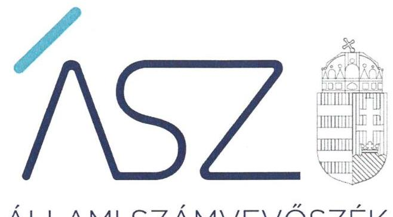

ÁLLAMI SZÁMVEVŐSZÉK

# JELENTÉS 

## Az önkormányzatok pénzügyi és vagyongazdálkodása megfelelőségének ellenőrzése

Halásztelek Város Önkormányzata és a
Halásztelki Polgármesteri Hivatal

2022

22059
www.asz.hu

---

ÁLLAMI SZÁMVEVŐSZÉK

# JELENTÉS 

## Az önkormányzatok pénzügyi és vagyongazdálkodása megfelelőségének ellenőrzése

Halásztelek Város Önkormányzata és a
Halásztelki Polgármesteri Hivatal

22059
www.asz.hu

---

# AZ ELLENŐRZÉST VEZETTE ÉS A VÉGREHAJTÁSÁÉRT FELELŐS: 

DR. GÁL NÓRA ellenőrzésvezető
DR. KISS ESZTER ellenőrzésvezető
DR. SIMON JÓZSEF ellenőrzésvezető
A PROGRAM ÖSSZEÁLLÍTÁSÁÉRT FELELŐS:
DR. FELFÖLDI IZABELLA programkészítésért felelős vezető

IKTATÓSZÁM: : EL- 3790-001/2022
TÉMASZÁM: 2591
ELLENŐRZÉS-AZONOSÍTÓ SZÁM: V0935
Jelentéseink az Országgyúlés számítógépes hálózatán és az interneten a www.asz.hu címen is olvashatóak.

---

# TARTALOMJEGYZÉK 

■ ÖSSZEGZÉS ..... 5
■ AZ ELLENŐRZÉS CÉLJA ..... 6
■ AZ ELLENŐRZÉS TERÜLETE ..... 7
■ AZ ELLENŐRZÉS HÁTTERE, INDOKOLTSÁGA ..... 8
■ A JELENTÉS LÉNYEGES KÉRDÉSKÖREI ..... 9
■ AZ ELLENŐRZÉS HATÓKÖRE ÉS MÓDSZEREI ..... 10
■ MEGÁLLAPÍTÁSOK ..... 12
■ MELLÉKLET ..... 21
I. sz. melléklet: Értelmező szótár ..... 21
■ FÜGGELÉK: ÉSZREVÉTELEK ..... 25
■ RÖVIDÍTÉSEK JEGYZÉKE ..... 27

---

.

---

# ÖSSZEGZÉS 

Halásztelek Város Önkormányzatánál a pénzügyi és vagyongazdálkodás szabályozási kereteit kialakították. A költségvetési beszámolók mérlegtételeinek leltárral történő alátámasztása az ellenőrzött időszak végére, 2019-re vált szabályszerűvé. A vagyonértékesítés és vagyonhasznosítás, a beruházások, felújítások és a befektetési döntések gyakorlati végrehajtása, valamint a tulajdonosi joggyakorlás körében ellenőrzött területeken az ÁSZ nem azonosított kockázatot. Az integritás alapú müködést kialakították.

## Az ellenőrzés társadalmi indokoltsága

Az államháztartás önkormányzati alrendszerébe tartozó szervezet vagyona a nemzeti vagyon része. A helyi önkormányzatok, Magyarország Alaptörvényének felhatalmazása alapján, az önrendelkezés, az öngondoskodás és az önfenntartás elvei alapján múködnek. Az önkormányzatok sokrétű feladatellátásuk során a nyújtott közszolgáltatások biztosításán keresztül járulnak hozzá az állampolgárok mindennapi életéhez. Az Mötv. ${ }^{1}$ által előírt kötelező és önként vállalt feladataikat közpénzügyi forrásokból, illetve saját gazdálkodási bevételeikből látják el, valamint a nemzeti vagyon részét képező önkormányzati vagyonnal gazdálkodnak. Az általuk kezelt közpénzek, valamint a rájuk bízott vagyon a helyi közérdeket kell, hogy szolgálják a közjó érdekében. A közpénzek felhasználását és a nemzeti vagyonnal történő gazdálkodást az átláthatóság és a közélet tisztaságának szem előtt tartásával kell, hogy végezzék, a nyilvánosság előtt el kell számolniuk gazdálkodásukról. Az Állami Számvevőszék Halásztelek Város Önkormányzatánál, valamint a gazdálkodási feladatait ellátó Halásztelki Polgármesteri Hivatalnál végzett ellenőrzése hozzájárul a közpénzügyek átláthatóságának, a nemzeti vagyon védelmének és az integritás szemlélet helyzetének objektív megítéléséhez.

## Főbb megállapítások, következtetések

Halásztelek Város Önkormányzatánál 2017-2019. években a pénzügyi és vagyongazdálkodás szabályozási kereteit kialakították. Az adósságot keletkeztető ügyletek vállalása az ellenőrzött időszakban a jogszabályi feltételeknek megfelelt.

A költségvetési beszámolók mérlegtételeinek alátámasztása a 2017-2019. években nem volt teljeskörű. Az Önkormányzati részesedések tekintetében nem készült leltár a 2017-2019. években, valamint a 2017-2018. években a vagyonkezelt eszközök könyv szerinti értéke nem egyezett meg a leltárban kimutatott értékkel.

Halásztelek Város Önkormányzata a vagyonkezelésbe adott tárgyi eszközöket a jogszabályi előírásoknak megfelelően szerepeltette a könyveiben.

A 2017-2019. években az ellenőrzött gazdasági események vonatkozásában a beruházások, felújítások kiadási előirányzatainak felhasználása során a beruházási döntéseket az Önkormányzat arra jogosult szerve hozta meg, továbbá a döntések végrehajtása és a gazdálkodási jogkörök gyakorlása a jogszabályi előírások szerint történt.

A vagyonértékesítés és a vagyonhasznosítás (bérbeadás) körében vizsgált gazdasági események tekintetében az önkormányzati döntések, valamint a gazdasági események elszámolása és a kapcsolódó gazdálkodási jogkörgyakorlás szabályszerű volt.

A követelések elengedése és a követelések behajthatatlanná minősítése az ellenőrzött tételek esetében megfelelt a jogszabályi előírásoknak.

Az Önkormányzat befektetési célú ingatlanvásárlásairól a jogszabályi előírásoknak megfelelően a Képviselő-testület döntött az ellenőrzött gazdasági események esetében.

Az Önkormányzat a kizárólagos tulajdonában álló gazdasági társaságnál 2017. szeptember 30-ig a jogszabályi előírás ellenére nem gondoskodott felügyelőbizottság létrehozásáról. A 2018-2019. években a tulajdonosi jogait szabályosan gyakorolta.
2019. évben az integritás elvű működés alapvető feltételeit kialakították.

---

# AZ ELLENŐRZÉS CÉLJA 

AZ ELLENŐRZÉS CÉLJA az önkormányzat gazdálkodása szabályosságának értékelése, a vagyongazdálkodás, a vagyon számbavétele, a gazdasági események elszámolása és a pénzgazdálkodás szabályszerűsége alapján.

---

# **AZ ELLENŐRZÉS TERÜLETE**

## **Halásztelek Város Önkormányzata, valamint a gazdálkodási feladatait ellátó Halásztelki Polgármesteri Hivatal**

### **HALÁSZTELEK VÁROS ÖNKORMÁNYZATA**

Pest megye közép-nyugati részén, Budapesttől délre, Szigetszentmiklósi járásban található. A Belügyminisztérium statisztikai nyilvántartása2 alapján Halásztelek Város lakosságszáma az ellenőrzött időszakban 8,7 %-kal növekedett. Az állandó lakosok száma 2019. év január 1-jén 11 183 fő volt.

A 2019. évi önkormányzati választásokat követően, a képviselők száma a korábbi 9 főről 11 főre változott. A Képviselőtestület3 munkáját az ellenőrzéssel érintett időszakban négy állandó bizottság4 segítette. Az Önkormányzat5 feladatait az ellenőrzött időszakban az önállóan működő Halásztelki Polgármesteri Hivatal, három költségvetési szerv6, valamint az önkormányzat kizárólagos tulajdonában álló gazdasági társaság, a HATE Nonprofit Kft.7 útján látta el. A társaság a vagyonüzemeltetési, park és közterület fenntartási feladatok ellátását végezte az ellenőrzött időszakban, 2022. április 1-től végelszámolás alatt áll.

A Polgármester8 a 2019. év októberi önkormányzati választás alkalmával nyerte el mandátumát, a Jegyző9 személyében nem történt változás az ellenőrzött időszakban. A településen bolgár10, valamint roma11 nemzetiség önkormányzat működött. Az Önkormányzatnál foglalkoztatottak létszáma 2017. évben 121 fő, 2018. évben 123 fő, 2019. évben 130 fő volt.

Az Önkormányzat összevont költségvetési beszámolói12 és zárszámadásáról szóló rendeletei12 alapján a 2019. évi összes költségvetési bevétele 1 734,7 millió Ft-ra nőtt, az összes költségvetési kiadása 1 618,1 millió Ft-ra csökkent a 2017. évi adatokhoz képest. A könyvviteli mérleg szerinti eszközvagyona a 2017. évi 8 334,8 millió Ft-ról 2019. évre 8 567,0 millió Ft-ra nőtt.

Halásztelek Város Önkormányzata Képviselő-testülete 2017. évben kettő, Magyarország Kormánya által jóváhagyott, adósságot keletkeztető ügyletet vállalt (450 millió Ft hitelfelvétel a Hunyadi Mátyás Általános Iskola, Gimnázium és Alapfokú Művészeti Iskola épületének átalakítására, bővítésére, továbbá 300 millió Ft hitelfelvétel a városi Sportcsarnok építésének önkormányzati támogatására). 2018-2019. években az Önkormányzat adósságot keletkeztető ügyletet nem vállalt.

---

# AZ ELLENŐRZÉS HÁTTERE, INDOKOLTSÁGA 

Az államháztartás önkormányzati alrendszerének közpénz felhasználása, az önkormányzatok által ellátott közfeladatok és önként vállalt feladatok sokrétűsége, valamint a feladat ellátásához rendelt vagyon nagyságrendje indokolja, hogy az ÁSZ ${ }^{14}$ ellenőrzéseket folytasson a pénzügyi és vagyongazdálkodás területén. Az ÁSZ folyamatosan végzi az önkormányzatok pénzügyi és vagyongazdálkodásának ellenőrzését. Az ellenőrzések tapasztalatai megmutatták, hogy továbbra is indokolt az egyrészt elemző, értékelő, a pénzügyi helyzet kockázatát is minősítő, másrészt a pénzügyi és vagyongazdálkodási tevékenység szabályszerűségét értékelő ÁSZ ellenőrzések folytatása.

Az ÁSZ ellenőrzései hozzájárulnak az önkormányzatok felelős és fenntartható gazdálkodásához, pénzügyi helyzetének pontosabb megítéléséhez azáltal, hogy a pénzügyi helyzetet a vagyoni helyzettel együtt értékeli. Az ÁSZ feltárja az önkormányzati gazdálkodást meghatározó szabályozások hiányosságait, a szabályozással nem érintett gazdálkodási területeket, valamint a pénzügyi és vagyongazdálkodás esetleges szabálytalanságait.

A pénzügyi és vagyongazdálkodás szabályszerűségének ellenőrzése eredményeként tett megállapítások, javaslatok hasznosításával javul az önkormányzat gazdálkodásának szabályozottsága.

---

# A JELENTÉS LÉNYEGES KÉRDÉSKÖREI 

1.     - A pénzügyi és vagyongazdálkodás szabályozási kereteinek kialakítása szabályszerü volt-e?
2.     - Az adósságot keletkeztető ügyletek vállalása szabályszerü volt-e?
3.     - A vagyonnyilvántartás, a költségvetési beszámoló mérlegének alátámasztottsága szabályszerü volt-e?
4.     - A vagyonváltozásokhoz és vagyonhasznosításhoz kapcsolódó döntések és azok végrehajtása, a gazdálkodási jogkörök gyakorlása szabályszerü volt-e?
5.     - Az egyes befektetésekkel kapcsolatos döntéshozatal és azok végrehajtása szabályszerü volt-e?
6.     - Felelősen gazdálkodott-e az önkormányzat a tartós részesedéseivel, élt-e tulajdonosi jogaival, teljesítette-e tulajdonosi kötelezettségeit?
7.     - Az önkormányzat az integritás müködést kialakította és erősí-tette-e?

---

# AZ ELLENŐRZÉS HATÓKÖRE ÉS MÓDSZEREI 

## Az ellenőrzés típusa

Megfelelőségi ellenőrzés.

## Az ellenőrzött időszak

A 2017-2019. évek.

## Az ellenőrzés tárgya

A helyi önkormányzat pénzügyi és vagyongazdálkodása, a tulajdonosi és irányító szervi feladatok ellátása.

Az ellenőrzés kiterjed minden olyan körülményre és adatra, amely az ÁSZ jogszabályban meghatározott feladatainak teljesítéséhez, valamint a program végrehajtása folyamán felmerült újabb összefüggések feltárásához szükséges.

## Az ellenőrzött szervezet

Halásztelek Város Önkormányzata, valamint a gazdálkodási feladatait ellátó Halásztelki Polgármesteri Hivatal.

## Az ellenőrzés jogalapja

Az ellenőrzés jogszabályi alapját az ÁSZ tv. ${ }^{15} 1 . \S$ (3) bekezdésének, az 5. $\S(2)-(6)$ bekezdéseinek, valamint az Áht. ${ }^{16} 61 . \S$ (2) bekezdésének előírásai képezik.

## Az ellenőrzés módszerei

Az ÁSZ az ellenőrzést az ellenőrzési program ellenőrzési kérdései, az ellenőrzött időszakban hatályos jogszabályok, az ellenőrzés-szakmai szabályok és az ÁSZ módszertanok figyelembevételével végzi.

A gazdálkodás hibáinak kijavítására, a közpénzekkel való felelős gazdálkodás segítésére irányuló javaslatok kidolgozásakor a hatályos jogszabályok az irányadók.

Az ellenőrzési kérdések megválaszolásához szükséges bizonyítékok megszerzése az ellenőrzött által rendelkezésre bocsátott dokumentumokra, adatokra alapozva megfigyelés, szemle (szemrevételezés),

---

kérdésfeltevés (információkérés), mintavételezés, valamint elemző eljárással történik.

Az ellenőrzési bizonyítékként felhasználható adatforrások közé tartoznak egyrészt a szakmai program részletes szempontjainál felsorolt adatforrások, másrészt minden - az ellenőrzés folyamán feltárt, az ellenőrzés szempontjából releváns információt tartalmazó - dokumentum.

Az ellenőrzés lefolytatásához az önkormányzat a tanúsítványok kitöltésével, valamint az ÁSZ által kért dokumentumok rendelkezésre bocsátásával szolgáltat adatokat. Az így rendelkezésre bocsátott adatok, információk, a tanúsítványok adatai valódiságának kontrollja az ellenőrzés keretében történik.

Az ÁSZ az ellenőrzést az önkormányzat múködésével kapcsolatos feladatokat ellátó polgármesteri hivatalban ${ }^{17}$ végzi. Az önkormányzat az intézményei és gazdasági társasága ellenőrzéssel érintett dokumentumait, tanúsítványait a polgármesteri hivatal útján bocsátja az ellenőrzés rendelkezésére.

Az ÁSZ a pénzügyi és vagyongazdálkodás szabályozottságát az önkormányzat rendeletei, határozatai, illetve az önkormányzat (mint önálló éves költségvetési beszámolót készítő szerv) és a polgármesteri hivatal belső szabályozásai alapján értékeli. A vagyonnyilvántartás, a mérleg alátámasztottságának megítélése az önkormányzat és a polgármesteri hivatal adatai alapján történik. Az ÁSZ a leltározási, értékelési folyamat szabályszerűségére a polgármesteri hivatal által végzett 2019. évi leltározási folyamat ellenőrzése alapján teszi meg megállapításait.

Az önkormányzat vagyonváltozást eredményező döntéseinek és azok végrehajtásának ellenőrzésére irányított, valamint véletlen mintavételi eljárással és tételes ellenőrzéssel kerül sor. A pénzforgalmi tételek ellenőrzése véletlen mintavételi eljárással - a polgármesteri hivatal és az önkormányzat (mint önálló éves költségvetési beszámolót készítő költségvetési szerv) főkönyvi állományából - kiválasztott minta alapján történik. A vizsgált terület „szabályszerű", ha a minta ellenőrzésének eredménye alapján 95\%-os bizonyossággal a teljes sokaságban az átlagos hibaarány nem haladja meg a 10\%-ot, „nem szabályszerű", ha nagyobb, mint 10\%. Amennyiben a sokaság elemszáma nem haladja meg az előírt minta elemszámot, akkor a sokaság valamennyi elemének tételes ellenőrzésére került sor.

Az ÁSZ az ellenőrzési kérdésekre adott válaszok alapján értékeli, hogy az önkormányzat pénzügyi gazdálkodása szabályszerű volt-e. Az ÁSZ értékeli a vagyongazdálkodás szabályszerűségét, a vagyonváltozást eredményező döntések és a tulajdonosi jogok gyakorlása szabályszerűségét.

---

# 1. A pénzügyi és vagyongazdálkodás szabályozási kereteinek kialakítása szabályszerű volt-e? 

Összegző megállapítás

A pénzügyi gazdálkodás és a vagyongazdálkodás szabályainak kialakítása a 2017-2019. években szabályszerű volt.

Az Önkormányzat a Mötv. 53. § (1) előírásainak megfelelően az ellenőrzött időszakban rendelkezett a Képviselő-testület részletes múködési szabályait tartalmazó szabályzattal ${ }^{18}$.

A Hivatal ${ }^{19}$ SZMSZ ${ }_{1-2}$-e az Áht. 10. § (5) bekezdésében foglaltak szerint tartalmazta a költségvetési szerv feladatai ellátásának részletes belső rendjét és módját, valamint az Ávr. ${ }^{20}$ 13. § (5) bekezdés előírásainak megfelelően a szervezeti egységeire vonatkozó szabályokat.

A Hivatal rendelkezett az Önkormányzatra kiterjesztett hatályú Gazdálkodási szabályzat ${ }_{1-3}{ }^{21}$-tal, amely az Ávr. 13. § (2) bekezdés a) pont előírásának megfelelően tartalmazta a tervezéssel, gazdálkodással összefüggő feladatokat, a kötelezettségvállalás, ellenjegyzés, teljesítésigazolás, érvényesítés, utalványozás gyakorlásának módjával, eljárási és dokumentációs részletszabályaival, valamint az ezeket végző személyek kijelölésének rendjével kapcsolatos előírásokat, valamint az ellenőrzési, adatszolgáltatási és beszámolási feladatok teljesítésével kapcsolatos belső előírásokat, feltételeket. A gazdálkodási jogkörgyakorlók nyilvántartását vezették.

A Hivatal Beszerzési szabályzata ${ }_{1-2}{ }^{22}$, amelynek hatálya kiterjedt az Önkormányzatra, az Ávr. 13. § (2) bekezdés b) pont előírásai szerint tartalmazta a beszerzések lebonyolításával kapcsolatos szabályokat.

A Hivatal 2017-2019. években rendelkezett az Önkormányzatra is kiterjesztett hatályú számviteli politika ${ }_{1,2,3}{ }^{23}$-val, amely tartalmazta az Áhsz. ${ }^{24}$ 50. § (1) bekezdése és a Számv. tv. 14. § (4) bekezdésében foglaltak szerint azokat a gazdálkodóra jellemző szabályokat, előírásokat, módszereket, amelyek meghatározzák, hogy a gazdálkodó mit tekint a számviteli elszámolás és értékelés szempontjából lényegesnek, nem lényegesnek, jelentősnek, illetve nem jelentősnek.

A Polgármesteri Hivatal 2017-2019. években rendelkezett az Önkormányzatra is kiterjesztett hatályú bizonylati renddel és önköltségszámítási szabályzattal, továbbá pénzkezelési szabályzattal.

A pénzkezelési szabályzatban szabályozták a pénzforgalom lebonyolításának rendjét, a pénzkezelés személyi és tárgyi feltételeit, a felelősségi szabályokat, a készpénzben és a bankszámlán tartott pénzeszközök közötti forgalmat, a készpénzállományt érintő pénzmozgások jogcímeit, a készpénzállomány ellenőrzésekor követendő eljárást, az ellenőrzések gyakoriságát, a pénzszállítás feltételeit, a pénzkezeléssel kapcsolatos bizonylatok rendjét és a pénzforgalommal kapcsolatos nyilvántartási szabályokat.

A 2017.09.14-ig hatályos Pénzkezelési szabályzat ${ }_{1}$ nem felelt meg a jogszabályi előírásoknak, mivel abban az Áhsz. 50. § (6) bekezdés előírása ellenére a készpénz napi záró állományának naptári hónaponként számított napi átlagát a módosított kiadási előirányzatok főösszegének - jogszabályi

---

előírás szerinti - 1,2 \%-a helyett a módosított költségvetési előirányzatok főösszegének 2\%-ában határozták meg. 2017. harmadik negyedévében, valamint a 2018-2019. években a készpénz napi záró állományának számítási módja megfelelt a Számv. tv. és az Áhsz. előírásainak.

Az Önkormányzat és a Hivatal- az Áhsz. 51. § (2) bekezdés és a Számv. tv. ${ }^{25}$ 161.§ (1) bekezdés előírásai szerint az ellenőrzött időszakban rendelkezett számlarend ${ }_{1,2,3,4}{ }^{26}$ - del, amely megfelelt a jogszabályi előírásoknak.

Az Önkormányzat vagyonrendelete ${ }_{1}{ }^{27}$ 2017. május 31-ig nem határozta meg az Nvtv. ${ }^{28}$ 5. § előírásai ellenére az önkormányzati feladatellátást biztosító törzsvagyon körét, az Nvtv. 5. § (5)-(7) bekezdései és a 18. § (12) bekezdés előírásai ellenére a forgalomképtelen és a korlátozottan forgalomképes vagyonelemeket, az Mötv. 109. § (4) bekezdés és a 143. § (4) bekezdés i) pont előírásai ellenére a vagyonkezelés ellenőrzésének részletes szabályait, az Mötv. 109. § (4) bekezdés előírása ellenére a vagyonkezelői jog ellenértékét és az ingyenes átengedés eseteit, valamint az Nvtv. 3. § (1) bekezdés 4. pont és a 11. § (16) bekezdése előírásai ellenére azt az értékhatárt, amely felett az önkormányzat tulajdonában álló nemzeti vagyont csak versenyeztetés útján lehet hasznosítani. A 2017. június 1-től hatályos vagyonrendelet ${ }_{2}{ }^{29}$ megfelelt az Mötv. és az Nvtv. hivatkozott előírásainak.

# 2. Az adósságot keletkeztető ügyletek vállalása szabályszerű volt-e? 

## Összegző megállapítás

Az adósságot keletkeztető ügyletek vállalása 2017. évben szabályszerű volt, 2018-2019. években az Önkormányzat adósságot keletkeztető ügyletet nem vállalt.

Az Önkormányzat a költségvetési kiadások fedezetéül szolgáló adósságot keletkeztető ügyleteket 2017. évben a jogszabályi előírásoknak megfelelően vállalt. A két hitelfelvételhez a Stabilitási tv. ${ }^{30}$ és a 353/2011. (XII. 30.) Korm. rendelet ${ }^{31}$ előírása szerint a Kormány hozzájárulását megkérte. A Stabilitási tv. 10. § (5) bekezdésben foglaltaknak megfelelően 2017-ben az Önkormányzat saját bevételeinek 50\%-a meghaladta az adósságot keletkeztető ügyletekből származó tárgyévi összes fizetési kötelezettség összegét, így az ügyletekből származó fizetési kötelezettségének megengedett felső határára vonatkozó jogszabályi előírást betartotta.

A Stabilitási tv. 10. § (2) bekezdésében előírtak szerint az önkormányzat adósságot keletkeztető ügyletet csak abban az esetben köthet, ha a hatályos helyi adó rendelete alapján a helyi iparűzési adót vagy a helyi adókról szóló törvény szerinti vagyoni típusú adók közül legalább az egyiket, vagy a magánszemélyek kommunális adóját bevezette. Az Önkormányzat a helyi adó rendelete alapján kivetette az építményadót, a telekadót és az iparűzési adót, így megfelelt a Stabilitási tv. hivatkozott előírásának.

---

# 3. A vagyonnyilvántartás, a költségvetési beszámoló mérlegének alátámasztottsága szabályszerű volt-e? 

## Összegző megállapítás

3.1. számú megállapítás
3.2. számú megállapítás

A költségvetési beszámolók mérlegeinek alátámasztása a 2017-2019. években nem volt teljeskörü.

Az önkormányzat 2019. évi vagyonkimutatása megfelelt a jogszabályi előírásnak.

Az Önkormányzat számviteli nyilvántartásaiban 2019. évben biztosították a törzsvagyon, ezen belül a forgalomképtelen és a korlátozottan forgalomképes, illetve az üzleti (forgalomképes) vagyon elkülönített nyilvántartását. Az Önkormányzat tulajdonába tartozó vagyonelemekről az Mötv. 110. § (1) bekezdésben előírtaknak megfelelően a 147/1992. (XI. 6.) Korm. rende-let ${ }^{32}$-ben előírt ingatlanvagyon-katasztert a 2019. évben vezették.

Az önkormányzat 2019. évi vagyonkimutatása az Áhsz.-ben meghatározott szerkezetben készült el. Az önkormányzat számviteli nyilvántartás szerinti ingatlanvagyona, az ingatlanvagyon kataszter, valamint a földhivatali ingatlan-nyilvántartás adatainak egyezőségét 2019. évben biztosították.

Az önkormányzati részesedések tekintetében nem készült leltár a 2017-2019. években, a 2017-2018. években a vagyonkezelt eszközök könyv szerinti értéke és a leltárban kimutatott érték közötti egyezőség nem volt biztosított. A mennyiségi leltározás elvégzése megfelelt a jogszabályi előírásoknak.

Az Önkormányzat beszámolóinak mérlegében a 2017-2019. években az eszközök és források értékét a Számv. tv. 69. § (1) és az Áhsz. 22.§ (1) előírásai alapján - az önkormányzat részesedéseinek kivételével - leltárral alátámasztották.

A 2017-2018. években a Számv. tv. 69. § (1) és az Áhsz. 22.§ (1) foglaltak ellenére a vagyonkezelő által készített leltár összesítésben a könyv szerinti érték eltért a számviteli, valamint konszolidált mérleg értéktől. A 2019. évben a vagyonkezelt eszközök konszolidált mérlegben és a számvitelben szereplő könyv szerinti értékének egyezősége helyreállt.

Az Önkormányzatnál a tulajdoni részesedése kivételével a leltározás a jogszabályoknak és a belső szabályozásnak megfelelően történt, a főkönyvi számlák és a kapcsolódó analitikus nyilvántartás adatai közötti egyeztetést elvégezték. A Számv. tv. 69. § (3), (5)-(6) bekezdése, valamint a Leltározási szabályzatban foglaltak alapján a mennyiségi felvétellel való leltározást az előírtak szerint végrehajtották. A tárgyi eszközök és immateriális javak két évenként előírt mennyiségi leltározását az ellenőrzött időszakban a 2018. évben végezték el.

A mérlegben nem szereplő (államháztartáson belüli) vagyonkezelt eszközök esetében a Számv. tv. 69. §-ában, az Áhsz 22. §-ában, valamint a Leltározási szabályzatban előírt évenkénti mennyiségi leltározás teljesült a 2017-2019. években. A leltárt az előírások alapján a vagyonkezelő végezte el és adta át (beszámolt) az Önkormányzat részére.

A mérlegben szereplő (államháztartáson kívüli) vagyonkezelésbe adott eszközök tekintetében a Számv. tv. 69. § (3), (5)-(6) bekezdése, és az Áhsz.

---

22. §-ban foglaltak ellenére a 2017-2018 években végzett leltározás összesítő adata nem egyezett meg a számviteli nyilvántartás, valamint a konszolidált mérleg vagyonkezelt eszközök érték adatával. A 2019. évben az egyezőséget biztosították.

A Hivatal vagyonelemei (eszközök és források) a Számv. tv.-ben és az Áhsz.-ben foglaltak szerint leltárral alátámasztottak voltak a 2017-2019. években. Az eszközök és források év végi egyeztetésének záró leltár dokumentuma alapján egyik évben sem volt eltérés az év végi egyeztetések során.

A Hivatalnál a Számv. tv. 69. § (3), (5)-(6) bekezdése, valamint a Leltározási szabályzatban ${ }^{33}$ foglaltak alapján a mennyiségi felvétellel való leltározást az előírtak szerint végrehajtották. A Tárgyi eszközök tekintetében két évenként előírt mennyiségi leltározást az ellenőrzött időszakban 2018. évben végezték el. A leltár kiértékelés alapján eltérés nem volt a mennyiségi leltározás során.

A mérlegben kimutatott eszközök és források 2019 év végi értékelését az Önkormányzat az Áhsz. 17-21. §, a Számv.tv. 46. §, 52. § (1)-(2), (5)-(7) bekezdései, 54-56. § és az Értékelési szabályzatban ${ }^{34}$ foglaltak alapján elvégezte.

# 4. A vagyonváltozásokhoz és vagyonhasznosításhoz kapcsolódó döntések és azok végrehajtása, a gazdálkodási jogkörök gyakorlása szabályszerű volt-e? 

Összegző megállapítás

4.1. számú megállapítás

A 2017-2019. években a vagyonváltozásokhoz és vagyonhasznosításhoz kapcsolódó döntések és azok végrehajtása, valamint a kapcsolódó gazdálkodási jogkörgyakorlás szabályszerű volt.

A vagyonkezelésbe adott eszközöket a jogszabályi előírásoknak megfelelően tartották nyilván.

2017-2019. években az Önkormányzat vonatkozásában három vagyonkezelési szerződés volt hatályban. A vagyonkezelésbe adott eszközök könyv szerinti értéke 2019. év végén összesen 2.517,3 millió Ft volt, amelyből 1.472,7 millió Ft értékű eszköz államháztartáson kívüli szervezet, 1.044,6 millió Ft értékű eszköz az államháztartás központi alrendszerébe tartozó szervezet vagyonkezelésében volt.

A szerződések tartalmazták a vagyonkezelés részletes szabályait, rögzítették a vagyon állagának, értékének megőrzésére, illetve védelmére vonatkozó előírásokat. Az Önkormányzat a vagyon kezelőjét évente írásban beszámoltatta az önkormányzati vagyon használatáról.

Az Önkormányzat a Fővárosi Vízmúvek Zrt., mint államháztartáson kívüli szervezet részére vagyonkezelésbe adott tárgyi eszközök bruttó értékét és elszámolt értékcsökkenését az Áhsz. 11. § (11) bekezdésének megfelelően a vagyonkezelésbe adott eszközök közé átvezette, 2017-2019. évi mérlegeiben a vagyonkezelésbe adott eszközök sorban szerepeltette.

---

4.2. számú megállapítás

A Szigetszentmiklósi Tankerületi Központ, mint államháztartáson belüli szervezet részére vagyonkezelésbe átadott eszközöket az Önkormányzat az Áhsz. 10. § (2) bekezdése előírásának megfelelően a 2017-2019. évi beszámolók mérlegében nem mutatta ki, azt a 0 -ás számlaosztályban tartotta nyilván.
Az ellenőrzött beruházások és felújítások kiemelt előirányzatainak felhasználása, az azokat megalapozó döntések, valamint a gazdálkodási jogkörök gyakorlása szabályszerű volt.

A beruházások, felújítások kiemelt előirányzatainak felhasználása során a fejlesztések megvalósítására vonatkozó döntéseket a 2017-2019. években az Önkormányzat arra jogosult szerve ${ }^{35}$ az Mötv, az SZMSZ ${ }^{36}$, a vagyonrendelet ${ }_{1,2}$ és a beszerzési szabályzat ${ }_{1,2}$ előírásaival összhangban hozta meg. A fejlesztések számviteli elszámolása megfelelt a Számv. tv. és az Áhsz. előírásainak, a vagyonelemekben bekövetkezett változások számviteli nyilvántartásban való rögzítése szabályszerű volt. A gazdálkodási jogkörök (kötelezettségvállalás és teljesítés igazolás) gyakorlása az Ávr. előírásainak megfelelően történt.
Az ellenőrzött vagyonértékesítéseket és bérbeadásokat megalapozó döntések és a gazdálkodási jogkörök gyakorlása szabályszerű volt.

A vagyonértékesítés körében vizsgált két gazdasági esemény esetében az Önkormányzatnál az önkormányzati vagyon értékesítésére vonatkozó döntések, azok végrehajtása és a kapcsolódó gazdálkodási jogkörgyakorlás szabályszerű volt, azonban az ingatlanok valóságos állapotában, értékében bekövetkezett változás vagyonkataszteren történő átvezetését nem végezték el a 147/1992. (XI. 6.) Korm. rendelet 4. § (1) bekezdésében foglalt rendelkezés ellenére.

A vagyonhasznosítás körében vizsgált ellenőrzési dokumentumok alapján az Önkormányzatnál az önkormányzati vagyon bérbeadására vonatkozó döntések és a kapcsolódó gazdálkodási jogkörgyakorlás szabályszerű volt. Az Önkormányzat nem igazolta a késedelmes teljesítésekhez kapcsolódó késedelmi kamat érvényesítését.
A követelések elengedése és a követelések behajthatatlanná minősítése megfelelt a jogszabályi előírásoknak.

Az Önkormányzat a 2017. június 1-től hatályos Vagyongazdálkodási rendelet ${ }_{2}{ }^{37}$ tartalma alapján nem élt az Áht. 97. § (2) bekezdésében foglalt lehetőséggel és a követelésről történő lemondás törvényben meghatározott esetein túl nem határozott meg egyéb esetet.

Az ellenőrzési dokumentumok alapján az elengedett követelések öszszege 2017-ben 4308,4 ezer Ft, 2018-ban 1247,2 ezer Ft, 2019-ben 810,6 ezer Ft volt. A követelések elengedése során a törvényi előírásokat betartották.

Az ellenőrzött tételek esetében a behajthatatlanná minősítés szabályszerű volt, azt az Air. ${ }^{38} 22 . \S$ b) pont és az SZMSZ 72. § (1) bekezdés a) pont alapján az arra jogosult Képviselő-testület engedélyezte. A könyvekből történő kivezetés azonban a helyi iparűzési adókból származó behajthatatlanná minősített követelések esetében nem volt szabályszerű. A jegyző

---

által kiadott végzésekben törlésre elrendelt pótlékok összege az ellenőrzött tételek esetében javításra (csökkentésre) került. A javításokat nem a Hivatal Bizonylati rendjének ${ }^{39}$ 4.2. pontjában foglalt, a bizonylatok javítására vonatkozó előírások szerint végezték, mert a javítások nem tartalmazták a javítás tényét, annak dátumát, a javítást végző személy aláírását és a költségvetési szerv bélyegzőjének lenyomatát. A behajthatatlanná minősített követelések törlésének számviteli nyilvántartásokban való rögzítésekor a Számv. tv. 165. § (2) bekezdésében szereplő rendelkezést megsértették, mivel nem előírásszerűen javított bizonylat (végzés) alapján hajtották végre a számviteli elszámolást.

# 5. Az egyes befektetésekkel kapcsolatos döntéshozatal és azok végrehajtása szabályszerű volt-e? 

Összegző megállapítás

2018-2019. években az ellenőrzött befektetésekkel kapcsolatos döntéshozatal szabályszerű volt, a kapcsolódó gazdálkodási jogkörgyakorlás nem volt szabályszerű.

Az ellenőrzött időszakban az Önkormányzat értékpapír- és részesedés befektetésekkel nem rendelkezett, 2017-ben befektetési céllal nem vásárolt ingatlant. Az ellenőrzött időszak további két évében az Önkormányzat hét befektetési célú ingatlanbeszerzést hajtott végre, melyből az öt legnagyobb értékű került ellenőrzésre.

Az ellenőrzött öt befektetés közül 2018-ban az Önkormányzat egy külterületi szántót vett, illetve egy lakóház és udvar ingatlant szerzett árverésen összesen 15,6 millió Ft értékben, 2019-ben további három külterületi szántó ingatlant vásárolt összesen 1,6 millió Ft összegért. A befektetések forrásait a 2018. és 2019. évi költségvetési rendeletek az Áht. 23. § (2) bekezdésének előírásával összhangban tartalmazták. A 2018. és 2019. évi költségvetési rendeletekben ${ }^{40,41}$ az Önkormányzat ingatlan vásárlás céljára mindkét évben 5 millió Ft forrást biztosított. A 2018. évi 15,6 millió Ft öszszegű ingatlanbefektetéshez szükséges forrást a Képviselő-testület a költségvetési rendelet évközi módosításával biztosította.

A befektetésekkel kapcsolatos döntéseket a többször módosított 11/2003. (V.28.) és a 20/2018.(XII.14.) számú önkormányzati rendelettel módosított 15/2017.(V.25.) számú vagyongazdálkodási rendelet ${ }^{42}$-ben, a 110/2012 (VI.28.) Kt. határozattal elfogadott Vagyongazdálkodási koncepcióban ${ }^{43}$ és a 79/2018 (VI.20) Kt. határozattal elfogadott közép- és hosszú távú Vagyongazdálkodási tervben ${ }^{44}$ foglalt előírásoknak megfelelően hozták meg.

Az Önkormányzat befektetési célú ingatlanvásárlásairól az Mötv. és a vagyonrendelet ${ }_{1,2}$ előírásainak megfelelően a Képviselő-testület döntött és felhatalmazta a Polgármestert az adásvételi szerződések aláírására.

Az ellenőrzött ingatlanvásárlások esetében a kifizetést megalapozó kötelezettségvállalás az Ávr. 52. § (6) bekezdésének előírásával összhangban a Polgármester által történt.

A teljesítés igazolását négy esetben nem végezték el az Ávr. 57. § (1) bekezdésének előírása ellenére.

---

# 6. Felelősen gazdálkodott-e az önkormányzat a tartós részesedéseivel, élt-e tulajdonosi jogaival, teljesítette-e tulajdonosi kötelezettségeit? 

Összegző megállapítás

Az Önkormányzat kizárólagos tulajdonában lévő gazdasági társasága feletti tulajdonosi joggyakorlása a 2017. évben nem volt szabályszerű, 2018-2019. években szabályszerű volt.

Az Önkormányzat a Ptk. ${ }^{45}$ 3:5. § c), e) és f) pontjában előírtaknak megfelelően a tulajdonosi joggyakorlás körében rendelkezett a kizárólagos tulajdonában lévő Társaság ${ }^{46}$ fő tevékenységének meghatározásáról, a vagyoni hozzájárulásának értékéről és a rendelkezésre bocsátás módjáról, valamint a Társaság első vezető tisztségviselőjéről. A Képviselő-testület döntött az ügyvezető javadalmazásáról.

Az Önkormányzat a kizárólagos tulajdonában álló HATE Nonprofit Kft. gazdasági társaságnál a Taktv. ${ }^{47}$ 4. § (1) pontjában foglaltak ellenére 2017. szeptember 30-ig nem gondoskodott felügyelőbizottság létrehozásáról. A Képviselő-testület 2017. október 1-jei hatállyal döntött a felügyelő bizottsági tagok megválasztásáról, a Felügyelő Bizottság ügyrendjét a Ptk. ${ }_{2}$ előírása szerint jóváhagyta.

A Ptk. 3:109. § (2) bekezdésében előírtakkal összhangban a Képviselő testület a Társaság számviteli törvény szerinti beszámolóit elfogadta. A beszámolók elfogadásáról a Ptk. 3:120. § (2) bekezdésében előírtaknak megfelelően a Felügyelő Bizottság írásbeli jelentésének birtokában döntöttek.

## 7. Az önkormányzat az integritás múködést kialakította és erősí-tette-e?

## Összegző megállapítás

Az Önkormányzat 2019. évben az integritás elvű múködés feltételeit kialakította.

A Hivatalnál a 2019. évben az integritási kockázatok mérséklésére kialakított „kemény" kontrollok megfelelőek voltak. A jegyző gondoskodott a jogszabályok által előírt belső pénzügyi és vagyongazdálkodási szabályozásról, a Hivatal rendelkezett továbbá az Ltv.-ben ${ }^{48}$ foglaltaknak megfelelő, a Magyar Nemzeti Levéltár és az illetékes Kormányhivatal egyetértésével kiadott Iratkezelési szabályzattal. Az Eib. tv-ben ${ }^{49}$ foglaltaknak megfelelő Informatikai Biztonsági Szabályzat elkészítésével biztosították a Hivatal által kezelt elektronikus adatok védelmét.

A 2019. évben hatályos Belső Kontrollrendszer szabályzat a Bkr. ${ }^{50}$ rendelkezésével összhangban tartalmazta a szervezeti integritást sértő események megelőzésével és az integrált kockázatkezeléssel kapcsolatos eljárásrendet.

Az integritás múködését erősítő „lágy" kontrollok közül több kialakítása megtörtént a Hivatalnál és az Önkormányzatnál. A 2019. évben kialakították a feladatellátás során érvényesítendő értékrendszert, az összeférhetetlenség és etikai elvárások, a humánerőforrás-gazdálkodás és a szervezet

---

vagyonának megvédésére tett intézkedések területén integritáskontrollokat dolgoztak ki.

A jogszabályok által elő nem írt, azonban az integritás erősítését szolgáló, szervezeten belülről érkező közérdekű bejelentések eljárásrendjével és a bejelentést tevők megfelelő védelmét biztosító szabályozással, valamint a 2019. évre vonatkozó korrupciós kockázatelemzéssel nem rendelkeztek.

---

.

---

# MELLÉKLET 

- I. SZ. MELLÉKLET: ÉRTELMEZŐ SZÓTÁR
beruházás
felújítás
hasznosítás
kötelező közszolgáltatás
(az önkormányzati feladatokat érintően)

A tárgyi eszköz beszerzése, létesítése, saját vállalkozásban történő előállítása, a beszerzett tárgyi eszköz üzembe helyezése, rendeltetésszerű használatbavétele érdekében az üzembe helyezésig, a rendeltetésszerű használatbavételig végzett tevékenység (szállítás, vámkezelés, közvetítés, alapozás, üzembe helyezés, továbbá mindaz a tevékenység, amely a tárgyi eszköz beszerzéséhez hozzákapcsolható, ideértve a tervezést, az előkészítést, a lebonyolítást, a hiteligénybevételt, a biztosítást is); beruházás a meglévő tárgyi eszköz bővítését, rendeltetésének megváltoztatását, átalakítását, élettartamának, teljesítőképességének közvetlen növelését eredményező tevékenység is, az előbbiekben felsorolt, e tevékenységhez hozzákapcsolható egyéb tevékenységekkel együtt. (Forrás: Számv.tv. 3. § (4) bekezdés 7. pontja)
Az elhasználódott tárgyi eszköz eredeti állaga (kapacitása, pontossága) helyreállítását szolgáló, időszakonként visszatérő olyan tevékenység, amely mindenképpen azzal jár, hogy az adott eszköz élettartama megnövekszik, eredeti műszaki állapota, teljesítőképessége megközelítően vagy teljesen visszaáll, az előállított termékek minősége vagy az adott eszköz használata jelentősen javul és így a felújítás pótlólagos ráfordításából a jövőben gazdasági előnyök származnak; felújítás a korszerűsítés is, ha az a korszerű technika alkalmazásával a tárgyi eszköz egyes részeinek az eredetitől eltérő megoldásával vagy kicserélésével a tárgyi eszköz üzembiztonságát, teljesítőképességét, használhatóságát vagy gazdaságosságát növeli; a tárgyi eszközt akkor kell felújítani, amikor a folyamatosan, rendszeresen elvégzett karbantartás mellett a tárgyi eszköz oly mértékben elhasználódott (szerkezeti elemei elöregedtek), amely elhasználódottság már a rendeltetésszerű használatot veszélyezteti; nem felújítás az elmaradt és felhalmozódó karbantartás egyidőben való elvégzése, függetlenül a költségek nagyságától. (Forrás: Számv. tv. 3. § (4) bekezdés 8. pontja)
A tulajdonosi joggyakorló vagy a nemzeti vagyon használója által a nemzeti vagyon birtoklásának, használatának, hasznok szedése jogának bármely - a tulajdonjog átruházását nem eredményező - jogcímen történő átengedése, ide nem értve a vagyonkezelésbe adást, valamint a haszonélvezeti jog alapítását. (Forrás: Nvtv. 3. § (1) bekezdés 4. pontja)

Az önkormányzat kötelezően vállalt feladatkörébe tartozó egyes - közszolgáltatás útján megvalósuló - közfeladatok ellátása, amelyeket külön jogszabály (törvény, helyi önkormányzati rendelet) határoz meg.

---

közfeladat

önkormányzat

önkormányzat többségi tulajdonában lévő gazdasági társaságok
polgármesteri hivatal
tulajdonosi joggyakorló

Közfeladat a jogszabályban meghatározott állami vagy önkormányzati feladat. A közfeladatok ellátása költségvetési szervek alapításával és működtetésével vagy az azok ellátásához szükséges pénzügyi fedezet e törvényben meghatározott eszközökkel, részben vagy egészben történő biztosításával valósul meg. A közfeladatok ellátásában államháztartáson kívüli szervezet jogszabályban meghatározott rendben közreműködhet. A közfeladatot meghatározó jogszabályban meg kell határozni a közfeladat ellátásának módját és egyidejűleg rendelkezni kell az annak ellátásához szükséges pénzügyi fedezet biztosításáról. Új közfeladat kizárólag az annak ellátásához megfelelő pénzügyi fedezet rendelkezésre állása esetén írható elő vagy vállalható. Ha a pénzügyi fedezet már nem áll rendelkezésre, intézkedni kell a pénzügyi fedezet biztosításáról vagy a közfeladat megszüntetéséről. (Forrás: Áht. 3/A. § hatályos 2015. január 1-jétől)
A helyi önkormányzat jogi személy. Az önkormányzati feladatok ellátását a képviselő-testület és szervei biztosítják. A képviselőtestület szervei: a polgármester, a főpolgármester, a megyei közgyűlés elnöke, a képviselő-testület bizottságai, a részönkormányzat testülete, a polgármesteri hivatal, a megyei önkormányzati hivatal, a közös önkormányzati hivatal, a jegyző, továbbá a társulás. A képviselő-testület a feladatkörébe tartozó közszolgáltatások ellátására - jogszabályban meghatározottak szerint - költségvetési szervet, a Polgári perrendtartásról szóló 2016. évi CXXX. törvény szerinti gazdálkodó szervezetet (a továbbiakban: gazdálkodó szervezet), nonprofit szervezetet és egyéb szervezetet (a továbbiakban együtt: intézmény) alapíthat, továbbá szerződést köthet természetes és jogi személlyel vagy jogi személyiséggel nem rendelkező szervezettel. (Forrás: Mótv. 41. § (1), (2), (6) bekezdései)
Azok a gazdasági társaságok, amelyekben az önkormányzat a szavazatok több mint ötven százalékával vagy a Ptk. ${ }^{51}$ 685/B. § (2)-(3) bekezdéseiben rögzített meghatározó befolyással rendelkezik. A befolyással rendelkező akkor rendelkezik egy jogi személyben meghatározó befolyással, ha annak tagja, illetve részvényese, és jogosult e jogi személy vezető tisztségviselői vagy felügyelő-bizottsága tagjai többségének megválasztására, illetve visszahívására, vagy a jogi személy más tagjaival, illetve részvényeseivel kötött megállapodás alapján egyedül rendelkezik a szavazatok több mint ötven százalékával. A meghatározó befolyás akkor is fennáll, ha a befolyással rendelkező számára e jogosultságok közvetett módon (köztes vállalkozásain keresztül) biztosítottak. (Forrás: Ptk. 685/B. § (2)-(3), Ptk. 2 8:2. § (1)-(3) bekezdései)
A programban a polgármesteri hivatal megnevezés alatt értjük a polgármesteri hivatalt, a főpolgármesteri hivatalt, a megyei önkormányzati hivatalt, a közös önkormányzati hivatalt.
Aki a nemzeti vagyon felett az államot vagy a helyi önkormányzatot megillető tulajdonosi jogok és kötelezettségek összességének gyakorlására jogosult. (Forrás: Nvtv. 3. § (1) bekezdés 17. pontja)

---

vagyongazdálkodás

vagyonkezelői jog

A nemzeti vagyongazdálkodás feladata a nemzeti vagyon rendeltetésének megfelelő, az állam, az önkormányzat mindenkori teherbíró képességéhez igazodó, elsődlegesen a közfeladatok ellátásához és a mindenkori társadalmi szükségletek kielégítéséhez szükséges, egységes elveken alapuló, átlátható, hatékony és költségtakarékos múködtetése, értékének megőrzése, állagának védelme, értéknövelő használata, hasznosítása, gyarapítása, továbbá az állam vagy a helyi önkormányzat feladatának ellátása szempontjából feleslegessé váló vagyontárgyak elidegenítése. (Forrás: Nvtv. 7. § (2) bekezdése)
A képviselő-testület a helyi önkormányzat tulajdonában lévő nemzeti vagyonra a nemzeti vagyonról szóló törvény rendelkezései szerint az önkormányzati közfeladat átadásához kapcsolódva vagyonkezelői jogot létesíthet. Vagyonkezelői jog önkormányzati lakóépületre és vegyes rendeltetésű épületre, társasházban lévő önkormányzati lakásra és nem lakás céljára szolgáló helyiségre kizárólag a helyi önkormányzat 100\%-os tulajdonában álló gazdálkodó szervezettel, vagy annak 100\%os tulajdonában álló gazdálkodó szervezettel létesíthető, és kizárólag általuk gyakorolható. A vagyonkezelési szerződésnek a gazdálkodó szervezet tulajdonosi szerkezetében történő tulajdonosváltozás miatti megszűnésének esetére a nemzeti vagyonról szóló törvényben meghatározottak az irányadók. (Forrás: Mötv. 109. § (1) bekezdése)

---

.

---

# FÜGGELÉK: ÉSZREVÉTELEK 

A jelentéstervezetet a Számvevőszék 15 napos észrevételezésre megküldte az ellenőrzött szervezetek vezetőjének az ÁSZ tv. 29. §* (1) bekezdése előírásának megfelelően.

Az ellenőrzött szervezetek vezetői az ellenőrzés megállapításaira nem tettek észrevételt.

[^0]
[^0]:    * 29. § (1) Az Állami Számvevőszék az ellenőrzési megállapításait megküldi az ellenőrzött szervezet vezetőjének vagy az általa megbízott személynek, és annak, akinek személyes felelősségét állapította meg.
    (2) Az ellenőrzött szervezet vezetője és a felelősként megjelölt személy az ellenőrzés megállapításaira tizenöt napon belül írásban észrevételt tehet.
    (3) Az Állami Számvevőszék az észrevételre a beérkezésétől számított harminc napon belül írásban válaszol. A figyelembe nem vett észrevételeket köteles a jelentésben feltüntetni, és megindokolni, hogy azokat miért nem fogadta el.

---

.

---

# RÖVIDÍTÉSEK JEGYZÉKE 

${ }^{1}$ Mötv.
${ }^{2}$ Belügyminisztérium statisztikai nyilvántartása
${ }^{3}$ Képviselő-testület
${ }^{4}$ Állandó bizottságok
${ }^{5}$ Önkormányzat
${ }^{6}$ Költségvetési szervei
${ }^{7}$ HATE Nonprofit Kft.
${ }^{8}$ Polgármester
${ }^{9}$ Jegyző
${ }^{10}$ Bolgár nemzetiségi önkormányzat
${ }^{11}$ Roma nemzetiségi önkormányzat
${ }^{12}$ Összevont költségvetési beszámolók
${ }^{13}$ 2017-2019. évek zárszámadási rendeletei:
${ }^{14}$ ÁSZ
${ }^{15}$ Ász tv.
${ }^{16}$ Áht.
${ }^{17}$ Polgármesteri Hivatal
${ }^{18}$ Önkormányzat SZMSZ::

Önkormányzati SZMSZ::
2011. évi CLXXXIX. törvény Magyarország helyi önkormányzatairól (hatályos: 2012. január 1-től)
Belügyminisztérium Nyilvántartások Vezetéséért Felelős
Helyettes Államtitkárság statisztikai nyilvántartása Magyarország állandó lakosságáról
Halásztelek Város Önkormányzata Képviselő-testülete
Halásztelek Város Önkormányzata Képviselő-testületének Pénzügyi Bizottsága, Kulturális Bizottsága, Ügyrendi Bizottsága és Szociális Bizottsága
Halásztelek Város Önkormányzata
Halásztelki Humánszolgáltató Központ, a Halásztelki Tündérkert Óvoda, Márai Sándor Közművelődési Intézmény és Könyvtár
HATE Városüzemeltetési Nonprofit Korlátolt Felelősségű Társaság (Halásztelek Város Önkormányzata kizárólagos tulajdonában álló gazdasági társaság)
Halásztelek Város Önkormányzata Polgármestere
Halásztelki Polgármesteri Hivatal Jegyzője
Halásztelki Bolgár Nemzetiségi Önkormányzat
Halásztelki Roma Nemzetiség Önkormányzat
Halásztelek Város Önkormányzata Képviselő-testületének 2017. évi Összevont (konszolidált) beszámolója.
Halásztelek Város Önkormányzata Képviselő-testületének 2018. évi Összevont (konszolidált) beszámolója.
Halásztelek Város Önkormányzata Képviselő-testületének 2019. évi Összevont (konszolidált) beszámolója.
HALÁSZTELEK VÁROS ÖNKORMÁNYZATA KÉPVISELŐ-TESTÜLETÉNEK 6/2018.(V.24.) önkormányzati rendelete a 2017. évi költségvetésének végrehajtásáról 3-4. sz. mellékletei
HALÁSZTELEK VÁROS ÖNKORMÁNYZATA KÉPVISELŐ-TESTÜLETÉNEK 4/2019.(V.01.) önkormányzati rendelete a 2018. évi költségvetésének végrehajtásáról 3-4. sz. mellékletei
HALÁSZTELEK VÁROS ÖNKORMÁNYZATA KÉPVISELŐ-TESTÜLETÉNEK 7/2020.(VI.05.) önkormányzati rendelete a 2019. évi költségvetésének végrehajtásáról 3-4. sz. mellékletei
Állami Számvevőszék
2011. évi LXVI. törvény az Állami Számvevőszékről (hatályos: 2011. július 1-től)
2011. évi CXCV. törvény az államháztartásról (hatályos: 2011. december 31-től) Halásztelki Polgármesteri Hivatal (PIR: 393319)
Halásztelek Város Önkormányzata Képviselő-testületének 16/2014.(XII.01.) önkormányzati rendelete a Képviselő-testület és szervei Szervezeti és Működési Szabályzatáról, hatályos: 2014. december 1-től
hatályos 2017. október 1-től, Halásztelek Város Önkormányzat Képviselőtestületének 20/2017. (IX.14.) önkormányzati rendelete a Képviselő-testület és szervei Szervezeti és Müködési Szabályzatáról szóló 16/2014. (XII.01.) rendelet módosításáról

---

Önkormányzati SZMSZ3:

Önkormányzati SZMSZ4:

Önkormányzati SZMSZ5:
${ }^{19}$ Hivatal
${ }^{20}$ Ávr.
${ }^{21}$ Gazdálkodási szabályzat ${ }_{1-3}$
${ }^{22}$ Beszerzési szabályzat ${ }_{1-2}$
${ }^{23}$ számviteli politika ${ }_{1}$
számviteli politika ${ }_{2}$
számviteli politika ${ }_{3}$
${ }^{24}$ Áhsz.
${ }^{25}$ Számv. tv.
${ }^{26}$ számlarend $_{1}$
számlarend $_{2}$
számlarend $_{3}$
számlarend $_{4}$
${ }^{27}$ vagyonrendelet $_{1}$
${ }^{28} \mathrm{Nvtv}$.
${ }^{29}$ vagyonrendelet $_{2}$
hatályos 2019. október 28-tól, Halásztelek Város Önkormányzat Képviselőtestületének 12/2019. (X.28.) önkormányzati rendelete a Képviselő-testület és szervei Szervezeti és Müködési Szabályzatáról szóló 16/2014. (XII.01.) rendelet módosításáról
hatályos 2019. november 28-tól, Halásztelek Város Önkormányzat Képviselőtestületének 14/2019. (XI.28.) önkormányzati rendelete a Képviselő-testület és szervei Szervezeti és Müködési Szabályzatáról szóló 16/2014. (XII.01.) rendelet módosításáról
hatályos 2019. december 18-tól, Halásztelek Város Önkormányzat Képviselőtestületének 16/2019. (XII.18.) önkormányzati rendelete a Képviselő-testület és szervei Szervezeti és Müködési Szabályzatáról szóló 16/2014. (XII.01.) rendelet módosításáról
Halásztelki Polgármesteri Hivatal
368/2011. (XII. 31.) Korm. rendelet az államháztartásról szóló törvény végrehajtásáról (hatályos: 2012. január 1-től)
Halásztelki Polgármesteri Gazdálkodási szabályzat a kötelezettségvállalás, pénzügyi ellenjegyzés, teljesítés igazolása, érvényesítés, utalványozás és adatszolgáltatás rendjéről (hatályos: 2016.03.01-2017.09.14.)
Halásztelki Polgármesteri Hivatal Gazdálkodási szabályzat a kötelezettségvállalás, pénzügyi ellenjegyzés, teljesítés igazolása, érvényesítés, utalványozás és adatszolgáltatás rendjéről, PH/2525/2019 (hatályos: 2017.09.15.-2019.11.12.)
Halásztelki Polgármesteri Hivatal Gazdálkodási szabályzat a kötelezettségvállalás, pénzügyi ellenjegyzés, teljesítés igazolása, érvényesítés, utalványozás és adatszolgáltatás rendjéről (hatályos: 2019.11.13.-tól)
Halásztelki Polgármesteri Hivatal Beszerzési szabályzat (hatályos: 2016.01.012017.09.14.)

Halásztelki Polgármesteri Hivatal Beszerzési szabályzat (904/2017. számú, 2017.09.15-től hatályos szabályzat)

Halásztelki Polgármesteri Hivatal Számviteli politikája, amelynek hatálya kiterjedt Halásztelek Város Önkormányzatára is (hatályos: 2015. május 1-től 2017. szeptember 14-ig)
Halásztelki Polgármesteri Hivatal Számviteli politikája, amelynek hatálya kiterjedt Halásztelek Város Önkormányzatára is (hatályos: 2017. szeptember 15-től 2017. december 31-ig)
Halásztelki Polgármesteri Hivatal Számviteli politikája, amelynek hatálya kiterjedt Halásztelek Város Önkormányzatára is (hatályos: 2018. január 1-től)
4/2013. (I. 11.) Korm. rendelet az államháztartás számviteléről (hatályos: 2014. január 1-től)
2000. évi C. törvény a számvitelről (hatályos: 2001. január 1-től)

Halásztelki Polgármesteri Hivatal Számlarendje (hatályos: 2016. január 1-től)
Halásztelki Polgármesteri Hivatal Számlarendje (hatályos: 2017. szeptember 15től)
Halásztelki Polgármesteri Hivatal Számlarendje (hatályos: 2018. január 1-től)
Halásztelki Polgármesteri Hivatal Számlarendje (hatályos: 2019. január 1-től)
Halásztelek Város Önkormányzata Képviselő-testületének 11/2003. (V. 28.) számú rendelete az önkormányzat vagyonáról és a vagyongazdálkodás szabályairól (hatályos: 2017. május 31-ig)
2011. évi CXCVI. törvény a nemzeti vagyonról (hatályos: 2011. december 31-től) Halásztelek Város Önkormányzata Képviselő-testületének 15/2017. (V. 25.) számú rendelete az önkormányzat vagyonáról és a vagyonhasznosítás szabályairól (hatályos: 2017. június 1-től, módosítva 2018. december 15-től)

---

${ }^{30}$ Stabilitási tv.
${ }^{31}$ 353/2011. (XII. 30.) Korm. rendelet
${ }^{32}$ 147/1992. (XI. 06.) Korm. rendelet
${ }^{33}$ Leltározási szabályzat
${ }^{34}$ Értékelési szabályzat
${ }^{35}$ arra jogosult szerv
${ }^{36}$ SZMSZ
${ }^{37}$ Vagyongazdálkodási rendelet2
${ }^{38}$ Air.
${ }^{39}$ Bizonylati rend
${ }^{40}$ 2018. évi költségvetési rendelet
${ }^{41}$ 2019. évi költségvetési rendelet
${ }^{42}$ Vagyongazdálkodási rendelet:

Vagyongazdálkodási rendelet ${ }_{2}$
${ }^{43}$ Vagyongazdálkodási koncepció
${ }^{44}$ Vagyongazdálkodási terv
${ }^{45}$ Ptk.
2011. évi CXCIV. törvény - Magyarország gazdasági stabilitásáról (hatályos: 2011. december 31-től)

Az adósságot keletkeztető ügyletekhez történő hozzájárulás részletes szabályairól (hatályos: 2012. január 1-től)
147/1992. (XI. 6.) Korm.rendelet az önkormányzatok tulajdonában lévő ingatlanvagyon nyilvántartási és adatszolgáltatási rendjéről

Eszközök és források leltározási és leltárkészítési szabályzata szabályozta (Önkormányzatra és Polgármesteri Hivatalra vonatkozóan), hatályos: 2015. május 1-jétől

Eszközök és források értékelési szabályzata (Önkormányzatra és Polgármesteri Hivatalra vonatkozóan), hatályos 2015. május 1-jétől
polgármester - az Önkormányzat közbeszerzési értékhatárt el nem érő beruházásai, felújításai esetében a Képviselő-testülettől kapott felhatalmazás alapján, átruházott hatáskörben
Képviselő-testület - az Önkormányzat közbeszerzési értékhatárt elérő beruházásai, felújításai esetében
Jegyző - a Polgármesteri Hivatal beszerzései esetében.
Halásztelek Város Önkormányzata Képviselő-testületének 16/2014. (XII. 01.) önkormányzati rendelete a Képviselő-testület és szervei Szervezeti és müködési szabályzatáról (egységes szerkezetben a 20/2017. (IX. 14.), a 12/2019. (X. 28.), a 14/2019. (XI. 28.) és a 16/2019. (XII. 18.) önkormányzati rendelettel (hatályos: 2014. december 1-től)

Halásztelek Város Önkormányzata Képviselő-testületének 15/2017. (V. 25.) önkormányzati rendelete az önkormányzat vagyonáról és a vagyonhasznosítás szabályairól
2017. évi CLI. törvény az adóigazgatási rendtartásról (hatályos: 2018. január 1jétől)
Halásztelek Város Önkormányzatának Polgármesteri Hivatal Bizonylati rendje (érvényes 2016. január 1-jétől)
Halásztelek Város Önkormányzata Képviselő-testületének 1/2018. (II. 15.) önkormányzati rendelete az önkormányzat 2018. évi költségvetéséről
Halásztelek Város Önkormányzata Képviselő-testületének 1/2019. (II. 14.) önkormányzati rendelete az önkormányzat 2019. évi költségvetéséről
Halásztelek Város Önkormányzata Képviselő-testületének 11/2003. (V. 28.) számú Rendelete az önkormányzat vagyonáról, és a vagyongazdálkodás szabályairól, utolsó módosítása a 7/2015. (III. 26.) számú önkormányzati rendelettel
Halásztelek Város Önkormányzata Képviselő-testületének 15/2017. (V. 25.) rendelete az önkormányzat vagyonáról és a vagyonhasznosítás szabályairól hatályos 2017. június 1-től, módosítva 2018. december 14-én
Halásztelek Város Önkormányzatának vagyongazdálkodási koncepciója Halásztelek Város Önkormányzat közép- és hosszú távú vagyongazdálkodási terve 2018.
Halásztelek Város Önkormányzat közép- és hosszú távú vagyongazdálkodási terve 2018.
2013. évi V. törvény a Polgári Törvénykönyvről (hatályos 2014. március 15-étől)

---

${ }^{46}$ Társaság
${ }^{47}$ Taktv.
${ }^{48} \mathrm{Ltv}$.
${ }^{49}$ Eib. tv.
${ }^{50} \mathrm{Bkr}$.
${ }^{51}$ Ptk. 1

HATE Városüzemeltetési Nonprofit Korlátolt Felelősségű Társaság (Halásztelek Város Önkormányzata kizárólagostulajdonában álló gazdasági társaság)
2009. évi CXXII. törvény a köztulajdonban álló gazdasági társaságok takarékosabb múködéséről (hatályos: 2009. december 4-től)
a köziratokról, a közlevéltárakról és a magánlevéltári anyag védelméről szóló
1995. évi LXVI. törvény
az állami és önkormányzati szervek elektronikus információbiztonságáról szóló
2013.évi L. törvény (hatályos 2013. július 1-től)
a költségvetési szervek belső kontrollrendszeréről és belső ellenőrzéséről szóló
370/2011. (XII.31.) kormányrendelet
1959. évi IV. törvény a Polgári Törvénykönyvről (hatályos: 2014. március 14-ig)

---

# ASZ 

ALLAMI SZAMVEVOSZEK
1052 Budapest, Apáczai Cs. J. u. 10. I 1364 Budapest 4. Pf. 54 TEL: +36 14849100
email: szamvevoszek@asz.hu
web: www.asz.hu | www.aszhirportal.hu