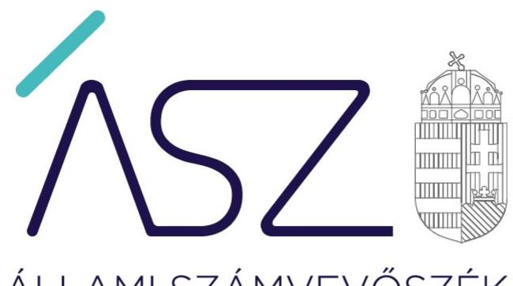
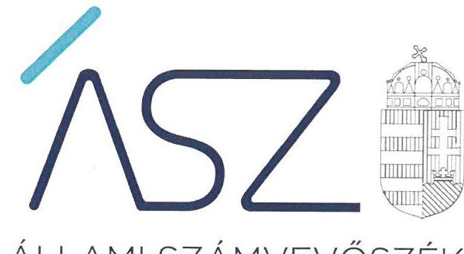
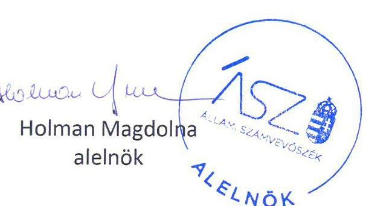

ÁLLAMI SZÁMVEVŐSZÉK

# JELENTÉS 

Nem állami humánszolgáltatók ellenőrzése -
A köznevelési és szociális humánszolgáltatást nyújtó intézmények, szolgáltatók államháztartáson kívüli fenntartói számviteli szabályozottságának monitoring típusú ellenőrzése

684 nem állami humánszolgáltató fenntartó ellenőrzése
2022.

---

ÁLLAMI SZÁMVEVŐSZÉK

# JELENTÉS 

Nem állami humánszolgáltatók ellenőrzése -
A köznevelési és szociális humánszolgáltatást nyújtó intézmények, szolgáltatók államháztartáson kívüli fenntartói számviteli szabályozottságának monitoring típusú ellenőrzése

684 nem állami humánszolgáltató fenntartó ellenőrzése

22060
www.asz.hu

---

# AZ ELLENŐRZÉST VEZETTE ÉS A VÉGREHAJTÁSÁÉRT FELELŐS: 

DR. GÁL NÓRA ellenőrzésvezető
KISTÓTH KRISZTINA ellenőrzésvezető
BAJNAI ZSUZSANNA ellenőrzésvezető
KAKAS SÁNDOR ellenőrzésvezető

A PROGRAM ÖSSZEÁLLÍTÁSÁÉRT FELELŐS:
PÉTER ÁKOS projektvezető

IKTATÓSZÁM: EL-3789-001/2022
TÉMASZÁM: 2618
ELLENŐRZÉS-AZONOSÍTÓ SZÁM: V0962

---

# TARTALOMJEGYZÉK 

■ ÖSSZEGZÉS ..... 5
■ AZ ELLENŐRZÉS CÉLJA ..... 6
■ AZ ELLENŐRZÉS TERÜLETE ..... 7
■ AZ ELLENŐRZÉS HÁTTERE, INDOKOLTSÁGA ..... 8
■ A JELENTÉS LÉNYEGES KÉRDÉSKÖREI ..... 9
■ AZ ELLENŐRZÉS HATÓKÖRE ÉS MÓDSZEREI ..... 10
■ MEGÁLLAPÍTÁSOK ..... 12
■ MELLÉKLETEK ..... 15
I. sz. melléklet: Az ellenőrzött szervezetek ..... 15
II. sz. melléklet: Értelmező szótár ..... 30
■ RÖVIDÍTÉSEK JEGYZÉKE ..... 33

---

.

---

# ÖSSZEGZÉS 

Az Állami Számvevőszék által ellenőrzött, szabályzat készítésre kötelezett 552 nem állami humánszolgáltató intézmény fenntartó 6%-a rendelkezett a jogszabályi kötelezettség alapján elkészítendő, ellenőrzött tartalmi elemekkel rendelkező számviteli szabályozással. A fenntartók intézkedéseinek eredményeként ez az arány az ellenőrzés folyamán 64%-ra emelkedett. Az ellenőrzött szabályozási keretek meglétét az ellenőrzött szervezetek 30%-a nem igazolta.
A szabályzat készítési kötelezettséggel nem rendelkező 132 ellenőrzött fenntartó 77%-a jó gyakorlatot folytat, mivel intézkedéseket tett a szabályszerű támogatás felhasználás alapvető számviteli kereteinek kialakítására.

## Az ellenőrzés társadalmi indokoltsága

A köznevelési és szociális közfeladatot ellátó államháztartáson kívüli szervezetek számára az állam a feladataik ellátásához az éves költségvetési törvényekben jelentős összegű támogatást biztosít.

A köznevelési és szociális feladatokat ellátó intézmények államháztartáson kívüli fenntartói a megfelelő szabályozás kialakításával a szabályszerű közpénz felhasználás alapvető feltételét teremtik meg.

Az ellenőrzés hozzájárul ahhoz, hogy a köznevelési és szociális közfeladatot ellátó államháztartáson kívüli szervezeteknél a költségvetési támogatás szabályszerű felhasználásának alapját képező szabályozók rendelkezésre álljanak és azok egyes lényeges tartalmi elemei a jogszabályi előírásoknak megfeleljenek.

## Főbb megállapítások, következtetések

Az Állami Számvevőszék az ellenőrzöttek által rendelkezésre bocsátott szabályzatok esetében az alapvető számviteli szabályozások kialakításának hiánya mellett számos hiányosságot tárt fel a szabályzatok vizsgált tartalmi elemeire vonatkozóan.

A jogszabály által a számviteli szabályozás alapvető kereteinek kialakítására kötelezett 552 nem állami humánszolgáltató fenntartó 69%-a rendelkezett számviteli politikával és az ennek keretében készítendő szabályzatokkal, valamint számlarenddel, azonban az ellenőrzött szervezetek mindössze 6%-a esetében tartalmazták a szabályzatok a vizsgált tartalmi elemeket.

Az ellenőrzés folyamán az ellenőrzött szervezetek szabályozási hiányok és tartalmi hiányosságok megszüntetésére tett intézkedéseinek eredményeként a vizsgálati szempontok szerinti hiánytalan szabályozási kerettel rendelkező ellenőrzött szervezetek száma 6%-ról 64%-ra emelkedett.

A szabályzatok készítésére kötelezett fenntartók 6%-ánál a megtett intézkedések ellenére maradtak fenn szabályozási, illetve tartalmi hiányosságok, 30%-uk semmilyen intézkedést nem tett. Utóbbi szervezetek továbbra sem igazolták a jogszabályi kötelezettség alapján elkészítendő szabályozások rendelkezésre állását.

Az Állami Számvevőszék jó gyakorlatként azonosította, hogy 102 nem állami humánszolgáltató fenntartója annak ellenére, hogy jogszabály nem írja elő számára a számviteli politika és a kapcsolódó szabályzatok, valamint a számlarend elkészítését, a könyvvezetés alapvető szabályozási kereteit kialakította, ezzel hozzájárulva a gazdálkodása transzparenciájának növeléséhez.

---

# AZ ELLENŐRZÉS CÉLJA 

AZ ELLENŐRZÉS CÉLJA annak értékelése, hogy az államháztartáson kívüli köznevelési és szociális intézmények fenntartója a jogszabály által előírt alapvető számviteli szabályozási kereteket kialakította-e.

---

# AZ ELLENŐRZÉS TERÜLETE 

## 684 köznevelési és szociális humánszolgáltatási közfeladatokat ellátó államháztartáson kívüli fenntartó

A köznevelési és szociális humánszolgáltatási közfeladatokat ellátó államháztartáson kívüli fenntartók (továbbiakban: fenntartók) által üzemeltetett intézmények a társadalom széles körét érintő feladatokat láttak el. A fenntartott intézmények jellemzően magánóvodák, bölcsődék, idősotthonok, fogyatékkal élő személyeket ellátó intézmények, hajléktalanotthonok voltak.

Az ellenőrzött fenntartók szervezeti formája leggyakrabban gazdasági társaság, alapítvány, vagy egyesület volt. Emellett egyes fenntartók egyéni vállalkozó, főiskola, szövetkezet, illetve szövetség formában működtek.

A fenntartók 26%-a (177) köznevelési, 72%-a (491) szociális feladatokat, míg a fennmaradó 2% (16) mindkét feladatot ellátta.

Az ellenőrzött szervezetek közül 121 ellenőrzött szervezet a mikrovállalkozói egyszerűsített beszámoló elkészítését választotta, hét egyéni vállalkozóként és négy KIVA¹ hatálya alá tartozó szervezetként folytatta tevékenységét.

Az ellenőrzött szervezetek felsorolását az 1. számú melléklet tartalmazza.

---

# AZ ELLENŐRZÉS HÁTTERE, INDOKOLTSÁGA 

Az ellenőrzés kiterjed az államháztartásból nyújtott költségvetési támogatásban részesült köznevelési és szociális feladatokat ellátó intézmények államháztartáson kívüli, homogén csoportokat alkotó fenntartóira. Az ellenőrzés a köznevelési és szociális humánszolgáltatási közfeladatokat ellátó államháztartáson kívüli fenntartók esetében az alapvető számviteli szabályozási feltételek kialakítására fókuszál.

Az ÁSZ² az ellenőrzések során tapasztalt „jó gyakorlatokat” szélesebb körben is megismerteti az érintettekkel, ezáltal is hozzájárulva a költségvetési rendszer szabályozott működéséhez.

---

# A JELENTÉS LÉNYEGES KÉRDÉSKÖREI 

1. Az államháztartáson kívüli fenntartó hogyan alakította ki a számviteli elszámolások alapvető feltételeit a gazdálkodása szabályozásával?

---

# AZ ELLENŐRZÉS HATÓKÖRE ÉS MÓDSZEREI 

## Az ellenőrzés típusa

Megfelelőségi ellenőrzés.

## Az ellenőrzött időszak

A 2022. év.

## Az ellenőrzés tárgya

Az ellenőrzés a köznevelési és szociális humánszolgáltatási közfeladatokat ellátó államháztartáson kívüli fenntartók gazdálkodása alapvető szabályozási kereteinek meglétére fókuszál. Az ellenőrzés kiterjed a számviteli politika és ennek keretében készítendő szabályzatok, valamint a számlarend meglétére.

## Az ellenőrzött szervezet

684 az államháztartásból nyújtott költségvetési támogatásban részesült, köznevelési, szociális feladatokat ellátó államháztartáson kívüli humánszolgáltatók fenntartói.

## Az ellenőrzés jogalapja

Az ellenőrzés jogszabályi alapját az ÁSZ tv.³ 1. § (3) bekezdése, az 5. § (3) bekezdése, valamint a vallási egyesület, az egyházi jogi személyek, vagy általuk létrehozott, jogi személyiséggel rendelkező vallási közösségek esetében az 5. § (11) bekezdés c) pontjában foglalt előírások adják.

## Az ellenőrzés módszerei

Az ellenőrzés az ellenőrzött időszakban hatályos jogszabályok, az ellenőrzés szakmai szabályai, a jelen ellenőrzésre irányadó ÁSZ módszertanok, az ellenőrzési programban foglalt értékelési szempontok szerint kell végrehajtani.

Az ellenőrzést az ÁSZ az ellenőrzési program kérdéseire adott válaszok kiértékelésével, valamint a programban ismertetett ellenőrzési kérdések, kritériumok, adatforrások között megjelölt adatforrások, továbbá az

---

ellenőrzött időszakban hatályos jogszabályok figyelembevételével folytatja le.

Az ellenőrzési kérdések megválaszolásához szükséges bizonyítékok megszerzése a következő ellenőrzési eljárások alkalmazásával történik: megfigyelés, összehasonlítás, elemző eljárás. Az ellenőrzési bizonyítékként felhasználható adatforrások közé tartoznak az ellenőrzési programban felsorolt adatforrások, továbbá minden - az ellenőrzés folyamán - feltárt, az ellenőrzés szempontjából információkat tartalmazó dokumentum.

Az ÁSZ a monitoring ellenőrzés során az államháztartáson kívüli humánszolgáltatók fenntartóinak az államháztartásból kapott támogatáshoz kapcsolódó gazdálkodásának szabályozottságára fókuszál. A monitoring típusú ellenőrzés során az ÁSZ - a jelen állapot lényeges dokumentumaira fókuszálva - a kiválasztott lényeges szempontok, kritériumok alapján történő jelen idejű értékelést végez annak érdekében, hogy beazonosítsa az ellenőrzött időszakban az ellenőrzött szervezetek gazdálkodása alapvető szabályozottságának azon tényezőit, amelyek területén további fejlődési lehetőségeik vannak. Az ellenőrzés „jelen idejű” végzésével lehetőség van a feltárt hibák, szabálytalanságok ellenőrzött időszakban történő javítására. A program ellenőrzési szempontjait, kritériumait a jogszabályok, közjogi szervezetszabályozó eszközök, határozatok, további belső utasítások, belső szabályozók előírásai képezik.

---

# MEGÁLLAPÍTÁSOK 

## 1. Az államháztartáson kívüli fenntartó hogyan alakította ki a számviteli elszámolások alapvető feltételeit a gazdálkodása szabályozásával?

Összegző megállapítás

A szabályozás elkészítésére kötelezett ellenőrzött szervezetek 69%-a rendelkezett az ellenőrzéssel érintett szabályozási dokumentumok mindegyikével. A szabályzatok elkészítésére nem kötelezett ellenőrzöttek 77%-ánál az ÁSZ jó gyakorlatot azonosított.

## A SZÁMVITELI POLITIKA ÉS SZÁMLAREND ELKÉSZÍTÉSÉRE JOGSZABÁLY ÁLTAL KÖTELEZETT

552 ellenőrzött szervezet közül 35 fenntartó, az ellenőrzött szervezetek 6%-a rendelkezett az ÁSZ által ellenőrzött valamennyi szabályozással úgy, hogy a szabályozások tartalmazták valamennyi, az ÁSZ által ellenőrzött, lényeges tartalmi elemet is.

A számviteli politikával és a keretében elkészítendő, ÁSZ által ellenőrzött szabályzatok mindegyikével a fenntartók 78%-a (429) rendelkezett.

A fenntartók kisebb hányada nem igazolta a számviteli politika és a keretében elkészítendő, ellenőrzött szabályzatok elkészítését:
⟶ a fenntartók 18%-a (99) nem rendelkezett a Számv. tv.⁴ 14. § (3) bekezdésében előírtak ellenére számviteli politikával,
⟶ a fenntartók 17%-a (93) nem rendelkezett a Számv. tv. 14. § (5) bekezdés a) pontjában előírtak ellenére az eszközök és a források leltárkészítési és leltározási szabályzatával,
⟶ a fenntartók 19%-a (104) nem rendelkezett a Számv. tv. 14. § (5) bekezdés b) pontjában előírtak ellenére az eszközök és a források értékelési szabályzatával,
⟶ a fenntartók 17%-a (92) nem rendelkezett a Számv. tv. 14. § (5) bekezdés d) pontjában előírtak ellenére pénzkezelési szabályzattal.
A számviteli politika ÁSZ által vizsgált tartalmi elemei közül az ellenőrzött szervezetek által rendelkezésre bocsátott számviteli politikák (453) több, mint négyötöde (393 szabályzat, 87%) nem, vagy csak részben felelt meg a Számv. tv. 14. § (4) bekezdésében előírtaknak, amely szerint a számviteli politika keretében írásban rögzíteni kell azokat a gazdálkodóra jellemző szabályokat, előírásokat, módszereket, amelyekkel meghatározza, hogy mit tekint a számviteli elszámolás, az értékelés szempontjából lényegesnek, jelentősnek, nem lényegesnek, nem jelentősnek.

Az eszközök és a források leltárkészítési és leltározási szabályzatával rendelkező ellenőrzött szervezetek esetében az ÁSZ rendelkezésére bocsátott szabályzatok 18%-a (81 szabályzat) nem felelt meg a Számv. tv. 69. § (1), (3), illetve (4) bekezdésében foglaltaknak a mennyiségi felvétellel,

---

illetve az egyeztetéssel történő leltározás gyakoriságának meghatározása vonatkozásában.

A pénzkezelési szabályzattal rendelkező ellenőrzött szervezetek (460) esetében az ÁSZ rendelkezésére bocsátott szabályzatok 10%-a nem tartalmazta a Számv. tv 14. § (8) bekezdésében előírtak ellenére a pénzforgalom bankszámlán történő lebonyolításának rendjét, továbbá a szabályzatok 1%-a a Számv. tv 14. § (8) bekezdésében előírtak ellenére nem rendelkezett a pénzforgalommal kapcsolatos nyilvántartási szabályokról.

A számlarendet a fenntartók 74%-a (411) készítette el. 141 fenntartó azonban a Számv. tv. 161. § (1) bekezdésében foglaltak ellenére nem igazolta a számlarend elkészítését.

A számlarenddel rendelkező ellenőrzött szervezetek vonatkozásában az ÁSZ rendelkezésére bocsátott szabályzatok 11%-a a Számv. tv. 161. § (2) bekezdés c) pontjában előírtak ellenére nem tartalmazta a főkönyvi számla és az analitikus nyilvántartás kapcsolatát.

A számviteli politikával és a keretében elkészítendő, ÁSZ által ellenőrzött szabályzatok mindegyikével, valamint a számlarenddel a fenntartók 69%-a (383) rendelkezett.

Az ellenőrzés ideje alatt a fenntartók 58%-a az ellenőrzés által feltárt minden hiányosság javítására intézkedett, vagy tervezett intézkedésekről számolt be, 6%-uk az ellenőrzés által feltárt hiányosságok megszüntetése iránt részben intézkedett.

163 fenntartó (30%) esetében a szabályszerű gazdálkodáshoz elengedhetetlen számviteli szabályozás alapvető keretei kidolgozása továbbra sem igazolt.

# A SZÁMVITELI SZABÁLYOZÁSOK ELKÉSZÍTÉSÉRE JOGSZABÁLY ÁLTAL NEM KÖTELEZETT ellenőrzött szervezetek esetében az Állami Számvevőszék jó gyakorlatként azonosította, hogy a számviteli szabályozások elkészítésére jogszabály által nem kötelezett 132 ellenőrzött szervezet (mikrovállalkozó, egyéni vállalkozó, illetve a KIVA hatálya alá tartozó gazdálkodó) közül a fenntartók 42%-a (55 ellenőrzött szervezet) rendelkezett az ÁSZ által ellenőrzött szabályzatokkal és a szabályzatok tartalmazták az ÁSZ által ellenőrzött, lényeges tartalmi elemeket.

A fenntartók 35%-a (47 ellenőrzött szervezet) rendelkezett az ÁSZ által ellenőrzött
 egy vagy több szabályzattal, és a szabályzatok számos esetben tartalmazták az ÁSZ által ellenőrzött, lényeges tartalmi elemeket.

---

.

---

# MELLÉKLETEK 

I. SZ. MELLÉKLET: AZ ELLENŐRZÖTT SZERVEZETEK

## Ellenőrzött szervezetek

1. 4 School Iskolafenntartó Nonprofit Korlátolt Felelősségű Társaság
2. Bi Oktatási Alapítvány
3. "A CSALÁDI NAPKÖZIS GYERMEKEKÉRT" ALAPÍTVÁNY
4. "A csend hangjai" Alapítvány
5. A Fiatalok Idegen Nyelv- és Szakmai Továbbképzéséért Alapítvány
6. A KISDEDŐVŐ Alapítvány
7. A Mátyásföldi Katica Óvodáért Alapítvány
8. A NAP HARMATA KÖZHASZNÚ ALAPÍTVÁNY
9. A SZAKMA TISZTESSÉGÉÉRT Közhasznú Alapítvány
10. A Tevékeny Szeretet Közössége
11. Activity Angol-Magyar Sportóvodáért Alapítvány
12. ADDETUR /ADJ HOZZÁ/ ALAPÍTVÁNY
13. ADELANTE ALAPÍTVÁNY
14. AGORÁL Nonprofit Szolgáltató Korlátolt Felelősségű Társaság
15. AIDE Óvoda Nonprofit Korlátolt Felelősségű Társaság
16. Ajándék Családsegítő Közhasznú Alapítvány
17. AKÁCKERT Szociális Nonprofit Korlátolt Felelősségű Társaság
18. ÁKOMBÁKOM ALAPÍTVÁNY
19. AKTÍV SPORT FARM NONPROFIT KORLÁTOLT FELELŐSSÉGŰ TÁRSASÁG
20. Alapítvány a Meseerdő Óvodáért
21. Alapítvány a Palántákért Alapítvány
22. Alapítvány Tatabánya Tánckultúrájáért
23. ALFA KARITATÍV EGYESÜLET
24. Alkotó Élet Pedagógiai és Művelődési Egyesület
25. ALKUNET Nonprofit Kereskedelmi és Szolgáltató Korlátolt Felelősségű Társaság
26. ALMAFA ÁGACSKA NONPROFIT KFT.
27. Alpha-Terra Szolgáltató Nonprofit Betéti Társaság
28. Alternatív Szakképzésért Alapítvány
29. "Alternatíva" alapítvány a gyermekek és fiatalok egészséges kiegyensúlyozott fejlődéséért
30. AMBRÓZIA Pesterzsébeti Akácfa Gondozóház Szolgáltató Nonprofit Korlátolt Felelősségű Társaság
31. Angelus Alapítvány
32. ANGYALFÖLD ALAPÍTVÁNY
33. Angyalok Szárnya Szociális, Egészségügyi és Humánszolgáltató Nonprofit Korlátolt Felelősségű Társaság
34. Angyalszív Gyermekeinkért Alapítvány
35. ÁNH-2001 Non-profit Betéti Társaság
36. ANIKÓ-NAPSUGÁR Szociális Gondozó Közhasznú Nonprofit Korlátolt Felelősségű Társaság
37. Aniván Nonprofit Szolgáltató Korlátolt Felelősségű Társaság
38. Apró Talpak Nonprofit Korlátolt Felelősségű Társaság
39. Aprók Kincse Gyermekjóléti Nonprofit Betéti Társaság
40. Aprónép Közhasznú Egyesület
41. Arany Virág Alapítvány
42. Aranydió Waldorf Pedagógiai Alapítvány
43. Aranyfa Szociális és Tanácsadói Egyesület
44. Aranykapu Gyermekházat Támogató Alapítvány

---

|  Ellenőrzött szervezetek |   |
| --- | --- |
|  45. | ARANYMAGOCSKA NONPROFIT BT.  |
|  46. | Art Éra Alapítvány  |
|  47. | AURA Oktatási Nonprofit Korlátolt Felelősségű Társaság  |
|  48. | AVAR-OVI Közhasznú Alapítvány  |
|  49. | Az Érsekhalmi Óvodásokért Alapítvány  |
|  50. | "Az értelmes életért" Alapítvány  |
|  51. | Az Út Gyermekei Vallási Egyesület  |
|  52. | Az Útban Európához Alapítvány  |
|  53. | AZÜMZÜMBÖLCSI" Családi Napközi Közhasznú Nonprofit Korlátolt Felelősségű Társaság  |
|  54. | Baba Egyetem Egyesület  |
|  55. | Bababarát Gyermekjóléti Közhasznú Egyesület  |
|  56. | Bababirtok Egyesület  |
|  57. | BABAHÁZ ÓVODA Szolgáltató Nonprofit Korlátolt Felelősségű Társaság  |
|  58. | BABAMOSOLY NONPROFIT KFT.  |
|  59. | Babaparadicsom Nonprofit Korlátolt Felelősségű Társaság  |
|  60. | Babusgató Gyermekjóléti Nonprofit Korlátolt Felelősségű Társaság  |
|  61. | Baby Parkoló Gyermekfelügyelet Nonprofit Korlátolt Felelősségű Társaság  |
|  62. | Bagolyvár Alapítvány  |
|  63. | Bajna Gyöngy Mária  |
|  64. | Bakony Szíve Idősek Otthona Nonprofit Korlátolt Felelősségű Társaság  |
|  65. | Balatoni MOCORGÓ Gyermeknevelési és Ismeretterjesztő Alapítvány  |
|  66. | Balla \& Benedek Nonprofit Korlátolt Felelősségű Társaság  |
|  67. | Bambino-Ház Magán Bölcsőde és Óvoda Nonprofit Közhasznú Korlátolt Felelősségű Társaság  |
|  68. | BÁRKA CSANA SZOLGÁLTATÓ NONPROFIT KORLÁTOLT FELELŐSSÉGŰ TÁRSASÁG  |
|  69. | Békés Manufaktúra Humán Szolgáltató Nonprofit Korlátolt Felelősségű Társaság  |
|  70. | BEKLEN A NAGYKUNSÁGI CIVIL TÁRSADALOMÉRT ALAPÍTVÁNY  |
|  71. | BELVÁROSI NAPKÖZI EGYESÜLET  |
|  72. | Bereg Többcélú Egyesület  |
|  73. | Biborka Trió Gyermekvédő Nonprofit Korlátolt Felelősségű Társaság  |
|  74. | Bihari Alapítvány  |
|  75. | "Bilimbo Manói" Nonprofit Korlátolt Felelősségű Társaság  |
|  76. | BIOSZIGET REHABILITÁCIÓS ALAPÍTVÁNY  |
|  77. | Blackthorne Kereskedelmi és Szolgáltató Nonprofit Korlátolt Felelősségű Társaság  |
|  78. | BOFI FAMILY Szolgáltató Nonprofit Korlátolt Felelősségű Társaság  |
|  79. | Boglárka Otthon Nonprofit Korlátolt Felelősségű Társaság  |
|  80. | BOLDOGSÁGBAN FELCSEPEREDNI ALAPÍTVÁNY  |
|  81. | BORSIKA GYERMEKKÖZPONT Közhasznú Nonprofit Korlátolt Felelősségű Társaság  |
|  82. | BORSOD-ABAÚJ-ZEMPLÉN MEGYEI ROMÁK ÉRDEKVÉDELMI EGYESÜLETE MÉRA  |
|  83. | Bölcsődés Korú Gyermekekért Egyesület  |
|  84. | Brit-Magyar Oktatásért Alapítvány  |
|  85. | BUBI BÖLCSI Nonprofit Betéti Társaság  |
|  86. | BUCSUTÁÉRT EGYESÜLET  |
|  87. | Budántúli Waldorf-pedagógiai Alapítvány  |
|  88. | BUDAPEST ESÉLY Nonprofit Korlátolt Felelősségű Társaság  |
|  89. | Budapesti Vasutas Sport Club-Zugló Közhasznú Egyesület  |
|  90. | Búgócsiga Családi Napközi és Játszóház Egyesület  |
|  91. | CENTROSZET Szakképzés-szervezési Nonprofit Korlátolt Felelősségű Társaság  |
|  92. | CIRÓKA CSALÁDI BÖLCSÖDE NONPROFIT KFT  |
|  93. | City College Üzleti Szakképző Közhasznú Nonprofit Korlátolt Felelősségű Társaság  |

---

# Ellenőrzött szervezetek 

94. Civil Érték Egyesület
95. Civitan Club Budapest-Help Egyesület
96. Cogito Alapítvány
97. CORDASTELLA Nyugdíjas Otthon Nonprofit Közhasznú Korlátolt Felelősségű Társaság
98. CREASCOLA Közösségi Iskolák Továbbképzési és Szolgáltató Nonprofit Korlátolt Felelősségű Társaság
99. CREDO Alternatív Oktatási Nevelési Alapítvány
100. Családbarát Magyarország Központ Nonprofit Közhasznú Korlátolt Felelősségű Társaság
101. Csellengő Csemete-Lak Közhasznú Nonprofit Korlátolt Felelősségű Társaság
102. CSEMETEHÁZ Közhasznú Nonprofit Korlátolt Felelősségű Társaság
103. Csengettyű Gyermekjóléti Közhasznú Nonprofit Korlátolt Felelősségű Társaság
104. Cseperedő Waldorf Óvoda Egyesület
105. CSICSÓKA Oktatási és Kulturális Szolgáltató Közhasznú Nonprofit Korlátolt Felelősségű Társaság
106. Csigabiga Egyesület
107. Csigaház Alapítvány
108. CSIKÓHAL Úszó-Sport Alapítvány
109. Csillag Gyermekkert Alapítvány
110. Csillagkert Alapítvány
111. CSILLAGMADÁR GYERMEKHÁZ Szolgáltató Nonprofit Korlátolt Felelősségű Társaság
112. Csillebérci Cseperedő Alapítvány
113. Csimota Óvoda Nonprofit Korlátolt Felelősségű Társaság
114. Csimpilimpi Nonprofit Korlátolt Felelősségű Társaság
115. Csiperkecsana "nonprofit" Korlátolt Felelősségű Társaság
116. Csodabogyó Játszóház Nonprofit Korlátolt Felelősségű Társaság
117. Csodacsalád Egyesület
118. Csodasziget Családi Napközik Nonprofit Korlátolt Felelősségű Társaság
119. Csodavár Egyesület
120. Csodavár Tanodú Nevelési, Oktatási és Fejlesztő Központ Nonprofit Korlátolt Felelősségű Társaság
121. "CSUPA SZÍV" Családi Napközit Üzemeltető Nonprofit Korlátolt Felelősségű Társaság
122. CSUPACSODA Alapítvány
123. Csutkababa Alapítvány
124. CsúCsók Gyermek-ellátási és Szolgáltató Nonprofit Korlátolt Felelősségű Társaság
125. DANUBIUS Hotels Szakképző Iskola és Kollégium Alapítvány
126. DARU Közhasznú Egyesület
127. Dávid Király Keresztény Kultúráért és Oktatásért Alapítvány
128. Dél-budai Waldorf Egyesület
129. Déli Horizont Szülők, Gyermekek, Fiatalok a Holnapért Egyesület
130. Derecske Városi Jóléti Szolgálat Alapítvány
131. Didactica Magna Alapítvány
132. Digitális Tudásért Egyesület
133. DIMASOL Nonprofit Korlátolt Felelősségű Társaság
134. Dióhéj Waldorf-Pedagógiai Közhasznú Egyesület
135. DokiPed Egészségügyi, Oktatási Szolgáltató és Kereskedelmi Nonprofit Korlátolt Felelősségű Társaság
136. Dr. Haraszty Szociális Ellátó Nonprofit Korlátolt Felelősségű Társaság
137. Dr. Göllner Mária Waldorf Egyesület
138. Drog - Stop Budapest Egyesület
139. Drogambulancia Alapítvány
140. DROG-FREE Gyógyult Szenvedélybetegek Alapítványa
141. Drogprevenciós Alapítvány
142. DRSM Nonprofit Korlátolt Felelősségű Társaság

---

|  Ellenőrzött szervezetek |   |
| --- | --- |
|  143. | DT-DIALÓG Ipari, Kereskedelmi és Szolgáltató Nonprofit Korlátolt Felelősségű Társaság  |
|  144. | "Dumbó CSANA" Alapítvány  |
|  145. | Dunakanyar Oktatási Műhely Alapítvány  |
|  146. | Dunakanyar Szíve Nonprofit Korlátolt Felelősségű Társaság  |
|  147. | Dunakeszi Óvodásokért Alapítvány  |
|  148. | EBM TRADE Szolgáltató Korlátolt Felelősségű Társaság  |
|  149. | ÉDES ALKONY GONDOZÓHÁZAK Szociális Egyesület  |
|  150. | Édes Gyermekem Nonprofit Korlátolt Felelősségű Társaság  |
|  151. | Édua Sárvár Nonprofit Korlátolt Felelősségű Társaság  |
|  152. | "EDUCATIONIS" Oktatási Alapítvány  |
|  153. | ÉFOÉSZ Komárom Esztergom Megyei Értelmi Sérültek és Segítőik Egyesülete (1236/2004) "felszámolás alatt"  |
|  154. | Egészséges Biatorbágyért Közhasznú Egyesület  |
|  155. | "Egészséges és derűs gyermekekért" Alapítvány  |
|  156. | Egészséges Lélek, Egészséges Élet Alapítvány  |
|  157. | Egészségfejlesztési - Oktatási Alapítvány  |
|  158. | Egyboglya a Családi Közösségekért Alapítvány  |
|  159. | Egyenlő Esélyért Egyesület  |
|  160. | Egyfecskék Közhasznú Egyesület  |
|  161. | Egy-másért Alapítvány  |
|  162. | Együtt az Egészséges és Mozgékony Gyermekekért Alapítvány  |
|  163. | EGYÜTT VELED Alapítvány  |
|  164. | Ekerek Kereskedelmi Nonprofit Betéti Társaság  |
|  165. | El Bronco Lovasiskola Nonprofit Korlátolt Felelősségű Társaság "végelszámolás alatt"  |
|  166. | ELBE Puttkamer-Szathmáry Többnyelvű Képzési és Kulturális Közhasznú Alapítvány  |
|  167. | Élet-esély Autistákat Segítő Egyesület  |
|  168. | "Életlehetőség" Szociális Nappali Intézmény Közhasznú Nonprofit Korlátolt Felelősségű Társaság  |
|  169. | ELIXIR GOLD Nonprofit Korlátolt Felelősségű Társaság  |
|  170. | Éljünk Együtt Alapítvány  |
|  171. | "Élménygazdag Óvoda" Alapítvány  |
|  172. | Élményösvény Alapítvány  |
|  173. | Élő Forrás Hagyományőrző Egyesület  |
|  174. | Emberfia Egri Waldorf Alapítvány  |
|  175. | Emberke Családsegítő Alapítvány  |
|  176. | „Emberöltő" Alapítvány  |
|  177. | ÉPÜLŐ GENERÁCIÓ Közhasznú Nonprofit Korlátolt Felelősségű Társaság  |
|  178. | "ERDEI ÓVODA" Egyesület  |
|  179. | Erdő Lakói a Gyermekekért Alapítvány  |
|  180. | Érted-Együtt Támogató Szociális Egyesület  |
|  181. | Értelmi Fogyatékossággal Élők és Segítőik Országos Érdekvédelmi Szövetsége  |
|  182. | ESÉLY Gyermekjóléti Alapítvány  |
|  183. | Essere2 Baba-Mama Klub és Készségfejlesztő Közhasznú Nonprofit Korlátolt Felelősségű Társaság  |
|  184. | Etüd Zenei Alapítvány  |
|  185. | EuroHungaricum Alapítvány  |
|  186. | Euro-Iskoláért Közhasznú Alapítvány "törlés alatt"  |
|  187. | Európa Óvoda Nonprofit Korlátolt Felelősségű Társaság  |
|  188. | Euro-Régió Szociális Szakmai Közösség  |
|  189. | Eutrend.hu Nonprofit Szolgáltató, Tanácsadó és Kereskedelmi Korlátolt Felelősségű Társaság  |
|  190. | Ezüsthegy Oktatási Nonprofit Korlátolt Felelősségű Társaság  |

---

# Ellenőrzött szervezetek 

191. Ezüsthold Alapítvány
192. Falugondnokok Vas és Győr-Moson-Sopron Megyei Egyesülete
193. Family Day Családi Napközi Nonprofit Korlátolt Felelősségű Társaság
194. FÉBÉ Evangélikus Diakóniai Alapítvány
195. Fecskefészek Csa-Na Nonprofit Korlátolt Felelősségű Társaság
196. FEDASZ Nonprofit Szolgáltató Betéti Társaság
197. Fehér CsaNa Szolgáltató Nonprofit Betéti társaság
198. Fehér Egér Állategészségügyi, Kereskedelmi Korlátolt Felelősségű Társaság
199. Fehér Kereszt Gyermekvédő Alapítvány
200. FEJLŐDÉSMŰHELY NONPROFIT Korlátolt Felelősségű Társaság
201. "Fényben, szeretetben" Freinet Szemléletű Óvodai Tevékenységet Támogató Szegedi Alapítvány
202. Fenyves Völgy Idősek Otthona Nonprofit Korlátolt Felelősségű Társaság
203. Fenyvesligeti Sündörgő Nonprofit Korlátolt Felelősségű Társaság
204. FÉSZEK CSALÁDI BÖLCSŐDE Közhasznú Nonprofit Korlátolt Felelősségű Társaság
205. Fészek Gyermekvédő Egyesület
206. Fiatalok Magyarország Jövőjéért Egyesület
207. FICÁNKA Családi Napközi Nonprofit Közhasznú Korlátolt Felelősségű Társaság
208. Ficergő Családi Napközi és Gyermekfelügyelet Nonprofit Korlátolt
 Felelősségű Társaság
209. Fogadj el Alapítvány
210. "Fogjunk össze!" Közhasznú Egyesület
211. Fogyatékosok Integrációjáért Békés Megyében Alapítvány
212. Fókuszban a Gyermekekért Nonprofit Korlátolt Felelősségű Társaság
213. "Folklór" Kulturális Közalapítvány
214. Fun 4 Kids Szolgáltató Nonprofit Korlátolt Felelősségű Társaság
215. Futrinka-meseház Nonprofit Korlátolt Felelősségű Társaság
216. FUTURE INNO Nonprofit Korlátolt Felelősségű Társaság
217. Fürkész Innovatív Nonprofit Korlátolt Felelősségű Társaság
218. Garai Ház Alapítvány
219. GEROGONDEX Öreggondozó és Ellátó Nonprofit Betéti Társaság
220. Gesztenye Gyerekház Nonprofit Közhasznú Korlátolt Felelősségű Társaság
221. GIL-GARDEN Családi Bölcsőde Nonprofit Korlátolt Felelősségű Társaság
222. GOCZ ELVIRA ALAPÍTVÁNY
223. GOMOLYÁT TANODA Szolgáltató Nonprofit Korlátolt Felelősségű Társaság
224. Gondtalan Életút Nonprofit Korlátolt Felelősségű Társaság
225. GOND-VISELÉS Nonprofit Közhasznú Korlátolt Felelősségű Társaság
226. Gödi Csiga-Biga Alapítvány
227. Gödi Napsugár Waldorf Alapítvány
228. Gödöllő Néptáncegyüttes Közhasznú Egyesület
229. Gödöllői Szakképző Magániskoláért Alapítvány "törlés alatt"
230. GR-PROTEST Termelő és Kereskedelmi Nonprofit Korlátolt Felelősségű Társaság
231. GTÜ Gomba Község Településüzemeltető, Településfejlesztő és Szociális Közhasznú Nonprofit Korlátolt Felelősségű Társaság
232. Gyémánt Szív Nonprofit Korlátolt Felelősségű Társaság
233. Gyerek Kuckó Nonprofit Korlátolt Felelősségű Társaság
234. Gyerekek, Családok, Anyák Kreatívan Közhasznú Egyesület
235. "GYEREKEKÉRT SOS 90" Alapítvány
236. Gyereknek lenni jó Alapítvány
237. Gyerkőc Udvar Nonprofit Korlátolt Felelősségű Társaság
238. Gyerkőcmosoly Szolgáltató Nonprofit Korlátolt Felelősségű Társaság

---

|  Ellenőrzött szervezetek |   |
| --- | --- |
|  239. | Gyermekálom Családsegítő Egyesület  |
|  240. | Gyermekcentrum Alapítvány  |
|  241. | Gyermekeinkért-Jövőnkét Alapítvány  |
|  242. | Gyermekek Mosolyáért Egyesület  |
|  243. | Gyermekévek Nonprofit Korlátolt Felelősségű Társaság  |
|  244. | GYERMEKFÉSZEK NONPROFIT KFT.  |
|  245. | GYERMEKHÁZ MONTESSORI ALAPFOKÚ OKTATÁSI Alapítvány  |
|  246. | Gyermekklub Angol Játszóház Nonprofit Korlátolt Felelősségű Társaság  |
|  247. | "Gyermekláncfű" Alapítvány  |
|  248. | Gyermekország Óvoda Alapítvány  |
|  249. | Gyermekünk Álmaiért Alapítvány  |
|  250. | Gyökerek és Szárnyak Nonprofit Korlátolt Felelősségű Társaság  |
|  251. | Gyöngy Szemek Alapítvány  |
|  252. | Gyűrűfű Egyesület  |
|  253. | Hajlék Értelmi Fogyatékosokat Segítő Alapítvány  |
|  254. | Hajléknélküliek Jövőjéért Alapítvány  |
|  255. | Hajnóczy Iván Alapítvány a Modern Közgazdasági Szakképzéséért  |
|  256. | Halasi Waldorf Egyesület  |
|  257. | Hálózat a Közösségért Alapítvány  |
|  258. | Hámori Waldorf Egyesület  |
|  259. | Hangaszál Egyesület  |
|  260. | HANGOK KERTJE Nonprofit Korlátolt Felelősségű Társaság  |
|  261. | HANPUR-HOPP Fejlesztő, Szolgáltató és Kereskedelmi Nonprofit Korlátolt Felelősségű Társaság  |
|  262. | Happy Kids Team Nonprofit Korlátolt Felelősségű Társaság  |
|  263. | HARASZTY-PONT Egészségügyi Szolgáltató Betéti Társaság  |
|  264. | Harkai Csana Nonprofit Korlátolt Felelősségű Társaság  |
|  265. | Harlekin Színház Alapítvány  |
|  266. | HARMATCSEPP A Jövőért Egyesület  |
|  267. | HEGYIKRISTÁLY az Idősekért és Fiatalokért Alapítvány  |
|  268. | HELP Rehabilitációs Foglalkoztató Közhasznú Nonprofit Korlátolt Felelősségű Társaság  |
|  269. | Helstekvin Alternatív Oktatási Korlátolt Felelősségű Társaság  |
|  270. | Héra Egyesület  |
|  271. | Hérász Nonprofit Korlátolt Felelősségű Társaság  |
|  272. | Herendi Porcelánmanufaktúra Zártkörűen Működő Részvénytársaság  |
|  273. | HÉT TÖRPE Gyermekmegőrző Nonprofit Betéti Társaság  |
|  274. | Hetényi Élettér Képességfejlesztő és Családi Napközi Alapítvány "felszámolás alatt"  |
|  275. | Héthatár Családbarát és Szabadidő Egyesület  |
|  276. | Héttörpök CSANA Nonprofit Korlátolt Felelősségű Társaság  |
|  277. | Hódmezővásárhelyi Lurkó Kuckó Magánóvoda céljainak elősegítését Szolgáló Pedagógiai Alapítvány  |
|  278. | Holle anyó Nonprofit Korlátolt Felelősségű Társaság  |
|  279. | Homokhátság Fejlődéséért Nonprofit Korlátolt Felelősségű Társaság  |
|  280. | HONESTA VITA Egészségügyi és Szociális - szolgáltató Nonprofit Korlátolt Felelősségű Társaság  |
|  281. | Hornyák Alapítvány  |
|  282. | HORTOBÁGYI-DÉLIBÁB Településüzemeltetési és Rendezvényszervező Szolgáltató Nonprofit Korlátolt Felelősségű Társaság "végelszámolás alatt"  |
|  283. | Horváth Dóra Bölcsőde Nonprofit Korlátolt Felelősségű Társaság  |
|  284. | Hóvirágforrás Nonprofit Betéti Társaság  |
|  285. | HROBIL NEXT Nonprofit Korlátolt Felelősségű Társaság  |
|  286. | "Humán Intézet" Gimnázium, Művészeti Iskola és Kollégium Non-profit Korlátolt Felelősségű Társaság  |

---

# Ellenőrzött szervezetek 

287. HUMAN-NET Szabolcs-Szatmár-Bereg Megyei Humán Erőforrás Fejlesztési Alapítvány
288. Humán - Rehab Közhasznú Egyesület
289. Huncimanci Nonprofit Korlátolt Felelősségű Társaság
290. HUNCUTKÁK CSALÁDI NAPKÖZI Szolgáltató Nonprofit Betéti Társaság
291. Hungaricum Művészeti Közhasznú Alapítvány
292. Iciri-piciri Családi Napközi Közhasznú Alapítvány "törlés alatt"
293. Illés Sport Alapítvány
294. Indiánvár Nemzetközi Óvoda Közhasznú Nonprofit Korlátolt Felelősségű Társaság
295. INFI Szociális, Oktatási és Humán Szolgáltató Közkereseti Társaság
296. Integrált Játékpedagógiai Alapítvány
297. Integrált Oktatásért Alapítvány
298. Itthon - Otthon a fogyatékossággal élő emberekért Alapítvány
299. Izgő-Mozgó Kölyökklub Egyesület
300. IZSÁKI TÖRPIKÉK CSALÁDI NAPKÖZI SZOLGÁLTATÓ NONPROFIT BETÉTI TÁRSASÁG
301. Jáde Szociális és Gyermekvédelmi Nonprofit Korlátolt Felelősségű Társaság
302. Jancsi és Juliska Oktatási Alapítvány
303. Janka Tanya Közhasznú Nonprofit Korlátolt Felelősségű Társaság
304. "JASZLICE" Családsegítő Közhasznú Alapítvány
305. JÁTÉK ÉS FOLYAMATOS FEJLŐDÉS Alapítvány
306. Játékkuckó Alapítvány Közhasznú Szervezet
307. JÁTSZÓVÁR ALAPÍTVÁNY
308. Jelen és a Jövő Gyermekeiért Alapítvány
309. JÓ PONT Oktatási Alapítvány
310. Józan Babák Egyesület
311. Jövő Bárkája Egyesület
312. Jövő Tehetségeiért Alapítvány a Vackor Családi napköziért
313. Juci-kuckója Nonprofit Szolgáltató Betéti Társaság
314. Kacifánt Nonprofit Korlátolt Felelősségű Társaság
315. Kacifántos Gyerekeink Mosolyáért Alapítvány
316. Kádas György Alapítvány
317. Kaláka Felkészítő Otthon Alapítvány
318. Kalimpa Nonprofit Szolgáltató Korlátolt Felelősségű Társaság
319. Kállósemjéni Diákokért és Ifjakért Egyesület
320. Kamasz-Tanya Gyermek és Ifjúsági Egyesület
321. Kapás Alida Éva
322. Kaposmérői Dobogó Kulturális és Polgárőr Egyesület
323. Kapu Waldorf Alapítvány
324. Károlyi Clarisse Alapítvány
325. Kárpát-medencei Fiatalokért Egyesület
326. Kazincbarcikai Mozgáskorlátozottak Egyesülete
327. "Kazincbarcikai Varázskuckó" Családi Bölcsőde Fenntartó, Üzemeltető és Szolgáltató Nonprofit Korlátolt Felelősségű Társaság
328. KÉK Madár Alapítvány
329. Kék Tengerszem Oktatási Nonprofit Korlátolt Felelősségű Társaság
330. KÉKMADÁR LIGET Nonprofit Korlátolt Felelősségű Társaság
331. Kele 2015 Szociális Szolgáltató Nonprofit Korlátolt Felelősségű Társaság
332. Képzett Polgárságért Alapítvány
333. Kerekerdő Óvoda Alapítvány 2003.
334. KEREKESSZABADSÁG Alapítvány

---

|  Ellenőrzött szervezetek |   |
| --- | --- |
|  335. | Keresztény Advent Közösség  |
|  336. | Keresztút Gyermek- és Ifjúságsegítő Keresztény Egyesület  |
|  337. | Készségfejlesztő és Kommunikációs Közhasznú Egyesület  |
|  338. | Kesztölci Családi Bölcsőde Közhasznú Egyesület  |
|  339. | Két Kéz Segítő Alapítvány  |
|  340. | Két kicsi hód Alapítvány  |
|  341. | Keviföld Alapítvány  |
|  342. | Kézenfogva Összefogás a Fogyatékosokért Alapítvány  |
|  343. | Kicsi-Csimota Családi Napközi Nonprofit Betéti Társaság "kényszertörlés alatt"  |
|  344. | KIDDI-CARE Szolgáltató és Tanácsadó Nonprofit Korlátolt Felelősségű Társaság  |
|  345. | Kidlandia Oktató és Programszervező Nonprofit Korlátolt Felelősségű Társaság  |
|  346. | Kids World Iskolai Előkészítő Oktatási Közhasznú Nonprofit Korlátolt Felelősségű Társaság  |
|  347. | Kijárat Egyesület  |
|  348. | Kikelet Családi Bölcsőde Nonprofit Korlátolt Felelősségű Társaság  |
|  349. | KIKELET-CSANA-NONPROFIT Oktatási és Nevelési Korlátolt Felelősségű Társaság  |
|  350. | KIMA Keresztyén Ifjúsági Missziós Közhasznú Alapítvány  |
|  351. | Kipp-Kopp 99 Nonprofit Betéti Társaság  |
|  352. | Kipp-Kopp Alapítvány, az óvodás gyermekekért  |
|  353. | "Kis Angyalok" Közhasznú Alapítvány  |
|  354. | Kis Cimborák Nonprofit Korlátolt Felelősségű Társaság  |
|  355. | Kis Medvebocs Családi Napközi Nonprofit Korlátolt Felelősségű Társaság  |
|  356. | Kisember Waldorf Közhasznú Egyesület  |
|  357. | KISHERCEG CSALÁDI NAPKÖZI Gyermekellátási és Szolgáltató Nonprofit Korlátolt Felelősségű Társaság  |
|  358. | KISKÖPÉ Szociális Alapítvány  |
|  359. | Kisközösség Alapítvány  |
|  360. | Kismackó Egyesület  |
|  361. | Kistornászok Klubja Mozgásfejlesztő Egyesület  |
|  362. | Kisvakond 2011 Nonprofit Korlátolt Felelősségű Társaság  |
|  363. | Kisvakond Alapítvány  |
|  364. | Kisvirág Családi Napközi Nonprofit Korlátolt Felelősségű Társaság  |
|  365. | "Kiút" Szenvedélybetegek Gyógyulásáért Közhasznú Alapítvány  |
|  366. | Kivido Kid Nonprofit Betéti Társaság  |
|  367. | Klára-Szíve Időskorúak Gondozóháza Nonprofit Korlátolt Felelősségű Társaság  |
|  368. | KOLPING Nevelési Alapítvány  |
|  369. | KOMMUNIÓ Alapítvány  |
|  370. | Kompánia Alapítvány  |
|  371. | Kompetenciafejlesztő Nonprofit Korlátolt Felelősségű Társaság  |
|  372. | Konstruktív Életvezetés Iskolája Alapítvány  |
|  373. | Kópé Kölyök Nonprofit Korlátolt Felelősségű Társaság  |
|  374. | Kópék Bölcsődéje Nonprofit Korlátolt Felelősségű Társaság  |
|  375. | Kopint Konjunktúra Kutatási Alapítvány  |
|  376. | Kölyökház Alapítvány  |
|  377. | KÖLYÖKVÁR Játszóház Nonprofit Korlátolt Felelősségű Társaság  |
|  378. | Kölyökvár Közhasznú Egyesület  |
|  379. | KÖNNYŰ TALPAK A FÖLDÉRT NONPROFIT Korlátolt Felelősségű Társaság  |
|  380. | KÖRÖSFRONT Szociális Szolgáltató és Kereskedelmi Korlátolt Felelősségű Társaság  |
|  381. | KÖZALAPÍTVÁNY KARÁD KÖZSÉG IFJÚSÁGÁNAK BOLDOGULÁSÁRA "végelszámolás alatt"  |
|  382. | Közjóléti Alapítvány a Vidéki Családokért  |
|  383. | Közös Pont Egyesület  |

---

# Ellenőrzött szervezetek 

384. Kristály Cseppek Nonprofit Korlátolt Felelősségű Társaság
385. Kuckó Alapítvány
386. Lajosmizsei Babaház Alapítvány
387. LAMENDA ALAPÍTVÁNY
388. LAMENDA Kereskedelmi és Szolgáltató Korlátolt Felelősségű Társaság
389. "LÁMPÁS" KÖZHASZNÚ EGYESÜLET
390. Lasán Róbertné
391. "LEGYEN MINDIG OTTHONUK" Alapítvány
392. Lekvárhegy Szolgáltató Nonprofit Korlátolt Felelősségű Társaság
393. LEN-KI BABA Humánszolgáltató Nonprofit Korlátolt Felelősségű Társaság
394. Lilakert Szolgáltató Nonprofit Korlátolt Felelősségű Társaság
395. Liliput Nonprofit Korlátolt Felelősségű Társaság
396. Lőrinci Gondozóház Szolgáltató Nonprofit Kft
397. Maarif Hungary Nonprofit Korlátolt Felelősségű Társaság
398. Maci Alapítvány
399. MadárTündér Integrált Óvodai Nevelést és Természetvédelmet Támogató Nonprofit Korlátolt Felelősségű Társaság "kényszertörlés alatt"
400. Magyar Kézilabda Utánpótlásért Alapítvány
401. Magyar Kulturális Közösségi és Turisztikai Egyesület
402. Magyar Ökumenikus Segélyszervezet Alapítvány
403. Magyar Vöröskereszt Csongrád Megyei Szervezet
404. Magyar Vöröskereszt Fejér Megyei Szervezete
405. Magyar Vöröskereszt Győr-Moson-Sopron Megyei Szervezete
406. Magyar Vöröskereszt Vas Megyei Szervezete
407. "Magyarországi Magiszter" Alapítvány
408. MÁKVIRÁG VIRÁGAI Gyermekellátási és Szolgáltató Nonprofit Közhasznú Korlátolt Felelősségű Társaság
409. Malvin-Ház Szolgáltató Nonprofit Korlátolt Felelősségű Társaság
410. MANCUS Szabadidő Szervező és Szolgáltató Egyesület
411. Mankaház Szolgáltató Nonprofit Korlátolt Felelősségű Társaság
412. Manó Falva Egyesület
413. MANÓFALVA GYERMEKHÁZ Nonprofit Korlátolt Felelősségű Társaság "végelszámolás alatt"
414. Manófalva Óvoda Közhasznú Nonprofit Korlátolt Felelősségű Társaság
415. MANÓSZIGET Családi Bölcsőde Hálózat Nonprofit Korlátolt Felelősségű Társaság
416. MANÓ-TANYA 2009. KÖZHASZNÚ EGYESÜLET
417. Marina Óvoda Alapítvány
418. Másholország - Közös
 Úgyünk a Gyermekünk Egyesület
419. Mászlainé Fácska Brigitta
420. MÁTRIX-OKTATÁSI Korlátolt Felelősségű Társaság
421. MAZSOLA CSABA Oktatási és Nevelési Nonprofit Korlátolt Felelősségű Társaság
422. Még 1000 év Dömsödért Egyesület
423. MENŐ-MANÓK Gyerekház Nonprofit Korlátolt Felelősségű Társaság
424. Mental Florens Alapítvány
425. MESEFALVA Családi Napközi Közhasznú Nonprofit Korlátolt Felelősségű Társaság
426. Meseház Óvodai Alapítvány
427. MESEVÁR Családi Bölcsőde Nonprofit Korlátolt Felelősségű Társaság
428. Meseváros26 Gyermekekért Nonprofit Korlátolt Felelősségű Társaság
429. Mesevirág - Gyermekvilág Egyesület
430. Mézeskalácsház Családi Napközi és Játszóház Alapítvány
431. Mézi Bölcsőde Nonprofit Betéti Társaság

---

# Ellenőrzött szervezetek 

432. MiaManó Szolgáltató Nonprofit Korlátolt Felelősségű Társaság
433. Micimackó Kuckója Oktatási Alapítvány
434. Miért Ne Közhasznú Humán Szolgáltató Alapítvány
435. MI-ÉRTÜNK Prevenciós és Segítő Egyesület
436. Miiskolánk Oktatási Nonprofit Korlátolt Felelősségű Társaság
437. MIKLÓSI-KEREKERDŐ Nonprofit Szolgáltató Korlátolt Felelősségű Társaság
438. Milánkovics Viktor
439. Mindset Egészség- és Készségfejlesztő Nonprofit Korlátolt Felelősségű Társaság
440. MINI AKADÉMIA Gyermek Alapítvány
441. Mini Világ Gyermekközpont Alapítvány
442. Mini-Manófalva Egyesület
443. Minizsenikért Alapítvány
444. MIRAMOND Nonprofit Szolgáltató Korlátolt Felelősségű Társaság
445. Mit tehetnék érted? Autista Otthon Alapítvány
446. MITHRA ALAPÍTVÁNY
447. MOBIL BUSINESS LANGUAGE Szolgáltató Nonprofit Korlátolt Felelősségű Társaság
448. Modern Táncművészeti Alapítvány
449. Móka Miki Egyesület
450. Mókavár Családi Napközi Nonprofit Korlátolt Felelősségű Társaság
451. Móki Ház Nonprofit Betéti Társaság
452. Mosolygó Gyerekek Nonprofit Korlátolt Felelősségű Társaság
453. MOSOLYKA BÖLCSI Nonprofit Betéti Társaság
454. Mosoly-Lak Egyesület
455. "Mosonszolnok Községért" Közalapítvány
456. Mozgás Egészség Sport Együtt Alapítvány
457. "Mozgásban a mozgássérültek" Közhasznú Alapítvány
458. Mozgássérült Fiatalokért Alapítvány
459. Mozgássérültek és Barátaik Miskolc Városi Egyesülete
460. Mozgássérültek Jász-Nagykun-Szolnok Megyei Egyesülete
461. Mozgássérültek Mezőkövesdi Egyesülete
462. Munkahelyi Óvoda Nonprofit Korlátolt Felelősségű Társaság
463. Music Ház Nonprofit Korlátolt Felelősségű Társaság
464. Musicalvarázs Alapítvány
465. Nádudvari Ficánka Közhasznú Egyesület
466. NAGY KINCS Oktatási és Szolgáltató Nonprofit Betéti Társaság
467. NAGY LÉPÉS KICSIKNEK EGYESÜLET
468. Nagy Leszek Nonprofit Korlátolt Felelősségű Társaság
469. Nagyerdői Családi Napközi Nonprofit Korlátolt Felelősségű Társaság
470. Nagyot a Kicsikért Gyermekellátó- és támogató Alapítvány
471. Nami Piano Nonprofit Korlátolt Felelősségű Társaság
472. Napkehely Egyesület
473. Napkeleti Kör Nonprofit Korlátolt Felelősségű Társaság
474. Napocska Bölcsi Nonprofit Betéti Társaság
475. Napraforgóház a családokért Szolgáltató Nonprofit Korlátolt Felelősségű Társaság
476. Napsugár'67 Alapítvány
477. Napsugár a Családok Értékeinek Megőrzéséért Alapítvány
478. NAPSUGÁR Játszóház és Családi Napközi Nevelő és Fejlesztő Nonprofit Korlátolt Felelősségű Társaság
479. NASOPKA Közhasznú Nonprofit Korlátolt Felelősségű Társaság
480. "NATURKINDER" német nyelvű óvodai ALAPÍTVÁNY

---

# Ellenőrzött szervezetek 

481. Nebuló Oktatási Alapítvány
482. Nemzetközi Gazdasági, Üzleti Középiskola és Akadémia Alapítvány
483. Nemzetközi Gyermekmentő Szolgálat Magyar Egyesület
484. Neopuko Nonprofit Korlátolt Felelősségű Társaság
485. Népi Mesterségek Műhelye Egyesület
486. Néptánccal a Gyermekekért Alapítvány
487. NiKri Nonprofit Korlátolt Felelősségű Társaság
488. Nő A Siker Alapítvány
489. NYIFE Nyírségi Ifjúsági Egyesület
490. Nyíregyházi Főiskola a tanulási kompetenciák, az oktatás és szakképzés fejlesztéséért alapítvány
491. "Nyírségi Segítő Kéz" Alapítvány
492. Nyugodt Élet Gondozó Ház és Hospice Ház Alapítvány
493. NYUSZITAPPANCS Családi Bölcsőde Alapítvány
494. OKTATÁSÉRT TIT Oktató és Szolgáltató Nonprofit Korlátolt Felelősségű Társaság
495. Oktatásfejlesztési Innovációs Szövetség
496. Országos Tranzitfoglalkoztatási Egyesület
497. Otthon Melege Nonprofit Korlátolt Felelősségű Társaság
498. Otthoni Szakápolás a Betegekért Alapítvány
499. ÖVODASPORT Nonprofit Korlátolt Felelősségű Társaság
500. Özon Sport Club
501. Önmegvalósítás Egyesület
502. Örömteli Nevelés Nonprofit Korlátolt Felelősségű Társaság
503. "Őszi Fény" Otthon Alapítvány
504. Összefogás Berettyószentmártonért Egyesület
505. "ÖSSZEFOGÁS" Közhasznú Alapítvány
506. ÖTSZÍNVIRÁG Nonprofit Korlátolt Felelősségű Társaság
507. Palánta Tanoda Nonprofit Közhasznú Korlátolt Felelősségű Társaság
508. Palóc Ifjúság- és Családsegítő Nonprofit Korlátolt Felelősségű Társaság
509. Pampalini Alapítvány
510. Panda Óvoda Közhasznú Alapítvány
511. Pannónia Gyermekeiért Alapítvány
512. "PÁNTLIKA" Néptánc Alapítvány
513. Patrónus Egyesület
514. Patrónus Ház Közhasznú Nonprofit Korlátolt Felelősségű Társaság
515. Pazonyi Zoltán
516. Pécsi Sport Nonprofit Zártkörűen Működő Részvénytársaság
517. Pendula Óvoda Nonprofit Korlátolt Felelősségű Társaság
518. PÉNZES SÁNDOR
519. PERIFÉRIA Egyesület
520. Petőfitelep Jövője Egyesület
521. Pici-Talpak Gyermekgondozó Egyesület
522. PICUR Magánóvoda Alapítvány
523. PIKI KIDS Nonprofit Korlátolt Felelősségű Társaság
524. Pilisborosjenői Waldorf Egyesület
525. Pilisszentlászlói Waldorf Óvodáért Közhasznú Egyesület
526. Pillangófa Idősek Otthona Nonprofit Korlátolt Felelősségű Társaság
527. Pindúrfalva Nonprofit Korlátolt Felelősségű Társaság
528. PIRINKŐ Családi Napközi és Játszóház Közhasznú Alapítvány
529. Pirkadattól Alkonyatig Alapítvány

---

|  Ellenőrzött szervezetek |   |
| --- | --- |
|  530. | Plumtree Oktató Nonprofit Kft.  |
|  531. | Pom-pom Családi Napközi Nonprofit Korlátolt Felelősségű Társaság  |
|  532. | Pótbölcsőde Gyermekgondozó Nonprofit Korlátolt Felelősségű Társaság  |
|  533. | Pöttöm Pöttyök Nonprofit Korlátolt Felelősségű Társaság  |
|  534. | Pöttömörző Családi Napközi Alapítvány  |
|  535. | PRO ART Tehetséges és Fiatal Művészekért és Sportolókért Alapítvány  |
|  536. | Pro-Art Kistelek Közhasznú Nonprofit Korlátolt Felelősségű Társaság  |
|  537. | PRÜCSÖK OTTHON Nonprofit Korlátolt Felelősségű Társaság  |
|  538. | Rácz Aladár Zeneiskoláért Alapítvány  |
|  539. | Rákoshegyi Waldorf Alapítvány  |
|  540. | RÁKOSMENTE GYERMEKEI MOSOLYÁÉRT Nonprofit Korlátolt Felelősségű Társaság  |
|  541. | Reflextorna Mozgás- és Képességfejlesztő Nonprofit Korlátolt Felelősségű Társaság  |
|  542. | Rella Baba Nonprofit Korlátolt Felelősségű Társaság  |
|  543. | REMALAU Nonprofit Közhasznú Korlátolt Felelősségű Társaság  |
|  544. | Remigius Alapítvány  |
|  545. | RMV 2007 Kereskedelmi és Szolgáltató Korlátolt Felelősségű Társaság  |
|  546. | ROMA LÁNG EGYESÜLET  |
|  547. | Rómahegyi Gyermekházért Alapítvány  |
|  548. | ROYAL 2008 Szolgáltató és Kereskedelmi Nonprofit Korlátolt Felelősségű Társaság  |
|  549. | Rozma 2017 Nonprofit Korlátolt Felelősségű Társaság  |
|  550. | S.O.S Együtt Egymásért Alapítvány  |
|  551. | "S.O.S. és Könyvelő" Szociálisan Rászorultakat Segítő Korlátolt Felelősségű Társaság  |
|  552. | Sásd és Térsége Terület- és Humánfejlesztési Nonprofit Korlátolt Felelősségű Társaság  |
|  553. | "Sclerosis multiplex gyógyításáért" Alapítvány  |
|  554. | SEGÍTŐ KÉZ 2003 Szociális Egyesület  |
|  555. | Segítőház Alapítvány  |
|  556. | SERIO OPERANDO Korlátolt Felelősségű Társaság  |
|  557. | Sérülten az Önálló Életért (Értelmi Fogyatékosokért) Alapítvány  |
|  558. | Simeon Rózsatéri Öregotthon Alapítvány  |
|  559. | SIÓFOK KÉZILABDA ÉS TENISZ CLUB Sportszolgáltató Korlátolt Felelősségű Társaság  |
|  560. | SIRIUS Oktatási Egyesület  |
|  561. | SmartKid Nonprofit Szolgáltató Korlátolt Felelősségű Társaság  |
|  562. | Sokorópátkai Nőegylet  |
|  563. | Sokszínvilág Alapítvány  |
|  564. | SOMOGYUDVARHELYI KUCKÓ ALAPÍTVÁNY  |
|  565. | Sorsunk és Jövőnk Szeretetszolgálat  |
|  566. | Sotéria Szociális Szolgáltató Nonprofit Korlátolt Felelősségű Társaság  |
|  567. | Speciális Szükségletűekért Alapítvány  |
|  568. | SPENÖTKUTYA Szociális Szolgáltató Nonprofit Korlátolt Felelősségű Társaság  |
|  569. | Start Rehabilitációs Foglalkoztató és Intézményei Közhasznú Nonprofit Korlátolt Felelősségű Társaság  |
|  570. | Strázsa-Kégli Nonprofit Korlátolt Felelősségű Társaság  |
|  571. | Stúdió Fehérvár Oktatási Nonprofit Korlátolt Felelősségű Társaság  |
|  572. | Susie's Családi Napközi Nonprofit Korlátolt Felelősségű Társaság  |
|  573. | Szakképzett Ifjúságért Alapítvány  |
|  574. | SZA-LAD Kereskedelmi és Szolgáltató Nonprofit Betéti Társaság  |
|  575. | Szalmaszál Fogyatékos Embereket Segítő Szolgálat  |
|  576. | Szécsényi "Derűs öregkorért" Alapítvány  |
|  577. | SZÉKESFEHÉRVÁR - MAROSHEGYI KULTURÁLIS EGYESÜLET  |
|  578. | Szellő Szárnyán Közhasznú Egyesület  |

---

| Ellenőrzött szervezetek |  |
| :--: | :--: |
| 579. | Széna Egyesület a Családokért |
| 580. | SZENT ANNA Karitász Egyesület |
| 581. | Szent Erzsébet Idősek Otthona Alapítvány |
| 582. | Szent Erzsébet Jótékonysági Alapítvány |
| 583. | Szent Ferenc Tanyaóvoda Alapítvány |
| 584. | Szent György Nonprofit Közhasznú Korlátolt Felelősségű Társaság |
| 585. | Szent Imre Öröksége Alapítvány |
| 586. | Szent Kamill Idősek Otthona Nonprofit Korlátolt Felelősségű Társaság |
| 587. | Szent Lázár Alapítvány |
| 588. | Szentendrei Boróka Alapítvány |
| 589. | "Szentgáli Kurázsi" Oktatási, Kulturális és Természeti Értékmegőrző Alapítvány |
| 590. | Szenvedélybetegeket Mentő Szamaritánus Egyesület |
| 591. | Szép Gyermekkor Nonprofit Korlátolt Felelősségű Társaság |
| 592. | Szépség-Kultúra Szakképzésért Alapítvány |
| 593. | Szeretet Nagykövetség Alapítvány |
| 594. | Szeretethang Gyermekjóléti Közhasznú Egyesület |
| 595. | Sziget Droginformációs Alapítvány |
| 596. | Sziget Suli Alternatív Pedagógiai Egyesület |
| 597. | Szihalom Mozgáskorlátozottainak és Barátainak Egyesülete |
| 598. | Szikra Iskola Alapítvány |
| 599. | Színház és Film Intézet Nonprofit Korlátolt Felelősségű Társaság |
| 600. | Szivárvány a Gyermekekért Egyesület |
| 601. | Szivárvány Keresztény Óvodáért Nonprofit Korlátolt Felelősségű Társaság "végelszámolás alatt" |
| 602. | Szivárvány Óvodáért Közhasznú Alapítvány |
| 603. | SZIVÁRVÁNYTENGER Nonprofit Korlátolt Felelősségű Társaság |
| 604. | Szívem Csücske Alapítvány |
| 605. | Szívkörtánc Nonprofit Betéti Társaság |
| 606. | Szoboszlói Gyermekekért Egyesület |
| 607. | "Szolgálat a gyermekekért" Nonprofit Korlátolt Felelősségű Társaság |
| 608. | Szolgáltató és Kulturális Központ Nonprofit Korlátolt Felelősségű Társaság |
| 609. | Szóráth Orsolya Márta |
| 610. | Szücs Jövőjéért Közalapítvány |
| 611. | Szülők Fóruma Egyesület |
| 612. | Szülők Háza Alapítvány |
| 613. | TÁDÉ Játszóház és Fejlesztő Közhasznú Alapítvány |
| 614. | Találj Haza Rehabilitációs Alapítvány |
| 615. | Tamási Aranyalma Waldorf Egyesület |
| 616. | Tamási Waldorf Pedagógiai Alapítvány |
| 617. | Tarkabarka Családi Napközi Egyesület |
| 618. | TÁRS EGYESÜLET |
| 619. | Tengelice Óvodai Oktatási Alapítvány |
| 620. | TERELGETŐ Nonprofit Korlátolt Felelősségű Társaság |
| 621. | Természetbarát Gyermekek Alapítvány |
| 622. | TESZ-VESZ CITY Közhasznú Nonprofit Korlátolt Felelősségű Társaság |
| 623. | TG - Kertészeti Kutatókat, Oktatókat, Gyakorlati Szakembereket Támogató Országos Alapítvány |
| 624. | TIKKO Egyesület |
| 625. | Tipegő Talpak Családi Bölcsőde Nonprofit Korlátolt Felelősségű Társaság |
| 626. | Tiszakerecsenyi Reformátusokért Alapítvány |
| 627. | Tisza-Maros Pedagógiai Egyesület |

---

|  Ellenőrzött szervezetek |   |
| --- | --- |
|  628. Tiszta Jövőért Közhasznú Alapítvány |   |
|  629. Tomori Pál Főiskola |   |
|  630. TÖRPEKUCKÓ Nonprofit Korlátolt Felelősségű Társaság |   |
|  631. TÖRPI-LAK Családi Bölcsőde Nonprofit Betéti Társaság |   |
|  632. TÖRPI-TANYA ALAPÍTVÁNY |   |
|  633. Törppicur Nonprofit Közhasznú Korlátolt Felelősségű Társaság |   |
|  634. TRENDELI ALAPÍTVÁNY |   |
|  635. Trinity Nyelvstúdió és Rekreációs Központ Nonprofit Korlátolt Felelősségű Társaság |   |
|  636. TRIVIUM Szociális és Szakképzési Alapítvány |   |
|  637. Tudás-Vár Nonprofit Korlátolt Felelősségű Társaság |   |
|  638. Tudomány-Kaptár Alapítvány |   |
|  639. Tulipánfalva Nonprofit Korlátolt Felelősségű Társaság |   |
|  640. TÜNDÉRKERT ALAPÍTVÁNY |   |
| 

 641. Tündérkert és Mesepalota Egyesület |   |
|  642. Tündérkert Közhasznú Sportegyesület |   |
|  643. Tündérkert Nonprofit Korlátolt Felelősségű Társaság |   |
|  644. Tündérkuckó Nonprofit Korlátolt Felelősségű Társaság |   |
|  645. Tündérmanók Nonprofit Korlátolt Felelősségű Társaság |   |
|  646. Tündértalpak Nonprofit Korlátolt Felelősségű Társaság |   |
|  647. Tündérvilág Alapítvány |   |
|  648. Tündérzug Alapítvány |   |
|  649. Tyúkanyó Óvodanevelési Alapítvány a Gyermekekért |   |
|  650. Ugrifüles Oktatási és Szolgáltató Nonprofit Korlátolt Felelősségű Társaság |   |
|  651. Új Előadóművészeti Alapítvány |   |
|  652. Új Jövő Alapítvány |   |
|  653. Újharangodi Hátrányos Helyzetű Idősek és Családosok Alapítványa |   |
|  654. Unio Kind Nonprofit Gyermekszolgáltató Korlátolt Felelősségű Társaság |   |
|  655. Uray György Waldorf Pedagógiai Alapítvány |   |
|  656. Úton Feléd Alapítvány |   |
|  657. Üllői út 667. Nonprofit Korlátolt Felelősségű Társaság |   |
|  658. Vadkörte Alapítvány |   |
|  659. Valcer az Ifjúságért Alapítvány |   |
|  660. Vállai Német Nemzetiségi Óvoda Nonprofit Korlátolt Felelősségű Társaság |   |
|  661. Vámosújfalui Kézműves Korlátolt Felelősségű Társaság |   |
|  662. Varázsceruza Gyermeknevelő, Képesség- és Személyiségfejlesztő Alapítvány |   |
|  663. Varázs-Csillag Szociális és Oktatási Nonprofit Korlátolt Felelősségű Társaság |   |
|  664. Varázskuckó Nonprofit Betéti Társaság |   |
|  665. Varjas Szolgáltató Nonprofit Betéti Társaság |   |
|  666. "Vár-Lak" Gyermekjóléti Közhasznú Alapítvány |   |
|  667. Vidám Gyermekévek Nonprofit Közhasznú Korlátolt Felelősségű Társaság |   |
|  668. "Vidám Gyermekkor" Gyermekjóléti Nonprofit Korlátolt Felelősségű Társaság |   |
|  669. Vidám Kölykök Közhasznú Egyesület |   |
|  670. Világfa Közhasznú Alapítvány |   |
|  671. Virágos Gyermekkert Egyesület |   |
|  672. Waldorf Gyógyító Pedagógiáért és Nevelésért Egyesület |   |
|  673. We Kids Nonprofit Korlátolt Felelősségű Társaság |   |
|  674. Wichern Alapítvány a Magyarországi Szociális Munkáért és Ifjúságvédelemért |   |
|  675. Wide World Nonprofit Betéti Társaság |   |
|  676. Wojtyla Ház Szociális Ellátó és Szolgáltató Nonprofit Korlátolt Felelősségű Társaság |   |

---

Ellenőrzött szervezetek
677. Wűn-Csana Egyszemélyes Nonprofit Korlátolt Felelősségű Társaság
678. Zalai Humánerőforrás-fejlesztő, Tevékeny Foglalkoztató és Szolgáltató Szociális Szövetkezet
679. Zempléni Családokért Alapítvány
680. Zenés Bölcsi Nonprofit Korlátolt Felelősségű Társaság
681. ZM+BI Nonprofit Szolgáltató Korlátolt Felelősségű Társaság
682. Zöld Horizont Nonprofit Korlátolt Felelősségű Társaság
683. Zöldbogyóka Nonprofit Korlátolt Felelősségű Társaság
684. Zöldfenyő Gyermeksziget Bölcsődei és Óvodai Nevelő Nonprofit Korlátolt Felelősségű Társaság

---

# II. SZ. MELLÉKLET: ÉRTELMEZŐ SZÓTÁR 

civil szervezet

EGT-államok
humánszolgáltatás
köznevelési intézmény fenntartója
szociális/gyermekvédelmi intézmény fenntartója
költségvetési támogatás

A Civil tv. 2. § 6. pontja szerint civil szervezet a civil társaság, a Magyarországon nyilvántartásba vett egyesület (a párt, a szakszervezet és a kölcsönös biztosító egyesület kivételével), a közalapítvány és a pártalapítvány kivételével az alapítvány.
Az Európai Unió és az Európai Szabadkereskedelmi Társulás tagjai által létrehozott intézmény, az Európai Unió Egységes Piacának kiterjesztése. EGT-államok: Ausztria, Belgium, Bulgária, Ciprusi Köztársaság, Csehország, Dánia, Észtország, Finnország, Franciaország, Görögország, Hollandia, Horvátország, Írország, Lengyelország, Lettország, Litvánia, Luxemburg, Magyarország, Málta, Németország, Olaszország, Portugália, Románia, Spanyolország, Svédország, Szlovákia, Szlovénia. Az Európai Gazdasági Térségről szóló megállapodásban részes más államok: Egyesült Királyság (2020. december 31-ig), Izland, Liechtenstein, Norvégia, Svájc.
Külön törvényben meghatározott szociális, gyermekjóléti, gyermekvédelmi, közoktatási, felsőoktatási, kulturális közfeladatok.
Köznevelési intézményt egyházi jogi személy, vallási egyesület -vagy más személy, vagy szervezet (például civil szervezet, alapítvány, gazdasági társaság) is alapíthat és fenntarthat. (Nkt. 2. § (3) bekezdés bb - bd) pontjai)
Nem állami, nem önkormányzati szociális/gyermekvédelmi intézmény fenntartója lehet: bevett egyház, annak belső egyházi jogi személye, továbbá az olyan nyilvántartásba vett egyház, bejegyzett egyház, azok belső egyházi jogi személye, amely a lelkiismereti és vallásszabadságjogáról, valamint az Ehtv. 9/D. § (5) bekezdése, illetve 9/F. § (1) bekezdése szerinti, a szociális, gyermekjóléti, vagy gyermekvédelmi feladatok ellátására is kiterjedő megállapodással rendelkezik, egyéni vállalkozó, egyéb magyarországi székhelyű jogi személy, gazdasági társaság és az egyéni cég, továbbá EGT-államban, valamint - ha az Európai Közösséggel és tagállamaival létrejött nemzetközi szerződés alapján az adott állam szolgáltatói a letelepedés szabadsága tekintetében az EGT-államok szolgáltatóival azonos jogállást élveznek - az EGT-államoktól eltérő más államban honos vállalkozás belföldön bejegyzett fióktelepe. (Szoctv. 4. § (1) bekezdés m) pont mb) -me) alpontjai és Gyvt. 5. § s) pont sb) - se) alpontjai)
Az Átr. 1. § i) és l) pontjai szerint az Átr. alkalmazásában támogatás: a központi költségvetésről szóló törvényben a szolgáltatások működéséhez biztosított támogatás, valamint az egyházi kiegészítő támogatás, ide nem értve a támogató szolgáltatás és a közösségi ellátások finanszírozásának rendjéről szóló 191/2008. (VII. 30.) Korm. rendelet alapján nyújtott támogatást, működési támogatás: a központi költségvetésről szóló törvényben a szolgáltatások működéséhez biztosított támogatás, ide nem értve a szociális ágazati összevont pótlékhoz, valamint az egészségügyi kiegészítő pótlékhoz nyújtott támogatást.
Az Nkt. vhr. 37/B. § (2) bekezdése szerint: „Az átlagbér alapú támogatás, a gyermek- és tanulóétkeztetéshez nyújtott támogatás (a továbbiakban: támogatások)
Civil. tv. 2. § 8. pontja szerint a Civil törvény alkalmazásában feladatfinanszírozást szolgáló költségvetési támogatás: valamely közfeladat államháztartáson kívüli szervezet által történő ellátását, valamint e feladat ellátásához közvetlenül kapcsolódó, arányos működési költségeket finanszírozó költségvetési támogatás.

---

# Mellékletek 

köznevelési közfeladat
köznevelési alapfeladat: a köznevelési intézmény alapító okiratában, szakmai alapdokumentumában meghatározott olyan köznevelési feladat, amely óvodai nevelés, nemzetiséghez tartozók óvodai nevelése, általános iskolai nevelés-oktatás, nemzetiséghez tartozók általános iskolai nevelése-oktatása, kollégiumi ellátás, nemzetiségi kollégiumi ellátás, gimnáziumi nevelés-oktatás, szakgimnáziumi nevelés-oktatás, szakiskolai nevelés-oktatás, készségfejlesztő iskolai nevelés-oktatás, nemzetiséghez tartozók gimnáziumi nevelése-oktatása, nemzetiséghez tartozók szakgimnáziumi nevelése-oktatása, kiegészítő nemzetiségi nyelvoktatás, felnőttoktatás, alapfokú művészetoktatás, fejlesztő nevelés-oktatás, pedagógiai szakszolgálati feladat, a többi gyermekkel, tanulóval együtt nevelhető, oktatható sajátos nevelési igényű gyermekek, tanulók óvodai nevelése és iskolai nevelése-oktatása, azoknak a sajátos nevelési igényű gyermekeknek, tanulóknak az óvodai nevelése, iskolai nevelése-oktatása, kollégiumi ellátása, akik az e célra létrehozott gyógypedagógiai, konduktív pedagógiai nevelési-oktatási intézményben, óvodai csoportban, iskolai osztályban, kollégiumi csoportban eredményesebben foglalkoztathatóak, a gyermekgyógyüdülőkben, egészségügyi intézményekben rehabilitációs intézményekben tartós gyógykezelés alatt álló gyermekek tankötelezettségének teljesítéséhez szükséges oktatás, pedagógiai-szakmai szolgáltatás, utazó gyógypedagógusi, utazó konduktori hálózat működtetése, nemzetiségi alapfokú művészetoktatás, kiegészítő nemzetiségi óvodai nevelés lehet. (Nkt. 4.§ 14a.)
köznevelési intézmény
nem állami, nem önkormányzati (államháztartáson kívüli) intézmény fenntartó
mikrogazdálkodó

Az óvoda, az általános iskola, a gimnázium, a szakgimnázium, a szakiskola, a készségfejlesztő iskola, az alapfokú művészeti iskola, a kiegészítő nemzetiségi nyelvoktató iskola, a gyógypedagógiai, konduktív pedagógiai nevelési-oktatási intézmény, a kollégium, a pedagógiai szakszolgálati intézmény, a pedagógiai-szakmai szolgáltatást nyújtó intézmény, és a kiegészítő nemzetiségi óvoda. (Nkt. 7. § (1) bek.)
A szociális, gyermekjóléti, gyermekvédelmi közfeladatot ellátó intézményt, szolgáltatást fenntartó egyházi jogi személy, civil szervezet, közalapítvány, országos nemzetiségi önkormányzat, települési vagy területi nemzetiségi önkormányzat, gazdasági társaság, és a humánszolgáltatást alaptevékenységként végző, az Szja tv. hatálya alá tartozó egyéni vállalkozó (a továbbiakban együtt: nem állami szociális fenntartó). (2021. évi Kvtv. 43. § (1) bekezdése)
Mikrogazdálkodói egyszerűsített beszámolót készíthet az a vállalkozó, aki megfelel a Számv. tv. szerinti feltételeknek:
9.§ (6) Egyszerűsített éves beszámolóját - saját választása alapján - a 6. § (5) bekezdés szerinti kormányrendeletben foglaltaknak megfelelően (mikrogazdálkodói egyszerűsített éves beszámoló) is elkészítheti a könyvvizsgálatra nem kötelezett vállalkozó, ha két egymást követő üzleti évben a mérleg fordulónapján a következő, a nagyságot jelző három mutatóérték közül bármelyik kettő nem haladja meg az alábbi határértéket:
a) a mérlegfőösszeg a 100 millió forintot,
b) az éves nettó árbevétel a 200 millió forintot,
c) az üzleti évben átlagosan foglalkoztatottak száma a 10 főt.

---

.

---

# RÖVIDÍTÉSEK JEGYZÉKE 

${ }^{1}$ KIVA
${ }^{2}$ ÁSZ
${ }^{3}$ ÁSZ tv.
${ }^{4}$ Számv. tv.
${ }^{5}$ Civil tv.
${ }^{6}$ Nkt.
${ }^{7}$ Ehtv.
${ }^{8}$ Szoctv.
${ }^{9}$ Gyvt.
${ }^{10}$ Átr.
${ }^{11}$ Nkt. vhr.
${ }^{12}$ Kvtv.
a kisadózó vállalkozások tételes adójáról és a kisvállalati adóról szóló 2012. évi CXLVII. törvény a kisadózó vállalkozások tételes adójáról és a kisvállalati adóról című jogszabályban meghatározott adónem
Állami Számvevőszék
2011. évi LXVI. törvény az Állami Számvevőszékről
a számvitelről szóló 2000. évi C. törvény
az egyesülési jogról, a közhasznú jogállásról, valamint a civil szervezetek működéséről és támogatásáról szóló 2011. évi CLXXV. törvény
a nemzeti köznevelésről szóló 2011. évi CXC. törvény
a lelkiismereti és vallásszabadságjogáról, valamint az egyházak, vallásfelekezetek és vallási közösségek jogállásáról szóló 2011. évi CCVI. törvény
a szociális igazgatásról és szociális ellátásokról szóló 1993. évi III. törvény
a gyermekek védelméről és a gyámügyi igazgatásról szóló 1997. évi XXXI. törvény az egyházi és nem állami fenntartású szociális, gyermekjóléti és gyermekvédelmi szolgáltatók, intézmények és hálózatok állami támogatásáról szóló 489/2013. (XII.18.) Korm. rendelet
a nemzeti köznevelésről szóló törvény végrehajtásáról szóló 229/2012. (VIII. 28.) Korm. rendelet
2021. évi XC. törvény - Magyarország 2022. évi központi költségvetéséről

---

# ASZ 

ÁLLAMI SZÁMVEVŐSZÉK
1052 Budapest, Apáczai Cs. J. u. 10. I 1364 Budapest 4. Pf. 54 TEL: +36 14849100
email: szamvevoszek@asz.hu
web: www.asz.hu | www.aszhirportal.hu

