# JELENTÉS 

2021. évi zárszámadás

Magyarország 2021. évi központi költségvetése végrehajtásának ellenőrzése
2022.

22061
T/1877/1
www.asz.hu

---

# JELENTÉS   2021. évi zárszámadás 

Magyarország 2021. évi központi költségvetése
végrehajtásának ellenőrzése
2022.

22061
T/1877/1
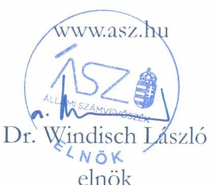

---

# AZ ELLENŐRZÉST FELÜGYELTE: 

MAKKAI MÁRIA felügyeleti vezető

## AZ ELLENŐRZÉST VEZETTE ÉS A VÉGREHAJTÁSÁÉRT FELELŐS:

JANIK JÓZSEF ellenőrzésvezető

## A PROGRAM ÖSSZEÁLLÍTÁSÁÉRT FELELŐS:

HUSZÁR ANNA programkészítésért felelős vezető

## A TÉMÁHOZ KAPCSOLÓDÓ KORÁBBI SZÁMVEVŐSZÉKI JELENTÉSEK:

- címe: Jelentés Magyarország 2020. évi központi költségvetése végrehajtásának ellenőrzéséről
- sorszáma: 21079

Jelentéseink az Országgyúlés számítógépes hálózatán és az interneten a www.asz.hu címen is olvashatóak.

- címe: Jelentés Magyarország 2019. évi központi költségvetése végrehajtásának ellenőrzéséről
- sorszáma: 20204

IKTATÓSZÁM: EL-3662-2568/2022.
TÉMASZÁM: 2637
ELLENŐRZÉS-AZONOSÍTÓ SZÁM: V0981

---

# TARTALOMJEGYZÉK 

ÖSSZEGZÉS ..... 5
AZ ELLENŐRZÉS CÉLJA ..... 7
AZ ELLENŐRZÉS TERÜLETE ..... 8
AZ ELLENŐRZÉS HÁTTERE, INDOKOLTSÁGA ..... 9
A JELENTÉS LÉNYEGES KÉRDÉSKÖREI ..... 10
AZ ELLENŐRZÉS HATÓKÖRE ÉS MÓDSZEREI ..... 11
MEGÁLLAPÍTÁSOK ..... 13
MELLÉKLETEK ..... 27
I. sz. melléklet: Értelmező szótár ..... 27
II. sz. melléklet: A belső kontrollrendszer egyes elemeinek értékelése ..... 32
III. sz. melléklet: Ellenőrzött fejezetek és szervezetek ..... 35
FÜGGELÉKEK ..... 39
I. sz. függelék: Észrevételek ..... 39
II. sz. függelék: Az Országgyűlés felé beszámolásra kötelezett intézmények összefoglaló értékelése ..... 40
RÖVIDÍTÉSEK JEGYZÉKE ..... 43

---

.

---

# ÖSSZEGZÉS 

A 2021. évi központi költségvetés végrehajtása megfelelt a jogszabályi előírásoknak. A 2021. évi zárszámadási törvényjavaslatban szereplő teljesített költségvetési bevételi és kiadási adatok megbízhatóak. A zárszámadási törvényjavaslat a jogszabályi rendelkezéseknek megfelelően készült el. Az államadósság a törvényi követelményekkel összhangban alakult.

## AZ ELLENŐRZÉS TÁRSADALMI INDOKOLTSÁGA

Az Állami Számvevőszék törvényi kötelezettségének eleget téve minden évben ellenőrzi a központi költségvetés végrehajtásáról szóló törvényjavaslatot, amelynek keretében a központi alrendszer egészének bevételi és kiadási adatainak megbízhatóságát, valamint a hiány és az államadósság alakulására vonatkozó előírások betartását értékeli.

A zárszámadás ellenőrzése a központi költségvetés, ezen belül a központi és a fejezeti kezelésű előirányzatok, a társadalombiztosítás pénzügyi alapjai, az elkülönített állami pénzalapok, valamint az államháztartás központi alrendszerébe tartozó költségvetési szervek bevételi és kiadási előirányzatai teljesítésének ellenőrzésén keresztül a teljes központi alrendszer bevételi és kiadási adatainak megbízhatóságáról ad számot.

A törvényben előírt ellenőrzési kötelezettség végrehajtása, a zárszámadásról adott számvevőszéki értékelés támogatja az Országgyűlést a költségvetés végrehajtására vonatkozó törvényjavaslat megalapozott elfogadásában.

## FŐBB MEGÁLLAPÍTÁSOK, KÖVETKEZTETÉSEK

A 2021. évi zárszámadási törvényjavaslatban bemutatott, az államháztartás központi alrendszerébe tartozó központi és fejezeti kezelésű előirányzatok, a központi költségvetési szervek, a társadalombiztosítás pénzügyi alapjai és az elkülönített állami pénzalapok bevételi és kiadási előirányzatai megbízhatóak voltak és teljesítésük szabályszerű volt. A 2021. évi zárszámadási törvényjavaslat a bevételi és kiadási adatokat valósághűen mutatta be.

A 2021. évi zárszámadási törvényjavaslatot a Pénzügyminisztérium a jogszabályi előírások szerinti szerkezetben és tartalommal készítette el. A törvényjavaslat bemutatja a központi alrendszer hiányának a költségvetésben tervezett mértékétől való eltérése okait, valamint a költségvetési hiány finanszírozásának módját.

Az államháztartás központi alrendszerének pénzforgalmi hiánya az előző évi hiány összegéhez képest csökkent, a 2021. évben a GDP 8,7%-át tette ki.

A kormányzati szektor GDP arányos hiánya a 2020. évi 7,5%-hoz képest 7,1%-ra mérséklődött, ezzel együtt a 3,0%-os maastrichti kritérium fölött realizálódott. A COVID-19 járvány negatív hatásainak kezelése érdekében a maastrichti kritérium teljesítése alóli mentesítést az uniós előírások, illetve a hazai jogrendben a Stabilitási törvény rendelkezései egyaránt lehetővé tették a 2021. évben is.

---

Az államadósság-mutató a 2020. év végi 79,3%-os mértékhez képest a 2021. év végére 76,8%-ra mérséklődött, így a Magyarország 2021. évi központi költségvetéséről szóló 2020. évi XC. törvényben rögzített, 79,9%-os tervezett mértéknél jelentősen kedvezőbben alakult.

Az ellenőrzés során a belső szabályozásokat, a gazdasági események elszámolását, a kifizetések teljesítését megelőző kontrollokat, valamint az integrált kockázatkezelési rendszer működtetését érintően feltárt hiányosságokat az ÁSZ az érintett ellenőrzött szervezetek vezetői részére jelezte. Ezen hiányosságok a lényegességi szintet nem érték el, így a zárszámadási törvényjavaslatban szereplő adatok megbízhatóságát, a központi költségvetés egésze végrehajtásának szabályszerűségét nem befolyásolták.

A központi alrendszer bevételi és kiadási előirányzatainak 2021. évi teljesítési adatait, valamint ezek minősítését az 1. ábra mutatja be.

# 1. ábra A KÖZPONTI ALRENDSZER 2021. ÉVI TELJESÍTETT KIADÁSI ÉS BEVÉTELI ADATAINAK MEGBÍZHATÓSÁGA (ELLENŐRZÉSI TERÜLETEK SZERINT, MRD FT, ILLETVE A FŐÖSSZEG %-ÁBAN) 

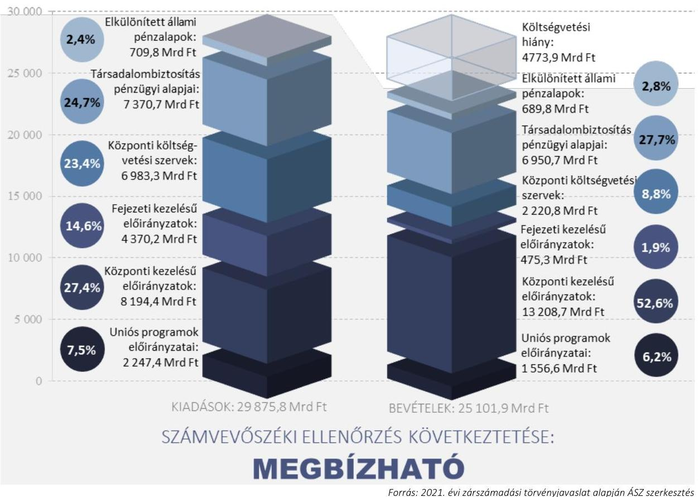

Forrás: 2021. évi zárszámadási törvényjavaslat alapján ÁSZ szerkesztés

---

# Az ELLENŐRZÉS CÉLJA 

Az ÁSZ ${ }^{1}$ az éves zárszámadás ellenőrzése keretében a zárszámadási törvényjavaslat megfelelőségét és az abban szereplő adatok megbízhatóságát ellenőrzi. Az ellenőrzés célja észszerű bizonyosság megszerzése arról, hogy
» a zárszámadási törvényjavaslat tartalma, szerkezete megfelelt-e a jogszabályi előírásoknak;
» az Alaptörvény és a Stabilitási tv. ${ }^{2}$ államadósságra vonatkozó előírásai érvényesültek-e, az államháztartás központi alrendszerében a hiány alakulása megfelelt-e a Kvtv. ${ }^{3}$ előírásainak;
» az államháztartás bevételeit a Kvtv.-ben rögzítettekkel összhangban, a közpénzekkel való gazdálkodás jogszabályi követelményeinek megfelelően használták-e fel, a törvényjavaslat valósághűen mutatta-e be a költségvetés végrehajtására vonatkozó pénzügyi adatokat, információkat;
» a központi költségvetés bevételi és kiadási előirányzatainak teljesítése megfelelt-e a jogszabályi előírásoknak és tartalmazott-e lényeges hibát;
» a költségvetés végrehajtásában jog- és hatáskörrel rendelkezők a 2021. évi költségvetésben meghatározott pénzügyi keretek között, szabályszerűen gazdálkodtak-e a közpénzekkel.

---

# Az ELLENŐRZÉS TERÜLETE 

2021. ÉVI ZÁRSZÁMADÁS - MAGYARORSZÁG 2021. ÉVI KÖZPONTI KÖLTSÉGVETÉSE VÉGREHAJTÁSÁNAK ELLENŐRZÉSE

Az Áht. ${ }^{4}$ előírásai alapján a

Pénzügyminisztérium minden évben az elfogadott költségvetéssel való összehasonlításra alkalmas zárszámadási törvényjavaslatot készít a költségvetés végrehajtásáról és a vagyoni helyzetről a központi és szakmai fejezeti kezelésű előirányzatok, a költségvetési szervek, a TB Alapok ${ }^{5}$, valamint az ELKA ${ }^{6}$ éves költségvetési beszámolói alapján.

A zárszámadási törvényjavaslat tartalmi követelményeit az Áht. határozza meg, az abban szereplő adatok, információk hitelességének biztosítását jogszabályi rendelkezésekkel is szabályozott folyamati és informatikai kontrollok szolgálják.

Az Áht. 90. § (1) bekezdésének 2022. július 28-ától hatályos módosítása szerint a Kormány a zárszámadásról szóló törvényjavaslatot az országgyűlési képviselők általános választásának évében a költségvetési évet követő év november 10-éig terjeszti az Országgyűlés elé.

Az ÁSZ a zárszámadási törvényjavaslat kapcsán az államháztartás területeit az alábbi felosztás szerint ellenőrizte:
» a központi kezelésű előirányzatok;
» az európai uniós támogatásokhoz kapcsolódó előirányzatok;
» a fejezeti kezelésű előirányzatok;
» a társadalombiztosítás pénzügyi alapjai;
» az elkülönített állami pénzalapok;
» a központi alrendszer intézményei (az alkotmányos fejezetek intézményei, az Országgyűlés felé tevékenységükről beszámolásra kötelezett, valamint a központi alrendszerbe tartozó egyéb intézmények).
Az ellenőrzés valamennyi ellenőrzési területen a gazdálkodás és az előirányzat-felhasználás szabályszerűségére, a költségvetési gazdálkodásra vonatkozó szabályokkal való összhangjára irányul. A TB Alapok ellátáshoz kapcsolódó bevételeit döntően a NAV ${ }^{7}$ által beszedett járulék- és hozzájárulás bevételek, illetve a központi költségvetési hozzájárulások teszik ki. Erre figyelemmel a TB Alapok ellátási bevételei esetében azok elszámolásának szabályszerűségét ellenőrizte az ÁSZ, míg azok megbízhatóságának minősítése a NAV bevételeire vonatkozó értékelést figyelembe véve történt.

---

A 2021. évben a központi alrendszer teljesített bevételi főösszege 25 101,9 Mrd Ft, kiadási főösszege 29 875,8 Mrd Ft volt, pénzforgalmi hiánya 4 773,9 Mrd Ft-ot tett ki.

A zárszámadási törvényjavaslat alapján a 2021. évben a központi alrendszeren belül a központi költségvetés, a társadalombiztosítási alapok és az elkülönített állami pénzalapok teljesített bevételeit, illetve kiadásait a 2. ábra szemlélteti.

# 2. ábra A KÖZPONTI ALRENDSZER TELJESÍTETT BEVÉTELEI ÉS KIADÁSAI A 2021. ÉVBEN (MRD FT) 

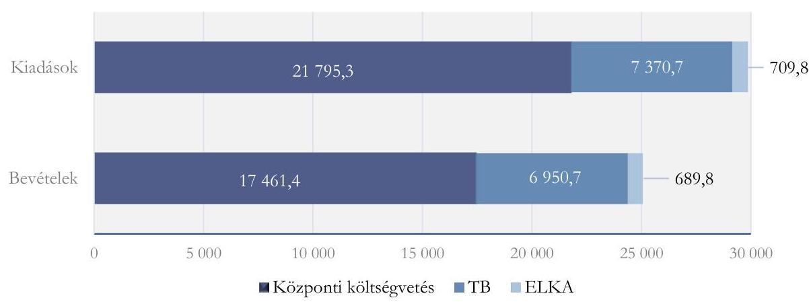

Forrás: 2021. évi zárszámadási törvényjavaslat, ÁSZ szerkesztés

## AZ ELLENŐRZÉS HÁTTERE, INDOKOLTSÁGA

Az Alaptörvény szerint a központi költségvetés végrehajtásának ellenőrzését az ÁSZ végzi el. Az ÁSZ tv. ${ }^{8}$ előírásainak megfelelően a zárszámadási ellenőrzés végrehajtása az ÁSZ éves gyakorisággal elvégzendő feladata. Az ÁSZ törvényi kötelezettségének teljesítésével hozzájárul ahhoz, hogy az Országgyűlés a zárszámadási törvény elfogadásával kapcsolatban megalapozott döntést hozzon.

---

# A JELENTÉS LÉNYEGES KÉRDÉSKÖREI 

1. » A zárszámadási törvényjavaslat tartalma, szerkezete összhangban volt-e a jogszabályi előírásokkal, érvényesültek-e az Alaptörvény és a Stabilitási törvény hiányra és államadósságra vonatkozó előírásai?
2. » A zárszámadási törvényjavaslat valósághűen mutatta-e be a költségvetés végrehajtására vonatkozó pénzügyi adatokat, információkat, az abban szereplő bevételi és kiadási előirányzatok teljesítési adatai megbízhatóak voltak-e?
3. » A központi alrendszer bevételi és kiadási előirányzatainak teljesítése, az előirányzatok módosítása, a költségvetési maradvány megállapítása és az éves költségvetési beszámolók összeállítása során betartották-e a jogszabályi előírásokat?

---

# AZ ELLENŐRZÉS HATÓKÖRE ÉS MÓDSZEREI 

## AZ ELLENŐRZÉS TÍPUSA

Megfelelőségi ellenőrzés

## AZ ELLENŐRZÖTT IDŐSZAK

A 2021. év, a zárszámadási törvényjavaslat elkészítése tekintetében 2022. I.-III. negyedév.

## AZ ELLENŐRZÉS TÁRGYA

A zárszámadási ellenőrzés során az ÁSZ a zárszámadási törvényjavaslat megfelelőségét és az abban szereplő adatok megbízhatóságát ellenőrizte. A zárszámadási ellenőrzés keretében az ÁSZ valamennyi ellenőrzött területen (központi kezelésű előirányzatok; központi költségvetési szervek; fejezeti kezelésű előirányzatok, uniós és kapcsolódó költségvetési támogatások; ELKA; TB Alapok) a gazdálkodás és az előirányzat-felhasználás megfelelőségét (szabályszerűségét), a költségvetési gazdálkodásra vonatkozó szabályokkal való összhangját ellenőrizte.

## AZ ELLENŐRZÖTT SZERVEZET

Az ellenőrzött szervezetek felsorolását a III. számú melléklet tartalmazza.

## AZ ELLENŐRZÉS JOGALAPJA

Az ellenőrzés lefolytatásának jogalapját az ÁSZ tv. 5. § (7) bekezdése képezte.

## AZ ELLENŐRZÉS MÓDSZEREI

Az ellenőrzést az ÁSZ az ellenőrzési program szempontjai, az ellenőrzött időszakban hatályos jogszabályok, az ellenőrzés szakmai szabályok és módszertanok figyelembevételével végezte.

Az ellenőrzési bizonyítékként felhasználható adatforrások közé tartoztak egyrészt az ellenőrzöttek által megküldött dokumentumok, másrészt bármely, az ellenőrzés folyamán feltárt, az ellenőrzés szempontjából információt tartalmazó dokumentum. Az ellenőrzési kérdések megválaszolásához szükséges bizonyítékok megszerzése az ellenőrzött által rendelkezésre bocsátott dokumentumokra, adatokra alapozva megfigyelés, szemle (szemrevételezés), kérdésfeltevés (információkérés), mintavételezés, valamint elemző eljárás útján történt.

Az ÁSZ a zárszámadási törvényjavaslatban szereplő adatok megbízhatóságának értékelése során a megbízhatóságot befolyásoló összes hiba összegét viszonyította a lényegességi

---

küszöbértékhez, amelyet a központi költségvetés bevételi, illetve kiadási főösszegének 2%-ában határozott meg.

Az ÁSZ a 2021. évi zárszámadási törvényjavaslatban szereplő pénzforgalmi kiadások és bevételek teljesítésének megfelelőségét statisztikai mintavételi módszerrel értékelte. A kiértékelés célja volt, hogy az ÁSZ a mintatételek alapján 95%-os valószínűséggel megbecsülje az egyes mintavételi területeken előforduló hibák összegének lehetséges mértékét, amelyet a mintavétel alapjául szolgáló sokaság összértékének 2%-ához viszonyított.

Azoknak a kiadási és bevételi előirányzatoknak az esetében, amelyeknél az egyedi tranzakciók rögzítése és elszámolása a Kincstár ${ }^{9}$, illetve a NAV informatikai rendszereiben standardizáltan és automatizáltan történik, a megbízhatóságot garantáló beépített kontrollok tényleges működéséről véletlenszerűen kiválasztott mintatételek teszteléses értékelésével győződött meg az ÁSZ.

A kiadások és bevételek teljesítése szabályszerűségének értékelése ellenőrzött szervezetenként történt. Egy ellenőrzött szervezet „nem szabályszerű" minősítést kapott, amennyiben az ellenőrzésre kiválasztott kiadási vagy bevételi mintatételeken belül a szabályszerűnek minősített mintatételek aránya nem érte el a 80%-ot. Amennyiben ez az arány elérte vagy meghaladta a 80%-ot, az ellenőrzött szervezet minősítése „szabályszerű" volt.

---

# MEGÁLLAPÍTÁSOK 

## 1. A zárszámadási törvényjavaslat tartalma, szerkezete összhangban volt-e a jogszabályi előírásokkal, érvényesültek-e az Alaptörvény és a Stabilitási törvény hiányra és államadósságra vonatkozó előírásai?

Összegző megállapítás A zárszámadási törvényjavaslat tartalma, szerkezete összhangban volt a jogszabályi előírásokkal. Az államháztartás központi alrendszerének hiányára és az államadósságra vonatkozó törvényi előírások érvényesültek.
1.1. számú megállapítás A
 zárszámadási törvényjavaslat összeállítása szabályszerűen történt, tartalma összhangban volt a jogszabályi előírásokkal.

A ZÁRSZÁMADÁSI TÖRVÉNYJAVASLAT az éves költségvetési beszámolók alapján, az elfogadott költségvetéssel összehasonlítható módon készült. A zárszámadási törvényjavaslat az Áht. előírásainak megfelelően tartalmazta a központi alrendszer hiányának a költségvetésben tervezett mértékétől való eltérés okait, a költségvetési hiány finanszírozásának módját, a középtávú tervezés során figyelembe vett makrogazdasági és költségvetési előrejelzés értékelését, az előírt mérlegeket, kimutatásokat és szöveges indokolásokat.

Az 1. táblázat a zárszámadási törvényjavaslat törvényi előírások szerinti tartalmi elemeiből a legfontosabbakat mutatja be.

## 1. táblázat

## A 2021. ÉVI ZÁRSZÁMADÁSI TÖRVÉNYJAVASLAT

## többek között tartalmazta:

" a költségvetési hiány finanszírozásának módját;
" a költségvetési mérlegeket alrendszerenként és összevontan, közgazdasági és funkcionális tagolásban;
" az államadósságot és az államadósság állományának változását bemutató összegzést;
" a középtávú tervezés során figyelembe vett makrogazdasági és költségvetési előrejelzés értékelését;
" az állami kezességek, állami garanciák és állami viszontgaranciák állományát;
" az adóbevételekben érvényesülő közvetett támogatásokat;
" az államháztartás központi alrendszerében a finanszírozási bevételekről és kiadásokról készített összegzést.

---

A zárszámadási törvényjavaslat jogszabály szerinti összeállítását támogató informatikai rendszerek - KGR K11 ${ }^{10}$, $\mathrm{KAR}^{11}$ és $\mathrm{AHAB}^{12}$ - adatainak sértetlensége, hitelessége, megfelelősége érdekében alkalmazott főbb kontrollok kialakítása és működtetése megfelelő volt.

# 1.2. számú megállapítás Az államháztartás központi alrendszerének hiánya és az államadósság a jogszabályi előírások szerint alakult. 

AZ ÁLLAMHÁZTARTÁS HIÁNYA folyó áron, pénzforgalmi szemléletben 4721,7 Mrd Ft összegben teljesült, amely a 2021. évi, 55 125,6 Mrd Ft összegű GDP ${ }^{13}$ 8,6\%-a. Az önkormányzati alrendszer többlete 52,2 Mrd Ft volt. A központi alrendszer 2021. évi hiánya folyó áron, pénzforgalmi szemléletben 4773,9 Mrd Ft - a Kvtv.-ben tervezett 1491,2 Mrd Ft-os, illetve a törvényi módosított 2287,7 Mrd Ft-os előirányzatot jelentősen meghaladó - összegű volt, amely a GDP 8,7\%-ának felel meg.

A központi alrendszeren belül a hazai működési költségvetés a tervezettől eltérően nem maradt egyensúlyban, a bevételi többletet meghaladó kiadási túllépés következtében 362,1 Mrd Ft pénzforgalmi hiány keletkezett. A hazai felhalmozási költségvetés pénzforgalmi hiánya 3721,0 Mrd Ft összegben alakult, amely a tervezett bevételek elmaradása és a kiadási túllépés együttes hatására 2701,6 Mrd Ft-tal haladta meg a Kvtv.-ben tervezettet. Az európai uniós fejlesztési költségvetés pénzforgalmi hiánya 690,8 Mrd Ft volt, amely a bevételi többletet meghaladó kiadási túllépés következtében 219,0 Mrd Ft-tal volt magasabb a Kvtv.-ben tervezettnél. A módosítás nélkül túlléphető kiadási előirányzatok 141,1 Mrd Ft összegű túllépése a központi alrendszer pénzforgalmi hiányának 3,0\%-át tette ki.

Az államháztartás központi alrendszere pénzforgalmi hiányának főbb összetevőit a 2. táblázat, a pénzforgalmi hiány összegének, illetve a GDP-hez viszonyított arányának változását a 3. ábra szemlélteti.

| 2. táblázat |  |
| :--: | :--: |
| A KÖZPONTI ALRENDSZER 2021. ÉVI PÉNZFORGALMI HIÁNYA ÉS ÖSSZETEVŐI (MRD FT) |  |
| Megnevezés | Összeg |
| Központi alrendszer hiánya | 4773,9 |
| Ezen belül: |  |
| Központi költségvetés hiánya | 4333,9 |
| TB Alapok hiánya | 420,0 |
| ELKA hiánya | 20,0 |

Forrás: 2021. évi zárszámadási törvényjavaslat, AöZ szerkesztés

---

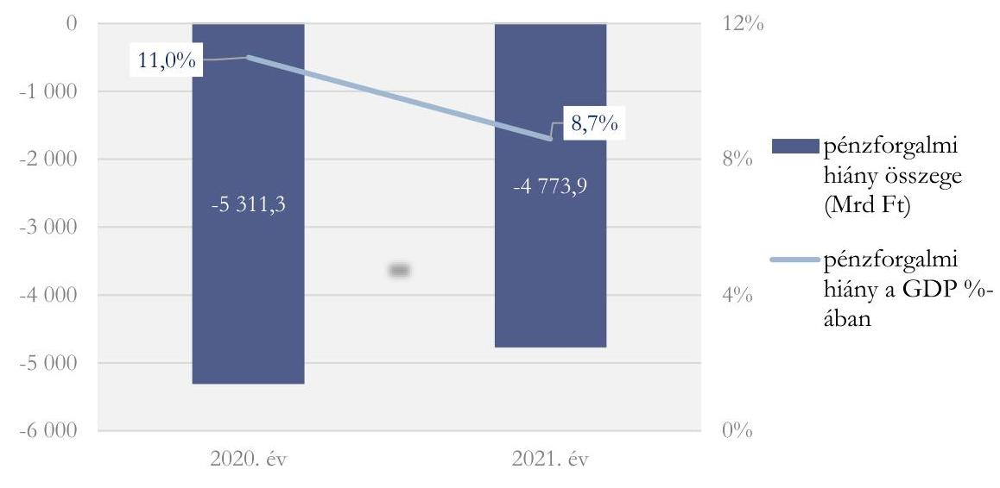

A KORMÁNYZATI SZEKTOR UNIÓS MÓDSZERTAN SZERINTI GDP-ARÁNYOS HIÁNYA a 2020. évi hiánnyal azonos mértékű, a módosított Kvtv.-ben kitűzött 7,5\% hiánycélhoz képest - az Eurostat ${ }^{14}$ részére küldött 2022 szeptemberi EDP jelentés szerint - 7,1\%ra mérséklődött. A GDP arányos hiány 3,0\% alatti mértékét előíró maastrichti kritérium teljesítése alól - a COVID 19 járvány negatív hatásainak kezelése érdekében - az uniós mentesítési záradék ${ }^{15}$, illetve a hazai jogrendben a Stabilitási tv. előírásai mentesítést biztosítottak. A Stabilitási tv. 2021. december 1-jétől hatályos 48. § (3) bekezdésében foglaltak alapján a GDP arányos hiány mértékére vonatkozó előírást a 2021-2023. költségvetési években nem kell alkalmazni.

A kormányzati szektor uniós módszertan szerinti hiánya összegének, illetve GDP-hez viszonyított arányának 2020. és 2021. évi alakulását a 4. ábra mutatja be:

---

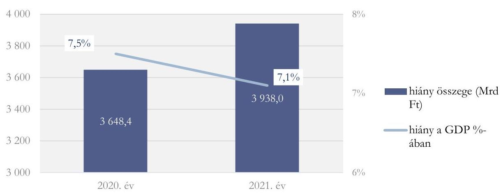

Forrás: 2022 szeptemberi EDP jelentés, ASZ szerkesztés
AZ ÁLLAMADÓSSÁG-MUTATÓ ÉRTÉKE 2021. december 31-én 76,8\%, az államadósság összege 42 351,5 Mrd Ft, a GDP 55 125,6 Mrd Ft volt. Az államadósság-mutató a Kvtv.ben tervezett 79,9\%-hoz, és a 2020. évi 79,3\%-hoz mérten is csökkent, így az Alaptörvényben és a Stabilitási tv.-ben meghatározott, az államadósság csökkenését előíró államadósság-szabály érvényesült. Az államadósság-mutató 2020-ról 2021-re bekövetkezett csökkenése a GDP-nek a bruttó államadósság 10,3\%-os növekedését meghaladó, 13,9\%-os mértékű emelkedésére volt visszavezethető.

Az államadósság, illetve az államadósság-mutató 2020. és 2021. évi alakulását az 5. ábra mutatja be:

# 5. ábra AZ ÁLLAMADÓSSÁG ALAKULÁSA A 2020. ÉS A 2021. ÉVBEN (MRD FT) 

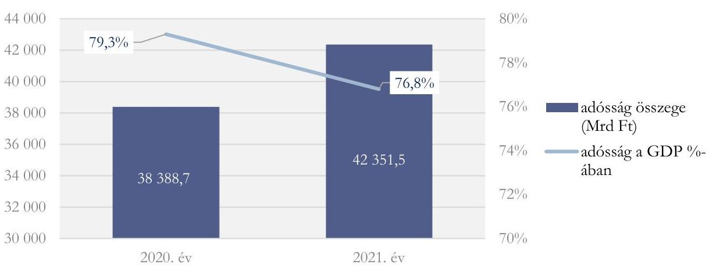

Forrás: 2021. évi zárszámadási törvényjavaslat, ÁSZ szerkesztés

---

# 2. A zárszámadási törvényjavaslat valósághűen mutatta-e be a költségvetés végrehajtására vonatkozó pénzügyi adatokat, információkat, az abban szereplő bevételi és kiadási előirányzatok teljesítési adatai megbízhatóak voltak-e? 

Összegző megállapítás A zárszámadási törvényjavaslat valósághűen mutatta be a költségvetés végrehajtására vonatkozó pénzügyi adatokat, információkat, az abban szereplő bevételi és kiadási előirányzatok teljesítési adatai megbízhatóak voltak.
2.1. számú megállapítás

A központi költségvetés részét képező központi kezelésű előirányzatok teljesítési adatai megbízhatóak voltak.

A KÖZPONTI KEZELÉSŰ ELŐIRÁNYZATOK bevételi és kiadási teljesítési adatai megbízhatóak voltak. A gazdasági események számviteli elszámolását hiteles, megbízható számviteli bizonylattal támasztották alá. A Kincstár, illetve a NAV informatikai rendszereiben a standardizált, automatizált módon rögzített és elszámolt tranzakciók megbízhatóságát biztosító beépített folyamati és informatikai kontrollok megfelelően működtek.

A központi kezelésű előirányzatok bevételeinek és kiadásainak alakulását a 3. táblázat mutatja be.
3. táblázat

## A KÖZPONTI KEZELÉSŰ ELŐIRÁNYZATOK BEVÉTELEI ÉS KIADÁSAI A 2021. ÉVBEN (MRD FT)

| Megnevezés | Bevétel | Kiadás |
| :-- | --: | --: |
| Vállalkozások költségvetési befizetései | 1892,1 | 0,0 |
| Fogyasztáshoz kapcsolt adók | 7054,0 | 0,0 |
| Lakosság költségvetési befizetései | 3210,9 | 0,0 |
| Kezesség, viszontgarancia érvényesítése és megtérülése | 4,6 | 16,8 |
| Bevételek az államháztartás alrendszereiből | 579,3 | 0,0 |
| Egyéb bevételek | 118,9 | 0,0 |
| Államháztartás alrendszereinek támogatása | 0,0 | 2538,5 |
| ebből: Önkormányzatok támogatásai | 0,0 | 1013,8 |
| Nemzeti Család- és Szociálpolitikai Alap | 1,5 | 674,7 |
| Adósságszolgálattal kapcsolatos bevételek és kiadások | 133,8 | 1460,4 |
| Állami vagyonnal kapcsolatos bevételek és kiadások | 213,6 | 1474,1 |
| Egyedi és normatív támogatás | 0,0 | 642,9 |
| Közszolgálati médiaszolgáltatás támogatása | 0,0 | 97,2 |
| Szociálpolitikai menetdíj támogatás | 0,0 | 86,0 |
| Lakástámogatások | 0,0 | 376,5 |
| Társadalmi önszerveződések támogatása | 0,0 | 5,8 |
| Kormányzati rendkívüli kiadások | 0,0 | 1,9 |
| Egyéb kiadások | 0,0 | 209,1 |
| Hozzájárulás az EU költségvetéséhez | 0,0 | 610,5 |
| ÖSSZESEN | $\mathbf{1 3 2 0 8 , 7}$ | $\mathbf{8 1 9 4 , 4}$ |

---

AZ UNIÓS ELŐIRÁNYZATOK teljesítési adatai megbízhatóak voltak.
Az uniós előirányzatok több, mint 99\%-át kitevő XIX. Gazdaság-újraindítási Alap Uniós Fejlesztései fejezet kiadási előirányzatai, így a 2014-2020 és 2021-2027 közötti kohéziós politikai operatív programok, valamint a Vidékfejlesztési és halászati programok esetében a kifizetések teljesítése és elszámolása összhangban volt a jogszabályi előírásokkal, az ellenőrzés az uniós fejlesztési előirányzatok keretében kifizetett kiadások megbízhatóságában nem tárt fel hibát.

A Belügyi Alapok (Belső Biztonsági Alap, Menekültügyi, Migrációs és Integrációs Alap, Belügyi Alapok technikai költségkerete) forrásainak felhasználása megbízható volt. A gazdasági események számviteli elszámolását hiteles, megbízható számviteli bizonylatokkal alátámasztották, a számviteli bizonylatok megfeleltek a Számv. tv. előírásainak.

A Gazdaság-újraindítási Alap Uniós Fejlesztései fejezet 2021. évi teljesítési adatait a 4. táblázat tartalmazza.
4. táblázat

# A XIX. GAZDASÁG-ÚJRAINDÍTÁSI ALAP UNIÓS FEJLESZTÉSEI 2021. ÉVI KIADÁSI ELŐIRÁNYZATAINAK TELJESÍTÉSI ADATAI (MRD FT) 

| Megnevezés | Adat |
| :-- | --: |
| 2014-2020. közötti kohéziós politikai operatív programok | 1659,7 |
| 2021-2027. közötti kohéziós politikai operatív programok | 211,2 |
| Egyéb uniós programok kiadási előirányzatai | 250,3 |
| Vidékfejlesztési és Halászati Programok 2014 - 2020. | 254,5 |
| Nemzeti Stratégiai Referenciakeret | 3,7 |
| Egyéb uniós előirányzatok* | 97,5 |
| ÖSSZESEN:** | 2476,9 |

*Európai Területi Együttműködés (2014-2020), EGT és Norvég Finanszírozási Mechanizmusok 2014-2021, Svájci-Magyar Együttműködési Program II., Európai Hálózatfinanszírozási Eszköz (CEF) projektek 2014-2020, Nemzeti Helyreállítási Alap.
** A teljes összeg 254,2 Mrd Ft fejezeti kezelésű előirányzatot tartalmaz, amelyből 250,0 Mrd Ft hazai fejlesztési forrás.

---

# 2.2. számú megállapítás A fejezeti kezelésű előirányzatok teljesítési adatai megbízhatóak voltak. 

A SZAKMAI FEJEZETI KEZELÉSŰ ELŐIRÁNYZATOK bevételi és kiadási előirányzatainak teljesítése megbízható volt. A kiadási és bevételi előirányzatok teljesítésének elszámolását a Számv. tv. ${ }^{16}$ előírásával összhangban hiteles és megbízható bizonylatokkal támasztották alá. A kiadásokat és bevételeket az Áhsz. ${ }^{17}$ előírása szerinti nyilvántartási számlákon számolták el.

A szakmai fejezeti kezelésű előirányzatok kiadásait és bevételeit az 5. táblázat, a teljesített kiadások fejezetet irányító szervek szerinti összetételét a 6. ábra szemlélteti.

## 5. táblázat

A SZAKMAI FEJEZETI KEZELÉSŰ ELŐIRÁNYZATOK BEVÉTELEINEK ÉS KIADÁSAINAK TELJESÍTÉSI ADATAI A 2021. ÉVBEN (MRD FT)

| Megnevezés | Bevétel | Kiadás |
| :-- | :--: | :--: |
| Teljesítés értéke   ebből: uniós előirány-   zatok | 479,3 | 4374,5 |
|  | 4,0 | 4,3 |

Forrás: 2021. évi zárszámadási törvényjavaslat, ÁSZ szerkesztés
6. ábra A FEJEZETI KEZELÉSŰ ELŐIRÁNYZATOK TELJESÍTETT KIADÁSAINAK FEJEZETET IRÁNYÍTÓ SZERVEK SZERINTI ÖSSZETÉTELE (MRD FT)
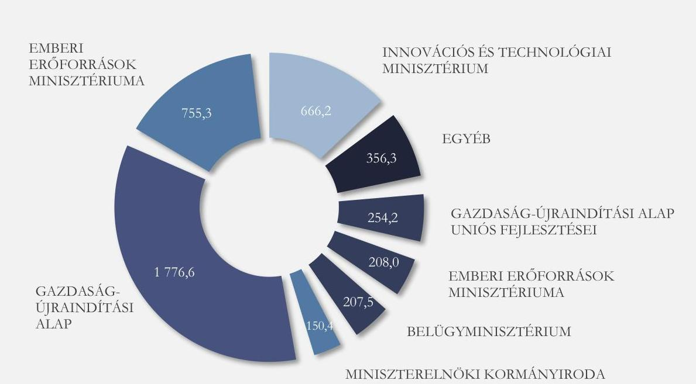

Forrás: 2021. évi zárszámadási törvényjavaslat, ÁSZ szerkesztés

---

# 2.3. számú megállapítás A központi alrendszer intézményei bevételi és kiadási előirányzatainak teljesítési adatai megbízhatóak voltak. 

A KÖZPONTI ALRENDSZER INTÉZMÉNYEI - az OGY ${ }^{18}$ felé beszámolásra kötelezett intézmények, az alkotmányos fejezetek intézményei és a központi alrendszerbe tartozó egyéb költségvetési intézmények - bevételi és kiadási adatai megbízhatóak voltak.

A központi alrendszerbe tartozó intézmények száma 2021. december 31-én 628 volt, amelyek bevételi és kiadási előirányzatainak teljesítési adatait a 6. táblázat mutatja be.

## 6. táblázat

## A KÖZPONTI ALRENDSZER INTÉZMÉNYEI TELJESÍTETT BEVÉTELEI ÉS KIADÁSAI A 2021. ÉVBEN (MRD FT)

|  | OGY felé beszámolásra kötelezett intézmények | Alkotmányos fejezetek intézményei | Egyéb költségvetési intézmények | Mindösszesen |
| :--: | :--: | :--: | :--: | :--: |
| Bevétel | 40,9 | 6,1 | 2173,8 | 2220,8 |
| Kiadás | 91,6 | 253,3 | 6 638,4 | 6983,3 |

Forrás: Intézményi beszámolók, ÁSZ szerkesztés

## 2.4. számú megállapítás A TB Alapok teljesítési adatai megbízhatóak voltak.

A TB ALAPOK ellátási kiadási előirányzatainak teljesítési adatai megbízhatóak voltak. A NEAK ${ }^{19}$ bevételi előirányzatainak teljesítése és kiadási előirányzatainak felhasználása megbízható volt.

A TB Alapok bevételi és kiadási előirányzatainak teljesítését alaponkénti megoszlásban a 7. ábra, az összesített adatokat a 7. táblázat mutatja be.

## 7. táblázat

A TB ALAPOK BEVÉTELEI ÉS KIADÁSAI A 2021. ÉVBEN (MRD FT)

| Megnevezés | Bevétel | Kiadás |
| :-- | :--: | :--: |
| TB Alapok |

 6950,7 | 7370,7 |

Forrás: 2021. évi zárszámadási törvényjavaslat, ÁSZ szerkesztés

---

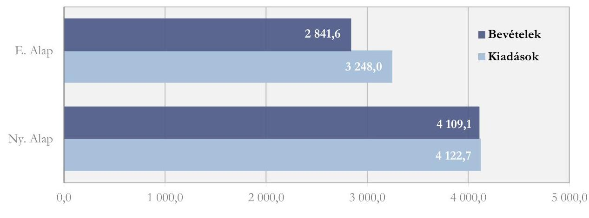

Forrás: 2021. évi zárszámadási törvényjavaslat, ÁSZ szerkesztés
2.5. számú megállapítás Az ELKA előirányzatainak teljesítési adatai megbízhatóak voltak.

AZ ELKA (BGA ${ }^{20}$, KNPA $^{21}$, GUFA $^{22}$, NKA $^{23}$, NKFIA $^{24}$ ) bevételi előirányzatainak teljesítése, kiadási előirányzatainak felhasználása megbízható volt.

Az ELKA 2021. évi költségvetési bevételeit és kiadásait alaponkénti megoszlásban a 8. ábra, összesítve a 8. táblázat mutatja be.

| ELKA BEVÉTELE ÉS KIADÁSA (MRD FT) |  |  |
| :--: | :--: | :--: |
| Megnevezés | Bevétel | Kiadás |
| ELKA | 689,8 | 709,8 |

Forrás: 2021. évi zárszámadási törvényjavaslat, ÁSZ szerkesztés

8. ábra AZ ELKA BEVÉTELEI ÉS KIADÁSAI ALAPONKÉNT A 2021. ÉVBEN (MRD FT)
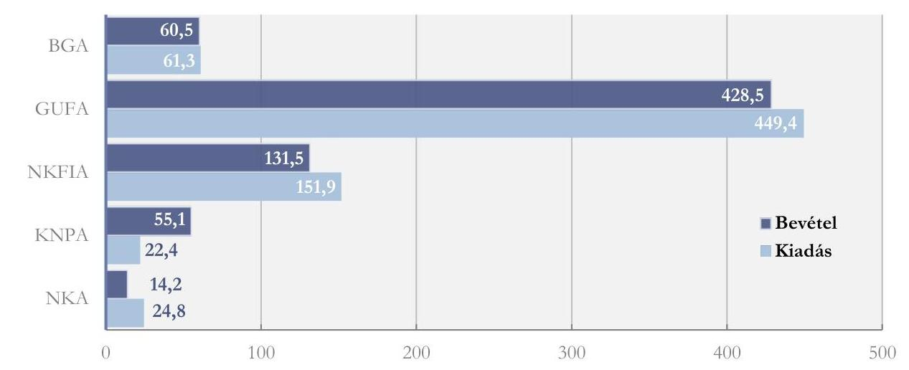

Forrás: 2021. évi zárszámadási törvényjavaslat, ÁSZ szerkesztés

---

# 3. A központi alrendszer bevételi és kiadási előirányzatainak teljesítése, az előirányzatok módosítása, a költségvetési maradvány megállapítása és az éves költségvetési beszámolók összeállítása során betartották-e a jogszabályi előírásokat? 

## Összegző megállapítás

A központi alrendszer bevételi és kiadási előirányzatainak teljesítése, az előirányzatok módosítása, a költségvetési maradvány megállapítása és az éves költségvetési beszámolók összeállítása összhangban volt a jogszabályi előírásokkal.

### 3.1. számú megállapítás

A központi kezelésű bevételi és kiadási előirányzatok teljesítése során betartották a jogszabályi előírásokat.

AZ ADÓSSÁGSZOLGÁLTÁLLAL kapcsolatos forintban és devizában fennálló adósság, kamat és egyéb kiadások, valamint a bevételek elszámolása megfelelt a jogszabályi előírásoknak. Az ÁKK Zrt. ${ }^{25}$ a jogszabályi előírásokkal összhangban eleget tett az adósságszolgálati bevételekkel és kiadásokkal összefüggő, a Kincstár könyvvezetéséhez és beszámolási kötelezettségéhez kapcsolódó adatszolgáltatási és beszámolási kötelezettségének. A KESZ ${ }^{26}$ és a letéti számlák kezelése szabályszerű volt.

AZ ÁLLAMI VAGYONNAL és a Nemzeti Földalappal kapcsolatos bevételek és a kiadások elszámolása megfelelt az Áht. és az Ávr. ${ }^{27}$ előírásainak. Az állami vagyonnal és a Nemzeti Földalappal kapcsolatos szerződéskötések a Vtv. ${ }^{28}$ előírásainak megfeleltek, szabályszerűek voltak. A gazdasági események lebonyolítása, nemzetgazdasági elszámolásuk szabályszerűen valósult meg, a vagyonelemeket a vagyonkataszter tartalmazta.

AZ ÁLLAM ÁLTAL VÁLLALT KEZESSÉG ÉS VISZONTGARANCIA érvényesítésével összefüggő bevételek és kiadások teljesítése szabályszerű volt. Az állam által vállalt kezesség és viszontgarancia érvényesítésével összefüggő kiadások és megtérülések tekintetében a Kincstár és a garantőr szervezetek betartották a Kvtv. állam által vállalt kezességek, garanciák, viszontgaranciák és nyújtott hitelek állományának felső határára vonatkozó előírásait. Az ügyletek állományi adatait tartalmazó főkönyvi és analitikus nyilvántartások megfeleltek az Áht., az Áhsz., a Számv. tv. és az egyéb vonatkozó jogszabályok előírásainak.

A HELYI ÉS A NEMZETISÉGI ÖNKORMÁNYZATOK támogatásaival kapcsolatos kiadások teljesítése a jogszabályi előírásokkal összhangban történt. A feladatalapú támogatások teljesítése során a Kincstár a nemzetgazdasági számlákra vonatkozó pénzforgalmi bizonylatok befogadásánál a bizonylatokra vonatkozó előírásokat betartotta.

A NEMZETI CSALÁD- ÉS SZOCIÁLPOLITIKAI ALAP terhére történt folyósítások a jogszabályi előírásokkal összhangban valósultak meg. Az ellátásokat folyósító szervek a támogatások központi költségvetésből történő igénylése és az előirányzatokról történt kifizetések során betartották a PM rendeletben ${ }^{29}$, valamint a Kincstár elnöke vonatkozó utasításában foglalt előírásokat.

---

A KÖLTSÉGVETÉS KÖZPONTI TARTALÉKAINAK képzése és felhasználása a jogszabályi előírások betartásával, szabályszerűen történt.

AZ UNIÓS FEJLESZTÉSEK fejezet pénzügyi forrásainak lekötése a 2021. évben a Kvtv. előírásai szerint, szabályszerűen valósult meg. A 2014-2020. és 2021-2027. programozási időszakban finanszírozott kohéziós politikai operatív programok, valamint a Vidékfejlesztési és Halászati Programok forrásainak felhasználása a jogszabályi előírásokkal összhangban történt. A támogatások elbírálása, a támogatási szerződések ellenőrzése, a kedvezményezettek felé teljesített kifizetések elszámolása szabályszerű volt.

A központi alrendszer uniós bevételeinek 2021. évi teljesítési adatait a 9. táblázat szemlélteti.

A BELÜGYI ALAPOK felosztása és igénybevétele a Kvtv. és az irányadó uniós rendeletek előírásaival összhangban történt.

| Megnevezés | Adat |
| :-- | --: |
| Uniós programok bevételei | 1464,4 |
| (XLII. fejezet) |  |
| Más fejezetek uniós bevételei | 92,2 |

Forrás: 2021. évi zárszámadási törvényjavaslat, ÁSZ szerkesztés
3.2. számú megállapítás

A fejezeti kezelésű előirányzatok teljesítése, az előirányzatok módosítása, a költségvetési maradvány megállapítása és az éves költségvetési beszámolók összeállítása során betartották a jogszabályi előírásokat.

A SZAKMAI FEJEZETI KEZELÉSŰ ELŐIRÁNYZATOK keretében a kiadási előirányzatok felhasználása és elszámolása, illetve a bevételi előirányzatok teljesítése és elszámolása szabályszerű volt.

Az előirányzatok évközi módosításait az Áht. és az Ávr. előírásai alapján, szabályszerűen hajtották végre.

Az éves költségvetési beszámolókat az Áhsz. előírásaival összhangban állították össze. A maradvány kimutatás összeállítása megfelelt az Áhsz. előírásainak.
3.3. számú megállapítás

A központi alrendszer intézményei bevételi és kiadási előirányzatainak teljesítése, az előirányzatok módosítása, a költségvetési maradvány megállapítása és az éves költségvetési beszámolók összeállítása során betartották a jogszabályi előírásokat.

AZ OGY FELÉ BESZÁMOLÁSRA KÖTELEZETT INTÉZMÉNYEK bevételeinek és kiadásainak elszámolása szabályszerű volt. Az előirányzat-módosítások és a költségvetési maradvány megállapítása során betartották az Áht., az Ávr. és az Áhsz. előírásait.

Az éves költségvetési beszámoló részét képező mérleg, eredménykimutatás és kiegészítő melléklet összeállítása a Számv. tv., az Áhsz., valamint az intézmények számviteli szabályzatainak előírásaival összhangban történt.

---

AZ ALKOTMÁNYOS FEJEZETEK INTÉZMÉNYEI bevételeinek és a kiadásainak teljesítése szabályszerű volt. Az előirányzat módosításra vonatkozó jogszabályi előírásokat betartották. A kötelezettségvállalással terhelt maradvány összegének megállapítása megfelelt az Ávr.-ben foglaltaknak, azt az Áhsz. előírásainak megfelelően részletező analitikus nyilvántartással alátámasztották.

Az éves költségvetési beszámolókat, valamint az annak részét képező költségvetési jelentéseket a jogszabályi előírásoknak megfelelően állították össze, az Áhsz. kötelező egyezőségekre vonatkozó rendelkezései érvényesültek.

A KÖZPONTI ALRENDSZER EGYÉB INTÉZMÉNYEI a bevételekkel szabályszerűen számoltak el, a kiadásokat a jogszabályi előírásokkal összhangban teljesítették.

Az előirányzatok módosítása, a maradvány kimutatása összességében szabályszerű volt.
Az éves költségvetési beszámolókat az intézmények szabályszerűen állították össze. A beszámolók tartalmazták az Áhsz.-ben előírt tartalmi elemeket (a költségvetési jelentést, a maradvány-kimutatást, a mérleget, az eredménykimutatást, a kiegészítő mellékletet, az adatszolgáltatásokat).

# 3.4. számú megállapítás A TB Alapok bevételi és kiadási előirányzatainak teljesítése, az előirányzatok módosítása, a költségvetési maradvány megállapítása és az éves költségvetési beszámolók összeállítása a jogszabályi előírásokkal összhangban történt. 

A TB ALAPOK ellátási kiadási előirányzatainak felhasználása a jogszabályi előírások, belső szabályozások és felhatalmazások szerint történt. A TB Alapok kezelői ${ }^{30}$ az E. Alap ${ }^{31}$, valamint az Ny. Alap ${ }^{32}$ bevételeinek elszámolása során a jogszabályi és a belső szabályzatok előírásait betartották. A NAV által beszedett, az E. Alapot, illetve az Ny. Alapot megillető bevételek számviteli nyilvántartásba vétele és éves költségvetési beszámolóban történő kimutatása szabályszerű volt. A NEAK a bevételi előirányzatainak teljesítése és a kiadási előirányzatainak felhasználása során a jogszabályok és a belső szabályzatok előírásait betartotta.

A TB Alapok kezelői az előirányzatok módosítását, számviteli nyilvántartásokon történő átvezetését az Áht., az Ávr. és az Áhsz. előírásainak megfelelően, szabályszerűen hajtották végre.

A költségvetési maradványok megállapítása megfelelt a jogszabályi előírásoknak. A kötelezettségvállalással terhelt maradvány összegét az Ávr.-ben foglaltaknak megfelelően állapították meg.

A Kincstár az Ny. Alap, a NEAK az E. Alap, valamint a NEAK 2021. évi költségvetési beszámolójának részét képező mérleget, eredménykimutatást és kiegészítő mellékletet az Áhsz. és a Számv. tv. előírásainak megfelelően állította össze. Az eszközök és források leltározása, értékelése és nyilvántartása megfelelt az Áhsz. és a Számv. tv. előírásainak.

---

# 3.5. számú megállapítás Az ELKA kiadási előirányzatainak teljesítése, az előirányzatok módosítása, a költségvetési maradvány megállapítása és az éves költségvetési beszámolók összeállítása megfelelt a jogszabályi előírásoknak. 

AZ ELKA (BGA, KNPA, GUFA, NKA, NKFIA) kiadási előirányzatai terhére teljesített kifizetések szabályszerűek voltak.

A költségvetési maradványok megállapítása megfelelt a jogszabályi előírásoknak. Az előirányzatok módosítása és a számviteli nyilvántartásokon való átvezetése a jogszabályi előírások betartásával történt. A maradványok tekintetében az éves költségvetési beszámolók, illetve a kapcsolódó analitikus nyilvántartások egyezősége biztosított volt.

Az éves költségvetési beszámolókat az alapkezelők a jogszabályi előírásoknak megfelelően állították össze.

---

.

---

# MELLÉKLETEK 

## I. SZ. MELLÉKLET: ÉRTELMEZŐ SZÓTÁR

államadósság-mutató
államháztartás központi
alrendszere
belső kontrollrendszer

Az Alaptörvény 36. cikk (4) és (5) bekezdésében, valamint 37. cikk (2) és (3) bekezdésében foglaltak végrehajtása során figyelembe veendő mindenkori államadósság-mutatója olyan, százalékban kifejezett, egy tizedesig kerekített hányados, amely a) számlálójában az államadósságnak, b) nevezőjében a Közösségben a nemzeti és regionális számlák európai rendszeréről szóló tanácsi rendeletben meghatározottak szerint számított bruttó hazai terméknek e törvény szerinti értéke szerepel.
(Forrás: Stabilitási tv. 2. §)
Az államháztartás központi és önkormányzati alrendszerből áll. Az államháztartás központi alrendszerébe tartozik az állam, a központi költségvetési szerv, a törvény által az államháztartás központi alrendszerébe sorolt köztestület, illetve az e köztestület által irányított köztestületi költségvetési szerv.
(Forrás: Abt. 3. §)
A belső kontrollrendszer a kockázatok kezelése és tárgyilagos bizonyosság megszerzése érdekében kialakított folyamatrendszer, amely azt a célt szolgálja, hogy a működés és gazdálkodás során a tevékenységeket szabályszerűen, gazdaságosan, hatékonyan, eredményesen hajtsák végre, az elszámolási kötelezettségeket teljesítsék, megvédjék az erőforrásokat a veszteségektől, károktól és nem rendeltetésszerű használattól. A belső kontrollrendszer öt pillérből tevődik össze, amelyek a következők:

- kontrollkörnyezet,
- integrált kockázatkezelési rendszer,
- kontrolltevékenységek,
- információs és kommunikációs rendszer,
- nyomon követési rendszer.

Az öt pillér együttes kialakításával és működtetésével érhető el, hogy a belső kontrollrendszer a vezetőt támogató olyan rendszer legyen, amely megbízhatóan hozzásegíti a költségvetési szervet a vonatkozó törvényeknek és szabályozásoknak való megfeleléshez, stratégiai céljainak eléréséhez, az elszámolási/beszámolási kötelezettségei teljesítéséhez, a működési folyamatok szabályszerű, etikus, eredményes, hatékony és gazdaságos végrehajtásához.
(Forrás: Abt. 69. § (1) bekezdés, Bkr. ${ }^{33}$ 6. §)

---

EDP jelentés

Elkülönített Állami Pénzalapok
fejezetet irányító szerv
fejezeti kezelésű előirányzat

Az Európai Unió Túlzott Hiány Eljárása (Excessive Deficit Procedure $=$ EDP) keretében a tagországok évente kétszer adatszolgáltatásban (EDP Jelentés) jelentik a kormányzati szektor két kiemelt mutatójának: a kormányzati szektor hiányának és adósságának alakulását. Annak érdekében, hogy az uniós konvergencia kritériumok által meghatározott mutatók és az államháztartási mutatók módszertani megkülönböztetése egyértelmű legyen, a Stabilitási tv. a kormányzati szektor hiánya elnevezést használja az uniós módszertan szerinti egyenlegre, míg az adósságnál nincs ilyen megkülönböztetés, a Stabilitási tv. szerinti államadósság és az uniós módszertan szerinti ún. maastrichti adósság megegyeznek. A Konvergencia Programban használatos mutatók módszertana megegyezik az EDP jelentésével.

## (Forrás: PM bonlap szerinti definíció)

Az elkülönített állami pénzalapok a közfeladatok ellátása során az állam nevében beszedendő költségvetési bevételek és teljesítendő költségvetési kiadások alapszerű elszámolására szolgálnak. Elkülönített állami pénzalapot közfeladat részben vagy egészben államháztartáson kívüli forrásból történő ellátásának biztosítása céljából törvény hozhat létre. Ide tartozik a Bethlen Gábor Alap, a Központi Nukleáris Pénzügyi Alap, a Gazdaság-Újraindítási Foglalkoztatási Alap, a Nemzeti Kulturális Alap, valamint a Nemzeti Kutatási, Fejlesztési és Innovációs Alap.
(Forrás: Abt. 6/A. § (5) bekezdés, Kvtv. 10. §)
A fejezetet irányító szerv látja el a központi kezelésű előirányzatokhoz, a fejezeti kezelésű előirányzatokhoz, az elkülönített állami pénzalapokhoz és a társadalombiztosítás pénzügyi alapjaihoz kapcsolódó tervezési, gazdálkodási, ellenőrzési, adatszolgáltatási és beszámolási feladatokat. A fejezetet irányító szerveket és azok vezetőit az Ávr. 1. sz. melléklete határozza meg.
(Forrás: Abt. 6/B. § (1) bekezdés, Avr. 6. §)
A fejezeti kezelésű előirányzatok a
 fejezetet irányító szerv sajátos szakmai, ágazati feladatai ellátása, vagy az államnak a fejezethez tartozó költségvetési szervek tevékenységével kapcsolatban felmerülő, illetve szakmailag ahhoz kapcsolódó sajátos kötelezettségei teljesítése során felmerülő költségvetési bevételek és költségvetési kiadások elszámolására szolgálnak.
(Forrás: Abt. 6/A. § (3) bekezdés)

---

integrált kockázatkezelési rendszer
konszolidált adósság
kormányzati szektor
költségvetési hiány

Olyan folyamatalapú kockázatkezelési rendszer, amely a szervezet minden tevékenységére kiterjed, egységes módszertan és eljárások alkalmazásával, a szervezet célkitűzéseinek és értékeinek figyelembevételével biztosítja a szervezet kockázatainak teljes körű azonosítását, azok meghatározott kritériumok szerinti értékelését, valamint a kockázatok kezelésére vonatkozó intézkedési terv elkészítését és az abban foglaltak nyomon követését.
(Forrás: Bker. 2. §m) pont)
A kormányzati szektorba sorolt pénzügyi intézmény költségvetési év utolsó napján fennálló, az államháztartás központi alrendszerével, az államháztartás önkormányzati alrendszerével, és a kormányzati szektorba sorolt egyéb szervezetekkel szemben fennálló követelései és kötelezettségei kiszűrésével számított adósságállomány.

## (Forrás: Stabilitási törvény 9. § (4) bekezdés)

Az államháztartás központi és önkormányzati alrendszeréhez tartozó szervezeteken felül magában foglalja az Európai Közösséget létrehozó szerződéshez csatolt, a túlzott hiány esetén követendő eljárásról szóló jegyzőkönyv alkalmazásáról szóló 2009. május 25-i 479/2009/EK rendelet szerinti kormányzati szektorba sorolt egyéb szervezeteket.
(Forrás: Abt. 1. § 12. pont)
A költségvetési hiány a kormányzati szektor negatív egyenlege (ESA - nemzeti számlákkal összhangban álló költségvetési egyenleg): az Európai Közösséget létrehozó szerződéshez csatolt, a túlzott hiány esetén követendő eljárásról szóló jegyzőkönyv alkalmazásáról szóló 2009. május 25-i 479/2009/EK tanácsi rendelet alapján számított negatív egyenleg, a kormányzati szektor eredményszemléletű bevételeinek és kiadásainak negatív egyenlege.

| Bevétel | Kiadás |
| :--: | :--: |
| Eredményszemléletű adóbevétel | Eredményszemléletű kamatkiadás |
| Folyó- és tőketranszfer bevétel | Eredményszemléletű bér és dologi   kiadás |
|  | Folyó- és tőketranszfer kiadás |
|  | Eredményszemléletű beruházási   kiadás |

(Forrás: Stabilitási tv. 1. §c) pont)

---

kontrollkörnyezet

Kontrolltevékenységek

Konvergencia Program
költségvetési bevételi kiadási előirányzatok

Maastrichti kritérium
monitoring rendszer

Olyan szabályozási környezet, amelyben világos a szervezeti struktúra, a folyamatok átláthatóak, egyértelműek a felelősségi, hatásköri viszonyok és feladatok, meghatározottak, ismertek és elfogadottak az etikai elvárások a szervezet minden szintjén, átlátható a humán-erőforrás-kezelés, biztosított a szervezeti célok és értékek irányában való elkötelezettség fejlesztése és elősegítése.
(Forrás: Bkr. 6. § (1) bekezdés)
Azok a szervezeten belüli tevékenységek, amelyek biztosítják a kockázatok kezelését, hozzájárulnak a szervezet céljainak eléréséhez és erősítik a szervezet integritását.
(Forrás: Bkr. 8. §)
A Kormány által évente elfogadott, adott időszakra vonatkozó gazdaságpolitikai célokat, makrogazdasági előrejelzéseket, az államháztartás egyenlege és az államadósság alakulására, az államháztartás folyamataira és rendszerére vonatkozó prognózisokat, követelményeket tartalmazó dokumentum, amely a költségvetési fegyelem biztosításának feltételrendszerét rögzíti.
(Forrás: Magyarország Konvergencia Programja)
A központi költségvetésről szóló törvényben a költségvetési bevételi előirányzatok és a költségvetési kiadási előirányzatok központi kezelésű előirányzatként, fejezeti kezelésű előirányzatként, társadalombiztosítás pénzügyi alapjai előirányzataiként, elkülönített állami pénzalapok előirányzataiként, az államháztartás központi alrendszerébe tartozó költségvetési szervek előirányzataiként jelennek meg.
(Forrás: Abt. 6/A. § (1) bekezdés)
Az 1993-ban hatályba lépett Maastrichti Szerződésben meghatározott, úgynevezett konvergencia-kritériumok alapján az államháztartás hiánya nem haladhatja meg a GDP 3\%-át, az államadósság pedig a GDP 60\%-át.
(Forrás: Maastrichtti Szerződés - Szerződés az Európai Unióról (92/C 191/01))
A szervezet tevékenységének, a célok megvalósításának nyomon követését biztosító rendszer, amely az operatív tevékenységek keretében megvalósuló folyamatos és eseti nyomon követésből, valamint az operatív tevékenységektől független belső ellenőrzésből állhat.
(Forrás: Bkr. 10. §)

---

pénzforgalmi hiány

A pénzforgalmi egyenleg (deficit) a legegyszerűbb hiánymutató a központi költségvetés jellemzésére. A kétezres évekig az IMF olyan költségvetési statisztikát (GFS86) gyűjtött a tagállamaitól, amely a nettó államadósságra, illetve annak változására összpontosított. Ezzel összhangban a költségvetési hiányt úgy definiálták, hogy az adóssággal finanszírozandó egyenleggel egyezzen meg.
A pénzforgalmi hiány tehát az alábbi tételek negatív egyenlegével egyenlő:

| A pénzforgalmi egyenleg főbb bevételei és kiadásai |  |
| :--: | :--: |
| Bevétel | Kiadás |
| Pénzforgalmi adóbevétel | Pénzforgalmi kamatkiadás |
| Folyó- és tőketranszfer bevétel | Pénzforgalmi bér és dologi kiadás |
| Privatizációs bevétel | Folyó- és tőketranszfer kiadás |
|  | Pénzforgalmi beruházási kiadás |
|  | Tulajdonosi részesedés szerzése |

(Forrás: MNB oktatási füzetek, 9. szám)

---

Az ÁSZ a 2021. évi zárszámadás ellenőrzése keretében a belső kontrollrendszer egészének értékelését az OGY felé beszámolásra kötelezett intézmények és a TB Alapok esetében végezte el. A kontrollkörnyezet megfelelőségének értékelésére az alkotmányos fejezetek intézményei, a fejezeti kezelésű és EU-s előirányzatok, valamint az elkülönített állami pénzalapok kezelő szervei esetében került sor.

A kontrollkörnyezet, illetve a belső kontrollrendszer megfelelőségének megítéléséhez az ÁSZ az alábbi kategóriákat alkalmazta:

- „megfelelő" minősítésű, ha a részletes értékelési szempontoknak legalább 80,0\%-os mértékben megfelelt;
- „nem megfelelő", ha a százalékos érték nem érte el a 80,0\%-ot.

# A TB Alapok és az OGY felé beszámolásra kötelezett intézmények esetében a belső kontrollrendszer értékelése megfelelő volt. 

A TB Alapokat kezelő szervek (NEAK, Kincstár), valamint az OGY felé beszámolási kötelezettséggel tartozó intézmények gazdálkodásának szabályszerűségét biztosító belső kontrollrendszer kialakítása és működtetése a jogszabályi előírásokkal összhangban történt.

A működés szervezeti kereteinek kialakítása szabályszerű volt. A költségvetési szerv vezetője a szervezeti és működési szabályzatot elkészítette. A szervezetek rendelkeztek számviteli politikával, eszközök és források leltárkészítési és leltározási szabályzatával, pénzkezelési szabályzattal, számlarenddel, bizonylati renddel, amely biztosította a jogszabályi előírásoknak megfelelő pénzügyi és számviteli belső szabályozást. Rendelkeztek a gazdálkodás részletes rendjét meghatározó szabályozással. Az integrált kockázatkezelési rendszert kialakították.

A kontrollkörnyezet, az integrált kockázatkezelési rendszer, az információs és kommunikációs rendszer, a tevékenység nyomon követését biztosító rendszer és belső ellenőrzés, mint a belső kontrollrendszeren belüli kontrollpillérek külön-külön is megfelelő minősítést értek el.

A TB alapok kezelőszervei és az OGY felé beszámolási kötelezettséggel tartozó intézmények kontrolltevékenysége megfelelő volt, a költségvetési bevételek beszedése, a kiadások kifizetése és elszámolása során betartották a jogszabályok és a belső szabályzatok előírásait.

A belső kontrollrendszer megfelelőségéről a 9. ábra ad áttekintést.

---

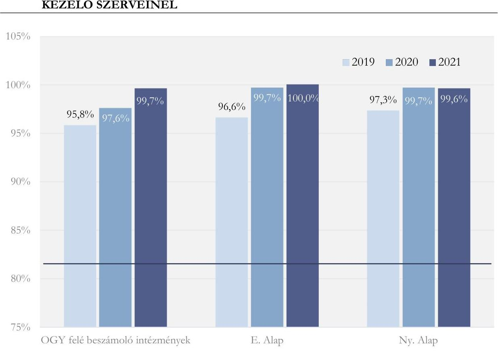

A TB alapok kezelő szervei és az OGY felé beszámolási kötelezettséggel tartozó intézmények belső kontrollrendszerének kialakítása és működtetése a 2019-2021. években megfelelő volt. A korábbi ellenőrzések során feltárt hiányosságok kezelése a belső kontrollrendszer erősítését eredményezte.

A kontrollkörnyezet kialakítása az ELKA kezelő szervei, az alkotmányos fejezetek intézményei és a fejezeti kezelésű előirányzatok kezelő szervei mindegyikénél megfelelő volt.

Az alkotmányos fejezetek intézményei, a fejezeti kezelésű és az EU-s előirányzatok kezelő szervei, valamint az ELKA kezelő szervezetei (Bethlen Gábor Alapkezelő Közhasznú Nonprofit Zrt, Innovációs és Technológiai Minisztérium, Nemzeti Kutatási, Fejlesztési és Innovációs Hivatal, Emberi Erőforrás Támogatáskezelő) működésük szervezeti kereteit szabályszerűen kialakították. Az ellenőrzött szervezetek mindegyike rendelkezett a működésük alapvető kereteit meghatározó szervezeti és működési szabályzattal.

Az ellenőrzött szervezetek rendelkeztek a gazdálkodás részletes rendjét meghatározó szabályozásokkal. Rendelkeztek továbbá a jogszabályok által előírt pénzügyi és számviteli szabályzatokkal (számviteli politika, leltárkészítési és leltározási szabályzat, eszközök és források értékelési szabályzata, pénzkezelési szabályzat, számlarend).

---

Az ellenőrzött szervezetek kiadásaik és bevételeik teljesítése során a kötelezettségvállalás és teljesítésigazolás kontrollokat az Áht. és Ávr. előírásaival összhangban, szabályszerűen működtették.

A kontrollkörnyezet kialakításának megfelelőségéről a 10. ábra ad áttekintést.
10. ábra A KONTROLLKÖRNYEZET KIALAKÍTÁSÁNAK MEGFELELŐSÉGE AZ ALKOTMÁNYOS FEJEZETEK INTÉZMÉNYEINÉL, VALAMINT AZ ELKA ÉS A FEJEZETI KEZELÉSŰ ELŐIRÁNYZATOK KEZELŐ SZERVEINÉL
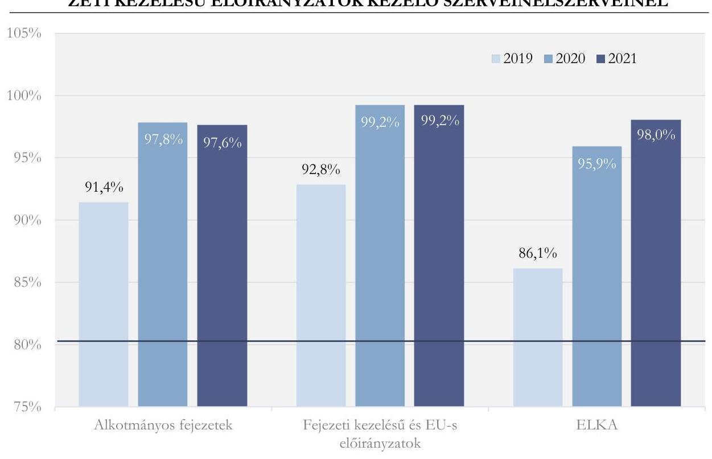

Forrás: ÁSZ szerkesztés
Az alkotmányos fejezetek intézményeinél, valamint az ELKA és a fejezeti kezelésű előirányzatok kezelő szerveinél a kontrollkörnyezet szabályozottsága a 2019-2021. években megfelelő volt. A korábbi ellenőrzések során feltárt hiányosságok kezelése a kontrollkörnyezet erősítését eredményezte.

---

# ORSZÁGGYÜLÉS FELÉ BESZÁMOLÁSI KÖTELEZETTSÉGGEL TÁRTOZÓ INTÉZMÉNYEK 

| Gazdasági Versenyhivatal | Közbeszerzési Hatóság | Központi Statisztikai Hivatal |
| :--: | :--: | :--: |
| Magyar Energetikai és Közmű-szabályozási Hivatal | Magyar Művészeti Akadémia | Magyar Tudományos Akadémia |
| Nemzeti Adatvédelmi és Információszabadság Hatóság | Nemzeti Élelmiszerlánc-biztonsági Hivatal | Nemzeti Emlékezet Bizottságának Hivatala |
| Nemzeti Kutatási, Fejlesztési és Innovációs Hivatal | Nemzeti Választási Iroda | Országos Atomenergia Hivatal |
| ALKOTMÁNYOS FEJEZETEK INTÉZMÉNYEI |  |  |
| Alapvető Jogok Biztosának Hivatala | Alkotmánybíróság | Balassagyarmati Törvényszék |
| Budapest Környéki Törvényszék | Debreceni Ítélőtábla | Debreceni Törvényszék |
| Egri Törvényszék | Fővárosi Ítélőtábla | Fővárosi Törvényszék |
| Győri Ítélőtábla | Győri Törvényszék | Gyulai Törvényszék |
| Kaposvári Törvényszék | Kecskeméti Törvényszék | Köztársasági Elnöki Hivatal |
| Kúria | Legfőbb Ügyészség | Miskolci Törvényszék |
| Nyíregyházi Törvényszék | Országgyűlés Hivatala | Országos Bírósági Hivatal |
| Pécsi Ítélőtábla | Pécsi Törvényszék | Szegedi Ítélőtábla |
| Szegedi Törvényszék | Székesfehérvári Törvényszék | Szekszárdi Törvényszék |
| Szolnoki Törvényszék | Szombathelyi Törvényszék | Tatabányai Törvényszék |
| Veszprémi Törvényszék | Zalaegerszegi Törvényszék |  |
| KÖZPONTI KEZELÉSŰ ELŐÍRÁNYZATOK |  |  |
| Agrár-Vállalkozási és Hitelgarancia Alapítvány | Államadósság Kezelő Központ Zrt. | Bács-Kiskun Megyei Kormányhivatal |
| Baranya Megyei Kormányhivatal | Békés Megyei Kormányhivatal | Belügyminisztérium |
| Bethlen Gábor Alapkezelő Közhasznú Nonprofit Zrt. | Borsod-Abaúj-Zemplén Megyei Kormányhivatal | Budapest Főváros Kormányhivatala |
| Csongrád-Csanád Megyei Kormányhivatal | Digitális Kormányzati Ügynökség Zrt. | Emberi Erőforrás Támogatáskezelő |
| Fejér Megyei Kormányhivatal | Garantiqa Hitelgarancia Zrt. | Győr-Moson-Sopron Megyei Kormányhivatal |

---

| Hajdú-Bihar Megyei Kormány-   hivatal | Heves Megyei Kormányhivatal | Innovációs és Technológiai Mi-   nisztérium |
| :--: | :--: | :--: |
| Jász-Nagykun-Szolnok Megyei   Kormányhivatal | Komárom-Esztergom Megyei Kor-   mányhivatal | Központi Statisztikai Hivatal |
| Külgazdasági és Külügyminiszté-   rium | Magyar Államkincstár | Magyar Bányászati és Földtani   Szolgálat (Szabályozott Tevé-   kenységek Felügyeleti Hatósága) |
| Magyar Export Import Bank Zrt. | Magyar Exporthitel Biztosító Zrt. | Magyar Fejlesztési Bank Zrt. |
| Magyar Nemzeti   Vagyonkezelő Zrt. | Magyar Turisztikai Ügynökség Zrt. | Miniszterelnöki Kormányiroda |
| Miniszterelnökség | Nemzeti Adó- és Vámhivatal | Nemzeti Egészségbiztosítási   Alapkezelő |
| Nemzeti Földügyi Központ | Nemzeti Útdíjfizetési Szolgáltató   Zrt. | Nógrád Megyei Kormányhivatal |
| Pénzügyminisztérium | Pest Megyei Kormányhivatal | Somogy Megyei Kormányhivatal |
| Start Garancia Pénzügyi   Szolgáltató Zrt. | Szabolcs-Szatmár-Bereg Megyei   Kormányhivatal | Tolna Megyei Kormányhivatal |
| Vas Megyei Kormányhivatal | Veszprém Megyei Kormányhivatal | Zala Megyei Kormányhivatal |
| KÖZPONTI ALRENDSZER KIVÁLASZTOTT INTÉZMÉNYEI |  |  |
| Aggteleki Nemzeti Park   Igazgatóság | Alföldi Agrárszakképzési Centrum | Bács-Kiskun Megyei Katasztró-   favédelmi Igazgatóság |
| Baranya Megyei Kormányhivatal | Borsod-Abaúj-Zemplén Megyei   Kormányhivatal | Csillagászati és Földtudományi   Kutatóközpont |
| Csongrád-Csanád Megyei   Gesztenyeliget Otthon | Csongrád-Csanád Megyei Kor-   mányhivatal | Csongrád-Csanád Megyei   Rendőr-Főkapitányság |
| Dél-Borsodi Integrált Szociális   Intézmény | Emberi Erőforrások Minisztériuma   Rákospalotai Javítóintézete és Köz-   ponti Speciális Gyermekotthona | Érdi Tankerületi Központ |
| Felsőbb Fokú Tanulmányok   Intézete | Gólyafészek Otthon Jász-Nagykun   Szolnok Megyei Fogyatékosok   Otthona | Gottsegen György Országos   Kardiovaszkuláris Intézet |
| Győr-Moson-Sopron Megyei Al-   pokalja Szociális Központ | Hajdú-Bihar Megyei

 Katasztrófavédelmi Igazgatóság | Ipolypart Ápoló Gondozó Otthon és Rehabilitációs Intézet |
| Jászberényi Tankerületi Központ | Kaposvári Tankerületi Központ | Karcagi Szakképzési Centrum |
| Kísérleti Orvostudományi Kutatóintézet | Kisvárdai Tankerületi Központ | Komárom-Esztergom Megyei Gyermekvédelmi Központ és Általános Iskola |
| Komlói Egészségcentrum, Bányászati Utókezelő és Éjjeli Szatórium Egészségügyi Központ | Kratochvil Károly Honvéd Középiskola és Kollégium | Liszt Ferenc Zeneművészeti Egyetem |
| Magyar Képzőművészeti Egyetem | Magyar Természettudományi Múzeum | Mátészalkai Szakképzési Centrum |

---

| Monori Tankerületi Központ | Nemzeti Biodiverzitás- és Génmegőrzési Központ | Nemzeti Földügyi Központ |
| :--: | :--: | :--: |
| Nemzeti Örökség Intézete | Nógrád Megyei Katasztrófavédelmi Igazgatóság | Nyíregyházi Szakképzési Centrum |
| Országos Rendőr-Főkapitányság | Országos Széchényi Könyvtár | Pest Megyei Rendőr-Főkapitányság |
| Pest Megyei Viktor Egyesített Szociális Intézmény | Pilisi Gyermekotthon, Óvoda, Általános Iskola, Szakiskola és Készségfejlesztő Iskola | Siófoki Tankerületi Központ |
| Slachta Margit Nemzeti Szociálpolitikai Intézet | Szabolcs-Szatmár-Bereg Megyei Kórházak és Egyetemi Oktatókórház | Szabolcs-Szatmár-Bereg Megyei Kormányhivatal |
| Szerencsi Tankerületi Központ | Tamási Tankerületi Központ | Tatabányai Tankerületi Központ |
| Uzsoki Utcai Kórház | Vas Megyei Gyermekvédelmi Központ és Általános Iskola | Vas Megyei Katasztrófavédelmi Igazgatóság |
| Veszprém Megyei Kormányhivatal | Veszprém Megyei Tüdőgyógyintézet, Farkasgyepű |  |
| FEJEZETI KEZELÉSŰ ELŐÍRÁNYZATOK |  |  |
| Agrárminisztérium | Belügyminisztérium | Emberi Erőforrások Minisztériuma |
| Eötvös Loránd Kutatási Hálózat | Gazdasági Versenyhivatal | Honvédelmi Minisztérium |
| Igazságügyi Minisztérium | Innovációs és Technológiai Minisztérium | Központi Statisztikai Hivatal |
| Köztársasági Elnöki Hivatal | Külgazdasági és Külügyminisztérium | Legfőbb Ügyészség |
| Magyar Művészeti Akadémia | Magyar Tudományos Akadémia | Miniszterelnöki Kabinetiroda |
| Miniszterelnöki Kormányiroda | Miniszterelnökség | Nemzeti Kutatási, Fejlesztési és Innovációs Hivatal |
| Nemzeti Választási Iroda | Országgyűlés Hivatala | Országos Bírósági Hivatal |
| Pénzügyminisztérium |  |  |
| ELKÜLÖNÍTETT ÁLLAMI PÉNZÁLAPOK ÉS KEZELŐ SZERVEIK |  |  |
| Bethlen Gábor Alap (Bethlen Gábor Alapkezelő Közhasznú Nonprofit Zrt.) | Központi Nukleáris Pénzügyi Alap (Innovációs és Technológiai Minisztérium) | Gazdasági-újraindítási Foglalkoztatási Alap (Innovációs és Technológiai Minisztérium) |
| Nemzeti Kulturális Alap (Emberi Erőforrás Támogatáskezelő) | Nemzeti Kutatási, Fejlesztési és Innovációs Alap (Nemzeti Kutatási, Fejlesztési és Innovációs Hivatal) |  |
| TÁRSADALOMBIZTOSÍTÁSI ALAPOK |  |  |
| Egészségbiztosítási Alap (Nemzeti Egészségbiztosítási Alapkezelő) | Nyugdíjbiztosítási Alap (Magyar Államkincstár) |  |

---

.

---

# FÜGGELÉKEK 

## I. SZ. FÜGGELÉK: ÉSZREVÉTELEK

A jelentéstervezetet a Számvevőszék 15 napos észrevételezésre megküldte a pénzügyminiszternek, valamint az Országgyűlés felé beszámolási kötelezettséggel tartozó intézmények vezetőinek az ÁSZ tv. 29. § (1) bekezdése előírásának megfelelően.

A Pénzügyminisztériumtól kapott észrevételek figyelembevételével a Számvevőszék módosította a jelentést.

Az Országgyűlés felé beszámolási kötelezettséggel tartozó intézmények vezetői észrevételt nem tettek.
*29. § (1) Az Állami Számvevőszék az ellenőrzési megállapításait megküldi az ellenőrzött szervezet vezetőjének vagy az általa megbízott személynek, és annak, akinek személyes felelősségét állapította meg.
(2) Az ellenőrzött szervezet vezetője és a felelősként megjelölt személy az ellenőrzés megállapításaira tizenöt napon belül írásban észrevételt tehet.
(3) Az Állami Számvevőszék az észrevételre a beérkezésétől számított harminc napon belül írásban válaszol. A figyelembe nem vett észrevételeket köteles a jelentésben feltüntetni, és megindokolni, hogy azokat miért nem fogadta el.

---

# GAZDASÁGI VERSENYHIVATAL (XXX. GAZDASÁGI VERSENYHIVATAL FEJEZET) 

A GVH $^{34}$ esetében az ellenőrzés a belső kontrollrendszer kialakítása és működtetése, valamint az előirányzat-módosítás és a költségvetési maradvány kimutatása kapcsán, az ellenőrzött tételek és az ellenőrzés rendelkezésére bocsátott dokumentumok alapján nem tárt fel az intézmény szabályszerű működését, a bevételek és kiadások teljesítési adatainak megbízhatóságát veszélyeztető hiányosságot, kockázatot.

A GVH a beszámolót a jogszabályi követelményekkel összhangban állította össze.

## KÖZBESZERZÉSI HATÓSÁG (I. ORSZÁGGYŰLÉS, 5. CÍM)

A $\mathrm{KH}^{35}$ esetében az ellenőrzés a belső kontrollrendszer kialakítása és működtetése, valamint az előirányzat-módosítás és a költségvetési maradvány kimutatása kapcsán, az ellenőrzött tételek és az ellenőrzés rendelkezésére bocsátott dokumentumok alapján nem tárt fel az intézmény szabályszerű működését, a bevételek és kiadások teljesítési adatainak megbízhatóságát veszélyeztető hiányosságot, kockázatot.

A KH a beszámolót a jogszabályi követelményekkel összhangban állította össze.

## KÖZPONTI STATISZTIKAI HIVATAL (XXXI. KÖZPONTI STATISZTIKAI HIVATAL FEJEZET)

A $\mathrm{KSH}^{36}$ esetében az ellenőrzés a belső kontrollrendszer kialakítása és működtetése, valamint az előirányzat-módosítás és a költségvetési maradvány kimutatása kapcsán, az ellenőrzött tételek és az ellenőrzés rendelkezésére bocsátott dokumentumok alapján nem tárt fel az intézmény szabályszerű működését, a bevételek és kiadások teljesítési adatainak megbízhatóságát veszélyeztető hiányosságot, kockázatot.

A KSH a beszámolót a jogszabályi követelményekkel összhangban állította össze.

## MAGYAR ENERGETIKAI ÉS KÖZMŰ-SZABÁLYOZÁSI HIVATAL (I. ORSZÁGGYŰLÉS, 23. CÍM)

A MEKH ${ }^{37}$ esetében az ellenőrzés a belső kontrollrendszer kialakítása és működtetése, valamint az előirányzat-módosítás és a költségvetési maradvány kimutatása kapcsán, az ellenőrzött tételek és az ellenőrzés rendelkezésére bocsátott dokumentumok alapján nem tárt fel az intézmény szabályszerű működését, a bevételek és kiadások teljesítési adatainak megbízhatóságát veszélyeztető hiányosságot, kockázatot.

A MEKH a beszámolót a jogszabályi követelményekkel összhangban állította össze.

---

# MAGYAR MŰVÉSZETI AKADÉMIA (XXXIV. MAGYAR MŰVÉSZETI AKADÉMIA 1. CÍM) 

Az MMA $^{38}$ esetében az ellenőrzés a belső kontrollrendszer kialakítása és működtetése, valamint az előirányzat-módosítás és a költségvetési maradvány kimutatása kapcsán, az ellenőrzött tételek és az ellenőrzés rendelkezésére bocsátott dokumentumok alapján nem tárt fel az intézmény szabályszerű működését, a bevételek és kiadások teljesítési adatainak megbízhatóságát veszélyeztető hiányosságot, kockázatot.

Az MMA a beszámolót a jogszabályi követelményekkel összhangban állította össze.

## MAGYAR TUDOMÁNYOS AKADÉMIA (XXXIII. MAGYAR TUDOMÁNYOS AKADÉMIA FEJEZET 1. CÍM)

Az MTA $^{39}$ esetében az ellenőrzés a belső kontrollrendszer kialakítása és működtetése, valamint az előirányzat-módosítás és a költségvetési maradvány kimutatása kapcsán, az ellenőrzött tételek és az ellenőrzés rendelkezésére bocsátott dokumentumok alapján nem tárt fel az intézmény szabályszerű működését, a bevételek és kiadások teljesítési adatainak megbízhatóságát veszélyeztető hiányosságot, kockázatot.

Az MTA a beszámolót a jogszabályi követelményekkel összhangban állította össze.

## NEMZETI ADATVÉDELMI ÉS INFORMÁCIÓSZABADSÁG HATÓSÁG (I. ORSZÁGGYŰLÉS, 21. CÍM)

A NAIH $^{40}$ esetében az ellenőrzés a belső kontrollrendszer kialakítása és működtetése, valamint az előirányzat-módosítás és a költségvetési maradvány kimutatása kapcsán, az ellenőrzött tételek és az ellenőrzés rendelkezésére bocsátott dokumentumok alapján nem tárt fel az intézmény szabályszerű működését, a bevételek és kiadások teljesítési adatainak megbízhatóságát veszélyeztető hiányosságot, kockázatot.

A NAIH a beszámolót a jogszabályi követelményekkel összhangban állította össze.

## NEMZETI EMLÉKEZET BIZOTTSÁGÁNAK HIVATALA (I. ORSZÁGGYŰLÉS, 25. CÍM)

A NEBH $^{41}$ esetében az ellenőrzés a belső kontrollrendszer kialakítása és működtetése, valamint az előirányzat-módosítás és a költségvetési maradvány kimutatása kapcsán, az ellenőrzött tételek és az ellenőrzés rendelkezésére bocsátott dokumentumok alapján nem tárt fel az intézmény szabályszerű működését, a bevételek és kiadások teljesítési adatainak megbízhatóságát veszélyeztető hiányosságot, kockázatot.

A NEBH a beszámolót a jogszabályi követelményekkel összhangban állította össze.

---

# NEMZETI ÉLELMISZERLÁNC-BIZTONSÁGI HIVATAL (XII. AGRÁRMINISZTÉRIUM, 2. CÍM) 

A NÉBIH ${ }^{42}$ esetében az ellenőrzés a belső kontrollrendszer kialakítása és működtetése, valamint az előirányzat-módosítás és a költségvetési maradvány kimutatása kapcsán, az ellenőrzött tételek és az ellenőrzés rendelkezésére bocsátott dokumentumok alapján nem tárt fel az intézmény szabályszerű működését, a bevételek és kiadások teljesítési adatainak megbízhatóságát veszélyeztető hiányosságot, kockázatot.

A NÉBIH a beszámolót a jogszabályi követelményekkel összhangban állította össze.

## NEMZETI KUTATÁSI, FEJLESZTÉSI ÉS INNOVÁCIÓS HIVATAL (XXXV. NEMZETI KUTATÁSI, FEJLESZTÉSI ÉS INNOVÁCIÓS HIVATAL 1. CÍM)

Az NKFIH ${ }^{43}$ esetében az ellenőrzés a belső kontrollrendszer kialakítása és működtetése, valamint az előirányzat-módosítás és a költségvetési maradvány kimutatása kapcsán, az ellenőrzött tételek és az ellenőrzés rendelkezésére bocsátott dokumentumok alapján nem tárt fel az intézmény szabályszerű működését, a bevételek és kiadások teljesítési adatainak megbízhatóságát veszélyeztető hiányosságot, kockázatot.

Az NKFIH a beszámolót a jogszabályi követelményekkel összhangban állította össze.

## NEMZETI VÁLASZTÁSI IRODA (I. ORSZÁGGYŰLÉS, 24. CÍM)

Az $\mathrm{NVI}^{44}$ esetében az ellenőrzés a belső kontrollrendszer kialakítása és működtetése, valamint az előirányzat-módosítás és a költségvetési maradvány kimutatása kapcsán, az ellenőrzött tételek és az ellenőrzés rendelkezésére bocsátott dokumentumok alapján nem tárt fel az intézmény szabályszerű működését, a bevételek és kiadások teljesítési adatainak megbízhatóságát veszélyeztető hiányosságot, kockázatot.

Az NVI a beszámolót a jogszabályi követelményekkel összhangban állította össze.

## ORSZÁGOS ATOMENERGIA HIVATAL (XVII. INNOVÁCIÓS ÉS TECHNOLÓGIAI MINISZTÉRIUM, 4. CÍM)

Az $\mathrm{OAH}^{45}$ esetében az ellenőrzés a belső kontrollrendszer kialakítása és működtetése, valamint az előirányzat-módosítás és a költségvetési maradvány kimutatása kapcsán, az ellenőrzött tételek és az ellenőrzés rendelkezésére bocsátott dokumentumok alapján nem tárt fel az intézmény szabályszerű működését, a bevételek és kiadások teljesítési adatainak megbízhatóságát veszélyeztető hiányosságot, kockázatot.

Az OAH a beszámolót a jogszabályi követelményekkel összhangban állította össze.

---

# RÖVIDÍTÉSEK JEGYZÉKE 

${ }^{1}$ ÁSZ
${ }^{2}$ Stabilitási tv.
${ }^{3}$ Kvtv.
${ }^{4}$ Áht.
${ }^{5}$ TB Alapok
${ }^{6}$ ELKA
${ }^{7}$ NAV
${ }^{8}$ ÁSZ tv.
${ }^{9}$ Kincstár
${ }^{10}$ KGR K11
${ }^{11}$ KAR
${ }^{12}$ AHAB
${ }^{13}$ GDP
${ }^{14}$ Eurostat
${ }^{15}$ uniós mentesítési záradék
${ }^{16}$ Számv. tv.
${ }^{17}$ Áhsz.
${ }^{18}$ OGY
${ }^{19}$ NEAK
${ }^{20}$ BGA
${ }^{21}$ KNPA
${ }^{22}$ GUFA
${ }^{23}$ NKA
${ }^{24}$ NKFIA
${ }^{25}$ ÁKK Zrt.
${ }^{26}$ KESZ
${ }^{27}$ Ávr.
${ }^{28}$ Vtv.
${ }^{29} \mathrm{PM}$ rendelet
${ }^{30}$ TB Alapok kezelői

Állami Számvevőszék
2011. évi CXCIV. törvény Magyarország gazdasági stabilitásáról (hatályos: 2011. december 31-től)

Magyarország 2021. évi központi költségvetéséről szóló 2020. évi XC. törvény (hatályos: 2020. október 1-jétől.) A veszélyhelyzet ideje alatt eltérő rendelkezéseket kell alkalmazni. Lásd: 4/2021. (I. 14.) Korm. rendelet 1. § (5), 13/2021. (I. 22.) Korm. rendelet 1. §, 614/2021. (XI. 8.) Korm. rendelet 1. §) 2011. évi CXCV. törvény az államháztartásról (hatályos: 2011. december 31-től)
Társadalombiztosítási Alapok: Nyugdíjbiztosítási Alap és Egészségbiztosítási Alap
Elkülönített Állami Pénzalapok
Nemzeti Adó- és Vámhivatal
2011. évi LXVI. törvény az Állami Számvevőszékről (hatályos: 2011. július 1-jétől)
Magyar Államkincstár
Költségvetés Gazdálkodási Rendszer K11 adatgyűjtő-beszámoló rendszer
Költségvetési Adatcserélő Rendszer
Államháztartási Adatbázis
Bruttó hazai termék
Európai Unió Statisztikai Hivatala
A Bizottság közleménye a Tanácsnak a Stabilitási és Növekedési Paktum általános mentesítési záradékának alkalmazásáról
2000. évi C. törvény a számvitelről (hatályos: 2001. január 1-jétől)
4/2013. (I. 11.) Korm. rendelet az államháztartás számviteléről (hatályos: 2014. január 1-jétől)
Országgyűlés
Nemzeti Egészségbiztosítási Alapkezelő
Bethlen Gábor Alap
Központi Nukleáris Pénzügyi Alap
Gazdaság-Újraindítási Foglalkoztatási Alap
Nemzeti Kulturális Alap
Nemzeti Kutatási, Fejlesztési és Innovációs Alap
Államadósság Kezelő Központ Zártkörűen Működő Részvénytársaság
Kincstári Egységes Számla
368/2011. (XII. 31.) Korm. rendelet az államháztartásról szóló törvény végrehajtásáról (hatályos: 2012. január 1-jétől)
2007. évi CVI. törvény az állami vagyonról (hatályos: 2007. szeptember 25-től) 22/2020. (XII. 30.) PM rendelet a pénzügyminisztérium irányítása alá tartozó központi kezelésű előirányzatok kezeléséről és felhasználásáról (hatályos: 2021. január 1-jétől 2021. december 31-ig)
Nyugdíjbiztosítási Alap kezelője a Magyar Államkincstár, Egészségbiztosítási Alap kezelője a Nemzeti Egészségbiztosítási Alapkezelő

---

| ${ }^{31}$ E. Alap | Egészségbiztosítási Alap |
| :--: | :--: |
| ${ }^{32}$ Ny. Alap | Nyugdíjbiztosítási Alap |
| ${ }^{33}$ Bkr. |

 370/2011. (XII. 31.) Korm. rendelet a költségvetési szervek belső kontrollrendszeréről és belső ellenőrzéséről (hatályos: 2012. január 1-jétől) |
| ${ }^{34}$ GVH | Gazdasági Versenyhivatal |
| ${ }^{35} \mathrm{KH}$ | Közbeszerzési Hatóság |
| ${ }^{36} \mathrm{KSH}$ | Központi Statisztikai Hivatal |
| ${ }^{37}$ MEKH | Magyar Energetikai és Közmű-szabályozási Hivatal |
| ${ }^{38}$ MMA | Magyar Művészeti Akadémia Titkársága |
| ${ }^{39}$ MTA | Magyar Tudományos Akadémia Titkársága |
| ${ }^{40}$ NAIH | Nemzeti Adatvédelmi és Információszabadság Hatóság |
| ${ }^{41}$ NEBH | Nemzeti Emlékezet Bizottságának Hivatala |
| ${ }^{42}$ NÉBIH | Nemzeti Élelmiszerlánc-biztonsági Hivatal |
| ${ }^{43}$ NKFIH | Nemzeti Kutatás, Fejlesztési és Innovációs Hivatal |
| ${ }^{44}$ NVI | Nemzeti Választási Iroda |
| ${ }^{45} \mathrm{OAH}$ | Országos Atomenergia Hivatal |

---

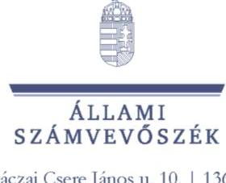

1052 Budapest, Apáczai Csere János u. 10. | 1364 Budapest 4., Pf. 54
www.asz.hu | szamvevoszek@asz.hu
telefon: +3614849100
