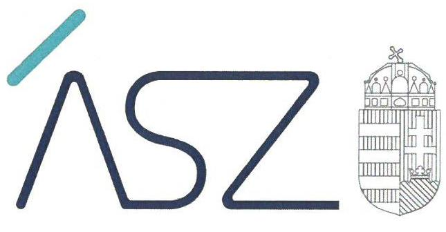
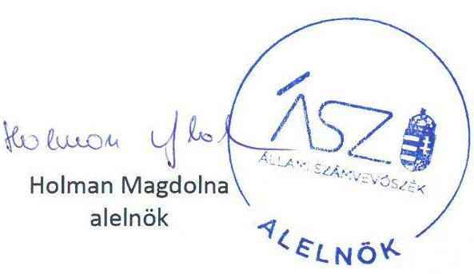
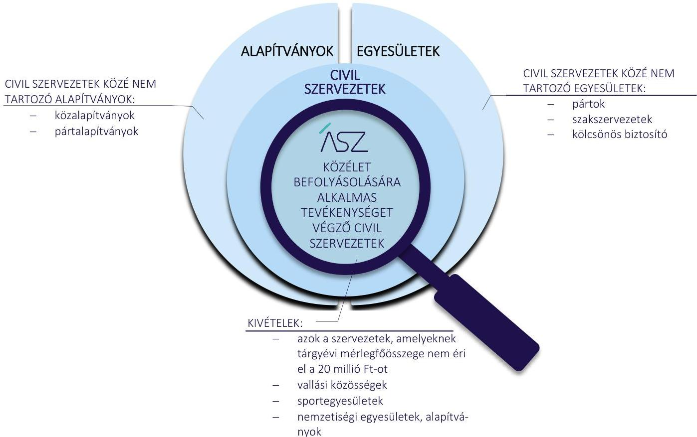
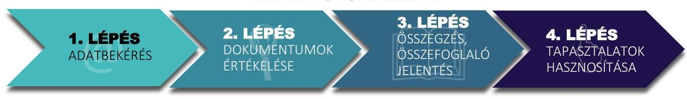

ÁLLAMI SZÁMVEVŐSZÉK

# ÖSSZEFOGLALÓ JELENTÉS 

## Civil szervezetek értékelése

A közélet befolyásolására alkalmas tevékenységet végző civil szervezetek értékelése
2022.

22062
www.asz.hu

---

ÁLLAMI SZÁMVEVŐSZÉK

# ÖSSZEFOGLALÓ JELENTÉS 

## Civil szervezetek értékelése

A közélet befolyásolására alkalmas tevékenységet végző civil szervezetek értékelése

22062
www.asz.hu

---

# AZ ELLENŐRZÉST VEZETTE ÉS A VÉGREHAJTÁSÁÉRT FELELŐS: 

## NEMESVÁRI-HORTHY ESZTER ellenőrzésvezető

## IKTATÓSZÁM: EL-3798-001/2022.

## TÉMASZÁM: 2631

ELLENŐRZÉS-AZONOSÍTÓ SZÁM: V 0975

---

# TARTALOMJEGYZÉK 

■ BEVEZETÉS ..... 5
■ AZ ÉRTÉKELÉS HATÓKÖRE ÉS MÓDSZERE ..... 7
■ AZ ÉRTÉKELÉS TERÜLETE ..... 8
■ ÉRTÉKELÉS ..... 11
■ KÖVETKEZTETÉSEK ..... 14
■ MELLÉKLETEK ..... 15
I. sz. melléklet: Értelmező szótár ..... 15
II. sz. melléklet: Az értékelés során feltárt szabályozási hiányosságok összefoglalása ..... 16
■ RÖVIDÍTÉSEK JEGYZÉKE ..... 17

---

.

---

# BEVEZETÉS 

Az Állami Számvevőszék ${ }^{1}$ az Állami Számvevőszékről szóló 2011. évi LXVI. törvény² 2021. július 1-jével hatályba lépett módosításával az ÁSZ tv. 5. § (11) bekezdés e) pontjában kapott felhatalmazás alapján törvényességi szempontból ellenőrzi a közélet befolyásolására alkalmas tevékenységet végző civil szervezetek átláthatóságáról szóló 2021. évi XLIX. törvény ${ }^{3}$ szerinti egyesületet és alapítványt. Az ÁSZ a 2021. évi XLIX. törvény alapján évente összefoglaló jelentést tesz közzé a törvény hatálya alá tartozó egyesületekről és alapítványokról, biztosítva ezáltal a közvélemény, a civil szervezetek tevékenysége iránt érdeklődők hiteles tájékoztatását.

A közélet befolyásolására alkalmas tevékenységet végző civil szervezetek körét a 2021. évi XLIX. törvény határozza meg. A közélet befolyásolására alkalmas tevékenységet végző civil szervezetek, az egyesülési jogról, a közhasznú jogállásról, valamint a civil szervezetek müködéséről és támogatásáról szóló 2011. évi CLXXV. törvény ${ }^{4}$ szerinti, Magyarországon nyilvántartásba vett egyesületek, valamint alapítványok, amelyek tárgyévi mérlegfőösszege eléri a 20 millió Ft-ot.

A közalapítványok, pártalapítványok, pártok, szakszervezetek és kölcsönös biztosító egyesületek, a vallási közösségek, sportegyesületek, valamint a nemzetiségi egyesületek és alapítványok nem tartoznak a közélet befolyásolására alkalmas civil szervezetek közé és így nem terjed ki rájuk a 2021. évi XLIX. törvény hatálya.

Az alapítványok, egyesületek, civil szervezetek körét, valamint a közélet befolyásolására alkalmas tevékenységet végző civil szervezetek közül az összefoglaló jelentés hatókörébe tartozó szervezeti kört az 1. ábra szemlélteti.

## A KÖZÉLET BEFOLYÁSOLÁSÁRA ALKALMAS TEVÉKENYSÉGET VÉGZŐ CIVIL SZERVEZETEK JOGSZABÁLYI LEHATÁROLÁSA

A közélet befolyásolására alkalmas tevékenységet végző civil szervezetek esetében a szabályszerű működéshez szükséges a gazdálkodási szabályzatok biztosítása. A szabályszerű működés jelentőséggel bír a civil szervezet, az

---

alapítók, a tagságuk és a céljaik eléréséhez részükre vagyoni hozzájárulást biztosító támogatóik, illetve a közvélemény számára. A közélet befolyásolására alkalmas tevékenységet végző civil szervezeteknél 2022. év tekintetében annak értékelésére került sor, hogy gazdálkodásuk jogszabályok által előírt kötelező gazdálkodási, számviteli szabályozási kereteit hogyan alakították ki.

Az értékelés lefolytatását megelőzően az ÁSZ támogatást nyújtott a civil szervezeteknek. 2022 tavaszán a civil szervezetek támogatására - a közvélemény tájékoztatásával - öntesztet tett elérhetővé honlapján, illetve képzést szervezett a civil szervezetek vezetőinek részvételével. Az önteszt rendelkezésre bocsátásával és a civil szervezetek vezetői részére a képzések megtartásával az ÁSZ ahhoz kívánt hozzájárulni, hogy a civil szervezetek szabályszerű és szabályozott múködését támogassa.

Az ÁSZ az elvégzett értékelése során szerzett tapasztalataival a jogalkotó szerveknek a civil szféra gazdálkodása törvényességével kapcsolatos munkáját is támogatni kívánja. Az elvégzett értékelés tapasztalatait az ÁSZ a jövőben a közélet befolyásolására alkalmas civil szervezetek körében elvégzendő ellenőrzései megtervezésénél is hasznosítja.

---

# AZ ÉRTÉKELÉS HATÓKÖRE ÉS MÓDSZERE 

A 2021. ÉVI XLIX. TÖRVÉNY feltételeinek megfelelő egyesületek és alapítványok körének meghatározása és az összefoglaló jelentés elkészítése érdekében az ÁSZ adatigényléssel fordult a Központi Statisztikai Hivatalhoz ${ }^{5}$ az Országos Statisztikai Adatfelvételi Program ${ }^{6}$ kötelező adatszolgáltatásairól szóló 388/2017. (XII. 13.) Kormányrendelet ${ }^{7}$ szerinti -OSAP-1156. számú Statisztikai jelentés a civil és egyéb nonprofit szervezetek tevékenységéről ${ }^{8}$ tárgyú - adatszolgáltatással összefüggésben.

Az Országos Bírósági Hivataltól ${ }^{9}$ adatigénylés a civil szervezetek bírósági nyilvántartásáról és az ezzel összefüggő eljárási szabályokról szóló 2011. évi CLXXXI. törvény ${ }^{10}$ szerinti, a közhiteles törvényszéki nyilvántartásban szereplő egyesületek, alapítványok egyes nyilvános adataival összefüggésben történt.

Az ÁSZ a törvényi kötelezettségeinek eleget téve adatbekéréssel 3252 szervezethez fordult, az összefoglaló értékelést 2764 szervezetre vonatkozóan készítette el. Az ÁSZ felkérésére a megkeresett 3252 civil szervezetből 488 szervezet nem szolgáltatott adatot.

A közélet befolyásolására alkalmas tevékenységet végző civil szervezeteknél 2022. év tekintetében annak értékelésére került sor, hogy gazdálkodásuk alapvető szabályozási kereteit hogyan alakították ki. Az ÁSZ az alapítványi, vagy egyesületi formában működő civil szervezetektől a gazdálkodásuk törvényességének, szabályozottságának értékeléséhez a számvitelről szóló 2000. évi C. törvényben ${ }^{11}$ részükre kötelezően előírt szabályzatok rendelkezésre bocsátását kérte (számviteli politika és kapcsolódó szabályzatok; a kettős könyvvitelt vezető civil szervezetek esetében a számlarend). Az ÁSZ ezeken túlmenően nyilatkozatot kért arról, hogy a civil szervezet a kettős könyvvitel szabályai szerint vezeti-e könyveit.

Az ÁSZ az adatbekéréssel érintett civil szervezetek körében a szabályozottság értékelését a fenti dokumentumok alapján végezte el. Az értékelés az ellenőrzött időszakban hatályos jogszabályokra, az ellenőrzött által rendelkezésre bocsátott dokumentumokra, adatokra alapozva történt. A felhasználható adatforrások közé tartoztak az adatbekérő levelek mellékletében szereplő dokumentumok jegyzékében rögzített, az előző bekezdésben nevesített adatforrások.

Az értékelésbe bevont szervezetekkel való kapcsolattartás az ÁSZ Szervezeti és Működési Szabályzatának vonatkozó előírásai alapján történt.

---

# AZ ÉRTÉKELÉS TERÜLETE 

## A közélet befolyásolására alkalmas tevékenységet végző civil szervezetek átláthatóságáról szóló 2021. évi XLIX. törvény hatálya alá tartozó egyesületek és alapítványok

MAGYARORSZÁG ALAPTÖRVÉNYE ${ }^{12}$ VIII. cikk (2) bekezdése szerint „Mindenkinek joga van szervezeteket létrehozni, és joga van szervezetekhez csatlakozni."

Az egyesülési jog a Civil törvény alapján mindenkit, a természetes személyek mellett a jogi személyeket és a jogi személyiséggel nem rendelkező szervezeteket is megillető szabadságjog. Az egyesülési jog alapján létrehozott szervezet célját a jogalkotó nem határozza meg konkrétan, minden olyan célra alapítható szervezet, amely összhangban áll az Alaptörvénnyel, és amelyet törvény nem tilt. Az egyesülési jog alapján létrehozott civil szervezetek az élet minden területén jelen vannak. Példaértékű tevékenységük megjelenik többek között az egészségügy, a köznevelés, a környezetvédelem, a kultúra területén, valamint aktív jelenlétük jelentős az elesettek, a szociálisan rászorultak, a hátrányos helyzetűek megsegítésében is. Szerteágazó feladataik ellátása során a társadalom szinte minden csoportjával kapcsolatba kerülnek, tevékenységük révén hatást gyakorolnak a közvéleményre, a közéletre.

Az egyesülési jog alapján létrehozott civil szervezetek a Civil törvény szerint a következők:
$\longrightarrow$ a civil társaság;
$\longrightarrow$ a Magyarországon nyilvántartásba vett egyesület - a párt, a szakszervezet és a kölcsönös biztosító egyesület kivételével;
$\longrightarrow$ közalapítvány és a pártalapítvány kivételével - az alapítvány.
Az alapítvány és az egyesület jogi személyiséggel rendelkező szervezet, amely gazdasági tevékenység végzésére nem alapítható, de céljai megvalósítása érdekében gazdasági tevékenységet végezhet. Az egyesület és az alapítvány létesítésével és vagyonával kapcsolatos szabályokat a Polgári Törvénykönyvről szóló 2013. évi V. törvény ${ }^{13}$ tartalmazza.

Az ÁSZ adatbekérésével érintett 3252 szervezet közül 1686 egyesületi, 1566 alapítványi formában múködött.

## A KÖZÉLET BEFOLYÁSOLÁSÁRA ALKALMAS CIVIL SZERVEZETEK a Számviteli törvény szerinti egyéb szervezetek, gazdálkodásuk kereteit a Számviteli törvény előírásai alapján kötelesek kialakítani, szabályzataikat eszerint kötelesek elkészíteni. A számviteli beszámoló elkészítésével kapcsolatos előírásokat tartalmaz a Civil törvény, a számviteli beszámoló letétbe helyezésével és közzétételével kapcsolatos előírásokat a Cnytv. rögzít. A civil szervezetek könyvvezetésére és beszámolókészítésére vonatkozó általános előírásokat, sajátos szabályokat a számviteli törvény szerinti egyes egyéb szervezetek beszámoló készítési és

---

könyvvezetési kötelezettségének sajátosságairól szóló 479/2016. (XII.28.) Kormányrendelet ${ }^{14}$ tartalmazza. A civil szervezetek gazdálkodásával, az adománygyűjtéssel és a közhasznúsági melléklet tartalmával kapcsolatos előírásokat a civil szervezetek gazdálkodása, az adománygyűjtés és a közhasznúság egyes kérdéseiről szóló 350/2011. (XII. 30.) Kormányrendelet ${ }^{15}$ szabályozza.

A SZÁMVITELI TÖRVÉNY és a 479/2016. (XII.28.) Korm. rendelet alapelveket, értékelési előírásokat rögzít, amelyek alapján - figyelemmel a saját adottságaira, körülményeire - a civil szervezetnek ki kell alakítania és írásba kell foglalnia a számviteli politikát. A Számviteli törvény meghatározza a számviteli politika kötelező tartalmát.

A SZÁMVITELI POLITIKÁBAN kell rögzíteni azokat a civil szervezetre, mint gazdálkodóra jellemző szabályokat, előírásokat, módszereket, amelyekkel meghatározza, hogy mit tekint a számviteli elszámolás, az értékelés szempontjából lényegesnek, jelentősnek, nem lényegesnek, nem jelentősnek, kivételes nagyságú vagy előfordulású bevételnek, költségnek, ráfordításnak továbbá meghatározza azt, hogy a törvényben biztosított választási, minősítési lehetőségek közül melyeket, milyen feltételek fennállása esetén alkalmaz, az alkalmazott gyakorlatot milyen okok miatt kell megváltoztatni. A számviteli politika határozza meg azokat a szabályokat, amelyek megalapozzák a szervezet működési sajátosságaihoz igazodó, szabályszerű könyvvezetést, illetve a számviteli beszámoló elkészítését.

AZ ESZKÖZÖK ÉS A FORRÁSOK LELTÁRKÉSZÍTÉSI ÉS LELTÁROZÁSI SZABÁLYZATA képezi a civil szervezet működési sajátosságaihoz igazodva a számviteli beszámoló mérlegtételeinek alátámasztásául szolgáló, szabályszerű leltár alapját, amely elengedhetetlen a valós összképet mutató számviteli beszámoló elkészítéséhez.

# AZ ESZKÖZÖK ÉS A FORRÁSOK ÉRTÉKELÉSI 

SZABÁLYZATA biztosítja, hogy a szervezet működési sajátosságaihoz igazodva történhessen az eszközök és a források könyvviteli nyilvántartásba vétele és a számviteli beszámolóba kerülő értékének meghatározása, besorolása.

A PÉNZKEZELÉSI SZABÁLYZAT kötelező tartalmát a Számviteli törvény határozza meg. A pénzkezelési szabályzatban rendelkezni kell legalább a pénzforgalom (készpénzben, illetve bankszámlán történő) lebonyolításának rendjéről, a pénzkezelés személyi és tárgyi feltételeiről, felelősségi szabályairól, a készpénzben és a bankszámlán tartott pénzeszközök közötti forgalomról, a készpénzállományt érintő pénzmozgások jogcímeiről és eljárási rendjéről, a napi készpénz záró állomány maximális mértékéről, a készpénzállomány ellenőrzésekor követendő eljárásról, az ellenőrzés gyakoriságáról, a pénzszállítás feltételeiről, a pénzkezeléssel kapcsolatos bizonylatok rendjéről és a pénzforgalommal kapcsolatos nyilvántartási szabályokról. A pénzkezelési szabályzat meglétének jelentőségét az adja, hogy a civil szervezet működési sajátosságaihoz igazodva megalapozza a pénzkezelés lebonyolításának rendjét, személyi és tárgyi feltételeit, valamint a

---

bizonylatolás és a nyilvántartás belső szabályait, hozzájárulva ezzel a viszszaélések kockázatának csökkentéséhez.

# A KETTŐS KÖNYVVITELT VEZETŐ CIVIL SZERVE- 

ZETNEK a Számviteli törvény kötelezően előírja a számlarend elkészítését, amelynek kötelező tartalmát is meghatározza. A számlarendnek tartalmaznia kell minden alkalmazásra kijelölt számla számjelét és megnevezését, a számla tartalmát, ha az a számla megnevezéséből egyértelműen nem következik, továbbá a számla értéke növekedésének, csökkenésének jogcímeit, a számlát érintő gazdasági eseményeket, azok más számlákkal való kapcsolatát, a főkönyvi számla és az analitikus nyilvántartás kapcsolatát, valamint a számlarendben foglaltakat alátámasztó bizonylati rendet. A számlarendben foglaltak teremtik meg a szabályszerű és átlátható könyvvezetés feltételeit, ezáltal hozzájárul a civil szervezet vagyonáról, annak összetételéről (eszközeiről és forrásairól), pénzügyi helyzetéről és tevékenysége eredményéről szóló megbízható és valós összképet adó számviteli beszámoló elkészítéséhez.

## AZ EGYSZERES KÖNYVVITELT VEZETŐ CIVIL

SZERVEZETNEK a Számviteli törvény előírásai szerint számviteli politikával, az annak keretében elkészítendő az eszközök és a források leltárkészítési és leltározási szabályzatával, az eszközök és a források értékelési szabályzatával, valamint pénzkezelési szabályzattal kell rendelkeznie.

---

# ÉRTÉKELÉS 

Az Állami Számvevőszék adatbekérésével érintett 3252 közélet befolyásolására alkalmas tevékenységet végző, egyesületi, vagy alapítványi formában müködő civil szervezet közül 2764 szervezet teljesített az Állami Számvevőszék részére adatszolgáltatást. A 2764 civil szervezet közül 2545 szervezet (92,1\%) a Számviteli törvény által előirt számviteli szabályzatokkal rendelkezett. A kettős könyvvitelt vezető 2549 civil szervezet közül 2443 rendelkezett számlarenddel. Az adatot szolgáltató 2764 civil szervezet közül 219 civil szervezet a Számviteli törvény által kötelezően előirt szabályzatot, illetve szabályzatokat nem készítette el.
Az ÁSZ a szervezetek értékelésre kijelölése, a jogszabályi környezet áttekintése során azonosított kockázatokat, feltárt anomáliákat, amelyeket az alábbiakban részletesen mutatunk be.

## A 2021. évi XLIX. törvény hatálya alá tartozó, közélet befolyásolására alkalmas tevékenységet végző civil szervezetek azonosítása során szerszett tapasztalatok bemutatása

Az ÁSZ az értékelendő szervezetek kiválasztásához a KSH-tól kapott adatszolgáltatás alapján kockázati tényezőként azonosította a KSH felé 1156 jelű statisztikai űrlapon adatot szolgáltató civil szervezek által szolgáltatott adatok megbízhatóságát, tekintettel arra, hogy előfordult a számviteli beszámoló adatok téves szerepeltetése (forint, illetve ezer Ft, téves besorolás, kitöltés). Az adatok pontos szerepeltetése feltétele annak, hogy beazonosítható legyen a 2021. évi XLIX. törvény hatálya alá tartozó, a közélet befolyásolására alkalmas tevékenységet végző civil szervezetek köre, amelyek mérlegfőösszege eléri a 20 millió Ft-ot.

Az ÁSZ az értékelendő szervezetek kiválasztásához az OBH honlapján (www.birosag.hu) lévő nyilvántartásuk és a közzétett számviteli beszámolók áttekintése alapján az alábbi anomáliákat tárta fel:

- A civil szervezetek közül voltak olyanok, amelyek a Civil törvény 30. § (1) bekezdése és a 479/2016. (XII. 28.) Korm. rendelet 25. §-ában foglalt kötelezettsége ellenére több éve számviteli beszámolója közzétételét elmulasztotta. Felmerülhet, hogy számos olyan civil szervezet lehet, amely ténylegesen nem müködik, ugyanakkor az OBH által vezetett közhiteles törvényszéki nyilvántartás szerint élő, működő civil szervezet.
- A civil szervezetek közzétett 2021. évi számviteli beszámolói esetenként hibásak voltak, a számviteli beszámoló mérlegének eszköz és forrás oldala nem mutatott egyezőséget, a tárgyévi adatok nem voltak kitöltve.
- Esetenként a civil szervezet adataival kitöltött 2021. évi számviteli beszámolót nem a civil szervezethez, hanem a származtatott jogi személyhez töltötték fel.
- Előfordult, hogy a civil szervezet 2022. évi beszámoló űrlapot töltötte ki a 2021. évi helyett.
- A sportról szóló 2004. évi I. törvény ${ }^{16}$ szerinti egyesületek kiszűrését nehezítette, hogy a Sport törvény 16. § (3) bekezdésében előírtak ellenére a szervezet alapadatai között a sportegyesületi jelleg a sportegyesületeknél nem minden esetben került következetesen feltüntetésre.
- A vadásztársaságoknál a szervezet típusa egyesület, az egyesület formája egyesület, cél szerinti besorolása sporttevékenységként lett szerepeltetve annak ellenére, hogy a vadászati tevékenység az egyesület cél szerinti besorolása tekintetében a civil szervezetek bírósági eljárásokban alkalmazandó űrlapjairól szóló 11/2012. (II. 29.) KIM rendelet ${ }^{17}$ 40. melléklet 1.4. pontja alapján a szabadidős- és hobbitevékenységek közé tartozik, nem pedig a sporttevékenységek közé. Vadásztársaságoknál ezzel szemben az Opten cégnyilvántartás adatai szerint a szervezet fő tevékenysége 0107008 Vadgazdálkodás, vadgazdálkodási szolgáltatás, amely a vad védelméről, a vadgazdálkodásról, valamint a vadászatról szóló 1996. évi LV. törvény ${ }^{18}$ szerinti besorolásnak felel meg, e törvény 16. § (1) bekezdése szerint a vadászjeggyel rendelkező tagokból álló egyesület minősül vadásztársaságnak.
A fent ismertetett, a civil szervezetek számviteli beszámolóival, valamint a sportegyesületek, vadásztáraságok nyilvántartásával kapcsolatos anomáliák az ÁSZ által a 2021. évi XLIX. törvény előírásainak megfelelő szervezeti kör kiválasztását akadályozták. A számviteli beszámolók közzétételének elmaradása, a hibás számviteli beszámolók

---

közzététele miatt nem volt egyértelműen meghatározható, hogy az ellenőrzött szervezetek mindegyike a 2021. évi XLIX. törvényben előírt 20 millió Ft-ot elérő tárgyévi mérlegfőösszeggel rendelkezik-e, vagy nem tartozik-e a Sport törvény szerinti egyesületek közé, így a 2021. évi XLIX. törvény 1. § (2) bekezdés b) pontja szerinti kivételi körbe.

# A civil szervezetekre vonatkozó jogszabályok áttekintése során szerzett tapasztalatok bemutatása 

A civil szervezetekre vonatkozó jogszabályi környezet áttekintése során az ÁSZ az alábbi anomáliát azonosította:
A költségvetési támogatás fogalmát a civil szervezetek tekintetében a Civil törvény 2. § 15. pontja és annak a)-d) pontja határozta meg 2020. június 30-ig összhangban a 479/2016. (XII. 28.) Korm. rendeletnek az egyszerűsített beszámolót és az egyszerűsített éves számviteli beszámolót készítők eredménykimutatása Tájékoztató adatként megjelenő soraival, amely szerint a központi és a helyi önkormányzati támogatás mellett a más államtól, nemzetközi szervezettől kapott támogatások is bemutatandók. A Civil törvény 2. § 15. pontjában lévő „költségvetési támogatás" fogalom azonban 2020. július 1-jétől hatályát vesztette, a törvényi indoklás szerint azért, mert az államháztartásról szóló 2011. évi CXCV. törvény ${ }^{19}$ azt tartalmazza, így arról külön törvényben nem indokolt rendelkezni. A Civil törvény módosítását a 479/2016. (XII. 28.) Korm. rendelet módosítása nem követte, ugyanis annak 14. § (2) bekezdése továbbra is hivatkozik a Civil törvény 2020. július 1. óta hatálytalan 2. § 15. pontjára, előírja, hogy az egyéb szervezet az eredménylevezetésben, az eredménykimutatásban tájékoztató adatként bemutatja a Civil törvény 2. § 15. pont szerinti költségvetési támogatásként kapott összegeket.

## A közélet befolyásolására alkalmas tevékenységet végző civil szervezetek gazdálkodása alapvető szabályozási keretei kialakításának értékelése

Az adatot szolgáltató civil szervezetekből az ÁSZ értékelése alapján 2545 civil szervezet gondoskodott a Számviteli törvényben előírt számviteli politika, az eszközök és a források leltárkészítési és leltározási szabályzata, az eszközök és a források értékelési szabályzata, a pénzkezelési szabályzat elkészítéséről. A kettős könyvvitelt vezető 2549 civil szervezet közül 2443 rendelkezett a Számviteli törvényben részükre előírt számlarenddel. 219 civil szervezet a Számviteli törvény által kötelezően előírt szabályzatok egyikét, vagy több szabályzatot nem készített el. A 219 szervezet közül 137 egy, 34 kettő, 20 három, 15 négy, 13 öt szabályzat egyikével sem rendelkezett. A 219 szervezetnél feltárt hiányosságok összefoglalását a II. mellékletben elhelyezett táblázat mutatja be.

A SZÁMVITELI POLITIKA (48 szervezet) hiánya felveti annak kockázatát, hogy a számviteli elszámolások nem egységesek és teljes körűek, a rendszer nem alkalmas pontos, megbízható és valós információkat tartalmazó, a számviteli alapelveknek megfelelő számviteli beszámoló összeállítására. A jogszabályi előírásoknak megfelelő szabályzat hiánya következtében a számviteli rendszerben az egyedi könyvelési gyakorlat kialakítása és érvényesülése terén is kockázatok merülnek fel.

A SZÁMLARENDDEL (106 szervezet) nem rendelkező szervezetek esetében felvetődik annak kockázata, hogy a Számviteli törvény szerinti következetesség elve nem érvényesül a számviteli beszámoló készítésekor, vagyis annak tartalma és formája, valamint az azt alátámasztó könyvvezetés tekintetében nem biztosított az állandóság és az összehasonlíthatóság.

A LELTÁROZÁSI ÉS LELTÁRKÉSZÍTÉSI SZABÁLYZAT (80 szervezet) hiánya miatt nem valósulhat meg szabályszerű leltározási tevékenység, ami veszélyezteti a vagyongazdálkodás szabályosságát, a mérleg adatainak megfelelő alátámasztását.

AZ ESZKÖZÖK ÉS FORRÁSOK ÉRTÉKELÉSI SZABÁLYZATÁNAK (103 szervezet) hiánya vagy nem jogszabályi előírások szerinti elkészítése, illetve az értékelési irányelvek, módszerek megadásának hiánya kockázatot jelent a számviteli beszámoló megbízhatóságára és megalapozottságára, az év közbeni, illetve év végi értékelésre vonatkozó jogszabályi előírások betartására, a vezetői döntésekhez szükséges információk helytállóságára vonatkozóan, továbbá nem biztosított az elszámoltathatóság elvének érvényesülése.

---

# Értékelés 

A PÉNZKEZELÉSI SZABÁLYZAT (53 szervezet) hiánya vagy az eljárások nem jogszabályi előírások szerinti szabályozása miatt fennáll a visszaélés, csalás kockázata a szervezetnél, ugyanis nem kerül meghatározásra a pénztár működtetésének szabálya, pénztárban tárolható készpénz mennyisége, a bankszámláról való pénzfelvétel feltételei és felelősségi szabályai, az alkalmazandó szigorú számadású bizonylatok rendje, illetve az értékpapírok megőrzésére és kezelésére vonatkozó szabályok.

Amennyiben a közélet befolyásolására alkalmas tevékenységet végző civil szervezetek nem készítik el vagy nem a jogszabályi előírások szerinti tartalommal készítik el az előírt számviteli szabályozásokat, a Számviteli törvényben előírt jogszabályi kötelezettségüknek nem tesznek eleget. A szabályszerű működés feltételeinek hiányában a civil szervezetek éves tevékenységéről készített számviteli beszámolók nem biztosítják a valós vagyoni, pénzügyi, és jövedelmi helyzet bemutatását.

---

# KÖVETKEZTETÉSEK 

Az értékelés tapasztalatai alapján az Állami Számvevőszék megállapította, hogy a közélet befolyásolására alkalmas civil szervezetek szabályszerű müködésének, a vagyoni, pénzügyi és jövedelmi helyzetüket a valóságnak megfelelően bemutató számviteli beszámolójuk elkészitésének alapvető feltétele a törvényi előirásokban foglalt számviteli szabályzataik elkészitése.
Az ÁSZ értékelési tapasztalatait jelen összefoglaló jelentésben teszi közzé, biztosítva a közélet befolyásolására alkalmas tevékenységet végző civil szervezetek számára a tapasztalatok megismerését és hasznosítását.
2. ábra

## ÉRTÉKELÉS FOLYAMATA

A közélet befolyásolására alkalmas civil szervezetek kiválasztása során az OBH nyilvántartása, a számviteli beszámolók közzétételének elmulasztása, a nem megbízható adatokat tartalmazó számviteli beszámolók közzététele körében szerzett tapasztalatai alapján az ÁSZ levélben ad tájékoztatást az OBH elnökének. A feltárt jogszabályi anomália kapcsán, annak megszüntetése érdekében megkereséssel él az igazságügyi miniszter felé és kezdeményezi a 479/2016. (XII. 28.) Korm. rendelet 14. § (2) bekezdésének módosítását.

Az ÁSZ az elvégzett értékelése során szerzett tapasztalatai alapján kezdeményezi a 2021. évi XLIX. törvény pontosítását, hogy az ellenőrizhető szervezetek körének objektív meghatározása ne a szervezetek összes vagyonát mutató mérlegfőösszeg, hanem az alaptevékenység keretében a kettős könyivitelt vezető szervezeteknél az egyéb bevétel, egyszeres könyvvezetésű szervezeteknél a pénzügyileg rendezett bevétel alapján történjen. E pontosítás eredményeként az ÁSZ várakozása szerint az ellenőrzötti kör kiválasztásában hangsúlyosabban jelenik meg a támogatások átláthatóságának biztosítása.

Az ÁSZ a jövőben az önteszt megújítását és szabályzatokra vonatkozóan ajánlások közzétételét tervezi a honlapján, amit a civil szervezetek felhasználhatnak szabályozási környezetük kialakítása, illetve naprakészen tartása során. Az ÁSZ ezzel is segíteni kívánja a civil szervezetek szabályszerű működési kereteinek kialakítását. Ezen szabályzatok meglétét az ÁSZ bármikor ellenőrizheti, így fontos, hogy azok naprakészsége biztosított legyen a szervezeteknél.

---

# MELLÉKLETEK 

## I. SZ. MELLÉKLET: ÉRTELMEZŐ SZÓTÁR

alapítvány
civil szervezet
egyesület
közélet befolyásolására alkalmas tevékenységet végző civil szervezetek
számviteli beszámoló

Az alapítvány az alapító által az alapító okiratban meghatározott tartós cél folyamatos megvalósítására létrehozott jogi személy. Az alapító az alapító okiratban meghatározza az alapítványnak juttatott vagyont és az alapítvány szervezetét. (Forrás: Ptk. 3:378. §. Az alapítvány fogalma)
A Civil törvény 2. § 6. pontja szerint civil szervezet a civil társaság, a Magyarországon nyilvántartásba vett egyesület (a párt, a szakszervezet és a kölcsönös biztosító egyesület kivételével), a közalapítvány és a pártalapítvány kivételével az alapítvány.
Az egyesület a tagok közös, tartós, alapszabályban meghatározott céljának folyamatos megvalósítására létesített, nyilvántartott tagsággal rendelkező jogi személy. Egyesület nem alapítható gazdasági tevékenység céljára. Az egyesület az egyesületi cél megvalósításával közvetlenül összefüggő gazdasági tevékenység végzésére jogosult. Az egyesület vagyonát céljának megfelelően használhatja, vagyonát nem oszthatja fel tagjai között, és a tagok részére nyereséget nem juttathat. Az egyesület alapszabálya az egyesület valamely szervezeti egységét jogi személlyé nyilváníthatja. Az alapszabályban az egyesület célja mellett meg kell határozni a célok megvalósítása érdekében végezni kívánt, alapcél szerinti tevékenységeket. (Forrás: Ptk. 3:63. § Az egyesület fogalma)
Mindazon egyesület és alapítvány, amelynek tárgyévi mérlegfőösszege eléri a 20 millió forintot. Nem tartozik ebbe a körbe az az egyesület és alapítvány, amely a Civil törvény szerint nem minősül civil szervezetnek, a Sport törvény hatálya alá tartozó egyesület, a lelkiismereti és vallásszabadság jogáról, valamint az egyházak, vallásfelekezetek és vallási közösségek jogállásáról szóló 2011. évi CCVI. törvény ${ }^{20}$ szerinti vallási közösség, a nemzetiségek jogairól szóló 2011. évi CLXXIX. törvény ${ }^{21}$ szerinti nemzetiségi szervezet és nemzetiségi egyesület, valamint az alapító okirata szerint adott nemzetiség érdekvédelmét, érdekképviseletét, vagy a nemzetiségi kulturális autonómiával közvetlenül összefüggő tevékenységet ellátó alapítvány. (Forrás: 2021. évi XLIX. törvény 1. §)
Az egyéb szervezet által a múködéséről, vagyoni, pénzügyi és jövedelmi helyzetéről az üzleti év könyveinek lezárását követően az üzleti év utolsó napjával, illetve a megszűnés napjával mint mérlegfordulónappal a Számviteli törvényben és a 479/2016. (XII. 28.) Korm. rendeletben meghatározottak szerint kötelezően elkészítendő beszámoló. Az egyéb szervezetnél az üzleti év azonos a naptári évvel, kivéve az év közben alakuló, illetve megszűnő egyéb szervezetnél. A mérleg fordulónapja - a megszűnést kivéve december 31. A beszámoló formáját az egyéb szervezet által folytatott tevékenység, az éves összes bevétel (az alaptevékenység és a vállalkozási tevékenység összes bevételének) nagysága, valamint a könyvvezetés módja határozza meg.
A beszámoló lehet:
a) egyszerűsített beszámoló,
b) egyszerűsített éves beszámoló,
c) a Számviteli törvény szerinti éves beszámoló.

A civil szervezet könyvvezetése - a beszámolási kötelezettség függvényében - az egyszeres vagy a kettős könyvvitel rendszerében, magyar nyelven, forintban történhet. A civil szervezet beszámolója tartalmazza:
a) a mérleget (egyszerűsített mérleget),
b) az eredménykimutatást (eredménylevezetést),
c) kettős könyvvitel esetében a kiegészítő mellékletet.

A civil szervezet köteles a beszámolójával egyidejűleg közhasznúsági mellékletet is készíteni.
(Forrás: 479/2016. (XII. 28.) Korm. rendelet 7. § (1)-(4) bekezdései, Civil törvény 29. § (1)-(3) bekezdései)

---

II. SZ. MELLÉKLET: AZ ÉRTÉKELÉS SORÁN FELTÁRT SZABÁLYOZÁSI HIÁNYOSSÁGOK ÖSSZEFOGLALÁSA

|  Sorszám | Számviteli törvényben előírt szabályzatok | Szervezetek száma  |
| --- | --- | --- |
|  Egy számviteli szabályzattal nem rendelkező civil szervezetek |  |   |
|  1. | Számviteli politika | 14  |
|  2. | Az eszközök és a források leltárkészítési és leltározási szabályzata | 21  |
|  3. | Az eszközök és a források értékelési szabályzata | 34  |
|  4. | Pénzkezelési szabályzat | 14  |
|  5. | Számlarend | 54  |
|  Összesen |  | 137  |
|  Két számviteli szabályzattal nem rendelkező civil szervezetek |  |   |
|  6. | Számviteli politika és számlarend | 3  |
|  7. | Számviteli politika és az eszközök és a források értékelési szabályzata | 1  |
|  8. | Számviteli politika és a pénzkezelési szabályzat | 1  |
|  9. | Az eszközök és a források leltárkészítési és leltározási szabályzata és a pénzkezelési szabályzat | 1  |
|  10. | Az eszközök és a források leltárkészítési és leltározási szabályzata és a számlarend | 6  |
|  11. | Az eszközök és a források értékelési szabályzata és a pénzkezelési szabályzat | 1  |
|  12. | Az eszközök és a források értékelési szabályzata és a számlarend | 9  |
|  13. | A pénzkezelési szabályzat és a számlarend | 2  |
|  14. | Az eszközök és a források leltárkészítési és leltározási szabályzata és az eszközök és a források értékelési szabályzata | 10  |
|  Összesen |  | 34  |
|  Három számviteli szabályzattal nem rendelkező civil szervezetek |  |   |
|  15. | Az eszközök és a források leltárkészítési és leltározási szabályzata, az eszközök és a források értékelési szabályzata és a pénzkezelési szabályzat | 5  |
|  16. | Számviteli politika, az eszközök és a források leltárkészítési és leltározási szabályzata és az eszközök és a források értékelési szabályzata | 2  |
|  17. | Számviteli politika, az eszközök és a források értékelési szabályzata és a számlarend | 5  |
|  18. | Az eszközök és a források leltárkészítési és leltározási szabályzata, az eszközök és a források értékelési szabályzata és a számlarend | 7  |
|  19. | Az eszközök és a források értékelési szabályzata, a pénzkezelési szabályzat és a számlarend | 1  |
|  Összesen |  | 20  |
|  Négy számviteli szabályzattal nem rendelkező civil szervezetek |  |   |
|  20. | Az eszközök és a források leltárkészítési és leltározási szabályzata, az eszközök és a források értékelési szabályzata, a pénzkezelési szabályzat és a számlarend | 6  |
|  21. | Számviteli politika, az eszközök és a források leltárkészítési és leltározási szabályzata, az eszközök és a források értékelési szabályzata és a pénzkezelési szabályzat | 9  |
|  Összesen |  | 15  |
|  Öt számviteli szabályzattal nem rendelkező civil szervezetek |  |   |
|  22. | Számviteli politika, az eszközök és a források leltárkészítési és leltározási szabály- | 13  |
|  Összesen |  | 13  |
|  MINDÖSSZESEN |  | 219  |

---

# RÖVIDÍTÉSEK JEGYZÉKE 

${ }^{1}$ ÁSZ
${ }^{2}$ ÁSZ tv.
${ }^{3}$ 2021. évi XLIX. törvény
${ }^{4}$ Civil törvény
${ }^{5} \mathrm{KSH}$
${ }^{6}$ OSAP
${ }^{7}$ 388/2017. (XII. 13.) Kormányrendelet
${ }^{8} 1156$ jelű statisztikai űrlap
${ }^{9}$ OBH
${ }^{10}$ Cnytv.
${ }^{11}$ Számviteli törvény
${ }^{12}$ Alaptörvény
${ }^{13}$ Ptk.
${ }^{14}$ 479/2016. (XII.28.) Korm. rendelet
${ }^{15}$ 350/2011. (XII. 30.) Korm. rendelet
${ }^{16}$ Sport törvény
${ }^{17}$ 11/2012. (II. 29.) KIM rendelet
${ }^{18}$ 1996. évi LV. törvény
${ }^{19}$ Áht.
${ }^{20}$ 2011. évi CCVI. törvény
${ }^{21}$ 2011. évi CLXXIX. törvény

Állami Számvevőszék
az Állami Számvevőszékről szóló 2011. évi LXVI. törvény (hatályos 2011. július 1-jétől)
a közélet befolyásolására alkalmas tevékenységet végző civil szervezetek átláthatóságáról szóló 2021. évi XLIX. törvény (hatályos 2021. július 1-től)
2011. évi CLXXV. törvény az egyesülési jogról, a közhasznú jogállásról, valamint a civil szervezetek müködéséről és támogatásáról (hatályos 2011. december 22-től)
Központi Statisztikai Hivatal
Országos Statisztikai Adatfelvételi Program
az Országos Statisztikai Adatfelvételi Program kötelező adatszolgáltatásairól szóló 388/2017. (XII. 13.) Kormányrendelet (hatályos 2018. január 1-jétől)
OSAP-1156. számú Statisztikai jelentés a civil és egyéb nonprofit szervezetek tevékenységéről
Országos Bírósági Hivatal
a civil szervezetek bírósági nyilvántartásáról és az ezzel összefüggő eljárási szabályokról szóló 2011. évi CLXXXI. törvény (hatályos 2012. december 23-tól) a számvitelről szóló 2000. évi C. törvény (hatályos 2001. január 1-jétől) Magyarország Alaptörvénye (Magyarország Alaptörvényét az Országgyűlés a 2011. április 18-i ülésnapján fogadta el.)
2013. évi V. törvény a Polgári Törvénykönyvről (hatályos 2014. március 15-től) a számviteli törvény szerinti egyes egyéb szervezetek beszámoló készítési és könyvvezetési kötelezettségének sajátosságairól szóló 479/2016. (XII.28.) Kormányrendelet (hatályos 2017. január 1-jétől)
a civil szervezetek gazdálkodása, az adománygyűjtés és a közhasznúság egyes kérdéseiről szóló 350/2011. (XII. 30.) Kormányrendelet (hatályos 2012. január 1jétől)
a sportról szóló 2004. évi I. törvény (hatályos 2004. március 13-tól)
11/2012. (II. 29.) KIM rendelet a civil szervezetek bírósági eljárásokban alkalmazandó űrlapjairól (hatályos 2012. március 1-jétől)
a vad védelméről, a vadgazdálkodásról, valamint a vadászatról szóló 1996. évi LV. törvény (hatályos 1997. március 1-jétől)
2011. évi CXCV. törvény az államháztartásról (hatályos 2011. december 31-től) a lelkiismereti és vallásszabadság jogáról, valamint az egyházak, vallásfelekezetek és vallási közösségek jogállásáról szóló 2011. évi CCVI. törvény (hatályos 2012. január 1-jétől)
a nemzetiségek jogairól szóló 2011. évi CLXXIX. törvény (hatályos 2011. december 20-tól)

---

# ASZ 

ALLAMI SZAMVEVOSZEK
1052 Budapest, Apáczai Cs. J. u. 10. I 1364 Budapest 4. Pf. 54 TEL: +36 14849100
email: szamvevoszek@asz.hu
web: www.asz.hu | www.aszhirportal.hu