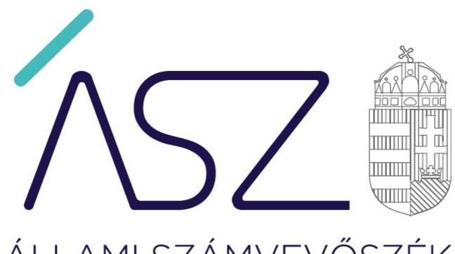
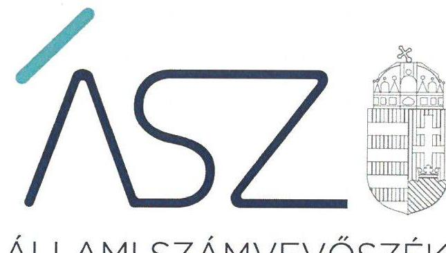
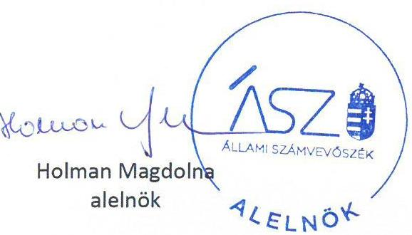

ÁLLAMI SZÁMVEVŐSZÉK

# JELENTÉS 

## Az önkormányzatok ellenőrzése - A pénzforgalomban megjelenő kiadások elszámolásának ellenőrzése

Füzesgyarmat Város Önkormányzata és a Füzesgyarmati Polgármesteri Hivatal, Budajenő Község Önkormányzata és a Budajenői Közös Önkormányzati Hivatal, Dencsháza Községi Önkormányzat és a Dencsházai Közös Önkormányzati Hivatal, Alsószentmárton Község Önkormányzat
2022.

---

ÁLLAMI SZÁMVEVŐSZÉK

# JELENTÉS 

## Az önkormányzatok ellenőrzése - A pénzforgalomban megjelenő kiadások elszámolásának ellenőrzése

Füzesgyarmat Város Önkormányzata és a Füzesgyarmati Polgármesteri Hivatal, Budajenő Község Önkormányzata és a Budajenői Közös Önkormányzati Hivatal, Dencsháza Községi Önkormányzat és a Dencsházai Közös Önkormányzati Hivatal, Alsószentmárton Község Önkormányzat

22063
www.asz.hu

---

# AZ ELLENŐRZÉST VEZETTE ÉS A VÉGREHAJTÁSÁÉRT FELELŐS: 

BALÁZSNÉ ANTONI ERIKA ellenőrzésvezető
DR. KOVÁCS DIÁNA ellenőrzésvezető
RÁCZKEVI KATALIN ellenőrzésvezető
SIPOSNÉ DÓCZI KLÁRA ellenőrzésvezető

## A PROGRAM ÖSSZEÁLLÍTÁSÁÉRT FELELŐS:

DR. KÁDÁR KRISZTA ellenőrzés tervezési projektvezető

## A TÉMÁHOZ KAPCSOLÓDÓ KORÁBBI SZÁMVEVŐSZÉKI JELENTÉSEK:

- címe: Jelentés - Önkormányzatok ellenőrzése -Az önkormányzatok integritásának ellenőrzése - Békés megye települési önkormányzatai
- sorszáma: 21008
- címe: Jelentés - Önkormányzatok ellenőrzése - Az önkormányzatok integritásának ellenőrzése - Pest megye települési önkormányzatai
- sorszáma: 21018
- címe: Jelentés - Önkormányzatok ellenőrzése - Az önkormányzatok integritásának ellenőrzése - Baranya megye települési önkormányzatai
- sorszáma: 21006

IKTATÓSZÁM: EL-3793-001/2022
TÉMASZÁM: 2585
ELLENŐRZÉS-AZONOSÍTÓ SZÁM: V0929

---

# TARTALOMJEGYZÉK 

■ ÖSSZEGZÉS ..... 5
■ AZ ELLENŐRZÉS CÉLJA ..... 7
■ AZ ELLENŐRZÉS TERÜLETE ..... 8
■ AZ ELLENŐRZÉS HÁTTERE, INDOKOLTSÁGA ..... 9
■ A JELENTÉS LÉNYEGES KÉRDÉSKÖREI ..... 10
■ AZ ELLENŐRZÉS HATÓKÖRE ÉS MÓDSZEREI ..... 11
■ MEGÁLLAPÍTÁSOK ..... 13
■ JAVASLATOK ..... 18
■ MELLÉKLETEK ..... 21
I. sz. melléklet: Értelmező szótár ..... 21
II. sz. melléklet: Az ellenőrzött szervezetek 2020. évi pénzforgalmában megjelenő kiadások kifizetésével és elszámolásával kapcsolatban feltárt hibás tételek ..... 22
■ FÜGGELÉK: ÉSZREVÉTELEK ..... 23
■ RÖVIDÍTÉSEK JEGYZÉKE ..... 25

---

.

---

# ÖSSZEGZÉS 

Az ellenőrzött szervezeteknél a 2020. évi pénzforgalomban megjelenő ellenőrzött kiadások teljesítésével és elszámolásával kapcsolatos, a kötelezettségvállalás és teljesítésigazolás jogkörök gyakorlásánál feltárt hiányosságok, valamint a szabálytalan könyvvezetés miatt több esetben nem álltak rendelkezésre megbizható információk a felelős, megalapozott gazdasági döntések meghozatalához. Nem igazolt, hogy az ellenőrzött szervezeteknél az ellenőrzött és a jogszabályi előirásoknak nem megfelelő kötelezettségvállalások és kifizetések szerződésszerű teljesitésekhez kapcsolódtak.

## Az ellenőrzés társadalmi indokoltsága

Magyarország Alaptörvénye és a nemzeti vagyonról szóló törvény értelmében a közpénzeket és a nemzeti vagyont az átláthatóság és a közélet tisztaságának elve szerint kell kezelni. Az elvek részletes tartalma a számvitelről szóló jogszabályok rendelkezéseiben kerültek meghatározásra.
Az Állami Számvevőszék helyi önkormányzati kör egészét érintő 2020. évre vonatkozó ellenőrzés integritási kockázat kiértékelése rámutatott további ellenőrzések szükségességére. Azon önkormányzatok és hivatalaik tekintetében, ahol az ellenőrzés hiányosságokat tárt fel a szabályos és átlátható gazdálkodás, a csalásmentes múködés alapvető feltételeinek biztosításában, indokolt volt a pénzforgalomban megjelenő kiadások teljesítésének és elszámolásának részletes ellenőrzése.

Az Állami Számvevőszék 2020. évre vonatkozó ellenőrzés integritási kockázat kiértékelése kockázatosnak minősítette az ellenőrzött szervezeteket, melyeknél a minősítés a pénzforgalomban megjelenő kiadások teljesítésének és elszámolásának részletes ellenőrzését indokolta.

## Főbb megállapítások, következtetések, javaslatok

FÜZESGYARMAT VÁROS ÖNKORMÁNYZATÁNÁL ÉS A FÜZESGYARMATI POLGÁRMESTERI HIVATALnál a 2020. évi ellenőrzött kiadások teljesítése több esetben nem volt szabályszerű. A kötelezettségvállalások és a teljesítésigazolások elvégzését nem igazolták minden ellenőrzött kifizetésnél.

Az önkormányzat és az önkormányzati hivatal 2020. évi költségvetési beszámolóit a készítéséért felelősök nem írták alá, így nem érvényesült a vezetői felelősségvállalás.

BUDAJENŐ KÖZSÉG ÖNKORMÁNYZATA ÉS A BUDAJENŐI KÖZÖS ÖNKORMÁNYZATI HIVATAL fizetési számlája terhére a 2020. évi ellenőrzött kifizetéseket több esetben nem szabályszerű bizonylatok alapján teljesítették, mert nem igazolták a kötelezettségvállalás elvégzését. Az ellenőrzött kifizetések számviteli elszámolása az azt alátámasztó bizonylatok hiányosságai miatt nem volt szabályszerű.

Az önkormányzatnál és az önkormányzati hivatalnál a vagyonnyilvántartás nem nyújtott megbízható és valós képet a vagyoni helyzetéről és ennek változásáról, mert a valóságban nem volt fellelhető valamennyi, a tárgyi eszköz nyilvántartásban szereplő eszköz.

Az önkormányzat 2020. évi költségvetési beszámolóját a jegyző nem írta alá, így nem érvényesült a vezetői felelősségvállalás.

DENCSHÁZA KÖZSÉGI ÖNKORMÁNYZAT ÉS A DENCSHÁZAI KÖZÖS ÖNKORMÁNYZATI HIVATAL fizetési számlája terhére, valamint az önkormányzat házipénztárából a 2020. évi ellenőrzött kifizetéseket több esetben nem szabályszerű bizonylatok alapján teljesítették. Az ellenőrzött kifizetéseknél

---

nem minden esetben igazolták az előírásoknak megfelelő kötelezettségvállalást, valamint a kötelezettségek nyilvántartásba vételét, és az önkormányzati hivatalnál a teljesítésigazolást.

Az önkormányzati hivatalnál a vagyonnyilvántartás - a tárgyi eszközök nyilvántartásának hiánya miatt - nem biztosította a vagyon számbavételét.

Az önkormányzati hivatal 2020. évi költségvetési beszámolóját a gazdasági vezető nem írta alá, a vezetői felelősségvállalás nem érvényesült.

ALSÓSZENTMÁRTON KÖZSÉG ÖNKORMÁNYZAT pénzforgalmában megjelenő 2020. évi ellenőrzött kifizetései teljesítése nem minden esetben volt szabályszerű. Az ellenőrzött kifizetéseknél több esetben a kötelezettségvállalásokat és teljesítésigazolásokat nem végezték el, illetve a kötelezettségvállalás nyilvántartásba vételét nem igazolták.

Az önkormányzatnál a vagyonnyilvántartás - a tárgyi eszközök nyilvántartásának hiánya miatt - nem biztosította a vagyon számbavételét.

Az Állami Számvevőszék a megállapítások alapján a kötelezettségvállalás, teljesítésigazolás jogkörök szabályszerű gyakorlása hiányosságai miatt Füzesgyarmat Város Önkormányzata, Budajenő Község Önkormányzata, Dencsháza Községi Önkormányzat, Alsószentmárton Község Önkormányzat polgármestereinek javaslatot fogalmazott meg. További javaslatokat tett az említett hiányosságokon felül a kötelezettségvállalások, más fizetési kötelezettségek nyilvántartás hiányosságai miatt a Füzesgyarmati Polgármesteri Hivatal, a számviteli elszámolások és a tárgyi eszközök nyilvántartása miatt a Budajenői Közös Önkormányzati Hivatal és a Dencsházai Közös Önkormányzati Hivatal jegyzőinek.

---

# AZ ELLENŐRZÉS CÉLJA 

Az ellenőrzés célja annak értékelése, hogy az önkormányzatoknál, az önkormányzati hivataloknál a pénzforgalomban megjelenő kiadások teljesítése és elszámolása szabályszerű volt-e, azokat a könyvekben szabályszerűen mutatták-e ki.

---

# AZ ELLENŐRZÉS TERÜLETE 

## Füzesgyarmat Város Önkormányzata és a Füzesgyarmati Polgármesteri Hivatal, Budajenő Község Önkormányzata és a Budajenői Közös Önkormányzati Hivatal, Dencsháza Községi Önkormányzat és a Dencsházai Közös Önkormányzati Hivatal, Alsószentmárton Község Önkormányzat

FÜZESGYARMAT város Békés megyében a Szeghalmi járásban található, lakosainak száma a Belügyminisztérium nyilvántartása szerint 5583 fő volt 2020. január 1-jén.
Füzesgyarmat Város Önkormányzatának múködésével, gazdálkodásával kapcsolatos feladatokat a Füzesgyarmati Polgármesteri Hivatal látja el.

A polgármester 2019. október 13-tól, a jegyző 2016. március 1-től látja el feladatát.

BUDAJENŐ község Pest megyében, a Budakeszi járásban fekszik, lakónépességének száma a Belügyminisztérium nyilvántartása szerint 2020. január 1-jén 2159 fő volt. Budajenő Község Önkormányzata gazdasági szervezeti feladatait 2013. január 1-jétől a Tök Község Önkormányzatával és Remeteszőlős Község Önkormányzatával közösen alapított Budajenői Közös Önkormányzati Hivatal látja el.

A polgármester 2019. október 13-tól, a jegyző 2022. július 1-től látja el feladatát.

DENCSHÁZA község Baranya megyében, a Szigetvár járásban található, lakosainak száma a Belügyminisztérium nyilvántartása szerint 592 fő volt 2020. január 1-jén.

Dencsháza másik négy társult település önkormányzatával a Dencsházai Közös Önkormányzati hivatalt tartja fent, amely ellátja a társult települések önkormányzatainak múködésével, fenntartásával kapcsolatos feladatokat.

A jegyző 2013. január 1-től, a polgármester 2019. október 13-tól van hivatalban.

ALSÓSZENTMÁRTON község Baranya megyében, a Siklósi járásban található. Lakosainak száma a Belügyminisztérium nyilvántartása szerint 2020. január 1-i adatok alapján 1238 fő.

Alsószentmárton Siklósnagyfalu Önkormányzatával közös önkormányzati hivatalt tart fent. A Siklósnagyfalui Közös Önkormányzati Hivatal ellátja a két település önkormányzatának múködésével, fenntartásával kapcsolatos feladatokat.
2020. szeptember 13-tól az önkormányzatnál a polgármester személye változott. A jegyző 2013. május 13-tól vezeti az önkormányzati hivatalt.

---

# AZ ELLENŐRZÉS HÁTTERE, INDOKOLTSÁGA 

Magyarország Alaptörvénye 39. cikk (2) bekezdése szerint a közpénzeket és a nemzeti vagyont az átláthatóság és a közélet tisztaságának elve szerint kell kezelni.

Az ÁSZ¹ a 2020. évre vonatkozóan a helyi önkormányzati kör egészét lefedve elvégezte Magyarország önkormányzatai integritási kockázatának kiértékelését. Az ellenőrzés során az ellenőrzött szervezetek integritását jelző, a felépítését, működését, felelősségi viszonyait, gazdálkodását meghatározó szabályzatok és nyilvántartások rendelkezésre állása, valamint lényeges szabályozási területei kerültek értékelésre. Azon önkormányzatok és hivatalaik tekintetében, ahol a szabályos és átlátható gazdálkodás, a csalásmentes működés alapvető feltételeinek biztosításában az ellenőrzés kockázatokat azonosított, indokolt a végrehajtás - a jogszabályban, belső szabályozásban előírt folyamatok - további ellenőrzése.

Az ÁSZ értékelése hozzájárul ahhoz, hogy az ellenőrzésben azonosított jogszabálysértő gyakorlatok alapján a helyi önkormányzatok és az önkormányzati hivatalok gazdálkodása során a közpénzek felhasználásakor érvényesüljenek az alapelvek, amelyek segítik a közpénzek és a közvagyon szabályos felhasználását, amellyel az önkormányzatok a köz javát, a köz érdekét szolgálják.

---

# A JELENTÉS LÉNYEGES KÉRDÉSKÖREI 

1.- Az önkormányzat pénzforgalmában megjelenő kiadások teljesítése és elszámolása szabályszerűen valósult-e meg?
2.- Az önkormányzati hivatal pénzforgalmában megjelenő kiadások teljesítése és elszámolása szabályszerűen valósult-e meg?

---

# AZ ELLENŐRZÉS HATÓKÖRE ÉS MÓDSZEREI 

## Az ellenőrzés típusa

Megfelelőségi ellenőrzés.

## Az ellenőrzött időszak

A 2020. január 1-jétől 2020. december 31-ig terjedő időszak, továbbá a helyszíni szemrevételezéssel érintett nap.

Budajenő Község Önkormányzata és a Budajenői Közös Önkormányzati Hivatal esetében 2022. május 30., Alsószentmárton Község Önkormányzat esetében május 31., Dencsháza Községi Önkormányzat és a Dencsházai Közös Önkormányzati Hivatal esetében június 1.

## Az ellenőrzés tárgya

A pénzforgalomban megjelenő kiadások teljesítésének és elszámolásának megfelelősége.

## Az ellenőrzött szervezet

Füzesgyarmat Város Önkormányzata és a Füzesgyarmati Polgármesteri Hivatal, Budajenő Község Önkormányzata és a Budajenői Közös Önkormányzati Hivatal, Dencsháza Községi Önkormányzat és a Dencsházai Közös Önkormányzati Hivatal, Alsószentmárton Község Önkormányzat

## Az ellenőrzés jogalapja

Az ellenőrzés jogalapját az ÁSZ tv. ${ }^{2}$ 1. § (3) bekezdése, és 5. § (2) és (6) bekezdése képezi.

## Az ellenőrzés módszerei

Az ellenőrzést az ellenőrzési program szempontjai, az ellenőrzött időszakban hatályos jogszabályok, a jelen ellenőrzésre irányadó ÁSZ módszertan figyelembevételével és a nemzetközi standardokat irányadónak tekintve végzi az ÁSZ. Az ellenőrzést a kérdésekre adott válaszok kiértékelésével, valamint a megjelölt adatforrások, továbbá az adott időszakban hatályos jogszabályok figyelembevételével folytatja le az ÁSZ.

---

Az értékelések bizonyítékokon, az ellenőrzött időszakban, vagy azt megelőzően keletkezett rendelkezésre bocsátott dokumentumokon alapulnak, az adott időszak tényeit feltárva.

Az ellenőrzési kérdések megválaszolásához szükséges bizonyítékok megszerzése az ellenőrzött szervezetek által rendelkezésre bocsátott dokumentumokra, adatokra alapozva megfigyelés, szemle (helyszíni szemle, szemrevételezés), kérdésfeltevés (információkérés), valamint elemző eljárás útján történik. Az ellenőrzési bizonyítékként felhasználható adatforrások közé tartoznak egyrészt az ellenőrzési program részletes szempontjainál felsorolt adatforrások, másrészt minden egyéb - az ellenőrzés folyamán feltárt, - az ellenőrzés szempontjából releváns információt tartalmazó dokumentum.

A pénzforgalomban megjelenő kiadások teljesítése és elszámolása szabályszerűségének ellenőrzése az ellenőrzött szervezetek fizetési számlája és házipénztárban kezelt készpénz-állománya terhére megvalósuló pénzforgalma 2020. évi tételes adataiból mintavétel alapján történt. A megállapítások csak a kiválasztott mintatételekre tehetők.

Füzesgyarmat Város Önkormányzata és a Füzesgyarmati Polgármesteri Hivatal ellenőrzésében a mintavétel a fizetési számla és házipénztárban kezelt készpénz-állomány terhére megvalósuló pénzforgalomból véletlen mintavételi eljárással kiválasztott 30-30, összesen 120 darab mintatétel alapján történt.

Budajenő Község Önkormányzata és a Budajenői Közös Önkormányzati Hivatal, Dencsháza Községi Önkormányzat és a Dencsházai Közös Önkormányzati Hivatal, Alsószentmárton Község Önkormányzat ellenőrzött szervezeteknél helyszíni adatbetekintés során a mintavételezés a fizetési számla és házipénztárban kezelt készpénz-állomány terhére megvalósuló pénzforgalomból a 15-15 legnagyobb összegű tétel, az önkormányzat és az önkormányzat hivatala tekintetében összesen 60 darab mintatétel kiválasztásával történt. A helyszíni adatbetekintés kiterjedt a tárgyi eszközök és készletek analitikus nyilvántartásában szereplő vagyonelemei meghatározott körének szemrevételezésére, valamint a pénztárellenőrzés lefolytatására. A helyszíni adatbetekintésen az ellenőrzött szervezetek rendelkezésre bocsátották a kötelezettségvállalás, ellenjegyzés, teljesítés igazolása, érvényesítés, utalványozás gyakorlásának módjával, eljárási és dokumentációs részletszabályaival kapcsolatos belső szabályzatot, és a kötelezettségvállalásra, teljesítés igazolására jogosult személyekről és aláírás-mintájukról az Ávr. 60. § (3) bekezdés szerint vezetett nyilvántartást.

---

# 1. Az önkormányzat és az önkormányzati hivatal pénzforgalmában megjelenő kiadások teljesítése és elszámolása szabályszerűen valósult-e meg? 

1.1. összegző megállapítás

Füzesgyarmat Város Önkormányzata és a Füzesgyarmati Polgármesteri Hivatal a 2020. évi ellenőrzött kifizetéseit több esetben nem szabályszerűen kiállított bizonylatok alapján teljesítette és Füzesgyarmat Város Önkormányzata több esetben nem szabályszerűen számolta el.

#### Abstract

AZ ÖNKORMÁNYZAT fizetési számlájáról 30 darab ellenőrzött kifizetésből 11, és a házipénztárból 30 darab ellenőrzött kifizetésből 26 nem volt szabályszerű: $\square$ írásbeli kötelezettségvállalás nélkül teljesítettek az Áht. ${ }^{3} 37$. § (1) bekezdésében foglaltak ellenére a házipénztárból két kifizetést, valamint a fizetési számláról két 200 ezer Ft alatti kifizetést, melyeknél az Ávr. ${ }^{4} 53$. § (1) bekezdés értelmében - tekintettel arra, hogy törvény eltérően rendelkezik - előzetes írásbeli kötelezettségvállalás volt szükséges; nem gondoskodtak a kötelezettségvállalás szabályszerű nyilvántartásba vételéről a fizetési számláról nyolc, a házipénztárból 26 kifizetésnél az Ávr. 56. § (1) és (5) bekezdéseiben foglaltak ellenére; teljesítésigazolás nélkül végeztek el a fizetési számláról három, és a házipénztárból hat kifizetést az Áht. 38. § (1) bekezdésében és Ávr. 57. § (1) bekezdés előírásai ellenére. Az önkormányzat fizetési számlája terhére teljesített 30 ellenőrzött kifizetésből két kifizetés számviteli elszámolásánál a számviteli nyilvántartásba bizonylat nélkül jegyeztek be adatot a Számv. tv. ${ }^{5}$ 165. § (2) bekezdésében foglaltak ellenére. Az önkormányzat 2020. évi éves költségvetési beszámolóját az Áhsz. ${ }^{6}$ 31. §. (1) bekezdésében foglaltak ellenére a készítéséért felelős jegyző és a gazdasági vezető nem írta alá.

AZ ÖNKORMÁNYZATI HIVATAL fizetési számlájáról 30 darab ellenőrzött kifizetésből 26, és a házipénztárból 30 darab ellenőrzött kifizetésből 13 nem volt szabályszerű:
$\longrightarrow$ írásbeli kötelezettségvállalás nélkül teljesítettek az Áht. 37. § (1) bekezdésében ellenére a fizetési számláról 11, és a házipénztárból 13 darab 200 ezer Ft alatti kifizetést, melyeknél az Ávr. 53. § (1) bekezdés értelmében - tekintettel arra, hogy törvény eltérően rendelkezik - előzetes írásbeli kötelezettségvállalás volt szükséges;

---

- közfoglalkoztatottak munkabérénél, „Nők munkaerőpiaci reintegrációja Füzesgyarmaton" projekt kifizetésnél az ellenőrzés részére nem igazolták, hogy a kifizetést írásbeli kötelezettségvállalást követően teljesítették;
- nem gondoskodtak a kötelezettségvállalás szabályszerű nyilvántartásba vételéről a fizetési számláról 26, a házipénztárból 13 kifizetésnél az Ávr. 56. § (1) bekezdésében foglaltak ellenére;
- a fizetési számláról teljesítésigazolás nélkül végezték el 16, valamint a házipénztárból 11 kifizetést az Áht. 38. § (1) bekezdésében és Ávr. 57. § (1) bekezdés előírásai ellenére.
Az önkormányzati hivatal házipénztára terhére teljesített kifizetések számviteli elszámolása egy kivételével szabályszerűen történt.

Az önkormányzati hivatal 2020. évi éves költségvetési beszámolóját az Áhsz. 31. § (1) bekezdésében foglaltak ellenére a jegyző és a gazdasági vezető nem írta alá.

# 1.2. összegző megállapítás Budajenő Község Önkormányzata és a Budajenői Közös Önkormányzati Hivatal 2020. évi fizetési számláiról az ellenőrzött kiadások teljesítése több esetben, és a pénzforgalomban megjelenő ellenőrzött kiadások elszámolása nem volt szabályszerű. 

AZ ÖNKORMÁNYZAT fizetési számlájáról az ellenőrzött 15-ből öt kifizetés teljesítése nem volt szabályszerű:
—- írásbeli kötelezettségvállalás nélkül teljesítettek az Áht. 37. § (1) bekezdésében foglaltak ellenére a fizetési számláról két kifizetést;
— nem gondoskodtak a kötelezettségvállalás szabályszerű nyilvántartásba vételéről a fizetési számláról három kifizetésnél az Ávr. 56. § (1) és (5) bekezdéseiben foglaltak ellenére.
- A pénzügyi gazdálkodási jogkörök gyakorlása nem volt szabályszerű a fizetési számláról két, összesen 17000000 Ft összegű, a kiadási utalványrendeleten téves jogcímen szereplő kifizetésnél az Áht. 37. § (1) bekezdésében és az Ávr. 57. § (1) bekezdésében foglaltak ellenére. A két téves utalásnál a gazdasági eseményt a Számv. tv. 166. § (1) bekezdés előírása ellenére nem támasztották alá bizonylattal, ezért a számviteli elszámolásuk sem volt szabályszerű.
Az önkormányzat házipénztári pénzforgalmából 15 ellenőrzött kifizetés teljesítése szabályszerű volt.

Az önkormányzat fizetési számlája terhére és a házipénztárból teljesített, ellenőrzött 15-15 kifizetés számviteli elszámolását nem szabályszerűen kiállított bizonylatok alapján végezték:
— a könyvviteli elszámolást közvetlenül alátámasztó bizonylaton a Számv. tv. 167. § (1) bekezdés h) pontjában előírtak ellenére a könyvelés módjára, az érintett könyvviteli számlákra történő hivatkozást nem tüntették fel a fizetési számláról egy, valamint a házipénztárból hat kifizetésnél;
— az önkormányzat fizetési számláján és a házipénztári pénzforgalmában megjelenő összes ellenőrzött kiadásánál a könyvviteli elszámolást közvetlenül alátámasztó bizonylatokon a Számv. tv. 167. § (1)

---

bekezdés i) pontjában előírtak ellenére a könyvviteli nyilvántartásokban történt rögzítés időpontját, igazolását nem rögzítették.
Az önkormányzat tárgyi eszközeiről a Számv. tv. 159. §-ában előírtak ellenére nem vezettek olyan nyilvántartást, amely a bekövetkezett változásokat a valóságnak megfelelően mutatja, mert az Önkormányzat könyvviteli nyilvántartásában szereplő 0-ra leírt számítógép és fénymásoló eszközök a helyszíni ellenőrzéskor nem voltak fellelhetők.

A jegyző az önkormányzat 2020. évi éves költségvetési beszámolóját az Áhsz. 31. § (1) bekezdésében foglaltak ellenére nem írta alá.

AZ ÖNKORMÁNYZATI HIVATAL fizetési számlájáról ellenőrzött 15-ből hét kifizetés teljesítése nem volt szabályszerű:
—írásbeli kötelezettségvállalás nélkül teljesítettek egy kifizetést az Áht. 37. § (1) bekezdésében foglaltak ellenére;
— nem gondoskodtak a kötelezettségvállalás szabályszerű nyilvántartásba vételéről öt kifizetésnél az Ávr. 56. § (5) bekezdésében foglaltak ellenére;
— teljesítésigazolás nélkül végeztek el egy kifizetést az Áht. 38. § (1) bekezdésében és Ávr. 57. § (1) bekezdés előírásai ellenére.
Az önkormányzati hivatal házipénztárából az összesen két, 2020. évi kifizetés teljesítése szabályszerű volt, a kifizetések teljesítésére szabályszerű bizonylatok alapján került sor.

Az önkormányzati hivatal fizetési számlája terhére teljesített ellenőrzött 15, és a házipénztárból teljesített kifizetések számviteli elszámolását nem szabályszerűen kiállított bizonylatok alapján végezték:
— a könyvviteli elszámolást közvetlenül alátámasztó bizonylaton a Számv. tv. 167. § (1) bekezdés h) pontjában előírtak ellenére a könyvelés módjára, az érintett könyvviteli számlákra történő hivatkozást nem tüntették fel a fizetési számláról történő hét, valamint a házipénztárból egy kifizetésnél;
— az önkormányzati hivatal fizetési számláján és a házipénztári pénzforgalmában megjelenő összes ellenőrzött kifizetésénél a könyvviteli elszámolást közvetlenül alátámasztó bizonylatokon a Számv. tv. 167. § (1) bekezdés i) pontjában előírtak ellenére a könyvviteli nyilvántartásokban történt rögzítés időpontját, igazolását nem rögzítették.

Az önkormányzati hivatal eszközeiről a Számv. tv. 159. §-ban előírtak ellenére nem vezettek olyan nyilvántartást, amely a bekövetkezett változásokat a valóságnak megfelelően mutatja, mert az önkormányzati hivatal könyvviteli nyilvántartásában szereplő 0-ra leírt számítógép és iktató program eszközök a helyszíni ellenőrzéskor nem voltak fellelhetők.

A jegyző az Áhsz. 6. § (1) bekezdés a) pontjában előírtak szerint gondoskodott az önkormányzati hivatal 2020. évi éves költségvetési beszámolójának elkészítéséről.

---

# 1.3. összegző megállapítás 

Dencsháza Községi Önkormányzat pénzforgalmában megjelenő és a Dencsházai Közös Önkormányzati Hivatal fizetési számlája terhére a 2020. évi ellenőrzött kiadásokat több esetben nem szabályszerűen kiállított bizonylatok alapján teljesítette. Az önkormányzati hivatal 2020. évi pénzforgalmában megjelenő ellenőrzött kiadások elszámolása több esetben nem volt szabályszerű.

AZ ÖNKORMÁNYZAT fizetési számlájáról az ellenőrzött 15-ből öt kifizetés, a házipénztári pénzforgalmából ellenőrzött 15-ből három kifizetés teljesítése nem volt szabályszerű:
—- írásbeli kötelezettségvállalás nélkül teljesítettek az Áht. 37. § (1) bekezdésében foglaltak ellenére a fizetési számláról három, és a házipénztárból egy kifizetést;
— nem gondoskodtak a kötelezettségvállalás szabályszerű nyilvántartásba vételéről a fizetési számláról egy, és a házipénztárból három kifizetésnél az Ávr. 56. § (1) és 56. § (5) bekezdéseiben foglaltak ellenére.
Az önkormányzatnál a tárgyi eszközök analitikus nyilvántartásából kiválasztott 10 vagyonelem a helyszíni ellenőrzéskor fellelhető volt.

A jegyző az Áhsz. 6. § (1) bekezdés f) pontjában foglaltaknak megfelelően gondoskodott az önkormányzat 2020. évi éves költségvetési beszámolójának elkészítéséről.

AZ ÖNKORMÁNYZATI HIVATAL fizetési számlájáról az ellenőrzött 15-ből 11 kifizetés teljesítése nem volt szabályszerű:
—- írásbeli kötelezettségvállalás nélkül teljesítettek az Áht. 37. § (1) bekezdésében foglaltak ellenére 11 kifizetést;
— nem gondoskodtak a kötelezettségvállalás szabályszerű nyilvántartásba vételéről kilenc kifizetésnél az Ávr. 56. § (1) bekezdésében foglaltak ellenére;
— teljesítésigazolás nélkül végeztek el hét kifizetést az Áht. 38. § (1) bekezdésében és Ávr. 57. § (1) bekezdés előírásai ellenére.
Az önkormányzati hivatal házipénztárából az ellenőrzött 15 kifizetés teljesítésére szabályszerű bizonylatok alapján került sor.

Az önkormányzati hivatal fizetési számlája terhére teljesített 15 ellenőrzött kifizetésből öt kifizetés és a házipénztárból teljesített 15-ből öt kifizetés számviteli elszámolása nem volt szabályszerű:
— a fizetési számláról négy, jutalom, megbízási díj kifizetést a 38/2013. (IX.19.) NGM rendelet ${ }^{7}$ VIII. fejezet B) 9. pontjában előírtak ellenére nem a 4211. költségvetési évben esedékes kötelezettségek személyi juttatásokra számlán számolták el;
— a házipénztárból öt munkábajárás költségtérítése kifizetést a 38/2013. (IX.19.) NGM rendelet VIII. fejezet B) 3. pontjában előírtak ellenére nem az 54. Személyi jellegú egyéb kifizetéseken számoltak el;
— a fizetési számláról egy kifizetésnél a könyvviteli elszámolást közvetlenül alátámasztó bizonylatot a Számv. tv. 165. § (1) bekezdésében előírtak ellenére nem készítették el.

---

Az önkormányzati hivatal tárgyi eszközeiről az Áhsz. 39. §. (3) bekezdésében előírtak ellenére a 14. melléklet VII. pontja szerinti nyilvántartást nem vezették.

Az önkormányzati hivatal 2020. évi éves költségvetési beszámolóját az Áhsz. 31. § (1) bekezdésében előírtak ellenére a gazdasági vezető nem írta alá.

# 1.4. összegző megállapítás Alsószentmárton Község Önkormányzat pénzforgalmában megjelenő 2020. évi ellenőrzött kifizetései teljesítése és elszámolása több esetben nem volt szabályszerű. 

AZ ÖNKORMÁNYZAT fizetési számlájáról az ellenőrzött 15-ből nyolc kifizetés, a házipénztári pénzforgalmából ellenőrzött 15-ből további kilenc kifizetés teljesítése nem volt szabályszerű:
—- írásbeli kötelezettségvállalás nélkül került sor az Áht. 37. § (1) bekezdésében foglaltak ellenére a fizetési számláról három, és a házipénztárból kilenc kifizetésre;
— nem gondoskodtak a kötelezettségvállalás szabályszerű nyilvántartásba vételéről a fizetési számláról két, valamint a házipénztárból további két kifizetésnél az Ávr. 56. § (1) és 56. § (5) bekezdéseiben foglaltak ellenére;
— teljesítésigazolás nélkül végeztek el a fizetési számláról nyolc, valamint a házipénztárból hat kifizetést az Áht. 38. § (1) bekezdésében és Ávr. 57. § (1) bekezdés előírásai ellenére.
Az önkormányzati fizetési számlája terhére teljesített 15 ellenőrzött kifizetésből négy kifizetés és a házipénztárból teljesített 15 ellenőrzött kifizetésből négy kifizetés számviteli elszámolását nem szabályszerűen kiállított bizonylat alapján végezték:
— a könyvviteli elszámolást közvetlenül alátámasztó bizonylaton a Számv. tv. 167. § (1) bekezdés h) és i) pontjaiban előírtak ellenére nem tüntették fel a könyvelés módjára, az érintett könyvviteli számlákra történő hivatkozást, valamint a könyvviteli nyilvántartásokban történt rögzítés időpontját, igazolását a fizetési számláról történő négy, és a házipénztárból négy kifizetésnél.
Az önkormányzat tárgyi eszközeiről az Áhsz. 39. § (3) bekezdésében foglaltak ellenére a 14. melléklet IX. pontja szerinti nyilvántartást nem vezették.

Az önkormányzat 2020. évi éves költségvetési beszámolóját az Áhsz. 31. § (1) bekezdésében foglaltak ellenére a készítéséért felelős jegyző és a gazdasági vezető nem írta alá.

---

# JAVASLATOK 

Az ÁSZ tv. 33. § (1) bekezdésében foglaltak értelmében az ellenőrzött szervezet vezetője köteles a jelentésben foglalt megállapításokhoz kapcsolódó intézkedési tervet összeállítani és azt a jelentés kézhezvételétől számított 30 napon belül az ÁSZ részére megküldeni. Amennyiben az ellenőrzött szervezet vezetője nem küldi meg határidőben az intézkedési tervet, vagy továbbra sem elfogadható intézkedési tervet küld, az Állami Számvevőszék elnöke az ÁSZ tv. 33. § (3) bekezdése a) és b) pontjaiban foglaltakat érvényesítheti.

## Füzesgyarmat Város Önkormányzata Polgármesterének

1. Intézkedjen az Önkormányzat esetében a kötelezettségvállalási és teljesítésigazolási jogkörök szabályszerű gyakorlásáról.
(1.1. sz. megállapítás 1., 3. francia bekezdés alapján)

## Füzesgyarmati Polgármesteri Hivatal jegyzőjének

1. Intézkedjen az Önkormányzati Hivatal esetében a kötelezettségvállalási és teljesítésigazolási jogkörök szabályszerű gyakorlásáról.
(1.1. sz. megállapítás 4., 6. francia bekezdés alapján)
2. Intézkedjen az Önkormányzat és az Önkormányzati Hivatal esetében a kötelezettségvállalások, más fizetési kötelezettségek nyilvántartásának szabályszerű vezetéséről.
(1.1. sz. megállapítás 2., 5. francia bekezdés alapján)

## Budajenő Község Önkormányzata polgármesterének

1. Intézkedjen az Önkormányzat esetében a kötelezettségvállalási és teljesítésigazolási jogkörök szabályszerű gyakorlásáról.
(1.2. sz. megállapítás 1., 3. francia bekezdés alapján)

---

# Budajenői Közös Önkormányzati Hivatal jegyzőjének 

1. Intézkedjen az Önkormányzati Hivatal esetében a kötelezettségvállalási és teljesítésigazolási jogkörök szabályszerű gyakorlásáról.
(1.2. sz. megállapítás 6., 8. francia bekezdés alapján)
2. Intézkedjen az Önkormányzat és az Önkormányzati Hivatal esetében a kötelezettségvállalások, más fizetési kötelezettségek nyilvántartásának szabályszerű vezetéséről.
(1.2. sz. megállapítás 2., 7. francia bekezdés alapján)
3. Intézkedjen az Önkormányzat és az Önkormányzati Hivatal esetében a számviteli (könyvviteli) elszámolások megfelelőségéről.
(1.2. sz. megállapítás 3., 4., 5., 9., 10. francia bekezdés alapján)
4. Intézkedjen az Önkormányzat és az Önkormányzati Hivatal tárgyi eszközeinek megfelelő nyilvántartásáról.
(1.2. sz. megállapítás 4., 8. bekezdés alapján)

## Dencsháza Községi Önkormányzat polgármesterének

1. Intézkedjen az Önkormányzati esetében a kötelezettségvállalási jogkörök szabályszerű gyakorlásáról.
(1.3. sz. megállapítás 1. francia bekezdés alapján)

## Dencsházai Közös Önkormányzati Hivatal jegyzőjének

1. Intézkedjen az Önkormányzati Hivatal esetében a kötelezettségvállalási jogkörök szabályszerű gyakorlásáról.
(1.3. sz. megállapítás 3. francia bekezdés alapján)
2. Intézkedjen az Önkormányzati Hivatal esetében a teljesítésigazolási jogkör szabályszerű gyakorlásáról.
(1.3 sz. megállapítás 5. francia bekezdés alapján)

---

3. Intézkedjen az Önkormányzat és az Önkormányzati Hivatal esetében a kötelezettségvállalások, más fizetési kötelezettségek nyilvántartásának szabályszerü vezetéééröl.
(1.3. sz. megállapítás 2., 4. francia bekezdés alapján)
4. Intézkedjen az Önkormányzat és az Önkormányzati Hivatal esetében a számviteli (könyvviteli) elszámolások megfelelőségéről.
(1.3. sz. megállapítás 6., 7., 8. francia bekezdés alapján)
5. Intézkedjen az Önkormányzati Hivatal tárgyi eszközeinek megfelelő nyilvántartásáról.
(1.3. sz. megállapítás utolsó előtti bekezdés alapján)

# Alsószentmárton Község Önkormányzat polgármesterének 

1. Intézkedjen az Önkormányzat esetében a kötelezettségvállalási és teljesitésigazolási jogkör szabályszerü gyakorlásáról.
(1.4. sz. megállapítás 1., 3. francia bekezdés alapján)

## Siklósnagyfalui Közös Önkormányzati Hivatal jegyzőjének

1. Intézkedjen az Önkormányzat esetében a kötelezettségvállalások, más fizetési kötelezettségek nyilvántartásának szabályszerü vezetéééről.
(1.4. sz. megállapítás 2. francia bekezdés alapján)
2. Intézkedjen az Önkormányzat esetében a számviteli (könyvviteli) elszámolások megfelelőségéről.
(1.4. sz. megállapítás 4. francia bekezdés alapján)
3. Intézkedjen az Önkormányzat tárgyi eszközeinek megfelelő nyilvántartásáról.
(1.4. megállapítás harmadik bekezdés alapján)

---

# MELLÉKLETEK 

- I. SZ. MELLÉKLET: ÉRTELMEZŐ SZÓTÁR
fizetési számla
helyi önkormányzat
önkormányzati hivatal
pénzforgalomban megjelenő kiadások

A települési önkormányzat, a nemzetiségi önkormányzat és a társulás fizetési számláját választása alapján egy belföldi hitelintézet vagy a kincstár vezeti. (Forrás: Áht. 84. § (1) bekezdés)
Magyarországon a helyi közügyek intézése és a helyi közhatalom gyakorlása érdekében helyi önkormányzatok múködnek. A helyi önkormányzatokra vonatkozó szabályokat sarkalatos törvény határozza meg (Forrás: Magyarország Alaptörvénye 31. cikk (1) és (3) bekezdés).
A helyi önkormányzás joga a települések (települési önkormányzatok) és a megyék (területi önkormányzatok) választópolgárainak közösségét illeti meg. (Forrás: Mötv. ${ }^{4}$ 3. § (1) bekezdés).
A helyi önkormányzat képviselő-testülete az önkormányzat müködésével, valamint a polgármester vagy a jegyző feladat- és hatáskörébe tartozó ügyek döntésre való előkészítésével és végrehajtásával kapcsolatos feladatok ellátására polgármesteri hivatalt vagy közös önkormányzati hivatalt hoz létre (Forrás: Mötv. 84. § (1) bekezdés).
Az önkormányzati hivatal: a polgármesteri hivatal, a főpolgármesteri hivatal, a megyei önkormányzati hivatal és a közös önkormányzati hivatal (Forrás: Áht. 1. § 18. pont).
Az ellenőrzés során a helyi önkormányzat és az önkormányzati hivatal Kincstárnál vagy belföldi hitelintézetnél vezetett fizetési számlájáról és házipénztárából teljesített kifizetéseket tekintjük pénzforgalomban megjelenő kiadásoknak.

---

II. SZ. MELLÉKLET: AZ ELLENŐRZÖTT SZERVEZETEK 2020. ÉVI PÉNZFORGALMÁBAN MEGJELENŐ KIADÁSOK KIFIZETÉSÉVEL ÉS ELSZÁMOLÁSÁVAL KAPCSOLATBAN FELTÁRT HIBÁS TÉTELEK

|  Ellenőrzött szervezet | Fizetési számláról teljesítés |  |  | Házipénztárból teljesítés |  |  | Elszámolás |  |   |
| --- | --- | --- | --- | --- | --- | --- | --- | --- | --- |
|   | hibás
(db) | összege (Ft) | tárgya | hibás
(db) | összege
(Ft) | tárgya | hibás
(db) | összege (Ft) | tárgya  |
|  Füzesgyarmat Város Önkormányzata | 11 | 473471 | közalkalmazott többletfeladat ellátása díja, alkalmi munka díja, civil szervezetek támogatása, egyéb szolgáltatás, internet és telefondíj | 26 | 1502360 | közfoglalkoztatott többletfeladat ellátása díja, lakosság részére rendkívüli települési támogatás, munkabér, kitüntetés | 2 | 426000 | többletfeladat ellátása és illetményelőleg  |
|  Füzesgyarmati Polgármesteri Hivatal | 26 | 1169702 | bérleti díj, megbízási díj, cafeteria utalás, internet szolgáltatás, többletfeladat ellátási díja | 13 | 887971 | közfoglalkoztatott munkabére, köz tisztviselő szociális támogatása, többletfeladat ellátása, közfoglalkoztatottak munkabére, Nők munkaerőpiaci reintegrációja Füzesgyarmaton projekt keretében juttatás | 1 | 2100 | étkezési költség kiküldetésnél  |
|  Budajenő Község Önkormányzata | 5 | 22831837 | zöldterület kezelés, óvodaépítés, téves utalás | 0 | 0 | --- | 30 | 201014600 | az összes ellenőrzött tétel  |
|  Budajenői Közös Önkormányzati Hi-vatal | 7 | 1142970 | szakirányú továbbképzési díj, cafeteria utalás, belső ellenőri szolgáltatás díja | 0 | 0 | --- | 30 | 4448711 | az összes ellenőrzött tétel  |
|  Dencsháza Községi Önkormányzat | 5 | 8126042 | élelmiszercsomag, óvodabővítés előkészítése, szabadságmegváltás, kiküldetés, eszköz beszerzés Magyar Falu program keretében | 3 | 2455000 | lakosság részére nyújtott rendkívüli támogatás | 0 | 0 | ---  |
|  Dencsházai Közös Önkormányzati Hi-vatal | 11 | 2942943 | fertőtlenítőszer, irodaszer, másolópapír beszerzés, pénzügyi tanácsadási díj és nem rendszeres személyi juttatás | 0 | 0 | --- | 10 | 1566437 | fertőtlenítőszer, megbízási díj, nem rendszeres személyi juttatás, munkába járás költségtérítése  |
|  Alsószentmárton Község Önkormányzat | 8 | 29970156 | pályaépítés önerő, szünidei gyermekétkeztetés, szociális tűzifa beszerzés és szállítás, élelmiszer beszerzés, kis értékű tárgyi eszköz beszerzés, szabadságmegváltás és üzemeltetési anyag beszerzés | 9 | 2936495 | üzemanyag, kazán és tartozékai, tüzifa, egyéb beszerzés, bér, kommunális adó, gépi földmunka, időközi választás költsége | 8 | 37383808 | térfigyelő és rendszámfelismerő rendszer kiépítése előleg, pályaépítés önerő, szabadságmegváltás, kátyúzás, elszámolásra adott előleg, bér, időközi választás költsége  |

---

# FÜGGELÉK: ÉSZREVÉTELEK 

Az ellenőrzés megállapításait a Számvevőszék 15 napos észrevételezésre megküldte az ellenőrzött szervezetek vezetőinek az ÁSZ tv. 29. §* (1) bekezdése előírásának megfelelően.

Az ellenőrzött szervezetek vezetői az ellenőrzés megállapításaira nem tettek észrevételt.

[^0]
[^0]:    * 29. § (1) Az Állami Számvevőszék az ellenőrzési megállapításait megküldi az ellenőrzött szervezet vezetőjének vagy az általa megbízott személynek, és annak, akinek személyes felelősségét állapította meg.
    (2) Az ellenőrzött szervezet vezetője és a felelősként megjelölt személy az ellenőrzés megállapításaira tizenöt napon belül írásban észrevételt tehet.
    (3) Az Állami Számvevőszék az észrevételre a beérkezésétől számított harminc napon belül írásban válaszol. A figyelembe nem vett észrevételeket köteles a jelentésben feltüntetni, és megindokolni, hogy azokat miért nem fogadta el.

---

.

---

# RÖVIDÍTÉSEK JEGYZÉKE 

${ }^{1}$ ÁSZ
${ }^{2}$ ÁSZ tv.
${ }^{3}$ Áht.
${ }^{4}$ Ávr.
${ }^{5}$ Számv. tv.
${ }^{6}$ Áhsz.
${ }^{7}$ 38/2013. (IX.19.) NGM rendelet
${ }^{8}$ Mötv.

Állami Számvevőszék
2011. évi LXVI. törvény az Állami Számvevőszékről
2011. évi CXCV. törvény az államháztartásról

368/2011. (XII. 31.) Korm. rendelet az államháztartásról szóló törvény végrehajtásáról
2000. évi C. törvény a számvitelről

4/2013. (I.11.) kormányrendelet az államháztartás számviteléről
38/2013. (IX.19.) NGM rendelet az államháztartásban felmerülő egyes gyakoribb gazdasági események kötelező elszámolási módjáról
2011. évi CLXXXIX. törvény Magyarország helyi önkormányzatairól

---

# ASZ 

ALLAMI SZAMVEVOSZEK
1052 Budapest, Apáczai Cs. J. u. 10. I 1364 Budapest 4. Pf. 54 TEL: +36 14849100
email: szamvevoszek@asz.hu
web: www.asz.hu | www.aszhirportal.hu