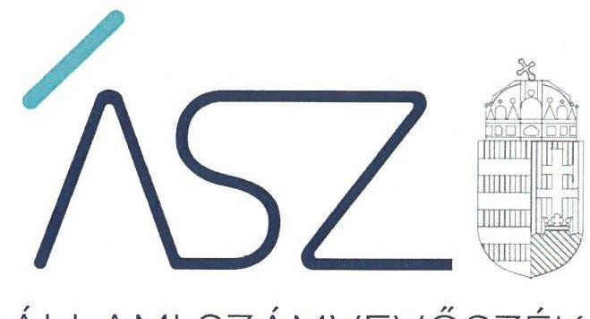
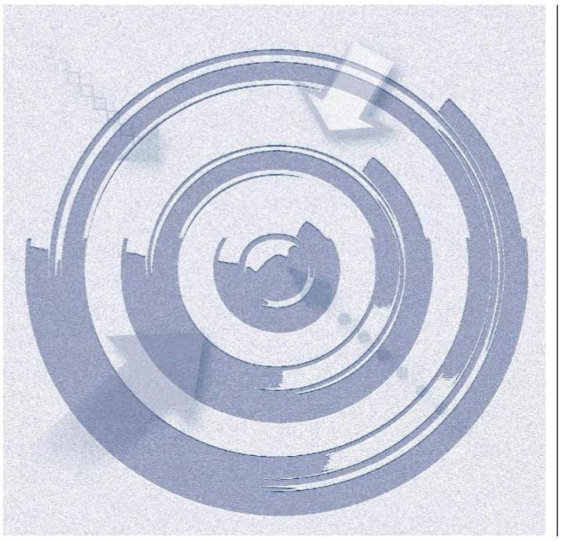

ÁLLAMI SZÁMVEVŐSZÉK

# JELENTÉS

## Alapítványok monitoring típusú ellenőrzése

293 alapítvány

2022.

22065.
www.asz.hu

---

ÁLLAMI SZÁMVEVŐSZÉK

# JELENTÉS 

## Alapítványok monitoring típusú ellenőrzése

293 alapítvány

22065.
www.asz.hu

---

# AZ ELLENŐRZÉST VEZETTE ÉS A VÉGREHAJTÁSÁÉRT FELELŐS: 

KAKAS SÁNDOR ellenőrzésvezető
HORVÁTH BÁLINT TAMÁS ellenőrzésvezető
A PROGRAM ÖSSZEÁLLÍTÁSÁÉRT FELELŐS:
PÉTER ÁKOS programkészítésért felelős vezető

IKTATÓSZÁM: EL-3795-001/2022
Jelentéseink az Országgyúlés számítógépes hálózatán és az interneten a www.asz.hu címen is olvashatóak.

TÉMASZÁM: 2617
ELLENŐRZÉS-AZONOSÍTÓ SZÁM: V0961

---

# TARTALOMJEGYZÉK 

- ÖSSZEGZÉS ..... 5
- AZ ELLENŐRZÉS CÉLJA ..... 6
- AZ ELLENŐRZÉS TERÜLETE ..... 7
- AZ ELLENŐRZÉS HÁTTERE, INDOKOLTSÁGA ..... 9
- A JELENTÉS LÉNYEGES KÉRDÉSKÖREI ..... 10
- AZ ELLENŐRZÉS HATÓKÖRE ÉS MÓDSZEREI ..... 11
- MEGÁLLAPÍTÁSOK ..... 13
- MELLÉKLETEK ..... 15
I. sz. melléklet: Az ellenőrzött alapítványok listája ..... 15
II. sz. melléklet: Értelmező szótár ..... 22
- RÖVIDÍTÉSEK JEGYZÉKE ..... 23

---

.

---

# ÖSSZEGZÉS 

Az Állami Számvevőszék által ellenőrzött 293 alapítvány 72,7 \%-a rendelkezett a jogszabályi kötelezettség alapján elkészítendő számviteli szabályzatokkal. Az alapítványok $80 \%$-a eleget tett a 2020. évre vonatkozó számviteli beszámoló készitési kötelezettségének. Az államháztartásból kapott támogatások elkülönített nyilvántartására vonatkozó jogszabályi kötelezettségének betartását az alapítványok 81 \%-a biztositotta. Az Állami Számvevőszék által feltárt hiányosságok megszüntetése iránt az érintett alapítványok 61 \%-a intézkedett.

## Az ellenőrzés társadalmi indokoltsága

Magyarországon az állampolgárok szabadon hozhatnak létre egyesületeket, alapítványokat. A civil szervezetek közcélok megvalósításában is részt vehetnek. Az alapítványok közérdekű céljainak megvalósításához, a biztonságos müködéshez elengedhetetlen feltétel a rendezett, szabályszerű gazdálkodás megléte.

Az alapítványok, mint az alapító által az alapító okiratban meghatározott tartós cél megvalósítására létrehozott jogi személyek tevékenységüket az alapító által juttatott vagyon kezelésével, felhasználásával látják el. Az alapítványok működésükre és szakmai tevékenységük ellátására államháztartási forrásból nyújtott támogatásban vagy az államháztartásból ingyenes vagyonjuttatásban részesülhetnek, amelyre fokozott közérdeklődés irányul.

Az alapítványok sokrétű tevékenységük révén a társadalom széles rétegével állnak közvetlen kapcsolatban, feladatellátásuk, szabályszerű gazdálkodásuk hozzájárulnak a közbizalom erősítéséhez. Az alapítványok részére nyújtott költségvetési támogatások nagysága, az alapítványok tevékenységének sokszínűsége, továbbá a témakört érintően azonosított kockázatok alátámasztják az alapítványok ellenőrzésének szükségességét.

## Főbb megállapítások, következtetések

Az Állami Számvevőszék ellenőrzése megállapította, hogy 2022. évre vonatkozóan az ellenőrzött 293 alapítvány közül 213 ( $72,7 \%$ ) rendelkezett a számviteli törvény által előírt szabályzatokkal. Az ellenőrzött 293 alapítvány közül 283 $(96,6 \%)$ rendelkezett számviteli politikával és az alapítványok $12 \%$-ának számviteli politikája tartalmazta a számvitelről szóló törvényben előírt tartalmi elemeket. Az alapítványok közül 279 ( $98,6 \%$ ) a számviteli politika keretében elkészítette a leltározási és leltárkészítési szabályzatot, a pénzkezelési szabályzatot és az eszközök és források értékelési szabályzatát. Az ellenőrzött pénzkezelési szabályzatok döntő többsége tartalmazta a számvitelről szóló törvényben előírt tartalmi elemeket. A kettős könyvvitelt vezető 278 alapítványból 222 (79,9\%) elkészítette a számlarendet, a számlarendek 192 alapítvány ( $86,5 \%$ ) esetében tartalmazták a törvényben előírt tartalmi elemeket.

A 2020. évben a támogatásban részesült, ellenőrzött 258 alapítványból 208 ( $81 \%$ ) eleget tett az államháztartási forrásból kapott támogatások számviteli nyilvántartásban történő elkülönítési kötelezettégének.

A 2020. évben támogatásban részesült, ellenőrzött 258 alapítványból 248 ( $96 \%$ ) eleget tett a 2020. évre vonatkozó számviteli beszámoló készítési kötelezettségének. 10 alapítvány (3,9\%) a 2020. évre vonatkozóan nem készítette el a számviteli beszámolóját. A kettős könyvvitelt vezető alapítványok közül 77 (31,5\%) a számviteli beszámoló részeként nem készítette el a törvényben előírt kiegészítő mellékletet.

Az Állami Számvevőszék figyelemfelhívására az ellenőrzést követően a szabályozási, nyilvántartási és beszámolókészítési kötelezettségek tekintetében feltárt hiányosságok kijavítására az érintett alapítványok $61 \%$-a intézkedett vagy tervezett intézkedésekről számolt be.

---

# AZ ELLENŐRZÉS CÉLJA 

AZ ELLENŐRZÉS CÉLJA annak értékelése volt, hogy az alapítvány megalkotta-e a gazdálkodása számviteli szabályozásait, továbbá elkülönítetten vezette az államháztartásból kapott támogatások nyilvántartását, valamint az éves számviteli beszámoló elkészítésére vonatkozó kötelezettségét teljesítette-e.

---

# AZ ELLENŐRZÉS TERÜLETE 

## 293 alapítvány

Az alapítvány a Ptk. ${ }^{1}$ rendelkezése szerint az alapító által az alapító okiratban meghatározott tartós cél folyamatos megvalósítására létrehozott jogi személy. Az alapító az alapító okiratban meghatározza az alapítványnak juttatott vagyont és az alapítvány szervezetét. Alapítvány nem alapítható gazdasági-vállalkozási tevékenység folytatására. Az alapítvány az alapítványi cél megvalósításával közvetlenül összefüggő gazdasági tevékenység végzésére jogosult. Alapítvány nem lehet korlátlan felelősségű tagja más jogalanynak, nem létesíthet alapítványt és nem csatlakozhat alapítványhoz. Ha a törvény eltérően nem rendelkezik, alapítvány nem hozható létre az alapító, a csatlakozó, az alapítványi tisztségviselő, az alapítványi szervek tagja, valamint ezek hozzátartozói érdekében. Nem sérti e rendelkezést az alapítvány tisztségviselőinek szerződés szerint járó díjazása. Az alapítvány ügyvezető szerve a kuratórium vagy az egyszemélyes ügyvezető kurátor.

Az ÁSZ az ÁSZ tv. 5. § (3) bekezdése alapján az államháztartásból származó források felhasználásának keretében ellenőrzi az államháztartásból nyújtott támogatások vagy az államháztartásból meghatározott célra ingyenesen juttatott vagyon felhasználását az alapítványoknál és az egyéb kedvezményezett szervezeteknél. Amennyiben a kedvezményezett szervezet az államháztartásból támogatásban - ide nem értve a személyi jövedelemadó meghatározott részének az adózó rendelkezése alapján történő átutalását - vagy ingyenes vagyonjuttatásban részesül, gazdálkodási tevékenységének egésze ellenőrizhető.

Az ellenőrzésre kiválasztott 309 alapítványból 293 biztosította az ellenőrizhetőség feltételeit az ÁSZ tv. 28. § (1)-(2) és (3) bekezdéseiben előírtak szerint, mert az ÁSZ részére rendelkezésre bocsátotta az ellenőrzés lefolytatásához szükséges adatokat és dokumentumokat.

Az ellenőrzött 293 alapítványból az ÁSz² 258 alapítványnál ellenőrizte a közpénzek nyilvántartását és a beszámolási kötelezettség teljesítését a 2020. évre vonatkozóan. Három alapítványt a 2021. évben jegyeztek be a bírósági nyilvántartásba, ezeknél az alapítványoknál a közpénzek nyilvántartását és a beszámolási kötelezettség teljesítését az ÁSZ nem értékelte. 32 alapítvány a 2020. évben az államháztartásból nyújtott támogatásban, illetve az államháztartásból meghatározott célra ingyenes vagyon juttatásban nem részesült, ezeknél az alapítványoknál a beszámolási kötelezettség teljesítését, valamint a közpénzek nyilvántartását az ÁSZ szintén nem értékelte.

Az ellenőrzött alapítványok közül az ellenőrzött időszakban 278 alapítvány kettős könyvvitelt-, 15 alapítvány egyszeres könyvvitelt vezetett.

Az ellenőrzés során az ÁSZ a 2022. évre vonatkozón azt értékelte, hogy az alapítványok kialakították-e a Számv. tv. által előírt számviteli szabályzataikat. Ezek a számviteli szabályzatok a számviteli politika, az eszközök és a források leltározási és leltárkészítési szabályzata, az eszközök és a források

---

értékelési szabályzata, a pénzkezelési szabályzat, valamint a kettős könyvvitelt vezető alapítványok esetében a számlarend. A számviteli politika alapvető fontosságú a szabályszerű könyvvezetés elvégzése, valamint a beszámoló összeállítása szempontjából, mivel rögzíti az ezekhez kapcsolódó gazdálkodóra jellemző szabályokat. Az ÁSZ az ellenőrzés során a szabályzatok vonatkozásában - az eszközök és a források leltározási és leltárkészítési szabályzata és az eszközök és a források értékelési szabályzata kivételével - tartalmi értékelést is végzett. Ennek keretében azt értékelte, hogy a számviteli politika tartalmazta-e azokat a gazdálkodóra jellemző szabályokat, előírásokat, módszereket, amelyekkel az alapítványok meghatározzák, hogy a Számv. tv. 14. § (4) bekezdésében előírtak szerint mit tekintenek a számviteli elszámolás, az értékelés szempontjából lényegesnek, nem lényegesnek, jelentősnek és nem jelentősnek, továbbá, hogy a törvényben biztosított választási, minősítési lehetőségek közül melyeket, milyen feltételek fennállása esetén alkalmaznak. A pénzkezelési szabályzat esetében az ÁSZ azt ellenőrizte, hogy a Számv. tv. 14. § (8) bekezdésében előírtak szerint az alapítványok a szabályzatban rendelkeztek-e a pénzforgalom bankszámlán történő lebonyolításának rendjéről, továbbá a pénzforgalommal kapcsolatos nyilvántartási szabályokról. A számlarend esetében az ÁSZ azt értékelte, hogy a Számv. tv. 161. § (2) bekezdés c) pontjában előírtaknak megfelelően az alapítványok számlarendje tartalmazta-e a főkönyvi számla és az analitikus nyilvántartás kapcsolatát.

Az ellenőrzött szervezetek az alaptevékenységük és közérdekű céljaik szerint kulturális, nevelési, oktatási tevékenység, művészeti, egészségügyi, szabadidős és sport tevékenység, családsegítés, környezetvédelem, turizmus, tudományos kutatási tevékenység támogatása, térségfejlesztés, valamint munkahelyteremtés tevékenységeket végeznek.

Az ellenőrzött alapítványok felsorolását a jelentés 1. számú melléklete tartalmazza.

---

# AZ ELLENŐRZÉS HÁTTERE, INDOKOLTSÁGA 

Az alapítványok, mint az alapító által az alapító okiratban meghatározott tartós cél megvalósítására létrehozott jogi személyek tevékenységüket az alapító által juttatott vagyon kezelésével, felhasználásával látják el. Az alapítványok működésükre és szakmai tevékenységük ellátására államháztartási forrásból nyújtott támogatásban vagy az államháztartásból ingyenes vagyonjuttatásban részesülhetnek, amelyre fokozott közérdeklődés irányul.

Az alapítványok sokrétű tevékenységük révén a társadalom széles rétegével állnak közvetlen kapcsolatban, feladatellátásuk, szabályszerű gazdálkodásuk hozzájárul a közbizalom erősítéséhez. Az alapítványok részére nyújtott költségvetési támogatások nagysága, az alapítványok tevékenységének sokszínűsége alátámasztják az alapítványok ellenőrzésének szükségességét.

Mindezek alapján indokolt az államháztartási forrásból nyújtott támogatásban vagy az államháztartásból ingyenes vagyonjuttatásban részesülő alapítványok részére biztosított közpénzek felhasználásának az ellenőrzése. Az ÁSZ ellenőrzése hozzájárul, hogy a társadalom objektív képet alkothasson az alapítványok működéséről.

---

# A JELENTÉS LÉNYEGES KÉRDÉSKÖREI 

1. Az alapítványok kialakították-e a számviteli szabályzataikat?
2. Az alapítványok az államháztartásból kapott támogatások nyilvántartását elkülönítetten vezették-e?
3. Az alapítványok teljesítették-e a beszámoló készítésére vonatkozó kötelezettségeiket?

---

# AZ ELLENŐRZÉS HATÓKÖRE ÉS MÓDSZEREI 

## Az ellenőrzés típusa

Megfelelőségi ellenőrzés.

## Az ellenőrzött időszak

2022. év, a beszámolási kötelezettség teljesítése, valamint az abban bemutatott államháztartásból nyújtott támogatás elkülönített nyilvántartása vonatkozásában a 2020. év.

## Az ellenőrzés tárgya

Az ellenőrzés az államháztartásból nyújtott támogatásban vagy az államháztartásból meghatározott célra ingyenes vagyonjuttatásban részesülő alapítványok számviteli szabályzatainak (számviteli politika, eszközök és források leltározási és leltárkészítési szabályzata, eszközök és források értékelési szabályzata, pénzkezelési szabályzat, számlarend) az államháztartási forrásból kapott támogatással kapcsolatosan vezetett nyilvántartásának, valamint a beszámolási kötelezettsége teljesítésének ellenőrzésére terjed ki.

Az ÁSZ tv. ${ }^{3}$ 5. § (3) bekezdésében foglaltak alapján az államháztartásból támogatásban - ide nem értve a személyi jövedelemadó meghatározott részének az adózó rendelkezése alapján történő átutalását - vagy meghatározott célra ingyenes vagyonjuttatásban részesülő alapítványok gazdálkodási tevékenységének egésze ellenőrizhető.

## Az ellenőrzött szervezet

Államháztartási forrásból nyújtott támogatásban, illetve az államháztartásból meghatározott célra ingyenes vagyonjuttatásban részesülő alapítványok. Az ellenőrzött alapítványok felsorolását a jelentés 1. számú melléklete tartalmazza.

## Az ellenőrzés jogalapja

Az ÁSZ tv. 1. § (3) és 5. § (3) bekezdései.

---

# Az ellenőrzés módszerei 

Az ellenőrzést az ellenőrzött időszakban hatályos jogszabályok, az ellenőrzés szakmai szabályai, a jelen ellenőrzésre irányadó ÁSZ módszertanok, az ellenőrzési programban foglalt értékelési szempontok szerint hajtotta végre az ÁSZ.

Az ellenőrzést az ÁSZ az ellenőrzési program kérdéseire adott válaszok kiértékelésével, valamint a programban ismertetett ellenőrzési kérdések, kritériumok, adatforrások között megjelölt adatforrások, továbbá az ellenőrzött időszakban hatályos jogszabályok figyelembevételével folytatta le.

Az ÁSZ az ellenőrzés során az államháztartásból nyújtott támogatásban vagy az államháztartásból meghatározott célra ingyenes vagyonjuttatásban részesülő alapítvány számviteli szabályzatainak, az államháztartási forrásból kapott támogatással kapcsolatosan vezetett nyilvántartásának, valamint a beszámolási kötelezettsége teljesítésének értékelésére fókuszált.

Az ellenőrzés során az ÁSZ a kiválasztott lényeges szempontok, kritériumok alapján történő értékelést végzett annak érdekében, hogy beazonosítsa az ellenőrzött időszakban az ellenőrzött szervezetek számviteli szabályzatainak, nyilvántartásvezetési, beszámolási kötelezettsége teljesítésének azon tényezőit, amelyek területén további fejlődési lehetőségeik vannak. Az ellenőrzés végzésével lehetőség volt a feltárt hibák, szabálytalanságok ellenőrzött időszakban történő javítására, fejlesztésére. A program ellenőrzési szempontjait, kritériumait a jogszabályok, közjogi szervezetszabályozó eszközök, határozatok, további belső utasítások, belső szabályozók előírásai képezték.

Az ellenőrzés során a feltárt jogszabálysértő gyakorlatok megszüntetése érdekében az ÁSZ figyelemfelhívó levéllel fordult az érintett szervezetek vezetőihez. Az ÁSZ figyelemfelhívására az ellenőrzött alapítványok által megküldött intézkedéseket az ellenőrzés során az ÁSZ kiértékelte és a számvevőszéki jelentésben a változást is szerepeltetette.

---

# 1. Az alapítványok kialakították-e a számviteli szabályzataikat? 

Összegző megállapítás

Az egyszeres könyvvitelt vezető alapítványok 80\%-a, a kettős könyvvitelt vezető alapítványok 77\%-a eleget tett a számviteli szabályzat készítési kötelezettségének a 2022. évre vonatkozóan.

A 2022. évre vonatkozóan az ellenőrzött 293-ból 283 alapítvány rendelkezett számviteli politikával. A számviteli politika 35 alapítványnál tartalmazta azokat a gazdálkodóra jellemző szabályokat, előírásokat, módszereket, amelyekkel az alapítványok meghatározták, hogy a Számv. tv. 14. § (4) bekezdésben előírtak szerint mit tekintenek a számviteli elszámolás, az értékelés szempontjából lényegesnek, nem lényegesnek, jelentősnek és nem jelentősnek. Az ellenőrzött számviteli politikákban 265 alapítványnál a Számv. tv. 14. § (4) bekezdésben előírtak szerint meghatározták, hogy a törvényben biztosított választási, minősítési lehetőségek közül melyeket, milyen feltételek fennállása esetén alkalmaznak.

A 2022. évre vonatkozóan a Számv. tv. 14. § (5) bekezdés a) pontjában előírtaknak megfelelően a számviteli politika keretében 279 alapítványnál elkészítették az eszközök és a források leltározási és leltárkészítési szabályzatát.

A 2022. évre vonatkozóan a Számv. tv. 14. § (5) bekezdés b) és d) pontjában előírtaknak megfelelően 281 alapítvány rendelkezett az eszközök és a források értékelési szabályzatával és pénzkezelési szabályzattal. A pénzkezelési szabályzatban a Számv. tv. 14. § (8) bekezdésében előírtak szerint 263 alapítványnál rendelkeztek a pénzforgalom bankszámlán történő lebonyolításának rendjéről, továbbá 272 alapítványnál a pénzforgalommal kapcsolatos nyilvántartási szabályokról.

A kettős könyvvitelt vezető 278 alapítvány közül 222 alapítvány rendelkezett számlarenddel, ezek közül 192 alapítványnál a Számv. tv. 161. § (2) bekezdés c) pontjában előírtaknak megfelelően a számlarend tartalmazta a főkönyvi számla és az analitikus nyilvántartás kapcsolatát.

## 2. Az alapítványok az államháztartásból kapott támogatások nyilvántartását elkülönítetten vezették-e?

Összegző megállapítás

A 2020. évre vonatkozóan az alapítványok több, mint 80\%-a eleget tett az államháztartási forrásból származó támogatásokra vonatkozó elkülönített nyilvántartás vezetési kötelezettségének.

A 2020. évben az ellenőrzött, államháztartási forrásból támogatást kapott 258 alapítványból 208 az államháztartási forrásból kapott támogatások

---

között elkülönítetten és az előírt részletezettségben mutatta ki a nyilvántartásában a központi költségvetésből, az elkülönített állami pénzalapokból, a helyi önkormányzatoktól, kisebbségi önkormányzatoktól, önkormányzati társulásoktól kapott támogatást, megfelelve ezzel az Ectv. ${ }^{4} 20 . \S$ (1) bekezdés c) pontja és a 20. § (3) bekezdés a)-c) pontjaiban foglaltaknak.

A 2020. évben 258 alapítványból 151 az Ectv. 20. § (4) bekezdésében előírtaknak megfelelően az alapcél szerinti tevékenysége költségei, ráfordításai ellentételezésére kapott támogatásokról elkülönített nyilvántartást vezetett.

# 3. Az alapítványok teljesítették-e a beszámoló készítésére vonatkozó kötelezettségeiket? 

## Összegző megállapítás

A támogatást kapott ellenőrzött alapítványok 66 \%-a teljeskörűen eleget tett a 2020. évre vonatkozó számviteli beszámoló készítési kötelezettségének.

A 2020. évre vonatkozóan a támogatást kapott 258 alapítványból 171 alapítvány teljeskörűen elkészítette a számviteli beszámolóját. Kettős könyvvitelt vezető 77 alapítvány beszámolója az Ectv. 29. § (2) bekezdés c) pontjában előírtak ellenére nem tartalmazta a kiegészítő mellékletet. 10 alapítvány az Ectv. 28. § (1) bekezdésében előírtak ellenére nem készítette el a 2020. évre vonatkozó számviteli beszámolót.

Az 2020. évben a támogatást kapott 258 alapítványból 20 alapítvány végzett gazdasági-vállalkozási tevékenységet. A gazdasági-vállalkozási tevékenységéből származó bevételek, ráfordítások, kiadások és a vállalkozási tevékenység adózás előtti eredménye az Eszamvr. ${ }^{5}$ 7. § (7) bekezdésében, a 9. § (8)-(9) bekezdésében és a 12. § (4)-(8) bekezdésében foglaltaknak megfelelően 20-ból 19 alapítványnál került elkülönítésre a 2020. évi beszámolóban.

Az 2020. évre vonatkozóan a támogatást kapott és ellenőrzött 258 alapítványból 110 az Ectv. 32. § (1) bekezdése szerinti közhasznú jogállású szervezet volt. A kettős könyvvitelt vezető közhasznú jogállással rendelkező alapítványok közül az Ectv. 29. § (4) bekezdésében előírtaknak megfelelően 57 alapítvány a 2020. évi beszámolójának kiegészítő mellékletében bemutatta a támogatási program keretében végleges jelleggel felhasznált összegeket támogatásonként, illetve 48 alapítvány a támogatási program keretében a visszatérítendő (kötelezettségként kimutatott) támogatásra vonatkozó adatokat támogatásonként.

A 2020. évre vonatkozóan 258 alapítványból 102 alapítvány biztosította az eredménykimutatásban szereplő - az Ectv. 20. § (4) bekezdése szerinti - támogatások és a könyvviteli nyilvántartás részét képező elkülönített analitikus nyilvántartás adatai között az egyezőséget.

---

# MELLÉKLETEK 

I. SZ. MELLÉKLET: AZ ELLENŐRZÖTT ALAPÍTVÁNYOK LISTÁJA

| Sorszám | Ellenőrzött szervezet |
| :--: | :--: |
| 1. | "Dr. Kunitzer István" Alapítvány |
| 2. | "Életmód és Rehabilitációs Ház" Alapítvány |
| 3. | "Gyermekeinkért Sátoraljaújhely" Alapítvány |
| 4. | "Hétszínvirág" Óvodai Alapítvány |
| 5. | "JÁRMIKA Jövőkép" Gyermek Alapítvány |
| 6. | "Jövőnk a falu" Alapítvány Szabadbattyán |
| 7. | "Lellei Családokért" Közhasznú Alapítvány |
| 8. | "Örállók Alapítvány" |
| 9. | "REMÉNYI EDE" Kamarazenekar Alapítvány |
| 10. | "Sárosd Ifjúságáért" Alapítvány |
| 11. | "SCHALBERT" Kisapostag Település Fejlesztéséért Alapítvány |
| 12. | "Szülők a Gyermekekért" Alapítvány |
| 13. | "VAN HELYED" A Közös Jövőnkért Alapítvány |
| 14. | "Városépítészetért" Alapítvány |
| 15. | "VÁRUNK" Alapítvány |
| 16. | A Debreceni Egyetem Zeneművészeti Kar Fejlesztéséért Alapítvány |
| 17. | A Gondolkodás Öröme Alapítvány |
| 18. | A Kecskeméti Kodály Iskoláért Alapítvány |
| 19. | A MAGYAR LOVAS TURIZMUSÉRT- ÉS TERÁPIÁÉRT ALAPÍTVÁNY |
| 20. | A Magyarországi Szlovákokért Közhasznú Alapítvány |
| 21. | A Te Jövődért Alapítvány |
| 22. | ADHD Magyarország-Pálföldi Alapítvány |
| 23. | Agóra Vidékfejlesztési Alapítvány |
| 24. | Alapítvány a Mihálydi Általános Művelődési Központ Fejlesztéséért |
| 25. | Alba Mentor Humán Szolgáltató Alapítvány |
| 26. | Alba Régió Kulturális Alapítvány |
| 27. | Alföld Alapítvány |
| 28. | Alternatív Művészeti Alapítvány |
| 29. | Alternatív Színházi Műhely Alapítvány |
| 30. | Angelica Alapítvány |
| 31. | Angol Nyelvű Színház Közhasznú Alapítvány |
| 32. | Apáti Iskoláért Alapítvány |
| 33. | Ars Sacra Alapítvány |
| 34. | Art Of Evolution Alapítvány |
| 35. | AULEA Alapítvány az előadóművészetekért |
| 36. | Avalon Nemzetközi Iskola Alapítvány |
| 37. | Az Informált Társadalomért Alapítvány |
| 38. | Báb-Szín-Tér Közhasznú Alapítvány |
| 39. | Baltazár Színház Alapítvány |
| 40. | Baptista Szeretetszolgálat Alapítvány |
| 41. | Bartók Béla Művészeti Kart Támogató Alapítvány |
| 42. | Biblia Centrum Alapítvány |

---

| 43. | Bíró-Gombos Alapítvány |
| :--: | :--: |
| 44. | Bozsik Yvette Alapítvány |
| 45. | Budakalászi Lenvirág Alapítvány |
| 46. | Budakeszi Kompánia Színházi Múhely Alapítvány |
| 47. | Budaörsi Tanoda Alapítvány |
| 48. | Budapest Táncszínházért Alapítvány |
| 49. | Budapesti Fesztiválzenekar Alapítvány |
| 50. | Budapesti Jazz Szimfonikus Zenekar Közhasznú Alapítvány |
| 51. | Budapesti Vonósok Alapítványa |
| 52. | CIMBORA Alapítvány az Egészséges és Kulturált Gyermekekért |
| 53. | Cinka Panna Cigány Színház Alapítvány |
| 54. | Civilek a Vidékért Alapítvány |
| 55. | Civilek az Egészségturizmusért és Kulturális Örökségünk Megóvásáért Alapítvány |
| 56. | Csete Alapítvány |
| 57. | Csillaghajó Kulturális Alapítvány |
| 58. | Csimota Jövő Egészségmegőrző és Kulturális Alapítvány |
| 59. | CSURGÓI BAKSAY SÁNDOR ALAPÍTVÁNY |
| 60. | Dévény Anna Alapítvány |
| 61. | Dinnyeberkiért Alapítvány |
| 62. | Dr. Meggyes Pro Vobis Alapítvány |
| 63. | Duna Népmúvészeti Alapítvány |
| 64. | Dunakanyari Védegylet Alapítvány |
| 65. | Egyedülálló Szülők Klubja Alapítvány |
| 66. | Egységes Somért Alapítvány |
| 67. | Együtt Egymásért Nyírbogáton |
| 68. | Eklézsia Alapítvány az Arnóti Református Gyülekezetért és Arnót Községért |
| 69. | Előadó és Alkotóművészetért Alapítvány |
| 70. | Eötvös Zeneművészeti Tehetségsegítő Közhasznú Alapítvány |
| 71. | Erdeifaluért Alapítvány |
| 72. | Erdélyi Tündérkert Alapítvány Hátrányos Helyzetú Gyerekekért |
| 73. | Erdődy Kamarazenekar Alapítvány |
| 74. | Erős Táncért Alapítvány |
| 75. | Értetek Veletek Fogyatékosokért Közhasznú Alapítvány |
| 76. | Erzsébet a Kárpát-medencei Gyermekekért Alapítvány |
| 77. | Esély a tanuláshoz Alapítvány |
| 78. | Fehér Holló Vadmentő Alapítvány |
| 79. | Felpécért Alapítvány |
| 80. | Fény a Sötétben Alapítvány |
| 81. | FICSAK 11 Alapítvány |
| 82. | Fogadj Örökbe Egy Macit a Megváltozott Munkaképességű Emberek Támogatásáért Alapítvány |
| 83. | Forrás Kultúrális Alapítvány |
| 84. | Forrásközpont Közhasznú Alapítvány |
| 85. | Garay János Gimnázium Centenáriuma Alapítvány |
| 86. | Gézengúz Alapítvány a Születési Károsultakért |
| 87. | Gombolyag" Mezei Iskola" Alapítvány |
| 88. | Gózon Gyula Kamaraszínház Alapítvány |
| 89. | Gödöllői Szimfonikus Zenekar Alapítvány |
| 90. | Gyermekeinkért Alapítvány |

---

| 91. | Gyermekerdő Alapítvány |
| :--: | :--: |
| 92. | Hagyományaink LENKA Alapítvány |
| 93. | Hallatlan Alapítvány |
| 94. | Hangkeltő Alapítvány |
| 95. | Három Királyfi, Három Királylány Alapítvány |
| 96. | Határokon Túli Magyarságért Alapítvány |
| 97. | Határtalan Hangok Közhasznú Alapítvány |
| 98. | Határtalan szív Alapítvány |
| 99. | Hét Kútforrás Szociális Alapítvány |
| 100. | Hetes Község Polgárőrségéért Alapítvány |
| 101. | Híd a Szeretetért Alapítvány |
| 102. | Hódmezővásárhelyi Kereskedelmi és Vendéglátóipari Szakközépiskola Gastro-Ker Alapítványa |
| 103. | Holnapocska Alapítvány |
| 104. | Horizont Látássérültek Társadalmi Integrációját és Esélyegyenlőségét Segítő Közhasznú Alapítvány |
| 105. | Humán, Racionális, Innovatív Alapítvány |
| 106. | Ifjúságért Alapítvány |
| 107. | Informatika a Látássérültekért Alapítvány |
| 108. | ITT ÉS MOST TÁRSULAT Művészeti Alapítvány |
| 109. | JAZZART Közcélú Alapítvány |
| 110. | JELENKOR Alapítvány |
| 111. | Jenei Tibor Alapítvány, misszió a művészetre nevelés útján |
| 112. | Jó Szándék Alapítvány |
| 113. | Jövő-Kép Alapítvány |
| 114. | Junion Színház Közhasznú Alapítvány |
| 115. | k2 Színház Alapítvány |
| 116. | Kállai Ernő Művészeti Alapítvány |
| 117. | Kaposfői Szent Erzsébet Alapítvány |
| 118. | Karaván Színház és Művészeti Alapítvány |
| 119. | Kardos Pál Alapítvány |
| 120. | Kárpát-medencei Művészeti Népfőiskola Alapítvány |
| 121. | Kárpát-medencei Tehetségkutató Alapítvány |
| 122. | Káva Színház és Dráma a Nevelésért Alapítvány |
| 123. | Kék Bolygó Klímavédelmi Alapítvány |
| 124. | Kék Vonal Gyermekkrízis Alapítvány |
| 125. | Kernstok Károly Művészeti Alapítvány |
| 126. | Kettősport Kulturális és Művészeti Alapítvány |
| 127. | Ki-Látás Közhasznú Alapítvány |
| 128. | Kis Virtuózok Alapítvány |
| 129. | Kiskunsági Nemzeti Park Alapítvány |
| 130. | Kodály Zoltán Kórusiskolai Alapítvány |
| 131. | Kommentár Alapítvány |
| 132. | KORTÁRS ÉPÍTÉSZETI KÖZPONT Alapítvány |
| 133. | KORTÁRS MŰVÉSZETÉRT ALAPÍTVÁNY |
| 134. | Kortárs Táncért és Jelelő Színházért Alapítvány |
| 135. | KÖS KÁROLY ALAPÍTVÁNY |
| 136. | Kosztolányi Dezső Kávéház Kulturális Alapítvány |
| 137. | Kovács K. Zoltán Alapítvány |
| 138. | Kőhegy Alapítvány |

---

| 139. | Közép-és Kelet európai Onkológiai Akadémia Alapítvány  |
| --- | --- |
|  140. | Kreatív Bázis Alapítvány  |
|  141. | Kreatív Formák Alapítvány  |
|  142. | Kutató Diákokért Alapítvány  |
|  143. | Lakiteleki Auti Alapítvány  |
|  144. | Látássérültek Észak-Magyarországi Regionális Elemi és Foglalkozási Rehabilitációs Központja Alapítvány  |
|  145. | Lehetőség Családoknak 2005 Alapítvány  |
|  146. | Lepsényi Fekete István Általános Iskola Alapítványa  |
|  147. | Liszt Ferenc Kamarazenekar Alapítvány  |
|  148. | Lőkösháza Turizmusáért Vidékfejlesztő és Hagyományőrző Alapítvány  |
|  149. | Madárfészek Ökölvívó Akadémia Alapítvány  |
|  150. | Mádi Református Egyházközségért Alapítvány  |
|  151. | Magyar Állami Operaház Balettnövendékeiért Alapítvány  |
|  152. | Magyar Halászati Kultúráért Alapítvány  |
|  153. | Magyar Református Szeretetszolgálat Alapítvány  |
|  154. | MAGYAR SZEMLE ALAPÍTVÁNY  |
|  155. | Magyar Turisztikai Szövetség Alapítvány  |
|  156. | Magyar-Amerikai Fulbright Alapítvány Oktatási-kulturális csereprogramok megvalósítására  |
|  157. | MAGYARORSZÁGI ZSIDŐ KÖZÖSSÉGI MÉDIÁÉRT ALAPÍTVÁNY  |
|  158. | Magyar-Turán Közhasznú Alapítvány  |
|  159. | Mahájána Alapítvány  |
|  160. | Mályvavirág Alapítvány  |
|  161. | Máriapócsért Alapítvány  |
|  162. | MárkusZínház Közhasznú Alapítvány  |
|  163. | Más Nézőpont Alapítvány  |
|  164. | Matematikában Tehetséges Gyermekekért Alapítvány  |
|  165. | MATFUND Középiskolai Matematikai és Fizikai Alapítvány  |
|  166. | MÁV Szimfonikusok Zenekari Alapítvány  |
|  167. | Mentsvár Alapítvány  |
|  168. | Mérnökmisszió Alapítvány  |
|  169. | Miénk a Suli Közhasznú Alapítvány  |
|  170. | MIOK a hátrányos helyzetű emberekért Alapítvány  |
|  171. | Mirandolina Tehetségkutató és Esztétikus Mozgásért Alapítvány  |
|  172. | MISZTRÁL Fesztivál Alapítvány  |
|  173. | Múlt és Jövő Alapítvány  |
|  174. | Múlt-kor Kulturális Alapítvány  |
|  175. | Munka-kör Alapítvány a Hallássérültekért  |
|  176. | Musica Christiana Alapítvány  |
|  177. | Műhely Alapítvány  |
|  178. | Nagykörüért Alapítvány  |
|  179. | Napos Oldal a Sérült Emberekért Alapítvány  |
|  180. | Nemzeti Kultúráért és Irodalomért Alapítvány  |
|  181. | Nemzeti Művészeti és Kulturális Kapcsolatok Alapítványa  |
|  182. | Nemzeti Orvosbiológiai Alapítvány  |
|  183. | Népfőiskola Alapítvány  |
|  184. | Nógrád Ifjúságáért Gyermek és Ifjúsági Alapítvány  |
|  185. | NOTITIA Honismereti, Hagyományőrző és Turisztikai Alapítvány  |
|  186. | Növényi Norbert Tehetséggondozó Alapítvány  |

---

| 187. | Nyíregyházi Thália Alapítvány |
| :--: | :--: |
| 188. | OFF Alapítvány |
| 189. | OKOS DOBOZ KÖZHASZNÚ ALAPÍTVÁNY |
| 190. | Orkesztika Alapítvány |
| 191. | Ormos Imre Alapítvány |
| 192. | Osztrák-Magyar Tudományos és Oktatási Kooperációs Akció Alapítvány |
| 193. | Őri Alapítvány |
| 194. | Összefogás Hernádszentandrásért Alapítvány |
| 195. | Összpróba Alapítvány |
| 196. | Pannon Mentőkutyás Alapítvány Pest Megyei Kutató-Mentő Szolgálat |
| 197. | PARÁZS Tűzvédelmi Alapítvány |
| 198. | Parnasszus Táncmúvészeti Alapítvány |
| 199. | Pécsi Balettért Alapítvány |
| 200. | Pécsi Férfikar Alapítvány |
| 201. | Pedagógusok Soproni Múvelődési Házáért Alapítvány |
| 202. | Példa Képfőiskola Kortárs Múvészeti Alapítvány |
| 203. | Perspektíva és Stúdium Alapítvány |
| 204. | Polgár Judit Sakk Alapítvány |
| 205. | Potenton Alapítvány |
| 206. | Pro Jugendstil Alapítvány (Fiatal Művészek a Kultúráért Al.) |
| 207. | Pusztaottlaka Fejlődéséért Közhasznú Alapítvány |
| 208. | Régiókért (For Regions) Alapítvány |
| 209. | Re-Gi-On Közhasznú Alapítvány |
| 210. | RETEXTIL Alapítvány |
| 211. | Roma Tehetséggondozó Közhasznú Alapítvány |
| 212. | Rozsály Községért Jóléti Szolgálat Helyi Alapítvány |
| 213. | S.A.R.Hungary Alapítvány |
| 214. | Savaria Barokk Zenekar Alapítvány |
| 215. | SYSART Kft. Orfeo Zenei Alapítvány |
| 216. | Szakmár és Környéke Gyermekeiért Alapítvány |
| 217. | Szent Efrém Közhasznú Alapítvány |
| 218. | Szent György Közösségért Alapítvány |
| 219. | Szent Márton Caritas Alapítvány |
| 220. | Szépirodalmi Figyelő Alapítvány |
| 221. | Szerencsi Rászorultakért Alapítvány |
| 222. | SZERETET-"CHAMIPE" Alapítvány a hátrányos helyzetú gyermekek iskoláztatásáért |
| 223. | Szigethalmi Családi Vadaspark és Vadmentő Központ Állatvédelmi Alapítvány |
| 224. | Szigetköz Kulturális és Közéleti Alapítvány |
| 225. | Szikra Alapítvány az Önkéntesek Munkájának Támogatására |
| 226. | Színház Alapítvány |
| 227. | Szövetség Borsod-Abaúj-Zemplén Megyéért Alapítvány |
| 228. | Szurikáta Alapítvány a Diabéteszes Gyermekekért |
| 229. | Tánc Lánc Alapítvány |
| 230. | Táncház Alapítvány |
| 231. | TÁP Színház és Összmúvészeti Alapítvány |
| 232. | Tápiómente Közhasznú Alapítvány |
| 233. | TDK-ért KÖZHASZNÚ ALAPÍTVÁNY |
| 234. | Teleki László Alapítvány |

---

| 235. | TermészetBÚVÁR Alapítvány |
| :--: | :--: |
| 236. | Terminál a Mozgásművészetek Oktatásáért Alapítvány |
| 237. | Területi Múvelődési Intézmények Egyesülete Fried Művelődési Ház Közhasznú Alapítvány |
| 238. | Tiszalüci Gyermekekért Alapítvány |
| 239. | Tiszatáj Alapítvány |
| 240. | Tóth Zoltán - Jánosháza Ifjúságáért és Sportjáért Alapítvány |
| 241. | Többet, Együtt Egymásért Roma Alapítvány |
| 242. | Törpe-Vár Alapítvány |
| 243. | Tradíció és Jövő Alapítvány |
| 244. | TRANSZFORMÁCIÓ Művészeti és Kulturális Közhasznú Alapítvány |
| 245. | Tudás Alapítvány |
| 246. | TÚSKEVÁR Alapítvány |
| 247. | Új Művészet Alapítvány |
| 248. | Új Színházért Alapítvány |
| 249. | Uránia Ismeretterjesztő Alapítvány |
| 250. | Üllési Fonó Alapítvány |
| 251. | VADVIRÁG Alapítvány a sérült gyermekek integrációjának támogatására |
| 252. | Velencei-tavi Kistérségért Alapítvány |
| 253. | Versünnep Alapítvány |
| 254. | Wacław Felczak Alapítvány |
| 255. | WWF Világ Természeti Alap Magyarország Alapítvány |
| 256. | Zalacsány-Örvényeshegyi Hagyományőrző Alapítvány |
| 257. | Zenés Színházért Közhasznú Alapítvány |
| 258. | Zsidó Kiválóságok Háza Alapítvány |
| 259. | FICSAK Székesfehérvár Alapítvány |
| 260. | Konzervatív Értékrend Alapítvány |
| 261. | Út a Zenéhez Alapítvány |
| 262. | "ISKOLÁNKÉRT" Alapítvány |
| 263. | "Van remény" Alapítvány |
| 264. | A Mi Bakonyunk Alapítvány |
| 265. | Aprónép Alapítvány a Gyermekek Megsegítésére |
| 266. | Bakelit Multi Art Center Alapítvány |
| 267. | Civil út Alapítvány |
| 268. | Deák Téri Evangélikus Gimnázium Iskola Alapítvány |
| 269. | Együtt a nyírségi emberekért Alapítvány |
| 270. | Emberi Bánásmódot a Gyermekeknek Alapítvány |
| 271. | Félelem Nélküli Élet Közhasznú Alapítvány |
| 272. | Frideric Ozanam Oktatást Segítő Alapítvány |
| 273. | Fülöpjakab Általános Iskola Alapítvány |
| 274. | Gyermekeinknél Nincs Fontosabb Alapítvány |
| 275. | Gyümölcsoltó Alapítvány |
| 276. | Hegyhát Integrált Szociális Intézmény Ellátottaiért Alapítvány |
| 277. | Lajta Kamra Termelőkért Alapítvány |
| 278. | Lajta Művészeti Alapítvány |
| 279. | Magyar Protestáns Tanulmányi Alapítvány |
| 280. | Magyar Színházi Emlékezetért Alapítvány |
| 281. | Muzsikus Leszek Alapítvány a Zeneoktatás Támogatására |
| 282. | Népi Hagyományokért Alapítvány |

---

| 283. | NYÍRSÉGÉRT ALAPÍTVÁNY |
| :--: | :--: |
| 284. | Ongai Görög Katolikus Templomért Alapítvány |
| 285. | Pannónia Szíve Alapítvány |
| 286. | Péter József Népművészeti Alapítvány |
| 287. | Pici Mosoly Alapítvány |
| 288. | Pro Missa Tridentina Alapítvány |
| 289. | Royal Rose Alapítvány |
| 290. | Sajósenye Ökomenikus Templomáért Alapítvány |
| 291. | SzínMúHely Alapítvány |
| 292. | Táplánszentkereszti Fúvósok Alapítvány |
| 293. | Záhony Város Tehetségeinek Szolgálatáért Alapítvány |
| 294. | "Aszaló község Lakosságáért" Alapítvány |
| 295. | "Gyulaffy László Hagyományörző Lovas Bandérium, Csobánc Váráért" Alapítvány |
| 296. | "ORVOSI SEGÍTSÉG AHOL KELL" Alapítvány |
| 297. | ARANYCSAPAT a Kárpát-medencei Fiatalok Sportjáért Alapítvány |
| 298. | Bodrogkeresztúrért Alapítvány |
| 299. | Bunyevác Kulturális Intézet Alapítvány |
| 300. | Civil Mozgó(kép) Világ Alapítvány |
| 301. | Duna Művészeti Társaság Nemzetközi Multikulturális Alapítvány |
| 302. | Egészséges Palócországért Alapítvány |
| 303. | Egy csepp figyelem Alapítvány |
| 304. | Egy vérből vagyunk Alapítvány |
| 305. | Egyenlítő Alapítvány |
| 306. | Független színművészetért Alapítvány |
| 307. | Jobb Jövőért 2000-től Alapítvány |
| 308. | Muzsikál az Erdő Alapítvány |
| 309. | Múvészetek a Vidékfejlesztésért Alapítvány |

| JELMAGYARÁZAT AZ 1. SZÁMÚ TÁBLÁZATHOZ |
| :--: |
| 2021. évben bejegyzett szervezet |
| 2020. évben nem kapott támogatást |
| az alapítvány nem biztosította az ellenőrizhetőség feltételeit |

---

# II. SZ. MELLÉKLET: ÉRTELMEZŐ SZÓTÁR 

alapítvány
államháztartási támogatás
civil szervezet

Az alapítvány az alapító által az alapító okiratban meghatározott tartós cél folyamatos megvalósítására létrehozott jogi személy. Az alapítvány, mint jogi személy a bírósági nyilvántartásba való jogerős bejegyzéssel jön létre. Az alapító az alapító okiratban meghatározza az alapítványnak juttatott vagyont és az alapítvány szervezetét. Alapítvány nem alapítható gazdasági-vállalkozási tevékenység folytatására. Az alapítvány az alapítványi cél megvalósításával közvetlenül összefüggő gazdasági tevékenység végzésére jogosult. Alapítvány nem lehet korlátlan felelősségű tagja más jogalanynak, nem létesíthet alapítványt és nem csatlakozhat alapítványhoz. Ha a törvény eltérően nem rendelkezik, alapítvány nem hozható létre az alapító, a csatlakozó, az alapítványi tisztségviselő, az alapítványi szervek tagja, valamint ezek hozzátartozói érdekében. Nem sérti e rendelkezést az alapítvány tisztségviselőinek szerződés szerint járó díjazása. (Forrás: Ptk. 3:378. §, 3:379. § (1) - (4) bekezdés, 3:4. § (4) bekezdés)
az államháztartás központi vagy önkormányzati alrendszeréből, bármilyen formában, ellenérték nélkül nyújtott juttatás (Forrás: Áht. ${ }^{6}$ 1. § 19. pont)
A civil társaság; a Magyarországon nyilvántartásba vett egyesület - a párt, a szakszervezet és a kölcsönös biztosító egyesület kivételével és - a közalapítvány és a pártalapítvány kivételével - az alapítvány. (Forrás: Ectv. 2. § 6. pont)

---

# RÖVIDÍTÉSEK JEGYZÉKE 

${ }^{1}$ Ptk.
${ }^{2}$ ÁSZ
${ }^{3}$ ÁSZ tv.
${ }^{4}$ Ectv.
${ }^{5}$ Eszamvr.
${ }^{6}$ Áht.
2013. évi V. törvény a Polgári Törvénykönyvről

Állami Számvevőszék
az Állami Számvevőszékről szóló 2011. évi LXVI. törvény (hatályos: 2011.07.01-től)
2011. évi CLXXV. törvény az egyesülési jogról, a közhasznú jogállásról, valamint a civil szervezetek müködéséről és támogatásáról (hatályos: 2011.12.22-től) 479/2016. (XII. 28.) Korm. rendelet a számviteli törvény szerinti egyes egyéb szervezetek beszámoló készítési és könyvvezetési kötelezettségének sajátosságairól (hatályos 2017.01.01-től)
2011. évi CXCV. törvény az államháztartásról

---

# ASZ 

ALLAMI SZAMVEVOSZEK
1052 Budapest, Apáczai Cs. J. u. 10. I 1364 Budapest 4. Pf. 54 TEL: +36 14849100
email: szamvevoszek@asz.hu
web: www.asz.hu | www.aszhirportal.hu