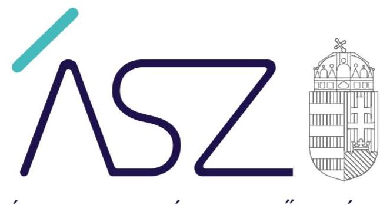
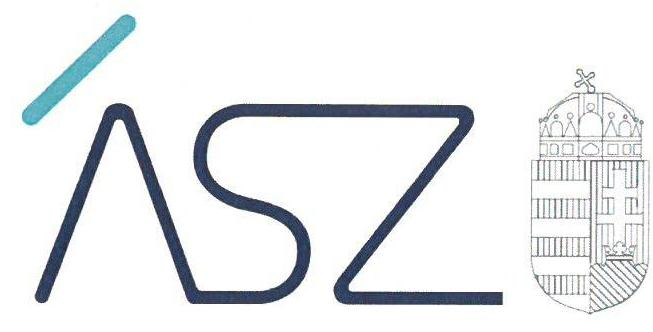
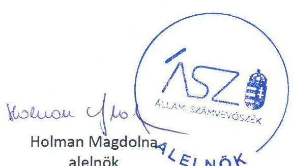

ÁLLAMI SZÁMVEVŐSZÉK

# JELENTÉS 

## Önkormányzatok ellenőrzése

Vagyongazdálkodás kockázatalapú ellenőrzése
45 helyszín

22066
www.asz.hu

---

ÁLLAMI SZÁMVEVŐSZÉK

# JELENTÉS 

## Önkormányzatok ellenőrzése

Vagyongazdálkodás kockázatalapú ellenőrzése
45 helyszín

22066
www.asz.hu

---

# AZ ELLENŐRZÉST VEZETTE ÉS A VÉGREHAJTÁSÁÉRT FELELŐS: 

KAKAS SÁNDOR ellenőrzésvezető
DR. DOMOKOS MAGDOLNA ellenőrzésvezető
SZAPPANOS JÚLIA ellenőrzésvezető

## A PROGRAM ÖSSZEÁLLÍTÁSÁÉRT FELELŐS:

WELTHERNÉ SZOLNOKI DÓRA programkészítéséért felelős vezető

IKTATÓSZÁM: EL-3796-001/2022.
TÉMASZÁM: 2548
ELLENŐRZÉS-AZONOSÍTÓ SZÁM: V0892

---

# TARTALOMJEGYZÉK 

■ ÖSSZEGZÉS ..... 5
■ AZ ELLENŐRZÉS CÉLJA ..... 6
■ AZ ELLENŐRZÉS TERÜLETE ..... 7
■ AZ ELLENŐRZÉS HÁTTERE, INDOKOLTSÁGA ..... 8
■ A JELENTÉS LÉNYEGES KÉRDÉSKÖREI ..... 9
■ AZ ELLENŐRZÉS HATÓKÖRE ÉS MÓDSZEREI ..... 10
■ MEGÁLLAPÍTÁSOK ..... 12
■ MELLÉKLETEK ..... 15
I. sz. melléklet: Az ellenőrzött önkormányzatok és hivatalaik ..... 15
II. sz. melléklet: Értelmező szótár ..... 16
■ FÜGGELÉK: ÉSZREVÉTELEK ..... 17
■ RÖVIDÍTÉSEK JEGYZÉKE ..... 19

---

.

---

# ÖSSZEGZÉS 

Az Állami Számvevőszék ellenőrzése megállapította, hogy az önkormányzatoknál a vagyongazdálkodási szabályokat rögzítő dokumentumok a jogszabályi előírásokkal alapvetően összhangban voltak. A vagyongazdálkodási folyamatokban eseti szabálytalanságokat tárt fel az ellenőrzés.

## Az ellenőrzés társadalmi indokoltsága

Magyarország Alaptörvénye alapján a nemzeti vagyon kezelésének, védelmének célja a közérdek szolgálata, a közös szükségletek kielégítése és a természeti erőforrások megóvása, valamint a jövő nemzedékek szükségleteinek figyelembevétele.

Magyarország Alaptörvénye rögzíti, hogy a helyi önkormányzat tulajdona nemzeti vagyon. Az önkormányzati vagyonnal való törvényes, átlátható gazdálkodás társadalmi érdek. A közpénzek átláthatósága, nyilvánossága érdekében az ÁSZ ${ }^{1}$ kiemelten fontosnak tartja az önkormányzatok vagyongazdálkodási tevékenységének ellenőrzését.

Az önkormányzatok által ellátott közfeladatok és önként vállalt feladatok sokrétűségét, a feladat ellátásához rendelt vagyon nagyságrendjét tekintve az ÁSZ az „Önkormányzatok ellenőrzése - az önkormányzatok integritásának ellenőrzése" című ellenőrzés keretében értékelte a magyarországi önkormányzatok és hivatalaik integritását. Azon önkormányzatoknál, melyeknél a vagyongazdálkodási szabályozási keretek terén integritási kockázatok kerültek azonosításra, indokolt a vagyongazdálkodási folyamataik értékelése.

A vagyongazdálkodási szabályozást érintően korábban azonosított kockázat alapján 45 önkormányzat került kiválasztásra, melyek esetében a vagyonváltozások elszámolásához, a vagyonhasználathoz és vagyonhasznosításhoz, valamint az önkormányzati vagyon nyilvántartásához kapcsolódó feladatellátás kerül értékelésre.

## Főbb megállapítások, következtetések

Az ellenőrzött 45 önkormányzatnál a vagyongazdálkodás egyes alapvető szabályozási kereteit kialakították, az önkormányzatok vagyonáról, a vagyongazdálkodás szabályairól szóló rendeleteket a képviselő-testületek megalkották. Valamennyi önkormányzat az éves beszámolási kötelezettségének eleget tett.

Az önkormányzatoknál a 2020. évi vagyongazdálkodással összefüggő egyes döntések végrehajtásának, a kapcsolódó kontroll feladatok ellátásának és a vagyonváltozást eredményező gazdasági események számviteli nyilvántartásba vételének értékelésére 29 önkormányzatnál került sor. Az ellenőrzött önkormányzatok közül öt eleget tett az ellenőrzött területek mindegyikén ezen területeket érintő kötelezettségének, 20 önkormányzat intézkedett vagy intézkedési tervet készített a gazdasági események vonatkozásában feltárt hiányosságok javítására. Négy önkormányzatnál maradtak fenn hiányosságok.

---

# AZ ELLENŐRZÉS CÉLJA 

AZ ELLENŐRZÉS CÉLJA az önkormányzatoknál a vagyonváltozások elszámolásának, a vagyon használatának és hasznosításának, valamint a vagyon nyilvántartásának értékelése a vagyongazdálkodásban rejlő jövőbeli kockázatok azonosítása érdekében.

---

# AZ ELLENŐRZÉS TERÜLETE 

## 45 önkormányzat

Az Alaptörvény alapján nemzeti vagyon a helyi önkormányzatok tulajdonában álló vagyon, mely a hatáskörük gyakorlását, illetve a kötelező önkormányzati feladatkör ellátását szolgálja. Kötelező feladatai körében az önkormányzat köteles gondoskodni többek között a lakosságot érintő egészségügyi, oktatási és szociális jellegű ellátásokról is, ezáltal az ellátott közszolgáltatások minősége és hatékonysága jelentős mértékben érintik a lakosság életminőségét, egészségét, biztonságát, ezen keresztül a lakosság jólétét. Az önkormányzatok gazdálkodásuk során jelentős nagyságú nemzeti vagyont működtetnek.
Az ellenőrzés 45 önkormányzatra terjed ki, melyeknél az ÁSZ korábban lefolytatott ellenőrzései során integritási kockázatot azonosított.
Az ellenőrzött önkormányzatokat az I. sz. melléklet tartalmazza. Az önkormányzat vagyongazdálkodásával kapcsolatos feladatokat az önkormányzati hivatal látja el, melynek vezetője a jegyző.

---

# AZ ELLENŐRZÉS HÁTTERE, INDOKOLTSÁGA

Az önkormányzatok gazdálkodását és működését az ÁSZ törvényi felhatalmazás alapján ellenőrzi, annak érdekében, hogy a közpénzfelhasználás, a nemzeti vagyonnal való gazdálkodás javulását előmozdítsa. Az ellenőrzéssel az ÁSZ elősegíti, hogy ezen szervezetek a jogszabályi előírásoknak megfelelően működjenek és gazdálkodjanak. Az ellenőrzés megállapításait és javaslatait más szervezetek is hasznosíthatják a rendezett gazdálkodási keretek kialakításához.

---

# A JELENTÉS LÉNYEGES KÉRDÉSKÖREI 

1.     - Kialakította-e az önkormányzat a vagyongazdálkodás alapvető szabályozási kereteit?
2.     - Az önkormányzat elkészítette-e a beszámolót?
3.     - Szabályszerű volt-e a vagyongazdálkodással összefüggő egyes folyamatok végrehajtása?

---

# AZ ELLENŐRZÉS HATÓKÖRE ÉS MÓDSZEREI 

## Az ellenőrzés típusa

Megfelelőségi ellenőrzés.

## Az ellenőrzött időszak

Az ellenőrzött időszak a 2020. január 01-től 2020. december 31-ig terjedő időszak

## Az ellenőrzés tárgya

Az ellenőrzés az önkormányzatok vagyonának változásához kapcsolódó elszámolással, a vagyon használatával, hasznosításával és nyilvántartásával kapcsolatos kötelezettségek teljesítésére terjed ki.

## Az ellenőrzött szervezet

Az önkormányzatok, valamint az önkormányzatok gazdálkodási feladatait ellátó önkormányzati hivatalok

## Az ellenőrzés jogalapja

Az ellenőrzés jogszabályi alapját az ÁSZ tv. ${ }^{2}$ 1. § (3) bekezdés, 5. § (2) és (6) bekezdései, valamint az Áht. ${ }^{3}$ 61. § (2) bekezdésének előírásai képezik.

## Az ellenőrzés módszerei

Az ÁSZ az ellenőrzést az ellenőrzési program szempontjai, az ellenőrzött időszakban hatályos jogszabályok, az ellenőrzés szakmai szabályai, a jelen ellenőrzésre irányadó ÁSZ módszertanok figyelembevételével hajtja végre. Az ellenőrzés ideje alatt az ellenőrzött szervezettel történő kapcsolattartást az ÁSZ SZMSZ-ének vonatkozó előírásai alapján biztosítjuk.

Az értékelések bizonyítékokon, az ellenőrzött időszakban, vagy azt megelőzően keletkezett, rendelkezésre bocsátott dokumentumokon alapulnak, az adott időszak tényeit feltárva.

Az ellenőrzési kérdések megválaszolásához szükséges bizonyítékok megszerzése az ellenőrzött szervezetek által rendelkezésre bocsátott dokumentumokra, adatokra alapozva megfigyelés, szemle (szükség esetén helyszíni szemle, szemrevételezés), kérdésfeltevés (információkérés), mintavételezés, valamint elemző eljárás útján történik. Az ellenőrzési bizonyítékként felhasználható adatforrások közé tartoznak egyrészt az ellenőrzési program részletes szempontjainál felsorolt adatforrások, másrészt minden egyéb - az ellenőrzés folyamán feltárt, az ellenőrzés szempontjából releváns információt tartalmazó - dokumentum.

Az ellenőrzés lefolytatásához az ellenőrzött szervezet elektronikus úton szolgáltat adatokat, amelyek valódiságáról és teljes körűségéről az ellenőrzött szervezet vezetője teljességi és hitelességi nyilatkozatban nyilatkozik. A rendelkezésre bocsátott adatok, információk kontrollja az ellenőrzés keretében történik.

A kockázatértékelésen alapuló ellenőrzés során azokat a lényeges területeket értékeli az ÁSZ, amelyek érdemi kockázatot jelenthetnek az ellenőrzött szervezet vagyongazdálkodására.

Az ellenőrzés keretében a vagyon megőrzés, vagyonmegóvás szempontjából lényeges tevékenységek, az azokat rögzítő lényeges dokumentumok meghatározott jogszabályi előírásokkal való összhangjának értékelése történik meg.

Az ellenőrzés során az önkormányzatot érintő 2020. évi vagyonváltozások elszámolása (önkormányzati beszerzések, vagyonelemek év végi értékelése) értékeléséhez véletlen mintavételt alkalmazunk érték szerinti rétegzéssel. A lényeges sokaságot a teljes sokaság összértékének 50%-át kitevő legnagyobb értékű tételek alkotják. Egyéb esetekben (beruházások 2020. évi aktiválása, vagyonelemek értékcsökkenésének elszámolása, vagyonelemek selejtezése, vagyonelemek értékesítésével kapcsolatos feladatok) érték alapján szűkített, lényeges sokaságon alapuló, egyszerű véletlen mintavételi eljárással történő mintavételezést alkalmazunk. Amennyiben valamely lényeges sokaság elemszáma kisebb, mint az előírt mintaelemszám, a lényeges sokaság tételesen ellenőrzésre kerül. A mintavétellel ellenőrzött területek esetében minden egyes tétel vonatkozásában a szabályszerűségre vonatkoznak a kérdések.

A vagyonhasználat és vagyonhasznosítás jogszabályi előírásokkal összhangban történő megvalósítása ellenőrzésére kockázati szempontok alapján végrehajtott kiválasztás alapján került sor.

---

# 1. Kialakította-e az önkormányzat a vagyongazdálkodás alapvető szabályozási kereteit? 

Összegző megállapítás Az ellenőrzött 45 önkormányzatnál a vagyongazdálkodás egyes alapvető szabályozási kereteit kialakították.

A KÉPVISELŐ-TESTÜLETEK az Mötv. ${ }^{4}$ előírásának megfelelően az önkormányzati vagyonnal való gazdálkodásról szóló rendeletet megalkották. Az Ávr. ${ }^{5}$ előírásainak megfelelően az önkormányzatoknál belső szabályzatban rendelkeztek a gazdálkodás, így különösen a kötelezettségvállalás és teljesítésigazolás rendjéről, gondoskodtak a gazdálkodási jogkörgyakorlók kijelöléséről. Továbbá belső szabályzatban meghatározták a selejtezés rendjét.

## 2. Az önkormányzat elkészítette-e a beszámolót?

## Összegző megállapítás A 45 önkormányzat az éves beszámolót elkészítette.

AZ ÖNKORMÁNYZATOK a 2020. évi számviteli beszámolójukat elkészítették. A zárszámadási rendelettervezet előterjesztésével egyidejűleg készítendő, a Képviselő-testület tájékoztatása érdekében bemutatandó vagyonkimutatás vonatkozásában a rendelkezésre bocsátott dokumentumok alapján hiányosságokat tapasztaltunk 27 önkormányzatnál. Az Mötv. 110. § (2) bekezdése és az Áht. 91. § (2) bekezdés c) pontjának előírása szerinti vagyonkimutatás elkészítése nem volt igazolt 17 önkormányzatnál, továbbá 10 önkormányzat esetében a rendelkezésre bocsátott, az éves zárszámadáshoz elkészített vagyonkimutatás nem az Áhsz. ${ }^{6} 30$. § (2) bekezdésében előírtaknak megfelelő tagolásban tartalmazta az önkormányzat vagyonát. Ugyanakkor 22 önkormányzat az ellenőrzés ideje alatt intézkedett: 18 önkormányzat intézkedési tervében feladatként megjelölte, hogy a jövőben a zárszámadási rendelethez elkészítendő, a jogszabályban előírt tagolású vagyonkimutatás összeállításáról gondoskodik; egy önkormányzat arról nyilatkozott, hogy a szabályszerű vagyonkimutatást elektronikus formában a 2020. évi beszámolóhoz csatolta a Magyar Államkincstár részére; egy önkormányzat arról nyilatkozott, hogy a vagyonkimutatás a Nemzeti Jogszabálytárban a rendelet mellékleteként elérhető; két önkormányzat a vagyonkimutatás megfelelőségét utólag igazolta.

---

# 3. Szabályszerű volt-e a vagyongazdálkodással összefüggő egyes folyamatok végrehajtása? 

Összegző megállapítás

A vagyongazdálkodással összefüggő egyes döntések végrehajtásának, a kapcsolódó kontroll feladatok ellátásának és a vagyonváltozást eredményező gazdasági események számviteli nyilvántartásba vételének értékelése során az ellenőrzés eseti hiányosságokat tárt fel.

A VAGYONGAZDÁLKODÁSSAL összefüggő egyes folyamatok ellenőrzése során a döntések végrehajtását, a kapcsolódó kontroll feladatok ellátásának és a számviteli nyilvántartásba vétel szabályszerűségét 29 önkormányzatnál mintatételek ellenőrzésével értékeltük. Ennek során ellenőriztük az önkormányzatok 2020. évi beszerzései esetében a kötelezettségvállalás Áhsz. szerinti haladéktalan nyilvántartásba vételét, a beszerzések tekintetében az írásbeli kötelezettségvállalás meglétét, a tárgyi eszköz beszerzések és a beruházások során az üzembe helyezés dokumentálását, a beszerzett tárgyi eszközök esetében a teljesítés igazolását a kifizetésnél. Ellenőriztük továbbá a 2020. évi beruházások esetében a számviteli nyilvántartásokba bejegyzett adatok bizonylattal való alátámasztottságát.

Az önkormányzati vagyonelemek értékesítése során értékeltük annak igazoltságát, hogy a vagyonelem tulajdonjogát az önkormányzat átlátható szervezet részére ruházta át, továbbá a selejtezések vonatkozásában a selejtezésekről szóló döntések belső szabályozásoknak való megfelelését.

Az ellenőrzés a 2020. év értékeléséhez rendelkezésre bocsátott dokumentumok alapján a következő hiányosságokat állapította meg azon önkormányzatoknál, ahol az adott mintavétellel érintett terület releváns volt:

- A tárgyi eszköz beszerzésekhez, valamint a beruházásokhoz kapcsolódóan a Számv.tv. ${ }^{7}$ 52. § (2) bekezdésben előírtak szerinti üzembe helyezést nem igazolták. (22 önkormányzatból 9 önkormányzat)
- A beszerzések során az Ávr. 56.§ (1) bekezdésében foglaltak ellenére a kötelezettségvállalás nyilvántartásba vételéről nem gondoskodott. (20 önkormányzatból 7 önkormányzat)
- A tárgyi eszköz beszerzéshez kapcsolódóan az Áht. 38. § (1) bekezdés előírása ellenére teljesítésigazolás nélkül történt meg a kifizetés, az Ávr. 57. § (1) és (3) bekezdésében előírtak ellenére a kiadások teljesítésének jogosságát, összegszerűségét és az ellenszolgáltatás teljesítését nem igazolta (20 önkormányzatból 6 önkormányzat).
- A tárgyi eszköz beszerzésekhez, valamint a beruházásokhoz kapcsolódóan a Számv. tv. 165. § (2) bekezdésében előírtak ellenére nem volt igazolt, hogy a gazdasági eseményt szabályszerűen kiállított bizonylat alapján vezette be a számviteli nyilvántartásokba (22 önkormányzatból 5 önkormányzat).
- A tárgyi eszköz beszerzéshez kapcsolódóan az Áht. 37. § (1) bekezdésében foglaltak ellenére a beszerzésre írásbeli kötelezettségvállalás nélkül került sor. (20 önkormányzatból 4 önkormányzat)

---

$\longrightarrow$ Az önkormányzati vagyonelemek értékesítése során az Nvtv. ${ }^{8}$ 3. § (2) bekezdés szerinti nyilatkozat hiányában nem volt igazolt, hogy a vagyonelem tulajdonjogát az Nvtv. 13. § (2) bekezdésében előírtak
 szerint átlátható szervezet részére ruházta át. (17 önkormányzatból 2 önkormányzat)
$\longrightarrow$ A selejtezést a belső szabályzat előírása ellenére a polgármester nem hagyta jóvá. (8 önkormányzatból 2 önkormányzat)
Az ellenőrzés öt önkormányzat esetében a fenti területeket érintően nem talált hibát, további 20 önkormányzat esetében a jelzett területeken a hiányosságok javítására már az ellenőrzés folyamatában intézkedtek, vagy tervezett intézkedésekről számoltak be. Négy önkormányzatnál maradtak fenn hiányosságok.

---

# MELLÉKLETEK

I. SZ. MELLÉKLET: AZ ELLENŐRZÖTT ÖNKORMÁNYZATOK ÉS HIVATALAIK

|  Ellenőrzött önkormányzat | Hivatal  |
| --- | --- |
|  1. ADÁSZTEVEL KÖZSÉG ÖNKORMÁNYZATA | ADÁSZTEVELI KÖZÖS ÖNKORMÁNYZATI HIVATAL  |
|  2. BAJNA KÖZSÉG ÖNKORMÁNYZATA | BAJNAI KÖZÖS ÖNKORMÁNYZATI HIVATAL  |
|  3. BAKONYJÁKÓ KÖZSÉG ÖNKORMÁNYZATA | ADÁSZTEVELI KÖZÖS ÖNKORMÁNYZATI HIVATAL  |
|  4. BOKOR KÖZSÉG ÖNKORMÁNYZATA | MÁTRASZŐLŐSI KÖZÖS ÖNKORMÁNYZATI HIVATAL  |
|  5. BORSODIVÁNKA KÖZSÉG ÖNKORMÁNYZATA | MEZŐKÖVESDI KÖZÖS ÖNKORMÁNYZATI HIVATAL  |
|  6. CSATASZÓG KÖZSÉGI ÖNKORMÁNYZAT | NAGYKÖRÜI KÖZÖS ÖNKORMÁNYZATI HIVATAL  |
|  7. CSERHÁTSZENTIVÁN KÖZSÉG ÖNKORMÁNYZATA | MÁTRASZŐLŐSI KÖZÖS ÖNKORMÁNYZATI HIVATAL  |
|  8. FELSŐTOLD KÖZSÉG ÖNKORMÁNYZATA | MÁTRASZŐLŐSI KÖZÖS ÖNKORMÁNYZATI HIVATAL  |
|  9. GARÁB KÖZSÉG ÖNKORMÁNYZATA | MÁTRASZŐLŐSI KÖZÖS ÖNKORMÁNYZATI HIVATAL  |
|  10. HEVES VÁROS ÖNKORMÁNYZATA | HEVESI KÖZÖS ÖNKORMÁNYZATI HIVATAL  |
|  11. HOSSZÚPÁLYI NAGYKÖZSÉG ÖNKORMÁNYZATA | HOSSZÚPÁLYI POLGÁRMESTERI HIVATALA  |
|  12. LISZÓ KÖZSÉG ÖNKORMÁNYZATA | SURDI KÖZÖS ÖNKORMÁNYZATI HIVATAL  |
|  13. HOSZTÓT KÖZSÉG ÖNKORMÁNYZATA | CSABRENDEKI KÖZÖS ÖNKORMÁNYZATI HIVATAL  |
|  14. KÖSZÁRHEGY KÖZSÉG ÖNKORMÁNYZAT | JENŐI KÖZÖS ÖNKORMÁNYZATI HIVATAL  |
|  15. LESENCEISTVÁND KÖZSÉG ÖNKORMÁNYZATA | LESENCEISTVÁNDI KÖZÖS ÖNKORMÁNYZATI HIVATAL  |
|  16. MÁRTÉLY KÖZSÉGI ÖNKORMÁNYZAT | HÖDMEZŐVÁSÁRHELY MEGYEI JOGÚ VÁROS POLGÁRMESTERI HIVATALA  |
|  17. NÉMETBÁNYA KÖZSÉG ÖNKORMÁNYZATA | ADÁSZTEVELI KÖZÖS ÖNKORMÁNYZATI HIVATAL  |
|  18. SIMONTORNYA VÁROS ÖNKORMÁNYZATA | SIMONTORNYAI POLGÁRMESTERI HIVATAL  |
|  19. TISZACSERMELY KÖZSÉG ÖNKORMÁNYZATA | KARCSAI KÖZÖS ÖNKORMÁNYZATI HIVATAL  |
|  20. TISZAVALK KÖZSÉG ÖNKORMÁNYZATA | MEZŐKÖVESDI KÖZÖS ÖNKORMÁNYZATI HIVATAL  |
|  21. TÖTVÁZSONY KÖZSÉG ÖNKORMÁNYZATA | TÖTVÁZSONYI KÖZÖS ÖNKORMÁNYZATI HIVATAL  |
|  22. UZSA KÖZSÉG ÖNKORMÁNYZATA | LESENCEISTVÁNDI KÖZÖS ÖNKORMÁNYZATI HIVATAL  |
|  23. BALATONBOGLÁR VÁROSI ÖNKORMÁNYZAT | BALATONBOGLÁRI KÖZÖS ÖNKORMÁNYZATI HIVATAL  |
|  24. HOMOKBÖDÖGE KÖZSÉG ÖNKORMÁNYZATA | ADÁSZTEVELI KÖZÖS ÖNKORMÁNYZATI HIVATAL  |
|  25. JÁSZTELEK KÖZSÉGI ÖNKORMÁNYZAT | JÁSZTELEKI KÖZÖS ÖNKORMÁNYZATI HIVATAL  |
|  26. KAPOSÚJLAK KÖZSÉGI ÖNKORMÁNYZAT | KAPOSMÉRŐI KÖZÖS ÖNKORMÁNYZATI HIVATAL  |
|  27. KARÁD KÖZSÉG ÖNKORMÁNYZATA | KARÁDI KÖZÖS ÖNKORMÁNYZATI HIVATAL  |
|  28. KÖSZEGDOROSZLÓ KÖZSÉG ÖNKORMÁNYZATA | LUKÁCSHÁZI KÖZÖS ÖNKORMÁNYZATI HIVATAL  |
|  29. KUTASÓ KÖZSÉG ÖNKORMÁNYZATA | MÁTRASZŐLŐSI KÖZÖS ÖNKORMÁNYZATI HIVATAL  |
|  30. MISKOLC MEGYEI JOGÚ VÁROS ÖNKORMÁNYZATA | MISKOLC MEGYEI JOGÚ VÁROS POLGÁRMESTERI HIVATALA  |
|  31. NEMESKISFALUD KÖZSÉGI ÖNKORMÁNYZAT | BÖHÖNYEI KÖZÖS ÖNKORMÁNYZATI HIVATAL  |
|  32. NYÁRSAPÁT KÖZSÉG ÖNKORMÁNYZATA | NYÁRSAPÁTI KÖZÖS ÖNKORMÁNYZATI HIVATAL  |
|  33. NYÍRACSÁD KÖZSÉG ÖNKORMÁNYZATA | NYÍRACSÁDI POLGÁRMESTERI HIVATAL  |
|  34. PAPOS KÖZSÉG ÖNKORMÁNYZATA | JÁRMI KÖZÖS ÖNKORMÁNYZATI HIVATAL  |
|  35. PILISJÁSZFALU KÖZSÉG ÖNKORMÁNYZATA | TINNYEI KÖZÖS ÖNKORMÁNYZATI HIVATAL  |
|  36. PILISSZENTKERESZT KÖZSÉG ÖNKORMÁNYZATA | PILISSZENTKERESZTI POLGÁRMESTERI HIVATAL  |
|  37. SURDI KÖZSÉG ÖNKORMÁNYZATA | SURDI KÖZÖS ÖNKORMÁNYZATI HIVATAL  |
|  38. SZADA NAGYKÖZSÉG ÖNKORMÁNYZAT | SZADAI POLGÁRMESTERI HIVATAL  |
|  39. SZENYÉR KÖZSÉG ÖNKORMÁNYZATA | BÖHÖNYEI KÖZÖS ÖNKORMÁNYZATI HIVATAL  |
|  40. TÖSZEG KÖZSÉGI ÖNKORMÁNYZAT | TÖSZEGI POLGÁRMESTERI HIVATAL  |
|  41. VÁGÁSHUTA KÖZSÉGI ÖNKORMÁNYZAT | MIKÖHÁZAI KÖZÖS ÖNKORMÁNYZATI HIVATAL  |
|  42. ZALAHALÁP KÖZSÉG ÖNKORMÁNYZATA | LESENCEISTVÁNDI KÖZÖS ÖNKORMÁNYZATI HIVATAL  |
|  43. DUNAREMETE KÖZSÉG ÖNKORMÁNYZATA | DARNÖZSELI KÖZÖS ÖNKORMÁNYZATI HIVATAL  |
|  44. TISZASAS KÖZSÉGI ÖNKORMÁNYZAT | TISZASASI KÖZÖS ÖNKORMÁNYZATI HIVATAL  |
|  45. RAMOCSAHÁZA KÖZSÉG ÖNKORMÁNYZATA | RAMOCSAHÁZAI KÖZÖS ÖNKORMÁNYZATI HIVATAL  |

---

beruházás

nemzeti vagyon
nemzeti vagyon használója
önkormányzat vagyona

A tárgyi eszköz beszerzése, létesítése, saját vállalkozásban történő előállítása, a beszerzett tárgyi eszköz üzembe helyezése, rendeltetésszerű használatbavétele érdekében az üzembe helyezésig, a rendeltetésszerű használatbavételig végzett tevékenység (szállítás, vámkezelés, közvetítés, alapozás, üzembe helyezés, továbbá mindaz a tevékenység, amely a tárgyi eszköz beszerzéséhez hozzákapcsolható, ideértve a tervezést, az előkészítést, a lebonyolítást, a hiteligénybevételt, a biztosítást is); beruházás a meglévő tárgyi eszköz bővítését, rendeltetésének megváltoztatását, átalakítását, élet-tartamának, teljesítőképességének közvetlen növelését eredményező tevékenység is, az előbbiekben felsorolt, e tevékenységhez hozzákapcsolható egyéb tevékenységekkel együtt. (Forrás: Számv. tv. 3. § (4) bekezdés 7) pont)
Nemzeti vagyonba tartozik:
a) az állam vagy a helyi önkormányzat kizárólagos tulajdonában álló dolgok,
b) az a) pont hatálya alá nem tartozó, az állam vagy a helyi önkormányzat tulajdonában lévő dolog,
c) az állam vagy a helyi önkormányzat tulajdonában lévő pénzügyi eszközök, továbbá az államot vagy a helyi önkormányzatot megillető társasági részesedések,
d) az államot vagy a helyi önkormányzatot megillető bármely vagyoni értékkel rendelkező jogosultság, amelyet jogszabály vagyoni értékű jogként nevesít,
e) Magyarország határa által körbezárt terület feletti légtér,
f) az üvegházhatású gázok kibocsátási egységeinek kereskedelméről szóló törvény szerinti kibocsátási egység és légiközlekedési kibocsátási egység, valamint az ENSZ Éghajlatváltozási Keretegyezménye és annak Kiotói Jegyzőkönyve végrehajtási keretrendszeréről szóló törvény szerinti kiotói egység,
g) állami vagy helyi önkormányzati fenntartású közgyűjtemény (muzeális intézmény, levéltár, közgyűjteményként múködő kép- és hangarchívum, valamint könyvtár) saját gyűjteményében nyilvántartott kulturális javak körébe tartozó dolog, kivéve, ha a dolog más tulajdonában áll,
h) a régészeti lelet,
i) a nemzeti adatvagyon körébe tartozó állami nyilvántartások fokozottabb védelméről szóló törvény szerinti nemzeti adatvagyon (Forrás: Nvtv. 1. § (2) bekezdés).
A tulajdonosi joggyakorló vagy a nemzeti vagyon használója által a nemzeti vagyon birtoklásának, használatának, hasznok szedése jogának bármely - a tulajdonjog átruházását nem eredményező - jogcímen történő átengedése, ide nem értve a vagyonkezelésbe adást, valamint a haszonélvezeti jog alapítását. (Forrás: Nvtv. 3. § (1) bekezdés 4. pont)
Azon természetes személy, jogi személy vagy jogi személyiséggel nem rendelkező szervezet, aki vagy amely állami vagyon tekintetében törvény vagy szerződés alapján, a helyi önkormányzat vagyona tekintetében törvény, a helyi önkormányzat rendelete vagy szerződés alapján bármely jogcímen nemzeti vagyont birtokol, használ, szedi annak hasznait, kivéve a tulajdonosi joggyakorló. (Forrás: Nvtv. 3. § (1) bekezdés 11. pont)
A helyi önkormányzat vagyona a tulajdonából és a helyi önkormányzatot megillető vagyoni értékű jogokból áll, amelyek az önkormányzati feladatok és célok ellátását szolgálják. (Forrás: Mötv. 106. § (2) bekezdés)
A helyi önkormányzat vagyona törzsvagyon vagy üzleti vagyon lehet. A helyi önkormányzat tulajdonában álló nemzeti vagyon külön része a törzsvagyon, amely közvetlenül a kötelező önkormányzati feladatkör ellátását vagy hatáskör gyakorlását szolgálja, és amelyet
a) e törvény kizárólagos önkormányzati tulajdonban álló vagyonnak minősít,
b) törvény, vagy a helyi önkormányzat rendelete nemzetgazdasági szempontból kiemelt jelentőségű nemzeti vagyonnak minősít,
c) törvény, vagy a helyi önkormányzati rendelete korlátozottan forgalomképes vagyonelemként állapít meg. (Forrás: Nvtv. 5. § (I)-(2) bekezdés)

---

# FÜGGELÉK: ÉSZREVÉTELEK 

A jelentéstervezetet a Számvevőszék 15 napos észrevételezésre megküldte az ellenőrzött szervezetek vezetőinek az ÁSZ tv. 29. §* (1) bekezdése előírásának megfelelően.

Az ellenőrzött szervezetek vezetői a jelentéstervezet megállapításai tekintetében nem tettek észrevételt.

[^0]
[^0]:    * 29. § (1) Az Állami Számvevőszék az ellenőrzési megállapításait megküldi az ellenőrzött szervezet vezetőjének vagy az általa megbízott személynek, és annak, akinek személyes felelősségét állapította meg.
    (2) Az ellenőrzött szervezet vezetője és a felelősként megjelölt személy az ellenőrzés megállapításaira tizenöt napon belül írásban észrevételt tehet.
    (3) Az Állami Számvevőszék az észrevételre a beérkezésétől számított harminc napon belül írásban válaszol. A figyelembe nem vett észrevételeket köteles a jelentésben feltüntetni, és megindokolni, hogy azokat miért nem fogadta el.

---

.

---

# RÖVIDÍTÉSEK JEGYZÉKE 

${ }^{1}$ ÁSZ
${ }^{2}$ ÁSZ tv.
${ }^{3}$ Áht.
${ }^{4}$ Mötv.
${ }^{5}$ Ávr.
${ }^{6}$ Áhsz.
${ }^{7}$ Számv.tv.
${ }^{8}$ Nvtv.

Állami Számvevőszék
2011. évi LXVI. törvény az Állami Számvevőszékről
2011. évi CXCV. törvény az államháztartásról (hatályos 2011. december 31-től)
2011. évi CLXXXIX. törvény Magyarország helyi önkormányzatairól (hatályos: 2011. december 28-tól)
368/2011. (XII. 31.) Korm. rendelet az államháztartásról szóló törvény végrehajtásáról
4/2013. (I.11.) Korm. rendelet az államháztartás számviteléről
2000. évi C. törvény a számvitelről (hatályos: 2001. január 1-jétől)
2011. évi CXCVI. törvény a nemzeti vagyonról

---

# ASZ 

ÁLLAMI SZÁMVEVŐSZÉK
1052 Budapest, Apáczai Cs. J. u. 10. I 1364 Budapest 4. Pf. 54 TEL: +36 14849100
email: szamvevoszek@asz.hu
web: www.asz.hu | www.aszhirportal.hu

