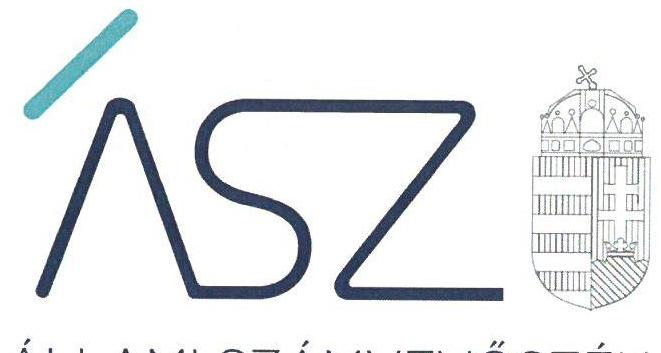
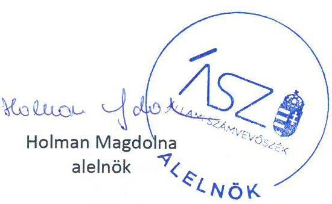

ÁLLAMI SZÁMVEVŐSZÉK

# JELENTÉS 

## Utóellenőrzések

A kormányzati szektorba sorolt, vagy a Bkr. hatálya alá nem tartozó gazdasági társaságok és egyéb szervezetek utóellenőrzése - 48 helyszín
2022.

22067
www.asz.hu

---

ÁLLAMI SZÁMVEVŐSZÉK

# JELENTÉS 

## Utóellenőrzések

A kormányzati szektorba sorolt, vagy a Bkr. hatálya alá nem tartozó gazdasági társaságok és egyéb szervezetek utóellenőrzése - 48 helyszín

22067
www.asz.hu

---

|  A | AZ ELLENŐRZÉST VEZETTE ÉS A VÉGREHAJTÁSÁÉRT FELELŐS:  |
| --- | --- |
|   | LADNAI ZSUZSANNA ellenőrzésvezető  |
|   | NEMESVÁRI-HORTHY ESZTER ellenőrzésvezető  |
|   | A PROGRAM ÖSSZEÁLLÍTÁSÁÉRT FELELŐS:  |
|   | WELTHERNÉ SZOLNOKI DÓRA projektvezető  |
|   | A TÉMÁHOZ KAPCSOLÓDÓ KORÁBBI SZÁMVEVŐSZÉKI JELENTÉSEK:  |
|  J | - címe: Az állami tulajdonú gazdasági társaságok ellenőrzése - Honvédelmi Minisztérium Elektronikai, Logisztikai és Vagyonkezelő Zrt.  |
|   | - sorszáma: 18271  |
|   | - címe: Nem állami humánszolgáltatók ellenőrzése Eventus Üzleti Tudományok Szakképző Iskoláért Alapítvány  |
|   | - sorszáma: 18293  |
|   | - címe: Az állami tulajdonú gazdasági társaságok ellenőrzése - ÉMI Építésügyi Minőségellenőrző Innovációs Nonprofit Korlátolt Felelősségű Társaság  |
|   | - sorszáma: 19011  |
|   | - címe: Nem állami humánszolgáltatók ellenőrzése Suli Harmónia - 2007 Gyermekeket Segítő Alapítvány  |
|   | - sorszáma: 19040  |
|   | - címe: Az állami tulajdonú gazdasági társaságok ellenőrzése - AK Nyomda Korlátolt Felelősségű Társaság  |
|   | - sorszáma: 19076  |
|   | - címe: A humánszolgáltatást nyújtó államháztartáson kívüli köznevelési és szociális intézmények, szolgáltatók fenntartói központi költségvetésből kapott támogatásai felhasználásának ellenőrzése - Fókusz Oktató Közhasznú Nonprofit Kft.  |
|   | - sorszáma: 19092  |
|   | - címe: Az állami tulajdonú gazdasági társaságok ellenőrzése - Pillér Pénzügyi és Számítástechnikai Korlátolt Felelősségű Társaság  |
|   | - sorszáma: 19104  |

---

| - címe: | Nem állami humánszolgáltatók ellenőrzése - A humánszolgáltatást nyújtó államháztartáson kívüli köznevelési és szociális intézmények, szolgáltatók fenntartói központi költségvetésből kapott támogatásai felhasználásának ellenőrzése - Gorsium Zeneiskoláért Alapítvány |
| :--: | :--: |
| - címe: | Az állami tulajdonú gazdasági társaságok ellenőrzése - NETI Informatikai Tanácsadó Korlátolt Felelősségű Társaság |
| - sorszáma: | 19111 |
| - címe: | Nem állami humánszolgáltatók ellenőrzése - A humánszolgáltatást nyújtó államháztartáson kívüli köznevelési és szociális intézmények, szolgáltatók fenntartói központi költségvetésből kapott támogatásai felhasználásának ellenőrzése - Török Sándor Waldorf-pedagógiai Alapítvány |
| - sorszáma: | 19114 |
| - címe: | A humánszolgáltatást nyújtó államháztartáson kívüli köznevelési és szociális intézmények, szolgáltatók fenntartói központi költségvetésből kapott támogatásai felhasználásának ellenőrzése - Audi Hungaria Iskola Intézményfenntartó és Működtető Közalapítvány |
| - sorszáma: | 19116 |
| - címe: | Az állami tulajdonú gazdasági társaságok ellenőrzése - MVM NET Távközlési Szolgáltató Zártkörűen Működő Részvénytársaság |
| - sorszáma: | 19134 |
| - címe: | Az állami tulajdonú gazdasági társaságok ellenőrzése - MVM GTER Gázturbinás Erőmű Zártkörűen Működő Részvénytársaság |
| - sorszáma: | 19152 |
| - címe: | A humánszolgáltatást nyújtó államháztartáson kívüli szociális intézmények, szolgáltatók fenntartói központi költségvetésből kapott támogatásai felhasználásának ellenőrzése Szociális és Rehabilitációs Alapítvány |
| - sorszáma: | 19155 |
| - címe: | A humánszolgáltatást nyújtó államháztartáson kívüli szociális intézmények, szolgáltatók fenntartói központi költségvetésből kapott támogatásai felhasználásának ellenőrzése Egyenlő Esélyekért Alapítvány |
| - sorszáma: | 19162 |

---

| - címe: | A humánszolgáltatást nyújtó államháztartáson kívüli szociális intézmények, szolgáltatók fenntartói központi költségvetésből kapott támogatásai felhasználásának ellenőrzése - SOS-Gyermekfalu Magyarországi Alapítványa |
| :--: | :--: |
| - sorszáma: | 19163 |
| - címe: | A humánszolgáltatást nyújtó államháztartáson kívüli szociális intézmények, szolgáltatók fenntartói központi költségvetésből kapott támogatásai felhasználásának ellenőrzése - Estikék Idősek Otthona Alapítvány |
| - sorszáma: | 19167 |
| - címe: | A humánszolgáltatást nyújtó államháztartáson kívüli szociális intézmények, szolgáltatók fenntartói központi költségvetésből kapott támogatásai felhasználásának ellenőrzése Szent Kereszt Alapítvány |
| - sorszáma: | 19170 |
| - címe: | A humánszolgáltatást nyújtó államháztartáson kívüli szociális intézmények, szolgáltatók fenntartói központi költségvetésből kapott támogatásai felhasználásának ellenőrzése - Kék Nefelejcs Alapítvány |
| - sorszáma: | 19171 |
| - címe: | A humánszolgáltatást nyújtó államháztartáson kívüli szociális intézmények, szolgáltatók fenntartói központi költségvetésből kapott támogatásai felhasználásának ellenőrzése Egymást Segítő Egyesület |
| - sorszáma: | 19173 |
| - címe: | Az állami tulajdonú gazdasági társaságok ellenőrzése - MVM Hungarowind Szélerőmű Üzemeltető Korlátolt Felelősségű Társaság |
| - sorszáma: | 19175 |
| - címe: | A humánszolgáltatást nyújtó államháztartáson kívüli szociális intézmények, szolgáltatók fenntartói központi költségvetésből kapott támogatásai felhasználásának ellenőrzése Menhely Alapítvány |
| - sorszáma: | 19177 |
| - címe: | A humánszolgáltatást nyújtó államháztartáson kívüli szociális intézmények, szolgáltatók fenntartói központi költségvetésből kapott támogatásai felhasználásának ellenőrzése - SZOCEG Szociális és Egészségügyi Szolgáltató Nonprofit Kft. |
| - sorszáma: | 19183 |

---

| - címe: | Az állami tulajdonú gazdasági társaságok ellenőrzése - Egészségügyi Szolgáltató Zártkörűen Működő Részvénytársaság |
| :--: | :--: |
| - sorszáma: | 19187 |
| - címe: | A humánszolgáltatást nyújtó államháztartáson kívüli szociális intézmények, szolgáltatók fenntartói központi költségvetésből kapott támogatásai felhasználásának ellenőrzése Magyar Ökumenikus Segélyszervezet |
| - sorszáma: | 19190 |
| - címe: | A humánszolgáltatást nyújtó államháztartáson kívüli köznevelési és szociális intézmények, szolgáltatók fenntartói központi költségvetésből kapott támogatásai felhasználásának ellenőrzése - „Harmónia K" szociális Szolgáltató Közhasznú Nonprofit Kft. |
| - sorszáma: | 19194 |
| - címe: | A humánszolgáltatást nyújtó államháztartáson kívüli köznevelési és szociális intézmények, szolgáltatók fenntartói központi költségvetésből kapott támogatásai felhasználásának ellenőrzése - Napvirág Idősek Otthona Szolgáltató Közhasznú Korlátolt Felelősségű Társaság |
| - sorszáma: | 19195 |
| - címe: | A humánszolgáltatást nyújtó államháztartáson kívüli szociális intézmények, szolgáltatók fenntartói központi költségvetésből kapott támogatásai felhasználásának ellenőrzése -SORS-2002 Egészségügyi Szolgáltató Nonprofit Kft. |
| - sorszáma: | 19212 |
| - címe: | A humánszolgáltatást nyújtó államháztartáson kívüli köznevelési és szociális intézmények, szolgáltatók fenntartói központi költségvetésből kapott támogatásai felhasználásának ellenőrzése - ReFoMix Nonprofit Közhasznú Kft. |
| - sorszáma: | 19213 |
| - címe: | Nem állami humánszolgáltatók ellenőrzése - A humánszolgáltatást nyújtó államháztartáson kívüli szociális intézmények, szolgáltatók fenntartói központi költségvetésből kapott támogatásai felhasználásának ellenőrzése Félúton Alapítvány |
| - sorszáma: | 19223 |

---

| - címe: | Az állami tulajdonú gazdasági társaságok ellenőrzése - VPE Vasúti Pályakapacitás-elosztó Korlátolt Felelősségű Társaság |
| :--: | :--: |
| - sorszáma: | 19242 |
| - címe: | A humánszolgáltatást nyújtó államháztartáson kívüli köznevelési és szociális intézmények, szolgáltatók fenntartói központi költségvetésből kapott támogatásai felhasználásának ellenőrzése - Tett Oktatási Nonprofit Közhasznú Korlátolt Felelősségű Társaság |
| - sorszáma: | 20009 |
| - címe: | A többségi állami és önkormányzati tulajdonú gazdasági társaságok integritásának ellenőrzése |
| - sorszáma: | 20057 |
| - címe: | Az állami résztulajdonú gazdasági társaságok ellenőrzése - FILANTROP Környezetvédelmi és Fűtéstechnikai Nonprofit Korlátolt Felelősségű Társaság |
| - sorszáma: | 20059 |
| - címe: | A szociális humánszolgáltatást nyújtó intézmények, szolgáltatók államháztartáson kívüli fenntartói központi költségvetésből kapott támogatásai felhasználásának ellenőrzése - Független Egyesület |
| - sorszáma: | 20079 |
| - címe: | A szociális humánszolgáltatást nyújtó intézmények, szolgáltatók államháztartáson kívüli fenntartói központi költségvetésből kapott támogatásai felhasználásának ellenőrzése - CAT-OTTHON Szociális Gondozó és Ellátó Nonprofit Korlátolt Felelősségű Társaság |
| - sorszáma: | 20092 |
| - címe: | A szociális humánszolgáltatást nyújtó intézmények, szolgáltatók államháztartáson kívüli fenntartói központi költségvetésből kapott támogatásai felhasználásának ellenőrzése - Élet-Hossz Alapítvány |
| - sorszáma: | 20094 |
| - címe: | A köznevelési és szociális humánszolgáltatást nyújtó intézmények, szolgáltatók államháztartáson kívüli fenntartói központi költségvetésből kapott támogatásai felhasználásának ellenőrzése - Az Értelmi Fogyatékosok Fejlődését Szolgáló Magyar Down Alapítvány |
| - sorszáma: | 20104 |

---

|  - címe: | A szociális humánszolgáltatást nyújtó intézmények, szolgáltatók államháztartáson kívüli fenntartói központi költségvetésből kapott támogatásai felhasználásának ellenőrzése - MENEDÉKHÁZ Alapítvány 20161  |
| --- | --- |
|  - sorszáma: | A köznevelési és szociális humánszolgáltatást nyújtó intézmények, szolgáltatók államháztartáson kívüli fenntartói központi költségvetésből kapott támogatásai felhasználásának ellenőrzése - tizennégy gazdasági társaságnál 21032  |
|  - sorszáma: | A szociális és köznevelési humánszolgáltatást nyújtó intézmények, szolgáltatók államháztartáson kívüli fenntartói központi költségvetésből kapott támogatásai felhasználásának ellenőrzése - 24 intézményfenntartó  |
|  - sorszáma: | 21043  |
|  - címe: | A köznevelési és szociális humánszolgáltatást nyújtó intézmények, szolgáltatók államháztartáson kívüli fenntartói központi költségvetésből kapott támogatásai felhasználásának ellenőrzése - 28 intézményfenntartó  |
|  - sorszáma: | 21051  |
|  - címe: | Nem állami humánszolgáltatók ellenőrzése - A köznevelési és szociális humánszolgáltatást nyújtó intézmények, szolgáltatók államháztartáson kívüli fenntartói központi költségvetésből kapott támogatásai felhasználásának ellenőrzése - 28 intézményfenntartó  |
|  - sorszáma: | 21052  |
|  |   |
|  IKTATÓSZÁM: EL-3797-001/2022 |   |
|  TÉMASZÁM: 2610 |   |
|  ELLENŐRZÉS-AZONOSÍTÓ SZÁM: V0954 |   |

---

.

---

# TARTALOMJEGYZÉK 

■ ÖSSZEGZÉS ..... 5
■ AZ ELLENŐRZÉS CÉLJA ..... 7
■ AZ ELLENŐRZÉS TERÜLETE ..... 8
■ AZ ELLENŐRZÉS HÁTTERE, INDOKOLTSÁGA ..... 11
■ A JELENTÉS LÉNYEGES KÉRDÉSKÖREI ..... 12
■ AZ ELLENŐRZÉS HATÓKÖRE ÉS MÓDSZEREI ..... 13
■ MEGÁLLAPÍTÁSOK ..... 15
■ MELLÉKLETEK ..... 19
I. sz. melléklet: Értelmező szótár ..... 19
II. sz. melléklet: Az értékelt szervezetek részletes megállapításai ..... 20
■ FÜGGELÉK: ÉSZREVÉTELEK ..... 29
■ RÖVIDÍTÉSEK JEGYZÉKE ..... 31

---

.

---

# ÖSSZEGZÉS 

Az ellenőrzött szervezetek intézkedési terveiben a korábbi jelentésekben foglalt megállapításokhoz kapcsolódóan megfogalmazott feladatai közül jelen utóellenőrzés során 98 intézkedési feladat végrehajtásának ellenőrzésére került sor.
Az utóellenőrzés során értékelt intézkedéseket 40 szervezet végrehajtotta. Nyolc ellenőrzött szervezet vezetője a szabálytalan működés megszüntetése érdekében vállalt intézkedéseket egyes számviteli szabályzatok esetében - nem hajtotta végre.

## Az ellenőrzés társadalmi indokoltsága

Az Állami Számvevőszék a Stratégiájában célul tűzte ki a számvevőszéki munka hasznosulásának javítását. Az utóellenőrzés során állami tulajdonú, többségi állami és önkormányzati tulajdonú gazdasági társaságok, valamint köznevelési és/vagy szociális humánszolgáltatást nyújtó államháztartáson kívüli szervezetek ellenőrzésére került sor. Az állami tulajdonú gazdálkodó szervezetek a nemzeti vagyon részét képezik. A közpénzt, közvagyont felhasználó állami tulajdonú gazdálkodó szervezetekkel szemben alapvető társadalmi igény, hogy működésük, gazdálkodásuk szabályszerű, az általuk szolgáltatott adatok minél megbízhatóbbak legyenek. A köznevelési és/vagy szociális közfeladatot ellátó államháztartáson kívüli szervezetek által ellátott feladatok a társadalom egészét érintik.

Jelen utóellenőrzés az adott szervezet intézkedési tervéhez kapcsolódó dokumentumok
 értékelésével ad visszacsatolást az ellenőrzési jelentések vonatkozó pontjainak teljes, vagy részbeni hasznosulásáról, amely dokumentumok a korábban feltárt belső szabályozottsággal kapcsolatos hiányosságok esetében a számviteli politika, az annak keretében elkészítendő eszközök és források leltárkészítési és leltározási szabályzata, az eszközök és források értékelési szabályzata, a számlarend, valamint a működési tevékenységgel kapcsolatos hiányosságok esetében a 2019-2020. évi beszámolók, a mérleg tételeinek alátámasztásához készült leltár összeállításához kapcsolódó dokumentumok, továbbá a támogatások elkülönített nyilvántartásai.

## Főbb megállapítások, következtetések

40 szervezet az intézkedési tervében foglaltak szerint az adott terület szabályszerű működésének kialakítása érdekében rendelkezett a jelen ellenőrzés során ellenőrzött szabályzatokkal, dokumentumokkal. Nyolc ellenőrzött szervezet nem hajtotta végre teljeskörűen az intézkedési tervben vállalt, jelen ellenőrzés során ellenőrzött feladatokat.

12 ellenőrzött állami tulajdonú gazdasági társaság összesen 61 feladat végrehajtását vállalta intézkedési tervben. Jelen ellenőrzéshez kiválasztott intézkedések végrehajtását alátámasztó dokumentumok alapján 30 feladat végrehajtása került ellenőrzésre. 10 gazdasági társaság az intézkedési tervben vállalt jelen ellenőrzés során ellenőrzött 27 feladatot végrehajtotta, esetükben hasznosultak az ÁSZ korábbi ellenőrzési megállapításai. Kettő szervezet nem teljeskörűen hajtotta végre az intézkedési tervben vállalt feladatait, mivel továbbra sem készítettek a Számviteli törvénynek megfelelő számlarendet, valamint az egyik ellenőrzött szervezet a törvényi előírásokkal ellentétben az eszközök és források leltárkészítési és leltározási szabályzatában a tárgyi eszközök esetében az előírt legalább háromévenkénti helyett ötévenkénti gyakoriságot írt elő a mennyiségi felvétellel történő leltározásra.

## KETTŐ ELLENŐRZÖTT TÖBBSÉGI ÁLLAMI ÉS ÖNKORMÁNYZATI TULAJDONÚ

GAZDASÁGI TÁRSASÁG összesen öt feladat végrehajtását vállalta intézkedési tervben. Jelen ellenőrzéshez kiválasztott intézkedés végrehajtását alátámasztó dokumentumok alapján három feladat végrehajtása került ellenőrzésre. Kettő gazdasági társaság az intézkedési tervben vállalt, jelen ellenőrzés során ellenőrzött feladatait végrehajtotta, hasznosítva az ÁSZ korábbi ellenőrzési megállapításait.

---

# 34 ELLENŐRZÖTT KÖZNEVELÉSI ÉS/VAGY SZOCIÁLIS HUMÁNSZOLGÁLTATÁST NYÚJTÓ ÁLLAMHÁZTARTÁSON KÍVÜLI SZERVEZET összesen 83 feladat végrehajtását vállalta intézkedési tervben. Jelen ellenőrzéshez kiválasztott intézkedés végrehajtását alátámasztó dokumentumok alapján 65 feladat végrehajtása került ellenőrzésre. 28 szervezet az intézkedési tervben vállalt, jelen ellenőrzés során ellenőrzött 47 feladatot végrehajtotta, hasznosítva az ÁSZ korábbi ellenőrzési megállapításait. Hat szervezet intézkedési tervben vállalt 18 feladatból hat feladatot nem hajtott végre. Négy szervezet nem készített olyan számlarendet, amely tartalmi elemei megfelelnek a Számviteli törvény előírásainak. Egy szervezet az eszközök és források értékelési szabályzatát nem a szervezetre vonatkozó hatályos jogszabályok alapján készítette el. Egy szervezet a beszámolóját nem a jogszabályi előírások figyelembevételével készítette el, mivel az egyéb bevételeken belül nem részletezte a kapott támogatások összegét.

---

# AZ ELLENŐRZÉS CÉLJA 

Az utóellenőrzés célja annak értékelése, hogy az ellenőrzött szervezetek a szervezet által összeállított intézkedési tervben foglalt intézkedések végrehajtásával hasznosították-e az ÁSZ ${ }^{1}$ jelentésben a hiányosságok megszüntetése, illetve a kockázatok csökkentése érdekében tett megállapításokat.

---

# AZ ELLENŐRZÉS TERÜLETE 

## 12 állami tulajdonú gazdasági társaság, kettő többségi állami és önkormányzati tulajdonú gazdasági társaság, 34 köznevelési és/vagy szociális humánszolgáltatást nyújtó államháztartáson kívüli szervezet

Az ÁSZ az állami tulajdonú, valamint a többségi állami és önkormányzati tulajdonú gazdasági társaságokat jellemzően 2013-2018. évekre vonatkozóan ellenőrizte és a társaságok szabályozottságát, a gazdálkodás, vagyongazdálkodás tevékenységének a jogszabályi és tulajdonosi előírásoknak való megfelelőségét, az ellátott feladatok átláthatóságát és elszámoltathatóságát, esetenként a feladatellátások során meghatározott szervezeti kultúra egységét biztosító értékeket, elveket, célkitűzéseket, valamint a működés során jelentkező integritási kockázatokat értékelte.

A nem állami humánszolgáltatók esetében az ellenőrzések 2015 - 2018. évekre terjedtek ki, amelyek a szociális és köznevelési feladatot ellátó nem állami intézményfenntartók központi költségvetésből kapott támogatásai felhasználásának szabályszerűségét értékelte.

Az ellenőrzött szervezetek által készített és az ÁSZ által elfogadott intézkedési tervekben az ellenőrzések megállapításai alapján 48 szervezet összesen 149 feladatot határozott meg a gazdálkodás belső szabályozottsága és működése terén a szabálytalan működés megszüntetése érdekében, amelyből jelen ellenőrzés során az Állami Számvevőszék 48 ellenőrzött szervezetnél 98 feladat végrehajtását ellenőrizte.

Az ellenőrzésre kijelölt Szinergia Gazdasági Oktatást Támogató Alapítvány az alapellenőrzéssel érintett oktatási intézmény felett 2016. július 1-től fenntartói jogokat nem gyakorolt, ezért ellenőrzésére nem került sor.

## AZ ELLENŐRZÖTT ÁLLAMI TULAJDONÚ SZERVEZETEK:

$\longrightarrow$ AK Nyomda Kft.
$\longrightarrow$ Egészségügyi Szolgáltató Zrt.
$\longrightarrow$ ÉMI Építésügyi Minőségellenőrző Innovációs Nonprofit Kft.
$\longrightarrow$ HKGYK Közép- és Kelet-Európai Hagyományos Kínai Gyógyászati, Oktató- és Kutatóközpont Nonprofit Kft.
$\longrightarrow$ HM Elektronikai, Logisztikai és Vagyonkezelő Zrt.
$\longrightarrow$ MVM Balance Zrt.
$\longrightarrow$ MVM NET Távközlési Szolgáltató Zrt.
$\longrightarrow$ MVM Zöld Generáció Kft.
$\longrightarrow$ Nemzeti Egészségmegőrző Központ Nonprofit Kft.
$\longrightarrow$ NETI Informatikai Tanácsadó Kft.

---

- Pillér Informatikai Kft.
- VPE Vasúti Pályakapacitás-elosztó Kft.

# TÖBBSÉGI ÁLLAMI ÉS ÖNKORMÁNYZATI TULAJDONÚ SZERVEZETEK: 

- FILANTROP Környezetvédelmi és Fűtéstechnikai Nonprofit Kft.
- TRANSHUMAN Fuvarozó és Egészségügyi Szociális Szolgáltató Kft.

## KÖZNEVELÉSI ÉS/VAGY SZOCIÁLIS HUMÁNSZOLGÁLTATÁST NYÚJTÓ ÁLLAMHÁZTARTÁSON KÍVÜLI SZERVEZETEK:

- AUDI HUNGARIA ISKOLA INTÉZMÉNYFENNTARTÓ ÉS MŰKÖDTETŐ KÖZALAPÍTVÁNY
- AZ ÉRTELMI FOGYATÉKOSOK FEJLŐDÉSÉT SZOLGÁLÓ MAGYAR DOWN ALAPÍTVÁNY
- AZ ETO JÖVŐJÉÉRT ALAPÍTVÁNY
- Bölcs Mókusok Erdeje Alapítvány
- BURATTINO SZOCIÁLIS ÉS KULTURÁLIS EGYESÜLET
- CAT-OTTHON Szociális Gondozó és Ellátó Nonprofit Kft.
- Egy Falat Esély Alapítvány
- Egyenlő Esélyekért! Alapítvány
- EGYMÁST SEGÍTŐ EGYESÜLET
- ÉLET-HOSSZ ALAPÍTVÁNY
- Empátia Gondozóház Nonprofit Közhasznú Kft.
- ESTIKÉK IDŐSEK OTTHONA ALAPÍTVÁNY
- EVENTUS ÜZLETI TUDOMÁNYOK SZAKKÉPZŐ ISKOLÁÉRT ALAPÍTVÁNY
- FÉLÚTON ALAPÍTVÁNY
- FÓKUSZ OKTATÓ Közhasznú Nonprofit Kft.
- FÜGGETLEN EGYESÜLET
- GORSIUM ZENEISKOLÁÉRT ALAPÍTVÁNY
- „HARMÓNIA K" Szociális Szolgáltató Közhasznú Nonprofit Kft.
- HIPERAKTÍV ALAPÍTVÁNY
- KÉK NEFELEJCS ALAPÍTVÁNY
- MAGYAR ÖKUMENIKUS SEGÉLYSZERVEZET
- "MENEDÉKHÁZ" Alapítvány
- MENHELY ALAPÍTVÁNY
- Napvirág Idősek Otthona Nonprofit Szolgáltató Közhasznú Kft.
- ReFoMix Rehabilitációs Foglalkoztatási és Szociális Szolgáltató Nonprofit Közhasznú Kft.
- SORS-2002 Egészségügyi Szolgáltató Nonprofit Kft. „v.a."
- SOS-Gyermekfalu Magyarországi Alapítványa
- SULI HARMÓNIA 2007 GYERMEKEKET SEGÍTŐ ALAPÍTVÁNY
- SZENT KERESZT ALAPÍTVÁNY
- SZOCEG Szociális és Egészségügyi Szolgáltató Nonprofit Kft.

---

- SZOCIÁLIS ÉS REHABILITÁCIÓS ALAPÍTVÁNY
- TETT OKTATÁSI Nonprofit Közhasznú Kft.
- Török Sándor Waldorf Pedagógiai Alapítvány
- WADRÓZSA PEDAGÓGIAI MŰHELY KÖZHASZNÚ EGYESÜLET

---

# AZ ELLENŐRZÉS HÁTTERE, INDOKOLTSÁGA 

Az ÁSZ tv². 33. § (1) bekezdése értelmében a számvevőszéki jelentések megállapításai alapján az ellenőrzött szervezet vezetője intézkedési tervet köteles összeállítani, és az Állami Számvevőszék (továbbiakban: ÁSZ) részére megküldeni. Az intézkedési tervben foglaltak megvalósítását - az ÁSZ tv. 33. § (7) bekezdésében foglaltak alapján - az ÁSZ utóellenőrzés keretében ellenőrizheti.

Az utóellenőrzés során az ÁSZ értékelte, hogy az érintett számvevőszéki jelentésben foglalt megállapításokkal összhangban, az ellenőrzött szervezet által - a jogszabályi kötelezettségének eleget téve - készített intézkedési tervben meghatározott feladatokat a feladatra kijelöltek végrehajtották-e.

Az ÁSZ utóellenőrzései kiterjednek a kormányzati szektorba sorolt, vagy a Bkr. ${ }^{3}$ hatálya alá nem tartozó gazdasági társaságoknál, alapítványoknál és egyesületeknél végzett ellenőrzésekről készült jelentésben foglalt megállapításokhoz kapcsolódó intézkedésre kötelezett szervezetekre.

Az utóellenőrzés feltárta, hogy az ellenőrzött szervezet az intézkedési tervében vállalt azon intézkedések végrehajtásával, mely feladat alátámasztására jelen ellenőrzés során dokumentum rendelkezésre állt, hasznosította-e a korábbi ellenőrzési jelentésben a hiányosságok megszüntetése, a kockázatok kezelése érdekében tett megállapításokat. Az utóellenőrzés visszacsatolást ad az ellenőrzési jelentések hasznosulásáról.

---

# A JELENTÉS LÉNYEGES KÉRDÉSKÖREI 

1. Az ellenőrzött szervezet az intézkedési tervben vállalt feladatait az ellenőrzött dokumentumok alapján végrehajtotta-e?

---

# AZ ELLENŐRZÉS HATÓKÖRE ÉS MÓDSZEREI 

## Az ellenőrzés típusa

Megfelelőségi ellenőrzés.

## Az ellenőrzött időszak

Az ellenőrzött szervezet intézkedési tervében szereplő határidő figyelembevételével 2019. január 1-től 2022. március 10-ig, az adatszolgáltatásra felhívó levél keltezésének napjáig.

## Az ellenőrzés tárgya

Az érintett számvevőszéki jelentésben foglalt megállapításokhoz kapcsolódó - az ellenőrzött szervezet vezetője által készített - intézkedési tervben meghatározott feladatok végrehajtásának ellenőrzése az ellenőrzési programban jelölt dokumentumok értékelése alapján.

## Az ellenőrzött szervezet

Az ellenőrzés a kormányzati szektorba sorolt, vagy a Bkr. hatálya alá nem tartozó gazdasági társaságoknál, alapítványoknál és egyesületeknél végzett ellenőrzésekről készült jelentésben foglalt megállapításokhoz kapcsolódó intézkedésre kötelezett szervezetre terjedt ki.

## Az ellenőrzés jogalapja

Az ellenőrzés jogszabályi alapját az ÁSZ tv. 1. § (3) bekezdése, valamint a 33. § (7) bekezdésének előírásai képezik.

## Az ellenőrzés módszerei

Az ellenőrzés az ellenőrzött időszakban hatályos jogszabályok, az ellenőrzés szakmai szabályai, a jelen ellenőrzésre irányadó ÁSZ módszertanok, az ellenőrzési programban foglalt értékelési szempontok szerint került végrehajtásra.

Az ellenőrzés ideje alatt az ellenőrzött szervezettel történő kapcsolattartás az ÁSZ SZMSZ ${ }^{\circledR}$-ének vonatkozó előírásai alapján került biztosításra.

---

Az utóellenőrzés megállapításai az ÁSZ rendelkezésére álló dokumentumok, valamint az ellenőrzött szervezetek által rendelkezésre bocsátott dokumentumok, adatok alapján kerültek megfogalmazásra.

Az ellenőrzési kérdések megválaszolásához szükséges bizonyítékok megszerzése az ellenőrzött által rendelkezésre bocsátott dokumentumokra, adatokra alapozva megfigyelés, szemle (szemrevételezés), kérdésfeltevés (információkérés), valamint elemző eljárás alkalmazásával történt. Az ellenőrzési bizonyítékként felhasználható adatforrások közé tartoztak egyrészt az ellenőrzési program részletes szempontjainál felsorolt adatforrások, másrészt minden - az ellenőrzés folyamán feltárt, az ellenőrzés szempontjából információt tartalmazó - dokumentum. Az ellenőrzés attól az évtől került lefolytatásra és az értékeléseket attól az évtől kezdődően tettük meg, amilyen évre az ellenőrzött szervezet az intézkedési tervében a vállalásokat tette. Az ellenőrzés kiterjedt minden olyan körülményre és adatra, amely az ÁSZ jogszabályban meghatározott feladatainak teljesítéséhez, valamint a program végrehajtása folyamán felmerült újabb összefüggések feltárásához szükséges volt.

Az ÁSZ az utóellenőrzés során értékelte, hogy az ÁSZ által jelölt területeken feltárt hibák kijavítása az ellenőrzési program által jelölt dokumentumok kapcsán megtörtént-e. Az értékelés eredménye alapján az ÁSZ további intézkedéseket kezdeményezhet.

Az utóellenőrzés nem terjedt ki az ÁSZ jelentésben foglalt megállapításokhoz kapcsolódó az ellenőrzött szervezet vezetője által összeállított és az ÁSZ által tudomásul vett intézkedési terv összes feladatára.

Az utóellenőrzés során az ellenőrzött szempontjából az adatbekérés során megküldött dokumentumok közül azon dokumentumok kerültek kiértékelésre, amelyek a korábbi Számvevőszéki jelentésekben foglalt megállapításokhoz kapcsolódó, az ellenőrzött szervezet vezetője által összeállított és az ÁSZ által elfogadott intézkedési tervben foglalt, az utóellenőrzéshez kiválasztott feladat végrehajtását alátámasztották.

---

# 1. Az ellenőrzött szervezet az intézkedési tervben vállalt feladatait az ellenőrzött dokumentumok alapján végrehajtotta-e? 

Összegző megállapítás

40 ellenőrzött szervezet végrehajtotta a korábban feltárt szabálytalanságok megszüntetése érdekében vállalt, a jelen ellenőrzés során ellenőrzött intézkedéseket. Nyolc ellenőrzött szervezet a vállalt intézkedéseket nem teljeskörűen hajtotta végre.

## ÁLLAMI TULAJDONÚ GAZDASÁGI TÁRSASÁGOK

- Az Egészségügyi Szolgáltató Zrt, az ÉMI Építésügyi Minőségellenőrző Innovációs Nonprofit Kft, a HM Elektronikai, Logisztikai és Vagyonkezelő Zrt, az MVM Balance Zrt, az MVM NET Távközlési Szolgáltató Zrt, az MVM Zöld Generáció Kft, a Nemzeti Egészségmegőrző Központ Nonprofit Kft, a NETI Informatikai Tanácsadó Kft, a Pillér Informatikai Kft, valamint a VPE Vasúti Pályakapacitás-elosztó Kft. vezetője az intézkedési tervben vállalt feladatai közül a jelen utóellenőrzés során ellenőrzött feladatait végrehajtotta, ezáltal megszüntette a korábban feltárt belső szabályozottsággal és/vagy működési tevékenységgel kapcsolatos hiányosságokat.
- Kettő szervezet, az AK Nyomda Kft. és a HKGYK Közép- és Kelet-Európai Hagyományos Kínai Gyógyászati, Oktató- és Kutatóközpont vezetője az intézkedési tervben vállalt feladatai közül a jelen utóellenőrzés során ellenőrzött feladatait nem teljeskörűen hajtotta végre:
Az AK Nyomda Kft. vezetője rendelkezett a törvényi előírásoknak megfelelő számviteli politikával, és az eszközök és források értékelési szabályzatával. A Társaság elkészítette az eszközök és források leltárkészítési és leltározási szabályzatát, és a számlarendet, azonban azok nem
 feleltek meg a törvényi előírásoknak, mivel a számlarend nem tartalmazta minden alkalmazásra kijelölt számla számjelét és megnevezését, a számla értékének növekedésének, csökkenésének jogcímeit, a számlát érintő gazdasági eseményeket, azok más számlákkal való kapcsolatát, továbbá a számlarendben foglaltakat alátámasztó bizonylati rendet. A Társaság leltározási szabályzatában a tárgyi eszközök esetében a jogszabályban előírt legalább háromévenkénti helyett ötévenkénti gyakoriságot írt elő a mennyiségi felvétellel történő leltározásra, ezáltal a korábban feltárt belső szabályzatokkal kapcsolatos hiányosságokat nem szüntették meg teljeskörűen.

A HKGYK Közép- és Kelet-Európai Hagyományos Kínai Gyógyászati, Oktató- és Kutatóközpont vezetője a törvényi előírásoknak megfelelően elkészítette az eszközök és források értékelési szabályzatát, valamint a számviteli politikát. A Társaság elkészítette számlarendjét, azonban az nem felelt meg a törvényi előírásoknak, mivel nem tartalmazza a számla értékének növekedésének, csökkenésének jogcímeit, a számlát érintő gazdasági

---

eseményeket, azok más számlákkal való kapcsolatát, továbbá a főkönyvi számla és az analitikus nyilvántartás kapcsolatát, ezáltal a korábban feltárt belső szabályzatokkal kapcsolatos hiányosságokat nem szüntették meg teljeskörűen.

# TÖBBSÉGI ÁLLAMI ÉS ÖNKORMÁNYZATI TULAJDONÚ GAZDASÁGI TÁRSASÁGOK 

- A FILANTROP Környezetvédelmi és Fűtéstechnikai Nonprofit Kft, és a TRANSHUMAN Fuvarozó és Egészségügyi Szociális Szolgáltató Kft. vezetője az intézkedési tervben vállalt feladatai közül a jelen utóellenőrzés során ellenőrzött feladatait végrehajtotta, ezáltal megszüntette a korábban feltárt belső szabályozottsággal és/vagy működési tevékenységgel kapcsolatos hiányosságokat.

## KÖZNEVELÉSI ÉS/VAGY SZOCIÁLIS HUMÁNSZOLGÁLTATÁST NYÚJTÓ ÁLLAMHÁZTARTÁSON KÍVÜLI SZERVEZETEK

- Az AUDI HUNGARIA ISKOLA INTÉZMÉNYFENNTARTÓ ÉS MŰKÖDTETŐ KÖZALAPÍTVÁNY, AZ ÉRTELMI FOGYATÉKOSOK FEJLŐDÉSÉT SZOLGÁLÓ MAGYAR DOWN ALAPÍTVÁNY, az ETO JÖVŐJÉÉRT ALAPÍTVÁNY, a BURATTINO SZOCIÁLIS ÉS KULTURÁLIS EGYESÜLET, a CAT-OTTHON Szociális Gondozó és Ellátó Nonprofit Kft, az Egy Falat Esély Alapítvány, az EGYMÁST SEGÍTŐ EGYESÜLET, az ÉLET-HOSSZ ALAPÍTVÁNY, az Empátia Gondozóház Nonprofit Közhasznú Kft, az ESTIKÉK IDŐSEK OTTHONA ALAPÍTVÁNY, az EVENTUS ÜZLETI TUDOMÁNYOK SZAKKÉPZŐ ISKOLÁÉRT ALAPÍTVÁNY, a FÉLÚTON ALAPÍTVÁNY, a FÜGGETLEN EGYESÜLET, a „HARMÓNIA K" Szociális Szolgáltató Közhasznú Nonprofit Kft, a KÉK NEFELEJCS ALAPÍTVÁNY, a MAGYAR ÖKUMENIKUS SEGÉLYSZERVEZET, a "MENEDÉKHÁZ" Alapítvány, a MENHELY ALAPÍTVÁNY, a Napvirág Idősek Otthona Nonprofit Szolgáltató Közhasznú Kft, a ReFoMix Rehabilitációs Foglalkoztatási és Szociális Szolgáltató Nonprofit Közhasznú Kft, a SORS2002 Egészségügyi Szolgáltató Nonprofit Kft. „v.a.", az SOS-Gyermekfalu Magyarországi Alapítvány, a SULI HARMÓNIA 2007 GYERMEKEKET SEGÍTŐ ALAPÍTVÁNY, a SZENT KERESZT ALAPÍTVÁNY, a SZOCEG Szociális és Egészségügyi Szolgáltató Nonprofit Kft, a SZOCIÁLIS ÉS REHABILITÁCIÓS ALAPÍTVÁNY, a TETT OKTATÁSI Nonprofit Közhasznú Kft, valamint a Török Sándor Waldorf Pedagógiai Alapítvány vezetője az intézkedési tervben vállalt feladatai közül a jelen utóellenőrzés során ellenőrzött feladatait végrehajtotta, ezáltal megszüntette a korábban feltárt belső szabályozottsággal és/vagy működési tevékenységgel kapcsolatos hiányosságokat.
- Hat szervezet, a Bölcs Mókusok Erdeje Alapítvány, az Egyenlő Esélyekért! Alapítvány, a FŐKUSZ OKTATÓ Közhasznú Nonprofit Kft, a GORSIUM ZENEISKOLÁÉRT ALAPÍTVÁNY, a HIPERAKTÍV ALAPÍTVÁNY, valamint a WADRÓZSA PEDAGÓGIAI MŰHELY KÖZHASZNÚ EGYESÜLET vezetője az intézkedési tervben vállalt feladatai közül a jelen utóellenőrzés során ellenőrzött feladatait nem teljeskörűen hajtotta végre:
A Bölcs Mókusok Erdeje Alapítvány vezetője által készített számlarend nem felelt meg a törvényi előírásoknak, mivel az nem

---

tartalmazta a Számv. tv-ben meghatározott valamennyi számlarenddel kapcsolatos tartalmi elemet, minden alkalmazásra kijelölt számla számjelét és megnevezését, ezáltal a korábban feltárt belső szabályzattal kapcsolatos hiányosság továbbra is fennáll.
Az Egyenlő Esélyekért! Alapítvány vezetője nem készített számlarendet. Az Alapítvány által megküldött főkönyvi lista nem felelt meg a számlarenddel kapcsolatos törvényi előírásoknak, mivel az nem tartalmazta a számla értékének növekedésének, csökkenésének jogcímeit, a számlát érintő gazdasági eseményeket, azok más számlákkal való kapcsolatát, a főkönyvi számla és az analitikus nyilvántartás kapcsolatát, a számlarendben foglaltakat alátámasztó bizonylati rendet, ezáltal a korábban feltárt belső szabályzattal kapcsolatos hiányosság továbbra is fennáll. Az Alapítvány vezetője a törvényi előírásoknak megfelelően a támogatások felhasználásáról feladatonkénti elkülönített nyilvántartást vezetett, ezáltal a korábban feltárt működési tevékenységgel kapcsolatos hiányosságot megszüntette.
A FÓKUSZ OKTATÓ Közhasznú Nonprofit Kft. vezetője a törvényi előírásoknak megfelelően elkészítette a szervezet számviteli politikáját, amelyben gondoskodott az intézménye könyvvezetési, beszámolókészítési kötelezettségének megállapításáról is, azonban számlarendet nem készített. A Társaság által megküldött számlatükör nem felelt meg a számlarenddel kapcsolatos törvényi előírásoknak, mivel az nem tartalmazza a számla értékének növekedésének, csökkenésének jogcímeit, a számlát érintő gazdasági eseményeket, azok más számlákkal való kapcsolatát, a főkönyvi számla és az analitikus nyilvántartás kapcsolatát, a számlarendben foglaltakat alátámasztó bizonylati rendet, ezáltal a korábban feltárt belső szabályzattal kapcsolatos hiányosságok nem kerültek teljeskörűen megszüntetésre.
A GORSIUM ZENEISKOLÁÉRT ALAPÍTVÁNY vezetője a törvényi előírásoknak megfelelően elkészítette a szervezet számviteli politikáját, az eszközök és források értékelési szabályzatát, valamint számlarendjét, ezáltal a korábban feltárt belső szabályozottsággal kapcsolatos hiányosságokat megszüntették. Az Alapítvány a 2019-2020. években a működéséről, vagyoni, pénzügyi és jövedelmi helyzetéről az éves beszámolóit elkészítette, azonban azok nem feleltek meg a jogszabályi előírásoknak, mivel az eredménykimutatásban az egyéb bevételeken belül nem részletezték legalább a tagdíjak, az alapítótól kapott befizetések, valamint a kapott támogatások összegét, ezáltal a korábban feltárt működési hiányosság továbbra is fennáll.
A HIPERAKTÍV ALAPÍTVÁNY vezetője aktualizálta és hitelesítette a szervezet számviteli politikáját, az eszközök és források leltárkészítési és leltározási szabályzatát, továbbá elkészítette számlarendjét. Az Alapítvány elkészítette az eszközök és források értékelési szabályzatát, azonban az nem a szervezetre vonatkozó hatályos törvényi előírások figyelembevételével készült, ezáltal a korábban feltárt belső szabályozottsággal kapcsolatos hiányosságok nem kerültek teljeskörűen megszüntetésre. Az Alapítvány a 2019-2020. években a törvény előírásaival összhangban elkészítette a működéséről, vagyoni, pénzügyi és jövedelmi helyzetéről az éves beszámolóit, valamint a támogatások felhasználásáról alapfeladatonkénti

---

nyilvántartást vezetett, ezáltal a korábban feltárt működési tevékenységgel kapcsolatos hiányosságokat megszüntették.
A WADRÓZSA PEDAGÓGIAI MŰHELY KÖZHASZNÚ EGYESÜLET vezetője módosította számlarendjét, azonban az nem felelt meg a törvényi előírásoknak, mivel az nem tartalmazza minden alkalmazásra kijelölt számla számjelét és megnevezését, ezáltal a korábban feltárt belső szabályzattal kapcsolatos hiányosságot nem szüntették meg. Az Alapítvány a 2019-2020. években a működéséről, vagyoni, pénzügyi és jövedelmi helyzetéről az éves beszámolóit a törvény előírásaival összhangban elkészítette, ezáltal a korábban feltárt működési tevékenységgel kapcsolatos hiányosságokat megszüntették.

---

# MELLÉKLETEK 

## I. SZ. MELLÉKLET: ÉRTELMEZŐ SZÓTÁR

alapítvány

Bkr. hatálya alá tartozó szervezetek

Bkr. hatálya alá nem tartozó szervezetek
civil szervezet
egyesület
felelős vezető
intézkedési terv
a kormányzati szektorba sorolt egyéb szervezetek

Az új Ptk. 5. 3:378. § szerint az alapítvány az alapító által az alapító okiratban meghatározott tartós cél folyamatos megvalósítására létrehozott jogi személy. Az alapító az alapító okiratban meghatározza az alapítványnak juttatott vagyont és az alapítvány szervezetét.
A Bkr. hatálya kiterjed:
a) az államháztartásról szóló 2011. évi CXCV. törvény (a továbbiakban: Áht.) 3. §-ában felsoroltakra az állam és a törvény által az államháztartás központi alrendszerébe sorolt köztestületek kivételével,
b) a térségi fejlesztési tanács munkaszervezetére,
c) az a) pontban meghatározottak által alapított szervekre, szervezetekre, ha azok tulajdonosi jogokat vagy vagyonkezelői jogot gyakorolnak,
d) a kormányzati szektorba sorolt egyéb szervezetekre és
e) jogszabály alapján a költségvetési szervek belső kontrollrendszerére és belső ellenőrzésére vonatkozó szabályokat alkalmazó más szervre, szervezetre. (Bkr. 1. § (2) bekezdés a-e) pontok)
A Bkr. 1. § (2) bekezdés a-e) pontokban fel nem sorolt jogi személyek, különösen:
a) gazdasági társaságok: üzletszerű közös gazdasági tevékenység folytatására, a tagok vagyoni hozzájárulásával létrehozott, jogi személyiséggel rendelkező vállalkozások [Ptk. 3:88. § (1) bekezdés];
b) alapítványok: az alapító által az alapító okiratban meghatározott tartós cél folyamatos megvalósítására létrehozott jogi személyek [Ptk. 3:88. § (1) bekezdés]
A Civil tv. 112. § 6. pontja szerint civil szervezet a civil társaság, a Magyarországon nyilvántartásba vett egyesület (a párt, a szakszervezet és a kölcsönös biztosító egyesület kivételével), a közalapítvány és a pártalapítvány kivételével az alapítvány.
A Ptk. 3:63. § (1) bekezdése szerint az egyesület a tagok közös, tartós, alapszabályban meghatározott céljának folyamatos megvalósítására létesített, nyilvántartott tagsággal rendelkező jogi személy.
A számvevőszéki jelentésben foglalt megállapításokhoz kapcsolódó intézkedési terv összeállításáért felelős ellenőrzött szervezet első számú vezetője (ÁSZ tv. 33. § (1) bekezdés)
Az ellenőrzött szervezet vezetője köteles a számvevőszéki jelentésben foglalt megállapításokhoz kapcsolódó intézkedési tervet összeállítani. (ÁSZ tv. 33. § (1) bekezdés)
Az ellenőrzési javaslatok alapján az ellenőrzött szervezet, szervezeti egység által készített intézkedések végrehajtásának ütemezése a végrehajtásáért felelős személyek és a vonatkozó határidők megjelölésével. (Bkr. 2. § k) pont)
Az Áht. 3. § (2) és (3) bekezdésében foglaltakon kívül az Európai Közösséget létrehozó szerződéshez csatolt, a túlzott hiány esetén követendő eljárásról szóló jegyzőkönyv alkalmazásáról szóló 2009. május 25-i 479/2009/EK rendelet (a továbbiakban: 479/2009/EK rendelet) szerint a kormányzati szektorba sorolt szervezet. (Áht. 1. § 12. pont)

---

# 11. SZ. MELLÉKLET: AZ ÉRTÉKELT SZERVEZETEK RÉSZLETES MEGÁLLAPÍTÁSAI

|  Sze-
szám | Értékelt szervezet | Korábbi
ÁSZ jelen-
tésben tett
Javaslatok
száma (db) | Korábbi ÁSZ jelentésben
tett Javaslatok kapcsán
tett intézkedési tervi fel-
adatok közül jelen ellen-
őrzés során értékelt fel-
adat (db) | A vállalt feladathoz hap-
csolódó, jelen ellenőrzés
keretében ellenőrzött do-
kumentum megnevezése | Az ellenőrzött dokument-
tum megfelel a törvényi
előírásoknak (I/N) | Megállapítás  |
| --- | --- | --- | --- | --- | --- | --- |
|  1. | AK Nyomda Kft. | 7 | 4 | Számviteli politika | I | A Társaság a Számv.tv. 14.§ (3) és (11) bekezdéseiben előírtakkal összhangban rendelkezett számviteli politikával.  |
|   |  |  |  | Eszközök és források értékelési
szabályzata | I | A Társaság vezetője a Számv.tv. 14. § (5) bekezdésében foglalt előírásoknak megfelelően rendelkezett az eszközök és források értékelési szabályzatával.  |
|   |  |  |  | Számlarend | N | A Társaság elkészítette a Számv.tv. 161. § (1) bekezdéssel összhangban a számlarendjét, azonban a számlarend nem felelt meg a Számv. tv. 161. § (2) bekezdés a), b) és d) pontjában előírt követelményeknek, mivel nem tartalmazza minden alkalmazásra kijelölt számla számjelét és megnevezését, a számla értékének növekedésének, csökkenésének jogcímeit, a számlát érintő gazdasági eseményeket, azok más számlákkal való kapcsolatát, továbbá a számlarendben foglaltakat alátámasztó bizonylati rendet.  |
|   |  |  |  | Eszközök és források leltárkészítési
és leltározási szabályzata | N | A leltározási szabályzat nem felelt meg a Számv.tv. előírásainak, mivel a szabályzatban a tárgyi eszközök mennyiségi leltározására megállapított időtartam meghaladja Számv.tv. 69.§ (3) bekezdésben foglalt időtartamot. A jogszabályi előírás szerint legalább háromévente el kell végezni a mennyiségi leltározást, szemben a szabályzatban a tárgyi eszközökre meghatározott 5 évvel.  |
|  2. | Egészségügyi Szolgáltató Zrt. | 6 | 4 | Számviteli politika | I | A Társaság módosította számviteli politikáját, amely a Számv. tv. 14. § (4) bekezdésének megfelelően rögzítette azokat a szabályokat, előírásokat, módszereket, amelyekben meghatározza, hogy mit tekint kivételes nagyságú vagy előfordulású bevételnek, költségnek,

 ráfordításnak.  |
|   |  |  |  | Számlarend | 1 | A Társaság a Számv.tv. 161.§ (2) bekezdés d) pontjának megfelelően elkészítette a számlarendet alátámasztó bizonylati rendet.  |
|   |  |  |  | leltározást elrendelő utasítás leltározás záró jegyzőkönyv leltár | 1 | A Társaság a 2019-2020. években a leltárba bekerülő adatok valódiságáról - a leltár összeállítását megelőzően - leltározással meggyőződött a Számv.tv. 69.§ (3) bekezdés előírásának megfelelően. A Társaság a 2019-2020. években az éves beszámoló mérlegtételeit a Számv. tv. 69. § (1) bekezdésének megfelelően leltárral alátámasztotta.  |
|  3. | ÉMi Építésügyi Minőségellenőrző Innovációs Nonprofit Kft. | 3 | 2 | Számviteli politika | 1 | A Társaság a Számv.tv. 14. § (3) bekezdésének megfelelően rendelkezett számviteli politikával.  |
|   |  |  |  | Eszközök és források értékelési szabályzata | 1 | A Társaság a Számv.tv. 14.§ (5) bekezdés b) pontjával összhangban elkészítette a számviteli politika keretében elkészítendő eszközök és a források értékelési szabályzatát.  |
|   |  |  |  | leltározást elrendelő utasítás leltározó jegyzőkönyv | 1 | A Társaság a 2019. évben a mérleg fordulónapra vonatkozóan a leltárba bekerülő adatok valódiságáról a Számv. tv. 69. § (3) bekezdés előírásának megfelelően mennyiségi felvétellel győződött meg a tárgyi eszközök és készletek vonatkozásában.  |

---

|  Sorszám | Értékelt szervezet | Korábbi ÁSZ jelentésben tett javaslatok száma (db) | Korábbi ÁSZ jelentésben tett javaslatok kapcsán tett intézkedési tervi feladatok közül jelen ellenőrzés során értékelt feladat (db) | A vállalt feladathoz kapcsolódó, jelen ellenőrzés keretében ellenőrzött dokumentum megnevezése | Az ellenőrzött dokumentum megfelel a törvényi előírásoknak (I/N) | Megállapítás  |
| --- | --- | --- | --- | --- | --- | --- |
|  4. | HKGYK Közép- és Kelet-Európai Hagyományos Kínai Gyógyászati, Oktató- és Kutatóközpont Nonprofit Kft. | 4 | 3 | Számviteli politika | 1 | A Társaság elkészítette a Számv.tv. 14. § (3) bekezdésében előírt számviteli politikáját.  |
|   |  |  |  | Eszközök és források leltárkészítési és leltározási szabályzata | 1 | A Társaság elkészítette a Számv.tv. 14. § (5) bekezdés a) pontjában előírt eszközök és források leltározási és leltárkészítési szabályzatát.  |
|   |  |  |  | Számlarend | N | A Társaság elkészítette a Számv.tv. 161. § (1) bekezdéssel összhangban a számlarendjét, azonban a számlarend nem felelt meg a Számv. tv. 161. § (2) bekezdés b) és c) pontjában előírt követelményeknek, mivel nem tartalmazza a számla értéke növekedésének, csökkenésének jogcímeit, a számlát érintő gazdasági eseményeket, azok más számlákkal való kapcsolatát, továbbá a főkönyvi számla és az analitikus nyilvántartás kapcsolatát.  |
|  5. | HM Elektronikai, Logisztikai és Vagyonkezelő Zrt. | 2 | 1 | Számlarend | 1 | A Társaság vezetője a Számv. tv. 161. § (1) és (4) bekezdésében előírtakkal összhangban elkészítette a számlarendet.  |
|  6. | MVM Balance Zrt.
Korábbi elnevezés:
MVM GTER Gázturbinás
Erőmű Zrt. | 6 | 3 | Számlarend | 1 | A Társaság a Számv. tv. 161. § (1) bekezdésében előírtakkal összhangban elkészítette számlarendjét.  |
|   |  |  |  | leltározást elrendelő utasítás leltározás záró jegyzőkönyv leltár | 1 | A Társaság a 2019-2020. években az éves beszámoló mérlegtételeit a Számv. tv. 69. § (1) bekezdésében foglaltak szerint leltárral támasztotta alá. A Társaság a 2019-2020. években a mérleg fordulónapra vonatkozóan a leltárba bekerülő adatok valódiságáról a Számv. tv. 69. § (3) bekezdés előírásának megfelelően mennyiségi felvétellel győződött meg a tárgyi eszközök és készletek vonatkozásában.  |
|  7. | MVM NET Távközlési Szolgáltató Zrt.
Korábbi elnevezés:
AH Net Távközlési Szolgáltató
Zrt. | 6 | 3 | Számviteli politika | 1 | A Társaság módosította számviteli politikáját, amely 2021.07.12-től a Számv. tv. 14. § (4) bekezdésének megfelelően rögzítette azokat a gazdálkodóra jellemző szabályokat, előírásokat, módszereket, amelyekkel meghatározza, hogy mit tekint kivételes nagyságú vagy előfordulású bevételnek, költségnék, ráfordításnak.  |
|   |  |  |  | leltározást elrendelő utasítás leltározás záró jegyzőkönyv leltár | 1 | A Társaság a 2019-2020. években az éves beszámoló mérlegtételeit a Számv. tv. 69. § (1) bekezdésében foglaltak szerint leltárral támasztotta alá. A Társaság a 2019-2020. években a mérleg fordulónapra vonatkozóan a leltárba bekerülő adatok valódiságáról a Számv. tv. 69. § (3) bekezdés előírásának megfelelően mennyiségi felvétellel győződött meg a tárgyi eszközök (2019.évben) és készletek (2019-2020.évben) vonatkozásában.  |
|  8. | MVM Zöld Generáció Kft.
Korábbi elnevezés:
MVM Hungarowind Szélerőmű Üzemeltető Kft | 5 | 1 | leltározást elrendelő utasítás leltározás záró jegyzőkönyv leltár | 1 | A Társaság a 2019-2020. években az éves beszámoló mérlegtételeit a Számv. tv. 69. § (1) bekezdésének megfelelően leltárral alátámasztotta.  |
|  9. | Nemzeti Egészségmegőrző Központ Nonprofit Kft. | 3 | 2 | Eszközök és források leltárkészítési és leltározási szabályzata | 1 | A Társaság vezetője a Számv.tv. 14. § (5) bekezdés a) pontjának megfelelően kialakította a szervezet eszközök és a források leltárkészítési és leltározási szabályzatát.  |
|   |  |  |  | Eszközök és források értékelési szabályzata | 1 | A Társaság vezetője a Számv.tv. 14. § (5) bekezdés b) pontjának megfelelően kialakította a szervezet eszközök és a források értékelési szabályzatát.  |

---

|  Sorszám | Értékelt szervezet | Korábbi ÁSZ jelentésben tett javaslatok száma (db) | Korábbi ÁSZ jelentésben tett javaslatok kapcsán tett intézkedési tervi feladatok közül jelen ellenőrzés során értékelt feladat (db) | A vállalt feladathoz kapcsolódó, jelen ellenőrzés keretében ellenőrzött dokumentum megnevezése | Az ellenőrzött dokumentum megfelel a törvényi előírásoknak (I/N) | Megállapítás  |
| --- | --- | --- | --- | --- | --- | --- |
|  10. | NETI Informatikai Tanácsadó Kft. | 4 | 1 | leltározást elrendelő utasítás leltározás záró jegyzőkönyv | 1 | A Társaság a Számv.tv. 69.§ (1) bekezdés előírásával összhangban a 2019., 2020. években gondoskodott a mérleg tételeinek alátámasztására alkalmas leltár elkészítéséről. A Társaság a Számv.tv. 69.§ (3) bekezdés előírásával összhangban elvégezte a leltározást.  |
|  11. | Pillér Informatikai Kft. | 5 | 2 | Eszközök és források értékelési szabályzata | 1 | A Társaság vezetője a Számv.tv. 14. § (5) bekezdés b) pontjában foglalt előírásoknak megfelelően elkészítette az eszközök és források értékelési szabályzatát. Az értékelési szabályzatban meghatározták az értékcsökkenési leírás módszerét és elszámolásának gyakoriságát a Számv. tv. 14. § (4) bekezdés előírásával összhangban.  |
|   |  |  |  | leltározást elrendelő utasítás leltározás jegyzőkönyv | 1 | A Társaság a 2019., 2020. években a Számv.tv. 69.§ (3) bekezdés előírásával összhangban elvégezte a leltározást.  |
|  12. | VPE Vasúti Pályakapacitás-elosztó Kft. | 10 | 4 | Eszközök és források leltárkészítési és leltározási szabályzata | 1 | A Selejtezési és leltározási szabályzat módosítása megtörtént, a Számv. tv. 69. § (3) bekezdésében foglaltakhoz igazodóan a tárgyi eszközök leltározásának gyakoriságát kétévenkénti leltárfelvételben határozták meg.  |
|   |  |  |  | 2019-2020. évi beszámolók | 1 | A Társaság a 2019. és a 2020. években eleget tett a Számv. tv. 4. § (1) bekezdésében foglaltaknak megfelelően beszámolási kötelezettségének.  |
|   |  |  |  | leltározási jegyzőkönyv | 1 | A Társaság a 2019. és a 2020. években eleget tett leltározási kötelezettségének, a Számv. tv. 69. § (1) bekezdés és a Selejtezési és leltározási szabályzat előírásainak megfelelően összeállította a leltárt.  |

---

|  Sorszám | Értékelt szervezet | Korábbi ÁSZ jelentésben tett javaslatok száma (db) | Korábbi ÁSZ jelentésben tett javaslatok kapcsán tett intézkedési tervi feladatok közül jelen ellenőrzés során értékelt feladat (db) | A vállalt feladathoz kapcsolódó, jelen ellenőrzés keretében ellenőrzött dokumentum megnevezése | Az ellenőrzött dokumentum megfelel a törvényi előírásoknak (I/N) | Megállapítás  |
| --- | --- | --- | --- | --- | --- | --- |
|  13. | FILANTROP Környezetvédelmi és Fűtéstechnikai Nonprofit Kft. | 4 | 2 | leltározást elrendelő utasítás leltározás záró jegyzőkönyv leltár | I | A Társaság a 2019-2020. években az éves beszámoló mérlegletelem a Számv. tv. 69. § (1) bekezdésének megfelelően leltárral alátámasztotta. A Társaság a 2019-2020. években a leltárba bekerülő adatok valódiságáról - a leltár összeállítását megelőzően - leltározással meggyőződött a Számv.tv. 69.§ (3) bekezdés előírásának megfelelően, a folyamatosan mennyiségben is nyilvántartott eszközök mennyiségi felvételét mindkét évben elvégezte.  |
|  14. | TRANSHUMAN Fuvarozási és Egészségügyi Szociális Szolgáltató Kft. | 1 | 1 | Számlarend | I | A Társaság elkészítette a Számv. tv. 161. § (1) bekezdésében előírt számlarendet.  |

|  Sorszám | Értékelt szervezet | Korábbi ÁSZ jelentésben tett javaslatok száma (db) | Korábbi ÁSZ jelentésben tett javaslatok kapcsán tett intézkedési tervi feladatok közül jelen ellenőrzés során értékelt feladat (db) | A vállalt feladathoz kapcsolódó, jelen ellenőrzés keretében ellenőrzött dokumentum megnevezése | Az ellenőrzött dokumentum megfelel a törvényi előírásoknak (I/N) | Megállapítás  |
| --- | --- | --- | --- | --- | --- | --- |
|  15. | AUDI HUNGARIA ISKOLA INTÉZMÉNYFENNTARTÓ ÉS MŰKÖDŐTŐ KÖZALAPÍTVÁNY | 1 | 1 | Elkülönített nyilvántartás | I | Az Alapítvány a 2020. évtől az Nkt. Vhr. 37/G. § (1) bekezdésnek megfelelően a támogatások felhasználásáról alapfeladatonkénti nyilvántartást vezetett.  |
|  16. | AZ ÉRTELMI FOGYATÉKOSOK FEJLŐDÉSÉT SZOLGÁLÓ MAGYAR DOWN ALAPÍTVÁNY | 1 | 1 | Számlarend | I | Az Alapítvány elkészítette a Számv. tv. 161. § (1) bekezdése szerinti számlarendjét.  |
|  17. | AZ ETO JÖVŐJÉÉRT ALAPÍTVÁNY | 1 | 1 | Elkülönített nyilvántartás | I | Az Alapítvány a 2020. évben az Nkt.vhr. 37/G. § (1) bekezdésének megfelelően a támogatások felhasználásáról alapfeladatonkénti nyilvántartást vezetett.  |
|  18. | Bölcs Mókusok Erdeje Alapítvány | 2 | 1 | számlarend | N | Az Alapítvány számlarendje a Számv.tv. 161. §
 (2) bekezdés a) pontja ellenére nem tartalmazza minden alkalmazásra kijelölt számla számjelét és megnevezését, továbbá a szervezet vezetője a Számv. tv. 161. § (4) bekezdés ellenére nem gondoskodott a számlarend folyamatos karbantartásáról és a szükséges módosításokat a törvényi változások hatálybalépését követő 90 napon belül nem végezte el a Számv. tv. 161. § (5) bekezdésben foglaltak ellenére.  |
|  19. | BURATTINO SZOCIÁLIS ÉS KULTURÁLIS EGYESÜLET | 1 | 1 | 2019-2021. évi beszámolók | I | Az Alapítvány a 2019-2021. években elkészítette a Számv. tv. 4. § (1) bekezdése szerinti beszámolót.  |
|  20. | CAT-OTTHON Szociális Gondozó és Ellátó Nonprofit Kft. | 1 | 1 | Számlarend | I | A Társaság vezetője az észrevételezés során megküldte a módosított számlarendjét, amely megfelel a Számv.tv. 161. § (1) bekezdésében előírtaknak.  |
|  21. | Egy Falat Esély Alapítvány | 1 | 1 | Számlarend | I | Az Alapítvány az ellenőrzést követően, az észrevételezés során elkészítette számlarendjét a Számv.tv. 161. § (2) bekezdés b) – d) pontjaiban szabályozott tartalommal.  |

---

|  Sorszám | Értékelt szervezet | Korábbi ÁSZ jelentésben tett javaslatok száma (db) | Korábbi ÁSZ jelentésben tett javaslatok kapcsán tett intézkedési tervi feladatok közül jelen ellenőrzés során értékelt feladat (db) | A vállalt feladathoz kapcsolódó, jelen ellenőrzés keretében ellenőrzött dokumentum megnevezése | Az ellenőrzött dokumentum megfelel a törvényi előírásoknak (J/N) | Megállapítás  |
| --- | --- | --- | --- | --- | --- | --- |
|  22. | Egyenlő Esélyekért! Alapítvány | 4 | 2 | Számlarend | N | Az Alapítvány a Számv. tv. 161. § (1) bekezdés ellenére nem készített olyan számlarendet, amely a Számv. tv-ben előírt beszámoló készítését maradéktalanul biztosítja. Az Alapítvány által megküldött főkönyvi lista nem számlarend, mivel a Számv. tv. 161. § (2) bekezdés b-d.) pontjai ellenére nem tartalmazza a számla értéke növekedésének, csökkenésének jogcímeit, a számlát érintő gazdasági eseményeket, azok más számlákkal való kapcsolatát, a főkönyvi számla és az analitikus nyilvántartás kapcsolatát, a számlarendben foglaltakat alátámasztó bizonylati rendet.  |
|   |  |  |  | Elkülönített nyilvántartás | I | Az Alapítvány a Civil tv. 20². § (4) bekezdés előírásaival összhangban az alapcél szerinti (közhasznú) tevékenysége költségei, ráfordításai ellentételezésére kapott támogatásokról 2019-2020. évben elkülönített számviteli nyilvántartást vezetett, amelynek alapján támogatásonként megállapítható és ellenőrizhető volt a kapott támogatás felhasználása. Az Alapítvány a könyvvezetésében a 2019-2020. években biztosította az Atr². 16. § (1) bekezdésében foglaltak szerint az intézménye gazdálkodása elkülönített elszámolását, továbbá a támogatások felhasználásának feladatonkénti megbontását.  |
|  23. | EGYMÁST SEGÍTŐ EGYESÜLET | 2 | 2 | Számviteli politika | I | Az Egyesület a Számv.tv. 14. § (3) bekezdés előírásával összhangban elkészítette a számviteli politikát.  |
|   |  |  |  | Elkülönített nyilvántartás | I | Az Egyesület a Civil tv. 20. § (4) bekezdés előírásaival összhangban az alapcél szerinti (közhasznú) tevékenysége költségei, ráfordításai ellentételezésére kapott támogatásokról 2020. évben elkülönített számviteli nyilvántartást vezetett, amelynek alapján támogatásonként megállapítható és ellenőrizhető a kapott támogatás felhasználása. Az egyesület a 2020. évben az Atr. 16. § (1) bekezdés előírásának megfelelően, a támogatások felhasználásáról, feladatonkénti bontásban nyilvántartást vezetett.  |
|  24. | ÉLET-HOSSZ ALAPÍTVÁNY | 2 | 2 | Eszközök és források leltárkészítési és leltározási szabályzata | I | Az alapítvány elkészítette a Számv. tv. 14. § (5) bekezdés a) pontjában előírásai szerinti eszközök és források leltárkészítési és leltározási szabályzatát.  |
|   |  |  |  | Számlarend | I | Az alapítvány elkészítette a Számv. tv. 161. § (1) bekezdése szerinti számlarendjét.  |
|  25. | Empátia Gondozóház Nonprofit Közhasznú Kft. | 1 | 1 | Eszközök és források értékelési szabályzata | I | A Társaság a Számv. tv. 14. § (5) bekezdés b) pontjának megfelelően elkészítette az Eszközök és források értékelési szabályzatát.  |
|  26. | ESTIKÉK IDŐSEK OTTHONA ALAPÍTVÁNY | 4 | 3 | Számviteli politika | I | Az Alapítvány vezetője a Számv.tv. 14. § (3) bekezdésének megfelelően kialakította a szervezet számviteli politikáját.  |
|   |  |  |  | Eszközök és források leltárkészítési és leltározási szabályzata | I | Az ellenőrzött kialakította a Számv. tv. 14. § (5) bekezdés a) pontjában előírt, a számviteli politika keretében elkészítendő eszközök és a források leltárkészítési és leltározási szabályzatát.  |
|   |  |  |  | Eszközök és források értékelési szabályzata | I | Az Alapítvány kialakította a Számv. tv. 14. § (5) bekezdés b) pontjában előírtak alapján az eszközök és források értékelési szabályzatát.  |
|  27. | EVENTUS ÜZLETI TUDOMÁNYOK SZAKKÉPZŐ ISKOLÁÉRT ALAPÍTVÁNY | 7 | 1 | 2019-2020. évi beszámolók | I | Az Alapítvány a 2019-2020. években elkészítette a Civil tv. 28. § (1) bekezdése és a Számv. tv. 4. § (1) bekezdése szerinti beszámolót.  |

---

|  Sorszám | Értékelt szervezet | Korábbi ÁSZ jelentésben tett javaslatok száma (db) | Korábbi ÁSZ jelentésben tett javaslatok kapcsán tett intézkedési tervi feladatok közül jelen ellenőrzés során értékelt feladat (db) | A vállalt feladathoz kapcsolódó, jelen ellenőrzés keretében ellenőrzött dokumentum megnevezése | Az ellenőrzött dokumentum megfelel a törvényi előírásoknak (t/h) | Megállapítás  |
| --- | --- | --- | --- | --- | --- | --- |
|  28. | FÉLÜTON ALAPÍTVÁNY | 2 | 2 | Számviteli politika | I | Az Alapítvány a Számv. tv. 14. § (3) bekezdés előírása szerint elkészítette számviteli politikáját.  |
|   |  |  |  | Számlarend | I | Az Alapítvány a Számv.tv. 161 § (1) bekezdésével összhangban olyan számlarendet készített, amely maradéktalanul biztosítja a Számv.tv. szerint beszámoló elkészítését.  |
|   |  |  |  | Elkülönített nyilvántartás | I | Az Alapítvány az Atr. 16. § (1) bekezdésében előírtaknak megfelelően számviteli rendjében a saját és humánszolgáltatást végző intézményei gazdálkodását, valamint a támogatások felhasználását feladatonkénti bontásban, elkülönítetten kezelte.  |
|  29. | FÓKUSZ OKTATÓ Közhasznú Nonprofit Kft. | 6 | 3 | Számviteli politika | I | A társaság elkészítette a Számv.tv. 14. § (3) bekezdésében előírt számviteli politikát, mely a Számv.tv. 14.§ (4) bekezdés előírásának megfelelően tartalmazza azokat a gazdálkodóra jellemző szabályokat, előírásokat, módszereket, amelyekkel meghatározza, hogy mit tekint a számviteli elszámolás, az értékelés szempontjából lényegesnek, jelentősnek, nem lényegesnek, nem jelentősnek, kivételes nagyságú vagy előfordulású bevételnek, költségnek, ráfordításnak.  |
|   |  |  |  | Számlarend | I | A társaság a számviteli politikájában gondoskodott az intézménye könyvezetési, beszámoló-készítési kötelezettségének megállapításáról a Számv.tv. 6. § (3) bekezdés előírásának megfelelően.  |
|   |  |  |  | A társaság a Számv. tv. 161. § (1) bekezdés ellenére nem készített olyan számlarendet, amely a Számv. tv-ben előírt beszámoló készítését maradéktalanul biztosítja. A Társaság által megküldött számlarend elnevezésű dokumentum egy számlatükör, amely a Számv. tv. 161. § (2) bekezdés b-d.) pontjai ellenére nem tartalmazza a számla értéke növekedésének, csökkenésének jogcímeit, a számlát érintő gazdasági eseményeket, azok más számlákkal való kapcsolatát, a főkönyvi számla és az analitikus nyilvántartás kapcsolatát, a számlarendben foglaltakat alátámasztó bizonyító rendet.  |
|  30. | FÜGGETLEN EGYESÜLET | 1 | 1 | Számlarend | I | Az egyesület elkészítette a számlarendjét a Számv.tv. 161. § (1)-(2) bekezdésben foglalt előírásokkal összhangban.  |
|  31. | GORSIUM ZENEISKOLÁÉRT ALAPÍTVÁNY | 3 | 4 | Számviteli politika | I | Az Alapítvány elkészítette a Számv.tv. 14. § (3) bekezdésében előírt számviteli politikát.  |
|   |  |  |  | Eszközök és források értékelési szabályzata | I | Az Alapítvány a számviteli politika keretében elkészítette az eszközök és források értékelési szabályzatát, amely a Számv.tv. 14.§ (4) bekezdés előírásának megfelelően tartalmazza azokat a gazdálkodóra jellemző szabályokat, előírásokat, módszereket, amelyekkel meghatározza, hogy mit tekint a számviteli elszámolás, az értékelés szempontjából lényegesnek, jelentősnek, nem lényegesnek, nem jelentősnek, kivételes nagyságú vagy előfordulású bevételnek, költségnek, ráfordításnak.  |
|   |  |  |  | Számlarend | I | Az Alapítvány a Számv.tv. 161 § (1) bekezdésével összhangban olyan számlarendet készített, amely maradéktalanul biztosítja a Számv.tv. szerint beszámoló elkészítését.  |
|   |  |  |  | 2019-2020. évi beszámolók | N | Az Alapítvány elkészítette a 2019-2020. évi beszámolót, azonban a beszámolók nem felelnek meg a jogszabályi előírásoknak, mivel a 479/2016. (XII.28) korm.rend. 24. § (2) bekezdésében foglaltak ellenére az eredménykimutatásban az egyéb bevételeken belül nem részletezték legalább a tagdíjak, az alapítótól kapott befizetések, valamint a kapott támogatások összegét, továbbá a 14. § (2) és (3) bekezdésében foglaltak ellenére tájékoztató adatként nem mutatták ki az eredménykimutatásban a költségvetési támogatásként kapott összeget, a kapott adomány összegét.  |

---

|  Sorszám | Értékelt szervezet | Korábbi ÁSZ jelentésben tett javaslatok száma (db) | Korábbi ÁSZ jelentésben tett javaslatok kapcsán tett intézkedési tervi feladatok közül jelen ellenőrzés során értékelt feladat (db) | A vállalt feladathoz kapcsolódó, jelen ellenőrzés keretében ellenőrzött dokumentum megnevezése | Az ellenőrzött dokumentum megfelel a törvényi előírásoknak (t/h) | Megállapítás  |
| --- | --- | --- | --- | --- | --- | --- |
|  32. | "HARMÓNIA K" Szociális Szolgáltató Közhasznú Nonprofit Kft. | 2 | 2 | Számviteli politika | I | A Társaság a 2020. évtől a Számv. tv. 161/A § (2) bekezdésének megfelelően gondoskodott a közpénzek felhasználásának ellenőrizhetősége érdekében a könyvvezetési rendszerének oly módon való szabályozásáról, tovább részletezéséről, hogy abból az Atr-ben, mint vonatkozó külön jogszabályban meghatározott adatok rendelkezése álljanak.  |
|   |  |  |  | Számlarend | I |   |
|  33. | HIPERAKTÍV ALAPÍTVÁNY | 1 | 6 | Számviteli politika | I | Az Alapítvány aktualizálta és hitelesítette a Számv. tv. 14. § (3) bekezdésében előírt

 számviteli politikát.  |
|   |  |  |  | Eszközök és források leltárkészítési és leltározási szabályzata | I | Az Alapítvány aktualizálta és hitelesítette a Számv. tv. 14. § (3) bekezdésében előírt számviteli politika keretében elkészítendő eszközök és források leltárkészítési és leltározási szabályzatát.  |
|   |  |  |  | Számlarend | I | Az Alapítvány a Számv.tv. 161. § (1) bekezdésének megfelelően készített olyan számlarendet, amely maradéktalanul biztosítja a Számv.tv. szerint beszámoló elkészítését.  |
|   |  |  |  | 2019-2020. évi beszámolók | I | Az Alapítvány a 2019-2020. években a Számv. tv. 4. § (1) bekezdés és a Civil tv. 28. § (1) bekezdés előírásával összhangban elkészítette a működéséről, vagyoni, pénzügyi és jövedelmi helyzetéről az éves beszámolót.  |
|   |  |  |  | Elkülönített nyilvántartás | I | Az Alapítvány a 2019-2020. években az Nkt.vhr. 37/G. § (1) bekezdésének megfelelően a támogatások felhasználásáról alapfeladatonkénti nyilvántartást vezetett.  |
|   |  |  |  | Eszközök és források értékelési szabályzata | N | Az Alapítvány elkészítette a Számv.tv. 14.§ (5) bekezdés b) pontja alapján a számviteli politika keretében elkészítendő eszközök és források értékelési szabályzatát, azonban az az államháztartás szervezetet beszámolási és könyvvezetési kötelezettségének sajátosságairól szóló 249/2000. (XII. 24.) számú kormányrendelet (korábbi Ahsz.) előírásait tartalmazza, nem pedig az ellenőrzöttre hatályos 479/2019. Korm. rend. és a Számv.tv. szabályai alapján készül.  |
|  34. | KÉK NEFELEJCS ALAPÍTVÁNY | 1 | 1 | 2019-2020. évi beszámolók | I | Az Alapítvány a 2019-2020. években elkészítette a Civil tv. 28. § (1) bekezdése és a Számv. tv. 4. § (1) bekezdése szerinti beszámolót. A beszámolókat a Civil tv. 30. § (1) előírásának megfelelően közzétették.  |
|  35. | MAGYAR ÖKUMENIKUS SEGÉLYSZERVEZET | 1 | 1 | 2019-2020. évi beszámolók | I | Az Egyesület a 2019-2020. években elkészítette a Civil tv. 28. § (1) bekezdése és a Számv. tv. 4. § (1) bekezdése szerinti beszámolót.  |
|  36. | "MENEDÉKHÁZ" Alapítvány | 1 | 1 | 2019-2020. évi beszámolók | I | Az Alapítvány a 2019-2020. években elkészítette a Civil tv. 28. § (1) bekezdése és a Számv. tv. 4. § (1) bekezdése szerinti beszámolót.  |
|  37. | MENHELY ALAPÍTVÁNY | 1 | 1 | Elkülönített nyilvántartás | I | Az alapítvány a Civil tv. 20. § (4) bekezdés előírásaival összhangban az alapcél szerinti (közhasznú) tevékenysége költségei, ráfordításai ellentételezésére kapott támogatásokról 2020. évben elkülönített számviteli nyilvántartást vezetett, amelynek alapján támogatásonként megállapítható és ellenőrizhető a kapott támogatás felhasználása. Az Alapítvány a 2020. évben az Atr. 16. § (1) bekezdés előírásának megfelelően, a támogatások felhasználásáról, feladatonkénti bontásban nyilvántartást vezetett.  |
|  38. | Napvirág Idősek Otthona Nonprofit Szolgáltató Közhasznú Kft. | 2 | 1 | Számlarend | I | A Társaság vezetője elkészítette a Számv. tv. 161. § (1) bekezdése szerinti számlarendet.  |

---

|  Sorszám | Értékelt szervezet |  | Korábbi ÁSZ jelentésben tett javaslatok száma (db) | Korábbi ÁSZ jelentésben tett javaslatok kapcsán tett intézkedési tervi feladatok közül jelen ellenőrzés során értékelt feladat (db) | A vállalt feladathoz kapcsolódó, jelen ellenőrzés keretében ellenőrzött dokumentum megnevezése | Az ellenőrzött dokumentum megfelel a törvényi előírásoknak (J/N) | Megállapítás  |
| --- | --- | --- | --- | --- | --- | --- | --- |
|  39. | ReToMix Rehabilitációs Foglalkoztatási és Szociális Szolgáltató Nonprofit Közhasznú Kft. |  | 3 | 2 | Számviteli politika | 1 | A Társaság a Számv. tv. 14. § (3) bekezdés előírása szerint elkészítette számviteli politikáját.  |
|   |  |  |  |  | Számlarend | 1 | A Társaság elkészítette a Számv. tv. 161. § (1) bekezdése szerinti számlarendet.  |
|  40. | SORS-2002 Egészségügyi Szolgáltató Nonprofit Kft. „v.a.” |  | 5 | 4 | Számviteli politika | 1 | Az ellenőrzött szervezet kialakította a Számv. tv. 14. § (3) bekezdés előírása szerint a számviteli politikát.  |
|   |  |  |  |  | Eszközök és források leltárkészítési és leltározási szabályzata | 1 | Az ellenőrzött kialakította a Számv. tv. 14. § (5) bekezdés a) pontjában előírt, a számviteli politika keretében elkészítendő eszközök és a források leltárkészítési és leltározási szabályzatát.  |
|   |  |  |  |  | Eszközök és források értékelési szabályzat | 1 | A Társaság kialakította a Számv. tv. 14. § (5) bekezdés b) pontjában előírt, a számviteli politika keretében elkészítendő az eszközök és a források értékelési szabályzatát.  |
|   |  |  |  |  | 2019-2020. évi beszámolók | 1 | A Társaság a Számv. tv. 4. § (1) bekezdés előírása szerint a működéséről, vagyoni, pénzügyi és jövedelmi helyzetéről szóló beszámolókat 2019. és 2020. évekre elkészítette.  |
|  41. | SOS-Gyermekfalu Magyarország Alapítványa |  | 4 | 4 | Számviteli politika | 1 | Az Alapítvány vezetője a Számv.tv. 14. § (3) bekezdésének megfelelően kialakította a szervezet számviteli politikáját.  |
|   |  |  |  |  | Eszközök és források leltárkészítési és leltározási szabályzata | 1 | Az Alapítvány vezetője kialakította a Számv. tv. 14. § (5) bekezdés a) pontjában előírt, a számviteli politika keretében elkészítendő eszközök és a források leltárkészítési és leltározási szabályzatát.  |
|   |  |  |  |  | Eszközök és források értékelési szabályzata | 1 | Az Alapítvány vezetője kialakította az eszközök és a források értékelési szabályzatát a Számv.tv. 14.§ (5) bekezdés b) pontjával összhangban.  |
|   |  |  |  |  | 2019-2020. évi beszámolók | 1 | A Számv. tv. 4. § (1) bekezdésében és a Civil tv. 28. § (1) bekezdésében előírtaknak megfelelően, az Alapítvány a működéséről, vagyoni, pénzügyi és jövedelmi helyzetéről elkészítette az éves beszámolót a 2019-2020. évekre vonatkozóan.  |
|  42. | SUU HARMÓNIA 2007 GYERMEKEKET SEGÍTŐ ALAPÍTVÁNY |  | 4 | 1 | 2019-2020. évi beszámolók | 1 | Az Alapítvány a 2019-2020. években elkészítette a Civil tv. 28. § (1) bekezdése és a Számv. tv. 4. § (1) bekezdése szerinti beszámolót. A Civil tv. 30. § (1) bekezdés előírásának megfelelően a beszámolókat letétbe helyezték és közzé tették.  |

---

|  Sorszám | Értékelt szervezet | Korábbi ÁSZ jelentésben tett javaslatok száma (db) | Korábbi ÁSZ jelentésben tett javaslatok kapcsán tett intézkedési tervi feladatok közül jelen ellenőrzés során értékelt feladat (db) | A vállalt feladathoz kapcsolódó, jelen ellenőrzés keretében ellenőrzött dokumentum megnevezése | Az ellenőrzött dokumentum megfelel a törvényi előírásoknak (t/h) | Megállapítás  |
| --- | --- | --- | --- | --- | --- | --- |
|  43. | SZENT KERESZT ALAPÍTVÁNY | 3 | 3 | Számviteli politika | I | Az Alapítvány vezetője a Számv.tv. 14. § (3) bekezdésével összhangban elkészítette a szervezet számviteli politikáját.  |
|   |  |  |  | Számlarend | I | Az Alapítvány elkészítette a Számv. tv. 161. § (1) bekezdése szerinti számlarendjét.  |
|   |  |  |  | Elkülönített nyilvántartás | I | Az alapítvány a Civil tv. 20. § (4) bekezdés előírásaival összhangban az alapcél szerinti (közhasonló) tevékenysége költségei, ráfordításai ellentételezésére kapott támogatásokról elkülönített számviteli nyilvántartást vezetett. Az Alapítvány a 2020. évben az Atr. 16. § (1) bekezdés előírásának megfelelően, a támogatások felhasználásáról, feladatonkénti bontásban nyilvántartást vezetett.  |
|   |  |  |  | 2019-2020. évi beszámolók | I | Az Alapítvány a 2019-2020. években elkészítette a Civil tv. 28. § (1) bekezdése és a Számv. tv. 4. § (1) bekezdése szerinti beszámolót.  |
|  44. | SZOCEG Szociális és Egészségügyi Szolgáltató Nonprofit Kft. | 3 | 2 | Számviteli politika | I | A Társaság a Számv. tv. 14. § (3) bekezdésben foglaltaknak megfelelően kialakította számviteli politikáját.  |
|   |  |  |  | Eszközök és források értékelési szabályzata | I | A Társaság kialakította a Számv. tv. 14. § (5) bekezdés b) pontjában előírtak alapján az eszközök és források értékelési szabályzatát.  |
|  45. | SZOCIÁUS ÉS REHABILITÁCIÓS ALAPÍTVÁNY | 2 | 3 | Számviteli politika | I | Az Alapítvány vezetője a Számv.tv. 14. § (3) bekezdésének megfelelően kialakította a szervezet számviteli politikáját.  |
|   |  |  |  | Számlarend | I | Az Alapítvány a Számv.tv. 161. § (1) bekezdésben foglalt előírásokkal összhangban kialakította a számlarendjét.  |
|   |  |  |  | Elkülönített nyilvántartás | I | Az Alapítvány a könyvvezetésében a 2019-2020. években biztosította az Atr. 16. § (1) bekezdésében foglaltak szerint az intézménye gazdálkodása elkülönített elszámolását, továbbá a támogatások felhasználásának feladatonkénti megbontását.  |
|  46. | TETT OKTATÁSI Nonprofit Közhasznú Kft. | 6 | 2 | Számviteli politika | I | A Társaság a Számv. tv. 14. § (3) bekezdés előírása szerint a számviteli politikát elkészítette.  |
|   |  |  |  | Számlarend | I | A Társaság a Számv. tv. 161. § (1) bekezdésében foglaltaknak megfelelően elkészítette számlarendjét.  |
|  47. | Török Sándor Waldorf Pedagógiai Alapítvány | 2 | 1 | Elkülönített nyilvántartás | I | Az Alapítvány a 2020. évben az Nkt. Vhr. 37/G. § (1) bekezdésének megfelelően a támogatások felhasználásáról alapfeladatonkénti nyilvántartást vezetett.  |
|  48. | WADRÓZSA PEDAGÓGIAI MŰHELY KÓZHASZNÚ EGYESÜLET | 2 | 2 | Számlarend | N | Az Egyesület módosította számlarendjét, azonban az az ellenőrzött időszakban nem felelt meg a Számv. tv. 161. § (2) bekezdés előírásainak. A Számv.
 tv. 161. § (2) bekezdés a) pontjában foglaltak ellenére a számlarend nem tartalmazza minden alkalmazásra kijelölt számla számjelét és megnevezését.  |
|   |  |  |  | 2019-2020. évi beszámolók | I | Az Egyesület a Számv. tv. 4. § (1) bekezdésében és a Civil tv. 28. § (1) bekezdésben előírtaknak megfelelően elkészítette az Egyesület működéséről, vagyon, pénzügyi és jövedelmi helyzetéről elkészítette az éves beszámolót a 2019–2020. évekre vonatkozóan.  |

---

# FÜGGELÉK: ÉSZREVÉTELEK 

A jelentéstervezetet a Számvevőszék 15 napos észrevételezésre megküldte az ellenőrzött szervezet vezetőjének az ÁSZ tv. 29. § (1) bekezdése előírásának megfelelően.

A jelentéstervezet megállapításaira a CAT-OTTHON Szociális Gondozó és Ellátó Nonprofit Kft., az Egy Falat Esély Alapítvány, a HKGYK Közép-és Kelet-Európai Hagyományos Kínai Gyógyászati, Oktató-és Kutatóközpont Nonprofit Kft., valamint a Gorsium Zeneiskoláért Alapítvány vezetője tett észrevételt. Az ÉMI Építésügyi Minőségellenőrző Innovációs Kft., valamint a VPE Vasúti Pályakapacitás-elosztó Kft. nemleges észrevételt tett. Az ellenőrzött szervezetek közül további szervezet vezetője nem élt észrevételezési jogával.

[^0]
[^0]:    * 29. § (1) Az Állami Számvevőszék az ellenőrzési megállapításait megküldi az ellenőrzött szervezet vezetőjének vagy az általa megbízott személynek, és annak, akinek személyes felelősségét állapította meg.
    (2) Az ellenőrzött szervezet vezetője és a felelősként megjelölt személy az ellenőrzés megállapításaira tizenöt napon belül írásban észrevételt tehet.
    (3) Az Állami Számvevőszék az észrevételre a beérkezésétől számított harminc napon belül írásban válaszol. A figyelembe nem vett észrevételeket köteles a jelentésben feltüntetni, és megindokolni, hogy azokat miért nem fogadta el.

---

.

---

# RÖVIDÍTÉSEK JEGYZÉKE 

${ }^{1}$ ÁSZ
${ }^{2}$ ÁSZ tv.
${ }^{3}$ Bkr.
${ }^{4}$ ÁSZ SZMSZ
${ }^{5}$ Ptk.
${ }^{6}$ Áht.
${ }^{7}$ Nkt. vhr
${ }^{8}$ Civil tv.
${ }^{9}$ Atr.

Állami Számvevőszék
2011. évi LXVI. törvény az Állami Számvevőszékről (hatályos 2011. július 1-jétől)
370/2011. (XII.31.) Korm.rendelet a költségvetési szervek belső
kontrollrendszeréről és belső ellenőrzéséről
Állami Számvevőszék Szervezeti és Működési Szabályzata
2013. évi V. törvény a Polgári Törvénykönyvről
az államháztartásról szóló 2011. évi CXCV. törvény (hatályos 2011. december 30-ától)

229/2012. (VIII.28.) Korm. rendelet a nemzeti köznevelésről szóló törvény végrehajtásáról
2011. évi CLXXV. törvény az egyesülési jogról, a közhasznú jogállásról, valamint a civil szervezetek működéséről és támogatásáról
489/2013. (XII.18.) Korm. rendelet az egyházi és nem állami fenntartású szociális, gyermekjóléti és gyermekvédelmi szolgáltatók, intézmények és hálózatok állami támogatásáról

---

# ASZ 

ÁLLAMI SZÁMVEVŐSZÉK
1052 Budapest, Apáczai Cs. J. u. 10. I 1364 Budapest 4. Pf. 54 TEL: +36 14849100
email: szamvevoszek@asz.hu
web: www.asz.hu | www.aszhirportal.hu

