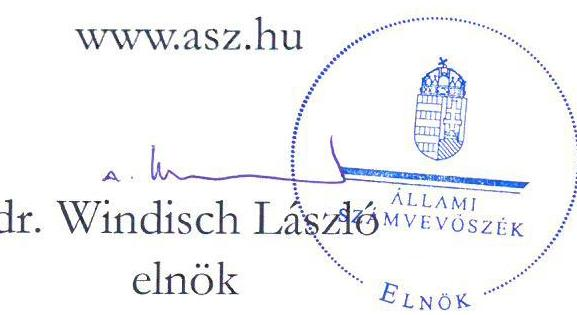
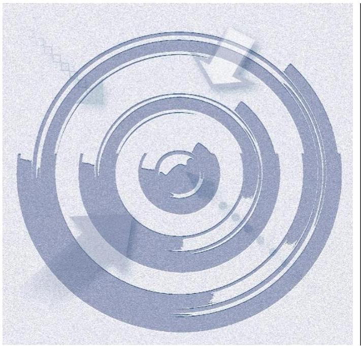
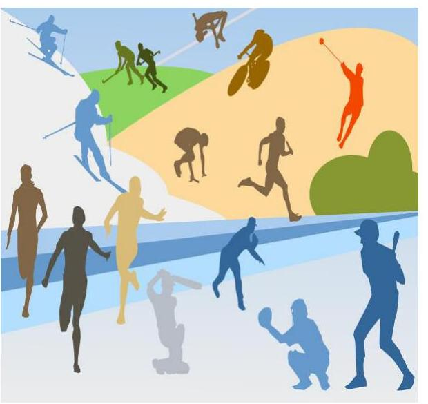
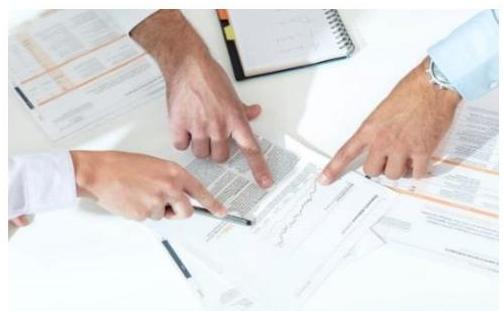

# JELENTÉS 

A költségvetési támogatásban részesülő, számviteli törvény szerinti egyéb szervezetek ellenőrzése Sportegyesületek, sportszövetségek ellenőrzése

372 helyszín

2022

22068
www.asz.hu

---

# JELENTÉS 

A költségvetési támogatásban részesülő, számviteli törvény szerinti egyéb szervezetek ellenőrzése Sportegyesületek, sportszövetségek ellenőrzése

372 helyszín

2022

22068

---

# ELLENŐRZÉSI IGAZGATÓSÁG: 

## ÁLLAMHÁZTARTÁSON KÍVÜLI SZERVEZETEKET ELLENŐRZŐ IGAZGATÓSÁG

## ELLENŐRZÉSI IGAZGATÓ:

KLINGA LÁSZLÓ igazgató

## ELLENŐRZÉSVEZETŐ:

## BALÁZSNÉ ANTONI ERIKA ellenőrzésvezető

DR. SIMON JÓZSEF ellenőrzésvezető

KLINGA LÁSZLÓ ellenőrzésvezető

## IKTATÓSZÁM: EL-3808-001/2022

TÉMASZÁM: 35

ELLENŐRZÉS: V0943

---

# TARTALOMJEGYZÉK 

- ÖSSZEGZÉS ..... 5
- AZ ELLENŐRZÉS CÉLJA ..... 6
- AZ ELLENŐRZÉS TERÜLETE ..... 7
- AZ ELLENŐRZÉS HÁTTERE, INDOKOLTSÁGA ..... 8
- A JELENTÉS LÉNYEGES KÉRDÉSKÖREI ..... 9
- AZ ELLENŐRZÉS HATÓKÖRE ÉS MÓDSZEREI ..... 10
- MEGÁLLAPÍTÁSOK ..... 12
- MELLÉKLETEK ..... 15
I. sz. melléklet: Értelmező szótár ..... 15
II. sz. melléklet: Az ellenőrzött sportszövetségek és sportegyesületek listája ..... 16
- RÖVIDÍTÉSEK JEGYZÉKE ..... 25

---

.

---

# ÖSSZEGZÉS 

A 2020. évben az ellenőrzött 26 sportszövetség mindegyike, és a 346 sportegyesület 89,8\%-a rendelkezett számviteli politikával, pénzkezelési szabályzattal és számlarenddel. A kettős könyvvitelt vezető gazdálkodók közül öt sportszövetség és 125 sportegyesület 2020. évi beszámolója a jogszabályban előírtak ellenére kiegészítő mellékletet nem tartalmazott. A támogatások felhasználásának elkülönített számviteli nyilvántartásával kapcsolatos dokumentumok 24 sportszövetségnél és 256 sportegyesületnél rendelkezésre álltak.

## Az ellenőrzés társadalmi indokoltsága

A sportegyesületek, sportszövetségek múködésükre és szakmai tevékenységük ellátására költségvetési támogatásban, ingyenes vagyonjuttatásban, valamint látvány-csapatsport támogatásban részesülhetnek, amelyekre fokozott figyelem irányul.

Az ellenőrzés a sportegyesületek, sportszövetségek tekintetében elősegíti a jogszabályi előírásoknak megfelelő gazdálkodást. Az ellenőrzés információt szolgáltat arról, hogy a sportegyesületek, sportszövetségek elkészítették-e a jogszabályban előírt számviteli szabályzatokat, továbbá arról, hogy a támogatások és azok felhasználásának elkülönített számviteli nyilvántartása rendelkezésre állt-e.

## Főbb megállapítások

Az ellenőrzött 26 sportszövetség mindegyike, a 346 sportegyesület 89,8\%-a rendelkezett a Számv. tv.-ben előírt számviteli politikával, pénzkezelési szabályzattal, továbbá számlarenddel. Az ellenőrzés 36 sportegyesületnél tárt fel hiányosságokat a számviteli szabályzatokkal kapcsolatban. Négy sportegyesület nem rendelkezett számviteli politikával, három sportegyesület nem rendelkezett pénzkezelési szabályzattal, továbbá a kettős könyvvitelt vezető sportegyesületek közül 31 sportegyesület nem rendelkezett számlarenddel.

A kettős könyvvitelt vezető 25 sportszövetségből öt sportszövetség (20,0\%) és a kettős könyvvitelt vezető 256 sportegyesületből 125 sportegyesület (48,8\%) 2020. évi beszámolója a jogszabályban előírtak ellenére kiegészítő mellékletet nem tartalmazott.

28 sportegyesületnél az alapcél szerinti (közhasznú) tevékenysége költségei, ráfordításai ellentételezésére visszafizetési kötelezettség nélkül kapott támogatásokból származó bevételek, négy sportegyesületnél a központi költségvetésből kapott támogatás, hat sportegyesületnél a helyi önkormányzatoktól kapott támogatás felhasználásának elkülönített számviteli nyilvántartásával kapcsolatos dokumentumok nem álltak rendelkezésre. 77 sportegyesületnél és 2 sportszövetségnél a tevékenység költségei, ráfordításai ellentételezésére kapott támogatásokról olyan elkülönített számviteli nyilvántartással kapcsolatos dokumentumok nem álltak rendelkezésre, amelynek alapján támogatásonként megállapítható és ellenőrizhető lenne a kapott támogatás felhasználása.

---

# AZ ELLENŐRZÉS CÉLJA 

AZ ELLENŐRZÉS CÉLJA annak értékelése, hogy a sportszövetségeknél és sportegyesületeknél az egyes számviteli szabályzatok, a beszámoló elkészítésével, illetve a támogatások felhasználásának elkülönített számviteli nyilvántartásával kapcsolatos dokumentumok rendelkezésre álltak-e. Emellett az ellenőrzéssel összefüggő adatszolgáltatások alapján az Állami Számvevőszék az ellenőrzött szervezetekkel kapcsolatos további ellenőrzési kockázatokat azonosítsa és azokat az ellenőrzések tervezése során hasznosítsa.

---

# **AZ ELLENŐRZÉS TERÜLETE**

## **26 sportszövetség és 346 sportegyesület**

Magyarország Alaptörvényének1 XX. cikke kimondja, hogy mindenkinek joga van a testi és lelki egészséghez, melynek érvényesülését Magyarország többek között a sportolás és a rendszeres testedzés támogatásával segíti elő. Az Országgyűlés a Sport tv.2-ben kinyilvánította, hogy a nemzet közössége a test művelését, a sportot, a nemzet alapértékének, kívánatos célnak tekinti. Ezen államháztartáson kívüli szervezetek működésükre és szakmai tevékenységük ellátására költségvetési támogatásban, illetve ingyenes vagyonjuttatásban részesülhetnek.

Az ellenőrzött költségvetési támogatásban részesült szervezetekből 26 szövetségi, további 346 egyesületi formában működött. A 372 ellenőrzött szervezetből 25 sportszövetség és 256 sportegyesület kettős könyvitelt vezetett.

Az ellenőrzést a sportszövetségeknél és sportegyesületeknél a Számv. tv.3-ben előírt számviteli politikára, a pénzkezelési szabályzatra, a számlarendre, a beszámoló elkészítésével, illetve a támogatások felhasználásának elkülönített számviteli nyilvántartásával kapcsolatos dokumentumokra kiterjedően végezte az ÁSZ4. A Számv. tv. a kettős könyvvitelt vezető gazdálkodók részére olyan számlarend készítésének kötelezettségét írja elő, amely szerinti könyvvezetés a törvényben előírt beszámoló készítését maradéktalanul biztosítja.

A számlarend meghatározza az alkalmazott főkönyvi számlákat, azok tartalmát, bizonylati alátámasztásának rendjét és ezzel biztosítja a beszámoló szabályszerű és a főkönyvi könyvelés adataival összhangban történő elkészítését.

A számviteli politika alapvető fontosságú a szabályszerű könyvvezetés elvégzése, valamint a beszámoló összeállítása szempontjából, mivel rögzíti az ezekhez kapcsolódó gazdálkodóra jellemző szabályokat. A számviteli politika hiánya kockázatot hordoz a megbízható és valós információkat tartalmazó, a számviteli alapelveknek megfelelő számviteli beszámoló összeállítására.

A pénzkezelési szabályzat a szervezet működési sajátosságaihoz igazodva megalapozza a pénzkezelés lebonyolításának rendjét, személyi és tárgyi feltételeit, valamint a bizonylatolás és a nyilvántartás belső szabályait.

Az Ectv5 előírja, hogy a civil szervezet beszámolója tartalmazza a mérleget (egyszerűsített mérleg), az eredménykimutatást (eredménylevezetést), és a kettős könyvvitel esetében a kiegészítő mellékletet.

A kiegészítő melléklet szerepe az, hogy számszerű adatokat, szöveges magyarázatokat tartalmaz a mérlegben, az eredménykimutatásban szereplő adatokon túlmenően, amelyek támogatják az éves eredmények közötti összehasonlíthatóságot, a változások eredményre gyakorolt hatását, a vagyoni, pénzügyi és jövedelmi helyzet megítélését a szervezettel kapcsolatban álló piaci szereplők, a támogatók és a társadalom tagjai számára.

Az Ectv. előírása szerint az elkülönített számviteli nyilvántartás vezetése megteremti annak feltételét, hogy a kapott támogatások felhasználása támogatásonként megállapítható és ellenőrizhető legyen.

---

# AZ ELLENŐRZÉS HÁTTERE, INDOKOLTSÁGA 

Az ÁSZ törvényi kötelezettségének és stratégiájában megfogalmazott céljának eleget téve ellenőrzi a Számv. tv. szerint egyéb szervezetnek minősülő szervezetek gazdálkodását.

Az ÁSZ-nak és a sportegyesületeknek, sportszövetségeknek közös célja, hogy a közpénz felhasználás feltételei biztosítottak legyenek, ezáltal javuljon a közpénzügyi helyzet, a közpénzügyek átláthatósága és rendezettsége. Az ÁSZ további támogatást kíván nyújtani a szervezeteknek szükséges intézkedések megtételéhez, és hozzá kíván járulni ahhoz, hogy a sportszövetségek, sportegyesületek felkészültek legyenek a közpénzek fogadására, valamint a közpénz felhasználásához elengedhetetlen, szabályozott keretek között múködjenek.

---

# A JELENTÉS LÉNYEGES KÉRDÉSKÖREI 

1. A sportszövetségeknél és sportegyesületeknél az ellenőrzött számviteli szabályzatok rendelkezésre álltak-e?
2. A sportszövetségeknél és sportegyesületeknél a beszámoló elkészítésével, illetve a támogatások felhasználásának elkülönített számviteli nyilvántartásával kapcsolatos dokumentumok rendelkezésre álltak-e?

---

# AZ ELLENŐRZÉS HATÓKÖRE ÉS MÓDSZEREI 

## Az ellenőrzés típusa

Szabályszerúségi ellenőrzés.

## Az ellenőrzött időszak

A 2020. év.

## Az ellenőrzés tárgya

Az ellenőrzés a sportszövetségeknél és sportegyesületeknél a számviteli politika, a pénzkezelési szabályzat, a számlarend, a beszámoló elkészítésével, illetve a támogatások felhasználásának elkülönített számviteli nyilvántartásával kapcsolatos dokumentumok ellenőrzésére terjedt ki.

Az ellenőrzés során minden olyan körülmény és adat ellenőrzésre kerül, amely az ellenőrzési program végrehajtása kapcsán felmerült újabb összefüggéseknek az ellenőrzés céljaival összhangban lévő feltárásához szükséges.

## Az ellenőrzött szervezet

A Cnytv. ${ }^{6}$ 4. § c), d) pontjai alapján a bírósági nyilvántartásban szereplő, az Ectv. alapján létrehozott olyan egyesületek, amelyek a Sport tv. szerinti sportszövetségnek, sportegyesületnek és a Számv. tv. 3. § (1) bekezdés 4. a) pontja szerinti egyéb szervezeteknek minősülnek, és amelyek költségvetési, vagy látvány-csapatsport támogatásban részesülhetnek. Az ellenőrzött szervezetek listáját a II. melléklet részletezi.

## Az ellenőrzés jogalapja

Az ÁSZ tv. ${ }^{7}$ 1. § (3) bekezdése, 5. § (3) bekezdése.

## Az ellenőrzés módszerei

Az ellenőrzés a sportszövetségek, sportegyesületek nagy számosságú csoportjának egy-egy jellegzetes, lényegi területére fókuszált.

Az ÁSZ az ellenőrzést az ellenőrzési program szempontjai, kérdései, az ellenőrzött időszakban hatályos jogszabályok, a nemzetközi standardokat

---

irányadónak tekintve, a szabályszerűségi ellenőrzésre irányadó ÁSZ módszertan figyelembevételével végezte.

Az ellenőrzési kérdések megválaszolásához szükséges bizonyítékok megszerzése az ellenőrzött által rendelkezésre bocsátott dokumentumokra, adatokra alapozva történt.

Az ellenőrzési bizonyítékként felhasználható adatforrások közé tartoztak egyrészt az ellenőrzési program részletes szempontjainál felsorolt adatforrások, másrészt minden - az ellenőrzés folyamán feltárt, az ellenőrzés szempontjából információt tartalmazó - dokumentum.

Az ellenőrzés lefolytatásához az ellenőrzött szervezet a kitöltött tanúsítványok, valamint az ÁSZ által meghatározott dokumentumok rendelkezésre bocsátásával szolgáltatott adatokat, információkat.

---

# MEGÁLLAPÍTÁSOK 

## 1. A sportszövetségeknél és sportegyesületeknél az ellenőrzött számviteli szabályzatok rendelkezésre álltak-e?

Összegző megállapítás

A sportszövetségek eleget tettek a számviteli politika, a pénzkezelési szabályzat és a számlarend készítési kötelezettségüknek. A sportegyesületek 89,8\%-a rendelkezett számviteli politikával, pénzkezelési szabályzattal és számlarenddel. Jellemző hiba volt a számlarend készítési kötelezettség teljesítésének elmaradása.

A 26 SPORTSZÖVETSÉG a Számv. tv.-ben előírt számviteli politikát, pénzkezelési szabályzatot és a számlarendet elkészítette.

A 346 SPORTEGYESÜLET 89,8\%-a rendelkezett a Számv. tv.ben előírt számviteli politikával, pénzkezelési szabályzattal, továbbá számlarenddel.
$\longrightarrow$ Négy sportegyesület nem rendelkezett a Számv. tv. 14. § (3) bekezdésében előírt számviteli politikával.
$\longrightarrow$ Három sportegyesület nem rendelkezett a Számv. tv. 14. § (5) bekezdés d) pontjában előírt pénzkezelési szabályzattal.
$\longrightarrow$ A kettős könyvvitelt vezető sportegyesületek közül 31 sportegyesület $(12,1 \%)$ a Számv. tv. 161. § (1) bekezdésében előírtak ellenére számlarendet nem készített.

## 2. A sportszövetségeknél és sportegyesületeknél a beszámoló elkészítésével, illetve a támogatások felhasználásának elkülönített számviteli nyilvántartásával kapcsolatos dokumentumok rendelkezésre álltak-e?

Összegző megállapítás

A 2020. évi beszámoló kiegészítő melléklete elkészítési kötelezettségének a kettős könyvvitelt vezető szervezetek közül 25 sportszövetség egyötöde, a 256 sportegyesület közel fele nem tett eleget. A támogatások felhasználásának elkülönített számviteli nyilvántartásának dokumentumai 24 sportszövetségnél és 256 sportegyesületnél rendelkezésre álltak.

A KETTŐS KÖNYVVITELT vezető 25 sportszövetségből öt sportszövetség (20,0\%) és a kettős könyvvitelt vezető 256 sportegyesületből 125 sportegyesület (48,8\%) 2020. évi beszámolója az Ectv. 29. § (2) bekezdés c) pontjában előírtak ellenére kiegészítő mellékletet nem tartalmazott.

---

# A TÁMOGATÁSOK ELKÜLÖNÍTETT SZÁMVITELI NYILVÁNTARTÁSÁVAL KAPCSOLATOS DOKUMENTUMOK két sportszövetség és 90 sportegyesület tekintetében nem álltak rendelkezésre. 

- 28 sportegyesület az Ectv. 20. § (1) bekezdés c) pontjában szereplő előírás ellenére az alapcél szerinti (közhasznú) tevékenysége költségei, ráfordításai ellentételezésére visszafizetési kötelezettség nélkül kapott támogatásokból származó bevételeket elkülönítetten nem mutatta ki.
- Négy sportegyesület az Ectv. 20. § (3) bekezdés a) pontjában szereplő előírás ellenére az államháztartási forrásból kapott támogatáson belül a központi költségvetésből kapott támogatást elkülönítetten nem mutatta ki.
- Hat sportegyesület az Ectv. 20. § (3) bekezdés c) pontjában szereplő előírás ellenére az államháztartási forrásból kapott támogatáson belül a helyi önkormányzatoktól kapott támogatást elkülönítetten nem mutatta ki.
- 77 sportegyesület és 2 sportszövetség az Ectv. 20. § (4) bekezdésében szereplő előírás ellenére az alapcél szerinti (közhasznú) tevékenysége költségei, ráfordításai ellentételezésére kapott támogatásokról nem vezetett olyan elkülönített számviteli nyilvántartást, amelynek alapján támogatásonként megállapítható és ellenőrizhető a kapott támogatás felhasználása.

---

.

---

# MELLÉKLETEK 

- I. SZ. MELLÉKLET: ÉRTELMEZŐ SZÓTÁR
civil szervezet
költségvetési támogatás
költségvetési támogatás
támogatás
látvány-csapatsport
látvány-csapatsport támogatása
sportegyesület

Sportegyesületeknek nyújtott költségvetési támogatás
sportszövetség
a civil társaság; a Magyarországon nyilvántartásba vett egyesület - a párt, a szakszervezet és a kölcsönös biztosító egyesület kivételével és - a közalapítvány és a pártalapítvány kivételével - az alapítvány. (Forrás: Ectv. 2. § 6. pont a)-c) pontjai)
az államháztartás alrendszerei terhére nyújtott pénzbeli vagy nem pénzbeli juttatás, amelyet a támogató nem ellenszolgáltatás ellenében, de konkrét program megvalósítása vagy meghatározott időszakban a támogató szervezet működése érdekében nyújt. (Forrás: Ectv. 2. § 15. bekezdés. Hatálytalan: 2020. VII. 1-től)
a társadalombiztosítás pénzügyi alapjai kivételével az államháztarás központi alrendszeréből ellenérték nélkül pénzben nyújtott támogatások. (Forrás: Áht. ${ }^{8}$ 1. § 14. pontja)
az államháztartás központi vagy önkormányzati alrendszeréből, bármilyen formában, ellenérték nélkül nyújtott juttatás. (Forrás: Áht. 1. § 19. pontja)
a labdarúgás, a kézilabda, a kosárlabda, a vízilabda, a jégkorong, valamint a röplabda sportág (Forrás: TAO tv. ${ }^{9} 4 . \S 41$. pont)
az adóévben visszafizetési kötelezettség nélkül nyújtott támogatás, juttatás, véglegesen átadott pénzeszköz és térítés nélkül átadott eszköz könyv szerinti értéke, az adóévben térítés nélkül nyújtott szolgáltatás bekerülési értéke a TAO tv.-ben meghatározott jogcímeken. (Forrás: TAO tv. 4. § 44. pont)
Sportegyesület - a Sport tv.-ben megállapított eltérésekkel - az egyesülési jogról, a közhasznú jogállásról, valamint a civil szervezetek múködéséről és támogatásáról szóló törvény (a továbbiakban: Ectv.) és a Polgári Törvénykönyv ${ }^{10}$ szabályai szerint működő olyan egyesület, amelynek alaptevékenysége a sporttevékenység szervezése, valamint a sporttevékenység feltételeinek megteremtése. A sportegyesület a magyar sport hagyományos szervezeti alapegysége, a versenysport, a tehetséggondozás, az utánpótlás-nevelés és a szabadidősport múhelye. (Forrás: Sport tv. 16.§ (1)-(2) bekezdés.
az állami sport célú támogatások felhasználásáról és elosztásáról szóló 27/2013. (III. 29.) EMMI ${ }^{11}$ rendelet 1. §-ában meghatározott fejezeti kezelésű előirányzatokból nyújtott támogatás.
A sportszövetségek meghatározott sporttevékenységek körében a sportversenyek szervezésére, a tagok érdekvédelmére és a részükre való szolgáltatásokra, valamint a nemzetközi kapcsolatok lebonyolítására létrehozott, jogi személyiséggel és önkormányzattal rendelkező, az Ectv. és a Polgári Törvénykönyv alapján - a Sport tv.-ben foglalt eltérésekkel - különös formában múködő egyesületek. (Forrás: Sport tv. 19. § (1) bekezdés)

---

II. SZ. MELLÉKLET: AZ ELLENŐRZÖTT SPORTSZÖVETSÉGEK ÉS SPORTEGYESÜLETEK LISTÁJA

|  Sorszám | Sportszövetségek és sportegyesületek megnevezése  |
| --- | --- |
|  1. | Nemzeti Aikido Szövetség-Magyarország  |
|  2. | Magyar Judo Szövetség  |
|  3. | MAGYAR ÚSZÓ SZÖVETSÉG  |
|  4. | Magyar Kajak-Kenu Szövetség  |
|  5. | MAGYAR VÍVÓ SZÖVETSÉG  |
|  6. | Magyar Birkózók Szövetsége  |
|  7. | Magyar Tenisz Szövetség  |
|  8. | MAGYAR ATLÉTIKAI SZÖVETSÉG  |
|  9. | Magyar Kosárlabdázók Országos Szövetsége  |
|  10. | MAGYAR TORNA SZÖVETSÉG  |
|  11. | MAGYAR ORSZÁGOS KORCSOLYÁZÓ SZÖVETSÉG  |
|  12. | Magyar Vízilabda Szövetség  |
|  13. | MAGYAR ÖKÖLVÍVÓ SZAKSZÖVETSÉG  |
|  14. | Magyar Röplabda Szövetség  |
|  15. | Magyar Vitorlás Szövetség  |
|  16. | MAGYAR SÚLYEMELŐ SZÖVETSÉG  |
|  17. | Magyar Jégkorong Szövetség  |
|  18. | Magyar Szinkronúszó Szövetség  |
|  19. | MAGYAR ASZTALITENISZ SZÖVETSÉG  |
|  20. | Magyar Golf Szövetség  |
|  21. | Magyar Szörf Szövetség  |
|  22. | MAGYAR TÁNCSPORT SZAKSZÖVETSÉG  |
|  23. | MAGYAR TÁJÉKOZÓDÁSI FUTÓ SZÖVETSÉG  |
|  24. | MAGYAR MINIGOLF ORSZÁGOS SPORTÁGI SZAKSZÖVETSÉG  |
|  25. | Magyar Golyósportok Szövetsége  |
|  26. | Dámajátékosok Magyarországi szövetsége  |
|  27. | Sportsziget Verseny- és Szabadidős Sportegyesület  |
|  28. | Békessy Béla Vívó Klub  |
|  29. | Tatabánya Városi Szabadidősport Szövetség  |
|  30. | Nagykun Diáksport Egyesület  |
|  31. | Nagyatádi Judo Club  |
|  32. | Nagyhajmási Sport Egyesület  |
|  33. | Nagykanizsai Bridzs Sportegyesület  |
|  34. | Nagyvázsonyi Kinizsi Tornaegylet  |
|  35. | Nóva Sport Egyesület  |
|  36. | Nyalkai Sportkör  |
|  37. | Nyírségi Futók Sportegyesület  |
|  38. | Óbuda Kenguru Szabadidő Sportegyesület  |
|  39. | Olajos Tekeklub  |
|  40. | Öregfiúk'73 Football Kör Bonyhád  |
|  41. | Pálháza Sport és Természetbarátok Egyesülete  |

---

| Sorszám | Sportszövetségek és sportegyesületek megnevezése |
| :--: | :--: |
| 42. | Pécsi Orvos-Egészségügyi Sportkör |
| 43. | PELSO Sportegyesület |
| 44. | Pincehelyi Asztalitenisz és Tömegsport Egyesület |
| 45. | PoleCats Rúdtánc és Légtorna Sportegyesület |
| 46. | Pórszombati Községi Sportegyesület |
| 47. | Postagalambsport Egyesület Kiskunhalas |
| 48. | Pusztamérgesi Sportegyesület |
| 49. | RUMBA Táncsport Egyesület |
| 50. | Sarkadi Lendület 2010 Tenisz és Sportegyesület |
| 51. | Solti AC Sportegyesület |
| 52. | Sólyom Kézilabda Sportegyesület |
| 53. | Sopronkövesdi Tenisz Sportegyesület |
| 54. | Spartacus Sportkör Keszthely |
| 55. | Szabadidős és Kick-box Sportegyesület |
| 56. | Szegedi Dózsa Kajak-Kenu Sportegyesület |
| 57. | Szolnoki Szupercsapat Asztalitenisz Sportegyesület |
| 58. | Tass Községi Sportegyesület |
| 59. | Tolna Megyei Fogyatékosok Sportszövetsége |
| 60. | Ütős-Sport Egyesület |
| 61. | V-33 Gyöngyös és Környéke Postagalambsport Egyesület |
| 62. | Viadukt Bridzs Sportegyesület |
| 63. | Vízisport Club Tokaj |
| 64. | X-TREME HIP- HOP DANCE SCHOOL SPORTEGYESÜLET |
| 65. | Zanshin Aikido Sportegyesület |
| 66. | Zrínyi Miklós Gimnázium Diáksport Egyesülete |
| 67. | Zsigmondy-Winkler Diáksport Egyesület |
| 68. | Diswake Mozgássérült Wakeboard Sportegyesület |
| 69. | Körmendi Darts Club Sport és Kulturális Egyesület |
| 70. | Ifj. Fehér József Diák és Szabadidő Sportegyesület |
| 71. | Kovács Vince Birkózó Sportegyesület Körmend |
| 72. | "Bárczi Diáksport" Egyesület |
| 73. | Maglódi Tenisz Klub |
| 74. | Palkovics-Team Fogathajtó Sportegyesület |
| 75. | Vasboldogasszonyi Lakóterületi Sport Club |
| 76. | Sasfiókák Utánpótlás Sportegyesület |
| 77. | Nagymizdói Sportegyesület |
| 78. | Pokloskút Lovas Sport Egyesület |
| 79. | Rencsi Lovassport Egyesület |
| 80. | Sárkeresztúri VIHAR Lovas Egyesület |
| 81. | Szabolcs MediBall Életmódfejlesztő, Szabadidős és Sportegyesület |
| 82. | Uszód Községi Sportegyesület |
| 83. | Várnai Benedek Sportegyesület |
| 84. | Vonyarcvashegyi Vízisport Egyesület |

---

| Sorszám | Sportszövetségek és sportegyesületek megnevezése |
| :--: | :--: |
| 85. | WU DE Harcművészeti Egyesület |
| 86. | Zöldpont Életmódklub |
| 87. | Csőváz Kerékpáros Sportegyesület |
| 88. | Jákfalva Sportegyesület |
| 89. | Ferencvárosi Torna Club |
| 90. | VASAS SPORT CLUB |
| 91. | Budapesti Honvéd Sportegyesület |
| 92. | Pécsi Egyetemi Atlétikai Club |
| 93. | Szombathelyi MÁV Haladás Vasutas Sportegyesület |
| 94. | Sportegyesületek Országos Szövetsége |
| 95. | Budapesti Baseball és Softball Szövetség |
| 96. | MAGYAR RITMIKUS GIMNASZTIKA SZÖVETSÉG |
| 97. | Magyar Szkander Szövetség |
| 98. | Úrküti Sportkör |
| 99. | CEGLÉDI VASUTAS SPORT EGYESÜLET |
| 100. | FOREST HILLS GOLF \& COUNTRY CLUB |
| 101. | Győri Atlétikai Club - II. kerület Dózsa |
| 102. | MAGYAR HALLÁSSÉRÜLTEK SPORTSZÖVETSÉGE |
| 103. | SZENTLŐRINCI SPORTEGYESÜLET |
| 104. | Tiszafüredi Városi Sportegyesület |
| 105. | Tengu Dojo Harcművészeti Ifjúsági és Sportegyesület |
| 106. | Óbudai Wellness és Diáksport Egyesület |
| 107. | Borsodnádasd Fitness Sport Egyesület |
| 108. | Lippói Körzeti Sportegyesület |
| 109. | Sportegyesület Vitnyéd |
| 110. | Csikvánd Sportegyesület |
| 111. | Diósdi Diák Sportegyesület |
| 112. | Montevigo Sportegyesület |
| 113. | Adászteveli Sportegyesület |
| 114. | PACS-PACS Községi Sportegyesület |
| 115. | Kelebiai Levente Sportegyesület |
| 116. | Abda Sport Club |
| 117. | Miskolci Egyetem Atlétikai és Futball Club |
| 118. | SÉNYŐ-CARNIFEX FUTBALL CLUB |
| 119. | Sioktatók Magyarországi Szövetsége |
| 120. | Szentistváni Titán Sportegyesület |
| 121. | Pécsi Vasutas Sportkör |
| 122. | Csömöri Asztalitenisz Klub Egyesület |
| 123. | Debrecen Városi Lövész Egylet |
| 124. | Sopron Városi Szabadidősport Szövetség |
| 125. | Sport- és Ifjúság- és Természetvédelmi Sport Egyesület |
| 126. | Kecskemét Városi Szabadidősport Szövetség |
| 127. | Vadkacsa Leányfalui Gyermek Vízi Flotta Közhasznú Egyesület |

---

| Sorszám | Sportszövetségek és sportegyesületek megnevezése |
| :--: | :--: |
| 128. | Secondwind Mátrafüredi Közhasznú Sportegyesület |
| 129. | Napraforgó Kulturális, Érdekvédelmi és Sport Egyesület |
| 130. | Pécs Városi Lövészklub |
| 131. | Zalaegerszegi Városi Szabadidősport Szövetség |
| 132. | Balaton Sport Lövész Klub Balatonszárszó |
| 133. | Fejér Megyei Lovassport Szövetség |
| 134. | Kiskunfélegyházi Városi Tenisz Klub Egyesület |
| 135. | Nyíregyházi Polgári Lövész Egyesület |
| 136. | Rábatamási Sportkör |
| 137. | HÖD-FITNESS Sport Egyesület |
| 138. | Kaposszekcső-Csikóstöttős Közös Sportegyesület |
| 139. | Ecseri Kulturális és Sport Egyesület |
| 140. | Kecskeméti Amatőr Teniszezők Egyesülete |
| 141. | Kisteleki Sportegylet |
| 142. | Babócsai Sport, Tömegsport, Kulturális- és Szabadidő Egyesület |
| 143. | Fertőszéplaki Sportkör |
| 144. | Hidvégardó Községi Sportegyesület |
| 145. | K. Öcsárd Sportegyesület |
| 146. | KLASSZ-X Szabadidő- és TáncSport Egyesület |
| 147. | Marcaltő-Ihász Kulturális és Sportegyesület |
| 148. | Monostorpályi Sportegyesület |
| 149. | Pusztaszeri Ifjúsági és Szabadidős Sportegyesület |
| 150. | Rábacsécsényi Sportegyesület |
| 151. | REMONDA Szabadidős, Lovas- és Sportegyesület |
| 152. | Sportolj a Bajnokkal Sportegyesület |
| 153. | Szilver Táncsport Egyesület |
| 154. | Tóhajlat Rekreációs- és Sportegyesület |
| 155. | Mezősasi Sportegyesület |
| 156. | Baksai Sportegyesület |
| 157. | Szár Községi Sportegyesület |
| 158. | Murai Rafting Vízitúra Egyesület |
| 159. | Szigetvári Birkózó Sport Egyesület |
| 160. | Tuzsér Sportegyesület |
| 161. | Bólyi Cápák Sportegyesület |
| 162. | Gócsej Sportegyesület |
| 163. | Zalaegerszegi Atlétikai Club |
| 164. | "Kapostáj" Zimány községi Sportegyesület |
| 165. | Mélykúti Lovas Egyesület |
| 166. | Egyed Községi Sportegyesület |
| 167. | Kiskunfélegyházi Birkózó Sportegyesület |
| 168. | Asztalitenisz Sport Klub Szeged |
| 169. | Hódmezővásárhelyi Asztalitenisz Sport Egyesület |
| 170. | Kihívás Ifjúsági és Sport Egyesület |

---

| Sorszám | Sportszövetségek és sportegyesületek megnevezése |
| :--: | :--: |
| 171. | Szombathelyi Asztalitenisz Kör |
| 172. | Vértesi Tömegsport Közhasznú Egyesület |
| 173. | Tamási TAM-BAU Atlétikai Club Egyesület |
| 174. | IUSTITIA Sport- és Kulturális Egyesület |
| 175. | Siklós Sportegyesület |
| 176. | Hernádkércs Sport Egyesület |
| 177. | Díjugratók, Hagyományőrzők és Fogathajtók Sportegyesülete |
| 178. | Tornai Sportegyesület |
| 179. | IMPÉRIUM Ökölvivó Sportegyesület |
| 180. | Kecskeméti Chen Shi Xinyi Hunyuan Tai Ji Quan Sportegyesület |
| 181. | Mosonmagyaróvári Vízisport Egyesület |
| 182. | Alcsútdoboz Községi Sportegyesület |
| 183. | Rákoshegyi Vasutas SE. |
| 184. | Nagykarácsony Center Sportegyesület |
| 185. | Venus Rúdsport Egyesület |
| 186. | Parasznyai Sportegyesület |
| 187. | Fittbike Sportegyesület |
| 188. | Budapesti Lawn Tenisz és Korcsolya Egylet |
| 189. | Zöld Sportok Clubja |
| 190. | Crystal Fitness Sportegyesület |
| 191. | K.I.N.G. Kulturális és Szabadidős Sportegyesület |
| 192. | Országos Veterán Labdarúgó Sport Egyesület |
| 193. | Siófoki Vizi Sportkör |
| 194. | "FutaFöld" Versenyszervező és Szabadidő Sport Egyesület |
| 195. | A.F.K. Kulturális, Szabadidős és Sportegyesület |
| 196. | Abaúji Kerékpár Sportegyesület |
| 197. | ALOXID Vízisport Egyesület |
| 198. | Alpokalja Szabadidő és Extrém Sportklub |
| 199. | Alsódobszai Hernádmenti Természetvédelmi Kulturális és Sport Egyesület |
| 200. | Apagy Asztalitenisz, Szabadidős Sportegyesület |
| 201. | Bekecsi Birkózó Club Egyesület |
| 202. | Békéscsabai Nimród Lovasegyesület |
| 203. | Beledi Delta Testépítő Klub |
| 204. | Berhidai Lovasok Közhasznú Sportegyesület |
| 205. | Bükki Hegy- és Sportmászó Egyesület |
| 206. | Bátonyterenyei Shotokan Karate Sportegyesület |
| 207. | Aikido Kids Ifjúsági és Szabadidősport Egyesület |
| 208. | Alsónána Sport Egyesület |
| 209. | A-Team Agility Sportegyesület |
| 210. | Bajai Asztalitenisz Sport Egyesület |
| 211. | Balatonfüredi Ökölvivó Club |
| 212. | Békéscsabai E-sport Egyesület |
| 213. | ÁHI JÓGA EGYESÜLET |

---

| Sorszám | Sportszövetségek és sportegyesületek megnevezése |
| :--: | :--: |
| 214. | Ciprinus Sporthorgász Egyesület |
| 215. | CrossTraining 9330 Sport Egyesület |
| 216. | Csege Gyermek és Ifjúsági Természetbarát Egyesület |
| 217. | Csereháti Tömegsport Egyesület |
| 218. | Csillagtanya Lovas Egyesület |
| 219. | Csongrádi Íjász Sport Egyesület |
| 220. | Debreceni Muay-Thai BoNR Sportegyesület |
| 221. | Derecske ÁFÉSZ Városi Lövész és Tömegsport Klub |
| 222. | Sportegyesület Győrsövényház |
| 223. | Pingpongozz Velünk Sportegyesület |
| 224. | Sporttal az Ifjúságért Sportegyesület |
| 225. | Magyar Lábtoll-labda Szövetség |
| 226. | Sportolj Szabadidő Egyesület |
| 227. | B-26. Magyar Postagalambsport Egyesület |
| 228. | Cédrus Múvelődési és Sport Egyesület |
| 229. | Etyek Sportegyesület |
| 230. | VAX Sí és Snowboard Egyesület |
| 231. | Hétkerék Közösségfejlesztő, Hagyományőrző, Természetbarát Egészségvédő Turisztikai Sportegyesület |
| 232. | Magyarbólyi Labdarúgó Egyesület |
| 233. | Katolikus Iskolák Diák Sportszövetsége |
| 234. | Katamarán Sportegyesület |
| 235. | Magyar Múhely Sportegyesület |
| 236. | Dunaparti Sportegyesület |
| 237. | VIGÓ Sport Egyesület |
| 238. | DUNAKANYAR SPORTEGYESÜLET |
| 239. | FIT-LINE Sportegyesület |
| 240. | HIDEAWAY CLUB Sportegyesület |
| 241. | Mozaik Med Sportegyesület |
| 242. | PONT JÓ! Vitorlás és Gokart Sportegyesület |
| 243. | PRO NIVO Oktatási, Sport-, és Szabadidő Egyesület |
| 244. | Zala Megyei Szabadidősport Szövetség |
| 245. | Szarvasi Röplabdások Baráti Köre Sport Egyesület |
| 246. | Tornádó Team Korcsolyázó Sportegyesület |
| 247. | Kiskunfélegyházi Motorsport Egyesület |
| 248. | Szentes Városi Úszó Club |
| 249. | Érdi Judo Club Sport Egyesület |
| 250. | Revans Darts Sportegyesület |
| 251. | Szentesi Repülöklub |
| 252. | Tápiósági Községi Sportkör |
| 253. | Veszprémi Dózsa Sport Kör |
| 254. | Dombóvári Hangulat Szabadidő Sportegyesület |
| 255. | Dráva Természetbarát Sport Egyesület |
| 256. | Dunapataji Lövész, Íjász és Szabadidősport Egyesület |

---

| Sorszám | Sportszövetségek és sportegyesületek megnevezése |
| :--: | :--: |
| 257. | Homokbödöge Sport Klub |
| 258. | Adonyi Evezős és Vízisport Egyesület |
| 259. | Alföldi Kerekesek Egyesülete |
| 260. | ANONYMUS Motoros Egyesület |
| 261. | Apácatornai Labdarúgó Club |
| 262. | Bajnok Diák-Sportegyesület |
| 263. | Csenger Városi Kézilabda és Sport Club |
| 264. | Debreceni Kárpát Egyesület |
| 265. | douBULL DARTS CLUB EGYESÜLET |
| 266. | Dr. Regele Károly Senior Úszó Klub |
| 267. | Dunakeszi Sárkányhajó, Kajak-kenu és Önkéntes Tűzoltó Egyesület |
| 268. | Egis Gyógyszergyár Dolgozóinak Szabadidő Egyesülete |
| 269. | Egri Ritmikus Sportgimnasztika Tömegsport Egyesület |
| 270. | Fehérlófia Sportegyesület |
| 271. | FITT Anyuka Boldog Baba Sportegyesület |
| 272. | Fitt Forma Kistelek, Egészségvédő, Életmód-és Sportegyesület |
| 273. | Forrás Szabadidős Diáksport Egyesület |
| 274. | Futárok Sport Club |
| 275. | Gazdasági és Közlekedési Minisztérium Sportegyesülete |
| 276. | Gyomaendrőd Kis Bálint Általános Iskola Sport Egyesület |
| 277. | Gyömörei Sportkör |
| 278. | Hajdúnánás Sportklub |
| 279. | Harcosiskola Harcművészeti Egyesület |
| 280. | Határmenti Sportegyesület Vasalja |
| 281. | Hattyú Vízisport Egyesület |
| 282. | Hegedűs Karate Sportegyesület 2005 |
| 283. | Horseland Lovasklub Közhasznú Egyesület |
| 284. | Igal Sportegyesület |
| 285. | KAGAMI Sportegyesület |
| 286. | Kantár Lovas Club Sportegyesület |
| 287. | Kantár-hegyi Lovas Egyesület |
| 288. | KARDOS Tánc Sport Egyesület |
| 289. | Kardos-Örménykút Községi Sport Klub |
| 290. | Kecskeméti ÉDOSZ Kinizsi Természetbarát Sportegyesület |
| 291. | Kid Fitness Hungary Sportegyesület |
| 292. | Kisteleki Petőfi Sándor Diák Sportegyesület |
| 293. | Kötegyáni Futball Club |
| 294. | Kriszfit Fanatic Szabadidő Sportegyesület |
| 295. | Kunsági ÖKO FITT Természetjáró Sportegyesület |
| 296. | Kunszentmiklósi Középiskolás Diák Sport Egyesület |
| 297. | Kunszentmiklósi Páli Sándor Lovas Sportegyesület |
| 298. | Küzdő Sportegyesület |
| 299. | Magyargencsi Sportegyesület |

---

| Sorszám | Sportszövetségek és sportegyesületek megnevezése |
| :--: | :--: |
| 300. | Makádi Sport és Kulturális Egyesület |
| 301. | Molnári Ifjúsági és Sportegyesület |
| 302. | Mozgássérültek Állami Intézete Sport Egyesület |
| 303. | Mozgássérültek Összetartás Sportegyesület |
| 304. | Mozsgói "Csizik Mihály" Sportegyesület |
| 305. | Pápa és Környéke Asztalitenisz Sportegyesület |
| 306. | Polgári Lövészsport Egyesület |
| 307. | Rendészeti Sport Egyesület Körmend |
| 308. | Rotpunkt Sziklamászó Egyesület |
| 309. | Sördögök Sportegyesület |
| 310. | SPURKERÉK Modellező Sportegyesület |
| 311. | Stabilitás Sport Promotion Sportegyesület |
| 312. | Szentesi Tekézők Sportegyesülete |
| 313. | Vágtázó Kenu Tábor Egyesület |
| 314. | VARGA DOJO Szabadidős és Sportegyesület |
| 315. | Veszprém Megyei Testnevelő Tanárok Egyesülete |
| 316. | Zemplén Ifjúsági és Sport Innovációs Egyesület |
| 317. | Gémes Természetjáró Egyesület |
| 318. | Kapuvári Lóbarátok Köre Egyesület |
| 319. | MISTRAL Ifjúsági és Szabadidő Egyesület Kisvárda |
| 320. | Nagyhegyesi Íjász Egyesület |
| 321. | OLD BIKERS EGYESÜLET |
| 322. | Pestkörnyéki Kárpát Egyesület |
| 323. | Seregélyesi Sakk Egyesület |
| 324. | TAMÁSI ENDURÓ ÉS MOTOCROSS EGYESÜLET |
| 325. | XIX. kerületi Természetbarát Szövetség |
| 326. | Csongrád Idegenforgalmi Igazgatóság Sportegyesület |
| 327. | Csepel Karate Sportegyesület |
| 328. | APEX Optimista Sportegyesület |
| 329. | Bodor Lovas Klub Sport Egyesület |
| 330. | Bonton Tánc Sport Egyesület |
| 331. | Csanyteleki Diák és Szenior Sport és Szabadidős Egyesület |
| 332. | Csongrádi Diák Sportegyesület |
| 333. | Csongrádi Kajak-Kenu Club |
| 334. | Délegyházi Karate Sportegyesület |
| 335. | Dr. Papp László Birkózó Egyesület |
| 336. | Egri Spartacus Tájékozódási Futó Sportegyesület |
| 337. | Fekete Lovagok Sportegyesület |
| 338. | Hajdúhadházi Kosárlabdaklubb |
| 339. | Kecskeméti Sportegyesületek Szövetsége |
| 340. | Kecskési, Alsóvárosi Szabadidő és Sport Egyesület |
| 341. | Kiskőrösi Petőfi Birkózó Klub Egyesület |
| 342. | Kőbányai Sportegyesületek és Sportszervezetek Szövetsége |

---

| Sorszám | Sportszövetségek és sportegyesületek megnevezése |
| :--: | :--: |
| 343. | Marosmenti Szabadidős Sportegyesület |
| 344. | Mindszenti Lovas Klub |
| 345. | Mórahalmi Lovassport Egyesület |
| 346. | Palota-Vidék 2000 Öskü FC |
| 347. | Rády József Lovas Sportegyesület és Tolna Megyei Huszárbandérium |
| 348. | Sólyi Sportegyesület |
| 349. | Szabadidős Lovas Klub |
| 350. | Szentgáli Technikai, Terem- és Tömegsport Egyesület |
| 351. | Tisza Tenisz Club |
| 352. | Újpest Sport Club |
| 353. | Vitál Sport és Szabadidő Egyesület |
| 354. | Vitalitás Sportegyesület |
| 355. | Pécsi Ifjúsági Természetjáró Egyesület |
| 356. | Nyíregyházi Asztalitenisz és Tömegsport Club |
| 357. | Szögliget Községi Sportegyesület |
| 358. | Kondorosi Atléták Sport Egyesülete |
| 359. | BVSC-ZUGLÓ KÖZHASZNÚ EGYESÜLET |
| 360. | "Spárta" Kempo Harcművészeti Sport- és Életmód Egyesület |
| 361. | Napraforgó Kulturális, Szabadidős és Sport Egyesület |
| 362. | Egri Polgári Lövész Egylet |
| 363. | Bátmonostori Atlas Sportegyesület |
| 364. | Bányász Labdarúgó Club Rudabánya |
| 365. | Boldogasszony Papucsa Természetjáró Egyesület |
| 366. | Győri Unicentrál Sport Egyesület |
| 367. | Máriapócsi Labdarúgó Sportklub |
| 368. | Western Lövész Sportegyesület |
| 369. | Kanizsa Íjász Egyesület |
| 370. | Somogy Megyei Természetbarát Szövetség |
| 371. | Tatabányai Fitt Club Egyesület |
| 372. | Bükkaranyosi Sportegyesület |

---

# RÖVIDÍTÉSEK JEGYZÉKE 

${ }^{1}$ Alaptörvény
${ }^{2}$ Sport tv.
${ }^{3}$ Számv. tv.
${ }^{4}$ ÁSZ
${ }^{5}$ Ectv.
${ }^{6}$ Cnytv.
${ }^{7}$ ÁSZ tv.
${ }^{8}$ Áht.
${ }^{9}$ TAO tv.
${ }^{10}$ Polgári Törvénykönyv
${ }^{11}$ EMMI

Magyarország Alaptörvénye
a sportról szóló 2004. évi I. törvény
a számvitelről szóló 2000. évi C. törvény
Állami Számvevőszék
az egyesülési jogról, a közhasznú jogállásról, valamint a civil szervezetek müködéséről és támogatásáról szóló 2011. évi CLXXV. törvény
a civil szervezetek bírósági nyilvántartásáról és az ezzel összefüggő eljárási szabályokról szóló 2011. évi CLXXXI. törvény
az Állami Számvevőszékről szóló 2011. évi LXVI. törvény
az államháztartásról szóló 2011. évi CXCV. törvény
a társasági adóról és az osztalékadóról szóló 1996. évi LXXXI. törvény
a Polgári Törvénykönyvről szóló 2013. évi V. törvény
Emberi Eröforrások Minisztériuma

---

1052 Budapest, Apáczai Csere János u. 10. | 1364 Budapest 4., Pf. 54
www.asz.hu | szamvevoszek@asz.hu
telefon: +36 14849100