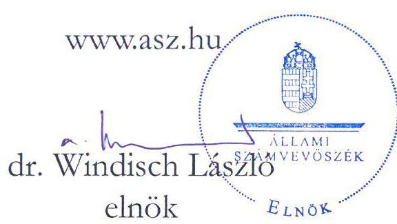
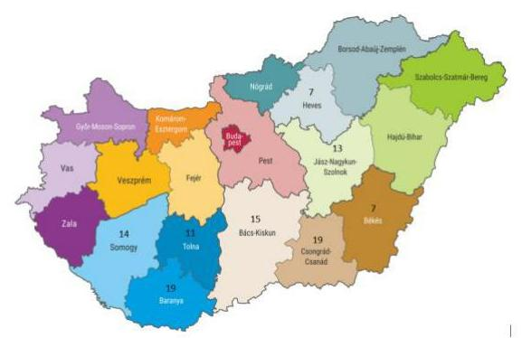

# JELENTÉS 

## A nemzeti tulajdonú gazdasági társaságok pénzügyi monitoring alapján végzett ellenőrzése

105 gazdasági társaság

2022.

---

# JELENTÉS 

## A nemzeti tulajdonú gazdasági társaságok pénzügyi monitoring alapján végzett ellenőrzése

105 gazdasági társaság

2022.

22069

---

# ELLENŐRZÉSI IGAZGATÓSÁG: 

## ÁLLAMHÁZTARTÁS HELYI SZINTJÉT ELLENŐRZŐ IGAZGATÓSÁG

## ELLENŐRZÉSI IGAZGATÓ:

KISGERGELY ISTVÁN igazgató

## ELLENŐRZÉSVEZETŐ:

## SZAPPANOS JÚLIA ellenőrzésvezető

## IKTATÓSZÁM: EL-3807-001/2022.

TÉMASZÁM: 2587
ELLENŐRZÉS: V0931

---

# TARTALOMJEGYZÉK 

■ ÖSSZEGZÉS ..... 5
■ AZ ELLENŐRZÉS CÉLJA ..... 6
■ AZ ELLENŐRZÉS TERÜLETE ..... 7
■ AZ ELLENŐRZÉS HÁTTERE, INDOKOLTSÁGA ..... 8
■ A JELENTÉS LÉNYEGES KÉRDÉSKÖREI ..... 9
■ AZ ELLENŐRZÉS HATÓKÖRE ÉS MÓDSZEREI ..... 10
■ MEGÁLLAPÍTÁSOK ..... 12
■ MELLÉKLETEK ..... 15
I. sz. melléklet: Értelmező szótár ..... 15
II. sz. melléklet: Ellenőrzött szervezetek ..... 17
III. sz. melléklet: Az ellenőrzésbe vont gazdasági társaságok által ellátott főtevékenységek ..... 20
IV. sz. melléklet: Ellenőrzési (helyénvalósági) kritériumok módszertana ..... 21
V. sz. melléklet: Fogalomtár ..... 22
VI. sz. melléklet: A számviteli törvény által meghatározott tartalmi elemek (üzleti jelentés) ..... 23
VII. sz. melléklet: Az értékeléshez használt mutatók. ..... 24
■ FÜGGELÉK: ÉSZREVÉTELEK ..... 25
■ RÖVIDÍTÉSEK JEGYZÉKE ..... 27

---

.

---

# ÖSSZEGZÉS 

Az Állami Számvevőszék 105 megyei jogú városi önkormányzat többségi tulajdonú gazdasági társaságból 104 társaság pénzügyi helyzetét értékelte, mivel egy gazdasági társaság esetében nem álltak fenn az ellenőrizhetőség feltételei. Az ellenőrzésnek nem volt célja az egyes gazdasági társaságok egyedi pénzügyi kockázatainak értékelése. Az ellenőrzés felhívja a figyelmet a pénzügyi stabilitás megőrzését veszélyeztethető kockázatokra, amelyeket érintően a gazdasági társaságoknak célszerü lehet az egyes területeken az értékelést elvégezni és saját hatáskörben a szükséges intézkedések megtételéről dönteni.

## Az ellenőrzés társadalmi indokoltsága

A nemzeti vagyon alapvető rendeltetése a közfeladat ellátásának biztosítása, ideértve a lakosság közszolgáltatásokkal való ellátását, valamint az e feladatok ellátásához szükséges infrastruktúra biztosítását. Az állampolgárok széles köre a közszolgáltatások révén közvetlenül is kapcsolatba kerül a nemzeti tulajdonú gazdasági társaságokkal, ezért részükről az átlátható és felelős gazdálkodás követelménye leginkább a közszolgáltatások megfelelő színvonala iránti igényen keresztül érhető tetten.

A nemzeti tulajdonú gazdasági társaságok eredménye befolyásolja a gazdaság teljesítőképességét és hatást gyakorol az államadósság állományára is. Ezért társadalmi igény a nemzeti tulajdonú társaságok átlátható és felelős gazdálkodása.

## Főbb megállapítások, következtetések

Az ellenőrzött gazdasági társaságok az éves beszámolási kötelezettségüknek eleget tettek. A beszámoló részeként a kiegészítő mellékletet elkészítették. Az éves beszámolóval egyidejűleg készítendő üzleti jelentést 68 gazdasági társaság elkészítette, 3 szervezet esetében az üzleti jelentés elkészítése nem volt igazolt. Az üzleti jelentések 31 gazdasági társaság esetében a számviteli törvény ellenőrzött rendelkezéseinek teljeskörűen megfeleltek.

Az Állami Számvevőszék ellenőrzése nem terjedt ki egyedi kockázatok megállapítására. A múltbeli gazdasági tevékenységről rendelkezésre álló információk alapján képzett mutatók szerint az ellenőrzés a 2018-2019. évek időszakában 26 gazdasági társaság, a 2020. évben 34 gazdasági társaság esetében nem azonosított a pénzügyi stabilitást veszélyeztethető kockázatokat, ugyanakkor a 2020. évi adatok alapján 70 szervezetnek saját hatáskörben szükséges lehet vezetői döntés alapján a pénzügyi stabilitást veszélyeztethető egyes kockázatok értékelését elvégezni. A 70 szervezet közül három gazdasági társaság az ellenőrzés megkezdése óta felszámolás alatt státuszú szervezet lett, egy szervezet megszűnt. További egy szervezet esetében nem álltak fenn az ellenőrzés lefolytathatóságának feltételei.

---

# AZ ELLENŐRZÉS CÉLJA 

AZ ELLENŐRZÉS CÉLJA a többségi önkormányzati tulajdonú gazdasági társaságok pénzügyi stabilitásának megőrzését veszélyeztethető területek értékelése.

---

# AZ ELLENŐRZÉS TERÜLETE 

## 105 megyei jogú városi önkormányzati többségi tulajdonú gazdasági társaság

Az ellenőrzés 9 megyei jogú városi önkormányzat 105 többségi és kizárólagos önkormányzati tulajdonban lévő gazdasági társaságaira terjedt ki. (74 társaság közvetlen, 31 társaság közvetett tulajdonban volt)
A gazdasági társaságok a 2018. január 1. - 2020. december 31. közötti időszakban működtek és - öt kivétellel ${ }^{1}$ - jelenleg is élő státuszúak, nem állnak végelszámolási, illetve felszámolási eljárás alatt.

A helyi önkormányzatok közfeladataikat számos esetben köztulajdonban álló gazdasági társaságok útján látják el. Ezek a szervezetek nemzetgazdasági szempontól kiemelt jelentőséggel bírnak, ezek a társaságok állítják elő a GDP egy jelentős részét, nemzeti vagyonnal gazdálkodnak, számos embert foglalkoztatnak, jellemzően közfeladatot látnak el, közszolgáltatásokat nyújtanak. Egyes helyi önkormányzatok nagyobb társasági portfólióval rendelkeznek, más önkormányzatok ugyanakkor kevés számú szervezetben rendelkeznek részesedéssel.

A 105 gazdasági társaság esetében 102-nél a főtevékenység jellege szolgáltatás volt, míg 3 szervezet esetében termékelőállítás.

Az ellenőrzés a gazdasági társaságok esetében az egyes kockázatok értékeléséhez a vállalati gazdaságtanban alkalmazott pénzügyi mutatókat alkalmazta. Az ellenőrzés kiterjedt a számviteli beszámoló adatai alapján a pénzügyi helyzet 2018-2020. évi értékelésére. Az értékeléssel érintett 2020. év március 11. napján az Egészségügyi Világszervezet (WHO) világjárvánnyá nyilvánította a Covid19-koronavírus-járványt, amely súlyosan érintette és jelentős negatív hatással volt a gazdaságra.

---

# AZ ELLENŐRZÉS HÁTTERE, INDOKOLTSÁGA 

Magyarország Alaptörvénye rögzíti, hogy az állam és a helyi önkormányzat tulajdona nemzeti vagyon. Az Alaptörvény alapján a nemzeti vagyon kezelésének, védelmének célja a közérdek szolgálata, a közös szükségletek kielégítése és a természeti erőforrások megóvása, valamint a jövő nemzedékek szükségleteinek figyelembevétele. A nemzeti vagyonról szóló 2011. évi CXCVI. törvény 7. § (1) bekezdése szerint a nemzeti vagyon alapvető rendeltetése a közfeladat ellátásának biztosítása, ideértve a lakosság közszolgáltatásokkal való ellátását és e feladatok ellátásához szükséges infrastruktúra biztosítását. A közfeladatok ellátása nagyrészt többségi állami és önkormányzati tulajdonba tartozó gazdasági társaságok útján valósul meg.

A jelenlegi gazdasági környezetben a többségi állami és önkormányzati tulajdonú gazdasági társaságok pénzügyi nehézségeire utaló jelek korai felismerésével, megfelelő intézkedések megtételével növelhető a társaság túlélési potenciálja, amely valamennyi gazdálkodó elsődleges célja.

---

# A JELENTÉS LÉNYEGES KÉRDÉSKÖREI 

1. A gazdasági társaságok eleget tettek-e az éves számviteli beszámolási kötelezettségeiknek?
2. Milyen területeken álltak fenn a pénzügyi stabilitás megőrzését veszélyeztethető kockázatok?

---

# AZ ELLENŐRZÉS HATÓKÖRE ÉS MÓDSZEREI 

## Az ellenőrzés típusa

Megfelelőségi ellenőrzés.

## Az ellenőrzött időszak

A 2018-2020. évek

## Az ellenőrzés tárgya

Az ellenőrzés előre meghatározott szempontoknak megfelelően képzett csoportok szerinti többségi megyei jogú városi önkormányzati tulajdonban lévő gazdasági társaságok pénzügyi egyensúlyának megőrzésére fókuszál. Az ellenőrzés kiterjed a számviteli beszámoló adatai alapján a pénzügyi helyzet, az eladósodottság, valamint a gazdálkodás jövedelmezőségének értékelésére is.

## Az ellenőrzött szervezet

Többségi és kizárólagos önkormányzati tulajdonban lévő gazdasági társaságok (II. melléklet szerint)

## Az ellenőrzés jogalapja

Az ellenőrzés jogszabályi alapját az ÁSZ tv. ${ }^{2}$ 1. § (3) bekezdése, 5. § (3)-(5) bekezdéseinek, előírásai képezik.

## Az ellenőrzés módszerei

Az ellenőrzést az ellenőrzési program szempontjai, az ellenőrzött időszakban hatályos jogszabályok, a jelen ellenőrzésre irányadó ÁSZ ${ }^{3}$ módszertan figyelembevételével és a nemzetközi standardokat irányadónak tekintve kell elvégezni.

Az ellenőrzést a kérdésekre adott válaszok kiértékelésével, valamint a megjelölt adatforrások felhasználásával, továbbá az adott időszakban hatályos jogszabályok figyelembevételével kell lefolytatni. Az ellenőrzési kérdések megválaszolásához szükséges bizonyítékok megszerzése a gazdasági társaságok beszámolóinak adataira alapozva, elemző eljárással

---

történik. Az adatokat kontrolláltuk nyilvánosan elérhető adatbázisokban szereplő adatokkal.

Az ÁSZ az ellenőrzés előkészítése során meghatározta az ellenőrzési kritériumokat, amelyek az ellenőrzési bizonyíték értékelésének, valamint a számvevőszéki jelentésben szereplő megállapítások és következtetések alapját képezik. A megállapításokban használt fogalmak, mutatók értelmezését a fogalomtár, a mutatók helyénvalósági kritériumait az ellenőrzési kritériumok módszertana tartalmazza.

A beszámolókban szerepeltetett mérleg és eredménykimutatás adatokat felhasználva három területen, összesen 15 mutató alapján került sor a gazdálkodás értékelésére. Magas, illetve közepes kockázati értékek azt jelzik az érintett szervezetek vezetői részére, hogy az érintett szervezetnek rövid, illetve középtávon szükséges értékelni a pénzügyi stabilitás meglétét, és az érintett vezető döntése alapján a szükséges intézkedéseket megtenni a pénzügyi helyzet konszolidálása érdekében.

Az ellenőrzés során minden olyan körülményt és adatot is ellenőrizni kell, amely a program végrehajtása kapcsán felmerült újabb összefüggéseknek az ellenőrzés céljaival összhangban lévő feltárásához szükséges.

---

# 1. A gazdasági társaságok eleget tettek-e az éves számviteli beszámolási kötelezettségeiknek? 

Összegző megállapítás

A gazdasági társaságok beszámolási kötelezettségüknek eleget tettek.

A GAZDASÁGI TÁRSASÁGOK 2018-2020. években beszámolási kötelezettségüknek eleget tettek. A beszámolóhoz elkészítették a kiegészítő mellékletet.

A 2020. évi beszámolók kiegészítő mellékletében a Számv. ${ }^{4}$ tv-ben előírt, 19 tartalmi elem szerepeltetésével kapcsolatosan az ellenőrzés tartalmi elemeket érintően hiányosságot vagy a tartalmi elem vonatkozásában nemleges információ hiányát mindössze egy-egy gazdasági társaság esetében tárt fel.

Az éves beszámolót készítő, így a 2020. évben üzleti jelentés készítésére is kötelezett 71 szervezet közül 68 tett eleget e kötelezettségének a Számv. tv. 9 § (1) bekezdésében előírtaknak megfelelően, 3 szervezet esetében az üzleti jelentés elkészítése nem volt igazolt.

Az üzleti jelentésekben a Számv. tv. szerinti rendelkezések ellenőrzésre kijelölt 13 tartalmi eleme 31 társaságnál teljes körűen szerepelt, míg a szervezetek 54\%-át érintően az ellenőrzés eseti tartalmi hiányosságot, illetve nemleges információ hiányát tárta fel.

A Számv. tv. által meghatározott tartalmi elemekre vonatkozó adatokat a VI. számú melléklet mutatja be a 2020. évi üzleti jelentések értékelése alapján.

## 2. Milyen területeken álltak fenn a pénzügyi stabilitás megőrzését veszélyeztethető kockázatok?

Összegző megállapítás

A mutatók alapján végzett értékelés 2018-2020. években 18 társaságnál nem azonosított a pénzügyi stabilitást veszélyeztethető kockázatokat. Ugyanakkor nem volt olyan gazdasági társaság, ahol a pénzügyi helyzet, az eladósodottság és a jövedelmezőség is együttesen fennálló magas kockázati értékelést mutatott az egymást követő három évben.

A PÉNZÜGYI HELYZET megítélése likviditási mutatók alapján történt, a likvid eszközök és a rövid lejáratú kötelezettségek összehasonlításával, amely segíti az azonnali likviditás megítélését.
A gazdasági társaságok eladósodottsága a mutatók alapján a gazdasági társaságoknál azt jelzik, ha az eszközöket idegen (visszafizetendő) forrásokból finanszírozzák, továbbá hogy az eszközállomány milyen mértékben terhelt

---

kötelezettségvállalással, illetve hogy többet költenek, mint amennyi bevételük keletkezik és a fennálló kötelezettségek teljesítésére nem áll rendelkezésre fedezet vagy a kifizetésre nem kerül sor.

A jövedelmezőség kockázati értékelése során a mutatók alapján annak értékelésére került sor, hogy a gazdasági társaságoknak milyen a pénzügyi kapacitásuk, képesek-e biztosítani a szükséges finanszírozást. Az önkormányzati tulajdonú társaságok esetében lényeges, hogy ezeknek a vállalkozásoknak elsődlegesen az adott közfeladat, tevékenység ellátására kell törekedniük veszteségek generálása nélkül. Az éves beszámolók adatai alapján a gazdasági társaságok adózott eredménye (nyereség/veszteség) a következők szerint alakult.

1. táblázat

|  Év | 2018. |  | 2019. |  | 2020. |   |
| --- | --- | --- | --- | --- | --- | --- |
|  Adózott eredmény | Pozitív | Negatív | Pozitív | Negatív | Pozitív | Negatív  |
|  Gazdasági társaság (db) | 71 | 33 | 73 | 31 | 65 | 39  |

Forrás: Gazdasági társaságok nyilvánosan elérhető adatai, ÁSZ szerkesztés Az adózott eredmény az ellenőrzött időszak mindhárom évében 47 gazdasági társaságnál pozitív, 13 szervezetnél a 2018-2020. években negatív volt. 20 gazdasági társaságnál egy évben pozitív, két évben negatív adózott eredmény keletkezett, 24 szervezet két évben pozitív, egy évben negatív eredményt realizált. Az egyes területeken a kockázati értékelések a 2018-2020. évi adatokból képzett mutatók alapján a következők szerint alakultak a gazdasági társaságoknál (db). 2. táblázat

|  Év | 2018. |  |  | 2019. |  |  | 2020. |  |   |
| --- | --- | --- | --- | --- | --- | --- | --- | --- | --- |
|  Kockázat
értékelése a mutatók alapján | Ala-
csony | Köze-
pes | Ma-
gas | Ala-
csony | Köze-
pes | Ma-
gas | Ala-
csony | Köze-
pes | Ma-
gas  |
|  Pénzügyi helyzet | 54 | 25 | 25 | 57 | 20 | 27 | 58 | 25 | 21  |
|  Eladóso-
dottság | 72 | 22 | 10 | 71 | 20 | 13 | 71 | 17 | 16  |
|  Jövedel-
mezőség | 71 |  | 33 | 61 | 22 | 21 | 55 | 28 | 21  |

Forrás: ÁSZ ellenőrzési adatok A pénzügyi helyzet és a jövedelmezőség területén a társaságok pénzügyi stabilitásának megőrzését veszélyeztethettő kockázatok magasabb számú gazdasági társaságnál álltak fenn. A likviditási nehézségekkel küzdő társaságok pénzintézeti forrásokra szorulhatnak, illetve a tulajdonos önkormányzatnak kölcsön vagy más jellegú támogatás nyújtásával kell kisegítenie ezeket a gazdasági társaságokat. A jövedelmezőséget érintően fennálló kockázat az önkormányzati gazdasági társaságok esetében több évet érintően veszteséges gazdálkodást jelenthet, ugyanakkor a társaságok számára elsődleges az önkormányzati feladat ellátása.

---

A mutatók alapján végzett értékelés 2018-2020. években 18 társaságnál nem azonosított a pénzügyi stabilitást veszélyeztethető kockázatokat. Továbbá az ellenőrzés nem azonosított olyan gazdasági társaságot, ahol a pénzügyi helyzet, az eladósodottság és a jövedelmezőség is együttesen fennálló magas kockázati értékelést mutatott az egymást követő három évben.

Az ellenőrzés a múltbeli - 2018-2019. évi beszámoló - adatokból képzett mutatók alapján 26 gazdasági társaságnál a fenti három területet érintően nem azonosított a pénzügyi stabilitást veszélyeztethető kockázatokat, 78 gazdasági társaság esetében azonosított, ezek közül egy szervezetnél minden értékelt területen magas kockázatot.

A 2020. évet tekintve a gazdasági tevékenység értékelése 34 gazdasági társaság esetében a fenti három területet érintően nem azonosított a pénzügyi stabilitást veszélyeztethető kockázatokat. A 34 gazdasági társaság közül 28 szervezetnél a 2018-2020. években az adózott eredmény pozitív volt. Az ellenőrzés 70 gazdasági társaság esetében azonosított kockázatokat, ezek közül 6 szervezetnél mindhárom értékelt területnél magas kockázatot.

Fenti adatok és mutatók alapján 70 szervezet esetében célszerű lehet az egyes területeken az értékelést elvégezni és a pénzügyi helyzetet érintően vezetői döntést követően a szükséges intézkedések megtételéről gondoskodni. A 70 szervezet közül három gazdasági társaság az ellenőrzés megkezdése óta felszámolás alatt státuszú szervezet lett, egy szervezet megszűnt.

---

# MELLÉKLETEK 

- I. SZ. MELLÉKLET: ÉRTELMEZŐ SZÓTÁR
gazdasági társaság
helyénvalósági ellenőrzés
közfeladat
megfelelőségi ellenőrzés

A gazdasági társaságok üzletszerű közös gazdasági tevékenység folytatására, a tagok vagyoni hozzájárulásával létrehozott, jogi személyiséggel rendelkező vállalkozások, amelyekben a tagok a nyereségből közösen részesednek, és a veszteséget közösen viselik. (Forrás: Ptk. ${ }^{5}$ 3:88. § (1) bekezdés)
A helyénvalósági ellenőrzés a megfelelőségi ellenőrzés azon altípusa, amelyet azokban az esetekben kell alkalmazni, amelyekre jogszabályi előírások nem alkalmazhatóak, illetve amennyiben egyes kérdések megítélésénél nyilvánvaló jogszabályi hiányosságok vannak. A helyénvalósági ellenőrzés kritériumait az ellenőrzés tárgyában általánosan elfogadott, illetve nemzetközi vagy hazai „jó gyakorlatok" is meghatározhatják (Forrás: ÁSZ ellenőrzési alapelvek - A megfelelőségi ellenőrzés alapelvei)
A közfeladat a jogszabályban meghatározott állami vagy önkormányzati feladat. A közfeladatok ellátása költségvetési szervek alapításával és múködtetésével vagy az azok ellátásához szükséges pénzügyi fedezet e törvényben meghatározott eszközökkel, részben vagy egészben történő biztosításával valósul meg. A közfeladatok ellátásában államháztartáson kívüli szervezet jogszabályban meghatározott rendben közremúködhet. A közfeladatot meghatározó jogszabályban meg kell határozni a közfeladat ellátásának módját és egyidejűleg rendelkezni kell az annak ellátásához szükséges pénzügyi fedezet biztosításáról. Új közfeladat kizárólag az annak ellátásához megfelelő pénzügyi fedezet rendelkezésre állása esetén írható elő vagy vállalható. Ha a pénzügyi fedezet már nem áll rendelkezésre, intézkedni kell a pénzügyi fedezet biztosításáról vagy a közfeladat meg-szüntetéséről.
(Forrás: Áht. ${ }^{6} 3 /$ A. §)
A számvevőszéki ellenőrzés azon típusa, amely annak megállapítására irányul, hogy az ellenőrzés tárgyát képező tevékenységek, pénzügyi műveletek, információk és adatok minden lényeges szempontból megfelelnek-e az ellenőrzött szervezetre vonatkozó szabályozásoknak és követelményeknek. (Forrás: ÁSZ ellenőrzési alapelvek - A megfelelőségi ellenőrzés alapelvei)

---

nemzeti vagyon

többségi befolyás

többségi tulajdonú gazdasági társaság
tulajdonosi jogok gyakorlója

Nemzeti vagyonba tartozik:
a) az állam vagy a helyi önkormányzat kizárólagos tulajdonában álló dolgok,
b) az a) pont hatálya alá nem tartozó, az állam vagy a helyi önkormányzat tulajdonában lévő dolog,
c) az állam vagy a helyi önkormányzat tulajdonában lévő pénzügyi eszközök, továbbá az államot vagy a helyi önkormányzatot megillető társasági részesedések,
d) az államot vagy a helyi önkormányzatot megillető bármely vagyoni értékkel rendelkező jogosultság, amelyet jogszabály vagyoni értékű jogként nevesít,
e) Magyarország határa által körbezárt terület feletti légtér,
f) az üvegházhatású gázok kibocsátási egységeinek kereskedelméről szóló törvény szerinti kibocsátási egység és légiközlekedési kibocsátási egység, valamint az ENSZ Éghajlatváltozási Keretegyezménye és annak Kiotói Jegyzőkönyve végrehajtási keretrendszeréről szóló törvény szerinti kiotói egység,
g) állami vagy helyi önkormányzati fenntartású közgyűjtemény (muzeális intézmény, levéltár, közgyűjteményként működő kép- és hangarchívum, valamint könyvtár) saját gyűjteményében nyilvántartott kulturális javak körébe tartozó dolog, kivéve, ha a dolog más tulajdonában áll,
h) a régészeti lelet,
i) a nemzeti adatvagyon körébe tartozó állami nyilvántartások fokozottabb védelméről szóló törvény szerinti nemzeti adatvagyon (Forrás: Nvtv. ${ }^{7}$. 1. § (2) bekezdés a)-i) pontok).
Az olyan kapcsolat, amelynek révén a befolyással rendelkező egy jogi személyben a szavazatok több mint ötven százalékával - közvetlenül vagy a jogi személyben szavazati joggal rendelkező más jogi személy (köztes vállalkozás) szavazati jogán keresztül - rendelkezik, azzal, hogy a közvetett módon való rendelkezés meghatározása során a jogi személyben szavazati joggal rendelkező más jogi személyt (köztes vállalkozást) megillető szavazati hányadot meg kell szorozni a befolyással rendelkezőnek a köztes vállalkozásban, illetve vállalkozásokban fennálló szavazati hányadával, ha azonban a köztes vállalkozásban fennálló szavazatainak hányada az ötven százalékot meghaladja, akkor azt egy egészként kell figyelembe venni. A befolyás számításánál nem kell figyelembe venni a huszonöt százalékot el nem érő közvetett befolyást. (Forrás: Taktv. ${ }^{8}$ 1. § b) pont).
Többségi tulajdonú az a társaság, ahol a tulajdonosi joggyakorló a Ptk. 8:2. § (1) bekezdés szerinti többségi befolyással rendelkezik.
Aki a nemzeti vagyon felett az államot vagy a helyi önkormányzatot megillető tulajdonosi jogok és kötelezettségek összességének gyakorlására jogosult (Forrás: Nvtv. 3. § (1) bekezdés 17. pont).

---

| Sorszám | Társaság neve |
| :--: | :--: |
| 1. | Békéscsaba Vagyonkezelő Zrt. |
| 2. | Csaba Ügyeleti Egészségügyi Korlátolt Felelősségű Társaság |
| 3. | Árpád Fürdő Vízgyógyászati Kft. |
| 4. | Békéscsabai Városfejlesztési Beruházó és Szolgáltató Nonprofit Korlátolt Felelősségű Társaság |
| 5. | Békéscsabai Hulladékgazdálkodási Nonprofit Kft. |
| 6. | Békéscsabai Médiacentrum Kft. |
| 7. | Békéscsabai Városgazdálkodási Kft. |
| 8. | EVAT Egri Vagyonkezelő és Távfűtő Zártkörűen Működő Részvénytársaság |
| 9. | VÁROSGONDOZÁS EGER Ipari-, Kereskedelmi és Szolgáltató Korlátolt Felelősségű Társaság |
| 10. | Agria-Humán Közhasznú Nonprofit Korlátolt Felelősségű Társaság |
| 11. | Agria-Film Moziüzemeltető és Szolgáltató Korlátolt Felelősségű Társaság |
| 12. | EGER TERMÁL Fürdőüzemeltető Korlátolt Felelősségű Társaság |
| 13. | Egri Városfejlesztési Korlátolt Felelősségű Társaság |
| 14. | Egri TISZK Térségi Integrált Szakképző Központ Közhasznú Nonprofit Korlátolt Felelősségű Társaság |
| 15. | Hód-Fürdő Szolgáltató és Üzemeltető Korlátolt Felelősségű Társaság |
| 16. | Hódmezővásárhelyi Vagyonkezelő és Szolgáltató Zártkörűen Múködő Részvénytársaság |
| 17. | Hódfó Hódmezővásárhelyi Foglalkoztató Közhasznú Nonprofit Korlátolt Felelősségű Társaság |
| 18. | Hódmezővásárhelyi Múködtető és Szolgáltató Nonprofit Zártkörűen Múködő Részvénytársaság |
| 19. | Kaposvári INERT Hulladékkezelő és Szolgálató Zártkörűen Múködő Részvénytársaság "felszámolás alatt" |
| 20. | Kaposvári Önkormányzati Vagyonkezelő és Szolgáltató Zártkörűen Múködő Részvénytársaság |
| 21. | Kaposvári Közlekedési Zártkörűen Múködő Részvénytársaság |
| 22. | Kaposvári Parkolási Korlátolt Felelősségű Társaság |
| 23. | Kaposvári Nagypiac Korlátolt Felelősségű Társaság |
| 24. | KAVÍZ Kaposvári Víz- és Csatornamű Korlátolt Felelősségű Társaság |
| 25. | KAPOS TV ÉS RÁDIÓ Szolgáltató Közhasznú Nonprofit Korlátolt Felelősségű Társaság |
| 26. | Csiky Gergely Színház és Kulturális Központ Közhasznú Nonprofit Korlátolt Felelősségű Társaság |
| 27. | KAPOS HOLDING Közszolgáltató Zártkörűen Múködő Részvénytársaság |
| 28. | Kaposvári Élmény- és Gyógyfürdő Nonprofit Korlátolt Felelősségű Társaság |
| 29. | Kaposvári Környezetvédelmi Korlátolt Felelősségű Társaság "felszámolás alatt" |
| 30. | Dél-Dunántúli Hulladékkezelő Nonprofit Korlátolt Felelősségű Társaság "felszámolás alatt" |
| 31. | Aquamedical Korlátolt Felelősségű Társaság |
| 32. | Kaposvári Városüzemeltetési Nonprofit Korlátolt Felelősségű Társaság |
| 33. | BÁCSVÍZ Víz- és Csatornaszolgáltató Zártkörűen Múködő Részvénytársaság |
| 34. | Kecskeméti Városgazdasági Nonprofit Korlátolt Felelősségű Társaság |
| 35. | KIK-FOR Ingatlankezelő és Forgalmazó Korlátolt Felelősségű Társaság |
| 36. | KECSKEMÉTI TERMOSTAR Hőszolgáltató Korlátolt Felelősségű Társaság |
| 37. | Városi Alapkezelő Zártkörűen Múködő Részvénytársaság |
| 38. | Kecskeméti Turizmusfejlesztési és Marketing Korlátolt Felelősségű Társaság |
| 39. | Hírös-Net Telekommunikációs Korlátolt Felelősségű Társaság |
| 40. | AIPA Alföldi Iparfejlesztési Nonprofit Közhasznú Korlátolt Felelősségű Társaság |
| 41. | Hírös Agóra Kulturális és Ifjúsági Központ Nonprofit Korlátolt Felelősségű Társaság |

---

|  42. | Kecskeméti Televízió Nonprofit Korlátolt Felelősségű Társaság  |
| --- | --- |
|  43. | Hírös Sport Szabadidő Létesítményeket Működtető és Szolgáltató Nonprofit Korlátolt felelősségű társaság  |
|  44. | Kecskeméti Kortárs Művészeti Műhelyek Nonprofit Korlátolt Felelősségű Társaság  |
|  45. | Kecskeméti Társadalomtudományi Ismeretek Szolgáltató Központ Nonprofit Közhasznú Korlátolt Felelősségű Társaság  |
|  46. | Kecskeméti Városfejlesztő Korlátolt Felelősségű Társaság  |
|  47. | Kecskeméti Városüzemeltetési Nonprofit Korlátolt Felelősségű Társaság  |
|  48. | BIOKOM Pécsi Városüzemeltetési és Környezetgazdálkodási Nonprofit Korlátolt Felelősségű Társaság  |
|  49. | PÉTÁV Pécsi Távfűtő Korlátolt Felelősségű Társaság  |
|  50. | Dél-Kom Dél-Dunántúli Kommunális Szolgáltató Nonprofit Korlátolt Felelősségű Társaság  |
|  51. | Pécs-pogányi repülőteret működtető Korlátolt Felelősségű Társaság  |
|  52. | Pécsi Kommunikációs Központ Korlátolt Felelősségű Társaság  |
|  53. | Pécsi Vagyonhasznosító Zártkörűen Működő Részvénytársaság  |
|  54. | TETTYE FORRÁSHÁZ Pécsi Városi Víziközmű Üzemeltetési Zártkörűen Működő Részvénytársaság  |
|  55. | Zsolnay Örökségkezelő Nonprofit Korlátolt Felelősségű Társaság  |
|  56. | Pécsi Állatkert és Akvárium-Terrárium Közhasznú Nonprofit Korlátolt Felelősségű Társaság  |
|  57. | POSZF PÉCSI ORSZÁGOS SZÍNHÁZI FESZTIVÁL KÖZHASZNÚ NONPROFIT KORLÁTOLT FELELŐSSÉGŰ TÁRSASÁG „v. a."  |
|  58. | AIR-HORIZONT PÉCS-POGÁNYI REPÜLŐTÉR FEJLESZTÉSÉÉRT Nonprofit Korlátolt Felelősségű Társaság  |
|  59. | EUNet 2000 Regionális Informatikai Nonprofit Korlátolt Felelősségű Társaság  |
|  60. | Pécsi Sport Nonprofit Zártkörűen Működő Részvénytársaság  |
|  61. | Tüke Busz Közösségi Közlekedési Zártkörűen Működő Részvénytársaság  |
|  62. | Pécsi Városfejlesztési Nonprofit Zártkörűen Működő Részvénytársaság  |
|  63. | Pécsi Nemzeti Színház Nonprofit Korlátolt Felelősségű Társaság  |
|  64. | Bóbita Bábszínház Nonprofit Korlátolt Felelősségű Társaság  |
|  65. | Pannon Filmharmonikusok-Pécs Közhasznú Nonprofit Korlátolt Felelősségű Társaság  |
|  66. | Pécsi Balett Nonprofit Korlátolt Felelősségű Társaság  |
|  67. | Cserepes Sori Piac Kereskedelmi és Szolgáltató Kft  |
|  68. | Csongrád Megyei Településtisztasági Nonprofit Korlátolt Felelősségű Társaság  |
|  69. | Szegedi Sport és Fürdők Szolgáltató Korlátolt Felelősségű Társaság  |
|  70. | Szegedi Közlekedési Korlátolt Felelősségű Társaság  |
|  71. | Szegedi Városkép és Piac Korlátolt Felelősségű Társaság  |
|  72. | RITEK Regionális Információtechnológiai Központ Zártkörűen működő Részvénytársaság  |
|  73. | IKV Ingatlankezelő és Vagyongazdálkodó Zártkörűen működő Részvénytársaság  |
|  74. | Szegedi Vízmú Zártkörűen Működő Részvénytársaság  |
|  75. | Szegedi Környezetgazdálkodási Nonprofit Korlátolt Felelősségű Társaság  |
|  76. | Szegedi Rendezvény- és Médiaközpont Nonprofit Korlátolt Felelősségű Társaság  |
|  77. | Szeged és Térsége Turisztikai Nonprofit Korlátolt Felelősségű Társaság  |
|  78. | Szeged Pólus Fejlesztési Nonprofit Korlátolt Felelősségű Társaság  |
|  79. | Szegedi Vadaspark és Programszervező Közhasznú Nonprofit Korlátolt Felelősségű Társaság  |
|  80. | Szegedi Távfűtő Korlátolt Felelősségű Társaság  |
|  81. | Szegedi Hulladékgazdálkodási Nonprofit Korlátolt Felelősségű Társaság  |
|  82. | Szekszárdi Vagyonkezelő Korlátolt Felelősségű Társaság  |
|  83. | Szekszárdi Víz- és Csatornamű Korlátolt Felelősségű Társaság  |
|  84. | Szekszárdi Ipari Park Korlátolt Felelősségű Társaság  |

---

|  85. | Alisca Terra Regionális Hulladékgazdálkodási Nonprofit Korlátolt Felelősségű Társaság  |
| --- | --- |
|  86. | KT-DINAMIC Szolgáltató és Kereskedelmi Nonprofit Korlátolt Felelősségű Társaság  |
|  87. | Szekszárdi Diákétkeztetési Korlátolt Felelősségű Társaság  |
|  88. | Szekszárdi Turisztikai Non-Profit Korlátolt Felelősségű Társaság (megszűnt)  |
|  89. | Szekszárdi Közétkeztetési Korlátolt Felelősségű Társaság  |
|  90. | Szekszárdi Sportközpont Közhasznú Nonprofit Korlátolt Felelősségű Társaság  |
|  91. | Szekszárdi Távhőszolgáltató Nonprofit Korlátolt Felelősségű Társaság  |
|  92. | Szekszárdi Közművelődési Szolgáltató Nonprofit Korlátolt Felelősségű Társaság  |
|  93. | NHSZ Zounok Zártkörű Részvénytársaság  |
|  94. | SZOLLAK Vagyonkezelő Korlátolt Felelősségű Társaság  |
|  95. | Szolnok Televízió Zártkörűen működő Részvénytársaság  |
|  96. | SZOLNOKI IPARI PARK ÉS LOGISZTIKAI SZOLGÁLTATÓ KÖZPONT Szolgáltató, üzemeltető és fejlesztő Korlátolt Fe-
lelősségű Társaság  |
|  97. | Szolnoki Szimfonikus Zenekar Nonprofit Korlátolt Felelősségű Társaság  |
|  98. | Szolnoki Városfejlesztő Nonprofit Zártkörűen Működő Részvénytársaság  |
|  99. | Aba-Novák Agóra Kulturális Központ Nonprofit és Közhasznú Korlátolt Felelősségű Társaság  |
|  100. | Munkalehetőség a Jövőért Szolnok Nonprofit és Közhasznú Korlátolt Felelősségű Társaság  |
|  101. | Szolnoki Sportcentrum, Sportiskola és Sportszervező Szolgáltató Nonprofit és Közhasznú Korlátolt Felelősségű
Társaság  |
|  102. | NHSZ Szolnok Közszolgáltató Nonprofit Korlátolt Felelősségű Társaság  |
|  103. | Szolnoki Szigligeti Színház Nonprofit Korlátolt Felelősségű Társaság  |
|  104. | RepTár Szolnok Nonprofit Korlátolt Felelősségű Társaság  |
|  105. | Szolnoki Városüzemeltetési Korlátolt Felelősségű Társaság  |

---

III. SZ. MELLÉKLET: AZ ELLENŐRZÉSBE VONT GAZDASÁGI TÁRSASÁGOK ÁLTAL ELLÁTOTT FŐTEVÉKENYSÉGEK

|  Sorszám | Főtevékenység megnevezése | Társaságok
száma (darab) | Társaságok
megosztása (\%)  |
| --- | --- | --- | --- |
|  1 | Saját tulajdonú, bérelt ingatlan bérbeadása, üzemeltetése | 9 | 8,57\%  |
|  2 | Gőzellátás, légkondicionálás | 7 | 6,67\%  |
|  3 | Nem veszélyes hulladék gyüjtése | 7 | 6,67\%  |
|  4 | Előadó-művészet | 7 | 6,67\%  |
|  5 | Víztermelés, -kezelés, -ellátás | 5 | 4,76\%  |
|  6 | Zöldterület-kezelés | 5 | 4,76\%  |
|  7 | Városi, elővárosi szárazföldi személyszállítás | 3 | 2,86\%  |
|  8 | Televízióműsor összeállítása, szolgáltatása | 3 | 2,86\%  |
|  9 | Üzletviteli, egyéb vezetési tanácsadás | 3 | 2,86\%  |
|  10 | M. n. s. egyéb szórakoztatás, szabadidős tevékenység | 3 | 2,86\%  |
|  11 | M. n. s. egyéb közösségi, társadalmi tevékenység | 3 | 2,86\%  |
|  12 | Nem veszélyes hulladék kezelése, ártalmatlanítása | 2 | 1,90\%  |
|  13 | Épületépítési projekt szervezése | 2 | 1,90\%  |
|  14 | Egyéb vendéglátás | 2 | 1,90\%  |
|  15 | Adatfeldolgozás, web-hoszting szolgáltatás | 2 | 1,90\%  |
|  16 | Saját tulajdonú ingatlan adásvétele | 2 | 1,90\%  |
|  17 | Ingatlankezelés | 2 | 1,90\%  |
|  18 | Egyéb takarítás | 2 | 1,90\%  |
|  19 | Egyéb humán-egészségügyi ellátás | 2 | 1,90\%  |
|  20 | Művészeti létesítmények müködtetése | 2 | 1,90\%  |
|  21 | Növény-, állatkert, természetvédelmi terület müködtetése | 2 | 1,90\%  |
|  22 | Sportlétesítmény müködtetése | 2 | 1,90\%  |
|  23 | Konfekcionált textiláru gyártása (kivéve: ruházat) | 1 | 0,95\%  |
|  24 | Egyéb papír-, kartontermék gyártása | 1 | 0,95\%  |
|  25 | Veszélyes hulladék gyüjtése | 1 | 0,95\%  |
|  26 | Közúti áruszállítás | 1 | 0,95\%  |
|  27 | Szárazföldi szállítást kiegészítő szolgáltatás | 1 | 0,95\%  |
|  28 | Légi szállítást kiegészítő szolgáltatás | 1 | 0,95\%  |
|  29 | Napilapkiadás | 1 | 0,95\%  |
|  30 | Film-, video-, televízióműsor-gyártás | 1 | 0,95\%  |
|  31 | Filmvetítés | 1 | 0,95\%  |
|  32 | Vezetékes távközlés | 1 | 0,95\%  |
|  33 | Számítógépes programozás | 1 | 0,95\%  |
|  34 | Alapkezelés | 1 | 0,95\%  |
|  35 | Ingatlanügynöki tevékenység | 1 | 0,95\%  |
|  36 | Mérnöki tevékenység, műszaki tanácsadás | 1 | 0,95\%  |
|  37 | Társadalomtudományi, humán kutatás, fejlesztés | 1 | 0,95\%  |
|  38 | Munkaközvetítés | 1 | 0,95\%  |
|  39 | Utazásszervezés | 1 | 0,95\%  |
|  40 | Konferencia, kereskedelmi bemutató szervezése | 1 | 0,95\%  |
|  41 | Szakmai középfokú oktatás | 1 | 0,95\%  |
|  42 | Sport, szabadidős képzés | 1 | 0,95\%  |
|  43 | M. n. s. egyéb oktatás | 1 | 0,95\%  |
|  44 | Általános járóbeteg-ellátás | 1 | 0,95\%  |
|  45 | Előadó-művészetet kiegészítő tevékenység | 1 | 0,95\%  |
|  46 | Alkotóművészet | 1 | 0,95\%  |
|  47 | Múzeumi tevékenység | 1 | 0,95\%  |
|  48 | Történelmi hely, építmény, egyéb látványosság müködtetése | 1 | 0,95\%  |
|  49 | Egyéb sporttevékenység | 1 | 0,95\%  |
|  50 | Fizikai közérzetet javító szolgáltatás | 1 | 0,95\%  |
|   | ÖSSZESEN | 105 | 100,00\%  |

[^0] [^0]: Forrás: Gazdasági társaságok nyilvánosan elérhető adatai alapján, ÁSZ szerkesztés

---

# IV. SZ. MELLÉKLET: ELLENŐRZÉSI (HELYÉNVALÓSÁGI) KRITÉRIUMOK MÓDSZERTANA 

Az egyes kockázati területek minősítése „pontozásos módszerrel" a mutatószámok értékelése alapján történt:

- Első lépésben a mutatószámok értékelésére és egy háromelemű skálán történő elhelyezésére került sor. Az értékelés (a kategória határok meghatározása) elsődlegesen a mutatószámok közgazdasági értelmezése alapján, az Állami Számvevőszék ellenőrzési tapasztalatait felhasználva történt.
- Annak érdekében, hogy a kockázati területek minősítésénél a lényeges mutatók értéke legyen a meghatározó az átlagos mutatókéval szemben, a mutatószámok súlyozására*. került sor. A súlyok mértékének megválasztásakor az elsődleges mutatók mellé 1-es súlyt rendeltünk, melyek a lényeges mutatók. A lényeges mutatók (főmutatók) súlya az elsődleges mutatók súlyának kétszeresében/háromszorosában, míg a másodlagos mutatók súlya az elsődleges mutatók súlyának felében kerültek meghatározásra.
- A kockázati területek értékelési ponthatárainak meghatározására oly módon, hogy a mutatószámok súlyozott értékelésével elérhető összes pontszám három részre (alacsony, közepes, magas) osztása történt meg.
- Az egyes kockázati területek értékelésekor a mutatószámok - súlyozással kapott - értékeinek összesítése és a kialakított értékelési ponthatárok szerinti minősítése történt meg.

---

# V. SZ. MELLÉKLET: FOGALOMTÁR 

| adósságállomány aránya | Adósságállomány alatt az egy évnél hosszabb lejáratú kötelezettségeket értjük, ami a hátrasorolt és a hosszú lejáratú kötelezettségek összegével egyenlő. A mutató segítségével a tőkestruktúrán belül az idegen tőke részarányát vizsgáljuk. |
| :--: | :--: |
| adósságállomány fedezettsége | A mutató az adósságállomány saját tőke általi fedezettségét mutatja. Minél nagyobb az érték, annál kevésbé van eladósodva a társaság. |
| bevétel arányos jövedelmezőség | Azt mutatja meg, hogy az értékesítés nettó árbevételének, az egyéb bevételeknek és a pénzügyi műveletek bevételeinek hány \%-a adózott eredmény. |
| bevétel arányos üzemi eredmény | Azt mutatja, hogy az alaptevékenységből elért eredmény az értékesítés nettó árbevételének és az egyéb bevételeknek hány \%-a. VAGY Megmutatja, hogy a vállalkozás alaptevékenysége mennyire jövedelmező. |
| eladósodottság foka | Megmutatja, hogy az eszközállomány milyen mértékben van megterhelve kötelezettségvállalással. |
| eszközök hozama (ROA Return on Assets) | Azt méri, hogy a társaság képes-e kielégítő mértékű eredményt elérni az összes eszközre vonatkoztatva, illetve milyen hatékonyan használja az eszközeit. |
| eszközök hozama (ROA Return on Assets) változása | A mutató az eszközök jövedelmezőségének változását méri. Kedvezőtlen, ha az eszközök hozama az előző időszakhoz képest csökken. |
| hitelfedezettségi mutató | A rövid lejáratú kötelezettségek azonnali kiegyenlítésére rendelkezésre álló pénzeszközök arányának változását mutatja. |
| likviditási gyorsráta | Figyelmen kívül hagyja a készleteket, így már csak a követeléseket, a pénzeszközöket és az értékpapírokat hasonlítja össze a rövid lejáratú kötelezettségekkel. |
| likviditási gyorsráta változása | A rövid lejáratú kötelezettségek kiegyenlítésére rendelkezésre álló követelések, pénzeszközök, értékpapírok arányának változását mutatja. |
| likviditási ráta | Akkor megfelelő, ha minél több forgóeszköz áll rendelkezésre egységnyi kötelezettség teljesítéséhez. |
| nettó eladósodottság | Azt mutatja, hogy a kintlévőségekkel csökkentett kötelezettségeket milyen mértékben fedezi a saját forrás. Ez feltételezi, hogy a követelések pénzügyileg előbb realizálódnak, mint ahogy a kötelezettségeket teljesíteni kell. A mutató minél kisebb értéke a kedvező. |
| pénzhányad mutató | A társaság azonnal mobilizálható pénzeszközeit veti össze a rövid lejáratú kötelezettségeivel. |
| pénzhányad mutató változása | A rövid lejáratú kötelezettségek azonnali kiegyenlítésére rendelkezésre álló pénzeszközök arányának változását mutatja. |
| saját tőke aránya | A mutató segítségével a tőkestruktúrán belül a saját tőke részarányát vizsgáljuk. Minél nagyobb az érték, annál kevésbé van eladósodva a társaság. |
| saját tőke hozama (ROE Return on Equity) | Azt mutatja meg, hogy az egységnyi saját tőkére vetítve mekkora volt a társaság jövedelem termelése. A tulajdonosok tőkéje felhasználásának hatékonyságát méri. |
| saját tőke hozama (ROE Return on Equity) változása | A mutató a saját tőke jövedelmezőségének változását méri. Kedvezőtlen, ha a saját tőke hozama az előző időszakhoz képest csökken. |
| tőkeáttételi mutató | Az idegen tőke - saját tőke arány mutatószám a tőkeáttételt méri, ezáltal ugyancsak jelzi az eladósodottságot. |
| tőkenövekedési ráta | Egyértelműen jelzi a pótbefizetés kockázatát. A mutató értéke akkor megfelelő, ha a saját tőke nagyobb vagy egyenlő 1-nél. Amennyiben 0,5-tel egyenlő vagy annál alacsonyabb a mutató értéke, úgy fennáll a pótbefizetés kockázata. |

---

|  Ssz. | ÜZLETI JELENTÉS - Tartalmi hiányosság / Nemleges információ hiánya | Gazdasági társaságok számú  |
| --- | --- | --- |
|  1. | Az üzleti jelentés nem tért ki a mérleg fordulónapja után bekövetkezett lényeges eseményekre (Számv. tv. 95. § (4) bekezdés a) pont). | 13  |
|  2. | Az üzleti jelentés nem tért ki a mérleg fordulónapja után bekövetkezett különösen jelentős folyamatokra. (Számv. tv. 95. § (4) bekezdés a) pont) | 13  |
|  3. | Az üzleti jelentés nem tért ki a várható fejlődésre a gazdasági környezet ismert és várható fejlődése függvényében. (Számv. tv. 95. § (4) bekezdés b) pont) | 6  |
|  4. | Az üzleti jelentés nem tért ki várható fejlődésre a belső döntések várható hatása függvényében. (Számv. tv. 95. § (4) bekezdés b) pont) | 6  |
|  5. | Az üzleti jelentés nem tért ki a kutatás és a kísérleti fejlesztés területére. (Számv. tv. 95. § (4) bekezdés c) pont) | 14  |
|  6. | Az üzleti jelentés külön nem mutatta be a környezetvédelemnek a vállalkozó pénzügyi helyzetét meghatározó, befolyásoló szerepét. (Számv. tv. 95. § (5) bekezdés a) pont) | 10  |
|  7. | Az üzleti jelentés külön nem mutatta be a környezetvédelemnek a vállalkozó környezetvédelemmel kapcsolatos felelősségét. (Számv. tv. 95. § (5) bekezdés a) pont) | 13  |
|  8. | Az üzleti jelentés külön nem mutatta be a környezetvédelem területén történt és várható fejlesztéseket. (Számv. tv. 95. § (5) bekezdés b) pont) | 11  |
|  9. | Az üzleti jelentés külön nem mutatta be a környezetvédelem területén történt és várható fejlesztésekkel összefüggő támogatásokat. (Számv. tv. 95. § (5) bekezdés b) pont) | 9  |
|  10. | Az üzleti jelentés nem mutatta be a kockázatkezelési politikát. (Számv. tv. 95. § (6) bekezdés b) pont) | 21  |
|  11. | Az üzleti jelentés nem mutatta be a hitel kockázatot. (Számv. tv. 95. § (6) bekezdés c) pont) | 14  |
|  12. | Az üzleti jelentés nem mutatta be a likviditási kockázatot. (Számv. tv. 95. § (6) bekezdés c) pont) | 15  |
|  13. | Az üzleti jelentés nem mutatták be a cash-flow kockázatot. (Számv. tv. 95. § (6) bekezdés c) pont) | 19  |

---

| Mutató megnevezése | Mutató számítása |
| :--: | :--: |
| Adósságállomány aránya | (Adósságállomány/Adósságállomány+Saját tőke)*100 |
| Adósságállomány fedezettsége | (Saját tőke/Adósságállomány)*100 |
| Bevétel arányos jövedelmezőség (\%) | Adózott eredmény/[Értékesítés nettó árbevétele+Egyéb bevételek+Pénzügyi műveletek bevétele) |
| Bevétel arányos üzemi eredmény (\%) | Üzemi (üzleti) eredmény/[Értékesítés nettó árbevétele+ Egyéb bevételek) |
| Eladósodottság foka | (Kötelezettségek/Eszközök összesen)*100 |
| Eladósodottság foka változása (százalékpont) | tárgy és bázisidőszaki Eladósodottság foka különbsége |
| Hitelfedezettségi mutató | Követelések/Rövid lejáratú kötelezettségek |
| Likviditási gyorsráta (quick ratio) | (Forgóeszközök-Készletek)/Rövid lejáratú kötelezettségek |
| Likviditási gyorsráta változása | tárgy és bázisidőszaki Likviditási gyorsráta különbsége |
| Likviditási ráta (current ratio) | Forgóeszközök/Rövid lejáratú kötelezettségek |
| Nettó eladósodottság | (Kötelezettségek-Követelések/Saját tőke)*100 |
| Pénzhányad mutató (cash ratio) | Pénzeszközök/Rövid lejáratú kötelezettségek |
| Pénzhányad mutató változása | tárgy és bázisidőszaki Pénzhányad mutató különbsége |
| Saját tőke aránya | (Saját tőke/Adósságállomány+Saját tőke)*100 |
| Tőkeáttételi mutató | (Kötelezettségek/Saját tőke)*100 |
| Tőkenövekedési ráta (saját tőke növekedésének mértéke) | Saját tőke/Jegyzett tőke |

---

# FÜGGELÉK: ÉSZREVÉTELEK 

A jelentéstervezetet a Számvevőszék 15 napos észrevételezésre megküldte az ellenőrzött szervezetek vezetőinek az ÁSZ tv. 29. § ${ }^{\dagger}$ (1) bekezdése előírásának megfelelően.

Az ellenőrzött szervezetek vezetői a jelentéstervezet megállapításai tekintetében nem tettek észrevételt.

[^0]
[^0]:    ${ }^{+} 29 . \S$ (1) Az Állami Számvevőszék az ellenőrzési megállapításait megküldi az ellenőrzött szervezet vezetőjének vagy az általa megbízott személynek, és annak, akinek személyes felelősségét állapította meg.
    (2) Az ellenőrzött szervezet vezetője és a felelősként megjelölt személy az ellenőrzés megállapításaira tizenöt napon belül írásban észrevételt tehet.
    (3) Az Állami Számvevőszék az észrevételre a beérkezésétől számított harminc napon belül írásban válaszol. A figyelembe nem vett észrevételeket köteles a jelentésben feltüntetni, és megindokolni, hogy azokat miért nem fogadta el.

---

.

---

# RÖVIDÍTÉSEK JEGYZÉKE 

${ }^{1}$ F.a., v.a. alatt álló, illetve megszűnt társaságok
${ }^{2}$ ÁSZ tv.
${ }^{3}$ ÁSZ
${ }^{4}$ Számv.tv.
${ }^{5}$ Ptk.
${ }^{6}$ Áht.
${ }^{7}$ Nvtv.
${ }^{8}$ Taktv.

Kaposvári INERT Hulladékkezelő és Szolgálató Zártkörűen Működő Részvénytársaság "felszámolás alatt",
Kaposvári Környezetvédelmi Korlátolt Felelősségű Társaság "felszámolás alatt"
Dél-Dunántúli Hulladékkezelő Nonprofit Korlátolt Felelősségű Társaság "felszámolás alatt"
Szekszárdi Turisztikai Non-Profit Korlátolt Felelősségű Társaság, megszűnt POSZF PÉCSI ORSZÁGOS SZÍNHÁZI FESZTIVÁL KÖZHASZNÚ NONPROFIT KORLÁTOLT FELELŐSSÉGŰ TÁRSASÁG "végelszámolás alatt"
2011. évi LXVI. törvény az Állami Számvevőszékről

Állami Számvevőszék
2000. évi C. törvény a számvitelről (hatályos: 2001. január 1-jétől)
2013. évi V. törvény a Polgári Törvénykönyvről (hatályos: 2014. március 15-étől)
2011. évi CXCV. törvény az államháztartásról (hatályos 2011. december 31-től)
2011. évi CXCVI. törvény a nemzeti vagyonról (hatályos: 2011. december 31-től)
2009. évi CXXII. törvény a köztulajdonban álló gazdasági társaságok takarékosabb müködéséről (hatályos 2009. november 26-ától)

---

1052 Budapest, Apáczai Csere János u. 10. | 1364 Budapest 4., Pf. 54
www.asz.hu | szamvevoszek@asz.hu
telefon: +36 14849100