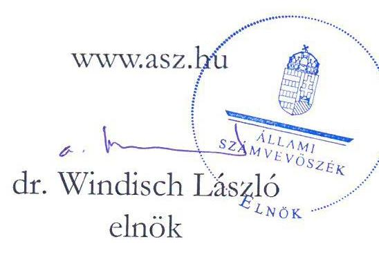
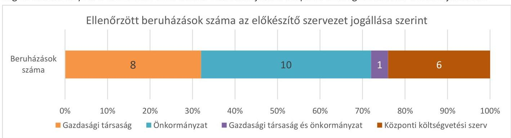
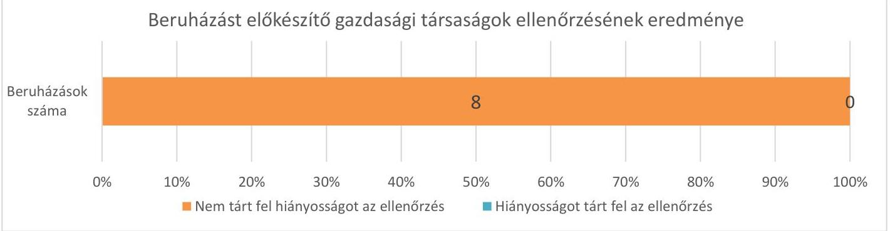
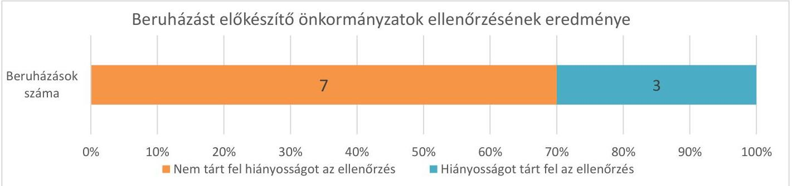
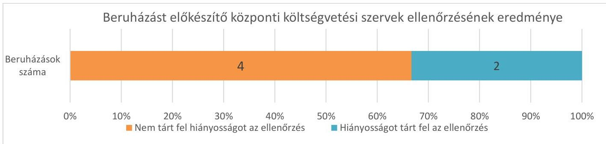
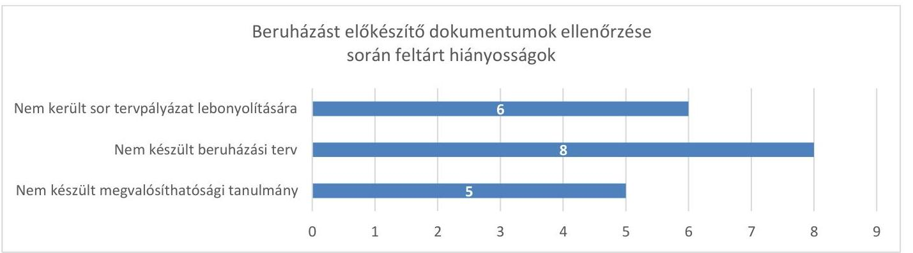

ÁLLAMI
SZÁMVEVŐSZÉK

# JELENTÉS

## A jelentős beruházások monitoring típusú ellenőrzése

25 helyszín

2022

22070

www.asz.hu

---

# JELENTÉS 

A jelentős beruházások monitoring típusú ellenőrzése

25 helyszín

2022

---

# ELLENŐRZÉSI IGAZGATÓSÁG: 

ÁLLAMI VAGYONGAZDÁLKODÁST ELLENŐRZŐ IGAZGATÓSÁG

## ELLENŐRZÉSI IGAZGATÓ:

HERCZEGH ZSOLT igazgató

## ELLENŐRZÉSVEZETŐ:

## DR. NAGY IMRE ellenőrzésvezető

VALASTYÁNNÉ DR. VÍZHÁNYÓ JÚLIA ellenőrzésvezető
RÁCZKEVI KATALIN ellenőrzésvezető
SIPOSNÉ DÓCZI KLÁRA ellenőrzésvezető

IKTATÓSZÁM: EL-3810-001/2022
TÉMASZÁM: 2593
ELLENŐRZÉS: V0937

---

# TARTALOMJEGYZÉK 

■ ÖSSZEGZÉS ..... 5
■ AZ ELLENŐRZÉS CÉLJA ..... 9
■ AZ ELLENŐRZÉS TERÜLETE ..... 10
■ AZ ELLENŐRZÉS HÁTTERE, INDOKOLTSÁGA ..... 11
■ A JELENTÉS LÉNYEGES KÉRDÉSKÖREI ..... 12
■ AZ ELLENŐRZÉS HATÓKÖRE ÉS MÓDSZEREI ..... 13
■ MEGÁLLAPÍTÁSOK ..... 15
■ JAVASLATOK ..... 28
■ MELLÉKLETEK ..... 29
I. sz. melléklet: Ellenőrzött beruházásokkal kapcsolatos lényeges adatok, információk ..... 29
II. sz. melléklet: Beruházásokhoz kapcsolódóan ellenőrzött lényeges dokumentumok. ..... 35
III. sz. melléklet: Értelmező szótár ..... 37
■ FÜGGELÉK: ÉSZREVÉTELEK ..... 39
■ RÖVIDÍTÉSEK JEGYZÉKE ..... 43

---

.

---

# ÖSSZEGZÉS 

Az ellenőrzött 25 jelentős beruházás közül 20 beruházás esetében a beruházás előkészitését támogató alapvető szervezeti és gazdálkodási keretek, kontrollok kialakítása megtörtént az előkészítő szervezetnél. 3 beruházás esetében az előkészítő szervezetnél a beruházásokhoz kapcsolódóan a hiányzó vagy hiányos belső szabályozás megalkotása, kiegészítése indokolt az előkészítő feladatok szabályos végrehajtásának és a beruházást érintő kockázatok kezelésének támogatása érdekében. 2 beruházás esetében az előkészítő szervezet lépéseket tett az ellenőrzés során feltárt szabályozási hiányosság megszüntetésére. 9 beruházás esetében a beruházás előkészítő szakaszában nem készült el a jogszabályban előírt megvalósíthatósági tanulmány, beruházási terv, program, vagy nem került sor tervpályázat lebonyolítására.

## Az ellenőrzés társadalmi indokoltsága

A közpénzek szabályos és átlátható felhasználásának támogatása céljából az Állami Számvevőszék a beruházások ellenőrzését - a megvalósításra fordított költségvetési források nagyságrendjére, a beruházások révén létrehozott nemzeti vagyon hasznosítására tekintettel - kiemelt fontosságú területként kezeli.

A közpénzből megvalósuló beruházások célszerű és eredményes végrehajtása érdekében indokolt már az előkészítési szakaszban a beruházást előkészítő szervezet felkészültségének értékelése és a beruházást előkészítő dokumentumok rendelkezésre állásának a vizsgálata. Ezért az Állami Számvevőszék ellenőrzése a beruházás előkészítését értékelte 25 közpénzből megvalósítani tervezett beruházásnál. Az ellenőrzött beruházások becsült kivitelezési költsége összesen meghaladja a 274 milliárd forintot.

Az Állami Számvevőszék az ellenőrzés tapasztalatai alapján javaslatokat fogalmaz meg arra vonatkozóan, hogy szükség van-e további lépésekre a beruházás előkészítési szakaszában. Az Állami Számvevőszék ellenőrzése ezzel hozzájárulhat az előkészítő szervezet felkészültségének és a beruházás előkészítettségének erősítéséhez, ezáltal a beruházás célszerű és eredményes megvalósításához.

## Főbb megállapítások, következtetések

A 25 ellenőrzött beruházás közül 8 beruházás előkészítője nemzeti tulajdonban lévő gazdasági társaság. 10 beruházásnál önkormányzat látja el az előkészítő feladatokat, míg 1 beruházás esetében az előkészítésben gazdasági társaság és önkormányzat is részt vesz. 6 beruházás előkészítőjeként központi költségvetési szerv került kijelölésre.

---

A NEMZETI TULAJDONÚ TÁRSASÁGOK előkészítésében lévő 8 ellenőrzött beruházás esetében a beruházások előkészítését támogató lényeges kontrollok kialakítása tekintetében nem tárt fel hiányosságot az ellenőrzés az előkészítő szervezetnél.

A BFK Budapest Fejlesztési Központ Nonprofit Zrt. (Dél-budai Centrumkórház megközelíthetőségéhez szükséges infrastrukturális fejlesztések, Pázmány Péter Katolikus Egyetem oktatási célú ingatlanjainak bővítése és fejlesztése, H8 Budapest-Gödöllő és a H9 Budapest-Cinkota-Csömör HÉV-vonalszakaszok korszerűsítése és az Örs vezér terén az M2 metróvonallal történő összekötése; Hortobágyi Deportálások Emlékhelye beruházás; Recski Nemzeti Emlékpark fejlesztése), a NIF Nemzeti Infrastruktúra Fejlesztő Zrt. (Dél-budai Centrumkórház megközelíthetőségéhez szükséges infrastrukturális fejlesztések), a MÁV-HÉV Helyiérdekü Vasút Zrt. (H8 Budapest-Gödöllő és a H9 Budapest-Cinkota-Csömör HÉV-vonalszakaszok korszerűsítése és az Örs vezér terén az M2 metróvonallal történő összekötése), a BMSK Beruházási, Müszaki Fejlesztési, Sportüzemeltetési és Közbeszerzési Zártkörűen Müködő Részvénytársaság (Nyiradonyi Harangi Imre Rendezvénycsarnok és Uszoda felújítása), a Magyar Közút Nonprofit Zártkörűen Müködő Részvénytársaság (Tatabánya-Vértessomló összekötő útra vonatkozó közúti fejlesztési projekt) és a Várkapitányság Integrált Területfejlesztési Központ Nonprofit Zártkörűen Müködő Részvénytársaság (Belügyminisztérium budai Várnegyedben történő elhelyezésével kapcsolatos beruházás) kialakította azokat az alapvető szabályokat, amelyek támogatják az előkészítő feladatok szabályos végrehajtását és biztosítják a beruházást érintő kockázatok kezeléséhez szükséges lényeges kontrollokat.

AZ ÖNKORMÁNYZATOK előkészítésében lévő 10 ellenőrzött beruházás közül 7 beruházás esetében a szervezeti, gazdálkodási keretek, kontrollok kialakítása tekintetében nem tárt fel hiányosságot az ellenőrzés, 3 beruházást előkészítő önkormányzatnál azonosított hiányosságot az ellenőrzés.

Dombóvár Város Önkormányzata (Dombóvári Szabadidő- és Sportcentrum beruházás), Csorna Város Önkormányzata (Csornai sportcsarnok beruházás), és Kaposvár Megyei Jogú Város Önkormányzata (Kaposvári ipari-innovációs fejlesztési terület kialakításával összefüggő közmü és infrastruktúra fejlesztések megvalósításához kapcsolódó 5 beruházás) kialakította azokat az alapvető szervezeti és gazdálkodási kereteket, szabályokat, amelyek támogatják az előkészítő feladatok szabályos végrehajtását és biztosítják a beruházást érintő kockázatok kezeléséhez szükséges lényeges kontrollokat.

Az új multifunkcionális sportcsarnok tervezése a Békéscsabai Sportcentrumban beruházás előkészítését végző Békéscsaba Megyei Jogú Város Önkormányzata az előkészítő feladatok szabályos végrehajtását támogató szervezeti kereteket és gazdálkodási szabályozást hiányosan alakította ki, mivel jogszabályi előírás ellenére a beruházási

---

feladatokra kiterjedő ellenőrzési nyomvonallal, közbeszerzési szabályzattal és a kötelezettségvállalásra, teljesítés-igazolásra jogosultak és aláírás-mintájuk nyilvántartásával nem rendelkezett.

A baktalórántházai sportkomplexum beruházás előkészítési feladatait ellátó Baktalórántháza Város Önkormányzata az előkészítő feladatok szabályos végrehajtását támogató alapvető szervezeti kereteket és gazdálkodási szabályozást kialakította, de a beruházási feladatokra kiterjedő ellenőrzési nyomvonalat nem készített.

Az útépítés, útfelújítás támogatása Somogyvár és Gamás településeken beruházást előkészítő Somogyvár Község Önkormányzata kialakította az előkészítő feladatok szabályos végrehajtását támogató alapvető szervezeti és gazdálkodási kereteket, de jogszabályi előírás ellenére a szervezeti integritást sértő események kezelésére eljárásrendet nem készített. Az ellenőrzött időszakot követően az Önkormányzat intézkedett a feltárt hiányosság megszüntetésére.

# A GAZDASÁGI TÁRSASÁG ÉS ÖNKORMÁNYZAT (BMSK Beruházási, Műszaki Fejlesztési, Sportüzemeltetési és Közbeszerzési Zártkörűen Működő Részvénytársaság illetve Körmend Város Önkormányzata) 

közös előkészítésében lévő új körmendi sportcsarnok beruházás esetében az előkészítő szervezeteknél a szervezeti, gazdálkodási keretek, kontrollok kialakítása tekintetében nem tárt fel hiányosságot az ellenőrzés.

A KÖZPONTI KÖLTSÉGVETÉSI SZERVEK előkészítésében lévő 6 beruházás közül 4 beruházás esetében a szervezeti, gazdálkodási keretek, kontrollok kialakítása tekintetében nem tárt fel hiányosságot az ellenőrzés, 2 beruházást előkészítő központi költségvetési szervnél azonosított hiányosságot az ellenőrzés.

A Nemzeti Sportközpontok (Gödöllői jégcsarnok beruházás; szalkszentmártoni Petöfi Sándor Általános Iskola tornaterem beruházása; vajszlói Sportkomplexum beruházás; nagyvarsányi tanuszoda beruházás) kialakította azokat az alapvető szervezeti és gazdálkodási kereteket, szabályokat, amelyek támogatják az előkészítő feladatok szabályos végrehajtását és biztosítják a beruházást érintő kockázatok kezeléséhez szükséges lényeges kontrollokat.

A két kerékpárútra (Vértesszőlős-Baj, Vértesszőlős-Vértestolna) vonatkozó közúti fejlesztési projektet előkészítő Magyar Nemzeti Múzeum kialakította az előkészítő feladatok szabályos végrehajtását támogató alapvető szervezeti és gazdálkodási kereteket, de jogszabályi előírás ellenére a beruházási feladatokra kiterjedő ellenőrzési nyomvonallal és a kötelezettségvállalásra, teljesítés-igazolásra jogosultak és aláírás-mintájuk nyilvántartásával nem rendelkezett. A Magyar Nemzeti Múzeum az ellenőrzött időszakot követően lépéseket tett az ellenőrzés során feltárt szabályozási hiányosság megszüntetésére.

A Zalaegerszegi Szakképzési Centrum egyes intézményeinek 21. századi elvárásoknak megfelelő fejlesztését célzó beruházás előkészítését végző Zalaegerszegi Szakképzési Centrum az előkészítő feladatok szabályos végrehajtását támogató alapvető szervezeti kereteket kialakította, de a gazdálkodás részletes rendjének szabályozása nem felelt meg a jogszabályi előírásnak.

## A JOGSZABÁLYBAN MEGJELÖLT LÉNYEGES ELŐKÉSZÍTŐ DOKUMENTUMOK,

megvalósíthatósági tanulmányok, beruházási tervek, programok, tervpályázat lebonyolítását igazoló dokumentumok meglétét az ellenőrzés 10 beruházás esetében vizsgálta az érintett beruházásokra vonatkozó kormányrendeletekben ${ }^{1}$ előírt, a beruházás előkészítése szempontjából lényeges rendelkezések alapján. 15 ellenőrzött beruházásra a kormányrendeletek ellenőrzött rendelkezéseinek hatálya nem terjedt ki.

Az ellenőrzött 10 beruházás közül 5 beruházás esetében nem készült megvalósíthatósági tanulmány, 8 beruházásnál nem készítettek beruházási tervet és 6 beruházás esetében nem került sor tervpályázat lebonyolítására jogszabályi előírás ellenére.

---

# Összegzés

---

# AZ ELLENŐRZÉS CÉLJA 

Az ellenőrzés célja, hogy értékelje: rendelkezésre állnak-e a beruházást előkészítő szervezetnél azok a szervezeti és gazdálkodási keretek, szabályok, a kockázatok kezeléséhez kapcsolódó belső kontrollok, amelyek támogatják az előkészítő feladatok szabályos végrehajtását és csökkentik a beruházás előkészítés kockázatait. Az ellenőrzés célja volt továbbá, hogy vizsgálja: a beruházás előkészítő szakaszában elkészültek-e azok a megvalósíthatósági tanulmányok, beruházási tervek, programok, illetve lebonyolításra kerültek-e azok a tervpályázatok, amelyek elősegítik a beruházás célszerű és eredményes megvalósítását.

---

# AZ ELLENŐRZÉS TERÜLETE

## 25 jelentős beruházás és a beruházást előkészítő szervezetek

Az ellenőrzés 25 jelentős beruházásra és a beruházást előkészítő szervezetekre terjedt ki. Az ellenőrzött beruházásokkal kapcsolatos lényeges adatokat, információkat az I. számú Melléklet tartalmazza.

A 25 ellenőrzött beruházás közül 8 beruházás előkészítője nemzeti tulajdonban lévő gazdasági társaság. 10 beruházásnál önkormányzat látja el az előkészítő feladatokat, míg 1 beruházás esetében az előkészítésben gazdasági társaság és önkormányzat is részt vesz. 6 beruházás előkészítőjeként központi költségvetési szerv került kijelölésre.

Az ellenőrzés a beruházás előkészítési szakaszában az előkészítését végző szervezetnél azt értékelte, hogy kialakították-e a beruházáshoz szükséges alapvető szervezeti és gazdálkodási kereteket, kontrollokat, valamint gondoskodtak-e a beruházás előkészítési szakaszában a lényeges dokumentumok elkészítéséről.

Ennek keretében az ellenőrzött beruházások előkészítését végző önkormányzatok és központi költségvetési szervek tekintetében az ellenőrzés az Áht.2, az Ávr.3 és a Bkr.4 egyes kötelező rendelkezéseinek érvényesülését értékelte. Ennek keretében az ellenőrzés a hivatkozott jogszabályokban előírt lényeges szabályozások meglétét, a beruházások szempontjából fontos kontrollok kialakítását vizsgálta.

Az előkészítő feladatokat ellátó gazdasági társaságok esetében az ellenőrzés a Gbkr.5 egyes kötelező rendelkezéseinek betartását vizsgálta, ennek keretében azt értékelte, hogy megtörtént-e a jogszabályban előírt lényeges kontrollok kialakítása. Emellett az ellenőrzés helyénvalósági szempontként azokat a gyakorlatokat is azonosította és rögzítette, amely esetekben az előkészítő társaság rá vonatkozó jogszabályi előírás hiányában is elkészítette az Áht.-ben, Ávr.-ben foglalt szabályozást, vagy kialakította a Bkr. szerinti kontrollokat.

Mindezek mellett azoknál a beruházásoknál, amelyekre a következő jogszabályok hatálya kiterjedt, az ellenőrzés vizsgálta az állami magasépítési beruházásokról szóló 299/2018. (XII. 27.) Korm. rendelet, a budapesti fejlesztések előkészítésével, megvalósításával és a kiemelt nemzetközi sportesemények rendezési jogának megszerzésével kapcsolatos egyes feladatok ellátásáról szóló 175/2019. (VII. 16.) Korm. rendelet és a Beruházás Előkészítési Alap felhasználásáról szóló 233/2018. (XII. 6.) Korm. rendelet egyes rendelkezéseinek érvényesülését, az abban megjelölt, az ellenőrzésben lényegesként kijelölt dokumentumok meglétét. A hivatkozott kormányrendeletek ellenőrzött rendelkezéseinek hatálya 10 ellenőrzött beruházásra terjedt ki, ezekre a beruházásokra vonatkozóan határoztak meg kötelező előírásokat (az I. számú Melléklet az egyes beruházások esetében tartalmazza, hogy az érintett jogszabályok kiterjedtek-e az adott beruházásra). A fenti jogszabályok és ellenőrzési kritériumok alapján a beruházásokhoz kapcsolódóan ellenőrzött lényeges dokumentumokat a II. számú Melléklet mutatja be.

---

# AZ ELLENŐRZÉS HÁTTERE, INDOKOLTSÁGA

A közpénzek szabályos és átlátható felhasználásának támogatása céljából az Állami Számvevőszék a beruházások ellenőrzését – a megvalósításra fordított költségvetési források nagyságrendjére, a beruházások révén létrehozott nemzeti vagyon hasznosítására tekintettel – kiemelt fontosságú területként kezeli.

A közpénzből megvalósuló beruházások célszerű és eredményes végrehajtása érdekében indokolt már az előkészítési szakaszban a beruházást előkészítő szervezet felkészültségének értékelése és a beruházást előkészítő dokumentumok rendelkezésre állásának a vizsgálata. Ezért az Állami Számvevőszék ellenőrzése a beruházás előkészítését értékelte 25 közpénzből megvalósítani tervezett beruházásnál. Az ellenőrzött beruházások becsült kivitelezési költsége meghaladja a 274 milliárd forintot.

Az Állami Számvevőszék az ellenőrzés tapasztalatai alapján javaslatokat fogalmaz meg arra vonatkozóan, hogy szükség van-e további lépésekre a beruházás előkészítési szakaszában. Az Állami Számvevőszék ellenőrzése ezzel hozzájárulhat az előkészítő szervezet felkészültségének és a beruházás előkészítettségének erősítéséhez, ezáltal a beruházás célszerű és eredményes megvalósításához.

---

# A JELENTÉS LÉNYEGES KÉRDÉSKÖREI 

1.     - Kialakította-e beruházást előkészítő szervezet az előkészítő feladatok szabályos végrehajtását támogató szervezeti, gazdálkodási és kockázatkezelési kereteket? Rendelkezésre álltak-e a beruházás előkészítő szakaszában a beruházás célszerű és eredményes megvalósítását elősegítő megvalósíthatósági tanulmányok, beruházási tervek, programok, lebonyolításra kerültek-e tervpályázatok?

---

# AZ ELLENŐRZÉS HATÓKÖRE ÉS MÓDSZEREI 

## Az ellenőrzés típusa

Megfelelőségi ellenőrzés.

## Az ellenőrzött időszak

A beruházás előkészítési szakasza, ezen belül a beruházás előkészítését végző szervezetnél ellenőrzött szabályozások, nyilvántartások, kontrollok esetében a 2021. év, a megvalósíthatósági tanulmányok, beruházási tervek, programok, tervpályázat lebonyolítását igazoló dokumentumok esetében az ellenőrzési adatszolgáltatásra rendelkezésre álló határidő utolsó napja (16 beruházás esetében 2022. január 28., 9 szervezet esetében 2022. április 5.)

## Az ellenőrzés tárgya

Az ellenőrzés a beruházás előkészítését végző önkormányzat és gazdálkodási feladatait ellátó polgármesteri hivatal, költségvetési szerv, nemzeti tulajdonban lévő gazdasági társaság beruházáshoz kapcsolódó szervezeti és gazdálkodási keretei, belső kontrolljai kialakítására és a beruházás előkészítő szakaszában a beruházás célszerű és eredményes megvalósítását elősegítő, az ellenőrzési programban megjelölt dokumentumok rendelkezésre állására terjedt ki.

## Az ellenőrzött szervezet

Az ellenőrzött 25 beruházás előkészítését végző szervezetek (önkormányzatok és a gazdálkodási feladatait ellátó polgármesteri hivatalok, központi költségvetési szervek, nemzeti tulajdonban lévő gazdasági társaságok) az I. számú Mellékletben foglaltak szerint.

## Az ellenőrzés jogalapja

Az ÁSZ. tv. ${ }^{6}$ 1. § (3) bekezdésében foglaltak és az 5. § (2)-(6) bekezdései, valamint az Áht. 61. § (2) bekezdése.

---

# Az ellenőrzés módszerei 

Az ellenőrzést az ellenőrzési program szempontjai, kérdéskörei, az ellenőrzött időszakban hatályos jogszabályok, az ellenőrzés szakmai szabályai, az ÁSZ megfelelőségi ellenőrzési módszertana alapján végezte az ÁSZ.

Az ÁSZ az ellenőrzés ideje alatt az ellenőrzött szervezettekkel történő kapcsolattartást a Szervezeti és Múködési Szabályzatának vonatkozó előírásai alapján biztosította.

A monitoring típusú ellenőrzés során az ÁSZ - a jelen állapot lényeges dokumentumaira fókuszálva - a kiválasztott szempontok, kritériumok alapján történő valós idejű értékelést végzett. A program ellenőrzési szempontjait, kritériumait a szabályszerűségi szempontok szerinti ellenőrzésben a jogszabályok, közjogi szervezetszabályozó eszközök, határozatok, további belső utasítások, belső szabályozók előírásai képezték. Az ellenőrzés során a beruházás szempontjából lényegesnek tekintett dokumentumokat és az ellenőrzés kritériumait a jelentés „Az ellenőrzés területe" része mutatja be.

A helyénvalósági szempontok alapján azon kérdéskörben történt az ellenőrzés, ahol az ellenőrzött szabályozás, kontroll kialakítását előíró jogszabály az ellenőrzött szervezetre nem terjed ki, de az adott követelmény érvényesülése hozzájárul a beruházás előkészítése során a beruházási kockázatok csökkentéséhez. A helyénvalósági kritériumokat az ÁSZ honlapján tette közzé. A helyénvalósági szempontok alapján tett értékeléseket a jelentéstervezet dőlt betűvel tartalmazza.

---

# 1. Dél-budai Centrumkórház megközelíthetőségéhez szükséges infrastrukturális fejlesztések 

Összegző megállapítás

A beruházás előkészítését végző BFK Budapest Fejlesztési Központ Nonprofit Zrt. és NIF Nemzeti Infrastruktúra Fejlesztő zártkörűen müködő Részvénytársaság kialakította az előkészítő feladatok szabályos végrehajtását támogató alapvető szervezeti és gazdálkodási kereteket. A BFK Budapest Fejlesztési Központ Nonprofit Zrt. jogszabályi előírás ellenére beruházási programot nem készített és tervpályázatot nem bonyolított le.

A beruházás előkészítését végző BFK Budapest Fejlesztési Központ Nonprofit Zrt. és NIF Nemzeti Infrastruktúra Fejlesztő zártkörűen müködő Részvénytársaság a beruházási feladatokat végző szervezeti egységeik feladataira vonatkozó szabályokat a szervezeti és müködési szabályzatában rögzítette. A beruházásokkal kapcsolatos feladatok ellenőrzési nyomvonalát mindkét társaság elkészítette. A BFK Budapest Fejlesztési Központ Nonprofit Zrt. a gazdálkodás részletes rendjét szabályzatban rögzítette.

A BFK Budapest Fejlesztési Központ Nonprofit Zrt. és a NIF Nemzeti Infrastruktúra Fejlesztő zártkörűen müködő Részvénytársaság a közbeszerzésre vonatkozó belső szabályokat jogszabályi előírás szerint meghatározták. A társaságok a jogszabályi előírásnak eleget téve szabályozták az integrált kockázatkezelés és a szervezeti integritást sértő események kezelésének eljárásrendjét.

A beruházáshoz kapcsolódó, jogszabályban előírt megvalósíthatósági tanulmány elkészült. A BFK Budapest Fejlesztési Központ Nonprofit Zrt. a budapesti fejlesztések előkészítésével, megvalósításával és a kiemelt nemzetközi sportesemények rendezési jogának megszerzésével kapcsolatos egyes feladatok ellátásáról szóló 175/2019. (VII. 16.) Korm. rendelet 3. § 7. pontjában foglaltak ellenére beruházási programot nem készített, és a rendelet 3. § 9. pontja ellenére nem bonyolított le tervpályázatot.

## 2. Pázmány Péter Katolikus Egyetem oktatási célú ingatlanjainak bővítése és fejlesztése

## Összegző megállapítás

A beruházás előkészítését végző BFK Budapest Fejlesztési Központ Nonprofit Zrt. kialakította az előkészítő feladatok szabályos végrehajtását támogató alapvető szervezeti és gazdálkodási kereteket.

A beruházás előkészítését végző BFK Budapest Fejlesztési Központ Nonprofit Zrt. a beruházási feladatokat végző szervezeti egysége feladataira vonatkozó szabályokat a szervezeti és müködési szabályzatában rögzítette. Az előkészítést végző társaság a beruházásokkal kapcsolatos feladatok ellenőrzési nyomvonalát elkészítette. A BFK Budapest Fejlesztési Központ Nonprofit Zrt. a gazdálkodás részletes rendjét szabályzatban rögzítette.

---

A BFK Budapest Fejlesztési Központ Nonprofit Zrt. a közbeszerzésre vonatkozó belső szabályokat jogszabályi előírás szerint meghatározta. A társaság a jogszabályi előírásnak eleget téve szabályozta az integrált kockázatkezelés és a szervezeti integritást sértő események kezelésének eljárásrendjét.

A beruházáshoz kapcsolódó, jogszabályban előírt megvalósíthatósági tanulmány elkészült. A BFK Budapest Fejlesztési Központ Nonprofit Zrt. közbeszerzési eljárás alapján megbízási szerződést kötött a beruházás előkészítéséhez kapcsolódó mérnöki tevékenység támogatására, ennek keretében lépéseket tett a jogszabályban előírt tervpályázat lebonyolítása érdekében. A BFK Budapest Fejlesztési Központ Nonprofit Zrt. lépéseket tett a jogszabályban előírt beruházási terv beszerzésére.

# 3. Új multifunkcionális sportcsarnok tervezése a Békéscsabai Sportcentrumban 

Összegző megállapítás

A beruházás előkészítését végző Békéscsaba Megyei Jogú Város Önkormányzata az előkészítő feladatok szabályos végrehajtását támogató szervezeti kereteket és gazdálkodási szabályozást hiányosan alakította ki, mivel jogszabályi előírás ellenére a beruházási feladatokra kiterjedő ellenőrzési nyomvonallal, közbeszerzési szabályzattal és a kötelezettségvállalásra, teljesítés-igazolásra jogosultak és aláírás-mintájuk nyilvántartásával nem rendelkezett. Békéscsaba Megyei Jogú Város Önkormányzata jogszabályi előírás ellenére beruházási tervet nem készített.

A beruházás előkészítését végző Békéscsaba Megyei Jogú Város Önkormányzata a beruházási feladatokat végző szervezeti egysége feladataira vonatkozó szabályokat a szervezeti és múködési szabályzatában rögzítette.

Az Önkormányzat nem bocsátott az ellenőrzés rendelkezésére olyan, a Bkr. 6. § (3) bekezdésében előírt ellenőrzési nyomvonalat, amely kiterjedt volna a beruházásokkal kapcsolatos feladatokra.

Az Önkormányzat tekintetében nem bocsátottak az ellenőrzés rendelkezésére a közbeszerzésekről szóló 2015. évi CXLIII. törvény 27. § (1)-(2) bekezdésében előírt közbeszerzési szabályzatot. A megküldött közbeszerzési szabályzat kizárólag a polgármesteri hivatal, mint ajánlatkérő által indított közbeszerzésekre terjed ki, miközben az ellenőrzött beruházás tekintetében ajánlatkérőként az Önkormányzat szerepel.

A gazdálkodás részletes rendjét meghatározó szabályzatot az Önkormányzat tekintetében a polgármesteri hivatal elkészítette. Ugyanakkor a 2021. évre vonatkozóan az Önkormányzat tekintetében a kötelezettségvállalás és a teljesítés igazolás gyakorlására jogosult személyekről és aláírás-mintájukról az Ávr. 60. § (3) bekezdésében előírt nyilvántartást nem bocsátották az ellenőrzés rendelkezésére. A megküldött kötelezettségvállalási szabályzat és annak melléklete kizárólag a polgármesteri hivatal költségvetésében szereplő kiadási előirányzatok tekintetében határozza meg a kötelezettségvállalás és teljesítés igazolás rendjét, az Önkormányzat kiadásaira nem terjed ki.

---

Az Önkormányzat polgármesteri hivatala a jogszabályi előírásnak eleget téve szabályozta az integrált kockázatkezelés és a szervezeti integritást sértő események kezelésének eljárásrendjét.

A beruházáshoz kapcsolódó, jogszabályban előírt megvalósíthatósági tanulmány elkészült. Békéscsaba Megyei Jogú Város Önkormányzata az állami magasépítési beruházásokról szóló 299/2018. (XII. 27.) Korm. rendelet 4. § d) pontjában foglaltak ellenére beruházási tervet nem készített.

# 4. Baktalórántházai sportkomplexum beruházás 

Összegző megállapítás

A beruházás előkészítését végző Baktalórántháza Város Önkormányzata az előkészítő feladatok szabályos végrehajtását támogató alapvető szervezeti kereteket és gazdálkodási szabályozást kialakította, de a beruházási feladatokra kiterjedő ellenőrzési nyomvonalat nem készített. Beruházási tervet jogszabályi előírás ellenére nem készített.

A beruházás előkészítését végző Baktalórántháza Város Önkormányzata a beruházási feladatokat végző szervezeti egysége feladataira vonatkozó szabályokat a szervezeti és múködési szabályzatában rögzítette.

Az Önkormányzat nem bocsátott az ellenőrzés rendelkezésére olyan, a Bkr. 6. § (3) bekezdésében előírt ellenőrzési nyomvonalat, amely kiterjedt volna a beruházásokkal kapcsolatos feladatokra.

Az Önkormányzat a közbeszerzésre vonatkozó belső szabályokat jogszabályi előírás szerint meghatározta.

A gazdálkodás részletes rendjét meghatározó szabályzatot az Önkormányzat tekintetében a polgármesteri hivatal elkészítette. A kötelezettségvállalás és a teljesítés igazolás gyakorlására jogosult személyekről és aláírás-mintájukról a jogszabályban előírt nyilvántartást vezették.

Az Önkormányzat polgármesteri hivatala a jogszabályi előírásnak eleget téve szabályozta az integrált kockázatkezelés és a szervezeti integritást sértő események kezelésének eljárásrendjét.

A beruházáshoz kapcsolódó, jogszabályban előírt megvalósíthatósági tanulmány elkészült. A beruházás tekintetében a jogszabályban előírt tervpályázat lebonyolítása megtörtént. Baktalórántháza Város Önkormányzata a beruházás előkészítése során az állami magasépítési beruházásokról szóló 299/2018. (XII. 27.) Korm. rendelet 4. § d) pontjában foglaltak ellenére beruházási tervet nem készített.

---

# 5. H8 Budapest-Gödöllő és a H9 Budapest-Cinkota-Csömör HÉV-vonalszakaszok korszerűsítése és az Örs vezér terén az M2 metróvonallal történő összekötése 

Összegző megállapítás

A beruházás előkészítését végző BFK Budapest Fejlesztési Központ Nonprofit Zrt. és MÁV-HÉV Helyiérdekü Vasút Zártkörűen Müködő Részvénytársaság. kialakította az előkészítő feladatok szabályos végrehajtását támogató alapvető szervezeti és gazdálkodási kereteket.

A beruházás előkészítését végző BFK Budapest Fejlesztési Központ Nonprofit Zrt. és MÁV-HÉV Helyiérdekü Vasút Zártkörűen Müködő Részvénytársaság a beruházási feladatokat végző szervezeti egységeik feladataira vonatkozó szabályokat a szervezeti és müködési szabályzatában rögzítette. A beruházásokkal kapcsolatos feladatok ellenőrzési nyomvonalát mindkét társaság elkészítette. A BFK Budapest Fejlesztési Központ Nonprofit Zrt. és a MÁV-HÉV Helyiérdekü Vasút Zártkörűen Müködő Részvénytársaság a gazdálkodás részletes rendjét szabályzatban rögzítette.

A BFK Budapest Fejlesztési Központ Nonprofit Zrt. és a MÁV-HÉV Helyiérdekű Vasút Zártkörűen Müködő Részvénytársaság a közbeszerzésre vonatkozó belső szabályokat jogszabályi előírás szerint meghatározták. A társaságok a jogszabályi előírásnak eleget téve szabályozták az integrált kockázatkezelés és a szervezeti integritást sértő események kezelésének eljárásrendjét.

A beruházáshoz kapcsolódóan megvalósíthatósági tanulmány készült.

## 6. Útépítés, útfelújítás támogatása Somogyvár és Gamás településeken

## Összegző megállapítás

A beruházás előkészítését végző Somogyvár Község Önkormányzata kialakította az előkészítő feladatok szabályos végrehajtását támogató alapvető szervezeti és gazdálkodási kereteket, de jogszabályi előírás ellenére a szervezeti integritást sértő események kezelésére eljárásrendet nem készített.

A beruházás előkészítését végző Somogyvár Község Önkormányzata a beruházási feladatokat végző szervezeti egysége feladataira vonatkozó szabályokat a szervezeti és müködési szabályzatában rögzítette.

Az előkészítést végző Önkormányzat a beruházásokkal kapcsolatos feladatok ellenőrzési nyomvonalát jogszabályi előírással összhangban elkészítette.

Az Önkormányzat a közbeszerzésre vonatkozó belső szabályokat jogszabályi előírás szerint meghatározta.

A gazdálkodás részletes rendjét meghatározó szabályzatot az Önkormányzat tekintetében a polgármesteri hivatal elkészítette. A kötelezettségvállalás és a teljesítés igazolás gyakorlására jogosult személyekről és aláírás-mintájukról a jogszabályban előírt nyilvántartást vezették.

Az Önkormányzat polgármesteri hivatala a jogszabályi előírásnak eleget téve szabályozta az integrált kockázatkezelés eljárásrendjét. A Bkr. 6. § (4)

---

bekezdés előírása szerinti szervezeti integritást sértő események kezelésének eljárásrendjét az Önkormányzat nem bocsátotta az ellenőrzés rendelkezésére. Kizárólag az integrált kockázatkezelési szabályzat került megküldésre, amely nem tartalmazta a szervezeti integritást sértő események kezelésének eljárási szabályait. Az ellenőrzött időszakot követően intézkedtek a feltárt hiányosság megszüntetésére, mivel 2022. szeptember 1-jei hatállyal Somogyvári Közös Önkormányzati Hivatal Jegyzője elkészítette az Önkormányzat szervezeti integritást sértő események kezelésének eljárásrendjét.

A beruházás tekintetében tervpályázat lebonyolítására került sor.

# 7. Nyíradonyi Harangi Imre Rendezvénycsarnok és Uszoda felújítása 

Összegző megállapítás

A beruházás előkészítését végző BMSK Beruházási, Műszaki Fejlesztési, Sportüzemeltetési és Közbeszerzési Zártkörűen Müködő Részvénytársaság kialakította az előkészítő feladatok szabályos végrehajtását támogató alapvető szervezeti és gazdálkodási kereteket.

A beruházás előkészítését végző Beruházási, Müszaki Fejlesztési, Sportüzemeltetési és Közbeszerzési Zrt a beruházási feladatokat végző szervezeti egysége feladataira vonatkozó szabályokat a szervezeti és müködési szabályzatában rögzítette. Az előkészítést végző társaság a beruházásokkal kapcsolatos feladatok ellenőrzési nyomvonalát elkészítette. A BMSK Beruházási, Müszaki Fejlesztési, Sportüzemeltetési és Közbeszerzési Zártkörűen Müködő Részvénytársaság a gazdálkodás részletes rendjét szabályzatban rögzítette.

Az előkészítést végző társaság a közbeszerzésre vonatkozó belső szabályokat jogszabályi előírás szerint meghatározta.

A BMSK Beruházási, Müszaki Fejlesztési, Sportüzemeltetési és Közbeszerzési Zártkörűen Müködő Részvénytársaság a jogszabályi előírásnak eleget téve szabályozta az integrált kockázatkezelés és a szervezeti integritást sértő események kezelésének eljárásrendjét.

## 8. Dombóvári Szabadidő- és Sportcentrum beruházás

## Összegző megállapítás

A beruházás előkészítését végző Dombóvár Város Önkormányzata kialakította az előkészítő feladatok szabályos végrehajtását támogató alapvető szervezeti és gazdálkodási kereteket.

A beruházás előkészítését végző Dombóvár Város Önkormányzata a beruházási feladatokat végző szervezeti egysége feladataira vonatkozó szabályokat a szervezeti és müködési szabályzatában rögzítette.

Az előkészítést végző Önkormányzat a beruházásokkal kapcsolatos feladatok ellenőrzési nyomvonalát jogszabályi előírással összhangban elkészítette.

Az Önkormányzat a közbeszerzésre vonatkozó belső szabályokat jogszabályi előírás szerint meghatározta.

---

A gazdálkodás részletes rendjét meghatározó szabályzatot az Önkormányzat tekintetében a polgármesteri hivatal elkészítette.

Az Önkormányzat polgármesteri hivatala a jogszabályi előírásnak eleget téve szabályozta az integrált kockázatkezelés és a szervezeti integritást sértő események kezelésének eljárásrendjét.

A beruházáshoz kapcsolódó, jogszabályban előírt beruházási terv elkészült. Dombóvár Város Önkormányzata az állami magasépítési beruházásokról szóló 299/2018. (XII. 27.) Korm. rendelet 4. § a) pontja ellenére megvalósíthatósági tanulmányt nem készített és a rendelet 4. § j) pontjában foglaltak ellenére tervpályázatot nem bonyolított le. Ugyanakkor az Önkormányzat lépéseket tett a fenntartási és üzemeltetési modell beszerzésére, valamint szerződést kötött a közbeszerzés lebonyolításának szakmai támogatására.

# 9. Gödöllői jégcsarnok beruházás 

## Összegző megállapítás

A Nemzeti Sportközpontok kialakította az előkészítő feladatok szabályos végrehajtását támogató alapvető szervezeti és gazdálkodási kereteket.

A Nemzeti Sportközpontok a beruházási feladatokat végző szervezeti egysége feladataira vonatkozó szabályokat a szervezeti és múködési szabályzatában rögzítette.

A Nemzeti Sportközpontok a beruházásokkal kapcsolatos feladatok ellenőrzési nyomvonalát jogszabályi előírással összhangban elkészítette.

A Nemzeti Sportközpontok a közbeszerzésre vonatkozó belső szabályokat jogszabályi előírás szerint meghatározta.

A gazdálkodás részletes rendjét meghatározó szabályzatot a Nemzeti Sportközpontok elkészítette. A kötelezettségvállalás és a teljesítés igazolás gyakorlására jogosult személyekről és aláírás-mintájukról a jogszabályban előírt nyilvántartást vezették.

A Nemzeti Sportközpontok a jogszabályi előírásnak eleget téve szabályozta az integrált kockázatkezelés és a szervezeti integritást sértő események kezelésének eljárásrendjét.

A beruházáshoz kapcsolódóan megvalósíthatósági tanulmány készült.

## 10. Szalkszentmártoni Petőfi Sándor Általános Iskola tornaterem beruházása

## Összegző megállapítás

A beruházás előkészítését végző Nemzeti Sportközpontok kialakította az előkészítő feladatok szabályos végrehajtását támogató alapvető szervezeti és gazdálkodási kereteket. A Nemzeti Központok jogszabályi előírás ellenére megvalósíthatósági tanulmányt és beruházási tervet nem készített, tervpályázatot nem bonyolított le.

A beruházás előkészítését végző Nemzeti Sportközpontok a beruházási feladatokat végző szervezeti egysége feladataira vonatkozó szabályokat a szervezeti és múködési szabályzatában rögzítette.

---

Az előkészítést végző Nemzeti Sportközpontok a beruházásokkal kapcsolatos feladatok ellenőrzési nyomvonalát jogszabályi előírással összhangban elkészítette.

A Nemzeti Sportközpontok a közbeszerzésre vonatkozó belső szabályokat jogszabályi előírás szerint meghatározta.

A gazdálkodás részletes rendjét meghatározó szabályzatot a Nemzeti Sportközpontok elkészítette. A kötelezettségvállalás és a teljesítés igazolás gyakorlására jogosult személyekről és aláírás-mintájukról a jogszabályban előírt nyilvántartást vezették.

A Nemzeti Sportközpontok a jogszabályi előírásnak eleget téve szabályozta az integrált kockázatkezelés és a szervezeti integritást sértő események kezelésének eljárásrendjét.

A Nemzeti Sportközpontok a beruházás előkészítése során az állami magasépítési beruházásokról szóló 299/2018. (XII. 27.) Korm. rendelet 4. § a) pontja ellenére megvalósíthatósági tanulmányt, és a rendelet 4. § d) pontja ellenére beruházási tervet nem készített és a rendelet 4. § j) pontjában foglaltak ellenére tervpályázatot nem bonyolított le.

# 11. Vajszlói Sportkomplexum beruházás 

Összegző megállapítás

A beruházás előkészítését végző Nemzeti Sportközpontok kialakította az előkészítő feladatok szabályos végrehajtását támogató alapvető szervezeti és gazdálkodási kereteket. A Nemzeti Központok jogszabályi előírás ellenére megvalósíthatósági tanulmányt és beruházási tervet nem készített, tervpályázatot nem bonyolított le.

A beruházás előkészítését végző Nemzeti Sportközpontok a beruházási feladatokat végző szervezeti egysége feladataira vonatkozó szabályokat a szervezeti és múködési szabályzatában rögzítette.

Az előkészítést végző Nemzeti Sportközpontok a beruházásokkal kapcsolatos feladatok ellenőrzési nyomvonalát jogszabályi előírással összhangban elkészítette.

A Nemzeti Sportközpontok a közbeszerzésre vonatkozó belső szabályokat jogszabályi előírás szerint meghatározta.

A gazdálkodás részletes rendjét meghatározó szabályzatot a Nemzeti Sportközpontok elkészítette. A kötelezettségvállalás és a teljesítés igazolás gyakorlására jogosult személyekről és aláírás-mintájukról a jogszabályban előírt nyilvántartást vezették.

A Nemzeti Sportközpontok a jogszabályi előírásnak eleget téve szabályozta az integrált kockázatkezelés és a szervezeti integritást sértő események kezelésének eljárásrendjét.

A Nemzeti Sportközpontok a beruházás előkészítése során az állami magasépítési beruházásokról szóló 299/2018. (XII. 27.) Korm. rendelet 4. § a) pontja ellenére megvalósíthatósági tanulmányt, és a rendelet 4. § d) pontja ellenére beruházási tervet nem készített és a rendelet 4. § j) pontjában foglaltak ellenére tervpályázatot nem bonyolított le.

---

# 12. Nagyvarsányi tanuszoda beruházás 

## Összegző megállapítás

A beruházás előkészítését végző Nemzeti Sportközpontok kialakította az előkészítő feladatok szabályos végrehajtását támogató alapvető szervezeti és gazdálkodási kereteket.

A beruházás előkészítését végző Nemzeti Sportközpontok a beruházási feladatokat végző szervezeti egysége feladataira vonatkozó szabályokat a szervezeti és működési szabályzatában rögzítette.

Az előkészítést végző Nemzeti Sportközpontok a beruházásokkal kapcsolatos feladatok ellenőrzési nyomvonalát jogszabályi előírással összhangban elkészítette.

A Nemzeti Sportközpontok a közbeszerzésre vonatkozó belső szabályokat jogszabályi előírás szerint meghatározta.

A gazdálkodás részletes rendjét meghatározó szabályzatot a Nemzeti Sportközpontok elkészítette. A kötelezettségvállalás és a teljesítés igazolás gyakorlására jogosult személyekről és aláírás-mintájukról a jogszabályban előírt nyilvántartást vezették.

A Nemzeti Sportközpontok a jogszabályi előírásnak eleget téve szabályozta az integrált kockázatkezelés és a szervezeti integritást sértő események kezelésének eljárásrendjét.

A beruházáshoz kapcsolódóan jogszabályban előírt megvalósíthatósági tanulmány készült.

## 13. Hortobágyi Deportálások Emlékhelye beruházás

## Összegző megállapítás

A beruházás előkészítését végző Budapest Fejlesztési Központ Nonprofit Zrt. kialakította az előkészítő feladatok szabályos végrehajtását támogató alapvető szervezeti és gazdálkodási kereteket.

A beruházás előkészítését végző Budapest Fejlesztési Központ Nonprofit Zrt. a beruházási feladatokat végző szervezeti egysége feladataira vonatkozó szabályokat a szervezeti és müködési szabályzatában rögzítette. Az előkészítést végző társaság a beruházásokkal kapcsolatos feladatok ellenőrzési nyomvonalát elkészítette. A Budapest Fejlesztési Központ Nonprofit Zrt. a gazdálkodás részletes rendjét szabályzatban rögzítette.

Az előkészítést végző társaság a közbeszerzésre vonatkozó belső szabályokat jogszabályi előírás szerint meghatározta.

A társaság a jogszabályi előírásnak eleget téve szabályozta az integrált kockázatkezelés és a szervezeti integritást sértő események kezelésének eljárásrendjét.

A beruházáshoz kapcsolódó megvalósíthatósági tanulmány és beruházási terv elkészült és tervpályázat lebonyolítására került sor.

---

# 14. Recski Nemzeti Emlékpark fejlesztése 

## Összegző megállapítás

A beruházás előkészítését végző BFK Budapest Fejlesztési Központ Nonprofit Zrt. kialakította az előkészítő feladatok szabályos végrehajtását támogató alapvető szervezeti és gazdálkodási kereteket.

A beruházás előkészítését végző BFK Budapest Fejlesztési Központ Nonprofit Zrt. a beruházási feladatokat végző szervezeti egysége feladataira vonatkozó szabályokat a szervezeti és múködési szabályzatában rögzítette. Az előkészítést végző társaság a beruházásokkal kapcsolatos feladatok ellenőrzési nyomvonalát elkészítette. A BFK Budapest Fejlesztési Központ Nonprofit Zrt. a gazdálkodás részletes rendjét szabályzatban rögzítette.

Az előkészítést végző társaság a közbeszerzésre vonatkozó belső szabályokat jogszabályi előírás szerint meghatározta.

A társaság a jogszabályi előírásnak eleget téve szabályozta az integrált kockázatkezelés és a szervezeti integritást sértő események kezelésének eljárásrendjét.

A beruházáshoz kapcsolódó megvalósíthatósági tanulmány és beruházási terv elkészült és tervpályázat lebonyolítására került sor.

## 15. Csornai sportcsarnok beruházás

## Összegző megállapítás

A beruházás előkészítését végző Csorna Város Önkormányzata kialakította az előkészítő feladatok szabályos végrehajtását támogató alapvető szervezeti és gazdálkodási kereteket. Csorna Város Önkormányzata jogszabályi előírás ellenére megvalósíthatósági tanulmányt és beruházási tervet nem készített, tervpályázatot nem bonyolított le.

A beruházás előkészítését végző Csorna Város Önkormányzata a beruházási feladatokat végző szervezeti egysége feladataira vonatkozó szabályokat a szervezeti és múködési szabályzatában rögzítette.

Az előkészítést végző Önkormányzat a beruházásokkal kapcsolatos feladatok ellenőrzési nyomvonalát jogszabályi előírással összhangban elkészítette.

Az Önkormányzat a közbeszerzésre vonatkozó belső szabályokat jogszabályi előírás szerint meghatározta.

A gazdálkodás részletes rendjét meghatározó szabályzatot az Önkormányzat polgármesteri hivatala elkészítette. A kötelezettségvállalás és a teljesítés igazolás gyakorlására jogosult személyekről és aláírás-mintájukról a jogszabályban előírt nyilvántartást vezették.

Az Önkormányzat polgármesteri hivatala a jogszabályi előírásnak eleget téve szabályozta az integrált kockázatkezelés és a szervezeti integritást sértő események kezelésének eljárásrendjét.

Csorna Város Önkormányzata a beruházás előkészítése során az állami magasépítési beruházásokról szóló 299/2018. (XII. 27.) Korm. rendelet 4. § a) pontja ellenére megvalósíthatósági tanulmányt, a rendelet 4. § d) pontja

---

ellenére beruházási tervet nem készített és a rendelet 4. § j) pontjában foglaltak ellenére tervpályázatot nem bonyolított le.

# 16. Új körmendi sportcsarnok beruházás 

Összegző megállapítás

A beruházás előkészítését végző Körmend Város Önkormányzata és a BMSK Beruházási, Műszaki Fejlesztési, Sportüzemeltetési és Közbeszerzési Zártkörűen Müködő Részvénytársaság kialakította az előkészítő feladatok szabályos végrehajtását támogató alapvető szervezeti és gazdálkodási kereteket.

Körmend Város Önkormányzata és a BMSK Beruházási, Müszaki Fejlesztési, Sportüzemeltetési és Közbeszerzési Zártkörűen Müködő Részvénytársaság a beruházási feladatokat végző szervezeti egységeik feladataira vonatkozó szabályokat a szervezeti és müködési szabályzatában rögzítette.

Körmend Város Önkormányzata a beruházásokkal kapcsolatos feladatok ellenőrzési nyomvonalát jogszabályi előírással összhangban elkészítette. A BMSK Beruházási, Müszaki Fejlesztési, Sportüzemeltetési és Közbeszerzési Zártkörűen Müködő Részvénytársaság a beruházási feladatokra ellenőrzési nyomvonallal rendelkezett.

Körmend Város Önkormányzata és a BMSK Beruházási, Müszaki Fejlesztési, Sportüzemeltetési és Közbeszerzési Zártkörűen Müködő Részvénytársaság a közbeszerzésre vonatkozó belső szabályokat jogszabályi előírás szerint meghatározták.

Körmend Város Önkormányzata és a BMSK Beruházási, Müszaki Fejlesztési, Sportüzemeltetési és Közbeszerzési Zártkörűen Müködő Részvénytársaság a gazdálkodás részletes rendjét meghatározó szabályzatot elkészítették.

Az előkészítést végző szervezetek a jogszabályi előírásnak eleget téve szabályozták az integrált kockázatkezelés és a szervezeti integritást sértő események kezelésének eljárásrendjét.

## 17-21. Kaposvári ipari-innovációs fejlesztési terület kialakításával összefüggő közmú és infrastruktúra fejlesztések megvalósítása (5 beruházás: földgáz ellátás és villamos energia ellátás fejlesztése, víziközmú infrastruktúra fejlesztés, csapadékvíz-elvezetés fejlesztés, távközlési infrastruktúra fejlesztés)

Összegző megállapítás

A beruházások előkészítését végző Kaposvár Megyei Jogú Város Önkormányzata kialakította az előkészítő feladatok szabályos végrehajtását támogató alapvető szervezeti és gazdálkodási kereteket.

A beruházások előkészítését végző Kaposvár Megyei Jogú Város Önkormányzata a beruházási feladatokat végző szervezeti egysége feladataira vonatkozó szabályokat a szervezeti és müködési szabályzatában rögzítette.

---

Az előkészítést végző Önkormányzat a beruházásokkal kapcsolatos feladatok ellenőrzési nyomvonalát jogszabályi előírással összhangban elkészítette.

Az Önkormányzat a közbeszerzésre vonatkozó belső szabályokat jogszabályi előírás szerint meghatározta.

A gazdálkodás részletes rendjét meghatározó szabályzatot az Önkormányzat tekintetében a polgármesteri hivatal elkészítette. A kötelezettségvállalás és a teljesítés igazolás gyakorlására jogosult személyekről és aláírás-mintájukról a jogszabályban előírt nyilvántartást vezették.

Az Önkormányzat polgármesteri hivatala a jogszabályi előírásnak eleget téve szabályozta az integrált kockázatkezelés és a szervezeti integritást sértő események kezelésének eljárásrendjét.

A távközlési infrastruktúra fejlesztéshez kapcsolódóan tervpályázat lebonyolítására került sor.

# 22. Tatabánya-Vértessomló összekötő útra vonatkozó közúti fejlesztési projekt 

Összegző megállapítás

A beruházás előkészítését végző Magyar Közút Nonprofit Zártkörűen Müködő Részvénytársaság kialakította az előkészítő feladatok szabályos végrehajtását támogató alapvető szervezeti és gazdálkodási kereteket.

A beruházás előkészítését végző Magyar Közút Nonprofit Zártkörűen Müködő Részvénytársaság a beruházási feladatokat végző szervezeti egysége feladataira vonatkozó szabályokat a szervezeti és müködési szabályzatában rögzítette. Az előkészítést végző társaság a beruházásokkal kapcsolatos feladatok ellenőrzési nyomvonalát elkészítette. A Magyar Közút Nonprofit Zártkörűen Müködő Részvénytársaság a gazdálkodás részletes rendját szabályzatban rögzítette.

Az előkészítést végző társaság a közbeszerzésre vonatkozó belső szabályokat jogszabályi előírás szerint meghatározta.

A társaság a jogszabályi előírásnak eleget téve szabályozta az integrált kockázatkezelés és a szervezeti integritást sértő események kezelésének eljárásrendjét.

A beruházáshoz kapcsolódóan beruházási terv készült és tervpályázat került lebonyolításra.

---

# 23. Két kerékpárútra (Vértesszőlős-Baj, Vértesszőlős-Vértestolna) vonatkozó közúti fejlesztési projekt 

Összegző megállapítás

A beruházás előkészítését végző Magyar Nemzeti Múzeum kialakította az előkészítő feladatok szabályos végrehajtását támogató alapvető szervezeti és gazdálkodási kereteket, de jogszabályi előírás ellenére a beruházási feladatokra kiterjedő ellenőrzési nyomvonallal és a kötelezettségvállalásra, teljesítés-igazolásra jogosultak és aláírás-mintájuk nyilvántartásával nem rendelkezett.

A beruházás előkészítését végző Magyar Nemzeti Múzeum a beruházási feladatokat végző szervezeti egysége feladataira vonatkozó szabályokat a szervezeti és múködési szabályzatában rögzítette.

A Magyar Nemzeti Múzeum nem bocsátott az ellenőrzés rendelkezésére olyan, a Bkr. 6. § (3) bekezdésében előírt ellenőrzési nyomvonalat, amely kiterjedt volna a beruházásokkal kapcsolatos feladatokra. A Magyar Nemzeti Múzeum az ellenőrzött időszakot követően lépéseket tett az ellenőrzési nyomvonal elkészítésére.

A Magyar Nemzeti Múzeum a közbeszerzésre vonatkozó belső szabályokat jogszabályi előírás szerint meghatározta.

A gazdálkodás részletes rendjét meghatározó szabályzatot a Magyar Nemzeti Múzeum elkészítette. Ugyanakkor a 2021. évre vonatkozóan a kötelezettségvállalás és a teljesítés igazolás gyakorlására jogosult személyekről és aláírás-mintájukról az Ávr. 60. § (3) bekezdésében előírt nyilvántartást nem bocsátották az ellenőrzés rendelkezésére. A Magyar Nemzeti Múzeum kötelezettségvállalási szabályzata ugyan meghatározza a kötelezettségvállalás és a teljesítés igazolás gyakorlására jogosult munkaköröket, de a konkrét személyeket és aláírás-mintájukat tartalmazó nyilvántartás nem került átadásra.

A Magyar Nemzeti Múzeum a jogszabályi előírásnak eleget téve szabályozta az integrált kockázatkezelés és a szervezeti integritást sértő események kezelésének eljárásrendjét.

A beruházáshoz kapcsolódó megvalósíthatósági tanulmány és beruházási terv elkészült és tervpályázat lebonyolítására került sor.

## 24. Belügyminisztérium budai Várnegyedben történő elhelyezésével kapcsolatos beruházás

Összegző megállapítás

A beruházás előkészítését végző Várkapitányság Integrált Területfejlesztési Központ Nonprofit Zártkörűen Müködő Részvénytársaság kialakította az előkészítő feladatok szabályos végrehajtását támogató alapvető szervezeti és gazdálkodási kereteket.

A beruházás előkészítését végző Várkapitányság Integrált Területfejlesztési Központ Nonprofit Zártkörűen Müködő Részvénytársaság a beruházási feladatokat végző szervezeti egysége feladataira vonatkozó szabályokat a szervezeti és müködési szabályzatában rögzítette. Az előkészítést végző társaság a beruházásokkal kapcsolatos feladatok ellenőrzési nyomvonalát

---

elkészítette. A Várkapitányság Integrált Területfejlesztési Központ Nonprofit Zártkörűen Müködő Részvénytársaság a gazdálkodás részletes rendjét szabályzatban rögzítette.

Az előkészítést végző társaság a közbeszerzésre vonatkozó belső szabályokat jogszabályi előírás szerint meghatározta.

A társaság a jogszabályi előírásnak eleget téve szabályozta az integrált kockázatkezelés és a szervezeti integritást sértő események kezelésének eljárásrendjét.

# 25. Zalaegerszegi Szakképzési Centrum egyes intézményeinek 21. századi elvárásoknak megfelelő fejlesztését célzó beruházás 

Összegző megállapítás

A beruházás előkészítését végző Zalaegerszegi Szakképzési Centrum az előkészítő feladatok szabályos végrehajtását támogató alapvető szervezeti kereteket kialakította, de a gazdálkodás részletes rendjének szabályozása nem felelt meg a jogszabályi előírásnak. A Zalaegerszegi Szakképzési Centrum jogszabályi előírás ellenére megvalósíthatósági tanulmányt és beruházási tervet nem készített.

A beruházás előkészítését végző Zalaegerszegi Szakképzési Centrum a beruházási feladatokat végző szervezeti egysége feladataira vonatkozó szabályokat a szervezeti és múködési szabályzatában rögzítette.

Az előkészítést végző Zalaegerszegi Szakképzési Centrum a beruházásokkal kapcsolatos feladatok ellenőrzési nyomvonalát jogszabályi előírással összhangban elkészítette.

A Zalaegerszegi Szakképzési Centrum a közbeszerzésre vonatkozó belső szabályokat jogszabályi előírás szerint meghatározta.

A gazdálkodás részletes rendjét meghatározó szabályzatot a Zalaegerszegi Szakképzési Centrum elkészítette. Ugyanakkor az Ávr. 13. § (2) bekezdésének a) pontjában előírtak ellenére a gazdálkodási szabályzat nem tartalmazta a kötelezettségvállalás, ellenjegyzés, teljesítés igazolás, érvényesítés, utalványozás gyakorlásának módjával, eljárási és dokumentációs részletszabályaival, valamint az ezeket végző személyek kijelölésének rendjével kapcsolatos belső előírásokat.

A Zalaegerszegi Szakképzési Centrum a jogszabályi előírásnak eleget téve szabályozta az integrált kockázatkezelés és a szervezeti integritást sértő események kezelésének eljárásrendjét.

A Zalaegerszegi Szakképzési Centrum a Beruházás Előkészítési Alap felhasználásáról szóló 233/2018. (XII. 6.) Korm. rendelet 2. § (2) bekezdés a) pontja ellenére megvalósíthatósági tanulmányt, és a rendelet 2. § (2) bekezdés d) pontja szerinti beruházási tervet nem készített. Ugyanakkor a Zalaegerszegi Szakképzési Centrum lépéseket tett a megvalósíthatósági tanulmány elkészíttetésére.

---

# JAVASLATOK 

Az ÁSZ tv. 33. § (1) bekezdésében foglaltak értelmében az ellenőrzött szervezet vezetője köteles a jelentésben foglalt megállapításokhoz kapcsolódó intézkedési tervet összeállítani és azt a jelentés kézhezvételétől számított 30 napon belül az ÁSZ részére megküldeni. Amennyiben az ellenőrzött szervezet vezetője nem küldi meg határidőben az intézkedési tervet, vagy továbbra sem elfogadható intézkedési tervet küld, az Állami Számvevőszék elnöke az ÁSZ tv. 33. § (3) bekezdése a) és b) pontjaiban foglaltakat érvényesítheti.

## Békéscsaba Megyei Jogú Város Önkormányzatának polgármestere

1. Gondoskodjon olyan, jogszabályban elöirt ellenőrzési nyomvonal elkészittetéséről, amely kiterjed a beruházásokkal kapcsolatos feladatokra
(3. sz. megállapítás 2. bekezdése alapján)
2. Intézkedjen a jogszabályban elöirt közbeszerzési szabályzat elkészitéséről.
(3. sz. megállapítás 3. bekezdése alapján)
3. Gondoskodjon az Önkormányzat tekintetében a kötelezettségvállalás és a teljesités igazolás gyakorlására jogosult személyekröl és aláirásmintájukról jogszabályban elöirt nyilvántartás vezetéséről.
(3. sz. megállapítás 4. bekezdése alapján)

## Baktalórántháza Város Önkormányzatának polgármestere

1. Gondoskodjon olyan, jogszabályban elöirt ellenőrzési nyomvonal elkészittetéséről, amely kiterjed a beruházásokkal kapcsolatos feladatokra.
(4. sz. megállapítás 2. bekezdése alapján)

## Zalaegerszegi Szakképzési Centrum kancellárja

1. Gondoskodjon a Zalaegerszegi Szakképzési Centrumtekintetében a jogszabályi elöírások szerinti gazdálkodási szabályzat elkészittetéséről, amely tartalmazza a kötelezettségvállalás, ellenjegyzés, teljesités igazolás, érvényesités, utalványozás gyakorlásának módjával, eljárási és dokumentációs részletszabályaival, valamint az ezeket végző személyek kijelölésének rendjével kapcsolatos belső elöírásokat.
(25. sz. megállapítás 4. bekezdése alapján)

---

# MELLÉKLETEK 

## I. SZ. MELLÉKLET: ELLENŐRZÖTT BERUHÁZÁSOKKAL KAPCSOLATOS LÉNYEGES ADATOK, INFORMÁCIÓK

## 1. DÉL-BUDAI CENTRUMKÓRHÁZ MEGKÖZELÍTHETŐSÉGÉHEZ SZÜKSÉGES INFRASTRUKTURÁLIS FEILESZTÉSEK

A beruházás célja a Dél-budai Centrumkórház megközelíthetőségéhez szükséges infrastrukturális fejlesztések megvalósítása, a közösségi, a közúti, a gyalogos, valamint a kerékpárosforgalom megfelelő kiszolgálására alkalmas közlekedési infrastruktúra kialakítása. A fejlesztésekkel a Kórház forgalma mellett a térség közlekedési igényeit is ki tudja majd szolgálni a városrész a tervek szerint.

A beruházás előkészítésének tervezett költsége meghaladja a 673 millió forintot, amelyet a Dél-budai Centrumkórház megközelíthetőségéhez szükséges infrastrukturális fejlesztések előkészítéséről szóló 1212/2021. (IV. 29.) Korm. határozat alapján a Kormány biztosít. A beruházás becsült kivitelezési értéke 16927 millió forint.

A beruházás előkészítéséről szóló döntés az Egészséges Budapest Program Dél-budai Centrumának helyszínéről szóló 1592/2016. (X. 27.) Korm. határozatban jelent meg. A beruházás előkészítését jelenleg a Dél-budai Centrumkórház megközelíthetőségének fejlesztéséről szóló 1660/2020. (X. 15.) Korm. határozat szabályozza. A beruházás a budapesti fejlesztések előkészítésével, megvalósításával és a kiemelt nemzetközi sportesemények rendezési jogának megszerzésével kapcsolatos egyes feladatok ellátásáról szóló 175/2019. (VII.16.) Korm. rendelet hatálya alá tartozott az ellenőrzött időszakban.

A beruházás előkészítése keretében a nemzeti fejlesztési miniszter a NIF Nemzeti Infrastruktúra Fejlesztő Zártkörűen Működő Részvénytársaságot bízta meg a beruházáshoz kapcsolódó megvalósíthatósági tanulmány elkészítésével. A megvalósíthatósági tanulmány elkészültét követően a Dél-budai Centrumkórház megközelíthetőségének fejlesztéséről szóló 1660/2020. (X. 15.) Korm. határozatban foglaltak alapján a BFK Budapest Fejlesztési Központ Nonprofit Zrt. (jogutódja 2022. május 25-től az NKK Nemzeti Közlekedési Központ Nonprofit Zrt.) vette át a beruházás előkészítését..

## 2. PÁZMÁNY PÉTER KATOLIKUS EGYETEM OKTATÁSI CÉLÚ INGATLANJAINAK BÖVÍTÉSE ÉS FEJLESZTÉSE

A beruházás célja a Pázmány Péter Katolikus Egyetem által ellátott oktatási feladatok elősegítése az Egyetem oktatási célú ingatlanjainak bővítésével és fejlesztésével, melynek keretében közel 50 ezer négyzetméteres oktatási célú, új és műemléki rekonstrukcióval is érintett épületegyüttes megvalósítására kerül sor.

A beruházás előkészítéséhez a Kormány 8 924,3 millió forint forrást biztosít. A beruházás becsült kivitelezési értéke 116757 millió forint.

A beruházás előkészítését a Pázmány Péter Katolikus Egyetem oktatási célú ingatlanjainak bővítéséhez és fejlesztéséhez szükséges kormányzati intézkedésekről szóló 1461/2020. (VII. 30.) Korm. határozat szabályozza. A beruházás az állami magasépítési beruházásokról szóló 299/2018. (XII.27.) Korm.rendelet hatálya alá tartozik.

A beruházás előkészítésével megbízott szervezet a BFK Budapest Fejlesztési Központ Nonprofit Zrt. (jogutódja 2022. május 25-től az NKK Nemzeti Közlekedési Központ Nonprofit Zrt.)

## 3. ÚJ MULTIFUNKCIONÁLIS SPORTCSARNOK TERVEZÉSE A BÉKÉSCSABAI SPORTCENTRUMBAN

A beruházás célja a békéscsabai közösségi és sportélet támogatása érdekében új multifunkciós sportcsarnok megépítése. A Beruházás megvalósításával olyan megközelítőleg 11000 m 2 nagyságú létesítmény kerülne kialakításra, mely nemzetközi és hazai I. osztályú sportesemények, többek között kézilabda, röplabda, kosárlabda és futsal mérkőzések lebonyolításának helyszíneként szolgálna. Sportesemények mellett egyéb kulturális eseményeknek is otthont adna az épület, mely 4000 fő befogadására lenne alkalmas.

A beruházás előkészítésének tervezett költsége 210 millió forint volt. A beruházás előkészítéséhez a Modern Városok Program keretében a a Modern Városok Program keretében az új, multifunkcionális sportcsarnok tervezése a Békéscsabai Sportcentrumban projekt előkészítése érdekében szükséges többlettámogatás biztosításáról szóló 1275/2021. (V. 17.) Korm. határozatban foglaltak szerint a Kormány a korábban biztosított 210 millió forint költségvetési támogatáson felül a 2021. évben további 145 millió forint költségvetési támogatást biztosít. A beruházás becsült kivitelezési értéke 15000 millió forint.

A beruházás előkészítését a Magyarország Kormánya és Békéscsaba Megyei Jogú Város Önkormányzata közötti együttműködési megállapodás végrehajtásával összefüggő feladatokról szóló 1283/2016. (VI. 7.) Korm. határozat szabályozza. A beruházás az állami magasépítési beruházásokról szóló 299/2018. (XII.27.) Korm.rendelet hatálya alá tartozik.

A beruházás előkészítését Békéscsaba Megyei Jogú Város Önkormányzata látja el.

---

# 4. BAKTALÓRÁNTHÁZAI SPORTKOMPLEXUM BERUHÁZÁS 

A beruházás célja olyan sportkomplexum megépítés, amely nem csupán a település, hanem a járás lakói számára is lehetőséget biztosítanának azokra a szolgáltatásokra, melyek korábban nem voltak elérhetők a térségben. A tervek között szerepel egy müfüves labdarúgópálya, teniszpálya, kondipark kialakítása, illetve egy sportcsarnok megépítése kézilabdapálya, bowlingpálya, tekepálya kialakításával.

A beruházás előkészítésének tervezett költsége 180 millió forint melyet a Kormány támogatásként biztosít. A beruházás becsült kivitelezési értéke 2375 millió forint.

A beruházás előkészítését a baktalórántházai sportkomplexum beruházás előkészítésének támogatásáról szóló 1757/2020. (XI. 11.) Korm. határozat szabályozza. A beruházás az állami magasépítési beruházásokról szóló 299/2018. (XII.27.) Korm.rendelet hatálya alá tartozik.

A beruházás előkészítését Baktalórántháza Város Önkormányzata látja el.

## 5. HB BUDAPEST-GÖDÖLLŐ ÉS A H9 BUDAPEST-CINKOTA-CSÖMÖR HÉV-VONALSZAKASZOK KORSZERŰSÍTÉSE ÉS AZ ÖRS VEZÉR TERÉN AZ M2 METRÖVONALLAL TÖRTÉNŐ ÖSSZEKÖTÉSE

A beruházás célja a HB Budapest-Gödöllő és a H9 Budapest-Cinkota-Csömör HÉV-vonalszakaszok korszerűsítése és az Örs vezér terén az M2 metróvonallal történő összekötése. A beruházás megvalósulásával Budapest belső kerületeinek megközelíthetősége javulna és a környezetterhelés csökkenését eredményezné. A kötöttpályás közlekedés fejlesztésétől a közösségi közlekedés versenyképességének javulását várják.

A beruházás előkészítésének tervezett költsége 5839 millió forint, melyhez az Integrált Közlekedésfejlesztési Operatív Program éves fejlesztési keretének megállapításáról 1247/2016. (V. 18.) Korm. határozat módosításáról szóló 1132/2021. (III. 23.) Korm. határozat alapján a Kormány 4622 millió forint Európai Unió felé elszámolható támogatást határozott meg, továbbá a beruházás finanszírozására az Innovációs és Technológiai Minisztériummal megkötött támogatási szerződés alapján 1217,1 millió forint hazai támogatást biztosít. A beruházás becsült kivitelezési értéke 216052 millió forint.

A beruházás nem tartozik sem az állami magasépítési beruházásokról szóló 299/2018. (XII.27.) Korm.rendelet, sem a budapesti fejlesztések előkészítésével, megvalósításával és a kiemelt nemzetközi sportesemények rendezési jogának megszerzésével kapcsolatos egyes feladatok ellátásáról szóló 175/2019. (VII.16.) Korm. rendelet hatálya alá.

A beruházás előkészítésével megbízott szervezet 2021. szeptember 17. napját megelőzően a BKK Budapesti Közlekedési Központ Zrt. volt, ezt követően a BFK Budapest Fejlesztési Központ Nonprofit Zrt. (jogutódja 2022. május 25-től az NKK Nemzeti Közlekedési Központ Nonprofit Zrt.) és a MÁV-HÉV Helyiérdekű Vasút Zártkörűen Működő Részvénytársaság Konzorciuma látja el a feladatot.

## 6. ÚTÉPÍTÉS, ÚTFELÚJÍTÁS TÁMOGATÁSA SOMOGYVÁR ÉS GAMÁS TELEPÜLÉSEKEN

A beruházás célja Somogyvár és Gamás településeken útépítési és útfelújítási fejlesztések megvalósítása.
Az előkészítés tervezett költsége 94,6 millió forint. A Kormány 1430 millió forint támogatást biztosít a beruházás megvalósításához, mely a beruházás teljes becsült kivitelezési költségének fedezetéül szolgál.

A beruházás előkészítését az egyes önkormányzati beruházások megvalósításához szükséges források biztosításáról szóló 1222/2021. (IV. 30.) Korm. határozat szabályozza. A beruházás nem tartozik sem az állami magasépítési beruházásokról szóló 299/2018. (XII.27.) Korm.rendelet, sem a budapesti fejlesztések előkészítésével, megvalósításával és a kiemelt nemzetközi sportesemények rendezési jogának megszerzésével kapcsolatos egyes feladatok ellátásáról szóló 175/2019. (VII.16.) Korm. rendelet hatálya alá.

A beruházás előkészítésével megbízott szervezet Somogyvár Község Önkormányzata.

## 7. NYÍRADONYI HARANGI IMRE RENDEZVÉNYCSARNOK ÉS USZODA FELÚJÍTÁSA

A Nyíradonyi Harangi Imre Rendezvénycsarnok és Uszoda 2003-ban épült, mely számos sportrendezvénynek, koncertnek adott, és ad helyet. Nyíradony Város Önkormányzata 2018-ban kezdte meg az épület teljes körű felújításával, korszerűsítésével kapcsolatos felmérési tervek elkészítését.

A beruházás előkészítésének tervezett költsége 71,2 millió forint, amelynek forrását a Kormány biztosítja. A beruházás becsült kivitelezési értéke 1300 millió forint

A beruházás előkészítéséréről a Kormány a nyíradonyi Harangi Imre Rendezvénycsarnok és Uszoda felújításával kapcsolatos intézkedésekről szóló 1773/2020. (XI. 11.) Korm. határozatban és a nyíradonyi Harangi Imre Rendezvénycsarnok és Uszoda

---

felújításának előkészítéséről szóló 1417/2021. (VI. 30.) Korm. határozatban döntött. A beruházás az állami magasépítési beruházásokról szóló 299/2018. (XII.27.) Korm.rendelet hatálya alá tartozik, ugyanakkor a hivatkozott kormányhatározatok alapján megvalósíthatósági tanulmány, beruházási terv készítésére és tervpályázat lebonyolítására az előkészítő szervezet feladata nem terjedt ki.

A beruházás előkészítésével megbízott szervezet a BMSK Beruházási, Műszaki Fejlesztési, Sportüzemeltetési és Közbeszerzési Zártkörűen Működő Részvénytársaság, mely feladatát Nyíradony Város Önkormányzatának bevonásával végzi.

# 8. Dombóvári Szabadidő- és Sportcentrum BeruHázás 

A Dombóvári Szabadidő- és Sportcentrum megépítésének célja egy komplex, térségi szerepű központ létrehozása.

A beruházás előkészítésének tervezett költsége 235 millió forint, amelyet a Kormány támogatásként biztosít. A beruházás becsült kivitelezési értéke 3264 millió forint.

A beruházás előkészítését a dombóvári szabadidő- és sportcentrum beruházás előkészítésének támogatásáról szóló 1782/2020. (XI. 11.) Korm. határozat szabályozza. A beruházás az állami magasépítési beruházásokról szóló 299/2018. (XII.27.) Korm.rendelet hatálya alá tartozik.

A beruházás előkészítését Dombóvár Város Önkormányzata végzi.

## 9. Gödöllői Jégsarnok BeruHázás

Gödöllőn hiánypótló sportlétesítmény kialakítására kerülne sor a kétpályás jégcsarnok kialakításával tervezett gödöllői jégcsar-nok-beruházás megvalósításával. A jégcsarnok tervezett épület külleme illeszkedik a szomszédságában megépült uszodaépülethez.

A beruházás előkészítésének tervezett költsége 600,3 millió forint, amelynek forrását a Kormány biztosítja.
A beruházás előkészítését a gödöllői jégcsarnok beruházás előkészítésével kapcsolatos intézkedésekről szóló 1764/2020. (XI. 11.) Korm. határozat és a Gödöllői Városi és Térségi Uszoda üzemeltetéséhez szükséges források biztosításáról, valamint a gödöllői jégcsarnok beruházás előkészítésével kapcsolatos kormányzati intézkedésekről szóló 1634/2021. (IX. 14.) Korm. határozat szabályozza. A beruházás nem tartozik sem az állami magasépítési beruházásokról szóló 299/2018. (XII.27.) Korm.rendelet, sem a budapesti fejlesztések előkészítésével, megvalósításával és a kiemelt nemzetközi sportesemények rendezési jogának megszerzésével kapcsolatos egyes feladatok ellátásáról szóló 175/2019. (VII.16.) Korm. rendelet hatálya alá.

A beruházás előkészítését a Nemzeti Sportközpontok végezte, 2021. szeptember 14-től a Magyar Agrár- és Élettudományi Egyetem látja el. A Magyar Agrár- és Élettudományi Egyetemre jelen ellenőrzés nem terjedt ki.

## 10. Szalkszentmártoni Petőfi Sándor Általános Iskola tornaterem Beruházása

A szalkszentmártoni Petőfi Sándor általános Iskola tornaterem-beruházása célja, hogy a hátrányos helyzetben lévő kistelepüléseken és vonzáskörzetükben élő gyermekek mindennapos testnevelés-oktatását lehetővé tegye, ezzel is csökkentve a vidéki községekben nevelkedő gyermekek oktatási, fejlődési versenyhátrányát. A testnevelésórák megtartásán túl a létrejövő terek a helyi közösségi élet kiegészítő színtereként is funkcionálhatnak.

A beruházás előkészítésének tervezett költsége 67,3 millió forint, amelynek forrását a Kormány biztosítja. A beruházás becsült kivitelezési értéke 850,7 millió forint.

A beruházást a Szalkszentmártoni Petőfi Sándor Általános Iskola tornaterem beruházása előkészítésének támogatásáról szóló 1776/2020. (XI. 11.) Korm. határozat szabályozza. A beruházás az állami magasépítési beruházásokról szóló 299/2018. (XII.27.) Korm.rendelet hatálya alá tartozik.

A beruházás előkészítésére a Nemzeti Sportközpontok került kijelölésre.

## 11. Vaiszlói Sportkomplexum beruházás

A vajszlói sportkomplexum beruházással létrejövő, illetve megújuló létesítmények alkalmasak lesznek a tanuszodai feladatok ellátására az érintett járásokban és vonzáskörzetükben, ahol nem áll rendelkezésre járási funkciókat ellátni képes intézmény. A beruházás a mindennapos testnevelés keretében történő úszásoktatás lehetőségének biztosításával elsősorban a gyermekekkel kapcsolatos kiemelt érdekeket, valamint a „minden gyermek tanuljon meg úszni" célkitűzést szolgálja.

A beruházás előkészítésének tervezett költsége 200,1 millió forint, amelynek forrását a Kormány biztosítja. A beruházás kivitelezésének becsült költsége 3175 millió forint.

---

A beruházás előkészítését a vajszlói sportcélú beruházás előkészítésének támogatásáról szóló 1777/2020. (XI. 11.) Korm. határozat szabályozza. A beruházás az állami magasépítési beruházásokról szóló 299/2018. (XII.27.) Korm.rendelet hatálya alá tartozik.

A beruházás előkészítésére a Nemzeti Sportközpontok került kijelölésre.

# 12. NAGYVARSÁNYI TANUSZODA BERUHÁZÁS 

A nagyvarsányi tanuszoda-beruházással létrejövő, illetve megújuló létesítmények alkalmasak lesznek a tanuszodai feladatok ellátására az érintett járásokban és vonzáskörzetükben, ahol nem áll rendelkezésre járási funkciókat ellátni képes intézmény. A beruházás a mindennapos testnevelés keretében történő úszásoktatás lehetőségének biztosításával elsősorban a gyermekekkel kapcsolatos kiemelt érdekeket, valamint a „minden gyermek tanuljon meg úszni" célkitűzést szolgálja.

A beruházás előkészítésének tervezett költsége 47,8 millió forint, amelynek forrását a Kormány biztosítja. A beruházás becsült kivitelezési értéke 715,5 millió forint.

A beruházás előkészítését a nagyvarsányi tanuszoda beruházás előkészítésével kapcsolatos intézkedésekről szóló 1772/2020. (XI. 11.) Korm. határozat és a nagyvarsányi tanuszoda beruházás előkészítésének folytatásával kapcsolatos intézkedésekről szóló 1473/2021. (VII. 15.) Korm. határozat szabályozza. A beruházás nem tartozik sem az állami magasépítési beruházásokról szóló 299/2018. (XII.27.) Korm.rendelet, sem a budapesti fejlesztések előkészítésével, megvalósításával és a kiemelt nemzetközi sportesemények rendezési jogának megszerzésével kapcsolatos egyes feladatok ellátásáról szóló 175/2019. (VII.16.) Korm. rendelet hatálya alá.

A beruházás előkészítésére a Nemzeti Sportközpontok került kijelölésre.

## 13. HORTOBÁGYI DEPORTÁLÁSOK EMLEKHELYE BERUHÁZÁS

A beruházás célja a Hortobágyi Deportálások Emlékhelye beruházás előkészítésével, hogy a kommunista diktatúra áldozatai ellen elkövetett törvénytelenségek kiemelt helyszínén, a hortobágyi zárt táborok egykori területén a méltó megemlékezés, a közös nemzeti emlékezetpolitika formálása és a jövő nemzedék oktatása-nevelése céljával látogatóközpont, továbbá egy interaktív és a modern technológiát felhasználó kiállítás létesüljön.

A beruházás előkészítésének tervezett költsége meghaladja az 560 millió forintot, amelynek forrását a Kormány biztosítja. A beruházás becsült kivitelezési értéke 5000 - 6000 millió forint.

A beruházás előkészítését a Hortobágyi Deportálások Emlékhelye beruházás előkészítésével összefüggő kormányzati intézkedésekről szóló 1239/2019. (IV. 30.) Korm. határozat és a Hortobágyi Deportálások Emlékhelye beruházással összefüggő további kormányzati intézkedésekről szóló 1864/2021. (XII. 2.) Korm. határozat szabályozza. A beruházás nem tartozik sem az állami magasépítési beruházásokról szóló 299/2018. (XII.27.) Korm.rendelet, sem a budapesti fejlesztések előkészítésével, megvalósításával és a kiemelt nemzetközi sportesemények rendezési jogának megszerzésével kapcsolatos egyes feladatok ellátásáról szóló 175/2019. (VII.16.) Korm. rendelet hatálya alá.

A beruházás előkészítésével megbízott szervezet a BFK Budapest Fejlesztési Központ Nonprofit Zrt. (jogutódja 2022. május 25-től az NKK Nemzeti Közlekedési Központ Nonprofit Zrt.).

## 14. ReCSKI NEMZETI EMLEKPARK FEJLESZTÉSE

A beruházás célja a Recski Nemzeti Emlékpark fejlesztésével, hogy a kommunista diktatúra áldozatai ellen elkövetett törvénytelenségek kiemelt helyszínén, a Recski Kényszermunkatábor egykori területén található történelmi emlékhelyen a méltó megemlékezés, a közös nemzeti emlékezetpolitika formálása és a jövő nemzedék oktatásának-nevelésének céljával látogatóközpont, továbbá egy interaktív és a modern technológiát felhasználó kiállítás létesüljön.

A beruházás előkészítésének tervezett költsége 754,2 millió forint, amelynek forrását a Kormány biztosítja.
A beruházás előkészítését a Recski Nemzeti Emlékpark fejlesztésével összefüggő kormányzati intézkedésekről szóló 1240/2019. (IV. 30.) Korm. határozat és a Recski Nemzeti Emlékpark fejlesztésével összefüggő további kormányzati intézkedésekről szóló 1863/2021. (XII. 2.) Korm. határozat szabályozza. A beruházás nem tartozik sem az állami magasépítési beruházásokról szóló 299/2018. (XII.27.) Korm.rendelet, sem a budapesti fejlesztések előkészítésével, megvalósításával és a kiemelt nemzetközi sportesemények rendezési jogának megszerzésével kapcsolatos egyes feladatok ellátásáról szóló 175/2019. (VII.16.) Korm. rendelet hatálya alá.

A beruházás előkészítésével megbízott szervezet a BFK Budapest Fejlesztési Központ Nonprofit Zrt. (jogutódja 2022. május 25-től az NKK Nemzeti Közlekedési Központ Nonprofit Zrt.).

---

# 15. CSORNAI SPORTCSARNOK BERUHÁZÁS 

A Csornai sportcsarnok beruházás célja a köznevelési célok támogatása mellett, hogy gazdagítsa a vidék sport- és turisztikai ellátottságát és programkínálatát.

A beruházás előkészítésének tervezett költsége 212 millió forint, amelyet a Kormány támogatásként biztosít. A beruházás becsült kivitelezési értéke 4600 millió forint.

A beruházás előkészítését a csornai sportcsarnok beruházás előkészítésének támogatásáról szóló 1761/2020. (XI. 11.) Korm. határozat szabályozza. A beruházás az állami magasépítési beruházásokról szóló 299/2018. (XII.27.) Korm.rendelet hatálya alá tartozik.

A beruházás előkészítését Csorna Város Önkormányzata végzi.

## 16. ÚJ KÖRMENDI SPORTCSARNOK BERUHÁZÁS

Körmend Város Önkormányzata kezdeményezésére egy új multifunkcionális sportcsarnok megépítésére nyílik lehetőség, mely otthont adhat a háromszoros magyar bajnok Egis Körmend kosárlabda csapatának, illetve a városban aktívan müködő civil szervezeteknek is teret biztosíthat, és kulturális programok számára is helyszínt nyújthat.

A beruházás előkészítésének tervezett költsége mintegy 280 millió forint, amelyet a Kormány támogatásként biztosít. A beruházás becsült kivitelezési értéke 12000 millió forint.

A beruházás előkészítését a körmendi sportcsarnok bővítésére irányuló beruházás előkészítésének támogatásáról szóló 1767/2020. (XI. 11.) Korm. határozat és az új körmendi sportcsarnok beruházással kapcsolatos további intézkedésekről szóló 1763/2021. (X. 27.) Korm. határozat szabályozza. A beruházás az állami magasépítési beruházásokról szóló 299/2018. (XII.27.) Korm.rendelet hatálya alá tartozik.

A beruházás előkészítője Körmend Város Önkormányzata és a BMSK Beruházási, Műszaki Fejlesztési, Sportüzemeltetési és Közbeszerzési Zártkörűen Működő Részvénytársaság.

## 17-21. KAPOSVÁRI IPARI-INNOVÁCIÓS FEJLESZTÉSI TERÜLET KIALAKÍTÁSÁVAL ÖSSZEFÜGGŐ KÖZMŰ ÉS INFRASTRUKTÚRA FEJLESZTÉSEK MEGVALÓSÍTÁSA (5 BERUHÁZÁS: FÖLDGÁZ ELLÁTÁS ÉS VILLAMOS ENERGIA ELLÁTÁS FEJLESZTÉSE, VÍZIKÖZMŰ INFRASTRUKTÚRA FEJLESZTÉS, CSAPADÉKVÍZELVEZETÉS FEJLESZTÉS, TÁVKÖZLÉSI INFRASTRUKTÚRA FEJLESZTÉS)

A beruházások a Kaposvár Megyei Jogú Város külterületén működő ipari park bővítése keretében az ipari-innovációs fejlesztési területek kialakításával kapcsolatos infrastruktúra-, valamint közműberuházásokkal Kaposvár város és térsége, illetve a környező települések iparfejlesztését célozzák meg

A Kormány a kaposvári ipari-innovációs fejlesztési terület kialakításával összefüggő infrastruktúra-fejlesztésekről szóló 1191/2021. (IV. 21.) Korm. határozatban döntött a beruházások támogatásáról. A Kormány a kaposvári ipari-innovációs fejlesztési terület kialakításával összefüggő távközlési infrastruktúra-fejlesztés megvalósításához szükséges intézkedésekről szóló 1554/2021. (VIII. 5.) Korm. határozatban, a kaposvári ipari-innovációs fejlesztési terület kialakításával összefüggő víziközmű és vízgazdálkodási infrastruktúra-fejlesztések megvalósításához szükséges intézkedésekről szóló 1555/2021. (VIII. 5.) Korm. határozatban, a kaposvári ipari-innovációs fejlesztési terület kialakításával összefüggő villamos energia ellátásra vonatkozó közműfejlesztés megvalósításához szükséges intézkedésekről szóló 1556/2021. (VIII. 5.) Korm. határozatban és a kaposvári ipari-innovációs fejlesztési terület kialakításával összefüggő földgáz-ellátásra vonatkozó közműfejlesztés megvalósításához szükséges intézkedésekről szóló 1557/2021. (VIII. 5.) Korm. határozatban döntött a beruházásokhoz szükséges források biztosításáról.

A Kormány a távközlési fejlesztésekre 4955 millió Ft, a víziközmű és vízgazdálkodási infrastruktúra-fejlesztésekre 40,6 millió Ft, a villamos energia ellátásra vonatkozó közműfejlesztésre 271,7 millió Ft, a földgáz-ellátásra vonatkozó közműfejlesztésre pedig 47,5 millió Ft biztosításáról döntött.

A beruházások nem tartoznak sem az állami magasépítési beruházásokról szóló 299/2018. (XII.27.) Korm.rendelet, sem a budapesti fejlesztések előkészítésével, megvalósításával és a kiemelt nemzetközi sportesemények rendezési jogának megszerzésével kapcsolatos egyes feladatok ellátásáról szóló 175/2019. (VII.16.) Korm. rendelet hatálya alá.

A beruházások előkészítője Kaposvár Megyei Jogú Város Önkormányzata.

## 22. TATABÁNYA-VÉRTESSOMLÓ ÖSSZEKÖTŐ ÚTRA VONATKOZÓ KÖZÚTI FEJLESZTÉSI PROJEKT

A Kormány a 2022. évi magyar-szlovák közös rendezésű férfi kézilabda Európa-bajnokság sikeres megrendezése érdekében döntött a tatabányai multifunkciós csarnok beruházással összefüggésben a megközelítést biztosító 8156. számú Tatabánya-

---

Vértessomló összekötőút érintett szakaszainak felújításával és a meglévő csomópontok átépítésének, rekonstrukciójának bővített műszaki tartalommal történő megvalósításának előkészítéséről.

A beruházás előkészítésének tervezett költsége 215,8 millió forint. A beruházás becsült kivitelezési értéke 2977,6 millió forint.
A beruházás előkészítését a 2022. évi magyar-szlovák közös rendezésű férfi kézilabda Európa-bajnokság megrendezéséhez szükséges többletforrás biztosításáról, valamint a kapcsolódó kormányhatározatok módosításáról szóló 1110/2021. (III. 10.) Korm. határozat szabályozza. A beruházás nem tartozik sem az állami magasépítési beruházásokról szóló 299/2018. (XII.27.) Korm.rendelet, sem a budapesti fejlesztések előkészítésével, megvalósításával és a kiemelt nemzetközi sportesemények rendezési jogának megszerzésével kapcsolatos egyes feladatok ellátásáról szóló 175/2019. (VII.16.) Korm. rendelet hatálya alá.

A beruházás előkészítésével megbízott szervezet a Magyar Közút Nonprofit Zártkörűen Működő Részvénytársaság.

# 23. KÉT KERÉKPÁRÚTRA (VÉRTESSZŐLŐS-BAJ, VÉRTESSZŐLŐS-VÉRTESTOLNA) VONATKOZÓ KÖZÚTI FEJLESZTÉSI PROJEKT 

A Kormány a vértesszőlősi régészeti bemutatóhely fejlesztése érdekében döntött a vértesszőlősi előembertelep látogatóközpont kialakításának támogatásáról. A látogatóközponthoz kapcsolódik Vértesszőlős-Baj és Vértesszőlős-Vértestolna közötti két kerékpárút megvalósítása, amelyet a Kormány nemzetgazdasági szempontból kiemelt jelentőségű üggyé nyilvánított.

A beruházás előkészítésének tervezett költsége 450 millió forint, amelyet a Kormány biztosít. A beruházás becsült kivitelezési értéke 8000 millió forint.

A beruházás előkészítését a vértesszőlősi régészeti bemutatóhely fejlesztése érdekében látogatóközpont kialakításának támogatásáról szóló 1721/2020. (X. 30.) Korm. határozat szabályozza. A beruházás nem tartozik sem az állami magasépítési beruházásokról szóló 299/2018. (XII.27.) Korm.rendelet, sem a budapesti fejlesztések előkészítésével, megvalósításával és a kiemelt nemzetközi sportesemények rendezési jogának megszerzésével kapcsolatos egyes feladatok ellátásáról szóló 175/2019. (VII.16.) Korm. rendelet hatálya alá.

A beruházás előkészítője a Magyar Nemzeti Múzeum.

## 24. BELÜGYMINISZTÉRIUM BUDAI VÁRNEGYEDBEN TÖRTÉNŐ ELHELYEZÉSÉVEL KAPCSOLATOS BERUHÁZÁS

A beruházás célja a Belügyminisztérium a Budapest I. kerület, Országház utca 28-32., illetve Úri utca 49-51. szám alatti ingatlanegyüttesben történő elhelyezésének biztosítása.

A beruházás előkészítésének költsége 4539 millió Ft. A beruházás becsült kivitelezési értéke 50833 millió Ft.
A beruházást a Belügyminisztérium budai Várnegyedben történő elhelyezésével kapcsolatos intézkedésekről szóló 1407/2016. (VII. 29.) Korm. határozat, és a Belügyminisztérium budai Várnegyedben történő elhelyezéséhez kapcsolódó további intézkedésekről, valamint az elhelyezéssel összefüggő források biztosításáról szóló 1620/2016. (XI. 11.) Korm. határozat szabályozza. A beruházás nem tartozik sem az állami magasépítési beruházásokról szóló 299/2018. (XII.27.) Korm.rendelet, sem a budapesti fejlesztések előkészítésével, megvalósításával és a kiemelt nemzetközi sportesemények rendezési jogának megszerzésével kapcsolatos egyes feladatok ellátásáról szóló 175/2019. (VII.16.) Korm. rendelet hatálya alá.

A beruházás előkészítésére a Várkapitányság Integrált Területfejlesztési Központ Nonprofit Zártkörűen Múködő Részvénytársaság került kijelölésre.

## 25. ZALAEGERSZEGI SZAKKÉPZÉSI CENTRUM EGYES INTÉZMÉNYEINEK 21. SZÁZADI ELVÁRÁSOKNAK MEGFELELŐ FEJLESZTÉSÉT CÉLZŐ BERUHÁZÁS

A beruházás célja a Zalaegerszegi Szakképzési Centrum egyes intézményeinek 21. századi elvárásoknak megfelelő fejlesztése.
A beruházás előkészítésének tervezett költsége 508,3 millió Ft, amelyet a Kormány biztosít. A beruházás megvalósításának becsült kivitelezési költsége 4513,7 millió Ft

A beruházás előkészítését a Zalaegerszegi Szakképzési Centrum egyes intézményeinek 21. századi elvárásoknak megfelelő fejlesztését célzó beruházás előkészítéséhez szükséges intézkedésekről szóló 1016/2021. (I. 28.) Korm. határozat és a Zalaegerszegi Szakképzési Centrum egyes intézményeinek 21. századi elvárásoknak megfelelő fejlesztését célzó beruházás előkészítéséhez szükséges intézkedésekről szóló 1016/2021. (I. 28.) Korm. határozat végrehajtása során alkalmazandó eltérő rendelkezésekről szóló 1933/2021. (XII. 20.) Korm. határozat szabályozza. A beruházás a Beruházás Előkészítési Alap felhasználásáról szóló 233/2018. (XII. 6.) Korm. rendelet hatálya alá tartozik. A beruházás nem tartozik sem az állami magasépítési beruházásokról szóló 299/2018. (XII.27.) Korm.rendelet, sem a budapesti fejlesztések előkészítésével, megvalósításával és a kiemelt nemzetközi sportesemények rendezési jogának megszerzésével kapcsolatos egyes feladatok ellátásáról szóló 175/2019. (VII.16.) Korm. rendelet hatálya alá.

A beruházás előkészítésével megbízott szervezet a Zalaegerszegi Szakképzési Centrum.

---

1. Szervezeti és múködési szabályzat, amely tartalmazza a beruházási feladatokat végző szervezeti egységekre vonatkozó szabályokat
(Az Áht. 10. § (5) bekezdése és az Ávr. 13. § (1) bekezdés e) pontja alapján készítendő szabályozás az önkormányzatoknál és a központi költségvetési szerveknél szabályszerűségi szempontként került ellenőrzésre. A gazdasági társaságok esetében helyénvalósági kritériumként ellenőrizte az ÁSZ².)

A szervezeti és múködési szabályzatban a beruházási feladatok rögzítése, az ehhez kapcsolódó felelősségek és szabályok meghatározása a beruházások szabályos előkészítésének alapja.
2. Gazdálkodás részletes rendjét meghatározó szabályzat
(Az Áht. 10. § (5) bekezdése és az Ávr. 13. § (2) bekezdés a) pontja), valamint (3) bekezdése alapján készítendő szabályozás az önkormányzatoknál és a központi költségvetési szerveknél szabályszerűségi szempontként került ellenőrzésre. A gazdasági társaságok esetében helyénvalósági kritériumként ellenőrizte az ÁSZ.)
3. Nyilvántartás a kötelezettségvállalásra és teljesítésigazolásra jogosult személyekről és aláírás mintájukról (Az Ávr. 60. § (3) bekezdése szerinti nyilvántartás az önkormányzatoknál és a központi költségvetési szerveknél szabályszerűségi szempontként került ellenőrzésre. A gazdasági társaságok esetében a nyilvántartás meglétét nem ellenőrizte az ÁSZ.)

A gazdálkodás részletes szabályainak meghatározása, valamint a kötelezettségvállalás és a teljesítés igazolás gyakorlására jogosult személyekről és aláírás-mintájukról vezetett, jogszabálynak megfelelő nyilvántartás a beruházási kiadásokra vonatkozó szabályszerű kötelezettségvállalás és teljesítésigazolás elvégzésének, valamint a beruházási kiadások szabályszerű elszámolásának alapja.
4. Beruházási folyamatokat tartalmazó ellenőrzési nyomvonal
(A Bkr. 6. § (3) bekezdése alapján készítendő nyomvonal az önkormányzatoknál és a központi költségvetési szerveknél szabályszerűségi szempontként került ellenőrzésre. Az ellenőrzött gazdasági társaságok esetében helyénvalósági kritériumként ellenőrizte az ÁSZ.)

A nyomvonal a beruházási feladatok felelőseinek kijelölése, az egyes folyamatok ellenőrzésével, nyomon követésével kapcsolatos szabályok rögzítése szempontjából fontos.

# 5. Közbeszerzési szabályzat 

(A Kbt. ${ }^{8}$ 27. § (1)-(2) bekezdése alapján készítendő szabályozás meglétét az önkormányzatoknál, a központi költségvetési szerveknél és a gazdasági társaságoknál is szabályszerűségi szempontként ellenőrizte az ÁSZ.)

A közbeszerzési eljárások előkészítésének, lefolytatásának, ellenőrzésének, dokumentálási szabályainak meghatározása alapozza meg a közbeszerzési folyamatban résztvevők felelős feladatellátását, ezáltal erősíti a közbeszerzés célratartottságát és a beruházáshoz kapcsolódó határidők tartását.
6. Integrált kockázatkezelés eljárásrendje
(A Bkr. 7. § (2) bekezdése, illetve a Gbkr. 4. § (5) bekezdése alapján készítendő szabályozás meglétét az önkormányzatoknál, a központi költségvetési szerveknél és a gazdasági társaságoknál is szabályszerűségi szempontként ellenőrizte az ÁSZ.)

Az integrált kockázatkezelés eljárási szabályainak rögzítése támogatja a beruházást előkészítő szervezetek múködési folyamataiban, így a beruházási feladatok ellátásában rejlő kockázatok beazonosítását és kezelését.

---

# 7. Szervezeti integritást sértő események kezelésének eljárásrendje 

(A 8kr. 6. § (4) bekezdése, illetve a Gbkr. 4. § (5) bekezdése alapján készítendő szabályozás meglétét az önkormányzatoknál, a központi költségvetési szerveknél és a gazdasági társaságoknál is szabályszerűségi szempontként ellenőrizte az ÁSZ.)

A szervezeti integritást sértő események kezeléséhez kapcsolódó eljárási szabályok rögzítése támogatja a beruházási feladatok ellátása kapcsán a szabálytalanságok, visszaélések megelőzését, bejelentését és kezelését.

## 8. Megvalósíthatósági tanulmány

(A 299/2018. (XII. 27.) Korm. rendelet 4. § a) pontja, a 175/2019. (VII. 16.) Korm. rendelet 3. § 1. pontja, illetve a 233/2018. (XII. 6.) Korm. rendelet 2. § (2) bekezdés a) pontja alapján készítendő megvalósíthatósági tanulmány meglétét azoknál a beruházásoknál ellenőrizte az ÁSZ szabályszerűségi szempontként, amelyekre a hivatkozott kormányrendeletek kiterjednek.)

A megvalósíthatósági tanulmány a beruházástól várt eredmények rögzítésével, a veszélyeztető tényezők azonosításával, és a végrehajtáshoz szükséges erőforrások áttekintésével hozzájárul a beruházás célszerű és eredményes megvalósításához.
9. Tervpályázat lebonyolítását igazoló dokumentum
(A 299/2018. (XII. 27.) Korm. rendelet 4. § j) pontja, a 175/2019. (VII. 16.) Korm. rendelet 3. § 9. pontja, illetve a 233/2018. (XII. 6.) Korm. rendelet 2. § (2) bekezdés j) pontja alapján a tervpályázat lebonyolítását azoknál a beruházásoknál ellenőrizte az ÁSZ szabályszerűségi szempontként, amelyekre a hivatkozott kormányrendeletek kiterjednek.)

A tervpályázat lebonyolítása a beruházáshoz kapcsolódó tervek, tervrajzok pályáztatás és bírálat útján történő kiválasztásával erősíti a beruházás előkészítésének és megvalósításának megalapozottságát.

## 10. Beruházási terv/program

(A 299/2018. (XII. 27.) Korm. rendelet 4. § d) pontja, a 175/2019. (VII. 16.) Korm. rendelet 3. § 7. pontja, illetve a 233/2018. (XII. 6.) Korm. rendelet 2. § (2) bekezdés d) pontja alapján elkészítendő beruházási terv, illetve program meglétét azoknál a beruházásoknál ellenőrizte az ÁSZ szabályszerűségi szempontként, amelyekre a hivatkozott kormányrendeletek kiterjednek.)

A beruházási terv/program a beruházás céljának, indokoltságának, tartalmának, időbeli ütemezésének és várható költségeinek meghatározásával támogatja a beruházás előkészítésének és megvalósításának célratartottságát.

---

belső kontrollrendszer
beruházás
előkészítési szakaszban lévő beruházás
gazdasági társaság
integritás
jelentős beruházás

Képviselő-testület
Kivitelezés

A belső kontrollrendszer a kockázatok kezelése és tárgyilagos bizonyosság megszerzése érdekében kialakított folyamatrendszer, amely azt a célt szolgálja, hogy a múködés és gazdálkodás során a tevékenységeket szabályszerűen, gazdaságosan, hatékonyan, eredményesen hajtsák végre, az elszámolási kötelezettségeket teljesítsék, megvédjék az erőforrásokat a veszteségektől, károktól és nem rendeltetésszerű használattól. (Forrás: Áht. 69. § (1) bekezdése)
A tárgyi eszközök beszerzése, létesítése, saját vállalkozásban történő előállítása, a beszerzett tárgyi eszköz üzembe helyezése, rendeltetésszerű használatbavétele érdekében az üzembe helyezésig, a rendeltetésszerű használatbavételig végzett tevékenység (szállítás, vámkezelés, közvetítés, alapozás, üzembe helyezés, továbbá mindaz a tevékenység, amely a tárgyi eszköz beszerzéséhez hozzákapcsolható, ideértve a tervezést, az előkészítést, a lebonyolítást, a hitel igénybevételt, a biztosítást is); beruházás a meglévő tárgyi eszköz bővítését, rendeltetésének megváltoztatását, átalakítását, élettartamának, teljesítőképességének közvetlen növelését eredményező tevékenység is, az előbbiekben felsorolt, e tevékenységhez hozzákapcsolható egyéb tevékenységekkel együtt. (Forrás: Számv. tv. ${ }^{9} 3$. § (4) bekezdés 7. pont). A jelentős beruházásokat érintően beruházásnak tekintjük az immateriális javak beszerzését is.
A beruházással kapcsolatos első döntéstől - amelyben a Kormány, vagy az önkormányzat először döntött nevesítetten az adott beruházás megvalósításáról, forrás biztosításáról, vagy bármilyen előkészítő tevékenységről (kormányrendelet, kormányhatározat, önkormányzati rendelet, határozat) - a beruházás előkészítési szakaszának befejezéséig - a megvalósításra vonatkozó közbeszerzési eljárás meghirdetésének időpontjáig - terjedő időszak.
Az ellenőrzési programban gazdasági társaság alatt a nemzeti tulajdonban levő gazdasági társaságokat értjük.
A gazdasági társaság fogalma a Ptk. ${ }^{10}$ szerint: „A gazdasági társaságok üzletszerű közös gazdasági tevékenység folytatására, a tagok vagyoni hozzájárulásával létrehozott, jogi személyiséggel rendelkező vállalkozások, amelyekben a tagok a nyereségből közösen részesednek, és a veszteséget közösen viselik." (Forrás: Ptk. 3:88. § [A gazdasági társaság fogalma])
Az államigazgatási szerv szabályszerű, a hivatali szervezet vezetője és az irányító szerv által meghatározott célkitűzéseknek, értékeknek és elveknek megfelelő működése. (Forrás: 50/2013. (II. 25. Korm. rendelet 2. § a) pontja).
Jelentős beruházás az a beruházás, amelyet az ÁSZ kockázatelemzés alapján annak tekint. A kockázat-elemzés során figyelembe vett szempontok: a beruházás háttere, funkciója, bekerülési értéke, a szervezet költségvetéséhez, gazdasági társaság esetén mérlegfőösszegéhez való nagyságrendi viszonya, beruházás megvalósítási költségében a központi költségvetési támogatás részaránya.
Képviselő-testület, Közgyűlés
Az építési beruházás megvalósítása érdekében végzett építési tevékenységek és az ezekkel kapcsolatos irányító és ellenőrző tevékenységek együttese.

---

kockázat

önkormányzat
önkormányzati döntés
önkormányzat vagyona
polgármesteri hivatal

A kockázat annak a valószínűségét jelenti, hogy egy vagy több esemény vagy intézkedés nem kívánt módon befolyásolja a rendszer működését, céljainak megvalósulását. (Forrás: Javaslatok a korrupciós kockázatok kezelésére - Kockázatkezelési és ellenőrzési módszertan 35. oldal, ÁSZ)
A helyi önkormányzat jogi személy. Az önkormányzati feladatok ellátását a képviselő-testület és szervei biztosítják. A képviselő-testület szervei: a polgármester, a főpolgármester, a megyei közgyűlés elnöke, a képviselőtestület bizottságai, a részönkormányzat testülete, a polgármesteri hivatal, a megyei önkormányzati hivatal, a közös önkormányzati hivatal, a jegyző, továbbá a társulás. A képviselő-testület a feladatkörébe tartozó közszolgáltatások ellátására - jogszabályban meghatározottak szerint költségvetési szervet, a Polgári perrendtartásról szóló 2016. évi CXXX. törvény szerinti gazdálkodó szervezetet (a továbbiakban: gazdálkodó szervezet), nonprofit szervezetet és egyéb szervezetet (a továbbiakban együtt: intézmény) alapíthat, továbbá szerződést köthet természetes és jogi személlyel vagy jogi személyiséggel nem rendelkező szervezettel. (Forrás: Mötv. ${ }^{11}$ 41. § (1), (2), (6) bekezdései)
Önkormányzati döntést a képviselő-testület, a képviselő-testület felhatalmazása alapján a képviselő-testület bizottsága, a részönkormányzat testülete, a társulása, a polgármester, továbbá a jegyző hozhat. (Forrás: Mötv. 41. § (3) bek.)
A helyi önkormányzat vagyona a tulajdonából és a helyi önkormányzatot megillető vagyoni értékű jogokból áll, amelyek az önkormányzati feladatok és célok ellátását szolgálják. (Forrás: Mötv. 106. § (2) bekezdés);
A helyi önkormányzat vagyona törzsvagyon vagy üzleti vagyon lehet. A helyi önkormányzat tulajdonában álló nemzeti vagyon külön része a törzsvagyon, amely közvetlenül a kötelező önkormányzati feladatkör ellátását vagy hatáskör gyakorlását szolgálja, és amelyet
a) a törvény kizárólagos önkormányzati tulajdonban állónak minősít,
b) a törvény, vagy helyi önkormányzat rendelete nemzetgazdasági szempontból kiemelt jelentőségű nemzeti vagyonnak minősít,
törvény, vagy a helyi önkormányzati rendelete korlátozottan forgalomképes vagyonelemként állapít meg. (Forrás: Nvtv. ${ }^{12}$ 5. § (1)-(2) bekezdés)
A programban a polgármesteri hivatal megnevezés alatt a települési polgármesteri hivatalt, a főpolgármesteri hivatalt, fővárosi kerületi polgármesteri hivatalt, a megyei önkormányzati hivatalt, megyei jogú város polgármesteri hivatalt, a közös önkormányzati hivatalt értjük.

---

# FÜGGELÉK: ÉSZREVÉTELEK 

A jelentéstervezetet a Számvevőszék 15 napos észrevételezésre megküldte az ellenőrzött szervezet vezetőjének az ÁSZ tv. 29. §* (1) bekezdése előírásának megfelelően.

A jelentéstervezet megállapításaira a Nemzeti Sportközpontok, és a BMSK Beruházási, Müszaki Fejlesztési, Sportüzemeltetési és Közbeszerzési Zrt. észrevételt tett, a NIF Nemzeti Infrastruktúra Fejlesztő Zrt. pontositó észrevételt küldött. Az ÁSztv. 29. § (3) bekezdésével összhangban az Állami Számvevőszék a Függelékben feltünteti a megállapításokkal kapcsolatban tett, el nem fogadott észrevételeket, és megindokolja, hogy azokat miért nem fogadta el.
A jelentéstervezet megállapításaira az NKK Nemzeti Közlekedési Központ Nonprofit Zártkörüen Müködő Részvénytársaság, mint a BFK Budapest Fejlesztési Központ Nonprofit Zrt. jogutódja, Békéscsaba Megyei Jogú Város Önkormányzata, Baktalórántháza Város Önkormányzata, a MÁV-HÉV Helyiérdekü Vasút Zártkörüen Müködő Részvénytársaság, Somogyvár Község Önkormányzata, Dombóvár Város Önkormányzata, a Csorna Projekt Kft., Csorna Város Önkormányzata, Körmend Város Önkormányzata, Kaposvár Megyei Jogú Város Önkormányzata, a Magyar Közút Nonprofit Zrt., a Magyar Nemzeti Múzeum, a Várkapitányság Integrált Területfejlesztési Központ Nonprofit Zártkörüen Müködő Részvénytársaság, és a Zalaegerszegi Szakképzési Centrum nem tett észrevételt.

[^0]
[^0]:    * 29. § (1) Az Állami Számvevőszék az ellenőrzési megállapításait megküldi az ellenőrzött szervezet vezetőjének vagy az általa megbízott személynek, és annak, akinek személyes felelősségét állapította meg.
    (2) Az ellenőrzött szervezet vezetője és a felelősként megjelölt személy az ellenőrzés megállapításaira tizenöt napon belül írásban észrevételt tehet.
    (3) Az Állami Számvevőszék az észrevételre a beérkezésétől számított harminc napon belül írásban válaszol. A figyelembe nem vett észrevételeket köteles a jelentésben feltüntetni, és megindokolni, hogy azokat miért nem fogadta el.

---

# A Nemzeti Sportközpontok által tett, el nem fogadott észrevételek és az észrevételek el nem fogadásának indokolása: 

Az ellenőrzés a Szalkszentmártoni Petőfi Sándor Általános Iskola tornaterem beruházása és a Vajszlói Sportkomplexum beruházás tekintetében megállapította, hogy „A Nemzeti Sportközpontok a beruházás előkészítése során az állami magasépítési beruházásokról szóló 299/2018. (XII. 27.) Korm. rendelet 4. § a) pontja ellenére megvalósíthatósági tanulmányt, és a rendelet 4. § d) pontja ellenére beruházási tervet nem készített és a rendelet 4. § j) pontjában foglaltak ellenére tervpályázatot nem bonyolított le."
A Nemzeti Sportközpontok főigazgatója a levelében olyan körülményekről adott tájékoztatást, amelyek álláspontja szerint hatással lehetnek az ellenőrzött beruházások tekintetében tett számvevőszéki megállapításokra.

- A főigazgató a tervpályázat lebonyolításához kapcsolódóan arról adott tájékoztatást, hogy a beruházások keretében megvalósítandó létesítményeknek a Nemzeti Köznevelési Infrastruktúra-fejlesztési Programban előírt követelményeknek kellett megfelelnie, továbbá a beruházás elkészítő fázisaira meghatározott időtartam az engedélyezési és kiviteli tervek mellett nem elegendő egy tervpályázat lebonyolítására.
- A főigazgató tájékoztatást adott továbbá arról, hogy a tervezési szerződésben foglaltak szerint a tervező feladata volt a tervezést előkészítő munkálatok elvégzése, e körben az ingatlan adottságaival kapcsolatos vizsgálatok elvégzése, amely szerződéses feladat eredménye a főigazgató álláspontja szerint megegyezik a megvalósíthatósági tanulmány helyszíni kivitelezése vonatkozó adataival. A Vajszlói Sportkomplexum beruházás tekintetében a főigazgató tájékoztatása szerint megvalósíthatósági tanulmány készült a Nemzeti Köznevelési Infrastruktúra Fejlesztési Program keretében megvalósítandó tanuszoda, tornaterem, tanterem beruházásokkal összefüggő közigazgatási hatósági ügyek kiemelt jelentőségű üggyé nyilvánításáról és az eljáró hatóságok kijelöléséről szóló 141/2014. (IV. 30.) Korm. rendelettel összefüggésben az érintett beruházáshoz.
- A főigazgató levelében foglaltak szerint továbbá beruházási terv nem, de tervezői programterv készült, amely tartalmazta az előkészítő építtetőre rótt feladatok kereteit.

Az Állami Számvevőszék az ellenőrzési megállapításait az ellenőrzött szervezet által szolgáltatott adatok, az ellenőrzés rendelkezésére bocsátott dokumentumok alapján teszi meg. A főigazgató korábbi, az ellenőrzéshez kapcsolódó adatszolgáltatás során, 2022. január 26-án tett nyilatkozatai szerint a Szalkszentmártoni Petőfi Sándor Általános Iskola tornaterem beruházása és a Vajszlói Sportkomplexum beruházás tekintetében megvalósíthatósági tanulmány és beruházási program nem készült és a beruházással összefüggésben tervpályázati eljárás nem került lefolytatásra. A főigazgató az észrevételében ettől részben eltérően a Vajszlói Sportkomplexum beruházás esetében megvalósíthatósági tanulmány elkészítéséről tájékoztatott, ugyanakkor ez nem került az ellenőrzés részére megküldésre sem korábban, sem az észrevételhez kapcsolódóan.

Mindezek mellett a Szalkszentmártoni Petőfi Sándor Általános Iskola tornaterem beruházása előkészítésének támogatásáról szóló 1776/2020. (XI. 11.) Korm. határozat 3-4. pontjai és a vajszlói sportcélú beruházás előkészítésének támogatásáról szóló 1777/2020. (XI. 11.) Korm. határozat 3-4. pontjai a beruházások előkészítőjének a Nemzeti Sportközpontokat jelölték ki, és az állami magasépítési beruházásokról szóló 299/2018. (XII. 27.) Korm. rendelet (a továbbiakban: magasépítési kormányrendelet) 4. § a)-p) pontjai szerinti előkészítési fázisok megvalósítására forrást is biztosítottak a Nemzeti Sportközpontok részére. A hivatkozott kormányhatározatok és a magasépítési kormányrendelet előírásai alapján a Nemzeti Sportközpontok feladata volt a magasépítési kormányrendelet 4. § a) pontja szerinti megvalósíthatósági tanulmány és a 4. § d) pontja szerinti beruházási terv elkészítése, továbbá a 4. § j) pontjában foglaltak szerinti tervpályázat lebonyolítása.

---

A hivatkozott kormányhatározatok és a magasépítési kormányrendelet előírásai nem tartalmaznak speciális rendelkezéseket, mentesítést a jogszabályban előírt feladatok végrehajtása alól a főigazgató levelében jelzett körülmények tekintetében, és az észrevételében jelzett, a beruházáshoz kapcsolódóan elkészült egyéb dokumentumok (tervezési szerződés, tervezői programterv) nem helyettesítik maradéktalanul a jogszabályban előírt megvalósíthatósági tanulmányt és beruházási tervet. A tervpályázat lebonyolítása a beruházáshoz kapcsolódó tervek, tervrajzok pályáztatás és bírálat útján történő kiválasztásával erősíti a beruházás előkészítésének és megvalósításának megalapozottságát A megvalósíthatósági tanulmány a beruházástól várt eredmények rögzítésével, a veszélyeztető tényezők azonosításával, és a végrehajtáshoz szükséges erőforrások áttekintésével hozzájárul a beruházás célszerű és eredményes megvalósításához. A beruházási terv a beruházás céljának, indokoltságának, tartalmának, időbeli ütemezésének és várható költségeinek meghatározásával támogatja a beruházás előkészítésének és megvalósításának célratartottságát.

A fentiek alapján a jelentéstervezet megállapítása megalapozott, módosítása nem indokolt.

---

.

---

# RÖVIDÍTÉSEK JEGYZÉKE 

${ }^{1}$ Beruházásokra vonatkozó kormányrendeletek 299/2018. (XII. 27.) Korm. rendelet az állami magasépítési beruházásokról, 175/2019. (VII. 16.) Korm. rendelet a budapesti fejlesztések előkészítésével, megvalósításával és a kiemelt nemzetközi sportesemények rendezési jogának megszerzésével kapcsolatos egyes feladatok ellátásáról és 233/2018. (XII. 6.) Korm. rendelet a Beruházás Előkészítési Alap felhasználásáról
${ }^{2}$ Áht.
${ }^{3}$ Ávr.
${ }^{4}$ Bkr.
${ }^{5}$ Gbkr.
${ }^{6}$ ÁSZ tv.
${ }^{7}$ ÁSZ
${ }^{8}$ Kbt.
${ }^{9}$ Számv. tv.
${ }^{10}$ Ptk.
${ }^{11}$ Mötv.
${ }^{12}$ Nvtv.
2011. évi CXCV. törvény az államháztartásról
368/2011. (XII. 31.) Korm. rendelet az államháztartásról szóló törvény végrehajtásáról
370/2011. (XII. 31.) Korm. rendelet a költségvetési szervek belső kontrollrendszeréről és belső ellenőrzéséről
339/2019. (XII. 23.) Korm. rendelet a köztulajdonban álló gazdasági társaságok belső kontrollrendszeréről
2011. évi LXVI. törvény az Állami Számvevőszékről

Állami Számvevőszék
2015. évi CXLIII. törvény a közbeszerzésekről
2000. évi C. törvény a számvitelről
2013. évi V. törvény - a Polgári Törvénykönyvről
2011. évi CLXXXIX. törvény - Magyarország helyi önkormányzatairól
2011. évi CXCVI. törvény a nemzeti vagyonról

---

1052 Budapest, Apáczai Csere János u. 10. | 1364 Budapest 4., Pf. 54
www.asz.hu | szamvevoszek@asz.hu
telefon: +36 14849100