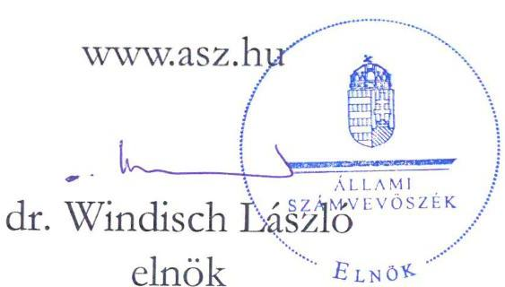
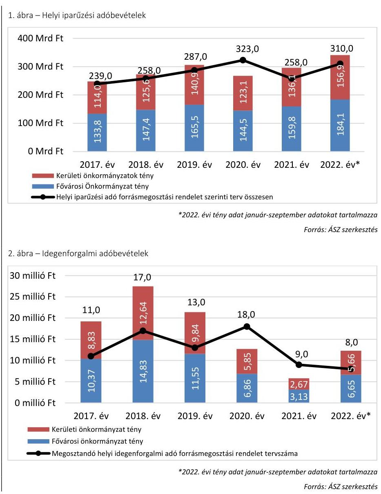

# JELENTÉS 

A Fővárosi Önkormányzatot és a kerületi önkormányzatokat osztottan megillető bevételek
2022. évi megosztásáról szóló önkormányzati rendelet felülvizsgálata
2022.

---

# JELENTÉS 

## A Fővárosi Önkormányzatot és a kerületi önkormányzatokat osztottan megillető bevételek 2022. évi megosztásáról szóló önkormányzati rendelet felülvizsgálata

2022. 

22071

---

# ELLENŐRZÉSI IGAZGATÓSÁG: 

## ÁLLAMHÁZTARTÁS HELYI SZINTJÉT ELLENŐRZŐ IGAZGATÓSÁG

## ELLENŐRZÉSI IGAZGATÓ:

KISGERGELY ISTVÁN igazgató

## ELLENŐRZÉSVEZETŐ:

SZIKSZAINÉ KIRÁLY MÁRIA igazgatóhelyettes, ellenőrzésvezető

A TÉMÁHOZ KAPCSOLÓDÓ KORÁBBI SZÁMVEVŐSZÉKI JELENTÉSEK:

- címe: $\quad$ Jelentés a Fővárosi önkormányzatot és a kerületi önkormányzatokat osztottan megillető bevételek 2021. évi megosztásáról szóló önkormányzati rendelet felülvizsgálatáról
- sorszáma: $\quad 22001$

IKTATÓSZÁM: EL-3709-051/2022.
TÉMASZÁM: 5
ELLENŐRZÉS: V0990

---

# TARTALOMJEGYZÉK 

■ ÖSSZEGZÉS ..... 5
■ AZ ELLENŐRZÉS CÉLJA ..... 7
■ AZ ELLENŐRZÉS TERÜLETE ..... 8
■ AZ ELLENŐRZÉS HÁTTERE, INDOKOLTSÁGA ..... 10
■ A JELENTÉS LÉNYEGES KÉRDÉSKÖREI ..... 11
■ AZ ELLENŐRZÉS HATÓKÖRE ÉS MÓDSZEREI ..... 12
■ MEGÁLLAPÍTÁSOK ..... 14
■ JAVASLATOK ..... 24
■ MELLÉKLETEK ..... 25
I. sz. melléklet: Értelmező szótár ..... 25
■ FÜGGELÉK: ÉSZREVÉTELEK ..... 27
■ RÖVIDÍTÉSEK JEGYZÉKE ..... 29

---

.

---

# ÖSSZEGZÉS 

A Fővárosi Önkormányzat 2022. évi forrásmegosztási rendeletalkotási folyamata a Forrásmegosztási törvény ${ }^{1}$ előírásaival összhangban volt, a rendeletalkotás szabályszerűségét biztosították. A 2022. évi forrásmegosztás kiadási és bevételi tervszámai számításokkal alátámasztottak voltak, a forrásmegosztás és annak a pénzügyi elszámolása szabályszerű volt. A 2023. évi forrásmegosztás során korrekció érvényesítése nem indokolt, de a rendelet egyes rendelkezéseinek kiegészítése szükséges. Az ÁSZ ${ }^{2}$ korábbi ellenőrzése során tett javaslatok hasznosultak.

## Az ellenőrzés társadalmi indokoltsága

Az ellenőrzés végrehajtásával a törvényalkotás számára tapasztalatok állnak rendelkezésre a forrásmegosztás szabályozásáról, a forrásmegosztási rendelet ${ }^{3}$ és az elszámolás szabályszerűségének megítélésével következtetés vonható le arra vonatkozóan, hogy indokolt-e jogszabálymódosítás kezdeményezése. Az ellenőrzés az ellenőrzött számára visszajelzést ad a forrásmegosztás végrehajtásának szabályosságáról. A társadalom számára jelzi, hogy a közpénzfelhasználás ellenőrzése biztosított. Az ÁSZ felülvizsgálata a fővárosi és a kerületi önkormányzatok közötti forrásmegosztás során biztosítja a kerületi önkormányzatokat és a közvéleményt az érintett helyi adóbevételek megosztásának helyességéről és megalapozottságáról.

## Főbb megállapítások, következtetések, javaslatok

A Fővárosi Önkormányzat 2022. évi forrásmegosztási rendeletalkotási folyamata szabályszerű volt. A Főpolgármesteri Hivatal ${ }^{4}$ rendelkezett a szervezetét és működését meghatározó Főpolgármesteri Hivatali SZMSZ-szel. A Fővárosi Önkormányzat a forrásmegosztási rendeletalkotással kapcsolatos feladatokról a Főpolgármesteri Hivatal belső szabályzataiban és a munkaköri leírásokban rendelkezett, amelyek megfeleltek a hatályos jogszabályoknak. A Főpolgármesteri Hivatali SZMSZ a forrásmegosztási rendelet megalkotásával kapcsolatos feladatok ellátására a Költségvetési Tervezési és Felügyeleti Főosztályt, valamint az Adó Főosztályt, mint önálló szervezeti egységeket nevesítette. Az Adó Főosztály ügyrendjeinek ${ }^{6}$ aktualizálása a szervezeti változásokkal nem volt összhangban, egyes feladatokat a Főpolgármesteri Hivatali SZMSZ 2020. november 1-i hatálybalépésével megszűnt - Pénzügyi Főosztályhoz rendelt a Költségvetési Tervezési és Felügyeleti Főosztály helyett. A Fővárosi Önkormányzat a forrásmegosztási rendeletalkotás folyamata során betartotta a Forrásmegosztási törvényben és a belső szabályzataiban előírt eljárási szabályokat, az előírt kontrollokat működtették. A 2022. évi forrásmegosztási rendelet tartalma a Forrásmegosztási törvény előírásaival összhangban volt. Az átláthatóság és az utólagos ellenőrzés biztosítása érdekében szükséges a végrehajtási szabályok kiegészítése a befolyt adóbevétel, valamint a bírság és pótlékszámítás vetítési alapjának, az előlegfizetés feltételeinek rendeleti meghatározása, továbbá a forrásmegosztási rendelet előírásai közötti összhang megteremtése.

A 2022. évi forrásmegosztási rendeletben szereplő tervadatokat számításokkal alátámasztották. A Fővárosi Önkormányzatot és a kerületi önkormányzatokat együttesen megillető és a megosztott bevételek kerületenkénti tervszámainak megállapítása megfelelt a Forrásmegosztási törvény előírásainak. A helyi adókból és a kapcsolódó pótlékokból, bírságokból 2022. január 1. és 2022. szeptember 30. között befolyt bevételek részesedési arányait a Forrásmegosztási törvény, valamint a forrásmegosztási rendelet előírásainak megfelelően állapították meg, a megosztott bevételek pénzügyi elszámolása szabályszerű volt. A beszedett megosztandó adóbevételek terhére előleget folyósítottak az önkormányzatoknak, azonban ennek szabályait a forrásmegosztási rendeletben nem határozták meg.

A forrásmegosztásnál figyelembe vett, a Fővárosi Önkormányzati Adóhatóság működtetésével összefüggő, helyi adóztatással kapcsolatos kiadások megállapítása és elszámolása szabályszerű volt. A forrásmegosztási rendeletben a 2022. évi előlegként meghatározott működtetési kiadások összege megalapozott volt. Az elszámolt kiadási előlegek

---

és a ténylegesen elszámolható kiadások összevetése 2022-ben megtörtént, a kerületi önkormányzatok számára megállapított különbözet elszámolása szabályszerű volt.

A forrásmegosztásnál a 2022. január-szeptember hónapokban befolyt helyi adó bevételek megosztása és átutalása, valamint a figyelembe vett kiadások elszámolása során az ÁSZ ellenőrzés jogosulatlan, vagy a Fővárosi Önkormányzatot és a kerületi önkormányzatokat jogszerűen megillető forrásnál alacsonyabb összegű elszámolást nem tárt fel, így a 2023. évi forrásmegosztásnál korrekció érvényesítése nem szükséges.

Az ÁSZ korábbi ellenőrzése során a Fővárosi Önkormányzat forrásmegosztási rendeletalkotása előkészítési folyamatában tapasztalt hiányosságok megszüntetésére irányuló - az önkormányzat intézkedési tervében vállalt - feladatok határidőben megvalósultak. Az ÁSZ korábbi ellenőrzésének javaslatai hasznosultak.
Az ÁSZ intézkedések megtétele céljából a Főpolgármesteri Hivatal Főjegyzőjének ${ }^{10}$ 4 javaslatot fogalmazott meg.

---

# AZ ELLENŐRZÉS CÉLJA 

AZ ELLENŐRZÉS CÉLJA a Fővárosi Önkormányzatot és a kerületi önkormányzatokat ${ }^{11}$ osztottan megillető bevételek 2022. évi megosztásának, továbbá a helyi adóztatással kapcsolatos kiadások megállapítása és elszámolása szabályszerűségének ellenőrzése.

---

# AZ ELLENŐRZÉS TERÜLETE 

## A Fővárosi Önkormányzat 2022. évi forrásmegosztási rendeletalkotása és annak végrehajtása

A Fővárosi Önkormányzatot és a kerületi önkormányzatokat osztottan megillető bevételek körét és a részesedési arányokat a Forrásmegosztási törvény határozza meg. Ennek értelmében a Fővárosi Önkormányzat által kivetett helyi iparűzési adóból származó bevételből, valamint a hozzá kapcsolódóan kiszabott pótlékból és bírságból származó bevételekből a Fővárosi Önkormányzat részesedése 54,0\%, a kerületi önkormányzatok együttes részesedése 46,0\%.

A forrásmegosztási rendelet alapján a kivetett idegenforgalmi adóból származó bevétel a Forrásmegosztási törvényben meghatározott szabályok szerint osztottan illeti meg a Fővárosi Önkormányzatot és a kerületi önkormányzatokat.

A kerületi önkormányzatok az iparűzési adó bevételből való részesedésük arányában kötelesek hozzájárulni a Fővárosi Önkormányzati Adóhatóság helyi adóztatással kapcsolatban felmerülő kiadásaihoz.

A Helyi adó tv. ${ }^{12}$ alapján a Fővárosi Önkormányzat az iparűzési adót, a kerületi önkormányzat az építményadót, a telekadót, a magánszemély kommunális adóját és az idegenforgalmi adót jogosult bevezetni. A Fővárosi Önkormányzat közvetlen igazgatása alatt álló Margitszigeten a kerületi önkormányzat által bevezethető adó bevezetésére a Fővárosi Önkormányzat jogosult.

A kerületi önkormányzat által bevezethető adót a kerületi önkormányzat helyett a Fővárosi Önkormányzat akkor jogosult bevezetni, ha ahhoz minden adóév tekintetében az érintett kerületi önkormányzat képviselőtestülete előzetes beleegyezését adja. A kerületi önkormányzatok kizárólag az idegenforgalmi adó esetében éltek ezzel a lehetőséggel. A 2022. évre vonatkozóan hat kerületi önkormányzat - a XVII., XVIII., XX., XXI., XXII., XXIII. kerületi önkormányzat - képviselő-testülete döntött úgy, hogy az idegenforgalmi adó bevezetésének jogát a Fővárosi Önkormányzatnak átengedi.

A Fővárosi Önkormányzat által kivetett iparűzési adó ${ }^{13}$ évi mértéke a Helyi adó tv. és a Fővárosi Önkormányzat Helyi iparűzési adó rendelete ${ }^{14}$ előírása szerint az adóalap 2\%-a. A legfeljebb 4 milliárd forint nettó árbevétellel vagy mérlegfőösszeggel rendelkező mikro-, kis- és középvállalkozások esetében a helyi iparűzési adó mértéke a 2021. évben a 639/2020. (XII. 22.) Korm. rendelet ${ }^{15}$ 1. §-a, a 2022. évben a Helyi adó tv. 51/L. § (1) bekezdése szerint 1\%.

---

A forrásmegosztási rendeletben meghatározott bevételi és kiadási tervszámokat az 1. táblázat mutatja be.

1. táblázat

# A FORRÁSMEGOSZTÁSI RENDELETBEN MEGOSZTANDÓ BEVÉTELEK ÉS KIADÁSOK TERVEZETT ÖSSZEGE 2022-BEN

|   |  | adatok ezer forintban |   |
| --- | --- | --- | --- |
|  Megosztandó bevétel/kiadás | Megosztandó forrás összege (100\%) | Főváros részesedése (54\%) | Kerületek ré- szesedése (46\%)  |
|  Helyi iparűzési adó | 310000000 | 167400000 | 142600000  |
|  Hat kerületi önkormányzat által beve- zetésre átengedett idegenforgalmi adó | 8000 | 4320 | 3680  |
|  Kivetett adókhoz kapcsolódó pótlék, bírság | 1200000 | 648000 | 552000  |
|  Megosztandó bevételek összesen | 311208000 | 168052320 | 143155680  |
|  Helyi adók beszedésével összefüggő, Forrásmegosztási törvény szerint elismerhető kiadások | 472350 | 255069 | 217281  |

Forrás: Forrásmegosztási rendelet

---

# AZ ELLENŐRZÉS HÁTTERE, INDOKOLTSÁGA 

A Fővárosi Önkormányzatot és a kerületi önkormányzatokat osztottan megillető bevételek körét, valamint a forrásmegosztás szabályait a Forrásmegosztási törvény határozza meg. A Forrásmegosztási törvény előírása alapján a Fővárosi Önkormányzat tárgyévre vonatkozó forrásmegosztási rendeletét az ÁSZ felülvizsgálja. Ha az ÁSZ megállapítja, hogy a Fővárosi Önkormányzat, vagy valamely kerületi önkormányzat jogosulatlan forráshoz jutott, vagy az őt jogszerűen megillető forrásnál alacsonyabb összegben részesült, ennek mértékével a Forrásmegosztási törvény alapján meghatározott, a felülvizsgálat lezárását követő évi forrásmegosztást a Fővárosi Önkormányzat rendeletében módosítja.

Az ellenőrzés várható hasznosulását az ÁSZ több szinten tervezi. Az ellenőrzés az ellenőrzött számára visszajelzést ad a forrásmegosztás végrehajtásának szabályosságáról, továbbá arról, hogy a Fővárosi Önkormányzatot és a kerületi önkormányzatokat osztottan megillető bevételeket szabályosan osztották-e fel, az ÁSZ javaslataival hozzájárul az esetleges hiányosságok kiküszöböléséhez.

---

# A JELENTÉS LÉNYEGES KÉRDÉSKÖREI 

1.     - A Fővárosi Önkormányzat 2022. évi forrásmegosztási rendeletalkotási folyamata szabályszerű volt-e?
2.     - A forrásmegosztás bevételi tervszámai megalapozottak voltak-e, a forrásmegosztás szabályszerű volt-e?
3.     - A forrásmegosztásnál figyelembe vett, a Fővárosi Önkormányzati Adóhatóság működtetésével összefüggő, helyi adózással kapcsolatos kiadások megállapítása és elszámolása szabályszerű volt-e?
4.     - Szükséges-e korrekciót érvényesíteni a 2023. évi forrásmegosztás során?
5.     - Az ÁSZ korábbi ellenőrzése során tett javaslatok hasznosul-tak-e?

---

# AZ ELLENŐRZÉS HATÓKÖRE ÉS MÓDSZEREI 

## Az ellenőrzés típusa

Szabályszerűségi ellenőrzés.

## Az ellenőrzött időszak

2021. október 1-jétől 2022. szeptember 30-ig tartó időszak.

## Az ellenőrzés tárgya

A Fővárosi Önkormányzatot és a kerületi önkormányzatokat osztottan megillető bevételek megosztásáról szóló 2022. évi forrásmegosztási rendelet szabályszerűsége, a helyi adóztatással kapcsolatos bevételek és kiadások megállapítása, elszámolása.

## Az ellenőrzött szervezet

A Fővárosi Önkormányzat és a Főpolgármesteri Hivatal.

## Az ellenőrzés jogalapja

Az ellenőrzés jogszabályi alapját az Állami Számvevőszékről szóló 2011. évi LXVI. törvény 1. § (3) bekezdése, a 3. § (1) bekezdése és a 33. § (7) bekezdése, valamint a Forrásmegosztási törvény 6. § (1) bekezdése képezte.

## Az ellenőrzés módszerei

Az ellenőrzést az ellenőrzési program szempontjai, az ellenőrzött időszakban hatályos jogszabályok, az ellenőrzés szakmai szabályai és a jelen ellenőrzésre irányadó ÁSZ módszertanok alapján végezte az ÁSZ.

Az ellenőrzési kérdések megválaszolásához szükséges bizonyítékok megszerzése az ellenőrzött által rendelkezésre bocsátott dokumentumokra, adatokra alapozva megfigyelés, kérdésfeltevés, interjú (információkérés), valamint elemző eljárás útján történt.

Az ellenőrzési bizonyítékként felhasználható adatforrások közé tartoznak egyrészt az adatbekérő levél mellékletében szereplő dokumentumok jegyzékében rögzített adatforrások, másrészt minden, az ellenőrzés folyamán feltárt, a helyszíni ellenőrzés során bekért, az ellenőrzés szempontjából információt tartalmazó dokumentum és jegyzőkönyv.

---

Az ellenőrzés lefolytatásához az ellenőrzött szervezet tanúsítvány kitöltésével és az ÁSZ által kért, teljességi és hitelességi nyilatkozattal alátámasztott dokumentumok rendelkezésre bocsátásával, valamint a helyszínen elhangzott kérdésekre adott válaszokkal szolgáltatott adatokat.

---

# 1. A Fővárosi Önkormányzat 2022. évi forrásmegosztási
 rendeletalkotási folyamata szabályszerű volt-e? 

Összegző megállapítás

A Fővárosi Önkormányzat 2022. évi forrásmegosztási rendeletalkotási folyamata a Forrásmegosztási törvény előírásaival összhangban állt, a rendeletalkotás szabályszerűsége biztosított volt.

1.1. számú megállapítás

A Fővárosi Önkormányzat a forrásmegosztási rendeletalkotással kapcsolatos feladatokról a Főpolgármesteri Hivatal belső szabályzataiban és a munkaköri leírásokban rendelkezett.

A Főpolgármesteri Hivatal az Áht. 10. § (5) bekezdésének előírásaival összhangban rendelkezett a szervezetét és működését meghatározó szervezeti és működési szabályzattal. A Főpolgármesteri Hivatali SZMSZ 94. §-a, valamint 7. számú melléklete a forrásmegosztási rendelet megalkotásával kapcsolatos feladatok ellátására a Költségvetési Tervezési és Felügyeleti Főosztályt, valamint az Adó Főosztályt, mint önálló szervezeti egységeket nevesítette, meghatározta az egyes szervezeti egységek forrásmegosztási rendeletalkotással kapcsolatos felelősségi, hatásköri viszonyait és feladatait.

A Főpolgármesteri Hivatali SZMSZ 105. § (2) és (3) bekezdése előírása ellenére a Költségvetési Tervezési és Felügyeleti Főosztály 2021. december 18-ig nem rendelkezett a Főpolgármester Hivatali SZMSZ 16. §-ában előírt ügyrenddel, továbbá 2022. február 4-ig ellenőrzési nyomvonallal. A hiányosságot a 2021. évi forrásmegosztási rendelet ellenőrzése során tett ÁSZ javaslat hasznosulásaként, az annak kapcsán ÁSZ által tudomásul vett intézkedési tervben vállaltak szerint pótolták.

A KTFF ügyrend ${ }_{1,2}{ }^{16,17}$ 3. § (1) bekezdés 6. pontja, illetve 3. § a/6. pontja, valamint a 2. melléklet 1.1.3. pontja szerint a Költségvetéstervezési Osztály előkészíti a Fővárosi Önkormányzatot és a kerületi önkormányzatokat osztottan megillető bevételek megosztásáról szóló rendelettervezetet, valamint ellátja az ezzel kapcsolatos pénzügyi feladatokat, a Költségvetési Folyamatokat Támogató Csoport ellátja az osztottan megillető bevételek megosztásával kapcsolatos feladatokat.

Adó Főosztály ügyrend ${ }_{1,2,3}$ 2. §-a, valamint annak 2. számú melléklete osztály-, illetve csoportszinten szabályozta az Adó Főosztály forrásmegosztási rendeletalkotással kapcsolatos feladatkörét.

Az Adó Főosztály ügyrendjeinek ${ }_{1,2,3,4}$ - ellenőrzési időszakban és azt követően hatályos - 2. melléklet 4.1.1. pontja nem volt összhangban a Főpolgármesteri Hivatali SZMSZ-szel, mivel az adóbevételi tervekhez készítendő adatszolgáltatás, elemzés, javaslat továbbítását a Főpolgármesteri Hivatali SZMSZ 2020. november 1-jei hatálybalépésével megszűnt Pénzügyi Főosztály részére rendeli megküldeni a - Főpolgármesteri Hivatali SZMSZ szerint a forrásmegosztási rendelet előkészítését végző - Költségvetési Tervezési és Felügyeleti Főosztály helyett.

A forrásmegosztási rendeletalkotással kapcsolatos feladatokat, hatásköröket a feladatellátásban érintettek munkaköri leírásai tartalmazták.

# 1.2. számú megállapítás 

## A Fővárosi Önkormányzat a forrásmegosztási rendeletalkotás folyamata során betartotta a Forrásmegosztási törvényben és a belső szabályzataiban előírt eljárási szabályokat.

A Fővárosi Önkormányzat a forrásmegosztási rendelet megalkotásának folyamata során betartotta a Forrásmegosztási törvény 5. § (1) bekezdése szerinti véleményeztetési és rendelet alkotási határidőket. A Költségvetési Tervezési és Felügyeleti Főosztály a Forrásmegosztási törvényben előírt határidőre megküldte a kerületi önkormányzatok részére a 2022. évi forrásmegosztási rendelet tervezetét, ezzel biztosította a Forrásmegosztási törvényben előírt 15 napos észrevételezési határidőt.

A Forrásmegosztási törvényben biztosított 15 napos véleményezési határidőn belül tizennyolc önkormányzat élt véleményezési jogával. Tizenhét kerületi önkormányzat képviselő-testülete nem tett észrevételt, a rendelettervezet elfogadásáról, illetve tudomásul vételéről döntött. A XIII. Kerületi Önkormányzat Képviselő-testülete véleményezési joga keretében nem fogadta el a 2022. évi forrásmegosztási rendelet-tervezetét. A Fővárosi Önkormányzat a 2022. évi forrásmegosztási rendelet elfogadása során nem vette figyelembe a XIII. Kerületi Önkormányzat Képviselő-testülete által tett észrevételt tekintettel arra, hogy az észrevétel nem a 2022. évi forrásmegosztási rendelet, hanem a Forrásmegosztási törvény módosítására irányult.

A XIII. kerület önkormányzata szerint a rendelet-tervezet a jogszabályi előírásnak megfelelt, azonban a Forrásmegosztási törvény 1. számú mellékletében előírt elosztási arányszámok 2012. óta változatlanok, és nem tükrözik a kerületek által ellátott feladatokban bekövetkezett változásokat, az egyes kerületeknek jutó források aránytalansága növekszik, valamint a kerületi önkormányzatok véleményezési joga formális.

A Fővárosi Önkormányzat a Helyi adó tv. 1. § (3) bekezdés előírásával összhangban rendelkezett azon hat ${ }^{1}$ kerületi önkormányzat képviselő-testületének beleegyező határozatával, akik az idegenforgalmi adó beszedését 2022. évre átengedték a Fővárosi Önkormányzatnak.

A Fővárosi Közgyűlés - a Forrásmegosztási törvény 5. § (1) bekezdése szerinti határidőt betartva - elfogadta a 2022. évi forrásmegosztási rendeletet, amely a Forrásmegosztási törvény szerinti határidőben hatályba lépett.

[^0]
[^0]:    ${ }^{1}$ XVII: 208/2021. (VIII. 26.), XVIII: 397/2021. (X. 14.), XX: 255/2021. (IX. 23.), XXI: 252/2021. (X.28), XXII: 289/2021. (X. 14.), XXIII: 544/2021. (XII. 07.) számú határozat

---

1.3. számú megállapítás

A 2022. évi forrásmegosztási rendelet előírásai összhangban voltak a Forrásmegosztási törvény előírásaival. A 2022. évi forrásmegosztási rendelet rendelkezik a Forrásmegosztási törvényben előírt tartalmi elemekkel, a forrásmegosztási rendeletben az eljárási és értelmezési szabályok kiegészítése indokolt.

A 2022. évi forrásmegosztási rendelet rendelkezett a Forrásmegosztási törvényben előírt tartalmi elemekkel. A forrásmegosztási rendelet a Forrásmegosztási törvény 1., 3. és 5. §-ainak előírásaival összhangban tartalmazta a tárgyévre vonatkozóan a Fővárosi Önkormányzatot és kerületi önkormányzatokat osztottan megillető bevételek összegét és azok beszedésével összefüggésben felmerült kiadások elszámolásának rendjét. Így tartalmazta:
a Fővárosi Önkormányzatot és a kerületi önkormányzatot megillető részesedési arányokat, összesen és ezen belül kerületenkénti bontásban,
a 2022. évre az iparűzési adó, az idegenforgalmi adó, valamint a késedelmi pótlékból, bírságból származó bevétel tervezett összegét,
a helyi adóztatáshoz kapcsolódó kiadásokhoz való hozzájárulásként a kerületi önkormányzatoknál levonandó összeget,
a megosztott bevételek önkormányzati költségvetési számlákra történő utalása teljesítésének határidejét,
a helyi adó beszedésével kapcsolatos, a Forrásmegosztási törvény szerint elismerhető kiadások elszámolásának rendjét.
Az átláthatóságot és az utólagos ellenőrzést nehezíti, hogy a Fővárosi Önkormányzatot és a kerületi önkormányzatokat osztottan megillető bevételek megosztásáról szóló önkormányzati rendelet végrehajtási szabályai nem rögzítik:
a késedelmi pótlékból és bírságból származó bevételek számítási módjának vetítési alapját,
a bevételek egyértelmű számbavétele és megosztása érdekében a „befolyt bevételek" kifejezés értelmezését és tartalmi meghatározását, továbbá az önkormányzatoknak a befolyt adóból történő előlegfizetés feltételeit és szabályait a 2.3 pontnál jelzett probléma okán.
Ezen túlmenően a forrásmegosztási rendelet 4. § (1) bekezdésében hivatkozott 2. § (2) bekezdés rendelkezései közül a 2. § (2) bekezdés d) ${ }^{2}$ és e) ${ }^{3}$ pontja esetében a 4. § (1) bekezdése szerinti rendelkezés nem értelmezhető. A 4. § (1) bekezdése a 2022. évi bevételekről szól, a 2. § (2) bekezdés d) és e) pontja pedig a 2021. évi kiadásokra, illetve a megosztási arányokra vonatkozik.

[^0]
[^0]:    ${ }^{2}$ 2. § (2) bekezdés d) pontja a helyi adókhoz kapcsolódó kiadásokból figyelembe veendő összeget tartalmazza, melyet 217281 ezer Ft-ban számszerűsít, ebben az esetben nem releváns a 4. § (1) bekezdés előírása
    ${ }^{3}$ 2. § (2) bekezdés e) pont arra vonatkozik, hogy a megosztandó bevételek együttes összegét az 1. számú melléklet szerinti 6. oszlopa tartalmazza, ebben az esetben szintén nem releváns a 4. § (1) bekezdés előírása

---

1.4. számú megállapítás

A 2022. évi forrásmegosztási rendelet megalkotás során a Főpolgármesteri Hivatali SZMSZ-ben, az önálló szervezeti egységek ügyrendjében és a dolgozók munkaköri leírásában szereplő kontrollokat működtették.

A Főpolgármesteri Hivatali SZMSZ szerint a Fővárosi Önkormányzatot és kerületi önkormányzatokat osztottan megillető bevételek éves megosztása kapcsán az Adó Főosztály, valamint a Költségvetési Tervezési és Felügyeleti Főosztály rendelkezett feladatkörrel.

A Költségvetési Tervezési és Felügyeleti Főosztály a Főpolgármesteri Hivatali SZMSZ-ben, valamint a KTFF Ügyrendje ${ }_{1,2}$ előírásaiban, továbbá a munkaköri leírásokban foglaltak szerint előkészítette a 2022. évi forrásmegosztási rendelettervezetet, ellátta az ezzel kapcsolatos egyeztetési, ellenőrzési feladatokat. A 2022. évi forrásmegosztási rendelet előkészítése, előterjesztése, elfogadása folyamatában a vezetői ellenőrzési, felülvizsgálati kontrollokat működtették.

Az Adó Főosztály eleget téve a Főpolgármesteri Hivatali SZMSZ, valamint az Adó Főosztály ügyrend ${ }_{1,2,3}$ előírásának, a munkaköri leírásokban foglaltak szerint elvégezte a 2022. évi forrásmegosztási rendelet véleményezését. Megküldte a Költségvetési Tervezési és Felügyeleti Főosztály részére a 2022. évi forrásmegosztási rendelettel kapcsolatos észrevételét, valamint tájékoztatást adott a 2021. évi tényleges pénzforgalmi bevételi adatokról.

# 2. A forrásmegosztás bevételi tervszámai megalapozottak voltak-e, a forrásmegosztás szabályszerű volt-e? 

## Összegző megállapítás

2.1. számú megállapítás

A forrásmegosztás bevételi tervszámai számításokkal alátámasztottak voltak, a forrásmegosztás szabályszerű volt.

A forrásmegosztás bevételi tervszámait számításokkal alátámasztották.

A 2022. évi forrásmegosztási rendeletben a Fővárosi Önkormányzat és a kerületi önkormányzatok között megosztandó helyi adóból és a kapcsolódó pótlék és bírság kiszabásából származó bevételi tervszámokat számításokkal alátámasztották.

A 2022. január-szeptember havi tényleges adóbevétel az iparűzési adó esetében 10,0%-kal (1. ábra), az idegenforgalmi adó esetében 53,8%-kal (2. ábra) már meghaladta a Fővárosi Önkormányzat által a 2022. évre tervezett adóbevételeket. A 2022. év január-szeptember hónapokban realizált tényleges adóbevételek alapján megállapítható, hogy a bevételi tervszámokat - az óvatos tervezés elvét követve - alultervezték.

---

2.2. számú megállapítás

A Fővárosi Önkormányzatot és a kerületi önkormányzatokat együttesen megillető és a megosztott bevételek kerületenkénti megállapítása megfelelt a Forrásmegosztási törvény előírásainak.

A megosztott bevételek tervezett összegét a Forrásmegosztás törvény 3. §-a és a forrásmegosztási rendelet 1. §-a előírásai szerint szabályszerűen osztották meg, a Fővárosi Önkormányzat 54%-ot, a kerületi önkormányzatok együttesen 46% részesedést kaptak.

A kerületeket együttesen megillető megosztott bevétel tervszámának kerületek közötti megosztását a Forrásmegosztási törvény 4. §-a és a forrásmegosztási rendelet 1. §-a előírásának megfelelően végezték el. A tervezett helyi iparűzési adóból származó bevétel és a helyi adóhoz kapcsolódó pótlék és bírságbevételekből származó részesedés tervezett összegének 46%-át a Forrásmegosztási törvény mellékletében meghatározott részesedési arányszámok szerint osztották fel a kerületi önkormányzatok között.

Az érintett kerületi önkormányzatokat egyenként megillető idegenforgalmi adóból származó bevételi részesedés tervezett összegének megállapítása szabályszerűen történt. A XVII., a XVIII., a XX., a XXI., a XXII. és a XXIII. kerületi önkormányzatok határozatban döntöttek, hogy az idegenforgalmi adót a kerületeik illetékességi területén 2022. évben a Fővárosi Önkormányzat vezesse be. Az idegenforgalmi adó tervezett összegének kerületi önkormányzatok közötti megosztása a Forrásmegosztási törvény mellékletében meghatározott részesedési arányok alapulvételével történt.

# 2.3. számú megállapítás 

## A Fővárosi Önkormányzat által kivetett helyi adóval kapcsolatosan befolyt bevételek 2022. évi megosztása során a pénzügyi elszámolás szabályszerű volt.

2022-ben az adott hónapokban befolyt megosztandó bevételekből az egyes önkormányzatok költségvetési számlájára havi rendszerességgel átutalt megosztott forrás megállapítása szabályszerűen történt.

A Fővárosi Önkormányzatot és a kerületi önkormányzatokat osztottan megillető helyi adók és a kapcsolódó pótlékok, bírságok 2022. január 1. és 2022. szeptember 30. közötti összegét és megoszlását a 2. táblázat mutatja be.
2. táblázat

A 2022. ÉVI MEGOSZTANDÓ BEVÉTELEK ÖSSZEGE ÉS MEGOSZLÁSA
adatok ezer forintban

| Megosztandó   bevétele 2022.1-9. hónap | Megosztandó   forrás összege   (100\%) | Főváros   részesedése   (54\%) | Kerületek része-   sedése   (46\%) |
| :--: | :--: | :--: | :--: |
| Helyi iparűzési adó | 340983515 | 184131098 | 156852417 |
| XVII., a XVIII., a XX., a XXI., a XXII.   és a XXIII. kerületi önkormányzat-   nál átengedett idegenforgalmi adó | 12307 | 6646 | 5661 |
| Kivetett adókhoz kapcsolódó pót-   lék, bírság | 1035676 | 559265 | 476411 |
| Megosztandó bevételek összesen | 342031498 | 184697009 | 157334489 |

A tárgyhónapban befolyt megosztandó bevételekből
 a Fővárosi Önkormányzatot és a kerületi önkormányzatokat megillető részesedési arányokat a Forrásmegosztási törvény 3-4. §-a és melléklete, valamint a forrásmegosztási rendelet 1. §-a előírásainak megfelelően állapították meg. A forrásmegosztási rendelet nem tartalmazza, hogy mit tekint megosztandó „befolyt" adóbevételnek. A befolyt megosztandó helyi adóbevételek megállapítása a gyakorlatban oly módon történt, hogy az adófolyószámlákra beérkezett összes bevételt vették figyelembe megosztandó adóbevételként, a beazonosítatlan tételek, a túlfizetések és átvezetések miatti kötelezettségvállalás-változásokat a beazonosítást követően, utólagosan korrigálták az adófolyószámlákon.

A befolyt, megosztandó iparűzési adóbevételek és a hozzájuk kapcsolódóan kivetett pótlékok, bírságok, valamint az idegenforgalmi adóbevétel arányos részének a kerületi önkormányzatok költségvetési számlájára történő Fővárosi Önkormányzat általi átutalása a Forrásmegosztási törvény 5. § (3) bekezdésében és a forrásmegosztási rendelet 4. § (2) és (4) bekezdésben foglalt határidőn belül, havonta teljes összegben megtörtént.

A forrásmegosztási rendelet nem szabályozta a megosztandó adóbevételek terhére fizethető előleg folyósításának szabályait, ennek ellenére 2022. január-szeptember hónapokban soron kívüli utalásokkal előleget

---

biztosítottak az önkormányzatok részére. A Fővárosi Önkormányzat részére hat esetben, összesen 149 100 000 ezer Ft, valamint két esetben a XIX. kerületi önkormányzat részére 14 000 000 ezer Ft összegben. A kiutalt előlegeket a következő utalásban számolták el.

A Fővárosi Önkormányzat a Forrásmegosztási törvény 2. § (5) bekezdése, valamint a forrásmegosztási rendelet 5. § (1) bekezdése és a 2021. évi forrásmegosztási rendelet ${ }^{18}$ 5. § (2) bekezdésének megfelelően a 2022. június 30-i utalásban érvényesítette a kerületek felé egyszeri jelleggel a helyi adóztatással kapcsolatos kiadásokat.

# 3. A forrásmegosztásnál figyelembe vett, a Fővárosi Önkormányzati Adóhatóság működtetésével összefüggő, helyi adózással kapcsolatos kiadások megállapítása és elszámolása szabályszerű volt-e? 

Összegző megállapítás

A forrásmegosztásnál figyelembe vett, a Fővárosi Önkormányzati Adóhatóság működtetésével összefüggő, helyi adózással kapcsolatos kiadások megállapítása és elszámolása szabályszerű volt.

### 3.1. számú megállapítás

A forrásmegosztási rendeletben a 2022. évi előlegként meghatározott működtetési kiadások összege megalapozott volt.

A forrásmegosztás során az adóhatóság működtetésével kapcsolatosan 1355 939 ezer Ft összegű működési kiadást terveztek a 2022. évre.

A Forrásmegosztási törvény 2. § (6) bekezdése értelmében a helyi adóztatással kapcsolatosan figyelembe vehető kiadásokat a fővárosi önkormányzat közgyűlésének rendelete alapján kivetett helyi adóhoz kapcsolódóan kiszabott pótlékból és bírságból származó bevételek legfeljebb 50\%-áig terjedő mértékben lehet érvényesíteni. A Fővárosi Önkormányzat az előírt korlátot betartotta, a helyi adókhoz kapcsolódó kiadásokból a forrásmegosztási rendelet 2. § (2) bekezdés d) pontjában meghatározott 217 281,0 ezer Ft összeget terveztek figyelembe venni és levonni a kerületi önkormányzatoktól.

A forrásmegosztási rendelet a kiadási előleg megállapításának korlátját képező, helyi adókhoz kapcsolódóan kiszabott késedelmi pótlékból és bírságból befolyt összeg konkrét számítási módját (azaz azt, hogy a számítás a tárgyévre tervezett vagy az előző évben ténylegesen befolyt összeg alapján történik-e) nem határozta meg. A forrásmegosztási rendeletből közvetve volt megállapítható, hogy a kiadási előleg számításának alapjául a tárgyévet megelőző évben (2021-ben) ténylegesen beszedett késedelmi pótlék és bírság bevétele szolgált.

A 2022. évi forrásmegosztási rendeletben meghatározott, a fővárosi és a kerületi önkormányzatokat osztottan terhelő helyi adóztatással kapcsolatos működtetési kiadások összege megalapozott volt, azt számítások, elemzések, továbbá a 2021. évi teljesülési adatok alátámasztották.

---

# 3.2. számú megállapítás 

A 2022-ben elszámolt kiadási előlegek megosztása, érvényesítése szabályszerű volt.

A 2022. évre megállapított kiadási előlegnek a Fővárosi Önkormányzat és a kerületi önkormányzatok közötti megosztásánál a Forrásmegosztási törvény 3. §-ában előírt 54\%-46\%-os arányt betartották.

A kerületi önkormányzatok felé érvényesíthető 2022. évi kiadási előlegnek a kerületi önkormányzatok közötti megosztása a Forrásmegosztási törvény mellékletében szereplő részesedési arányok szerint történt.

## A Fővárosi Önkormányzat adóbeszedéssel kapcsolatos, a Fővárosi Önkormányzati Adóhatóság működtetésével összefüggő 2022. évi elszámolt kiadási előleget főkönyvi kivonattal és analitikus nyilvántartással alátámasztotta.

A 2022. évi kiadási előleg meghatározása során a Forrásmegosztási törvény 2. § (5) és (6) bekezdésében foglaltaknak megfelelően a 2021. évi zárszámadási rendeletben ${ }^{19}$ elfogadott, adóbeszedéssel kapcsolatos kiadásokat vették figyelembe, a Fővárosi Önkormányzatot és a kerületi önkormányzatokat osztottan megillető helyi adókhoz kapcsolódóan kiszabott késedelmi pótlékból és bírságból származó bevételek 50\%-ával egyező összegben. A Fővárosi Önkormányzat az adóbeszedéssel kapcsolatos kiadást a 2021. évi költségvetési beszámolóval egyező főkönyvi kivonattal és analitikus nyilvántartással, a 2022. évi kiadási előleget főkönyvi kivonattal és analitikus nyilvántartással alátámasztotta.

A Forrásmegosztási törvény és a 2021. évi zárszámadási rendelet alapján a kerületi önkormányzatok felé érvényesíthető 2022. évi kiadási előleg meghatározását a 3. táblázat mutatja be:
3. táblázat

A KERÜLETI ÖNKORMÁNYZATOK FELÉ ÉRVÉNYESÍTHETŐ 2022. ÉVI KIADÁSI ELŐLEG MEGHATÁROZÁSA
adatok ezer forintban

| Megnevezés | Összeg |
| :--: | :--: |
| Adóbeszedéssel kapcsolatosan teljesített működési kiadások a 2021. évben | 1 167 761,0 |
| Helyi adókhoz kapcsolódóan kiszabott késedelmi pótlék és bírságból befolyt összes bevétel a 2021. évben | 944 700,2 |
| Forrásmegosztási törvény szerinti korlát: a helyi adókhoz kapcsolódó pótlék és bírság bevétel 50\%-a (a 2021. évi megosztandó kiadások 100\%-a) | 472 350,1 |
| Forrásmegosztási törvény szerinti megosztott kiadás részesedési aránya Fővárosi Önkormányzat - 54\% | 255 069,1 |
| Forrásmegosztási törvény szerinti megosztott kiadás részesedési aránya kerületi önkormányzatok együttesen - 46\% = 2022. évi kiadási előlegként   figyelembe vehető összeg | 217 281,0 |

Forrás: 2021. évi zárszámadási rendelet, Fővárosi Önkormányzat adatszolgáltatása
A kerületi önkormányzatokat terhelő, 217 281,0 ezer Ft-ban meghatározott összeget a Forrásmegosztási törvény 2. § (5) bekezdésének, valamint a forrásmegosztási rendelet 5. § (1) bekezdésének megfelelően 2022. évi kiadási előlegként vették figyelembe, és a 2021. évi zárszámadási rendelet hatályba lépését követően, 2022 június hónap utolsó napján - a befolyt, kerületeket megillető helyi iparűzési adóbevételből - vonták le a kerületi önkormányzatoktól.

---

3.4. számú megállapítás

A 2021. év során elszámolt kiadási előlegek és a ténylegesen elszámolható kiadások összevetése 2022-ben megtörtént, a kerületi önkormányzatok számára megállapított különbözet elszámolása szabályszerű volt.

A 2021. évi kiadási különbözet elszámolása során a Fővárosi Önkormányzati Adóhatóság a 2021. év során a kerületi önkormányzatok felé elszámolt 172 238,2 ezer Ft kiadási előleget és a 2021. évi zárszámadási rendelet alapján ténylegesen elszámolható 217 281,0 ezer Ft kiadást összevetette, a különbözet összegét 45 042,8 ezer Ft-ban állapította meg.

A 2021. évi kiadási különbözet elszámolása a Forrásmegosztási törvény 2. § (5) bekezdésében foglaltaknak, valamint a 2021. évi forrásmegosztási rendelet 5. § (2) bekezdésében foglaltaknak megfelelően, a Forrásmegosztási törvény mellékletében megállapított kerületi önkormányzatok egymás közötti részesedési arányainak figyelembevételével történt. A 2021. évi kiadási különbözetet a 2021. évi zárszámadási rendelet hatályba lépését követően, 2022 június hónap utolsó napján - a befolyt, kerületeket megillető helyi iparűzési adóbevételből - vonták le a kerületi önkormányzatoktól.

# 4. Szükséges-e korrekciót érvényesíteni a 2023. évi forrásmegosztás során? 

Összegző megállapítás

A 2023. évi forrásmegosztás során nem szükséges korrekciót érvényesíteni.

A forrásmegosztásnál a 2022. január-szeptember hónapokban befolyt helyi adóbevételek megosztása és átutalása, valamint a figyelembe vett kiadások elszámolása során az ÁSZ ellenőrzés jogosulatlan, vagy a Fővárosi Önkormányzatot és a kerületi önkormányzatokat jogszerűen megillető forrásnál alacsonyabb összegű elszámolást nem tárt fel, így a 2023. évi forrásmegosztásnál korrekció érvényesítése nem szükséges.

## 5. Az ÁSZ korábbi ellenőrzése során tett javaslatok hasznosultak-e?

## Összegző megállapítás

5.1. számú megállapítás

A 2021. évi forrásmegosztási rendelet felülvizsgálata során az ÁSZ által tett javaslatok hasznosultak.

A 2021. évi forrásmegosztási rendelet felülvizsgálata során az ÁSZ által tett javaslatokhoz készített intézkedési tervben foglaltak határidőben megvalósultak.

A Fővárosi Önkormányzatot és a kerületi önkormányzatokat osztottan megillető bevételek 2021. évi megosztásáról szóló forrásmegosztási rendelet felülvizsgálata során az ÁSZ kettő javaslatot fogalmazott meg a Főpolgármesteri Hivatal Főjegyzője részére, melyek hasznosultak.

---

A Főpolgármesteri Hivatal által határidőben megküldött, ÁSZ által tudomásul vett intézkedési tervben vállalt feladatok határidőben megvalósultak:
$\longrightarrow$ a Költségvetési Tervezési és Felügyeleti Főosztály Főpolgármesteri Hivatali SZMSZ előírása szerinti ellenőrzési nyomvonalát elkészítették, Főjegyző általi jóváhagyását követően hatálybalépése - az intézkedési tervben előírt 2022. február 7-i határidőt megelőzően 2022. február 4-én megtörtént,
$\longrightarrow$ a Költségvetési Tervezési és Felügyeleti Főosztály ügyrendjét elkészítették, Főjegyző általi jóváhagyást követően az intézkedési tervben jelzett időpontban, 2021. december 18-án hatályba léptették.

---

# JAVASLATOK 

Az ÁSZ tv. 33. § (1) bekezdésében foglaltak értelmében az ellenőrzött szervezet vezetője köteles a jelentésben foglalt megállapításokhoz kapcsolódó intézkedési tervet összeállítani és azt a jelentés kézhezvételétől számított 30 napon belül az ÁSZ részére megküldeni. Amennyiben az ellenőrzött szervezet vezetője nem küldi meg határidőben az intézkedési tervet, vagy továbbra sem elfogadható intézkedési tervet küld, az Állami Számvevőszék elnöke az ÁSZ tv. 33. § (3) bekezdés a) és b) pontjaiban foglaltakat érvényesítheti.

## Főpolgármesteri Hivatal Főjegyzője részére

1. Intézkedjen a Fővárosi Önkormányzatot és a kerületi önkormányzatokat osztottan megillető bevételek megosztásáról szóló önkormányzati rendelet végrehajtási szabályainak kiegészítéséről a befolyt bevétel fogalmi meghatározásáról, továbbá a késedelmi pótlékból és bírságból származó bevételek számítása során a vetítési alap meghatározásáról.
(1.3 sz. megállapítás 2. bekezdés alapján)
2. Intézkedjen a Fővárosi Önkormányzatot és a kerületi önkormányzatokat osztottan megillető bevételek megosztásáról szóló önkormányzati rendelet 4. § (1) bekezdése, valamint a 2. § (2) bekezdés d) és e) pontja közötti összhang megteremtéséről.
(1.3 sz. megállapítás 3. bekezdése alapján)
3. Intézkedjen a Fővárosi Önkormányzatot és a kerületi önkormányzatokat osztottan megillető bevételek megosztásáról szóló önkormányzati rendelet végrehajtási szabályainak kiegészítéséről a befolyt bevételek terhére fizethető előleg folyósítása feltételeinek meghatározására.
(2.3 sz. megállapítás 5. bekezdése alapján)
4. Gondoskodjon az Adó Főosztály ügyrendjének a Főpolgármesteri Hivatal szervezeti változásával összhangban történő aktualizálásáról.
(1.1 sz. megállapítás 5. bekezdés alapján)

---

# MELLÉKLETEK 

- I. SZ. MELLÉKLET: ÉRTELMEZŐ SZÓTÁR

Fővárosi Önkormányzat által kivetett helyi adóhoz kapcsolódóan kiszabott pótlék és bírság
helyi adóztatással kapcsolatos kiadás
helyi iparűzési adó
idegenforgalmi adó
részesedés

A fővárost és a kerületeket osztottan illetik meg a Fővárosi Önkormányzat közgyűlésének rendelete alapján kivetett helyi adóhoz kapcsolódóan kiszabott pótlékból és bírságból származó bevételek. (Forrás: A Forrásmegosztási törvény 2. § (2) bekezdése alapján meghatározott fogalom.)
A Fővárosi Önkormányzati helyi adóztatással kapcsolatos - a tárgyévre vonatkozóan a Fővárosi Önkormányzatot és a kerületi önkormányzatokat osztottan megillető bevételek (iparűzési adó, hat kerületnél befolyt idegenforgalmi adó, a kivetett helyi adóhoz kapcsolódóan kiszabott pótlék és bírság) beszedésével összefüggően felmerült - kiadásokat a Forrásmegosztási törvény 2. § (1) bekezdés a) pontja szerinti bevételből részesülők viselik részesedésük arányában. Kiadásként a Fővárosi Önkormányzatnál a beszedéssel - a Fővárosi Önkormányzati Adóhatóság működtetésével összefüggően felmerült működtetési kiadásokat kell figyelembe venni. A Forrásmegosztási törvény 2. § (1) bekezdés a) pontja és a (4) bekezdés szerint figyelembe vehető kiadásokat a (2) bekezdésben felsorolt bevételek legfeljebb 50\%-áig terjedő mértékben lehet érvényesíteni. (Forrás: A Forrásmegosztási törvény 2. § (4), (6) bekezdése alapján meghatározott fogalom.)
A Helyi adó tv. felhatalmazása alapján a Fővárosi Közgyűlés rendeletével kivetett helyi adónem. A Fővárosi Önkormányzat illetékességi területén vállalkozói tevékenységet (iparűzési tevékenységet) végző vállalkozó helyi iparűzési adót köteles fizetni. Adóköteles iparűzési tevékenységnek tekintendő e törvény alapján a vállalkozó e minőségben végzett nyereség-, illetőleg jövedelemszerzésre
 irányuló tevékenysége. (Forrás: A Helyi adó tv. 1. § (2) bekezdése, valamint a 35. § és 36. § alapján meghatározott fogalom.)
A kommunális jellegű adók közül a kerület döntése alapján átengedett helyi idegenforgalmi adóból beszedett bevétel. A helyi idegenforgalmi adót a kerületi önkormányzat helyett a Fővárosi Önkormányzat rendeletével akkor jogosult bevezetni, ha ahhoz minden adóév tekintetében az érintett kerület önkormányzatának képviselő-testülete előzetes beleegyezését adja. A Fővárosi Önkormányzat által közvetlenül igazgatott terület tekintetében a kerületi önkormányzat által bevezethető adó bevezetésére a Fővárosi Önkormányzat jogosult. (Forrás: A Helyi adó tv. 1. §-a és a III. fejezet Kommunális jellegű adók 2. pontja alapján meghatározott fogalom.) A forrásmegosztásba bevont bevételekből a Fővárosi Önkormányzatot és a kerületi önkormányzatokat együttesen megillető részesedés arányszáma. A Fővárosi Önkormányzatot és a kerületi önkormányzatokat a Forrásmegosztási törvény 3. § alapján osztottan megillető bevételekből a Fővárosi Önkormányzatot 54,0%, a kerületi önkormányzatokat együttesen 46,0% részesedés illeti meg. (Forrás: A forrásmegosztási rendelet 2-3. §-ai alapján meghatározott fogalom.)

---

részesedési arányok

tárgyév
vetítési alap

A kerületi önkormányzatokat megillető források egyes kerületek közötti megosztásának aránya, amelyet a Forrásmegosztási törvény 1. melléklete tartalmaz. (Forrás: A Forrásmegosztási törvény 4. § (1) bekezdése alapján meghatározott fogalom.)
Azon gazdasági év, amelyhez tartozó megosztandó bevételeknek a Fővárosi Önkormányzat és a kerületi önkormányzatok közötti megosztását a forrásmegosztási rendelet határozza meg. (Forrás: A Forrásmegosztási törvény 1. §-a alapján meghatározott fogalom.)
Az a viszonyítási alap, amely megmutatja, hogy a helyi adóztatás kiadásait a tárgyévi forrásmegosztási rendeletben tervezett, illetve az előző évben befolyt, késedelmi pótlékból és bírságból származó bevételekhez viszonyítva kell érvényesíteni. (Forrás: ÁSZ szerkesztés)

---

# FÜGGELÉK: ÉSZREVÉTELEK 

A jelentéstervezetet a Számvevőszék 15 napos észrevételezésre megküldte az ellenőrzött szervezet vezetőjének az ÁSZ tv. 29. § 4. (1) bekezdése előírásának megfelelően.
Az ellenőrzött szervezetek vezetői a jelentéstervezet megállapításaira nem tettek észrevételt.

[^0]
[^0]:    ${ }^{4}$ 29. § (1) Az Állami Számvevőszék az ellenőrzési megállapításait megküldi az ellenőrzött szervezet vezetőjének vagy az általa megbízott személynek, és annak, akinek személyes felelősségét állapította meg.
    (2) Az ellenőrzött szervezet vezetője és a felelősként megjelölt személy az ellenőrzés megállapításaira tizenöt napon belül írásban észrevételt tehet.
    (3) Az Állami Számvevőszék az észrevételre a beérkezésétől számított harminc napon belül írásban válaszol. A figyelembe nem vett észrevételeket köteles a jelentésben feltüntetni, és megindokolni, hogy azokat miért nem fogadta el.

---

.

---

# RÖVIDÍTÉSEK JEGYZÉKE 

${ }^{1}$ Forrásmegosztási törvény
${ }^{2}$ ÁSZ
${ }^{3}$ forrásmegosztási rendelet
${ }^{4}$ Főpolgármesteri Hivatal
${ }^{5}$ Főpolgármesteri Hivatali SZMSZ
${ }^{6}$ Adó Főosztály ügyrendje ${ }_{1}$
${ }^{7}$ Adó Főosztály ügyrendje ${ }_{2}$
${ }^{8}$ Adó Főosztály ügyrendje ${ }_{3}$
${ }^{9}$ Adó Főosztály ügyrendje ${ }_{4}$
${ }^{10}$ Főjegyző
${ }^{11}$ kerületi önkormányzatok
${ }^{12}$ Helyi adó tv.
${ }^{13}$ iparűzési adó
${ }^{14}$ Helyi iparűzési adó rendelet
${ }^{15}$ 639/2020. (XII. 22.) Korm. rendelet
${ }^{16}$ KTFF ügyrend ${ }_{1}$
${ }^{17}$ KTFF ügyrend ${ }_{2}$
${ }^{18} 2021$. évi forrásmegosztási rendelet
${ }^{19} 2021$. évi zárszámadási rendelet

A fővárosi önkormányzat és a kerületi önkormányzatok közötti forrásmegosztásról szóló 2006. évi CXXXIII. törvény (hatályos: 2006. december 27-től)
Állami Számvevőszék
Budapest Főváros Önkormányzata Közgyűlésének 2/2022. (I. 28.) önkormányzati rendelete a Fővárosi Önkormányzatot és a kerületi önkormányzatokat osztottan megillető bevételek 2022. évi megosztásáról (hatályos: 2022. február 1-től)
Budapest Főváros Főpolgármesteri Hivatal
Budapest Főváros Önkormányzata Főpolgármesterének 25/2020. (X. 26.) utasítása Budapest Főváros Főpolgármesteri Hivatal szervezeti és működési szabályzatáról (hatályos: 2020. november 1-től)
Adó Főosztály ügyrendje (hatályos: 2020. december 1-től)
Adó Főosztály ügyrendje (hatályos: 2022. április 21-től)
Adó Főosztály ügyrendje (hatályos: 2022. július 13-tól)
Adó Főosztály ügyrendje (hatályos: 2022. október 1-től)
Budapest Főváros Főpolgármesteri Hivatal Főjegyzője
Budapest Főváros I-XXIII. kerületeinek önkormányzatai
A helyi adókról szóló 1990. évi C. törvény (hatályos: 1991. január 1-től)
helyi iparűzési adó
Budapest Főváros Önkormányzata Közgyűlésének 87/2012. (XI. 30.) Önkormányzati rendelete a helyi iparűzési adóról (hatályos: 2013. január 1-től)
a koronavírus-világjárvány nemzetgazdaságot érintő hatásának enyhítése érdekében szükséges egyes intézkedésekről (hatályos: 2020. december 23-tól)
A Költségvetési Tervezési és Felügyeleti Főosztály ügyrendje (hatályos: 2021. december 18-tól)

A Költségvetési Tervezési és Felügyeleti Főosztály ügyrendje (hatályos: 2022. február 4-től)

Budapest Főváros Önkormányzata Közgyűlésének 2/2021. (I. 29.) önkormányzati rendelete a Fővárosi Önkormányzatot és a kerületi önkormányzatokat osztottan megillető bevételek 2021. évi megosztásáról (hatályba lépett 2021. január 31-én)
Budapest Főváros Önkormányzata Közgyűlésének 16/2022. (VI. 9.) önkormányzati rendelete a Budapest Főváros Önkormányzata 2021. évi összevont költségvetéséről szóló 69/2020. (XII. 29.) önkormányzati rendelet végrehajtásáról

---

1052 Budapest, Apáczai Csere János u. 10. | 1364 Budapest 4., Pf. 54
www.asz.hu | szamvevoszek@asz.hu
telefon: +36 14849100
