# JELENTÉS 

a sport céljait szolgáló központi állami és egyéb forrásból származó pénzeszközök felhasználásának pénzügyi-gazdasági ellenőrzéséről
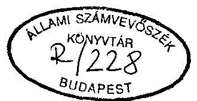

---

Az ellenőrzést vezette:
Nagy Ákosné
fötanácsos
Az ellenőrzést végezték:
Költségvetési Ellenőrzési Igazgatóság részéről:

Balázs Andrásné
Eötvös Magdolna
Holé Sándorné dr.
Littomericzky Jánosné
Papp Sándor
Pásztor Katalin
Surányi Tamás
Szöllösiné Hrabóczki Etelka
számvevö tanácsos
számvevö tanácsos
számvevö számvevő
számvevő számvevő
számvevő tanácsos
számvevő számvevő
számvevő tanácsos
számvevő számvevő
számvevő tanácsos
számvevő tanácsos
számvevő tanácsos
számvevő számvevő
számvevő tanácsos
számvevő számvevő
számvevő tanácsos
számvevő számvevő
számvevő tanácsos
számvevő számvevő
számvevő tanácsos
számvevő számvevő
számvevő tanácsos
számvevő számvevő
számvevő tanácsos
számvevő tanácsos
számvevő tanácsos
számvevő tanácsos
számvevő számvevő
számvevő tanácsos
külső szakértő dr. Solymár Károlyné

---

# JELENTÉS 

a sport céljait szolgáló központi állami és egyéb forrásból származó pénzeszközök felhasználásának pénzügyi-gazdasági ellenőrzéséről

A lakosság egészséges életmódja, a szabadidő hasznos eltöltése, a nemzeti tudat formálása, a nemzetközi kapcsolatok fejlesztése szempontjából meghatározó jelentőségű a testnevelés és sporttevékenység. Az iskolai testnevelés, a szabadidő és a versenysport feltételeinek biztosításában, fejlesztésében meghatározó szerepe van az állami feladatellátásnak. Ez egyrészt a tevékenység irányításában, kereteinek és kapcsolatrendszerének jogi szabályozásában, másrészt a finanszírozásban nyilvánul meg. (Vizsgálatunk nem terjedt ki a testnevelésre.)

A sporttevékenység társadalmi szervezetek (sportegyesületek, sportszövetségek) keretei között, azok közreműködésével, szervezésével folyik. Finanszírozása többcsatornás, a központi költségvetésből juttatott támogatás is több úton - gyakran áttételekkel - jut el a felhasználó szervezethez.

Az államigazgatásban bekövetkezett változások, a jogszabályi dereguláció, a társadalmi szervezetekre vonatkozó új jogszabályok, a piacgazdaság kiépítését célzó intézkedések együttesen hatással voltak a sporttevékenység szervezeti, személyi, pénzügyi feltételeire.
1990. évben 3052 sportegyesület (diáksport nélkül) 6788 szakosztályában 202 ezer fő igazolt versenyző sportolt. Az 1993. év elején 2826 sportegyesület 6.429 szakosztálya több mint 173 ezer fő sportolót tartott nyilván. Ugyanezen időszakban az országos sportági szakszövetségek száma 44 -ről 69 -re gyarapodott. A fő- és részállásban foglalkoztatott minősített edzők száma folyamatosan 10.000 -ről 7.800 före csökkent.

---

A vizsgált időszakban a kiemelt nemzetközi versenyeken jelentős sportsikerek születtek. Közülük is kiemelkedő a barcelonai nyári olimpia, ahol a magyar csapat igen eredményesen szerepelt (2. sz. melléklet).

A sport központi államigazgatási szerve 1990-ben a művelődésügyi miniszter felügyelete alá rendelt Országos Sporthivatal (OSH) volt, amely 1991-től fejezeti jogosítvánnyal rendelkezett. Az 1992. évben megalakult Országos Testnevelési és Sporthivatal (OTSH) a Kormány irányítása alatt működő önálló országos hatáskörű szerv.

Az OTSH teljesített kiadásainak föösszege az 1990. évi 1893,6 M Ft-ról 1993-ban 3938,9 M Ft-ra emelkedett. A felügyelete alá tartozó intézmények száma ugyanezen időszakban 6 -ról - a területi sporthivatalokkal együtt - 28-ra, a foglalkoztatottak száma 1258 fơről 1289 fơre nött.

A központi költségvetésből 1990-ben az OTSH és a minisztériumok 1.991 M Ft , 1993-ban 3.748 M Ft támogatást folyósítottak, illetve használtak fel sportcélra. Az önkormányzatok sportra fordított kiadásai ebben az időszakban 284 M Ft-tal emelkedtek és 1993-ban 2.660 M Ft-ot tettek ki. Változott, s részben bővült a sporttevékenység finanszírozásában részt vállaló, vagy erre a célra létrehozott szervezetek (alapok, alapítványok, stb.) köre. Elkülönített állami (központi) pénzalapokból - a kiemelt körben - 1990-1993. között közel 500 M Ft-ot juttattak sportra.

A vizsgálat célja volt, hogy értékelje: az állami sportfeladatokat szolgáló központi költségvetési források elosztásának összehangoltságát; az alkalmazott szabályozási, a szervezeti, finanszírozási és elszámolási rendszerben az állami pénzeszközök eredményes, célszerinti felhasználását; az OTSH és intézményei gazdálkodásában a törvényességi, a célszerűségi és eredményességi szempontok érvényesítését, az Állami Számvevőszék korábban végzett ellenőrzése megállapításainak hasznosítását.

Az ellenőrzés az 1990-1993. évek közötti időszak gazdálkodására és meghatározott körben az 1994. évi költségvetési előirányzatok megalapozottságára terjedt ki.

A helyszínen ellenőrzött, illetve a tanusítványok útján vizsgált szervek jegyzékét az 1. sz. melléklet tartalmazza.

---

# I.   KÖVETKEZTETÉSEK, JAVASLATOK 

A vizsgált időszakban a központi és a területi (helyi) sportigazgatás intézményrendszerében végbement feladat- és szervezeti változások döntően a társadalmi-gazdasági átalakulással, a rendszerváltással függtek össze. Nem jelentették a verseny-, a diák- és a szabadidősport állami feladatrendszerének felülvizsgálatát, pontos meghatározását.

A sportfeladatok irányításában, a sportigazgatás szervezetében, munkamegosztásában végrehajtott átszervezéseket, a felügyeleti rend ismételt módosításait nem alapozta meg átfogó koncepció. Elmaradt a testnevelés és a sporttevékenység szükséges, törvényi szintü szabályozása. A testnevelés és a sport megújításának koncepciójára vonatkozó országgyűlési határozathoz kapcsolódó kormány munkaprogram kidolgozásának, elfogadásának elhúzódása késleltette a kitűzött célok és szempontok érvényesítését.

Az állami feladatellátás szervezete, irányítási rendszere nem kellően összehangolt. A munkamegosztás szervezetileg erősen tagolt, koordináció igényes. A kapcsolódó jogi szabályozás hiányos, helyenként ellentmondásos, nem nyújt minden vonatkozásban elegendő garanciát az együttmúködésre.

Az államháztartásból finanszírozott sportfeladatok megoldásában résztvevő társadalmi szervezetek önállósodásához illeszkedően nem alakult ki az állami pénzeszközök elosztásának, felhasználásának, elszámolásának egységes követelményrendszere.

Nem érvényesült teljeskörűen a központi sportigazgatás általános koordinációs jogosultsága és felelőssége. A területi, helyi sportfeladatok, hatáskörök átrendezése, szervezeti kereteinek kialakítása nem volt célszerű és eredményes. Az ellátandó feladatokat, azok összehangolását az önkormányzatokkal nem egységesen, hanem csak területi szintig rendezték, megfelelő jogi garanciák nélkül. Megoldatlan a térségi és település szintű sportszakmai feladatok irányítása, koordinálása, a központi elvek, célkitűzések közvetítése, érvényesítése.

A sport hézagos és ellentmondásos jogszabályi keretei között a központi és területi sportigazgatás intézményeinek, különösen a sporttársadalmi szervezeteknek szabályszerű működését gyakran hátráltatta a múködés és a pénzügyi, számviteli folyamatok szabályozásának hiánya, korszerűtlensége. Esetileg hiányzott a működés

---

törvényes feltétele.
Az alapító okiratok felülvizsgálatára, az alap és a vállalkozói tevékenység meghatározására vonatkozó 1991. évi XCI. tv. 34. § (3) bekezdése előírásának az OTSH a felügyelete alá tartozó intézmények vonatkozásában teljeskörűen nem tett eleget.

A többcsatornás sportfinanszírozási rendszer nem igazodott a gazdasági környezet változásához, s a szükséges reform hiányában ellentmondásossá, áttekinthetetlenné vált. Egyre kevésbé volt hatékony eszköze a sportban vállalt állami szerepnek. A finanszírozási csatornákon belüli újraelosztások miatti áttételek gyakran fékezték a pénzeszközök felhasználóhoz juttatását-jutását és nyomonkövetését.
A reálértékben csökkenő sportcélú állami pénzeszközök célszerűtlenül szétaprózódtak, a forrásbővülés többnyire újabb finanszírozási csatornákon keresztül valósult meg. E források képződését, felhasználását gyakori átrendezésük (elkülönített állami pénzalapok) hátráltatta. További gondot jelent 1994. évtől, hogy a sporttársadalmi szervezetek támogatási előirányzatát az 1993. évi CXI. tv. rendkívüli kiadásnak minősítette át.
Mindezek ellenére a rendelkezésre álló pénzeszközöket nem vették teljeskörűen és a lehetséges mértékben igénybe. A vizsgált időszakban a Sportfejlesztési Alapból, a bingójátékból összesen mintegy 80 M Ft -ot tartalékolt az OTSH.
A központi és helyi sportigazgatás a sportcélú létesítmények, intézmények működését helyezte előtérbe, csökkentve javukra - az OTSH olykor szabálytalanul, az eredeti előirányzat 4-10\%-ával - a sporttársadalmi szervezetek támogatási fedezetét. Ugyanakkor a központi sportlétesítmények kihasználtsága, azon belül sportcélú használata csökkent.
Egyidejűleg a csökkenő reálértékủ elosztási rendszerekkel szembeni növekvő igény a támogatások elaprózódásához vezetett.

A források elosztása összehangolatlan volt, hiányoztak a koncepcióval alátámasztott, központilag kialakított alapelvek, normák és egységes érvényesítésük garanciái. Az elosztási rendszer - a Nemzeti Sport Alap (NSA) kivételével - normatív elemeket nem tartalmazott. Nem volt gyakorlat ugyanakkor a forrás-ellátottság vizsgálata. A döntően képviselet formájában működtetett koordináció szubjektív elemekkel terhelt, s nem volt hatékony.
A bővülő arányú, részben átfedő célrendszerủ pályázatos elosztású csatornák tovább erősítették a támogatáshoz jutás esetlegességét, bizonytalanságát, a feladatok és forrásképzésük ütemkülönbségét.
A sporttársadalmi szervezeteknek működőképességük fenntartásához, helyreállításához - az eladósodás okainak vizsgálatát nélkülöző módon - adott póttámogatás, kölcsön, a kölcsön visszafizetésének elengedése egyrészt indokolatlan megkülönböz-

---

tetést vitt az elosztási rendszerbe, másrészt elfedte a sporttársadalmi szervezetek gazdálkodásának hibáit, a nem kellően takarékos, olykor pazarló költést.

A sportcélú központi költségvetési és egyéb források cél- és rendeltetés szerinti felhasználásának ellenőrzése rendszerében megoldatlan volt, gyakorlatilag nem funkcionált.

A sport információs rendszere összeomlott. Ugyanakkor az OTSH az informatikai fejlesztés szakmai programját nem hajtotta a tervezett ütem szerint végre, az a pénzügyi lehetőségektől is elmaradt.

Az OTSH költségvetési eszközökkel való gazdálkodása több vonatkozásban nem volt kellően hatékony és szabályszerű, ezért a lehetségesnél kevésbé jól szolgálta a sportcélok megvalósulását.
A szabályozás keretei között folytatott tervezés során a feladatok és költségvetési keretek összhangját nem biztosították megfelelően. A szakmai feladatok tartalmi meghatározása, esetenként forrás igényének kellő alátámasztása elmaradt, vagy a feladattartalomhoz nem igazodott az előirányzat. A bevételeket rendszeresen alátervezték. A tervezés hibáiból, pontatlanságaiból is eredő gazdálkodási feszültségek oldására kialakított újratervezési gyakorlat keretében az éves költségvetési törvényben - meghatározott célokra - jóváhagyott előirányzatokból történt átcsoportosítások egy része és a céltól eltérő, vagy azt csak közvetetten szolgáló felhasználás a törvényi előírások megsértésével járt.

A fejezetnél az előirányzat-módosítások indoklása, dokumentálása nem volt megfelelő, a célelőirányzatok elkülönített kezelését nem oldották meg. Az előirányzat-módosítások jóváhagyására - több esetben - a finanszírozást követően került sor. Nem teljesítették maradéktalanul az év közben kapott pótelöirányzatok felhasználásával kapcsolatos elszámolási kötelezettséget. A pénzmaradvány elszámolása, felhasználása során többször megsértették az előírásokat.

Az intézmények és a szakmai feladatok finanszírozása nem volt zavartalan. A fejezeti költségvetési számla kezelésének szabályozatlansága, az áttételen keresztüli átutalások a pénzügyi folyamatok követését nehezítették. Az intézményeknek nyújtott évközi póttámogatások fedezetét a tartalékok igénybevételén túl a gazdálkodási tervben szabálytalanul átcsoportosított előirányzatok képezték.

Az erőforrásokkal való gazdálkodás célszerűsége és eredményessége csak részben volt megfelelő.

---

Az intézményi létszám és bérgazdálkodás nem volt kellően összehangolt és tervszerú. A foglalkoztatás - az alacsony kapacitás kihasználtság miatt (főként az edzőtáboroknál) - nem volt hatékony. A magas fluktuáció (edzőtáborokban a fizikai állománycsoportban) esetenként a feladatellátást veszélyeztette. A béralap szerkezetében az alapbér volt a meghatározó a dinamikusan növekvő összegű jutalmak és pótlékok mellett.

A beruházási források felhasználásának kialakított prioritása megfelelően igazodott a feladatokhoz, de megvalósítását esetenként akadályozta a nem megfelelő előkészítés. Müszaki vagy pénzügyi okokból többször került sor a beruházások előrehozására, vagy csúsztatására, amely előirányzaton belüli, nagyságrendileg jelentős évközi átcsoportosításokkal járt.

Az éves felújítási tervekben a feladatoknál a sürgősséget, valamint a beruházásokkal való kapcsolatot vették figyelembe. Az eredeti előirányzat évenkénti jelentős módosításában szerepet játszottak a szervezeti változások, a fejezeti tartalékból nyújtott kiegészítések is.

A létesítmények, edzőtáborok sportcélú kapacitás kihasználtságának alacsony szintje miatt az állami pénzeszközök hatékony és rendeltetésszerú felhasználása nem volt biztosított. Ebben szerepet játszottak az igénybevételi rend szabályozásának késedelme és hiányosságai, információs problémák, a szabályozástól eltérő gyakorlat.

Kifogásolható, hogy az edzőtáborokban nem biztosított az igénybevételek jogosultságának ellenőrzése, továbbá az igénybevétel támogatás értéke önköltségszámítással nincs alátámasztva.

A korábbi - a felügyeleti jellegű költségvetési, a vállalatfelügyeleti és a belső ellenőrzés tárgyában folytatott - Állami Számvevőszéki vizsgálat megállapításaira az OTSH-nál az ellenőrzés szervezeti kereteinek megteremtésével intézkedtek. Az intézkedés elhúzódása, a személyi feltételek részbeni hiánya miatt az ellenőrzés hatóköre az igényeltnél szűkebb volt és még nem funkcionált kellő hatékonysággal.

A versenysport feladataiban hagyományosan résztvállaló minisztériumok ezirányú tevékenysége nem, vagy esetlegesen volt koordinált. A sportlétesítményeket üzemeltető intézményeik és a támogatott sportegyesületek kapcsolata többnyire megállapodásokban szabályozott és ellenőrzött volt. A tárcafeladatoktól idegen sportfeladatok esetleges átrendezésére koncepcionális, összehangolt lépésekre még nem került sor.

---

A sportcélokat finanszírozó - egymást váltó - elkülönített állami pénzalapok közös jellemzője, hogy bevételeik döntően szerencsejátékból származtak és az általuk juttatott forrás a lehetségesnél szükebb mértékű volt. Az alapkezelő(k) nem tettek érdemi intézkedéseket a bingójáték üzemeltetők számottevő mértékủ adósságának behajtására. A támogatások odaítélése néhány esetben megalapozatlan volt, vagy nem igazodott az alap(ok) célrendszeréhez.

A sporttal szoros kapcsolatban álló totó játék helyett a bingó monopolszervezői jogának elnyerése a sport szempontjából nem bizonyult célszerü döntésnek, a bingójáték nem vált a sport biztonságos anyagi alapjává.

A vizsgált sporttársadalmi szervezetek (sportági szakszövetségek, egyesületek) költségvetése - a szakmai és pénzügyi tervezés összehangolásának hiányosságai miatt - általában nem volt kellően megalapozott. A szakmai feladatok bizonytalan bevételi forrásokra épültek, amelynek következtében a pénzügyi egyensúly helyenként megbomlott.

A jelentős sportsikerek, a szakmai munka eredményei részben a sportegyesületek, szövetségek eladósodása révén születtek. A kiadások növekedésének sok esetben nem szabtak határt a szűkössé vált források. Jelentősen emelkedtek - különösen az élvonalbeli sportegyesületeknél - a tartozások, közöttük az állammal szembeni kötelezettségek (adók és TB járulék), melyek mértéke - információs rendszer hiányosságai miatt - teljességében nem ismert. Az adótartozások kiegyenlítésére nyújtott költségvetési póttámogatás csak ideiglenes megoldást jelentett, nem volt teljeskörű, s az elosztásba igazságtalan elemeket is bevitt.

A sportszövetségek bővülő körben és összességében növekvő mértékben - általában megállapodásokban rögzített célokra, feladatokra - részesültek a központi költségvetési forrásokból.
A múködési kiadások támogatottságának aránya költségvetési forrásokból nem bővült, ugyanakkor több helyen bekövetkezett növekedésük szakmai célú forrásokat vont el. Egyes szövetségek nem a megjelölt célra használták fel a kapott támogatást. Előfordult, hogy annak terhére pazarló, s a támogatott feladathoz közvetlenül nem kapcsolódó kiadásokat is elszámoltak.
Gazdálkodásuk rendje, fegyelme több helyen nem volt megnyugtató. A dokumentumok, bizonylatok hiánya, vagy hiányos volta helyenként a vizsgálatunk teljeskörű lefolytatását is akadályozta.

---

A sportegyesületek forrásain belül a központi költségvetésből kapott támogatások aránya általában csökkent. A támogatások felhasználásának normatív követelményei, előírásai hiányában a sportegyesületek által adott különböző juttatások korlátozására csak szűkebb körben került sor. Érvényesült továbbra is a minősített sportolókért folytatott verseny költségnövelő szerepe.
Számviteli rendjük, könyvvezetésük többnyire nem biztosította a kapott támogatások cél- és rendeltetésszerű felhasználásának ellenőrizhetőségét, több esetben nem felelt meg a jogszabályi előírásoknak sem.

A diáksport összetett szervezeti rendszere - figyelemmel a megyei szervezetek nem egységes elvek szerinti megalakulására is - időnként ellentmondásosan, illetve zavarokkal funkcionált. A versenyrendszere bonyolult, nagyfokú szakmai és pénzügyi koordinációt igényelt, ami nem érvényesült megfelelően. A diákolimpiai versenyekkel a sportági utánpótlás, válogató és különböző korosztályos versenyek nem voltak összehangoltak. A diáksport tevékenységben tapasztalt szakmai koordinálatlanság és átfedések célszerütlen, felesleges ráfordításokkal jártak. A mérsékelten növekvő központi költségvetési és önkormányzati támogatások elosztása nem volt kellően racionális, felhasználását gyakran technikai áttételek késleltették.
A Magyar Diáksport Szövetség (MDSZ) költségvetési gazdálkodásában 1990. évben a megalapozatlan és szabálytalan vállalkozás pénzügyi veszteséget, 1993-ban pedig a szakmai és pénzügyi tervezés összehangolatlansága a múködésben forráshiányt okozott. Mindez a költségvetési támogatás cél- és rendeltetés szerinti felhasználását akadályozta.

A Magyar Olimpiai Bizottság (MOB) költségvetési gazdálkodása kiegyensúlyozott volt. A közérdekủ kötelezettségvállalások, szponzori pénzeszközök mellett a központi költségvetési előirányzatából is növekvő mértékben támogatta a szövetségeket, sportegyesületeket, stb.
A költségvetési támogatási előirányzatok tervezése - a vele szemben támasztott követelmények hiánya miatt - nem volt kellően megalapozott.
Az 1992. évi téli, nyári olimpiai részvételhez összesen 305 M Ft támogatást kapott, melyet az e célra fordított kiadásai lényegesen meghaladtak. A sikeres olimpiai előkészítést és szereplést nem követte a tényleges kiadások teljeskörű, rendszerező összegyűjtése. Az ellenőrzés 26 M Ft kiadásnak az e célra adott állami támogatás terhére való elszámolását nem tartja indokoltnak.

---

# Az ellenőrzés megállapításai alapján javasoljuk 

## 1. az Országgyúlésnek, hogy törvényhozó munkája során

1.1 alkossa meg a sporttörvényt és annak keretei között határozza meg az állami feladatvállalást, annak mértékét, módját csatornáit és követelményrendszerét, figyelemmel a vizsgálat megállapításaira is;
1.2 hangolja össze - az önkormányzatokról szóló 1990. évi LXV. tv. és az 1991. évi XX. tv. felülvizsgálatával és módosításával - a központi, területi és helyi sportfeladatok szakmai irányítása, koordinálása jogi, szervezeti és felügyeleti kereteit, utalja vissza a területi sportigazgatási feladatokat az önkormányzatok hatáskörébe;
1.3 legyen figyelemmel arra, hogy képviselői indítványra - meghatározott összeg felett csak kelló részletezettséggel kidolgozott és dokumentált számításokra alapozott előkészítés után hozzon döntést pótelőirányzat nyújtásáról, vagy támogatás megvonásról;
1.4 sorolja vissza a sporttársadalmi szervek támogatási előirányzatát a központi költségvetés rendes kiadásai körébe;

## 2. a Kormány részére

2.1 gondoskodjon - sporttörvény megalkotásáig - az éves költségvetési törvények előkészítése során

- a sportcélú támogatás normatív elemei körének bővítéséről;
- arról, hogy a költségvetés szerkezetén belül a társadalmi szervezetek által ellátott sportfeladatok finanszírozását folyamatosan szolgáló előirányzatok címzetten, azonos feladattartalommal jelenjenek meg;
- az államháztartás sportcélú - vagy sportcélokat is szolgáló - csatornáinak, forrásainak célszerú "profiltisztításáról", koncentrálásáról és a "szakmához" illesztéséről;
2.2 gondoskodjon az Áht-ben és az 1991. évi XVIII. tv-ben kapott felhatalmazás alapján a sporttársadalmi szervezeteknek juttatott államháztartási források és felhasználásuk - szakmai célrendszerhez is igazodó - egységes beszámoló rendszerének kialakításáról, múködtetéséről, ellenőrzéséről és szükség szerint

---

tegyen javaslatot a kapcsolódó törvények (az egyesülési jogról szóló 1989. évi II. tv., a sportági szakszövetségekről 1989. évi 9. tvr., az Áht.) módosítására;
2.3 tekintse át az OTSH feladat-, szervezetrendszerét és létszámát, figyelemmel az ellenőrzés által feltárt fogyatékosságokra;
2.4 gondoskodjon arról, hogy az OTSH a felügyeletet gyakorló minisztertől független módon, szervezetten megkapjon minden, a feladatai ellátáshoz szükséges kormányzati információt és útmutatást, továbbá résztvehessen a tevékenységét érintő kormányzati döntések előkészítésében, véleményezésében;

# 3. a Pénzügyminisztérium részére 

vizsgálja felül, illetve módosítsa a bingójátékról szóló 20/1991. (XII.30.) MKMPM sz. együttes rendeletet a Nemzeti Sport Alapot megillető befizetések, illetve az üzemeltetők fizetési kötelezettségeinek pontosítása érdekében;

## 4. az OTSH részére

4.1 a szervezet korszerűsítése érdekében
— vizsgálja felül az intézmények alapító okiratát, határozza meg a törvényi előírásoknak megfelelően tevékenységi körüket;

- javítsa a fejezeti szintű gazdálkodás irányításának, felügyeletének és ellenőrzésének feltételeit;
4.2 a múködés rendje és szabályozottsága érdekében
- gondoskodjon a múködés rendjére, a gazdálkodásra vonatkozó szabályzatok szükséges kiegészítéséről, a szervezeti, felügyeleti, jogszabályi változásokkal összehangolt karbantartásáról;
— intézkedjen az intézmények szervezeti és múködési szabályzatainak felülvizsgálatáról, szükséges kiegészítéséről és aktualizálásáról;
- kísérje figyelemmel az intézményeknél folytatott vizsgálat tapasztalatainak hasznosulását, különös tekintettel az NSU gazdasági, pénzügyi tevékenységére, a mérlegvalódiság követelményének megsértése miatti felelősség vizsgálatára és érvényesítésére;

---

4.3 vizsgálja meg hatáskörében - a feltárt tényállás alapján - a végrehajtott törvénysértő előirányzat átcsoportosításokkal, az 1992. évi pénzmaradvány valótlan megállapításával, a mérlegvalódiság követelményének megsértésével kapcsolatos személyi felelősséget;
4.4 tegyen eleget pótlólag az 1991-ben a sportigazgatóságok létrehozására céljelleggel kapott 70 M Ft-ra vonatkozó elszámolási kötelezettségének és fizesse vissza a költségvetésbe a maradványt ( 15 M Ft );
4.5 alakítson ki a sporttársadalmi szervezetek, a sporttevékenység támogatására alkalmas olyan, normatív elosztási elveket is tartalmazó modellt, amely a központi és helyi viszonylatban is egységesen alkalmazható. Ennek rendszerében vegye figyelembe a létesítmény használatot is;
4.6 vizsgálja felül a diáksport szervezetek és diáksport versenyek rendszerét és gondoskodjon célszerű összehangolásukról a versenysporttal; dolgozzon ki és biztosítsa a diáksport támogatásához kötelező támogatási minimum szintet (keretet);
4.7 tekintse át és módosítsa a központi sportlétesítmények igénybevételi rendjét figyelemmel az ellenőrzés megállapításaira és kísérje figyelemmel annak megtartását, szükség esetén alkalmazzon szankciót;
4.8 alakítson ki követelményrendszert a fejezet költségvetésében címzetten megjelenő sporttársadalmi szervezetek (pl. MOB) előirányzat tervezéséhez és határozza meg a célra kapott előirányzatokkal való elszámolás rendszerét, módját;
4.9 szüntesse meg a kölcsönnyújtás gyakorlatát és tegyen intézkedéseket a lejárt kölcsönök visszafizettetésére;
4.10 intézkedjen, hogy a Nemzeti Sport Alap és a Bingó Sport Kft. a bingójáték üzemeltetőktől a hátralékot hajtsa be, illetve a Bingó Sport Kft. az általa kezelt és sportcélra fel nem használt hozzájárulást a Nemzeti Sport Alap számára átutalja.

---

# II.   RÉSZLETES MEGÁLLAPÍTÁSOK 

A. A feladatok és a szervezeti rendszer összhangja, szabályozottsága

## 1. A sport állami irányítása és szervezeti rendszere

A társadalmi-, gazdasági rendszerváltás, a piacgazdasági folyamatok kibontakoztatására irányuló törekvések új követelményeket támasztottak a sport állami irányításával, feladatellátásával szemben, s jelentősen átalakult a gazdálkodás mozgástere is.

Az állami feladatokat meghatározó, a feladatellátás szervezeti, pénzügyi feltételeit rendszerező, a fejlesztés hosszabb távú irányát felvázoló koncepció elfogadására azonban 1993-ig nem került sor. A verseny-, diák- és szabadidősport állami feladatrendszerének felülvizsgálata, pontos meghatározása nem történt meg. Nem kerültek egyértelműen elhatárolásra az állam és az önkormányzatok által ellátandó feladatok.

E körbe tartozó hiányosság, hogy a sporttevékenység terminológiai meghatározása a vonatkozó jogszabályokból hiányzik, alkalmazásuk nem egységesen rendszerezett, gyakran eklektikus. Ez a végrehajtásban, a feladat- és eszközrendszer összehangolásában zavarokat, átfedést okoz.

A sporttörvény megalkotása elmaradt, kiadását az Országgyűlés 24/1993. (IV.9.) sz. határozatában egy kedvezőbb társadalmi és gazdasági környezetben tartotta indokoltnak. Ugyanakkor e határozatában az Országgyűlés a testnevelési és sportcélok megalapozása érdekében kijelölte az átmeneti időszakban érvényesíthető szempontokat, felkérve a Kormányt a szükséges munkaprogram kidolgozására, s végrehajtásának gondozására. Ennek a kötelezettségnek a Kormány késedelmesen tett eleget, a munkaprogramot az 1032/1994. (V.6.) Korm. határozatával fogadta el.

A Kormánynak a munkaprogramot 1993. szeptember 30-ig kellett volna elkészítenie. A vonatkozó előterjesztést azonban az OTSH 1993. október 1-re állította össze. A megújítási koncepcióval összefüggésben az OTSH kidolgozta a Nemzeti Sport Standard elveire vonatkozó javaslatát, amely a sportlétesítmény ellátottság és fejlesztés területén szükséges - hosszú távra mutató - jogszabályi rendezés megalapozását célozza. (A helyszíni vizsgálat lezárásakor az előterjesztés a tárcaegyeztetés szakaszában volt.)

---

A sportfeladatok irányításában, a sportigazgatás szervezetében, munkamegosztásában a vizsgált időszakban, illetve azt közvetlenül megelőzően - a testnevelés és sport megújítására vonatkozó átfogó koncepció hiányában - végrehajtott szervezeti változások, átszervezések fơbb jogszabályi kereteit az egyesülésről szólo 1989. évi II. törvény, a sportági szakszövetségekről szóló 1989. évi 9. tvr., valamint az önkormányzatokra vonatkozó 1990. évi LXV. törvény és az 1991. évi XX. törvény, illetve a 169/1991. (XII. 26.) Korm. rendelet képezték.

Jelenleg a verseny-, diák- és szabadidősportban a központi igazgatás állami feladatainak nagyobb hányadát az OTSH látja el a hivatal státuszában, felügyeleti rendszerében a vizsgált években végrehajtott több lényeges változtatás mellett. Az iskolai testneveléssel kapcsolatos feladatok a Múvelődési és Közoktatási Minisztérium (MKM) irányítási körébe tartoznak.
A fegyvereserők és rendvédelmi szervek nél folyó testnevelésről a Honvédelmi Minisztérium (HM) és a Belügyminisztérium (BM) gondoskodik.
A sportegészségügy ellátását a Népjóléti Minisztérium (NM) feladatkörébe sorolták.
A területi, helyi testnevelési és sportfeladatok meghatározása, a sporttal kapcsolatos - irányítási, ellenőrzési, a sportlétesítmények fenntartásával, müködésével összefüggő - helyi feladatok ellátása az önkormányzatok önként vállalt tevékenységébe tartozik.

A feladatellátás szervezeti keretei részben a központi igazgatásban, részben a társadalmi szervezetek körében végrehajtott változtatások következtében lényegesen átrendeződtek.

A sporttevékenység társadalmi szervezetek (szövetségek, egyesületek, klubok) keretében, illetve azok közremúködése útján folyik. A társadalmi szervezetek a sportmozgalomhoz és az eredményekhez fűződő nemzeti érdek érvényesítése, valamint - a sportági szakszövetségek esetében - meghatározott állami és sportfeladatok ellátása céljából állami támogatásban is részesülnek. Ez a körülmény sajátos helyzetet teremt a szakmai irányítás, valamint a rendelkezésre álló anyagi erőforrások elosztása és felhasználása terén.

A MOB a Nemzetközi Olimpiai Bizottság (NOB) szabályzataiban meghatározott feladatokat az állami szervezetektől függetlenül, de azokkal együttműködve látja el. Gondoskodik az olimpiai felkészülés segítéséről, biztosítja a részvételt.

---

A versenysport területén a sportági szakszövetségek, a diáksportban az MDSZ és (az ebből 1991-ben kivált) Magyar Egyetemi és Főiskolai Sportszövetség (MEFSSZ), a szabadidősportban a Magyar Szabadidősport Szövetség (MSZSZ) irányítják tagjaik sportmunkáját, gondoskodnak érdekképviseletükről, együttmúködnek az állami és önkormányzati szervekkel. Az érdekvédelmi, érdekképviseleti szervezetek köre a 90-es években tovább bővült, megalakult a Magyar Sportszövetség (MSSZ), a Sportegyesületek Országos Szövetsége (SOSZ), valamint ezek területi szövetségei.

A sportigazgatást - s alapvetően a sporttevékenység felügyeleti szintjét - érintő többszöri átszervezés ellenére az állami feladatellátás szervezeti, irányítási rendszere nem kellően összehangolt.

A meghatározóan ágazati (szakmai) és területi elvű - s a társadalmi szervek közreműködésével megvalósuló - munkamegosztás szervezetileg részben célszerütlenül széttagolt.
A sporttevékenység és irányítás jogszabályi háttere ugyanakkor hiányos, esetenként ellentmondásos, nem nyújt minden szinten és irányban kellő garanciát az együttműködésre, a koordinációra, illetve a teljeskörű feladatellátásra.

Az OTSH a 169/1991. (XII. 26.) Korm. rendelet értelmében a Kormány irányítása alatt működő önálló országos hatáskörű szerv, felügyeletét kijelölt kormánytag - korábban tárca nélküli miniszter, majd belügyminiszter - látja el, őt illeti a sportigazgatásban a jogalkotási hatáskör.
A Kormány felügyelet gyakorlásának módja, tartalma - a miniszter munkastílusától függően - folyamatosan változott, a helyszíni ellenőrzés befejezéséig még nem alakult ki. (A felügyeletet gyakorló miniszter személye gyakran - 1992-től háromszor - változott.) Így a funkció hatékonysága nem volt értékelhető. Eseti jelleggel azonban a vizsgálat tárt fel hatásköri túllépést.

Az NSA terhére - a kezelő szervezet vezetője (az OTSH elnöke) hatáskörét túllépve - a Nemzeti Sporttanács megalakulása és az alap kezeléséről és müködéséről szóló 11/1993. (VIII. 10.) BM rendelet hatályhalépését megelőzően kötelezettséget vállalt.

Nem érvényesült továbbra sem teljeskörűen az OTSH sporttevékenységgel kapcsolatos általános koordinációs jogosultsága és felelőssége a központi igazgatás szintjén sem. A versenysport feladatok ellátásában, finanszírozásában résztvállaló minisztériumok ezirányú tevékenysége - szabályozottsága hiányában nem, illetve esetlegesen koordinált.

---

A Földművelésügyi Minisztérium (FM), BM, HM, Nemzetközi Gazdasági Kapcsolatok Minisztériuma (NGKM) - hatás- és feladatkörben külön nem deklaráltan, hanem hagyományos bázis szervi alapon - a sportlétesítményeket üzemeltető intézményeiken keresztül és (az NGKM kivételével) költségvetési pénzekkel is támogatták a hozzájuk kötődő élvonalbeli sportegyesületeket (Ferencvárosi Torna Club - FTC, Újpesti Torna Egylet - UTE, Budapesti Honvéd Sportegyesület BHSE, Magyar Testgyakorlók Köre - MTK). A költségvetési támogatás összegét, felhasználásának célját stb. illetően az OTSH és a minisztériumok között nincs rendszeres együttmüködés.
a.) A központi sportigazgatás szervezeti felépítésében, létszámában - a vizsgált években - figyelemre méltó átalakulást eredményezett az OSH helyébe lépő OTSH, majd később a területi sportigazgatóságok, illetve hivatalok létrehozása, amelyek egyben feladat átrendezést is jelentettek.

A szervezet és feladatrendszer összhangjának megvalósításában csak részben vették figyelembe a feladatváltozásokat a főosztályok szerepének, létszámának meghatározása során. Nem mérlegelték kellő súllyal a sportszövetségek önállósodását, valamint a testnevelési feladatok elkerülését a sportszakmai területek létszám megállapításánál. Mindezek hozzájárultak ahhoz, hogy az indokoltnál nagyobb a létszám. Ugyanakkor a vezetők, beosztottak aránya a vizsgált időszakban kedvező irányba tolódott el.

A közigazgatás korszerűsítésére hozott 1026/1992. (IV.2.) kormányhatározat végrehajtására intézményi körben több intézkedést tettek, illetve áttekintették azok hatását. Ehhez kapcsolódóan nem történt változás a hivatal szervezetében, müködésében.

A fejezeti feladatellátás személyi, szervezeti feltételei romlottak. Összeférhetetlenséghez vezetett - a betöltetlen elnökhelyettesi státusz miatt - hogy a felső vezetés szintjén nincs meg a lehetőség a fejezeti irányítás és az operatív gazdálkodás felügyeletének elhatárolására.
A gazdasági kérdések megoldásának döntési mechanizmusára a nagyfokú centralizáció volt jellemző. Mindezek miatt nem érvényesülhetett megfelelően a vezetői ellenőrzés.

A közgazdasági fóosztályvezető irányítja a Gazdálkodó Szervezetet is. Ugyanakkor a fơosztályon belül a Terv és Kö̉gazdasági Osztály végzi a fejezeti szintű gazdálkodási feladatokat. Az osztálynak jelenleg nincs vezetője, így közvetlenül a főosztályvezető irányítja.

---

A személyi, szervezeti, munkaszervezési fogyatékosságok esetenként túlzott leterheltséghez vezettek, amelyek negatív hatása érzékelhető volt a felügyeleti tevékenységben is. A fejezet rendszeres irányító, intézményfelügyeleti munkája lényegében a tervezés, beszámoltatás, pénzmaradvány elszámoltatás feladatának mechanikus végrehajtására korlátozódott.

A függetlenített ellenőrzési tevékenység szervezeti, személyi feltételeinek megteremtésére csak 1993. második felében került sor.

Az OTSH szakmai irányító és igazgatási munkájával szemben új követelményt, többletfeladatot támasztott az 1991. évi XX. tv. a helyi önkormányzatok és szerveik, a köztársasági megbízottak, valamint egyes centrális alárendeltségű szervek feladat- és hatásköréről. E törvény - centrális alárendeltségű szervezetekként - létrehozta a megyei sportigazgatóságokat a sporttörvény hatályba lépéséig, legkésóbb 1992. december 31-ig.

Eszerint a testnevelés és sporttal kapcsolatos, a helyi önkormányzatok és szerveik feladat- és hatáskörébe nem tartozó állami feladatokat, valamint a társadalmi szervezetként müködő területi, helyi sportszervezetekkel összefüggő szolgáltatásokat a sporttörvény hatályba lépéséig, de legkésóbb 1992. december 31-ig az OTSH irányítása, felügyelete alatt müködő sportigazgatóságok látják el.
b.) A sportigazgatóságok a korábbi, önkormányzati szervezet bázisán épültek fel.

A sporttal kapcsolatos megyei szintű állami feladatokat 1990-1991-ben a Megyei Tanács VB, illetve a Megyei Önkormányzati Hivatal Szakigazgatási Iroda (SPORI), mint önálló költségvetési szerv együttesen látta el.

Müködésüket, feladataikat, hatáskörüket az 1991. évi XX. tv. alapján, a 18/1991. (XI.22.) MKM rendelet szabályozta. Ennek értelmében a sportigazgatóságok maradványérdekeltségű központi költségvetési szervek lettek, költségvetésük jóváhagyása az OTSH elnökének hatáskörébe került.
A sporttörvény hiányában alacsonyabb szintű jogszabály, a 176/1992. (XII.30.) Korm. rendelet - az OTSH-ról szóló korábbi rendelet módosításával - a sportigazgatóságok feladatainak ellátására, azok helyett - létrehozta az OTSH területi hivatalait, amelyek önálló költségvetési szervként működnek. Az OTSH irányító funkciójában feladat- és hatáskörében tehát lényeges változást nem okozott ez a rendeletmódosítás.

Az eredetileg átmenetinek szánt rendelkezés tartóssá válása felszínre hozta a központi és helyi sportirányítás összehangolásának szabályozásbeli hiányossága-

---

it. Hatáskör hiányában a térségi testnevelési és sportfejlesztési célkitűzéseket, az önkormányzatok és a sportigazgatóságok (továbbiakban sporthivatalok) tevékenységét éves együttmüködési megállapodásokkal kívánták koordinálni.

A megállapodásokban az önként vállalt sportfeladataikkal a megyei önkormányzatok a sporthivatalokat bizták meg, a fóváros kivételével.
A megyei önkormányzatok térítésmentesen biztosították a sporthivatalok elhelyezését, illetve a müködéshez szükséges vagyontárgyakat.

A sporthivatalok alapvető problémája maradt azonban, hogy az ellátandó feladatokat, azok összehangolását csak megyei (területi) szintig rendezték. Továbbra sem megoldott a térségi (körzetközpont) és a helyi települési feladatok szakmai irányítása, koordinálása. A sporthivatalok és a helyi önkormányzatok között nem, vagy csak szűkebb körben rögzítették az együttműködés kereteit és feltételeit. A megállapodásra épített együttműködés rendszere területi szinten sem teljes.
Eltérő a sportfeladatok és hatáskörök gyakorlásának módja a Budapest Főváros Önkormányzat esetében. A fővárosban a sportigazgatóság egy évi müködés után 1992. végén megszűnt. Azóta a sporttal kapcsolatos feladatok ellátását az önkormányzat önként vállalt feladatként végzi.
A fővárosi és kerületi önkormányzatok között nincs hivatalos formában együttműködés a sport irányításával és finanszírozásával kapcsolatos feladatokban. Az információs és jogszabályi háttér, az együttműködési megállapodások részleges, vagy teljes hiánya problémákat okoz a felvállalt állami feladat szakszerű ellátásában. Nem teszi lehetővé a főváros sportéletének átfogó áttekintését, teljeskörű szakmai segítését, valamint a rendelkezésre álló források szükség szerinti egyesítését és a feladatokhoz igazodó elosztását.

A megyei önkormányzatokkal az együttmüködés nagyobb részt a megállapodások szerint történt. A vizsgálatok ugyanakkor rögzítették, hogy azokban sok a formális elem, s helyenként a végrehajtás rendszeres értékelésének elmaradása a tartalmi megújítás ellen hat. Tapasztalható volt esetenként az is, hogy egyes vállalt kötelezettségek teljesítése elmaradt, vagy azok megújítása vitatottá vált.

Nem értékelték mindenütt az együttműködési megállapodásban foglaltak teljesülését, vagy a sporthivatal nem számolt be a megyei közgyülésnek a terület sporttevékenységének helyzetéről, a rábízott feladatok ellátásáról.
Előfordult, hogy a sporthivatal tárgyi feltételeihez nyújtott kedvezményeket meg kívánták szüntetni.

---

Az együttműködési megállapodásos rendszer nem képezheti alapját a feladat ellátáshoz igazodó szervezett és szabályozott munkamegosztásnak, nem helyettesítheti - csak kiegészítheti - a hiányzó jogi kereteket.

A területi sporthivatalok feladatellátását gyakran hátráltatja, hogy nem rendelkeznek mindenütt megfelelő mélységű és átfogó információkkal a megyék sportmozgalmáról. A vizsgálatok megállapítása szerint tevékenységükben a szolgáltató feladatok dominálnak.

Pl. gazdasági (pénzügyi, számviteli) munkavégzés a területi sportszövetségek részére, támogatások folyósítása, helyenként (Bács-Kiskun, Jász-Nagykun-Szolnok, Fejér, Zala megye) sportlétesítmény üzemeltetés.

Sajátos ellentmondása a sportigazgatásnak, hogy míg központi szinten megszüntette a társadalmi szervezetek részére intézményi keretek között nyújtott gazdasági szolgáltatást, a területi sporthivatalok tevékenységében - alacsonyabb szinten a feladat megjelent.

Az országos sportági szakszövetségek önállósodása folytán a részükre gazdasági szolgáltatást végző OTSH Gazdasági Igazgatóságát (GI) megszüntették 1992ben.

# 2. A sport állami és társadalmi szervczetei tevékenységének szabályozottsága 

A sportszféra hézagos és ellentmondásos jogszabályi keretei mellett a sportigazgatás állami intézményrendszerének és a társadalmi szervezetek tevékenységének - különösen a gazdasági, pénzügyi folyamatok - belső szabályozása is gyakran hiányos, nem megfelelő.
a.) Az OTSH szervezetének, múködési rendjének fő keretszabályát rögzítő SZMSZ módosításai többnyire követték a hivatal múködését, szervezeti rendjét befolyásoló jogszabályi, felügyeleti változásokat. A szabályszerű működéshez szükséges feladatmeghatározások azonban hiányoztak, nem voltak teljeskörűek, illetve korszerűsítésük elmaradt.

Nem volt szabályozott a kijelölt kormánytag OTSH feletti felügyelete gyakorlásának rendje.
A munkaköri leírások a főosztályvezetői szinten nem teljeskörűek, egyes szervezeti egységeknél korszerűtlenek.

---

A gazdálkodási jogköröket, azok gyakorlásának módját, az ezzel összefüggő hatás- és feladatköröket rendező átfogó szabályzat a vizsgálat lezárásáig nem készült, a számviteli tevékenység szabályozása hiányos.

A fejezeti pénzügyekkel kapcsolatosan hiányosság, hogy az 1991-1993. éves időszakban csak számlatükör készült.

Az OTSH belső információs rendszere müködési feltételeinek javítását célzó informatikai fejlesztések az elmúlt két évben felgyorsultak. A számítógépes adatfeldolgozás, a szervezeti, személyi technikai feltételek biztosítása azonban csak a kezdeti szakaszban tart, eredményei, hatékonysága a vizsgált időszakban még nem voltak mérhetők.
b.) Az intézmények alapító okiratának felülvizsgálatára vonatkozó 1991. évi XCI. tv. 34. § (3) bekezdés követelményének teljeskörűen nem tettek eleget. Az OTSH felügyelete alá tartozó költségvetési szervek e dokumentuma nem felel meg az 1992. évi XXXVIII. tv. (Áht.) 88. § (3) bekezdés rendelkezéseinek.

Az alaptevékenység és a vállalkozási tevékenység körét, mértékét nem, illetve kifogásolható tartalommal határozták meg (Népstadion és Létesítményei Központi Edzótábor - NSI, Tatai Edzótábor - TE, Nemzeti Sportuszoda - NSU), vagy az nem volt összhangban a tényleges helyzettel (NSU).

Az intézmények müködésének szabályozottsága többnyire nem megfelelő. Nincs jóváhagyott SZMSZ (NSI, NSU), vagy a szükséges aktualizálás elmaradt (területi sporthivatalok).

Az intézmények létszám- és bérgazdálkodásának szabályozását - a kollektív szerződések elkészülését - az 1992. évi XXXIII. tv. előírásának teljeskörű érvényesítését akadályozta, hogy - a helyszíni vizsgálat befejezéséig - nem rendelkeztek az ágazati végrehajtásról.

A szabályszerű gazdálkodást gyakran hátráltatta, hogy a pénzügyi számviteli folyamatok rendjét nem, vagy nem a követelményekhez igazodóan rögzítették. Egyes intézmények gazdasági tevékenységének szabályozottsága alacsony szintű volt (NSU). A számviteli törvény előírásainak megfelelő számlarend nem készült el (NSU, NSI, területi sporthivatalok), nem egységes rendszerủ és hiányos a számviteli feladatok szabályozása (TE). Egyes speciális, illetve részszabályzatok elavultak (NSU, Csanádi Árpád Központi Sportiskola - KSI, NSI). A pénzügyi jogkörök gyakorlására vonatkozó előírásaikban az összeghatárokat nem, a hatásköröket nem egyértelműen rögzítették (TE).

---

c.) A társadalmi szervezetek müködését meghatározó alapszabály a vizsgált körben nem mindenütt elégítette ki az egyesületekről szóló 1989. évi II. törvény vonatkozó követelményeit. Előfordult, hogy a törvényes müködés szabályozásbeli kellékei nem voltak megfelelőek.

A gazdálkodás rendjét, fegyelmét a belső reguláció nem segítette. Jellemző volt a gazdálkodás hiányos, alacsony színvonalú vagy ellentmondásos, gyakran a jogszabályi előírásokat sértó szabályozása. Többnyire nem volt megfelelő a pénzügyi jogkörök gyakorlásának rendje, a könyvvezetésre vonatkozó előírás. (Részletesen az 1-2. sz. függelékben.)

---

# B. A sport finanszírozási rendszere 

A közigazgatásban, a gazdasági környezetben végbement gyökeres változások, valamint a társadalmi szervezetek (egyesületek, sportági szakszövetségek) müködésére, kapcsolatrendszerére vonatkozó új jogszabályok a sportfinanszírozási modell reformálását is igényelték volna. Ennek hiányában felszínre kerültek a rendszer ellentmondásai, egyre nehezebben kezelhető és áttekinthető működése.

## 1. A sportfinanszírozás csatornái

A sporttevékenység, a sportszervezetek állami támogatása - hasonlóan más, volt szocialista országhoz - hagyományosan több csatornás, melynek gyökerei a korábbi tervgazdasági rendszerben alakultak ki.

Az államháztartás sportcélú kiadásai meghatározóan
—a központi sportigazgatás (OTSH),
—a sporttevékenységben részt vállaló minisztériumok (FM, HM, BM, NGKM, NM),
—elkülönített állami pénzalapok (Társadalombiztosítási Alap - TB, Szerencsejáték Alap - SZA, Országos Játék Alap - OJA, NSA, stb.)
—kormányzati alapítvány (Nemzeti Ifjúsági és Szabadidősport, Egészséges Életmódért),
— önkormányzatok,
—állami tulajdonú gazdálkodó szervezetek
útján áramlatnak a sportszervezetekhez.
Az egyes finanszírozási csatornák súlya, szerepe - a gazdaságban végbement változások függvényében - az eltelt időszakban jelentősen módosult. A pénzeszközök folyósításával és a közvetve - sportlétesítmény fenntartásra, szolgáltatásra, stb. - adott támogatások között is arány átrendeződés volt tapasztalható.

A sport céljaira fordítható - és a vizsgált körbe vont - állami és egyéb pénzeszközök összege 1990-1993. között nominálisan összesen 65\%-kal emelkedett, reálértékben csökkent a szféra támogatottsága. Nőtt a finanszírozási csatornák száma, mérsékelt fedezetbővítő hatással (13\%). Szerény mértékük mellett közrejátszott ebben az is, hogy közülük egyesek megszúnt csatornát váltottak ki, illetve csak átmenetileg vettek részt a sportfinanszírozásban.

Az SZA-ból 1992-tól - átmenetileg - áramlott pénzeszköz a sportszférába, az NSA belépésével 1993-ban sport finanszírozó szerepe megszünt. Ugyanakkor együttesen a két alapból eredó források aránya alacsony (1993-ban 5\%).

---

# B. A sport finanszírozási rendszere 

A közigazgatásban, a gazdasági környezetben végbement gyökeres változások, valamint a társadalmi szervezetek (egyesületek, sportági szakszövetségek) müködésére, kapcsolatrendszerére vonatkozó új jogszabályok a sportfinanszírozási modell reformálását is igényelték volna. Ennek hiányában felszínre kerültek a rendszer ellentmondásai, egyre nehezebben kezelhető és áttekinthető működése.

## 1. A sportfinanszírozás csatornái

A sporttevékenység, a sportszervezetek állami támogatása - hasonlóan más, volt szocialista országhoz - hagyományosan több csatornás, melynek gyökerei a korábbi tervgazdasági rendszerben alakultak ki.

Az államháztartás sportcélú kiadásai meghatározóan

- a központi sportigazgatás (OTSH),
- a sporttevékenységben részt vállaló minisztériumok (FM, HM, BM, NGKM, NM),
- elkülönített állami pénzalapok (Társadalombiztosítási Alap - TB, Szerencsejáték Alap - SZA, Országos Játék Alap - OJA, NSA, stb.)
- kormányzati alapítvány (Nemzeti Ifjúsági és Szabadidősport, Egészséges Életmódért),
- önkormányzatok,
-állami tulajdonú gazdálkodó szervezetek
útján áramlanak a sportszervezetekhez.
Az egyes finanszírozási csatornák súlya, szerepe - a gazdaságban végbement változások függvényében - az eltelt időszakban jelentősen módosult. A pénzeszközök folyósításával és a közvetve - sportlétesítmény fenntartásra, szolgáltatásra, stb. - adott támogatások között is arány átrendeződés volt tapasztalható.

A sport céljaira fordítható - és a vizsgált körbe vont - állami és egyéb pénzeszközök összege 1990-1993. között nominálisan összesen 65\%-kal emelkedett, reálértékben csökkent a szféra támogatottsága. Nőtt a finanszírozási csatornák száma, mérsékelt fedezetbővítő hatással (13\%). Szerény mértékük mellett közrejátszott ebben az is, hogy közülük egyesek megszűnt csatornát váltottak ki, illetve csak átmenetileg vettek részt a sportfinanszírozásban.

Az SZA-ból 1992-tól - átmenetileg - áramlott pénzeszköz a sportszférába, az NSA belépésével 1993-ban sport finanszírozó szerepe megszünt. Ugyanakkor együttesen a két alapból credő források aránya alacsony (1993-ban 5\%).

---

A központi költségvetésből származó pénzeszközök összege 1990-1993. évek viszonylatában $88 \%$-kal emelkedett.

E források évenkénti alakulását az esemény ciklikusság (olimpia) mellett az egyszeri célra adott póttámogatások is befolyásolták (pl. a sportszervezetek adótartozásának kiegyenlítésére 1993-ban 941 M Ft póttámogatás). Ez utóbbi korrekciójával $41 \%$-kal nőtt a költségvetési juttatások összege.

A költségvetési támogatások is több csatornán keresztül áramlottak a sportszervezetekhez, intézményekhez.
a.) Az OTSH-n keresztül a központi sportintézmények (edzőtáborok) fenntartásával, a sportfeladatok sporttársadalmi szerveinek támogatásával a központi költségvetésből - az egyszeri juttatásokkal is számolva - növekvő mértékben kapott támogatást a sportszféra.
b.) A minisztériumok sportcélra fordított támogatásának - átlagosnál mérsékeltebb ( $35 \%$-os) növekedése miatt - korrigált részesedése $29 \%$-ról $28 \%$-ra csökkent.
c.) A vizsgált időszakban és körben szinte minden évben más elkülönített állami pénzalap finanszírozott sportcélokat eltérő feladat- és forrásszerkezettel és kezelő szervezettel. Közös vonásuk, hogy meghatározott szabályok szerint döntően a szerencsejáték bevételekből képződtek, s nem jelentettek számottevő forrást a sport számára. Ehhez a képződő források szerény mértéke mellett a "tartalékoló" kezelői szemlélet is hozzájárult.
d.) Az államháztartásból 1992-ben új csatornán keresztül jelentős pénzeszköz áramlott a sport érdekköre felé is, mely céljában nem eléggé körülhatárolt és részben átfedő volta miatt nem illeszkedett harmonikusan és koordináltan - a szüken vett - központi forrásokból táplálkozó sportfinanszírozási rendszerbe. Az if júság egészségmegőrzésének, életterének javítására, az if júsági szabadidősport finanszírozási céljára a Parlament az NM költségvetésében 1992-ben képviselői indítványra 250 M Ft-ot - majd évente rendszeresen (1993-tól 300 M Ft/év) - hagyott jóvá fejezeti kezelésben, a kiegészítő egészségügyi és szakmai programok között, if júsági és szabadidősport jogcímen.
Ez előbb az If júsági és Szabadidősport az Egészséges Életmódért Alap, majd - a 2004/1993. kormányhatározat alapján - 1993. júliusában bejegyzett Nemzeti If júsági és Szabadidősport az Egészséges Életmódért Alapítvány egyik forrása volt. (A Kormány a 300 M Ft költségvetési támogatásból 50 M Ft-ot az alapításra,

---

250 M Ft-ot az alapítványi cél megvalósítására hagyott jóvá.)
A központi költségvetésből adott pénzeszközökhöz a TB Alap 1992-ben 250 M Ft-tal, az Egészségbiztosítási Önkormányzat 1993-ban 200 M Ft-tal járult hozzá.

Az alap igénybevétele pályázatok alapján történt, kuratóriumában sportszakemberek is helyet kaptak. (Az alapítvány pénzeszköz elosztása hasonló renszerű.)

Az alaphoz 1992-ben összesen több mint 11 ezer kérelem, közel 22 ezer céllal 7,3 Mrd Ft igénnyel érkezett be, melyböl 7.240 pályázó között 473 M Ft-ot osztottak fel. Ebből 822 sportegyesület $54,7 \mathrm{M}$ Ft-tal részesült (eszközbeszerzés $40 \%$, táborozás $18 \%$, építés $22 \%$, müködtetés $13 \%$ - fóbb jogcímen). A sportegyesületek igényei a kért támogatások $9 \%$-át tették ki, amivel szemben $12 \%$-os arányban részesültek a szétosztásra került pénzböl.

1993-ban az alapítvány $518,3 \mathrm{M}$ Ft bevételt realizált: az 500 M Ft-os alaptőke 3,6 M Ft nevezési díjjal, 14,7 M Ft kamattal egészült ki. Az alapítvány 1993-ban a biztosított pénzeszközökből az augusztusban meghirdetett pályázatokra -értékelés, döntés hiányában - lényegében még nem folyósított, azokat kincstárjegyben és letéti jegyben kamatoztatta.
1993. szeptember 1. - 1994. augusztus 31. közötti sportprogramokra, az ifjúság testedzésében, a diák- és szabadidősportban feladatot vállaló társadalmi szervezetek, intézmények, önkormányzatok stb. körében meghirdetett pályázatra az alapítványhoz 1993-ban összesen 7.165 pályázat érkezett kb. 25.200 célra és 2,1 Mrd Ft igénnyel. Az alapítvány tárgyévben elszámolt kiadása - a kapott tájékoztatás szerint - 6,6 M Ft volt, melyből pályázatkiírásra és lebonyolításra kevesebb mint 3 M Ft-ot fordítottak.
e.) Az önkormányzatok tendenciájában mérsékelten növekvő forrásokkal és csökkenő részesedéssel vállaltak szerepet a sportfinanszírozásban, sporttevékenységre fordított kiadásaik 1990-1993. évek között 12\%-kal növekedtek.

A finanszírozási folyamatok megítélését az információ jelzett hiánya, illetve a rendelkezésre álló adatok eltérő tartalma, struktúrája nehezítette. Nem volt követhető a vizsgálat keretei között, hogy az 1992. évtől az önkormányzatok részére normatív alapon juttatott $50 \mathrm{Ft} /$ fő támogatás a sportfinanszírozásban hogyan hasznosult. (Erről a területi sporthivatalok sem informáltak.) Ugyanakkor torzító tényező volt az önkormányzati kiadások alakulását tekintve a sporthivatalok létrehozásával összefüggő feladat és kiadás átrendezése.

A vizsgált megyei önkormányzatok 55\%-ánál a sportcélú ráforditások az 1992. évi csökkenést követően mérsékelten emelkedtek.

---

Az ellenőrzés helyszíni tapasztalatai is alátámasztották, hogy - a feladat és hatáskörnek megfelelően - a sportlétesítmények múködtetésének ráfordításai jelentősek és növekvő arányúak voltak (1990-1993. között 105\%-kal,36\%-ról $66 \%$-ra emelkedtek).

A verseny- és élsportot 1992-ig emelkedő összeggel támogatták, mely folyamat 1993-ban ellenkező előjelűvé vált.
A megyei önkormányzatoknál végzett helyszíni vizsgálatok tapasztalata szerint, a diáksport támogatása gyakran preferált, míg a verseny és élsportban kimutatott önkormányzati forrásnövekedések sokszor a kieső "bázisszervi" támogatást kívánták kiváltani, részben "értékmentő" céllal. Több megyei önkormányzatnál tapasztaltuk, hogy a csökkenő sportcélú forrás miatt egyre elaprózódottabb volt a támogatás összege.

A megyei önkormányzatok sportcélra szánt előirányzatainak elosztási módja változatos.

Többnyire a közgyűlés illetékes bizottsága határozta meg a támogatás összegét, területét. Meghatározóan a versenysportra irányultan helyenként eredményességi szempontú elosztási rendszert is kidolgoztak. Egyedi tapasztalat volt 1993-ban a normatíva szerinti támogatás (Jász-Nagykun-Szolnok megye). Konkrét, mérhető követelményeket ugyanakkor ritkán határoztak meg. A pályázati rendszerủ támogatás elosztás egyre nagyobb teret kapott (pl. eseményhez, utánpótlásra). Nem egységes ezen a szinten sem a finanszírozás gyakorlata. Helyenként a forrásokat alapba, másutt alapítványba helyezték. Gyakran a területi sporthivatalokhoz utalták, másutt közvetlenül az önkormányzat folyósította a kedvezményezett sportszervezetnek a megítélt támogatást. Az esetenként tapasztalt áttételek nehezítették a felhasználás nyomonkövetését.
f.) Az állami tulajdonú gazdálkodó szervezetek sportcélú támogatásának alakulásáról a vizsgálat csak rendkívül szűk körben és többnyire közvetetten, következményeiben tudott képet alkotni. Ez a támogatói kör szűkülését, az adott összegek elmaradását, csökkenését jelezte.

Szerencsejátékból - az elkülönített állami pénzalapokon kívül - a Szerencsejáték Rt. (SZRt.) közvetlenül, közérdekủ kötelezettségvállalásként és reklám címen juttatott pénzeszközt a sportnak.

Bingójátékból a jelenleg Bingó Sport Kft. néven működő szervezet adott támogatást, nem számottevő mértékben.

---

# 2. A sport támogatás elosztási rendszere 

A sport támogatási rendszere nem hatékony. A sportfeladatokban vállalt állami szerepkört a finanszírozás egyre kevésbé szolgálta eredményesen. Ebben számos tényező együttes hatása tükröződik.
a.) A sportcélokra rendelkezésre álló, illetve képződő - reálértékben csökkenő - állami és egyéb pénzforrások célszerűtlenül széttagoltak, elaprózódottak voltak és maradtak, sőt e folyamat tovább erősödött.

A központi forrásokból a testnevelés és a sport támogatása több fejezet (tárca) költségvetésében kerül megtervezésre, illetve felhasználásra. Így a költségvetés tehervállalása indokolatlanul szétparcellázottan jelenik meg.
A központi költségvetésből, illetve az államháztartás elkülönített állami pénzalapok alrendszeréből származó források sem illeszkedtek mindig a sport meglévő feladatrendszeréhez, illetve finanszírozási csatornáihoz.
Az önkormányzatoknak a normatív alapon sportra juttatott központi forrás célszerinti felhasználására - mivel a sport nem alapfeladatuk - nincs kötelezettségük.

A szerencsejáték törvénnyel eldőlt, hogy a közfeladatok között szereplő sportcélok kizárólagos és közvetlen támogatását továbbra sem a sporttal szorosan kapcsolatban álló totó játék biztosítja, hanem a Magyarországon addig még ismeretlen bingójáték. Ez elterjedtség hiányában nem jelentette a várt és szükséges forrásbővülést.

A rendelkezésre álló államháztartási források elosztásának nem voltak koncepcióval alátámasztott központilag kialakított alapelvei, normái. (Szabályozott normatív elosztás 1993-ban az NSA-ban jelent meg.)

A finanszírozók elosztási elvei, gyakorlata rendszerében ezért is összehangolatlan volt. Ugyanakkor hasonló megoldások, azonos prioritások a támogatási gyakorlatban érvényt kaptak. (A verseny-, élsport, diáksport támogatottsága élvezett előnyt helyenként eltérő sorrendben és különböző forrásellátottsággal.)

A vizsgált szervezetek, források kapcsolatrendszerében - a támogatási célok, szempontok kialakításában, a források felhasználásában - nyomonkövethető együttmüködés képviseleti elvre épül. Ezért és megfelelő jogi szabályozottsági háttér hiánya miatt a koordináció gyakran esetleges, a döntési szférában sokszor szubjektív.

---

A támogatások odaítélésénél a finanszírozandó sportszervezet meglévő forrásait többnyire nem vizsgálták. A forrás juttatásban - még csökkenő mérték esetén is - elsősorban a bázis szemlélet érvényesült.
A finanszírozók (OTSH, MOB, NSA, önkormányzatok egy része, stb.) ugyanakkor törekedtek a támogatások odaítélésénél a teljesítmény elismerésére, elsősorban az élsportot érintően. Ezek azonban döntően múltbeli eredményekre (pl. olimpián előző két-három évben, EB, VB versenyeken, nemzeti bajnokságokon elért eredményekre) alapozódtak, s így kevésbé voltak előre mutatók. A juttatott támogatások és a sport mutatószámok (pl. igazolt versenyzői létszám) között általában nem volt korrelációs kapcsolat.

A pályázati rendszerủ elosztás egyre szélesedő mértékben kapott teret. Ez a helyileg többnyire jól funkcionáló módszer azonban országos szinten nem volt kellően hatékony. Ebben a konkrétan körülhatárolt és mérhető követelményrendszer hiánya, a pályázatok feldolgozásának munkaigényessége, előkészítettségének hiányosságai, a döntésekben fellelhető szubjektív elemek egyaránt közrejátszottak. A pályázati rendszer - jellegéből következően - bizonytalan forrás a sportszervezetek számára.

A támogatási rendszerek, források képzése, elosztása a finanszírozottak szakmai döntéseinek idősík jához nem igazodott. A szakmai feladatok tervezése, kötelezettségvállalása a vizsgált sportszervezetek döntő hányadánál rendszeresen megelőzte a források - így az állami támogatás - juttatását, illetve annak ismeretét.

A társadalmi szervezetek részére központi költségvetésből juttatott pénzeszközök az államháztartás körén kívül kerülnek felhasználásra. A sport társadalmi szervezeteinek önállósodásával a gazdálkodásuk, pénzfelhasználásuk korábbi jogszabályi korlátai lényegében megszűntek. Számvitelükben a kapott sportcélú állami és egyéb források felhasználása elkülönítetten többnyire nem követhető.

A finanszírozottak közötti belső újraelosztási gyakorlat is számottevő, amely többszörös áttételeket idéz elő a pénzeszközök áramlásában. Így az állami pénzeszközök gyakran több elosztási rendszeren keresztül jutnak el a felhasználó szervezethez, ezért a végső felhasználásnál a forráseredet elfedett. Sokszor az eredeti cél is módosul. A többszörös áttétel esetenként a pénzáramlást fékezte, esetileg a pénz átfutási idejét az átmeneti rövid távú befektetés is meghosszabbította.

---

A sportszervezetek jelentős hányadánál a szakmai célok - pénzügyi fedezettől független - elsőbbsége a szükülő források mellett a költségvetési egyensúly felbomlásához, eladósodáshoz vezetett.
A működőképesség fenntartásához, helyreállításához a kölcsön visszafizetés elengedésének, esetenként a póttámogatás nyújtásának módja indokolatlan megkülönböztetést vitt be a támogatás elosztási rendszerbe.
A támogatási összegek elaprózódása jellemző szinte valamennyi elosztási rendszerben, különösen a pályázatoknál.
Mindezek korlátozzák az állami feladatok megvalósítására irányuló egységes finanszírozási elvek közvetítését, és azok célirányos követését a gazdálkodás gyakorlatában.
b.) A sportcélú központi költségvetési és egyéb források cél- és rendeltetés szerinti felhasználásának folyamatos és rendszeres ellenőrzése megoldatlan, és gyakorlatában sem hatékony.
A társadalmi szervek részére nyújtott állami támogatás felhasználásához - az ÁSZ-on kívül - rendszerében kiépítetten nem működik ellenőrzés. A sport társadalmi szervezetek felett az ügyészség törvényességi felügyeletet gyakorol. Gazdasági tevékenységüket a külső ellenőrző szervek az állammal szembeni kötelezettség teljesítésére korlátozódóan vizsgálták.

Az OTSH-nak 1993-ig önálló ellenőrző szervezete nem volt. A korábbi ÁSZ vizsgálat megállapítása szerint a rendelkezésre álló kapacitás még a felügyeleti jellegű költségvetési ellenőrzési kötelezettségnek sem tudott a jogszabályban előírt gyakorisággal és tartalmi követelményekkel eleget tenni.

Az OTSH Ellenőrzési Osztálya 1993-ban alakult és kezdte meg a juttatott támogatások felhasználásának ellenőrzését. A jövőben évente 5-6 szövetség vizsgálatával számol, ami a támogatott kőrt tekintve rendkívül alacsony arányt képvisel.

A területi sporthivatalok főként munkafolyamatba épített ellenőrzés formájában kísérik figyelemmel a megyei sportszövetségek, illetve szövetségeik, a diáksport céljaira adott pénzeszközök felhasználását, a részükre végzett pénzügyi, számviteli szolgáltatás keretében.

A finanszírozók sokszor megállapodásban rögzítették a támogatás összegét, rendeltetésének célját, fő irányát, de a szerződések nem mindig tartalmazták az elszámolásra vonatkozó kötelezettséget. Az adott támogatás felhasználásáról - elsősorban pályázati rendszerhez kötődően - kértek a meghirdetők elszámolást, annak tartalmi követelményeit azonban gyakran nem írták elő. Így a kereske-

---

delmi levél forma, nyilatkozat vagy tételes számlával dokumentált elszámolás egyaránt előfordult. Számos esetben a támogatottak a kért számadásnak nem tettek eleget.
A beszámolás elmaradásához ugyanakkor csak az utóbbi időszakban és akkor is ritkán kapcsoltak következményt. A finanszírozott célok, feladatok megvalósításának helyszíni ellenőrzése ritka. (Elsősorban a TB és az SZA folytatott vizsgálatot a finanszírozottaknál a pályázati célok teljesítésére irányulóan.)

A sporttársadalmi szervezetek választott ellenőrző szerveinek tevékenysége dokumentáltan többnyire nem volt alátámasztott, illetve nem terjed ki a kapott állami források célszerinti felhasználásának vizsgálatára.
c.) Az állami beavatkozás jogi kereteinek szűkítése nem kívánatos hatásokat is kiváltott. A sport információs rendszerének szétesése akadályozza a sportszférában végbemenő folyamatok, a sportszervezetek gazdálkodása értékelését, az állami támogatások felhasználásának nyomonkövetését.

Az országos statisztikai adatgyűjtési program keretében elrendelt adatszolgáltatási kötelezettségüknek a társadalmi szervezetek teljes körben, illetve maradéktalanul nem tettek eleget. Az egyesületek, sportszövetségek önállóvá válását követően az OTSH nem rendelkezett megfelelő eszközökkel a statisztikai fegyelem betartatásárá. (A statisztikai fegyelem megsértése elsősorban a gazdálkodásra vonatkozó adatszolgáltatás terén volt jellemző.)
Mindezek fokozzák a támogatás elosztások zavarait, a koordináció hiány negatív hatásait.

A helyzetet jellemzi: 1993-ra még a sportegyesületek számára, igazolt versenyzők számára, stb. vonatkozóan sem álltak rendelkezésre adatok (2. sz. melléklet).

Kedvező irányú változást eredményezhet ezen a téren, hogy az NSA pályázati feltételeibe iktatták az adatszolgáltatási kötelezettség teljesítését. A sport statisztikai adatgyűjtésben 1992-tól az OTSH, mint országos hatáskörű szerv bekerült a hivatalos Statisztikai Szolgálatba, amely a továbbfejlesztés lehetőségét teremti meg.

---

# C. A költségvetési tervezés és a költségvetési eszközökkel való gazdálkodás 

## 1. Az OTSH tervezési, előirányzat-módosítási, pénzellátási gyakorlata

a.) Az OTSH költségvetése a vizsgált időszakban 1,4-szeresére bővült.

Az 1991-től a visszanyert fejezet szintű gazdálkodási jogkör kedvezőbb feltételeket teremtett a költségvetési tervezési munka megszervezése, az intézményekkel való kapcsolattartás, valamint a szakmai feladatok és a fejlesztések forrásigényének felmérése terén. Ez azonban a vizsgált években nem realizálódott megfelelően minden vonatkozásban.

A fejezeti szintű éves költségvetési tervezés folyamán a feladatok és a költségvetési keretek összhangját - a törekvések ellenére - nem biztosították megfelelően. Ebben szerepet játszott, hogy a szakmai feladatok megvalósításának forrásigényét - az információk hiányában - nem tudták kellő pontossággal meghatározni.

A több ütemben folyó költségvetési tervezési munkában az intézmények bázisés alapelőirányzatának kidolgozását ellenőrizhető módon dokumentálták. Az egyeztetési folyamat - főként a fejezet és a PM közötti - eredményeit szakmailag is alátámasztó dokumentumok nem álltak teljeskörűen rendelkezésre.
A fejezet irányítása alá tartozó intézményi kör előirányzatainak kimunkálásában - a költségvetési tervezési metodikának megfelelően - a bázisszemlélet volt jellemző, a fejlesztési igények elfogadtatására irányuló törekvések mellett.

A szerkezeti változásokat, szintrehozásokat fejezeti szinten és többnyire az intézményi körben is nyomonkövethetően, az előírások figyelembevételével igyekeztek kialakítani. Előfordult azonban szabálytalan, célszerütlen megoldás is.

1992-ben a Budai Rekreációs Központnak adott müködési célú pótelőirányzatot (1.168,4 E Ft), illetve annak szintezését - összesen 3.373,6 E Ft - az 1993. évi költségvetési tervezésnél nem vették figyelembe. Az intézmény müködéséhez szükséges 3.374 E Ft támogatási elöirányzatot a sportszövetségek kiemelt előirányzatából csoportosították át. Ezzel megsértették az Áht. 24. § 2-3 bekezdését.

Az intézményi körben - a korszerűsítés céljával, döntően 1992-ben - végrehajtott átszervezések, feladat átcsoportosítások egyrészt az ügyviteli munka szervezésében jelentettek előrelépést (OTSH Gazdálkodó Szervezet - GSZ), másrészt az intézményi önállóság növekedésében jutottak kifejezésre. Azok nem jártak a

---

költségvetési támogatás csökkenésével, sőt esetileg törvényi előirást sértő módon eszközölt többlettámogatással valósultak meg.

A GI megszünését követően, annak teljes költségvetési támogatását, a szükebb feladatkört cllátó jogutód intézmények, a GSZ és a Magyar Testnevelési és Sportmúzeum (MTSM) között felosztották. A megszüntetéssel összefüggő feladatátvétel címén a szövetségek előirányzatából az MTSM-nek 0,5 M Ft-tal, az NSI-nek 6 M Ft-tal megemelték a támogatását.

A saját bevételeket évről-évre - egyes intézményeknél a kiadási előirányzatot is - alátervezték, ami a költségvetés megalapozottságát rontotta, illetve arányait torzította.

A saját (müködési, ár- és díj-) bevételek teljesitése - fejezeti szinten - az eredeti előirányzatnak 1990-ben 1,1-szerese, 1991-ben 1,5-szerese, 1992-ben 2-szerese, 1993-ban 1,9-szerese volt.

Az intézményi költségvetés kiadási előirányzatát a TE, a KSI a szükségestől címaradó mértékben állította össze.

Az OTSH költségvetésének szerkezete és a feladatok finanszírozásának jellege sem igazodott teljeskörűen és megfelelően egymáshoz. A fejezeti kezelésű előirányzatokból a társadalmi szervezeteknek adott támogatások részben nem feladat-, hanem szervezetfinanszírozást jelentettek az arra vonatkozó szabályok érvényesithetősége nélkül. A sporttársadalmi szervezetek támogatási előirányzatát az 1993. évi CXI. tv. 5. § (1) bek. j. pontja a rendkívüli kiadások körébe sorolta át, ami az Áht. vonatkozó előírására és a sportági szövetségekről szóló 1989. évi 9. tvr-ben meghatározott állami feladatokra figyelemmel - megítélésünk szerint - nem volt indokolt.

A sporttársadalmi szervezeteknek nyújtott támogatások költségvetési tervezésének gyenge pontja, hogy a tervkészités menetében e forrás tartalmi meghatározása nem mindig történt meg, vagy a feladattartalomhoz nem igazodott az előirányzat. Esetenként az éves költségvetési tervek sem azonos bontásban tartalmazták a folyamatosan finanszírozott feladatokat. Az OTSH-nak nem volt minden esetben kellő rálátása a költségvetésében megjelent előirányzatok tartalmáról.

A támogatás megtervezéséhez az OTSH nem kért, ezért a MOB nem készített részletes, feladatokkal, ráfordításokkal megindokolt számítási anyagot. Az olimpia költségvetésének tervezetét, mely az OTSH költségvetésében szerepelt, a MOB közvetlenül a PM számára készítette el.

---

A MOB müködéséhez adott támogatást 1992-ben az éves költségvetési törvény nem nevesítetten hagyta jóvá.

A fejlesztési igények érvényesítését a központi költségvetés forráshelyzete korlátozta, azonban az elfogadott fejlesztési javaslatok nem voltak minden esetben szakmailag megfelelően alátámasztva.

A területi sportigazgatóságok létrehozásával kapcsolatos forrásigényt számítással nem alapozták meg, a 300 M Ft-os támogatásnövekedés a PM és az OTSH közötti alku eredménye volt.

A tervezés hibáiból, pontatlanságaiból eredő gazdálkodási feszültségek elkerülése érdekében sajátos - többször törvénysértő megoldásokat is tartalmazó tervezési módszert követtek. Az éves költségvetési törvény jóváhagyása után kidolgozták az OTSH éves gazdálkodási tervét, amely több alcím, kiemelt előirányzat vonatkozásában eltért a költségvetési törvényben rögzített előirányzatoktól.

Az 1992. évi gazdálkodási tervben az OTSH költségvetésének kiadási előirányzatát $83,4 \mathrm{M} \mathrm{Ft}$-tal, bevételi és támogatási elöirányzatát $48,7 \mathrm{M} \mathrm{Ft}$-tal, illetve $34,7 \mathrm{M}$ Ft-tal megemelték. Az előirányzat-bövülést a központi sportintézmények és sportlétesítmények alcímnél érvényesítették. A saját bevétel növelés az alátervezést bizonyítja. A támogatási előirányzat emelésből $12,5 \mathrm{M}$ Ft a sportszövetségek támogatására előirányzott forrásból származott. A sportszövetségek támogatási elöirányzatát $510,4 \mathrm{M}$ Ft-ról $430,4 \mathrm{M}$ Ft-ra csökkentették az intézményi, az egyesületi, a nagyfelújítási előirányzatok és a gazdálkodási tartalékok javára. Az átcsoportosítások jelentős része az 1991. évi XCI. tv. 46. § (2) bekezdése alapján törvénysértő volt.
Az 1993. évi gazdálkodási tervben is a sportszakmal elöirányzatokból csoportosítottak át intézményi müködésre $73,2 \mathrm{M}$ Ft-ot, ami ellentétes volt az Áht. 24. §-ának elöírásaival.
b.) A vizsgált időszakban végrehajtott előirányzat módosítások eredményeként a hivatal költségvetése az eredetihez viszonyítva 1990-ben 28,6\%-kal, 1991-ben 11,7\%-kal, 1992-ben 17,6\%-kal, 1993-ban 67\%-kal (a 941 M Ft pótelőirányzat nélkül $27,8 \%$-kal) emelkedett.

A módosítások következtében a fejezet támogatási előirányzata - 1993. kivételével - nem változott számottevően. Az eredetihez képest 1991-ben 3,5\%-kal emelkedett, 1992-ben 1,9\%-kal csökkent, míg 1993-ban 49,1\%-kal illetve a 941 M Ft többlettámogatást kiszürve $1,7 \%$-kal - nőtt a fejezeti gazdálkodás rendelkezésére álló támogatási előirányzat.

---

Az előirányzat-módosítások nagyobb hányadát - 1993. év kivételével - intézményi hatáskörben többlet bevételhez, pénzmaradvány felhasználáshoz kötődően hajtották végre.

Az OTSH az évközben kapott pótelőirányzatok felhasználásával kapcsolatos elszámolási kötelezettséget nem teljesítette maradéktalanul.

1991-ben 70 M Ft póttámogatást kapott a fejezet a sportigazgatóságok létrehozására céljelleggel, 1992. március 31-i elszámolási kötelezettséggel. Az elszámolási kötelezettségnek azonban nem tettek eleget sem a zárszámadásban, sem a megadott határidőig.

Az 1993. évi pótköltségvetésről szóló LXXII. tv. 941 M Ft előirányzatot biztosított az OTSH részére a sportegyesületek és sportszövetségek 1992. december 31 -én fennálló adótartozásainak rendezésére. A törvényben előírt határidőig e kötelezettségnek sem a Kormány, sem az OTSH nem tudott eleget tenni. (Ennek oka, hogy az APEH-nél - az adóelszámolások pontatlansága miatt - az egyesületi adósságállomány megállapítása elhúzódott.) A pótelőirányzatot a PM 1993. december 28-án bocsátotta az OTSH rendelkezésére, amelyet a fejezet maradéktalanul átutalt az adóhatóság részére. Az OTSH a helyszíni vizsgálat lezártáig nem tudta dokumentálni, hogy mely sportegyesületek, szövetségek adótartozását egyenlítette ki az előirányzott keretből. A területileg illetékes adóhatóságok pedig nem értesítették az érintetteket adótartozásuk megszűnéséről, illetve továbbra is fennálló tartozásukról. Az OTSH és a területileg illetékes adóhatóságok nem teljesítették határidőre a 2058/1993. (XII.30.) Kormányhatározat rendelkezéseit.

Az előirányzat-módosítások dokumentálása, indoklása a fejezetnél nem volt megfelelő. A vizsgálat lefolytatásához adott tanusítványok is több munkahibával készültek, s egymásnak ellentmondó adatokat is tartalmaztak. A célelőirányzatok elkülönített kezelését nem oldották meg. 1993. évben az előirányzat-módosításokról vezetett analitikus nyilvántartásban összevontan kezelték öt különböző jogcímủ célelőirányzat alakulását.

Az intézmények költségvetési alapokmányában szereplő támogatási előirányzata és az OTSH 1992. évi gazdálkodási tervében részükre jóváhagyott támogatás különbözetét felügyeleti szervi előirányzat-módosítással nem dokumentálták (NSI: 16,8 M Ft, KSI: 5,5 M Ft).

---

Megfelelő dokumentáció hiányában helyenként a fejlesztési többlet, illetve póttámogatás megalapozottságát, vagy célirányos felhasználását nem lehetett megítélni (NSU 1992-ben 11,9 M Ft póttámogatás; 1993-ban a Kőér utcai uszoda 18 M Ft-os fejlesztési többlet).

A pénzellátás pénzmaradványának felhasználásával kapcsolatos előirányzat-módosítások jóváhagyására a finanszírozást követően került csak sor, ami sérti az Áht. 98. §-ának (3) bekezdését.

A pénzellátás 1991. évi, illetve 1992. évi pénzmaradványának 1992. illetve 1993. évi felhasználásával összefüggő előirányzat-módosítást 1993. január 12-én, illetve 1994. január 28-án hagyták jóvá.

Az intézmények saját hatáskörű előirányzat módosításában feltárt szabálytalanságok többnyire a béralaphoz kötődtek.

Az NSU-nál 1992. évben a béralapot 46.387 E Ft-ra módosították 5.080 E Ft-tal felügyeleti és 507 E Ft-tal saját hatáskörben, míg a tényleges bérkiadás 44.972 E Ft volt. Így megsértették az 1991. évi XCI. tv. 47. § (2) bekezdését, mely szerint a béralapot saját hatáskörben a többletforrásból az adott feladat elvégzésére ténylegesen teljesített kifizetéssel lehet módosítani. (Ezt a szabálytalanságot a pénzmaradvány felülvizsgálatakor a felügyeleti szerv nem tárta fel.)

Az NSI-nél hasonló ok miatt az 1990. évi CIV. tv. 9. § (11) bekezdésében foglaltakat sértették meg azzal, hogy az 1991. évi 122.300 E Ft béralap tervet 142.300 E Ft-ra módosították, a teljesítés ugyanakkor 121.603 E Ft volt.

A bérclőirányzat-módosításnál helyenként nem különítették el annak járulékvonzatát, ami következményeiben az Áht. 93. § (1) bekezdése elöírását megsértve a TB járulék előirányzat túllépését okozta (TE 1992.).

Több intézménynél előfordult, hogy a saját hatáskörű előirányzat módosítás elmaradása miatt a tényleges kiadások - jelentősen - meghaladták a módosított kiadási előirányzat fő összegét, ami törvényi előírást sértett.

Az NSU, KSI 1991-ben ezért az Ápt. 40. § (1) bekezdésében, a TE 1992-ben az Áht. 93. § (1) bekezdésében foglaltakkal ellentétesen járt el.
c.) A fejezet a pénzügyi egyensúly javítása, a finanszírozási zavarok elhárítása érdekében élt a tartalékolás lehetőségével. Az évek óta azonosan, szerény mértékben tervezett és jóváhagyott ( $9,8 \mathrm{M} \mathrm{Ft}$ ) fejezeti tartalék azonban nem adott elegendő mozgásteret a feszültségek oldására. Ezért az OTSH 1992-1993. évi gazdálkodási tervében a költségvetési törvényben meghatározott célokra jóváhagyott előirányzatokból jelentős összegű további tartalékot teremtett.

---

Az 1992. és az 1993. évi gazdálkodási tervben képzett tartalékok a fejezeti tartalékot jelentősen (1992. évben $709 \%$-kal, 1993. évben $230 \%$-kal) meghaladták.

Az így képzett összeget részben nem az eredeti célokra használta fel, hanem gyakorlatilag fejezeti tartalékként működtette. A költségvetési törvénytől eltérő célokra való előirányzat-átcsoportosítás, valamint felhasználás törvénysértéshez vezetett.

A vizsgált években fejezeti szinten évről-évre nőtt a pénzmaradványok összege (1990. évben 25 M Ft, 1991. évben 80,4 M Ft, 1992. évben 134,5 M Ft). A pénzmaradvány meghatározóan kiadási megtakarításból származott (1991. évben $87 \%$-a, 1992. évben $56 \%$-a), azon belül a bérmaradvány $10 \%$ körüli részarányt ért el, kivéve 1991. évet, amikor $38 \%$-os volt.
1990-1991. években az összes pénzmaradvány $72 \%$-a, illetve $48,5 \%$-a ( 18 M Ft , illetve 39 M Ft ) a GSZ-nél keletkezett, a központi intézményeknél csak lényegesen kisebb hányada ( $8,7 \%$, illetve $9,8 \%$ ) realizálódott.

Jelentős volt 1991. évben a pénzellátás maradványa (összes maradvány 36\%-a), aminek elszámolásával, illetve felhasználásával kapcsolatosan az ellenőrzés szabálytalanságot tárt fel.

A pénzellátás 1991. évl $28,8 \mathrm{M}$ Ft pénzmaradványából 15 M Ft a sportigazgatóságok 1992. január 1-jétől történt felállításához céljelleggel biztosított 70 M Ft pótelőirányzat 1991. december 31-ig tovább nem utalt része volt. A 15 M Ft-ot az 1991. évre vonatkozó zárszámadásban célfeladat maradványként nem mutatták ki. Az 1991. évi pénzmaradvány felhasználásának felülvizsgálata során megállapítást nyert, hogy a maradványból sportigazgatósági kiadásokra nem történt ráfordítás. A 15 M Ft maradványt tehát az OTSH céltól ellentétesen használta fel.
1992. évben a központi intézményeknél keletkezett a fejezet pénzmaradványának mintegy $31 \%$-a, az OTSH GSZ pénzmaradványának részaránya $21 \%$-ra csökkent.

Az 1992. évi pénzmaradvány felülvizsgálata során feltártuk, hogy a fejezet pénzmaradványát valótlanul - a ténylegesnél alacsonyabban - mutatta ki, megsértve a számviteli törvényben előírt mérlegvalódiság elvét is.

Az OTSH 1992. évben szövetségeknek, egyesületeknek, valamint egyéb szervnek - szabálytalanul - összesen 63,2 M Ft kölcsönt nyújtott, amiből 4,4 M Ft-ot a tárgyévben visszafizettek, $0,5 \mathrm{M} \mathrm{Ft}$-ot pedig végleges támogatásnak minösítettek. A fennmaradó $58,3 \mathrm{M}$ Ft-ot a 23. sz. melléklet alapján - elkerülendő a kimutatandó pénzmaradvány növekedését - átadott támogatásként könyvelték

---

le. Ugyanakkor az OTSH az összesen 58,3 M Ft-ra kötött kölcsönszerzödéseket nem módosította, illetve nem vonta vissza. E kölcsöntartozásokat továbbra is analitikusan nyilvántartotta, melyek törlesztéséből 1993-ban 21 MFt bevételt ért el.

Fejezeti szinten - az elvonások utáni - felhasználható pénzmaradvány is évről-évre emelkedett. Az intézmények között azonban erősen differenciáltan oszlott meg, ezért számottevő forrást többségüknek mégsem jelentett.

Az intézmények 1991-ben - a GSZ kivételével - felélték az előző évi pénzmaradványukat, s 1992-1993-ban a pénzellátás is felhasználta maradványát ( $25,9 \mathrm{M}$ Ft, illetve 37 M Ft$)$.

A fejezeten belül az intézmények és a szakmai feladatok finanszírozási gyakorlata nem volt problémamentes. A fejezeti költségvetési számla kezelésének szabályozatlansága mellett az áttételeken keresztül lebonyolított átutalások a pénzügyi folyamatok nyomonkövetését jelentősen megnehezítették.

Az intézmények, illetve a sportági szakszövetségek, stb. müködésének és fizetőképességének fenntartása érdekében évközi póttámogatást, néhány esetben előfinanszírozást biztosított a fejezet. Ezek forrásait részben a tartalékok, részben pedig a gazdálkodási terv keretében - az ágazati szakmai feladatok előirányzatából - végrehajtott átcsoportosítások képezték.

Az NSI 1990. évi fedezethiányát jelentős ( 30 M Ft ) évközi elöfinanszírozással ellensúlyozták.

A fejezet intézményei igyekeztek szabad pénzeszközeiket hasznosítani. Az értékpapír vásárlásokba fektetett, illetve tartós betétként elhelyezett - helyenként nagyobb - összegek jelzik, hogy idöszakonként és differenciáltan egyes intézményeknél átmenetileg (vagy hosszabb időtartamra) jelentős szabad pénzeszközök halmozódtak fel (pl. NSU).

A befektetéseknél az érintett intézmények nagyobb része betartotta a vonatkozó jogszabályi előírásokat. Néhányan azonban szabálytalanul jártak el.

Az NSU a Postabanknál 1991. decemberében egy éves lekötésre összesen 11 M Ft értékben Postabank kötvényt vásárolt, majd a beváltás után 1992. decemberében hasonlóan egy éves lejáratra 12 M Ft értékben vásárolt kötvényt, megsértve ezzel a 4/1991. (II.13.) PM rendelet, illetve az 1991. évI XCI. tv. 51. § (4) bekezdése, valamint az Ált. 100. § (1) bek. c. pontjában foglaltakat. A befektetésck után a vizsgált időszakban összesen $11,8 \mathrm{M} \mathrm{Ft}$ kamatbevételt realizáltak.

---

Nem a számlavezető banknál helyezett el betétet pl. a Veszprém Megyei Sporthivatal, amivel a 4/1991. (II.13.) PM rendelet 8. § (4) bekezdése és az 1991. évi XCI. tv. 51. § (3) bekezdése előírásait megszegte.

# 2. Az OTSH költségvetési eszközökkel való gazdálkodása 

a.) Az OTSH fejezet bevételei az 1990. évi 1.910,9 M Ft-ról 1991-ben 2.236,2 M Ft-ra, 1992-ben 3.194,8 MFt-ra, 1993-ban 4.002,0 M Ft-ra emelkedtek. A vizsgált időszakra vonatkozóan ez 209,4\%-os növekedést jelentett. Ezen belül a költségvetési támogatás 2,1-szeresére, a saját bevételek 2,2-szeresükre, míg az előző évi pénzmaradvány igénybevétele 1,2 szeresére nőtt (3. sz. melléklet).

A bevételek és ezen belül a költségvetési támogatás alakulásában szerepet játszott 1992-ben az olimpiai felkészítésre, 1993-ban pedig a pótköltségvetés keretében nyújtott jelentős összegű egyszeri többlettámogatás.

A források között a költségvetési támogatás a meghatározó, bár aránya kissé csökkent az elmúlt két évben. (1990-ben 74\%-ot, 1991-ben 78\%-ot, 1992-ben $71 \%$-ot, 1993-ban $74 \%$-ot képviselt az összes bevételen belül.)

A realizált összes bevétel az eredeti előirányzatot 1990-ben 29\%-kal, 1991-ben $10 \%$-kal, 1992-ben $21 \%$-kal, 1993-ban $67 \%$-kal, illetve (a 941 MFt póttámogatás nélkül) $27 \%$-kal haladta meg (4. sz. melléklet).

A fejezet szintű kiadások az 1990. évi 1.893,6 M Ft-ról - 1991-ben 2.201,7 M Ft-ra, 1992-ben 3.071,6 M Ft-ra - 1993-ban 3.938,9 M Ft-ra, 108\%-kal emelkedtek (5. sz. melléklet).

A felhasználások is rendre meghaladták az eredeti kiadási előirányzatot, a túlteljesítések mértéke mérsékeltebben, de követte a bevételekét (1990-ben $28 \%$, 1991-ben $8 \%$, 1992-ben $17 \%$, 1993-ban $64 \%$, illetve korrigálva $25 \%$ ). A módosított kiadási előirányzathoz viszonyítva a teljesítések átlagosan mintegy $2,5 \%$-kal alacsonyabb szinten realizálódtak a vizsgált időszakban.
b.) A kiadások szerkezete, az egyenlőtlen növekedés következtében, kissé átrendeződött.
A béralap 1990. évihez viszonyított 2,3-szeres emelkedése mellett részaránya $1,5 \%$-kal bővült, így $14 \%$-ot képviselt 1993-ban. A legdinamikusabb növekedés a különféle kiadásoknál volt tapasztalható ( $189 \%$ ), így $9 \%$-ról $12 \%$-ra emelkedett arányuk, amelyben meghatározó volt a TB járulék, összefüggésben a bérek emelkedésével. A készlet beszerzések és a szolgáltatások kiadásai az átlagosnál

---

alacsonyabb mértékben (mintegy 1,5-szeres) növekedtek, ennek megfelelően részarányuk csökkent ( $7 \%$-ról $5 \%$-ra, illetve $14 \%$-ról $10 \%$-ra). E két kiadási csoport növekedésében alapvető tényező volt a gyorsuló infláció hatása. Az energia és közüzemi kiadások az árváltozásnál lényegesen mérsékeltebb növekedésében ugyanakkor az energia- és vízfelhasználást csökkentő fejlesztések pozitív hatása is érzékelhető. A felhalmozási és tőke jellegű kiadások mindössze $3 \%$-kal emelkedtek a vizsgált időszakban, az összes kiadáson belüli részesedésük így felére csökkent ( $8 \%$-ról $4 \%$-ra).

A fejezeti szintű éves költségvetés végrehajtásában az alcímek, kiemelt előirányzatok módosított előirányzatait a teljesítések nem lépték túl.
c.) Az OTSH és intézményeinek létszám irányszáma - az 1991-ben megszűnt Sporttechno költségvetési üzem adataival korrigálva - $63 \%$-kal nőtt. A ténylegesen foglalkoztatottak átlagos száma ettől lényegesen elmaradó mértékben, $12,8 \%$-kal emelkedett ( 6 . sz. melléklet).
E tendenciában az intézményi kört érintő jelentős szervezeti változások hatásai tükröződtek. Az intézményi átszervezések folytán a foglalkoztatottak számában bekövetkezett csökkenést átfedte a területi hivatalok létrejöttének létszámvonzata.
1993. évben a tényleges átlagos állományi létszám meghaladta az előirányzatot, egy intézménynél (NSI) a tervezettet meghaladó fizikai munkaerő foglalkoztatás miatt.

A kapcsolódó bérkiadások (7. sz. melléklet) ugyanekkor 2,5-szeresére emelkedtek. Az egy főre jutó átlagbér ez idő alatt $47 \%$-kal emelkedett. Ebben a bérfejlesztések mellett az állományösszetétel változásának átlagbér növelő hatása is kifejezésre jutott. Az átlaglétszám - a fizikai kivételével - valamennyi állománycsoportban emelkedett. A vezetői és az ügyintézői (ügykezelői) állományúak létszámának dinamikus növekedésében kifejezésre jutottak az intézmények számában, struktúrájában végbement változások. A teljes munkaidős foglalkoztatás döntő aránya (fejezeti szinten $81-82 \%$ ) mellett - mérsékelten csökkenő számban és arányban, de - jelentős mértékben alkalmaztak nyugdíjasokat, főként edzőtáborokban. A részmunkaidős foglalkoztatás nem volt számottevő.

A létszám- és bérgazdálkodás még nem volt kellően összehangolt, bár javuló tendencia tapasztalható. A vizsgált intézményi körben több helyen a bértömeggazdálkodás elve érvényesült 1990-1992. között. A tervszerű létszámgazdálkodásnak nem tulajdonítottak jelentőséget. A béralap tervezését a feladatokhoz igazodó reális létszámszükségleti terv nem támasztotta alá (NSU, NSI).

---

Másutt a teljes kapacitáshoz és az ötnapos munkarendhez méretezett foglalkoztatás gyakran nem volt hatékony a hullámzó és sokszor alacsony kihasználtság miatt. Ugyanakkor a létesítmények folyamatos igénybevétele rendszeresen túlmunkával járt (TE, NSI).
Előfordult, hogy az intézményi átszervezés a feladatokhoz mérten lazább létszámés bértervezést, illetve gazdálkodást engedett meg.

Az NSI-nél az 1991. évi intézményi átszervezést megelőzően a munkaterületek, feladat és létszám átvilágítása teljeskörűen nem történt meg. Kimutatásra került azonban, hogy a 871 fős állományi létszám előirányzattal szemben a tényleges foglalkoztatás 742 fő volt. A hiányzó létszám bérét időközben felhasználták bérfejlesztésre, jutalmazásra.

A GSZ 1992. évi tervezett állományi átlaglétszámától ( 152 fő) a tényleges létszám ( 131 fó) 21 fővel ( $14 \%$-kal) elmaradt. Az előirányzott létszám egy része eleve tartalékként, előre nem látható feladatokra került betervezésre.

A tartósan üres álláshelyek száma nem volt számottevô, de az intenzív munkaerő forgalom esetenként a feladatellátást veszélyeztette. A fluktuáció elsősorban az edzótáborokban és a fizikai állománycsoportban volt a legmagasabb, oka az alacsony bérek miatt a kedvezőbb kereseti viszonyok elszívó hatása.

A béralap szerkezetében az alapbér dominált ( $72 \%$ ), dinamikusan nőtt azonban a béralapból fizetett jutalom, pótlék összege, intézményenként viszonylag nagy szóródással.

Az intézményekben foglalkoztatottaknak többlet kereseti forrást a rendezvényi túlmunka adott. Az ebből származó jövedelem az érintett intézményi körben eltérő volt (pl. az NSI-nél a rendezvényből származó jövedelem átlagosan az alapbér $1 / 3$-a volt, egyeseknél elérte az alapbért is).

A közalkalmazottak jogállásáról szóló 1992. évi XXXIII. tv. (KJT) hatálya alá tartozó intézmények - a végrehajtásra vonatkozó 89/1994. (VI.8.) Korm. rendelet késedelme miatt - a törvény előirásait nem érvényesítették (NSI), vagy a besorolásokat csak ideiglenesen végezték el (NSU, KSI).
A bérbeállási mutatók a végrehajtott jelentős bérfejlesztések ellenére sem érték el mindenütt a bértétel alsó határát (TE, KSI), másutt megfelelőek (NSU).

A köztisztviselők jogállásáról szóló törvényben előírt átsorolásokat határidőre elvégezték, az alapilletményre megállapított illetmény-kiegészitést kifizették. Az átlagos bérbeállási mutató 1993. december 31 -én $84,5 \%$-os volt, állománycsoportonként és egyénenként is jelentős a szóródás.

---

A rendezvényi díjelszámolások próbaszerủ vizsgálata több - a munkafolyamatba épített ellenőrzéssel kiszűrhető - a kifizetések jogszerűségét, szabályosságát érintő hiányosságot tárt fel (NSI). A saját dolgozókkal kötött egyéb megbízási jogviszony feladattartalma gyakran a munkaköri feladattal megegyezett, így az e címen eszközölt kifizetések több esetben valójában jutalmazást, túlóradíjat, célprémiumot jelentettek (NSI).
A rendezvényszolgáltatásokra a saját dolgozókkal kötött megbízásos jogviszony gyakorlata ellentétes a KJT rendelkezéseivel, mely a 42. §-ban előírja, hogy a munkáltató a vele közalkalmazotti jogviszonyban állóval munkaköri feladatai ellátására munkavégzésre irányuló további jogviszonyt nem létesíthet.
d.) Fejezeti szinten a tárgyi eszközök (állóeszközök) állományának bruttó értéke az 1990-1993. évek közötti időszakban 25\%-kal nőtt (10. sz. melléklet). Ezen belül az ingatlanok aránya a magasabb (78-76\%). Az eszközök elhasználódottsága - a nettó érték alapján - a gépek, berendezések körében volt a legnagyobb, azonban mértéke az állomány cserélődése (beszerzések) folytán csökkent (54-42\%).

Az OTSH évenként 240-290 M Ft közötti összeggel rendelkezett beruházási célra, amelynek döntő része a költségvetési törvényben meghatározott támogatás volt. Ezen összegeket növekvő arányban használták fel (84-100\%). A képződő maradványok (1990-ben 45 M Ft, 1991-ben 34 M Ft ) egy része feladattal nem volt lekötött: 1990-ben 19 M Ft (42\%), 1991-ben 4 M Ft (12\%).

A vizsgált időszakban az OTSH beruházási politikájában rendszeresen meghatározták a fő prioritásokat, melyek megfelelően igazodtak a feladatokhoz. Ezen általános prioritáson belül a már eldöntött konkrét beruházások egy részének elmaradását - csaknem minden évben - a nem kellő előkészítettség is befolyásolta. A beruházási tervben,illetve annak pénzügyi igényében és előirányzatában a beruházás hamarabb fogalmazódott meg és öltött testet, mint ahogy tisztázódtak a szükséges hatósági, együttmúködési vagy műszaki előírások, illetve feltételek.

Az NSI-hez tartozó Városligeti Mújégpálya rekonstrukciójára az 1990-ben rendelkezésre álló 20 M Ft-ból 17,4 M Ft nem került felhasználásra, többirányú előkészítetlenség miatt. Többek között a tulajdonjog, a kezelői jog még a helyszíni vizsgálat befejezésekor is tisztázatlan volt, a beruházáshoz szükséges okiratok nem voltak beszerezhetők (kiszolgáló épület rekonstrukciója). Az 1991-ben elöirányzatként tervezett 30 M Ft is más célok megvalósitásához került átcsoportosításra.
A Császár uszoda helyreállításával kapcsolatos beruházásokra 1990-ben 20 M Ft-ot irányoztak elő. A remélt külföldi hozzájárulás meghiúsult, az előirányzatot

---

más feladatokra átcsoportosították. A továbbiakban a rekonstrukció a tervekben nem szerepelt.

Több esetben került sor műszaki vagy pénzügyi szükségszerűségből beruházások előrehozására, vagy "csúsztatására", amelyet esetenként pozitív, esetenként negatív tényezők váltottak ki (műszaki kivitelezés menetében ésszerűbb, takarékosabb megoldásra adott lehetőséget, előkészítés felületessége váltotta ki, nem tervezhető körülmények hatottak, stb.).

Az előzőekből következően a főösszegen belüli évközi átcsoportosítások a vizsgált időszakban nagyságrendileg jelentősek voltak. Az 1992-es, 1993-as évek beruházási tevékenysége koncepciójában és "kivitelezésében" kiegyensúlyozottabb volt. A vizsgált időszakban valósult meg többek között - a még 1983-ban megkezdődött - Szabadsághegyi Edzőtábor beruházása, a Tatai Edzőtábor szállásépületének rekonstrukciója, és az atlétikai pálya burkolatának kialakítása, a Hajós Alfréd Sportuszoda medencéjének korszerűsítése.

A fejlesztések megalapozását is szolgáló - 1987-ben kialakított - informatikai fejlesztési szakmai program, 1990-ben korszerűsítésre került. Az OTSH beruházási programjában 1991. évben az informatikai beszerzések előirányzata teljes egészében felhasználatlan maradt. Az 1992. évi terv a rendelkezésre álló éves összes beruházási előirányzat mintegy $16 \%$-át, $42,8 \mathrm{M}$ Ft-ot biztosított az informatikai célkitűzések megvalósítására. Hivatali és intézményi szinten történtek fejlesztések a géppark a számítógépes feldolgozási rendszerek alkalmazásában 24 M Ft felhasználásával. A program végrehajtásának üteme tehát a pénzügyi lehetőségektől is elmaradt. Az e célú előirányzatot 18,7 M Ft-tal csökkentették. A meghatározott fejlesztési főirányok közül elsősorban az adminisztrációs, adatfeldolgozási területeken voltak részeredmények, a szakmai, a sportirányítás számára fontos érdemi információs bázis kialakítása még a program, illetve tervezés szintjén létezett.

Az ingatlanállomány bővítésére a - Budapesti Spartacus SE létesítmény hátterét jelentő, 1992-től az Ipari Szövetkezetek Alapítvány kezelésében lévő és az NSU által üzemeltetett - Köér utcai uszoda megvásárlását határozták el. 1993. áprilisában 110 M Ft beruházási keretet nyitottak meg erre a célra 1993-1995. időtartamra. A végleges szerződés megkötésére az uszoda földingatlanára vonatkozó tulajdonjog rendezetlensége miatt nem kerülhetett sor.

---

A beruházási előirányzatok átcsoportosítására és pénzügyi teljesítésére vonatkozó nyilvántartás a módosítások okait is felölelő háttéranyagokkal együtt dokumentált, nyomonkövethetó.

Az OTSH az éves felújítási tervekben főbb szempontként csaknem minden évben a legsürgősebb feladatok megoldását és a beruházásokhoz kötődő felújítások lehetőség szerinti megvalósulását kezelte. Előirányzat átcsoportosítások, fejezeti tartalékból történő kiegészítések, szervezeti változások hatására a felhasználható összeg minden évben változott: 1990. évben a 138,8 M Ft 109,5 M Ft-ra, 1991. évben a 141,5 M Ft 156,4 M Ft-ra, 1993. évben a 134,5 M Ft 161,3 M Ft-ra módosult.

Az áttekintett szerződések a műszaki tartalmat, a kivitelezés ütemezését, a pénzügyi kiegyenlítés módjait, késedelem esetén a szankciókat tartalmazták. Az előleg nyújtás jelenlegi gyakorlata azonban átgondolást igényel. Jellemző, hogy a szerződés aláírását követően - általában 8 napon belül - a vállalási összeg kb. $40 \%$-át előlegként átutalták a vállalkozónak.

A beszerzéseket nem mindig igazították a szükségletekhez (pl. a gépjárművek esetében).
1992. évben a GSZ saját elhatározású beruházási forrás terhére lecseréltc gépjármúparkját, összesen 11 db VW gépjárművet vásárolt, töhbségében a Miniszterelnöki Hivatal és a Porsche Hungaria között létrejött szerzödés szerinti árkedvezmények érvényesítésével. Az új beszerzések a szükségletet meghaladták.
e.) A létesítmény hasznosítás szorosan kapcsolódik a sporttársadalmi szervezeteknek (döntően a sportági szakszövetségeknek) nyújtott támogatási rendszerhez. A sportági szakszövetségeknek naturáliákban meghatározott edzőtáborozási lehetőséget biztosít az OTSH a felügyelete alá tartozó központi sportintézményekben (edzőtáborokban).

Az edzőtáborok igénybevételi szintje általában alacsony volt, erős szóródással. A kihasználatlan kapacitások jellemzően 20-70\% között mozogtak.

A viszonylag kedvező kihasználtságú (70-75\%) Mátraházi Edzôtáborban a szövetségek a részükre biztosított kontingens $70-80 \%$-át vették igénybe a vizsgált időszakban.

A Tatai Edzôtábor igénybevétele éves szinten 45-55\% volt.

---

Rendkívül kedvezőtlen volt az új beruházásként belépett Budapesti Rekreációs Központ hasznositása. Éves szinten 1992-1993-ban nem érte el a $30 \%$-ot, s az sem szorosan sportcélú.

Az edzőtáborok, létesítmények sportcélú kihasználásának javítására, az egységes igénybevétel rendjének kialakítására irányuló törekvések nem voltak eredményesek. Az edzőtáborok, sportlétesítmények igénybevétele szabályozásának késedelmes közzététele, hiányosságai, információs problémák, valamint a szabályozástól eltérő gyakorlat következtében az állami pénzeszközök hatékony és rendeltetés szerinti felhasználása nem volt megfelelően biztosított.

Az OTSH 1993. január hóban központilag meghatározta az edzőtáborok és az intézmények igénybevételi rendjét, melyet az érintett költségvetési szervek májusban kaptak meg. Így a szigorúbb feltételeket a sportági szakszövetségekkel kötött szerződésekben nem tudták érvényesíteni.
Az edzőtábor igénybevételére központilag összeállított szakszövetségi besorolási rend eltért az intézmény és a szövetségek közötti szerződések szerinti kontingensektől.

A vizsgált időszakban az edzőtábori kapacitások egyre kisebb hányadát vették igénybe a sportági szövetségek, jelentős volt a lemondott edzőtábori napok száma is. Az edzőtáborok kihasználásának évközbeni ütemezése időnként kaotikussá vált, és alacsony szintű sportkihasználtságot eredményezett.
Az edzőtáborokban nem volt biztosított az igénybevétel jogosultságának ellenőrizhetősége.

Nincs birtokukban az aktuális felnőtt és korosztályos válogatott keretnévsor. Az NSI-nél pl. 1993-ban 452 fő igazolvánnyal ellátott, válogatott atléta használta térítésmentesen a létesítményeket.

Az egyes sportágak kiegészítő edzésigényei meghatározásának hiányában gyakran nem volt egyértelmű és következetes a nyújtott szolgáltatások ingyenes vagy térítéses elszámolása. Nem rendelkezik a szabályzat a nem válogatott edzőpartnerrel való felkészülés esetéről. Nem tisztázott a kedvezményes ellátási díj - 1993-ra $600 \mathrm{Ft}+\mathrm{ÁFA} / \mathrm{fó}$ - tartalma, melyet az edzőtáborok élelmezés nyersanyag normaként értelmeztek.
Mindezek közrejátszottak a helyenként (TE) - többnyire szubjektív vezetői döntésen alapuló - jogosulatlan, az intézményi költségvetés egyensúlyi pozícióját rontó, kedvezmények nyújtásában.

---

Az edzőtábori igénybevétel támogatás értékének számításához a kialakított díjtételek önköltségszámítással nem, vagy nem megfelelően voltak alátámasztva. Így az e címen adott támogatás, vagy a szolgáltatás igénybevételének elmaradása miatti "veszteség" reálisan nem kimutatható.
f.) A külföldi kiküldetések ráfordításait az OTSH hivatali szervezeténél (GSZ) vizsgáltuk.

A GSZ múködési költségvetésének külföldi kiküldetési előirányzata évek óta nem nyújtott fedezetet a hivatal sportdiplomáciai kiutazásaira. (A tervezési szabályok a külföldi kiküldetés előirányzatának emelését is korlátozták 1993. évtől.) Ezért a GSZ eredeti előirányzata az egyes években saját bevétel (átvett pénzeszköz) mellett céleloóirányzatból is kiegészítésre került.

Külföldi kiküldetés címén 1991. évben 17,7 M Ft, 1992. évben 8,6 M Ft, 1993. évben 36,7 M Ft kiadást számoltak el. Az 1991. és az 1993. évi kiugróan magas kiadás oka, hogy mindkét évben a GSZ költségeként számolták el az Universiadekon részt vett magyar csapat kiküldetési kiadásait (1991. évben 10,5 M Ft, 1993. évben 13,2 M Ft), valamint 1993. évben a Magyar Úszó Szövetség (MÚSZ) külföldi edzőtáborozásainak kiadásait ( $11,9 \mathrm{M} \mathrm{Ft}$ ).

A MÚSZ alapszabálya és tevékenysége - a Legfőbb Ügyészség álláspontja alapján - több vonatkozásban sérteite az 1989. évi II. törvény rendelkezéseit, ezért kiutazásaihoz a támogatást nem utalták át.
Az Universiadc kiadásainak a GSZ könyvében történt elszámolása - figyelembe véve, hogy a költségviselő valójában a rendezvényt szervező MEFSSZ volt kifogásolható.

A vizsgált években olyan kiutazásokat is az OTSH költségvetéséből fedeztek, amelyeket indokolatlan volt a fejezet költségvetése terhére megvalósítani.

Az OTSH esetenként Kft-k, illetve egyéb szerv külföldi utazásainak kiadásait megelőlegezte (napidíj, szállás, utazás, dologi kiadások), amit az érintettek általában több hónapos késéssel térítettek meg, illetve a térítésre nem is került sor minden esetben.
g.) Az OTSH költségvetésében a fejezeti kezelésű előirányzatok között sportcélra jóváhagyott támogatás 1993. évben ( $999,5 \mathrm{M} \mathrm{Ft}$ ) az 1991. évit mindössze $4,8 \%$-kal haladta meg. Azon belül meghatározó volt a társadalmi szervezetek (sportszövetségek, sportegyesületek, MOB) támogatása, amelyek aránya 62-73\% között alakult.

---

A versenysport müködésére és fejlesztésére fordítható állami támogatás elosztásának elvei alapvető módosítás nélkül 1986. óta voltak érvényben.

A sporttársadalmi szervezetek céljára, illetve a sportfeladatokra szolgáló fejezeti kezelésű célelőirányzatok nagyságrendjének változatlansága miatt a központi pénzeszközöket az értékmentésre kellett koncentrálni. Az elosztási rendszer ezért döntően az olimpiai felkészülést, és az eredményes nemzetközi szereplést, ebből következően az e feltételeknek megfelelő sportszervezeteket (szövetségeket, egyesületeket) részesítette előnyben.

Az 1993. évi elosztás elveinek meghatározásakor alapdokumentumként kezelték "A testnevelés és a sport megújitásának koncepciójáról" szóló határozatot. Ennek megfelelően "az olimpiai sportágak egyes világversenyeken történő részvételét, valamint a ponterős olimpiai sportágak esetében a VB, EB felkészülést" támogatták. (Ez a korábbi évekhez képest gyakorlatilag nem jelentette az elosztási elvek döntö változását.)
1993. évben kiemelten kezelték a válogatott keretek közvetlen utánpótlását adó korosztályok nemzetközi versenyeztetését, és az arra történő felkészülést.

Sportegyesületek támogatására 1991. évben 259,9 M Ft-ot, 1992. évben 237,2 MFt-ot fordítottak. Az egyesületek 1990-1992. években hatféle jogcímen részesültek támogatásban: működési támogatás, alap- és eredményességi támogatás, egyedi kérelmek alapján póttámogatás és kölcsön, valamint a következő évi támogatás terhére előfinanszírozás. 1993. évben az egyesületi támogatás lényegesen átalakult, bevezették a műhelytámogatást.

Sportszövetségek támogatására 1991. évben 442,1 M Ft-ot, 1992. évben 493,1 M Ft-ot, 1993. évben 580,2 M Ft-ot fordítottak. A sportszövetségeknek müködésre, sportszakmai tevékenységre (kiemelt eseményeken való részvételre, eseményekre való felkészülésre), beszerzésre, sportdiplomáciai kiutazásokra és fogadásokra nyújtottak támogatást. Emellett vállalták a szövetség nemzetközi sportszervezeti tagságával összefüggő tagdíj közvetlen átutalását, deviza biztosítását, valamint rögzítésre került az edzőtábori kontingens is. (1993. évben a szövetségek az éves edzőtábori kapacitás $30 \%$-ára nyújtottak be igényt, amelyet az OTSH biztositott.)
Jelentős arányeltolódások a fő támogatási jogcímeknél a vizsgált időszakban nem következtek be, a müködési támogatás 1993. évben is az 1990. évi szinten volt.
(A sportegyesületi és a sportszövetségi támogatási rendszert az 1-2. sz. függelék mutatja be.)

---

A vizsgált időszakban a költségvetési törvényekben szabadidősport célra jóváhagyott források részaránya a sportcélú előirányzatokon belül igen szerény mértékű volt (1992. évben 2,5\%, 1993. és 1994. évben 3-3\%). Előfordult, hogy az előirányzatok felhasználása során e részarány még csökkent is.
1993. évig a szabadidősport céljára jóváhagyott előirányzatból részesült támogatásban az 1990. óta alakult sportági szakszövetségek közül mintegy 14 szövetség, pályázat útján, konkrét programokra. Ez az előirányzat volt a forrása továbbá az MSZSZ és a Magyar Technikai és Tömegsportklubok Országos Szövetsége (MTTOSZ) támogatásának is.

Részletesen meghatározásra kerültek a programtámogatás elvei, a támogatásban részesülő szervezetekkel szembeni követelmények (pl. országos jellegű, nyilvános tevékenység, a támogatás célirányos felhasználását és elszámolását lehetővé tevő gazdálkodási rend), a támogatás felhasználásának jogcímei (sportág népszerűsítő rendezvények, propaganda, sportszakemberképzés). A támogatott szervezettel a támogatás feltételeire, jogcímeire szerződést kötöttek.
1993. évben a szabadidősport előirányzatának belső felhasználási arányaiban, a felhasználás elveiben és módjában a korábbi évekhez képest jelentős változások következtek be. Az elosztásnál már több, a versenysporthoz kötődő szempontot vettek figyelembe.

10 M Ft-ot a szabadidősport előirányzatából a szövetségek támogatására jóváhagyott előirányzatba csoportositottak át. Az így megteremtett forrásból az MTTOSZ és az MTSZ mellett már kb. 20 sportági szakszövetséget támogattak.

A vizsgált időszakban a tanórán kívüli testnevelést és a diáksporttevékenységet az OTSH részben közvetlenül, részben országos hatáskörű érdekvédelmi szervezeteken (MDSZ, 1992. évtől MEFSSZ) keresztül támogatta. 1991-1993. években a diáksportra fordított támogatás (az MDSZ, MEFSSZ támogatásával és a sportcsoportvezetői tiszteletdíjjal együtt) az 1991. évi 142,6 M Ft-ról 1993. évben 164,8 M Ft-ra emelkedett. Az OTSH költségvetésében sport célra rendelkezésre álló eredeti támogatási előirányzaton belüli alacsony részaránya azonban alig változott (1992. évben 13\%, 1993. évben 16\%).

A diáksport társadalmi szervezeteire, versenyrendszerének működtetésére fordított összes támogatáson belül a közvetlen támogatás részaránya folyamatosan csökkent (1992. évben 64\%, 1993. évben 54\%).

---

A közvetlen módon felhasznált támogatás 1992. évben bekövetkezett csökkenésében jelentős szerepet játszott az, hogy MKM és az OTSH megállapodása alapján a tanórai testnevelésen kívüli iskolai tevékenység gondozását - 13,6 M Ft előirányzattal együtt - az MKM vette át.
(A diáksport ellenőrzésének részletes tapasztalatait a 3. sz. függelék tartalmazza.)
Az utánpótlás nevelés célját - elsősorban az általános iskolai felmérő és kiválasztó rendszer múködtetését, szövetségek, "műhelyek" utánpótlás nevelésének támogatását - szolgáló források nem voltak számottevőek, nagyságrendileg évek óta alig változtak. A felhasználás az 1993. évi kivételével az eredeti előirányzatot meghaladó mértékű volt (1991-ben 16,5 M Ft, 1992-ben 18,9 M Ft és 1993-ban $14,6 \mathrm{MFt})$.

Sportolói ösztönzés címen - eredményességi jutalomra (és adójára), valamint kalóriaköltség térítésre - adott összegek trendje csökkenő (1991-ben 57 M Ft, 1992-ben 49,8 M Ft, 1993-ban 50,9 M Ft). 1993. évtől az OTSH megváltoztatta az eredményességi jutalmazás rendjét. (Szűkítették a jutalmazottak körét, és a jutalmazások "bruttósítását" megszüntették.)

Sportlapokat csökkenő számban és mértékben részesítettek támogatásban a vizsgált években. A támogatást a sportlapokat kiadó Hazai Sportlapok Lapkiadó Kft-nek utalta át az OTSH - kifogásolhatóan - a támogatás felhasználási jogcímeinek meghatározása, valamint elszámolási kötelezettség előirása nélkül.
h.) Az egyes években jelentős részarányt képviseltek az egyesületek, szövetségek egyedi kérelmei alapján elnöki döntéssel szétosztott póttámogatások. Egyesületek esetében részarányuk az összes támogatáson belül 1991. évben 19\%, 1992. évben $27 \%$ volt. Az év közben váratlanul felmerülő körülmények alapján indokolt lehet az eseti támogatás. A források ilyen mértékủ koncentrálása, egyedi döntéssel való elosztása azonban célszerütlen, mivel a támogatási rendszerbe - jelentős részarányban - bizonytalan, szubjektív alapokon álló döntési mechanizmust visz be.

Az egyedi kérelmek elbírálásához nem állítottak fel egységes szempont- és követelményrendszert (pl. milyen adatokat, információkat kell a kérelemnek minimálisan tartalmaznia ahhoz, hogy érdemben elbírálható legyen, alapvetően milyen célokra biztosítható a póltámogatás, mely célok kezelendők kiemelten, mely körülmények azok - pl. tartozás az OTSH-nak, adatszolgáltatási, elszámolási kötelezettség elmulasztása - amelyek kizárják a póttámogatás jóváhagyását).

---

i.) Az OTSH szabálytalanul 1991-1993. években a szövetségek, sportegyesületek, szakosztályok, valamint gazdasági társaságok számára kölcsönöket juttatott (20. sz. melléklet).
1990. évben 21,6 M Ft-ot, 1991. évben 18,9 M Ft-ot, 1992. évben 63,2 M Ft-ot, 1993. évben 20,8 M Ft-ot kölcsönzött az OTSH.

Egységes szempontrendszert a kölcsönökhöz kapcsolódóan nem dolgoztak ki, sem a kölcsönnyújtással, sem a kölcsön visszafizetéssel kapcsolatosan tett (vagy nem tett) OTSH intézkedésekben nem lelhető fel következetesség.

Pl. olyan szervezet is részesült kölcsönben, amely előző évi tartozását több, mint egy éves késćssel, vagy egyáltalán nem egyenlítette ki. Késedelmes fizetés esetén a szerződésben foglaltaktól eltérően nem számítottak fel késedelmi kamatot, amivel megsértették az Áht. 108. § (2) bekezdésének előírását.

A kölcsönnyújtás célja leggyakrabban gazdálkodási probléma áthidalása volt, de egyes szervezetek vállalkozási tevékenységükhöz is részesültek kölcsönben.

A SOSZ, a Budapesti Spartacus SE, az MTK, a Cscpel SC és a Budapesti Vasutas Sport Club (BVSC) bingótermek beindításával, valamint üzemeltetésével kapcsolatos kiadásokra összesen 8 M Ft kamatmentes kölcsönben részesült. A SOSZ részére nyújtott kölcsön visszafizetésének határidejét 1997. december 31-re módosították, az egyesülctek a 3 M Ft kölcsön kiegyenlítéséhez 3 M Ft póttámogatást kaptak. 1991. és 1993. ćvekben kft., illetve betéti társaság is részesült kölcsönben.

Előfordult, hogy jelentős összegű kölcsönök esetében a szerződésből nem derült ki, hogy azt milyen céllal nyújtotta az OTSH (pl. FTC 6,5 M Ft, Magyar Labdarúgó Szövetség - MLSZ 15 M Ft).
j.) Az ellenőrzött intézményeknél a vagyonvédelem helyzete differenciált és mérsékelten javuló színvonalú volt. Ugyanakkor helyenként nem fordítottak kellő figyelmet a vonatkozó előírások betartására, a leltározási és selejtezési tevékenység nem felelt meg az érvényes szabályoknak.

Az NSU-nál a hiányok, többletek jegyzőkönyvezése nem történt meg, a selejtezési dokumentáció hiányos volt. 1991-ben a leltározással egyidejűleg, attól el nem választottan végezték el a selejtezést.

Különösen kifogásolható volt, hogy egyes intézményeknél jelentős összegű leltárhiányokat teljeskörű kivizsgálás és anyagi felelősség érvényesítése nélkül "leírtak".

---

Az NSI-nél 1990-ben 1.722 E Ft állóeszközt, 261 E Ft fogyóeszközt, 1991-ben 585 E Ft fogyóeszköz- és 314 E Ft anyaghiányt állapítottak meg a leltárkiértékelések során. Okait, a felclösséget nem tárták fel megnyugtatóan, a hiányokat leírták.

A vizsgált intézmények számviteli rendje, könyvvezetése színvonalában többnyire javuló tendenciát mutat (NSI, KSI). Másutt ettől eltérően a pénzügyi, számviteli munka hibáktól, szabálytalanságoktól terhelt, alacsony színvonalú volt (NSU). A mérleg és az éves költségvetési beszámoló valódiságának követelménye nem érvényesült mindenütt maradéktalanul. Részben a jogszabályi előírásokkal ellentétes elszámolások miatt helytelen adatokat szerepeltettek a beszámolóban, nem teljeskörűen mutatták ki a vagyonállományt vagy a beszámoló adatait a főkönyvi könyvelés nem támasztotta alá.

Az NSU a Kőér utcai uszoda üzemeltetési fedezetét előlegként utólagos elszámolással biztosította. A kiadások hiteles, eredeti bizonylatokkal nem voltak alátámasztva. A Kőér utcai uszoda az Ipari Szövetkezetck Sport Alapítvány vagyonát képezi, müködési kiadásai az alapítványt kezelő sportközpontnál merültek fel. Az 1992. évi beszámoló pénzforgalmi adatai között a Kőér utcai uszoda üzemeltetése társadalmi szervezetck támogatásaként és nem alapítvány támogatásaként került kimutatásra.
1993-ban a sportközpont számvitelében az uszoda üzemeltetése saját müködési kiadásként, az NSU támogatása müködési bevételként került kimutatásra.

Az 1992. évi mérlegben nem mutatták ki a kötvényvásárlás teljcs összegét, 12 M Ft helyett mindössze 9 M Ft-ot szerepcitettek e cimen.
1991-ben az OTSH pénzellátását végző irányító szervnél fơkönyvi könyvelést nem vezettek.

# 3. Minisztériumok sportcélú költségvetési eszközökkel való gazdálkodása 

1990-ben az Ipari Minisztérium kivált a sportot támogató tárcák közül. A Vasas SC létesítményeit $36,7 \mathrm{M}$ Ft költségvetési előirányzattal az OTSH vette át és finanszírozza müködését. Az üzemeltetés a klub feladata lett.

A sportot finanszírozó kör 1992-től az NM-mel bővült, melynek költségvetésében - fejezeti kezelésben az egyéb szakmai programok között - Ifjúsági és szabadidősport címen évente 300-300 M Ft-ot hagyott jóvá a Parlament az ifjúság egészségmegőrzése és élethelyzete javítása szándékával. Ez a Nemzeti Ifjúság és Szabadidősport, az Egészséges Életmódért Alap (később alapítvány) egyik forrását képezte.

---

A minisztériumok többnyire a sportlétesítményeket üzemeltető intézményeket finanszírozták, sportegyesületeknek rendszeresen, közvetlenül a HM (évenként 125-140 M Ft közötti előirányzattal), a BM és esetenként az FM juttatott támogatást.

Ugyanakkor a sportintézmények a létesítmény hasznosításból származó bevételeiket részben átengedték, illetve megosztották az adott sportegyesülettel.

A sportfeladatok (sportintézmények) előirányzatát a mindenkori költségvetési irányelvek figyelembevételével bázis alapon határozták meg. Az eredeti előirányzatok kiegészítésére egyes minisztériumok jelentős összegű pótelőirányzatot biztosítottak a feladatok megvalósításához. Ezeket helyenként többnyire konkrét célokhoz, illetve feladatokhoz rendelték és meghatározóan a felhalmozási és tőke jellegű kiadások fedezetére szolgáltak.

Az FM Kiemelt Sportlétesítmények Intézmény 1990-1993. közötti években 64,5 M Ft, 80,8 M Ft, 38,4 M Ft és 34,5 M Ft pótelőirányzatot kapott, melynek 1990-ben $84 \%$-a, 1992-ben $55 \%$-a beruházásra és felújitásra szolgált.

Másutt az intézményi müködőképesség fenntartása volt a póttámogatások juttatásának oka.

Az MTK a sportlétesítmények üzemeltetési költsėghozzájárulásra 1986-ban vállalt kötelezettségének - az annak fedezetét képező vállalati támogatások elmaradása miatt - nem tett eleget.
Az így kieső bevételt - a sportlétesítmények müködőképességének fenntartása érdekében - 1992-ben póttámogatás címen, 1993-ban 10 M Ft fejlesztési többletként - a központi költségvetés finanszírozta meg.

Összességében érzékelhető a minisztériumok sportlétesítményeinél a kapacitások lekötésére irányuló törekvés, más egyesületek, iskolák, sportcsoportok részére történő hasznosítása is.

Előfordult, hogy közös érdekeket szem előtt tartó, hosszútávú megállapodások születtek a létesítmények komplex fejlesztésére, használatára, figyelemmel az önkormányzat által megfogalmazott igényekre is (FM-FTC).

A létesítmény kihasználtság azonban gyakran alacsony szintű volt, többnyire - növekvő tendencia mellett - 40-100\% között szóródott.

---

Az adott támogatások felhasználását a minisztériumok felügyeleti jellegű költségvetési ellenőrzés keretei között általában vizsgálták. Céltől eltérő felhasználás eseti jelleggel fordult elő.

Az MTK-VM Sportlétesítményeket Ellátó Intézmény 1991-ben a beruházási célra kapott előirányzatot müködési kiadások teljesitésére fordította.

Érzékelhető egyes minisztériumoknál a feladat- és hatáskörtől "idegen" sportfeladatok leválasztásának, átadásának szándéka (NGKM, BM), másutt hagyományosan erős a kötődés (FM). Koncepcionális, összehangolt lépésekre e téren azonban eddig még nem került sor.

---

# D. Elkülönített állami pénzalapok működése és felhasználása 

## 1. A Sportfejlesztési Alap

A Sportfejlesztési Alap (SFA) - a 3440/1990. sz. kormányhatározat alapján 1990. év végén megszűnt, kezelője az OTSH volt. Az SFA 1990-ben 78,9 M Ft bevételt realizált, kiadása $47,2 \mathrm{MFt}-60 \%$ - volt (19. sz. melléklet).
Pénzeszközeinek felhasználásáról pályázatok, egyedi kérelmek alapján - de nem mindig a célrendszerének megfelelően - döntöttek. Előfordult, hogy a költségvetési gazdálkodás körében hozott, kellően meg nem alapozott döntés pénzügyi "veszteségét" az SFA-ból finanszírozták meg.

A SOSZ-nak 5 M Ft kölcsönt adtak - az SFA felhasználási céljai között nem szereplő - vállalkozási tevékenység beindítására.

Az 1988. évi elnöki határozat alapján - a szövetségi szćkház tetőtér beépítésének pénzügyi fedezet nélkül elökészített és megrendelt tervköltségét - ( 2 M Ft-ot) az SFA terhére számolták el. (A beruházás nem valósult meg.)

A szabályozás keretei között az SFA a kiadásainak 30\%-át visszterhes támogatásra fordította: négy társadalmi szervezetnek, 13,8 M Ft kölcsönt adott 5-1,2 M Ft összeghatárok között. Jellemző gyakorlattá vált azonban, hogy a nyújtott kölcsönök később végleges támogatássá váltak, mivel az OTSH - az adósok pénzügyi nehézségei miatt - lemondott a kölcsönök visszafizettetéséről.

Az SFA 1988-1990. évek között összesen 19.450 E Ft kölesönt nyújtott, ebből mindössze 2.750 E Ft-ot fizettek vissza, 1.300 E Ft visszafizetése még jelenleg is peres eljárás alatt van, 15.250 E Ft-ot végleges támogatássá minösítettek, 150 E Ft hitel visszafizetése az adós sportegyesület jogutód nélküli megszünése miatt megbiusult.

Az SFA megszüntetésével kapcsolatos feladatokat csak részben hajtották végre. Nem készült leltár a kintlévőségekről és ezek szervezett figyelemmel kisérése is elmaradt. Nem született vezetői döntés a pénzmaradvány felhasználásáról. Így 1991-ben 26,8 M Ft sportcélra fordítható forrás indok olatlanul felhasználatlan maradt, mely beolvadt a GSZ 1991. évi jóváhagyott pénzmaradványába.

---

# 2. Szerencsejáték Alap 

Az SZA átmenetileg 1992-1993. I. negyedévig - az NSA megalakulásáig - vett részt a sportfinanszírozásban. Kezelője a PM fejezetbe tartozó Szerencsejáték Alap Kezelő Szervezet (Alapkezelő).
A Szerencsejáték Tanács (SZT) döntése alapján az SZA bevételeiből - a célok közti egyenlő megosztás elve alapján - $15 \%$ illette meg a sportot. Az SZA az utánpótlásnevelést, sportlétesítmény beruházásokat, az ifjúsági és gyereksport célját 1992-ben 287 M Ft-tal, 1993. I. negyedévig 44 M Ft-tal - összesen 331 M Ft-tal - támogatta, pályázati rendszerủ forráselosztással.

1992-ben a képződő bevételek megfelelőnek minősíthető ( $92 \%$-os) elosztási aránya mellett rendkívül alacsony volt a pénzügyi teljesítés ( $58 \%$ ), a sport célokra még ennél is kedvezőtlenebb ( $39 \%$ ).

Részben a pályázati rendszer müködtetésének objektív időigénye, részben szervezési problémák a pénzeszközök indokoltnál hosszabb idejű befagyását, a döntéselőkészítés hiányosságai a pénzeszközök célszerütlen lekötését okozták.

Az alap pénzügyi felhasználása az SZT megalakításával, a kezelő szervezet kiépítésével kapcsolatos operatív teendők miatt 1992. II. félévben kezdődött. Az Alapkezelőnél a pályázatok kezelése, nyilvántartása, számítógépes feldolgozása példamutatóan rendezett.

Az odaítélt és pénzügyileg teljesített pályázatok összege közötti jelentős eltérést jórészt a tanácsülés és a szerződéskötések közötti időeltolódás, valamint a részletekben finanszírozott pályázatok okozták. Tapasztalható volt ugyanakkor egyes pályázatok nem kellő előkészítése miatt, indokolatlan forráslekötés is (Deák Alapítvány, Veszprémi Sportcsarnok).

A Szerencsejáték Felügycletnél (SZF) és időközben az SZA-nál felgyült pénz értékállóságának és gyarapításának érdekében a kezelő szervezet értékpapírokat vásárolt, melyből 29 M Ft kamatbevételt realizált. 140 M Ft államkötvény befektetése az Ybl Bank csődje miatt kétessé vált.

A megítélt támogatások közül az ellenörzés elsősorban az építési-beruházási jellegű pályázatok elbírálását tartja kifogásolhatónak. A nem kellő előkészítés miatt 100 M Ft támogatás célszerinti felhasználása meghiúsult, a támogatás odaítélése megalapozatlan volt.

---

- A Deák Alapítvány Szegeden 50 m-es fedett uszodával rendelkező sportcentrumot tervezett építeni 1992. augusztus 31-i kezdési, 1993. december 20-i befejezési időponttal, 195 M Ft bekerülési költséggel. Pályázatuk szerint 35 M Ft saját forrással rendelkeztck (ezt írásban nem igazolták), a különbözetet önkormányzati támogatásból, alapítványi gyűjtésből, külföldi támogatásból, hazai pályázatokból kívánták összegyűjteni. Bár a részletes szakértői vélemény a tervet megalapozatlannak találta, a pályázat mégis 20 M Ft-os támogatási javaslattal került az SZT elé, mely ezt elfogadta. Az Alapkezelő a hiányos pályázati anyag miatt a szerződést nem kötötte meg, a pályázati célt az SZT véglegesen 1993. június 11 -én törölte.
- Veszprém megyei jogú város polgármestere 1992. március 30 -án nyújtott be pályázatot mintegy 300 M Ft értékủ városi sportcsarnok építésére. Az SZT a pályázatot 80 M Ft-tal támogatta, mclyröl a szerzödést 1992. december 16-án megkötötték, és 20 M Ft kiutalása megtörtént. A beruházás mind müszakilag, mind finanszirozás szempontjából elökészítetlen volt. Az SZT 1994. januárjában az eredeti céltól eltérően - a már kiutalt - 20 M Ft-ot iskolai tornaterem céljára engedélyezte. A fennmaradó 60 M Ft visszavonása a helyszíni ellenőrzés idópontjáig nem történt meg.

Az SZA-nak jelentős összegű követelése keletkezett befizetési kötelezettség elmaradásából (1993. XII. 31-én: 75,7 M Ft).

11 sorsolásos játékszervező: $25,2 \mathrm{M} \mathrm{Ft}, 1$ fogadásos játékszervező: $0,03 \mathrm{M} \mathrm{Ft}$ 17 bingó üzemeltető: $50,5 \mathrm{M} \mathrm{Ft}$.

A sorsolásos játékszervezők tartozásainak csökkentése érdekében az Alapkezelő a törvényben meghatározott intézkedéseket folyamatosan megtette (felszólítások, behajtási eljárás megindítása).

Az Alapkezelő a helyszíni ellenőrzés befejezéséig nem tett megfelelő és hatékony intézkedéseket a bingó üzemeltetők fennálló, számottevő mértékű adósságának behajtására.

Az Alapkezelő 1993. február közepétől több alkalommal felszólította a Bingó Sport Kft-t a bingó üzemeltetők fennálló tartozásának rendezésére, illetve közvetlen tárgyalást folytatott a Bingó Sport Kft-vcl és az SZF-cl annak tisztázására, kit terhel a befizetési kötelezettség. Az Alapkezelő - az SZF álláspontja alapján - a Bingó Sport Kft. fizetési kötelezettségét állapította meg, melyet az OTSH elnöke és a Bingó Sport Kft. elfogadott. Az Alapkezelő - a helyszíni ellenőrzés befejezését követően - 1994. július 4-én a köztartozás behajtását kezdeményezte a Budapest V. kerületi Önkormányzatnál.
Véleményünk szerint az Alapkezelő intézkedései - elsősorban az SZF téves állásfoglalása miatt - nem a valódi jövedelemulajdonosokra és fizetésre kötelezettekre, a bingótermet üzemeltető vállalkozókra irányultak. Az állammal

---

szembeni kötelezettség kikényszerítése ezért részben indokolatlanul elhúzódik, részben pedig már meghiúsult. Álláspontunk szerint az SZF nem jogosult a szerencsejáték törvény értelmezéséhez állásfoglalást kiadni (a részletes jogi indoklást a 24. sz. melléklet tartalmazza).

# 3. A Nemzeti Sport Alap 

Az NSA-t az 1993. évi XXVII. törvény hozta létre a magyarországi diák-, szabadidő- és versenysport támogatására. A szerencsejátékok nyereményalapja meghatározott százalékának befizetéséből képződő forrást felhasználni elsősorban normatív módon, kivételesen pályázat útján lehet. Kezelője az OTSH.

A pénzalap induló vagyonának meghatározása és átadása a törvényi előíráshoz mérten késedelmesen történt.

Az NSA induló vagyonát a törvényben megszabott 1993. május 1. helyett május 27 -én adták át az SZA-ból, részben a megosztást szabályozó belügyminiszteri rendelet késedelmes megjelenése miatt (1993. május 13.).

Az Országos Játék Alap (OJA) Kezelő Szervezet vagyon megosztási elszámolásában - melyet az NSA kezelő szervezete elfogadott - néhány tételt kifogásolunk. Ezek részben az OJA, részben az NSA hátrányára tévesek (16. sz. melléklet).

A helyszíni ellenőrzés befejezéséig az NSA az indokoltnál 2.531 E Ft-tal több forráshoz jutott, míg a vizsgálat idején per alatt álló 140 M Ft értékpapír befektetés $30 \%$-a ( 42 M Ft ) megtérüléssel arányos része az NSA-t illeti majd meg.

Az alap kintlévősége a szerencsejáték szervezők, üzemeltetők befizetési elmaradásai miatt - melyek behajtását az OJA Kezelő Szervezet a helyszíni vizsgálat befejezéséig nem kezdeményezte - 7,2 M Ft (17. sz. melléklet). A bingójátékból az NSA-t megillető valamennyi forrás beszedésével kapcsolatos tennivalóit az OTSH nem mérte fel.

Az NSA múködését, felhasználása feltételének szabályozását (11/1993. (VIII.10.) BM rendelet) megelőzően formálisan nem történt pénzügyi felhasználás, ugyanakkor az OTSH - az e forrásból remélt támogatás terhére - néhány alkalommal kölcsönt folyósított, illetve megelőlegezte a kért, de még jóvá nem hagyott támogatásokat. Ezzel nem kívánatos kapcsolatok jöhetnek létre az OTSH gazdálkodása és az NSA között, illetve likviditási szempontok is motiválják a döntést a vonatkozó elvek helyett.

---

1993. november 12 -én az NSA kezelő szervezet vezetője az MLSZ számára jóváhagyott 15.217 E Ft támogatásból csak 5.000 E Ft-ot utaltatott át, levele szerint "a fennmaradó 10.217 E Ft-ot - az OTSH felé fennálló tartozásuk ( 3.000 E Ft-os) kiegyenlítése után haladéktalanul utaljuk".

A Hallássérültek Országos Szövetségének jóváhagyott 2.250 e Ft-ot közvetlenül az OTSH-nak utalták, mivel az OTSH megelőlegezte a szövetség kiadásait.

Az OTSH elnöke - hatáskörét túllépve - a képződő NSA források felhasználásának szabályozása előtt az alap terhére, az MLSZ javára kötelezettséget vállalt ( 50 M Ft), melybe később, a célok kibővítésével a MOB-ot is bevonta. Az olimpiai labdarúgó csapat felkészítése finanszírozásának e választott megoldása a támogatás átfutási idejét indokolatlanul növelte, a jogszerű felhasználás ellenőrzési lehetőségét csökkentette.

Az 1993. évi normatív támogatási rendszer a sportkoncepcióban, az NSA törvényben és a kapcsolódó belügyminiszteri rendeletben előírt követelményrendszerre épült. Alapvetően pozitív vonásai mellett hibája, hogy csak részben tett kísérletet az egyéb sportcélú központi pénzeszközökkel történő összehangolásra (pl. OTSH, MOB, stb.).

Az NSA pályázati támogatási lehetősége 62 M Ft volt a miniszteri tartalék kerettel együtt. Egy-egy pályázati célra 6 M Ft jutott átlagosan. A felhívásra 5.418 db pályázatot, 7,5 Mrd Ft igénnyel nyújtottak be. Az 1994. január 28-ig elfogadott 87 pályázat célja, feladata közül néhány a követelményrendszerhez lazán kapcsolódott, vagy attól távol álló volt.

A Salambó papíruszhajó múzeumi kiállításra 2 M Ft-ot, "Sport a Szobrászatban" Alapítvány, sporttárgyú alkotások kivitelezésére 1,1 M Ft-ot juttattak.

A NSA-ból 1993. évben folyósított normatív és pályázati támogatások megosztása nem felelt meg az 1993. évi XXVII. törvény 3. § (3) bek. előírásainak és a 11/1993. (VIII.10.) BM rendelet 4. § előírásainak sem, amely pedig az idézett törvényhely kereteit túllépve lényegesen nagyobb arányt biztosított a pályázati támogatásoknak. 1993-ban a felhasznált bevétel $53 \%$-át fordították normatív támogatásra.

A törvény előírásainak betartása első sorban az elkülönített miniszteri keret és a labdarúgás elkülönített kerete miatt hiúsult meg (18. sz. melléklet). Szembeszökő, hogy a Tanács a nem normatív támogatásra fordított 87,2 M Ft-ból csak 37,3 M Ft-ról adhatott közvetlenül javaslatot. Közel 50 M Ft odaítéléséről az

---

OTSH elnöke, illetve a belügyminiszter közvetlenül döntött. Ezekröl utólag tájékoztatták a tanácsot.

Az előre nem tervezhető tartalék felhasználása nem felelt meg teljeskörűen a vonatkozó rendelkezéseknek.

Kecel község önkormányzata tornacsarnok céljára 15 M Ft-ot kapott, a 2 M Ft-ban maximált támogatási mértékkel szemben.

Az 1993. évi pótköltségvetési törvényjavaslatból kimaradt a Nemzeti Sport Alap mérlegadatainak bemutatása, melyet az államháztartásról szóló 1992. évi XXXVIII. törvény 57. § és 58. § ír elő. Az NSA Kezelő Szervezet 1993. évi tervezett müködési költségeinek jóváhagyása hasonlóan nem történt meg.

---

# E. Egyéb források felhasználása 

## 1. A Szerencsejáték Rt. sportfinanszírozó tevékenysége

Az SZRt. 1991-1993. között sporttámogatásra közérdekủ kötelezettség vállalásként összesen 209 M Ft-ot, sporttal összefüggő reklám célra 110 M Ft-ot fordított, a sporttevékenységet is finanszírozó ellenőrzött állami pénzalapokba tartozó befizetési kötelezettsége teljesítésén kívül (21. sz. melléklet). Közvetlen finanszírozói szerepe a sportszférában csökkent, 1992-ben minimális volt.

Az SZA létrehozását megelőzően az SZRt. közérdekủ kötelezettségvállalásaiból 175 M Ft-ot a 34/1990. (XII.28.) PM rendelet alapján, a totó és lottó elkülönített nyereményalapjának terhére, ennek $5 \%$-os mértékéig folyósitották.

Az SZRt. - a közérdekủ kötelezettségvállalás közel 50\%-ával - 101 M Ft-tal a labdarúgás sportágat támogatta, részben közvetlen finanszírozással, részben áttételekkel a MOB-on, illetve az OTSH-n keresztül.

Az SZRt. a sport javára vállalt kötelezettségeinek nem tett mindig maradéktalanul eleget.

1991-ben a lottó nyereményalapjából a MOB javára - az igazgatósági döntéssel megitélt 90 M Ft-tal szemben ténylegesen csak - 86 M Ft-ot utaltak át.
1993. évben közérdekủ kötelezettségvállalást tett az OTSH javára, melyben vállalta, hogy a labdarúgás utánpótlás nevelés fejlesztését elsősorban a diák- és tömegsporton keresztül támogatja, s ehhez negyedéves bontásban összesen 80 M Ft-ot utal át a totójátékból képződő bevételeiből. Az SZRt. csak részben és késéssel teljesített, 1993. októberében 20 M Ft-ot, 1994. januárjában 20 M Ft-ot utalt át.

Az olimpiai sikerekért létrehozott "Magyar Csapat" elnevezésű közcélú és közérdekủ alapítványhoz évi 13 M Ft összegre adott alapítványtevő nyilatkozatot. Ugyanakkor a helyszíni ellenőrzés időpontjáig az 1993. április 30-ig vállalt határidő helyett - 1993. október 5-én és mindössze 5 M Ft-ot utalt át.

Az SZRt. a közérdekủ kötelezettségvállalási felajánlása fejében esetileg a totó üzletág szervezésében anyagi előnyökkel járó feltételeket, garanciákat is igényelt ellenszolgáltatásként, ami megítélésünk szerint szolgáltatási szerződés gazdasági és jogi keretei közé tartozik.

---

Az OTSH vállalta, hogy a totómúsorba felvett mérkőzések kezdeti időpontja - vis maior esetén kívül - nem változik meg, s az MLSZ-nek többek között feltételül szabta, hogy ingyenesen biztosítsa a támogatás időtartamára a magyar labdarúgó mérkőzések totómúsorba kerülését. (Az APEH adóalap csökkentő kedvezmény igénybevételéhez levonhatónak minősítette ezt a felajánlást.)

Az SZRt. az általa juttatott források célszerinti felhasználását esetenként ellenőrizte, vagy az ellenőrzés feladatával a közvetett kedvezményezettet (OTSH) bízta meg tájékoztatási kötelezettség előírásával. A párhuzamos és átfedő ellenőrzési feladatra kötött megbízást a vizsgálat indokolatlannak minősítette.

Az SZRt. havi 50 E Ft díjazással megbízást kötött az MLSZ nemzetközi futball igazgatójával az OTSH részére biztosított támogatás felhasználásának szakmai szempontok szerinti felügyeletére és ellenőrzésére.

# 2. A Bingó Sport Kft. tevékenysége a sportfinanszírozásban 

A szerencsejáték törvény a szerencsejátékokból származó állami jövedelem meghatározott részét közcélokra, többek között sportcélokra rendelte. A sport támogatása szempontjából megkülönböztetett szerepet kapott az ún. bingójáték, melynek kizárólagos szervezési jogát az OTSH kapta meg.

A bingóból származó jövedelem sportcélokra fordítása érdekében a bingójátékot nem terheli játékadó fizetési kötelezettség, helyette a szervező - a játékadónál alacsonyabb mértékű - sportcélú hozzájárulást köteles fizetni.

Az OTSH elnöke a 20/1991. (XII.30.) MKM-PM együttes rendelet alapján a bingójáték szervezésére - az általa korábban 10 M Ft törzstőkével alapított egyszemélyes Sportterra Vállalkozásszervező és Kereskedelmi Kft-ből - létrehozta a Bingó Sport Kft-t (Kft). A Kft. feladata volt - az NSA megszervezéséig - a sportcélú hozzájárulás összegyűjtése, kezelése és - a hozott döntések szerint sportfeladatok finanszírozása.

Az OTSH elnöke, a kuratórium, a Kft., valamint az OTSH Közgazdasági Főosztálya a bingójáték szervezésében és a sportcélú hozzájárulással kapcsolatos feladataik végrehajtásában kifogásolható gyakorlatot alakítottak ki, részben tudatosan a Kft. üzleti sikerei érdekében, részben téves jogszabály értelmezés miatt.

A Kft. biztonságos gazdálkodása - forgóalapjának növelése - érdekében 1992. május - június hónapban 5 sportegyesülettől összesen 24,5 M Ft kölcsönt vett

---

fel 1992. augusztus 31-i visszafizetéssel, kamatmentesen. Késedelmes fizetés esetén évi $30 \%$-os késedelmi kamatot kötöttek ki. A Kft. 1993. november 8 -án 7,5 M Ft-ot, 1993. december 7 -én 6,5 M Ft-ot, 1994. január 7 -én 7 M Ft-ot fizetett vissza, a helyszíni ellenőrzés időpontjában fennálló tartozása $3,5 \mathrm{M} \mathrm{Ft}$ volt. A késedelmes törlesztésért kamatfizetés nem történt. Az esedékes kamat az időközi törlesztéseket figyelembe véve $9,3 \mathrm{M}$ Ft. A kölcsönt adó sportegyesületek ugyanazon a napon (1992. április 27-én) azonos összegü, visszafizetési határidejű és késedelmi kamat mértékű feltétellel írtak alá kölcsönszerződést az OTSH-val, tehát a kölcsönügylet valójában az OTSH és a Bingó Sport Kft. között jött létre (22. sz. melléklet).

A kölcsönt felvevő és továbbadó sportegyesületek 1992. évben a legnagyobb adóhátralékot felhalmozó egyesületek közé tartoztak, akik adóhátralékuk 20\%ának megfizetésére kaptak ugyanebben az időszakban kamatmentes kölcsönt az OTSH-tól.
A kölcsönnyújtás az 1991. évi XCI. tv. 51. §-ába ütköző jogügylet volt, továbbá az OTSH-t megillető $9,3 \mathrm{M}$ Ft kamat követelés érvényesítésének elmulasztása az Áht. 108. § (2) bekezdés szerint jogellenes.

A szerencsejáték törvény céljától eltérően a bingójátékból a Kft-hez befolyt sportcélú hozzájárulások a vizsgált időszakban a sportfeladatok finanszírozásában nem hasznosultak. Az 1992-1993. években befizetett és felhasználható összesen $53,7 \mathrm{M}$ Ft-ból mindössze egy kiutalás történt 1992-ben, mely az ellenőrzés álláspontja szerint nem ítélhető indokoltnak és a támogatási célrendszerbe tartozónak.

A MOB az 1952-es és 1972-es olimpiai játékokon résztvevő csapattagok részére rendezett jubileumi ünnepi vacsora költségeinck fedezetére kért és kapott $1,5 \mathrm{M}$ Ft-ot.

A bingóterem üzemeltetői, valamint egyes sportszövetségek és egyesületek által közvetlenül kötött szerződések alapján 1993-ban 2 szövetség és 5 egyesület részesült összesen 14 M Ft támogatásban a befizetett sportcélú hozzájárulás terhére. Az OTSH elnöke azonban nem tett eleget a 20/1991. (XII.30.) MKM-PM együttes rendelet 3. § (3) bekezdésében foglaltaknak, mivel nem jelölte meg azokat a sportcélú feladatokat, amelyeket az érintett szövetségeknek és egyesületeknek el kellett volna végezni.

A Kft. a kezelt, több mint 50 M Ft hozzájárulás egy részét üzleti céljai érdekében igénybe vette, illetve tartalékolta.

---

Az alapító OTSH 1993-ban engedélyeztc, hogy a Kft. a saját üzemeltetésủ bingóterem befizctett hozzájárulását idölegesen a "Huszonegyes játék" finanszirozásába bevonja. A Kft. így összeg, Időtartam, kamat és garancia kikötése nélküli hitelt kapott.
(A Kft-nck 1992. december 31-én összesen 77 M Ft kötelezettsége volt, tartós lekötésben pedig csak 74 M Ft.)
A Kft. 1991. évi adózott eredménye +3.767 E Ft, 1992. évi adózott eredménye +212 E Ft, 1993. évi eredménye 6.944 E Ft volt.

A sport célú forrásképzést csökkentette az üzemeltetők egy részének kifogásolható, esetenként minősíthetetlen fizetési fegyelme, melynek hatására a sportcélú hozzájárulásban jelentős hátralék keletkezett.
1993. december 31-én kimutatott bingó hátralék: 33.290 E Ft. Ennek csaknem 2/3-a két spanyol-magyar vegyes Kft-től származik, akik adósságukat hátrahagyva az országból is távoztak.

A hátralékok behajtására a Kft. nem tett érdemi, illetve hatékony intézkedéseket.
A befizetett sportcélú hozzájárulás jelentős részét azért hátralékolták, hogy a bingótermek üzemeltetőinek az elkülönített állami pénzalapokkal szemben fennálló tartozásait megfizethessék.

A fizetési kötelezettséget az SZF téves állásfoglalása alapján ismerték el a Bingó Sport Kft. kötelezettségének és a fizetőképesség megtartása érdekében nem a Kft. saját tőkéjéből, hanem a sportcélú befizetésckből tervezték rendezni.

Az SZF téves álláspontját az OTSH elnöke anélkül fogadta el, hogy erre hivatalos jogszabályértelmezést vagy törvénymódosítást kezdeményezett volna.

Megítélésünk szerint a sportcélú felhasználás elfogadhatatlanul tág értelmezését jelenti a Kft. múködőképességének fenntartása, és az üzemeltetők adósságának rendezése.

Az ellenőrzés befejezéséig a központi sportcélú befizetéseket fenti jogcímen adósságtörlesztésre nem használták fel.

A bingójáték szervezőinek befizetése 1993. április 1-jétől az NSA-t illeti. A Kft. azonban elmulasztotta felmérni az idézett törvényből adódó kötelezettségeit és a korábban kialakult pénzkezelési gyakorlatot változatlanul folytatta.

A helyszíni ellenőrzés befejezéséig sem az üzemeltetők, sem a Kft. nem utalta az Alapba az NSA-t megillető sportcélú hozzájárulást.

---

F. A különböző funkciót ellátó társadalmi szervezetek sportcélú eszközökkel való gazdálkodása

# 1. A Magyar Olimpiai Bizottság 

A MOB költségvetése az ellenőrzött években nőtt $34 \%$-kal. Tevékenységének támogatottsági fedezete tendenciájában növekvő (24-47\%), melyben a müködési célra adott források hullámzó emelkedése is szerepet kapott (12. sz. melléklet).

A MOB bevételei között egyre jelentősebb a szponzori támogatás, ami 1990-1993. között kilencszeresére, aránya $4 \%$-ról $25 \%$-ra emelkedett. Ebben a MOB vezetői és munkatársai szervező munkájának eredményessége kifejezésre jutott.

A MOB és az OTSH kapcsolata az állami támogatási igény tervezésében, finanszírozásában és ellenőrzésében nem egyértelműen rendezett és nem következetesen gyakorolt. A nemzetközi szövetségek müködéséhez adott OTSH támogatás gyakorlata ellentmondásos.

1990-ben és 1993-ban eredeti előirányzatként, 1991-ben évközi pólelőirányzatként adták a támogatást, míg 1992-ben az OTSH külön nem biztosított rá fedezetet.

A MOB müködésének költségvetési támogatás igénye nem volt kellően megalapozott, ami tükröződik abban, hogy a müködésre adott állami támogatás - az 1992. évet kivéve - meghaladta az olimpiai mozgalomra és az apparátusra fordított tényleges kiadásokat (13-14. sz. melléklet). A müködésre fordított éves kiadások összege elhatározás és nem pénzügyi korlát kérdése volt.

A tényleges müködési kiadásoknak a tényleges állami támogatásban kifejezett aránya: 1990-ben mindössze $55 \%$, 1991-ben $71 \%$, 1992-ben $112 \%$, 1993-ban $64 \%$ (14. sz. melléklet).

Az 1993. évi kiadások ugrásszerű növekedését elősegítette az állami támogatás több, mint kétszeresére - számszerüsített követelménnyel alá nem támasztott növelése.

Az OTSH 1993. évben az Országgyűlés által megállapított 48 M Ft támogatáson felül a sportszövetségek támogatására szolgáló előirányzatból is átadott a MOB számára 50 M Ft-ot.

---

A téli, nyári olimpiai részvételre az Országgyűlés 290 M Ft-ot, a Kormány pótelőirányzatként a barcelonai olimpia többletköltségeire 15 M Ft-ot - összesen 305 M Ft költségvetési támogatást - biztosított. Az olimpia költségvetésének tervezete - melyet 1991-ben a PM-nek készítettek - 270 M Ft-ban prognosztizálta a kiadásokat.

Az olimpiai részvételről a MOB a PM-nek 1993-ban 315 M Ft kiadás kimutatásával elszámolt. A sikeres olimpiai előkészítést és szereplést nem követte a felmerült kiadások teljeskörű rendszerező összegyüjtése. (Az 1992. évi téli, nyári olimpiai játékok felkészülési és részvételi kiadásai a kapott tanusítvány szerint - a MOB által adott támogatások nélkül - 380,1 M Ft-ot tettek ki, $15 /$ a. sz. melléklet.)
Nem készült végleges lista az olimpián ténylegesen részt vett csoportról és vendégekről.

A különféle elszámolások alapján a hivatalosnak tekinthető magyar küldöttség 362 fó volt ( 236 fó sportoló, közvetlen segitő 82 fó, 23 fős egészségügyi csoport, 13 fős csapatiroda és 8 fős csapatvezetés), melyek költségeinek fedezetére szolgált - megítélésünk szerint - a költségvetési támogatás.
A MOB közgyülése további 120-130 fő kiutazási, kinttartózkodási költségét fedezte.

A hivatalos magyar csapat 1992. évi téli, nyári olimpiai részvételének költségei és a jutalmak együttesen 282 M Ft-ot tettek ki, melyet csökkentett a NOB-tól a részvételért kapott 170 E USD összegű költségtérítés.
A próbaszerű ellenőrzés tehát 26 M Ft kiadás az e célra adott állami támogatás terhére való elszámolását nem tartja indokoltnak (15. sz. melléklet).

A hivatalos csapaton túl 198 fő kapta meg térítésmentesen az olimpia formaruha garnitúrát (ára 46 E Ft/garnitúra).
A MOB vendégcként utaztak a nyári olimpiára a MOB clnökség - csapatvezetéshez nem tartozó - tagjai, a jelentősebb sportági szakszövetségek és egyesületek elnökei, stb., mintegy 56 fő, akiknek a repülőjegyét, szálloda költségét és átlagosan 300 USD napidiját a MOB fizette. Hasonló módon vettck részt a nyári olimpián a MOB-ot, a Magyar Csapat Alapítványt támogató gazdasági társaságok, illetve az OTSH intézmények vezetői, akiknek repülőjegyét, szálloda költségét és 210 USD/fő zschpénzét a MOB fizette. (A szponzori csoport kinttartózkodását 7 fős technikai csoport hivatalos kiküldetésében szervezte.)

Az olimpiát és a magyar csapatot a köztársasági elnök, valamint a Kormány részéről 4 miniszter és 1 politikai államtitkár látogatta meg. A miniszterek és az államtitkár kiutazásának, kinttartózkodásának kiadásai nem a saját fejezetük

---

költségvetését terhelte, hanem azt - véleményünk szerint helytelenül - a MOB keret terhére számolták el.

A MOB az általa összegyűjtött alapítványi, szponzori közérdekủ kötelezettségvállalásból és a kapott költségvetési támogatás maradványa terhére növekvő súllyal és mértékben vállalt szerepet a sportszervezetek, -célok finanszírozásában. Ezzel párhuzamosan megnőtt a MOB támogatásból részesülni kívánó sportszervezetek, sportolók, sportvezetők száma is. A MOB a vizsgált időszakban összesen 395 M Ft összegben adott sportági támogatást.

A támogatott szervezetek, egyének száma az olimpia évében volt a legmagasabb, amikor 30 szövetséget, 39 sportegyesületet, 204 sportolót és 143 sportszakembert támogattak 138 M Ft összeggel.

A MOB a támogatások felhasználásáról évente utólag elszámolást kért, melynek a finanszírozottak egy része nem, vagy késve tett eleget. A támogatás felhasználását a Számvizsgáló Bizottság esetenként ellenőrizte (részletesen a 1-2. sz. függelékben).
2. Sportági szakszövetségek, országos sportszövetségek (szövetségek) gazdálkodása

A szövetségek költségvetései többnyire nem voltak kellően megalapozottak, döntően a szakmai és pénzügyi tervek, illetve a bevételek és kiadások összehangolatlansága miatt.
Az összességében növekvő források között az államháztartásból bővülő csatornákon áramló pénzeszközök összege is emelkedett, szövetségenként azonban jelentős volt a szóródás. A különböző finanszírozók részben eltérő támogatási gyakorlatot folytattak, az elosztást általában nem koordinálták.
A reálértékben csökkenő költségvetési támogatási előirányzattal szemben a gyarapodó számú szövetségek növekvő támogatási igénye állt. A szövetségek költségvetési támogatási szükségletének megalapozásához, az OTSII a forrás elosztáshoz jogcímenként különböző követelményt (pl. múködésre bázisalapon, kiemelt eseményre költségvetés szerint) támasztott, melyben a szakmai eredményesség elismerése is helyt kapott.
Hiányolható, hogy a finanszírozók nem mindig mérlegelték az egyes szövetségek forrásellátottságát, továbbá, hogy a póttámogatások megítélésénél, a kölcsönynyújtásnál és a visszafizetés elengedésénél annak okát, indokoltságát nem vizsgálták.

---

A szövetségek összességében nem éltek megfelelően a hazai edzőtáborozás címén adható támogatási lehetőséggel. A rendelkezésre álló edzőtábori kapacitás jelentősen meghaladta a lekötött kontingenst, melyek igénybevétele sem volt teljeskörű a tapasztalatok szerint. Ehhez hozzájárult az is, hogy az edzőtáborok igénybevételének figyelemmel kísérése, ellenőrzése szövetségi szinten nem mindenütt volt megoldott. Figyelembe véve a létesítmény-fenntartás növekvő kiadásait, ez a támogatási forma - az alacsony kihasználtság miatt - nem volt hatékony, az állami pénzeszközök célszerűtlen elköltését jelentette.

A szövetségek kiadásainak növekedése számos esetben meghaladta a realizált források növekedését, ennek következtében emelkedett a tartozások - köztük az állammal szembeni kötelezettségek - összege. Kifogásolható volt több esetben, hogy a szövetségek nem a megállapodásokban, illetve az egyéb módon megjelölt célokra használták fel a kapott támogatást. Esetileg előfordult, hogy a támogatott feladathoz közvetlenül nem kapcsolódó, indokolatlan költségeket is elszámoltak.

A támogatások felhasználásáról számos szövetség a finanszírozóknak nem, vagy nem a kért részletezettséggel számolt el. Saját ellenőrző szervezetükkel a kapott támogatások cél- és rendeltetésszerinti felhasználását csak helyenként ellenőriztették.

A gazdálkodás rendje, fegyelme gyakran kifogásolható volt, nem szolgálta megfelelően a rendelkezésre álló források cél- és rendeltetésszerinti felhasználásának nyomonkövetését. Több helyen tapasztaltuk, hogy a gazdálkodás alapdokumentumai kezelésének - a tisztújításkori átadás-átvételének - hiányosságai miatt bizonylatok hiányoztak. Nem érvényesült mindig maradéktalanul a mérlegvalódiság, illetve a teljeskörűség elve.
(A megállapításokat részletesen az 1. sz. függelék tartalmazza.)

# 3. A sportegyesületek költségvetési gazdálkodása 

A sportegyesületek gazdálkodását esetenként nem, sokszor nem megfelelően támasztotta alá a költségvetésük. A bázisszervi támogatások, illetve az erre vonatkozó megállapodások gyakori megszűnése, a kapott központi állami és egyéb források időbeni ismeretének hiánya miatt a szakmai feladatok fedezete többnyire nem volt kellően megalapozott.
A sportegyesületek bevételi struktúrájában a különböző finanszírozóktól (OTSH, MOB, minisztériumok, önkormányzatok, stb.) kapott támogatások mértéke és aránya átrendeződött. A finanszírozók támogatási rendszere részben különbözött

---

és nem volt koordinált. Ugyanakkor a szakosztályi eredményesség egyre hangsúlyosabbá vált.
Jellemző volt - a minisztériumok által is támogatott egyes sportegyesületeket kivéve - a költségvetési támogatás csökkenése. A sportegyesületek bővülő számban és többször eredményesen pályáztak szabadidős, ifjúsági, illetve diáksport feladatokra meghirdetett támogatásokért, az így elnyert összegek azonban nem voltak számottevôek. A vállalkozások részvétele a sportegyesületek támogatásában nagymértékben csökkent.

Mindez következményeiben sportegyesületek, illetve szakosztályaik megszűnéséhez vezetett, másoknál pénzügyi egyensúlyhiányt okozott.

A sportegyesületek támogatásának közvetett formája a tevékenységükhöz szükséges sportlétesítmények használatának - többnyire térítésmentesen, vagy kedvezményes díjtételekkel történő - biztosítása volt. A létesítményt fenntartó szervezetek (minisztériumi, önkormányzati intézmények, gazdálkodó szervezetek, alapítványok, stb.) és a sportegyesületek között a létesítmény használat általában megállapodásokban volt szabályozott. Ebben nem ritkán a sportcélú hasznosítással összefüggő bevételek egy részét (reklám, rendezvény, stb.) is átengedték a sportegyesületeknek a felmerült kiadások részbeni felszámításával, vagy elengedésével.

A sportegyesületi kiadások növekedését sok esetben nem korlátozták a szűkössé vált bevételi források. A szakmai feladatok pénzügyi lehetőségektől független prioritása - ami a nemzetközi sikerekben, a hazai versenyrendszerek eredményes működtetésében pozitívan nyilvánult meg - a sportegyesületek eladósodásában szerepet játszott. Számos klub az állammal szembeni adó-, illetve járulékfizetési kötelezettségét sem teljesítette. A sportegyesületek gazdálkodására vonatkozó információ hiányában az eladósodás mértéke teljes körben nem ismert. A tartozások kiegyenlítésére kapott póttámogatás is csak átmenetileg, nem teljes körben és csak egyes tartozásnemekre hozott megoldást.
A költségvetési támogatások felhasználására normatív előírások nem voltak, ez is hozzájárult, hogy elsősorban a működési költségek - a foglalkoztatottak számának csökkentésére irányuló intézkedésekben és kevésbé az adott juttatások mértékének szűkítésében jelentek meg takarékossági törekvések. Ugyanakkor tapasztalható volt a takarékosság hiánya, indokolatlan költés, illetve a minősített sportolókért folytatott verseny költségnövelő hatása.

---

A sportegyesületek számviteli rendje, könyvvezetése több esetben nem felelt meg a jogszabályi előírásoknak, s általában nem szolgálta a kapott támogatások cél- és rendeltetésszerinti felhasználásának ellenőrzését. Az adott támogatások elköltését a finanszírozók (pályázatot hirdetők) többnyire elszámolások bekérésével ellenórizték, helyszíni vizsgálatot csak ritkán eszközöltek. A sportegyesületek saját ellenőrző szervezete általában nem kontrollálta a rendeltetés szerinti felhasználást. (A megállapításokat részletesen a 2. sz. függelék tartalmazza.)

Budapest, 1994. szeptember
Melléklet: 3 függelék (31 lap)
24 melléklet ( 37 lap)
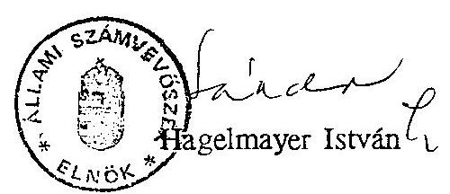

---

# Sportági szakszövetségek, országos sportszövetségek ellenőrzésének részletes tapasztalatairól 

Az 1989. évi II. törvény és az 1989. évi 9. tvr. hatálybalépését követő önállósodás erőteljes szerveződési folyamatot váltott ki a sportmozgalomban. Évről-évre dinamikusan nőtt - 1990-1993. között $44 \%$-kal: 44 -ről 69 -re - meghatározóan a nem olimpiai sportágakban az országos sportági szakszövetségek és mérsékelten bővült a területi tagszövetségek (továbbiakban szövetség) száma.
Folyamatosan alakultak meg az érdekszövetségek különböző szinten, meghatározott céllal (pl. Magyar Sportszövetség - MSSZ).
Figyelemre méltó volt ugyanakkor, hogy a szövetségek szakosztályi bázisa - a reprezentáció szerint - összességében mérséklődött döntően pénzügyi okokból, s csökkent - 1991-ig - az igazolt versenyzők létszáma is.

1. A szövetségek tevékenységének szabályozottsága - a helyszíni vizsgálat tapasztalatai alapján - nem volt megfelelő. Az alapszabály helyenként nem elégítette ki az 1989. évi II. tv. vonatkozó követelményeit.

Esetenként nem rögzítették - az előírás szerint - a székhely pontos címét (Magyar Birkózó Szövetség - MBSZ), nem nevesítették a bevételi forrásként megjelölt vállalkozási tevékenységet (Magyar Vizilabda Szövetség - MVSZ. Magyar Kosárlabda Szövetség - MKOSZ, Magyar Kajak-Kenu Szövetség MKKSZ).

Előfordult a vizsgált körben, hogy a törvényes működés szabályozásbeli kellékei nem voltak megfelelőek.

Az MBSZ elmulasztotta az 1992. évben végrehajtott alapszabály módosításának bírósági bejegyzését.
Nem tisztázott, illetve eltérően rögzített az elnökség létszáma (25, illetve 17 fó).

A gazdálkodás rendjét, fegyelmét a szabályozás nem segítette. Jellemző volt a gazdálkodás hiányos, alacsony színvonalú, vagy ellentmondásos, gyakran a jogszabályi előírásokat sértő szabályozása. Többnyire nem volt megfelelő a pénzügyi jogkörök gyakorlásának rendje, a könyvvezetésre vonatkozó előírások.

---

Az MVSZ 1990. évre készített Gazdálkodási Szabályzata nem követte a vonatkozó jogszabályok változását (számvitel, adó, stb.).

Nem, illetve nem megfelelően szabályozták a leltározás, a házi pénztár rendjét (MKOSZ, MKKSZ, Magyar Íjász Szövetség (MISZ), a számvitelt (MISZ, MBSZ), Hiányosan határozták meg a pénzügyi jogkörök gyakorlását (MISZ), nem tisztázott a kötelezettségvállalási jogosultság (MVSZ, MKOSZ, MKKSZ), nem rögzítették az utalványozás, ellenjegyzéshez tartozó összeghatárt (MVSZ, MKKSZ).

# Előfordult, hogy a müködés, illetve a gazdálkodás törvényes feltételei hiányoztak. 

A MISZ-nél az 1992. év eleji elnökváltást követően a gazdálkodási jogköröket nem rendezték, s elmulasztották a közgyülés által megválasztott elnök cégbírósági bejegyeztetését. Így az 1992. február 14-én banki aláírásra az akkori főtitkár - az alapszabály $35 . \S$ g. pontja szerinti elnöki megbízás nélkül jelentette be magát egyszemélyes aláiróként.

A Legfőbb Ügyészség 1993-ban óvással élt az elnökség létszámának és megválasztásának az alapszabályban foglaltaktól eltérő volta miatt, és indítványozta a vonatkozó testületi határozatok hatályon kívül helyezését. Ezt követően az elnökség nem tett eleget az alapszabály $24 . \S$ c. (2) bekezdése szerinti 1 hónapon belüli közgyűlés összehívási kötelezettségének, s erről az ügyészséget időben nem értesítette.

A törvényes állapot, illetve helyreállításának tartós hiánya nem vonta maga után a költségvetési támogatások folyósításának megszüntetését.

Az ÁSZ vizsgálat kezdeményezte, hogy az OTSH az 1989. évi 9. tvr. 16. § (1) b. és d. pontja értelmében vizsgálja felül a támogatás további folyósításának jogosságát, melyet akceptáltak.

A MISZ pénzügyi egyensúlyát részben jogosulatlan pénzforrások szabálytalan folyósításával tartották fenn.

Az OTSH a Magyar Terep és Vadászijász Egyesíleten (MTVE) keresztül juttatta el szabálytalanul az eredetileg sportdiplomáciára szánt 400 E Ft , valamint a müködésre biztosított 407 E Ft támogatást a MISZ-hez. (Ezeket az összegeket az OTSH korábban Íjász Szövetség megjelöléssel az MTVE gödöllöi bankfiókjába irányította.)

---

# 2. A szövetségek költségvetésének tervezése 

A szövetségek költségvetései nem kellően megalapozottak, jellemzően a szakmai és pénzügyi tervezés, illetve a bevételek és kiadások összehangolásának hiányosságai miatt. A szakmai feladatok bizonytalan bevételi forrásokra épültek, illetve azok nem jelentettek korlátozó tényezőt. Ez több szövetségnél a költségvetési egyensúly megbomlásához, finanszírozási problémákhoz vezet.

A versenynaptár alapján készített és elfogadott szakmai terv jóváhagyásakor a kapcsolódó kiadások fedezeti alátámasztottsága hiányzott. A központi költségvetés döntései alapján, azt követően - a következő év február-március hóban vált ugyanis ismertté a támogatás mértéke és célja. Sokszor a saját források (elsősorban a szponzori bevételek sem voltak kellően alátámasztottak).

## 3. A szövetségek bevételei - finanszírozásának rendszere

A szövetségek bevételei - a mintavétel szerint - összesen 40\%-kal emelkedtek a vizsgált időszakban.
Bővültek az államháztartásból származó pénzeszközök és egyéb források finanszírozási csatornái (Szerencsejáték Alap, Nemzeti Sport Alap, stb.). Nôtt együttes összegük is, arányuk ugyanakkor $43 \%$-ról $37 \%$-ra csökkent a szponzori bevétel javára.

Egyes szövetségeknél a gazdasági önállóság a szponzor, illetve vállalkozási bevételek kedvező növekedését váltotta ki, másutt ez esetleges, eseménytől függő, illetve hiányzik.

A megkérdezett körben a szponzori bevételek közel megduplázódtak, s ez $60 \%$-ukra jellemző. Nem jelölt ilyen forrást bevételei között pl. a Magyar Tekézők Szövetsége.

Az általános tendenciák mögött - évenként is - nagy a szóródás, ami a sportág (szövetség) eseményeitől, népszerűségétől, eredményességétől is függ.
a.) Központi költségvetési források és elosztásuk

A központi költségvetésből az OTSH-n keresztül a sportszövetségeknek juttatott támogatás összege folyamatosan emelkedett, de összességében egyre kisebb súllyal kapott szerepet a feladatok finanszírozásában. A reprezentáció szerint a

---

szövetségek bevételei között a központi költségvetésből OTSH-n keresztül kapott támogatás aránya $31 \%$-ról $25 \%$-ra csökkent.

A sportszövetségek támogatási előirányzatában került évek óta megtervezésre a sportági szakszövetségek mellett az országos hatáskörü sportszövetségek (Magyar Egyetemi Főiskolai Sportszövetség - MEFSSZ, Magyar Diáksport Szövetség - MDSZ, Magyar Természetjárók Szövetsége - MTSZ, MSSZ), valamint 1992. évtől a MOB támogatása, a diáksporttevékenységet támogató "sportcsoportvezetői tiszteletdíj kiegészítés" és 1991-1992. években a sportolók eredményességi jutalmának személyi jövedelemadója (bruttósítás). (1993. évtől az OTSH a jutalom utáni adó kifizetését már nem vállalta fel.)

A sportági szakszövetségek az OTSH-nál szövetségi támogatásként kimutatott teljesítésből 1991-1993. években $58-70 \%$-kal részesedtek.

1991-1992. években a szakmai alapon elosztott támogatásból 40-44 sportági szakszövetség részesedett (ebből 9-10 nem olimpiai sportágban működő szövetség volt).

Nem került szűkítésre, sőt bővült a központi költségvetési pénzeszközből (OTSH) támogatott szövetségek köre. A költségvetési előirányzatok tervezése azonban nem igazodott megfelelően a támogatás elosztási elveihez. 1993-ban a szabadidősport előirányzatából átcsoportosított 10 M Ft-ból támogattak 23 - 1990. óta alakult - sportági szakszövetséget

Az OTSH elnőkének döntése alapján 1993. évben - a sportágszervezés kezdetén álló szövetségek kivételével - valamennyi sportági szakszövetség részesült támogatásban. Mivel erre fedezet a sportszövetségek támogatásának előirányzatában nem volt, a szabadidősport előirányzatából a szövetségek támogatására jóváhagyott előirányzatba csoportosítottak át.

Nem jutott ugyanakkor támogatás a Magyar Szabadidő és Sportszövetségnek (MSZSZ).

Kifogásolható az OTSH támogatási gyakorlatában, hogy állami sportfeladatok ellátásában közvetlenül nem részes szövetséget is támogatott.

Az MSSZ részére 1992-1993-ban az OTSH 9.000-8.000 E Ft támogatást irányzott elő, mely 8.877-8.415 E Ft-ban realizálódott.

Az elosztásban az olimpiai sportágak prioritást kaptak teljeskörű támogatottságukkal, ugyanakkor részesedésük tendenciájában csökkent a nem olimpiai

---

sportágak javára (1990-93. évek között 91,8\%-ról 81,7\%-ra). Az 1993-ban belépő műhelytámogatást nem számolva az arány még kedvezőtlenebb, $75,4 \%$.

A vizsgált időszakban a szövetségek támogatásának alapdokumentuma a szövetség és az OTSH között évente megkötött megállapodás volt, amely tartalmazta a szövetség szakmai vállalásait, a támogatás jogcímenkénti összegeit, a finanszírozás ütemezését és a szövetség elszámolási kötelezettségét.

Az OTSH a megállapodások alapján szövetségi müködésre, sportszakmai tevékenységre (kiemelt eseményeken való részvételre, eseményekre való felkészülésre), beszerzésre, sportdiplomáciai kiutazásokra és fogadásokra nyújtott támogatást. Emellett vállalta a szövetség nemzetközi sportszervezeti tagságával összefüggő tagdíj közvetlen átutalását, deviza biztosítását, valamint rögzítésre került az edzótábori kontingens is. (1993. évben a szövetségek az éves edzőtábori kapacitás $30 \%$-ára nyújtottak be igényt.)

A fő támogatási jogcímeknél nem következtek be lényegesebb arányeltolódások. A műhelytámogatást nem számolva a költségvetési forrás mintegy $50 \%$-át kiemelt eseményekre, sportszakmai feladatokra, müködésre $29-33 \%$-át, $3-4 \%$-át sportdiplomáciára, beszerzésekre juttatták a költségvetési forrásból (8. sz. melléklet).

A szövetségi támogatási rendszer keretében a válogatott versenyzők felkészüléséhez a központi edzótáborok térítésmentes igénybevételét - naturáliában meghatározottan - biztosította az OTSH, esetenként pénzbeli támogatást adott külföldi edzőtáborozáshoz.

Az edzőtábor igénybevételének figyelemmel kísérése, ellenőrizhetősége szövetségi szinten nem mindenütt megoldott.

Az MBSZ részére 1990-1993. között az OTSH 4.812 - 6.525 - 5.225 - 4.965 edzőtábori napot biztosított, melynek felhasználásáról nyilvántartást nem vezetett. Így a tényleges teljesítés adatai csak tételes kigyüjtéssel lettck volna megállapíthatók.

Az MKOSZ az OTSH által biztosított kontingenst csak részben vette igénybe költségvetése terhére másutt is edzőtáborozott - a tényleges teljesítésröl adatok nem álltak rendelkezésre.

A szövetségek gazdálkodási problémáinak megoldására esetenként az OTSH soron kívüli intézkedéssel póttámogatást vagy rövid lejáratú kamatmentes kölcsönt adott, melyet a visszafizetési határidőt követően gyakran végleges

---

támogatásnak minősített át. Ezzel az eljárással a szövetségek "megpuhított" feltételekkel jutottak állami támogatáshoz.

A Magyar Labdardgó Szövetség (MLSZ) 1992-ben 15 M Ft, 1993-ban 3 M Ft kölcsönt kapott az OTSH-tól, melyböl 10 M Ft-ot - szóbeli közléssel - végleges támogatásnak minösitettek át.

A kölcsönnyújtásnál, póttámogatásnál nem vizsgálták a gazdálkodási problémák keletkezésének okát.

Az OTSH az MLSZ-tól elözetes közlés szerint 1993-ban átvállalja az MLSZ 1992. XII. 31-ig felgyült SZJA és ÁFA tartozását, mintegy 14,7 M Ft összegben. Az MLSZ likviditási, költségvetési egyensúlya zavaraiban a kellő takarékosságot nélkülöző, indokolatlan és pazarló kifizetések is közrejátszottak.

Az MBSZ-nél 1992. I. 1. - 1993. XII. 31. között halmozoitlan 1.909 E Ft adótartozás keletkezett, ami a szakmai költségek túlzott mértékii növelésére volt visszavezethető. Az adókötelezettséget annak ellenére sem fizettek be, hogy 1993-ban ugrásszerüen növelni tudták a szponzori dijbevételeket, s igy a fedezhető lett volna a forrásokból.

A reálértékben csökkenő támogatás elmaradt a gyarapodó számú szövetségek támogatás iránti igényének növekedésétől. Ezért a követelmények szigorítása, következetesebb meghatározása, koordinálása és számonkérése lett volna indokolt. A tapasztalatok szerint ezek az elvárások nem érvényesültek maradéktalanul a forrásjuttatás és számonkérés gyakorlatában.

A szövetségek a megállapodásokban foglalt elszámolási kötelezettségüknek (támogatott eseménynél az eseményt követő 1 hónapon belül, eseményhez közvetlenül nem kapcsolódó felhasználásnál a tárgyév december 15 -ig) gyakran nem, vagy jelentős késéssel tettek eleget. Az OTSH ennek figyelemmel kisérésére nem fordított kellő gondot. Az elszámolási kötelezettség előirása a sportági szakszövetségek esetében teljes mértékben formálisnak tekinthető, nem teljesítésének - néhány egyedi esetet kivéve - nem volt szankciója. A megállapodások nem egyértelmú megfogalmazása miatt az sem egyértelmú, hogy az éves elszámolási kötelezettséggel kapcsolatos intézkedés a Közgazdasági Főosztály, vagy a Sport Főosztály feladata-e.
1993. évi elszámolási kötelezettségének 1994. február közcpéig kb. 15 sportági szakszövetség tett eleget, változó, esetenként elfogadhatatlan szinvonalon.

A minisztériumok nem folyósítottak költségvetési támogatást sportszövetségek számára.

---

# b.) A MOB forrásaiból adott támogatások és elosztásuk 

A MOB - a központi költségvetési támogatásokból, a közérdekủ kötelezettségvállalásokból, szponzori és egyéb bevételeiből - növekvő mértékben és súllyal vállalt részt az olimpiai sportágak szakszövetségeinek támogatásában.

A tanusitvány szcrint a MOB növekvő ( $23 \%$ ) összegecl támogatta az olimpiai sportágakban a szövetségek tevékenységét. Az igy folyósitott pénzeszközök értéke az OTSH-tól érkező támogatás több mint cgynegyedének felelt meg. Az olimpia évében volt a legjelentősebb a támogatás, amikor 77,6 M Ft-ot 30 szövetségnek itéltek meg. 1993-ban 43 szövetségnek 56,9 M Ft-ot juttattak.

A MOB támogatási gyakorlata differenciálódott, elveit sportszakemberekből álló ad-hoc bizottságok dolgozták ki. A támogatási rendszer - alap-, eredményességi és rendkívüli támogatásból, egyéni támogatásból áll - korrekt, körültekintő és átlátható, az az olimpiákon, illetve világversenyeken elért eredményekre alapozott.

A MOB a szövetségektól évente utólagosan nyilatkozatot kért a kiutalt összeg felhasználásáról, mely kötelezettségnek az érintett szövetségek egy része nem, vagy késve, eltérő színvonalon tett eleget.

A MOB Számvizsgáló Bizottsága szúrópróbaszerủ helyszíni ellenörzései során megállapította, hogy a szövetségek a kapott támogatás egy részét idólegesen más célra használták fel, illetve késve továbbították az egyesületeknek. (E tapasztalatok alapján vezették be az egyesületek közvetlen támogatásának gyakorlatát. Támogatás megvonást, visszafizetést azonban nem alkalmaztak.)
c.) Az önkormányzatok - részben pályázatos rendszerben - csekély, de évenként folyamatosan növekvő összeggel járultak hozzá a szövetségi feladatok finanszírozásához. Általában eseményre juttattak kiegészítő forrásokat.

A mintavétel szerint 1990-ben 100 E Ft-ot, 1993-ban 1.350 E Ft-ot folyósitottak a szövetségeknek.
d.) Szerencsejátékból származó pénzeszközök sportcélú felhasználása

A Szerencsejáték Alap (SZA) és a Szerencsejáték Rt. (SZRt.) együttesen növekví súllyal és összegben egészítették ki a szövetségi forrásokat, de a finanszírozásban betöltött szerepük csak az MLSZ-nél volt számottevó.

---

Az SZRt., közérdekú kötelezettség vállalásának felét a labdarúgás kapta ( 101 M Ft -ot).
Az SZA-ból az MLSZ 26 M Ft-tal részesült.
Az 1993-ban alakult Nemzeti Sport Alap (NSA) - mint forrás - még nem játszott lényeges szerepet a szövetségek támogatásában.
e.) A finanszírozók együttmüködése a szövetségi támogatásban

Az egyes finanszírozók között az együttmüködés nem volt megfelelően összehangolt. A koordináció képviseleti rendszerủ volt és esetleges.

Az OTSH-val való koordináció a MOB testületekben (megyálasztott) OTSH vezetők tevékenységén keresztül valósult meg.

# 4. Szövetségek kiadásainak alakulása, a támogatások felhasználása 

A szövetségek kiadásai - a reprezentáció szerint - a vizsgált időszakban $45 \%$-kal emelkedtek. A kiadások növekedése számos esetben meghaladta a források növekedését.

Emelkedett a tartozások - köztük helyenként az állammal szembeni kötelezettségek - kiegyenlítetlen összege.

A mintavétel alapján az eladósodott szövetségek száma több mint kétszeresére nőtt, és a megkilencszerezödött tartozás állományukon belül az adótartozás kétszeresére, a társadalombiztosítási hátralék négyszeresére emelkedett.

A müködési kiadások támogatottságának aránya költségvetési forrásokból nem bővült, ugyanakkor több helyen bekövetkezett növekedése esetenként szakmai célú forrásokat vont el.

Az MKKSZ-nél a szakmai feladatokra szánt összegekböl is át kellett csoportosítani pénzeszközöket a müködési kiadások fedezetére.

A MISZ a múködéséhez - az e célra biztosított - 889 E Ft OTSH tamogatason felüli többlet költséget gyakorlatilag a sportdiplomáciai kiulazásokra és fogadasokra kapott összegböl fedezte.

Az MLSZ sportszakmai kiadásai 1992. és 1993. évek közölt abszolút értékben is csökkentek ( $98,9 \%$ ), ugyanakkor az ügyviteli költségek $59 \%$-kal (arányuk $22 \%$-ról $32 \%$-ra) emelkedtek.

---

Egyes szövetségek nem a megjelölt célokra használták fel a kapott támogatást, s előfordult az is, hogy terhére kirívóan pazarló, s a támogatott feladathoz közvetlenül nem kapcsolódó kiadásokat is elszámoltak.

Az MLSZ 1993-ban az NSA-tól és az SZRt-tól származó - megállapodáshoz mérten csökkent összegben folyósitott - támogatásból ( 40 M Ft ) a megjelölt feladatokra összesen 38 M Ft felhasználást tudott kimutatni. (Ebból $2,3 \mathrm{M} \mathrm{Ft}$ késedelmi kamat volt, ami az OTSH szerzódésben vállalt határidőhöz képest késedelmes támogatás utalása miatt keletkezett.)
Téves kontírozás miatt itt számolták el a nemzetközi futballigazgató és felesége a Radisson Béke Hotelben történt elhelyezésének kiadásait (szoba, minibár, uszoda, étkezés, telefon, széf, bár, stb.) 1993. II-VIII. hó közötti időtartamra 2258 E Ft bruttó (nettó 1.918 E Ft) összegben.

A MISZ 1993-ban az eredeti OTSH-val kötött szerzödésben jelzett korosztályos versenyen nem vett részt, az erre szánt összeg ( 300 E ) egyéb célra történő felhasználásáról szerzódés módosítás nem volt fellelhető.
A felkészülésre adott összeg ( 500 E Ft ) dologi jellegü volt, ennek ellentére 253 E Ft 3 fő versenyző részére személyi bérként került elszámolásra, melynek TB járuléka 111 E Ft-ot képviselt. Az összesen 364 E Ft-os kiadás szabálytalannak minősült.

A támogatás felhasználásának ellenőrzése rendszerében, funkcionálásában nem volt megoldott és összehangolt.

Az OTSH Ellenőrzési Osztálya ellenőrzési terv alapján 1993. évben kezdte meg a szövetségek ellenőrzését, évente 5-6 szövetség vizsgálatával számolnak.

Az indokolatlan kifizetésekhez hozzájárult az is, hogy nincs olyan iránymutatás, követelmény, norma, amely az egyes jogcímeken behatárolná az állami támogatás terhére elszámolható kiadásokat (pl. versenyek résztvevőinek köre, száma).

Az MVSZ-nél az 1993-ban a krétai nemzetközi vízilabda tornára kiutazó csapatban indokolatlanul az OTSH egy dolgozója is helyet kapott.

A sportági szakszövetségek egy része - az OTSH-tól 1993-ban mühelytámogatás címen biztosított összegen kívül is - támogatta forrásaiból a szakosztályokat, területi tagszövetségeket. A reprezentáció szerint ezek száma némileg csökkent az ellenőrzött időszakban (37-30\%).

Az MBSZ elnökségi döntés alapján 1990-1993. kövött 321 E - 703 E - 463 E - 80 E Ft közvetlen támogatást nyitjtott területi szövetségeknek, 1.434 E - 452 E

---

- 2.484 E - 474 E Ft-ot pedig egyesületek szakosztályainak. (Ez utóbbi jogcímböl mindössze az 1990. évi támogatás tartalmazott - 1.080 E Ft összegü - állami forrást. A pénzeszközök átadásakor a feladat- és célmegjelölést írásban nem dokumentálták, a szakosztályokat a felhasználásról nem számoltatták be.

5. A szövetségek gazdálkodásának rendje, fegyelme

A helyszíni vizsgálatok és a tanusítványok alapján megállapítható, hogy a müködés és a gazdálkodás dokumentumainak, bizonylatainak kezelése, a tisztségváltáshoz kapcsolódó átadása-átvétele nem megnyugtató. Nem álltak mindenütt rendelkezésre a szükséges dokumentációk. Azok hiányos volta, vagy hiánya - helyenként - a vizsgálat teljeskörű lefolytatását akadályozta, sérıve ezzel az 1989. évi XXXVIII. tv. 24. § b. pontjának előirását.

A MISZ müködésénck, gazdálkodásának dokumentumai az 1990-1993. I. negyedévig terjedő időszakra vonatkozóan teljességgel nem álltak rendelkezésre, az 1993. I. negyedévi bankbizonylatokat bemutatni nem tudták.

Az MKOSZ-nál az 1990-1991. évi állami támogatásra vonatkozó anyagok nem megfelelő irattározás miatt - teljes mértékben nem álltak az ellenörzés rendelkezésére.

A kapott támogatások cél- és rendeltetésszerü felhasználásának ellenőrizhetőségét a számvitel kialakított rendje sokszor nem biztosította, másutt a pénzügyikönyvviteli tevékenységben tapasztalt hibák nehezítették.

Az MLSZ-nél a támogatott események és ezek forrása finanszírozás szerint nincs elkülönítve, nagyszámú a téves könyvelési tétel.

A pénzügyi, bizonylati fegyelem terén az ellenőrzés több esetben súlyos hiányosságokat, mulasztásokat tárt fel.

Az MBSZ-nél a kiadások teljesítésénél a számlák tartalmi kellékei nem mindig feleltek meg a számvitelről szóló 1991. évi XVIII. tv. 84. § (2) bekezdésében foglaltaknak.
Nem volt szabályozott és a gyakorlatban sem érvényesült a sportfelszerelések, valamint az ajándéktárgy átadásának dokumentálása, illetve igazolása (1990-1991. ćvekben 508-761 E Ft összegü beszerzések, 1993-ban 6 E Ft értékủ ajándékcsomag). Hasonló problémák voltak tapasztalhatók az MVSZ-nél.

---

A gazdasági feladatok ellátásában tapasztalt hiányosságok, szabálytalanságok oka gyakran az volt, hogy a szövetségek nem mindenütt rendelkeztek a gazdálkodásban szükséges személyi feltételekkel (pl. MKOSZ 1992-ig).

Budapest, 1994. szeptember

---

# Sportegyesületek ellenőrzésének részletes tapasztalatairól 

A nemzetgazdaságban zajló folyamatok, az állami, illetve szövetkezeti tulajdonú gazdálkodó szervezetek csődje, szanálása, stb., az úgynevezett bázis szervi támogatási rendszer fokozatos felbomlásához vezetett.

A sportegyesületek általában egy-egy gazdálkodó szervezethez, úgynevezett bázis vállalathoz kapcsolódtak pénzügyileg, mely részben természetbeni juttatásként biztositotta létesítmény feltételeiket, a minősített sportolók javadalmazását, utaztatásaikat, stb. és pénzbeli támogatást nyújtott müködésükhöz.

A változatlanul többcsatornás finanszírozási rendszerben - a források körének változása, bővülése mellett - csökkent a sportegyesületek tevékenységének támogatottsága. Ennek hatása a sportegyesületi mozgalom jellemző adataiban is megmutatkozik.

A sportegyesületek száma 1990-1993. évek között - 8\%-kal - 2826-ra csökkent. A kereteik között igazolt sportolók létszáma ennél nagyobb mértékben ( $15 \%$-kal), a szakosztályok száma $5 \%$-kal lett kevesebb.

A vizsgálat döntően az élsport műhelyeiből merített. Diáksport egyesületek nélkül 29 sportegyesület szolgáltatott adatot, közülük 12 SE 10-nél kevesebb szakosztályt, 17 SE 10-nél több szakosztályt müködletett. E körből 19-nél a helyszínen is volt ellenőrzés. A megkérdezett SE-k 1/3-a budapesti, 2/3-a vidéki - megyeszékhelyen múködő - volt.

Az értékelés általánosíthatóságát torzítja, hogy a vizsgált kör tartalmazta a minisztériumok (HM, BM, FM, NGKM) által támogatott legnagyobb sportegyesületeket, továbbá a reprezentációban a korábban kiemelt sportegyesületek aránya $34 \%$ volt.

A sportegyesületek által múködtetett szakosztályok számában lényeges mozgás nem volt. Szakosztály növekedés és csökkenés egyaránt előfordult.

A növekedés okaként közel azonos arányban jelöltek meg szakosztály átvételt, új szakosztály alakulást. A szakosztály leépítésekre döntően pénzügyi okokból

---

került sor. A csökkenés nagyobb arányban a más egyesületeknek való átadást, kisebb hányadban önállósodást - önálló jogi személyi szerveződést - jelentett.
1990. és 1993. között - a vizsgált időszakban - az országos tendenciával megegyezően a sportegyesületi reprezentációban is csökkent az igazolt versenyzők száma. Jellemzően mind a felnőtt, mind az utánpótlás korosztálylétszáma mérséklődött, s a minősített versenyzök száma is hasonlóképpen alakult.

Az igazolt versenyzök létszámának folyamatos csökkenése az érintett kör 2/3-ára volt jellemző. Az így kieső létszámot az egyesületek kisebb arányában tapasztalható sportolói létszámnövekedés, és az időközben belépett új egyesületek igazolt sportolói létszáma együttesen sem tudta ellensúlyozni.

A sportegyesületek tagjainak száma a 10 szakosztály feletti egyesületekre jellemzően emelkedett, összességében 3,6\%-kal. A pártoló tagok száma dinamikusan kétharmadára - csökkent. A jogi tagok számának általános csökkenését egy egyesületnél tapasztalt jelentős számú növekedés fedte el.

Minden foglalkoztatási formában és megkülönböztetett edzői fokozatban évről-évre folyamatosan - 1990-1993. viszonylatában összesen 15\%-kal - kevesebb edzőt alkalmaztak.

# 1. Sportegyesületek tevékenységének szabályozottsága 

A sportegyesületek az 1989. évi II. törvény alapján és érvényes alapszabály szerint tevékenykedtek. Müködésük, gazdasági, pénzügyi folyamataik belső szabályozása többször nem volt megfelelő.

Az egyesületnek nem volt érvényes szervezeti és müködési szabályzata (Győri ETO Kézilabda Club - Győri ETO KC), illetve az új alapszabály hatályba lépését követően (1990. I. 1.) azt nem készítették el (Kecskeméti Sport Club - KSC).

A gazdálkodásra, számvitelre vonatkozó szabályzatok hiányoztak (Győri ETO KC ), korszerütlenek voltak, nem követték a jogszabályi, illetve az egyesület könyvvezetésében bekövetkezett változást (KSC), számlarendet nem, csak számlatúkröt készítettek (Debreceni Munkás Testedző Egyesület - DMTE, Tatabányai Sport Club - TSC).

---

# 2. A sportegyesületek költségvetésének tervezése 

A sportegyesületek költségvetésének felépítése, részletezettsége eltérő volt. Az elsősorban a korábbi gazdálkodási, nyilvántartási rendszer hagyományaihoz, illetve a szakosztályi önállóság fokához igazodott. Előfordult, hogy egyes egyesületek adott évben nem készítettek költségvetést a források bizonytalanságára való hivatkozással. A költségvetések megalapozottsága forrásoldalról általában nem volt megfelelő. Jellemző volt a kiadások sportszakmai igények szerinti megtervezése, melynek bevételi fedezete részben hiányzott. Ez összefüggött a sportfinanszírozás kialakult gyakorlatával, az abban megmutatkozó bizonytalansági tényezőkkel.
A költségvetés készítésekor, elfogadásakor ugyanis a sportegyesületeknek nem volt információja az éves támogatások összegéről, azok átadásának időszakáról, sokszor hiányzott a finanszírozó támogatásra vonatkozó kötelezettségvállalása.

A Szekszárdi Húsipari SE a pénzügyi lehetőségek bizonytalanságai miatt konkrét és részletes költségvetést nem határozott meg.

A Magyar Testgyakorlók Köre Sport Club (MTK) gazdálkodási tervét sportszakmai feladatok célkitüzésel határozták meg, melyhez a forrásokat szerződésekkel, megállapodásokkal igyekeztek biztosítani. 1990-ben a szakmai feladatok végrehajtásának fedezete a költségvetés készítésekor részben hiányzott ( 57 M Ft ).

A KSC 1993-ban nem készített költségvetést, mivel annak határidejére a pénzügyi források nem álltak rendelkezésre.

Az egyesületek költségvetésében esetenként jelentős tartalmi és nagyságrendi változást okozott a létesítmény üzemeltetési feladatok átvétele a bázis szervtől.

## 3. A sportegyesületek bevételei - finanszírozásának rendszere

A sportegyesületek összes bevétele a vizsgált kör egészét érintően növekedett 1990-1993. viszonylatában $36 \%$-kal.

A hevétel növekedése a minta $2 / 3$-ára volt jellemző.
A sportegyesületek központi költségvetésböl, önkormányzatoktól elkülönített állami pénzalapokból, állami tulajdonú vállalkozásoktól, stb. részesültek támogatásban. Saját forrásuk a tagdíjakból, vállalkozási (reklám, bérbeadás, szolgáltatások, stb.) bevételekből képződött.

Az összegzett adatok jelentős szórást és ellentétes folyamatokat is takarnak.

---

a.) Központi költségvetésből az OTSH-n keresztül a sportegyesületeknek közvetlenül juttatott állami pénzeszközök mértéke és aránya csökkent, egyre kevésbé voltak képesek fedezni a szakmai feladatok végrehajtását, az egyesületek működőképességének fenntartását.

Az OTSH 1991-ben - kölcsönök nélkül - 259,9 M Ft-ot, 1992-ben 237,2 M Ft-ot fordított a sportegyesületek támogatására ( 9 . sz. melléklet), 1993-ban a szövetségeken keresztül mühelytámogatásként 101 M Ft-ot, egyesületek eseti támogatásaként különböző jogcímen $59,5 \mathrm{M}$ Ft-ot.

Az OTSH sportegyesület támogatási rendszere meghatározóan és kényszerűen a korábbi bázis támogatási rendszerre épült.

Prioritást elsősorban a volt "kiemelt" - korábban az OTSH által felügyelt és költségvetéséből is támogatott - valamint az olimpiai sportágakban eredményes sportegyesületek élveztek. Müködési támogatást (bér, TB járulék, ÁFA fedezetére) a volt kiemelt sportegyesületeknek juttattak amely a rendelkezésre álló pénzeszközök jelentős hányadát - 1992-ben közel 20\%-át - kötötte le.

A támogatási rendszeren belül a szakmai szempontok szerinti (alap és eredményességi) elosztás az összes eredeti előirányzatnak csak 40-50\%-át tette ki. Az e célra fordított összeg gyakorlatilag 1986 óta változatlan volt ( 110 M Ft ), s elosztásának elvei, módszerei sem változtak alapvetően.

Az alaptámogatás összegét az 1986. évi "bázisszervi megállapodásokban" rögzített állami támogatás arányai és a sportegyesületek szakosztályi összetételében, versenyzői és szakember állományában azóta bekövetkezett változások határozták meg.

Az évente 50 M Ft körüli alaptámogatásból a volt kiemelt sportegyesületek ( $12-11 \mathrm{db}$ ) részesültek.

Eredményességi támogatás címen évente 57 M Ft-ot osztottak szét.
1991. évben az olimpiai sportágak olimpiai versenyszámaiban az 1989-1990. évi EB-VB-n elért eredmények alapján összesen 25 M Ft-ot 29 egyesületnek ítéltek oda. Értékmegőrző támogatásként 32 M Ft-ot az olimpiai sportágak szövetségeinek javaslatai alapján szintén az 1989-1990. évi VB-EB eredmények figyelembevételével kb. 180 egyesület között osztottak fel. (A legmagasabb támogatás $7,4 \mathrm{M} \mathrm{Ft}$, a legalacsonyabb $2,5 \mathrm{E} \mathrm{Ft}$ volt.)

---

1992. évben kiemelten kezelték az olimpiára való felkészülés támogatását. Az előző három év nemzetközi eredményeinek figyelembevételével 25 sportági szakszövetség döntése alapján osztották fel már a teljes ( 57 M Ft ) eredményességi támogatást. (A legmagasabb támogatás $7,9 \mathrm{M} \mathrm{Ft}$, a legalacsonyabb 1 E Ft volt.)

A volt kiemelt egyesületek 1991. évben az eredményességi támogatás $69 \%$-át, 1992. évben már csak a $44 \%$-át kapták.

Az egyesületi támogatás rendszerét 1993-ban az OTSH átalakította, a sportszövetségek támogatási előirányzatából megállapított, jelentősen csökkentett keretösszeg terhére szakosztályi céltámogatást, "mühelytámogatást" vezetett be.

A műhelytámogatás is olimpia- és eredménycentrikus: a soron következő olimpia programjában szereplő sportágak kiemelkedő eredményességgel működő szakosztályait támogatták.
Az erre szánt forrás a korábbi sportegyesületi támogatás összegének $40 \%$-át tette ki.
Múhelytámogatás címen eredetileg megállapított keret ( 120 M Ft ) a részben törvénysértő előirányzat átrendezések folytán $93,8 \mathrm{M} \mathrm{Ft}$-ra módosult, ténylegesen $101,2 \mathrm{M}$ Ft-ot fizettek ki.

A sportegyesületi támogatás összege elaprózódott annak ellenére, hogy az OTSH megkísérelte ezt alsó határ megállapításával ( 250 E Ft ) elkerülni.

27 sportági szakszövetségre osztottak fel támogatást (pl. a baseball, gyeplabda, jégkorong eredménytelensége miatt kimaradt), amelyek 208 egyesület 302 szakosztálya részére állapítottak meg támogatást.
A támogatás iránti igényt mutatja, hogy a legalacsonyabb támogatási összeg 20 E Ft volt.

Egyedi kérelmekre póttámogatást, valamint kölcsönöket folyósítottak 1992-ig sportegyesületi célú forrásokból (17-18\%-át kitevő arányban), ezt követően tartalékból.

Az elosztási rendszer funkcionálásában kifogásolható volt az is, hogy a szövetségek javaslatai nem voltak minden esetben körültekintőek és megalapozottak, s ezekhez nem kapcsolódott megfelelő kontroll. Így előfordult, hogy időközben már megszűnt szakosztályok, illetve egyesületek is bekerültek a támogatottak közé.

---

A sportegyesületi, illetve műhelytámogatásokat dokumentálisan - megállapodásokban - nem rögzítették. Ily módon nem biztosították megfelelően a támogatás rendeltetésszerű felhasználását, illetve nem szabtak követelményt. Az elosztás nem volt nyilvánosan meghirdetett, így a társadalmi kontroll is hiányzott. A támogatott sportegyesületek (illetve szakosztályok) sem voltak mindig megfelelően informáltak a kapott juttatás rendeltetéséről.

A sportegyesületeknek küldött tájékoztatókban az OTSH információt adott a költségvetési támogatás összegéről, jogcíméről, a pénzellátás rendszeréről, javaslatot tett a felhasználására.
A mühelytámogatás jogcímen átutalt pénzeszközök felhasználásához az OTSH a korábbiaknál is szükebb információt adott, még a támogatott szakosztályokat sem jelölte meg (Budapesti Vasas Sport Club - Vasas SC 3,5 M Ft mühelytámogatás 1993-ban).

Így lényegében a sportegyesületek döntéskörébe utalták a működés alap- és műhelytámogatás felhasználását.

Központi költségvetési forrásokból - hagyományosan bázisszervi alapon minisztériumok is támogattak sportegyesületeket. A sportlétesítményeket üzemeltető intézmények fenntartásán kívül a HM, a BM rendszeresen, az FM esetenként közvetlenül is juttatott pénzeszközt sportkluboknak, évente változó mértékben. (Az NGKM csak a létesítmény fenntartásán keresztül támogatta az MTK-t.)

A sportegyesületeket támogató bázis minisztériumok köréből az Ipari Minisztérium 1990-ben kivált. A támogatás fedezet átadását követően a Vasas SC-t az OTSH finanszírozza központi költségvetésből.

A HM által támogatott honvéd sportegyesületek száma (1990-1993. között $24 \%$-kal) csökkent, míg a részükre elosztott forrás összege ugyanekkor - a Budapesti Honvéd Sportegyesület (BHSE), illetve a belőle 1992-ben kivált KHFC támogatás növekedése folytán - összességében 6,7\%-kal nőtt.

Az FM által biztosított támogatások a vizsgált időszakban évről évre növekedtek, de ezek meghatározóan konkrét célfeladatokhoz rendeltek voltak.

1990. évben az olimpiai felkészülésre az FM három éven keresztül évi 10 M Ft támogatást engedélyezett. 1992. évben 4 M Ft, 1993. évben 27,4 M Ft-ot biztosított a szakosztályok utánpótlás nevelésére. Az 1993. évi támogatás növekedését országgyülési képviselő indítványa alapján elfogadott 60 M Ft-os növekmény tette lehetővé. Az FM 1992. évben a támogatás $87 \%$-át a müködés

---

feltételeihez adta, 1993-ban a támogatás $63 \%$-a kiemelt célfeladatok finanszirozására nyújtott lehetőséget és fedezetet.

A minisztériumi egyesületek támogatása általában közvetlen a "bázis" szervvel, vagy a létesítmény fenntartó intézménnyel megállapodásokban szabályozott volt.

A HM és a BHSE között polgárjogi szerződések tartalmazzák a felek jogait és kötelezettségeit és előirják a támogatás jogcímeit (munkabér és járulékai, hazai és nemzetközi sportversenyek kiadásai, a támogatások $85 \%$-a szakosztályok müködésére fordítható).

A BM és az Újpesti Torna Egylet (UTE) kapcsolatát az 1990. április 1-jén létrejött szerződés határozta meg.
b.) A MOB költségvetésében összegyűjtött alapítványi és szponzori támogatás és állami támogatása maradványa, stb. terhére 1991-tól közvetlenül sportegyesületeknek nyújtott támogatást, mérsékelten növekvő összegben. A több - részben eredményességtől függő - szempont szerinti elosztás 1993-tól "műhelytámogatással" is bővült.

A MOB által támogatott egyesületek száma az olimpia évében volt a legtöbb (39), 13,5 M Ft összeggel, 1993-ban 28 sportegyesületnek - a műhelytámogatással együtt - 13,6 M Ft-ot osztottak el.
(A felmért egyesületek adatai a MOB támogatás dinamikusabb növekedését mutatják.)

A MOB támogatásának mértéke - adott egyesület vonatkozásában is - szintén erősen differenciált.

A Vasas SC például 220-310 E Ft értékben kapott olimpiai felkészülés címén a MOB-tól pénzeszközt.

Az MTK a MOB-tól olimpiai eredményessége alapján 1993-ban 104 E Ft támogatást kapott, melynek megjelölt célja az olimpiai sportágban pontszcrző szakosztályok és utánpótlás nevelése és az 1996. évi olimpiai felkészülés.
c.) Az országos sportági szakszövetségek azon kívül, hogy az OTSH döntési rendszerén keresztül részt kaptak a központi költségvetési források elosztásában, közvetlenül is adtak támogatást sportegyesületeknek, illetve azok szakosztályainak sportáguk szakmai feladataira, vagy az elért eredmény elismerésére. Ezek forrása is részben költségvetési támogatás volt.

---

A Vasas SC pl. versenyhelyezés utánpótlás nevelés címen 30-720 E Ft közötti összeget kapott.
Az MTK 1993-han 3 M Ft-ot kapott az országos sportági szakszövetségektől szakosztályok kiadásainak támogatására.
A Miskolci Vasutas Sport Club (Miskolci Vasutas SC) a sportági szakszövetségektől kapott támogatásának mértéke a vizsgált időszakban 10-150 E Ft között mozgott.
d.) Az önkormányzatok a sportegyesületek támogatásában - a létesítmény feltételek biztosítása mellett - közvetlen anyagi forrásaikkal is részt vállaltak, melynek kereteit többnyire éves együttmüködési megállapodásokban rögzítették.

A vett minta adatai szerint közel megháromszorozódott az önkormányzati támogatás.
Megfigyelhető volt, hogy a vidéki egyesületek nagyobb mértékben és arányban részesültek az önkormányzatoktól (megyei, városi) támogatásban, mint a budapesti egyesületek. Ugyanakkor jellemzőnek tekinthető volt az is, hogy a budapesti - közöttük a kiemelt nagy egyesületek is - növekvő mértékben kaptak önkormányzati pénzeszközt.

Sok esetben az önkormányzati támogatások pótolták részben vagy egészben a "bázis szervek" támogatásának kiesését.

A Pécsi Vasutas Sportkör (Pécsi Vasutas SK) számára 1993-ban önkormányzati forrás pótolta részben a MÁV támogatásának csökkenését.

A TSC bázis szervének, a Szénbányász Vállalat támogatásának leépülését követően a városi önkormányzat a - korábban a bánya kezelésében lévő létesítmények fenntartására Kft-t hozott létre, s az egyesület szakosztályai számára térítésmentes használatot is biztosított, továbbá alap és eredményességi támogatást nyújtott.

A DMTE létesítmény komplexumát - a fenntartó bázis vállalatok helyett -1992-tól a Debrecen megyei jogú Város Önkormányzata üzemelteti.

Ezzel ellentétes tapasztalat, hogy a korábbi időszakban az önkormányzatoktól, mint bázisszervektől kapott sportegyesületi támogatás mértéke jelentősen csökkent (KSC).

Nem ritkán az önkormányzatok a sport támogatására kialakított - teljesítmény szempontokat is tartalmazó - elosztási rendszert müködtettek, s ennek alapján nyújtottak támogatást az egyesületek számára.

---

A Győri ETO KC a Győr megyei jogú Város Önkormányzatától pontozásos rendszer szerint alap és szakosztályi támogatásban részesült.

A Békéscsabai Elöre AGRO-STOP Torna Club a városi önkormányzat támogatását - teljesitmény elvü elosztási rendszer szerint meghatározott mértékben - túlnyomó részben alaptámogatásként biztosította.

A tagsági dijból származó bevételek erőteljes szóródással, de jellemzően csökkentek. Az 1991. évi dinamikus visszaesést (36\%), az azt követő fokozatos emelkedés nem tudta kiegyenlíteni. Ezért 1990-1993. év viszonylatában összességében $10 \%$-kal kevesebb tagsági díjbevételt realizáltak.

A szponzorálási díjak és az egyéb bevételek növekedése volt a súlyában is a legjelentősebb, $77 \%$, illetve $22 \%$. Együttes arányuk a sportegyesületi bevételek között $63 \%$-ról $64 \%$-ra emelkedett.
e.) Állami tulajdonú vállalkozások, mint bázisszervek részvétele a sportegyesületek támogatásában erőteljesen visszaesett, s ez következményeiben sportegyesületek megszünését, illetve gyakran költségvetéseik fedezethiányossá válását okozta.

A bázisszervi támogatás megszünését követöen a Rába Vasas ETO sportegyesület NBI-es férfi kézilabda szakosztályának átvételével a Győri Sportközpont SE Győri ETO KC néven müködött tovább.

Megszüntek olyan juttatások is, melyeket 1990-ig közvetetten a bázis szervezetek nyújtottak (sportállások, költségtérítések, stb.). Ezek miatti forrás kiesést más csatornákon keresztül még nem, vagy csak részben sikerült pótolni.
f.) A sportegyesületek létesítmény feltételeinek biztosítása támogatásuk egyik közvetett formája. Az egyesületek legnagyobb része nem üzemelteti, hanem térítésmentesen használja a többnyire önkormányzatok, bázis szervek tulajdonát képező és általuk fenntartott létesítményeket.

A reprezentáns sportegyesületek $50 \%$-a nem üzemeltet sportlétesítményeket. Nagyobb hányaduk ingyenes vagy kedvezményes térítéssel használja, s csak kisebb arányban ( $2,7 \%$ ) fizetnek bérleti díjat az igénybe vett sportlétesítmények után.

A létesítmény használathoz kapcsolódó támogatás elszámolási formája változatos, általában - a fenntartó szerv és az igénybevevő sportegyesület között megállapodásban szabályozott.

---

Pécsi Vasutas SK-nak a bázis szerv (MÁV) a létesítmény használatot annak ráfordításával azonos sportszolgáltatás fejében - pénzmozgás nélkül "kereszt" számlázással - biztosítja.

A létesítményfenntartó szerv nem ritkán a - sportegyesületnek a sporttevékenységével összefüggő - létesítményhasználatból származó bevételek (pl. rendezvény, reklám) egy részét vagy egészét - felmerülő kiadások teljes körének beszámítása nélkül - átengedte.

Tapasztalható volt a bázis szervek törekvése a létesítmény üzemeltetés átadására és a kapcsolatos kiadások pénzbeli támogatására. Ezzel az üzemeltetés terheinek növekedését hosszabb távon a sportegyesületekre hárították át, ami hatásaiban forrás szükítést jelentett.

A Miskolci Vasutas SC által használt sporttelep üzemeltetését, fenntartását 1990-tól a MÁV átadta a sportegyesületnek, a fenntartási kiadások támogatáskénti átutalásával.
1990-ben a MÁV által nyújtott pénzbeni és természetbeni támogatás együttes értéke 1993-ra $42 \%$-ra csökkent.

A rendelkezésre álló létesítmény kapacitása vagy összetétele nem elégítette ki mindenütt megfelelően a sportolási igényeket.

A mintavételből $40 \%$ jelezte, hogy edzés szükségletüket nem biztosítja a rendelkezésre álló kapacitás.

A létesítmények kihasználásának figyelemmel kísérése - gyakran az érdekeltség hiánya miatt - a használó, fenntartó sportegyesület részéről nem, vagy nem megfelelően megoldott.

# 4. A sportegyesületek ráfordításai 

A sportegyesületek jelentős hányadának költségvetési egyensúlya megbomlott. Ebben a szakmai célok és pénzügyi lehetőségek összhangjának - jelzett okok miatti - hiánya volt a döntő ok. A kiadások szerkezetében a szakmai célú ráfordítások dinamikusabb növekedése okozott arányeltolódást. A müködési ráfordítások mérséklését sok helyen az alkalmazotti létszám csökkenésével kívánták elérni. A reprezentáció szerint a foglalkoztatott alkalmazottak száma 1990-1993. évek között $11 \%$-kal csökkent. A létesítmény üzemeltetés átvett feladata több helyen a működési kiadások növekedését okozta.

---

A támogatások felhasználásának normatív követelményei, előírásai hiányában a sportegyesület által adott különböző juttatások korlátozására csak szűkebb körben került sor, érvényesül továbbra is a minősített sportolókért folytatott verseny költségnövelő szerepe.
A sportegyesületek döntő többsége ingyenesen juttat sportruházatot ( $90 \%$ ) nagyobb hányaduk az eredményességtől függetlenül. A felszerelésben részesített sportolók számát az egyesületek $50 \%$-a szűkítette, másutt az nőtt, vagy változatlan maradt.

A kiadások növekedésének nem szabtak határt a sok esetben szűkössé vált pénzügyi lehetőségek. A sportegyesületek nagyobb hányadára az eladósodás volt jellemző. Számos klub nem tett eleget az állammal szembeni kötelezettségei teljesítésének sem. Az így keletkezett adóhátralékot sokszor az adóelszámolási szabályok be nem tartása miatt további adóhiányok növelték.

A Vasas SC-nck 1994. január 31-ig 81,5 M Ft ki nem fizetett adó és TB járulék kötelezettségét az APEH ellenőrzés további 20 M Ft adóhiány megállapításával növelte.
A DMTE-nck 1,4 M Ft adó és TB járulék hátraléka volt.
A Ferencvárosi Torna Clubnak (FTC) 1991-1992. évról 40 M Ft SZJA és 16,3 M Ft ÁFA tartozása volt.

Az MTK-nak - 1993. december 31-ig - az állammal szembeni kötelezettség teljesítésénck elmaradásából (adó és TB járulék) 89,9 M Ft késedelmi kamat nélküli tartozása van.

A járulék terhek növekedésében a jogszabályi rendezetlenségek is közrejátszottak.
A sportklubok, mint munkáltatók a kifizetett teljesítményt ösztönző juttatások után az 5/1988. (IX.13.) ÁISH rendelkezés 11. §-ának (2) bekezdésében foglaltak alapján nem vallottak be társadalombiztosítási járulékot.
Ezt a TB nem fogadta el és az elmaradt járulék rendbírsággal és késedelmi kamattal növelt összegét több sportegyesületnél - a végzett ellenőrzés alapján befizetési kötelezettségként kirótta.
A jogszabály eltérő értelmezése miatt a TB, a sportegyesületek és az OTSH között az egyeztetés a vizsgálat idején folyamatban volt.

A vitatott járulék elmaradás összegszcrüségét jellemzi: az MTK-nál a társadalombiztositás 1993. évben végzett helyszini ellenőrzése 70,8 M Ft járulék elmaradást és késedelmi pótlékot állapított meg.

---

Az FTC-nél 1988. január 1. - 1993. október 31. közötti időszakra 128,5 M Ft járulék befizetési elmaradást állapított meg, mely a késedelmi pótlékkal és rendbírággal együtt 257 M Ft .
Meg kell jegyezni, hogy az évek során a sportklub és a TB között folyószámla egyeztetés nem volt.

A sportegyesületek egy része fedezethiányának csökkentésére kölcsönt igényelt a támogató szervektől (OTSH, önkormányzat, stb.), melyet gyakran nem fizettek vissza a lejárat idejéig.

A Vasas SC 1991-1992. években 500-500 E Ft kölcsönt kapott az OTSH-tól, melyet az előírt határidőre (1992. XII. 31.) nem fizetett vissza.

A KSC 1990-ben a megyei önkormányzattól 4 M Ft kölcsönt kapott 1991. XII. 31-i visszafizetési kötelezettséggel, melyet nem teljesített.

A Miskolci Vasutas SC 1993-ban 2 M Ft-ot kapott az OTSH-tól - az NSA-ból igért támogatás terhére visszafizetési kötelezettség mellett. (Az NSA támogatásának folyósítása hiányában nem történt meg a visszafizetés.)

Az FTC pénzügyi gondjai rendezésére 1992-ben az OTSH-tól 6 M Ft kölcsönt kapott, melyet nem fizetett vissza.

# 5. A sportegyesületek számviteli rendje 

A sportegyesületek számviteli rendje, könyvvezetése többnyire nem biztosította a kapott támogatások cél- és rendeltetésszerú felhasználásának ellenőrzését. Ugyanakkor a ráfordítások tételes kigyűjtésével sem volt ellenőrizhető minden esetben a támogatott feladatok feltételek szerinti megvalósítása.

A Vasas SC felnőtt és utánpótlás korcsoportra kapott támogatást. A kapcsolódó kiadások elkülönítése korcsoportonként nem megoldható.

A sportegyesületek könyvvezetése több esetben nem felelt meg a jogszabályi előírásoknak.

A Győri ETO KC naplófőkönyv vezetése szabálytalan volt, hibás adatokat tartalmazott. A számlavezető pénzintézet változását követően a megszüntetett bankszámla utolsó egyenlegét változatlanul több hónapon keresztül szerepeltették a naplófőkönyvben.

A ZTE Heraklith naplófőkönyvében szabálytalan javítások szerepelnek, 1992. év végi pénztárforgalom $383.896,9 \mathrm{Ft}$ hiánnyal zár, ugyanakkor a bankszámla egyenleg azonos időpontban $788.600,76 \mathrm{Ft}$ többletet mutatott.

---

A költségvetésből nyújtott különféle céltámogatások esetében az elkülönített nyilvántartás elmaradásával megsértették a 16/1989. (II.26.) MT rendelet 8. § elöírásait.

A sportegyesületeknek adott támogatások rendeltetés- és célszerinti felhasználását a finanszírozók helyszínen nem, vagy csak kivételesen ellenőrizték.

Budapest, 1994. szeptember

---

# A Diáksport ellenőrzésének részletes tapasztalatairól 

A diáksport támogatását a 169/1991. (XII.26.) kormányrendelet, majd a testnevelés és sport megújításának koncepciójáról szóló 24/1993. (IV.9.) OGY határozat alapozta, illetve erősítette meg.
Az OGY határozata kimondja, hogy a testnevelés és sport korszerűsítésének alapvető célja a nemzet egészségének, fizikai állapotának és erkölcsi tartásának javítása, amely cél megvalósítása érdekében az állam a jövőben is a költségvetésen keresztül gondoskodik - többek között - a tanórán kívüli iskolai sportról, a diáksportról.
Az 1993. évi LXXIX. tv. több fejezetében foglalkozik a diáksport kérdéseivel, meghatározva a tanulók sportolási jogait, az iskolák ebbéli kötelezettségeit és a finanszírozás elveit.

## 1. A diáksport szervezeti felépítése és kapcsolatrendszere, együttmüködés

Az alap és középfokú oktatási-nevelési intézmények tanulóit tömörítő önálló diáksport szervezetek érdekképviseleti szerve a Magyar Diáksport Szövetség (MDSZ) országos szövetsége.
Tevékenysége mind az együttműködési, mind a finanszírozási rendszerben a gyakorlati élettól, illetve igénytől bizonyos értelemben elszakadt.

A diáksport alapegységei az önálló diáksport szervezetek - diáksport egyesületek (DSE), diáksport körök (DSK) - ahol a diákok tanórán kívüli sportcélú foglalkoztatása megvalósul.

Az alapegységek és az MDSZ között kétlépcsős területi szervezetek működnek (diáksport bizottságok - DSB, diáksport tanácsok - DST), amelyek képviseleti, előkészítő, egyeztető, összehangoló és bizonyos döntési jogkörrel felruházottak.

A megyei szervezetek megalakulása vegyes képet mutat. 10 megye az MDSZ-en keresztül, 9 megye és a főváros teljesen önálló társadalmi szervezetként alakult meg. Ez a nem centralizált - az MDSZ-től és egymástól független - felállás a működésben időnként zavarokat okoz.

---

A DSB feladata az alapegységek körzeti szintű képviselete. A megye nagyságától függően körzetenként 8-14 DSB müködik.

A DST (illetve megyei Diáksport Szövetség) feladatai a DSB-k tevékenységének összehangolása, az MDSZ megyei versenyrendszerének müködtetése, eseménynaptár, versenynaptár elkészítése, központi és helyi támogatások elosztása, azok felhasználásának ellenőrzése, valamint adat és információ szolgáltatás az MDSZ elnöksége felé.

A DST-knek fö- és mellékfoglalkozású dolgozója általában nincs. Az elnökök feladatukat társadalmi munkában végzik, a titkárok pedig meghatározóan a Megyei Testnevelési és Sporthivatal (továbbiakban: Hivatal) fóállású alkalmazottai. Jellemző, hogy a személyi feltételeken túl a pénzügyi lebonyolítási és müködési feltételeket is a Hivatal biztosítja.

Eltérő rendszer alakult ki a főváros esetében. Itt ugyanis a Diáksport Szövetség önállóan működő szervezetet épített fel 2 főállású titkárral. Az elnökség azonban itt is társadalmi munkában végzi feladatát.

A centrális felépítésű tagolt szervezetben a feladat és hatáskör átfedések elkerülése érdekében az MDSZ, a DST-k, a szakszövetségek, a sportegyesületek, a sporthivatalok között nélkülözhetetlen a szakmai és pénzügyi együttmúködés.

A létrejött együttműködések döntően szóbeli tájékoztatásokra épülnek, melyeket tradicionális, személyi kapcsolati kötődések határoznak meg. Az együttmüködés gyakorlati kérdéseinek írásos rögzítését - néhány kivételtől eltekintve - az ellenőrzés nem tapasztalta.

A diáksport versenyrendszere felmenő rendszerủ, a diákolimpiai verseny kiíráshoz igazodó, amely nagyfokú szakmai és pénzügyi koordináltságot követel meg. A vizsgált időszakban a diáksport tevékenységben szakmai koordinálatlanság, illetve a szervezet tagoltságából következő nehézségek és az információ áramlás zavarai voltak tapasztalhatók.

A szakmai átfedések minden esetben pénzügyi kihatással, illetve vonzatokkal is párosultak.
—Az MDSZ és a Művelődési és Közoktatási Minisztérium 1992-ben egymástól függetlenül alakította ki és tette közzé a diákolimpiai versenyrendszert, illetve versenynaptárt.

---

- A diákolimpia keretében amatőr szinten sportoló és már egyesülethez leigazolt versenyzök indítására is sor került. Ez a támogatás egyenlőtlen elosztáshoz vezetett, mivel a létszám mellett az elért eredmény is szerepet játszik a diák sportkörök rangsorolásában.
- A diákolimpiai versenyekkel párhuzamosan a sportági szakszövetségek is rendeznek utánpótlás, válogató és különböző korosztályos versenyeket.

1993-ban a szakmai irányítás a diákolimpiai versenyek számát az előző évhez képest jelentősen megnövelte. A szakmai és pénzügyi tervezés szinkronhiánya miatt ennek pénzügyi fedezete nem volt biztosítva, emiatt az MDSZ müködésében átmeneti forráshiány lépett fel, melyet csak gyors külső (OTSH) pénzügyi segítséggel tudtak feloldani.

- A megyei DST-k nem minden esetben rendelkeznek információval a DSK és DSE-k számáról, az ott folyó tevékenységről, ez akadályozza a megyei diáksportélet teljeskörű bekapcsolódását az országos versenyekbe.

# 2. A diáksport támogatási rendszere 

A diáksport támogatási formái és módjai szerteágazóak, de jellemzően a következők:
—OTSH támogatás az MDSZ-en Magyar Egyetemi és Főiskolai Sportszövetségen (MEFSSZ) keresztül,

- OTSH támogatás a Hivatalon keresztül,
- megyei, helyi önkormányzattól a DST-n keresztül, valamint közvetlenül a DSE-knek,
- oktatási intézmény az állami normatív támogatásból biztosított összegből (gyakoriság, összeg területenként igen változó),
-különböző alapítványok által elsősorban pályázat útján meghirdetett támogatási lehetőség.
- NSA 1993-tól.

A vizsgált időszakban a diáksporttevékenységet az OTSH részben közvetlenül, részben országos hatáskörű érdekvédelmi szervezeteken (MDSZ, 1992. évtől MEFSSZ) keresztül támogatta.

Az c célra adott költségvetési támogatás 1993. évben 164,8 M Ft-ra cmelkedett, az OTSH költségvetésében sport célra rendelkezésre álló credeti támogatási előirányzaton belüli alacsony részaránya azonban alig változott. (1992. évben $13 \%, 1993$. évben $16 \%$ ).

---

A diáksportra fordított összegek forrásául az OTSH költségvetésének több kiemelt előirányzata szolgál, így az e célra történt ráfordítás közvetlenül nem állapítható meg.

A sportszövetségek támogatási elöirányzata a forrása az MDSZ és a MEFSSZ támogatásának, valamint a sportcsoportvezetői tiszteletdijnak.
Emellett a diáksportot 1991. évben az "egyéb céltámogatás" (teljesités 29,4 M Ft), 1992. évtől a "Testnevelés" kiemelt előirányzata is támogatta (teljesités 1992. évben $12,2 \mathrm{M} \mathrm{Ft}$ ).

A diáksportot közvetlenül támogató források költségvetésen belüli ilyen elkülönülése egyrészt rontja a támogatási rendszer és a finanszírozás áttekinthetőségét, másrészt nem nyújt biztosítékot arra, hogy az eredetileg diáks porttámogatásként számba vett forrást valóban e tevékenységre fordítják. Ennek elkerülésére figyelembe véve, hogy e forrás tartalmában nem szövetség, hanem diáksport közvetlen támogatását szolgálja - a sportcsoportvezetői tiszteletdij kiegészitést a testnevelés kiemelt elöirányzatában indokolt tervezni.

A központi költségvetésből származó támogatást az MDSZ és az OTSH a sportcsoportvezetői díjak kiegészítésére, a területi versenyek rendezésére és a diáksport egyesületek müködéséhez biztosították.

Az OTSH az MDSZ részére 1990-ben 114,8 M Ft, 1991-ben 123,2 M Ft, 1992-ben 35,3 MFt és 1993-ban 50,3 M Ft támogatást biztosított.

Az 1990. és 1991. évek támogatása több mint $70 \%$-a a sportcsoportvezetők díjainak kiegészitését szolgálta. Az 1992. évtől ezt a céltámogatást az OTSH a megyei hivatalain keresztül juttatja el a felhasználóhoz. (Ez az összeg évenként 80 M Ft-os nagyságrendú, az MDSZ támogatás csökkenése ezzel összefüggö.)

A pályázati lehetőségekkel élve az MDSZ költségvetése 1990-ben közel 2,5 M Ft-tal egészült ki - egyetemi asztalitenisz VB - (a Tolna megyei DST e konkrét verseny megszervezésére, lebonyolítására $4,5 \mathrm{MFt}$ támogatást kapott), illetve 1992-ben a Szerencsejáték Alap pályázatának elnyerése révén a diákolimpia megrendezéséhez szükséges pénzügyi forrás 10 M Ft támogatással nőtt.

A megyei önkormányzatok által biztosított támogatások általában a müködés feltételeihez, illetve konkrét diáksport rendezvények lebonyolításához kötődtek.

A nagyságrendek és arányok megyénként és évenként változóak, így az éves költségvetésekben nehezen tervezhetőek.
A DST-nek nincs információja arról, hogy a DSE-k a helyi önkormányzatok-

---

tól az iskoláktól, pályázatok útján milyen mértékben és milyen célra kaptak támogatást.

Költségvetési tervet a DST-nek csak egy része készít, de ezek megalapozottsága is kétséges. A szakmai tervezés időszakában nem áll rendelkezésre az elkészítését segítő pénzügyi információ, mivel a központi támogatás összegéről a diáksport szervezetek az adott költségvetési év áprilisában kapnak tájékoztatást.

Az adott támogatás tovább osztásának elveit a támogatást nyújtók általában dokumentált formában, részleteiben nem határozzák meg. Gyakorlati szempontrendszerként a sportoló tanulók, a versenyek száma és az előző évben elért eredmény figyelembevétele funkcionál.

Az OTSH a főbb és koncepcionális célok meghatározásával iránymutatás formájában orientál a felosztás gyakorlatára.

Ebben többek között rögzíti, hogy az adott keret csak diáksport támogatásra használható fel, a tevékenység és ne a szervezet kerüljön finanszirozásra.

A támogatás felhasználókhoz történő eljuttatásának rendszere az évek során változott. 1990-1991-ben az MDSZ támogatási kerete tartalmazta a sportcsoportvezetői díjak összegét, amely a DST-ken keresztül került elosztásra.

1992-től a Hivatal a DST titkárával történt egyeztetés alapján osztja szét az odaítélt támogatási keretet az egyesületek között. Ez a helyben "szokásos" (a korábban már említett) rangsorolás alapján történik.

A kiosztott támogatás összegének felhasználását, a hosszadalmas elosztási rendszeren túl technikai áttételek is késleltetik.

Pl.: Nógrád megyében 1992-ben átlagosan 220 napon át 500 E Ft, 1993-ban átlagosan 73 napon át 300 E Ft diáksportra juttatott központi forrás "pihent" a "közbeeső" szervezetek számláin.
Komárom megyében a megyei önkormányzat a diáksport támogatására szánt összeget 1991-ig részben a sportigazgatóságon keresztül és részben közvetlenül, 1992-ben a Szövetségek Szövetségén és közvetlenül, 1993-ban közvetlenül juttatta el a felhasználókhoz.
Fejér megyében az OTSH-tól kapott támogatás a sporthivatal könyvelésében és folyószámláján jelenik meg. A sporthivatal - a Szövetség által meghatározott felosztás szerint - utalja a sportkörök és egyesületek részére.
Ilyen esetekben nem világos, hogy az utalt pénzek kinek a támogatási keretéből származnak.

---

A tisztánlátás - és az ellenőrzés - szempontjából is gondot okozott, hogy a DST-k gazdasági vonatkozású döntései legtöbb esetben egyáltalán nem, vagy nem megfelelő részletezettséggel dokumentáltak.

Baranya megyében pl. a DST ülés jegyzőkönyve meghatározta, hogy az 1992. I. félévi állami támogatás $20 \%$-a a versenyrendezés költségeire, $80 \%$-a a sportcsoportok támogatására fordítható, de arra nincs határozat, hogy kik és milyen nagyságrendben részesülnek a támogatásból.

Általános tapasztalat, hogy a diáksport célú pénzeszközök felhasználásáról a támogatást nyújtó szervezetek tételes elszámolást nem kértek, illetve direkt ellenőrzésre nem került sor.

Ettől eltérő módon az MDSZ az évi diákolimpia rendezésére adott összegek elszámolását megkövetelte, de az elszámolást határidőhöz nem kötötte és nem rendelkezett az esetleges pénzmaradványok sorsáról. Ez alól csak egyetlen kivétel volt, amikor az 1993-ban fellépő forráshiány kezelését részben a megyéktől visszavett pénzmaradvánnyal oldotta meg.

A sportszervezeteknek juttatott támogatások felhasználásának ellenőrzését a DST alapszabályzata feladatként megfogalmazza, de ennek végrehajtásáról írásos dokumentumot az ellenőrzés nem talált.

# 3. Az MDSZ-nél és diáksport szervezetet érintő egyéb megállapítások 

Az MDSZ az alapszabályában nem rögzítette a folytatható vállalkozási tevékenység körét, formáit. Ennek hiánya zavarokat és pénzügyi veszteséget eredményezett.

1990-ben az MDSZ akkori főtitkára sportszerek kereskedésére kft-t alapitott, amelybe részben alaptőkével, részben áruvásárlás fedezetére szánt jelentős összeggel az MDSZ is belépett. Ugyanakkor Bükkfürdőn egy épület kibérlésével és üzemeltetésével további bevételekhez kívánt jutni.

Mindkét vállalkozás sikertelennek bizonyult, ami az MDSZ-nek több millió Ft veszteséget jelentett. A helyszíni vizsgálatot követően - a feltárt tények alapján indokoltnak tartottuk és - kezdeményeztük a jelenlegi vezetésnek az ügyletek részletes felülvizsgálatát és annak eredménye alapján a szükséges büntetójogi lépések megtételét.

Az általános és középfokú intézményekben 2.391 sportszervezet (11. sz. melléklet), mintegy 650 ezer diák részére ad sportolási keretet a tanórai foglalkozáson

---

kívül, amely az országos tanulói létszám közel felét öleli fel. A szervezettsége általános iskolában $54 \%$-os, a középiskolában $89 \%$-os.

Az ellenőrzéssel érintett kisszámú sportszervezetnél (1. sz. melléklet) szerzett néhány tapasztalat:

- A sportcélokat szolgáló pénzügyi forrásokon belül a központi költségvetésből az OTSH-n keresztül érkező támogatás az összbevételen belül csökkenő tendenciájú és alacsony részarányt képvisel.

A vizsgált időszakban nyújtott összes támogatásnak a bevételhez viszonyított aránya pl. Petőfi DSE Salgótartján: $25 \%$, a Flamingó DSE Naszály; $10 \%$, a miskolci Földes Ferenc Gimnázium DSE: $13 \%$.

E támogatások abszolút összegben a vizsgált egyesületeknél éves szinten 20-300 E Ft közöttiek.

Kedvezőbb helyzetben vannak azok az egyesületek, amelyeknél úgynevezett "bázis" háttér áll rendelkezésre. Pl. a Honvéd Bolyai János Katonai Műszaki Főiskola a vizsgált négy év időszakban kapott 25 M Ft-os támogatásának $86 \%$-át közvetlenül a HM biztosította.

- A vizsgált körbe vont egyesületek bevételei biztosítékot nyújtottak a kiadások fedezésére. A bevételek egyik fő forrása a tagdíj befizetésből, másik része a helyi önkormányzattól, illetve szponzori befizetésből származik.

Az önkormányzatoktól kapott támogatás esetleges, mértéke a helyi képviselötestület döntésétól függ. Mindezek az egyesületek egyenlőtlen és szabályozatlan támogatását eredményezik.

- A sportoláshoz szükséges létesítményi hátteret, a szükséges eszközöket az iskolák általában térítésmentesen biztosítják az egyesületek részére, csak néhány helyen béreltek pályákat, sporttermeket stb.

Budapest, 1994. szeptember

---

# 1. Intézmények 

## Helyszini vizsgálat:

## OTSH-hoz tartozóak

1. Baranya Megyei Testnevelési és Sporthivatal
2. Bács-Kiskun Megyei Testnevelési és Sporthivatal
3. Békés Megyei Testnevelési és Sporthivatal
4. Borsod-Abaúj-Zemplén Megyei Testnevelési és Sporthivatal
5. Csongrád Megyei Testnevelési és Sporthivatal
6. Fejér Megyei Testnevelési és Sporthivatal
7. Győr-Moson-Sopron Megyei Testnevelési és Sporthivatal
8. Hajdú-Bihar Megyei Testnevelési és Sporthivatal
9. Heves Megyei Testnevelési és Sporthivatal
10. Jász-Nagykun-Szolnok Megyei Testnevelési és Sporthivatal
11. Komárom-Esztergom Megyei Testnevelési és Sporthivatal
12. Nógrád Megyei Testnevelési és Sporthivatal
13. Pest Megyei Testnevelési és Sporthivatal
14. Somogy Megyei Testnevelési és Sporthivatal
15. Szabolcs-Szatmár-Bereg Megyei Testnevelési és Sporthiv.
16. Tolna Megyei Testnevelési és Sporthivatal
17. Zala Megyei Testnevelési és Sporthivatal
18. Vas Megyei Testnevelési és Sporthivatal
19. Fővárosi Testnevelési és Sporthivatal
20. Népstadion és Létesítményei Központi Edzőtábor (NSI)
21. Tatai Edzőtábor (TE)
22. Nemzeti Sportuszoda (NSU)
23. Csanádi Árpád Központi Sportiskola (KSI)
24. OTSH Gazdálkodó Szervezete (GSZ)

## HM felügyelete alatt

25. Magyar Honvédség Sportlétesítmény Igazgatóság

## NGKM felügyelete alatt

26. MTK-VM Sportlétesítményeket Ellátó Intézmény

## BM felügyelete alatt

27. BM Jóléti Intézmények Sportlétesítményeket Fenntartó Igazgatóság

## FM felügyelete alatt

28. FM Kiemelt Sportlétesítmények Intézmény

---

# 2. Önkormányzatok 

## Helyszíni vizsgálat:

1. Baranya Megyei Önkormányzat
2. Bács-Kiskun Megyei Önkormányzat
3. Borsod-Abaúj-Zemplén Megyei Önkormányzat
4. Győr-Sopron-Moson Megyei Önkormányzat
5. Heves Megyei Önkormányzat
6. Hajdú-Bihar Megyei Önkormányzat
7. Jász-Nagykun-Szolnok Megyei Önkormányzat
8. Komárom-Esztergom Megyei Önkormányzat
9. Szabolcs-Szatmár-Bereg Megyei Önkormányzat
10. Vas Megyei Önkormányzat
11. Országos sportági szakszövetségek

## Helyszíni vizsgálat:

1. Magyar Birkózó Szövetség (MBSZ)

1/a. Hajdú Bihar Megyei Birkózó Szövetség
2. Magyar Kosárlabda Szövetség (MKOSZ)
3. Magyar Kajak-Kenu Szövetség (MKKSZ)
4. Magyar Vízilabda Szövetség (MVSZ)
5. Magyar Íjász Szövetség (MISZ)
6. Magyar Labdarúgó Szövetség (MLSZ)
7. Szabolcs-Szatmár-Bereg Megyei Kézilabda Szövetség

## Tanusitvány bekéréssel:

8. Magyar Atlétikai Szövetség
9. Magyar Asztalitenisz Szövetség
10. Magyar Aerobic Szövetség
11. Magyar Judo Szövetség
12. Magyar Kerékpáros Szövetség
13. Magyar Modellező Szövetség
14. Magyar Ökölvívó Szövetség
15. Magyar Öttusa Szövetség
16. Magyar Röplabda Szövetség
17. Magyar Rögbi Szövetség
18. Magyar Sí Szövetség
19. Magyar Sportlövők Szövetsége
20. Magyar Tekézők Szövetsége
21. Magyar Tenisz Szövetség
22. Magyar Tollaslabdasport Szövetség
23. Magyar Torna Szövetség
24. Magyar Úszó Szövetség
25. Magyar Vitorlás Szövetség

---

# 4. Országos sportszövetségek 

## Helyszini vizsgálat:

26. Magyar Sportszövetség (MSSZ)

## Tanusítvány bekéréssel:

27. Magyar Természetjárók Szövetsége

## 5. Sportegyesületek

## Helyszínen ellenőrzött:

1. Budapesti Honvéd Sportegyesület (BHSE)
2. Újpesti Torna Egylet (UTE)
3. Ferencvárosi Torna Club (FTC)
4. Budapesti Vasas Sport Club (Vasas SC)
5. Magyar Testgyakorlók Köre Sport Club (MTK)
6. Tatabányai Sport Club (TSC)
7. Kecskeméti Sport Club (KSC)
8. Pécsi Vasutas Sportkör (Pécsi Vasutas SK)
9. Debreceni Munkás Testedző Egyesület (DMTE)
10. Szekszárdi Húsipari Sportegyesület
11. Miskolci Vasutas Sport Club
12. Nyíregyházi Vasutas Sport Club
13. Egri Vasas Sportegyesület
14. ZTE Heraklith (Kosárlabda szakosztály)
15. Győri ETO Kézilabda Club (Győri ETO KC)
16. Szolnoki MÁV MTE
17. Békéscsabai Előre AGRO-STOP Torna Club
18. Szombathelyi Haladás Sportegyesület
19. Kaposvári Vízügyi Sportklub

## Tanusítvány bekéréssel:

20. Csepel Sport Club
21. Dunaferr Sportegyesület
22. Budapesti Rendészeti Sportegyesület
23. Alba Volán Sportegyesület
24. Tungsram Sport Club
25. Budapesti Spartacus Sportegyesület
26. Budapesti Vasutas Sportegyesület
27. Szegedi Olajbányász Sportegyesület
28. Budapesti Polgári Lövészegylet
29. Budapesti Sportegyesület

---

6. Magyar Olimpiai Bizottság (MOB) - helyszíni vizsgálat
7. Elkülönített állami pénzalapok

Helyszíni vizsgálat:

1. Sportfe jlesztési Alap (SFA)
2. Szerencse játék Alap (SZA)
3. Nemzeti Sport Alap (NSA)
8. Egyéb szervezetek

# Helyszíni vizsgálat: 

1. Szerencsejáték Rt. (SZRt.)
2. Bingó Sport Kft.

Információ kéréssel:
3. Nemzeti Ifjúság és Szabadidősport az Egészséges Életmódért Alapítvány
9. Diáksport szervezetek

Diáksport szövetségek
Helyszíni vizsgálat:

1. Magyar Diáksport Szövetség (MDSZ)
2. Csongrád Megyei Diáksport Szövetség
3. Fejér Megyei Diáksport Szövetség
4. Hajdú-Bihar Megyei Diáksport Szövetség
5. Pest Megyei Diáksport Szövetség
6. Baranya Megyei Diáksport Tanács
7. Bács-Kiskun Megyei Diáksport Tanács
8. Békés Megyei Diáksport Tanács
9. Győr-Moson-Sopron Megyei Diáksport Tanács
10. Jász-Nagykun-Szolnok Megyei Diáksport Tanács
11. Komárom-Esztergom Megyei Diáksport Tanács
12. Nógrád Megyei Diáksport Tanács
13. Szabolcs-Szatmár-Bereg Megyei Diáksport Tanács
14. Tolna Megyei Diáksport Tanács

Diáksport egyesületek, diáksport körök
Helyszíni vizsgálat:
15. Általános Iskola Diáksport Egyesület Gárdony
16. Általános Iskola és Gimnázium Diáksport Kör Békéscsaba
17. Balmazújvárosi Diáksport Kör

---

18. Baross Gábor Szakközép- és Szakmunkásképző Iskola Diáksport Egyesülete Szolnok
19. Diáksport Egyesület Buj
20. Főiskolai Diáksport Egyesület Zalaegerszeg
21. Földes Ferenc Gimnázium Diáksport Egyesülete Miskolc
22. Gyermekek Háza Diáksport Egyesület Szekszárd
23. Herkules Diáksport Egyesület Győr
24. József Attila Gimnázium Diáksport Kör Monor
25. 213. sz. Ipari Szakmunkásképző Intézet "Damjanich" Diáksport Egyesülete
26. Kodály Zoltán Diáksport Egyesület Pécs
27. 4. sz. Általános Iskola Diáksport Köre Hatvan
28. "Lánchíd" Diáksport Kör Kecskemét
29. Petőfi Diáksport Egyesület Salgótarján

# Tanusitvány bekéréssel: 

30. Flamingó Diáksport Egyesület Naszály
31. Honvéd Bolyai János Katonai Műszaki Főiskola Sportegyesület

---

A sportszervezetek és igazolt versenyzök számának alakulása 2. sz. melléklet 1989-1993. évek kösött

| Megnevezés | 1989. | 1990. | 1991. | 1992. | 1993. | Index | \% |
| :--: | :--: | :--: | :--: | :--: | :--: | :--: | :--: |
|  |  |  |  |  |  | 1992/1989 | 1993/1990 |
| 1. Sportegyestiletek szama | 3052 | 2716 | 2676 | 2826 | $x$ | 93 |  |
| 2. Országos sportági szak-szüvetségek szama | 44 | 57 | 61 | 63 | 69 | 143 | 121 |
| 3. Szakosztályok szama | 6788 | 5887 | 5580 | 6429 | $x$ | 95 |  |
| 4. Igazolt versenyzök száma | 202253 | 177495 | 192821 | 173171 | $x$ | 86 |  |
| 5. Minösített elzök száma | 10189 | 8844 | 7843 | $x$ | $x$ | $x$ |  |
| 6. Adatszolgáltató országos sportági szakszöv. száma | 24 | 25 | 26 | 26 | 26 | 108 | 104 |
| Orsz. adatok T-ban (6/2) | 55 | 44 | 43 | 41 | 38 | 75 | 86 |
| 7. Ad.szolg.o.sportági szakszöv-hez tartozó szakoszt. száma db |  | 5011 | 4781 | 4714 | 4706 |  | 94 |
| Orsz. adatok T-ban (7/3) |  | 85 | 86 | 73 |  |  |  |
| 8. Igazolt versenyzök száma | 165811 | 143489 | 130675 | 172001 | 180868 | 104 | 126 |
| Orsz. adatok T-ban (8/4) | 82 | 81 | 68 | 99 |  |  |  |
| 9. Adatszolg. sportegy. száma | 26 | 26 | 28 | 27 | 28 | 104 | 108 |
| Orsz. adatok T-ban ( $(9 / 1)$ | 0.85 | 0.96 | 0.97 | 0.96 |  |  |  |
| 10. Az adatszolg.sportegy.ig.vers. száma | 20867 | 19262 | 19890 | 19159 | 19014 |  | 101 |
| Orsz. adatok T-ában (10/4) | 10 | 11 | 10 | 11 |  |  |  |

| Olimpiák eredményei | Szôul   1988. | Barcelona   1992. | Index |
| :-- | :--: | :--: | :--: |
| 1. helvezés | 11 | 11 | 100 |
| 2. helvezés | 5 | 12 | 240 |
| 3. helvezés | 6 | 7 | 117 |

---

# OTSH összesen

## Bevételek alakulása (M Ft-ban)

### 3. sz. melléklet

|  Megnevezés | 90. évi | 91. évi | 1992. évi előírásorot változás |  |  |  |  |  |  |  |  |  |  |  |  |  |  |  |  |  |  |  |  |  |  |  |  |  |  |  |  |  |  |  |  |  |  |  |  |  |  |  |  |  |  |  |  |  |  |   |
| --- | --- | --- | --- | --- | --- | --- | --- | --- | --- | --- | --- | --- | --- | --- | --- | --- | --- | --- | --- | --- | --- | --- | --- | --- | --- | --- | --- | --- | --- | --- | --- | --- | --- | --- | --- | --- | --- | --- | --- | --- | --- | --- | --- | --- | --- | --- | --- | --- | --- | --- | --- | --- | --- |
|   |  |  |  |  |  |  |  |  |  |  |  |  |  |  |  |  |  |  |  |  |  |  |  |  |  |  |  |  |  |  |  |  |  |  |  |  |  |  |  |  |  |  |  |  |  |  |  |  |  |  |   |
|   |  |  |  |  |  |  |  |  |  |  |  |  |  |  |  |  |  |  |  |  |  |  |  |  |  |  |  |  |  |  |  |  |  |  |  |  |  |  |  |  |  |  |  |  |  |  |  |  |  |  |   |
|   |  |  |  |  |  |  |  |  |  |  |  |  |  |  |  |  |  |  |  |  |  |  |  |  |  |  |  |  |  |  |  |  |  |  |  |  |  |  |  |  |  |  |  |  |  |  |  |  |  |  |   |
|   |  |  |  |  |  |  |  |  |  |  |  |  |  |  |  |  |  |  |  |  |  |  |  |  |  |  |  |  |  |  |  |  |  |  |  |  |  |  |  |  |  |  |  |  |  |  |  |  |  |   |
|   |  |  |  |  |  |  |  |  |  |  |  |  |  |  |  |  |  |  |  |  |  |  |  |  |  |  |  |  |  |  |  |  |  |  |  |  |  |  |  |  |  |  |  |  |  |  |  |  |  |  |   |
|   |  |  |  |  |  |  |  |  |  |  |  |  |  |  |  |  |  |  |  |  |  |  |  |  |  |  |  |  |  |  |  |  |  |  |  |  |  |  |  |  |  |  |  |  |  |  |  |  |  |  |   |
|   |  |  |  |  |  |  |  |  |  |  |  |  |  |  |  |  |  |  |  |  |  |  |  |  |  |  |  |  |  |  |  |  |  |  |  |  |  |  |  |  |  |  |  |  |  |  |  |  |  |  |   |
|   |  |  |  |  |  |  |  |  |  |  |  |  |  |  |  |  |  |  |  |  |  |  |  |  |  |  |  |  |  |  |  |  |  |  |  |  |  |  |  |  |  |  |  |  |  |  |  |  |  |  |   |
|   |  |  |  |  |  |  |  |  |  |  |  |  |  |  |  |  |  |  |  |  |  |  |  |  |  |  |  |  |  |  |  |  |  |  |  |  |  |  |  |  |  |  |  |  |  |  |  |  |  |  |   |
|   |  |  |  |  |  |  |  |  |  |  |  |  |  |  |  |  |  |  |  |  |  |  |  |  |  |  |  |  |  |  |  |  |  |  |  |  |  |  |  |  |  |  |  |  |  |  |  |  |  |  |   |
|   |  |  |  |  |  |  |  |  |  |  |  |  |  |  |  |  |  |  |  |  |  |  |  |  |  |  |  |  |  |  |  |  |  |  |  |  |  |  |  |  |  |  |  |  |  |  |  |  |  |  |   |
|   |  |  |  |  |  |  |  |  |  |  |  |  |  |  |  |  |  |  |  |  |  |  |  |  |  |  |  |  |  |  |  |  |  |  |  |  |  |  |  |  |  |  |  |  |  |  |  |  |  |  |   |
|   |  |  |  |  |  |  |  |  |  |  |  |  |  |  |  |  |  |  |  |  |  |  |  |  |  |  |  |  |  |  |  |  |  |  |  |  |  |  |  |  |  |  |  |  |  |  |  |  |  |  |   |
|   |  |  |  |  |  |  |  |  |  |  |  |  |  |  |  |  |  |  |  |  |  |  |  |  |  |  |  |  |  |  |  |  |  |  |  |  |  |  |  |  |  |  |  |  |  |  |  |  |  |  |   |
|   |  |  |  |  |  |  |  |  |  |  |  |  |  |  |  |  |  |  |  |  |  |  |  |  |  |  |  |  |  |  |  |  |  |  |  |  |  |  |  |  |  |  |  |  |  |  |  |  |  |  |   |
|   |  |  |  |  |  |  |  |  |  |  |  |  |  |  |  |  |  |  |  |  |  |  |  |  |  |  |  |  |  |  |  |  |  |  |  |  |  |  |  |  |  |  |  |  |  |  |  |  |  |  |   |
|   |  |  |  |  |  |  |  |  |  |  |  |  |  |  |  |  |  |  |  |  |  |  |  |  |  |  |  |  |  |  |  |  |  |  |  |  |  |  |  |  |  |  |  |  |  |  |  |  |  |  |   |
|   |  |  |  |  |  |  |  |  |  |  |  |  |  |  |  |  |  |  |  |  |  |  |  |  |  |  |  |  |  |  |  |  |  |  |  |  |  |  |  |  |  |  |  |  |  |  |  |  |  |  |   |
|   |  |  |  |  |  |  |  |  |  |  |  |  |  |  |  |  |  |  |  |  |  |  |  |  |  |  |  |  |  |  |  |  |  |  |  |  |  |  |  |  |  |  |  |  |  |  |  |  |  |  |  |   |
|   |  |  |  |  |  |  |  |  |  |  |  |  |  |  |  |  |  |  |  |  |  |  |  |  |  |  |  |  |  |  |  |  |  |  |  |  |  |  |  |  |  |  |  |  |  |  |  |  |  |  |  |   |
|   |  |  |  |  |  |  |  |  |  |  |  |  |  |  |  |  |  |  |  |  |  |  |  |  |  |  |  |  |  |  |  |  |  |  |  |  |  |  |  |  |  |  |  |  |  |  |  |  |  |  |  |   |
|   |  |  |  |  |  |  |  |  |  |  |  |  |  |  |  |  |  |  |  |  |  |  |  |  |  |  |  |  |  |  |  |  |  |  |  |  |  |  |  |  |  |  |  |  |  |  |  |  |  |  |  |   |
|   |  |  |  |  |  |  |  |  |  |  |  |  |  |  |  |  |  |  |  |  |  |  |  |  |  |  |  |  |  |  |  |  |  |  |  |  |  |  |  |  |  |  |  |  |  |  |  |  |  |  |  |   |
|   |  |  |  |  |  |  |  |  |  |  |  |  |  |  |  |  |  |  |  |  |  |  |  |  |  |  |  |  |  |  |  |  |  |  |  |  |  |  |  |  |  |  |  |  |  |  |  |  |  |  |  |  |   |
|   |  |  |  |  |  |  |  |  |  |  |  |  |  |  |  |  |  |  |  |  |  |  |  |  |  |  |  |  |  |  |  |  |  |  |  |  |  |  |  |  |  |  |  |  |  |  |  |  |  |  |  |  |   |
|   |  |  |  |  |  |  |  |  |  |  |  |  |  |  |  |  |  |  |  |  |  |  |  |  |  |  |  |  |  |  |  |  |  |  |  |  |  |  |  |  |  |  |  |  |  |  |  |  |  |  |  |  |   |
|   |  |  |  |  |  |  |  |  |  |  |  |  |  |  |  |  |  |  |  |  |  |  |  |  |  |  |  |  |  |  |  |  |  |  |  |  |  |  |  |  |  |  |  |  |  |  |  |  |  |  |  |  |   |
|   |  |  |  |  |  |  |  |  |  |  |  |  |  |  |  |  |  |  |  |  |  |  |  |  |  |  |  |  |  |  |  |  |  |  |  |  |  |  |  |  |  |  |  |  |  |  |  |  |  |  |  |  |   |
|   |  |  |  |  |  |  |  |  |  |  |  |  |  |  |  |  |  |  |  |  |  |  |  |  |  |  |  |  |  |  |  |  |  |  |  |  |  |  |  |  |  |  |  |  |  |  |  |  |  |  |  |  |   |
|   |  |  |  |  |  |  |  |  |  |  |  |  |  |  |  |  |  |  |  |  |  |  |  |  |  |  |  |  |  |  |  |  |  |  |  |  |  |  |  |  |  |  |  |  |  |  |  |  |  |  |  |  |  |   |
|   |  |  |  |  |  |  |  |  |  |  |  |  |  |  |  |  |  |  |  |  |  |  |  |  |  |  |  |  |  |  |  |  |  |  |  |  |  |  |  |  |  |  |  |  |  |  |  |  |  |  |  |  |  |   |
|   |  |  |  |  |  |  |  |  |  |  |  |  |  |  |  |  |  |  |  |  |  |  |  |  |  |  |  |  |  |  |  |  |  |  |  |  |  |  |  |  |  |  |  |  |  |  |  |  |  |  |  |  |  |   |
|   |  |  |  |  |  |  |  |  |  |  |  |  |  |  |  |  |  |  |  |  |  |  |  |  |  |  |  |  |  |  |  |  |  |  |  |  |  |  |  |  |  |  |  |  |  |  |  |  |  |  |  |  |  |   |
|   |  |  |  |  |  |  |  |  |  |  |  |  |  |  |  |  |  |  |  |  |  |  |  |  |  |  |  |  |  |  |  |  |  |  |  |  |  |  |  |  |  |  |  |  |  |  |  |  |  |  |  |  |  |   |
|   |  |  |  |  |  |  |  |  |  |  |  |  |  |  |  |  |  |  |  |  |  |  |  |  |  |  |  |  |  |  |  |  |  |  |  |  |  |  |  |  |  |  |  |  |  |  |  |  |  |  |  |  |  |   |
|   |  |  |  |  |  |  |  |  |  |  |  |  |  |  |  |  |  |  |  |  |  |  |  |  |  |  |  |  |  |  |  |  |  |  |  |  |  |  |  |  |  |  |  |  |  |  |  |  |  |  |  |  |  |   |
|   |  |  |  |  |  |  |  |  |  |  |  |  |  |  |  |  |  |  |  |  |  |  |  |  |  |  |  |  |  |  |  |  |  |  |  |  |  |  |  |  |  |  |  |  |  |  |  |  |  |  |  |  |  |   |
|   |  |  |  |  |  |  |  |  |  |  |  |  |  |  |  |  |  |  |  |  |  |  |  |  |  |  |  |  |  |  |  |  |  |  |  |  |  |  |  |  |  |  |  |  |  |  |  |  |  |  |  |  |  |   |
|   |  |  |  |  |  |  |  |  |  |  |  |  |  |  |  |  |  |  |  |  |  |  |  |  |  |  |  |  |  |  |  |  |  |  |  |  |  |  |  |  |  |  |  |  |  |  |  |  |  |  |  |  |  |   |
|   |  |  |  |  |  |  |  |  |  |  |  |  |  |  |  |  |  |  |  |  |  |  |  |  |  |  |  |  |  |  |  |  |  |  |  |  |  |  |  |  |  |  |  |  |  |  |  |  |  |  |  |  |  |   |
|   |  |  |  |  |  |  |  |  |  |  |  |  |  |  |  |  |  |  |  |  |  |  |  |  |  |  |  |  |  |  |  |  |  |  |  |  |  |  |  |  |  |  |  |  |  |  |  |  |  |  |  |  |  |   |
|   |  |  |  |  |  |  |  |  |  |  |  |  |  |  |  |  |  |  |  |  |  |  |  |  |  |  |  |  |  |  |  |  |  |  |  |  |  |  |  |  |  |  |  |  |  |  |  |  |  |  |  |  |  |   |
|   |  |  |  |  |  |  |  |  |  |  |  |  |  |  |  |  |  |  |  |  |  |  |  |  |  |  |  |  |  |  |  |  |  |  |  |  |  |  |  |  |  |  |  |  |  |  |  |  |  |  |  |  |  |  |   |
|   |  |  |  |  |  |  |  |  |  |  |  |  |  |  |  |  |  |  |  |  |  |  |  |  |  |  |  |  |  |  |  |  |  |  |  |  |  |  |  |  |  |  |  |  |  |  |  |  |  |  |  |  |  |  |   |
|   |  |  |  |  |  |  |  |  |  |  |  |  |  |  |  |  |  |  |  |  |  |  |  |  |  |  |  |  |  |  |  |  |  |  |  |  |  |  |  |  |  |  |  |  |  |  |  |  |  |  |  |  |  |  |   |
|   |  |  |  |  |  |  |  |  |  |  |  |  |  |  |  |  |  |  |  |  |  |  |  |  |  |  |  |  |  |  |  |  |  |  |  |  |  |  |  |  |  |  |  |  |  |  |  |  |  |  |  |  |  |  |   |
|   |  |  |  |  |  |  |  |  |  |  |  |  |  |  |  |  |  |  |  |  |  |  |  |  |  |  |  |  |  |  |  |  |  |  |  |  |  |  |  |  |  |  |  |  |  |  |  |  |  |  |  |  |  |  |   |
|   |  |  |  |  |  |  |  |  |  |  |  |  |  |  |  |  |  |  |  |  |  |  |  |  |  |  |  |  |  |  |  |  |  |  |  |  |  |  |  |  |  |  |  |  |  |  |  |  |  |  |  |  |  |  |   |
|   |  |  |  |  |  |  |  |  |  |  |  |  |  |  |  |  |  |  |  |  |  |  |  |  |  |  |  |  |  |  |  |  |  |  |  |  |  |  |  |  |  |  |  |  |  |  |  |  |  |  |  |  |  |  |   |
|   |  |  |  |  |  |  |  |  |  |  |  |  |  |  |  |  |  |  |  |  |  |  |  |  |  |  |  |  |  |  |  |  |  |  |  |  |  |  |  |  |  |  |  |  |  |  |  |  |  |  |  |  |  |  |   |
|   |  |  |  |  |  |  |  |  |  |  |  |  |  |  |  |  |  |  |  |  |  |  |  |  |  |  |  |  |  |  |  |  |  |  |  |  |  |  |  |  |  |  |  |  |  |  |  |  |  |  |  |  |  |  |   |
|   |  |  |  |  |  |  |  |  |  |  |  |  |  |  |  |  |  |  |  |  |  |  |  |  |  |  |  |  |  |  |  |  |  |  |  |  |  |  |  |  |  |  |  |  |  |  |  |  |  |  |  |  |  |  |   |
|   |  |  |  |  |  |  |  |  |  |  |  |  |  |  |  |  |  |  |  |  |  |  |  |  |  |  |  |  |  |  |  |  |  |  |  |  |  |  |  |  |  |  |  |  |  |  |  |  |  |  |  |  |  |  |   |
|   |  |  |  |  |  |  |  |  |  |  |  |  |  |  |  |  |  |  |  |  |  |  |  |  |  |  |  |  |  |  |  |  |  |  |  |  |  |  |  |  |  |  |  |  |  |  |  |  |  |  |  |  |  |  |   |
|   |  |  |  |  |  |  |  |  |  |  |  |  |  |  |  |  |  |  |  |  |  |  |  |  |  |  |  |  |  |  |  |  |  |  |  |  |  |  |  |  |  |  |  |  |  |  |  |  |  |  |  |  |  |  |   |
|   |  |  |  |  |  |  |  |  |  |  |  |  |  |  |  |  |  |  |  |  |  |  |  |  |  |  |  |  |  |  |  |  |  |  |  |  |  |  |  |  |  |  |  |  |  |  |  |  |  |  |  |  |  |  |  |   |
|   |  |  |  |  |  |  |  |  |  |  |  |  |  |  |  |  |  |  |  |  |  |  |  |  |  |  |  |  |  |  |  |  |  |  |  |  |  |  |  |  |  |  |  |  |  |  |  |  |  |  |  |  |  |  |  |   |
|   |  |  |  |  |  |  |  |  |  |  |  |  |  |  |  |  |  |  |  |  |  |  |  |  |  |  |  |  |  |  |  |  |  |  |  |  |  |  |  |  |  |  |  |  |  |  |  |  |  |  |  |  |  |  |  |  |   |
|   |  |  |  |  |  |  |  |  |  |  |  |  |  |  |  |  |  |  |  |  |  |  |  |  |  |  |  |  |  |  |  |  |  |  |  |  |  |  |  |  |  |  |  |  |  |  |  |  |  |  |  |  |  |  |  |  |   |
|   |  |  |  |  |  |  |  |  |  |  |  |  |  |  |  |  |  |  |  |  |  |  |  |  |  |  |  |  |  |  |  |  |  |  |  |  |  |  |  |  |  |  |  |  |  |  |  |  |  |  |  |  |  |  |  |  |   |
|   |  |  |  |  |  |  |  |  |  |  |  |  |  |  |  |  |  |  |  |  |  |  |  |  |  |  |  |  |  |  |  |  |  |  |  |  |  |  |  |  |  |  |  |  |  |  |  |  |  |  |  |  |  |  |  |  |  |   |
|   |  |  |  |  |  |  |  |  |  |  |  |  |  |  |  |  |  |  |  |  |  |  |  |  |  |  |  |  |  |  |  |  |  |  |  |  |  |  |  |  |  |  |  |  |  |  |  |  |  |  |  |  |  |  |  |  |  |  |  |   |
|   |  |  |  |  |  |  |  |  |  |  |  |  |  |  |  |  |  |  |  |  |  |  |  |  |  |  |  |  |  |  |  |  |  |  |  |  |  |  |  |  |  |  |  |  |  |  |  |  |  |  |  |  |  |  |  |  |  |  |  |  |   |
|   |  |  |  |  |  |  |  |  |  |  |  |  |  |  |  |  |  |  |  |  |  |  |  |  |  |  |  |  |  |  |  |  |  |  |  |  |  |  |  |  |  |  |  |  |  |  |  |  |  |  |  |  |  |  |  |  |  |  |  |  |   |
|   |  |  |  |  |  |  |  |  |  |  |  |  |  |  |  |  |  |  |  |  |  |  |  |  |  |  |  |  |  |  |  |  |  |  |  |  |  |  |  |  |  |  |  |  |  |  |  |  |  |  |  |  |  |  |  |  |  |  |  |  |  |   |
|   |  |  |  |  |  |  |  |  |  |  |  |  |  |  |  |  |  |  |  |  |  |  |  |  |  |  |  |  |  |  |  |  |  |  |  |  |  |  |  |  |  |  |  |  |  |  |  |  |  |  |  |  |  |  |  |  |  |  |  |  |  |  |   |
|   |  |  |  |  |  |  |  |  |  |  |  |  |  |  |  |  |  |  |  |  |  |  |  |  |  |  |  |  |  |  |  |  |  |  |  |  |  |  |  |  |  |  |  |  |  |  |  |  |  |  |  |  |  |  |  |  |  |  |  |  |  |  |  |  |  |   |
|   |  |  |  |  |  |  |  |  |  |  |  |  |  |  |  |  |  |  |  |  |  |  |  |  |  |  |  |  |  |  |  |  |  |  |  |  |  |  |  |  |  |  |  |  |  |  |  |  |  |  |  |  |  |  |  |  |  |  |  |  |  |  |  |  |  |  |  |  |  |   |
|   |  |  |  |  |  |  |  |  |  |  |  |  |  |  |  |  |  |  |  |  |  |  |  |  |  |  |  |  |  |  |  |  |  |  |  |  |  |  |  |  |  |  |  |  |  |  |  |  |  |  |  |  |  |  |  |  |  |  |  |  |  |  |  |  |  |  |  |  |  |  |  |  |   |
|   |  |  |  |  |  |  |  |  |  |  |  |  |  |  |  |  |  |  |  |  |  |  |  |  |  |  |  |  |  |  |  |  |  |  |  |  |  |  |  |  |  |  |  |  |  |  |  |  |  |  |  |  |  |  |  |  |  |  |  |  |  |  |  |  |  |  |  |  |  |  |  |  |  |  |   |
|   |  |  |  |  |  |  |  |  |  |  |  |  |  |  |  |  |  |  |  |  |  |  |  |  |  |  |  |  |  |  |  |  |  |  |  |  |  |  |  |  |  |  |  |  |  |  |  |  |  |  |  |  |  |  |  |  |  |  |  |  |  |  |  |  |  |  |  |  |  |  |  |  |  |  |  |   |
|   |  |  |  |  |  |  |  |  |  |  |  |  |  |  |  |  |  |  |  |  |  |  |  |  |  |  |  |  |  |  |  |  |  |  |  |  |  |  |  |  |  |  |  |  |  |  |  |  |  |  |  |  |  |  |  |  |  |  |  |  |  |  |  |  |  |  |  |  |  |  |  |  |  |  |  |  |  |  |  |  |  |  |  |  |  |  |  |  |  |  |  |  |  |  |  |  |  |  |  | 

---

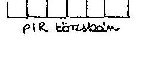

Bovételek alakulása 1990-1991. év

|  MEGNEVEZES | 1990. év |  |  |  |  |  | 1991. év |  |  |  |  |  |  |   |
| --- | --- | --- | --- | --- | --- | --- | --- | --- | --- | --- | --- | --- | --- | --- |
|   | eredetí | előirányzat változás |  | módosított |  |  | eredetí | előirányzat változás |  |  | módosított |  |  | telj.  |
|   | elöir. | irányító | saját hat. k. |  |  |  |  | irányító |  |  |  |  |  | mód.  |
|   |  | szervi | pénzm. |  |  |  |  |  |  |  |  |  |  | %-ban  |
|   |  |  |  |  |  |  |  |  |  |  |  |  |  | %-ban  |
|  1. Saját bev. (működés ár és díjbevételi) | 269,5 |  |  | 57,0 | 526,5 | 301,7 | 82,0 | 214,7 |  |  |  |  | 160,5 | 459,2  |
|  2. Költségvetési tám. | 4458,2 | 258,8 |  | -12,6 | 1406,5 | 1406,5 | 100,0 | 1699,7 | +6 | 45,8 |  |  | 10,0 | 1759,5  |
|  3. Átvett pénzeszk. | 6,2 | 14,7 |  | 50,6 | 68,5 | 70,8 | 103,4 | 20,5 |  |  |  |  | 14,2 | 34,5  |
|  4. Előző évi pénzmar. igénybevétele |  |  | 84,1 |  | 84,1 | 84,1 | 100,0 | 2,5 |  |  |  | 5,9 |  | 8,4  |
|  5. Egyéb bevétel (6-(1+2+3+4)) | 50,7 |  |  | 6,9 | 57,6 | 47,8 | 82,3 | 35,2 |  |  |  |  | -3,1 | 32,1  |
|  6. Bev. összesen | 1485,6 | 271,6 | 84,1 | 101,9 | 1543,2 | 1910,9 | 98,7 | 2032,4 | +6 | 45,8 | 5,9 |  | 181,6 | 2269,7  |

Megjegyzés: Bevételek összesen: kiegyenlítő, függő, átfutó és letéti bevételek nélküli adat, egyező a 1. sz. tábla bevételi adatával.

1. sor = 1990-1991-ben költségvetési beszámoló 2105 űrlap 4. sorának megfelelő
2. sor = 1990-1991-ben költségvetési beszámoló 2105 űrlap 14+15+16 sorának megfelelő
3. sor = 1990-1991-ben költségvetési beszámoló 2105 űrlap 17. sorának megfelelő

Kelt: DUDHASZ 1994 JAUUNK 15

Aláírás, becsét

50224

---

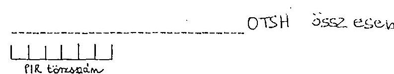

Bevételek alakulása 1992-1993. években

|  MEGNEVEZES | 1992. év |  |  |  |  |  |  |  |  | 1993. év |  |  |  |  |  |  |  |  |   |
| --- | --- | --- | --- | --- | --- | --- | --- | --- | --- | --- | --- | --- | --- | --- | --- | --- | --- | --- | --- |
|   | Ered | előirányzat változás |  |  |  | Módos | felj. | Telj. | Ered | előirányzat változás |  |  |  | Módos |  |  |  |  |   |
|   | deti | irányító szervi |  | saját hatáskörü |  | sitott |  |  |  |  |  |  |  |  |  |  |  |  |   |
|   |  | Dgy. | Korm. | Felügy |  |  |  |  |  |  |  |  |  |  |  |  |  |  |   |
|   |  |  |  |  |  |  |  |  |  |  |  |  |  |  |  |  |  |  |   |
|  1. Saját bevételek működ, ár-és díjh. | 1889 | - | 44.4 | 45,0 |  | 206,3 | 554,6 | 513,1 | 404,8 |  |  |  |  |  |  |  |  |  |   |
|  2. Költségv-i tám. | 1318,4 | 8,8 | -47,2 | 2,0 |  | 3,0 | 2274,0 | 2374,0 | 400 |  |  |  |  |  |  |  |  |  |   |
|  3. Átvett pénzeszk. | 5,0 |  | 0.5 | 39,8 |  | 83,1 | 138,4 | 165,4 | 121,8 |  |  |  |  |  |  |  |  |  |   |
|  4. Előző évi pénze. igénybevétele |  |  | 5.0 | 42,5 |  | 48,3 | 450,8 | 443,8 | 35,3 |  |  |  |  |  |  |  |  |  |   |
|  5. Egyéb bevétel (8-(1+2+3+4)) | 25,4 |  |  | -0,7 |  | 45,4 | 39,5 | 40,5 | 103,2 |  |  |  |  |  |  |  |  |  |   |
|  6. Bevételek össz. | 1030,3 | -3,1 | 8,8 | 2,7 | 483,6 |  | 325,8 | 3147,3 | 3454,1 | 101,5 |  |  |  |  |  |  |  |  |   |

Megjegyzés: Bevételek összesen: kiegyenlítő, függő, átfutó és letéti bevételek nélküli adat, egyező a 1. sz. tábla bevételi adatával.

1. sor = 1992-1993-ban 1. sz. tanusitvány 5. sor - 2/a sor, vagy az 1992. évi költségvetési beszámoló 66. űrlap 77-78. sor.
2. sor = 1. sz. tanusitvány 7. sor, vagy 1992. évi költségvetési beszámoló 66. űrlap 42. sor.
3. sor = 1992-1993-ban 1. sz. tanusitvány 7/f sor, vagy 1992. évi költségvetési beszámoló 66. űrlap 49+52+56+60+63+66. sorok.
4. sor = 1992-1993-ban 1. sz. tanusitvány 8/a sor, vagy 66. űrlap 69. sor.

Kelt: Budapest 311 január 16

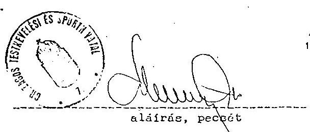

---

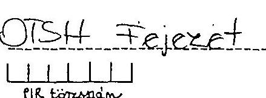

Bevételek alakulása 1992-1993. években

|  MEGNEVEZES | 1992. év |  |  |  |  |  |  | 1993. év |  |  |  |  |  |  |  |   |
| --- | --- | --- | --- | --- | --- | --- | --- | --- | --- | --- | --- | --- | --- | --- | --- | --- |
|   | Ere-
deti | előirányzat változás |  |  |  | Módo- | Telj. | Telj. |  |  |  | előirányzat változás |  |  | Módo- | Telj.  |
|   |  | irányító szervi |  | saját hatáskóru |  |  |  |  |  |  |  | irányítószervi |  | saját hatáskorú |  |   |
|   |  |  |  |  |  |  |  |  |  |  |  |  |  |  |  |   |
|   |  |  |  |  |  |  |  |  |  |  |  |  |  |  |  |   |
|   |  |  |  |  |  |  |  |  |  |  |  |  |  |  |  |   |
|   |  |  |  |  |  |  |  |  |  |  |  |  |  |  |  |   |
|  1. Saját bevételek, működ, ár-és díjl. |  |  |  |  |  |  |  |  |  |  |  |  |  |  |  |   |
|  2. Költségv-i tám. |  |  |  |  |  |  |  |  |  |  |  |  |  |  |  |   |
|  3. Átvett pénzeszk. |  |  |  |  |  |  |  |  |  |  |  |  |  |  |  |   |
|  4. Előző évi pénzm. igénybevétele |  |  |  |  |  |  |  |  |  |  |  |  |  |  |  |   |
|  5. Egyéb bevétel (6-(1+2+3+4) |  |  |  |  |  |  |  |  |  |  |  |  |  |  |  |   |
|  6. Bevételek össz. |  |  |  |  |  |  |  |  |  |  |  |  |  |  |  |   |

M Ft-ban

|  MEGNEVEZES | 1992. év |  |  |  |  |  |  | 1993. év |  |  |  |  |  |  |  |  |   |
| --- | --- | --- | --- | --- | --- | --- | --- | --- | --- | --- | --- | --- | --- | --- | --- | --- | --- |
|   | Ered-
deti | előirányzat változás |  |  | Módo- | Telj. | Telj. | Ered-
deti | előirányzat változás |  |  | Módo- | Telj. | Telj. |  |  |   |
|   |  | irányító szervi |  | saját hatáskóru |  |  |  |  |  |  |  | irányítószervi |  | saját hatáskorú |  |  |   |
|   |  |  |  |  |  |  |  |  |  |  |  |  |  |  |  |  |   |
|   |  |  |  |  |  |  |  |  |  |  |  |  |  |  |  |  |   |
|   |  |  |  |  |  |  |  |  |  |  |  |  |  |  |  |  |   |
|  1. Saját bevételek, működ, ár-és díjl. |  |  |  |  |  |  |  |  |  |  |  |  |  |  |  |  |   |
|  2. Költségv-i tám. |  |  |  |  |  |  |  |  |  |  |  |  |  |  |  |  |   |
|  3. Átvett pénzeszk. |  |  |  |  |  |  |  |  |  |  |  |  |  |  |  |  |   |
|  4. Előző évi pénzm. igénybevétele |  |  |  |  |  |  |  |  |  |  |  |  |  |  |  |  |   |
|  5. Egyéb bevétel (6-(1+2+3+4) |  |  |  |  |  |  |  |  |  |  |  |  |  |  |  |  |   |
|  6. Bevételek össz. |  |  |  |  |  |  |  |  |  |  |  |  |  |  |  |  |   |

Megjegyzés: Bevételek összesen: kiegyenlítő, függő, átfutó és letéti bevételek nélküli adat, egyező a 1. sz. tábla bevételi adatával.

1. sor = 1992-1993-ban 1. sz. tanusitvány 5. sor - 2/a sor, vagy az 1992. évi költségvetési beszámoló 66. űrlap 77-75. sor.
2. sor = 1. sz. tanusitvány 7. sor, vagy 1992. évi költségvetési beszámoló 66. űrlap 42. sor.
3. sor = 1992-1993-ban 1. sz. tanusitvány 7/f sor, vagy 1992. évi költségvetési beszámoló 66. űrlap 49+52+56+60+63+66. sorok.
4. sor = 1992-1993-ban 1. sz. tanusitvány 8/a sor, vagy 66. űrlap 69. sor.

Kelt: 1994.01.12.

Aláírási pecsét

---

|  MEGNEVEZES | 1990. évi | 1991. évi | 1992. | 1992. | 1992. | 1992. | 1992. | 1992. évi | 1992. évi | 1992. évi | 1992. évi | 1992. évi | 1992. évi  |
| --- | --- | --- | --- | --- | --- | --- | --- | --- | --- | --- | --- | --- | --- |
|   | teljes
1990. évi | teljes
1991. évi |  |  |  |  |  |  |  |  |  |  |   |
|   |  |  |  |  |  |  |  |  |  |  |  |  |   |
|   |  |  |  |  |  |  |  |  |  |  |  |  |   |
|  1. | Béralap | 232,9 | 223,3 | 439,7 | 0,5 | 0,5 | 4,2 | 4,6 |  | 62,1 | 504,7 | 401,2 | 32,4  |
|  2. | Bérjellegú kiadás
Ebből: | 94,2 | 140,0 | 106,0 | 3,5 | 1,0 | 8,1 | 9,6 |  | 22,0 | 110,2 | 110,9 | 100,4  |
|  2/a | -jutalom pénzmar-ból
2/b -belf. kiküld.
2/c -külf. kiküld.
2/d -kereset és ktg. tér.
2/f -végkielégítés |  |  |  |  |  |  |  |  |  |  |  |   |
|  3. | Készletbeszerzés
Ebből: | 123,2 | 148,7 | 122,5 |  | 7,3 | 26,3 | 5,4 |  | 23,1 | 175,0 | 174 | 39,4  |
|  3/a | -élelmiszer
3/b -tüzelő, hajtó és
kendőanyag
3/c -irodaszer, nyomt.
3/d -könyv, folyóirat
3/e -azakmai anyag
3/f -munkaruha, védőr |  |  |  |  |  |  |  |  |  |  |  |   |
|  4. | Szolgáltatás
Ebből: | 261,7 | 362,2 | 296,2 | 4,3 | 10,4 | 64,1 | 3,7 |  | 64,8 | 413,5 | 398,9 | 95,0  |
|  4/a | -energia
4/b -szállitás
4/c -közműdül
4/d -postai szolgált.
4/e -nagyért. tárgyi
4/f -helyiségbéri. díj |  |  |  |  |  |  |  |  |  |  |  |   |
|  5. | Különféle kiad. és bef
Ebből: | 165,6 | 208,3 | 222,0 | 0,1 | 3,1 | 30,4 | 14,9 |  | 57,2 | 326,7 | 323,2 | 94,9  |
|  5/a | -7B járulék
5/b -vásárolt termékek
AFA-ja |  |  | 140,2 |  | 3,1 | 0,5 | 5,0 |  | 29,7 | 217,6 | 215,4 | 94,9  |
|  6. | Kamatfizetések |  |  |  |  |  |  |  |  |  |  |  |   |
|  7. | Felhalm. és tőkés kiad
Ebből: | 152,7 | 131,8 | 161,5 |  |  | 20,6 | 29,1 |  | 19,1 | 119,4 | 117,6 | 99,2  |
|  7/a | -felújítás
7/b -tárgyi eszk, föld és
fomat. javak felhalm.
ezték folyó átrú |  |  |  |  |  |  |  |  |  |  |  |   |
|  8. | Támogatások, elvonások
8/a Ebből: átadott pénzek
Ebből: alapítv. tám | 243,2 | 313,4 | 1212,1 | 2,9 | 24,5 | 39,1 | 133,2 |  | 76,5 | 140,0 | 137,3 | 97,1  |
|  9. | Pénzforg. nélküli kiad
8/a Ebből: tartalék |  |  |  |  |  |  |  |  |  |  |  |   |
|  10. | Működési célú hitel
visszafizetés |  |  |  |  |  |  |  |  |  |  |  |   |
|  11. | Fejlesztési célú hit
elvisszafizetés |  |  |  |  |  |  |  |  |  |  |  |   |
|  12. | Kiadások összesen
(kiegyenlítő, függő, át-
futó és letéti nélkül) | 1193,6 | 2201,7 | 2626,3 | 11,9 | 3,1 | 13,2 | 200,5 |  | 325,8 | 3147,3 | 3071,6 | 97,6  |

A tánusítványt fejezeti szinten, felső államigazgatás, intézmények összesen és intézményenként külön-külön kérjük kitölteni.

Megjegyzés: A tánusítványt az 1992. és 1993. évi költségvetés, illetve az 1992. évi beszámoló 65 űrlapja figyelembevételével kérjük kitölteni.

1. sor=65/10 sor; 2. sor=65/20 sor; 2/a. sor=65/12 sor; 2/b. sor=65/13 sor; 2/c. sor=65/14 sor; 2/d. sor=65/17 sor; 2/f. sor=65/18 sor; 3. sor=65/25 sor; 3/a. sor=65/27 sor; 3/b. sor=65/28 sor; 3/c. sor=65/29 sor; 3/d. sor=65/30 sor; 3/e. sor=65/31 sor; 4/c. sor=65/32 sor; 4/d. sor=65/33 sor; 4/e. sor=65/34. sor; 4/f. sor=65/35 sor; 4/1. sor=65/36 sor; 5/b. sor=65/37 sor; 5/a. sor=65/38 sor; 5/b. sor=65/39. sor; 5/a. sor=65/40 sor; 5/a. sor=65/41 sor; 5/a. sor=65/42 sor; 5/a. sor=65/43 sor; 5/a. sor=65/44 sor; 5/a. sor=65/45 sor; 5/a. sor=65/46 sor; 5/a. sor=65/47 sor; 5/a. sor=65/48 sor; 7. sor=65/73 sor; 7/a. sor=65/74 sor; 7/a. sor=65/75 sor; 8. sor=65/76 sor; 8/b. sor=65/99. sor; 9. sor=65/113 sor; 9/a. sor=65/111 sor; 10. sor=65/114 sor; 11. sor=65/115. sor; 12. sor=118. sor-116. sor) 3a: 2437

Kelt: 32 34 2 16 aláírás, pezzét

---

PIR törzsszám 05. 1993. 1992. 1991. 1990. évi teljesítés

|  MEGNEVEZES |  | 1993. évi | előirányzat változás |  |  |  |  |  | 1993. évi teljesítés |  |  |   |
| --- | --- | --- | --- | --- | --- | --- | --- | --- | --- | --- | --- | --- |
|   |  | EREDETT | IRANYITOSZERVI |  | SAJAT HATASKÖRREN |  | MOD. | FELJ. | e mód. | 1990. évi | 1991. évi | 1992. évi  |
|   |  | ELOIR. | 007 | Kormány Felügy. szerv |  | Ktgv. Vállak. tartalákból | Egyéb | ELOIR. |  |  |  |   |
|  1. Béralap |  | 467,6 |  | 42,5 | 465,5 | 7,2 | 5,0 | 574,0 | 555,7 |  |  |   |
|  2. Bérjellegú kiadás
Ebből:
2/a -jutalom pénzmar-ból
2/b -belf. kiküld.
2/c -külf. kiküld.
2/d -kereset és ktg.tér.
2/e -reprezentáció
2/f -végkielégítés |  | 49,2 |  | 6,5 | 74,5 | 8,3 | 57,4 | 474,4 | 467,6 |  |  |   |
|  3. Készletbeszerzés
Ebből:
3/a -élelmiszer
3/b -tüzelő, hajtó és
kenőanyag
3/c -irodaszer, nyomt.
3/d -könyv, folyóirat
3/e -szakmai anyag
3/f -munkaruha, védőr. |  | 444,0 |  |  | 415,6 | 11,2 | 2,5 | 202,3 | 427,6 |  |  |   |
|  4. Szolgáltatás
Ebből:
4/a -energia
4/b -szállítás
4/c -közműölj
4/d -postal szolgált.
4/e -nagyért. tárgyi
4/f -helyiségbéri, díj. |  | 527,9 |  |  | 444,0 | 11,6 | -26,0 | 1127,5 | 1006,4 |  |  |   |
|  5. Előönféle kiad. és bef.
Ebből:
5/a -TB járulék
5/b -vásárolt termékek
AFA-ja |  | 260,3 |  | 5,4 | 434,2 | 5,2 | 21,2 | 1127,5 | 1172,8 |  |  |   |
|  6. Kapatfizetések |  |  |  |  |  |  |  |  |  |  |  |   |
|  7. Felhalm. és tőkés kiad.
Ebből:
7/a -felújítás
7/b -tárgyi eszk, föld és
immat. javak felhalm.
egyéb folyó átut. |  | 452,4 | 2,2 |  | -26,0 | 40,0 | 32,7 | 459,0 | 457,7 |  |  |   |
|  8. Támogatások, elvonások
8/a ebből: átadott pénzek
8/b Ebből: alapítv. tám. |  | 4.002,4 | 914,0 | 0,2 | -456,0 | 63,5 | 23,8 | 1034,6 | 1072,8 |  |  |   |
|  9. Pénzforg. nélküli kiad.
9/a ebből: tartalék |  |  |  |  |  |  |  |  |  |  |  |   |
|  10. Működési célú hitel vf. |  |  |  |  |  |  |  |  |  |  |  |   |
|  11. Fejlesztési célú hitel visszafizetés |  |  |  |  |  |  | 53,6 | 63,6 | 63,2 |  |  |   |
|  12. Kiadások összesen (kiegyenülő fügő átfutó és letéti nélkül) |  | 2.400,8 | 918,2 | 24,6 |  | 400,6 |  |  | 1009,6 | 13932,8 |  |   |

A tanusítványt fejezeti szinten, felső államigazgatás, intézmények összesenre és intézményeinként külön-külön kérjük kitölteni. Megjegyzés: A tanusítványt az 1992. és 1993. évi költségvetés, illetve az 1992. évi beszámoló 85 űrlapja figyelembevételével kérjük kitölteni.

1. sor=65/10 sor: 2. sor=65/20 sor: 2/a. sor=65/12 sor: 2/b. sor=65/13 sor: 2/c. sor=65/14 sor: 2/d. sor=65/15 sor: 2/e. sor=65/17 sor: 2/f. sor=65/18 sor: 3. sor=65/22 sor: 3/a. sor=65/22 sor: 3/b. sor=65/23 sor: 3/c. sor=65/24 sor: 3/d. sor=65/25 sor: 3/f. sor=65/27 sor: 4. sor=65/30. sor: 4/a. sor=65/31 sor: 4/c. sor=65/33 sor: 4/d. sor=65/34. sor: 4/a. sor=65/36. sor: 4/f. sor=65/35. sor: 5. sor=65/36. sor: 5/b. sor=65/44 sor: 6. sor=65/48 sor: 7. sor=65/73 sor: 7/a. sor=65/72 sor: 7/b. sor=65/74. sor: 8. sor=65/108 sor: 8/b. sor=65/99. sor: 9. sor=65/113 sor: 9/a. sor=65/111 sor: 10. sor=65/114 sor: 11. sor=65/115. sor: 12. sor=118. sor=116. sor) 24. = 27 57

Kelt:

---

DISH OSSAIESEN
PIR törzsszám

# Allományi létszám alakulása 1990-1992. években 

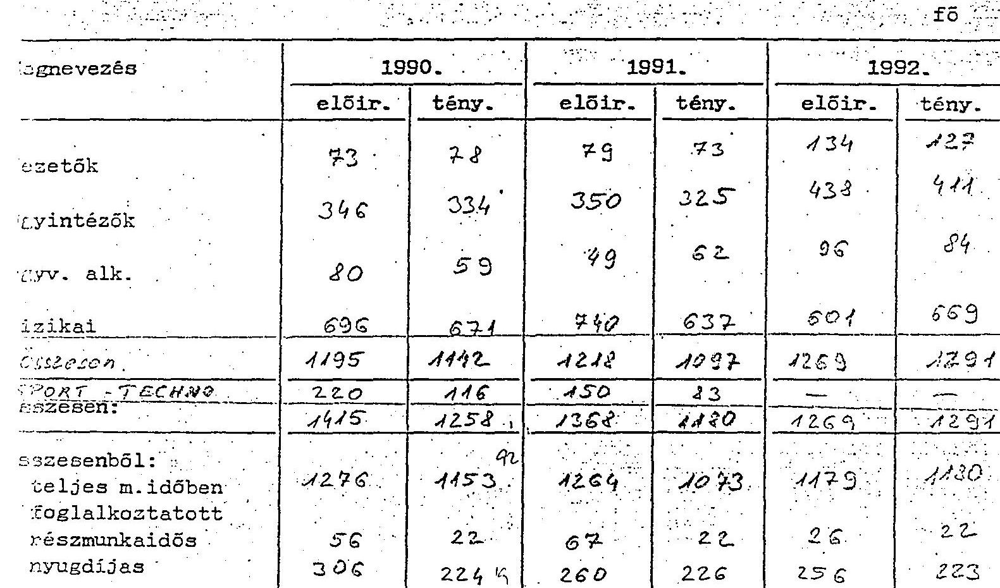
tanusitványt fejezeti szinten, felsõ államigazgatásra, intézmények összeare és intézményenként külön-külön kérjük kitölteni.
sjegyzés: A köztisztviselöi, illetve közalkalmazotti törvény hatálybalépésétöl az állománycsoportok megnevezését kérjük a vonatkozó törvényben foglaltaknak megfelelően változtatni.
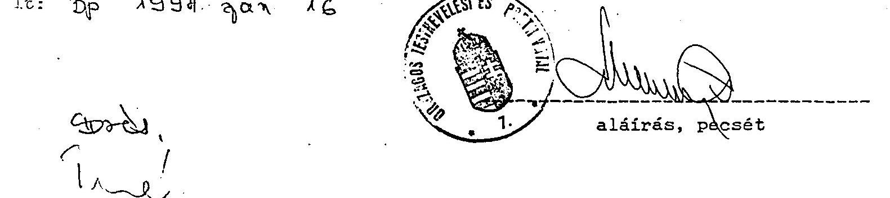

---

# 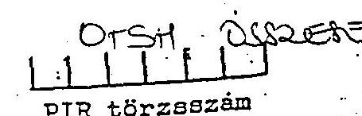 7. sz. melléklet 

## Bérkiadás alakulása 1990-1992. években

| Megnevezés | 1990. |  |  | 1991. |  |  | 1992. |  |  |
| :--: | :--: | :--: | :--: | :--: | :--: | :--: | :--: | :--: | :--: |
|  | elöir. | mód.ei. | telj. | elöir. | mód.ei. | telj. | elöir. | mód.ei. | tel: |
| 1. Teljes m. idős foglalk. bére | 129,7 | 22,0 | 174,0 | 205,3 | 31,6 | 209,4 | 354,7 | 358,5 | 332, |
| 2. Részmunkaidős foglalk. bére | 6,2 |  | 1,9 | 4,4 |  | 3,7 | 4,3 | 3,6 | 3,4 |
| 3. Nyugdíjasok bére | 23,7 | 1,8 | 23,0 | 33,7 | 1,2 | 32,5 | 34,9 | 35,2 | 37,6 |
| 4. Másod- és mellékfogl. bére | - | 0,2 | 2,0 | 0,1 |  | 4,4 | 1,1 | 1,6 | 2,3 |
| 5. Megbizási díj | 10,9 | 2,5 | 6,0 | 13,4 | 1,8 | 5,6 | 19,8 | 68,7 | 62, |
| 6. összes állományi bér: | 170,5 | 5,7 | 179,1 | 231,5 | 7,2 | 228,5 | 329,5 | 414,2 | 418,5 |
| 7. Allomanyan kivuli bér: | - |  |  |  |  |  |  |  |  |
| 8. Béralap mindösszesen: | 243,6 | 42,0 | 220,1 | 264,9 | 41,8 | 283,7 | 326,7 | 505,0 | 491,5 |

A tanusítványt fejezeti szinten, felső államigazgatásra, intézmények összesenr és intézményenként külön-külön kérjük kitölteni.
1992-töl egyeztetési lehetőséget az 1992. évi költségvetési beszámoló 68,69 é 65. ürlapjainak megfelelő rovatai adnak.

1. sor $=68 / 9999 / 3$. oszlop, 2. sor $=69 / 01$ sor 3. oszlop, 3. sor $=69 / 02$ sor 3 oszlop, 8. sor $=65 / 10$. sor, $8 / 4$. sor $=65 / 9$. sor.

Xelt: 301994. 9an 16
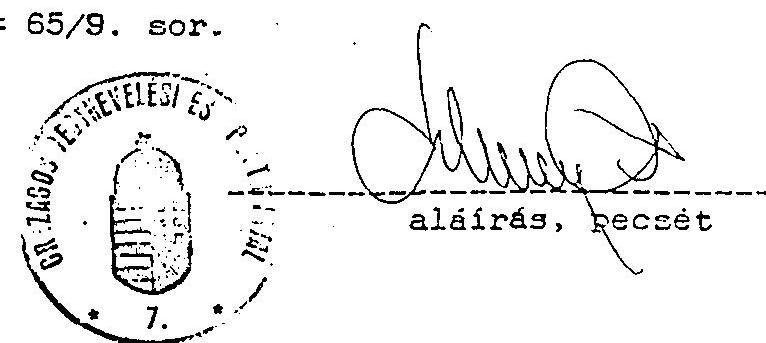

---

# Bérkiadás alakulása 

## 1993. évben

| Megnevezés | 1993. év |  |  |
| :--: | :--: | :--: | :--: |
|  | elöir. | mód. el. | telj. |
| 1. Teljes m. idős foglalk. bére | 367.1 | 399.3 | 389.9 |
| 2. Részmunkaidós foglalk. bére | 5,9 | 5,6 | 3,7 |
| 3. Nyugdijasok bére | 37.8 | 40.2 | 40.2 |
| 4. Másod- és mellékfogl. bére | 1,9 | 4,9 | 2,0 |
| 5. Megbízási dij | 39.4 | 76.5 | 67.0 |
| 6. összes állományi bér: | 450,1 | 521,5 | 502,8 |
| 7. Allományon kívüli bér: + iphalam | 7.5 | 52,5 | 52,8 |
| 8. Béralap mindösszesen: | 457,6 | 574.0 | 555,6 |

A tanusítványt fejezeti szinten, felső államigazgatásra, intézmények összesenre és intézményenként külön-külön kérjük kitölteni.
Megjegyzés: béralap mindösszesen az 1992. évi beszámoló 65. urlap 10. sorával egyenlő.
1992-töl egyeztetési lehetöséget az 1992. évi költségvetési beszámoló 68,69 és 65 . űrlapjainak megfelelő rovatai adnak.

1. sor $=68 / 9999 / 3$. oszlop, 2. sor $=69 / 01$ sor 3. oszlop, 3. sor $=69 / 02$ sor 3. oszlop, 8. sor $=65 / 10$. sor, $8 / d$. sor $=65 / 9$. sor

Kelt: 1992. maiaius 11.

---

# Sportági szakszövetségek költségvetési támogatása (OTSH-tól)

(központi költségvetésböl az OTSH elosztási rendszerében)

|  Megnevezés | 1990. |  | 1991. |  | 1992. |  | 1993. |  | Index %  |
| --- | --- | --- | --- | --- | --- | --- | --- | --- | --- |
|   | E Ft | % | E Ft | % | E Ft | % | E Ft | % | 93/94  |
|  1. Összes sportági szakszövetség | 189421 | 100,0 | 269879 | 100,0 | 291740 | 100,0 | 411732 | 100,0 | 217,4  |
|  Ebböl: müködés | 63899 | 33,7 | 78075 | 28,9 | 86448 | 29,6 | 98190 | 23,9 | 153,7  |
|  sportszakmai | 48750 | 25,7 | 57844 | 21,4 | 70311 | 24,1 | 34034 | 8,3 | 69,8  |
|  kiemelt esemény | 45630 | 24,1 | 67457 | 25,0 | 60736 | 20,8 | 118084 | 28,6 | 258,8  |
|  sportdiplomácia | 8775 | 4,6 | 9773 | 3,6 | 10202 | 3,5 | 11410 | 2,8 | 130,0  |
|  beszerzés fogadási | 20767 | 11,0 | 19789 | 7,3 | 20009 | 6,9 | 24095 | 5,8 | 116,0  |
|  egyéb támogatás | 1600 | 0,9 | 36941 | 13,8 | 44034 | 15,1 | 24708 | 6,0 | 1544,2  |
|  műhelytámogatás | - | - | - | - | - | - | 101211* | 24,6 |   |
|  2. Olimpiai sportázak szakszöv. | 173821 | 100,0 91,8 | 219593 | 100,0 81,4 | 214034 | 100,0 73,4 | 336368 | 100,0 81,7 | 193,5  |
|  Ebböl: müködés | 55605 | 32,0 29,4 | 61553 | 28,0 22,8 | 68587 | 32,0 23,5 | 79377 | 23,6 19,3 | 142,7  |
|  sportszakmai | 47270 | 27,2 25,0 | 47626 | 21,7 17,7 | 56620 | 26,5 19,4 | 24165 | 7,2 5,9 | 51,1  |
|  kiemelt esemény | 43730 | 25,2 23,1 | 59807 | 27,2 22,2 | 37380 | 17,5 12,8 | 88328 | 26,3 21,4 | 202,0  |
|  sportdiplomácia | 6505 | 3,7 3,4 | 7023 | 3,2 2,6 | 8590 | 4,0 3,0 | 9484 | 2,8 2,3 | 145,8  |
|  beszerzés fogadási | 19211 | 11,0 10,1 | 13329 | 6,1 4,9 | 1840 | 0,9 0,6 | 9095 | 2,7 2,2 | 47,3  |
|  egyéb támogatás | 1500 | 0,9 0,8 | 30255 | 13,8 11,2 | 41017 | 19,1 14,1 | 24708 | 7,3 6,0 | 1647,2  |
|  műhelytámogatás | - | - | - | - | - | - | 101211* | 30,1 24,6 |   |
|  3. Nem olimpiai sportázak szakszöv. | 15600 | 100,0 8,2 | 50286 | 100,0 18,6 | 77706 | 100,0 26,6 | 75364 | 100,0 18,3 | 483,1  |
|  Ebböl: müködés | 8294 | 53,2 4,4 | 16522 | 32,9 6,1 | 17861 | 23,0 6,1 | 18813 | 25,0 4,6 | 226,8  |
|  sportszakmai | 1480 | 9,5 0,7 | 10218 | 20,3 3,8 | 13691 | 17,6 4,7 | 9869 | 13,1 2,4 | 666,8  |
|  kiemelt esemény | 1900 | 12,2 1,0 | 7650 | 15,2 2,8 | 23356 | 30,0 8,0 | 29756 | 39,5 7,2 | 1566,1  |
|  sportdiplomácia | 2270 | 14,6 1,2 | 2750 | 5,5 1,0 | 1612 | 2,1 0,6 | 1926 | 2,5 0,5 | 84,8  |
|  beszerzés fogadási | 1556 | 9,9 0,8 | 6460 | 12,8 2,4 | 18169 | 23,4 6,2 | 15000 | 19,9 3,6 | 964,0  |
|  egyéb támogatás | 100 | 0,6 0,1 | 6686 | 13,3 2,5 | 3017 | 3,9 1,0 | - | - |   |
|  műhelytámogatás | - | - | - | - | - | - | - | - |   |
|  Összes sportági szakszövetsége száma (db) | 57 |  | 61 |  | 63 |  | 69 |  |   |
|  Ebböl: olimpiai sportázak szakszöv. | 29 |  | 29 |  | 29 |  | 29 |  |   |

A támogatás az ebből adott kölcsönöket nem tartalmazza. (1991-ben 7, 6 M Ft, 1992-ben 24, 7 M Ft, 1993-ban 9, 67 M Ft kölcsönt nyújtottak.)

1989. XII. 31-én a sportági szakszövetségek száma 44 volt.

- Az egyesületi szakosztályok támogatása.

---

# Sportegyesületek támogatása 1991-1992. években* 

(központi költségvetésböl az OTSH elosztási rendszerében)

| Megnevezés | 1991. |  | 1992. |  | Index   1993/1994 |
| :--: | :--: | :--: | :--: | :--: | :--: |
|  | E Ft | \% | E Ft | \% |  |
| Alaptámogatás | 160966 | 61,9 | 137176 | 57,8 | 85,2 |
| Bér, TB. müködési támogatás |  |  |  |  |  |
| Eredményességi támogatás | 55076 | 21,2 | 57229 | 24,1 | 103,9 |
| Póttámogatás | 43847 | 16,9 | 42782 | 18,1 | 97,6 |
| Öszesen | 259889 | 100,0 | 237187 | 100,0 | 91,3 |

* A támogatások a kölcsönöket nem tartalmazzảk.

1993. évben az egyesületi támogatást a szakosztályi ("mühelytámogatás") váltotta fel. (101211 E Ft összeghen a sportági szakszövetségek költségvetési támogatásában szerepel.)

---

# OTSH ÖSSZESÉN 

## 1URZAMENVEK ÖSSZESÉN

PIR törzsszám
10. sz. melléklet

## Allóeszközállomány (tárgyi eszközök) adatai 1990-1991. években

| Megnevezés | Bruttó ért. nyitó | Osszes   növek. | Osszes Csökk. | Bruttó ért. záró | Ertékcsökk.   összesen | Nettó ért.   2áró bruttó | Nettó ért.   leírt állóeszk.   árt. $\%$-ában |  |
| :--: | :--: | :--: | :--: | :--: | :--: | :--: | :--: | :--: |
| 1990. év   Ingatlan   Gépek.   berend. | $\begin{aligned} & 2705,6 \\ & 676,8 \end{aligned}$ | $\begin{aligned} & 105,4 \\ & 49,2 \end{aligned}$ | $\begin{aligned} & 31,4 \\ & 33,8 \end{aligned}$ | $\begin{aligned} & 2779,6 \\ & 692,2 \end{aligned}$ | $\begin{aligned} & 625,1 \\ & 291,6 \end{aligned}$ | $\begin{aligned} & 2154,5 \\ & 400,5 \end{aligned}$ | $\begin{aligned} & 71,5 \\ & 57,8 \end{aligned}$ | $\begin{aligned} & 8,3 \\ & 14,2 \end{aligned}$ |
| Jármú   Uzemkör.   kiv. | $\begin{aligned} & 95,3 \\ & 2,6 \end{aligned}$ | $\begin{aligned} & 514 \\ & - \end{aligned}$ | $\begin{aligned} & 54,7 \\ & - \end{aligned}$ | $\begin{aligned} & 41,0 \\ & 2,6 \end{aligned}$ | $\begin{aligned} & 27,2 \\ & - \end{aligned}$ | $\begin{aligned} & 13,8 \\ & 2,6 \end{aligned}$ | $\begin{aligned} & 33,6 \\ & 100,0 \end{aligned}$ | $\begin{aligned} & 2,8 \\ & 25,3 \end{aligned}$ |
| Osszesen: | 34803 | 160,0 | 119,9 | 3515,4 | 947,9 | 2571,4 |  | 25,3 |
| 1991. év   Ingatlan   Gépek.   berend. | $\begin{aligned} & 2779,6 \\ & 692,1 \end{aligned}$ | $\begin{aligned} & 310,7 \\ & 108,0 \end{aligned}$ | $\begin{aligned} & 2,7 \\ & 24,6 \end{aligned}$ | $\begin{aligned} & 3087,6 \\ & 775,5 \end{aligned}$ | $\begin{aligned} & 662,3 \\ & 326,3 \end{aligned}$ | $\begin{aligned} & 24253 \\ & 449,2 \end{aligned}$ | $\begin{aligned} & 78,5 \\ & 57,9 \end{aligned}$ | $\begin{aligned} & 8,3 \\ & 17,4 \end{aligned}$ |
| Jármú   Uzemkör.   kiv. | $\begin{aligned} & 41,0 \\ & 2,6 \end{aligned}$ | $\begin{aligned} & 141,6 \\ & 14,6 \end{aligned}$ | $\begin{aligned} & 12,3 \\ & 2,3 \end{aligned}$ | $\begin{aligned} & 43,3 \\ & 2,1 \end{aligned}$ | $\begin{aligned} & 21,3 \\ & - \end{aligned}$ | $\begin{aligned} & 22,0 \\ & 2,6 \end{aligned}$ | $\begin{aligned} & 50,8 \\ & 100,0 \end{aligned}$ | $\begin{aligned} & 2,2 \\ & 2,2 \end{aligned}$ |
| Osszesen: | 35153 | 4393 | 39,6 | 3909,0 | 1009,9 | 2899,1 | 74,2 | 24,9 |

A tanusítványt fejezeti szinten, felső államigazgatásra, illetve intézményen-ként külön- : külön kérjük kitölteni

Kelt: 1993
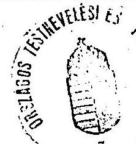

---

# OTSH ÖRZETEN

Tárgyi eszközök és immateriális javakra vonatkozó adatok

## M Ft-ban

|  Megnevezés | Bruttó ért. nyitó | Összes összes bruttó ért. növek. csökk. | Bruttó ért. záró | Értékcsökk. összesen | Nettó ért. záró bruttó ért. %-ában | Nettó ért. záró bruttó ért. %-ában  |
| --- | --- | --- | --- | --- | --- | --- |
|  1992. év |  |  |  |  |  |   |
|  Ingatlan | 3424,1 | 231,9 | 62,5 | 3290,5 | 731,1 | 2559,4  |
|  Gépek, berend. | 873,4 | 100,9 | 20,7 | 953,6 | 478,8 | 474,8  |
|  Jármú | 47,3 | 46,4 | 17,5 | 96,2 | 30,0 | 46,2  |
|  Összesen: | 4041,8 | 379,2 | 100,7 | 4320,3 | 1239,9 | 3080,4  |
|  Immateriális javak | 0,4 | 20,9 | 20,9 | 21,3 | 13,3 | 8,0  |
|  Mindösszesen: | 4042,2 | 400,1 | 100,7 | 4341,6 | 1253,2 | 3088,4  |

## 1993. év

### Ingatlan

Gépek, berend.

Jármú

### Összesen:

Immateriális javak

### Mindösszesen:

Megjegyzés: 1992-ben eszközcsoportonként a bruttó értékből a felújítás értéke: ingatlanok 119,1 M Ft, Gépek berendezések 4,2 M Ft, járművek 0,1 M Ft. 1993-ben eszközcsoportonként a bruttó értékből a felújítás értéke: ingatlanok 119,1 M Ft, Gépek berendezések 0,1 M Ft, járművek 0,1 M Ft. A tanusítványt fejezeti szinten, Felső államigazg. (minisztérium), intézmények összesenre és intézményenként külön-külön kérjük kitölteni Az adatokat az 1992. évi beszámoló 73. ürlapja figyelembevételével kell kitölteni.

Kelt: 1994. ZÁMUNA 16

---

# 107b. sz. melléklet

Tárgyi eszközök és immateriális javakra vonatkozó adatok

## M Ft-ban

|  Megnevezés | Bruttó ért. nyitó | Összes Összes növek. csökk. | Bruttó ért. záró | Értékcsökk. összesen | Nettó ért. záró bruttó ért. X-ában | Teljesen (0-ra) leírt állóeszk.  |
| --- | --- | --- | --- | --- | --- | --- |
|  1992. év |  |  |  |  |  |   |
|  Ingatlan |  |  |  |  |  |   |
|  Gépek, berend. |  |  |  |  |  |   |
|  Jármű |  |  |  |  |  |   |
|  **Összesen:** |  |  |  |  |  |   |
|  Immateriális javak |  |  |  |  |  |   |
|  **Mindösszesen:** |  |  |  |  |  |   |
|  1993. év | 5290,4 | 139,5 | 1,7 | 5527,2 | 805,2 | 2722,1  |
|  Ingatlan |  |  |  |  |  |   |
|  Gépek, berend. | 953,1 | 113,8 | 13,2 | 1043,7 | 605,4 | 438,2  |
|  Jármű | 77,0 | 10,1 | 3,4 | 83,7 | 41,8 | 41,9  |
|  **Összesen:** | 4320,5 | 363,4 | 29,3 | 4654,6 | 1452,1 | 3202,2  |
|  Immateriális javak | 21,9 | 6,9 | - | 22,8 | 17,8 | 11,0  |
|  **Mindösszesen:** | 4342,4 | 370,3 | 29,3 | 4683,4 | 1470,2 | 3213,2  |
|  Megjegyzés: |  |  |  |  |  |   |
|  1992-ben eszközcsoportonként a bruttó értékből a felújítás értéke: ingatlanok |  |  |  |  |  |   |
|  1993-ban eszközcsoportonként a bruttó értékből a felújítás értéke: ingatlanok |  |  |  |  |  |   |
|  1993-ben eszközcsoportonként a bruttó értékből a felújítás értéke: ingatlanok |  |  |  |  |  |   |
|  1993-ben eszközcsoportonként a bruttó értékből a felújítás értéke: ingatlanok |  |  |  |  |  |   |
|  1993-ben eszközcsoportonként a bruttó értékből a felújítás értéke: ingatlanok |  |  |  |  |  |   |
|  1993-ben eszközcsoportonként a bruttó értékből a felújítás értéke: ingatlanok |  |  |  |  |  |   |
|  1993-ben eszközcsoportonként a bruttó értékből a felújítás értéke: ingatlanok |  |  |  |  |  |   |
|  Az adatokat az 1992. évi beszámoló 73. ürlapja figyelembevételével kell kitölteni. |  |  |  |  |  |   |
|  Kelt: 1992. undic. 11. |  |  |  |  |  |   |
|  **Aláírás, pecsét** |  |  |  |  |  |   |

---

MAGYAR DIÁKSPORT SZÖVETSÉG 1143 DÓZSA GYÓRGY ÚT 1-3 TEL: 251-0749 FAX: 413-6421 Magyar Diáksport Szövetség

# Tagnyilvántartás összesító 1993. évi bejelentés alapján

|  Megye | ÁLTALÁNOS ISKOLA |  |  | KÖZÉPISKOLA |  |  |  | ÖSSZESEN |  |  | MEGYEI ÖSSZ.  |
| --- | --- | --- | --- | --- | --- | --- | --- | --- | --- | --- | --- |
|   | DSK
száma | DSE
száma | DSC
száma | DSK
száma | DSE
száma | DSC
száma | DSK
száma | DSE
száma | DSC
száma |  |   |
|  Baranya | 104 | 3 | 9 | 29 | 0 | 0 | 133 | 3 | 9 | 145 |   |
|  Bács-Kiskun | 95 | 9 | 1 | 26 | 9 | 0 | 121 | 18 | 1 | 140 |   |
|  Békés | 123 | 14 | 0 | 30 | 3 | 0 | 153 | 17 | 0 | 170 |   |
|  B.A.Z. | 172 | 9 | 0 | 55 | 0 | 0 | 227 | 9 | 0 | 236 |   |
|  Csongrád | 56 | 9 | 0 | 30 | 0 | 0 | 86 | 9 | 0 | 95 |   |
|  Fejér | 66 | 1 | 0 | 29 | 2 | 0 | 95 | 3 | 0 | 98 |   |
|  Győr-Sopron-Moson | 12 | 0 | 0 | 128 | 3 | 5 | 140 | 3 | 5 | 148 |   |
|  Hajdú-Bihar | 57 | 25 | 0 | 17 | 2 | 0 | 74 | 27 | 0 | 101 |   |
|  Heves | 64 | 7 | 0 | 15 | 3 | 0 | 79 | 10 | 0 | 89 |   |
|  Komárom-Esztergom |  |  |  |  |  |  |  |  |  |  |   |
|  Nógrád | 58 | 14 | 0 | 14 | 2 | 0 | 72 | 16 | 0 | 88 |   |
|  Pest | 108 | 3 | 0 | 38 | 0 | 0 | 146 | 3 | 0 | 149 |   |
|  Somogy | 69 | 4 | 0 | 28 | 4 | 0 | 97 | 8 | 0 | 105 |   |
|  Szabolcs-Szatmár | 98 | 23 | 17 | 32 | 4 | 0 | 130 | 27 | 17 | 174 |   |
|  Jász-Nagykun-Szolnok | 50 | 46 | 0 | 23 | 14 | 0 | 73 | 60 | 0 | 133 |   |
|  Tolna | 59 | 3 | 0 | 22 | 3 | 0 | 81 | 6 | 0 | 87 |   |
|  Vas | 27 | 5 | 0 | 9 | 2 | 0 | 36 | 7 | 0 | 43 |   |
|  Veszprém | 97 | 5 | 0 | 28 | 3 | 0 | 125 | 8 | 0 | 133 |   |
|  Zala | 24 | 0 | 0 | 1 | 0 | 0 | 25 | 0 | 0 | 25 |   |
|  Budapest | 57 | 63 | 0 | 104 | 8 | 0 | 161 | 71 | 0 | 232 |   |
|  Összesen: | 1396 | 243 | 27 | 658 | 62 | 5 | 2054 | 305 | 32 | 2391 |   |

Továbbítva 1994 -01- 31

---

| Megnevezés | 1990. |  | 1991. |  | 1992. |  | 1993. |  |
| :--: | :--: | :--: | :--: | :--: | :--: | :--: | :--: | :--: |
|  | Terv | Tény | Terv | Tény | Terv | Tény | Terv | Tény |
| Előző évi pénzmaradvány | 58.013 | 58.013 | 16.342 | 16.342 | 35.970 | 34.820 | 42.104 | 42.104 |
| Sorsjegy bevételek összesen | 62.500 | 56.625 | 62.500 | 43.947 | 40.000 | 12.807 | 7.000 | 5.852 |
| Ebböl: - Magyar Csapat | 40.000 | 49.125 | 40.000 | 21.947 | 40.000 | 12.807 |  |  |
| - Sport | 22.500 | 7.500 | 22.500 | 22.000 |  |  |  |  |
| Közérdekú befizetések | 2.900 | 2.939 |  |  |  |  |  |  |
| Szponzorok támogatása   - ebböl Szerencsejáték RT | 10.000 | 7.674 | 21.500 | 83.695 | 40.000 | 53.400 | 55.000 | 65.976 |
| Allami támogatás összesen | 43.900 | 43.900 | 48.300 | 50.898 | 336.315 | 335.238 | 100.796 | 115.796 |
| Ebböl: - MOB müködésre   - Olimpiára | 40.000 | 40.000 |  | 47.898 | 46.315 290.000 |  | 98.000 | 98.000 15.000 |
| - egyéb | 3.900 | 3.900 |  | 3.000 |  |  | 2.796 | 2.796 |
| Levizabévételek | 2.000 | 4.520 | 2.000 | 3.080 | 16.000 | 41.952 | 5.000 | 17.185 |
| Egyéb bevételek (kamat, stb.) | - | 10.717 | 10.000 | 22.305 | 14.000 | 12.416 | 4.000 | 1.012 |
| Szerencsejáték RT |  |  |  | 45.000 |  |  |  |  |
| Tartalékolt összegböl felhasz.   - Függő tétel rendelése |  |  | 20.000 | 25.000 | 95.000 6.104 | 109.498 4.304 |  |  |
| Bevételek összesen | 179.313 | 184.388 | 180.642 | 290.267 | 583.389 | 604.435 | 213.900 | 247.925 |
| Elötakarékosság záróegyenlege |  |  |  |  |  |  |  | 1.0 |

Kelt:

---

| Megnevezés | 1990. |  | 1991. |  | 1992. |  | 1993. |  |
| :--: | :--: | :--: | :--: | :--: | :--: | :--: | :--: | :--: |
|  | Terv | Tény | Terv | Tény | Terv | Tény | Terv | Tény |
| Sportági támogatás összesen | 51.600 | 64.228 | 85.498 | 96.619 | 122.200 | 138.367 | 81.400 | 95.629 |
| Ebből: - Szövetségek támog. | 33.600 | 46.228 | 37.176 | 47.243 | 62.900 | 77.581 | 49.200 | 56.907 |
| - Egyesületek támog. | - | - | 11.294 | 11.294 | 12.600 | 13.525 | 7.100 | 6.521 |
| - Egyéni | 18.000 | 18.000 | 37.028 | 38.082 | 46.700 | 47.261 | 19.100 | 25.101 |
| - Múhelytámogatás | - | - | - | - | - | - | 6.000 | 7.100 |
| Olimpiai felkészülés támog. | 7.600 | 6.765 | 34.400 | 27.664 | 50.500 | 47.404 | - | 10.000 |
| Téli és nyári olimpiával kapcsolatos kiadások | - | - | 10.000 | 11.444 | 290.000 | 268.970 | 5.000 | $39.893^{X}$ |
| Müködési célra átadott támog. | 2.750 | 2.950 | 2.900 | 2.900 | 6.400 | 7.226 | 7.500 | 7.126 |
| Olimpiai mozgalommal kapcs. müködési kiadások | 14.600 | 8.334 | 20.200 | 16.434 | 30.900 | 19.657 | 35.600 | 32.510 |
| Beszerzések | 5.000 | 2.836 | 4.000 | 3.816 | 4.000 | 4.743 | 6.000 | 1.425 |
| Anyagjellegú kiadások | 2.000 | 1.447 | 3.400 | 750 | 3.000 | 1.789 | 3.000 | 1.822 |
| Szolgáltatások | 1.000 | 1.276 | 2.300 | 1.888 | 3.500 | 2.701 | 6.500 | 5.018 |
| Béralap | 6.000 | 5.574 | 8.300 | 7.867 | 11.500 | 11.321 | 14.200 | 12.047 |
| Költségvetési befizetések, biztosítás | 2.550 | 2.195 | 3.400 | 3.111 | 6.200 | 10.553 | 10.900 | 9.375 |
| Előző évról áthúzódó köt. | 7.000 | 2.441 | 2.000 | 2.200 | - | - | 31.004 | 2.607 |
| MOB Székház megvétele | - | - | - | 23.500 | - | - | - | - |
| Rövid lejáratú lekötés | 40.000 | 70.000 | - | 50.000 | 2.500 | - | 3.000 | - |
| Függő kiadások | - | - | - | 6.104 | - | - | - | - |
| - Tartalék | - | - | - | - | 50.000 | 49.600 | 49.000 | 17.452 |
| Kiadások összesen | 140.100 | 168.046 | 176.398 | 254.297 | 580.750 | 562.331 | 209.100 | 17.452 |

Kelt: Budapest, 1994. január 20.
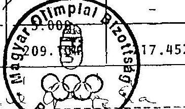

Ebböl 12.393 eFt az 1994. évi Lillehammeri téli olimpia

---

A MOB müködési kiadásainak alakulása

| Megnevezés | 1990. |  | 1991. |  | 1992. |  | 1993. |  |
| :--: | :--: | :--: | :--: | :--: | :--: | :--: | :--: | :--: |
|  | Terv | Tény | Terv | Tény | Terv | Tény | Terv | Tény |
| . Olimpiai mozgalom öszz. | 14.600 | 8.334 | 20.200 | 16.434 | 30.900 | 19.657 | 35.600 | 32.510 |
| ibbôl:   sportdiplomácia és mo-i   nemzetközi eseménvek   reklám, propaganda, marke-   ting   olimpiai lexikon   MOB rendezvenvek, reprez. | $\cdot$ |  | 3.500   5.000   500   3.000 | 3.504   7.060   -   2.614 | 7.500   6.000   500   3.500 | 2.438   5.186   300   2.838 | 7.000   6.000   1.000   5.500 | 6.675   4.445   2.027   4.164 |
| : MOB hivatali mük. öszz. | 23.550 | 15.769 | 23.400 | 19.632 | 28.200 | 31.107 | 41.226 | 32.294 |
| ibbôl:   beszerzések   anyagjellegú kiadások   szolgáltatások   béralap   kv.befizetések+biztosítás | 5.000   2.000   1.000   6.000   2.550 | 2.836   1.447   1.276   5.574   2.195 | 4.000   3.400   2.300   8.300   3.400 | 3.816   750   1.888   7.867   3.111 | 4.000   3.000   3.500   11.500   6.200 | 4.743   1.789   3.000   11.321   10.553 | 6.000   3.000   6.500   14.200   9.900 | 1.425   1.822   5.018   12.047   9.375 |
| 1. $1+2$ öszzesen | 38.150 | 24.103 | 43.600 | 36.066 | 59.100 | 50.764 | 76.866 | 64.804 |
| 1. Állami támogatás | 43.900 | 43.900 | 43.300 | 50.900 | 46.300 | 45.200 | 100.800 | 100.800 |
| . Allami támog. maradvány |  | 19.797 |  | 14.834 |  | $-5.564$ |  | 35.996 |

---

# Az 1992. évi olimpiai játékok elszámolása 

| Megnevezés | 1991. évi   tervezett | 1993. évi   elszámolás | Tanusitvánv | Ellenörzés   megállapít. |
| :--: | :--: | :--: | :--: | :--: |
| 1. Szállás, ellátás, utazás, belépöjegyek | 67.300 | 69.352 |  | -14.864 |
| 2. Napidij, zsebpénz,   dologi kiadások | 19.700 | 24.261 |  | -2.244 |
| 3. Olimpiai formaruha | 14.200 | 28.690 |  | -9.108 |
| 4. Fogadások, video,   nyelvoktatás | 5.000 | 9.172 |  |  |
| 5. Olimpiai kiadványok |  | 11.214 |  |  |
| 1-5. összesen | 106.200 | 142.689 | 155.749 | 129.533 |
| 6. Jutalom | 145.000 | 152.165 | 152.165 | 152.165 |
| 1-6. összesen | 251.200 | 294.854 | 307.914 | 281.698 |
| 7. Költségtérités |  | 13.010 | 13.000 |  |
| 8. Erösitő berendezések | 10.800 | 7.200 |  |  |
| 9. Gvógvszer ellátás, .   dopping ellenörzés |  |  | 4.000 |  |
| 10. Előolimpia, edzőtábor | 8.000 |  | 55.202 |  |
| Összes $n$ | 270.000 | 315.064 | 380.116 |  |

---

# TANUSITVANY 

az 1992. évi téli- nyári olimpiai játékok részvételi és felkészülési kiadásairól
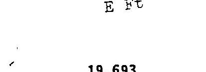
I. 1991. év

Előolimpia, olimplal felkészülés
19.693

Téli olimpia /részvétel elöleg/
3.170

Nyári ollmpla /részvétel elöleg/
8.274
II. 1992. év

Téli-Nyári olimplal részvétel
költségel, Jutalommal
268.970

Előolimpia részvétel
17.487

Edzötáborozás, felkészülés
18.022

Egyéni költségtérítés
13.000

Gyógyszerellátás, doppingellenörzés
4.000
III. 1993. év

Bruttósítás különbözete
27.500
1-11-111. összesen:
380.116
IV. Olimpial' felkészüléssel kapcsolatos kiadások
Egyéni támogatás /1992/
34.000

Szakszövetségek és egyesületek alap- és
eredményességi tämogtása
91.100
IV. összesen:
125.100

Mindösszesen:
505.216

Budapest, 1994. január 18.
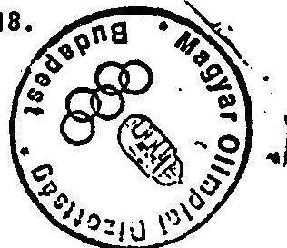
/Szücs-Gáspár György/ gazd.vezető

---

A Szerencsejáték Alap pénzeszközeinek és követeléseinek megosztása az Országos Játék Alap és a Nemzeti Sport Alap között

Ft

| Megnevezés | OJA   Kezeló Szervezet elszámolása | Ellenórzés megállapításai |  |
| :--: | :--: | :--: | :--: |
|  |  | Készpénz | Kétes |
| Bankszámla   Ertékpapír 1992.   Ertékpapír   Pályázókkal szembeni követelések | $\begin{aligned} & 139.193 .721 \\ & 140.000 .000 \\ & 193.650 .000 \\ & 30.065 .000 \end{aligned}$ | $\begin{aligned} & 139.193 .721 \\ & 193.650 .000 \\ & 30.065 .000 \end{aligned}$ | 140.000 .000 |
| Pénzeszközök össz. | 502.908 .721 | 362.908 .721 | 140.000 .000 |
| Pályázatokra kifizetendó 1992. évi 1993. évi | $\begin{aligned} & 175.142 .700 \\ & 198.232 .300 \end{aligned}$ | $\begin{aligned} & 95.142 .700 \\ & 198.232 .300 \end{aligned}$ |  |
| Lekötött pénzeszköz | 373.375 .000 | 293.375 .000 |  |
| Maradvány   Kezeló múködési költségeire (korrekció) | $\begin{aligned} & 129.533 .721 \\ & -21.647 .000 \end{aligned}$ | $\begin{aligned} & 69.533 .721 \\ & +26.850 .000 \end{aligned}$ | 140.000 .000 |
| Megosztandó   Ennek 30\%-a (NSA része) | $\begin{aligned} & 107.886 .721 \\ & 32.366 .017 \end{aligned}$ | $\begin{aligned} & 96.383 .721 \\ & 28.915 .116 \end{aligned}$ | $\begin{aligned} & 140.000 .000 \\ & 42.000 .000 \end{aligned}$ |
| Ertékpapír hozam | 274.337 | 1.194 .160 |  |
| NSA követelése | 32.640 .354 | 30.109 .276 | 42.000 .000 |

[^0]
[^0]:    * A kétes követelés realizálódása arányában.

---

# 17. sz. melléklet

## BEFIZETESI KÜTELEZETTSÉGEK

### 1993. április 1-től november 30-áig

|  Sor-Szervező neve | Kötelezettség | Befizetés | Tartozás | Átadott pénzeszköz | VGSZES Befizetés  |
| --- | --- | --- | --- | --- | --- |
|  1 A + Lotteri Ltd. | 429.5 | 413.2 | 16.3 | 31.5 | 444.7  |
|  2 Bonus Kft | 34.7 | 19.0 | 15.7 | 1.8 | 20.8  |
|  3 Citergaes Kft | 1915.2 | 1838.2 | 77.0 | 0.3 | 1838.5  |
|  4 Ertékmérő Kft | 469.0 | 58.5 | 410.5 | 0.0 | 58.5  |
|  5 IBUSZ-Fortuna Kft | 2021.1 | 1691.6 | 329.5 | 140.0 | 1031.6  |
|  6 IOM Játékszervezö Kft | 4820.4 | 5253.0 | -432.6 | 1064.1 | 6317.1  |
|  7 Instantmoney Kft | 1505.6 | 1691.5 | -185.9 | 163.5 | 1855.4  |
|  8 Luca 12 Kft | 69.9 | 0.0 | 69.9 | 20.8 | 20.8  |
|  9 MOB (Fortinvest) | 690.4 | 779.3 | -88.7 | 1526.7 | 2306.0  |
|  10 Menhold Kft | 886.0 | 682.5 | 203.5 | 380.7 | 1063.2  |
|  11 Molaik Játék Kft | 67.6 | 67.6 | 0.0 | 0.0 | 67.6  |
|  12 Schratch Kft | 5139.7 | 5158.7 | -19.0 | 984.9 | 6143.6  |
|  13 Lotto Unio Kft | 7201.1 | 5311.4 | 1889.7 | 1909.8 | 7221.2  |
|  14 AOT-Center | 64.7 | 0.0 | 64.7 | 48.8 | 48.8  |
|  15 Sáray László | 1.7 | 0.0 | 1.7 | 0.0 | 0.0  |
|  16 Fortuna segédje Bt | 490.6 | 0.0 | 490.6 | 0.0 | 0.0  |
|  17 Kölcsgy Ferenc Müvelődési Ház | 83.2 | 83.2 | 0.0 | 0.0 | 83.2  |
|  18 Alapítvány az Unkéntes Környezet | 0.0 | 114.8 | -114.8 | 0.0 | 114.8  |
|  19 Szerencsajáték Rt (sországg) | 4331.7 | 151361.6 | -147029.9 | 21670.7 | 173032.3  |
|  20 Szerencsajáték Rt (lótló) | 103667.4 |  | 103667.4 |  | 0.0  |
|  21 Szerencsajáték Rt (lótló) | 49063.4 |  | 49063.4 |  | 0.0  |
|  22 Karaván Kft | 0.0 | 8.7 | -0.7 | 0.0 | 8.7  |
|  23 LUN Kft | 0.0 | 1889.8 | -1889.8 | 0.0 | 1889.8  |
|  24 Tiszaföld és Vidóke AFESZ | 0.0 | 1.3 | -1.3 | 0.0 | 1.3  |
|  25 Castruum Szentendre | 0.0 | 0.2 | -0.2 | 0.0 | 0.2  |
|  26 Produkt Manager | 0.0 | 0.0 | 0.0 | 38.7 | 38.7  |
|  27 Multimédia | 0.0 | 0.0 | 0.0 | 4.1 | 4.1  |
|  28 Magyar Lótenyészítő Vállalat | 0.0 | 2522.9 | -2522.9 | 0.0 | 2522.9  |

## SORSOLÁSOS JÁTÉKOK VÉSZÉSEN

|  SORSOLÁSOS JÁTÉKOK VÉSZÉSEN | 182953.1 | 178947.0 | 4006.1 | 27986.4 | 206933.4  |
| --- | --- | --- | --- | --- | --- |
|  1 FORTUNATO Kft | 779.4 | 370.3 | 409.1 | 0.0 | 370.3  |
|  2 IBERHUND KFT | 2709.3 | 318.1 | 2391.2 | 540.0 | 858.9  |
|  3 Koordináció Kft | 218.4 | 0.0 | 218.4 | 0.0 | 0.0  |
|  4 Csepel SC Alapítvány | 471.3 | 414.8 | 56.5 | 0.0 | 414.8  |
|  5 TREND Kft | 943.1 | 872.8 | 70.3 | 134.6 | 1087.4  |
|  6 HONDÁRO GNW | 9.2 | 0.0 | 9.2 | 27.2 | 27.2  |
|  7 Mercurius Kft | 16.4 | 0.0 | 16.4 | 0.0 | 0.0  |
|  8 OTSH (BINOOSPORT Kft) | 5752.0 | 5715.2 | 36.8 | 564.5 | 6279.7  |
|  9 Család Kft | 4.7 | 0.0 | 4.7 | 0.0 | 0.0  |
|  10 REAC Palota | 1.5 | 1.6 | -0.1 | 0.0 | 1.6  |
|  11 MI-48 Bt (Orosháza) | 3.9 | 6.8 | -2.9 | 0.0 | 6.8  |
|  12 Spartacus Monor | 4.9 | 5.9 | -1.0 | 0.0 | 5.9  |
|  13 DUNAFERR Bt | 9.9 | 20.2 | -10.3 | 0.0 | 20.2  |
|  14 BSE | 53.3 | 44.5 | 8.8 | 1.9 | 46.4  |
|  15 Eger | 0.5 | 0.0 | 0.5 | 0.0 | 0.0  |
|  DÍNOOJÁTÉKOK VÉSZÉSEN | 10977.8 | 7770.2 | 3207.6 | 1269.0 | 9039.2  |

## MINDSÖZÉSEN

|  MINDSÖZÉSEN | 193930.9 | 186717.2 | 7213.7 | 29255.4 | 215972.6  |
| --- | --- | --- | --- | --- | --- |
|  |   |   |   |   |   |

Az Országos Játékalapról átvett I. negyedévi pénzeszköz

33048.0

Veszesen

249020.6

Szaves Jindóiné

1994. február 4.

---

# A Nemzeti Sport Alap 1993. évi felhasználása 

|  |   |   |   |   |
| --- | --- | --- | --- | --- |
|  Megnevezés | Keret | Megosz-   las   \% | Várható felhasználás * | Megosz-   lás   \%  |
|  1993. évi bevétel | 249.280 | 100 | 211.059 | 100  |
|  Ebból:   1. Elkülönített 10\%-os tartalék (miniszteri keret)   2. Kezeló Szervezet müködése   3. Labdarúgás | $\begin{aligned} & 24.928 \\ & 25.000 \\ & 50.000 \end{aligned}$ | $\begin{aligned} & 10 \\ & 10,1 \\ & 20,1 \end{aligned}$ | $\begin{aligned} & 29.928 \\ & 11.979^{* *} \\ & 20.000 \end{aligned}$ | $\begin{aligned} & 14.2 \\ & 5.7 \\ & 9.5 \end{aligned}$  |
|  4. Felosztható keret   5. Normatív támog. (4-ból)   6. Pályázat (4-ból) | $\begin{aligned} & 149.152 \\ & 111.864 \\ & 37.288 \end{aligned}$ | $\begin{aligned} & 59.8 \\ & 44.9 \\ & 14.9 \end{aligned}$ | $\begin{aligned} & 149.152 \\ & 111.864 \\ & 37.288 \end{aligned}$ | $\begin{aligned} & 70.7 \\ & 53.0 \\ & 17.7 \end{aligned}$  |
|  7. Versenysport (5-ből 75\%)   8. Diáksport (5-ból 15\%)   9. Szabadidősp. (5-ből 10\%) | $\begin{aligned} & 88.683 \\ & 18.377 \\ & 4.804 \end{aligned}$ | $\begin{aligned} & 35.6 \\ & 7.4 \\ & 1.9 \end{aligned}$ | $\begin{aligned} & 88.683 \\ & 18.377 \\ & 4.804 \end{aligned}$ | $\begin{aligned} & 42.0 \\ & 8.7 \\ & 3.3 \end{aligned}$  |
|  10. Szövetségek támogatása (7-ból 40\%)   11. Szövetségek alaptámogatása (10-ból)   12. Szövetségek normatív támogatása (10-ból) | $\begin{aligned} & 35.473 \\ & 7.200 \\ & 28.273 \end{aligned}$ | $\begin{aligned} & 14.2 \\ & 2.9 \\ & 11.3 \end{aligned}$ | $\begin{aligned} & 35.473 \\ & 7.200 \\ & 28.273 \end{aligned}$ | $\begin{aligned} & 16.8 \\ & 3.4 \\ & 13.4 \end{aligned}$  |
|  13. Egyesületek támogatása ( 7 -ból 60\%)   14. Egyesületi csapattámogatás (13-ból)   15. Egyesületi normatív támogatás (13-ból) | $\begin{aligned} & 53.210 \\ & 3.934 \\ & .49 .276 \end{aligned}$ | $\begin{aligned} & 21.3 \\ & 1.6 \\ & 19.7 \end{aligned}$ | $\begin{aligned} & 53.210 \\ & 3.934 \\ & 49.276 \end{aligned}$ | $\begin{aligned} & 25.2 \\ & 1.9 \\ & 23.3 \end{aligned}$  |
|  16. Felsóoktatás (8-ból 40\%)   17. Közoktatás (8-ból 60\%) | $\begin{aligned} & 7.350 \\ & 11.027 \end{aligned}$ | $\begin{aligned} & 3.0 \\ & 4.4 \end{aligned}$ | $\begin{aligned} & 7.350 \\ & 11.027 \end{aligned}$ | $\begin{aligned} & 3.5 \\ & 5.2 \end{aligned}$  |

Megjegyzés: *Az NST 1994. január 28-i javaslatait a miniszter a hel:szini ellenörzés befejezéséig még nem hagyta jóvá.* *Elözetes adat.

---

# Sportfejlesztési Alap bevételei és kiadásai 1990. ében 

|  | M Ft | Meg vsz. \% |
| :--: | :--: | :--: |
| Bevételek   ebbök - boritékos sorsjegy | 65,5 | 83,5 |
| - átigazolási dij | 8,0 | 10,0 |
| - kölesön visszafizetés | 5,1 | 6,5 |
| - egyéb | 0,3 | 0,5 |
| Bevételek összesen | 78,9 | 100,0 |
| Kiadások   ebbök - beruházásokra | 26,6 | 56,5 |
| - kölesönökre | 13,8 | 29,2 |
| - versenynaptári tám. | 3,0 | 6,4 |
| - müködési célra | 1,9 | 4,0 |
| - átigazolási dij visszafiz. | 1,3 | 2,7 |
| - Sportalapok fít törstöke | 0,6 | 1,2 |
| Kiadások összesen | 47,2 | 100,0 |
| Maradvány összesen | 31,7 |  |
| MOB boritékos sorsjegy -17, 5 M Ft   Siófoki Bányász történész $+2,6 \mathrm{M} \mathrm{Ft}$ | $\begin{gathered} -7,5 \\ +2,6 \end{gathered}$ |  |
| Tiszta maradvány | 26,8 |  |

---

# 20. sz. melléklet

## Tanusítvány az OTSH által adott kölcsönökről (1990-1993 év)

|  Kölcsönt felvessé szervezni, segnevezése | Kölcsön célja | Kölcsön folyósítás időpontja | Kölcsön összege feltétele | Kölcsön forrása | Lejárat év, hó, nap | Visszafiz. összeg | Visszafiz. időpontja | Szüvészőt megjegyzés  |
| --- | --- | --- | --- | --- | --- | --- | --- | --- |
|  Hungária Sport Kft. | fejlődés | 1990.07.01 | 2.100 |  | 1991.07.01 |  | 1991.11.27 | 100  |
|  Sportegyekeletet Sz. | gazd. problém. | 1990.07.05 | 4.500 |  | 1992.06.30 |  | 15.000 | 100  |
|  SSI | első finansz. |  | 15.000 |  | 1991.09.30 |  | 15.000 | 100  |
|  összesen |  | 21.600 |  |  |  |  | 16.100 |   |
|  Sp. Spartacus | gazd problém. | 1991.03.27 | 1.000 |  | 1992.03.31 |  |  |   |
|  Lekes IpolyvölgyTSZSK | gazd problém. | 1991.03.28 | 200 |  | 1992.03.30 |  |  |   |
|  Greped SC | gazd problém. | 1991.03.29 | 1.000 |  | 1992.03.31 |  |  |   |
|  SEZERO Kft. | kondisg. fel. | 1991.04.03 | 500 |  | 1991.12.31 |  |  |   |
|  Sp. Sonics Szövetség | gazd problém. | 1991.04.05 | 2.000 |  | 1991.09.30 |  | 2.000 | 100  |
|  Sp. Polg. Lovész Egylet | gazd problém. | 1991.05.30 | 3.000 |  | 1991.09.30 |  | 2.000 | 100  |
|  H. Vivo Szövetség | gazd problém. | 1991.06.07 | 5.000 |  | 1991.07.10 |  | 2.000 | 100  |
|  Mikéscsaba Előre | gazd problém. | 1991.06.10 | 150 |  | 1991.10.31 |  | 900 | 100  |
|  H. Polg. Lovész Egylet | gazd problém. | 1991.07.08 | 900 |  | 1991.10.31 |  | 900 | 100  |
|  OTM | gazd problém. | 1991.08.23 | 600 |  |  |  |  |   |
|  Cempel SC | gazd problém. | 1991.08.24 | 600 |  |  |  |  |   |
|  Sp. Spartacus | gazd problém. | 1991.08.25 | 600 |  |  |  |  |   |
|  BOKS | gazd problém. | 1991.09.17 | 2.500 |  | 1992.03.31 |  | 500 | 100  |
|  H. Techn. és Tömegep. | gazd problém. | 1991.09.30 | 2.500 |  | 1992.09.30 |  |  | 100  |
|  Magyar Öszó Szövetség | gazd problém. | 1991.10.02 | 600 |  |  |  |  |   |
|  Vasas SC | gazd problém. | 1991.11.29 | 500 |  |  |  |  |   |
|  összesen |  | 18.900 |  |  |  |  | 10.400 |   |
|  Ordri Rába ETO | gazd problém. | 1992.02.10 | 3.000 |  | 1992.05.31 |  |  |   |
|  HOSC | gazd problém. | 1992.02.28 | 800 |  | 1992.12.31 |  |  |   |
|  HLSZ | gazd problém. | 1992.04.30 | 15.000 |  | 1992.07.31 |  | 2.000 | 100  |
|  BRAMAC SC | gazd problém. | 1992.04.30 | 4.000 |  | 1992.12.25 |  | 3.000 | 100  |
|  Cempel SC | gazd problém. | 1992.05.20 | 2.500 |  | 1992.08.31 |  | 7.500 | 100  |
|  OTM | gazd problém. | 1992.05.30 | 7.500 |  | 1992.08.31 |  | 7.500 | 100  |
|  Cempel SC | gazd problém. | 1992.06.11 | 7.500 |  | 1992.08.31 |  | 1.000 | 100  |
|  Tétatánya | gazd problém. | 1992.06.11 | 2.500 |  | 1992.12.31 |  | 1.000 | 100  |
|  Conz Dánubius | gazd problém. | 1992.06.12 | 2.000 |  | 1992.12.31 |  | 6.500 | 100  |
|  ETC | gazd problém. | 1992.06.17 | 6.500 |  | 1992.08.31 |  | 6.500 | 100  |
|  HUSC | gazd problém. | 1992.06.17 | 1.500 |  | 1992.08.31 |  | 4.000 | 100  |
|  H. Auto-Huborsport Sz. | ÁSZFH zárolás | 1992.07.10 | 4.000 |  |  |  | 200 | 100  |
|  H. Ottosa Szövetség | miatt forr. h. | 1992.07.15 | 200 |  |  |  |  |   |
|  Vasas SC Bophabda Szakor | gazd problém. | 1992.08.14 | 500 |  |  |  |  |   |
|  H. Sportterrestikai Sz. | férv emi. újra | 1992.08.19 | 200 |  |  |  |  |   |
|  H. Attétikai Szuv. | mezei futó 08 | 1992.08.19 | 1.500 |  |  |  |  |   |
|  H. Audi Szövetség | gazd problém. | 1992.09.31 | 1.000 |  |  |  |  |   |
|  H. Rajas-Rosu Szövetség | gazd problém. | 1992.11.06 | 1.000 |  |  |  |  |   |
|  H. Mógládai Szövetség | gazd problém. | 1992.12.10 | 2.000 |  |  |  |  |   |
|  összesen |  | 63.200 |  |  |  |  | 25.900 |   |
|  111-kor. 701 | gazd problém. | 1993.02.15 | 1.000 |  |  |  |  |   |
|  Háti Ködikai HT | Sportködev | 1993.02.23 | 650 |  |  |  |  |   |
|  Hiskolev Vazokas | gazd problém. | 1993.03.01 | 2.000 |  |  |  |  |   |
|  100 íves laga | lávadítás | 1993.05.05 | 2.000 |  |  |  |  |   |
|  HTK | gazd problém. | 1993.06.14 | 4.000 |  |  |  |  |   |
|  HLSZ | gazd problém. | 1993.08.30 | 2.000 |  |  |  |  |   |
|  H. Öszó Szövetség | gazd problém. | 1993.11.07 | 5.000 |  |  |  |  |   |
|  VTSK | KGA műk-ig. | 1993.07.16 | 1.000 |  |  |  |  |   |
|  H. Sakk Szövetség | sportdígo kiú | 1993.11.18 | 170 |  |  |  |  |   |
|  Háti ássérültek Sportb. | SVII Nyúllep | 1993.04.27 | 1.500 |  |  |  |  |   |
|  Viskoton | gazd problém. | 1993.07.26 | 500 |  |  |  |  |   |
|  93 összesen |  | 20.820 |  |  |  |  | 6.000 |   |

Az 1990. évben folyósított kölcsönök fedezete a gazdálkodási terv szerinti szabadkeret.

Az 1991. évben folyósított kölcsönök fedezete az 1990. évben szabad keret terhére folyósított kölcsönökből visszafizetett összege.

Az 1992. évben folyósított kölcsönök fedezete 24.906 eft értékben a Gsz. pénzmaradványa.

Az 1993. évben folyósított kölcsönök fedezete 31.814 eft értékben az 1991-92 évben folyósított kölcsönökből visszafizetett összege.

Az 1993. évben folyósított kölcsönök fedezete 13.000 eft értékben a Gsz. pénzmaradványa.

Az 1994. február 15.

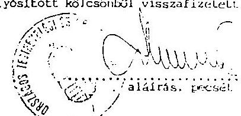

Sörös Árárásné

---

Szerencsejáték Rt. Pónzügyi és Számviteli Főosztály

Ikt.sz.: PSzF-................../93.

Sporttámogatásokra és sporttevékenységgel összefüggésben reklámcélra kifizetett összegek

|  Év | Reklámköltség
terhére | Közérdekü
támogatásból | Totó
elkülönített
nyereményalap | Lottó
elkülönített
nyereményalap | Összesen  |
| --- | --- | --- | --- | --- | --- |
|  1991. | 22 013 829,- | - | 50 836 499,- | 123 614 530,- | 196 464 858,-  |
|  1992. | 46 764 700,- | 3 462 508,50 | 165 900,- | - | 50 393 108,50  |
|  1993. | 40 912 500,- | 31 300 000,- | - | - | 72 212 500,-  |
|  Összesen | 109 691 029,- | 34 762 508,50 | 51 002 399,- | 123 614 530,- | 319 070 466,50  |

SZERENCSEJÁTEK RT. Pónzügyi és Szárkíviteli Főosztály

---

OTSH=Sportegyesületek=Bingósport Kft. közötti kölcsönök rendezése

E Ft

| Egyesület neve | $\begin{aligned} & \text { OTSH } \\ & \text { kölcsön } \end{aligned}$ | $\begin{aligned} & \text { Idôpontja } \\ & 1992 . \end{aligned}$ | Visszafiz OTSH-nak | $\begin{gathered} \text { Idôpontja } \\ 1993 . \end{gathered}$ | Végleges támogatás |
| :--: | :--: | :--: | :--: | :--: | :--: |
| FTC | 6.500 | VI. 17. | 6.500 | XII. 19. | - |
| MTK | 7.500 | V. 20. | 7.500 | XI. 17. | - |
| Csepel SC | 7.500 | VI. 11. | - |  | 7.500 |
| BVSC | 1.500 | VI. 17. | - |  |  |
| Tatabányai SC | 2.500 | VI. 11. | - |  |  |

---

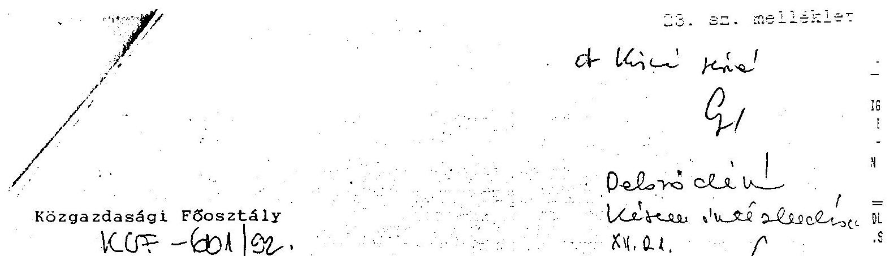

F e 1 j e g y z é s

Gallov Rezső elnők úr részére

Tájékoztatlak Elnők Ưr, hogy az 1992-ben folyósitott kamatmentes kölcsönök /melléklet szerint/ a hivatal zárszámadásában függő kiadások, s mint ilyent pénzmaradványt növelő tételként kell szerepeltetnünk, amely az 1992. évi pénzmaradvány jóváhagyásánál elvonásra szolgálhat alapul. Ennek kiküszöbölésére javaslom, hogy a fơkönyvi könyvelésünkben végleges kiadásként rendezhessük le a kamatmentes kölcsönöket. Természetesen analitikusan a továbbiakban is nyilvántartjuk és figyelemmel kisérjük ezeket a kintlévôségeinket.

Budapest, 1992. december 16.
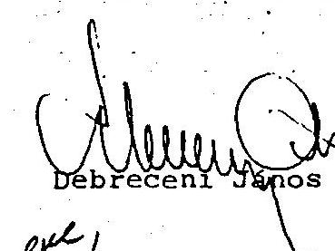

---

# 1992. évben folyósitott és vissza nem fizetett KAMATMENTES HITELEK 1992. december 14-ei állománya 

| M E G N E V E Z E S | Hitel összege | Lejárat |
| :--: | :--: | :--: |
| Csepel SC | 10.000 .000 | 1992.VII.31. |
| MTK SC | 7.500 .000 | 1992.VIII.31. |
| BVSC | 1.500 .000 | 1992.VIII.31. |
| RÁBA ETO SC | 3.000 .000 | 1992.IX.30. |
| Debreceni Vasutas SC | 800.000 | 1992.XII.31. |
| MLSZ | 15.000 .000 | 1992.VII.31. |
| BRAMAC SE | 4.000 .000 | 1992.XII.25. |
| Tatabánya | 2.500 .000 | 1992.VIII.31. |
| FTC | 6.500 .000 | 1992.VIII.31. |
| Ganz Danubius SE | 2.000 .000 | Szerencsejáték Alap |
| M.Sporttúrisztikai Szöv. | 200.000 | Nemz.Ifj. és Szabadido Alap |
| M. Judo Szövetség | 500.000 | 1993.VI.30. |
| Vasas SC Röplabda Szako. | 500.000 | 1992.XII.31. |
| M. Atlétikai Szövetség | 1.500 .000 | 1993.VI.30 |
| M. Kajak-Kenu Szöv. | 1.000 .000 | 1993.VI.30. |
| M. Kézilabda Szövetség | 2.000 .000 | 1993.III. 31. |
| 0 s s z e s e n | 58.500 .000 |  |
|  | 200 |  |

Budapest, 1992. december 14.48.300.000

---

# A bingójátékot terheló befizetési kötelezettségek kapcsán felmerült jogértelmezési kérdésekre 

1. Ki köteles fizetni az Alapot terheló hozzájárulást abban az esetben, ha a szervező és az üzemeltető személye elválik egymástól?

A szerencsejáték szervezéséről szóló 1991. évi XXXIV. törvény 30. 8 (4) bekezdése szerint a szervezők kötelesek az Alap részére a nyereményekre fordítható összeg 10\%-át befizetni.

A törvény szerint tehát a szervezőt terheli a kötelezettség.
A szervező azonban jogszabályi felhatalmazás, a 20/1991. (XII.30.) MKM-PM együttes rendelet 3. 8 (3) bekezdése alapján ún. üzemeltetési keretszerződésben engedte át a szerencsejáték tényleges bonyolítását más vállalkozó csoport részére.

Az üzemeltetési keretszerződés 8. pontja szerint az üzemeltetőt terheli az Alapba történő befizetés kötelezettsége közvetlenül, a vonatkozó jogszabályban elóirt határidóben. E szerződési kikötés tartalmazza azt a kötelezettséget is, hogy a befizetés tényét az üzemeltetőnek igazolni kell a szervező részére, aki bármikor, bármilyen, e szerződés teljesítéséből eredő pénzügyi-gazdasági okmánytárba betekinthet, felvilágosítást kérhet.

Igen lényeges az úgy megitélése szempontjából az a tény, hogy a bingójáték bevétele, a nyereményalap az üzemeltetőnél képződött. A szerződés ennek megfelelően rendelkezett, hogy az üzemeltető közvetlenül fizeti a tevékenységet terhelő minden hozzájárulást, járulékot, adót.

---

Mindezekre tekintettel álláspontunk szerint az üzemeltetőt terheli a tartozás megfizetésének kötelezettsége. Egyidejüleg azonban nem zárható ki a Bingósport Kft. felelőssége, mivel mint szervező nem járt el az elvárható gondossággal a fent hivatkozott jogszabályok, valamint az üzemeltetési keretszerződés által rárótt kötelezettségek teljesitése érdekében: ez utóbbi kötelezettsége a szerződés 17. pontján és a fent hivatkozott jogszabályi rendelkezéseken alapul (1991. évi XXXIV. törvény, 20/1991. (XII.30.) MKM-PM).

Az üzemeltető felelős az Alappal szemban a hozzájárulás kamatokkal történő megfizetéséért, az OTSH-val szemben szintén kamatokkal - a sportcélú hozzájárulás befizetéséért. az állammal szemben az adó és TB járulék megfizetéséért.

A Bingósport Kft. mint szervező felelős az üzemeltetési keretszerződésben foglalt üzemeltetési kötelezettségek ellenőrzésének elszámolásáért (pl. hozzájárulás befizetésére törvényben elöirt határidő), s mindazon mulasztásért, melyet a vonatkozó jogszabályok és a szerződés alapján elkövetett. beleértve a szerződési garanciák kikötésének elmulasztását.

Tehát az Alappal szemben az üzemeltető közvetlenül felelős.
Az Alappal szembeni tartozás behajtása kőzadók módjára történik.