# 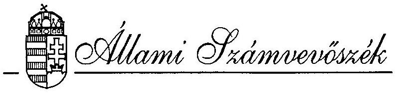 

## JELENTÉS

a Komáromi Mezőgazdasági Kombinátnál az állami vagyonnal történő gazdálkodás ellenőrzéséről
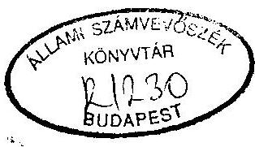

---

A vizsgálatot vezette:
dr. Kovácsné
dr. Pósfay Zsuzsanna
osztályvezető fötanácsos
A vizsgálatot végezték:
Korondi János
számvevö tanácsos
Sólyom László
számvevö tanácsos
Tóth Pál
számvevő

---

T A R T A L O M J E G Y Z É K
O1da1
I. BEVEZETÉS ..... 1 .
II. ÖSSZEFOGLALÓ MEGÁLLAPÍTÁSOK, AJÁNLÁSOK ..... 4.

1. Összefoglaló megállapítások ..... 4.
2. Ajánlások ..... 11 .
III. RÉSZLETES MEGÁLLAPÍTÁSOK ..... 13.
3. A vonatkozó törvények, jogszabályok és belsö utasítások alkalmazása ..... 13.
1.1. A Komáromi Mezőgazdasági Kombinát átalakulása részvénytársasággá ..... 13.
1.2. Az Igazgatóság és a Felügyelö Bizottság müködése ..... 17.
1.3. A társaság müködését biztosító belsö jogi szabályozás ..... 17
1.4. Belsö ellenörzés ..... 18.
1.5. A gazdálkodás informatikai háttere ..... 20.
1.6. A különféle károk keletkezése és rendezése ..... 20.
1.7. Gazdálkodás szerzödéses állományának alaku- lása ..... 22.
4. Gazdálkodás a vagyonnal ..... 23.
2.1. Az állami vagyon megőrzése ..... 23.
2.2. A vagyonértékelés hatása ..... 24.
2.3. Likviditási helyzet ..... 24.
2.4. A gazdálkodás eredménye ..... 25.
2.5. A kártalanítás hatása ..... 28.
2.6. Az ágazatok jövedelemtermelö képessége ..... 29.
2.7. Az állami vagyon védelme ..... 30.

---

3. A gazdaság szakmai (müködési-termelési) tevékenysége ..... 31.
3.1. A tulajdonosi elvárások a cég felé és annak teljesítése a gazdaság müködése során ..... 31.
3.2. Az egyes ágazatok termelö képessége, termelési tevékenysége ..... 33.
3.2.1. Területi adatok ..... 33.
3.2.2. Az egyes föágazatok termelési tevékenységének elemzése, értékelése ..... 34.
3.2.3. Az egyes ágazatokra (növénytermesztés, állattenyésztés) vonatkozó jövöbeni feladatok, fejlesztési elképzelések ..... 38.
4. A környezetvédelem helyzete ..... 40.

---

# ÁLLAMI SZÁMVEVÖSZÉK 

V-37-40/1993-1994.
Témaszám: 207.

## J E L E N T É S   a Komáromi Mezőgazdasági Kombinátnál   az állami vagyonnal történő gazdálkodás   ellenőrzéséről

1. 

## B EVEZETÉS

Az Állami Gazdaság 1949-ben alakult. Felügyelő hatósága a Földmũvelésügyi Minisztérium volt.
Elnevezései, mũködési területei az idők folyamán államigazgatási intézkedések folytán többször változtak. 1985-töl vállalati tanács által irányitott vállalat lett, 1992. februárjától államigazgatási felügyelet alá vonták. 1993. január 1-jétől egyszemélyes részvénytársaság.

A társaság jogelödjel:
a) Újpusztal Állami Gazdaság Nemzeti Vállalat

Alapitó: Népgazdasági Tanács
413/21/1949. határozat, 1949. december 23.
Alapitó levelet kiadta:
Földmũvelődésügyi Minisztérium
8000/14/5/1950., 1950. február 15.

---

b) Komáromi Állami Gazdaság

Állami Gazdaságok Föigazgatósága
11.400/1961. határozat
1962. január 1-jétől az Újpuszta-i, Perjés-puszta-i, Szőkepuszta-i, Süttő-i állami gaz= daságok "mérleg összevonásával".
c) Komáromi Mezőgazdasági Kombinát

Mezőgazdasági és Élelmezésügyi Minisztérium 3033/2/1984. határozat, 1984. január 5.
d) Komáromi Mezőgadasági Rt.

Állami Vagyonkezelő Rt. (1992. december 31.)
( $100 \%$-ban állami tulajdonú zárt végű Rt. lett.)

A társaság tevékenységi körébe alapvetően a következők tartoznak:

Növénytermesztés
Állattenyésztés
Mezőgazdasági szolgáltatás
Húsfeldolgozás
Bortermelés

A saját vagyon/töke és a létszám alakulása

|  |  | Mérleg föösszeg M Ft | Saját töke M Ft | Létszám fö |
| :--: | :--: | :--: | :--: | :--: |
| 1992. | jan. 1. (rendező) | 1.833 | 1.348 | 1.320 |
| 1992. | dec. 31. (1etéti) | 1.658 | 1.250 | 1.191 |
| 1993. | dec. 31. (adóm.) | 1.767 | 1.362 | 880 |
| 1993. | dec. 31. (1etéti) | 1.767 | 1.353 | 880 |

---

Az ellenőrzés célja: az Állami Számvevőszékről szóló 1989. évi XXXVI11. törvény 2. § (6) bekezdésében foglaltaknak megfelelően annak vizsgálata, hogy a cég

- a kezelésében lévő állami vagyonnal hogyan gazdálkodott,
- a tulajdonos képviselői által meghatározott müködési-termelési tevékenységét megfelelően látta-e el,
- a tevékenységére vonatkozó jogszabályi előírásoknak mennyiben felett meg,
- környezetvédelmi szempontból hogyan itélhető meg.

Az ellenőrzés az Rt. központja színtjén annak müködőképességével és a kapcsolatos gazdálkodási kérdésekkel foglalkozott. Kiterjedt az ellenőrzés a környezetvédelmi jogszabályok betartására is.

A vizsgált időszak: 1992-1993. év volt, illetve a várható tendenciák tekintetében az 1994. I. féléve is.

A vizsgálat 1994. március 22-től 1994. július 26-ig - a vizsgálati jelentésnek az ellenőrzött szerv részére észrevételezésre történő átadásáig - tartott. Ezen belül a helyszíni ellenőrzés 1994. március 16-án kezdödött és 1994. május 31-én fejeződött be.

---

# II. 

## ÖSSZEFOGLALÓ MEGÁLLAPÍTÁSOK, AJÁNLÁSOK

## 1. Összefoglaló megállapítások

A Komáromi Mezőgazdasági Kombinát vizsgálata annak a rendszerszemléletủ ellenőrzés sorozatnak a része, amelyet az Állami Számvevőszék több más, egykori állami gazdaságnál tervbe vett. Az ÁSZ egyidejűleg, azonos tematika alapján vizsgálta a Ceglédi Állami Tangazdaság Rt.-t, majd 1995-ben további két állami gazdaság vizsgálatát követően e témakörben összegező tanulmányt készít. Az általánosítható tapasztalatok, a tendenciák feltárása emiatt nagyobb hangsúlyt kapott az ellenőrzés során. Megmutatkozott, hogy vannak olyan közérdekek (pl. a hazai vetőmag, szaporítóanyag ellátás, tenyészállatok biztositása), amelyeket érvényesiteni kell. Jelentőségük túllép a szüken értelmezett napi és helyi gazdaságossági-gazdálkodási érdekeken. A most vizsgált társaságok ma is alkalmasak a korábban elért jó színvonalon, márkás terményeket elöállítani.

A Komáromi Mezőgazdasági Kombinát Rt. az elmúlt években lezajlott gyors társadalmi és gazdasági változások, több éves aszálykárok, tulajdonosi jogokat gyakorlok változásaí közepette is müködőképes maradt. Ezt a szellemi és termelési potenciált kár lenne veszni hagyni, mert ennek lehetősége a kialakult helyzetben arra int, hogy fel kell oldani a rövidtávú kötelezettségek és a hosszabb távú nemzetgazdasági érdekek ellentmondásait.

---

A Komáromi Mezőgazdasági Kombinát 1985-ben a MÉM döntése nyomán vált Vállalati Tanács által irányitott vállalattá, ame1y irányítási formát az Állami Vagyonügynökség 1992. február 12-től szüntette meg, s vonta a vállalatot - átalakulásáig államigazgatási felügyelet alá. A "tartósan" állami tulajdonban maradó vállalatok körét meghatározó Kormányrendelet 1993. augusztus 28-i hatályba lépésétől a tulajdonosi jogokat az Állami Vagyonkezelö Rt. gyakorolta, me1yet 1993. végén újabb Kormányrendelet erősített meg.

A Komáromi Mezőgazdasági Részvénytársaság 1992. december 31-ével alakult meg, amelyet a Társasági Törvény értelmében 1993. júliusától a Közgyülés, illetve Igazgatóság irányit. A részvénytársasággá történt átalakuláskor a pénzügyi stabilitás megteremtésének igényét és az eredményes gazdálkodás kövele1ményét egyértelmúen megfogalmazták.

A vállalatnál az átalakítás és a decentralizációs privatizációs program végrehajtása, a folyamatokhoz kapcsolódó gondok mellett gyakorlatilag 1993. év végére befejeződött. A vonatkozó törvények, jogszabályok és belsö utasítások betartása a társasággá alakulás során összességében megfelelö volt. Az átalakulás folyamatára vonatkozóan a vizsgálat törvénysértést, jogszabályellenességet nem tapasztalt, de néhány hiányosságot feltárt, melyek a következökben foglalhatók össze.

Az Rt. megalakításakor a cégbejegyzéshez szükséges me11ék1etek hiányosak voltak, ezeket az Rt. pótolni tudta úgy, hogy a cégbejegyzés már 1993. július 13-án jogeröre emelkedett. A vizsgálat, a zamárdi ingatlanok (az Rt. üdü1ői) tulajdoni lapjainak érvényességi határidejének le jártát tárta fel, me1y hiányosság. Egyébként az átalakulási terv tanulmányozása során, valamint az átalakulással összefüggésben jogszabálysértés nem volt tapasztalható.

---

A decentralizált privatizáció keretében az Rt. több, távol esó pusztán levő ingatlanjaitól, a korábbi vállalati bérlakásoktól megvált, a kárpótlás dolgozói föld-alap kiadását követően pedig földútjai, üzemi útjai egy részétől kíván megválni. Megfelelő törvényi rendelkezések hiányában azonban az Rt. tulajdonában, illetve kezelésében maradtak a leválasztott területekhez tartozó földterületek (zömmel udvar, gépudvar telekkönyvi megnevezéssel), valamint az infrastruktúrális létesítmények (út, elektromos vonalas létesítmények, transzformátor, vízhálózat, kút, stb.). Üzemeltetésük, fenntartásuk olyan költséggel jár, ami a társaság müködésében, mint veszteség jelentkezik. Ez a veszteség elkerülhető lenne, ha a jogalkotók ezekre a térítésmentes átadás - adókövetkezmények nélküli - módját kialakítanák és az önkormányzatoknak átadhatóvá válna.

A társaság gazdálkodásában a különböző szerződéses igényei teljesítésének elmaradásából eredő károk elérték az elmúlt két évben a 14 millió Ft-ot. Az Rt. 1992. évben 10 millió Ft összegü követelést peresített. A szerződési károk rendezése, az adósok felkutatása, a jogerős bírósági végzések alapján történő behajtása - 12 millió Ft - az adósok vagyonhiánya miatt nehézkes és szinte lehetetlen volt az ún. "fantomcégek" esetében ( 2,5 millió Ft). A Btk. ugyanis csak az 1994. évi XI. törvénnyel módosított 299. §-ának hatályba lépésével - a közhitelü nyílvántartásba történő bejelentkezés, vagy adatmódosítás bejelentési kötelezettség elmulasztásának szankcionálásával - teremtett lehetöséget a "fantomcéggé" válás megakadályozásában.

Kedvezőnek minősül, hogy a társaság rendelkezik müködés kereteit biztosító belsó szabályzatokkal, utasításokkal, azokat aktualizálták, a belsó ellenőrzés által feltárt hibákat a társaság kiküszöbölte.

---

A társaságban müködö állami vagyon 1992. év elején 1.348 millió Ft volt, amely 1992-ben 5,5 \%-kal, 99 millió Ft-tal, 1993-ban további 2,5 \%-kal, 34 millió Ft-tal csökkent. Ennek fö oka 1992-ben a 99 millió Ft-os veszteség volt, 1993-ban pedig a pénzügyi befektetéseket elvonta az ÁV Rt. 15 millió Ft értékben, továbbá fejlesztési alapátadások történtek 26 millió Ft értékben. A részvénytársasággá történt átalakulás során, valamint folyó müködésük alatt az állam vállalatokra bizott vagyonáról rendelkező törvény elöírásainak eleget tettek. Az értékhatár feletti szerződések esetében az előirt vagyonértékelést elvégeztették és a tulajdonos képviselőjének szükséges bejelentési kötelezettségnek eleget tettek.

Az átalakuláskor történt vagyonértékelés hatása nem volt nagy, mindössze $+7,9 \%$-os mértékü, ame1y, +133 millió Ft vagyonnövekedést okozott.

A likviditási helyzet rossz. Az Rt. forgóeszköze kevés, ezért hiteleket vett fel. Így a cég méreteihez képest rendkívül nagy, 98 millió Ft-os, illetve 61 millió Ft-os kamatteher rontotta az eredményeket a tárgyidőszakban. A saját forráson felül évi 200 millió Ft rulirozó jellegủ hite1re volna a cégnek szüksége. A hitelek kamatal a piaci árban nem térülnek meg. A ráfordítások között nagyon magas a fizetett bankkamat összege, ez - mint említettük - 1992-ben 98 millió Ft volt, 1993-ban 61 millió Ft-ra csökkent, elsősorban a magas kamatozású hosszúlejáratú hitelek tervszerű fizetése révén. Az á1landó hitelkényszer és magas kamat rontja a gazdálkodás feltételeit. Meg kell jegyezni, hogy az ÁsZ tudomása szerint ez másutt is így van, me1y jelzi, hogy hiányzik a mezőgazdaság adottságainak megfelelő, alacsony kamatozású hitelkonstrukció.

---

Jó költséggazdálkodásra enged következtetni, hogy a költségek jobban csökkentek 1992-röl 1993-ra, mint az árbevételek.

A nagymértékủ állate1hul1ás azonban rontotta az eredményt. Az 1992. évi 11 millió Ft, 8.300 db-os és az 1993-as 15 millió Ft-os 10.500 db-os elhul1ás az örökölt korszerűtlen állattartási körülményekre vezethető vissza. Az istállók többsége húsz évesnél idösebb, a technológia korszerütlen és nagy a zsúfoltság. A cégnek 1994-1997. között 200-220 millió Ft-ra lenne szüksége saját forrásain felül csak a szintentartásra, ame11ye1 a meglévő zsúfoltságot és korszerűtlenséget megszüntethetné.

Az Állami Vagyonkezelö Részvénytársaság, mint a tartós állami tulajdonban maradó mezőgazdasági szervezetek alapítói és tulajdonosi képviseletét gyakor1ó szervezet, a mindenkor1 tulajdonosi érdeket a jövedelem elvonásban érvényesitette, ezáltal a társaságnak nem biztosította a tartósan jövedelmező gazdálkodáshoz szükséges feltételeket.

Az ÁV Rt. mint tulajdonos rövid távú, kizárólag a központi érdekeket figyelembe vevő szemlélettel lépett fel, amikor a rábizott állami vagyon termelőképességének fenntartásához szükséges minimális befektetések tulajdonosi megf inanszirozása helyett a kialakuló szerény eredmény $50 \%$-át indok nélkül, meg nem határozott célra elvonta. Ezzel rontotta a rábizott gazdálkodó szervezet müködőképességét és privatizációs esélyeit.

Az egyes termelési ágazatok eredményessége változó. Elháríthatatlanul eredményrontó hatással voltak rá az aszályok, a keleti piacok és az azzal kapcsolatos exporttámogatások elvesztése. Az exporttámogatások évi összege több tízmil1ió Ft volt.

---

Az állami tulajdonlás új formájának - a törvény szerint az ÁV Rt. közbejöttével - azt a célt is kellene szolgálni, bogy a meglévő értékeket megörizve a biológiai erőforrásokat, a jó fajok, fajták genetikai törzsállományát biztosítsa és terjessze az országban. Elvárás az is, bogy az állam tartósan megmaradó vagyonát nyereséggel müködttessék. Mindezen követelményeket csökkentett üzemméretben kell(ett) megvalósítani a kárpótlási törvény és a privatizáció végrehajtása közepette.

A több évtized alatt kiépített szakmai vertikumokra az új törvények "vis maior"-ként hatottak és a következö helyzetet hozták létre. A kárpótlás rossz batással volt a cég gazdálkodására. Egyrészt a föld nem része a gazdálkodó szervezet vagyonának, másrészt a kárpótlási törvény érvényesítése miatt bérelnie kell korábbi földjeit, ezáltal az eddig rendelkezésre állt szántóterületének kb. $45 \%$-át elvesztette, további 6 \% sorsa bizonytalan.

A kárpótlási folyamatok befejeződésével az Rt. szántó területe a korábbi közel 6.500 bektárról kb. 3.500 bektárra ( 54 \%-ra) csökkent. A bérelhető terület távlatilag 800-1.200 hektár közé prognosztizálható. A kárpótlás befejezése után megmaradt területen kell megtermelni mind a szarvasmarba állomány, mind pedig a sertésállomány takarmányigényét.

A kárpótlás, továbbá a pótkárpótlás után visszamaradó terület nagysága összességében elegendő az állatállomány tömegtakarmány igényének kielégítéséhez és a vetőmagüzem ellátásához. A területek elbelyezkedése azonban elönytelenné vált, mivel a két szarvasmarha-telep közelében csupán 1.000 hektár körüli területük maradt, amely csak megfelelő időjárási viszonyok közepette elégséges a tömegtakarmány-igény fedezésére. Ezért úgy számolnak, hogy a szálastakarmány (lucerna, réti széna) nagy részét a telepektöl távoli területen kell ezután megtermelni.

---

A vetőmag elöállitás mũszaki fejlesztése a korábbi években megvalósult, a technológia zárt.

A szölészet-borászat helyzete nehéz. Az ágazat valamikor 785 hektár szőlőültetvénnyel rendelkezett, amelyhez megépítették a feldolgozó és tároló kapacitást. Jelenleg 400 hektárt alig haladja meg a borszőlő területe (téli fagyok, továbbá kárpót-lás-miatti csökkenések). Az ültetvények egy része mintegy 8-10 év múlva selejtezendö lesz, igy már most foglalkozni kell az ágazat jövöbeni sorsával. A tároló és feldolgozó kapacitáshoz szükséges szölöterületet az Rt.-nek vagy saját eröböl, vagy valamilyen termelési integráció révén biztosítania kell.

Az állattenyésztés szarvasmarha- és sertéságazata müködik. Az Rt-nél mintegy 1.500 db jó genetikai képességü Holstein-friz tehénállomány található. Ennek szaporulatával a veszteséges hizlalást felszámolták. A bikaborjakat már kiskorukban eladják, illetve háztáji gazdaságokban tartják tovább. Az üszök egy$\cdot$része a saját tehénállomány utánpótlására kell, a többit eladják.

A sertéságazatot az Rt.-nél az 1800 db-os kocaállomány, illetve annak szaporulata jelenti. A tartási technológia egyes elemei (elletö rész, malacnevelö battériák kialakítása, stb.) jelentösen elavultak, melyeket a következö időszakban alapos átgondolás után rendbe kell tenni.
Megoldást kell találni a közel 30 éve üzemelő és nagymértékben elhasználódott battériás épületek kiváltására.

Az állattenyésztésben a Komáromi Mezőgazdasági Rt.-nek 4 év alatt saját forrásain kivül 220 millió Ft beruházási támogatásra lenne szüksége, hogy csökkentse a zsúfoltságot, kiváltsa korszerütlen és elhasználódott eszközeit, mert nagymértékü az állat elhullás, és ennek pénzügyi vesztesége.

---

A gazdaság húsüzeme jelentős. Folyamatos fejlesztések révén jutott el arra a szintre, ami évente mintegy 100 ezer db hizósertés levágását és részbeni feldolgozását jelenti. A vállalat említett ágazatainak eredménye - a növénytermesztés, sertéshízlalás, húsfeldolgozás vertikum végső eleme - itt realizálódik.

A húsfeldolgozási technológia szintentartása évente 50-60 millió Ft fejlesztést igényel. Ezen felül tovább ke11 lépniük abba az irányba, hogy az üzem az Európai Közösség szabványainak és elvárásainak megfeleljen. Ez a feldolgozási vonal mindennapos igényén túl a vágóvonal jelentősebb fejlesztését igényli (új szeletelögép, csomagoló-, címkéző gépek beállítása, stb.).

Az átalakulási terv könyezetvédelmi fejezete, a törvénynek megfelel. A gazdaság környezetvédelmi helyzete megfelelö. A környezetvédelmi ellenőrzések folyamán kiszabott bírságok nagysága a vizsgált időszakra nézve a minimálisra csökkent. A társaság, további, környezetet védő intézkedéseket tervez és végrehajt.

# 2. Ajánlások 

a) Az Állami Számvevőszék az Országgyűlés figyelmébe ajánlja, hogy

- igénye1je a Kormánynál az agrárszférában a speciális szakmai szempontok érvényesítése érdekében a tartósan állami tulajdonban maradó gazdálkodó szervezetek feletti tulajdonosi jogok gyakorlásának hosszútávra érvényes és egyértelmú rendezését.

---

b) Javasolja a Kormánynak, hogy

- dolgoztasson ki az állandósult forgóeszközhiány megszüntetésére olyan mezőgazdasági hitelkonstrukciót, àme1y megoldást jelent a mezőgazdasági üzemek ${ }^{11}$ a termelési ciklus alatti finanszirozási gondjaira;
- kezdeményezze az adók és támogatások rendszerének módosítását, hogy az állattenyésztéshez szükséges infrastruktúra megújításához e tevékenység bevételéból a beruházási forrásokat a gazdálkodó szervezetek képesek legyenek önerőböl biztosítani;
- dolgoztassa ki a társaságok müködését már nem érintő állami földterületek, infrastrukturális létesítmények - önkormányzatok részére történő - vagyonvesztés né1küli átadásának szabályait.
c) Felhívja az ÁV Rt. figyelmét, hogy
- az állami tulajdonhányad változtatásának elökészitése során nagyobb gondot fordítson az agrárpolitikai és stratégiai elképzelések figyelembevételére és valósitsa meg az eredeti célt: a meglévő értékek megőrzését, a piacérzékenyebb agrárterme1ést, az állami vagyon védelmét és müködtetését;
- gondoskodjon arról, hogy az egyes társaságok, - a jellegüknek megfelelő és megmaradt, optimális arányú termelési szerkezete, termelési vertikuma - az elvárt nyereséggel is tartósan, jövedelmezően müködhessenek.

---

d) Javasolja a Részvénytársaság vezetöségének, hogy

- nagyobb figyelmet forditson a termelési technológia olyan szintre hozására, mellyel lehetővé válik az optimális idöben történő munkavégzés (vetési idô, mũtrágyázás, ${ }^{\text {i }}$ vegyszerezés, betakarítás idópontja, stb.);
- kezdeményezze újabb, bővebben termô fajták (kũlõnbõzõ bú-za-, kukorica- és borsófajták) adaptációját, kôzépkorai fajták kiválasztását, termelésbe állítását;
- számolja fel a vizsgálat során tapasztalt, a részletes jelentésben szerepló hiányosságokat.

# III. 

## RÉSZLETES MEGÁLLAPÍTÁSOK

1. A vonatkozó törvények, jogszabályok és belsõ utasítások alka Imazása
1.1. A Komáromi Mezőgazdasági Kombinát átalakulása részvénytársasággá

A Kormány agrárpolitikája kiterjedt az állami gazdaságoknál (kombinátoknál) is a tulajdonviszonyok átalakítására. A tulajdonreform során az állami gazdaságoknál az új állami tulajdonlás és irányítás rendszerét kidolgozták. Az átalakítás részvénytársasággá tõbb szakaszból álló intézkedés sorozattal valósult meg.

---

A vállalati tanács irányítási rendszerét fel kellett váltani elöbb az alapító, az ágazati minisztérium, majd új tulajdonosi irányító szervezeteknek. (Előbb az Ávü-höz, késôbb az Áv Rt. -hez tartoztak.)

A cél, a hatékonyabb, alkalmazkodóbb és piacérzékenyebb agrártermelés megteremtése volt úgy, hogy az állami gazdaságokat, a meglévö értékek megörzése mellett kell a nemzeti agrárpolitika céljalnak szolgálatába állítani. Az átalakítási és privatizációs programot a Földmũvelésügyi Minisztérium elkészítette 1991. december 16-án.

A programban a meglévö értékek megőrzése alatt a biológiai erőforrások, a genetikai alapok meghatározó, birtokolt része értendö.

Komáromban, de általánosan valamennyi állami gazdaságban 1992. évben az átalakulás és privatizáció komoly gondja az volt, hogy a föld valódi értéke nincs meghatározva, valamint a kárpótlási törvény szerint a gazdaságoknak földalapot kellett képezni és azt magántulajdonba kellett adni. Ez azt jelentette, hogy értékben nem is mért az a vagyonveszfés, ami az állami gazdaságokat érte.

A Komáromi Állami Gazdaságot az ÁvÜ E-3/1992/12. IT határozatával vonta államigazgatási felügyelet alá, 1992. február 12-i hatál1yal. A Földmũvelésügyi Minisztérium, a célok megvalósítása érdekében a biztosi jelöltekböl kiválasztotta és kinevezte a szakmailag legmegfelelőbb vállalati biztost és 6 hónapi megbízással meghatározta feladatát.

Az állami vagyont müködtetö szervezetek - elöször az ÁvÜ, majd az Áv Rt. - maguk is csak jogilag és papíron léteztek, valójában saját szervezetüket ezidöben kellett létrehozni. Nyilvánvaló tehát, hogy a hozzájuk keriilt vagyontömeg kezelésére csak részben voltak alkalmasak.

---

A Kormány szándékaiból eredő és a törvénykezelésben kompromisszumként szakaszosan megjelent - de végrehajtási szempontból nem eléggé átgondolt - változtatások kiszámíthatatlan gazdálkodási helyzetet teremtettek.

Az FM és az ÁVÚ közös Privatizációs Koordináló Bizottságot /P.K.B./ hozott létre 1992 májusában, hogy meghatározott rendszerességgel, ülésein irányíthassa és ellenörízhesse az állami gazdaságok átalakulását.

A vállalati biztos, az FM Biológiai Alapok Fejlesztési Főosztálya által végzett átvizsgálás alapján elkészítette a privatizációs programot és azt az ÁVÚ IT 1992. július 28-án jóváhagyta, a program kismértékủ változtatásával.

A program végrehajtása megindult és 1993. december 31-ig gyakorlatilag be is fejeződött.

A vállalat, a 126/1992.(VIII.28.) Kormányrendelet alapján átkerült a tartós állami tulajdonban maradó vállalati körbe, ezáltal az Állami Vagyonkezelö Részvénytársaság (ÁV Rt.) portfóliójába. A tulajdonosi feladatköröket e rendelet szerint már az ÁV Rt. látta el, me1y gyakorlatilag 1993. január 21-ig, a gazdaság dokumentumainak átadásáig - mintegy fél évig az ÁVÚ-nél - átfedésben müködött.

Az aktualizált vagyonértékelést, az átalakulási koncepciót már, az addig megalakult ÁV Rt-nek adta be a vizsgált vállalat, a részükre kijelölt szakértő cég véleményével.

Az átalakulási terv, a szükséges egyeztetésekkel 1992. novemberében elkészült. Ez alapján, az ÁV Rt ügyvezetése a Komáromi Mezőgazdasági Kombinát átalakulását Komáromi Mezőgazdasági Termelő és Szolgáltató Részvénytársasággá alapí-

---

tásával, 1993. április 8-i dátummal, 1992. december 31-i visszamenó hatállyal, Alapító Okirattal, egyszemélyes részvénytársaságként jóváhagyta.
Az alapítás jóváhagyásától számított 30 napon belül megtörtént a cégbejegyzési kérelem benyújtása.

Az ÁV Rt., mint a tulajdonosi jogokat gyakor1ó szervezet, a hozzá került, tartós állami tulajdonban maradó mezőgazdaságí szervezetek müködését alapítói jogainak érvényesítése me1lett gyakorolta. Ez egyaránt kitünik a Gazdaságtól és az ÁV Rt.-töl beszerzett dokumentumokból. Megállapítható, hogy az ÁV Rt. döntéselökészítő anyagai jól kidolgozottak, de a mindenkori tulajdonosi érdekeket föként a vállalattól elvonandó anyagi javakra szükítve jelenítik meg. Ez rövid távon belüli vagyonfelélés, nem szolgálja az Rt. hosszú távú müködöképességének megörzését.

A mezőgazdasági társaságok körét érintö szakmapolitikai elvárásokat egyébként csak az átalakulási tervet követö második évben, az 1994. március 16-1 ügyvezetői értekezleten víZsgálták felül. Következésképpen éppen az ÁsZ által vizsgál t két évben nem gondoskodtak eléggé a tulajdonosi jogokat gyakor lók a tartósan jövedelmező gazdálkodás feltételeinek biztosításáról a társaság számára.

További, már a jövöbe mutató fejleménye az ügynek, hogy idén az ÁV Rt. olyan határozatot hozott, hogy "Kezdeményezni kell a társaságban meglévő állami tulajdonhányad $25 \%+1$ arányúra csökkentését", értékesítési pályázatot kell kiírni, privatizációs tanácsadót kell kiválasztani, valamint egyeztetéseket kell folytatni az FM-el és az ÁvU-ve1. Ez napirendre a jelentkező hazai és külföldi befektetőkkel folytatott tárgyalások alapján került. A legnagyobb hátrány ebben az, hogy a jelentkező befektetöket a részvénycsoma-

---

goknak csak egy-egy része érdekelte, kiszakítva egy-egy ágazatot, üzemet, ezáltal megbontva a termelés vertikumát. E próbálkozás átmeneti bizonytalanságot okozott, de érvényesítésére nem került sor.

# 1.2. Az Igazgatóság és a Felügyelö Bizottság müködése 

A Komáromi Mezögazdasági Rt. Igazgatósága és a Felügyelö Bizottság üléseiröl szóló jegyzökönyvek alapján a müködés során nem tapasztaltunk jogszabályellenes ügyintézést, csak hiányosságot. Ezek formai hiányok: pl. a határozatok egyhangúságát - ott, ahol az egyhangú volt - több esetben nem rögzítették.

Közgyülés az Alapító Okíratban meghatározottak alapján, a helyszini vizsgálat végéig két izben ült össze.

### 1.3. A társaság müködését biztosító belsö jogi szabályozás

## A Szervezeti és Müködési Szabályzat

A társasági formának megfelelő új SZMSZ-t,a társaság vezetője 1992. november 1-i dátummal elkészítette. Az Igazgatóság, a Felügyelő Bizottság és az ÁV Rt. az SZMSZ-tervezet elkészítését tudomásul vette, de a társaság szervezeti felépítésének folyamatos átalakítása miatt a vizsgálat idöpontjáig az Igazgatóság a szabályzatot nem tárgyalta, célkitűzése 1994. júliusi napirendi pont alatt való tárgyalás. A szervezeti felépítés, a társasági törvényben meghatározott helyre - a Felügyelő Bizottság irányítása alá - helyezi el a belsö ellenőrzést.

---

A könyvvizsgáló

Személye e tisztség betöltésére alkalmas, mert szakmai képzettsége, gyakorlata az 1988. évi VI. törvény 40. § (1)-(2) bekezdésében foglaltaknak megfelel. Munkáját évközben is rendszeresen elvégzi, ezzel elősegiti az üzleti évek zárásához kapcsolódó feladat ellátását.

# 1.4. Belsö ellenörzés 

A társaság alapítás előtt ugyanúgy, mint az Rt. megalakulása után a belsö ellenörzés jóváhagyott éves munkaterv szerint müködött. Az ellenörzés mindhárom szintje, - a vezetöi ellenörzés, a munkafolyamatba épített ellenörzés, a függetlenített belsö ellenörzés - müködik. 1994. I. félévében nem volt betöltve a belsö ellenöri munkakör. E feladatokat a Controlling Osztály végezte.

A belsö ellenörzés 1992-ben, a borászati üzemben talált leltárhiányt a palackos italok és göngyölegeik ellenörzése során. Az ellenörzést a belsö ellenör fokozott gondossággal végezte, mert a hiányt, - mint azt jelentése is igazolta több tényező okozta. A hiány nagysága 957.002 Ft volt, melynek felét a göngyöleg hiánya tette ki.

Hiba volt, hogy nem volt zárt rendszerủ az adatfeldolgozás, a raktári kartonok vezetése, azokat a könyveléssel rendszeresen nem egyeztették, mert igy nem halmozódtak volna fel a hiányok. A gazdaság vezetése a következö intézkedéseket tette: Személyi intézkedésként a társaság közös megegyezéssel megszüntette az áruforgalmi vezető, a borászati vezető, az anyagkönyveló és 2 fő szoftveres munkaviszonyát, valamint felmondással elbocsájtott 3 fö raktárost. Gazdasági intézkedésként az ún. "túrás" szállítás helyett áttértek az

---

azonnal1 készpénzes kiszolgálásra, valamint a könyveléssel párhuzamosan végzendő, a raktárl kartonok vezetésének folyamatos ellenőrzésére. Biztonsági intézkedésként növelték a raktárl helyek védelmét és fokozták a felelös személyek ellenőrzését.

# Vagyonörzö szervezet 

A gazdaság vezérigazgatója irányítja a rendészeti - és tüzvédelmi vezető munkáját. A vezető irányítása alá tartozik a húsüzemi rendészeten kivül - a tüzvédelmi előadó, 31 fő ör, portás és mozgó rendész. A húsüzemnél, a 14 fős rendészetet az üzemigazgató irányítja.
A rendészet feladatai közé tartozik a pénz szállítása és őrzése, me1yet erre kiképzett és fegyvertartási engedéllyel rendelkező személyek látnak el.

Az elmúlt két évben gyakoribbak lettek a gazdaság és vagyon elleni cselekmények.

A vezérigazgató, akit az eseményekről a rendészet vezetője rendszeresen tájékoztatott, megtette a szükséges intézkedéseket a kárt okozókkal szemben; elbocsátást, mozgóbér megvonást és fegye1mit alkalmazott. Az 1993. évben a lopások száma majdnem megkétszerezödött, ebben az idegen elkövetök száma megháromszorozódott. A feljelentések száma is háromszorosa lett a 1992. évi számnak. A húsüzemnél van a legnagyobb kisértés a lopás elkövetésére.

Összességében a gazdaság és vagyon elleni károkozások következtében a rendészet munkája felértékelödött. Ezt a munkát a szervezet megfelelően látta el.

---

# Belsö szabályzatok és utasítások 

A be1sö szabályzatok és utasítások száma, tartalma lefedi a szükséges intézkedési kört.
A szabályzatok, utasítások nyílvántartása, szétosztása, módosítása vagy hatályon kivül helyezése dokumentált, az ellenörzés során ez követhető volt.

### 1.5. A gazdálkodás informatikai háttere

Az ügyviteli rendszer kialakításakor követték a gazdaság már kialakult szervezeti felépítését, a belsö szabályozást és a felmerülö igényeket. Az adatok és a belölük származtatott mutatók hasznosulnak a Controlling osztály és a menedzsment munkájában. Az informatikai munkatársak a közgazdasági vezérigazgató helyettes vezetése alá tartoznak.

Az informatika felhasználói körének növelése elvileg szükséges lenne. A gyakorlatban némileg ez ellen hat az Rt. üzemméretének és létszámának csökkenése.

### 1.6. A különféle károk keletkezése és rendezése

A jelentésnek a gazdálkodásról szóló része ismerteti a károkat. Így azokból e helyen csak a mértékadó tételeket emeljük ki. 1992-ben, je1lemzően a vásárolt marhahús normán belüli hiányából, a még 1991-ben "kiérdemelt" légszennyezési bírságból és más, késedelmes tel jesítésböl származó kö1bérböl származott 4.0 millló Ft egyéb ráfordítás. 1993-ban je1lemzöen a vásárolt marhahús, normán belüli hiányából származó jelentős veszteség és a fogyasztási adót érintő önellenőrzési bírság alkotta a költségelemzés "Egyéb ráfordítás" tételét. 1993-ban a költségsor az egynegyedére csökkent.

---

A folyamatosan biztosított körből a gazdaság 1992-ben 1,6 M Ft térítést, 1993-ban $3,9 \mathrm{M}$ Ft térítést kapott, mely a fizetett biztosítási díjakra vetítve $29 \%$, illetve $69 \%$ (második évben relative kedvező).

Szerződésből eredő károk és azok rendezése

Három csoportba lehet sorolni a várhatóan behajthatatlan követeléseket:

1. A követelések jogerős bírósági végzésen alapulnak, de a végrehajtási szakaszban felszámolási eljárás alá vonták az adós céget, ezért a követelés /fedezethiány miatt/ gyakorlatilag behajthatatlan. Pl. egy kaposvári termékszállító cég több, mint 4 M Ft értékben, két heti idótartamon belül hozta létre a kárt úgy, hogy ezidő alatt a fizetési késedelem nem volt érzékelhető!
2. A követelések vagy már jogerős bírósági végzésen alapulnak, vagy folyamatban vannak, de a végrehajtást megindítani nem lehet, mert az adós lakhelyét (telephelyét) állandóan változtatja. Ilyen esetekben, magánszemélyeknél a gazdaság a népesség-nyilvántartáshoz, cégek esetében a cégbírósághoz fordul adatokért. A behajtás érdekében a vizsgált gazdaság ún. behajtó céget is alkalmazott, de az eredmény nem volt számottevö.
Az 1994. évi IX. törvénnyel módosított Btk. 299. §-a megteremtette végre annak lehetőségét, hogy a fantomcéggé válás elleni küzdelemben büntetőjogi eszközöket is igénybe lehessen venni, a cégnyilvántartáshoz (közhitelü nyilvántartáshoz) kapcsolódó kötelezettségek el mulasztása alapján.

---

3. A követelések megitéltek, de vagyon hiányában behajthatatlanok. Jellemzően, ebbe a körbe tartozıak a bor-üdítőital felvásárlók. Jelenleg már csak készpénzes eladás folyik, még annak ellenére is, ha ez a forgalmat visszaveti.

# 1.7. Gazdálkodás szerzödéses állományának alakulása 

A beszerzések és értékesítések költségeinek és árbevételének összehasonlításánál - a növénytermesztésnél - a cukorrépa és a vetőmagként értékesített búza mutatja a legkedvezöbb arányt. Természetesen a többi növénytermesztésnél figyelembe kell venni, hogy azok kiszolgálják a termelési /hús/ vertikumot.

A müt rágya-növényvédőszer beszerzésnél, a takarmány, illetve annak kiegészítőinek beszerzésénél a kínálatból, a legkedvezöbb és megbizható partner kiválasztása nem gond.

A tejtermelés értékesítésénél, a nagy felvásárló partner adott (Parmalat), a tervezett árbevétel is e kapcsolatból várható. A tejesborjú és üszö értékesítés évente 2-3 M Ft-os árbekalvételt hoz.

A húsiparnál, a feldolgozó vonal kb. $60 \%$-át felvásárlásokkal biztosít ják, a nagy beszállítóknak adott kedvezményekkel. A nagy forgalmazókkal keretmegállapodást köt a gazdaság, mely a forgalmazás szándékát, fizetési, szállítási és egyéb feltételeket tartalmaz. E megállapodások a folyamatos üzleti tárgyalások során módosulnak, a valós piaci lehetöségeket azonban jelenleg a nagy forgalmazók - a többi, esetleg adóskonszolidált húsüzemek kedvezöbb árai alapján irányít ják.

---

# 2. Gazdálkodás a vagyonnal 

### 2.1. Az állami vagyon megörzése

Az állami vagyon 1992-ben 5, 5 \%-kal csökkent. 1993-ban a csökkenés az adómérleg alapján további $1,8 \%$-os, a letéti mérleg alapján 2,5 \%-os volt. Ez 1992-ben 74,8 millió Ft-ot, 1993-ban 25,4, illetve 34,3 millió Ft-ot tett ki.

A saját tōke csökkenésének föbb oka1 1992-ben: a saját tőke 1992. január 1. - december 31. között bekövetkezett csökkenését alapvetően a mérleg szerinti veszteség ( $-98,8$ millió Ft) okozta.

A saját tōke csökkenésének föbb oka1 1993-ban:
a) Év közben a pénzintézeti részvények a társaság tulajdonából közvetlen ÁV Rt. tulajdonba kerültek, amely a töketartalék 15,1 millió Ft-os csökkenését eredményezte önmagában.
b) A következö évek fejlesztése érdekében a húsüzemet vezetékes gázra állitották át, amely miatt a Komáromi Polgármesteri Hivatalnak 23,4 millió Ft gázfejlesztési hozzájárulást kellett alapátadásként átutalni.
c) Az 1991-93. évek közötti, kapott építőipari szolgáltatások befejezéséhez az ÉDÁSZ-nak 2,5 millió Ft-os hálózatfejlesztési hozzájárulást kellett befizetni az elektromos rácsatlakozhatóság miatt az év elején. A fejlesztést az eredeti tervekhez képest bekövetkezett nagyobb fogyasztás indokolta.

---

# 2.2. A vagyonértékelés hatása 

A végleges vagyonértékelés fordulónapja 1992. december 31. volt. A végleges vagyonmérleg föösszege 7,9 \%-kal, 133,2 millió Ft-tal haladta meg az 1992. évi könyvviteli záró (adó)mérleg föösszegét.

Ebből a következő főbb tételek változásí indexei je1lemzőek:

- tárgyi eszközök 126 \%
- befekt. pü.-i eszközök 92 \%
- készletek 98 \%
- követelések 92 \%
- kötelezettségek 99,8\%.

A vagyonértékelés jelentős változást nem hozott a vállalati vagyon nagyságrendjében.

### 2.3. Likviditási helyzet

A cég likviditási helyzete meglehetősen ellentmondásos. Hosszúlejáratú kötelezettségeit a gazdaság jól törlesztette, állománya két év alatt $52,5 \%$-kal csökkent.
A rövidlejáratú kötelezettség összege nagyságrendekkel több volt a hosszúlejáratú kötelezettségnél és évvégi állománya két év alatt csupán $7 \%$-kal csökkent.

A rövidlejáratú kötelezettségek a saját tökének

- 1992-ben $28 \%$-át,
- 1993-ban $26 \%$-át
tették ki.

Az ellentmondás abban van, hogy e számok jónak minösíthetök, ugyanakkor 98, illetve 61 milliós kamatteher a termelötevékenység eredményét teljesen tönkretette.

---

A mezőgazdaságban az év folyamán folyamatosan merült fel költség, bevétel azonban csak aratáskor, illetve a felnevelt állat levágása utáni értékesítést követöen keletkezik.

Múlhatatlanul szükséges olyan mezőgazdasági hitelkonstrukciót rövid idön belül bevezetni, ame1y nagyságrendekkel alacsonyabb kamattal finanszirozná a forgóeszközhiányt, miután sem a gabonatőzsde, sem a váltó nem funkcionál.

Az elvégzett számítások szerint, figyelembe véve az állattenyésztés és a növénytermesztés különböző ágazatainak változó időtartamú forgóeszköz igényét, a Gazdaságnak saját szükös forrásain felül évi 200 millió Ft rulirozó jellegü hitelre volna szüksége. A saját forrást elsősorban az e hitelkonstrukcióval megszüntethető jelenlegi hitelek elmaradó magas kamatalból lehetne megteremtenl.

# 2.4. A gazdálkodás eredménye 

A folyó gazdálkodás alakulását átfogóan a következő összefoglaló táblázat szemlélteti:

| Megnevezés | 1992. év érték megosz1. E Ft-ban |  | 1993. év érték megosz1. E Ft-ban |  | $\begin{aligned} & 93 / 92 . \\ & \% \end{aligned}$ |
| :--: | :--: | :--: | :--: | :--: | :--: |
| Össz. bevétel | 2.352 .604 | 100 | 2.145 .594 | 100 | 91,2 |
| Össz. költség | 2.207 .897 | 93,85 | 1.957 .517 | 91,24 | 89,7 |
| Egyéb ráford. | 243.445 | 10,35 | 170.164 | 7,93 | 70,0 |
| Adózás elötti eredmény | - 98.738 | $-4,20$ | 17.913 | 0,83 | - |

A jó költséggazdálkodásra enged következtetni, hogy az összes költség indexe 1992-ről 1993-ra kisebb, mint az árbevétel indexe, ame1y azt jelenti, hogy a költségek jobban csökkentek, mint az árbevételek. Ez még infláció nélküli gazdálkodásban is szép eredmény.

---

Az anyagköltség indexe $100 \%$, ame1y azt je1enti, hogy ugyanannyit költöttek 1993-ban, mint 1992-ben csökkenó termelés me1lett. Je1entősebben megnőtt a mũtrágya fe1használás, az ipari takarmány, a húsũzemi a1apanyag költsége. $16 \%$-kal csökkent a munkabérköltség, a1apvetően á létszámcsökkenés miatt. Csökkent az értékcsökkenési leírás az eszközállomány csökkenése miatt, de több mint kétszeresére nött a bankköltség.

A ráfordítások között vannak olyan eredményt rontó tételek, ame1yek a müködéshez nem szükségesek.
Ilyenek:

|  |  | mil1ió Ft-ban |
| :-- | :--: | :--: |
|  | 1992-ben | 1993-ban |
| hitelezési veszteség | 9,0 | - |
| kárhelyreál1ítási költség | 1,0 | 3,6 |
| bírság, késede1mi kamat | 4,0 | 1,1 |
| állat elhu1lások | 11,0 | 15,0 |
| végkielégités | 12,7 | 6,0 |
| fizetett kamatok | 97,8 | 61,5 |
| Összesen | 135,5 | 87,2 |

Az eredményt rontó tételek közül a legdöntőbbek a fizetett kamatok, mert alapvetően ezek csökkentették az adózás elôtti eredményt. A je1entős rövidlejáratú hitelek kamatai súlyos terhet jelentettek a gazdálkodásra.

A rövidlejáratú hitelek felvételére azért volt szükség, mert mintegy 250 millió Ft-os árbevétel kiesést okozott a két évben az aszály, az árbevétel pótlására kel1ett felvenni a rövidlejáratú hiteleket.

Az ÁV Rt. a Komáromi Mg. Rt. 1994. március 18-i közgyűlésén bejelentette, hogy az adózott eredmény $50 \%$-át osztalék címén elvonja.

---

A tökekivonó tulajdonosi magatartás fokozza a nehézségeket, mert ha egy közeli válságból kilábalı gazdálkodó szervezettöl - ame1ynek rekonstrukciójához jelentős összegek szükségesek - bármilyen összeget elvonnak meg nem határozott cél finanszirozásra, annak azt 25-30 \%-os kamatterhü hitellel kell pótolni, vagy idövel lehetetlenné válik a termelés.

Ebből világosan látszik, hogy az ÁV Rt. nem veszi figyelembe, hogy csak a szintentartás pénzigénye a fejlesztési mérleg szerint 218 millió Ft a saját forrásokon felül 4 év alatt. A befektetések biztosítása a termelőeszközök megújításához a tulajdonos képviselőjének feladata, mint ahogy ennek minden tényleges magántulajdonos eleget is tesz.

Ez jelzi, hogy ilyen módszerekkel nem lehet egyensúlyba hozni egy gazdálkodó szervezet müködését, sőt lehetetlenné válik a privatizációja is, esetleg csak mélyen áron alul talál gazdára.

Az állatelhullások jelzik, hogy a helyzet tarthatatlan: 1992-ben $8.262 \mathrm{db}, 1993$-ban 10.485 állat elvesztését jelentették, túlnyomórészt növendékállatokat, illetve sertést. Az állatelhullások döntő oka egyfelől a korszerütlen istállókban levő nagy zsúfoltság, másfelől az ebből eredő rossz higlénlás körülmények, ame1yek fertőzéses megbetegedésekhez vezetnek.

A szarvasmarhánál a betegségek között légzőszervi megbetegedések és izületi gyulladások fordulnak elő nagy számmal, gondot okoztak az aszály miatti takarmányozási anomáliák, illetve a takarmány toxikus állapota.

---

A sertéseknél a malacok korszerütlen malacnevelöben (ún. battériákban) tartása a fö elhullási ok. Vannak 30 éve müködö rossz szigetelésü és szellöztetésü istállók, a magas ammóniatartalmú levegő tönkreteszi a malacok légutait és tüdejét.

Az állatorvosok gyógyszerezéssel és egyéb intézkedésekkel igyekeznek csökkenteni a veszteségeket, a környezet terhe1ö, nem állatbarát tartás megváltoztatása azonban csak gyökeres rekonstrukcióval oldható meg.

A magas sertéshullások miatt 1993. I. félévében a sertéstelep vezetésében személycseréket hajtott végre az Rt. vezetése.

# 2.5. A kártalanítás hatása 

Az elhúzódó kárpótlási folyamat, a dolgozói földalap kije1ölése elött a szántóföldi növénytermesztés 6474 hektáron gazdálkodott. Az ágazat feladata az állatállomány takarmányigényének biztosítása mellett jelentős vetőmagelöállítás és árunövény termesztése is.

A kárpótlás befejezését követöen a társaság 3544 hektár állami tulajdonú szántóterülettel és közel 1200 hektár - az új tulajdonosoktól - visszabérelt területtel tud gazdálkodni.

A Kárpótlási Törvény végrehajtásával egyidejűen a föld visszabérlés szükséglete miatt számolni kell a bérleti dij megjelenésével, amely hektáronként $3000-3500 \mathrm{Ft}$ költségnövekedést jelent.

---

# 2.6. Az ágazatok jövedelemterme1ö képessége 

Az egyes termelö ágazatok eredményességét a következö összesítő táblázat szemlélteti.

| Á g a z a t |  | mil 1 ió Ft-ban |  |
| :--: | :--: | :--: | :--: |
|  |  | közvetlen ágazati eredmény | teljes   eredmény |
| 1991. év |  |  |  |
| növénytermesztés | 22,1 | - | 21,9 |
| erdögazdaság | $-0,7$ | - | 1,7 |
| mezőgazdaság szol gáltatás | 2,6 |  | 2,2 |
| állattenyésztés | 22,0 | - | 5,6 |
| mezőgazd. melléktevékenység | 17,8 |  | 7,6 |
| alaptev.kiv.tev. (húsüzemmel) | 136,0 |  | 44,0 |
|  | 199,8 |  | 21,2 |
| 1992. év |  |  |  |
| növénytermesztés | - 3,9 | - | 38,2 |
| erdögazdaság | - 1,9 | - | 2,4 |
| mezőgazd. szolgáltatás | 47,1 |  | 45,3 |
| állattenyésztés | 1,9 | - | 27,1 |
| mezőgazd. melléktevékenység | 8,7 | - | 6,7 |
| alaptev. kiv. tev. (húsüzemmel) | 64,8 | - | 45,6 |
|  | 116,7 | - | 74,7 |
| 1993. év |  |  |  |
| növénytermesztés | 0,7 | - | 37,5 |
| erdögazdálkodás | - 2,5 | - | 3,0 |
| mezőgazd. szolgáltatás | - 1,8 | - | 2,7 |
| állattenyésztés | 17,3 | - | 15,8 |
| mezőgazd.melléktevékenység | - 13,3 | - | 24,6 |
| alaptev.kiv.tev. (húsüzemmel) | 133,3 |  | 101,5 |
|  | 133,9 |  | 17,9 |

A közvetlen és a teljes ágazati eredmény között a központi igazgatás és az egyéb bevételek és kiadások egyenlegének hatása húzódik.

Ha a közvetlen ágazati eredményt vizsgáljuk, a növénytermesztésnél rontó tényező volt az 1992. és 1993. évi aszály.

---

A húsüzemi eredmény kiemelkedô volt

- 1991-ben, mert az exportlehetöségek adottak voltak még, ame1ynek jelentős exporttámogatása is volt,
- 1993-ban a feldolgozott termékek aránya növekedett a hasított sertéssel szemben, ame1ynek eredménytartalma kedvezőbb, továbbá a felvásárlási árak is alacsonyabbak voltak.

1992-ben viszont az aszály miatt a drága takarmány következtében a felvásárlási árak magasabbak voltak, ezen kívül az export lehetöségek gyakorlatilag megszüntek.
2.7. Az állami vagyon védelme

Az ellenörzés megállapította, hogy a cég betartotta az 1990. évi VIII. törvényt, amely az állam vállalatokra bízott vagyonának védelméröl szól.

A hivatkozott törvény elóirta, hogy

- az értékhatár feletti szerződéskötéseket be kell jelenteni a tulajdonos képviselójének (FM, ÁvÜ, Áv Rt.);
- ilyen esetben az apport, illetve értékesítés értékét független vagyonértékelóvel kell megállapítani.

A Gazdaságnál

- apport nem volt,
- vagyoni értékú jog elidegenitése nem volt,
- az ingatlan értékesítés értéke 123,8 millió Ft volt, ez többszörösen túlhaladta az értékhatárt,
- a tárgyi eszköz értékesítés töredéke volt az értékhatárnak.

Az ingatlan értékesítésénél a Gazdaság

- elvégeztette az elóirt vagyonértékelést,
- eleget tett bejelentési kötelezettségének.

---

Az eladási érték

- 1992-ben
$17,6 \%-\mathrm{kal}$,
- 1993-ban
$139,7 \%-\mathrm{kal}$
haladta meg a könyv szerinti értéket.

3. A gazdaság szakmai (müködési-termelési) tevékenysége
3.1. A tulajdonosi elvárások a cég hosszútávú müködöképességére irányultak-e, ha igen, az miként teljesült a gazdaság müködésére vonatkozóan

A tulajdonosi elvárások, úgymint a vetőmag szaporitó anyag előállítása és az azzal történő ellátás, a vetőmag termesztése, a törzsállat előállítása, továbbá az állattenyésztés terén úgy az FM, mint az ÁVÜ, és ÁV Rt. részéről a cégge1 szemben hosszú távon fennállnak, de a feltételek csak részben maradtak meg hozzá.

A 126/1992. (VIII.28.) Kormányrendelet a Komáromi Mezögazdasági Kombinátot azon üzemek körébe sorolta, amelyek feladata az átalakuló mezőgazdaság idöszakában az ország mezőgazdasági biológiai alapjainak fenntartása, fejlesztése.

A Kormány döntésével párhuzamosan, illetve a decentralizációs privatizációs program indításakor az FM Biológiai Alapok Fejlesztési Főosztálya felmérte a vállalatnál azon tevékenységeket, ame1yek e körbe sorolandók. Ezeket figyelembe véve dolgozták ki a vállalat decentralizációs privatizációs programját és az erre épülő átalakulási tervét.

A biológiai háttér a vállalatnál: egyrészt a vetőmag előállítás, feldolgozás folytatását, a kutató intézetekkel közösen a fajtakísérletek, növényvédelmi beavatkozási kísérle-

---

tek folytatását jelenti, másrészt azt, hogy a jó genetikai értékekkel rendelkező szarvasmarha állomány (Holstein-friz) fennmaradása és fejlődése biztosítva legyen.

E biológiai alapok bizonyos megmaradását szolgálja a vállalatnál kialakult termelési vertikum. Az eltelt években a vállalat kezelésében lévő szántó terület csökkenése, illetve a nem megfelelő piaci pozíciók miatt a vetőmag termelés ugyan bizonyos mértékben területileg visszaszorult, de a feldolgozottsági fok, a feldolgozás technikai, technológiai háttere lényegesen javult.

Az elmúlt évben az Rt-nél a kárpótlási földárverések csaknem teljes egészében megtörténtek, a pótkijelölés területének licitjére 1994. május-júniusában került sor.

A kárpótlási folyamatok befejeződésével, a dolgozói földalapok kiadásával a társaság művelhető földterülete már csak $54 \%$-a a korábbinak.

A kárpótlási folyamatok végleges lezárulása után válik ismertté, hogy mekkora lesz az esetlegesen bérelhető területek nagysága. Az így kialakuló területhez kell majd az új ágazati arányrendszert (traktorüzem, javítóbázis) kialakítani.

Összefoglalva megállapítható, hogy a tulajdonosi elvárások a gazdaság hatékony működésére nagymértékben kihatással voltak, és így azokat a minőségi növénytermesztési követelmények (fajtanemesités, vetőmagtermesztés, stb.), valamint az állattenyésztés (szarvasmarha, sertés) terén a cég vezetése teljesítette.

---

3.2. Az egyes ágazatok (növénytermesztés, állattenyésztés, stb.) termelő képessége, termelési tevékenysége

# 3.2.1. Területi adatok 

Az Rt. eredeti földterülete 8.613 hektár (ha) volt és általában 19-20 aranykorona (AK) értékủ. Az Rt. földjeit érintő kárpótlási, pótkárpótlási igény, a dolgozói földalap (juttatás) összesen 3.364 ha-t tesz ki.

A kárpótlás előtti, a kárpótlásra kijelölt, továbbá a várhatóan tartósan állami tulajdonban megmaradó földterületek a következők szerint alakultak:

- kárpótlásként kiosztásra került az új tulajdonosok között az összterület
$22,2 \%-\mathrm{a}$,
a további pótkárpótlási igény $4,6 \%$;
- a törvény értelmében az alkalmazottakat megillető 20 AK földtulajdon további $14,8 \%$-kal csökkentette az Rt. kezelésében lévő földterületet;
- igy az ÁG 8.093 ha-os összes területéből 4.729 ha marad a részvénytársaság kezelésében, ami $41,6 \%$-os csökkenést jelent;
- művelési áganként az arányok lényegesen másként alakultak, ugyanis a kezelésükben lévő 6.474 ha szántóterületből várhatóan 3.544 ha marad, a korábbinak $54,7 \%$-a.

Súlyosbitotta a helyzetet, hogy a kárpótlási igények nagyrészt az Újpuszta-i területre koncentrálódtak, amely a szarvasmarha telep takarmánybázisa volt. Ezáltal a maradék területen át kellett állni teljes egészében a tömegtakarmány termesztésére.

---

# 3.2.2. Az egyes föágazatok termelési tevékenységének elemzése, értékelése 

1. Szántóföldi növénytermesztés

A föágazat a kárpótlási folyamatok, illetve a dolgozói fö1dalap kijelölés elôtt 6.474 hektáron gazdálkodott.
A föágazat teljesítményeire, eredményességére erősen rányomta bélyegét a hosszan tartó (több éves) csapadékhiány. Amíg azonban 1990-ben, majd 1992-ben a jellemző az volt, hogy hol az öszi vetésú gabonák, hol a tavaszi vetések károsodtak, 1993-ban a csapadékhiány a teljes növénytermesztést érintette.

1993-ban a főbb növények természetedményeit az alábbi táblázatban mutat juk be:

| Ágazat | Elvetett   terület (ha) | Termésátiag (to/ha)   tervezett | tényleges | $\%$ |
| :-- | :--: | :--: | :--: | :--: |
| öszi búza | 971 | 6,4 | 4,1 | 64,1 |
| egyéb öszi gabona | 638 | 4,6 | 3,5 | 76,1 |
| kukorica | 2.024 | 6,4 | 3,1 | 48,4 |
| silókukorica | 639 | 30,5 | 22,1 | 72,5 |
| borsó | 286 | 2,7 | 2,2 | 81,5 |
| cukor répa | 292 | 39,7 | 33,9 | 85,4 |

A nagymérvü hozamklesések miatt az elöállitott saját termelésú termények önkö1tsége jelentösen emelkedett, ami rontotta az 1993-as év gazdálkodását, de rontja az 1994. év 1. félévét is.

Mindemellett nött a nitrogén, a kálium és foszfor talajerö pótlás is. Az állattartó telepek szerves trágyáját is növekvő mértékben hasznosították a földek termöképességének fenntartása érdekében.

---

# 2. Szölö- és borászati ágazat 

1992-ben a hozamok rendkivüllek voltak az összes szölöterü1eten ( 595 ha) elért $11,58 \mathrm{t} /$ ha-os átlaggal. A tárolóterek telítetttsége, illetve a vevők igénye miatt jelentős mennyiséget szölöként adták el.

A borpiac javult és a boraik jó minöségét mutatja, hogy az 1992. év eleji 47.144 hektoliteres borkészlet év végére figyelembe véve a nagy hozamokat is - 31.110 hektoliterre csökkent.

A föágazat 1993. évi gazdálkodását két ellentétes irányba ható folyamat eredöje határoztta meg.

Kedvezöen hatott a gazdálkodásra az a tény, hogy 1991., majd 1992-ben megtermelt és eladatlan borkészlet értékesítése megtörtént.

Kedvezötlen volt viszont, hogy az ültetvény 1992/93. telén jelentős fagykárt szenvedett, amely miatt

- köze1 100 ha szölöterületet kel1ett selejtezni,
- az éves termésátlag csupán $23 \%$-a volt az előző évinek $(3,23 \mathrm{t} / \mathrm{ha})$.

Fö feladat volt 1993-ban - a magas költségigényével együtt - a károsodott ültetvények helyreállítása.

A meglévő piacok távlatibb fenntartása érdekében 1 millió liter bort vásároltak, amelyet saját vevőkörük felé kistételben értékesítenek 1994-ben.

---

# 3. Szarvasmarha ágazat 

A tej túltermelés, illetve kvótarendszer bevezetése miatt szarvasmarha összlétszámukat az 1991. évi 4.265 db-ról 1992-ben $3.754 \mathrm{db}-\mathrm{ra}, 12 \%$-kal csökkentették. Az állományon belül a tehén létszám az előző évi 1.571 db-ról 1992-ben 1.420 db-ra csökkent. Az összes tejtermelés 9.568 .000 liter volt 1992-ben, az egy tehénre jutó termelés $8,7 \%$-kal haladta meg az előző évit.

A szarvasmarha ágazat összességében 1993-ban tervezett hozamot produkálta. Az átlaglétszám $3.500 \mathrm{db}$-os szintje lényegesen alatta marad a korábbi évekének, ami adódik

- egyrészt abból, hogy 1991-92-ben a tehénlétszám több mint $10 \%$-át selejtezték,
- másrészt abból, hogy a hízómarha ágazat veszteséges pozíciója miatt a bikaborjak jelentősebb részét borjúként adták el, ami az átlaglétszám 100 db-os csökkenését eredményezte.

A tejtermelés megközelítette a 10 millió litert. 1991-ben elindított leucózismentesítési folyamat sok költségkihatással járt, de 1993. októberére a csémi tchenészeti telepet, valamint a szökepusztal növendékmarha telepet az állategészségügyi hatóság leucózismentessé nyilvánította. Ezzel megteremtették annak lehetöségét, hogy tehénüszö állományuk bármely piacon eladhatóvá válik.

## 4. Sertéságazat

A vertikum klépültsége miatt 1992-ben az ágazatnál a jövedelmezőség hiánya ellenére jelentös csökkentést nem hajtottak végre. A kocalétszám az 1991. évivel (1.874 db) közel azonos volt 1992-ben ( 1.862 db ). A malacszaporulat az előző évinél $12,3 \%$-kal alacsonyabb.

---

Az 1993. évi produktum is messze alatta van annak, amire az ágazat potenciálisan képes. A naturális hozamok elérik, vagy megközelítik a tervezet szinteket, azonban a ráfordítás arányokkal, a kiesési mutatószámokkal az elvárható szint alatt vannak.

A telepen a malacszaporulat 31.651 db , az összes húskibocsájtás meghaladta a 2.500 tonnát. Objektiv tényezőként meg kell említeni, hogy a hizósertés piaci ára csak 1993. augusztusától érte el a ráfordítási szintet, elötte lényegesen alatta volt, söt az év feléig az eladhatósági ár csupán a takarmány költségekre nyújtott fedezetet.

# 5. Szolgáltatások 

Csökkent 1992-ben a keveréktakarmány gyártás az állatállomány csökkenésnek megfelelően. Az 1991. évi 19.595 tonnás gyártással szemben 1992-ben már csak 14.403 tonna volt.

Gyakorlatilag 1993-ban a keveréktakarmány gyártás a saját állatállomány takarmányigényének felelt meg. Az előállított összes mennyiség 13.205 tonna, ami 1.200 tonnával ( $9 \%$-kal) kevesebb az 1992. évinél.

Kedvezöen alakult viszont a vetőmag üzem termelése, ahol a búza vetőmagból 1.341 tonnát, a borsó vetőmagból 1.263 tonnát állítottak elö.

Időjárási viszonyok hatása miatt 1993-ban lényegesen kevesebb vetőmagot tudtak az üzembe bevinni, s a szárazság miatt a minőség sem volt megfelelő.

Az üzemben 1.297 tonna búza, 189 tonna egyéb őszi kalászos vetőmagot állitottak elő. Ezen kívül vállalták a környező üzemekben előállított borsó vetőmagok feldolgozását.

---

6. Húsüzem

A piacok beszükülését jelzi, hogy az 1991. évi 115.372 db-os vágással szemben 1992-ben 91.724 db-ot tudtak csak vágni, illetve értékesíteni.

Az export kiszállítás 4.165 tonnáról 627 tonnára esett vissza, de a belföldi félsertés értékesités is előző évi 2.597 tonnáról 1.711 tonnára csökkent. Biztató viszont, hogy a gyártott és az értékesített húskészítmény 4.006 tonnáról 5.111 tonnára nött.

A volt Szovjetúnió területére az exportlehetöségek csaknem teljes megszünése, a hazai belsö fogyasztás csökkenése a cég esetében elsősorban a húsüzemnél érezhető leginkább. 1993-ban felére esett vissza az elmúlt évben még kedvező árfekvésü jugoszláv export is ( 618 tonnáról 337 tonnára).

A levágott sertések 75.691 darabszáma 1993-ban köze1 9.300 db-a1 maradt el a tervezettől és $16.033 \mathrm{db}-\mathrm{a} 1$ az 1992 . évitől. E viszonylagos kényszerhelyzetben is megnövelték a készítménygyártás mennyiségét, ame ly a csökkenö vágás ellenére is 5.937 tonna, ami 826 tonnával több, mint az 1992. évi.
3.2.3. Az egyes ágazatokra (növénytermesztés, állattenyésztés) vonatkozó jövőbenl feladatok, fejlesztési elképzelések

Az egyes ágazatok jövedelem teremtő képességének, továbbá az élelmiszer feldolgozás javítása, fokozása érdekében figyelembe véve a gazdasági környezetet, piaci helyzetet, tulajdonváltozás hatását - a következö feladatok végrehajtására, fejlesztési elképzelések megvalósítására kell törekedni az Rt-nél az elkövetkezendő időszakokban.

---

# Végrehajtandó feladatok 

- A szántóföldi növénytermesztés ágazatban az állatállomány takarmányigényének mennyiségi és szerkezeti előállítása, továbbá a vetőmag előállítás és az ipari növény̧̧ termesztése mellett törekedni kell a főbb növényfajták (búza, kukorica, stb.) termésátlagának a növelésére.
- A szölészet-borászat ágazatban fokozatosan fel kell készülni azon szőlőterület ültetvényeinek felújítására, cseréjére, melyeknek életkora a 20 évet meghaladja.
- A szarvasmarha-tenyésztési ágazatnál elsősorban - az elmúlt időszak pénzhiány miatt - az optimálistól elmaradt technológiai (fejési, tartási, takarmányozási) fenntartási, felújítási folyamatok javítása, korszerűsítése, pótlása fontos.
- Sertéstenyésztés ágazatban a legrégebben épített épületek már nem felelnek meg a tartási, állategészségügyi követelményeknek. Cseréjét, kiváltását az elkészült ütemezett technológiai, felújítási program szerint a következő 2-3 évben meg kell oldani.
- A vetőmag előállítás terén a jövőben is döntően az őszi búza, őszi és tavaszi árpa, valamint mustár vetőmagok előállítására kell törekedni.
- A húsipari ágazatban a vágóvonal hiányosságait kell kiküszöbölni oly mértékben, hogy az üzem az Európai Közösség szabványnak meg tudjon felelni. Fontos feladatként kell kezelni a továbbiakban is a készítmények termelésfejlesztését, a csomagolási technológia javítását.

---

# Fejlesztési elképzelések 

Az elkövetkezendő középtávú időszak fejlesztési elképzeléseit a lehetőségek, a megvalósítás sorolása szempontjából meg kell osztani

- a rekonstrukciós feladatokra, amelyek az elmúlt évek pénzhiányai miatt elmaradtak, de megvalósításuk a ciklus első felében már szükségszerű,
- az új beruházásokra, amelyek a dinamikus szintentartás mellett már az effektív fejlödést eredményeznek.

A tervciklus első felében megvalósítandó rekonstrukciós fejlesztések:

- az állattartó telepek tartási-takarmányozási technológiájának felújítása;
- a terményszárítás, tárolás, anyagmozgatás technológiájának, a vetőmag előállítás fejlesztésének a megoldása;
- a húsüzemnél csomagolási technológia továbbfejlesztése, majd az 500 tonnás mélyhűtőház építészeti, épületgépészeti munkáinak végzése. Ezzel az üzem eljut arra a szintre, hogy magasabb higiéniás követelményeknek is meg tudjon felelni.

4. A környezetvédelem helyzete

A gazdaság környezetvédelmi helyzete megfelelő. A gazdálkodás folyamán, a különböző termelési folyamatokban a következő veszélyes hulladékok termelödnek:

---

- Állattartás: elhullott állatok tetemei, valamint a gyógyítás folyamán felhasznált gyógyszerek göngyölege és az egyszer használatos fecskendök.
- Növénytermesztés: felhasznált növényvédőszerek göngyölegei.
- Gépüzemelés: fáradtolaj, olajszürök, használt akkumulátorok és festékes dobozok.
- Húsüzem: kobzott hulladék, ipari csont és szennyvíz szürlet.

A hígtrágya az állattartó telepeken keletkezik. Az állattartó telepek környékét, az előzetesen beszerzett talajtani szakvélemény alapján, az elsőfokú Növény és Talajvédelmi Hatóság határozatával, megfelelő technológia alkalmazásával, hígtrágyával kezelík.

Légszennyezés területén a tüzelő és fűtő berendezések, valamint az alkalmazott technológiák a meghatározók. A pontforrások nyilvántartottak, terhelésük már a kibocsátási határérték alá csökkent 1992 évben, így csak 8 E Ft bírságot vetett ki a Környezetvédelmi Felügyelet. 1993. évi értékelés még folyamatban van, de nem várható bírság. Más környezetvédelmi bírság nincs.

A termelésböl adódó hulladékok nyilvántartása követhetö, a hulladékok elszállitását, tárolását és megsemmisitését arra jogosult vállalkozók végzik. A gazdaság rendelkezik kárelhárítási tervvel.

Külső környezetvédelmi ellenőrzést az I. fokú Környezetvédelmi Hatóság, valamint az I. fokú Növényvédelmi Hatóság végzett a vizsgált időszakban.

Az átalakulási terv készítésekor a Környezetvédelmi Főfelügyelőség Vezetője még nem határozta meg a környezeti károk

---

rendezésére vonatkozó terv tartalmi követelményeit. Ezeket a vizsgált vállalat az I. fokú Környezetvédelmi Hatóságtól (az Észak-Dunántúli Környezetvédelmi Föfelügyelöségtöl) csak 1992. december 30-i ke1tezésũ levelében kapta meg. Az átalakulási terv 3.4.g. pontjában szereplő "a környezetvédelem helyzete, és az ezzel kapcsolatos feladataink" c. fejezet szűkszavúan bár, de jól ismerteti a címben jelzett témát. A fejezet szakmai elbírálásra azonban nem volt alkalmas.

Az átalakulási terv elbírálásához, e fejezethez, a Felügyelöség által kért és elkészített terv már az adott tartalmi követelményeknek megfelelö volt. Csak igy - az átalakuló társaság hibáján kivül - lehetett biztosítani az 1992. évi LIV. törvény 32. § (2) bekezdésben elöirt, az átalakulási feltételek véleményezésére vonatkozó, környezetvédelmi miniszteri vélemény beszerzését, mely megtörtént.

A környezetvédelemmel foglalkozó jól képzett szakemberek témakörök szerint látják el feladataikat. Tevékenységüket ellenőrzési naplóban szabályosan dokumentálják.

További, környezetet védő intézkedésként a társaság a veszélyes hulladékok termelödő mennyiségét az ún. IV. generációs növényvédőszerek használatával (ezáltal gőngyölegek mennyiségének nagyfokú csökkentésével), a gépüzemelésnél magasabb teljesítményszintü motorolajok használatával (ritkább olajcsere), valamint a légszennyezés területén környezet-barátibb fütőanyagra való áttéréssel (húsüzemben már földgázellátás kiépült) csökkenti.

Budapest, 1994. november " 14 "
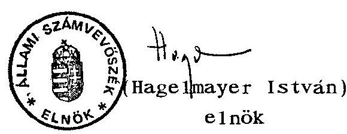

---

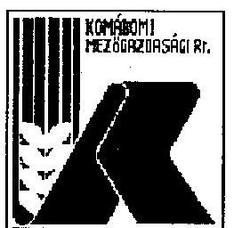

# KOMÁROMI MEZÓGAZDASÁGI TERMELŐ ÉS SZOLGÁLTATÓ RÉSZVÉNYTÁRSASÁG 

2801.KOMAROM, Igenánál 46 38. Tel. (34)341-400 Telecc:27-767 Telárcág: tel/fax. (34)341-012 OKHIS R1.363-07281

Komárom, 1994 október 24.
Levelünk száma: 129/1994.
Ügyinténzönk:

Hivatkozási szám: V-37-37/ 1993-94.
Ügyintézőjük:
Tárgy:
ALLAMI SZAMVEVÓSZÉK

## Hagelmayer István Úr   Állami Számvevőszék Elnöke

## B U D A P E S T

$$
\begin{aligned}
& 1994-10-2.5 \\
& V-37-38.193 \\
& \text { MELLÉKLET: }
\end{aligned}
$$

$$
\therefore \quad \text { DB }
$$

Tisztelt Elnök Úr !

Jelentésüket " a Komáromi Mezőgazdasági Kombinátnál az állami vagyonnal történő gazdálkodás ellenőrzéséről" megkaptam, azt áttanulmányoztam.

A vizsgálati jelentés törvényeket, ágazatpolitikai, szabályozási elemeket, vagyonműködtetést érintő megállapításait értékelni nem az én tisztem.

Mint az anyagban is olvasható, a Komáromi Mezőgazdasági Kombinát, - majd részvénytáraság - működése során messzemenően figyelembe veszi azokat az általános szakmapolitikai irányelveket, amelyek a tartós állami tulajdonba sorolásból adódnak.

A társaságunkat konkrétan érintő megállapításokat az ellenőrzést végzőkkel folyamatosan megtárgyaltuk, azok a vállalati valós helyzetet mutatják.

Itt szeretném megköszönni szervezetének azt a korrekt munkamódszert, amely az ellenőrzés során tapasztalható volt.

Napi és hosszabb távra szóló munkánkat megpróbáljuk úgy szervezni, hzogy ajánlásaikat valóra váltsuk, a még fellelhető hiányosságokat megszüntessük.

---

Társaságunk megkezdte hosszabb távú fejlesztési programjának megvalósitását, amelynek első lépéseként 1994 év végén, 1995 év elején több mint 200 millió forintos beruházást valósít meg, amelyből a kedvezményes reorganizációs hitel közel 160 millió forint.

A fejlesztések döntő része az állattenyésztés tartási, takarmányozási technológiájának jobbitását célozza.

Tisztelettel:
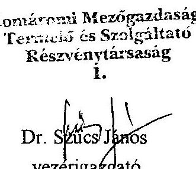

---

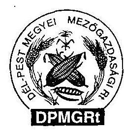

# DÉL-PEST MEGYEI MEZŐGAZDASÁGI Rt. A Ceglédi Állami Tangazdaság Jogutódja 

Levélcím: 2701 Cegléd. Pf. 18.
Telefon: 06-53-311-277, 06-53-311-958
Telefax: 06-53-310-205, Telex: 22-4830
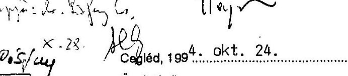

Állami Számvevôszék
Hagelmayer István Úr részére
elnök
Budapest, Pf. 432
1393
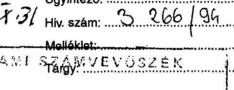

Tisztelt Elnök Úr !
1994. október 19-én megkaptuk az Állami Számvevôszék V-37-37/ /1993-94. sz. jelentését, ami a Ceglédi Állami Tangazdaságnál végzett, /jelenleg Dél-Pest Megyei Mezôgazdasági Részvénytársaság/ az állami vagyonnal történô gazdálkodás ellenôrzésérôl szól.

A jelentés áttanulmányozása után arra a megállapításra jutottunk, hogy a Számvevôszéki Elnöki anyag fôbb megállapításai természetszerûleg megegyeznek a már korábban megküldött V-37-21/1993-94. sz. jelentéssel.

A jelentésre 1994. augusztus 4-én kelt levelünkben az Állami Számvevôszék felé részletesen reagáltunk, ahol a jelentés megállapításaival alapvetôen egyetértettünk, észrevételeinket, véleményeltérésünket részletesen indokoltuk.

Dr. Kovács Árpád úr, Számvevô igazgató tudomásul vette az Állami Számvevôszék javaslatai alapján tett intézkedésekrôl szóló tájékoztatásunkat, s azzal igazolta vissza levelünket, hogy azt teljes terjedelemben a parlamenti jelentéshez fogják csatolni.

A fentiekbôl adódóan, az anyaggal kapcsolatosan további észrevételünk nincs. Ezért a már leírt észrevételeinket aktualizálva, Elnök úrnak címezve, ismételten megküldjük, hogy az a parlamenti beterjesztéshez csatolható legyen.

Tisztelettel:
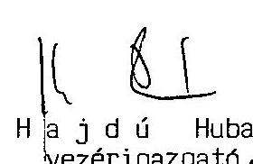

Dól-Pest Megyei Mezôgazdasági RT.

---

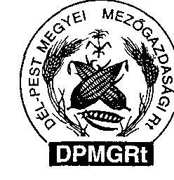

# DÉL-PEST MEGYEI MEZŐGAZDASÁGI RL A Ceglédi Állami Tangazdaság jogutódja 

Levélcím: 2701 Cegléd, Pf. 18.
Telefon: 06-53-311-277, 06-53-311-958
Telefax: 06-53-310-205, Telex: 22-4830

## HAGELMAYER ISTVÁN Úr,   az Állami Számvevôszék elnöke   Budapest   Pf. 432. 1393

## Cegléd, $199^{4}$... okt. 24.

Úgyintézo: $\qquad$
Hiv. szám: $\qquad$ 24. 14. 19. 24. 24. 24. 24. 24.

Melléklet: $\qquad$
Tárgy: $\qquad$
$\qquad$

Tisztelt Elnök Úr!
1994. október 19-én megkaptuk az Állami Számvevôszék V-37-37/1993-94. számú jelentését, ami a CAT-nál végzett/jelenleg a DPMG Rt/ az állami vagyonnal történő gazdálkodás ellenôrzésérôl szól.

Észrevételünket a vizsgálati jelentéssel kapcsolatosan az alábbiakban tesszük meg.

A vizsgálati jelentésben leírtakkal alapvetôen egyetértünk. Véleményünk szerint is a mezôgazdaságban az objektív tényezők/pld.aszály/ mellett, a saját tôke ellátottság alacsony volta okozza a legnagyobb problémát.
Ennek kiküszöbölését csak idegen forrással lehet megoldani, amely a magas kamatozás és rövid lejárata miatt, a jövedelmezôséget megkérdőjelezi.
Mezôgazdasági termelés magas eszköz lekötöttsége és lassú forgási sebessége miatt azonban, ennek ellenére rákényszerülünk hitel igénybevételére egy bizonyos pontig, mert ellenkezô esetben a termelést csak eszköz értékesítéssel /vagyon feléléssel/ lehet finanszírozni.

Másik speciális problémaként jelentkezik a vetốmag termelés vonatkozásában a privatizáció és a kárpótlás azon hatása, hogy a területek felaprózódása miatt a szakmai szempontok be nem tarthatósága következtében /izolációs távolság/ veszélybe került az egyik legjövedelmezôbb ágazat.

---

Ezért véleményem szerint is szükséges a törvényi szabályozás. Ehhez kapcsolódóan meg kívánom jegyezni, hogy szükséges és gyors intézkedést tartanánk célszerũnek a mezôgazdasági termékeknél avonatkozásban, hogy az Európai Közösség országai szabályozásával szinkronba kerüljenek a magyar jogszabályok és ez által megvalósuljon az un. tükörszabályozás, mellyel a magyar mezôgazdasági termékek versenyhelyzetbe kerülhetnek nem csak a kül-, hanem a belpiacokon is. Ez a felvetés nagyon fontos a vetômag vertikumnál, de fontossága jelentôs valamennyi mezôgazdasági terméknél, a foganatosított intézkedésen túlmenôen /pl. VÁM/.

A fentiekben megfogalmazott véleményünk után áttérnék a részvénytársaságra vonatkozó megállapításokkal kapcsolatos véleményünk kifejtésére.

Gondolatainkat azzal a céllal fogalmaztuk meg, hogy a megállapításokat a mi megközelítésünkből még pontosabbá, teljesebbé tegyük és tájékoztatást tudjunk adni arról, hogy a vizsgálat megkezdése óta - részben a vizsgálati megállapításokat is figyelembevéve - milyen intézkedések, változások történtek adott témakörökben.

1/ A privatizációs témakörben tájékoztatásul közöljük, hogy az MRP szervezet az ÁV Rt. mint tulajdonos jóváhagyása után megalakult, cégbírósági bejegyzése folyamatban van. Időközben az ÁV Rt. pályázatot írt ki privatizációs tanácsadók részére. Ezen pályázaton részvénytársaságunk privatizációs tanácsadója a CONSORG Privatizációs Tanácsadó Kft. lett. A Kft. elkészítette a privatizáció elindításához szükséges információs memorandumot. A privatizációs pályázat kiírásának várható idejéről a privatizációs törvény megszületése után dönt a tulajdonos.

2/ A jelentés ajánlás részében felvetôdik, hogy a vagyon elidegenítés szabályainak rögzítése történjen meg. Véleményünk szerint ez az alapító okiratban rögzítésre került, amire a részletezõ fejezet is utal.

---

3/ Felvetődött, hogy a részvénytársaság jogi és pénzügyi apparátusának együttmúködését erősíteni szükséges. Ezzel a megállapítással alapvetően egyetértünk.
Az almúlt időszakban azonban ennek olyan objektív akadálya volt, ill. jelenleg is van, hogy munkaviszonyban lévő ügyvédet, jogászt környezetünkben fóállású munkavégzésre alkalmazni nem tudtunk. Ugyan is, az ilyen tevékenységet folytató szakemberek vállalkozásban végzik ezt a munkát, önmagában ez a tény is nehezíti a hatékonyabb munkavégzést. Ezen túlmenően szólnunk kell a lassú, vontatott törvénykezésről /peres ügyek éveken túlmenő lezárása/ és az országosan kialakult pénzügyi és szerződéses fegyelem hiányáról, valamint a gazdasági morál romlásáról, amely alól még az állami szervek sem kivételek. Példaként megemlíthetjük az APEH-et, amellyel gyakorlatilag már évek óta jegyzökönyvben rögzített megállapodás ellenére nem tudunk pénzügyileg egyezségre jutni. Mindezek ellenére jelenleg is lo millió forintot meghaladó tartozása áll fenn felénk, még is a nála vezetett kimutatás alapján adó bírságot szab ki részünkre.

4/ Idôközben az ÁV Rt. megküldte a vezérigazgatóval kötendő munkaszerződés formanyomtatványát, mely kitöltve, aláirva visszaküldésre került az ÁV Rt-hez. Ebben az évben az éves rendes közgyûlésen /ápr. 26./ az üzleti terv jóváhagyásakor az ÁV Rt. a vezérigazgató prémiumát véleményünk szerint idöben kitűzte.

5/ Annak ellenére, hogy a részvénytársaság 1992. XII. 31-el alakult meg, a cégbejegyzés elhúzódása miatt az 1994-es év lesz az első év, amikor az Rt. minden fóruma rendeltetésszerűen egész éven át müködik. Így a felügyelõ bizottság is 1994-ben láthatja el érdemben és folyamatosan tevékenységét. A részvénytársaságon belüli átszervezések kapcsán két fóállású belsõ ellenőr került beállításra, így a felügyelõ bizottsággal kialakított ez évi belsõ-ellenőrzési program, valamint a felügyelõ bizottság munkaprogramja elkészült, és tevékenységét ennek megfelelően látja el.

---

6/ Az átalakulás elhúzódása miatt a részvénytársaság bejegyzését megelôzõ idôszakban a müködéshez elengedhetetlenül szükséges szabályzatok naprakészek voltak.
Miután a cégbírósági bejegyzés 1994. február 7-én jogerôre emelkedett, szabályzataink átdolgozása felgyorsult, s célunk az, hogy ez év végére valamennyi szabályzatunk aktualizálása befejezôdjék.

A már elkészült szabályzataink közül hiányosságot állapítottak meg a számviteli politikánk szabályozásában, melyhez az alábbi megjegyzéseket teszem.

- Terven felüli ammortizáció azért nem került leszabályozásra, mert szabályzatban rögzítésre került, hogy ez évben nem kívánunk ezzel a lehetóséggel élni.
- Az ellenôrzéssel kapcsolatos feladatokat a belsõ ellenôrzési szabályzatban rögzítettük, ezért nem tértünk ki külön a számviteli szabályzatunkban.
- A könyvviteli zárlat fordulónapja és a mérleg készítés napja szabályzatunkban rögzítésre került, az elvégzendô feladatokat a számviteli törvény szabályozza.
- Részvénytársaságunkban a könyvvezetés bizonylatait a bizonylati szabályzat tartalmazza, amelynek aktualizálásával egyetértünk. Terveink szerint aktualizálás után a számviteli politikánk részét képezi.
Megjegyezni kívánjuk, hogy számviteli politikánk és számlarendünk minden évben felülvizsgálatra kerül és azt a kialakult helyzetnek megfelelôen módosítjuk. A módosításokról a kiegészítô mellékletben számot adunk.

7/ Hangsúlyozni szeretnénk, hogy a hatósági vizsgálatok során megállapított környezetvédelmi hiányosságokat minden esetben megszüntettük. Egyszer fordult elõ, hogy adminisztrációs hiba következtében ennek jegyzökönyvben történő rögzítése nem történt meg. Ennek pótlása megtörtént.

---

B/ Részvénytársaságunk egyedi problémája az un. Frutta ügy, mellyel a jelentés is részletesen foglalkozik.
Elfogadva azt, hogy a kívülálló utólagosan a kialakult helyzet alapján a leírtak szerint ítéli meg ezen ügyletet, ennek ellenére a reálisabb megítélés érdekében fúzünk néhány gondolatot a felvetéshez. Alapvető probíémánk nem az aláíró személyéből adódik, hiszen mi az un. kezességvállalási nyilatkozatot a 88 Rt -vel kötöttük, és ō fogadta el hitel-igénybevevôként a Kft. ügyvezetôjének aláírását. A készfizető kezességvállalásnál megállapodást kötöttünk, melyben közöltük foítételeinket, amit a Bank részére is eljuttattunk, azonban ennek ellenére sem a Bank, sem a Kft ezen feltételeket a közöttük létrejött hitelszerzõdés megkötésekor nem vette figyelembe, mely jelenleg a 88 Rt . és a köztünk lévő peres ügyben is jelentôs szerepet kap.

A szerzôdés megkötésekor számunkra garanciát jelentett a 88 Rt -nél megnyitott akreditív, mely az export elöfinanszírozási hitel alapját képezte, valamint maga az a tény, hogy a 88 Rt . társaságunk számlavezetôje, akinek több száz millió Ft hitele van kihelyezve felénk, és jó partneri kapcsolat alakult ki közöttünk.

Nem mentegetve saját felelősségünket, de tudomásul kell venni azt, hogy itt tulajdonképpen deviza bũncselekmény történt, s általában egy bũncselekményre szerzõdéssel, garanciákkal elôre felkészülni nem lehet.

Minden esetre meglepônek tartjuk, hogy az ügyben a tettes mind a mai napig nem került felelősségre vonásra, kétszeri rendôri feljelentés ellenére sem !

Bízunk abban, hogy a Ptk. módosításával, valamint azzal, hogy egy neves ügyvédi irodát bíztunk meg az ügy képviseletével, számunkra kedvezô ítélet születik.

9/ A földtulajdon rendezetlenségének hatásáról is szól a jelentés. Ehhez kapcsolódó újabb információ az, hogy az ÁV Rt-nek, mint tulajdonosnak szándékában áll a privatizáció kapcsán a részvénytársaság /minden hozzá tartozó cégnél/

---

kezelésébe adott földterület után bérleti díjat felszámolni, melynek nagyságrendje 15 kg étkezési búza/Ak. Ennek érdekében az ÁV Rt. a tájékozódó felméréseket megkezdte a 189/1993. /XII.31./ Kormányrendelet értelmében. Ez a nagyságrend mai kalkulációink szerint 25-30 MFt többletköltséget jelent.
Amennyiben ezen költségtényezőt az árakban nem, vagy csak részben sikerül érvényesíteni, eredmény csökkenést okoz.

Összességében ennyiben kívántam a jelentésben leírtakra reagálni, illetve az ott felvetett problémákat kiegészíteni azzal az ismételt megjegyzéssel, hogy a jelentésben leírt és a mezőgazdaság egészére vonatkozó megállapításokkal egyetértek és elfogadom.

Cegléd, 1994. október 24.
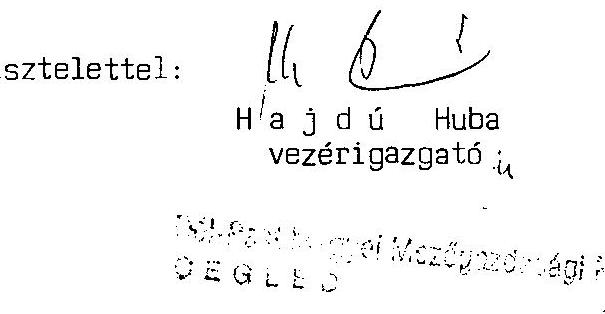

---

# 531/82/84 

## 4

ÁLLAMI VAGYONKEZELŐ RÉSZVÉNYTÁRSASÁG
1115 Budapest, Bánk bán u. 17/B.
Tel.: 267-6670 Fax: 267-6671
Levélcím: 1519 Budapest, Pf. 409.
Központi telefon: 267-6600
Vezérigazgató
Budapest, 1994. október 24.

Dr. Hagelmayer István úr
elnök
Állami Számvevőszék
Budapest

Tisztelt Elnök Úr!
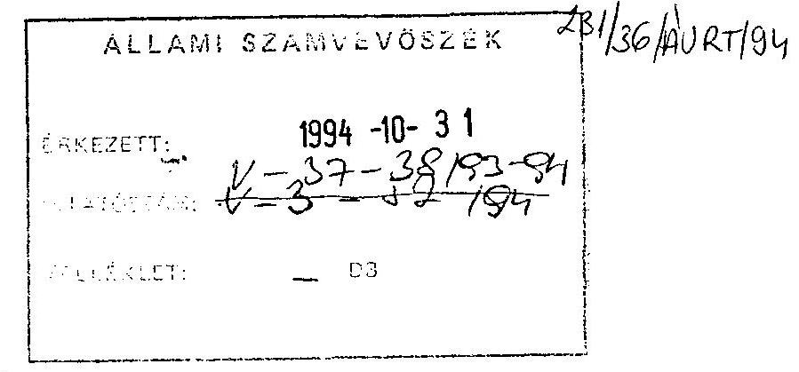

A Komáromi és Ceglédi Állami Gazdaságnál az állami vagyonnal történő gazdálkodás ellenőrzéséről" készült jelentésekkel kapcsolatos észrevételeinkről, véleményünkről az alábbiakban tájékoztatom.

Mivel a két jelentés alig változott a korábban már részletesen véleményezett tervezethez képest, a részleteket érintő észrevételeink előtt ismételten megemlítjük, hogy a vizsgálatok rendkívül alaposan tárják fel az átalakulási, majd az azt követő mintegy két éves időszak folyamatait. Az elemzések megállapításaival, illetve az erre épülő javaslatok döntő hányadával egyetértünk, mivel azok figyelembe vételével a vagyonkezelést és privatizációs feladatok ellátásának színvonala tovább javítható.

Mindenek előtt fontos megemlítenünk, hogy

- a megállapítások és javaslatok egy része - mindkét jelentésben közel azonos megfogalmazásban - az agrárágazat egészére vonatkozik és felsőszintủ (országgyűlési, kormányzati) döntéseket igényel, amiért ezekkel nem foglalkozunk;
- a jelentésből esetenként nem tűnik ki, hogy a megállapítások az ÁVŰ vagy az ÁV Rt. tevékenységére vonatkoznak-e. Az esetleges félreértések elkerülése végett ezért észrevételeink kimondottan a társaságunkkal kapcsolatos megállapításaikra vonatkoznak.

## I. Az összefoglaló megállapításokkal kapcsolatos általános észrevételek

Az állami gazdaságok átalakításának folyamata országosan valóban elhúzódott. Ezen belül azonban az ÁV Rt. vagyoni körébe tartozó gazdaságoké viszonylag gyorsan befejeződött. A 24 volt állami gazdaság közül húsz 1992. december 31.-1993. január 1. fordulónappal, míg kettő 1993. június 30 -i időponttal alakult át társasággá (Bábolna és Bóly már korábban átalakult).

---

Az újonnan létrejött társaságok jövedelemhelyzete a Dél-Pest Megyei Mg. Rt-vel kapcsolatos vizsgálat összefoglaló megállapításaival ellentétben alapvetően megváltozott, a gazdálkodás jövedelmezővé vált. Ez annál inkább is figyelmet érdemlő, mivel - mint azt a vizsgálat is megállapítja - 1993-ban a kedvezőtlen természeti és közgazdasági feltételek következtében az agrárágazat egésze tovább romlott a jövedelemhelyzete.

# II. Megjegyzések a Dél-Pest Megyei Mg. Rt-re vonatkozó néhány fontosabb megállapításhoz: 

1./ A jelentés szerint "az átalakulás nem eredményezett hatékonyságjavulást, nem lett kedvezőbb a gazdaság vagyoni, pénzügyi helyzete..." Ezzel kapcsolatban a következőkre hívjuk fel a figyelmet:

- a társaság 1993. évi üzemi, üzleti tevékenységének az eredménye 108 mFt -tal - $133 \%$ ponttal - haladta meg az 1992. évit;
- a pénzügyi műveletek - vesztesége alapvetően a hitelállomány közel 120 milliós csökkenése következtében - 170 millióról 139 millióra mérséklődött;
- a társaság 1993-ban 16 mFt adózás előtti eredményt realizált, szemben az 1992. évi közel 94 milliós veszteséggel.
2./ Az Rt. alapításával, valamint a belső szabályzatokkal kapcsolatos megjegyzések és hiányosságok jelentős része a társaság jogi és pénzügyi munkájának jobb megszervezésével amint az az ajánlások között is szerepel - várhatóan megoldódik.
3./ A vezérigazgatói munkaszerződéssel és prémiumrendszerrel kapcsolatban megjegyezzük, hogy a munkaszerződések megkötése - az első üzleti évet lezáró közgyűlést követően - megtörtént, a prémiumfeltételeket pedig a közgyűlés hagyta jóvá.
4./ Kétségtelenül igaz, hogy a decentralizált privatizációval összefüggő szerződéseket néhány társaságunk vezetése nem hagyta jóvá saját hatáskörben még akkor sem, ha erre az Alapitó Okirat módot adott. Ennek az oka nem az, hogy az ÁV Rt. ilyen értelmủ utasítást adott volna ki, hanem az, hogy a társaságok nem rendelkeztek megfelelő szakirányú jogásszal. (Ezt támasztja alá a vizsgálat a jogi munkára vonatkozó javaslata.)
5./ A 12. oldal 1. bek-hez tájékoztatásul megjegyezzük, hogy a társaságok átalakulására vonatkozó döntés (az 1992. évi LIV. tv-el összhangban) a vagyonmérleg tervezet alapján történt. A cégbírósági benyújtást megelőzően az ÁV Rt. a végleges vagyonmérleget és apport listát is ellenőrizte.

---

# III. Megjegyzések a Komáromi Mg. Rt-re vonatkozó jelentésben található néhány fontosabb megállapításhoz: 

1./ Mint minden állami, társas vagy magán szervezetnek amellett, hogy saját fenntartásáról gondoskodnia kell különböző kötelezettségei vannak az állammal/költségvetéssel szemben is. Ezért nem kívánjuk minősíteni a jelentés következő megállapítását:
"Az ÁV Rt., mint tulajdonos rövid távú, kizárólag a központi érdekéket figyelembe vevő szemlélettel lépett fel, amikor a rábízott állami vagyon termelőképességének fenntartásához szükséges minimális befektetések tulajdonosi megfinanszirozása helyett a kialakuló szerény eredmény $50 \%$-át indok nélkül, meg nem határozott célra elvonta. Ezzel rontotta a rábízott gazdálkodó szervezet müködőképességét és privatizációs esélyeit."

Azt azonban meg kell jegyeznünk, hogy az ÁVRt. hathatós közremüködése mellett a Társaság az agrárágazati reorganizációs programban sikerrel pályázott. Ennek keretében 80 mFt nagyságrendben új fejlesztések indultak a társaságnál, s a finanszirozási gondokat enyhítendő hasonló nagyságrendủ forgóeszközhitel felvételére is lehetőség nyílt. Meggyőződésünk, hogy mindezek biztosítják a társaság új fejlődési pályára állítását valamint azt, hogy egy stabilizálódó pénzügyi helyzet mellett a privatizáció is kedvezőbb eredményeket hozhat.
2./ Az átalakulással kapcsolatos megjegyzésekkel lényegében egyetértünk. Félrevezető azonban az a megállapítás, hogy a "szakmapolitikai elvárásokat egyébként csak az átalakulási tervet követő második évben, az 1994. március 16-i ügyvezetői értekezleten vizsgálták felül. Következésképpen éppen az ÁSz által vizsgált 2 évben nem gondoskodtak eléggé a tulajdonosi jogokat gyakorlók a tartósan jövedelmező gazdálkodás feltételeinek biztosításáról a társaság számára."

Ugyanis a társaság átalakításakor már elfogadásra került a társaságnak - a "szakmapolitikai" szempontokat is magában foglaló éves és középtávú stratégiája. A hivatkozott ügyvezetői értekezlet csak felülvizsgálta és pontosította azt.

Az ezután folytatott "fejleményhez" szíves tájékoztatásul említjük meg, hogy az állami tulajdonhányad változtatását nem az ÁV Rt. kezdeményezte.

A két társaságnál folytatott ÁSz jelentéssel kapcsolatos véleményünket összegzésül kiemeljük, hogy

- az elmúlt 2-3 évre vonatkozó értékelések többségükben reálisak. Ezek közül is a leglényegesebbnek azoknak a pozitív tendenciáknak a hangsúlyozását tartjuk, amelyek az elmúlt évben a vizsgált társaságok gazdálkodásában, likviditási helyzetében és pénzügyi eredményében mutatkoztak meg;
- az Országgyűlés és a Kormány részére tett ajánlásokkal maradéktalanul egyetértünk;
- a vagyon hatékonyabb müködésére - az ÁV Rt. és a társaság részére - tett ajánlásokkal alapvetően egyetértünk.

---

Végezetül megemlítjük, hogy a dolog természeténél fogva a vizsgálat alatt és az azóta eltelt időszakban számos kérdésben (fejlesztések megalapozása, privatizáció előkészítése, ellenőrzés javítása, stb.) olyan előrehaladás következett be, amit a jelentés még problémaként, javaslatként kezel.)

Üdvözlettel,
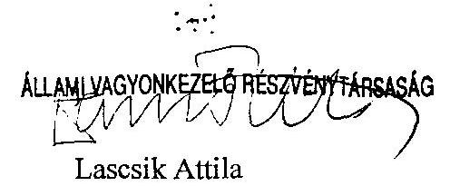

---

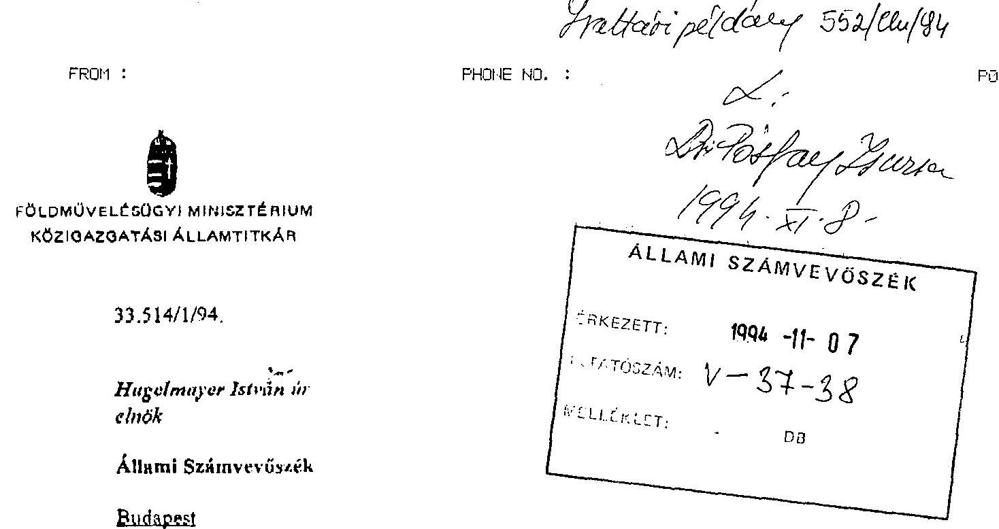

Tisztelt Linök Úr!
Az Állami Számvevöszék ezév máriciusától kezdơdően a Komáromi Mezügazdasági Kombinatnál (jelenleg Komáromi Mg. Rt.) és a Ceglédi Állami Tangazdaságnál (jelenleg Dél-Pest Megyei Mg. Rt.) az állami vagyomal tüténó gazdálkodás áttekintését célzó ellenörzést végzett.

A lefolytalotl vizsgálatok nyoman, kerésüknek megfelelöen, - az ágazati munsztérium részéről - a jelentés tervezetekben foglaltakia részletes szakmai észrevételeket tettunk.

A részennre megkiidott véglegesitett jelentésekben, a tárca észrevételek túlnyomó tobbsegben érvényesitve lettı igy az abba foglalt megállapításukkal, javaslatukkal összessegeben egyetertek.

Megjegyzem, az credeli javaslatuknak megfelelően továbbra is indokolmak tartom, hogy az Orszaggyưlés, illetve a Kormány az agiárszférában a tartósan állami tulajdonban marado gazdalkodó szerveselek feleti tulajdonosi jogok gyakorlását, - elsosorban a biológiai alapok megőrzése érdekében, valamint a speciális szakmai szempontokra is figyelemmel, - hosszú távra az ágazat gazdálkodásáért és müködéséért felclós tárcához rendelje.

A megállapított hiányosságok ellenére megnyugtató számoma, hogy a vizsgálat egyik társaság esetében sem állapltott meg kirívó jugszabályellenes magatartást vagy törvénytelenséget.

A jelentések részletes megállapitásai közül egyre klvánom szlves figyelmét felhivni, mivel a pótlólagos kárpótlási foldtertiletek licitjére urszágusan sehol sem került sor, igy Komáromban sem, a komáromi jelentés 32. oldalán a pótkijelolés licitjére tett megállapítás korrekcióját tartom szükségesnek.

Budapest, 1994. november 4.
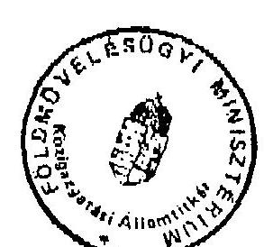

---

FÖLDMÜVELÉSÜGYI MINISZTÉRIUM KÖZIGAZGATÁSI ÁLLAMTITKÁR
$33.514 / 1 / 94$

Hagelmayer István úr elnök

Állami Számvevőszék
Budapest

Eveclatie
$552 / 64.194$
$V-37-38 / 94$
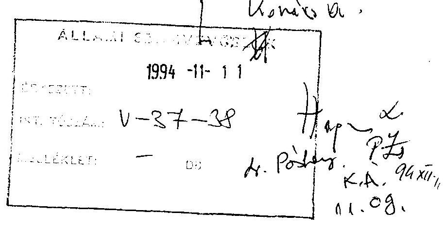

Tisztelt Elnök Úr!
Az Állami Számvevőszék ezév márciusától kezdődően a Komáromi Mezőgazdasági Kombinátnál (jelenleg Komáromi Mg. Rt.) és a Ceglédi Állami Tangazdaságnál (jelenleg Dél-Pest Megyei Mg. Rt.) az állami vagyonnal történő gazdálkodás áttekintését célzó ellenőrzést végzett.

A lefolytatott vizsgálatok nyomán, kérésüknek megfelelően, - az ágazati minisztérium részéről - a jelentés tervezetekben foglaltakra részletes szakmai észrevételeket tettünk.

A részemre megküldött véglegesített jelentésekben, a tárca észrevételek túlnyomó többségben érvényesítve lettı így az abba foglalt megállapításokkal, javaslatokkal összességében egyetértek.

Megjegyzem, az eredeti javaslatuknak megfelelően továbbra is indokoltnak tartom, hogy az Országgyưlés, illetve a Kormány az agrárszférában a tartósan állami tulajdonban maradó gazdálkodó szervezetek feletti tulajdonosi jogok gyakorlását, - elsősorban a biológiai alapok megőrzése érdekében, valamint a speciális szakmai szempontokra is figyelemmel, - hosszú távra az ágazat gazdálkodásáért és müködéséért felelős tárcához rendelje.

A megállapított hiányosságok ellenére megnyugtató számomra, hogy a vizsgálat egyik társaság esetében sem állapított meg kirívó jogszabályellenes magatartást vagy törvénytelenséget.

A jelentések részletes megállapításai közül egyre kívánom szíves figyelmét felhívni, mivel a pótlólagos kárpótlási földterületek licitjére országosan sehol sem került sor, így Komáromban sem, a komáromi jelentés 32. oldalán a pótkijelölés licitjére tett megállapítás korrekcióját tartom szükségésnek.

Budapest, 1994. november 4.
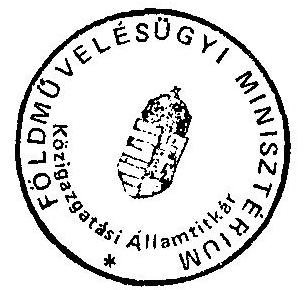

Üdvözlettel:
Dr. Szerdahelyi Péter

---

# 74183/94 

LA-1463/1994.

Hagelmayer István úr, elnök

Állami Számvevőszék

Budapest

Tisztelt Elnök Úr!

Köszönettel megkaptam az Állami Számvevőszéknek a Komáromi Mezőgazdasági Kombinátnál és a Dél-Pest Megyei Mezőgazdasági Rt-nél végzett vizsgálatáról készített jelentését. Az ÁSZ vizsgálat mindkét esetben tárgyszerűen és korrekt módon mutatja be a gazdálkodás helyzetét és a társasági vagyon állapotát. A Kormány, illetve az Országgyülés részére tett javaslatokkal kapcsolatban az alábbiakban foglalom össze észrevételeimet.

Az ellenőrzés tapasztalatai alapján az ÁSZ szükségesnek tartja az agrárszférában tartósan állami tulajdonban maradó gazdálkodó szervezetek feletti tulajdonosi jogok gyakorlásának hosszútávra érvényes és egyértelmủ rendezését. Az új privatizációs stratégia és törvénycsomag éppen azt a célt szolgálja, hogy a gazdaság egészében - így az agrárszférában is - hosszútávra biztosítsa mind az állam tartós tulajdonában maradó vagyon, mind a privatizálásra kerülő vállalkozói vagyon tulajdonlásának piackonform rendezését és müködésének az eddigieknél hatékonyabbá tételét. Az egyes ágazatokban a speciális szakmai szempontok és érdekek érvényesítésére a döntéselőkészítésben résztvevő szakminisztériumok révén lesz lehetőség.

A mezőgazdasági termelés finanszírozásának segitésére tett ajánlások egy része ma is folyamatosan igénybevehető támogatásokat céloz. Így pl.:

---

- Az agrárágazat rövidlejáratú hitelfinanszirozását az agrárágazat támogatásának egyes kérdéseiről szóló 182/1993. (XII.3O.) sz. korm. rendelet szabályozza. Ennek keretében a kamattámogatással és az állami garanciavállalással kialakult a mezőgazdasági termelők termelési célú hitelügyleteinek támogatási rendszere.
- A biológiai alapok megőrzésére, fejlesztésére a Mezőgazdasági Fejlesztési Alapból e célra pályázat útján visszterhes, illetve vissztehermentes támogatás elnyerésével van mód. E konstrukció 1995-ben is fennmarad.
- A termelés biztonságát zavaró áringadozások mérséklését szolgálják az agrárrendtartásról szóló 1993. évi VI. törvény alapján az alapvető mezőgazdasági termékekre (pl. búza, sertés) meghirdetett garantált árak.

A mezőgazdaság müködőképességének fenntartása érdekében ezeket a támogatási formákat a jövőben is biztosítani kívánjuk.

Ugyancsak a kidolgozás alatt álló privatizációs stratégia és törvénytervezet rendezi az állam vállalkozói vagyonából történő vagyonátadások lehetséges eseteit és módozatait. Így hosszú távon biztosítottá válik az állami vagyon mozgásának szabályozottsága, kiszámíthatósága.

Budapest, 1994. november 1.

Üdvözlettel:
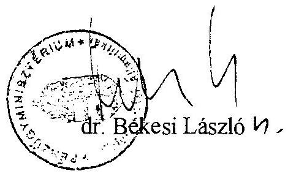