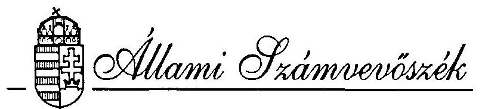
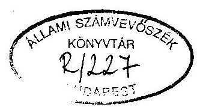
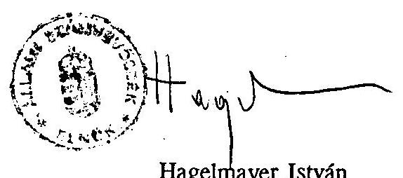
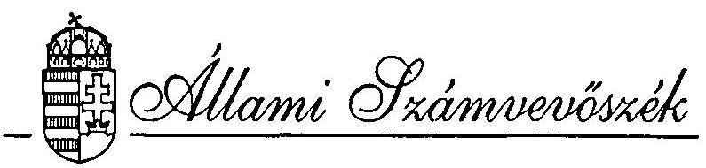
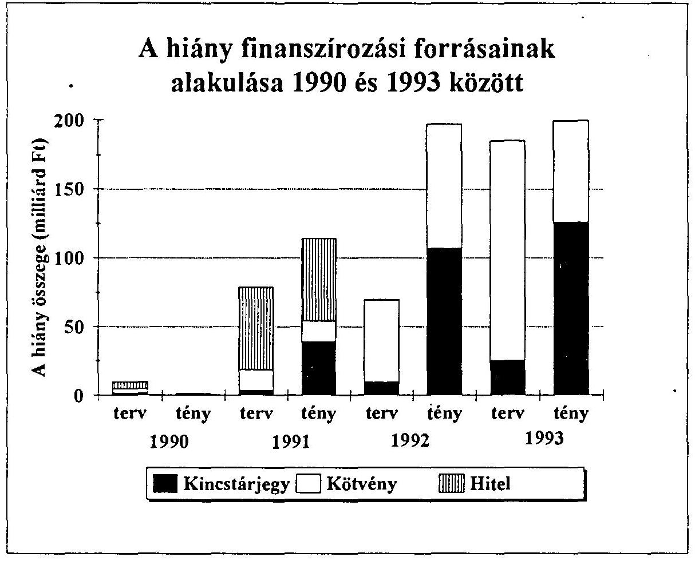
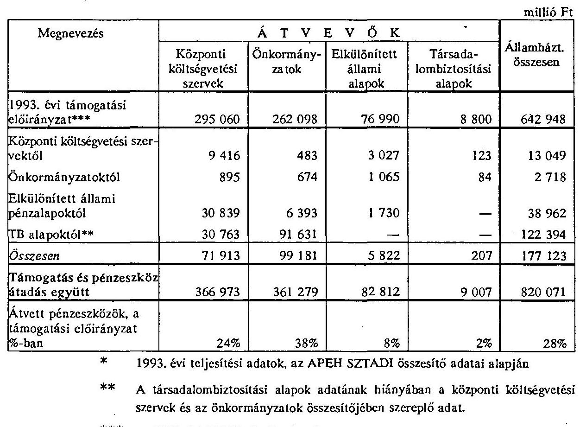
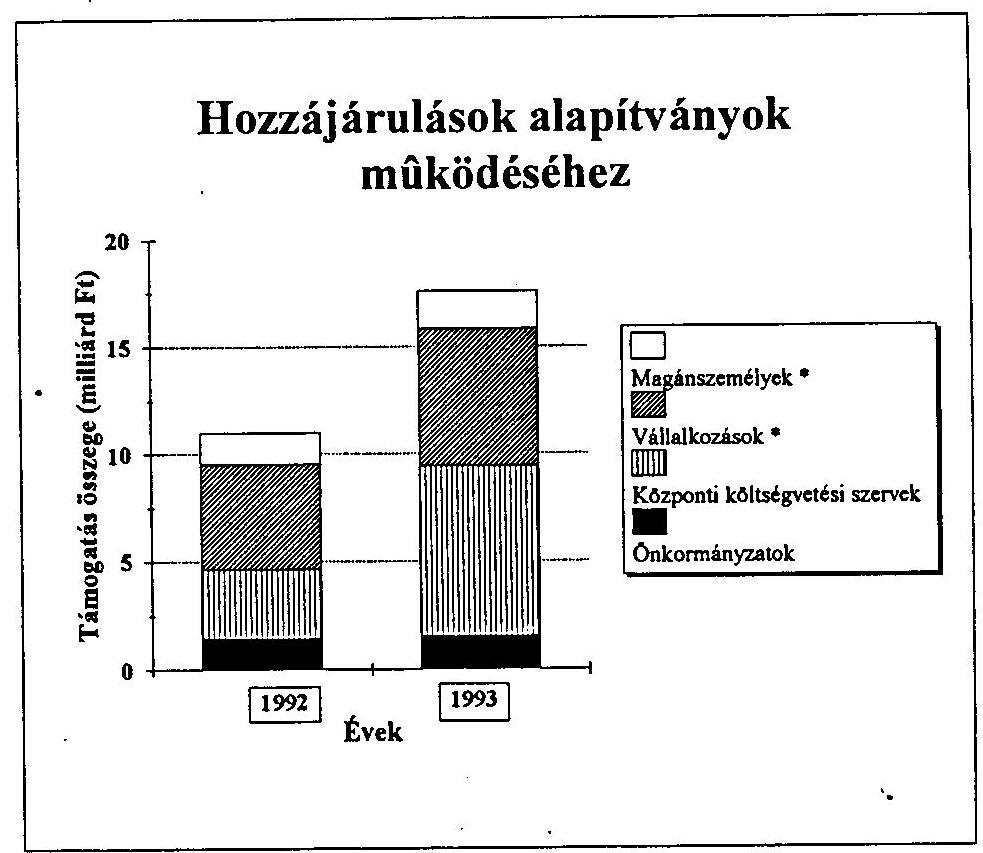
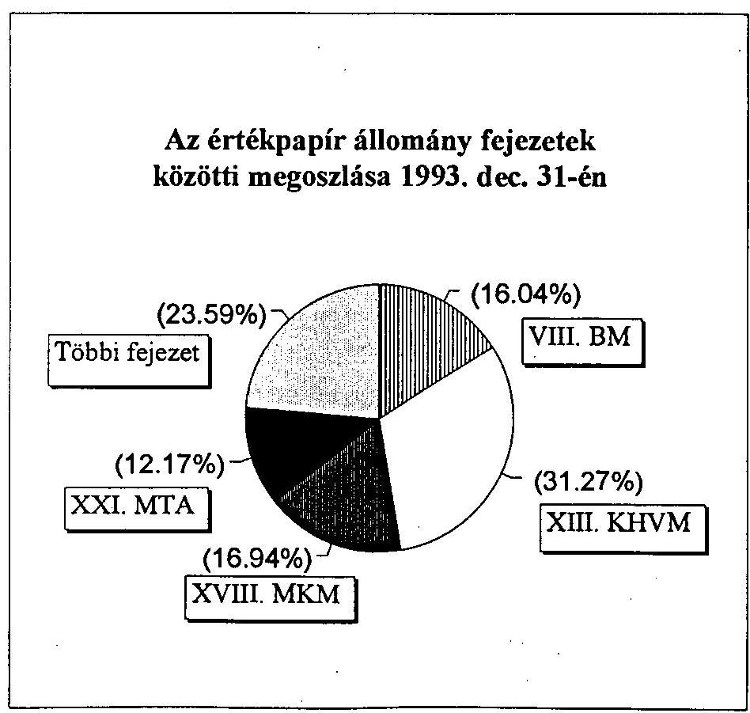
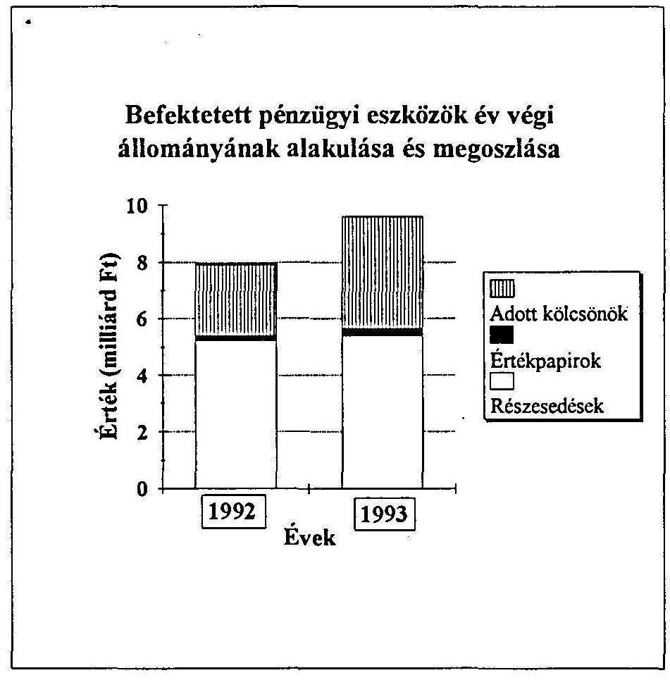

T/44/1.

# JELENTÉS 

a Magyar Köztársaság 1993. évi költségvetése végrehajtásának ellenőrzéséről
(ÖSSZEFOGLALÓ, JAVASLATOK)

---

# TARTALOMJEGYZÉK 

## oldal

BEVEZETÉS ..... 1

1. A zárszámadási törvényjavaslat normaszövegéhez kapcsolódó megállapítások ..... 3
2. A zárszámadási dokumentum adatainak valódisága ..... 6
3. Az államháztartás gazdálkodására vonatkozó szabályok érvényesülése, a felhatalmazások gyakorlásának értékelése ..... 11
4. Az államháztartási alrendszerek müködésének értékelése ..... 16
5. Az állami vagyon nyilvántartása ..... 20
JAVASLATOK ..... 21

A jelentésben található rövidítések jegyzéke

| ÁFI Rt. | Állami Fejlesztési Intézet Részvénytársaság |
| :-- | :-- |
| ÁHT | Államháztartásról szóló 1992. évi XXXVIII. tv. |
| ÁSZ | Állami Számvevöszék |
| APEH-SZTADI | Adó- és Pénzügyi Ellenőrzési Hivatal |
|  | Számitástechnikai -és Adóelszámolási Intézete |
| ÁV Rt. | Állami Vagyonkezelő Részvénytársaság |
| ÁVÜ | Állami Vagyonügynökség |
| MNB | Magyar Nemzeti Bank |
| PM | Pénzügyminisztérium |

---

# BEVEZETÉS 

Az Országgyűlés költségvetési joga a Magyar Köztársaság költségvetésének megállapítása mellett a zárszámadási jogot is magában foglalja. A zárszámadás feladata, hogy az előirányzatokat összehasonlítsa a számadási évben tényleges befolyt bevételekkel és a teljesített kiadásokkal. Az összehasonlítás alapján értékelhető az államháztartás vitelének törvényessége és szabályszerűsége, a gazdálkodás eredményei. A Kormány felelőssége a költségvetés végrehajtásáért ennek alapján ítélhető meg. A zárszámadási törvényjavaslat jóváhagyásával az Országgyűlés elfogadja a végrehajtók elszámolásait a feladatok teljesítéséről, tudomásul veszi az előirányzatoktól való eltérések indokolását és a kifizetett összegeket.

A zárszámadásban
a) számot kell adni arról, hogyan alakultak azok az előirányzatok, amelyek teljesítését közvetlen kormányzati intézkedéssel nem lehet befolyásolni; értékelni kell, hogy a költségvetés előirányzataitól az eltérések előre nem tervezhető események, vagy a nem eléggé körültekintő tervezés miatt követ-keztek-e be;
b) be kell számolni arról, hogy a végrehajtás során hogyan éltek azokkal a felhatalmazásokkal, amelyek a költségvetési törvényben szereplő összegek módosítására, az előirányzattól eltérő teljesítésre lehetőséget adtak;
c) a számadási évet követő szabályos kifizetésekhez rögzíteni kell a törvényes lehetőséget az áthúzódó feladatok és kifizetések következő évi teljesítéséhez.

Az Állami Számvevőszék ellenőrzése a következőkre terjedt ki:

- a zárszámadási törvényjavaslat normaszövege teljeskörűen és helyesen tartal-mazza-e mindazokat a rendelkezéseket, amelyek a költségvetési év lezárásához szükségesek;

---

- a tényleges teljesítés a pótköltségvetéssel módosított 1993. évi költségvetéstől mely előirányzatoknál tért el, s a benyújtott dokumentum számszaki adatai pontosak, valódiak, áttekinthetőek-e;
- az államháztartás gazdálkodására vonatkozó törvényeket, szabályokat a Kormány, a miniszterek, valamint a költségvetés végrehajtásában részt vevő szervezetek betartották-e.

Az ellenőrzés a következő módszerrel történt:

- a dokumentum adatainak ellenőrzésével, elemzésével;
- a központi költségvetési szervekre és a helyi önkormányzatokra vonatkozó adatoknak a pénzügyi beszámolók adataival történő összehasonlításával (ilymódon ellenőrizve az adatok valódiságát);
- a fejezeteknél, néhány költségvetési szervnél és a helyi önkormányzatnál a pénzügyi beszámolókban közölt adatok valódiságának, a gazdálkodás szabályszerűségének helyszíni ellenőrzésével;
- a helyi önkormányzatok normatív állami hozzájárulásának és különféle támogatásainak igénybevételéről és felhasználásáról készített számvevőszéki vizsgálati jelentések hasznosításával;
— az 1993. évi költségvetés végrehajtását érintő vizsgálati jelentéseink felhasználásával.

Ellenőrzéseink legfontosabb megállapításait és a javaslatokat az Összefoglaló jelentés tartalmazza. Ezt a Részletes jelentés egészíti ki, illetve támasztja alá. Az összefoglaló az 1993. évi zárszámadás törvényességéről, valódiságáról elsősorban a törvényalkotást segítő megállapításokat tartalmazza. A Részletes jelentésben a megállapítások tematikus csoportosításban az egyes költségvetési feladatok és tételek teljesítése értékeléséhez nyújtanak támpontot.

Jelentésünkben - a szabályszerűség értékelésén kívül - az államháztartás reformjának elősegítése céljából a gazdálkodási és az információs rendszer gondjaira is felhívjuk a figyelmet.

---

# 1. A zárszámadási törvényjavaslat normaszövegéhez kapcsolódó megállapítások 

A törvényjavaslat normaszövege az 1993. évi költségvetési és pótköltségvetési törvényekkel összhangban zárja le a gazdálkodási évet. Néhány bekezdés azonban pontatlan, illetve az ellenőrzés pótlólagos felülvizsgálatot tart szükségesnek.
1.1 A 6.§ (5) bekezdése a helyi önkormányzatokat terhelő visszafizetési kötelezettségről rendelkezik. A normaszöveghez és a kipontozott részek teljessé tételéhez szövegjavaslatunk a következő:
"A (3) bekezdés a) pontjában meghatározott visszafizetési kötelezettségen felül 311.430,7 ezer Ft-ot, a b) pontban meghatározott központi költségvetést terhelő kiegészítésen felül pedig 110.730,6 ezer Ft-ot az Állami Számvevőszék V-1006-52/ 1994.Tsz.221. számú vizsgálati jelentése tartalmaz. A jelentés 8. sz. melléklete ezt önkormányzatok szerint részletezi." *
[C. II. 1. ]
1.2 A 6. § (6) bekezdése szerint a helyi önkormányzatok kifogásolhatják az Állami Számvevőszék ellenőrzési megállapításait. Ennek a megfogalmazásnak nẹm értünk egyet, mert az Állami Számvevőszék nem hatóság, és nem vonatkozik rá az államigazgatási eljárásról szóló 1957. évi IV. törvény. Mivel az ÁSZ nem hoz határozatot, nem fogadható el az a megoldás, hogy a jelentéseiben szereplő megállapításokat az önkormányzatok bíróság előtt megtámadhatják.
1.3 A helyi önkormányzatoknál cél- és címzett támogatások igénybevétele kapcsán 9 esetben összesen 101.604 ezer Ft jogosulatlanul felvett támogatást tárt fel az ellenőrzés. A még vissza nem fizetett támogatások visszavonása a 6. § újabb bekezdéssel történő kiegészítésével oldható meg. [A. II. 2.2., C. III. 2.]
1.4 A zárszámadási törvényjavaslat 9.§ (1) bekezdése alapján az Országgyűlés tudomásul veszi, hogy a pénzügyminiszter felülvizsgálta a központi költségvetési szervek működési költségvetésének és kormányzati beruházásainak 1994-ben felhasználható 1993. évi pénzmaradványát, illetve intézkedett a pénzmaradvány

[^0]
[^0]:    * A zárójelben a részletes megállapításokat tartalmazó jelentésre hivatkozunk.

---

elvonásáról. A költségvetési törvény 13.§ (1) bekezdése szerint az 1993. évi pénzmaradvány elszámolása során a központi költségvetést illeti meg
—a normatív támogatások jogosultságot meghaladó többlete;
—az elmaradt, nem teljesített feladatok miatti kiadás-megtakarítás;
—a cél jelleggel megállapított előirányzatok maradványa;
—az alaptevékenységgel összefüggő bevételek módosított előirányzatot meghaladó többletbevétele.

A zárszámadási dokumentumban a Kormány nem számol el arról, hogy a költségvetési törvény előírásainak megfelelően a különböző jogcímeken mennyivel csökkentette a központi intézmények pénzmaradványát, illetve befizetési kötelezettségként mennyit írt elő. A zárszámadási törvényjavaslat általános indoklásának 4.1.4 pontja alapján megállapítható, hogy felülvizsgálat helyett elfogadták az intézmények önrevízióját. Az intézményi pénzügyi beszámolók adatai alapján megállapítottuk, hogy a pénzmaradvány-elszámolás alapját képező űrlapon az intézmények nem vallották be azt a minimális befizetési kötelezettséget sem, amely a költségvetési törvény előírásai szerint a központi. költségvetést megilleti. Csak az alaptevékenységgel összefüggő többletbevétel miatt közel 800 millió Ft befizetési kötelezettség keletkezett, ennek ellenére csak mintegy 500 millió Ft-ot a jánlanak fel elvonásra. [A. III. 3.5., B. III. 1.2.]
1.5 A törvényjavaslat 12. §-a szerint egyes elkülönített állami pénzalapok költségvetési támogatása megemelkedik az 1993. évben át nem utalt privatizációs bevétel pótlása miatt.

A központi költségvetés - a költségvetési törvény 6. § (5) bekezdése szerint előlegezte meg (az állami forgóalap terhére) a privatizációs bevételekből fedezendő kiadásokat. Az érintett alapok év végi maradványai arra utalnak, hogy a megelőlegezés mértéke túlzott volt, az alapok kiadásainak alakulása azt nem indokolta. A forgóalap és az alapok közötti rendezéshez az elszámolás év végén nem történt meg.

A törvényjavaslat 12. § (1) bekezdésének jóváhagyását javasoljuk az érintett alapok pénzmaradványainak (zárókészletének) felülvizsgálatához kötni. A felülvizsgálat eredményétől függően az indokolatlanul igénybe vett támogatás 1994. évi befizetését indokolt elrendelni. [A. II. 4.1.]

---

1.6 A törvényjavaslat 12.§ (2) bekezdése előírja az ÁVƯ számára, hogy az elkülönített állami pénzalapoknak ki nem utalt privatizációs bevétel pótlásaként 1994-ben 19,5 milliárd Ft-ot fizessen be a költségvetésbe.

Az 1994. évi pótköltségvetési vitát is figyelembe véve indokolt, hogy a normaszöveg csak akkor tartalmazzon ilyen kötelezettséget, ha annak teljesítése számonkérhető, illetve elmulasztásáért felelősségre vonás lehetséges.
1.7 A törvényjavaslat 19.§-a az államadósság növekedésének tényezőit rögzíti.
a) Az (1) bekezdés a) pontjában a hivatkozások hiányosak, nem tartalmazzák az államadósság 1993. évi növekedésének valamennyi tényezőjét. [A. I. 1.2.] A normaszöveg hivatkozását ki kell egészíteni:
—a 17. §-ban szereplő 285640 millió Ft (hitelkonszolidációs rendszer működéséhez) kibocsátott államkötvény miatt;
—a rövidlejáratú kincstárjegy állományból az 1993. évben hosszúlejáratúvá átváltott értékpapírok ( 100.000 millió Ft) összegével;
— az államadósságot növelő kincstárjegy-gyarapodás összegével.
b) Az (1) bekezdés b) pontjában - szintén a 100.000 millió forintos rövid lejáratú kincstárjegy hosszú lejáratú kötvénnyé alakítása miatt - a hivatkozást indokolt másképp fogalmazni vagy elhagyni.

---

# 2. A zárszámadási dokumentum adatainak valódisága 

Az utóbbi három évben a költségvetések és a zárszámadások adatai lényegesen több információt, elszámolást tartalmaznak, mint az ezt megelőző időszakban. A részletesebb prezentáció lehetőséget teremtett a korábbinál szorosabb elszámoltatásra és áttekintésre. Egyúttal azonban nyilvánvaló lett, hogy a közpénzek és a közvagyon nyilvántartása, információs rendje alapvető megreformálásra szorul, mert a jelenlegi rend nem biztosítja a teljeskörű és valós helyzetet tükröző elszámolást. A részterületeken tapasztalható előrelépés ellenére az átfogó rendezés még nem történt meg. Az ÁHT 124. § kötelezi, illetve felhatalmazza a Kormányt, hogy az államháztartás információs rendszerét és az államháztartási mérlegrendszert alakítsa ki, határozza meg tartalmát. A törvény 116. §-ban rögzített feltételeknek megfelelő mérlegrendszert még nem hozták létre. Emiatt az információrendszer átalakítása sem kezdődhetett meg, a kisebb-nagyobb módosítások ad-hoc jellegűek.

Az öröklött rendszerbéli hiányosságok miatt az 1993. évi zárszámadás nem felel meg a hitelesség követelményeinek. Az eltérések azokra a területekre irányítják a figyelmet. amelyeken a legsürgősebbek a teendők.
2.1 Az ÁHT előírja, hogy a költségvetés végrehajtásáról szóló zárszámadást az elfogadott költségvetéssel azonos szerkezetben, összehasonlítható módon kell elkészíteni, továbbá, hogy a mérlegeknek a terv- és tény-, illetve az előző év tényadatait kell tartalmazniuk.
a) A dokumentum 1. és 2 .sz. melléklete formailag megegyezik a költségvetési törvény szerkezetével. Az előző (1992.) évi adatokat a törvényjavaslat mellékletei nem tartalmazzák, de azok a I. kötet indokló táblázataiban szerepelnek (kivéve az elkülönített állami pénzalapok mérlegét).
b) A formai azonosság mellett több tartalmi eltérés nehezíti a költségvetés teljesítésének értékelését.

- A módosított előirányzatokat a törvényjavaslat 1. és 2 .sz. mellékletei nem tüntetik fel, azok csak az indoklásokban (áttekinthetetlen módon, sokszor hiányosan) szerepelnek. Emiatt nem lehet minden cím esetében megállapítani, hogy a módosítások törvényes felhatalmazás alapján történtek-e.
- A jelenlegi eljárási szabályok a Kormányt, a minisztereket és a költségvetést végrehajtó intézményeket egyaránt felhatalmazzák az Országgyűlés

---

által megállapított előirányzatok módosítására. A gyakorlat szerint a módosítások jelentősek, ezért indokolt a módosított előirányzatokat szerepeltetni a törvényjavaslat 1. és 2. sz. mellékleteiben.
—Egyes költségvetési címeknél az Országgyúlés által megállapított előirányzatokat - Kormány vagy fejezeti hatáskörben - más címekhez csoportosították át. Teljesítésként ezeken a címeken " 0 " szerepel, ezért a teljesítést a zárszámadásban lehetetlen azonosítani és értékelni. [A.I.1., B.I.3.]
2.2 Az ÁHT a költségvetési mérleg szerkezetére vonatkozóan két alapvető előírást rögzít. A egyik előírás szerint az államháztartás alrendszereinek költségvetésében a hitelfelvételt nem lehet a hiányt módosító bevételként, a hiteltörlesztést pedig kiadásként elszámolni. A másik előírás szerint az államháztartás folyamatos vitelét képező rendes bevételeket és kiadásokat el kell különiteni a rendkivüliektöl.
a) A 2. sz. mellékletben a bevételek között hitelfelvétel is szerepel, s nemcsak a valós bevételek. Az 1. sz. mellékletben a kiadások viszont hiteltörlesztést is tartalmaznak, ami valamely korábban elköltött pénz utólagos visszafizetését jelenti, nem a tárgyévi feladattal kapcsolatos ráfordítást. [A. I. 1.4.]

Ha a bevételek és kiadások összegeiben ezeket a tételeket elkülönítenék a tényleges bevételektől és kiadásoktól, akkor az állami költségvetés pozíciója, kötelezettségeinek jellege - a jelenlegi múködés vagy korábbi kötelezettségek terhei - reálisabban lenne megítélhető.
b) A költségvetési törvény normaszövege tételesen felsorolja azokat a címeket, alcímeket, amelyek rendkívüli bevételnek és kiadásnak tekintendők. A mérlegben ( 9 .sz.melléklet) azonban a rendkívüli bevételek és kiadások címén nem ezek összegei szerepelnek, hanem csak néhány kiemelt tétel. A zárszámadás alapján a megfelelő mérlegsoron csak a kiemelt összegek teljesítése értékelhető. A tételesen felsorolt címek teljesítése így összességében nem, csak egyedileg minősíthető. Ez az eljárás következetlen, nincs összhangban sem a költségvetési, sem az államháztartási törvénnyel. Hiányzik a mérlegek adatainak következetes csoportosítása, ezért a zárszámadás elszámolásai nehezen értékelhetők.

---

Az elkülönítésből származó előnyök csak akkor érvényesülhetnek, ha a központi költségvetés mérlegében - a költségvetésben és a zárszámadásban egyaránt - évente azonos struktúrában megállapítható, hogy
— folyamatosan mekkora jövedelem illeti meg az államot,

- az államháztartás folyamatos viteléhez milyen összegű kiadás szükséges
- a különböző kötelezettségek miatt milyen rendkívüli kiadások fedezetéről kell gondoskodni.

Az ÁHT szerinti elkülönítés a hosszabb távú kitekintést is lehető tenné. [A. I. 1.4., 1.5.]
2.3 A következetes és zárt költségvetési információs rendszer hiánya, valamint a központi költségvetés Pénzügyminisztériumban vezetett elszámolásainak pontatlansága miatt a zárszámadásban közölt adatok nem tekinthetők hitelesnek, elszámolási és nyilvántartási szabályozatlanság miatt nem a tényleges teljesítést tükrözik. Nem garantált, hogy az állam tulajdona a valóságnak megfelelően szerepel a nyilvántartásokban.

Az államháztartási reform keretében kialakítandó információs rendszer valós adatokkal történő feltöltésének egy lehetséges megoldása lenne, ha valamennyi költségvetési szervezet pénzügyi beszámolóját könyvvizsgálat hitelesítené. Az ÁHT 121.§ (4) bekezdése értelmében a fejezetekért felelős szervezet ellenőrzi a fejezet költségvetésének végrehajtását. A miniszteri felelősség alapján a minisztereknek kell arról gondoskodniok, hogy a felügyeletük alá tartozó intézmények pénzügyi beszámolói megfeleljenek a valódiság követelményének. Jelenleg a költségvetési szervek beszámolóinak könyvvizsgálati hitelesítését törvény nem írja elő. [A. I. 3., B. I. 1., 2., C. I. 2., 3.]
2.4 Az állami vagyon hasznosításával, privatizálásával kapcsolatos bevételek és ráfordítások a központi költségvetésben teljeskörűen nem jelennek meg annak ellenére, hogy a költségvetési törvény az elkülönített állami pénzalapok javára jelentős összegű átutalási kötelezettséget ír elő. A privatizációs bevételek felhasználása jövedelem-átcsoportosítást jelent, ezért a központi költségvetésben annak meg kell jelennie. (Ezt a költségvetési törvények véleményezésekor többször is jeleztük.).

---

A privatizációs bevételekből előirányzott kifizetések irreális megállapítása, valamint a költségvetésen történő "átfuttatás" hiánya 1993-ben több szempontból is visszás helyzetet eredményezett.

Az 1993. évi költségvetési törvény 41.§. (1) bekezdés e) pontja szerint az elkülönített állami pénzalapok költségvetési támogatását az Országgyúlés költségvetési címenként (alaponként) állapította meg, és a támogatás megváltoztatásának jogát magának tartotta fenn. Nem tartozott ide a privatizációs bevételekből teljesítendő (jelentésünk 1.5. pontjában említett) összeg, holott az elkülönített állami pénzalapok tevékenysége szempontjából ez állami támogatásnak minősül. Az ÁVÜ 19,5 milliárd Ft privatizációs bevételt nem utalt át a kedvezményezett alapok számára. A költségvetési törvény felhatalmazást adott arra, hogy átmenetileg a forgóalapról előlegezzék meg a forrást. A privatizációs bevételek elmaradása miatt azonban az évközi megelőlegezés véglegessé vált.
[A. II. 4.1. és 4.4., A. III. 2.3., B. IV.]
2.5 A költségvetés jelenlegi finanszírozási rendjében az állami forgóalapról "megelőlegezik", kiutalják a költségvetés végrehajtói számára a kiadások teljesítéséhez szükséges pénzeszközöket. Emiatt a gazdálkodási évek között átvihető maradványok elszámolását külön kell szabályozni. Számos feladat pénzügyi teljesítése nem zárul le a számadási évvel, ezért a pénzügyi év lezárásakor olyan előirányzat-maradvány keletkezik, amelynek a számadási évet követő kifizetéséhez a felhatalmazást törvényes úton kell biztosítani.

Az előzetes finanszírozás miatt az állami költségvetés mérlegében teljesítésként azt az összeget mutatják ki, amit finanszírozásként utaltak ki. A számlák alapján történő kifizetések (tehát a tényleges teljesités) ettől természetesen eltérnek. Ez a rendszer önmagában hordozza a kettősséget, mert a központi költségvetés a finanszírozáshoz kiutalt összegekkel számol el, míg a gazdálkodó szervezetek a tényleges teljesítést mutatják ki. E kettősség részben szabálytalan eljárásokat indukál, másrészt lehetetlenné teszi az előirányzatok és a tényleges teljesités összevetését, értékelését.

A jelenlegi gazdálkodási szabályok szerint a költségvetési szerveket - bizonyos kivételektől eltekintve - minden körülmények között megilleti a költségvetésben jóváhagyott támogatás. (Ha a számadási évben nem költik el teljes egészében a támogatást, akkor azt pénzmaradványként vihetik tovább a következő évre.) A technikai lebonyolítás alapfeltétele, hogy a Pénzügyminisztérium a jóváhagyott támogatás teljes összegét kiutalja a forgóalapról, és teljesitésként el is számolja az állami költségvetés mérlegében.

---

Az előzetes finanszírozás elszámolási problémáinak következményeként a Pénzügyminisztérium szabálytalan gyakorlatot alkalmazott. Néhány esetben a támogatásokat a jóváhagyott előirányzat erejéig nem utalták ki. Ezeket az összegeket - szabálytalanul - letéti számlára helyezték azért, hogy a következő évben rendelkezésre álljanak. Ezzel megsértették az ÁHT 12. §. (2) bekezdését, ami szerint a letéti számla pénzforgalma nem kapcsolódhat a kezelő költségvetéséhez. Emellett a mérlegben a valóságnak nem megfelelő teljesítést mutattak ki, s több előirányzat esetében az 1994. évi szabályos pénzügyi teljesítése sem biztosított. [B. I. 5.]

---

# 3. Az államháztartás gazdálkodására vonatkozó szabályok érvényesülése, a felhatalmazások gyakorlásának értékelése 

Az államháztartási törvény 1992-ben lépett hatályba. A törvény az államháztartás gazdálkodásának legfontosabb sarokköveit lefektette. Ez alapja lehetett volna a számonkérhető gazdálkodási és elszámolási rend kialakításának. A gyakorlatban azonban a törvény előírásai nem érvényesülnek még teljeskörűen, nem történt meg a törvény szellemének megfelelő szabályozás sem. A törvény végrehajtására kiadott kormányrendeletek formailag teljesítik a törvényi kötelezettséget, de tartalmuk alapján lazították az előírásokat, és lényegében a korábbi gyakorlat folytatására jogosítanak.

A költségvetés végrehajtása során még mindíg túlzott a végrehajtók szabadsága, amellyel az Országgyűlés döntéseit elszámolási kötelezettség nélkül a gyakorlatban módosíthatják. Ezért a felelősség megállapításának lehetősége eleve korlátozott.
3.1 Az ÁHT eljárási szabályainak megfelelően a Kormány nyolc hónapon belül benyújtotta az Országgyűlésnek az 1993. évi zárszámadásról szóló törvényjavaslatot. A dokumentumot ezzel egyidejűleg küldte meg ellenőrzésre az Állami Számvevőszéknek. Ilymódon nem tartotta be az ÁHT 53 §-ának előírását, ami szerint a zárszámadási törvényjavaslatot "...az Országgyülés elé történő terjesztést megelözően két hónappal benyújtja az Állami Számvevöszéknek ..."
3.2 Az ÁHT és az állami vagyongazdálkodást szabályozó törvények szerint a központi költségvetés zárszámadásával egyidejűleg kell a társadalombiztosítási alapoknak, az ÁVÜ, az ÁV Rt. zárszámadásait, illetve éves beszámolóit benyújtani.

Az együttes kezelés garantálja az alrendszerek és az állami vagyonkezelés pénzügyi kapcsolatainak ellenőrizhetségét, átláthatóságát.

A Kormány 1994. augusztus 31 -éig csak a központi költségvetés zárszámadását nyújtotta be az Országgyűlésnek. Ezzel elmulasztották az ÁHT 86. § (1), az 1992. évi LIII. törvény 25. § (1) bekezdésében és az 1992. évi LIV. törvény 19. § (1) bekezdésében rögzített kötelezettségek teljesítését.

---

3.3 A költségvetési törvény 3. §-a és a pótköltségvetési törvény 3. pontja összegszerűen meghatározta, hogy az 1993. évi hiány finanszírozását milyen megosztásban kell hosszú-, illetve rövid lejáratú értékpapírokkal megoldani. A költségvetési törvény 3.§ (1) bekezdés c/pontja lehetőséget biztosított az eltérésre.

A végrehajtás során a Kormány nem tudta teljesíteni a törvényben rögzített összegeket, s a piaci feltételekhez alkalmazkodva, - élve a költségvetési törvény felhatalmazásával - elsősorban rövid lejáratú értékpapírokkal finanszírozta az 1993. évi hiányt.

A tényleges kibocsátások összegeit a zárszámadási törvényjavaslat 5.§-a emelné jogerőre. (Megjegyezzük, hogy a költségvetési törvényben a hiány finanszírozásához kibocsátandó értékpapír-fajtákat összegszerűen nem célszerű rögzíteni, mert a számonkérés nem oldható meg.) [A.I. 1.3., B.III. 3.1.3.]
3.4 A törvényjavaslat 5. § (2) bekezdése a korábban kibocsátott kötvények cseréjével foglalkozik. A 3. és 5.§ szerint az Országgyűlés tudomásul veszi a korábban kibocsátott, 1993. évben lejárt hosszúlejáratú kötvények cseréjét, illetve a rövidlejáratú értékpapírok hosszúlejáratúra történő átváltását. Helyszíni ellenőrzésünk megállapította, hogy a cserékre nem minden esetben volt törvényi felhatalmazás. (B. III. 3.1.3.)

Pl. a zárt kibocsátású (1995/E) kötvény lejáratát 1 évvel megelőző visszaváltásra, illetve helyette új feltételek (kamat, lejárati idő) melletti kötvénykibocsátásokra sem az eredeti, sem a pótköltségvetési törvény nem adott felhatalmazást. Az új kötvényeket az 1992. év LXXX törvény felhatalmazására hivatkozva bocsátotta ki a Pénzügyminisztérium, de a törvény erről nem rendelkezett. (Megjegyezzük, hogy a kibocsátási tervet a pénzügyminiszter nem is írta alá.)
3.5 A költségvetési törvény 38. §-a alapján a kezességvállalások 1993. évi esedékes összege nem haladhatja meg az 1.§-ban megállapított kiadási főösszeg 3\%-át (kivéve, ha a költségvetési kezességvállalás kőolaj, földgáz és villamos energia beszerzéséhez kapcsolódik).
a) A kezességvállalási lehetőség 1993-ban elvileg 38,5 milliárd forint volt, amit - a zárszámadás indoklása szerint - a Kormány nem használt ki, mivel csak 31,6 milliárd Ft vált esedékessé. A számadási évben ebből 10,1 milliárd forint kezességet váltottak be.

---

A tárgyévi esedékesség nyilvántartott összegével szemben fenntartásaink vannak. Az adatok megegyeznek ugyan a PM nyilvántartásával, de a teljeskörűség nem biztosított, mert a Kormány döntései az esetek túlnyomó többségében csak a tőketartozások összegére vonatkoznak, a beváltásra ugyanakkor a hitelek járulékos költségeivel együtt kerül sor. [B. III. 4.]
b) Az ÁHT 42. §-a értelmében a kezességvállalásról a Kormány köteles tájékoztatni az Állami Számvevőszéket. A Kormány e kötelezettségének hiányosan tett eleget, mert a zárszámadásban felsorolt 24 kormányhatározatból az év során csak 8 -at küldött meg.

A gyakorlati tapasztalataink szerint a kormányhatározat önmagában - szerződés hiányában - nem elegendő a kezességvállalással kapcsolatos állami kötelezettség összegének és esedékességének nyomon követéséhez. [A.I. 1.6., B.III. 4.]
3.6 Az ÁHT és a költségvetési törvény szerint az előirányzatok megváltoztatására az Országgyűlésen kívül a Kormánynak, a fejezetek irányításáért felelősöknek, valamint a költségvetési szerveknek is joguk van. Az előirányzatok változtatásának jogcímei két fő csoportba sorolhatók:
a) A bevételi vagy a kiadási előirányzatok növelése vagy csökkentése oly módon, hogy egyúttal a költségvetési főösszegek is megváltoznak.

Az ilyen típusú módosításra joga van
— az Országgyúlésnek pótköltségvetés megalkotásával;
—a fejezetek felügyeletét ellátóknak abban az esetben, ha a felügyeletük alá tartozó intézmények kezdeményezik, mert támogatás értékủ bevételeik meghaladják a költségvetésben tervezettet.

Az Országgyúlés az 1993. évi pótköltségvetési törvény megalkotásával kiadási fóösszeget módosító előirányzatot engedélyezett. A pótköltségvetéssel módosított előirányzatok a zárszámadásban jól nyomonkövethetők.

A fejezetek irányítását ellátó felügyeleti szervek is engedélyezték - intézményeik támogatás értékủ bevételeinek többletével - az előirányzatok megemelését. A zárszámadásban a fejezetek nem számolnak el azzal, hogy hatáskörükben a támogatás értékủ bevételek előirányzatát mennyivel növelték. A fejezeti

---

indoklások adatainak összesítése szerint 25 milliárd forintot meghaladó összegben növelték intézményeik bevételét, ezzel kiadási lehetőségeiket.

A zárszámadás szöveges indoklását az intézmények beszámoló adataival összevetve megállapítható, hogy 1993. évben már érvényben lévő szabályt a fejezetek és az intézmények - megfelelően dokumentáltan - nem hajtották végre [A. III. 3.1. és 3.5.].
b) Az előirányzatok módosításának másik típusa a fő összegeket nem változtatja, az egyik előirányzat növelését egy másik előirányzat csökkentése fedezi. A fejezetek között az ÁHT szerint csak az Országgyúlés csoportosíthat át. Néhány kiemelt előirányzat esetében az Országgyúlés tartja fenn a jogot a változtatásra. A költségvetési törvény és az ÁHT végrehajtására kiadott kormányrendeletek engedélyezik az átcsoportosítást, ha egyes feladatok teljesítése más fejezetnél történik.

Amint a 2.1. fejezetben rögzítettünk, a törvényjavaslat 1. és 2. sz. mellékleteiben a módosított előirányzat nem szerepel, ezért valamennyi cím esetében az előirányzatok megváltoztatásának jogszerűsége, szabályossága nem állapítható meg. A helyszíni ellenőrzés megállapította, hogy az átcsoportosításokáltalában szabályszerűek, és az előírásoknak megfelelően dokumentáltak voltak, de néhány szabálytalan eset is előfordult. [B. I. 3.]
3.7 A jelentés 2.5. pontjában említett pénzügyi áthúzódások rendezésére az ÁHT pótkezelési lehetőséget biztosít. Ennek egyik feltétele, hogy az éves költségvetésnek rendelkeznie kell arról, melyik tételeknél (és milyen elszámolási feltételekkel) lehet a pótkezelést alkalmazni.

A pótkezelés hasonló funkciót tölt be, mint a vállalkozásoknál az időbeli elhatárolás. Célja, hogy a technikai okokból a következő költségvetési évre átcsúszó kifizetések teljesitését abban a számadási évben számolhassák el, amelyik év költségvetésében az előirányzat szerepel. Ez a megoldás a költségvetés teljesítésének értékelését reálisabbá teszi, mert rendszerint csak azoknál a kifizetési jogcímeknél engedélyezik (a pótkezelés alkalmazását), amelyeknél rendszeresen elöfordul, hogy a természetbeni teljesités megelőzi a pénzügyi rendezést. (PI. nagyberuházások)

Az előzetes finanszírozási rend szerint a központi költségvetés a forgóalapról előre kiutalja a támogatást a beruházások pénzügyi bonyolítását végző ÁFI Rt-nek. Az 1993. évt költségvetési törvény nem rendelkezett a pótkezelésről, ezért 1993-ban a pótkezelés törvényes alkalmazására lehetőség nem volt. (A 138/1993. számú

---

kormányrendelet szabályozza a nagyberuházásokra vonatkozó pótkezelés rendjét, ez az ÁHT szerint azonban csak akkor alkalmazható, ha a költségvetési törvény azt engedélyezi.)

A kormányzati beruházásoknál törvényes felhatalmazás nélkül alkalmaztak pótkezelést, de azt nem vezették át a forgóalap kifizetéseinek összesített adatain. A kormányzati nagyberuházásoknál 1,8 milliárd forintot a központi költségvetés 9. sz. mérlege teljesített kifizetést mutatott ki, miközben ezt az összeget nem költötték el (a fejezetek nyilvántartásaikban mint beruházási maradványt tartják számon). Ennek dokumentálása, fejezetenkénti megosztása a zárszámadásból hiányzik.

A helyi önkormányzatok cél- és címzett támogatásainál az előzetes finanszírozást korrigáló pótkezelést nem alkalmazták. Az 1993-ban fel nem használt 10.333 millió forintot teljesítésként mutatja ki a zárszámadás, miközben ezt az összeget az ÁFI Rt-nél - még ki sem utalt támogatásként - pénzmaradványként tartják nyilván.

A különböző jogcímeken keletkező maradványok a számadási évet követő költségvetési évben növelik a kiadási lehetőségeket. Ezért indokolt a zárszámadás alapján a következő évi költségvetési törvény előirányzatait módosítani. [A. I. 3.2., B. I. 5.]
3.8 Az ÁHT végrehajtására kiadott kormányrendelet szerint költségvetési szerv veszteséges vállalkozási tevékenységét a felügyeleti szerv köteles felülvizsgálni és intézkedni a veszteség megszüntetéséről.

A pénzügyi beszámoló adatainak ellenőrzése alapján megállapítottuk, hogy 204 vállalkozási tevékenységet végző intézményből 15 veszteséget mutatott ki ( 210 millió forint) ezekből 12 az előző évi tartalékaiból sem tudta fedezni veszteségeit. [A. III. 3.7.]

A zárszámadásban a Kormány, illetőleg a fejezetek nem számoltak be a veszteségekről, az indoklásokban a veszteség megszüntetésére tervezett intézkedések nem szerepelnek.

---

# 4. Az államháztartási alrendszerek múködésének értékelése 

A zárszámadás ellenőrzéséről készített jelentésünk az államháztartás alrendszerei közül a központi költségvetés, az elkülönített állami pénzalapok és a helyi önkormányzatok múködésével kapcsolatos értékelést tartalmazza. A társadalombiztosítási alapok ellenőrzéséről külön jelentés készül.
4.1 A központi költségvetés alrendszerének - a gazdálkodási szabályok különbözőségei és az eljárási rend szerint - két fő alkotó eleme van. Az egyik a központi költségvetés és a kormányzat azon bevételeit és kiadásait tartalmazza, amelyek az államháztartás egészét érintik. A bevételek többsége a törvényekkel szabályozott adókból származik, a kiadások pedig a támogatásokból és a kormányzat közvetlen kiadásaiból tevődnek össze. A másik csoportba a központi költségvetési szervek tartoznak. Ezekre külön gazdálkodási és eljárási szabályok vonatkoznak, s a költségvetés végrehajtása során meglehetősen nagy szabadsággal rendelkeznek.
a) A kormányzat közvetlen bevételeit és kiadásait jelentő költségvetési címek kezelése, nyilvántartása nem kellően szabályozott, azokat különböző intézmények széttagoltan kezelik. A Vám- és Pénzügyőrség, az APEH, az APEH-SZTADI, a Pénzügyminisztérium különböző fóosztályai, a Belügyminisztérium a helyi önkormányzatokkal kapcsolatban, a Miniszterelnöki Hivatal, az MNB, az ÁFI Rt. is szerepet kap a bevételek és kiadások előírásában, kezelésében és nyilvántartásában. A feladatok, az információáramlás, az eljárási rend nincs összehangolva, emiatt többletmunka, többletköltség és a döntési szinteken információ-hiány keletkezik, a várható bevételek nyilvántartásba vétele hiányos, ezért beszedésére sincs garancia.
[B. II. 1., B. III. 2. és 3.]
Külön figyelmet érdemel az éves költségvetési hiányok miatt egyre halmozódó belső államadósság terheinek rohamos növekedése. A finanszírozás hosszú lejáratú forrásokkal egyre nehezebb. A tetemes mennyiségú rövid lejáratú kincstárjegy magasabb kamatterhe növeli a költségvetési hiányt, és csökkenti a gazdaság hitelfelvételi lehetőségét. [A. I. 1.3.]
b) A központi költségvetési szervek az elmúlt időszakban meglehetősen nagy önállósággal gazdálkodtak. Önállóságuk pénzeszközeik felhasználására, feladataik vállalására - és nemcsak elvégzésére - is kiterjedt. Ma már szinte

---

lehetetlen megállapítani, hogy mely feladatok elvégzésére kötelezettek, és melyek azok, amelyeket önként vállaltak el. Feladataikról és azok teljesítéséről, költségvetésük és a zárszámadás nagyon kevés információt tartalmaz.

Az utóbbi években megkezdődött a központi költségvetési szervek gazdálkodási rendjének átalakítása, szigorítása, de alapvető változás még nem következett be, sőt az 1993. évtől hatályos előírások következetes számonkérése nem történt meg. [A. III. 3.6.]

Az államháztartási reform keretében megoldást kell találni a feladatok felülvizsgálatára. Ezzel párhuzamosan, sőt azt megelőzve kell kialakítani a költségvetési tervezés és elszámolás olyan rendjét, amely a feladatok teljesítését állítja központba. A költségvetés előirányzatai a feladatokkal összefüggő teljesítmény megkövetelése és mérése nélkül csak a pénz elköltésére jogosítanak. [B. III. 1.]

Ebben a szférában egyre jelentősebb összeget képvisel az alapítványok támogatása. Nem megoldott azonban, hogy ez a finanszírozási forma az állami feladatok kiváltásával tehermentesítse a költségvetést és ne csak újabb feladat és támogatási kötelezettség vállalását jelentse. [A. II. 5.]
4.2 Az elkülönített állami pénzalapok részben saját bevételekkel rendelkeznek, részben a központi költségvetésből adó jellegű bevételeket engednek át számukra. Az alapszerű kezelés akkor indokolt, ha ezek a források elegendőek az alapok számára meghatározott feladatok teljesítéséhez.

A korábbi gyakorlat folytatásaként az elkülönített állami pénzalapok forrásait jelentős központi költségvetési támogatás - az utóbbi években privatizációból származó bevételek - egészítik ki. A támogatás összegét alaponként egy összegben állapítja meg az Országggyűlés. A költségvetés az alapok feladatairól számonkérhető feladatsort, előirányzat-megosztást nem tartalmaz.

Az elkülönített állami pénzalapok nyilvántartási rendszere kötetlenebb, mint a költségvetési szervezeté. A számviteli törvény szerint 1993-tól az alapoknak is mérlegbeszámolót kell készíteniük. Az első évben elkészített beszámoló mutatta ki, hogy az alapok mintegy 100 milliárd forintot kitevő vagyonnal rendelkeznek. Értékpapírokba, vagyoni részesedésekbe fektetett pénzeszközeik egy része az alapok forrásainak záró- és nyitóállományában nem szerepeltek. Az 1993. évi zárszámadás 20 milliárd forint "előkerüléséről" ad számot. Helyszíni ellenőr-

---

zéseink tapasztalatai szerint további eszközök és források még mindíg nem szerepelnek a nyilvántartásokban.

Az alapok müködésének felülvizsgálatával együtt, illetve azt megelőzve indokolt, hogy valamennyi alap elszámolását könyvvizsgálat minősítse.
[A. II. 4., B. IV.]
4.3 A hclyi önkormányzatok gazdálkodásához a pénzügyi szabályozás általában biztosította a müködés feltételeket. Ellenőrzésünk tapasztalatai szerint azonban az egyes szabályozóelemek továbbfejlesztendők, illetve átalakítandók. A pénzügyi helyzet 1993. évben romlott, növekedtek az önkormányzatok hosszú lejáratú kötelezettségei.

Nem alakult még ki az önkormányzati gazdálkodás egészét lefedő, a reál- és pénzügyi folyamatokat megfelelően tükrözö, hiteles és megbízható adatokat szolgáltató információrendszer. Az önkormányzatokra vonatkozó számviteli előírások teljesítése a feltételek hiánya miatt teljeskörűen nem várható el.

A szabályozórendszer elemei közül:

- a normatív állami hozzájárulások rendszere alapvetően beváltotta a hozzá füzött reményeket, de törekedni kell a szabályozásban még tapasztalható hiányosságok, ellentmondások megszüntetésére. Rendezni kell az állami és az önkormányzati munkamegosztás és felelősség meghatározását, a szakmai statisztikák és a normatív állami támogatás törvényi előírásának összhangját. A támogatások alapját képező mutatószámokat ellenőrizhetőbb alapokra kell fektetni, elsősorban a körzeti és térségi feladatok ellátásához szükséges pénzügyi fedezetet pedig reálisabb mértékben indokolt biztosítani.
- A jelenlegi cél- és címzett támogatási rendszer a feladatok és a források összhangját nem tudja biztosítani. Nem teszi érdekeltté az önkormányzatokat a megalapozott tervezésben, a leggazdaságosabb megoldások keresésében. A támogatások elhúzódó jóváhagyási folyamata, bizonytalan mértéke miatt kevésbé illeszthető az egyéb állami támogatások tervezési körébe.

---

- Az önhibájukon kívül hátrányos helyzetben lévő önkormányzatok kiegészítő támogatását kizárólag rendkívüli esetekben, egzakt feltételrendszer és egyedi elbírálás mellett javasoljuk fenntartani. A támogatás enyhítette ugyan a feszültségeket, de a forráshiányt kiváltó okokat nem szüntette meg, nem volt képes érdemi módon javítani a hátrányos helyzetű önkormányzatok pénzügyi helyzetét. Ez a támogatási forma alkalmatlan arra, hogy valóban csak a rászorulókat támogassa és kiszúrje az ügyeskedőket [C. IV.].

---

# 5. Az állami vagyon nyilvántartása 

Az ÁHT előírja, hogy a zárszámadásban be kell mutatni az államháztartás alrendszereinek vagyonkimutatását. Az elmúlt években tapasztalható kétségtelen fejlődés ellenére a vagyonnyilvántartások még 1993-ban sem tekinthetők teljeskörűnek, megbízhatónak.

- Az ideiglenesen és tartósan állami tulajdonban lévő vállalkozások vagyonáról a zárszámadás egyáltalán nem tartalmaz kimutatást. Az állam vállalkozói vagyonával kapcsolatos elszámolások - azaz a vagyonmérleg - hiánya az Országgyűlés ezzel kapcsolatos ellenőrzési tevékenységét, de a vagyon hasznosítását, és a hatékony gazdálkodást is korlátozza.
- Az elkülönített állami pénzalapokról készített mérlegekből nem állapítható meg az alapok tényleges vagyona, és annak változása.
- Az önkormányzatok felismerték a vagyonnal való gazdálkodás jelentőségét. A törvényi előírások elősegítették a vagyonnal való gazdálkodás szabályozását, a nyilvántartások pontosságát. Vizsgálataink azt is megállapították, hogy a törzsvagyonnak a többi vagyontárgytól való elkülönítését a törvényi előírás ellenére az önkormányzatok nagy része nem hajtotta végre. A kataszteri nyilvántartásokat az önkormányzatok jelentős részénél még nem alakították ki. Ezt több külső körülmény is gátolta (vagyonmegosztás, földhivatalok túlterhelése, stb.).
- A költségvetési szervek és a társadalombiztosítási alapok vagyoni helyzete, annak változása a zárszámadásban közölt mérlegek alapján értékelhetők. A költségvetési szervek vagyonának összességében szerény mértékű növekedése mellett néhány fejezetnél 1993-ban kiemelkedő mértékű vagyongyarapodás következett be. A társadalombiztosítási alapok vagyona közel egymilliárd forinttal nőtt.

Az ország vagyonának pontos számbavételéhez a különböző információs rendszerek összehangolásával ki kell alakítani az államháztartás vagyonának teljeskörű nyilvántartási rendszerét.

---

# Javaslatok 

Az államháztartás által centralizált GDP hányada 1993-ban meghaladta a 70\%-ot. A magas arány és jelentésünk megállapításai alátámasztják, hogy az államháztartás reformja elódázhatatlan. A hiányosságok többsége rendszerbeli hibákra vezethető vissza. A feladatok és finanszírozási források felülvizsgálata - a következő évek adósságterhei miatt is - elkerülhetetlen. Alapfeltétel azonban, hogy olyan információs rendszer jöjjön létre, amely naprakész, megbízható adatokat tartalmaz.

A reform másik alapfeltétele, hogy a költségvetési gazdálkodásban olyan felelősségi rend alakuljon ki, amelyben az előirányzatok kötelmet jelentenek a végrehajtók számára, s azok indokolatlan megszegése felelősségrevonással jár együtt. A közvagyon és a közpénzek megóvásához az elszámoltatás és ellenőrzés feltételeit biztosítani kell.

Javaslatainkat az ellenőrzési tapasztalatokról készült összefoglaló és részletes jelentés megállapításai alapján állítottuk össze. Elsősorban azokra a rendszerbeli problémákra összpontosítottunk, amelyek alapvető és átfogó szabályozása elkerülhetetlen.

1. A zárszámadási törvényjavaslat normaszövegének pontosításához
a) A törvényjavaslat 6. § kiegészítését, illetve módosítását

- a 6. § (5) bekezdését összefoglaló jelentésünk 1.1. pontjában foglaltak szerint javasoljuk elfogadni.
- a jogosulatlanul felvett cél- és címzett támogatás visszafizetéséhez a 6. §-t újabb bekezdéssel kell kiegészíteni jelentésünk 1.3. pontja szerint,
-a 6. § (6) bekezdés elhagyását javasoljuk;
b) a 12. §-t újabb bekezdéssel javasoljuk kiegészíteni, amely a 12. § (1) bekezdésében felsorolt alapok pénzmaradványának (záróállományának) felülvizsgálatáról, és szükség szerint az 1993. évben indokolatlanul igénybevett támogatás 1994. évi visszafizetéséről rendelkezik;
c) a 9. § (1) bekezdését nem javasoljuk elfogadni az érdemi felülvizsgálat elmaradása miatt;

---

d) a 12. § (2) bekezdés törvényerőre emelése előtt az ÁVÜ-nek előírt befizetési kötelezettség teljesítésének realitásáról célszerű meggyőződni;
e) az államadósság 1993. évi növekményének pontos rögzítéséhez a 19. § hivatkozásait ki kell egészíteni az Összefoglaló jelentés 1.7. pontja szerint;
f) a pénzügyminiszter készítsen elszámolást arról, hogy az 1993-94. évek között áthúzódó pénzügyi elszámolások miatt melyik 1994. évi előirányzatot kell módosítani, és szabályozza a módosítás eljárási rendjét. (Figyelembe véve az 1994. évi pótköltségvetést is.)
2. Az 1993. évi zárszámadás ellenőrzésénél tapasztalt hiányosságok alapján a következő előírások érvényesítésére hívjuk fel a figyelmet:
a) A Kormány a kezességvállalásokról, illetve az előirányzat átcsoportosításokról - a törvényi előírásoknak megfelelően - teljeskörűen tájékoztassa az Állami Számvevőszéket.
b) A Kormány gondoskodjon a helyi önkormányzatok központosított előirányzatainak szabályszerű módosításáról. A módosítások kezdeményezéséhez rendezze a kapcsolódó feladat- és hatásköröket.
c) Soron kívül vizsgálják felül a költségvetési szervek alapító okiratait azoknál az intézményeknél, ahol ez még nem történt meg. A jogszabályi előírásokkal összhangban határozzák meg az intézmények vállalkozási tevékenységének körét.
d) Vizsgálják felül a központi költségvetési szerveknél a veszteséges vállalkozási tevékenységet és gondoskodjanak a veszteség okainak megszüntetéséről.
e) A zárszámadás valódisága érdekében a nyilvántartások vezetésénél, a fejezeti, intézményi leltározási szabályzatoknál tapasztalt hiányosságokat szüntessék meg, a számviteli előírásokat pontosítsák. Az éves leltározást a hatályos előírások figyelembevételével kell elvégezni.
f) A Kormány az elkülönített állami pénzalapok kezelőitől folyamatosan kérje számon az ellenőrzési kötelezettség teljesítését.

---

3. Az ÁHT esetleges módosítása, illetve az 1995. évi költségvetési törvény megalkotása során megfontolásra ajánljuk, hogy
a) a hiány finanszírozásához szükséges értékpapír kibocsátásokat a költségvetési törvényben csak keret jelleggel írják elő, mert a részletes előirányzatot a végrehajtás során nem lehet teljesíteni és számonkérni.
b) Törvénnyel célszerű szabályozni az állami vagyon privatizálásából származó bevételek felhasználását (illetve el kell érni, hogy a Vagyonpolitikai Irányelvekben rögzített rangsort betartsák).
c) Szabályozni kell az államot megillető követelések fejében átadott, tulajdoni részt megtestesítő értékpapírok kezelésének, nyilvántartásának és értékesítésének rendjét.
d) Javasoljuk, hogy a Kormány előzetes engedélye nélkül a költségvetési intézmények pénzügyi befektetést ne teljesíthessenek. A korábban szerzett részesedések felülvizsgálata is indokolt.
e) A tervezési és elszámoltatási rendszert célszerű módosítani oly módon, hogy a támogatás értékű többlet bevételek automatikusan a központi költségvetést illessék.
f) Célszerű intézkedéseket hozni az évek közötti áthúzódás finanszírozásának megoldására. Olyan pénzügyi konstrukció kidolgozása szükséges, amely megszünteti az évek óta rendszeresen visszatérő, az ÁHT előírásait sértő letéti tartalékolást.
g) Az elkülönített állami pénzalapok létrehozásának és megszüntetésének elszámolási és eljárási rendjét ki kell alakítani.
h) Az alapítványok támogatásának engedélyezési rendszerét, feltételeit, az elszámolási és nyilvántartási rendet szabályozni kell.
i) Az önhibájukon kívül hátrányos helyzetben lévő helyi önkormányzatok jelenlegi támogatási rendszerét célszerű megváltoztatni, a módosított támogatás kizárólag rendkívüli helyzet kezelésére vonatkozzon. Ugyanakkor olyan kiegyenlítő szabályozás kialakítása indokolt, amely alkalmas az erőforrások egyenlőtlen elosztásából fakadó hátrányok ellensúlyozására.
j) Szabályozni szükséges a költségvetést megillető nemzetközi pénzügyi követelések értékesítésének (diszázsió) feltételeit.

---

4. A központi költségvetés mérlegrendszerét legkésőbb 1995. augusztus 31 -éig dolgozza ki a Pénzügyminisztérium, hogy az 1996. évi költségvetést az új mérlegrendszernek megfelelően állapíthassa meg az Országgyűlés. A mérlegrendszerben érvényesíteni kell az ÁHT és a Számviteli törvény előírásait és egyeztetni az Állami Számvevőszékkel.
5. A mérlegrendszer kidolgozása, az információrendszer átalakítása során a következőkre hívjuk fel a figyelmet:
a) Az állami költségvetés információs rendszereit az államháztartási mérlegrendszer adattartalmára építve kell kialakítani.
b) A mérlegrendszer legyen arra alkalmas, hogy a hitelfelvétel- és a törlesztés, a rendes és rendkívüli bevételek és kiadások alakulása, hatásuk a költségvetés pozíciójára értékelhető legyen.
c) A mérlegrendszerben a módosított előirányzatok azonosíthatóan szerepeljenek, hogy az Országgyűlés által megállapított összegek módosítása, szabályszerűsége értékelhető legyen.
d) A pénzügyminiszter gondoskodjon a központi költségvetés bevételeinek és kiadásainak zárt rendszerủ - a kötelezettségeket és az államot megillető bevételeket is tartalmazó - naprakész nyilvántartásának kialakításáról.
e) A költségvetésben és a zárszámadásban szerepeljenek az államháztartás alrendszereit érintő nemzetközi segélyek és kölcsönök összegei.
f) Az államháztartás alrendszereinek vagyonkimutatását a mérlegrendszernek teljeskörűen tartalmaznia kell (az ideiglenes és tartós állami tulajdonban lévő vállalkozások és az elkülönített alapok vagyonkimutatásait is).
g) Az állam vállalkozói vagyonára vonatkozó információs rendszert össze kell hangolni. Biztosítani kell, hogy a különböző nyilvántartásokban - Cégbíróság, ÁV Rt, APEH, ÁVÜ, minisztériumok, Kincstári Vagyonkezelő Szervezet - az állam vállalkozói vagyona pontosan szerepeljen.
h) Biztosítani kell a szolgáltatott adatok valódiságának ellenőrizhetőségét és azt, hogy a beszámológarnitúra kitölthető, világos szerkezetű legyen, olyan adatokat tartalmazzon, .melyekre szükség van és hasznosításra is kerül. (A követelmények meghatározásánál célszerű figyelembe venni, hogy vannak kis

---

gazdálkodó szervek, ahol nincs apparátus ilyen bonyolult elszámolási és beszámolási rendszer múködtetéséhez.)
i) A zárszámadás alapját képező pénzügyi beszámolókat minden gazdálkodási év végén könyvvizsgálat hitelesítse. Ennek megszervezéséért az ÁHT alapján a fejezetek irányítását végző minisztereket indokolt felelőssé tenni.
6. A szabályozást a költségvetés mérleg- és információs rendszer átalakításával összehangolva a következő elemekkel javasoljuk kiegészíteni:
a) Az állami költségvetés finanszírozási rendszerében az előzetesről az utólagos finanszírozásra célszerű áttérni. Ehhez az eljárási- és elszámolási rendet, a gazdálkodási szabályokat át kell alakítani és azokat az áttérés előtt legalább 2 hónappal nyilvánosságra hozni.
b) Az államháztartási reform keretében szabályozandó, hogy az államháztartás egyes alrendszerei milyen konkrét feladatokra adhatnak át pénzeszközöket. Törekedni kell az államháztartáson belüli pénzmozgások csökkentésére.
c) A tervezési és elszámoltatási rendszert célszerű módosítani annak érdekében, hogy a támogatásértékű bevételek többletét a nem tervezett kiadások fedezésére ne lehessen felhasználni.
d) A "Nemzetközi pénzügyi elszámolások" fejezetnél a vonatkozó jogszabályokat úgy kell módosítani, hogy
—a költségvetést végrehajtók feladat- és hatásköre egyértelmű legyen;

- olyan információs rendszert kell kialakítani, amely biztosítja a fejezet megfelelően dokumentált pénzmozgásainak folyamatos követését.

Budapest, 1994. október 27.

---

# JELENTÉS 

a Magyar Köztársaság 1993. évi költségvetése végrehajtásának ellenôrzésérô
(RÉSZLETES MEGÁLLAPÍTÁSOK)

---

| AB | Alkotmánybiróság |
| :--: | :--: |
| ÁFI RT | Állami Fejlesztési Intézet Részvénytársaság |
| ÁHT | Államháztartásról szóló 1992. évi XXXVIII. tv. |
| APEH-SZTADI | Számitástechnikai -és Adóelszámolási Intézete |
| ÁSZTI | Állami SzÁmvevöszék Továbbképzési Intézete |
| ÁV RT | Állami Vagyonkezelő Részvénytársaság |
| BVOP | Büntetésvégrehajtás Országos Parancsnoksága |
| FM | Földmüvelésügyi Minisztérium |
| GH | Gazdasági Versenyhivatal |
| HM | Honvédelmi Minisztérium |
| IFA | Idegenforgalmi Alap |
| IKM | Ipari és Kereskedelmi Minisztérium |
| IM | Igazságügyi Minisztérium |
| IMBV | Igazságügyi Minisztérium Büntetésvégrehajtás |
| KHVM | Közlekedési Hírközlési és Vízügyi Minisztérium |
| KKA | Központi Környezetvédelmi Alap |
| KSH | Központi Statisztikal Hivatal |
| KT | Az 1993. évi költségvetésről szóló 1992.évi LXXX. tv. |
| KTM | Környezetvédelmi és Területfejlesztési Minisztérium |
| KTMGH | Környezetvédelmi és Területfejlesztési Min. Gazdasági Hivatal |
| KÜM | Külügyminisztérium |
| KVSZ | Kincstári Vagyonkezelő Szervezet |
| KKM | Külkereskedelmi Minisztérium |
| LB | Legfelsőb Bíróság |
| MBFB RT | Magyar Befektetési és Fejlesztési Bank Részvénytárs. |
| MH | Magyar Honvédség |
| MEH | Miniszterelnöki Hivatal |
| MKM | Müvelődési és Közoktatási Minisztérium |
| MKÜ | Magyar Köztársaság Ügyészsége |
| MNB | Magyar Nemzeti Bank |
| MTI | Magyar Távirati Iroda |
| MTA | Magyar Tudományos Akadémia |
| MTA SZTAKI | Magyar Tudományos Akadémia Számitástechnikai Kutató Intézete |
| MITÁK | Magyar Idegenforgalmi Tájékoztató Központ |
| MR | Magyar Rádió |
| NEKH | Nemzeti és Etnikai Kisebbségi Hivatal |
| MÜM | Munkaügyi Minisztérium |
| NGKM | Nemzetközi Gazdasági Kapcsolatok Minisztériuma |
| NEHITI | Nemesfémvizsgáló és Hitelesítő Intézet |
| NM | Népjóléti Minisztérium |
| OKKRI | Országos Kriminológiai és Kriminalisztikai Intézet |
| OKKH | Országos Kárrendezési és Kárpótlási Hivatal |
| OMFB | Országos Müszaki Fejlesztési Bizottság |
| OTIVA | Országos Takarékszövetkezeti Intézményvédelmi Alap |
| OTP | Országos Takarékpénztár és Kereskedelmi Bank Rt. |
| OIH | Országos Idegenforgalmi Hivatal |
| PMGSZ | PM Gazdálkodó Szervezet |
| PMÜI | PM Üzemeltetési Igazgatóság |
| VB | Világbank |
| VP | Vám és Pénzügyőrség |
| VPI | Vagyonpolitikai Irányelvek |
| VPOP | Vám és Pénzügyőrség Országos Parancsnoksága |
| VPÜSZK | Vám és Pénzügyőrség Ügyvitelszervezési Központ |

---

# TARTALOMJEGYZÉK 

A. A ZÁRSZÁMADÁSI DOKUMENTUM ELLENŐRZÉSE. ..... 5
I. A Magyar Köztársaság 1993. évi költségvetését meghatározó - pótköltségvetéssel és más törvényekkel módosított - 1992. évi LXXX. törvény végrehajtása. ..... 5

1. Az ÁHT, a költségvetési törvény és a zárszámadási törvényjavaslat összhangja ..... 5
1.1. A zárszámadás szerkezete ..... 5
1.2. Az államadósság 1993. évi növekedése ..... 6
1.3. Az 1993. évi költségvetési hiány-finanszírozás előírásainak teljesítése. ..... 7
1.4. Hitelek és törlesztések a költségvetési mérlegben ..... 9
1.5. Rendkívüli bevételek és kiadások ..... 9
1.6. A Kormány 1993. évi kezességvállalásai ..... 10
2. A költségvetési törvény módosításai ..... 11
2.1. A költségvetés módosítása az Országgyűlés hatáskörében ..... 11
2.2. Előirányzat módosítások a Kormány, a fejezetek és az intézmények hatáskörében. ..... 12
2.3. Tájékoztatási kötelezettség teljesítése az előirányzat átcsoportosításoknál. ..... 15
3. A bevételek és kiadások egyezősége, az adatok valódisága ..... 16
3.1. A törvényjavaslat mellékleteinek számszaki egyezősége. ..... 16
3.2. A teljesített bevételek és kiadások valódisága a törvényjavaslat mellékleteiben ..... 16
3.3. Az információs rendszer problémái. ..... 20
II. A központi költségvetés és az államháztartás többi alrendszerének pénzügyi kapcsolatai ..... 23
4. A pénzátadások az államháztartás alrendszereiben ..... 23
5. A helyi önkormányzatok és a központi költségvetés kapcsolatrendszerének törvényessége, a teljesítések alakulása ..... 24
2.1. Az előirányzat átcsoportosítás törvényessége. ..... 24
2.2. A cél- és címzett támogatások igénybevételének szabályossága ..... 25
2.3. Fejezetektől átvett előirányzatok maradványa ..... 26

---

3. A társadalombiztosítás és a központi költségvetés kapcsolata ..... 26
3.1. A társadalombiztosítási alapok és a központi költségvetés adatainak azonosítása ..... 26
3.2. A központi költségvetés garanciális kötelezettségeinek teljesítése. ..... 27
4. Elkülönített állami pénzalapok ..... 27
4.1 Az elkülönített állami pénzalapok költségvetési támogatása ..... 29
4.2. Az Útalap és a központi költségvetés elszámolása ..... 32
4.3. Az elkülönített alapok mérlegbeszámolója, vagyonkimutatása ..... 32
4.4 Az alapok müködésének törvényessége ..... 33
5. Alapítványok támogatása ..... 34
III. Az 1993. évi gazdálkodás, az előirányzatok és a feladatok teljesítése ..... 38
6. Az előirányzatok teljesítése ..... 38
1.1. A bevételi előirányzatok ..... 38
1.2. Kiadási előirányzatok ..... 39
1.3. Az általános tartalék felhasználása ..... 39.
7. Az állami vagyonnal való gazdálkodás ..... 40
2.1. Az állami vagyon nyilvántartása ..... 40
2.2. Az ÁVÜ és az ÁV Rt. befizetései a központi költségvetésbe ..... 41
2.3. A privatizációs bevételek és kiadások a központi költségvetésben. ..... 42
2.4. Az ÁVÜ tevékenysége ..... 42
8. A központi költségvetési szervek gazdálkodása ..... 43
3.1. A központi költségvetési szervek saját bevételei. ..... 44
3.2. A költségvetési szervek kiadásai ..... 44
3.3. Rövid távú befektetések ..... 45
3.4. Hosszú távú befektetések, adott kölcsönök ..... 47
3.5 A központi költségvetési szervek pénzmaradvány elszámolása ..... 50
3.6. Költségvetési szervek feladatai ..... 53
3.7. A vállalkozási tevékenység ..... 55
9. A központi költségvetés belföldi adósság-állományának alakulása ..... 57

---

B. AZ 1993. ÉVI KÖZPONTI KÖLTSÉGVETÉS ZÁRSZÁMADÁSÁNAK HELYSZÍNI ELLENŐRZÉSE ..... 60
I. A központi költségvetés zárszámadásának számszaki és tartalmi helyessége, az előirányzatok alakulása, pénzellátás ..... 60

1. A zárszámadás számszaki és tartalmi helyessége ..... 60
2. A fejezetek költségvetési beszámolójának valódisága ..... 62
3. Fejezetek közötti előirányzat átcsoportosítás ..... 74
4. A költségvetési előirányzatok alakulása, a fejezeten belüli átcsoportosítások törvényessége, dokumentáltsága ..... 75
5. Pénzellátás ..... 85
5.1. Az állami forgóalap likvidítása és pénzellátási rendje ..... 85
5.2. A fejezetek és a költségvetési szervek pénzellátása ..... 88
II. Költségvetési bevételek és befizetési kötelezettségek ..... 90
6. Az adó-, vám- és illetékbevételek alakulása ..... 90
1.1. Az APEH által kezelt adóbevételek ..... 90
1.2. A vám- és illetékbevételek alakulása ..... 94
7. Befizetési kötelezettség teljesítése ..... 98
III. A kiadások alakulása ..... 99
8. A fejezetek és a központi költségvetési szervek gazdálkodása ..... $99^{\circ}$
1.1. A fejezeti kezelésben lévő előirányzatok (ágazati, cél- és címzett támogatási, tartalék stb. keretek) felhasználása ..... 99
1.2. A fejezetek pénzmaradványának alakulása ..... 102
1.3. A költségvetési szervek vagyoni helyzetének változása ..... 104
1.4. A szervezet-korszerúsítési, takarékossági intézkedések hatásai ..... 111
9. A Nemzetközi pénzügyi elszámolások alakulása ..... 112
2.1. A kiadások alakulása ..... 114
2.1.1. Kormányhitelek ..... 114
2.1.2. Világbanki, EBB, EBRD hitelek kiadása ..... 114
2.1.3. Vegyes kiadások ..... 114
2.2. Bevételek alakulása ..... 115
2.2.1. A kormányhitelek ..... 116
2.2.2. A világbanki, EBB, EBRD hitelek bevételei ..... 118
2.2.3. Vegyes bevételek ..... 119
10. Az adósságszolgálat (belföldi államadósság) alakulása ..... 119
3.1. Kiadási előirányzatteljesítés ..... 119
3.1.1. Tőketörlesztések ..... 119
3.1.2. Hiteltartozást terhelő kamatfizetések ..... 120
3.1.3. Értékpapírkibocsátások ..... 120
3.1.4. Értékpapírt terhelő kamathozam fizetések ..... 123
3.1.5. Egyéb kamatfizetések ..... 124
3.2. Bevételi előirányzatteljesítés ..... 124

---

4. Kezességvállalások ..... 128
5. Az általános tartalék és más központosított elöirányzatok felhasználása ..... 129
IV. A fejezetek kezelésében lévô, illetve általuk felügyelt elkülönített állami pénzalapok ..... 131
V. Letéti számlák ..... 140
6. Központi letéti számlák ..... 140
7. A fejezeti kezelésben lévô letéti számlák ..... 141
C. AZ ÖNKORMÁNYZATOK 1993. ÉVI ZÁRSZÁMADÁSHOZ KAPCSOLÓDÓ HELYSZINI VIZSGÁLATI TAPASZTALATAI ..... 144
I. Az önkormányzatok 1993. évi zárszámadásának ellenőrzése ..... 144
8. Központosított támogatások elosztásának vizsgálata ..... 144
9. Az önkormányzati költségvetési beszámolók szabályszerűségének, valódiságának értékelése ..... 147
10. A költségvetési beszámolórendszer információinak feldolgozása, hasznosulása ..... 148
11. Az önkormányzatok pénzügyi helyzete ..... 149
12. Az önkormányzati vagyon ..... 150
II. Az önkormányzatok 1993. évi normatív állami hozzájárulás igényevetelének és elszámolásának ellenőrzése ..... 152
13. A normatív állami hozzájárulások tervezése, igénybevétele ..... 152
14. A normatív állami hozzájárulások rendszerének hatása az önkormányzati feladatellátásra. ..... 154
III. A helyi önkormányzatok beruházásaihoz nyújtott 1993. évi címzett- és céltámogatások vizsgálata ..... 155
15. A támogatási rendszer problémái ..... 155
16. Az állami támogatások igénybevételének és felhasználásának tapasztalatai ..... 158
IV. Az önhibájukon kívül hátrányos helyzetben lévô önkormányzatok 1993. évi kiegészitő támogatásának ellenőrzése ..... 159
MELLÉKLETEK

---

# A. 

## A ZÁRSZÁMADÁSI DOKUMENTUM ELLENŐRZÉSE

I. A Magyar Köztársaság 1993. évi költségvetését meghatározó - pótköltségvetéssel és más törvényekkel módosított - 1992. évi LXXX. törvény végrehajtása

1. Az ÁHT, a költségvetési törvény és a zárszámadási törvényjavaslat összhangja

### 1.1. A zárszámadás szerkezete

Az államháztartásról szóló törvény előírja, hogy a költségvetés végrehajtásáról szóló zárszámadást az elfogadott költségvetéssel azonos szerkezetben, összehasonlítható módon kell elkészíteni, valamint "A mérlegeknek a zárszámadáskor a vonatkozó év terv- és tény-, illetve az elözö év tényadatait kell tartalmazniuk."
a) A benyújtott dokumentum ellenőrzése során megállapítottuk, hogy a zárszámadási törvényjavaslat szerkezete, az 1. és 2. számú mellékletek formailag megegyeznek a költségvetési törvény szerkezetével. A mérlegeknél az előző évi tény adatokat a törvényjavaslat mellékletei nem tartalmazzák, csak az I. kötet indokló táblázatai, kivéve az elkülönített állami pénzalapok mérlegeit. (Az elkülönített állami pénzalapokkal kapcsolatban a 7.sz. mellékletben, valamint az I. kötet elkülönített állami pénzalapokkal összefüggő táblázatai csak az 1993. évi tényadatokat közlik.)
b) A formai azonosság ellenére tartalmilag több dolog is eltérést okoz. Egyes előirányzatok teljesítése nem azon a címen jelenik meg, ahol azokat megtervezték, számos cím előirányzatának teljesítését más fejezet, cím, alcím mutatja ki. A technikai jellegű és az előirányzatok tényleges módosítását jelentő átcsoportosítások miatt a költségvetés teljesítése részleteiben nyomonkövethetetlen, sokszor még a céljellegủ feladatok teljesítése sem értékelhető.

---

# 1.2. Az államadósság 1993. évi növekedése 

A zárszámadási törvényjavaslat 19. §-a az államadósság növekedésének tényezőivel foglalkozik. A hivatkozások azonban hiányosak, nem tartalmazzák az államadósság 1993. évi növekedésének valamennyi tényezőjét:
a) A törvényjavaslat 19. §-a szerint az államadósságot "462 205,2 millió forinttal növelték az e törvény 3. és 18. §-ában foglalt államkötvény kibocsátások". A hivatkozott paragrafusokban szereplő összegek azonban mindössze 76 565,1 millió forintot tesznek ki.

Hiányzik a hivatkozásból:

- a hitelkonszolidációs rendszer müködéséhez szükséges 285640 millió forint speciális államkötvény kibocsátást tartalmazó 17.§;
- 100000 millió forint államkötvény összege, amellyel az előző években kibocsátott rövidlejáratú értékpapírt váltották ki. (I.kötet 265. oldal)
b) A 19. § b) pont szerint az államadósságot "63 415,9 millió forinttal növelte az e törvény 3. és 4. §-ában foglalt kincstárjegy állomány gyarapodása." A hivatkozott paragrafusokban összesen 163415,9 millió forint kincstárjegy kibocsátást mutatnak ki. Az eltérést ebben az esetben is az okozza, hogy a törvényi hivatkozásokban a tényleges kibocsátások szerepelnek, amelyek nincsenek korrigálva az év folyamán államkötvényekkel kiváltott kincstárjegyek értékével. (1993-ban 100000 millió Ft kincstárjegyet váltottak át hosszúlejáratúvá, tehát helyesebb a 3. és 4. paragrafusra való hivatkozást másképpen fogalmazni, vagy elhagyni.)
c) A központi költségvetés külföldi adóssága 1993-ban 202,7 milliárd forint, ami 68,9 milliárd forinttal több, mint az előző évi. (Ez természetesen nem azonos az ország összes devizatartozásával.) A zárszámadásban közölt külföldi adósságnak egy része csak elszámolástechnikailag adósság, a valóságban ez a Kormány követelése. A kormányhitelek 1993. évi 164,9 milliárd forintos állományából ugyanis 141,4 milliárd forint a devizatartalék feltöltését szolgálta, ami az MNB-nél devizabetétként van elhelyezve.

A külföldi államadósság az államnak egy adott idöponiban nemzetközi szervezetekkel, más országok kormányaival, külföldi bankokkal, nemzetközi alapokkal szemben fennálló rövid, közép és hosszú lejáratú tartozásai.

---

# 1.3. Az 1993. évi költségvetési hiány-finanszirozás elöírásainak teljesitése 

a) Az 1993. évi költségvetési törvény 185,4 milliárd forint hiányt tartalmazott, amit a pótköltségvetéssel 213,3 milliárd forintra növeltek. A zárszámadás szerint a tényleges hiány 199,7 milliárd forint, ami kevesebb a pótköltségvetésben előirányzottnál.

A költségvetési törvény - és az ezt módosító pótköltségvetési törvény - előírta, hogy a hiány finanszírozására a Kormány 190000 millió forint - egy évnél hosszabb lejáratú - államkötvényt bocsásson ki, és 23316,7 millió forint öszszegben növelje a kincstárjegyek állományát.

A költségvetési hiány finanszirozásának rendje 1990-92 között alapvetően megváltozott. Az MNB-ről szóló 1991. évi LX. törvény (Jegybanktörvény) hatályba lépésével megszünt a költségvetés hiteligényét automatikusan kielégitő közvetlen jegybanki finanszirozás. A hiány finanszirozása 1992-tól piaci feltételekkel és módszerekkel - államkötvények és kincstárjegyek kibocsátásával - történik.

Az államkötvény az állam hosszú lcjáratú adósságát megtestesitő értékpapír, melyben a kibocsátó állam a kötvényben megjelölt pénzösszeg meghatározott jövőbeni idópontban való visszafizetésére, valamint a visszaváltásig elốre meghatározott mértékủ kamat fizetésére vállal kötelezettséget.

A kincstárjegy olyan, egy évnél hosszabb lejáratú kamatozó piaci értékpapír, melynek kibocsátója az állam, s részét képezi az ország államadósság-állományának. Magyarországon az egy évnél rövidebb lejáratú, az állam adósságát megtestesitő értékpapírt nevezték el kincstárjegynek. A nemzetközi szakirodalom ezt kincstári váltónak nevezi. Mivel a váltó formailag nem kamatozik, névérték alatt (diszkonttal) adják el, majd lejáratkor névértéken vásárolják vissza.

A kötvénykibocsátásoknál a Kormány a törvényi előírást nem tudta teljesíteni. Államkötvényeket 73560 millió összegben bocsátottak ki, míg a kincstárjegyek állományát 126106,9 millió forinttal növelték. Az év végére kialakult hiány közel $70 \%$-át - 1992 évhez hasonlósan - ismét kincstárjegyekkel finanszírozták. A költségvetési törvényben rögzített kötvénykibocsátási keret jelentős része áthúzódott 1994-re.

A költségvetési törvény 3. § (1) bekezdés c) pontja erre lehetőséget biztosított. A tényleges teljesítést a zárszámadási törvényjavaslat 3. szakasza emeli törvényi erőre.

---

b) Az elmúlt négy év költségvetési hiányát és finanszírozását a következő ábra szemlélteti:

Az elmúlt két évben a pénzpiaci viszonyok nem tették lehetővé a költségvetési törvényekben előirányzott finanszírozási struktúra betartását. Az éves hiányok jelentős részét az év végén is rövid lejáratú forrásokkal kellett fedezni. Ezért hiány finanszírozásához az értékpapírkibocsátások összetételét nem célszerű összegszerűen előirányozni, mivel ennek teljesítése nem a Kormánytól, hanem a piaci tényezőktől függ.

---

# 1.4. Hitelek és törlesztések a költségvetési mérlegben 

Az államháztartásról szóló törvény 14. § elöírja, hogy az államháztartás alrendszereinek költségvetésébe a hitelfelvételt és a hiteltörlesztést nem lehet a hiányt, illetve a többletet módosító bevételként, illetőleg kiadásként elszámolni.

Az előirás az államháztartás gazdálkodásának egyik alapelvét képezi. Ennek értelmében külön kell választani a hitelfelvételt és -törlesztést a véglegesnek minősülő bevételcktől és kiadásoktól. A hitelfelvétel "megelölegezett bevételt", míg a törlesztés korábban egyszer már elköltött kiadást képvisel. A kamatfizetési kötelezettség viszont végleges, de rendkívüli kiadást jelent.

A hiány közgazdasági értékelhetősége érdekében szükséges, hogy a hiteltörlesztés a finanszírozás része legyen, de ne a kiadások között - mint ráfordítást - számolják el. (Ugyanilyen okokból nem lehet bevételként elszámolni a hitelfelvételt.)

Mindez nem azt jelenti, hogy a hitelfelvételt és a hiteltörlesztést nem kell szerepeltetni a mérlegrendszerben. Azt a finanszírozás keretében kell bemutatni olyan módon, hogy a tényleges bevételek és kiadások egyenlege is megállapítható legyen. Ezáltal lehet a költségvetés valós pozícióját, alakulását és az államadósság terheinek, finanszírozási módjának információit folyamatosan nyomon követni.

Az ÁHT ezen előírásának a zárszámadási törvényjavaslat 1., 2. és 9. számu mellékletei nem tesznek eleget. A központi költségvetés mérlegének kiadási oldala adósságtörlesztést (XXXI. fejezet 1. cím 23.255,2 millió forint), míg a bevételi oldala hitel felvételt tartalmaz. (pl. XXXI. fejezet 8. cím Származékos világbanki hitelek felvétele 163,5 millió forint)

### 1.5. Rendkivüli bevételek és kiadások

Az államháztartásról szóló törvény 16. § (1) bekezdése előírja, hogy " $A$ tervezés és beszámolás során külön kell választani az államháztartás rendes bevételeit és kiadásait a rendkivüli bevételektöl és kiadásoktól."
"A rendes hevételekhez és kiadásokhoz az államháztartásban évenként rendszeresen elöforduló bevételek és kiadások tartoznak." [ÁHT 16. § (2)]
"A rendkívülli bevételek és kiadások nem állandó jellegüek, általában egyetlen évben merülnek fel, de esetleg több éven át tartó felmerülésük ellenére sem képezik az államháztartás rendes, hosszú távú vitelének részét." [ÁHT 16. § (3)]

---

Az előírás a költségvetési előirányzatok és teljesítésük olyan csoportosítását jelenti amely lehetővé teszi az Országgyülés számára annak mérlegelését, hogy
—a folyó bevételek mennyiben nyújtanak fedezetet az államháztartás vitelének folyamatos kiadásaihoz, szükséges-e kiegészítés,
—a rendkívüli bevételek ismeretében mennyi rendkívüli kiadás tervezhető.

A törvényjavaslat e követelménynek nem tesz eleget a következők miatt:
A költségvetési törvény 5. §-a címenként és alcímenként felsorolja a rendkívïli kiadásokat és bevételeket. Ezek szerint rendkívüli kiadásnak minősülnek pl. a felújítások előirányzatai valamennyi költségvetési címnél, továbbá a kormányzati beruházások, fejezeti kezelésű előirányzatok stb. A rendkívüli bevételek között a helyi önkormányzatok befizetései, a központi költségvetési szervektől származó befizetések szerepelnek.

A központi költségvetés végrehajtásának mérlege (törvényjavaslat 9. sz. melléklete) a felsorolt kiadási tételek közül csak néhányat minősít rendkívülinek, a rendkívüli bevételek mérlegsoron pedig csak a privatizációs bevétel szerepel.

Az eljárás következetlen, nincs összhangban sem a költségvetési törvénnyel, sem az államháztartási törvény hivatkozott paragrafusával. Nem teszi lehetővé a rendkívüli bevételek és kiadások következetes, egzakt elhatárolását a folyó bevételektől és kiadásoktól. Emiatt az elkülönítésből származó előnyök - a költségvetési struktúra értékelési lehetőségei - nem érvényesülhetnek.

# 1.6. A Kormány 1993. évi kezességvállalásai 

A költségvetési törvény 38.§-a alapján a korábbi években vállalt és az adott költségvetési évben esedékes kezességek, valamint az újonnan elvállalható eseti, egyedi kezességek 1993. évben esedékes együttes összege nem haladhatja meg az 1.§-ban megállapított kiadási főösszeg 3\%-át. (Kivéve, ha a költségvetési kezességvállalás kőolaj, földgáz és villamos energia beszerzéséhez kapcsolódik.)
a) A törvényes kezességvállalási lehetőség 1993-ban 38,5 milliárd Ft volt. A zárszámadási törvényjavaslat indoklásának megfelelően a Kormány ezt a mértéket betartotta, mert a korábbi és az újonnan vállalt kezességek alapján

---

1993. évben 31,6 milliárd forint vált esedékessé, amiből ténylegesen 10,1 milliárd forintot váltottak be.
b) Az ÁHT 42. §-a értelmében a Kormány a kezességvállalásról a döntést követő 8 napon belül köteles tájékoztatni az Állami Számvevőszéket. A Kormány e kötelezettségének hiányosan tett eleget: 24 kormányhatározatból mindössze nyolcait küldött meg az Állami Számvevőszéknek.

A kezességvállalásra vonatkozó megküldött kormányhatározatok a folyamatos ellenőrzést nem teszik lehetővé, mert
—a kezességvállalások esetenként feltételhez kötöttek, emiatt nem biztos, hogy a határozatból kezességi szerződés is származik;
—a kormányhatározatokból számos esetben nem derül ki a kezességvállalások évenkénti ütemezése, a kötelezettségek várható összege.

Ezekre a kérdésekre csak a konkrét szerződések tartalmazzák a választ. A kezességvállalás alakulásának évközbeni folyamatos ellenőrzése csak akkor hajtható végre, ha a kormányhatározatokat követően az ÁSZ a kezesi szerződéseket is megkapja.
2. A költségvetési törvény módosításai
2.1. A költségvetés módosítása az Országgyülés hatáskörében
a) A Kormány az ÁHT és az 1993. évi költségvetési törvény alapján az Országgyűlés elé terjesztette az 1993. évi pótköltségvetési törvényjavaslatot, amit az Országgyűlés az LXXII. törvényben hagyott jóvá.

A pótköltségvetési törvényben elrendelt módosítások az 1993. évi zárszámadás fejezeti indoklásaiban nyomon követhetők.

Az Állami Számvevőszék az 1993. évi pótköltségvetési javaslatról készített véleményében hangsúlyozta, hogy az államháztartási törvény előírásai alapján a Kormány nem volt köteles pótköltségvetést készíteni és benyújtani, (az évközi teljesítés azt nem indokolta).

---

A pótköltségvetés előirányzatainak teljesítését összevetve a költségvetési törvénnyel megállapítható, hogy a hiány 199,7 milliárd forint lett, amely az eredetileg tervezettet 14,3 milliárd forinttal meghaladta, de a pótköltségvetésben prognosztizált 213,3 milliárd forintot nem érte el.

A pótköltségvetési törvény
— 6,5 milliárd forinttal növelte a céltartalék keretet, amit 1993-ban teljes egészében fel is használtak;
— előírta, hogy az ÁV Rt. az eredetileg tervezett 34 milliárd forint privatizációs bevételből csak 8 milliárdot fizessen a központi költségvetésbe (tényleges befizetés 1993-ban nem volt, csak 1994. januárjában fizetett be az ÁV Rt. 3,1 milliárd forintot).
b) A pótköltsgévetést követően az orosz államadósság ellentételezésével összefüggésben a IX. Honvédelmi Minisztérium fejezetnél 101463,7 millió Ft előirányzat-módosítást hajtottak végre. A módosításra a felhatalmazás - az 1992. évi LXXX. tv. 46. § (3) bekezdése alapján - az 1994. évi XIII. tv-ben szerepel.
2.2. Elöirányzat módosítások a Kormány, a fejezetek és az intézmények hatáskörében

Az ÁHT és a költségvetési törvény alapján az előirányzatok megváltoztatására az Országgyűlésen kívül a Kormánynak, a fejezetek irányításáért felelősöknek, valamint a költségvetési szerveknek is joguk van. A különböző hatáskörben végrehajtott előirányzat-módosítások a zárszámadás dokumentumaiban részleteiben több helyen is szerepelnek, azonban nincs olyan kimutatás, amelyből a módosítások összege egyértelmúen követhető lenne. A publikált adathalmazból az előirányzat-módosítások jogszerűségének értékeléséhez a költségvetés összesített mérlegének adatait (I.kötet általános indoklás 139. oldal) csoportosítottuk az 1.sz. mellékletben. Ennek kivonatát tartalmazza az alábbi tábla, amelyben a pótköltségvetés előirányzatait állítottuk szembe a zárszámadás módosított előirányzataival. A kettő közötti különbség a különböző hatáskörben végrehajtott - Kormány, fejezeti, intézményi - előirányzat-módosításokból adódik.

---

A központi költségvetés előirányzat-módosításai
millió Ft

| Sorszám | Megnevezés | BEVÉTEL |  | KIADÁS |  |
| :--: | :--: | :--: | :--: | :--: | :--: |
|  |  | Pótköltségvetés előirányzata | Módosított előirányzat | Pótköltségvetés előirányzata | Módositott előirányzat |
| 1. | Automatikus tételek | 897 141,0 | 897 141,0 | 411844,6 | 412417,7 |
| 2. | Orosz baditechnikai szállítással kapcsolatos tételek |  | 101463,7 |  | 101463,7 |
| 3. | Általános tartalék |  |  | 7500,0 | 4718,1 |
| 4. | Nem automatikus tételek | 42512,1 | 42512,1 | 733625,2 | 748039,5 |
| 5. | Költségvetési szervek   - saját bevétele és ebből fedezett kiadásai   - pénzmaradványa | 130412,2 | 224 196,7 | 130412,2 | $\begin{gathered} 226720,0 \\ -2523,3 \end{gathered}$ |
|  | Együtt | 1070065,3 | 1265313,5 | 1283382,0 | 1490835,7 |

a) A tábla 1. sorában szerepelnek azoknak a tételeknek az összegei, amelyek külön módosítás nélkül is eltérhetnek az előirányzatoktól. Ezeket nevezzük "automatikus tételeknek".

Az ÁHT 40. §-a szerint "A költségvetési törvényben meghatározott egyes elöirányzatoknál külön szabályozott módosítás nélkül is eltérhet a teljesülés a jóváhagyonól. Ezen elöirányzatok között olyan bevéieli, illetve kiadási elöirányzat jelölhetó meg, amelynek teljesülése jogszabályon alapul, illetve olyan tényezők következménye, amelyek alakulására a Kormánynak közvetlen befolyása nincs. Ha ezek az elöirányzatok a tervezett egyenleg megvalósulását veszélyeztetik, a Kormány köteles a tervezett költségvetési egyenleg biztosítása érdekében a szükséges intézkedést megtenni."

Az 1993. évi költségvetési törvény 42. §-a tételesen felsorolja azokat a költségvetési címeket, amelyek módosítási kötelezettség nélkül automatikusan eltérhetnek az előirányzatoktól. Ezek az "automatikus tételek", amelyek alakulására a Kormánynak közvetlen befolyása nincs. Az automatikus tételek előirányzatait a 2. számú melléklet tartalmazza.

A táblából megállapítható, hogy az automatikus tételek bevételei és kiadásai a pótköltségvetés előirányzatához képest számottevően nem módosultak.
b) A 2. sorban tüntettük fel az orosz fegyverszállítások miatt módosuló előirányzatokat, amelyeket az 1994. évi XIII. számú törvény alapján számoltak el. Az előirányzatokon történő átvezetés technikai jellegűnek minősíthető.

---

c) A tábla 3. sorában szerepel az általános tartalék. Ez olyan előirányzat, amelynek terhére - a Kormány döntésének megfelelően - bármely előirányzat összege növelhető. (Kivéve azt, amelynek megváltoztatását az Országgyúlés magának tartotta fenn.)

A tartalékból engedélyezett módosítások miatt 4.182 millió forinttal növekedett a többi költségvetési cím előirányzata. (A pótköltségvetés 7.500 millió forintos tartalékelőirányzatát a költségvetési szervek elvont pénzmaradványa 1.400 millió forinttal megnövelte, amiből 4.182 millió forintot engedélyezett a Kormány. Így a fel nem használt tartalék összege 4.718 millió forint.)
d) A táblázat 5. sorában szereplő összegek mutatják, hogy a fejezetek felügyeletét ellátók és az intézmények együttesen közel 100 milliárd forinttal növelték a bevételi - ezzel együtt a kiadási - előirányzatokat.

A gazdálkodásra vonatkozó szabályok szerint a központi költségvetési szervek kiadási lehetőségeit támogatásuk és a müködésük kapcsán keletkéző bevételek együttesen képezik.

A törvényjavaslat 1.sz. mellékletében a költségvetési szervek címeinél a kiadások a támogatásból és a saját bevételből fedezett kiadásokat együttesen tartalmazzák. A 2. sz. mellékletben viszont csak a saját bevételek összegei szerepelnek. Az összesített támogatást a 9. sz. melléklet tartalmazza, de költségvetési címenként csak az I. kötet 164-191. oldalain található mellékletből állapítható meg a támogatás.

Az Államháztartási törvény és a végrehajtására kiadott kormányrendeletek lehetővé teszik, hogy a tervezetthez viszonyított többletbevétel miatt a költségvetési szervek saját hatáskörben megemeljék bevételi és kiadási előirányzataikat.
1993. évtől a költségvetési törvény szigorított a korábbi gazdálkodási renden, mert a támogatás értékủ - az intézményi müködéssel közvetlenül összefüggő - bevételek előirányzatait többletbevétel esetén csak a fejezetet irányítók engedélyével lehet módosítani. A többletbevételből kiadás csak akkor teljesíthető, ha a felügyeleti szerv a módosítást engedélyezi.
e) A 4. sorban szerepelnek azoknak az előirányzatoknak az összegei, amelyek csak a jogszabályokban rögzített előírások szerint, külön intézkedéssel módosíthatók. (Az előirányzatok közül többnek a megváltoztatását az Országgyúlés magának tartotta fenn.)

---

Ezeknek az előirányzatoknak az összege csak akkor növekedhetne, ha az általános tartalékból ezekre a feladatokra többletkiadásokat engedélyeztek.

A zárszámadás ilyen típusú elszámolást nem tartalmaz. A kiadásoknál a 4. sorban szereplő összegek különbségeként mutatkozó 14.414,3 millió forintból a tartalék-felhasználás miatti módosítás legfeljebb 4.182 millió forintot tehet ki. A központi költségvetés mérlegéből megállapítható, hogy az elkülönített állami pénzalapok előirányzatait 10.453 millió forinttal növelték törvényi felhatalmazás nélkül. Ebből 10100 millió forint a Foglalkoztatási Alapnál jelentkezik, mert a támogatás előirányzatán átvezették a kieső privatizációs bevétel miatt megelőlegezett támogatást.

# 2.3. A tájékoztatási kötelezettség teljesítése az elöirányzat átcsoportosításoknál 

Az ÁHT végrehajtását szolgáló 139/1993. (X.12.) Korm. rendelet 20. §-a értelmében a Kormány, illetve a fejezet hatáskörében végrehajtott előirányzat módosításokról az Állami Számvevőszéket - a rendelet szerinti adatlapon - 8 napon belül tájékoztatni kell.

Feltehetően a megjelenés késői időpontja miatt ennek az előírásnak csak néhány fejezet (a Miniszterelnökség, a Belügyminisztérium, a Környezetvédelmi és Területfejlesztési Minisztérium és a Gazdasági Versenyhivatal) tett eleget, holott a Honvédelmi Minisztérium kivételével minden fejezet végrehajtott fejezeti hatáskörű előirányzat-módosítást.

A beküldött adatlapok ellenőrzése 1993. évben még nem járhatott eredménnyel, mert a kormányrendelet az év végén jelent meg. Emiatt az előirányzat-módosítások éves folyamatáról nincsenek információink. A rendelet hatálybalépését követően az 1993. évi fejezeti szintű előirányzat-módosításokról nem teljeskörűen, a Kormány hatáskörű módosításokról egyáltalán nem kapott adatlapot az Állami Számvevőszék. A kormányzati előirányzat-módosítások alapját rendeletek képezik. A módosítások azonosításának, végrehajtásának ellenőrzését akadályozza, hogy az adatlapon nincs helye az előirányzat-módosítás alapját képező jogszabályi hivatkozásnak.

---

# 3. A bevételek és kiadások egyezősége, az adatok valódisága 

### 3.1. A törvényjavaslat mellékleteinek számszaki egyezősége

A törvényjavaslat 1. §-a meghatározza a központi költségvetés főösszegeit, a 2.§-a a főösszegen belül a fejezetek, költségvetési címek előirányzatait, 11. §-a pedig jóváhagyja a 9. számú mellékletben csatolt központi költségvetés mérlegét.

A költségvetési törvényjavaslat 1. és 2. számú mellékletének minden egyes adatát számítógépes ellenőrző rendszerünkbe rögzítettük. Az ellenőrzés alapján megállapítottuk, hogy az 1., 2. sz. mellékletek számszakilag megegyeznek a költségvetés összevont mérlegét tartalmazó 9. számú melléklettel.

### 3.2. A teljesített bevételek és kiadások valódisága a törvényjavaslat mellékleteiben

A zárszámadás 1., 2. és 9. számú mellékleteiben közölt adatok valódiságát különböző módon ellenőriztük. Megvizsgáltuk a pénzforgalmat lebonyolító állami forgóalap záróegyenlegeit, továbbá a PM, az APEH, a Vám- és Pénzügyőrség, valamint a költségvetési intézmények 1993. évi beszámolóinak adatait. A vizsgálat alapján megállapítottuk:
a) A zárszámadási törvényjavaslatban a központi költségvetés 1993. évi végrehajtásáról készített mérleg adatai - a költségvetési szervek saját bevétellel fedezett kiadási tényszámai, valamint az orosz fegyverszállítások adatai nélkül - számszakilag megegyeznek az állami forgóalap MNB-nél vezetett bankszámláin lebonyolított 1993. évi bevételi és kiadási pénzforgalommal.

Az 1., 2. és 9. számú mellékletekben a pótkezelési időszakot követően elszámolt, az orosz fegyverszállításokkal összefüggő 101,5 milliárd forint bevétel és kiadás a forgóalap számláin nem futott keresztül.

A forgóalap bankszámláinak egyenlege megegyezik ugyan a kiadási tényszámokkal, mégis a teljesítés adata a ténylegeshez képest néhány jogcímnél eltér.

A költségvetés finanszírozási rendszcce szerint az állami forgóalapról "megelölegezik", elözetesen utalják ki a költségvetés végrehajtói számára a kiadások teljesítéséhez szükséges pénzeszközöket. Néhány költségvetési címnél az előzetesen kiutalt támogatásokat a költségvetési év lezárásával helyesbitik, azaz a költségvetés végrehajtóitól "visszavonják" azokat az összegeket, amelyeket az

---

elözetes finanszirozás miatt indokolatlanul utaltak ki. Ez az eljárás azonban kellően nem szabályozott, és a költségvetési kiadásoknak az a köre sem tisztázott, ahol ezt az eljárást alkalmazni kell. Emiatt az 1993. évi zárszámadás 9. számú mérlegében, több mérlegsoron teljesitésként számolnak el olyan összegeket, amelyeket a valóságban még nem költöttek el.

Az elözetes finanszírozási rend miatt a központi költségvetés mérlegében teljesitésként a finanszírozás keretében kiutalt összeget mutatják ki. Természetesen a számlák alapján történő kifizetések, tehát a tényleges teljesités eltól eltér. Ez a gyakorlat önmagában hordozza a kettősséget, mert az állami költségvetés a finanszírozáshoz kiutalt összegekkel számol el, míg a gazdálkodó szervezetek a tényleges teljesitést mutatják ki. E kettősség részben szabálytalan eljárásokat indukál, másrészt lehetetlenné teszi az előirányzatok és a tényleges teljesités összevetését, értékelését.

A helyszíni ellenőrzés megállapította, hogy elsősorban az előzetes finanszírozás miatt a következő eltérések mutatkoznak a mérlegben:
-A felhalmozási kiadásoknál összesen 1,8 milliárd forint pénzmaradvány alakult ki a kormányzati beruházások előirányzatainál. Ezt az összeget azonban a Forgóalapra nem utaltatták vissza, a költségvetés mérlegében pedig teljesített kiadásként szerepel. (Az összeg ideiglenesen az ÁFI Rt. likvid pénzeszközeit növelte.) Az összeget a fejezetek mint beruházási maradványt tartják számon, az indoklásokban pedig különböző módon szerepeltetik.

Emiatt a kormányzati beruházások szöveges indoklásában 27,9 milliárd forintról számolnak el (I. kötet általános indoklás 31 .oldal), míg az általános indoklás táblázatában 29,9 milliárd forint szerepel (I. kötet általános indoklás 149-156. oldal).

Nem tartalmaz a zárszámadás olyan táblázatot, amelyből egyértelműen megállapítható lenne, hogy az 1994. évi előirányzatok a kormányzati beruházások maradványai miatt fejezetenként mennyivel növekedhetnek.
-A helyi önkormányzatok támogatásánál 74,8 millió forintot a PM teljesítésként elszámolt, de valójában a törvényes megoldást jelentő pótkezelés helyett ezt az öszszeget is letéti számlára helyezte.
—Az önkormányzatok cél- és címzett támogatásaiból megvalósítandó beruházások pénzforgalmi lebonyolítását az ÁFI Rt. végzi. Az 1993. évi teljesítésként kimutatott 28629,7 millió forintból valójában 10332,7 millió forintot még nem költöttek el. (ld. II. 2.2c. pont)

---

b) A zárszámadás 1. és 2. mellékletek megfelelő címeinek, valamint az intézmények pénzügyi beszámoló adatainak számítógépes ellenőrzés alapján a következőket állapítottuk meg:
2. tábla

Központi költségvetési szervek előirányzatainak teljesitése

|  |  |  | millió Ft |
| :--: | :--: | :--: | :--: |
| Megenvezés | Bevétel | Kiadás | Támogatás |
| 1. 1993. évi zárszámadási törvény-   javaslatban szerepló adatok | 225425,1 | 501122,2 | 290718,6 |
| 2. Központi költségvetési szervek   pénzügyi beszámolóinak összesi-   tett adatai | 225441,3 | 501150,7 | 290660,2 |
| Eltérés (1-2) | $-16,2$ | $-28,5$ | 58,4 |

Megjegyzés: A táblában közölt adatok az orosz haditechnikai szállitások értékét, valamint a társadalmi önszerveződések támogatását (II. fejezet 5-8 cím) nem tartalmazzák

A kiadásoknál az eltérés legnagyobb részét az okozza, hogy a Művelődési és Közoktatási Minisztérium pénzügyi beszámolójában a fejezeti kezelésű előirányzat 11916 millió forint, míg a zárszámadási dokumentumban 11887,9 millió forint szerepel. Az eltérés 28,1 millió forint.

A bevételeknél a Miniszterelnökség fejezet OMFB Pénzellátás intézmény címen 15 millió forint szerepel a pénzügyi beszámolóban, amely összeget a zárszámadás nem tartalmazza.

A támogatás 58,4 millió forinttal több a zárszámadásban, mint amennyit a központi költségvetési szervek beszámolóikban kimutatnak. Hat fejezetnél olyan teljesített támogatást tartalmaz a zárszámadás, amely a fejezetek beszámolóiban nem szerepel:

- Országgyúlés
- Alkotmánybíróság
- Igazságügyi Minisztérium
- Külügyminisztérium
- Ipari és Kereskedelmi Minisztérium
- Magyar Tudományos Akadémia

1,3 millió Ft
2,1 millió Ft
10,7 millió Ft
17,9 millió Ft
2,6 millió Ft
23,7 millió Ft

---

c) A mérlegvalódiság nem támasztható alá azoknál az intézményeknél, ahol a számviteli törvényben és a 179/1991.(XII.30.) Korm.r. 25. §-ában foglalt kötelezettség ellenére a mérlegben kimutatott eszközök és kötelezettségek értékét leltárral nem, vagy csak részben támasztották alá.
A helyszíni vizsgálat számos esetben találkozott jogszabályi és a számviteli előírásoknak meg nem felelő nyilvántartásokkal, a bizonylati alátámasztottság hiányával.
d) A Pénzügyminisztériumban vezetett, a központi költségvetés egyes bevételeit és kiadásait tartalmazó nyilvántartások - elsősorban a nemzetközi pénzügyi elszámolások vonatkozásában - nem megbízhatóak. A nyilvántartások rendje a Pénzügyminisztérium szervezetén belül és az MNB-nél széttagolt, nehezen áttekinthető. A PM és az MNB nyilvántartásainak adatai nem egyeznek meg.
e) Ellenőriztük a helyi önkormányzatok állami támogatásának egyezőségét a zárszámadási törvényjavaslat és az önkormányzatok pénzügyi beszámolójának összesített adatai között.
3. tábia

Helyi önkormányzatok állami támogatásainak teljesítése

| Megnevezés | 1993. évi   zárszámadási   törvényjavaslat | Helyi önkormányzatok pénzügyi beszámolóinak összesített adata | Eltérés   $(2-3)$ |
| :--: | :--: | :--: | :--: |
| 1 | 2 | 3 | 4 |
| Normatív hozzájárulás | 207544,7 | 207544,7 | - |
| Színházak támogatása | 2286,5 | 2286,5 | - |
| Címzett- és céltámogatások | 28629,7 | 21945,7 | 6684,0 |
| Központosított előirányzat | 13097,3 | 13094,1 | 3,2 |
| Önhibájukon kívül hátr. önk. támogatása | 1585,7 | 1582,8 | 2,9 |
| Települések SzJA kieg. | 6480,0 | 6480,0 | - |
| Fejezetektől átvett támogatás | 7245,0 | 7132,4 | 112,6 |
| Helyi önkormányzatok   támogatása összesen | 266868,9 | 260066,2 | 6802,7 |

---

Zárt rendszerú információs rend esetén az adatsorok között nem lehetne eltérés. A jelenlegi információs rendszer hiányosságai miatt eltérés keletkezhet az alábbi tényezők miatt:

- le nem utalt támogatás,
- az önkormányzatok pénzügyi beszámolójukban helytelen adatot szerepeltetnek,
-a cél- és címzett támogatások teljesítésében az önkormányzatoknál megjelenik az előző évekről áthúzódott beruházások teljesítési összege, az 1993. évre jóváhagyott támogatásból pedig csak a tényleges lehívás.
f) A zárszámadás 1. és 9. sz. mellékleteiben az Elkülönített állami pénzalapokat megilletó támogatásból 250 millió forintot szabálytalanul a XVII. Pénzügyminisztérium fejezet 18/2 alcím Egyedi (gazdálkodó szervezetek) támogatása tételén folyósítottak és számoltak el. (Ld. még második fejezet 4.1. pontját.)

# 3.3. Az információs rendszer problémái 

a) Az intézményi pénzügyi beszámolók adatainak valódisága, valamint az államháztartás információs rendszerének értékeléséhez összehasonlítottuk az egyes alrendszerek összesített beszámoló, illetve mérlegadatainak pénzeszköz átadás-átvétel sorait és ütköztettük azokat.
4. tábla

Pénzeszköz átadás-átvételek elszámolása az államháztartáson belül

| Átadók | Kőzponti költségvetési szervek |  | Önkormányzatok |  | Elkülönített állami alapok |  |
| :--: | :--: | :--: | :--: | :--: | :--: | :--: |
|  | Kiadás   az átadónál | Bevétel   az átvevónél | Kiadás   az átadónál | Bevétel   az átvevónél | Kiadás   az átadónál | Bevétel   az átvevónél |
| Központi költségvetési szervek | 9415,8 | 9779,2 | 482,8 | 5669,7 | 3027,1 | 1256,3 |
| Önkormányzatok | 894,9 | 1030,2 | 674,2 | 925,8 | 1064,6 | 8,6 |
| Elkülönített állami alapok | 30838,6 | 34979,6 | 6392,9 | 7044,8 | 1729,5 | 1541,5 |
| Összesen: | 41149,3 | 45789,0 | 7549,9 | 13640,3 | 5821,2 | 2806,4 |

A táblázat adataiból megállapítható, hogy (a vastagított vonalakkal határolt oszlopokban) az összetartozó adatok nem egyeznek meg egymással.

---

A pénzügyi beszámolókban az alrendszerek bevételként mutatják ki a pénzátvételt és kiadásként az átadást. Az alrendszerek megfelelő - átadást-átvételt tartalmazó adatainak meg kellene egyezniük.

Az eltérésekből az következik, hogy az államháztartás információrendszere nem kellően zárt, a pénzátadások elszámolásának rendje nem eléggé szabályozott.
b) Az 'intézményi beszámolók alkotják a zárszámadási törvényjavaslat alapját. A központi intézmények beszámoló garnitúrája 24 mellékletet, űrlapot tartalmaz 2117 adathellyel. A helyi önkormányzatoké ennél is többet. A beszámoló összeállítása nagy munkát igényel még ott is, ahol erre megfelelő apparátus áll rendelkezésre. Az intézmények egy részénél, a kis önkormányzatoknál nincs megfelelő szakképzett munkaerő a beszámoló kitöltéséhez és ennek alapját képező nyilvántartások vezetéséhez. A beszámolók átvételéhez rendszeresített program kiszűr ugyan bizonyos alapvető ellentmondásokat, de nem tudja biztosítani azt, hogy ne kerüljenek rossz adatok feldolgozásra. Helyszíni ellenőrzéseink tapasztalatai szerint a beszámolóban lévő adatok valóságtartalma nagyon sok esetben nem biztosított.

A Pénzügyminisztérium a zárszámadás összeállításához ugyan az intézmények pénzügyi beszámolóinak adatait használja, de azt a jogszabályban rögzített beszámolókészítési kötelezettségen kívül, újabb külön adatszolgáltatással kéri be. A Pénzügyminisztérium az Országgyűlés számára készülő előterjesztéshez az intézményenként több mint 2000 adathelyet tartalmazó űrlapgarnitúra adataiból mintegy 800 adatot kér ismét be. Ezeknek egy része megegyezik a pénzügyi beszámolók adataival, azonban közülük több csak újabb számításokkal állítható elő.

Az Országgyűlés elé kerülő adathalmaz óriási, de az információrendszer felépítésének hiányosságai miatt részben fölösleges pénzügyi és szellemi energia befektetéssel készül. Ugyanakkor a dokumentum sok hibát tartalmaz. Az adatok valódiságának ellenőrzése sok esetben kivitelezhetetlen, rendszerint felesleges újrarögzítési és összeadási, egyeztetési eljárást igényel. Mindez elvonja a dokumentum előállításában és ellenőrzésében résztvevő szervezeteket az érdemi munkától.

Az államháztartási reform első lépéseként tehát át kell tekinteni és újragondolni a költségvetési információs rendszert. Biztosítani kell a szolgáltatott adatok

---

valódiságának ellenőrizhetőségét és azt, hogy a beszámológarnitúra kitölthető, világos szerkezetű legyen, olyan adatokat tartalmazzon melyek szükség van és hasznosítanak is. A követelmények meghatározásánál figyelembe kell venni, hogy vannak kis gazdálkodó szervek, ahol a bonyolult elszámolási és beszámolási rendszer múködtetéséhez nem rendelkeznek megfelelő munkaerővel.
c) A zárszámadási javaslat információs anyagát képező fejezeti szöveges indokolást 12 fejezetnél vizsgáltuk meg olyan szempontból, hogy annak összeállításakor figyelembe vették-e a Pénzügyminisztérium 37.067/1994 számú köriratának útmutatásait. A szöveges indokolást készítő címek, alcímek többsége (két fejezet és néhány cím, alcím kivételével) figyelmen kívül hagyta az utasítás előírásait, illetve tetszés szerint választott a megválaszolandó kérdések közül. A kérdések szisztematikus megválaszolása átfogó képet adhatott volna a fejezet, cím, alcím feladatellátásáról. Így általában csak a pénzelköltést regisztrálták, nem adtak információt a feladat teljesítéséról, illetőleg arról, hogy milyen erőfeszítéseket tettek a megfelelő feladatellátás érdekében.

A jövőben a szöveges indokolások összeállításánál meg kellene követelni azt, hogy azok az előírásnak megfelelően készüljenek és maradéktalanul válaszoljanak a feltett kérdésekre, illetve jelezzék, ha olyan tevékenységet nem végeztek, melyre a kérdés irányul.

---

# II. A központi költségvetés és az államháztartás többi alrendszerénck pénzügyi kapcsolatai 

## 1. A pénzátadások az államháztartás alrendszereiben

Az államháztartás alrendszerei különböző jogcímeken pénzeszközöket adhatnak át egymásnak. Az 1993. évi adatok alapján a központi költségvetéstől közvetlenül kapott támogatáson felül pénzeszközátadás címén 177 milliárd forint mozgott az államháztartás alrendszerei között. Az alábbi tábla azt mutatja, hogy a központi költségvetésben jóváhagyott támogatást az alrendszerek pénzeszköz átadásai mennyivel növelik.
5. tábla

Az államháztartáson belüli pénzátadások* mátrixa

Legjelentősebb a társadalombiztosítási alrendszertől a helyi önkormányzatokhoz és a központi költségvetési szervekhez kerülő összeg. Az átadás az egészségügyi

---

intézmények finanszírozási rendjével összhangban történik. Ezen kívül jelentős nagyságrendet képvisel az elkülönített alapok pénzátadása a központi költségvetési szervek, illetve az önkormányzatok számára. Figyelemre méltó a központi költségvetési szervek egymás közötti pénzátadása is. Ezek az átadások rendszerint nem eléggé szabályozottak és nyilvánosak.

A feladatok finanszírozásának ilyen áttételes módon történő megoldása több problémát vet fel.

- Halmozódást okoz az államháztartásban, mert ugyanaz a forint többszörösen jelenik meg a bevétel-kiadás-bevétel láncolatban az átadónál és az átvevőnél, míg a végső felhasználóhoz kerül.
- A jelentős összegű halmozódás miatt a központi költségvetés jövedelem átcsoportosítása a valóságosnál nagyobbnak mutatkozik.
- Nehezen követhető, hogy a feladat ellátása valóban megtörtént-e és nem drágította-e a feladatot az áttételes finanszírozási megoldás.
- A számszaki ellenőrzés azt bizonyítja, hogy az alrendszerek közötti pénzeszközátadások eljárási és nyilvántartási rendje nem eléggé szabályozott, a tartalmában azonos összefüggések számszaki adatai nem egyeznek meg. (Lásd még az I. fejezet 3.3. pontot)

Az államháztartási reform során ki kell deríteni, hogy milyen feladatok kapcsán kerül többszörös áttételen keresztül a végső felhasználóhoz az állami támogatás. A feladatok felülvizsgálatával indokolt annak áttekintése, hogy az alrendszerek egymásnak milyen konkrét feladatokra adhatnak át pénzeszközöket. Tisztázni kell, hogy a feladat elvégzéséért, az ezzel kapcsolatos államigazgatási és pénzügyi döntésért ki a felelős.
2. A helyi önkormányzatok és a központi költségvetés kapcsolatrendszerének törvényessége, a teljesitések alakulása

# 2.1. Az clöirányzat átcsoportosítás törvényessége 

Az 1993. évi költségvetési törvény 43. § (2) bekezdés szerint a helyi önkormányzatok által felhasználható központosított előirányzat jogcímei között előirányzat átcsoportosításokat a Kormány hajthat végre. A helyszíni ellenőrzés megállapítot-

---

ta, hogy a központosított előirányzatok közül a lakossági folyékony települési hulladék gyűjtés támogatásának 10 millió forintos csökkenése, valamint a fővárosi tömegközlekedés előirányzatának 10 millió forintos növelése a törvényi előírásoktól eltérően kormánydöntés nélkül történt.

# 2.2. A cél- és címzett támogatások igénybevételének szabályossága 

a) A cél- és címzett támogatásokkal a helyi önkormányzatok jogosulatlanul vettek fel 101,6 millió forintot. Az 1993. évi költségvetési törvény 19. § (8) bekezdése felsorolja, mely esetekben kell a támogatást a költségvetés javára visszatéríteni és előírja a kamatfizetési kötelezettséget is. Mivel a jogosulatlan igénybevétel megállapítására (ha az önkormányzat önmaga nem vallja be) csak az Állami Számvevőszék vizsgálatával van mód, ezért javasoljuk a 6. melléklet szerinti bontásban ennek visszafizettetését is. Ezzel az előírással lehet érvényt szerezni az 1993. évi költségvetési törvény 19. § (8) bekezdésében foglaltaknak.
b) Az 1993. évi költségvetési törvény 17. § (4) bekezdése értelmében, amennyiben az önkormányzat a címzett vagy céltámogatásról lemond, a felszabaduló előirányzat a központosított előirányzat tartalékát növeli. Több önkormányzat az elnyert céltámogatásának egy részét vagy teljes összegét lemondta (14,5 millió Ft). Ennek ellenére - a törvényi előírással ellentétben - a központosított előirányzat módosítására nem került sor. A fenti intézkedés elmaradására magyarázat lehet, hogy e nélkül is jelentős maradvány (2 043 millió Ft) keletkezett a központosított előirányzatoknál. A Kormány - az egyes előirányzatoknál jelentkező megtakarítások ellenére - nem élt az előirányzatok közötti évközi átcsoportosítás lehetőségével, így a maradványok az önkormányzatok számára az 1993. év lezárásával "elvesztek".
c) Az Állami Fejlesztési Intézet Rt-nél 1993. év végén a helyi önkormányzatok cél-és címzett támogatásából 11 milliárd Ft maradvány keletkezett. Az ideiglenesen szabad pénzeszköz az ÁFI Rt-nél kamatozik, miközben az állami forgóalap likviditási gondokkal küzd. Javasoljuk annak a rendszernek a kidolgozását, amely lehetővé teszi az ÁFI Rt-nél átmenetileg "leülő" pénzeszközök bevonását az állami forgóalap pénzellátásába.

---

# 2.3. Fejezetektöl átvett elöirányzatok maradványa 

A Belügyminisztérium fejezeti indokolása (II. kötet 881. oldal) szerint a helyi önkormányzatok állami támogatására fejezetektől átvett pénzeszközök módosított előirányzata 7248,2 millió Ft, teljesítése 7245,0 millió Ft, a fejezetektől átvett pénzeszközök maradványa 3,2 millió Ft. A BM fejezetnek ezen előirányzatok (szakmai programok, bérpolitikai keret) önkormányzatok számára történő átadása esetén kizárólag technikai szerepe van, ebből a BM-nél maradvány nem lehetne.

## 3. A társadalombiztosítás és a központi költségvetés kapcsolata

### 3.1. A társadalombiztosítási alapok és a központi költségvetés adatainak azonosítása

A központi költségvetés mérlegében a társadalombiztosítási ellátásokra vállalt garancia és hozzájárulás, valamint a társadalombiztosítási alapok közremüködésével folyósított ellátások előirányzata és teljesítése a mérlegsorok szerkezeti különbözősége miatt eltér.

- A társadalombiztosítási alapok beszámolójában a társadalombiztosítás által folyósított személyi kárpótlás összege is szerepel az ellátások között. A zárszámadási törvényjavaslatban a személyi kárpótlás összege a rendkívüli kiadások része.
- A társadalombiztosítási alapok beszámolójában a költségvetési kapcsolatokban nem jelenik meg a garancia és hozzájárulás címen a nem biztosítottak egészségügyi kiadásaihoz, valamint a bérpolitikai intézkedés keretében juttatott összeg.
- A költségvetés végrehajtásának mérlegében az előző évi áthủződások hatása is szerepel a kiadások között, ellentétben a társadalombiztosítási alapok beszámolójával, amely az 1993. évben ténylegesen kifizetésre került összeget tartalmazza.

Az összehasonlíthatóság elvének érvényesítése érdekében javasoljuk a központi költségvetés és a társadalombiztosítási alapok kapcsolatának egységes szerkezetű kialakítását.

---

# 3.2. A központi költségvetés garanciális kötelezettségeinek teljesítése 

Az 1993. évi költségvetéséről szóló 1992. évi LXXX. törvény 27 §. (1) bekezdésében a központi költségvetés által vállalt garanciális kötelezettség teljesítését az 1993. évi CV. törvény módosította. A társadalombiztosítási alapok 1993. évre előirányzott hiánya hosszú lejáratú értékpapírkibocsátás útján való fedezésére az 1992. évi LXXXIV. törvény 41.§.-a adott felhatalmazást a társadalombiztosítási alapok- kezelőinek, egyidejú költségvetési garanciavállalás mellett. A társadalombiztosítási alapok 1993. évre előirányzott hiánya 40 milliárd Ft, a tényleges hiány 33,1 milliárd Ft, amely részbeni fedezésére 16 milliárd Ft kötvényt bocsátottak ki 1993-ban.

A társadalombiztosítási ellátások folyamatos teljesítésére vállalt garancia növekvő mértékben terhelte az állami forgóalaphoz rendelt megelőlegezési számla hitel jellegű igénybevételét. A központi költségvetés a társadalombiztosítási ellátásokhoz szükséges forrásokat folyamatosan és növekvő mértékben kénytelen likviditási kincstárjegyek kibocsátásával finanszírozni. A kibocsátott kincstárjegyek értéke 1993-ban 37,3 milliárd forint volt.

## 4. Elkülönített állami pénzalapok

Az ÁHT szabályozza az alapok általános múködési kereteit. Ezek szerint:
— alapot létrehozni csak törvénnyel lehet, amelyben rögzíteni kell, hogy az alapból teljesíthető kiadások felett ki rendelkezik (miniszter, valamilyen testület),
— az alap államháztartáson kívüli forrásokat is felhasznál; kizárólag központi költségvetésből finanszírozott alap nem hozható létre,
— az alapok által ellátott feladatokról, a kiadások teljesítéséről évente - a zárszámadásban - kell elszámolni. Ennek azért kiemelt a jelentősége, mert az alapok feletti rendelkezési jogot az Országgyúlés az alapot kezelő miniszterre ruházza át.

Az ÁHT előírásait az 1993. évi költségvetési törvény azzal erősítette meg, hogy 1993. március 31. után csak az alapok működését szabályozó törvények hatálybalépését követően folyósítható támogatás.

---

Az ÁHT előírásai 1993-ban a következő módon érvényesültek:
a) az ÁHT hatályba lépése elôtt meglévô alapok müködéséhez a szükséges törvények - egy-két kivételtől eltekintve - megszülettek. A törvények megalkotását megelőzően azonban teljeskörủ felülvizsgálat sem a feladatok, sem a források tekintetében nem történt. Tulajdonképpen a korábban alacsonyabb szintű jogszabályok, illetve a követett gyakorlat emelkedett törvényi erôre.
b) Az alapok müködésére vonatkozó egyedi törvények néhány esetben az ÁHT általános előírásait módosítják, vagy attól eltérő feltételeket teremtenek. Így az egyik törvényi rendelkezés a másikat - a fó szabályt - hatástalanítja.
c) Az elkülönített állami pénzalapok összegező tábláiban (I. kötet 251-254. oldalak) szereplő 32 elkülönített állami pénzalap közül 29 alap törvénnyel szabályozott, 3 alapot megszüntettek. (Adataik ennek ellenére szerepelnek az alapok összegező tábláiban.)

Az elkülönített állami pénzalapok müködéséhez a következô források biztosítják a fedezetet:
6. tábla

Az elkülönített állami pénzalapok bevételei

| Megnevezés | 1992 |  | 1993 |  |  |  |
| :--: | :--: | :--: | :--: | :--: | :--: | :--: |
|  | Teljesités |  | Elöirányzat |  | Teljesités |  |
|  | millió Ft | \% | millió Ft | \% | millió Ft | \% |
| 1 | 2 | 3 | 4 | 5 | 6 | 7 |
| 1.1 Előző évekről áthozott maradvány | 18747 | 11,3 | 7025 | 3,0 | 27178,8 | 9,9 |
| 1.2 Adójellegü- és egyéb bevételek | 82906 | 49,9 | 119441 | 50,5 | 144697,9 | 52,7 |
| 1 Alapok tevékonysége kapcsán   keletkező bevételek összesen   (1.1+1.2) | 101653 | 61,2 | 126466 | 53,5 | 171876,7 | 62,6 |
| 2.1 Költségvetési támogatás | 55549 | 33,4 | 76990 | 32,6 | 75880,0 | 27,6 |
| 2.2 Privatizációs bevétel | 0 | 0,0 | 26000 | 11.0 | 7200,0 | 2,6 |
| 2.3 Államháztartás alrendszereitől átvett pénzeszközök | 5147 | 3,1 | 1754 | 0,7 | 2806,4 | 1,0 |
| 2 Központositott forrásokból származó, támogatás jellegü bevételek $(2.1+2.2+2.3)$ | 60696 | 36,5 | 104744 | 44,3 | 85886,4 | 31,2 |
| 3 Hitelfelvétel | 3844 | 2,3 | 5250 | 2,2 | 16874,0 | 6,2 |
| 4 Összes forrás $(1+2+3)$ | 166193 | 100,0 | 236460 | 100,0 | 274637,1 | 100,0 |

---

# 4.1. Az elkülönített állami pénzalapok költségvetési támogatása 

Az Országgyűlés az elkülönített állami pénzalapok támogatását címenként állapítja meg (a törvény 1.sz. mellékletében) .

A költségvetési törvény 41. § (1) bekezdése szerint az Országgyűlés magának tartotta fenn a jogot az alapok támogatásának megváltoztatására.

Eltérés a következő esetekben lehetséges:
—A Szolidaritási Alapnál, mert kivételként szerepel, a 41. § (1) bekezdésben.
—A költségvetési törvény 6. § (5) bekezdése határozta meg, hogy az alapok forrásainak "feltöltésére" a privatizációs bevételekből mennyit kell átutalni. A hivatkozott bekezdés egyben felhatalmazást adott a központi költségvetésnek, hogy ha "... a privatizációs bevételek év közbeni alakulása nem biztosítja az alapok kiadási szükségletéhez igazodó forrást, akkor az állami forgóalap terhére átmenetileg az alapok támogatása megelölegezhető." .

A zárszámadási törvényjavaslat elfogadásával az Országgyűlés utólagosan fogadja el az alapok költségvetési támogatásának összegét.

Az alapok folyósított támogatása összességében megközelíti a tervezettet, az egyes alapok tényleges támogatása viszont jelentősen eltért az előirányzattól.
a) A központi költségvetés 1993. évi mérlegében az I. kötet 139. oldalán az elkülönített állami alapok mérlegsoron a módosított előirányzat 87443,4 millió forint, ami több mint 10 milliárd forinttal haladja meg a pótköltségvetést. Az alapok pénzügyi beszámolói alapján megállapítható, hogy a pótköltségvetési törvényhez képest a módosított előirányzat két alapnál növekedett

- Foglalkoztatási Alapnál 10100 millió Ft
- Szolidaritási Alapnál 353 millió Ft

Az indoklások szerint a Foglalkoztatási Alap átvezette a költségvetési támogatás előirányzatain azt az összeget, amelyet az elmaradt privatizációs bevételek pótlásaként a forgóalapról kiutaltak. (Ez a tranzakció további 3 alapot érintett, amelyek a támogatás előirányzatát - országgyűlési felhatalmazás hiányában helyesen - nem módosították, csak a teljesítésben számolták el a leutalt összeget.)

---

b) Az alapok kiutalt támogatása összességében 1110 millió forinttal kevesebb mint a jóváhagyott, de alaponként jelentősek a különbségek (3. sz. melléklet). A táblázat 8. oszlopa mutatja, hogy a támogatások megváltoztatására mely alapoknál került sor.
— A Gépjármú felelősségbiztosítási Alap részére a költségvetési törvény 1000 millió forintköltségvetési támogatást irányozott elő. A teljesítésnél csak 750 millió forint szerepel az elkülönített pénzalapok mérlegeiben, míg az alap költségvetési beszámolójában (III. kötet 17-106. oldal) 1000 millió forint támogatást mutatnak ki. A különbségre a III. kötet 17-45. oldalán található magyarázat. Ezek szerint az alap elhúzódó törvényi szabályozása miatt a Pénzügyminisztérium az I. negyedévre esedékes 250 millió forintot a 18/2 Egyedi támogatások alcíméről a Termelési árklegészítés és dotáció tételről teljesítette és számolta el szabálytalanul. (A 7. számú mellékletben az összeg az alap Egyéb bevételei között szerepel, amelyre a táblázat lábjegyzete felhívja a figyelmet.)

A folyósítás és elszámolás felhatalmazás nélkül történt. A szabálytalan eljárás következtében a törvényjavaslat 9. számú mellékletében, a központi költségvetés mérlegében az "Elkülönített állami pénzalapok támogatása" sorban 250 millió forinttal kevesebb, a "Gazdálkodó szervezetek támogatása" sorban pedig ugyanennyivel több jelenik meg a ténylegesnél.
— A Szolidaritási Alap támogatása 20.4 milliárd forinttal kevesebb, mint a költségvetésben megállapított összeg. A költségvetési törvény 41. § (1) bekezdése erre lehetőséget adott. Megjegyezzük, hogy a költségvetési törvény indoklása szerint a kivétel nem a támogatás csökkentése, hanem előre pontosan ki nem számítható növekmény miatt került a törvény szövegébe.
— Négy alapnál a privatizációs bevételekből tervezett bevétel egy részét ( $75 \%$-át) költségvetési támogatással váltották ki. Ennek utólagos jóváhagyását a zárszámadási törvényjavaslat 12. § (1) bekezdése tartalmazza.

---

Privatizációs bevétel helyett folyósitott támogatások

| Alapok | Privatizációs bevétel   helyett támogatás | Pénzmaradvány |
| :-- | :--: | :--: |
| 1. Mezógazdasági Fejlesztési Alap | 2700 | 487,7 |
| 2. Foglalkoztatási Alap | 10100 | 3679,0 |
| 3. Területfejlesztési Alap | 4700 | 2516,0 |
| 4. Kisvállalkozási Garancia Alap | 2000 | 2020,7 |
| Összesen: | 19500 | 8703,4 |

A privatizációs bevételek megelőlegezése a költségvetési törvény felhatalmazása szerint történt. Az eljárás mégis kifogásolható, mert
$=$ a felhatalmazás szerint csak ideiglenes jelleggel pótolható a forgóalapról a szükséges forrás. A várható támogatási többletigényt nem hozták az Országgyúlés tudomására.
$=$ a privatizációs bevétel kiesésének pótlását csak a kiadási szükségletek erejéig kell a forgóalapról megelőlegezni. Három alapnál jelentős maradvány képződött, tehát kiadásaik teljesítéséhez legfeljebb ideiglenesen volt szükségük e forrásokra.

A fejezeti indoklásokban az alapok maradványaikról a következőképpen számolnak el:

A Mezógazdasági Fejlesztési Alap pénzügyi beszámolója szerint 487,7 millió forint a maradvány, szöveges indoklásában azonban 1100 millió forint pénzmaradványról számol be. Az indoklás tartalma szerint a maradványt 1994 évi feladatokra kívánják igénybe venni. (III. kötet 15-107. oldal)

A Foglalkoztatási Alap szöveges indoklásából nem állapítható meg, hogy a maradvány 1993. évi feladatokkal kapcsolatosan lekötött-e. (III. kötet 16-78. oldal)

A Területfejlesztési Alap szöveges beszámolója szcrint a maradvány kötelezettség vállalásokkal terhelt, a pénzügyi teljesitćs elhúzódása miatt keletkezett. (IV. kötet 20- 78. oldal)

Kisvállalkozói Garancia Alap a privatizációs bevétel átváltásaként a 2000 millió forint költségvetćsi támogatást az ćv utolsó napján kapta meg. Egyébként több mint 4 milliárd Ft értékpapír állománnyal rendelkezik. (III.kötet 17-100. oldal)

---

Az elszámolás az alapok és a forgóalap között az év lezárása előtt nem történt meg, vagyis az utolsó finanszírozást megelőzően nem mérték fel a privatizációs bevételek forgóalappal történő kiváltásának szükségességét. A szöveges indoklás szerint az érintett alapok áthúzódó kiadásait, azaz a maradványok jogosságát nem vizsgálták felül. A megelőlegezés a költségvetési törvény által előírt kötelezettségen felül terhelte meg a központi költségvetést.

# 4.2. Az Útalap és a központi költségvetés elszámolása 

A költségvetési törvény 31.§-a szerint az Útalap jogosult a külföldi gépjármúadóból befolyt összeg $50 \%$-ára. A PM beszámolója szerint 1993-ban 663 millió Ft-ot utaltak át (III.kötet 17-60 oldal, 27/2-3 alcím) az alap javára. Az alap elszámolásában azonban ezen a címen csak 513 millió Ft szerepel, tehát 150 millió Ft-tal kisebb összeg. A zárszámadás alapján az eltérés nem magyarázható meg.

### 4.3. Az elkülönített alapok mérlegbeszámolója, vagyonkimutatása

A számviteli törvény hatálya 1992-tól kiterjedt az elkülönített állami pénzalapokra is. Ellenőrzési tapasztalataink szerint az alapok kezelói ezt általában nem tekintették az alapok elszámolására nézve kötelezőnek, ezért a Számviteli törvény előírásainak megfelelő pénzügyi beszámolóikat első ízben csak az 1993. évre készítették el.

Az alapok elszámolásaira (előirányzatok, bevételek, kiadások nyilvántartása, kötelezettségek számbavétele, pénzeszközök, értékpapírok stb. leltározása, pénzmaradvány elszámolása stb.) ugyanazok az előírások vonatkoznak, mint bármely más, költségvetés alapján gazdálkodó szervre. Eltérés csak a költségvetési beszámoló egyes tábláiban van, amely az adott alap sajátosságainak megfelelően mutatja be jogcímenként a bevételeket és kiadásokat.

A Számviteli törvény 3. § (2) bekezdése alapján az clkülönített állami pénzalap költségvetés alapján gazdálkodó szerv. Ebből következöen az alap kijelölt kezelője felelős azért, hogy az általa közvetlenül, vagy más szerv által kezelt alap szabályszerűen müködjön, gazdálkodása, elszámolása megfeleljen a Számviteli törvény és más jogszabályok előírásainak.

A zárszámadás általános indokolása (96. oldal) tartalmazza, hogy a Számviteli törvény alapján készített beszámolók pontosították a korábbi elszámolásokat. Nem szerepel az indoklásban, hogy az 1993. évi beszámoló készítési kötelezettség kapcsán több mint 20 milliárd forint korábbi évekről áthúzódó forrás "került elő".

---

Jelentésünk 7. sz. melléklete alaponként mutatja be a többletforrást.
A különbség felhívja a figyelmet arra, hogy az alapok elszámolásaira több figyelmet kell fordítani. Az elkülönített állami pénzalapok költségvetési beszámolóit hitelesítő "felelős" a 29 alapból mindössze 6 alapnál igazolta aláírásával a beszámoló ellenőrzését. Az alapok gazdálkodását, tervezését és elszámolását felügyeló miniszterek elmulasztották az említett esetekben az alapok zárszámadásának felügyeleti ellenőrzését.

Indokolt, hogy a Kormány az alapok kezelőitől folyamatosan kérje számon az ellenőrzési kötelezettség teljesítését. A számviteli alapelvek megsértése miatt ugyanis az alapok mérlege nem nyújt megbízható képet valós vagyoni, jövedelmi, pénzügyi helyzetükről, tehát nem hiteles.

# 4.4. Alapok müködésének törvényessége 

a) Az alapok finanszírozásában 1993. évben a privatizációból származó bevétel is szerepet játszott, amelynek kiesése esetén - annak pótlására - az állami költségvetés garanciát vállalt. (Részleteit a 4.1 pont tartalmazza.) A költségvetési garancia és a privatizációs bevétel eredete miatt e forrást állami támogatás jellegűnek kell minősíteni. Ebben az esetben viszont több alap megsérti az ÁHT vonatkozó előírását, mert működésüket csupán állami támogatás és a privatizációs bevétel finanszírozza. (Befektetésösztönzési, Kisvállalkozói Garancia, Gépjármú Felelősségbiztosítási, Mezőgazdasági és Fejlesztési Alap.)
b) Néhány alap, amelyek múködését megszüntették - és a feladat beépült a tárca költségvetésébe - változatlanul szerepel az elkülönített állami pénzalapok között. (FM tárcakutatási alap, MKM Kutatási alap, Akadémiai Kutatási alap.)

A költségvetési szervek tervezésének, gazdálkodásának, beszámolásának rendszeréről szóló 137/1993.(X.12.) Korm. rendelet 38.§ (6) bekezdésben foglaltak szerint "A felügyeleti szervnek rendelkeznie kell a tárca kutatási alapjának megszüntetéséről, a rendelkezésre álló pénzeszközöknek a fejezet költségvetési elszámolási számlájára való átutalásáról és felhasználásáról".

A Kormány az alapok létrehozásának és megszüntetésének általános, átfogó pénzügyi feltételrendszerét, elszámolási és eljárási rendjét még nem alakította ki. Nem szabályozottak pl. a megszüntetés jogi, pénzügyi feltételei és

---

eljárási, ill. elszámolási rendje, a korábban vállalt és várhatóan még aktuális kötelezettségek pontos számbavételének módja.

Pl. az 1991-ben megszünt Szanálási Alapot érintő kiadások - előirányzaton felül - 1992-ben még 1032 millió forinttal, 1993-ban 407,9 millió forinttal terhelték a költségvetést.

Pl. Az FM Tárcakutatási Alapjának megszüntetésénél az alapon lévő maradvány összegét átvezették ugyan a fejezet elszámolási számlájára, de a tudományos járulék címén továbbiakban befolyó összegekről nem rendelkeztek.
c) A Kisvállalkozói Garancia Alap és a Gépjármú Felelősségbiztosítási Alap jelenleg elkülönített állami alapként működnek. A két alap tevékenysége azonban nem indokolja, hogy az elkülönített alapok közé tartozzanak. Speciális pénzügyi feladatokat látnak el (viszontgarancia és biztosítási járadék ügyek) és a magánszférával kapcsolatos pénzügyi tranzakciók minden kockázatát áthárítják a központi költségvetésre.

Pl: a Kisvállalkozói Garancia alap a Hitelgarancia RT-vel kötött együttmüködési szerződésben 1993. évre egyidöben 8 Mrd Ft garantált hitel viszontgarantálását vállalta.

# 5. Alapítványok támogatása 

Az alapítványokat, közalapítványokat az államháztartás alrendszerei, illetve azon kívül a vállalkozások és a magánemberek is támogatják. Ez utóbbiak a közfeladatok ellátására létrehozott alapítványok számára befizetett összeggel adóalapjukat csökkenthetik. Az alapítványok működése a közfeladatok ellátásának hatékony és forrásteremtő eszköze lehet. Az állami feladatellátás alakulása, a költségvetés tehermentesítése azonban csak akkor ellenőrizhető, ha az átadott pénzeszközök és feladatok nyilvánosak. Az alapítványok számára 1993-ban juttatott költségvetési forrásokat és az adóalapból levont összegeket a 4. sz. mellékletben mutatjuk be.

1993-ban a támogatás legjelentősebb részét a központi költségvetés adta. A Kormány alapítványokat megkötés nélkül, kormányhatározat megalkotásával támogathat. Ennek gyakorlata, pénzügyi rendje azonban nincs egyértelműen szabályozva. A költségvetési törvény (pótköltségvetések) mellékleteiben szerepelnek alapítványi támogatások. A gyakorlat azt bizonyítja, hogy az év során a költségvetés általános tartaléka terhére jelentősen növekszik az erre a célra fordított összeg.

---

* : Adóalapból levont összegek az APEH kimutatásai alapján
a) Az ÁHT 94. § (1) bekezdése értelmében "költségvetési szerv alapítványhoz csak a Kormány, illetöleg a helyi önkormányzat engedélyével járulhat hozzá". A zárszámadási törvényjavaslat általános indoklása szerint a Kormány 1993ban összesen 15 alapítványi támogatást engedélyezett.

A központi költségvetési szervek megfelelő beszámoló adatait megvizsgálva 1993-ban 52 intézménynél találtunk alapítványi támogatást. Ebből 32 intézmény 1992-ben nem támogatott alapítványt. (A helyszíni ellenőrzés megállapította, hogy az intézmények nem tartják be az ÁHT elơíását, s nem kérnek engedélyt az alapítványok támogatásához.)
b) Az Állami Számvevőszék kérdőíves felméréssel, tanúsítványok bekérésével és helyszíni ellenőrzéssel az 1989. január 1 - 1993. június 30. közötti időszakra vonatkozóan ellenőrizte a központi költségvetési szervek, az állami vállalatok, gazdasági társaságok és az önkormányzatok alapítványokba való pénz- és vagyonátadásának törvényességét, szabályszerűségét.

---

Az ellenőrzés megállapította, hogy az alapítványok létrehozása, támogatása nem járt a költségvetés tehermentesítésével, az állami feladatok kiváltásával, inkább csak a különböző közcélok és feladatok pénzalapjainak kiegészítését eredményezte. A jogszabályi előírások ellenére jelentős azoknak a költségvetési szerveknek a száma, amelyek kormányengedély nélkül támogattak alapítványokat költségvetési pénzekből. Az esetenkénti vagyonátadásokat kormányhatározatok alapján hajtották végre, ezek a vagyonátadások az állami vagyon ingyenes átruházását jelentették nem állami szerveknek.

A helyszíni vizsgálatok több esetben megállapították, hogy az intézmények az alapítványok támogatását pénzügyi beszámolójukban nem az annak megfelelő tételsoron, hanem a kiadások el nem különíthető tételein szerepeltetik.

Indokoltnak tartjuk az alapítványok támogatására vonatkozó szabályozás felülvizsgálatát, szigorítását.
c) Az alapítványok támogatása a vállalkozások esetében az adózás előtti eredményt, magánszemélyek esetében az összjövedelmet csökkentő tételként jelenik meg. Ez egyben azt is jelenti, hogy az így elszámolt összeg nagyságával arányosan csökken az államnak befizetendő társasági adó és személyijövedelemadó összege. (A központi költségvetés tehát az alapítványok támogatása miatt lemond jövedelmei egy részéről.)
"Az adóalap megállapításakor az összjövedelemböl [32. § (1) bekezdés] levonható tótelek:
a) összesen legfeljebb az elózó évi adóalap után a 37. § (1) bekezdése szerint fizetendő, az adókedvezményekkel (38-39. §) csökkentett összeguá adó 50 százalékdíg terjedően a belföldi székhelyú alapitvány, továbba a közérdekü kötelezettségvállalás céljára átadott összeg, ha az adóhatóság elözetesen hozzájárult, hogy az alapitvány a befizetésröl a levonásra jogosito igazolást adjon, illetőleg a közérdekü kötelezettségvállalást levonható́nak minösítette, és a 36. § (1) bekezdésében említett munkavállalói nyugdijalapnak a magánszemély támogató által juttatott pénzbeli adománya."
[1991. évi XC. tv. A magánszemélyek jövedelemadójáról 34. § (1)]
"Az adózás elötti eredményt az adóalap számításakor csökkenti:...
9) a belföldi székhelyü alapitvány és közérdekü kötelezettségvállalás céljára átadott pénzeszköz, de összesen legfeljebb az elözö évi fizetendő társasági adó

---

50\%-ának megfelelö osszeg, ha az adóhatóság elözetesen hozzájárult, hogy az alapitvány a befizetésröl a levonásra jogosito igazolást adjon, illetöleg a közérdekü kötelezettségvállalást levonhatónak minösitette."
[1991. évi LXXXVI. tv. A társasági adóról 4. § (2)]
d) Megjegyezzük, hogy eredetileg - az ÁHT 59. § (1) bekezdése szerint elkülönített állami pénzalap nem támogathat alapítványokat. Az időközben megjelent módosítás lehetővé teszi, hogy külön törvényi rendelkezéssel az alapok is támogathassanak alapítványokat.

Ezzel a módosítással a törvényalkotó feloldotta az eredeti tiltást, és minden olyan alap számára lehetővé teszi alapítvány támogatását, amely azt a saját törvényébe iktatja. Az alapok egy része élt ezzel a lehetőséggel.

---

# III. Az 1993. évi gazdálkodás, az elöirányzatok és a feladatok teljesítése 

## 1. Az előirányzatok teljesitése

### 1.1. A bevételi elöirányzatok

Az 1993: évi költségvetési bevétel 1266,6 milliárd forint, ami az előirányzatot 196,5 milliárd forinttal haladja meg. A bevételek főbb csoportonkénti alakulását a következő táblázat tartalmazza:
8. tábla

A bevételek alakulása

|  |  |  |  | milliárd Ft |
| :--: | :--: | :--: | :--: | :--: |
| Megnevezés | Elöirányzat* | Teljesités   2 | Növekedés   3 |  |
| 1. | Központi költségvetés bevétele | 939,7 | 1041,1 | 101,4 |
| 2. | Költségvetési szervek saját bevétele | 130,4 | 225,4 | 95,0 |
|  | BEVETELEK összesen | 1070,1 | 1266,5 | 196,4 |

* az 1993. évi LXXII. törvény

A bevételek alakulása alapján megállapítható, hogy a pótköltségvetésben prognosztizált előirányzathoz képest a központi költségvetés bevétele 101,4 milliárd forinttal nőtt. A költségvetési szervek saját bevétele az elmúlt évi tendenciának megfelelően 95 milliárd forinttal több, mint a pótköltségvetésben előirányzott.

A központi költségvetés bevételei közül:

- A gazdálkodó szervek befizetése az előirányzott 189,6 milliárd forinttal szemben 217,6 milliárd forint volt. Ezen belül a vám- és importbefizetések haladták meg lényegesen az előirányzatot, míg az egyéb befizetések elmaradtak attól (bírság, büntetés jellegű befizetések, késedelmi pótlékok).
- A fogyasztáshoz kapcsolt adók 11,1 milliárd forinttal maradtak el az előirányzattól. Alapvetően a fogyasztási adónál következett be az elmaradás.
- A lakossági befizetés - a személyi jövedelemadó növekedés miatt - 18,6 milliárd forinttal több az előirányzottnál.

---

- A pénzintézetek társasági adó és osztalék elöirányzatát a pótköltségvetés 25 milliárd forintról 6 milliárd forintra csökkentette. A tényleges teljesités 8,4 milliárd forint.

A központi költségvetés előzőeken kívüli egyéb bevételei közül kiemelkedik a nemzetközi pénzügyi kapcsolatokból származó 64,1 milliárd forintos bevételi többlet. Ez teljes egészében az orosz és a kínai kintlevőségeink törlesztéséből adódik:

# 1.2. Kiadási elöirányzatok 

Az összes kiadás a pótköltségvetéssel módosított előirányzathoz képest 182,8 milliárd forinttal emelkedett. (Ebből a mérleg szerint 15 milliárd forint a költségvetési szervek pénzmaradványa, amit a gazdálkodás szabályaiból következöen a központi költségvetés teljesítésként elszámol, viszont a költségvetési szervek majd csak 1994-ben használnak fel.)

A 167,8 milliárd forint kiadási többlet tartalmazza a szovjet haditechnikai szállítások 101,5 milliárd forintos értékét, amelyet mind a bevételi, mind a kiadási oldalon keresztülvezettek. Ennek figyelembevételével a tényleges kiadás növekedés egyenlege 66,3 milliárd forint, amit teljes egészében a saját bevételek többletéből finanszíroztak. (A központi költségvetési szervek saját bevétellel fedezett többletkiadásai miatt a növekedés 80 milliárd forint volt, más tételeknél viszont elmaradt a teljesítés az előirányzattól.)

### 1.3. Az általános tartalék felhasználása

Az általános tartalék az ÁHT 25. §. (2) bekezdése szerint olyan előirányzat amelyből az előre nem tervezett kiadásokat lehet teljesíteni, illetve amelyet az elmaradt bevételek pótlására lehet felhasználni.

Az általános indoklás szerint kormány az általános tartalék 7,5 milliárd Ft előirányzatát a központi költségvetési szervek 1,4 milliárd Ft pénzmaradványával növelte. A tényleges felhasználás összege 4,2 milliárd Ft, a fel nem használt általános tartalék összege pedig 4,7 milliárd Ft volt 1993-ban.

---

A Kormány határozataival a pótköltségvetés elfogadását követően 5,5 milliárd Ft általános tartalék felhasználását engedélyezte. A zárszámadási törvényjavaslat 4,2 milliárd Ft általános tartalék felhasználásáról tájékoztat. A különbözetre az I. kötet általános indoklás 113. oldala szerint 1994. évben nem kell forrást elkülöníteni.
2. Az állami vagyonnal való gazdálkodás
2.1. Az állami vagyon nyilvántartása
a.) Az állami vagyonnal összefüggő központi feladatokhoz elengedhetetlen, hogy az ország rendelkezzen egy teljeskörű vagyonmérleggel.

Az ÁHT 116.§ (2) bekezdésének 8. pontja előírja, hogy a zárszámadásban be kell mutatni az államháztartás alrendszereinek vagyonkimutatását. Ennek a Kormány csak részben tett eleget.

Az elkülönített állami pénzalapokról első ízben ez alkalommal készített mérlegekből nem nyerhető áttekintés az alapok tényleges vagyonáról, és ebben az alapok beszámolóinak szöveges és számszaki része sem nyújtott segítséget.
b./Az ideiglenesen és tartósan állami tulajdonban lévő vállalkozói vagyonról a zárszámadás egyáltalán nem tartalmaz kimutatást.

Az állam vállalkozói vagyonával kapcsolatos elszámolások - azaz a vagyonmérleg - hiánya korlátozza az Országgyűlés ezzel kapcsolatos ellenőrzési tevékenységét is.

Az állami vagyon számbavételi problémáit mutatja, hogy az APEH által nyilvántartott állami vagyonnal rendelkező vállalkozások száma és a vagyon összege jelentősen eltér az ÁVƯ és az ÁV Rt által kimutatott-tól.

---

Állami vagyonnal rendelkező vállalkozások adatai 1993. december 31-én

| Megnevezés | Vállalkozások   száma (db) | Vagyon összege   Mrd Ft |
| :-- | :--: | :--: |
| ÁVÜ-nél | 982 | $479^{*}$ |
| ÁV Rt-nél | 173 | 988 |
| Összesen: | 1155 | 1467 |
| APEH adóbevallás szerint | 3700 | 1937 |

* A felszámolás alatt lévő vállalatok vagyonával együtt ez az összeg 596 milliárd forint.

Az APEH összesítésben előfordulnak halmozódások (például egy állami vállalatnak több Kft-je van, ahol szintén állami vagyont mutattak ki), és tartalmazza a minisztériumokhoz közvetlenül tartozó vállalatok vagyonát is. A vállalkozások számában és az állami vagyon értékében mutatkozó nagymértékủ eltérést ennek ellenére tisztázni kell, s a Kormányon belül az állam vállalkozói vagyonára vonatkozó információs rendszereket össze kell hangolni. Biztosítani kell a különbözó nyilvántartások segítségével - Cégbíróság, ÁV Rt, APEH, ÁVÜ, minisztériumok, Kincstári Vagyonkezelő Szervezet - az állam vállalkozói vagyonának pontos számbavételét.

# 2.2. Az ÁVÜ és az ÁV Rt befizetései a központi költségvetésbe 

a) Az Állami Vagyonügynökség számára jogszabályban előírt költségvetési befizetési kötelezettség 1993-ban nem teljesült.
-A belföldi államadósság csökkentését szolgáló 5,2 milliárd forint előirányzatból 2,4 milliárd forintot fizettek be.
—Az elkülönített alapok számára átutalandó 26 milliárd forintból 19,5 milliárd forintot nem teljesítettek.
b) Az ÁV Rt nem tett eleget az 1993. évi pótköltségvetési törvényben előírt 8 milliárd forint befizetési kötelezettségének. A helyszíni vizsgálat tapasztalatai alapján az ÁV Rt befizetési kötelezettségei teljesítéséhez a fedezet rendelkezésre állt.

---

# 2.3. A privatizációs bevételek és kiadások a központi költségvetésben 

Az Országgyűlés a zárszámadás keretében nem kap teljeskörű és tételes elszámolást az állami vagyon értékesítéséből származó bevétel felhasználásáról, mert sem a kiadások, sem a bevételek teljeskörűen nem jelennek meg a központi költségvetés mérlegében.

- Ennek szakmai indokaként az az érv szolgál, mely szerint az államadósság fedezete az állami vagyon, így az ebből származó bevételt is az államadósság mérséklésére kell felhasználni és nem a folyó költségvetés finanszirozására.

A szakmai elvekkel nem lenne ellentétes, ha a központi költségvetésben értelemszerűen államadósságot finanszírozó forrásként, rendkívüli bevételként, illetve ahol az indokolt, rendkívüli kiadásként keresztülvezetnék az adott év teljes privatizációs bevételét, illetve felhasználását.

### 2.4. Az ÁVÚ tevékenysége

a) Az ÁVÚ-hoz tartozó vagyon privatizálásából származó bevétel elosztásának problémáit jelzi, hogy a tervezett 120 milliárd Ft-os összes bevétellel szemben ténylegesen 78 milliárd Ft realizálódott ( $65 \%$ ). Az eltérés főbb okai:

- az értékesítés tervezhetőségének bizonytalansága,
-a költségvetési hiány csökkentése érdekében a bevételek optimista prognosztizálása,
- a Vagyonpolitikai Irányelvek összeállításánál megjelenő forrásigény, amely nem az értékesítés reális lehetőségeiből, hanem az igényekből indult ki.

Az előirányzott 70,3 milliárd Ft-tal szemben a tényleges kiadás, a tervezettől elmaradó bevétel miatt 44 milliárd Ft volt. A kiadások jogcím szerinti összetétele, a Vagyonpolitikai Irányelvekben kötelezően előírt rangsortól ugyanúgy mint 1992-ben - eltér, azaz a rangsor felállítása nem jelent kemény korlátot az ÁVÚ Igazgatótanácsának.

A ténylegesen elosztható források és a Vagyonpolitikai Irányelvekben felsorolt, a privatizációs bevételekből teljesítendő kiadások közötti olló azt eredményezte, hogy az egyébként az Országgyűlés hatáskörébe tartozó jövedelemelosztó funkciót végsósoron az ÁVÚ Igazgatótanácsa szabadon gyakorolja. (A Vagyonpolitikai Irányelvek megsértésének semmiféle szankciója nincs.)

---

b) A privatizációs szerződések megkötésére és így értelemszerűen a befizetésekre nem rögzíti szabályozás a bruttó elszámolás elvét. A szerződések alapján azonban számvitelileg pontosan és helyesen nem lehet előírni a privatizációs kiadásokat és az állam javára előírt befizetési kötelezettségeket. A kettős gyakorlat, azaz hogy egymás mellett él a bruttó és nettó elszámolás nem teszi lehetővé, hogy az állam kötelezettségeit, illetve az állami követeléseket pontosan nyilvántartsák és beszedjék.
c) Az ÁVÜ fennállása óta első ízben készítette el a vagyonváltozások tételes és aggregált kimutatását. A munkafolyamat még nem fejeződött be, ezért az adatok teljeskörűsége és a megbízhatóság nem igazolható. A teljes megbízhatóság előfeltétele több mint 1000 szervezet egyenként több tranzakciójának számszerủ és tartalmi végigkövetése, amelyet elvégezni a jelenlegi információs rendszerben nem lehet. Ezért a vagyonkimutatás tájékoztató jellegű.

A vagyonkimutatás alapján az ÁVÜ az 1993. január 1-én 953,02 milliárd Ft-os saját vagyona az év végén 596,31 milliárd Ft-ra csökkent.
d) A vagyoncsökkenés egyik tényezője a meghatározott vagyonrészek ingyenes átruházási kötelezettségéből adódik. Az ÁVÜ itt is eltért a Vagyonpolitikai Irányelvek előírásaitól, mert a MÁV-nak 5,3 milliárd forint, a kisbankoknak összesen 3,0 milliárd Ft portfóliót nem adott át. Ugyanígy a törvényben, VPI-ben, kormányhatározatban, ÁVÜ Igazgató Tanács határozatában rögzített 1993. évre vonatkozó 40 milliárd Ft-ból összesen 375 millió Ft-ot adott át a társadalombiztosítási alapoknak. Egyedül a Gépjármủ Felelősségbiztosítási és Kárrendezési Alap részére teljesítette az előírt 2,2 milliárd Ft-os ingyenes vagyonátadást.

Az ÁVÜ 1993-ban 261,3 milliárd Ft értékủ társasági részesedést adott át az ÁV Rt-nek, amely 3 milliárd Ft-tal meghaladta a kormányrendeletekben előírtat.

# 3. A központi költségvetési szervek gazdálkodása 

A költségvetési szervek gazdálkodásának néhány területét az intézmények 1993. évi pénzügyi beszámolói adatainak ellenőrzésével, elemzésével értékeltük. Elsősorban azokat a törvényi előírásokat vizsgáltuk, amelyek adatai a pénzügyi

---

beszámolókban külön megjelennek. Emellett az államháztartás reformja során az intézmények feladat felülvizsgálata szempontjából érdekes területekre is felhívjuk a figyelmet.

# 3.1. A központi költségvetési szervek saját bevételei 

A saját bevételek az előirányzathoz képest az elmúlt évekhez hasonlóan nagymértékben, 95 milliárd forinttal emelkedtek. Az intézményi beszámolók alapján ellenőriztük a saját bevételek alakulását befolyásoló tényezőket. Ezeket az alábbi fóbb csoportokba rendeztük:
—Az intézmények saját folyó bevételei az eredeti előirányzathoz képest 49,4 milliárd forinttal ( $45 \%$-kal) emelkedtek. Ezen belül legnagyobb összegű növekedés az intézmények alaptevékenységénél a támogatás értékủ bevételekből származik ( 20,7 milliárd Ft), de jelentős összeget képvisel a vállalkozási tevékenységből adódó 12,4 milliárd forintos bevétel emelkedés is.
— A felhalmozási és tőke jellegű bevételek, amelyek elsődlegesen az ingatlanok értékesítéséből származnak az előirányzott 18,5 milliárd forinttól 3,7 milliárd forinttal maradtak el.
—Az előzőeken kívül a költségvetési szervek az államháztartás többi alrendszerétől, más intézményektől 6,2 milliárd forinttal, az elkülönített alapoktól 14,9 milliárd forinttal vettek át több pénzeszközt.
—Az előző évi pénzmaradvány igénybevétel 12,9 milliárd forint többlet forrást jelentett az előirányzathoz képest. Ez arra utal, hogy a pénzmaradvány felhasználás tervezése rendezetlen.

### 3.2. A költségvetési szervek kiadásai

A költségvetési szervek beszámolói alapján az eredeti előirányzathoz képest:
-A folyó kiadások 61,1 milliárd forinttal haladták meg az eredeti előirányzatot. Ezen belül a bérekre 4,1 milliárd forinttal, a bérjellegủ kiadásokra 7,9 milliárd forinttal fordítottak többet az előirányzatnál.

Jelentősen, 13,2 milliárd forinttal emelkedtek a készletekre, 12,7 milliárd forinttal a szolgáltatásokra, ezen belül is a karbantartásra, postai szolgáltatásra fordított kiadások.

---

- A különféle egyéb kiadások növekménye 23 milliárd forint, aminek a legjelentősebb tétele a vásárolt termékek, szolgáltatások általános forgalmi adója, és a forgalmi adó befizetése.
- A költségvetési intézmények tárgyi eszköz beszerzésre az eredeti előirányzatnál 21,5 milliárd forinttal többet fordítottak, ezen belül elsősorban épületeket, építményeket vásároltak.

A kiadások tervezetthez képest jelentős túlteljesítése arra utal, hogy a jelenlegi tervezési, elszámoltatási rendszer az intézmények számára lehetővé teszi, hogy "nem tervezett" kiadásokat teljesítsenek a saját bevételek többletéből. Ez azt jelenti, hogy az Országgyúlés által jóváhagyott előirányzatok csak "irányszám" jellegűek.

# 3.3. Rövid távú befektetések 

A központi költségvetési szervek havonta költségvetési támogatásuk egy tizenketted részéhez jutnak hozzá. Ezen kívül rendelkezésükre áll saját bevételük és a korábbi évek pénzmaradványa. Amennyiben az ezek összegeként adódó likvid pénzeszköz több mint amennyi a kiadások teljesítéséhez szükséges, a többletből egy évnél rövidebb lejáratú értékpapírt vásárolhatnak.
"A központi költségvetési szervek müködési kiadásai teljesitéséhez jóváhagyott, a költségvetésben megállapított kiadások és bevételek különbözotét költségvetési támogatásként idöarányosan, havi bontásban kell folyósítani. "(AHT, 102 §(1))
"A költségvetési szerv ... c, pénzeszközeiböl csak egy évnél rövidebb lejáratú, államilag garantált értékpapirt vásárolhat." (AHT, 100 § (1))
a) A költségvetési szervek pénzügyi beszámolóiban megvizsgáltuk azokat az adatokat, amelyek tükrözik, hogy a rövid távon pénzbefektetési lehetőséggel az intézmények milyen mértékben éltek. Az éven belüli értékpapír vásárlás forgalmát tükröző adatok szerint a forgalom összege meghaladja a 65 milliárd Ft-ot.

Az értékpapíroknak mind az éven belüli vásárlása, mind ezek bevétele halmozott forgalmi adat, mely összevontan, egy összegben tartalmazza a rövid lejáratú értékpapír forgatással kapcsolatos pénzkiadásokat, illetve bevételeket. A halmozódás abból adódik, hogy a rendelkezésre álló likvid pénzeszközt az év során többször is megforgathatják azáltal, hogy a korábban megvett értékpapírt értékesítik, visszaváltják (az érte kapott összeg minden esetben megjelenik pénzbevételként), majd az abból származó pénzbevételt újra értékpapír vásárlásra fordítják (minden vásárlás alkalmával a kifizetett összeg megjelenik kiadásként).

---

1993-ban a költségvetési szervek 2.648 millió Ft kamatbevételt (a lekötött betét és értékpapír után) realizáltak. Az intézmények saját bevételeinek 2,41\%-a származott kamatbevételből. Ezt a pénzösszeget az intézmények saját hatáskörükben felhasználhatják.

Az intenzív értékpapír-forgatási tevékenység s az ebből származó kamatbevétel a finanszírozási rendszer hiányosságaira mutat rá. Mindkettő jelzi, hogy az intézményeknél jelentős nagyságú likvid pénzkészlet halmozódik fel, miközben az állami költségvetés egésze rövid távon is finanszírozási problémákkal küzd, s magas kamatra kényszerül likviditási hitelt felvenni illetve kincstárjegyet kibocsátani.
b) A költségvetési intézmények rövidlejáratú értékpapír állománya 1993. év elejéről az év végére 1.458 millió Ft-tal csökkent. Ennek ellenére az év végi állomány még mindig igen magas - 7.384 millió Ft.

A 24 intézményi feladatokat felügyeló fejezet közül 14 mutat ki 1993. évi zárómérlegében értékpapírt. Ezen belül az értékpapír állomány több mint $75 \%$-val mindössze négy fejezet rendelkezik. (BM, KHVM, MKM, MTA)

---

# 3.4. Hosszú távú befektetések, adott kölcsönök 

A költségvetési szerveknél 1993. december 31-én a befektetett pénzügyi eszközök állománya 9.587,5 millió Ft volt, ami 1.641 millió Ft-tal több, mint az előző évben. Megoszlásukat a következő grafikon szemlélteti:

Megjegyzés: A hosszú lejáratú bankbetétek állománya és részaránya mindkét évben olyan kicsi, hogy grafikus ábrázolására nincs mód

Az intézmények szabad pénzeszközeiket elsősorban gazdasági társaságban való érdekeltség megszerzésére, illetve alapítás céljára használták fel (5,4 milliárd Ft). A befektetések másik jelentős csoportja az adott kölcsönök, melyek döntő részét a munkáltató által a munkavállalónak adott kölcsönök (lakáskölcsön) teszik ki (3,9 milliárd Ft)

---

A befektetett pénzügyi eszközök 1993. év végi állományának 84,5\%-a 6 fejezetnél koncentrálódik, a Honvédelmi Minisztérium és a Tudományos Akadémia rendelkezik a befektetések több mint 50\%-ával.

# a) Részesedések 

1993. év végén 126 intézmény rendelkezett kisebb-nagyobb részesedés állománnyal. Az ÁHT 94. (2) bekezdése kimondja, hogy " $A$ központi költségvetési szerv a Kormány ... engedélyével alapithat gazdasági társaságot illetöleg szerezhet gazdasági társaságban érdekeltséget". Nem szabályozza előirás az ÁHT életbelépése előtt megszerzett részesedések felülvizsgálatát. Az ÁHT említett szakasza egyértelműen csak a részesedés elsődleges megszerzésére vonatkozik, nem tér ki azonban arra az esetre, amikor a részesedés növekedése egy már korábban megszerzett részesedés-állományhoz kapcsolódóan következik be.

A részesedések felét ( $50,2 \%$-át) a Tudományos Akadémia mutatta ki, vagyis alapvetően ennek az intézménynek vannak érdekeltségei gazdasági társaságokban.
-A pénzügyi befektetésekkel kapcsolatos 1993. évi kiadások összege 194,2 millió Ft, melynek döntő részét részesedések vásárlására fordították. A befektetések bevételeiből ( 214,3 millió Ft) az osztalék és hozambevétel 73\%-ban részesedik.

A részesedések "jövedelmezôsége" igen alacsony. Minden 100 forintnyi részesedésből mindössze 3 forintnyi osztalék és hozambevétel származik.
-A kimutatott részesedés-állomány egy része pénzügyi terhet jelenthet az azzal rendelkező intézmények számára.

Például:
"A Kormány az államháztartásról szóló 12992. évi XXXVIII. törvény 94. §-ának (2) bekezdésében foglaltak alapján .....4. utólagosan engedélyezi a GKI-nek a Bajai Mezögazdasági Kombinát Hotel Platán Kft-ben lévö 3,5 millió Ft-os üzletrésze megszerzését az egyébként behajthatatlan követelése ellenében." (A Kormány 2033/1993. (IX.1.) Korm. határozata)
"A Kormány az államháztartásról szóló 12992. évi XXXVIII. törvény 94. 8-ának (2) bekezdése alapján engedélyezi, hogy a Honvédelmi Minisztérium által alapitott Zrínyi Kiadó a Libri Kereskedelmi és Szolgáltató Korlátolt Felelösségú Társasággal szemben fennálló, be nem hajtható követelése ellenében csödegvezség során a hitelezők által elfogadott átváltási arány szerint -

---

tulajdoni részesedést szerezzen." (A Kormany 2041-1993. (X.21) Korm. határozata)

- Noha az ÁHT nem írja elő a részesedés megszerzésének a Kormány által történő előzetes engedélyezését, nem tartjuk elfogadhatónak a megszerzéshez való utólagos hozzájárulást. Ebben az esetben ugyanis a Kormány egy már elköltött pénzösszeg felhasználására ad visszamenőleg engedélyt. A kiadás nagyságát így ténylegesen befolyásolni már nem képes.

Például:
"A Kormany az államháztartásrol szólo 12992. évi XXXVIII. törvèny 94. §-ának (2) bekezdésében foglaltak alapján

1. utólagosan engedélyezi a Gabonatermesztési Kutató Intézet (GKI) részéröl a Gabonamag Kft-ben a korábban saját bevétele terhére kifizetett 21,6\%-os (azaz 86 millió Ft) üzletrész megszerzésével a törzsbetét növelését,... (A Kormany 2033/1993. (IX.1) Korm. határozata)

- A helyszíni vizsgálatok több esetben megállapították, hogy a vagyonmérlegben szerepeltetett befektetett eszközérték - közte a részesedés állománya - nem felel meg a valóságnak. Ez sérti az 1991. évi XVIII. A számvitelről szóló törvény 15.§-ának (3) be- kezdésében rögzített valódiság elvét.
"A könyvvitelben rögzített és a beszámolóban szereplő tételeknek a valóságban is megtalálhatóknak, bizonyíthatóknak, kivülállók által is megállapíthatóknak kell lenniük."

Például:
A Programiroda által kezelt Világkiállítási és a hozzá kapcsolódó Fejlesztési Alap 400 millió Ft alaptőkével egyszemélyes gazdasági társaságot hozott létre. Ezt az összeget azonban a befektetett eszközök között nem mutatták ki.

# b) Adott kölcsönök 

A költségvetési szervek 1993-ban 20,6\%-kal növelték pénzügyi befektetésük állományát. Ezen belül leginkább a munkavállalóknak adott kölcsönök állománya növekedett ( $55 \%$ - kal).

Az adott kölcsönök állományának legnagyobb hányada a Honvédelmi Minisztériumnál koncentrálódik ( $38 \%$ ). Figyelemre méltó, hogy ennél a fejezetnél az adott kölcsön állománya 12,5 szeresére nőtt egy év alatt.

---

# 3.5. A központi költségvetési szervek pénzmaradvány elszámolása 

A zárszámadási törvényjavaslat 9. § és a hozzá tartozó indokolás szerint a pénzügyminiszter megállapította a központi költségvetési szervek pénzmaradványát és intézkedett az elvonásról. Nem tartalmaz azonban tájékoztatást, illetve elszámolást a zárszámadás arról, hogy az 1993. évi költségvetési törvény 13. § (1) bekezdése végrehajtásaként mennyi befizetési kötelezettséget írtak elő a központi költségvetési szervek számára, amely bevétel 1994-ben a központi költségvetést illeti meg.

A költségvetési törvény hivatkozott szakasza szerint "A központi költségvetési szervek 1993. évi pénzmaradványának elszámolása során az alaptevékenységgel összefüggö bevételek módosítom elöirányzatot meghaladó többletbevétele, a normativ támogatások jogosultságot meghaladó többlete, az elmaradt, nem teljesitett feladatok - következö évre áthüzódó kötelezettséggel nem terhelt pénzmaradványa, valamint a céljelleggel megállapított elöirányzatok maradványa a központi költségvetést illeti meg."

Az előirás következetes Érvényesitése a következő változást jelentené a gazdálkodásban:

- megszüntetné a bevételek alátervezésének és ezzel esetleg indokolatlan többlettámogatás megszerzésének gyakorlatát, pontosabb tervezésre ösztönözne. Az előirások szerint a többletbevétel akkor fordítható kiadások teljesítésére, ha az ezzel kapcsolatos előirányzat növeléshez a felügyeleti szervek hozzájárulnak, engedélyezik azt,
- a célfeladatok maradványa visszakerülne a központi költségvetésbe. Nem indokolt ugyanis, hogy a feladat teljesitése után megmaradt előirányzatot a gazdálkodók más, az Országgyülés által megállapított költségvetésben nem szereplő feladatra fordítsák, vagy az a szabadon felhasználható pénzmaradvány része legyen,
- a feladat elmaradást érdemben felül kellene vizsgálni, indokolt esetben csökkenteni kellene a pénzmaradványt.

A költségvetési törvény előírásai a tervezés, a gazdálkodási fegyelem megszigorttását szolgálták. Érvényesítésük, számonkérésük, az Országgyűlés költségvetési és zárszámadási jogát erősítené.

A költségvetési törvény hivatkozott szakaszában felsorolt valamennyi előirást - a jelenlegi költségvetési információs rendszer szerkezete, az átcsoportosítási szabályok miatt - a pénzügyi beszámolók adatai alapján nem lehet teljeskörűen

---

ellenőrizni. A költségvetési törvényben felsorolt tényezőkből az alaptevékenység többletbevételével kapcsolatos előírás érvényesítését értékeltük. Megvizsgáltuk, hogy az érintett intézmények a módosított előirányzatot meghaladó többletbevételt befizetési kötelezettségként a pénzmaradványelszámolás során bevallották-e.
a) A központi intézmények közül 127 intézménynél, 764,3 millió forint értékben haladta meg az alaptevékenységgel összefüggő bevételek teljesítése a módosított előirányzatot. Ebből 87 intézmény beszámolója pénzmaradvány elszámolási űrlapján nem szerepeltetett befizetési kötelezettséget, holott ezt a 137/1993. (X.12.) Korm.rendelet 35. § (1) bekezdés e) pontja előírja.
b) A költségvetési törvény 13. § (1) bekezdésében foglalt jogcímein 500,7 millió forint pénzmaradványt terhelő elvonás jelenik meg a központi költségvetési szervek összesített beszámolójában. Ez az az összeg, amelyet a 9. §-hoz tartozó indoklás szerint a fejezetek és a Pénzügyminisztérium felülvizsgálata alapján be kell fizetniük az intézményeknek. Ugyanakkor csak egy jogcímen, a támogatási értékű bevételeknél keletkezett többlet miatt 764,3 millió forint lenne az intézményi beszámolókból kimutatott befizetési kötelezettség.

A zárszámadási dokumentum indoklása azonban azt mutatja, hogy a pénzügyi beszámolókban kimutatott, a többletbevételt prezentáló adat nem teljeskörű, illetve valós. A törvényjavaslat kiemeli a Magyar Rádió 155,6 millió forint és a Magyar Televízió 4.627,9 millió forint összegű támogatásértékű többletbevétel előirányzatainak rendezését oly módon, hogy utólagos felhatalmazást kér az Országgyűléstől a kiadási többlet teljesítéséhez, azaz a befizetési kötelezettség elengedésére.

A két intézmény pénzügyi beszámolója szerint a támogatásértékủ bevételeik többlete mindössze 37,9 millió forint, tehát a zárszámadás indoklása és a két intézmény pénzügyi beszámolójának adatai nem azonosak.

A 139/1993.(X.12.) Korm. rendelet 20. §-a szerint a felügyeleti szervek hatáskörében végrehajtott előirányzat módosításokról az Állami Számvevőszéket tájékoztatni kell. Az 1993. évben ugyan hiányosan érkező adatlapokból megállapítható, hogy támogatás értékủ bevételek miatt csak néhány esetben engedélyeztek módosítást, holott pénzügyi beszámolók alapján 530 intézmény támogatásértékủ bevételének előirányzata változott meg. A módosított és teljesített előirányzatok összevetésével megállapítható, hogy:

---

- 218 db intézménynél a tényleges teljesítés elmaradt a módosított előirányzattól;
— az intézmények egy másik csoportjánál ( 185 db ) pontosan annyi a módosítás amennyi a tényleges teljesítés volt, vagyis az eltérés " 0 ";
— az intézmények harmadik csoportjánál ( 127 db ) 764 millió forint befizetési kötelezettség keletkezett, amelyet a pénzmaradványok elszámolása során rendezni kell. Ezeket az intézményeket az 5. sz. melléklet tartalmazza.

A fentiek alapján vélelmezhető, hogy az intézmények, a fejezetek és a Pénzügyminisztérium nem vették figyelembe a költségvetési törvény 13. § (1) bekezdésében, a 137/1993.(X.12.) Korm. rendelet 35. § (1) bekezdésében és 16. § (2) bekezdésében foglaltakat.
-A Pénzügyminisztérium nem számolt el az Országgyűlésnek, hogy a költségvetési törvény 13. § (1) bekezdésében foglaltak miatt jogcímenként és összességében mennyi befizetési kötelezettséget írt elő az intézmények számára. A törvényjavaslat 9. §-a szerint az Országgyűlés tudomásul veszi, hogy a pénzügyminiszter az intézmények pénzmaradványát megállapította és intézkedett a pénzmaradvány elvonásról. Megállapítható, hogy a pénzügyi beszámolókban szereplő 500,7 millió forint befizetési kötelezettség nem teljeskörű, nem elégíti ki a költségvetési törvény 13. § (1) bekezdésében foglalt kötelezettség teljesítését. (A törvényjavaslat 9. § (1) bek. alapján törvényi erőre emelkedik a pénzügyi beszámolókban kimutatott befizetési kötelezettség.)

- A fejezetek a felülvizsgálat során nem jártak el eléggé körültekintően, mert a pénzügyi beszámoló adatai és a törvény előírásai alapján a kimutatottnál nagyobb befizetési kötelezettséget kellett volna az intézményektől megkövetelni.
- Az intézményeknek a pénzmaradvány elszámolás keretében a törvényi előírások szerint kellett volna a befizetési kötelezettséget kimutatni.

Ezért indokolt intézkedést hozni a törvényi rendelkezések szerinti pénzmaradvány felülvizsgálat végrehajtására különösen az 5. sz. mellékletben felsorolt intézményeknél. A pénzmaradvány elszámolás helyességének felülvizsgálata alapján kell megállapítani a költségvetést megillető befizetéseket. Intézkedni indokolt abban az esetben is, ha az intézmények pénzmaradványa nem nyújt fedezetet a befizetési kötelezettség teljesítésére. A jogszabályok figyelmen

---

kívül hagyása, a költségvetési felhatalmazás nélkül elköltött pénz hiánya nem mentesítheti az intézményeket a befizetési kötelezettség teljesítésétől.

Célszerű a pénzmaradvány elszámolása során a többletbevételek keletkezését is felülvizsgálni. Jelentős befizetési kötelezettség keletkezett a Miniszterelnökségnél ( 99 millió Ft), a Honvédelmi Minisztériumnál 99 millió Ft, a Közlekedési, Hírközlési és Vízügyi Minisztériumnál ( 244 millió forint), a Pénzügyminisztériumnál (elsősorban a Vám- és Pénzügyőrségnél 198 millió forint).

A támogatás értékủ bevételek jellegük miatt költségvetési támogatást váltanak ki. Az utólagos rendezésből adódó problémák miatt javasoljuk, hogy e bevételek automatikusan a központi költségvetést illessék.
c) A zárszámadás 1. és 9. sz. mellékletei 15.021 .5 millió forintot mutatnak ki a költségvetési szervek pénzmaradványaként. Ugyanakkor a pénzügyi beszámoló összesítése $12.995,2$ millió forint pénzmaradványról ad számot. Az eltérést a számítások metodikájának különbözősége okozza. A törvényjavaslat 1. és 2. sz. mellékleteinek adatai és a pénzügyi beszámolók adattartama nem azonos. A metodikai különbség félreértésre adhat okot, az elszámoltatást nehezíti. '

# 3.6. Költségvetési szervek feladatai 

Az államháztartásról szóló törvény szerint a költségvetési szerv az államháztartás részét képező olyan jogi személy, amely a társadalmi közös szükségletek kielégítését szolgáló, jogszabályban meghatározott állami feladatokat alaptevékenységként, az alapító okiratban meghatározott körben és kötelezettséggel végzi.

A költségvetési szervek eszközeik, szabad kapacitásuk hasznosítása érdekében alaptevékenységükön kívül számos más szakfeladatot is ellátnak.

Az intézeti beszámolók alapján azt vizsgáltuk, hogy az alaptevékenységen kívüli tevékenységek milyen szakfeladatokra irányulnak, mekkora forrásokat kötnek le.

---

A költségvetési szervek kiadásai 1993-ban

| Megnevezés | Kiadások |  |
| :--: | :--: | :--: |
| Alaptevékenységhez kapcsolódó feladatok ráforditásai | 490,9 | 328,4 |
| Nem alaptevékenységhez kapcsolódó feladatok ráforditásai | 78,4 | 43,4 |
| Ebböl: Vállalkozási tevékenység   Magasépítóipari, mélyépítóipari tevékenység | $\begin{array}{r} 19,7 \\ 30,3 \end{array}$ | $\begin{array}{r} 0,5 \\ 22,8 \end{array}$ |

Az alaptevékenységen kívül a költségvetési szervek mintegy 80 féle szakfeladattal foglalkoznak. Igen széles az a tevékenységi kör, amelyet nem az alaptevékenység keretében végeznek. Ezeket a tevékenységeket a következők jellemzik:
—Az alaptevékenységen kívüli szakfeladatok közül összegében a legjelentősebbek a magasépítőipari és a mélyépítőipari tevékenységek. Ilyen típusú feladatokat 43 intézmény 30 milliárd forint ráfordítással végzett 1993-ban, ami az összes alaptevékenységen kívüli tevékenység ráfordításának a $38 \%$-a. Mindkét típusú szakfeladatot a Közlekedési, Hírközlési és Vízügyi Minisztérium keretében látják el. (Ezek forrása az Útalap és a Vízalap.)

- Üdültetés és szálláshely szolgáltatással szinte minden fejezeten belül foglalkoznak. Összesen 53 intézmény 392 millió forintot fordít üdültetésre. Az egyéb szállás-hely szolgáltatásnál hasonló a helyzet, 30 intézet 417 millió forint ráfordítással végzi ezt a tevékenységet. Az előzőeken kívül különböző alapprofilú szervezetek oktatási, egészségügyi ellátás, művészeti és kulturális szolgáltatás nyújtásával is foglalkoznak. Ezek között a felülvizsgálat találhat olyan szakfeladatot, amelyet esetleg más formában, feltételek között célszerű ellátni.

Például:
Lapkladással 9 intézmény foglalkozik, 1993-ban ennek finanszirozására öszszesen 477 millió forintot forditottak.

A költségvetési szervek alaptevékenységen kívüli tevékenység keretében elvégzett igen sokféle szakfeladat arra hívja fel a figyelmet, hogy ezeken a területeken még jelentős tartalékokkal rendelkezik az államháztartás, amely azonban csak alapos felülvizsgálattal tárható fel.

---

# 3.7. A vállalkozási tevékenység 

Az ÁHT szerint a költségvetési szervek az alapítóokiratnak megfelelően vállalkozási tevékenységet is folytathatnak, feltéve, hogy ez nem veszélyezteti az alapítóokiratban meghatározott alaptevékenységet.
a) A költségvetési szervek mintegy $25 \%$-a (204) végez vállalkozási tevékenységet. Az eredményelszámolás alapját képező realizált folyó bevételek összege 29,6 milliárd forint, kiadása 24,5 milliárd forint.

Az elmúlt évben a vállalkozási tevékenységet folytató intézmények többsége (189) nyereséget ért el ( 5,5 milliárd forintot), mindössze 15 intézménynél volt veszteséges a vállalkozási tevékenység (209,9 millió Ft).

Az intézmények a vállalkozások eredményéből 2,9 milliárd forintot fordítottak az alaptevékenység finanszírozására, ami az összes kiadás mindössze 0,1 százaléka, vagyis a vállalkozások forrás kiegészítő szerepe arányaiban nem jelentős.
b) A veszteséges vállalkozási tevékenységet folytató intézményi körben a költségvetési szervek tervezésének, gazdálkodásának, beszámolásának rendszerével kapcsolatos 137/1993. (X. 12.) Korm. rendelet 5. § (4) bekezdése szerint a felügyeleti szerv köteles a veszteség okait felülvizsgálni és intézkedni azok megszüntetésére.

A 15 veszteséges vállalkozási tevékenységet folytató intézménynél 209,8 millió forint veszteség keletkezett, az intézmények közül 12 az előző évi megtakarításból nem tudta fedezni vesztesége összegét.

A veszteség több mint fele, 139,6 millió forint a Közlekedési, Hírközlési és Vízügyi Minisztériumhoz tartozó négy vízügyi igazgatóságnál koncentrálódott. A veszteséges vállalkozások állami támogatást 1993-ban lényegében nem kaptak.
c) Az államháztartásról szóló törvény 96.§ (2) bekezdése szerint a költségvetési szerv alapító okiratában határozza meg a vállalkozási tevékenység körét, valamint a vállalkozásból származó bevétel összkiadásokhoz viszonyított mértékét.

---

Az államháztartási törvény e paragrafusa nincs összhangban a 137/1993.(X 12.) Korm.rendelet 38. § (7) bekezdésével. A kormányrendelet a vállalkozási bevételek arányát a költségvetési szerv támogatást is magában foglaló összbevételéhez és nem a tervezett kiadásokhoz viszonyítja. Az államháztartási törvény szerinti szabályozás szigorúbb követelmény érvényesítését jelenti. (A költségvetési szervek tervezett kiadásaival szemben ugyanis a teljesített bevételek összege kevésbé determinált, a bevételek a pénzmaradvány áthúzódása, égyéb bevételek, támogatások stb. módosításai miatt rugalmasabbak, rendszerint lényegesen magasabb összeget képviselnek.)

A hivatkozott kormányrendelet szerint, ha a vállalkozásból származó bevétel két egymást követő évben meghaladja a támogatást is magában foglaló összbevétel $33 \%$-át "az alapító - központi költségvetési szervnél a pénzügyminiszter egyetértésével - dönt a költségvetési szervként való továbbmüködésröl és a vállalkozási tevékenység korlátozásáról, vagy gazdasági társasággá való átalakításáról, illetve a vállalkozási részlegek leválasztásáról." Ennek alapján 1995-ben válik aktuálissá a felülvizsgálat.

Az intézményi vállalkozási tevékenység felülvizsgálati kötelezettsége miatt tisztázni kell az ellentmondást az államháztartási törvény és a vonatkozó rendelet között.

A költségvetési szervek vállalkozásait mindkét szabályozás szerint megvizsgáltuk. Megállapítottuk, hogy 1993-ban a 204 költségvetési intézményi vállalkozás közül a kormányrendelet alapján 21, az államháztartási törvény szabályozása szerint pedig 27 költségvetési intézményi vállalkozása esetében haladta meg a vállalkozási bevételek aránya a $33 \%$-ot.
A $33 \%$-os bevételi arányt meghaladó intézményi vállalkozások több mint fele /mindkét szabályozás szerint/ a Közlekedési, Hírközlési és Vízügyi Minisztériumhoz tartozik és közülük nyolc veszteséges volt 1993-ban.

Figyelemfelkeltő, hogy a költségvetési intézményi vállalkozások körében magas a 20-33 \% közötti bevételi arányt realizálók száma is. Az államháztartási törvény értelmezése szerint további 14 tartozik e sávba. (A kormányrendelet szerint 6 intézmény.)

A $33 \%$-ot meghaladó bevételi arányt realizáló intézményeknél a bevételek közel fele származik átlagosan a vállalkozási tevékenységböl, tehát a felül-

---

vizsgálatot - bár erre a jogszabály még nem kötelezi a felügyeletet ellátó szervet - célszerű elkezdeni.

# 4. A központi költségvetés belföldi adósság-állományának alakulása 

A jelentésben a bruttó belföldi adósságállománnyal foglalkozunk, vagyis az adósságot követelésekkel nem csökkentjük. Az adósság költségvetésre gyakorolt hatását a nettó adósság alapján természetesen pontosabban lehet értékelni, ennek megbízható számbavételéhez azonban a követeléseket minősíteni kellene abból a szempontból, hogy azok behajthatók-e vagy sem. Ezt a minősítést a Kormány teljeskörűen még nem végezte el.

A központi költségvetés bruttó belföldi adóssága 1993. december 31 -én 2944,4 milliárd forint volt, ami folyó áron több mint kétszerese az 1990. évinek.

11. tábla

A központi költségvetés belföldi államadósságának alakulása

| milliárd Ft |  |  |  |  |
| :--: | :--: | :--: | :--: | :--: |
| Megnevezés | 1990. | 1991. | 1992. | 1993. |
|  |  | é v e k b e n |  |  |
| 1. Hiányt finanszirozó kamatozó hitel | 442,6 | 492,3 | 489,4 | 472,7 |
| 2. Kamatozó egyéb hitel | 333,8 | 344,9 | 326,2 | 307,1 |
| 3. Kamatozó hitel összesen (1+2): | 776,4 | 837,2 | 815,6 | 779,8 |
| Államkö̉vény, ebból |  |  |  |  |
| 4. Hiányt finanszirozó | 13,0 | 26,3 | 149,5 | 319,4 |
| 5. Egyéb | 28,1 | 30,0 | 159,7 | 442,5 |
| 6. Allamkö̉vény összesen (4+5): | 41,1 | 56,3 | 309,2 | 761,9 |
| 7. Kincstárjegy | 10,2 | 60,0 | 157,3 | 220,7 |
| I. Kamatozó belföldi adósság összesen (3+6+7): | 827,7 | 953,5 | 1282,1 | 1762,4 |
| II. Nem kamatozó hitelek (forint leértékelés) | 519,2 | 777,9 | 888,9 | 1182,0 |
| Összes belföldi adósság (I.+II.) | 1346,9 | 1731,4 | 2171,0 | 2944,4 |
| A központi költségvetés közvetlen külföldi adóssága | 37,4 | 118,8 | 133,9 | 202,7 |

Az Állami Számvevőszék a zárszámadás ellenőrzése keretében rendszeresen vizsgálja a belföldi adósságszolgálat teljesítését. Már 1991-ben javasolta a

---

Kormánynak, hogy a belföldi államadósság menedzselésére készítsen programot. A kötelezettséget tartalamzó 51/1991. sz. OGY határozat teljesítésére azonban eddig nem került sor.

Az adósság elemeinek összetételében lényeges elmozdulások következtek be az elmúlt négy év alatt:

- A hiány fedezésében egyre nagyobb hangsúlyt kapott a tőkepiaci finanszírozás, ami azt eredményezte, hogy az adósságállományon belül a kötvények, kincstárjegyek aránya az 1990. évi $3,8 \%$-ról 1993-ra $33,6 \%$-ra emelkedett. A kötvények döntő részét a kereskedelmi bankok és az intézményi befektetők vásárolták meg. E struktúrális változás a következő évek költségvetésének kiadási oldalát a kamatterheken és a törlesztési kötelezettségen keresztül jelentősen befolyásolja. A kötvények 1993. évi állománya alapján a törlesztési kötelezettség 1995-96-ban eléri a 125 milliárd, illetve 71 milliárd forintot.
- A kincstárjegyek állományának aránya és volumene is számottevően emelkedett, az 1990. évi $1 \%$-os arány 1993-ra $7,5 \%$-ra nőtt. (Ez a tendencia az 1994. évi előirányzat szerint tovább folytatódik.) A tőkepiacon az inflációs várakozások miatt a kereslet a kincstárjegyek, rövidlejáratú értékpapírok felé tolódott el.
- Az adósságállományon belül megnőtt az egyéb állami kötelezettségek finanszírozása miatti eladósodottság. Az egyéb (nem a hiány finanszírozását szolgáló) kötvények állománya az 1990. évi 28 milliárd forintról 1993-ra 442,5 milliárd forintra emelkedett. Ennek okai között a legjelentősebb az adós-hitel konszolidáció működtetéséhez szükséges kötvénykibocsátás volt.
- A nem kamatozó ún. "nullás" hitelek állománya a forint többszöri leértékelése miatt 1990-hez képest több mint kétszeresére emelkedett 1993-ban és elérte az 1182 milliárd forintot. A jegybanktörvény előírásai szerint a hitelállomány legalább 5\%-át kell 1994-től piaci kamatozású kötvényekké átalakítani.
- Az MNB-vel szemben fennálló kamatozó hitelállomány a törlesztések és az újabb hitelfelvételek, illetve a finanszírozásban történt változások hatására 14,5 milliárd forinttal csökkent az elmúlt évben az 1990. évihez képest.

A központi költségvetés bruttó belföldi adósságállományát célszerű kiegészíteni az államháztartás többi alrendszerénél kimutatható adósság elemekkel, még akkor is, ha az információs rendszer hiányosságai ezt csak korlátozottan teszik lehetővé.

---

Az államháztartás egyéb adósság elemei:
-A helyi önkormányzatok és elkülönített állami pénzalapok, valamint a költségvetési intézmények adóssága az 1992. évi 10,7 milliárd forintról 1993-ra 42 milliárd forintra nőtt. Az önkormányzatoknál több mint duplájára nőtt az eladósodottság, az 1992. évi 10,5 milliárd forintról 24,5 milliárd forintra. Az elkülönített alapok közül az Útalap 1993. évben 16 milliárd hitelt vett-fel.
—A Társadalombiztosítási Alapok-nál a hiány 1991-ben 70,6 milliárd, 1992-ben 31,4 milliárd, 1993-ban 33,1 milliárd forint. A finanszírozásra kötvényeket kell kibocsátani, amely csak részben valósult meg. (1993. végéig 16 milliárd forint összegű kötvénykibocsátásra került sor.)

- A tartós állami tulajdonban lévô vállalatok 1993. évi hosszú lejáratú kötelezettségei 1993-ban elérték a 95 milliárd forintot.

Az államadósság menedzselésének kimunkálása során az államháztartás alrendszereinek eladósodottságát is figyelembe kell venni, mivel ezek az adósságok közvetlenül vagy közvetve a központi költségvetésben csapódhatnak le.

---

# B. 

## AZ 1993. ÉVI KÖZPONTI KÖLTSÉGVETÉS ZÁRSZÁMADÁSÁNAK HELYSZÍNI ELLENŐRZÉSE

I. A központi költségvetés zárszámadásának számszaki és tartalmi helyessége, az előirányzatok alakulása, pénzellátás

1. A zárszámadás számszaki és tartalmi helyessége

A zárszámadási törvényjavaslat 9. számú mellékletének, a központi költségvetés 1993. évi végrehajtásáról készített mérleg adatai - a költségvetési szervek bevételi és kiadási tényszámai, valamint az orosz fegyverszállítások adatai nélkül számszakilag megegyeznek az állami forgóalap MNB-nél vezetett bankszámláin lebonyolított 1993. évi bevételi és kiadási pénzforgalommal. Az 1., 2. és 9. számú mellékletekben a pótkezelési időszakot követően elszámolt, az orosz fegyverszállításokkal összefüggő 101,5 Mrd Ft bevétel és kiadás a forgóalap bankszámláin nem futott keresztül.

Az előző évhez hasonlóan a számszaki egyezőséget érintő anomáliaként jelentkezik az 1993. évi zárszámadásban is, hogy a fejezetek kormányzati beruházásainál végrehajtott pótkezelést nem követte az állami forgóalap felhalmozási kiadásainak pótkezelése. Ezáltal a központi költségvetés mérlegében a felhalmozási kiadások összege 1,8 Mrd Ft-tal meghaladja a fejezetek beruházási címeinél elszámolt összegeket.

Az 1993. évi zárszámadásban a megelőző évinél korrektebb eljárásnak minősíthető, hogy az ÁFI-nak - az ÁHT 102. § (2) bekezdésével ellentétes túlfinanszirozásából keletkezett - maradványát a PM fejezet 20/2/12 előirányzatcsoportjában és az IKM fejezet 23/2/2/2 kiemelt előirányzatán, mint 1993. évi pénzforgalmi maradványt szerepeltetik.

A beruházások költségvetésl támogatásának az ÁFI-nál lévô, az elôzo évekböl ls származó maradványa 1993. év végén (a pótkezelést is figyelembe véve) közel 2,5 Mrd Ft volt. (Ebböl a jamburgi beruházás részesedése 926 M Ft.) Az 1993. évl felhasználásl adatok 641 M Ft olyan beruházásl ráfordítást tartalmaznak, amelynek forrása a korábban keletkezett pénz-

---

maradvány volt (ennyivel nagyobb volt a túlfinanszirozás is). A beruházási maradvány felhasználását a Kormány hatáskör nélkül engedélyezte.

A kormányzati beruházások finanszírozási és elszámolási problémálnak ismétlödésében szerepe lehet annak is, hogy az állambáztartás alrendszereinek bankszámlavezetési, letéti kezelési, pénzellátási és befizetési rendjéről szóló 140/1993. (X.12.) kormányrendelet 43. §-ában foglalt kötelezettség ellenére a PM és az ÁFI Rt közöttl megállapodás a zárszámadás elkészültekor nem jött létre.

Egyes zárszámadási adatok - a pótkezelés elmaradása miatt - nem felelnek meg a tartalmi valódiságnak. Az önkormányzatok támogatási összege 74,8 M Ft-tal, a társadalmi szervek támogatási adata 100 E Ft-tal több, mint a ténylegesen folyósított összegek. A törvényes megoldást jelentő pótkezelés helyett az 1993-ban ki nem utalt támogatásokat a Pénzügyminisztérium teljesítésként elszámolta, de valójában letéti számlára helyezte.

A 74,8 M Ft annak a pótköltségvetés által biztosított 100 M Ft-os többlettámogatásnak a maradványa volt, amely a háztartásl tüzelőolaj engedélyekkel összefüggő önkormányzati feladatok finanszírozását szolgálta a Belügyminisztérium fejezet 25. cím 7. alcím 1. előirányzatcsoportjában. Az összeg kiutalására 1994. február 7-én sor került.

A kedvezményezettek bankszámlálnak hiánya akadályozta meg a kisebbségi és a társadalmi szervezetek támogatásából visszamaradt 100 E Ft folyósítását.

A kétségkívül reális problémát jelentő évek közötti áthúzódás finanszírozási megoldására alkalmazott, letéti számlán való tartalékolás jogellenes, mert a számlát kezelő költségvetéséhez kapcsolódó pénzforgalom lebonyolítását az ÁHT 12. § (2) bekezdése tiltja.

Hasonló tartalmi eltérést okozott, bár formailag más megoldású volt a kormányzati rendkívüli kiadásként jóváhagyott 3,9 Mrd Ft pénzbeli kárpótlás fedezetének év végi kiutalása. A Nyugdíjfolyósító Igazgatóság elkülönített bankszámlájára - kormánydöntés alapján - történt folyósításnak nem mindenben voltak meg a törvényes feltételei. A szükség szerinti pénzellátás követelményét figyelmen kívül hagyva, igazolható igény és reális teljesíthetőség hiányában valósult ugyanis meg ily módon a forrás következő évre való átcsoportosítása.

Az elmúlt évben megismétlődött az a többször kifogásolt jogellenes gyakorlat, hogy az állami forgóalapból - a költségvetési törvény szerint - az Idegenforgalmi és a Kereskedelemfejlesztési Alapokat megillető 80 M Ft támogatást közvetlenül

---

a Hungaroring javára utalták át. Az előirányzatoktól való eltérés mellett ez az 1., 2., 7. és 9. számú mellékletekben szereplő adatok valódiságát is kedvezőtlenül érintette.

# 2. A fejezetek költségvetési beszámolójának valódisága 

A költségvetési fejezetek, fejezeti gazdálkodási jogosultságú költségvetési címek 1993. évi zárszámadásának ellenőrzése során azt tapasztaltuk, hogy azok többségükben az érvényes jogszabályi előírásoknak megfelelnek. Az intézmények mérlegei leltárral alátámasztottak voltak, a beszámoló és a könyvelés közötti egyezőség fennállt. A fejezetek, a hatáskörükbe tartozó intézmények mérlegbeszámolóit és főkönyvi kivonatait - fő összefüggéseikben, illetve esetenként teljes mélységben - számszakilag ellenőrizték, a szükséges korrekciókat elvégezték.

A helyszíni ellenőrzés tapasztalatai szerint a fejezetek döntő többség a számvitelről szóló 1991. évi XVIII. törvény és a költségvetési szervek beszámolási és könyvvezctési kötelezettségéről szóló, módosított 179/1991. (XII.30.) sz. kormányrendelet figyelembevételével alakította ki számviteli rendjét, vezeti nyilvántartásait.

Az 1993. évi költségvetési gazdálkodás zárszámadásának ellenőrzése során azonban több esetben találkoztunk a mérlegvalódiságot befolyásoló szabályozási hiányossággal. Ezek többnyire a belső szabályzatok elavultságára, az időközben megjelent jogszabályok miatti aktualizálás elmulasztására vezethető vissza.

A NEKH-nél nem aktualizálták a Leltározási Szabályzatot, így a leltárfelvétel módja nem igazodott a tárgyi eszközök, illetve készletek nyilvántartási rendjéhez.

Az OKKH-nál a nyilvántartások nem tartalmazzák a megyei hivatalok egymás közötti eszközátadásait. A készletmozgások a mennyiségi nyilvántartásban - bevételi, illetve átadás-átvételi jegy hiányában - nem követhetők nyomon. A számlarendben nem rögzítették a kisértékủ tárgyi eszközök meghatározására és nyilvántartási módjára vonatkozó szabályokat.

Az ÁVÜ-nél az alcímek költségelszámolása nem szabályozták, a költségek felosztásának módját a számlarend nem rögzíti (egyes tevékenységek között pl.: a megbízási díakat, postaköltségeket indokolt felosztani). Számlarendi hiányosságként is értékelhető, hogy a számlatükör nem tartalmazza az általános költségeket és szakfeladatok számláit.

---

A hivatkozott kormányrendelet ugyan nem teszi kötelezővé a 6. illetve 7. számlaosztály alkalmazását, de a szakfeladatrend alkalmazásával kellő áttekintés nyerhető a különféle tevékenységek alakulásáról, mindamellett képes biztosítani az intézményi beszámolás teljeskörüségét.

Az MR Leltározási Szabályzata korszerűtlen (a központi előírások keretszabályozások, s az intézményre jellemző sajátosságok meghatározása az MR feladata), az elmúlt időszakban megjelent jogszabályok előírásainak megfelelően nem dolgozták át.

A MTV Leltározási Szabályzata 1987. évi kiadású, elavult, az azóta bekövetkezett számviteli változásokat nem tartalmazza, a számviteli törvény követelményeinek nem felel meg. Nem költségvetési előirányzatok nyilvántartását, a befektetett és a forgóeszközök nyilvántartási számláit.

Az NGKM Központi Igazgatás költségvetési címen belül két intézmény (Gazdálkodó Szervezet és Gazdasági Igazgatóság) részben elkülönítetten gazdálkodik, de külön beszámolót készít. A két intézmény gazdasági folyamatai összemosódnak (pl.: a Gazdálkodó Szervezet által kiadásként feltüntetett mintegy 10 M Ft tárgyi eszköz vásárlást a Gazdasági Igazgatóság mérlegében tüntették fel).

Az NM Gazdasági Igazgatósága csak számlatükröt készített, a főkönyvi számlák tartalmát, az egyezőségi követelményeket nem rögzítette.

A KÜM fejezetnél a számviteli belső szabályozások nem felelnek meg teljeskörűen a jogszabályi előírásoknak. A Jóléti intézmények számlarenddel nem rendelkeznek, az Igazgatás és Külképviseletek számlarendje nem szabályozza az analitikus nyilvántartások rendszerét, a főkönyv és analitika kapcsolatát, az egyeztetések rendjét, az alkalmazandó bizonylatok körét.

Az FM fejezetnél a minisztérium egyes eszközei megosztottan kerülnek kimutatásra a Gazdálkodó szervezet és a Gazdasági Hivatal mérlegében. Az eszközök illetve a leltározásukkal kapcsolatos feladatok megosztásának elveit a két szervezet belső szabályzatai nem egyértelműen tartalmazzák. Az előbbieknek is következménye, hogy például a minisztériumi gépjárművek a Gazdálkodó Szervezet, a gépjárművek tankjában lévő üzemanyag a Gazdasági Hivatal mérlegében került kimutatásra. A Gazdasági Hivatal nem rendelkezik leltározási szabályzattal, leltározási ütemtervében nem tért ki a leltár kiértékelésére.

A MÜM Gazdálkodó Szervezeténél a Számlarendben nem szabályozták a főkönyvi könyveléshez kapcsolódó analitikus nyilvántartás rendjét és kapcsolódásait. A " 0 " számlaosztály csak az előirányzatok nyilvántartására terjed ki, a befektetett eszközök és forgóeszközök nyilvántartási számláit nem vezetik.

A PM Gazdálkodó Szervezetének (PMGSZ) leltározási szabályzata elavult, 1991. július 1-jén lépett hatályba, korszerűsítése - a PM Üzemeltetési Igazgatóság és a PMGSZ közötti feladat- és hatáskör szétválasztással együtt - folyamatban van.

---

Az APEH számlarendje nem tartalmazza a " 0 " nyilvántartási számlák számlaosztályát.

Az IKM 1992. évre összeállított számlarenddel rendelkezik, de az nem tartalmazza a számlaösszefüggéseket, nem rögzíti az analitikus nyilvántartás rendszerét.

A KTM fejezet a 137/1993. (X.12.) Kormányrendelet 6. § (5) b., pontja szerint az önállóan, illetve a részben önállóan gazdálkodó költségvetési szervek közötti munkamegosztás és felelősségvállalás rendjét - a részben önálló Környezetvédelmi Föfelügyelőség, és a Föfelügyelőség pénzügyi-gazdasági feladatait ellátó KTM Gazdasági Főosztály (KTMGH) közti munkamegosztás és felelősségvállalás rendjét - nem teljeskörűen szabályozta.

Ellentmondásos a részben önálló költségvetési szervek előirányzatainak kezelése, beszámolási gyakorlata. A hivatkozott Kormányrendelet 11. § (3) bekezdése szerint, ha a költségvetési törvény másként nem rendelkezik, az önállóan gazdálkodó költségvetési szerv előirányzata a gazdálkodási jogkörébe utalt, részben önállóan gazdálkodó költségvetési szerv előirányzatait együttesen foglalja magába. A részben önálló ÁMRK-t az alapító okirat az OMvH gazdálkodási jogkörébe utalta. Bár a két intézmény a költségvetési törvényben egy címen szerepel, az OMvH előirányzatai az ÁMRK előirányzatait nem foglalják magukba. A felügyeleti szerv rendelkezése alapján a részben önálló intézmény külön költségvetési beszámolót készített. Ezzel szemben a részben önálló Környezetvédelmi Föfelügyelőség önálló beszámolót nem készített, előirányzatait az előírásoknak megfelelően a KTMGH előirányzatai tartalmazták.

A KTM Gazdasági Hivatalnál (igazgatási cím) a számlarend nem felel meg a számviteli törvény követelményeinek. Nem értelmezték a számviteli alapelveket az intézmény gazdálkodásában. Nem rögzítették azoknak a számláknak a tartalmát, amelyek megnevezéséből ez nem következik egyértelműen, a GH által átvett fejezeti kezelésű előirányzatok kezelésének, nyilvántartásának rendjét, a bizonylati rendet, a tulajdonvédelem követelményeit. A számlarendben nem szabályozták teljeskörűen a részben önálló Környezetvédelmi Föfelügyelőség számviteli kapcsolódása és elkülönítése. A számlarend szerint a 20 E Ft egyedi értékhatár alatti tárgyi eszközök értéke cgyösszegben folyó kiadásként elszámolásra kerül. A gyakorlatban ezeket az eszközöket is - értékcsökkenés elszámolása mellett állományba vették. A leltározási szabályzat elavult, a számviteli törvény hatályba lépését megelőzően készült. A " 0 " számlaosztály számláit nem vezették, a saját hatáskörü előirányzatmódosításokról teljeskörü analitikus nyilvántartással, belső bizonylatokkal nem rendelkeztek. Nyilvántartások hiányában nem lehetett megállapítani, hogy pl.: a 9.7 M Ft pénzmaradvány igénybevétellel összefüggésben mely dologi kiadások előirányzatait emelték.

Az MTI-nél a " 0 " számlaosztály tartalma nem felel meg a költségvetés alapján gazdálkodó szervek beszámolási és könyvvezetési kötelezettségéről szóló 179/1991. (XII.30.) Kormányrendelet előirásainak, mivel a könyvvitel keretében

---

nem tartják nyilván a költségvetési előirányzatokat, csak a befektetett eszközöket és a forgóeszközöket.

A GV-nél a kiadási és bevételi előirányzatok módosításainak nyilvántartása a " 0 " számlaosztályban nem teljeskörü. Mindkét nyilvántartási számla tartalmazza az eredeti előirányzatot, valamint a Kormány hatáskörében történt módosításokat. A felügyeleti hatáskörü és a saját hatáskörben végrehajtott módosításokat nem könyvelték. Ennek következtében a két nyilvántartási számla záróegyenlege nem mutatja a tárgyévi módosított kiadási és bevételi előirányzat összegét.

A KSH fejezetnél, a KSH Központi Igazgatás cím részére a 3397/1993. Korm. sz. határozat alapján a Belügyminisztćrium által müködési célra átadott 28 M Ft-tal szemben csak 2,2 M Ft összegű clöirányzatot képeztek.

Néhány esetben tapasztaltuk, hogy az intézmények nem a költségvetés alapján gazdálkodó szervek beszámolási és könyvvezetési kötelezettségéről szóló 67/1993. (V.5.) sz. kormányrendelettel módosított 179/1991. (XII.30.) kormányrendelet előírásainak megfelelően készítették éves beszámolójukat.

Az ÁVÜ a költségvetési beszámolórendszer általános szabályaitól eltérően - alcímck szerinti bontásban - három költségvetést és beszámolót (Igazgatási alcímre, Vagyonkezelési alcímre, valamint a Privatizációs tevékenység alcímre külön-külön) készített. A kormányrendelet költ ségvetési szervekre, nem a költségvetés címrendjében meghatározott alcímekre vonatkozóan rendelkezik a beszámolókészítési kötelezettségről. Az alcímck beszámolási kötelezettségét jogi előírás nem szabályozza.

Az FM fejezetnél a költségvetési törvényben, illetve a zárszámadásban a jóléti intézmények külön alcímet képeznek. A fejezet a jóléti intézményeket, mint szervezetet nem választotta le a Gazdasági Hivatalról, bár részére PIR törzsszámot kért. Szabálytalan a fejezet azon gyakorlata, hogy egy önálló költségvetési intézménye gazdálkodásáról két költségvetési beszámolót készít.

A mérlegvalódiságot a fejezetek egy részénél hátrányosan befolyásolta, hogy a számviteli törvényben és a 179/1991. (XII.30.) sz. Kormányrendelet 25. §-ában foglalt kötelezettség ellenére a mérlegben kimutatott eszközök és kötelezettségek értékét leltárral részben támasztották csak alá.

A MEH-nél a számítástechnikai eszközök leltárkiértékelését 1993-ban - a leltárfelvétel módjának változása miatt - nem végezték el. A feltárt hiány összegével ( 97 E Ft) a mérlegvalódiság nem áll fenn. A leltárfelvétel módjának változása miatt a Leltározási Szabályzat aktualizálása, átdolgozása szükséges.

Az OKKH-nál a leltárkiértékelést nem fejezték be. A leltárfelvételhez egyeztetési lehetőségként nem használták fel az analitikus könyvelés adatait, a leltárellenőr

---

által vezetett egyedi nyilvántartás a könyv szerinti érték megállapítására alkalmatlan volt. A leltározás során a vagyonleltár kiértékelését nem végezték el, így a mérleg nem az év végi tényleges eszköz- és forrásállományt tartalmazza.

Az MR-nél a kialakult gyakorlat alapján szervezett leltározás elöirt határidóit a Számitástechnikai Osztály nem tartotta be. Így a számítástechnikai eszközök, szoftverek tényleges felvételének kiértékelése a mérlegkészités idópontjáig nem valósult meg. E tekintetben a vagyonértéknek leltárral való alátámasztási követelménye nem érvényesülhetett. A leltárfelvétel során tapasztalt készleteltéréseken túlmenően 0,6 M Ft értékủ tárgyi eszköz és 22 E Ft értékủ készlet hiányának számviteli rendezését nem végezték el.

Az MTV-nél az 1993. évi leltár nem volt teljeskörü. (A Televideo müsoros kazettáinak számbavétele nem tényleges mennyiségi felvétellel készült, a - ceruzával - felvett adatok nem egyeznek a nyilvántartott mennyiséggel, hiányzik a leltárfelclösök igazolása. A Kereskedelmi Fölgazgatóság helyiség leltárain sem a leltározó, sem a leltározási egység vezetője nem igazolta az eszközök meglétét. Nem készült kiértékelt leltár a 20 E Ft egyedi érték alatti eszközökröl, melyeknek nyilvántartási összege mintegy 50 M Ft -ot tett ki). A Kereskedelmi Föigazgatóság függő kiadásai között még 1989. évi tételek is szerepelnek, amelyek rendezése a helyszíni ellenörzés befejezéséig sem történt meg. Az MTV Központi Szervezeténél nem készítettek leltárt az átfutó, függő és kiegyenlítő tétclekről, így nem állapítható meg, hogy a nyitó egyenlegekben milyen rendezést igénylő tételek vannak. A függő kiadások között helytelenül tartják nyilván a szellemi terméknek minősülő és a 11. Immateriális javak számlacsoportba tartozó szoftver termékek 1993. december 31-i 8,6 M Ft értékét. Ez ellentétes a számvitelről szóló 1991. évi XVIII. törvény elöírásaival.

Az NM Gazdasági Igazgatóságánál a kiegyenlítő, függő, átfutó kiadások összege 121.104 E Ft-ot tett ki, ezen belül az aktív kiegyenlítő elszámolások állománya 114,9 M Ft volt. Ennek döntő többségét a vásárlási előlegek ( $91,2 \mathrm{M} \mathrm{Ft}$ ) tették ki. Az előlegek magas állománya és a rendezetlen tételek jelentős mennyisége miatt az 1993-ban lefolytatott minisztériumi belső ellenőrzés olyan analitikus nyilvántartás vezetését írta elő, melyből kitűnik a tételek tisztázására tett intézkedés. A kiadásokról, a tisztázatlan térítményekről év végi leltározási kötelezettséget is előirtak, amit azonban nem teljesítettek.

Az IM Gazdálkodó Szervezet leltározásánál a számlacsoportonként leltározott eszközök értékét nem összesítették, a leltárhiány és -többlet kimutatás nem tartalmazza, hogy értéken nyilvántartott eszközökről van-e szó, továbbá az eltérés összegét sem rögzíti.

A KÜM fejezetnél a mérleg leltárral való teljeskörü alátámasztása nem valósult meg. A minisztérium tárgyi eszköz leltárát a mérleg összeállításáig értékelték ki. A külképviseletek leltárai közül február 28-ig csak 19 állomáshelyről érkezett be a leltárfelvétel.

---

A KTM GH 1993. évi mérlegét nem támasztották alá teljeskörüen leltárral, az elrendelt lel tározást nem szabályszerűen hajtották végre (az eszközállomány teljeskörü fellcltározása, összesitése és kiértékelése nem történt meg). A leltárhiányok és azok kezelésének módja a vagyonvédelem komoly fogyatékosságaira utalnak. (A személyi használatba adott eszközök körében bruttó $2,5 \mathrm{M} \mathrm{Ft}$ leltárhiányt állapítottak meg, amelyböl $1,9 \mathrm{M}$ Ft leírását engedélyezték. A leltárhiányban 0 -ra leírt eszközök mellett még nem amortizált eszköz, valamint fegyverek ( 2 db gázpisztoly) is szerepeltek. A hiányok leírását a Gazdasági Főosztály vezetője engedélyezte, ami a leltározási szabályzat szerint a közigazgatási államtitkár jogköre. A leltárhiányokért személyi felelősséget nem állapítottak meg, kártérítési kötelezettséget nem írtak elő.

MTA Könyvtárának mérlege nincs teljes egészében leltárral alátámasztva. A mérlegből mindössze az anyagleltár fökönyvvel való egyezőségét lehetett megállapítani.

Az MTA SZTAKI-nál csak a pénzügyi követclésekkel kapcsolatos mérlegtételeknek volt részletező nyilvántartása, a tárgyi eszközöknek és immateriális javaknak nem. Ez a SZTAKI esetében azért hiányolható, mert az intézmény több nagyértékủ számítógéppel és szellemi termékkel (szoftware) rendelkezik. Ezért részben a tulajdonvédelem, részben a számviteli törvényben megfogalmazott valódiság elvének ez a gyakorlat nem felel meg.

Az MTI Intézménye a mérlegben kimutatott tárgyi eszközök értékét nem támasztotta alá leltárral. Ez azért szabálytalan, mivel a tárgyi eszközökről és azok állományában bekövetkezett változásokról - az ingatlanok és a gépek, berendezések, felszerelések egyedi kartonjainak szúrópróbaszerü ellenörzése szerint - nem vezetett folyamatosan részletező nyilvántartást.

A mérleg- és az éves költségvetési beszámoló valódiságát a vizsgált intézmények jelentős számánál sértette, hogy az éves gazdálkodás során a jogszabályi előírásokkal ellentétes elszámolásokat végeztek, ebből következően helytelen adatokat szerepeltettek a mérlegben, illetve a beszámolóban

Az OKKH-nál a passzív kiegyenlítő bevételek között 0,2 M Ft-ot számoltak el, melyet fökönyvi kivonattal nem támasztottak alá (az előző évi áthúzódó illetményelőleg visszafizetésekor a kiegyenlítő számlán nem könyvelték le a nyitóegyenleggel szemben, így az összeg duplán került a mérlegbe).

A VP-nél a mérlegben kimutatott befektetett eszközérték a könyvvitelileg elszámolható összegnél $8,2 \mathrm{M}$ Ft-tal magasabb. (A beszerzett eszközök értékcsökkenését nem a teljes évre, hanem a beszerzés időpontját figyelembe vevő arányosítással határozták meg.)

---

A Programiroda által kezelt Világkiállítási és a hozzá kapcsolódó Fejlesztési Alap 400 M Ft alaptőkével egyszemélyes gazdasági társaságot hozott létre. Ezt az összeget azonban a befektetett eszközök között nem mutatták ki.

Az MTV Központi Szervezeténél a béralap kiadásának részletezésénél 4 M Ft-ot részmunkaidősök, 64 M Ft-ot nyugdíjasok, míg 2.481,7 M Ft-ot a teljes munkaidőben foglalkoztatottak béreként mutattak ki. Ezzel szemben a bérekből 849 M Ft-ot - a béralap $33 \%$-át - fizették ki un, mozgóbérként, amelyet az alapbizonylatokon jutalom, illetve mozgóbér keret terhére jutalomként jelöltek meg. (Ezt az éves beszámolóban a "Teljes munkaidőben foglalkoztatottak összes bére" sor adatában szerepeltették. Ez nem felel meg a számviteli törvényben, valamint az annak végrehajtására kiadott kormányrendeletben foglaltaknak. A bérfeladás és annak számviteli elszámolási rendszere nem nyújtja a szükséges mélységủ információkat.

A bérjellegủ kiadások 1.099 M Ft-os növekedéséből 1.003 M Ft a különféle díjak emelkedéséből adódott. Ezek mintavételszerủ vizsgálata feltárta, hogy az elszámolt béralap nem a valóságot tükrözi, mivel itt számolták el a megbízási díjak, valamint az alkalmi munkavállalók béreit is.

Az MTV Kereskedelmi Fölgazgatósága vállalkozási bevételéből 1.285,4 M Ft müködési célú pénzeszközt adott át az MTV Központi Szervezetének (amelynek beszámolójában a Főigazgatóságtól átvett összegnél 1 M Ft-tal nagyobb összeg. került kimutatásra). A Fölgazgatóság 1993-ban - a megszüntető kormányhatározat ellenére - önálló jogi személyként, mint részben önálló költségvetési szerv gazdálkodott, így bevételét nem forgathatta vissza az MTV Központi Szervezetének alaptevékenységébe. A Főigazgatóságnak csak vállalkozási tevékenysége volt, így annak eredményét költségvetési befizetési kötelezettség terheli az 1992. évi LXXX. törvény 12. §-a szerint.

Az MTV Kereskedelmi Fölgazgatósága átfutó bevételként mutatott ki 1.811 E Ft-ot, melynek hiányzott a bizonylati alátámasztása. Ez ellentétes a számvitelről szóló 1991. évi XVIII. törvény 15. § (3) bekezdésében foglalt valódiság elvével. A pénzmaradvány elszámolásnál az összeget a Fölgazgatóság (a passzív átfutó elszámolások zárócegyenlegében) levonásba helyezte, hogy az pénzmaradványként ne jelenjen meg.

Az MR-nél a mérleg hiányossága, hogy az adósok jogcímén az MR nem mutatta ki a gazdasági társaságokba fektetett tőke hozadékát, az osztalékot. A közgyűlések jegyzőkönyvei alapján, az összegek jóváírásának időpontjáig az érintett kft-k adósként funkcionálnak. Ezzel a mérleg teljességének és a valódiságának elvét megsértették.

A HM fejezetnél továbbra sincs egyezőség fejezet szinten az 1992. évi beszámoló záró- és az 1993. évi nyitóegyenlegei között. Az eszközök, illetve források záróés nyitóegyenlege közötti eltérés $26,6 \mathrm{M} \mathrm{Ft}$. Ezzel megsértették a folytonosság elvét. A tárca álláspontja szerint az eltérésck a záróegyenlegek helytelen megál-

---

lapításából adódnak és a folyamatosan végbemenő katonai hadrendi változásokkal magyarázhatók. Az előidéző okok részletes feltárása, a hibák kiküszöbölése és az egyezőségek megteremtése érdekében a tárca folyamatos intézkedéseket tesz.

Az NM Gazdasági Igazgatóságánál az induló tőke és a tőkeváltozások mérlegben szereplő tételei nem egyeznek meg a főkönyvi kivonat adataival, amely a valódiság elvét sérti. A mérleg szerinti induló tőke 2.382 E Ft-tal kevesebb, a tőkeváltozások értéke ezzel összeggel nagyobb a főkönyvi kivonatban szereplőnél. Az eltérés okait ellenőrzésünk befejezéséig nem sikerült tisztázni.

A KÜM Jóléti Intézmények számviteli rendszerében nem kerültek elkülönítésre az alap és vállalkozási tevékenységek (az üdültetési szakfeladaton belül a vállalkozási bevételek aránya 1993-ban $34 \%$ volt) bevételei és kiadásai, megsértve ezáltal a mérlegvalódiság és világosság elvét.

A KÜM igazgatása mérlegében 7.642 E Ft kiegyenlítő bevételek egyenlege nem felel meg a számviteli törvény, valamint a 67/1993. (V.13.) kormányrendelet egyes számlaosztályok tartalmára vonatkozó előírásainak. Az itt kimutatott bevételek gépjármű és egyéb tárgyi eszköz értékesítéséből végleges, tárgyévet érintő bevételek. A jelentős időbeli eltérés miatt nem fogadható el kiegyenlítő bevételként a 137/1993. (X.12.) kormányrendelet értelmében sem, bár a gépkocsik vásárlására (pótlására) a szállítóval előszerződést kötöttek. Követke zésképpen az igazgatás pénzmaradványát helyte lenül állapították meg. A számviteli előírásokkal ellentétes a több évre áthúzódó székház rekonstrukció $391,7 \mathrm{M}$ Ft összegű tárgyévi beruházási kiadásainak ingatlan növekedésként való kimutatása. A kormányzati beruházás várható befejezése 1995-ben lesz. A részleges üzembehelyezést nem dokumentálták.

A KVSZ-nél a Club Tomajjal kapcsolatos bevételek és kiadások nem épültek be az intézmény 1993. évi beszámolójába. A költségvetésen kívüli gazdálkodás alapvetően ellentétes az államháztartás gazdálkodásának alapelveivel. Ezt az Állami Számvevőszéknek az intézménynél 1993. I. félévében végzett pénzügyi-gazdasági ellenőrzése feltárta, de annak rendezése 1993. december 31-ig nem történt meg, így a KVSZ költségvetési beszámolója nem a valós kiadási-bevételi tényadatokat tükrözi.

A KVSZ-nél a kezelt vagyon mérlegében a 11. és 12. főkönyvi számlák adatai nem egyeznek meg az analitikus nyilvántartás adataival. Az eltérést a felújítások aktivált összegének utólagos megváltoztatása okozta, melyet csak az analitikus nyilvántartásban tudtak - a már lezárt számítógépes feldolgozás miatt - keresztülvezetni, a főkönyvi számlákon nem. Eltérést okozott az is, hogy az analitikus nyilvántartásokban - tévesen - telektulajdon után is mutattak ki értékcsökkenést.

Indokolatlan, hogy a KVSZ - a PM-mel való megegyezés szerint - a kezelt vagyon költségvetési számláján az átfutó bevételek között "céljellegủ alap"-ként kezelje az ingyenes használók által az 1991. évi XXXIII. törvény alapján fenntartásra, karbantartásra befizetett összeget. Szükséges lenne az összeg sorsát eldönteni

---

(központi költségvetésbe való befizetés, vagy saját bevételként kizárólag a kezelt vagyon ingatlanfenntartására vagy felújítására lehessen felhasználni), 1992-ben 35 M Ft, 1993-ban 27 M Ft folyt be e jogcímen (bruttó érték $1,8 \%$-a), így a jelenlegi záróegyenleg 62 M Ft .

A KTM GH a beszámolóban az egyes kiadási, bevételi jogcímeket jelentősen átrendezte. Ennek oka egyrészt a számviteli előírásoknak meg nem felelő főkönyvi könyvelés beszámolóban való helyesbítése, másrészt egyes, a főkönyvben helyesen könyvelt tételeknek a beszámolóban már valótlan jogcímen való szerepeltetése, valamint a 9. számlaosztálynak a beszámoló szerinti adatszolgáltatási kötelezettséget nem kielégítő számlatükre. Az eltérésekről belső bizonylatot nem készítettek (pl.: a beszámolóban a $2.172,1 \mathrm{E} \mathrm{Ft}$ felhalmozási és tőkejellegủ bevételt bérleti dijbevételként, az immateriális javak és a tárgyi eszközök vásárlását készletbeszerzésként mutatták ki). A főkönyvben helytelen jogcímen elszámolt ruhapénzt, betegszabadsággal összefüggő kifizetést a beszámolóban korrigálták. Az intézményi egyéb bevételeket egy számlán könyvelték, ezért a számla év végi egyenlegét a beszámoló szerinti bevételi jogcímekre kellett bontani. Az előzőeken túlmenően az adatok valódiságát tovább torzította, hogy az állami feladatok szolgáltatási kiadásaként kimutatott $64,4 \mathrm{M}$ Ft különbözö, nem szolgáltatásnak minősülő kiadásokat is tartalmaz.

Az MTA SZTAKI a befektetett pénzügyi eszközök között kimutatott oda nem sorolható tételt is. Ez a tétel egy korábbi közös beruházás eredményeképpen megvalósult üdülőépület volt. Annak idején az egészet a SZTAKI vette nyilvántartásba, a tulajdoni lapon a tulajdon hányadot nem rendezték. Így a teljes összeg szerepel az intézet mérlegében. Ez a valódiság elvének nem felel meg, így a kérdést először a tulajdon jog szempontjából, utána számviteli úton rendezni kell.

Az MTA Könyvtára a mérlegében mintegy 16,5 M Ft értékủ részesedés csökkenést mutatott ki. A rendelkezésre álló dokumentumok alapján megnyugtató módon a "vagyonvesztés" összegét kimutatni nem lehetett.

Az MTA fejezetnél vitatható a KF Infrastruktúra és HI-TE-LAP gazdasági társaságok részvényeinek mérlegben való szerepeltetése. Az ÁSZ korábbi, átfogó gazdasági ellenőrzése rámutatott arra, hogy ezen társaságok esetében a társasági szerződés felülvizsgálata indokolt, mivel a törzsbetétek pénzügyi fedezetét idegen forrásból finanszírozták.

A jelen vizsgálatunk befejezésének időpontjáig a társasági szerződés felülvizsgálatára nem került sor, így a részvények tulajdonviszonyainak hitelt érdemlő megállapítása hiányában, az egyes intézmények mérlegében való szerepeltetése önmagában megkérdőjelezhető. Nem fogadható el az a gyakorlat sem, mely szerint a részesedések értékét azon intézménynél mutatják ki, amelyeknek gazdasági profilja az adott szempontnak leginkább megfelel.

A számviteli törvény filozófiája a valós, hű összkép bemutatását hangsúlyozza, amelyet az alkalmazott eljárás sért.

---

Az MTI Intézménye a 3087/1991. kormányhatározat előirásaival ellentétben az irodaépület bérbeadását nem kezeli vállalkozási tevékenységként, az alaptevékenységektől elkülönített nyilvántartást nem vezet.

Az MTI Intézménye 1993. XII. 31 -én 7 db kft-ben vett részt tulajdonosként. A társasági szerződésekben elismert részesedések összértéke $93,9 \mathrm{M}$ Ft, ugyanakkor a mérlegben kimutatott részesedések összege $86,5 \mathrm{M}$ Ft. Az eltérés oka, hogy két kft alapításakor az MTI eszközhasználati jogot vitt be apportként, amelynek értéke az ECOINFO Kft-nél 7 M Ft, az MTI Informatikai Kft-nél $0,5 \mathrm{M}$ Ft volt. Az apportált eszközhasználati jogok értéke az MTI Intézményének mérlegében nem szerepel.

Ez az eljárás nem felel meg a számvitelről szóló 1991. évi XVIII. törvény által megfogalmazott teljesség elvének, amely szerint a könyvvitelben valamennyi gazdasági eseményt rögzíteni kell, amely hatást gyakorol az eszközök-források alakulására.

Az MTI adótartozása az APEH felé 1993. XII. 31 -én 42 M Ft volt, ebből 22 M Ft az SZJA és 20 M Ft az ÁFA tartozás. Ezen kötelezettségeket az MTI csak az analitikában tartja nyilván, a mérlegben nem mutatta ki.

A GV az 1993. december hónapban kifizetett nettó $3,2 \mathrm{M}$ Ft XIII. havi bért költségvetésen kívüli függő kiadásként vette figyelembe. Ennek következtében a tárgyévre kimutatott béralap összege nem tartalmazza a tárgyévi XIII. havi bért, a pénzmaradvány kimutatása és a mérlegtételek meghatározása szabálytalan.

Találkoztunk a jogszabályi előirásokat, a gazdálkodási fegyelmet sértő nyilvántartásokkal, bizonylatokkal, illetve a gazdasági események bizonylati alátámasztottságának hiányával.

A KÜM fejezetnél az Igazgatás és Külképviseletek tárgyi eszközök, raktári fejlapokon vezctett, analitikus nyilvántartása a számviteli előírásoknak nem felel meg. Az intézmények bizonylati szabályzattal nem rendelkeznek, a könyvelési bizonylatok nem minden tekintetben felelnck meg a tartalmi és formai előírásoknak. Szigorú számadási kötelezettség alá voni pénztár bizonylattömböt nem alkalmaznak, helyette korábbi ÁSZ vizsgálat által több esetben kifogásolt, házilag készített nyomtatványt használnak, melynek szigorú számadású kezelése nem biztosított.

A Külképviseletek intézménynél a dologi kiadások terhére, egyéb szolgáltatások jogcimen 1993-ban összesen $10,2 \mathrm{M}$ Ft összeget fizettek ki amerikai szervezetek részére "a Magyar Kormány érdekében végzett" tevékenységért. Ezt a minisztérium "Lobbyzó csoport" kiadásaként számolta el. A megkötött szerződésekből, illetve a kifizetések bizonylataiból nem derül ki, hogy ezért megvalósult-e bármilyen teljesités.

---

A költségvetési szervek alapító okiratainak felülvizsgálatát az 1991. évi XCI. törvény írta elő. Az 1992. évi központi költségvetés zárszámadás ellenőrzési tapasztalatai szerint a törvény által előírt határidőig - 1992. június 30 -áig - ez a költségvetési szervek jelentős részénél nem valósult meg.

Az előbbiek, valamint az ÁHT végrehajtására megjelent kormányrendeletekben foglalt kötelezettségek miatt az 1993. évi zárszámadás ellenőrzése során ismételten áttekintettük az alapító okiratok felülvizsgálatát. Tapasztalataink szerint lényegi előrelépés az 1992. évi állapothoz viszonyítva nem történt. Jelentős számban található elavult, a jogszabályi előírásoknak nem megfelelő alapító okirat.

A 139/1993. (X.12.) kormányrendelet vezette be az alapító okiratokhoz hasonló funkciót évente betöltő un, költségvetési alapokmányt, amelynek kötelező tartalmáról a 3/1994. (PK. 6) PM tájékoztatóban rendelkeztek. Ez azonban nem helyettesítheti az alapító okiratokat.

A LB fejezetnél nincs rendezve a részben önállóan gazdálkodó üdülő és hétvégi pihenőház alapító okirata, és az 1992. évi elốrt felülvizsgálat során a hiányosságot. nem pótolták.

A MKƯ-nek három üdülője van, melyet saját dolgozóinak üdültetésére használ. Az épületek évekkel ezelőtt kerültek az Úgyészség tulajdonába, ugyanakkor alapító okiratot nem készitettek. A hiányosságot a vizsgálat végéig nem pótolták.

A VP a Világkiállítás megrendezésének szakmai, szervezeti feltételeiről szóló 56/1992. (III.25.) Kormányrendeleten kívül külön Alapító Okirattal nem rendelkezik, így müködése csak részben felel meg az ÁHT 88. §-ában foglaltaknak. Alapitáskor nem határozták meg az intézmény felügyeleti szervét, székhelyét, besorolását, nem tértek ki a végezhető, illetve engedélyezhető vállalkozási tevékenységek körére. Ez utóbbi meghatározása azért is célszerű, mivel a következő időszakban a bevételek várhatóan több forrásból és növekvő mértékben realizálódnak.

A KHVM fejezetnél az Árvizvédelmi és Belvizvédelmi Központi Szervezet által 1992 öszén elkészített alapító okirat tervezetet 1993-ban többször átdolgozták, jóváhagyására azonban nem került sor. A Közép-Dunavölgyi Vízügyi Igazgatóság a KHVM 4/1990. (X.24.) miniszteri rendeletet tekinti alapító okiratnak. A MÁV Kórház 1992 öszén készítette el az alapító okirat tervezetét, melyet formai okokból nem hagytak jóvá.

A KÜM Jóléti Intézményci alapításáról szóló utasítás nem tesz eleget az ÁHT előírásainak, mely szerint az alapító okiratnak tartalmazni kell, többek között, "az

---

állami feladatként ellátandó alaptevékenységet, az ellátható vállalkozási tevékenységek körét és mértékét". A 14/1991. évi külügyminiszteri utasitás, valamint az 1993. évi gazdálkodási főosztályvezetői hatáskörben kiadott "részletes feladat meghatározás"-ban az intézmény vállalkozási tevékenységét nem szabályozták.

Az NM fejezetnél az alapító okiratok felülvizsgálatát 1993-ban folytatta a minisztérium. Ez azonban még továbbra sem tekinthető teljeskörünek, mivel a szociális-, valamint a gyermek és ifjúságvédelmi intézményeknél nem történt meg.

A KTM fejezet 13 intézménye végzett 1993. évben vállalkozási tevékenységet, amellyel összesen 171,4 M Ft árbevételt értek el (az összes saját bevétel $14,8 \%$-át). A 13 intézmény közül 11 esetében az alapító okirat egyáltalán nem, 2 intézmény esetében pedig nem az ÁHT 88. § (3) bekezdésének megfelelően határozta meg az ellátható vállalkozási tevékenységek körét.

A környezetvédelem területi szakigazgatási szerveiként müködő 12 környezetvédelmi felügyelőség közül vállalkozási tevékenységet 1993. évben 7 felügyelőség végzett. E tevékenység többségüknél jelentős bevételi forrás volt. A felügyelőségeket alapitó $1 / 1990$. (XI.13.) KTM rendelet a vállalkozási tevékenységek körét nem szabályozta. Mivel a felügyelőségek alaptevékenységként hatósági feladatokat is ellátnak a szabályozatlanság összeférhetetlenségi problémákat is felvet.

A Környezetgazdálkodási Intézetet (KGI) alapitó 2798/1989. KVM határozat csak az intézmény alaptevékenységeit határozta meg. A vállalkozási tevékenység körét és mértékét az 1994. január 1-jétől hatályos alapító okirat szabályozza.

A Müemlékek Állami Gondnoksága, az Állami Müemlékhelyreállítási és Restaurálási Központ 1993. évben hatályba lépett alapitó okiratai a vállalkozási tevékenységeket nem határolták el, az okiratok szerint ugyanaz a tevékenység alapés vállalkozási tevékenységként is végezhető. (A MÁG 1993. évben nem végzett vállalkozási tevékenységet.)

Szabályozatlanul végeztek vállalkozási tevékenységet az Országos Müemlékvédelmi Hivatal, valamint egyes nemzeti park igazgatóságok is. Nem felel meg az ÁHT támasztotta követelményeknek az Országos Meteorológiai Szolgálatot alapitó 12/1992. (IV.23.) KTM rendelet sem. (A szolgálat vállalkozási tevékenységből származó bevétele $64,2 \mathrm{M} \mathrm{Ft}$ volt.)

Az MTA intézményei többségénél a tevékenységet felülvizsgálta. Annak jóváhagyása azonban nem a törvény szövege szerinti alapító okiratban történt. Néhány esetben a megalapítás tényének jogi formában való rögzítését, az érvényes alapfeladatok rögzitését 1993. év végéig nem végezték el. (Kutatás Szervező Intézet, Könyvtár, Óvoda, Bölcsőde. Ez utóbbi két szervezet alapító okirata 1994. évben elkészült.)

---

A többi intézménynél 1992. évben az alap és vállalkozási tevékenység felülvizsgálatát elvégezték, a tevékenységjegyzék jóváhagyásra került. Nem állapították viszont meg azt, hogy a vállalkozási tevékenységből származó bevétel az összevėkenység hány \%-át teheti ki.

Az új tevékenységi kört alapító okiratban vagy annak módosításaként kellett volna jóváhagyni. A jóváhagyás azonban csak tevékenységjegyzék formájában történt meg.

Az MTA Könyvtára alapító okírattal nem ren- delkezik, tevékenységét az MTA Elnökség által 1991. évben jóváhagyott SZMSZ és a könyvtárügyről szóló 1976. évi 15. sz. törvényerejű rendelet alapján gyakorolja. Az alapító okirat elkészítése folyamatban van.

Az MTV jelenleg sem rendelkezik érvényes alapító okirattal (a tervezet elkészitését a PM 1994. márciusában rendelte el), így a tevékenységi körök sem voltak egyértelműen deklarálva. Ezt az 1993. évi SZMSZ-ben sem határozták meg.

# 3. Fejezetek közötti előirányzat átcsoportosítás 

Az 1993. évi költségvetési gazdálkodás során több fejezet között valósult meg előirányzat átcsoportosítás. Az átcsoportosítások döntő többségükben összhangban álltak a törvényi előírásokkal és kellően dokumentáltak voltak.

Néhány esetben - elsősorban adminisztratív hiba következtében - helytelen nyilvántartásba vétel, illetve a dokumentáció hiánya is tapasztalható volt, de törvényi előirással ellentétes megoldással is találkoztunk.

A Miniszterelnökség fejezet 30. cím 3. alcímének kormányzati rendkívüli kiadásnak minősülő clőirányzatát a 3360/1993. számú Kormányhatározat a szovjet csapatok által használt létesítményeknél okozott környezeti károk felszámolásának folytatására a KTM fejezet célelszámolási számlájára utaltatta, amit a határozat értelmében a KTM átvett pénzeszközként kezelt.

Az 1993. évben az ÁFA szabályok módosulása miatt az MTA fejezet 1 M Ft költségvetési támogatásban részesült. A PM augusztusban és novemberben az összeget a fejezet költségvetési számlájára átutalta. Az ezzel kapcsolatos előirányzatmódosítás a Kormány jogkörét érinti. Az előirányzat módosítása azonban csak a költségvetési év lezárása után történt meg 2011/1994. (II.9.) kormányhatározatban. Így az előirányzatmódosítás rendezésére utólag került sor.

Az MTA költségvetésében tervezték meg az akadémikusok bérének és járulékának költségvetési támogatását. Az MTA a más fejezetet érintő összegről áttekinthető elszámolást készített. Az iratot átküldték a PM-nek, amit a minisztérium elfoga-

---

dott, és a támogatás zárolásáról, más fejezetet érintő előirányzat átcsoportosításról intézkedett. A tárca a beszámolójában az előirányzatmódosítást először kormányzati hatáskörű előirányzatváltoztatás címen szerepeltette, mivel az ÁHT 39. §-a szerint a címek közötti átcsoportosítást csak Kormány engedélyezhet. (A szóban forgó előirányzat összege az MTA Tudóstámogatás alcímen került megtervezésre.) A PM azonban a beszámoló benyújtásakor az összeget saját hatáskörü clőirányzatmódosítások közé átiratatta. Ez utóbbi a törvényi előírásokkal ellentétes.
4. A költségvetési előirányzatok alakulása, a fejezeten belüli átcsoportosítások törvényessége, dokumentáltsága

A fejezetek költségvetési (kiadási és bevételi) előirányzatai az eredeti előirányzathoz viszonyítva - a különböző hatáskörben végrehajtott módosítások eredményeként - általában növekedtek. A növekedés mértéke egyes fejezetek esetében - a tervezés időszakában meglévő bizonytalanság figyelembevételével is túlzott óvatosságra, "alultervezésre" utal. Ezzel a korábbi évekre is jellemző gyakor lattal igyekeztek a fejezetek vélt vagy valós kiadási szükségleteik teljesítéséhez tartalékot biztosítani.

Az Alkotmánybíróságnál a saját bevételek 100 E Ft eredeti előirányzatával szemben mintegy 22 M Ft teljesült. A bevételek jelentős része ingatlan bérleti jog áladásából ( 10 M Ft ) és járműértékesítésböl ered.

Az ÁVÜ-nél saját intézményi bevételt nem terveztek annak ellenére, hogy a folyamatos szolgáltatások alapján a költségvetés készítésének idôszakában részben ismert volt az ingatlanbérleti szerződésekből (1992. évi tény 14,6 M Ft) származó bevétel mértéke.

Az MTV Központi Szervezete bevételi clőirányzatának eredetileg tervezett öszszege $7.637,3 \mathrm{M}$ Ft volt, amely $18.591,5 \mathrm{M}$ Ft-ra teljesült. A bevételek között egyéb bevételt egyáltalán nem terveztck, kiszámlázott ÁFA összeget sem, holott ennek teljesülése 1992. évben 805 M Ft volt. Az egyéb bevételek ténylegesen 1.223,9 M Ft-ot tettek ki. Négyszeresére nőtt a vállalkozási bevétel, de volumenében kis hányadot - $0,5 \%$-ot - képvisel az összbevételen belül. Számottevő növekedés tapasztalható az alaptevékenység bevételeinél: $5.856,8 \mathrm{M} \mathrm{Ft}$ elöirányzattal szemben $11.003,1 \mathrm{M}$ Ft a teljesités, amely $87,9 \%$-os növekmény. Ezen belül az intézményi ellátás díja 5.500 M Ft tervezett értékéhez képest - az elöfizetői díjak 250 Ft-ról 300 Ft-ra történő emelésénck következtében - 6.994,2 M Ft-ra emelkedett. Rendkívül nagy az eltérés az alaptevékenységgel összefüggő szolgáltatás adatainál, (reklám és szponzor tevékenység) ahol a tényleges teljesités több mint tízszeres, $4.002,1 \mathrm{M} \mathrm{Ft}$.

---

Az MTV Központi Szervezetének kiadásai 7.637,3 M Ft eredeti elöirányzattal szemben 18.291,2 M Ft-ot tettek ki. Az összes kiadás legnagyobb hányadát - $42 \%$-át - képvisclő szolgáltatások értéke a tervezett 3.263,9 M Ft-ról $235 \%$-ra 7.665,2 M Ft-ra teljesült. Ezen belül is a postai szolgáltatások, sugárzási és vonaldíj $2.197,4 \mathrm{M}$ Ft-ra nőtt a tervezett $1.571,4 \mathrm{M}$ Ft-tal szemben, amelynek objektív okai vannak. Több mint 3,5 -szeres növekedést mutatnak a különféle egyéb szolgáltatások, s abszolút értékük meghaladja az 5 Mrd Ft-ot. A költségcsoportba tartoznak a szinkronizálás, filmgyártás, filmkölesönzés, díszletgyártás, külső laborálás stb. kiadásai. Az 1992. évi 3,1 Mrd-dal szemben megalapozatlan volt az 1993. évre 1,4 Mrd Ft-ot elöirányozni erre a célra, figyelembe véve, hogy a müsoridő nem csökkent.

Az MR-nél a 3.744 M Ft összegű saját folyó bevétel az eredeti előirányzatot $73,4 \%$-kal haladta meg. Ezen belül volumenében a legjelentősebb többletteljesités a vállalkozási bevételből ( 850 M Ft-tal szemben 1.677 M Ft ), illetve az intézmény egyéb bevételeiből ( 165 M Ft-tal szemben 514 M Ft ) származott. A vállalkozás kereteiben nyújtott "szolgáltatás" (reklám stb.) és a "kiszámlázott termékek, szolgáltatások ÁFA-ja" jogcímeken jelentkezett a bevételi többlet.

Eltérést jelentett az év közben belépő (Rádió és Televízió Újság Szerkesztősége munkájának eredményeképpen) alaptevékenységgel összefüggő áru- és készletértékesítés, illetve ugyanezzel kapcsolatos szolgáltatási dijbevétel, melyek az RTV újság létrejöttével összefüggő bevételeket foglalják magukban.

Az IM fejezetnél az illeték jellegủ bevételek eredeti előirányzata 269,5 M Ft, amely 410.6 M Ft összegben teljesült. Az eredeti előirányzatból a Bíróságok címnél 254 M Ft-ot terveztck meg, amely 389,5 M Ft összegben realizálódott. Az illeték jellegủ bevételeket jelentősen alultervezték.

Az FM fejezetnél a módosított kiadási előirányzat kormányzati beruházást nem tartalmazó $26.427,4 \mathrm{M}$ Ft-os összegével szemben a módosi- tolt bevételi előirányzat $26.407,3 \mathrm{M}$ Ft volt. Az eltérés abból származik, hogy - a kitöltési útmutató értelmében - a zárszámadási törvényjavaslatnak a kiadások és a bevételek előirányzatai módosításáról és a teljesítésről szóló táblázatai az elemi beszámolók 23. Költségvetési előirányzatok egyeztetése ürlapjának (a hitelek, rövidicjáratú értékpapírok kiadásaival és bevételeivel, valamint a kiegyenlítő, függő, átfutó kiadásokkal és bevételekkel való) módosításával készültek.

Az NM fejezethez tartozó intézetck müködési költségvetési bevételeinck közel $80 \%$-át a TB-től átvett - a gyógyitó-, megelőző feladatokra - pénzeszközök képezték. Az eredeti clőirányzathoz viszonyítva jelentős túlteljesítést tükrözték a felhalmozásí és tőkejellegủ bevételek, a vállalkozások bevételei, valamint a kamat és egyéb bevételek. Az alaptevékenység bevételei $21,8 \%$-kal haladták meg az eredeti előirányzatot. Ebben az intézmények szakmai tevékenységétől függően a külföldi hallgatók oktatása, a külföldi betegellátás, a gyógyfürdői szolgáltatások, a térítéses betegszállitások bevételei játszottak meghatározó szerepet.

---

A MÜM fejezet saját bevételeinek teljesitése mind az eredeti, mind a módosított elöirányzatot jelentós mértékben meghaladta. Ezen belül a támogatásértékủ bevételek túlteljesitése ( $75,5 \%$ ) a meghatározó, amely alapvetően a átképzö központok pályázati úton elnyert tanfolyamainak dijbevételéből ( $147,9 \mathrm{M} \mathrm{Ft}$ ), illetve a szakmai tankönyvek értékesitéséből származó bevételből ( $63,4 \mathrm{M} \mathrm{Ft}$ ) áll. Az alultervezettség mértékére jellemzö - figyelembe véve azt a tényt is, hogy a források egy része rendkívüli, egyszeri jellegü és a tervezéskor nem volt ismeretes -, hogy a módosított elő irányzat több mint $300 \%$-kal, a teljesités közel $600 \%$-kal haladta meg a tervezett, állami támogatás nélküli bevételeket. A saját bevételek eredeti elöirányzatát meghaladó teljesitését jelentősen befolyásolta a képzö-központok létesitéséhez a Foglalkoztatási Alapból átadott pénzeszköz, továbbá az értékpapír visszatérülés.

Az MKM Igazgatási kiadásai között az önkormányzati költségvetési szerveknek átadott $65,6 \mathrm{M} \mathrm{Ft}$ összegü pénzeszközt mutatott ki az 1993. évben. A megjelölt összegben szerepelnek olyan tételek, amelyek a fenti jogeimtől eltérőek. Így sor került más fejezetnek (Külügyminisztérium 50 E Ft), vállalkozásnak (Magyar Filmunió Kft 2,1 M Ft), az MKM saját intézményeinek (múzeum, egyetemek, főiskolák $1,3 \mathrm{M} \mathrm{Ft}$ ), illetve más fejezet költségvetési szervének (MTA Irodalomtudományi Intézet $0,5 \mathrm{M} \mathrm{Ft}$ ) stb. történő átadásra.

A költségvetési törvény az alaptevékenységgel összefüggő be- vételekkel kapcsolatban lényeges új szabályokat állapított meg. A 44. § szerint e bevételeket és ezzel összefüggésben a kiadásokat év közben kizárólag a fejezetért felelős.szerv módosíthatja, e bevételek összesített előirányzatát év közben kizárólag a pénzügyminiszter csökkentheti. A fentieknek megfelelően módosított elöirányzatot meghaladó többletbevétel a 13. § (1) szerint a központi költségvetést illeti meg.

A költségvetési törvény említett rendelkezéseit a PM fejezet és hat intézménye nem, illetve kifogásolhatóan hajtotta végre.

A felügyeleti szerv engedélyét utólag kérte meg a bevételi és kiadási elöirányzat módosításához a PMGSZ, a NEHITI és a BIF, a módosítást az illetékes államtitkár helyett a PGF fóosztályvezetője engedélyezte. Ezzel a felsorolt intézmények nem tartották be az ÁHT 98. § (3) bekezdésében foglaltakat. Nem kért és kapott elöirányzat csökkentésre engedélyt a PMGII. Nem kért és kapott bevételi és kiadási előirányzat módosítást a PMÜI, az ÁÉF, az SZF.

Az intézmények a többletbevétel jelentős hányadát saját hatáskörben - szabálytalanul - felhasználták.

A Kormány, az egyes elkülönített állami pénzalapok bevételeinek beszedésével kapcsolatos költségekről szóló 3646/1992. sz. határozatával úgy döntött, hogy az Útalap, az Idegenforgalmi Alap és a Nemzeti Kulturális Alap bevételeinek beszede-

---

sével, ellenőrzésével felmerülő elkülönítetten kimutatott költségeket az Alapok kezelői - az Alap müködési kiadásai terhére - az adóhatóságnak megtérítik.

A pénzügyminiszter és az alapot felügyelő miniszterek közötti egyeztetés alapján az alapok részben számítógép beszerzésre, részben a folyamatos müködés költségeire adtak át pénzt az APEH-nak, tehát beszerzésre 212 M Ft-ot, folyamatos müködésre 145,1 M Ft-ot, összesen 357,1 M Ft-ot. Az Alapok által megtérített - megelőlegezett - költségek a beszedett bevételekhez képest irreálisan magasak, a beszedett bevételek arányában a Nemzeti Kulturális Alapnál 38,5\%-ot, az Idegenforgalmi Alapnál 24,9\%-ot, az Útalapnál 1,2\%-ot tesznek ki.

A Szerencsejáték Felügyelettől az APEH 1993. évben 80 M Ft pénzeszközt vett át, a Pénzügyminisztérium közigazgatási államtitkárának 1993. június 14 -én kelt egyetértésével. Az APEH az átvett pénzt arra való tekintettel kérte, hogy a Hivatal és jogelódjei 1981-1992. I. negyedéve között saját költségvetésük terhére látták el a kaszinók ellenőrzését.

Az alapokat illető bevételek beszedése, stb. az állami adóhatóság alapfeladata, így az e feladattal járó müködési előirányzatot költségvetési támogatással indokolt finanszírozni.

Az előirányzatok módosítása során - döntően a törvényi előírásokkal összhangban a béralap előirányzat saját bevételekkel ellensúlyozott növelését is tapasztaltuk. Találkoztunk a jogszabályi előírásokkal összhangban nem álló megoldással is.

A PMGSZ saját hatáskörü, béralap előirányzatot növeló módosításai - egy kivétellel - a jogszabályi előírásoknak megfeleltek. Az ellenőrzés 2 M Ft összegű béralapnövelést és jutalom fizetést az Országos Játék Alapról szóló 1993. évi XXVIII. sz. törvény 2. § (4), illetve a költségvetési szervek tervezésének, gazdálkodásának, beszámolási rendszeréről szóló 137/1993. (X.12.) Korm. rendelet 17. § (3) bekezdésével ellentétesnek minősít.

A béralapnövelés az Országos Játék Tanács elnökének és kilenc tagjának bruttó 200 E Ft/fő jutalmazását szolgálta. A Tanács elnöke és tagjai az 1993. évi XXVIII. sz. tv. 2. § (4) szerint tevékenységüket díjazás nélkül végzik, így jutalmazásuk (tevékenységük utólagos elismerésénck díjazása) nincs összhangban a jogszabályi előirással. A jutalmazást a PM közigazgatási államtitkára (az Országos Játék Tanács elnöke) 1993. november 25-i javaslatára a pénzügyminiszter engedélyezte.

Az NM fejezetnél a Kormány hatáskörében végrehajtott előirányzat-átcsoportosítások közül a 3437/1993. Korm. határozat 3. pontja alapján végrehajtott előirányzat-átcsoportosítás nem állt összhangban az ÁHT 24. §-ában foglaltakkal, amely a Népjöléti Minisztérium igazgatási kiadások müködési költségvetésén belül a dologi kiadások 27 M Ft-os csökkentése mellett a béralap előirányzatát 19 M Ft-tal, a tb járulékot 8 M Ft-tal megemelte.

---

Előfordult, hogy a költségvetési szerv dologi költségei fedezetére béralapjából csoportosított át, ami nem volt összhangban az ÁHT végrehajtására kiadott 137/1993. (X.12.) kormányrendelet $\{16 . \S$ (1) $\}$ előírásaival.

A VP a többletbevétel terhére a tb és dologi kiemelt előirányzat között szabálytalanul saját hatáskörben 308 M Ft -ot csoportosított át, bár ez a felügyeleti szerv hatásköre volt. Ezáltal az összeget kivonta a befizetési kötelezettség alól.

Fejezeti hatáskörben a KTM igazgatáshoz (KTMGH) csoportosították át a "Duna Bizottság Ökológiai Titkársága" 14,9 M Ft fejezeti kezelésú clőirányzatát 5,8 M Ft béralap, 2.6 M Ft tb és 6.5 M Ft dologi kiadások bontásban. A KTMGH a béralapelöirányzatból saját hatáskörben 1,2 M Ft-ot a dologi előirányzat javára csoportosított át, ami az ÁHT 24. §-a alapján jogszabálysértő volt.

Az előirányzatok módosítása törvényességének vizsgálata során tapasztaltuk, hogy egyes fejezeteknél a címek közötti saját hatáskörben megvalósított átcsoportosítást - az elavult Szervezeti és Müködési Szabályzatok, a hatás- és jogkörök tisztázatlansága, a költségvetési törvény előírásainak figyelmen kívül hagyása következtében - nem minden esetben a törvényben felhatalmazott személy engedélyezte.

A VP-nél az előirányzatmódosítási hatásköröket nem szabályozták, így arra az intézmény vezetője volt csak jogosult. A sajáthatáskörü előirányzatmódosítások a fentiek ellenére a gazdasági vezető aláírásával valósultak meg, ami ellentétes az ÁHT 97. §, illetve 98. § (1) bekezdésével.

Az OKKH Szervezeti és Müködési Szabályzata két elnökhelyettesi munkakört tartalmaz. A közgazdasági elnökhelyettesi munkakör nem került betöltésre. Az SZMSZ-ben a közgazdasági elnökhelyettes feladataiként megjelölt jogosítványokat a közgazdasági főosztályvezető gyakorolta felhatalmazás nélkül, aminek következtében a szabályozás nem felel meg az ÁHT 98. §-ában foglaltaknak.

Az ÁVÜ a vagyonkezelési tevékenységnél saját hatáskörben csoportosítottak át előirányzatot a dologi kiadásokból a béralap és tb járulék javára. Az Országgyülés által megbontás nélkül jóváhagyott előirányzat felosztása után az előirányzatok közötti átcsoportosítást csak a felügyeleti szerv jóváhagyásával végezhették volna el.

Az előirányzatok közötti átcsoportosítás törvényességének el lenőrzése során nagy számban tapasztaltuk, hogy a költségvetési fejezetek és intézményeik mind bevételi és kiadási előirányzataik túlteljesítése, mind a jóváhagyott előző évi pénzmaradvány felhasználása során úgy vállaltak kötelezettséget, teljesítettek kifizetést, hogy a szükséges előirányzatmódosítást nem, illetve utólag - esetenként a zárszámadási időszakban - végezték el.

---

Az előirányzatok utólagos módosítása, a tényleges teljesítéshez való igazítása nincs összhangban az ÁHT 98. § (3) bekezdésében foglaltakkal.

Az előző évi pénzmaradvány felhasználásának előirányzatosításánál tapasztalt hiányosságok az ÁHT végrehajtására kiadott 137/1993. (X.12.) számú Kormányrendelet 16. § (1) bekezdésében foglaltak eltérő értelmezésének is következménye. A kormányrendelet ugyanis a jóváhagyott pénzmaradványból való igénybevétel esetében az előirányzat módosítását a tényleges igénybevétel összegének mértékéig engedélyezi, nem határozva meg azt, hogy erre az igénybevételeket követően minden egyes esetben, illetve év végén egy összegben kerüljön-e sor.

Az OGY fejezeten belül az Országgyűlési Könyvtár címnél a költségvetés törvény előirásaival ellentétes volt a saját hatáskörben, az alaptevékenység támogatásértékủ bevételi előirányzatának 2,7 M Ft-tal való évközi csökkentése, mivel erre csak a fejezetért felelős szerve jogosult.

Az LB fejezetnél az előirányzatok módosításának dokumentációja 1993. december 31-i dátummal került felterjesztésre a fejezetért felelós 'elé. Az elnöki jóváhagyás 1994. február 24-én valósult meg.

Az MKÜ fejezetnél az eredeti clőirányzathoz viszonyított változásokat, azok engedélyezési dokumentációját év végén összesítve készítették el. Jóváhagyására 1994. március 2-án kcrült sor.

A MEH-nél a saját hatáskörű clőirányzat módosítást (a bevéleli többlet teljesítéséhez igazítva) a Költségvetési Főosztály vezetője utólag hagyta jóvá. Az clőirányzat átcsoportosításra vonatkozó javaslatok nem jelennek meg kiemelt clőirányzatonként, annak rendszere nem biztosít áttekinthető információt a vezetői döntések meghozatalához.

A NEKH-nél szabálytalan volt az clőirányzat változtatásának rendszere, mivel valamennyi clőirányzatmódosítást év végén egy összegben könyvelték az elrendelésekben megjelölt kiemelt clőirányzatokra, illetve vették nyilvántartásba.

Az ÁVÜ igazgatási alcíménck saját hatáskörű clőirányzatmódosításaira - a tényleges felhasználási adatokhoz igazítva - a zárszámadási időszakban került sor.

A MTV az clőirányzatokról és azok módosításairól nem vezetett naprakész nyilvántartást. Szabálytalanul járt el, amikor 5.036 M Ft támogatásértékủ bevé-tel-növekmény clőirányzatát saját hatáskörben emelte és használta fel. Az előirányzatmódosítást 1994. II. 28-i előterjesztésében - utólag - kívánta engedélyeztetni a Kormánnyal. Engedély hiányában jogtalanul növelte a béralap ( 409 M Ft), tb járulék ( 287 M Ft ) és dologi ( 4.340 M Ft ) elöirányzatait. Ez nincs összhangban az ÁHT végrehajtására kiadott 137/1993. (X.12.) Kormány rendelet előírásaival sem. A felügyeleti szerv a pénzmaradvány felülvizsgálat során

---

4.628 M Ft elvonást írt elő az említett Kormány rendelet alapján. A zárszámadási törvényjavaslat 9. § (2) bekezdése szerint ennek befizetése alól az MTV mentesül.

A HM fejezetnél a költségvetési előirányzatok közötti átcsoportosítások nyilvántartását az MH KPF-ség vezeti. A nyilvántartásban a saját hatáskörü átcsoportosításokat nem rögzítették, mivel - a fejezet sajátosságaiból következően - azok több egymásra épülő szinten való-sulnak meg és részben halmozottan, részben a központi- és csapatgazdálkodásból következően ellentétes előjellel is jelentkeznek.

Az NGKM-nél felügyeleti szervi hatáskörben, a fejezeti kezelésű előirányzatból 88,6 M Ft átcsoportosítására utólagosan (1994. április 6-án) készített feljegyzésben foglaltaknak megfelelően került sor. A Gazdálkodó Szervezetnél és az MTK-VM-nél így olyan kiadásokat terveztck, amelyekre az előirányzatot utólag biztosították.

A Gazdasági Igazgatóság felügyeleti szervi hatáskörben megvalósított $47,4 \mathrm{M}$ Ft előirányzat növelését (dologi kiadások) nem dokumentálták.

Az NGKM Jóléti intézmények címnél ugyancsak nem dokumentálták az intézményi hatáskörben megvalósitott $2,6 \mathrm{M}$ Ft béralap előirányzat csökkentést. A csökkentés oka, valamint az, hogy az összeget hova csoportosították át, nem derül ki.

Az NGKM Gazdálkodó Szervezetnél az átcsoportosítások következtében a teljes munkaidőben foglalkoztatottak bére $64,2 \mathrm{M}$ Ft-tal emelkedett. Ez 29\%-os növekedést jelentett a létszám gyakorlatilag változatlan állománya mellett. A fejezethez tartozó többi intézménynél ezzel ellentétesen csak kismértékủ béralap növekedést, illetve a béralap változatlanságát tapasztaltuk.

Az IM BV-nél a dologi kiadások előirányzatát $40,9 \mathrm{M}$ Ft-tal (készletbeszerzés) lépték túl, előirányzatmódosításra nem került sor.

A PM fejezeti előirányzat-nyilvántartása az 1993. évi jogszabály-változással nem tartott lépést. Így az intézmények alaptevékenységi körhöz tartozónak minősített bevételei módosításáról nyilvántartást nem vezetnek. Kialakulatlan e bevételek módosításánál alkalmazott eljárás gyakorlata, dokumentáltsága is. A módosítások egy része utólag történt, így év közben előirányzat nélküli kötelezettségvállalások valósultak meg.

A Pénzügyminisztérium igazgatási cím - ezen belül a PMGSZ béralapját - 120 M Ft-tal növelte meg a pótköltségvetési törvény, melyet a parlamenti prezentáció szerint a Kormány a konszolidációs feladatok kidolgozásának és végrehajtásának többletkiadásai miatt javasolt. Az előirányzatot a minisztérium teljes egészében nem az indoklásban megjelölt célra használta fel.

Az előirányzat-felhasználásról - mivel a pótköltségvetési törvény ezt nem jelölte meg célfeladatként - elkülönített nyilvántartást és elszámolást a PMGSZ nem

---

vezetett. Az előirányzat beépült az 1993. évi minisztériumi béralapba, fedezetül szolgált többck között az évközi béremelésre, létszámbővítésre az 1993. évben kifizetett 1992. és 1993. évi 13. havi bérre és átlagosan közel 1,8 havi bérnek megfelelő jutalomra.

A PMGSZ és részben önálló szervei, valamint az Állami Biztosításfelügyelet és a Központi Számvevőségi Hivatal felügyeleti szervi hatáskörbe tartozó előirányzat módosításait a PMGSZ vezetője 1993. december 30 -án kérte és a PGF főosztályvezetője december 31 -én hagyta jóvá.

Az APEH-nél a saját hatáskörü előirányzatmódosítások túlnyomó többségét utólag, a költségve tés tényleges teljesítésének megfelelően engedélyezték.

A KVSZ-nél a pénzmaradvány felhasználásával kapcsolatos elöirányzatmódosításra nem készültolyan írásos belsó dokumentum, amely konkrét célonként, összegenként tartalmazta volna a felhasználható előirányzatot. Év végén az igazgatási költségvetésböl $17,7 \mathrm{M} \mathrm{Ft}$ beszerzést terheltek át a vagyonkezelési pénzmaradványra.

A KVSZ-nél a jóváhagyott igazgatási pénzmaradványból - engedéllyel - 18 M Ft-tal növelték a béralap előirányzatot, 12.2 M Ft -tal pedig a társadalombiztosítási járulék előirányzatot. A pénzmaradványból való előirányzat módosítást nem dokumentálták.

A KTM 19 intézménynél összesen 131,2 M Ft-tal emelte az alaptevékenységi bevételek és ezzel összefüggésben a kiadások előirányzatát. Ebből $108,5 \mathrm{M} \mathrm{Ft}$ összegü előirányzatmódosításra utólag, a tárgyévet követően került csak sor.

Az 1993. évi költségvetésről szóló törvény 4. §-ában meghatározott - járulékokkal együtt - 10 Mrd Ft-os előirányzat szolgált a költségvetési intézményekben foglalkoztatottak béremelésére.

A központi bérpolitikai intézkedések megvalósítására az Érdekegyeztető Tanácsban elfogadott irányelvek figyelembevételével került sor. A bérfejlesztések mértéke a költségvetési szervek dolgozóinak bérszínvonalában érdemi elmozdulást nem jelentett, annak összege "felolvadt" a rendelkezésre álló, egyéb költségvetési forrásból megvalósított béremelésben.

Az MTV az 1993. évi bérpolitikai keretből - a közalkalmazotti törvény alkalmazásának kihatására - 262,2 M Ft béralapot és $115,4 \mathrm{M} \mathrm{Ft}$ tb járulékot igényelt. Ennek $5,7 \%$-át, 15.1 M Ft -ot és a hozzátartozó tb járulékot kapta meg. A bérpolitikai keretből folyósított fejlesztés beleolvadt a július 1-jétől megvalósított bérfejlesztés összegébe, melynek során a részlegek egységesen $17 \%$-os bérfejlesztési keretet kaptak. Ezen túlmenően központi keretet képeztek ( $3,2 \mathrm{M} \mathrm{Ft} / \mathrm{h} \mathrm{h}$ ), amelyet differenciáltan használtak fel.

---

A MR a bérpolitikai intézkedési keret felosztása során az igényelt 38 M Ft-ból 8,5 M Ft-ot kapott. Ez mindössze $1,2 \mathrm{M}$ Ft/hó támogatást jelentett június hónaptól, mely csak 1,9\%-os béremelésre nyújtott fedezetet.

Az NGKM fejezet a bérpolitikai intézkedés keretében a Külkereskedelmi Szolgálatnak jutta tolt 1.722 M Ft keretet az Igazgatási címhez csoportosította át. Az átcsoportosítást nem do kumentálták, tovảhbả az eljárás ellentétes a költségvetési törvény 39. §-ában foglaltakkal, mivel címek közötti átesoportosítási hatásköre csak a Kormánynak volt.

A KTM fejezet részére a költségvetési törvényben céltartalékként elöirányzott bérpolitikai intézkedési keretből összesen 27,3 M Ft pólelóirányzatot hagytak jóvá. Az 1993. május 1-jei hatályú öletményfejlesztésre 19,1 M Ft elöirányzatot kapott a fejezet. A felügyeleti szerv elöirása alapján az intézmények a felhasználással elszámoltak. Végkielégitésre 7,5 M Ft-ot (ebből 5,8 M Ft-ot a minisztériumi igazgatás), a legkedvezötlenebb kereseti helyzetü minisztériumok béremelése jogcímen pedig 0,8 M Ft elöirányzatot kapott a fejezet, illet ve a KTM igazgatás. A KTMGH a május 1-jei hatályú bérfejlesztésre 1,4 M Ft béralap és $0,6 \mathrm{M} \mathrm{Ft} \mathrm{tb}$ járulék elöirányzatot kapott, ami átlagosan mindössze 1,3\%-os bérfejlesztést tett lehetővé.

# A központi bérpolitikai intézkedések keretében biztosított elöirányzatokat nem mindenütt használták fel. 

A HM vezetése a központi bérintézkedések végrehajtására, a rendelkezésre bocsátott összegek felhasználására - a HM állományának bérfejlesztésével összefüggően - külön koncepciót alakított ki. Az oktatási és múvelődési célú összegeket a tárca a rendelkezésre állást követően külön már nem használta fel. A tárca álláspontja az volt, hogy az érintelt szakterületek dolgozói is a biztosított $3 \%$-kal szemben egységesen $15 \%$-os bérfejlesztésben részesültek 1993. január 1-jén, amelyet a költségvetési törvény biztosított. Így ezen bérpolitikai keret fel nem használt maradványként jelenikezik a tárcánál.

Az MKÜ fejezethez tartozó OKKrI a kutatói munkakörben dolgozók bérfejlesztésére - az MTA kezdeményezésére - 0,5 M Ft-ot kapott. Az összeget nem osztották fel, mivel a kutatók 1993. évben már részesültek a bírák és ügyészekre vonatkozó bérfejlesztésben és a bérfejlesztés megvalósítása esetén a dolgozók bére meghaladta volna a besorolási határokat.

A bérpolitikai keret szétosztásában disszonáns jelenség (bár a hatályos jogi előírásokkal nem ellentétes), hogy azok az intézmények is állami támogatás fedezettel kapták meg a keretet, amelyek teljes egészében saját bevételből gazdálkodnak, a béralap növeléshez saját - törvényes - forrásokkal rendelkeznek.

A PM fejezetnél öt saját bevételből finanszírozott intézmény összesen 1.483 E Ft állami támogatással fedezett béralap és tb járulék elöirányzatot kapott (Lánchid

---

Irodaház GI 0,6 M Ft, Szerencsejáték Felügyelet 0,4 M Ft, NEHITI 0,2 M Ft, Értékpapír Felügyelet 0,2 M Ft, Kisvállalkozói Garanciaalap Kezeló Szervezet 29 E Ft).

A munkaadói járulék a központi költségvetési intézményekben kifizetett bérek után központilag kerül befizetésre, ennek fedezete az intézmények költségvetésébe nem épül be. Nem indokolt központi fedezetet biztosítani a csak saját bevételből gazdálkodó intézmények munkaadói járuléka, valamint a vállalkozási tevékenység miatt felmerült bérek után fizetendő munkaadói járulék miatt.

A PM fejezetnél hat intézmény - Szerencsejáték Felügyelet, Értékpapír Felügyelet, Biztosítás Felügyelet, Nemesfémvizsgáló és Hitelesítő Intézet, Országos Játékalap Kezeló Szervezet, Kisvállalkozói Garancialap Kezeló Szervezet - csak saját bevételből gazdálkodik, 1993. évi teljesített béralapjuk mintegy 256 M Ft.

Az 1993. évi költségvetési törvény sajátos ellentmondást tartalmaz. A 71. § kimondja: "a munkaadó a munkavállaló részére adott munkaviszonyból származó bruttó kereset 7\%-át köteles munkaadói járulékként fizetni", a 30. §-ban ugyanakkor lehetővé teszi, hogy a költségvetési szerveknél foglalkoztatottak bérét terhelő munkaadói járulékot ne a költségvetési intézmény fizesse a kifizetett bérek után, hanem közvetlenül a központi költségvetés átalány formájában utalja át a Szolidaritási Alapba.

A két paragrafus nem konzisztens, ebből következően az utóbbi érvényesülése mellett a következő elvek sérülnek:

- az átalány nem egyezik meg a kifizetett bérek után felszámított 7\%-os járulék összegével;
- így a zárszámadáshoz benyújtott mérleg beszámoló nem elégítheti ki a számviteli törvény alapkövetelményeként meghirdetett valós, hủ összkép filozófiáját: a munkaadói járulék, mint pénzkiadás nem ott és nem a 7\%-os mértéknek megfelelő összegben merül fel, ahol annak jogcíme keletkezik.

Az elmondottak kiküszöbölésére javasolható, hogy a munkaadói járulék összegének elszámolását, finanszírozását a TB járulékhoz hasonló konstrukcióban szabályozza a törvény, így az éves költségvetési törvényen belül nem keletkezik ellentmondás és a számviteli törvény alapelvei nem sérülnek.

---

# 5. Pénzellátás 

### 5.1. Az állami forgóalap likviditása és pénzellátási rendje

Az állami forgóalap likviditása - a viszonylag magasnak tekinthető 69,4 Mrd Ft nyitó- és 95,4 Mrd Ft záróállomány mellett - az év során biztosított volt. Több tényező hatására a forgóalap pénzkészlete azonban egyes időszakokban különösen az év közepén - minimális szintre süllyedt. A pénzellátási igények teljesíthetőségét a likviditási helyzet folyamatos figyelemmel kísérésével, a pénzgazdálkodás finomításával sikerült megvalósítani, a pótlólagos források bevonása miatt jelentkező kamatterhek csökkentése érdekében.

A likviditási helyzetet számottevően befolyásolta a forgóalap társadalombiztosítási alapok részéről jelentkező folyamatos és nagy összegű hitel-jellegű igénybevétele, valamint az elkülönített állami pénzalapoknak az ÁVŨ helyett folyósított jelentős támogatása is.

Június és december hónapokban 1-1 napig, július és szeptember hónapokban több napon keresztül jelentkezett a forgóalap pénzállományának 10 Mrd Ft alá csökkenése. A likviditási zavart részben értékpapír kibocsátással, részben a TB alapok tartozásának csökkenésével háritották el.

Az év első három hónapjában fordult elő egy-egy héten keresztül, hogy a TB alapok nem vették igénybe a forgóalap pénzeszközeit. A terhelés fokozatosan nőtt, a január havi 16,7 Mrd Ft-os napi átlag decemberre 60 Mrd Ft fölé emelkedett, tartós finanszírozási szükségletet előidézve (a költségvetés hiányán felül).

Egyes elkülönített állami pénzalapok - a költségvetési törvény 6. § (5) bek. szerinti előleg jellegű - finanszírozási igénye az év közepétől folyamatosan és növekvő mértékben terhelte a forgóalapot. A privatizációs bevételek elmaradása miatt a forgóalapnak vissza nem fizetett, összesen 19,5 Mrd Ft a központi költségvetés 1993. évi végleges kiadásává vált. Ez egyúttal az elkülönített állami pénzalapok támogatási előirányzatainak túllépését is előidézte. Az előirányzatok megváltoztatásának jogát az Országgyűlés - a költségvetési törvény 41. § (1) bek. e., pontjában - magának tartotta fenn, és a Kormány nem kért felhatalmazást a támogatási többletre, így törvénysértést követett el.

---

Nem érvényesült a költségvetési törvénynek az a rendelkezése sem, hogy a privatizációs bevételekből az ÁVÜ-nek soron kívül kell visszafizetnie a forgóalapból megelőlegezett összegeket.

1993-ban egyedi, de rossz precedenst teremtő esetként fordult elő, hogy a Magyar Televízió a forgóalapból átmeneti jelleggel - a Szabadság téri székház eladásából származó bevétel megelőlegezésére - 300 M Ft visszafizetendő támogatásban részesülr. A Kormány intézkedése több vonatkozásban is szabálytalan volt.

Az állami forgóalap Egyéb pénzügyi elszámolások kiadási számlájáról történt kiutalás és oda érkező visszautalás, továbbá a Miniszterelnöki Hivatal letéti számlájának közbeiktatása ellentétes volt a számlák szabályozott rendeltetésével. A visszafizetés kiadási számlán való elszámolása az államháztartás bruttó elszámolásának elvét sértette.

A tartalmilag pénzkölcsönzésnek minősülő tevékenység idegen a költségvetési gazdálkodástól, folytatására a Kormány nem kapott egyedi felhatalmazást. (Az összeget az MTV az általános tartalékból juttatott 655 M Ft-ból visszafizette). Hasonló konstrukcióban a Kormány újabb, de már az 1994. évi költségvetésre vonatkozóan engedélyezett (2063/1993. (XII.31.) kormányhatározat) összesen 1.661 M Ft kölcsönt a Magyar Televízió és a Magyar Rádió számára.

A fejezetek költségvetési támogatásának folyósítása a pénzellátás rendjére vonatkozó szabályok keretei között valósult meg. Az időarányostól eltérő, teljesítményhez kötött pénzigénylésekre a fejezetek elkészítették a pénzellátási terveket, az esetek nagyobb részében indokolva az igényeket. Jellemzőnek tekinthető, hogy a felújítások pénzügyi fedezetének ütemezése éves terveken alapult, ami a kivitelezés gyakori ütemtelensége miatt túl hosszú időnek tekinthető.

Az ÁHT végrehajtási rendeleteinek októberi hatálybalépése miatt év közben nehézkessé vált a támogatások átütemezésének (többnyire előre hozásának) kormányszintű engedélyezése és több esetben előfordult, hogy a PM - érvényes felhatalmazás hiányában - saját hatáskörben intézkedett.

[^0]
[^0]:    A támogatások kiutalása a fejezetek számára a módosított előirányzatok alapján valósult meg. Ez biztosította az aktuális előirányzatok túllépésének elkerülését. Az ÁFA kompenzációval kapcsolatos előirányzat módosítások azonban késve történtek, a Kormány vonatkozó, 2011/1994. számú határozata csak

---

1994. február 9-én került kihirdetésre. Így a technikalak kivételével valamennyi fejezet támogatási elơlrányzatát összesen 6,8 Mrd Ft-tal lđőlegesen túllépték.

Az állami forgóalap likviditásának biztosítása, az év közben növekvő hiány finanszírozása érdekében kibocsátott értékpapírok összege (állomány változása) a zárszámadásról szóló törvényjavaslat normatív szövegében és indoklásaiban szereplő adatokkal megegyezett. A törvényjavaslatban is érzékelhetően nehezen áttekinthető helyzetet a különböző (költségvetési, pótköltségvetési, zárszámadási) törvényekben kapott felhatalmazások halmozódása és az évek közötti görgetése idézte elő. Következménye, hogy a normaszöveg az értékpapír kibocsátásokat az eredeti felhatalmazásoktól részben eltérő tartalommal és szerkezetben, tényekkel nem igazolható feltételezésekre is alapozva tartalmazza.

A törvényjavaslat 3. § a., pontja az év közben kibocsátott összesen 173.560,0 M Ft hosszúlejáratú államkötvénybő̉ 100.000 M Ft-tal kevesebbet rögzít. Az általános indoklás tér ki arra, hogy azonos összegũ államkötvénynyel - az 1992. évi zárszámadási törvény felhatalmazása alapján - kincstárjegyet váltottak kl. Az államkötvény kibocsátások és a kincstárjegy visszaváltások azonban a gyakorlatban nem voltak egymással szembeállíthatók.

A 3. § b., pontban szereplő 126.106,9 M Ft kincstárjegy kibocsátás a költségvetés hiányának és az elózỏ pont szerinti államkötvény kibocsátásnak a különbsége fikció. A parlamenti felhatalmazás az év végi kincstárjegy állomány növekedésére vonatkozott, ami viszont a törvényjavaslat 19. § b., pontjával megegyező, $63.415,9 \mathrm{M}$ Ft összegủ volt.

Az 5. § (1) bekezdésben hivatkozott felhatalmazás - az 1992. évi zárszámadáshoz hasonlóan - Ismét lehetöséget ad arra, hogy a költségvetési éven kívül eső lđőszak történései visszamenóleg hatással legyenek a költségvetés teljesitésére. A 60.000 M Ft összegủ kincstárjegy államkötvénnyé alakítása egyúttal az 1994. évi kibocsátások lehetöségét is növeli.

A hiány összegét meghaladó mértékű, - a törvényjavaslat 4. § szerinti - 37.309,0 M Ft kincstárjegy kibocsátás a felhatalmazástól eltérő formában valósult meg. A nagyrészt az állami forgóalap év végl pénzeszközeinek 26 Mrd Ft-os növekményeként jelentkező kibocsátások indokoltsága - az év utolsó napjaiban beáramlott és így elốre nem látott nagy tömegű bevételek miatt - nem vitatható.

A költségvetési törvény hivatkozott elöirása nevesítetten likviditási kincstárjegy kibocsátására adott felhatalmazást. Likviditási kincstárjegy kibocsátásra 1993-ban nem került sor, sőt az 58,1 Mrd Ft-os nyitóállomány már az

---

év első két hónapjában nullára csökkent. A TB alapok jelentós forgóalap terhelése a kibocsátást, illetve - megoldást jelentő - más konstrukció pótköltségvetési elfogadását Indokolta volna.

Az MNB által megvásárolt kötvények állományának növekménye nem érte el az 1993. évi pótköltségvetési törvény 3. §-ában megállapított 60 Mrd Ft-os mindenkori korlátot, illetve a jegybankról szóló törvény módosításában meghatározott $5 \%$-os határt. Az MNB-ben kialakított információs rendszer biztosítja a költségvetés és a jegybank közötti hitel jellegű kapcsolatok naprakész figyelemmel kísérését, a törvényi keretek esetleges túllépésének megakadályozását.

# 5.2. A fejezetek és a költségvetési szervek pénzellátása 

A fejezetek támogatásának ütemezésére - a törvényi előírásokkal összhangban általában készültek pénzellátási tervek, azok alapján a havi egyenlő ütemtől eltérő összegek is folyósításra kerültek. Az ütemezéstől eltérő igények megalapozottságát, indokoltságát a Pénzügyminisztérium nem vizsgálta felül, mivel annak érdemi, teljeskörű felülvizsgálatára nincs lehetősége.

A Miniszterelnökség fejezet havi, időarányos pénzellátástól eltérő ütemezését kormányhatározatok engedélyezték. Az időarányostól eltérő finanszírozás egyes esetekben néhány alapítvány (Hungaria Televízió Alapítvány, Illyés Alapítvány) előrehozott támogatása miatt valósult meg. A kormányhatározatok és így a finanszírozás nem voltak összhangban a költségvetési törvény előirásaival, amelynek értelmében az alapítványok 12 M Ft feletti támogatását időarányosan kell folyósítani.

A várható feladatelmaradás miatti pénzellátás csökkentését is tapasztaltuk.

A MÜM fejezet javaslata alapján a fejezetet megillető módosított költségvetési
támogatás teljes összegét a Pénzügyminisztérium nem utalta át. A fejezet a
dceember hónapra csedékes költségvetési támogatásból elmaradt feladat miatt
(kevcsebb új átképző központ alakult a tervezettnél) 123,25 M Ft, egyéb megt-
karítás és a Pénzügyminisztérium 20.618/93. számú átiratában elrendelt csökkentés miatt $83,296 \mathrm{M}$ Ft megnyitását nem kérte.

A kiadások és bevételek ütemkülönbsége következtében, több intézmény kérte az állami támogatás előrehozott folyósítását felügyeleti szervétől. Esetenként - a pénzellátási tervekben rögzített ütemtől eltérő - az intézmények szakmai sajátosságaihoz, a szezonalitáshoz, illetve váratlan kiadásokhoz igazodó pénzellátás

---

valósult meg, amelyeket a fejezetek annak megalapozottsága és indokoltsága miatt teljesítettek.

Az NM fejezetnél a müködtetés, a zavartalan feladatellátás érdekében a fejezet támogatási előlegeket biztositott az intézmények részére. Ennek keretében a Gazdasági Igazgatóság részére a Humánpolitikai Kabinet müködési költségeinek fedezetére, a mozgáskorlátozottak közlekedési támogatása megelőlegezésére, az Országos Közegészségügyi Intézetnek a megrendelt oltóanyagok egyszerre érkező számláinak kifizetésére, az Országos Onkológiai Intézet a lézercentrum indításához szükséges müködési költségek fedezetére további 9 intézmény likviditási nehézségeinck áthidalására részesült támogatási előlegben.

Az elólegeket az év folyamán - nagyságrendjüktől függően egy összegben, illetve részletekben - visszatartotta a fejezet az intézmények ellátmányából.

A MÜM fejezetnél a müködési költségvetés egyenletes ütemezésétől egy esetben tértek el, amikor a tankönyv-előállítás költségeire 27 M Ft támogatás előrehozását kérték. Ezt nem kapták meg, ezért a fejezet saját ütemezett pénzellátásának átcsoportositásával a finanszirozást megoldotta.

# A fejezetek pénzellátása - a fejezetek szempontjából - kedvezően, esetenként feladatellátásukat meghaladó mértékben alakult. 

Az ÁVÜ pénzellátását az előrchozott finanszírozás jellemezte. A pénzellátás a folyamatos és zavartalan müködés mellett a szabad pénzeszközök átmeneti befektetését is lehetővé tette. Az ÁVÜ pénzellátását nem korlátozták az ÁHT előirásai, mivel az intézmény nem költségvetési támogatásból, hanem a privatizációs bevételekből a saját felhasználásra fordítható rész elkülönítésével és átutalásával fedezte müködési kiadásait.

Az ÁHT szellemével cllentétes, hogy az ÁVÜ-nél a felújítások előirányzatát nem teljesítményarányosan vették igénybe. A pénzellátási terv - felújítási terv ütemezésénél - módosítására a gazdálkodás I-V. havi adatai alapján sem került sor, bár nyilvánvalóvá vált, hogy e területen mintegy 30 M Ft finanszírozási többlet várható az eredeti ütemezés szerint.

A pénzellátás és a bevételek kedvező alakulása következtében a költségvetési szervek döntő többségénél tapasztaltunk kedvező likvidítást. A "pénzbőség" nem volt általános, egyes fejezetek, illetve intézményeik likviditási zavarokkal küszködtek 1993-ban.

Az MTV Központi Szervezete pénzügyi nehézségekkel küszködött. Az 1992. évi 1.054 M Ft szállitói állománya az 1993. I. negyedév végére mintegy 1,5 Mrd Ft-ra növekedett. Ezért kért és kapott a központi költségvetéstől 500 M Ft előrehozott támogatást, amelyet az 1992. évi tartozásai kiegyenlítésére fordított.

---

Az MTV-nél előrehozott támogatásnak és egyben hitelnyújtásnak minősíthető az a 300 M Ft , amelyet a Szabadság téri ingatlan értékesítésének tervezett bevétele előfinanszirozására engedélyezett a Pénzügyminisztérium a müsorsugárzási dij tartozás rendezése érdekében.

Az MTV Központi Szervezete beszámolójában a függő tételek között szerepeltette az V. kerület Vigyázó Ferenc utcai irodák felújítási munkálataira, A Constans 66 Kft részére kifizetett 750 E Ft-ot. A számla záradékolása szerint ez a Monitor Kft-t (amelynek többségi tulajdonosa az MTV) terheli. A likviditási problémákkal küszködő MTV részéről indokolatlan ez a hitelezési gyakorlat.

A HM fejezetnél az év második felében a költségvetési nehézségek fokozódásával finanszírozási gondok keletkeztek. Ehhez hozzájárult az is, hogy 700 M Ft Lupis Brókerház Rt-nél befektetett pénzeszköz nem folyt vissza a Magyar Honvédséghez. A hiányzó összeg nagy része különböző opciós pénzügyi műveletekkel került pótlásra.

Az APEH-nek 1993-ban likviditási gondjai voltak, amelyek döntően az alultervezés miatti pénzhiányból, kisebb részben az időarányos finanszírozásból származtak, mivel feldolgozási feladatai zömmel az I. negyedévben jelentkeztek. A likviditási zavarok miatt 1993. évben az APEH több alkalommal nem tudta időben teljesíteni - többek között - adófizetési kötelezettségeit. (1993. május-július között a hivatal az SZJA, ÁFA és munkavállalói járulék fizetési kötelezettségeit 0,5-1,5 hónap késedelemmel teljesítette. A késedelmi pótlék clőirása erre az időszakra a helyszíni ellenőrzésig még nem történt meg, az ellenőrzés becslése szerint mintegy 14-15 M Ft késedelmi pótlék fizetési kötelezettség terheli a hivatalt.)
II. Költségvetési bevételek és befizetési kötelezettségek

1. Az adó-, vám- és illetékbevételek alakulása

# 1.1 Az APEH által kezelt adóbevételek 

A központi költségvetés összes bevételének mintegy $80 \%$-át az APEH kezelésében lévő adónemekből származó bevétel képezi.

A költségvetési törvényben meghatározott eredeti előirányzathoz mérten - az APEH által kezelt adókból - 6,7 Mrd Ft-tal, a módosított előirányzathoz képest 16,5 Mrd Ft-tal kevesebb adóbevétel folyt be a központi költségvetés állami forgóalap számlájára. A tervtől való elmaradást csak részben ellensúlyozta a

---

személyi jövedelemadó és a pénzintézeti forrásadó (kamatadó) bevétel kedvező alakulása.

A tényleges teljesités a pénzintézeti társasági adónál 14,6 Mrd Ft-tal, az állami vagyon utáni részesedésnél 6,5 Mrd Ft-tal, az egyéb befizetéseknél 6,4 Mrd Ft-tal, a fogyasztási adóbevételnél 21,8 Mrd Ft-tal alacsonyabb az eredeti elöirányzatnál.

Az SZJA és a kamatadó együttesen az eredeti elöirányzathoz viszonyítva 35,6 Mrd Ft-tal, a módosított elöirányzathoz mérten 26,8 Mrd Ft-tal magasabb összegben teljesült.

Az előirányzatok tervezésénél - a fizetési meghagyás és feltöltési kötelezettség alapján megállapított adóelőleg fizetési körbe tartozó egyes adónemeknél - a Kormány ezévben sem számolt a vállalkozások sajátos és szinte állandósuló túlbiztosításra törekvő magatartásával.
1992. évben a pénzintézetl társasági adónál 12,5 Mrd Ft, az államl vagyon utáni részesedésnél több mint 3 Mrd Ft túlfizetés történt a mulasztási bírság elkerülése érdekében. Ezen összegek 1993. évl visszalgenylése az elơlányzatoktól való elmaradás domináns részét képezte. A pénzintézeti társasági adónál az I. félévi adatok ismeretében a módosított bevételi elöirányzatot már reálisabban állapították meg.

A társaságl adó (pénzintézetek nélkül) tervezésénél - ellentétben a fenti adónemekkel - körültekintőbben jártak el, amikor számításba vették a várható visszautalások mértékét is (eltérés az előirányzatoktól + 1,7 Mrd Ft).

Egyes előirányzatok pénzügyi teljesítésének elmaradása a nem kellően megalapozott tervezésre vezethető vissza. A pótköltségvetésben jóváhagyott módosított előirányzatok kialakításánál sem vették figyelembe az addigi teljesítések adatait, illetve az ezeket befolyásoló gazdasági folyamatok alakulását.

Az egyéb befizetéseknél a pótköltségvetés készitésének időszakában ismert I-VI. havi pénzforgalmi adatokból következtetni lehetett volna, hogy a 3,3 Mrd Ft bevétel az év végére nem érheti el a tervezett 15,6 Mrd Ft-ot, az előirányzatot mégis 16,5 Mrd Ft-ra növelték.

A több adónemből álló "egyéb fizetési" kötelezettséget nem terveztek, azokat kizárólag gyakorlati tapasztalatokra építve állitották be a költségvetésbe. Az "eredmény" 7,3 Mrd Ft módosított elöirányzathoz viszonyított elmaradás.

Az államl vagyon utáni részesedés - 1992. évihez hasonló - elnagyolt tervezése külön figyelmet érdemel. A 6,6 Mrd Ft eredeti elöirányzatát a pótköltségvetés változatlanul hagyta annak ellenére, hogy a félévi pénzforgalmi kimutatás

---

szerint1 bevétel - a folyamatos visszaigénylések miatt - mindössze 272 M Ft volt, és az év végére 93 M Ft-ra csökkent.

A fogyasztási adóbevétel eredeti előirányzathoz viszonyított elmaradása a termékcsoportos bevallásra épülő téves prognosztizálás és a reálfolyamatok nem várt csökkenésének együttes hatásaként értékelhető.

A pótköltségvetésnél a fogyasztási adóbevétel előirányzatának növelése - a kőolajszármazékok értékesítésének folyamatos csökkenése miatt - indokolatlan volt.

A fogyasztási adóbevételek több mint $60 \%$-át a kőolajszármazékok adják. Ezen termékcsoport forgalmának visszaesése szinte teljes egészében kiteszi az eredeti elöirányzathoz viszonyitott $21,8 \mathrm{Mrd}$ Ft összegü elmaradást.

Az I-VI. havi bevételek csökkenő tendenclája alapján már kétséges volt az eredeti elöirányzat teljesitése. Ennek ellenére az elöirányzatot 6 M Ft-tal növeltek.

Az általános forgalmi adóbevétel pénzügyi teljesítése a pótköltségvetésben meghatározott előirányzathoz viszonyított kismértékű (1,3\%) elmaradása ellenére pozitivan értékelhető.

Az ÁFA pénzügyi teljesitése kisebb eltérésekkel igazodott az ÁFA törvény változásaihoz. A kedvezményezett kulcs 10\%-ra történő emelésével az ÁFA 270 Mrd Ft-tal került elöirányzásra.

Az ÁFA nettó bevételének megemelt elöirányzatát megközelitő teljesitéséhez figyelemre méltó eredménnyel járult hozzá az ÁFA vlsszal génylések jogosultsága ellenőrzésének szigorítása, gyakorlságának növelése is. A vizsgálatok eredményeként 8,4 Mrd Ft-ot meghaladó jogtalan visszaigényléseket hiúsított meg az adóhatóság.

A hatósági intézkedések hatására összesen 51,4 Mrd Ft adóbevétel folyt be a költségvetésbe, amely az APEH által kezelt összes bevétel $6,8 \%$-át (az import termékek ÁFA-ja és fogyasztási adója nélkül számított bevétel $9,9 \%$-át) képviselte.

Az adóhatósági beavatkozásból ( $51,4 \mathrm{Mrd}$ Ft) származó bevétel összetételében számottevő arányeltolódás jelentkezett. A behajtási tevékenységből származó bevétel növekedett, míg a helyszíni revízió megállapításaiból származó bevétel lényegesen nem változott az 1992. évi adatokhoz mérten.

---

A hátralékok behajtásához kapcsolódó bevétel 37 Mrd Ft volt, amely 11,3 Mrd Ft-tal haladja meg az 1992. év teljesítését. A helyszíni ellenőrzés által feltárt adóhiány ( $39,6 \mathrm{Mrd} \mathrm{Ft}$ ) mintegy $50 \%$-kal haladta meg az előző év hasonló adatait. Az eredményes revíziós megállapításokból befolyt bevétel mindössze $14,4 \mathrm{Mrd} \mathrm{Ft}$ volt (1992. évben 27,1 Mrd Ft) a fizetési fegyelem jelentős romlása következtében (a befolyt bevételből a bírság és a késedelmi pótlék 3,2 Mrd Ft-ot tett ki). 1992. évhez viszonyítva a helyszíni adóellenőrzések száma is csökkenést mutat ( $5,5 \%$ ).

A hátralékok behajtásának eredményességét a végrehajtási tevékenység célszerủ kialakítását szolgáló irányelvek, módszertani útmutatók is segítették.

Az adóhátralékok közül 27,2 Mrd Ft a végrehajtásból, 5 Mrd Ft a felszámolási eljárás kerctében, $4,8 \mathrm{Mrd}$ Ft a csődeljárási megállapodás alapján folyt be az állami forgóalap számlájára.

Az adóhátralékok állománya az eredményes behajtások hatására az év végére 5,4 Mrd Ft-tal csökkent.

A 64 Mrd Ft kintlévőségből a csődeljárással érintett adótartozás 5,8 Mrd Ft, a közzétett felszámolási eljárások során kimutatott adótartozás $36,5 \mathrm{Mrd}$ Ft volt. Az eljárásokhoz kapcsolódó késedelmi pótlék összege 17,3 Mrd Ft-ot tett ki.

A kintlévőségek összegét elsősorban a késedelmi pótlékok utólagos rendezése miatt nem lehet megállapítani.

Az APEH kimutatása szerint az 1992. évi összes késedelmi pótlék záróállománya 34,4 Mrd Ft, amely a zárási időszakban megegyezett a 1993. évi nyitóállománnyal. Az utólagos reklamációk alapján történő helyesbitések miatt azonban az 1993. január 1-jci állomány 27,3 Mrd Ft-ra módosult. Az 1993. december 31-ci állomány $21,7 \mathrm{Mrd}$ Ft-ot regisztrált. (Az év folyamán 3,5 Mrd Ft késedelmi pótlék befizetés történt és $0,6 \mathrm{Mrd}$ Ft-ot az adóhatóság fizetett meg az adóalanyok részére a visszautalások határidcjének el mulasztása miatt.)

A bevallott jövedelmek terén elért eredmények mellett a be nem vallott jövedelmek feltárásában is kedvező irányú változás tapasztalható. A láthatatlan jövedelmek megállapításában az adat- és információgyűjtésből nyert adatokat részben felhasználták.

A feldolgozott információk alapján történt a vizsgált területek kiválasztása, valamint ezek felhasználásával az APEH a vámhatósággal és a rendőrséggel az 1992. évinél négyszer több esetben végzett közös közterületi ellenőrzést.

---

A pénztárgép ellenőrzések ("fekete doboz") száma is 200\%-kal haladta meg az előző év adatait.

A láthatatlan jövedelmek feltárásának egyik módszereként funkcionált az átlagadó intézménye, ennek számszerüsített eredményei azonban még nem láthatók.

# 1.2 A vám- és illetékbevételek alakulása 

Az állami'forgóalap javára 1993-ban vám- és importbefizetések jogcímen 101,8 Mrd Ft realizálódott, mintegy $24,1 \%$-kal meghaladva a költségvetési előirányzatot. A vámbiztosíték számla egyenlegének figyelembevételével a növekedés $40,4 \%$.

A zárszámadási törvényjavaslat általános indoklása - tévesen, a technikai bevétellel összevontan - az orosz haditechnikai szállítások vám- és illetékterhét is figyelembe véve 124,9 Mrd Ft realizált bevételt említ. (Az orosz haditechnikai szolgáltatások vám- és importterhét 9,8 Mrd Ft pénzforgalom nélküli bevételként számolták el.)

A törvényjavaslat részletes indoklása már helyesen 115,1 Mrd Ft (vámbiztosítékok számlaegyenlegével növelt) vám- és importbevételről számol be.

Az előirányzatot 20 Mrd Ft-tal (a vámbiztosítékok bevételével 33 Mrd Ft-tal) meghaladó teljesítés döntően az azonnali vámkiszabás érvényesítésének eredménye.

Az 1992. augusztus 1-jével bevezetett jogszabályváltozások következményeként már az első évben is érzékelhető volt a bevételeket növelő hatás, ezért 1993. évben a vám- és illetékbevételek ilyen mértékú alultervezése csak részben volt indokolt. A vámbiztosítékokból származó bevétel ilyen mértékű képződése azonban nem volt előre tervezhető.

A zárszámadási időszak vám- és illeték előírásainak nagyságrendjére egyeztetett adat - az 1992. évhez hasonlóan - nem állt rendelkezésre.

A PM Vámigazgatási Önálló Osztálya feljegyzése szerint a vám (vámkezelési díj) statisztikai illeték és import engedély illeték 1993. évi előirása 105,8 Mrd Ft volt. A VPOP Számítástechnikai és Úgyvitelszervezési Központjának (VPÜSZK) szerint a teljes vám- és statisztikai előírás 114,8 Mrd Ft (import engedély illeték nélkül). Az 1993. évi (hátralék nélküli) előírás 87,2 Mrd Ft. Az eltérést nem indokolja, hogy a VPÜSZK zárási időszaka naptári év helyett 1993. 01. 16 - 1994. 01. 14-ig tarti

---

A mintegy 102 Mrd Ft vám- és illetékbevétel realizálásában a vámellenőrzések szigorítása is szerepet játszott.

A vámmentes vámkezelések által nem érvényesitett vám az 1992. évi adatokhoz mérten $58 \%$-kal esett vissza. A csökkenés különösen a vámmentes vámkezelések domináns részét kitevố "export áruhoz devizamentes csomagolóanyag" valamint az "apport" címszó alatt behozott áruknál figyelemre méltó. Az e két jogcímen nem érvényesitett vám aránya még mindig az összes vámmentes vámkezelések által nem érvényesitett vám $83,3 \%$-át teszi ki.

A többször módosított 39/1976. (XI.10.) PM-KkM együttes rendelet 82. §-a (4) bek, a vámmentesen vámkezelhető devizamentes export csomagolóanyag mennyiségét és mértékét pontosan nem határozza meg.

A tökebehozatal elősegitését szolgáló, a külföldiek magyarországi befektetéseiről szóló 1988. évi XXIV. törvény 18. §. illetve a 31. § (3) bekezdése a termelőeszközök forgalmát szintén nem határozza meg konkrétan. Ez utóbbival kapcsolatban szükséges a jelenlegi jogalkalmazási gyakorlatot megszüntetni, amely a vámjogszabályokon kívül ir elő a vámra vonatkozó eljárási vagy anyagi jogszabályokat.

A zárszámadási törvényjavaslat a kintlévőségek alakulását nem az 1993. évi nyitó és záró állomány adataival, hanem a kedvező képet mutató 1992. január 1. és az 1993. december 31. közötti kétéves időszak változásaival mutatja be.

A parlamenti prezentáció szerint az 1992. évi 35 Mrd Ft nyitóállományról 1993. év végére 12,7 Mrd Ft-ra csökkent a vám- és statisztikai illetékek kintlévőségi állománya, melyböl 11 Mrd Ft volt a vámtartozás.

A törvényjavaslat nem tér ki arra, hogy a tartozások visszaesése számottevően a korábbi feldolgozási és bizonylatkitöltési hibák helyesbitésének következménye.

A vámkintlévőségek - ellentétben a parlamenti prezentációban foglaltakkal 1993. évben a folyamatos korrekciók ellenére is növekedést mutatnak. Ez ellentmond az "azonnali vámkiszabási" rendszer alapelvének, mely szerint e rendszerben hátralék nem képződhet.

A kintlévőségek állományának emelkedése megkérdőjelezi a zárszámadási törvényjavaslat azon megállapítását, hogy "javult a vámfizetési fegyelem".

A VPŰSZK adatai szerint a vámkintlévőségek állománya az 1993. január 1-jei 11,3 Mrd Ft-ról 16,9 Mrd Ft-ra emelkedett, közben az új (1992. augusztus 1-je után bevezetett) rendszerben 4,8 Mrd Ft hátralék keletkezett. Az eltérés a hátralékok korrekciójának és az új feldolgozási rendszerrel párhuzamosan müködő régi rendszer előirásainak egyenlegeként jelentkezik.

---

Az előbbiekből következik, hogy azonnali vámkiszabási rendszer nem teljesen zárt, illetve a rendszeren belül emelkedő tendenciát mutat a halasztott vámfizetési körbe tartozó vámadósok száma és vámtartozása.

A VPÜSZK statisztikai illeték kintlévőségi nyilvántartása - rendhagyó módon 2,7 Mrd Ft vámadós követelést mutat ki.

A hibás kimutatás a vámadósok helytelen bizonylat kitöltésére vezethető vissza. Az átutalásokon tévesen a statisztikai illeték számlaszámát tüntetik fel a vámszámla számok, ritkább esetben az áfaszámla számok helyett.

A folyószámla rendezetlen tételei számottevően befolyásolják az elkülönítetten kezelt késedelmi pótlékok állományát is.

A késedelmi pótlékok összege a folyamatos helyesbítések ellenére is növekvő tendenciát mutat.

A VPÜSZK a 81,7 Mrd Ft összegủ nyitóállományt a helyesbitések eredményeként 23,4 Mrd Ft-tal csökkentette. Az év során a késedelmi pótlék 10,3 Mrd Ft-tal emelkedett. A 68,7 Mrd Ft késedelmi pótlék állományban nem szerepel a csődeljáráshoz, felszámolási eljáráshoz és a végelszámoláshoz tartozó 25,4 Mrd Ft késedelmi pótlék.

A fenti pótlékokból 1993. évben 36,2 Mrd Ft-ot írtak elő, melyből mindössze 496 M Ft folyt be.

A kintlévőség csökkentésére tett intézkedések hatékonyságát hátrányosan befolyásolta az azonnali vámkiszabáshoz kapcsolódó feldolgozási rend és az attól eltérő régi (kötegelt) feldolgozási rend párhuzamos alkalmazása.

A kétféle feldolgozás miatt a vámvisszatérítés rendszere változatlanul nem az előírásoknak megfelelően múködik.

A 20/1992. (VII,17.) PM-NGKM rendelet 100, § (5) bek. alapján "a vámfizetésre kötelezett részére visszatérítendő vámot" "a határozat jogerőre emelkedésétől számított 30 napon belül köteles visszautalni" a számlavezető vámhatóság. Az azonnali vámkiszabás időpontja után keletkezett visszatérítendő összeget akkor is vissza kell utalni, ha a vámadósnak a régi folyószámláján vámtartozása van.

A VPOP a szankciók alkalmazásában nem élt adóhatósági jogkörével (az import termékek ÁFA-ja és az import termékek fogyasztási adója tekintetében). A bizonylatok hibás kitöltésével kapcsolatban mulasztási bírságot nem szabott ki.

---

Mindössze 1,3 M Ft import ÁFA-val kapcsolatos bírságot vetettek ki, de ezt is tévesen a mulasztási bírság számla száma helyett import ÁFA-ként fizették meg.

A VPOP csődeljárásokban való közreműködését az egyezségre való készség, a tartozások átütemezésének biztosítása, az adós szervezetek életképességének fenntartására való törekvés jellemezte.

A csődeljárással érintett összes követelés 11,6 Mrd Ft. (Ebből az 1992. évi hátralék 6,2 Mrd Ft.)
11,6 Mrd Ft-ból az engedmény 5,1 Mrd Ft, az egy éven belüli hitelátütemezés 7,1 Mrd Ft, az egy éven túli hitelátütemezés 0,5 Mrd Ft 1994. május 12 -én.
1993. évi adat cklülönítetten nem áll rendelkezésre, mivel a számítógépes feldolgozási rendszer - a VPOP telefax értesítése szerint - éves bontásban adatokat nem szolgáltat.

Felszámolási eljárást a VPOP 1993. évben 4 esetben kezdeményezett, a már közzétett eljárásokhoz minden esetben csatlakozott.
1992. évben 17,3 Mrd Ft volt a felszámolási eljárásokhoz kapcsolódó hitelezői igény.

A felszámolási eljárások alapján nyilvántartott összes követelés 1994. május 12 -én 58,1 Mrd Ft volt, melyből a 4 kezdeményezéshez kapcsolódó követelés $1,3 \mathrm{M} \mathrm{Ft}$. Felszámolási eljárás 36 esetben fejeződött be, melyből összesen 10 M Ft folyt be a költségvetésbe.

A végrehajtási tevékenység sem működött minden területen megfelelő eredményességgel.

2908 esetben nyújtottak be azonnali inkasszót, 4027 M Ft összegben, melyből 649 vámadós 216 M Ft tartozást fizetett meg ( $5,4 \%$ ).

A VPOP 1993. évben sem élt az ingó- és ingatlanvégrehajtás lehetőségével, de a vámadósok tchermentes ingatlanára a követelés függvényében törekedtek jelzálogot bejegyeztetni, amely az esetleges felszámolásnál már kedvezőbb besorolást jelent.

Az exportáruhoz felhasznált devizamentes csomagolóanyag és az apport területén a vámmentes vámkezelés egyértelmű szabályozása, a vámvisszatérítés rendszerének aktualizálása, a szankciórendszer egységes elveken alapuló alkalmazása - az 1992. augusztus 1-jei szabályozó változások ellenére - megoldatlan.

---

A vámigazgatást és a vámeljárást jelenleg a többször módosított 39/1976. (XII.10.) PM-KkM együttes rendelet előírásai szabályozzák. A legmagasabb szintű jogforrás az 1966. évi 2. tvr.

A vámigazgatással kapcsolatos teljeskörű szabályozás még nem valósult meg, a több éve előkészítés alatt álló vámtörvény elfogadásának időpontja továbbra is bizonytalan.

# 2. Befizetési kötelezettség teljesítése 

Az államháztartási törvény végrehajtására kiadott 137/1993. (X.12.) számú Kormányrendelet előírta a fejezetek és intézményeik számára a befizetési kötelezettség - rendeletben foglalt szempontok szerinti - megállapítását és átutalását. Tapasztalataink szerint ezen kötelezettségüknek a költségvetési szervek nem minden esetben tettek eleget.

Az AB bérleti bevételét (terembérleti díjak) mintegy 24 E Ft befizetési kötelezettség terheli. Ennek befizetéséről, illetve elvonásáról nem intézkedtek.

A MEH-nél a kiadási megtakarítás, illetve bevételi többlet eredményeként 30,7 M Ft pénzmaradványt realizáltak. A befizetési kötelezettséget aleím szerinti bontásban vették figyelembe, ezért ennek korrekciója szükséges (a tb járulék miatt jelzett 50 E Ft befizetés nem terheli a MEH költségvetését).

Az OKKH-nál a béralap 1993. évi maradványa 3,3 M Ft volt. A tb járulék kiemelt előirányzaton $2,3 \mathrm{M}$ Ft megtakarítást szerepeltettek, amelyből nem mutatták ki a bérjellegú kiadások tb járulék köteles maradványát és így nem tettek eleget a befizetési kötelezettség saját hatáskörben való előírásának.

A HM fejezet által feltüntetett és bevallott $1,9 \mathrm{M}$ Ft -os pénzmaradványt terhelő elvonás nem valós összeg, mivel helytelen értelmezés következtében az éves bérbeadási bevétel időarányos részét tartalmazza az 1993. október 15-e utáni ingatlanbérbeadások helyett.

Szabályozatlan az államot megillető követelések fejében az APEH és a VPOP részére átadott értékpapírok, tulajdoni részesedések, mint kincstári vagyon kezelésének, nyilvántartásának és esetleges értékesítésének rendje.

A KVSZ, a pénzügyminiszter - szám nélkül kiadott - 1992. március 23-i állásfoglalása alapján köteles értékesítésre átvenni az APEH-tól és a VPOP-tól az államot megillető kötelezettségek fejében megszerzett vagy kapott "tulajdon"-t.

---

A KVSZ 1993-ban az APEH-tól összesen 147,0 M Ft névértékủ részvényt kapott, melynek értékesitésére megállapodást kötött. A részvények értékesitésére még nem került sor.

A pénzügyminiszter döntése alapján a KVSZ tulajdonába került - térítésmentes átadás formájában - a Nemesfémvizsgáló és Hitelesítő Intézetnek a NETREND Rt-ben lévő $71,2 \%$-os 28,5 M Ft értékủ tulajdonrésze, melyet $2.850 \mathrm{db} 10.000 \mathrm{Ft}$ névértékủ bemutatóra szóló részvény jelenít meg. Jelenleg folyamatban van a részvények forgalmi értékének megállapítása (a részvények nincsenek a tőzsdére bevezetve), ezt követően tervezik az érdekeltség értékesítését, melynek bevétele a központi költségvetést illeti meg.

Az állami bevételek közül az állami örökség kezelésével kapcsolatos feladatok 1993. június 15. óta tartoznak a KVSZ feladatkörébe. Ennek szabályozását a felügyeleti szerv az intézmény előterjesztése ellenére a helyszíni ellenőrzés befejezéséig nem hagyta jóvá.
III. A kiadások alakulása

1. A fejezetek és a központi költségvetési szervek gazdálkodása
1.1. A fejezeti kezelésben lévő elöirányzatok (ágazati, cél- és címzett támogatási, tartalék stb. keretek) felhasználása

A fejezetek kezelésében lévő előirányzatok - tapasztalataink szerint - a törvényi előirással összhangban kerültek felhasználásra, de a törvényalkotói szándéktól eltérő felhasználást is tapasztaltunk.

A HM fejezetnél az 1993. évi fejezeti kezelésű előirányzatok felhasználása pénzügyi teljesítése összességében az előirányzatoknak megfclelően történt. Az intézményi beruházások pénzügyi teljesítése $100 \%$-os. A kiemelt jelentőségű beruházás - az MH Központi Honvédkórház rekonstrukciójának 1993. évi fázisa 900 M Ft-os előirányzata $0,4 \mathrm{M}$ Ft-os túllépéssel teljesült (az 1994. évi költségvetési juttatás terhére). A lakásépítési clőirányzatnál a pénzügyi teljesítés $99,5 \%$ os, az 1993. évi lemaradás $4,7 \mathrm{M} \mathrm{Ft}$.

Az NGKM fejezetnél a 138 M Ft-os fejezeti kezelésű előirányzatból az 1993. évi költségvetési törvényjavaslatban foglaltak szerint 55 M Ft -ot számítástechnikai adatfeldolgozásra kívántak fordítani, a fennmaradó keret pedig fejezetszintü finanszírozási problémák feloldását célozta. A keret felhasználása nem teljeskö-

---

rűen a törvényalkotói szándéknak megfelelően valósult meg, mivel az év során ebből $50,2 \mathrm{M}$ Ft béralapnövekedést, a maradvány 2 intézmény különbözö dologi kiadásait fedezte. Ez utóbbi átcsoportositás utólagosan történt.

Az IM fejezetnél a Gyermektartásdíjak állami megelőlegezése cím eredeti előirányzata 125 M Ft volt, innen került átcsoportositásra a Bíró ságok címre. Az előirányzat módosított összegét $134,7 \mathrm{M}$ Ft-ban határozták meg, amely $108,4 \mathrm{M}$ Ft-ban teljesült. A gyermektartásdíjak kezelése és felhasználása a Bírósági címen valósul meg így indokolt a tervezés során ennél a címnél számszerüsíteni.

Az IM fejezetnél a fejezeti kezelésben lévő cég-közzétételi díjakból, mint illeték jellegű eredeti előirányzatot meghaladó bevételekből került átcsoportositásra az IM Gazdálkodó Szervezetéhez, illetve szétosztásra a fejezeti kezelésben lévő 3 címhez felügyeleti szervi hatáskörben. Így gyakorlatilag az ilyen címen befolyt többletbevétel címek közötti átcsoportositása történt, ami ellenkezik az ÁHT 39. §-ban foglaltakkal.

A cégközzétételi díjakat szabályozó 11/1991. (XI.4.) IM rendelet 6. § (6) bekezdése előirja, hogy a nettó bevételt elsősorban cégbíróságok fejlesztésére kell fordítani. A jelenlegi könyvelési rendszerben nem mutatható ki az ilyen címen érkező bevételek analitikus bontása, így nem ellenőrizhető a rendelet szerinti, a cégbíróságok fejlesztésére való felhasználás megvalósulása. A rendelet idézett paragrafusa valószínűleg a cégbíróságok bcindulását kívánta elősegíteni. Mivel a cégbíróságok már folyamatosan múködnek, időszerű lenne az IM rendelet hivatkozott részének felülvizsgálata.

Az FM fejezetnél a kutatási feladatok támogatása címen, fejezeti kezelésű kiadásként került elszámolásra a Magyar Mezőgazdaság Kiadói, Sajtó Reklám Propaganda Kft részére az 1993. november 22 -én kötött lapkiadói megbízási szerződés alapján $5,2 \mathrm{M}$ Ft összegủ kifizetés - utólagos tételes elszámolási kötelezettséggel - a Kft által kiadandó öt mezőgazdasági szaklap folyamatos megjelentetése költségeire. A kft a szerződésben 1994. február 28-ig vállalt elszámolási kötelezettségének ellenőrzésünk befejezésének időpontjáig (1994. június) nem tett eleget.

Ellentmond a számviteli törvény bruttó elszámolás elvének, hogy a fejezet a szaklapok szerkesztősége által bérelt irodahelyiségek bérleti dijáról a lapkiadás megtérítendő költségének csökkentése miatt lemond.

A céljelleggel - de egy évnél hosszabb időszakra terjedő feladatokra - biztosított pénzeszközök maradványa, illetve annak következỏ évben történő felhasználása a szabályozás oldaláról ellentmondásos volt. Az 1992. évi LXXX. a Magyar Köztársaság költségvetéséről szóló törvény 13. § (1) bekezdése szerint "a céljelleggel megállapított előirányzatok maradványa a központi költségvetést illeti meg. A 137/1993. (X.12.) Korm.r. 35. § (2) bekezdése szerint a pénzmaradvány

---

elszámolás során a fentieket a pénzmaradvány módosító tételeként kell kimutatni, melyet a 34. § (1) bekezdése szerint a PM jóváhagyhat.

A PMGSZ a fejezeti kezelésű előirányzatok felosztása során pótelőirányzatként teljes egészében megkapta az 1993. évi költségvetési törvényben fejezeti kezelésű előirányzatként az államháztartási reformmal összefüggő rendszerfejlesztési munkákra és önkormányzati adók feldolgozására biztosított 100 M Ft előirányzatot, melyből mindössze 32,7 M Ft került felhasználásra (a maradvány 67,3 M Ft). A fejezeti kezelésű előirányzat maradványból - a mintavételszerű ellenőrzés megállapítása szerint - 25,7 M Ft-ot nem terhel áthúzódó kötelezettségvállalás.

A PM fejezeti kezelésű előirányzataként került engedélyezésre az országmozgósítás gazdasági felkészítésének központi kiadásaira (GM) 400 M Ft előirányzat. Felhasználása - átadott pénzeszköz formájában - részben a PM-ben (PMGSZ), részben az érintett társminisztériumokban történt. Védelmi célú tartalékolásra, kapacitás megőrzésre, infrastruktúra tervezésre és üzemeltetésre terveztek 355 M Ft-ot.

Az átadott pénz felhasználásáról a zárszámadás során a PM illetékes főosztálya elszámolási kötelezettséget írt elő. A szakmai feladatok teljesítéséről valamennyi minisztérium elszámolt, mely szerint az átadott pénzt maradvány nélkül felhasználták. Az előirányzat 11,3\%-át, 45 M Ft-ot gazdaságmozgósítási jutalmazásra különitettek el, melyből 37 M Ft felhasználásra került. A helyszíni ellenőrzés befejezéséig a jutalom felhasználásáról a BM ( 13 M Ft), a Legfőbb Ügyészség, a Legfelsőbb Bíróság, a Külügyminisztérium ( $0,4-0,4 \mathrm{M}$ Ft) nem számolt el.

A Miniszterelnökségnél a fejezeti kezelésű előirányzatok közül a nemzeti tájékoztatásra és országpropagandára jóváhagyott 190 M Ft-os keretből 29,7 M Ft-ot használtak fel, a fentmaradó $160,3 \mathrm{M}$ Ft-ból, $16,4 \mathrm{M}$ Ft volt kötelezettségvállalással terhelt. A $143,9 \mathrm{M}$ Ft céljellegủ maradványnak minősül, így ez az összeg az 1992. évi LXXX. tv. 13. § (1) bekezdése alapján a központi költségvetést illeti meg. A jelzett maradványról a PM helyettes államtitkára 1994-ben soron kívül rendelkezett, mellyel lehetővé tette annak további felhasználását. A további fejezeti kezelésű célelőirányzatok fejezet szintű maradványát - 0,2 M Ft-ot elvonásra felajánlották.

Az ÁHT IV. fejezete szabályozza az elkülönített állami pénzalapok működési szabályait, ugyanakkor nem tesz említést a megszűnt alapok vagyonának rendeltetéséről. Ezt a hiányosságot csak részben pótolta a Magyar Köztársaság 1993. évi költségvetéséről szóló törvény.

A Miniszterelnökség fejezetnél, a fejezeti ke zelésű előirányzatok közül a kutatási feladatok támogatására eredetileg biztosított $89,5 \mathrm{M} \mathrm{Ft}$, pénzügyminisztériumi jóváhagyással kiegészült a megszűnt Tudománypolitikai Alap számláján lévő maradvánnyal ( $116,0 \mathrm{M} \mathrm{Ft}$ ). A megjelölt előirányzatesoporton előirány

---

zat-változtatást nem hajtott végre, a gazdálkodásba bevont összeget az év folyamán a maradványszámláján szerepeltette. A jelzett szabályozatlanság miatt a maradványösszeg további felhasználásáról PM hatáskörben döntöttek.

A pénzügyminiszter 1993. május 24 -én kelt levelében az összeg alapszerü kezelését engedélyezte, miután a Tudománypolitikai Alap feladatát a Tudománypolitikai Bizottság vette át.

A pénz gyakorlatilag fejezeti keze lésben lévô célfeladat végrehajtását szolgálta. Az év közben a célra felhasználható keret összesen $60,4 \mathrm{M}$ Ft-tal bővült, ami döntően az Iparí és Kereskedelmi Minisztérium korábbi 50 M Ft-os tartozásának, továbbá tartós lekötés miatti kamatbevételeknek ( $10,3 \mathrm{M} \mathrm{Ft}$ ) köszönhetó. A többletbevétel felhasználásáról a Miniszterelnökség engedéllyel nem rendelkezett, így $50,0 \mathrm{M} \mathrm{Ft}$ - a nem intézményi forrásból képződött többletforrás - összege a központi költségvetést illeti, melyre a maradványelszámolási számla év végi egyenlege ( $93,3 \mathrm{M} \mathrm{Ft}$ ) nyújt fedezetet.

A 139/1993. (X.12.) Korm. sz. rendelet 19. §-a elöírja, hogy a fejezeti kezelésű előirányzatok felhasználásának rendjét a fejezet felügyeletét ellátó szerv vezetőjének írásban kell szabályoznia. Ez a szabályozás - ellenőrzési tapasztalataink szerint - még több tárcánál nem készült el.

# 1.2. A fejezetek pénzmaradványának alakulása 

A fejezetek pénzmaradványa összességében az 1992. évihez viszonyítva alacsonyabb összegben realizálódott. A pénzmaradvány összege azonban még mindig jelentős, amelynek kialakulása - a tapasztalt tervezési hiányosságokon (alultervezés) és a fejezeti szempontból kedvező pénzellátáson túlmenően - a gazdálkodási nehézségek következtében kialakult takarékosabb, költségérzékenyebb müködésre is visszavezethető.

A pénzmaradvány nagyságrendjét adminisztrációs hiba, nem tervezett jelentős összegű bevétel, illetve szabálytalan elszámolás is befolyásolta egyes fejezeteknél.

Az AB 1993. évi helyesbített pénzmaradványa 25.345 E Ft. A maradvány oka az ingatlankezelési jog átruházásából származó bevétel ( 10 M Ft ), valamint a végkielégitésre kapott állami támogatás ( $2,1 \mathrm{M} \mathrm{Ft}$ ), amelyek decemberben érkeztek a fejezet számlájára. Így azok felhasználására már nem kerülhetett sor. Megmaradt a bérpolitikai intézkedés keretében kapott bér és járuléka előirányzatával összefüggő pénzösszeg is.

1993-ban a MEH gazdálkodása három alcímen (Igazgatás, Ellátó Szolgálat, Tárca nélküli miniszterek), illetve az ezekhez rendelt kiemelt előirányzatok keretében,

---

míg az OKKH két alcímen gazdálkodott. Ezcket a költségvetési szerveket a PM kizárólag alcím szerinti mérleg, illetve számszaki beszámoló készitésére kötelezte. Erre való hivatkozással az intézmények összevont költségvetési beszámolót nem készitettek.

A jelzett gyakorlat nem volt összhangban a számvitelről szóló 1991. évi XVIII. törvényben foglalt mérlegfolytonosság elvével, továbbá a vonatkozó jogszabályok a költségvetési szervek tervezési valamint mérleg- és beszámoló kötelezettségét írják elő. Ennek hiányában - az előzőekben foglaltakhoz hasonlóan - nem határozhatók meg a 137/1993. (X.12.) Kormány rendelet szerinti pénzmaradvány elvonások.

A HM fejezetnél 1993. év végén felszínre került - a korábbi helytelen elszámolás miatt - az előző évekre visszanyúló pénzmaradvány-rendezetlenség. Ennek elszámolása a PM-mel egyeztetésre került, illetve ennck megfelelően történt az 1993. évi beszámoló elkészitése. A fennmaradó 246 M Ft pénzmaradvány-rendezetlenséget a fejezetnél minden szervezetre kiterjedő bizottsági felülvizsgálati munka keretében kivánják.

Az IM fejezetnél a gyermektartásdíjak mind kiadási, mind bevételi előirányzata és módosítása fejezeti kezelésủ előirányzatként szerepelt és innen került átcsoportosításra a Bíróságok címre. Felhasználása és elszámolása is ott történt. Az éves pénzmaradvány 1993-ban $26,3 \mathrm{M} \mathrm{Ft}$ volt és a Bíróságok cím pénzmaradványában szerepel.

Az IM BV pénzmaradvány kimutatása szerint 1993. évi maradványa $68,7 \mathrm{M} \mathrm{Ft}$. ami $3,5 \mathrm{M}$ Ft-tal haladja meg a bevételi és kiadási előirányzatok teljesítése alapján számított összeget. Nem egyezik a nyilvántartásokban szereplő kiadási előirányzatok teljesítése és a beszámolóban rögzített összeg sem, amelynek eltérése $3,7 \mathrm{M}$ Ft. A BV a helyszini vizsgálatot követően a hibásnak talált elöirányzatmódosításokat és teljesitéscket az APEH-SZTADI-nál átvezette. Tekintettel arra, hogy a BV összesített beszámolója 35 intézményi és központi beszámoló, illetve könyvelés alapján készül, így a megállapított pénzmaradvány összegének helyessége továbbra is megkérdőjelczhető.

A KÜM fejezet Igazgatás címénél szabálytalan elszámolás miatt a passzív kicgyenlítő elszámolások egyenlegénck összegével ( $7,642 \mathrm{E} \mathrm{Ft}$ ) a tárgyévi korrigált pénzmaradvány helytelenül került megállapításra. Az intézmény tárgyévi pénzmaradványa valójában $31,3 \mathrm{M} \mathrm{Ft}$ volt.

A PM-nél a pénzmaradvány elszámolás, illetve felülvizsgálat során nem vizsgálták, hogy a teljes évi müködéshez biztosított clöirányzat és a tényleges kiadások közötti számottevő különbségből mekkora összeg származik a tervezettnél későbbi belépésből származó maradványból. Ez az végleges feladatelmaradást jelent a Központi Számvevőségi Hivatalnál és az Önkéntes Kölesönös Biztosító Pénztár Felügyeletnél.

---

Az Önkéntes Kölcsönös Biztosító Pénztár Felügyelet intézménynél sem az intézmény, sem a fejezet nem állapított meg feladatclmaradásból származó maradványt, jóllehet az intézmény 1993. évben gyakorlatilag nem müködött, a személyi és tárgyi feltételek megteremtése 1994-ben valósul meg. 1993. évben a jóváhagyott költségvetési elöirányzat terhére olyan kötelezettségvállalás nem történt, amelynek pénzügyi teljesitése 1994-re húzódna át.

Feladatclmaradásból származó pénzmaradvány keletkezett a PMGSZ-nél. A pótköltségvetési törvényben a PM Igazgatás cím keretében az Államháztartási Racionalizálási Bizottság müködésére engedélyezett előirányzatnál, mivel a titkárság állományát az engedélyezettnél később töltötték fel.

Az APEH-nél a tárgyévben keletkezett pénzmaradvány kiadási megtakarításainak és bevételi többleteinek belsö szerkezete azt mutatja, hogy az intézményi feladatellátáshoz tervezett clöirányzatok nem igazodnak a tényleges müködés szükségleteihez, a dologi kiadások előirányzata jelentősen alultervezett. A dologi kiadások 692,5 M Ft túllépését $2 / 3$ részben a bćralap és tb járulék maradványa, közel $30 \%$-ban pedig a vállalkozási tevékenység eredménye fedezte.

A PM által kiadott intézményi beszámoló a pénzmaradvány elszámolásánál korrekciós tételként nem írta elő az intézmények egy évnél rövidebb lejáratú értékpapírjainak év végi állományi értékét, illetve az előző évhez képest bekövetkezett állományváltozást. Ez torzítja a pénzmaradvány elszámolást.

A PM három intézményének összesen 164.300 E Ft-tal nőtt 1992-ről 1993-ra az értékpapír állománya (Értékpapír Felügyelet 94,3 M Ft, Szerencsejáték Felügyelet 30,0 M Ft, Központi Számvevóségi Hivatal 40,0 M Ft), mely összegek az 1993. évi intézményi beszámolóban "egyéb kiadás"-ként, pénzügyi teljesítésként jelentck meg, így kikerültek a pénzmaradvány elszámolás és jóváhagyás (esetleg elvonás) köréböl.

A Központi Számvevơségi Hivatal pénzmaradványa 46,0 M Ft lett volna, ha 1993. december 6-án nem vásárol 40 M Ft összegben egy évnél rövidebb lejáratú értékpapírt, amit 1994. január 6-án visszaváltott. E tranzakció következtében (amely a jogi előirásokkal nem volt ellentétes) mindössze $6,0 \mathrm{M} \mathrm{Ft}$ pénzmaradványt muta tott ki. Ebből bérmaradványként 4,2 M Ft-ot, chhez kapcsolódó TB járulékként 1,8 M Ft-ot kér vissza áthúzódó megbízási díjak fedezetére.

# 1.3. A költségvetési szervek vagyoni helyzeténck valtozása 

A fejezetek vagyoni helyzete - ellenőrzési tapasztalataink szerint - általában kedvezően alakult 1993-ban. Az összességében szerény nagyságrendű növekedés mellett néhány fejezetnél kiemelkedő mértékű vagyongyarapodás következett be. Egyes esetekben ez az intenzív eszközfejlesztés, a megnövekedett feladatel-

---

látás ingatlanfeltételeinek (új elhelyezés), illetve egyes eszközök típusváltásának eredménye.

A MEH-nél az ingatlanok értéke 293,2 M Ft-ról 465,7 M Ft-ra nőtt, ami elsősorban a számítástechnikai beruházás, a telefonhálózat kiépítése, egy szolgálati lakás vásárlása, valamint a felújítás ingatlanra aktivált értékéből adódott. A jármúállomány értéke kevesebb mint felére csökkent, amely a minisztériumok részére használatra átadott ( 233 db ) gépkocsi értékesítésére és a befolyt összeg fejezeteknek való átutalásának következménye.

Az MTV Központi Szervezeténck eszköz- és forrásállománya a mérlegben kimutatott 7,3 Mrd Ft-ról 5,5 Mrd Ft-ra csökkent, amely a befektetett eszközök 260 M Ft-os emelkedésénck és a forgóeszközök 2.057 M Ft-os csökkenésének együttes hatása. Az aktív kiegyenlítő elszámolások csökkenése 2.586 M Ft volt.

Az MTV Kereskedelmi Föigazgatóságának mérlegszerinti vagyona az 1992. évi 664 M Ft-ról 1993. évre 2.117 M Ft-ra nőtt, amely szinte teljes egészében a forgóeszközök állományának, ezen belül a vevőállomány számottevő ( 333 M Ft-ról 1.629 M Ft-ra) növekedéséből adódott. Az 1993. szeptember hónaptól megnőtt a vevőállománya, miután mind a TV1, mind a TV2 reklámidejének értékesítése a Kereskedelmi Föigazgatóságon kéresztül bonyolódik. A megnövekedett vevőállományból 1994. év január hóban több mint a fele befolyt az egyszámlára.

Az MTV az V., Szabadság tér 5-6. sz. alatt lévő - a magyar állam tulajdonában, de az MTV kizárólagos kezelésében lévô - irodaház értéke sítésére kötött adásvételi szerződést. Az ingatlan vételárát 980 M Ft-ban határozták meg a Magyar Hitelbank Rt-vel egyetértésben. Nem túl előnyös a szerződés a fizetési feltételek oldaláról. Az 1993. november 19-én kötött szerződés értelmében, még abban az évben 300 M Ft-ot kellett a vevőnek fizetnie. Külön pontban rendelkeztek arról, hogy 1994. január 31-ig vagy újabb megállapodást kötnek a fennmaradó 680 M Ft rendezésére, vagy azt követően a vételárat 8 napon belül kifizeti az MTV-nek. A megállapodás esetleges ingatlan, értékpapír, üzletrészek stb. felkínálásával beszámításra kerültck volna a vételár fennmaradó részébe. A végleges megállapodás, illetve a vételár megfizetése a helyszíni ellenőrzés befejezéséig nem történt meg.

Az MH nyilvántartás szerinti vagyona - amely azonos a HM fejezet szinten kimutatott vagyonával - 1993-ban mintegy 50 Mrd Ft-tal növekedett. A növekedést a befektetett eszközök 49,6, a készletek 2,0, a követelések 1,7 Mrd Ft-os növekedésének, valamint a pénzeszközök 1,1 az értékpapírok és egyéb pénzügyi elszámolások 2,1 Mrd Ft-os csökkenésének cgyenlege okozza.

A KÜM fejezet ingatlanvagyona 1993. évben 1.718,7 M Ft-tal növekedett. Jelentősebb az ingatlan növekedés a külképviseleti hálózatnál ( 1.322 M Ft ). Megállapítható a befektetett eszközök nettó egyenlegének 1.350,4 M Ft összegű tárgyévi növekedése, a forgóeszközök 2.007 M Ft összegű csökkenése mellett.

---

A MÜM fejezet vagyona 1993-ban 1.950,1 M Ft-tal, ezen belül a befektetett eszközállomány 1.320,5 M Ft-tal nőtt. Az eszközállomány gyarapodása az Emberi Eröforrások Fejlesztése Világbanki Program megvalósításának ütemében 462,1 M Ft-tal valósult meg.

A KTM fejezet eszközállománya 1993. évben 4,2\%-kal nőtt. Az immateriális javak és a tárgyi eszközök állománya nettó értéken 602,5 M Ft-tal, 22,1\%-kal emelkedett. Legdinamikusabb volt a növekedés a szellemi termékeknél ( $233 \%$-os) és a járműveknél ( $154,7 \%$-os). Mintegy egyharmaddal emelkedett a gépek, berendezések, felszerelések és a beruházások állománya is.

Az ingatlanvagyon változásával kapcsolatos adatszolgáltatást nem teljesítették, mivel a kezelői jog változásának bejegyzése 1993. évben teljeskörűen nem történt meg. (A jogszabály folyamatos bejelentési kötelezettséget ír elő.)

A fejezetek és intézményeik átmenetileg szabad pénzeszközeiket - a törvényi előírások megtartásával - befektették, pénzpiaci műveleteket végeztek és az elért kamatokkal - néhány esetben jelentős mértékben - vagyonukat is gyarapították.

A MR az ÁHT-ben foglaltaknak megfelelően, államilag garantált értékpapírokat vásárolt (diszkont kínestárjegy). A pénzügyi helyzet csupán rövidlejáratú befektetéseket tett lehetővé az év folyamán. A lekötések minden esetben a MNB-nél történtek.

A befektetésekre 1993. február és december közötti időszakban folyamatosan sor került, általában 30 napos, ritkán 91 napos futamidővel. Összesen 15 alkalommal volt lehetőség, esetenként 100-200 M Ft közötti nagyságrendű pénzeszköz nélkülözésére. A MR számára e műveletek 36,3 M Ft kamatbevételt eredményeztek.

Az átmenetileg szabad pénzeszközök befektetésére - tapasztalataink szerint több esetben a jogszabályi elő- írásokkal ellentétes módon került sor. A pénzpiaci műveletek során a költségvetési szervek nem minden esetben kötöttek ki érdekeiket védő kötelezettségeket a megbízott pénzintézetek felé. Ez a fejezetek túlnyomó többségénél nem okozott pénzügyi problémát, de előfordult a befektetett összeg visszatérülésének kétessé, illetve behajthatatlanná válása is.

A MEH-nél 35 M Ft összegben vásároltak államilag garantált értékpapírt, melynek $1,2 \mathrm{M} \mathrm{Ft}$ kamathozadéka volt. A szerződésben kikötötték, hogy az értékpapírok felett harmadik személynek rendelkezési joga nincs, de azok sorszámának közlését a szerződésben nem rögzítették.

Az ÁVÜ 383 M Ft összegben vásárolt és váltott be rövid lejáratú értékpapírt. A költségvetési beszámoló eredeti pénzforgalmi jelentése a vásárlás és beváltás

---

összegét nem tüntette fel. Az ÁSZ ellenőrzési megállapításai alapján a beszámoló helyesbítésre került.

A HM fejezethez tartozó szervezeteknél - az ideiglenesen szabad pénzeszközök hasznosítása és a bevételi kötelezettségek növekedése miatt - 1993. évben gyakran került sor a megtakarítások rövid távú lekötésére, értékpapírba való fektetésére. Az értékpapír-vásárlások kincstárjegyre, diszkont kincstárjegyre, államkötvényre és MNB-betét elhelyezésére irányultak. A lekötések a kereskedelmi bankoknál, MNB-nél és a Lupis Brókerház Rt-nél valósultak meg. (1993. évi fejezeti szintű értékpapír-forgalmi adatok: kiadás: $13.586,7 \mathrm{M} \mathrm{Ft}$; bevétel: $14.310,8 \mathrm{M} \mathrm{Ft}$.)

A kereskedelmi bankokkal és a Lupis Rt-vel kötött szerződések hiányossága volt, hogy az értékpapírok azonosítási adatai nem mindig kerültek feltüntetésekre a szerződésekben, illetve a késöbb visszaigazolt letéti igazolásokban sem. Ez leginkább az 1993. I. negyedévi kereskedelmi banki szerződésekre és az 1992. év végén kötött, majd az 1993. III-IV. negyedévi meghosszabbítású Lupis-szerződésekre érvényes.

Az MH részéről a vásárolt értékpapírok megléte nem került ellenőrzésre. Az értékpapírok lejáratát követően az esetek döntő többségében megtörtént a pénz visszautalása és hasznosítása. Kivételt képez ez alól elsősorban a Lupis Brókerház Rt-nél 1992. XII. 17. és XII. 30. között az MH KPF-ség részéről 3 tételben, összesen 1.150 M Ft értékben kötött kincstárjegy vásárlási ügylet.

E szerződések futamideje először 3 hónapos volt, majd ezt követően 1993. XII. 28 -ig folyamatosan meghosszabbításra kerültek, úgyhogy időközben 450 M Ft két tételben - 89,5 M Ft-os összeg kamattérítésekkel együtt - visszautalásra került. Ugyanakkor a fennmaradó 700 M Ft-os tőke 94 M Ft kamattal együtt nem került visszautalásra a Lupis Rt. részéről.

A szabad pénzeszközöknek a Lupis-brókercéghez történt kihelyezésével az MH indokoltnál nagyobb mértékủ kockázatot vállalt. Az 1991-1992. évek gazdálkodásának ellenőrzéséről készült és 1993. májusban elfogadott fejezeti szintü ÁSZvizsgálat során a Lupis-kihelyezésekkel kapcsolatos, az MI KPF-ségen feltárt szabálytalanságok nem kerültck kiküszöbölésre, megszüntetésre.

A Magyar Honvédség Parancsnoksága hatásköri jegyzéke a finanszírozással kapcsolatos feladatokat az MH KPF-ség illetékességébe utalja; a szabad pénzeszközök elhelyezéséről külön nem tesz említést a hatásköri jegyzék. A finanszírozási feladatok végrehajtásának szabályozása az MHPK hatáskörébe tartozik, de a részletes szabályozás - mely a pénzeszközök kihelyezésével összefüggő hatásköröket, értékhatárokat is rögzíthette volna - nem valósult meg. Az MH Szervezeti és Müködési Szabályzata a hatásköri jegyzékhez hasonlóan csak tömören rögzíti a pénzügyi feladatok irányítását és végrehajtását.

Az NM fejezetnél az átmenetileg szabad pénzeszközök hasznosítása céljából 1993-ban 23 intézmény vásárolt értékpapírokat, illetve tartós betétet helyezett el.

---

A befektetések többségükben a jogszabályi előírásoknak megfelelően történtek. Szabálytalan volt: az Állami Gyógyfürdőkórház, az Országos Haematológiai és Vértranszfúziós Intézet, az Országos Sugárbiológiai és Sugáregészségügyi Kutató Intézet, az Országos Kardiológiai Intézet és az ÁNTSZ Komárom-Esztergom Megyei Intézet betét elhelyezése, mivel az nem a számlavezető pénzintézetnél valósult meg.

A KTM fejezetnél az értékpapírvásárlások több esetben nem feleltek meg az ÁHT 100. § (1) c., pontjában, valamint az 1991. évi XCI. törvény 51. § (4) bekezdésében foglaltaknak, mivel államilag nem garantált értékpapírokba is befektettek pénzeszközt. Az Észak-Magyarországi Környezetvédelmi Felügyelőség a Budapest Bank Rt-vel kötött szerződésben megbízást adott a banknak 30 M Ft a bank üzleti megfontolásai szerinti értékpapírba való befektetésére. Emellett felhatalmazta a bankot az értékpapírállomány szabadon történő forgatására.

A fejezet intézményei pénzeszközt tartósan nem, rövid lejáratra azonban esetenként jelentős összegben lekötötték. A lekötések egy része jogszabályt sértő módon történt. Az Észak-dunántúli Környezetvédelmi Felügyelőség a KKA kezelési szabályait megsértve a KKA-t megillető bírságbevételből 62 M Ft-ot több hónapra nem a számlavezető banknál kötött le. (A felügyeleti szerv intézkedése alapján a lekötött bírságbevétel 1993. évben befolyt a KKA-ba, a lekötés kamatát azonban csak 1994. áprilisában utalta át az intézmény.)

Előfordult, hogy az átmenetileg felesleges pénzeszközök befektetését, hasznosítását a fejezet nem szorgalmazta.

Az AB-nél a finanszírozás a pénzellátási tervnek megfelelően valósult meg. A pénzellátás ütemezésénél a saját bevételek alakulását nem vették számításba, így a bevételi előirányzat túlteljesítése következtében jelentős összeg állt a fejezet rendelkezésére. Az összegek hasznosításáról, lekötéséről nem gondoskodtak.

Egyes fejezetek és intézményeik 1993-ban - az elmúlt években tapasztaltakhoz hasonlóan, de annál szerényebb mértékben - érdekeltségeket szereztek különböző vállalkozásokban. A vállalkozásokban való érdekeltségek megszerzése a törvényi előírásokkal összhangban volt.

A korábbi években szerzett érdekeltségek hozadéka általában szerény mértékű volt.

Az MR a korábbi években (1988-1990) - a vonatkozó jogszabályi előírásoknak megfelelően 12 gazdasági társaság (kft) létrehozásához, összesen 26 M Ft összegủ készpénz és 58 E Ft értékủ apport befektetést eszközölt. A pénzeszköz befektetések többsége 1 M Ft , illetve egy-egy esetben 3,5 , illetve 10 M Ft értéket képviselt. Az ezekből származó 1993. évi bevétel összesen 3.931 E ft-ot tett ki, mely

---

átlagosan a befektetett érték 15\%-a. A gazdasági társaságok többsége (7) nem eredményezett bevételt. Az alacsonyabb befcketések egy része hozta a fenti csekély eredményt, azok egyenként 20,5 - 120\%-ig terjedő hozadékával.

Előfordult pl. a Multimédia Kft esetében, hogy az 1992. évi nyereségéből a MR-t illető osztalék összegének átutalását ( $1,5 \mathrm{M} \mathrm{Ft}$ ) 1993. év során nem teljesítette, az 1994. március hónapban érkezett meg. Az osztalék behajtására a MR sem tett kielégítő intézkedéseket.

Az NM fejezetnél gazdasági társaságokba 1993-ban új apportot nem vittek be a fejezetnél és intézményeinél. A befektetések szerény mértékủ hozadékot biztosítottak, az intézmények többségénél nem származott bevétel ebből a forrásból (az összes bevétel $7,4 \mathrm{M}$ Ft volt fejezeti szinten). A társaságokban való részvételhez szükséges engedéllyel több intézmény nem rendelkezett.

Az FM fcjezet az 1993. évi összesített intézményi beszámolójában tárgyév végén 455,0 M Ft részesedést (gazdasági társaságokba való befektetést), a pénzügyi befektetések bevételeként pedig mindössze $27,3 \mathrm{M}$ Ft-ot mutatott ki. A fejezetszintű adat téves, mivel pl. a Gabonamagtermesztő Kutató Intézet a Gabonamag Kft-től kapott osztalék összegét - $32,5 \mathrm{M}$ Ft-ot - nem pénzügyi befektetések bevételeként, hanem működési célra átvett pénzeszközként, illetve vállalkozási tevékenység bevételeként mutatta ki.

A fejezet intézményei közül a befektetések legnagyobb összeggel a Gabonamagtermesztő Kutató Intézetnél nőttek, a kft-ben történő - 172 M Ft összegű üzletrészvásárlásra 1993. évben megkapta a Kormánytól az utólagos, a tárgyévi, és az előzetes elvi cngedélyt (2033/1993. (IX.1.) kormányhatározat).

A fejezet 1989. évben 12 M Ft pénzbctéttel egyik alapító tagja volt a Agricola Kiadó- és Kereskedelmi Kft-nek, mely a fejezet mezőgazdasági szaklapjainak kiadására alakult. A pénzbctét a tanusitvány szerint a Központi Müszaki Fejlesztési Alapból került finanszírozásra.

Az elkülönített állami pénzalap 1993. évi mérlegében az eszközök között - behajthatatlna követeléssé minősitése miatt - nem mutatták ki a gazdasági társaságba történt befektetést, mivel a kft és a fejezet között jelenleg peres eljárás van folyamatban. Az üzletrész 1993. évi leértékelését számítási anyaggal nem dokumentálták, így az eljárás szabályszcrüsége megkérdőjelezhető.

A gondos gazdálkodás hiányosságára utalhat az, hogy nevezett kft a székházbeli irodahelyiségek használatáért térítést nem fizetett, mivel érvényes bérleti szerződés nem volt köztc és a fcjezet között. (Az FM Gazdasági Hivatal bérleti díj címén 1992-1993. évre 19,7 M Ft követelést mutatott ki a kft-vel szemben.)
1993. évben a fejezetnél belsö vizsgálat kapcsán megállapítást nyert, hogy a Kertészeti és Élelmiszcripari Egyetem (Kísérleti Üzeme) jogszabályt sértő módon - elözetes cngedély nélkül - szerzett üzletrészt ki nem cgyenlített tartozás fejében

---

a Mester-Izek Kft-ben. Az üzletrész vételára az 1991. évi szerződés szerint 6,5 M Ft volt. A feltárt üzletrészszerzés ügyének pótlólagos rendezésére történtek kezdeményezések, azonban a kormányengedély iránti utólagos kérelem nem készült el. Az egyetem arra hivatkozott, hogy 1993. évben végelszámolás megindítását kezdeményezte a kft-nél, és üzletrészét ilyen formában nem fogja tovább müködletni. Így a szabálytalan üzletrész-szerzés a revízió időpontjáig nem rendeződött.

A KTM fejezet intézményei gazdasági társaság müködéséhez 20,026 M Ft-tal járultak hozzá. Ebből 0,5 M Ft-ot a KTM GH beszámolója szolgáltatási kiadásként tartalmaz.

Az Országos Müemlékvédelmi Hivatal építőipari részlegeiből a 3340/1992. sz. kormányhatározatban rögzített tőkeösszetételtől eltérő összetételű törzstőkével (a pénzbeli betétet növelve, az apportot csökkentve) alapított kft-ket 1992. évben. Az előterjesztés és a Kormányhatározat megszületése közt eltelt kb. egy évben ugyanis az eredetileg számbavett apport a részlegek müködése során részben felhasználásra került. A pénzbeli betét egy részét az OMVH 1993. évben bocsátotta a társaságok rendelkezésére.

Az alapítványok támogatására általában a jogszabályi előírásoknak megfelelően került sor, de találkoztunk azokkal összhangban nem álló megoldással is.

A NEKH elsődleges szakmai feladatát képezi a Kormány kisebbségpolitikájának megvalósítása, illetve a nemzeti és etnikai kisebbségek jogainak érvényesítése. A tevékenység keretében ellátja egyúttal "A magyarországi nemzeti és etnikai kisebbségért alapítvány" müködésével kapcsolatos teendőket. Az alapítvány - melynek létrejöttéről, céljáról és alapító vagyonáról a 1068/1990. (IV.12.) Mt határozat rendelkezett - Miniszterelnöki Hivatal kezelői jogában lévő helyiségében müködik, annak ellenére, hogy a szervezet alapító okiratában a székhelyét a Parlament épületében jelölték ki.

Az Alapítvány müködése szerződésben nem rögzített. Az állami tulajdont kezelő Miniszterelnöki Hivatal befogadó nyilatkozatot részére nem adott, annak müködését hallgatólagosan veszi tudomásul. A helyiségbérleti díjakat egy összegben a NEKH fizeti ki a MEH részére, az Alapítvány NEKH részére történő térítéséről azonban írásbeli megállapodás nem született.

A KTM fejezet zárszámadásában alapítványi támogatásként 110.040 E Ft-ot mutatott ki. Ebből 110 M Ft a Grassalkovich Kastély Alapítvány fejezeti kezelésű előirányzatként jóváhagyott támogatása. Ezen felül kormányengedély nélkül három intézmény járult hozzá kisebb összegekkel alapítványhoz. A KTM GH az alapítványi támogatásokat ( 1.410 E Ft-ot) beszámolójában szolgáltatási kiadásként mutatta ki.

---

# 1.4. A szervezet-korszerüsittési, takarékossági intézkedések hatásai 

A Kormány az elmúlt években több alkalommal foglalkozott a költségvetési kiadások csökkentése érdekében az állami feladatok felülvizsgálatával, ezzel összefüggésben a költségvetési intézményhálózat csökkentésének lehetőségével. Az intézményfelülvizsgálat, amely az előző évben tapasztalt mértéknél (elsősorban a feladatellátáshoz jobban igazodó szervezet és intézményhálózat kialakítása következtében) kedvezőbben alakult 1993-ban, de összességében - a fejezetek érdekeltségének hiányában, az ellátandó feladatok egyre szűkösebb pénzügyi fedezete ellenére - csak szerény eredményeket hozott.

A szervezeti átalakulások a költségvetés számára nem minden esetben jártak megtakarítással.

A MEH-nél évközi feladatváltozások valósultak meg, amelyek összességükben költségesökkentést credményeztck.

Az MTV-nél és az MR-nél a szervezetek módosítására az 1993. II. hóban kiadott új SZMSZ jóváhagyása után került sor. A szervezeti felépités módosulásai intézményi szinten összességében pénzügyi megtakarítást nem credményeztek. Az átszervezés során felszabadult béralap felosztásra került.

A HM-nél a szervezet korszerüsitő intézkedések eredményeként 1993-ban folytatódott az intéz- ményhálózat és a haderő korszerüsitése. Ennek keretében megszüntetésre került az MH Középiskolai és Kollégiumi Föigazgatóság, az MH Minőségtanúsitó Intézet (feladataikat más szervek vették át), az 5. Katonai Föépitésvezetőség, a Fegyelmező Zászlóalj, valamint több kisebb alegység és "M" szervezet. Felállításra került egy honvédelmi dandár és egy légimozgékonyságú alegység, folytatódott a területvédelmi szervezetek átalakítása.

A végrehajtott szervezeti korszerűsitések pozitivan befolyásolták az alapfeladatok ellátását. Ugyanakkor a honvédelmi vezetés szerve- zetfejlesztési törekvéseinek egy része az elhatározottól eltérő mértékben érvényesülhetett. A felállításra tervezett légimozgékonyságú alegységek és honvédelmi dandárok felszerelése 1993. évben csak részben volt megoldható számos haditechnikai eszközböl, hadinormás készletből jelentkező feltöltöttségi hiány miatt.

Az NM fejezetnél kidolgozták a minisztérium új Szervezeti és Müködési Szabályzatát, amely a feladatok változásával összhangban megváltozott új szervezeti és müködési feltételeket rögzítette. Egyes feladatok (létszám és költségvonzatukkal együtt) más fejezethez kerültck (lakáspolitikai koncepcionális feladatok az IKMhez, felsőoktatási feladatok az MKM-hez), más feladatokat módosított szervezeti formában (szociális válságkezelés, közegészségügy, szociális ellátás) látják el.

---

Megszüntetésre került a Szakértői Iroda. A szervezeti változások hatásaként is értékelhető az elért 16 fős létszámcsökkenés.

A külképviseletl hálózat korszerüsítése (KÜM, NGKM és Müvelődési Minisztérium intézetci összevonása) kormányhatározat hiányában 1993-ban nem kezdődött el.

A PM fejezet feladatköre és intézményi struktúrája 1993. év során tovább bővült. Új önálló költségvetési intézményként megalakult a Kormány ellenőrző szervezete, a Központi Számvevöségi Hivatal. A PM Gazdálkodó Szervezetén belül - részben önálló költségvetési szerv formájában - megalakult az Állami Értékpapír Kibocsátást Szervező Iroda, a PM Szakképesítési Igazgatósága és az Önkéntes Biztosító Pénztárfelügyelet.

A PM igazgatási címen belül alapított két önálló költségvetési intézmény - a PMGSZ és a PM Üzemeltetési Igazgatóság (PMÜI) feladatainak, létszámának, előirányzatainak szétválasztása véglegeződött. A minisztérium belső átszervezése folytatódott, átszervezésre került a helyettes államtitkárok felügyeleti rendszere, a belső szervezeti egységek és intézmények tekintetében. Új szervezeti egységek alakultak, dőntően a felsőszintű vezetők és a nemzetközi feladatok ellátására, melyek összességében az engedélyezett létszámot 15 fővel növelték. Az Államháztartási Racionalizálási Bizottság Titkársága 25 fő engedélyezett létszámmal került megszervezésre.

A KTM fejezetnél a Müemlékek Állami Gondnoksága és az Állami Müemlékhelyreállítási és Restaurálási Központ csak 1993. november 1-jétől kezdte meg tevékenységét önálló, illetve részben önálló költségvetési szervként, holott a 6/1992. (III.21.) KTM rendelet 1992. április 1-jei hatállyal már létrehozta a két intézményt. A mintegy másfél éves késés az intézményi átszervezés, illetve alapítás előkészítésének teljes hiányára utal.

Az MTA - saját kezdeményezésére - kutatóhálózatának szerkezetét, eredményességét nemzetközi szervezetek és szakértők bevonásával felülvizsgálta. Ennek eredményeképpen 32 intézménynél módosították a költségvetési támogatás bázis előirányzatát. Ez fejezet szinten megtakarítást nem eredményezett, mivel a 17,3 M Ft összegű intézményi támogatás zárolás, más szervezeteknél ugyanilyen összegű bázis jellegű növekedést eredményezett.

# 2. A Nemzetközi pénzügyi elszámolások alakulása 

A Nemzetközi pénzügyi elszámolások fejezet technikai fejezet, amelynek feladata, a költségvetés deviza-kötelezettségének és -igényének megjelenítése. A fejezetre vonatkozó jogi szabályozás elnagyolt és minden konzekvencia nélkül lehetőséget biztosít az előirányzattól való tetszőleges eltérésre. A Nemzetközi

---

elszámolások fejezetnél az 1992. évi LXXX. törvény előirányzat módosítási kötelezettséget nem ír elő akkor sem, ha a teljesítés az előirányzattól lényegesen eltér, vagy bizonyos feladatok felmerülése miatt az előirányzat előre prognosztizálható lenne.

A fejezet nyilvántartásait a Pénzügyminisztérium Költségvetési Főosztálya a Magyar Nemzeti Banktól kapott folyószámla-kivonat alapján vezeti (a bankkivonaton található tételeket könyvelik). A gazdasági eseményekhez kapcsolódó szerződések és egyéb dokumentumok csak részben találhatók meg a fóosztályon. Így nincs lehetőség annak az ellenőrzésére, hogy a bankkivonaton megjelenő teljesítések a szerződésben foglaltaknak megfelelően történtek-e.

A fejezettel kapcsolatos feladatok írásbeli szabályozása nem történt meg, nem készült munkaköri leírás sem. Így a feladatok és a felelősség nem állapítható meg egyértelműen. A fejezethez kapcsolódó adminisztrációs munkát a Költségvetési Főosztályon két nyugdíjas köztisztviselő látja el részmunkaidőben.

A fejezethez kapcsolódó nyilvántartások nem teljeskörűek, ebből következően a zártság követelményét nem elégítik ki. (A kormányhitelekről nem készült nyilvántartás a fóosztályon. A hitelek törlesztéseként nyilvántartott összeg tartalmazza a diszázsióval értékesített követeléseket is.)

Az előbbiekben ismertetett gyakorlat nem felel meg az ÁHT preambulumában foglaltaknak, amely alapelvként határozta meg a közpénzekkel való gazdálkodás során az ellenőrizhetőséget, a teljességet, a részletességet és a valódiságot. Sérti a számvitelről szóló többször módosított 1991. évi XVIII. törvényben rögzített, a bizonylati elv és a bizonylati fegyelem, valamint a számviteli bizonylatra vonatkozó előírásokat is.

Az egyes kiadásokhoz illetve bevételekhez tartozó dokumentumok nehezen hozzáférhetők, előkeresésük időigényes.

A vizsgálat időtartama alatt nem kerültck elő azok a bizonylatok, amelyek alapján megállapítható, hogy miért került kifizetésre a (232-90145-7047) Nemzetközi pénzügyi kapcsolatokból ercdó kiadások kiadási számláról "japán segély" címen $0,8 \mathrm{M} \mathrm{Ft}$.

A Nemzetközi kötelezettségek bevételi számlán (232-90103-3528) japán segélyként nyilvántartott 7 M Ft szintén nincs bizonylatokkal ellátva.

---

Az államháztartás bankszámlarendje 1993. december 27-élg nem került szabályozásra. Ekkor jelent meg a Pénzügyminisztérium 3/1993. (Pk. 16.) számú tájékoztatója, amely a XXX. fejezet bevételi és kiadási számláit tételesen felsorolja. A "Tájékoztató" szerint a segélyeket a külföldi államsegélyek bevételi számlán kell nyilvántartani.

# 2.1. A kiadások alakulása 

### 2.1.1 Kormányhitelek

A kormányhitelek 1993. évi 5.240 M Ft előirányzata 1.466 M Ft összegre (27,9\%) teljesült. A kiadások alacsony összegű teljesítésének oka az 5.000 M Ft hiteltörlesztés - az Oroszországgal kötött megállapodás következményeként való - elmaradása. (A megállapodás a felvett és a nyújtott kormányhitelek kompenzálása, amelynek eredménye $1,7 \mathrm{M}$ USD jóváírása Magyarország javára.)

A magyar export elősegítése érdekében a Kormány Törökországnak és Egyiptomnak nyújtott $67,6 \mathrm{M}$ Ft összegű hitelt. A hitel folyóstíása nem a tervezett ütemben és összegben valósult meg, az előirányzatnak csak 28\%-át folyósították.

### 2.1.2 Világbanki, EBB, EBRD hitelek kiadása

A Világbanktól 1993-ban lehívott hitelek összege - a beruházások megvalósulásának tervezettől való elmaradása következtében - az előirányzott $22.322 \mathrm{M} \mathrm{Ft}$ helyett csak 14.066 M Ft összegben ( $63 \%$ ) teljesült. Így a hitelek kihelyezése is csökkent (a költségvetésben átfutó tételként jelenik meg a világbanki hitel).

A világbanki hitelekkel kapcsolatos dokumentumok csak részben találhatók meg az osztályon.

### 2.1.3 Vegyes kiadások

A vegyes kiadások cím teljesítése 47 M Ft-tal haladta meg az eredetileg előirányzott összeget (az előirányzott 1.878 M Ft 1.925 M Ft-ra teljesült). A fejezet vegyes kiadásai a költségvetési törvényben nem kerültek kiemelt előirányzatok szerint jóváhagyásra, így a fejezetért felelős PM-nek nagyfokú szabadsága van a vegyes kiadások tartalmi meghatározásában mind a tervezés, mind a zárszámadás során.

---

A vegyes kiadások legnagyobb tétele az 1992. évben megkezdett és 1993-ban befejezett orosz gyógyszersegély volt, amelynek értéke 860,8 M Ft. Az Oroszországnak felajánlott humanitárius segélyakciót a 3554/1991. sz. kormányhatározat hagyta jóvá.

Az ÁHT előírásainak és elveinek következetes betartása érdekében célszerú, hogy a vegyes kiadások cím kiemelt előirányzati bontásban kerüljön jóváhagyásra a költségvetési törvényben. Amennyiben új kiemelt előirányzatra valósul meg teljesítés, úgy ez csak országgyűlési jóváhagyással történjen.

A Vegyes kiadások cím kiemelt előirányzatainak zárszámadási törvényjavaslatban szereplő prezentációja eltér az 1993. évi költségvetésben szereplőtől. Ez - bár az ellenőrzést könnyebbé teszi - ellentétes az ÁHT 18. § elöírásaival, amely szeirnt a költségvetés végrehajtásáról szóló zárszámadást az elfogadott költségvetéssel azonos szerkezetben, összehasonlítható módon kell elkészíteni.

Megtévesztő és a költségvetési, illetve pótköltségvetési törvény előírásait sérti az, hogy ezen törvények által jóváhagyott előirányzatokként kerültek adatok feltüntetésre a zárszámadási törvényjavaslatban, azt a látszatot keltve, mintha az Országgyűlés ezeket jóváhagyta volna.

A vegyes kiadások egyéb kiemelt előirányzatából 233 M Ft a világbanki program (4995 Technológiai felhasználási program) keretében fizetett kamat, amely a származékos világbanki kölcsön kamata. Ez nem számolható el a XXX. fejezet kiadásai között. A származékos világbanki kölcsön tőke- és kamatkiadásait a Belföldi államadósság fejezet nyilvántartásában és előirányzatai között indokolt szerepeltetni.

# 2.2. Bevételek alakulása 

A Magyar Köztársaságnak felajánlott segélyprogramok keretében kapott támogatások nem képezik - a korábban említett japán segélyt kivéve - a Nemzetközi elszámolások fejezet részét.

A XXX. fejezetben egyéb forrásból származó bevételként japán segély címen folyósitott összeg szerepelt. Jelenleg nem szabályozott, milyen kritériumoknak kell megfelelni a nyújtott segélyeknek ahhoz, hogy a XXX. fejezet elöirányzatai között feltüntetésre kerüljenek.

---

Az ÁHT 21. §-ában a központi költségvetés bevételeként határozza meg a nemzetközi pénzügyi kapcsolatokból, továbbá egyéb forrásból származó bevételeket.

A Magyar Köztársaság 1993-ban többféle segélyprogram kedvezményezettje volt. Ezek közül a legjelentősebb a PHARE program, amely az Európai Unió költségvetéséből juttat vissza nem térítendő támogatást, ami 1993-ban 43 M ECU (közel 5 Mrd Ft ) volt.

A PHARE támogatások felhasználásáról a minisztériumok szervezeti keretén belül működő PHARE irodák közremüködésével döntenek. Az irodák fenntartását a költségvetés finanszírozza (irodák bérleti díja, dolgozók munkabére stb.). A segélyprogramok keretében megvalósított projektek és egyéb beruházások a megvalósulás után költségvetési támogatással müködnek és ezen keresztül kapcsolódnak a következő évek költségvetési kiadásaihoz.

A segélyek közül azokat, amelyek folyósításának feltétele a Kormány részéről valamilyen kötelezettségvállalás, garancia vállalása, célszerú a költségvetés Nemzetközi pénzügyi elszámolások fejezetében szerepeltetni. A segélyek keretében megvalósuló projektek, beruházások az állami vagyont növelik, müködtetésük a költségvetési kiadásokra is hatást gyakorol.

Az ÁHT-ban célszerü meghatározni, hogy melyek azok a támogatások, amelyeket a költségvetésben elkülönített számlán kell tartani. Természetesen a folyósított segélyek a költségvetési hiányt, illetve többletet nem módosíthatják. Így a fejezetek elöirányzata sem csökkenhet, illetve növekedhet a folyósított segélyek összegével. A megvalósult projektek miatt az egyes fejezeteknél a müködtetésre elöirányzatot kell biztosítani.

A segélyek a központi költségvetésre csak annyiban gyakorolnak hatást, amenynyiben a megvalósult projektek müködtetése a továbbiakban költségvetési forrásból történik.

# 2.2.1 A kormányhitelek 

A magyar állam által korábban nyújtott kormányhitelek törlesztéséből származó bevételek nyilvántartása nem szolgáltat információt arról, hogy az egyes országoktól befolyt összegek milyen tartozások hiteltörlesztéseként kerültek átutalásra.

---

A kormányhitelek törlesztéséből származó bevételek - az orosz haditechnika nélkül az elöirányzott 419 M Ft helyett 3.452 M Ft-ra teljesültek. A túlteljesítést befolyásolta az a tény, hogy a kormányhitelek leépítését, az ebből befolyó összeget, a tervezésnél nem vették figyelembe. Az eredeti előirányzat és a zárszámadás tényszámainak eltérését a költségvetési törvény nem kéri számon a XXX. fejezetnél, így a tervezésnek nincs is különösebb súlya.

A korntányhitellel kapcsolatos dokumentumok részben a PM Külgazdasági Főosztályán, de többségükben a Magyar Nemzeti Bankban és az NGKM-ben találhatók. A Költségvetési Főosztályon a bankkivonatok alapján könyvelnek. A fent felsorolt osztályok (szervezetek) nyilvántartásaikat más-más szempontok alapján készítik el, ezért ezek összehasonlítása nehézségbe ütközik.

A fejezet sajátossága miatt (árfolyamváltozások, követelések értékesítése), nem lehet az előirányzatokat betartani ezért szükséges azokat részletesebben kimunkálni (cím, alcím, kiemelt előirányzat bontásban) az Országgyúlés részletes tájékoztatása és az ellenőrzés megvalósíthatósága érdekében.

A kormányzati kintlévőségek behajtása nehézségekbe ütközik, mivel az adós országok különböző okok miatt (gazdasági, politikai stb.) nem tudják az eredeti megállapodás szerint törleszteni adósságukat. Az Országgyülés számára nem nélkülözhető az az információ, amely a kintlévőség megtérülésének lehetőségét mutatná be.

A követelések értékesítéséből keletkezett veszteség beszámolási kötelezettségét jogszabály nem írja elő, így ha a követelés teljes összegben elengedésre kerül, a zárszámadásban sem jelenik meg bevétel. Az előbbiek miatt a követelések értékesítésének alakulása nem nyomonkövethető és adatszolgáltatási kötelezettség hiányában a számonkérés lehetősége sem biztosított.

A kormányzati kintlevőségek közül néhányat diszázsióval értékesítettek (az értékesítés során a követelések egy részét, megállapodástól függően elengedték), amelyek értéke 25 és $60 \%$ körül alakult. A kormányzati kintlevőségek leépítésével kapcsolatos - a hatás- és jogköröket meghatározó - belső szabályzás nem készült.

---

A követeléseket az MNB a PM közigazgatási államtitkárának engedélyével (Nigéria esetében utólag) értékesítette. 1993-ban az elengedett követelés (értékesítési veszteség) összege 2,78 Mrd Ft.

A nigériai kormányhitel értékesítéséből 1 Mrd Ft folyt be, a követelés értékesítéséből szár mazó veszteség pedig 2,6 Mrd Ft. Az Egyiptommal szemben fennálló követelés díszázsióval való értékesítése következtében 168 M Ft veszteség keletkezett.

A követelések 1993. évi értékesítése ütközik a törvényi előírásokkal, nem felel meg az ÁllT 108. § (2) bekezdésében foglaltaknak, amely értelmében az államháztartás alrendszereinek követelésről lemondani csak törvényben meghatározott módon és esetben lehetséges.

A Kormány nem kért felhatalmazást a Parlamenttől arra, hogy az Egyiptommal illetve Nigériával szemben fennálló követelését értékesítse.

Az oroszországi föderációval 1992. november 11 -én aláírt egyezmény alapján az orosz fél haditechnikai eszközöket szállít Magy'arországnak. A haditechnikai eszközök Magyarországra szállítása 1993-ban 713 M USD értékben megtörtént. Az 1994. évi XIII. törvény (egyes nemzetközi tartozások ellenértékeként beérkező szállítások pénzügyi elszámolásáról) rendelkezett a haditechnikai eszközök pénzügyi elszámolásáról.

Az 1994. évi XIII. törvény rendelkezései nem voltak összhangban az 1992. évi XXXVIII. törvény 13. § (2) bekezdésében foglaltakkal, amely csak a tényleges befolyt bevételt pénzforgalmi szemléletben engedi bevételként elszámolni a technikai jellegű elszámolások helyett.

A volt rubelelszámolású hitelek törlesztéséből származó 1993. évi bevételi előirányzata 129 M Ft , teljesítése $300,9 \mathrm{M} \mathrm{Ft}$ volt. A túlteljesítés azért vált lehetővé, mert a magyar kintlévôség erejéig lehetővé vált áruk és szolgáltatások importja a volt rubelelszámolás keretében. Vietnam és Lengyelország emiatt nagyobb ütemben tudta teljesíteni kötelezettségeit.

# 2.2.2 A világbanki, EBB, EBRD hitelek bevételei 

A világbanki EBB, EBRD hitelek bevételei elmaradtak az előirányzattól, mivel 11.367 M Ft összegben teljesültek ( $52 \%$ ) a tervezett 21.781 M Ft helyett. Ennek

---

kihatásaként - valamint a lehívott hitelek alacsony összegű teljesülése miatt - a központi költségvetés hiánya 2,6 Mrd Ft-tal növekedett 1993-ban.

Az ÁHT 14. §-a alapján az államháztartás alrendszereinek költségvetésben a hitelfelvételt és a hiteltörlesztést nem lehet a hiányt, illetve a többletet módosító bevételként illetőleg kiadásként elszámolni. A hitelfelvétel és visszafizetésével kapcsolatos elszámolások nem egyeztethetők össze az ÁHT idevonatkozó előírásaival. Ezért az elszámolás gyakorlatát közelíteni kell a jogszabályi előírásokhoz.

# 2.2.3 Vegyes bevételek 

A fejezet 1993. évi vegyes bevételeit a zárszámadási törvényjavaslat a tényleges számlaforgalomnál $21,7 \mathrm{M}$ Ft-tal alacsonyabb összegben tartalmazza.

1992-ben a XXX. fejezet számlájára tévesen utalták a származékos világbanki hiteltörlesztéseket. 1993-ban az eltérést úgy korrigálták, hogy a Nemzetközi kötelezettségek bevételi számláról (amelynek nem volt nyitóegyenlege) átutalták a $21,7 \mathrm{M}$ Ft-ot a Belföldi államadósság bevételi számla javára.

## 3. Az adósságszolgálat (belföldi államadósság) alakulása

A központi költségvetés Belföldi államadósság fejezet 1993. évi - az 1993. évi LXXII. sz. pótköltségvetési törvénnyel módosított - kiadási elöirányzata (193,7 Mrd Ft) 184,7 Mrd Ft-ra, módosított bevételi előirányzata ( $61,4 \mathrm{Mrd}$ Ft) 58,4 Mrd Ft-ra teljesült. Együttes hatásuk 6,0 Mrd Ft deficitcsökkenés (fejezet és központi költségvetés szintjén).

### 3.1. Kiadási elöirányzatteljesités

### 3.1.1 Tóketörlesztések

A fejezet módosított kiadási előirányzatának $95,4 \%$-os teljesítése úgy következett be, hogy adósságtörlesztési kötelezettségének az állam - a szerződésekben rögzített idöpontokban - hiánytalanul eleget tett. Az állami vagyon értékesítéséből származó bevételből (részben Egzisztencia hitellel és részletfizetési kedvezménnyel fedezett részéből) 22,25 Mrd Ft-ot fordítottak - szerződéses kötelezettségen felüli - államadóssági tőketörlesztésre.

---

Az 1. kiadási cím 6. alcímének 1993. évi teljesítése $98,3 \%$-kal maradt el az 1989. évi XVIII. törvény 25. § (2)-ben előírt Lakásfedezeti államkötvény visszavásárlási kötelezettség becsült előirányzatától. Tényleges teljesülés $16,5 \mathrm{M} \mathrm{Ft}$.

# 3.1.2 Hiteltartozást terhelő kamatfizetések 

Az állam hiteltartozását terhelő 1993. évi kamatfizetések előirányzattól eltérő teljesítését a jegybanki alapkamatszint változások okozták. A kamatszámítást és a fizetést az 1990. évi CIV. törvény 24-32. §-ok, illetve az 1991. évi zárszámadás végrehajtásáról szóló 1992. évi LXII. törvényelóírásai alapján aláírt megállapodások betartásával hajtották végre.

### 3.1.3 Értékpapírkibocsátások

Az értékpapírkibocsátások és a hozzájuk kapcsolódó kamat- és jutalék kifizetések alapjaiban térnek el a vonatkozó törvények tételes előírásaitól, vagy az előirányzatoktól.

Az 1992. és 1993. évi felhatalmazások, illetve az 1993. és 1994. évi - hiányt finanszírozó - értékpapírkibocsátások (államkötvény, kincstárjegy) adatainak az 1993. évi zárszámadási törvényjavaslat 3. § és 5. § (1) szerinti kombinációs összefüggéseire a felhatalmazások megfogalmazásai lehetőséget adtak.

A Magyar Köztársaság 1993. évi költségvetésének végrehajtásáról beterjesztett törvényjavaslat 4. § (2)-ben beszámolt 20,0 Mrd Ft-os kötvénycsere több vonatkozásban jogszerütlen.

A zárt kibocsátású 1995/E kötvény lejáratát 1 évvel megelózó visszaváltására, illetve helyette új feltételek (kamat, lejárati idö) melletti kötvénykibocsátásokra (1998/C és 1999/A) sem az eredeti, sem a pótköllségvetési törvény felhatalmazást nem adott.

Az új kötvényeket - törvėnyjavaslat 4. § (2)-tól eltérően - az 1992. évi LXXX. törvény nem létezõ felhatalmazására hivatkozva bocsátották ki annak ellenére, hogy azok kibocsátási terveit a pénzügyminiszter nem írta alá.

Törvényi felhatalmazás nélkül bocsátotta ki PM a 2002/B, a 2007/A és 2012/A sz. (a rubelben elszámolt külkereskedelmi forgalomban keletkezett követelések megvásárlására) kötvényeket 1992, XII. 31-én 48,3 Mrd Ft értékben. A kibocsá-

---

tásra felhatalmazást adó 1992. évi LXXX. törvény csak 1993. január 1-jén lépett hatályba (83. §). A felhatalmazást megelőző kötvénykibocsátás 1993. évben 4,1 Mrd Ft kamattöbblettel terhelte a fejezet kiadását, és rontotta a központi költségvetés egyensúlyi pozícióját.

Az 1982-86. közötti hiányt finanszírozó kötvényeket 10,5 Mrd Ft értékben, az eredeti költségvetési törvények felhatalmazására hivatkozással - az 1991. évi állami-költségvetés végrehajtásáról alkotott zárszámadási törvény 12. § d., pontjától, illetve az 1993. évi XCVIII. törvény 10. §-ától eltérően - 1993-94. évben fix, illetve lépcsós kamatozásúra cserélték változatlan tőkevisszafizetési ütemezéssel.

Az 1992. évi LXII. törvény 12. § d. pontja szerinti felhatalmazás csak az MNB által 1990 -lg vásárolt kötvényekre szólt. 1992. XI. 1-jei határidővel. Ezzel szemben a Központi Váltó és Hitelbank Rt és az ÁB által vásárolt állományt is lecserélték.

A cserékel 1993. III - 1994. I. hónapokban 1993. I. 1-re vísszadátumozták. A pénzügyminiszter személyében történt változás miatt valamennyi kötvénycserét a PM közlgazgatási államtitkár aláírásával hajtották végre, akinek jogszerű aláírási felhatalmazását bemutatni nem tudták.

A kötvénycserék kibocsátási terveit az 1993. II. 24-én hivatalba lépő Dr. Szabó Iván pénzügyminiszter fogadta el.

A cserélt kötvények többségének kamatát az 1993. évl XCVIII. tv. 10. §-ában tényként rögzítettól eltérően határozták meg.

A cserélt kötvények új kamata 2,88 Mrd Ft kötvény után 8,0\%, de 5,9 Mrd Ft-nak megfelelő kötvény évi kamata $10,0 \%$-ban, 1,72 Mrd Ft értékủ kötvény kamata lépcsósen fix - évenként változó - 23,0 illetve $21,0 \%$-ban került meghatározásra.

A hitelkonszolidációhoz kapcsolódóan a Magyar Állam nevében eljáró pénzügyminiszter - törvényi felhatalmazás nélküli, a Kormány 3621/1992. sz. határozata alapján - adásvételi szerződést kötött 1992. XII. 29-én 14 kereskedelmi bankkal és szakosodott pénzintézettel (azok felelősségét nem vizsgálva). 1992. XII. 29-én, következő év III. 20-i fizetési ígérettel ( $50 \%$-, $80 \%, 100 \%$-os névértéken) vásárolta meg a bankok "rossz" minősítésű - döntően 1990-91-es, lényegesen kisebb volumenben 1990-et megelőző hitelkihelyezésekből, illetve több milliárd Ft-os 1992. évi szerződéskötésekből származó - tőkeköveteléseit, a kapcsolódó bármilyen minősitésủ kamat, járadék és összes mellékkötelezettséggel együtt.

---

A bankok teljes 18,4 Mrd Ft értékű mentesítése ( $100 \%$-os követelés kivásárlás) elsődlegesen privatizációs célt szolgált. Az ÁVÜ-ÁV Rt által kijelölt tételek a hitelkonszolidálás indokolt mértékét meghaladó adósságnöveléssel terhelték a központi költségvetést.

Az 1992-es vásárlások fedezete a 2013/A és 2013/B sz. Hitelkonszolidációs államkötvény. Utóbbit visszavonták és 2013/A kötvényre cserélték. Kötvénykibocsátásra elvi felhatalmazást - pénzügyi hatását tekintve korlát nélkül - az 1992. évi LXXX. törvény 3. § (3) adott.

Az 1992. évi LXXX. törvényi felhatalmazást 3 nappal megelőző szerződéskötés - a bankok céltartalékképzési kötelezettségének elmaradása miatt - 5,0-7,0 Mrd Ft adóssággal és annak 20 évi kamatával került többe a Magyar Államnak, továbbá a parlament által alkotott Pénzintézeti törvény egységes érvényesülési elvét is sértette.

Az 1993. évben adós- és bankkonszolidációhoz összesen 375,0 Mrd Ft értékủ államkötvény kibocsátás kapcsolódik (2013/A = 150,0 Mrd Ft; 2013/B = 75,0 Mrd Ft; 2013/C = 150,0 Mrd Ft), amiből 285,74 Mrd Ft értékűt használtak fel hitel-adós- és bankkonszolidációhoz, valamint az OTP és az OTIVA alárendelt kölcsöntőke juttatásaihoz.

A 181,1 Mrd Ft névértékben kivásárolt "rossz" minősítésű banki követelésekből a hitelkonszolidációhoz tartozó 119,8 Mrd Ft értékủ állomány (aminek 66,6\%-a tőkekövetelés) kezelését a Magyar Befektetési és Fejlesztési Bank Rt-re (MBFB Rt) bízták. Az 1993. II. 13-i opciós szerződést illetve annak pénzügyi elszámolásra irányuló 1993. VII. 1-jei módosítását a Magyar Állam nevében a PM közigazgatási államtitkár írta alá, jogosultságát nem igazolták.

A PM-MBFB Rt 1993. II. 12-i szerződésében rögzített, nettó pénzforgalmi elszámolásra vonatkozó megállapodás, illetve az 1993. évi lebonyolítás az 1992. évi XXXVIII. törvény 13. § (1)-be, illetve az 179/1991. (XII.30.) Kormány rendelet 5. § (6)-be ütközik.

MBFB Rt a kezelt követelésből - opciós jogával élve - 38,7 Mrd Ft értékủ követelést $4,0 \%$-os áron és a többletbevétel $25 \%$-os, valamint az YBL Bank 2,5 Mrd Ft-os követelését $100,0 \mathrm{Ft}$-os vételáron vásárolta meg. A vételárral egyetértett a Gazdasági Kabinet annak ellenére, hogy az ÁHT 108. § (2) bekezdése az

---

államháztartás alrendszereinek követelésekről való lemondást csak törvénnyel engedi meg.

Az 1993. évi adós- és bankkonszolidációra vonatkozó kormányhatározatok tételes döntéseitől a feladatvégrehajtás esetenként eltért.

A 12 kiemelt vállalat közül 4-nél és 2 élelmiszerlpari vállalatnál együttesen 0,5 Mrd Ft-tal a kormányhatározatokban (3353/1993. sz. 3450/1993. sz. 3153/1993. sz.) tételesen rögzített összegeket meghaladó adóskonszolidációt valósitottak meg.

Más esetckben a határozatokban rögzített összegektől elmaradó adóskonszolidálások miatt az adatszolgáltatások pontatlanságán túl, megkérdőjelezhető a követelések banki minősítésének indokoltsága, megbízhatósága.

Az OTIVA (Országos Takarékszövetkezeti Intćzményvédelmi Alap) 5,9 Mrd Ft-os tőkeemelésével (3462/1993. sz. kormányhatározat) szemben 5,9 Mrd Ft alárendelt kölcsön biztosítására kötött megállapodást a pénzügyminiszter. Az alárendelt kölcsöntöke hozam nélküli befektetés; valóságban olyan hitelnyújtás, amely járulékos tőkeclemnek minősül és felszámolás esetén bevonható a bank adósságrendezésébe. Az alapból pénz, a jelenlegi szabályozás és a megkötött szerződés szerint nem vonható kl.

A bankkonszolidációba nem került bevonásra az OTP, de 5,0 Mrd Ft - a késleltetett kamatozású lakáshitelek kockázati tényező növekedéséhez és infrastrukturális fejlesztéséhez kapcsolódó - alárendelt kölcsöntöke juttatását a konszolidációs államkötvénnyel egyenlítették ki. A kockázatnövekedés miatt legkorábban 1995-ben jelentkező, mértékében kérdéses kötelezettségeket a Kormány már 1993-ban megelőlegezte.

# 3.1.4 Értékpapírt terhelő kamat-hozamfizetések 

Az értékpapírok után 1993. évben fizetendő kamatelőirányzatok teljes megalapozatlanságát (a pótköltségvetés előirányzatainak kialakításakor sem a reálisan várható kamatkiadásokat vették figyelembe) igazolja, hogy az állam kötvények kamatkifizetései $11,7 \mathrm{mrd}$ Ft-tal maradtak el a tervezett összegtől. A kincstárjegyek eredetileg tervezett kibocsátási állományát lényegesen meghaladó teljesülése, romló kamatpozíció mellett is csak 1,8 Mrd Ft-os ( $+5,9 \%$-os) többletkiadást okozott.

---

# 3.1.5 Egyéb kamatfizetések 

Az Egyéb kamatfizetések között elszámolt Szerkezetátalakítási és a Lakásfedezeti államkötvények 1993. évi kamatelőirányzatainak teljesítése 100,0\%-os, utóbbinál a kibocsátáskor rögzített kamatozási feltételeket betartva, eltértek az 1993. évi költségvetési törvény 27. § (3) bekezdésének tételes előírásától.

A Nyugdíjbiztosítási Alap és az Egészségbiztosítási Alap birtokában lévő Lakásfedezeti államkötvények kamatigérvénye 3520 M Ft .

A Kincstári államkötvény kamatelőirányzattól elmaradó teljesítésében (65,5\%) döntő szerepe a megalapozatlan tervezésnek van, ami 6,2 Mrd Ft fejezeti megtakarítás, és költségvetési egyensúly javítást idézett elő.

A Kereskedelmi bankok által nyújtott lakásépítési forgóeszközhitelek kamatkedvezménye és a Kedvezményes kamatozású lakáshitelek kamatkiegészítése, bár az előirányzattól eltér ( $+0,6 \mathrm{Mrd} \mathrm{Ft}$, illetve $-1,6 \mathrm{Mrd} \mathrm{Ft}$ ), költségvetési teljesítése a lebonyolítók utólagos elszámolásain alapult.

Az ÁFI előirányzat nélküli 172,7 M Ft-os jutaléka szerződésen alapuló elszámolásával valós teljesítéshez kapcsolódik és jogszerú.

### 3.2. Bevételi elöirányzatteljesités

A fejezet módosított bevételi előirányzatának $95,1 \%$-os teljesítése úgy következett be, hogy 4 cím teljesítési eltérése meghaladja a $10 \%$-ot; valamint további 5 - előirányzat nélküli - címen 1,4 Mrd Ft-os teljesítést regisztráltak.

Az előirányzatnak megfelelő volt az állami kölcsöntörlesztés, azonban 0,9 Mrd Ft-tal elmaradt az adósok szerződéses kötelezettségétől. Tényleges összegét illetően eltérés van a PM és ÁFI könyveiben.
19,1 M Ft-os eltérést a Gabcsíkovó-Nagymaros Vízlépcső építéssel összefüggő 1993. IV. negyedévi törlesztés jelent. Ez a tétel azonban nem része a PM-ÁFI közötti, 33.673/1992. sz. refinanszirozási hitelszerződésnek.

Államadósságot csökkentő bevételek 2. alcímében az állami alapjuttatás járadékfizetése túlteljesített. A PM illetve az ÁFI szerinti teljesítés eltérő. A $36,3 \mathrm{M}$ Ft-os eltérés a mozgójáradék elszámolási különbözőségének következménye.

---

Az adósok tőketartozási állományának eltérését okozza, hogy ÁFI 1992. XII. 31-i elszámolásánál nem jelezte külön az alapjuttatáshoz kapcsolódó mozgójáradék összegét ( 47 M Ft ), ami nem csökkenti az adósok fix járadékfizetési kötelezettségét.

Az 1993. évben elszámolt állami alapjuttatás járadékfizetése az éves előirányzathoz viszonyítva $113,4 \%$-os (befizetési növekmény 13,4\%); az adósok szerződéses kötelezettségétől azonban 1,8 Mrd Ft-os az elmaradás.

A törvényjavaslat 16. § (2) e. pontja utólagosan kéri a parlament egyetértését (tudomásulvételi nyilatkozatát) az ÁFI csődfelszámolási egyeztetések során folytatott követelés elengedési gyakorlatához.

A szerződésektől elmaradó követelés beszedésére az ÁFI az 1992. évi LXXX. törvény 52. §-ában kapott felhatalmazást. Az 1992. XII. 31-i adósságállomány 2,5\%-áig terjedő jogosultságot betartva (a 2 címen összesen), az ÁFI 1993-ban 837,7 M Ft adósság tulajdonrésszé váltására vállalt kötelezettséget és $213,8 \mathrm{M}$ Ft fizetési átütemezéséhez járult hozzá. Előző évi konverzio 1993. évi áthúződó hatása $1616,5 \mathrm{M} \mathrm{Ft}$.

A jamburgi gázszállítás 12,6 Mrd Ft-os árbevétele az előirányzatot 6,2\%-kal meghaladta, azonban 3,52 Mrd Ft-tal maradt el a PM-ÁFI-MINERALIMPEXMOL Rt 1991. III. 14-i eredeti megállapodása illetve a pénzügyminiszter 903/93/SZI számú 1993. IV. 1. keltủ levele szerint indokolt mértéktől.

A konvertibilis elszámolásban vásárolt orenburgi földgáz árától eltérő megállapodás 1993. XII. 21-i megkötéséhez a Gazdasági Kabinet járult hozzá, ami 1993. évben 2,55 Mrd Ft végleges bevételkiesést és költségvetési hiánynövekedést okozott.

A MOL Rt nem fizette be 0,185 Mrd Ft-os 1992. évtől áthúzódott tartozását sem.
Az állami kölcsön utáni kamatbevétel arányát tekintve lényegesen ( $17,2 \%$-kal, 0,3 Mrd Ft-tal), alatta maradt az éves előirányzatnak. A PM és az ÁFI adata ez esetben is eltér. Az 1993. évi kamatfizetés - a PM-hez érkezett pénzbevételek szerint - 1401,7 M Ft, míg a módosított ÁFI elszámolás csak 1345,9 M Ft átutalásáról szől.

---

A PM-ÁFI adatkülönbözőségek mellett megalapozatlan és félrevezető a PM-nek a nem iktatott elszámolási egyezőséget visszaigazoló 1994. I. 20-i levele.

Az állami forgóalap betéti kamata a 4,6 Mrd Ft-os előirányzattal szembeni 3,46 Mrd Ft-tal, $75,2 \%$-ra teljesült. Nagyságára a forgóalap átlagos állományának kedvezőbb alakulása mellett a jegybanki kamatváltozás hatott.

A kamatadó módosított előirányzatának ( 18,8 Mrd Ft) tényleges teljesülése 24,6 Mrd Ft (130,8\%). Az eredeti előirányzathoz számított teljesülés 246,0\%. Az eredeti és a módosított előirányzat megalapozatlanságát igazolja, hogy a pótköltségvetési törvényjavaslat Parlament elé terjesztését megelőzően a cím 1993. IV. 30-ig elszámolt tényleges teljesítése 18,1 Mrd Ft volt.

Az állami vagyonnal és a privatizációval kapcsolatos bevétel mindössze 2,4 Mrd Ft volt ( $46,9 \%$ ). Az 5. és 6. cím előirányzatával szemben tényleges bevétel nincs, annak ellenére, hogy az ÁV Rt-hez - éves elszámolása szerint - 1993. évben 3,1 Mrd Ft állami vagyont megillető osztalék érkezett.

A 4-6. címek előirányzat-módosítás nélküli eltérésére az Országgyúlés az 1992. évi LXXX. törvény 42. § (2) g., pontjában felhatalmazást nem adott, ugyanakkor az 1993. évi Vagyonpolitika irányelvekről kiadott 98/1993. (XII.24.) OGY határozat mind a tartósan, mind az ideiglenesen állami tulajdonban maradó vagyonnal kapcsolatos költségvetési befizetési kötelezettségeket a kiadási rangsorban az utolsó helyre sorolta.

Előirányzat nélküli belföldi államadóssági bevételként elszámolt 1,4 Mrd Ft-ból hitelkonszolidációs bevétel 0,67 Mrd Ft, származékos VB hitelek törlesztése 0.2 Mrd Ft - tervezési hiányosság; előző években kötött szerződéseknek vannak 1993. évre ütemezett tételei -, Lakásalap megszünésével kapcsolatos egyenleg 0,51 Mrd Ft, elszámolt függő tétel 0,04 Mrd Ft.

A származékos világbanki hitelekhez kapcsolódó elszámolások rendezetlenek. E címen téves pénzügyi teljesítésű és elszámolású tételek tették pontatlanná mind a Belföldi államadósság, mind a Nemzetközi elszámolásokat rögzítő fejezeteket.

---

7. alcímébe tartozó kamatterheket. (A VB hitelek kamatfizetésének fókönyvi adatától 5 M Ft-tal eltér a hozzá kapcsolódó analitika.)

A két fejezet közötti rendezetlen tételként 1992. évről 21,7 M Ft húzódott át. Figyelembevételével az 1993. évi tényleges Világbanki (VB) hitelfelvétel 21,7 M Ft-tal alacsonyabb a kimutatottnál.

Az 1992. évi áthúzódással együtt elszámolt származékos Világbanki hitelfelvételek (adatközlés a törvényjavaslat-tervezet 19. § (1) i., pontja illetve 2. sz. melléklet XXXI. fejezet 8. címe szerint eltér) és belföldi kihelyezések (221,4 M Ft) költségvetési egyensúlyra gyakorolt egyenlegével (-86,4 M Ft vagy -57,9 M Ft), nem biztosított az 1992. évi XXXVIII. törvény 14. §-ának teljesülése. A hitelfelvétel gyakorlatban a belföldi szerződött partnernél valósul meg, előző tétel technikai jellege miatt eltérés a két tétel között nem lehetne.

A Lakásalap megszünésével kapcsolatos az elszámolt 0,5 Mrd Ft bevétel. Bár a Lakásalap elszámolása teljeskörben nem történt meg, az OTP-nél vezetett számlájának megszüntetésére és egyenlegének a Belföldi államadósság számlára való átutalására a PM 1993. XII. 18-án intézkedett.
1992. XII. 28-i megállapodás zárta le a PM-OTP elszámolást, a helyszini ellenőrzés befejezésckor is hiányzik azonban a takarékszövetkezetek végelszámolása.

A korábbi évek gyakorlatától eltérően a fejezet bevételei és kiadásai között függő tételeket is tartalmaz a zárszámadás. Előbbi 0,04 Mrd Ft, utóbbi nem éri el a 0,01 Mrd Ft-ot.

A bevételek 39,5 M Ft-os ( $0,04 \mathrm{Mrd}$ Ft) függő tételéből $38,6 \mathrm{M}$ Ft az év végéig vissza nem váltott fix kamatozású 1993/I. sz. kincstárjegyek (232-90120-0065 sz. számlájának megszüntetése) miatt 1993. évről áthúzódó (várható) kötelezettségeket jelenti. A kiadások között 1993. XII. 31-én függő 7,2 M Ft a származékos világbanki hitellel kapcsolatos kiadás.

Az 1993. évi zárszámadási törvényjavaslatban PM nem tett eleget az 1992. évi XXXVIII. törvény 116. § (4) b., pontjában előírt - államadósság és hitelállomány hitelezők szerinti bemutatási - kötelezettségének.

---

# 4. Kezességvállalások 

A zárszámadási törvényjavaslatban érvényesített kezességként megjelenő 10,1 Mrd Ft kiadás a nettó pénzforgalmi adatokkal megegyezik. A bruttó elszámolás elvével nem egyeztethető azonban össze, hogy az egyenleg 177,5 M Ft visszatérülés mellett alakult ki.

A Kormány által 1993-ban egyedi kezességként vállalt 94,8 Mrd Ft kötelezettség, valamint 31,6 Mrd Ft összegű tárgyévi esedékesség csak fenntartásokkal tekinthető valós adatnak. Az adatok megegyeznek a PM nyilvántartásával, a teljeskörüség garanciái azonban nem biztosítottak. A nyilvántartástól független kontroll nem valósulhatott meg, mert a Kormány csak rendkívül hiányosan tett eleget a Számvevőszék folyamatos tájékoztatására vonatkozó törvényi előírásoknak (ÁHT 42. § (1) bek.). A tárgyban hozott 24 határozat közül mindössze 6-ot küldött meg.

Emellett hiányoztak a korábbi - az 1993. évet megelőző - kezességvállalásokkal összefüggó határozatok és dokumentumok. A bruttó terhek nyilvántartásának hiányosságai mellett ez is hozzájárult, hogy nem volt megállapítható, a korábbi években vállalt és az 1993. évben esedékes beváltások várhatóan milyen mértékben kötik le az 1993. évi költségvetési törvényben előirányzott összeget.

A zárszámadás indoklása a Kormány döntéseit tekinti kötelezettségvállalásnak. A kezesség viszont csak akkor válik érvényessé, ha a Kormány felhatalmazása alapján a pénzügyminiszter kezesi nyilatkozatot bocsát ki, illetőleg szerződést köt. E nélkül a Kormány döntései csak elvi jelentőségűek.

A 94,8 Mrd Ft összegre szóló 1993. évi kormánydöntéshez 45,3 Mrd Ft-ra vonatkozó nyilatkozat, vagy szerződés még nem született meg.

A Kormány döntései - az esetek túlnyomó többségében - csak a tőketartozások összegére vonatkoznak, a beváltásra ugyanakkor a hitelek járulékos költségeivel (kamat, kezelési költség stb.) együtt, devizahiteleknél napi árfolyamon kerül sor.

[^0]
[^0]:    Szemléletes példát jelent az Útalap 9 Mrd Ft-os hitelének visszafizetéséért vállalt kezesség, amelynek járulékokkal számított teljes összegét 20,6 Mrd Ft-ra becsülték. (A nyilvántartás a 9 Mrd Ft-ot tartalmazza.)

---

Arra vonatkozó számítások, hogy a kezességvállalások járulékos költségekkel növelt bruttó összegei az egyes évek költségvetéseire milyen mértékủ potenciális terhet jelentenek, még prognózis szinten sem készültek. Így valójában nem ismert az elkötelezettségek számba vehető lehetséges hatása.

Nem megnyugtatóan rendezett a kezességvállalások érvényességi idejének lejárata és az érintett ügyletek meghiúsulása miatti törlés, visszavonás kérdése.

A felvetett problémák mielőbbi szabályozása nem csak a törvényi felhatalmazásnak megfelelő gyakorlat ellenőrizhetősége, hanem az érvényesített kezességek arányának növekedésével összefüggésben a költségvetési hatások megbízhatóbb tervezése miatt is szükséges.
5. Az általános tartalék és más központosított előirányzatok felhasználása

A törvényjavaslat általános indoklásában közölteknek megfelelően a Kormány - az 1993. évi pótköltségvetési törvény hatályba lépését követően - 5.542,1 M Ft általános tartalék felhasználását engedélyezte. A fejezetek érintett előirányzatainak módosításaként ezzel szemben a PM 1.390,0 M Ft-tal kevesebbet, 4.152,1 M Ft-ot igazolt vissza, illetve folyósított a forgóalapból. A törvényjavaslat ez utóbbi összeget minősíti felhasználásnak, a kormánydöntések visszavonásának elmaradása ellenére.

Az ÁHT 38. §-a értelmében a központi költségvetés általános tartaléka fölött a Kormány rendelkezik. Az államháztartás alrendszereinek tervezési, beszámolási és adatszolgáltatási kötelezettségéről, valamint a központi költségvetés végrehajtásával kapcsolatos egyes kérdésekről szóló 139/1993. (X.12.) Korm. számú rendelet 18. és 24. §-al ezzel összhangban a PM kötelezettségévé teszik, hogy a határozati formában meghozott döntésekröl 15 napon belül értesítse a kedvezményezetteket. Mérlegelési jog a PM-et nem illeti meg.

Az általános tartalék 4,7 Mrd Ft-os megtakarításával összefüggésben fel kell hívni a figyelmet arra, hogy a Kormány - a pótköltségvetési törvényjavaslat előterjesztésében foglaltak szerint - a Valutaalapnak 6 Mrd Ft megtakarítására tett ígéretet. Ehhez viszonyítva relatív túllépés történt.

Az általános tartalék felhasználásáról hozott kormányhatározatok közül minden negyedik hiányos volt abból a szempontból, hogy az elöirányzatok módosítását

---

- a 139/1993. (X.12.) Korm. számú rendelet előírásai ellenére - a központi költségvetés címrendjének megfelelően nem tartalmazta.

A tartalék felhasználásának folyamatos operatív nyilvántartása a PM-ben - részleges előrelépés ellenére - nem megnyugtatóan megoldott. Problémák jelentkeznek a kormányhatározatok továbbításánál, ami a teljeskörűség szempontjából kedvezőtlen. Az ellenőrizhetőség akadályát jelentette, hogy az ÁSZ évközi, folyamatos tájékoztatása rendkívül hézagosan teljesült. A határozatok mintegy felébe csak a helyszíni ellenőrzés idején volt lehetőség betekinteni.

A Kormány hatáskörében felhasználható bérpolitikai intézkedési keret felosztása az ÉT-ben született megállapodások szerint történt. A 10.200 M Ft-ból végkielégítésre szánt 200 M Ft terhére a Kormány - saját kompetenciájában - 16,1 M Ft-ot juttatott kiegészítésként a legkedvezőtlenebb kereseti helyzetűnek minősített minisztériumok dolgozói béremelésére. A forrás igénybevétele azért nem tekinthető rendeltetéstől eltérő felhasználásnak, mert a pótköltségvetési törvény erre vonatkozó határozott eligazítást nem tartalmazott.

Rendeltetéstől eltérő felhasználást jelentett a PM fejezet 18. Vállalkozások folyó támogatása címen belül a reorganizációs program céljaira egyedi támogatások formájában előirányzott 4 Mrd Ft 75\%-ának - a törvényjavaslat általános indoklásában hiányosan és részben pontatlanul közölt - átcsoportosítása. A nem kellően megalapozott támogatási előirányzat gyakorlatilag kiegészítő tartalékot jelentett a Kormány számára. Az átcsoportosítások közül 500 M Ft-nak az FM fejezethez történt átirányítását a Kormány hatáskör hiányában engedélyezte.

A fejezetek közötti átcsoportosítással a földhivatalok kárpótlással összefüggő többlet feladatalnak dologi elơirányzatát növelték. A reorganizációs keret további csökkentését jelentették az almatermelés jövedelem- és értékesítési feszültségeinek oldására ( 200 M Ft ), valamint kiegészítésként ( 1.100 M Ft ) az agrárpiaci támogatás elöirányzatához átcsoportosított összegek, az Agrárvállalkozói Hitelgarancia Alapítvány 500 M Ft-os támogatása, a Mezőhegyesi Állami Méncsbirtok Rt támogatása miatt a termelési árkicgészítés és dotáció előirányzatának 200 M Ft-os növelése és a gabona aszálykár enyhítésére átcsoportositott 500 M Ft .

A rendeltetésnek megfelelő felhasználás szempontjából határesetnek és ezért a költségvetési törvény 41. § (3) alapján esetleg parlamenti hatáskörbe tartozónak tekinthető a PM fejezet 18/2. alcímen egyedi támogatásként tervezett termelési árkiegészítés és dotáció előirányzatából - a húsembargó okozta károk ellentéte-

---

lezésére - 200 M Ft átcsoportosítása az FM fejezethez. Az összegnek a normál APEH által lebonyolított és regisztrált - folyósítási rendből való kivonása nem látszik kellően indokoltnak.

A költségvetési törvény szellemét nem, de normatív előírásait sértő módon a Kormány a pótköltségvetési törvénnyel új kormányzati rendkívüli kiadási jogcímként - a Szeged és környéke katasztrófaelhárítására - biztosított 400 M Ft-os előirányzatot átcsoportosította az FM fejezetnek és abból részben igazgatási kiadásokat (a károk felmérésével kapcsolatos dologi kiadások) engedélyezett.

A költségvetési törvény 43. § (1) bekezdése a kormányzati rendkívüli kiadások eredeti, tételesen megnevezett elöirányzatainak átcsoportosítására hatalmazta fel a Kormányt. A pótköltségvetéssel elfogadott új elöirányzattal összhangban a normaszöveg nem került módosításra.

A kormányhatározat a keretösszegből 5 M Ft-ot engedélyezett felhasználni a földmüvelésügyi hivatalok kárfelmérési és ügyintézési költségeinek fedezetére.
IV. A fejezetek kezelésében lévő, illetve általuk felügyelt elkülönített állami pénzalapok

A Világkiállítás megrendezésének szakmai, szervezeti feltételeiről az 56/1992. (III.25.) Korm. rendelet határozott, megjelölve a Világkiállítási Programiroda feladatát, hatáskörét. A rendelet értelmében a Programiroda kezelte a Világkiállitási Alapot, illetve jelenleg is kezeli annak jogutódját, az 1992. évi LXXXII. törvénnyel létrehozott Világkiállítási és a hozzá kapcsolódó Fejlesztési Alapot.

A Világkiállítási és a hozzá kapcsolódó Fejlesztési alap, illetve a Világkiállítási Programiroda gazdálkodása kellő mértékben nem különült el. A bér- és bérjellegủ kifizetések, valamint a kapcsolatos járulékok elszámolásánál az Alapot érintő kiadások (19,017 M Ft) a Világkiállítási Programiroda költségei között kerültek elszámolásra.

Az 1992. évi LXXXII. tv. - 1. § (5) bekezdésében foglaltak felhatalmazták a Kormányt, hogy az Alap pénzkezelésére vonatkozóan intézkedjen. Kormánydöntés hiányában, egy korábbi - a 3165/1992. sz. - kormányhatározat szerint a Világkiállítás fejlesztési célú forrásait az Állami Fejlesztési Intézet (ÁFI) kezelte.

---

Az ÁFI, mint pénzintézet a kiadások nagy részét fejlesztésként, illetve annak szabályai szerint bonyolítja. A különbözö projektek egyben az adott munkálatokra kiadott engedélyokiratot, valamint a célra jóváhagyott keretösszeg felhasználási lehetőségeit jelentik, így annak alapszerü kezelése automatikusan biztosított, ugyanakkor az Alapot terhelő egyéb kifizetések a gyakorlatban nem megoldottak.

Ez annak is következménye, hogy a Világkiállítási Programiroda az ÁFI-t nem mint pénzintézetet, hanem a kormányzati beruházási program bonyolítóját kezelte. Így csak a fejlesztéssel összefüggő kiadásokat és bevételeket értelmezte az Alapot érintő gazdasági műveleteknek, jóllehet az ÁFI a Programirodával 1992. július 22 -én megkötött szerződés 1. és 3. (2) 1. pontjaiban az Alap valamennyi pénzműveletének bonyolítását vállalta, ezáltal az Alapnak közvetlenül a müködéssel összefüggő és elszámolási kötelezettséggel járó kiadásai és bevételei egyaránt keletkeztek.

Az NGKM kezelésében lévő Befektetésösztönzési Alap az 1992. évi LXXXIII. tv. alapján végezte tevékenységét. 1993-ban 700 M Ft-os támogatási előirányzattal gazdálkodott. Az alap pénzének kezelését 1993. első félévében az INVEST Bank, az év második felében az ÁFI-ból kivált Magyar Befektetés Fejlesztési Bank Rt. (MBFB) látta el. Az előbbi a kezelésébe adott pénz után kamatot fizetett, az MBFB évi 20 M Ft támogatást adott a pénzalapnak.

Az Alap támogatása havi finanszírozás formájában és nem teljesítmény-arányosan került folyósításra. A pályázatokra odaítélt támogatás a pályázó által benyújtott számlák alapján került kifizetésre.

Az Alap 1993. december 31 -én meglevő pénzkészlete 1.736 M Ft, ebből az éves pénzmaradvány 851 M Ft , ami megegyezik az éves folyó bevétellel.

Az 1992. és 1993. évek állami támogatása és egyéb bevételei pénzforgalmilag nem kerültek felhasználásra. A befolyt és odaítélt támogatás pénzforgalmának időbeni elválása miatt nagyösszegű szabad pénzkészlet keletkezett, ez azonban 1993. második félévétől kezdve kamatbevételt nem eredményezett.

Az MBFB Rt. és az Alapot kezelő NGKM között megállapodásra került sor, amelynek értelmében a pénzforgalmat bonyolító bank kamatot nem fizet. Az NGKM illetékes főosztálya nem élt az időlegesen felszabadult pénzeszközök lekötésének lehetőségével és emiatt az Alap jelentős kamatbevételtől esett el.

A NM kezelésében lévő Rehabilitációs Alapot az 1993. évi XVIII. tv. hozta létre. Az Alap bevételei 1993-ban költségvetési támogatást nem tartalmaztak. A

---

bevételek a rehabilitációs hozzájárulásból ( 85 M Ft ), a hitel visszafizetésből ( 50 M Ft) és a kamattérítésből ( $56,2 \mathrm{M} \mathrm{Ft}$ ) tevődtek össze.

Az alap pályázati rendszerben müködik, az elbírálás alapján a kiadások a beruházások teljesítésekor realizálódnak. Az 1993. évi összes kiadás 123,5 M Ft volt. Ezen belül 68 M Ft támogatást, 42 M Ft kamatmentes hitelt és $13,5 \mathrm{M} \mathrm{Ft}$ kedvező kamatozású hitelt folyósitottak. Az 1993-ban keletkezett pénzmaradvány 338,7 M Ft volt. Az alap müködése a törvényi előírásoknak megfelelt.

A Rehabilitációs Alapról szóló 1993. évi XVIII. tv. 10. §-a felhatalmazta a népjóléti minisztert, hogy a pénzügyminiszterrel egyetértésben a védett munkahelyek körét, a célszervezetté minősítés feltételeit, valamint a szociális foglalkoztatók létesítésének, müködésének szabályait rendeletben határozza meg. A rendelet megalkotására 1993-ban még nem került sor.

Az FM fejezet kezelésében lévő elkülönített állami pénzalapok közül a Mezógazdasági Fejlesztési Alap kezelésének és felhasználásának részletes szabályait a többször módosított 6/1993. (I.30.) FM rendelet tartalmazza.

Az Alap 1993. évi bevétele 4005,9 M Ft volt, melyből 1.300 M Ft az Állami Vagyonügynökség, 2.700 M Ft a Pénzügyminisztérium részéről került átutalásra az alap feltöltésére - a Magyar Köztársaság 1993. évi költségvetéséről szóló 1992. évi LXXX. törvény 6. § (5) bekezdése alapján.

Az Alap kiadásaként 3518,2 M Ft-ot mutattak ki, a záróállomány így 487,7 M Ft. Az alapból finanszírozható támogatások közül a mező- és erdőgazdasági alaptevékenység és kisegítő szolgáltatásainak fejlesztésére 1486 db pályázat érkezett 2,6 Mrd Ft támogatási igénnyel. 1993. december 31-ig 386 db pályázatra 374,8 M Ft-ot fizettek ki. A tárgyévben befejezett beruházások száma 229 db volt, a támogatási szerződésben foglaltak teljesítésének - rendeletileg előírt ellenőrzése 1994-ben indult be.

Az alap kiegyenlítő kiadásaként számolták el az ÁFI Rt részére átutalt 2866,1 M Ft előleget, melyből az 1993. december 31-i 2.700 M Ft összegű átutalás nincs összhangban a Mezőgazdasági Fejlesztési Alap kezelését és felhasználását szabályozó módosított 6/1993. (I.30.) FM rendelet 8. § (1) bekezdésében foglaltakkal.

---

A rendelet szerint az ÁFI a kifizetések teljesítéséhez esedékes pénzösszeget szükség szerint igényli a minisztériumtól, és a pénzforgalomról havonta elszámolni, valamint a visszatérített juttatásokat az alap számlájára átutalni köteles.

Az ÁFI Rt az 1993. december 31 -én átutalt összegből kifizetést nem eszközölt, elkülönített alszámlájának 1993. december 31-i záróállománya 2.865,8 M Ft volt.

A KTM Központi Müszaki Fejlesztési Alap múködését törvény nem szabályozza, ami ellentétes az ÁHT 54. §-ában foglaltakkal. Az alapszerủ kezelést meg kell szüntetni, vagy törvényi alapját megteremteni.

Az Alap az 1993. évi költségvetési törvényjavaslat alapok költségvetési mérlegében nem szerepelt, ami az ÁHT 57. §-ában foglaltakat sértette.

Az alap költségvetési támogatásban nem részesült, bevételei alapvetően a KKA-tól átvett ( 123 M Ft ) és az OMFB által pályázat alapján nyújtott pénzeszközökböl származtak.

A Központi Környezetvédelmi Alap (KKA) az egyes elkülönített állami pénzalapokról szóló 1992. évi LXXIII. törvény 28. § - 39. §-ai alapján múködik. Az Alap . felett a környezetvédelmi és területfejlesztési miniszter rendelkezik, kezelöje a KTM.

Az Alap éves költségvetési terve a törvény 34. § (1) bekezdésében foglaltak szerint készült el. A pályázatokra vonatkozó támogatási irányelvek kiadásra kerültek, a törvény 38. § (2) bekezdésében előírtakat tartalmazták.

A pályázat útján adott támogatások rendeltetésszerủ felhasználását, valamint a beruházó által vállalt környezetvédelmi követelmények teljesülését, (39. § (2) bekezdés) folyamatosan ellenőrzik. (1993. évben 51 ellenőrzést folytattak le.)

Az Alap bevételi forrásainak felhasználása a szúrópróbaszerűen felülvizsgált tételek esetében a törvényben meghatározott felhasználási jogcímek közé beilleszthető volt.

Az Alap terhére a környezetvédelmi és a természetvédelmi területi szerveknek, valamint a KTM igazgatásnak a pályázati rendszer keretein kívül, a törvény 31. § (1) c., pontja alapján "közcélú környezetvédelmi feladatok finanszírozásához való hozzájárulás" jogcímen 433 M Ft beruházási forrást biztosítottak. Az Alap szabálytalan finanszírozási gyakorlata miatt azonban a KKA terhére megvalósított

---

beruházások esetében a szállítói számlák kiegyenlítése sem a KKA, sem a beruházó intézmények pénzforgalmában nem jelent meg. További következményként sérült az Alap mérlegének, valamint a költségvetési beszámolóban kimutatott pénzmaradványának valódisága is.

#### Abstract

A KKA a miniszter által jóváhagyott beruházási előirányzatok fedezetét a Budapest Bank Rt-nél nyitott elkülönített számlára utalta át. Az átutalást nem valós tartalmának megfelelően, hanem államháztartáson belüli felhalmozási célú pénzeszközátadásként könyvelték le. (A finanszírozás technikájából következően az intézmények pénzforgalma az átutalt összegeket nem tartalmazta.) A bank a beruházó intézmények rendelkezésci alapján a számlán lévő fedezetből egyenlítette ki a szállítói számlákat.

A KKA mérlegébe a pénzeszközök közé a beruházási forrásszámla év végi egyenlegét ( $154,2 \mathrm{M} \mathrm{Ft}$ ) nem állították be. A számla tárgyévi maradványa ( $65,1 \mathrm{M} \mathrm{Ft}$ ) az 1993. évi pénzmaradványt 384,7 M Ft-ról 449,7 M Ft-ra emeli. A költségvetési tartalék mérlegsor is emelkedik 154,2 M Ft-tal, egyrészt az előző évi, másrészt a tárgyévi pénzmaradvány növekedése miatt. (A mérleg a tárgyévben képződött pénzmaradványt és a pályázati rendszer keretében jóváhagyott beruházási támogatások pénzforgalmáról vezetett 342. Elkülönítések a költségvetési elszámolási számláról számla év végi záróegyenlegét téves soron hozta, így több kötelező mérleg egyezőség nem érvényesült.)

Az Alap múködésének pénzügyi, számviteli szabályozása nem teljeskörü, illetve késve került kiadásra. A kötelezettségvállalás, utalványozás rendje 1993. év októberében került szabályozásra. A számlarend csak a számlatükröt tartalmazta, a számviteli törvény követelményeit nem elégíti ki.

A számlarendben nem szabályozták azoknak a számláknak a tartalmát, amelyek megnevezéséből ez nem következik egyértelműen. Nem tartalmazza a számlarend pl. a főkönyv és az analitikus nyilvántartások kapcsolatát, az egyeztetési, zárlati teendőket, a bizonylati rendet. Leltározási szabályzat nem készült.

A bevételek jogcímenkénti elkülönített kezelésére vonatkozó törvényi követelményeknek az Alap nyilvántartásai azonban megfeleltek.

Az 5-ös és a 7-es számlaosztály számláinak pontos tartalmát az Alap kezeléséhez, bevételeinek és felhasználásának ellenőrzéséhez felmerült költségek, valamint a tevékenységenkénti kiadások valós kimutatása érdekében részletesen szabályozni kell. Alapvetően a szabályozatlanság okozta egyes kiadások jogcímének helytelen

---

számbavételét, gyakori helyesbítését és a fôkönyvi kivonat, valamint a beszámoló adatai közti eltéréseket.

A KKA beszedési és felhasználási kiadásaként a 713. fôkönyvi számlán összesen 21,402,5 E Ft kiadást könyveltek le. Ebból a költségvetési beszámolóban 14,3 M Ft jelenik meg e jogcímen, $7,1 \mathrm{M} \mathrm{Ft}$ az "Üzemanyag termékdija felhasználási feltételeinek javítása és a társadalom környezetvédelmi szemléletének alakítása" címen kimutatott 89,7 M Ft-ban szerepel. (PI. a Kulturvest Rt-vel az Alap szabad pénzeszközeinek hasznosítása érdekében értékpapírvásárlásra kötött szerzödésekből eredő bankköltséget a fơkönyvben helyesen a beszedés, felhasználás kiadásai között könyvelték le, a beszámolóban a hivatkozott helytelen jogcímen szerepel.)

Az Alap kezelésének és a minisztérium igazgatásának kiadásai esetenként összemosódnak, ami a szabályozatlanság mellett annak is következménye, hogy a kezelést végző szervezeti egységek - beruházási, pénzügyi, számviteli tevékenységet végzők - a KTM igazgatástól nem különülnek el (a szervezeti egységek elkülönítését jogszabály nem írja elő).

A beszámolóban kimutatott beszedési és felhasználási kiadások nem tartalmaznak készletbeszerzési (pí. irodaszer, nyomtatvány) kiadást. A KKA terhére a KKA által beszerzett tárgyi eszközöket (számítástechnikai és híradástechnikai eszközöket kb. 2 M Ft értékben) a KTM igazgatás térítésmentesen átvett eszközként saját eszközállományában szerepeltette. (A KKA forrás felhasználásának jogcíme; intézményi háttér erősités.) Az alap a kifizetéseket (azok ÁFA tartalmát is) szabálytalanul, átadott pénzeszközként könyvelte le. Az Alapnak tárgyi eszköz állománya nincs.

Helytelen szerződéskötési gyakorlat következményeként a különböző rendezvények, akciók, újságok, kiadványok, televíziós músorok stb. támogatására átutalt összegeket jelentős részben szolgáltatási kiadásként könyvelték le, a beszámolóban az egyéb kiadásokban szerepel. (1994. évben ennek elkerülésére intézkedés született)

Az Alap követeléseiről és kötelezettségeiről analitikus nyilvántartást nem vezettek, leltárt nem készítettek, ami a mérlegvalódiság sérülését eredményezte. A KKA-nak 1993. december 31-én a visszterhesen nyújtott beruházási támogatásokból 34,5 M Ft követelése állt fenn.

Az Alap éves beszámolójának, gazdálkodásának törvényben elôírt - könyvvizsgáló szervezettel történő - átvizsgáltatása és hitelesíttetése helyszíni ellenőrzésünk lezárásakor folyamatban volt.

---

Az Alap bevételeinek 1993. évi nyitóállománya 595 M Ft volt, összes bevétele $5.151,9 \mathrm{MFt}$, ennek $52,7 \%$-a folyó bevételből ( $2.714,7 \mathrm{MFt}$ ), $47,3 \%$-a tőkebevételből ( $2.437,1 \mathrm{MFt}$ ) - alapvetően az átmenetileg szabad pénzeszközök hasznosítása érdekében vásárolt értékpapírok beváltásából és kamatából - származott. Közérdekű kötelezettségvállalásból bevétele nem volt.

Az Alap összes kiadásának (5.376,4 M Ft) 90\%-a tőkekiadás (4.823,8 M Ft), 10\%-a folyó kiadás volt.

#### Abstract

A kiadásokból az értékpapírvásárlás $68 \%$-os részarányát az 1993. évtől életbe lépett törvényi szabályozásban elöirt új pályázati rendszer kialakításának idöigénye, a támogatott beruházások müszaki teljesitésének átfutási ideje és a megitétt támogatás saját forrás felhasználását követő igénybevételét előiró szabályozás következtében keletkező - átmeneti - forrásbőség magyarázza.

Az átmeneti forrásbőség mellett - a különböző jogcímủ bevételek pántlikázott felhasználhatósága következtében - a vízminőségvédelmi-, szennyvízelvezetési-, tisztítási fejlesztések területén forráshiány lépett fel, ami miatt az első félévben a vízminőségvédelmi célú pályázatok fogadása felfüggesztésre került, a negyedik negyedévi pályázatok elbírálására pedig nem kerülhetett sor.

A Környezetvédelmi Alap átmenetileg szabad pénzeszközeit folyamatosan rövid lejáratú, államilag garantált értékpapírokba (kötvényekbe, kincstárjegyekbe) fektette be. Az értékpapírvásárlásokra vonatkozó szerződések, illetve a megbízási szerződések teljesítéséről kiadott letéti igazolások a megvásárolt értékpapírok sorszámát többnyire, címletét és darabszámát esetenként nem tartalmazták.

Az értékpapírok a bankoknál letétbe kerültek, letéti igazolás kiadására csak az ügyletek egy részénél került sor.

A befektetések kockázatmentessége érdekében az Alap elsősorban 1993. IV. negyedévében egyes szerződéseiben már kikötötte a megvásárolt értékpapírok zároltatását, és a zárolás igazolását.

A KKA értékpapír-nyilvántartása az előírásoknak megfelelt, a mérlegbe a záróállományt leltár alapján állították be.

Az IKM fejezet kezelésében lévő Piaci Intervenciós Alap rendeltetését az 1992. évi LXXXIII. tv. határozza meg. Az Alap szabályozását az ipari és kereskedelmi miniszter jóváhagyta. Az alapból országos vagy regionális piaci zavar esetén

---

nyújtható támogatás, egyéb esetekben pályázati úton lehet az Alapból vissza nem térítendő, visszatérítendő, kamatos vagy kamatmentes támogatást igényelni. A pályázatokat bizottság bírálta el. Visszterhes támogatásokat csak érvényes bankgarancia mellett nyújtottak. A pénzügyi biztonság érdekében együttmúködési megállapodást kötöttek a CORVIN Bankkal, így mód nyílt a pályázók előzetes banki szempontok szerinti ellenőrzésére.

Az Alap forrásai a költségvetési törvényben meghatározott állami támogatás, az előző évben fel nem használt összeg önfenntartó visszterhes jellegű hitelállomány, valamint Fogyasztóvédelmi Főfelügyelőség által kiszabott bírságok meghatározott része.

Az Alap bevételei 1993-ban 833,0 M Ft-ot tettek ki, ebből $150,0 \mathrm{M}$ Ft a költségvetési támogatás. Összes kiadása $416,9 \mathrm{M} \mathrm{Ft}$, az 1993. évi záróállomány $706,7 \mathrm{M}$ Ft volt. A visszterhes támogatási kiadása $210,6 \mathrm{M} \mathrm{Ft}$ volt, visszterhes támogatás visszafizetésből $679,8 \mathrm{M} \mathrm{Ft}$ bevétele volt.

Az Alap szabályozása a törvényi szabályozással összhangban van. Az Alap kialakított bizonylati rendje megfelelőnek minősíthető, bár hiányosság, hogy számlarend nem készült, csak számlatükröt állítottak össze.

Az Alap költségvetési beszámolójában 31,0 M Ft, mint függő, átfutó, kiegyenlítő kiadás beállítása nem megfelelő, mivel az összeg 1993. év végével már az Alap rendelkezésére állt, a tétel rendezést nyert. A mérlegben ezt az összeget helyesen nem mutatták ki függő tételként.

Az Idegenforgalmi Alap múködését az 1992. évi LXXXIII. törvény II. fejezete szabályozza. Az Alap felhasználási jogcímei idegenforgalmi marketing tevékenységet, nemzeti turisztikai képviseletek, falusi turizmus és az alap kezelésével kapcsolatos költségek finanszírozását teszik lehetővé visszatérítendő, illetve vissza nem térítendő támogatás formájában, melyet pályázati úton lehet igényelni.

1993-ban az Alap költségvetési támogatása $500,0 \mathrm{M} \mathrm{Ft}$, az alaphoz befizetett idegenforgalmi díj $216,1 \mathrm{M} \mathrm{Ft}$ (a tervezett 420 M Ft -tal szemben), egyéb bevétele 202,1 M Ft volt. Az IFA forrását képző idegenforgalmi díj tervezése megfelelő statisztika hiányában nem megfelelő.

---

Az Alapból adható támogatásokra kifizetett összeg 1.042,4 M Ft. (Ebből magasabb szintű döntési formában a Forma 1 versenyekre $40,1 \mathrm{M} \mathrm{Ft}$ az alaphoz be nem érkező, de itt elszámolt támogatás.)

Az Alap finanszírozza szabálytalanul a Magyar Idegenforgalmi Tájékoztató Központ múködési költségeit, mint gazdasági társaságét. 1993-ban a múködtetésre 47 M Ft-ot fordítottak. A MITÁK közreműködésével vidéki önkormányzati információs hálózatot hoztak létre. 1993. folyamán 10 iroda létesült, ezzel 22 ilyen iroda müködik az ország ban. Az OIH az új irodák létrehozását irodánként 1,5 M Ft-tal támogatta. (Az irodák elszámolásai szerint az összeget irodahelyiség létesítésére és berendezésére fordították. ) Ez az összeg a beruházási hányad fele.

A Kereskedelmi Vendéglátóipari és Idegenforgalmi Főiskola idegenforgalmi könyvtárának létesítéséhez 1993-ban az alap 22,0 M Ft-tal járult hozzá.

A mérlegben kimutatott költségvetési bankszámlák egyenlege nem egyezett a főkönyvi kivonat költségvetési bankszámlák egyenlegével, így az Álap mérlegének valódisága kérdéses volt. Nem szabályozták az Alap számviteli rendjét.

Az MTA fejezet 1974. óta múködtette az Akadémiai Kutatási Alapot. Az ÁHT rendelkezései szerinti törvény az Alap müködéséről nem került elfogadásra, bár az MTA a törvénytervezetet elkészítette. Az 1993. évi költségvetésről szóló törvény 48. § értelmében 1993. március 31-e után az alapból továbbiakban csak olyan kifizetéseket lehetett folyósítani, amelyek korábbi kötelezettségvállalásból eredtek.

Az Alapból a tárca kutatásokon túlmenően egyéb kutatással kapcsolatos feladatok finanszírozása is megvalósult (Pl.: OKTK kutatások, Bős-Nagymaros rehabilitációs program, átmeneti forgóalap finanszírozás, jóléti kiadások). Ezért a törvényben előírt határidőn túl, szükségszerűen az Alap bankszámláján keresztül valósultak meg a korábbi gyakorlatnak megfelelő ki- és befizetések.

Az Alapból alapítványok alapításához (Puskás Tivadar, illetve Bartók Összkiadás) is történt hozzájárulás, melynek együttes összege $1,15 \mathrm{M}$ Ft volt. Ez ellentétes az ÁHT 59. § (1) bekezdésének előírásával, amely tiltja elkülönített állami pénzalap pénzeszközeiből alapítványok alapítását.

A Kormány 3644/1992. (XII.23.) számú határozatában járult hozzá a Puskás Tivadar Alapítvány MTA részéről való alapítói részvételéhez.

---

A törvény előírta, hogy megszűnő Alap esetén a Kormány által megjelölt időpontig a korábban vállalt kötelezettségek finanszírozhatók. 1993. március 31-e és október 12-e között az Alap a törvény előírásával ellentétesen, a korábbi évek gyakorlatának megfelelően müködött, mivel az ÁHT végrehajtására kiadott 137/1993. Kormányrendelet rendelkezett - csak mintegy félév elteltével - a törvény előírásaiban szereplő tárcakutatási alapok megszüntetéséről. A kormányrendelet hatályba lépése előtt a felügyeleti szerv csak részleges intézkedéseket tudott tenni.

A KÜM fejezet által alapszerűen kezelt Külügyi Segély Alap müködtetése nincs összhangban a jogszabályi előírásokkal. Nem felel meg az 1992. évi XXXVIII. tv. 54. § rendelkezésének, mely szerint "alapot létrehozni csak törvénnyel lehet", továbbá az 1992. évi LXXXIII. törvény 73. § (3) bekezdésében előírtaknak, mely szerint "1993. április 1-jétől csak e törvény szerint létrehozott alap müködhet.

A Külügy Segély Alapot a Minisztertanács 3345/1972. sz. határozatával hozták létre, elemi csapások alkalmával nyújtható segélyezések céljára, évenként 20 M Ft keretősszegben.

Az 1993. évi felhasználások összege 30 M Ft volt, a meghatározott céltól eltért. Az évenként kimutatott Segély Alap maradványa a számviteli adatok alapján nem ellenőrizhető. A keret felhasználására a fejezetnek nincs rálátása.

A Külügyi Segély Alapot a fejezet nem a klasszikus alapkezelöí feladatok érdekében müködteti, így célszerű lenne az alap müködésének felülvizsgálata és szabályozása.

# V. Letéti számlák 

## 1. Központi letéti számlák

Az állami forgóalap szintjén működő központi letéti számlák pénzforgalma csak részben felelt meg rendeltetésüknek. A PM Termelőszövetkezetek állami alapjuttatás letéti számlán és a Hungarocamion világbanki kölcsön törlesztése letéti számlán csak szabályszerű bevételi forgalom bonyolódott le. Az elmúlt évek számvevőszéki értékeléseit megismételve továbbra sem tartjuk célszerűnek az alapjuttatási számla pénzügyminisztériumi kezelését, helyette - immár harmadszor - az APEH-nek történő átadást javasoljuk.

---

A PM Termelőszövetkezetek állami alapjuttatás letéti számla 33.5 M Ft nyitóállomány és 5.6 M Ft-os bevételi forgalom mellett 39.1 M Ft-os pénzállománnyal zárta az 1993. évet.

A Hungarocamion letéti számlán a $939,3 \mathrm{M}$ Ft év eleji egyenleg az év végére 1.243,2 M Ft-ra nőtt.

Az Egyéb pénzügyi lebonyolítások letéti számlán szinte kizárólag rendeltetéstől eltérő, vagy téves pénzforgalom bonyolódott. A közel 4 Mrd Ft összegű kifizetések legnagyobb része az 1992. évi költségvetésből - az ÁHT előírásaival ellentétesen - erre a számlára elhelyezett támogatások folyósítását, a 120 M Ft-ot meghaladó bevételek többsége az 1993. évi költségvetés egyes előirányzati maradványainak - szintén jogellenes - átutalását jelentette. Az 1992. évi költségvetésben már teljesítésként fiktíven elszámolt 5,7 Mrd Ft-os MÁV támogatásból 1993. évben is csak 3,8 Mrd Ft realizálódott, így a számla 5,8 Mrd Ft-os nyitó állománya az év végéig csak 2,0 Mrd Ft-ra csökkent. A fejezetek pénzellátási rendjét megkerülve került kiutalásra a Magyar Televízió 1992-ben zárolt 110 M Ft-os és egyes - polgári perben álló - pártok 5 M Ft-os támogatása.

Az 1992. évi zárszámadási törvényjavaslat szöveges indoklásával szemben - amelyben a Kormány az 5.7 Mrd Ft "tartalékolását" a Vasutas Szakszervezetekkel kötött megállapodás anyagi fedezeteként tüntette fel - az összeg 1993. évi 1,9 Mrd Ft-os, eredetileg végkielégítéseket szolgáló maradványának rendeltetését részben módosította. "Tartós költségcsökkentést célzó intézkedések céljából" 1994. márciusában 360 M Ft pénzbeli törzstőke biztosításával járult hozzá két kft alapításához a keret terhére.

A számlán bevételként megjelent, korábban már említett 74,9 M Ft-os, az 1993. évi költségvetésből származó összeg elszámolása az ÁHT 12. § (2) bekezdése szerinti, a számla kezelőjének költségvetéséhez kapcsolódó pénzforgalmat tiltó előírásába ütközött.
2. A fejezeti kezelésben lévő letéti számlák

A fejezeti kezelésben lévő letéti számlák jogi szabályozásában az ÁHT végrehajtására kiadott 140/1993. (X.12.) Kormányrendelet kiadásával előrelépés történt, bár az ÁHT 125. § (2) bekezdésében előírt felülvizsgálatot a kormányrendelet nem szabályozta.

A fejezetek az elmúlt években, az éves zárszámadás során, a számlák pénzforgalmának költségvetési törvényekben előírt beszámolási kötelezettsége kapcsán,

---

áttekintették a letéti pénzkezelést és többségében megszüntették letéti számlájukat.

A letéti számlák ellenőrzése során találkoztunk a számlák kezelésére vonatkozó jogi előírásokkal összhangban nem álló pénzforgalommal, illetve annak hiányával.

A MEH-nél a Vagyonrendezési számla maradványát nem az előirások szerint használták fel. A maradványösszeg terhére $14,4 \mathrm{M}$ Ft-ot szabálytalanul a pártok támogatására fordítottak. A különböző pártok részére a korábban ideiglenesen felszerelt telefon fóvonalak nem kerültek leszerelésre, ennek ellenértékét a MATÁV a MEH részére számlázla le.

A jelzett gyakorlattal a fenti összeget kivonták az elöirányzat átcsoportositási kötelezettség alól, mely sérti az 1992. évi költségvetésről szóló 1991. XCI. törvény 46. §-a (2) bekezdésében foglaltakat, mivel az elöirányzat felhasználás gyakorlatilag az államháztartás más alrendszcrében realizálódott.

A pártok központi költségvetésböl származó támogatásáról az Országgyülés nem szerzett tudomást, így az 1993. évi költségvetésről szóló 1992. LXXX. tv. 41. §-a 1/b bekezdésben foglaltak alapján elöirányzat átcsoportositási jogával - információ hiányában - élni nem tudott.

Az OKKH-nak a költségvetési törvény eredetileg a fejezeti kezelésú elöirányzatok között $48,5 \mathrm{M}$ Ft állt rendelkezésre "A kárpótlási egyeztető fórumok költségeire". A pótköltségvetési törvény a földkiadó és földrendező bizottságok részére további 100,0 M Ft-ot biztositott, melynek felhasználásáról a 3421/1993. kormányhatározat rendelkezett. Az összegek közül a $48,5 \mathrm{M} \mathrm{Ft}$ a tényleges költségek alapján, míg a bizottság részére a pótköltségvetésben jóváhagyott összeg, előlegfizetés címen került az önkormányzatok részére átutalásra.

A költségvetés fejezeti rendjében a 25. cím 27. elöirányzatcsoportban célclöirányzatként megjelenő összeget - a Pénzügyminisztérium engedélyével - letéti számlán kezelték. Az e célra rendelkezésre bocsátott pénzügyi források elkülönített nyilvántartása (kezelése) indokolt volt, a letéti számlán történő bonyolítás azonban sértette az államháztartásról szóló 1992. évi XXXVIII. törvény 12. § (2) bekezdésében foglaltakat, mivel az ellátandó feladatok teljes mértékben a kárpótlással voltak kapcsolatosak. Így annak ellenére, hogy végrehajtás több tárca (BM, FM) közremüködését is igényelte, az nem esett a kezelő (OKKH) tevékenységi körén kívül.

A BV Országos Parancsnoksága külön letéti számlával rendelkezik. Itt vezették az intézmények letéti számláiról korábban (1985-86-ban) elvont és az Ybl bankban betétként elhelyezett összegeket. 1993-ban a bank felszámoló szervezete visszautalta banknál elhelyezett betétet, amit kiutaltak az intézetck letéti számláira.

---

A KHVM letéti számlájára került befizetésre a Távközlési Alap későbbi forrását jelentő Országos Távbeszélő Hálózati koncessziós bevételi, GSM tender díjának befizetése és a Westell befizetése összesen 19.663,2 M Ft összegben. A fenti összegek letéti számlára való befizetése ellentétes a távközlésről szóló 1992. évi LXXII. törvény 36. §-ával, mert ezen összegeket a Távközlési Alapra kellett volna befizetni. Ez azonban a befizetések időpontjában nem jött létre, így számlája sem volt.

A letéti számláról miniszteri utasításra fizették ki az 1057/1992. (X.9.) számú Kormányhatározattal létrehozott Hungária Televízió Alapítvány, illetve az Antenna Hungária Rt. Utelsat-műhold transzpanderre 3 havi sugárzási diját ( 70 E ECU) 7,5 M Ft értékben.

Az FM fejezet letéti számlájáról a mezőgazdasági nagyüzemek szakemberellátásának támogatásáról szóló többször módosított 33/1980 (XII.28.) MÉM sz. rendeletben meghatározott jogcímeken történt a felhasználás. A számla kimutatott záróegyenlege 1993. december 31 -én $53,4 \mathrm{M} \mathrm{Ft}$ volt. A rendelet szerinti visszavont támogatások kezelésével a fejezet a megyei földmüvelésügyi hivatalokat bízta meg. A hivatalok számláján ilyen címen 1993. december 31 -én $98,5 \mathrm{M}$ Ft volt. Mivel az említett jogszabály a visszavont támogatások központi letéti számlára történő visszafizetését írja elö, ezért kifogásolható, hogy a fejezet a megyei hivatalok által beszedett összeget nem fizetette be a Gazdálkodó Szervezet által kezelt FM Központi Letéti Számlára, így ott nem került kimutatásra.

A KVSZ-nél az előző ÁSZ ellenőrzés alapján hozott intézkedések még nem vezettek kellő eredményre arra vonatkozóan, hogy a letéti számlák pénzforgalma egymással és a két költségvetési számlával ne keveredjenek, illetve függő tételek felszámolhatók legyenek.

---

# C. 

## AZ ÖNKORMÁNYZATOK 1993. ÉVI ZÁRSZÁMADÁSHOZ KAPCSOLÓDÓ HELYSZÍNI VIZSGÁLATI TAPASZTALATAI

## I. Az önkormányzatok 1993. évi zárszámadásának ellenőrzése

## 1. Központosított támogatások elosztásának vizsgálata

A központosított elơirányzatokból támogatandó célok rendszere 1992-re alapjaiban kialakult. Az önkormányzatok feladatához igazodva az 1993. évi költségvetési törvényben 15.440 millió Ft került jóváhagyásra, melyet a pótköltségvetési törvény 15.140 millió Ft-ra módosított. Két új cél került a központosított támogatások közé, a munkanélküliek jövedelempótló támogatása és a gyermeknevelési támogatás.

A Belügyminisztérium fejezetben lévô, önkormányzatokat érintő központosított elöirányzatok igénybevételéről a költségvetési törvény rendelkezik. Több célnál az igénybevétel feltételeit szaktárcáknak (Népjóléti Minisztérium, Múvelődési és Közoktatási Minisztérium), illetve tárcaközi bizottságnak kell megfogalmazni. Az 1993. évi elöirányzatok a döntés, felosztás módja szerint öt csoportba sorolhatók:

Az önkormányzatot a pénzügyi teljesítést követően, utólag megilleti a támogatás, a központosított elöirányzat tervezett összegétől függetlenül (közműfejlesztés, lakossági települési folyékony hulladékgyüjtés, helykímélő hamvasztásos temetés és hatósági halottszállítás, munkanélküliek jövedelempótló támogatása, gyermeknevelési támogatás).

A támogatás naturáliákhoz köthető (határátkelőhelyek fenntartása, szociális követelményeknek meg nem felelő̉ telepek felszámolása, körjegyzők bérének és tb. járulékának támogatása).

Tárcaközi bizottságnak kell döntenie (vállalati szakmunkásképzõ tanmúhelyek átvételéhez egyszeri támogatás, pincerendszerek veszélyelhárítási munkálataira, víz-csatornaszolgáltatás fogyasztói ártámogatásának megszüntetése miatt).

---

Pályázat útján lehet elnyerni (színházi tevékenység támogatása, nevelési segély kiegészítés, a 100 fôt meg nem haladó tanulólétszámú általános iskolát fenntartó községi önkormányzatok támogatása, helyi önkormányzati hivatásos zenekarok és énekkarok támogatásának kiegészítése).

Egyéb, a törvény csak általánosságban rögzíti a döntés és elosztás folyamatát (lakossági távhőszolgáltatás és a fôvárosi tömegközlekedés támogatása).

A pályázati kiírásoknál, a pályázati pénzek elosztásánál a törvényi előírásoktól eltérő gyakorlatot is tapasztaltunk. Ezek a törvényben megfogalmazott céltól eltérő, vagy nem egyértelmű pályázati célok megfogalmazásában, illetve az elosztás során követett helytelen gyakorlatban voltak érzékelhetők.

Színházi tevékenység támogatására 200 millió Ft elơirányzat állt rendelkezésre, melyböl 100 millió Ft a fővárosi, 100 millió Ft a vidéki színházi élet támogatását szolgálta. A költségvetési törvény 5. sz. mellékletének előírása szerint a támogatást a Művelődési és Közoktatási Minisztérium pályázati felhívása alapján kiemelt szakmai jelentőségű bemutatókra, nemzetközi kapcsolatokra, a határokon túli magyar színházakkal történő együttműködésre, színház - szakmai felszerelés megszerzésére lehetett nyújtani, igényelni. Az elosztásról kuratóriumnak kellett dönteni.A Művelődési és Közoktatási Minisztérium a pályázat kiírásakor nem a törvényben elớrtak szerint járt el, mivel a fővárosi színházak támogatására szolgáló 100 millió Ft elosztásának jogát átadta a fővárosi önkormányzatnak. A Fővárosi Önkormányzat a színházak támogatására szolgáló központosított előirányzatot saját színházi alapjával együtt kezelte és osztotta el. Az elosztásnál alkalmazott ezen gyakorlat a törvényi előírásokkal való összhang megítélését nehezítette. Mindezek ellenére megállapítható, hogy a Fővárosi Önkormányzat Kulturális Bizottsága által elosztott, összességében 123 millió Ft-os támogatásból 40 millió Ft a törvényi feltételektől eltérően - pályázat benyújtása nélkül, az 1993/1994. évadra vonatkozó általános célmeghatározással - került odaítélésére, az alábbiak szerint.

| Arvisura | 7 millió |
| :-- | --: |
| Függellen Színpad | 13 millió |
| Merlin Színház | 12 millió |
| R.S.9. Stúdió Színház | 4 millió |
| Térszínház | 4 millió |
| összesen: | 40 millió |

---

Az egyetlen 100 fôt meg nem haladó tanuló létszámú általános iskolát fenntartó községi önkormányzatok támogatására 300 millió Ft állt rendelkezésre. A törvény alapvetően a kistelepüléseken müködő kislétszámú iskolák müködésének biztosításához kívánt segítséget nyújtani és a feltételeket is ennek megfelelően fogalmazták meg a költségvetési törvényben. A támogatás igénybevételét a Müvelődési és Közoktatási Minisztérium szabályozta. A Múvelődési és Közoktatási Minisztérium által kiadott pályázati feltételek nem pontosan a törvény elöírásait követték, az félreérthető volt.
"...Minisztérium pályázatot hirdet azoknak a településeknek, amelyek egyetlen iskolájában a tanulók létszáma nem haladja meg a száz föt".

A pályázati kiírásban szereplő "település" kifejezés a földrajzilag több elkülönült településből álló de nem egyetlen iskolával rendelkező önkormányzatok számára is felkínálta a pótlólagos forráshoz jutás lehetőségét.
A pályázatokat a regionális oktatási központok készítették elő döntésre, a döntést a minisztérium hozta meg. A törvénnyel összhangban nem álló pályázati kiírás miatt a több iskolát fenntartó, illetve nagyobb tanulólétszámmal rendelkező önkormányzatok is bekerültek a támogatottak közé.

Kenderes nagyközség 1993. évben két alkalommal összesen 500 ezer Ft támogatásban részesült, az egyetlen, 100 fő alatti általános iskolát fenntartó községi önkormányzatok támogatási kerete terhére. A támogatásra nem volt jogosult, mivel általános iskolai tanulólétszáma 543 fó volt.A központosított elöirányzat igénylésénél egy településrész (Bánhalma) tagiskolájának 37 fös összevont alsótagozatos tanuló létszámát vették alapul. A településrész, bár a nagyközségtől helyileg távol esik, közigazgatásilag soha sem volt önálló. Az ott müködő iskola a kenderesi állalános iskola tagiskolájának minősül. A támogatás igénylését az önkormányzat tudtával az általános iskola közvetlenül bonyolította.

Az önkormányzatok gazdálkodását, a kötelező feladatok jobb szinvonalú ellátását segítette a központosított előirányzatok felhasználása. Az előirányzatok közötti átcsoportosítás törvényben biztosított jogával a Kormány nem élt, bár erre a keletkezett maradvány lehetőséget adott volna. Ennek elmaradása részben annak tudható be, hogy az átcsoportosítás kezdeményezésére vonatkozó hatásköröket a Kormány nem szabályozta. E tekintetben a belügyminiszter feladat és hatásköréről szóló 39/1990. sz. Korm. rendelet, valamint az ezt módosító 159/1991. sz. Korm. rendelet sem tartalmaz jogosítványokat.

---

2. Az önkormányzati költségvetési beszámolók szabályszerűségének, valódiságának értékelése

Az államháztartásról szóló 1992. évi törvény értelmében a helyi önkormányzatok a gazdálkodásuk helyzetéről, eredményéről év végén külön törvényben, illetve rendeletben előírt módon és formában kötelesek beszámolni.

A költségvetés végrehajtásáról egyrészt az Országgyűlésnek, másrészt a képviselötestület elé beterjesztendő zárszámadási rendelettervezethez készítenek beszámolót. Beszámolási kötelezettségük tehát kétirányú, melyet megadott határidőre kötelesek teljesíteni. A vizsgálat tapasztalatai alapján az Országgyűlés döntéseinek megalapozásához az önkormányzatok beszámolási kötelezettségüknek néhány esetet kivéve - határidőre eleget tettek. Tartalmát, valódiságát tekintve azonban a beszámolók a legtöbb esetben nem feleltek meg az előírt követelményeknek.

A legtöbb eltérést az önkormányzatok vagyonát bemutató mérleg tartalmazta. A szabályszerűségi követelmények megtartása, a nyilvántartások vezetése területén a korábbi évek ellenőrzési tapasztalataihoz viszonyítva pozitív irányú elmozdulás nem volt tapasztalható. A hiányosságok oka, hogy a számviteli nyilvántartások rendje továbbra sem megfelelően szabályozott, és a kialakult gyakorlat sem felel meg a hatályos jogszabályi követelményeknek. Az általánosan előforduló hibák a következők voltak:
-A mérlegben kimutatott eszközök és források értékét az önkormányzatok leltárral, vagy folyamatosan vezetett - leltárral helyesbített - analitikus nyilvántartással csak részben támasztották alá.
—Az analitikus nyilvántartások adatait a fókönyvi könyvelés adataival nem egyeztették.
—Az éves értékcsökkenés kiszámításánál nem a 179/1991. (XII. 30.) Korm. számú rendeletben előírt leírási kulcsot használták.
-A gazdasági társaságokban lévő részvények értékét részesedésként nem mutatták ki.
-A hosszú lejáratú kötelezettségek megállapításánál figyelmen kívül hagyták a költségvetés alapján gazdálkodó szervezetek beszámolási és könyvvezetési kötelezettségéről szóló Kormányrendelet előirásait.

---

A fenti hiányosságok következtében a mérleg-valódiság elve teljeskörűen nem érvényesült, az önkormányzatok beszámolói nem a tényleges pénzügyi vagyoni helyzetet tükrözik.

# 3. A költségvetési beszámolórendszer információinak feldolgozása, hasznosulása 

Az államháztartásról szóló 1992. évi XXXVIII. törvény 82. §-a értelmében a zárszámadás rendelettervezetét a polgármester a költségvetési évet követően 3 hónapon belül terjeszti a testület elé. A vizsgált önkormányzatok a képviselötestület, valamint az Országgyúlés tájékoztatására az 1993. évi beszámolójukat a központi igények alapján általában határidőre elkészítették. Előfordult azonban, hogy a törvényben előírt kötelezettségeknek néhány önkormányzat nem tett eleget.

A vizsgálatba bevont önkormányzatok mintegy 20\%-a ezen kötelezettségének csak késedelmesen tett eleget. A polgármesterek a rendelettervezetet csak március 31-et követően terjesztették a testület elé.

A beszámolók megbízhatóságát a központi szabályozásból fakadó ellentmondásos helyzet kedvezőtlenül befolyásolja. A helyi önkormányzatok jelenlegi beszámolórendszerénél alapvető probléma, hogy kétféle előírás van érvényben, amely számos ellentmondást és értelmezési problémát okoz. A kettősség alapvetően abból fakad, hogy a testület elé terjesztendő és az Országgyűlés tájékoztatására készülő beszámoló füzetek elkészítésére, annak tartalmára, szerkezetére, határidejére eltérő rendelkezéseket tartalmazó központi előírások vonatkoznak. Addig, amíg a testületi beszámoló elkészítésének rendjét az államháztartásról szóló törvény szabályozza, a beszámolófüzetekre vonatkozóan a költségvetés alapján gazdálkodó szervek beszámolási és könyvvezetési kötelezettségéről szóló Kormányrendelet tartalmaz kötelező érvényű előírást. Arra vonatkozóan, hogy a két beszámoló között mely pontokon kell az egyezőséget biztosítani, nincsenek előírások.

Az egységes beszámolórendszer hiányából is adódóan az önkormányzatok többségénél a testületi beszámolók és az Országgyűlés tájékoztatására készülő beszámolók adatai között néhány tételnél jelentős eltérés mutatkozott.

Taktaharkány önkormányzatnál az éves költségvetési rendeletben, a zárszámadási rendeletben, valamint a TAKISZ-hoz benyújtott füzetek alapján készített beszámolóban az eredeti előirányzatok egymástól eltérő adattartalommal kerültek megállapításra.

---

A költségvetési rendeletben az eredeti ei: 115752 E Ft
A zárszámadási rendeletben az eredeti ei: 119353 E Ft
TÁKISZ anyagokban az eredeti ei: $\quad 123467 \mathrm{E} \mathrm{Ft}$
Az eredeti elöirányzatnál az eltérés abból adódott, hogy a testületi anyagban 3.601 E Ft TB támogatás került megtervezésre, a TAKISZ felé továbbított füzetekben 7.715 E Ft, az eltérés 4.114 E Ft.

Heves megyében Hatvan város önkormányzata a testületi beszámolóban a városi kórház bevételeit és kiadásait nem szerepeltette arra való hivatkozással, hogy a kórházat közvetlenül a TB finanszírozza. Ebből adódóan a testületi beszámoló és az Országgyülés tájékoztatására készített beszámoló között a bevételeknél 465.556 E Ft, a kiadásoknál 447.331 E Ft eltérés volt.

A tapasztalt hibák és hiányosságok sok esetben a követelményrendszer és az önkormányzatoknál meglévő feltételek összhangjának hiányára vezethetők vissza. Különösen lgaz ez a kistelepülések önkormányzatainál, ahol a velük szemben támasztott követelmények teljesítéséhez a személyi feltételek sok esetben nem biztosíthatók. A jelenlegi könyvvezetési és beszámoló készítési előírások nem differenciálnak a különböző nagyságrendű vagyonnal rendelkező és eltérő feltételek között gazdálkodó önkormányzatok között. A költségvetés alapján gazdálkodó szervek beszámolási és könyvvezetési kötelezettségéről szóló kormányrendelet értelmében - az önkormányzat költségvetési volumenétől függetlenül - valamennyi költségvetési szerv pénzforgalmi szemléletű kettős könyvvitelt köteles vezetni. A jelenlegi feltételek mellett ezeknek az elvárásoknak a kisebb önkormányzatok sok esetben nem tudnak megfelelni.

# 4. Az önkormányzatok pénzügyi helyzete 

A vizsgált önkormányzatok hosszúlejáratú kötelezettségei - az elmúlt évhez képest - számottevően nőttek. Ez különösen a kistelepülések önkormányzatainál jelentkezett, ahol a hosszú lejáratú hitelek állománya esetenként kétszeresére nőtt. Az összes forráson belül a hosszúlejáratú kötelezettségek aránya 1993. év végén az önkormányzatoknál átlagosan 3-5\% volt. Előfordult, hogy egyes önkormányzatoknál az átlagot jelentősen meghaladó mértékủ volt a hitelállomány növekedése.

Nógrád megyében Szécsény városnál az év végi idegen források aránya $30,6 \%$ az éven túli hitelek állománya pedig $15,1 \%$ volt. Az 1992. évhez képes 1993-ra a kötelezettségek állománya 79.181 ezer Ft-ról 140.473 ezer Ft-ra ( $77 \%$-kal), az

---

éven túli hitelek állománya 45.723 czer Ft-ról 69.425 ezer Ft-ra (52\%-kal) emelkedett.
Borsod-Abaúj-Zemplén megyében az önkormányzatok idegen forrása megyei szinten $61 \%$-kal növekedett. Ugyanakkor a községi önkormányzatoknál a növekedés közel négyszeres volt mind a müködési, mind a fejlesztési célú hitelek esetében.

A hitelállomány-növekedés főbb okai a következők voltak:
—az önkormányzatokat megillető bevételek növekedése elmaradt az infláció növekedésének mértékétől,
—a községi önkormányzatok esetében a saját bevételek további növelésére kevés lehetőség kínálkozott,
—az infrastrukturális ellátottságban jelentkező nagyarányú elmaradottság mérsékléséhez szükséges fejlesztések megvalósítására többségében csak hitel igénybevétele mellett volt lehetőség,
—a községi önkormányzatoknál az objektív okok miatt alacsony kihasználtsággal működő intézmények fajlagos kiadásai jóval meghaladják a nagyobb önkormányzatok fajlagos kiadási szintjét. Emiatt a müködtetés sok esetben idegen forrás bevonásával volt csak biztosítható.

Az 1993. évi gazdálkodás eredményeként az önkormányzatoknál a tényleges bevételhez viszonyítva a pénzmaradvány 4-8\%-ot tett ki. A keletkezett pénzmaradvány az előző évhez képest mintegy 20-30\%-kal csökkent.

Az 1993-ban keletkezett pénzmaradvány kiadási megtakarításból, meghatározott célra történő tartalékolásból, és esetenként bevételi többletből származott. A pénzmaradvány 70-80\%-a túlnyomó többségében kötelezettségekkel terhelt, így 1994-ben a szabadon felhasználható összeg minimális arányt képvisel.

A működési célú hitelek állományának növekedését, a pénzmaradványok csökkenését figyelembe véve az önkormányzatok pénzügyi helyzete 1993. évben az előző évhez képest jelentős mértékben romlott.

# 5. Az önkormányzati vagyon 

Az önkormányzati vagyongazdálkodással kapcsolatos feladatokról, eljárási kérdésekről a helyi önkormányzatokról szóló 1990. évi LXV. törvény és az állami

---

tulajdonban lévô vagyontárgyak önkormányzati tulajdonba adásáról szólo 1991. évi XXXIII. törvény rendelkezik. Az önkormányzati vagyon tulajdonjogának rendezése a két törvény alapján 1993. év végére gyakorlatilag lezárult. Ez indokolttá és szükségessé tette, hogy a törvényi elöírásokkal összhangban az önkormányzatok szabályozzák a vagyongazdálkodás rendjét. Az önkormányzatok döntő többsége ennek szükségességét felismerte és a testület által jóváhagyott rendeletben szabályozta a tulajdonába került vagyonnal való gazdálkodás feltételeit, ami az elmúlt évekhez képest elórelépést jelentett ezen a területen. A vizsgálat során azonban azt is megállapítottuk, hogy a vagyonnal való gazdálkodással kapcsolatban hozott intézkedések és elóírások nem minden esetben biztosítják a szabályszerűségi követelmények maradéktalan érvényesülését.

A törzsvagyon elkülönítésére vonatkozó törvényi elöírásnak az önkormányzatok döntő többsége nem tett eleget annak ellenére, hogy az önkormányzati törvény 78. § (2) bekezdése értelmében az önkormányzati vagyon külön része a törzsvagyon, amelyet a többi vagyontárgytól elkülönítve kell nyilvántartani.

Hitel felvételekor fedezetként a pénzintézetek részére olyan vagyontárgyakat jelöltek meg, amelyek saját vagyonrendeletük szerint a törzsvagyon körébe tartoznak. Erre vonatkozóan az önkormányzati törvény tiltó rendelkezést tartalmaz, ami kimondja, hogy hitel fedezetéül állami hozzájárulás és önkormányzati törzsvagyon nem használható fel.

Ezeket a hibákat alapvetően az okozta, hogy az önkormányzatok az egyes vagyontárgyak besorolásánál nem a törvényben elöírtak szerint jártak el.

A vagyongazdálkodás terén 1993-ban új feladatként jelentkezett a kataszteri nyilvántartás felfektetése, melyet a 147/1992. (XI.6.) Kormányszámú rendelet írt elő az önkormányzatok számára. Ennek a kötelezettségüknek az önkormányzatok többsége határidőre nem tett eleget.
A határidőre történő teljesítést számos objektív körülmény akadályozta:

- A tulajdoni viszonyok rendezéséhez, a tulajdonjog bejegyzéséhez a rendelkezésre álló idő rövidnek bizonyult, mivel a földhivatalok a kárpótlási ügyek miatt túlterheltek voltak.
- A volt közös tanácsokból kiváló községi önkormányzatok a vagyon megosztásában sok helyen még a mai napig nem egyeztek meg.

---

- A nyilvántartás felfektetését sok esetben a személyi feltételek hiánya is hátráltatta.
- Az ingatlanok besorolásának feltételei a kormányrendeletben nem egyértelműen kerültek meghatározásra.

Összességében megállapítható, hogy a központi és önkormányzati zárszámadás elkészítéséhez kapcsolódó jogszabályi háttér az elmúlt évekhez képest lényegesen nem változott. Még mindig nem alakult ki az önkormányzati gazdálkodás egészét lefedő, a reál- és pénzügyi folyamatokat megfelelően tükröző, hiteles és megbízható adatokat szolgáltató információs rendszer. Az egységes információs rendszer hiánya számos okra vezethető vissza, amelyek megszüntetése mielőbbi intézkedést igényel. Az önkormányzatokra vonatkozó számviteli előírások betartása a feltételek hiánya miatt teljeskörűen nem várható el.
II. Az önkormányzatok 1993. évi normatív állami hozzájárulás igénybevételének és elszámolásának ellenőrzése
(Részletesen a V-1006-52/1994 Tsz. 221 jelentésben)

# 1. A normatív állami hozzájárulások tervezése, igénybevétele 

A normatív állami hozzájárulás bevezetésétől a jelenlegi vizsgálat időpontjáig terjedő időszakban az önkormányzatok részére juttatott állami támogatások belső struktúrájában jelentős változások következtek be. A bevezetés évében, 1990-ben a normatív állami hozzájárulás és a személyi jövedelemadó nagyságrendje közel azonos mértékủ volt ( 80 , illetve 74,5 milliárd Ft). A személyi jövedelemadó önkormányzatokat megillető hányada 1991-92. években $50 \%$-ra, 1993-ban $30 \%$-ra csökkent, ennek következtében ez a forrás 55,4 milliárd Ft-ra mérséklődött. Ezzel szemben a normatív állami hozzájárulások együttes összege 207,8 milliárd Ft-ra (1990-hez képest $159 \%$-kal) nőtt és az önkormányzatok támogatási rendszerében kiemelkedő szerephez jutva az összes állami támogatás mintegy $2 / 3$-át képviselte.

Alapvető gondot jelentett, - és jelent ma is - hogy a normatívákra meghatározott előirányzatokat nem az előírt feladatok szakmailag indokolt költségigényéből kiindulva - mint egzakt költségmodellből - alakították ki, hanem jórészt a

---

tervezett előirányzatok és a feladatmutatók hányadosaként kerültek kiszámításra. A normatív állami támogatások előirányzatainak meghatározása alapvetően bázisszemlélettel, az 1989. évi tervelőirányzatok szintezésével történt. Az így létrejött normatívák az elmúlt évtizedek esetenként alacsony hatékonyságú költségstruktúráját takarták, az alkumechanizmus, az ellátási különbségek hatásait tükrözték.

A korábbi - a kormányzat és a tanácsok viszonylatában kialakult - "alkumechanizmust" felváltotta a Pénzügy- és a Belügyminisztérium, valamint a szaktárcák közötti, az utóbbiak által az egyre növekvő támogatási igényüket szakmai szempontokkal "alátámasztott" alkudozása. A normatív állami hozzájárulások jogcímeinek száma 1990-ről 1993-ra úgy nőtt 12-ről 26-ra, hogy mértékeik az alku eredményének megfelelően - figyelembe véve az adott évi költségvetési helyzetből adódó kompromisszumokat is - egyenetlenül, 0-250\% között szóródva változtak.

A vizsgált területen tapasztalható anomáliák megkérdőjelezik a differenciálás célirányosságát, szükségességét. Felvetik az aggregált, az adott feladat megoldását a jelenleginél jobban szolgáló, áttekinthetőbb, könnyebben tervezhető normatív hozzájárulási jogcímekhez való visszatérést.

Annak ellenére, hogy az évek során az előírások fokozatosan egyértelműbbé váltak, a szaktárcák egyre újabb és újabb hozzájárulási igényei és a normatív hozzájárulások növekvő számú jogcímei közötti összhang nem minden esetben teremtődött meg. A szakmai statisztikai adatszolgáltatás tartalma, időpontja és a normatív állami hozzájárulás igénybevételi feltételeit rögzítő törvényi előírás követelményrendszere még ma sincs összhangban. Az önkormányzatok döntő többsége továbbra sem fordított kellő figyelmet a mutatószámok valóságtartalmának helyességére, dokumentálására, az adatok ellenőrzésére. A kisebb önkormányzatok még négy év eltelte után sem ismerik megfelelően a törvényi előírásokat, nincsenek tisztában az elszámolási módszerrel, esetenként a törvény szövegét tévesen értelmezik. Ebben szerepet játszott az is, hogy intézményesen pl. oktatás keretében nem került sor az önkormányzatok ezzel a kérdéssel foglalkozó munkatársainak folyamatos felkészítésére.

Mindezek oda vezettek, hogy az önkormányzatok 1993. évi elszámolásait követő helyszíni ellenőrzéseink során 311.430,7 E Ft jogosulatlan igénybevételt és 110.730,6 E Ft önkormányzatokat megillető hozzájárulást állapítottak meg

---

számvevőink, amelynek egyenlege 200.700,1 E Ft költségvetést megilletó visszafizetési kötelezettség.

A még meglévő problémák, hiányosságok ellenére a rendszer működése hatékonyabbá vált. A hibaszázalék - az APEH-SZTADI adatai szerint - négy év alatt országos méretekben $3,9 \%$-ról $1 \%$-ra csökkent. Ez alapvetően a tervezés és elszámolás színvonalának javítására, a törvényszövegek folyamatos pontosításának, egyértelműbbé tételének, a bevezetett szankcióknak, az Állami Számvevőszék helyszíni ellenőrzéseinek hatására vezethető vissza. Érzékelhető volt az Országgyúlés múlt évi, a jogosulatlanul igénybe vett normatív állami hozzájárulások visszafizetését előíró döntésének hatása is.
2. A normatív állami hozzájárulások rendszerének hatása az önkormányzati feladatellátásra

A normatív állami hozzájárulások összegei 1993-ig évente szerény mértékben ugyan, de növekedtek. 1994-től már csak a szintentartás tapasztalható egy-egy normatívánál. Az elmúlt években a működési kiadások szerkezetében jelentős változások történtek. Miközben rendkívüli mértékben növekedtek a dologi kiadások köréből az ún. üzemeltetésre fordított költségek (pl. energia-, víz, egyéb közüzemi szolgáltatások díjai), az intézmények költségvetési támogatásában erőteljesen nőttek a bérek és azok járulékaira fordítandó összegek. Ennek egyenes következménye lett, hogy az intézmények többségénél az ellátásban színvonalbeli romlás következett be.

A feladatok kötelező jellege miatt az önkormányzatok egy része alacsony kihasználtság mellett is múködtet intézményt, még akkor is, ha saját forrásaiból aránytalanul magas kiegészítést kell biztosítania a normatív állami hozzájáruláshoz.

A normatív elosztási rendszeren belül megoldatlan a körzeti és a térségi feladatok ellátásához szükséges pénzügyi fedezet biztosítása. Az ilyen feladatokat ellátó intézmények önkormányzatai az elmúlt években hátrányba kerültek.

A közös tulajdonú és közös fenntartású intézmények esetében gondot okoz, hogy az önkormányzatok a normatív állami hozzájárulásokat saját ellátottjaikra közvetlenül igényelhetik - ami elszámolás és ellenőrzéstechnikai szempontból vet fel

---

problémákat - míg a tényleges kiadások és a normatív állami hozzájárulások közötti különbözet megosztását a jogszabályok az önkormányzatok megállapodására bízták. A gyakorlatban az ilyen pénzügyi terhek megosztása nagyon sok vitát, érdekellentétet eredményezett. A megyék és a nagyobb városok, városkörzetek esetében gyakran előfordult, hogy az erre irányuló tárgyalások nem vezettek eredményre. Úgy tűnik, hogy megoldást csak az ellátási kötelezettség és felelősség ismételt bevezetése, a településtípusokhoz kötődő konkrétabb kötelező feladatellátás szabályozása hozhatna e téren.

Az önkormányzatok közül a megyei önkormányzatok kerültek - pénzügyi finanszírozási és az önkormányzati törvény szabályozásának sajátosságai miatt - nehéz helyzetbe. A megyei önkormányzatok pénzügyi finanszírozásában egyre nagyobb gondot okoz az intézmények működtetéséhez szükséges fedezet megteremtése, hiszen a települési önkormányzatok a "legdrágább" intézményektől igyekeztek megszabadulni, és a leghatékonyabban működtethető intézményekre tartottak igényt.

Az államháztartási reformfolyamatok körében a normatív állami hozzájárulások rendszere - minden hibája ellenére - alapvetően beváltotta a hozzá füzött reményeket, a legfőbb célkitűzéseket sikerült megvalósítani.

A forrásszabályozásnak és a normatív elosztási módszernek úgy tűnik, ma nincs elfogadható alternatívája, tehát a szabályozásban tapasztalható hiányosságok és ellentmondások megszüntetését célszerű közeli reális célként kitűzni.
III. A helyi önkormányzatok beruházásaihoz nyújtott 1993. évi címzett- és céltámogatások vizsgálata
(Részletesen a V-1019-249/1993-94. Tsz. 203 jelentésben)

# 1. A támogatási rendszer problémái 

Az önkormányzati törvény szerint az önkormányzatok egyes nagy költségigényű fejlesztési és rekonstrukciós feladataik megvalósításához az Országgyűlés címzett támogatást nyújthat, míg a társadalmilag kiemelt célok megvalósításához meghatározott mértékben és feltételek mellett céltámogatásra jogosultak.

---

Az 1993. évi költségvetéséről szóló 1992. évi LXXX. tv. a címzett és céltámogatásokra együttesen 28740 millió forintot biztosított. Összeségében az 1991-1992. évi fel nem használt maradvány és a lemondások egyenlegeként 32 376,4 millió forint állt rendelkezésre.
A feladatok és a források összhangját sem a korábbi, sem pedig az 1993. évi - a rendszer müködését javító - szabályozások nem tudták megteremteni.

A támogatott célok köre folyamatosan bővült, fellazult, a jóváhagyási folyamat mértéktelenül elhúzódott.
Optimális esetben a támogatási rendszer országosan hatékony is lehetne, racionális irányokba terelhetné a helyi elképzeléseket, de a gyakorlat azt mutatja, hogy az országos prioritások számos esetben helyileg nem konzisztensek a tényleges szükségletekkel és ami különösen nagy gond, hogy célszerűségi, hatékonysági követelmények sincsenek a támogatási célokhoz rendelve.

A támogatások odaítélése során figyelmen kívül maradt, hogy a beruházást megvalósítani szándékozó önkormányzat alkalmas és képes-e pénzügyileg és szakmailag a beruházással megvalósított objektum fenntartására és üzemeltetésére.

A pályázatokban bármelyik önkormányzat részt vehetett, így a pályázó és a támogatásban részesülő önkormányzatok száma fokozatosan emelkedett. Az "alanyi jogon" járó támogatások finanszírozása - az erre fordítandó keretek jelentős mértékủ emelése mellett - lassan már átláthatatlan, kezelhetetlen és az állami források szétforgácsolódását okozza. A preferált, de nem mindig a tényleges szükségletekhez igazodó erőltetett ütemű fejlesztések eladósodáshoz vezetnek.

Az önkormányzatok a meghirdetett célokhoz rendelt támogatásokra "alanyi jogon" tarthatnak igényt, miközben a fejlesztési célok támogatására előre meghatározott, és erőteljesen korlátozott keret áll rendelkezésre.

Jelenleg az önkormányzatok a támogatással megvalósuló beruházások esetében nem érdekeltek a megalapozott tervezésben, és abban, hogy az állami támogatásból megvalósítani kívánt célok a leggazdaságosabb ráfordítással legyenek elérhetők, hiszen csupán az adott célra történő felhasználás a kritérium.
Az önkormányzatok az igények megfogalmazásánál inkább a túltervezésben, a beruházási összköltségek túlbecslésében érdekeltek. Előrelépést jelenthet a terve-

---

zésben, hogy 1995-től a szakminisztériumok által kidolgozott, évenként felülvizsgált fajlagos kötségeket kell alkalmazni.

Gondot okoz továbbá, hogy a címzett- és céltámogatások tervezése és igénybevétele eltér az önkörmányzatok költségvetésére vonatkozó tervezési előírásoktól és gyakorlattól. Nem illeszthető be az egyéb állami támogatások tervezési körébe, részben bizonytalan volta, részben pedig a döntések időben késedelme miatt.

A támogatási célok törvényi szabályozásának pontatlanságai, a címzett támogatási kör bővülése, a döntési mechanizmusra vonatkozó előírások lehetőséget teremtettek arra, hogy megfelelő előkészítés nélküli, eltérő fajsúlyú igények kerültek a támogatott körbe. Így a támogatott feladatok közé kerültek részben céltámogatást már elnyert, vagy céltámogatási körbe tartozó tanteremfejlesztések, bővítések a törvényi előírás tilalma ellenére. (Pl. négy óvoda megépítéséhez is címzett támogatást biztosítottak. Mind az iskolák, mind az óvodák esetében a saját forrás hiányát jelölték meg a támogatás indokaként, ugyanakkor ugyanezen hivatkozással igényeket utasítottak el.
A válsághelyzetre való tekintettel az 1031/1992. (V. 29.) sz. Kormányhatározat alapján került be az Ózdi Távfűtő megépítése összesen 682500 ezer forint -1993-ra 48000 ezer forint - összeggel a címzett támogatások közé.)

Az 1992. évi LXXX. tv. úgy rendelkezett, hogy finanszírozási szerződés alapján, címzett támogatás esetében az Állami Fejlesztési Intézet Rt., céltámogatásoknál a számlavezető bank teljesít kifizetéseket kollandált számlák alapján. A pénzintézetek beléptetésével teljesítés (teljesítmény) ellenőrzési kontrollt akartak beépíteni a finanszírozási rendszerbe.

Ez az elvárás azonban csak részben teljesült. A céltámogatásoknál az állami forrás mellett a saját forrás arányos igénybevételét tudja ez a rendszer ellenőrizni és a gyakorlatban továbbra sincs megfelelő kontroll a teljesítmények ellenőrzésére. A pénz- intézetek automatikus utalási tevékenységet végeznek, amelyhez mindössze az önkormányzat által kollandált számlát kell benyújtani és rávezetni a támogatás azonosító adatait. A pénzintézetek nem vizsgálják az engedélyezésnek és a kiviteli terveknek, valamint az érvényes beruházási szerződéseknek való megfelelést. E tevékenységért általában 4,5 ezrelék kezelési költséget számítanak fel.

---

2. Az állami támogatások igénybevételének és felhasználásának tapasztalatai

Az 1993. évi állami támogatásokkal kapcsolatban a megváltoztatott igénybejelentési rend szigorúbb feltételeket teremtett az önkormányzatok számára.
Az 1993. évre beadott pályázatok esetében a tartalmi, formai előírásokat döntő többségében megtartották, a korábbiaknál jobban érvényesült a törvényesség.

Néhány jellemző típushiba azonban változatlanul fennmaradt:

- Előfordult, hogy a pályázatok feltételeként megjelölt hatósági engedélyt nem csatolták, vagy jogi szempontból nem rendelkeztek érvényes engedéllyel.
- Az egészségügyi beruházásokkal kapcsolatos múködési többletköltség vállalására vonatkozó nyilatkozattal nem rendelkeztek.
- Az önkormányzatok egy részénél a saját anyagi lehetőségeiket meghaladó fejlesztési, illetőleg céltámogatás szerzési törekvések tapasztalhatók. Helyenként a képviselő-testületi határozatokat a támogatás elnyeréséhez szükséges formális eszköznek tekintették, de a feladatok megvalósításához saját pénzeszközt nem biztosítottak.
- Helyi tervezési hiányosságok miatt számos pályázat műszaki tartalma és költségei nem voltak összhangban, illetőleg megalapozva.
- Több helyen egyoldalú előnyszerzés, a mindenáron való pénzszerzés céljából formálisan döntöttek közös fejlesztésről és kaptak ehhez többlet támogatást

A nem megfelelő helyi előkészítés és a döntési folyamat mértéktelen elhúzódása következtében (gyorsított intézkedések mellett is) 1993. év végén a beruházások készültségi foka rendkívül alacsony volt, a tervezett támogatásokból csak kis hányadot, esetenként semmit sem tudtak felhasználni.
Ellentmondás és pazarlás, hogy az igényekhez képest korlátozottan rendelkezésre álló központi forrásokból országos szinten az 1993. évre folyamatban lévő́ beruházásoknál $22 \%$ - 5371,8 millió forint - az új induló beruházásoknál $71,3 \%$ - 5677,0 millió forint - maradt felhasználatlanul. Az Állami Fejlesztési Intézet Rt a teljes támogatási összeget lelivta, a 11048,8 millió forint maradvány ott kamatozik, miközben az állami forgóalap likviditási gondokkal küszködik.

Az érintett önkormányzatok az állami támogatást általában a megjelölt célnak megfelelően használták fel.

---

Ettől eltérő szabálytalan felhasználást is tapasztaltunk. A jóváhagyott támogatásokat 9 esetben nem a támogatott célra használták fel. A jogtalanul igénybe vett támogatások mellett a támogatás összegének visszafizetésével a törvény kamatfizetési kötelezettséget is előír. Az ellenőrzés összesen 101604 ezer forint jogtalanul igénybe vett támogatást tárt fel, ezért ezek visszavonását javasoltuk.
IV. Az önhibájukon kívül hátrányos helyzetben lévő önkormányzatok 1993. évi kiegészítő támogatásának ellenőrzése
(Részletesen a V-1023-42/1993-94. tsz.208.jelentésben)
Az önkormányzatok kiegészítő támogatásának szükségességét az 1990-től életbe lépett új forrásszabályozási rendszer bevezetése tette indokolttá. Az Országgyűlés az önhibáján kívül hátrányos helyzetbe került önkormányzatok kiegészítő támogatására 1991-ben 5, 1992-ben 2,75, 1993-ban 1,5 milliárd Ft-ot irányzott elő. A számvevőszék minden egyes alkalommal ellenőrizte a kiegészítő támogatás igénylésének, juttatásának és felhasználásának szabályszerűségét, eredményességét. Valamennyi vizsgálatunk alapvető szabályozásbeli ellentmondásokra és hiányosságokra hívta fel a figyelemet, javaslatot tettünk a szabályozórendszer módosítására, és a konkrétan kimutatott jogtalanul igénybe vett támogatások visszavonására. Megállapításaink azonban csak részben hasznosultak.

A számvevőszék a kiegészítő támogatás müködését - már az 1991.évi vizsgálat alapján - kizárólag rendkívüli esetekben, egzakt feltételrendszer és egyedi elbírálás mellett javasolta fenntartani. Ezt erősítette az 1992. évi kiegészítő támogatás elosztásának vizsgálata is. Nyilvánvalóvá vált, hogy az "önhibáján kívül hátrányos helyzet" meghatározása, kezelése az eddig alkalmazott módszerekkel nem tartható fenn, és feloldhatatlan ellentmondásban van az önkormányzatok forrásszabályozási rendszerével. Javasoltuk továbbá, hogy az 1993. évi igények benyújtását megelőzően egységes bírálati szempontok közzétételére tegyenek intézkedést.

Az elmúlt három évben a rendszer generális megváltoztatására nem került sor, hivatkozva arra, hogy az önkormányzati törvény módosítása nem időszerű. Továbbra is fennmaradt a forráshiányos önkormányzatok "kiadás szemléltetü" támogatása azzal a lényeges módosítással, hogy a támogatás feltételeit 1992-től már törvényben szabályozták és 1993-ban egyedi elbírálás alapján ítélték oda a

---

támogatásokat. Az irányadó jogszabályok azonban változatlanul hiányosak, nem tartalmazzák a kérelmek benyújtásához, elbírálásához nélkülözhetetlen szabályokat, tartalmi meghatározásokat.

A vizsgálataink által feltárt jogtalanul igénybe vett támogatások és elutasított igények rendezésére is csak részben történt intézkedés.

Az 1993. évi kiegészítő támogatás - egyedi felülvizsgálatra alapozott előirányzatának - elosztásánál továbbra is alapvető problémát jelentett, hogy az önkormányzati törvényben keretjelleggel meghatározott fogalmak az éves költségvetési törvény vonatkozó szakaszaiban, illetve mellékleteiben nem kerültek pontos meghatározásra (mit jelent az önhibáján hátrányos helyzet, mi a müködőképesség határa stb.) Az elmúlt évi vizsgálatunk kapcsán tett javaslatunk ellenére nem tették közzé az elbírálás szempontjait.

A kormányzati szervek a kiegészítő támogatás elosztásának mechanizmusát ismét módosították, és igyekeztek megteremteni az egyedi elbíráláshoz szükséges információs bázist. Az adatgyűjtés azonban elsősorban a TÁKISZ-oknál fellelhető számszaki beszámolókra, költségvetésekre szorítkozott. A rendelkezésre álló pénzügyi keretet jelentősen meghaladó igények miatt az elbírálás során csökkentéseket kellett alkalmazni.
A rendelkezésre álló forrás és a benyújtott igények közötti összhangnak egy objektív mérce alapján történő megteremtésére nem nyílt mód.

A tartalékkeret terhére nyújtott támogatás szabályozatlansága széleskörű lehetőséget biztosított mind az önkormányzatok, mind a bírálatot végző minisztériumok számára a támogatás igénylése, odaítélése, felhasználása tekintetében. Jelenlegi formájában ez a támogatási forma alkalmatlan arra, hogy csak a valóban rászorulókat támogassa és kiszűrje az ügyeskedőket.

Az egyedi felülvizsgálat keretében juttatott kiegészítő támogatás az érintett önkormányzatoknál enyhítette a feszültségeket, de a forráshiányt kiváltó okokat nem szüntette meg. Ezért elsősorban az alacsony lélekszámú települések forrásainak kiegészítésére a jövőben is szükség lesz. A kiegészítő támogatást kapott önkormányzatok jelentős része a társadalmilag, gazdaságilag elmaradottnak minősített települések közül került ki annak ellenére, hogy 1993-ban bevezették az alanyi jogú normatív kiegészítő támogatást. Ez arra is utal, hogy a támogatás

---

mértéke alacsony, nem volt képes érdemi módon javítani a hátrányos helyzetű önkormányzatok pénzügyi helyzetét.

Ugyanakkor előre meghatározott szigorú feltételek hiányában a támogatási rendszer nem állít korlátot az önkormányzatok anyagi megalapozottságot nélkülöző önállósági törekvéseinek, döntéseinek. Nem segíti elő a gazdálkodás racionalitását, nem ösztönöz a teherviselő képességhez igazodó fejlesztésekre, hanem egyfajta pénzszèrzési lehetőséget kínál. Sőt önhibáján kívüli hátrányos helyzetként fogadja el az utóbbi évek túlméretezett intézményeinek múködtetési problémáit is.

Az 1993. évi költségvetési törvény a támogatás teljes összegének elvonását írja elő arra az esetre, ha a települési önkormányzat valótlan adatot szolgáltat és azt az Állami Számvevőszék utólagos ellenőrzése megállapítja. Az alkalmazott igénylési és elosztási rendszerben a valótlan adatszolgáltatás lehetősége szűkült, a tervezési hiányosságok valótlan adatszolgáltatásnak nem minősíthetők és a támogatás jogosságát nem kérdőjelezik meg, különösen ha figyelembe vesszük, hogy akkor is részesültek önkormányzatok kiegészítő támogatásban, ha müködési forráshiányt nem mutattak ki.

Az önkormányzatok teendőit az elmúlt években számos feladattal bővítették, az eddig sem tisztázott önkormányzati és központi feladatkör jobban elmosódott. Ezáltal az ellenőrzés során nem lehet egyértelműen minősíteni az önkormányzat kötelező állami feladatainak megfelelő szintű ellátását, illetve a kiegészítő állami támogatás célszerű felhasználását.

A forráshiányos önkormányzatok között egyre kisebb arányban fordul elő olyan, amely a tanácsrendszertől örökölt adósság, elmaradottság miatt, vagy az önkormányzat működésének beindításához kér segítséget. Növekszik viszont azoknak a száma, amelyek a romló társadalmi-gazdasági helyzet és a pénzügyi szabályozó rendszer, valamint az önkormányzatiságból eredő egyéb okok (társulási készség hiánya, közös fenntartású intézmények költségeinek rendezetlensége, megalapozatlan, több évre szóló elkötelezettség) hatására kerültek hátrányos helyzetbe.

A várhatóan növekvő számban jelentkező forráshiány kezelését nem célszerű az egyedi mérlegelések, kiszámíthatatlan döntések körébe utalni, hanem e támogatási formában is nagyobb szerepet kellene kapnia a normativitásnak. Ugyanakkor

---

egyedi felülvizsgálat alapján csak rendkívüli helyzetekben lehessen igényelni kiegészítő támogatást.

A jelenlegi szabályozó rendszerben vitathatatlanul szükséges, hogy a pénzügyileg gyengébb helyi önkormányzatok védelmében pénzügyi kiegyenlítő eljárások müködjenek. A jelentkező nagyszámú igény a kiegészítő támogatás iránt arra utal, hogy egyrészt a kiegyenlítő eljárások nem kellően hatékonyak, másrészt - a kiegészítő támogatás elosztásának lehatárolatlan jogi feltételei miatt - az önkormányzatok azt remélik, hogy pénzügyi nehézségeik bemutatásával pótlólagos állami forrásokhoz juthatnak.

---

# MELLÉKLETEK 

1. A költségvetés fơbb előirányzatainak változása
2. Automatikus tételek az 1993. évi költségvetésben
3. Az elkülönített alapok költségvetési támogatása
4. Alapítványok támogatása
5. Alaptevékenység bevételei az 1993. évi beszámoló adatai alapján
6. Az 1993. évi helyszíni vizsgálatok során feltárt jogtalanul igénybe vett támogatások
7. Elkülönített állami pénzalapok nyitó állománya 1993. évben

---

# A költségvetés főbb előirányzatainak változása

|   |  |  |  | millió Ft |  |  | %  |
| --- | --- | --- | --- | --- | --- | --- | --- |
|  Megnevezés | Eredeti
előirányzat | Pótköltségvetés
előirányzata | Módosított
előirányzat | Teljesítés | Érték
eredeti
előirányzathoz | pótköltségvetés
előirányzatához | módosított
előirányzathoz  |
|   | 1. | 2. | 3. | 4. | 5=4/1 | 6=4/2 | 7=4/3  |
|  Kiadás |  |  |  |  |  |  |   |
|  Automatikus tételek | 422 544.6 | 411 844.6 | 412 417.7 | 409 242.7 | 96.9 | 99.4 | 99.2  |
|  Orosz haditechnikai szállítással kapcsolatos tételek |  |  | 101 463.7 | 101 463.7 |  |  | 100.0  |
|  Általános tartalék | 13 500.0 | 7 500.0 | 4 718.1 | 0.0 | 0.0 | 0.0 | 0.0  |
|  Nem automatikus tételek | 709 372.1 | 733 625.2 | 748 039.5 | 730 086.7 | 102.9 | 99.5 | 97.6  |
|  Költségvetési szervek |  |  |  |  |  |  |   |
|  - saját bevétellel fedezett kiadásai | 130 412.2 | 130 412.2 | 226 720.0 | 210 403.6 | 161.3 | 161.3 | 92.8  |
|  - pénzmaradványa |  |  | -2 523.3 | 15 021.5 |  |  |   |
|  Együtt | 1 275 828.9 | 1 283 382.0 | 1 490 835.7 | 1 466 218.2 | 114.9 | 114.2 | 98.3  |
|  Bevétel |  |  |  |  |  |  |   |
|  Automatikus tételek | 889 400.0 | 897 141.0 | 897 141.0 | 904 672.4 | 101.7 | 100.8 | 100.8  |
|  Orosz haditechnikai szállítással kapcsolatos tételek |  |  | 101 463.7 | 101 463.7 |  |  | 100.0  |
|  Nem automatikus tételek | 70 650.0 | 42 512.1 | 42 512.1 | 34 990.1 | 49.5 | 82.3 | 82.3  |
|  Költségvetési szervek saját bevétele | 130 412.2 | 130 412.2 | 224 196.7 | 225 425.1 | 172.9 | 172.9 | 100.5  |
|  Együtt | 1 090 462.2 | 1 070 065.3 | 1 265 313.5 | 1 266 551.3 | 116.1 | 118.4 | 100.1  |
|  Hiány | -185 366.7 | -213 316.7 | -225 522.2 | -199 666.9 | 107.7 | 93.6 | 88.5  |

---

# Automatikus tételek az 1993. évi költségvetésben millió Ft 

| Megnevezés | Eredeti   elöirányzat | Pótköltségvetés   elöirányzata | Módositott   elöirányzat | Teljesités |
| :--: | :--: | :--: | :--: | :--: |

## Kiadás

| XI.10.4 | 1124.8 | 1124.8 | 1124.8 | 2924.3 |
| :--: | :--: | :--: | :--: | :--: |
| XI.10.5 | 953.4 | 953.4 | 987.4 | 988.5 |
| XI.11.1 | 119940.0 | 120140.0 | 125712.3 | 126706.3 |
| XVII.18.1 | 31300.0 | 30300.0 | 25989.8 | 31959.6 |
| XVII.19. | 20400.0 | 20400.0 | 20400.0 | 21735.1 |
| XVII.21. | 26560.0 | 26560.0 | 26560.0 | 32729.9 |
| XVII.24. | 9000.0 | 9000.0 | 9000.0 | 10066.5 |
| XVIII.21.4.1 | 838.4 | 838.4 | 68.9 | 45.0 |
| XVIII.21.4.2 | 717.9 | 717.9 | 716.8 | 704.5 |
| XVIII.21.4.3 | 2498.1 | 2498.1 | 2545.7 | 2506.2 |
| XXX. | 29440.0 | 29440.0 | 29440.0 | 17397.7 |
| XXXI.2. | 65410.0 | 65410.0 | 65410.0 | 73803.0 |
| XXXI.3. | 55000.0 | 45100.0 | 45100.0 | 33438.8 |
| XXXI.4. | 30000.0 | 30000.0 | 30000.0 | 31772.0 |
| XXXI.5. | 29362.0 | 29362.0 | 29362.0 | 22465.3 |
| Összesen | 422544.6 | 411844.6 | 412417.7 | 409242.7 |

## Bevétel

| XVII.25. | 213700.0 | 195641.0 | 195641.0 | 216192.6 |
| :--: | :--: | :--: | :--: | :--: |
| XVII.26. | 429000.0 | 446000.0 | 446000.0 | 414733.6 |
| XVII.27. | 206900.0 | 206900.0 | 206900.0 | 225507.3 |
| XVII.30.1 | 800.0 | 800.0 | 800.0 | 2600.0 |
| XVII.30.2 | 500.0 | 500.0 | 500.0 | 1380.8 |
| XXX. | 22200.0 | 22200.0 | 22200.0 | 14807.5 |
| XXXI.2. | 6300.0 | 6300.0 | 6300.0 | 4860.5 |
| XXXI.3. | 10000.0 | 18800.0 | 18800.0 | 24590.1 |
| Összesen | 889400.0 | 897141.0 | 897141.0 | 904672.4 |

Megjegyzés: A táblázatban XI.10.4. cím teljesitésénél szereplő adat a fejezeti indoklás szöveges része alapján került felhasználásra.
A XI.10.4. cím módositott előirányzatára nincs konkrét utalás sehol, ezért a 11/53. oldal adatai alapján szerepetlertük a táblázatban lćvó értéket.
A táblázat az orosz haditechnikai szállításokkal kapcsolatos tćteleket nem tartalmazza.

---

Az elkülönített alapok költségvetési támogatása (millió Ft)

|   | 1993. évi előirányzat |  |  | 1993. évi teljesítés |  |  | Eltérés az előirányzattól |   |
| --- | --- | --- | --- | --- | --- | --- | --- | --- |
|   | Költségvetésti
támogatás | Privatizációs
bevétel | Együtt | Költségvetésti
támogatás | Privatizációs
bevétel | Együtt | Költségvetésti
támogatás | Privatizációs
bevétel  |
|  1. | 2. | 3. | 4. | 5. | 6. | 7. | 8. | 9.  |
|  Mezógazdasági Fejlesztési Alap |  | 4000 | 4000 | 2700 | 1300 | 4000 | 2700 | $-2700$  |
|  Idegenforgalmi Alap | 500 |  | 500 | 500 |  | 500 | 0 | 0  |
|  Kereskedelemfejlesztési Alap | 2900 |  | 2900 | 2900 |  | 2900 | 0 | 0  |
|  Befektetésösztönzési Alap | 700 |  | 700 | 700 |  | 700 | 0 | 0  |
|  Felzárk. sz. európai felsőokt. Alap | 1000 |  | 1000 | 1000 |  | 1000 | 0 | 0  |
|  Központi Ifjúsági Alap | 100 |  | 100 | 100 |  | 100 | 0 | 0  |
|  OTKA Kutatási Alap | 2440 |  | 2440 | 2440 |  | 2440 | 0 | 0  |
|  Alt. Piaci Intervenciós Alap | 150 |  | 150 | 150 |  | 150 | 0 | 0  |
|  Foglalkoztatási Alap | 1500 | 12000 | 13500 | 11600 | 1900 | 13500 | 10100 | $-10100$  |
|  Területfejlesztési Alap |  | 6000 | 6000 | 4700 | 1300 | 6000 | 4700 | $-4700$  |
|  Szolidaritási Alap | 52000 |  | 52000 | 31640 |  | 31640 | $-20360$ | 0  |
|  Menckülteket Támogató (Letelepedési) Alap | 1000 |  | 1000 | 1000 |  | 1000 | 0 | 0  |
|  Világkiállítási Alap | 13700 |  | 13700 | 13700 |  | 13700 | 0 | 0  |
|  Kisvállalkozói Garancia Alap |  | 4000 | 4000 | 2000 | 2000 | 4000 | 2000 | $-2000$  |
|  Gépjármú Fel bizt. Kárrend. Alap | 1000 |  | 1000 | 750 | 700 | 1450 | $-250$ | 700  |
|  Összesen: | 76990 | 26000 | 102990 | 75880 | 7200 | 83080 | $-1110$ | $-18800$  |

---

# Alapítványok támogatása

|  Támogató megnevezése | Támogatás összege |  |  |  | Változás
1992=100%  |
| --- | --- | --- | --- | --- | --- |
|   | 1992 |  | 1993 |  |   |
|   | millió Ft | % | millió Ft | % |   |
|  1. | 2. | 3. | 4. | 5. | 6.  |
|  1.1 Önkormányzatok | 1 461.1 | 13.3 | 1 547.3 | 8.8 | 105.9  |
|  1.2 Központi költségvetési szervek | 3 170.6 | 28.8 | 7 894.2 | 44.9 | 249.0  |
|  1.3 Alapok | • | • | • | • | •  |
|  1.4 Társadalombiztosítás | 0.0 | 0.0 | 0.0 | 0.0 | 0.0  |
|  1. Támogatás az államháztartásból | 4 631.7 | 42.1 | 9 441.5 | 53.7 | 203.8  |
|  2.1.1.1 Állami vállalatok | 188.0 | 1.7 | 114.0 | 0.6 | 60.6  |
|  2.1.1.2 Állami tulajdoni részt kimutató kft-k | 56.0 | 0.6 | 101.0 | 0.6 | 180.4  |
|  2.1.1.3 Állami tulajdonal rendelkező Ft-k | 2 712.0 | 24.6 | 3 698.0 | 21.0 | 136.4  |
|  2.1.1 Állami részesedéssel rendelkező TÁNYA köteles gazdálkodó szervezetek összesen | 2 956.0 | 26.9 | 3 913.0 | 22.3 | 132.4  |
|  2.1.2 Egyéb, állami részesedéssel nem rendelkező TÁNYA köteles gazdálkodó szervezetek | 1 951.1 | 17.7 | 2 473.2 | 14.1 | 126.8  |
|  2.1 TÁNYA köteles gazdálkodó szervezetek együtt | 4 907.1 | 44.6 | 6 386.2 | 36.3 | 139.1  |
|  2.2 SZJA köteles magánszemélyek | 1 468.2 | 13.3 | 1 742.2 | 9.9 | 118.7  |
|  2. Államháztartáson kívüli támogatás | 6 375.3 | 57.9 | 8 128.4 | 46.3 | 127.5  |
|  Összes alapítványi támogatás | 11 007.0 | 100.0 | 17 569.9 | 100.0 | 159.6  |

Megjegyzés: *: nem áll rendelkezésre adat

A táblázat adatai a költségvetési szervek, a Tb beszámolója és az APEH összesítő kimutatásai alapján készültek.

---

5. sz. mellékletil.

# Alaptevékenység bevételei az 1993. évi beszámoló adatai alapján 

| Fejezet száma | Intézmény megnevezése | Alaptevékenység bevétele |  | Eltérés |
| :--: | :--: | :--: | :--: | :--: |
|  |  | tényleges | módosított |  |
|  |  | 1. | 2. | $3-1-2$ |
| 07 | KORMÁNY KÖZPONTI ÚDÚLÓJE | 13708 | 13704 | 4 |
|  | MAGYAR RÁDIO | 1520220 | 1482302 | 37918 |
|  | ORSZÁGOS MÉRÉSÚGYI HIVATAL | 664784 | 606102 | 58682 |
|  | ORSZÁGOS KÁRRENDEZÉSI ÉS KÁRPOTLÁSI HIVATAL | 12041 | 11900 | 141 |
|  | FÓVÁROŞI SPORTIGAZGATOSÁG | 182 | 0 | 182 |
|  | BÉKÉS MEGYEI SPORTIGAZGATOSÁG | 207 | 202 | 5 |
|  | CSONORAD MEGYEI SPORTIGAZGATOSÁG | 174 | 107 | 67 |
|  | HAJDU- BIHAR MEGYEI SPORTIGAZGATOSÁG | 100 | 96 | 4 |
|  | JÁSZ-NAGYKUN-SZOLNOK MEGYEI SPORTIGAZGATOSÁG | 143 | 135 | 8 |
|  | VESZPRÉM MEGYEI SPORTIGAZGATOSÁG | 317 | 316 | 1 |
|  | MAGYAR KÖZTÁRSASÁG NEMZETBIZTONSÁGI HIVATALA GAZD. | 13427 | 10833 | 2594 |
|  | MEH ELLATO SZOLGÁLATA | 74302 | 74200 | 102 |
| 07 | FEJEZET ÖSSZESEN: | 2299605 | 2199897 | 99708 |
| 08 | KORMÁNY KIEMELT OBJEKTUMOK IGAZGATOSÁGA | 36980 | 36837 | 143 |
|  | ORFK ÉS KÖZV. SZERVEI | 244114 | 203008 | 41106 |
| 08 | FEJEZET ÖSSZESEN: | 281094 | 239845 | 41249 |
| 09 | HONI LÉGVÉDELMI ÉS REPÚLÓCSAPATOK | 158753 | 107753 | 51000 |
|  | MH GYERMEKINTÉZMÉNYEK | 18722 | 15650 | 3072 |
|  | MH KATONAI TANINTÉZETEK | 100934 | 61641 | 39293 |
|  | MH KATONAI ÚGYÉSZSÉGEK | 1245 | 0 | 1245 |
|  | MH KULTURÁLIS INTÉZMÉNYEK | 92577 | 88181 | 4396 |
|  | MH SPORTLÉTESITMÉNYEK | 9693 | 9572 | 121 |
| 09 | FEJEZET ÖSSZESEN: | 381924 | 282797 | 99127 |
| 11 | FOTI GYERMEKVÁROS | 11900 | 11122 | 778 |
|  | NÉPJOLÉTI MINISZTÉRIUM ZALAEGERSZEGI GYERMEKOTTHONA | 1298 | 1200 | 98 |
|  | NÉPJOLÉTI MINISZTÉRIUM DEBRECENI GYERMEKOTTHONA | 3796 | 3740 | 56 |
|  | ORSZÁGOS REUMA ÉS FIZIOTERÁPIÁS INTÉZET | 37812 | 37705 | 107 |
|  | ORSZÁGOS ORVOSI RÉHABILITÁCIOS INTÉZET | 33383 | 32687 | 696 |
|  | MÁTRAI ÁLLAMI GYOGYINTÉZET | 10122 | 9800 | 322 |
|  | SEMMELWEIS ORVOSTUDOMÁNYI EGYETEM | 705198 | 695554 | 9644 |
|  | ORVOSTOVÁBBKÉPZÓ EGYETEM | 53610 | 52560 | 1050 |
|  | ORSZÁGOS KARDIOLOGIAI INTÉZET | 9758 | 9500 | 258 |
|  | ORSZÁGOS ORVOSTUDOMÁNYI INFORMÁCIOS INTÉZET ÉS KÖNYVTÁR | 20362 | 20211 | 151 |
|  | VAKOK ÁLLAMI INTÉZETE | 13551 | 12982 | 569 |
|  | MOZGÁSSÉRÚLTEK ÁLLAMI INTÉZETE | 6932 | 6872 | 60 |
|  | ORSZÁGOS KORHÁZ- ÉS ORVOSTECHNIKAI INTÉZET | 21997 | 20705 | 1292 |
|  | ÁLLAMI (GPEGÉSZSÉGÚGYI ÉS TISZTIORV. SZOLG. BAZ.M. INT. | 3719 | 3400 | 319 |
|  | ÁLLAMI NÉPEGÉSZSÉGÚGYI ÉS TISZTIORVOSI SZOLG. VAS M. INT. | 5099 | 5000 | 99 |
| 11 | FEJEZET ÖSSZESEN: | 938537 | 923038 | 15499 |

---

| Fejezet száma | Intézmény megnevezése | Alaptevékenység bevétele | Eltérés |
| --- | --- | --- | --- |
|  |  | tényleges | módosított |  |
|  |  | 1. | 2. | 3=1-2 |
| 12 | FÖVÁROSI BIROSÁG | 248 134 | 248 094 | 40 |
|  | PEST MEGYEI BIROSÁG | 197 842 | 197 569 | 273 |
|  | NOGRÁD MEGYEI BIROSÁG | 26 136 | 26 126 | 10 |
|  | HAJDU-BIHAR MEGYEI BIROSÁG | 33 393 | 33 383 | 10 |
|  | HEVES MEGYEI BIROSÁG | 20 912 | 20 889 | 23 |
|  | KOMÁROM-ESZTERGOM MEGYEI BIROSÁG | 18 927 | 18 909 | 18 |
|  | GYÖR-MOSON-SOPRON MEGYEI BIROSÁG | 34 012 | 34 001 | 11 |
|  | BÉKÉS MEGYEI BIROSÁG | 31 098 | 31 069 | 29 |
|  | SOMOGY MEGYEI BIROSÁG | 28 554 | 28 529 | 25 |
|  | BÁCS-KISKUN MEGYEI BIROSÁG | 49 197 | 49 147 | 50 |
|  | BORSOD-ABAUJ-ZEMPLÉN MEGYEI BIROSÁG | 55 426 | 55 354 | 72 |
|  | SZABOLCS-SZATMÁR-BEREG MEGYEI BIROSÁG | 60 543 | 60 528 | 15 |
|  | CSONGRÁD MEGYEI BIROSÁG | 40 338 | 40 298 | 40 |
|  | TOLNA MEGYEI BIROSÁG | 19 221 | 19 203 | 18 |
|  | FEJÉR MEGYEI BIROSÁG | 24 514 | 24 498 | 16 |
|  | JÁSZ-NAGYKUN-SZOLNOK MEGYEI BIROSÁG | 34 113 | 34 093 | 20 |
|  | VAS MEGYEI BIROSÁG | 23 047 | 23 009 | 38 |
|  | VESZPRÉM MEGYEI BIROSÁG | 34 248 | 34 230 | 18 |
|  | ZALA MEGYEI BIROSÁG | 70 378 | 70 358 | 20 |
| 12 | FEJEZET ÖSSZESEN: | 1 050 033 | 1 049 287 | 746 |
| 13 | MÁV KORHÁZ ÉS RÉNDELÓINTÉZET | 3 822 | 3 500 | 322 |
|  | BUDAI MÁV KORHÁZ | 4 305 | 4 300 | 5 |
|  | KÖZLEKEDÉSI MUZEUM | 9 556 | 9 174 | 382 |
|  | ALSODUNAVÖLGYI VIZÜGYI IGAZGATOSÁG | 35 477 | 32 142 | 3 335 |
|  | KPM LÉGIFORGALMI ÉS REPÜLÖTÉRI IGAZGATOSÁG | 3 790 778 | 3 600 000 | 190 778 |
|  | KÖZLEKEDÉSI FÖFELÜGYELET | 178 639 | 176 420 | 2 219 |
|  | CSONGRÁD MEGYEI KÖZLEKEDÉSI FELÜGYELET | 151 635 | 151 090 | 545 |
|  | VAS MEGYEI KÖZLEKEDÉSI FELÜGYELET | 112 450 | 105 939 | 6 511 |
|  | ZALA MEGYEI KÖZLEKEDÉSI FELÜGYELET | 109 075 | 106 900 | 2 175 |
|  | EGRI KÖZUTI IGAZGATOSÁG | 270 100 | 268 266 | 1 834 |
|  | KAPOSVÁRI KÖZUTI IGAZGATOSÁG | 329 770 | 327 766 | 2 004 |
|  | SZEKSZÁRDI KÖZUTI IGAZGATOSÁG | 235 500 | 230 700 | 4 800 |
|  | KECSKEMÉTI KÖZUTI IGAZGATOSÁG | 441 432 | 436 678 | 4 754 |
|  | SZÉKESFEHÉRVÁRI KÖZUTI IGAZGATOSÁG | 310 074 | 299 600 | 10 474 |
|  | ZALAEGERSZEGI KÖZUTI IGAZGATOSÁG | 357 990 | 344 146 | 13 844 |
| 13 | FEJEZET ÖSSZESEN: | 6 340 603 | 6 096 621 | 243 982 |
| 14 | KÜLÜGYMINISZTÉRIUM | 2 554 | 2 000 | 554 |
| 14 | FEJEZET ÖSSZESEN: | 2 554 | 2 000 | 554 |
| 15 | EGRI ERDŐFELÜGYELŐSÉG | 65 | 60 | 5 |
|  | FM ERDŐRENDEZÉSI SZOLGÁLAT | 3 981 | 3 700 | 281 |
|  | FM MEZŐGAZDASÁGI SZAKKÉPZŐ INTÉZETE ÉS NEVELŐOTTHONA | 2 360 | 2 229 | 131 |
|  | MEZŐGAZD. KÖZÉPF.SZAKOKT. TOVÁBBKÉPZŐ ÉS SZAKTANÁCSADO I | 9 349 | 9 024 | 325 |
|  | MEZŐGAZD. KÖZÉPF.SZAKOKT. TOVÁBBKÉPZŐ ÉS SZAKTANÁCSADO I | 4 179 | 3 200 | 979 |
|  | GÖDÖLLÖI AGRÁRTUDOMÁNYI EGYETEM | 146 096 | 143 866 | 2 230 |
|  | MAGYAR MEZŐGAZDASÁGI MUZEUM | 2 066 | 1 300 | 766 |
|  | FM GAZDÁLKODO SZERVEZETE | 624 | 600 | 24 |
|  | AGROBOTANIKAI INTÉZET | 4 914 | 4 800 | 114 |
|  | FÖVÁROSI FÖLDHIVATAL | 4 360 | 4 320 | 40 |
|  | BARANYA MEGYEI FÖLDHIVATAL | 8 457 | 8 353 | 104 |
|  | BÁCS-KISKUN MEGYEI FÖLDHIVATAL | 8 396 | 8 250 | 140 |
|  | FEJÉR MEGYEI FÖLDHIVATAL | 6 097 | 5 143 | 954 |
|  | KOMÁROM-ESZTERGOM MEGYEI FÖLDHIVATAL | 4 546 | 4 246 | 300 |
|  | NOGRÁD MEGYEI FÖLDHIVATAL | 4 507 | 4 260 | 247 |
|  | SOMOGY MEGYEI FÖLDHIVATAL | 11 195 | 10 881 | 314 |
|  | JÁSZ-NAGYKUN-SZOLNOK MEGYEI FÖLDHIVATAL | 4 968 | 4 185 | 783 |
|  | TOLNA MEGYEI FÖLDHIVATAL | 4 613 | 4 500 | 113 |
|  | VAS MEGYEI FÖLDHIVATAL | 5 289 | 5 000 | 289 |
|  | ZALA MEGYEI FÖLDHIVATAL | 6 004 | 5 808 | 196 |
|  | JOLÉTI INTÉZMÉNYEK | 59 307 | 58 564 | 743 |
| 15 | FEJEZET ÖSSZESEN: | 301 367 | 292 289 | 9 078 |

---

|  Fejezet száma | Intézmény megnevezése | Alaptevékenység bevétele |  | Eltérés  |
| --- | --- | --- | --- | --- |
|   |  | tenyleges | módosított |   |
|   |  | 1. | 2. | 3=1-2  |
|  17 | NEMESFÉMVIZSGÁLO ÉS HITELESITÓ INTÉZET | 109 978 | 109 923 | 55  |
|   | ADO-ÉS PÉNZÜGYI ELLENŐRZÉSI HIVATAL | 13 691 | 8 599 | 5 092  |
|   | LÁNCHID IRODAHÁZ GAZDASÁGI IGAZGATOSÁGA | 8 223 | 6 000 | 2 223  |
|   | PM JOLÉTI INTÉZMÉNYEK IGAZGATOSÁGA | 102 476 | 97 841 | 4 635  |
|   | KINCSTÁRI VAGYONKEZELŐ SZERVEZET | 1 203 | 0 | 1 203  |
|   | ÁLLAMI ÉRTÉLPAPIR FELÜGYELET | 204 355 | 160 000 | 44 355  |
|   | ÁLLAMI INGATLANÉRTÉKESÍTÉSBOL SZÁRMAZO BEVÉTEL | 1 271 | 0 | 1 271  |
|   | VÁM- ÉS PÉNZÜGYŐRSÉG | 393 956 | 254 400 | 139 556  |
|  17 | FEJEZET ŐSSZESEN: | 835 153 | 636 763 | 198 390  |
|  18 | KÖNNYŰIPARI MŰSZAKI FŐISKOLA | 7 945 | 7 914 | 31  |
|   | MISKOLCI EGYETEM | 119 405 | 119 404 | 1  |
|   | BÁNKI DONÁT GÉPIPARI MŰSZAKI FŐISKOLA | 15 800 | 15 788 | 12  |
|   | POLLACK MIHÁLY MŰSZAKI FŐISKOLA | 16 405 | 16 171 | 234  |
|   | KÖLCSEY FERENC TANITOKÉPZŐ FŐISKOLA | 13 413 | 9 261 | 4 152  |
|   | VÍTEZ JÁNOS TANITOKÉPZŐ FŐISKOLA | 5 834 | 5 813 | 21  |
|   | CSOKONAI VÍTÉZ MIHÁLY TANITOKÉPZŐ FŐISKOLA | 28 628 | 28 014 | 614  |
|   | SOPRONI OVOKÉPZŐ FŐISKOLA | 4 686 | 4 564 | 122  |
|   | NEMZETKÖZI ELŐKÉSZÍTŐ INTÉZET | 21 628 | 20 183 | 1 445  |
|   | ORSZÁGOS PEDAGOGIAI KÖNYVŢÁR ÉS MUZEUM | 811 | 774 | 37  |
|   | ORSZÁGOS KÖZMŰVELŐDÉSI KÖZPONT | 24 966 | 24 864 | 102  |
|   | ORSZÁGOS SZINHÁZTÖRTÉNETI MUZEUM ÉS INTÉZET | 1 830 | 924 | 906  |
|   | NEMZETI SZINHÁZ | 29 131 | 27 134 | 1 997  |
|   | EÖTVÖS LORÁND TUDOMÁNYEGYETEM JOGI TOVÁBBKÉPZŐ INTÉZETE | 29 311 | 27 736 | 1 575  |
|   | HELIKON KASTÉLYMUZEUM | 29 200 | 26 933 | 2 267  |
|   | HAJDUBŐSZŐRMÉNYI OVOKÉPZŐ FŐISKOLA | 19 950 | 17 240 | 2 710  |
|   | ILLYÉS GYULA PEDAGOGIAI FŐISKOLA | 9 100 | 8 496 | 604  |
|   | MAGYAR NEMZETI GALÉRIA | 11 517 | 9 484 | 2 033  |
|   | TÁNCFORUM | 5 997 | 5 888 | 109  |
|   | BÉKÉSCSABAI TANITOKÉPZŐ FŐISKOLA | 7 650 | 7 559 | 91  |
|   | MKM JOLÉTI ÉS SZOCIÁLIS INTÉZMÉNYEK | 72 506 | 72 172 | 334  |
|  18 | FEJEZET ŐSSZESEN: | 475 713 | 456 316 | 19 397  |
|  19 | IPARI MINISZTÉRIUM GAZDÁLKODO SZERVEZETE | 9 539 | 8 668 | 871  |
|   | ÁLLAMI ENERGETIKAI ÉS ENERGIABIZTONSÁGTECHNIKAI FELÜGYELE | 146 724 | 143 600 | 3 124  |
|   | FA- PAPIR- ÉS NYOMDAIPARI MINŐSÉGELLENŐRZŐ INTÉZET | 9 789 | 1 700 | 8 089  |
|   | KERESKEDELMI MINŐSÉGELLENŐRZŐ INTÉZET | 268 925 | 259 700 | 9 225  |
|   | KERESKEDELMI ÉS VENDÉGLÁTOIPARI FŐISKOLA | 45 595 | 34 825 | 10 570  |
|   | FOGYASZTOVÉDELMI FŐFELÜGYELŐSÉG | 36 559 | 31 827 | 4 732  |
|  19 | FEJEZET ŐSSZESEN: | 516 931 | 480 320 | 36 611  |
|  21 | MTA IZOTOPKUTATO INTÉZETE | 3 102 | 3 100 | 2  |
|  21 | FEJEZET ŐSSZESEN: | 3 102 | 3 100 | 2  |
|   | MINDŐSSZESEN: | 13 426 616 | 12 662 273 | 764 343  |

---

Az 1993. évi helyszíni vizsgálatok során feltárt jogtalanul
igénybe vett támogatások
(A V-1019-249/93-94. jelentés 7. sz. melléklete)

# Ezer forintban 

Komárom E. m.
Tata
Vaszary J. általános iskolai
tornaterem építés
18240
Az önkormányzat a fejlesztési célhoz két igénybejelentést adott be. Ezek adat és szöveges tartalma teljesen azonos volt.
A múszaki és pénzügyi adatok megfelezésével megcélzott két tornaterem valójában egy létesítmény megépítésére irányult. Jelenleg egy $1669 \mathrm{~m}^{2}$ alapterületű $650 \mathrm{~m}^{2}$ küzdőterű sportcsarnokot építenek. A céltámogatási rendszer csak maximum 288 $\mathrm{m}^{2}$ küzdőtérig támogatja a tornaterem építést.

Nógrád megye
Karancsalja Általános iskolai tanterem 1600
kamat 713

Az önkormányzat figyelmen kívül hagyta az 1/1991.(XII.31.) OGY. Irányelvben foglaltakat, miszerint általános iskolai tanterem az 1-3. osztály helyben történő oktatásához építhető. Céltámogatási igényében nem jelölte meg, hogy a három tanterem kialakítására a karancslapujtői körzeti általános iskolába járó felsőtagozatos, 5-7. osztályba járó gyermekek helyben történő oktatásának megszervezése miatt van szükség.

Jász-N.Sz. megye
Szolnok Konstantin Általános Iskola 3610
kamat 1453

A céltámogatást részben nem az igénybejelentésben megjelölt feladatra használták fel. A $288 \mathrm{~m}^{2}$ küzdőterű tornaterem és kiegészítő helyiségei mellett $2 \mathrm{db} 52 \mathrm{~m}^{2}$-es tanterem, 300 fős melegítő konyha és 60 fős ebédlő létesült, amely nem minősül támogatott műszaki tartalomnak. A létesítmény műszaki, pénzügyi szakaszolásának hiányában az elvonásra javasolt költségeket becsléssel állapítottuk meg.

---

Veszprém m.
Zánka
Általános iskolai tanterem
10481
A beruházás nem volt folyamatban lévô, a pénzügyi teljesítés 1990. december 31-ig nem érte el a teljes beruházási költség $18 \%$-át. Az 1992-93. évi igénylésnél a ráfordításokat helytelenül adták meg, amely után céltámogatásban részesültek.

Veszprém Szennyvízfőgyűjtő építése
26249
A céltámogatás jóváhagyása után olyan múszaki módosításokat hajtottak végre, amelyek nem tartoznak a céltámogatott körbe. (Főgyűjtő csapadékvíz csatorna, vízvezeték kiváltás, tervezési költség.)

Veszprém Megyei kórház és rendelőintézet rekonstrukció
$507^{*}$
A rekonstrukció során a gyógyszertár építésének költségeit is elszámolták, amelyre címzett támogatás nem vehető igénybe.

Szabolcs-Sz.-Bereg m.
Kisvárda Városi Kórház rekonstrukco 100
A címzett támogatási keretből jogtalanul jutalmat fizettek ki.
Csenger Szennyvíztisztító telep vásárlása 36300
Sem a város, sem a minisztérium nem gyơződött meg a megvásárolni kívánt telep műszaki állapotáról, értékéről, így több éve használaton kívüli üzemeltetési engedéllyel sem rendelkező, múszakilag teljesen leromlott, csak jelentős költségráfordítással üzemeltethető telepet vásároltak meg.

Pest megye
Szigethalom ivóvízellátás javítása
2351
A több éve tartó beruházás során a rendezetlen pénzügyi bonyolítás, a múszaki teljesítmények és elszámolások összhangjának hiánya miatt történt a teljesítmény nélküli igénybevétel.

| A vizsgálat által feltárt jogtalan igénybevétel összesen: | 101604 |
| :--: | :--: |
| * Időközben visszafizetett támogatás | 507 |
| Elvonásra javasolt összeg | 101097 |

---

# Elkülönített állami pénzalapok nyitó állománya 1993. évben

|  Sorszám | Megnevezés | 1993. évi nyitó állomány |  |  | Eltérések |   |
| --- | --- | --- | --- | --- | --- | --- |
|   |  | Költségvetési törvényben | Pótköltségvetésben | Zárszámadáslavaslatban |  |   |
|  1. | 2. | 3. | 4. | 5. | $6-4-3$ | $7-5-4$  |
|  1 | Országos Erdészeti Alap (Erdöfenntartási Alap) | 220.0 | 220.0 | 109.6 | 0.0 | $-110.4$  |
|  2 | Földvédelmi Alap |  |  | 104.1 | 0.0 | 104.1  |
|  3 | Halgazdálkodási Alap (Halászatfejlesztési Alap) | 1.0 | 1.0 | 2.8 | 0.0 | 1.8  |
|  4 | Vadgazdálkodási Alap | 20.0 | 20.0 | 30.0 | 0.0 | 10.0  |
|  5 | Állattenyésztési Alap |  |  |  |  |   |
|  6 | Mezőgazdasági Fejlesztési Alap |  |  |  |  |   |
|  7 | Idegenforgalmi Alap |  |  | 240.0 | 0.0 | 240.0  |
|  8 | Kereskedelemfejlesztési Alap | 243.0 | 243.0 | 1311.5 | 0.0 | 1068.5  |
|  9 | Befektetésösztönzési Alap |  |  | 2037.4 | 0.0 | 2037.4  |
|  10 | Vizügyi Alap |  |  | 334.6 | 0.0 | 334.6  |
|  11 | Felzárk. az európai felsőoktatáshoz Alap | 2041.0 | 2041.0 | 2740.1 | 0.0 | 699.1  |
|  12 | Szakképzési Alap | 81.0 | 81.0 | 1639.8 | 0.0 | 1558.8  |
|  13 | Központi Iljúsági Alap |  |  | 90.2 | 0.0 | 90.2  |
|  14 | Nemzeti Kulturális Alap |  |  | 18.2 | 0.0 | 18.2  |
|  15 | MTA Kutatási Alap |  |  | 37.2 | 0.0 | 37.2  |
|  16 | OTKA | 2.0 | 2.0 | 48.7 | 0.0 | 46.7  |
|  17 | Kömyezetvédelmi Alap |  |  | 595.0 | 0.0 | 595.0  |
|  18 | Műszaki Fejlesztési Alap | 150.0 | 150.0 | 4836.8 | 0.0 | 4686.8  |
|  19 | Általános Piaci Intervenciós Alap |  |  | 289.0 | 0.0 | 289.0  |
|  20 | Foglalkoztatási Alap | 1144.0 | 1144.0 | 5937.0 | 0.0 | 4793.0  |
|  21 | Tettületfejlesztési Alap |  |  | 2018.5 | 0.0 | 2018.5  |
|  22 | Szolidaritási Alap | 1266.0 | 1266.0 | 1834.4 | 0.0 | 568.4  |
|  23 | Rehabilitációs Alap | 110.0 | 110.0 | 271.0 | 0.0 | 161.0  |
|  24 | Menekültéket Támogató Alap (Menekültügyi Alap) | 8.0 | 8.0 | 56.6 | 0.0 | 48.6  |
|  25 | Útalap | 36.0 | 36.0 | $-114.0$ | 0.0 | $-150.0$  |
|  26 | Világkiállítási Alap | 80.0 | 80.0 | 1272.4 | 0.0 | 1192.4  |
|  27 | Országos Játék Alap |  |  | 381.0 | 0.0 | 381.0  |
|  28 | Kisvállalkozói Garancia Alap | 191.0 | 191.0 | 64.4 | 0.0 | $-126.6$  |
|  29 | Gépjármú Felelősséghiztosítási és Kárrendezési Alap |  | 1432.0 | 836.6 | 1432.0 | $-595.4$  |
|  30 | Nemzeti Sport Alap |  |  |  |  |   |
|  31 | FM Tárca Kutatási Alap |  |  | 17.8 | 0.0 | 17.8  |
|  32 | MEM Kutatási Alap |  |  | 138.1 | 0.0 | 138.1  |
|   | ALAPOK ÖSSZESEN: | 5593.0 | 7025.0 | 27178.8 | 1432.0 | 20153.8  |

Adatforrás: 1993. évi költségvetési törvény 1993. évi pótköltségvetési törvény Zárszámadási törvényjavaslat