# J/278. 

## 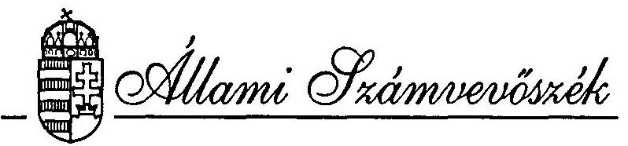

## JELENTÉS

az Állami Vagyonkezelő Részvénytérsaság 1993. évi tevékenységének ellenőrzéséről
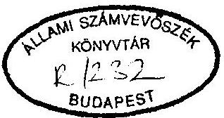

---

A vizsgálatot vezette:
Harsányi Sándor osztályvezető számvevő főtanácsos

A vizsgálatot végezte:
Beck Miklós
dr. Borisz József
Lörinc Alajos
dr. Majorosné dr. Locskai Noémi
Makkai Mária
dr. Molnár Barnabás
Németh Béláné
Rundik János
dr. Szöllösi Géza
Szücs Ivánné
Vasas Sándorné dr.
számvevő
számvevő tanácsos
számvevő tanácsos
számvevő tanácsos
számvevő tanácsos
számvevő tanácsos
számvevő tanácsos
számvevő tanácsos

---

# J E L E N T É S 

az Állami Vagyonkezelő Részvénytársaság 1993. évi tevékenységének ellenőrzéséröl

## I.

## B E VEZETÉS

A tartósan állami tulajdonban maradó vállalkozói vagyon kezeléséről és hasznosításáról szóló 1992. évi LIII. törvény, amely létrehozta az Állami Vagyonkezelő Rt-t előirja, hogy annak tevékenységét az Állami Számvevőszék ellenőrzi. A törvény kötelezi a Kormányt arra, hogy az előző évi állami költségvetés végrehajtásáról szóló törveny javaslat előterjesztésével egyidejűleg számoljon be az Állami Vagyonkezelő Rt. (továbbiakban Áv Rt.) éves tevékenységéről, továbbá mellékel je az Áv Rt. - Számviteli törvény alapján készített - éves beszámolóját. Az Állami Számvevőszék Elnöke részére pedig előírja, hogy ezzel egyidőben szintén nyújtsa be jelentését az Áv Rt. tevékenységéről.

Az Állami Számvevőszék e törvényi kötelezettségének megfelelően - a Kormánybeszámoló hiányában is - elvégezte az Áv Rt. 1993. évi tevékenységének ellenőrzését és jelentését az Országgyűlés rendelkezésére bocsátja.

---

Az ÁV Rt. pénzügyi beszámolójának 1994. május végi elkészültét követően megkezdett és több hónapos munkát kívánó ellenőrzés célja az volt, hogy megbizható és valós képet adjon az ÁV Rt. 1993. évi tevékenységéről, az 1992. évi LIII. törvény hatálya alá tartozó gazdálkodó szervezetek vagyona hasznosításának módjáról, eredményeiről, az 1993. évi Vagyonpolitikai Irányelvek (továbbá VPI) végrehajtásáról.

# Meg kellett vizsgálni: 

- hogyan látta el feladatait az állami vállalatok gazdasági társasággá történő átalakításánál, a tulajdonosi jogok gyakorlásánál és a gazdasági társaságok alapításánál;
- miként valósította meg a törvényben, a Vagyonpolitikai Irányelvekben, az ÁV Rt. belsó szabályzataiban elóirt normativ követelményeket a vagyon értékesítésénél, a vagyonkezelési tevékenységnél, a gazdasági társaság alapításánál;
- hogyan gyakorolta tulajdonosi jogait a bankoknál, különös tekintettel a bankkonszolidációra;
- mennyiben felelt meg az ÁV Rt. gazdálkodási tevékenysége az alapító szándékainak, ame1yek a költségvetési törvényben és a VPI-ben rögzítettekben is megjelentek;
- miként alakította ki belsó szabályozási rendszerét, a szervezet megfelelően felkészült-e a törvényben rögzített feladatai végrehajtására;
- mennyire segítette eló a szervezet zökkenőmentes müködését a döntéshozók, (parlament, kormányzat, ÁV Rt. Igazgatósága), valamint a piaci szereplők (befektetők, tanácsadók, ÁV Rt. társaságai) informálása, a visszacsatolási rendszer hatékonysága és a belsó ellenőrzési rendszer.

---

Az Áv Rt-nek a Számviteli törvény által előirt könyvvizsgálati feladatait, éves beszámolójának auditálását a KPMG Reviconsult Könyvvizsgálói és Tanácsadói Kft. látja el.

Az ellenőrzött időszak 1993. év. Ez azonban nem jelentett merev idöhatárokat, hiszen 1993. évre kihatottak az 1992. évi folyamatok, valamint nem lehetett eltekinteni attól sem, hogy azok szerves folytatása 1994. évre áthúzódott. A helyzet annyiban is sajátos volt, hogy az ÁV Rt. tényleges megalapításának idópontja 1992. október 29., azaz az első teljes gazdálkodói éve az 1993-as volt. Az ekkor megvalósitott különösen nagyértékü, döntési mechanizmusban az ÁV Rt. hatókörén kivül, a kormányzat szintjén vezényelt egyedi privatizációs tranzakciók részletekbe menő ellenőrzése nem volt beilleszthető az ÁV Rt. tevékenysége átfogó vizsgálatába. Ezért az Állami Számvevőszék arra törekedett, hogy az ÁV Rt gazdálkodásának összefüggéseibe helyezve, föbb lépéseiben tekintse át az egyes magánosítási akciókat.

Az így szerzett tapasztalatok alapján különböző mé lységủ ajánlások megfogalmazására nyílt lehetőség. Figyelembe véve azonban, hogy az egyedi tranzakciókkal kapcsolatos tapasztalatokat - terjedelmi és szerkesztési okokból is - csak külön mellékletben lehetett összefoglalni, az ajánlások egy részének hátterét és megalapozását a 10 sz. melléklet tartalmazza.

Az Állami Számvevőszék 1993. júliusában nyújtotta be az Országgyülésnek az ÁV Rt. 1992. évi tevékenységének ellenőrzéséröl szóló - első - jelentését. Ebben számos, az alakulás külső okokra is visszavezethető, a szervezetépités problémáival összefüggő vezetési hiányosságot is jelzett. Ezek a hibák és hiányosságok jellemzően a belsö szabályozás gyengeségeire, az üzletpolitika hiányára, a megalakítás koncepcionális bizonytalanságára voltak visszavezethetők és. jórészt továbbra is fennmaradtak, illetve felszámolásukra csak 1994-ben, a vizsgált gazdasági évet követően került sor.

---

Az ÁV Rt. vezetése és munkatársai az ellenőrzés során az ÁSZ-szal megfelelően együttmüködtek, segítették a tények feltárását. Köszönet illeti a vizsgálat támogatásáért az ÁV Rt. Felügyelő Bizottságát. Az Állami Számvevőszék a Felügyelő Bizottság által kezdeményezett, a belsö ellenőrzés által végzett vizsgálatokat megismerte, vizsgálati jelentésében - hivatkozva a forrásra -felhasználta, illetve tapasztalatai alapján további megállapításokkal egészítette ki.

A véglegezés előtt, a jelentést az ÁSZ megküldte az ÁV Rt. azon korábbi vezetőinek, akik a vizsgált időszakban a szervezet élén álltak. Tényszerü, pontosítási igényeiket figyelembe vettük, a részükről megküldött véleményt csatoltuk. Hasonlóan, mint azokat a véleményeket, me1yeket az ÁSZ-hoz az észrevételezésre rendelkezésre álló törvényes időn belül eljuttattak.
II.

# ÖSSZEFOGLALÓ KÖVETKEZTETÉSEK, AJÁNLÁSOK 

## 1. összefoglaló következtetések

1.1. Az ÁV Rt. egyszemélyes részvénytársaság, ame1y $100 \%$-ban állami tulajdonában van és a Kormány nevében a közgyülés jogát a vizsgált időszakban a privatizációért felelős tárca nélküli miniszter gyakorolta.

---

Az adott szabályozási megoldás és irányitási gyakorlat következtében az ÁV Rt. nem volt abban a helyzetben, hogy a deklarált részvénytársasági formának megfelelően teljes legyen gazdálkodói ōnállósága és alapvetően üzleti megfontolásokat érvényesitsen stratégiájában és gyakorlatában. Erősítette ezt, hogy az Rt. erőteljesen kötődik az államháztartáshoz. A költségvetés felé közvetlen befizetési kényszer áll fenn, a társadalombiztosítás részére pedig ingyenes vagyonátadási kötelezettség. Az érvényes jogi rendszer módot adott arra is, hogy a kormányzat operativ irányitást végezzen. Ugyanakkor az ÁV Rt-re vonatkozó törvények és jogszabályok pontatlansága, az Rt. speciális helyzetére való adaptálás elmaradása a részvénytársaság gazdálkodásának is viszonylag tág mozgásteret adott.

Az ÁV Rt-hez tartozó állami tulajdonú vállalkozói vagyon a tulajdonosi jogokat megtestesitő üzletrészek, részvények jegyzett tőke arányos - értéke alapján az 1992. december 31-ei 592 milliárd Ft-ról 1993. december 31-re 971 milliárd Ft-ra emelkedett. Az ÁV Rt-hez tartozó állami tulajdonú vállalkozói vagyont az 1992. december 31-1 mérleg nem mutatta ki pontosan, néhány vállalat, illetve társaság nem szerepel könyvelben. Bár a konkrét eseteket időközben feltárták, az alaptőkéjének cégbírósági bejegyzése módosításáról nem intézkedtek. Az ÁV Rt. bár tett bizonyos lépéseket, mégis 1993-ban elmaradt a banki részvények teljeskörü, "begyüjtése". Ezért a bankokban meglévő közvetett tulajdon1 hányada sem tisztázott pontosan.
1993. évben a vagyon növekedése 379 milliárd Ft. Ez a 422 milliárd Ft-os növekedés és 43 milliárd Ft-os csökkenés egyenlege.

---

A vagyon növekedések döntően az átalakult cégek vagyonának készletrevételéböl ( 353 milllárd Ft) adódtak, de jelentős tétel volt a MATÁV Rt. tőkeemelése, ame1y 58,5 milliárd Ft volt (ebből 40 milliárd Ft-ot az ÁV Rt. 18,5 milliárd Ft-ot a MATÁV tőketartalékából fedeztek). A vagyon csökkenésében szerepet játszott a privatizációs értékesítés, ame1y vagyon névértéke 37 milliárd Ft volt. 1993-ban a privatizációból származó értékesités árbevétele 87,5 milliárd Ft, ame1ynek $94,5 \%-a$ 82,6 milliárd Ft a MATÁV $59 \%$-os állami tulajdonrészének eladásából származik. Az összes értékesités ábevételéből az ÁV Rt-hez befolyt pénzbevétel 1993-ban közel 36 milliárd Ft volt.
1.2. Az ÁV Rt. jegyzett tökéje, (tartós állami tulajdonhányad) tōketartaléka (privatizálható vagyoni rész) nem mutatja ki a társaság alapvetö funkciójához kapcsolódó vagyoni szerkezetet és vagyonértéke nem felel meg a törvényl elöírásnak. (1992. év VIII. törvény)

A számviteli törvény elöírásai szerint a privatizálható vagyoni rész értékesítése, a saját erőből történő tőkeemelés nem változtat ja meg a tőketartalékot. Igy a mérleg forrás oldalából nem állapítható meg a privatizálható vagyoni rész, ame1ynek ismerete és követése nélkülözhetetlen a magánosítási folyamatban.

A tulajdonosi jogokat megtestesítő üzletrészek, részvények könyv szerinti értékét a mérlegben a részesedések között tartják nyilván; a változás - növekedés, csökkenés - itt követhető. Ebből azonban szintén nem mutatható ki a tartós, illetve a privatizálható tulajdonhányad.

Az ÁV Rt. és az elözetes értékeléssel megbízott könyvvizsgáló egyaránt eltért a törvényl elöirástól és az Alapító Okiratban foglaltaktól akkor, amikor az alaptőke meghatározásakor és

---

a későbbi készletrevételeknél a jegyzett tőkét és nem a saját tőkét, illetve annak állami tulajdonú hányaddal arányos részét vette figyelembe. Így az ÁV Rt. tulajdoni részei a mérlegében, a jegyzett tőke hányadában jelennek meg a befektetett pénzügyi eszközök között. Ennek következtében az ÁV Rt-hez tartozó vagyon megfelelő nagyságáról a társaság mérlege nem ad hiteles képet. Ez azzal a következménnyel is jár, hogy a privatizációs értékesítések üzleti sikere nem reálisan értékelődnek. Az adott évben általa kimutatott átlagosan realizált 236 \%-os árfolyam nyeresége valójában csak 122 \%, és a névértéken történő értékesítések rendre veszteséget jelentenek.

Az ÁV Rt. 1993. évben az 1993. évi költségvetési, illetve pótköltségvetési törvényben elöirt befizetési kötelezettségének ( 8.371 millió Ft) nem tett eleget, sőt az 1992. év gazdálkodásához kapcsolódó osztalékbefizetési kötelezettségét is csak 1994-ben teljesítette. Az 1993. évi eredménykimutatása - egyébként a tulajdonosi jogok gyakorlójának a privatizációs miniszter személyében megtestesülő közgyülés jóváhagyásával - eltér mind az 1993. évi, mind az 1994. évi költségvetési törvény elöírásaitól. Ugyanis az ÁV Rt. az 1993. évi eredménykimutatáskor saját ráfordítások között helytelenül elszámolta a MATÁV privatizációs bevételeiből az 1994. évi költségvetési törvényben elốrt 28.000 millió Ft-ot és a központi költségvetésben törvényileg elốrt 8.000 millió Ft osztalék helyett 10.457 millió Ft-ot irányzott eló. E mellett az 1994. évi, ma is hatályban lévő VPI további befizetési kötelezettséget ír elő a központi költségvetés és az elkülönített pénzalapok javára mintegy 64,3 milliárd Ft-ban. Ennek teljesítése - hacsak hitelt nem vesz fel - ismerve az Rt. jelenlegi gazdasági helyzetét és a különböző, szóbajőhető tranzakciók előkészítését ugyancsak kizárható.

---

Az ÁV Rt. által képzett, a hozzá tartozó vállalatok feljavitására (reorganizációra) fordítható elkülönített eredménytartalék 845 millió Ft-al meghaladja az ÁV Rt-re vonatkozó szabályok szerint képezhetöt. Ezt a tulajdonosi jogokat gyakorló privatizációs miniszter ugyancsak jóváhagyta.

Az ÁV Rt. az 1993. évi eredménytartalék terhère a számviteli törvény szabályait megszegve, elszámolta a Mátrabánya Rt-töl 17,4 millió Ft értékben megvásárolt 500 ezer USD-re szóló váltó követelést.

Az ÁV Rt. garanciális kötelezettségének teljesítését, illetve annak fedezetét - amely az elkülönített eredménytartalék törvény szabályozza. Az ÁV Rt-nél a garancia vállalásokkal kapcsolatos eljárási rendet szabályozó belsö előirások csak a vizsgált év végén léptek érvénybe, amelyeket egyébként egy felülvizsgálat után 1994-ben módosították. Mindez azonban nem okozott problémát, mert ilyen kifizetésre mindössze egy esetben, 32,6 millió Ft összegben került sor. Ezt a kötelezettséget a törvényl elöírásoknak megfelelően rendezték.

Az ÁV Rt. részére a tanácsadók kiválasztását törvény írja elő, amely kötelezövé teszi a versenyeztetési eljárás lefolytatását. A versenyeztetési eljárást 1993. január 1-én el-nök-vezérigazgatói utasítás szabályozta. Külön, állandó külső tanácsadói kör létrehozását tartották indokoltnak. Az Ügyvezetés ezt elfogadta és tíz témakörben (így például könyvszakértés, vagyonértékelés, piackutatás, stratégiai tervezés stb.) pályázatot hirdetett meg. A pályázás lebonyolítására, értékelési módszerének kialakítására, a pályázati bizottság számára történő előkészítésére egy külön cég és a külföldi pályáztatás elbírálására egy másik cég kapott megbízást. Ez utóbbi tevékenysége nem dokumentált, a döntést a pénzügyi vezérigazgatóhelyettes személyesen hozta meg. A belföldi pályá-

---

zatok elbirálását hat bizottság végezte. 1994. februárjában 322 belföldi és 45 külföldi tanácsadót az Igazgatóság határozatával az ÁV Rt. minősített tanácsadói hálózatába felvettek.

A külföldi tanácsadóknak történt kifizetések angol nyelvű számlák alapján történtek. A szerződések magyarnyelvű fordításait nem hitelesítették. A külföldi tanácsadói díjak kifizetését több esetben nem előzte meg a szerződésben foglaltakkal való összehasonlító ellenőrzés.
1.3. Az ÁV Rt. 1993. éves beszámolójához a könyvvizsgáló a Hitelesítö Záradékot korlátozás nélkül megadta. A törvényi elöírásokkal ellentétes értékelési elv és egyéb eltérések (a mérlegben nem szereplö követelés, a nem árbevételként tiszteletdij elszámolt összege, illetve az 1994. évre vonatkozó kötelezettségek 1993. évi elöírása következtében) azonban azt valószínüsítik, hogy sem a mérleg, sem az eredménykimutatás nem mutatja a valós képet az ÁV Rt. vagyoni és pénzügyi helyzetéről.

A KPMG Hungária Könyvvizsgáló, Adó és Közgazdasági Tanácsadó Kft. - mint a könyvvizsgáló - a tapasztalt problémák egy részére úgynevezett menedzser levélben felhívta a vezetés figyelmét, továbbá kifejezte készségét arra, hogy amennyiben "az ÁV Rt. vezetése határozatot hoz az ÁV Rt-be apportált cégek értékének a Cégbíróságon bejegyzett alapító okirattól eltérő, a tartósan állami tulajdonban maradó vállalkozói vagyon kezeléséről és hasznosításáról szóló 1992. évi LIII. törvénnyel összhangban az apportálandó cégek saját tőkéjére alapozott, új bázisra történő helyezésére és ennek alapján az 1993. évről szóló Éves Beszámoló módosítására, a KPMG Hungária a fentiek alapján megváltoztatott beszámolóra vonatkozó könyvvizsgálatot elvégzi és új hitelesítő záradékot.bocsájt ki".

---

Az ÁV Rt. törvényi felhatalmazás erejével mintegy 500 milliárd Ft értékesíthető üzletrészhez, részvényhez jutott. A számviteli törvény elöírásainak alkalmazása - azaz, hogy értékesités esetén a befektetés értéke és eladási ára közötti különbséget árfolyamkülönbözetként számolja el - azzal a következménnyel jár, hogy névértéken felüli értékesitésénél nem csak az árfolyam nyereség jelenik meg pénzeszközként, hanem a teljes árbevétel, hiszen a részvényekhez ráfordítás nélkül jutott. Ez szélső esetben azt is jelenti, feltéve, hogy ha az összes 500 milliárd Ft-nyi üzletrészét, részvényét az ÁV Rt. ha csak névértéken is eladja mind nála jelenik meg készpénzként. Következéskép az ÁV Rt-nél "cash"-ként, azonnal felhasználható likvid készpénzként nem csak az árfolyamkülönbözet (eladási ár- nyilvántartási érték) jelenik meg, hanem a teljes eladási ár.

A kialakult helyzet, vagyis az, hogy a számviteli törvény más gyakorlati eset hiányában elözetesen nem tudta mindenben kezelni - modellezni - egy ilyen sokmilliárdos vagyonú állami társaság alakítását és annak következményeit, - külön elöírásról pedig nem gondoskodtak - már a müködés első évben, azzal a következménnyel járt, hogy az ÁV Rt. halmozottan 36,6 milliárd Ft értékben helyezhetett ki pénzeszközt, lehetösége volt 36,3 milliárd Ft-ért diszkont kincstárjegy, illetve államkötvény vásárlására. A diszkont kincstárjegyet, az államkötvényt azonban az az állam bocsájtotta ki a költségvetési hiány finanszirozására, amely egyben az ÁV Rt-nek mint társaságnak $100 \%$-ban tulajdonosa. Igy mint tulajdonos 900 millió Ft kamatot és jutalékot is fizetett azért, hogy az általa müködtetett társaságnál lévö pénzéhez hozzájusson. Mindezzel egyidöben az ÁV Rt. az állam felé törvényben rögzített 1993. évi befizetési kötelezettségét nem teljesítette.

---

1.4. A hozzá tartozó vállalatok gazdaságı társasággá történő átalakításának idölgényét, feladatalt nem mérték fel megfelelöen. Az átalakulási lépések vezényléséhez - ame lynek hatá ridejét a törvènyl elöírások 1993. június 30-ban szabták meg nem volt az ÁV Rt-nek átfogó stratégiája. Ezért a hozzá tartozó átalakításra váró 116 cégböl 23 -nak társasággá szervezése nem történt meg. Mivel a törvényl szabályozás az alaptökeemelést az utolsó társasággá alakítás utáni 30 napban szabta meg, igy az sem történt meg. Következményeként az ÁV Rt. vagyoni szerkezete torz, hiszen az átalakult társaságok jegyzett tökéje a töketartalékban szerepel - 160 milliárd Ft - és vagyona nem tartalmazza a hozzátartozó, de még át nem alakult vállalatok vagyonát. Ez a folyamat annak ellenére alakult igy, hogy a vállalatok társasággá történő átalakításához az anyagi, a személyi és a tárgyi feltételek adottak voltak.

Az ÁV Rt. Ideiglenes Szervezeti és Müködési Szabályzata. meghatározza a vagyonkezeléssel kapcsolatos feladatokat. 1993. december 31 -én portfóliójába 176 gazdálkodó szervezet tartozott. A vagyonkezelési feladatokat kizárólag közvetlenül a saját apparátusával végezte. Az ÁV Rt. tulajdonosi jogát úgy gyakorolta, hogy résztvett a gazdasági társaságok évzáró és rendkívüli közgyülésein, a nemzetgazdaság számára jelentösnek minősített társaságoknál jogi személyként tagja az igazgatóságnak, (ez jelenleg 65 társaság, további 19 társaságban külsỏ személyt bizott meg az igazgatósági teendőkkel) és napi kapcsolatban áll a $100 \%$-os állami tulajdonú társaságokkal. A tulajdonosi jogok gyakorlásának jelzett formái fokozatosan épültek ki. A közgyülésen az igazgatóságon keresztülı és a napi vállalatirányitás fokozatosan szabályozottá és müködőképessé vált. A folyamatos irányításhoz nélkülözhetetlen a cégek gazdálkodási és pénzügyi helyzetet a havi controlling információs jelentések jelzik.

---

Az osztalékpolitikát 1994 februárjában hagyta jóvá az Áv Rt. Igazgatósága. Az Rt. Osztalékpolitikájának általános jellegü elöírása az volt, hogy minden társaság 1993. évi adózott eredményének $50 \%$-át el kell vonni, de lehetővé tette az ettöl való eltérést. Az ügyvezetés a nyereséges társaságok közül 42-nél eltekintett a normatív szabálytól. A társaságok adózott eredménye összesítve az 1992. évi 11,4 milliárd Ft-ról 1993-ban 18,1 milliárd Fr-ra nőtt.

A tulajdonosi jogok gyakorlásának egyik lényeges eleme a reorganizációs programok kidolgozása és a hitelkonszolldáció. 1993-ban tényleges válságkezelés nem volt, az adóskonszolidáció keretében - a PM által konszolidációs államkötvénnyel kivásárolt kereskedelmi banki hiteleket engedett el az Áv Rt. mintegy 15 milliárd Ft értékben.

Az ÁV Rt. portfóliójába tartozó gazdasági szervezetek vezető testületei tagjainak, illetve elsö számú vezetőinek javadalmazását semmilyen be 1 ső szabályozás, egységes szempontrendszer nem rendezte. Ez 1993-ban teljesen esetleges, szubjektív értékitéletekre adott lehetöséget.

Az ÁSZ elnökének személyes fellépésére 1994. április, illetve május hónapjában fogadta el az Igazgatóság az új, részben már teljesítményekre is figyelemmel lévő javadalmazási rendszert, ame1y jelenleg müködik.
1.5. Az ÁV Rt. 1993-ban közvetlen, vagy közvetett tulajdonnal 17 bankban rendelkezett. Többségi, azaz $50 \%$ feletti tulajdon hányaddal az Áv Rt. 1993. év elején az OTP-nél és a Budapest Bank Rt-nél, 1993. év végén pedig csak az OTP-nél rendelkezett. A bankkonszolidáció jelentősen változtatott a tulajdoni viszonyokon. A benne résztvevő 8 bank közül 3 pénzintézetnél az állam tulajdonosi jogainak gyakorlására az Áv Rt. volt ki-

---

jelölve, de ezeknél az alaptőkeemelések után az állam nevében a PM lett a legnagyobb tulajdonos. Igy érdemben - hiszen 1993. elején többségi tulajdonos is csak az említett két banknál volt - mozgástere nem változott, bár a többi bankoknál tulajdonosi aránya csökkent.

A gazdaságban 1991-ben megjelenő negatív tendenciák - köztük a bankcsőd - kormányzati szintü intézkedések sorozatát indokolta, ame lyek bankokat érintő első lépése a hitelkonszolidáció volt. Erre az ÁV Rt. érdemleges befolyást nem tudott gyakorolni, függetlenül attól, hogy ez átmenetileg javitotta az ÁV Rt-hez tartozó bankok portfólióját. A banki portfóliók minöségének romlása azonban az átmeneti javulás után folytatódott. A Kormány ezért határozatot hozott arról, hogy a bankkonszolidáció elvét és munkaprogramját ki kell dolgozni és ebbe bevonta a Bankprivatizációs Bizottságot, ame lynek egyik tagja az ÁV Rt. volt. 1993 júliusában a Kormány döntött a bankkonszolidáció feladatairól, üteméről és arról is, hogy a portfólió tisztitása helyett az alapvető módszer a banki tőkeemelés végrehajtása lesz.

Mindennek kimunkálására a PM, az ÁBF, az MNB és a privatizációért felelős tárca nélküli miniszter kapott kormánymegbízást, de az elsődleges kezdeményező a PM volt. Az ÁV Rt. szerepe mindössze a PM által elöterjesztett koncepciók legfelső vezetői szinten kialakított - véleményezésére korlátozódott. A PM által javasolt tőkeemelési koncepcióval az ÁV Rt. vezetése alapvetően nem értett egyet, de véleményét nem fogadták el, igy a döntési folyamatra érdemi befolyást nem tudott gyakorolni. A PM a bankkonszolidációban résztvevö bankokra vonatkozóan az ÁV Rt-vel vagyonkezelési szerződést kötött. Ebben minden lényeges döntési ponton a döntési jogot saját magának tartotta fenn. Még azt sem határozta meg a szerződés, hogy mit vár az ÁV Rt-töl mint vagyonkezelőtől. E kérdésekben tehát az ÁV Rt. szerepe és felelössége igen szerény mértékűvé vált.

---

A véleményezésnél és vagyonkezelési rutinfeladatoknál többet az ÁV Rt. felkészültsége nem is engedett meg. Az ÁV Rt. 1993-ban a még ténylegesen meglévô százmilliárdos vagyon sorsára kiható tulajdonosi jogait is csak igen korlátozottan tudta gyakorolni a bankoknál. Az ezzel foglalkozó ÁV Rt-n belüli 2 érdemi munkatársból álló szervezeti egységet 1993. októberében hozták létre és elôször 1993. végére került csak abba a helyzetbe, hogy rendelkezett a bankokra vonatkozó alapvető és részletes információkkal. Az ÁV Rt, a hozzátartozó bankoknál a vezetésben rendelkezésre álló helyek - a vagyonkezelési szerződésnek és tulajdonosi struktúrának megfelelő - betöltését pedig csak 1994. tavaszán tudta befejezni, de erre az idópontra a témáért felelós két munkatárs is elment, s banki szakember csak az ÁSZ vizsgálat lezárásakor lépett be.
1.6. Az ÁV Rt. 1993. évi tevékenységében a privatizáció megvalósitása nem foglalt el jelentös helyet, de az 1994. évre tervezett értékesítések elökészítése jól haladt.

Az ÁVÜ-töl átvett és értékesíthető vagyonrészekkel kapcsolatos elökészítő munkát ujrakezdték. Kárba veszett az addigi felkészülés. Az ÁV Rt. előbb felmérte a privatizálható vagyon értékét, amely összességében az 1992. évi december 31-ei saját tőke alapján $1.103,5$ milliárd Ft volt, 1993. december 31-én vagyonleltár szerint pedig az összes eszközvagyon alapján $1.156,5$ milliárd Ft. A részvénytársaság 1994-re azzal számolt, hogy a privatizációra kijelölt vagyon nagysága 163,8 milliárd Ft. Ennek döntő többségét az MVM Rt. és a gázszolgáltatók képviselték. Ezek 1994. évi privatizálása azonban ma már aligha tartható.

Az ÁV Rt. 1993-ban több mint száz vállalatra készittetett és tekintett át privatizációs stratégiai tanulmányokat. 1993. júliusában privatizációs tervéről készített tájékoztatót az-

---

zal a szándékkal, hogy azt a Kormány tárgyalja meg. Alapvetőnek ebben a tőkeemeléses privatizáció gyakorlatát tekintette, és a kínálat bővítését a tartós állami tulajdoni arány csökkentésében látta. Az ÁV Rt. eddig a privatizációs kínálat bizonyos fajtájú megközelítő meghatározását megkezdte, de eddig egyetlen kísérlet sem történt - még makro szinten sem - a valószínűsíthető kereslet nagyságának és struktúrájának felmérésére.

A privatizációs tevékenység legnagyobb horderejű akcióiban (MATÁV, MKB privatizáció) az ÁV Rt. - dokumentumokban hangsúlyozott - tulajdonosi autonóulája nem érvényesült. A meghatározó döntések kormányszinten születtek. Ez annyiban természetesnek tekinthető, hogy a gazdaságpolitikát, a költségvetést, a nemzetközi fizetési mérleget lényegesen érintő kérdésekben a Kormányzat igyekezett érdekeit érvényesiteni. Az adott törvényi keret és érvényesített gyakorlat ellentmondott a gazdálkodói önállóság és felelősség érvényre jutásának.

Az 1993. évben a 12 végrehajtott privatizációs tranzakcióban meghatározó a MATÁV privatizációja volt. Ebben azonban az ÁV Rt. nem a döntéshozó, hanem a végrehajtó jelentős szerepét kapta. (A tranzakciók egyenkénti áttekintését a 10. sz. melléklet tartalmazza).
1.7. Az ÁV Rt. Alapító Okirata azt a kötelezettséget rögzíti, hogy az alapítást (1992. október 29.) követő 60 napon belül a Szervezeti és Müködési Szabályzatot az Igazgatóságnak jóvá kell hagyni és ki kell adni. Ehhez képest az Igazgatóság 1993. júniusában csak egy Ideiglenes Szervezeti és Müködési Szabályzatot hagyott jóvá, de ez sem bontja le megfelelően az ügyvezetés, illetve a vezérigazgató által gyakorolt hatásköröket, a kapcsolódó szakmai döntési, döntése lökészítési, utasítási, ellenőrzési jogokat és tevékenységeket a szervezetben kialakított irányítási szintekre, a vezérigazgató helyettesi, ügyvezető igazgatói és szakmai igazgatói munkakörökre.

---

A társaság döntési mechanizmusának kialakítása, a hatáskörök lebontása és decentralizált telepítése megoldatlan. Az ÁV Rt. az Alapító Okirat előírásával szemben működése megkezdésének 14-ik hónapjában is csak egy tartalmában hiányos ideiglenes jellegü SZMSZ-el rendelkezett és alapvetö müködési-gazdálkodási tevékenységei is szabályozatlanok voltak.

A szervezet és irányítási szintek kialakítását nem előzte meg a szükséges társasági tevékenységek (szervezeti funkciók) elemzése, a döntési-döntéselőkészítési folyamatok modellezése.

A társaság szervezetének felépítése fôként szubjektív behatások szerint alakult. A szervezést nem kisérte a feladatok számbavételére, az eltérő javaslatok ütköztetésére és egyeztetésére irányuló folyamatos felső vezetői koordináció. A hiányos vezetői koordináció miatt tág teret kaptak az egyes területek önszerveződési törekvései.

A gazdálkodás szabályozottsága, a nyílvántartási és számviteli rendszerének szervezettsége, szabályszerűsége 1993-ban nem volt megfelelö. Az SZMSZ az utalványozási, a kötelezettségvállalási, a vezetői és munkafol yamatba épített ellenőrzés szabályozásait, feladatainak előírását külön "Gazdálkodási Szabályzatba" utalta. Ez nem készült el. A Számviteli Szabályzatot a törvényi előírásban foglaltaknál jóval később, 1994. május végén hagyta jóvá az Igazgatóság. A kötelezettségvállalások és utalványozások, a könyvelési feladások rendjét csak több mint egy évi müködés után 1993. december végén, a leltározás és selejtezés, az átmenetileg szabad pénzeszközök kihelyezését szabályozó vezérigazgató utasítást pedig visszamenőleges hatállyal- 1994. június végén adták ki. Így ezeken a rendkívül fontos területeken a követendö eljárás 1993-ban gyakorlatilag teljesen szabályozatlan maradt. Ez együtt járt a számviteli pénzügyi fegyelem alapvetö hiányosságával, a bruttó számviteli elv megsértésével, azzal, hogy nem figyelték a pénzkövetelések lejáratát.

---

A pénzügyi-gazdálkodási belsö szabályozatlanság hozzájárult, hogy a pénzkihelyezések egy részénél az ÁV Rt-re nézve egyoldalúan hátrányos kikötéseket tartalmazó szerzödések jöhettek létre.

Az ÁV Rt előrelátása a pénzügyi helyzetet illetően gyenge volt, befektetéseiben sem volt kellően körültekintő, azok túlzott kockázatot viseltek és nem tükrözték az ÁV Rt tulajdonosi érdekét szolgáló pénzügyi magatartást.
1.8. Az ÁV Rt. számítógépes informatikai rendszerének telepítése és fejlesztése 1993. II. félévében jelentösen elörehaladt.

Kiépült egy 150 személyi számítógépbő1 és 3 ún. szerver gépbő1 álló, korszerü a jelenlegi székház egészére kiterjedő, 235 végponttal rendelkező hálózat. A külvilággal elektronikus úton történő információ kapcsolathoz kiépítettek egy 16 virtuális vonalat tartalmazó adatátviteli kapcsolódási pontot, melyen az MTI Gazdasági Hirszolgálatának információ bázisa már elérhető.

Jelentős számú, az ÁV Rt. vagyonkezelési, privatizációs, valamint az irodai munka automatizálását, a belsö adminisztrációs feladatok ellátást támogató programrendszereket helyeztek üzembe.
1.9. Az ÁV Rt. 1993. évi müködési költségei összesen 2,8 milliárd Ft-ot tettek ki. A gazdasági teljesítményekkel nem alátámasztott gazdálkodást jelzi, hogy az ÁV Rt. ún. éves közvetlen müködési költsége 745 millió Ft-tal, 18 \%-kal haladta meg az éves pénzügyi tervben az Igazgatóság által jóváhagyott 632,3 millió Ft-ot. A segédszemélyzet bérét is magában foglaló átlagos havi kereset - a felmentési idöre jutó bér figyelmen kívül hagyásával - 142.770 Ft/fő volt, a vezérigazgató helyetteseké mint legmagasabb pedig 520.897 Ft/fő. A különbözö besorolású vezetők részére differenciáltan biztosított

---

reprezentációs költségek mellett egy érdemi munkatársra átlagosan 30.000 Ft-ot költöttek 1993-ban. Minden ötödik munkavállalóra jutott egy személygépkocsi. Ezek használatára olyan - szabályok kiskapuit kihasználó - müködtetési formát alkalmaztak, ame1y lehetővé teszi, hogy az ilyen juttatásban részesülö munkatársak személyi jövedelemadó alapja ne növekedjen.
1.10. A vezetöi, illetve folyamatba épített ellenörzés a kezdeti alacsony szervezettségi és szabályozottsági színvonallal összhangban hézagos volt és stagnált.

A szakosodott ellenörzési feladatok közül, főként a közérdekü bejelentések alapján keletkezett ellenörzések jelentős részét az ún. Etikai Igazgatóság látja el. A vizsgált időszakban az igazgatóság 39 vizsgálatot végzett, me1yek közül 32 közérdekủ bejelentés alapján keletkezett, 7 esetben a vizsgálat be1sö, illetve felügyeleti kezdeményezésre indult. A lefolytatott vizsgálatok 8 esetben a bejelentést te1jeskörüen igazolták, 11 bejelentés csak részlegesen bizonyult megalapozottnak.

A vizsgálatok során feltárt mulasztások és hiányosságok alapján 4 esetben kezdeményeztek büntető eljárást és hibák kijavítására számos intézkedéseket tettek (új pályázatok kiírása, cégbejegyzés megsemmisítésének, valamint szerződések módosításának kezdeményezései, célvizsgálatok indítása, különböző figyelemfelhívások kibocsátása, stb.).

Az Áv Rt. be1sö ellenörzési tevékenységének müködésére és gazdálkodására irányuló kiépítése 1993. év folyamán csak elindult, me1yet 1994. évben további intézkedések követtek. Az ellenőrzési tevékenység - főként az ügyvezetés növekvő igényei hatására - fejlődő tendenciájú.

---

Az ÁV Rt-nél csak egy évnyi müködés után, 1993. novemberében lépett munkába belsô ellenór, me1y funkció szakmai irányitását a Felügyeló Bizottság látja el.

A Felügyelő Bizottság igen sok problémát észlelt és azokat a tulajdonosi jogok gyakorlójának, valamint az Igazgatóságnak jelezte. Fellépett a pazarló gazdálkodás, a szabályokba ütköző döntések és az egyéni, vezetői érdekérvényesitési kezdeményezések kirivó esetei ellen. Kezdeményezései azonban csak esetenként találkoztak fogadókészséggel.

Az elözőekben összefoglalt hibákért és hiányosságokért az ÁV Rt-t 1993. évben vezető Igazgatóságot és ügyvezetést egyetemleges felelősség terheli. A tevékenységükre azonban rányomta bélyegét a megalapozó kormánystratégia hiánya, feladatának a törvényl szabályozásbe11 meghatározatlansága, a megalakulás és a saját tevékenységének, megszervezésének idölgénye és nem utolsó sorban a szinte állandósult vezetési válság.

Az ÁV Rt. első számú vezetői - akik a gazdálkodói önállóság bizonyos fokú érvényesitésére törekedtek - és a tulajdonosi jogokat gyakorló között koncepcionális kérdésekben ellentét volt. A helyzetet tovább bonyolították az ágazati tárcák érdekérvényesitési törekvései. Ez zavarokat okozott a törvény szerinti fó tevékenység ellátásában és részben oka is volt a vezetői cserének. A kormánylzati irányítás napi gyakorlatában érzékelt informális beavatkozások esetén az ÁV Rt. mint önálló részvénytársaság aligha lehet hosszabb távon müködöképes. Ebben az irányítási formában, szabályok között a racionális gazdasági müködés elöfeltétele az önkorlátozó állami irányítási magatartás, a tulajdonosi jogokat gyakor1ó részéről az írásban rögzített utasítási forma, és a törvényl kötelezettségének következetes betartása.

---

# 2. Ajánlások 

A számvevőszéki ellenőrzés befejezésekor nem lehet eltekinteni attól a ténytől, hogy formálódik a Kormány új privatizációs stratégiája, és készül az új privatizációs törvény, ame lyek eddigi tervezetei rendelkezésre álltak. Ezért nem lehet olyan ajánlásokat tenni, ame lynek kiinduló pontja az eddigi törvényi szabályozás és amelyek a meglévő struktúrán alapulnak, hiszen alapvető változások várhatók.

Az egész privatizációs folyamat újraszabályozása lehetöséget ad egyrészt a Kormány törvénye1őkészitő és az Országgyűlés döntési munkájához kapcsolódó stratégiai jellegủ ajánlások megtételére, másrészt arra is, hogy - feltételezve azt, hogy az ÁV Rt. jogutódjaként létrejövő szervezet részvénytársasági formában müködik - a napi müködés rendbetételéhez az ügyvezetés részére is javaslatok álljanak rendelkezésre.

Ajánlások az Országgyűlés, illetve a Kormány részére:

1. Az állami vagyonnal történő hatékony gazdálkodás - adott esetben a privatizáció - nem oldható meg az államháztartás reformja nélkül. Ezért ajánljuk a privatizáció és vagyongazdálkodás feladatának, módszereinek törvényi szabályozással történő összehangolását.
2. Világos és egyértelmú kormányzati szándékot kell tükröznie az új prioritásokat is tartalmazó privatizációs stratégiának. A privatizálását vezénylő szervezet feladatának meghatározását célszerű lenne a privatizációs kereslet nagyságának és struktúrájának prognózisára és a vele szembe állítható kínálat mennyiségi és minőségi összetételének felmérésére alapozni.

---

3. Az új privatizációs szervezet és a kormányzati szervek kapcsolatrendszerét egyértelmüen tisztázni kell, hogy a folyamatos müködést hatásköri és koordinációs zavarok ne gátolják. Ennek hiányában nincs garancia a folyamatos, tiszta valóságos müködőképesség biztosítására.
4. Az állami tulajdonos képviselöje és az ÁV Rt. költségvetés kapcsolatának alakításánál határozza meg, hogy értékesités esetén a nyilvántartási értéknek megfelelő összeg milyen arányban illeti meg a költségvetést és az ÁV Rt-t.

# Ajánlások az Igazgatóságnak 

1. A Szervezeti és Müködési Szabályzatot - az új feladat és struktúra miatt is - át kell dolgozni. Ebben egyértelmüen kell a megfelelő irányítási szintekre lebontani az ügyvezető és a vezérigazgató által gyakorolt hatásköröket a kapcsolódó szakmai döntési, döntése1őkészitési, utasítási, ellenőrzési tevékenységeket és jogokat.

Az új Szervezeti-Müködési szabályzat készitésénél biztosítani kell a folyamatos felső vezetői koordinációval és ellenőrzéssel, a feladatok összehangolt végrehajtását, az idöbeli elhúzódások megelözését.
2. Az új törvényl szabályozásnak megfelelően rendezni kell az Alapító Okirat helyzetét. Amennyiben a törvényl szabályozás továbbra is a befektetett eszközök meghatározását a saját vagyon alapján írja elő, az Alapító Okíratot - illetve annak mellékletét - ennek megfelelően szükséges módosítani.

---

3. Ưjra kell értékeIni és szabályozni a pénzügyi-gazdálkodást - köztük a tanácsadói díjak kifizetésének - rendjét és mértékét. A Felügyelö Bizottság vizsgálja meg a mindenkori pénzügyi vezetés felelősségét a kialakult rendezetlenségek vonatkozásában. A jövedelmi viszonyokat a feladatokhoz és teljesitményhez újra kell szabályozni.
4. Kezdeményezze az 1993. éves beszámoló újbóli elkészitését és az erre vonatkozó szerzödés alapján kérje fel a KPMG Reviconsult Kft-t - az ÁV Rt könyvvizsgálóját - a hitelesítési eljárásra.
5. Kezdeményezze az Inter Európa Bank Rt. részvényeinek értékesitése miatti - árfolyamnyereség elmaradásából adódó - veszteségért felelősök megállapitását és a szükséges intézkedéseket tegye meg.

Budapest, 1994. november "21"
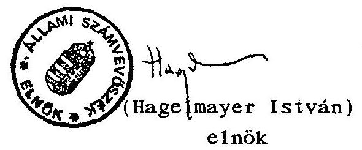

---

ÁLLAMI SZÁMVEVÖSZÉK
IV. VAGYONELLENÖRZÉSI IGAZGATÓSÁG
$\mathrm{V}-3-6 \div / 1994$.
Témaszám: 214

F U G G E L É K
az Állami Vagyonkezelö Részvénytársaság
1993. évi tevékenységének ellenőrzéséről szóló jelentéshez

RÉSZLETES MEGÁLLAPÍTÁSOK

---

# T A R T A L O M J E G Y Z É K 

## RÉSZLETES MEGÁLLA PÍTÁSOK

1. Az ÁV Rt. 1993. évi gazdálkodása ..... 1 .
1.1. Az ÁV Rt. alapítól vagyona ..... 1 .
1.2. Az ÁV Rt-hez tartozó, tartósan állami tulajdonban maradó vállalkozól vagyon ..... 2.
1.2.1. A vagyonnyilvántartás szabályszerűsége ..... 2.
1.2.2. Az ÁV Rt-hez tartozó állami tulajdonú vállalkozól vagyon az 1993. 12. 31-1 mérlegbeszámoló alapján ..... 5.
1.3. Az ÁV Rt-hez tartozó állami tulajdonú vállalkozól vagyon változása 1993-ban ..... 7.
1.3.1. Az ÁV Rt-hez tartozó vagyon növekedése 1993-ban ..... 7.
1.3.2. Az ÁV Rt-hez tartozó vagyon csökkenése 1993-ban ..... 8.
1.4. Az Állami Vagyonkezelő Rt. bevételel ..... 9.
1.4.1. A vagyonértékesítés bevételel ..... 9.
1.4.2. A vagyonértékesítés eredményessége ..... 11.
1.4.3. Osztalékbevétel ..... 12.
1.4.4. Egyéb bevételek ..... 13.
1.5. Eredményfelosztás, eredménytartalék képzés ..... 14.
1.5.1. Az ÁV Rt. osztalékfizetési, befizetési kötelezettségeı az állam - mint tulajdonos javára ..... 14.
1.5.2. Az ÁV Rt. 1993. évi eredményfelosztása ..... 17.
1.6. Az Elkülönített eredménytartalék felhasználása 1993-ban ..... 18.
1.7. Az ÁV Rt. nyereségének, osztalékának mértéke viszonyítva a nemzetgazdaságban Jellemzően elért nyereség, osztalék mértékhez ..... 20.

---

1.8. Az ÁV Rt. 1993. évi pénzügyi terve, müködési költségei, az alkalmazottak javadalmazási rendszere 21.
1.8.1. Az 1993. évi pénzügyi terv elöirányzatal és teljesítése 21.
1.8.2. Az ÁV Rt. alkalmazottainak munkaszerzödése, javadalmazási rendszere 1993-ban 24.
1.8.3. Az ÁV Rt-töl eltávozott vezetők részére történt kifizetések 26.
1.8.4. Az ÁV Rt. munkáltatói (lakásépítési, vásárlási) kölcsön nyújtása 1993-ban 27.
1.9. Az ÁV Rt. által 1993-ban vállalt garanciális kötelezettségek 29.
1.9.1. A kötelezettségvállalások szabályozása 29.
1.9.2. Kötelezettségvállalások és kifizetések 1993-ban 30.
1.9.3. A kötelezettségvállalások nyilvántartása 32.
1.10. Az ÁV Rt. által kifizetett tanácsadói díjak megalapozottsága 33.
1.10.1. A tanácsadók kiválasztására vonatkozó jogi és ÁV Rt. szabályzatok 33.
1.102. A Tanácsadó cégek nyilvántartása 35.
1.11. Az ÁV Rt. tárgyi eszköz állománya 36.
1.12. A gazdálkodási szabályozás, a pénzügyi-gazdasági terület irányítása 37.
1.13. Számviteli, pénzügyi fegyelem 38.
1.13.1. Az ÁV Rt. 1993. szeptember 30-ra vonatkozóan fökönyvi kivonatot, mérleget készített 38.
1.13.2. A MATÁV Rt. részvényeinek értékesítése 39.
1.13.3. A MATÁV Rt. privatizációja 39.
1.13.4. Pénzkihelyezés 40.
1.14. Az ÁV Rt. 1993. évi mérlegbeszámolójának könyvvizsgálata 43.
1.15. A tartósan állami tulajdonban maradó vállalkozói 'vagyon kezeléséröl és hasznosításáról szóló 1992. évi LIII. törvény 25. =-a (3) bekezdése szerint 45.

---

1.16. Az ÁV Rt. gazdálkodási, müködési rendjének hatása költségvetési kapcsolatalra ..... 45.
2. Állami vállalatok gazdasági társasággá történő átalakításának helyzete az ÁV Rt-nél ..... 48.
3. A tartósan állami tulajdonban maradó vállalkozól vagyonhoz kapcsolódó tulajdonosi jogok gyakorlása ..... 52.
3.1. Vagyonkezelés ..... 52.
3.2. A tulajdonosi jogok gyakorlása ..... 52.
3.2.1. A tulajdonosi jogok gyakorlása a közgyüléseken ..... 53.
3.2.2. Vezetö testületeken keresztül történő irányítás ..... 54.
3.2.3. Közvetlen vállalatirányítás ..... 56.
3.3. Az ÁV Rt. osztalékpolitikája ..... 57.
3.4. A társaságok gazdálkodásának javítása érdekében tett tulajdonosi intézkedések ..... 58.
3.5. Az ÁV Rt-hez tartozó társaságok gazdálkodásának hatékonysága ..... 60.
3.6. Az ÁV Rt. üzleti stratégiája ..... 61.
3.7. Az ÁV Rt. portfóllójába tartozó gazdálkodó szervezetek vezető testületei és első számú vezetöijavadalmazási rendszerének kialakítása ..... 63.
4. A tulajdonosi vagy vagyonkezelöi jogok gyakorlása a bankoknál ..... 64.
4.1. Az állami tulajdon ..... 64.
4.2. A pénzintézeti szektorra vonatkozó állami stratégia ..... 65.
4.3. A PM és az ÁV Rt. között1 vagyonkezelési szerződés ..... 69.
4.4. A tulajdonosi érdekek érvényesítése a bankoknál ..... 70.
5. Az ÁV Rt. privatizációs tevékenysége ..... 72.
6. Az ÁV Rt. privatizációs munkájának áttekintése ..... 75.
7. Az ÁV Rt. müködési és információs rendszere ..... 76.
7.1. Szervezeti-müködési rendszer ..... 76.
7.2. AV Rt. informatikai rendszere ..... 79.
7.3. ÁV Rt. ellenőrzési tevékenysége ..... 81.

---

# 1. Az ÁV Rt. 1993. évi gazdálkodása 

A tartósan állami tulajdonban maradó vállalkozói vagyon kezeléséről és hasznosításáról szóló törvény meghatározza az ÁV Rt. bevételeit, az adófizetési kötelezettségét, az eredményfelosztás speciális szabályait, és az osztalék fizetési kötelezettségét. Az osztalék mértékét a költségvetési törvény, illetve a vagyonpolitikai irányelvek irják elő.

### 1.1. Az ÁV Rt. alapítói vagyona

Az 1992. október 29-én a törvény erejével, a tartósan állami tulajdonban maradó vállalkozói vagyon kezelésére és hasznosítására létrehozott - kizárólagos állami tulajdonú részvénytársaság - első teljes gazdasági évét zárta 1993. december 31-én. A tartósan állami tulajdonban maradó vagyon körét a törvényhez kapcsolódó kormányrendeletek cégszerüen felsorolva jelölték ki, meghatározva azt is, hogy a tartós állami tulajdon többségi vagy kisebbségi legyen-e.

Az Állami Vagyonkezelő Rt. Alapitó okirata a társaság alaptőkéjét 289151 millió Ft-ban állapította meg. Az alaptőke 9698 millió Ft készpénzből, illetve 279453 millió Ft nem pénzbeni hozzájárulásból, apportból állt.

Az állam a pénzbeni hozzájárulás $30 \%$-át a cégjegyzékbe történő bejegyzés iránti kérelem benyújtásakor, a fennmaradó összeget folyamatosan a társaság rendelkezésére bocsátotta.

A készpénzhányad befizetési kötelezettségének az állam 1994. márciusáig összesen egy hónap késéssel tett eleget, azaz 9 698 millió Ft-ból 289 millió Ft-ot egy hónappal a határidő letelte után bocsátott az ÁV Rt. rendelkezésére.

---

1.2. Az ÁV Rt-hez tartozó, tartósan állami tulajdonban maradó vállalkozói vagyon
1.2.1. A vagyonnyilvántartás szabályszerűsége

Az ÁV Rt alaptőkéjének meghatározásakor az elözetes értékeléssel megbízott könyvvizsgáló eltért a vonatkozó törvényi előíástól, illetve az Alapító Okiratban foglaltaktól, s az egyes társaságok jegyzett tökéjét vette figyelembe.

A nem pénzbeni hozzájárulás rendelkezésre bocsájtásáról az Alapító Okírat 2.1.2. pontja rendelkezik. "A társaság nem pénzbeni hozzájárulása... az apportlistában szereplő vagyontárgyakból áll!"

- a már gazdasági társasági formában müködő gazdálkodó szervezeteknek mérlegben kimutatott saját tökéjét figyelembe véve a tartósan állami vagyoni körbe sorolt és a jegyzett tökéhez viszonyított állami tulajdonú hányadokból,
- a még vállalati formában működő gazdálkodó szervezeteknél a mérlegben kimutatott átalakuláskori saját tökeérték $100 \%$-a.

Ez a meghatározás megfelel az 1992. évi LIII. törvény 4. §-ban foglaltaknak.
"Az alaptőke meghatározásakor... a gazdálkodó szervezetek vagyonaként... a mérlegben kimutatott saját tökét, illetve annak állami tulajdonú hányaddal arányos részét kell figyelembe venni."
"Saját tőke $=$
Jegyzett tőke

+ Tőketartalék
+-Eredménytartalék
-Előző évek áthozott vesztesége
+-Mérleg szerinti eredmény"
(1991. évi XVIII. sz. törvény a számvitelről)

---

A nyitómérleg készítése során a társaság nyilvántartásaiban a befektetések között is ilyen értéken vették készletre az Áv Rt tulajdon1 hányadát.

Az 1993. év1 beszámolóban is ezen, a törvény1 elöirástól eltérö értéken - a jegyzett töke hányadában - jelennek meg az Áv Rt tulajdon1 része1 a mérlegében, a befektetett pénzügy1 eszközök között, és ennek következtében:

- Egyrészt, ebböl következően a társaság mérlege nem ad hiteles képet az Áv Rt-hez tartozó vagyon értékének törvényl elöírásoknak megfelelő nagyságáról. A mérleg arról informál, hogy a jogszabály erejével az Áv Rt-hez tartozó társaságok jegyzett tökéjéböl menny1 az, am1 az Áv Rt. tulajdon1 hányada.
- Másrészt ez a nyilvántartás messzemenö, s 1 gen hátrányos következményekkel jár a privatizációs értékesítések üzlet1 sikerének megitélését illetöen. Ezt részletesen a privatizációs bevételekröl írtak mutat ják be. (1.4.2. pont.)

A vagyon nagyságára, a vagyon változására vonatkozó megállapítások (csökkenések, növekedések) minden esetben a jegyzett tökére vonatkoznak.

Az ÁV Rt-hez tartozó vagyon tekintetében az 1992. évi nyitómérleg adatal, illetve az 1992. évi zárómérleg adatal melyeknek, mivel az elte1t rövid idő miatt vagyonmozgás nem volt, értelemszerüen egyezniük kellene - számos esetben eltérést mutatnak.

---

Az ÁV Rt-től kapott tájékoztatás szerint ezeknek az eltéréseknek az okai jellemzően a következökre vezethetők vissza:

- az önkormányzatokat illető tulajdoni részek számos esetben csak utólag lettek figyelembe véve,
- a KPMG, az ÁV Rt. választott könyvvizsgálója bekérte a társaságoktól a részvénykönyvek jogászok által hitelesített fénymásolatát, ez alapján korrekciókat kellett végrehajtani,
- Az ÁV Rt. tulajdoni hányad a számítási hiba folytán tévesen lett megállapítva.

Az MBF Rt. esetében az ÁV Rt. a jelentős - 2.654.000 ezer Ft - eltérés magyarázatául közölte; tényleges tulajdoni hányada csak az ÁVU által átadott részvényekből állt, az ÁFI fenti összegben nem adta át a részvényeket. Igy az ÁV Rt. 358.000 ezer Ft-tal alatta marad a törvény által előirt kötelező tartós tulajdoni hányadnak.
Az OKHB esetében a 291.170 ezer Ft, illetve az MKB esetében a 76.000 ezer Ft a banki részvény beszolgáltatásból, illetve helyesbítésböl adódik.

Az ÁV Rt-hez tartozó vagyon tekintetében az 1992. évi zárómérleg, illetve az 1993. év nyitómérleg adatai - melyek szerint az ÁV Rt-hez tartozó vagyon, a befektetett pénzügyi eszközök értéke 591.241 .400 ezer Ft, az 1993. évi beszámolóban szereplö nyitómérleg szerint 591.241 .132 ezer Ft.

A teljes összeg eltérése mellett az egyes tételek is különbséget mutatnak:

|  | 1992. | 1992. | eltérés | 1993. | e 1 etérés |
| :--: | :--: | :--: | :--: | :--: | :--: |
|  | 10.29 . | 12.31 . | 92.12 .31 .1 | 01.01 . | 93.01.01/ |
|  |  |  | 92.10 .29 . |  | 92.12.31. |
| MALÉV Rt. | 4955531 | 4954541 | 990 | 4955531 | 990 |
| Bábolna Rt. | 10348090 | 10363740 | 15650 | 10362740 | $-1000$ |
| HUNGEXPO Rt. | 3133735 | 2632337 | $-501398$ | 2632335 | $-2$ |
| Budapest B. | 3570560 | 4083810 | 613250 | 4423340 | 339530 |
| MHB Rt. | 7250250 | 7301700 | 51450 | 7658175 | 356475 |
| OKHB Rt. | 4415000 | 4415000 | - | 4706170 | 291170 |
| MKB Rt. | 3198000 | 3213000 | 15000 | 3274000 | 61000 |
| Postabank | 1058000 | 1058000 | - | 1172000 | 114000 |

---

A MALÉV Rt., a Bábolna Rt., és a HUNGEXPO esetében az 1993. évi beszámoló magyarázattal szolgál a mérlegadatok változására, és ezzel a teljes összeg eltérésére.

A bankok esetében (összesen 1.152 .175 ezer Ft), azonban az eltérés okaira, könyvvezetési rendezésére a mérlegbeszámoló nem mutat rá.
(Az ÁV Rt. 1993. évi mérlegbeszámolója 77. oldalán, a beszolgáltatott banki részvények kimutatása nyitó értékei megegyeznek ezekkel az eltérésekkel, 1993-ban ezek átvezetése történt meg. Ezek figyelembevétele esetén azonban a teljes befektetett pénzügyi eszközök értéke nem egyezik.)
1.2.2. Az ÁV Rt-hez tartozó állami tulajdonú vállalkozói vagyon az 1993.12.31-i mérlegbeszámoló - a tulajdonosi jogokat megtestesitő üzletrészek, részvények könyv szerinti értéke - alapján

Az ÁV Rt. vállalkozói vagyonának változását a tulajdonosi jogokat megtestesitő üzletrészének, részvények értékének - a befektetett pénzügyi eszközök - növekedése/csökkenése mutatja. Az ÁV Rt. jegyzett tökéje ( a tartósan állami tulajdonba maradó üzletrészek, részvények) és töketartaléka (a privatizálható vagyoni rész) nem mutatja a vagyoni helyzetet, mert nem tükrözi a tartós és a privatizálható vagyoni hányadot, annak cégenkénti változásait. Az alkalmazott eljárás a számviteli törvény elöírásainak megfelel, de nem felel meg az ÁV Rt. speciális helyzetéböl adódó nyilvántartási/könyvvezetési igényeknek.

Az ÁV Rt-hez tartozó vállalkozói vagyon - a jegyzett tökeértékek alapján - 1992.12.31-én 592 milliárd Ft, 1993. 12.31-én 971 milliárd Ft.

---

A jegyzett tőke hányadában mért, 971 milliárd Ft értékủ vagyon szektoronként:

|  | 1992.12.31. |  | 1993.12.31. | 93/94 |
| :--: | :--: | :--: | :--: | :--: |
|  | millia | Ft \% | milliárd | \% |
| Energia szektor | 346 | 59 | 639 | 66 |
| Inf rastruktúra szektor | 82 | 14 | 119 | 12 |
| I par | 93 | 16 | 98 | 10 |
| Márkavédelem | 5 | 1 | 17 | 2 |
| Mezőgazdaság | 13 | 2 | 37 | 4 |
| Kutató intézetek | 2 |  | 5 |  |
| Humán infrastruktúra | 3 |  | 7 | 1 |
| Bankok, pénzintézetek, biztositók | 47 | 8 | 49 | 5 |
| Összesen: | 591 | 100 | 971 | 100 |

Ismét ki kell hangsúlyoznunk, hogy így, a jegyzett töke alapján kimutatott tulajdon nem informál az ÁV Rt-hez tartozó vagyon reális nagyságáról, mivel ettöl a tényleges vagyonérték - a saját vagyon - pozitív és negatív irányban is jelentösen eltérhet.

A törvény, illetve Kormányrendeletekben hozzá rendelt vállalkozói vagyonból az ÁV Rt. részesedései között könyveiben nem mutatja ki azokat a vállalkozásokat (1. sz. melléklet) amelyek még nem alakultak át társasággá, illetve felszámolás alatt állnak.

Az Interlighter V, a Hortobágyi ÁG, a Vetömag Kereskedőház Rt, s a Malomipari Kutató és Fejlesztő Kft nem szerepel az ÁV Rt. könyveiben.

Bár az induló alaptőkében szerepel, az ÁV Rt. nem mutátja ki befektetett eszközei között sem az IKARUS Rt-ben, sem az Exportgarancia Rt-ben lévő tulajdoni hányadalt.

---

Az Export Garancia Biztosító Rt. a Magyar Nemzeti Bank tulajdona, s nem adta át az ÁV Rt-nek. Sem az IKARUS Rt, sem az IKARUS állami vállalat nem szerepel az ÁV Rt. könyveiben, mivel az IKARUS részvénytársaságnál az állami vállalat megléte miatt a tulajdonosi jogok tisztázatlanok.

E tények ellenére az ÁV Rt. alaptőkéjének cégbírósági bejegyzése módosítása ügyében intézkedést nem tettek, és az ÁV Rt. beszámolója sem tért ki ezen vállalkozásoknak a helyzetére. (Nyilatkozatuk szerint a Kormányrendelet módosítását kezdeményezték).

Banki részvények beszolgáltatása eredményeként az ÁV Rt-hez került különböző bankok mintegy 316 millió Ft értékủ részvénye. A beszolgáltatott banki részvények alapján az ÁV Rt. banki részvény tulajdona 1993. ében mintegy 1 milliárd Ft-tal gyarapodott, az egyébként is a portfóliójába tartozó bankok részvényeit is figyelembe véve. A banki részvények beszolgáltatása még 1993-ban sem zárult le.
1994. március 24-én megbízást adtak a "PSK" Könyvvizsgáló Labor Kft-nek a vállalatoknál lévő banki részvények ÁV Rt. tulajdonba kerülésének elérése érdekében. (A vállalkozói szerződés összege 1,8 millió Ft.) A vállalkozók által alkalmazott módszer azonban a teljes eredményt még nem hozta meg.
1.3. Az ÁV Rt-hez tartozó állami tulajdonú vállalkozói vagyon változása 1993-ban
1.3.1. Az ÁV Rt-hez tartozó vagyon növekedése 1993-ban

Az ÁV Rt-hez tartozó vagyon összesen 422 milliárd Ft-tal növekedett 1993. évfolyamán. Ez az érték részben az átalakult cégek, valamint rendeletmódosítással összefüggő készletre vételekből, ( 353 milliárd Ft) s a banki részvények

---

beszolgáltatásából ( 1 milliárd Ft) áll. Tökeemeléssel növelte tulajdoni részét az ÁV Rt. a MATÁV-nál 40 milliárd Ft-tal, és a MATÁV, illetve töketartalékából 18,5 milliárd Ft-tal. (Részletezi a 2. sz. melléklet).

# 1.3.2. Az ÁV Rt-hez tartozó vagyon csökkenése 1993-ban 

Az ÁV Rt-hez tartozó vagyon 43 milliárd Ft-tal csökkent 1993. évben. Ebből privatizációs értékesítés 37 milliárd Ft, kárpótlási jegy ellenében értékesítettek 1361 millió Ft értékủ vagyont, illetve a Herend Rt, s a MALÉV Rt privatizációja során fogadtak el az MRP szervezetektől összesen 163 millió Ft értékben kárpótlási jegyet. Így összesen mintegy 1,5 milliárd Ft vagyon csökkenést számoltak el a töketartalékkal szemben, s ez 1,8 milliárd Ft címletértékủ kárpótlási jegy bevonását jelentette. Az MRP szervezeteknek értékesített vagyon értéke összesen könyv szerinti értéken 834 millió Ft.

A törvènyl elöírásoknak megfelelö önkormányzati tulajdoni hányadok biztosítása érdekében az önkormányzatoknak átadtak 5,4 milliárd Ft értékủ tulajdoni érdekeltséget.

A tartósan fennmaradó részvényesi jogok aránya 17 társaságnál (MHB, OKHB, Postabank Rt, Gyógynövénykutató Rt, s az áramszolgáltató és erőmű társaságok) nem érte el a Kormányrendeletben elöírt mértéket, a többi társaságnál megfelel annak, illetve felette van (3. sz. melléklet).

Ingyenesen vagyont nem adtak át, a kormányzati privatizációs programon keresztül vagyont nem értékesítettek 1993-ban. Vagyonkezelési szerzödést nem kötöttek.

---

# 1.4. Az Állami Vagyonkezelö Rt. bevételei 

Az ÁV Rt-nek müködése során bevételei keletkeznek vagyonértékesítésböl (privatizációból), a tulajdonába tartozó társaságok által fizetett osztalékból, s egyéb bevételekböl. Az egyéb bevételekből rendszeres bevéte1 az átmenetileg szabad pénzeszközök elhelyezése után járó kamatbevétel, illetve az ÁV Rt. mint jogi személy vezető testületi tagsága után járó tiszteletdij bevéte1.

Az ÁV Rt. 1993. évi müködési bevételeként mérlegében 91.705, 2 millió Ft-ot mutat ki.

Ennek 95, 4 \%-a ( 87461 millió Ft) vagyonértékesítésbő1 származó bevéte1, 4,6 \%-a (4.230,8 millió Ft) osztalékbevétel.

Az ÁV Rt. a Számviteli törvény elöírásainak megfelelően azonban a privatizációs értékesítés árbevételeként nem ezt a befolyt összeget, hanem az elért árfolyamnyereség összegét ( 50 419208 ezer Ft-ot) számolja el ábevételként, illetve szerepelteti az eredménykimutatásában.

### 1.4.1. A vagyonértékesítés bevételei

Az ÁV Rt. 1993. évi 12 gazdálkodó szervezethez kötődő vagyonértékesítésböl származó bevétele 87.461 millió Ft. Ennek 87,3 \%-a deviza ellenébeni értékesítés, s 94,5 \%-a egy üzletböl, a MATÁV értékesítéséből származik.

Az értékesítés tényleges árfolyam nyeresége a $100 \%$ alatti értékesítést is figyelembe véve: 50.410 millió Ft.
Nyilvános forgalomba hozatal útján, kárpótlási jegy ellenében értékesítettek - a nyilvántartási értéken számolva - mintegy 1.360 millió Ft értékü részvényt.

---

Ezen felül a MALÉV és a Herend Rt. privatizációjánál elfogadtak az MRP szervezetektől összesen 162.460 ezer Ft értékben kárpótlási jegyet.

Az ÁV Rt. beszámolójában a kárpótlási jegy ellenében történő értékesítés kimutatásában szereplő HUMÁN Rt részvények értékesítése 150 millió Ft értékben a privatizációs bevételek között nem szerepel.

A módosított 126/92. Kormányrendelet szerint az ÁV Rt-hez tartozó vagyonból 1993-ban értékesített vagyon szektor bontásban:

|  Megnevezés | Eladott tul.   az ÁV Rt. tul.   $\%$-ában | Értékesítés eladási áron ezer Ft USD  |
| --- | --- | --- |
|  MOL Rt. |  | 30440  |
|  Energia |  | 30440  |
|  MALÉV | 0,8 | 80632  |
|  MATÁV | 59 | 82517815 (741 653 520)  |
|  Infrastruktúra |  | 82598447  |
|  CHINOIN | 11 | 2389000 (25 000 000)  |
|  Gyógyszergyárak |  | 2389000  |
|  Herend Rt | 71 | 995345  |
|  Pick Rt. | 15 | 340500  |
|  Márkavédelem |  | 1335845  |
|  HUMÁN Rt. | 15 | 231399 (2 100 000)  |
|  DOKUT Rt. | 35 | 35280  |
|  Kutatóintézetek |  | 266679  |
|  Zenemúkiadó Kft | 0,5 | 572  |
|  Humán infrastruktúra |  | 572  |
|  OTP Rt. | 3 | 746067  |
|  BB Rt. | 1 | 83805  |
|  MKB Rt. | 0,1 | 9830  |
|  Bankok, pénzintézetek |  | 839702  |
|  ÖSSZESEN |  | 87460685  |

---

Az értékesítés árbevételéből az ÁV Rt. pénzbevétele:
1993. I. félévében: 2918 ezer Ft
1993. III. félévében: 1658123 ezer Ft
1993. IV. negyedévében: 34255728 ezer Ft

Összesen 1993. évben: $\quad 35916769$ ezer Ft

A MATÁV árbevételéből 40 milllárd Ft-ot közvetlenül tőkeemelésre forditottak.

# 1.4.2. A vagyonértékesítés eredményessége 

Abból következöen, hogy készletre vételkor az egyes tulajdoni hányadokat nem a törvényi előírásoknak megfelelően értékelték, a privatizációs értékesítés tényleges eredményessége jelentösen eltér az ÁV Rt. beszámolójában szereplötöl.

Az eltérés különbözősége abból a törvénye11enes gyakorlatból következik, hogy az ÁV Rt. tulajdoni hányadait (befektetett eszközeit) nem az adott társaság saját tőkéjének arányában, hanem a jegyzett tőke alapján "értékeli".

Az ebből fakadó különbözőségeket az 4. sz. me1léklet mutatja.

Összefoglalásul megállapítható, hogy az ÁV Rt. az 1993. évi privatizációs értékesítéseknél 50,4 milliárd Ft árfolyamnyereséget mutat ki, ez a törvényi előírásnak megfelelő értékelés esetén 15,6 milliárd Ft, s az átlagos realizált árfolyam nyereség százaléka nem $236 \%$, hanem $122 \%$.

A törvėnyi előírásoknak megfelelő értékelés az egyes értékesítéseket egészen más megvilágításba helyezi: Igy a legnagyobb árfolyamnyereség-százalékot mutató CHINOIN értékesítés nem $543 \%$, hanem $181 \%$. A névértéken történt értéke-

---

sitések rendre veszteséget jelentenek. P1.: a Magyar Külkereskedelmi Bank részvényeit $42 \%$-on, a MOL Rt. részvényeit $37 \%$-on értékesítették. A MATÁV Rt-nél, ahol a legnagyobb állami tulajdonú részvényhányadot ( $59 \%$ ) értékesítették, az elért árfolyamnyereség valójában $122 \%$, s nem az ÁV Rt-nél kimutatott $240 \%$.

Értelemszerűen a tartósan eredményesen múködő, az üzletileg értékes vállalkozások esetén ez jelentős gazdálkodási tartalékot jelent a vevő számára.

# 1.4.3. 0ształékbevétel 

Az ÁV Rt-hez tartozó társaságok 1993. évi gazdálkodásának eredményeként - összhangban az ÁV Rt. osztalékpolitikájával - az elöirányzott osztalékbevétel: 4 230,8 millió Ft.

Ez 20,5 \%-kal nagyobb ugyan mint az 1992. gazdasági évi, nem jelenti azonban automatikusan az ÁV Rt-hez tartozó társaságok eredményesebb müködését, mivel az ÁV Rt-hez tartozó vagyoni kör is nőtt.

| Szektor | $\begin{gathered} \text { ÁV Rt-t megil letó osztalék } \\ 1992,12,31 \\ \text { mil1io Ft } \end{gathered}$ | $\%$ | $\begin{gathered} 1993,12,31 \\ \text { mil1io Ft } \end{gathered}$ | $\%$ | $\begin{gathered} 1993 / 1992 \\ \% \end{gathered}$ |
| :--: | :--: | :--: | :--: | :--: | :--: |
| Energia | 723,6 | 21 | 1348,4 | 32 | 186 |
| Infrastruktúra | 309,6 | 9 | 790,8 | 19 | 255 |
| I par | 1542,1 | 44 | 980,2 | 23 | 64 |
| Márkavédelem | 398,4 | 11 | 639,7 | 15 | 161 |
| Mezőgazdaság | 126,1 | 4 | 185,3 | 5 | 145 |
| Kutatóintézetek | 29,3 | 1 | 52,2 | 1 | 178 |
| Ilumán inf rastr. | - | - | 38,3 | 1 |  |
| Bankok, pénzint. | 371,8 | 10 | 179,4 | 4 | 48 |
| Egyéb | - | - | 16,5 |  |  |
| Összesen: | 3500,9 | 100 | 4230,8 | 100 | 121 |

---

Az 1992. év után járó osztalékot a társaságok többsége 1993. év folyamán befizette.

Az 1993. év után járó osztalékot az energia és a humán infrastruktúra szektorhoz tartozó minden társaság átutalta 1994.08.30-ig. A többi szektorhoz tartozó társaság jelentős része is teljesítette kötelezettségét.

# 1.4.4. Egyéb bevételek 

Az egyéb bevételek közé az ÁV Rt. nem alaptevékenységgel összefüggö bevételei tartoznak.

Ezek:

- tárgyi eszk. értékesítése, egyéb
szolgáltatás bevétele
13633 ezer Ft
- kapott kamatok, kamatjellegủ bevételek 264615 ezer Ft
- deviza árfolyam nyereség 80106 ezer Ft
- értékpapírok árfolyamnyeresége 618509 ezer Ft

Összesen:
976863 ezer Ft

Ezek azok a bevételek, amelyek után az ÁV Rt-t társasági adó, s helyi önkormányzati (iparüzési) adófizetési kötelezettség terheli.

Az ÁV Rt. elöírásai szerint, ahol az ÁV Rt. mint jogi személy tag valamely társaság igazgatóságában, felügyelő bizottságában, ott a tiszteletdij az ÁV Rt-t illeti meg, a képviseletet ellátó ÁV Rt alkalmazottak ebböl nem részesülnek.

1993-ban a Humánpolitikai Igazgatóság szerint 9557000 Ft tiszteletdij illette meg az ÁV Rt-t. Ebből 1993. dec. 31-ig 4464734 Ft befolyt. Az ÁV Rt. bevételei között ezt az összeget nem számolta el, eredménykimutatásában nem szerepelteti.

---

A Felügyelő Bizottság ellenőrzése szerint a tiszteletdijak utalása rendszertelen, 1994 áprilisában 6-7 millió Ft hátralék mutatkozik.

# 1.5. Eredményfelosztás, eredménytartalék képzés 

1.5.1. Az ÁV Rt. osztalékfizetési, befizetési kötelezettségei az állam - mint tulajdonos - javára

Az ÁV Rt-nek a tulajdonában lévő üzletrészek (részvények) után járó részesedés (osztalék) és az álta1a értékesíthetö vagyonból származó bevételéböl és az elkülönített eredménytartalék képzése után fennmaradó adózott nyereségéböl az éves költségvetési törvényben meghatározott mértékủ osztalékot kell befizetnie az állami költségvetésbe.

Az 1993. évi Költségvetésről szóló (1992. évi LXXX.) törvèny és az 1993. évi pótköltségvetésről szóló (1993. évi LXXII.) törvény elöírásai szerint a központi költségvetés bevételét képezi 1993-ban

- a kereskedelmi bankokban és más pénzintézetekben állami vagyont megtestesítő részvények után 1993. évben kifizetésre kerülő osztalék,
- az ÁV Rt-hez tartozó állami tulajdonú gazdálkodó szervezetek 1992. évi adózás utáni nyereségéből és az állami vagyon privatizációjából származó bevételből 8.000 millió Ft.

Ezzel egyező mértékű befizetési kötelezettséget írnak elő az ÁV Rt. részére az 1993. XII. 24-én elfogadott 1993. évi Vagyonpolitikai Irányelvek is.

---

Az 1993. gazdasági év tekintetében az ÁV Rt. az alábbi befizetéseket volt köteles teljesiteni:

- kereskedelmi bankoktól 1993 befolyó osztalék:

371822 ezer Ft

- privatizációból, 8000000 ezer Ft

Összesen:
8371822 ezer Ft

Az ÁV Rt. az 1993. évi eredménykimutatása készítésekor - átlépve az 1993. évre szóló költségvetési törvény elöírásait - az 1994. évre szóló költségvetési törvény által előirt befizetési kötelezettségek részbeni figyelembevételével állította össze a közgyülés által elfogadott eredménykimutatását.

Az 1994. évre vonatkozó Vagyonpolitikai Irányelvek, s az 1994. évre vonatkozó, 1993. évi CXI. Költségvetési törvény szerint az ÁV Rt. az állami vagyon privatizációjából... 8000 millió Ft-ot, a MATÁV privatizációjából 28000 millió Ft-ot, privatizációs bevételeiból osztalék címén a központi költségvetésbe 29900 millió Ft-ot, központi alapok javára összesen 34369 millió Ft-ot köteles átutalni.

Az ÁV Rt. az 1993. évi eredménykimutatás készítésekor a saját ráfordítások között elszámolta a MATÁV privatizációs bevételéből befizetendő 28 milliárd Ft-ot. A befizetési kötelezettséget az 1994. évre szóló költségvetési törvény írja elő az ÁV Rt. számára, így azt 1993. évben idöbeli elhatárolásként helyes elszámolni.
A felosztható eredmény, az állam mint tulajdonos részére fizetendő osztalék meghatározásánál az ÁV Rt. az Eredménykimutatásában nem az 1993. évi költségvetési törvény alapján irányozza elö a központi költségvetésbe fizetendő osztalékot; a gazdasági évre hatályos 8000 millió Ft osztalékfizetési kötelezettség helyett 10.457 .733 ezer Ft összegben.

---

Az ÁV Rt. 1993. évi eredménykimutatása nem felel meg sem az 1993. évre vonatkozó költségvetési törvény, sem az 1994. évre szóló költségvetési törvény elöírásainak.

Befizetési kötelezettségének a társaság értelemszerủen az elöirtnál hamarabb is eleget tehet, de nem kerülheti meg az adott gazdasági évre hatályos kötelezettségeinek teljesitését; vagyis az 1993. évi költségvetési törvény által elöirt befizetési kötelezettségeinek elöírását és teljesitését.

Az Igazgatóság 211/1994. (V.30.) határozatában, az 1993. évi költségvetési tōrvény szerinti, a költségvetés javára fennálló befizetési kötelezettséget, 8000 millió Ft-ot javasolta elfogadni a részvényesi jogok gyakorlója részére.

A részvényesi jogok gyakorlója az erről dōntő közgyűlésen azonban másik eredményfelosztási változat mellett döntött, és a 12/1994. (VI.24.) határozatával elfogadta

- az ÁV Rt. 1993. évi tevékenységérōl szóló éves beszámolót és jelentést,
- az 1993. évi mérleget és eredménykimutatást az elōterjesztéssel egyezően a könyvvizsgálói és felügyelő bizottsági jelentést,
- az 1994. évi költségvetésröl szóló CXI. törvény 6. § (2), (3) bekezdésében foglaltak alapján - figyelembe véve az MATÁV privatizációjából származó bevéte1re vonatkozó 28 milliárd Ft kötelezettség teljesítését - a költségvetés javára az ÁV Rt. 1994. évi osztalék befizetési kötelezettségét 10.457 .733 millió Ft-ban állapítja meg a felügyelö bizottsági jelentés figyelembevételével.

---

Az ÁV Rt. könyvvizsgálója - KPMG Reviconsult Kft. - az ÁV Rt. 1993. évre vonatkozó mérlegét, eredménykimutatását, s kiegészítő mellékletét hitelesítö Záradékkal ellátta; "Az éves beszámoló a Társaság vagyoni, pénzügyi és jövedelmi helyzetéről megbízható és valós képet ad."

A Felügyelö Bizottság a beszámolóhoz füzött jelentésében a "Könyvvizsgáló hitelesítő záradékára is tekintettel az ÁV Rt. 1993. évi beszámolójának elfogadását azzal a feltétellel javasolta, hogy

- az osztalék bevételek pontosítása, valamint a törvényes felosztási elvek érvényesítése után a Közgyűlés által meghatározott összeget költségvetési befizetési összegként kell kezelni,
- az észrevételében szereplő, mérlegre és eredménykimutatásra hatást gyakorló összegszerűségeket érvényesíteni kell,
- a működés és gazdálkodás nem kevésbé a számvitel szempontjából fontos... kérdésekben a szükséges intézkedéseket meg kell tenni.

Az ÁV Rt. az állam - költségvetés - mint tulajdonos felé befizetési kötelezettségeit 1993-ban nem teljesítette.
Az 1992. év után járó elhatározott osztalékot ( 3,1 milliárd Ft) 1994. január 12-én fizette be. A kereskedelmi bankoktól az 1992. évi eredményfelosztásból járó osztalék címén az MNB-tól, a Postabanktól beérkezett 371,8 millió Ft-ot 1993-ban nem utalta tovább.
1.5.2. Az ÁV Rt. 1993. évi eredményfelosztása

Az ÁV Rt. eredménykimutatásából a következök állapíthatók meg:

Az ÁV Rt. adózás előtti eredménye: 24.709,9 millió Ft, adózott eredménye $24.641,9$ millió Ft.

---

Az ÁV Rt. az adózott eredményéből eredménytartalékot képez, amely az adózás utáni eredmény 10 $\%$-a mindaddig, amíg az el nem éri a mindenkori alaptőke $0,5 \%$-át.
Ez a korlát az ÁV Rt. mai alaptőke értéke alapján; 289.151 .000 ezer Ft $* 0,05 \%=1445,8$ millió Ft.

Az ÁV Rt. által képzett elkülönített eredménytartalék 1.995,1 millió Ft. Figyelembe véve az 1992. évi eredmény után képzett eredménytartalékot ( 296,4 millió Ft) is, az ÁV Rt. által kezelt, reorganizációra fordítható eredménytartalék - mint forrás - 1994. január 1-jén összesen: 2.291,5 millió Ft.
Ez 845, 7 millió Ft-tal haladja meg az ÁV Rt. szabályai szerint képezhető eredménytartalékot.

Az elöírásnál nagyobb elkülönített eredménytartalék képzést a tulajdonos jóváhagyta.

# 1.6. Az elkülönített eredménytartalék felhasználása 1993-ban 

A törvènỵi elöírása szerint az elkülönített eredménytartalék különösen az ÁV Rt-hez tartozó gazdasági társaságok reorganizációjára, veszteségeinek fedezésére (a GT szerint abban az esetben, ha a hitelezök kérésére a bíróság megállapítja a többségi részesedéssel rendelkező korlátlan felelösségét), illetve kártérítési igények kielégítésére szolgál.
1993. évben az ilyen címen rendelkezésre álló összeg: 296,4 millió Ft.

Az ÁV Rt. az elkülönített eredménytartalék terhére két címen teljesített kifizetést, összesen 88,4 millió Ft értékben.

A Mátrabánya (Recsk) Rt-vel kötött szerződés, illetve garanciavállalási megállapodás alapján fizetést teljesített 55 millió Ft értékben:

---

Az ÁV Rt. egy 1993. április 21-én kötött szerződésben megvásárolta a Mátrabánya Rt-töl a MERKAV Ltd (USA) által kibocsátott, Ötszázezer USD-re ( $=43,5$ millió Ft) szóló váltót egy hónappal annak lejárta elött 17.400 .000 Ft értéken.

Az ÁV Rt. megsértve a Számviteli törvény szabályait a 17,4 millió Ft váltó követelést nem így tartja nyilván, hanem az eredménytartalék terhére elszámolta.
Az ÁV Rt. 1993. augusztus 23-án megállapodást kötött a Mátrabánya Rt-vel 27,3 millió Ft kamatmentes kölcsön ütemezett biztosításáról. Egyidejüleg vállalta a társadalombiztosítási járulék fizetési kötelezettséget a Mátrabánya Rt. nevében 1993. december 31-ig.)

A kölcsönszerződés 27,3 millió Ft összegén túl ezen a jogcímen további 11.724 millió Ft kifizetést teljesített a Mátrabánya Rt. részére.
A kölcsön szerzödés 1994 márciusában lejárt - a behajtás ügyében nem intézkedtek.

A Mátrabánya Rt. veszteségfinanszirozása általában is kifogásolható, hiszen itt az ÁV Rt-nek mint tulajdonosnak a felelössége közvetlenül nem áll fenn.
A Budapesti Húsipari Vállalat helyett teljesített 32 millió Ft fizetést.

Az ÁVÜ 1992. október 21-i ülésén határozott a BHV részvénytársasággá alakításáról. Az ÁVÜ IT határozatot hozott arról is, hogy müködőképessége megőrzése érdekében 150 millió Ft hitelt vegyen fel az MBF Rt-töl. A hitelfelvétel után a garanciát az ÁVÚ vállalta. Ez a garanciavállalás, illetve készfizetőkezesség 1992. november 1-én átszállt az ÁV Rt-re.

Katasztrofális gazdasági helyzete miatt a BHV átalakítására nem került sor sem az ÁVÜ, sem az ÁV Rt. által.

---

A kölcsön kamatait 1993-ban, összesen 32.608 ezer Ft-ot az ÁV Rt. kifizetett a BHV helyett. A kölcsönszerződés 1993. október 28-án lejárt, az MBF Rt. felszólította az ÁV Rt-t a készfizetőkezességi szerződés alapján a 150 millió Ft és az arra még járó 3 millió Ft kamat megfizetésére. Időközben a BHV csődöt jelentett, s a létrejött csödegyezség alapján a hitelezöi igények kielégitését felfüggesztették.

Az ÁV Rt. kamatfizetési kötelezettsége a csödegyezségi megállapodás jellege miatt továbbra is fenn áll.
1.7. Az ÁV Rt. nyereségének, osztalékának mértéke viszonyítva a nemzetgazdaságban Jellemzően elért nyereség, osztalék mértékhez

A tartósan állami tulajdonban maradó vállalkozói vagyonról szóló, - a vizsgálat idején hatályos - 1992. évi LIII. törvény 23. §-a szerint, "ha a Vagyonkezelö Részvénytársaság fizetésképtelen, vagy a nyereségének/osztalékának mértéke lényegesen alacsonyabb a nemzetgazdaságban je1lemzően elért nyereség vagy osztalék szintnél, az Állami Számvevőszék köteles ennek okait feltárni, s azokat külön jelentésben összegerni". E törvényi előírás teljesíthetetlenségét az Állami Számvevöszék az 1993. évi júliusi (OGY száma 12.143) jelentésében leszögezte és javasolta a törvényhely módosításának kezdeményezését a Kormánynak, leírván, hogy erre az Állami Számvevőszéknek nincs módja. A Kormány az ajánlást nem fogadta el, illetve nem tett ilyen jellegú javaslatot az Országgyúlésnek.

Mivel 1994: első félévében olyan feldolgozás, amely a nemzetgazdaságban 1993-ban elért nyereség vagy osztalék szintet tartalmazná nem áll az Állami Számvevőszék rendelkezésére, igy az elemzést az ÁV Rt-hez tartozó társaságok adatal alapján végezte el.

---

Az ÁV Rt. 1993. évi jegyzett tőke arányos adózott eredményének ( $8,5 \%$ ), s jóváhagyott osztalékának ( $3,6 \%$ ) mértéke jelentösen meghaladja a hozzátartozó társaságok hasonló adatainak mértékét. Az ÁV Rt-hez tartozó társaságok jegyzett tőkearányos adózott eredménye: $1,1 \%$, illetve jegyzett tőkearányos jóváhagyott osztaléka: $0,5 \%$. Megállapítjuk, hogy az Állami Számvevőszék részéről e tekintetben további vizsgálatra, illetve külön jelentés készítésére nincs szükség.
1.8. Az ÁV Rt. 1993. évi pénzügyi terve, müködési költségei, az alkalmazottak javadalmazási rendszere
1.8.1. Az 1993. évi pénzügyi terv előirányzatai és teljesítése

Az ÁV Rt. Igazgatósága 1993. október 18-i ülésén fogadta el a társaság 1993. évre vonatkozó költségvetési tervét, amely 632.326 ezer Ft közvetlen müködési költséget irányzott elö. Az ÁV Rt. 1993. évi összes müködési költsége 2,8 milliárd Ft volt. Ennek $40 \%$-át 1,1 milliárd Ft ot a tanácsadók részére kifizetett szakértői díjak tették ki.
A társaság tényleges összes költségei és ráfordításai 1993. évben a következők szerint alakultak:

|  | ezer Ft |  | \% |
| :--: | :--: | :--: | :--: |
| anyagköltség | 17980 |  | 0,6 |
| igénybe vett anyag j. szolg. | 127076 |  | 4,5 |
| Ebböl |  |  |  |
| - belföldi utazási, szállás ktg |  | 1238 |  |
| - külföldi utazási, szállás ktg |  | 9363 |  |
| - egyéb anyag jellegủ szolgáltatás |  | 84104 |  |
| bérköltség | 235108 |  | 8,3 |
| szem.j.egyéb kifizetések | 8849 |  | 0,3 |
| Ebböl |  |  |  |
| - szerzői díjak |  | 1731 |  |
| - reprezentáció |  | 2975 |  |
| - külföldi napidíj |  | 1400 |  |
| TB járulék | 93827 |  | 3,3 |
| Értékcsökkenési leírás | 52660 |  | 1,9 |

---

|  | ezer Ft |  |  | \% |
| :--: | :--: | :--: | :--: | :--: |
| Egyéb költségek | 1384351 |  |  | 48,8 |
| Ebböl |  |  |  |  |
| - szakértői díjak |  | 1 | 136639 | 40,0 |
| - bankköltség |  | 58 | 354 |  |
| - ingatlannal kapcs. bérl. díjak |  | 97 | 266 |  |
| - egyeb bérleti díjak |  | 4 | 091 |  |
| - hirdetés, propaganda |  | 21 | 157 |  |
| - más vállalkozónak fiz. szolg. díjak |  | 19 | 212 |  |
| - egyeb |  | 24 | 384 |  |
| Egyéb ráfordítások | 542275 |  |  | 19,1 |
| Ebböl - bírságok, kötbérek, kés. kamatok |  | 331 | 782 |  |
| Müködés költségei és egyéb ráf. össz. | 2462126 |  |  | 86,8 |
| Pénzügyi műveletek ráfordításai | 373783 |  |  | 13,2 |
| Ebböl |  |  |  |  |
| - fizetett kamatok, kamatjellegủ kifizetések |  | 54 | 721 |  |
| - pénzügyi befektetések leírása |  | 309 | 472 |  |
| Költségek és ráfordítások összesen | 2835909 |  |  | 100 |

Az ÁV Rt. közvetlen müködési költsége (anyag jellegủ ráfordítások, személyi jellegű ráfordítások, értékcsökkenési leírás, egyeb költsegek) 745 millió Ft, az összes költség, ráfordítás 26,2 \%-a és ez $18 \%$-kal meghaladja az Igazgatóság által jóváhagyott összeget.

A költségeket elemezve megállapítható, hogy 10,8 millió Ft-ot költött az ÁV Rt. külföldi utazási költségekre.
A külföldi kiküldetések rendje 1993-ban nem, csak 1994. áprilisában szabályozott, ezzel összefüggő tervet nem készítettek. A kiküldetési költségek az Igazgatósági tagok utazási költségeit is tartalmazzák. Az ÁV Rt. erre vonatkozóan sem rendelkezik szabályozással; mely (utazási) költségeket, s milyen gyakorisággal számolhatnak el az Igazgatóság tagjai. Bérköltség címén kifizettek összesen 235,1 millió Ft-ot. Ebböl 24,4 millió Ft az ÁV Rt. vezető tisztségviselőinek kifizetett tiszteletdíj, 5,2 millió Ft az állományon kivüllek részére kifizetett összeg.

---

Az ÁV Rt-nél dolgozók átlagos állományi létszáma 1993. évben 99 fö, az év végi zárólétszám 147 fö.

Ezek alapján a felmondási idöre járó kereseteket is figyelembevéve az ÁV Rt. alkalmazottak 1993. évi átlagkeresete 1.964.136 Ft.

Az 1993. évi átlagkeresetek alakulását a felmentési idöre járó bérrel és anélkül az 5. sz. melléklet mutatja be.

A mellékletböl megállapítható, hogy a magasabb vezetői állású és igazgatói besorolással 27 fö rendelkezik a 99 főböl. Igy közel $30 \%$-a az átlagos állományi létszámnak vezetőállású dolgozó és igazgató.

Az ÁV Rt. dolgozóinak további egyharmada kiemelt munkatárs, a többi dolgozó ügyintéző és adminisztratív alkalmazott.
A szervezet ellentmondása, hogy 1 fô vezető dolgozóra 1 kiemelt munkatárs és 1,5 fő ügyintéző jut.
Egy vezető így átlagosan 2,5 fő létszámot irányít, ami nagyon alacsony számúnak minősíthető, és jelzi a szervezet széttagoltságát is.

Az ÁV Rt. dolgozóinak átlagkeresete 1993. évben 163.678 Ft/fő/hó, ame1y tartalmazza a felmentési idöre járó bérkifizetéseket is (enélkül 142.770 Ft/fő/hó volt.).
Az alapbér \%-ában kifejezett jutalom átlagosan $33 \%$ volt.
A 27 fö vezetőállású és igazgatói besorolású dolgozó átlagkeresete 255.085 Ft/hó a beosztott dolgozóké pedig 91.337 Ft/fő/hó, ez egyharmada a vezető beosztottak átlagkeresetének.

A személyi jellegű egyéb kifizetésekböl szerzői dijként kifizettek 1,7 millió Ft-ot, ebböl öt esetben ugyanazon témájú tanulmány ("Tisztségviselöi összeférhetetlenség szabályai") ellenértékeként.

---

Reprezentáció címén 3 millió Ft-ot számoltak el - ez figyelembe véve az 1993. évi átlaglétszámot mintegy 30.000 Ft fejenként. Megállapítható, hogy az irodai reprezentációval kapcsolatban belsó szabályozással nem rendelkeztek. Még Teleki Pál elnök-vezérigazgató határoztta meg - az ÁvÚ tapasztalatok mintájára - az irodai reprezentáció mértékét. Az adminisztratív vezérigazgatóhelyettes feljegyzésben közli az érintettekkel a havi reprezentációs keretét, illetve közli, hogy az egyéb reprezentációs kiadások előzetes egyeztetés alapján lehetségesek. Az üzleti megvendégelések lehetőségeit 1994-ben szabályozták, megszigoritották. 1994. január 24-én a Vezérigazgató körlevélben korlátozta a reprezentációs vendéglátásokat, és a taxi igénybevételét.

Az értékcsökkenési leírás képzése, elszámolása megfelel a törvènỵi elöírásoknak. Az elszámolt értékcsökkenés $60 \%$-át, 31 millió Ft-ot a 20.000 Ft egyedi érték alatti tárgyi eszközök - egy összegben elszámolható - értékcsökkenése teszi ki.

# 1.8.2. Az ÁV Rt. alkalmazottainak munkaszerzödése, javadalmazási rendszere 1993-ban 

Az ÁV Rt. alkalmazottainak munkaviszonyára vonatkozó szabályokat a hatályos jogszabályok, az ezekkel összhangban készült munkaszerződések és az ÁV Rt. Munkaügyi Szabályzata határozzák meg. A munkavállalókkal kötött szerződések csak a Munka Törvénykönyve (továbbiakban Mt.) által kötelezően elöírt feltételeket rögzítik (személyi adatok, személyi alapbér, munkakör, munkavégzés helye, munkaviszony határozott, vagy határozatlan időtartama, próbaidő, titoktartási kötelezettség) egyebekben utalnak a Munkaügyi Szabályzatra, amely a munkaszerződés részét képezi. A Munkaügyi Szabályzatot a 20/1993. (III.12.) határozatával az ügyvezetés fogadta el és az elfogadás napján lépett hatályba. A Szabályzat a Mt. 13.

---

§-ának megfelelően készült, nem ellentétes a jogszabállyal. A Szabályzat az Mt. a 13 § 3. bekezdése alapján a munkavállalók részére kedvezőbb feltételeket tartalmaz, a felmondási idö és a végkielégités mértéke magasabb, mint amit a törvény (92. § 2. bekezdésében 30 nap) kötelezően elöir.

A javadalmazás a személyi alapbérböl és a jutalomból tevödik össze. A Munkaszerzödésekben meghatározott személyi alapbérekhez 30-40 \%-os jutalom (prémium) adható. Béren kivüli juttatásként (az elnők-vezérigazgatónak, vezérigazgató helyetteseknek, ügyvezető igazgatóknak, portfólió igazgatóknak) felsövezetésnek személyi használatú gépkocsi jár olyan térítési formában, amely a személyi jövedelemadó alapját nem változtatja meg. A vidékről járó munkavállalóknak az utazási költségeket a hatályos jogszabály által elöirtaknak megfelelően téríti. Egyéb juttatásban a munkavállalók (pl. ruhapénz, étkezési hozzájárulás, üdülési segély, gépkocsi térítés, nyelvpótlék stb.) nem részesülnek.

Az ÁV Rt-nél vezető beosztású és igazgató besorolású 27 főből 8 főnek (vezérigazgató, adminisztrat 1 v-, vagyonkezelöi-, ér-tékesítési-, pénzügyi-, jogi vezérigazgató helyettes, kutatási és oktatási igazgató és egy portfólió igazgató) a munkaszerzödése határozott idöre, 19 főnek pedig határozatlan idötartamra szól.

Belépés után (1992. XI. 1.) egyedül a megbizott adminisztrat ív vezérigazgató helyettes munkaszerzödése (1993. IX. 17-én határozatlanról - határozott időtartamra) került módosításra kinevezés miatt. A kinevezésről igazgatósági döntés az 1/1992.(XI.26.) határozat értelmében nincs. A kinevező a munkáltató részéről az elnök-vezérigazgató.

---

# 1.8.3. Az ÁV Rt-től eltávozott vezetők részére történt kifizetések 

Az Áv Rt. 1993. szeptemberében a Részvénytársaságnál bekövetkezett val tozások (szervezeti és személyi) miatt 6 dolgozójának munkaviszonyát a Munka Törvénykönyvének 89. §-a alapján, rendes felmondással megszüntette. A felmondással érintett 6 munkavállaló közül 2 fő vezérigazgatóhelyettesi, 2 fő ügyvezető igazgatói, 1 fő igazgatói és 1 fő munkatársi beosztásban dolgozott.

Az ÁV Rt. Igazgatósága 1/1992. (XII.26.) határozatával döntött arról, hogy a munkáltatói jogokat csak az ügyvezetés vonatkozásában, a kinevezés és felmentés tekintetében tartja fenn, egyébként a munkáltatói jogokat a vezérigazgatóra delegálja. A felmentésről a munkavállalókat az elnök vezérigazgató írásban értesítette.

Az ÁV Rt-től eltávozott munkavállalók (6 fő) részére a felmondási időre és végkielégitésként kifizettek összesen 41,2 millió Ft-ot (nettó: 24,1 millió Ft). Ennek költsége összesen az ÁV Rt-nél - a kötelező járulékfizetésekből következően 62,3 millió Ft.

Az elnök-vezérigazgató egyedi döntése alapján a munkavállalókat a munkavégzés alól a felmondási idő tel jes tartamára felmentették. A felmondási idö a vezérigazgató helyettesek és az ügyvezető igazgatók esetében 10 hónap, az Igazgató esetében 6 hónap, a munkatársnál 3 hónap. A végkielégités mértéke a felmondási idö felének megfelelö átlagkereset. Az átlagkereset számítása az Munka törvénykönyv alapján történt. A munkavállalók által ki nem vett szabadság a Munka törvénykönyv alapján pénzben került megváltásra.

---

1.8.4. Az ÁV Rt. munkáltatói (lakásépítési, vásárlási) kölcsön nyújtása 1993-ban

Az ÁV Rt. az 5/1993. Vezérigazgatói utasításával szabályozta alkalmazottal lakásépítési és vásárlási támogatását. A "Szabályzat" a 106/1988.(XII.26.) MT rendeletre és a végrehajtására kiadott módosított 77/1988.(XII.27.) PM-EVM együttes rendeletre hivatkozva XI. pontban foglalta össze a munkáltatói lakásépítési kölcsönnyújtás feltételeit, ame1y egy négy pontos Irányelvvel együtt 1993. július 1-én lépett hatályba.

1993-ban tizenöt dolgozó részesült támogatásban, amelynek odaítèlésekor testületi döntés nem volt, az engedélyezés jogát - a szabályzatban kikötött feltételek fennállása mellett - az ÁV Rt. elnök vezérigazgatója saját hatáskörbe utalta. Az eljárási rendben a munkavállalót munkahelyi vezetőjének írásban minösíteni kell; igényt tart-e a munkájára, egyértelmüen szerepelni kell a javaslatban a "javaslom", illetve "nem javaslom" kifejezéseknek. A támogatások odaítèlésekor négy esetben történt vezetöi minösités.

Az ÁV Rt. lakásépítési és vásárlási munkáltatói támogatásáról szóló Szabályzatot, valamint az e tárgyú 5/1993. Vezérigazgatói utasításhoz kapcsolódó 1993. július 1-én kelt Irányelvet a 2/1994.(I.21.) Vezérigazgatói utasítás hatályon kívül helyezte és az ÁV Rt. Igazgatóságának felhatalmazása alapján a 8/1994.(III.22.) Vezérigazgatói utasításával hatályba léptette az ÁV Rt. munkavállalói részére nyújtható új lakásépítési és vásárlás támogatásáról szóló szabályzatát, me1yben a támogatás maximális összege 800 ezer Ft.

A "Szabályzat" hatályba lépése (1993. június 1.) elött az ÁV Rt. támogatást ígény1ő 15 munkavállalója közül 2 fő kapott lakásépítési kölcsönt - me1yek egyike a pénzügyi vezérigazgató helyettes volt.

---

Az ÁV Rt. és a pénzügyi vezérigazgató helyettes úr 1993. március 29-én megállapodást kötött 36 millió Ft kamatmentes visszatérítendő munkáltatói támogatásra. Az ÁV Rt. és pénzügyi vezérigazgató helyettes között létrejött egy másik lakástámogatási megállapodás is - az Igazgatóság egy tagja ellenjegyzésével, - amelyben a lakástámogatás összege nincs jelölve, de az ÁV Rt. kötelezi magát, hogy a munkaviszonya első 4 évében évente 4,5 millió Ft összeget a lakásvásárlási kölcsönböl vissza nem térítendő támogatássá minösít át, azaz gyakorlatilag a lakásvásárlási támogatásból 18 millió Ft-ot elenged. A törlesztés időtartamát azonban nem csökkentette, nem kötelezte részletefizetésre addig amíg az elengedett részlet az eredetileg megállapított törlesztő részletre fedezetet nyújt.

Az elözőekben említett megállapodások nem feleltek meg a 106/1988. (XII.26.) MT rendelet (R) elöírásainak, mert: az $\cdot$ R. 1. §. általános szabályait figyelmen kívül hagyta, a méltányolható lakásigény meghatározásánál figyelembe vehető építési költségekre - a PM által közzétett (PK-1/1993.) adatok alapján - 1993. évben egy före maximálisan 4,2 millió Ft munkáltatói támogatás adható.

A Budapest Bank Rt. (1993. augusztus 23-án) értesítette az ÁV Rt-t, hogy az elengedett tartozás 18 millió Ft, a törlesztés 2003. augusztus 8-án esedékes. Az ÁV Rt. ennek alapján az elengedett tartozást könyveiben átvezette.

A lakásépítési támogatás odaítélése jogszabály ellenes volt, mert, a kamatmentes munkáltatói kölcsönt a szabad pénzeszközök terhére, a vissza nem térítendő támogatást pedig csak az eredménytartalék terhére lehet folyósítani. Az ÁV Rt-nek a jelzett időszakban sem szabad pénzeszköze sem, eredménytartaléka nem volt. A kamatmentes kölcsönnek vissza nem térítendő támogatássá való átalakítása sért a R 8. § 3. bekezdésben foglaltakat. A R. 9. § 1. előirja, hogy munkáltatói támogatásnak a munkáltató

---

szervezetre vonatkozó részletes szabályait a lakástámogatásról szóló szabályzatban kell meghatározni. Az Áv Rt-nek 1993. március 29-én szabályzata nem volt.

Az FB 1993. december 15-én a privatizációért felelös tárcanélküli minisztert és a volt pénzügyi vezérigazgató helyettest, az akkor már elnök-vezérigazgató urat írásban tájékoztatta a kialakult helyzetröl. Jelezte a miniszter úrnak, hogy az elnök-vezérigazgató részére folyósított 36 millió Ft-os lakásépítési támogatás jogszabályellenes és szükségesnek tartja intézkedés megtételét. Az elnök-vezérigazgatót arra kérte, hogy a folyamatban lévő kérelmek elbírálását és a már elbírált, de még nem fizetett kölcsönök folyósítását függessze fel.

Ennek hatására a lakásépítési kölcsönszerzödést a magánszemélyek - munkavállalók által köthetö - egyszerủ kölcsönszerzödésévé minösítették át. Erröl a feleket értesítették.

Az ÁV Rt. számvitele az APEH-al történt egyeztetés alapján 1993. december 21-én Feljegyzésben rögzíti a hatályos jogszabályi előírások alapján az elnök-vezérigazgató lakásépítési támogatása pénzügyi feltételeinek módosítását. Ennek végrehajtására nem került sor, mivel az elnök-vezérigazgató úr a lakáskölcsönt 1994. április 15-én visszafizette. (6. sz. melléklet).

# 1.9. Az ÁV Rt. által 1993-ban vállalt garanciális kötelezettségek 

### 1.9.1. A kötelezettségvállalások szabályozása

ÁV Rt. szerződésszerűen vállalt kötelezettségvállalásait törvény szabályozza. Előírja, hogy "...Az elkülönített eredménytartalék különösen a Vagyonkezelő Részvénytársasághoz tartozó gazdasági társaságok reorganizációjára, veszteségeinek fedezésére [Gt. 326. § (3)], illetve kártérítési igények kielégítésére szolgál."

---

Az ÁV Rt. anyagi kihatással járó kötelezettségvállalásait a elnök-vezérigazgatói utasítás szabályozta 1993. december 27-i hatál1yal.

A garanciavállalások feltételrendszerének meghatározásakor összegzik a felvállalt garanciák körét és értékét, bemutatják a garanciavállalás kockázatelemzésre épülő módszertanát, értelmezik az elemzés eredményét, meghatározzák azon területeket, amelyek az ügyvezetés döntését igény1ik és vázol ják a végrehajtandó feladatokat.

Áv Rt. az általa kezelt garanciavállalásokat a következő csoportokba sorolja:

- az ÁvU-töl átvett gazdálkodó szervezetekre vonatkozó kötelezettségek, amelyekre az ÁVÜ vállalt garanciális kötelezettséget,
- az ÁV Rt. a hatáskörébe tartozó társaságok gazdálkodásában fellépő problémák (likviditás, embargó, csődhelyzet, reorganizáció) áthidalására biztosít garanciát, illetve nyújt,
- olyan kötelező érvényű garancia vállalások(at), me1yeket a kormány iparpolitikai jelentőségü határozatai alapján vállal fel az ÁV Rt.

Valamint egy újfajta igény a vállalkozói típusú szerződésekhez a kapcsolódó garancianyújtás, ez elsősorban K+F társaságok részéről jelentkezett.
1.9.2. Kötelezettségvállalások és kifizetések 1993-ban

Az ÁV Rt-nek az ÁvU-töl átvállalt kötelezettsége(i) összesen 15 gazdálkodó szervezet esetében 12.626 millió Ft értékủ volt.

---

Tényleges kifizetés egy esetben történt kamatfizetés miatt, ennek összege 32,6 millió Ft volt.

A Budapesti Húsipari Vállalat 150 millió Ft összegủ hiteléhez adott készfizető kezességvállalása alapján.

Az ÁV Rt. 150/1993.(VIII.13.) ügyvezetői határozatával egyéb nem kifejezetten garanciális kötelezettséget is vállalt. A privatizációs partner bevonásáig fedezi a Recski Ércbányászait Vállalat minimálisan szükséges fenntartási költségeit. Ennek megfelelően az ÁV Rt. vállalta a társadalombiztosítási járulék fizetési kötelezettségének rendezését, a pénzügyi nehézségeinek áthidalására ideiglenes pénzeszközt bocsátott kamatmentesen rendelkezésére, és a bánya állagmegóvása érdekében fizetési kötelezettségét rendezte.

A gazdálkodó szervezetek átsorolásával az Ávü az általa vállalt garanciákból átadott az ÁV Rt-nek 6 gazdálkodó szervezettel[Budapesti Húsipari Vállalat; Richter Gedeon Vegyészeti Gyár Rt; Nagykunság Erdő és Faipari Rt (NEFÁG); UVATERV; Tokajhegyaljai Állami Gazdasági, Borkombinát; Atheneum Nyomda): 3.489 millió Ft garanciális kötelezettséget.

Az ÁV Rt. 1993. évi garanciális kötelezettsége 3.529 millió Ft-tal (a vállalt garancia 27,95 \%-a) csökkent, mivel 4 gazdálkodó szervezet (Távközlés Kutató Intézet; Richter Gedeon Vegyészeti Gyár; MalÉV Rt; Nagykunság Erdő és Faipari Rt; NEFÁG; Szarvasi Állami Tangazdaság) szerzödésben vállalt esedékes hiteltörlesztési kötelezettségét teljesítette. A garanciális kötelezettségek részletezését a 7. sz. melléklet tartalmazza.

---

# 1.9.3. A kötelezettségvállalások nyilvántartása 

Az ÁV Rt. garanciavállalásait 1993-ban sem szabályozta belso utasítás.

Az ÁSZ 1993. júliusi jelentésében megállapította, hogy kötelezettség vállalásait be 1 sö utasítás nem szabályozza, ezért felkérte a szabályzat elkészitésére.
1994. július 1-töl lépett hatályba a 19/1994. Vezérigazgatói Utasítás, amely szabályozza az ÁV Rt. által szerződésszerűen vállalt kezességvállalásait.

Az alkalmazott gyakorlat 1993 júniusától az volt, hogy a gazdálkodó szerv (hitelek felvételéhez, lejárt hitelek megújításához, ÁV Rt. által adott kamatmentes hitelekhez, kötvények kibocsátásához, értékesítéséhez, lizing szerződések kötéséhez stb., kapcsolódó) garancia kérelmével az ügyben illetékes Portfólió Igazgatósághoz fordult, amelyről a Portfólió Igazgatóság előterjesztése és a Befektetési Igazgatóság kockázat elemzése alapján, az értékhatártól függően, a pénzügyi vezérigazgató helyettes a vagyonkezelési vezérigazgató helyettesse1 egyeztetve-, vagy az ügyvezetés-, vagy az IT döntött. Az ÁV Rt. Garancianyilatkozata alapján a Bank megkötötte a szerződést a gazdálkodó szervezettel (folyósitotta a hitelt, kibocsátotta - értékesítette a kötvényt stb.).

Az ÁV Rt. kötelezettségvállalásainál több esetben hiányzott (BHV, NEFÁG, UVATERV) a garanciavállalás hosszabbításához az Ügyvezetői, Igazgatótanácsi döntés. A döntéseket, garancia nyilatkozátokat, elnök, vezérigazgató és vezérigazgatóhelyettes levelei pótolták.

---

Az ÁV Rt. szerint "azokban az esetekben, amikor az ügyvezetés, illetve az Igazgatótanács határozata nem volt a kezességvállalásra, a vezérigazgató, távollétében felhatalmazása alapján, annak meghatározott jogkörében a vezérigazgatóhelyettes élt az "Ideiglenes SZMSZ" és a társaság "Alapító okiratában" foglaltak alapján a ráruházott jogkörrel.
1.10. Az ÁV Rt. által kifizetett tanácsadói díjak megalapozottsága
1.10.1. A tanácsadók kiválasztására vonatkozó jog1- és ÁV Rt. szabályzatok

A tanácsadók kiválasztását az Állami Vagyonkezelő Társaság (ÁV Rt.) részéről törvény szabályozza. Előírja, hogy "Az állami vagyon értékesítése, annak kezelésbe vagy bérbeadása, továbbá a mindezekkel való megbízás versenyeztetési eljárás útján történik."

Az ÁV Rt. 1993. január 1-én szabályozta a pályázati eljárás rendjét. (A 13/1994. sz. Vezérigazgatói utasítás "az ÁV Rt. Versenyeztetési szabályzatáról" 1994. május 27 -én hatályon kivül helyezte.)

Az ÁV Rt. munkájának elvégzése érdekében 1993. március 5-én a pénzügyi vezérigazgatóhelyettes előterjesztésben rögzítette állandó külső tanácsadói kör kialakításának szükségességét. Ennek okát egyrészt abban látta, hogy a rendelkezésre álló személyzet nem tudja megoldani a rá nehezedő feladatokat, másrészt olyan szakvéleményekre van szükség, amelyekre nincs saját szakértő. A szükséges feladatok megvalósítása nem késhetett, igy az érdemi munkatársak hiánya miatt előfordult már, hogy megfelelő versenyeztetés nélkül voltak kénytelenek felvenni külső tanácsadókat.

---

A külsõ tanácsadói kör létrehozásához széleskörü tanácsadói pályázatot hirdetett meg az Áv Rt., amelyben feltüntette azokat a szakterületeket, ahol egyéni vagy vállalati tanácsadási szolgáltatásokat igényelnek. Elkészítették a feladatkör leírását és szakmai követelmény rendszerét. A beérkezett belföldi pályázatokat bizottságok értékelték és szakmai szempontok alapján választották ki azokat a tanácsadókat, illetve tanácsadó cégeket, amelyek az értékelési szempontok szerint megfeleltek. A kiválasztott és alkalmazott tanácsadókkal keretszerzödésben került rögzítésre az elvégzendő feladat, annak dijazása és a fizetési feltételek stb., az illetékes költségközpont felelős jóváhagyásával.

Az ÁV Rt. ügyvezetősége 29/1993. (III.18.) határozatával elfogadta a külsõ tanácsadói kör kialakításáról szóló elöterjesztést.
1993. július 27-28-29-én néhány országos napilapban, illetve folyóiratban közlemény jelent meg a pályázat kiírásáról. A pályázatot 10 témakörben (könyvszakértés; pénzügyi elemzés; vagyonértékelés; piackutatás; tőzsdei müveletek; stratégiai tervezés; vállalati tanácsadás; jogi tanácsadás; vállalatvezetés; válságmenedzselés; vezetőkiválasztás; egyéb) került meghirdetésre, amelyekre 493 pályázó jelentkezett.

A vártnál nagyobb számú külföldi és belföldi pályázati anyag feldolgozására az ÁV Rt-nek nem volt saját kapacitása, ezért megbízást adott a Marketing Centrum Kft. részére a pályázat lebonyolításának megszervezésére, az értékelési módszer kialakítására, valamint a pályázati anyagoknak az értékelö bizottságok számára történő előkészítésére.

A külföldi pályázatok elbírálására az IBF kapott megbízást. A megbízásról, a pályázati anyagok feldolgozásáról, az ér-

---

tékelés módszeréröl írásos dokumentáció nem áll rendelkezésre. Ezeket szóbeli tájékoztatás alapján a pénzügyi vezérigazgatóhelyettes személyesen intézte.

A belföldi pályázatok értékelését 6 bizottság végezte. A bizottságok döntése alapján az ÁV Rt. minősített tanácsadói hálózatába a 11 témakör szerint csoportosítva összesen 322 eredményes pályázat került (2. sz. melléklet).

Az értékelés pontozással történt. Az értékelési rendszer a pályázati kiírásban meghirdetett fő szempontok szerint szakmai sajátosságokat figyelembe véve - a Marketing Centrum Kft. javaslata alapján a bizottságokkal egyeztetett elvek alapján került kialakításra.

Az Igazgatóság az 52/1994. (II.28.) határozatával a pályázaton eredményesen szereplő 322 belföldi - és 45 külföldi tanácsadót az ÁV Rt. minősített tanácsadói hálózatába felvette.
1.10.2. A Tanácsadó cégek nyilvántartása

Az ÁV Rt. Igazgatósága a 87/1993. (VIII.17.) határozatával az Adminisztráció szervezeti egységén belül a tanácsadó cégek koordinálására a Tanácsadói Koordinációs Iroda létrehozásáról döntött.

Az Iroda feladatai az alkalmazott gyakorlatban a következök:

- az ÁV Rt. által foglalkoztatott tanácsadó cégek adatainak nyilvántartása;
- a tanácsadó cégekkel kapcsolatos információk összegyüjtése, rendszerezése;

---

- az ÁV Rt. belsö szervezeti egységei részére segítségnyújtás a tanácsadó cégek igénybevételéhez;
- kapcsolattartás a tanácsadó cégekkel.

A belföldi- és a külföldi minősített tanácsadói kör nyilvántartásban több a hiányosság. Így a külföldi tanácsadónak a kötelezettség kifizetése 1993. évben minden esetben angol nyelvű számlák alapján történt, holott a számviteli törvény előirja, hogy a számlavezetést magyar nyelven kell végezni. A kifizetésekhez kapcsolódó mindennemú iratot, bizonylatot magyarul, illetve hiteles magyar fordításban is kellett volna csatolni. A szerzödések magyarnyelvü fordítását nem hitelesítették. A külföldi tanácsadói díjak kifizetését több esetben nem előzte meg a szerződésben foglaltakkal való összehasonlítás. Ezt mutatja az a tény, hogy a szerződésekben a szolgáltatás díja a mellékletekben lett rögzítve és számos melléklet még ma sem található a központi nyilvántartást végző Tanácsadói Koordinációs Irodánál, sem az átutalást teljesítő Pénzügyi Vezérigazgatóságon.
(Az alkalmazott tanácsadó cégek részére kifizetett díjakat, dijkifizetéseit, és annak szerződéses megalapozottságát az 8. sz. melléklet tartalmazza.)

# 1.11. Az ÁV Rt. tárgyi eszköz állománya 

Az ÁV Rt. több lépcsőben megvásárolta a Bánk bán utcai irodaház 6211/10 000-ed részét. A beruházások között nyilvántartott érték 1993. december 31 -én 515 millió Ft.

Az ÁV Rt. 1992. évi megalakulásakor 13 db személygépkocsit szereztek be 23,5 millió Ft értékben, 1993. december 31-én az ÁV Rt. tulajdonában 25 db gépkocsi volt, 62,1 millió Ft értékben. Figyelembe véve az ÁV Rt. 145 fős zárólètszámát minden ötödik hatodik alkalmazottnak van lehetősége a hivatali gépkocsihasználatára.

---

1994 januárjában a teljes - egy éve használatukban lévő gépkocsipark cseréjéről, 30 db új gépkocsi beszerzése mellett döntöttek.
1.12. A gazdálkodási szabályozás, a pénzügyi-gazdasági terület irányítása

A Pénzügyi Vezérigazgatóság nyilvántartási és számviteli rendszerének szervezettsége, szabályszerűsége az 1993. évben sem tartott lépést a feladataival.

Az SZMSZ az utalványozás, a kötelezettségvállalás, a vezetői és munkafolyamatba épített ellenőrzés szabályozását egy Gazdálkodási Szabályzatba utalta, ez azonban nem készült el.

A Számviteli Szabályzatot - amelynek a törvényi előírás szerint 90 nappal a társaság müködése megkezdését követően $\cdot$el kell készülnie 1994. május 30 -án hagyta jóvá az Igazgatóság azzal, hogy szabályait az 1993. évi mérleg készítésekor teljes körűen alkalmazni kell.

A kötelezettségvállalások és utalványozások, a könyvelési feladások rendjéről 1993. december 27-én adtak ki szabályzatot. A leltározásról és selejtezésről, az átmenetileg szabad pénzeszközök kihelyezéséről az 1994. január 1-re visszamenőleges hatályú vezérigazgatói utasításokat 1994. június 23-án adták közre.

A belsö ellenőri státus betöltésével, (1993. november 1.), szakszerű működésének köszönhetően több lényeges gazdálkodási hiányosság került feltárásra, s a Felügyelő Bizottság kezdeményezésére intézkedések születtek.

---

# 1.13. Számviteli, pénzügyi fegyelem 

Az Áv Rt. müködési szabályozatlansága együtt járt a számvite1i, pénzügyi fegyelemben megmutatkozó hiányosságokkal. A bankszámlaforgalom könyvelésnél a számviteli törvény bruttó elszámolási elvének megsértésével a pénzmozgás nélküli tovább utalásokat nettó módon könyvelik, pénzköveteléseik (kölesön, betételhelyezés) lejáratát nem kisérik figyelemmel, a behajtásról nem gondoskodnak.
1.13.1. Az ÁV Rt. 1993. szeptember 30-ra vonatkozóan fökönyvi kivonatot, mérleget készített. Az új pénzügyi vezérigazgatóhelyettes, és az új fökönyveló szeptemberi, illetve novemberi belépésével az egész 1993. évet újrakönyvelték. Azonban az újrakönyvelés alapján erre az időpontra fökönyvi kivonat nem készült. Így nem egyeztették le, hogy minden, az előző könyvelésben szereplő tétel újból könyvelésre került-e.

- P1. az 1993. szeptember 30-i fökönyvi kivonatban szereplő 17,4 millió Ft váltókövetelés az 1993. évre vonatkozó újra könyvelésben, mérlegben nem szerepel.
A fökönyvelö közlése szerint a váltót keresték, de nem találták.
Az ÁV Rt. 1993. április 21-én megvásárolt a Mátrabánya Rt-töl 17,4 millió Ft-ért egy 500000 USD-re szóló ( 48 millió Ft) "saját váltót", melynek lejárata 1993. május 31.
A beváltás megkísérlésekor az ÁV Rt. követelését érvényesiteni nem tudta, mivel a CIB közölte, nevezett írat nem felel meg a váltó követelményeinek, nem tartalmazza a váltó kötelezö kellékeit. Az ÁV Rt. akkori főkönyvelője átadta a "váltót" az Áv Rt. akkori adminisztratív igazgatóhelyettesének a további teendők meghatározása céljából. Az adminisztratív vezérigazgatóhelyettes 1993 szeptemberi távozásakor munkaköri feladatait az ÁV Rt. mai vezető jogtanácsosának adta át. Ennek részeként átadta nevezett váltót is, azzal a javaslattal, hogy kezdeményezni kell a váltó számviteli leírását.

---

A vezetö jogtanácsos ez ügyben intézkedést nem tett. Az ÁV Rt. akkori fökönyvelöje nem járt el kellö gondossággal a váltó megvásárlásakor, nem tájékozódott a váltó szabályszerűségét, beválthatóságát illetően, s így az ÁV Rt. megalapozatlanul fizette meg érte a 17,4 millió Ft-ot. Az ÁV Rt. jelenlegi fökönyvelöje sem végezte gondosan, a számviteli törvény elöírásainak megfelelően munkáját.

A példaként emlitett könyvvezetési eltérés felhívja a figyelmet arra, hogy nem biztos, hogy más eltérés nincs, amely azonban, nem merült fel az ellenörzés során. Erről csak a könyvelési tételek teljeskörü egyeztetésével lehet megbizonyosodni.
1.13.2. A MATÁV részvényeinek értékesítése során a privatizációs tanácsadó cégnek a devizabevételből - konverzió nélkül közvetlenül utaltak át 4.375 .000 USD-t. Ez ellentétes a magyar devizagazdálkodási szabályokkal.

Az ÁV Rt. és a devizaszámla kezelöje, az MHB között az elszámolás a devizakezelést, az ÁV Rt-t illető kamatkövetelést illetően 1994. augusztus 18-án, a belsö ellenőrzés hatására rendezték.
1.13.3. A MATÁV Rt. privatizációja során a tenderfüzet ellenértékeként elfogadtak 8 db , egyenként 50.000 USD értékủ csekket, melyből egy, beváltásakor 1994. január 26-án fedezetlenül visszaérkezett. 1994. május 5-én, a Fökönyvelőség írásban kérte az Értékesítési Igazgatóságtól - további intézkedések érdekében - a csekk kiállítójának adatait. A nemleges válasz a helyszíni vizsgálat idején érkezett meg a Fökönyvelőségre, s továbbították a Jogi igazgatóságra a szükséges lépések megtételére.

---

# 1.13.4. Pénzkihelyezés 

Az ÁV Rt. pénzeszközeinek értéke 1993. december 31-én 16,1 milliárd Ft.

Az ÁV Rt-nek számlakövetelése volt

- a MNB-nál

5000115 ezer Ft

- a Budapest Banknál

334854 ezer Ft

- az MHB-nál

80968 ezer Ft

- az MKB-nál

8000000 ezer Ft

- a CREDIT L.-nál

166455 ezer Ft

- az MHB-DAEWOO B-nál

1112336 ezer Ft

- az Első H. Faktorháznál

1380000 ezer Ft
Ezeken a betéteken felül 2.289 ezer Ft devizabetétte1, illetve a lakás célú betétszámán 1.928 ezer Ft követeléssel rendelkezett.

A Felügyeló Bizottság a tulajdonosi jogokat gyakor1ó tárca nélküli miniszter SZT-2493/1993. sz. leirata alapján részletes vizsgálatot folytatott az ÁV Rt pénzeszközeinek kihelyezését, befektetését és banki elhelyezését illetöen. Ehhez információkat kértek a pénzügyi vezérigazgatóhelyettestöl, teljességi nyilatkozat kíséretében.

- A Budapest Bankkal 1993. november 3-án kötött ÁV Rt. szerződés - amely a belsöellenöri vizsgálatkor került elő - az ÁV Rt-re nézve egyoldalú hátrányos kikötéseket tartalmazott.

A szerződés időtartama 12 hó, kezdőnapja 1994. február 1. A betétmegállapodás szerint az ÁV Rt vállalja, hogy minimálisan 350 millió Ft-ot elhelyez a Budapest Banknál, s vállalja, hogy a betét összege egyetlen naptári napon sem csökken ez alá. Az erre kapott kamat $3 \%$.

A Budapest Bank a szerződés napján a Világgazdaságban közzétett üzletszabályzata szerint az egy éves lekötésekre minimálisan 17,5-19,5\% kamatot fizetett.

---

Egyértelmüen anyagi hátrányt tartalmazott az ÁV Rt-re az, hogy a szerzödés szerint az éves lejárat elötti felmondás esetén ún "büntetökamatot" fizet az ÁV Rt. a banknak, melynek mértéke a $6 \%$-kal csökkentett jegybanki alapkamat (vagyis minimálisan $16 \%$ ). Igy, amennyiben az ÁV Rt a szerződést "csak" felmondja, 56 millió Ft kamatot kell fizetnie a Bank részére, illetve a betéttulajdonos tudomásul veszi, hogy amennyiben az általa fizetendő büntetökamat meghaladja a kamatkövetelését, ennyivel csökkentett tőkét kap vissza. Az ÁV Rt a szerződés megkötését követően, a Felügyelő Bizottság vizsgálatának megkezdéséig nem helyezett összeget a betétszámlán.

A Felügyelő Bizottság vizsgálata alapján az ÁV Rt pénzügyi vezérigazgatóhelyettese, valamint az ÁV Rt vezérigazgatója a szerződés meghiúsulását, illetve felmondását kezdeményezte a Budapest Bahknál. A felmondást a Budapest Bank írásban nem, csak "szóban" vette tudomásul, így nem zárható ki, hogy büntetökamat követelését érvényesiteni kívánja. Ezért a Felügyelő Bizottság Elnöke további intézkedések megtételére szólította fel a Vezérigazgatót.

- Az Elsö Hazai Faktorház Rt-ve1 az ÁV Rt 1993. november 3-án "állami portfólió kezelési keretmegállapodás-t" kötött. A szerződés szerint a szerződés tárgya "rövidlejáratú állami értékpapírok vásárlása megbízó részére saját számlára, vagy rövidlejáratú bankközi betétügylet bonyolítása". Az ügyletek minimális elvárt hozama $19 \%$, melynek pontos nagyságát a felek az egyedi megbizások alkalmával egyeztetik, és elfogadás esetén egymás felé visszaigazolják. A szerződés lejárta 1994. január 15. 1993. december 31-én az átutalt összeg 1380 millió Ft.

---

A Felügyelő Bizottság által kezdeményezett vizsgálat megállapította:
A szerződést - az ÁV Rt. általános gyakorlatától eltérően - jogi szakértő ellenjegyzése nélkül kötötték meg.

A szerződéskötést követően több időpontban utaltak át összegeket a Faktorház által megadott alszámlára. A szerződés 1994. január 15-én lejárt, az átutalt összeget azonban a Faktorháznál hagyták, s csak a belsö ellenőrzési vizsgálat kérésére intézkedtek a visszautalás érdekében. A kamat elszámolására ekkor intézkedést nem tett az ÁV Rt.

A tényleges elszámolást lehetővé tevő iratok a Fökönyvelőnél nem álltak rendelkezésre még a szerződés lejáratát követően sem. A belsö ellenőrzés kérésére a konkrét ügyleti iratok három héttel a szerzödés lejártát követően érkeztek meg. Az ÁV Rt. fökönyvelésénél rendelkezésre álló iratokból nem állapítható meg milyen értékpapírok vásárlásáról van szó, kinek a javára és hol voltak nyilvántartva, mennyi konkrétan az egyes vásárlásoknál, eladásoknál elért árfolyam nyereség. Az ehhez kapcsolódó kimutatás aláírás nélküli, lezáratlan.

Az ÁV Rt átutalt összegeket bankszámlapénzként tartotta nyilván könyveiben, amely így $18 \%$-os ( $19 \%-1 \%$ forgalmi jutalék) kamatra kihelyezett betétként (vagy kölcsönként) müködött.

Az ÁV Rt. a szerződésben foglaltakkal ellentétben az egyes konkrét ügyletekre vonatkozó egyeztetéseket nem dokumentálta az erre vonatkozó visszaigazolásokkal nem rendelkezett.

Az ÁV Rt ez ügyben eljáró alkalmazottai a megfelelö gondosság a szükséges garanciák kikötése nélkül kötötték meg a megállapodást.

---

- A Questor Értékpapír Kft-vel 100 millió Ft értékben az ÁV Rt nevében a pénzügyi vezérigazgatóhelyettes és a fökönyvelö 1993. december 22-én határidös megállapodást kötött. A kötvény visszavásárlást a kibocsátó 1994. június 27-re vállalta 113.250 .000 Ft összegben. Ez mintegy $26,5 \%$-os évi kamatot jelent.

A belsö ellenöri vizsgálat szerint is az ÁV Rt. a kötvényt nem vette át, azt letétként a Kft-nél hagyta, ahhoz garancia állítását nem kérte.

Részben az értékpapír jellegéből (zártkörű kibocsátású kötvény) részben a garancia elmaradása miatt a kötvény vásárlás ésszerű pénzügyi megfontolással nem támasztható alá. A kötvényt a kibocsátó a szerzödésben vállalt határidöig nem vásárolta vissza és kérte a visszavásárlási határidő 1994. szeptember 27-re történő módosítását.' A módosított határidőre a kötvényt visszavásárolta, kamatait megfizette.

A tárgyalt szerzödések, azok feltételeinek gyakori módosulásai, illetve teljesülésének elmaradása, az e mögötti intézkedésekben tapasztalhatók alapján az ÁV Rt elörelátása a pénzügyi helyzetet illetően gyenge volt, befektetéseiben nem volt elég körültekintö, azok túlzott kockázatot viseltek és nem tükrözték az ÁV Rt. tulajdonosi érdekeit szolgáló, pénzügyi magatartást.
1.14. Az ÁV Rt. 1993. évi mérlegbeszámolójának könyvvizsgálata

A tartósan állami tulajdonban maradó vállalkozói vagyon kezeléséről és hasznosításáról szóló törvény 10. §-a szerint a Vagyonkezelö Részvénytársaság mellett müködö könyvvizsgálót az Állami Számvevöszék elnökének javaslatára a részvényesi jogok gyakorloja bizza meg.

---

A könyvvizsgáló feladatát az Alapító Okirat úgy határozza meg, hogy "a részvényesi jogok gyakorlója elé terjesztett ... mérleget, eredménykimutatást, ... a Társaság egyéb vagyonkimutatásaít ... megvizsgál abból a szempontból, hogy azok valós adatokat tartalmaznak e, illetve megfelelnek-e a jogszabály elöírásainak. Feladata szerint "ellenörzi az Alapító Okíratban foglaltak betartását".
Az így alkotott véleményét köteles az elöterjesztett jelentéshez csatolni.

Az Állami Számvevőszék elnöke által javasolt több könyvvizsgáló közül az ÁV Rt. a KPMG Reviconsult Kft-t választotta könyvvizsgálójának. Az ÁV Rt. 1993. évi beszámolójának könyvvizsgálatára kötött szerződés dija 10 millió Ft.

A szerződés szerint a könyvvizsgáló a vonatkozó hatályos jogszabályok alapján köteles jelentést készíteni, hogy "véleménye szerint az éves beszámoló hû, valós és pontos képet nyújt-e a gazdasági társaság pénzügyi helyzetéről és eredményeiről, valamint megfelel-e a vonatkozó elöírásoknak". A könyvvizsgáló az ÁV Rt. 1993. évi mérlegbeszámolójához a Hitelesitő Záradékot korlátozás nélkül megadta: "Az éves beszámoló a Társaság vagyoni, pénzügyi és jövedelmi helyzetéről megbízható és valós képet ad." Azonban a törvényi elöírásokkal ellentétes értékelési elv alkalmazása, az ellenőrzés során fellelt, mérlegben nem szereplő követelés, az árbevételként nem elöirt tiszteletdij összegek, illetve az 1994. évre vonatkozó kötelezettségek elöírása következtében sem a mérleg, sem az eredménykimutatás nem mutat valós képet az ÁV Rt. vagyoni és pénzügyi helyzetéröl.
"A Megbízott könyvvizsgáló feladata..., hogy kiszűrje a szabálytalanságból eredő, a könyvelési dokumentációban található valamennyi jelentős hibát, annak érdekében, hogy az éves beszámolóban foglaltak megfeleljenek a valóságnak." (ÁV Rt. - KPMG szerződés 3.11. pontja.)

---

1.15. A tartósan állami tulajdonban maradó vállalkozói vagyon kezeléséről és hasznosításáról szóló 1992. évi LIII. törvény 25. § (3) bekezdése szerint a "Vagyonkezelő Részvénytársaság az állam vállalkozói vagyonának változásáról és hasznosításáról félévenként tájékoztatja az Állami Számvevőszéket".

Az ÁV Rt. 1993. I. félévi vagyoni helyzetéről az ÁSZ többszöri sürgető megkeresésére sem tett eleget tájékoztatási kötelezettségének. 1994. szeptember 21-én, a vizsgálat lezárása után adták meg az 1993. éves és az 1994. I. féléves vagyoni helyzetről szóló tájékoztatást.

A kimutatás a privatizálható vagyoni részt csak egyes idöpontok állapotában mutatja ki, a változás (növekedés, csökkenés) nem követhető nyomon, és így nem is ellenőrizhető.

További ellentmondás a vagyoni tájékoztatóhan, hogy például a MATÁV privatizálható vagyona a kimutatásban 17.280 millió Ft-ként szerepel, ez számításainktól jelentősen eltér, ugyanis a MATÁV összes ÁV Rt. tulajdonában álló részesedésének könyv szerinti értéke 92.026 milliárd Ft, a tartós tulajdonhányada 51.614 millió Ft, így a privatizálandó vagyoni rész 40.412 millió Ft. Ez az egy tétel is 23 milliárd Ft-tal növeli az ÁV Rt. által kimutatott 362 milliárd Ft-os privatizálható vagyont.
1.16. Az ÁV Rt. gazdálkodási, müködési rendjének hatása költségvetési kapcsolataira

Az ÁV Rt. müködési rendjét a GT elöírásai határozzák meg, illetve a számviteli törvény általános elöírásai szerint vezeti könyveit, készíti el mérlegét, eredménykimutatását.

---

A számviteli törvény elöírásai szerint az általa értékesített befektetések névértéke és az eladási ára közötti különbség, mint árfolyamnyereség jelenik meg az értékesítés árbevételeként. Tehát az ÁV Rt. által 87.460 .685 ezer Ft-ért értékesített részvénynek, a könyv szerinti nyilvántartási értéken (37.051.067 ezer Ft) felüli 50.409 .618 ezer Ft értéke jelenik meg értékesítési árbevételként az ÁV Rt. könyvelben.

Az ÁV Rt. azonban a törvény erejével jutott a részvényekhez, azzal kapcsolatban költségei, kiadásai nem merültek fel. Pusztán abból a körülményböl adódóan, hogy azok a társaságok, amelyek az ÁV Rt-hez tartoznak, szerepelnek az ÁV Rt. könyvelben, s hogy az ÁV Rt-re is megkülönböztetés nélkül a Számviteli törvény elöírásai vonatkoznak, a privatizációs árbevételnek az a része, amely a részvények nyilvántartási értéke - az 1993. év vonatkozásában 37 milliárd Ft - az ÁV Rt-nél marad mint likvid pénz.

Ezzel egyidejüleg az ÁV Rt. 1993. évi befizetési kötelezettségeit az állam - a költségvetés - felé nem teljesítette.

A két tényböl következöen jelentős összegü - szabad pénzeszközzel rendelkezett, melyet (az 1.10.4. pontban összefoglalt módon) pénzintézetekhez kihelyezett, illetve amelyböl értékpapírokat vásárolt.
1993. év folyamán az ÁV Rt. összesen 36,6 milliárd Ft értékben helyezett ki pénzeszközt.
Ebböl 36,3 milliárd Ft diszkont kincstárjegy, illetve államkötvény.
Az ÁV Rt. tulajdonában lévő állampapírok értéke 1993. XII. 31-én 29,2 milliárd Ft. (A bankbetétek 1992. XII. 31-i állománya 16, 2 milliárd Ft.)

---

Az ÁV Rt. az átmenetileg szabad pénzeszközök kihelyezéséból 1993. évben mint értékpapírok árfolyam nyeresége és kamatbevételként összesen 884 millió Ft árbevételt számolt el.

Az átmenetileg szabad pénzeszközök kihelyezése kapcsán kifizetett a bankoknak, pénzintézeteknek mintegy 6 millió Ft jutalékot, illetve kifizetett 113 millió Ft kamatot.

A diszkont kincstárjegyet, az államkötvényt azonban az az állam bocsátja ki a költségvetési hiány finanszirozására, amely ugyanakkor az ÁV Rt-nek mint társaságnak 100 \%-ban tulajdonosa. Az állam mint tulajdonos fizetett az ÁV Rt-nek 900 millió Ft kamatot, jutalékot azért, hogy az általa müködtetett társaságnál lévő pénzhez hozzájusson.

Az ÁV Rt. az állam felé befizetési kötelezettségét 1993-ban nem teljesítette, az eredmény felosztásnál - a szabály szerintinél - magasabb elkülönített eredmény tartalék képzésére tett javaslatot, az így keletkezett forrásokat azonban nem reorganizációra fordította (1993-ban 88 millió Ft-ot fizettek ki az eredménytartalék terhére), hanem értékpapírok vásárlására.

Az ÁV Rt. alapításához az állam 9,7 milliárd Ft készpénzzel is hozzájárult. Ütemezetten, de 1994. február 23-ig ezt az összeget is megkapta. Az ÁVÜ - a privatizációs árbevételből - átutalta.

Az így megvásárolt állampapírok nem jelentenek pótlólagos forrást az állam számára, csak a forgalmazónak jelent nem elhanyagolható jutalékot, illetve inflációs nyomásként nehezedik a gazdaságra.

---

2. Állami vállalatok gazdasági társasággá történő átalakításának helyzete az ÁV Rt-nél

Az ÁV Rt-hez tartozó cégeknek egyharmada már társaságként müködött, amikor az Rt. a tulajdonosi jogok gyakorlását megkezdte. A törvény által rögzített határidő, 1993. június 30. volt az az idöpont, amire az ÁV Rt-nek a 116 vállalatot társasággá kellett volna alakítani. 1992. év két hónapja alatt 23, 1993. július 1-i határidővel 55, összesen 78 cég átalakítása fejeződött be. Felszámolás, végelszámolás, szakminisztériumhoz történő átsorolás miatt 15 cég társasággá alakítását nem kellett elvégezni. A fennmaradó 23 cég gazdasági társasággá átalakításánál a törvényben rögzített határidőt nem tartották be. Ezért a törvényi kötelezettségként elöírt alaptökeemelést sem hajtották végre. (1. sz. melléklet).

Az 1992. év LIII. törvény 4. § (3) bekezdésében az utolsó átalakulástól számított 30 napon belül írja elő az alaptőkeemelést.
Ennek az a következménye, hogy az ÁV Rt. vagyoni szerkezete torz képet mutat, mivel az átalakult társaságok tel jes jegyzett tőkéje az ÁV Rt. tőketartalékában szerepel - pedig ebből az ÁV Rt. jegyzett tőkéjét illető rész mintegy 160 milliárd Ft, - továbbá az ÁV Rt. vagyona nem tartalmazhatja a még át nem alakult vállalatok vagyonát sem.

A vállalatok gazdasági társasággá történő átalakításához 1993. évben a szervezet anyagi, személyi és tárgyi feltételei adottak voltak, azonban mint azt a 23 át nem alakult cég száma is jelzi, a vállalatok átalakítására vonatkozóan nem volt az ÁV Rt-nek stratégiája, a helyzet időközbeni áttekintését nem végezték el, továbbá az átalakulás helyzetét sem mérték fel megfelelően. Csupán az egyes vállalatokkal foglalkoztak, az átalakítási folyamatot átfogóan, annak idöütemezését, teljesítését, nem követték nyomon.

---

Az átalakítási folyamatot jelentősen lassította, hogy az átalakuló vállalatok csak részben nyújtották be határidőre az átalakulási terveket. Vonatkozik ez mind a $100 \%$-ban, mind a részlegesen állami tulajdonban maradó szervezetekre. A vállalatok tanácsadói cégei által készített vagyonértékelések és vagyonmérleg tervezetek többségükben szakmailag alacsony színvonalúak voltak. Különösen a tőkestruktúrák meghatározása okozott gondot. Az egységes értelmezés elősegítése céljából több, szervezett eligazítást tartottak. Az értékelések elbírálásához az ÁV Rt. jogi és könyvszakértői részlegének észrevételeit is figyelembe vették.

A vagyonértékelések gyakran idejétmúlttá váltak, ezért a törvényi elöírás alapján az aktualizálás is hozzájárul a késedelemhez. Gyakran az adatszolgáltatás hiányossága is fennakadást idézett elö.

Technikailag az átalakulásra a portfólió igazgatók tettek javaslatot, s erre egy, vagy több lépésben született meg az Igazgatóság döntése.

Az átalakulási folyamat gyorsítása céljából az ÁV Rt. Igazgatósága a szükséges döntések meghozatalát az ügyvezetés hatáskörébe utalta utólagos tájékoztatás mellett, de a vezető tisztségek és a felügyelő bizottságok tagjaival kapcsolatos döntéseket hatáskörében tartotta.

Az át nem alakult vállalatok esetében a Vagyonkezelési Vezérigazgatóság látta el az alapító szervet megillető jogokat, továbbá szervezte és ellenőrizte a kormányzati döntések végrehajtását, értékelte és elemezte a vállalatok tevékenységét.

Az önkormányzatokat megilletó tulajdoni hányad mértékéről az 1992. évi LIV. törvény hatályba lépését megelőzően - az 1989. évi XIII. törvény 21. § (2) bekezdése rendelkezett. E

---

szerint a vagyonmérlegben szereplő belterületi föld értékének megfelelő üzletrész a fekvése szerinti önkormányzatot illeti meg. A részesedés módja tehát, az üzletrész önkormányzatoknak történő közvetlen kiadása volt.

Az 1992. évi LIV. törvény a részesedés kiadásának módját fö szabályában megváltoztatta. Eszerint az önkormányzati részesedést pénzben kell kiadni. Külön megállapodás alapján azonban a korábbi lehetőséget (üzletrész, részvény, közvetlen kiadása) a törvény fenntartotta.

Értelemszerüen a belterületi föld (telek), ingatlan vagyonértékét az adott vállalat vagyonmérlegében kimutatott idegen forrás arányában csökkentve kell meghatározni. Azonban a rendezés módja eltérő, amennyiben pénzben, vagy üzletrészben részvény formájában történik a megváltás.

Az ÁV Rt. részéről a pénzbeni megváltás esetén a térítés nagyságát a belterületi föld vagyonértéke a saját tőkének a mérleg föösszeghez viszonyitott arányának szorzataként határozza meg. Ha a térítés üzletrész, vagy részvény formájában történik, a korábbi szabály érvényesül, azaz a belterületi földingatlan értéke viszonylik a vagyonmérleg főösszegéhez és ennek arányában részesedik az önkormányzat a jegyzett tőkéböl.

Az ÁV Rt. gyakorlatában szinte általános probléma volt, hogy az önkormányzatok a belterületi föld vagyonértékelését nem fogadták el. Az ÁV Rt. saját hatáskörében többségében helyt adott az észrevételeknek.

Jelenleg, ismert vitás eset az ÁV Rt. és az önkormányzatok között hat önkormányzattal áll fenn kb. 4,4 milliárd Ft értékben, melynek közel fele budapesti.

---

Az önkormányzatokat érintő ügyek köre és száma ezideig még nem lezárt.

Az ÁV Rt. az ÁVÜ-töl 42 gazdálkodó szervezetet már társasági formában vett át. Itt tehát a végrehajtás az 1989. évi XIII. törvény szerint történt. Igy a részvények kiadása nem az ÁV Rt. feladata. Az üzletrészek esetében az ÁV Rt. kezdeményezte az érintett társaságoknál, hogy járjanak el a cégbíróságok felé a tulajdonosi struktúra önkormányzatokat megillető tulajdoni hányad rendezése érdekében.

Az átalakítási vagyonmérlegek készítése során a nem alaptevékenységet szolgáló vagyont decentralizált privatizáció céljára az ÁV Rt. a társaságok töketartalékába helyezte. Értékesítése a társaság reorganizációját szolgálja. Az erre a célra kijelölt vagyontárgyak értékesítését folyamatosan figyelemmel kísérik. A vagyonértékelést ellenőrzik és összehasonlítják az eladási árral, valamint vizsgálják a vevő fedezetképességét is.
1993. évben átalakított 55 vállalat tőkestruktúrája a következö volt:

Könyvszerinti záró vagyon:

Átalakulás előtt
Átalakulás után

- ebből jegyzett tőke
- töketartalék

113,2 milliárd Ft
158,5 milliárd Ft
81,3 milliárd Ft
77,2 milliárd Ft

Az átalakulások után a társaságok vagyonának értéke az átértékelések során. $40 \%$-kal növekedett.

---

3. A tartósan állami tulajdonban maradó vállalkozói vagyonhoz kapcsolódó tulajdonosi jogok gyakorlása

# 3.1. Vagyonkezelés 

Alapításkor 163 gazdálkodó szervezet tartozott az ÁV Rt-hez, a Kormányrendelet módosításait követően 1993. december 31-én 176 gazdálkodó szervezet volt nyilvántartva az ÁV Rt. portfóliójában. Az ÁV Rt-hez tartozó gazdálkodói kör 1994. évben ismételten változott.

Az ÁV Rt. Ideiglenes Szervezeti és Müködési Szabályzata meghatározza a vagyonkezeléssel foglalkozó vezérigazga-tó-helyettes és az irányítása alá tartozó szervezeti egységek feladatait. A vagyonkezelési vezérigazgató-helyettes alá tartozó igazgatóságok száma 5, ez a legjelentősebb feladatokat ellátó szakterülete az ÁV Rt-nek. (A portfóliókezelés feladatait az SZMSZ VIII. fejezet 2 cím alatt tág1alja).

Az alaprendelet a vagyonkezeléssel kapcsolatosan biztosította az ÁV Rt. számára, hogy a vagyont kezelésbe adhassa. Ezzel a lehetőséggel az ÁV Rt. 1993. év során nem élt. Az ÁV Rt. vagyonkezelési feladatait közvetlenül gyakorolta, azt saját apparátusa végezte. Vagyonkezelési szerződést a vizsgált időszakban nem kötött. Vagyonkezelési feladatok ellátására gazdasági társaságot nem hozott létre.

### 3.2. A tulajdonosi jogok gyakorlása

Az ÁV Rt. a hozzá tartozó gazdasági társaságokban a tulajdonosi jogokat a közgyűléseken a vezető testületeken (igazgatóság, felügyelő bizottság) keresztül és közvetlen vállalatirányitással ( $100 \%$-os ÁV Rt. tulajdon esetén) gyakorolja.

---

# 3.2.1. A tulajdonosi jogok gyakorlása a közgyüléseken 

Az ÁV Rt-hez tartozó gazdasági társaságok évzáró és rendkívüli közgyülésein az illetékes vagyonkezelési igazgatóság képviselöje résztvesz.

A vállalatok társasággá történő átalakításakor az alapító okiratokban egységes szempontok alapján összeghatárhoz kötötték - az adott Gt tőkeerejétől függően - a döntési hatásköröket, a hitelfelvétel, az ingatlan vagy más vagyontárgy elidegenítése, a társaság alapítása, a társaság vagyoni értékủ jogának elidegenítése, a tökebevonás kérdéseiben (olyan társaságokban, amelyekben a társaság részesedéssel bir).

Ez a döntésű mechanizmus a portfólió szakemberek számára egyértelmü helyzetet teremt, mert könnyen megállapítható, hogy az adott ügyben a közgyülés, az igazgatóság, avagy a vezérigazgató jogosult dönteni.

A 4/1993. Vezérigazgatói utasítás szabályozta az ÁV Rt-hez tartozó társaságok közgyüléseinek elökészítése során követendö eljárást. Az utasítás melléklete meghatározza az Ügyvezetés elé kerülő előterjesztések formai kellékeit; a társaságok vezető tisztségviselőinek, FB tagjainak, könyvvizsgálójának és vezérigazgatójának jelölésére vonatkozó szabályokat. Az ügyvezetői határozathoz az ÁV Rt-t közgyülésen (taggyülésen) képviselö személy kötve van. A napirenden szereplő kérdésekben kizárólag úgy szavazhat, ahogy a határozat rendelkezik.

A belsö szabályozást az 1993. évet lezáró közgyülésekre vonatkozóan átdolgozták. A 4/1994. Vezérigazgatói utasítás lényegében már egységesítette az ÁVÚ és az ÁV Rt. gyakorlatát. Újraszabályozta az előterjesztések formai kellékeit és eljárási rendjét, az előterjesztések kötelező mellékleteit.

---

Az ügyvezetés az előterjesztés alapján a mandátum megadásával egyidejüleg határoz arról, hogy:

- a társaság Igazgatóságának, Felügyeló Bizottságának és könyvvizsgálójának jelentését elfogadja-e;
- a mérleg fö számait, az eredményfelosztás módját el-fogadja-e;
- dönt a képviselendő osztalékpolitikáról, az ÁV Rt-t megillető osztalék mértékéröl (többségi tulajdon esetén);
- határozatot hoz a társaság alapító okiratának esetleges módosításáról;
- a következő évi üzletpolitikai és üzleti terv elfogadásáról;
- a tisztségviselők megválasztásáról, javadalmazásáról, stb.

Az ÁV Rt-t a társaság közgyülésén képvise1ő személy megkapja a mandátumát és a fenti kérdésekről kiadott "Határozatot". A határozat szellemében kell az évzáró közgyűlésen az ÁV Rt-t képvise1nie.

Rendkívüli közgyülések megtartására is több ízben került sor 1993. év folyamán, amikor ezt a társaság gazdasági helyzete szükségessé tette.

# 3.2.2. Vezetö testületeken keresztül történő irányítás 

Az ÁV Rt. a társaságok vezetői számára konkrét követelményeket, feladatokat határozott meg 1994. évre. Ezekben az eredményességhez, a privatizáció előrehaladásához köti a vezető tisztségviselők bérezését és javadalmazását, természetesen figyelembe véve az adott cég nemzetgazdasági jelentőségét és vagyonának nagyságát is.

---

A nemzetgazdaság számára jelentős gazdasági társaságokban az ÁV Rt. képviselöje is résztvesz az igazgatóságban.

65 gazdasági társaságban az ÁV Rt. jogi személyként tagja az igazgatóságnak. A jogi személyt általában az ÁV Rt. alkalmazottai testesítik meg. Egy alkalmazott legfeljebb 3 társaságban tölthet be tisztséget. 19 társaságban az ÁV Rt. külsö személyt bízott meg az igazgatósági teendök ellátásával.

Ame1y igazgatóságban az ÁV Rt. alkalmazott nem a jogi személy képviselöje, ott is - témától függően - résztvesz az igazgatóság ülésein.

A tartósan állami tulajdonban maradó vállalkozói vagyon kezeléséről és hasznosításáról szóló 1992. évi LIII. törvény a gazdaság-stratégiai, nemzetgazdasági stb. szempontból fontos vállalatokat (később társaságokat) sorolta ebbe a vagyoni körbe.

Kiemelte, hogy a százszázalékos és a többségi állami tulajdonban álló gazdasági társaságok legfőbb szervébe választott és döntéshozói pozícióba kerülő személyek (ügyvezetők, igazgatósági tagok, felügyelőbizottsági tagok) kiválasztása során garanciális elemként az ÁV Rt-nek ki kell kérnie az illetékes miniszter véleményét is.

A vélemény kikérésére az államigazgatási eljárásra vonatkozó szabályok vonatkoznak, úm. írásos formát kell alkalmazni, melyre 30 napon belül választ kell kapni.

Az ÁV Rt. ideig1enes SZMSZ-e ellentmondásosan szabályozza ezen kötelezettségük teljesítése során követendő eljárást, mert a 1.4. pont 4. bekezdése szerint "az Igazgatóság által

---

átruházott hatáskörben a vezérigazgató jár el", addig a 2.2. pont 8. bekezdése a portfólió kezelés feladatává teszi a minisztériumi vélemények beszerzését.

Szórványos kivételtöl eltekintve a második eljárási forma érvényesült, melynek következtében érdemben az alsóbb szintekre esett az eljárás lebonyolítása és a döntés, továbbá az érdekelt szervek nem vették mindig figyelembe az államigazgatási eljárásról szóló jogszabály előirásait. (Írásbeliség 30 napos határidő).

Megállapítható, hogy az 1992. évi LIII. törvény által elöirt személyi kört érintő véleménykikérési eljárásban résztvevő szervek (ÁV Rt., illetékes minisztériumok) feladatukat csak részben, s azt is vitatható módon látták el. (A konkrét példákat a 12. sz. melléklet tartalmazza.)

Csorbát szenvedett az az elv, hogy a kiemelt gazdasági társaságok legföbb szervébe megválasztásra kerülö személyek szakmai-emberi alkalmasságát több szervezet, az elvárható módon megvizsgálja.

# 3.2.3. Közvetlen vállalatirányítás 

A $100 \%$-os ÁV Rt. tulajdonú társaságokkal napi kapcsolatban áll. Megköveteli, hogy az általa elöirt feladatokat a társaság maradéktalanul végrehajtsa, megfelelő minőségben és határidőre teljesítse. Eléggé általános, hogy az ÁV Rt. a napi ügyekről folyamatos tájékoztatást kér és nemcsak az Igazgatósági tagságon keresztül kapcsolódik be a társaságok operativ vezetésébe. (Pl. IKARUS Rt., DUNAFERR Rt., Nemzeti Tankönyvkiadó Rt., HUNGALU Rt., stb.).

A társaságok gazdálkodási és pénzügyi helyzetét az ÁV Rt. a havi controlling információs jelentéseken keresztül kiséri

---

figyelemmel. A társaságok beszámoltatására további utasitást nem adott ki, elvárásait a közgyüléseken és az igazgatói értekezleteken ismerteti.

# 3.3. Az ÁV Rt. osztalékpolitikája 

Az 1993. évi Vagyonpolitikai Irányelvek elöirták, hogy az ÁV Rt-nek a hozzá tartozó gazdasági társaságok hatékony müködtetése, a vagyoni érték gyarapítása, a reorganizáció, és a portfólió csomagok összehangolt átszervezése érdekében ki kell dolgoznia osztalék politikáját.

Az ÁV Rt. Igazgatósága 1994. február 28-án hagyta jóvá az 50/1994.(II.28.) határozatát osztalékpolitikájáról. Az Igazgatóság határozata részben eltér a VPI-ben megfogalmazottaktól, amennyiben az egyes portfólió csomagok összehangolt átszervezésének biztosítását nem sorolta az osztalékpolitika fő szempontjai közé.

Bővítette viszont az osztalék politika szempont rendszerét a privatizációra kerülő társaságok, valamint az eredmény kategóriák megfigyelésével.

Elöirta az Rt. Igazgatósága, hogy minden társaság 1993. évi adózott eredményének $50 \%$-át elvonja. Ettöl az aránytól csak részletes és specifikus indokok alapján lehet eltérni.

Az ÁV Rt-hez tartozó társaságok 1993. éves gazdálkodásuk alapján az előző évhez viszonyítva jelentős eredményjavulást értek el. Az adózott eredmény összesítve 18,1 milliárt Ft volt, míg egy évvel korábban 11,4 milliárd Ft.

Az adózott erédmény után 1993-ban 4,2 milliárd Ft osztalékot fizettek be a cégek, szemben az 1992. évi 3,5 milliárd Ft-tal.

---

Az adózott eredmény $50 \%$-ának osztalékkénti befizettetésétöl a társaságok évzáró közgyűlésein nagy számban eltérő arányt állapítottak meg.

Az erdőgazdaságoknál az osztalékelvonás mértéke $20 \%$-os volt.
A gyógyszergyárak esetében is sajátosan, egyedileg határozták meg az elvonás mértékét.
A MATÁV-nál az adózott eredmény elvonásának mértéke $32 \%$ volt.

A nyereséges társaságok közül 42 nem fizetett osztalékot, az ügyvezetés egyedi határozatban eltekintett annak elvonásától.

Az ÁV Rt. Alapitó Okirata az Igazgatóság feladatkörébe helyezte a társaság osztalékpolitikájának kidolgozását. Az ideiglenes SZMSZ szerint az Igazgatóság által átruházott hatáskörében a vezérigazgató, illetve az ügyvezetőség általános, vagy eseti döntéssel határozott a közgyűlési mandátum részeként a fizetendő osztalék nagyságáról.

Az osztalékfizetésről szóló döntés megfelelł az ideiglenes SZMSZ-ben foglaltaknak.
3.4. A társaságok gazdálkodásának javítása érdekében tett tulajdonosi intézkedések
1993. évben a vagyonkezelési tevékenység súlyponti elemét a vállalatok társasággá történő átalakítása jelentette. Az átalakításhoz a társaságok elkészítették átalakulási terveiket, amely stratégiai ütemtervet is jelentettek az adott társaság müködéséhez. A jegyzett tökén felüli vagyontömeg egy része decentralizált privatizációs céllal lett a töketartalékba helyezve. Átalakulás után vagyontárgyak elidegenítésekor az

---

Áv Rt-hez tartozó társaságok szerződéseiket az ÁV Rt. illetékes igazgatóságára jóváhagyásra felterjesztették. Érvényesitették és alkalmazták az időlegesen állami tulajdonban lévő vagyon értékesítéséröl, hasznosításáról és védelméről szóló 1992. évi LIV. törvéný 63. §-át.

A decentralizált privatizációról az ÁV Rt. összesítést nem készített, így csak részinformációk állnak rendelkezésre ennek nagyságrendjéről. (Például: az erdőgazdaságoknál a decentralizált privatizáció összege 1,4 milliárd Ft volt.) A társaságoknál ilyen címen keletkezett bevétel javítja a cégek likviditását, ez is egy módja a társaságok feljavításának. Az ÁV Rt. munkatársai a decentralizált privatizációra szánt vagyontárgyak vagyonértékelését, a vevők pénzügyi fedezetét ellenőrzik, a szerződés-tervezeteket a jogi igazgatóság felülvizsgálja.

A válságban levő cégéknél a működőképesség fenntartása érdekében válságkezelési stratégia és program 1993. II. félévében készült el, ame lynek legfontosabb eleme a reorganizációs programok kidolgozása és a hitelkonszolidáció segítségével a pénzügyi helyzet javítása. E miatt 1993. évben ténylegesen válságkezelésre, a vállalati gazdálkodás javítására általános és specifikus intézkedésekkel nem került sor.

A 3261,3353 és $3445 / 1993$. Kormányhatározatok értelmében megkezdődött a gazdaság bankokon kivüli szereplőinek pénzügyi rendbetétele is, az adóskonszolidációval megkezdődött a gazdaság szanálása. Az adóskonszolidációs folyamattól a cégek jövedelemtermelö képességük javulását várta el a kormányzat.

A Kormány határozatok alapján az ÁV Rt. tulajdonába került néhány kiemelten kezelt iparvállalattal szembeni - volt banki - követelés. Ezen követelések kezelésére kötötte meg a PM (a Magyar Állam nevében) az ÁV Rt-vel a Megbízási szerződést

---

1994. január 13-án. A Megbízási szerződés birtokában az ÁV Rt., mint tulajdonos és kezelő társaságait kiértesitette, hogy tartozásait elengedi. Három társaság még 1993. évre rendkívüli bevételként elszámolta az elengedett kötelezettségeit:

| TVK | 5.830 .097785 Ft |
| :-- | :-- |
| HUNGALU | 3.748 .613 .000 Ft |
| BORSODCHEM | 5.828 .948 .000 Ft |

összegben, ezzel éves gazdálkodási eredményüket feljavitották. A többi társaság esetében ez nem történt meg, ugyanis a PM idôkőzben észrevette, hogy az ÁV Rt. hatáskörét túllépve tett engedményeket, amelyeket csak utólagos jóváhagyással lehetett legalizálni.
3.5. Az ÁV Rt-hez tartozó társaságok gazdálkodásának hatékonysága

1993-ban csökkent a veszteségesen gazdálkodó szervezetek száma 69-ről 60-ra, míg a nyereséges cégek száma 100-ról 109-re emelkedett.

A nyereséges cégek 1993-ban 18,1 milliárd Ft adózott eredményt értek el, mintegy 6,6 milliárd Ft-tól többet, mint 1992-ben.

A nyereséges cégek eredménykategóriáit elemezve megállapítható, hogy az üzemi, üzleti tevékenység eredménye 10,3 milliárd Ft-tal javult. Javult a pénzügyi mũveletek eredménye 1 milliárd Ft-tal, valamint a rendkívüli eredmény is 10,8 milliárd Ft-tal. A rendkívüli eredmény javulásban benne van az adóskonszolidáció miatt a három társaságnál elengedett kötelezettség rendkívüli bevételként történő elszámolása is.

A nyereséges vállalatok közül legjobban romlott az MVM Rt., az Elzett-Certa, a TIGÁZ és a Szerencsejáték Rt. gazdálkodása. (Utóbbi 1994-től már nem tartozott az ÁV Rt-hez.)

---

A gazdálkodó szervezetek vagyoni helyzetének javulását a saját töke növekedése is mutatja. Az ÁV Rt-hez tartozó cégek saját tőke összege halmozódás nélkül:
1992. december 31-én
$1.353,8$ milliárd Ft
1993. december 31-én
$1.499,9$ milliárd Ft

Az ÁV Rt-hez tartozó társaságok saját vagyona 11 \%-kal növekedett egy gazdálkodási év alatt.

# 3.6. Az ÁV Rt. üzleti stratégiája 

A stratégia kialakításában az ÁV Rt-re vonatkozó jogi szabályozásnak és a mindenkori Kormány gazdaságstratégiai célkitüzéseinek meghatározó szerepe van, s ennek következtében az Rt-re gyakorlatilag a végrehajtás szerepe hárul. Az Rt. Ideig1enes Szervezeti és Müködési Szabályzata önálló szervezeti egységként határozza meg a "Stratégiát", me1ynek feladatkörét kilenc pontban részletesen szabályozza. 1993. IX. 6-án az egység vezetőjének távozásával a "Stratégia" mint szervezet megszünt. A 83/1993.(VIII.16.) Igazgatósági Határozat, me1yet 1993. szeptember 8-án adtak ki, létrehozta a Kutató és Oktató Igazgatóságot, melynek részfeladatául kijelölte a stratégiai kérdésekkel, tanulmányok elkészítésével, illetve elkészíttetésével való foglalkozást is. A szervezeti változást nem vezették keresztül az Ideig1enes Szervezeti és Müködési Szabályzaton.

Az ÁV Rt. Igazgatósága által 1993 októberében jóváhagyott üzleti terv (115/1993.(X.15.) Igazgatói Határozat) tartalmazza a stratégiai elképzeléseket, illetve az apparátusra vonatkozó végrehajtási kötelezettséget. Ebbe a munkába kapcsolódott be a belga IBF (Institut Belge de Formation) cég is, me1y az EK "PHARE" programja keretében - kormányszintủ megállapodás

---

alapján - nyújtott segítséget az ÁV Rt. megalakításában és müködési feladatai megoldásában. Mivel az IBP-fel kötött szerződés 1993. december 31-e után nem kerü1t meghosszabbításra, végeredményben csak két hónapot foglalkoztak a stratégiai ügyekkel kapcsolatos teendök koordinálásával.

Az 1993. évi stratégia megvalósítása érdekében a Kutatási és Oktatási Igazgatóság - esetenként külső szakértők bevonásával - 15 db tanulmányt készített el.

Az ÁV Rt. gyakorlatában a stratégia elsősorban az egyes vállalatokra vonatkozó, s az átalakuláshoz kapcsolódó vállalati stratégiát jelentette.

A stratégiai tervek megfogalmazása szolgált alapul a privatizáció előkészítéséhez, a szükséges intézkedések megtételéhez, a privatizációs tanácsadó-cégek kijelöléséhez. A kidolgozott anyagok kije1ölték a fejlesztések, a reorganizációk, a szerkezet korszerűsítés feladatait, melyekre a vagyonkezelők felügyeletével részletes programok készültek. Az átalakulási és a stratégiai terveket az ÁV Rt. ügyvezetése megtárgyalta és az ÁV Rt. Igazgatósága hagyta jóvá.

Az ÁV Rt. portfóliójában lévő vállalatok közül nem került átalakításra 24 vállalat, az ezekre vonatkozó vállalati stratégia folyamatos kidolgozás alatt áll.

Az elmúlt években a Kormány gazdaságpolitikájának változásaival, az ÁV Rt. vezető beosztású személyeinek kicserélődésével együttjáró szervezeti változások nem kedveztek az ÁV Rt. vagyonát teljes körűen felölelő egységes, s távlati stratégiai célokat kijelölő, s a megvalósítást elősegítő módszerek kidolgozásának. A stratégia kimerült az egyedi vállalati stratégiák kidolgozásában, illetve egyes általános témaköröket felölelö, de a gyakorlatban alig hasznosított tanulmányok elkészítésében.

---

3.7. Az ÁV Rt. portfóllójába tartozó gazdálkodó szervezetek vezető testületei és első számú vezetöi javadalmazási rendszerének kialakítása

1993-ban az ÁV Rt-hez tartozó gazdasági szervezetek vezető testületei tagjainak, illetve első számú vezetőinek javadalmazását az ötletszerűség jellemezte. Nem volt kidolgozott egységes szempontrendszer, melynek alapján megbizható módon lehetett volna e személyek javadalmazását megállapítani. (A problémák el jutottak az ÁSZ elnökéhez is, aki személyes megbeszélésen kérte a rendezést, a javadalmazás teljesítményekhez kötését.)
1994. februárjában azonban a privatizációs miniszter ebben a témában olyan előterjesztést készített a Kormány részére, melyben javasolta, hogy az új javadalmazási rendszer terjedjen ki az állam meghatározó tulajdonosi felelősségével rendelkező valamennyi társaságra, függetlenül attól, hogy az állam tulajdonosi jogait az ÁvÜ, Áv Rt., illetve a felelős miniszter gyakorolja. Azonban ezt az ügyet a Kormány már nem tárgyalta. E javaslat szempontjainak figyelembevételével az ÁV Rt. apparátusa kidolgozta az Igazgatósága számára az új javadalmazási rendszerre vonatkozó anyagát. Az ÁV Rt. Igazgatósága a 96/1994.(IV.11.), illetve a 190/1994.(V.2.) határozatával elfogadta az előterjesztésben foglaltakat.

Szúrópróbaszerű vizsgálat alapján megállapítást nyert, hogy a gazdasági szervezetek 1994-ben megtartott közgyülésein a vezető tisztségviselőknek és a felügyelő bizottságok tagjainak tiszteletdiját az új kategóriába sorolás alapján állapították meg.

---

4. A tulajdonosi vagy vagyonkezelöi jogok gyakorlása a bankoknál
5. 6. Az állami tulajdon

Az ÁV Rt. 1993-ban közvetlen, vagy közvetett állami tulajdonnal 17 bankban rendelkezett.

A közvetlen állami tulajdonlás úgy valósult meg, hogy a tartósan állami tulajdonban maradó vagyon kezeléséröl és hasznosításáról szóló 1992. évi LIII. törvény és az ahhoz kapcsolódó 126/1992. (VIII.28.) Kormányrendelet 8 pénzintézetet sorolt részben, vagy teljesen tartósan állami tulajdonban maradók közé és e bankoknál a tulajdonosi jogok gyakorlására az ÁV Rt-t jelölte ki. A nyolc bank közül 5 bankban azonban közve-tett állami tulajdoni rész is volt. A közvetett állami tulajdon úgy jött létre, hogy az 1992. évi LIV. törvény alapján, az ÁvÜ-höz és az ÁV Rt-hez tartozó gazdálkodó szervezetek portfóliójában lévő banki részvények az ÁV Rt. tulajdonába kerültek. A törvény azonban nem rendelkezett arról, hogy a gazdálkodó szervezetek kötelesek a banki részvényeket átadni az ÁV Rt-nek és az ÁV Rt-t sem hatalmazta fel ezen részvények "begyüjtésére". Emiatt alakult ki az a helyzet, hogy a gazdálkodó szervezetek egy része 1993. december végéig sem adta át a részvényeket az ÁV Rt-nek, így az állami vállalatoktól bekért banki részvények (közvetett állami tulajdon) címszó alatt kimutatott állomány nem teljeskörü.

Ez az ÁV Rt. mozgásterét alapvetően nem befolyásolta, mivel a közvetett állami tulajdoni hányad még az $5 \%$-ot sem éri el a bankokban. Kizárólag közvetett állami tulajdonnal az ÁV Rt. 9 bankban rendelkezik.

Többségi, azaz ̌̇o \% feletti tulajdoni hányaddal az ÁV Rt. 1993. év elején az OTP-nél és a Budapest Bank Rt-nél, az év végén pedig csak az OTP-nél rendelkezett.

---

1993. decemberben a bankkonszolidáció keretében végrehajtott banki alaptökeemelések után az állam nevében, mint tulajdonos a Pénzügyminisztérium jelent meg és vált legnagyobb részvényessé 8 banknál, melyekböl 5-nél a PM tulajdoni aránya eléri, illetve meghaladja a $75 \%$-ot.

A bankkonszolidációban résztvevő 8 bank közül 3 pénzintézet az, amelyiknél az állam tulajdonosi jogainak gyakorlására az Áv Rt. van kijelölve. Az alaptőkeemelések miatt ezen három bankban is alapvetően megváltozott a tulajdoni szerkezet, a PM lett a legnagyobb tulajdonossá, igy lehetetlenné vált, hogy az Áv Rt. a törvényben rábizott tulajdonosi jogait érdemben gyakorolni tudja.

Az Áv Rt-nek a tulajdoni hányada alapján már 1993. elején sem volt közvetlen befolyásolási lehetösége a bankoknál, kivéve az OTP-t és a Budapest Bank Rt-t. Év végére - a végrehajtott alaptökeemelések miatt - az Áv Rt. tulajdoni hányada csökkent, igy mozgástere a bankoknál jelentösen szükült.
A bankokban 1993. végén az államot, mint tulajdonost az Áv Rt. mellett az ÁvÜ és a PM testesiti meg.

Az állami tulajdon nagyságát megoszlását és a tulajdoni viszonyokat 1993. december 31-i állapot szerint a 9. sz. melléklet tartalmazza.
4.2. A pénzintézeti szektorra vonatkozó állami stratégia

A pénzintézeti szektor a gazdaság egyik, ha nem a legfontosabb része, amely müködésével befolyásolni képes a vállalati gazdálkodást, illetve a nemzetgazdaságot. Ezzel együtt a pénzintézetek állapota tükrözi mind a vállalatok, mind a nemzetgazdaság helyzetét.

---

1991-ben életbelépett a pénzintézeti törvény, melynek fontosságát növeli az a tény, hogy mind a mal napig nem ismert a pénzintézeti szektorra vonatkozó állami stratégia.

A törvény néhány előírása azonban jelzi a pénzintézeti szektorra vonatkozó hosszú távú állami elképzeléseket, melyek közül az alábbiakat emel jük ki:

- az állami tulajdon - mint minden más tulajdon - maximálása a bankokban,
- a fó hangsúlyt a bank biztonságos müködésére helyezi, melynek keretét határozza meg a törvény.

Ezek megvalósulása esetén biztosítható, hogy a bankok ne váljanak a mindenkori folyó költségvetés kiszolgálóivá.

A gazdaságban 1991-töl megjelenő negatív tendenciák (csődhullám, bankcsőd, sorbanállások) kormányzati szinten intézkedés sorozatot kényszerítettek ki, melyek bankokat érintő első lépése a hitelkonszolidáció volt.

Az ÁV Rt. létrehozásával egyidőben zajló hitelkonszolidációs folyamatra nem tudott érdemleges befolyást gyakorolni a társaság, függetlenül attól, hogy a hitelkonszolidáció az ÁV Rt-hez tartozó bankok portfóliójának minőségét is javitotta. Ennek keretében a bankok a portfóliójukban lévő "rossz" követeléseiket államkötvényekre cserélhették.

A hitelkonszolidáció lezárult, de a bankrendszer problémája ezzel nem oldódott meg, folytatódott a banki portfóliók minöségének romlása. Ezért a Kormány 1993. elején határozatot hozott arról, hogy - nemzetközi szervezetek és szakértők, továbbá a Bankprivatizációs Bizottság bevonásával, me1y bizottságnak az ÁV Rt. is tagja volt - a bankkonszolidáció elveit és munkaprogramját ki kell dolgozni. Majd 1993. júnlusában döntött a bankkonszolidáció tényleges megvalósitásának fel-

---

adatairól és üteméröl, melynek keretében az állam az addigi portfólió tisztítás helyett a bankoknál tökeemelés végrehajtását határozta el. A kimunkálással a Kormány a PM-et, Állami Bankfelügyeletet, MNB-t és a privatizációért felelős tárca nélküli minisztert bizta meg.

A tényleges munkában résztvett az ÁvÜ és az ÁV Rt. is, de az elsődleges kezdeményező a Pénzügyminisztérium volt.

Az ÁV Rt. szerepe elsősorban a PM által elöterjesztett koncepciók véleményezésére szükült, mely véleményeket az ÁV Rt. - az 1993. októberben létrehozott Pénzintézetek, bankok ügyvezetö Igazgatósága szakmai elöterjesztései alapján - meg is adott.

Az ÁV Rt. Igazgatóságának 166/1993.(XI.26.) határozata a bankkonszolidációra vonatkozó PM javaslattal szembeni fenntartásokat tükrözi.
"Az ÁV Rt. a PM által javasolt újratőkésitési tervezetet nem támogatja, fenntartja magának a jogot arra, hogy saját javaslattal éljen. A bankok közgyülésein az ÁV Rt. Igazgatósága csak olyan tőkeemelési inditványokat lát előterjeszthetőnek, amiket elözetesen az ÁV Rt. Igazgatósága az igazgatósági tagságból adódó felelössége alapján el is tud fogadni."

Az Igazgatóság határozatával összhangban az ÁV Rt. megtette saját javaslatait, észrevételeit, de ezek alapvetően a végső koncepciót nem befolyásolták.

A bankkonszolidáció menete a következő volt:

- A PM felkérte a bankokat tőkepozíciójuk felmérésére és arra, hogy az alapján döntsék el, hogy igénylik-e veszteségeik ellensúlyozásában az állami tőkeemelést.

---

- A bankok pályázatai alapján - melyeket a PM, MNB és az Állami Bankfelügyelet részére kellett megküldeni - 10 bank került a konszolidálandó körbe, melyek vállalták egyrészt, hogy saját költségeik terhére az állam átvilágíttatja öket az 1993. szeptember 30-i állapot szerint. Másrészt vállalkoztak reorganizációs terv készítésére is.

A pályázat, az átvilágítás, illetve a reorganizációs terv alapján nyolc bankot vontak be a bankkonszolidációba az 1078/1993. (XII.20.) Kormányhatározat alapján. A bankkonszolidáció első lépésének az volt a célja, hogy az érintett bankok tökemegfelelése (mely addig negatív volt) valamivel haladja meg a nulla szintet pozitív irányban.

A bankkonszolidációba bevont bankok:

| Magyar Hitelbank Rt | 54,8 milliárd Ft |
| :--: | :--: |
| OKHB Rt. | 33,4 milliárd Ft |
| BB Rt. | 5,0 milliárd Ft |
| Mezöbank Rt. | 6,2 milliárd Ft |
| Takarékbank | 8,8 milliárd Ft |
| Agrobank | 1,2 milliárd Ft |
| Dunabank | 4,3 milliárd Ft |
| I parbankház | 0,8 milliárd Ft |
| Takarékszövetkezetek | 5,9 milliárd Ft |
| Összesen: | 120,4 milliárd Ft |

Az 1993. decemberben megtartott rendkívüli banki közgyüléseken a jelzett összegekkel a bankok alaptökéjét megemelték. Az alaptökeemelések új részvények kibocsátásával történtek, me lyeknek tulajdonosa az állam nevében a Pénzügyminisztérium lett. A részvényckért a PM államkötvénnyel "fizetett".

A bankkonszolidáció ezzel még nem fejeződött be, 1994-ben tovább folytatódik, részben alaptökeemeléssel - melynek mértéke az 1993. decemberben végrehajtotthoz képest minimális - részben un. alárendelt kölcsön nyújtásával.

---

# 4.3. A PM és az ÁV Rt. közötti vagyonkezelési szerződés 

A PM a bankkonszolidációban résztvevő bankokra vonatkozóan az ÁV Rt-vel vagyonkezelésre szóló megbízási szerződést írt alá, mely 1994. január 16-án lépett hatályba. A szerződés azt részletezi, hogy a PM, mint megbizó és tulajdonos milyen jogokat tart fenn magának. Ezek a következök:

- A bankoknál közgyűlés összehívását az ÁV Rt. csak a PM elözetes egyetértésével kezdeményezhet. A közgyűlésen a képviselet mindig egyedi, a PM írásos felhatalmazása alapján.
- A PM jelöl tagokat az igazgatóságokba és a felügyelő bizottságokba az ÁV Rt. javaslatát kikérve.
- A PM ellenőrzi a bankok konszolidációs szerződéseinek teljesítését az erre létrehozott ellenőrzési szerven keresztül. (Megjegyezzük, hogy ez a szervezet a PM szervezetén belül 1994-ben létrejött.)
- A kereskedelmi bankok privatizációjával összefüggő valamennyi tulajdonosi döntést a PM hozza meg.

A szerződés nem tartalmazza, hogy a PM, mint megbizó mit vár el az ÁV Rt-töl, mint vagyonkezelőtől. Nem határozza meg, hogy mit jelent a szerződés szerinti ".... a bankkonszolidáció eredményeként a magyar állam tulajdonába kerülő portfólió vagyonkezelése". A PM a vagyonkezelési szerződésben évi 100 millió Ft ÁV Rt. részére történő kifizetésére kötelezte magát.

A vagyonkezelési szerződés létrejöttét követően a Takarékbank, Dunabank és a takarékszövetkezetek kivételével a többi banknál az ÁV Rt. kettős szerepben jelenik meg az állami tulajdon esetében. Egyrészt, mint az állam tulajdonosi jogainak közvetlen gyakorlója, másrészt, mint vagyonkezelő.

---

Az MHB Rt., OKHB Rt. és a BB Rt-nél az ÁV Rt-nek a tulajdonosi jogokat gyakor1ó lehetösége beszükült, a bankkonszol1dáció keretében végrehajtott alaptökeemelés miatti tulajdonosi szerkezet átrendezödés következtében.
Az ÁV Rt. a jelenlegi tulajdoni hányada mellett és a vagyonkezelési szerzödés alapján a megjelölt három bankban az üzletmenetet érdemben befolyásolni nem tudja.

Az 1994. április-májusi éves rendes banki közgyüléseken az állam tulajdonosi képviselete a vagyonkezelési szerzödés alapján történt. Az MHB és OKHB Rt-nél a PM vett részt tulajdonosként a közgyülésen, a BB Rt-nél a képviselettel az ÁV Rt-t bizta meg.

# 4. 4. A tulajdonosi érdekek érvényesítése a bankoknál 

1993-ban az ÁV Rt-nél a pénzintézetekkel foglalkozó szervezeti egység, Pénzintézetek, bankok ügyvezetö igazgatósága néven csak 1993. októberben jött létre. Addig az ÁV Rt-nél felső vezetői szinten - vezérigazgató és vezérigazgatóhelyettes - foglalkoztak a pénzintézetekkel. Ez azonban nem jelentett folyamatos kapcsolattartást és ahhoz kapcsolódó operativ ügyintézést.

Az ÁV Rt. tulajdonosi érdekeinek érvényesítése az 1993. májuS1 banki rendes közgyüléseken való részvételre, illetve az ÁV Rt-nek a bankok igazgatóságába való delegálására korlátozódott.

A bankok 1993. április-má jusban esedékes közgyüléseinek előkészítéseként az ÁV Rt. elkészítette a bankok kezelésére vonatkozó tulajdonosi koncepcióját. Ez azonban részleteiben nem kidolgozott koncepció, annak csak a fő vázát jelenti, hivatalos formát nem öltött. Osztalékpolitikát illetően annyit tartalmaz, hogy azt a bankok tényleges pozíciójának megismerése után lehet kialakítani.

---

A banki közgyülések előkészitéséröl a privatizációért felelős tárca nélküli miniszter részére készített jelentés szerepelt a Gazdasági Kabinet 1993. április 14-i ülésén is, azzal összefüggésben, hogy a bankok konszolidációjának munkája elkezdödött. Osztalékot 1993-ban az ÁV Rt-hez tartozó bankok közül a Postabank, az MKB Rt. és az OTP fizetett.

A pénzintézeti portfólió osztály létrehozása után követhetö nyomon az operativ munka. Ennek első lépései között az egyszeri és folyamatos információs igények meghatározása szerepelt, melyek elengedhetetlenek a tulajdonosi jogok gyakorlásához. A bankoktól 1993. október 21 -én bekérték egyszeri információként az

- éves üzleti jelentést, mérleget, könyvvizsgálói jelentést,
- ügyrendeket, belsö szabályzatokat,
- a tulajdonosi szerkezetet, az irányitó testületek személyi összetételét, aktuális részvénystruktúrát.

Elinditották és havi rendszerességgel kérik az eszközökre, forrásokra és az eredményre vonatkozó adatokat, melyeket a Controlling Igazgatóság kezel.
Az információk folyamatos beérkezése után az ÁV Rt. csak 1993. végén került abba a helyzetbe, hogy rendelkezett a bankokra vonatkozó alapvetö és részletes információkkal.

Az ÁV Rt. tulajdonosi jogainak gyakorlására a bankok vezető testületeibe delegált ÁV Rt. képviselők adtak lehetőséget.

A 126/1992. (VIII.28.) Kormányrendelet szerint ÁV Rt-hez tartozó bankoknál a rendelkezésre álló helyek - a vagyonkezelési szerződésnek és az új tulajdonosi struktúrának megfelelően betöltését 1994.' tavaszán tudta az ÁV Rt. befejezni.

---

Az ÁV Rt-hez tartozó bankok 1993. évi tevékenysége az MKB, ÁÉB, OTP, Postabank és MBFB Rt. esetében volt nyereséges, a többi bank az 1993-as évet veszteséggel zárta.

Az MBFB Rt., ÁÉB Rt., és az MKB Rt. osztalékot nem fizetett, a nyereséget visszaforgatta a bankba, azaz eredménytartalékba helyezte. Osztalékot fizetett a Postabank, az Inter-Európa Bank és az OTP.

Az ÁV Rt-nek a bankokkal történö - a vezetö testületekben való részvételen túl - szükséges napi kapcsolattartását a jövöben bizonytalanná teszi az új tulajdonosi struktúra létrejötte és a személyi feltételek újbóli hiánya az ÁV Rt-nél.
5. Az ÁV Rt. privatizációs tevékenysége

Az ÁV Rt. privatizációs tevékenységét a törvényi és jogi szabályozás, a Kormány e feladatok végzésére hozott határozatai, az ÁV Rt. részvényesi jogok gyakorlójának e Kormányhatározatok végrehajtására vonatkozó határozatai, a társaság 1993. évi üzleti tervében megfogalmazottak alapján végezte. A privatizáció során alapvetően Kormányzati akaratot hajtott végre, önálló mozgástérrel nem rendelkezett. A privatizációs tevékenységet az is erősen kikényszerítette, hogy a külföldi befektetők részére az adókedvezmények utolsó igénybevételi lehetösége 1993-ban volt.

Igaz, rövid ideje tartó müködése során sem kellő előkészitettséggel, sem kellő gyakorlattal nem rendelkezett a magánositásban.
Az ÁV Rt. 1992. évi tevékenysége folytatásánál a társaság üzleti tervvel, privatizációs stratégiával, a tulajdonosi szempontok szerinti`teljeskörũ információs rendszerrel még nem rendelkezett. A hiányosságok 1992. évben magyarázhatók voltak a társaság rendkivül rövid idejű működésével. Az ÁV Rt. 1993.

---

évi üzleti tervének kidolgozását pedig nehezítette az a körülmény, hogy az Országgyülés az 1993. évi vagyonpolitikai irányelveket csak 1993. decemberében hagyta jóvá. A társaság 1993. évi üzleti tervét 1993. októberében készítette el, ebben a privatizációkból származóan 3,1 milliárd Ft bevétellel számolt.

Az ÁV Rt. portfólióját Kormányrendelet szabályozza, s előirja az állami részesedés társaságonkénti minimumát. Az ÁV Rt. portfóliójának $50 \%$-át privatizálnia kell, a banki részeket leszámítva. A privatizálható portfólió nagysága szinte csak egy időpontban igaz, a gazdasági műveletek portfólióra történő hatása miatt. Az ÁV Rt. a hozzátartozó privatizálható vagyonértéket 1992. december 31-én a saját tőke alapján 1.103,5 milliárd Ft-ban; az átalakult társaságoknál 510,9 milliárd Ft-ban, az át nem alakult vállalatoknál 592,6 milliárd Ft-ban állapította meg, ezen belül a privatizálható tőke nagyságát 680,5 milliárd Ft-ban; az átalakult társaságoknál 311,7 milliárd Ft-ban, az át nem alakult vállalatoknál 368,8 milliárd Ft-ban.

A társaság vagyonleltárába tartozó társaságok vagyonából az 1993. december 31-i - a bankokat is beleértve - privatizálható tulajdon értékek a következök:

- privatizálható tulajdon a cégek tulajdonosi struktúráját tükröző jegyzett tőke alapján: 362.2 milliárd Ft,
- privatizálható tulajdon, csak a saját forrásból finanszirozott eszközértéket figyelembevevő saját tőke alapján: 563.1 milliárd Ft,
- privatizálható tulajdon a meglévő idegen forrásokat is figyelembe vevő összes eszközvagyon alapján: 1.156,5 milliárd Ft.
Az ÁV Rt. 1994. évi privatizációra kijelölt vagyonának nagysága 163,8 milliárd Ft, ebből a Magyar Villamos Múvek Rt. 125 milliárd Ft-ot, a gázszolgáltatók 11 milliárd Ft-ot képviselnek.

---

A portfóliójába tartozó, valamennyi cégre, s valamennyi ágazatra vonatkozóan egységes, Kormány által jóváhagyott privatizációs stratégiával 1993. évben nem rendelkeztek. A hozzátartozó cégek mindegyikénél csak 1994. első negyedév végéig tervezték a privatizációra vonatkozó stratégiai tanulmányok elkészítését külső - pályáztatott - tanácsadók bevonásával. 1992. év végéig mindössze 39 társaság müködött. A vállalatok zömének idöigényes átalakítása 1993. évben történt meg, s az részben 1994. évre is áthúzódott. Mivel döntően stratégiai vállalatokról van szó, így az átalakításoknál és a privatizációra való felkészítéseknél e kiemelt szempontot is figyelembe kell vennie.

Az ÁV Rt. 1993. évben több mint száz vállalat esetében készittetett és tekintett át privatizációs stratégiai tanulmányokat. Emellett az ÁV Rt. és a szakminisztériumok által közösen létrehozott munkacsoportok is átfogó stratégiákat dolgoztak ki az egyes portfóliókba tartozó vállalatcsoportok számára.

Az ÁV Rt. ügvezetése és igazgatósága 1993 júliusában tárgyalta az ÁV Rt. privatizációs tervéről készült tájékoztatót és utasította az ügyvezetést, hogy az ÁV Rt. privatizációs terve a részvényesi jogokat gyakorló miniszteren keresztül kerüljön a Kormány elé. Az elöterjesztés részletezi a privatizáció lehetséges technikáit, figyelembe véve az ÁvU ezideig kialakított gyakorlatát. Az ÁV Rt. a portfóliójába tartozó társaságok esetében alapvetően a tökeemeléses privatizációt tartja alkalmazhatónak. Vegyes formában, a tökeemelést és a kivásárlást is lehetségesnek ítéli a társaságok kisebb részénél.

Egységes privatizációs koncepciók kialakítására a társaságok szakmai sokrétüsége, eltérő nagysága, eltérő eredményessége

---

és eltérő privatizációs felkészültsége miatt sincs lehetőség. Az ÁV Rt. portfóliójába tartozó valamennyi ágazatra vonatkozóan rendelkezik részprivatizációs elképzelésekkel, benne kiemelve a stratégiailag fontos társaságokat.

Az ÁV Rt. 1993-ban 12 társaságnál privatizált, az árfolyam nyereség 50,4 milliárd Ft volt. 5,4 milliárd Ft értékú vagyont átadtak az önkormányzatoknak, kárpótlási jegy ellenében pedig - nyilvános forgalomba hozatal útján - értékesített 10 társaság részvényeinek névértéke 1,8 milliárd Ft volt. A privatizációs kínálat bővítését a társaságonkénti tartós állami tulajdoni arány fokozatos csökkentésében látja. Kezdeményezésére az illetékes Kormányrendelet ennek érvényesítéseként többször is módosításra került.

Az ún. decentralizált privatizáció keretében az ÁV Rt-hez tartozó vállalatok a társasággá történő átalakulásig az alaptevékenységükhöz nem feltétlenül szükséges vagyontárgyaikat hirdetés útján, pályáztatás, árverés keretében értékesíthették. Bevételeiket adósságaik csökkentésére, a fejlesztések finanszirozására használhatták, vagy a vállalatnál maradtak.

Az 1993. évi privatizációs tranzakciók áttekintése alapján megállapítható, hogy a dokumentumok sok esetben hiányosak. Az ÁV Rt. magánosítással kapcsolatos pénzügyi tranzakciói belsöleg nincsenek szabályozva, az akciókba nincs beépítve kontroll, ezért ezen akciók eredményessége a belsö információs csatornában nem szerepel.
6. Az ÁV Rt. privatizációs munkájának áttekintését és a tisztánlátást jelentős mértékben zavarja az, hogy az ÁV Rt-n belül a privatizációt, vagyonkezelést, átalakítást nem ugyanaz a szervezet vagy személy végzi. E kapcsolódó pontokon a múltban történteket mindenki tudomásul veszi, igy utólagosan a

---

problémás esetek felderitése, utólagos rekonstruálása nehézségekbe ütközik. Az ÁV Rt. belsö szervezetei közötti együttmüködés az ÁV Rt. Felügyelő Bizottságának az ÁV Rt. 1993. évi beszámolójához adott jelentése szerint is több kivannivalót hagy maga után a vagyonkezelés és a privatizáció kapcsolatában, az opciós részvény eladásának területén az elszámolások és nyilvántartások nem teljeskörüek.

A Felügyelő Bizottság a belsö adatszolgáltatásokban mutatkozó belsö konzisztencia hiányát is megfogalmazta. A Felügyeló Bizottság több privatizációt megvizsgált és számos észrevételt tett az ÁV Rt. igazgatóságának.

Mint más összefüggésben már kifogásoltuk: az ÁV Rt-nél a külföldi féllel kötött különféle szerződések csak angol nyelven állnak rendelkezésre, magyar nyelvü hiteles fordítás nincs, vagy elenyésző számban fordul elő.

Az ÁV Rt. egyes privatizációs tranzakcióról részletes áttekintőt a 10. sz. melléklet ad.
7. Az ÁV Rt. müködési és információs rendszere

# 7.1. Szervezeti-müködési rendszer 

Az ÁV Rt. Alapító Okirata a Társaság Igazgatóságának hatáskörében rögzítette az Rt. Szervezeti-Müködési Szabályzatának (a továbbiakban SzMSZ) jóváhagyását és annak az alapitást (1992. október 29.) követő 60 napon belül történő kibocsátását.

Az Igazgatóság saját hatáskörének ügyrendi szabályozásával és egy elözetes társasági szervezési séma elfogadásával biztosította a szervezés induló feltételeit és az SZMSZ tervezetének összeállításával az ügyvezetést, illetve a vezérigazgató általános helyettesét bizta meg.

---

Az Igazgatóság a szervezési-szabályozási munkák elhúzódása miatt 1993. februárjában egy szerkesztő bizottságot is létrehozott, mely testületbe 4 igazgatósági tagot is delegált.

Az SZMSZ tervezetének összeállítása és a kapcsolódó alapozó jellegú szervezési munkák idöben elhúzódtak.

A késedelemre már az 1992. évre vonatkozó számvevöszéki vizsgálat is felhívta az Ügyvezetöség figyelmét. Az ÁSZ felhívás ügyvezetöségi fogadtatása - föleg a szervezési intézkedések fontossági sorolása tekintetében - ugyan nem volt egyértelmü, azonban részben ez is közrehatott abban, hogy az ügyvezetőség vonatkozó tevékenységét lezárta.

Egy SZMSZ tervezetet az ügyvezetőség júniusban jóváhagyásra elöterjesztett. Az Igazgatóság a több szempontból hiányos "Ideiglenes Szervezeti Müködési Szabályzatot az 58/1993. (VI.28.) határozatával hagyta jóvá.

Az ÁV Rt. Ideiglenes SZMSZ-t az 5/1993. vezérigazgatói utasítás július 1-vel léptette hatályba, és a következökben részletezett kisebb módosításokkal jelenleg is ez az "ideiglenes" szabályzat van érvényben.

A szabályzatban rögzített szervezeti-hatásköri rendszer kisebb módosulását eredményezte 1993-ban a 75 és 76 . sz. igazgatósági határozatokkal létrehozott Humánpolitikai és Javadalmazási Bizottságok, valamint a 87. sz. határozattal jóváhagyott módosított szervezeti struktúra. (vezérigazgatóhelyettesi munkakörök számának bövülése, igazgatóságok átcsoportosítása). Továbbá 1994-ben a törzskari szervezet erösítése. (Az etikai, valamint könyvszakértői igazgatóságok közvetlen vezérigazgatóhoz történő rendelése, valamint a jogi munka szétválasztása, be1földi és nemzetközi jogi igazgatóságok szervezése).

---

Az ÁV Rt. Ideiglenes Szervezeti Müködési Szabályzatának alapvetö hiányossága, hogy az ügyvezetöség, illetve a vezérigazgató által gyakorolt hatásköröket, a kapcsolódó szakmai döntési, döntéselökészítési, utasítási, ellenőrzési jogokat és tevékenységeket nem bontja le megfelelöen a szervezetben kialakitott irányítási szintekre, a vezérigazgatóhelyettesi, ügyvezetö igazgatói és szakmai igazgatói munkakörökre. A társaság döntési mechanizmusának kialakítása, a hatáskörök lebontása és decentralizált telepítése megoldatlan.

Az SZMSZ-nek a társaság müködését szabályozó része csak általános és igen nagyvonalú keretszabályokat rögzít. Egyes alapvetö jogkörök szabályozása esetében (utalványozás, pénzügyi kötelezettségvállalás) az SZMSZ küllönbözö müködési szabályzatokra utal. Ezek a müködési szabályzatok vagy csak késedelmesen és hiányosan készültek el (pld. Kötelezettségvállalások és az utalványozás rendje tárgyú szabályzat, melyet a 7/1993. (XII.27.) vezérigazgatói utasítás rendelt el), illetve kiadásukra nem is került sor (pld. gazdálkodási szabályzat).

Az ÁV Rt. az Alapító Okirat előirásával szemben müködése megkezdésének tizennegyedik hónapjában is csak egy tartalmában hiányos ideiglenes jellegü SZMSZ-el rendelkezett és alapvetö müködési-gazdálkodási tevékenységei is szabályozatlanok voltak.

Az ÁV Rt. 1993. évi hiányos szervezettségi állapotát jelzi továbbá az új vezetés által 1994. január 21. és június 23. közötti időszakban 19 db vezérigazgatói utasításban kiadott szervezési intézkedés, melyek a nyilvánosságra került és a közvéleményt irritáló belsö szabályozások visszavonására, illetve 17 db részben korrigáló, jelentős hányadban alapvető hiányosságokat pótló müködési szabályzatok kiadására irányultak.

---

Az ÁV Rt. müködésének ma is fennálló alapvetö szervezési fogyatékosságai jórészt azzal álltak összefüggésben, hogy a társaság ügyvezetése a szervezési-szabályozási feladatokat nem a jelentőségüknek megfelelő súllyal kezelte. Az alapozó jellegü szervezési feladatok másodlagos kezelése és ad-hoc jellegü ellátása nem fogadható el.

A szervezet és irányítási szintek kialakítását nem elözte meg a szükséges társasági tevékenységek (szervezeti funkciók) elemzése, a döntési-döntéselökészítési folyamatok modellezése. A társaság szervezetének felépítése föként szubjektív behatások szerint alakult. A szervezést nem kísérte a feladatok számbavételére, az eltérő javaslatok ütköztetésére és egyeztetésére irányuló folyamatos felső vezetői koordináció. A hiányos vezetöi koordináció miatt tág teret kaptak az egyes területek önszerveződési törekvései.

Az ÁV Rt. - mint az állam tartós vállalkozói vagyonát kezelő társaság - új funkciójú intézmény, ennek felállítása és tevékenységének nagyvonalú megszervezése - hasonlóan az ÁVÜ-höz közel két évet vett igénybe.

# 7.2. ÁV Rt. informatikai rendszere 

A vizsgált időszakon belül, 1993. II. félévében az ÁV Rt. számítógépes informatikai rendszerének telepítése és fejlesztése jelentősen előrehaladt.

Kiépült egy 150 személyi számítógépből és 3 szerver gépből álló, korszerű struktúrált kábelezésű, a jelenlegi székház egészére kiterjedő, 235 végponttal rendelkező hálozat. A külvilággal elektronikus úton történő információ kapcsolathoz kiépítettek egy 16 virtuális vonalat tartalmazó adatátviteli kapcsolódási pontot, melyen az MTI Gazdasági Hírszolgálatának információ bázisa már elérhető.

---

Jelentős számú, az ÁV Rt. vagyonkezelési, privatizációs, valamint az irodaí munka automatizálását, a belsó adminisztrációs feladatok ellátását támogató programrendszereket helyeztek üzembe. Ezek a következők:

- az állami vállalkozói vagyon müködésének ellenőrzésére szolgáló Controlling rendszer, mely a hatáskörbe tartozó társaságoknak (vállalatoknak) éves és havi bontású számviteli és pénzügyi terv és tényadatait kezeli;
- a hatáskörbe tartozó társaságok (vállalatok) céginformációs rendszere;
- külsö-funkcióban lévő, valamint utánpótlásként figyelembe vehető - humánpolitikai rendszer, mely pályázatok útján kiválasztott köze1 3000 személy adatait tartalmazza;
- belsö humánpolitikai rendszer, mely a társaság volt és jelenlegi alkalmazottainak adatait kezelí;
- tanácsadók és szakértők nyilvántartási rendszere;
- társasági könyvelési, tárgyi eszköz nyilvántartási és bérszámfejtési rendszer;
- az irodai munkát támogató hálózati szolgáltatások (iktatás és ügykezelés, elektronikus levelezés, törvénytár, jogszabály gyüjtemény, elektronikus naptár, projektkezelés, stb.).

A Controlling rendszer adatbázisa jelenleg közel 100 \%-ban feltöltött és a szolgáltatások is megközelítően teljeskörüek. Más rendszerek esetében az adatállományok feltöltése, a lekerdező szempontok finomítása folyamatban van. (P1d. külsö humánpolitikai rendszer.)

---

Összességében megállapítható, hogy az ÁV Rt-nél a számítógépes információ szervezés az elmúlt időszakban jelentősen fejlődött, és ez a körülmény jelenleg már húzóerőként jelentkezik a viszonylagosan elmaradott manuális típusú szervezési tevékenységek vonatkozásában.

Az ÁVÚ és az ÁV Rt. egy eltérő szervezetbe történő összevonása, működőképes információrendszer kiépítése a jelenlegi informatikai rendszerek hardware és software felépítettsége miatt elöreláthatólag - még a két szervezet szakembereinek harmónikus együttműködése esetén is - jelentős idő és költségigénnyel jár.

# 7.3. ÁV Rt. ellenőrzési tevékenysége 

Az ÁV Rt. be1só ellenőrzési tevékenységi rendszerének kiépítése 1993. év folyamán elindult, me1yet 1994. évben további intézkedések követtek. Az ellenőrzési tevékenység - főként az ügyvezetés növekvő igényei hatására - fejlődő tendenciájú.

Az ÁV Rt. megalapításától kezdődően rendelkezik Etikai Igazgatósággal, me1y igazgatóság kezdetben az adminisztratív vezérigazgató helyetteshez, 1993. szeptemberétől a jogi vezérigazgatóhelyetteshez, 1994. márciusától pedig önálló szervezetként a vezérigazgatóhoz tartozik. Feladatkörét képezi a portfólióiba tartozó társaságok etikai és egyéb közérdeket sértő tevékenységeinek ellenőrzése, az Etikai Bizottság működésével kapcsolatos feladatok ellátása, valamint 1994. évtől az ÁV Rt. Igazgatóság és Ügyvezetőség határozatai végrehajtásának az ellenőrzése.

Az ÁV Rt. 1993. novemberétől rendelkezik a társaság gazdálkodását és müködését vizsgáló be1ső e11enőrre1, me1y funkció a vezérigazgatóhoz tartozik, szakmai irányítását a Felügyelő Bizottság látja e1.

---

Az ÁV Rt. ellenőrzési tevékenységi rendszerét áttekintve, egyes elemeinek müködése az alábbiakkal jellemezhetö.

A vezetöi, illetve folyamatba épített ellenörzés a kezdeti alacsony szervezettségi és szabályozottsági színvonallal összhangban hézagos volt és stagnált.

A számítástechnikai, informatikai fejlesztések eredményeként jelenleg már elmozdulás tapasztalható, illetve várható több területen. A controlling rendszer müködésének hatására a tulajdonosi ellenörzés hatékonysága javult.

A szakosodott ellenörzési feladatok jelentős részét az Etikai Igazgatóság látja el. A vizsgált időszakban az igazgatóság 39 vizsgálatot végzett, melyek közül 32 közérdekü bejelentés alapján keletkezett, 7 esetben a vizsgálat belsö, illetve felügyeleti kezdeményezésére indult. A kezdeményezések körül 9 esetben a bejelentö személye ismeretlen volt.

A lefolytatott vizsgálatok 8 esetben a bejelentést teljeskörüen igazolták, 11 bejelentés csak részlegesen bizonyult megalapozottnak. A vizsgálatokat 3 esetben külsö szakértő látta el, 10 vizsgálatot az érintett társaságok felügyelö bizottságai végezték.

A vizsgálatok során feltárt mulasztások és hiányosságok alapján 4 esetben büntető eljárást kezdeményeztek (DTEI, Gemenci Állami Erdő és Vadgazdaság, Mineralimpex, Balatoni Halgazdaság), 5 esetben került sor részben munkajogi eljárás keretében, illetve megállapodással a vezérigazgató felmentésére (Technika Külkereskedelmi Vállalat, Hungexpo, DTEI, Atheneum Nyomda, MATÁV). Továbbá jelentős számú reparációs intézkedéseket is folyamạtba tettek (új pályázatok kiírása, cégbejegyzés megsemmisítésének, valamint szerződések módosításának kezdeményezései, célvizsgálatok indítása, különböző figyelemfelhívások kibocsátása, stb.).

---

A 4 fôvel működő Etikai Igazgatóság a növekvő tendenciájú űgyszám ellensúlyozására megfelelően élt a külső kapacitások bevonásával, tevékenységét a célirányosság (az intézkedés kezdeményezési orientáltság) jellemezte.

A belsö ellenörzési tevékenység 93 novemberétől indult, 1 fő revizor beállításával, 1994-ben további személy alkalmazására került sor.

Figyelembe véve a tevékenység megkezdésének időpontját, a belsö ellenőrzés 1993. évben vizsgálatot nem zárt le, az áthúzódó, illetve a később indított témák közül ezideig 11 db 1993. évre vonatkozó - vizsgálatot fejezett be.

A befejezett vizsgálatok közül ó téma a belsö gazdálkodás egy-egy területét érintette (jövedelemalakulás és szabályozás, gépjármú használat, raktározás és nyilvántartás, lakásépítés támogatás, tanácsadók tevékenysége és dijkifizetések, 1993. évi mérleg zárlati munkák ellenőrzése). A további vizsgálatok értékpapír ügyletekre, pénzügyi tranzakcióra és cégprivatizációra irányultak.

Az elvégzett 11 vizsgálat közül 8 témának az ellenőrzését a társaság Felügyelő Bizottsága kezdeményezte, 3 vizsgálatot pedig az ügyvezetőség igényelt.

Az FB szakmai irányitásával és felügyeletével ellátott ellenőrzések megállapításai elsősorban az 1994. évi szervezési-müködési szabályzatokban realizálódtak, de sor került egyedi intézkedésekre és beavatkozásokra is. Az ellenőrzési megállapítások föként a kötelezettségvállalások, az utalványozás és pénzügyi befektetések szabályozásában, a lakásépítés támogatásának új szabályzatában, gépjármú használat szabályozásában, stb. hasznosultak.

---

A tapasztalatok szerint jó munkakapcsolat és hatékony együttmüködés alakult ki az FB és a belsö ellenörzés között, mely megmutatkozik az eredményességben is.

A feladatok tanúsága szerint az ÁV Rt-nél privatizációs tranzakciókat mindkét ellenőrző szervezet vizsgál. Míg az Etikai Igazgatóság főként a társaságok ügyvezetősége által decentralizáltan végrehajtott tranzakciókat ellenőrzi, a belsö ellenörzés az ÁV Rt. tranzakciós tevékenységeit kezeli.

Az ÁV Rt. átfogó belsö ellenörzési tevékenységi rendszerének kiépülése - a kezdeti hiányosságokat követően - 1993. év végétől megkezdődött, és ezideig a folyamatos fejlődés megalapozása megtörtént.

Budapest, 1994. november 24.

---

ÁLLAMI SZÁMVEVÖSZÉK
IV. VAGYONELLENÖRZÉSI IGAZGATÓSÁG
V-3-67/1994.
Témaszám: 214

M E L L É K L E T E K

---

Az AV Rt részesedési könyveiben nem szereplő vállalkozások

- 1993: december 31-ei állapot -

Még nem alakult át:

- az INTERLIGHTER Nemzetközi Hajózási Vállalat,
- a MEV Mecseki Ercbánya Vállalat,
- a Távközlési Kutatóintézet.
- a Technika Külkereskedelmi Vállalat.
- a Mechanikai Laboratórium.
- a Felsö-Tisza EFAG.
- Pilisi Állami Parkerdőgazdaság,
- az Epítéstudományi Intézet,
- az Epítésügyi Minőségellenőrzö Intézet,
- a Villamosipari Kutató Intézet,
- a Szilikátipari Kutatóintézet,
- az Autóipari Kutatóintézet.
- a Bőr- és Cipóipari Kutatóintézet,
- a Tüzeléstechnikai Kutatóintézet,
- a VIZITERV,
- a Gyógyszerkutató Intézet,
- az Országos Húsipari Kutatóintézet,
- a Könyvtárellátó Vállalat,
- Filmstúdiók,
- MOKEP,
- MOVI,
- Magyar Szinkron és Video Vállalat,
- Kommunális Beruházási Vállalat,
- Sportlétesítmények Vállalat

Felszámolás alatt áll:

- Pestvidéki Gépgyár
- Vasipari Kutató Intézet,
- Nehézipari Kutató Intézet,
- MÁFKI

---

|  Gazdálkodó szervezet | 1992.XII.31. | 1993.XII.31. | Növekedés | Csökkenés | A változás oka  |
| --- | --- | --- | --- | --- | --- |
|  ENERGIA SZEKTOR |  |  |  |  |   |
|  MOL Magyar Olajipari Rt. | 97.560 .000 | 93.327 .440 |  | 30,440 | Kárpótlás  |
|   |  |  |  | 4,202,120 | Kárpótlás  |
|  MVM Magyar Villamosmúvek Rt. | 249.161 .935 | 249.161 .930 |  | 5 |   |
|  Gázszolgáltatók |  |  |  |  |   |
|  Észak-dunantúli |  | 4,732,000 | 4,732,000 |  | 1993. évi áll.vétel  |
|  Dél-alföldi |  | 12,446,000 | 12,446,000 |  | 1993. évi áll.vétel  |
|  Közép-dunántúli |  | 6,375,000 | 6,375,000 |  | 1993. évi áll.vétel  |
|  Tiszántúli |  | 14,960,000 | 15,938,000 | 978,000 | 1993. évi áll.vétel, önkorm.rész  |
|  Dél-dunántúli |  | 5,088,000 | 5,088,000 |  |   |
|  MINERALIMPEX Rt. | 630,000 | 628,980 |  | 1,020 | Önkormányzati részvény  |
|  Energia összesen | 347,351,935 | 386,719,350 | 44,579,000 | 5,211,585 |   |
|  Dunamenti Erömú |  | 16.355 .890 | 16.355 .890 |  | 93.áll.vétel  |
|  Tiszai Erömú |  | 17.271 .115 | 17.271 .115 |  | 93.áll.vétel  |
|  Bp.-i Erömú |  | 6.771 .300 | 6.771 .300 |  | 93.áll.vétel  |
|  TITÁSZ Rt. |  | 16.816 .480 | 16.816 .480 |  | 93.áll.vétel  |
|  Paksi Erömú |  | 63.100 .280 | 63.100 .280 |  | 93.áll.vétel  |
|  Bp.-i ELMÚ |  | 28.035 .234 | 28.035 .234 |  | 93.áll.vétel  |
|  Vértesi Erömú |  | 8.820 .668 | 8.820 .668 |  | 93.áll.vétel  |
|  ÉDÁSZ |  | 22.292 .534 | 22.292 .534 |  | 93.áll.vétel  |

---

|  Gazdálkodó szervezet | 1992.XII.31. | 1993.XII.31. | Növekedés | Csökkenés | A változás oka  |
| --- | --- | --- | --- | --- | --- |
|  Bakonyi Erömü |  | 5.510 .567 | 5.510 .567 |  | 1993.áll. vétel  |
|  Mátrai Erömü |  | 13.043 .600 | 13.043 .600 |  | 1993.áll. vétel  |
|  Pécsi Erömü |  | 6.008 .681 | 6.008 .681 |  | 1993.áll. vétel  |
|  D.Mo.-i Áramszolg. |  | 17.765 .403 | 17.765 .403 |  | 1993.áll. vétel  |
|  É.Mo.-i Áramszolg. |  | 14.888 .533 | 14.888 .533 |  | 1993.áll. vétel  |
|  OVIT |  | 1.932 .370 | 1.932 .370 |  | 1993.áll. vétel  |
|  DÉDÁSZ |  | 14.076 .924 | 14.076 .924 |  | 1993.áll. vétel  |
|  ÖSSZESEN: |  | 252.689 .579 | 252.689 .579 |  |   |
|  Energia szektor mindösszesen | 347.351 .935 | 639.408 .929 | 297.268 .579 | 5.211 .585 |   |
|  INFRASTUKTÚRA |  |  |  |  |   |
|  Regionális Vizmüvek |  |  |  |  |   |
|  É-magyarországi |  | 490,000 | 490,000 |  | 1993. évi áll. vétel  |
|  Dél-Dunántúli |  | 3,400,000 | 3,400,000 |  | 1993. évi áll. vétel  |
|  Tiszamenti |  | 267,320 | 267,320 |  | 1993. évi áll. vétel  |
|  Dunamenti |  | 400,000 | 400,000 |  | 1993. évi áll. vétel  |
|  Észak-Dunántúli |  | 722,220 | 722,220 |  | 1993. évi áll. vétel  |
|  MAHART Magyar Hajózási Rt. | 3,710,000 | 3,710,000 |  |  |   |
|  Interlighter | 630,000 | 630,000 |  |  |   |
|  MALÉV Magyar Légifuvarozási Rt. | 4,955,531 | 4,915,215 |  | 40,316 | MRP  |
|  HUNGAROCAMION | 5,052,620 | 5,052,620 |  |  |   |
|  Magyar Músorszóró V. Antenna Hungária | 7,260,600 | 7,260,600 |  |  |   |

---

|  Gazdálkodó szervezet | 1992.XII.31. | 1993.XII.31. | Növekedés | Csökkenés | A változás oka  |
| --- | --- | --- | --- | --- | --- |
|  MATÁV | 59,295,000 | 92,028,940 | $\begin{gathered} 18,519,000 \ 48,550,000 \end{gathered}$ | $\begin{gathered} 31,268,450 \ 3,066,610 \end{gathered}$ | tőkeemelés, részv.v privatizáció  |
|  Infrastrukúra összesen | 80,903,751 | 118,876,915 | 72,348,540 | 34,375,376 |   |
|  IPAR |  |  |  |  |   |
|  Dunaferr Rt. Dunai Vasmú | 14,298,730 | 14,298,730 |  |  |   |
|  HUNGALU Magy.Aluminiumipari Rt. | 20,070,000 | 19,986,000 |  | 84,000 | Önkormányzati rész  |
|  RÁBA Rt. | 4,619,058 | 4,619,058 |  |  |   |
|  IKARUS Jármújavító Rt. | Nem vagyunk tulajdonosok |  |  |  |   |
|  IKARUS Karésszéria és Jármújav.V. | Nem vagyunk tulajdonosok |  |  |  |   |
|  TVK Tiszai Vegyi Kombinát Rt. | 24,000,000 | 24,000,000 |  |  |   |
|  Borsodchem Rt. (Borsodi Vegyi Kombinát | 4,973,427 | 4,973,427 |  |  |   |
|  Fűzfői Nítrokémia Ipartelepek |  | 4,075,000 | 4,075,000 |  | 1993. évi áll.vétel  |
|  Gyógyszergyárak |  |  |  |  |   |
|  CHINOIN Rt. | 2,100,000 | 1,660,000 |  | 440,000 | Privatizáció  |
|  RICHTER GEDEON Rt. | 11,490,000 | 11,490,000 |  |  |   |
|  BIOGAL Rt. | 2,628,000 | 2,628,000 |  |  |   |
|  EGIS Gyógyszergyár Rt. | 4,591,507 | 4,591,507 |  |  |   |
|  ALKALOIDA Vegyészeti Gyár | 4,648,000 | 4,648,000 |  |  |   |
|  Ipar összesen | 93,418,722 | 96,969,722 | 4,075,000 | 524,000 |   |

---

|  Gazdálkodó szervezet | 1992.XII.31. | 1993.XII.31. | Növekedés | Csökkenés | A változás oka  |
| --- | --- | --- | --- | --- | --- |
|  MÁRKAVÉDELEM |  |  |  |  |   |
|  Herendi Porcelángyár | 1,050,140 | 301,760 |  | 748,380 |   |
|  Zsolnai Porcelángyár | 518,580 | 518,580 |  |  |   |
|  Szegedi Paprika Rt. | 50,010 | 50,010 |  |  |   |
|  Kalocsakörnyéki Agráripari Rt. | 462,558 | 462,558 |  |  |   |
|  PICK Szeged Szalámigy. | 113,501 | 113,501 | 340,500 | 340,500 | Átvétel ÁVÜ, Kárpót  |
|  Budaepsti Húsipari V. (HERZ Szalámi | 0 | 630,270 | 630,270 |  | 1993. évi áll. vétel  |
|  Tokajhegyaljai ÁG. | 0 | 1,276,780 | 1,276,780 |  | 1993. évi áll. vétel  |
|  Mátrabánya Rt. (rézbánya) | 770,000 | 770,000 |  |  |   |
|  MÉV Mecseki Ércbánya V. (urán) | Még nem alakult át |  |  |  |   |
|  Gyógyászati Segédeszközök Gyára |  | 690,930 | 690,930 |  | 1993. évi áll. vétel  |
|  Hungaropharma Gyógyszerk. V. |  | 6,018,820 | 6,018,820 |  | 1993. évi áll. vétel  |
|  Távközlési Kutató Intézet | Még nem alakult át |  |  |  |   |
|  Pestvidéki Gépgyár |  |  |  |  |   |
|  Technika Külker.V. | Még nem alakult át |  |  |  |   |
|  Mechanikai Laboratórium | Még nem alakult át |  |  |  |   |
|  MERTCONTROL Rt. | 65,000 | 65,000 |  |  |   |
|  DTEI Diplomáciai Test. Ellátó Intézet |  | 2,973,100 | 2,973,100 |  | 1993. évi áll. vétel  |
|  Szerencsejáték Rt. (Lóversenysport együtt) | 1,817,630 | 1,817,630 |  |  |   |
|  PECUNIA Kft. | 126,447 | 126,447 |  |  |   |
|  Bankjegynyomda |  | 890,000 | 890,000 |  | 1993. évi áll. vétel  |

---

|  Gazdálkodó szervezet | 1992.XII.31. | 1993.XII.31. | Növzkedés | Csökkenés | A változás oka  |
| --- | --- | --- | --- | --- | --- |
|  Államigazgatási Számitógépes Szolgálat | 244,130 | 244,130 |  |  |   |
|  Márkavédelem összesen | 5,217,996 | 16,949,516 | 12,820,400 | 1,088,880 |   |
|  MEZÓGAZDASÁG |  |  |  |  |   |
|  TEHAG |  | 94,860 | 94,860 |  | 1993. évi áll. vétel  |
|  Hódmezővásárhelyi ÁG |  | 1,486,700 | 1,486,700 |  | 1993. évi áll. vétel  |
|  Fertődi Nádgazdaság |  | 153,460 | 153,460 |  | 1993. évi áll. vétel  |
|  Komáromi Mg. Komb. |  | 835,000 | 835,000 |  | 1993. évi áll. vétel  |
|  Bólyi Mg. Komb. | 2,688,410 | 2,688,410 |  |  |   |
|  Enyingi ÁG |  | 404,250 | 404,250 |  | 1993. évi áll. vétel  |
|  Balatoni Halgazdaság |  | 314,530 | 314,530 |  | 1993. évi áll. vétel  |
|  Dalmondi Mg. Komb. |  | 1,581,260 | 1,581,260 |  | 1993. évi áll. vétel  |
|  Pápai ÁG |  | 468,480 | 468,480 |  | 1993. évi áll. vétel  |
|  Hidasháti ÁG. |  | 316,780 | 316,780 |  | 1993. évi áll. vétel  |
|  Törökszentmiklósi ÁG. |  | 305,700 | 305,700 |  | 1993. évi áll. vétel  |
|  Herceghalmi K.G. |  | 353,530 | 353,530 |  | 1993. évi áll. vétel  |
|  Mezőhegyesi Mg.Komb. |  | 850,400 | 850,400 |  | 1993. évi áll. vétel  |
|  Bábolnai Rt. | 10,362,740 | 10,362,740 |  |  |   |
|  Lajta-Hansági ÁG. |  | 1,171,420 | 1,171,420 |  | 1993. évi áll. vétel  |
|  Mezőfalvi Mg.Komb. |  | 589,490 | 589,490 |  | 1993. évi áll. vétel  |
|  Gödöllői ATE Tg. |  | 234,350 | 234,350 |  | 1993. évi áll. vétel  |
|  Ceglédi ÁG. |  | 820,180 | 820,180 |  | 1993. évi áll. vétel  |

---

|  Gazdálkodó szervezet | 1992.XII.31. | 1993.XII.31. | Növekedés | Csökkenés | A változás oka  |
| --- | --- | --- | --- | --- | --- |
|  Szombathelyi ÁTG |  | 648,690 | 648,690 |  | 1993. évi áll. vétel  |
|  Szerencsi ÁG: |  | 460,500 | 460,500 |  | 1993. évi áll. vétel  |
|  HÉKI ÁG. |  | 229,000 | 229,000 |  | 1993. évi áll. vétel  |
|  Szarvasi ÁTG. |  | 306,000 | 306,000 |  | 1993. évi áll. vétel  |
|  Sárvári ÁG |  | 247,890 | 247,890 |  | 1993. évi áll. vétel  |
|  Hortobágyi ÁG |  |  |  |  |   |
|  Vetőmag Kereskedőház. Rt. |  |  |  |  |   |
|  ERDÉRT V |  | 2,892,360 | 2,892,360 |  | 1993. évi áll. vétel  |
|  Dél-Mo.-i ÁEG |  | 107,780 | 107,780 |  | 1993. évi áll. vétel  |
|  Szombathelyi ÁEG |  | 224,840 | 224,840 |  | 1993. évi áll. vétel  |
|  Somogyi EFÁG |  | 1,271,040 | 1,271,040 |  | 1993. évi áll. vétel  |
|  Vértesi EFÁG |  | 256,200 | 256,200 |  | 1993. évi áll. vétel  |
|  Pilisi Állami Parkerdőg. | Még nem alakult át |  |  |  |   |
|  Borsodi EFAG |  | 538,090 | 538,090 |  | 1993. évi áll. vétel  |
|  Gemenci ÁEVG |  | 254,490 | 266,370 | 11,880 | 1993. évi áll. vétel
önkorm. rész  |
|  Kiskunsági EFÁG |  | 454,670 | 454,670 |  | 1993. évi áll. vétel  |
|  Kisalföldi EFÁG |  | 454,070 | 454,070 |  | 1993. évi áll. vétel  |
|  Mezőföldi ÁEVG |  | 758,870 | 758,870 |  | 1993. évi áll. vétel  |
|  Gyulaj ÁEVG |  | 188,230 | 188,230 |  | 1993. évi áll. vétel  |
|  Tanulmányi Áll. EG. |  | 811,500 | 811,500 |  | 1993. évi áll. vétel  |
|  Mecseki EFÁG |  | 774,870 | 774,870 |  | 1993. évi áll. vétel  |

---

|  Gazdálkodó szervezet | 1992.XII.31. | 1993.XII.31. | Növekedés | Csökkenés | A változás oka  |
| --- | --- | --- | --- | --- | --- |
|  Ipolyvidéki EFÁG |  | 124,480 | 124,480 |  | 1993. évi áll. vétel  |
|  Nagykunsági EFÁG |  | 251,583 | 262,750 | 11,167 | 1993. évi áll. vétel, önkorm. rész  |
|  Mátra-Ny. Bükki EFÁG |  | 454,380 | 454,380 |  | 1993. évi áll. vétel  |
|  Felsőtiszal EFÁG | Még nem alakult át |  |  |  |   |
|  Zalai EFÁG |  | 909,020 | 909,020 |  | 1993. évi áll. vétel  |
|  Balatonfelvidéki EFÁG |  | 1,283,230 | 1,283,230 |  | 1993. évi áll. vétel  |
|  Mezőgazdaság összesen | 13,051,150 | 36,933,323 | 23,905,220 | 23,047 |   |
|  KUTATÓINTÉZETEK |  |  |  |  |   |
|  Erőterv Erőmű és Hálózatterv. V. Rt. | 646,180 | 646,180 |  |  |   |
|  MÜKI Műanyagip.Kut.Int. |  | 68,243 | 207,756 | 139,513 | 1993. évi áll. vétel, értékvesztés  |
|  Építéstudományi int. | Még nem alakult át |  |  |  |   |
|  ÉMI Építésügyi Min.ell.Int. | Még nem alakult át |  |  |  |   |
|  Vill. energiaip.Kut.Int. |  | 528,000 | 528,000 |  | 1993. évi áll. vétel  |
|  Villamosip.Kut.Int. | Még nem alakult át |  |  |  |   |
|  SzIKKTI Szilikát..K..Kut. és Terv. Int | Még nem alakult át |  |  |  |   |
|  VASKUT Vasip.Kut. és Fejl. Int. | Felszámolás alatt |  |  |  |   |
|  Autóipari Kut. és Fejl.Int. | Még nem alakult át |  |  |  |   |
|  MIKI Méréstechn.Fejl.V. |  | 400,000 | 400,000 |  | 1993. évi áll. vétel  |
|  Bőr- és Cipőip.Kut.Int. | Még nem alakult át |  |  |  |   |

---

|  Gazdálkodó szervezet | 1992.XII.31. | 1993.XII.31. | Növekedés | Csökkenés | A változás oka  |
| --- | --- | --- | --- | --- | --- |
|  Mezógépfej.Int.Rt. | 117,000 | 99,180 |  | 17,820 | Önkorm.rész átadás  |
|  Ip.Techn.Int. |  | 136,041 | 306,000 | 169,959 | 1993. évi áll.vétel, értékesítés  |
|  TÜKI Tüzeléstechn.Kut.Fejl.V. | Még nem alakult át |  |  |  |   |
|  NEVIKI Nehézvegyip.Kut.Int. | Felszámolás alatt áll |  |  |  |   |
|  MÁFKI Magyar Ásványolaj és Földgázkis.Int. | Felszámolás alatt áll |  |  |  |   |
|  KTI Közlekedéstud.Int. |  | 295,591 | 295,591 |  | 1993. évi áll.vétel  |
|  VITUKI Vízügyi Tud.Kut. Int. |  | 705,220 | 705,220 |  | 1993. évi áll.vétel  |
|  UVATERV Ut-, Vasút Terv. |  | 177,890 | 177,890 |  | 1993. évi áll. vétel  |
|  VIZITERV | Még nem alakult át |  |  |  |   |
|  HUMÁN Oltóanyagterm. és Kutató Intézet | 1,476,400 | 1,095,001 |  | 231,399
150,000 | Privatizáció Kárpótlás  |
|  Gyógyszerkut.Int. |  |  |  |  |   |
|  Gyógynövény Kut.Int. | 30,000 | 30,000 |  |  |   |
|  Zöldségtermesztési Kut.Int. |  | 111,460 | 111,460 |  | 1993. évi áll.vétel  |
|  Gyümölcs és Dísznöv. Kut.Fejl. |  | 103,240 | 103,240 |  | 1993. évi áll. vétel  |
|  Magyar Tejgazd.Kis.Int. |  | 210,500 | 210,500 |  | 1993. évi áll. vétel  |
|  Dryságos Húsipari Kutató Int.ézet | Még nem alakult át |  |  |  |   |
|  Konzervip.Kut.Int. |  | 10,450 | 10,450 |  | 1993. évi áll. vétel  |
|  Dohánykutató és Minőségfejl. Int. | 105,550 | 60,680 |  | 44,870 | MRP  |
|  Malomip. Kutató és Fejlesztő Kft. | Nincs tulajdoni hányad |  |  |  |   |
|  Faipari Kutató Int. |  | 101,840 | 101,840 |  |   |

---

|  Gazdálkodó szervezet | 1992.XII.31. | 1993.XII.31. | Növekedés | Csökkenés | A változás oka  |
| --- | --- | --- | --- | --- | --- |
|  Innovatext |  | 310,000 | 310,000 |  | 1993. évi áll. vétel  |
|  Kutató intézetek összesen | 2,375,130 | 5,089,516 | 3,467,947 | 753,561 |   |
|  HUMÁN INFRASTRUKTÚRA |  |  |  |  |   |
|  Tankönyvkiadó V. |  | 303,150 | 303,150 |  | 1993. évi áll. vétel  |
|  Könyvtárellátó V. | Még nem alakult át |  |  |  | 1993. évi áll. vétel  |
|  Zeneműkiadó V. |  | 84,400 | 84,800 | 400 | 1993. évi áll. vétel ,privatizáció  |
|  Filmstúdiók |  |  |  |  |   |
|  Budapest | Még nem alakult át |  |  |  |   |
|  Dialóg | Még nem alakult át |  |  |  |   |
|  Objektív | Még nem alakult át |  |  |  |   |
|  Hunnia | Még nem alakult át |  |  |  |   |
|  Film forgalmazók |  |  |  |  |   |
|  Hungarofilm Külker. |  | 63,200 | 63,200 |  | 1993. évi áll. vétel  |
|  MOKÉP | Még nem alakult át |  |  |  |   |
|  Filmgyártók |  |  |  |  |   |
|  Magyar Filmlab.V. |  | 155,966 | 155,966 |  | 1993. évi áll. vétel  |
|  Magyar Filmgyártó V. | 104,500 | 125,500 | 21,000 |  | Tökeemelés  |
|  MOVi Magyar Mozi és Videofilmgyár | Még nem alakult át |  |  |  |   |
|  Magyar Szinkron és Video V. | Még nem alakult át |  |  |  |   |
|  Pannónia Film V. | Még nem alakult át |  |  |  |   |

---

|  Gazdálkodó szervezet | 1992.XII.31. | 1993.XII.31. | Növekedés | Csökkenés | A változás oka  |
| --- | --- | --- | --- | --- | --- |
|  Kecskeméti Animációs Film V. |  | 26,180 | 35,330 | 9,150 | 1993. évi áll. vétel, önkorm.részv.  |
|  Kommunális Beruházási Váll. | Még nem alakult át |  |  |  |   |
|  HUNGEXPO Rt. | 2,632,335 | 2,632,335 |  |  |   |
|  SportlétesítményekV. | Még nem alakult át |  |  |  |   |
|  Szikra Lapnyomda |  | 1,800,000 | 1,800,000 |  | 1993. évi áll. vétel  |
|  Athenaeum |  | 1,720,000 | 1,720,000 |  | 1993. évi áll.vétel  |
|  Humán infrastukrúra összesen | 2,736,835 | 6,910,731 | 4,183,446 | 9,550 |   |
|  BANKOK, PÉNZINTÉZETEK, BIZTOSÍTÓK |  |  |  |  |   |
|  OTP | 21,850,000 | 21,103,933 |  | 746,067 | Kárpótlás  |
|  Export Hitel Bizt.Rt. | 0 | 0 | 0 |  |   |
|  Állami Biztosító | 316,249 | 784,050 | 467,801 |  | Tökeemelés  |
|  Hungária Biztosító | 787,139 | 787,139 |  |  |   |
|  MBFM Rt. | 1,946,000 | 4,305,000 | 2,359,000 |  | Tökeemelés  |
|  MHB Rt. | 7,658,175 | 7,707,525 | 49,350 |  | Beszolgáltatás  |
|  OKHB Rt. | 4,706,170 | 5,205,820 | 499,650 |  | Beszolgáltatás  |
|  Ált.Értékforgalmi Bank | 500,000 | 500,000 |  |  |   |
|  Budapest Bank Rt. | 4,423,340 | 4,339,535 |  | 83,805 | Kárpótlás  |
|  MKB Rt. | 3,274,000 | 3,528,000 | 263,830 | 9,830 | beszolgáltatás,  |
|  Postabank Rt. | 1,172,000 | 1,239,000 | 5,500 |  | Vásárlás  |
|   |  |  | 61,500 |  | Beszolgáltatás  |
|  Bankok összesen | 46,633,073 | 49,500,002 | 3,706,631 | 839,702 |   |
|  MINDÖSSZESEN I. | 591,688,592 | 970,638,654 | 421,775,763 | 42,825,701 |   |

---

|  Gazdálkodó szervezet | 1992.XII.31. | 1993.XII.31. | Növekedés | Csökkenés | A változás oka  |
| --- | --- | --- | --- | --- | --- |
|  Befektetés társaságokba |  |  |  |  |   |
|  Enargit Kft. |  | 5,880 | 5,880 |  | 1993. évi áll., vétel  |
|  Műanyagipari Kut. Kft. |  | 45,000 | 45,000 |  | 1993. évi áll., vétel  |
|  MINDÖSSZESEN II. | 591,688,592 | 970,689,534 | 421,826,643 | 42,825,701 |   |

---

# ÁLLAMI VAGYONKEZELŐ RÉSZVÉNYTÁRSASÁG 

1115 Budapest, Bánk bán u. 17/B. Tel.: 267-6696 Fax: 267-6698
Levélcím: 1519 Budapest, Pf. 409. Központi telefon: 267-6600
Vezérigazgató helyettes
Budapes, 1994. szeptember 9.

## Nyilatkozat

Nyilatkozom, hogy az ÁV Rt. tulajdoni hányada az alábbi társaságoknál nem érte el
1993. december 31-én a törvény által elöirt tulajdoni hányadot.

Magyar Hitelbank Rt.
Kereskedelmi Bank Rt.
Postabank Rt.
Gyógynövénykutató Rt.
Dunántúli Áramszolgáltató Rt.
Tiszántúli Áramszolgáltató Rt.
Északmagyarországi Áramszolgáltató Rt.
Budapesti Elektromos Müvek Rt.
Országos Villamosvezeték Rt.
Tiszai Erömü Rt.
Vértesi Erömü Rt.
Pécsi Erömü Rt.
Paksi Atomerőmü Rt.
Mátrai Erömü Rt.
Dunamenti Erömü Rt.
Budapesti Erömü Rt.
Bakonyi Erömü Rt. ÁLLAMI VAGYONKEZELŐ RÉSZVÉNYTÁRSASÁG
(::dr.Németh József:)

---

Az ÁV Rt. 1993. évi privatizációs bevételeinek részletezése társaságonként

Táblázat a privatizációs tevékenység elemzéséhez 4. ez. melléklet

|  |   |   |   |   |   |   |   |   |   |
| --- | --- | --- | --- | --- | --- | --- | --- | --- | --- |
|  befektetés : | eladott |  |  |  |  |  |  |  |   |
|  megnevezése: | tulajdonrész |  |  |  |  |  |  |  |   |
|   | az össz. áV Rt |  |  |  |  |  |  |  |   |
|   | tulajdon |  |  |  |  |  |  |  |   |
|   | százalékában |  |  |  |  |  |  |  |   |
|   | % |  |  |  |  |  |  |  |   |
|   |  |  |  |  |  |  |  |  |   |
|  MATÁV (*) | 59 |  |  |  |  |  |  |  |   |
|  CHINOIN(**) | 11 |  |  |  |  |  |  |  |   |
|  OTP Rt(*) | 3 |  |  |  |  |  |  |  |   |
|  PICK Rt(**) | 15 |  |  |  |  |  |  |  |   |
|  Herendi Páv.(**) | 71 |  |  |  |  |  |  |  |   |
|  B Bank(*) | 1 |  |  |  |  |  |  |  |   |
|  HUMAN Rt(**) | 15 |  |  |  |  |  |  |  |   |
|  DOKUT Rt(**) | 35 |  |  |  |  |  |  |  |   |
|  Zenemük.Kft(**) | 0,5 |  |  |  |  |  |  |  |   |
|  MALEV Rt(**) | 0,9 |  |  |  |  |  |  |  |   |
|  M. Kkerb.Rt(*) | 0,1 |  |  |  |  |  |  |  |   |
|  MOL Rt(*) |  |  |  |  |  |  |  |  |   |
|  OSSZESEN : |  |  |  |  |  |  |  |  |   |
|  A törvényl előírás szerint |  |  |  |  |  |  |  |  |   |
|  * = ha 92.01.01. előtt alakult át, az 1992.01.01.-1 Rendezvőérleg |  |  |  |  |  |  |  |  |   |
|  ** = ha 92.01.01. után alakult át a társasági nyitómérleg |  |  |  |  |  |  |  |  |   |
|  SAJÁT TŲKÉ arányában kellett az áV Rt tulajdoni hányadát meghut. |  |  |  |  |  |  |  |  |   |

---

|  Megnevezés | Állományi
hó | Átt.fő | Munkabér Ft | Átlagbér fő/hó | Jutalom
Ft | Felmentési
idő | Összes kereset Ft | Átlag kereset
fő/hó  |
| --- | --- | --- | --- | --- | --- | --- | --- | --- |
|  Vezérigazgató | 6 | 1 | 2,118,462 | 353,077 | 0 | 0 | 2,118,462 | 353,077  |
|  Vezérigazgatóhelyettes | 44 | 4 | 16,504,449 | 375,101 | 6,415,000 | 0 | 22,919,449 | 520,897  |
|  Ügyvezető igazgató | 40 | 3 | 11,542,258 | 288,556 | 2,411,000 | 0 | 13,953,258 | 348,831  |
|  Portfolió igazgató | 88 | 7 | 16,470,056 | 187,160 | 5,737,000 | 0 | 22,207,056 | 252,353  |
|  Igazgató | 142 | 12 | 20,983,960 | 147,774 | 7,355,000 | 0 | 26,338,960 | 199,570  |
|  Kiemelt munkatárs | 345 | 29 | 35,728,557 | 103,561 | 11,407,000 | 0 | 47,135,557 | 136,625  |
|  Ügyintéző | 104 | 9 | 5,535,816 | 53,229 | 1,790,000 | 0 | 7,325,816 | 70,441  |
|  Adminisztrativ | 310 | 26 | 14,040,189 | 45,290 | 5,289,000 | 0 | 19,329,189 | 62,352  |
|  Alkalmazott | 101 | 8 | 3,680,556 | 38,441 | 1,460,000 | 0 | 5,140,556 | 50,897  |
|  Összesen | 1180 | 99 | 126,604,303 | 107,292 | 41,864,000 | 0 | 166,468,303 | 142,770  |
|  Vezérigazgató | 6 | 1 | 2,118,462 | 353,077 | 0 | 0 | 2,118,462 | 353,077  |
|  Vezérigazgatóhelyettes | 44 | 4 | 16,504,449 | 375,101 | 6,415,000 | 10,953,010 | 33,872,459 | 769,829  |
|  Ügyvezető igazgató | 40 | 3 | 11,542,258 | 288,556 | 2,411,000 | 11,148,632 | 25,101,896 | 627,547  |
|  Portfolió igazgató | 88 | 7 | 16,470,056 | 187,160 | 5,737,000 | 2,259,806 | 24,466,862 | 278,033  |
|  Igazgató | 142 | 12 | 20,983,960 | 147,774 | 7,355,000 | 0 | 26,338,960 | 199,570  |
|  Kiemelt munkatárs | 345 | 29 | 35,728,557 | 103,561 | 11,407,000 | 0 | 47,135,557 | 136,625  |
|  Ügyintéző | 104 | 9 | 5,535,816 | 53,229 | 1,790,000 | 309,985 | 7,635,801 | 73,421  |
|  Adminisztrativ | 310 | 26 | 14,040,189 | 45,290 | 5,289,000 | 0 | 19,329,189 | 62,352  |
|  Alkalmazott | 101 | 8 | 3,680,556 | 38,441 | 1,460,000 | 0 | 5,140,556 | 50,897  |
|  Összesen | 1180 | 99 | 126,604,303 | 107,292 | 41,864,000 | 24,671,433 | 193,139,736 | 163,673  |

X = Végkielégítés nélküli keresetalakulás XX = Végkielégítéssel együtt keresetalakulás

---

AV RT
BUDAPEST
PF 409
1519

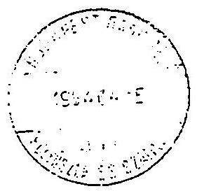

SADAPEST BANK Rt.

Számlatulajdonos: AV RT
Számlaszám : 317-11263-0000

Kivonat sorszáma: 68
Kivonat kelte : 94.04.15

Frittsgyenleg 331,033,199.59

Illensztala , Megjegyzés Ertéknap Tartozit Követel Bizonyiat Elaznap Jel Kitt

26.000.000.00 0414924006 94.04.15 4625 000
117-99434-1305 Szekeres Szabolcs lakást8 94.04.15 10,000,000.00 94.04.15 4515

Torgalza éssz 0.00 36.000,000.00

Tiróegyenleg 367,033,199.59

---

# A garanciális kötelezettségek 

a) Az ÁVÜ-töl átvett garanciális kötelezettségek

Az 1992. évi LIII. törvény hatálya alá tartozó és az ÁV Rt-hez kerülö gazdálkodó szervezeteket a 126/1992.(VIII.28.) Kormányrendelet 1. sz. melléklete határozza meg. Forrást a garanciafizetéshez az ÁVÜ csak az UVATERV esetében biztosított. Garanciavállalásról írásos átadás-átvétel pedig a Tokajhegyaljai Állami Gazdasági Borkombinát és a Richter Gedeon Vegyészeti Gyár Rt. esetében történt.

Budapest Húsipari Vállalat (BHV)

Az ÁVÜ 1992. október 16-án készfizető kezességet vállalt a Magyar Befektetési és Fejlesztési Rt. (MBFB) felé a BHV 150 millió Ft hitelére és annak járulékaira. A BHV idöközben az ÁV Rt. érdekkörébe került át. Az ÁVÜ 1992. november 11-i E-37/9/ÁVÜ/92. sz. határozatában döntött arról, hogy "A BHV müködőképességének megőrzése érdekében az átalakulásig 150 millió Ft hitelgaranciát biztosít, melyet az ÁV Rt. november 1-töl átvállal."

A garanciát az ÁV Rt. ugyan formálisan csak 1994. április 1-jén vállalta át, de az ügyvezetés 72/1993.(V. 12.) sz. határozatával a 9.750 ezer Ft kamatfizetési kötelezettségének eleget tett. Az 1993. júliusi csődegyezség eredményeként kiírt privatizációs tender eredménnyel zárult, a privatizációs bevétel várható beérkezéséig az ÁV Rt. a hitel után a vállalt készfizetö kezességet 1994. július 30-ig meghosszabbította. A hosszabbításról ügyvezetöi, illetve igazgatótanácsi döntés

---

nem történt. A garancia vállalás következtében 1993. év folyamán 32.608 ezer Ft kamat kifizetésére került sor, amelyböl 23.250 ezer Ft-ra sem ügyvezetöl, sem igazgatótanácsi döntés nem született.

A 33 millió Ft kötelezettséget az ÁV Rt. a törvény elöírása alapján az elkülönített eredménytartalékból teljesítette.

Richter Gedeon Vegyészeti Gyár Rt.
Az ÁVÜ részéről 1991. április 5-én indult 2.500 millió Ft összegben keret garanciavállalás. Az ÁV Rt. 1992. december 18-án e kötelezettséget 1993. december 31-i lejárattal átvállalta.

Nagykunsági Erdészeti és Falpari Rt. (NEFÁG)
Az ÁV Rt. 1994. január 31-ig garanciát vállalt a Budapest Bank Rt. szolnoki fiókjával szemben 49,4 millió Ft és járulékai erejéig.
1993. augusztus 13-án a Külkereskedelmi Bank szolnoki fiókjától még 125 millió Ft hitelt vettek fel (erről a 145/1993.(VIII.3.) sz. határozat döntött), amelyböl az év végéig 95 millió Ft-ot visszafizettek 1994. június 30 -ig, a fennálló tartozás 30 millió Ft.

Az ÁV Rt. úgy vállalt 49 millió Ft-ra garanciát, hogy az Igazgatótanácsi, illetve ügyvezetöi döntés hiányzik és nem döntöttek a 30 millió Ft garancia hosszabbításáról sem.

Út-Vasúttervezö Vállalat (UVATERV)

Az UVATERV libiai metró tervezésére kötött szerződése miatt 1983. október 13., az MNB a Tesco diszpozíciójára feltétel

---

nélküli garanciát vállalt 1.646.058 LYD és feltétel nélküli jóteljesítési garanciát vállalt 164.605,8 LYD összegben. A garanciák fenntartási költsége 1,5 ezrelék/hó. Az ÁVU az UVATERV V., Vigadó tér 1. sz. alatti irodaházát értékesítette azzal, hogy annak bevételéből 500 millió Ft-ot a saját garancia alapjában elkülönített. Az ÁVU ezt az 500 millió Ft-ot átutalta az ÁV Rt-nek a korábban vállalt garancia fedezetére. A Tesco pert indított az UVATERV ellen az 500 millió Ft-os, garancián felül kb. 150 millió Ft (többletköltségek, árfolyam módosítások, stb.) fedezetének biztosítására.

UVATERV kérte a Tesco-t a kereset visszavonására, ugyanakkor az NGKM felé is lépéseket tett és segítséget kért a Tripoli székhelyű képviselő megkeresésében. Időközben elindult egy Kormányelőterjesztés is az UVATERV időleges tehermentesítése ügyében (Külkereskedelmi Alapból 60 millió Ft). Ez az előterjesztés a kabinetfőnök úr szervezeténél leállt, jelenleg sürgetés alatt van. Az ÁV Rt. szóban vállalía a garancia folytatásának biztosítását (ÁV Rt. 1992. évi beszámoló), de erről írásos megállapodás nem született, a garancia fenntartását viszont teljesíti.

Az MNB részére a 150 millió Ft többletköltségre garanciavállalási nyilatkozat és döntés a garanciavállalásról nincs. Szekeres Szabolcs úr levele utal a garancia átvállalására Tokajhegyaljai Állami Gazdaság, Borkombinát (Tokaj Kereskedőház Rt.)

A Tokajhegyaljai Állami Gazdaság, Borkombinát (TÁGB) és a Postabank Rt. 1992. május 11-én RK-2021/92. sz. rövid lejáratú kölcsönszerződést kötött 220 millió Ft összegben.

Az ÁVU 1992. május 20-án az E-21/5/ÁVU/92. sz. határozatával döntött arról, hogy 220 millió Ft-ra hitelgaranciát vállal a szükséges rövid lejáratú hitel felvételéhez, mellyel a Kombi-

---

nát rendezhet1 az 1991. évi minőségi szőlő- és borfelvásárlás pénzügyeit és kezdeményezheti a felszámolási eljárás visszavonását. Egyben kikötötte, hogy a vállalat értékesítése során a befolyó privatizációs bevételből a banki hitelt kell elsőként törleszteni.

1992 decemberében az ÁVÚ átadta az ÁV Rt. hatáskörébe a TÁGB tranzakciós ügyintézését és hitelgaranciáját. Az ÁV Rt. a 14/1993. (11.19.) ügyvezetői határozatával döntött a kötelezettség átvállalásáról.
b) ÁV Rt. saját hatáskörében vállalt garanciális kötelezettségek

DUNAFERR Duna1 Vasmü Rt.

Az ÁV Rt. Igazgatósága a 132/1993. (X. 18.) sz. határozatával segíteni kívánta a DUNAFERR Rt. gyors és eredményes konszolidációját és müködöképességének megtartását. Ezért az ÁV Rt. garanciát vállalt a Crédit Lyonnais Bank Magyarország Rt. 500 millió Ft összegű rövidlejáratú forgóeszköz hitel 1993. június 16-i folyósításához 1994. május 10-i lejárattal.

A DUNAFERR Rt. 1993. október 15 -én 1.000 millió Ft kötvényt bocsátott ki az MNB Rt-vel. A kötvény lejárata 2001. október 15. A kötvény a futamidő végén részvénnyé váltható.

Távközlési Kutató Intézet (TKI)

Az ÁV Rt-nél 1993. június 3-án (K+F portfólió) előterjesztés készült a TKI helyzetéről.

A gazdálkodó szerv 1992-ben 265 millió Ft veszteséggel zárta tevékenységét. Müködésének kockázat elemzését a Befektetési Igazgatóság végezte. Az elemzés több variációban vizsgálta a piacvesztés, illetve elégtelen reorganizáció következményeinek kompenzálását.

---

1. variáció: Az ÁV Rt. közvetlen beavatkozása né1kül az Intézet felszámolása elkerülhetetlennek látszik. Az ÁV Rt. nyereségének valószínüsége $0 \%$, veszteség valószínüsége $100 \%$.
2. variáció: Az Intézet értékes helyen lévö ingatlanjai lehetöséget teremtenek - azok eladásával, új he1yre költözéssel - tevékenysége folytatására.

Az ÁV Rt-nek a TKI miatt 148 millió Ft összegben élt garanciavállalási kötelezettsége. Ebböl 80 millió Ft-ról ügyvezetői határozat döntött. A hitel egy részét a TKI visszafizette és 1993. december 31-én 83 millió Ft tartozása állt fenn. Az ÁV Rt 118/1993. (VII. 11.) sz. ügyvezetői határozatával döntött arról, hogy a Budapest, II., Gábor Áron u. 65. sz. alatt lévö ingatlant elvonja, értékesíti és a bevételt a TKI adóságainak kiegyenlítésére fordítja.

A TKI 1993. szeptember 1-én 750 millió Ft rövidlejáratú eseti hitelre kölcsönszerzödést kötött. A hitelszerzödés nem realizálódott, váltókezesség biztosította a forrást. Az ÁV Rt. kezesként 915 millió Ft-ra váltót állított ki a Creditanstalt Értékpapír Rt. részére.

A fennálló 83 millió Ft tartozás és az új 750 millió Ft kölcsönfelvételröl ( 915 millió Ft-ra váltót) is a 118/1993. (VI.11.) sz. ügyvezetői határozat döntött.

MALÉV Rt.
1993. április 28-án az ÁV Rt. rendkívüli ülésén a 49/1993. (VI.28.) sz. igazgatósági határozatával döntött a MALÉV Rt. garanciavállalásáról. Az ÁV Rt. készfizető kezességet vállalt 1993. április 28-án a MALÉV Rt. mint adós és a CIB, OTP Rt. mint hitelezók között létrejött hitelszerzödésre 121.122.306,94 USD összegben, amelyet a szerződő felek 1993.

---

április 29-én módosítottak. Engedményezési szerződés jött létre. A CIB teljes egészében engedményezte követelését a MHB Rt-re, a BB Rt-re és a Postabank Rt-re. Az OTP Rt. pedig a Kereskedelmi és Hitelbank Rt-re. (Az 1992. éves beszámolóban részletezve).
A MALÉV Rt. 1993. augusztus 25-én visszafizette a hitelt.

Ipolyvidéki Erdő és Fafeldolgozó Gazdaság (IEFÁG)

Az ÁV Rt. ügyvezetése megvitatta az IEFÁG hitelgarancia kérelméről készült elöterjesztést és a 114/1993. (VI.9.) sz. határozatával egyhangúlag döntött, hozzájárul 99 millió Ft hosszúlejáratú hitel felvételéhez. 1993. július 22 -én az IEFÁG öt év futamidőre 99 millió Ft hitelt vett fel a Corvin Banktól, az ÁV Rt. garanciavállalási nyilatkozata mellett.

EPOS-VKI Villamosipari Kutató Intézet

A VKI 1992. évi vesztesége 121 millió Ft. Likviditási helyzete miatt a felszámolás fenyegette. Befektetési Igazgatóság a kockázat elemzést (a portfólió igazgatóság elöterjesztéséhez) elvégezte.

Az Intézetet 150 millió Ft-os hitellel hozzá lehet segíteni ( $74,8 \%$ siker reményében) a továbbéléshez. Az ÁV Rt. részéről a garancia ráterhelhető az Intézet megmaradó telephelyére.

Befektetési Igazgatóság megitélése, az Intézet sikeres müködése azon múlik, hogy az Siemens Telefongyár Kft. profil és a létszám átvételekor milyen eredménnyel tud a végrehajtó menedzsment együttesében szervezőképes és hozzáértő személyeket kiválasztani, a végrehajtás jóságán lesz a hangsúly.

---

Az ÁV Rt. ügyvezetősége a 152/1993. (VIII. 13.) sz. határozatával döntött

- hozzájárul a VKI-EPOS Rt. megkösse a "P" projekt megvásárlására vonatkozó szerzödést,
- a szerződés forrásoldali fedezetének biztosítására az ÁV Rt. 50 millió Ft kamatmentes hitelt biztosít a VKI-nek, lejárata 1994. február 28-a,
- amennyiben az Intézet további 100 millió Ft felvételére kényszerülne, az ÁV Rt. hozzájárul ahhoz, hogy 1994. június 30-ig szóló kötelezettségével egyidöben kedvező kamatkondíció mellett banki hitelt vegyen igénybe.

Az 50 millió Ft kamatmentes hitel visszafizetési határidejét 1994. szeptember 30-ig, az Európa Kereskedelmi Bank Rt. által nyújtott 1 millió USD-röl a hitelgaranciát 1995. június 30-ig a 12/1994. (I. 13.) sz. határozatára meghosszabbította.

Felsötiszai Erdő és Fafeldolgozó Gazdaság (FEFÁG)

A FEFÁG 1993. március 25-én 250 millió Ft középlejáratú hitel felvételéhez kérte az ÁV Rt. garanciavállalását. 1993. január 31-én fennálló kötelezettsége 415 millió Ft. A garanciavállalásra vonatkozó számításokat a Befektetési Igazgatóság elvégezte és javasolta a FEFÁG számára 250 millió Ft középlejáratú hitel felvételéhez elvi garancianyilatkozat kiadását. Az alaptevékenység sérelme nélkül értékesíthető vagyon fedezetet biztosít a hitelgarancia összegére, amit az ÁV Rt ügyvezetése a 129/1993. (VII.2.) sz. határozatával jóváhagyott.

A Postabankkal folytatott előzetes tárgyalásai - a kedvező kamatozású középlejáratú hitel felvételéhez - nem realizálódtak. A FEFÁG 1993. augusztusában a Reálbankkal 250 millió Ft értékủ kötvényt bocsátott ki 1995. augusztus 16-i lejárattal.

---

# Szarvasi Állami Tangazdaság (SZÁT) 

A gazdaság 1992. évi vesztesége 298 millió Ft, rövidlejáratú kötelezettsége 500 millió Ft volt. Oka a már privatizáció alatt lévő gazdaságtalan egységek veszteséges müködése, a vevöállomány fizetőképességének zavarai. A SZÁT 280 millió Ft összegü hitelfelvételhez kér az ÁV Rt-töl garanciát. A Befektetési Igazgatóság kockázat elemzése alapján a SZÁT helyzetét hitel nélkül 99,2 \%-ban veszteségesnek minösíti. Az ÁV Rt. ügyvezetése a 153/1993. (VII.9.) sz. határozatában a Tangazdaság által az MNB részére készített program és a Befektetési Igazgatóság által elvégzett kockázat elemzés alapján megadja a 280 millió Ft-os hitelgaranciát 5 éves lejáratra. A hitel visszafizetés fedezete a vállalat nyeresége és a privatizációs bevétel.
1993. augusztus 30-án a Reálbank 280 millió Ft értékú kötvényt bocsátott ki amelyböl 50 millió Ft-ot 1993-ban a Tangazdaság kifizetett. A fennálló hitel végsö lejárata 1999. december 31.

Nit rokémia Rt.

Az ÁV Rt. a 137/1993.(XI.2.) sz. Igazgatósági határozata döntést hozott az 1.000 millió Ft értékủ reorganizációs kötvénykibocsátásának garanciavállalásáról, a 3 évre vonatkozó garanciát megadta, de a kötvény kibocsátására 1993. december 31-ig nem került sor.

Magyar Suzuki Rt. (MS Rt.)

A garanciavállalást a Befektetési Igazgatóság kockázatelemzése alapján nem javasolta.

---

Az ÁV Rt. Igazgatósága a 135/1993.(XI.2.) sz. határozatával tudomásul vette a Kormány szándékát, hogy a Magyar Suzuki Rt-ben a magyar befektetések emelését támogatja, e célból kapott Kormánygarancia mértékéig ( $1,3 \mathrm{milliárd} \mathrm{Ft}$ ) garantálta azon ÁV Rt-hez tartozó társaságok befektetéseit, melyek együttesen ilyen mértékũ tőkeemelést eszközöltek. Célul tüzték ki a tökeemelésben lehetöleg az MBFB Rt. vállaljon vezető szerepet.

Az Igazgatóság felkérte az MBFB Rt. vezetését, hogy indítson vizsgálatot abban a kérdésben, hogy hogyan javíthatja az MS Rt-ben lévô magyar befektetők helyzetét. A vizsgálat során használja fel az IKM-ben most készülö anyagokat is. 1993. december 13-án 1.300 millió Ft értékben a PM garanciát vállal a Magyar Suzuki Rt. tökeemelésére, am1hez az ÁV Rt. viszontgaranclát vállalt. Lejárat 1994. március 31.

Az ÁV Rt. 1993-ban saját hatáskörben vállalt készfizetö kezességvállalásalval a 126/1992. kormányrendelettel tulajdonába sorolt gazdálkodó szervezetek gyors és eredményes konszolidációját, müködésképességének megtartását, piacvesztés és elégtelen reorganizáció következményeinek kompenzálását, esedékes fizetési kötelezettségeinek teljesítését, likviditási helyzetéböl bekövetkező felszámolás elkerülését, rövidlejáratú hiteltartozásának átváltással kedvezőbb középlejáratú hitelfelvételét, kötvény kibocsátását, értékesítését, befektetések emelését biztosította.

Az ÁV Rt. saját határkörben vállalt 9.095 millió Ft kötelezettséget. 1993-ban garanciabeváltás nem történt.

---

Az ÁV Rt. garanciavállalási kötelezettségei 1993.december 31-én (millió Ft-ban)

|  Sorsz. | Társaság | Kedvezményezett | 1992. XII.31 kötelezet. | ÁV Rt. garancia kezdete | 1993. 12.31 vége | Összege | Tárgya | 1993. évi társasági törl. | 1993. évi társasági törl. | 1993. 31. 31-én fennálló kötelezettség | Megjegyzés | Tőke törlesztési kötelezettség  |
| --- | --- | --- | --- | --- | --- | --- | --- | --- | --- | --- | --- | --- |
|   |  |  |  |  |  |  |  |  |  |  |  | 1993  |
|  1 | Budapesti Húsipari Vállalat | Magyar Befektetési és Fejlesztési Bank | ÁVÜ garancia, jogilag nincs átvállalva | 1993.05.12. | 1994.07.30. | 150 | hitel gar. |  | 33 | 150 | gar.hosszabbítás 93.05.12.-93.10.28, 93.10.28.- 94.07.30 közölt |   |
|  2 | Dunaferr DV Rt. | Credit Lyonnais Bank |  | 1993.06.16. | 1994.05.16 | 500 | hitel gar. |  |  | 500 | lejárt, visszafizetve |   |
|  3 | Dunaferr DV Rt. | MHB |  | 1993.10.15. | 2001.10.15. | 1000 | kötvény garancia |  |  | 1000 | részvényre váltható |   |
|  4 | Távközlési Kutató Intézet | Budapest Bank |  | 1993.07.09. | 1993.12.30. | 148 | 4 db hitelvé kezesség | 65 |  | 83 | Új igénnyel 150 mFt kötelezettség 1994. évre | 148  |
|  5 | Távközlési Kutató Intézet | Creditanstalt Bank Rt. |  | 1993.09.01. | 1994.09.01 | 915 | válító |  |  | 915 | 750 mFt +kamat |   |
|  6 | Richter Gedeon Vegy. Gyár Rt. | Magyar Hitelbank Rt | 2550 | 1992.12.18. | 1993.12.31. | 2550 | hitel gar. |  |  | 2550 | Garancia hosszabbítva 94.06.30-ig 2500 mFI után, lejárt |   |
|  7 | MALÉV Rt | MHB, Budapest Bank, Postabank, K&H |  | 1993.04.28. | 1993.09.30. | 3270 | hitel gar. | 3270 |  |  | 36337 USD után, garancia lejárt, visszafizetve | 3270  |
|  8 | Atheneum Nyomda | Creditanstalt Bank Rt. | 90 | 1993.02.02. | 1994.02.15. | 90 | hitel gar. |  |  | 90 | ÁV Rt. hitel nyújtás |   |
|  9 | Nagykuns. Erd. és Faip. Rt. (NEFÁG) | Budapest Bank Szolnokl Ftők | 49 | 1992.12.29. | 1994.01.31. | 49 | hitel gar. | 49 |  | 0 | lejárt,visszafizetve | 49  |
|  10 | Nagykuns. Erd. és Faip. Rt. (NEFÁG) | MKB |  | 1993.08.16. | 1994.01.15. | 125 | hitel gar. | 95 |  | 30 | Gar.hosszabbítva 94.06.30-ig | 95  |
|  11 | UVATERV | TESCO | 650 | 1993.08.05. | 1993.12.31. | 650 | garancia fenntartás |  |  | 650 | 164.6 e LYD összegre, meghosszabbítva |   |

Page 1 ÁSZ+BF részére

---

Az ÁV Rt. garanciavállalási kötelezettségei 1993.december 31-én

|  Sor
sz. | Társaság | Kedvez mé-
nyezett | 1992.
XII. 31 | ÁV Rt. garancia |  |  | Tárgya | 1993.
évi
társas
ágl.
törl. | 1993. évi
társaság
törl. | 1993. évi
társaság
törl. | 1993.XII. 31
-én
fennálló
kötele-
zettség | Megjegyzés | Töke törlesztési
kötelezettség |   |
| --- | --- | --- | --- | --- | --- | --- | --- | --- | --- | --- | --- | --- | --- | --- |
|   |  |  | kötelez. | kezdete | vége | összege |  |  |  |  |  | 1993 | 1994 | 1995-2001  |
|  12 | Tokaj-hegyaljai
ÁG
Borkombinát | Postabank | 150 | 1993.02.01. | 1994.06.30. | 150 | hitel |  |  | 148 | gar. hosszabbittás
93.02.01-93.04.30,
93.05.01-93.10.15,
és 93.10.16-94.06.30
között |  | 148 |   |
|  13 | Ipolyvidéki
Erdőgazd. | Corvinbank |  | 1993.08.01. | 1998.08.31. | 99 | hitel gar. |  |  | 99 | 22%, 2 év türelmi idő,
tamm. évente 1/5-ed |  |  | 99  |
|  14 | EPOS-VKI
(Villamosip.
Kut. Int.) |  |  | 1993.08.13. | 1994.06.30. | 100 | hitel keret |  |  | 100 | Hitelfelvétel
1994-ben |  | 100 |   |
|  15 | Felsőtiszai
Erdőgazd. | Reálbank |  | 1993.08.16. | 1995.08.16. | 250 | kötvény
garancia |  |  | 250 | csődeljárás alatt |  |  | 250  |
|  16 | Szarvasi Áll.
Tangazd.
(SZÁT) | Reálbank |  | 1993.08.30. | 1999.12.31. | 280 | kötvény | 50 |  | 230 | további 200 mFl
tökeemelés
1994. évben | 50 | 100 | 130  |
|  17 | Nitrokémia Rt | Corvinbank |  | 1993.11.02. | 1996.12.20. | 1000 | kötvény |  |  | 1000 | évi kamat
22%, 17%, 15%,
n. évente |  |  | 1000  |
|  18 | Magyar Suzuki |  |  | 1993.12.13. | 1994.03.31. | 1300 | viszont-
garanc. |  |  | 1300 | lerendezve |  | 1300 |   |
|   | Összesen: |  | 3489 |  |  | 12626 |  | 3529 |  | 9095 |  | 3612 | 6023 | 2479  |
|   | 15-Aug-94 |  |  |  |  |  |  |  |  |  |  |  |  |   |

Page 2 ÁSZ+BF részére

---

# Tanácsadó cégek díj kifizetése és azok szerzödéses megalapozottsága 

## Külföldi tanácsadók

Az ÁV Rt. 1993-ban a minősített tanácsadó hálózatba felvett 45 külföldi tanácsadó cég közül 12 céget alkalmazott. Ezek 997,3 millió Ft értékben nyújtottak be számlát különböző tanácsadási jogcímen, amelyböl az előző pontban említett összeg került kifizetésre. Két cég az N.M. Rothschild and Sans Limited a MATÁV privatizációjának pénzügyi tanácsadása és a Credit Suisse First Boston Lomited (CSFB) bankprivatizáció tanácsadása miatt kapta az összeg közel 98 ㅊ-át.

Az ÁV Rt. által alkalmazott 12 be1földi tanácsadó közül mintavétel alapján megvizsgáltuk 6 tanácsadó cég részére kifizetett tanácsadói dij jogszerüségét: [az Andersen Consulting; a Credit Suisse First Boston Limited (CSFB); az N.M. Rothschild and Sons Limited; a J Henry Schroder Wagg and Co. Limited; KPMG Peat Marwick: Stickeman Elliott.]

## Credit Suisse First Boston Limited (CSFB)

A Magyar Kormány általános bankprivatizációs stratégiájához és egyéb kapcsolódó teendőkhöz, ajánlások tételéhez a CSFB-t, mint kizárólagos pénzügyi tanácsadót szerződés szerint havi 250.000 USD tanácsadói dij illette meg. Szerződés alapján az indokolt készkiadásokra benyújtott számlák, dokumentumok alapján havonta még 15.000 USD térülhetett meg. Az ÁV Rt. 1993. márciusától az angol nyelvű számlákra havonta a 250.000 USD tanácsadói díjat kifizette.

---

A szerzödéstöl eltérően az ÁV Rt. 1993. évet illetö készkiadásokra 15.000 USD helyett a benyújtott (Szekeres Szabolcs elnök vezérigazgató által igazolt: 1993. május 14-i 81/1993. sz. számla 20.141 angol fontot; ez 1993. szeptember 16-i 158/1993. sz. számla 18.980 angol fontot) számlák alapján 39.042 angol fontot fizetett ki.

# N.M. Rothschild and Sons Limited 

Az ÁV Rt. 1993. október 15-én megállapodást kötött a tanácsadóval, ame lyben megbizzza vezető pénzügyi tanácsadóként 5 magyar vidéki gázszolgáltató társaság (DDGÁZ; DÉGÁZ; ÉGÁZ; KÖGÁZ; TIGÁZ;) tervezett privatizációjával. A szerződés mellékleteit többszöri kérésre sem kaptuk meg, ame lyek a szolgáltatások teljesitésének ütemezését, a szolgáltatásokat nyújtó személyzet nevét, képzettségét, munkaköri leírását, az a 1 tanácsadókat, a tanácsadó díjazását tartalmazzák.

Az egyeztetéskor az ÁV Rt. vezérigazgatója - 1994. október 24-i levelében - a kérdéses szerződést angol nyelven hiteles fordítás nélkül az ÁSZ rendelkezésére bocsátotta.

Így az angol nyelvű számla alapján a 113.555 angol font kifizetésének jogossága nem állapítható meg. Figyelemre méltó tény, hogy a szerződés alapján a tanácsadónak a díjakért és kiadásokért járó minden kifizetést amerikai dollárban kell teljesíteni, a kifizetés mégis angol fontban történt.

Az ÁV Rt. 1993. április 1-én újabb megállapodást kötött a tanácsadóval, ame lyben vezető pénzügyi tanácsadóként a Magyar Távközlési Részvénytársaság (MATÁV) javasolt átszervezésével, leányvállalati és társvállalati privatizálásával, valamint a Közlekedési Távközlési és Vizgazdálkodási Minisztérium (KTVM) a távközlési szektor szabályozásával bizta meg. A szerződésben a

---

tanácsadó számára 1993. áprilisával kezdődően havi 50.000 US dollár fix alkalmazási díjat határoztak meg, a maximális alkalmazási dij azonban nem haladhatja meg a 750.000 US dollárt.

Eredményességi dijat kötöttek ki, amely az ÁV Rt. és/vagy a vállalat és/vagy a Magyar Köztársaság Kormánya számára szerzett jövedelmek 0.5 -a-val egyenlő.

A megállapodás alapján járó díjak és kiadások kifizetését US dollárban kell eszközölni a tanácsadó New York-i számlájára. A fizetendó díjak mentesek a Magyarországon kivetett adók alól.

Az ÁV Rt. belsö ellenöre 1993. december 1-én induló vizsgálatával a tanácsadók, szakértők részére kifizetett összegek és annak szerzödéses megalapozottságát ellenörizte.

A Felügyelő Bizottság 1994. február 14-i ülését jelentésben tájékoztatta az N.M. Rothschild and Sons Limited pénzügyi tanácsadó foglalkoztatásáról. A Rothschild pénzügyi tanácsadó az ÁV Rt. megbízásából a MATÁV privatizációjában müködött közre, a tevékenységéért az ÁV Rt. 1993-ban 5,070 millió US dollárt, a teljesítés napján érvényes árfolyamon számított 499,4 millió Ft-ot fizetett ki. A nyújtott szolgáltatások mennyiségét és minöségét a rendelkezésre álló dokumentumokból az ellenőrzés nem tudta megfelelően regisztrálni nyelvi nehézség miatt.

Stickeman, Elliott

Az ÁV Rt. a tanácsadó részére (1993. május 21-én 5.701 USD-t, 1993. május 25-én 4.155 USD-t és 1993. október 11-én 2.127 USD-t) 12.026 USD-t fizetett ki. A kifizetés jogosságáról meggyőződni nem lehetett, mivel szerződés nincs.

---

# Belföldi tanácsadók és tanácsadó cégek díj kifizetései, szerződéses megalapozottsága 

A minősített tanácsadók hálózatában nyilvántartott 322 be1földi tanácsadó, illetve tanácsadó cég közül 51 tanácsadóval kötött megállapodást az ÁV Rt. kőtvénykibocsátásra, adótanácsadásra, banki részvények értékmeghatározására, tanulmányok-, pályázatok kidolgozására, egyéb tanácsadásra. A 139,3 millió Ft-ra benyújtott számlákból 1993. december 31-ig 71,2 millió Ft egyenlitették ki. A kifizetés $88,7 \mathrm{~m}$-a 63,2 millió Ft 16 tanácsadó között oszlik meg.

Az ÁV Rt. által alkalmazott belföldi tanácsadók közül mintavétel alapján 11 tanácsadó, illetve tanácsadó cég részére kifizetett tanácsadói díj jogszerzôségét az ÁSZ ellenörizte: [Agroservice Kft; Arthur-Andersen; Burson Masteller Kft; Coopers and Lybrand; Ernst and Young; Köves és Társai; Hungaroholding; IQM Kft; Marketing Centrum; Nagy és Trócsányi Ügyvédi Iroda; Vörös és Kovács Könyvvizsgáló Kft.]

## Burson Masteller Kft

Az ÁV Rt. és a Tanácsadó 1993. augusztus 1-én megbizási szerződést kötött PR és kommunikációs management program szerződésszerü kialakítására és teljesítésére. A szakértők diját úgy határozták meg, hogy a projektre fordított órák számát megszorozták az egyes személyek számlázási rátájával. A teljes összeg 4 m -át számították fel költségekre. Az alvállalkozók tevékenységének összehangolásáért $17,65 \mathrm{~m}$ jutalékot számítottak fel. Ezen kivül járulékos költségek címén (fotókópia, fax, távolsági telefon, postai és utazási költségek, futárszolgálati díjak stb.) közvetlenül számláztak az ügyfélnek. Mindezekre az 50.000 USD keretösszeg terhére havonta a tényleges ráfordítás alapján nyújtott be számlát.

---

1993. november 3-án a Szerződés kiegészitésében megállapodtak abban, hogy október 1-töl, havi 35.000 USD összegben határozzák meg a megbizási dijat, amennyiben az összeg nem fedezi a tényleges ráfordításokat, a megbizott a fix összegen felüli kiadásait is elszámolhatja az ÁV Rt. felé. A feladatok teljesitését a számlákon Szekeres Szabolcs elnők vezérigazgató igazolta.

A tanácsadó céggel 1994. február l-én közölték, hogy az ÁV Rt. a megbizott további munkájara nem tart igenyt, mivel erdemben vitatható szolgáltatás elvégzéséért ugyancsak irreálisan magas, személyenként 50-285 USD/óra dij fizetésére vállaltak kötelezettséget. Az 1993. év 10-12 hónapra vonatkozó 38.342 ezer Ft összegủ számlák kifizetése után a szerzödést felbontották.

# Ernst and Young 

Az ÁV Rt. megbizási szerzödést kötött 1993. november 15-én a tanácsadóval a Tokaj Kereskedőház Rt. szétválásának elökészitésére, ezen belül jog-, szervezeti feladatokat, gazdasági jellegü (üzleti, pénzügyi) tervek, javaslatok elkészitésére.

A megbizott feladatát képezte a vagyonmérleg összeállítása. A végzendő szolgáltatások fixdijasok, ame1yek nem tartalmazták a készkiadásokat. A munkát 1994. január 15-ig kellett volna elvégezni. A 15 napon túli teljesités esetén a megbizott jogosult késedelmi kamat felszámítására. Sem számlát, sem elfogadó nyilatkozatot, sem késedelmi kamat felszámítást igazoló dokumentációt az ellenörzés során nem lehetett találni.

Az ÁV Rt. 1993. szeptember 30-án megbizta a Tanácsadót számvite1i politikájának elkészitésére és számlarendjének kiegészitésére. A szerződésben a teljesítés igazolását elfogadó nyilatkozathoz kötötték. Ezzel szemben a 4042/1994. sz. számlán 1994. január 25-i kifizetéskor semmilyen igazolás nem volt.

---

# Köves és Társal 

Az ÁV Rt. a Köves és Társai Ügyvédi Irodával kötōtt szerződést a Chinoin privatizációjával kapcsolatos jogi tanácsadásra 1993. május 7 -én és arra, hogy a Sanofi által készített jogi iratokat és szerzödéseket véleményezze. Az egyeztetést követöen angol nyelven készítse el a megbízó érdekeit tükrözö jogi iratokat és szerzödéseket. A megbizott jogosult a Clifford Chance angol ügyvédi Trodát a megbizás teljesitése során igénybe venni. A megbízási đ̛ijat a megbizó a kifizetéskor érvényes árfolyamon számított magyar forintban fizeti. A tárgyalásokon történő ügyvédi jelenlét díja a magyar ügyvéd részvétele esetén 200-250 USD/óra, angol ügyvéd részvétele esetén 400 USD/óra.

A Chinoin Rt. 11 \%-os részvénypakettjának átruházásával kapcsolatos 7,2 millió Ft ügyvédi munkadíjat tartalmazó számlát dr. Köves Péter egyéni ügyvéd nyújtott be az ÁV Rt-hez. A megbízó azt kifogásolta, hogy a számla benyújtójával nem kötött megállapodást, hanem a szerződést az ÁV Rt. Köves és Társai Ügyvédi Irodával kötötte. A számla kifizetésekor a megbizó kérte az ügyvédek tárgyaláson való részvételének igazolását és a számla alapját képező részletes számítási anyagot.

A magyar és az angol ügyvédek részvételét a tárgyalások ide jének feltüntetésével, valamint a számítási anyagot megvizsgáltuk. A 6,5 millió Ft kötelezettség kifizetésekor 550 angol font jogosságát nem állapították meg. A szerződésben a tárgyalásokon történő ügyvédi jelenlét óradiját USD-ben is indokolatlanul magas összegben határozták meg. Ezzel szemben a kifizetés angol fontnak megfelelő érvényes árfolyamon számított magyar forintban történt. A számlákat igazoló munkatársak közül jelenleg már senki sem dolgozik az ÁV Rt-nél.

---

# Hungaroholding 

Az ÁV Rt. 1993. októberében megállapodást kötött a Hungaroholding Vagyonkezelö Részvénytársasággal (tanácsadó) arra, hogy segitséget nyújt a Biogal Rt. (cég) tevékenységének stratégiai átszervezéséhez, alternativákat dolgoz ki a vagyonbefektetési tervekre vonatkozóan, ame lyek a cég alaptökejét megval toztat ják és tájékoztatást ad a cég pénzügyi helyzetéröl. A megállapodás angol nyelven készült, hiteles magyar fordítása annak ellenére sincs, hogy 1993. november 30-án készült kiegészitő nyilatkozatban is ezt szükségesnek tartották.

A dijazás mértékét a megállapodás 5. sz. melléklete részletezi. A kötelezettség fizetését a tanácsadó havi jelentése alapján teljesitik. Dijfizetés 1993. december 3-án, 1994. február 4-én és február 26-án történt a számlákhoz csatolt teljesités igazolásával. A kifizetés jogossága nem állapítható meg, mivel a szerződés mellékleteit tartalmazó dokumentumokat a felelős munkatárs szabadságára hivatkozva nem bocsátották az ellenörzés rendelkezéseire.

## IQM Kft.

A Felügyelő Bizottság tájékoztatása alapján a humán erőforrás rendszer kidolgozásáért a céget a szerződés elkészitéséért és a vezető tanácsadásáért 227.000 USD-nek megfelelő forint összegü dijazás illette volna meg. A szerződést az elnök-vezérigazgató kötötte, Ő igazolta a számla teljesitését is. A megfelelő szabályozás hiánya miatt kerülhetett sor azonban az IQM Kft-vel e szerződés megkötésére, amely jórészt az ÁV Rt. alkalmazottainak munkaköri kötelezettségét képezi, és irreál isan magas 23 millió Ft szolgáltatási di jat ígért.

---

Az Áv Rt. a szerződés felbontására 1994. január 31-én tárgyalást folytatott a megbizottal. Megvizsgálták, hogy az adott időpontig a tanácsadó a szerződésben foglalt feladatainak milyen mértékben tett eleget. A megbeszélés alapján $40 \%$-os "készültségi fokban" állapodtak meg, amelynek alapján az ÁV Rt. összesen 13,3 millió Ft-ot fizetett ki, majd a szerződés felbontásra került.

# Marketing Centrum 

Az Áv Rt. megállapodott a tanácsadóval. A tanácsadónak az ÁV Rt. 1993. december 30-ig 3,1 millió Ft-ot fizetett ki, de a számlákhoz nem csatolt teljesítési igazolást. A hiányos szerződés miatt a kifizetett kötelezettség jogszerűsége nem állapítható meg.

Nagy és Trócsányi Ügyvédi Iroda
Az Áv Rt. és a Magyar Hitelbank Rt. 1993. október 11-én tanácsadói szerzödést kötött a Credit Commercial de France-val (CCF). A megbizást tárgya az ÁV Rt., az MNB és a CCF közötti tanácsadói szerződés és a mellékletét képező titkossági szerződés elkészítése, valamint a tanácsadói szerződéssel kapcsolatosan folytatott tárgyalásokon az ÁV Rt. képviselete és szaktanácsadás. A felsorolt feladatokat a tanácsadó fix óradij alapján végzi, amely óradijakat a szerződés 1. sz. mellékletében rögzítették. A megbizási dí a megbizottnak az ügy ellátásával kapcsolatosan felmerült egyéb költségeit és kiadásait is magában foglalja.

Ugyanezen a napon tanácsadói szerződést kötöttek még arra, hogy a tanácsadó segítségével elvégezze az ÁV Rt. tulajdonába tartozó gazdasági társaságok szakmai átvilágítását. A megbizás tárgya a tanácsadók közötti tanácsadói szerződések alapjául szolgáló mintaszerződés elkészítése, a mintaszerződéssel kapcsolatos konzultációk folytatása. Egyik megbizási szerződéshez sem tartozik a szükséges melléklet, így a kifizetések jogszerűsége nem ellenörizhető.

---

További megbizási szerződést kötöttek még 1993. december 10-én, a megbizás tárgyát képezte a tárgyalások folytatása a Squire, Sonders and Dempsey Ügyvédi Irodával a MATÁV Rt. privatizációjával kapcsolatban, valamint a szerződésekkel kapcsolatos észrevételek megtétele. A megbizott a fenti feladatokat fix óradij alapján végzi, mely óradij 25.000 Ft. A megbizás teljesitéséért elszámolható órák számát 160 órában valószinüsitették. A megállapított órák számának túllépéséröl a tanácsadó köteles a megbizót elözetesen értesiteni. A fenti feladatok elvégzésére 1993. november 15. - 1993. december 23. között benyújtott (félig angol - félig magyar nyelvü) 5 számla igazolása alapján a tanácsadót 11,9 millió Ft illette meg. A fenti szerzödésben kikötött 25.000 Ft-ot fix óradij rendkívül magasnak mondható.

# Vörös és Kovács Könyvvizsgáló Kft. 

Az ÁV Rt. és a tanácsadó között 1993-ban több alkalommal szóbel i megállapodás jött létre a Somogyi, a Balatonfelvidéki, a Mátra Nyugati Bükki és Vértesi EFAG vagyonértékelésének, vagyonmérlegének átdolgozására és ellenörzésére. A ( 62,5 ezer Ft, a 125 ezer Ft, és 187,5 ezer Ft) 375 ezer Ft kötelezettségét az ÁV Rt. szerzödéskötés nélkül, a számlán igazolt teljesités alapján egyenlitette ki.

---

Az ÁV Ílt-nél 1993. évben és 1994. I. félévben elszámolt és kifizetett külföldi tanácsadói díjak fezer Ft-ban 1994. június 30.

|  Tanácsadó megnevezése | Megbízás tárgya | Nyt. szám | Megbízás dátuma | Megbízás összeg | Folys zia | 1993. évben benyújtott számla | Kifizetések 1993. XII. 31-ig | 1994. VI. 30-ig benyújtott számla | Kifizetés 1994. VI. 30-ig  |
| --- | --- | --- | --- | --- | --- | --- | --- | --- | --- |
|  Andersen Consulting | IKARUS | 412 | 1993. 12. hó | 180.000 USD + max. 15.000 USD kitgrérítés | 9 | 13.117.00 |  |  | 13.117.00  |
|  CEETEX | Kiállítás | L | 1993. 12. 13. | GBP 6.300 | 8 | 959.20 |  |  | 959.20  |
|  Chem System | TVK | 420 | 1993. 12. | L 85.000 | 10 | 12.656.50 |  |  | 12.656.50  |
|  Chem System | Borsodchem | 420 | 1993. 12. | L 65.000 | 10 | 6.775.00 |  |  | 6.775.00  |
|  Commerz Bank AG | Alkaloida | 417 | 1992. 10. 22. | max. 75.000 USD | 4 | 1.724.00 | 1.724.00 |  |   |
|  CSFB | Bankprivatizáció | 424 | 1993. 03. 23. | havi 250.000,- USD + max. havi 15.000 USD kitgrérítés | 3 | 248.809.00 | 167.709.50 |  | 81.099.00  |
|  Jones, Day | MATÁV |  | szóbeli | 6.630 USD + 375 USD kitgrérítés | 13 | 706.80 |  |  | 706.80  |
|  KPMG Peat Marwick | Bankdiagnosztikai tanulmányok | 426,427 | 1993. 04. 11. | 305.000 USD + 65.000 USD | 6 | 35.669.90 | 8.426.90 |  | 27.246.00  |
|  KPMG Peat Marwick | Tenderkiírás | L | 199.10.14 | 854.996.00 | 6 | 855.00 | 855.00 |  |   |
|  NM Rothschild | Gázszolgáltatók | 194 | 1993. 10. 15. | 125.000 USD + sikerdíj %-os arányban, de max. 4 millió USD | 1 | 16.908.30 |  |  | 16.908.30  |
|  NM Rothschild | MATÁV | 153 | 1993.04.01. | havi 50.000 USD, de max. 750.000 USD + sikerdíj | 1 | 626.060.00 | 505.391.20 |  | 120.668.80  |
|  NM Rothschild | MATÁV | 153 | 1993.04.01. | havi 50.000 USD, de max. 750.000 USD + sikerdíj | 1 |  |  | 16.921.60 | 16.921.60  |
|  Schroeders | MVM | 421 | 1993. 11. 01. | havi 77.000 USD + 200.000 USD de max. 662.000 USD | 11 | 18.061.10 |  |  | 18.061.10  |
|  Schroeders | MVM | 421 | 1993. 11. 01. | havi 77.000 USD + 200.000 USD de max. 662.000 USD | 11 |  |  | 32.748.90 | 32.748.90  |

---

Az ÁV Rt-nél 1993. évben és 1994. I. félévben elszámolt és kifizetett külföldi tanácsadói díjak /ezer Ft-ban kifejezve/ 1994. június 30.

|  Tanácsadó megnevezése | Megbízás tárgya | Nyt. szám | Megbízás dátuma | Megbízás összeg | Folys zia | 1993. évben benyújtott számla | Kifizetések 1993. XII. 31-ig | 1994. VI. 30-ig benyújtott számla | Kifizetés 1994. VI. 30-ig  |
| --- | --- | --- | --- | --- | --- | --- | --- | --- | --- |
|  Stivemann Elliott | MKKB |  |  |  | 5 | 1,133.80 | 1,133.80 |  |   |
|  Tech Egon | MAHART | 418 | 1993. 10. | 96.760 USD | 7 | 9,763.10 |  |  | 9,763.10  |
|  PAS-COM | Duna TV |  |  |  |  |  |  | 6,727.00 | 2,021.70  |
|  Clínvest | Hungarocamion |  | 1993. 10 | 59.300 USD + 15.000 USD költségtérítés | 3 | 4,103.00 997.301.70 | 685.240.40 | 56.397.50 | 4,103.00 363.756.00  |

A mintaként kiválasztott tanácsadók számlái alapján a díj-kifizetések összege 1993. december 3-19

Andersen Consulting 13.117.000 Ft

CSFB 248.708.000 Ft

Összesen 779.356.544 Ft

Page 2

---

# A TULAJDONOSI VAGY VAGYONKEZELŐ JOGOK GYAKORLÁSA A BANKOKNÁL 

Az állami tulajdon nagysága, megoszlása az Áv Rt.-hez tartozó bankoknál

A tartósan állami tulajdonban maradó vállalkozói vagyon kezeléséröl és hasznosításáról szóló 1992. évi LIII. törvény és az ahhoz kapcsolódó 126/1992. (VIII. 28.) Kormányrendelet meghatározta azokat a pénzintézeteket (bankokat), melyek részben vagy teljesen tartósan állami tulajdonban maradnak és az Állami Vagyonkezelő Rt-hez tartoznak, továbbá megjelölte e bankoknál az állami tulajdon legalacsonyabb mértékét.

A 126/1992.(VIII.28.) Kormányrendelet szerint ÁV Rt-hez tartozó bankok:

Országos Takarékpénztár (OTP)
Magyar Hitelbank Rt. (MHB Rt.)
Országos Kereskedelmi és Hitelbank Rt. (OKHB Rt.)
Általános Értékforgalmi Bank Rt. (ÁÉB Rt.)
Budapest Bank Rt. (BB Rt.)
Magyar Külkereskedelmi Bank Rt. (MKB Rt.)
Postabank Rt.
Magyar Befektetési Fejlesztési Rt. (A Kormányrendelet idöpontjában az MBF Rt. még nem volt pénzintézet, de 1993-ban azzá alakult.)

A hivatkozott kormányrendeletben meghatározott állami tulajdon legalacsonyabb mértéke összhangban áll "A pénzintézetekröl és a pénzintézeti tevékenységről" szóló 1991. évi LXIX. törvénnyel. amely egy-egy tulajdonos - köztük az állam - közvetlen és közvetett tulajdoni hányadát maximálja, illetve az ettól nagyobb állami tulajdoni hányadnál a törvény szerinti mérték ( $25 \%$ ) elérését 1997. január 1-ig írja elő.

---

Az 126/1992. (VIII.28.) Kormányrendeletben felsorolt bankokon kivül az ÁV Rt. az 1992. évi LIV. törvény 84. § (1) bekezdése alapján az alábbi bankoknál is tulajdonosi jogokkal rendelkezik.

Inter-Európa Bank
Konzumbank
Investbank Rt.
Yb1 Bank Rt.
Corvinbank
Westdeutsche Landesbank Hungary Rt. (volt általános Vállalkozási Bank Rt.)
Iparbankház
Mezőbank Rt.
Agrobank

Ezek a bankok azonban nem tartoznak a részben vagy teljesen tartósan állami tulajdonban maradók körébe.

A hivatkozott törvényhely kimondja:
"A Vagyonkezelö Részvénytársaság létrejöttének idópontjával az e törvény, vagy a tartósan állami tulajdonban maradó vállalkozói vagyon kezeléséről és hasznosításáról szóló 1992. évi LIII. törvény hatálya alá tartozó - a Vt. szerint müködő - gazdálkodó szervezet vagyonából a pénzintézetekröl és a pénzintézeti tevékenységröl szóló 1991. évi LXIX. törvény szerinti pénzintézetben tagsági jogokat biztosító reszvények a Vagyonkezelö Részvénytársaság tulajdonába kerülnek."

A törvényl elöírás ellenére az érintett gazdálkodó szervezetek egýrésze 1993. december végélg sem tett eleget kötelezettségének, így az állami vállalatoktól bekért banki részvények (közvetett állami tulajdon) címszó alatt kimutatott állomány nem teljeskörü.
Az ÁV Rt. nem ismerte teljeskörűen a banki részvényekkel rendelkező gazdálkodó szervezeteket, így a felszólításra is csak

---

részben volt lehetősége. Ezentúl az ÁV Rt-nek a pénzintézetekkel foglalkozó szervezeti egysége csak 1993. utolsó negyedévében jött létre, addig az ÁV Rt. - legfelső vezetői szinten - elsösorban stratégiai kérdésekkel foglalkozott a pénzintézetekkel. E témában érdemi intézkedések csak az említett szervezeti egység létrehozása után tōrténtek, me1ynek eredményeképpen 1994. május 13-a óta áll az ÁV Rt. rendelkezééére azoknak a gazdálkodó szervezeteknek a neve, ame1yek még át nem adott banki részvényekkel rendelkeznek. Az át nem adott részvények értéke 599 millió Ft. me1yeknek az ÁV Rt-hez történő beküldése érdekében 239 gazdálkodó szervezetet szólított fel. A felszólítások eredményessége a vizsgálat lezárásakor még nem ismert.

Az 1993. decemberében - a bankkonszolidáció keretében bonyolított - alaptökeemelés miatt megtartott rendkívüli banki közgyülések után a Pénzügyminisztérium az alábbi bankokban vált az állam nevében tulajdonossá:

MHB Rt., OKHB Rt., BB Rt., Agrobank, Iparbankház, Mezőbank Rt., Dunabank, Takarékbank.

Az állami tulajdont a Takarékbank esetében csak a PM, a Dunabanknál a PM és az ÁVÜ, a többi banknál a PM és az ÁV Rt. képviseli.

Az állami tulajdonosok közül a bankkonszolidációba bevont bankoknál a PM vált legnagyobb tulajdonossá, me1y kiugróan magas az MHB Rt., OKHB Rt., Dunabank, Mezőbank és Takarékbanknál, ahol eléri vagy meghaladja a $75 \%$-ot.

A pénzintézeteknél az állami tulajdont részleteiben, számszerüen és százalékosan, valamint idöben változóan a következö táblázatok mutat ják be.

---

Adatok az 1992. 12. 31-i állapot szerint

|  Bankok neve | Állami tulajdon |  |  |  |  |  |  |  |  | Nem állami tulajdon*** |  | Összesen |   |
| --- | --- | --- | --- | --- | --- | --- | --- | --- | --- | --- | --- | --- | --- |
|   | ÁV Rt. * |  | Pénzügyminisztérium |  | Állami vállalatoktól bekért banki részvény |  | Egyéb (nevesítve) |  |  | ezer Ft. | % | ezer Ft. | %  |
|   | ezer Ft. | % | ezer Ft. | % | ezer Ft. | % ** | ezer Ft. | % |  |  |  |  |   |
|  OTP Rt. | 21,850,000 | 95.00 |  |  |  |  |  |  |  | 1,150,000 | 5.00 | 23,000,000 | 100  |
|  MHB Rt. | 7,301,700 | 47.77 |  |  | 356,475 | 2.33 | Orsz. Társadalombizt. Fölgazgatóság |  |  | 7,632,000 | 49.93 | 15,285,400 | 100  |
|  OKHB Rt. | 4,415,000 | 32.63 |  |  | 291,170 | 2.15 | Orsz. Társadalombizt. Fölgazgatóság |  |  | 7,662,500 | 56.61 | 13,534,500 | 100  |
|  ÁÉB Rt. | 500,000 | 50.00 |  |  |  |  | 500,000 | 50.00 |  |  |  | 1,000,000 | 100  |
|  BB Rt. | 4,083,810 | 53.78 |  |  | 339,530 | 4.47 | Orsz Társadalombizt. Fölgazgatóság |  |  | 2,865,500 | 37.73 | 7,593,310 | 100  |
|  MKB Rt. | 3,213,000 | 44.90 |  |  | 61,000 | 0.85 |  |  |  | 3,942,000 | 55.10 | 7,155,000 | 100  |
|  Postabank Rt. | 1,058,000 | 16.26 |  |  | 114,000 | 1.75 |  |  |  | 5,447,370 | 83.74 | 6,505,370 | 100  |
|  MBFB Rt. | 1,946,000 | 42.24 |  |  |  |  | ÁFI Rt. |  |  |  |  |  |   |
|   |  |  |  |  |  |  | 2,644,000 | 57.39 |  | 17,000 | 0.37 | 4,607,000 | 100  |

- Tartalmazza az állami vállalatoktól bekért banki részvényeket is ** Az alaptőke %-a *** További adat nem áll rendelkezésre **** Tartalmazza a nem kiszűrhető közvetett állami tulajdon!

---

Adatok az 1992. 12. 31-i állapot szerint

|  Bankok neve | Állami tulajdon |  |  |  |  |  |  |  |  | Nem állami tulajdon**** |  | Összesen |   |
| --- | --- | --- | --- | --- | --- | --- | --- | --- | --- | --- | --- | --- | --- |
|   | ÁV Rt. * |  | Pénzügyminisztérium |  | Állami vállalatoktól bekért banki részvény |  | Egyéb (nevesítve) |  |  | ezer Ft. | % | ezer Ft. | %  |
|   | ezer Ft. | % | ezer Ft. | % | ezer Ft. | % ** | ezer Ft. | % |  |  |  |  |   |
|  Agrobank Rt. | 41,000 | 2.72 |  |  | 41,000 | 2.72 |  |  |  | 1,464,000 | 97.28 | 1,505,000 | 100  |
|  Dunabank Rt. |  |  |  |  |  |  | ÁVÜ |  |  |  |  |  |   |
|   |  |  |  |  |  |  | 780,000 | 78.00 |  | 220,000 | 22.00 | 1,000,000 | 100  |
|  Iparbankház Rt. | 3,000 | 0.28 |  |  | 3,000 | 0.28 |  |  |  | 1,067,700 | 99.72 | 1,070,700 | 100  |
|  Mezőbank Rt. | 8,450 | 0.36 | 230,610 | 9.77 | 8,450 | 0.36 |  |  |  | 2,121,740 | 89.87 | 2,360,800 | 100  |
|  Takarékbank Rt. |  |  |  |  |  |  |  |  |  | 1,356,600 | 100.00 | 1,356,600 | 100  |
|  Ált. Vállalkozási Bank Rt. *** |  |  |  |  | 17,240 |  |  |  |  |  |  |  |   |
|  Inter-Európa Bank Rt. *** |  |  |  |  | 73,250 |  |  |  |  |  |  |  |   |
|  Konzumbank Rt. *** |  |  |  |  | 7,600 |  |  |  |  |  |  |  |   |
|  Investbank Rt. *** |  |  |  |  | 13,000 |  |  |  |  |  |  |  |   |
|  Ybi Bank Rt. *** |  |  |  |  | 6,000 |  |  |  |  |  |  |  |   |
|  Ált. Vállalkozási Bank Rt. *** |  |  |  |  | 17,240 |  |  |  |  |  |  |  |   |
|  Ipari Fejlesztési Bank Rt. *** |  |  |  |  | 13,000 |  |  |  |  |  |  |  |   |

- Tartalmazza az állami vállalatoktól bekért banki részvényeket is ** Az alaptőke %-a *** További adat nam áll rendelkezésre **** Tartalmazza a nem kiszűrhető közvetett állami tulajdont is. - 2 - (1992. 12. 31.) ASZBANK2.XLS

---

Adatok az 1993. 12. 31-i állapot szerint

|  Bankok neve | Állami tulajdon |  |  |  |  |  |  |  |  | Nem állami tulajdon*** |  | Összesen |   |
| --- | --- | --- | --- | --- | --- | --- | --- | --- | --- | --- | --- | --- | --- |
|   | ÁV Rt. * |  | Pénzügyminisztérium |  | Állami vállalatoktól bekért banki részvény |  | Egyéb (nevesítve) |  |  | ezer Ft. | % | ezer Ft. | %  |
|   | ezer Ft. | % | ezer Ft. | % | ezer Ft. | % ** | ezer Ft. | % |  |  |  |  |   |
|  OTP Rt. | 21,103,933 | 91.76 |  |  |  |  |  |  |  | 1,896,067 | 8.24 | 23,000,000 | 100  |
|  MHB Rt. | 7,707,525 | 10.99 | 54,820,000 | 78.20 | 405,825 | 0.58 |  |  |  | 7,577,875 | 10.81 | 70,105,400 | 100  |
|  OKHB Rt. | 5,205,820 | 11.10 | 35,021,000 | 74.66 | 790,820 | 1.69 | Orsz.Társadalombizt. Főigazgazgatóság |  |  |  |  |  |   |
|   |  |  |  |  |  |  | 1,483,000 | 3.16 |  | 5,198,180 | 11.08 | 46,908,000 | 100  |
|  ÁÉB Rt. | 500,000 | 50.00 |  |  |  |  |  |  |  | 500,000 | 50.00 | 1,000,000 | 100  |
|  BB Rt. | 4,339,535 | 34.33 | 5,050,000 | 39.95 | 339,530 | 2.69 | Orsz.Társadalombizt. Főigazgazgatóság |  |  |  |  |  |   |
|   |  |  |  |  |  |  | 645,680 | 5.10 |  | 2,607,095 | 20.62 | 12,642,310 | 100  |
|  MKB Rt. | 3,528,000 | 49.31 |  |  | 324,830 | 4.54 |  |  |  | 3,627,000 | 50.69 | 7,155,000 | 100  |
|  Postabank Rt. | 1,239,000 | 19.05 |  |  | 175,500 | 2.70 |  |  |  | 5,266,370 | 80.95 | 6,505,370 | 100  |
|  MBFB Rt. | 4,305,000 | 42.18 |  |  |  |  | ÁFI Rt. |  |  |  |  |  |   |
|   |  |  |  |  |  |  | 2,654,000 | 26.00 |  | 807,000 | 7.91 | 10,207,000 | 100  |
|   |  |  |  |  |  |  | ÁVÜ |  |  |  |  |  |   |
|   |  |  |  |  |  |  | 2,441,000 | 23.91 |  |  |  |  |   |

- Tartalmazza az állami vállalatoktól bekért banki részvényeket is ** Az alaptőke %-a *** További adat nem áll rendelkezésre **** Tartalmazza a nem kiszűrhető közvetett állami tulajdoni is

- 1 -

(1993. 12. 31.) ASZBANK XLS

---

Adatok az 1993. 12. 31-i állapot szerint

|  Bankok neve | Állami tulajdon |  |  |  |  |  |  |  |  | Nem állami tulajdon*** |  | Összesen |   |
| --- | --- | --- | --- | --- | --- | --- | --- | --- | --- | --- | --- | --- | --- |
|   | ÁV RL * |  | Pénzügyminisztérium |  | Állami vállalatoktól bekért banki részvény |  | Egyéb (nevesítve) |  |  | ezer Ft. | % | ezer Ft. | %  |
|   | ezer Ft. | % | ezer Ft. | % | ezer Ft. | % ** | ezer Ft. | % |  |  |  |  |   |
|  Agrobank
Rt. | 67,500 | 1.61 | 1,196,500 | 28.48 | 67,500 | 1.61 |  |  |  | 2,937,500 | 69.91 | 4,201,500 | 100  |
|  Dunabank
Rt. |  |  | 4,300,000 | 81.00 |  |  | ÁVÜ
780,000 | 14.00 |  | 220,000 | 5.00 | 5,300,000 | 100  |
|  Iparbankház
Rt. | 8,400 | 0.84 | 800,100 | 36.86 | 8,400 | 0.84 | ÁVÜ
300,000 | 13.82 |  | 1,082,200 | 48.48 | 2,170,700 | 100  |
|  Mezőbank
Rt. | 14,000 | 0.16 | 6,390,610 | 75.00 | 14,000 | 0.16 |  |  |  | 2,116,190 | 24.84 | 8,520,800 | 100  |
|  Takarékbank
Rt. |  |  | 8,751,400 | 85.71 |  |  |  |  |  | 1,458,700 | 14.29 | 10,210,100 | 100  |
|  Ált. Vállalkozási
Bank Rt. *** | 30,000 |  |  |  | 30,000 |  |  |  |  |  |  |  |   |
|  Inter-Európa
Bank Rt. *** | 151,340 |  |  |  | 151,340 |  |  |  |  |  |  |  |   |
|  Konzumbank Rt.
*** | 7,600 |  |  |  | 7,600 |  |  |  |  |  |  |  |   |
|  Investbank Rt. *** | 13,000 |  |  |  | 13,000 |  |  |  |  |  |  |  |   |
|  Ybi Bank Rt. *** | 6,000 |  |  |  | 6,000 |  |  |  |  |  |  |  |   |
|  Corvinbank Rt.
*** | 26,600 |  |  |  | 26,600 |  |  |  |  |  |  |  |   |

- Tartalmazza az állami vállalatoktól bekért banki részvényeket is ** Az alaptőke %-a *** További adat nem áll rendelkezésre **** Tartalmazza a nem kiszűrhető közvetett állami tulajdont is - 2 - (1993. 12. 31.) ASZBANK XLS

---

Áttekintés az ÁV Rt. egyes privatizációs tranzakcióiról

MATÁV Rt. magánosítási folyamatának elindítása az ÁV Rt. 1993. évi privatizációs tevékenységének legnagyobb volumenú, s ez egyben az egész magyarországi privatizációs folyamat kiemelkedö tétele volt.

A MATÁV Rt-t 1991. december 31-1 hatállyal az ÁVÜ alakította át, tökeszerkezete a következő volt.

Saját tōke $\quad 109.515$ millió Ft
Jegyzett tōke $\quad 58.000$ millió Ft
Töketartalék $\quad 51.515$ millió Ft
1992. december 31-én $100 \%$-an a tulajdonosi jogok gyakorlója az ÁV Rt. volt, és az 1992. november 30 -ai közgyülés határozata alapján a távközlési hálózat apportálásával a jegyzett töke 59.295 millió Ft-ra emelkedett.
1993. november 18-án a MATÁV Rt. alaptökéje az ÁV Rt. 16/1993. (XI. 16.) számú alapítói határozata alapján 27.069 millió Ft-tal emelkedett, új részvények jegyzésével. Ebböl az ÁV Rt. 18.519 millió Ft-ot, az EBRD 5.700 millió Ft-ot, az IFC pedig 2.850 millió Ft-ot jegyzett le és járult iiozzá a jegyzett töke 86.364 millió Ft-os kialakításához. A két nemzetközi pénzintézet alaptökeemelése, és így $10 \%$-os résztulajdonossá válása pályázati eljárás nélkül ment végbe.

---

1993. december 22. zárult le a MATÁV Rt. privatizációja. A közlekedési hírközlési és vízügyi miniszter és az ÁV Rt. elnök-vezérigazgatója által 1993. augusztus 13-án aláirt közös pályázati felhívásra 4 érvényes pályázat érkezett, s mind a 4 pályázó indulhatott a másik fordulóban is.

A pályázati felhívás az Országos Távközlési Koncesszióra és a részvényértékesitésre együttesen szólt.

A bíraló bizottság végsõ javaslatát 10 - 0 szavazati aránnyal hozta meg, és a győztesként a Magyar Com Konzorciumot hirdették ki. A Magyar Com Konzorcium vételár ajánlata 875 millió USD volt, amely tartalmazta a kiírásnak megfelelően a MATÁV 400 millió USD tőkeemelését, az egyszeri koncessziós díjat (ez a megkötött koncessziós szerződés alapján 13.341 millió Ft) és a 30 \%-os tulajdonrész megvásárlásához szükséges dollár fedezetet.

A Magyar Comnak eladott 3.126 .845 db törzsrészvény eladási ára 741.653.520 USD (73.928.063 ezer Ft), amelyeknek névértékkel azonos könyvszerinti értéke 31.268 .450 ezer Ft, árfolyam - az ÁV Rt. kimutatása szerint - $240 \%$. 1993. december 22-én az ÁV Rt. - és az EBRD-IFC részvénycserét végrehajtott, így a tulajdoni arányok a privatizáció részleges befejezésével a következőképpen alakultak.

| Tulajdonosok | Jegyzett tőke | Tulajdonosi arányok |
| :-- | :--: | :--: |
| ÁV Rt. | 68.893 millió Ft | $66,7 \%$ |
| Magyar Com | 31.269 millió Ft | $30,3 \%$ |
| EBRD | 2.044 millió Ft | $2,0 \%$ |
| IFC | 1.022 millió Ft | $1,0 \%$ |
| Összesen | 103.228 millió Ft | $100,0 \%$ |

---

A privatizációs tevékenység részleges ellenőrzése alapján megállapítható, hogy az ÁV Rt. nem fizette meg a KHVM-nek (mivel a bevétel a koncessziós díj kifizetése a koncessziós szerződés alapján az ÁV Rt. számláján keresztül történt) a szerződésben elöirt 13.334 .608 ezer Ft összeget, mivel a részvény eladási szerződésben a 875 millió dollár eladási ár és a részvények ellenértékeként a szerződésben rögzített 741.653 .520 USD közötti különbözet erre nem nyújtott fedezetet. A 133.346 .080 USD alapján a KHVM-nek utalt összeg 13.292 .937 ezer Ft volt, amely 42.671 ezer Ft-tal kevesebb, mint amit a koncessziós szerzödés rögzít. A hibát az okozta, hogy nem elég körültekintően irták meg a szerződést, a koncessziós szerződés forint összeget tartalmaz, a részvény eladási szerződés dollárról szól, így az ÁV Rt. mint szerződő fél vállalta a koncessziós díj kifizetését a KHVM felé, köteles a fennmaradó összeget kifizetni a KHVM-nek.

A pályázati felhívásban az ajánlat összegeire a következő jelent meg:

- A pályázó által fizetett ajánlati összeg első 40 milliárd Ft-ját az új MATÁV részvények jegyzése ellenértékeként a MATÁV tőkeemelésére kell befizetni.

A részvény jegyzési megállapodás eltér a pályázati kiírástól, s így a vételárból tőkeemelésre elkülönített 40 milliárd Ft-ból az ÁV Rt. a jegyzett tőke emelésére 16.864 ezer Ft-ot fordított (új részvény kibocsátásával 10.000 Ft/részvény), a többi a MATÁV Rt. tőketartalékába került. Így az ÁV Rt. a kibocsátott új részvényeihez $231 \%$ árfolyamon jutott, hasonló árfolyamon mint a Magyar Com.

A Magyar Nemzeti Bank a külföldiek által befizetett 400 millió dollárt a MATÁV devizaszámlán tartására úgy engedélyezte, hogy az alaptőke emelésnek minősül, ezzel szemben az alaptőke emelés 16.8 millió dollár volt, a többi a MATÁV tőketartalékába került.

---

Így a tulajdonosi jogokat a 33.2 millió USD-nél a Magyar Com 30 \%-ban gyakorolhatja, ame1y egyébként az álta1a a részvényekért fizetett vételár volt. Egyébként a MATÁV koncesszió és értékesitési ajánlat végső ajánlati feltételek C. fejezet 4.0 teljes ajánlat 1. pontja is tartalmazza, hogy a teljes ajánlatot (I) "40 milliárd Ft-nak megfelelő USD értékú jegyzett részvény az MNB 1993. december 13-ai hatállyal bejelentett záró középátváltási árfolyam alapján számítva" kell megtenni.

- A részvényértékesitési megállapodás 2.1. pontja tartalmazza azt a jogot, hogy az ÁV Rt. az 1993. évre az eladásra kerülö részvények tekintetében osztalékot vegyen fel 500 millió Ft értékben. Ugyanakkor a tényhelyzet az, hogy a MATÁV 1993. évi adózás utáni nyereségének $32 \%$-át 600 millió Ft-ot különítettek el részesedésre - ez jóval alacsonyabb az Igazgatóság által osztalék politikában rögzített átlagos $50 \%$-kal szemben és ebből az ÁV Rt. osztaléka csupán 500 millió Ft volt. A szerződésben rögzített feltételt az ÁV Rt. nem teljesítette, és saját kárára csupán csak a saját tulajdonhányadnak megfelelő osztalékot vette fel, az eladott részvények utáni osztalékra nem tartott igényt.
- A MATÁV privatizációjából származó bevétel összesen 82.5 milliárd Ft-nak megfelelő dollár volt, ebből 40 milliárd Ft a MATÁV tőketartalékát növelte, s 28 milliárd Ft-ot a költségvetési befizetés tett ki, amelyet ráfordításként elszámolt az ÁV Rt. A dollár bevételből 4.375 .000 dollárt a IVM Rotschild külföldi szakértőnek utaltak át közvetlenül (erre a devizajogszabályok szerinti engedély kérésére nem került sor).

Előzőek alapján a bevételek és ráfordítások egyenlegeként az ÁV Rt.-nél 14 milliárd Ft pénzbevétel maradt. Ez azonban nem jelentkezik nyereségként, mivel az ÁV Rt. a privatizációs költségek között számolja el az eladott részvények névértékét,

---

amely a MATÁV esetében 34.3 milliárd Ft volt. Ezzel a MATÁV privatizáció eredményessége a számviteli törvény elöírásait alkalmazva az ÁV Rt.-nél jelentősen módosul.

Chinoin Rt. privatizációja -

A Chinoin Rt. privatizációja utolsó ütemét bonyolította le az ÁV Rt.

Az 1993. évi értékesítést megelőzően a részvények tulajdonlása a következőképpen alakult.

| ÁV Rt. | 2.100 millió Ft |
| :-- | --: |
| Sanofi | 1.600 millió Ft |
| Dolgozók | 300 millió Ft |
| Összesen | 4.000 millió Ft |

1993. július 18-án megállapodás szerint az ÁV Rt. eladja a 440 millió Ft értékủ részvényt. A Sanofi cég által fizetendő összeg 25 millió USD.

A részvényeket - az ÁV Rt. kimutatása alapján - 543 \%-os árfolyamon értékesítették, ténylegesen $181 \%$ volt az árfolyam. A privatizáció lebonyolítása után a tőkeszerkezet a következő:

| ÁV Rt. | 1.660 millió Ft | $41,5 \%$ |
| :-- | --: | --: |
| Sanofi | 2.040 millió Ft | $51,0 \%$ |
| Dolgozók | 300 millió Ft | $7,5 \%$ |
| Összesen | 4.000 millió Ft | $100,0 \%$ |

EGIS Rt. 1993. évi tőkeemelés privatizációja

1993 novemberéig az EGIS Rt. részvényei 84 \%-ban ÁV Rt. tulajdonokban voltak a 5.450 millió Ft-os alaptőkéjủ társaságban.

---

Az EGIS által 1993 novemberében elhatározott alaptőke emelést követően 1993. december 21-én az Európai Újjáépítési és Fejlesztési Bank (EBRD) és az Rt. részvényjegyzési megállapodást írt alá, ame lynek keretében az EBRD részvényenkénti 12.844 USD áron lejegyezte a vállalat 2.335 .715 darab új részvényét ( 30 millió USD áron).

A tőkeemelést követően, amelynél a zártkörű meghívásos ajánlattétel alapján az EBRD volt a pénzügyi befektető az EGIS tulajdonosi szerkezete a következőképpen alakult:

| ÁV Rt. | 4.591 millió Ft |
| :-- | --: |
| EBRD | 2.336 millió Ft |
| Egyéb | 859 millió Ft |
| Összesen | 7.786 millió Ft |

A piaci értékelési megállapodás keretében az EGIS és az EBRD megállapodott abban, hogy az Rt. részvényei "privatizációs értékesítése" esetén az ott kialakult részvényár alapján az EGIS vagy az EBRD bizonyos összeget fizet a másik félnek.

A "privatizációs értékesítés" időpontjában a kialakult részvényár és az EBRD által fizetett részvényár közötti különbözetet az EGIS az EBRD-től megkapja, illetve az EBRD-nek megfizetni tartozik, attól függően, hogy az árkülönbözet pozitív vagy pedig negatív. E megállapodás alapján az EBRD maximum 15 millió USD-t fizethet az EGIS-nek (ennek alapján az EBRD által a részvényekért fizetett vételár részvényenként 19,26 USD-nek felel meg) vagy az EGIS maximum 6.5 millió USD-t köteles visszafizetni az EBRD-nek (és ennek alapján az EBRD által a részvényekért fizetett vételár részvényenként 10,06 USD-nek felel meg).

---

A részvényjegyzés megállapodás értelmében az EBRD a 2.335.715 darab új részvény kibocsátási árának $30 \%$-át fizette be. Ennek megfelelően az EBRD a közgyűlésén 700.715 szavazatra, a szavazatok megközelítőleg $10 \%$-ára jogosult. A kibocsátási ár fennmaradó $70 \%$-ának befizetését követően az EBRD 2.335 .715 szavazatra, az összes szavazat $30 \%$-ára lesz jogosult. A részvényjegyzési megállapodás értelmében az EBRD a vételár fennmaradó $70 \%$-át nyilvános forgalomba hozatal lezárását követő 35 napon belül fizeti be.

Az EGIS, az EBRD, valamint az ÁV Rt. között létrejött eladási opciós megállapodás értelmében az EGIS kötelezettséget vállalt arra, hogy meghatározott feltételek fennállása esetén az EBRD-től visszavásárolja a részvényeket, ha az EBRD él eladási opciós jogával.

Az EBRD két eladási opcióval rendelkezik:
(i) privatizációs eladási opcióval,
(ii) ÁV Rt. esetleges részvényvásárlása esetén alkalmazandó eladási opcióval.
(i) Az EBRD akkor élhet privatizációs eladási opciós jogával, amennyiben azután, hogy az EBRD 1993. decemberében a vállalat új részvényeit lejegyezte, tizenkét (12) hónapon belül nem került sor a vállalat további privatizációjára. A nyilvános forgalomba hozatal keretében a részvények "privatizációs értékesítése" legkésőbb 1994. június 24-ig megvalósul.

Az eladási opciós megállapodás és a piaci értékelési megállapodás értelmében, amennyiben a "privatizációs értékesítés" megvalósul, azaz az ÁV Rt. tulajdonhányada a készpénz ellenében történő értékesítés következtében $44 \%$ alá süllyed, az EBRD a továbbiakban már nem élhet privatizációs eladási opciójával.

---

A privatizációval összefüggő tőkeemelés az EGIS Rt. nyere-ség-pozícióját megnövelte és az elörejelzések szerint 1994 1995-ben 30-40 \%-os nyereségnövekmény prognosztizálható.

- Herendi Porcelán Manufaktúra Rt. Privatizációja 1993. évben befejeződött. Az új tulajdonos teljes egészében a vállalat dolgozóiból alakult MRP szervezet lett. Az MRP szervezet a privatizációs jogszabályok és a vagyonpolitikai irányelvek adta kedvezményekkel élve E-hitellel, készpénzzel és kárpótlási jeggyel is szerezhetett tulajdont. Az ÁVÜ IT a vállalat társasággá való - 1992. június 30-i idöpontú - átalakulásakor meghatározta a privatizációs folyamatot is. Az ÁV Rt. igazgatósága is jóváhagyta a privatizációs lépéseket. A privatizáció kapcsán a vállalat MRP szervezet az értékesítésre felajánlott 643 millió Ft névértékú részvényt $133 \%$-os árfolyamon vásárolta meg 105 millió 790 ezer Ft-os MRP-t illető kedvezmény mellett úgy, hogy a vételárat az MRP szervezete 1998. június 30-ig évenkénti részletekben fizeti ki készpénzben vagy kárpótlási jeggyel. A kárpótlási jegyek kamattal növelt értéken történő befogadása nagy kedvezményt jelent az MRP szervezet számára, hiszen a kárpótlási jegyek mai piaci árát tekintve a vételár így 1/3-ára csökken, amely a társaság - jó prosperálása következtében - 1-2 éves nyereségéből kifizethető.

Az eredetileg márkavédelem miatt tartós állami vagyonkezelésbe került vállalatból átalakult társaság részvény eladását az MRP szervezet számára semmi nem korlátozza a teljes részvénycsomag kifizetését követően.

- Az ÁV Rt. a tulajdonában lévő DOKUT Rt. részvényéből 44 millió 870 ezer Ft névértékủ részvényt adott el a névérték 78 \%-ért (piaci ár) a társaság MRP szervezete részére, valamennyi kedvezményt figyelembe véve 11 millió 670 ezer Ft-ért, 3 éves

---

részletfizetés mellett. Ilyen módon a társaság MRP tulajdonhányada $32,3 \%$, az ÁV Rt. tulajdona $25 \%+$ egy szavazat, az önkormányzati részesedés $16,3 \%$, a dolgozói részvények $8,1 \%$, kárpótlásra tartalékolás $18,3 \%$.

- Az ÁV Rt. ügyvezetése az EMB Zenemükiadó Kft-ben 44,9 \%-ot kitevö ( 42.3 millió Ft értékü) üzletrészét nyílt pályázat keretében 75 millió Ft-ért (a limit ár 60 millió Ft volt) értékesítette a G. RICORDI and Co. Miláno, Olaszország részére. A pályáztatással az ÁVƯ a versenyeztetés keretében kiválasztott Cél Gazdasági Rt-t bízka meg. A szerződés létrejöttének dátumát az ÁV Rt. ügyvezetése 1993. november 30-ával határozta meg. A biráló bizottság pedig csak 1993. december 7-én, az ÁVÜ ügyvezetése 1993. december 16-án döntött a pályázat nyerteséről. Ennek ellenére az üzletrész átruházási szerződés dátuma 1994. február 11. A szerződéskor még ki nem fizetett 71 millió 250 ezer Ft vételár a szerződés aláirásától számított 30 napon belül esedékes. A szerződés megkötésének elhúzódása okára nem találtunk írásbeli anyagokat.

Az ÁV Rt. 1993. november 30-ával az EMB Zenemükiadó Kft. négy föállású dolgozója részére a jegyzett tőke $0,7 \%$-át kitevő 400 ezer Ft névértékủ üzletrészét 572 ezer Ft-ért adta el, melyböl a vagyonpolitikai irányelvek szerinti kedvezmény mértéke $50 \%$, így a vételár 286 ezer Ft-ot tett ki. A vételár a szerződés aláírását követő 30 napon belül volt esedékes. A Zenemükiadó Kft. többi dolgozója csatolt nyilatkozatok alapján nem kíván üzletrész tulajdont vásárolni. E döntésekről az ügyvezetésnek az ÁV Rt. igazgatóságát is tájékoztatni kellett.

Az ÁVÜ ügyvezetésnek 178/1993. (X.8.) határozata lehetővé teszi a társaság vagyona $10 \%$-ának a dolgozók részére, $15 \%$-ának belföldi befektető részére történő értékesítését, a külső befektetőnek értékesített részen túlmenően. Ehhez képest 1993.

---

november 2-án 24,53 \% vagyon újbóli értékesitésének meghirdetésére került sor, igy az ÁV Rt. tulajdoni részaránya $25 \%+1$ szavazatra csökken.

A pályázat 1994. január 3-ai beérkezési határidejére érvényes ajánlat érkezett. Ugyanekkor a magyar zenei társadalom 5 szervezete, kiemelt személyek kifogásolták a külföldi részére történő eladást és a többségi állami tulajdoni arány feladását. Ez utó lagos körülményekre való tekintettel az ÁV Rt. ügyvezetése 107/1994. (IV. hó) határozata alapján a Kft. üzletrészének 24,53 \%-ára kiirt pályázatát eredménytelennek nyilvánította és a Zenemúkiadó privatizációjának rendezését későbbi időpontra halasztotta.

- Az ÁV Rt. Igazgatósága 1993. évben jóváhagyta a Humán Rt. privatizálását és részvényeinek tőzsdére vitelét. Kü1ső tanácsadó készítette el a Humán Rt. privatizációs javaslatát. Kü1ső tanácsadó bevonásával nyilvános egyfordulós pályázat keretében sikeres pályázatot hirdettek az állami tulajdonban lévö 540 millió részvénynek és a 636 millió Ft tőkeemeléssel kibocsátandó új részvénynek a megvásárlására. Az alaptőke-emelés a társaság dolgozói részére 90 millió Ft részvény kivásárlással bonyolódott, míg a társaság részvényeiből 150 millió Ft-ot kárpótlási jegyért hirdetettek meg. 30 millió Ft névértékủ részvényt a társaság vezetői részére a hatályos vagyonpolitikai irányelvek szerinti feltételek mellett ajánlottak fel. Így az ÁV Rt. -nél maradó tulajdoni arány $50 \%+1$ részvény.

A pályázat benyújtási határidejét az ÁV Rt. mindössze egy hónapban rögzítette, s ez a nyertes pályázó írásbeli nyilatkozata szerint is kevésnek bizonyult a cégtender jó megismerésére, a társaság átvilágítására, az üzleti terv elkészitésére, a pályázat benyújtására. A nyertes vevő úgy nyilatkozott, hogy magasabb vételárat is adott volna a részvényekért, amennyiben alaposabban megismerhet te volna a céget.

---

A privatizációs tanácsadó a részvények $130 \%$-on történö értékesítését javasolta. A pályázatra két cég pályázott.
A NOVOPHARM Limited kanadal szakmai cég a társaság saját tőkéjének összességében 36,21 \%-ára meghirdetett értékesítési pályázatra - amely a kivásárlást és a tőkeemelési részt is tartalmazta - a részvények névértéken történö megvásárlására tett ajánlatot. Az ajánlati összeg 7 millió 720 ezer USA dollárt tett ki.

A másik pályázó a hazai Richter Gedeon Vegyészeti Gyár Rt. volt, ame1y ugyanezen 36,21 \%-os tulajdonrész megvásárlásra 105 \%-on tett ajánlatot. Ez forintban 38 millió Ft-tal magasabb a NOVOPHARM ajánlati áránál.

Az értéke1ö bizottság javaslatának figyelembe vételével a NOVOPHARM nyerte el a pályázatot, mivel a vételár nagysága a bírálatnál csak $50 \%$-os szerepet játszott, a másik $50 \%$-ot egyéb piaci, beruházáspolitikai szempontok képviselték, s ebben a külsó pályázót jelölték annyira jobbnak, hogy a pályázat nyertese is ö lett.

Az ÁV Rt. álláspontja megegyezik az értéke1ö bizottságéva1.

- A MALÉV Rt-nél az ÁV Rt. igazgatóságának határozata jegyzett tökéhez viszonyított maximálisan 5 \% összkeret erejéig kedvezményes részvényvásárlási lehetőséget biztosított a MALÉV Rt. dolgozóinak. A felajánlandó részvények vételárát a névérték $200 \%$-ában állapították meg. Értékesítésre került így 40 millió Ft értékủ részvény 80 millió Ft árfolyamon. A vételár $25 \%$-át a jegyzéskor, a fennmaradó vételár hátralékot 3 éves futamidó alatt lehet a dolgozóknak teljesíteni.
- Az 1991. évi XXV. törvény 8. §. (3) bekezdése alapján az ÁV Rt. köteles a társasággá átalakuló állami vállalatok vagyon-

---

mérleg szerinti vagyonának a $10 \%$-át kárpótlási jegy ellenében felajánlani. A felajánlandó részvények mennyiségét, fajtáját az ügyvezetés előterjesztése alapján az Igazgatóság határozza meg. A részvény-kárpótlási cserearányt az ügyvezetés hagyta jóvá. A Kormány az ÁV Rt. számára előirta, hogy a kárpótlási jegyért történő részvénye ladások az ÁVÜ-vel, mint a második legnagyobb felajánlóval összhangban történjenek. E kötelezo összhangot az ÁVÜ nem minden esetben tartotta be, ez az ÁV Rt. számára megnehezítette az azonos időszakra szervezett értékesítést. Az ÁV Rt. 1992 októberi alapítása óta 1994 júniusáig 14.1 milliárd Ft értékủ kárpótlási jegyért adott el részvényeket. A kárpótlási jegyért történő részvény eladások kizárólag a MOL Rt.-nél, a Magyar Külkereskedelmi Bank Rt-nél és a Budapesti Bank Rt-nél nem voltak sikeresek, mivel a részvények kárpótlási jegy váltási arányának meghatározása lényegesen a piaci áron felül történt, ezért e felkínált részvényeket a vásárlók csak részben jegyezték le. Az ÁV Rt. Igazgatósága 111/1993. (X.4.) határozatában 92.8 milliárd Ft értékủ kárpótlási jeggyel szembeni kínálatot hagyott jóvá első ütemben a Kormány 120 milliárd Ft-os kínálat előírásával szemben, s vizsgálatot folytat további társaságok kijelölésével és új privatizációs technikák kijelölésével a kárpótlási jeggyel szembeni kínálat biztosítására. Az ÁV Rt. 1994. évi tervezet kínálata kárpótlási jegyek ellenében 46.2 milliárd Ft volt. Az új Kormány a vizsgálat ideje alatt felfüggesztette a részvények kárpótlási jegyért történő értékesítését.

A kárpótlási jegyek ellenében történő nyilvános kibocsátást az ÁV Rt. külső szakértővel végezteti, beleértve a részvénykárpótlási jegy cserearány meghatározását is. A nyilvános részvény értékesítésen kívül a kárpótlási kínálat bővítését szolgálja célzott privatizációs technikák folyamatba helyezése is. (Befektetési társaságok létesítése, az állami erdőtulajdon és a kárpótlás összehangolásának lehetösége, a munkavállalói

---

tulajdonszerzés és kárpótlás összekapcsolása Herend, MALÉV). Az ÁV Rt. által elfogadott kárpótlási jegyeket a töketartalék terhére számolták el, megsemmisítették a mérleg záráskor.

- Az ÁV Rt. igazgatósága hagyta jóvá 8/1994. (I.17.) határozataban jelölte ki - a Kormányhatározatnak eleget téve - a Kisbefektetői Részvényvásárlási Program 1994-ben kezdődő első üteme induló kínálatát - közel 20 milliárd Ft értékben. A további kínálatot folyamatosan tervezték kialakítani.(Az új körülmények között ez aligha valószínűsíthető).
- Az ÁV Rt. igazgatósága az ÁB AEGON Rt.-ben lévő utolsó 2,7 \%-os, 784 millió Ft névértékủ üzletrész + 115 millió Ft eszközérték eladását az AEGON International MV cégnek 350 millió Ft készpénzért és 576 millió névértékủ OKHB Rt., Budapest Bank Rt. és MHB Rt. részvényekért, azok vételárát 434 millió Ft-ban elismerve. Az igazgatóság határozatában is feltüntette, hogy ez az 576 millió Ft névértékủ és 436 millió Ft vételárnak betudott részvénycsomag piaci értéke mindössze 182 millió Ft. E kedvezőtlen döntést a vizsgálat érthetetlennek tartja és az ÁV Rt. Felügyelő Bizottsága a privatizációt az Állami Biztosító privatizációja tárgyában korábban, 1992-ben készített ÁSZ jelentés időpontjától kivizsgálásra javasolja. Az ÁV Rt. egy darab arany részvényt kapott. Megjegyezzük, hogy az eladásnál nem került minösitésre az ÁB AEGON Rt. közel 40 milliárd Ft összegü - a vagyon részét képező, jó portfóliójú - tartaléktökéje, abból a szempontból, hogy az életbiztosításokra rendelkezésre álló tartaléktőke nem tartalmaz-e tartalékot, me1y a részvények árfolyamára lényeges növelő hatású, így a még utolsó ütemben eladott tulajdonrész árfolyamára is növelő hatású lett volna. A többszöri alaptöke, illetve tartaléktöke emelésnek a részvényeladási áralra vonatkozó határát nem vették figyelembe.

---

- Az Inter Európa Bank Rt. részvényei értékesítésére kötött 1993. ében indított - opciós megállapodások realizálása.

Az ÁV Rt. mint tulajdonos és a CA Hungary Asset Management Co. LTD (Budapest), mint opció jogosult között, 1994. február 1-jén opciós megállapodás jött létre 437 millió 640 ezer forint névértékủ Inter Európa Bank részvény opció jogosultnak a névérték $116 \%$-án történő eladására. A szerződés szerint az ÁV Rt.'e részvények átadásának kötelezettségét másra is átruházhatja. Tekintettel arra, hogy az ÁV Rt. a szerződéskötés idöpontjában csak 151 millió Ft összegủ Inter Európa Bank Rt. részvénnyel rendelkezett, így a hiányzó mennyiséget vásárolnia kellett. Az ÁV Rt. a hiányzó részvények megvásárlásával 1994 januárjában megbizta az RTL Service Kereskedelmi és Szolgáltató Kft-t (RTL Kft). A Kft-nek 286 millió 300 ezer Ft értékben kellett saját nevében Inter Európa Bank Rt. részvényeket venni a Creditanstalt Rt. részére történő továbbértékesítés céljából. Azt, hogy milyen áron vásárolhat a vevö, a megállapodásban nem kötöt ték ki. Az ÁV Rt. viszont visszavonhatatlan kötelezettséget vállalt arra, hogy a Creditanstalt Rt.-vel olyan feltételekkel szerzödik, amely feltételeket az RTL Kft-vel egyezteti.

Az RTL Kft. 1994. február 16-án vételi jogot biztosító adásvételi szerzödést kötött a Magyar Külkereskedelmi Bank Rt.-vel 101 millió Ft Inter Európa Bank Rt. részvény $95 \%$-on történő megvásárlására. A felek kikötötték, hogy a teljesítés napjáig letétbe helyezett részvények fölött az ÁV Rt. jogosult rendelkezni. Az RTL Kft. alvállalkozója a CONFIDES Hungaria Brókerhause Rt. 1994. március 1-jén opciós szerződést kötött a MINERALIMPEX Rt.-vel 158 millió 480 ezer Ft névértékủ Inter Európa Bank Rt. részvény $97 \%$-os árfolyamon történő megvásárlására.

---

Nem indokolható az opciószerzödés megkötése, mivel az ÁV Rt. már 1993. november 19-én opciós vételi ajánlattal kereste meg a MINERALIMPEX Rt.-t 157 millió Ft névértékủ Intereurópa Bank Rt. részvénynek a névérték $100 \%$-án történö megvásárlására 3 hónapos határidövel. A Mineralimpex Rt. november 30-án vissza is igazolta a részvény eladást. Nincs indoka annak sem, hogy az Áv Rt. miért kötötte meg 1994. február l-jén az opciós megállapodást az RTL Kft-vel a teljes hiányzó részvényösszegre, hiszen a MINERALIMPEX-szel kötött opciós szerzödés még életben volt, a határideje még nem járt le.

Az ÁV Rt.-nek az RTL Kft-vel kötött opciós megállapodása - figyelembe véve a külsö megbízottaknak a részvények megvásárlására vonatkozó megállapodásait is - az ÁV Rt. részéről bizományosi szerződés. Ezért a CA Hungary Asset Management Ltd-nek a teljes vételárat követö kifizetése után az ÁV Rt.-nek meg kel1ett volna kapnia az MKB Rt.-töl és a MINERALIMPEXTÖL vásárolt részvények után az ÁV Rt.-t megil1ető 51 millió Ft árfolyamnyereséget.

Az RTL Kft. és alvállalkozójának közremüködöként történö bevonása összegében 64 millió Ft árfolyamnyereségtöl fosztotta meg az ÁV Rt.-t. Ugyanakkor a MINERALIMPEX Rt. a tranzakció folyamán nem kapott meg 18 millió Ft-os osztalékot, mivel ezt a Confidens Rt. a megállapodások ellenére nem utalja át.

Az RTL Kft.-t, illetve alvállalkozóját csak bizományosi vagy közvetítöi díj illetve volna meg. Az ÁV Rt.-t semmi nem kötelezte a külsö lebonyolítók alkalmazására. Önmaga is jogosult volt ilyen ügyletet lebonyolítani. Ha külsö megbízottakat alkalmazott, akkor részükre bizományosi vagy közvetítöi díjat kellett volna fizetni. Erre viszont egyik megállapodásban sem tértek ki. A vizsgálat idöpontjában nincs dokumentuma annak, hogy az ügylet kapcsán 28 millió Ft Inter Európa Rt. részvényt

---

az ÁV Rt. honnan vásároltatott meg vevöje részére, azt milyen áron vásárolták, ugyanis a vevő ezt is kifizette $116 \%$-os árfolyamon.

Az RTL Kft. szerepe, kőzremüködőként való bevonásának szükségessége, motivációja az érintett ÁV Rt. bonyolító alkalmazottak nyilatkozatai alapján és a rendelkezésre álló - hiányos iratok szerint sem állapítható meg. Ezért az e témában részletes vizsgálatot folytató ÁV Rt. Felügyelő Bizottsága szerint ennek kiderítése túlmegy a Felügyelő Bizottság jogszabályok behatárolta lehetőségein. (Meg kell jegyezni, hogy hasonlóan korlátozottak az ÁSZ lehetőségei).

- Az ÁV Rt. 1993. november 1-jén tanácsadói megállapodást kötött az angol J. Henry Schroeder Wag and Co. Limited társasággal a Magyar Villamosmüvek Rt. és a hozzá kapcsolt 6 regionális energiaszolgáltató társaság, 8 erőmủ társaság, egy elosztó társaság privatizációjára vonatkozó stratégia és program kialakítására 662 ezer USA dollár értékben (projekt I. szakasza). A megállapodás emlit egy projekt II. szakaszt is, amely e társaságoknál a privatizáció végrehajtásával kapcsolatos feladatokat jelentené, de erre még a megbizás nem lett kiadva. Viszont a megállapodás meglepö módon nagy összegü ügyleti dij kifizetését írja elő az ÁV Rt. részéről a tanácsadó részére abban az esetben, ha a tanácsadó nem kap megbízást a 16 társaság egylkének vagy több társaságának - a project II. szakasza - a privatizációjára. A megállapodás szerint "az ügyleti dij $1 \%$-a - de semmi esetre sem magasabb összesen vagy bármely ügylet esetében 200 ezer USA dollárnál - annak a teljes összegnek (készpénz vagy természetbeni hozzá járulás), amelyet egy vagy több pénzügyi vagy stratégiai befektető hitel vagy alaptöke formájában egy vagy több társaságba ténylegesen beruházott, illetve a befektető fizetett meglévő, illetve új részvények eladásakor". Vagyis a tanácsadó a II. projekt kapcsán akkor kap nagy összegü ügyleti díjat, ha semmit sem dolgozik.

---

- A Magyar Külkereskedelmi Bank Rt. 1994. évi privatizációja az első magyarországi bankprivatizáció. A bankprivatizációról szóló alapvetö döntések meghozatala - ugyanúgy, mint a bankkonszolidációé - kormányzati szinten történt. Ezt az is indokolta, hogy a pénzintézeti törvény 15. § (1) bekezdése szerint:
"A Magyar Köztársaságban a Kormány elözetes elvi hozzájárulása szükséges részben, vagy teljesen külföldi tulajdonban álló pénzintézet alapításához, továbbá külföldi személy által Magyarországon bejegyzett pénzintézetben történő részesedéshez, kivéve, ha a pénzintézetben az összes külföldi részesedés aránya nem haladja meg a pénzintézet jegyzett tökéjének tiz százalékát."

1993. február 11-én kiválasztották egyrészt a Kormány általános, stratégiai feladatokkal megbízott tanácsadóját, amely a Credit Suisse First Boston (a továbbiakban: CSFB) lett, másrészt négy magyar bank egyedi tanácsadóját, melyek a következök:

| JP Morgan | Magyar Külkereskedelmi Bank Rt. |
| :-- | :-- |
| Solomon Brothers | Budapest Bank Rt. |
| Credit Commercial |  |
| de France | Magyar Hitelbank Rt. |
| Hambros Ltd | Kereskedelmi Bank Rt. (OKHB) |

A kormányzati döntés értelmében a bankprivatizációban az ÁV Rt. elsődleges feladata a résztvevök közötti koordináció. Ezzel összhangban az ÁV Rt. megkötötte - a stratégiai feladatokat meghatározó - szerződést a CSFB-vel.

Az ÁV Rt. létrehozta a koordinációs feladatok ellátására a Bankprivatizációs Munkacsoportot, melynek tagjai az ÁV Rt., PM, Állami Bankfelügyelet, MNB, Magyar Befektetési Fejlesztési Bank Rt. képviselöi, továbbá a privatizációért felelős miniszter tanácsadója (USA pénzügyminisztérium képviselöje), az ÁV

---

Rt. eInöki tanácsadója és az IMF magyarországi képviselöje. A Bankprivatizációs Munkacsoport feladata a Bankprivatizációs Bizottság döntése1őkészitő munkájának szervezése.

A Bankprivatizációs Bizottság konzultativ testület, mely a Kormány számára az elöterjesztéseket megfogalmazza. A bankok egyedi tanácsadóival a szerződéseket a bankok kötötték meg.

A rendelkezésre álló dokumentumok szerint az ÁV Rt. 1993-ban egyetlenegy alkalommal, 1993. november 5-i igazgatósági ülésén foglalkozott és hozott határozatot a MKB Rt. privatizációjával kapcsolatban.

Ezt megelözően 1993. októberben bekérte az MKB-tól a privatizációval kapcsolatban a döntési lépcsőket előkészitő anyagokat ahhoz, hogy az eseményeket követni tudja, illetve érdemi döntéseket hozhasson. Az azok alapján készített elöterjesztés szerint az MKB Rt. kiválasztott tanácsadója a JP Morgan 25 potenciális befektetőnek információs memorandumot küldött ki, melyek közül hat adott érdemi választ. A részletes feltételek megismerését kővetően az EBRD (Európai Újjáépítési és Fejlesztési Bank) és a Bayerische Landesbank (a továbbiakban: BLB) tartotta fenn befektetési szándékát.

Az előterjesztés alapján az ÁV Rt. Igazgatósága a 142/1993. (XI.5.) határozatában rögzített feltételekkel engedélyezte a tárgyalások folytatását.

Az MKB Rt. privatizációjában a rendelkezésre álló dokumentumok szerint az ÁV Rt. 1993-ban csak az események követöje volt.

A Magyar Külkereskedelmi Bank Rt. igazgatóságába delegált ÁV Rt. képviselö révén 1994. tavaszától a privatizációt lezáró szerződések aláírásáig (1994. július) az ÁV Rt. már a tárgyalásokon is részt vett.

---

1994. április 28-án az EBRD-t, BLB-t és az MKB-t követően az ÁV Rt. is aláirta a privatizáció főbb elemeit tartalmazó befektetési memorandumot.
1995. május 3-án az MKB Rt. közgyűlése zártkörü, feltételes alaptőkeemelést szavazott meg a BLB és az EBRD számára.

A Kormány elvi hozzájárulását 1994. május 17-én 1.035/1994. határozatával - az MNB elnökének egyetértésével - megadta. Az ÁV Rt. az MKB Rt. privatizációját a 229/1994. (VI.20.) határozatában hagyta jóva.

A privatizáció lényege:

- Elsőként a BLB és az EBRD megvásárolta az MKB-tól a bank saját portfóliójában lévő saját részvényeit, melyből az MKB-hoz befolyó összeg 1.080 millió Ft volt.
- A BLB az ÁV Rt-től vásárolt MKB részvényeket, melyből az ÁV Rt.-nek 1034 millió Ft privatizációs bevétele keletkezett.
- Az MKB Rt. 1994. július 15-i rendkívüli közgyülésén az EBRD és a BLB, mint új tulajdonosok kötelezettséget vállaltak az 1994. május 3-i MKB Rt. közgyülésén elfogadott feltételes alaptőkeemeléssel összhangban - a kibocsátandó részvények 1994. július 15. - december 31. közötti időszakban történő lejegyzésére.

Ezen lépések eredményeképpen az MKB Rt. alaptőkéje 7.155 mi11 ió Ft-ról 9.092 millió Ft-ra emelkedik. Az EBRD tulajdoni részesedése - a megemelt alaptőkéből - $17 \%$, a BLB-é $25,51 \%$. Az ÁV Rt. részesedése az adásvétel és a tőkeemeles következtében az addigi $55,4 \%$-ról lecsökken $27,52 \%$-ra, mely arány nagyobb, mint a 126/1992.(VIII.28.) Kormányrendeletben elóirt legalacsonyabb állami tulajdoni hányadnak.

A szerződések angol nyelven készültek, hivatalos magyar fordításuk a vizsgálat lezárásakor még nem volt.

---

Az ÁV Rt. 1993. évi és 1994. I. félévi vezérigazgatói utasításainak jegyzéke, a szabályozások tárgya
1993. év
1/93. sz. Az ÁV Rt. múködéséhez szükséges időleges szabályok kialakítása, a vonatkozó feladatok meghatározása.
2/93. sz. Közgyülési mandátum kiadása.
3/93. sz. Az ÁV Rt. munkavállalóinak etikai magatartasa.
4/93. sz. Az ÁV Rt-hez tartozó társaságok közgyüléseinek előkészítése során követendő el járásról.
5/93. sz. Az ÁV Rt. Szervezeti és Müködési Szabályzatáról.
6/93. sz. Zárlati utasítás és ütemterv.
7/93. sz. A kötelezettségvállalások és utalványozás rendjéról.
8/93. sz. A könyvelési feladásról.
1994. év
1/94. Munkaügyi szabályzat hatályon kívül helyezése.
2/94. Lakásépítés és vásárlás támogatási szabályzatának hatályon kívül helyezése.
3/94. Miniszterek javaslattevő véleményezo jugositvanyainak biztosítására vonatkozó el járási rend szabályozasa.
4/94. Elöterjesztések formai kellékeinek és eljárási rendjenek. szabályozása.
5/94. Iratkezelési szabályzat kihirdetése.
6/94. ÁV Rt. tisztségviselőinek, munkavállalóinak, megbízottainak összeférhetetlenségéról szóló szabályzat kihirdetése.

---

7/94. Áv Rt. 1994. évi ruházati költségtėritések szabályozása.
8/94. Lakásépités támogatásának szabályozása.
9/94. Igazgatósági és ügyvezetőségi határozatok végrehajtásának ellenörzése.

10/94. Ideiglenes külföldi kiküldetések engedélyezésének es költségelszámolásának rendje.

11/94. Az ÁV Rt. által szerződésszerűen vállalt anyagi kihatással járó - privatizációhoz és vagyonkezeléshez kapcsolódó - kötelezettségvállalások, az utalványozás és a pénzügyi befektetések szabályozása.

12/94. Számitástechnikai Védelmi Szabályzat.
13/94. Az ÁV Rt. Versenyeztetési Szabályzata.
14/94. Pénzgazdálkodási és pénzkezelési szabályzat.
15/94. Bizony lati szabályzat.
16/94. Leltározási és selejtezési szabályzat.
17/94. Átmenetileg szabad pénzeszközök kihelyezésének szabályozása.

18/94. Gépjármú használatának szabályozása.
19/94. (június 14.) Az ÁV Rt. által szerződésszerűen vállalt kezességvállalások rendjének szabályozása.

---

12. sz. melléklet

A tartósan állami tulajdonban maradó
vállalkozól vagyon kezeléséröl és hasznosításáról szólo
1992. L111. törvény 5. § (2) bekezdésbe
foglaltakat sértö ÁV Rt-s eljárások

1. Az MKM fóosztályvezetőinek irt 1993. augusztus 10-i, a Tankönyvkiadó Vállalat Rt-vé történő átalakításaival kapcsolatosan jelentkező személyi kérdéseket is tartalmazó portfólió igazgatói megkeresésre 1993. október 25-i dátummal november 3-án érkezett meg a válasz, melynek tartalmát az ÁV Rt-nél már nem vehették figyelembe.
2. Ugyanez a helyzet jellemezte a Hungarofilm Vállalat átalakulását is, annyi különbséggel, hogy az 1993. október 18-i megkeresésre minisztériumi válasz nem érkezett.
3. A társasággá átalakuló öt vidéki gázszolgáltató vállalat új vezető testületeinek (DDGÁZ, DGÁZ, KÖGÁZ, TIGÁZ, ÉGÁZ,) személyi összetételével kapcsolatos anyag faxon keresztül jutott az IKM fóosztályvezetőjéhez, akitől írásbeli vélemény nem érkezett, mivel a listán szereplő személyekkel a főosztályvezető szóban egyetértett.
4. Az alábbi Rt-k legfőbb szervébe kerülő személyek esetében írásos vélemény kikérése nem volt, az egyeztetést állítólag szóban folytatták le: A Gyógyászati Segédeszközöket és Rehabilitációs Termékeket Gyártó Rt, a HUNGAROPHARMA Rt, továbbá a Pénzjegynyomda Rt.

---

ÁLLAMI SZÁMVEVŐSZÉK
V-3-67/1994.
Témaszám: 214

Z Á R Ó É S Z R E V É T E L E K

---

# Hagelmayer István Úrnak 

## Elnök

Állami Számvevőszék Budapest

Tisztelt Elnök Úr !

Állami VAGYONKEZELŐ REIZVÉNYTÁRSASÁG 1115 Budapest, Bánk bán utca 17/B.
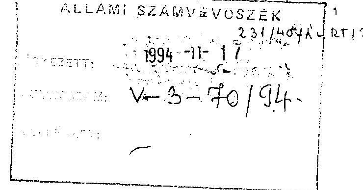

Az Állami Számvevőszéknek az ÁV Rt. 1993. évi tevékenysége ellenőrzéséről készített, átdolgozott jelentését megkaptuk.

Köszönettel vettük azt, hogy az általunk megtett észrevételek egy részét a jelentésen átvezették és külön is köszönjük azt a részletes tájékoztatást, amelyből kitünik, hogy az egyes pontok elfogadására miért nem került sor.

Sajnos továbbra is fennáll néhány kérdésben véleménykülönbség a két szervezet álláspontja között, ezért az Állami Számvevőszékről szóló 1989. évi XXXVIII. sz. törvény 25 §. (1) bekezdésében biztosított lehetőséggel élve törvényes határidőn belül

## É S ZREVÉTELEKET

teszünk az átdolgozott jelentéstervezetre, melyet a csatolt, "Az ÁV Rt. részletes észrevételei és annak indokolása az ÁSZ által az ÁV Rt. 1993. évi tevékenységének ellenőrzéséről készített jelentéshez" címü melléklet tartalmaz.

Szeretnénk ezúton is rögzíteni, hogy a véglegezett összefoglaló jelentésben és mellékleteiben olyan megállapítások és nevesítések maradtak benn, amelyek - álláspontunk szerint megalapozottan adnak okot az ÁV Rt. és a hozzá tartozó cégek jó himevének megsértésével kapcsolatos vélelmezésekre, illetve a személyiségi jogok védelmének igényére. Amint ezt az előzetes megbeszélések során is jeleztük ezek feltétlenül további egyeztetéseket és finomításokat igényelnek.

Örömmel vennénk, ha az eltérő álláspontok szóbeli egyeztetésére mód nyílna. Kérjük azonban a csatolt észrevételek azon részeinek a jelentés mellékleteként szerepeltetését, amelyeket esetlegesen a megismételt egyeztetés után sem kívánnak az átfogó ÁSZ vizsgálati jelentésbe korrekcióként beépíteni.

Az ÁV Rt. mindent megtesz annak érdekében, hogy az ÁSZ által tett ajánlások érvényesítésére sor kerüljön és a jövőben is folyamatos együttműködést szeretnénk kialakítani az Állami Számvevőszékkel.

---

# Az ÁV Rt. részletes észrevételei és annak indokolása az ÁSZ által az ÁV Rt. 1993. évi tevékenységének ellenőrzéséről készített jelentéshez 

## A jelentéshez kapcsolódó észrevételek:

## 5. oldal 2. bekezdés

"Az ÁV Rt-hez tartozó állami tulajdonú vállalkozói vagyont 1992. december 31-i mérleg azonban nem mutatta ki pontosan, néhány vállalat, illetve társaság nem szerepel könyveiben. Bár a konkrét eseteket idöközben feltárták, az alaptökéjének cégbírósági bejegyzése módosításáról nem intézkedtek. A könyvvizsgáló sem hívta fel a figyelmet a rendezetlenségre."

Utalva korábbi levelünkben foglalt okfejtésre, szeretnénk kiemelni azt, hogy az ÁV Rt.-hez tartozó vagyonból nem néhány, hanem összesen négy társaság nem szerepelt az ÁV Rt. mérlegében az ott kifejtett okok miatt. További két társaság, az Ikarus Rt. és az Export Garancia Rt. szerepel az ÁV Rt. induló tőkéjében, de az 1992. december 31-i zárómérlegben nem.

Az 1992. évi LIII. tv. 4. § (3) bekezdése a cégbírósági bejegyzés módosítására utaló megállapításával kapcsolatosan kimondja, hogy az ÁV Rt.-hez tartozó gazdálkodó szervezetek tekintetében az utolsó-átalakulástól számított 30 napon belül kell az ÁV Rt. alaptőkéjének felemeléséről határozni, illetve ezzel egyidejűleg az Alapító Okirat módosítása iránt intézkedni.

## 5. oldal 2. bekezdés utolsó mondat

"... elmaradt 1993-ban a banki részvények teljeskörü "beszolgáltatása", ... ezért a bankokban meglévő közvetett tulajdoni hányada sem tisztázott pontosan."

A banki részvények tulajdoni hányadának tisztázatlanságára vonatkozó megállapítással kapcsolatosan korábbi levelünkben tett észrevételeinket fenntartjuk, kiegészítve azzal, hogy a munka 1994. október 28 -án befejeződött. Egyértelműen meghatározásra került a beszolgáltatandó pénzintézeti részvények értéke.

## 5. oldal 4. b kezdés

"A vagyon csökkenésében szerepet játszott a privatizációs értékesités, amely vagyon névértéke 37 milliárd Ft volt. 1993-ban a privatizációból származó értékesités 87,5 milliárd Ft,

---

amelynek 94,5 \%-a 02,6 milliárd Ft a MATÁV 59 \%-os állami tulajdonrészépek aladásából származik. Az összes értékesités ábevételéből az ÁV Rt. pénzbevétele 1993-ban közel 36 milliárd forint volt".

Visszautalva a korábbi levelünkben kifejtettekre, célszerűnek tartanánk annak pontositását, hogy az ÁV Rt. az összes értékesítés ábevételéből származó 36 Mrd Ft -tal csupán az év utolsó 3 napján rendelkezett a pénzügyminiszter döntésének megfelelően. Jelentősebb pénzbevételhez az ÁV Rt. a MATÁV privatizációja révén jutott és ennek konverziója is csak 1993. december 28 -án történhetett meg.

A jelentés szerint 82,6 milliárd Ft a MATÁV $59 \%$-os állami tulajdon részének eladásából származik. Ez a megállapítás nem pontos, ezért tájékoztatásul közöljük a tárgyalt időszakra vonatkozó adatokat:

Alaptőkemelés 1993. novemberében
(A stratégiai befektető bizalmának erősítése érdekében két nagynevű nemzetközi pénzintézet, az EBRD és az IFC mintegy $10 \%$-os részesedést vásárolt oly módon, hogy tőkeemelés formájában új törzsrészvényre konvertálható osztalékelsőbbségi részvényeket jegyeztek névértéken.)

| Alaptőke: | 86.364 .000 .000 Ft |  |
| :-- | :-- | --: |
| Tulajdonos: | ÁV Rt. | $90,10 \%$ |
|  | IFC | $3,30 \%$ |
|  | EBRD | $6,60 \%$ |

A stratégiai befektetővel történő szerződéskötést (1993.dec. 22.) követő állapot:
Alaptőke: $\quad 103.228 .170 .000$ FT
Tulajdonos: ÁV Rt. $\quad 66,74 \%$
MagyarCom 30,29 \%
IFC $\quad 0,99 \%$
EBRD $\quad 1,98 \%$

# 6.oldal 2. bekezdés 

"Az ÁV Rt. jegyzett tőkéje, (tartós állami tulajdonhányad) tőketartaléka (privatizálható vagyoni rész) nem mutatja ki a társaság alapvető funkciójához kapcsolódó vagyoni szerkezetet és vagyonértéke nem felel meg a törvényi elölrásoknak. (1992. évi VIII.tv.)

---

Az ÁV Rt. jegyzett tőkéjének módosításaára az utolsó átalakulás befejezése után kerülhet sor. Mindaddig amíg ez meg nem történik, az átalakult vállalatok vagyona az ÁV Rt. tőke tartalékába kerül lekönyvelésre a befektetett pénzügyi eszközökkel (16) és a saját részvényekkel (372) szemben. Ez a megbontás informál a tartós állami tulajdonú hányad és a privatizálható vagyoni rész megoszlásáról. Az ÁV Rt. jegyzett tőkéje és tőketartaléka nem mutathatja ki az átalakulások befejezéséig a társaság alapvető funkciójához kapcsolódó vagyoni szerkezetet.

Hozzá kívánjuk tenni azt, hogy az átalakulások befejezése után sem alkalmas a tőketartalék a tartós tulajdoni hányad, a privatizálható vagyoni rész megbontására, mivel a tőketartalék terhére más tételek is elszámolásra kerülnek a számviteli szabályok szerint.

A törvényi hivatkozás valószínű elírásra került, mivel az 1992. évi VIII.tv. a Magyar Népköztársaság és a Bolgár Népköztársaság közötti kettős állampolgárságról szóló 1959.évi 27.tv. hatályon kívül helyezéséről rendelkezik.

# 6. oldal 5. bekezés 

"Az ÁV Rt. és az elözetes értékeléssel megbizott könyvvizsgáló egyaránt eltért a törvényi elöirástól és az Alapitó Okiratban foglaltaktól akkor, amikor az alaptőke meghatározásakor a jegyzett tőkét és nem a saját tőkét, illetve annak állami tulajdonú hányaddal arányos részét vette figyelembe. Így az ÁV Rt. tulajdoni részei a mérlegében, a jegyzett tőke hányadában jelennek meg a befektetett pénzügyi eszközök között. Ennek következtében az ÁV Ri-hez tartozó vagyon megfelelő nagyságáról a társaság mérlege nem ad hiteles képet."

Korábbi levelünkben részletesen kifejtettük álláspontunkat, amelyet továbbra is fenntartunk, megismételve a következő okfejtést:

Nem értünk egyet a vizsgálatnak azon megállapításával, hogy a tartós tulajdoni hányadot az átalakult vállalatok Számviteli Törvény mérlegében kimutatott "saját tőke" alapján kell számítani, mivel a saját tőke érték folyamatosan változó, ez esetben az 1992. október 29-n az ÁV Rt. alapításának napjával a társasággá alakult vállalatoknál törvényi rendelkezést kellett volna tenni annak érdekében, hogy az idáig átalakult mintegy 40 cég 1992. október 29-n zárja le könyveit, és auditáltan állapítsa meg a saját tőke összegét, mely alapján lehetett volna az ÁV Rt. nyitó vagyonát hitelesen megállapítani. A törvény ilyen rendelkezést nem tartalmazott.

Nem tudjuk elfogadni a vizsgálat saját tőke alapon számított tartós tulajdoni hányad értékének megállapítását, különösen kiemelve az 1992. évi LIII. törvény 1. § (3) bekezdését, miszerint az ÁV Rt. a tulajdonosi jogokat biztosító részvényeinek, üzletrészeinek forgalomképesnek kell lenni, amely a forgalomképességet a társaságok jegyzett tőkéjében szereplő részvények biztosítják. A társaságok saját tőkéje, sajátos összetétele olyan jelentős vagyonösszeget is tartalmaz, ami nem tekinthető forgalomképesnek.

A Gazdasági társaságokról szóló törvény 22. § (2) bekezdése meghatározza a következőket:

---

"A társaság vagyona alapításkor a tagok pénzbetétéből (pénzbeni hozzájárulásból), valamint az általuk rendelkezésre bocsátott nem pénzbeni betétből (hozzájárulásból) áll. A nem pénzbeni betét bármilyen vagyonértékkel rendelkező forgalomképes dolog, szellemi alkotás és vagyoni értékủ jog lehet."

Az ÁV Rt. induló apportjának a 126/1992. sz. Korm. rendeletben az ÁV Rt. hatáskörébe vont és 1992. október 29 -ig át nem alakult gazdasági társaságok saját tökéjének arányában kialakított tartós tulajdoni hányaddal való figyelembevétele sérti a GT 22.§ (2) bekezdésében meghatározottakat. Ugyanis a társaságok saját tőkéje a tőketartalékban lévő nem forgalomképes vagyont is tartalmazza, amely nem apportképes.

A Számviteli Törvény 34 §-a (3) bekezdése meghatározza, hogy a gazdasági társaságokban lévő tulajdoni részesedést jelentő befektetést a Társasági Szerződésben - az ÁV Rt. esetében az Alapitó Okiratban - meghatározott alapitáskori értéken kell értékelni. Mindebből következik, hogy az ÁV Rt. az átalakult gazdasági társaságok alapításkori értékét a társaságok jegyzett tőkéje foglalja magában.

Nem tudunk egyetérteni azzal, hogy ez a véleményünk szerint törvényileg elöirt jegyzett tőke arányában kialakított ÁV Rt. vagyon nyilvántartás az értékesítés privatizációs sikereit gátolná. Az ÁV Rt. üzletrészeket és részvényeket ad el értékesítése során, és az értékesítési alkunál egyidöben figyelembe veszi a jegyzett tőke feletti forgalomképes vagyonrészt is. Az ÁV Rt. döntéseinél mód van az esetleges tőketartalékból jegyzett tőkébe való emelésre (lsd. Tokaj Kereskedőház Rt.).

# 7. oldal 2. bekezdés 

"Az ÁV Rt. 1993.évben, az 1993.évi költségvetési, illetve pótköltségvetési törvényben elöirt befizetési kötelezettségének (8.371 millió Ft) nem tett eleget, sôt 1992.év gazdálkodásához kapcsolódó osztalékbefizetési kötelezettségét is 1994-ben teljesitette. Az 1993.évi eredménykimutatása - egyébként a tulajdonosi jogok gyakorlójának privatizációs miniszter személyében megtestesülö (közgyülés) jóváhagyásával - eltér mind az 1993. évi mind az 1994. évi költségvetési törvény elöirásaitól. Ugyanis az ÁV Rt. az 1993.évi eredménykimutatáskor saját ráforditások között helytelenül elszámolta a MATAV privatizációs bevételeiből az 1994.évi költségvetési törvényben elöirt 28.000 millió Ft-ot. A központi költségvetésben törvényileg elöirt 8.000 millió Ft osztalék helyett 10.457 millió Ft-ot trányzott elö. E mellett az 1994.évi ma is hatályban lévő VPI további befizetési kötelezettséget ír elö a központi költségvetés és az elkülönített pénzalapok javára mintegy 64,3 milliárd Ft-ban."

Fenntartva korábbi levelünkben foglalt észrevételeinket, azokat az alábbiakkal egészitjük ki:
A vonatkozó költségvetési törvény (1993. évi CXL tv.) 6. § (2)-(3) bekezdései értelmében az ÁV Rt. 1993. év után 3 jogcímen volt köteles befizetést teljesíteni az állami költségvetés javára:
a. A (2) bekezdés szerint a kereskedelmi bankokban és más pénzintézetekben az állami részesedést megtestesitő részvények után

---

b. Szintén a (2) bekezdés szerint az ideiglenesen állami tulajdonban lévő állami vagyont megtestesítő részvények után az ÁV Rt. közgyűlésén megállapított és az 1994. évben kifizetésre került osztalékot teljes mértékben.
c. A (3) bekezdés szerint az ÁV Rt.-hez tartozó részben, vagy teljesen tartós állami tulajdonban maradó gazdálkodó szervezetek 1993. évi adózás utáni nyereségéből és az állami vagyon privatizációjából származó bevételből 8.000 millió forintot,
a MATÁV privatizációjából származó bevételből pedig 28.000 millió forintot.
Az idézett költségvetési törvény rendelkezéseivel összhangban álló befizetési kötelezettséget ír elő az ÁV Rt. részére a 1993. december 24-én elfogadott 99/1993. sz. Országgyülési határozat az 1994. évi Vagyonpolitikai Irányelvekről.

Az Igazgatóság 211/1994.(V.30.) sz. határozata kizárólag a már hivatkozott költségvetési törvény 6. §. (3) bekezdésében foglalt rendelkezés első fordulatára épült. A Felügyelő Bizottság június 10 -én kelt jelentése az e tárgyú igazgatósági határozat vonatkozásában éppen ezen hiányosságra hívta fel a figyelmet. A Felügyelő Bizottság ezirányú észrevétele alapján újabb egyeztetést követően (PM illetékes főosztályai) az ÁV Rt. költségvetés felé fennálló befizetési kötelezettsége 10.457.733.000 Ft-ban került megállapításra. Ennek alapján a 211/1994.(V.30.) sz. Igazgatósági határozat megsemmisitése mellett az Igazgatóság a 238/1994.(VI.24.) sz. határozatával javasolta a részvényesi jogok gyakorlójának, hogy az ÁV Rt.-nek az 1993. évi költségvetési törvény 6. §-a szerint fennálló befizetési kötelezettségét 10.457.733.000 Ft-ban hagyja jóvá. A részvényesi jogok gyakorlója az Igazgatóság 1994. június 24 -én tartott összevont és kibővített ülésén a Felügyelő Bizottságnak az elfogadásra irányuló indítványa mellett meghozta a 12/1994.(VI.24.) sz. határozatát, mely a vonatkozó hatályos jogi szabályozás, továbbá a Felügyelő Bizottsági és könyvvizsgálói jelentések alapján az ÁV Rt. költségvetés javára fennálló befizetési kötelezettségét 10.457.733.000 Ftban fogadta el.
1993. évi LXXII. törvénnyel módosított 1992. évi LXX tv. rendelkezései értelmében az ÁV Rt. 1992. év után az alábbi jogcímeken volt köteles befizetést teljesíteni az állami költségvetés javára.
$6 . \S$ (2) bek.
a. a kereskedelmi bankokban és más pénzintézetekben az állami részesedést megtestesítő részvények után
b. az ideiglenesen állami tulajdonban lévő állami vagyont megtestesítő részvények után az ÁV Rt. közgyűlésén megállapított és kifizetésre került osztalékot teljes mértékben
6.§.(6) bek.
c. az ÁV Rt.-hez tartozó részben, vagy teljesen tartós állami tulajdonban maradó gazdálkodó szervezetek 1992. évi adózás utáni nyereségéből és a privatizációból származó bevételből 8.000 millió Ft-ot.

Az Igazgatóság a Pénzügyminisztérium és az Igazságügyminisztérium állásfoglalásainak bekérése után a 147/1993. (XI.15.) sz. határozatával tett javaslatot a fizetendő osztalék

---

összegére. Az IM 20.035/93.sz., 1993. nyvember 4-én kelt állásfoglalása kimondta, hogy "ha a képezhető osztalék mértéke a törvényben meghatározott osztalékot nem éri el, a Részvénytársaság nem kötelezhető arra, hogy pl. hitelfelvétellel biztosítsa a hiteles és a törvényben rögzített összeg közötti különbözetet. A törvényi előírás teljesítése ebben az esetben lehetetlen, teljesülését a valós gazdasági folyamatok kizárják."

A Részvényesi Jogok Gyakorlója az ÁV Rt. közgyülésén 1993. november 26-án kelt, 3/1994.(XI.26.) sz. határozatával a Felügyelő Bizottsági jelentés elfogadásával az osztalékbefizetési kötelezettséget 3.117.172.eFt-ban állapította meg. Ezzel a tárgyévre vonatkozó kötelezettségek jogilag lezárásra kerültek. Való igaz, hogy ezt követően 1993. december 24-én az Orszź́gyűlés határozattal (1993-as VPI) érintette az 1992-es év gazdálkodási eredményét, amikor szövegszerűen megismételte a 93-as költségvetési törvény rendelkezéseit, figyelmen kívül hagyva, hogy az ÁV Rt. közgyűlése ekkor már döntéseit meghozta. Az Országgyűlési határozat - mint azt észrevételeinkben a Függelék 57. oldalát érintő észrevételeinkben kifejtjük - az Országgyűlés által irányított szervekre kötelezö, az ÁV Rt.-nek saját közgyűlése határozatait kell végrehajtania.

Sem jogilag, sem számvitelileg nem hozhatók az 1992-es évre vonatkozó kötelezettséggel összefüggésbe azok az 1993-as árbevéltelek, mely az előző év jogi és számviteli lezárását követőleg realizálódtak. A likviditásmenedzselési célú kihelyezéseket ezek tették lehetővé.

# 7.oldal 3.bekezdés 

"Az ÁV Rt. által képzett, a hozzá tartozó vállalatok feljavitására (reorganizációra) fordítható elkülönített eredménytartalék 845 millió Ft-tal meghaladja az ÁV Rt.-re vonatkozó szabályok szerint képezhetőt. Ezt a tulajdonosi jogok gyakorlója jóváhagyta."

Korábbi véleményünket fenntartjuk az alábbi indokolással:
Az elkülönített eredménytartalék összhangban az 1992.évi LIII.tv-el az ÁV Rt-hez tartozó gazdasági társaságok reorganizációjára, veszteségeik fedezésére, [Gt. 326.§. 3.bek.], illetve kártérítési igényeik kielégítésére szolgál.

Véleményünk szerint, a képzett elkülönített eredménytartalék összege nem haladja meg a törvény szerint képezhető összeget.

Megjegyzés: Az ÁV Rt. adózás előtti eredmény
Adózott eredmérye pedig.
Képzett elkülönített eredménytartalék

24790970 eFt;
24641941 eFt.
1.995 .090 eFt

A képzés alapjaként a jegyzett tőkénél figyelembe vettük az 1993.évi átalakulásokból származó tartós tulajdoni hányadra eső 161.452 millió Ft-ot. Ez az értelmezés felel meg az ÁV Rt. Alapító Okiratában meghatározott feladatok végrehajtásának, a következők szerint:

A mérlegben kimutatott jegyzett tőke
289.151 .000 eFt

Az 1993.évi átalakulásból származó tőketartalék
növekmények a tartós tulajdoni hányadra eső része
161.452 .000 eFt

Számított jegyzett tőke
Összesen:
450.603 .000 eFt .

---

Az ÁV Rt.-nél képezhető eredménytartalék
$450.603 .000 \mathrm{eFt} \times 0,5 \%-\mathrm{kal}=$
2.253 .015 eFt

# 8. oldal 1. bekezdés 

"Az ÁV Rt. 1993.évi eredménytartalék terhére a számviteli törvény szabályait megszegve elszámolta a Mátrabánya Rt.-töl 17,4 millió Ft értékben megvásárolt követelést."

Az ÁV Rt. a mérlegkészítés időpontjában a vitatott váltót, amely álláspontunk szerint nem váltó, az ideiglenesen átadott pénzeszközök között tartotta nyilván, majd az eredménytartalék terhére leírta.

A Mátrabánya Rt. 17,4 MFt-os követelés átvállalásával kapcsolatosan fenntartjuk azon álláspontunkat, hogy a "Promissory Note" elnevezésủ okirat annak ellenére sem váltó, hogy az ÁV Rt., illetve a társaság azt váltókövetelésnek nevezte. A nemzetközi magánjogi tvr. 29. §-a értelmében a szolgáltatás kötelezettje jogának alapján kell kötelezettségre irányuló jogot megállapítani. Atekintetben tehát, hogy az irat igérvény-e vagy sem, az amerikai jog irányadó. Amely kötelezettségvállalás nem forgatható, az nem váltó, azaz nem azonos az 1931-es genfi egyezményben kodifikált bill of exchange elnevezésű intézménnyel.

Esetünkben a nem forgatható mivoltot a kibocsátó helyi jogát alkalmazó pénzintézet igazolta vissza már 1993. áprilisában.

Az okirat ilyen jogi jelleg hiányában a magyar jog alapján kizárólag tartozás-elismerésként (Ptk. 242. §.) értelmezhető.

A követelések leírása iránt a Jogi Vezérigazgatóságnak kezdeményezést tennie nem kell, mivel ez a Pénzügyi Vezérigazgatóság kompetenciája. Az ÁV Rt. belső hatásköri megosztása a Pénzügyi Vezérigazgatóság számára kifejezetten előirta a kellő gondosság elvének alkalmazását, míg a vezető jogtanácsos vonatkozásában semmiféle jogszabályi, vagy belső előírás nem tartalmazott olyan kötelezettséget, hogy bármilyen követelés leírása iránt intézkedést kelljen tennie. (Ezen a helyzeten az sem változtat, ha esetleg e kérdésben a korábbi vezető jogtanácsos tévesen más álláspontot foglalt el.) Kérjük, a vezető jogtanácsosra vonatkozó megállapítást ezek figyelembevételével szíveskedjenek módosítani.

## 8. oldal 3. bekezdés

"... a tanácsadók kiválasztását törvény írja elö, mely kötelezövé teszi versenyeztetési eljárás lefolytatását."

A tanácsadók kiválasztására vonatkozóan az ÁV Rt.-t teljeskörủ versenyeztetési kötelezettség törvény alapján nem terheli! Az 1992. évi LIII. tv. 11. §. (3) bek. csupán az üzletrészek (részvények) értékesítése során teszi kötelezővé az 1992. évi LIV. tv. versenyeztetési előírásainak alkalmazását, tehát a törvényi kötelezettség terjedelme az ÁVÜ-énál jóval szűkebb körủ. Számos olyan pénzügyi és jogi tanácsadás is szükségessé vált, mely ezen tevékenységeken kívüli területeket érintett. Ennek ellenére az ÁV Rt. ennél

---

tágabb körben folytatott a kiválasztásnál versenyeztetési gyakorlatot, ha ezt üzleti, vagy más szempontok indokolták.

# 10. oldal 

A jelentés kifogásolja az átmenetileg szabad pénzeszközök maximális hozam elérését célzó gyakorlatát (diszkont kincstárjegy vásárlás), és ezt összefüggésbe hozza azzal a fentebb már taglalt, és téves állásponttal, miszerint az ÁV Rt. az állam felé törvényben rögzített 1993. évi befizetési kötelezettségét nem teljesítette.

Álláspontunk szerint ez a kritikai szemlélet igaz lehet a költségvetési szervekre, azonban az ÁV Rt. profitorientált gazdasági társaság, amely piacorientált szemléletet kell kövessen, és ez a kötelezettség az átmenetileg szabad pénzeszközök kihelyezése során is terheli.

Az 1993. évi befizetési kötelezettségek álláspontunk szerint teljesítettek voltak, erre a jelentés 7. oldalához füzött észrevételeinkben már utaltunk.

## 10. oldal 1.4. pont

"vállalatok gazdasági társasággá átalakításának idöigényét, feladatait nem mérték fel megfelelöen."

Az ezzel kapcsolatos határidőket nem az ÁV Rt., hanem a jogalkotó határozta meg, és maga az 1992. évi I.III-LIV. törvénycsomag tartalmazza a stratégia legfontosabb elemeit is.

A jelentés ezen megállapítása - akárcsak a Függelék 48. oldal 2. pontja, - nem veszi figyelembe az 1993. évi CXI. tv. 67.§ (2). bekezdésében foglalt, az 1992. évi LIV. tv. 31. §-át érintő módosítást, mely a meghatározott átalakulási határidőt módosította akként, hogy az átalakuló vállalat 1994. március 31-ig köteles a társasági szerződést vagy az alapító okiratot elkészíteni. A módosítás a Cégbírósághoz történő beadásról nem rendelkezik. Ennek megfelelően az át nem alakult cégek száma helyesen 12 és nem 23 , ahogyan azt a jelentés tartalmazza.

## 14. oldal 2. bekezdés

"Az ÁVÜ-töl átvett és értékesithető vagyonrészekkel kapcsolatos elökészitő munkát újra kezdték. Kárba veszett az addigi felkészülés."

A megállapítás nem a vizsgált időszakra, hanem a már egyszer vizsgált 1992. évre vonatkozik. Az ÁVÜ előkészítő munkái nem vesztek kárba, mert amit az ÁVÜ átadott, azt az ÁV Rt. felhasználta a munka során. Sajnos az ÁVÜ sok információt nem adott át, de ezt már a tavalyi ÁSZ jelentés is rögzítette.

---

# 16. oldal 2. bekezdés 

"A gazdálkodás szabályozottsága, a nyilvántartási és számviteli rendszerek szervezettsége, szabályszerüsége 1993-ban nem volt megfelelö. Az SzMSz az utalványozási, a kötelezettségvállalási, a vezetői és munkafolyamatba épitett ellenőrzés szabályozásait feladatainak elöirását külön "Gazdálkodási Szabályzatba" utalta. Ez nem készült el. A Számviteli Szabályzatot a törvényi elöirásban foglaltaknál jóval késöbb 1994. május végén hagyta jóvá az Igazgatóság. Így ezeken a rendkivül fontos területeken a követendő eljárás 1993-ban gyakorlatilag teljesen szabályozatlanul maradt. Ez együtt járt a számviteli pénzügyi fegyelem alapvető hiányosságával, a bruttó számviteli elv megsértésével, azzal, hogy nem figyelték a pénzkövetelések lejáratát."

Utalva a korábbi levelünkben foglalt észrevételünkre, azt kiegészitjük az alábbiakkal:
Gazdálkodási szabályzatnak minősül - álláspontunk szerint - a 7/1993. számú, a kötelezettségvállalások és utalványozások rendjéről szóló vezérigazgatói utasítás. Az SZMSZ ide vonatkozó rendelkezése értelmében a "gazdálkodási"-nak elnevezett szabályzat az utalványozással kapcsolatos eljárást, valamint az anyagi kötelezettségvállalások szabályait kell, hogy tartalmazza. Az idézett vezérigazgatói utasítás ezen követelményeknek eleget tett.

Az ÁV Rt. megalakulását követően folyamatosan készítette és pontositotta a gazdálkodás területére vonatkozó legfontosabb.szabályzatokat. 1994.I.féléve során a meglévő szabályzatok pontositásra, kiegészítésre kerültek. Korábban ugyanis gyakorlati tapasztalat nem állhatott rendelkezésre.

Az ÁSZ 1992-ben erre vonatkozó észrevételével összhangban, - mely nem a szabályzat meglétét hiányolta, hanem annak tartalmával szemben emelt kifogást - az ÁV Rt. megbízást adott az Ernst and Young Kft. részére a Számviteli Politika kidolgozására, amely 1993.év végére készült el, az ÁV Rt. szakmai kontrollja és érdemi közreműködése mellett, ennek pontositása csak az első üzletei év zárása során, illetve utána történhetett meg.

## Az ÁV Rt. álláspontunk szerint nem sértette meg a bruttó számviteli elszámolás elvét.

A banki, pénzügyi forgalom nettó módon könyvelése technikailag kivitelezhetetlen.
Az ÁV Rt. folyamatosan figyelemmel kíséri befektetéseinek lejáratát, táblázatba foglalva időrendi sorrendben, pénzintézetenkénti és a befektetések típusa szerinti bontásban felsorolva.

## 16. oldal 3. bekezdés

"A pénzügyi-gazdálkodási belső szabályozatlanság hozzájárult, hogy a pénzkihelyezések egy részénél az ÁV Rt-re nézve egyoldalúan hátrányos kikötéseket tartalmazó szerzödések jöhettek létre."

Nem több, hanem csak egyetlen szerződés került megkötésre, amely az ÁV Rt.-re nézve hátrányos kikötéseket tartalmaz a Budapest Bankkal .

---

E szerződés szerint pénzkihelyezésre nem került sor, s utóbb mind az ÁV Rt. és mind a Budapest Bank kölcsönösen írásban nyilatkozott arról, hogy a másik féllel szemben semminemü követelése nincs és a szerződést érvénytelennek tekintik.

# 17. oldal 4. bekezdés (1.9. pont) 

Nem tartjuk helyesnek, hogy a reprezentációs költséget és a gépkocsihasználatot statisztikai alapon határozzák meg. Amint azt korábbi észrevételünkben is jeleztük, a reprezentációs költségek statisztikai átlagolása hamis képet mutat, pedig az átlagos reprezentáció a menedzsment szintjén eléggé szerény volt. Az is igaz, hogy egyes vezetők és az Igazgatóság egyes tagjai a reprezentációs költségből jelentősen fogyasztottak.

Nem helytálló az a megállapítás, hogy minden ötödik munkatárs személyi használatú gépkocsival rendelkezik, mivel azok egyrésze kulcsos kocsiként üzemel. Megjegyezzük továbbá, hogy az ÁV Rt.-hez 170, javarészt vidéken müködő gazdasági társaság tartozik, amellyel történő kapcsolattartás indokolja az ilyen mértékủ gépkocsipark fenntartását. Ez ugyanis praktikusabb és gazdaságosabb megoldás, mint az egyébként elszámolható személyi utazási költségek finanszirozása.

## 19. oldal 2. bekezdés

"Az elözöekben összefoglalt hibákért és hiányosságokért 1993. évben vezetö Igazgatóságot és Ügyvezetést egyetemleges felelösség terheli."

Ez a kijelentés jogilag nem értelmezhető, mivel a gazdasági társaságokról szóló 1988. évi VI. tv. 32. §.-a egyetemleges felelősségről csak a kötelezettségek megszegésével okozott kárral kapcsolatosan tesz említést, azaz a mérlegelésen, szakmai ismereten, meggyőződésen alapuló, de kötelességszegést meg nem valósító tevékenység sem vezető tisztségviselőt, sem az ügyvezetéshez tartozó személyt nem hoz egyetemleges felelősségi helyzetbe.

Amennyiben ez a megállapítás a vezetés, illetve a gazdálkodás színvonalára vonatkozó vélemény, úgy helyesebb ennek kifejezésére nem jogi terminus technikusokat használni.

Ugyancsak aggályos "a müködésképtelenség" szóhasználat, mivel jogi, számviteli és gazdálkodási szempontból az ÁV Rt. müködött és müködik, feladatait és kötelezettségeit teljesíti, gazdálkodásának pozitív eredménye volt és van.

## 21. oldal (ajánlások 3. pont)

"A jövedelmi viszonyokat a feladatokhoz és teljesitményhez újra kell szabályozni."
Felhívjuk a figyelmet arra, hogy ezen szabályozásnak a hatályban lévő munkaszerződésekre, illetve az egyéb polgári jogi megállapodásokra figyelemmel kell és lehet megtörténnie.

---

# 21. oldal (ajánlások 4. pont) 

Véleményünk szerint az ajánlások 4. pontjában írt javaslat - mely szerint az ÁV Rt. kezdeményezze az 1993. éves beszámoló újbóli elkészítését - meghaladja az Állami Számvevőszéknek az 1989. évi XXXVIII. törvényben megfogalmazott hatáskörét, mely szerint az Állami Számvevőszék hatásköre csupán ellenőrzésre, és véleményezésre terjed ki.

---

# A függelékhez tett észrevételek: 

## 4. oldal 3. bekezdés

Az ÁV Rt-hez tartozó vagyon tekintetében az 1992.évi zárómérleg, illetve az 1993.év nyitómérleg adatai - melyeknek egyezniük kellene szintén - eltérést mutatnak.

Az 1993.évi mérlegbeszámoló mérlegének 15.sorában a részesedések értéke 591.241.144 eFt. Ez megegyezik az 1993.évi mérlegbeszámoló részesedések nyitó állományával (Beszámoló 76. oldal):

A nyitás után korrekció lett végrehajtva a MALÉV Rt., a Bábolnai Rt. és a Hungexpo Rt.-nél. Erre a beszámoló kitér. (591.241.144 + 990 - 1.000 - $2=591.241 .132 \mathrm{eFt}$.)

A bankok esetében egyértelműen a beszolgáltatott banki részvényekről van szó, amely mind a záró, mind a nyitó mérlegben is szerepel.

A mérleg nyitó és záró adatai tehát megegyeznek, értéke 591.241.144 eFt. (Lásd. a részjelentés észrevételeihez adott jelentés 4.sz.melléklet a vonatkozó fókönyvi kivonatok, 1992.évi záró, 1993.évi nyitó.)

## 7. oldal 2. bekezdés

"E tények ellenére az ÁV Rt. alaptőkéjének cégbírósági bejegyzése módosítása ügyében intézkedést nem tettek..."

Lásd a jelentés 5. oldalának 2. bekezdéséhez írt észrevételt.

## 13. oldal 6. bekezdés

"Az ÁV Rt. elöirásai szerint, ahol az ÁV Rt., mint jogi személy tag valamely társaság igazgatóságában, felügyelö bizottságában, ott a tiszteletdij az ÁV Rt-t illeti meg. A képviseletet ellátó ÁV Rt. alkalmazottak nem részesülnek.

1993-ban a Humánpolitikai Igazgatóság szerint 9.557.000 Ft tiszteletdij illette meg az ÁV Rtt. Ebből 1993.december 31-ig 4.464.734 Ft befolyt. Az ÁV Rt. bevételei között ezt az összeget nem számolta el, eredménykimutatásában nem szerepelteti."

Az ÁV Rt. Igazgatóságának javadalmazási bizottsága 1993.szeptember 1-i ülésén döntött arról, hogy amennyiben az ÁV Rt.-hez tartozó gazdasági társaságok vezetötestületeiben az ÁV Rt. képviseletét, az ÁV Rt. alkalmazottak látják el, úgy az ezért járó tiszteletdij az ÁV Rt.-t illeti meg.

Ezt követően egyeztetések folytak a társaságokkal a tiszteletdij átutalását illetően. A társaságoktól az 1993.évi mérlegkészítés idöpontjáig 4.464.734 Ft folyt be. A be nem folyt

---

összegek jogszerűségét a társaságok vitatták, így annak előírása a Számviteli Törvény előírása szerint nem történhetett meg. Megjegyezzük, hogy a jogalap mint egyéb gazdasági szolgáltatás KSH besorolással a mérlegkészítés után 1994.évben rendeződött, így a fennmaradó összeg követelésként történő előírása és pénzügyi realizálása 1994.évben fog megtörténni.

# 14-18. oldal (1.5.1. valamint 1.5.2. pontokhoz) 

Visszautalva a jelentés 7. oldalának 2. bekezdéséhez füzött észrevételekre, azokat az alábbiakkal egészítjük ki:

Az 1.5.1. pont tartalma szerint az 1992-es év gazdálkodásából eredő, költségvetéssel szembeni kötelezettségek teljesítését, illetve az 1993-as év eredménykimutatása egyes kérdéseit tárgyalja. Ehhez képest e pontban a 15. oldal tetején olvasható megállapítás, miszerint az "1993-as gazdasági év tekintetében az ÁV Rt. az alábbi befizetéseket volt köteles teljesíteni" tévedés, hiszen e befizetésekkel kapcsolatosan már az 1993. évi XCI. tv. tartalmazott rendelkezéseket.

## 23. oldal 3. bekezdés

"A mellékletböl megállapítható, hogy igazgatói besorolással 27 fó rendelkezik a 99 fơböl, s igy közel $30 \%$-a az átlagos állományi létszámnak vezetö beosztású dolgozó."

Az ÁV Rt. létszámának $30 \%$-a nem vezető állású dolgozó, mivel az igazgatói besorolás az ÁV Rt. szabályzatai alapján nem jelent egyben vezetői minősítést is. A statisztikai átlagolás alkalmazása ezért jelen esetben félrevezető lehet.

## 24. oldal 1. bekezdés

"Reprezentáció címén 3 millió forintot számoltak el - ez figyelembe véve az 1993. évi átlag létszámot mintegy 30.000 forint fejenként."

A statisztikai átlagolás ismét félrevezető lehet, mivel az átlagos irodai reprezentáció az ÁV Rt.-nél igazgatónként havi 1000-1500 forint.

## 33. oldal 2. bekezdés (1.10.1. ponthoz)

"A tanácsadók kiválasztását az Állami Vagyonkezelő Társaság (ÁV Rt.) részéről törvény szabályozza. Elöirja, hogy "Az állami vagyon értékesitése, annak kezelésbe, vagy bérbe adása, továbbá mindezekkel való megbizás versenyeztetési eljárás útján történik."

Utalunk a jelentés 8. oldalának 3. bekezdéséhez füzött észrevételünkre.

---

# 34. oldal 2. bekezdés 

"A kiválasztott és alkalmazott tanácsadókkal keretszerzödésben került rögzitésre ..."
Fenntartva a korábbi levelünkben a tanácsadókkal kapcsolatos észrevételeinket (37-38. oldalhoz füzött észrevételek) kiegészítjük azzal, hogy az ÁV Rt. semmilyen keretszerződést nem kötött a külső tanácsadókkal a pályázat elnyerése kapcsán.

## 37. oldal 1. bekezdés

"Figyelembe véve az ÁV Rt. 145 fös zárólétszámát, minden ötödik, hatodik alkalmazottnak van lehetősége hivatali gépkocsi használatára."

Visszautalunk a jelentés 17. oldal 4. bekezdéséhez füzött észrevételünkre, megismételve azt, hogy a statisztikai átlag alkalmazása azért félrevezető, mert nem személyi gépkocsihasználatról volt szó.

## 38. oldal 3. bekezdés (1.13.1. pont)

Így nem egyeztették le, hogy minden, az elöző könyvelésben szereplő tétel újból lekönyvelésre kerïlt-e.

Az újra könyvelés az eredeti bizonylatok alapján teljeskörűen megtörtént, erről teljességi nyilatkozatot adtunk. Ezt annak alapján is tettük, hogy a mérleg zárásakor valamennyi igazgatóságtól teljességi nyilatkozat lett bekérve. (Lásd. Részjelentésre adott észrevétel 15. sz. melléklete.)

A hitelfedezetként adott váltó könyvelésekor miután leltározáskor az értéktárban nem volt megtalálható és a mellékelt jogi szakvélemény szerint (Lásd: Részjelentés (25.melléklet)) tartozáselismerésről van szó - a könyvelés az eredeti gazdasági eseményekre állt rá és rövidlejáratú ideiglenesen kölcsönadott pénzeszközként könyvelte le.

A fentiek alapján hivatkozva a teljesség és valódiság számviteli alapelvekre, ismételten kijelentjük, hogy az ÁV Rt. könyvvezetése alapján készült mérlegbeszámoló eredménykimutatás megbízható és valós összképet ad az ÁV Rt. 1993.évi tevékenységéről.

## 39. oldal 1. bekezdés

"... nem tartalmazza a váltó kötelezö kellékeit."
Visszautalunk a Jelentés 8. oldal 1. bekezdéséhez füzött észrevételünkre.

---

# 41. oldal 1. bekezdés 

"A Budapest Bankkal 1993. november 3-án kötött az ÁV Rt. szerzödést, - amely a belsö ellenörzési vizsgálatkor került elő - az ÁV Rt-re nézve egyoldalú, hátrányos kikötéseket tartalmazott."

A felmondást a Budapest Bank írásban nem, csak "szóban" vette tudomásul, igy nem zárható ki, hogy büntetö kamat követelését érvényesiteni kivánja.

Az ÁV Rt. 1994.május 2-án a BB Rt. pedig 1994.augusztus 19-én kelt levelében semmisnek nyilvánította a szerződést, így kizárható, hogy a büntetőkamat követelést a Budapest Bank érvényesiteni kívánná.

A Budapest Bankkal kötött szerződés nem a belső ellenőri vizsgálatkor "került elő" - arról minden érdekelt félnek tudomása volt.

Mivel a szerződés nem "élt" - az ÁV Rt nem utalt pénzt a Budapest Bank Rt.-hez - a pénzkihelyezések vizsgálatakor ez a szerződés nem került átadásra a Belső Ellenőrzésnek.

## 43. oldal 1., 2., 3. bekezdés

"Az ÁV Rt. átutalt összegeket bankszámlapénzként tartotta nyilván könyveiben, amely igy 18 \%-os (19 \% -1 \% forgalmi jutalék) kamatra kihelyezett betétként (vagy kölcsönként) müködött."
"A szerzödésben foglaltakkal ellentétben az-egyes konkrét ügyletekre vonatkozó egyeztetéseket nem dokumentálta..."
"Az ÁV Rt. ez ügyben eljáró alkalmazottai megfelelő gondosság nélkül, üzleti tájékozódás a szükséges garanciák kikötése nélkül kötötték meg a megállapodást "
(1) A Faktorház korlátozott jogú pénzintézetként működik, közel 4 éve. Tevékenységét a Bankfelügyelet folyamatosan ellenőrzi, ellene soha kifogást nem emelt, saját tőkéje megközelitőleg 700 millió Ft, és a pénzforgalma meghaladja a 36 mrd Ft-ot.
(2) A pénzintézetek teljes vagyonukkal felelnek a náluk elhelyezett pénzekért, ezért tőlük külön biztosíték kérése nem szokásos.
(3) Az MNB-nél a Faktorház elkülönített alszámlát nyitott a szerződéskötéstől kezdődően, így minden időpontban ellenőrizhető volt, hogy hol van az ÁV Rt. pénze. A szerződésben kikötött együtt rendelkezés gyakorlatilag február folyamán valósult meg. Ez banki szakértők szerint új és nagyon jó gyakorlati megoldás az ellenőrzésre.
(4) Többször lett ellenőrizve a Faktorház tevékenysége, folyamatosan kontroll ajánlatok lettek bekérve.
(5.) A keretszerződés által biztosított lehetőséggel élve a pénzpiac sajátosságaira és igényeire is tekintettel a konkrét üzletkötések előzetes telefonegyeztetés után faxon

---

kerültek mindkét fél részéről visszaigazolásra. (Ez is kialakult gyakorlat a bankok, pénzintézetek és ügyfeleik között!)

Összefoglalva az előzőekben leírt technikai előnyöket és azt a tényt, hogy minden kihelyezés megfelelő hozammal és határidőre visszaérkezett az ÁV Rt. számlájára, bizonyítja azt, hogy az ÁV Rt. részére a Faktorházzal kötött szerződés előnyös volt, és semmivel sem jelentett több kockázatot, mint bármelyik banknál elhelyezett betéti konstrukció.

A részjelentés korábbi észrevételezésekor átadott 19.számú mellékletben található egy kimutatás, amely a tételes elszámolásra vonatkozik. Ebből megállapítható, hogy a Faktorházzal kötött üzletek tekintetében az ÁV Rt. 20,8 \%-os hozamot realizált a jelentésben szereplő $18 \%$-al szemben.

# 43. oldal 4. bekezdés 

A Questor Értékpapír Kft ügyében a garanciaállítás hiányosságával kapcsolatban megjegyezzük, hogy a Kft. 4 vidéki ingatlant ajánlott fel jelzálogként, de a földhivatali eljárások rendkívül hosszadalmas volta miatt az ÁV Rt. jelzálogjogának bejegyzéséről még nem értesült, joghátrányról azonban nem beszélhetünk, mivel a földhivatal a bejegyzést visszamenőlegesen foganatosítja. Mindazonáltal tudomásunk szerint az ÁV Rt. követelését a Questor Értékpapír Kft. teljes egészében kiegyenlítette, sőt a kiegyenlítés folytán már a jelzálog törlése iránt is intézkedés történt.

## 45. oldal 4. bekezdés

"Az ÁV Rt. az ÁSZ többszöri sürgető megkeresésére sem tett eleget tájékoztatási kötelezettségének."

A pénzügyi vezérigazgató-helyettes mind saját hatáskörében, mind a vezérigazgató megbízásából rendszeresen és folyamatosan tájékoztatja az Állami Számvevőszéket. Felajánlotta az ÁSz részére Controlling adatbázisunk közvetlen használatát is.

## 48. oldal 4. bekezdés (2. pont)

"A fennmaradó 23 cég gazdasági társasággá alakításánál a törvényben rögzített határidőt nem tartották be."

Utalunk a jelentés 5. oldalának 2. bekezdéséhez füzött észrevételünkre.

---

# 57. oldal 5. bekezdés (3.3. ponthoz) 

"Az Igazgatóság határozata részben eltér a VPI-ben megfogalmazottaktól ..."
A jogalkotásról szóló 1987. évi XI. tv. 46. §.-a (1) bekezdés értelmében az Országgyűlési határozat az Országgyűlés által irányított szervekre kötelező. Az ÁV Rt. tekintetében az OGY irányítási hatásköröket nem gyakorol, így a VPI-nek ÁV Rt. vonatkozásában kötelező jogi normatív ereje nincs. Természetesen az ÁV Rt. a VPI-ben megfogalmazott előírásokat működése során elsőrendű preferenciaként kezelte, és abból, hogy a hivatkozott igazgatósági határozat a VPI minden elemét nem ismételte meg, nem vonható le olyan következtetés, hogy az Igazgatóságot a VPI ajánlásaitól eltérő gyakorlat folytatásának szándéka vezette volna.

## 82. oldal 4. bekezdés

"Az ÁV Rt. megalapításától kezdődően rendelkezik Etikai Igazgatósággal .... "
Az Etikai Igazgatóságot 1993. január 1-én hozták létre, amikor 1 fő kezdte meg a szervezeti egység kialakítását.

## 82. oldal 5. bekezdés

"... belső ellenőrrel, mely funkció a vezérigazgatóhoz tartozik ... "
A belső ellenőr csak munkajogi értelemben tartozik a vezérigazgatóhoz, szakmai irányítását az FB végzi.

## 83. oldal 2. bekezdés

"A vezetői, illetve folyamatba épített ellenőrzés ..."
A folyamatba épített ellenőrzés kifejezést kérjük kihagyni, mivel az egyenlő a mondatban említett vezetői ellenőrzéssel.

A jelentés ezen túlmenően nem említi meg a Könyvszakértő Igazgatóság ellenőrzési tevékenységét. Amíg a Belső Ellenőrzés az ÁV Rt. apparátusának tevékenységét vizsgálja, addig a Könyvszakértő Igazgatóság a portfolió ellenőrzését végzi. Nevezetesen a vagyonkezelésben és az értékesítésben való közreműködés a feladata, ezen belül azok intézkedéseit vizsgálja. 1993. évben a Könyvszakértő Igazgatóság fő feladata volt a mintegy 100 gazdasági szervezet átalakítása kapcsán a vagyonértékelések, a vagyonmérleg és a tőkestruktúra ellenőrzése.

---

# 85. oldal 1. bekezdés 

"A tapasztalatok szerint jó munkakapcsolat és hatékony együttmüködés alakult ki az FB és a belsö ellenörzés között, mely megmutatkozik az eredményességben is."

A mondatot javasoljuk az alábbiak szerint megfogalmazni: A tapasztalatok szerint jó munkakapcsolat és hatékony együttmüködés alakult ki az FB, az irányítása alá tartozó belső ellenőrzés és az Etikai Igazgatóság között, mely megmutatkozik az eredményességben is.

## 85. oldal 3. bekezdés

"Az ÁV Rt. átfogó belső ellenőrzési tevékenységi rendszerének kiépülése ..."
Javasoljuk a "belsö" szó elhagyását, mivel az anyag átfogó ellenőrzési rendszerről szól, amely értelemszerủen egyrészt a belső ellenőrzést, másrészt az Etikai Igazgatóság által végzett ellenőrzést is jelenti.

---

# A mellékletekre tett észrevételek: 

## 8. sz. melléklet

A vizsgált tanácsadói díjakat kifogásoló megállapításokkal kapcsolatosan ismételten rögzíteni kívánjuk, hogy a vizsgálat tárgyát képező jogi tanácsadók díja megfelel a költségvetési és a vállalkozási szférában kialakult árszínvonalnak. A Budapest Business Journal 1993. évi kimutatása szerint a külföldi jogi irodák legalacsonyabb, a nem jogász, illetve kezdő jogász munkatársak tevékenységére vonatkozó óradíjai 80-100 USD, a vezető jogászok óradíjai 225350 USD körül mozogtak. Magyar jogászok esetében - amennyiben idegen nyelvű munkavégzésre is sor kerül - a piacon 15-40\%-kal alacsonyabb munkadíjakat szokás kikötni.

## 8. és 10. melléklet

A mellékletekre tett észrevételeinket kiegészítő jellegűnek tekintették, ezért nem vették figyelembe. Javasoljuk azonban, hogy a teljesség érdekében az abban foglaltakkal a mellékleteket kiegészíteni szíveskedjenek.

---

Budapest, 1994. november 17. $\mathrm{V}-3-75 / 1994$.

L A S C S I K ATTILA úr, vezérigazgató Állami Vagyonkezelő Részvénytársaság

# B U D A P E S T 

Tisztelt Lascsik Úr!
Tudomásul vettem azt az észrevételezõ levelet, ame1yet Kocsis István vezérigazgatóhelyettes úr az Ön távollétében, de az Ön nevében irt alá.

Természetesen ezen, az ügyvezetés nevében küldött levelet és mellékletét - jelen válaszommal együtt - tel jes terjede1mében csatolni fogom az általam aláirt, véglegesnek tekintett jelentéshez és azt igy terjesztem be az Országgyüléshez.

Kérem engedje meg, hogy elöször a levélre reagáljak:

1. A konkrétumok megjelölése nélkül nem tudom értelmezni, hogy a jelentésben és annak mellékletében vannak e - az önök általános feltételezésének megfelelően - olyan "megállapitások és nevesítések", ame1yek az "ÁV Rt. és a hozzá tartozó cégek jó hírnevének megsértésével kapcsolatos vélelmezésekre, illetve a személyiségi jogok védelmének igényére" tarthatnak számot.

Korábban, a többszakaszos, részletes egyeztetés folyamatában nem volt olyan kivánságuk, hogy ilyen okból valamit me1lózzünk, vagy módosítsunk. Arra pedig sem én, sem munkatársaim nem vagyunk hajlandók, hogy további egyeztetések során "finomításokról" - mint irják - alkudozzunk az igy közölt igényeikröl.

A jelentés az ÁV Rt.-ról és nem a hozzá tartozó cégekről szól. S ha már a "jó hírnévröl" esik szó, akkor e hírnévnek nem a tények feltárása és nyilvánosságra hozása árt, hanem az, hogy azok megtörténhettek.

---

2. Az eltérő álláspontok egyeztetésére az ÁV Rt. Igazgatóságának azon a folyó hó 15-i ülésén is mód lett volna, melyen az ügyvezetés meghatározó beosztású, illetve a kritikai észrevételekkel érintett pénzügyi vezetői is részt vettek. (A vezérigazgató úr és két helyettese.) Ezen, az ÁV Rt. tevékenysége szempontjából autentikus fórumon a jelentés részleteiről nem esett szó, de a vizsgálatért felelős ÁSZ igazgató ismertette az ellenőrzés főbb megállapításait. Rendelkezésére állt mindenkinek az a korábbi észrevételezö levél és az arra adott válaszom, mely arról szólt, hogy mit fogadtunk el és vezettünk át a szövegen, és mit kellett fenntartanunk a tények alapján.

Az Igazgatóság ülésén az ügyvezetés részéről - a bérhelyzet és az egyéb juttatások mértékének eltérő megítélésétől eltekintve - semmi olyan nem hangzott el, mely a jelentésben leírtak visszautasítására, vagy akár csak attól lényegesen eltérő álláspontra utalt volna. Az ÁSZ ajánlásainak hasznosítása és figyelembevétele kérdésében is egyetértés alakult ki. Ennek lényege, hogy mindent meg kell tenni a hibák kijavítása és a vagyoni helyzet pontos bemutatása érdekében. Összhang volt abban is, hogy a törvényi előírásoknak megfelelő - a jegyzett tőke helyett - saját tőke alapján kimutatott vagyoni szerkezet és mérleg elkészítése, mint erre az Állami Számvevőszék jelentése rámutatott, szükséges és egyben az ÁV Rt. elemi érdeke is. Ennek újbóli hitelesítésére (auditálás) a könyvvizsgáló KPMG készségét kifejezte.

Tisztelt Vezérigazgató Úr!
Köszönettel vettem, hogy egy törvényi hivatkozás - gépelési elírására, ha iróniával is, de felhívják a figyelmet. Az is segítség a jelentés hasznosítójának, hogy néhány megállapításunk hátterét árnyaló, de azok tartalmát nem befolyásoló kiegészítő magyarázatot tesznek, vagy jelzik, hogy - majd egy évvel később - a kifogásolt helyzet megszűnt. Annak már kevésbé örültem, hogy számos megjegyzésük - mint például az információ átadásra vonatkozó - úgy tünteti fel, mintha korábbi észrevételük alapján nem pontosítottuk volna a leírtakat, holott azt amit Önök tényekkel alátámasztottak, mint az erre vonatkozó levelemben is jeleztem, a jelentésen átvezettük. Az Önök levelének melléklete a Mátrabánya váltó ügyében azt igényli, hogy az ÁV Rt. korábbi vezető jogtanácsosának - aki valójában vezérigazgatóhelyettes volt - véleményét hagyjuk

---

figyelmen kívül és tekintsünk el az ÁV Rt. más vezető beosztású munkatársainak dokumentált állásfoglalásától is, amelyek az Önök által jelenleg kifejtettekkel ellentétesek. Sajnos mindezeket nem tudom másként értékelni, mint az Rt. ügyvezetésén belüli munkakapcsolatok zavaraiként és a belsó egyetértés hiányának újabb megnyilvánulásaként, ugyanakkor leszögezem, hogy az Állami Számvevőszék álláspontja e kérdésben is a jogszabályokon és nem az eltérő vélemények mérlegelésén alapul. Az általános számvevőszéki gyakorlattól eltérően szíves rendelkezésükre bocsátom - de a jelentéshez nem mellékelem az Önök által átadott, a váltó átruházására, illetve a további teendőkre vonatkozó iratok másolatait.

Kérem engedje meg, hogy ezen a ponton térjek át a "részletes" észrevételekre és néhányra reflektáljak.

1. Önök azt jelzik levelük záró soraiban, hogy mindent megtesznek annak érdekében, hogy az ÁSZ által tett ajánlásokat érvényesítsék. Ehhez képest érthetetlen és elfogadhatatlan számomra, hogy kétségbe vonják azon kompetenciánkat, hogy favaslatot tegyünk az 1993. éves beszámoló újbó1i elkészitésére. Arra hivatkoznak, hogy az "ÁSZ hatásköre csupán az ellenőrzésre és véleményezésre terjed ki". Kérem ne vegye rossz néven, de az ÁSZ hatáskörének megfogalmazása vagy értelmezése nem az ügyvezetés hatáskörébe tartozik.

Bizom abban, hogy megjegyzésük csak a törvényszöveg nem megfelelő figyelmű elolvasását jelenti és nem azt a szándékot közli, hogy az ügyvezetés figyelmen kívül kívánja hagyni az igazgatósági ülésen kialakult álláspontot. Azt javaslom Önnek, módosítsa az ügyvezetés nevében kifejtetteket és az Igazgatóság álláspontjának megfelelően járjon el.
2. Értelmezhetetlenek számomra azok az ismétlődő megjegyzések, ame1yek a törvényi előírások (p1. költségvetési törvény, az 1992. évi LIII. - LIV. törvény, számviteli törvény) tudatos figyelmen kívül hagyását jelzik. Nem értem, hogy jogállamban egy gazdálkodó szervezet vezetése, vagy inkább annak egyes tagjai milyen alapon helyezkednek arra, hogy törvényt vagy az Országgyülés határozatait ne tartsák magukra nézve kötelezőnek, és ezt írásban is kinyilvánítva közlik az Állami Számvevőszékkel.

---

Tekintettel arra, hogy ezt a vélt "függetlenségüket" az egyeztetések korábbi szakaszában nem nyilvánították ki, így csak most kényszerülök rá, hogy ezen, egész gazdálkodási gyakorlatuk fegye1mét befolyásoló felfogást nyomatékosan visszautasítsam. Felszólítom vezérigazgató urat, hogy biztosítsa: az ügyvezetés minden tagja a törvényeknek megfelelő, a gazdálkodási szabályokat tiszteletben tartó magatartást tanúsítson.
3. Végül a befektetések gondosságával kapcsolatos észrevételeikre kívánok válaszolni. Az ÁsZ egyetlen esetben sem az Önök magántulajdoni szférába tartozó partnereit vizsgálja, vagy minösíti. Természetesnek tartja, hogy azok a maguk szempontjából minél előnyösebb szerződéses feltételeket akarnak elérni.

Azt azonban jogosan kérhetem számon Önõktő1, hogy az állami érdekek képviseletében a maximális gondossággal járjanak el befektetéseiknél is. Ne kössenek például - mint tették - olyan szerződést, ahol egy magántulajdonú pénzintézet a maga sz'mára majdnem 100 (3)-os haszonnal forgathatja meg az Önök által kihelyezett milliárdos pénzösszeget. Önök ugyanis jóval az elérhető piaci kamat alatt adták át ezt és ezzel szükségtelenül vettek igénybe közvetítőt az egyébként ÁV Rt. résztulajdonába tartozó bankok által forgalmazott állampapírok megvásárlására.

Tiszte1t Lascsik Úr!
Megerősítem: a jelentésben leírtakat véglegesnek tekintem. Tartalmi változtatásokról egyeztetni nincs módom. Ugyanakkor fenntartom készségemet, hogy munkatársaimmal együtt a vizsgálat hasznosításáról, a hibák kijavításáról, illetve együttmüködésünkről konzultáljunk.

---

# KPMG Hungária 

Könyvvizsgáló, Adó- és Közgazdasági Tanácsadó Kft.

H-1122 Budapest
Maros u. 19-21.
Hungary

Dr. tech. KOVÁCS ÁRPÁD
Számvevõ Igazgató
ALLAMI SZAMVEVÓSZÉK
1052 Budapest
Apáczai Cs. János u. 10.

## 1994 18- 14   $V-3-65 / 94$

Tisztelt Dr. Kovács Ur!
Hivatkozással az 1994. november 11-én az AV Rt. 1993. évre szóló Éves Beszámolójával kapcsolatosan folytatott megbeszélésünkre, e levélben kifejezzük az alábbi állásfoglalásunkat.

Amennyiben az AV Rt. vezetése határozatot hoz az AV Rt-be apportált cégek értékének a Cegbíróságon bejegyzett alapító okírattól eltérő, a tartósan állami tulajdonban maradó vállalkozói vagyon kezeléséról és hasznosításáról szóló 1992. évi LIII. törvénnyel összhangban az apportálandó cégek saját tökéjére alapozott, új bázisra történő helyezésére és ennek alapján az 1993. évrôl szóló Éves Beszámoló módosítására, a KPMG Hungária a fentiek alapján megváltoztatott beszámolóra vonatkozó könyvvizsgálatot elvégzi és új hitelesito záradékot bocsájt ki.

A KPMG Hungária minden szakmai segítséget megad az AV Rt. vezetésének az apportált cégek új értékelési bázisra történő helyezésére.

A tervezésnél fontos szempontnak tartjuk a munkálatok olyan módon történő ütemezését, hogy az AV Rt. idöben eleget tehessen az 1994. évre szóló pénzügyi beszámolási kötelezettségének.

Budapest, 1994. november 14.

Tisztelettel és üdvözlettel
Bordane Rabóczki haina
Bordáné Rabóczki Mária
Bejegyzett könyvvizsgáló

---

# Állami Vagyonkezelö Rt. 

az Igazgatóság mb. elnöke
$2 / 4,180 / 1994$

Dr. Hagelmayer István úr az Állami Számvevőszék elnöke

Budapest

Tisztelt Hagelmayer Úr!
Ez úton is köszönetemet szeretném kifejezni azért, hogy az ÁV Rt. Igazgatóságának 1994. november 15-i ülésén Kovács Árpád igazgató úr és munkatársai az Állami Számvevőszék ÁV Rt-t illető országgyülési jelentése kapcsán konzultációt folytattak igazgatóságunkkal.

Meggyőzödésem, hogy a konzultáció igen hasznos volt és az igazgatósági ülésen megállapodtunk abban is, hogy a jövőre nézve a folyamatos kapcsolattartást erősíteni fogjuk, annak érdekében, hogy az Állami Számvevőszékkel menet közben is véleményt tudjunk cserélni.

A konzultáció kapcsán a jelentés részleteiről ugyan nem tárgyaltunk, a reflexiókat az ügyvezetés fogja eljuttatni az Állami Számvevőszék részére, az ajánlások kapcsán azonban azt az álláspontot képviseltük, hogy bár az alapvetően az új privatizációs szervezet számára fogalmaz meg feladatokat, a jelenlegi összetételü igazgatóság a napi munkájában törekedni fog azok érvényesitésére.

Budapest, 1994. november 17.
Üdvözlettel
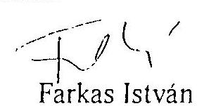

Farkas István

---

Privatizációs Kormánybiztos
$2 F-1063 / 94$
1994. 11.01 .

## Hagelmayer István

## Elnök

Állami Számvevőszék

## Budapest

Tisztelt Elnök Úr!
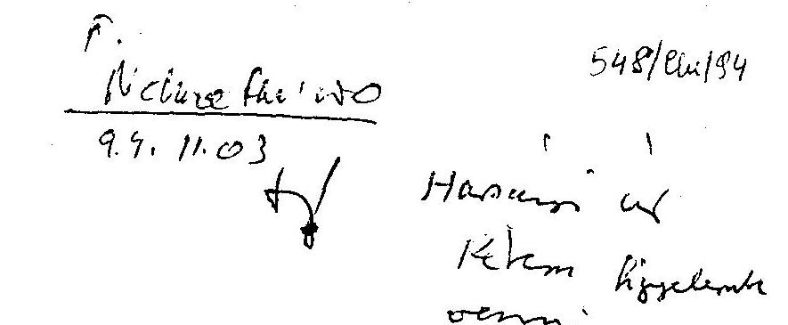

548/04/94

Hassan: w
Khem hiyelme
rommi.

Konimen
K. $N^{\prime}$.
$1 \pi, 02$

Az Állami Számvevőszék által az ÁV Rt. 1993. évi tevékenységének ellenôrzésérôl készített jelentését köszönettel megkaptam.

Az ÁSZ jelentése komplexen tárja föl az ÁV Rt. 1993. évi müködésében fellelhető hiányosságokat és folyamatában szemléli az ÁV Rt. tevékenységét azáltal, hogy az 1994-ben bekövetkezett változásokra is utal. Helyesnek és korrektnek tartom ezt a vizsgálati szemléletmódot.

Mindig is fontos volt az ÁVÜ és az ÁV Rt. számára az ÁSZ által végzett vizsgálat, de különleges jelentősége van ma, amikor zr rivatizációs törvények kapcsán a két vagyonkezelő szervezet további sorsáról is döntés szülc:ik.

A jelentésre az ÁV Rt. részletes észrevételeket tett. Mindez tükrözi azt is, hogy az ÁV Rt. mennyire fontosnak tartja a jelentést és az abban foglalt megállapításokat. Az ÁV Rt. által tett észrevételekhez kapcsolódva néhány gondolatot kiemelendőnek tartok:

1, Az ÁV Rt. 1993. éve volt az első teljes üzleti év, amelynek során a szervezet számos technikai eljárási kérdéssel küzdött. Bár jelentős privatizációs tapasztalatok álltak rendelkezésre, de a társasági formában történő állami vagyonkezelés sajátos eszközök és viszonyrendszer kialakítását igényelte. A szervezet létszámának kiépítése, a költözés, a technikai feltételek biztosítása, az eljárásrendek folyamatos kialakulása és a sorozatos vezetőváltás rányomta bélyegét az 1993-as müködésre. További problémákat okozott a jogszabályi környezet változása és annak megfelelő értelmezése. Ezek a tények jelentősen befolyásolták a szervezet munkáját, bár önmagukban nem adnak választ az ÁSZ által föltárt problémákra.

---

2, Az ÁV Rt. Alapító Okiratának és jegyzett tőkéjének felülvizsgálatára a privatizációs törvény kapcsán sor kerül. Ezért a jegyzett tőke megállapításával kapcsolatos szakmai vita tisztázására és feltárására irányuló részét a jelentésnek különösen fontosnak tartom.

3, Aggályos az a megállapítás, amely a szervezet működésképtelenségére vonatkozik, mivel az az 1993. év tevékenysége alapján lényegében a társasági forma célszerűtlenségére utal. Bizonyos vagyok benne, hogy az 1994. év vizsgálatakor majd számos javuló tendenciát fognak tapasztalni, amely a társaság irányításában bekövetkezett változásokat tükrözi, de megfelelő távlat hiányában ezek ma, a vagyonkezelő szervezet létét befolyásoló döntések idején még nem képezhetik az ÁSZ vizsgálatának tárgyát.

Megfontolásra ajánlom a komplexitás és az ÁV Rt-ről a jelentés alapján kialakuló kép pontositása érdekében azt, hogy a gazdálkodás egyes anomáliáinak feltárása során a megállapítások a statisztikai átlagok helyett részletező adatokat tartalmazzanak.

4, Az új szervezet kialakítása során fontornak tartom mind az ÁVŐ mind az ÁV Rt. müködésében az ÁSZ által feltárt pıublémák tanulságainak levonását és az abból eredő intézkedések érvényesítését.

Köszönöm a lehetőséget, hogy észrevételeimet kifejthettem és mellékelten megküldöm az ÁV Rt által készített javaslatokat, melyek remélem, hogy elősegítik a jelentés készítőinek munkáját.

Tisztelettel
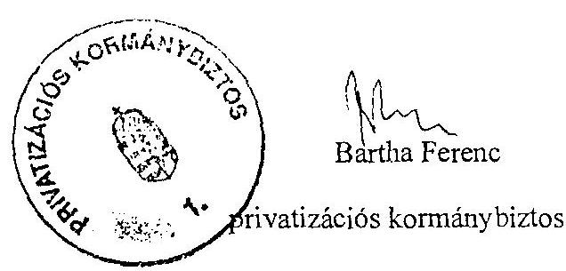

---

# ÁLLAMI VAGYONKEZELŐ RÉSZVÉNYTÁRSASAG 

1115 Budapest, Bánk bán u. 17/B. Tel.: 267-6662 Fax: 267-6663
Levélcim: 1519 Budapest, Pf. 409. Központi telefon: 267-6600
Felügyelö Bizottsága
Budapest, 1994. október 25.
FB-K-145/1994, 267
dr. Kovács Árpád úrnak
Számvevőszéki Igazgató
Állami Számvevőszék

## Budapest

## Tisztelt Igazgató Úr!

Köszönettel megkaptam az ÁV Rt.-nél végzett ÁSZ vizsgálat tapasztalatait írásbı foglaló jelentés tervezetét. A Felügyelő Bizottság a jelentést megtárgyalta és véleményét az alábbiak szerint alakította ki.

A Felügyelő Bizottság ellenőrzési tapasztalatai alapján úgy értékeli, hogy az ÁSZ vizsgálati jelentésben szereplő ténymegállapítások megalapozottak; a következtetések általában reálisak, a jelentés összességében jól kimunkált átvilágítást ad az ÁV Rt. müködésének és gazdálkodásának helyzetéről.

Az alábbiakban a jelentés véglegesítéséhez azonban néhány kérdés újbóli átgondolására hívjuk fel a figyelmet.
1./ A jelentésből kitűnik, hogy a kifogásolt jelenségek hátterében több esetben az ÁV Rt.re vonatkozó, ill. vonatkoztatható törvények és jogszabályok pontatlansága, az ÁV Rt. speciális helyzetére való adaptálás elmaradása található. Ezzel a problémával a Felügyelő Bizottság is találkozik mind a megállapításai kidolgozásánál, még inkább azok elfogadtatásánál. E körből néhányat konkrétan is kiemelünk:
a./ A jelentés lényegében kifogásolja az értékesítési ábevétel elszámolásának mechanizmusát, melynek eredményeként " az ÁV Rt. más gazdasági társaságokkal szemben „ingyen" ráfordítás nélkül egy törvényi felhatalmazás erejével jutott 37.051 MillióFt könyvszerinti nyilvántartási értéken részvényhez ". Ez a pénzösszeg az állam számára " eltünt ", s az ÁV Rt.-nél kihelyezhető pénzeszközzé vált.
Bár a jelentés tartalmazza, hogy az eljárás nem ellentétes a számviteli törvény előírásaival, mégis véleményünk szerint ez a megfogalmazás elfogadhatatlan és külső személyek számára félreértésre ad alkalmat.
Ez egy példa arra, hogy az ÁV Rt., mint gazdasági társaság jogilag nem marasztalható el, ha a törvényt a maga érdekei szerint magyarázza és alkalmazza.
b./ A jelentés megállapítja, hogy az ÁV Rt. " eltért a törvényi előírástól és az Alapító Okirat-ban foglaltaktól " akkor amikor az alaptőke meghatározásakor a jegyzett

---

dr. Kovács Árpád úrnak
1994. október 25.
2. oldal
tőkét és nem a saját tőkét vette figyelembe. Ebből a tényből a jelentés a továbbiakban messzemenô következtetésekre jut. Az eltérés abból ered, hogy az Alapitó Okirat az alaptőke fogalmának meghatározását illetően nem egyértelmủ és véleményünk szerint nincs összhangban az 1992. évi LIII. törvény vonatkozó elöírásaival.
A jelentés az Alapitó Okirat 2.1.2 pontra hivatkozik, amely a nem pénzbeli hozzájárulás fogalmát tartalmazza. Ezzel szemben a 2.1 pont összegszerűen is meghatározza az alaptőke egyik elemeként a nem pénzbeli hozzájárulást, mégpedig 279.453 MillióFt-ban. Ez pedig nem más, mint a jegyzett tőke összege. Ha tehát mégis eltérés van, úgy az az alapitó pontatlan szabályozásának az eredménye.
c./ Az ÁSZ vizsgálatnak idöpontjában az éves beszámoló részeként már egy kész, a közgyilés által elfogadott eredmény elszámolás és abban rögzitett éves nyereség felosztás állt rendelkezésre.
Ezért az ÁSZ vizsgálat nem értékelhette azt a jogszabályi vitát, amely az elkészités idején a Felügyelő Bizottság, az Igazgatóság és azon keresztül az Úgyvezetés között történt, amibe a Pénzügyminisztérium érintett szakapparátusa is bekapcsolódott. A vita l:nyege a költségvetésről szóló törvény szerint, a költségvetést megillető osztalék összetevőinek meghatározásán állt; konkrétan az, hogy az ideiglenes állami tulajdont képező részvények utáni osztalékot megtarthatja-e az ÁV Rt., vagy azt is köteles a költségvetésbe befizetni. A vita élességét mutatja, hogy az 1992. évi éves beszámoló jóváhagyására összehívott közgyülést helytelen jogszabályi értelmezés következtében el kellett halasztani, s az 1993. évi hasonló közgyűlés összehivása előtt is az Igazgatóság által :aár jóváhagyott beszámolót meg kellett változtatni.
d./ Az ÁV Rt. vezető tisztségviselőinek nem kellően szabályozott összeférhetetlenségi ügye miatt indult el az FB kezdeményezésére az a folyamat, amiben az Igazságügyminisztérium is jogszabályi értelmezést adott. Végül az IM állásfoglalására tekintettel a Részvényesi Jogok Gyakorlója határozatban rögzítette az összeférhetetlenség kérdését. Az így született helytelen döntés azt jelzi, hogy ha egy folyamat rendezetlenül elindul, azt mindig nehéz már utólag kellően korrigálni.

A fentiekben közölt példák alapján a Felügyelő Bizottság javasolja, hogy a vizsgálati jelentés konkrétan is jelezze, hogy a vizsgálat által kifogásolt tények hátterében több esetben jogi rendezetlenség található, s ha az ajánlásokban erre külön nem is tér ki a jelentés, akkor is ezzel mintegy felhívja a figyelmet a készülő törvényjavaslat átgondolt kidolgozására.
2./ A jelentés kifogásolja, hogy az ÁV Rt. a szabad pénzeszközeit diszkont kincstárjegy és államkötvény vásárlására fordítja, s ebből elvi úton messzemutató következtetésre jut ( inflációt keltő hatás ). Mivel a jelentés itt leáll, kimondatlanul megoldásként azt is sugallja, hogy korlátozni kellett volna az ÁV Rt. pénzkihelyezési lehetőségeit. Egy ilyen korlátozó aktus azonban összeférhetetlen a gazdasági társaság cselekvési szabadságával.

---

dr. Kovács Árpád úrnak
1994. október 25.
3. oldal

A kérdés lényege valójában nem a pénzkihelyezés tényének módjában van, hanem abban, hogy a kihelyezésre alkalmas, átmenetileg szabad pénzeszköz képződése indokolt-e, vagy sem. Ez viszont a privatizáció és a vagyonkezelés koncepcionális kérdéseibe ágyazva dönthető el.

Szükséges jeleznünk, hogy a diszkont kincstárjegy és az államkötvény vásárlását a Felügyelő Bizottság kezdeményezte, mert a pénzkihelyezés erőteljesen a kockázatos magáncégek irányába történt, s veszélyesnek látszott a pénzeszközök biztonsága. De erről a jelentés más helyen részletesen beszámol.
3./ A jelentés megállapítása, amely szerint " ebben az irányítási formában a szervezet müködésképtelen " ( 18. oldal ) a társasági formára értelmezhető, ugyanakkor a jelentés azzal a feltételezéssel él " hogy az ÁV Rt. jogutódjaként létrejövő szervezet részvénytársasági formában müködik " ( 19. oldal ).

A Felügyelő Bizottság tapasztalatai és véleménye szerint nem a müködési forma a problematikus, hanem a müködési gyakorlat. Az ÁV Rt. müködési gyakorlatát alapvetően befolyásolta, meghatározta az alapítás előkészítetlensége, törvényi ellentmondás, ill. értelmezés problémái, az Alapitó Okirat, valamint a Társasági Törvény következetlen alkalmazása, gyakori megsértése.

Az Alapitó ( Részvényesi Jogok Gyakorlója ) által kiválasztott felsővezetők körében bekövetkezett gyakori változások, a kialakulatlan, túlcentralizált müködés viszonyai között jelentős hátrányokkal járt.

A Felügyelő Bizottság ezen vonatkozások hangsúlyozása mellett a Kormány részére tett ajánlás 5. pontja kivételével, - amely véleményünk szerint túlmegy a vizsgálat keretein - egyetért. Külön kiemeljük az ajánlás 2. és 3. pontjában megfogalmazott igényeket, amelyek szerint az ÁV Rt., ill. utódszervezetének elhelyezése, müködési feltételei jogszabályilag egyértelmüen kerüljenek meghatározásra, hogy ezáltal a jelenleg tapasztalható hatásköri és koordinációs zavarok a törvényszerű müködést ne gátolják.

Kérem, hogy az ÁSZ jelentés véglegesítésénél a Felügyelő Bizottság fentiekben jelzett észrevételeit figyelembe venni szíveskedjenek.

Tisztelettel,

---

# Szekeres Szabolcs 

1121 Budapest, Költő utca 26/d
1994. november 17.

Hagelmayer István Úrnak az Állami Számvevőszék
Elnökének
Budapest
Tisztelt Hagelmayer Úr!
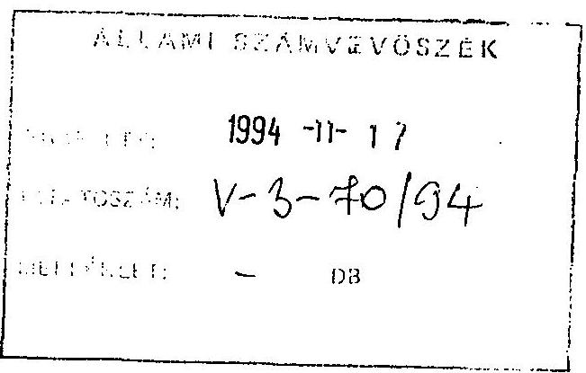

Hálával nyugtázom a folyó hó 9 -én kelt levelét, melyben megküldte nekem az ÁSZ véleményét az ÁV Rt. 1993. és 1994. évbeli müködéséről, és lehetőséget ad arra, hogy az erről szóló észrevételeimet közöljem, hogy esetleges parlamenti hozzászólásokban hasznosíthassák. Szintén köszönöm azt, hogy e héten fogadni tudott, és hogy az imént említett témakörben elbeszélgethettünk.

Örömmel teszek eleget a kérésének ezen levelemmel. A következőkben észrevételeket szeretnék tenni az ÁSZ megfigyeléseire, kifejteni ama nézetemet, hogy ezek sok esetben nem kellőképpen törekszenek az objektivitásra; vizsgálni fogom, hogy az ÁSZ jelentésének fó következtetése - melyet Kovács Árpád Úr már a sajtóban is hangoztatott még a végleges jelentés elkészülte előtt is - megállja-e a helyét; felteszem a kérdést: hasznos volt-e az ÁV Rt. 1993-ban; eltűnődöm az ÁSZ munkájáról és kívánatos szerepéről; és végezetül egy kérelemmel fordulok Önhöz.

Elöre kell bocsátanom, hogy csak az 1993. év eseményeire fogok utalni, részben azért, mert az 1994-ben történtekről jóval kevesebbet tudok, részben pedig azért, mert attól kezdve olyan változások is álltak be az ÁV Rt. gyakorlatában, amelyekkel nem tudok azonosulni.

## Az ÁSZ jelentésének objektivitásáról

A teljesség igénye nélkül néhány példával szeretnék szolgálni azon benyomásom megalapozására, hogy az ÁSZ jelentés írói vagy nem az elvárható semlegességgel végezték vizsgálatukat, vagy nem voltak elég körültekintőek, vagy a munkájukhoz szükséges szakmai következetesség alkalmazását mellőzték. Az alábbi példákban idézek vagy összegzek az ÁSZ jelentésből, leírom azt, hogy az olvasó ebből mire következtethet, és végül jelzem, hogy a kérdés szakszerű elemzéséből mi kellene, hogy következzen. Nem szakszerű eljárás ugyanis olyan anyagot kiadni, amelynek a következtetései hallgatólagosak, s mivel az olvasóban fogalmazódnak, a szerző nem vállal értük kimondott felelősséget.
(1) Állitás: "A szervezet ellentmondása, hogy 1 fő vezető dolgozóra 1 kiemelt munkatárs és 1,5 fó ügyintéző jut. Egy vezető így átlagosan 2,5 fő létszámot irányít, ami nagyon

---

Hagelmayer István Úrnak
1994. november 17.
2. oldal
alacsony számnak minősithető..."1 "Minden ötödik hatodik alkalmazottnak van lehetősége a hivatali gépkocsihasználatra." (F-37)

Sugalmazott következtetés: Az ÁV Rt. pazarló intézmény, túl sok a vezető, túl sok a juttatás.

Elemzés: Milyen ismérvek alapján mondja a szerző, hogy a 2,5 arány nagyon alacsony? Például a MÁV-hoz képest, vagy a Treuhandanstalt-, vagy a Societé Belge des Investissmentshez képest? Az ÁSZ jelentésében még utalás sincs ugyanis olyan elemzésre, amiböl, figyelembe véve az ÁV Rt. feladatát, a sugalmazott következtetést le lehetne vonni. A tekintetben sincs elemzés, hogy a gépkocsik száma a feladat el végzéséhez szükséges számhoz képest alacsony-e vagy magas.
(2) Állitás: "Reprezentáció címen 3 millió Ft-ot számoltak el - ez, figyelembe véve az 1993. évi átlaglétszámot mintegy 30.000 Ft fejenként."

Sugalmazott következtetés: Az ÁV Rt. pazarló intézmény.
Elemzés: Ez az átlag magában foglalja a külföldről ideutazó vezető tisztségviselők tevékenységének reprezentációs költségeit is. Szakszerü és tisztességes elemzést akkor végzett volna az ÁSZ, ha ezt feltünteti (és így az átlag dolgozóra 5.000 Ft-nál alacsonyabb összeg jutott volna). Természetesen lehet mérlegelni, hogy ezen reprezentációs költség indokolt volt-e vagy sem. Ehhez figyelembe kellene venni, hogy ezen tevékenység vélhetőleg milyen hatással volt az ÁV Rt. vagyonára. De ilyen elemzést az ÁSZ nem végzett. A félrevezető állítás mellett kitartott, annak ellenére is, hogy az egymástól eltérő kategóriák átlagolásából adódó durva statisztikai hibára az ÁV Rt. a figyelmet felhívta az 1994. október 27-én Önhöz intézett levelében. ${ }^{2}$
(3) Állitás: A Mátrabánya "17,4 millió Ft. váltóköveteléssel" kapcsolatban "A vezető jog: :nácsos ... intézkedést nem tett. Az ÁV Rt. akkori fökönyvelője nem járt el kellő gondossággal a váltó megvásárlásakor, nem tájékozódott a váltó szabályszerűségét illetően, s így az ÁV Rt. megalapozatlanul fizette meg érte a 17.4 millió Ft-ot." (F-38, F-39) "A Mátrabánya veszteségfinanszírozása általában is kifogásolható, hiszen itt az ÁV Rt-nek mint tulajdonosnak a felelősége közvetlenül nem áll fenn." (F-19)

Sugalmazott következtetés: Az ÁV Rt. vezetőit a gondatlanság jellemzi és az ÁV Rt. szükségtelen keresztfinanszírozást végzett.

Elemzés: Az ÁV Rt. volt fökönyvelöje az ÁSZ-nak írásban számolt be arról, hogy az ÁV Rt. tudta jól, hogy a szóban forgó váltó értéktelen. Azért vette meg a tulajdonában lévő Mátrabányától a váltót, mert így tudta egyszerüen lebonyolítani,

[^0]
[^0]:    ${ }^{1}$ Függelék, 23. old. Ezentúl az idézetek oldalszám megjelölését közvetlenül a szövegben fogom megadni, zárójelben, sima oldalszámként amikor a november 8-a dátumot viselö jelentés fö részére vonatkoznak, és "F-" elöjelzéssel, amikor ennek függelééének oldalszámaira utalok.
    ${ }^{2}$ Erre a levélre hivatkozom, amikor lejjebb ismét emlitést teszek arról, hogy az ÁSZ-nak tudomása volt az ÁV Rt. ellenvéleményéről.

---

Hagelmayer István Úrnak
1994. november 17.
3. oldal
hogy 24 órán belül pénzhez juttassa a saját cégét. Miért volt erre szükség? Az a kényszerhelyzet állt elő, hogy a vállalat nem tudta a jelentős mértékủ villanyszámla tartozását kifizetni, ami az áramszolgáltatás megszakításához vezetett volna. Ebben az esetben a bányába szivárgó víz kiszivattyúzása megszűnt volna, és a bányát elárasztotta volna a víz. Az ÁV Rt. éppen hogy gondosan járt el, amikor vagyonának értékét az elárasztás megakadályozásával óvni akarta. Akkoriban, t.i., komolynak tűnő érdeklődés volt a bánya megvásárlására, elárasztott bányát pedig nehéz eladni. Tehát egyáltalán nem hanyagságról volt szó, s vezető jogtanácsosnak sem volt szükséges intézkednie egy olyan követelés kapcsán, amelyről mindenki tudta kezdettől fogva, hogy behajtási lehetősége nincs.

Elgondolkoztató, hogy az ÁSZ, annak ellenére, hogy a fenti információt írásban kapta meg, továbbra is gondosság hiányával vádol, és hogy éppen azt kifogásolja, hogy az egyik célkitűzésünknek (vagyonkezelés, a vagyon értékének óvása, gyarapítása) eleget próbáltunk tenni. Elképzelhető talán, hogy az ÁSZ a feddhetetlen semmittevést kívánja ösztönözni?
(4) Állitás: "1993-ban tizenöt dolgozó részesült [lakásépítési, vásárlási] támogatásban... az engedélyezés jogát az ÁV Rt. elnök-vezérigazgatója saját hatáskörébe utalta" "A 'Szabályzat' hatálybalépése (1993. június 1.) előtt az ÁV Rt. támogatást igénylő 15 munkavállalója közül 2 fő kapott lakásépítési kölcsönt, melynek egyike az elnökvezérigazgató volt." (F-27) Ezek után a jelentés részletezi a szerződésemben szereplő feltételeket, és állítja, hogy ezek jogszabályellenesek. (F-28)

Sugalmazott következtetés: Súlyos érdek-összeférhetetlenséget követve el, mértéktartást mellőzve, önmagamnak adtam kölcsönt, jogszabályellenes módon.

Elemzés: Meglepő, hogy az ÁV Rt. észrevétele ellenére is úgy állítja be az ÁSZ jelentése, hogy a kölcsön megkapása idejében én lettem volna az elnök-vezérigazgató. A szóban forgó szerződéseket mint munkavállaló írtam alá, teljes jóhiszeműséggel. Három hónappal a hazatelepülésem után nem volt okom arra, hogy megkérdőjelezzein a felajánlott szerződések jogtechnikai helyességét. A sugalmazott erkölcsi megbélyegzést rágalomnak tekintem.

Az olvasó valószínű feltevése, hogy a lakáskölcsön összege túlzottan magas, szintén téves. Ha az ÁSZ szakszerűen végezte volna ellenőrzését, esetleg megvizsgálhatta volna, hogy miért volt erre a kölcsönre szükség? 1993-ban a szabad piacon egy külföldről ideköltöző egyén, tanácsi lakással nem rendelkezven, havi 4.000 dollárért kaphatott lakást a szabad piacon. ${ }^{3}$ Ha az ÁV Rt. csak ezen összegủ lakbér fedezéséhez elengendő fizetést adott volna, akkor az, a TB terhekkel együtt, az ÁV Rt.-nek évi 14 millió Ft-ba került volna. Ez négy évre 56 millió Ft! A 36 millió Ft. hitel, még a fele elengedésével is, amit a négy évre szóló szerződésem kikötött, 38 millióval Ft-tal olcsóbb lett volna. Ezen hitel konstrukció tehát az ÁV Rt.-nek

[^0]
[^0]:    ${ }^{3}$ Ha erről az összegről kétségei merülnének fel, ajánlom figyelmébe az 1994. november 9-i Magyar Hírlap Ingatlanbörze rovatát (21. oldal), melyben a mai budapesti lakásbérleti díjakról vannak adatok. Ugyan 1993 elején a reálárban mért bérleti díjak magasabbak voltak, a nagyságrendük változatlan.

---

Hagelmayer Isiván Úrnak
1994. novembr 17.
4. oldal
költségmegtakarító volt. Egyébként pedig része volt annak a kompenzációs csomagnak, amely nélkül nem vállaltam volna el a vezérigazgató-helyettesi állást. Kiszámítottam, hogy négy éves szerződésem, e kölcsönnel együtt, kevesebbe került volna az ÁV Rt.-nek, mint a hozzá tartozó társaságok jó néhány első számú vezetőjének az azonos időre számított bérköltsége. De egyébként ez mind akadémikus, hiszen a kölcsönt visszafizettem.

Ezek alapján a sugalmazott következtetés a valóságnak nem felel meg. Továbbá, a személyiségi jogaim megsértésének tekintem, hogy e tárgykörben bizalmas információkat tesznek közzé a jelentésben és a függelékben.
(5) Állitás: "A Budapest Bankkal 1993. november 3-án kötött ÁV Rt. szerződés ... az ÁV Rt-re nézve egyoldalú hátrányos kikötéseket tartalmazott." (F-41)

Sugalmazott következtetés: Az ÁV Rt. indokolatlan előnyben részesíti egyik társaságát.

Elcmzés: Az ÁSZ jelentése az említett szerződésből csak a Budapest Bank védelmére szolgáló megkötéseket idézi. Azt hangsúlyozza, hogy a minimálisan elöirt betétben tartott 350 milliós összegre a kamat csupán $3 \%$. Arról egyáltalán nem tesz említést, hogy a szerződésben a kamatlábak sávosak, és, hogy az utolsó sáv kamata $23 \%$ ! A sávok súlyozott átlaga $16,6 \%$. Azt sem említi a jelentés, hogy a pénzt nem kellett volna folyamatosan a bankban tartani, hanem egy napi értesítéssel ki lehetett volna venni.

Tehát a szerződés csak akkor lett volna előnytelen az ÁV Rt. számára, ha csak a minimális összeget helyezi ki, de akkor nem, ha a betétben lévő összeg meghaladja az 1,25 milliárd Ft-ot. Akkor, ugyanis, úgy müködött volna, mint egy $23 \%$-ot kamatozó látraszóló folyószámla, 250 millió Ft-os mozgástéren belül. Erre felfogásomban azért volt szükség, mert nagyobb rugalmassággal tudta volna az ÁV Rt. napi "Treasury" müveleteit végezni, váratlan garancialehívásoknak és egyéb kötelezettségeknek is mindig eleget tehetett volna anélkül, hogy hosszú idöre lekötött betéteket fel kellett volna mondani.

Az ÁSZ állitásával ellentétben, az említett szerződés kiegyensúlyozott volt: az ÁV Rt.-nek rugalmasságot és jól kamatozó folyószámlát nyújtott, a Budapest Banknak pedig ennek fejében egy minimális betétet hosszú lejáratra garantált. Hogy ez így van, azt egyszerủ szimulációs művelettel bizonyítani lehet. Végzett-e az ÁSZ olyan számítást, amivel a szerződés egyoldalúan előnyös, illetve hátrányos voltát esetleg bizonyítani tud:á? Egyébként olyan keretszerződésről volt szó, amely alatt tényleges tranzakció nem történt.

Tisztelt Hagelmayer Úr! Nem folytatom, bár lehetne. Kár, hogy objektív és konstruktív kritikák helyett, a fentiekhez hasonlókat találok lépten-nyomon. Az pedig, hogy ezen megállapítások számos esetben az észrevételek ellenére a jelentésben maradtak elgondolkoztató, és az ÁSZ szakszerűségére nem jó fényt vet.

---

Hagelinayer István Úrnak
1994. november 17.
5. oldal

# Megalapozott-e az ÁSZ következtetése? 

"A tapasztalt irányitási gyakorlat fennmaradása mellett az ÁV Rt. gyakorlatilag müködésképtelen. Ebben az irányitási formában, szabályok között a racionális gazdasági müködés elôfeltétele az önkorlátozó állami irányitási magatartás, a tulajdonosi jogokat gyakorló részéről az írásban rögzitett utasítási forma és a törvényi kötelezettségeknek következetes betartása." (19) Eme következtetés két mondatból áll: a müködésképtelenség megállapitása, az irányítási gyakorlatra való hivatkozással, és egy második mondat, amelyben három kivánalom van megfogalmazva: az állami magatartás, az írásban rögzitett utasítási forma és a törvényi kötelezettségek betartása (bár csak az idézett irányitási mód esetében).

Feltételezem, hogy a müködésképtelenség megállapítása nem a második mondat exkatedra meghatározásain nyugszik csupán. Ha nem, akkor a müködésk .ptelenség megállapitására fel kellene sorolni azokat az tevékenységeket, amelyeket az ÁV Rt. 1993-ban rosszul, vagy egyáltalán nem végzett el. Ilyen állitás a jelentésben kimondottan nincs, az osztalékfizetéstől eltekintve, amire külön kitérek a törvényi kötelezettségek megvitatása során. Ha azt mondjuk, hogy az ÁV Rt-nek vagyont kezelni és privatizálni kellett, miközben saját magát épitette fel, azt hiszem müködésképtelenség nyomára nem fogunk akadni, még a jelentésben sem:
(1) A vagyonkezelésről a jelentés megállapítja, hogy
(a) "1993. évben a vagyonkezelési tevékenység súlyponti elemét a vállalatok társasággá történő átalakítása jelentette. ... Érvényesitették és alkalmazták az időlegesen állami tulajdonban lévö vagyon értékesitéséről, hasznositásáról és védelméről szóló 1992. évi LIV törvény 63. §-át." (F-59)
(b) "A tulajdon ssi jogok gyakorlásának jelzett formái fokozatosan épültek ki. A közgyülésen az igazgatóságon keresztüli és a közvetlen vállalatirányitás fokozatosan szabályozottá és müködőképessé vált. A folyamatos irányitáshoz nélkülözhetetlen a cégek gazdálkodási és pénzügyi helyzetét a havi controlling információs jelentések jelzik." (11)
(c) A garanciavállalások kapcsán "Az alkalmazott gyakorlat 1993 júniustól az volt, hogy ... a Befektetési Igazgatóság kockázat elemzése alapján ... az ügyvezetés vagy az IT döntött." (F-32)
(d) "A válságban lévô cégeknél a müködőképesség fenntartása érdekében válságkezelési stratégia és program készült, amelynek a legfontosabb eleme a reorganizációs programok kidolgozása és a hitelkonszolidáció segítségével a pénzügyi helyzet javitása. Stratégiai átvilágitásokat, pénzügypiaci helyzetelemzéseket készitettek..." (F-60)

Tehát az ÁV Rt. 1993-ban zömében elvégezte az átalakításokat, megszervezte a tulajdonosi jogok decentralizált gyakorlásának rendszerét, megfelelő vállalati információs ellenőrzési hátteret épített ki, rendszert alakitott ki a válságos gazdasági helyzetben lévô cégek kisegitésére, de csak olyan esetekben, amikor egy számszerüsített kockázatelemzés bizonyitotta, hogy a szükséges támogatás megadása az ÁV Rt. vagyonát gyarapitja, és elindított egy sorozat stratégiai elemzést, amelynek alapján e válságos helyzetű cégek átszervezését el lehetett volna végezni. Ez utóbbi

---

Hagelmayer István Úrnak
1994. november 17.
6. oldal
lépésre 1993-ban nem kerülhetett még sor (a TKI kivételével), hiszen maguk az elemzések novemberben indultak. ${ }^{4}$ De semmiképpen nem lehet mondani, hogy az ÁV Rt. müködésképtelen lett volna a vagyonkezelés terén.
(2) A privatizáció terén az ÁSZ jelentés föleg azt hangsúlyozza ki, hogy az ÁV Rt. passzív végrehajtója volt a kormány döntéseinek, "önálló mozgástérrel nem rendelkezett". (F-73) Hogy ez nem mindig volt igy, azt a következô szakaszban fogom bemutatni. "Az ÁV Rt. 1993-ban 12 társaságnál privatizált, az árfolyam nyereség 50,4 milliárd Ft. volt." (F-76) Bár a privatizáció az ÁV Rt.-nél lassan indult, mégis 1993-ben egy nagyságrenddel több tranzakciót bonyolított le, mint 1994-ben, köztük Közép- Kelet Európa legnagyobb tranzakcióját, a MATÁV privatizációját. Ez sem utal müködésképtelenségre.
(3) "Az ÁV Rt. - mint az állam tartós vállalkozói vagyonát kezelő társaság - új funkciójú intézmény, ennek felállítása és tevékenységének nagyvonalú megszervezése - hasonlóan az ÁVÜ-höz - közel két évet vett igénybe." (F-80) A jelentés beismeri, hogy a szervezés és felállás önmaga egy hosszú időt igénylő feladat, s maga egy folyamat. Egy befejezetlen folyamat valamelyik pontján nem igen lehet a müködésképtelenséget megállapítani, föleg akkor, amikor megfigyelhető tények ezt nem indokolják.

Az ÁSZ következtetésének első mondatban lévő irányítással kapcsolatos megjegyzéséhez a második mondat elemzése alkalmából fogok szólni. A második mondat három részére pedig a következö megfigyeléseim vannak:
(1) Ha a következtetés irányitásra való utalása az ÁV Rt. belső irányitási rendszerére vonatkozik, mint valószínủ, hiszen a jelentés ezt hosszan tárgyalja, akkor nem értem mit jelent az, hogy "állami irányitási magatartás" és miért lenne az a "racionális gazdasági müködés elöfeltétele". Én az ÁV Rt.-t semmiképpen sem állami magatartás felé próbáltam vezetni, hanem inkább az üzletszerű magatartás felé. A gazdasági átalakulás, maga a privatizáció is ebbe az irányba mutat, nem pedig az állami irányitás felé.

Ha pedig a "tapasztalt irányitási gyakorlat" az ÁV Rt. felett, a kormányzat által gyakorolt irányitásra vonatkozik, akkor pedig sajnálattal kell megállapítanom, hogy a következtetés nincsen kellőképpen kidolgozva, hiszen erről az irányitásról alig van a jelentésben szó. Pedig véleményem szerint ezzel a kérdéskörrel érdekes lett volna alaposabban foglalkozni, hiszen ebben a témakörben fontos, de sajnos elhallgatott, következtetéseket lehetett volna a jövőre nézve levonni.
(2) "Az írásban rögzített utasítási forma" követelménnyel elvileg egyet értek, és gondolom e mögött a fogalom mögött az ÁSZ az ÁV Rt. szervezettségével való elégedetlenségére utal. Azért mondtam, hogy "elvileg" értek egyet, mert voltak olyan idők amikor fontosabb volt cselekedni, mint a cselek vést leírni és kodifikálni.

[^0]
[^0]:    ${ }^{4}$ De ha folytathattam volna munkámat 1994-ben sor keruilhetett volna rá. 1993 decemberre már nagyából elérhető lett volna egy 300 millió USD nenuzetközi hitel, amiből ezt finanszírozni lehetett volna.

---

Hagelmayer István Úrnak
1994. november 17.
7. oldal

Az ÁSZ véleményét az ÁV Rt. 1993-as szervettségét illetően vitatom. Nem igaz az, hogy "A szervezeti és irányítási szintek kialakítását nem előzte meg a szükséges társasági tevékenységek (szervezeti funkciók) elemzése, a döntési- döntéselőkészítési folyamatok modellezése." (F-80) Az ÁV Rt. igazgatósága egy szaktanácsadó cég jelentése alapján hagyta jóvá az ÁV Rt. szervezeti struktúráját. Hogy "A társaság szervezetének felépítése fôként szubjektív behatások szerint alakult" (F-80) mit jelent, azt nem tudom. Esetleg kifogás az ellen, hogy valaki sok éves tapasztalatát kamatoztatta volna? Az sem igaz, hogy "A vezető, illetve folyamatba érintett ellenőrzés a kezdeti alacsony szervezettségi és szabályozottság színvonallal összhangban hézagos volt és stagnált." A jelentés erre semmi bizonyítékot nem sorakoztat föl, és sehol nem tesz említést három bevezetett rendszerről, mely a ezen állítást cáfolja:
(a) Ügykezelési rendszer. 1993 júliusban került bevezetésre az ügykezelési rendszer, mely írásban nyomon követett minden beérkező fontos ügyletet. Eleinte papíron készült el a rendszer, később elektronikus postán müködött (július 15.). Decemberre már próba-üzemeltetésben müködött egy kimondottan erre kialakított számítógépes rendszer. Ennek a rendszernek a segítségével a vezérigazgatói titkárság nyomon követte az ügyletek haladását, a levelek időben történő megválaszolását, stb.
(b) Projektkezelési rendszer. Ezen rendszer a bonyolultabb feladatok tervezését és ellenőrzését tette lehetôvé. A vezérigazgatói titkárság heti jelentések alapján követte ezen projektek haladását.
(c) Számitógépes iktatási rendszer. Ez decemberre próbaüzemelés alatt volt. Az ügykezelési rendszerhez kapcsolódott és az ügyletek teljeskörü ellenőrzését tette volna lehetôvé.

Sajnos e három rendszert 1994-ben az ÁV Rt. félre tette, talán ezért nem találkozott velük az ÁSZ. De 1993-ról nem lehet azt mondani, hogy a folyamatok vezetői ellenőrzése hézagos lett volna. S talán lecke lehet az ÁSZ-nak az, hogy nem csak az SZMSZ-ben lehetnek írásban rögzített utasítások.
(3) Természetesen a törvényi kötelezettségeknek eleget kell tenni, és az ÁV Rt ennek eleget is tett. Az ÁSZ ezt két területen vitatja:
(a) A számviteli törvény kapcsán, több ízben. Lévén, hogy nem vagyok számviteli szakértő, ebben a vitában nem akarok állást foglalni. De megjegyzem, hogy az ÁV Rt. könyvszakértője a világ minden részén elismert KPMG, és ennek véleménye alátámasztja az ÁV Rt. álláspontját, hiszen a mérlegét megjegyzés nélkül hitelesítette. Függetlenül attól, hogy kinek van ebben a kérdésben igaza, az ÁV Rt-nek, amikor még esélye volt a világ pénzpiacain való megjelenésre, a nemzetközileg elismert könyvvizsgálónak véleménye bírt döntö fontossággal.
(b) Az osztalék befizetése. Ezt a költségvetési törvény írja elő, amely arról nevezetes, hogy pótlólagos kiigazításokra szorul, amikor eltér a gazdasági valóságtól. Az ÁV Rt. költségvetés befizetési kötelezettségei sem voltak a gazdasági valóságban megalapozottak. Üres formaság törvénysértésnek minősíteni azt, hogy az ÁV Rt. nem tudta teljesíteni a lehetetlent. Az IM 20.035/93. sz., 1993. november 4-én kelt állásfoglalása kimondta, hogy "ha a

---

Hagelmayer István Úrnak
1994. november 17.
8. oldal
képezhető osztalék mértéke a törvényben meghatározott osztalékot nem éri el, a Részvénytársaság nem kötelezhető arra, hogy pl. hitelfelvétellel biztosítsa a hiteles és a törvényben rögzített összeg közötti különbözetet. A törvényi előirás teljesítése ebben az esetben lehetetlen, teljesülését a valós gazdasági folyamatok kizárják".

Tisztelt Hagelmayer Úr, nem tudom, hogy a fentiekböl Ön személyesen is azt következtetné-e, amit munkatársai? Merem remélni, hogy nem, hiszen az ÁSZ jelentés e tekintetben nem meggyőző. De ebben a szakaszban föleg az ÁSZ saját érveivel (vagy azok hiányosságával) próbáltam cáfolni azt az állítást, hogy 1993-ban az ÁV Rt. müködésképtelen lett volna. A következő szakaszban megpróbálom közvetlenül vizsgálni azt a kérdést, hogy mit ért el az ÁV Rt. 1993-ban?

# Hasznos volt-e az ÁV Rt. 1993-ban? 

Ha az ÁV Rt. nemzetgazdasági hasznosságát akarnánk vizsgálni, azt kellene nézzük, hogy mennyivel nőtt az ÁV Rt.-hez tartozó vagyon értéke vagy mennyi volt az abból származó haszon ahhoz képest, ha nem lett volna ÁV Rt. Ezt a számítást sajnos nem lehet elvégezni. De volt az ÁV Rt.-nek két olyan szereplése, amelyeknek pénzbeli következményeit legalább becsülni lehet. Mind a kettő privatizációs ügylet, és részben arra is szolgál, hogy cáfolja az ÁSZ ama állitását, hogy az ÁV Rt-nek a privatizációban csak a végrehajtási szerep jutott. Ezeket vázolom röviden a következőkben.

1993-ban az ÁVÜ meghirdette az áramszolgáltató vállalatok részvényeinek 15\%-ának értékesítését egy olyan szakmailag megalapozatlan konstrukcióban, amelyet az ÁV Rt. kezdettől fogva ellenzett. Talán emlékszik erre Hagelmayer Úr, hiszen akkoriban a sajtó sokat foglalkozott ezzel. Hosszú huzavona után, amelyek részletei most nem lényegesek, az ÁV Rtnek sikerült az ÁVƯ által eladásra felajánlott részvényeket megszerezni, és a tranzakciót meghiúsítani. A beérkezett ajánlatokat már az ÁV Rt. értékelte. Ezek a névérték 6 és 60 százaléka közt mozogtak. Ha akkor az ÁVƯ eladhatta volna a felkínált részvényeket, garantáltan rontotta volna a részvények hátramaradt $85 \%$-ának az árfolyamát, hiszen hátrányosan befolyásolta volna a későbbi tranzakciókban érvényesíthető árat. Ha konzervativan becsülöm, hogy az ettől várható árfolyamveszteség csupán $10 \%$ lett volna, akkor az államot érő kár, tekintettel az ÁV Rt.-hez tartozó áramszolgáltatók 185 milliárd Ft-os saját vagyonára, legalább 15 milliárd Ft. lett volna.

Szintén 1993-ban bonyolódott le a MATÁV privatizációja. Nem igaz az, hogy az ÁV Rt. ebben csak végrehajtó szerepet játszott volna. Ez úgy annyira így volt, hogy pontosan az a tény volt a formai indítéka az én elmozdításomnak az ÁV Rt. éléről, hogy az ÁV Rt. nem a kormány akaratát hajtotta végre a privatizáció során. Akkoriban egy ideig ezt próbáltam kivédeni, és ennek kapcsán beszereztem a MATÁV-ért pályázó befektetőktől olyan információt, mely bizonyítja, hogy legalább egyik vesztes pályázó visszavonult volna, ha a feltételek nem azok lettek volna, amelyeket az ÁV Rt., az ágazati miniszter kivánságaival szemben, felajánlott. A másik vesztes pályázó kezdetben kétséges részvételét pedig erősen befolyásolta az ÁV Rt. biztatása. A sajtóból ismert, hogy a nyertes csoport kezdeti ajánlata a tényleges tranzakció értékének felét sem érte el. Ugyan mennyit fizetett volna ez a csoport a konkurencia nélkül, mely már az első lépésben a későbbi ár környékén tett ajánlatot, vagy ha ő sem kapta volna meg azokat a feltételeket, amelyek mellett az ÁV Rt. kiállt, és amelyektől a

---

Hagelmayer István Úrnak
1994. november 17.
9. oldal

MATÁV részvények értéke függött? Konzervatív becslésnek tekinthető, hogy az ÁV Rt. tevékenysége nélkül az elért privatizációs bevétel a nyertesek első és második árajánlata között lett volna, félúton. Ez azt jelenti, hogy mintegy 240 millió dollárral, vagy megközelítőleg 25 milliárd Ft-tal kevesebbet kapott volna a magyar gazdaság az ÁV Rt. tevékenysége nélkül, mint amit tényleg megkapott.

Az ÁSZ jelentés azt állítja, hogy "A gazdasági teljesítményekkel nem alátámasztott gazdálkodást bizonyítja, hogy az ÁV Rt. ún. éves közvetlen müködési költsége 745 millió Fttal, $18 \%$-kal haladta meg az éves pénzügyi tervben az Igazgatóság által jóváhagyott 632,3 millió Ft-ot [sic]." (17) De ha az ÁV Rt. összes müködési költségét veszem is ( 2,8 milliárd Ft, a privatizációs költségekkel együtt), és ezt összevetem a fenti két privatizációs ügylet hasznaival, akkor annak a müködési költségnek az éves megtérülési rátája több mint $1.400 \%$ ! Ezt én nem tekinteném "gazdasági teljesítményekkel nem alátámasztott gazdálkodásnak".

Tisztelt Hagelmayer Úr! Szeretném közölni Önnel, hogy büszke vagyok arra, hogy 1993ban az ÁV Rt.-ben lehettem, és büszke vagyok minden dolgozóra, aki velem együtt dolgozott abban az évben, mert minőségre törekedtünk, Magyarország gazdasági felvirágozásáért dolgoztunk odaadással, a munka órákat nem számolva. És minden külső nehézség ellenére fontos eredményeket értünk el.

Hogy később más szelek fújtak, és az akkor felépített értékek közül nem mindegyik maradt meg, azt mélységesen sajnálom. És azt is sajnálom, hogy az ÁSZ ezeket az értékeket nem tudta, vagy nem akarta megtalálni.

# Tủnődés az ÁSZ szerepéről 

A megkapott jelentést olvastán, eltűnődtem azon, hogy mi is tulajdonképpen az ÁSZ szerepe? Elsősorban az, hogy a Parlamentnek olyan tájékoztatást nyújtson, amely alapján a Parlament megalapozott döntéseket hozhat.

Az ÁV Rt.-vel kapcsolatban, most pont a privatizációs törvényhozás kerül hamarosan napirendre. Ha én egy átlag honatya lennék, aki nem foglalkoztam a privatizációval, ugyan milyen információra lenne szükségem, hogy megfontoltan dönthessek? Gondolom jó lenne tudnom, hogy milyen intézkedések segítenék elő vagy hátráltatnák a gazdasági rendszerváltást, a privatizációt, hogyan lehetne elvégezni a szükséges átszervezéseket. Ezekre a kérdésekre három szinten lehetne válaszolni.

Felsö szinten azt szeretném tudni, hogy milyen erők befolyásolják a gazdasági átalakulás ütemét. Hol vannak azok az érdekszövetségek, amelyek ezt talán ellenzik. Azt is fontolgathatnám, hogy mi volt (és lehetett volna) egy független vagyonkezelő szerepe abban, hogy ezeket az érdekszövetségeket lazítsa, és a gazdaságot az egészséges átalakulás felé vigye? Ezeknek a kérdéseknek a felvetését és akár részleges megválaszolását szeretném megkapni, mert mint honatya, ennek az információnak a birtokában tudnék a privatizáció és állami tulajdonlás struktúrája kérdésében megalapozottan dönteni.

Ha ilyen kérdéskörben nem tudnék az ÁSZ-tól tájékoztatást kapni, akkor szeretném tudni, közép szinten, hogy az általa vizsgált szervezetek gazdaságosan és hatékonyan müködtek-e, megtérült-e a működtetésükre felhasznált adófizetők pénze? Indokolt-e a struktúraváltásból adódó időkiesés?

---

Hagelmayer István Úrnak
1994. november 17.
10. oldal

De lehet, hogy erre a kérdéskörre sem kaphatnék az ÁSZ-tól választ, hiszen emberi eröforrási és egyéb korlátozottságok miatt ezt nem tudja számítani, vagy becsülni. Akkor mégis mit várhatnék az ÁSZ-tól? Legalább azt - a legalacsonyabb szinten - hogy amikor vizsgálja az ellenörzött szervezeteket, és mindenhol azt keresi, hogy ki milyen hibát követett el, akkor az ÁSZ-tól semleges, objektív és szakszerủ megállapításokat kapjak.

Mert ha azt sem kaphatok, tisztelt Hagelmayer Úr, akkor arra a következtetésre kellene hogy jussak, hogy az ÁSZ müködésképtelen, a feladatainak elvégzésére nem alkalmas.

# Kérelem 

Tisztelt Hagelmayer Úr! Nem tudom, de nem is szeretném elemezni, hogy az Ön által olyan kedvesen megküldött jelentés miért annyira elfogult az ÁV Rt.-vel szemben?

Ha már a szakmai tisztességre hivatkozva megtisztelt bizalmával, ami nem kis dolog egy olyan szakmai tekintélynek örvendő személytől, mint Ön, akkor a szakmai tisztesség tőlem pedig azt követeli, hogy tisztán, nyíltan, kertelés nélkül közöljem Önnel az én szakmai véleményemet. Ezt a fentiekben megtettem. Ha netán itt-ott indulatosabb voltam megfogalmazásaimban, mint kellett volna, kérem bocsássa meg ezt nekem, nézze el azt, hogy szívügyem volt az ÁV Rt. 1993. évi munkája.

Tudom, hogy az Ön ideje is drága, ezer felé szétdarabolt: ennek ellenére kérem, hogy személyesen tekintse át újra a megküldött jelentést, és amennyiben meglátja ugyanazokat a hibákat, amelyekre rámutattam, akkor a jelentés alapos felülvizsgálatát rendelje el. Amennyiben úgy ítélné meg, hogy megfigyeléseimben tévedtem, és a jelentés helytálló, akkor véleményeink sarkalatosan eltérnek. Akkor pedig azt kérem a szakmai tisztességre hivatkozva, hogy ezen levelemet a jelentéshez mellékelni szíveskedjék. Döntse utána el az olvasó, hogy hol van az igazság.

Ismételten hálásan köszönöm, hi gy köztünk erre az eszmecserére sor kerülhetett.
Öszinte tisztelettel,

---

Budapest, 1994. november "21*
$\mathrm{V}-3-\frac{1}{11} / 1994$.

# S Z E K E R E S SZABOLCS úr 

## B U D A P E S T

Tisztelt Szekeres Szabolcs!

Köszönettel vettem szives leveled, melyet velem és munkatársaimmal a személyes beszélgetés folytatásának tartok. Szeretném azt is rögzíteni, hogy amikor Számodra a jelentést kiküldtem nem munkatársaim ellenére, hanem éppen az 0 javaslatukra tettem ezt.

Nem kívánok soraidra visszatérni minden részletet tekintve, de sajnálattal állapítom meg, hogy a leveledböl éppen az a gondolatsor maradt ki, melyről köztünk sok szó esett. Te szóban a példák sorozatával tiszteltél meg bennünket arról, hogy milyen informális behatások érték és ez milyen mértékben bénította müködésed. Az Állami Számvevőszék semmi mást nem mond ki, mint azt, hogy ha egy szervezet gazdasági társasági formában müködik, akkor azt hagyni kell úgy tevékenykedni, ha nem így történik, akkor müködése e formában kérdésessé lesz. Még egyszer csak sajnálni tudom, hogy az általad ehhez kapcsolódóan ígért példák sora elmaradt.

Különböző gazdasági eseményekkel kapcsolatos véleményed köszönöm. Ez jelentős segítséget adott, mert mint a jelentéshez ugyancsak csatolt ÁV Rt. észrevétel és az arra adott válasz tükrözi, pl. a Mátrabányák ügyet az ÁV Rt. akkori ve-

---

zetésének tagjai homlokegyenest eltérő akciónak minősítették. Ez az önmagában az ÁV Rt. gazdálkodásának egészéhez viszonyítva igen apró ügy is bizonyítja, hogy az adott időszakban a vezetés milyen mértékben volt szétesett és hogyan hozta meg az egyes döntéseket.

Kérem engedd meg nekem, hogy újra megerősítsem azt amit szóban elmondtam. Mi a magyar valóságban élünk és a kereseteket, személyes juttatásokat ennek megfelelően tudjuk minősíteni.

Leveled és válaszomat csatolom az ÁSZ sokoldalúan, többszörösen egyeztetett, az Elnöki Értekezlet által megvitatottan - tehát nem egyes munkatársaim személyes benyomásai alapján - véglegezett jelentéshez. Megköszönöm, hogy ajánlásaiddal és szerepünkröl való meditációddal megtiszteltél.
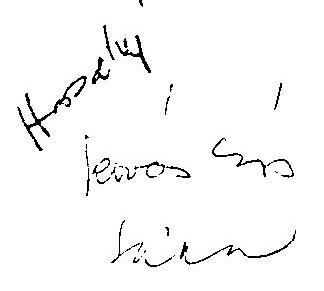

Üdvözlettel
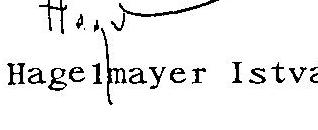