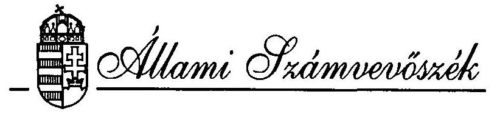
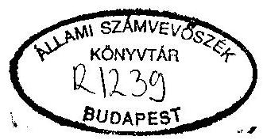
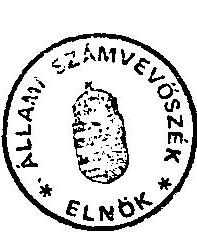
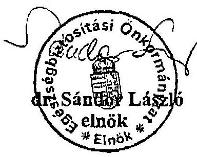
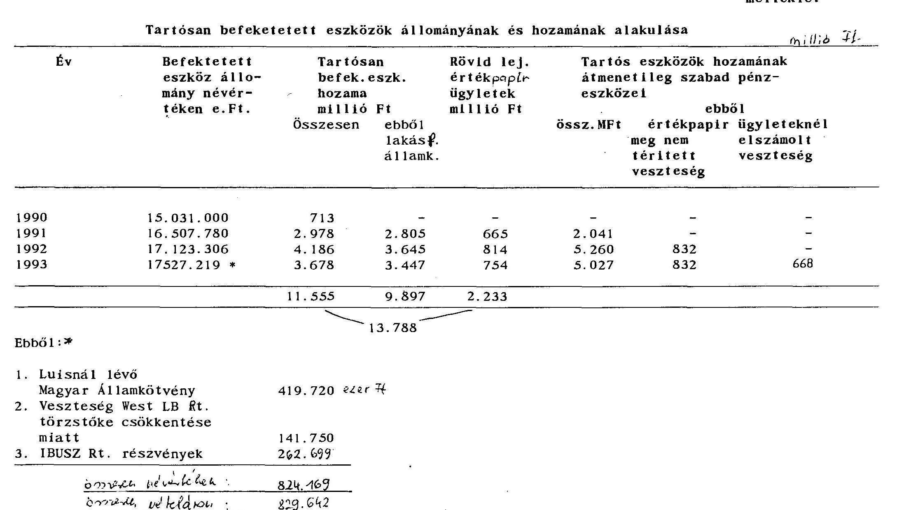

T/400/1.

# JELENTÉS 

a társadalombiztosítás pénzügyi alapjainak
1993. évi zárszámadásához kapcsolódó ellenőrzések
tapasztalatairól

---

# J E L E N T É S 

a társadalombiztosítás pénzügyi alapjainak 1993. évi zárszámadásához kapcsolódó ellenörzések tapasztalatairól

Bevezetés

Az államháztartásról szóló 1992. évi XXXVIII. törvény értelmében a társadalombiztosítás költségvetésének végrehajtásáról szóló törvényjavaslatot az Országgyülés az Állami Számvevőszék (ÁSZ) jelentésével együtt tárgyalja meg.

A társadalombiztosítás 1993. évi zárszámadásának ellenőrzésével az ÁSZ törvényes kötelezettségének harmadik alkalommal tesz eleget.

A zárszámadáshoz kapcsolódó helyszíni vizsgálatok (az ÁSZ munkaprogramjának megfelelően, figyelembe véve a pénzügyi beszámoló elkészítésének, majd a zárszámadás benyújtásának törvényi határidejét) 1994 május elejétől június közepéig tartottak. Ebben az időszakban a zárszámadás (igy az ellenőrzés) alapját képező 1993. évi költségvetési beszámolóknak és magának a törvénytervezetnek csak előzetes változata állt rendelkezésre. A pénzügyi beszámoló a törvényben foglalt márciusi határidőre nem készült el. A társadalombiztosítás pénzügyi beszámolóinak auditálása a vizsgálattal egyidejűleg folyt, ami az eredeti ütemezéséhez is jelentős késedelemmel, az Országos Egészségbiztosítási Pénztár (OEP) által összeállított beszámolók adatainak folytonos módosítgatásával történt. Ennek következtében még az ÁSZ jelentés összeállításához sem állt rendelkezésre a biztosítási önkormányzatok által jóváhagyott, auditált "végleges" hes zámoló.

---

Azt, végül is az ÁSZ augusztus 11-én kapta meg, majd ki-sebb-nagyobb megszakításokkal hónapokig tartó egyeztetések, adatkiegészítések után 1994. novemberében vált lezárhatóvá az ÁSZ jelentése, amelyet a biztosítási önkormányzatok megvitattak és tudomásul vettek. (A közgyűlési határozatokat a jelentés 3. sz. melléklete ismerteti.)

A végleges, Kormány által benyújtott zárszámadási törvényjavaslatot, amihez az ÁSZ jelentésének csatlakoznia kell csak 1994 decemberében, mintegy 5 hónap késéssel nyújtották be. Tartalma érdemben nem tér el az ONYF és az OEP által jóváhagyottaktól. Ez azonban nem változtat azon a tényen - amit több éves tapasztalat igazol - hogy az ÁSZ helyszini vizsgálatai és a "végső munkaszakasz" között több hónapos az időeltérés, közben érdemi változások történnek, ame lyeket nehéz követni. Mindez nemcsak a számvevőszéki munkát nehezíti. A zá rszámadás "menetközbent" ellenörzése, a lezárt dokumentum utólagos minösitése helyett, szakmailag is vitatható.

Az 1993. év zárlati szempontból is különleges volt. Az Egészségbiztosítási és a Nyugdíjbiztosítási Alap pénzügyi folyamatai még nem váltak el egymástól. A biztosítási önkormányzatok megalakulásával egyidejüleg.ugyan létrejöttek áz ágak igazgatási szervei (az OEP és az ONYF), de a pénzügyi és számviteli feladatokat még az OEP látta el. Az 1993. év közös lezárása és a külön évnyitás 1994-ben nem pusztán technikai jellegű tennivalókat jelentett, hanem nagyon komoly - feszültségektől sem mentes - vagyon, pénzeszköz, stb. megosztási feladatokat is.

Az elözetesen megismert törvényjavaslat megalapozottságának vizsgálata során az ÁSZ áttekintette:

- az 1992. évi LXXXIV. törvény végrehajtását, valamint azt, hogy a teljesítési adatok az elöirányzatokhoz képest hogyan és milyen tényezők hatására alakultak;
- az alapok és az alapkezelők gazdálkodásának, beszámolási kötelezettsége teljesítésének szabályozottságát, szabályszerűségét;
- a zá rszámadás és a költségvetési beszámolók adattartalmának összefüggéseit;
- a társadalombiztosítás költségvetési kapcsolatainak alakulását.

---

A zárszámadás adataihoz kapcsolódóan az ÁsZ munkatársai minden olyan körülményt, eseményt igyekeztek megvizsgálni, ami az 1993. év folyamatait érinti és a társadalombiztosítás helyzetét tükrözi. Így a jelentés foglalkozik a társadalombiztosítással szembeni tartozások alakulásával, az alapok likviditási helyzetével, hitelfelvételeivel, a végrehajtott pénzügyi múveletekkel, az ingyenes vagyonjuttatás témakörével, az egészségügyi reformintézkedések 1993. évi megvalósulásával. Az ÁsZ ezen jelentése bár következetesen csak az 1993-as gazdálkodás ismertetésére törekszik néhány vonatkozásban - a folyamatok bemutatása szándékával - az események 1994-re átnyúló összefüggéseire is utal.

Az ÁsZ a társadalombiztosítás megyei igazgatási szerveknél és kiválasztott egészségügyi intézményeknél is végzett ellenörzéseket. Az itt szerzett tapasztalatokat a jelentés 1. és 2. sz. függeléke összegzi

# Összefoglaló következtetések 

A társadalombiztosítás pénzügyi alapjainak 1993. évi zárszámadását vizsgálva, az ehhez kapcsolódó helyszini ellenörzések alapján általánosságban elmondható, hogy sok az ismétlődő megállapítás. Az ÁsZ által korábban kifogásolt gyakorlat nem változott, a jelzett gondok nem oldódtak meg, illetőleg olyan események következtek be, amelyekre már elözetesen felhívta a figyelmet. Mindez természetesen nem az ellenőrzés "tévedhetetlenségét" jelenti. Sokkal inkább utal a társadalombiztosítás helyzetének bonyolultságára, sajátosságaira, ami miatt rövid idő alatt nehéz kedvező irányú változásokat elérni. Ezt egyébként a társadalombiztosítást körü1vevő - gazdasági, társadalmi, jogszabályi, stb. - környezet sem segíti elő.

A társadalombiztosítás közeli és távolabbi jövője szempontjából a gondok - ame1yeknek megoldásától nem lehet eltekinteni és hatásaik a zárszámadási dokumentuokban is jól tükröződnek - alapvetően három fö témakört érintenek.

---

A társadalombiztosítással szembeni adósságok nagyságrendje 1992-tól évente mintegy 50 milliárddal emelkedett, ma már 200 milliárd forint körül alakul. Ennek "kezelése" a biztosítási önkormányzatok rendelkezésére álló eszközökkel aligha képzelhető el. Itt a társadalombiztosításnak a hatékonyabb behajtási és ellenőrzési tevékenységre, az ezt (is) szolgáló megbizható nyilvántartási rendszer kialakítására kell eröit összpontosítania. Mindez azonban a remélhető eredményt illetően nem sokkal biztat, hiszen a kintlévőségek nagyságrendje, növekedési üteme, keletkezésének körülményei fôként a biztosítási rendszeren kivül i okokkal függenek össze.

Nem szabad megfeledkezni a meglévô tartozásállománnyal kapcsolatos állami felelösségröl sem. Ez megnyilvánul a tartósan állami tulajdonban maradó szervezetek tartozásai rendezésének ügyében. Abban, hogy a privatizáció folyamatában a társadalombiztosítással szembeni kötelezettségeket nem kezeltek és kezelik megfelelő komolysággal, gyakran a költségvetési szervek is tartoznak és a kintlévőségek növekedéséhez hozzájárulnak a foglalkoztatáspolitikai intézkedések is.

Hasonlóan súlyos kérdés a hiányfinanszirozás megoldatlansága, amit a társadalombiztosítás évek óta maga elött "görget" és amiben ugyancsak vitathatatlan az állami, kormányzati felelösség. A társadalombiztosítás eladósodási folyamata kétséget kizáróan megindult. Ez a biztosítottak jövőbeni helyzetet veszélyezteti.

A harmadik témakör a társadalombiztosítás vagyonhoz juttatásának kérdése. A korszerü biztosítási rendszerek általában vagyoni háttérrel müködnek, bár az ellátások finanszírozásában mindig a járulékbevételek játszák a meghatározó szerepet. A magyar társadalombiztosítás ingyenes vagyonjuttatását törvény írja eló. Ennek azonban már évek óta nem sikerült érvenyt szerezni. Ma már az is nyilvánvaló, hogy 1992-ben a 300 milliárd forintos vagyonátadás "ötletszerűen" épült a szabályozásba.

A kérdéskör egészének újragondolása nélkül nem lehet érdemi döntéseket hozni. Ugyanakkor nyilvánvaló, hogy e kérdéseket tisztán csak szakmailag nem lehet megközelíteni. A megoldás nem halogatható.

---

Az ellenörzések legfontosabb tapasztalatai a következökben foglalhatók össze.

# 1. Az alapok föbb elöirányzatainak teljesülése 

A költségvetési törvényben meghatározott elöirányzatokhoz képest a társadalombiztosítás pénzügyi alapjainak bevéte1i és kiadási föösszegei túlteljesültek, a hiány összességében - a vártnál kevesebb lett. A bevételek növekedését alapvetően a járulékbevételek kedvezőbb alakulása eredményezte. A kiadásokat a törvényl elöírásokon alapuló ellátási kötelezettség a természetbeni és a pénzbeni juttatásoknál egyaránt determinálja.

A tárgyévi bevételek és kiadások egyenlegeként képződő hiány (esetleg többlet) nem a társadalombiztosítás gazdálkodásának eredménytelenségét (netán eredményességét) fejezi ki, hanem az ellátási kötelezettség és a teljesítéséhez rendelkezésre álló forrás viszonyát.

Az alapokat a hiány alakulása eltérően érinti, a Nyugdíjbiztosítási Alap hiánya a tervezettnél sokkal kisebb ( 23,5 milliárd forint helyett 7,4 milliárd), az Egészségbiztosítási Alap hiánya viszont az elöirányzottat jelentősen meghaladta ( 16,5 milliárd forinttal szemben 25,7 milliárd forint). A tervezés időszakában "sarokszám"-ként kezelt 40 milliárd forintos hiányt a járulékbevételek megosztási arányaihoz igazodva osztották meg az alapok között.

A kiadási többlet valójában az Egészségbiztosítási Alapot érintette, igy a hiány nagyobb része is itt keletkezett. Ez egyfelől felveti a törvényben rögzített járulékmegosztási arányok "időtállóságának" kérdését, másfelől azt a tényt, hogy a Nyugdijbiztosítási Alap kiadásai - következésképpen a szükséges fedezet - jól tervezhetőek, szemben az Egészségbiztosítási Alap kiadásaival, amelyek a rendelkezésre álló forrásokkal meglehetősen "laza" kapcsolatban állnak. A helyzetet csak bonyolítja az alapok közötti forrásátcsoportosítás, keresztfinanszirozás.

---

# 2. A gazdálkodás szabályozottsága, szabályszerüsége 

Az ismétlődő tapasztalatok egyike, hogy a társadalombiztosítási alapok beszámolási és könyvvezetési rendszerének szabályozására a költségvetési előírások - eltérések nélkül - nem alkalmazhatók, az előírások "egyéni" értelmezése pedig ellenőrzési szempontból aligha fogadható el.

Az 1993. évi zá́rszámadás alapját képező költségvetési beszámolókat, a pénzügyi és számviteli feladatokat mindkét alap esetében végző OEP nem készítette el határidőre, ami ugyancsak többéves tapasztalat.

A helyszíni ellenőrzés során több, a mérlegtételek tartalmát, valódiságát érintő megállapítás született. Gondot jelent egyes alapvető egyezőségek mérlegben, illetőleg a beszámoló egyéb részeiben szereplő adatok valódiságának, pontosságának igazolása. Több területen is tapasztalható, hogy az analitikus és a főkönyvi nyilvántartás egyezősége nem áll fenn, a zárlati munkékat megelőzően a kötelezően elöirt leltározást teljeskörűen nem végezték el. Mindez a mérlegvalódiságot - egyúttal a zá́rszámadás adattartalmának valódiságát - is kérdésessé teszi. Legsúlyosabb helyzet továbbra is a járulék- és folyószámla nyilvántartás területén tapasztalható.
3. A társadalombiztosítás tartalékainak alakulása

A társadalombiztosítási alapok vagyona jelenleg a törvényben rögzített tartalékokban - likviditási tartalék, tartós befektetések tartaléka, befektetések hozama tartalék - jelenik meg. A szabályok szerint az alapok pénzpiaci tevékenységet folytathatnak, a gyakorlat alapja a még érvényben levő Befektetési és Vagyonkezelési Szabályzat. Az értékpapír kezelésére a 14/1989. évi OTF vezetői utasítás érvényes, amit a szervezeti változással nem aktualizáltak.

A tartós befektetések hozama 1993-ban 3.679 millió forint volt, ebből 3.447 millió forint a lakás-fedezeti államkötvény kamata. Az alapok egyéb tartós befektetései kevéssé voltak eredményesek. A befektetett pénzügyi eszközökben 829 millió forint tényleges veszteség következett be (Lupis-ügy stb.).

---

A rövid lejáratú befektetésekböl 701 millió forint bevétel származott. A korábbi évek ügyletei (Yb1 Bank stb.) miatt ugyanakkor 800 millió forint volt a veszteség.

A befektetésekkel összefüggésben végül is összesen 2.785 millió forintot értékvesztésként számoltak el, részben a veszteségek miatt, részben pedig a tartós befektetések piaci megitélésének egy éven túli visszaesése kapcsán. Ebben szerepet játszott az is, hogy az 1992-1993-as évek során túl nagy kockázattal járó, kellöen át nem gondolt ügyleteket bonyol itottak le.

A társadalombiztositás tartós befektetések és befektetések hozama tartalékainak állománya az év végére 17,2 milliárd forintról 15,1 milliárd forintra csökkent.

Az alapok likviditási tartalékkal 1993 végén egyáltalán nem rendelkeztek, hiszen az 1991. évi hiány finanszirozásába bevont forrást azóta sem sikerült visszapótolni.

# 4. Az alapok külsö kapcsolatai 

A társadalombiztosítás - a forráscsere, a profiltisztítás, illetöleg különféle központi (részben politikai) intézkedések következtében - egyre növekvő összegben folyósit olyan pénzbeni ellátásokat, ame lyeket külső forrásokból finansziroznak. Az ellátások összértéke 1993-ban 137 milliárd forint volt, amiböl a központi költségvetést közvetlenül 116 milliárd forint terheli.

A tényleges kiadások és a megtérítések között összességében nincs számottevő eltérés, de ellátásonként más-más a helyzet. A két ágazat az 1993. év során nem tett meg minden lehetséges intézkedést azért, hogy ne legyen fedezetlen ellátás.

Legnagyobb terhet - a nyugdijágazatnak - a korengedményes nyugdij 5,2 milliárd forintos megtérítetlen összege jelenti. Az ellátás jogszabályi háttere nem tekinthető rendezettnek, különösen jogutód nélkül megszűnt munkáltatók esetében reménytelen a tartozások utólagos megfizetése. Kisebb összegü tartozás állott fenn az elönyugdijak kifizetése inél is.

---

A személyi kárpótlás életjáradékra váltása címén viszont az Országos Kárpótlási és Kárrendezési Hivatal a felmerült kiadásokat mintegy 7 milliárd Ft-al meghaladó összeget utalt át a társadalombiztosításnak.

Az 1993-ban még átmenetileg a társadalombiztosítás forrásaiból finanszírozott ellátások kiadásai a tervezettet 3,9 milliárd forinttal haladták meg, a különbözet megtérítése a költségvetés garanciális kötelezettsége.

A költségvetési kapcsolatok legfontosabb kérdése a társadalombiztosítás költségvetési hiányának rendezése. Itt az 1993. év 33,1 milliárd forintos hiányának finanszírozásán túl megoldást kell találni a korábbi évek (1991. és 1992.) hiányrendezésére is. Eddig 16,5 milliárd forint értékben került sor kötvénykibocsátásra, de arra - a rendezés konkrét módjától függően - még további 35-50 milliárd forint értékben lenne szükség. A kibocsátás kondícióinak ismerete nélkül a piacképesség nem itélhető meg, de kérdéses, hogy a hazai értékpapírpiac - a nagymennyiségủ állampapír-kibocsátás mellett - képes-e a társadalombiztosítási kötvények fogadására is.
5. A társadalombiztosítás pénzügyi-vagyoni helyzetének alakulása

A társadalombiztosítás pénzügyi helyzetét jelentősen és hosszú távon befolyásoló körülmény a tartozások nagysága (1993 végén közel 150 milliárd forint) és annak állandó növekedése. Az eddigi jogszabályi és belsó szervezeti intézkedések ellenére a biztosítási önkormányzatok egyedül nem képesek a kintlévőségek ilyen tömegének kezelésére, ugyanakkor a hatékonyabb behajtási tevékenységet "belsó" okok is gátolják (főként az, hogy nincs megbízható nyilvántartási és információs rendszer).

A társadalombiztosítás részt vett az adóskonszolidációs eljárásokban, ez eddig föleg tárgyalásokat, illetőleg megállapodásokat jelent, aminek az 1993-as év pénzügyi folyamataira érdemi hatása nem volt.

A társadalombiztosítási ellátások folyamatos biztosításában 1993-ban is az állami forgóalap igénybevételének lehetősége volt a meghatározó. A hitelfelvételek gyakorisága és összege is növekedett.

---

Az év végi záróállomány 34,5 milliárd forint volt. A hitelállomány megosztása során ez az összeg az egészségbiztositási ághoz került. (Az 1994. év első időszakában valóban az egészségbiztosítás szorult hitelfelvételre, később azonban egyre gyakoribbá váltak a nyugdijbiztosítás hitelfelvételei is.) Mindez összefügg a hiányfinanszirozás megoldatlanságával és a feltöltetlen likviditási alapok problémakörével is.

A társadalombiztosítás részére történő ingyenes vagyonátadásra a törvényl előirások ellenére csak töredékértékben és egyedi esetek formájában került sor. A végrehajtás elmaradásában a kormányzati felelősség vitathatatlan, de a vagyon fogadására, kezelésére 1993-ban még a társadalombiztosításnál sem alakultak ki a megfelelő feltételek.

# 6. A müködési költségvetés 

A biztosítási alapok kezelöinek és az igazgatási szervek müködési költségeinek fedezetét a járulékbevételekből 'e célokra átcsoportositott összeg biztosítja. Mivel itt közpénzek nem ellátási célú felhasználásáról van szó, az ÁSZ a gazdálkodás szabályszerűségét, a kiadások indokoltságát, az elöirányzatok teljesülését kiemelten kiséri figyelemmel. A müködési költségvetésre tett ellenöri megállapítások egy részénél az ÁsZ és a vizsgált szervezetek (elsősorban az OEP) álláspontja jelentösen különbözik.

Az elöirányzatok tervezése, majd évközi módosítása, belsö átcsoportositása - a teljesités adatal alapján - nem volt megalapozott. Hasonló vélemény alakult ki a létszám- és bérgazdálkodással kapcsolatosan is. Hiányzott a létszámfejlesztéseknek a változó feladatokkal való összehangolása. Sajátosan alakult a bérgazdálkodás gyakorlata is. Jelentősek az eltérések a köztisztviselői illetményarányok és a jövedelmek között, föleg a vezetők és a központi apparátusban dolgozók esetében.

Az egyes kategóriákban különösen figyelemre méltó jutalmaknak a zömmel bérmegtakarításból származó forrását a "kötetlen" létszámgazdálkodás miatt nem volt nehéz megteremteni.

---

A fejlesztések esetében az elszámolt előirányzat felhasználás és a számviteli nyilvántartások adatai nem egyeztek és a folyó kiadásokat egyszeri kiadásként számolták el. A helytelen elszámolások korrekciójára van szükség, ami a pénzmaradvány összegének csökkentését is maga után vonja.

Az OEP által birtokba vett új székházzal a központi apparátus elhelyezése nem oldódott meg. A világbanki hitelböl megvalósuló feladatok saját - egyszeri - kiadásai a tervezetthez képest elmaradtak, hasonlóan az informatikai fejlesztések is. E célokat a másra nem használható forrás kereteinek "mindenáron" történő kihasználásának szándéka jellemezte. Ugyanakkor az épületberuházásnál a törvényben jóváhagyott keretet 87 millió forinttal lépték túl.

A müködési költségvetés rendelkezésére álló források, 1993-ban az átalakulással együttjáró megnövekedett pénzügyi szükségletet alapvetően biztosították. Az 1993. költségvetési évet igen jelentős - közel 1,7 milliárd forintos - pénzmaradvánnyal zárták, ami az 1994-es forrásokat bővítette.
7. Az Egészségbiztosítási Alap egyes ellátásai

Az Alap kezelöje az egészségügyi szakellátást érintően az 1993-ra tervezett lépéseket megvalósította. Létrejött az új finanszirozási rendszer adatbázisa, amely a továbbfejlesztéshez szükséges információk szolgáltatásának is alapja lehet.

A finanszirozás szabályai évközben változtak, a végrehajtás az OEP-t nagy feladat elé állította, amit jelentősebb zavarok nélkül oldottak meg. A zárszámadás adattartalmának vizsgálata során az ellenőrzés munkáját nehezítette, hogy az analitikus nyilvántartásokból az egyeztetés közvetlen módon nem mindig volt lehetséges, azok egyébként a számviteli adatokkal sem vethetők össze. Egyes zárszámadási adatok - noha törvényben jelennek majd meg - inkább csak tájékoztató jellegűnek tekinthetők.

A finanszirozási reform továbbvite1e szempontjából az 1994. év "kiesik", új elem nem kerûlt a szabályozásba. A szakellátás területén ugyanakkor a források változatlansága - a korábban müködött biztonsági elemek nélkül - a gazdálkodásban már súlyos zavarokat okozhat (mint, ahogyan erre volt is példa).

---

Ellentmondásos az egészségügyi intézmények gazdálkodásának szabályozása, a költségvetési rend hagyományos szabályainak és a teljesítmény-elvű finanszírozás (pénzellátás) "együttélése". A tervezett bevételek realizálása - a költségvetési gyakorlattal ellentétben - bizonytalan, miközben a kiadások meghatározottak, sőt a bérkiadásokat törvènvi szinten is rögzítik. Az OEP az intézmények költt-ségvetési-típusú adatait nem is ismeri.

A lakossági gyógyszertámogatás költségvetési elöirányzata 1993-ban is jelentősen túlteljesült, a számviteli adatok szerint 11,5 milliárd forinttal, az analitikus nyilvántartási adatok szerint 12,1 milliárd forinttal. Az adatok egyezősége itt is évek óta gondot jelent. A növekedésben a fogyasztás szerkezetének változása, a termelöi árak növekedése, a forint leértékelés hatásai egyaránt közrejátszanak. A társadalombiztosításnak a jelenlegi rendszerben nincs elég és hatékony eszköze arra, hogy a biztosítót terhelö támogatás összegének alakulását befolyásolja, csak a probléma bizonyos szintü "kezelésére" képes.

# Javaslatok 

A társadalombiztosítás pénzügyi alapjainak 1993. évi zárszámadásához kapcsolódó ellenőrzési tapasztalatai alapján javasoljuk
az Országgyülésnek, hogy
a.) Az államháztartási törvény módosítása alkalmával:

Tegye lehetővé, hogy a társadalombiztosítás éves zárszámadásának ellenőrzéséhez (valamint a költségvetés véleményezéséhez) az ÁSZ számára a központi költségvetéshez hasonlóan minimálisan 60 nap álljon rendelkezésére. Ennek érdekében szabályozza a törvénytervezetek elkészítésének és az ÁSZ részére való átadásának ütemezését.

Kezdeményezze a társadalombiztosítási alrendszer alapvető működési-gazdálkodási kérdéseinek, kapcsolatrendszerének, az államháztartás információs- és mérlegrendszerébe való illeszkedésének szabályozását vagy/ és mindezeknek "külön törvényben" való rögzítését.

---

b.) A társadalombiztosításról szóló 1975. évi II. törvény módosítása keretében igényel je a járulékmegosztási arányok, illetöleg ezzel összefüggésben a nyugdíjbiztosítási és az egészségbiztosítási ág ellátási kiadásainak a járulékbevételekből való finanszirozási lehetőségének felülvizsgálatát, az egészségügy társadalombiztosítás által nem fedezhető forrásszükségletének (főként az amortizáció fedezetének) meghatározását.
c.) Fontolja meg a társadalombiztosítás vagyongazdálkodásáról szóló külön törvény jogalkotási tervbe való beillesztését.
d.) Kezdeményezze a társadalombiztosítás önkormányzati irányítása, annak jogi háttere, valamint a biztosítási ágak reformja áttekintését, a szükséges törvények, törvénymódosítások előkészítését.
e.) A társadalombiztosítás 1993. évi zárszámadási törvényének jóváhagyása során mérlegel je az ÁSZ számszerü megállapításainak figyelembevételét (ame lyeket a jelentéshez csatolt 2. sz. melléklet tartalmaz).
a Kormánynak, hogy
a.) A törvényi szabályozások előkészítése során az Országgyülés figyelmébe ajánlottak megvalósítását segítse elö.
b.) Gondoskodjon a társadalombiztosítás beszámolási és könyvvezetési rendszerének a sajátosságokat figyelembevevő szabályozásáról.
c.) Egyértelmüen határozza meg a társadalombiztosítás vagyonk imutatásának tartalmát.
d.) Rendezze a foglalkoztatáspolitikai célú korengedményes nyugdíjazás jogszabályi hátterének ellentmondásait, olymódon, hogy az eljárásban a társadalombiztosítás szervei aktív szerepet játszanak és az újonnan megállapításra kerülő nyugdíjaknál a fedezetlenség kiküszöbölődjön.

---

A Kormánynak és a biztosítási önkormányzatoknak, hogy:
a.) Az alapok 1993. évi költségvetési hiányának finanszirozása mellett a megelőző két év hiányának rendezésére is mielőbb találjanak megoldást.
b.) Intézkedjenek az állami tulajdonú gazdálkodó szervezetek tartozásainak rendezésére.
c.) A költségvetést terhelő, de a társadalombiztosítási szervek által folyósított ellátások pontos elszámolásának szerződéses hátterét alakítsák ki, ideértve a kapcsolódó müködési és postaköltség megtérítését is.
d.) Tekintsék át a társadalombiztosítás ingyenes vagyonjuttatásának kérdését, a megvalósítás módját, az átadási érték egységes elvek alapján történő meghatározásának lehetöségét.
e.) Tegyenek javaslatot a társadalombiztosítás müködési költségvetéséhez szükséges források (az alapok hozzájárulása) meghatározásának olyan konstrukciójára, ameíy szem előtt tartja a takarékos gazdálkodás követelményeit.
f.) Az egészségügyi intézményekre vonatkozóan dolgozzanak ki a teljesítményfinanszirozást is tükröző feladatmutatókat, azokat építsék be a költségvetési beszámoló rendszerébe.

A társadalombiztosítási önkormányzatok és igazgatási szervelnek, hogy
a.) Az egészségügy finanszirozási rendszerének továbbfejlesztéséhez végezzék el az ellátó rendszer helyzetének átfogó elemzését, ehhez hasznosítsák az intézmények költségvetési beszámolóiból nyerhető információkat is.
b.) Az OEP és az ONYF a számviteli elszámolások és az alapjukat képező nyilvántartások rendszerét úgy alakítsa ki, hogy azok közvetlenül biztosítsák a zárszámadás adattartalmával történő egyeztetés lehetöségét. A mérlegvalódiság és az adósokkal való folyamatos egyeztetés érdekében különösen fontos a járulék- és folyószámla-nyilvántartás mielőbbi átalakítása.

---

c.) A zárlati munkálatok megfelelő időbeli ütemezésével törekedjenek a költségvetési beszámolók határidőre történő elkészitésére, az elöirt formai és tartalmi követelmények betartására.
d.) Dolgozzák ki a társadalombiztosítási tartozások kezelésének koncepcióját, valamint a behajtási tevékenység hatékony érdekeltségi rendszerét. Ebben vegyék fontolóra a köztartozások behajtásában érdekelt más szervekkel (elsődlegesen az APEH-al) való együttmüködés lehetőségét is.
e.) Az egészségbiztosítás távlati célkitüzéseiben egyértelmüen fogalmazódjon meg a biztosító fejlesztésekhez való "viszonya". Dolgozzák ki az egészségügyi intézmények minősége1lenőrzésének rendszerét és éljenek a pénzügyi ellenőrzés törvényes lehetőségeivel is.
f.) Vizsgálják felül az igazgatási szervek létszám és bérgazdálkodásának helyzetét, törekedjenek a feladatellátás hatékonysági követelményeinek érvényesitésére, az ügyintézés általános színvonalának javítására, az ellátások megállapítása időigényének csökkentésére.
g.) Készítsenek átfogó belsó szabályozást az értékpapírok biztonságos elhelyezésére és letéti kezelésére.
h.) Gondoskodjanak a fejlesztéseknek helytelen elszámolásainak korrekciójáról.

---

# Részletes megállapítások 

1. A társadalombiztosítási alapok föbb elöirányzatainak tel jesulése

A társadalombiztosítás pénzügyi alapjairól és azok 1993. évi költségvetéséről szóló 1992. évi LXXXIV. törvény elöírásai szerint a költségvetési és a zárszámadási törvénynek egyaránt be kell mutatnia az alapok összevont, valamint a Nyugdíjbiztosítási és az Egészségbiztosítási Alap mérlegét. Az alapok kezelői ennek megfelelően készítették el a törvénytervezet 1., 2. és 7. sz. mellékleteit.

Az e fejezetben szereplő megállapítások az adattartalom valódiságát, megbizhatóságát nem érintik.

1. Az alapok költségvetésének föbb adatai

A költségvetési törvény az alapok bevételi elöirányzatát 581,4 milliárd forintban, a kiadásokét pedig 621,4 milliárd forintban határozta meg. Együttesen 40 milliárd forint hiánnyal számolt, amelyet a társadalombiztosítás által kibocsátott értékpapírokkal kívántak finanszírozni.

Az előirányzathoz viszonyítva a helyzet összességében kedvezöbben alakult, a bevételek összege 27,5 milliárd forinttal, a kiadásoké 20,6 milliárd forinttal haladta meg a tervezettet, így a hiány a vártnál 6,9 milliárd forinttal lett kisebb.

Az elöirányzatoktól való eltérések okai összetettek, amire a társadalombiztosításnak csekély ráhatása van, hiszen zömme1 a makrogazdasági folyamatokkal, illetőleg központi döntésekkel függnek össze.

A bevételek, főként a járulékbevételek alakulása részben a gazdaság teljesítőképességét tükrözi vissza. Függ a foglalkoztatottak számától, a keresetektől és egyéb, a járulékalapot növelő vagy csökkentő intézkedéstől.

---

E tekintetben a tervezés folyamatát - a megelőző évek kedvezőtlen tendenciáiból kiindulva - a túlzott óvatosság jellemezte, hiszen a többletbevételek éppen a járulékbevételek túlteljesítéséből keletkeztek. A tervezés bázisát jelentő 1992. évi járulékbevétel év végi alakulása eltért az előző években megszokottól, aminek ismétlődésére nem számítottak.

A kiadásokat az alapokat terhelö ellátási kötelezettségek determinálják. Itt a társadalombiztosítás befolyása, mozgástere igen szerény, alapvetően a működési költségvetés keretein belüli gazdálkodásra, vagy pl. a kintlévőségek kezelésére korlátozódik. Az utóbbi egyébként a bevételek növelése szempontjából a legnagyobb "tartalékot" jelenti. Mindezekböl következöen a hiány mértéke (a tárgyévi bevételek és kiadások különbsége) elsődlegesen nem a társadalombiztosítás gazdálkodásának eredményét - avagy eredménytelenségét mutatja, csupán az államháztartás ezen alrendszerének "pillanatnyi" pénzügyi pozícióját.

Az 1993-ban a még "átmenetileg" a társadalombiztosítás által finanszírozott ellátások alapokat terhelő része összesen 44,4 milliárd forint. Enélkül akár már az 1993. évi költségvetés végrehajtása is fedezeti elven (a folyó évi bevételekből) valósulhatott volna meg. Természetesen több év távlatában e kérdés megítélése nem ilyen egyszerü. A "profiltisztítás" teljes megvalósulása mellett is látni kell, hogy - járulékalapon - az Egészségbiztosítási Alapnak (az ellátórendszer radikális változtatása nélkül) erre csekély esélye van.

A társadalombiztosítási alapok 1993. évi hiánya 33, 1 milliárd forint. Ezen belül eltérően alakult a két alap hiánya. A Nyugdíjbiztosítási Alap kiadási többlete a tervezett 23,5 milliárd forinttal szemben mindössze 7,4 milliárd forint. Az Egészségbiztosítási Alap hiánya viszont 16,5 milliárd forint helyett 25,7 milliárd forint lett.
2. Az alapok ellátási kiadásainak alakulása

A Nyugdíjbiztosítási Alap kiadási föösszege 334 milliárd forintban teljesült. Ennek közel $90 \%$-a az Alapot terhelö nyugdíjkiadások összege (299,4 milliárd forint), ami közel azonos a tervezettel.

---

A nyugellátásokra az 1992. évhez képest 18,7 \%-kal forditottak többet, ebből azonban $4,3 \%$ az 1992 szeptemberi emelések áthúzódó hatása.

Az 1993. évi nyugdijemelések három lépésben valósultak meg, márciusban $10 \%$, szeptemberben $4 \%$ és novemberben - egy összegben - újabb $4 \%$.

Az Egészségbiztosítási Alap kiadási föösszege 1993-ban 306 milliárd forint volt, 19 milliárddal több a tervezettnél. A kiadások pénzbeni és természetbeni ellátásokból tevōdnek össze.

A természetbeni ellátásokra összességében 186,9 milliárd forintot fordítottak. A gyógyszerek, gyógyászati segédeszközök árának támogatására a tervezett 44 milliárd forint helyett 54, 2 milliárd forintot kellett felhasználni. A gyógyszerkiadások évek óta "alultervezettek", a lakossági terhek emelkedése mellett a támogatás az egészségbiztositásnak is fokozódó terheket jelent. A kiadások növekedése szinte determinált.

A gyógyító-megelözö egészségügyi ellátások finanszirozása mintegy 132 milliárd forintba került, az eredeti elöirányzattól csak az évközben elhatározott 2,4 milliárd forint összegü központi bérpolitikai intézkedés miatt tér e1.

A pénzbeni ellátások közül a rokkantsági nyugellátásokra a tervezett 43,2 milliárd forint helyett 45 milliárdot fordítottak, a terhességi gyermekágyi segély összege 8 milliárd forinttal szemben 7,2 milliárd forintban teljesült.

A táppénzként kifizetett összeg 35,3 milliárd forint volt, a túllépés több mint 6 milliárd forint. Ez összefügg a keresetek növekedésével és a lakosság kedvezőtlen egészségi állapotával. Emellett a társadalmi feszültségek (pl. munkanélküliség) "orvosi esetek formájában" történő megjelenése - úgynevezett medikalizálódása - is növeli a kiadásokat.

---

# 11. A gazdálkodás szabályozottsága, szabályszerűsége 

## 1. Számviteli rend, beszámolási rendszer szabályozottsága

A társadalombiztosítási alapok beszámolási és könyvvezetési rendszerét a számvitelről szóló 1991. évi XVIII. törvény és a 67/1993. (V. 5.) Kormányrendelettel módosított 179/1991. (XII. 30.) Kormányrendelet határozza meg. E szerint az államháztartás társadalombiztosítási alrendszerének egészére a költségvetési szabályozás érvényes.

Az ÁSZ eddig már több alkalommal, igy az 1992. évi zárszámadás ellenőrzésekor is, megállapította, hogy a költségvetési elöírások alkalmazása csak eltérésekkel lehetséges. Az eltéréseket azonban nem jogszabály tartalmazza, hanem korábban az OTF, 1993-ban pedig az OEP saját belátása szerint határozta meg, az alkalmazott megoldást szóban vagy írásban egyeztetve a Pénzügyminisztériummal.

E tekintetben az 1993. évben sem történt változás. Az említett kormányrendelet módosítása egyértelmüvé tette ugyan, hogy hatálya kiterjed a társadalombiztosítási alapokra és kezelöire is, de sajátos szabályokat továbbra sem határozott meg. Ezeket a társadalombiztosítás pénzügyi alapjairól és 1993. évi költségvetéséről szóló 1992. évi LXXXIV. törvény sem rendezte.
2. Az alapok 1993. évi beszámolójának elkészítése, szabályszerűsége

Az OEP az előírt határidőig (1994. március 15-ig) nem készítette el a költségvetési beszámolókat. Az alapok összevont beszámolóit április 5 -én megküldte ugyan a Pénzügyminisztériumnak, de azt május 4 -én már ismét módositották.

Ez a változat sem volt végleges, a nyugdijbiztosítás részéről is elfogadott. A könyvvizsgálat folyamán (és az ÁSZ egyes észrevételeivel is összefüggésben) az adatok állandóan változtak.

A határidő elmulasztását 1993-ban a szétválással kapcsolatos körülmények részben magyarázzák. A zárlati munkákat eleve úgy idózítik, hogy a beszámoló határidőre nem is készülhet el. A késedelemhez pedig semmilyen negativ következmény nem füzödik.

---

Felvetődik azonban, hogy - mivel a társadalombiztosítás mégsem egy "hagyományos" költségvetési szerv és a pénzügyi keretei sem a szokásos nagyságrendủek - az alapos zárlati munkákhoz több idöre lenne szükség.

A költségvetési beszámoló részeként előirt kiegészitő melléklet szöveges részét a helyszini vizsgálat idejéig nem készitették el. Erre csak utólag az auditor észrevételére került sor.

Az alapok 1993. évi költségvetési beszámolójában - a számviteli elöírásokkal ellentétben - a tárgyévi bevételt még a tárgyévben kiadásként is elszámolták, tartalékba helyezés címén. A költségvetési törvényben ugyanis a tartalékalap(ok) folyó bevételböl történő visszapótlása kiadásként is szerepel.

# 3. A mérlegtételek tartalma, valódisága 

Az 1992. XII. 31-i zárómérleg és az 1993. I. 1-jei mérleg adatai - az ÁSZ vizsgálatát követően elvégzett utólagos korrekciók miatt - nem egyeznek meg.

Az 1994. május 4-i főkönyvi adatok szerint a zárás előtti és zárás utáni főkönyvi kivonatokban az 5-ös számlaosztály és az 596-os (átvezetési) számlák adatai nem egyeznek meg, (4. sz. melléklet) ez a zárás helyességét megkérdőjelezi. Az eltérést az OEP sajátos - halmozódást okozó - könyvelési rendszere okozza.

A mérleg-úrlap 53. sorában kimutatott költségvetési tartalék összege nem egyezik meg a beszámoló 10. számú lapjának adataiból számítottal. Az OEP az eltérést később levezette, de ettől még igaz, hogy a költségvetési elöírásoktól tartalékképzés vonatkozásában is eltérő a társadalombiztosítási gyakorlat. Az ellátási hiány és a költségvetési tartalék levezetését a 5. sz. melléklet tartalmazza.

A mérlegbe beállított saját tőke, a bérházakon végzett felújítás figyelmen kívül hagyása és az adósállomány bizonytalan adata miatt nem ad valós képet a tényleges (vagyoni) helyzetröl.

---

Az ellenőrzött analitikus nyilvántartások egy része nem egyezik a fökönyvi könyveléssel (pl. a folyószámlák feldolgozását tartalmazó gépi leltár, beruházások és fejlesztések stb), az eltérések oka később is csak részben tisztázódott.

A társadalombiztosítási alapok legfontosabb alapnyilvántartása a járulék- és folyószámla rendszer. E területen a tett intézkedések ellenére - az ÁSZ évek óta súlyos gondokat tapasztal. A mérlegben az eszközök értékét leltárral kell alátámasztani. Az OEP formailag ugyan elrendelte, hogy a leltár összeállítását megelözően az adósállományt az adósokkal egyeztetni kell. Ez azonban nem történt meg. Ismerve a körülményeket a tételes egyeztetést nem is lehetett volna elvégezni.

A helyzeten csak a társadalombiztosítás egészére kidolgozott adatfeldolgozási és információs rendszer változtathat. A régóta tervbevett decentralizált járulék- és folyószámla rendszer megvalósítása azonban halasztódik. A folyószámla nyilvántartás helyzetét a 3. sz. függelék részletesen elemzi.

Az adott nyilvántartási és adatszolgáltatási feltételek között az OEP nem tudott eleget tenni az adósállománnyal kapcsolatos leltározási kötelezettségének. Ez a számviteli alapelvek érvényesítéséhez elengedhetetlen. Az analitikus nyilvántartások hibái sértik a teljesség, a valódiság, az óvatosság, a világosság elvét. Ez pedig a könyvvezetés, így az éves beszámoló hitelességét, elfogadhatóságát is kérdésessé teszi, sőt a rendezetlenség a tartozásállomány kezelését is akadályozza.

Az 1992. évi zárszámadási vizsgálat megállapította, hogy az értékpapír-vagyon mennyiségi leltározása nem történt meg. Ezt 1993-ban már pótolták, de számos hiányosság is felmerült (ezeket a részjelentés tételesen ismerteti).

Így például nem leltározták az államkötvényeket, azokról jegyzőkönyv, leltáriv nem készült. A Lupis Bróker Rt-nél lévő 419.720 ezer forint névértékủ államkötvény meglétét fax alapján vették tudomásul, a leltározáshoz nem kérték az eredeti okmánnyal történő igazolást, csak a botrány kitörését követően.

---

A Corvin Bank Rt-nél 5100 ezer forint névértékủ részvény van letétbe helyezve, ebböl 2100 ezer forintot nem könyveltek le, holott a részvényeket az OTF még 1992-ben átvette, az OEP részére átirták és a bank osztalékot is fizetett.
4. Az éves gazdálkodás tel jeskörüségének bemutatása

Az 1993. évi törvénytervezet - hasonlóan a korábbiakhoz is csak az alapok "végleges" bevételelt és kiadásait ismerteti. A hozzá csatolt háttéranyag XI. sz. táblázata viszont levezeti a költségvetési beszámoló és a zárszámadás eltéréseit.

Az eltérések közül legfontosabb tétel az ellátási feladatokra felvett 383,2 milliárd és visszafizetett 372,8 milliárd forint összegü forgóalap-hitel (erről részletesen a IV. fejezet 3. pontja szól), ami közel 100 milliárd forinttal több az előző évinél. Év végén 34,5 milliárd forint volt a hitelállomány.

Az egészségügyi intézményeknek kiutalt egy havi előleg és a gyógyszertámogatási előleg 12 milliárd forint, ezt még a háttéranyagban sem tüntetik fel. A háttéranyag nem ismerteti részletesen azokat a tételeket, amelyek a befektetések hozama tartalékalap csökkentését, illetve a számla pénzügyi forrásának meglétét kérdésessé teszik (korábbi évek rövid lejáratú és tartós pénzpiaci ügyleteinek "eredményességével" összefüggésben).

A müködési hitelhez hasonlóan nem jelenik meg a zárszámadásban az 1993-ban a hiányfinanszírozásra 16 milliárd forint összegben kibocsátott kötvény bevétele sem. A költségvetési beszámoló és a zárszámadás számszerủ eltéréseit az 6. sz. melléklet ismerteti.
5. A társadalombiztosítás vagyonkimutatásának elkészítése

Az államháztartási törvény előirja, hogy a központi költségvetés tárgyalásakor, illetve a zárszámadáskor az Országgyülés részére tájékoztatásul be kell mutatni a társadalombiztosítás mérlegelt és az államháztartás alrendszereinek vagyonkimutatását. Nem egyértelmü azonban, hogy a vagyonkimutatásnak mi a tartalma és azt hogyan kell összeállítanl.

---

A vagyonkimutatást a számviteli törvény nem határozza meg (elegendö-e a mérleg-ürlap tartalma, esetleg abból a saját tóke, vagy csak a befektetett eszközök és értékpapírok bemutatása?). Erre az ÁSZ a Pénzügyminisztériumtól sem kapott világos választ.

# 6. Az alapokra szétbontott beszámolók elkészitése 

Az Országos Nyugdíjbiztosítási Föigazgatóság (ONYF) az OEP által készített összevont beszámolókat szakmai kifogások miatt nem írta alá, azt az auditálás lezárásától és megállapításaitól is függövé tette. Az OEP a biztosítási ágankénti beszámoló készítésére kiadott zárlati intézkedések egy részét a nyugdijággal nem egyeztette, a beszámoló analitikáját, alapadatait csak már az elkészült beszámolóval együtt adták át. A vitás kérdések tisztázása még az ÁSZ helyszini vizsgálata alatt is tartott.

A két fél által vitatott mérlegtételek és az auditálás elhúzódása miatt sem az OEP sem az ONYF nem nyitotta meg az 1994-es állományi számlákat, hanem csak az éves pénzforgalmi eseményeket könyvelték, ami a számviteli gyakorlatban meglehetősen "szokatlan eljárás". Szabályszerüen a fókönyvi számlák kivezetésével egyidejűleg meg kellett volna nyitni az 1994-es számlákat is, de ez az adatok megbizhatatlansága miatt értelmét vesztette.
III. A társadalombiztosítás tartalékainak alakulása 1993-ban

1. A társadalombiztosítási alapok vagyongazdálkodása, annak szabályozottsága

A társadalombiztosítási alapok vagyona jelenleg elsődlegesen az 1992. évi LXXXIV. törvény 1. fejezetében rögzített tartalékokban (likviditási, tartósan befektetett eszközök, befektetések hozama tartalék) testesül meg.

Az alapok pénzpiaci tevékenységét az 1988. évi XXI. törvény tette lehetővé. A tơrvényi szabályozás többször módosult, de a társadalombiztosítás vagyonáról, vagyongazdálkodásáról szóló átfogó szabályozás mindeddig nem született meg (az erről benyújtott törvényjavaslatot az előző parlament idő hiányában már nem tárgyalhat ta meg).

---

Az eddigi döntések alapját még az önkormányzatok működését megelózöen a Felügyelő Bizottságok által elfogadott Befektetési és Vagyonkezelési Szabályzat képezi.

A Szabályzat nem korlátozza az értékpapírügyleteket. A jelenleg is érvényben lévő OTF vezetői utasítás államilag garantált értékpapírok vásárlását engedi meg. Ez következetesen csak a rövidlejáratú ügyleteknél érvényesült. A Szabályzat a 100 millió forint feletti értékpapíivásárlásokat az Önkormányzat Elnökségének hatáskörébe utal ja. Az elmúlt év során ugyanazon a napon több esetben történt ilyen befektetés, de azokat formailag nem egy, hanem több szerződéssel oldották meg - gyakorlatilag az Egészségbiztosítási Önkormányzat Elnökségének megkerülésével.

Az ÁSZ áttekintette, hogy javultak-e az értékpapírok kezelésének feltételei, a vagyonvédelem követelményei. A hiányosságok abban nyilvánulnak meg, hogy a letéti szerzödésekröl, letéti igazolásokról, a trezorban elhelyezett értékpapírokról 1993-ban sem készült nyilvántartás.
2. A tartós befektetések hozama és veszteségei 1993-ban

Az 1989. évi bevételi többletböl származó mintegy 15 mi111árd forint töke az 1990-93. években összesen 13, 8 mi111árd forint hozamot eredményezett, melyböl közel 10 milliárd forint a lakás-fedezeti államkötvény kamata (7. sz. melléklet). Az 1993. év bevétele konkrétan 3.679 millió forint, a lakás-fedezeti államkötvényé pedig 3.447 millió forint. Utóbbit a társadalombiztosítás legjobb befektetésének kell tekinteni. A lekötésre - egyébként - kormányzati kezdeményezés alapján került sor.

Az 1992. év után a mintegy 3 milliárd forint értékben befektetett részvényekért a BB Rt, az OKHB Rt, az MHB, az IBUSZ, a West LB Rt. nem fizetett osztalékot. Az MKB Rt, az Inter Európa Bank és a Corvin Bank Rt, az összességében 260 millió forint értékủ részesedések után 27,2 millió forint osztalékot fizetett a társadalombiztosításnak.

A fôkönyvi számlákra lekönyvelt 4.432.646.877 forint összes hozambevétel nem tartalmazza az OTF által két éve átvett (II. fejezet 3. pontja) CORVIN Bank részvények után 1993. december 6-án utalt 168.000 forint osztalékot. Ez is módosítást igényló tétel.

---

A befektetett pénzügyi eszközökben összesen 829 millió forint tényleges veszteség keletkezett, a következök miatt:

Az ÁSZ már tavaly, az 1992. évi zárszámadás ellenőrzésekor kifogásolta, hogy az értékpapirokat nem leltározták. A Lupis Brókerház Rt. az OEP kérésére 1993. szeptember 24-én faxon küldte meg a Budapesti Értéktőzsde letéti igazolását, bár a belsö ellenőrzés jelentése szerint a letét kérésének írásos nyoma nem található. Az államkötvények leltározására az 1993-as zárlati munkák során sem került sor. Csak a botrány kirobbanása után, 1994 februárjában kérték az értékpapír igazolását, amikor a Központi Elszámolási Értéktár (a Budapesti Értéktőzsde jogutódja) közölte, hogy a Lupis Rt. értékpapír számláján a faxon igazolt 419.720 ezer forint névértékü államkötvény nem volt zárolva.

Az ügyben mindkét önkormányzat rendőrségi feljelentést tett és az OEP-nél belsö reviziót is elrendeltek. Ennek nyomán azonban belsö intézkedések - a hasonló esetek jövőbeni elkerülése érdekében - nem születtek. Az OEP a többi hitelezővel együtt résztvesz a csődegyeztető tárgyalásokon és közös fellépéssel kisérlik meg a veszteségek minimálisra csökkentését.

Az IBUSZ részvényeket 1992-ben 361,7 \%-os árfolyamon vásárolták az ÁVÜ-töl. Ezt 1994-ben 130 \%-os árfolyamon ME-DICOR-részvényekre cserélték. A tényleges veszteség így 262 millió forint.

A West LB Rt. jogelődjétől 1991-ben 182,7 millió forintért 157,5 millió forint névértékủ részvényt vásároltak, ami az Rt. 1993. december 21-i közgyülésekor $10 \%$-ra (!) csökkent. Még ugyanaznap alaptőke emelést is elfogadott a közgyülés, melynek révén a bank jegyzett tőkéje végül is nem változott.

A társadalombiztosítás részvénye tehát lecsökkent 15.750 ezer forintra, ez lett az osztalékfizetés alapja. A pénzbeni veszteség vételáron 166.950 ezer forint. A bank közgyülésén az OEP képviselöje felajánlotta a társaságnak a részvények névértéken történő visszavásárlását, de azt többségi szavazattal - elutasították, így a jelentős vagyonvesztést tudomásul kellett venni.

---

Az ÁSZ már az 1992. évet érintő zá́rszámadási vizsgálatkor is javasolta a pénzügyi müveletek rendszeres ellenőrzését. Ilyen ellenőrzés 1993-ban nem volt, csak már 1994-ben a Lupis üggyel kapcsolatosan. A két felügyelő bizottság márciusban ellenőrizte az értékpapírok leltározását, a befektetések nyilvántartásait.
3. Rövid lejáratú befektetések alakulása, hozama és veszteségei

Az átmenetileg szabad pénzeszközök rövid lejáratú ügyletekre történő kihelyezésével az 1991-93. közötti években a társadalombiztosítás összesen 2.233 millió forint bevételhez jutott, ebből az 1993. év bevétele 701 millió forint. Az év végére a befektetések hozama tartalékalap tel jes pénzügyi forrását az OEP - 4.375 millió forintot rövid lejáratú értékpapírok vásárlására használta fel. Az ügyletek nagy részét decemberben kötötték, 1994 június végi le járattal.

A rövid lejáratú ügyletek vesztesége az 1991-92. évi befektetésekkel összefüggésben keletkezett. Az összesen 800 millió forintos veszteséget az YBL Banknak, a Gyomaendrődi Takarékszövetkezetnek nyújtott kölcsön, az YBL Banktól, a Thermal Invest Rt-től vásárolt államkötvény és részvény 1992. végi megtérítési kötelezettségének elmaradása okozta.
4. Az 1993. évben elszámolt értékvesztések

Az ÁSZ 1992. évi zá́rszámadási jelentése már felvetette, hogy a korábbi évek befektetései után 1993-ban jelentős összegủ értékvesztések elszámolása várható.

Az OEP a költségvetési beszámoló első változatában 2.352 millió forint értékvesztést számolt el, ezt az auditálást végző KPMG észrevétele alapján 2.785 millió forintra módosították (a Gyomaendrődi Takarékszövetkezethez és a Thermál Invest Rt-hez kihelyezett ügyletek teljes veszteségként történő elszámolásával).

---

A piac megitélése alapján a Budapest Bank, a Corvin Bank, az Inter Európa Bank, az MHB és az OKHB részvényeinek nyilvántartási értéke 1687 millió forinttal csökkent. E részvények névértéke azonban nem változott, így a bankkonszolidációt követöen várható, hogy a befektetések kedvezőbbé válnak.

A helyszini vizsgálat megállapításai miatt az ÁSZ további 22.105 ezer forintos értékvesztés elszámolását tartotta volna indokoltnak (8. sz. melléklet).
5. A Nyugdíjbiztosítási és Egészségbiztosítási Alap tartalékainak alakulása

A társadalombiztosítás 1990-ben még 30 milliárd forint összegü tartalékforrással rendelkezett, amiböl a likvid pénzeszköz 14 milliárd forint volt. Az 1992. év végére a hiány finanszírozás miatt a teljes likvid forrás elfogyott, sőt veszteségbe fordult. Ezzel magyarázható, hogy 1993-ban (és 1994-ben is !) az Országgyülés a befektetett pénzügyi eszközök teljes hozambevételének a folyó kiadások fedezetére történő bevonása mellett döntött, a tartalékképzés általános szabályával szemben.

A befektetések hozama tartalék így 1993-ban nem nőtt, sőt egy év alatt - mivel az előzőekben már ismertetett veszteségeket is elszámolták - 668 millió forinttal csökkent.

Hasonlóan nem növekedett a társadalombiztosítás tartósan befektetett eszközeinek állománya sem. Hosszú lejáratú befektetésre nem kerülhetett sor, a bankok 1993. évi kedvezötlen helyzete, piaci megitélése miatt az értékpapírok leértékelődtek. Így a tartós befektetések állománya az OEP kimutatása szerint az év eleji 17.206 millió forinttal szemben 15.118 millió forintra csökkent. Ezt az adatot 18.530 ezer forinttal csökkenteni szükséges ( 9 . sz. melléklet).

A két Alap együttes záró, majd ágazatilag ( $90: 10$ \% arányban) megosztott mérlegében már az elszámolt értékvesztések (veszteségek) utáni könyvszerinti érték szerepel.

---

A társadalombiztosítás 1993. végén likviditási tartalékkal egyáltalán nem rendelkezett, tevékenységét csak jelentös hitelfelvételekkel tudta ellátni.

Az 1991. évi 21.717 millió forintos hiány finanszírozásába bevont likviditási alapot az 1992. évi LX. törvény 1994. végéig, évi egyenlő ( 7200 millió forintos) részletekben, az adósok befizetéseiböl írta elő visszapótolni. Az idöarányos részt sem 1992-ben, sem 1993-ban nem sikerült teljesíteni. A rendezéshez állami tulajdonban lévő ingatlanokat is értékesítésre kellett volna kijelölni, de erre sem került sor. A legjelentősebb adós, a MÁV sem tudta rendezni az adósságát.

Az 1992. évi nyugdij kiadások $1 \%$-ának megfelelö állami garancia 2,8 milliárd forint, amit ugyancsak a likviditási alapba kellett volna helyezni. Mivel az 1992. évi hiányról - beleértve az $1 \%$-os garanciát is - kötvénykibocsátással kellett volna gondoskodni, de ez sem történt meg, a jelzett összeg szintén hiányzik a likviditási alapból.

Az adósok befizetéseiböl az OEP által számított 1993. évi likviditási tartalék visszapótlás összeg 2.805 millió forint. Ez a számítógépi adatoktól 421 millió forinttal kevesebb, mert az OEP az 1993-ban törölt késedelmi pótlék és bírság összege miatt korrekciót rendelt el. Az 1992. évihez hasonlóan az ÁSZ álláspontja az, hogy - amíg a folyószámlák rendezése meg nem történik - a korrekciók által sem lehet a valóságot jobban megközelító adathoz jutni.
IV. Az alapok külsö (költségvetési) kapcsolatai

1. A társadalombiztosítás által folyósított, de forrásait nem terhelö ellátások

A társadalombiztosítás forrásait nem terhelö ellátások összértéke 1993-ban 137 milliárd forint volt (10. sz. melléklet).

Az ellátások 1993. évi bevételeinek és kiadásainak egyenlege - 1.558 millió forint, de az 1992-ről áthúzódó tételekkel együtt az egyenleg pozitív (+ 1.732 millió forint).

---

Ezt döntően két tétel, a korengedményes nyugdí jak jelentős kintlévősége, illetve a kárpótlással kapcsolatosan elöre átutalt kiadások összege eredményezte. A zárszámadási törvény 11. sz. melléklete mutatja be az idetartozó ellátásokat. Terjedelmesen, nehezen áttekinthetően.
2. A központi költségvetést terhelö ellátások

Az ellátások teljes körére a szerzödéses háttér hiánya jellemző, illetve annak nem kielégítő volta, noha ez a feleknek egyaránt érdeke lenne (a tartozás és a túlfizetés elkerülésére). Általában rendezetlen az ellátásokhoz kapcsolódó posta, illetve müködési költségek megtérítése.

A családi pótlék (+ várandósági pótlék) 105,5 milliárd forintos előirányzatával együttesen számítva 1993-ban a tervek szerint a központi költségvetést közvetlenül több mint 118,4 milliárd forintos összeg terhelte volna. A tényleges kiadások összege ezzel szemben 121,9 milliárd forint volt, a tényleges megtérítéseké pedig 122,5 milliárd forint. A többletet az elszámolással egyidöben az OEP visszautalta. Megtörtént 1992-ről áthúzódó egyenlegek rendezése is ( 1,1 milliárd forint összértékben).

Az évközi ÁFA-emeléssel kapcsolatos kompenzációs kiadásokat a költségvetési törvény még nem tartalmazta, az elszámolás viszont már igen.
3. Egyéb nem a társadalombiztosítást terhelö ellátások

Az előnyugdij tervezett összege - amely a Szolidaritási Alapot terheli - 2000 millió forint volt, a tényleges kiadás 3083 millió forint, a ténylegesen megtérített összeg pedig 2.558 millió forint. A növekedést alapvetően a nagymértékủ létszámemelkedés okozta (egy év alatt 14 ezer föröl több mint 31 ezer före nőtt az ellátásban részesülók száma). Az éves hiány rendezése a helyszíni vizsgálat lezárásáig nem történt meg.

A társadalombiztosítás által folyósított ellátások közül a foglalkoztatáspolitikai célú korengedményes nyugdijaknál a legjelentősebb a fedezetlen ellátás volumene. Már az 1992. év is 2 milliárdos hiánnyal zárult, amit a tárgyévi 3,2 milliárdos kintlévőség tovább növelt.

---

Az 5, 2 milliárd forintból a Foglalkoztatási Alapot 89 millió forint terheli, a többivel a volt munkáltatók tartoznak.

Az ellátottak létszáma összességében nem növekedett, viszont ezen belül jelentősen nőtt a "legnagyobb adós" a MÁV korengedményes nyugdijasainak létszáma.

Nem tekinthető rendezettnek e konstrukció jogszabályi háttere, mert abban a társadalombiztosítás csak kiszolgáló szerepet játszik, beleszólási jog nélkül.

A Nyugdijbiztosítási Önkormányzatnak szándéka a vonatkozó jogszabályok módosításának kezdeményezése. Ez természetesen csak a jövőt illetően hozhat változást, a már fennálló tartozások csak hatékonyabb behajtási tevékenység által mérsékelhetők, bár a felszámolás alatt álló, illetve megszűnt cégek esetében erre nincs esély. Gondot okoz a jogutódok kötelezettségének meghatározása is.

Az ellátásokon belül 1992-ben jelentek meg a kárpótlás címén folyósitott életjáradékok. Az úgynevezett személyi kárpótlási igények életjáradékra váltását az OKKH bírálja el, s a finanszírozást végzi a NYUFIG. Az 1993. évi tényleges kiadás 2.215 millió forint volt, ezt az 1992. végén átutalt összeg is fedezte volna, de az OKKH 1993 decemberében ismét jelentős összeget adott át, így a további kiadások fedezete 6954 millió forint erejéig biztosított.

A vagyoni kárpótlás esetében az életjáradékot a társadalombiztosítás állapítja meg, a pénzügyi fedezetet az ÁVÜ-nek kell biztosítania. E címen 1993-ban 21,8 millió forintot fizettek ki, átlagosan 1000-1300 ft/fö/hónap összegben. Az ÁVÜ-nek az év végén 17,3 millió forintos tartozása volt.

Az 1992. évi XXXI. törvény 9. §-a az ÁSZ hatáskörébe utalja a végrehajtással összefüggő pénzügyi elszámolások ellenőrzését. Ennek a zárszámadási ellenőrzéskor - véletlenszerủ kiválszıással - tett eleget. A kiválasztott tételeknél két esetben volt tévedés, de ezeket is helyesbítették. Elöfordult, hogy az igénybejelentés és a jogerős határozat között esetenként az előírt 90 napnál hosszabb idő telt el.

---

4. Átmenetileg a társadalombiztosítás által finanszírozott ellátások

Az 1993. évre az átmenetileg finanszirozott - egyébként az állami szociálpolitikát terhelő - ellátások elöirányzata 44,4 milliárd forint volt, a tényleges kiadásoké pedig 48,3 milliárd forint, ami a bevételi föösszegek aránya szerint terheli a Nyugdijbiztosítási, illetve az Egészségbiztosítási Alapot. A növekedést alapvetően a megváltozott munkaképességü dolgozók járadékainak emelkedése okozta. A hiány rendezése az állami garancia körébe tartozik.
5. Az 1993. évi profiltisztítás

A társadalombiztosítás finanszírozási köréből 1993-ban az anyasági és a temetési segèly került ki. A döntést megelözöen felmerült 340 millió forintos ráfordítás rendezése megtörtént. A két ellátás egyébként megszűnt, illetve az anyasági segélyt a várandósági pótlék bevezetése váltotta fel.
6. Az 1992. és az 1993. évi költségvetési hiány finanszirozása

A zárszámadási törvény tervezete csak az 1993. évi 33,1 milliárd forintos hiány rendezésére tartalmaz javaslatot. Az ÁSZ szerint azonban az 1991-93. évi hlányok kérdését komplexen kell kezelni. Az alapok ily módon együttesen kezelt hiánya (11. sz. melléklet) 70,6 milliárd forint, amiból 52 milliárd forint rendezését értékpapír kibocsátással kívánják megoldani, beleértve az 1991. évi hiányfinanszirozásba bevont likviditási alap visszapótlási kötelezettségét is. A különbözetet a központi költségvetés készpénzben utalná át a zárszámadást követöen.

Az 1992. évi hlány ( 31,3 milliárd forint) fedezésére az ÁSZ vizsgálat idejéig még részösszeg erejéig sem történt kötvénykibocsátás, noha erre mindkét biztosítási önkormányzat többször is megkereste a PM Állami Értékpapír Kibocsátást Szervező I rodát. A vizsgálat során a kibocsátás halasztódásának indokaira az érintettek nem tudtak érdemi magyarázatot adni. A pénzügyi kondíciókról - ami az érdeklödést nagyban befolyásolhatja - az elképzeléseket nem sikerült megismerni, vélhetően ezzel az illetékesek még

---

Az alapok 1993. évi hiányának finanszirozásáról már a költségvetési törvény intézkedett, az alapok kezelöi által - az MNB-n keresztül - kibocsátott, állami lag garantált hosszúlejáratú értékpapírok formájában. Ennek alapján zárt körben 1993 folyamán összesen 16 milliárd forint. 1994-ben további 500 millió forint értékben került sor kötvénykibocsátásra. Ebből 5 milliárd kibocsátója a nyugdíjbiztosítás, a többié az egészségbiztosítás.

Ismeretes, hogy az alapok 1993. évi hiánya a tervezettöl összességében és ágazatonként is eltérően alakult. A ténylegesen bekövetkezett hiányok (NY.A. $=7,4$ milliárd forint, E.A. $=25,7$ milliárd forint) fedezése kötvénykibocsátás és az állam általi készpénztérités formájában történne. A törvényjavaslat erre két változatot tartalmaz. A két önkormányzat (A változat) a készpénztérítést, a Kormány (B. változat) az értékpapír kibocsájtást részesíti előnyben. A hiányfinanszírozás konkrét módja az Egészségbiztosítási Alapnál bír érdemi jelentöséggel.

# 7. Az állami garancia érvényesülése 

A társadalombiztosítással szembeni állami garancia alapvetően az állami forgóalaphoz kapcsolt megelölegezési számla hiteljellegú igénybevételét jelenti.

Az alapok 1991. évi hiánya kapcsán az 1992. évi LX. törvény arra az esetre, ha a felhasznált likviditási alap kötelezö visszapótlása nem éri el az elöirt szintet, ugyancsak állami kötelezettséget fogalmaz meg. Ez az 1992. év után 1644 millió forint, 1993 után 4434 millió forint lett volna, a garanciális szabály azonban eddig nem müködött.

Az állam garanciális kötelezettségének része az ingyenes vagyonjuttatás. Ezzel összefüggésben az 1992. és 1993. évi költségvetés is tartalmazott bevételt, ám egyik sem realizálódott.

A központi költségvetési törvények - tervezettet meghaladó hiány esetén - a Nyugdijbiztosítási Alap kiadásainak 1 \%-át garantálják, valamint az átmenetileg finanszírozott ellátások elöirányzottat meghaladó kifizetéseinek megtérítését.

---

Az 1992. évi hiányf inanszirozás mindezen kötelezettségek értékpapírkíbocsátás formájában történő rendezését tüzte célul, mint látható eddig eredménytelenül.

Az 1993. évben a nyugdijak $1 \%$-os garanciája nem érvényesül, mert a hiány összege a tervezettnél kisebb. Az átmenetileg finanszirozott ellátások elöirányzatának 3.841 millió forintos túllépését viszont a társadalombiztosítás részére meg kell téríteni, noha erre csak a felmerüléstöl számított jelentő́s késedelemmel kerül majd sor.
V. A társadalombiztosítás általános pénzügyi-vagyoni hely-$\overline{\text {zetének alakulása 1993-ban }}$

1. A társadalombiztosítási tartozások alakulása

Evek óta tartó tendencia a társadalombiztosítás kintlévóségeinek a járulékbevételek növekedését jóval meghaladó ütemü emelkedése. A Társadalombiztosítási Alap 1989. évi önállósulása óta eltelt öt év alatt a járulékbevételek összege, az 1989. évi 290, 7 milliárd forintról 1993-ra 570, 2 milliárd forintra nött. Ezzel szemben a tartozások bruttó összege 10,7 milliárd forintról 148,4 milliárd forintra emelkedett, tehát az öt évvel elöbbinek tizennégyszeresére!

A mérlegben kimutatott év végi nettó adósállomány 130,7 milliárd forint, amit növel 12,5 milliárd forint rendezetlen elszámolású tétel (korábban: úgynevezett túlfizetés) és 5,2 milliárd forint, a foglalkoztatáspolitikai célú korengedményes nyugdijak meg nem tértett összege.

A tartozások összetételében 1993-ban nem következett be érdemi változás. Az adott információs korlátok között megállapítható volt, hogy továbbra is az állami gazdálkodó szervezetek (vállalatok, szövetkezetek) és utódainak állami tulajdonú, vagy tulajdoni többségủ társaságok tartozása volt a meghatározó. 1993. végén több mint 100 milliárd forint. A legnagyobb adós változatlanul a MÁV volt: 1993 végén tartozása 14,5 milliárd forint.

---

A tartozásokból 26,6 milliárd forint volt a kirótt késedelmi pótlék, bírság összege. A fizetési kötelezettségekről és a befizetésekröl a járulék- és folyószámla nyilvántartás biztosít információkat. A nyilvántartási rendszer helyzete a tartozások adatainak pontos, naprakész ismeretét 1993-ban sem tette lehetővé. A kintlévőségek kezelésében a gondok növekedtek.

A tartozások növekedésének okai összetettek, nagyrészt a társadalombiztosítástól függetlenek a gazdaságban zajló folyamatok által alapvetően meghatározottak, azonban a tartozások szinte már kezelhetetlen méretüvé válásának szervezeten belüli okai is vannak. Itt elsődlegesen a nyilvántartások már említett súlyos gondjai mellett a társadalombiztosítási ellenőrzési rendszer gyengesége (ezt az ÁSZ korábbi vizsgálatai során már kifogásolta) és a behajtási-végrehajtási tevékenység érdemel említést.

Az elmúlt évek során jelentősen változott a jogszabályi környezet is. A módosítások a fizetési kötelezettség elmulasztásához, a késedelmes teljesítéshez fűződő jogkövetkezmények szigorításával a fizetési fegyelem javítását célozták, a kedvezőtlen folyamatokat azonban megváltoztatni nem tudták.

Bővültek a társadalombiztosítás behajtási-végrehajtási jogosítványai is. A feladathoz rendelt külön szervezet 1992-93-ban jött létre. Ettől azonban automatikusan nem várható a kintlévőségek alakulásában pozitív fordulat. A szervezet átfedésekkel, párhuzamosságokkal müködik és ami súlyosabb, megbízhatatlan adatbázis alapján végzi munkáját. A munka óriási, a létszám kevés, amit még a területen dolgozók felkészültsége sem képes ellensúlyozni.

A behajtási-végrehajtási tevékenység eredményessége jelenleg csak közvetett úton "mérhetö", a folyószámla-nyilvántartás ugyanis a bevételeket nem különiti el. A tevékenység eredményeként befolyt összegeket az igazgatóságok külön adatszolgáltatásából összegezték. Igy "jött ki", hogy a társadalombiztosítás 1993-ban a kintlévőségekböl 13,9 milliárd forintot hajtott be (behajtásból-végrehajtásból, csőd, illetve felszámolási eljárás során). Ez az összeg nem azt jelenti, hogy behajtási cselekmények nélkül ennyivel kevesebb lett volna az éves bevétel, legfeljebb arról tájékoztat, az intézkedések mekkora nagyságrendủ adósság-kört érintettek. Erre utalnak az ÁSZ megyei vizsgálati tapasztalatai is.

---

A társadalombiztosítással szembeni tartozások 1994-ben is tovább emelkednek, bruttó összeg az év végén már elérte a 200 milliárd forintot. Nyilvánvaló, hogy ezt a biztosítási önkormányzatok (illetőleg igazgatási szerveik) külsỏ beavatkozások nélkül képtelenek kezelni.

A társadalombiztosítási szakemberek megitélése (becslése) szerint a kintlévöségeknek legfeljebb az egyharmadának behajtására van reális esély. A nagyságrendböl következően azonban már ennek is meghatározó jelentősége lenne. Azt viszont, hogy melyek azok a tartozások, amivel "nem érdemes foglalkozni", egzakt módon lehetetlen kimutatni.

Az 1994-98. évekre szóló kormányprogram a társadalombiztosítást érintő kérdések között foglalkozik az állami tulajdonú vállalatok járulékhiányának rendezésével. A kintlévőségek csökkentése érdekében a csődeljárásra és az adóskonszolidációra vonatkozó jogszabályok módosítását, illetőleg "egyszeri" járulékbeszedési akció meghirdetését is tervezik.
2. A társadalombiztosítási önkormányzatok részvétele a bankés adóskonszolidációban

A bank- és adóskonszolidációról szóló 1078/1993. (XII. 20.) kormányhatározat értelmében az eljárás egyik résztvevöje a társadalombiztosítás, amennyiben a konszolidációban résztvevő adós céggel szemben követelése áll fenn. Az önkormányzatok a részvétel mellett döntöttek.

A társadalombiztosítási jogszabályok lehetővé teszik a tartozások fejében vagyon elfogadását (ez gyakorlatilag azonos "a követelések tulajdonná konvertálásának" szándékával), továbbá a kamatok és pótlékok elengedését. A követelés elengedésére azonban nincs mód, legfeljebb a tóketartozás átütemezésében, részletfizetés engedélyezésében állapodhatnak meg.

Az eljárásban való részvétel szakmailag az Egészségbiztosítási Önkormányzat, illetve az OEP hatáskörébe tartozik. Megtörtént a feladatok felosztása az OEP és a megyei igazgatóságok között, meghatározták a már folyamatban lévő ügyekben követendő magatartást, az eljárás során alkalmazandó eszközöket.

---

Az un. "gyorsított" adóskonszolidációban résztvevő, 55 cég együttes járuléktartozása $3.677,4$ millió forint a kirott késedelmi pótlék 621,5 millió forint, a korengedményes nyugdijazással összefüggő tartozás 162,1 millió forint. A tárgyalások során az adósok egyharmadával megállapodást vagy szerződést kötöttek. A társadalombiztosításnak feltétlenül érdeke a megegyezés, mert csak így érheti el a tartozás kiegyenlitését. Felszámolási eljárás során erre csak igen szerény az esély.

A "gyorsított" eljárások lefolytatása után megkezdődtek a normál és az egyszerüsített eljárások is. Itt az érintettek száma már több száz, ezért az addigi egyedi egyeztetési gyakorlat aligha folytatható.
3. A biztosítási alapok likviditási helyzetének alakulása 1993-ban

A társadalombiztosítási bevételek és kiadások az év során folyamatosan keletkeznek, de a kiadások jellemzően meghaladták a befolyó bevételeket. A kiadási többlet forrását év közben az állami forgóalap hiteljellegü igénybevétele biztosítja. Pozitív egyenleg esetén viszont a többletbevételt a hitelállomány törlesztésére kell fordítani.

Az 1993-ra vonatkozó központi költségvetési törvény a számla igénybevételét mindkét alap számára megengedte.

A hitelállomány nagysága évközben is változott a napi igénybevétel jelentős szóródást mutat. Így például:

- az 1993. január 1-jei nyitóállomány 24.113
- a legkisebb összeg, márciusban 620
- a legnagyobb összeg, decemberben 68.360
- a december 31-i záróállomány 34.477
millió forint volt.
A hitelállomány 1993 utolsó öt napján 64.376 millióról 34.477 millió forintra csökkent. Ebben a megyei bankszámlák "ürítése", a központi kezelésű célelszámolási számlák egyenlegeinek átutalása, a személyi kárpótlásra befolyt 3,9 milliárd forint, az Egészségbiztosítási Alap 10 milliárd forintos kötvénykibocsátása, az ÁFA emelés kompenzációjának költségvetési megtérítése játszott szerepet. Ez azonban nem jelentette a helyzet tartós javulását.

---

Ez év elejétől a Nyugdijbiztosítási és az Egészségbiztosítási Alap önálló elszámolási számlával rendelkezik, amelyhez külön forgóalaphitel (megelölegezési) számla is kapcsolódik. Az önálló gazdálkodáshoz a záró hitelállományt meg kellett osztani. A számítások azt igazolták, hogy a teljes hitelállomány az egészségbiztosítási ághoz kapcsolódik. Az igénybevétel szabályai szigorodtak, mert csak akkor használható a forgóalap, ha az alapoknak semmilyen szabad pénzeszköze nincs. Ebből következően a hitel igénybevételének idötartama alatt az alapoknak nem lehetnek rövidlejáratú befektetései sem.

Az Egészségbiztosítási Alap 1994-ben is rendszeresen, növekvő összegben kényszerül hitelfelvételre, a legnagyobb napi hitelállomány eddig 61 milliárd forint volt (október 6-án).

A Nyugdijbiztosítási Alap általában a hónap első és utolsó napjaiban vesz fel hitelt. Eddig a legmagasabb összeg 20,7 milliárd forint volt (október 25-én).
4. A társadalombiztosításnak ingyenesen juttatandó vagyon helyzete

Az 1992. évi X. törvény elöirta, hogy a társadalombiztosítást 1994. végélg 300 milliárd forint értékủ vagyonjuttatásban kell részesíteni. A végrehajtást a Kormánynak 1992. június 30 -ig kellett volna szabályoznia. A törvény már az első évre is számolt a vagyonból származó bevétellel, 1880 millió forint erejéig, ami nem valósult meg.

A társadalombiztosítás pénzügyi alapjairól és azok 1993. évi költségvetéséről szóló 1992. évi LXXXIV. törvény az átadandó vagyon alapok közötti megosztását a járulékbevételek megosztási arányaihoz igazodóan rögzítette. Az 1993. évi költségvetési elöirányzatok között a vagyon hozamából 5 milliárd forintos bevételi tételt vettek figyelembe.

Az Országgyülés által - egyébként visszamenölegesen - elfogadott Vagyonpolitikai Irányelvek (1992-re és 1993-ra) általánosságban ugyancsak kitérnek a vagyonjuttatás feladatára. A jogalkotási intézkedések azonban egyértelmüen nem rögzítették a vagyonátadás folyamatát és annak ütemezését.

---

A vagyonátadás előkészítése 1992-ben ugyan megkezdödött, e célból bizottság alakult, előterjesztések készültek, majd 1993-ban és 1994. elején több un. "3000-es" kormányhatározat is született. E kormányhatározatok már konkrét intézkedéseket fogalmaztak meg, határidöket, felelősöket megjelölve. A teljesités mégis elmaradt. Igy nem adták át 1993-ban a 100 milliárdos vagyontömeget, nem született meg a társadalombiztosítás vagyongazdálkodásáról szóló törvény sem. Eközben az átadható vagyoni kör 1994-re jelentösen leszükült, egyre kevesebb a társadalombiztosítás szempontjából "stratégia fontosságú" portfólió.

A vagyonátadásért elsősorban az ÁVÚ és az ÁV Rt. volt a felelös, de számítottak a Kincstári Vagyonkezelö Szervezet ingatlanaira is.

Az ÁVÚ összeállítot ugyan egy 40 milliárd forint névértékü portfóllót, amiböl 35,4 milliárdnyi rész 1993 öszén átkerült az ÁV Rt.-hez. A fennmaradó hányad elfogadásáról vagy elutasításáról a társadalombiztosítás döntést nem hozott (ilyen kötelezettsége nincs is).

Az ÁSZ helyszini vizsgálatának lezárásáig egyedi ügyleteket bonyolítottak le. Két gazdasági társaság - az OMKER és a RICO - részesedésének $25 \%$-os részvénycsomagját adták át az egészségbiztosítási ágnak. Az átadási érték az ÁVÚ érdekelt tükrözte, mert a társaságok piaci megitélése alatta maradt a társadalombiztosítással elszámolt értéknek. Az 1993. évet az OMKER részvények átadása érintette. Itt a $25 \%$-ot jelentő részvények névértéke 375 millió forint volt, a mérlegben is ez szerepel. Az átadási érték viszont (ami a 300 milliárdos vagyonátadási kötelezettséget csökkenti) 619 millió forint volt. Mivel az átadási érték meghatározásakor az eredménytartalék arányos részét is figyelembe vették, így az átadás a névérték $165,2 \%$-án történt, míg a részvények $58 \%$-át megszerző Eagle Medical és OKHB konzorcium csak $126 \%$-os vételáron jutott a társasághoz.

Az ÁV Rt. többször is állást foglalt a vagyonátadás jogi szabályozásának szükségességéről. Magatartását a szabályozás hiánya és az IT egyik határozata is befolyásolta, miszerint a társadalombiztosításnak nem portfóllót kell adni, hanem részesedést az ÁV Rt.-ben. Ez az 1992. évi LIII. törvény módosítását is igényelte volna.

---

A törvény módosítására készült is javaslat, de nem került az Országgyúlés elé, mert az önkormányzatok - a tulajdonosi jogok gyakorlásának igényére hivatkozva - az ÁV Rt. -böl való legfeljebb $10 \%$-os, osztalékelsöbbséget biztosító részesedést elutasitották.

A vagyonátadás előmozdítása érdekében 1994. közepén a biztosítási önkormányzatok egy 37 társaságot tartalmazó portfóliót állítottak össze és adtak át az ÁV Rt-nek.

A portfólióban a Magyar Külkereskedelmi Bank 10 \%-kal szerepel. A társadalombiztosítás már jelenleg is rendelkezik 228 millió forint névértékủ MKB részvénnyel. Meglepő ezért, hogy az OEP éppen ezeket a részvényeket kívánta MEDICOR részvényekre cserélni. Ez a különféle vagyonpolitikai döntéseik nem megfelelő összehangolására utal.

A Kincstári Vagyonkezelö Szervezet (KVSZ) lehetőségei alapján csak "célvagyon" átadását (- irodaépületek 7) tudja teljesíteni. A két fél hívatálosan már felvette a kapcsolatot, de konkrét vagyonátadásra még nem került sor.

Az igazgatási apparátus elhelyezési gondjainak megoldása céljából a társadalombiztosítás mindhárom vagyonkezelö szervezettól kérte irodaházak átadását is. Az ingyenes vagyonjuttatás keretében történő esetleges irodaház átadás azonban csak akkor felel meg az "eredeti céloknak" ha az az alapok vagyonát (hozadékával is) gyarapítja és nem a müködési vagyont. A két vagyon pedig - eltérő rendeltetése miatt - nem vonható össze. Hasonló a helyzet a járuléktartozás fejében történő vagyonátvétel nél is, azzal az eltéréssel, hogy a járulékbevételek bizonyos része a múködési költségvetést "illeti".

Az ingyenes vagyonátadás elmaradása a hatályos törvényl rendelkezések figyelmen kívül hagyását jelenti. Ezért az elözö kormányt - halogató magatartásáért - és a privatizációs politika végrehajtóit - ÁVÜ, ÁV Rt., KVSZ. - felelösség terhelí.

---

5. A bérházvagyon kezelése, bevételei és ráfordításai

A bérházvagyon bevételeinek és kiadásainak elkülönítésére, az ÁSZ 1992. évi zárszámadási megállapítása nyomán sem intézkedtek, az továbbra is a tartósan befektetett eszközök között szerepel. Ez számvitelileg helyes, de mivel a bérházakhoz nem tartós befektetés útján jutottak, a nyilvántartásokban és a zárszámadásban is el kell különiteni.

A bérházak bevételeit és kiadásait a számviteli adatokból csak igen bonyolultan lehet kigyüjteni. A bevételek összege 13,4 millió forint (lakbérek, közüzemi di jak, fütési dij, bérleti dij). A beszedett közüzemi dijak és a fütés után nem számláztak ÁFÁ-t, holott az üzemeltetőnek adóval növelt összegben kell a számlákat kiegyenliteni.

A kiadások összege 22,6 millió forint, a többletet föleg az épületek felújítása okozza. Az összegben azonban helytelenül - nem szerepel a központi fütés gázkazánjának fogyasztása. A több, mint 20 millió forintos felújítást csak folyó kiadásként számolták el, holott a számviteli elöírások szerint ez az épületek értékét is növeli. Év végén nemcsak értékcsökkenést, de értéknövekedést is el kellett volna számolni. Az OEP az ÁSZ felvetése nyomán felülvizsgálta a bérházakon végzett munkák számláit, megállapították, hogy melyeket kell felújításnak minösíteni és ígéretet tett annak helyesbítő tételként való elszámolására. A helytelen elszámolás (a tartalékokat érintő megállapításokkal együtt) ugyanakkor érinti a biztosítási ágak közötti vagyonmegosztást is, mivel ott az aktiválandó felújítások értékét figyelmen kívül hagyták.
6. A biztosítási alapok müködési vagyona

A két biztosítási ág vezetői a müködési vagyon megosztásának módjáról 1994. február 14-én állapodtak meg.

Az ingatlanvagyont az 1994. végére kialakuló (!7) létszámarányok alapján június 30-ig kellett volna megosztani. Erre azonban a helyszini vizsgálat lezárásáig nem került sor.

---

Az ingó vagyon megosztását rövid idön belül létszám, illetve feladatarányosan kívánták elvégezni. A személygépkocsik megosztása megtörtént, az OEP az átadott autókat az 1993. évi pénzmaradvány terhére már pótolta, sőt továbbiakat is beszerzett. Az egyéb ingóságokat az 1993. évi beszámoló alátámasztására december 31-i fordulónappal felleltározták. A tárgyi eszközök döntő többsége az OEP-nél szerepelt, viszont a "0"-ra leírt eszközök állományának aránya az ONYF-nél sokkal nagyobb volt.

Az ONYF az ágazatok között megosztott müködési beszámolót először nem fogadta el, csak többszöri egyeztetés után tudtak megállapodni.

A szociális és jóléti vagyont 1994-ben közösen használják és viselik a költségeket (léiszámarányosan), a kezelést az OEP végzi.
VI. A társadalombiztosítási alapok müködési költségvetése

Az 1992. évi LXXXIV. törvény a müködési költségvetés 1993-ra szóló bevételi és kiadási elöirányzatát - a két ágazatra - 13.156 millió forintban határozta meg. A teljesítés lényegesen eltér a tervezettöl, a bevételek kedvezőbben alakultak, a kiadások pedig kisebbek az eredetileg elöirányzottnál. Az ágazatok együttes pénzmaradványa az 1992-re vonatkozó zá́rszámadási törvénnyel jóváhagyott 966 millió forintról 1678 millió forintra nött.

1. A bevételek és a kiadások alakulását befolyásoló föbb tényezők

A müködési költségvetés 14.224 millió forintos bevételi összegéből 12.200 millió forint ( $85,8 \%$ ) az alapoktól átvett pénzeszköz. Ezen belül a folyamatos müködésre, a járulékbevételek növekedésének eredményeként 464 millió forinttal több, viszont az egyszeri kiadásokra 434 millió forinttal kevesebb összeg került át a müködési költségvetésbe.

A müködés saját bevételeinek összege 241 millió forint volt. Elöirányzatként évek óta 100 millió forintot terveznek, ami azután rendre túlteljesül.

---

Az 1992. évi költségvetés végrehajtásáról szóló 1993. évi CV. törvény összességében 966 millió forint müködési tartalék (mint költségvetési pénzmaradvány) bevételként való elszámolását hagyta jóvá.

Meg kell jegyezni, hogy a törvényi jóváhagyás csak az események utólagos tudomásulvételét jelentette (ez így lesz 1994-ben is!), mert a felügyelő bizottságok már 1993 májusában döntöttek a maradvány felhasználásáról.

A családi pótlék és más ellátások folyósítási kiadásaira a költségvetés 600 millió forintot térített meg.

A tervezés idején még nem számoltak olyan bevételi tételekkel (mint pl. a központi bérintézkedés fedezete, a szabad pénzeszközök befektetéseinek kamata, tárgyi eszközök értékesítéséből származó bevétel), amelyek együttesen 217 millió forinttal javították a müködési költségvetés pozícióját.

A kiadási elöirányzatot (részben saját hatáskörben, résźben felügyelő bizottsági jóváhagyással) 13.156 millió forintról 14.198 millió forintra emelték. Ez a teljesítésről szerzett tapasztalatok alapján megalapozatlannak látszik. A következő adatokból jól érzékelhető a módosítások célja és iránya.

|  | Elöirányzat   eredeti | módosított | Teljesités |
| :-- | :--: | :--: | :--: |
| bérek | 3.323 | 3.748 | 3.377 |
| járulékok | 1.628 | 1.895 | 1.804 |
| dologi | 3.157 | 3.558 | 2.980 |
| beruházás | 1.190 | 1.219 | 1.228 |
| folyamatos kiadás | 9.298 | 10.420 | 9.389 |
| egyszeri kiadás | 3.858 | 3.778 | $3.156(+188)$ |
| ö s s z e s e n: | 13.156 | 14.198 | 12.545 (+ 188 |

Az összes többletelöirányzat kétharmadát 694 millió forintot kívánták a bérek és járulékalk növelésére fordítani, ezzel szemben 462 millió forint "bérmegtakarítást" értek el.

---

A dologi kiadások elöirányzatát ugyancsak megemelték, de a teljesités még az eredeti elöirányzatot sem érte el. Hasonló a helyzet az egyszeri kiadások esetében is, de a szabályokból eredően itt megtakarítás nem érhető el.

Az önkormányzatok létrejöttét követően, az Országgyülés felszabaditotta a költségvetésben addig "zárolt" 366 millió forint tartalékot. Így a két önkormányzat rendelkezésére álló összeg 183-183 millió forint volt. A Nyugdíjbiztosítási Önkormányzat a saját müködésére 56 millió forintot, az Egészségbiztosítási Önkormányzat pedig 40 millió forintot költött.
2. Az 1993. évi pénzmaradvány alakulása, felosztása

A müködési költségvetési beszámolóban kimutatott megtakarítás 1678 millió forint, a folyamatos kiadásoknak 17,9 \%-a. Ez a költségvetési gyakorlatban kiugróan magas arányt jelent. A költségvetési fejezetek, ezen belül a központi gazdélkodó szervezetek pénzmaradványa $10 \%$ alatti.

| Így például: a Köztársasági Elnöki Hivatalnál | $2,8 \%$ |
| :-- | :-- |
| az Országgyülésnél | $7,8 \%$ |
| a Legfelsőbb Bíróságnál | $0,3 \%$ |
| az Állami Számvevőszéknél | $1,0 \%$ |
| a Miniszterelnöki Hivatalnál | $0,4 \%$ |
| a Belügyminisztériumban | $1,0 \%$ |
| a Pénzügyminisztériumban | $7,7 \%$ |

Az OEP észrevétele az előbbi összehasonlítási azért nem tartotta helyesnek, mert szerinte: "a felsorolt szervezetek egyike sem gazdálkodott a Társadalombiztosítási Alapokéhoz hasonló feltételekkel".

A pénzmaradvány, eredetét tekintve, nagyrészt nem a müködési költségvetésben keletkezett - az alaptevékenység teljesítésével összefüggő - megtakarítás, hanem az alapoktól származó korábbi évek pénzeszköz átadása. Ismeretes, hogy az 1989. évi 1990. után létrehozott müködési tartalékot később bevonták a gazdálkodásba és ennek eredményeként 1991-ben 701, 1992-ben már 966 millió forint volt a megtakarítás.

---

Az ÁSZ a társadalombiztosítás súlyos pénzügyi helyzetére hivatkozva a jelentős többletbevétel indokoltságát mindig kérdésessé tette.

Az 1993. év pénzmaradványa - az előzményektől eltekintve - 647 millió forint bevétell többletböl és 1031 millió forint kiadási megtakarításból áll.

A pénzmaradvány megosztásában a két ágazat úgy állapodott meg, hogy abból 687 millió forintot az ONYF, 991 millió forintot az OEP használhat fel, ami azt jelenti, hogy mindkét ágazat költségvetése, az Országgyülés által elfogadottnál, több mint $10 \%$-kal magasabb lesz. A költségvetések szinte minden jogcíme módosul (részben a maradvány, részben átcsoportosítások miatt).

A jelentős többletforrás felhasználásáról az Egészségbiztosítási Önkormányzat Elnöksége júniusban már döntött. Az OEP elöterjesztése számos célt fogalmazott meg (épületberuházás és vásárlás, számítógép-berendezés, autók vásárlása, szervizmühely létesítése, a bérelt irodák bútorozása, stb.). Ezek egyébkénti indokoltságának megitélése kívül esik a zárszámadási ellenőrzés tárgykörén, de láthátó, hogy ettől az egészségbiztosítás feszítő gondjai nem enyhülnek. (A célok között pl. fel sem merült a Budapesti Igazgatóság végleges elhelyezésének megoldása.) Legszembetünőbben az OEP saját költségvetése módosul, 1,6 milliárd forintról 4 milliárd forintra nő.

A Nyugdíjbiztosítási Önkormányzat Elnöksége augusztus 30-án az 1994. évi pótköltségvetés tárgyalásakor fogadta el a müködési költségvetés elözö évi pénzmaradvánnyal megemelt keretösszegét. A maradványt terheli a NYUGDMEG Projekt (informatikai fejlesztés) áthúzódó, 188 millió forintos hatása. Lényegesen változik az ONYF-központ költségvetése, 424 millió forintról 863 millió forintra emelkedik. A területi szervek 2051 millió forintos előirányzata 2659 millió forintra nő. A törvényben még központosított előirányzatként kezelt összegek jelentős részét szintén felosztották a címek között.

Az Országgyülés az 1993. évi zárszámadásról, így a pénzmaradványról is csak a későbbiek során alkot törvényt. A maradvány ezt megelőző felhasználása - az érvényben levő előírások szerint - nem szabálytalan, de a törvényi jóváhagyás formálissá válik.

---

Ilyen nagyságrend mellett és arra figyelemmel, hogy a pénzmaradvány nem csupán "takarékosság" eredménye, a kialakult gyakorlat vitatható. Az ellenörzés a folyamatos és az egyszeri fejlesztési kiadások elszámolásánál az egyeztetések során eltéréseket tapasztalt, illetve oda nem tartozó tételeket is talált, ami a pénzmaradvány konkrét összegét is kérdésessé teszi, csökkentését indokolja.
3. A létszám és a jövedelmi viszonyok alakulása 1993-ban

Az 1994. évi müködési költségvetés véleményezésekor az ÁSZ kifogásolta, hogy "a feladatokra alapozó létszámtervezés és fejlesztés a háttérben maradt". Ezzel a megállapítással akkor az OEP nem értett egyet. Az ellenör és az ellenőrzött szervezet markáns véleménykülönbsége (ami egyébként a müködési költségvetéssel összefüggö megállapítások többségére jellemzö) arra ösztönözte az ÁSZ-t, hogy a létszám és bérgazdálkodás témakörét az 1993. évi zárszámadás ellenőrzésekor még alaposabb vizsgálatnak vesse alá.

E célból adatlapok készültek, amelyeknek adattartalmát az OEP szakembereivel elözetesen egyeztet tük. A vizsgálat indításakor átadott adatlapokat végül is nem töltötték ki teljeskörüen. Az OEP illetékes fóosztályai nem vállaltak felelösséget az adatok megbizhatóságáért. A megyék által kitöltött táblázatokat erre hivatkozva nem összesítették. Gépi program nem készült. A megyei adatlapokat az ÁSZ megkapta.

Az 1993. évi létszámtervezésekor 630 fös (teljes munkaidós) fejlesztést irányoztak elő, ezzel szemben a megvalósult létszámnövelés 951 fös volt. Feltűnő, hogy a konkrét szakterületekre (egészségügy-finanszirozás, behajtási szervezet, fiókhálózat, informatika) az eredetileg tervezettböl 398 föt valósitottak meg, 47 föt vettek fel a várandósági pótlék bevezetése miatt és 506 fō esetében a fejlesztés indokairól, annak feladatokhoz kötödö megoszlásáról nem tudtak információt adni.

Az 1992-94. évek között több mint 3,7 ezer fövel ( 7516 föröl 10289 före) emelkedik a teljes munkaidőben foglalkoztatottak átlaglétszáma.

---

Az egy fôre jutó müködési költség is emelkedett az 1992. évi 1,1 millió forintról 1993-ban 1,5 millió forintra (szakterületekhez kapcsolódó költségek, normativák azonban még nem állnak rendelkezésre). A megyei adatok egyértelmüen jelzik, hogy az egyes igazgatóságok, azon belül a különböző szakterületek terhelése eltérő és nagy szóródást mutat.

Az OEP tájékoztatása szerint az 1995. évi költségvetési tervezésnél már normativákat is kivánnak alkalmazni.

Az egy fôre jutó folyószámlák száma 500 és 1500 között van, a beérkezett betegségi-anyasági ellátás iránti igényeknél 2 és 6 ezer közötti az ügyek fajlagos mutatója, a családi pótlék esetében pedig 12 ezer és 25 ezer közötti.

Az 1993. évi béralap 3,4 milliárd forint volt, az elözö évinél 34,1 \%-kal több. Az elöirányzatokhoz képest jelentős volt a béralapon belüli átcsoportosítás (az illetmények, a megbizási díjak és a jutalom között).

Az egy fôre jutó havi béralap 26,2 ezer forintról 32,5 ezer forintra nött, a központi apparátusnál pedig 41,4 ezer forintról 57,7 ezer forintra. (A köztisztviselői átlag országosan 30,4 ezer forint.)

Az egy fôre jutó havi illetmény - a teljes munkaidőben foglalkoztatottakra számítva - 19,6 ezer forintról 25,4 ezer forintra, a központi dolgozók esetében 35 ezer forintról 40,2 ezer forintra emelkedett. (A köztisztviselői illetmények országos átlaga 25,5 ezer forint.)

A kifizetett jutalom összesen 716 millió forint volt. Az elöirányzott összeg tizenkétszerese. A jutalomról csak összesített adatok állnak rendelkezésre. Közelítő pontosságú számítások alapján - a köztisztviselők 13. havi illetményén felül - országos átlagban 3 havi, a központi apparátusnál pedig 5 havi jutalmat fizettek ki. A feladatok teljesítésének jutalom formájában való elismerését, mint eszközt alapvetően a vezető beosztású, illetőleg a központi dolgozóknál alkalmazták. A jutalom mértéke a besorolási kategóriák szerint jelentősen eltérő, az igazgatóságok ügyintézői kategóriáiban 1-2 havi, míg a központi apparátus vezető beosztású dolgozói körében 8-12 havi illetménynek felelt meg.

---

A kialakult jutalmazási gyakorlat a köztisztviselöi szféra egyéb területeihez viszonyítva kedvezö. A 26 központi költségvetési fejezetnél a béralap arányában számított jutalom mértéke 0 és $22 \%$ közötti, a fejezetek többségénél $10 \%$ alatti. A fejezetek központi gazdálkodó szervezeteinél 10 és $28,4 \%$ közötti.

A társadalombiztosítás országos apparátusánál ez az arány $21,2 \%$, a központban pedig $28 \%$. Jutalom esetében a központi gazdálkodó szervezetek fejezetekhez mért pozíciója kiemelkedö, a jövedelmet tekintve pedig a minisztériumok többségét ugyancsak meghaladó volt. (A nyugdíjbiztosítás és az egészségbiztosítás dolgozóinak bér- és jövedelmi helyzetét az ellenörzés - adatok hiányában - nem tudta külön-külön elemezni.)
A jutalmakat föleg május és december között fizették ki, egyes szakterületeken szinte havi gyakorisággal. A járulék és a folyószámla ügyirathátralék feldolgozásához még 1992-ben 25 millió forint jutalmat fizettek ki és 1993-ban is ennyit használtak fel. (Ezt az OEP közlése szerint már a tervezés időszakában a béralap részeként kezeltek.) Fél éven belül tehát 50 millió forintot költöttek a hátralék feldolgozásának (a korábban el nem végzett munka) jutalmazására.

Az ÁSZ zárszámadási ellenőrzése áttekintette a társadalombiztosításnál a köztisztviselöl törvény végrehajtásának feltételeit is. Ennek alapján az a tapasztalat, hogy 1993-ban a lehetségesnél kisebb összeget forditottak a törvény által elöirt beállási szint elérésére. Mivel az ellenőrzés által kért adatok összesítése nem történt meg, csak az OEP szakmai anyagaiból állapítható meg, hogy az évközi beállási szint 70 \%-os (a központban közel 90 \%-os) volt, amit a július l-jével végrehajtott béremelés átlagosan $85 \%$-ra emelt.

A törvényben elöirt illetmények eléréséhez szükséges összeg az OEP közlése szerint 800 millió forint, de arról, hogy annak forrását honnan kívánják előteremteni, nem nyilatkoztak.

A társadalombiztosítás igazgatási szerveinél a kiemelkedö munkát végzö dolgozók pénzbeni elismerésére sehol sem alkalmaznak személyi illetményt. A társadalombiztosítási önkormányzatok a személyi illetményt - mintegy párhuzamot vonva a települési

---

önkormányzatok jogkörével - a saját hatáskörükben kívánják engedélyezni, a köztisztviselői törvény jelenlegi előírásai azonban ezt nem teszik lehetővé. Az önkormányzatok többszöri kezdeményezésétöl a Belügyminisztérium elzárkózott, álláspontja szerint a személyi illetmény megállapítására központi közigazgatási szervek (az önkormányzatok éppen ezt a besorolást nem fogadják el) esetében az illetékes miniszter (a társadalombiztosítás szerveinél a népjöléti miniszter) - a kormány jóváhagyásával - jogosult. A vita miatt a személyi illetmények bevezetése is függöben maradt.
4. A folyamatos kiadások terhére végrehajtott beruházások és informatikai fejlesztések

Az 1993. évi költségvetési törvény a dologi kiadásokat terhelő fejlesztések között:

- beruházásokra 1017 millió forintot,
- informatikai fejlesztésekre 101 millió forintot irányzott elő.

A beruházások előirányzatát évközben 1046 millió forintra emelték.

Eltérő viszont a beruházások pénzügyi teljesítésének adata. Az analitikus nyilvántartások szerint a teljesítés 1050,8 millió forint, amelyben egy győri ingatlanvásárlás értéke nem szerepel. A számviteli nyilvántartásokból levezetett teljesítés 1043 millió forint. A zárszámadásról átadott elözetes törvény-tervezetben ugyanakkor 1026 millió forint szerepel beruházásként. A különbség az Önkormányzatok saját hatáskörü fejlesztéseiben van, de az egyezőséget nem lehet levezetni.

A beruházások nagy részét a megyei igazgatóságok irodaépületeinek létesítése ( 470 millió forint), illetőleg épületvásárlás ( 330 millió forint) teszi ki. Jelentősebb összegeket forditottak még ügyvitelgépesítésre és gépkocsibeszerzésre is.

A dologi kiadások között szereplő informatikai fejlesztés az új székház telefonközpontjának és adatátviteli hálózatának megvalósítása. Ennek pénzügyi teljesítése 101,1 millió forint, ami az elöirányzattal megegyező.

---

A megvalósitott rendszer lehetőségeit ma még tel jeskörüen nem használják ki. Az új berendezést csak az új székházban használják (OEP), a régi épületben (ONYF) a korábbi elavult telefonközpont üzemel. A két épület között nincs házi telefonvonal kapcsolat.

# 5. Egyszeri kiadások 

A költségvetési törvény - három tételben - összesen 3858 millió forint értékben tartalmazza az egyszeri kiadások fedezetét, az alapok külön hozzájárulásaként, amit a szabályok értelmében csak az év során ténylegesen megvalósult összeghez igazodó mértékben szabad igénybevenni.

Az egyszeri kiadások legjelentősebb tétele 1993-ban a központi irodaház-beruházás, melynek eredeti elöirányzata 2179 millió forint, az 1992. évi túlteljesités miatt 80 millióval csökkentve a módosítot elöirányzat 2099 millió forint. Az OEP azonban nem ezt az összeget tekinti módosított elöirányzatnak, hanem az 1993. végén benyújtott, az Országgyülés által meg nem tárgyalt (indokoltságát elveszített) pótköltségvetésben szereplő 120 millió forinttal megnövelt összeget, mivel azt az önkormányzatok elfogadták. A pénzügyi teljesités 2185,7 millió forint. A 86.7 millió forintos túlteljesités az összegnek az alapoktól való átvétele, ellentétes az egyszeri kiadások finanszirozási szabályozásával.

E kérdés megitélését illetően az OEP és az ÁSZ között véleménykülönbség van. Az OEP az önkormányzatok elöirányzat átcsoportosítási jogára hivatkozva a túllépést jogszerünek tartja. Az ÁSZ jogértelmezése szerint az 1992. évi LXXXIV. törvény az egyszeri kiadásokra nem ok nélkül hozott korlátozó szabályokat (a 34. paragrafusban), hanem azzal szándékkal, hogy az egyszeri kiadásokra külön-külön meghatározott összegeket csak az adott célra, a törvényi elöirányzat mértékéig szabad felhasználni. Az ÁSZ szerint a túllépéssel a folyó kiadások összegét növelni, a pénzmaradványát pedig csökkenteni kell.

Az épület kivitelezése befejeződött, a használatbavétel 1994. elején megtörtént. Az építési ütemezés és a beruházási költségek tervezett körüli megtartása mellett is tény, hogy az épület nem képes az eredeti célokat teljeskörüen szolgálni.

---

A beruházás indításakor már ismert volt a társadalombiztosítási önkormányzatok megalakulása, az igazgatási szervezet szétválása. Terv szerint az új székházban helyezték volna el a két központi igazgatási szervet (OEP és ONYF), a korábbi épületet pedig a bérleményekben elhelyezett NYUFIG kapta volna. Ezzel szemben az a valós helyzet, hogy az új épületet az OEP vette birtokba, s még ennek létszáma sem fér el, egyes szervezeti egységeit bérleményekben helyezték el. Perspektívikusan nem tekintik megoldottnak a Nyugdijbiztosítási Önkormányzat és az ONYF apparátusának elhelyezését sem.

A szervezeti változások figyelmen kívül hagyása, a hibás létszámprognózis és nem kevésbé az épület műszaki paraméterei "eredményezték" azt, hogy a több, mint 3 milliárd forintba került beruházás nem felel meg megfelelően a célnak. A hasznos alapterülete $24500 \mathrm{~m}^{2}$, s ebből az irodahelyiségek mindössze $17 \%$-ot foglalnak el. A diszzunkcionálisan megvalósitott épületberuházás "tanulságait" az önkormányzatoknak saját érdekükben célszerű összegezni, hiszen ismeretes a budapesti apparátus áldatlan helyzete, ami ismét csak a járulékfizetők terhére valósulhat meg. A gazdaságos és ésszerű megoldás keresése ezért is elengedhetetlen követelmény. (Időközben az ÁSZ megkezdte a beruzás előkészítésének, megvalósításának vizsgálatát.)

A világbanki hitelböl megvalósuló feladatok saját kiadásait a költségvetés 400 millió forintban határozta meg. A kölcsönszerzödés csak 1993. október végén lépett hatályba, emiatt az elmúlt évre ütemezett érdemi feladatok lényegében elmaradtak. A zárszámadásról készített törvényjavaslat 49 millió forint felhasználásáról ad számot. A dokumentumokból megállapítható, hogy nem egyértelmüen a Világbanki Iroda és nem csak a már megvalósult feladatok saját kiadásait számolták el a 49 millió forint terhére.

A helyszini vizsgálati jelentés részletesen ismerteti, hogy az összesen 17 millió forintban számszerüsíthető különféle tételek nem illenek ide és túlzottak (szakmai anyagok, postai szolgáltatások, bérleti díjak, fordítási díjak - melyek a folyamatos müködéshez tartozóak, megalapozatlan eszközbeszerzések stb.). Látható, hogy minél nagyobb mértékben akarták kihasználni az "egyszeri" forrás pénzügyi kereteit. A kiadási tételek - helyesen - folyó kiadásként való elszámolása a pénzmaradvány csökkentését vonja maga után.

---

Informatikal fejlesztésekre a törvény 1279 millió forintot határozott meg. A Fejlesztési Iroda által elkészített pénzügyi tervet a felügyelő bizottságok nem hagyták jóvá - a fejlesztéseket csak tételes jóváhagyással lehetett indítani. A tételes jóváhagyás, a késői program indítások, az ágazati önállósulással járó "koncepcióváltás" miatt a teljesítés veszélybe került. Az év végén ezért a két szervezet egyeztette és felosztotta a még szabad kereteket, igy a módosított elöirányzat 1159 millió forintra változott.

A projektek pénzügyi teljesitése a zárszámadási-tervezetben 921 millió forint, ami azonban, az egyezöséget megnyugtatóan alátámasztó adatok hiányában, az oda nem illö tėtelek elszámolása miatt elfogadhatatlan. Nem egyeznek ugyanis a számviteli és az analitikus nyilvántartások adatai.

Az 1992. évi 966 millió forint pénzmaradvány informatikai célú felhasználását, (amit 1993. évi többletforrásként a folyó kiadásokhoz rendeltek) 59,7 millió forintot az egyszeri kiadások között számolták el, azaz indokolatlanul vonták el az alapoktól.

Az OEP ezt a megállapítást is vitatja. Az OEP föigazgatójának 1994. november 1-jei levelében ugyanakkor elismerik (12. sz. melléklet), hogy ügyvite1i hibák miatt az ÁSZ ellenőrzéskor nem tudtak megbizható adatokat rendelkezésre bocsátani. A levél mellékleteként több dosszié számlát is küldtek, amivel azt szándékozták dokumentálni, hogy noha a zárszámadás 921 millió forintos egyszeri informatikai fejlesztés-adatában folyó kiadási tételek is vannak, de ezzel szemben a folyó kiadások egyszeri jellegüeket tartalmaznak. A csatolt OEP levél tényszerüen és önkritikusan ismeri el az e területen tapasztalható rendezetlenséget, amit a számlák szúrópróbaszerü vizsgálata is megerősített. A nyilvántartások egyeztetése - a valós adat elöállítása igy nem volt lehetséges. Az ÁSZ ezért fenntartja eredeti megállapítását, mivel az 59,7 millió forint felhasználására 1993. május 4 -én egyértelmü Felügyelő Bizottsági döntés született.

---

Az informatikai fejlesztéseket a tervszerütlen megvalósítás jellemezte. A jóváhagyott projektek tartalmát megváltoztatták. A pénzeszközök felhasználása döntö mértékben az év végére koncentrálódott, jelentős összegü elölegfizetés mellett.
VII. A gyógyító-megelöző egészségügyi ellátások és a gyógyszer támogatás eloirányzatainak teljesülése

1. Az egészségügy-finanszirozás zárszámadási adatainak egyeztetése

A költségvetési beszámoló két mellékletben mutatja be az elöirányzat levezetését és a pénzügyi teljesités jogcímeit (a tervezet 3. sz. melléklete), és a korábbi szakfeladat bontásnál részletesebb - az új finanszirozásnak megfelelő kiadási struktúrában (kasszák szerint) - pénzügyi teljesités adatait (a tervezet 4. sz. melléklete).

Az év folyamán végrehajtott különféle intézkedések (pl. központi bérpolitika) miatt a teljesítményfinanszirozásba "igazán" nem illeszthető pótelöirányzatokat is kaptak az intézmények. E tételek kasszákra való felosztása a zárszámadásban csak tájékoztató jellegünek fogható fel.

A zárszámadás belsö szerkezetének - a kétféle módon kimutatott pénzügyi teljesités - vizsgálatához nem minden jogcímet lehetett közvetlenül egyeztetni az analitikus nyilvántartásokkal. Az összevont pénzforgalmi adatok számítógépes részletezése nem felel meg a zárszámadásban bemutatott csoportosításnak. Azt ugyanis az elemi adatokból manuális csoportosítással (!), szétválogatással állitották elő. Így az egyeztetés nem csak nehézkes, de időigényes is volt.

A gyógyító-megelöző ellátások elöirányzatának "végszáma" (131.554 millió forint) a számviteli nyilvántartásokkal egyezö, de a kasszánkénti teljesités belsö adattartalma esetében az egyezőség követelményei az elöbbiek miatt nem értelmezhetők.

---

2. Az egészségügyi ellátás elöirányzatának teljesítése

Az 1992. évi LXXXIV. törvény az egészségügy céljaira 129,6 milliárd forintot irányzott elö. Ez növelte a Kormány évközi 2,4 milliárdos központi bérpolitikai intézkedése. A törvényi elöirányzat azonban emiatt nem módosult, mert az 1993-as pótköltségvetés már nem került az Országgyülés elé, az OEP viszont elfogadottként kezeli. Így a zárszámadásban az elöirányzatot 131.971 millió forintban mutat ják be, a teljesítést pedig 131.554 millió forintban.

A helyszini vizsgálata megállapította, hogy a teljesités összege 17 millió forinttal több. Az OEP a megállapítást elfogadta, így a végszám 131.571 millió forintra változott.

A számviteli nyilvántartások továbbra sem igazodnak a finanszirozási gyakorlathoz, az év folyamán belsö egyeztetéseket nem is végeznek. A módosított elöirányzathoz képest - az ÁSZ észrevételét figyelembe véve - 400 millió forint a megtakarítás, ami a gyógyfürdöi szolgáltatás, illetve az egészségmegörzés keretösszegeinek maradványa.

Az elöirányzat költségvetési szerkezetnek megfelelö levezetése a báziselöirányzat teljesítéséig számítógépes listával egyértelmüen alátámasztott. A szintrehozások között "feladat-átrendezés" jogcímen a zárszámadásban 58 millió forint jelenik meg, az adatbázisból azonban csak 56 millió forintot lehetett kigyújteni. Egy hibás tétel miatt a helyes összeg csak 52 millió forint lenne.

A szabályok értelmében a teljesítményfinanszirozás bevezetésével egyidejűleg az egyes "kasszák" keretösszegét 10, illetve $15 \%$-kal meg kellett emelni. A zárszámadás e célra 5.267 millió forint felhasználását mutatja be. Az összeg tételes egyeztetése nem volt lehetséges, mert azt az érintett kasszák alapján számítással határozták meg.

Az egyes jogcímek évközi felhasználása során jelentős megtakarítások keletkeztek, amelyek a központilag kezelt pénzeszközök összegét növelték. Így a költségvetésben rögzített 9.800 millió forintos többletforrás (reformintézkedések tartaléka) valójában 15.609 millió forintra növekedett.

---

# 3. Egészségügyi fejlesztések 

A zárszámadási törvénytervezet 3. sz. melléklete szerint az 1992-ben elfogadott, de csak 1993-ban beépülö fejlesztésekre kifizetett összeg 291 millió forint, az 1993. évi fejlesztések összege pedig 463 millió forint volt. Az analitikus nyilvántartások és a tervezet 4. sz. melléklete viszont 637,3 millió forint beépülö és 391,3 millió forint egyszeri támogatás kifizetését jelzi. Az eltérést az ÁNTSZ mikrobiológiai vizsgálataira kifizetett 275 millió forint térítés okozza, mely valójában nem is tekinthetö fejlesztésnek.

A fejlesztések döntési mechanizmusa 1993-ban az előző évihez hasonló volt. Az Egészségbiztosítási Alap kezelöje akkor támogathatott fejlesztéseket, ha arra előző évben kötelezettséget vállalt, vagy azt szakmailag előzetesen jóváhagyott beruházás belépése indokolta. Utóbbiakról az NM által kialakított szakmai rangsor alapján az Egészségbiztosítási Alap kezelöje döntött.

A finanszirozott fejlesztések megvalósulásáról csak a háziorvosi szolgálatok esetében van egyértelmü visszajelzés. Az egészségbiztosítás fejlesztésekhez való viszonya, (figyelemmel a kialakulóban lévő biztosításpolitikai és az NM-el közös szakmapolitikai koncepcióra is) a jövöben mindenképpen változtatásokat igényel.
4. Az egészségügyben végrehajtott központi bérpolitikai intézkedés

A közalkalmazottak 1993-ra biztosított 10 milliárd forintos bérfejlesztési keretösszegéből az egészségügyi dolgozók bérének május 1-jétöl történő emelésére 2417,8 millió forintot hagytak jóvá, ebből 47,2 millió forint a társa-dalombiztosi- tási dolgozók bérének emelésére szolgált.

Az egy fôre jutó bérnövekmény áltagosan 1225 forint volt. A központi bérintézkedésből a területi ellátási kötelezettséggel nem rendelkező háziorvosokon kívül minden más egészségügyi dolgozó részesült.

A bérintézkedéssel kapcsolatos forrásátadásról a PM 1993 októberében intézkedett, de a társadalombiztosítás már ezt megelőzően a szeptemberi ellátmánnyal kiadta az elmaradt keretet.

---

5. A háziorvosi ellátás finanszirozása

Az 1992-ben bevezetett finanszirozási szabályok 1993. II. félévétől megváltoztak. A korábbi báziselőirányzat megszűnt, meghatározó szerepet a leadott kártyák alapján elszámolt pontérték után fizetett teljesítménydij kapott. A pontértéket a kártyaszám mellett egyéb mutatók (szakképzettség, korcsoportos összetétel, degressziós tényező) is befolyásolják. A jogszabály egy pont minimális értékét 37 forintban határozta meg, ezt az OEP 42 forintra, majd decemberben 43 forintra emelte.

A teljesítménydíjon felül a területi ellátási kötelezettséget vállaló orvosok (20-35 ezer forint/hó) fix összegü támogatást, továbbá szeptembertől emelt területi pótlékot is kapnak. A háziorvosi kassza 1993. évi tényleges felhasználása 13.383 millió forint volt, a központi bérpolitika ide tartozó 164,5 millió forintos keretösszege nélkül.

Az 1993. év végén 6762 háziorvosi szolgálatot tartottak nyilván, melyböl 1835 ( $27,1 \%$ ) már vállalkozói formában múködik, lényegesen több, mint egy évvel előbb.

Az OEP által végzett szakellenőrzések tapasztalatai szerint a háziorvosi ellátásra az elmúlt 2 év során fordított többletforrások az alapellátásban még nem eredményeztek érdemi javulást, minőségi változást. A reform eddig nem váltotta ki azt a (kívánt) hatást, hogy a betegeket (és az orvosokat) az egészségügy kevésbé költségigényes szintjeire "átirányitsa". Az optimalizálási folyamat kizárólag a finanszirozási forma hatására nem indulhat meg, inkább egyfajta "alkalmazkodást" vált ki.
6. Az egészségügyi szakellátás teljesítmény-finanszirozásának kezdeti tapasztalatal

A fekvöbetegellátás (aktiv és krónikus) finanszirozásának havi keretösszege 1993-ban 5864 millió forint volt. A teljesítmény alapján csak néhány intézmény bevétele esett az első félévi időarányos szint alá, ezeket azonban a rendszer automatikusan "felhozta" a $15 \%$-kal megemelt keret $90 \%$-ára. Ez azt jelenti, hogy a korábbinál egyetlen intézmény sem kerülhetett rosszabb pénzügyi pozícióba. Nem volt szükség arra, hogy a reformintézkedések tartalékából "válságkezelés" címén rendkívüli intézkedésre kerüljön sor.

---

A járóbetegellátásban a tevékenységek egy része fel-adat-finanszirozásba került, ez a II. félévben $10 \%$-kal megemelt összegũ bázis alapján történt. A többi szakellátás vegyes finanszirozása azt jelenti, hogy az intézmények bázisként megkapták az elöirányzat $70 \%$-át és $30 \%$ (megnövelve $15 \%$-kal) - országosan összesitve - adja a tel jesitmény-finanszirozás keretet. A rendszer ellentmondása, hogy a kasszába bevitt összeg és az az összeg, amit az országos pontérték alapján az adott intézmény visszakap, jelentősen eltérhetnek egymástól, a forrásokat az új rendszer átcsoportositja.

Abban, hogy a szakellátás teljesitmény-finanszirozása 1993-ban nem okozott komolyabb müködési zavarokat, a szabályozásba beépitett biztonsagi elemek mellett nagy szerepe volt a már említett 10 és $15 \%$-os keretemelésnek. Ez a hatás 1994-ben már egyre kevésbé érzödik, s a változatlan bevéte1 a változatlan szervezet1 és gazdálkodási struktúra mellett egyre több helyen kevésnek bizonyul.

A teljesítménymérés, mint finanszirozási technika müködik, de újabb beavatkozás a szakellátás helyzetének átfogó elemzése nélkül nem lehetséges. Erre az Egészségbiztosítási Önkormányzat is kiemelt figyelmet fordit. A finanszirozási rendszer továbbfejlesztéséhez még elméletileg is tisztázni kell, hogy a bevezetendő normatív finanszirozás hogyan kezelje a szakmai, technikai szinvonalbeli különbségeket, a feladate1látás bonyolultsága, hogy fejeződhet ki az egységes di jakban, és miként épithető a szabályozásba a kapacitás-kihasználtsághoz kapcsolódó mutató, stb.

Az egészségbiztosítás anyagi helyzete mielőbbi intézkedéseket sürgetne. A reform továbbfejlesztésének 1994. évi forrását ugyanakkor a közalkalmazotti törvény végrehajtásának kötelezettsége lekötötte. Így lényegében egy év kiesik az amúgy is több évre tervezett folyamatból.
7. Ellentmondások az egészségügyi intézmények gazdálkodásának szabályozásában

Az egészségügyi intézmények gazdálkodásának alapvető ellentmondása, hogy a tervezési, beszámolási és könyvveze-

---

tési rendjüket a költségvetési rend hagyományos szabályai határozzák meg, miközben a müködés finanszirozása (a pénzellátás) teljesítmény alapján történik.

Az egészségügy tel jesítmény-finanszirozása tulajdonképpen feltételezne egy "párhuzamos könyvvezetést", ami viszont az általános költségvetési információs rendszerbe nem illeszthető.

Erre egyébként sem az NM, sem az OEP nem jelezte igényét a szakmailag illetékes PM-nak.

A hagyományos tervezés fôleg a bevételek meghatározásánál "müködik" nehézkesen. Az intézményi finanszirozás ugyanis az eredetileg tervezett elöirányzatot csak akkor engedi felhasználni (a költségvetési gyakorlattal ellentétben), ha a teljesitmény nem változik. A kiadások nagysága, szerkezete viszont eleve meghatározott, sôt a bérkiadások törvényben is rögzitettek.

A teljesítmény-finanszirozás rendszerébe egyáltalán nem illeszthetök központi, egyszeri intézkedések (pl. központi bérpolitika).

Továbbra is megoldatlan az amortizáció kérdése, az Egészségbiztositási Alap forrása erre nem elegendö.

Jelenleg a bérek és járulékok a kiadásoknak 60 \%-át is elérhetik (ebből is érzékelhető az egészségügy egyik legnagyobb gondja, a túlfoglalkoztatás különösen az orvosok esetében). A terápiás költségek közül a gyógyszer legfeljebb $15 \%$, az arány az árak emelkedése ellenére sem növekedett.

Az intézmények költségvetési beszámolóikat fenntartóiknak (NM, önkormányzatok stb.) küldik meg. Az OEP 1993-ban ezt nem igényelte, holott a beszámoló adattartalma - még. hagyományos formájában is - felhasználható ellenőrzési célokra, elemzésekre. Így például arról sincs tudmásuk, hogy mennyi az intézmények pézmaradványa, s abból mennyi az egészségbiztosítástól származó forrás. (A beszámoló pénzmaradvány - ürlapján ezt ugyan fel kellene tüntetni, de az intézményi vizsgálatok tapasztalata, hogy ilyen adat nem szerepel, vagy az nem valós, esetleg becsült szám). Nem zárható ki tehát annak a lehetósége sem, hogy a fenntartó a pénzmaradványt elvonja, másra használja.

---

Az OEP tájékoztatása szerint a jövőben szándékuk a költségvetési beszámolók bekérése, de nem a pénzügyi ellenörzés felvállalásával (holott erre a társadalombiztosításnak törvènvi felhatalmazása van). Az OEP inkább a minöségellenörzésben kiván elörelépni, ami természetesen szintén nagyon fontos. A kétféle típusú ellenörzés ötvözése azonban sokkal eredményesebb lehetne.

Az intézeti gazdálkodás a liberalizáció irányába változott, a teljesítmény-finanszírozás keretében kapott pénzeszközeiket szabadon használhatják fel. Olyan fejlesztéseket is végrehajthatnak (pl. presztizs okból), aminek nincs meg a teljes pénzügyi fedezete, nem áll mögötte a biztosító kötelezettségvállalása. Az államháztartási törvény a költségvetési szerveknél nem engedi meg a dologi elöirányzatok bérre való átcsoportosítását, az egészségügyre azonban ez sem vonatkozik. A magas bérhányad, az alacsony bérszínvonal és a közalkalmazotti törvény ezirányba egyfajta kényszert is jelenthet.

A gazdálkodási szabadság logikailag megfelel a teljesít-mény-elvnek. Arról azonban nem szabad megfeledkezni, hogy az intézetek mégis közpénzekkel gazdálkodnak, ezért sem lehet mellékes a beszámoltatás - módja, formája - és az ellenörzés. Ehhez természetesen az egészségügyi intézményi gazdálkodás szabályozásának átgondolása szükséges, megfelelö, a feladatellátást jobban tükröző feladatmutatók kidolgozásával, az állami és biztosítói feladatok egyértelmü elhatárolásával.

# 8. A gyógyszerek fogyasztói árának támogatása 

Az egészségbiztosítás 1993. évi költségvetésében a lakossági gyógyszertámogatás elöirányzata 38 milliárd forint volt. A számviteli adatok szerint a teljesités 11,5 milliárd forinttal több, 49,5 milliárd forint. A Gyógyszerügyi Föosztály nyílvántartása ugyanakkor 51,1 milliárd forintot mutat ki, igy a túllépés valóságos összege 13,1 milliárd forint. Az eltérés évek óta fennáll és abból adódik, hogy a számvitelben az év végi támogatási összegeket, amelyek tényleges kiadásként csak januárban jelentkeznek már nem könyvelik le. Az összhang megteremthető lenne.

---

A lakosság által fizetett térítési dij az 1992. évi 9,3 milliárdról 15,2 milliárd forintra emelkedett, a támogatás összege pedig 40,2 milliárd forintról 51,1 milliárdra. A támogatottsági arány $90,9 \%$-ról $87,8 \%$-ra csökkent.

A társadalombiztosítás gyógyszerkerete évek óta alultervezett, a kiadások dinamikusan emelkednek. Az elölirányzat túllépésének oka1 összetettek. A fogyasztás volumene nem változott, ugyanakkor a patikákban $8 \%$-kal több "receptet váltottak be", pontosabban "számoltak el" a biztosítóval szemben. A jelenség csak fiktív elszá- molásokkal magyarázható. Az OEP gyógyszertári ellenőrzési rendszere az okok feltárására nem elegendó, mivel jogosultsága a raktári készletek ellenörzésére nem terjed ki.

A felhasználáson belül tovább nött a külföldi, a hazainál is drágább gyógyszerek részaránya ( $38 \%$-ról $50 \%$-ra). Az árszínvonal alakulását az összetétel változás, a termelői árak növekedése és a forint leértékelések egyaránt kedvezötlenül befolyásol ják.

A támogatási rendszer 1993-ban nem változott. A támogatás $28 \%$-át a térítésmentes gyógyszerekhez adott támogatás tette ki. Az árnövekedés támogatásnövelö hatásának csökkentése érdekében 1993-tól a magasabb árú gyógyszereknél degresszív árrést vezettek be, az intézkedés hatása nem számszerüsíthető. Az egészségbiztosítás ezen kívül kidolgozta és nyilvánosságra is hozta támogatási koncepclóját. A százalékos támogatás mellett az adott hatástani csoportban a maximális támogatást a legalacsonyabb terápiás költségủ gyógyszer kapná, más esetekben mód lenne kisebb támogatásra is. Szó van úgynevezett fix összegű támogatásról is. Mindez feltételezi, hogy minden hatástani csoportban legyenek azonos hatású, de olcsóbb készítmények.

A kiadások csökkentésére, mérséklésére hozott intézkedések vagy azok elmaradásának hatása igazán nem számszerüsíthető. Gondot jelent, hogy az Egészségbiztosítási Alap forrásainak védelmében szükségesnek tartott intézkedések jó része a más prioritásokat szem előtt tartó NM, az or-vos- vagy gyógyszerész szakma ellenállásába ütközik.

Budapest, 1995. január 13.

---

# M E L L É K L E T E K 

a társadalombiztosítás pénzügyi alapjainak
1993. évi zárszámadásához kapcsolódó ellenörzések tapasztalatairól szóló jelentésheż

---

# 1. sz. melléklet   a V-8- 4571994 . sz. jelentéshez 

A vizsgálatot vezette: dr. Csépán Magdolna
osztályvezető főtanácsos

## A vizsgálatot végezték:

1. Az Országos Egészségbiztosítási Pénztárnál, az Országos Nyugdíjbiztosítási Főigazgatóságon, a Budapesti és Pest megyei Egészségbiztosítási Pénztárnál, a Pénzügyminisztériumban, a Népjóléti Minisztériumban, az Állami Vagyonügynökségnél, az Állami Vagyonkezelő Részvénytársaságnál, valamint a Kincstári Vagyonkezelő Szervezetnél:
Balla Józsefné
dr. Fónyad Erzsébet
Ha jagos Józsefné
Hegyesné dr. Solymosi Mária
dr. Kurucz István
Mol nár Istvánné
Szendrődi Józsefné
számvevő tanácsos
számvevő tanácsos
számvevő tanácsos
számvevő tanácsos
számvevő tanácsos
2. A társadalombiztosítás megyei igazgatási szerveinél és a kiválasztott egészségügyi intézményeknél:

Galuska Józsefné
dr. Klapcsík László
Huberné Kuncsík Zsuzsanna
Mol nár Mária
dr. Gyuk József
Gerencsér Ferenc
dr. Csapó Anna
Pozsonyi Lajos
számvevő tanácsos
számvevő tanácsos
számvevő tanácsos
számvevő tanácsos
számvevő tanácsos
Fejér megye
Hajdú Bihar m.
Vas megye
Zala megye
Szolnok megye
Budapest

---

2. sz. melléklet
a V-8-45/1994-95. sz. jelentéshez

---

A társadalombiztosítás 1993. évi zárszámadásának ellenőrzésével kapcsolatos számszerü megállapítások

1. A törvényjavaslat föösszegeinek eltérése1 (eFt.)
tv. javaslat ÁsZ

Bevétel eltérése
Ny. Alap (1.paragrafus /1/bek.) 326.580 .858 326.581 .009
E. Alap (5.paragrafus /1/bek.) 280.307 .643 280.307 .660

Kladási többlet eltérése
Ny. Alap
7.402 .134
7.401 .983
E. Alap
25.725 .104
25.725 .087

Indoklás: A T/400. számú törvényjavaslatban szereplő folyó bevétel és a fôkönyvi könyvelésben talált 4.432.646.877,76 forint hozam-bevétel nem tartalmazza a két évvel korábban átvett, a leltárban is szereplő, CORVIN Bank Rt. részvények után 1993. decemberben átutalt 168.000 forint osztalékot. Ennek figyelembevételével módosul a bevételi föösszeg és a kiadási többlet.
2. A befektetett eszközök állományának eltérése1
(tv. javaslat 12. számú melléklete)

Ny. Alap
E. Alap

Összesen
Változások

- CA befektetési jegy értékvesztése miatt
millió forint
tv. javaslat ÁsZ
13.606
1.512
15.118

---

- a bérház 1993. évi felújítása miatt +12
- a járuléktartozás fejében átvett CORVIN Bank részvény miatt +1
Ny. Alap 13.600
E. Alap 1.511

Összesen 15.111

Indoklás: A befektetett eszközök állománya összesen 7 millió forinttal alacsonyabb a törvény-tervezetben feltüntetett összegnél. A CA befektetési jegy 20 millió forintos el nem számolt értékvesztése csökkentő tétel, a CORVIN Bank részvények (értékvesztéssel helyesbített) nyilvántartási értéke növeli az állományt, hasonlóan a bérházak helytelenül elszámolt felújítása is.
3. A müködési költségvetés számszerũ eltéréseı
(10. paragrafus és a 6. sz. melléklet)
millió forint
tv. javaslat
ÁsZ

| Összese kiadás | 12.545 | 13.708 |
| :-- | :--: | :--: |
| Pénzmaradvány | 1.679 | 1.516 |
| Kiadás és maradvány együtt | 14.224 | 14.224 |
| a pénzmaradvány összegét   érintő megállapítások |  |  |
| - OEP székház-beruházás   elöirányzatának túllépése | - | 86,7 |
| - világbanki hitelböl meg-   valósuló feladatok saját   kiadásai | - | 17 |
| - informatikai fejlesztések | - | 59,7 |

---

Indoklás: Az 1992. évi LXXXIV. törvény az ú.n. egyszeri kiadásokra szigorú szabályokat hozott. Az egyszeri feladatokra (tételesen és nem csak együttesen meghatározott) szóló előirányzatok eseti, konkrét döntés alapján, az ott meghatározott összegben és ütemezés szerint teljesíthetők. Az épületberuházás előirányzatát az Országgyűlés nem módosította és annak túllépését nem kompenzálja, hogy más egyszeri kiadásoknál az előirányzatok alulteljesültek, Utóbbiaknál pedig több esetben bebizonyosodott, hogy oda nem illó tételeket is "egyszeri"- ként számoltak el.

---

3. sz. melléklet
a V-8-45/1994-95. sz. jelentéshez

---

A Nyugdijbiztosítási Önkormányzat 38/1994. (X. 20.) sz. Közgyülésének határozata:

A Nyugdijbiztosítási Önkormányzat Közgyülése a Nyugdijbiztosítási Alap 1993. évi költségvetésének végrehajtásáról az alábbi határozatot hozta:

1. A Közgyülés az 1993. évi zárszámadást a Felügyelő Bizottság javaslata alapján azzal a záradékkal történő kiegészítéssel fogadja el, hogy - figyelembevéve a könyvvizsgálói jelentésnek a szükséges intézkedések részletezését tartalmazó részét - a pénzügyi folyamatoknál az eltérés nem lehet gynaobb, mit a mérleg föösszege $\pm 3 \%$-a, (szavazás: 43 igen, 0 nem 0 tartózkodás)
2. A Közgyülés a Nyugdijbiztosítási Alap 1993. évi 7,4 milliárd Ft hiányának rendezését egyrészt a költségvetési kötelezettségek teljesítésével ( $2,1 \mathrm{mdFt}$ ) garanciális kötelezettség $2,8 \mathrm{mdFt}$ vagyonhozam), másrészt a kibocsátott értékpapír arányos részének felhasználásával ( $2,5 \mathrm{mdFt}$ ) tartja elfogadhatónak.
(szavazás: 41 igen, 2 nem, 0 tartózkodás)
3. A Közgyülés szükségesnek tartja az Alapok gazdálkodásáról szóló törvény-tervezetének olyan kiegészítését, amely

- bemutatja a tb. alapok irányításában bekövetkezett változást, az önkormányzati irányítás fokozatos megvalósulását;
- tartalmazza a müködés egyértelmú értékelését, a nyugdijrendszer törvényes járulékokból történő finanszirozhatóságát;
- rámutat, hogy a nyugdijrendszert érintő döntések (pl. a nyugdijemelés) előkészítése során a nyugdijbiztosítási önkormányzat felelőssége tudatában, az alap pénzügyi egyensúlyát, az intézkedések finanszirozhatóságát is figyelembevéve jár el.

---

4. A Közgyűlés

- elfogadja és megköszöni a KPMG Hungária Könyvvizsgálói és Tanácsadói Kft. által a tb. alapok 1993. évi költségvetési beszámolójáról készített könyvvizsgálói jelentést,
- köszönetét kifejezve elfogadja az Állami Számvevőszék konstruktív és segitőkész vizsgálata alapján készült jelentést és annak megállapításait - az auditori jelentéssel együtt - a nyugdijágazat további munkájában messzemenően hasznosítani kívánja,
- felkéri az ONYF Föigazgatóját, hogy határozza meg és folyamatosan hajtsa végre az ÁSZ, valamint az auditori jelentés megállapításaiból adódó feladatokat.
(szavazás: 40 igen, 1 nem, 2 tartózkodás)

5. A Közgyűlés az 1993. évi költségvetésről szóló törvényjavaslatot a fentiek alapján elfogadja.
(szavazás: 40 igen, 3 nem 0 tartózkodás)

---

# EGÉSZSÉGBIZTOSÍTÁSI ÖNKORMÁNYZAT KÖZGYÜLÉSE 

29. SZ. HATÁROZATA

EÖK 1994. 11. 07. 1/2 H.

Az Egészségbiztosítási Önkormányzat Közgyűlése 1994. november 7-ei ülésén tárgyalt "A társadalombiztosítás pénzügyi alapjai 1993. évi költségvetésének végrehajtásáról szóló" törvénytervezetről, valamint az Egészségbiztosítási Önkormányzat 1993. évi költségvetési előirányzatának teljesüléséről és az alábbi határozatot hozta:

A Közgyűlés az Egészségbiztosítási Önkormányzat Elnöksége által beterjesztett "a társadalombiztosítás pénzügyi alapjai 1993. évi költségvetésének a végrehajtásáról" szóló előterjesztésben foglaltakat megerősítette és elfogadta.

A Közgyűlés a társadalombiztosítás pénzügyi alapjai 1993. évi zárszámadása tárgyában hozott 8. sz. elnökségi állásfoglalást az alábbi kiegészítésekel fogadta el.
1., Átfogalmazást igényel az Állami Számvevőszék kompetenciájába tartozó átfogó vizsgálati feladat megítélése.
2., Kiegészítésre szorul az ellenőrzések során felvetett hiányosságokra vonatkozó rész azzal, hogy a megismert hiányosságok ismeretében az Egészségbiztosítási Önkormányzatnak átfogó intézkedési tervet kell készítenie. Az intézkedési terv foglalja magába az egészségbiztosítási Önkormányzat Felügyelő Bizottság EFB-1/94/18. sz. határozatának 1. pontjában megfogalmazottakat:

---

- az államháztartási kapcsolatok rendezését,
- az adósságok csökkentését - járulékok beszedését,
- a gazdálkodás szabályozott tervezési, elszámolási rendszerének kialakítását,
- a szolgáltató jelleg erősitését
- a központosított információs rendszer kialakítását,
- az ellenörzés rendszerét.

Az Intézkedési terv megvalósításának figyelemmel kisérésére a Közgyưlés a Felügyelő Bizottságot bízza meg.

Az intézkedési terv részét kell képezze az önkormányzati irányítási, tervezési, elszámolási és beszámolási rendszerének szabályaira vonatkozó elnökségi döntés, amely alapjául szolgál az 1995. évi önkormányzati költségvetés kialakításának.
3., Az állásfoglalásban rögzíteni kell, hogy az Állami Számvevőszék vizsgálati anyaga 1994. kora őszén került az Önkormányzat birtokába.

A Közgyűlés az állásfoglalást a módosításokkal együtt közgyűlési állásfoglalássá emelte.

Továbbá a Közgyűlés felkérte az ülésen jelenlévő állami Számvevőszék vezetőjét - miután az Egészségbiztosítási Önkormányzat képviselői nem vesznek részt az Önkormányzatot érintő törvények parlamenti vitájában -, hogy a törvényjavaslat vitája kapcsán adjon hangot annak, hogy

- az Önkormányzatok gazdálkodása szempontjából kulcsfontosságú az alapok több évre visszamenő végérvényes hiányrendezése, ami az önálló önkormányzati munka alapfeltétele ;
- az önálló gazdálkodás megkövetel olyan vagyoni tartalékokkal való rendelkezést, amely lehetővé tesz egy szabályozott önmozgást ;

---

- a társadalombiztosítási járulékkintlévőségek sorsának rendezése érdekében mielőbb szükséges meghżni azokat a törvényi felhatalmazásokat, amelyek az alap kezelőjét egy határozottabb behajtási tevékenységre ösztönözheti. Ezen jogszabályoknak elő kell segíteni az állam felé a köztartozások és a társadalombiztosítási tartozások időnkénti diszkriminatív különbségek kiegyenlítődését, megteremtve a lehetőséget arra nézve is, hogy egyszeri és megismételhetetlen akció keretében ennek a rendszernek történhessen meg a " 0 " szaldósítása.
- a Közgyülés szükségesnek tartaná, ha a Parlament tájékoztatást kapna arról is, hogy jelenleg az államháztartási törvėnyen belül hiányoznak a társadalombiztosításra vonatkozó specifikus szabályozások, amelyek elengedhetetlenek az Önkormányzatok müködése szempontjából.

Szavazás: 45 igen 0 nem 5 tartózkodás

---

4. sz. melléklet
a V-8-45/1994-95. sz. jelentéshez

---

A mérlegbeszámoló eszköz oldalának 40. sorában költségvetési átfutó kiadásként - 1.427.374 ezer Ft-ot állitott be aktiv oldalon. A mérlegben negatív elöjellel aktiv tétel kimutatása ellentétes a számviteli elöírásokkal. Az OEP 1994. VII. 13-i észrevételeben jelzi, hogy e miatt - a PM állásfoglalása szerint - mérleget módosít.

# 3. / A mérlegtételek tartalma, valódisága 

3.1. Az 1992. évi zárszámadásnál az ÁSZ vizsgálat megállapította, hogy az 1992. évi pénzmaradvány részét képező függö, átfutó, kiegyenlitő tételek záróállománya nem volt levezethető a mérlegsoros pénzforgalmi adatokból. Az ÁSZ vizsgálatot követően az OEP utólagos korrekciók miatt új mérleget, készített. Ezért nem egyezik az ÁSZ rendelkezésére bocsátott 1992. XII. 31-i mérleg aktiv pénzügyi elszámolások és passzív pénzügyi elszámolások sorai, illetve az eszközök és források adatai az 1993. I. 1-jei mérleg nyitó adataival (5. sz. melléklet).
3.2. Az 1994. május 4-i főkönyvi adatok szerint a zárás elötti és zárás utáni főkönyvi kivonatokban (a halmozódás kiszürése után is), az 5-ös számlaosztály és az 596-os számlák adatai eltérnek egymástól, ami a zárás helyességét megkérdöjelezi (6. sz. melléklet).

Az 5-ös számlaosztály forgalma a zárás előtti főkönyvi kivonatban $639.998 .781 .517,75 \mathrm{Ft}$, a zárás utáni főkönyvi kivonatban $644.137 .426 .072,78 \mathrm{Ft}$, a $3.978 .051 .383,20 \mathrm{Ft}$ halmozódást kiszürve az eltérés a két főkönyvi kivonat között 1.160.593.171.83 Ft. (6.sz. melléklet) Az eltérést a a következök okozzák, ami a vizsgálat alatt, illetve azt követően rendezésre került:

- az 57596 számú Egyéb egészségügyi támogatás alapelőirányzat számlára zárás után 5.320 .800 Ft-ot könyveltek.

---

- az 57813 és 57823 . számú müködésre átadott pénzeszköz számlára zárás után 1.154.519.371,83 Ft-tal könyveltek többet mint a ténylegesen átadott pénzeszköz, ugyanis a többlet átadás megjelenik a 3737 pénzátadási fôkönyvi számlákon is.

Nem egyezett továbbá a 6416,6417 -es fôkönyvi számlákra könyvelt gyermekgondozási segély és dij összege a 7-es számlára könyvelttel, a számlarend szerint a 6416, 6417-röl történik az átvezetés a 7-es számlákra, ami ugyancsak rendezésre került. (6. sz. melléklet).

A zárás elötti és zárás utáni adatok közötti egyezöségek biztosítása szükséges mérlegkészités elött (számitógépes zárásnál is). Az eltérésre a vizsgálat folyamán felhívtam a Főosztály figyelmét, melyre az előzőek szerint történtek, intézkedések. Továbbra is fennáll azonban a részjelentés 6. sz. melléklete szerint a zárás utáni fôkönyvi kivonat 5-ös számlaosztálya és az 596-os számlaosztály adatai közötti, valamint a zárás elötti és zárás utáni 596-os számlák közötti eltérés, amire az OEP az 1994. VII. 13-i észrevételeben nem adott választ, az eltérést nem vezette el. Az alapból müködésre átadott pénzeszköz és a pénzmaradvány részletes vizsgálatára idö hiányában nem volt mód.
3.3. A mérleg 01. sz. ürlapjának 53. sorában kimutatott költségvetési tartalék nem valós, nem felel meg a költségvetési szervekre vonatkozó számviteli elöírások szerinti tárgyévi bevétel és kiadásból képzett pénzmaradványnak. A Pénzügyminisztérium által kiadott Tájékoztatóban a költségvetési szervekre elöirt egyezöség a költségvetési tartalékra, a 10. sz. ürlappal nem áll fenn, mivel a tartalékképzés vonatkozásában a költségvetési szervek könyvvezetésére vonatkozó elöírásoktól eltérnek (7. sz. melléklet).
Az ellátási hiány és költségvetési tartalék levezetését a 8. sz. melléklet tartalmazza.

---

Eltérés az 1994. V.4-i zárás elötti és zárás utáni fökönyvi kivonatok között

| Fök.   ezámla   sz. | Zárás elötti   fökönyvi kivonat | Zárás utáni | Halmozott   K forgalom | Egyentes | Eltérés   zárás elöti   fökönyvi   kivonatát |
| :--: | :--: | :--: | :--: | :--: | :--: |
| 54 | 1.639 .480 .436,37 | 3.420 .752 .642,97 | 1.781 .272 .206,60 | 1.639 .480 .436,37 | - |
| 55 | 3.137 .807 .455 , | 3.137 .807 .455 , |  | 3.137 .807 .455 , |  |
| 57 | 635.221 .493 .626,38 | 637.578 .102 .974,81 | 1.196 .779 .176,60 | 636.381 .323 .798,21 | 1.159.830.171,83 |
| 5911 |  | 763.000 , |  | 763.000 , | 763.000 , |
| 5.82.639.998.781.517,75 | 644.137.42 6.072,78 | 3.978 .051 .383,20 |  |  | 1.160 .593 .171,83 |

596. 639.998 .781 .517,75 705.219 .472 .810,56

6-08 65.896.318.717,58 65.896.318.717,58

---

5. sz. melléklet
a V-B-45/1994-95. sz. jelentéshez

---

Az 1993. évi pénzmaradvány költségvetési tartalék levezetése

|   | Beszámol ó |  |   |
| --- | --- | --- | --- |
|   | Bevétel | Kiadás | Egyenleg  |
|  1. E11. bevétel | 604.371 |  |   |
|   | 2.500 |  |   |
|   | 606.871 |  |   |
|  2. El látási kiadás |  | 639.998 |   |
|  Ebböl: tartalékba helyezés |  | 2.805 |   |
|  3. El látási hiány |  | - 33.127 | - 33.127  |
|  4. Pénzm. felh. |  | $+8$ | -  |
|  5. Kötvény kibocsátás |  |  |   |
|  bevétele |  | $+16.000$ | -  |
|  6. Rövid lejáratú |  |  |   |
|  bef. állomány |  |  |   |
|  változása |  | - | 59  |
|  7. Rövid lejáratú |  |  |   |
|  bef. 1992. évi |  |  |   |
|  megtérülése |  | - | 4.316  |
|  8. Hitelállomány |  | $+34.477$ | -  |
|  10. Költségvetési tartalék |  |  |   |
|  tárgyévi 01/53. |  | $+12.983$ | -  |

---

# Be s z á m o l ó 

Bevétel Kiadás Egyenleg Zárszámadás
11. Előző évben képzett
tartalék - 2.250 - 2.250
értékvesztéssel csökkentett
bv(ektetések hozama tart. + 5.028 + 5.028
likviditási tartalék - 7.278 - 7.278
Ebböl: 1994-re áthúzódó 4971 M Ft
áthúzódott rendezetlen 597 M Ft
12. Tárgyévi költségvetési tartalék
csökkentve az előző évi mínusz
tartalékkal + 10.733
13.1992. évi lejárt meg nem
térített ügyletek - 597 -
14. Költségvetési tartalék összesen
01/61 10.136

Költségvetési tartalék pénzügyi fedezete

1. Záró pénzkészlet 965
2. Nem tb. által fin. ell. - 1.427 - 1.427
3. Függő, átfutó, kiegyenlitő,
tételek jegyzéke 10.598
4. Összesen $1+2+3 \quad 10.136$
5. Előző évben képzett tartalék fede-
zete az áthúzódó ügyletek 4.971 M Ft-os
összegéböl 2.847 - 2.847
Költségvetési tartalék + 12.983

ÁSZ megállapítás: a tárgyévi költségvetési tartalék a számviteli előírások szerint nem helyes, mivel a tárgyévi bevételből képzett likviditási tartalékalap összeget, csak jóváhagyás után, 1994-ben lehet lekönyvelni.

---

6. sz. melléklet
a V-8-45/1994-95. sz. jelentéshez

---

# A társadalombiztosítás 1993. évi zárszámadásának tel jeskörü bemutatása (szolgáltatási szektor) 

|  |  |  | mi111ó Ft-ban |
| :--: | :--: | :--: | :--: |
|  | költségvetési beszámoló | zárszáma | el térés |
| 1. Bev e t e 1 e k |  |  |  |
| Folyó bevétel |  |  |  |
| 1. Járulékbevétel | 570.216 | 570.216 | - |
| 2. Ebböl: tartalék visszap. bev. | 2.628 | 2.628 | - |
| 3. TB. tev. egyéb bev. | 27.193 | 27.192 |  |
| 4. Kamat bevétel | 4.406 | 4.406 |  |
| 5. Felhalm. bevétel | 26 | 26 |  |
| 6. Tartalék visszap. koreng. ny. bev. | 177 | 177 |  |
| 7. Bérintézkedésre átvétel | 2.371 | 2.371 |  |
| 8. 9-es szla osztály |  |  |  |
| 9. Müködési ktg. bev. |  | .2.024 | - 2.024 |
| 10. Bevételek összesen |  |  |  |
| 11. Közp. -i ktg. vetés feladatokra átv. | 2.500 | 2.500 |  |
| 12. Folyó bevétel | 606.888 | 608.912 | - 2.024 |
| 13. Rövid le jár. értékpapír beváltás | 15.253 | - | 15.253 |
| 14. Kötv. kibocsátás NY | 5.000 | - | 5.000 |
| E | 11.000 | - | 11.000 |
| 15. Hitel felvétel | 383.208 | - | 383.208 |
| 16. Ig-tól átvett PM | 10.174 | - | 10.174 |
| 17. Pénzforg. nélk.bevétel | - 2.796* | - | - 2.796 |
| 18. Pénzforg. bevétel | 1.031 .525 |  |  |

*Mēg jēgẏžés: 2.796 E Ft pénzforgalom nélküli bevételként van könyvelve, holott az összeg nem előző évi tartalék felhasználása, hanem a tárgyévi bevétel része, annak tartalékba helyezése.

---

|   | költségvetési beszámoló | zárszámadási törvényjav.  |
| --- | --- | --- |
|  19. Költségvetési bev. | 1.028 .727 | 608.912  |
|  20. Nem TB által fin. |  |   |
|  21. Függő bevétel | 137.656 |   |
|  22. Átfutó bev. | 2.194 |   |
|  23. Összesen | 1.168 .577 |   |
|  24. Pénzeszk. átvétel | 710.100 |   |
|  25. Bevétel összesen | 1.878 .677 |   |
|   | 17 ürlap/62 |   |
|   | 10 ürlap |   |
|  11. K 1 a d á s o k |  |   |
|  1. Folyó kiadások |  |   |
|  Nyugdíj, anyasági, |  |   |
|  táppénz átm. fin. | 435.077 | 435.077  |
|  Gyógyszer, gyógyászati segéd. gyógyító megelőző | 185.804 | 185.804  |
|  Egyéb ellátások | 2.158 | 2.158  |
|  ebből: bef. hozama |  |   |
|  tartalék alap felh. egészség meg. 8 M Ft |  |   |
|   | 623.039 | 623.039  |
|  Egyéb kiadás | 1.645 | 1.645  |
|  Ebből: kötvény kibocsátással kapcs. |  |   |
|  ráford. |  |   |
|  Müködési kiadás | 12.199 | 12.199  |
|  Kifizetőhely részét költségtérítés | 327 | 327  |
|   | 637.210 | 637.210  |
|  Tartalék visszapótlása |  |   |
|  folyó bevételből | 2.628 | 2.628  |
|  koreng. ny. | 177 | 177  |
|   | 640.015 | 640.015  |

---

|   | költségvetés beszámoló | zárszámadás tơrvény jav. | ellérés  |
| --- | --- | --- | --- |
|  Müköd. ktg. saját bev-bol fedezett kiadás | - | 2.024 | - 2.024  |
|  Folyó kiadás összesen | 640.015 | 642.039 | - 2.024  |

1. Befektetések h. tartalékalapot érintő kiadás

|  - értékp. vás. tart | - |  |   |
| --- | --- | --- | --- |
|  - értékp. vás. R1. | 15.311 | - | - 15.311  |
|  - egészség kiad. (8 M Ft) T alapból | - | 8 | 8  |
|  - Yb1 Bankkal szembeni veszteség *** | 236.000 | 236.000 |   |
|  - Thermál Invest Gyomaendródi Takszöv. vesztesége *** | 432.606 | 432.606 |   |

1. Likviditási alapot érintő nem végleges kiadások

|  - hitel visszafizetés 1992. évi XXXVII. tv. |  |  |   |
| --- | --- | --- | --- |
|  86. §. (4483) | 372.844 | - | 372.844  |
|  4. Ig-nak átadott p.m. | 10.175 |  | 10.175  |
|  5. Tart. visszapótlása | (-2.805)* | 2.805 |   |
|  8. Pénzforg. kiadás | 1.035.523 |  |   |
|  9. Költségvetési kiadás | 1.038.346 |  |   |
|  10. Nem Tb. által fin. |  |  |   |
|  ell. kiadás 396 sz. | 137.553 | ** |   |
|  11. Függő kiadás | - 2 | - |   |
|  12. Kiegyenlítő | 2.296 | - | 2.296  |
|  13. Pénze. átadás | 1.178.195 |  |   |
|  14. Kiadás összesen | 710.100 | - |   |
|  15. Teljes hiány tárgy évi | 1.888.295 |  |   |
|  (17-13) |  |  |   |

- Tárgyévi bevételből tartalék képzés lekönyvelve jóváhagyását megelőzően ** Külön mellékletben *** Érték: ezer forint

---

7. sz. melléklet
a V-8-45/1994-95. sz. jelentéshez

---

Tartósan bef eketetett eszközök állományának és hozamának alakulása

---

8. sz. melléklet
a V-8-45/1994-95. sz. jelentéshez

---

A társadalombiztosítás által a számvitelben elszámolt értékvesztés 22.105 ezer Ft-tal alacsonyabb, mint az ÁSZ számitása:

- az 1992-ben vásárolt 200 millió Ft névértékũ CA befektetési jegy árfolyama 1993 egész évében névérték, azaz nyilvántartási érték alatt volt, ezt már az 1992. évi zárszámadási ÁSZ vizsgálat is megállapította. A részvényekrôl adott piaci árfolyam becslés, valamint a Budapesti Értéktőzsde közzététele alapján a jegy ára $9000 \mathrm{Ft} / \mathrm{db}$ volt 1993. december 31-én. A 20.000 ezer Ft értékvesztést a számviteli törvény szerint el kell számolni. (19.sz. melléklet)
- az OKHB Rt 1992. évi törzstőke emelése névértéken leltárban szerepel, de a fôkônyvben a nyilvántartási értékben nem. Ezért az elszámolt értékvesztés összegét ez 1.475 ezer Ft-tal növeli (20.sz. melléklet).
- 1992. augusztus 18-án az OTF által átvett, de 2 éve nyilvántartásokban nem szereplő 2.100 millió Ft Corvin Bank Rt részvény $30 \%$-os árfolyamcsökkenése 630 ezer Ft-tal növeli az értékvesztés összegét.

# 1.7. A kamat és hozambevételek terhére teljesíthető kiadások 

Az értékpapír ügyletekkel kapcsolatos jogcímen számolják el az Ybl Bankkal és a Gyomaendrődi Takarékszövetkezettel szemben - összesen 600 millió Ft tartozás megfizetése tárgyában - folytatott per ügyvédi kiadását, amely 1993-ban 0,5 millió Ft volt. Az Ybl Bank Rt, a Thermal Invest Rt és Gyomaendrődi Takarékszövetkezettel szembeni perrel

---

9. sz. melléklet
a V-8-45/1994-95. sz. jelentéshez

---

beni 400 millió Ft követelésböl 236 millió Ft veszteséget. A zárszámadásban értékvesztésként jelenik meg a számviteli elöírásokkal egyezően, azonban e tétel ténylegesen meg nem térülö veszteség (22.sz. melléklet). Ezen felül az 1994. VI. 24-i mérlegmódosítás szerint 432.606 ezer forint értékvesztést számoltak el a Thermál Invest Rt. - és a Gyomaendrődi Takarékszövetkezet teljes tartozásának leírásával.

# 2.2. A tartósan befektetett eszközök tartaléka 

A zárszámadásban rögzített tartósan befektetett eszközök állománya nem tartalmazza az OEP által 1992. augusztusban ténylegesen átvett és 1994. januári leltárban felvett 2.100 ezer Ft névértékü Corvin Bank Rt részvényt, melynek $70 \%$-os árfolyamon számított nyilvántartási értéke 1.470 ezer Ft. A nyilvántartásba vétel az eszközök állományát 15.118 millió Ft-ról 15.119 millió Ft-ra növeli. A tartósan befektetett eszközök tartalékát pedig csökkenti a CA befektetési jegyre az ÁSZ által megállapított számviteli elöírások szerinti 20.000 ezer forint értékvesztés (23. sz. melléklet).

Az átmenetileg szabad pénzeszközök mintegy 5 milliárd Ft-os forrásából 1993-ban hosszú lejáratú vagyont gyarapító befektetést nem végeztek, mivel az 1993 évi társadalombiztosítási törvény a hozam folyó kiadásokra fordítását irányozta elö. Így a társadalombiztosítás tartósan befektetett eszközeinek állománya nem növekedett, sőt a bankok 1993 évi kedvezótlen gazdasági és piaci helyzete miatt az értékpapírok leértéke1ödtek. A bankok konszolidációja után várható ismét az értékpapírok legalább névérték körüli árfolyama. A tartósan befektetett eszközök állománya a piaci árfolyamra értékeléssel 1993.XII. 31.-én 2.116 millió Ft-tal csökkent melyböl ténylegesen - mint azt a jelentés az előzőekben ismerteti-1993-ban 430 millió Ft veszteséget okoztak a West LB Rt és az IBUSZ Bank Rt-val kapcsolatos ügyletek, amit növel 400 millió Ft-tal a Lupis csődje miatt ugyancsak bizonytalanná vált a megtérités.

---

10. sz. melléklet
a V-8-45/1994-95. sz. jelentéshez

---

#### A TH ÁLZAL FOLYÁSTYOTT, DE NEM FINANSZTIOZOTT ELŐÁTÁSZON 1993. ÉVÜZEN

#### 1. sz. melléklet

|  Megnevezés | 1992. évi
tény.
M Ft.
X |  | 1993. évi
kiadás tény.
E Ft.
4 |  | megtérítés tény.
E Ft.
5 | eltérés
E Ft.
6=5-4 | Vesznyesítés
X
7=4/3^100 | 8=4/3^100  |
| --- | --- | --- | --- | --- | --- | --- | --- | --- |
|  1. Központi költségeiről |  |  |  |  |  |  |  |   |
|  terhező előlőnek |  |  |  |  |  |  |  |   |
|  1. Az előlőes krétkészletől |  |  |  |  |  |  |  |   |
|  fogva közöl forr. fin. ell. |  |  |  |  |  |  |  |   |
|  - pol. rehak. és még ny.kieg | 3.265 | 4.750 | 4.016.183 |  | 4.750.000 | +733.817 | 84.6 |   |
|  - bányosnyugdíj | 346 | 1.500 | 727.565 |  | 1.197.828 | +470.263 | 48.5 |   |
|  - bányosnak szingár.p. meg. | - | 500 | 802.172 |  | 802.172 | - | 160.4 |   |
|  2. 1990. évi források kör |  |  |  |  |  |  |  |   |
|  - emlédi pótlék, váraudésig | 91.960 | 106.490 | 105.232.922 |  | 106.490.000 | +1.257.078 | 98.8 |   |
|  3. 1992. évben átadott feladatok | 4.088 |  |  |  |  |  | 141.8 |   |
|  - lakóirbomájáradás |  | 300 | 342.930 |  | 241.791 | -101.139 |  |   |
|  - valaki személyi járadéka |  | 1.050 | 1.511.693 |  | 1.065.856 | -445.837 |  |   |
|  - rokkontalaji járadék |  | 700 | 1.125.793 |  | 793.768 | -332.025 |  |   |
|  - hadigondosottak ell. |  | 600 | 1.219.610 |  | 859.916 | -359.694 |  |   |
|  - egyirának támogatása |  | 70 | 21.297 |  | 15.016 | -6.281 |  |   |
|  - egészségkáromlóni járadék |  | 15 | 292.689 |  | 206.354 | -86.315 |  |   |
|  - katorasi emlédi segély |  | 245 | 181.664 |  | 128.087 | -53.577 |  |   |
|  - megelőtt, ny.kép korosztkieg |  | 620 | 410.188 |  | 289.213 | -120.975 |  |   |
|  4. 1993. évi profiltisztítás |  |  |  |  |  |  |  |   |
|  - anyasági segély |  | 1.100 | 198.454 |  |  | -198.454 |  |   |
|  - temetési segély |  | 500 | 141.734 |  |  | -141.734 |  |   |
|  Összesen (1+4) | 99.659 | 118.440 | 116.224.874 |  | 116.840.001 | +615.127 | 98.1 |   |
|  5. ÁFA kompenzáció |  |  | 5.721.005 |  | 5.644.712 | -76.293 |  |   |
|  6. Egyéb nem. Tb-t. terhezői ell. |  |  |  |  |  |  |  |   |
|  1. Előnyugdíj | 940 | 2.000 | 3.083.225 |  | 2.557.611 | -525.614 | 154.2 | 328.0  |
|  (Szótáurítási alapuló) |  |  |  |  |  |  |  |   |
|  2. Korengedményes nyugdíj | 8.467 | 9.500 | 9.733.581 |  | 6.494.343 | -3.239.238 | 102.5 | 115.0  |
|  3. Vagyoni kárpóki életjáradék | 4 |  | 21.773 |  | 4.511 | -17.262 |  |   |
|  4. Személyi kárpóki életjáradék | 27 |  | 2.215.104 |  | 3.300.000 | +1.684.896 |  |   |
|  Egyéb nem. Tb alapoi terhezői ell. |  |  |  |  |  |  |  |   |
|  összesen | 9.438 |  | 15.053.633 |  | 12.956.465 | -2.097.218 |  | 159.5  |
|  Mindösszesen | 109.097 | 129.940 | 130.999.512 |  | 135.441.178 | -1.558.384 | 125.4 | 120.8  |

---

11. sz. melléklet
a V-8-45/1994-95. sz. jelentéshez

---

A társadalombiztosítási alapok hiánypótló kötvénykibocsátása (ezer forint)

|  | OEP |  | ONYF |  | Összesen |
| :--: | :--: | :--: | :--: | :--: | :--: |
|  | 1992.* | 1993. | 1992.* | 1993. |  |
| 1. Tb kötvkibocs. törv. rend. alapj. |  |  |  |  |  |
| - hiány rendezése | 21.734 .769 | 16.519 .000 | 9.616 .554 | 2.525 .678 | 50.396 .001 |
| - likviditási alap visszap. | 822.000 | - | 822.000 | - | 1.644 .000 |
| 2. Kötvkibocsátás össz. | $\begin{array}{r} 22.556 .769 * * * * \\ 39.075 .769 \end{array}$ | $\begin{array}{r} 16.519 .000 \\ 12.964 .232 \end{array}$ | 10.438 .554 | 2.525 .678 | 52.040 .001 |
| 3. A hiányp. áll. megtér.   - atm. fin. ell. túllépés áll. garancia alapján   - elmaradt vagyonjuttatás maradékának pótlására   - az 1993. évi elöir. túllépó h.fedez.   - likv. a. visszap. |  | 1.788 .382 |  | 2.052 .456 | 3.840 .838 |
|  |  | 2.176 .000 |  | 2.824 .000 | 5.000 .000 |
|  |  | 5.241 .722 |  |  | 5.241 .722 |
|  |  | 2.217 .000 |  | 2.217 .000 | 4.434 .000 |
| 4. Készpénz össz: |  | 11.423 .104 |  | 7.093 .456 | 18.516 .560 |
| 5. Mindösszesen: | 22.556 .769 | 27.942 .104 | 10.438 .554 | 9.619 .134 | 70.556 .561 |
| Ebböl: - hiánypótlás | 21.734 .769 | 25.725 .104 | 9.616 .554 | 7.402 .134 | 64.478 .561 |
| - likv.a.visszap. | 822.000 | 2.217 .000 | 822.000 | 2.217 .000 | 6.078 .000 |

* Az 1993. évi CV. törvény. 6. 10. és 15. §. rendelkezései szerint
** 1992. évi LXXXIV. törvény 41. §. felhatalmazása alapján kibocsátva 11,5 Mrd Ft
*** 1992. évi LXXXIV. törvény 41. §. felhatalmazása alapján kibocsátva
**** Felkérve a kibocsátásra a PM Állami Értékpapír Kibocsátást Szervező Iroda
***** 2.474.322 Ft, az 1993. évben az ONYF által kibocsátott 5 Mrd Ft része

---

12. sz. melléklet
a V-8-45/1994-95. sz. jelentéshez

---

B- 2538 /1994.
dr. Kovács Árpád
számvevöszék-igazgató
Állami Számvevöszék
Budapest

Tisztelt Kovács Árpád Úr !

Az Állami Számvevőszéknek társadalombiztosítás pénzügyi alapjainak 1993. évi zárszámadáshoz kapcsolódó ellenőrző tapasztalatait rögzítő jelentés-tervezetre tett észrevételeinkre küldött válaszlevelét megkaptuk, s ezzel egyidejűleg az összefoglaló jelentés tervezetet is áttanulmányoztuk. Sajnálattal állapítjuk meg, hogy a működési költségvetés vonatkozásában néhány alapvető kérdésben továbbra is véleménykülönbségek vannak.
Ilyen alapvető kérdésnek értékeljük az átcsoportosításokra tett, valamint a maradvánnyal összefüggő észrevételeiket.

E témakörökkel kapcsolatban álláspontunk a következő:
A 46. oldal 1. bekezdése foglalkozik az egyszeri kiadások közt szereplő informatikai beruházások és az épületberuházás előirányzatai közti átcsoportosítással. Mint ismeretes az Önkormányzat a pótköltségvetés tárgyalásakor elfogadta az említett két tétel közötti 120 millió összegű átcsoportosítást.
Az 1992. évi LXXXIV tv. 10. § (6) bekezdése szerint az Alapok kezelése tekintetében döntési jogkörrel rendelkező szervek - együttes döntéssel - a müködési költségvetés címeinek az éves költségvetési törvényben meghatározott előirányzataitól - az (1)-(5) bekezdések rendelkezéseinek keretei között - eltérhetnek.
A hivatkozott törvény 10.§ (4) bekezdése azzal, hogy kimondja, "a müködési célú kiadás éves összege nem haladhatja meg a müködési költségvetésben rendelkezésre álló összeget" keretek közé szorítja az Alap(ok) kezelése tekintetében döntési jogkörrel rendelkező szerv(ek) átcsoportosítási jogkörét. Vagyis a törvény azt mondja, hogy csak a ténylegesen elköltött összeg erejéig lehet a szóbanforgó összeget felhasználni, ebből tartalék nem képezhető. Azt azonban nem tiltja a törvény, hogy egyszeri kiadásként megjelölt előriányzatok között az Önkormányzat átcsoportosítson. Az egyszeri kiadások ténylegesen felhasznált összege együttesen nem haladta meg az eredeti előirányzat összegét.

---

Mindezt figyelembe véve az Önkormányzatok átesoportosítási döntése a törvényes kereteken belül történt.

Az összefoglaló jelentés 47. oldal 2. bekezdése foglalkozik az infomatikai fejlesztések kiadásaiyal.
Azzal a megállapítással, miszerint a zárszámadási tervezetben szereplő 921 millió forint összegű felhasználást * az oda nem illő tételek elszámolása miatt, nem lehet elfogadni", valamint * 59,7 millió forintot az egyszeri kiadások között számoltak el, azaz indokolatlanul vonták el az Alaptól* továbbra sem tudunk egyetérteni. Emelett tény azért, hogy az elszámolások kijelölésekor, továbbá kódrenszer szerinti megkülönböztetésekor ügyviteli hiba történt. Így fordulhatott elő, hogy a Számvevőszéki ellenőrzés során a helyes adatok nem álltak rendelkezésre. Az álláspontunk megalapozása jelentős munkaigénnyel járt, ugyanis az éves anyag (mintegy 60 eżer könyvelési tétel) tételes átvizsgálása előzte meg a válaszadást. Ez okozta, hogy tisztázása csak napjainkra vált lehetségessé.

Az 1993. évben az informatikai kiadások tervezése, jóváhagyása projektenként történt. Az elmúlt évben az informatikai fejlesztési projektek egyszeri kiadásokat, továbbá folyamatos müködési kiadásokat is tartalmaztak a tervezés alapján is. A projektek jóváhagyása is így történt meg.
A vitatott 59,7 millió forint összegű kiadás - az elszámolás kijelölésének helyesbítését követően - a 3. sz. melléklet szerinti projektek kiadási tételen (így az elszámolás a tervezésnek megfelelő).
A folyamatos müködési kiadások közé tartozó 1992. évi maradványt terhelő kiadások összege - a jelen levelünkkel együtt pótlólag átadott bizonylatok figyelembe vételével - 110 millió forint, az egyszeri kiadások közé elszámolt kiadások összege változatlanul 921 millió forint. Ezen összegek a mérlegtételekkel egyezőek, így a már megállapított maradványt nem érintik.

Az alapvető kérdések mellett - mára már tisztázodott -, néhány tétel vonatkozásában szeretnénk eltérő véleményünket jelezni. Ezek az alábbiak:

Az összefoglaló jelentés tervezet 42. oldal 3. bekezdése hiányosságként említi meg, hogy a megvalósult létszámnövelés feladatokhoz kötődő megosztásához nem tudtunk információt adni. A jelen levelünkhöz csatolt 1. számú melléklet szemlélteti az állandó főfoglalkozású létszámnak 1992. december 31-i és az 1993. december 31-i állapotát, a létszámnövekedés szakterületenkénti megoszlását.

A tervezet 44. oldal 1. bekezdése kifogásolja, hogy a járulék és folyószámla ügyirathátralék feldolgozására 1993. évben kifizetett 25. millió forint jutalomra vonatkozó vezetői döntés dokumentumát nem mutattuk be. Ismételten megemlítenénk, hogy a jutalom kifizetés az 1993. évre tervezett béra-

---

lap része volt, melyre vonatkozó dokumentumok még a tervezés időszakában az Állami Számvevőszék rendelkezésére állíták. Az 1993. évre vonatkozó Tb. Alapok működési költségetését 1993. február 25-én tartott vezetői értekezlet tárgyalta. A döntésre vonatkozó dokumentumot és az előterjesztés azon részét amely alátámasztja, hogy az említett 25 millió forint már a tervezéskor a béralap része volt, a 2. számú melléklet tartalmazza.

Megemlítenénk, hogy a 2. számú mellékletben szereplő anyagokat már 1994. VII. 18-án 11 óra 36 perckor telefaxon megküldtük, amelyek a telefax visszajelzése szerint rendben megérkeztek az Állami Számvevőszékhez (lásd 2. számú melléklet 1. oldal).

Az összefoglaló jelentés tervezetre tett észrevételeinken túlmenően jelezzük, hogy 1994. október 31-én Hajagos Józsefné számvevő tanácsossal tartott megbeszélés alkalmával a V. 8-40/1994. számú levelük 12. oldalán szereplő "még nem ismert" bizonylatokat átadtuk.

Az említett level 13. oldalán szereplő 36,3 millió forint kiadás teljesítéséhez nem biztosított hozzájárulást az állami költségvetés. Ezért a várandósági pótlék folyósításával kapcsolatos működési kiadások teljesítését a tárgyévi költségvetésből kellett biztosítani, ugyanis ez a fejlesztés elengedhetetlenül szükséges volt ahhoz, hogy az ellátást zavaratainul folyósítani tudjuk.

Kérjük a fentiek szíves tudomásul vételét és az összefoglaló jelentés-tervezet vonatkozó részeinek modósítását.

Budapest, 1994. november 01.

*Fejes László*

---

# $\begin{array}{lllllllllll}\text { F } & \text { U } & \text { G } & \text { G } & \text { E } & \text { L } & \text { E } & \text { K }\end{array}$ 

a társadalombiztositás pénzügyi alapjainak
1993. évi zárszámadásához kapcsolódó ellenörzések tapasztalatairól szóló jelentéshéz

---

A társadalombiztosítás 1993. évi zárszámadási ellenőrzésének vizsgálati tapasztalatai a megyei igazgatási szerveknél

Vizsgált megyék: Békés megye
Csongrád megye
Fejér megye
Hajdú-Bihar megye
Vas megye
Zala megye
A vizsált időszak: 1994. március-június
A vizsgálat témakörei:

1. / A költségvetési beszámoló szabályszerűsége
2. / Az igazgatóságok müködése
3. / A járuléktartozások alakulása
4. / Az egészségügyi finanszírozás tapasztalatai
5. / A biztosítási kártya kezelésének korszerűsítésére tett intézkedések.

A megállapításokban szereplő hibák megszüntetése nagyobbrészt a főigazgatóságok hatáskörébe tartozik, de van feladatuk vizsgált igazgatóságoknak is.

1. / A költségvetési beszámoló szabályszerűsége
a.) A vizsgált megyék betartották a jogszabályi előírásokat. Rendelkeztek számlarenddel, amit a központi irányító szervezet készített el. Ez összességében alkalmas volt az előírásnak megfelelő számviteli rend kialakítására. Hiányosság, hogy nem tartalmazta a selejtezési és leltározási gyakorlat szabályozását, pedig a 179/1991. (XII. 30.) Kormányrendelet előirta. Egyes számviteli ügyeket eseti felügyeleti intézkedésekkel kellett rendezni.

---

A költségvetési beszámoló elkészült, de gond volt a központ által adott rövid határidő. A gépi zárással és a beszámolóval kapcsolatos utasítás például hat napot adott a feladat elvégzésére.
Probléma volt, hogy a fôkônyvi számlák megosztott záró-, illetve nyitó egyenlegei nem teljeskörüek és nem véglegesek, a vagyonmegosztás rendezetlenségei miatt.
b.) A mérleg megfelelt a számviteli törvény és a Kormányrendelet elöírásainak. A zárómérleg adatait leltárral támasztották alá. Ev közben analitikus nyilvántartást vezettek az immateriális javakról, a tárgyi eszközökről. A leltározással összefüggésben több kritikai észrevétel is volt.

- A gépek, berendezések eszközcsoportban a leltár nem támasztotta alá a mérlegadatokat, mert az OEP központ csak február végén küldte meg a térítésmentesen átadott számítástechnikai eszközök értékelö adatait (Csongrád).
- A készleteknél és a kisértékủ tárgyi eszközöknél többlet és hiány is volt. A többlet a rossz nyilvántartás miatt keletkezett. A hiány okát nem vizsgálták ki, hanem a hiányzó eszközöket leselejtezték, ami kifogásolható. Személyi felelősséget nem állapítottak meg (Békés).
- A mennyiségi felvétel egyes folyamatai nehezen ellenörizhetők, esetenként áttekinthetetlenek voltak. A feldolgozás csak részben készült számítógépen. Az összesítést manuálisan végezték el (Hajdú-Bihar).
- Nem érvényesült a leltározási szabályzat azon előirása, hogy az analitikus nyilvántartáson fel kell jegyezni a leltározás tényét. A számítógépes program ezt nem tartalmazta (Vas).
c.) A zárlati munkával összefüggő kötelező egyeztetési feladatokat végrehajtották.
A zárlati munka jelentős részét a számítógépen végezték el, de a vizsgálat ideje alatt is több módosító utasítást kaptak.
Az 1994. évi pénzügyi alapok szerint nyitás még nem történt meg.

---

A szolgáltatási szektor nem rendelkezett jóváhagyott költségvetéssel.
A vagyon megosztása még csak technikai jellegü volt. A számvevöi megitélés szerint a szolgáltatási szektorban nem lehetséges valós vagyonmegosztás (Vas).

# 2. / Az igazgatóságok müködése 

a.) A megyei igazgatóságok pénzügyi önállósága korlátozott volt és elsősorban a költségvetés végrehajtására, az operativ gazdálkodási feladatok elvégzésére terjedt ki. A müködési elöirányzatot a bázis alapján tervezték és központilag hagyták jóvá. A módosításoknál is meghatározó volt a központi döntés.

A jutalomelőirányzatot, illetve a - pótelöirányzatot központilag - gyakran személyekre bontva - határozták meg.

A megyei költségvetés nem tartalmazott felhalmozási kiadásokat. Az eszközök állománya a központi térítésmentes átadások alapján nőtt. Az alkalmazott elszámolási rend ellentmondásos, felülvizsgálatra szorul. Például a telekommunikációs eszközök bővítésére, cseréjére, a hálózat kiépítésére biztosított elöirányzat a Békés megyei Igazgatóság könyveiben nem szerepelt, arról nem is tudtak. A Fejér megyei új székház megvásárlása helyi szinten nem jelent meg. A felújítás növelte a székház értékét, amely a megyében értéknövelő, de főigazgatósági szinten nem szerepel. A számviteli elszámolás nem tükrözte a valós állapotot.
b.) A megyei létszámot részben a központi keret, részben a bérmegtakarítás terhére növelték. Volt ahol (pl. Zala megyében) a saját hatáskörű létszámfejlesztés bérfedezetét úgy biztosították, hogy a kilépett dolgozók bérénél alacsonyabb fizetésért alkalmaztak munkatársakat. Ez nyilvánvalóan megnehezíti a Ktv. előírásainak végrehajtását.
Központi bérfejlesztésre 1993 májusától került sor, me1ynél csak részben használtak fel a rendelkezésre álló forrást. Vas megyében például a bérbeállási szint további $9 \%$-os növelésére lett volna mód, de nem éltek a lehetőséggel.

---

c.) Az igazgatóságok müködését nehezítette, hogy a különbözö számítógépes programok csak részben voltak alkalmasak a szakmai feladatok ellátására.
d.) Az egészség- és nyugdíjbiztosítási igazgatóságok munkakapcsolata a korábbi gyakorlatra épül. Az együttmüködés feltételeit írásban nem rögzítették.

# 3./ A járuléktartozások alakulása 

a.) A járuléktartozások gyors ütemben növekedtek 1993-ban is. A központilag szervezett számítógépes nyilvántartás továbbra sem alkalmas a valós helyzet bemutatására. A több hónapos késéssel feldolgozott adatok sem megbízhatóak, valóságtartalmuk nem ellenőrizhető. Az igazgatóságoknak nincs egyeztetési lehetösége az adósságállományról. Az idöközi változásokat párhuzamos és tételes gyüjtéssel próbálják nyomon követni, de az sem pontos és nem teljeskörü, ugyanakkor rendkívül munkaigényes.
A tartozásokról vagy a feldolgozási, bevallási, utalási problémák miatt gyakran csak látszólagos túlfizetésekröl, a keletkezésük idópontjáról nem vezettek külön nyilvántartást. Zala megyében például 5 éven túli tartozást csak 1993-ban regisztráltak, 62 számlánál 3,7 millió forint értékben. A tízezer forint alatti befizetések nem kerülnek közvetlenül az igazgatósági számlára, mert azt az MNB központi csekkszámitoló dolgozza fel, általában 2-3 hetes késéssel.
Nem megfelelö a járuléktartozásoknál alkalmazott számítógépes program. Az év első napjától terheli a járulékot és készít fizetési meghagyást, de az évközi kötelezettségeket csak kézi könyveléssel lehet feldolgozni. Az adós listák nincsenek szinkronban a számítógépes programmal.

Rendezetlen a számlákra vonatkozó adatbázis. A tartozásokat csak bizonyos összeghatáron túl (GT-nél 200 ezer forint, egyéni vállalkozónál 50 ezer forint, költségvetési szervnél 500 ezer forinton felül) mutatták ki.
b.) A tartozások csökkentése érdekében bövült az Igazgatóságok behajtási tevékenysége. Viszonylag eredményes volt az adósokkal kötött megállapodás bevezetése. Egy részük fizetett az adott kedvezmények - késedelmi pótlék elen-

---

gedése, késedelmi pótlék nélküli halasztás - hatására vagy az ingófoglalás miatt. Volt aki a megállapodás ellenére sem kezdte meg tartozása törlesztését.
A behajtást nehezitette, hogy számos adós számláján nem volt fedezet.

Probléma, hogy az igazgatósági belsö ügyintézés hosszadalmas. Ez rontja a behajtás esélyeit. Kedvezötlen, hogy az ellenörzési szakterület csak a megállapodások helyességét ellenörzi, de a fizetési kötelezettség teljesitését már nem.

Nincs pontosan meghatározva az egyes behajtási tevékenységek, illetve a kapcsolódó információk tartalma. Például a belsö jelentésekben ingatlanfoglalásról,- végrehajtásról írtak, de ténylegesen csak a jelzálogjog bejegyzésére került sor. Az ingófoglalás,- végrehajtás adatai tartalmazták az úgynevezett "nemleges" foglalást is. Hajdú-Bihar megyében 1993. évi követelésként 128 esetet jeleztek, 72 millió forint értékben. A foglalás összege 57 millió forint volt, de tényleges elszállítás 5 esetben volt, 4,6 millió forint összegben.
4. / A megyei egészségbiztosítási pénztárak (MEP-ek) megváltozott szerepe az egészségügyi finanszirozásban

A háziorvosi finanszirozás 1992. július 1-jétöl történő beindításával alapvetően megváltozott a megyei társadalombiztositási igazgatóságoknak az egészségügyi finanszirozásban 1991-töl betöltött meglehetősen formális, lebonyolító szerepköre. A társadalombiztosítási reform első szakaszának előkészítése két területen folyt:

- A korábbi állampolgári jogosultságot felváltó biztosítotti jogosultság igazolására bevezetett betegbiztosítási igazolványok (kártyák) kiadása, nyilvántartása, az adatbázisok kezelése a megyei igazgatóságok feladata lett, ennek problémáira külön pontban térünk vissza.
- A háziorvosok teljesítményelvü - a leadott biztosítási kártyák számától függö - finanszirozásának előkészítése során el kellett végezni az alapellátási funkciók és az azt ellátó szervezetek teljeskörü felmérését, azonosítását, az alapellátási funkciókra fordított társadalombiztosítási támogatásokból a háziorvosi rendszerbe bekerült szakfeladatok költségvetési elöirányzatának leválasztását.

---

A megyei társadalombiztosítási igazgatóságok feladata lett a szerzödéskötések lebonyolítása, a szerzödések nyilvántartása és ennek karbantartása, a teljesítménydijak számfejtése és utalása, továbbá a háziorvosi szolgálatok ellenörzése is.

A reform számos kapcsolódó feladatot is jelentett a megyei igazgatóságok számára (pl. orvosi bélyegzők kiadása, orvos nyilvántartás vezetése). Ezzel egyidejüleg az OTF-en belül megindult decentralizálási folyamat, valamint a gazdasági környezet val tozása egyaránt a megyei társadalombiztosítási igazgatóságok egészségügyi osztályainak feladatkörét bővítette (pl. gyógyászati segédeszközökkel kapcsolatos szerzödéskötések, finanszírozás, elszámolások, gyógyfürdö támogatás szerzödéskötései, elszámolásuk, pro familia vények nyilvántartása, közgyógyellátással kapcsolatos feladatok, magángyógyszertárak elszámoltatása, ellenörzése stb.).
1993. II. félévétől az egészségügyi finanszírozás további reformlépései az azóta megalakult MEP-eket újabb feladatok elé állította a korábbiak megtartása, illetve bővülése, átalakulása mellett. Az egészségügy társadalombiztosítási finanszírozásának egyes kérdéseiről szóló 52/1993. (IV. 2.) Kormányrendelet változást hozott a háziorvosi szolgálatok finanszírozása terén, amennyiben megszüntette az alapelőirányzatot, a teljesítmény szerinti finanszírozást országosan összesített pontérték alapján rendelte el. Változtak a pontértéket befolyásoló korcsoportonkénti szorzók, az egyes korcsoportokba való besorolás feltételei, továbbá a finanszírozás más elemei is. Ezzel egyidejüleg a jogszabályi lehetőséggel élve - jelentősen nőtt a magángyakorlatot folytató háziorvosok száma. A MEP-eknek minden müködtetővel új szerződést kellett kötnl, ezek száma jelentősen meghaladta a korábbiakat. (PI. Csongrád megyei MEP az 1992. évi 285 helyett 424 szerződést kezel).

A "lebegő pontérték" bevezetésével az előzőleg tisztán a MEP-ek által ellátott finanszírozásba az OEP is bekapcsolódott, az aktuális pontérték kiszámítását a MEP-ek adatai alapján központilag végzik el.

A szakellátásban 1993. II. félévtől bevezetett teljesítményelvü finanszírozás lebonyolításának végleges rendszere még nem alakult ki, illetve ezen belül a MEP-ek szerepe meglehetősen ellentmondásos.

---

A szerződések tartalmi előkészitését - az elöirányzatok kasszákra bontását - az intézményi adatokból kiindulva az OEP végezte, de a szerződések aláírására a társadalombiztositás részéről a MEP-ek igazgatói voltak jogosultak.

A járóbeteg-ellátásban a teljesitményadatok összegzését a MEP-ek végzik, az országos összesités, illetve az országos pontérték meghatározása központilag történik. Az adott hóra érvényes pontérték alapján a finanszirozás a MEP-ek feladata. A finanszirozottakkal való kapcsolattartást nehezítik az "áttételek".

A fekvőbeteg-ellátás finanszirozásába a MEP-ek jelenleg nem kapcsolódnak be, az a GYOGYINFOK közremüködésével központilag történik. A finanszirozott intézményeknél ugyanakkor általában együtt van a szakellátás két ága, a MEP-eknek azonban az elöbb elmondottak miatt nincs teljeskörü információja az intézményeknek klutalt támogatásról, annak jogcímeiröl. Miközben az egészségbiztosítás részéről a MEP a szerződő fél, az intézmények problémáikat érdemben csak az OEP Egészségügyi Finanszirozási Főosztályával tisztázhatják. Ez a gyakorlat egyik fél számára sem jelent megoldást. Tapasztalataink szerint az OEP munkatársai sokallják, az intézmények kevésnek tartják a kommunikációra forditott időt.

A megnövekedett feladatok ellátása érdekében 1992. április 1-jétöl kezdődően több lépcsöben került sor a megyel igazgatóságok egészségügyı osztályaı létszámának bővítésére, elsődlegesen egészségügyı finanszirozás, továbbá a biztositási kártyával összefüggö területeken (a vizsgált megyékben 11-17 fő felvétele történt). A létszámbővitéssel együtt általában a szervezet struktúra változtatásra is sor került, önálló egészségügyi finanszirozási osztályok jöttek létre. 1993-ban további - az 1992. évinél kisebb mértékü - létszámnövelésre került sor. Ezzel egyidejűleg kialakult az új feladatok végrehajtásához szükséges számítástechnika1 háttér is, nagyrészt központi intézkedés eredményeként. 1993. év végétöl lehetővé vált, hogy a MEP-ek műholdas adatátviteli rendszeren keresztül közvetlen kapcsolatot létesitsenek az OEP számítóközpontjával.

Az új finanszirozási rendszer az egészségügyi intézmények számára nagy szabadságot biztosít a pénzeszközök felhasználásában, ugyanakkor hangsúlyozza a biztosító jogát és (a biztosítottak iránti) felelősségét a finanszirozott szolgáltatások minőségének ellenőrzése terén.

---

A vizsgálati tapasztalatok azt mutatják, hogy a biztosítói ellenörzés feltételeinek megteremtésében a MEP-eknél nagy a lemaradás. A teljesítményelvű finanszirozás bevezetése során jelentkező anomáliák okainak feltárása, az adatszolgáltatás helyességének és más törvènỵi elöírások (pl. törzskartonok kitöltése) betartásának ellenörzése újabb és újabb központilag vezényelt és koordinált feladatot jelentett a MEP-ek egészségügyi ellenőrzést végző osztályainak, ugyanakkor e területeken nem került sor jelentős létszámbővítésre. Az egyébként igen színvonalas és szükséges témavizsgálatok mellett kevés idö marad a hagyományos feladatok ellátására, az egészségbiztosítás által finanszirozott egyéb szolgáltatások ellenőrzésére.
Az ellenörzés jelenlegi helyzetét áttekintve megállapítható, hogy az egészségbiztosítási alapból finanszirozott kiadások jelentős hányadánál a finanszirozó a kifizetés jogszerűségét sem képes megfelelően ellenőrizni. Elsösorban létszám és egyes területeken a szükséges infrastruktúra hiányában. A célszerű és hatékony felhasználás más oldalról a finanszirozott szolgáltatás megfelelő minősége - ellenőrzésével kapcsolatban még elvi és módszertani kérdések sem tisztázottak. (Milyen szerepe kell legyen az ellenőrzésben az intézmény fenntartóknak, az ÁNTSZ-nek, az egészségbiztosításnak, ezek együtt müködése milyen intézményes keretek között valósítandó meg.)
5. / A biztosítási kártya kezelésének korszerűsítésére tett intézkedések

A háziorvosi ellátás finanszirozását a jogszabályok az egészségbiztosítás szolgáltatásainak igénybe vételére jogosító biztosítási kártyákhoz kötik. Korábban az alapelőirányzaton felüli teljesítménydij, 1993. II. félévtől a dijfizetés alapjául szolgáló pontszám megállapításának alapja a háziorvosi szolgálatnál a tárgyhó utolsó napjáig leadott, érvényes biztosítási igazolványok száma. A jogszabály az Egészségbiztosítási Alap kezelőjének feladatává teszi a háziorvosi szolgálatok folyamatos tájékoztatását az érvényét vesztett biztosítási igazolványokról, melyek alapján díj nem fizethető. A hat megyel egészségbiztosítási pénztárnál lefolytatott ellenőrzés tapasztalati azt igazolják, hogy a biztosítási kártya a kettős funkció betöltésére alkalmatlan.

A kártyakezelés jelenlegi rendszere a bevezetés óta végrehajtott beavatkozások ellenére sem alkalmas a finanszirozásra, illetve a finanszirozás alapjául szolgáló havi háziorvosi változás jelentés adatainak ütköztetésére, ellenör-

---

zésére és nem képes teljeskörü naprakész adatokat szolgáltatni a háziorvosi szolgálatokhoz leadott kártyák érvényességéröl. (A MEP-ek igy az 52/1993. (IV. 2.) Kormányrendelet 10. §. (2) bekezdésben foglalt kötelezettségüknek nem tudnak eleget tenni.)

Az érvényesitett és a MEP-eknél összegyüjtött kártyák ellenörzési szelvényeit 1992-93-ban országos szinten a budapesti Szenzor Kft dolgozta fel, majd a feldolgozott adatállományt visszaszállitották és betáplálták a helyi számítógépekbe. A többszörös áttétel jelentős idöcsúszást eredményezett, a naprakészség nem volt biztosítható. 1994. január 1-jétöl helyben, a MEP-eknél történik a rögzités, igy megvalósult az ellenörzö szelvények rövid határidőn (kb. 1 hónapon belüli feldolgozása. Az intézkedés eredményessége azonban függ attól is, hogy az érvényesitök (munkáltatók, NYUFIG) betartják-e a jogszabályban elöirt határidőt. E téren számos negatív tapasztalat van, még a NUYUFIG sem küldi mindig határidöre az ellenörzési szelvényeket.

A jogosultságban bekövetkezett változást a rendszer új kártya kiadásával követi. A munkáltatók jelentős része nem ismeri az eljárási szabályokat, a munkaviszony megszünésekor az érvényesség korlátozásával kapcsolatos teendöket. nem végzik el.

A rendszer a biztosítási kártya érvényességét vagy érvénytelenségét kártyaszám alapján - az adott kártyára vonatkozóan - és háziorvosi szolgálatonként tudja kimutatni, egy személy több más háziorvoshoz leadott kártyájának kiszürésére nem alkalmas. Így a különféle adatbázisból származó adatok nagy eltéréseket mutatnak, az eltérések okainak felderitése nehézségekbe ütközik.

P1. Vas megye állandó lakosainak száma 1993 végén 277 ezer fö. Az érvényesitett kártyák száma 228.519, a háziorvosok 1993. december 31-i változás jelentése alapján 261.150 kártyát finansziroztak.

A háziorvosi szolgálatok ellenörzési tapasztalatai azt igazolják, hogy a változás jelentések - az orvosnak felróható és fel nem róható okokból - meglehetösen nagy arányban tartalmaznak a finanszirozási szabályoknak meg nem felelö adatokat (érvénytelenített kártyák; az érvényesitöktöl a MEP-hez még be nem érkezett kártyák, egy személy több kártyája stb.)

---

A helyszíni ellenőrzések - bármilyen mély merítés, jól kiválasztott reprezentáció mellett sem helyettesíthetik a finanszírozási adatok folyamatos, a számítógépes rendszeren keresztül történő ellenőrzését.

A biztosítási kártyák nagy költségge1 bevezetett rendszere ma nem felel meg a tőle elvárt követelményeknek. Ha figyelembe vesszük, hogy a jelenlegi rendszerben szinte minden állampolgár hozzájuthat biztosítási kártyához, még inkább megkérdőjelezhető a ráfordítások indokoltsága.

---

2. sz. függelék

---

2. sz. függelék

A teljesítménye lvü finanszirozás hatása az egészségügyı intézmények pénzügyl helyzetére, gazdálkodási és szervezeti rendjére, 17 egészségügyl intézményben folytatott ellenörzés tapasztalatai alapján.

Az ellenörzésre kiválasztott intézmények a következök voltak:
Réthy Pál Kórház, Békéscsaba
Pándy Kálmán Kórház, Gyula
Szeged Megyei Jogú Városi Önkormányzat Kórháza
Csongrád Megyei Önkormányzat Területi Kórháza, Szentes
Szent György Kórház, Székesfehérvár
Mór Városi Kórház Rendelőintézet
Kenézy Gyula Kórház Rendelőintézet, Debrecen
Berettyóújfalu Városi Önkormányzat Területi Kórháza
Markusovszky Kórház, Szombathely
Városi Kórház, Sárvár
Zala Megyei Kórház, Zalaegerszeg
Nagykanizsa Megyei Jogú Város Kórháza
Semmelweis Orvostudományi Egyetem
Haynal Imre Egészségtudományi Egyetem
Országos Onkológiai Intézet
Péterfy Sándor utcai Kórház
Szent Margit Kórház
A vizsgálat idöpontja: 1994. május-június
Az ellenörzés célja: annak megállapítása volt, hogy a vizsgált egészségügyi intézményeknél

- hogyan alakult a teljesítményelvü finanszirozás bevezetését követően az 1993. évi költségvetés bevételeinek és kiadásainak szerkezete; az intézmények likviditási helyzete;
- az esetleges gazdálkodási problémák mennyiben hozhatók kapcsolatba az új finanszirozási móddal, vagy milyen más okokra vezethetők vissza;
- hogyan alkalmazkodtak az új feltételrendszerhez az előkészités szakaszában és a finanszirozási tapasztalatok hatására;
- az intézmény vezetésének mi a véleménye a teljesítményelvü finanszirozási rendszerről, milyen irányú változtatást tartanak szükségesnek.

---

# Megállapítások 

1./ A vizsgált intézmények társadalombiztosítástól származó bevételeinek alakulása, ezen belül a teljesítményelvü finanszirozás hatása

A vizsgált 17 intézmény közül 6 megyei kórház, 3 a Népjóleti Minisztérium felügyelete alá tartozó országos intézet. Pénzügyi pozíciókat jellemzi, hogy 12 intézet alapdíja az országos átlag ( 30.543 forint) alatt van, közülük 4 a legalacsonyabb - 24 ezer forint alatti - kategóriába tartozik.

Az ellenőrzésbe bevont intézmények társadalombiztosítástól származó összes bevételei 1993-ban 2-23 \%-kal meghaladták az 1992. évi összeget. A társadalombiztosítási támogatás növekedési üteme - 4 intézet kivételével - meghaladta az összes bevéte1 növekedési ütemét, így részaránya nött az intézményi finanszirozásban, 1993-ban a vizsgált körben 73-94 \%-át adta az összes bevételnek. (Két országos intézménynél tevékenységük jellegéből adódóan ettől jelentősen eltérőek az arányok, más esetekben az intézet költségvetésében megjelenő címzett támogatás okozza a társadalombiztosítási támogátás alacsonyabb részesedését.)

A társadalombiztosítási támogatás növekménye az 1992. évi fejlesztések szintre hozásából, továbbá az 1993. évi beépülő és különféle jogcímek alapján kapott egyszeri támogatásokból áll.

Az 1992. évi LXXXIV. törvény értelmében a járó- és fekvöbetegellátás teljesítményelvü finanszirozására az érintett kasszák szerint meghatározott havi keret $15 \%$-kal megemelt összegét kell fordítani. Eszerint a fekvőbetegellátásban az intézményt az 1992. évi bázissal egyező teljesítmény esetén 1993. IX. 25-től (október havi finanszirozás) $15 \%$-kal magasabb összegű támogatás illeti meg. A teljesítményváltozás hatása tehát a $15 \%$-kal megemelt elölrányzathoz viszonyítva mérhető. A szabályozás a kasszákban rendelkezésre álló tel jés összeg feloszthatósága érdekében - más oldalról az elöirányzat túllépésének megakadályozására - egy korrekciós tenyezöt is tartalmaz, mely a havonta országosan elért teljesítmény forintértékének és az érintett kasszákban rendelkezésre álló források havi összegének hányadosa. Az 1992. évi bázissúlyszámot országosan meghaladó teljesítmény esetén egy súlyszám forintértéke arányosan csökken, ellenkező esetben nő. A korrekciós tényező 1993-ban (3 hó) rendre

---

1 fölött volt, vagyis növelte az intézmények alapdij szerint számított teljesítménydiját. A vizsgált időszakban az Intézmények közül 7-nek haladta meg teljesítménydija a 15 \%-kal növelt elöirányzat szerinti összeget. A finanszirozási rendszer sajátosságai folytán azonban a többi intézet is többletbevételhez jutott az alapelöirányzathoz viszonyitva.

A járóbetege 1 látásból származó bevételek alakulását - miután a teljesítményfinanszirozás az arányaiban is jóval kisebb elöirányzat $30 \%$-át érinti csak - az intézetek nem tartották meghatározó jelentőségűnek a gazdálkodásukban. (Az ebböl levont következtetés eltérő, egyes intézményi vélemény szerint bővíteni kellene a teljesítmény elszámolásba bevont részt, más vélemények teljesen elhibázottnak tartják a járóbetegellátás pontrendszer szerinti finanszirozását.)

A teljesítménye lvủ finanszirozás néhány hónapos müködése, valamint a szabályozás előbb ismertetett sajátosságai folytán az intézmények 1993-ban felmerült gazdálkodási problémáikat likviditási helyzetük alakulását nem hozzák összefüggésbe az új finanszirozásra való áttéréssel. A likviditási helyzet romlását az egészségügyben az átlagot meghaladó inflációnak és az ettöl évek óta elmaradó forrásbővülésnek tulajdonítják, továbbá, hogy nem került sor több törvényben elöirt kiadás növelö intézkedés (ÁFA, Kjt) megfelelö pénzügyi ellentételezésére.

A vizsgálat ugyanakkor azt is feltárta, hogy nem egyszer tartós likviditási zavarokkal küzdö, hitel visszafizetési kötelezettséggel terhelt intézmények is inditottak és müködtetnek az egészségbiztosítással nem egyeztetett vagy elutasított szakmai programokat.

A szombathelyi Markusovszky Kórház 1993-ban 2 ízben kérte a MEP-töl járulékfizetési kötelezettsége halasztását, az év végén 30 millió forint folyószámla hitel felvételére kényszerült. 1993-ban olyan, a társadalombiztosítás által nem finanszirozott szakmai programokat indított, melyek féléves szinten 16,3 millió forint többletkiadást okoztak. A kórház rekonstrukciójának a címzett támogatást meghaladó költségét - 32,5 millió forintot - szintén a müködési kiadások terhére biztosították.

---

A Zala Megyei Kórház a céltámogatás igénybevételéhez szükséges saját forrást az intézményi költségvetésböl biztosította, miközben 1992-ben felvett 50 millió forint hitel tartozását kellett törlesztenie. 1993. év végén hasonló összegben váltó kibocsátására került sor. 1993. évi 46 millió forintos fejlesztési igényükböl az OEP 12,5 milliót fogadott el.

Hasonló problémákat tárt fel az ellenőrzés a Szentesi Területi Kórházban, a Békéscsabai Réthy Pál Kórházban, a Nagykanizsai Városi Kórházban.

A likviditási helyzet alakulása szempontjából az intézetek rendkívül aggályosnak tartják, hogy az országos korrekciós tényező 1994-ben folyamatosan 1 alatt volt, így a növekvő teljesítmények az intézmény számára arányalban csökkenő bevételt jelentettek. Felvetik, hogy amennyiben a következö szerzödés (szerződés módosítás) során az alapdijba - így a korrekciós tényező hatókörébe - azok az egyszeri támogatások is beépülnek, ame lyeket törvényben elöirt kiadások fedezetére kapott az intézmény - pl. a közalkalmazotti bérek, pótlékok fedezetére - úgy ez az intézeti gazdálkodás ellehetetlenüléséhez vezethet.
2. / A kiadási szerkezet alakulása a vizsgált intézményekben 1992. és 1993. év viszonylatában

Az egészségügyi intézetek gazdálkodását 1993-ban a telje-sitmény-finanszirozásról rendelkező törvény és az ehhez kapcsolódó liberálisabb szabályozás, más oldalról a közalkalmazotti törvény elöbbivel ellentétes szellemú elöirásai befolyásolták. Az előbbi hatása a bevételek terén megszüntette a költségvetési rendnek megfelelő intézményi finanszirozás "biztonságát", a közalkalmazotti törvény viszont a kiadások tekintetében tovább szűkítette az intézményi vezetés rendelkezésére álló mozgásteret. A vizsgált intézmények 1992. évi és 1993. évi beszámolóinak a kiadások összetételére vonatkozó adatai jelzik a költségszerkezet kedvezőtlen változásait.

A béralap a 6 megyében vizsgált 12 intézetnél 108-127 \%-kal növekedett. (Két intézménynél az alape1látás leválása miatt csökkenés jelentkezik.) A bérek és járulékaik 1993-ban az intézeti összkiadás 44-60,4 \%-át adták. (A két legalacsonyabb részarányt mutató intézmény címzett támogatásban részesült.) A bérek és járulékaik részesedése az összkiadásból az intézetek több mint felénél (7 int.) nött 1993-ban.

---

A dolog1 kladásokon belül (a bérjárulékok mellett) növekedtek a szolgáltatások (P1. közüzemi díjak) kladásai, továbbá az ÁFA miatt1 kladások (P1. a Zala Megyei Kórházban a szolgáltatások növekedési indexe $143 \%$, az ÁFA-é $157,1 \%$ ).
A gyógyszerkladások 4 kórházban összegszerüen is csökkentek (Zala Megyei Kórház 80,3\%, Berettyóújfalui Városi Kórház 87,6 \%, Sárvári Városi Kórház 96,9 \%, Békéscsabai Réthy Pál Kórház $67,4 \%$ ). A többi intézményben növekedett a gyógyszerkiadás 1992. évhez viszonyítva, a növekedés üteme azonban elmaradt az NM által jelzett áreme1kedési index-töl (130 \%), ami naturálisan csökkenö felhasználást jelent.

Az inflációt nem követő finanszírozás miatt számos intézménynél került sor szigorító intézkedések bevezetésére a gazdálkodásban (keretgazdálkodás szigorítása a gyógyszereknél és szakmai anyagoknál a halasztható beszerzések felfüggesztése, készletek, munkavállalói kedvezmények csökkentése stb.). A bevételek bizonytalanná válása miatt több intézetnél áttekintették a müködést és a szervezetet, azonban sehol nem került sor létszámot érintö intézkedésekre. Az intézetek egyenlőre adott szervezeti keretek között tevékenykednek és gazdálkodnak és a kladáscsökkentö intézkedések között nem szerepel a létszámleépítéssel elérhetö bér megtakarítás.

A GYÓGYINFOK adatai alapján 1 orvosra országos szinten 7,1 kórházi ágy jut, az ágy kihasználtsági korrekciót figyelembe véve 5,2. A vizsgált intézményekben e mutató szélsó értékei 4,3 és 18,4 . Ugyanez az ágy kihasználtsági mutatóval korrigálva 3,2 és 14 közötti értékeket jelent. (A mellékelt táblázatban az országos intézetek adatait az eltérő feladat struktúra miatt nem szerepe1tetjük.)

Nem állnak rendelkezésünkre olyan összehasonlító adatok, melyek az orvoslétszám minösitését lehetővé tennék - ez nem is feladatunk. Megállapítható azonban, hogy a reform eddig nem váltotta ki azt az elvárt és a célok között kinyilvánított hatást, hogy a betegeket - következésképpen az orvosokat is - az ellátó rendszer kevésbé költségigényes szintje1re irányítsa. (Az ÁSZ-nak kezdettől fogva kétségei voltak afelől, hogy ez az optimalizálási folyamat egyedül a finanszírozás hatására megindulhat és létrehozza a kívánt változásokat.)
Megitélésünk szerint a gazdálkodásban bevezetett szigorító intézkedések a költségszerkezet kötöttségei miatt a müködési kladásoknak a betegellátással közvetlen kapcsolatban lévő részét érintik elsősorban. Az ellentmondások rövidtávú "meg-

---

oldását" szol gáló szabályozás - a dologi és bérkiadások közötti átcsoportosítás lehetővé tétele - a jogi keretet biztosítja ehhez. A finanszirozási rendszer arra ösztönöz, hogy a beteget a HBCS-ban elismert ráfordításokon belül maradva bocsássák haza. A teljesítmények növelésében való érdekeltség szintén negatív hatást válthat ki. Úgy látjuk, megvannak a kiváltó okai és feltételei is annak, hogy a gazdálkodási szempontok elsődlegessé váljanak az intézetek müködésében, amit külsö kontroll - a szolgáltatások minöségének ellenörzése - nélkül a gyógyítás szempontjából veszélyesnek tartunk.
3. / Az egészségügyi intézetek felkészülése az új finanszirozásra, alkalmazkodásuk a megváltozott feltételekhez

Az egészségügy társadalombiztosítási finanszirozásában bevezetendő reform alapelveit az egészségügyi kormányzat 1991-ben, a rendszerváltás e területtel kapcsolatos célkitüzéseit összefoglaló "Cselekvési programban" hirdette meg.

A teljesítményelvű finanszirozási rendszer kidolgozottsága, előkészítettsége a szakellátás két területén eltérő volt. A fekvöbetegellátásban 1992-töl már a HBCS-nak megfelelő kötelező adatszolgáltatás indult, miközben a járóbetegellátásban éppen csak megkezdődött a német pontrendszer adaptációja. Az új finanszírozás alapfeltételeit rögzítő 1992. évi LXXXIV. törvény 1993. XII. 30-án jelent meg a Magyar Közlönyben, a részletes szabályokat az 52/1993. (IV. 2.) Kormányrendelet tartalmazta.

A két jogszabály megjelenése közötti időszakban, vagyis a finanszirozási szabályok részletes ismerete nélkül kellett elvégezni az intézeteknek elöirányzataik kasszák szerinti felbontását (illetve a társadalombiztosításnak kidolgozni a "kasszásítás" feltételrendszerét). Ez aránytalanságot okozott a járó- és fekvőbetegellátás, illetve az aktív és krónikus ellátás kasszái között.

Az intézetek költségvetésüket a várható finanszirozási előnyök alapján bontották aktív és krónikus kasszára, a tényleges betegforgalom, ezzel összefüggésben a kiadások több helyen ettől eltérően alakultak.

A bevezetést megelőzően az OEP, az NM, szakmai és érdekképviseleti szervezetek számos fórumot szerveztek az új rendszer lényegének, alapelveinek ismertetésére, a felmerülö konkrét

---

kérdések megválaszolására. A vizsgált intézetek véleménye mégis igen szélsőségesen oszlik meg a bevezetés előkészitettségéről és a felvilágosító munkáról, az OEP-tól kapott segitségről, tájékoztatásról.

A Móri Városi Kórház elégtelennek és késóinek tartja az előkészítést, hiányosnak a rendelkezésre álló szakmai anyagokat. A Nagykanizsai Városi Kórház részt vett a szervezett tájékoztatókon, felkészítéseken, kielégítőnek tartja a bevezetés előkészítését. A Gyulai Pándy Kálmán Kórház vezetése tudatosan felkészült az új finanszirozásra, a bevezetés zökkenőmentes volt.

A vizsgálati jelentésekből az a következtetés vonható le, hogy azok az intézetek minösitették jónak a bevezetés előkészitettségét, amelyek maguk is konkrét intézkedéseket tettek a felkészülésre és azt a vezetői munka legfontosabb aktuális feladatának tekintettek. A megitélésben tehát bizonyos mértékben a hozzáállás is tükröződik. (Különleges helyzetben voltak azok az intézetek, amelyek hivatalosan is részt vettek az előkészítő munkálatokban, Pl. Zala Megyei Kórház.)

A teljesítményelvű finanszirozás első pár hónapja után már megállapítható, hogy a megváltozott feltételek a legtöbb intézetnél meginditottak valamiféle alkalmazkodási folyamatot. Ez jelenleg főként az adatszolgáltatás pontosságának, szakszerűségének javítására, az ebben rejlő "lehetőségek" mind teljesebb felismerésére és kihasználására irányul.

A legtöbb intézmény végrehajtott szervezési intézkedéseket az adatszolgáltatási munka orvosszakmai támogatására, ellenőrzésére. Sok helyen számítógépek beszerzésével biztosították a megfelelő tárgyi feltételeket.

A HBCS-on belüli aránytalanságok, illetve a szakmák szerinti összhang hiánya miatt a vizsgált intézmények egyikében sem kapcsolódik ehhez közvetlenül az intézményi részlegek belsö finanszirozása, a legtöbb helyen csak intézményi szinten jelenik meg az érdekeltség. Belső érdekeltségi rendszer kevés intézményben müködik, több helyen tervezik és az alapelvek kidolgozása folyik.

- A Gyulai Pándy Kálmán Kórházban az alapbér mellett teljesítmény követő prémiumot fizetnek.

---

- A Székesfehérvári Szt. György Kórházban 1994-ben be1sö ösztönzési rendszer müködik. Az e célra képzett keretböl a kitöltött adatlapok tartalmi helyességét, az idöre történő továbbítást, a helyes kódolást jutalmazzák. A tevékenységet a be1sö ellenörzés minösíti. A teljesítmény alakulásról, a megtett intézkedésekröl az osztályok rendszeresen kapnak információt, így a be1sö szakmai kontrollt kívánják biztosítani.
- A Szegedi Városi Kórház be1sö ösztönzési rendszere a szabályok szerint addig müködik, amíg a finanszirozás $100 \%$ alá nem esik.

A be1sö érdekeltségi rendszer müködtetésének legföbb akadályaként az intézetek az alulfinanszirozottságot, a KJv-ben rögzített bérkiadások és a teljesítményelvü finanszirozás miatt többszörösen is bizonytalanná vált bevételek ellentétét emelték ki.

Az új finanszirozási rendszer másfajta elszámolási rendet igényelne, mint amit a költségvetési szervekre a 137/1993. (X. 12.) Kormányrendelet elöir. Az intézmény vezetés és a finanszirozó számára a döntés előkészítést, illetve a döntések megalapozását szolgáló információknak szorosabban kellene kötödni a teljesítményekhez egyértelmüen hozzárendelhető bevételi és költség adatokhoz.

Az új rendszer információ igényét nem kellö mélységben és szerkezetben biztosítja a költségvetési szervek számára elöirt könyvvezetési rend, abból csak kézi feldolgozással, nem kellö pontossággal és idöigényesen állíthatók elő a szükséges adatok. (Ennek következményei az intézményi elöirányzatok kasszákra bontásánál már jelentkeztek.) Ezt felismerve, néhány intézetben (Berettyóújfalu, Szentes) megtörtént a költségelszámolás átalakítása, kialakították az új struktúrának megfelelö költségviselöket (kö1tséghelyeket). A teljesítményelvü finanszirozási rend továbbfejlesztése érdekében fontosnak tartanánk, ha az OEP egységes költségviselök szerinti számviteli elszámolást írna elő az intézetek számára.
4. / Az Intézetek vezetésének véleménye az új finanszirozási rendszerröl

A vizsgált intézetekben összességében pozitivan értékelik, hogy az új rendszer feltárta és nyilvánosságra hozta az intézetek pénzügyi helyzetében korábban kialakult különbségeket. Ugyanakkor elfogadhatatlannak tartják, hogy a rendszer

---

Ilyen hosszú idöre konzerválta azokat. Halaszthatatlannak ítélik az alapdijak nagy eltéréseinek kiegyenlitését, ezt ugyanakkor minden intézmény csak "felfelé" tudja elképzelni. Javítani kell a HBCS-k és a járóbeteg pontrendszer arányain. Megitélésük szerint ha a HBCS-k valós költségeket tükröznek (és azt kellene tükrözniük) csak egységes térítési dij fizetése lehet indokolt. Igazságtalannak és a teljesítmény elvvel összeegyeztethetetlennek tartják az országos korrekciós tényezőt. Egyes vélemények szerint az új rendszer "látszatteljesítményre" ösztönöz, a meghatározott teljesítmény kritériumok nincsenek összhangban a gyógyító munka valódi lényegével. Több intézmény úgy véli, hogy gazdálkodásuk a "kritikus pont"-hoz közelít, mely után már nem kérhetó számon a feladatellátás.

---

Az ágyozám és az orvos létszám alakulása a vizsgált egészségügyi intézetekben

|  Intézet neve |  | ágyozám | ágykibasználtnégi mutató \% | Korrigált ágyozám | Orvos létszám | 1 orvosra jutó ágyozám (korrigált) | 1 orvosra jutó korrigálatlan ágyozám  |
| --- | --- | --- | --- | --- | --- | --- | --- |
|  Méthy Pál kórház | Békéscsaba | 516 | 76,8 | 396 | 28 | 14,0 | 18,4  |
|  Pándy Kálmán kórház | Gyula | 1398 | 62,5 | 847 | 160 | 5,5 | 8,7  |
|  Szeged Megyei Jogú |  |  |  |  |  |  |   |
|  Városi Onkormányzat kórház |  | 822 | 75,0 | 617 | 190 | 3,2 | 4,3  |
|  Coongrád Megyei Oak. területi |  |  |  |  |  |  |   |
|  kórház | Szentes | 659 | 75,0 | 494 | 100 | 5,0. | 6,6  |
|  Fejér Megyei Onkorm. Szent György |  |  |  |  |  |  |   |
|  kórház | Székesfehérvár | 2034 | 62,0 | 1261 | 191 | 6,8 | 10,6  |
|  Mór Városi Onkormányzat kórház |  | 210 | 55,6 | 117 | 19 | 6,0 | 11,0  |
|  Zenézi Gyula kórház | Debrecen | 1591 | 73,0 | 1161 | 240 | 4,8 | 6,6  |
|  Berettyóujfalu Város Onkormányzat |  |  |  |  |  |  |   |
|  Területi kórház |  | 716 | 84,6 | 606 | 62 | 9,8 | 11,5  |
|  Markusovky kórház | Szombathely | 1690 | 67,7 | 1144 | 314 | 3,6 | 5,4  |
|  Várgai kórház | Sárvár | 144 | 65,2 | 94 | 32 | 2,9 | 4,5  |
|  Zala Megyei kórház | Zalaegerszeg | 1511 | 74,3 | 1123 | 138 | 8,1 | 10,9  |
|  Megyei Jogú Város |  |  |  |  |  |  |   |
|  kórháza | Nagykanizsa | 815 | 60,4 | 492 | 108 | 4,6 | 7,5  |

---

|  Intézet neve | Ágyozám | Agykihasználtsági
mutató \% | Korrigált ágyozám | Orvos
létozám | 1 orvosra jutó ágyozám (korrigált) | 1 orvosra jutó korrigálatlan ágyozám  |
| --- | --- | --- | --- | --- | --- | --- |
|  |   |   |   |   |   |   |
|  SOTE | 3085 | 71,5 | 2206 | 1129 |  |   |
|  SOTE Oktató kórház | 416 | 73,7 | 307 | 139 |  |   |
|  ONEOLOGIAI Intézet | 337 | 87,0 | 293 | 141 |  |   |
|  Haysal Imre Egészségtudományi |  |  |  |  |  |   |
|  Egyetem | 733 | 73,0 | 535 | 343 |  |   |
|  Szent Nargit kórház | 735 | 72,9 | 536 | 102 | 5,3 | 7,2  |
|  |   |   |   |   |   |   |
|  Országos összesítés |  |  |  |  |  |   |
|  GTOGTINFOX adatai alapján | 100438 | 73,9 | 74234 | 14142 | 5,2 | 7,1  |

# Megjegyzés:

Az Országos Intézeteknél az 1 orvosra jutó ágyozám ilyen formában nem értékelhető, mivel az orvosok a gyógyító tevékenységen kívül, kutatást, oktatást is végeznek

---

3. sz. függe 1 ék

---

# A járulék- és folyószámla-nyilvántartás helyzete a társadalombiztosításnál 

## I.

## Elözmények

A társadalombiztosítási ellátások fedezetét a különböző jogcímeken, a törvényben elöírt bevételek képezik. Az alapok likviditása nem itélhető meg reálisan a járulékbevételek alakulásától és a befizetési kötelezettségek elmaradása miatti jelentős nagyságrendủ tartozásállománytól, a társadalombiztosítás kintlévőségeitől.

Mindezeket az alapadatokat a járulék és folyószámla-nyilvántartási rendszer biztosítja. Ezért a társadalombiztosítás pénzügyi folyamatai szempontjából kiemelt fontossága van az analitikus és szintetikus folyószámla-könyvelés színvonalának, naprakészségének, adatbiztonságának, szervezettségének stb.

A Társadalombiztosítás ellenőrzése kapcsán az ÁsZ már korábban, így az 1992. évben végzett utóellenőrzés során, és az 1992. évi zárszámadáskor, a tartozások tárgyában is - figyelemmel az igazgatóságoknál végzett vizsgálatok tapasztalataira - súlyos hiányosságokat tárt fel. Ezek azontúl, hogy az alapok pénzügyi helyzetéről nem biztosítanak pontos, megbízható, naprakész információkat a társadalombiztosítás pénzügyi alapjalról készült mérleg valódiságát is bizonytalanná teszik.

A vizsgálatok által megállapított problémák a következökben összegezhetők:

- a járulékfizetők kötelezettségeit tükröző adatok nem naprakészek;

---

- a munkafolyamatok bonyolultak;
- a folyószámlák jelentős része rendezetlen, amelynek az is az oka (például, Fővárosi és Pest megyei Igazgatóságon), hogy a felgyülemlett ügyirathátralék miatt nincs mód a tisztázásra;
- a kialakult helyzet miatt nem tudják elvégezni a jogszabályban elöirt leltározási kötelezettséget, az adósokkal való egyeztetést, a mérlegkészítést megelözően.

Az ÁSZ a fennálló problémák megoldására javaslatokat fogalmazott meg és társadalombiztosítás intézkedéseiról folyamatosan tájékozódott. Ennek alapján jelenleg is ismert, hogy a szakterület továbbra is nehézségekkel küzd.

A vizsgálat célja annak vizsgálata, hogy az 1993. évben a társadalombiztosítás szervezeti kereteiben és gazdálkodásában bekövetkezett változásokkal a járulék- és folyószámla rendszerbeli fejlődése lépést tudott-e tartani, illetve a korábbi hiányosságok kiküszöbölésére hozott intézkedések milyen eredménnyel jártak.

# II. 

A járulék- és folyószámlarendszer 1993. évi müködési tapasztalatai

A társadalombiztosítási alapok önállósítására irányuló 60/1991. (X. 29.) OGY határozat értelmében hozott központi döntések értelmében a társadalombiztosítás új szervezeti rendjét, és az önálló gazdálkodás feltételeinek megteremtését szolgáló központi és ágazati belsó szabályozások jelentős változásokat idéztek elö.

A társadalombiztosítás önkormányzati igazgatásáról szóló 1991. évi LXXXIV. törvény (továbbiakban: ÖNK) ugyan 1993. január 1-tól írta elő az új igazgatási szervek müködésének megkezdését, de az ágazati szabályozásra csak mintegy fél évvel később került sor a 91/1993. (VI. 9.) Kormányrendeletben. Ennek a 16 §-a szerint rendelkeztek a biztosítási ágak járulékelszámolási, nyilvántartási, végrehajtási, behajtási, valamint a pénzügyi feladatok átmeneti megoldásával.

---

A rendelet 18. §-ban rögzitettek szerint 1993. december 31-ig az ONYF és az OEP a pénzügyi és számviteli tevékenységet az OEP minden kérdésben a két fölgazgató együttes döntése alapján technikailag közösen látja el.

A munkáltatói folyószámla feldolgozási rendszert ez a változás annyiban érintette, hogy a fôkõnyvi könyvelési rendszerhez kapcsolódóan kidolgozott számítógépes program alapján biztosítják megyei igazgatási szinten a bevételek és kiadások pénzforgalmi adatainak felosztását a Nyugdíjbiztosítási Alap és az Egészségbiztosítási Alap között.

A felosztást a társadalombiztosítás pénzügyi alapjai és azok 1993. évi költségvetéséről szóló LXXXIV. tv. 4. § és 5. §-ban foglaltak alapján rögzített arányoknak megfelelően végzik.

# A jelenlegi rendszer összefoglalása 

A jelenlegi beval lasi rendszerben a munkáltatók, illetve egyéni biztosítottak járulékelőírásai, valamint az azok teljesítéseként történt befizetések az un. munkáltatói folyószámlán jelennek meg.

A társadalombiztosítás folyószámlájának eltérése az általános értelemben ismert folyószámlától, hogy a "terhelés" oldal nem más, mint a hatályos jogszabályokban meghatározott járulékfizetési kötelezettség beval lások alapján történő elszámolása, a "jóváírás" oldal pedig a járulékfizetési kötelezettség teljesítésének megjelenítése.

A munkáltatói folyószámlák könyvelését országosan, egységesen a NYUFIG Számitóközpont központi munkáltatói folyószámla könyvelési rendszere biztosítja (folyószámla könyvelés képezi a fôkõnyvi könyvelés analitikus nyilvántartását).

A központi munkáltatói folyószámla könyvelés szolgáltat adatot a fôkõnyvi könyvelés számára az ágazatonkénti terhelésekre, illetve jóváírásokra vonatkozóan.

A könyvelés alapját képező bevallások és befizetések decentralizáltan, a megyei ügyviteli szerveknél jelennek meg. A bevallások, a befizetések, valamint a biztosítási jogviszonyban történt változások bizonylatai képezik a központi könyvelés havi forgalmi adatainak alapbizonylatait.

---

A forgalmi adatok feladása és a havi folyószámla lapok elöállítása jelenleg eltérő módon történik:

- a vidéki ügyviteli szerveknél egységes koncepció alapján;
- a Budapesti és a Pest Megyei Igazgatóság járulékelszámolási és folyószámla könyvelési feladatának ellátását a SZÜV fejlesztés eredményei támogat ják.

A napi pénzforgalom, illetve az egyes Alapok napi likviditási helyzete nem mutatható ki csak a számlát vezető OEP elszámolási számláján. Ennek oka, hogy folyószámla-könyvelés országosan központilag, havonta egyszer, az ügyviteli szervektől mágneses adathordozón beérkezett forgalmi adatok alapján történik.

Ez azonban nem teljeskörü, mert a számítógépes feldolgozáson kívül manualis úton is végeznek részösszesítéseket (egyéb adósságállományról a NYUFIG által kezelt egyéb adósságról és a Ny Alapot illetöekröl).

A társadalombiztosítás pénzügyi és számviteli rendszerének egyik alapvetö és legnagyobb volumenü analitikus nyilvántartása a folyószámla, amely - elvben - havi aktualitásban mutatja az egyes számlatulajdonosok járulék elöírásait, és a kötelezettségek teljesitését jelentő befizetések, illetve befizetés jellegü forgalmi tételek adatait, az egyenleg adatokkal egyidejűleg.

A folyószámlák számát és az abban bekövetkező jelentős növekedést az alábbi adatok reprezentálják (1. sz. táblázatból):

- az 1991. dec. 31. 896 ezer db-ról

1993. dec. 31-re 1.320 ezer db-ra, mintegy másfélszeresére nőtt

- a legnagyobb arányú változás az egyéni vállalkozók számának emelkedésében következett be, az 1991. évi dec. 31-i 890 ezer db-ról 1.321 ezer db-ra bővült.

---

# 111. 

A helyszini ellenörzés tapasztalatainak összefoglalása
A vizsgálat lefolytatására az OEP pénzügyi és számviteli területein és a Fövárosi és Pest megyei EP-nál került sor, mivel ez utóbbi meghatározó a járulékbevételek alapján - amely megközelíti a megyei igazgatóságok együttes értékadatait illetve a bonyolultságát és összetettségét tekintve.

A helyszini ellenörzés tapasztalatai alapján összegezhetö megállapítás az, hogy az 1992. évet követöen a vizsgált 1993. évben is súlyos gondok nehezítik a járulék és folyószámla ügymenetét és a feldolgozás eredményességét.

A hiányosságok mind az irányítás szintjén, mind az Igazgatóságon újratermelödtek.

Annak ellenére, az Igazgatóságon intézkedések történtek, amelyeket ütemterv szerint valósitottak meg, a folyószámlák rendezése terén, 1993. évben nem történt elörelépés, az 1994. évi feladatok között szerepel ismét.

A problémák közül különösen kiemelést érdemelnek a következök:

- A rendezést igénylő számlák mennyisége igen magas, mintegy 110 ezer db-ot számolnak.
- A túlfizetés miatti egyenleg a nyilvántartott folyószámlák valótlan, bevallás, terhelés elmulasztásából eredhet, illetöleg az esetleges dupla törzsszám kiadásokkal függ össze.
- A számlákat a kirovási jog, illetve behajtási jog elévülése miatt is rendezni kell, amely szintén nagyvolumenü intézkedést igényel.

P1. 1992. évben ez 1.372 db folyószámlát 86 M Ft , addig 1993. évben már 4.264 db folyószámlát érintett 325 M Ft értékben.

Mindezekböl következik, hogy a folyószámlák rendezése alapvetö feladat, mert ez a feltétele, hogy a számítógépes feldolgozást országos szinten egységesitve a társadalombiztosítás információs rendszerének fejlesztése keretében új alapokra helyezze.

---

A társadalombiztosítás pénzügyi folyamatainak irányítási szintjén sem valósult meg a hiányosságok maradéktalan feloldása, amelyet tovább nehezítettek az alapok önállóságának megteremtése miatti átmeneti időszak nehézségei. Ezek közül kiemelést érdemel, hogy:

- Az 1993. évi mérlegvalódiságának biztosítása érdekében a dec. 31-i fordulónappal elkészítésre kerülő folyószámla leltár továbbra sem az adósokkal egyeztetett, valós állományt tartalmazza. Az OEP számviteli fóosztálya ugyan hivatkozva a számviteli tv. idevonatkozó rendelkezéseire a decentralizált adatbázis rendezésére utasítást fogalmazott meg a területi szerveknek, de ennek megvalósítása a helyzet ismeretében irreálisnak bizonyult.

Így a folyószámlák egyenlegeinek összesítése, mint analitikus nyilvántartások egyeztetés és leltározás nélküli feladása - nem elégiti ki a számvitel előírásait (2. sz. táblázat).

# IV. 

A járulék- és folyószámlarendszer 1994. január 1-i változása, és továbbfejlesztési iránya
1994. január 1-től a szolgáltatási szektor pénzforgalma is szétválasztásra kerül. A nyugdij ág és az egészségbiztosítási ág napi pénzforgalmi szinten is önálló - gazdálkodásának biztosításához a munkáltatók által naponta befizetett járulékokból a nyugdijbiztosítást megillető összeg az Országos Nyugdijbiztosítási Főigazgatóság pénzellátási bankszámlájára kerül átutalásra. Az átutalásokat az igazgatási szervek naponta az előzetesen számítások által - meghatározott százalékos arányban fogják teljesíteni.

A két ágazat járulékbeszedési funkciójának támogatására jelenleg országosan eltérő, korlátozott számítógépes támogatási rendszer múködik. Könyvelés központilag, időben és térben elvágva, a NYUFIG Számitóközpontjában müködtetett IBM 4381-es fejlesztett un. központi munkáltatói folyószámla rendszerben történik.

---

A jelenlegi feldolgozási rendszerben az ügyviteli folyamat számítógépes támogatottsága minimális, miután a jelenlegi hardver számból következöen még azon ügyviteli funkcióknak a kihasználására sincs lehetőség, amelyeket a szoftverek tartalmaznak. A központosított könyvelési rendszerböl adódóan az ügyviteli egységek csak a hónap zárását követően minimum 2 héttel később rendelkeznek egyenleg adatokkal. A napi számla állapot megállapítására kizárólag manuális úton van lehetőség.

A centralizált könyvelés kiváltására kezdödött meg a Decentralizált Járulékelszámolási és Folyószámla Könyvelési Rendszer (DEJÁK) fejlesztése.

A Nyugdíjbiztosítási Önkormányzat Elnökségének 1993. XII. 14-i ülése azonban az elöterjesztett formában nem fogadja el a járulékfolyószámla rendszerre vonatkozó OEP javaslatot, a bemutatott PILOT rendszert, mivel az ebben a formában nem képes a járulékbevételek azonnali megosztására, nem biztosítja a nyugdíjágazat ilyen irányú igényeit. Ezért felkéri a két önkormányzat informatikai szakértölt az anyag megvitatására, egyeztetésére, és ennek alapján egy új, mind a két ágazat számára megfelelöbb anyag készítésére.

# V. 

összegzés, javaslatok
A folyószámla jelenlegi helyzetét jellemző hiányosságok a korábbiakhoz hasonlóan újratermelődtek, ame1yek két legfőbb okra vezethetők vissza:

- az adatbiztonság hiányára, amely a folyószámlák rendezetlenségéből fakad;
- a szervezetlenségre, amelyet az országos szintü egységes adatfeldolgozás, a rendszer egységesítésének elhúzódása, kialakulat1ansága eredményez.

Mindkét területen jelentös elmaradás tapasztalható, amely csak a társadalombiztosítás egészére kidolgozott, megfelelő gépi és személyi feltételekkel alátámasztott információs rendszer segitségével oldható meg.

---

A vizsgálat során tapasztaltakra építve javasoljuk a fenti alaptétel figyelembevételét, illetve a megoldásának folyamatában melyben már kezdeményezések történtek - az irányítás szintjén az igazgatóságok bevonásával - a munkafolyamatokba épített ellenőrzés kiszélesítését.

Ezentúl javítaná a helyzetet az igazgatóságok által is felvetett belső szabályozási kérdések megoldása, így:

- a befizetések dekádonkénti széthúzásá, egyenletesebb munkaelosztás a napi likviditás javitás érdekében;
- a bevallási kötelezettség elmulasztása esetén az egyéni folyószámla terhelés megoldása, amely a fizetési fegyelem javitását is elősegitené.

---

# K im u t a t a s 

a folyószámlák tótelszámának alakulásáról főbb szektoronkénti bontásban

| Szektor: | 1991.XII.31.   $/ \mathrm{db} /$ | 1992.XII.31.   $/ \mathrm{db} /$ | 1993.XII.31.   $/ \mathrm{db} /$ |
| :-- | --: | --: | --: |
| Kv.szervek | 7.924 | 8.373 | 9.232 |
| Váll.,szöv., | 46.755 | 55.438 | 61.163 |
| Egyéni váll., | 746.634 | 888.858 | 1.081 .870 |
| Társas váll., | 94.714 | 131.855 | 168.681 |
|  | ------- | ------- | ------- |
| összesen: | 896.027 | 1.084 .434 | 1.320 .946 |

A folyószámlák tótelszámának alakulása az elózó évhez viszonyítva

| Idópont: | db. | Változás az elózó |
| :--: | :--: | :--: |
|  |  | idöszakhoz képest |
|  |  | db |
| 1991. XII.31. | 896.027 | - |
| 1992. XII.31. | 1.084 .434 | $+188.407$ |
| 1993. XII.31. | 1.320 .946 | $+236.512$ |

Budapest, 1994. május 26.

Járulék 6s Folyószámla Föosztály:

---

NYJEIS SZÁHITOKÖZPONT
HUNKÁLTATOL FOLYOSZÁHLA RENOSZER
1994.01.24
1993.12.
ORSZÁGOS
ÖSSZESEN
ÖZSZEGRIZTOSÍTÁSI ALÁP FOLYOSZÁHLA LELTÁR
SZEK
MUNKÁLTATOL
ESYÉNI
KÉSEGELMI
DIRSÁG
MEGTERITENDÜ
T A R T O Z Á S
TULFIZETÉS
ÖSSZESEN
TOR
JÁRULÉK
JÁRULÉK
POTLÉK
ELLÁTÁSOK
ÖSSZESEN
11/A
752573063,77
25232202,27
150992596,08
731497,28
112370,84
929642530,24
-737788708,90
19£053821,34
12/A
18666083,78
0,00
672750,46
0,00
0,00
19338834,24
-269835406,98
-250500572,74
-250500572,74
13/A
0,00
0,00
0,00
0,00
-151,02
-151,02
21/A G 30332318485,57
1498740503,32
5366854341,99
22549962,48
6566891,17
37227030264,53/
-1276482208,44
35950548056,09
31/A G 031156990,67
26417860,30
71741253,14
27028,10
315003,42
929878136,13/
-43534750,17
086343385,96
41/A G 95900989,02
3116085,40
27666415,28
82735,48
30779,09
106751668,00
115530295,07
1492678981,59
18124062,04
7345696,56
4207953296,65
4207953296,65
115530295,07
1492678981,59
18124062,04
7345696,56
4252185292,91
-44231996,26
52/A TU 76289973,05
535229,20
77409821,09
4384759,54
789,46
160624768,31
160624768,31
61/A G 1953002227,77
77806574,00
359701575,86
2518838,44
1453942,32
2402533158,39
-39162103,48
52/A G 28209579,87
1858490,20
8042385,53
7330,52
4825,07
38212611,19
-2164419,56
53/A TU 31513046,85
666069,20
981255,49
0,00
3111171,54
-1522249,56
-1522249,56
71/A TU 1907626,13
41956,30
1700548,47
91217,31
689,80
2236273,36
2236273,36
81/A 34145,03
36700,40
11839,20
0,00
0,00
82684,63
-291627,13
82/A TU 644226336,34
35370081,39
284793647,69
18122652,94
82886,90
982596105,26
-152424864,29
83/171240,97
830171240,97
0,00
36459,76
0,00
0,00
11060211,14
11060211,14
83/ A 55340,62
0,00
11041,90
0,00
0,00
66382,52
0,00
90/S 10119406,13
661507,20
1077611,46
11404,86
0,00
11870009,65
-9695725,61
-9695725,61
10119406,13
1089957535,61
1116882,27
128913,60
212231,90
4569,60
0,00
1462597,37
0,00
1462597,37
0,00
90/A 45182009,65
1159261,60
12193349,30
4468,64
0,00
11240008,36
0,00
11240008,36
0,00
11240008,36
0,00
11240008,36
0,00
11240008,36
0,00
11240008,36
0,00
11240008,36
0,00
11240008,36
0,00
11240008,36
0,00
11240008,36
0,00
11240008,36
0,00
11240008,36
0,00
11240008,36
0,00
11240008,36
0,00
11240008,36
0,00
11240008,36
0,00
11240008,36
0,00
11240008,36
0,00
11240008,36
0,00
11240008,36
0,00
11240008,36
0,00
11240008,36
0,00
11240008,36
0,00
11240008,36
0,00
11240008,36
0,00
11240008,36
0,00
11240008,36
0,00
11240008,36
0,00
11240008,36
0,00
11240008,36
0,00
11240008,36
0,

---

|  98/5 | 134301327.98 | 17229002.32 | 81805963.78 | 213641.52 | 0.00 | 233249935.60/ | -63363960.20/ | 169885975.40 |
|------|------|------|------|------|------|------|------|
| 98/4 | 4506786.41 | 723765.60 | 1765996.58 | 153359.31 | 5844.31 | 7155752.21/ | 0.00 | 7155752.21 |
| 99/4 | 651484.15 | 73365.20 | 591417.73 | 38224.95 | 0.00 | 1354492.03/ | -546284.14 | 808207.89 |
| 6552 | 47959383539.22 | 2586382059.39 | 11590120436.84 | 140709173.63 | 17523042.22 | 62294418350.50 | -5432583598.81 | 56862534651.69 |

---

NYJEIG SZÁMIZSKÖZPONT
MUNKÁLTATOI FOLYOSZÁMLA RÉNUSZER.
1994.01.24
1993.12.
DRSZÁSOS
ÖSSZESEN
NYUGDIJRIZTOSITÁSI ALAP FOLYOSZÁMLA LELTÁR
SZEK
MUNKÁLTATOI
KÉSÉDELHI
KÉSÉDELHI
BIRSÁG MEGTERITENOÚ
TARTOZÁS
TULFIZETES
ÜSSZÉSEN
TOR
JÁRULEK
POTLEK
ELLÁTÁSOK
ÖSSZÉSEN
11/A
945471857,40
37848303,39
195957302,64
949332,72
145834,16
1180372630,31
-957497846,14
222874784,17
12/A
23450531,22
0,00
873091,54
0,00
0,00
24323,622,76
-350195995,02
-325872372,26
13/A
0,00
0,00
0,00
0,00
-195,98
-195,98
21/A G 38107028277,56
2248110874,90
6965371994,97
29265208,43
8522472,49
47357998828,35
-1656611101,02
45701387727,33
31/A G 1844448493,38
39656791,20
93105376,06
35076,90
408809,58
1177654547,12
-56499142,41
1121155404,71
41/A G 120482108,60
4674132,60
35905310,72
107373,52
39944,91
161208870,35
-26014723,06
135194147,29
51/A G 3285906777,28
177775442,58
1937190001,51
23521301,85
9533201,64
5433946724,86
-57404024,26
5376542700,60
52/A TU 120970545,90
877543,80
100462010,23
5690514,92
1024,54
228001939,39
-15037126,62
214964812,77
61/A G 2465254928,41
116709861,00
464223003,69
3268933,56
1886917,68
3052343641,34
-50823049,42
3001520591,92
62/A G 35553262,54
2787735,30
10437360,47
9513,48
6261,93
48794133,82
-2808970,82
45985163,00
63/A TU 39591403,15
999103,80
1273467,51
0,00
0,00
41863974,46
-1975566,44
39888408,02
71/A TU 2396584,44
62935,20
2206961,53
118381,19
895,20
4785757,56
-1954173,22
2831584,34
81/A
42896,97
55050,60
15364,80
0,00
0,00
113312,37
-378471,87
-265159,50
82/A TJ 809353573,19
53055122,08
359603520,36
23519472,06
107570,10
1256639254,79
-197816091,85
1057823162,94
83/S
13847333,62
0,00
47317,24
0,00
0,00
13896650,86
-17899671,54
-4003020,68
83/A
69525,38
0,00
14330,10
0,00
0,00
83855,48
0,00
83855,48
90/S
12713289,13
992260,80
1398517,54
14801,14
0,00
15118868,61
-125828582,95
-110709714,34
90/A
1403158,73
193370,40
275433,10
5930,40
0,00
1877892,63
0,00
1077892,63
91/S
58019275,37
1738892,40
15824456,70
5799,36
0,00
75588423,83
-81283475,18
-5695051,35
91/A
14121121,54
124836,00
2278898,39
18769,42
0,00
16543625,35
0,00
16543625,35
92/S
12573183,85
749197,20
10609059,22
3953,60
0,00
23935393,87
-13368031,41
10567362,46
92/A
71185,17
2304,00
78809,87
22309,60
0,00
174608,64
0,00
174608,64
93/A
3827181,71
459909,62
2144284,08
35800,38
0,00
6477175,79
-3044839,83
3432335,96
94/A
5512433,90
411743,43
5998655,51
485901,30
6777,60
12415529,71
-1579475,95
10836053,76
95/S
3134007389,99
314926027,07
1520616757,10
17652265,50
0,00
5087202439,66
-2644843147,48
2442359292,18
95/A 1837332510,19
225039535,29
1326564005,67
32041489,75
218907,21
3121196448,11
0,00
3121196448,11
96/A TU 20164458,37
1215631,80
6224285,63
49709,72
0,00
27654085,52
-12997855,79
14656229,73
97/A TU 7962773068,63
624036987,74
2063953805,83
45263796,30
2244436,61
10698287096,11
-692273478,24
10006013625,87

---

|  90/A | 5661755,19 | 1085648,40 | 2291899,62 | 199028,69 | 7584,69 | 9246116,59 | 0.00 | 9246116,59 |
|------|--------|--------|--------|--------|--------|--------|--------|
| 99/A | 815470,85 | 110047,80 | 767538,27 | 49608,05 | 0,00 | 1745664,97 | -708964,16 | 1036700,81 |
| 8552 | 60252222037,18 | 3879573088,85 | 15041590117,12 | 182611534,32 | 23130638,34 | 79379427415,81 | -7049077367,12 | 72330050048,69 |