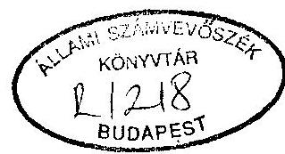
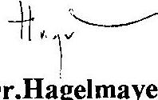
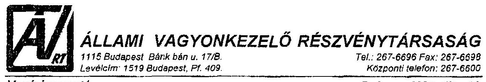
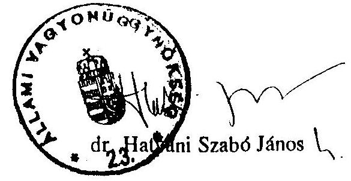
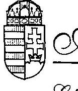
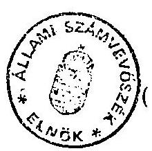
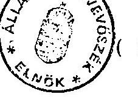

# A PRIVATIZÁCIÓ ÉS AZ ÁLLAMI VÁLLALATOK VAGYONGAZDÁLKODÁSA AZ ÁLLAMI SZÁMVEVŐSZÉK VIZSGÁLATI TAPASZTALATAI ALAPJÁN 

- 1990. MÁRCIUS - 1994. MÁRCIUS -

---

# Összeállította: 

## dr. Kovács Árpád számvevő-igazgató

## Közreműködtek:

Beck Miklós, dr. Borisz József, dr. Csepán Magdolna, Halász Gejza, Harsányi Sándor, Krucsai Balázs, Makkai Mária, dr. Majorosné dr. Locskai Noémi, Lörinc Alajos, dr. Molnár Barnabás, Németh Béláné, dr. Szöllősi Géza, Szűcs Ivánné, Kovácsné dr. Pósfay Zsuzsa, Rundle János és Vasas Sándorné dr.

---

Ez az összeállítás a magánosítás, vagyonkezelés témakörében készített számvevőszéki dokumentumok tapasztalatanyagára épít. Hangsúlyozottan nem vizsgálati jelentés, nem is pusztán a korábbi tapasztalatok összegezése, hanem túlmutat azon annyiban, hogy a tipikus és általánosítható jelenségekre és azok "háttér"-összefüggéseire hívja fel a figyelmet. A vizsgálati jelentésektől eltérően összeállítóinak megítélését, véleményét is tartalmazza. Munkatársaink hasznosították az érintett kormányszervek és az ÁV Rt. különböző jelentéseit és az ÁSZ néhány korábban - belső használatra készített elemzésének tanulságait is. Az általuk leírtak a törvények főbb változásainak és az állam vállalkozói vagyona hasznosításához közvetlenül kapcsolódó gazdasági folyamatoknak a bemutatásával, valamint az értékesítendő vagyon iránti kereslet jelzésével a befolyásoló tényezőkre is figyelmet fordítanak.

Áttekintő értékelésünk közreadásának célja az, hogy a maga sajátos eszközeivel hozzájáruljon a privatizációval kapcsolatos döntések eddigieknél jobb megalapozásához. Az Országgyűlés figyelmébe ajánlott néhány átfogó javaslat is ebből indul ki.

Budapest, 1994. július 12.

Dr. Hagelmayer István

---

# ÁLLAMI SZÁMVEVŐSZÉK 

V-9/94
Témaszám: 226

## I.

## BEVEZETÉS, AZ ÖSSZEFOGLALÓ KÉSZÍTÉSÉNEK CÉLJA

Az elmúlt évek egyik fontos, nagy érdeklődést kiváltó vitatémája az állam vagyonának sorsa: a privatizáció. Abban közmegegyezés alakult ki, hogy az állami tulajdon lebontása nélkül a gazdaság új pályára állítása elképzelhetetlen. Ugyanakkor az ütem, a területek, módszerek, eljárási technikák, irányítási megoldások és kapcsolódó vezénylő intézmények szerepe körül, s nem utolsó sorban abban, hogy kik és mennyiért lesznek az új tulajdonosok, már éles véleménykülönbségek voltak, miközben a folyamat feltartóztathatatlanul előrehaladt.

A vélemények megosztottsága a törvények és az éves vagyonpolitikát körvonalazó országgyűlési határozatok megszületésének körülményeiben és ellentmondásaiban is visszatükröződött. Mindez - miközben mindenki a kontroll szigorítását követelte - a magánosítás pontos, tárgyszerű és jogszabályi alapokra megbízhatóan támaszkodó ellenőrizhetőségét nehezítette.

A gazdasági átalakulás törvényei az Állami Számvevőszéknek kiemelt szerepet adtak a tulajdonszerkezet megváltoztatásáért folyó kormányzati tevékenység, az állami vagyon hasznosítása ellenőrzésében.

Az Állami Számvevőszék egyrészt a kormányzati intézmények tevékenységének ellenőrzésén keresztül adott képet a törvényalkotóknak a vagyonnal való gazdálkodásról, az állami tulajdon lebontásáról. Másrészt kiválasztott privatizációs tranzakciók és vállalatok vagyonkezelésének vizsgálatával, az ellenőrzés eszközeivel is igyekezett elősegíteni, hogy a gazdálkodás megfeleljen a törvényi előírásoknak, s az állami érdekek érvényre jussanak.

Az ÁSZ a magánosítást irányító szervezetek munkájáról eddig öt, az éves tevékenységet átfogó jelentést készített. Ezek közül négy az ÁVÚ és egy az ÁV Rt. tevékenységéről szólt.

---

Az ÁV Rt-nél a teljes 1993. évet átfogó és 1994. első hónapjaira kitekintő vizsgálat megkezdésére csak az éves pénzügyi beszámoló június 30-i, előírt letétbe helyezését követően van mód. Annak lezárásával meg kell várni az ún. konszolidált mérleg szeptember 30-i letétbe helyezését is, mivel e nélkül a vagyonmozgások nem követhetők. A jelen összegzés csak a főbb adatszerűségeket és az egyértelműen, vizsgálat nélkül a Részvénytársaság saját, illetve Felügyelő Bizottsága dokumentumai alapján is hivatkozható megállapításokat szerepelteti az 1990. márciustól 1994. márciusig terjedő időszakra nézve.

Az ÁVÜ-nél folytatott átfogó vizsgálatok során az ÁSZ évente több mint száz ügyletet folyamatában tekintett át. Külön cél-ellenőrzésekkel részleteiben feldolgozta tizenkét nagyvállalat társasággá átalakulásának és egyedi privatizációjának történetét, s kapcsolódóan foglalkozott az állami tulajdonú szanáló szervezet munkájával is.

A társasággá átalakítás és a magánosítás előrehaladását kísérte figyelemmel az a hét vizsgálat is, amely a postai, műsorszórási, közhasznú közúti közlekedési szolgáltatásban érdekelt nagyvállalatok vagyongazdálkodására irányult. Elkerülhetetlenül érintette a kárpótlás problémakörét két állami gazdaságnál végzett ellenőrzés.

Az ÁSZ időről-időre visszatért korábbi megállapításai hasznosulására, a változásokra. Tapasztalatanyagát olyan átfogó jelentések egészítették ki, mint a társasági és átalakulási törvény - az általános szóhasználat szerint "spontán privatizáció" - hatásait feltáró, közel kétszáz vállalatot érintő vizsgálat, vagy a vagyongazdálkodás információs rendszerei helyzetének ellenőrzése. Ide kapcsolódnak a magánosításban a környezetvédelmi követelmények érvényesülését, a szénbányászati szerkezet-átalakításra fordított pénzeszközök hasznosítását, a PHARE segélyek felhasználását, valamint a alapítványoknak juttatott támogatásokat feltáró jelentések, illetve tájékozódások is.

A magánvállalkozások ellenőrzésére az ÁSZ-nak nincs hatásköre. Így ezen összefoglaló csak közvetett információk alapján utal röviden arra, hogy a már teljes egészében magántulajdonú vállalatok tevékenységének eredményessége és gazdaságban betöltött szerepe miként alakult. E jelentés nem tárgyalja azt sem, hogy az önkormányzatok tulajdonába került vállalkozások helyzete milyen. Az önkormányzati - köztük vállalati -vagyon hasznosításával azonban az ÁSZ más jelentései és összefoglalói széles körűen foglalkoznak.

---

Az összefoglaló megállapításokat tartalmazó II. fejezet, bár alapvetően vizsgálati jelentések és más számvevőszéki dokumentumok tapasztalataira épít, nem tekinthető a korábbi jelentések összegzésének. A törvényi környezet főbb változásainak bemutatásával és néhány kapcsolódó gazdasági folyamat érzékeltetésével, valamint az értékesítendő állami vagyon iránti kereslet jelzésével a körülményeket és a folyamatokat összefüggéseikben szándékozik bemutatni és a III. fejezetben tett néhány átfogó következtetés és javaslat is ebből indul ki. Ennek érdekében hasznosítja az érintett kormányszervek és az ÁV Rt. különböző jelentéseit és az ÁSZ néhány korábbi, belső használatra készített elemzésének tanulságait is.

Az összefoglalóhoz kapcsolódó - külön is kezelhető -"Függelék" a téma egy meghatározó szeletét emeli ki, arra vállalkozik, hogy a korábbi ÁVÜ - ÁV Rt. vizsgálatok megállapításait folyamatokba rendezze, rámutatva az ismétlődő jelenségekre, a tipikus eredményekre és a hibákra.

A Függelékben szerepeltetett vizsgálati megállapítások rendszerezése egyrészt választ ad arra, hogy az állami vagyonkezelés központi intézményeinek szervezeti, személyi, szakmai, belső szabályozási, információs felkészültsége hogyan alakult; másrészt bemutatja, hogyan tett eleget a Kormány a magánosítással kapcsolatos törvényi kötelezettségeinek és az országgyűlési határozatoknak. Összefoglalja, hogy a rendelkezésre álló eszközökkel élve az irányító szervezetek, vállalati menedzsmentek a privatizáció és a vagyonkezelés során betartották-e a jogszabályokat, országgyűlési- és kormányhatározatokat és az önmaguk alkotta belső előírásokat, teljesítették-e feladataikat és lépéseik milyen következményekkel jártak.

Az ÁSZ jogállása, az Országgyűlés ellenőrző munkáját segítő szerepe nem terjed ki az állami vagyon sorsával kapcsolatos politikai indíttatású, koncepcionális döntések közvetlen minősítésére. Ezért ezen összefoglaló sem foglal állást közvetlenül olyan kérdésekben, mint a Kormány gazdaságpolitikája és a privatizáció összehangolása, a privatizáció vezénylése Országgyűléshez, illetve kormányhoz kapcsolásának célszerűsége, vagy a tulajdonosi szervezetek, a különböző tulajdonszerzési formák - munkavállalói résztulajdonlás, kárpótlás, ingyenes vagyonjuttatás stb.- megválasztása és azok aránya.

---

# II. 

## ÖSSZEFOGLALÓ MEGÁLLAPÍTÁSOK

## 1. A tulajdonszerkezet átalakításának feltételei

A tulajdonszerkezet átalakításának három fő feltétele van: az elérendő célt és az eljárási gyakorlatot egyértelműen és következetesen szabályozó törvényi keret, a gazdaságpolitika által meghatározott elképzeléseket megvalósítani képes intézményrendszer és nem utolsó sorban - ha nem szétosztásról vagy vissza-adásról van szó - az értékesítendő vagyon iránti fizetőképes kereslet. A tulajdonosváltás ütemét ezek közül mindig a "szűk keresztmetszet" határozza meg.

### 1.1. A törvények

Az állami vagyon hasznosításának, a magánosításnak meghatározó feltétele az egyértelmű, hosszabb távon iránymutatást adó, hatásaiban átgondolt törvényi keret. A politikai-gazdasági rendszerváltás alapvetően érintette a vagyon hasznosításának szabályait. Ezzel összefüggésben ötven törvény és több mint száz rendelet született. Bevezetésük időigényével, a kapcsolódó feltételek és hatások felmérésével sem az előkészítés, sem a megalkotás során nem foglalkoztak érdemben. A végrehajtás gondjait tapasztalva ezért nehéz megmondani, hogy mi róható fel a tulajdonosi jogokat gyakorló intézményeknek és mi az, ami nem rajtuk múlt.

A magánosítás még a politikai-társadalmi rendszerváltás előtt megalkotott társasági és átalakulási törvények első változatai alapján, "spontán" módon indult meg. Habár az állam gazdálkodói vagyona hasznosításának koncepciója és az irányítás rendszere 1990-ben alapvetően megváltozott, az utóbb hozott törvények csak 1992 nyarán határozták meg egyértelműen a vagyoni alrendszereket, tulajdonosi jogokat gyakorló intézményeket és azok kötelezettségeit, a kapcsolódó hatásköröket és feladatokat. A vagyon tulajdonosokhoz rendeléséhez azonban nem alkottak rendező elveket. Az meglehetősen esetlegessé vált, a kormányzaton belüli erőviszonyokat tükrözte.

---

Az Országgyűlés 1990 júniusától - megváltoztatva a néhány hónappal korábban hozott döntést - már nem tartotta szükségesnek az állami vagyongazdálkodás közvetlen ellenőrzését, de fenntartotta az átfogó útmutatás és a beszámoltatás jogát. Az ún. Vagyonpolitikai Irányelveknek (VPI) évről-évre rögzítenie kellett volna a privatizáció aktuális céljait, az értékesítési feltételeket, a tulajdonszerzés, az osztalékpolitika követelményeit, a vagyonátadási kötelezettségeket, stb. A Kormánynak pedig az ÁVÜ, majd az ÁV Rt. munkájáról - csatolva az ÁSZ véleményét - a költségvetés végrehajtásáról szóló beszámolóval egyidejűleg ugyancsak évente jelentést kellett volna benyújtania.

Az iránymutatás jogát a gyakorlatban az Országgyűlés nem igényelte. A VPI nem épült bele a jogforrási hierarchiába. Előbb a korábbi privatizációs elképzelésekhez tartozó, 1990. évi ún. Ideiglenes VPI hatályát hosszabbították meg, majd 1991 szeptember végétől egy évig semmiféle iránymutatás nem volt, végül visszamenőleges hatállyal születtek határozatok. Az előírásokkal összhangban csak 1994-re nézve jártak el, bár ez sem oldotta fel azt az alapvető problémát, hogy a VPI hatóköre nem terjed ki az állami vagyon teljes körére. A beszámolókat és a kapcsolódó ÁSZ jelentéseket az Országgyűlés pedig csak 1990-re nézve tárgyalta meg.

Következményként az elmúlt években nem volt az Országgyűlés látókörében az állami vagyon jelentős része, megoldatlan maradt a teljes vagyoni kör kezelésének összehangolt irányítása. Az Országgyűlés ellenőrző funkcióját e területen nem érvényesíthette teljeskörűen.

A VPI hiányából származó problémákra az ÁSZ jelentéseiben felhívta a figyelmet. Tapasztalatai alapján a VPI tervezeteihez ismétlődően javaslatokat tett és részt vett az Országgyűlés illetékes bizottságainak témához kapcsolódó vitáiban. Megjegyzései esetenként, a részleteket illetően, egyéni képviselői figyelem nyomán az indítványokhoz és a kezdeményezésekhez kapcsolódva meghallgatásra találtak és hasznosultak.

A különböző előírások között csak fokozatosan szűntek meg az ellentmondások és joghézagok. Gondot okozott, hogy az információs rendszerekre kiható szabályokat hatályon kívül helyezték és a tulajdonosi jogokat gyakorló intézményeket csak 1992 augusztus végén, a "privatizációs törvénycsomaggal" kötelezték vagyonmérlegek készítésére.

---

A hatályos jogi előírások szerint, ha az államot képviselő tulajdonosok döntései - ÁVÜ Igazgatótanács és ÁV Rt. Igazgatóság - nem sértettek törvényt, akkor azokat célszerűtlenségük, gondatlanságuk vagy egyoldalúságuk miatt még bírói úton sem lehetett megtámadni és módosítani. Így a hibás lépések utólagos korrekciójára semmiféle lehetőség nem maradt.

# 1.2. A privatizáció és a vagyonkezelés intézményeinek tevékenysége 

A tulajdonszerkezet átalakításának további feltétele, hogy a Kormány privatizációs és vagyonkezelési elképzeléseit megvalósító intézmények teljesítőképessége feladataikkal összhangban legyen, a vagyonról, annak szerkezetéről a megfelelő információk rendelkezésre álljanak, valamint a döntések előkészítésében és megvalósításában érvényesüljön az állami fegyelem.

## Szervezeti, személyi feltételek

A tapasztalatok azt mutatják, hogy az irányítási koncepciók eldöntésekor nem gondolták át megfelelően a gyakorlati bevezetés és megvalósítás feltételeit, az emberi és tárgyi erőforrások biztosításának lehetőségeit és időszükségletét.

Az ÁVÜ-ről és a nagyobb privatizációs tranzakciókról 1991-92-ben készült ÁSZ jelentések az Ügynökség
 működésének személyi, szabályozottsági és információs-rendszer problémáit és az ezzel járó kockázatokat nyomatékosan kifogásolták. Felhívták a figyelmet a Kormány által elfogadott szervezeti-működési szabályzat hiányára, a folyamatba épített ellenőrzés kiépítésének fontosságára, a döntések végrehajtásáról a visszajelzések elmaradásának veszélyére.

Az ÁVÜ bár munkaszervezete fejlesztése érdekében jelentős erőfeszítéseket tett, csak lassan tudott változtatni. Átcsoportosították a feladatokat, fokozatosan egységesítették az eljárási gyakorlatot és egyszerűsítették az irányítási szinteket. Mindez 1992-től érzékelhetően egyenletesebb terhelést és rendezettebb hatásköröket eredményezett.

---

Az ÁV Rt.-nél 1993-ban tapasztaltak a szervezet kiépülésének hasonló zavarait és azt a koncepcionális bizonytalanságot mutatták, mely az ÁVÜ tevékenységének kezdetét jellemezte. Hasonlóság volt abban is, hogy az önmaga megszervezésével elfoglalt szervezettől a Kormány olyan problémák megoldását várta, amelyekre az még nem lehetett felkészülve.

Az ÁVÜ-nél másfél, az ÁV Rt.-nél mintegy egy évet vett igénybe a kiegyensúlyozott működés megindítása. A privatizációs folyamat lényegében négy év után jutott el oda, hogy a vezénylő szervezetek teljesítménye már nem közvetlen korlát az előrehaladásban. Elmondható: mire a magánosítás - korábban reméltnél több évvel hosszabb - folyamata a végére ér, akkorra fejeződik be az a "beletanulás", mely a kapcsolódó feladatok színvonalas ellátásához szükséges.

# Információs rendszer 

A tulajdonosi intézmények megfelelő színvonalú munkája, a folyamatok irányítása a hozzájuk tartozó vagyon nagyságának, összetételének és értékének megfelelő ismerete nélkül elképzelhetetlen. Az állam vagyonát nemzetgazdasági szinten tükröző régi információs rendszer az állami-gazdasági intézményrendszer változása során gyakorlatilag azonnal felbomlott, az új, a piacgazdaság logikájának megfelelő pedig még ma sem teljes. Az utóbbi két évben részeredmények születtek.

A problémára az ÁSZ számos alkalommal felhívta az illetékes kormányszervek figyelmét. Az információs rendszerekkel kapcsolatos 1993. márciusában publikált számvevőszéki jelentés javaslatsorában pedig kiemelten szerepelt e kérdés. A kezdeményezés indokoltságát illetően teljes volt az egyetértés, de változtatás érdekében csak igen lassan történtek lépések.

Folyik az adatgyűjtés és annak rendszerezése, hogy a privatizációs kormány-intézmények (ÁVÜ, ÁV Rt., minisztériumok) milyen bevételekre tesznek szert, s azt miképpen költik el. Ezt ma már a legkülönbözőbb változatokban képesek összeállítani és publikálni.

---

Az ÁVÜ ez ideig egyetlen és 1993. évi helyzetet tükröző vagyonmérleg elkészült és rendelkezésre áll az ÁV Rt. pénzügyi beszámolója is. Ezen adatgyűjtemények alapdokumentumokra támaszkodó, az egykori állami vállalati vagyonra visszavezethető megbízhatósága azonban kérdéses.

A tájékoztató, nagyságrendi összegzések 1994-ben már az állam gazdálkodói vagyonára nézve elkészíthetők. Az állami vagyon egészére kiterjedő vagyonmozgások kimutatásához azonban továbbra sincs olyan szervezet, ahol a változásokat folyamatosan követő nyilvántartás működne. Az átfogó szintű és konzisztens kimutatások készítésének lehetősége nem biztosított: a különböző tulajdonosokhoz tartozó vagyoni alrendszereket képviselő adatok eltérő idő-dimenziójúak és rendszerezettségűek. Nem készült arról megbízható kimutatás, hogy mit ér az önkormányzatoknak átadott több tízezer épület, út, híd, víz-mű-berendezés vagy, hogy mekkora értéket képvisel az föld-és erdőterület, ami kárpótlási jegy fejében vagy esetenként minden ellenszolgáltatás nélkül jutott az egykori szövetkezetek és állami gazdaságok dolgozóinak tulajdonába. Az sem ismert, mekkora vagyon került magánkézbe a csődbe jutott állami vállalatok felszámolásával.

A vagyonmozgások összetevőiről a kellő differenciáltságú, makrogazdasági összefüggésekbe illeszthető és ellenőrizhető adatsorok hiánya megnehezíti a tulajdonszerkezet-változás átfogó értékelését és az ok-okozati összefüggések megértését. Fenntartja, sőt növeli a bizonytalanságot és a bizalmatlanságot.

# A döntések előkészítése és végrehajtásuk fegyelme 

A magánosítás belső folyamat-kontrollja a nyilvánosságtól, a versenyre alapozott döntés-előkészítéstől, a döntési mechanizmus következetességétől, s a belső ellenőrzés hatékonyságától függ. Az adott törvényi megoldás - vagyis a tartalmilag elhibázott, előnytelen, de "szabályszerű" értékesítések elleni fellépés kizárása külön hangsúlyt adott az említett feltételek teljesülésének. Utólagos külső vizsgálatokkal ugyanis nem pótolható a folyamatok szabályozottsága, az átláthatóság és a közvetlen beavatkozás lehetőségével felhatalmazott és így a döntésekben a hibák, mulasztások hatásainak kiszűrésére is alkalmas belső ellenőrzés.

---

A privatizációs lépések nem megfelelő átláthatóságát mind az üzleti partnerek, mind a közvélemény ismétlődően kifogásolta. Tény, a döntések hátterét és a szerződések tartalmát gyakran a vevők határozott kívánságának engedve tartották titokban.

Az ÁVÜ munkájáról, a privatizációs lehetőségekről 1992-től több információt hozott nyilvánosságra. A legkülönbözőbb sajtóhírek, ismertető füzetek és számsorok - elfogadott kormányzati stratégia és érvényes VPI-k hiányában - nem adhattak azonban abban megnyugtatóan eligazítást, hogy mit és miért privatizálnak, s mi a végső cél. A piaci érdekekkel csak részben magyarázható, hogy nem tértek az ismertetésekben vissza arra: milyen pozíciókból jutottak el azokhoz a szerződéses feltételekhez, amelyek végül - a nagyobb ügyek esetében szélesebb nyilvánosságot kaptak.

A kapcsolódó garancia-vállalások, foglalkoztatási és fejlesztési feltételek nyilvánossága és az eredeti pályázati feltételekre való visszahivatkozás nélkül a vételár és néhány más lényegtelen adat közlése inkább a bizalmatlanságot növelte, mintsem orientálta a potenciális vásárlókat és megnyugtatta a közvéleményt.

Az ajánlatok versenyeztetésének rendszere 1992-ben épült be az ÁVÜ döntési mechanizmusába. A versenyeztetés és a verseny azonban nem azonos fogalmak. Utóbbi csak a kiskereskedelmi üzletek árveréses értékesítése során érvényesült, mert itt a versenyhez versenyzők is voltak. Inkább arról volt szó, hogy fokozatosan megteremtették a versenyeztetés szabályozott kereteit, mint lehetőséget. Verseny a klasszikus értelemben azért nem alakulhatott ki, mert bár pályázati kiírások megszülettek, s azokat viszonylag szélesebb kör vásárolta meg, de átlagban csak minden harmadik tranzakcióra jutott 2 pályázat. Ez a kereslet mértékére is utal. Jelzi, hogy azok a korábbi elképzelések, melyek a magyar privatizációt széles üzleti érdeklődés alapján piaci alapon képzelték el csak részben valósultak meg.

Az ÁSZ az egyedi tranzakciókat és az éves munkát átfogó vizsgálatai során a versenyeztetéssel és a működés átláthatóságával kapcsolatos problémákat ismétlődően jelezte és igényelte a szükséges szabályozások és bírálat rendszer kidolgozását.

---

A Vagyonpolitikai Irányelvek kiadásának zavarai és a hosszabb távú, az összefüggésekre figyelemmel lévő stratégiai kormány-koncepció és az ágazati elképzelések hiánya, a tett elhatározások utólagos külső felülvizsgálhatóságának kizárása elvben az ÁVÜ-nek és később az ÁV Rt.-nek nagyfokú döntési szabadságot adott. Az Ügynökség és a holding vezető testületei - a munkajogi összefüggések miatt is azonban valójában - a tárca nélküli privatizációs miniszter személyes belátását és utasításait követve - a Kormány napi elképzeléseit érvényesítették.

A privatizáció alapkérdéseinek tisztázását az ÁSZ már 1991-ben sürgette. Jelezte, hogy az adott, torz vagyonszerkezet körülményei között csak egy körültekintően kialakított privatizációs stratégia pontos végrehajtásával gyorsítható meg az állami tulajdon leépítése.

A tulajdonosi döntések koordináltsága, a két szervezet közti együttműködés az ÁV Rt. létrehozását követően alacsony szintű volt. Az ÁV Rt. által átvett ügyek döntő többségében az ÁVÜ által megkezdett döntés-előkészítés félbemaradt. Feleslegessé vált a korábban kifizetett tanácsadói díj és munka. Az ebből származó kárhoz a késedelemről és az érintett vállalatoknál kialakult bizonytalanságból származó közvetett - nem számszerűsíthető veszteségek járulnak.

Már az ÁVÜ működésének kezdeti tapasztalatai alapján nyilvánvalóvá vált, hogy olyan tömegű döntésre van szükség, mely jogosultsági szintek bevezetése nélkül kezelhetetlen. Az első szabályozásra 1991-ben került sor. Végül az illetékesség és felelősség két szintje alakult ki: az igazgatóságok vezetői és az Igazgató Tanács voltak jogosultak dönteni, az Ügyvezetésre pedig a koordináló, előkészítő, javaslattevő, illetve végrehajtást szervező szerep maradt.

Kezdetben, a fizetőképes külföldi érdeklődés csúcspontján, egy-egy munkatársra olyan sok ügy intézése jutott, hogy az a részletekbe menő, körültekintő munkát kizárta. Tetézte ezt, hogy rutin, biztonságot adó eljárási szabályozás és információs rendszer sem volt, miközben a külföldi befektetők felkészült szakembereivel kellett "megmérkőzni", akik - magától értetődően - kizárólag saját érdekeik érvényesítésére törekedtek. Később a túlterhelés némileg enyhült, de még így is átfoghatatlanul sok jutott egy-egy ügyintézőre.

---

Annak hatása sem volt elhanyagolható, hogy az ÁVÜ-höz tartozó vagyon összetétele az ÁV Rt. részére történt vagyonátadás után megváltozott. Az ÁVÜ-nél nehezen értékesíthető, sőt csőd szélén álló vállalatok tömege maradt.

Az ÁSZ által vizsgált olyan egyedi tranzakciók, ahol súlyos eljárási hibák, személyi mulasztások derültek ki szinte mind ezekre az időszakokra estek. Zárt eljárási rend mellett is előfordulhattak volna a szakszerűtlen, rossz intézkedések, hiszen a szándékos igénytelenség és a korrupció sohasem zárható ki teljesen; az adott helyzet azonban felerősítette a hibák következményeit és kizárta a visszaélések bizonyíthatóságát. Az Igazgatótanács (IT) ülésein tárgyalt ügyek mennyisége mutatja - még akkor is, ha egy-egy bonyolultabb kérdést többször is tárgyaltak -, hogy igen rövid idő jutott sokmilliós kihatású lépések mérlegelésére. A dömping-szerűség és a minden vállalatra egységes, átlátható elvek hiánya lehetőséget adott a szubjektív hatásoknak.

Részben a hozzáértési és kapacitás-gondok enyhítésére foglalkoztatott az ÁVÜ (és később az ÁV Rt. is) - többségében külföldi tanácsadókat. Az ÁVÜ-nél 1992-ben a tanácsadói díjak az előző évhez képest kétszeresére, másfél milliárd Ft-ra emelkedtek, majd 1993-ban a felülvizsgálat és csökkentési szándék nyomán a korábbi magas szinttől elmaradtak, de még így is meghaladták a milliárdos összeget. A nagyságrendeket csak részben magyarázza, hogy ezek egyben ún. "sikerdíjak" - közvetítői honoráriumok -, hiszen egyre kevesebb fizetőképes befektető jelentkezett, a portfolió összetétele romlott.

A tanácsadói szerződések megkötése és teljesítésük számonkérés - bár a kiválasztás az ún. önprivatizációs programok esetében pályázat útján történt - nem volt mindig körültekintő. A kifizetés esetenként eltért a szerződéstől, a teljesítést rosszul dokumentálták és a foglalkoztatásban szélsőséges eltérések voltak. (Például 1992-ben egy külföldi tanácsadó cégnek jutott az összes ilyen kifizetés 23%-a.)

Az IT döntései azokban az években sem követték a Vagyonpolitikai Irányelvekben foglalt prioritásokat, amikor erre lehetőség lett volna. Több milliárdos összegekkel - jogkövetkezmények nélkül térhettek el az Országgyűlés által meghatározott felhasználási sorrendtől, sőt az IT a Kormány döntéseit sem hajtotta végre mindig teljes következetességgel, és az apparátus részéről is előfordultak fegyelmezetlenségek.

---

A megkötött szerződések gyakran eltértek az IT határozatban foglalt eredeti feltételektől. Az IT döntés után az ÁVÜ kényszerítve érezte magát a "győztessel" a szerződés megkötésére. Egy-két tranzakció kivételével még azokban az esetekben sem gondoltak arra, hogy összevessék a diktáló pozícióba került győztesnek a szerződés előkészítésekor közölt új igényeit az eredetileg hátrább sorolt ajánlatok kondícióival, ahol ezt az érdeklődés lehetővé tette. Egyes esetekben az Ügyvezetés - ellenőrzés nélkül elfogadva a jogi apparátus véleményét - arról sem gondoskodott, hogy a változtatáshoz legalább utólag - megszerezze az IT jóváhagyását.

Az eltéréseknek részben természetes oka, hogy a döntést követően elhúzódtak a tárgyalások, és e sokszor félévet is meghaladó időszakban az értékesítendő vállalat piaci helyzete - néha alapvetően megváltozott. Az eltérések egy-két kivételtől eltekintve nem vezettek az állam részére kedvezőbb feltételekhez.

Az ÁVÜ ismétlődően vállalt olyan kötelezettségeket, amelyekről a pályázatok meghirdetésekor nem volt szó. Az ÁVÜ és az ÁV Rt. majd félszáz jogcímen - a partnerek elvárható üzleti kockázatát esetenként a nullára csökkentve - több mint százötven esetben, hatvan milliárdos nagyságrendben vállalt garanciát, melyből eddig tizenegy milliárd forintot kellett kifizetnie.

A kötelezettség-vállalásokkal kapcsolatban fokozatosan elkészültek
 a belső szabályozások, de ezek nem rendezték megfelelően, hogy mikor, milyen esetben nyújtható garancia és az valójában mit jelent, továbbá a hatályos ÁVÜ belső eljárási utasítás és gyakorlat - a pénzügyminisztériumi egyetértés követelményének helytelen értelmezése miatt - sérti a törvényi előírásokat.

A garanciavállalások problémáira és a törvénysértő eljárási gyakorlatra a számvevőszéki jelentés 1993-ban már felhívta a figyelmet és kérte a változtatást. A törvénysértő gyakorlat megszüntetésének szükségességével a pénzügyminiszter egyetértett, a privatizációs miniszter azonban nem. A kialakult gyakorlat, mint ezt az 1993-ról szóló jelentés megállapítja, változatlanul ment tovább, s a kifogásolást az ÁVÜ ekkor már visszautasította.

---

# A belső és folyamatba épített ellenőrzés 

Az ÁVÜ belső ellenőrzését másfél évi működés után hozták létre. Csekély létszámával valós szerepe azonban ekkor még nem lehetett, munkája kezdetben nem az ÁVÜ-re, hanem a "spontán privatizáció" korábbi mulasztásainak feltárására irányult, szükségszerűen minden visszatartó hatás nélkül.

A belső ellenőrzés hiánya - különösen 1991-ben és 1992-ben az ÁSZ jelentéseiben ismétlődő kritika tárgya volt. Létrehozásában és kapacitásai fejlesztésében az ÁSZ sürgetéseinek is szerepe volt.

A belső ellenőrzés kapacitása csak 1993. második felétől tette lehetővé, hogy érdemleges hatása legyen. Tevékenységének kiterjedése az általa tett munka-és büntetőjogi kezdeményezésekben kifejezésre is jutott. Sőt a szakértők tevékenységének vizsgálatával, vagy a szerződéses vállalások betarttatásának teljes körű áttekintésével bizonyos kényszerítő és megelőző szerepe is volt. A belső ellenőrzés ÁVÜ által hozott döntésekre gyakorolt hatása még így is csak közvetett, a döntések előkészítésének menetében a hibák kiszűrésére nincs lehetősége.

Az ÁV Rt. tevékenysége és jogállása egy más típusú ellenőrző rendszer kiépítését, a tulajdonosi ellenőrzés megvalósítását igényli. Ma már van belső, sőt "etikai" ellenőr. Ugyanakkor itt is hiányzik a folyamatba épített kontroll-mechanizmus, ami a vezetői ellenőrzésen túl a maga eszközeivel segíthetné a megbízhatóbb döntés-előkészítést. Részben ennek tulajdonítható, hogy a Felügyelő Bizottság közvetlen feladatkörénél többet vállalt. Számos hibafeltáró kezdeményezést tett, indokolt esetben a tulajdonosi jogokat gyakorló tárca nélküli miniszterhez fordult. Felvetéseire azonban a Kormány képviselőjének egyetlen esetben sem reagált.

### 1.3. A vagyon iránti kereslet alakulása

A magánosítás előrehaladása a kereslet alakulásának is függvénye. A 90-es évek elején nagyobb volt a fizetőképes kereslet, mint az értékesítésre felkínált vagyon, majd később ez megfordult, újabban pedig a kárpótlás és az ingyenes vagyonjuttatások hatásával kell számolni.

---

Az eredetileg ún. "könyvszerinti" értéken 2000 milliárd Ft vállalati vagyonból 1990. és 1994. I. negyedéve között készpénzért, hitelbe és kárpótlási jegyért megközelítőleg 300 milliárdnyit értékesítettek. Ennek 60%-a devizáért külföldiekhez, zömében szakmai befektetőkhöz került. A magyar befektetők 15%-os arányban "szálltak be" készpénzzel és az eladott vagyon további 10%-át kárpótlási jegyért, 15%-át hitelre vásárolták meg.

Az ún. vagyonvédelmi ügyekben nem a vállalatokat, hanem bizonyos részeiket értékesítették. A pénz nagyobb hányada ekkor a vállalatokat illette. Az ebből származó összes ÁVÜ bevétel közel 10 milliárdot tett ki. E mellett mintegy 50 milliárd Ft-hoz közelít a különböző regionális alapoknak, befektetési társaságoknak, intézményeknek ingyenesen adott vagyon, miközben nem teljesítették a társadalombiztosítás részére törvényileg előírt 300 milliárdos vagyonjuttatást.

Ha a privatizációs és reorganizációs költségeket, garanciavállalásokat levonjuk, s csak a befolyt készpénzhányadot vesszük, akkor mindössze 100 milliárd forintnyi az az összeg, ami ténylegesen elosztható és felhasználható állami bevételt jelentett.

A privatizációs bevételeken belül 1993-ban egyaránt csökkent a deviza-és készpénzbevétel mennyisége és aránya. Ezen belül is az adott eredmény főként egy tranzakciónak köszönhető. A devizabevétel az ÁVÜ-nél a négy év átlagában 50%-hoz közelít. A bevételeken belüli aránya azonban 1993-ban az előző évi 55%-ról 30-35%-ra csökkent. Külföldi vásárló az ÁVÜ által bonyolított 507 tranzakció közül csupán 39-nél volt és a készpénzbevételek részesedése 1993-ban a korábbi 85 százalékról 55%-ra mérséklődött. Ha a forint folyamatos értékvesztését is figyelembe vesszük, akkor az derül ki, hogy 1993-ban már majd harmadával csökkent a kereslet 1992-hez képest. A bevételnövekmény a kedvezményes konstrukciókkal megvalósított, valamint a kárpótlási jegyekkel fedezett privatizációkból származott. Az ilyen konstrukciók gyors térhódítása figyelhető meg: míg ezek 1992-ben a bevételeknek csupán 15%-át, addig 1993-ban már több mint 50%-át adták.

---

A szakértők szerint 1990-1994 között megközelítőleg 200 milliárd forint nagyságrendű a vagyon leértékelődése. Annak pontos és egyértelmű megítélése, hogy a leértékelődésben a különböző tényezők valójában milyen arányban játszottak közre és mi lesz a végeredmény, az csak évek múlva lesz látható. Annyi azonban már ma is érzékelhető, hogy az részben objektív, külső körülmények nyomán - a korábbi, összehasonlító előnyöket kínáló piacok összeomlása és külföldi fizetőképes kereslet csökkenése - következett be, de hatása volt a vállalati vezetők rugalmatlanságának és annak, hogy a vezetői kivásárlás vagy alacsonyabb ár reményében egyesek személyesen is a vagyon leértékelődésében voltak érdekeltek.

A vagyon-összetétel miatt főként az ÁVÜ mozgástere szűkült. Az ismert adatok alapján nem ítélhető meg egyértelműen, hogy a hozzá tartozó vagyon mely részei és milyen arányban piacképesek vagy értéktelenek. A kialakult helyzet az Ügynökséget a vagyonvesztés fékezése rövidtávú előnyeinek vállalására, a kárpótlási jegyre és a hitelbe történő értékesítésre késztette.

Mindez 1994. év elejére azt eredményezte, hogy az ÁVÜ készpénzbevételei már a privatizációs költségeket is alig fedezték. A kedvezményes értékesítés kétségtelenül pillanatnyilag fékezi az állami vagyon értékvesztését, ugyanakkor a működtetés gondjait nem oldja, és az általános - a magyar -és a külgazdaság helyzetéből származó - tőkehiány fékezi a termelési szerkezet gyors korszerűsítését.

# 2. A társasággá alakult állami vállalatok vagyonhasznosítása és működésének feltételei 

Az ÁSZ a vállalatok társasággá alakulásáról és az átalakulást követő időszakban a rájuk bízott vagyon hasznosításáról az ipar, a szén-bányászat, a közúti közlekedés, a műsorszórás, a posta, a mezőgazdaság és a biztosításügy valamint a szerencsejáték területén szerzett tapasztalatokat. Részletesen vizsgálta, hogy a tulajdonosi intézmények az átalakításokkal kapcsolatos kötelezettségeiket miként teljesítették.

---

# 2.1. A társaságalakítások 

A vizsgált vállalatok állami tulajdonú társasággá, vagy társaságokká alakulása elhúzódóan, az érdekelt irányító szervek és tulajdonosi intézmények esetenkénti következetlen, egymásnak ellentmondó lépéseket tartalmazó eljárásával és nem mindig a törvények betartásával ment végbe. Különösen a földtörvény jóváhagyásának elhúzódása, majd a kárpótlási célú földkijelölések lassúsága volt az, ami a társasággá alakítást, majd a részvények értékesítését negatívan befolyásolta.

Az időzavar kényszerében kockáztatta meg az ÁVÜ az akkor hatályos törvénnyel összeegyeztethetetlen ún. "listás" átalakulásokat: százas nagyságrendben, a megalakítandó társaságok saját vagyonértékeit felsorolva, érdemi vizsgálódás nélkül, kampányszerűen foglalkozott a társasággá alakulásokkal.

Az ÁVÜ és az ÁV Rt. az adott átalakulási tervek jóváhagyásánál minden esetben iparpolitikai döntések meghozatalára is rákényszerült. Ehhez azonban nem állt rendelkezésre kormányzati szinten jóváhagyott privatizációs stratégia és még azok a szaktárcák is, amelyek készítettek szakmai koncepciót, azt 1993-ban és 1994 első hónapjaiban hozták nyilvánosságra és érdekeik képviselete is ettől kezdve vált határozottabbá.

A társasági átalakulásoknál az ÁVÜ nem szervezte meg kielégítően és metodikailag nem megfelelően irányította a belterületi földingatlan utáni önkormányzati tulajdon megváltást. Az önkormányzatok a társasági átalakulásoknál a vonatkozó vagyonértékelésekről csak hézagos információkkal rendelkeztek és érdemben nem tudtak részt venni jogosultságuk érvényesítésében.

A vizsgált társasági átalakulásoknál szinte minden belterületi földingatlan-megváltásnál az ÁVÜ a pénzbeni megoldás mellett döntött. Még azokban az esetekben is, amikor a célszerű közösségi tulajdonlásból adódó önkormányzati igények - a törvényi lehetőségeken belül - társasági tulajdonrészre, vagy vagyonelem átadásra irányultak. A társasági átalakulások ezért nem segítették a lehetőségekkel arányban a termeléssel nem összefüggő - szociális és közösségi célú vagyonrészek leválasztását a vállalatoktól, illetve a közösségi célú létesítményekkel való ellátottság javítását a településeken.

---

Az ÁVÜ által, bonyolítás egyszerűsítése érdekében előnyben részesített pénzbeni megváltási forma az önkormányzatok számára gazdálkodási szempontból sem volt egyértelműen előnyös. Az összegszerűség és a pénz időbeli befolyása nem volt tervezhető, mert ez a társaságok későbbi privatizációja - értékesítése - folyamatában alakult ki.

# 2.2. A társaságok helyzete 

Az ÁVÜ a társaságok csaknem 70%-ában jelenleg is többségi tulajdonos. Az általa eddig értékesített vagyonrészek általában az átalakulási vagyonérték alatt, 70%-os értéken keltek el.

Az átalakulás lassúsága, az időveszteség minden esetben rontotta a gazdálkodási feltételeket. Az elhúzódó átalakulási folyamatoknak is tulajdonítható, hogy az új társaságok gyakran nem voltak képesek megőrizni és az alapítási céllal összhangban hasznosítani a rájuk bízott vagyont, s köztük minden tizedik csődbe ment.

A gépipar, a kohászat és a szénbányászat vállalatai között ez az arány még rosszabb. Jelentősebb külső tőkebevonásra csak szűk körben került sor, ott ahol a társaság alapítását szakmai befektető bevonásával a privatizáció követte.

A gazdasági jogalkotás helyzete - késése és egyes területeken kezdetlegessége - a hatóságok és a minisztériumok nem eléggé körülhatárolt funkciói nehezítették az ÁVÜ és az ÁV Rt. tulajdonosi jogainak gyakorlását. A különböző vállalatcsoportok jövője - például a gáz- vagy áramszolgáltatóké - csak nagy bizonytalansággal körvonalazható.

A gazdasági szerkezet átalakítására irányuló kormányzati intézkedések között - társadalmi, politikai és gazdasági összefüggései miatt is különös figyelmet érdemel a szénbányászat szerkezet-átalakítási programja. A szerkezet átalakítása, ha több mint egy éves késéssel és ismételt koncepció-váltással is, de végső megvalósulási szakaszába lépett. Az állami költségvetést 1992-93-ban 7 milliárd Ft-tal megterhelő program során szervezetten történtek meg a felszámolások, a társaság-alakítások és a villamos-erőművekkel való integráció.

---

A jogelődöktől rossz gazdálkodási pozíciót öröklő, illetve a szabályozási bizonytalanságok következtében nehéz helyzetű állami tulajdonú (tulajdoni többségű) társaságok működőképességének fenntartása, a térségi foglalkoztatás csak újabb és újabb költségvetési tehervállalásokkal, illetve a privatizációs bevételek milliárdjainak ilyen célokra történő átadásával, az adósságok átütemezésével, elengedésével és a társadalombiztosítási járulékfizetés elmulasztásának eltűrésével volt megoldható, bár esetenként még ez sem volt elég, hogy a felszámolást elkerüljék.

Elmaradt annak átfogó elemzése, hogy a kialakult helyzet mennyiben tulajdonítható a gazdaság általános helyzetének, a piacvesztésnek, vagy a korábbi támogatások leépítésének és az összesített pénzügyi kihatásokról sem készült átfogó kimutatás. Rész-információk alapján megközelítőleg 100 milliárd forintra becsülhető az az összeg, amelyet 1990-től eddig e célra áldoztak.

Az átalakult vállalatok reorganizációjára az ÁVÜ eddig összesen különböző címeken 20 milliárd forint körüli összeget utalt át és további tízmilliárdokat emészthet fel az adósság-konszolidáció. A pénzek odaítélésének elvei azonban hiányoztak. Ebben, mint az a borsodi kohászat reorganizációja ügyében is történt, a támogatások mikéntje és összehangoltsága körüli kormányzaton belüli viták is közrejátszottak.

Eseti döntéseken alapult, hogy melyik vállalatot "mentették meg" és melyiket hagyták sorsára. Az ilyen kiadások körébe olyan vitatható és még az utólag jóváhagyott VPI-ktől is eltérő - tételek kerültek, mint az Állami Vállalkozásfejlesztési Bank megmentéséhez való milliárdot meghaladó hozzájárulás, vagy a sikertelen DIMAG privatizáció következményei nyomán szükségessé váló több milliárdos pénzügyi támogatás. Sőt végül itt az állt elő, hogy a DIMAG Rt.-t húsz-milliárdos adósság-halmazzal felszámolták, s
 kormánydöntéssel utasították az ÁV Rt.-t arra, hogy újabb milliárdért vásárolja vissza a hitelezőktől azt, ami egykor az államé volt.

A következetes elvek alkalmazásának hiánya és a szubjektív hatásoktól sem mentes döntési mechanizmus következménye, hogy ma nem lehet megalapozott közgazdasági hivatkozásokkal alátámasztani, hogy az eredetileg 2200 állami vállalat közül miért éppen az a 400 az, melyeknek fel-, illetve végelszámolása elkerülhetetlen napi ügyé vált.

---

Bár arányaiban az állami tulajdonú társaságokban lévő vagyon nagyságrendjéhez képest nem meghatározó, de nagyságát tekintve, összességében mégis jelentős az a 13 milliárd Ft-os összeg, melyet az állami tulajdonú társaságok eszközeikből különböző alapítványoknak engedtek át az elmúlt négy évben. Ebben nem korlátozta őket jogszabály.

A legnagyobb támogatók az állami tulajdonú kereskedelmi bankok és a Szerencsejáték Rt. voltak. Mintegy 2 milliárdos összeget utaltak át olyan pénzintézetek, amelyek egyidejűleg bank-konszolidációs támogatásokat kaptak. A Szerencsejáték Rt.-nél pedig az átutalásokra - 1993-ig, az ÁSZ vizsgálatáig - a korábbi vezérigazgató szubjektív vezetői döntései alapján került sor. Három olyan bank van, amely bankkonszolidációs támogatásokban részesült és ugyanakkor jelentős összegeket juttatott alapítványoknak. A Magyar Hitelbank, a Kereskedelmi és Hitelbank valamint a Budapest Bank együttesen 1,4 milliárd Ft-ot adott át 1990 és 1994 között.

# 2.3. A szolgáltatásokat működtető állami vállalatok tevékenysége 

Azok a szolgáltató vállalatok, ahol az ÁSZ vizsgálatokat végzett (Posta, Antenna Hungária, Volánok) megőrizték a rájuk bízott vagyont. Tőkenővekedésre azonban csak elvétve került sor. A vállalatok alapította társaságokba kivitt vagyonnál azonban a felélés tapasztalható. A befolyt lízing és bérleti díjakat a működőképesség fenntartására fordítják. Ez azonban elégtelen az elhasznált eszközök cseréjéhez. A hosszú távú működőképesség feltételei nem javultak, mindenütt likviditási gond és beruházási forráshiány van.

A romló feltételek ellenére a szolgáltatások működőképesek maradtak, de az azokat igénybevevő állampolgár az egyre drágább díjért nem kapott sem jobbat, sem többet. Sőt az állami szerepvállalás csökkenése, a felelősségi körök átrendezése és a piac szerepére hivatkozás valójában azt jelentette, hogy egyenértékű helyettesítő megoldást nem kínálva megszűnnek, vagy már meg is szüntek a szolgáltatások egyes munkaigényes részei.

---

A szolgáltatások megújításának céljaira - például az autóbusz-állomány részleges cseréjére - biztosított támogatás csak eseti megoldás, nem oldja meg a tarifa-politika következtében újra és újra felhalmozódó gazdálkodási gondokat, és vannak olyan vállalatok, amelyek korábbi terheik törlesztése miatt nem tudnak pályázni a kormánygaranciával nyújtandó rekonstrukciós hitelre. Törvényi szintű intézkedés és nem csak eseti támogatás szükséges a helyzet tartós javításához.

A tapasztalt problémákra és a szükséges ágazati lépések megtételére az ÁSZ felhívta az érintett tárca figyelmét és javaslatot tett az Országgyűlésnek a jelzett finanszírozási probléma törvényi szabályozás útján történő megoldása kezdeményezésére.

A szolgáltatások körében sajátos módon vetődik fel a döntést hozó felelőssége. Nincs lehetőség a felelősség felvetésére abban az esetben, ha valamely lakossági ellátás biztosításáért felelős testület úgy szünteti meg azt, hogy nem gondoskodik egyenértékű helyettesítéséről. Sajátos feladatot kell megoldani, s nincs megalapozott követelmény-rendszere a határok kijelölésének: hol van a gazdasági és a társadalmi optimum, hol vannak a tűrés-határai az állami feladatvállalás és az ellátás szűkítésének.

A tulajdonszerkezet átalakulásának sokféleségét mutatja, hogy a tehergépjármű-park magánosítása külön szervezés nélkül megtörtént. A közhasznú közúti közlekedés vállalatainak részvénytársasággá átalakulásakor a tehergépkocsipark döntő hányadát a Volánok alapította Kft-kbe vitték ki, míg más részüket különböző (szolgáltatási és építőipari) gazdasági társaságok vették meg és az eladott teherautóknak 10-12%-a magánszemélyek tulajdonába került.

A változások új - köztük környezetvédelmi - problémákat hoztak. Például a tehergépjármű-állománynak csak egy részét tárolják az anyavállalattól bérelt, vagy apportként bevitt telephelyen, így környezetvédelmi ellenőrzésük folyamatos és megoldott, továbbá javításuk sem okoz növekvő környezetkárosítást. Azok a gépjárművek, amelyeket magánszemélyek vettek meg, kikerültek rendszeres környezetvédelmi ellenőrzés hatóköréből és javításuk körülményei sem megfelelőek.

---

# 3. A vizsgálatok hasznosítása 

A vizsgálatok hasznosulásának formai elemei az ÁSZ javaslatai alapján elkészített intézkedési tervek kiterjedtségében, a kezdeményezett büntető ügyek, a személyi felelősség megállapítására irányuló kezdeményezések és perek alakulásában, a törvénysértő eljárás és intézkedés orvoslására irányuló felhívásokban mérhetők, s időről-időre készülnek is ilyen kimutatások. Végső soron azonban kezdeményezések tartalmi hasznosulása a változásokban, a fegyelmezetlenebb, szakszerűbb munkában jut érvényre.

Az ÁSZ elnöke az itt tárgyalt feladatkörben közel kétszáz különféle fontosságú, súlyú javaslatot tett, melyek közül néhányat példaszerűen az előzőekben már hivatkoztunk. A javaslatok egy része - a szabályok megsértése esetén - lényegében kötelező érvényű volt, nagyobb hányaduk azonban a tapasztalt hibák kijavítására tett ajánlás, hasznosulásuk az érintett menedzsmentek megfontolásától függött.

Az ÁVÜ-vel és az ÁV Rt.-vel kapcsolatban tett fontosabb javaslatokra és azok hasznosulására a tapasztalatokat részletesebben bemutató Függelék a megfelelő helyeken külön is utal, néhány esetben szerepeltetve a már hivatkozottakat is.

### 3.1. Az állami fegyelem

Az állami fegyelem helyzetét mutatja, hogy bár a tényeket az érintettek nem vitatták, a felhívásokat indokoltnak tartották, de a kifogásolt - esetenként törvénysértő - gyakorlat a gazdasági szükségszerűségre, az ÁSZ kifogásainak "formai jellegére" hivatkozva tovább folyt. Ennek egyik példája a Vagyonpolitikai Irányelvek ügye, de említhető egy vállalati biztos tevékenysége nyomán előállt helyzet, ahol a "törvényes állapot" visszaállítása a kialakult helyzetben már fizikailag nem volt megoldható, vagy az IKARUS privatizációjának vizsgálatát követő állapot, ahol az ÁSZ felhívása után újabb egy év telt el és nem szüntették meg a "kiürült", funkció nélküli volt állami vállalat működését.

Az ÁSZ-nak az e témakörben készült jelentései közül az ÁVÜ és az ÁV Rt. tevékenységét tárgyalókat évről-évre felvették az Országgyűlés napirendjére, s így minden bizottság foglalkozott velük. Teljes ülés azonban csak 1991-ben tárgyalta a Kormány beszámolóját és az ÁSZ kapcsolódó jelentését. A javaslatok figyelembevétele és tartalmi hasznosítása elmaradt.

---

A Számvevőszéki Bizottság 1993 tavaszi létrehozásával az Országgyűlés figyelme szélesebbé vált. Az állami vagyon hasznosításához kapcsolódó jelentéseket tárgyaló üléseken az ÁSZ-t arra bíztatták, hogy tények rögzítésén túl, széles összefüggésekbe helyezve a problémákat bátrabban vállalja következtetések levonását, s ezzel is segítse a vagyonkezelés eredményessége megítélését.

A vagyonkezelő szervezetek jogállása befolyásolta ellenőrizhetőségüket, az ÁVÜ IT döntései felett elvben a Kormány vonatkozó beszámolóinak és VPI-knek az érdemi megvitatásán keresztül érvényesülhetett volna az Országgyűlés ellenőrző szerepe. Ennek azonban - mint a VPI-ktől való eltérések ÁSZ általi jelzésével kapcsolatban is bemutattuk - határozott, gyakorlati korlátai voltak.

# 3.2. A tapasztalatok figyelembevétele 

A tapasztalatok jelzik, a szándék kevés a változáshoz, a hibák ismétlődnek, a személyi konzekvenciák levonása szerény és esetenként a kivizsgálás is elmarad. (Például: CO-NEXUS szerződés, DIMAG-ügy, IKARUS állami vállalattal kapcsolatos intézkedések elmulasztása). Két-három olyan eset volt, ahol a vizsgálati jelentés tervezetét megismerve a PM az ÁVÜ és az ÁV Rt. a kifogásolt pénzösszegek behajtására intézkedett, vagy minden külön belső vizsgálat nélkül levonta a szükséges személyi következtetéseket, mint tették ezt a REORG, a Szerencsejáték Rt. esetében.

Az ÁSZ jelentéseit az érintett szervezeteken és a felelős kormányszerveken kívül megküldte a legfőbb ügyésznek, sőt több nagyobb ügyben - például MEDICOR, GERBAUD, DIMAG, HARMÓNIA, TAVERNA, REORG vizsgálatok - külön is kérte tapasztalatainak ügyészi szempontból történő - polgári -és büntetőjogi - minősítését és a szükséges lépések megtételét. A törvényi keretek alakulásának is tulajdonítható, hogy bár ilyen kezdeményezések történtek polgári jogi és büntetőjogi következményei végül egyetlen ügynek sem lettek. Előfordult, a rosszhiszemű vevői magatartás alapos gyanúja miatt indított büntető eljárást az ÁVÜ által kötött szerződés kellékhiányára hivatkozva szüntették meg.

---

Mint több eset is bizonyította, az állami tulajdonosi jogok visszaállítása nem jelentette a kialakult helyzet rendezését. Sok milliárdos vagyonvesztés után, a "romokon" adta meg az újrakezdés esélyét és esetenként újabb milliárdokat követelt. A felelősök ekkor már más munkahelyre távoztak, ellenük nem indult meg a munkajogi felelősséget érvényesítő eljárás sem.

Kedvező ugyanakkor, hogy ahol nem kellett átfogó intézkedéseket tenni, ott érzékelhető volt a "nem kötelező" ajánlások hasznosításának szándéka is. Ez részben a javaslatok ésszerűsége és hasznossága elfogadásának, a számvevői munka tárgyszerűségének és segítő szándéka felismerésének, valamint ÁSZ és az érintett szervezetek közti munkakapcsolatok kiépülésének tulajdonítható. De annak is, hogy az ÁSZ az évente ismétlődő vagyonügynökségi vizsgálatok vagy az egyedi privatizációs ügyletek utóellenőrzésekor visszatér a korábbiakra, az intézkedési tervek, a kért személyi-felelősségi vizsgálatok végrehajtására.

# III. 

## NÉHÁNY KÖVETKEZTETÉS ÉS JAVASLAT

## 1. Következtetések

A magánosítás hatékony és gyors megvalósításához az előzőekben bemutatott három feltételnek - az egyértelmű jogi szabályozásnak, a feladatok megoldására képes intézmény-rendszernek és a fizetőképes keresletnek - nagyjából egyidejűleg kellett volna rendelkezésre állnia. Ez azonban nem így történt. Kezdetben jelentősebb volt a fizetőképes - külföldi - kereslet, de hiányzott a folyamatok törvényi szabályozása és gyenge volt a feladat megvalósításához választott megoldás szervezeti feltételrendszere. Később fokozatosan ennek ellenkezője alakult ki.

---

Mindezek miatt a privatizáció nem tölthette be olyan mértékben a "motor" szerepét a gazdaság átalakításában, mint azt korábban remélték és társadalmi-szakmai megítélése sem erősítette a gyors fellendülésbe vetett bizalmat. A kiérleletlen elképzelések, a privatizációs stratégia hiánya előnytelenül befolyásolták a megvalósításra hivatott szervezetek kiépítésének tudatosságát és annak időigényét növelték.

A feladatok végrehajtása esetenként fegyelmezetlen, mulasztásokkal terhelt volt, melyben kezdetben a hozzáértés hiánya és a munkatársak túlterheltsége is hozzájárult. A vállalatok vezetésének saját, az államétól szükségszerűen eltérő érdekeltségét nem vették megfelelően figyelembe vagy rosszul reagálták le. Az a helyzet állt elő, hogy miközben az újabb és újabb szabályokkal egyre jobban egy központosított, bürokratikus kényszerpályára került a privatizáció vezénylése, s lemondott a "rend" jelszavával a rugalmasságról és gyorsaságról, az adott körülmények között éppen a "rend" érvényesíthetősége szenvedett csorbát.

Azt, hogy mit, mikor és mennyiért adtak el, 1992-től már többé-kevésbé nyomon lehetett követni. Az azonban nem volt átlátható, hogy egy vállalatot miért és milyen arányban soroltak "tartósan állami tulajdonban maradó" vagy "értékesítendő" körbe, illetve, hogy miért "javították fel" vagy hagyták csődbe jutni. Az egyértelmű elvek hiánya módot adott az "erőviszonyokat" tükröző személyi behatásokra.

A hatályos rendeletek szerinti tulajdoni arányokból kiindulva és a törvényileg előírt társadalombiztosítási vagyonátadás teljesítését figyelembe véve ma 4-500 milliárd Ft-ra becsülhető ÁV Rt. által értékesíthető vagyon, míg az ÁVÜ-nél ez a 200 milliárdos nagyságrend közelében lehet. Utóbbinál azonban az így megmaradó portfólió összetétele kevesebb reményt ad a nagyobb arányú készpénzes értékesítésre, de még a kárpótlási hasznosításra is, hiszen a jegyek névértékhez közeli árfolyamának fenntartása miatt csak "jó cégeket" lehet e körbe bevonni. Alapvetően az sem változtat a helyzeten, ha a felszámolásra váró és a végelszámolással megszüntethető mintegy 400 vállalat vagyontárgyait részben sikerül értékesíteni.

Jelenleg kevéssé ítélhetők meg a különböző gazdálkodási formák, tulajdonosok, területek közötti átrendeződések távlati hatásai. A magánosítás folyamatának megítélésében háttérbe szorult, hogy
 az sokkal szélesebb területre terjedt ki, mint amit a reflektorfényben álló vezénylő intézmények átfogtak. A koncessziós jogok adásával vagy

---

például az egykori Volán tehergépkocsipark értékesítésével, s a felszámolt állami vállalatok hasznosítható eszközei eladásával bekövetkezett vagyonmozgások nagyságáról nincs hasznosítható információ.

Annak megítélésében, hogy a magyar vállalatok milyen áron keltek el akkor is óvatosnak kell lenni, ha figyelembe vesszük, hogy az ÁVÚ magatartása egyes üzleteknél bizonytalan volt és hibázott, nem mindig indokolhatók az általa adott kedvezmények, s néhol magasabb árat is elérhetett volna. Ha a nagyobb külföldi kereslet idejében felkészültebb az ÁVÚ és képes gyorsabban értékesíteni, akkor a pénzügyi eredmény kedvezőbb, de nagyságrendileg jobbat - valószínűsíthetően - csak úgy lehetett volna elérni, ha a piaci folyamatok hatása alól a magyar vállalatok értékesítését ki lehetett volna vonni, vagy értékesítésüket elhalasztani. Ezért nem lehet leegyszerűsítve azt állítani, hogy a magyar vállalatok általában áron alul keltek el. A szinte felbecsülhetetlen kelet-európai kínálattal szemben mind szerényebb a vásárlási szándék. A külföldi szakmai befektetők, ha vállalatot vettek, akkor - sok esetben bebizonyosodott - valójában a piacot akarták.

Az ellentmondásos helyzet a közvélemény szemében az egész állami vagyonkezelést kedvezőtlen beállításba helyezte, melyet az intenzív propaganda munka és a marketing célokra fordított mintegy milliárdos összeg sem változtathatott meg.

A negatívumok mellett az is tény, hogy a privatizációs folyamat feltartóztathatatlanul előrehaladt, a tulajdonszerkezet nagymértékben átalakult. A bruttó hazai termék több, mint felét már a magánszektor állítja elő, és szerepük nő az exportban. Helyesnek bizonyult az is, hogy sokrétű privatizációs gyakorlatot alkalmaztak, s ez a tulajdonszerkezet visszafordíthatatlan és viszonylag gyors átalakítást szolgálta. A magánkézbe került vállalatok működnek. Elindult a termelési szerkezet átalakulása, s látható az értékesítési, vagyonkezelési technikákba való fokozatos "beletanulás".

Mindez akkor ad esélyt a hibák kijavítására és az új fejlődési pályára állásra, ha a magánosítási folyamatot átgondolt stratégia alapozza meg és a végrehajtásért felelős intézményrendszer ennek megfelelő kialakítása megtörténik.

---

A vizsgálati tapasztalatok az ÁSZ saját munkájára nézve is hoztak tanulságokat. Nyilvánvalóvá vált, hogy csak kivételesen lehet indokolt ellenőrzés ott, ahol nincs tulajdoni többség, s az ilyen vizsgálat legfeljebb csak arra terjedhet ki, hogy a kisebbségi tulajdon hasznosításáért felelős szervezet lehetőségei között mit tett az állam érdekei képviseletében. Ehhez is azonban pontos információval kell rendelkeznie a gazdálkodó szervezetek állami vagyonhányadáról. Jelenleg ezek az adatok nem teljeskörűek, nincs megoldva a naprakész karbantartásuk és általában ismeretlen az ÁSZ számára a változások oka és célja. E korlátok feloldása sürgető feladat.

Az állami tulajdon lebontása hosszabb távú feladat és ennek végén jóval nagyobb, és valószínűleg gazdaságilag rosszabb helyzetben lévő állami tulajdon marad fenn, mint az ÁSZ létrehozásakor előre látható volt. Ennek az a következménye, hogy az állam vállalkozásokban működő vagyona hasznosítását feltáró vizsgálatok fontossága, aránya a belátható időben inkább növekedik, mint csökken.

A bemutatott folyamatokat, kritikai megállapításokat értékelve nem lehet figyelmen kívül hagyni, hogy a világ gazdaságtörténete, de az ellenőrző szervezetek feladatai sem ismernek hasonló vállalkozást és a számvevőszék maga is fokozatosan tudja kifejleszteni a kapcsolódó ellenőrzési technikákat és ilyen értelemben e sajátos "tanulási" folyamatot korántsem tekinti lezártnak.

A változásoknak az is feltétele, hogy az Országgyűlés - melynek ellenőrző jogkörét segítve jár el az ÁSZ - mennyire veszi figyelembe döntéseiben tapasztalatait. Az ÁSZ szeretné betölteni a megbízható "érzékelő műszer", az érzékeny "szenzor" szerepét.

# 2. Javaslatok és ajánlások 

Az eddig készített ÁSZ jelentések javaslatai mindig abból indultak ki, hogy a vizsgálat, illetőleg a jelentés készítésekor hatályos törvényi és adott koncepcionális feltételek között miképpen lehetne eredményesebben haladni a magánosításban. Áttekintve a korábban tett ajánlásokat és a jelen összefoglalóban leírtakat, a jövőre nézve hat olyan átfogó feladat fogalmazható meg, mely az eredményesebb vagyonkezeléshez és privatizációhoz nélkülözhetetlennek látszik.

---

a.). El kell készíteni a lehető legrövidebb időn belül a Kormány tulajdonosi jogokkal rendelkező intézményeinek együttműködésével azt a vagyonmérleget, mely társaságonként minősítetten, a kereszttulajdonlásokra is figyelemmel képes választ adni arra, hogy mi van még az állam birtokában és magánosítása érdekében milyen előkészítő lépésekre került sor, a vagyon egészét milyen kötelezettségek terhelik, beleértve a felszámolási eljárások átgyűrűző hatásait, a kárpótlási igényeit és a társadalombiztosítási vagyonátadás által lekötött tulajdont is.
b.) Ki kell dolgozni és széles körben közzé kell tenni a tényhelyzetet mutató vagyonkép ismeretében azt a stratégiát, mely a realitásokból indul ki, számba veszi a megvalósítás minden külső -és belső feltételét, valamint az idő-tényezőt is, és képes kormányzati szinten egységes, távlatokban ható vezérfonalat adni a további cselekvéshez.
c.) Gondoskodni kell arról, hogy a megvalósítás szabályozási és szervezeti eszközrendszere összhangban legyen a célokkal. Annak működése áttekinthető és egyszerű, cselekvési elveiben következetes, a személyi ráhatásokat kizáró, belső kontroll-mechanizmusaiban zárt és egységes legyen, biztosítsa a magánosítás költségeiben a takarékosságot.
d.) Célszerű megvizsgálni a javaslatok a.) b.) c.) pontjai megvalósítása érdekében - a szervezés időigényére, várható gondjaira és előnyeire is figyelemmel -, hogy milyen vagyonkezelő szervezetek működjenek. Eldöntendő, hogy a rendszer egységesebb működése egy vagy több gazdálkodó szervezetként működő - vagyonkezelők funkcionálását igényli, beleértve a minisztériumokhoz tartozó vállalati kört is. Gondoskodni kell arról, hogy a jelenlegi rendszer átalakítása során ne ismétlődjenek meg a korábbi információs, adatközlési és dokumentációs hibák, az átalakítással járó veszteségek minimálisak legyenek

---

e.) Meg kell fontolni, hogy privatizációs bevételek elosztásáról, felhasználásáról csak a tényleges bevételek ismeretében szülessen döntés, és az országgyűlési útmutatás ne a tervezett, vagy reménybeli bevételek elosztását tartalmazza. Ennek érdekében meg kell vizsgálni, hogy milyen további törvénymódosításokra van szükség, s miként kell a döntési mechanizmusokat átalakítani.
f.) Meg kell oldani a vagyonkezelő szervezetek legfelső döntési fórumainak gyakorlati országgyűlési kontrollját. Szakítani kell azzal a gyakorlattal, amely a törvények érvényesítését lazán kezeli vagy figyelmen kívül hagyja a benne foglaltakat, az eltérések kifogásolásakor azok formai jellegére hivatkozva nem változtat, eltűri a szabálytalanságokat, nem szankcionálja a döntésektől való eltéréseket, s ezzel bátorít a mulasztásokra. A változáshoz a törvények alkotóinak példamutatására is szükség van. A Vagyonpolitikai Irányelvekkel, és az ÁVŰ - ÁV Rt. éves beszámolók megtárgyalásával kapcsolatos tapasztalatok megismétlődése nem lenne szerencsés.

---

# FÜGGELÉK 

## A PRIVATIZÁCIÓ ÉS AZ ÁLLAMI VÁLLALATOK VAGYONGAZDÁLKODÁSA AZ ÁLLAMI SZÁMVEVŐSZÉK VIZSGÁLATI TAPASZTALATAI ALAPJÁN

## című összefoglalóhoz

A MAGÁNOSÍTÁS VEZÉNYLŐ INTÉZMÉNYEINEK MŰKÖDÉSI FELTÉTELEI ÉS TEVÉKENYSÉGÜK ALAKULÁSA

---

# A MAGÁNOSÍTÁS VEZÉNYLŐ INTÉZMÉNYEINEK MŰKÖDÉSI FELTÉTELEI ÉS TEVÉKENYSÉGÜK ALAKULÁSA 

Az ÁVÜ és az ÁV Rt. tevékenységét valamint a kapcsolódó ellenőrzéseket szabályozó törvényekről, az intézmények működési mechanizmusáról, a kapcsolódó személyi-tárgyi feltételek alakulásáról a döntési rendszerről, s a hozott döntések végrehajtásáról, a privatizációval és vagyonkezeléssel kapcsolatos főbb tapasztalatokról, s eredményükként jelentkező pénzügyi-vagyoni folyamatokról változásában szól e Függelék, mely utal a korábban tett számvevőszéki javaslatokra és figyelembevételükre is. A Függelékben foglaltak egyes területeken az összefoglaló anyag alátámasztásául is szolgálnak, így bizonyos ismétlődések, részletesebb kifejtések is vannak benne, de az itt leírtak minden esetben korábbi jelentésekben foglalt vizsgálati megállapításokon, illetve dokumentumokon alapulnak.

## 1. A törvények változása és hatásuk az ellenőrzésre

A számvevőszéki ellenőrzés a szabályoknak való megfelelés, a kitűzött célok teljesítése mellett végrehajtás hatékonyságát is vizsgálja. A vizsgálhatósághoz, a tevékenység minősítéséhez nélkülözhetetlenek az egyértelmű és hosszabb távon azonos jogszabályi feltételek, az időtávlatban azonos rendszerbe szervezhető, összehasonlítható adatsorok és a számonkérhető iránymutatások, teljesítmény előírások és követelmények. Mindez az elmúlt években - részben a politikai és gazdasági rendszerváltással magyarázhatóan - hiányzott.

Egyetlen fontosabb jogszabály, egyetlen vizsgált szervezet sem volt azonos 1990-ben és 1994-ben. Nem annyira a változás mértéke, hanem annak koncepcionális hullámzása és elhúzódása volt a gond. A törvények bevezetésének időigényére, a kapcsolódó feltételek és közvetett hatások felmérésére megalkotásuk során kevés figyelem fordult. Mindez a végrehajthatóságot erőteljesen befolyásolta. Nehezen elválasztható, hogy mi róható fel a tulajdonosi jogok gyakorlóinak és mi az, ami objektív, a végrehajtásban közreműködők lehetőségein kívüli okokra vezethető vissza.

---

# 1.1. A tulajdonosi jogok változása 

Az ÁSZ megalakulásakor tisztázatlan volt, hogy mi tartozik a "vállalkozói" vagyon körébe, s az ÁVÜ létrejöttéig a gazdálkodói felelősség kizárólag a vállalati vezetést terhelte. Az ÁVÜ megalakulását követően a felelősség megosztottá vált, de ennek pontos szabályozási feltételei csak fokozatosan jöttek létre. A törvények 1992 nyarán határozták meg egyértelműen a vagyoni alrendszereket, a tulajdonosi jogokat gyakorló intézményeket, és ezek kötelezettségeit, valamint a kapcsolódó ellenőrzési hatásköröket és feladatokat.

A tulajdonosi jogok gyakorlói 1992. év végétől

## ORSZÁGGYŰLÉS   és felhatalmazása alapján a   KORMÁNY

KINCSTÁRI VAGYON VÁLLALKOZÓI VAGYON
az Állami Vagyonügynökség a teljes egészében privatizálásra kerülő vállalatok tekintetében
az adott költségvetési fejezet felügyeletét ellátó szerv vezetője (miniszter)

Kincstári Vagyonkezelő Szervezet
az Állami Vagyonkezelő Rt. az egészében vagy részben tartós állami tulajdonban maradó vállalatok meghatározott körében
minisztériumokhoz tartozó, egyes kiemelt fontosságú, közszolgáltatásokban, ellátásban, kutatásban, pénzpolitika megvalósításában közreműködő vállalatok

---

Az állam gazdálkodásokban működő vagyonát két főbb alrendszerbe szervezték: "időlegesen" és "tartósan" állami tulajdoni kategóriába. Hiányzott azonban a következetesség abban, hogy a tulajdonosi jogok gyakorlói egyik vagy másik területen maguk is gazdálkodó szervezetek vagy költségvetési gazdálkodást folytató intézmények legyenek. A keveredésnek a gyakorlati irányító munkában igen előnytelen hatásai voltak.

A minisztériumok vagyongazdálkodását az ÁSZ az ún. fejezeti ellenőrzéskor vizsgálta. A Kincstári Vagyonkezelő Szervezetnél pedig bár voltak kapcsolódó vizsgálódások, például a bősi létesítmények értékesítésével, vagy az elmúlt rendszerhez kötődő társadalmi szervezetek vagyonelszámolásai ellenőrzéseivel valamint a KVSZ saját költségvetési gazdálkodásával kapcsolatban, tevékenységéről azonban átfogó összegzés még az ÁSZ hatáskörében nem készült.

Az Állami Vagyonügynökség felelősségi körébe tartozó, "időlegesen" állami tulajdonú "privatizálásra" szánt vagyon a vonatkozó törvény 1992. augusztus 28-i hatálybalépésekor magában foglalta az állami vállalatok, az ezek által létesített leányvállalatok vagyonát és a már gazdasági társasággá átalakult állami vállalatok valamennyi - külső vállalkozók tulajdonába nem került - üzletrészét (részvényét), valamint a törvény hatálybalépésekor az ÁVÜ-höz tartozó üzletrészeket (részvényeket), továbbá az ÁVÜ-t megillető egyéb vagyoni értékű jogokat, illetve az azokat terhelő kötelezettségeket. Az ÁVÜ felelősségi körében 1500 kisebb-nagyobb vállalat volt 1000 milliárd forintos - könyvszerinti - vagyon értékkel.

Bár korábban nem volt egyértelmű, hogy mely szervezetek tartoznak az ÁVÜ-höz, a kimutatások áttekinthetősége és az összehasonlíthatóság érdekében az ÁSZ is követi azt a gyakorlatot, hogy ugyanazt vállalati kört tekinti 1990-re nézve, melyről a rendelkezés csak 1992-ben született meg. Ténylegesen azonban e szervezetek nem tartoztak az ÁVÜ alapítói hatáskörébe.

A "tartósan állami vagyont", a tulajdonosi jogok gyakorlása szerint ismét két részre bontották: az Állami Vagyonkezelő Részvénytársasághoz, illetve a minisztériumokhoz sorolt vagyonra. Ide tartozik a tartósan részben vagy teljesen - az, amelyet gazdaság-stratégiai, nemzetgazdasági, közszolgáltatási és egyéb indokok, szempontok figyelembevételével a Kormány törvényi felhatalmazás alapján rendeletileg ide sorol,
 mely vagyoni kört legalább két évente felülvizsgálja.

---

Az 1992. őszi ÁVÜ-ÁV Rt. vagyonátadást követően, 1993-tól a tartósan állami tulajdonban maradó vagyon 80%-a felett a tulajdonosi jogokat az ÁV Rt. gyakorolja. Bár azóta voltak jelentősebb átrendezések, a nagyságrendek érdemben nem változtak. Az ÁV Rt. hatáskörében 170 vállalat van, 700 milliárdos "könyvszerinti" értékkel, míg a "minisztériumok"hoz 92 állami társaság és mintegy 50 milliárdos vagyon tartozik.

A privatizációs törvények szétválasztották az állam tulajdonosi és közhatalmi, szabályozási funkcióit. A tulajdonosokhoz sorolás meglehetősen esetleges volt. A Kormány nem alkotott rendező elveket. A minisztériumok évekig külső, felelősség nélküli bíráló szerepbe szorultak. Összehangolatlanul és következetlenül próbálták meg ágazatuk érdekeit érvényesíteni. Ez különösen igaz a közszolgáltatásokat ellátó társaságokra. Az, hogy mely vállalatot milyen arányban terveztek állami kézben tartani, az alkumechanizmusok és "erőviszonyok" eredménye volt. Következésképpen a szolgáltatásokban érdekelt társaságok egy része minisztériumi irányítású, mások az ÁV Rt.-hez tartoznak.

# 1.2. Az ellenőrzés törvényi feltételei 

Az Alkotmány az állami vagyon ellenőrzéséről rendelkezve az ÁSZ hatáskörébe helyezi az állami vagyon kezelésének, az állami tulajdonban lévő vállalatok, vállalkozások vagyonérték-megőrző és vagyongyarapító tevékenységének vizsgálatát. A számvevőszéki törvény az Alkotmány feladatmeghatározását azzal a kiegészítéssel veszi át, hogy az ÁSZ ellenőrzési hatáskörébe vonja az állami résztulajdonban lévő vállalatokat is.

Az állami tulajdonlás, a privatizáció kiterjedtsége, jellege, technikája, intézményei, jogi keretei az ÁSZ megalakítását követő első két évben oly mértékben változtak, hogy még a viszonylag könnyebben megoldható - az előírások betartására irányuló - "szabályszerűségi" vizsgálatra sem lehetett ismétlődően alkalmazható, elvi alapokon nyugvó eljárási ajánlásokat kialakítani, s csakhamar értelmezhetetlenné vált a számvevőszéki törvénynek az az előírása, mely a vagyonérték-megőrzés és -gyarapítás követelményét fogalmazta meg.

A gazdaság átalakítása alapvetően érintette az állami vagyon hasznosításának szabályait. A változások mértékét mutatja, hogy mintegy 50 törvény és több száz olyan kormányrendelet született (némelyik többször is változva), amely az állami tevékenységet valamilyen formában módosította.

---

Változtak a vállalatok társasággá alakulásának feltételei, szigorúbb kötöttségeket vezettek be az állami vagyon védelme érdekében. 1992 nyarától az állam vállalkozói vagyonához kapcsolódó tulajdonosi jogok és kötelezettségek újraszabályozásával a követelmények és a tények összehasonlítása zártabbá vált, nagyobb lehetőség nyílt az egyértelmű minősítésre.

Kivételt képez a Földtörvény, a Kincstári és az Erdőtörvény. Előbbi jóváhagyásának halogatása, utóbbiak hiánya a társaságalakításokat és az érdekelt társaságok részvényeinek értékesítését kedvezőtlenül befolyásolta.

Az átalakulások gondjait vizsgálva tűnt ki, hogy az állam vállalatokra bízott vagyonának védelméről szóló törvény a nem nevesített szerződések esetén nem gátolja meg a korábban jelzáloggal terhelt vagyonrészek elidegenítését. A helyzet úgy jött létre, hogy a hitelező, számlalevezető bank kényszerértékesítést írt elő nem fizetés esetére. Az óvadéki szerződésekre a vagyonvédelmi törvény nem vonatkozik, mert azok az értékhatárt nem érték el. Ez a lehetőség ma is fennáll.

A törvények végrehajtásának elhúzódása is rontotta a gazdálkodás feltételrendszerét. Ez utóbbiak közül a kárpótlási célú pótlólagos földkijelöléseket szükséges elsősorban kiemelni. Akkor kellett több, mint 12 ezer ha területet kárpótlási célra kijelölni, amikor már befejeződött az állami gazdaságok társasággá alakítása, vagyis amikor - jelentős tanácsadói és értékbecslői költségekkel - véglegesítették azt a vagyoni kört és értéket, amit a társaságoknak működtetni kell.

A jogalkotás folyamatának "furcsaságai" közé tartozik, hogy mivel közgazdasági érdek volt a tömeges "kényszerátalakulások" következtében beinduló felszámolási hullám elkerülése, az 1994. évi költségvetési törvénnyel módosították a vállalati átalakulások szabályait, s bővítették ki az ÁVÜ hatáskörét a "vagyonértékelés előírásának" jogával. Mindezzel lehetővé tették azt az "átmeneti" ügyintézési formát, mellyel a vállalatok nagy csoportjainak átalakulását "listán", kampányszerűen intézték.

---

Az Országgyűlés 1990. júniusától nem tartott igényt az állami vagyongazdálkodás irányításának közvetlen hatáskörében tartására, de fenntartotta magának az átfogó iránymutatás jogát. A Vagyonpolitikai Irányelveknek évről évre, a költségvetési törvényben foglalt kötelezettségek figyelembevételével kellett volna rögzítenie a privatizációs stratégia céljait, az értékesítési feltételeket, a kedvezményes tulajdonszerzést, az osztalékpolitika követelményeit és a vagyonátadási kötelezettségeket, stb. Ugyancsak e dokumentumoknak kellett volna rendelkeznie az éves privatizációs bevételek képződéséről és felhasználásáról, s (először 1992-re nézve) megjelölni az ÁV Rt. osztalék-befizetési kötelezettségét.

A VPI előírásainak részletei az idővel módosultak, de a lényeg - az előretekintő iránymutatást, a költségvetési évre irányítottságot és az országgyűlési határozattal érvénybeléptetést - nem. A törvény érvényesítésére azonban éveken át maga az Országgyűlés sem törekedett. Előbb a korábbi privatizációs elképzelésekhez tartozó, 1990. évi ún. Ideiglenes VPI hatályát hosszabbították meg 1991. szeptember végéig, ezt követően egy évig csak tervezetek felett folytak viták, majd visszamenőleges hatállyal születtek határozatok.

A VPI-hez való viszonyítást 1992-ben nem csak a "visszamenőlegesség" korlátozta, hanem az, hogy még ez a "jóváhagyó" tartalom sem volt következetes. A döntés pillanatában a valóság már milliárdokkal mutatott mást, mint a határozat. 1993-ban a költségvetési törvény részben rendezte a kiadási előirányzatokat, azonban az év végén jóváhagyott VPI-ben foglaltak nem voltak összhangban a tényleges helyzettel. Jóval felülmúlták az arányosan számítható értékeket.

Az előírásoknak megfelelő határozatot csak 1994-re hoztak, de még ez sem oldotta meg azonban azt az alapvető dilemmát, hogy a VPI hatóköre nem terjed ki az állami vagyon teljes körére. Az 1990. évi Ideiglenes Vagyonpolitikai Irányelvek csak az ÁVÜ-höz tartozó vagyonra vonatkoztak, majd az utóbbi VPI-k kiegészültek az ÁV Rt.-hez tartozóval. A VPI továbbra sem fogja át a kincstári vagyont, a költségvetési szervek, a minisztériumokhoz tartozó vállalatok vagyonát, valamint az Állami Fejlesztési Intézet Rt.-hez és a Magyar Befektetési és Fejlesztési Bank Rt.-hez tartozó állami vagyont. Ennek kettős következménye volt. Egyrészt kizárta a teljes állami vagyoni kör változásának és együttes működésének áttekintését, így irányítását is, másrészt kivonta az Országgyűlés látóköréből az állami vagyon igen jelentős részét.

---

A VPI hiányából származó problémákra az ÁSZ jelentéseiben felhívta a figyelmet. Tapasztalatai alapján a VPI tervezeteihez javaslatokat tett és részt vett az OGY illetékes bizottságainak témához kapcsolódó vitáiban, megjegyzései esetenként, a részleteket illetően, képviselői indítványokhoz kapcsolódva meghallgatásra találtak.

További problémákat okozott, hogy az adatszolgáltatásokra, információs rendszerekre kihatóan is átgondolatlan "deregulációkra" került sor. Ennek legelőnytelenebb következménye, hogy a tulajdonosi jogokat gyakorló intézmények egy része (ÁVÜ, ÁV Rt., minisztériumi vállalatok) számára csak az 1992. augusztus végén hatályba lépő "privatizációs törvénycsomag" írta elő vagyonmérlegek készítését. (Ennek tartalmáról a továbbiakban a megfelelő helyeken külön is szól az anyag.)

A törvényi keretekkel való összevetés nem ad eligazítást az "eredményesség" megítéléséhez. Arról, hogy sikeresek vagy sikertelenek voltak-e az egyes magánosítási akciók, vagy milyen hatékonyságú volt az ÁVÜ és az ÁV Rt. tevékenysége, megalapozottan a kapcsolódó hatások ismeretében, bizonyos időtávlat után lehet nyilatkozni.

E mellett a tulajdonszerkezet átalakításának hatékonyságában, s ezen belül a vállalatok értékében, a tőke-áramlásban, a privatizáció előrehaladásában olyan politikai, világgazdasági összefüggések is hatottak és hatnak, melyek minősítése kívül esik a számvevőszék felhatalmazásán. A privatizáció következményei vizsgálhatóságában az is korlátozó tényező, hogy az ÁSZ-nak a magántulajdonba került vállalatokra nézve nincs vizsgálati hatásköre.

Az előzőekben vázoltak nem zárták ki, de megnehezítették a vagyon hasznosításáért felelős intézmények tevékenységére vonatkozó - előírásokba csak részben foglalható - hatékonysági következtetések levonását.

---

# 1.3. Az ÁSZ munkájára közvetlenül ható törvényváltozások 

Az ÁSZ megalakulásakor az állami vagyon kezelése és hasznosítása ellenőrzésének feladatát nem részletezték további törvények, kötött vizsgálati feladatok nem voltak előírva. A tulajdonszerkezet átalakítása az 1990 előtt alkotott ún. társasági és az átalakulási törvények alapján "spontán" módon indult meg. Az ÁSZ 1990-ben e törvények hatásait vizsgálta.

A privatizációs koncepció megváltozása és az ÁVÜ létrehozása után a súlypontba e kormányzati intézmény átfogó, éves ellenőrzése került. Ezen keresztül - tehát közvetett módon - mutatja be az ÁSZ a magánosítás folyamatát és az "ideiglenesen" állami vagyon kezelését. A kormányzat vagyonhasznosító tevékenységének ellenőrzésében 1993-tól a kötöttségek növekedtek, az ÁSZ feladata az ÁV Rt. tevékenységének éves ellenőrzésével bővült.

### 1.3.1. Az "ideiglenesen" állami tulajdonú vagyon hasznosításának vizsgálata és a törvényi feltételek

Az ÁVÜ-törvény első, 1990. tavaszán - még a "régi" Országgyűlés által alkotott - szövege az intézményt az Országgyűlés hatáskörébe helyezte, mondván, hogy így a "végső tulajdonos" közvetlenül tudja vagyona értékesítését ellenőrizni, illetve az ÁSZ-al ellenőriztetni. Ez azonban csak mintegy két hónapig volt így. A privatizációs koncepció változásával az ÁVÜ a Kormány irányítása alatt álló, jogi személyiséggel rendelkező, közszolgálati feladatokat ellátó költségvetési szerv lett, amely a hozzá tartozó vagyon tekintetében az állam tulajdonosi jogait gyakorolta és gyakorolja. Ez azonban nem változtatta meg az ÁSZ alapvető ellenőrzési feladatait.

Az ÁVÜ első, 1991. évi vizsgálata különös súllyal foglalkozott a működés megszervezésére tett intézkedésekkel és azok eredményével. Az 1991-1994. évi ellenőrzések pedig a legfontosabb feladatok teljesítésének kontrolljára (privatizáció üteme, vagyonvédelem, a vagyonhasznosítás, a vállalatok átalakításában betöltött meghatározó szerep, a bevételi-kiadási előirányzatok alakulása), a tendenciák feltárására irányultak.

---

Az ÁVÜ-nek, mint költségvetési szervnek a gazdálkodását az induló, 1990-es évben vizsgálta az ÁSZ és a zárszámadáshoz kapcsolódóan minden évben ellenőrizte a költségvetési kapcsolatok alakulását. Újabb átfogó vizsgálatot az ÁSZ 1994. második felére irányzott elő.

Az ÁVÜ tevékenysége megítélését nehezítette, hogy a munkája keretét adó szabályok között csak fokozatosan szűntek meg ellentmondások és joghézagok. A létrehozásától számított egy év alatt tevékenységét közvetlenül érintően 16 törvényi módosítás következett be, de ennek ellenére nem volt elmondható, hogy működésének keretei megfelelően rendezettek lettek volna.

Például az ÁVÜ-ről szóló és az ún. vállalati törvény 1992-ig a vállalati biztosok jogállásáról ellentmondó előírásokat tartalmazott és teljesíthetetlen volt a határideje az államigazgatási felügyelet alá vont vállalatok társasággá alakításának.

Az állami tulajdon adott arányai és a törvények bármiféle hatékonysági "felülbírálatot" kizáró előírásai mellett nem volt értelme kontroll könyvvizsgálatokat, vagyonértékeléseket készíteni. Az ÁSZ azonban, ahol a feladat ezt kívánta, könyvvizsgálati módszereket alkalmazott és nagy figyelmet fordított ugyanakkor a könyvvizsgálati, vagyonértékelési megbízások kiadásának körülményeire, a ilyen közreműködés szabályszerűségére és az elkészített dokumentumok hasznosítására.

Egyes számvevőszékek szakértők bevonásával maguk is készítenek kontrollvagyonértékeléseket, kockázatelemzéseket, sőt esetenként felülvizsgálati fórumként is működnek az állami vállalatoknál végzett könyvvizsgálatoknál. Ezen országokban azonban néhány vállalatról, s évente 1-2, többségében szolgáltató szektorban működő vállalat értékesítéséről van szó. A magyar számvevőszéknek ilyen típusú tevékenységekre nincs törvényi felhatalmazása.

A törvények szerint a rendelkezési jog és a kapcsolódó felelősség a tulajdonosé. Az állam nevében hozott tulajdonosi döntések - ha azok egyébként a törvényi előírásoknak megfeleltek - célszerűtlenség, alacsony ár vagy előnytelen szerződés miatt még bírói úton sem támadhatók meg.

---

Ennek elvi alapja, hogy a tulajdonost nem lehet rendelkezési jogában korlátozni, gyakorlati meggondolása pedig - vélhetően - az, hogy a döntések elleni fellebbezések kezelésére fórumrendszert kellett volna alkotni, s ez lelassította volna az értékesítési folyamatokat.

Az adott helyzetet az ÁSZ-nak is tudomásul kellett vennie. A hibák feltárása elsősorban arra
 volt jó, hogy az elkövetők - ha akartak - okulhattak belőle. Az egyedi privatizációs ügyletek utólagos, részletekbe menő, folyamatokat rekonstruáló külső vizsgálatainak tapasztalatai alapján az ÁSZ - ha szabálytalanságot talált - mindenkor javasolta az állam tulajdonosi jogainak gyakorlói számára a korrekciós lépéseket, s minden ilyen jelentését megküldte a Legfőbb Ügyésznek, hogy az esetleges büntető- és polgári-jogi minősítést és kezdeményezést megtehesse.

# 1.3.2. A "tartósan" állami tulajdonban, vagy résztulajdonban maradó vagyon hasznosítása ellenőrzésének jogi keretei 

E vagyoni körön belül a meghatározó szerepű ÁV Rt. tevékenységének kereteit alapvetően érintette a gazdasági társaságokról, a számvitelről, az általános forgalmi adóról, a koncesszióról, a kárpótlásról szóló törvények, melyek időben korábban keletkeztek, mint az ÁV Rt.-t létrehozó, annak speciális, az általánostól eltérő tevékenységének eszközrendszerét - alapítói követelményeket tartalmazó - szabályozó törvény. A különböző törvények egyes paragrafusai között az összhang itt sem volt teljes, míg mások, mint az ún. konszolidált mérleg elkészítésének határideje, teljesíthetetlenek voltak.

Az Alapító Okirat szerint az ÁV Rt. alaptevékenysége a hozzá tartozó vagyonkezelő társaságok (holdingok) irányítása, egyéb vagyonkezelés, a privatizálandó állami vagyonhányad értékesítése. Meghatározott tulajdoni arányok eléréséig az ÁV Rt. is értékesíti a hozzá tartozó vagyont. E körben az ÁV Rt.-re is vonatkoznak mindazok a jogok, melyek az ÁVÜ-t az "időleges" vagyon értékesítésével kapcsolatban megilletik.

---

A vizsgálat az ÁVÜ-éhez ezért sok tekintetben hasonló, de döntő különbség a közvetlen vagyonkezelés sokkal nagyobb súlya és, hogy az ÁV Rt. - szemben a költségvetési intézményi gazdálkodást folytató ÁVÜ-vel - maga is saját gazdálkodói érdeket hordozó állami vállalkozás.

Az ÁV Rt. legfontosabb feladatainak törvényi megfogalmazásán kívül a vizsgálatok számára az is kiindulást adott, hogy a Kormány az ÁV Rt.-ről szóló törvény felhatalmazása alapján meghatározta az Rt.-hez tartozó gazdálkodó szervezetekben a részvénytársaság tartós tulajdonába kerülő üzletrészeknek (részvényeknek) a gazdálkodó szervezet jegyzett tőkéjéhez viszonyított arányát, a kisebbségi tartós állami tulajdon esetében az állami tulajdon legalacsonyabb mértékét.

Az ÁV Rt.-ről szóló törvény fizetésképtelenség, vagy a nyereség (osztalék) nemzetgazdaságban jellemzően elfogadottól lényeges elmaradása esetén soron kívüli ellenőrzést és a tapasztalatokról - beleértve az okok feltárását is - külön jelentés benyújtását írja elő az ÁSZ kötelezettségeként. A végrehajthatóság - az éves vagyonmozgásokat összegező kimutatások elkészítésének és ellenőrzésének időigényén kívül - azért is aggályos, mert nincs értelmezve, hogy mi tekinthető a nemzetgazdaságban jellemzően elért nyereség (osztalék) szintnek.

A problémára az ÁSZ számos alkalommal felhívta az illetékes kormányszervek figyelmét. Az információs rendszerekkel kapcsolatos 1993. márciusában publikált számvevőszéki jelentés javaslatsorában pedig kiemelten, a szükséges törvényhely módosítását kérve szerepelt e kérdés. A kezdeményezés jogosságát illetően teljes volt az egyetértés, de nem történt változtatás.

Az ÁV Rt. tevékenységére is visszautaltak azok a vizsgálatok, melyek egyes társaságainak vagyonhasznosító tevékenységét fogták át. Ezen ellenőrzések alapját képező szabályok között is voltak olyanok, ahol az előírás - az ellenőrzés viszonyítási lehetőségeit zavaróan - ellentmondásos volt.

A közszolgáltató vállalatokban megtestesülő vagyon hasznosításának vizsgálhatóságát korlátozta, hogy az ellátási felelősség köre nagymértékben csökkent és az új normák nem, vagy késve születtek meg. Az állami kötelező feladatok köre szűkült, volt amit ebből az önkormányzatokhoz csoportosítottak, de sok mindent a "piac" szabályozására bíztak.

---

# 2. A vagyon hasznosításáért felelős intézmények tevékenysége 

Az összefoglaló a tulajdonosi szervezetek felkészültségének személyi-szabályozási-információs feltételeit, s ezek tükrében főbb feladataik teljesítését folyamatában, az ÁSZ kezdeményezéseire és hasznosításukra is hivatkozva mutatja be. Utal az állami vagyon változásaira. Jelzi, hogy a vagyonhasznosítás, magánosítás egyedi eseteinek vizsgálataiban szerzett tapasztalatok alapján milyen általános felkészültségi és eljárásbeli problémákra lehet következtetni.

### 2.1. A szervezeti, szabályozási és információs feltételek változása

A tulajdonosi szerepkörhöz, a magánosításhoz kapcsolódó feladatok gyakorlati végrehajtása három éven keresztül kizárólag az ÁVÜ-höz kapcsolódott. A kormányzati elképzelések végrehajtásának teljes terhe erre a szervezetre nehezedett. Nulláról kellett mindent kezdenie.

Az Országgyűlésnek benyújtott ÁSZ beszámolók ismételődően jelezték, hogy az ÁVÜ feladatköré szélesebb, mint a létrehozásakor számításba vett és teljesítőképessége nincs összhangban az elvártal.

Felkészültsége és feladatai között a szakadék az évek alatt fokozatosan csökkent, de a kormányzat privatizációs elképzeléseinek változásai kizárták, hogy a szervezet kiegyensúlyozott körülmények között, több évre előretekintő, stabil fejlesztési koncepció alapján tudjon dolgozni. Amikor az ÁV Rt. 1992. október végén megkezdte működését, az ÁVÜ-nél - a hibák ismeretéből is okulva - már jelentős szabályozási, eljárási rutin halmozódott fel. Ennek kiaknázására és adaptálására - bár az ÁVÜ munkatársai köréből toborozták a vezetők és munkatársak többségét - azonban csak késve, a holding "különállásának" hangsúlyozása és egy év kudarcsorozata után részben a személyi változások nyomán - 1994-től került sor.

Az ÁVÜ és az ÁV Rt. irányító tevékenységét, tulajdonosi szerep betöltését az elmúlt években hátráltatta a feladat színvonalas ellátásához szükséges és a rendelkezésre álló feltételek közötti ellentmondás.

---

# 2.1.1. Személyi feltételek 

### 2.1.1.1. Személyi feltételek az ÁVÜ-nél

Az ÁVÜ működésének első két évében a személyi feltételek sem a létszámot, sem a szakmai hozzáértést tekintve sem voltak összhangban azzal a feladattal, amelyet a Kormány az ügynökségre osztott, s amelyet a privatizáció vezénylése, s a napi vagyonkezelési értékesítési ügyek megfelelő megoldása igényelt volna. Gazdaságtörténeti előzmény hiányában pedig egyáltalán nem lehetett találni felkészült és gyakorlott embert.

| AVÜ | 1990 | 1991. | 1992. | 1993. | 1994. |
| :--: | :--: | :--: | :--: | :--: | :--: |
| Össz-létszám (átl:) | 49 | 118 | 216 | 334 | 356 |
| Érdemi ügyintézői létszám: * | 34 | 83 | 131 | 235 | 248 |
| Belépők száma: | 96 | 88 | 208 | 164 | 35 |
| Kilépők száma: | 13 | 17 | 68 | 86 | 49 |
| Érdemi ügyintézők havi jövedelme:** | 73 eFt | 98 eFt | 135 eFt | 180 eFt | 191 eFt |

* Az összes létszámban csak a teljes munkaidőben foglalkoztatottak szerepelnek
** Az érdemi ügyintézői kategória tartalmazza a vezető beosztásúak (ügyvezető igazgató, a helyettesek létszám és bér adatait is)

Ráadásul rövid - 1 - 2 éves - ismeretszerzés után az új "privatizációs szakemberek" csakhamar kiléptek. A magántulajdonú vagyonkezelő és tanácsadó társaságoknál kínált jövedelmekkel az ÁVÜ - az államigazgatás más intézményeinél juttatottat meghaladó - fizetései is versenyképtelenek voltak. Igen jelentős volt a cserélődés. Ez egyrészt azzal a következménnyel járt, hogy az ügyek intézésében szakadások voltak, elmosódott a felelősség. Másrészt az újabb és újabb munkatársak kiképzése növelte a költségeket.

---

A feltételek 1992-ben az elvándorlás robbanásszerű megindulása ellenére javultak. A képzés és a tapasztalatszerzés nyomán a "képesség" közelebb került a követelményekhez, s a jelentős létszám-fejlesztés a munkatársak terhelésében szerény csökkenést okozott. A viszonylagos egyensúly azonban nem tartott sokáig. A privatizációs törvények, a kárpótlás, a társasággá alakítások, a kisbefektetői résztulajdonosi program megszervezése nagyobb és tartalmában új feladatot hoztak. A "felkészültségi rést" a gyakorlott munkatársaknak az ÁV Rt. még kedvezőbb fizetései miatt is erőteljesebbé vált elvándorlása növelte.

# 2.1.1.2. A személyi feltételek alakulása ÁV Rt.-nél 

Az ÁV Rt.-nél a személyi feltételek alakulása eltér az ÁVÜ-étől. Felkészült munkatársak beállítása a szakmai tevékenységi körökbe - a kiemelkedően jó, havi 150 ezer forintot meghaladó induló átlagjövedelemnek is köszönhetően - nem okozott problémát. A létszám így gyorsan felfutott és 1993 végén a tervezett 80 helyett 100 fő körül alakult, mely jóval nagyobb, mint amit a szervezet megalakításakor terveztek. A teljes állomány közel harmada vezetői besorolású munkatársak mellett dolgozó adminisztratív alkalmazott.

A működés első félévében e felkészültségi-szakmai alap hatása alig volt érzékelhető. Az ÁV Rt. felső vezetésében állandósultak a személycserék. A vezérigazgató háromszor, de a helyettesek köre is többször cserélődött és 1-2 kivételtől eltekintve az ügyvezető igazgatók szintjén is teljes volt a változás. Ilyen körülmények között az átgondolt, folyamatos irányítás lehetetlen volt, mely a szervezet lassú, ellentmondásos kiépülését és a feladatok ellátásának alacsony szintjét eredményezte. Változás 1994. első negyedévében következett be.

A vezetés rendeződésével a működés szervezettebbé vált, de ezen időszakot is az ismétlődő - vezetői etikát sértő - esetek terhelték meg, ami kulcsterületek irányításában - például a hozzá tartozó kereskedelmi bankok - okozott zavarokat.

---

# 2.2.1. A szervezeti, szabályozási rend 

### 2.2.1.1. Az ÁVÜ szervezete és működésének szabályozottsága

A szervezet állandó változásban volt. Ez egyrészt a központi vezénylő-adminisztráló szerep fokozatos kiépülésének, a privatizációs megoldások változásának, másrészt az új feladatoknak köszönhető. Alapvetően a kormányzati tulajdonpolitika vezénylésével kapcsolatos koncepcionális vitákkal függ össze - melyek végül az ÁV Rt. létrehozásához vezettek -, hogy az ÁVÜ végleges szervezeti és működési és szabályzatát csak 1993 elején hagyták jóvá, s természetes, hogy a törvényváltozásokat a belső előírások újabb és újabb módosításai követték.

A szabályozásra váró tennivalók jelentős része azonban nem kapcsolódott koncepcionális kérdésekhez. Majd két év telt el, mire az alaptevékenység ellátásának olyan fontos szabályait elkészítették, mint a vagyonkezelés vagy a versenyeztetés.

A hiányosságokra az ÁSZ ismételődően felhívta a figyelmet, például az 1991-es évről szóló, 1992 augusztusában nyilvánosságra hozott jelentés sürgette a szervezeti működés általános szabályozását, a vagyonkezelés, a versenyeztetés és a privatizációs költségek elszámolásának szabályozását.

A helyzet 1992-ben változott. Az ÁVÜ a munkaszervezés keretében szabályozta az ügyintézés folyamatát. A szabványosítás megteremtette a lehetőségét a tevékenység egységessége növelésének, a személyhez kötődő megoldások kiszűrésének és a szakszerűség javításának.

Gyenge pont maradt azonban a módosítások átvezetése, ami az ügyintézés fegyelmére, a tett lépések számonkérhetőségére is kedvezőtlenül hatott vissza. 1994-ben, azután készült el a végelszámolási eljárások belső szabályozása, hogy a lényegi döntések megszülettek és bár a garanciavállalás mechanizmusa szabályozott, nem felel meg annak a törvényi előírásnak, hogy a kötelezettségvállalást megelőzően összeghatártól függetlenül - a pénzügyminiszter egyetértését is be kell szerezni. A szabályzat általánosan fogalmaz, nincs meghatározva, hogy mikor, milyen esetben alkalmazható.

---

# NÉHÁNY FONTOSABB SZABÁLYZAT HATÁLYBA LÉPÉSE 

|  |   |   |   |   |   |
| --- | --- | --- | --- | --- | --- |
|   | 1990. | 1991. | 1992. | 1993. | 1994. III. 31.  |
|  Átlagos hatályos szervezeti (ideiglenes/végleges) működési szabályzat és módosítás |  | SZMSZ tervezet 1991. november |  | Kormány SZMSZ 1993. június 3. | $\rightarrow$  |
|  Utasítás a döntés-előkészítés tartalmi és formai követelményeiről és módosításai |  | 11/1991. Ügyvez. Igazg. Ut. előterjesztések tartalmi, formai követelményei hatályba lépett 1991. szept. 1. | 1/1992. Ügyvez. Igazg. Ut. önkorm.-i és munkavállalói tulajdoni bányai szimulációs IT határozat kötelező minta Hatályba lépett: 1992. jan. 13. | 

 | $\rightarrow$  |
| A tranzakcióhoz kapcsolódó döntési szintek értékhatár szerinti szabályozása (módosítások időpontjai is) |  | SZMSZ tervezet 1991. november |  | Kormány SZMSZ 1993. június 3. | $\rightarrow$  |
| Etikai kódex, összeférhetetlenségi előírások, módosítások |  | SZMSZ tervezet 1991. november | 1992. évi LIV. tv. 11§. 1992. sug. 27. | Kormány SZMSZ. 1993. június 3. | $\rightarrow$  |
| A szakértők, tanácsadók kiválasztásának belső szabályozásai és módosításai |  | 7/1991. Úgyvez. Igazg. Ut. privatizációs tanácsadói szerződésekkel való megbízás. Hatályba lépett: 1991. július 1. | 7/1992. Úgyvez. Igazg. Ut. társaságok vezető tisztség: tanácsadó cégekkel történő kiválasztása. Hatályba lépett: 1992. június 1. | 15/1993. Úgyvez. Igazg. Ut. 7/1991. Úgyvez. Igazg. Ut. módosítása. Hatályba lépett: 1993. szept. 1. | $\rightarrow$  |
|   |  | 8/1991. Úgyvez. Igazg. Ut. az ÁVÚ által szerződés szerint vállalt anyagi kihatással bíró kötelezettségek szabályai. Hatályba lépett: 1991. július 1. | 8/1992. Úgyvez. Igazg. Ut. az ÁVÚ által szerződés szerint vállalt anyagi kihatással bíró kötelezettségek szabályai. Hatályba lépett: 1992. július 1. | ÁVÚ-PM megállapodás 1993. márc. 19. | 3/1994.
Úgyvez. Igazg. Ut. az ÁVÚ által szerződés szerint vállalt anyagi kihatással bíró kötelezettségek szabályai. Hatályba lépett: 1994. jan. 19.  |
| Az előadó államérdeket védő, valamint az általa vállalható garanciák szabályozása és módosítása |  |  | 1992. évi LIV tv. 17.§. Hatályba lépett: 1992. szept. 27. | 11/1993. Úgyvez. Igazg. Ut. az ÁVÚ által szerződés szerint vállalt anyagi hatással bíró kötelezettségek szabályai. Hatályba lépett: 1992. dec. 1. | $\rightarrow$  |
| Belső ellenőrzés szervezetének működésének kiépítése |  | Belső Ellenőrzési I. 1991. szeptember |  |  | $\rightarrow$  |
| Az értékesítési pályáztatásra, ajánlatok versenyeztetésére vonatkozó belső eljárási szabályok kiadása és módosítása |  |  | Az ÁVÚ szabályzata a pályázatok körüli rendjéről (PER) IT döntés 1992. május. Hatályba lépett: 1992. jún. 22. | PER módosítások 1./ Hatályba lépett 1993. ápr. 2./Hatályba lépett 1993. szept. 3. 3./ Hatályba lépett 1993. dec. | $\rightarrow$  |
| Belső eljárási szabályok a tulajdonosi jogok gyakorlásában |  |  | 5/1992. Úgyvez. Igazg. Ut. a társaságok közgyűlésének előkészítése, 1991. évi beszámoló, 1992. évi üzleti terv. Hatályba lépés: 1992. ápr. 15. | Úgyvez. Igazg. körlevél az ÁVÚ 1992. évi osztalékpolitikája. 1993. ápr. 8. | $\rightarrow$  |
| Vezetési monitoring rendszer szabályozása |  |  | 13/1992. Úgyvez. Igazg. Ut. Privatizációs Inform. Rendszer I. verzió. Hatályba lépett: 1992. november 2. | Privatizációs Inform. Rendszer II. verzió. Hatályba lépett: 1993. január 8. | $\rightarrow$  |
| Átfogó marketing alvállalkozás működésének szabályozása |  |  |  | Vezetői értékesítési 1993. szeptember 6. Tényleges fizikai kezdete: 1993. dec. 15. | $\rightarrow$  |
| A potenciális vevőkről a gazdasági és egyéb információ szerzés szabályozása |  |  |  |  | 9/1994. Úgyvez. Igazg. Ut. a pályázatok előrehaladásának segítése, a belépők kontrollálása. Hatályba lépett: 1994. márc. 1.  |

---

# 2.2.1.2. Az ÁV Rt. szervezetének kiépítése és tevékenysége szabályozottsága 

A szervezet kiépítése és működése szabályozása hasonló egyenetlenségekkel kezdődött meg, mint ami négy évvel korábban az ÁVÚ-nál volt tapasztalható. A szervezeti felépítés egy éven belül többször, alapvető irányítási, hatásköri megoldásokban változott. A mai rendszer - a különböző blokkokba szervezett vagyonkezelési - 1993 végére vált működőképessé.

A működés megindulását követően több mint fél évig hiányzott még az ideiglenes szervezeti és működési szabályzat, és a véglegesnek tekinthető, a működést megfelelően szabályozó SZMSZ a mai napig nem készült el.

A vontatottan készülő működési szabályzatok használhatóságát egyeztetések elmaradásából származó ellentmondó előírások, pontatlanságok korlátozták, sőt még a hatályos utasítások egységes nyilvántartása sem volt hónapokig megoldott. Változás 1993 közepétől tapasztalható.

### 2.2.2. Információs rendszer

Az állami vagyonról szóló korábbi információs rendszer, mely a tervgazdaság igényeit szolgálta, a piacgazdaságra való áttéréskor elvesztette létjogosultságát. A magánosítás kezdetén csak töredék információk álltak rendelkezésre. Privatizációs döntéseknek, az ÁVÚ működésének kezdetben egyáltalán nem, majd mintegy két évig nem megfelelő szinten volt adatbázisra támaszkodó megalapozottsága.

Mindezért a felelősség a kormányszervek között megoszlik. Az ÁVÚ-nak legfeljebb csak az a lehetősége lett volna, hogy addig nem privatizál, amíg a központi vezénylési szerepnek megfelelő logikájú adatbázis nem épül ki. Az ÁVÚ feladatainak folyamatos változása - döntően növekedése információs oldalról - csak jelentős időbeni fáziskéséssel volt követhető. Ezt a helyzetet a jogi szabályozás soha nem vette figyelembe, ezért az ellenőrzés ezt "állandó hibaként" észlelte.

---

Érdemben az adatbázisok problémájával a kormányzat szintjén 1992-ig nem foglalkoztak. A különböző kormányzati intézmények között - a céginformációs rendszer, KSH, az ÁVÜ és az APEH - nem volt szervezett kapcsolat, és a merev szabályok - például az adótitok kezelése - még a meglévő adatok hasznosítását is korlátozta, a tulajdonosi szervezeteket költséges adatgyűjtésekre kényszerítette, az adattartalom tisztázása nélkül.

Az ÁSZ egy 1992-ben végzett vizsgálata alapján kezdeményezte az információs rendszer fejlesztését és felhívta figyelmet a kialakult helyzet veszélyeire. A jelentést tárgyalta az Országgyűlés Számvevőszéki Bizottsága, támogatta a benne foglalt javaslatok megvalósítását. Bár azokkal az érdekelt kormányszervek is egyetértettek, kevesebb történt és az is lassabban, mint azt a probléma súlya kivánta volna. Előrelépés a koordináció ügyében, az ÁVÜ saját rendszere fejlesztésében, a belső adattartalom ellentmondásainak felszámolásában és bizonyos metodikai kérdések megoldásában mutatkozott.

Az államháztartásról, az időlegesen állami tulajdonban levő vagyon értékesítéséről, hasznosításáról és védelméről, valamint a tartósan állami tulajdonban maradó vállalkozói vagyon kezeléséről és hasznosításáról szóló törvények bár előírták a tulajdonosi szervezeteknek az állami vállalkozói vagyon nyilvántartási rendszere kiépítésének kötelezettségét, de további tartalmi, formai iránymutatást nem adtak. Hiányzik az a szervezet, amelynek az adattartalom minimális egysége biztosításához koordinációs felhatalmazása lett volna. Az alapkérdés, hogy mekkora, milyen összetételű és értékű az állam gazdálkodói vagyona, megoldatlan maradt.

1993-ig az ÁVÚ azonban csak a hozzá tartozó gazdálkodó szervezetek azon csoportjának saját tőke adatbázisával rendelkezett, amely közreműködésével alakult át gazdasági társasággá, és még nem értékesítették teljes vagyonát. Nem lehetett kimutatni, hogy az értékesítés belső struktúrája a törvényi előírásoknak miként felel meg, továbbá, hogy miként alakult az ún. "zárt" és "nyílt" pályázatok száma, a munkavállalói tulajdon, a kivásárlás névértéke és összetétele.

Az ÁVÚ tranzakciós számítástechnikai rendszer adatfeltöltési hiányosságai fokozatosan szűntek meg. 1993-ban tették lehetővé az egyedi ügyletek egyébként meglévő információinak megfelelő összesítését és a vezetői monitoring rendszer működtetését. 1994 első hónapjaira alakult ki olyan adatbázis, mely jellemzi a hozzá tartozó vagyont és megfelel az 1992-ben törvényben előírt vagyonmérleg követelményeinek.

---

Az 1993. évi vagyonmérleg elkészítése csak az 1993. december 31-ig lezárt tranzakciók pontos feldolgozása útján volt lehetséges. Ez történt meg 1994. április 30-ig, mely a gazdálkodó szervezetek május 31-i mérlegkészítési határidejével összehasonlítva nem tekinthető későinek.

Az ÁV Rt.-nél a 160-170 vállalat vagyona viszonylag kezelhetőbb nagyságrendet jelent. Az 1993-ban már meglévő - bár hiányos és más szerkezetű - adatbázis jobb induló feltételeket adott az információs rendszer kiépítéséhez, mint amilyennel korábban az ÁVÜ szembekerült.

Az adott körülmények között a holding mintegy egy év alatt megfelelő adatbázis-kezelő rendszert épített ki, valamint elkészítette a tulajdonosi körébe tartozó vállalatok céginformációs rendszerét. 1993 év végétől olyan vezetői információs rendszert működtet, amely az adatok feltöltése után biztosítja az információk korszerű tárolását, visszakeresését, feldolgozását és továbbítását. E rendszer ma már kapcsolatban van az ÁVÜ-ével. A tulajdonosi jogokat gyakorló minisztériumokkal azonban ez még hiányzik.

# 2.2.3. A döntések előkészítése és végrehajtása 

Az elmúlt időszakban - mint a vagyonpolitikai irányelvek ügye is bizonyítja - az Országgyűlés a gyakorlatban meglehetősen ellentmondásosan érvényesítette az állam gazdálkodásban működő vagyona hasznosításával kapcsolatban fenntartott átfogó irányítási és ellenőrzési jogkörét. A Kormány sem készített olyan hosszabb távú vagyonhasznosítási koncepciót, amely a különböző részterületek összefüggéseire gondolva, a piaci pozíciókra figyelemmel iránymutatást adott volna.

A privatizáció alapkérdéseinek tisztázását az ÁSZ már 1991-ben sürgette. Jelezte, hogy az adott, torz vagyonszerkezet körülményei között csak egy körültekintően kialakított privatizációs stratégia pontos végrehajtásával gyorsítható meg az állami tulajdon leépítése.

Az adott helyzetben az ÁVÜ vezetésének (itt nem lehet az Ügyvezetésben az Igazgatótanács elhatározásainak puszta végrehajtóját látni), valamint a később az ÁV Rt. Igazgatóságának döntési szabadsága nagyfokú volt.

---

Ez azonban - miközben törvények és rendeletek folyamatosan módosították magát a tevékenységi kereteket - azt is jelentette, hogy hiányzott a döntésekben az évekre előretekintő célirányosság, egységes elvekbe rendezés, melyhez az eljáró munkatársak rutinszerűen kapcsolódhattak volna.

Az ÁVÚ Igazgatótanácsa (és sok tekintetben hasonlóan később az ÁV Rt. Igazgatósága) a magyar jogban példátlan gazdasági hatalomkoncentráció helye volt. Azzal, hogy az IT elnökét és tagjait négy évre a miniszterelnök nevezi ki és tiszteletdíjaikat is ő állapítja meg, e téren a munkajogi viszony kizárólag a miniszterelnöktől függött. Az a körülmény, hogy az Igazgatótanács döntései még bírói úton sem támadhatók meg, páratlan a magyar jogban. Az a helyzet, hogy az IT deklaráltan sem volt köteles a vagyonügynökség belső, saját szabályait betartani, erősítette az előbbi pozíciót. A privatizációs döntéseken túl a befolyt összegek felett is - mint a gyakorlat mutatja - szinte kötöttségek nélkül rendelkezett.

Az ÁVÚ és az ÁV Rt. munkájában a Kormány napi döntései tükröződtek. Ezt az ÁVÜ-nél az Igazgatótanács miniszteri, majd államtitkári vezetése, a testületben a tárcák államtitkári és helyettes-államtitkári képviselete, majd a "privatizációs miniszteri" funkció létesítése is kifejezte.

A kormánytisztviselők IT tagsága vitathatóan illeszkedik az államtitkárok jogállásáról szóló előírásokhoz, mivel az tiltja igazgatótanácsi részvételüket. Ezért az ÁSZ elnöke 1993 elején a miniszterelnökhöz fordult, aki a jelzést formai kérdésként kezelte és elhárította. Időközben az úgy állampolgári kezdeményezésre - az Alkotmánybíróság elé került, mely 1994. februári határozatában 1994. június 30-i határidővel megsemmisítette a törvénysértő miniszterelnöki rendelkezést. Az új helyzetben az ÁSZ elnöke ismét megkereste a Kormány elnökét. A Kormány elnöke nem tartotta szükségesnek intézkedést tenni. Helytelenítette a döntést és kifogásolta, hogy annak meghozatala előtt nem konzultáltak vele.

Az ágazati törekvéseket a vagyonkezelő szervezetek létrehozása korlátozta. A Kormány általános tulajdonosi szerepén belül 1993 második felétől az ágazati érdekek erőteljesebb érvényesítésének szándéka vált érzékelhetővé. Erre utalnak a vállalatok tulajdonosi irányítási szempontú besorolásának felülvizsgálatai során az ágazat működtetésének szakmai felelősségére való hivatkozás, privatizációs bizottságok alakítása, koncepciók kidolgozása, az ÁVÚ IT döntéseinek nem ritkán indokolt opponálása.

A döntési fórumok az ÁV Rt.-nél a múlt év második
 felétől épültek ki, s az egy évnyi működés után vált zárt rendszerré. Hatása a jövőben lesz. Így a négy évre visszatekintő összefoglaló csak az ÁVÜ-nél tapasztaltakat mutatja.

---

# 2.2.3.1. Az ÁVÜ döntési mechanizmusának működése és a végrehajtás 

### 2.2.3.1.1. A szabályozottság és a döntések fórumrendszere

Kezdetben az ÁVÜ munkatársi szinten, szabályozás nélkül hozott értékesítési döntéseket. A döntés előkészítésének átláthatósága és fórumrendszere, amely szűrő szerepével a kockázatok elemzésére, a szubjektív tényezők csökkentésére lett volna hivatott, jó ideig megoldatlan maradt.

Működésének kiteljesedésével nyilvánvalóvá vált, hogy olyan tömegű tulajdonosi döntésre van szükség, mely jogosultsági szintek bevezetése nélkül kezelhetetlen. Az első szabályozására 1991-ben került sor. Mivel az ÁVÜ-nek 1993-ig nem volt Kormány által jóváhagyott szervezeti és működési szabályzata, az értékesítésre vonatkozó döntések értékhatárait az IT által elfogadott ideiglenes SZMSZ rendezte. Az illetékes igazgató 100, az ügyvezetés 500 millió Ft-os értékhatárig vállalhatott kötelezettséget. E felett pedig az IT volt az illetékes. 1993-ban az ügynökséget ágazati igazgatóságokba szervezték. Az illetékesség és felelősség két szintje alakult ki: 250 millió Ft-ig az Igazgatóságok vezetői, a felett az IT volt jogosult dönteni.

|  | 1990. | III-   161 | 1991. |  | 1992. |  | 1993. |  | 1994. | III.   vége |
| :--: | :--: | :--: | :--: | :--: | :--: | :--: | :--: | :--: | :--: | :--: |
|  | db | MdFt | db | MdFt | db | MdFt | db | MdFt | db | MdFt |
| 10 M Ft alatti | 46 | 0.5 | 4023 | 3.6 | 3726 | 5.5 | 1950 | 4.6 | 576 | 1.0 |
| 10-50 MFt | 26 | 0.8 | 188 | 4.3 | 297 | 6.7 | 501 | 11.7 | 95 | 2.5 |
| 50-250 MFt | 45 | 5.2 | 93 | 10.4 | 143 | 14.2 | 267 | 30.3 | 49 | 6.3 |
| 250-500 MFt | 7 | 2.4 | 18 | 6.5 | 31 | 10.4 | 63 | 22.6 | 22 | 7.6 |
| 500-10000 MFt | 4 | 3.1 | 17 | 10.8 | 18 | 13.5 | 21 | 13.9 | 3 | 2.2 |
| 10000 MFt felett | 6 | 20.5 | 10 | 36.5 | 18 | 33.1 | 20 | 46.4 | 6 | 11.7 |
| Lebonyolított tranzakciók   üzleti lépések összesen   (átalakítás+privatizáció) | 134 |  | 4349 |  | 4233 |  | 2822 |  | 753 |  |

A fenti adatok hangsúlyozottan tájékoztató jellegűek. A tranzakciósinformatikai rendszer hiányossága miatt egyetlen évre sem mutatható ki pontosan - még a két lépcsőre bontott hatásköri szinten sem -, hogy milyen megoszlás alakult ki a döntési szintek szerint, s az, hogy az ÁVÜ az értékesítést közvetlenül, vagy más szerv/személy közreműködésével végezte. A pénzügyi mutatók nem csak az értékesítési döntéseket tartalmazzák, hanem azt, hogy az adott döntésnek körülbelül hány milliárdos vagyonra volt kihatása, a számok nem adhatók össze.

---

A döntések előkészítését előnytelenül befolyásolta a fegyelmezetlen iratkezelés, mely az óriási iratforgalom (30 ezer levél például 1994. I. negyedévében!) mellett állandó, időrabló "visszakeresési" gondokat okozott.

Az ÁVÜ egy-egy munkatársára egyidejűleg 1991-ben és 1992-ben 112 illetve 52 tranzakció intézése jutott. Ez a gondosságot éppen akkor veszélyeztette, amikor a tranzakciók, vagyonkezelési, vagyonvédelmi ügyek előkészítésének rutinjai nem alakultak ki és hiányzott a biztonságot adó eljárási szabályozás és megfelelő információs rendszer. Ugyanakkor a fizetőképes külföldi érdeklődés ekkor volt a legnagyobb.

|  | 1990 | 1991 | 1992 | 1993 | 994.III.31 |
| :-- | --: | --: | --: | --: | --: |
| Érdemi ügyintézői létszám: | 26 | 63 | 127 | 201 | 209 |
| - ebből: | 15 | 41 | 89 | 118 |  |
| Egy tranzakciós ügyintézőre hány tranzakció   kezelése jutott: | 11 | 112 | 52 | 28 | 7 |
| Ülésenként hány ügyet tárgyalt az IT (átlag): | 6 | 11 | 14 | 28 | 32 |

A tájékoztató, nagyságrendi adatokat tartalmazó táblázatok mutatják, hogy miközben az egy tranzakcióra jutó bevétel 1992-ben volt a legmagasabb, a munkatársak leterheltsége némileg enyhült. Mindez utal a kapacitások és a feladatok nagysága közötti feszültségekre és arra, hogy az ÁVÜ-höz tartozó vagyon összetétele az ÁV Rt. részére történő vagyonátadást követően megváltozott. Az ÁVÜ-nél maradt a nehezebben értékesíthető vállalatok tömege.

Az IT üléseken tárgyalt ügyek mennyisége arra utal - még akkor is, ha egy-egy bonyolultabb üzleti lépést többször is tárgyalt -, hogy néhány perc jutott sokmilliós kihatású lépések mérlegelésére.

Az ÁVÜ-nek mélyebb véleménykülönbségei az egyes privatizációs döntésekre nézve főleg az Ipari-és Kereskedelmi Minisztériummal, elsősorban a kereskedelmi-vendéglátóiparral kapcsolatban tett privatizációs lépések során voltak, de például az ÁVÜ-től és a PM-től eltérően ítélték meg az IKARUS Csepel Autó értékesítés koncepcióját is. Utóbbi esetben az IKM álláspontja az érvényes kormánydöntésnek felelt meg, melyet a tulajdonosi szervezet és a PM figyelmen kívül hagyott. Az illetékes minisztériumokkal hol hosszas egyeztetés folyt a döntések meghozatala előtt, máskor pedig ez elmaradt vagy véleményüket nem vették figyelembe.

---

# 2.2.3.1.2. A tanácsadók és a vagyonértékelők munkája 

A döntések megalapozásához közvetlenül kapcsolódik az ÁVÜ tanácsadóinak és a vagyonértékelőknek a munkája. Az országos fontosságú, jelentős vagyonnal rendelkező cégeket közvetlenül az ÁVÜ apparátusa -egyedi pályázat és kritériumrendszer alapján kiválasztott tanácsadó-szakértő cég bevonásával - alakította át és értékesítette, míg a kis és közepes vállalatok esetében az ún. "önprivatizációs (egyszerűsített átalakítási eljárás) megoldást alkalmazták, melyhez pályáztatás alapján szakértői névjegyzék készült, s az ÁVÜ nevében a szakértő járt el és az értékesítés után a befolyó bevételből sikerdíjat kapott. (1991-ben 1, 1992-ben 34, 1993-ban 128 ilyen szakértő volt.)

Az ÁVÜ nagyobb arányban 1991-től foglalkoztat tanácsadókat, abban az évben 26-ot. A tanácsadói munka 1992-ben 78 cég között oszlott meg, de ezen belül igen nagy eltérések voltak. Egy külföldi cégnek az összes díj negyede - 0,4 milliárd Ft - jutott, míg egy másik egyetlen megbízásért 100 millió Ft-ot kapott. 1993-ban a foglalkoztatás még szélesebb körű, de kiegyenlítettebb volt.

Az ÁVÜ a tanácsadói szerződések megkötésénél és a teljesítések számonkérésénél nem mindig járt el kellő körültekintéssel, s ez a PHARE támogatásból finanszírozott szerződéseknél is hasonlóan alakult. A tanácsadók tevékenységének minősítésére kezdetben kevés figyelmet fordítottak. Nehéz kívülről és utólag megítélni, hogy az egyes szakértők munkája mennyire volt hasznosítható. Munkájuk ugyanis nem egyszerűsíthető le az általuk benyújtott dokumentumok gondosságára, közgazdasági tartalmára, hiszen mint ezt a "sikerdíj" ki is fejezi, a nekik kifizetett összegek egy része közvetítői honoráriumot is jelentett.

Az ÁSZ-nak, mint utaltunk rá, nincs hatásköre a vagyonértékelések tartalmi megítélésére. Az áttanulmányozott dokumentumok alapján azonban - miközben megállapította a formai követelményeknek való megfelelést és a vagyon értékelésére irányuló szerződés szabályosságát - érzékelhette a bizonytalanságokat, s néha az engedményeket a menedzsment megrendelői igényének.

Azok a külföldiek, akik vásárlási szándékkal jelentkeztek, ragaszkodtak a könyvvizsgáló világcégek közreműködéséhez, s így azok e piacon fokozatosan meghatározóvá váltak. A helyismeret hiányát úgy hidalták át, hogy magyar alkalmazottakkal végeztették el a munkát, melyhez a cég a "nevét" adta.

---

# 2.2.3.1.3. A versenyeztetés 

A versenyeztetés, mint az objektív döntés egyik feltétele - mint szabályozott döntés-előkészítési csatorna - 1992 júniusának végén épült be az ÁVÜ döntési mechanizmusába. Ettől kezdve kellett alkalmazni a pályázati eljárások szabályzatát, melyet később a törvényi változásoknak megfelelően módosítottak. Az ún. vállalati vagyonvédelmi ügyekben azonban nem volt kötelező a versenyeztetés megkövetelése.

Az ÁSZ a korábbi, az egyedi tranzakciókat és az éves munkát érintő vizsgálatai során a versenyeztetés illetve a valós verseny hiányát ismétlődően kifogásolta és kérte a szükséges szabályozások és bírálat rendszer kidolgozását.

A legnagyobb érdeklődés a kiskereskedelmi üzletek értékesítésekor volt tapasztalható. Itt a versenyeztetés lehetősége jól érvényesült, más kérdés, hogy az árverések szervezését és az azt követő eljárást számos kritika érte. A tízezresnyi üzlet értékesítéséből származó bevétel, azonban alig négy százaléka az összes privatizációs bevételnek.

Más területeken azonban - bár versenyeztetésről igen - valós versenyről nem lehetett beszélni. Bár esetenként a pályázati kiírást 10-12 érdeklődő is megvette, pályázatot azonban csak töredékük nyújtott be. 1993-ban átlagban minden harmadik tranzakcióra jutott 2 pályázat, mely a kereslet mértékére is utal. Jelzi, hogy azon elképzelések nem voltak megfelelően megalapozottak és a gazdaságirányítás adott rendszerével összhangban állók, melyek a magyar magánosítást a klasszikus értelemben csak üzleti alapon, széles, fizetőképes kereslet, érdeklődők széles körének versenyeztetésével képzelték el.

A Függelékben foglaltak nem kívánnak e kérdés politikai összefüggéseivel foglalkozni, de készítői nem kerülhetik meg, hogy jelezzék: a marketing munka sokkal magasabb szintje, az 1990-es, 1991-es szervezeti kapacitások és koncepcióváltás miatti időveszteségek elkerülése sem ellensúlyozhatta volna teljes mértékben azokat a hatásokat, melyek a kelet-európai piac összeomlásából, a komparatív előnyök elveszéséből, a környezetben jelentkező háborús feszültségekből és nem utolsó sorban a figyelembe vehető tőke más irányú, kockázatmentesebb magyarországi lekötöttségéből származtak.

---

Így inkább arról volt szó, hogy az ÁVÜ fokozatosan megteremtette a versenyeztetés intézményes feltételrendszerét és - az ismétlődő kritikák hatására is - törekedett a vele járó átláthatóság biztosítására. Előfordult azonban, hogy az IT néhány esetben - az érdemi, dokumentumokba foglalt indoklást mellőzve - nem a legjobbnak minősített pályázatot hirdette ki nyertesnek (például a PORÁN Kft.- Sajóbábonyi Vegyiművek esetében).

# 2.2.3.2. A döntések végrehajtásának fegyelme 

A vizsgálatok évről évre találkoztak olyan esetekkel, ahol az Igazgatótanács döntéseit az ÁVÜ munkatársai illetve a nevében eljáró vállalati biztosok nem hajtották végre. Ennek egy része - főként a működés első időszakában - abból származott, hogy az apparátus és számítástechnikai háttér sem volt felkészült arra, hogy a vevők által vállalt feltételek és az IT döntések teljesítését ellenőrizze. 1993 májusáig a szerződések nyilvántartása, a vevők kötelezettségeinek figyelemmel kísérése és a szerződéstől eltérő esetekben a követendő eljárás nem volt szabályozott, gyakran a szerződések magyar nyelvű változata nem állt rendelkezésre, sőt esetenként még az alapdokumentumok is hiányoztak.

Az ÁVÜ képviseletében eljáró vállalati biztosok tevékenysége kezdetben hasonlóan szabályozatlan, beszámoltatásuk megoldatlan volt. Személyi kiválasztásuk is gyakran hibának bizonyult. E miatt az ÁVÜ 1991-ben és részben még 1992-ben is, nem tudta tulajdonosi jogait e mintegy száz vállalatot érintő körben hatékonyan érvényesíteni.

E problémákra az ÁSZ jelentései ismétlődően felhívták a
 figyelmet. Az észrevételeket az ÁVÜ elfogadta. A Harmónia ügy vizsgálata során 1992-ben az ÁSZ olyan - állami vagyon sérelmét okozó - mulasztásait tárta fel a vállalati biztosnak, hogy büncselekmény alapos gyanúja merült fel, s az ÁVÜ illetékes munkatársaival szemben is munkajogi felelősségre vonásra került sor. Több év után végül a vállalati biztos elleni eljárást büncselekmény hiányára hivatkozva - a közelmúltban szüntették meg.

---

Az ÁVÜ szabályzatok kiadásával, a beszámoltatás rendszerének kialakításával igyekezett változtatni. Jelentősebb fejlődés a belső ellenőrzés hatásosabb működése és az információs rendszer kiépülésével tapasztalható. Utóbbi lehetővé tette a szerződések teljesítésének technikai figyelemmel kísérését. Az ún. Szerződéstárban működő számítástechnikai rendszer 1993. év közepétől heti gyakorisággal jelzi a vevői kötelezettségek beállását és ennek alapján az esetleges fizetési elmaradások esetén a szükséges intézkedések kezdeményezését.

Nem megfelelő azonban a ma még a számviteli nyilvántartás és szerződéstár közötti összhang, melynek következtében az értékesítés és a bevétel összhangja sem mutatható ki. Az előző évről áthúzódó tételekről és a tárgyévi vevőtartozásokról nem tudnak megfelelően számot adni.

A befejezés előtt álló számítástechnikai fejlesztés eredményeként a közeljövőben lehetővé válik a pénzügyi rendszerrel való közvetlen összekapcsolás, a két rendszer közötti automatikus összhang megteremtése.

Egyes esetekben az ÁVÜ IT (NIKEX, OMKER, Kőbányai Sörgyár, Földgép) a pályázati kiírástól eltérően a győztes vevőt további kedvezményekben részesítette. A DIMAG-ügyben előfordult, hogy az ügyvezetés arról sem gondoskodott, hogy a változtatáshoz - legalább utólag - megszerezze az IT jóváhagyását.

Az eltérések - egy-két kivételtől eltekintve - nem vezettek az állam számára kedvezőbb feltételekhez és esetenként - mint például a Földgép, a Magyar Kábel Művek vagy az OMKER értékesítésekor - olyan garanciákat és kedvezményeket illetve menet közbeni "reorganizációs" támogatásokat adtak, melyekről a meghirdetéskor és az ajánlattételkor szó sem volt.

A Földgép Rt.-nél a pályázat nyertesének kihirdetett PORRAG-ot az ajánlat elfogadása után az IT kedvezményekben részesítette. 56 millió Ft-tal csökkentette a 706 milliós ajánlati árat, 210 millió Ft-os garanciális kiadásra hagyott fedezetet és 200 millió Ft-ot gázhálózat építésének támogatására különített el, mely utóbbi ellentétes volt a VPI-ben rögzítettekkel is.

---

A Magyar Kábel Művek Rt.-nél a vétel után a részvénytársasági részvényeinek 14%-ára opciót adott az IT a vételár 130%-os árfolyamának alig felét kitevő árfolyamon.

Az OMKER Rt.-nél a pályázat győztese 765 millió Ft-os részvényre 11 millió USD vételárat ajánlott fel. A nyertes pályázó a kihirdetés után módosítást kért, az IT ebbe beleegyezett és a vételár változatlan tartása mellett az eladott részvények névértékét 870 millió Ft-ra módosította.

A Kőbányai Sörgyár Rt.-nél a pályázat nyertesének kihirdetése után a vevő ajánlatát módosította, ezt az IT elfogadta. Az eredeti vételárat 229 USD/részvényről 200 USD/részvényre csökkentette az ÁVÜ és emellett 780 millió Ft szavatossági kötelezettséget is vállalt.

Ezek a versenyeztetés tisztaságát kétségessé tevő esetek csak részben magyarázhatók azzal, hogy az IT döntésének meghirdetését követően az ÁVÜ kényszerítve érezte magát a szerződés megkötésére: vagy enged vagy nem jön létre az üzlet. Egy ügy - a BULIV értékesítése - kivételével, még azokban az esetekben sem merült fel, ahol az érdeklődés ezt lehetővé tette volna, hogy a diktáló pozícióba került "győztes" szerződés előkészítésekor közölt új igényeit összehasonlítsák más, eredetileg hátrább sorolt ajánlatok kondícióival.

Az adott lépésekre csak részben ad magyarázatot, hogy a szerződéskötési eljárás általában - részben az ÁVÜ felkészültségi problémái miatt - meghaladta fél évet, de voltak sokkal hosszabbak is. Ezen időszak a gyorsan változó - romló - általános körülmények között az adott vállalatok kondícióira sem volt hatástalan, a vagyon leértékelődött.

Az ÁSZ az éves vizsgálatok keretében 1991-ben 20, 1992-ben 22, 1993-ban 38, 1994-ben 53 ÁVÜ tranzakció lebonyolítását nézte át és külön célvizsgálat keretében tucatnyi ún. "nagy üggyel" foglalkozott.

A többségében véletlenszerűen kiválasztott ügyekből mintegy kétharmad volt olyan, ahol az ellenőrzés kisebb-nagyobb hibával találkozott, s ezen belül, nem kevés, mintegy 10% az egészen durva, az értékesítés feltételeit érintő szabálytalanság, vagy felületes intézkedés, de akad példa a törvénysértő vagyonelvonásra is.

---

Ilyen a budai Vár-hegy oldalában, igen értékes helyen fekvő reprezentatív irodaház ügye. A régi tulajdonos, a Számítástechnikai és Innovációs Kutatóintézet és Innovációs központ (SZKI) 1991. december 31-el alakult át társasággá. A cég 1992. júliusi csődbejelentése után, de annak közzététele előtt az ÁVÜ, mint többségi tulajdonos "elvonta" a cég Budapest I.ker. Donáti u. 30-45. sz. irodaházát, 1993. augusztus 12-én haszonkölcsön-szerződés keretében ingyenes használatra hivatali célra átengedte. Az ÁVÜ lépései során mind a csődeljárás bejelentésének tényét, mind azt a törvényi előírást figyelmen kívül hagyta, hogy vagyont csak hozzá tartozó, államigazgatási felügyelet alatt álló vállalattól vonhat el, s ez az akció - mint erre az ÁVÜ hivatkozott - nem fogható fel ingatlancsere részeként. Az ingatlan elvétele miatt az SZKI Rt.-nél alaptőke csökkentésre került sor, és az ÁVÜ kézfizető kezesi felelősséget vállalt, melynek alapján megközelítőleg eddig már 500 millió Ft-ot kifizetett.

A hibák aránya az évek folyamán lényegében nem változott. A privatizációs lépések során szinte minden részleteiben átvizsgált ügynél előfordult a belső előírások megsértése.

Gyakorlatilag minden egyedi privatizációs ügyletről szóló jelentés átkerült az ügyészségre, vizsgálat több esetben indult, polgárjogi kezdeményezések történtek. A bíróság szintjén azonban ezeket az ügyészségi lépéseket is elutasították, mint történt ez a REORG, Harmónia, MEDICOR, Ikarus-Csepel Autó és a Gerbeaud-ház ügyében. Büntető vagy más szankció négy év alatt egyetlen esetben sem született. Például a Gerbeaud ház ügyében a ügyészség megtette a szükséges törvényességi kezdeményezést az ÁVÜ jogszerűtlen társaság-alapításával kapcsolatban, de mivel időközben megszületetett a hiányzó kormányzati hozzájárulás, így az elmarasztalás és reparáció a bíróság szerint okafogyottá vált. Ez ügyben egyébként még 1992. júniusában a Számvevőszék azt kérte az APEH-tól, hogy kapcsolódóan egy 2 millió dolláros összeg adó-vonzatait vizsgálja ki. Az APEH fél év múlva elnöke arról tájékoztatta az ÁSZ-t, hogy a vizsgálat keretében a Német Adóhivatalt keresték meg, de választ nem kaptak, majd újabb másfél év múlva azt kérte, hogy az ÁSZ folytasson további, kiegészítő vizsgálatot az üggyel kapcsolatban az ÁVÜ-nél, a kifizetések jogcímének megállapítása céljából.

A néha szinte megmagyarázhatatlan hibákra a gyorsan változó előírások, normák hatásának és a beletanulás időigényének elismerése sem adhatott indokot. Felmerült a korrupció lehetősége, de a dokumentumokat ismétlődően átvizsgálva nyilvánvalóvá vált, hogy a gyanú nem bizonyítható.

---

Tudomásul kellett venni - s ez is igen nyugtalanító -, hogy a hivatalnoktól csak ennyire telt, s munkáját folyamatában senki nem ellenőrizte. A balul sikerült tranzakciókban - utólag már kibogozhatatlanul - szövevényként volt jelen a kétes tisztaságú és a silány közhivatalnoki, közalkalmazotti és menedzseri munka valamint a rosszul értelmezett bizalmi elv.

# 2.2.4. A belső ellenőrzés 

### 2.2.4.1. Az ÁVÜ belső ellenőrzése

Az ÁVÜ belső ellenőrzést másfél évi működés után, részben az ÁSZ ismétlődő sürgetéseire hozták létre. Csekély létszámával azonban 1993-ig valós ellenőrző szerepe nem volt. Munkája kezdetben nem az ÁVÜ-re, hanem az ún. "spontán" privatizáció korábbi mulasztásainak - utólagos - feltárására irányult, szükségszerűen minden visszatartó és korrekciós hatás nélkül.

|  | 1990 | 1991 | 1992 | 1993 | 1994.III.31. |
| :--: | :--: | :--: | :--: | :--: | :--: |
| Belső ellenőrzés létszáma: | 0 | 1 | 6 | 14 | 18 |
| Hány üggyel foglalkozott a belső ellenőrzés összesen: |  | 9 | 142 | 1146 | 230 |
| - saját hatáskörben: |  |  | 105 | 1054 | 214 |
| - külső szakértő megbízása útján: |  |  | 37 | 92 | 16 |
| A belső ellenőrzés vizsgálati megállapítások realizálása: (összesen) |  | 5 | 86 | 354 | 120 |
| Ebből: |  |  |  |  |  |
| - a feltárt vagyoni hátrány rendezésére peres eljárás kezdeményezése: |  | 1 | 3 | 4 | - |
| - büncselekmény alapos gyanúja alapján büntető feljelentés: |  | 1 | 12 | 24 | 4 |
| - ügyintézési mulasztások miatt fegyelmi eljárás i.. kártérítési kiszabása, egyéb fegyelmező eljárás: |  | 0 | 0 | 4 | 1 |
| - tanácsadó cég kizárása: |  |  | 3 | 11 | 4 |
| Igazgatótanácsi határozatok végrehajtásának ellenőrzése |  |  | 120 | 1401 | 469 |

---

Három év kellett a hatékony belső ellenőrzés kiépítéséhez. Kapacitása csak 1993. második felétől tette lehetővé, hogy érdemleges hatása legyen. Tevékenységének kiterjedése az általa tett munka-és büntetőjogi kezdeményezésekben is kifejezésre jutott, sőt a szakértők tevékenységének vizsgálatával és a szerződéses vállalások betarttatása áttekintésével bizonyos fegyelmező szerepet teremtett.

A belső ellenőrzés megállapításainak és javaslatainak figyelembevétele nem volt kötelező. Az ügyvezetés a feltárt hibák szankcionálásában, vagy a szükséges jogi lépések megtételében nem mutatott kellő határozottságot. A belső ellenőrzésnek az ÁVÜ által hozott döntésekre gyakorolt hatása szerény, még akkor is, ha a vezetői értekezletek állandó résztvevője. A döntések előkészítése során a hibák kiszűrésében nincs szerepe, erre ma sincs külön kontroll mechanizmus.

# 2.2.4.2. Ellenőrzés az ÁV Rt.-nél 

Az ÁV Rt. tevékenysége - a tulajdonosi szerep és a részvénytársasági működés miatt - más típusú ellenőrzési rendszer kiépítését és működtetést igényli, mint az az ÁVÜ-nél végül - ha nem is teljeskörűen - de létrejött. Az ÁV Rt.-nek a hozzá tartozó társaságoknál a tulajdonos jogán vizsgálatokat kellene végeznie és saját gazdálkodásának igen széles kihatású folyamatai is jelentős belső ellenőrzési feladatot jelentenek.

A tulajdonosi ellenőrzés egyes feltételei 1993-ban létrejöttek. Az ÁV Rt. képviselete a hozzá tartozó társaságok irányító és ellenőrző testületeiben már túlnyomórészt biztosított és ennek lényeges szervezeti, alapszabályi keretei is kialakultak. Itt is hiányzik azonban a döntési folyamatba épített külön kontroll-mechanizmus, ugyanakkor ún. "etikai ellenőri" funkciót létesítettek, s a holding-szervezeten belül az Felügyelő Bizottság irányításával ma már belső ellenőr tevékenykedik.

A holding ellenőrzési mechanizmusai gyengeségeinek tulajdonítható, hogy a Felügyelő Bizottság igen széles körű, a gazdálkodó szervezetek körében tapasztalt gyakorlatot meghaladó tevékenységet végez. Számos hibafeltáró vizsgálatot végzett, kezdeményezéseket tett.

---

A Felügyelő bizottság többek között felhívta a figyelmet a tanácsadókkal kötött szerződések szabályozására, a formai, tartalmi követelmények kidolgozására, s annak betartására. Ilyen szabályozás megléte esetén - az FB szerint - ugyanis nem történhetett volna meg például, hogy a MATÁV privatizációjában közreműködő tanácsadó cégnek már több százmillió forintot kifizettek, miközben a kifizetések alapját képező szerződést még magyar nyelvre sem fordították le. Ezt a más esetekben is
 előfordult problémát - a hiteles magyar fordítások hiányát - az ÁSZ az ÁVÜ gyakorlatában is ismétlődően kifogásolta.

Tapasztalatairól az FB rendszeresen tájékoztatta az Igazgatóságot és vezérigazgatót, sőt egyes esetekben arra kényszerült, hogy a tulajdonosi jogokat gyakorló tárca nélküli miniszterhez forduljon, jelzéseire azonban a Kormány képviselőjétől egyetlen alkalommal sem kapott választ.

# 2.3. A privatizációs programok és a vagyon kezelése 

### 2.3.1. Az ÁVÜ által irányított privatizációs programok megvalósulása és a vagyonkezelés

Az ÁVÜ-nek 1990-91-ben gazdaságtörténeti előzmények és felkészülés nélkül, a személyi, a szabályozási és az adatbázis feltételek teljes hiányában, koncepcionális bizonytalanságok mellett kellett vállalkoznia arra, hogy szervezetének kiépülésével egyidejűleg milliárdos értékesítéseket valósítson meg. Az a feltételezés, hogy a magánosítással az állami költségvetés hiánya számottevően csökkenthető, s a válságba jutott nagyvállalatokon, iparágakon értékesítésükkel, állami terhek nélkül lehet segíteni, erősebb volt mint az óvatosság.

Az alábbi táblázat bemutatja az ÁVÜ által irányított főbb programok alakulását. Az adatok értékelésekor figyelembe kell venni, hogy a programok számsoraival részben keverednek azok az egyedi privatizációs döntések, amelyek alapján az ún. "stratégiai befektetők" részére értékesítettek vállalatokat, vagy vállalatrészeket. Az ún. aktív programok alakulásáról nincs számszerű adat. Arról, hogy az ilyen iparági, piaci dominanciát szerző vásárlás milyen arányú - a besorolási gondok miatt is - nincs pontos adat, de az összes külföldi befektetés kétharmada - 150-200 milliárd Ft - valószínűleg ilyennek tekinthető.

---

# AZ ÁVÜ ÁLTAL IRÁNYÍTOTT PROGRAMOK ALAKULÁSA 

|  | 1990. | III. | 1991 |  | 1992 |  | 1993 |  | 1994 | III. |
| :--: | :--: | :--: | :--: | :--: | :--: | :--: | :--: | :--: | :--: | :--: |
|  | db | MDFt | db | MDFt | db | MDFt | db | MDFt | db | MDFt |
| Önprivatizáció: | - | - | 3 | 0,3 | 55 | 2,7 | 281 | 21 | 67 | 5,6 |
| Privatizációs lízing: |  |  |  |  |  |  | 9 | 3,0 | 8 | 2,2 |
| Munkavállalói |  |  |  |  |  |  |  |  |  |  |
| kivásárlás és az | 6 | 0,1 | 23 | 1,1 | 86 | 3,3 | 95 | 5,1 | 27 | 6,1 |
| MRP: |  |  |  |  | 6 | 1,8 | 117 | 22,5 |  |  |
| Tőzsdei bevezetés: |  |  | 2 |  | 3 |  | 20 | 8,1 |  |  |
| Előprivatizáció   (kisker. üzletek   értékesítése): | 30 | 0,1 | 4036 | 5,0 | 3571 | 6,1 | 1428 | 4,5 | 416 | 0,8 |

### 2.3.1.1. Az ún."aktív" programok megvalósulása

Az ÁVÜ jogállásának megváltoztatása, a koncepcióváltás a tulajdonszerkezet megváltoztatásának vezénylésében magával hozta, hogy hasonló adottságú nagyobb vállalatcsoportokat emeljenek ki és értékesítsenek ún. aktív programok keretében.

Az első privatizációs program (EPP), a második privatizációs program (MPP), az építőipari privatizációs program (ÉPP), az ún. extra privatizációs program (ExPP), a külkereskedelmi vállalatok privatizációs programja, a ún. bor program tartozott ebbe a körbe.

A közvetlen vezénylés vállalása elsősorban 1990 második felében és 1991-ben volt a jellemző. Az 1989-90-ben még kedvező helyzetben lévő, 20 nagyvállalat értékesítését magában foglaló EPP sikertelennek bizonyult, mindössze 1-2 vállalatot lehetett később a remélt kondíciókkal stratégiai befektetőknek eladni. Ebben a keleti piac összeomlása mellett az is közrejátszott, hogy a programok lebonyolítása lassan haladt és az ÁVÜ nem tudott élni az aktivizálás lehetőségeivel, nem gyakorolt érdemi hatást a kialakult folyamatokra.

A befolyásolás körülményeit és nehézségeit figyelembe véve az ÁVÜ igyekezett a programszerű lebonyolítás tartalmi és formai határait elmosni. Az "aktív" programokba eredetileg felvett mintegy 250 vállalat többségét nem ilyen megoldás keretében értékesítették. A privatizáció ezen megoldása fokozatosan elhalt.

---

# 2.3.1.2. Az "önprivatizáció" 

Az 1992-től meghirdetett önprivatizációs programba 749 kis-és közepes vállalkozást vettek fel. Átsorolások és egyéb okok miatt menet közben 230 cég kikerült a programból. A megvalósításban összesen 137 tanácsadó cég vett részt. A koordinációt az ÁVÜ megbízásából a PRI-MAN Kft. végezte.

A program végrehajtása összességében eredményes volt. 480 cég alakult át 1994 márciusáig, 406-ot eladtak és az ebből származó bevétel elérte a 29 milliárd forintot, melyből azonban csak 2 milliárd a készpénz. A rosszul sikerült ügyletek aránya nem jelentős, jelenleg mintegy 40 ilyen ügyet tartanak számon. A programból - a követelmények nem teljesítése miatt - viszonylag kevés, 5 szakértőt kellett törölni. Az értékesítések közül 17 haladta meg azt a 250 millió Ft-os értékhatárt, ahol az IT döntött.

### 2.3.1.3. A privatizációs lízing

A hazai befektetések támogatására és a nehezen értékesíthető társasági tulajdonrészek privatizálásának szándékára hivatkozva 1992 tavaszán kezdték el a privatizációs lizingtechnika kidolgozását.

A törvényi háttér 1992. nyarán teremtődött meg, majd szeptemberre elkészültek azok az iratminták és eljárási szabályok, amelyek a technikai megvalósításhoz voltak szükségesek. További hónapok múlva a "kísérleti lizingprivatizáció" beindult, de az érdeklődés szerény volt, a "kísérletileg" meghirdetett - előzetesen a készpénzes értékesítésre már sikertelenül felajánlott - 30 vállalatra 15 ajánlat érkezett. Az érdeklődés később növekedett, a meghirdetett 9 vállalatra 18 ajánlat érkezett. Eddig összesen 17 lizingszerződést kötöttek, 5 milliárd Ft-os névértékkel.

A privatizációs lízing meghatározó eleme az üzleti terv, mely teljesítése biztosítéka a lízingdíj kifizetésének. Az ÁVÜ kiépítette azokat a biztosítékokat, amelyek ebben a konstrukcióban az állami vagyon védelmét szolgálják. A tételesen átvizsgált lizingszerződések a törvényi feltételeknek megfeleltek, s az esedékes lízingdijak az ÁVÜ számlájára beérkeztek.

---

# 2.3.1.4. A dolgozói kivásárlás és a Munkavállalói Résztulajdonosi Program (MRP) 

A dolgozói kivásárlás lehetősége 1991-től adott volt, de a szervezés nehézsége és a kedvezményes hitel hiánya miatt - az érdeklődés ellenére - meglehetősen lassan terjedt és az ilyen értékesítések átfutási ideje igen hosszúra nyúlt.

Az MRP törvényi feltételeit 1992 júniusában teremtették meg. Az ÁVÜ apparátusának további 2 hónapra volt szüksége a programból eredő feladatok megszervezésére. az MRP szervezetek részére segédletet adtak ki alapszabályuk megalkotásához. Ezt követően már az új privatizációs törvények, az összes vonatkozó jogszabály, a hézagos MRP törvény és a késői VPI-jóváhagyása és az összhang hiánya okozta, hogy újabb hónapok teltek el, mire az első MRP szervezetek jelentkeztek.

A változás a hazai befektetők részére történő értékesítést segítő figyelem mellett (a jelzett problémák 1993-ra feloldódtak) az okozta, hogy a készpénzes kereslet csökkent és egyre többen éltek az MRP nyújtotta lehetőséggel. Ugrásszerűen növekedett az ebben a konstrukcióban értékesített, és ezen belül is jelentős a többségi dolgozói tulajdonú cégek száma.

Az eddigi mintegy 150 ügylet 30 milliárdos névértékű üzletrészét körülbelül 70%-os árfolyamon értékesítették. A befolyt összeg 20%-a készpénz, 30%-a kárpótlási jegy és 50%-a kedvezményes "E" hitel.

### 2.3.1.5. A Kedvezményes Részvényvásárlási Program

A KRP hosszas előkészületek után 1994-ben indult meg. Hatása ma még nem mérhető. Az azonban a - politikai szándékok minősítését és a program célszerűsége elemzését mellőzve - rögzíthető, hogy az - rövid távon inkább az állami terheket növeli -, mint bevételt eredményez.

---

# 2.3.1.6. A tőzsdei bevezetés és a kárpótlás 

### 2.3.1.6.1. Tőzsdei bevezetés

Az ÁVÜ eddig 24 cég részvényeit hirdette meg nyilvános ajánlattétel útján. A szám elenyésző a tranzakciók összességéhez viszonyítva és az ebből származó mintegy 10 milliárd Ft-os értékesítés sem jelentős. Ennek egyik oka, hogy igen kevés olyan vállalat volt, mely az ezzel járó szigorú kritériumoknak megfeleltethető volt. Az ebből származó bevétel 1994-ben várhatóan nem nő, mert a nyilvános ajánlattétellel értékesíthető vagyon átkerült az ÁV Rt.-hez.

Az elterjedés további akadálya, hogy a tőzsdei értékesítés fejlett értékpapír piacot tételez fel és a stratégiai befektetők számára előnytelen a cég nyilvánossá tétele. A kockázatot egyrészt a részvénypiac maga, másrészt a döntések nyilvánossága hozta. A tapasztalatok szerint lényegesen jobb volt az ár azonos feltételek mellett ott, ahol az értékesítés nem nyilvános ajánlattétellel valósult meg.

### 2.3.1.6.2. A kárpótlási jegyek tőzsdei bevezetése

A kárpótlási jegyek különböző sorozatait 1992 végétől kezdték a tőzsdén is bevezetni. A kárpótlási jegyek első sorozatai forgalomban tartása feltételeként az ÁVÜ előre meghatározta a nyilvános kárpótlási jegy részvénycserébe bevont társaságokat és a részvények mennyiségét. Nyilvánvalóvá vált, hogy csak olyan vállalat részvényeit érdemes kárpótlási jegy ellenében forgalomba hozni, amelyet már sikeresen privatizáltak és az ezt követő jövedelmező működés a részvényeket forgalomképessé tette. E nélkül nem lehetett biztosítani a részvények értékállóságát. Ez azt eredményezte, hogy az újabb és újabb kibocsátásokkal felduzzadt kárpótlási jegy tömeg fedezeteként egyre több olyan vállalat részvényét kellett piacra dobni - hasonlóan mint az ÁV Rt.-nél -, melyet készpénzért is értékesíthettek volna.

---

A kárpótlási jegy ellenében történő értékesítés mennyisége 1993-ban kereken 13 milliárd Ft volt, mely nem éri el a VPI-ben meghatározott összeget, a teljesítés mintegy 65%-os mértékű.

A lehetőségek azonban így is végesek. 1994 tavaszán még mintegy 80 milliárd forint címletű kárpótlási jegy tulajdonosai vártak befektetési, privatizációs lehetőségre. Az ÁVÜ-nél azonban már kevés, cserére felkínálható vagyon volt, a kereslet kielégítése lényegében az ÁV Rt.-re hárul.

A múlt év során 12 alkalommal kínált fel az ÁV Rt. részvényeket kárpótlási jegy ellenében. A bruttó felkínált részvénymennyiség 3,8 milliárd Ft volt, a felhasznált kárpótlási jegy mennyisége címletértéken 1,9 milliárd. Az ÁV Rt. 40 milliárdos csomagban gondolkodott 1994-re, azonban 10-12 milliárd forintnál nagyobb összegben - más kötelezettségekre figyelemmel - nem valószínű, hogy képes lesz részvénycsomagokat összeállítani.

# 2.3.1.7. Az "előprivatizáció" (kiskereskedelem, vendéglátóipar, szolgáltatások) 

Az ún. "előprivatizáció" a kezdeti bizonytalanságok után 1991-ben lendületet vett. A nehézkes indulásban annak is szerepe volt, hogy az akkor még hivatalban lévő régi vállalati menedzsmentek mindent megtettek annak érdekében, hogy a törvény hatálya alól üzleteiket kivonják és az önkormányzatok - a sokszor irreálisan emelt bérleti díjaikkal - szemben álltak.

A program kezdeti zavarait az ÁSZ 1991-ben nyilvánosságra hozott jelentése részletesen ismertette. Tapasztalatait képviselői interpellációban, majd az Országgyűlés Gazdasági bizottsága kezdeményezésében karolták fel, jogszabály-módosításokra került sor, melyek a - kedvezményes hitel mellett - a felgyorsuló végrehajtáshoz vezettek.

A program döntő része összességében kétéves határidőn belüli meghirdetéssel, az eredetileg számítottnál - az árveréses megoldásoknak és valós versenyt eredményező érdeklődésnek köszönhetően - jobb pénzügyi eredménnyel lényegében befejeződött. Az árverések szervezettségét és az azt követő ÁVÜ magatartást számos bírálat
 érte. A kormányzaton belül az Ipari és Kereskedelmi Minisztérium is kifogásokat emelt. Mintegy 10 ezer bolt, szolgáltató üzlet és vendéglátóipari egység mintegy 17 milliárd Ft-ért kelt el.

---

# 2.3.1.8. Ingyenes vagyonjuttatások 

Az önkormányzatok, a Kincstári Vagyonkezelő Szervezet majd az ÁV Rt. és a minisztériumok részére történő - törvényi alapokon nyugvó vagyonátadások mellett az ÁVÜ 1992-től kezdve növekvő mértékben volt a Kormány határozataival arra kötelezve, hogy különböző bankoknak, regionális és fejlesztési társaságoknak, társadalmi-és politikai szervezeteknek, az államapparátus intézményeinek ingyenesen adjon át portfolió-csomagokat és vagyontárgyakat.

E körben 1992-ben 3,4, 1993-ban 3,6 milliárd forintnyi portfoliót adtak át úgy, hogy arról nem törvényben és nem a VPI-ben határoztak. Ugyanakkor a társadalombiztosítás részére a - törvényileg előírt vagyonátadási kötelezettségét nem teljesítették, az ÁVÜ önhatalmúlag eltért a vonatkozó 1993-as Kormányhatározatban foglaltaktól, s az abban meghatározott nagyságrend alig több mint egyharmadát ajánlotta fel a TB-nak, majd azt követően, hogy a tárgyalások legalább e vagyontömegről megindultak, a TB egy újabb 40 milliárdos csomag összeállítását kérte, hogy változatok alapján dönthessen, azonban a Kormány egy újabb határozattal az eredetileg felajánlott vállalatok döntő többsége feletti rendelkezési jogot az ÁV Rt.-hez csoportosította át.

A Kormány vonatkozó határozata szerint 1993. december 31-ig 100 milliárd forint értékű vagyont kellett volna átadni a társadalombiztosításnak. Az ÁVÜ Igazgatótanácsa azonban - kormányzati felhatalmazás nélkül - úgy döntött, hogy ezt a nagyságrendet 40 milliárd forintra csökkenti, s ennek megfelelően ilyen összegű portfolió átadásának előkészítésére utasította az ügyvezetést. A Vagyonügynökség e portfolió többségét a hálózati áramszolgáltató társaságoktól különítette el, s az átadásra feladattervet dolgozott ki. Ennek megfelelően a TB rendelkezésére bocsátotta a kért információkat, és nyilatkozatot kértek arról, hogy a kiválasztott társaságokban kívánnak-e részesedést szerezni.

A társadalombiztosítás kiegészítéseket kért, s igényelte, hogy az alternatív döntések kiválasztása érdekében további 40 milliárdos portfolió-csomagot állítsanak össze. A tárgyalások azonban megszakadtak, mert a Kormány módosította rendeletét, s az erőművi, alaphálózati és áramszolgáltató alrészvénytársaságok átkerültek az ÁV Rt.-hez, s az ÁVÜ közölte a TB-val, hogy a rendelkezésére álló vagyonból nem tud újabb portfolió-csomagot összeállítani.

---

Az ÁV Rt.-hez került részvények átadásával kapcsolatban - a korábbi kormányhatározatokkal nem törődve - az ÁVÜ úgy döntött, hogy ezzel a vagyonügynökségi portfoliót terhelő kötelezettségek is ilyen arányban csökkentettnek tekinti. Határozata értelmében az ÁV Rt.-nek legalább 154 milliárd forintos kötelezettséget kellene átvállalnia, mely - szerintük - tartalmazná a TB-val szembeni kötelezettségvállalás egy részét is.

Megegyezés azonban eddig nem született. Az egymást keresztező, felsőbb rendelkezéseket figyelmen kívül hagyó lépések következtében az ÁVÜ ténylegesen eddig csak 651 millió forintnyi OMKER és RICO részvényt adott át és bár a TB vagyonmérlegében szerepelnek e részvények, az ÁVÜ nem vezette ki őket nyilvántartásából.

Az ÁVÜ Igazgatótanácsa 1992 végén hozzájárulását adta regionális társaságok létrehozásához. Az IT döntése értelmében az ÁVÜ a társaságokban alapítóként is részt vesz, úgy, hogy az adott régióba tartozó és nyereséget termelő egyes társaságai részvényeit, üzletrészeit a regionális társaságba apportálja. Eddig 3 társaságot hoztak létre, a tervezett 8-ból, melyekbe összesen 0,5 milliárd forintnyi vagyont vitt be az ÁVÜ.

A vagyon-átadások dokumentáltsága nem volt megfelelő. Így az ÁV Rt. részére történt vagyonátadás során nem vettek fel átadás-átvételi jegyzéket, hiányosak voltak az iratlisták, utólag rekonstruálhatatlan, hogy hol, s milyen iratoknak kellett volna lenni.

Az 1991 novemberében alapított Magyar Befektetési és Fejlesztési Rt.-be vitt ÁVÜ részesedést csak nagy késéssel vezették ki az ÁVÜ nyilvántartásából és a részvények cseréje és átadása még 1993-ban is tartott.

Az ÁSZ ezeket a hibákat ismétlődően kifogásolta. Az ÁVÜ az ÁSZ figyelemfelhívásai nyomán intézkedéseket tett, de az ÁVÜ-ÁV Rt. vagyonátadás utólagos, "rekonstruáló" végrehajtására már nem volt lehetőség. Az ÁV Rt. lényegében minden adatot újra bekért, illetve a korábbi előzményeket figyelmen kívül hagyta.

---

# 2.3.1.9.Vagyonvédelem, az ÁVÜ-höz tartozó vagyon kezelése 

### 2.3.1.9.1. Vagyonvédelem

Az állami vagyon védelme érdekében az ÁVÜ-t a törvények arra is kötelezték, hogy a társasággá még át nem alakult állami vállalatok vagyonmozgásait kontrollálja. Az ÁVÜ-nél a vagyonvédelmi törvény hatálya alá tartozó szerződések elbírálásával 1992-ben már közel 60 fő érdemi privatizációs ügyintéző foglalkozott. E munkatársak munkaidejük egy részében intézték az ilyen ügyeket, miközben feladatuk volt az egyes gazdálkodó szervezetek átalakulásával és privatizációjával, valamint a tulajdonosi jogok gyakorlásával kapcsolatos teendők ellátása.

A törvények az ügyintézésre 30 napos határidőt írnak elő. Ennek betartását a következő adatok illusztrálják.

|  |  | 1991 | 1992 | 1993 |
| :-- | --: | --: | --: | --: |
| Harminc napon belül elintézve: | 62 | 162 | 145 | 287 |
| Harminc napon túl elintézve: | 33 | 92 | 112 | 480 |
| Nem értékelhető ügyek: | 8 | 14 | 1 | - |
| Összesen: | 103 | 268 | 258 | 767 |

A vizsgált években a vagyonvédelmi ügyek elbírálása megfelelt a törvényes előírásoknak. A harminc napon túli ügyintézés - mint ez 1993-ban kiugró volt - alapvetően a hiányos vállalati adatszolgáltatásokra és kisebb részben a munkatársak leterhelésére vezethető vissza.

Az ÁVÜ-höz tartozó vállalatok 1993-ban 29,3 milliárd Ft értékben értékesítettek e törvény hatálya alá tartozó eszközöket és 11,3 milliárd Ft értékben üzletrészt. Vállalati átalakulások befejezésével az e törvény hatálya alá tartozó szerződések száma az elkövetkező időszakban csökkenni fog, illetve döntő részben az üzletrészek mozgására korlátozódik.

---

# 2.3.1.9.2 Vagyonkezelés 

Vagyonkezelés és természetesen társasággá átalakítás majd értékesítés céljából 1990-ben 1844 vállalat került az ÁVÜ hatókörébe. Ebből törvényi előírások alapján - döntően 1992-ben 188-at adott át, 398 felszámolás, végelszámolási eljárás alatt áll, 1115-öt 1993. december 31-ig társasággá alakított és még 143-nak az átalakítása maradt 1994-re. További 100 olyan társaság tartozik az ÁVÜ vagyonkezelésébe, mely még az ügynökség megalapítása előtt jött létre.

Az ÁVÜ a portfoliójába tartozó társaságok közül 438-at teljes egészében értékesített, míg a nem vagy csak részben értékesített társaságok száma 772. A még át nem alakult vállalatokban az ÁVÜ tulajdon 63,5, a hozzá tartozó társaságokban pedig 362,3 milliárd forint. Az ÁVÜ-höz tartozó összvagyon értéke 430,0 milliárd forint. A vállalatok saját tőkéje 1991-hez viszonyítva 20%-kal csökkent, míg a társaságoknál lényegében szinten maradt. A még át nem alakult vállalatok jellemzően veszteségesek voltak és általában növekvő adósságot halmoztak fel.

Az elmúlt három évben az ÁVÜ elemzései szerint megkétszereződött a Vagyonügynökséghez tartozó veszteséges cégek száma. A mérlegek összesítése szerint a vizsgált cégek közül a nyereségesek 1991-ben közel 9 milliárd, 1993-ban pedig majd tíz milliárd forint nyereséget értek el. A veszteségek összege azonban ennél jóval nagyobb, az 1991-ben több mint 24 milliárdot, 1993-ban pedig mintegy milliárdot tett ki.

A rendelkezésre álló adatok szerint a nyereség, a tőkearányos jövedelem, a foglalkoztatottak számának alakulása szempontjából a legkedvezőbb helyzetben a többségében már magántulajdonú cégek, s azok között is elsősorban azok, ahol megfelelő tőke áll rendelkezésre (készpénzes vásárlás), rosszabb a kép a még állami tulajdoni többségű társaságoknál - az ÁVÜ a hozzá tartozó társaságok 70%-ában még többségi tulajdonos -, majd a sort a még állami tulajdonú társaságok zárják, még akkor is, ha a csődhelyzetbe kerültektől itt eltekintünk.

---

Az 1993-ban beindult felszámolások és végelszámolások, valamint a társasággá történő - nem mindig körültekintő és kampányszerű - átalakítások eredményeként az átalakításra váró vállalatok száma az bár a múlt év végére 143-ra csökkent, azonban igen jelentős az feladat-tömeg, amely az 1992. évi ÁVÜ törvény által eredetileg előírt határidőre nem teljesült. Nem volt a gyakorlatban érvényesíthető az ún. "kényszer-átalakítások" szabályrendszere, mert az - az ÁVÜ megítélése szerint - ágazatilag fontos, esetenként stratégiai vállalatok körében csődhullámot eredményezett volna. Ezért - annak kockázatát vállalva, hogy az eljárás az Országgyűlés utólag nem jogszerűsíti - "átmeneti" ügyintézési formát választva az ún. "listás" átalakítást alkalmazták.

A kapcsolódó IT döntés formális jellegét és felelősségi szintjét mutatja, hogy az Igazgatótanács két lépcsőben összesen 151 vállalat átalakulási tőkeszerkezetét határozta meg. Később készültek el a "listás" átalakításban szereplő gazdálkodó egységekre az egyedi előterjesztések, melyekre nézve az IT - a törvényi határidő formális betartása érdekében visszamenőleges, június 30-i átalakulási időpontokat fogadott el, majd az átalakulás általános szabályait alkalmazó határozatai azzal a feltétellel születtek, hogy azok csak az Országgyűlés törvénymódosítását követően hatályosulnak. Erre az 1994. évre vonatkozó költségvetési törvény keretében került sor.

Az átalakítás teljesíthetetlenül rövid - a feladat méretével és tartalmával nem törődő határideje mellett - a késéseknek további okai is voltak. Például a meglévő menedzsment önérdek érvényesítési szándéka, a rendezetlen pénzügyi és vagyoni helyzet, a csőd és a felszámolás közeli állapot, továbbá a privatizációval kapcsolatos illetékességi viták elhúzódása, mint az a gyógyszertárak körül kialakult, vagy a "tartós" állami tulajdonba való átsorolási igények, stb.

A társaságok közgyűléseinek előkészítése során követendő eljárást, az ÁVÜ többségi tulajdonában álló társaságok beszámoltatására vonatkozóan 1992 óta szabályozza belső utasítás, míg az osztalékpolitika elveit, a vezetői bérezés követelményeit, az igazgatóságokba, felügyelő bizottságokba delegáltak teendőit csak 1993-ban rendezték.

---

Az információs rendszer fokozatos kiépülésével az ÁVÜ Igazgatótanácsa 1993. októberében került abba a helyzetbe, hogy áttekinthesse az ügynökségi hatáskörbe tartozó állami vállalatok és társaságok helyzetét.

Mintegy 100 cégre nézve alkalmazták az ún. "előminősítés" rendszerét. E gyors átvilágítás segítségével - egy 30 oldalas kérdőív kitöltésével - ebben a körben sémát adtak, melynek alapján kialakítható volt az eladásra, decentralizálásra, feljavításra és likvidálásra vonatkozó végső döntési javaslat és a megvalósítása módja. Mindez azonban az IT döntések előkészítésében még kevéssé hasznosulhatott és az e körbe bevont cégek száma is csak mintegy egyharmada annak, melynek sorsa az adott időszakban eldőlt.

A felszámolás alatt lévő 294 gazdálkodó szervezet 106 milliárdos vagyona "elveszett" az ÁVÜ által vezényelt privatizáció számára. A hitelezők - köztük az állam - csak részlegesen, arányosan jutottak és jutnak hozzá követeléseikhez. Az, hogy miért és mikor kezdődött felszámolásuk, az ÁVÜ információs rendszere alapján nem lehet megállapítani, mint ahogy ismeretlen az a tovagyűrüző hatás is, amelyet a gazdaságban a tömeges felszámolási folyamat elindít.

Az ÁVÜ 94 vállalat esetében döntött a végelszámolás mellett. A végelszámolás megkezdésének tényleges időpontjai itt sem voltak a nyilvántartásokból megállapíthatók. Az ÁVÜ a döntések időpontjában nem rendelkezett eljárási szabályozással a végelszámolásokra vonatkozóan. Így azok változatos formában, eltérő megoldásokkal kerültek elterjesztésre és elfogadásra. Esetenként elvonták a "felesleges" (más megoldással értékesíthető) vagyont még az eljárás megindítása előtt, máskor azt a vállalatoknál hagyták.

Előfordult olyan eset is - az állami vállalatként megmaradt CENTRUM esetében, ahol az ügyvezetői utasítással ellentétben többet vontak
 el mint a 7,5 milliárd Ft-os saját tőke, s így a negatív saját tőkével rendelkező vállalat végelszámolásáról határoztak, holott itt a szabályok szerint felszámolást kellett volna kezdeményezni.

---

A törvényi előírások az ÁVÚ számára a tulajdonosi jogok közvetlen gyakorlását csak kivételesen, átmeneti időre teszik lehetővé. Alapvetően a vagyonkezelő szervezeten keresztül történő tulajdonosi joggyakorlást határozzák meg. Ezzel szemben az ÁVÜ a tulajdonosi jogokat megbízottain keresztül, vagy közvetlenül gyakorolta. Az általa kiírt 8 vagyonkezelési pályázat közül csak 3-at követte szerződés. Ezek közül a legnagyobb, a CO-NEXUS Rt.-vel 1991 decemberében létesült szerződés előkészítése során nem jártak el az ÁVÚ részéről kellő gondossággal, ugyanis az az ügynökségre nézve túlzott kockázatokat tartalmaz.

Ez az ügy évek óta az ÁSZ kritikájának a tárgya. Az ÁVÜ elismerte az időközben eltávozott vezető munkatársának felelősségét és a feltárt hibák kijavítására intézkedési tervet készített, de végül nem tett semmit. A belső ellenőrzés végül 1994-ben megvizsgálta a vagyonkezelő által benyújtott beszámolót és az ÁSZ korábbi véleményéhez hasonló következtetésre jutott a szerződéses összeg megfizetésének biztosítékairól. Időközben az ÁSZ a Kereskedelmi Bank Rt.-vel és a Bábolnai Mezőgazdasági Termelő Fejlesztő és Kereskedelmi Rt.-vel kötött szerződéssel kapcsolatban is hasonló problémákat talált.

A szerződéskötéskor elkövetett hibák orvoslására csak a szerződések módosításával nyílna lehetőség, amelyre azonban a partnerek - saját szemszögükből érthető - elzárkózása miatt kevés vagy egyáltalán nincs lehetőség.

# 2.3.2. Az ÁV Rt. privatizációs és vagyonkezelési tevékenysége 

### 2.3.2.1. Értékesítések

Az ÁV Rt. - a kész MALÉV szerződés aláirásától és Herendi Porcelán Manufaktúra Rt. privatizációjától eltekintve, ahol "E" hitel és kárpótlási jegy felhasználásával a dolgozók lettek az új tulajdonosok - nem folytatta azon vállalatok részleges értékesítését, amelyet az ÁVÜ már megkezdett. Az addig végzett munka, a megfelelő dokumentáltságot mellőző iratátadás és a múlt év első felében tapasztalható koncepcionális bizonytalanságok miatt nem hasznosult, az ÁVÚ által megkezdett döntés-előkészítés félbemaradt.

---

Százmillió forintnyi a kifizetett és feleslegessé vált tanácsadói díj és munkaráfordítás, melyhez a késedelemről és az érintett vállalatoknál szükségszerűen kialakult bizonytalanságból származó közvetett veszteségek járultak.

A kialakult helyzet veszélyességére az ÁV Rt.-ről készített első számvevőszéki jelentés felhívta a figyelmet. A múlt év nyarán kinevezett új vezérigazgató az OGY Gazdasági és Számvevőszéki bizottságainak együttes ülésén is elfogadta a kritikát, és a hibák kijavítására intézkedési tervet készített, melyet azonban az ÁSZ az érdemi tartalom hiánya miatt nem fogadott el.

Miközben az elmúlt időszakban ÁVÜ tízezres nagyságrendben hozott értékesítési és vagyonvédelmi ügyekben döntéseket, ez az ÁV Rt.-nél néhány tucatnyira tehető. Bár az általa hozott tulajdonosi döntések között több igen nagy jelentőségű, ezek olyan kivételes, egyedi döntések voltak, amelyek lényegüket tekintve a Kormány szintjén dőltek el.

Az ÁV Rt. 1993. évben szerepet kapott felső vezetés hangsúlyozta, hogy teljesen más elvek alapján kíván ilyen tevékenységeket folytatni. Ezt azonban koncepcionálisan nem alapozta meg. Szervezeti, szabályozási felkészültsége, számviteli rendszere és elsősorban a minimálisan szükséges üzleti tervek hiánya sem engedte meg mintegy fél évig, hogy érdemi és megalapozott döntéseket hozzon.

A holding vezetésével gyorsabb ütemű magánosítás a múlt év végén indult meg. A magánosítás az év folyamán - az összes ebbe a körbe sorolható lépést számításba véve - valamilyen formában 12 céget érintett. A tranzakciók közül a legnagyobb a MATÁV év végén megvalósított privatizációja volt. A társaság 30%-át adták el szakmai befektetőknek és további 10% jutott egy pénzügyi befektetőnek elsőbbségi részvények formájában.

A mintegy négy hónap alatt végrehajtott és összességében 82 milliárd forintos tranzakció a magyarországi privatizáció minden jellegzetességét - beleértve a koncessziót - és gondját tartalmazta: a versenyeztetés ellentmondásosságát, a lobbizást, a vállalati vezetés

---

érdekeltségi megnyilvánulását, az illetékes szaktárca és az ÁV Rt. véleménykülönbségét, a pénzátutalások, önkormányzati részvények átadása körüli manővereket.

E mellett 5, nagyságrendileg jóval kisebb privatizációs tranzakciót bonyolított az ÁV Rt., összesen 5 milliárd Ft-os bevétellel.

# 2.3.2.2. Vagyonkezelés 

Az ÁV Rt. vagyonkezelési tevékenységét 1993-ban a vállalatok társasággá történő átalakítása jelentette. A már korábban társaságként működő és hozzá sorolt szervezeteken túl a múlt év végéig további 100-at alakítottak át társasággá, és 30 szervezet maradt 1994-re.

Az átalakulási folyamatot gátló tényezőkről, így a kárpótlás hatásáról az állami gazdaságok átalakítására, már más helyen szóltunk. Az átalakítást több cég esetében megelőzte az alaptevékenységhez szorosan nem kapcsolódó, illetve nélkülözhető tevékenységek, eszközök leválasztása, majd külön történő értékesítése. Az ezekből származó bevételeket általában visszahagyták a fejlesztés finanszírozására és az adósság-törlesztés céljaira.

Mind az ÁV Rt., mind az ÁVÜ által vezényelt átalakulások a tulajdonszerkezetben jellemzően benne maradtak azok a jóléti létesítmények, amelyek fenntartása egy korábbi gazdasági-politikai struktúra igényeit szolgálta.

Ezekben a megoldásokban kétségtelenül közrejátszik, hogy az 1992-ben alkotott ún. privatizációs törvénycsomag egyetértési jogot adott a munkavállalói érdekképviseleteknek ezen vagyonrészeket illetően. További működtetésük - miközben az önkormányzatok közcéljait szolgálhatnák és beépíthetők lennének a nekik kötelezően nyújtott vagyonjuttatásokba - terheli az új társaságok gazdálkodását.

Az ÁV Rt.-hez tartozó társaságok pénzügyi helyzete bár jobb, mint az ÁVÜ portfoliójába tartozóké, de az 1993-ban hozzá tartozó cégek közül 60 veszteséges volt. Az adózás előtti eredmény alapján 3,9 milliárd Ft-os osztalék-befizetés megfelelt a Vagyonpolitikai Irányelvekben és a költségvetési törvényben foglalt igényeknek.

---

Ingyenes vagyonjuttatást az ÁV Rt. 1993-ban nem teljesített. Elmaradt a társadalombiztosítás részére történő vagyonátadás teljesítése. A különböző vitákból érzékelhető volt, hogy a Kormány nem a törvény szerint kívánta teljesíteni ezt a kötelezettséget. Új helyzetet teremtett az az 1993-as felismerés, hogy az ÁVÜ-nél maradt vagyonrészek alacsony értékűek, a vagyonátadás fő terhe az ÁV Rt. portfoliójára nehezedik.

Az ÁV Rt. vagyonkezelési tevékenysége, valamint a társasági gazdálkodás feltételrendszerének kialakítása 1993. negyedik negyedévében vált érdemivé. Ekkor kezdődött meg a társaságok stratégiai-, reorganizációs terveinek kidolgoztatása, a vagyonkezelési feladatok társaságonkénti meghatározása.

# 3. A privatizációs bevételek és költségek alakulása 

### 3.2. A privatizált vagyon és a magánosítás előrehaladása

### 3.2.1. Az ÁVÜ és az ÁV Rt. vagyona

Az állam vállalkozásokban működő vagyonának "könyvszerinti" értéke a privatizáció megkezdése előtt a vállalati mérlegek alapján viszonylag pontosan ismert volt. Megközelítőleg 2 ezer milliárd Ft-ot tett. Az, hogy ennek mennyi volt az üzleti értéke, s valójában mekkora a privatizált vagyon egyrészt ma már nem állapítható meg, másrészt a magánosítás csatornái között csak az ÁVÜ és az ÁV Rt. saját értékesítései követhetők viszonylag elfogadható pontossággal.

A magánosítási folyamat kezdetén, amikor még a régi információs rendszer lehetővé tette az ÁSZ összefoglaló kigyűjtést készített és juttatott el minden országgyűlési képviselőhöz. Ez a dokumentum volt évekig az ÁVÜ-nél is a visszaszámlálás alapja.

---

# 3.2.1.1. Az ÁVÜ vagyon változása 

Az ÁVÚ hatáskörében irányított tranzakciók és az abból származó bevétel következők szerint, a vagyonváltozásra is kihatóan az alábbiak szerint jellemezhetők:

| Az AVÚ által ellátott tranzakciók |  | 1990. | III-tól | 1991. | év | 1992. | év | 1993. | év | 1994. | III.31. |
| :--: | :--: | :--: | :--: | :--: | :--: | :--: | :--: | :--: | :--: | :--: | :--: |
|  |  | db | összes   érték | db | összes   érték | db | összes   érték | db | összes   érték | db | összes   érték |
| - vállalatok átalakítása (saját vagyon) |  | 30 | 52,6 | 232 | 448.5 | 435 | 956,3 | 430 | 199.5 | 59 | 20,3 |
| - vagyonvédelem (szerződés szerinti érték) | értékesítés | 37 | 3.6 | 183 | 15.3 | 332 | 11.5 | 696 | 25.4 | 185 | 9.2 |
|  | apport | 53 | 26.1 | 79 | 19.5 | 96 | 11.2 | 76 | 11.3 | 4 | 0.4 |
| - a privatizáció, ÁVÚ hat. körébe tartozó vagyon   magánosítása (szerződés szerinti érték) | társasági   vagyon | 14 | 2.3 | 51 | 31.7 | 198 | 51.4 | 507 | 79.7 | 115 | 19.7 |
|  | elvont   vagyon | - | - | 1 | 0.6 | 36 | 3.2 | 115 | 8.6 | 31 | 1.2 |
| -előprivatizáció (üzletek értékesítése) |  | 30 | 0.1 | 4036 | 5.0 | 3571 | 6.1 | 1428 | 4.5 | 416 | 0.8 |
| Vagyon   elidegenítése   összesen   (privatizáció) |  | 134 | 32.1 | 4349 | 72.1 | 4233 | 83.4 | 2822 | 129.5 | 751 | 31.3 |

Az ÁVÚ adatszolgáltatása alapján hatókörébe, illetve a hozzá tartozó vállalatok és társaságok száma és saját vagyona - nagyságrendileg - a következők szerint alakult a mérési időpontokban, az ügynökség megalakításának éve és 1993. december 31-én.

---

|  | 1990 |  | 1993 |  |
| :--: | :--: | :--: | :--: | :--: |
|  | db | MFt | db | MFt |
| Állami vállalatok | 2197 | 1881 | 249 | 113 |
| Társaságok | 55 | 80 | 733 | 366 |
| Összesen | 2252 | 1961 | 982 | 479 |

A táblázat értelmezése érdekében meg kell jegyezni, hogy ez a szerepeltetés és megfogalmazás csak az összehasonlíthatóság érdekében indokolt. Az ÁVÚ ugyanis csak az 1992-ben kapta meg a hozzá sorolt gazdálkodó szervezetekkel kapcsolatos alapítói jogokat, az 1990. évi számsor statisztikai információra épül.

# 3.2.1.2. Az ÁV Rt. vagyona 

Az ÁV Rt. tevékenysége lényegében csak egy teljes évet fogott át, az 1993. évi gazdálkodás folyamatát a bevételek két forrása határozta meg: az értékesítésekből származó privatizációs bevételek és a tulajdonosi jogok gyakorlása során a részvények utáni osztalék.

Az ÁV Rt. saját vagyona a december 31-i mérési időpontokban:

|  | 1992 |  | 1993 |  |
| :--: | :--: | :--: | :--: | :--: |
|  | db | MFt | db | MFt |
| Állami vállalatok | 123 | 162 | 24 | 18 |
| Társaságok | 39 | 592 | 149 | 970 |
| Összesen | 162 | 754 | 173 | 988 |

Az 1993. évi működés eredményeként az ÁV Rt.-nek 91,4 milliárd Ft bevétele származott, ebből a MATÁV privatizációjából 82,5 milliárd Ft, míg az osztalékbevétel 3,9 milliárd Ft-ot tett ki. Ez biztosítja a vállalkozás eredményes folytatását, fedezetet nyújt a működési költségekre és az előírt és vállalt - például garanciák - kötelezettségekre.
 teljesítésére.

---

# 3.2.2. Az ÁVÜ és az ÁV Rt. bevételei együttesen 

A különböző táblázatok forint adatai közvetlenül nem összehasonlíthatók és még kevésbé lehet összeadásokkal és kivonásokkal levezetni az egykori "könyvszerinti" nyilvántartásból a jelenlegi helyzetet. Ez nemcsak kivitelezhetetlen, mert a szükséges - alapadatokra támaszkodó és a mozgásokat követő - vagyonkataszter hiányzik, hanem az át-és felértékelések - a piaci folyamatok következtében - nem mutat önmagában valós értéket.

A magánosítás előrehaladását közelítő becslésekkel, s az egykori "könyvszerinti" vagyonból való - szükségszerűen csak a tendenciák és a nagyságrendek érzékeltetésére alkalmas - levezetésekkel lehet követni.

Meglehetős biztonsággal az mutatja a helyzetet, hogy hány vállalat kelt el és mennyiért, mi maradt meg és mit kell fel- vagy végelszámolni. Ezekbe az összefüggésekbe helyezve az információkat, kitűnik, hogy az ÁVÜ-höz egykor került mintegy 1800 vállalatból 450-et teljes egészében értékesítettek, 250 az ÁV Rt.-hez, a minisztériumokhoz és az önkormányzatokhoz került, 400 fel-illetve végelszámolásra vár és további 700 az, melyben még kisebb-nagyobb mértékben van ÁVÜ által privatizálható vagyon. Ebből azonban a társadalombiztosítási vagyonátadási kötelezettség miatt további - a kötelezettség-megosztás hiányában csak nagyságrendileg jelezhető - 100-150 vállalat nem vehető figyelembe.
milliárd Ft

| Bevétel | 1990 | 1991 | 1992 |  | 1993 |  | 1994 | I-III |
| :--: | :--: | :--: | :--: | :--: | :--: | :--: | :--: | :--: |
|  | ÁVÜ | ÁVÜ | ÁVÜ | ÁV Rt | ÁVÜ | ÁV Rt | ÁVÜ | ÁV Rt |
| Vagyon hozadék: | - | 0,9 | 4,6 | 3,5 | 2,4 | 3,9 | 0,1 | - |
| Forint: | 0,1 | 4,8 | 17,5 | - | 15,3 | 2,3 | 2,9 | - |
| Deviza: | 0,5 | 24,6 | 41,0 | - | 25,5 | 85,1 | 1,1 | - |
| Hitel: | - | 1,0 | 9,1 | - | 21,7 | 8,1 |  | - |
| Kárpótlási jegy: | - | - | 2,3 | - | 13,0 | - | 8,6 | - |
| Összesen: | 0,6 | 31,3 | 74,5 | 3,5 | 77,9 | 91,3 | 20,8 | - |

---

A felszámolások során eddig magánkézbe került vagyonról, az állami vállalatok által - a vagyonvédelmi törvény értékhatárai alatt - eladott vagyonrészek értékéről vagy az önkormányzatoknak átadott, s az ő hatókörükben értékesített egykori állami vagyon magánosításáról semmiféle összesítő információ nincs. Így még nagyságrendi becslésekre sem nyílik lehetőség.

Az ÁVÜ-nek több bevételi számlája volt és van az MNB-nél. Az átutalók téves egyszámlaszám-megjelölései, illetve a bevételi számlákról történt kiadás-teljesítések miatt a számlák alapján a tényleges bevételek teljes pontossággal nem állapíthatók meg. Mindezek miatt a privatizációs bevételek és az ÁVÜ-re nézve is csak számítással határozhatók meg. Azok a banki bevételi számlák záró-egyenlegeivel, valamint az Igazgatóságok szerinti megosztást tartalmazó bevételi nyilvántartásokkal nem egyeznek. Ez azonban a folyamatok érzékeltetéséhez mért nagyságrendi hibát nem okoz.

A magyarországi privatizáció lendületét alapvetően meghatározó külföldi befektetők érdeklődése csökkenőben van, illetve a befektetések a zöldmezős beruházások, közös vállalatok alapítása irányában mozdult el. Figyelembe kell továbbá azt is venni, hogy a külföldiek jelentős része ma már belföldi céget hoz létre a privatizációs tranzakció bonyolítására és így az országba bejövő deviza nem közvetlenül az ügylet során jelenik meg. A kiugró, 1993. évi adat - a 653 millió dolláros bevétel - jórészt egyetlen, többször hivatkozott tranzakciónak, a MATÁV részleges privatizációjának köszönhető. Az ÁV Rt. által realizált bevételek több mint 50%-a tőkeemelésből származott.

Az állami tulajdonból 1990. és 1992. között 150 milliárdos vagyontömeg került ki, és eközben ennek kétharmadát kitevő - százmilliárd forintnyi privatizációs bevétel keletkezett.

Az eltérés részben abból adódott, hogy az ún. vagyonvédelmi ügyletekben nem vállalatokat, hanem vagyonrészeiket értékesítették, s a bevétel vagy ennek egy része a vállalatoké, s nem az ÁVÜ-é lett. Legfeljebb csak abban rendelkezhetett, hogy a kapott ellenértéket a vállalat mire költse, például adósság rendezésére vagy más célra.

---

A privatizált vagyonállomány 1993-ban és 1994. első hónapjaiban hasonló 150 milliárdos nagyságrenddel gyarapodott, de ennek már csak a fele, 80 milliárd forint volt bevétel.

Mindez azt mutatja, hogy a központi szerepkörű ügynökség és holding által vezényelt privatizáció 1993-ban érte el csúcspontját. Az állami vállalatok felén összesen 300 milliárd forintért már túladtak, melyből az ÁVÜ-nél a készpénz (deviza és forint) 1993 évre nézve már csökkenő mértékű és bár a két szervezet privatizációs bevétele összesen 180 milliárdot tesz ki, ennek döntő részét egy kivételes tétel - a többször hivatkozott MATÁV tranzakció - hozta.

Az ÁVÜ és az ÁV Rt. adatai szerint a hazai befektetők egyre kevésbé fizetnek készpénzzel a felkínált állami vagyonért. Ha a forint folyamatos értékvesztését is figyelembe vesszük, akkor az derül ki, hogy 1993-ban már 30 százalékkal csökkent a fizetőképes kereslet 1992-höz képest, mely azért is veszélyes, mert csak ebből származik további célokra felhasználható készpénz.

# 3.2.3. Az ÁVÜ és az ÁV Rt. kiadásainak alakulása 

A privatizációs bevételekről és azok felhasználásáról - beleértve a privatizációval járó költségeket is - évről évre a VPI-ben előre kellett volna határozni. Mint más összefüggésekben ismertettük, ez az elmúlt években egyetlen alkalommal sem történt meg.

Kiindulási alapot a költségvetési törvények adtak, ennek részletezettsége azonban nem pótolhatta az előzetes útmutatást. A különböző eltérések az Országgyülési és kormányzati előkészítési mechanizmus egyenetlenségeinek, a figyelem a törvényi előírások betű szerinti betartása hiányának voltak tulajdoníthatók. A VPI-k kiadási jogcímei között megjelentek a korábban költségvetési törvényekben előírt kiadások, s ezen felül további előirányzatokat tartalmaztak.

---

milliárd Ft.

| Kiadás | 1990 | 1991 | 1992 |  | 1993 |  | 1994. | I-III. |
| :--: | :--: | :--: | :--: | :--: | :--: | :--: | :--: | :--: |
|  | ÁVÜ | ÁVÜ | ÁVÜ | ÁV Rt | ÁVÜ | ÁV Rt | ÁVÜ | ÁV Rt |
| Privatizáció és vagyonkezelés: | 0,07 | 1,1 | 5,7 |  | 4,3 |  | 1,5 |  |
| Garanciális | - | - | 5,8 |  | 5,6 |  | 0,4 |  |
| Reorganizáció: | - | - | 6,8 |  | 5,9 |  | 0,6 |  |
| Összesen: | 0,07 | 1,1 | 18,3 |  | 15,8 | 18,8 | 2,5 |  |

* Az adatok nem hasonlíthatók össze, mert az ÁV Rt. privatizációs költségek között szerepelteti az eladott részvények névértékét is.

# 3.2.3.1. Az ÁVÜ privatizációs és vagyonkezelési költségei 

A privatizációs és vagyonkezelési költségek körébe a vagyonkezelők részére kifizetett díjak, az értékesítéssel közvetlenül összefüggő költségek és tanácsadói díjak és marketing munka kiadásai tartoznak.

A privatizációval összefüggő közvetlen és közvetett költségek miatt 1993-ban 3,9 milliárd Ft kiadás volt. Ennek 60%-át három jogcím jelentette: tanácsadói díjak 1,1 milliárd Ft, ÁFA 0,7 milliárd Ft és PR (közönségkapcsolat) és marketing munkával összefüggő vállalkozói díj 0,5 milliárd Ft.

A legnagyobb tételt évek óta a tanácsadói díjak képezik. Az ügynökség 1990-ben még nem fizetett ki tanácsadói díjat, bár már az alapítás idején is foglalkoztatott három szakértőt, azonban szerződések és kifizetések a következő évre húzódtak át, ezért az adatokban ez is 1991-es foglalkozásként van nyilvántartva. Így 1991-ben 26 tanácsadói szerződést kötött, s e célra - a 300 milliós világbanki kölcsön felhasználásával együtt - 990 millió forintot fizetett ki, zömében külföldi magáncégeknek. A díjösszeg 1992-ben tovább emelkedett és 1,4 milliárddal messze meghaladta a bevételek növekedési ütemét és a privatizációs költségeknek több mint kétharmadát tette ki.

Az erőteljes emelkedése csak részben magyarázható, hogy ezek részben - a "sikerdíjas" önprivatizációs tanácsadói munkánál nyíltan, míg más esetekben burkoltan - közvetítői honoráriumok is voltak, hiszen egyre kevesebb készpénz fizetésre képes befektető jelentkezett és a portfólió összetétele romlott. Nem érvényesült megfelelően a takarékosság.

---

Az ÁSZ felkérte az ÁVÜ-t, hogy vizsgálja felül a tanácsadói szerződések körülményeit, a díjak megállapításának alapját, a mérséklés lehetőségeit és tegye meg a szükséges intézkedéseket.

Az ÁSZ felhívására is figyelemmel az ÁVÜ 1993-ban némileg szerényebb összeggel, 1,1 milliárd Ft-ért foglalkoztatott tanácsadókat. Összességében azonban a foglalkoztatás - a romló portfólió miatt is - változatlanul magas. A tanácsadókkal kötött szerződések teljesítésének dokumentáltsága nem mindig megfelelő és esetenként az abban foglaltaktól - indoklás nélkül - pozitív és negatív irányban eltérő kifizetés történt.

A vagyonértékelés költségei a legkülönbözőbb címeken jelentkeztek. Egy részét fizette csak az ÁVÜ, az éves teljes összeg 1-2 milliárd Ft-ot tett ki.

# 3.2.3.2. Az ÁVÜ garancia-vállalási és reorganizációs költségei 

### 3.2.3.2.1. Garancia-vállalás

A szerződésszerűen vállalt kötelezettségeket az 1992. évi ÁVÜ törvény szabályozza. Előírja, hogy az ÁVÜ a kezesség-vállalását vagy jótállási, illetve szavatossági felelősségét eredményező döntéseit megelőzően köteles a pénzügyminiszter egyetértését megszerezni.

A kötelezettség-vállalásokat már az 1992. évi törvény hatályba lépése előtt is belső utasítások szabályozták. Arról azonban, hogy garanciák mikor, milyen esetben használhatók, az utasítások nem szóltak.

Az ÁVÜ e szerint ún. "bankgarancia" jellegű kötelezettségvállalásokat, meghatározott vagy kiszámítható - például foglalkoztatottak elbocsátásával járó - költségekre és jog- vagy kellékszavatosságként adta, illetve jótállásként, ahol a pontos mértéke (összege) előre nem ismert és bizonytalan annak bekövetkezése, mint például a környezeti károk.

---

A fő típusokon belül 1992-ben 47, a múlt évben pedig már 49 jogcímen történt garanciavállalás. Az ügyvezető igazgatói utasítás és az 1993-ban folytatott gyakorlat - hasonlóan mint az 1992. évi - nem felelt meg a törvényi előírásoknak, tekintettel arra, hogy csak az 500 millió Ft feletti garanciáknál kérték a PM előzetes egyetértését.

Az ÁVÜ 1992. évi tevékenységének ellenőrzésekor az ÁSZ ajánlásában megfogalmazta, hogy az ÁVÜ állítsa helyre a törvényi szabályozásnak megfelelő helyzetet, vagy kezdeményezze a törvényhely olyan módosítását, amely az ÁVÜ részére rugalmasabb garanciavállalási lehetőséget biztosít. A törvényes előírások betartására irányuló felhívással a pénzügyminiszter egyetértett, a tárca nélküli privatizációs miniszter azonban nem. Így végül figyelmen kívül hagyták a számvevőszéki kezdeményezést, s végül a két kormánytag hónapok múlva abban állapodott meg, hogy a pénzügyminisztériumot képviselő államtitkár nyilatkozata felel meg a minisztérium állásfoglalásának.

Az ÁVÜ az 500 millió Ft alatti kötelezettségvállalásoknál ügyletenként (gazdálkodó megnevezése, jogcím, összeg) továbbra is saját hatáskörben döntött, amelyekről utólag tájékoztatta a Pénzügyminisztériumot. Az 1993. évi garanciavállalások közül mindössze egy, a Papíripari Vállalatnak nyújtott 1,5 milliárd forintos garanciavállalás volt.
 az, ahol a pénzügyminiszter egyetértését az ÁVÜ előzetesen megszerezte és így az - a pénzügyminiszter és privatizációért felelős tárca nélküli miniszter írásos megállapodása alapján - megfelelt a törvényi előírásoknak.

Az ÁVÜ megalakulásától 152 esetben vállalt kötelezettséget és a mérték az évek előrehaladtával rohamosan növekedett: 1991-ben 12 milliárd Ft és 19 gazdálkodó szervezet, 1992-ben 17 milliárd Ft és 48 gazdálkodó szervezet, majd 1993-ban több mint 22 milliárd Ft és 85 gazdálkodó szervezet.

A kötelezettségvállalások között a legnagyobb súllyal, mintegy 10%-kal a várható környezeti károk elhárításával összefüggő összegek szerepelnek. A tapasztalatok hiányának tulajdonítható, hogy a környezetvédelmi garanciavállalások - főleg a kezdetben - nem voltak mindenben megalapozottak, kellően átgondoltak. E hiányosságok megszüntetésére - a negatív tapasztalatok alapján - intézkedések történtek, azonban az összegszerűségek emelkedését ez nem állíthatta meg.

---

A garanciák között nem voltak ritkák azok - például a LEHEL Hűtőgépgyár, az Egri Dohánygyár, a Köbányai Gyógyszergyár, a Telefongyár vagy a Növényolajipar - melynek nagysága a vételárhoz közelítő. Az eddig vállalt, összesen 51 milliárdos összeg 55-60%-át külföldi vevőknek nyújtották. A kötelezettségvállalások - például a hitelgarancia - mögött növekvő mértékben vannak olyanok, amelyek az egyedi vállalati problémák rendezési kísérletei során keletkeztek. 1993-ban megnövekedett a nem értékesítéssel összefüggő, hanem a vagyonelvonások miatti garancia-vállalások aránya. A legtöbb esetben a vagyonelvonással érintett cég hiteleinek kifizetéséről volt szó még az értékesítést megelőzően.

A kötelezettségvállalások nyilvántartása 1993-tól szabályozott és megoldott. Az adatbevitel azonban esetenként hibás, s ez végigfut a rendszeren. Ilyenkor nem lehet a valós helyzetet rekonstruálni és az eltérések milliárdos nagyságrendűek, mint ez történt a Centrum Áruházak (állami) Vállalat és a Telefongyár esetében is. Az értékesítési szerződésekben a kötelezettségek jogcíme és mértéke nem mindenkor, mint a COMPACK, LEHEL esetében található meg. Az IT határozataiból és előkészítő előterjesztéseiből követhető nyomon a tényleges kötelezettségvállalás.

# 3.2.3.2.2. Az ÁVÜ által adott ún. reorganizációs támogatások 

A vagyonrészek értékesítéséből származó bevételek egy részét az ÁVÜ a vállalatok reorganizációja - termelési szerkezete korszerűsítése, újraszervezése - érdekében visszaforgatta. Ugyanakkor a hozzá tartozó vállalatok - élve a vagyonvédelmi törvény lehetőségeivel - mintegy 70 milliárd forintot költöttek el működőképességük fenntartására, s ennek csak kimutathatatlan töredékét jelentette a termelés fejlesztése.

Valójában hitelek visszafizetésére, a legszükségesebb karbantartások elvégzésére és burkoltan, vagy kevésbé burkoltan a menedzsment személyi igényei kielégítésére - értékes iroda-berendezés, reprezentatív, személyi használatú autó - fordítottak ezek az összegek.

---

Az ÁVÜ 1990-ben és 91-ben még nem, azonban 1992-ben 6,8 1993-ban pedig 5,9 milliárd Ft-ot fordított ilyen célokra és 1994-re már 11 milliárdos ez az előirányzat. Az 5,9 milliárd Ft-os reorganizációs célú kifizetéseknek közel felét (42,5%) a Hungarohotels kapta. A DIMAG Rt.-vel és a Magyar Viscosa-val a legjobban támogatott első három cég a támogatási összeg több mint 80%-át kapta. A reorganizációs keret elosztása - hasonlóan az 1992. évihez - gyakorlatilag néhány cégre koncentrálódott.

A vállalatok tőkéjüket felélve igyekeztek tartozásaikat kiegyenlíteni. A reorganizációk valóságos funkciója a csőd és felszámolási eljárások megindulásának késleltetése. Ez sokszor - mint az ÁSZ által vizsgált kohászati komplexumok esetében szembetűnt - milliárdos és évente megkétszereződő állami tehervállalások mellett eredménytelennek bizonyult.

Az ÁVÜ-nél nem szabályozott, hogy mi minősül reorganizációnak. A gyakorlat szerint minden, amit az IT annak minősít, így például az elsőbbségi részvény lejegyzést az Ipari Szövetkezeti Kereskedelmi Banknál 0,5 milliárdért, a Hungária Szálloda és Étterem Vállalat külföldi hiteleinek kiegyenlítését a Duna-Intercontinental értékesítéséből befolyt bevételből 2,5 milliárdért, vagy a gabonaforgalmi regionális vállalatoknak a gabonafelvásárlás finanszírozásához adott forgóeszköz kiegészítést 0,6 milliárdért.

# 3.2.3.3. Az ÁV Rt. vagyonkezelési és privatizációs kiadásai 

Az ilyen költségek az 1992-es tört évben 0,4 milliárd Ft-ot, 1993-ban pedig 38,8 milliárd Ft-ot tettek ki. Tartalmazzák a vagyonkezeléssel, a tanácsadói díjakkal, a tőkeemelésre és a privatizációs ügyletekre fordított összegekkel kapcsolatos kiadásokat.

Az eladott részvények névértéke az ÁV Rt.-nél privatizációs ráfordításként jelentkezik, ennek értéke 37,1 milliárd Ft volt.

A tanácsadói és vagyonértékelésre fordított díjak eddig 1,1 milliárd Ft-ot tettek ki, mely összeg egy része a szervezettebb ÁVÜ - ÁV Rt. vagyonátadással és a korábbi munka felhasználásának igényével megtakarítható lett volna.

---

Az ÁV Rt. bevételeiből a költségvetési törvénynek megfelelően 28 milliárd Ft kiadást állított be éves beszámolója eredménykimutatásában költségvetési befizetésként és 8 milliárd Ft-os osztalékfizetési kötelezettségként.

Budapest, 1994. július 12.

---

# TARTALOMJEGYZÉK 

I. Bevezetés, az összefoglaló készítésének célja
II. Összefoglaló megállapítások

1. A tulajdonszerkezet átalakításának feltételei
1.1. A törvények
1.2. A privatizáció és a vagyonkezelés intézményeinek tevékenysége

Szervezeti, személyi feltételek
Információs rendszer
A döntések előkészítése és végrehajtásának fegyelme
A belső és folyamatba épített ellenőrzés
1.3. A vagyon iránti kereslet alakulása
2. A társasággá alakult állami vállalatok vagyon hasznosítása és működésének feltételei
2.1. A társaságalakítások
2.2. A társaságok helyzete
2.3. A szolgáltatásokban működő vállalatok tevékenysége
3. A vizsgálatok hasznosítása
3.1. Az állami fegyelem
3.2. A tapasztalatok figyelembevétele
III. Következtetések és ajánlások
1. Néhány következtetés
2. Javaslatok és ajánlások

---

# FÜGGELÉK 

A magánosítás vezénylő intézményeinek működési feltétele tevékenységük alakulása

1. A törvények változása és hatásuk az ellenőrzésre
1.1. A tulajdonosi jogok változása
1.2. Az ellenőrzés törvényi feltételei
1.3. Az ÁSZ munkájára közvetlenül ható törvényváltozások
1.3.1. Az "ideiglenesen" állami tulajdonú vagyon hasznosításának vizsgálata és a törvényi feltételek
1.3.2. A "tartósan" állami tulajdonban, vagy résztulajdonban maradó vagyon hasznosítása ellenőrzésének jogi keretei
2. A vagyon hasznosításáért felelős intézmények tevékenysége
2.1. A személyi, szabályozási és információs feltételek változása
2.1.1. Személyi feltételek
2.1.1.1. Személyi feltételek az ÁVÜ-nél
2.1.1.2. A személyi feltételek alakulása az ÁV Rt.-nél
2.2.1. A szervezeti, szabályozási rend
2.2.1.1. Az ÁVÜ szervezete és működésének szabályozottsága
2.2.1.2. Az ÁV Rt. szervezetének kiépítése és tevékenysége szabályozottsága
2.2.2. Információs rendszer
2.2.3 A döntések előkészítése és végrehajtása

---

2.2.3.1. Az ÁVÜ döntési mechanizmusának működése és a végrehajtás
2.2.3.1.1. A szabályozottság és a döntések fórumrendszere
2.2.3.1.2. A tanácsadók és a vagyonértékelők munkája
2.2.3.1.3. Versenyeztetés
2.2.3.2. A döntések végrehajtásának fegyelme
2.2.4. A belső ellenőrzés
2.2.4.1. Az ÁVÜ belső ellenőrzése
2.2.4.2. Ellenőrzés az ÁV Rt.-nél
2.3. A privatizációs programok és a vagyon kezelése
2.3.1. Az ÁVÜ által irányított privatizációs programok megvalósulása és a vagyonkezelés
2.3.1.1. Az ún.. "aktív" programok megvalósulása
2.3.1.2. Az "önprivatizáció"
2.3.1.3. A privatizációs lízing
2.3.1.4. A dolgozói kivásárlás és az MRP
2.3.1.5. A Kedvezményes Részvényvásárlási Program
2.3.1.6. A tőzsdei bevezetés és a kárpótlás
2.3.1.6.1. Tőzsdei bevezetés
2.3.1.6.2. A kárpótlási jegyek tőzsdei bevezetése
2.3.1.7. Az "előprivatizáció" (kiskereskedelem, vendéglátóipar, szolgáltatások)

---

2.3.1.8. Ingyenes vagyon-juttatások
2.3.1.9. Vagyonvédelem, az ÁVÚ-hoz tartozó vagyon kezelése
2.3.1.9.1. Vagyonvédelem
2.3.1.9.2. Vagyonkezelés
2.3.2. Az ÁV Rt. privatizációs és vagyonkezelési tevékenysége
2.3.2.1. Értékesítések
2.3.2.2. Vagyonkezelés
3. A privatizációs bevételek és költségek alakulása
3.2. A privatizált vagyon és a magánosítás előrehaladása
3.2.1. Az ÁVÚ és az ÁV Rt. vagyona
3.2.1.1. Az ÁVÚ vagyon változása
3.2.1.2. Az ÁV Rt. vagyona
3.2.2. Az ÁVÚ és az ÁV Rt. bevételei összesen
3.2.3. Az ÁVÚ és az ÁV Rt. kiadásainak alakulása
3.2.3.1. Az ÁVÚ privatizációs és vagyonkezelési költségei
3.2.3.2. Garancia-vállalási és reorganizációs költségek
3.2.3.2.1. Garancia-vállalás
3.2.3.2.2. Az ÁVÚ által adott reorganizációs támogatások
3.2.3.3. Az ÁV Rt. vagyonkezelési és privatizációs kiadásai

---

# Dr. Hágelmayer István úr 

elnök
Állami Számvevőszék

## Kedves Elnök Úr!

A privatizáció és az állami vállalatok vagyongazdálkodása ügyében készített összefoglaló dokumentum tervezetre a következő észrevételeket teszem.

A dokumentum rendkívül széles ismeret- és tapasztalati anyagra támaszkodva, átfogóan elemzi a privatizációs folyamat lényeges szabályozási, végrehajtási és ellenőrzési összefüggéseit és összességében reálisan tárja fel a folyamat belső feszültségeit, ellentmondásait. Az összefoglaló lényegi megállapításaival, szellemével, ennek megfelelően egyetértek; alábbi elemeivel kapcsolatban a következő pontosító megjegyzéseket teszem.

1. Az összefoglaló 11. oldalának (1) bekezdése szerint a nyilvánosság részlegessége inkább a bizalmatlanságot növelte, mintsem megnyugtatta volna a közvéleményt. Megítélésem szerint az ÁVÜ, illetve az ÁV Rt. által teremtett információs csatornák, különösen a sajtótájékoztatók elterjedt gyakorlata gyakorlatilag bármilyen, a közvéleményt érdeklődő kérdés tételes megvilágítására lehetőséget adott. E sajtótájékoztatókon nem csupán a lényegtelen adatok kerültek ismertetésre, hanem a tranzakció valamennyi minősítő adata, azon esetekben pedig, amikor ezek közlése elmaradt, a sajtó munkatársainak kérdéseire a vagyonkezelő szervezetek képviselői érdemi tájékoztatást adtak. Természetesen nem kívánom azt állítani, hogy mindig mindenkit kielégítő információközlésre sor került, megítélésem szerint azonban az alapos tájékoztatásnak nem volt akadálya.
2. Az anyag 11. oldalának 2. bekezdése szerint a versenyeztetés rendszere 1992-ben épült be az ÁVÜ döntési mechanizmusába. Ez az állítás tényszerű annyiban, hogy a pályáztatás jogi normaszöveg-szerű eljárási rendjét a szervezet valóban 1992-ben fogadta el. Tény azonban az is, hogy a pályáztatás követelménye - mégha tételes szabályozás hiányában is - kezdettől számítva elválaszthatatlan része volt a privatizációs eljárásnak.
3. A dokumentum 13. oldalának 3. bekezdése szerint az ÁVÜ Igazgatótanácsa több milliárdos nagyságrendben tért el az Országgyűlés által meghatározott bevétel-felhasználási sorrendtől. Megfelel a valóságnak, hogy a privatizációs bevételek tényleges felhasználása jelentősen eltért a költségvetési törvényben és a Vagyonpolitikai Irányelvekben meghatározott összegektől, tény azonban az is, hogy csak a legutolsó, 1993. évi Vagyonpolitikai Irányelvek határoztak meg rangsort az egyes kifizetési célok között. A sorrendtől való eltérés tehát az ezt megelőző időszakban a vagyonkezelő szervezetek hibájául nem róható fel, különösképpen ha figyelembe vesszük a társaságok változó gazdaságipénzügyi helyzetében történő alkalmazkodás követelményét.
4. Az anyag 17. oldalának 1. bekezdése szerint a kialakult piaci helyzet az ÁVÜ-t a kárpótlási jegy és hitel ellenében történő fokozott értékesítésére késztette. A megállapítást érdemben nem vitatva hozzá kell tenni azt, hogy a kárpótlási jegyek széleskörű bevonását, illetve a kedvezményes vásárlási formák tényleges alkalmazását a Vagyonpolitikai Irányelvek politikai preferenciaként írták elő.
5. A dokumentum 22. oldalának utolsó bekezdése szerint az ÁVÜ az önkormányzati tulajdonhányad átadása esetében kizárólagosan a pénzen történő megváltás módszerét alkalmazta. Ez a megállapítás nem pontos; több esetben sor került szociális-jóléti ingatlanok önkormányzati tulajdonba adására. Kétségtelen azonban, hogy az egyeztetés tartalmi és technikai terhei, időigénye az ÁVÜ részére egyszerűbbé és gyorsabbá tette a készpénzben történő vagyonhányad-átadást. E megoldás mellett szólt az is, hogy a további privatizációt egy, jellemzően ellenérdekeltségű tulajdonos-társ közreműködése nélkül lehetett ilyen módon megoldani.

A hozzászólási lehetőséget ez alkalommal is köszönöm.

Üdvözlettel
dr. Csepi Lajos

---

# Hagelmayer István úr   elnök   Állami Számvevőszék 

## BUDAPEST

Tisztelt Elnök úr!

A privatizáció és az állami vállalatok vagyongazdálkodásának négy évéről összeállított dokumentum-tervezettel kapcsolatban záró észrevételeimet kérésére az alábbiakban teszem meg.

Elöljáróban megköszönöm, hogy korábbi konkrét észrevételeink döntő többségének helyt adtak és a dokumentumot e tekintetben pontosították.

Korábbi észrevételezésem első részében részletesen kifejtettem a dokumentumtervezet egészéről, annak meghatározó értékítéletéről kialakult véleményemet. A dokumentum jelenlegi formájában némiképp árnyaltabbá vált, azonban alapjában nem változott, és a négy év folyamatának negatívumaira koncentrál. Mint levelében is írja "a dokumentum-tervezet arról szól, hogy az ÁSZ e témában érintett munkatársai és az ÁSZ vezetése miként látták és értékelték az elmúlt évek folyamatát". Ebben a tekintetben tehát ez a dokumentum a négy évnek egy sajátos nézőpontja, melyet mint ilyet
 tudomásul veszek. A magyar privatizáció jelenleg a kétharmad részénél tart, annak komplex megítélése - összevetve a többi kelet-európai országban végbement folyamatokkal is - a dokumentumtervezethez képest lényegesen pozitívabb - nem vitatva annak számos negatívumát sem - képet mutat. Eredményei jelentősen hozzájárultak ahhoz, hogy 1993-ban a Magyarországon előállított GDP mintegy 55-60%-át már a magánszektor adja.

A dokumentum-tervezettel kapcsolatos korábbi észrevételeink után már csak egykét lényegesnek tartott kérdésre kívánok visszatérni:

Az első ilyen a versenyeztetés és a verseny kérdése. Munkatársaival részletes vitát folytattunk erről a kérdésről, melynek hatására a jelentés árnyaltabbá vált. Változatlanul kifogásolom a dokumentum azon kitételét (11. oldal 2. bekezdés), hogy "Az ajánlatok versenyeztetésének rendszere 1992-ben épült be az ÁVÜ döntési mechanizmusába." Szeretném ismét hangsúlyozni és kifejezetten kérem, hogy a dokumentum rögzítse annak a magyar privatizációs alapkövetelménynek

---

az érvényesülését, hogy az állami vagyon minden elemének értékesítésekor a versenyeztetés 1990. óta törvényi kötelezettség és ezt az ÁVÜ mindenkor betartotta. Kérem ennek pontos rögzítését és elkülönítését attól, hogy a versenyeztetés során milyen intenzitású verseny alakult ki.

A másik kérdés az önkormányzatokat megillető vagyon átadása (26. oldal 2.6. pont). Az ÁVÜ számítási módszere 1990-1992. között a közgazdasági racionalitást fejezte ki, melyet 1992-ben a törvény is kodifikált. A kérdés olyan súlyú, hogy amennyiben ez a számítás megkérdőjelezhető, akkor a ma meglévő állami vagyon döntő hányada az önkormányzatokat illeti és a privatizáció befejezettnek tekinthető. Az önkormányzatoknak átadott vagyon fajtáját illetően pedig a hatályos törvények 1992. előtt a társasági tulajdonrész juttatását írták elő, majd 1992-től a főszabály a pénzbeli megváltás lett. Az ÁVÜ mindenkor ezeknek megfelelően járt el.

Harmadik lényeges kérdésnek tartom a privatizációs döntések és a szerződéskötések kérdését (13. oldal). A privatizációs tranzakció a jelentős értékesítések esetén nem egyetlen döntés eredménye. A pályázat kiírásától a szerződés megkötéséig terjedő viszonylag hosszú folyamat tartalmi, szakmai áttekintése pontosabb képet adhat arra, hogy mi indokolja azt, hogy az IT egy-egy tranzakcióval többször is foglalkozik és több döntést hoz. A pályázat alapján nemcsak az ár, hanem az egyéb tényezők is szerepet kapnak a cég számára hatékony befektető kiválasztásában. Amikor a cég helyzetében időközben bekövetkezett romlás, vagy a pályázó által feltárt korábban nem látott tényezők kerültek napvilágra, illetve a szerződéses garanciák kerülnek tárgyalásra, döntések sorozatára van szükség a szerződéses paraméterek végső kialakításához. Ez egy természetes folyamat, melyben nincs ok feltételezni azt, hogy ezek során az IT nem volt tekintettel arra, hogy a hátrább sorolt ajánlatok miként viszonyulnak a "győztes" szerződési pozícióihoz. A céggel kapcsolatosan felmerült negatív változások ugyanakkor a többi befektetőt is ugyanígy érintik.

A privatizáció négy évével kapcsolatos dokumentum áttekintése során a korábbiak mellett a fentieket kívántam kiemelni eltekintve egyes részletkérdések ismételt felvetésétől. Kérem észrevételeim szíves elfogadását.

Budapest, 1994, július 15.

---

#  

## 

Budapest, 1994. július 22.
$\mathrm{V}-9-96 / 1994$
dr. Hatvani Szabó János úr ügyvezető igazgató
Állami Vagyonügynökség

B U D P E S T

Tisztelt Hatvani Úr!

Köszönettel vettem szíves észrevételeit. Tekintettel arra, hogy összefoglaló elemzésünk nem szorosan vett vizsgálati jelentés, így lehetőséget láttam arra, hogy munkatársaimmal újra áttekintsem azokat a kérdéseket, amelyeket ön felvetett és néhány más kérdésben magyarázó kiegészítéseket tegyünk.

Kérésnek megfelelően pontosítottuk a belterületi földingatlanok után az önkormányzatokat megillető vagyonhányadokkal kapcsolatban írtakat. Azon megállapításon azonban, hogy ez az eljárás nem vált a vállalati tulajdonszerkezet előnyére - mint erre törvényi lehetőség lett volna - és az önkormányzatok gazdálkodását sem segítette, nem láttam indokoltnak változtatni.

A versenyeztetésnél írtaknál még egyértelműbbé tettük álláspontunkat. Világosabban szétválasztottuk az Önök felelősségi körébe tartozó és az azon kívül eső problémákat. Fenntartom azonban azt a véleményemet, hogy a versenyeztetés lehetősége nem azonos a valóságos versennyel.

A szerződéskötésre tett észrevételére megjegyzem, hogy az IT felelősségi körével és a szabályozással összefüggésben további kiegészítéseket, példát, magyarázatot illesztettünk az összefoglalóba és a függelékbe. Ismételten felhívom azonban szíves figyelmét arra, - mint az ön előtt is ismert -, hogy léteznek olyan a nemzetközi gyakorlatban is alkalmazott tendereztetési technikák, amelyek lehetővé teszik, a tenderkiírás feltételeitől valóban eltérő szerződéskötési időpontbeli körülmények okozta kockázatok jelentős csökkentését.

Tisztelettel:

Hagelmayer István
