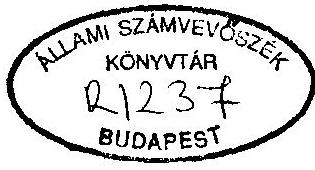
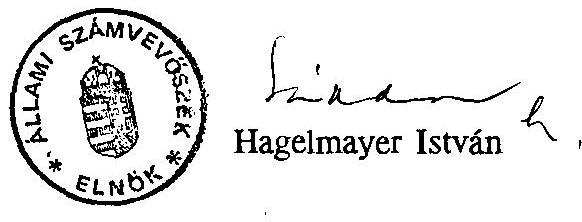

# Sillami Számverösxék 

## JELENTÉS

az Útalap és az abból finanszírozott országos közúthálózat fenntartásának, üzemeltetésének, fejlesztésének, valamint a kezelő szervezetek müködésének pénzügyi-gazdasági ellenőrzéséről

---

# A vizsgálatot vezette: 

Hegedüsné
dr. Müllern Veronika
osztályvezető fötanácsos

## A vizsgálatot végezték:

dr. Benkö János
dr. Burján Margit
Czunyi Lajos
Csóry Györgyné
dr. Gyuk József
Hirka Mihály
Horváth János
László András
Patai Tamás
Simon Akosné
Szijártó Károly
Szilágyi Sándor
Vécsey László
dr. Eröss Aladár
Hegyi Kálmán
számvevö tanácsos
számvevö tanácsos
számvevö tanácsos
számvevö tanácsos
számvevö tanácsos
számvevö tanácsos
számvevö tanácsos
számvevö tanácsos
számvevö tanácsos
számvevö tanácsos
szakértő
szakértő

---

# JELENTÉS 

az Útalap és az abból finanszírozott országos közúthálózat fenntartásának, üzemeltetésének, fejlesztésének, valamint a kezelő szervezetek müködésének pénzügyi-gazdasági ellenôrzésérôl

Az Útalap (Alap) - mint elkülönített állami pénzalap - célja az országos közúthálózat (állami tulajdonú közúthálózat) müködőképességének fenntartása, fejlesztése.

Az Alap 1994-ben 46,3 Mrd Ft-tal gazdálkodik. Ez az összeg magában foglalja a központi költségvetésből nyújtott 6,1 Mrd Ft támogatást is. Kezelôje a Közlekedési, Hírközlési és Vízügyi Minisztérium (KHVM). A minisztériumon belül az Alap kezelésével és felhasználásával a Költségvetési Önálló Osztály és a Közúti Közlekedési Főosztály foglalkozik, az Útgazdálkodási és Koordinációs Igazgatóság (UKIG), az Autópálya Igazgatóság (APIG), valamint 19 Közúti Igazgatóság (KIG) közremúködésével. Az intézmények feladataikat mintegy 7200 fóvel látják el, müködésüket teljes körűen az Alap finanszírozza.

## Ellenôrzésünk során arra kerestünk választ, hogy

- az Alap forrásai összhangban voltak-e szakmai feladatokkal, a felhasznált pénzeszközök hogyan segítették az országos közutak müködőképességének fenntartását, az úthálózat fejlesztését;
- a kezelést végző szervezetek müködésükkel, szabályozottságukkal biztosították-e az Alap törvényes, célszerű és eredményes felhasználását.

Vizsgálatunk az 1989. II. félév - 1994. I. negyedév közötti időszak gazdálkodására terjedt ki. Ellenőrzésünk során valamennyi igazgatóságot felkerestük. Kapcsolódó ellenőrzést végeztünk a PM-nél, az FM-nél, a VPOP-nál, az APEH-nél, illetve két gazdálkodó szervezetnél.

---

# Következtetések, javaslatok 

A nemzetgazdaság fejlettségi szintje és az infrastruktúra ellátottság között szoros kapcsolat van. A jól kiépített infrastuktúra - ezen belül a közlekedés - a gazdaság fejlődésének egyik feltétele, mozgástere a termelés-elosztás-fogyasztás folyamatának, mindemellett kiemelkedő a munkaerő- felvevő szerepe is. Ez utóbbi azért sem hagyható figyelmen kívül, mivel hazánkban a munkanélküliségi ráta 1993. év végén $12,6 \%$ volt.

A fejlett piacgazdasággal rendelkező országokban a 90 -es évek elején az infrastruktúra kötötte le a beruházások, illetve a foglalkoztatottak 60-70\%-át és a GDP termeléséhez is hasonló arányban járult hozzá. A hazai infrastruktúra - ezen belül a közúti közlekedési hálózat - elmaradása a fejlett országokhoz képest érezhetően nagy, egyes becslések szerint mintegy negyedszázados.

Magyarországon is mindinkább érvényesül az a nemzetközi tendencia, hogy a vasúttal szemben egyre jobban teret nyer a közúti szállítás. A közúthálózat az ország belső életében és nemzetközi kapcsolataiban meghatározó jelentőségűvé vált. A személyszállításban előtérbe került a személygépkocsi használata. A gyorsütemű fejlődést jelzi, hogy az elmúlt negyedszázadban a személygépkocsik állománya kilencszeresére, az autóbuszoké közel háromszorosára nőtt. Évente 12-13 millió gépjármű közlekedik útjainkon, közülük csak kb. 3 millió db a hazai illetőségű (1970-92. között a belépő gépkocsik száma tízszeresére, a kilépőké hétszeresére, a nemzetközi tehergépjármú forgalom tizenötszörösére nőtt).

Az ország közúthálózatának hossza mintegy 155 ezer km, ebből önkormányzati tulajdonban 75 ezer km, magántulajdonban 50 ezer km van. Az állami tulajdonú közúthálózat (országos közúthálózat) kb. 30 ezer km, ehhez tartozik még 5780 db közúti híd is. Az úthálózat bruttó értékét 1990-ben mintegy 491 Mrd Ft-ra becsülték. (A tárca vagyonbecslése elsősorban műszaki és nem közgazdasági szempontokon alapszik. A valós érték meghatározására még nem került sor, annak ellenére, hogy a közutak a nemzeti (kincstári) vagyon részét képezik.)

A gépjármú forgalom adatainak ismeretében különösen szembetűnő, hogy a biztonsági követelményeknek leginkább megfelelő autópályák ( 269 km ) és autóutak ( 70 km ) hossza, aránya igen csekély. Hazánk közúthálózata olyan kiépítettséggel sem rendelkezik, ami lehetővé tenné az ország, legforgalmasabb határátkelőhelyeinek összekötését. Az úthálózat sajátosan sugaras szerkezetű, Budapest-centrikus. A folyami átkelők száma csekély, a nagyvárosokat elkerülő̉ közutak hossza igen kevés,

---

a vasúti-közúti kereszteződések 88\%-a szintbeni, a közúti csomópontok (csaknem 5000) több mint fele balesetveszélyes, az úthálózat minőségi mutatói pedig évről-évre kedvezőtlenebbek.

Az országos közúthálózat fenntartására, üzemeltetésére, beruházására a vizsgált időszakban az Útalap forrásai nyújtottak fedezetet.

A központi költségvetéstől független pénzalap egyrészt a pénzeszközök, másrészt az ebből finanszírozott feladatok rendszerszemléletű kezelését vállalta fel. A pénzeszközök oldaláról a forrásbiztonságot, értékmegőrzést és az egységes szemléletű finanszírozást tűzte ki célul, míg feladatoldalról az országos közúthálózattal kapcsolatos szakmai feladatok elvégzését vállalta fel, a téli üzemeltetéstől az autópálya beruházásig. A szakmai munkát nehezítette, hogy KHVM-en belül az alap kezelésével kapcsolatos feladatokat ellátó két szervezeti egységet (főosztályt és önálló osztályt) illetve a 21 intézményt a vizsgált időszakban folyamatosan átszervezték. Az irányítást végző főosztály feladatvállalása pedig túlzott volt, amit mérsékelne, ha az intézmények rendelkeznének a jogszabályban előírt önállósággal, illetve a szakmai és gazdálkodási munkát meghatározó szabályzatok felülvizsgálatra, korszerűsítésre kerülnének.

Az Alap működésének szabályozása szinte évente változott, összességében azonban nem sikerült elérni a források reálértékének megőrzését. Így az induláskor kijelölt pozitív célok csak részben teljesültek, egyre inkább nyilvánvalóvá vált a források és a feladatok közötti összhang hiánya.

Az Útalap létrehozása óta (1989) a feladatok finanszírozására 97 Mrd Ft bevétellel rendelkeztek, melyet csaknem teljes egészében ( $99 \%$-ban) felhasználtak.

A források 1989-1993 között évenként igen intenzíven, 5,9 Mrd Ft-ről 36,2 Mrd Ft-ra növekedtek. (A tényszámok nagyságrendjét érzékelteti, hogy egy km autópálya építése 0,8-1 Mrd Ft-ba kerül.) A bevételek átengedését, illetve növekedését a központi költségvetés pozíciója (deficitje), és nem az úthálózat állaga, fejlesztési igénye határozta meg.

Forrásoldalon az egyik legfontosabb feladat a reálérték megőrzése volt (az erre vonatkozó kötelezettséget törvény mondja ki). Az eddig megtett intézkedések azonban még nem jelentenek hosszútávú garanciát. Nem kedveztek ennek az egyre növekvő hitelfelvételek sem ( 16 esetben 57 Mrd Ft összegben, melynek $46 \%$ - a külföldi bankoktól származott). Ezek segítségével a 90 -es évek elején felgyorsították ugyan

---

a szakmai feladatellátást, elsősorban a beruházások kivitelezését. A hitel visszafizetések azonban olyan mérvű elkötelezettséget, adósságszolgálatot jelentenek (1995-1997-ben meghaladja a $30 \%$-ot, 2013 -ig kamattal együtt a 174 Mrd Ft -ot), hogy a jelenlegi forrásösszetétel, illetve a meglévő kötelezettségvállalás ( 103 Mrd Ft ) mellett az eladósodás veszélye nélkül nincs reális lehetőség újabb hitelfelvételre. Mindez az újabb feladatok (elsősorban beruházások) beindítását is korlátozza.

Nem jelentett stabilitást az sem, hogy 1994-ben az útadó felemelése helyett az Alap 6,1 Mrd Ft költségvetési támogatást kapott a központi költségvetésből. Ez ugyanis egyszeri jellegű volt, így támogatásra várhatóan már 1995-ben sem kerül sor.

A források csaknem kétharmadát az üzemanyagok fogyasztói árába épített útalap hozzájárulás jelenti. Az üzemanyagok fogyasztói ára ezalatt az idő alatt 2,5-3-szorosára nőtt, ezzel egyidejűleg megközelítően hasonló mértékben emelkedett az útalap hozzájárulás is. Ez a növekmény azonban a tárca törekvései ellenére nem "tartott lépést" a kiadási oldalon jelentkező feladattömeggel, ugyanis az üzemanyagok fogyasztói árának csak mintegy $8 \%$-a "került be" forrásként az útalapba, a jórésze (fogyasztási adó, ÁFA) a központi költségvetés bevételévé vált.

Az útalap hozzájárulás befizetésének ellenőrzésére csak 1992-től van lehetőség. Ettől kezdve az adónemmel kapcsolatos feladatokat (nyilvántartás, adóbeszedés, ellenőrzés) az APEH végzi. Az Adóhivatal szolgáltatásaiért térítést kap az Alaptól, ennek ellenére (az adózás rendjéről és az Útalapról szóló törvény ellentmondásai miatt) az adóbírság és a késedelmi pótlék - az Útalap helyett - a központi költségvetésbe kerül. (A KHVM erre vonatkozó javaslatait a PM nem fogadta el.)

A belföldi gépjárművekkel kapcsolatos adóztatási eljárást az önkormányzatok végzik. A kivetéshez szükséges adatok meglehetősen bizonytalanok, és az adóellenőrzési tevékenység sem kellően hatékony, a befolyt "súlyadót" pedig rendszertelenül utalják az Alap számlájára.

A "túlsúlyos" járművek után fizetett bevételeket növelné, ha a "mérlegelési rendszer" zárt lenne. Ugyanis a tehergépjárművek áthaladását biztosító határállomásoknak csak a $60 \%$-a rendelkezik mérlegelési lehetőséggel. Emiatt az Alap évenként száz milliós nagyságrendű bevételtől esik el.

Jogszabályi ellentmondást tapasztaltunk az ÁFA elszámolásoknál is, amit az Áht., és az Útalap törvény koordinálatlan szabályozása okozott.

---

A forrásoknál meglévő bizonytalanság, a rendszertelenül történő átutalások, a "lökésszerűen jelentkező" kifizetések egyre gyakrabban fizetési gondokat okoztak az Alapnál, ezért a vizsgált időszakban közel 5 Mrd Ft likvidhitel felvételére került sor.

Az ellenőrzött időszakban 41 Mrd Ft-ot fenntartásra, üzemeltetésre, 43 Mrd Ft-ot fejlesztésre, 12 Mrd Ft-ot egyéb (pl. hiteltörlesztés, üzemanyag-visszatérítés) kiadásokra fordítottak.

A források felosztásánál többféle hiányosságot is tapasztaltunk. A minisztérium nem törekedett arra, hogy a forráslehetőségek (egyben korlátok) ismeretében egyes feladatok között prioritást határozzon meg. Nem mondta ki azt az evidenciát, hogy az országos közutak jelenlegi állaga miatt a fenntartásnak-üzemeltetésnek kell a felhasználási rangsorban az első helyen szerepelni, amit minden esetben jó színvonalon, megfelelő minőségben kell teljesíteni.

Az Útalap, amelynek a törvénybe foglaltak szerint mindhárom feladatot el kellene látnia, legfeljebb az üzemeltetés és a fenntartás feladatait képes teljeskörűen finanszírozni. Ezért vagy az Alap törvényben meghatározott feladatait kell szükíteni, vagy a forrásait bővíteni. A közúti közlekedési hálózat nemzetgazdaságban játszott szerepére figyelemmel az utóbbi látszik célszerűnek. Ez esetben viszont jobb megoldásnak tűnik a jelentősebb útberuházások önálló projektként való kezelése a központi költségvetésben. A leszűkült feladatokkal összhangban az Útalap forrásait is felül kellene vizsgálni és azt elsősorban az üzemeltetés, fenntartás szükségleteihez igazítani. Ezzel egyidejúleg az Alap feladatrendszerét meghatározó törvény módosítását is kezdeményezni szükséges.

A források jogcímenkénti felosztására sem alakítottak ki olyan módszert, amellyel egzakt módon elkülöníthető lenne az úthálózat üzemeltetési, fenntartási és fejlesztési ráfordítás igénye.

Az úthálózat fenntartására és üzemeltetésére történt ráfordítások (összesen 41 Mrd Ft) egymástól nem különíthetők el.

Egyrészt azért, mert az intézményeknél kialakított számviteli rend erre nem ad lehetőséget, másrészt azért, mert az egyes múszaki feladatok tartalmukban is folyamatosan változtak az évek során. Így nem mutatható ki, hogy ezek a feladatok külön-külön "mibe kerültek" az Alapnak. (Becslések szerint a 41 Mrd Ft egyharmadát üzemeltetésre, kétharmadát fenntartásra fordították).

---

A fenntartási munkák tervezését nehezítette, hogy az elmaradt feladatok mintegy 100 Mrd Ft-ra tehetőek (1991-es adat). Így az éves feladatok meghatározásánál a meglévő állagfelmérésekre támaszkodva rangsoroltak, sőt a "nagyfelületű beavatkozásoknál" hatékonysági számításokat is végeztek. A múszakilag indokolt igényeket azonban a pénzügyi korlátok miatt csak részben (50-60\%-ban) tudták kielégíteni. Így az állagvédelemben meglévő "elmaradásokat" nem sikerült csökkenteni, sőt ezek az utak egy részénél halmozódtak (1993-ban az úthálózatnak csak mintegy 40\%-a volt "elfogadható" minősítésű). A fenntartási feladatok kivitelezését jórészt külső vállalkozók végezték. E területen a versenyhelyzet csak 1993-ban erősödött fel, amit a kialakult piaci árak is jól tükröznek. A kivitelezők kiválasztására versenytárgyalás keretében került sor. A versenyeztetés színvonalának javítása érdekében nem végezték el a fajlagos költségek elemzését, a vállalkozók minősítését (kivitelezési teljesítmények alapján).

Az üzemeltetési feladatokat elsősorban saját kivitelezés keretében teljesítették. Az igazgatóságok rendelkeztek az ehhez szükséges gépparkkal, de ezek kihasználtsága sem volt mindig teljes körű. Jelentős összeget (mintegy 3 Mrd Ft-ot) fordítottak a téli üzemeltetésre. Mivel a tevékenység központi szabályozása nem történt meg, ezért megyénként igen eltérő felhasználást (só- és érdesítőanyag) és költségráfordítást tapasztaltunk.

A közúthálózat fejlesztésére a tárca hosszútávú (2000-ig szóló) programot fogalmazott meg. A tervezésnél az 1990. évi forgalmi igényekből indultak ki, felvállalva azt, hogy a program sikeres teljesítése után csak "tízéves legyen a lemaradás". A feladatok megvalósításához szükséges fedezetre becsléseket végeztek, azt 250 Mrd Ft-ban határozták meg, de ennek is csak $60 \%$-át látták az Útalapból finanszírozhatónak. A múszakilag megalapozott tervek finanszírozására azonban nem dolgoztak ki olyan konkrét gazdasági programot, amiben a források nagyságrendje és annak évenkénti ütemezése követhető lett volna.

A jelenlegi beruházás teljesítések, és forrásösszetétel mellett nem valószínủ, hogy e mérsékelt igényeket megfogalmazó program teljesülne. A forráskorlátok miatt eddig a céloknak csak mintegy $10 \%$-a valósult meg, a ráfordítások kétharmada az autópályák és autóutak fejlesztésére történt, viszonylag csekély volt a vidéki fejlesztésekre irányuló felhasználás (a források alig 20\%-a).

A fejlesztések többségénél az előkészítésre az elmúlt két évben nagyobb figyelmet fordítottak (versenytárgyalások szabályozása, hatékonysági vizsgálatok). Az induló fejlesztések rangsorolására kidolgozott módszerek alkalmazását a pénzügyi lehetősé-

---

gek gyakran korlátozták. Néhány nagyberuházásnál (M1, M0 I/A szakasza) az előkészítés sem volt kellően körültekintő. A kisebb jellegű fejlesztéseknél pénzhiánnyal összefüggő szakaszolási kényszerrel, határidő csúszással is találkoztunk.

A hosszú távú fejlesztési program koncesszió keretében kívánja az autópályák egy részét és a Szekszárd térségi Duna-hidat megvalósítani, mivel a tervezett 550 km -nyi autópálya mintegy 230 Mrd Ft nagyságrendű forrásigénye még hosszú távon sem biztosítható az Alapból. A tárca három autópályára és a Duna-hídra már megkötötte a koncessziós szerződéseket, a kapcsolódó kiadások egy részét (pl. földterület vásárlás, üzemeltetési hozzájárulás) azonban az Alapból kellett finanszírozni. (A "koncessziós" beruházások költségeinek egy része továbbra is az Alapot terheli.)

Az önkormányzati törzsvagyonhoz tartozó utak fejlesztésének egy részéhez is az Alapból nyújtottak "támogatást" (pályázati rendszer keretében). Tapasztalataink szerint az önkormányzatok a KIG-ek ellenőrzési tevékenységét az eddigieknél jobban igényelnék.

A fejlesztésekhez (elsősorban a koncessziós beruházásokhoz) szükséges területszerzésekre (kisa játításokra) 5,6 Mrd Ft-ot fordítottak. A feladat végrehajtását nehezítette, hogy a jogszabályi előírások jelentősen megváltoztak. Erre az időszakra esett a kárpótlási igények kielégítése is. A telekkönyvi bejegyzések sem mindig tükrözték a tényleges tulajdoni helyzetet. Így gyakori volt, hogy a kivitelezés megkezdése előtt nem sikerült a földterület állami tulajdonát biztosítani. A viták (gyakran jogviták) igen hosszasan elhúzódnak.

Tapasztalataink szerint az elvégzett fenntartási, beruházási munkák nem mindig feleltek meg a minőségi követelményeknek. Hazánkban a piacgazdaságra való átállás időszakában még viszonylag kevés az olyan vállalkozó cég, amelyik a kivitelezés során folyamatosan képes lenne a jó minőség biztosítására. Ennek érdekében az építtetők (igazgatóságok) sem jártak el mindig körültekintően. Így pl. a kivitelezőktől átvett munkák egy részénél nem végeztek minőségellenőrzést, vagy ha erre sor került a megállapított értékcsökkenéssel arányban nem érvényesítettek szankciót. Házilagos kivitelezésnél pedig a minőségellenőrzés is "házilagos" volt, vagyis nem vettek igénybe független ellenőrzést. Várható, hogy az európai szabványok kialakítása, az egyre inkább szélesedő ún. akkreditált és minősített laboratóriumi hálózat kiépítése, az új szerződéses rendszer (FIDIC) alkalmazása hozzájárul a minőség javulásához.

Az úthálózat kezelését végző intézményhálózatot teljeskörűen az Alap finanszírozza. Ugyancsak az intézményi számlarendek hiányosságai miatt nem mutatható ki

---

teljeskörűen, hogy az elmúlt 4 évben az intézmények működése, fenntartása összesen milyen nagyságrendet képviselt az Alap kiadásain belül. A vizsgált időszakban jelentős létszámcsökkentésre került sor (mintegy 1600 fő), amit az intézmények vállalkozási tevékenységének visszaszorítása is megkívánt. Az intézményi átlagbérek összhangban vannak a közalkalmazotti törvénnyel, sőt néhány munkaköri csoportban meghaladják azt. Az intézmények a kezelői feladatok ellátásához jelentős ingatlanvagyonnal rendelkeznek. Ezek egy része nem volt szükséges a szakmai feladatokhoz, így azokat értékesítéssel, vállalkozásban való részvétellel hasznosították.

Az intézményi gazdálkodás eseményeit rögzítő számviteli rendet nem alakították ki megfelelően, ami hibák forrásává vált. A hiányosságokat csak úgy lehet felszámolni, ha a minisztérium segítséget nyújt az ágazati sajátosságokat tükröző számlarendek kialakításához, fokozza ellenőrzési tevékenységét, nagyobb figyelmet fordít a belső ellenőrzés működésének hatékonyságára.

A közutak kezelését szolgáló műszaki és gazdasági adatok rögzítésére széles körben alkalmazzák a számítástechnikai adatfeldolgozást. A felhasználói munkahelyek kiépítettek, rendelkeznek a szükséges gépállománnyal. A szoftverek egy része egyedi fejlesztésű, ami nehezíti a gazdálkodók közötti koordinálást, az ebből eredő gondokat felismerve a tárca intézkedett a hiányosság megszüntetésére.

Az Alap gazdálkodásában az országos közúthálózat kezelésében tapasztalt hiányosságok miatt javasoljuk a minisztérium vezetésének:

1. Kezdeményezzék az Útalap törvény módosítását, és a törvény előkészítése során:
— az Alap feladataként elsősorban a fenntartási és az üzemeltetési munkákat jelöljék meg, illetve a kisebb volumenű fejlesztéseket (pl. a csomópont átépítés, felüljáró építés) ezzel összhangban szabályozzák forrásait. Munkálják ki a jelentősebb fejlesztési feladatok fedezetigényét, illetve annak a költségvetésre gyakorolt hatását. Kezdeményezzék az útfejlesztések költségvetésbe történő áthelyezését és azok önálló projektenként való finanszírozását;
— dolgozzanak ki olyan automatizmusokat (pl. az útadó hozzájárulás nagyobb arányú, esetleg százalékos átengedésével), melyek hosszabb távon garantálni tudják a források reálérték megőrzését;
— szabályozzák a források tervezésének módját, biztosítsák a bruttó elszámolás elvét, megteremtve ezzel az Áht. és az Alapról szóló törvény összhangját;

---

- fogalmazzanak meg olyan módosító javaslatot, amely lehetővé teszi, hogy az Alapot megillető valamennyi bevétel a közúthálózat kezelését segitse. Ennek érdekében kezdeményezzék a bevételek körének egyértelmü, valamint az eljárási szabályok Art-tal (1990. évi XCI tv.) összhangban történő újra szabályozását.

2. Dolgozzanak ki olyan közgazdasági és múszaki módszereket (a PM bevonásával), melyek biztosítják a nemzeti (kincstári) vagyon részét képező, az állami közútvagyon valós értékének meghatározását, egyben az ország teljes úthálózatának értékmegállapítását is lehetővé teszik.
3. Vizsgálják felül a közútkezelő szervezetek hatáskörét, jogkörét, és azokat a tényleges feladatokkal összhangban határozzák meg. Ezzel egyidejűleg a költségvetési szervek önállóságát a jogszabályban rögzítettek szerint biztosítsák.
4. Korszerűsítsék és véglegesítsék a múködést, gazdálkodást, múszaki tevékenységet rögzítő szabályzatokat.
5. Az Útalap forrásának növelése érdekében:

- keressék annak lehetőségét, hogy valamennyi határátkelőhelyen (ahol tehergépjármú forgalom van) mielőbb mérlegelési lehetőség legyen;
- vizsgálják felül az APEH-nél lévő adóvisszatérítéseket finanszírozó pénzállományt és kérjék annak rendszeres elszámolását;
- végezzenek számításokat és dolgozzák ki (PM-mel közösen) a belföldi gépjár-mű-adóbefizetés bélyeggel történő lerovásának lehetőségét. Amennyiben ez az eljárás a bevételek növekedését szolgálja, intézkedjenek annak bevezetéséről.

6. A közútfe jlesztések területén:

- korszerűsítsék a közútfe jlesztés hosszú távú programját, ebben biztosítsák a műszaki és gazdasági koncepciók összhangját. Határozzák meg, hogy a kijelölt célok, milyen ütemben valósíthatók meg. A koncepciót nyújtsák be a Kormánynak jóváhagyásra, és gondoskodjanak annak rendszeres karbantartásáról;
- rendeljenek el a tényleges ráfordítások kimutatása érdekében tételes számlaellenőrzést a kiemelt útberuházások (M1, M0/IB) befejezését követően;

---

- a beruházások területelőkészítését az eddigieknél korábban kezdjék meg, a munkálatok hatékonyságának növelése érdekében hozzanak létre az UKIG keretében e célra néhány fős jogi egységet.

7. A fenntartási feladatok területén:
— végezzék el a különféle feladatok összehasonlító költségelemzését, intézkedjenek a múszakilag indokolatlan eltérések felszámolásáról;
— terjesszék ki a versenyeztetési eljárás egységessé tétele érdekében valamennyi vállalkozóra (a KIG-ekből kiváltakra is) a versenyen való részvétel kötelezettségét. Végezzék el a kivitelezési munkák figyelembevételével a külső kivitelezők minősítését;

- csökkentsék az évenként kijelölt, kiemelten kezelt fenntartási feladatok számát, ezeket viszont teljes folyamatában vizsgálják, értékeljék.

8. Az üzemeltetési feladatok terén:
— korszerűsítsék a téli üzemeltetési feladatok jelenlegi szabályait, vizsgálják felül a meglévő normatívákat, és azt a meglévő géppark teljesítményének figyelembevételével határozzák meg;
— szüntessék be a szabványtól eltérő minőségủ só beszerzését;
— egységesítsék a műszaki ügyeleti rendszert.
9. Minőségvizsgálat területén:
— növeljék az ún. akkreditált laboratóriumok számát, ezzel egyidejűleg intézkedjenek az ún. minősített laboratóriumok visszafejlesztéséről;
— fordítsanak nagyobb hangsúlyt a beruházási, fenntartási munkák minőségellenőrzésére, a vizsgálatok eredményeit minden esetben érvényesítsék, azokkal az igazgatóságokkal szemben, ahol ettől eltekintenck foganatosítsanak szankciókat;
— különítsenek el a beruházási költségeken belül egy százalékosan meghatározott konkrét összeget, amit a minőségellenőrzésre fordítanak;
— a beruházások, a fenntartási munkák folyamatában fokozzák az UKIG érdemi ellenőrzési (műszaki, gazdasági) részvételét;
— pontosítsák a műszaki (szabvány, irányelv) előírásokat.

---

10. Az intézményi gazdálkodás területén:

- dolgozzák ki az egységes számviteli információs rendszer elveit, tárca szinten biztosítsák a tervezés és a beszámoló jelentések érdemi felülvizsgálatát. A számítógépes szoftverek fejlesztését ezzel összhangban határozzák meg;
- a béralap tervezését a költségvetési törvényben rögzített szempontok alapján végezzék, az évközi béralap-növekedést konkrét többletfeladatokhoz kössék;
- dolgozzák ki a szombathelyi KIG munkatársainak anyagi ösztönzésére (fedezet nélkül) kifizetett összeg korrekcióját, vizsgálják ki a számviteli szabálytalanságok alapján a felelősség kérdését;
— szerződésben rögzítsék az UTINFORM és a médiák közötti kapcsolatot, határozzák meg a szolgáltatás körét és ellenértékét.

11. A számítástechnika területén:
— vizsgálják felül az Országos Közúti Adatbank (OKA) állományát, biztosítsák annak naprakészségét, szüntessék meg a felesleges memórialekötéseket;
— alakítsák ki az OKA adatközlésének rendjét, határozzák meg az ehhez kapcsolódó térítési díjakat;
— pótolják a hiányzó szabályozásokat;
— javítsák a számítástechnikai adatok megbízhatóságát
12. Az ellenőrzési feladatok területén:
— nagyobb hangsúlyt helyezzenek a felügyeleti ellenőrzés keretében a pénzügyi, számviteli munka minősítésére.
—vizsgálják felül valamennyi igazgatóságra kiterjedően a belső ellenőrzés működését, hatékonyságát, a számviteli tevékenységet, ez alapján tegyék meg a szükséges intézkedéseket.
— javítsák a belső ellenőrzés hatékonyságát, készítsék el a hiányzó belső ellenőrzési szabályzatokat, rögzítsék az egyes munkaköri leírásokban a munkafolyamatba épített ellenőrzési kötelezettséget. Törekedjenek arra, hogy minden igazgatóságnál megfelelő képzettségű és gyakorlatú, teljes munkaidőben foglalkoztatott belső ellenőrt alkalmazzanak.
13. Készítsenek intézkedési tervet a jelentésben foglalt javaslatok figyelembevételével a megállapítások hasznosítása érdekében.

---

# Megállapítások 

A közúti forgalomban, a közúthálózatban meghatározó jelentősége van az országos közúthálózatnak, annak ellenére, hogy hazánk úthálózatának mindössze egyötödét jelenti. Ezeken az állami tulajdonú utakon (autópályák, autóutak, I., II. és alsóbbrendű utak) ugyanis igen jelentős a külföldi és a hazai forgalom ami kihat az utak kezelésére, üzemeltetésére, fenntartására, fejlesztésére, illetve e tevékenységek pénzügyi igényére is.

## 1. Az országos közúthálózat kezelői feladatának, valamint az Útalap jogi- és intézményrendszerének összhangja, szabályozottsága.

### 1.1. Az Alap müködésének jogi szabályozottsága

A közúti közlekedésről szóló 1988. évi I. tv. megerősítette, hogy a korábbi gyakorlatnak megfelelően az országos közúthálózat fenntartása, fejlesztése, üzemeltetése állami feladat. Az e célra fordítható pénzeszközök nagyságrendjét meghatározta az állami költségvetés társadalmi közkiadásokra, felhalmozásra fordítható - egyre szükülő - lehetősége. Ennek következményeként a 80 -as évek végére a közúthálózatra fordítható pénzeszközök már tartósan az indokolt műszaki, - forgalmi igényszint alá csökkentek, ami kedvezőtlenül hatott az utak állagmegóvására, fejlesztésére.

Az adott helyzetben szerencsésen találkozott a "közutas" szakma koncepciója az adó és költségvetési reform törekvéseivel. Ennek eredményeként 1989-ben a Minisztertanács úgy döntött, hogy e szakterület finanszírozására létrehozza a költségvetéstől független Útalapot ( $61 / 1989$ VI. 27. MT. sz. rendelet), amely alapvetően bevételi automatizmusokra épül, emellett lehetőséget ad külső források bevonására is. Bevételeiből fedezi a közúthálózat üzemeltetését, fenntartását, fejlesztését, illetve a kezelő szervezetek működési költségeit. A finanszírozás ezzel egy csatornássá vált. (Létrejöttekor voltak olyan vélemények, hogy a közúti fejlesztést továbbra is az állami költségvetésből kellene fedezni.) A rendelet célja az volt, hogy az alapszerű kezeléssel egyidejűleg a források stabillá, kiszámíthatóvá, a felhasználások több évre előre tervezhetővé váljanak. Ennek az elvárásnak csak részben sikerült eleget tenni, mivel elsősorban az Alap legfontosabb forrását, az üzemanyagokból származó bevételek normatíváit változtatták.

---

Ugyanezen időszak alatt a fajlagos üzemanyag-fogyasztás és az átlagos futásteljesitmény is csökkent.

Az Áht. előírásaival összhangban 1992. július 1-től az Útalapot törvény szabályozza (1992. XXX. tv.), ami egyben bővítette az Alap bevételi jogcímeit is. Ezt a törvényt is kétszer módosították, az utolsó 1994. évi XXX. tv. visszamenőleges hatályú intézkedésével csökkentette az Alap forrásait.

Az Útalap törvény hiányossága, hogy csak 1993.I.1-től intézkedik a források kezelői szintű ellenőrzésének lehetőségéről.

Európai viszonylatban a közhasználatú utak, - vagy azok egy része - üzemeltetése, fenntartása, fejlesztése állami feladat, az ehhez szükséges fedezetet is az állam biztosítja, jórészt elkülönített alap formájában. A legtöbb országban a finanszírozás kétcsatornás, mivel a beruházások nem az Alapból, hanem a költségvetésből valósulnak meg.

# 1.2. A kezelő szervezetek struktúrája, irányítási mechanizmusa, szabályozottsága 

Az Útalap kezelője a közlekedési tárca (1989-ben a Közlekedési, Hírközlési és Építésügyi Minisztérium /KÖHÉM/, majd 1990-tól a Közlekedési, Hírközlési és Vízügyi Minisztérium /KHVM/). Rendelkezési jogot a miniszter gyakorol, aki ezt a jogosítványát a tárca szervezeti egységeire ruházta át, így a közvetlen igazgatási, felügyeleti jogkör megoszlik:

- a bevételek nyilvántartása, a szakterülethez tartozó költségvetési intézmények működésének pénzügyi-gazdasági irányítása, koordinálása, a Költségvetési Önálló Osztály feladata;
- az Alap felhasználása, a szakterülethez tartozó költségvetési szervek szakmai irányítása és ellenőrzése a Közúti Közlekedési Főosztály feladata;
- ezen túl a tevékenységet ellátó költségvetési intézmények pénzügyi-gazdasági ellenőrzését az Ellenőrzési Önálló Osztály végzi, amelyik közvetve segíti az Alap müködését.

Az Alap gazdálkodásában az első két szervezeti egységnek van meghatározó szerepe,s bár tevékenységüket koordináltan végzik az Alap felett döntési jogkörrel, hatáskörrel csak a miniszter (közigazgatási államtitkár) rendelkezik.

---

A közúthálózat üzemeltetését, fenntartását, fejlesztését a tárca a fejezethez tartozó 21 költségvetési intézménnyel közösen végzi, ezek: 19 megyei közúti igazgatóság (melyekhez közvetlenül 76 üzemmérnökség tartozik), az Autópálya Igazgatóság ( 7 üzemmérnökséggel) és az Útgazdálkodási és Koordinációs Igazgatóság.

A jelenlegi szervezet 1991-től müködik, a tárca ugyanis - figyelembe véve a bekövetkezett társadalmi-gazdasági változásokat, a közúthálózatra fordítható pénzeszközök várható nagyságrendjét - a Közlekedéstudományi Intézettel (KTI) kidolgoztatta az Alap müködési koncepcióját, és ehhez kapcsolódóan döntött a jelenlegi kezelő szervezetek létrehozásáról.

Ezt megelőzően az Országos Közúti Igazgatóság, mint középirányító szerv és kilenc KIG végezte a feladatokat, majd egy rövid ideig a Költségvetési Önálló Osztály keretében is müködött egy Ütalapkezelő Szervezet. Ez utóbbi az Alap müködésével kapcsolatos közlekedési, jogi és gazdasági kérdéseket koordinálta.

A közutak kezelését irányító szervezeti egységek létszáma az SZMSZ-ben kijelölt feladathoz képest viszonylag alacsony. A Közúti Közlekedési Főosztály létszáma 16 fó, a Költségvetési Önálló Osztályon 6 fő érdemi munkatárs dolgozik, (ebből 3 fő foglalkozik az Alappal, emellett közel 75 tárcaszintű intézmény felügyeletét is ellátja).

A Közúti Közlekedési Főosztály létrehozására 1991-ben került sor. Főosztályon belül a Fejlesztési Osztály feladata az útfejlesztések stratégiájának kialakítása, az éves szakmai és pénzügyi tervek koordinálása, az önkormányzatokkal való rendszeres együttmüködés. Létszámuk mindössze 3 fő, így a szakmai ellenőrzésre kevés lehetőségük van (az operatív feladatokat az UKIG látja el.)

A Költségvetési Önálló Osztály adott személyi feltételeivel csak korlátozottan tudott eleget tenni az SZMSZ-ben előirt feladatainak, így a tárcaszintű tervezésnek, a beszámoló jelentések érdemi felülvizsgálatának. Nem készítette el a szakterület egységes információs rendszereit sem.

A két szervezeti egység túlterheltségét csökkentené, ha a jelenlegi centrális irányítást oldanák, az intézményi müködéshez a jogszabályban előirt önállóságot biztosítanák.

Az elmúlt három év azt igazolta, hogy egységes és végleges tárcaszintű szabályzatok mellett az intézmények apparátusának szellemi kapacitása, felkészültsége önállósággal, felelősség átruházással jobban és eredményesebben terhelhető. Ezért célszerű

---

lenne, ha a tárca a jövőben csak a fő kérdésekben vállalna döntést, és nagyobb súlyt helyezne a feladatok végrehajtásának ellenőrzésére.

Az intézmények struktúrája jelenleg központilag meghatározott. Létszámírányszámot, bérkvótákat írnak elő, központi elvárás érvényesül a tervezés, feladatmeghatározás, gazdálkodás, finanszírozás, beszámolás során, ami a jogszabályban meghatározottnál több kötöttséget, részletesebb előírásokat jelent.

A KIG-ek irányítási mechanizmusának változtatásával egyidejúleg a sajátos helyzetben lévő, háttérintézményként funkcionáló UKIG hatáskörét, jogkörét is módosítani szükséges.
Ez utóbbi intézmény 1991-ben alakult, feladata az Alap kezelésével kapcsolatos operatív teendők, a számviteli feladatok ellátása, a KIG-ek tevékenységének koordinálása, adatgyűjtés, elemző, és értékelő munka végzése.

Az intézmény sem döntési, sem ellenőrzési jogkörrel nem rendelkezik. Indokolt lenne ha a minisztérium által meghatározott keret jellegű feladatokon belül, operatív döntési lehetőséget kapna, természetesen tárcaszintű irányítás és ellenőrzés mellett. A jelenlegi gyakorlat ugyanis számtalan szóbeli, informális, gyakran feleslegesnek minősíthető tájékoztatás, rendelkezés előidézője.

A vizsgált időszakban változott a minőségvizsgálat szervezete is. 1990-ig 7 Közúti Minőségfelügyeleti Állomás (KMFÁ), rendelkezett minőségfelügyeleti, hatósági jogkörrel, tevékenységük egyenként két-három megyére terjedt ki. Ez a rendszer a KIG-ekhez, illetve az APIG-hoz tartozott, ami nem tette lehetővé a saját kivitelezés tárgyilagos minősítését. (Saját szervezetük hatósági felügyeletét is ellátták.) A KMFÁ-k mellett hasonló jogosítványokkal a Közlekedés Tudományi Intézet minőségvizsgálati szervezete is rendelkezett.

A KMFÁ-k közül - 1990-93 között - hármat privatizáltak, három 1993. január 1-jével az UKIG szervezetébe integrálódott, mint minőségvizsgálati osztály (MVO). Egy KMFA az egyik KIG saját laboratóriuma lett. (1992-ben a KMFA-k hatósági jogköre is megszűnt.) Ezzel egyidejűleg megnőtt az egy Minőségfelügyeleti Állomás által ellátott megyék száma, - háromról ötre -, illetve a veszprémi MVO esetében az eddigi négy megye helyett hét megyére terjed az ellátási kötelezettség. Ezzel egyidejűleg az UKIG keretében Műszaki, Szabályozási és Minőségvizsgálati Főosztály alakult.

A KTI Minőségvizsgálati Osztálya ezt követően is ellát hasonló feladatokat. Emellett néhány megyei KIG-en belül saját laboratórium (ún. kislaboratórium) is működik, de ezek kis kapacitásúak, létszámuk országosan nem több, mint 10-12 fő.

---

A szervezeti változást az indokolta, hogy államilag elismert független vizsgáló állomásokat akartak létrehozni, illetve a hatósági építésfelügyeletet a megyénként elhelyezett területi Közlekedési Felügyelet keretében oldották meg. A tárca véleménye szerint ugyanis az előző időszak szervezeti felállása "nem járt minőségjavulással".

Hazánk közútjait kezelő állami szervek irányítási rendszere, szervezeti struktúrája hasonlít az európai országokéhoz. Ezekben a nemzeti úthálózat üzemeltetésére, fenntartására elkülönített szervezetet müködtetnek, a feladatok egy részét vállalkozásba adással oldják meg. Ausztriában és Németországban minisztériumi igazgatás mellett tartományi szintű főhatóságok is közremüködnek. Dániában, Hollandiában, Finnországban fóhatósági igazgatósági rendszer müködik.

Összegezve megállapítható, hogy a 80 -as évek végétől a közutak kezelésében közremüködő szervezetek folyamatos átszervezés alatt álltak, a gazdasági és a műszaki feladatokat rögzítő igen nagy számú szabályzat egy része, a több éves működés ellenére, "ideiglenes" jellegű volt, ami nehezítette a szakmai feladatok ellátását (pl. Ideiglenes Közút Kezelői Szabályzat). Az új szervezetek alapító okiratai pedig még nem készültek el (Áht 96. §/1/ /2/ bekezdés), így az alap és a vállalkozási tevékenység elkülönítése megnehezült.

Az UKIG SZMSZ-e is csak tervezet formában készült el, ezt viszont minden évben aktualizálták. Az ideiglenes szabályzatot fóosztályvezetői utasítások egészítették ki.

A KIG-ek rendelkeznek ugyan jóváhagyott SZMSZ-szel (amit helytelenül a Közúti Közlekedési Főosztály vezetője hagyott jóvá), ezeket azonban nem teljes körűen aktualizálták. Pl.: nem tükrözik a minőségtanusítás elvárását, az üzemmérnökségek, telephelyek feladatainak változását.

Előfordult olyan SZMSZ is, amely jogszabállyal ellentétes előirásokat tartalmazott az érvényesítés, utalványozás, ellenjegyzés gyakorlására, sőt olyan is, ahol a kapcsolódó szabályzatok nem készültek el (pl. Debreceni KIG).

A KIG-ek többsége csak 1992-93-ban készített számlarendet, addig valamennyi csak számlatükörrel rendelkezett. Ezek közül azonban csak néhány minősíthető teljes körűnek (pl. Győr, Veszprém, Szolnok, Kaposvár, APIG). Hiányzik a számviteli politika megfogalmazása, a kiegészítő mellékletek alkalmazása. Ezek hiánya az évek közötti összehangolást megnehezíti.

A leltározási, selejtezési, önköltségszámítási szabályzatok aktualizálása, korszerűsítése, esetleg pótlása elmaradt, ezek a hiányosságok összefüggtek azzal, hogy a

---

tárca nem adott ki olyan iránymutatást, ami a szakmai sajátosságokat szem előtt tartva egységes szemléletű számviteli, elszámolási rend kialakítását tette volna lehetővé. Ennek szükségességét felismerve, a Minisztériumi Kollégium 1994. év közepén úgy döntött, hogy az ezzel kapcsolatos ajánlásokat még ez év végére ki kell dolgozni.

# 2. Az Útalap forrásképzése, a bevételek teljesítése 

Az 1989-ben létrejött Útalap előrelépést jelentett a közutak üzemeltetésének, fenntartásának, fejlesztésének egységes finanszírozásában. A létrehozáskor pozitív célkitűzéseket (forrásbiztonság, értékmegőrzés) fogalmaztak meg, azonban ezeket hosszabb távon nem sikerült biztosítani, erre még az 1992. évi XXX. tv. sem nyújtott kellő financiális garanciákat. (Az Alap forrásai 1989-1991. között csaknem 43\%-ot veszítettek reálértékükből, 1992-től a reálérték megőrzésében előrelépés történt. Ebben közrejátszott a központi költségvetés 1994. évi egyszeri költségvetési támogatása is.)

A fóbb bevételi források (üzemanyag-, gépjárműadó) átengedését a központi költségvetés és az Útalap között minden évben a központi költségvetés pozíciója határozta meg (nem a közutak üzemeltetési-fejlesztési-fenntartási igénye,) bolott a tárca 1991. év végén a fejlesztési lemaradást 250 Mrd Ft-ra (1994. éves áron 600 Mrd Ft ), a fenntartási elmaradást 100 Mrd Ft-ra becsülte.

Az Útalap a vizsgált időszakban (1989. II. félév - 1994. I. n. év) 97 Mrd Ft bevétellel rendelkezett, kiadás teljesítése 96 Mrd Ft volt (1-2. sz. melléklet). A bevételekre nincs a tárcának közvetlen ráhatása, mivel azokat tőle független államigazgatási szervek (pl. önkormányzatok, adóhivatal, Vám- és Pénzügyőrség) szedik be és utalják át az Alap számlájára. Ezekben az adónemekben, azok tervezhetőségében, teljesíthetőségében igen sok a bizonytalansági tényező.

### 2.1. Az üzemanyagok fogyasztói árába épített Útalap hozzájárulás

Az alap bevételeinek 61\%-át (59,2 Mrd Ft) az üzemanyagok fogyasztói árába épített útalap hozzájárulás (útadó) jelenti, amit a belföldön értékesített, valamint a saját felhasználású üzemanyagok után kell fizetni ( 3 sz. melléklet).

[^0]
[^0]:    A hazai üzemanyagok fogyasztói árának jellemzője, hogy abban magas az állami jövedelem aránya. A fogyasztói ár a termelői áron, a kereskedelmi árrésen felül forgalmi adót, környezetvédelmi díjat, útalap-hozzájárulást és nagy összegü fogyasztási adót tartalmaz (3. sz. melléklet). Az ár központosított tisztajöve-

---

delem-tartalma minőségtől függően 65-70\%-ra tehető, ami azt eredményezi, hogy a fogyasztói ár a termelői árnak kb. háromszorosa. Ez az arány részben az üzemanyagnak, mint árunak különleges jellegére (kóolajtermék, alapanyag), másrészt az iránta megnyilvánuló kereslet nagyságára vezethető vissza, melynek révén az állam könnyen, nagy volumenú biztos bevételhez jut.

Az üzemanyagok fogyasztól ára 1989-93 között kb. 2,5-3,0-szorosára nőtt. Az adótartalmuk változása is hasonló nagyságrendet jelez, vagyis az árstruktúra lényegében nem változott. (Kivételt képez a gázolaj, ahol a fogyasztói ár adótartalma az 1989. évi $45,8 \%$-ról 1993-ra $68,2 \%$-ra emelkedett.)

Az útalap-hozzájárulás átlagosan kb. 8\%-kal (gázolajnál 10\%-kal) terheli az üzemanyag fogyasztói árát. Ez az adótartalom a központi költségvetés szempontjából kétségtelenül kedvező, de tovagyűrűző jellege miatt inflatorikus hatása sem hagyható figyelmen kívül. Ugyanis alapanyagként az ára beépül a termékek árába, így a nemzetgazdaság valamennyi ágát, a lakosság széles körét érinti. (Becslések szerint az üzemanyagárak emelkedése az M1-es autópálya Győrt elkerülő szakaszának építési költségeit több mint félmilliárd Ft-tal növelte.)

Az útadó befizetését a 61/1989. (VI.27.) MT. rendelet önadózás formájában írta elő. A rendelet (sem a későbbi módosítások) nem intézkedett a befizetések ellenőrzéséről, erre egyetlen szervezetet sem hatalmazott fel és nem teremtette meg az ehhez szükséges feltételeket sem. Bevallást ugyanis nem kellett adni, így a befizetések helyessége nem volt ellenőrizhető. Tekintettel arra, hogy ezekben az években a piacot addig egyedül uraló üzemanyag forgalmazó mellett több más forgalmazó is megjelent, vélelmezhető a befizetések elmulasztása is.

Az 1992. évi LXXXV. tv. a befizetéseket 1993. január 1-jétől az APEH-nél vezetett számlára írta elő. (Ezt megelőzően az Állami Fejlesztési Intézetnél, majd az OKHB Rt-nél vezették a számlát.) A hivatal a jogszabályban előírt visszaigénylések teljesítése után továbbítja a befizetéseket az Útalap számlára. Kedvező változást jelent, hogy mind a befizetésekről, mind a visszaigénylésekről bevallást kell adni, az értékbeni adatok mellett naturáliában is. Ez az intézkedés megteremtette a befizetések ellenőrzésének a lehetőségét, ami 1993-tól ugyancsak az APEH feladata lett. Mindez várhatóan javítja az adófizetési morált, növeli a bevételeket.

Az 1992. évi LXXXV. tv. 1993. január 1-én lépett hatályba, ennek ellenére visszamenőleges intézkedést is elrendelt, aminek forráscsökkentő hatása volt.

A törvény közvetlenül az Útalapból lehetővé tette a visszaigénylést az 1991. június 1. - december 31. között vásárolt repülőbenzin után (1993. I. 1-től a repülőbenzin fogyasztói árában nincs útalap hozzájárulás).

---

Az APEH 1992-93. évre 2508 adózónak közel 4 milliárd Ft visszatérítést fizetett ki, ezen felül az UKIG az Alapból 68 MFt repülőbenzinhez kapcsolódó visszatérítést teljesített.

A KHVM és az APEH az útadó befizetések és a visszaigénylések teljesítésének lebonyolítására két megállapodást kötött:

Az egyikben rögzítették, hogy az APEH munkájáért tételes elszámolás után térítést kap az Útalapból (egy 1992-es Korm. határozat alapján). Ezért a PM már 1993. év elején megállapította az APEH 1993. évi várható költségeit, nevezetesen: 87,6 MFt éves múködési költséget ( 12 részletben kellett megfizetni), illetve 115,0 MFt-ot, mint egyszeri fejlesztési hozzájárulást (számítástechnikai eszköz, program, létszám, amit 2 részletben kellett teljesíteni).

Megjegyezzük, hogy a kalkulált költségek számítási anyaga nem ismert a KHVM előtt. A minisztérium 1993. évre kifizette az előírt összeget, az APEH tételes elszámolása azonban 1994. I. félév végéig nem érkezett meg hozzá. (Az Útalap 1994. évi tervezett kiadásai között ugyancsak szerepel 87,6 MFt, bár a megállapodás megkötésére még nem került sor.)

A másik megállapodásban az APEH vállalta - az UKIG és a minisztérium részére - az útadó befizetések gyűjtését, a visszaigénylések teljesítését, ellenőrzését, valamint az adatszolgáltatást. Ezzel kapcsolatban két észrevételt teszünk:

- 1992. november 15 -től lehetővé vált a gázolaj árában lévő útadó visszaigénylése. Ezek fedezetéül az APEH 1 Mrd Ft-ot kért és kapott az Útalapból. Ezen túl 1993-ban a visszatérítések fedezetéül - a megállapodás szerint - az előző havi befizetések $10 \%$-át tartotta vissza.

A rendelkezésre álló adatok szerint az APEH 1992-93. években (VI-IX. és XII. hónap kivételével) "túlbiztosította" magát. Az adóhatóságnál vezetett útadó számla hóvégi egyenlegei ugyanis jelentős nagyságrendú pénzkészletet mutatnak (5.sz. melléklet). Pl. 1993. márciusában 83 MFt visszatérítés mellett a hóvégi pénzállomány 631 MFt volt és ebből nem utaltak az Útalapnak semmit. Ugyanezen év október, november hóban 177, illetve 309 MFt-ot utaltak vissza különböző szervezeteknek, miközben hóvégén 854, illetve 866 MFt pénzkészletük volt. (Az Alapnak 135, illetve 174 MFt-ot utaltak.) Mindezek alapján indokolatlannak tartjuk, hogy 1994. évre a megállapodás-tervezet már az előző havi befizetések $20 \%$-át kívánja visszatartani.

---

- A KHVM és az APEH munkakapcsolatában sajátos problémaként jelenik meg az adóhiány, az adóbírság és a késedelmi pótlék megfizetése.

A jelenlegi gyakorlat szerint az adóhiány az Útalap bevétele, míg az adóbírság és a késedelmi pótlék az APEH-é, azaz a központi költségvetés forrásává válik. A KHVM több ízben megpróbált hozzájutni az Alaphoz kapcsolódó bevételekhez, ehhez azonban az APEH - a PM-mel egyetértve - nem járult hozzá. (Megjegyezzük, hogy hasonló problémák tapasztalhatók azoknál az elkülönített állami pénzalapoknál is, melyek szabályozott bevételeit az APEH szedi be, tartja nyilván, ellenőrzi és hajtja be.) Jellemző, hogy míg az Útalapot 1993. évre 280 MFt befizetendő adókülönbözet (adóhiány) illeti meg, addig az APEH, azaz a központi költségvetés 183 MFt bevételhez jut adóbírság és késedelmi pótlék címen (1994. III. 12-i állapot szerint).

Az APEH - a minisztériumnak adott véleményében - az adózás rendjéről szóló 1990. évi XCI. törvényre (Art.) hivatkozott. Eszerint a bírságot és a pótlékot adónak kell tekinteni, amire az Art. előirás vonatkozik, vagyis azok a központi költségvetést illetik. Egyébként az Útalapról szóló törvény a szabályozott bevételek beszedéséről, ellenőrzéséről nem intézkedik, így az ehhez kapcsolódó többletforrásokról sem.

Célszerű lenne az alap törvényi előírásait és az Art. rendelkezéseit összhangba hozni, ugyanis:

- Az Útalap, mint elkülönített állami pénzalap legjelentősebb forrásáról az állam azért mond le és engedi át az Alapba, hogy ott a források és a feladatok elkülönített, zárt rendszerủ kezelése biztosított legyen.
- Az egyre szűkülő források miatt 1994-ben - öt év óta először - ismét támogatást kapott az Alap, miközben a bírság és a pótlék "visszafolyik" a központi költségvetésbe.
- Az APEH azért "juthat" bírsághoz és pótlékhoz, mert jogot kapott az útadó beszedéséhez, vagyis az Alap jogán ért el többletbevételeket. Az adóhivatal egyébként szolgáltatásaiért az Útalaptól költségtérítést kap, sőt ezen felül a működéshez szükséges beruházási javakat is finanszírozta az Alap.
- Az Útalap miközben jogos forrásaitól elesik, magas kamat ellenében hitelt kénytelen felvenni, ami rontja az Útalap likviditási pozícióit.

---

# 2.2. Gépjárműadó 

A nyilvántartott belföldi és a külföldi gépjárművek után 2,8 Mrd Ft adóbefizetés történt, ez az Alap forrásai közel 3\%-át jelentette (1. sz. melléklet).
2.2.1.A belföldi gépjárművek utáni adóbevételek (ún. súlyadó) megoszlanak az önkormányzatok és az Alap között. A befolyt bevételekből 1993-ban még csak $25 \%$-ot, 1994-tól már $50 \%$-ot kap az Alap. Az adóztatással kapcsolatos valamennyi feladatot a helyi önkormányzatok látják el.

Jelenleg a kb. 3 millió gépjármú mintegy $87 \%$-a után fizetnek adót. Az adóztatáshoz szükséges adatok mind a BM Adatfeldolgozó Hivatalánál, mind az önkormányzatoknál meglehetősen bizonytalanok. A BM adatai nem erre a célra készültek, az önkormányzatok egymás közötti "átjelentései" pedig nem mindig teljeskörűek. (A PM adóellenőrzést nem végez.)

A súlyadót kivetés keretében fizetik be.Az ebből származó bevételek ellenőrzése önkormányzati feladat, erre azonban létszámhiány miatt csak ritkán kerül sor.

Tapasztalataink szerint az adófizetési morál rosszabb a nagyvárosokban, mint a kisebb településeken. Az önkormányzatok sem szankcionálják kellő súllyal a hátralékosokat, általában csak a felszólításig jutnak el.

Viszonylag kevés a behajtási eljárással, illetve rendszámbevonással érvényesített "adóbefizetés". Nehezíti az önkormányzatok helyzetét, hogy az új személyi igazolványban nincs feltüntetve a munkahely. Sok adózónak nincs igazolt munkahelye, lakása, jövedelme. Ennek ellenére a megyék többségében az adóhátralék nagysága az előírt adóbevételek $20 \%$-át nem haladja meg.

Az Alap likviditási helyzetét rontja, hogy a súlyadó befizetések csak "több lépésben" kerülnek az Alap számlájára. Az átutalást végző szervezetek pedig rendszertelenül tesznek eleget kötelezettségüknek. A beszedett súlyadót az önkormányzatoknak évente legalább háromszor (március 25 , szeptember 25, december 20) kellene befizetni, gyakorlatilag azonban az átutalások az év során folyamatosak.

[^0]
[^0]:    Pl. Görbeháza község március helyett júniusban, szeptember helyett novemberben utalta át a súlyadót. Téglás város és Nagyhegyes község is egy-egy hónapot csúsztak az átutalással. Szakoly község 1992-ben az első befizetését októberben teljesítette, míg 1993-ban erre decemberben került sor. Kisvárda város befizetéseinél több mint másfél hónapos késés fordult elő. Hasonló "csúszás" volt az ellenőrzött Jármí, Kisvarsány, Nyírvasvár önkormányzatoknál is.

---

A PM ugyancsak ütemtelenül továbbítja a súlyadót az Alap számlájára, ami növeli az amúgy is meglévő finanszírozási gondokat.

1992-ben a törvény által egy összegben előírt 700 MFt-ból a PM 573 MFt-ot a IV. negyedévben utalt. 1993-ban a befolyt 1,2 Mrd Ft-ot öt részletben utalta, ebből az utolsó összeg az alap számlájára már csak 1994-ben érkezett, Ez utóbbi összefüggésben van azzal a célszerütlennek minősíthető jogszabályi előirással, miszerint az önkormányzatok harmadik befizetési határideje: december 20-a.
2.2.2. A külföldön nyilvántartott gépjárművek utáni adó csak 1993-tól forrása az Útalapnak. Az átengedés mértéke 1993-ban 50\% volt, 1994-ben már 100\%. Az ezzel kapcsolatos feladatokat 1992 -től a VPOP látja el. Míg az adóztatás eljárási rendje szabályozott, addig a nyilvántartás, könyvelés belső szabályozását csak 1994-ben, a helyszíni ellenőrzésünk után adták ki.

Erre az adónemre is jellemző a késedelmes utalás. A VPOP 1993-ban a befolyt adóbevétel $50 \%$-át átutalta ugyan az Alap javára, de az utolsó tétel ( 150 MFt ) csak a következő év elején érkezett meg.

# 2.3. Túlsúlydíjak 

Az Alap forrásainak $1 \%$-át ( 937 MFt ) jelentette a túlsúlyos, túlméretes, veszélyes árut szállító gépjárművek után beszedett útvonalhasználati díj, pótdíj és bírság (összefoglalva túlsúlydíj). A díjszámítás döntően a határállomásokon lévő mérlegek és mozgómérlegek mérési eredményei alapján történik. A mérlegeket a KIG-ek üzemeltetik.

A vizsgált időszakban Magyarországon 25 olyan közúti határállomás üzemelt, amelyeken hazai és nemzetközi tehergépjárművek haladnak át. A túlsúly mérlegelési rendszer nem zárt, mivel ezek közül 10 határállomáson nincs mérlegelési lehetőség ( 2 a horvát, 1 a szlovén, 4 a szlovák és 3 az osztrák határszakaszon). Így lehetőség van arra, hogy a kamionok elkerüljék a mérleggel felszerelt határátkelőket.

Egy határátkelőt (Sopron-Klingenbach) "20 t össztömeg korlátozás" táblával láttak el, ami olcsóbb megoldás volt, mint a mérlegelési lehetóség kiépítése.

A túlsúlyos belföldi gépjárművek útvonalengedélyét az UKIG adja ki, azonban sem az UKIG-nak, sem a megyei Közlekedési Felügyeleteknek nincs jogszabályi felhatalmazása arra, hogy a túlsúlyos járművekkel rendelkező vállalkozások telephelyeit

---

ellenőrizze. Erre egyre inkább szükség lesz, mivel a vállalkozások számos esetben nem kérnek útvonalengedélyt, illetve nem fizetnek túlsúlydíjat.

Nem valószínú pl. hogy a Vízkutató és Fúró Vállalat, vagy a pécsi Építóipari Gépesitő Vállalat jogutódai, melyek köztudottan túlsúlyos munkagépeket üzemeltetnek, ne használták volna 1993-ban a kőzutakat.

Az elmúlt 10 évben a határállomásokon egyetlen új mérleg sem került beépítésre, annak ellenére, hogy az Útalapnak ebből a forrásból évente mintegy 150-200 MFt bevétele származik. Az UKIG felmérése szerint 4 év alatt (1994-97) a rendszer zárttá tehető 6 helyen mérleg-építéssel és 3 helyen " 20 t össztömeg korlátozás" feliratú tábla kihelyezésével.

Becslések szerint ez az Útalapból kb. 100 MFt ráfordítást igényelne. A várható bevételkiesések miatt indokolt lenne megvizsgálni annak lehetőségét, hogy a feladatot rövidebb idő alatt elvégezhessék.

A határállomásokon történő mérlegelések utáni díjfizetések központi nyilvántartása megfelelő, ellenőrizhető, a kivetett díjak 98-99\%-át befizetik, a ki nem fizetett tételeket pedig az UKIG peresíti.

A díjfizetések ügymenetének szabályozása (1977. illetve 1986. évi) elavult, a jelenlegi gyakorlattól több tekintetben eltér. Indokolt azt újólag elkészíteni, és a hatályos jogszabályokkal összhangba hozni.

A tengelyterhelést mérő mozgó mérlegeket a KIG-ek üzemeltetik (megyénként 1 készlettel rendelkeznek). Céljuk az, hogy az országon belül közlekedő túlsúlyos gépjárműveket kiszűrjék. Hatékony működésüket zavarja, hogy:

- a KIG-ek intézkedései a rendőrség támogató segítsége nélkül nem kellően eredményesek (a fuvarozó vagy megáll, vagy sem), a rendőrség pedig nem mindig tud közremúködni;
- a túlsúlydíjakat a megyei Közlekedési Felügyeletek szabják ki, amit a KIG-ekhez kell befizetni, ahonnan rendszeres időközönként átutalják az Alapnak a befolyt összegeket. Megállapításaink szerint az átutalt összegek és a mozgó mérlegelésről készített beszámoló jelentésekben lévő összegek jónéhány esetben eltértek. A tárca az eltérés okát nem vizsgálta, ezért szükségesnek tartjuk, hogy azt ellenőrzés keretében mielőbb tisztázzák.

---

A túlsúlydíjakkal kapcsolatban kifogásolható gyakorlatot tapasztaltunk a minisztériumnál. Ugyanis az Útalapba befizetett díjakból - az érdekeltség növelése érdekében meghatározott normák szerint visszafizetnek a KIG-eknek. (A vagyonhasznosításból származó bevételeknél is hasonló eljárást követnek.) Ezek a forrásnövelő tevékenységek jogszabályban előírt kötelezettségei a KIG-eknek, így azok nem teljesítése szankcionálható, de teljesítése nem honorálható.

# 2.4. ÁFA elszámolások 

Az ÁFA tervezésénél a minisztérium az Útalapra vonatkozó, 1992. évi XXX. tv. szerint járt el, vagyis forrásaiban nem tervezte az ÁFA bevételeket. Az Alap beszámolójelentésében (tényadatként) viszont az UKIG által visszaigényelt és az Útalapba befizetett ÁFÁ-t mind a bevételek, mind a kiadások között elszámolta.

Ez az eljárás nincs összhangban az Áht (1992. évi XXXVIII. tv.) 7. § (1) és a 13 § (1) bekezdésével, vagyis nem követték a bruttó elszámolás elvét. Indokolt lett volna, hogy az Útalapról szóló tv. módosítások előkészítése során a KHVM és a PM ezeket a kérdéseket tisztázza.

### 2.5. Az Útalap likviditása, hitelfelvétele

A forrás lehetőségek, illetve a szakmai feladatok szükségessé tették, hogy az Alap gazdálkodásába külső hiteleket vonjanak be, elsősorban az új beruházások finanszírozásához, illetve a kiemelt fenntartási feladatokhoz. Az Alap a vizsgált időszakban 4 külföldi és 12 hazai hitelt vett fel összesen 56,5 Mrd Ft összegben, ebből 26,3 Mrd Ft volt a külföldi hitelekből származó bevétel (8. a - 8. b. sz. melléklet).

A külföldről származó hitelfelvételek voltak: az EIB (I-II), IBRB II-III. és EBRD I. hitelek. Kedvező, hogy futamidejük hosszú (15-20 éves lejáratúak), 3-5 év türelmi idố mellett. (Visszafizetési kötelezettség kamattal együtt mintegy 74 Mrd Ft.) A hitelek $60 \%$-át közútfejlesztések (pl. M0 I/A szakasz, Sopron, Szolnok elkerülő szakasz, 2. sz. fóút beruházása), $40 \%$-át fenntartási feladatok finanszírozásához vették fel. (A külföldi hiteleket kedvezőbb feltételekkel nyújtották, mint a hazaiakat.)

A hazai hitelek többségét (28,5 Mrd Ft) kereskedelmi bankok nyújtották, átlag 10 éves futamidőre, átlag $27 \%$ kamat mellett. Ezekre a futamidő leteltével kamattal együtt 75,8 Mrd Ft-ot kell visszafizetni.

---

A pénzfelvétel célja autópálya beruházások előkészítése, 4. sz. főút-M5 összekötése, Szigetvár, Siófok, Salgótarján, Szombathely elkerülő szakasz építése volt. (Átlagban 200-300 MFt-ot, két alkalommal azonban 800, illetve 950 MFt-ot vettek fel.) Hitelt nyújtó bankok: Országos Kereskedelmi és Hitelbank Rt. (15,2 Mrd Ft), Magyar Hitelbank Rt. (1,3 Mrd Ft), Külkereskedelmi Bank Rt. (3 Mrd Ft), Befektetési Bank Rt. (1 Mrd Ft), Posta Bank (5 Mrd Ft), OTP Bank Rt. (3 Mrd Ft). Emellett a Kaposvári Önkormányzat ( 170 MFt ) és a Távközlési Alap ( 1,5 Mrd Ft) is hitelezett az Alapnak.

A hitelfelvételek, illetve azok visszafizetései már most is, de a jövőben különösen "feszes", pénzügyileg kiegyensúlyozott gazdálkodást igényelnek az Alaptól, mivel az adósságszolgálat 1995-97 között meghaladja a $30 \%$-ot (a KHVM véleménye szerint a múködést nem zavarja, ha az Alap $30 \%$-ig eladósodik). A minisztérium által elkészített tervezet szerint - amely a várható bevételek és kiadások egyensúly igényére épít - a szabad források részaránya minimális, így új beruházási feladatok, célok megvalósítására az adott keretek között nem lesz mód. Azzal is számolni kell, hogy az üzemeltetés, fenntartás igénye és költsége egyre növekedni fog. Mindez felveti az eladósodás veszélyét. A jelenlegi forrásösszetétel és volumen mellett azonban nincs realitása újabb hitelfelvételeknek.

Az Alap elkötelezettségei jelentősek, így: 1994-98 között 55 Mrd adósságszolgálati kiadással, 84 Mrd Ft kötelezettségvállalással, 19 Mrd Ft kormányhatározatokból eredő kötelezettséggel kell számolnia. Viszonylag fix kiadási tételnek tekinthető - tárcabecslések szerint - a 35 Mrd Ft közútüzemeltetés-intézménymúködési kiadás is. Ugyanezen időszak alatt az Alap várható szabályozott bevételeit mindössze 175 Mrd Ft-ra becsülik, vagyis mintegy 18 Mrd Ft hiány mutatkozik, amit a fenntartási feladatok ellátása, új beruházás indítása tovább növelhet.

Az ütemtelenül érkező saját bevételek, az esetenként elhúzódó hitelfelvételek, az építési jellegű feladatok lökésszerű kiadási igénye már 1992-tól likviditási gondokat okozott az Alapnál. Mindez összefüggésben volt a nagy közútfejlesztési programok beindításával, gyorsításával is.

A fizetőképesség biztosítására az Alap a vizsgált időszakban összesen 4,7 Mrd Ft likvidhitelt vett fel (11 alkalommal), 211 MFt kamatteher mellett.

---

# 3. Az Útalap forrásainak felhasználása 

A vizsgált időszakban az Alapból 96 Mrd Ft-ot használtak fel. Ezen belül fejlesztésekre 43 Mrd Ft-ot, fenntartásra, üzemeltetésre 41 Mrd Ft-ot, egyéb kiadásokra (pl. hiteltörlesztés, üzemanyag visszatérítés) 12 Mrd Ft-ot fordítottak.

A központi költségvetésnek a közúti motorizációból származó közvetlen bevétele már 1990-ben több mint háromszorosa volt az országos közúthálózatra fordított kiadásoknak.

Az Alap kiadásai (abszolút értékben) évenként jelentősen emelkedtek, így az 1993. évi teljesített kiadás csaknem ötszöröse volt az 1989. évinek. Ennek ellenére azok reálértéke nem nőtt ilyen mértékben.

A minisztérium által végzett közgazdasági számítások szerint a bevételek, ezzel együtt a kiadási lehetőségek az elmúlt 15 évben csökkentek. Míg 1976-80 között (1991. évi árakon) 163 Mrd Ft-ot használtak fel, addig 1981-85 között már csak 110 Mrd Ft-ot, 1986-90 között pedig 77 Mrd Ft-ot. Így az 1991-94 közötti időszak dinamikus nominál értékű növekedése mellett sem érték el a 70-es évek közepén kialakult színvonalat.

Az Útalap törvényében rögzített, de gyakorlatilag még nem biztosított "értékmegőrzés", a jelentős nagyságrendű adósságszolgálat és kötelezettségvállalás korlátozza a források felhasználását. Félő, hogy a közúthálózat műszakilag indokolt üzemeltetési, fenntartási, fejlesztési szükségletei és a rendelkezésre álló források között az összhang egyre nehezebben lesz biztosítható.

Az Alap forrásainak felhasználására nem határoztak meg sorrendet. Nem mondták ki, hogy a fenntartás, üzemeltetés igényeit kell elsődlegesen fedezni, illetve a beruházásokra, - amennyiben az Alap erre nem nyújt fedezetet - más forrást kell keresni.

Az Alap bevételeinek jogcímenkénti felosztására még nem alakult ki - a műszaki igényekkel összhangban álló - egzakt módszer, nem áll rendelkezésre olyan számítási modell, amely a fejlesztés-fenntartás-üzemeltetés egymáshoz való viszonyát meghatározná. Ez elsősorban a fenntartási feladatoknál okoz gondot. (Ennek érdekében már folynak kísérletek egy világbanki projekt keretében.) Az üzemeltetési kiadások határozhatók meg a legkönnyebben, ezek több éves átlagban adottak (jelentősebb változást az időjárás mellett az áremelkedések okozhatnak). A fejlesztési célkitűzések meghatározásához a tárca hosszú távú programmal rendelkezik.

---

# 3.1. Közúthálózat fenntartása, üzemeltetése 

A közútkezelők az országos közutak fenntartására, üzemeltetésére az elmúlt időszakban 41 Mrd Ft-ot fordítottak. (Becslések szerint egyharmadát az üzemeltetésre, kétharmadát fenntartásra. Ez utóbbin belül a felhasználások mintegy 70\%-a a burkolatjavításokat szolgálta.) A műszakilag indokolt igényeket ennél többre becsülték, tényleges nagyságrendjét azonban nem határozta meg az alapkezelő.

Az igazgatóságok becslései szerint a fenntartási igények évente 50-60\%-ban, míg az üzemeltetési igények 70-100\%-ban kerültek kielégítésre.

Az UKIG adatai szerint az elmúlt négy év átlagában a fenntartási tevékenységbe tartozó "burkolatmegerősítési" és "felületbevonási" munkák jelentősen visszaestek. A mélypont 1991-ben volt, amikor az országos közutak 0,8\%-án végeztek "burkolatmegerősítést", ami a 80 -as években elvégzett hasonló munkák egyharmadát jelenti. Felületi bevonatok esetében még jelentősebb volt a visszaesés, ugyanis az 1991. évben elkészített felületi bevonatok csak mintegy tizedét jelentik a 80 -as évek felületi munkáinak.
Azóta a teljesítmények kissé emelkedtek, de a fejlett nyugati országokhoz képest még így is jelentős (fele, harmada) a lemaradás.

Helyszíni ellenőrzésünk során az APIG-nál kedvezőbb helyzetet tapasztaltunk, ugyanis 1991-94. között az üzemeltetésre kért keretet a minisztérium 92\%-ban kielégítette, amit az Igazgatóság saját forrásaiból további 1-2\%-kal megemelt.

Az UKIG számítógépes nyilvántartásában 1-5-ig osztályozzák a közúthálózat állapotát (1: jó, 2: megfelelő, 3: türhető, 4: nem megfelelő, 5: türhetetlen), 1993-ban az országos közúthálózat még elfogadható minőségü (1-3 osztályzatú) állapotnak $41 \%$-ban, felületegyenetlenség alapján $69 \%$-ban, míg a teherbírási adatok szerint $57 \%$-ban felelt meg.

A fenntartásra, üzemeltetésre történt ráfordítások évenként jelentősen emelkedtek (míg 1989-ban 5,4 Mrd Ft volt, addig 1993-ban 12,5 Mrd Ft volt a felhasználás). Mindez összefüggésben volt az időközben bekövetkezett áremelkedéssel, új technológiák alkalmazásával, illetve az útfelület növekedésével is (1989. év: 182 millió $\mathrm{m}^{2}$; 1993. év: 186 millió $\mathrm{m}^{2}$ ).

A két feladatra teljesített kiadásokat azonban nem lehet egyértelmúen elkülöníteni.

A fenntartás és az üzemeltetés feladatait számvitelileg 1992-ig együtt kezeltek, emellett e két feladat belsó müszaki tartalma is folyamatosan változott. A müszaki részfeladatok egy részét a fơfeladatok között átcsoportosították, belső tartalmukat változtatták, pl. az üzemeltetésből kikerült a "forga-

---

lomra veszélyes és egyéb kátyúzás" munka, a fenntartásba "bekerült" a "forgalmi irányító központok és jelzőberendezések hibaellárítása". A műszaki jogcímrendszer 1992-ig évente jelentősen, azóta kisebb mértékben változott. Első izben 1993-ban tettek kísérletet a jogcímek tartalmi meghatározására, azonban az egyértelmüség teljeskörüen még ma sem biztositott. (PI. Az APIGnál a vékonyaszfalt költségein belül csak $10 \%$ lehet az egyéb $/ 5-6 \mathrm{~cm}$-es kiegyenlítés, útszélesítés stb/ ráfordítás. Az igazgatóságok egy részénél viszont az egyéb költségek az $50-60 \%$-ot is meghaladják.)

Nehezíti a kiadások elkülönitését az is, hogy az üzemeltetés feladatkörén belül nemcsak a közúthálózatra történt ráfordítások, hanem a kezelő igazgatóságok ( 19 KIG, az APIG és az UKIG) müködési kiadásai (intézmény finanszírozás) is szerepelnek. Az "üzemeltetésen belül" e két nagy tevékenységi kör sem választható szét pontosan.

# 3.1.1. Fenntartási, üzemeltetési feladatok tervezése 

A fenntartási kereteket a minisztérium 1993-ig az ún. "fiktív út" (a kezelt úthálózat nagysága a rajta áthaladó forgalommal korrigálva) alapján osztotta szét. (Ez azoknak a megyéknek kedvezett, ahol a közutak állaga jobb volt.) Ezt követően azonban már az Országos Közúti Adatbank (OKA) adataival alátámasztott, müszakilag indokolt feladatokat jelölték ki.

A minisztérium az éves tervezéshez keretszámokat, irányelveket határozott meg (pl. fenntartás-üzemeltetés keretszáma), ezen belül részfeladatok előirányzatait is rögzítette (pl. központi kezelői feladat, intézménymüködés). Meghatározta a teljesíthető vállalkozási tevékenység mértékét is.

Miskolcon 1993-ban az "intézményi müködésre", "központi kezelői tevékenységre" meghatározott,- a KJG által alacsonynak itélt - összeget "úgy tartották be", hogy ezekre a jogcímekre nem terveztek, az "utak-hidak ellenörzése" jogcímen a müszaki dolgozók részére elöírt útbeutazások költségeit pedig alátervezték.

Kecskeméten a vállalkozási tevékenység keretének csökkentését úgy tudták "betartani", hogy csak bérmunkát vállaltak és számláztak (anyag nélkül).

Gyakorlattá vált, hogy az év eleji szüknek ítélt költségkereteket év végére (feladat és előirányzat-módosításokkal) jelentősen megemelték.

Pl. Szabolcs-Szatmár-Bereg megyében a tervezett elöirányzat 1991-ben 81\%kal, 1993-ban $54 \%$-kal növekedett.

---

A központilag meghatározott pénzügyi keretek ismeretében a feladatok rangsorolása a KIG-ek, illetve az APIG feladata volt, amit az úrállapot-, útminőségi mutatók, forgalomszámlálás adatai, a kistérségi igények és az Ideiglenes Közút Kezelői Szabályzat előírásai szerint határoztak meg.

A nagyobb volumenű feladatoknál, pl. az ún "nagyfelületű beavatkozásoknál" (világbanki hitellel fedezett munkáknál) a feladat kijelölését egyre gyakrabban hatékonysági számításokkal, elemzésekkel alapozták meg. 1994-ben már a legnagyobb megtérülést mutató feladatok kerültek kiválasztásra (a Világbank 5 éves $/ 20 \%$-os/ megtérülést ír elő, $s$ eddig a hitelkérelemben szereplő 380 feladatból csak egyet nem fogadott be).

A felületi bevonatok kijelölésére alkalmazott metodikák még igen eltérőek, amit az 1994. évben a világbanki projekt keretében tervezett munkák is tükröznek. Részletes felméréseken és hiba dokumentáláson alapuló feladat meghatározásra elsősorban Bács-Kiskun megyében lehetett példát találni.

A feladatok kijelölését segíthetné, ha figyelembe vennék az "Ideiglenes Műszaki Irányelvek" (IMI) gyűjteményében foglalt előírásokat. Ettől azonban gyakran eltekintenek, mivel nincs elegendő pénz a felületek előírás szerinti megerősítésére, ugyanakkor a lehetőségekhez képest biztosítani kell az utak használhatóságát is.

Az IMI tiltja a felületi bevonatok készitését, ha a felületi teherbírási mutató: 4-es vagy 5-ös. Ennek ellenére 1993-ban Nógrádban a 22-es és a 23-as úton 4 -es, 5 -ös mutató mellett terveztek felületi bevonatot. 8 megyében 73 útszakaszt versenyeztettek, ebből 67 nem felelt meg az IMI-ben előírt küszöbértéknek a technológia alkalmazhatóság és a választott bevonat típus alapján.

Az üzemeltetési feladatok között meghatározó jelentőségű a téli üzemeltetés. Erre az időjárástól (síkos napok, havazás) függő feladatra a vizsgált négy évben 3 Mrd Ft-ot használtak fel. Ezen belül elsősorban az előkészítésre, készenlétre fordított kiadások növekedtek. Jelenleg már elérik az összes kiadás $40-45 \%$-át. A megyénként tervezett és teljesített előirányzatok, naturáliák közötti különbség miatt indokolt lenne a feladatok egységes szabályozása.

Tolna és Baranya megye idójárása (a statisztikai adatok szerint) 1993-ban közel azonos volt, mégis Tolna megyében 1 km -re vetítve kétszer annyi sómennyiséget szórtak ki, mint Baranya megyében.

Szabolcs-Szatmár-Bereg megyében az 1992-93-as év síkos, havas napjainak száma $40 \%$-a volt az 1991. évinek. Ennek ellenére 1991-93-ban közel azonos

---

volt a fajlagos sófelhasználás, sőt az egyéb érdesítő anyagoké 1993-ban nagyobb volt, mint 1991-ben.

Békés megyében a téli üzemeltetésre forditott kiadások 1991-től folyamatosan csökkentek. A szükséges beavatkozásokat megfelelő hatékonysággal végezték.

Az üzemeltetési feladatokat a közút kezelők nagyrészt saját kivitelezésben végzik, a fenntartási munkák 70-80\%-át viszont külső kivitelezésben. (Pontosan nem lehetett meghatározni a kétféle kivitelezés nagyságát, mivel az üzemeltetésnél számvitelileg nem mindig különítik el a KIG-ek az idegen, illetve a saját kivitelezésű teljesítéseket.)

# 3.1.2. Saját kivitelezés 

A tevékenység lebonyolításához az igazgatóságok megfelelő mennyiségű gép- és járműparkkal rendelkeznek. Azonban ezek életkora magas, erkölcsi avulásuk meglehetősen nagy, és az összetételük sem mindig megfelelő.

A gép- és jármüállomány a vizsgált időszakban 15 ezer db körül volt, aminek egyötödét a jármúpark jelentette. Mindez több mint 1600 féle gép-, és 240 féle járműtípust jelent. A gépek bruttó értéke 1993. végén 2,8, a jármüveké $1,9 \mathrm{Mrd}$ Ft volt. A nettó/bruttó értékaránya gépeknél és a jármüveknél egyaránt 35-40\% körüli. A " 0 " leírt eszközállomány is jelentős.

A minisztérium 1991-ben a gépállomány egységesítésére, - ezen belül a gépjármürekonstrukcióra - programot készített.

Ebből 1992-ben megvalósult a gépjármú program első része. A nyílt tenderben meghirdetett versenyt a haszongépjármủ kategóriában a Porsche Hungária (Volkswagen), a személygépkocsiknál az Opel Hungária nyerte. Ennek keretében 368 db haszongépjármủ (útellenőrző, brigádszállító) és 179 személygépjármủ került cserére, illetve új beszerzésre.

Ezek együttes értéke 716,5 MFt volt. 1993-ban további 330 MFt-ot használtak fel eszközök, jórészt jármüvek beszerzésére.

A minisztérium 1993. novemberében elkészítette "az egységgépesítési program felülvizsgálata és aktualizálása" c. anyagot. Ebben az ezredfordulóig több mint 8,7 Mrd Ft nagyságrendű eszközbeszerzést terveznek.

---

Hiányoznak a programból a megalapozó számítások, a külső kapacitásokra utaló, illetve a nemzetközi gyakorlattal összehasonlítható elemzések, amit ilyen volumenú fejlesztéseknél indokolt lett volna rögzíteni.

Az aktualizált program megalapozottabb lehetett volna, ha az igazgatóságoktól nem a program elkészítése után kérik be a kiváltásra javasolt gépek kihasználtsági adatait.

A géppark kihasználtsági mutatói nem egységesek. A KIG-ek többsége az éves munkaidő alaphoz méri a gépóra, illetve üzemóra teljesítményt, ugyanakkor pl. a Budapesti KIG külön téli, illetve nyári teljesítmény normatívákhoz hasonlít. Ílymódon a teljesítmény \%-ok jelentősen eltérnek.

A gépparkból különösen az elöregedett, - többnyire 10-15 éves - útépítő munkákra alkalmas eszközökre a KIG-eknél már alig van igény. Kihasználtságuk esetenként elenyésző.

Hajdú-Bihar megyében a nehéz géppark kihasználtsága átlag 34\%-os. Egyáltalán nem használták méretei és balesetveszélyessége miatt az 1991-ben 3 M Ft-ért beszerzett HKF-1 jelű burkolatjelfestő gépet. Hasonlóan rossz kihasználtságú az 1989-ben beszerzett ( $6,3 \mathrm{MFt}$ ) burkolatmaró gép, amely 1991-ben 122 órát, 1993-ban 152 órát üzemelt, míg 1992-ben egyáltalán nem használták.

Szabolcs-Szatmár-Bereg megyében a keverőtelepek, bitumentárolók, bitumenszórók, gréderek, hengerek kihasználtsága a $10 \%$-ot sem éri el.

Veszprém megyében 1993-ban 19 db henger, kb. 80 óra/db, 14 db bitumen üst 77 óra/db éves teljesítménnyel üzemelt. Egyáltalán nem használtak 4 db bitumentárolót, egy keverőtelepet és egy tartálykocsit.

Előfordult olyan gépbeszerzés is, amelynél a nem megfelelő előkészítés miatt a nagyértékű gépek kihasználatlanok maradtak.

Az UKIG 1991. közepén Svédországból 4 db KUAB teherbírásmérőt vásárolt összesen 43 MFt-ért. Az üzembehelyezésükhöz szükséges vontató járművet csak 1 év múlva szerezték be ( $6,5 \mathrm{MFt}$ ). Egy mérőkészülék Magyarországra történő szállítás közben megsérült. A szállítást végző vállalkozás közben megszűnt, ezért kárrendezésre már nem került sor. Az eszközök közül 3 db-ot az APIG-nál 10 hónapig - jórészt szabadban - tároltak,emiatt azok károsodtak. A javítás több mint 1 MFt -ba került.

A minisztérium intézkedése szerint az Igazgatóságoknál feleslegessé vált gépeket értékesítés előtt a többi kezelő szervezetnek fel kell ajánlani. Ezt az utasítást a KIG-ek többnyire végrehajtották. (így pl. a Komárom-Esztergom megyei KIG 17 eszközt, a

---

Veszprém megyei 15 db -ot ajánlott fel jóváírással). Amennyiben a társszervek nem tartanak igényt a gépekre, úgy azok értékesítésre kerülnek.

Győr-Moson-Sopron megyében a számvitelileg nyilvántartott nettó érték (5 MFt) kétszereséért sikerült értékesíteni a felesleges eszközöket. Hajdú-Blhar megyében is a nettó értéknél kedvezőbben adták el a gépeket.

Kedvezőtlenebb feltételekkel értékesítettek Komárom-Esztergom megyében, mivel a 154 eFt nettó értéken nyilvántartott földgyalut csak 84 eFt-ért, a 244 eFt nettó értékú forgó rakodót csak 61 eFt-ért adták el.
Nógrád megyében 1,3 MFt nettó értéken nyilvántartott USD kotrógépeket csak a nyilvántartási ár egyölödéért tudták értékesíteni.

A téli üzemeltetés feladatait jórészt saját kivitelezésben végezték, emellett azonban idegen gépparkot (esetenként kezelő személyzettel együtt) is igénybe vettek. A feladat jellegéből adódik, hogy nagy kapacitású gépeket viszonylag ritkán, rövid ideig kell üzemeltetni (pl. hirtelen havazás esetén). Az igazgatóságoknak nem érné meg, ha a csúcs-kapacitás igényéhez mérnék az ilyen típusú gépállományt. Ehelyett viszont a bérelt gépek után jelentős bérleti díjat kellett fizetni, ami a készenléti költségeket megemelte.

Hevesben, Eger, illetve Gyöngyös üzemmérnökségeknél 8 órjáratból 4-nél, illetve 3 -nál bérelt eszközöket vettek igénybe. Másutt a saját hószolgálati ügyeleti létszámot egészítették ki idegen létszámmal (pl. Nógrád megyében a KIG balassagyarmati szolgálati helyén 12 fővel).

Szabolcs-Szatmár-Bereg megyében 1993-ban 23 alapgépet és 32 adaptert béreltek, az előbbiek közül 16 db volt az IFA W50 tehergépkocsik száma, melyekért 9,6 MFt bérleti díjat fizettek (a készenlét XII. 1. és III. 10. között tartott, a bérleti dijba a gépkocsivezető díjazása, és a sôszörógép költsége is beletartozott). Az 1219 készenléti óráböl 389 üzemórát vettek igénybe. Indokolt lenne a megyében a jármú-készenlét területi elhelyezkedés és darabszám szerinti felülvizsgálata.

Hajdú-Blhar megyében 15 tehergépkocsit béreltek, 104 db munkagépet és járművet "kötöttek le" szükség szerinti igénybevételre, viszont ez utóbbiakért csak tényleges munkába lépésük esetén fizettek.

A téli üzemeltetés ráfordításainak egynegyede anyagköltség, ezen belül kb. 90\%-ot képvisel a síkosság ellen felhasznált só, illetve az egyéb érdesítő anyag (salak, homok) értéke. 1993-ban 117 e tonna kiszórására került sor, így azokon az útszakaszokon, ahol síkosság ellen védekeztek (összes úthossz kb. 80\%-a) közel $5 \mathbf{k g} / \mathrm{m}$

---

$\left(0,8 \mathrm{~kg} / \mathrm{m}^{2}\right)$ szóróanyag felhasználására került sor. (Zala megyében $13,3 \mathrm{~kg} / \mathrm{m}$, Szabolcs-Szatmár-Bereg megyében $1,2 \mathrm{~kg} / \mathrm{m}$.)

A só környezetkárosító, korróziós hatásának csökkentése érdekében a nyugati országokban elsősorban a megelőző védekezést, az ún. nedvesített eljárást használják, nálunk viszont még döntően az utólagos száraz szórás a jellemző. (Az 1993. év végén meglévő több mint 550 db sószóró berendezésnek csak 15\%-a alkalmas nedvesített só szórására, ezeket föleg az autópályákon használják.)

Az utóbbi két évben csaknem megkétszereződött a sófelhasználás költsége jórészt a kedvezőtlen időjárás és a sóárak emelkedése miatt. Ebben közrejátszott az 1992/93. évi télhez kötődő előnytelen központi sóbeszerzés is, ami 63 MFt-ra becsülhető többletköltséget jelentett. A dokumentumok tanúsága szerint a felesleges kiadást el lehetett volna kerülni.

Költségnövekedést okozott többek között az UKIG és a KIG-ek nem megfelelő koordinációja (mindkét fél egyidejúleg rendelt sót), a vállalkozóval (Compackt Douwe Egberts Rt-vel) nem kellő körültekintéssel megkötött szerződés. A teljesítés helyeként ugyanis nem a telephelyet, hanem a határátkelőhelyet jelölték meg. A sót vasúton szállították ( $5 \mathrm{eFt} / \mathrm{to}$ ), ezért a szállítmány a szerződött ár kétszeresébe került. Az igazgatóságok saját beszerzései viszont a közvetlen telephelyre szállítással együtt - zömmel 3,5 e Ft/tonna körüliek voltak.

A hibákon okulva 1993-94. évi téli beszerzéseknél már körültekintőbben - a KIG-ek bevonásával - jártak el. Ennek ellenére olyan szerződést kötöttek, melyben a megjelölt só minősége nem felelt meg a szabványnak.

A só tárolására 1991. év végén 97 telephely szolgált, ebből 55 db nem felelt meg a környezetvédelmi és technológiai követelményeknek (ebből pl. 36 db nyitott volt).

A minisztérium 1992-1994-re több mint 250 MFt Útalap támogatással sótároló fejlesztési programot indított be, összesen 48 új létesítmény építésére és 8 meglévő felújítására. Ennek 2/3-a az 1992-1993. években megvalósult, átlag 1000 to/db kapacitással.

A program 1994. évben tervezett befejezésével mintegy 100 e to kapacitású fedett sótároló áll rendelkezésre, ami az egyéb (pl. sószóró berendezések) tervezett fejlesztésekkel nincs eléggé szinkronban. Az eddig megépült tárolók 10-12 féle típust képviseltek.

---

# 3.1.3. Külső (vállalkozói) kivitelezések 

A külső kivitelezésekhez - a jogszabályi előírásokkal összhangban - általában nyilvános versenytárgyalások során választották ki a KIG-ek a vállalkozókat. Előfordult azonban, hogy e nélkül is vállalkozásba adtak munkákat.

Szabolcs-Szatmár-Bereg megyében 1992-ben a 41. számú főúton végzett bitumennel készült felületi bevonatra, illetve hézagjavító munkálatokra versenytárgyalások nélkül került sor. A versenyeztetés elmaradását a KIG az idöjárási körülmények romlásával indokolta. A szerződéskötésre így, összehasonlító árak alapján került sor. Ugyancsak versenyeztetés nélkül kötöttek szerződést ( 25,4 MFt összegben) útburkolati jelek festésére. A kivitelező a KIG-ből kivált Út-Szignál Kft. Ez esetben a versenyeztetés elmaradását a KHVM irásos engedélyével indokolták. (Hasonló helyzet a Szegedi KIG-nél is elöfordult). Mivel a versenyeztetés szabályait kormányrendelet rögzíti, ezért a minisztériumnak nem volt jogosultsága ez alól felmentést adni.

A vállalkozói kivitelezésben a versenyhelyzet lényegében csak 1993-tól alakult ki. (Ezen belül a hídfenntartások kivitelezésére még ma sem.)

Heves megyében 1992-ben az aszfaltkeverő teleppel rendelkező vállalkozók a "piacot felosztották" maguk között és így lehetőségük volt az inflációt jóval meghaladó mértékủ alapanyag árnövekedés (mészköliszt 200\%) érvényesitésére.

Somogy megyében 1992-ben a keverőtelep privatizációja miatt az aszfalt ára 40-80\%-os áremelkedést okozott. Az 1993-ban az aszfaltárak a megyében kialakult konkurencia miatt kissé csökkentek. Ez a tendencia a többi megyénél is megfigyelhető (pl: Vas, Baranya) volt.

Az UKIG 1993-ban megvizsgálta a KIG-ek által vállalkozásba adott feladatok műszaki előkészítését és azt (kész tervek esetén) megfelelőnek ítélte, mivel az igazgatóságok által becsült költségek a vállalkozói ajánlatoktól csak $+,-10 \%$-kal tértek el. Tapasztalataink szerint (ugyancsak az UKIG összesítések alapján) az eltérések ennél lényegesen nagyobbak voltak.

A vékonyaszfalt feladatoknál 1993-ban a KIG-ek által becsült bekerülési költségek és a beérkezett pályázatok értékadatai között - $60 \%$ és $+289 \%$ eltérések is voltak.

A Komárom-Esztergom megyel KIG-nél a 100-as út $2,3 \mathrm{~km}$-es szakaszának aszfaltozására a becsült adat $6,3 \mathrm{MFt}$, ennél a két ajánlat a 2,5 -szerese volt, mégis befogadták az egyiket.

---

A versenytárgyalások előkészítését, az ajánlatok elfogadását segítené, ha a tárca elemezné az egyes műszaki feladatok költségráfordításait, amennyiben ezek az eltérések indokolatlanok, intézkedéseket foganatosítana.

Szabolcs-Szatmár-Bereg megyében a fenntartási munkákhoz tartozó "gyűrődések deformált marással történő javításának" $1 \mathrm{~m}^{2}$-re eső fajlagos költsége 1993-ban $1.030 \mathrm{Ft} / \mathrm{m}^{2}$ volt, míg az országos átlag $287 \mathrm{Ft} / \mathrm{m}^{2}$ volt. Hasonlóan magas a fajlagos felhasználási mutató "az egyéb burkolat fenntartási munkacsoportban" is, ahol a megyei átlag több mint kétszer magasabb az országosnál.

Hajdú-Bihar megyében a fenntartási munkák közül 1992-ben 4, 1993-ban 3 munkafajta átlagköltsége haladta meg az országos átlagot. Ez utóbbin belül a "vékony aszfalt készités fajlagos költségei az országban a legmagasabbak voltak, mig a "profilklegyenlités" fajlagosa a második legnagyobb költséget képviselte.

# 3.2. Közútfejlesztések 

Az országos közúthálózat fejlesztésére az elmúlt időszakban koncepciók, tervek készültek, melyek széles információbázisra, műszaki-gazdasági számításokra épültek. Ennek eredményeként a KHVM 1991-ben elkészítette "Az országos közúthálózat távlati fejlesztési programját", melyet a Kormány megtárgyalt, az Országgyưlés pedig tájékoztatásul megkapott. A program célja az volt, hogy 2000-ig szakmai és pénzügyi oldalról egyaránt meghatározza a hazai közúti infrastruktúra fejlesztését. A tervezés jellegéből adódóan központilag vezérelt volt, de messzemenőleg épített a KIG-ek által megfogalmazott igényekre, melyeket önkormányzati, társadalmi egyeztetés keretében véglegesítettek. A munkába kutató-, és tervezőintézeteket (KTI, UVATERV, VÁTI, BUVÁTI), szakirányú egyetemet és fóiskolát is bevontak.

A program csak a fejlesztési igények meghatározására vállalkozott, nem tartalmazta az ezzel szoros összefüggésben lévő fenntartási szükségleteket, nem mérte fel az 1990-es évek elején már meglévő elmaradt fenntartások nagyságrendjét. Holott a tervezés keretében, a jövőkép felvázolása előtt, széleskörű helyzetfelmérést készítettek az 1990-es évek forgalmi igényeiből kiindulva. Elemezték az úthálózat műszaki állapotát, baleseti és környezeti adatait. Megállapították, hogy:

- 650 km hosszban kimerült a két forgalmi sávos utak átbocsátó képessége, állandósult a torlódás, nőtt a balesetveszély;
- a főúthálózat negyede ( 1500 km ) beépített területen haladt, ami számos helyen szinte elviselhetetlenné tette a környezeti állapotokat, növelte a balesetveszélyt;

---

- 5780 hídból 1068 azonnal korszerűsítésre szorult, szélesség, teherbírás vagy más hiányosság miatt;
- 1839 db vasúti-közúti kereszteződésből 1629 szintbeni - alul-, vagy felüljáró nélküli -, ez utóbbiakból 400-nál állandósultak a torlódások;
- kirívóan kevés volt a Duna hidak száma ( 11 db ), a Tiszán hasonlóan 11 híd volt, mindezek jelentős többlet szállítási igényeket indukáltak;
- az országos közúthálózat $40 \%$-án elégtelen volt a pálya-szerkezet teherbírása, hasonló arányú a közlekedésbiztonsági szempontból keskeny burkolat aránya;
- a 4.900 közúti csomópont több mint a fele fokozottan balesetveszélyes, sürgősen átépítésre szorult.

Mindezek figyelembevételével tervezték meg a 2000-ig szükségesnek ítélt fejlesztéseket.

Többek között 636 km gyorsforgalmi út, 718 km fóút, 668 km települést elkerülő út, 1854 km mellékút, 59 közúti-vasúti kereszteződés, 1631 km kerékpárút megépítésével számoltak.

A pénzügyi lehetőségek miatt a program csak arra vállalkozott, hogy az ezredfordulóra az 1990. évi forgalmi igényeknek megfelelő közúthálózat alakuljon ki, tehát "csak tíz éves legyen a forgalmi igényekhez viszonyított lemaradásunk".

Jelezték azonban, hogy a tervezett naturáliák várhatóan nem elégítik ki az ezredforduló igényeit, így az elözőeken túl további 300 km fơút, 120 km elkerülő szakasz, és 40 db közúti-vasúti keresztezódés kiépítésére lenne szükség.

A tervezett fejlesztésekhez szükséges forrásigényt 250 Mrd Ft-ra becsülték (1990-es árakon), azonban ennek is csak 60\%-ára vállaltak állami garanciát (szabályozott bevétel, ágazati és önkormányzati források alapul vételével), a többit koncessziós vállalkozás keretében tervezték megvalósítani. Az autópályán kívüli fejlesztések beindításához hitelek felvételével is számoltak. A műszaki, fejlesztési koncepció tehát a finanszírozás legfőbb pilléreit rögzítette, ezek jórészt meg is valósultak. A fejlesztések finanszírozására vonatkozó lehetőségek részletes megalapozását önálló gazdasági koncepcióban lett volna célszerű rögzíteni. Így a Kormány tájékoztatást kaphatott volna a szükséges források összetételéről, a tervezett hitelfelvételek ütemezéséről, a várható kamatköltségekről, a szakmára jellemző inflációs ráta

---

alakulásáról, illetve arról, hogy a források volumenének értékmegőrzését hogyan lehetne biztosítani. Tény, hogy ez utóbbit legalább az Útalapról szóló törvény keretében kellett volna szabályozni, e kritériumok megfogalmazására azonban a jogszabály nem vállalkozott. Mivel a múszaki koncepciót nem követte - annak gazdasági megalapozását, a források ütemezését meghatározó - pénzügyi program, ennek következményei érzékelhető hiányként jelentkeztek az Alap elmúlt négy évi gazdálkodásában.

A minisztérium a pénzügyi egyeztetések, és a tervezés során "kényszerhelyzetbe" került, a hiányzó forrásokat csak egyre növekvő hitelfelvételekkel tudta pótolni. Néhány nagy beruházás forrásigénye ugyanis tervezett fölötti kiadást jelentett, a koncessziós beruházások előkészítésével pedig a tervezés során nem számoltak (pl. területvásárlás költsége).

Előreláthatólag a jelenlegi forrásösszetétel és -volumen mellett a programban rögzített célok nem valósulhatnak meg 2000-re, sőt a feszültségek halmozódásával lehet számolni.

Ennek jelei már az első évben mutatkoztak. Az Alap forrásainak reálértéke 1991-ben már csak $62 \%$-a volt az előző évinek, ezért mintegy 80 fejlesztés müszaki-pénzügyi átütemezésére került sor. Több mint 300 MFt nagyságrendú hídépítési csomag került halasztásra.

Nem történt meg a tervezett elkerülő szakaszok kiépítése sem. (Érd, Vác, Sopron, Kecskemét, M5-M0 "összekötése"). Leállították az összekötő utak építését is ( 100 MFt ), felére csökkentették a határátkeló helyek fejlesztési keretét.

# 3.2.1. A fejlesztések tervezése, előkészítése 

Az évenkénti fejlesztési feladatok kiválasztása alapvetően a programban megfogalmazott stratégiai elképzelések szerint történt, emellett azonban újabb igények, kormányzati elkötelezettségek is felmerültek.

A kiválasztott objektumokra döntéselőkészítő tanulmányok készültek (pl. gyorsforgalmi útra, fơüt és településelkerülő szakaszok négysávositására, valamint korszerűsítési munkákra). Ezek tartalmazták a beruházások legfontosabb forgalmi, baleseti, környezeti jellemzőit, valamint a kivitelezés ütemtervét és a várható költségadatait. Ezt követően került sor a tanulmánytervek elkészitésére.

---

A tervezésekre és a beruházásokra egyaránt versenytárgyalásokat írtak ki, amit a jogszabályi előírásokon túl a KHVM Közúti Közlekedési Főosztálya is szabályozott. Ez utóbbi korszerűsítése időszerűvé vált.

A versenytárgyalásokról, a "szállitási és vállalkozási szerződések"-ről szóló jogszabályok, illetve a "FIDIC szerződéskötési" feltételei között ellentmondások vannak, amit a tárca csak átmeneti szabályozással tudott feloldani. (A FIDIC rendszerú szerződéskötéseket - ami általános érvényü tenderekre épül - Európában széles körben használják. Ezt a módszert alkalmazzák a külföldi hitelekhez és a Phare segélyhez kapcsolódó fejlesztéseknél is.)

A feladatok közötti rangsorolást "belső megtérülési hányad" számításával határozták meg. Azt a beruházást tekintették gazdaságosnak, ahol ez a mutató meghaladja a $12 \%$-ot. (Ezt a küszöbértéket a Világbank és az EIB is elfogadta.)

A kiválasztott beruházásokra (mintegy 70 db -ra) hatékonysági vizsgálatokat végeztek "költség-haszon" elemzések keretében. Vizsgálták a beruházás nélküli és az új beruházással bővült hálózat ráfordításigényét, a várható hatékonysági értékeket és az elérhető haszon nagyságát.

A tervezett fejlesztések közül 22 db 500 MFt alatti, 21 db 0,5-1 Mrd Ft között, 16 db 1-2 Mrd Ft között volt. Az elöirt $12 \%$-os megtérülési mutatót 10 projekt nem érte el, azonban forgalomtechnológiailag ezeket a fejlesztéseket is szükségesnek itélték. A fejlesztések elökészitésére 1992-töl nagyobb súlyt helyeztek. Erre utal, hogy a fejlesztési kiadásokon belül az elökészitésre felhasznált ráfordítások aránya megnőtt. E tevékenység javításában azonban még további lehetöségek rejlenek, ezt bizonyítja az M0 autóút I/A. szakaszának költség-alakulása is. A beruházás eredeti előirányzata ( 1990 -es évi árakon) 6,5 Mrd Ft volt. Az eredeti engedélyokmányban 10.9 Mrd Ft. míg a módosított engedélyokmányban 13,4 Mrd Ft szerepelt. A kivitelezés tényleges költsége várhatóan ez utóbbit megközelíti, így a többletköltség kb. 25\%-os lesz.

Ezen belül meghatározó nagyságrendú tételek: az árnövekedés hatása ( 683 MFt ), a kisajátítás tervezett feletti költségigénye ( 420 MFt ), a segélykérő telefonok beépítése ( 180 MFt ), illetve az építési többletköltségek ( 841 MFt ). Ez utóbbi 180 MFt-ot tartalmaz a 100-as fơút bővítésére, a diósdi "védőcsövek", közúti híd költségeire, 120 MFt-ot a "müszaki szükségességből" felmerült többletkiadásokra, és 542 MFt-ot a kivitel gyorsításának költségeire.

A beruházás még nem fejeződött be, így a teljes bekerülési költség nem ítélhető meg. (Az előkészítés az 1970-es években kezdődött, de csak 1990-ben hirdettek versenytárgyalást a munka elvégzésére.) A tapasztaltak alapján indokoltnak tartjuk, hogy a beruházás befejezése után tétel mélységủ számla ellenőrzésre kerüljön sor.

---

Ennek szükségességét felvetik a talajmunkáknál jelentkező többletköltségek is (207-os, 216-os, 217-es és a 219-es számú tendertételek kb. 220 MFt költségtúllépése).

Az M1-es autópálya építési engedélyét 1990. szeptemberében adták ki, a fejlesztési programban 6,9 Mrd Ft előirányzat szerepelt, az eredeti engedélyokmány szerint 11,6 Mrd Ft, a módosított szerint 12,4 Mrd Ft-ra növekedett. (Ténylegesen 1993. december 31-ig 7,7 Mrd Ft-ot fizettek ki.) A kiadás növekedést az APIG a többletmunkákkal ( 83 -as fóút négynyomsávúsítása, gyö̉rszentiványi csomópont megépítése, 85-ös főútnak az 1-es főútig történő továbbvezetése) indokolta. Emellett 0,7 Mrd Ft-tal emelték a tartalék-előirányzat összegét is.

# 3.2.2. A fejlesztések megvalósítása, eredménye 

A 10 éves programban megjelölt fejlesztési célkitűzések közül az elmúlt 3 évben a gyorsforgalmi utak $10 \%$-a, a mellékutak $12 \%$-a, a település elkerülések $10 \%$-a, a hidak $18 \%$-a, a kerékpárutak $12 \%$-a valósult meg, vagyis a teljesítés elmarad az időarányostól.

A források csaknem 2/3-át az autópályák és autóút fejlesztésére fordították. A szolnoki elkerülő komplexumot és a cigándi hidat leszámítva a vidéki fejlesztésekre a források alig 20\%-a maradt, így azok egy része permanens halasztást szenvedett. Mindez jól mutatja, hogy a nem kiemelt, országos jelentőségű fejlesztésekre igen szerény ráfordítások történtek.

A vizsgált időszakban az igazgatóságok 50-400 MFt éves fejlesztési keretet kaptak, ennél többet csak azok, ahol országos jelentőségű objektumok beruházására került sor ( pl. Miskolc, Szolnok).A megyei célkitüzések 1990-93. között csak részben teljesültek: pl. Vas-megyében 7\%-ban, Tolna megyében 5\%-ban. Győr-Moson-Sopron megyében $17 \%$ valósult meg, így a kiemelkedően rossz mellékúthálózat fejlesztés nagy része elmaradt, holott ez a megye a tervezett kiadások között ( 25,3 Mrd Ft) a második helyen szerepelt.

A vizsgált időszak két legnagyobb beruházása az M1-es autópálya Győrt elkerülő (105,6-129,3 km) és az M0-ás autóút I/A. (0,0-13,9 km) szakasza volt. (Az 1/B. szakaszt 1990-ben helyezték forgalomban az M5-ös autópálya és a 6-os fóút között: $14,9 \mathrm{~km}$ hosszúságban.)

Az M0 autóút I/A. szakasza $2 \times 2$ sávos. (Egy $2 \times 3$ sávos autópálya részeként épült meg.) Az autóút kivitelezésére pályázatot hirdettek. Az előminősítésre 39 pályázat

---

érkezett. A minősített pályázók közül 25 (többségében külföldi) cég vásárolta meg a tervdokumentációt. A minősítésben a Világbank is résztvett.

A pályázatot három magyar cég (Magyar Aszfalt Rt, Betonútépítő Vállalat, Hídépítő Vállalat) nyerte meg, közös vállalkozásban, 4,5 Mrd Ft összegű ajánlattal.

A beruházások lebonyolítását a Közúti Beruházó Kft (UTIBER) végzi. Tevékenysége meglehetősen széleskörű, a bankszámla feletti rendelkezést kivéve szinte mindenre kiterjed. (Képviseli a megbízót, előkészíti, szervezi, ellenőrzi a beruházást.)

Az 1991-93. évekre teljesítmények számlázásához 186\%-os halmozott árindexet alkalmaztak. Az indexszámítás módszere elfogadható. Célszerűbb lett volna viszont, ha az "egyéb" költségeknél (az összes költség 46,8\%-a) és a bérköltségnél a KSH indexei helyett (melyek átlagadatok) a tényleges adatokkal végeztek volna árelemzést. Ezt egyébként az APIG ellenőrzését végző árszakértő is javasolta.

Az M1-es autópálya építésére meghirdetett versenytárgyalásra hét ajánlat érkezett. Ezek közül a Kelet-Nyugat Autósztráda Útépítő Közkereseti Társaság (KENYA) nyerte el. A terveket az UVATERV készítette, a lebonyolítást megbízási szerződés alapján a Közúti Beruházó Kft (UTIBER) végzi. Az építési teljesítmények elszámolása havi ellátmány mellett negyedéves számlák alapján történt.

Az építési teljesítmények számlázása árindex korrekcióval történik. A számítási metodika itt is elfogadható, de az alkalmazott KSH átlagadatok helyett a tényadatok felhasználása jobb lett volna.

A befejezés után ennél a beruházásnál is szükségesnek tartjuk a költségek tételes felülvizsgálatát, a gyorsításra folyósított összegek (1993-ban 489 MFt ) elszámoltatását.

Az M0-ás autóút és az M1-es autópálya az ezredfordulóra tervezett létesítmények közül a két legdrágább beruházás volt. Ebben közrejátszottak a terepviszonyok, a magas kisajátítási költségek, a kivitelezés során elrendelt többletmunkák, a műszaki adottságok. Ez utóbbiak közé tartozik, hogy az M0-ás autóút közel 14 km -es szakaszán 35 , míg az M1-es autópálya közel 23 km -es szakaszán 22 különböző méretű híd (köztük Rába-híd) építése vált szükségessé.

---

A fejlesztések során létrejött beruházások egy részénél a kivitelezést pénzhiány miatt több évre szakaszolni kellett, előfordult, hogy a forgalombahelyezés jóval a tervezett határidő előtt történt meg.

Ez utóbbi föként a két nagyberuházásra volt jellemző. Az M0-ás autóút 1/A. szakaszának teljes befejezési határideje 1995. június hő. A forgalomba helyezés 1994. október helyett április végén megtörtént. A minisztérium nagyvonalú kalkulációt készített a többletköltségek és az eredmények (ezek egy része nem számszerúsíthető) egybevetésére. Véleményük szorint az eredmény nullszaldús lesz.

Az M1-es autópálya munkálatainak gyorsítására 1993. derekán született döntés, részleges forgalomba helyezése 1994. áprilisában megtörtént (1994. október helyett). A gyorsítás költségeit és annak várható eredményeit a minisztérium nem elemezte, kalkulációt nem készített.

Forráshiány miatt került szakaszolásra a 8 -as, 82-83-as főút, illetve a 7 -es főúton a borsfai patakhidon végrehajtott fejlesztés.

A kivitelezési munkák esetenként elhúzódtak, így nem volt ritka a határidő csúszás, melyek a nem kellően megalapozott tervezési munkával és költségbecslésekkel voltak összefüggésben.

A bajai Duna híd "konzolositása" a tervezett 42 hónap helyett 69 hónapig tartott, mely a tervezett feladatok bővülésével volt összefüggésben (új visszatérő út építése, közvilágítás megvalósítása). A többletkiadás 30 MFt volt;

A Keszthely-Gyenesdlás tehermentesítő út építésénél a házilagos tervkészítés 13 MFt többletköltséget okozott, ugyanis számos olyan elemet (buszöblök, közvilágítás) nem tartalmazott, melyeket pótlólag a Közlekedési Felügyelet elrendelt. A költségnövekedés felét az önkormányzat vállalta;

A 86-os út Szombathelyt elkerülő keleti szakasza 40\%-kal, azaz 21 MFt-tal került többe a tervezettnél ( 51 MFt ). A többlet költségeket a forgalombiztonság növelését célzó intézkedések (fénysorompó építése, forgalmi jelzőlámpa, kanyarodósáv építése), továbbá az ezekkel összefüggő többlet kisajátítási igények okozták.

Az 1991-ben elfogadott program az autópályák építésének egy részét koncessziós keretek között kívánja megvalósítani, vagyis a legköltségigényesebb feladatokkal tehermentesíteni akarja az Alapot. Hasonló eljárással kívánják a szekszárdi Duna-hidat is megvalósítani. Ennek figyelembevételével kezdődött meg az M1/M15, M3/M30 valamint az M5 és M7 autópályák egyes szakaszai építésének,üzemeltetésének, valamint a Duna-híd megépítésének koncesszióba adása (1. sz. függelék).

---

Az M1/M15 autópályák koncessziós szerződését 1993. áprilisában írta alá a minisztérium egy francia cég által vezetett konzorciummal, ezt követően jött létre az ELMKA-Első Magyar Koncessziós Autópálya Rt. A beruházás projekt költsége mintegy 40 Mrd Ft , aminek $80 \%$-át hitel fedezi (A hitel $40 \%$-a forint hitel). Az állami hozzájárulás megközelítően 1 Mrd Ft , amely a szükséges földterületek megvételét finanszírozza.

A Szekszárd térségi Duna-híd koncessziós szerződését 1993. decemberében írta alá a minisztérium ugyancsak egy francia cég vezette konzorciummal, majd megalapították az Új Duna-híd Koncessziós Rt-t. A projekt költsége mintegy 12 Mrd Ft. Az állami hozzájárulás ( 2 Mrd Ft ) a csatlakozó úthálozat korszerűsítését, felújítását finanszírozza. Ugyancsak állami kötelezettséget jelent az építéshez szükséges földterület megvásárlása is kb. 400 MFt összegben.

A M5 autópálya Újhartyán-országhatár közötti szakaszának koncessziós építése, üzemeltetése csak mintegy $45-50 \%$-os állami hozzájárulás mellett lett volna lehetséges. Ezért a miniszter úgy döntött, hogy a kivitelezést szakaszolják, emellett lehetővé tette a már kész szakasz természetbeni állami hozzájárulásként való bevitelét, valamint az üzemeltetési hozzájárulás (kb. 12 Mrd Ft ) finanszírozását is. Így az állami hozzájárulás várhatóan csak a projekt $25 \%$-a lesz. A koncessziós szerződést 1994. májusában írták alá szintén egy francia cég által vezetett konzorciummal.

Az Útalap által vonzott önkormányzati források jelentős nagyságrendet képviseltek, ezeket azonban nem lehet pontosan meghatározni, mivel számottevố a pénzben nem kifejezhető munkálatok aránya.

A helyi önkormányzat a Salgótarjánt elkerüló út építéséhez 46,8 Ft-tal járult hozzá, a Szombathely Városi önkormányzat 50\%-os költségviselés mellett, 36,2 MFt-ot adott hasonló feladatra. A gyôri bevezető szakasz építését a helyi önkormányzat $42,5 \mathrm{MFt}$-tal támogatta.

A Keszthely-Gyenesdiás közötti tehermentesítő út kivitelezési költségeinek felét ( 34 MFt ) a keszthelyi önkormányzat megtérítette.

Számos közúti létesítmény valósult meg több résztvevő közös finanszírozásában is.
Az Abaliget-Orfü közötti 2,5 km-es út létesítéséhez ( $50,0 \mathrm{MFt}$ ) az Útalap ( 16,5 MFt) mellett az FM, az Önkormányzat, a Tsz és a Mecseki Fafeldolgozó is hozzájárult.

A 70-es út velencei gyalogos aluljárójának építését az Útalapon kívül a MÁV, a Velence tavi Intéző Bizottság és az Önkormányzat 25-25\% arányban finanszírozták ( $51,8 \mathrm{MFt}$ ).

---

A Tárnokréti-Lébény összekötő 4,5 km-es út 77,5 milliós költségéből az Útalap 31,1; az FM 25,8; a megyei önkormányzat 17,8 és a KEFAG 2,8 MFt-ot fizetett.

A fejlesztési kiadások sajátos tétele a leendő új utak nyomvonalának régészeti, ásatási, leletmentési kiadása. A vizsgált időszakban ilyen címen közel 1 Mrd Ft-ot fizettek ki, melynek döntő többségét ( 855 MFt-ot) az APIG használta fel.

Az 1963. évi IX. tv. és annak végrehajtási utasítása szerint a régészeti, ásatási költségek a beruházót terhelik. (Ha az építési terület nincs "megkutatva" az illetékes megyei múzeumi igazgatóság megtilthatja az építési munkák megkezdését.) Magyarországon jelenleg alku kérdése a régészeti kiadások nagysága (nemzetközi viszonylatban viszont jogszabály írja elő, hogy ez a tétel a beruházás hány százaléka lehet, általában $0,8-1 \%$-át jelenti).

Az APIG a régészeti kiadások tervezésének, felhasználásának jogosságát nem tudja sem elbírálni, sem ellenőrizni, ezért a megkötött szerződésekben általában azt rögzítik, hogy "a múzeum az átutalt összeget szabadon használhatja fel".

A szerződésekben foglalt régészeti kiadások a megyei múzeumi kalkulációk szerint kerültek meghatározásra. Úgy tűnik, hogy a kalkulációk meghatározásánál kissé "bővebben" számoltak, mivel nemcsak a feladathoz kapcsolódó közvetlen kiadásokkal kalkuláltak.

A györi múzeumi igazgatóság kalkulációjában megjelenő tételek: geodéziai műszerek ( 500 eFt ), szoftverek ( 450 eFt ) számítógépes adatfeldolgozás ( 500 eFt), leltározás ( 822 eFt ), kiadvány, kiállítás ( 1 MFt ).

A heves megyei múzeumi igazgatóság költségtervében a terepbejárás kiadásainál jelentkezik a Gazdasági Osztály 10\%-os bonyolítási díja ( 160 eFt ) és $5 \%$-os üzemeltetési költségtérítés ( 80 eFt ). Ehhez hasonló százalékokkal kalkulált BAZ-és Hajdú-Bihar megye is.

A BAZ megyei múzeumi igazgatóságnak 1993-97. között 318 MFt régészeti díjat fizetnek ki. Ezen belül jelentősebb tételek: 4 db személygépkocsi, 6 db lakókonténer, 3 db IBM PC, dexion polcok, restaurátor asztalok stb. beszerzése. A szervező munka díja $10 \%$ ( 30 MFt ), az intézményi rezsi $5 \%$ ( 15 MFt ).(Az intézmény 1993. évben felügyeleti szervétól költségvetési támogatásként 80 MFt-ot kapott, saját bevétele kb. 10 MFt volt.)

---

# 3.2.3. Az önkormányzati törzsvagyonhoz tartozó utak és járdák fejlesztése 

A közlekedési tárca közel 10 éve müködik együtt az önkormányzatokkal (tanácsokkal) utak, hidak, csomópontok, járdák, kerékpárutak és összekötő vagy bekötőutak építésében.

Ezekhez az önkormányzati fejlesztésekhez - a vizsgált időszakban összesen 4,9 Mrd Ft - az Alap 2,8 Mrd Ft-tal járult hozzá. Ennek keretében 225 km kerékpárút, 186 km összekötő vagy bekötő út épült.

Az önkormányzati utak fejlesztésére kiirt pályázatokról az éves előirányzat ismeretében Tárcaközl Bizottság dönt. Müködése során elöfordult, hogy a rendelkezésre álló keretet túllépték (1993-ban 300 MFt -tal), illetve a beruházások közvetkező évi befejezéséhez is fedezetet biztosítottak, anélkül, hogy a következő évi költségvetés ismert lett volna. (1994-ben 762 MFt , 1995-ben 52 MFt .) Mindez növeli az Alap likviditási gondjait.

Az önkormányzati beruházások közül 1992. elôtt csak kerékpárutat és útépítést támogattak, az ehhez kapcsolódó pénzeszközöket az önkormányzatok átadták az UKIG-nak. A beruházók a megyei KIG-ek voltak. Kedvező, hogy 1992. után szélesedett az Alap támogatásával megvalósuló beruházások köre, így jelenleg járdára és mezőgazdasági bekötő útra, közúti csomópontra és hídépítésre is lehet pályázni.

Az önkormányzatok igénylik az UKIG és a KIG-ek szakirányú ellenőrzési tevékenységét, mivel ez megkönnyítheti a beruházásaik lebonyolítását. Eddig ugyanis viszonylag kevés ellenőrzést végeztek, holott a kivitelezés során számos probléma merült fel.

Hajdú-Bihar megyében Tégláson a kerékpárút és a járda beruházás a tervezett 1870 fm helyett 1796 fm hosszúságban épült meg. Hajdúbőszőrményben a pótmunka megnövelte a kivitelezés időtartamát, illetve a saját források összegét.

Szabolcs-Szatmár-Bereg megyében Tiszadob önkormányzatnak összekötő út építésére a tárcaközi bizottság $89,6 \mathrm{MFt}$ támogatást adott. A beruházás hiányos műszaki előkészítése, a versenyeztetésnél felmerült szabálytalanságok miatt a versenytárgyalást meg kellett ismételni, így a támogatás tervezett ütemű felhasználására nem került sor.

Ör községben a kerékpárút építésénél a tervező nem vette figyelembe, hogy a kivitelezés befejezésével a csapadékvíz elvezetését szolgáló árokrendszer megszünik. Ezért az elvezetést zárt csatorna építésével utólag, kivitelezés közben kellett megvalósítani.

---

Jármi községben az ideiglenesen használatba vett kerékpárúton már két helyen süllyedés keletkezett. Ennek az volt az oka, hogy nem tartották be a fóközlekedési úthurkolattól előírt távolságot.

Előfordult, hogy az önkormányzatok gondjaik megoldására nem az UKIG-gal, hanem a megyei Közlekedési Felügyelettel kötöttek szerződést (pl. Vas megyei önkormányzatok). A szerződés alapján a felügyelet - többek között - a kivitelezések műszaki ellenőrzését is elvégzi.

Tapasztalataink szerint az ellenőrzési, tanácsadási feladat központilag az UKIG-on keresztül nem oldható meg kellő hatásfokkal (1993-ban 416 támogatást elnyert pályázat volt).

A minisztérium különféle intézkedésekkel járult hozzá a támogatások hatékony elbírálásához, felhasználásához (pl. létesítményjegyzék bekérése, versenytárgyalások szabályozása, átadás-átvételi jegyzőkönyv, kiviteli számlák megkérése, irreálisan elszámolt mennyiségek, árak esetén a kifizetés megtagadása).

# 3.3. Minőségbiztosítás, szabványosítás 

### 3.3.1. Minőségbiztosítás

A kialakuló piacgazdaság, a megnövekedett árak és a fizetési gondok fokozott követelményeket támasztanak a minőségvizsgá- lattal szemben. A 90-es évek elején bekövetkezett szervezeti változások, - melyek elsősorban a KIG-eket és a KMFA-kat érintették (lásd 1.2. pontot), - a közúti ágazatban az elsők között megindult privatizáció, szakértői megállapítások szerint nem járt egyértelműen a minőség javulásával.

A fejlődést nehezítette az is, hogy viszonylag kevés volt a száma azoknak a tőkeerős vállalkozásoknak, melyek a tervezés és a kivitelezés során jó minőségű munkát képesek produkálni. (Ez a helyzet még 1994-ben sem változott.)

A minőségbiztosítási rendszernek ugyanis az építési, fenntartási tevékenységet és az abban résztvevők munkáját komplex jelleggel át kell fognia.

E tevékenység magába foglalja többek között a műszaki előkészítés, a kivitelezés, a laboratóriumok, az anyagok és szerkezetek vizsgálatát.

---

A fejlett piacgazdasággal rendelkező országokban a minőség biztosításának legfontosabb eszköze a szerződés. Az új típusú szerződéses rendszer (FIDIC) alkalmazása nálunk is megkezdődött, azonban a hazai jogi, pénzügyi előírások, valamint a még csak kialakulóban lévő piac nem teremtettek megfelelő keretfeltételeket annak eredményes funkcionálásához.

Kedvező, hogy a laboratóriumoknál - EK ajánlás alapján - megkezdődött a nyugateurópai országokban már eddig is alkalmazott ún. akkreditálási rendszer kiépítése.

Ez a rendszer lehetőséget ad a vizsgálati eredmények és tanusitványok kölcsönös elfogadására, az ismételt vizsgálatok kiküszöbölésére, ezzel együtt költségcsökkentésre is.

Jelenleg öt akkreditált laboratórium müködik az útépítési ágazatban, ezek közül azonban csak egy van az UKIG szervezetében, a többi négy vállalkozásban tevékenykedik. Célszerű lenne, ha a vitás minőségi kérdésekben szélesedne ezek igénybevétele, sőt az erre való utalást már a szerződésekben kikötnék.

A tárca az akkreditált laborokkal párhuzamosan ún. "minősített" laboratóriumokat is elismer, amelyeket évenként hitelesít. 1993-ban 62 olyan szervezet volt, amelyik kisebb-nagyobb mértékben ágazati-minősitési joggal rendelkezett. (Ebből csak 3 volt az UKIG és 4 a KIG-ek szervezetében, a többi vállalkozások keretében müködött.)

Az országos közúthálózat kezelésében, müködtetésében a vizsgált időszakban a minőség kérdése igen gyakran feszültség forrásává vált. Ez még a relatíve legjobb állagú autópályákra is igaz. (A tárca szerint az autópályák $38 \%$-a jó és megfelelő minősítésű a burkolatállapot és az "egyenetlenség" alapján.) Egy 1992-ben készített szakértői tanulmány megfogalmazza, hogy:
"a pályaszerkezet aszfaltrétegei magukon viselik az adott építési évek aszfaltokra vonatkozó előírásait, az adott szakaszon lehetséges gazdaságos ásványi anyagbeszerzési lehetőségeket, de az építési időszak pénzügyi hatásait is ... Egyes szakaszok állapota mutatja az építési átfutási idő pénzügyi okokból való túlzott megnövekedéséből adódó gondokat (M5)."

A kopórétegek egy jelentős része - ugyancsak szakértők szerint - kielégíti a szabvány szerinti előirást, de rövid használat után deformálódik, nyomvályúsodik, elveszti érdességét. Ennek az az oka, hogy a kivitelezők olyan összetételű keveréket készítenek, amelyek szabványosak ugyan, de alacsony a stabilitásuk, magas a bitumentartalmuk. A kopórétegekre 5 év szavatosság kötelező, azonban

---

két éves használat után azok érdessége már nem megfelelő, gyakori a nyomvályúk kialakulása.

Az autópályák fenntartási munkáinak növekedése régebbi tervezési gyakorlattal is összefüggésben van.

Az M7-es autópálya betonszakaszainak felületi "hullámosodását" az összekötő dilatációs vasalás hiánya okozza. Emiatt a balpálya egy része már felújításra került.

Az M3-as autópályán a nagyobb hézagtartalmú aszfalt-kötőréteg miatt káros vízszivárgás keletkezik, ami felfagyást okoz. A hiba korrigálása 1991-93-ban mintegy 230 MFt -ot igényelt.

A tárca a kutatási munkák finanszírozását is felvállalta az úthálózat minőségének javítása érdekében, az eredmények "hasznosítása" azonban nem volt mindig kedvező, pl. a nyomvályú hibák kiküszöbölésére is készítettek tanulmányt, de a kívánt célt nem teljeskörűen sikerült elérni.

A KTI az 1993-ban megvizsgált 8 db hiba javításból 5-öt "feleslegesen elvégzett, a felület állapotát inkább rontó, mint javító eljárásnak" minősített.

Ugyancsak a minőségjavítást kívánta szolgálni a minisztériumnak az a döntése, miszerint a KIG-eknek az építtetői feladatokkal "arányos mennyiségű" minőségvizsgálatot kell végezni.

Ennek ellenére a fenntartási munkák vállalkozói kivitelezéseinél a laboratóriumi ellenőrzések igénybe vétele igen eltérő volt. A KIG-eknek csak a fele végeztetett ellenőrző méréseket. Néhány helyen csak a kivitelezők vizsgálták saját munkájuk minőségét, bár a méréseket többnyire az építtető műszaki ellenőrének jelenlétében végezték.

Borsod-Abaúj-Zemplén megyében az 1993. évi 48 db vállalkozói kivitelezésti, nagyfelületű munkának csak 1/3-át, Hajdú-Bihar megyében a kivitelezések alig 20\%-át, míg Szabolcs-Szatmár megyében csak a negyedét vizsgálták felül.

A vállalkozók minőségtanusításáról az építtetők érdemi észrevételt általában még akkor sem tettek, amikor az elvégzett mérések a tanusított minőségnél gyengébbnek bizonyultak.

Azokat a kivitelezőket pedig, melyek több esetben is gyenge minőséget produkáltak nem szankcionálták, a következő versenyeztetésből nem zárták ki.

---

Az igazgatóságok saját kivitelezésű fenntartási munkáit döntően "házon belül" minősítették, s (ha volt), saját "kis" laboratóriumukkal vizsgáltatták.

Jellemzó, hogy ezek csaknem kivétel nélkül első osztályú minősitést kaptak. A saját kivitelezésre vonatkozó mintavételi és minősitési tervek nem mindig készültek el, sőt a kivitelezési dokumentációk is hiányosak voltak.

Az UKIG minőségellenőrzési osztályai is végeztek ellenőrzést (a vállalkozásba adottaknál kisebb mértékben), a saját kivitelezés megítélésére.

Borsod-Abaúj-Zemplén megyében a higitott bitumenes bevonatoknál a KIG évek óta az ágazati szabványnál kétszer nagyobb zúzott kő szórással dolgozott. Szabolcs-Szatmár-Bereg megyében 1992-ben a 14 saját kivitelezésű munka közül "klasszikus értelemben csak 6 felelt meg a felületi bevonat alkalmazhatósági kritériumainak".

A minőségi kifogások miatt értékcsökkenés levonására, illetve a szavatosság meghosszabbítására került sor. Ezeknek a szankcióknak azonban nem volt igazán visszatartó creje, mivel az értékcsökkenések összege olyan szerény volt, hogy a kivitelezőt aligha kényszerítették a minőség javítására.

A 75 és 76 -os számú II. rendű főút 21 MFt-os költséggel épült körforgalmi csomópontjánál az aszfaltminták tömörsége és vastagsága 3 esetben nem volt megfelelő, ezért 59 eFt értékcsökkenést vontak le.

A Bélbaltavár-Mikosszéplak összekötőút 17 MFt-os kivitelezési költségét minőségi kifogás miatt 236 eFt-tal csökkentették.

A Kisgörbő-Zalaszentgrót összekötő út egyik szakaszának szabványtól eltérő kivitelezése miatt a szavatossági időt kétszeresére növelték.

A minisztérium intézkedésére 1993-ban megkezdődött a felületi bevonatok utóvizsgálata. Megállapításaik szerint igen sok volt a "gyenge minőségü" felület (pl. Baranya, Nógrád, Veszprém megyében).

Sajátos problémát jelent, hogy az utóbbi években a közutakon egyre több helyen épülnek kommunális közmüvek, üzemanyagtöltő állomások. Ezek a közúthoz sávokkal csatlakoznak, azaz részét képezik a közútnak, amihez a KIG-eknek útkezelői hozzájárulást kell adni. Általános tapasztalat, hogy az objektumok építtetői a kivitelezés során a szakszerű padka, burkolat, stb. helyreállítására kevés gondot fordítanak. Így azok rossz minőségben készülnek el, és a későbbi kijavításuk már a

---

közút kezelőjére hárul. A KIG-ek viszont nem rendelkeznek jogosítvánnyal ahhoz, hogy a kifogásolható munkát végző vállalkozókkal szemben hatékonyan fellépjenek.

# 3.3.2. Szabványosítás 

Az országos és az ágazati szabványosítás rendszere az "átmenet" időszakát éli. Ez a helyzet elsősorban a KGST megszűnésével, a hazai privatizációs folyamat megindulásával, illetve a házilagos kivitelezések háttérbe szorulásával függ össze.

Mindenellett a szabványok többsége igen régi keletü, (van köztük 40 évvel ezelőtti is) tartalmilag és formailag a kibocsátás időszakának jellemző gazdasági helyzetét, müszaki szintjét tükrözik.

Voltak szabványok, melyek éveken át "tervezet" formá jában funkcionáltak. Előfordult teljesen elavult vagy már "nem élő" szabványokra való hivatkozás is. Olyan szabványok is léteznek, amelyek már meg sem lévő vállalkozásoknak adnak mentesítést, vagy amelyeknél valamely munkafajtára egymással részben átfedő, részben eltérő szövegezések voltak.

Kedvezőtlen volt az is, hogy az útépítésben "résztvevő" de más ágazathoz tartozó szervezeteket (pl. köbányák) nem vontak be szabványok kialakításába.

A tárca az "átmeneti állapotokon" Ideiglenes Műszaki Irányelvek (IMI) kiadásával igyekezett segíteni, tapasztalataink szerint azonban ezek betartása (betartatása) sem volt általános. Ez esetenként összefüggött azzal is, hogy az IMI szabályozása sem volt mindig teljesen egyértelmú.

A szegedi MVO 1993-ban 13 esetben végzett zúzottkő kontroll-vizsgálatot. Ebből 11 mintát a kivitelezők legmagasabb minőségủ kategóriának ítéltek. Ezek közül viszont 8 nem felelt meg a vonatkozó ágazati szabványnak. Előfordult, két minőségi fokozat nagyságú eltérés is, de értékcsökkentésre nem került sor (IMI előírás szerint egy minőségi fokozatromlás: - $10 \%$, kettő - $30 \%$ értékcsökkenéssel járna). A veszprémi MVO 1993-ban 32 tanusított kömintából 23 esetben állapított meg szabványtól eltérő paramétereket. Ebből 17 mintára javasolt minőségcsökkenést, de csak 5-nél (döntően Fejér megyében) éltek vele. Békésben két alkalommal tekintettek el kőhiba esetén a szankciótól.

A meglévő minőségi gondok, Magyarország EGK-hoz való csatlakozása szükségessé teszi az országos és az ágazati szabványok rendszerének megváltoztatását. Az Európai Szabványosítási Bizottság fokozatosan kidolgozza azokat a szabványokat, amelyet a tagországok elfogadnak, és bevezetnek. Ahọ́l nem készülnek európai szabványok (EN) ott megmaradhatnak a nemzeti szabványok (pl. MSZ). Ez utóbbiak korszerűsítése

---

viszont sürgető feladat. A munkálatok már megkezdődtek, 1994.végére egységes (nemzeti) Magyar Szabványt kell kiadni.

Gondokat okoz, hogy a szabványosításra vonatkozó törvényelőkészítés jelenleg előbbre tart mint az EN szabványok kidolgozása. Ezért olyan rugalmas ágazati műszaki szabályozási rendszert kell kialakítani, amely az átmeneti időszakban lehetővé teszi a minőségi követelmények alkalmazását, egyben fogadókész az EN szabványok adaptálására is.

# 3.4. Intézményfinanszírozás, intézményi gazdálkodás 

### 3.4.1. Költségvetési elöirányzatok tervezése, finanszírozása

Az úthálózat kezelését (közvetlenül vagy közvetve) végző intézmények ( 21 db ) a központi költségvetés szerkezeti rendjéhez tartozó (XIII. fejezet 4. cím) önállóan gazdálkodó költségvetési szervek. Forrásaikat azonban nem a költségvetés, hanem az Útalap biztosítja. Ezzel átvállalja a költségvetési feladatok finanszírozását, csökkentve annak deficítjét.

Ez a gyakorlat a törvényl előirással ugyan összhangban van, mivel az Alap nem alapíthat intézményt (ezt tiltja az Áht.), viszont folyamatosan müködteti, üzemelteti azokat, ami tartós - és egyre növekvő - elkötelezettséget jelent (ezt nem tiltja az Áht.).

A 19 megyei KIG 1992-ig eredmény, majd ezt követően maradvány érdekeltségű költségvetési szervként működött. Ezzel egyidejűleg a vállalkozási tevékenység is csökkent 1990-1993. között 12\%-ról 2,5 \%-ra (ami növeli az Alap finanszírozási terhét).

Az intézmények müködésére, fenntartására fordított elöirányzatok nagyságrendjét - mint ahogy azt már 3.2. pontban jeleztük - nem lehet megállapítani, ami alapvetően a nem megfelelően kialakított számviteli renddel van összefüggésben (lásd még 3.4.5. pontot). Az intézmények költségvetési előirányzatának tervezése nem volt teljeskörűen megalapozott, mivel nem terveztek meg minden olyan kiadást, amelyek az éves gazdálkodás során rendszeresen jelentkeztek, vagy jogszabály szerint már a tervezés során azokat rögzíteni kell.

Az eredeti elöirányzat nem tartalmazta az idegen kivitelezésben végzett munkák előirányzatait, ezt évközben pólelőirányzattal fedezték.

---

A felújításoknál, gép- és járműbeszerzéseknél hasonlóan csak a feladatoknak egy részét tervezték meg (pl. 1992-ben a felújításoknak az 52\%-át, 1993-ban $60 \%$-át; 1992-ben a gépbeszerzéseknek csak a $39 \%$-át, jármübeszerzéseknek 1992-ben a $39 \%$-át, 1993-ban a $34 \%$-át.
Előfordult az is, hogy még a bérautomatizmust sem tervezték (1991).
A tervezési hiányosságok miatt igen jelentős volt az évközi pótelőirányzatok nagysága.

Az APIG esetében 1992-ben közel hétszer volt nagyobb az előirányzat felhasználás a tervezettnél (eredetlclőirányzat 402 MFt , a felhasználás 3.176 MFt ). Ez a tendencia a későbbi években is érvényesült (1992: $+260 \%, 1993:+141 \%$ ). A tervezés áttekinthetőségét, egyben minősitését nehezíti, hogy az intézmények bevétell és kiadási elólrányzatainak kialakítását nem lehet nyomon követni, (a beszámoló jelentésekhez nem készültek kiegészitő mellékletek, így az éves tevékenységek összehasonlítására sincs mód).

# 3.4.2. Munkaerő- és bérgazdálkodás 

Az intézmények kezelői tevékenységüket csökkenő létszám és növekvő bértömeg mellett látták el. Míg 1989-ben 8494 fővel dolgoztak, addig 1994. I. félév végén kb. 6900 fő látta el a feladatokat (4. sz. melléklet).
Az Igazgatóságoknál jelentős ( 1594 fő) létszámcsökkenés volt, összefüggésben a vállalkozási tevékenység tárca szintű visszaszorításával, a külső kivitelezés növekedésével, a szervezeti változásokkal, illetve a tárca egységes szervezet kialakítási törekvéseivel.

1989-93. között a teljes munkaidőben foglalkoztatott dolgozók köréből a fizikai állomány létszáma $20 \%$-kal ( 1227 fó), a vezetők száma $23 \%$-kal ( 100 fó), az ügyviteli dolgozók száma 5 fővel csökkent. A nyugdíjasok foglalkoztatása nagy arányban, közel $50 \%$-kal mérséklődött.

A létszám mérséklése figyelemreméltó, különösen ha tekintetbe vesszük, hogy a KIG-ek száma 1991-ben megduplázódott. Ezzel együtt új szervezeti egységeket kellett létrehozni, (pl. gazdálkodás, műszaki ügyintézés) ami elsősorban az adminisztratív létszámot növelte.

A KIG-ekkel szemben az UKIG létszáma jelentősen nőtt, (1991-ben 80 fő, 1994. I. félévben 162 fő), ami összfüggésben van a minőségvizsgáló szervezetek ( 38 fő) UKIG-hoz történő csatolásával és az intézmény "háttér" jellegével is. Szükségesnek tartjuk az intézményi létszám felülvizsgálatát, feladat arányos kialakítását. Mindez

---

igényli az intézmény hatáskörének, jogkörének átvilágítását, illetve ismételt meghatározását is.

Az Igazgatóságok béralapja a vizsgált időszakban közel 2,5-szeresére emelkedett (1989: 982 MFt, 1993: 2.398 MFt ), kisebb részt a vállalkozási tevékenységekből származó bevételek, nagyobb részt az Alapból kapott "támogatás" miatt.

A bérkiadás növekedését jogszabály nem tiltotta. (Mivel gyakorlatilag nem szab gátat az e címen átvehető, illetve felhasználható pénzeszközök növelésének.) Megjegyezzük azonban, hogy ugyanezen időszak alatt a központi költségvetésből gazdálkodó szervek bérgazdálkodása évről-évre szigorodott, béralap növelésre egyre csökkenő mértékben volt lehetőség. (Az igazgatóságok 1991-ben 20\%, 1992-ben $20 \%$ bérautomatizmust kaptak.)

Az eredeti béralap előirányzat jogszabály szerinti kialakítását levezetés hiányában nem lehet nyomonkövetni. Év közben általában 1-2 alkalommal került sor előirányzat módosításra. Ezek többlet feladatokkal való összhangját a tárca nem tudta dokumentálni.

Az 1992. októberében szétosztott bér pótelőirányzat eredményeként az igazgatóságok béralapja mintegy $22 \%$-kal, az átlagbére $25 \%$-kal nőtt. Ez a bérnövekmény gyakorlatilag az igazgatóságok között meglévő bérkülönbségek mérséklését szolgálta. Hasonlóan minősíthető az 1993. évi bérelőirányzat módosítás is. Ezek közül a második december 28 -án "érkezett" az igazgatóságokhoz, így természetesen azt már nem lehetett felhasználni, így a bérmaradványt növelte.

A béralap emelések - mint jeleztük - az igazgatóságok átlag keresetei között meglévő jelentős különbségek csökkentését szolgálták (1991-ben a legmagasabb átlagkereset Szekszárdon, $270 \mathrm{eFt} /$ fő, Békéscsabán $255 \mathrm{eFt} /$ fő volt, a legalacsonyabb pedig Kecskeméten $194 \mathrm{eFt} /$ fő volt).

A nagymérvô eltérések még az 1980-as években keletkeztek, amihez hozzájárult az intézmények eltérő nagyságú vállalkozási(érdekeltségi) tevékenysége, az ebből származó jövedelme is ( 1991 -ig a prémium feltételek között első helyen szerepelt a nyereség ösztönzése). 1991-ben pl. a miskolci és a nyiregyházi KIG közel 20 MFt jutalmat fizetett ki, míg az egri, pécsi, tatabányai igazgatóságok nem fizettek ilyen címen jutalmat. Ezért a tárca az érdekeltségi alapból történő jutalom kifizetését 1992-ben $10 \%$-ra mérsékelte.

Az intézmények közötti bérkülönbségeket növelte az is, hogy a tárca az átszervezést követően a szervezetek egységesítése miatt létszámnormákat határozott meg. Ott,

---

ahol e fölött volt a KIG-ek létszáma, csökkentést hajtottak végre, de ezt követően a minisztérium nem zárolta az üres álláshelyek bérét.

Pécsett 1991-ben megszünt egy géptelep 130 fővel, Kecskeméten 35 fő lépett ki az egyik üzemegységből, mivel vállalkozást alapítottak.

Az átlagkeresetekben meglévő különbségek csökkentését a minisztérium azzal is igyekezett elérni, hogy a jogszabályi előírásoknál lényegesen szigorúbb bérgazdálkodási szabályokat határozott meg.

Mindezen intézkedések együttes hatására az Igazgatóságok között átlagbér különbségek $10 \%$ alá mérséklődtek.

A létszámcsökkenés és a béralap növekedés következtében a vizsgált időszakban az alkalmazottak átlagbére és átlagkeresete körülbelül háromszorosára nőtt. Ezen belül a vezetők átlagbére $400 \%$-kal, átlagkeresete kb. $350 \%$-kal emelkedett.

A minisztérium az igazgatóságoknál prémium feltételeket határozott meg. A magasabb vezető állású dolgozók premizálását igen sok (1992-ben 45 db , 1993-ban 54 db ) mutató teljesítéséhez kötötték. 1991-tól ezek a "célfeladatok" alapvetően a munkaköri feladatokhoz kapcsolódnak.

A kifizetésekre azonban önértékelés alapján került sor. Indokolt lenne ha a tárca a mutatókat csökkentené, és azok teljesítését érdemben felülvizsgálná.

Az ügyintézők és az ügyviteli alkalmazottak átlagbére $320 \%$-kal, átlagkeresete $300 \%$-kal nőtt. Az apparátuson belül a legnagyobb részarányt képviselö fizikai állomány átlagbére kb. $270 \%$-kal, átlagkeresete $260 \%$-kal emelkedett.

Összességében megállapítható, hogy a közalkalmazottak jogállásáról szóló törvény előírásait az intézmények végre tudták hajtani, erre béralapjuk fedezetet nyú jtott. Az így kialakult beállási szintek az alkalmazottak jelentős részénél ( $30-40 \%$-kal) meghaladják a kötelező előírásokat, a magasabb iskolai végzettségủ dolgozók esetében pedig a beállási szintek elérik a $160-180 \%$-ot.

# 3.4.3. Vagyonvédelem, ingatlangazdálkodás 

Az intézmények 1993. év végén 28 Mrd Ft eszközvagyonnal rendelkeztek (pénzeszköz nélkül). Ez a vagyonállomány háromszor volt nagyobb, mint az 1989. évi.

---

Az intézmények rendelkeztek a vagyonvédelemhez szükséges dokumentációkkal, így a leltározási, selejtezési szabályzatokkal, leltárfelvételekkel, az ezekből készült összesítésekkel, a leltárkülönbözetek rendezését bizonyító jegyzőkönyvekkel. A megvizsgált nyilvántartásokat (pl. analitikus, szintetikus lapok, raktári fejlapok) rendbe találtuk, a számlarendben is utalás történt a nyilvántartások rendszeres egyeztetésére. Az intézmények ingatlan vagyonának 1993. évi bruttó értéke 5 Mrd Ft, nettó értéke 4,3 Mrd Ft, az állomány a vizsgált időszakban jelentősen nem változott.

A közúthálózat kezelése az elmúlt időszakban nem igényelte a teljes ingatlanállományt, ezért az igazgatóságok igyekeztek azok hasznosításáról gondoskodni.

A feleslegessé vált ingatlanok értékesítéséből az alapnak 621 MFt bevétele származott. A tevékenységet az Igazgatóságok végezték, de a felügyeleti szerv engedélyével.

Hajdú-Bihar megyében 11 MFt bevétel keletkezett parkoló, kisebb földterület és egy használaton kívüli telephely értékesítéséből. Az objektumokat az értékesítést követően sem vezették ki az Igazgatóság számviteli nyilvántartásaiból.

Vas megye 1993-ban telephely értékesítéséből 30,7 MFt-ot fizetett be az Alap javára.

Az APIG 134,4 MFt bevételt realizált 5 ingatlan értékesítéséből, ezek egy része még aktiválva sem volt. Ebből a legnagyobb tétel az M0 beruházáshoz kapcsolódik, ami egy 32 lakásos épület értékesítését jelentette. Az ingatlan eladási ára 108,3 MFt volt. (Az épület építési költsége 90 MFt.)

Az ingatlanok egy része csak átmenetileg vált "szabaddá", ezeket bérbeadás útján hasznosították.

Szabolcs-Szatmár-Bereg megyében 18 ingatlan részben, vagy teljes egészében történő bérbeadásából összesen 8 MFt bevételt értek el.

Hajdú-Bihar megyében keverőtelep bérlete után több mint $0,6 \mathrm{MFt}$ bevételt realizáltak.

A jelentős ingatlan vagyon hasznosítás ellenére ingatlan vásárlásokra, beruházásokra is sor került, bár minimális mértékben.

A szervezeti átalakulást követően néhány újonnan létrejött KIG elhelyezését az eddig KÉV-ektől bérelt irodaépületek megvásárlásával oldották meg.

---

A békéscsabai és a kaposvári székház az alapnak 73 MFt-jába került. A kecskeméti KIG székházáért 40 MFt -ot fizettek.

Ingatlanépítésre - sótárolókon kívül - egy esetben került sor, ennek sorsa azonban ma is rendezetlen.

A szegedi KIG a 11 éve megkezdett, de azóta többször leállított géptelep beruházását kívánja folytatni. (A beruházás egy részét befejezetlenül 35 MFt összegben már 1992-ben aktíválták.) Az építést 1982-ben a maitól alapvetően eltérő műszaki koncepció alapján kezdték el. Jelenleg az épületben még nincs fűtés, víz-csatorna bekötés, szerelőakna, az elektromos szerelés csak részben készült el, így az csaknem teljesen kihasználatlan. Funkció váltást terveznek, amihez újabb tervező munka szükséges. Az ingatlanból $1600 \mathrm{~m}^{2}$-t el akarnak adni, az ehhez szükséges leválasztások, átalakítások 10 MFt -ot igényelnek.

# 3.4.4. Vállalkozásokban való részvétel 

Az intézmények a vizsgált időszakban 25 vállalkozásban vettek részt, melyekbe több mint 220 MFt értékủ vagyont vittek be (ennek 3/4 része apport volt), ebből évenként csökkenő (6,5-2,5 MFt) nagyságrendű bevételük származott.

Az APIG 1990-ben 6 különféle célú vállalkozás alapításában vett részt, amibe 16,2 M Ft pénzeszközt és 57,2 MFt apportot vitt be (lásd: 2. sz. függelék).

Legnagyobb összeggel ( 50 MFt apport, és 12,5 MFt pénztőke) az AGIP HUNGÁRIA Rt-ben vesz részt. Az Rt csak 1990-ben volt nyereséges ( $6,6 \mathrm{MFt}$ ), de ezt az összeget a tartalékvagyon növelésére fordították. Az ezt követő három év alatt (1991-93) a társaság vesztesége összességében elérte a 170 MFt-ot.

Az APIG társasági befektetései közül csak a Magyar PLASTIROUTE Kft ért el nyereséget. A Kft minden évben nyereséges volt, amiből az APIG 3,7 MFt-tal részesedett.

A részesedés az osztalék $22 \%$-a volt, holott az alapító vagyonban $28 \%$-os a tökerésze ( $1,8 \mathrm{MFt}$ ). A Kft alapítása előtt a burkolatjel festés az APIG legfőbb bevételt és nyereséget hozó vállalkozási tevékenysége volt (1989-ben az árbevétel $63 \%$-a). A privatizáció után minden burkolatfestési munkát a Kft nyert el: 1992-93-ban összesen 53 MFt összegben.

Vidéken a legnagyobb befektetést a szombathelyi és a zalaegerszegi KIG-ek hajtották végre. A STUAG osztrák útépítő céggel 1992-ben közösen Kft-t alakítottak, 143 MFt alaptőkével.

---

A két KIG 35,7-35,7 MFt értékủ apportot vitt be a társaságba. Az alapításhoz rendelkeztek Kormány engedéllyel. A kormányhatározat elöirta, hogy "a Kft müködéséből keletkező bevételi többletet (várhatóan évente 4-4 MFt-ot) köteles az Útalap javára befizetni". A KIG-eknek azonban ebből a vállalkozásból még nem származott bevétele. A szombathelyi KIG vagyonmérlegében nem szerepel 35,7 MFt-os üzletrész, az apportként bevitt vagyon a mérlegből nem állapítható meg.

A szombathelyi KIG emellett 2 MFt apporttal részt vett az azóta megszűnt UTORG Rt. alapításában is.

Az alapításra még a KIG-ek szétválása elött került sor. A vagyonrész értékét megfelelő dokumentumokkal nem tudták alátámasztani.

A nyíregyházi KIG vállalkozásba adta a hídszigetelést és fenntartást, a forgalomirányító berendezések telepítését és szervizelését, a burkolat és közúti jelzések készítését, festését, illetve a számítástechnikai tevékenységet.

A hídszigetelési munkák kivitelezésére 1990-ben létrehozták az ISOBAU Kft-t. A KIG 13,9 MFt apportot, és 6,4 MFt pénzeszközt vitt a Kft-be. Ezen túl 8,3 MFt eszközállományt adott át lízing keretében. (Ez utóbbit a társaság rendszeresen fizeti.) Az intézmény eddig 3,3 millió osztalékot kapott. Mivel az Igazgatóság a vállalkozás müködését nem tekinti gazdaságosnak, ezért lépéseket tett a tókerész kivásárlására.

# 3.4.5. Számviteli rend, bizonylati fegyelem 

Az intézmények többsége 1990-1991-ben csak számlatükörrel rendelkezett, de ezek sem tükrözték az intézményi sajátosságokat, mivel azok a központilag kiadott etalont "másolták".

A 7. számlaosztályban nem a szakfeladatok szerint jelölték ki a költségviselőket, a 8. számlaosztályban a "szakfeladatok önköltsége" számlák nem voltak összhangban a 9. számlaosztály bevételi előirásaival.Ézért nehezen állapítható meg, hogy mibe került az Alapnak egy-egy szakfeladat teljesítése.

Az 1992-93-ban elkészült számlarendek több KIG-nél hiányosak voltak.
A KIG-ek többsége pl. sem a 7. sem a 9. számlaosztályban nem bontotta meg a tevékenységek kiadásait alap és vállalkozási tevékenységekre. Az UKIG által kiutalt ÁFA előlegek elszámolása sem volt egységes, mivel azt nem kezelték mindenhol átfutó tételnek.

---

A számviteli törvény által előírt számviteli politika hiánya miatt nem készült el az analitikus és szintetikus nyilvántartások összefüggéseire, a szakfeladatok (tevékenységek), a vállalkozási tevékenységek és az ebből elért nyereség alaptevékenységre történő visszaforgatására vonatkozó szabályozás. Nem fogalmazták meg a közvetlen és a közvetett kiadások elszámolásának rendjét, a közvetett kiadások felosztásának vetítési alapját. Az értékelési alapelvek rögzítése is hiányzik. Mindennek következménye, hogy a szakfeladatonkénti tényleges felhasználások, valamint az üzemeltetésen belül az intézmények múködési kiadásai nem határozhatók meg.

1992-ben mindenütt elkészültek a jogszabályokban előírt rendező mérlegek, de nem mindenhol alkalmazták a 3/1992. (III.4.) PM. sz. rendelet 1. sz. mellékletében előírt főkönyvi számlák átvezetési táblázatát. Ezért a rendező mérlegek helyességéről nem lehetett egyértelműen meggyőződni (helyesen járt el pl. a békéscsabai és a győri KIG).

#### Abstract

A szombathelyi KIG a rendezőmérleg összeállításánál az 1991. évi mérleg szerinti eredmény korrekcióját nem a 3/1992. (III. 4.) PM. sz. rendelet 8 par. (2) bekezdésének előirása szerint végezte el. A korrekcióra használt adatok sem feleltek meg az előirásoknak. A helytelen adatokkal és helytelenül végrehajtott eredmény korrekció következménye, hogy a vállalkozási tartalék a mérleg szerinti eredménnyel szemben megduplázódott. Az intézmény az 1991. évi 18.108 eFt eredményen felül 18.527 eFt fedezet nélküli összeget a dolgozók anyagi ösztönzésére fordította, ennek 8152 eFt TB. járuléka az alaptevékenység szakfeladatain került elszámolásra.

Az UKIG 1991. évi rendező mérlegének számítási anyaga nem az előirás szerinti szerkezetben készült, nem követhető az átrendezés, nincs egyeztetési lehetőség (pl. induló tőkére, költségvetési tartalékra vonatkozóan). A költségvetési intézmény egyébként a vállalati mérlegxémát használta.

Önköltségszámítási szabályzatot csak 5 igazgatóság készített, de ezek között is volt olyan, amely még 1988-ban készült, az aktualizálására azonban nem került sor. A KIG-eknél, ahol rendszeresen számláznak, ki kell mutatni az önköltséget, amihez a gazdálkodó szervezetnek jogszabályokkal összhangban álló szabályzatot kell készíteni.

A legtöbb igazgatóságnál az éves beszámolók összeállítása során készített mérlegek nincsenek közvetlenül összhangban a számviteli nyilvántartásokkal. A mérleget alátámasztó főkönyvi kivonatból ugyanis nem lehet közvetlenül kitölteni a beszámoló jelentés mérlegét és mellékleteit. Ez részben a már említett pontatlan számviteli szabályozással, részben az alkalmazott számítógépes programok hiányosságaival van

---

összefüggésben. A programokat ugyanis úgy kellett volna elkészíteni, hogy automatikus összesítésekkel a szükséges mérlegadatok meghatározhatóak legyenek. E helyett ma az a gyakorlat, hogy a kigyűjtés kézzel történik, illetve külön számítási anyagokat készítenek.

Az UKIG mérlegét 1991-ben nem támasztotta alá leltár, a fókönyvi kivonat néhány számlája pedig nem egyezett meg a mérleg vonatkozó soraival. (Pl. 391 átmenő aktívák, 497 bevételi előírások - költségek elszámolási-, és a 3744 beruházás elszámolási számlák.)

Az 1992-ben a végrehajtott leltározás nem volt szabályszerű, nem készültek el az összesítések.

Hiányzott: a készpénzkészlet leltári alátámasztása, az utolsó napi pénztárjelentés, az utolsó bankszámla kivonatok, a vevők-adósok nyilatkozatai a tartozások elismeréséről, a vevők és a szállítók folyószámla kivonatai.

Az 1993-ban készült leltárnál ugyancsak elmaradtak az összesítések. A "járművek" mérlegben szereplő összege pedig nem egyezett meg a leltár szerinti összeggel.

A KHVM és az APEH által 1990-94-ben végzett ellenőrzések hasonló elmarasztaló megállapításokat tettek a tervezés, a gazdálkodás és a kialakított információs rendszerre vonatkozóan, azonban számottevő fejlődést e területeken még nem tapasztaltunk.

# 3.5. A közúthálózat múködését közvetett módon segítő tevékenységek 

### 3.5.1. Közúti ingatlanvagyon nyilvántartása

A közúti-vagyon a nemzeti vagyon része, de a kincstári vagyonmérlegben nem szerepel, értéknyilvántartása jelenleg nem megoldott, így a tényleges vagyonértéket nem lehet meghatározni.

Az Áht. 104. paragrafusa szabályozza a kincstári vagyon körét. A (4) bekezdés szerint az Áht-ben nem szabályozott kérdéseket külön törvényben kell meghatározni. A kincstári vagyonról még nem jelent meg törvény, így az útvagyon értékelésének szabályozására sem került sor.

---

A Kincstári Vagyonkezelő szervezet a törvény előkészitése során összeállította a vagyonkörhöz tartozó tárgyak listáját, kezelésének rendjét, melynek részét képezi az országos közúti vagyon is. A törvény-tervezet többszöri tárcaegyeztetés ellenére még nem került a Kormány elé.

Az utak kezelését ellátó minisztérium a feladat fontosságát érezve még a 80-as évek közepén széleskörű szakértői csoport bevonásával vagyonértékelést végzett. Ezt az értékbecslést azóta 5 évenként megújítják. Ennek megfelelően az országos közutak és hidak bruttó értékét 490,7 Mrd Ft-ra, nettó értékét 288,3 Mrd Ft-ra becsülik (1990. évi adat).

Az értékbecslés elsősorban műszaki szempontok alapján történt, ezért pl. a nettó érték kiszámításánál nem határoztak meg amortizációs kulcsokat.

A KHVM szükségesnek tartja a rendszer továbbfejlesztését, ezért célszerű lenne az 1995. évi aktualizálásnál az eddigieknél jobban figyelembe venni a közgazdasági szempontokat is. Ezzel egyidejűleg olyan módszertani eljárást meghatározni, ami már az ország valamennyi útjának (így az önkormányzati és a magánutaknak is) az értékmegállapítását szolgálná. Ezzel a törvényelőkészítő munkát is segítenék.

A feladat elvégzését sürgeti, hogy a számviteli törvény hatályba lépése óta néhány igazgatóságnál sajátos vagyonérték "elszámolással" lehet találkozni. Miközben az adott ingatlan nem szerepel értékkel a vagyonnyilvántartásban, az arra történt vagyon növelő ráfordítások (pl. felújítás) viszont kimutatásra kerülnek a nyilvántartásokban, azaz a mérlegben.

A miskolci KIG 1992-93. évi ingatlan növekménye csaknem teljes egészében az aktivált út-híd építési-fenntartási munka volt ( $1,1 \mathrm{Mrd}$ ).

Az APIG 1992. évi ingatlan értéke 167,5 MFt-tal nőtt, ennek 2/3-a az autópályák felújítása címén jelentkezett.

A Polgári Tisza-híd 425,2 MFt-ba került, de ebből csak az 1992-93. évi ráfordítást könyvelték, így a híd nyilvántartási értéke 100 eFt.

A vagyonérték meghatározását az előzőekben említett gondokon túl nehezíti az is, hogy nem teljeskörűen tisztázott a tulajdonjog, ezzel együtt a kezelői jog sem.

A KIG-ek és a földhivatalok nyilvántartásai között ugyanis jelentős eltérések vannak. Ezért 1992. január 1-jével a tárca elrendelte, hogy az igazgatóságok a tényleges helyzetből kiindulva végezzenek földhivatali egyeztetéseket, ennek megfelelően aktualizálják nyilvántartásaikat.

---

A felmérés befejezésének határidejeként 1994. év végét jelölték meg. Az önkormányzatokkal való egyeztetés, a kárpódáshoz tartozó földkijelölések elhúzódása miatt ez a határidő várhatóan meghosszabbodik (1993. végéig a munkálatoknak kb. 2/3-a fejeződött be).

Az ingatlanok tulajdonjogának rendezését alapvetően a földhivataloknál nyilvántartott adatok pontatlansága nehezíti.

Az autópályák budapesti bevezető szakaszai (M1, M3, M5) évekkel ezelőtt kisajátitással állami tulajdonba kerültek, a tulajdoni lapokon még mint TSZ, vagy egyéb tulajdon szerepelnek. Az M1-M7-es autópálya egyes szakaszaira vonatkozó tulajdon bejegyzés a földhivataloknál mai napig nem történt meg, holott ezek a szakaszok már 1964-ben megépültek. A Salgótarjánban lévő vendégházat 15 éve aktiválták, ennek ellenére a tulajdoni lapon az ingatlan egy magánszemély birtokában van.

Előfordult az is, hogy az ingatlan tényleges rendeltetése eltér a földhivatali bejegyzéstől. Pl. a nyíregyházi Sóstón URH átjátszóként nyilvántartott kétszintes ingatlan valójában üdülő.

A területek azonosítását nehezíti, hogy 1983-ban abbamaradtak az egységes országos térképrendszer munkálatai, ezért igen gyakori, hogy a földhivatalok és a KIG-ek térképei eltérő méretarányúak, az átszámítás pedig hibaforrást jelent. Miskolcon a városon átvezető főutak területe földhivatali bejegyzés szerint az út két oldalán lévő házak faláig terjed.

Pápa főtere a közút részeként, mint a Veszprémi KIG által kezelt terület van nyilvántartva.

A KHVM az ismert hiányosságok ellenére még sem kereste meg a földhivatalokat felügyelő Földmúvelődésügyi Minisztériumot.

Az egyeztetés és az útfelmérés költségeit 1991. év végén a tárca mintegy 40-50 MFt-ra becsülte. Költségkímélés címén a KIG-ek általában nem szerzik be a tulajdoni lapok, térképek, földhivatali másolatait, csak az adatokat írják ki. Az úttelmérés, bejegyzés munkálatait viszont versenyeztetés után vállalkozásokkal végeztetik. A felmérések költsége $8-28 \mathrm{eFt} / \mathrm{km}$ között mozog, ez igazgatóságonként évi 2-3 MFt-ot jelent. A felmérés tehát a tervezett előirányzatot jelentősen meg fogja haladni.

---

# 3.5.2. Területszerzés, kisajátítás 

A beruházások, fenntartások előkészítéséhez kapcsolódó területszerzésekre a vizsgált időszakban 5,6 Mrd Ft-ot fordítottak (6. sz. melléklet).

Az összeg döntő része a beruházásokat érintette, a fenntartási munkálatokhoz mindössze 11,6 MFt-ot használtak fel. Terület (föld) vásárlására 3,6 Mrd Ft-ot költöttek, közel azonos nagyságrendet képviselt a művelési ág változása miatt felmerült kiadás, ami a Földvédelmi Alap forrását növeli. 1 Mrd Ft-ot fordítottak leletmentésre és $0,3 \mathrm{Mrd}$ Ft-ot a lebonyolítás költségeire.

A területszerzés 1990-ig jórészt kisajátítás útján történt. Ezt követően azonban alapvetően megváltozott az eljárási rend (1992. évi XXII. tv.).

Nyomvonalas létesítményeknél megszünt az egyszerüsített és a végleges kisajátítás, kötelezővé vált az adás-vétel megkísérlése. A kártalanítási összeg meghatározásának szempontjai is jelentősen megváltoztak. (Az azonos vagy hasonló adottságú ingatlanok eladási árát kell figyelembe venni.)

A jogszabályi változást követően (amely a földtulajdonos számára kedvező) az igazgatóságoknál a területvásárlások nehézkesen haladnak.

Az árviták elhúzódnak a tulajdonosok anyagi igényel miatt. A kárpótlási és a szövetkezeti részarány tulajdonú földek kijelölése is erre az időszakra esik. A földhivatalok leterheltsége pedig ugyancsak számottevö.

Az ellenőrzött időszakban a helyi jellegű utak, illetve a megyén átmenő főközlekedési utak területeinek megvásárlása (kisajátítása) a budapesti, és a győri KIG-et, illetve az APIG-ot érintette. Míg az előbbiek részben, addig az APIG teljes egészében külső szervezetek igénybevételével intézte a földvásárlásokat. A külső szervezetek - bár versenytárgyalás eredményeként - de zömmel azonosak voltak. (UTIBER Kft, ENCON Kft, Viadukt Kft, stb.) A jelzett lebonyolítási költség e vállalkozások díjazása volt.

A területvásárlások intézésére célszerűbb, szakszerűbb és olcsóbb megoldás lenne, ha az UKIG keretében az egész országra kiterjedő feladatkörrel néhány fős jogi részleg alakulna, amely a KIG-ek jogászainak bevonásával intézné a területszerzési ügyeket. Jelenleg ugyanis a KIG-ek egy-egy fő jogásszal látják el ezeket a feladatokat.

Ezzel elő lehetne segíteni azt is, hogy e tevékenység időben, megfelelő szakmai előkészítés, és pénzügyi fedezet biztosítása mellett történjen. A magántulajdon növekedésével ugyanis egyre kevésbé lesz lehetőség arra, hogy a területvásárlásokra

---

"rövid" időt szánjanak. Amennyiben a kivitelezési munkák és a területbiztosítás egyidejűleg folyik, akkor az jelentős árfelhajtó hatással jár, növeli az Alap kiadásait.

Eddig a beruházás indítása előtt általában 1-1,5 évvel hamarabb kezdődtek a területbiztosítások. Ennek sokszor az lett a következménye, hogy a kivitelezés megkezdésekor nem rendelkeztek a terület tulajdonjogával, csak területhasználati engedéllyel. (A tulajdonos hajlandó eladni, de az árban még nincs egyezség.) Így az ezt követő "árviták" (esetleg bírósági eljárások) több évig is elhúzódtak.

A 111-1111 sz. utakat összekötő út területszerzését a KIG 1992. áprilisában kezdeményezte, és ugyanez év december végén kötötték meg az adás-vételi szerződést. A $3,4 \mathrm{~km}$ hosszú út addigra már rég elkészült.

A miskolci K1G a Cigánd-Dombrád közötti Tisza-híd építéséhez (1,5 Mrd Ft) szükséges területvásárlást csak részben tudta teljesíteni mert "ahol a tulajdonviszonyok ...földhivatali dokumentációk szerint nem rendezettek, ott csak előzetes és általános jellegü megállapodások alapján tudtunk munkaterületet biztosítani".
Vagyis csak a tulajdon viszonyok rendezése után, az új tulajdonosokkal megkötött szerződés alapján fognak fizetni. Az eladási árban ezzel a kvázi "tulajdonossal" kell majd a KIG-nek megegyezni, esetleg évek múltán.

Az elmúlt 4 év területszerzési kiadásainak több mint $80 \%$-át az autópálya beruházások előkészítése jelentette.

Az M1-M15 autópálya építésénél egy szakaszt kárpótlásra jelöltek ki. A területszerzésre megállapított rövid határidő miatt nem volt lehetőség arra, hogy megvárják az árverési eljárások befejezését. A földkiadó bizottságokkal, Tsz-ekkel és az önkormányzatokkal folytatott hosszadalmas tárgyalások azt eredményezték, hogy az árverésre kijelölt területeket részben kicserélték, részben más megoldásokkal váltották ki azokat.

Az M0 autóút területszerzési (kisajátítási) költsége - közel 2 millió $\mathrm{m}^{2}$-re vonatkozóan - elérte a 2 Mrd Ft-ot. A földterület 3/4-e mezőgazdasági terület volt. Ez utóbbihoz átlag $335 \mathrm{Ft} / \mathrm{m}^{2}$ áron jutottak hozzá. Az átlagosnál lényegesen magasabb árat (1052 $\mathrm{Ft} / \mathrm{m}^{2}$ ) fizettek a Sasad Tsz földjéért, melyet a Pénzügyi és Vállalkozási Központ Kft-be, illetve a Sasad Rt-be vittek be apportként. A Sasad Rt ugyancsak e térségben egy másik földterületért az átlagár kétszeresét kapta.

---

# 3.5.3. Számítástechnika felhasználása 

A számítástechnikai adatfeldolgozás rendszerében az UKIG-nál és az igazgatóságoknál a felhasználási munkahelyek mind a 4 területe többé-kevésbé kiépített (múszaki-gazdasági vezetői, mérnöki, pénzügyi-számviteli-ügyviteli, és titkárságiadatrögzítési munkahelyek). Ezen belül még hátra van az adatszelekcióra épülő vezetői információs rendszer megteremtése (lásd: 3. sz. függelék).

A számítógép hardver állományának bruttó értéke 1993. végén mintegy 130 MFt volt, a gépek többségét 1990-93-ban szerezték be (számuk több mint 600 db ).

A KIG-eknél a központok, és az üzemmérnökségek többsége el van látva számítógéppel. Az igazgatóságok kétharmadánál hálózati rendszer müködik, további egyharmadánál egy éven belül tervezik a kiépítést. A legjelentősebb hálózat az UKIG-nál van, több mint 30 munkaállomással, ennek ellenére nem kielégitő annak kihasználtsága.

A programnyilvántartás még nem teljes. A kimutatott szoftverállomány igen eltérő (pl. Békéscsaba 15 db , APIG 67 db ).

A pénzügyi-számviteli folyamatok nyilvántartását szolgáló programok jórészt a KIG-ek saját elképzeléseit tükrözik, egyedi beszerzésűek. (Az Igazgatóságok többsége a jelenleginél nagyobb fokú tipizálást nem tartana jónak, az átállási gondok, illetve a költségtöbbletek miatt.)

Egy-egy feladatra (pl.fökönyvi könyvelés, anyaggazdálkodás, raktári nyilvántartás, utókalkuláció) országosan 4-6 féle program található. Még a legegységesebb bérprogram is csak 15 KIG-nél azonos, a többi 4 KIG négyféle programot használ.

A műszaki tevékenységet rögzítő szoftverek általában központi megrendelésűek, "terítésük" is centrálisan történt.

Ezek között útadatbanki nyilvántartás (OKA), felületi beavatkozást tervező program (OPMS), személyi sérüléses baleseti nyilvántartás (BIR), forgalomszámlálási adatok (FOKA) is található. A szoftverek többsége 1989-92. között készült, döntően egyedi gépi feldolgozásra alkalmasak, és nem hálózati üzemeltetésre.

Az igazgatóságokon belül a programok közötti kapcsolatokat részben, vagy egészben közvetlen adatkonvertálással, mágnes lemezzel történő átvitellel hozzák létre. Emellett azonban még ismételt manuális adatbevitel is van.

---

A különböző fejlesztők által létrehozott egyedi programok az adatbázis felépítésének eltérése miatt, nincsenek közvetlen kapcsolatban, mivel a programok, illetve a rendszerek között a kifejlesztéskor hiányzott a központi koordináció.

Az UKIG-nál lényegében hasonló helyzet alakult ki az egyes szakterületeknél használt programoknál. Ezek kidolgozását, esetenként adatfeltöltését általában valamelyik KIG, vagy abból kivált vállalkozás végezte.

A minisztérium Közúti Közlekedési Főosztálya és az UKIG között hálózati összeköttetés van, de az már kb. 1 éve nem múködik. A KIG-ek mintegy felénél vonalproblémák miatt nehéz a közvetlen on-line kapcsolat megteremtése az UKIG-gal.

Az adattartalom megbízhatósága, naprakészsége még kívánnivalót hagy maga után (pl. feladattervezés, utókalkuláció, gépészeti kimutatások).

Gondokat okozott: a részletes dokumentáció hiánya, a nem egyértelmú adatbeviteli szabályozások, a hibajelzések hiánya, a manuális bevitelből eredó hibák, szerkezeti változások.

A vizsgált időszak két legnagyobb szoftver fejlesztése az Integrált Közúti Adatbank (IKA) térinformatikai rendszere és az Országos Közúti Adatbank (OKA) kifejlesztése volt, összesen mintegy 42 MFt közvetlen és 23 MFt kapcsolódó ráfordítással.

Az IKA (nemzetközi szinten is újdonságot jelent) a győri KIG-nél került kifejlesztésre. A vizsgálat befejezésekor még folyt a rendszer tesztelése. Szakmai vélemények szerint a múszaki és gazdasági blokkból álló rendszert a hiányosságok kiküszöbölése után a KIG-ek teljeskörben alkalmazni fogják.

Az OKA rendszer fejlesztése, adatfeltöltése már 1992-ben befejeződött. Minősítését, átvilágítását a Dán Országos Közúti Igazgatósággal is elvégeztették.

Megállapításai szerint: az adatbank koncepciója és adattartalma európai színvonalú. Ugyanakkor feltártak olyan hiányosságokat is, ami miatt a tárca szintủ használata még korlátozott (pl. hiányzik a feladatelhatárolás előirása, az adatok forrására, érvényességére vonatkozó információk).

Az OKA közúthálózattal kapcsolatos adatai nyilvánosak (közérdekủ adatok). Ezeket az UKIG bárkinek ingyenesen kiadja (kutatóintézet, tervező, illetve kivitelező Kft-k, HM, Michelin SA, stb.). Az 1992. évi LXII. tv. szerint az adatkezelő az adatok közléséért költségtérítést állapít meg, legfeljebb a közléssel kapcsolatban felmerült költségek mértékéig.

---

Az UKIG-nál készült szabályozás tervezet szerint pl.: számítógépes kigyüjtés 24 eFt/gépóra, rendezést kívánó kigyüjtés 15 eFt/gépóra.

Az adatközlés rendjét, térítési diját indokolt módosítani, és az ebből származó bevételeket az OKA fejlesztésére fordítani.

A minisztérium felismerve a szoftverek sokféleségéből, a koordináció hiányából származó gondokat, 1992. II. félévében Számítástechnikai Alkalmazási Bizottságot hozott létre a KIG-ek bevonásával. A Bizottság feladata a hardver és a szoftver állomány felmérését, helyzetelemzését követően a jövőbeni fejlesztések meghatározása, szem előtt tartva az egységesítési követelményeket.

# 3.5.4. A közúthálózat forgalmi, környezeti hatása és baleseti mutatói 

A vizsgált időszakban befejezett útberuházások hatással voltak a lakosság életkörülményeire, a közúti forgalom alakulására.

A közúti közlekedés környezetkárosító hatásának mérése a korábbi 22 mérőhely helyett, 1993-ban már 32 helyen történt. A mérőhelyek az autópályák és a főutak mentén helyezkednek el, 1994-ig az ólomszennyeződést, a savasodást és az utak sőzásának hatásait mérték. (Pl. csak 1993. telén 73 ezer tonna sőt szórtak ki az országos közúthálózatra.) Ezt követően kezdődött meg a levegő szennyezettségének, továbbá a nehézfémek szennyezésének vizsgálata.

Az 1985-93. között mért adatok a közúti szennyezés tendenciáinak megítélésére alkalmasak. A gépjárművek elsősorban a kipufogó gázban lévő káros anyagokkal, továbbá a kerekek és fémalkatrészek kopásából származó anyagokkal szennyezik a környezetet.

A vizsgálatokat az utak mentén található csapadékra-, és folyóvízre, valamint növényzetre (gyepszőnyegre) vonatkozóan végezték el.

A 1993. évi mérések megállapításai szerint az útmenti talajnál enyhe savasodás tapasztalható, a csapadékvíz és a folyóvizek kémhatásában számottevő változást nem lehetett kimutatni. Ugyanakkor a talaj ólomtartalma esetenként 40-szeresen haladta meg az előírt értéket.

Összességében a talaj, a víz és a növényzet szennyezettsége az utóbbi években némileg csökkent. Szakmai vélemények szerint ez a környezetvédelmi előírások

---

szigorodásával, az őlommentes benzin elterjedésével, illetve a járművek korszerűsödésével van összefüggésben.

Az úthálózat igénybevételét, forgalmi terhelését jelzi a baleseti mutatók alakulása (7. sz. melléklet). Szakmai vélemények szerint a közutak állapota, vonalvezetése csak közvetett szerepet játszik a balesetek számának, "kimenetelének" alakulásában. Sokkal inkább meghatározó a helytelenül megválasztott sebesség, a gépjárművezető emberi tényezői, a gépjárművezetői gyakorlat hiánya. Közrejátszik ebben az is, hogy az utóbbi időben egyre növekszik a nagyteljesítményű, de esetenként erősen leromlott állapotú (nyugati típusú) személygépkocsik száma is.

Mindezeket a véleményeket az 1989-93. közötti időszakban kimutatott fajlagos adatok is alátámasztják, mivel a balesetek száma egy év kivételével minden évben emelkedett. A legtöbb baleset a főutakon, míg a legkevesebb az autópályákon, illetve az autóutakon történt. A balesetsűrűséget jelző mutatók ( 100 km útszakaszra eső balesetek száma) az alsóbbrendű utakon voltak a legkedvezőbbek, a főutakon, illetve az autóutakon viszont a legnagyobbak.

# 3.5.5. Egyéb tevékenységek 

3.5.5.1. Az útalap terhére az UKIG és a KIG-ek különféle kiadványokat, reklámhordozókat jelentetnek meg, részben a közúthálózat, részben a tágabban értelmezett szakmai résztvevők számára. Ezeket az üzemeltetés és a beruházások kiadásai között számolják el. A kiadványok zömét olcsóbban, egyszerűbb kivitelben is el lehetne készíteni, ami még mindig jól szolgálhatná a közúthálózat szakembereinek munkáját. (Pl. Útgazdálkodás, Közúti Közlekedési Szakirodalmi Tájékoztató, filmek, videók, közutak története, stb.)
3.5.5.2. Az útberuházások között számos olyan kiadási tétel szerepel, amelyeket a minisztérium igazgatási költségei között kellett volna elszámolni.

Pl: Az önkormányzati utak támogatásáról tartott 1993., 1994. évi sajtótájékoztatók anyagai; különféle szabványok felülvizsgálata (közutak tervezése szabvány (3,8 MFt); közúti környezetvédelmi irányelv ( 1 MFt ); környezetvédelmi hatásvizsgálati irányelv ( 2 M Ft ); idegennyelvü fordítások készítése a Közúti Közlekedési Főosztály részére.
3.5.5.3. Az UKIG és a KIG-ek finanszírozásában jelenik meg A "Közút", és a" Mélyépítés" folyóirat. A "Közút" folyóirat 1992-ben 2,6 MFt-ba került, melyből az

---

igazgatóságok a rájuk vonatkozó kiadási hányadot viselték. Az 1993. évi 3,9 MFt már csak az UKIG költségvetését terhelte. A "Mélyépítés" folyóirat kiadásait ugyancsak közösen fedezik az Igazgatóságok. Az elmúlt években jelentősen emelkedtek a költségek, míg 1990-ben 0,3 MFt-ba, addig 1993-ba 1,8 MFt-ba került a folyóirat kiadása.

Az igazgatóságok rendszeresen jelentetnek meg olyan kiadványokat, leporellókat is, amelyek egy-egy nagyobb beruházás átadásához kapcsolódnak. Ezek átlag ráfordításai $40-50$ e Ft/kiadvány voltak.
3.5.5.4. Az útalap költségeit terheli a kiskőrősi Közúti Szakgyűjtemény fenntartása és múködtetése. A Gyűjteményt számontartja a múzeumok központi nyilvántartása is. A vizsgált időszakban a szegedi, majd a kecskeméti igazgatóság szervezetéhez tartozott, jelenleg az UKIG-hoz tartozik. A múzeumi tárgyak - érték nélkül vannak nyilvántartva - naturáliában jelentős nagyságrendet képviselnek, ( 453 db tárgy, 1556 db térkép, 7951 db könyv).

A szakgyűjtemény mellett több igazgatóság területén is van kiállítva múzeális értékủ gép (pl. Salgótarján, Miskolc), melyek az igazgatóságok leltárában szerepelnek.

A Közúti Szakgyűjtemény működési kiadása 1989-93. év között folyamatosan emelkedett ( 0,6 MFt-ról 2,3 MFt-ra). Ez az összeg nem tartalmazza az állóeszköz fenntartás ráfordításait.

A Gyűjteményt magába foglaló ingatlan (bruttó értéke 8 M Ft ) nagyobbik részét az UKIG 1993-ban vásárolta meg ( 6,9 MFt-ért).

Mivel a Közúti Szakgyűjtemény a nemzeti ipartörténeti emlékek részét képezi, célszerű lenne annak egységes szakmai és pénzügyi kezeléséről gondoskodni.
3.5.5.5. Az UTINFORM az UKIG egyik osztályaként működik. Feladatai közé tartozik az, hogy a médiákon keresztül tájékoztatást nyújtson a közutakról. Így ez a tevékenység az ott dolgozóknak - mint közalkalmazottaknak - munkaköri kötelezettsége. Ezek az alkalmazottak egyben egyéni vállalkozók is, ezért a napi, telefonon keresztül történő tájékoztatásért a Magyar Rádió ún. megszólalási díjat fizet (résztvevőként évente kb. 130-160 eFt-ot), így ugyanazért a munkáért két helyen vesznek fel javadalmazást.

---

Az UTINFORM néhány dolgozója (egyéni vállalkozóként) munkaidején kívül is tájékoztatja a rádió-hallgatókat, (Magyar Rádió, Danubius Rádió), illetve a tv nézőket (Ablak, TÉKA, Napközi, A hét, Híradó).

Indokoltnak tartjuk, hogy a közpénzen előállított közutakról szóló adatszolgáltatás, tájékoztatás ne egyéni haszonszerzést szolgáljon. Ezért célszerű, hogy a minisztérium és a médiák között szerződéses kapcsolat jöjjön létre, mivel erre eddig nem került sor.

A médiák az UTINFORM-tól a tájékoztatást ingyen kapják, ugyanakkor az UKIG a tájékoztatáshoz szükséges meteorológiai információkat megvásárolja az Országos Meteorológiai Szolgálattól (1992-ben: 260 eFt, 1993-ban: 320 eFt). Megemlítjük, hogy 1991. utolsó negyedévétól létezik az "UTINFORM Utazási, Informatikai Szolgáltató Kft". A vállalkozás közlekedési tájékoztatásokért, információkért szintén díjazásban részesül az MTV-től. Helyes lenne, ha a tárca jogvédelemben részesítené az "UTINFORM" márkanevet.

Az UTINFORM az előzőeken túl a tárca Közlekedési Főügyelettel kapcsolatos feladatait is ellátja. (Az UTINFORM helyileg a KHVM épületében müködik.) Az UTINFORM tehát a minisztérium tevékenységét segíti, propagálja, reklámozza, ezért ezeket a kiadásait a minisztérium költségvetésének kellene fedezni.

# 4. Költségvetési ellenőrzés 

### 4.1. Felügyeleti jellegü ellenőrzés

Az Útalapot a vizsgált időszakban a KHVM nem ellenőrizte, a hiányosságok megelőzhetőek, illetve megszüntethetőek lehettek volna, ha erre a tárca nagyobb hangsúlyt helyez.

A közúti igazgatóságoknál a minisztérium Ellenőrzési Önálló Osztálya 1991-ig két évenként átfogó pénzügyi és gazdasági ellenőrzést végzett. A szervezeti változást követően az ellenőrzési feladatok jelentősen megnövekedtek, s már valamennyi új szervezet ellenőrzésére sor került.

A vizsgálatok közel hasonló tematikával történtek, amiben a szakmai felügyeletet ellátó Közúti Közlekedési Főosztály is részt vett.

Az igazgatóságok számának megduplázódása miatt 1992-től az ellenőrzések jellege megváltozott. Háttérbe szorult az igazgatóságok tevékenységének teljeskörű, vala-

---

mennyi szakterületét érintő hatékonysági, eredményességi vizsgálata. Elsősorban a szabályszerűségi szempontok érvényesültek. Csak elvétve találtunk eredményességi megállapításokat (pl. készletgazdálkodás, költségkímélő feladat megoldások).

A jelentések színvonala, terjedelme, a programfegyelem betartása eltérő. Többségük leíró jelleggel elemzi a költségvetési beszámolók alapján az előirányzatok változását, a kiadásokat, bevételeket, az elvégzett feladatokat. A jelentések általános megállapítása, hogy az egyre szűkülő pénzügyi források miatt az üzemeltetésre, fenntartásra rendelkezésre álló forrásokból nem biztosítható a közutak megfelelő állapota. Általában számonkérték az előző vizsgálatok megállapításainak realizálását. Megállapításaik szerint - a belső szabályzatok kivételével - a feltárt hiányosságokat (amelyek nem voltak súlyosak) az igazgatóságok túlnyomó részt kiküszöbölték.

# 4.2. Belső ellenőrzés 

Az igazgatóságoknál 1991. előtt általában önálló belső ellenőrzési osztályok működtek. A szétválást követően a tárca utasítása szerint létrehozott új szervezetekben már nem alakítottak ki ilyen osztályokat, helyettük egy fő belső ellenőr alkalmazását tartották indokoltnak. Jelenleg a belső ellenőri feladatokat jórészt főállásban végzik, de nem teljes munkaidőben. Több igazgatóságnál előfordul, hogy a belső ellenőr tartós távolléte miatt a tevékenységet külső megbízás keretében látják el. Tapasztalataink szerint az igazgatóságoknál gondot okoz a megfelelő képzettségű, gyakorlatú szakember alkalmazása, amihez hozzájárul az is, hogy a munkakörre megállapított illetmény nem vonzó a munkakört megpályázóknak.

Az igazgatóságok közül néhány nem készített belső ellenőrzési szabályzatot (pl. debreceni KIG). A KIG-ek többsége viszont rendelkezik szabályzattal, de azok nem teljeskörűnek, mivel nem szabályozzák megfelelően a belső ellenőrzési feladatokat, a realizálás feltételeit.

A függetlenített belső ellenőrök munkaterv alapján dolgoznak, a tervezett feladatok egy része azonban gyakran elmarad, ami nemcsak a tartós távolléttel, hanem a tervenfelüli megbízásokkal is összefüggésben van. Ezek egy része nem ellenőrzési tevékenység. A munkatervi feladatok általában célellenőrzésnek minősíthetők, átfogó ellenőrzést csak elvétve végeznek.

---

A belső ellenőrök jelentéseit, megállapításait általában megfelelő vezetői körben megvitatják, kijelölik a szükséges intézkedéseket, megjelölik az esetleges felelősöket, a realizálásról azonban igen csekély a visszajelzés.

A munkafolyamatba épített és a vezetői ellenőrzés eltérően funkcionált az egyes igazgatóságoknál. Előfordult, hogy a feladatokat munkaköri leírásokban is rögzítették, sőt több igazgatóságnál tapasztaltuk azt a helyes törekvést, hogy a belső ellenőrzési szabályzatban határozták meg az ezzel kapcsolatos feladatokat.

Szükségesnek tartjuk, hogy minden igazgatóságnál megfelelő képzettségủ és gyakorlatú, teljes munkaidőben foglalkoztatott belső ellenőrt alkalmazzanak, biztosítsák azok ellenőrzési feladatokkal való ellátását. Indokolt, hogy nagyobb hangsúlyt fordítsanak az igazgatóságok vezetői a megállapítások, javaslatok realizálására.

Célszerű lenne, ha a belső ellenőrzés múködésének hatékonyságát a tárca témaellenőrzés keretében, valamennyi megyére kiterjedően megvizsgálná, és megtenné a szükséges intézkedéseket.

Összességében a belső ellenőrzési tevékenység nem volt kielégítő, ami hozzájárult a gazdálkodásban, a számviteli munkában tapasztalt hiányosságok kialakulásához.

Budapest, 1994. november
Melléklet: 9 db
3 db függelék

---

# Az állam pénzügyi és vagyoni hozzájárulása a koncessziós szerződések keretében megvalósuló beruházásokhoz 

A minisztérium 1991-ben elkészítette a közúthálózat hosszútávú fejlesztési programját. Ebben szerepel az M1/M15-ös, az M3/M30-as, az M0 körgyűrű és a Szekszárd térségi Duna-híd megépítése, valamint az M5-ös és az M7-es autópályák országhatárig történő meghosszabbítása.

A több mint 550 km-nyi autópálya beruházási költsége 1994. évi árakon megközelítően 230 Mrd Ft-ot jelent. Figyelembe véve a 2-3 éves előkészítési időt, a 10-12 évig elhúzódó építési munkálatokat, az Útalapnak az autópályák megépítésére évente 18-20 Mrd Ft-ot kellene fordítani, ami a jelenlegi forrásszabályozás mellett nem lehetséges. A közeljövőben egyébként műszakilag is elképzelhetetlen teljesítmény lenne az, hogy Magyarországon évenként 50-60 km-nyi autópálya megépüljön, mivel hiányoznak az ehhez szükséges építőanyagipari és útépítő kapacitások.

Mindezek ismeretében a Minisztérium megkezdte az említett autópálya szakaszok és a Duna-híd finanszírozásának, építésének és üzemeltetésének koncesszióba adását.

Az autópályák az ún. BOT ("építsd, üzemeltesd, add vissza") rendszerben épülnek, projekt költségei $30-40 \%$-kal is felülmúlhatják az állami forrásokból, vagy az állam által felvett, illetve garantált kedvezményes hitelekből finanszírozott költségeket.

A magánbefektetők és a magánhitelezök a közszolgáltatási infrastrukturális beruházásokkal kapcsolatos kockázatokért felárat számolnak, mivel nagyobb a bizonytalanság és hosszabb a megtérülési idő, mint a termelő vagy szolgáltató beruházásoknál.

## 1. M1/M15 autópálya

Az M1-es autópálya országhatárig még megépítésre váró szakasza 43 km hosszú. Ezzel a beruházással teljes hosszában ( 260 km ) kiépül a Bécs-Budapest autópálya, létrejön az első autópálya szintű közúti közlekedési kapcsolat Nyugat-Európa és

---

Kelet-Közép-Európa között.
Az autópálya viszonylag sík terepen vezet, ezért építési költsége az átlagosnál alacsonyabb. A forgalomnak több mint fele fizetőképes nemzetközi teher- és üzleti forgalom, ami gazdaságosabbá teszi a többi koncessziós alapon várhatóan megvalósuló autópályához képest.
A projektnek legnagyobb hitelezője és ma már részvényese is az EBRD. A Bank 129 millió ECU-vel vesz részt a finanszírozásában.

Az Autópályák közül először - legkedvezőbb megtérülési és gazdasági mutatók miatt - az M1/M15-ös beruházására hirdettek versenytárgyalást. A koncessziós szerződést 1993. április közepén írták alá a Transroute francia cég vezette konzorciummal. Júliusban megalakult az ELMKA-Első Magyar Koncessziós Autópálya Rt, amely 1990. december végére megszerezte a beruházáshoz szükséges projekt költségek (folyó áron mintegy 40 Mrd Ft) közel $80 \%$-át jelentő hiteleket. A hiteleknek csaknem $40 \%$-a forinthitel, aminek egy részét magyar bankoktól veszik fel (OKHB, OTP).
Állami hozzájárulásként 1 Mrd Ft-ért megvették az építéshez szükséges földterületet. Ezen túl az állam egyéb garanciát, támogatást nem nyújt.

A koncessziós társaság a szerződésben rögzített 35 év alatt - eredményes müködés esetén - várhatóan jelentős nagyságrendű (a beruházás költségeit meghaladó) forrásokhoz juttatja a központi költségvetést és az Útalapot.

Ezek: a befizetett társasági adó, az úthasználati díjat terheló ÁFA, a koncessziós dij, illetve a társaság és az Alap között megosztásra kerülő osztalék (a mindenkori osztalék $15 \%$-a az Alapot illeti).

Az építkezést 1994. januárjában kezdték meg magyar alvállalkozókkal (Magyar Aszfalt Kft, STRABAG Hungária Kft, Betonútépító Rt), amely jelenleg is jó ütemben folyik.

Az M1-es autópályához kapcsolódó M15-ös autópálya (Mosonmagyaróvár-Rajka közötti szakasz) építését 2 évvel későbbre (1995-96-ra) kellett halasztani. Ugyanis a hitelezők kérésére még 1993. nyarán forgalmi vizsgálatot végeztek, amiből az derült ki, hogy az eredeti becslésekhez képest a várható gazdasági mutatók kedvezőtlenebbek lesznek. Ezért ismételten felülvizsgálják, hogy a beruházás autópályaként, vagy félautópályaként épüljön-e meg.

---

# 2. Szekszárd térségi Duna-híd 

A 9-es sz. autóút 20 km hosszú szakaszának és a rajta átvezető Szekszárd térségi Duna-hídnak a finanszírozására, építésére, üzemeltetésére vonatkozó koncessziós szerződést 1993. december közepén írták alá, a GTMI francia cég vezette konzorciummal. Ezt követően alapították meg az új Duna-híd koncessziós Rt-t. A projekt költsége mintegy 12 Mrd Ft-ra tehető.
Az állami hozzájárulás egyrészt a csatlakozó úthálózat korszerűsítését, felújítását jelenti, mintegy 2 Mrd Ft összegben, másrészt a 20 km útszakasz építéséhez szükséges földterület megvásárlását, kb. 400 MFt összegben.

A beruházásra meghirdetett versenytárgyaláson a felek megegyeztek abban, hogy 1997-re csak két forgalmi sávos autóút és a híd épül meg, amelyet később újabb két forgalmi sávval bővítenek, amennyiben a bevételek erre lehetőséget adnak.

## 3. M5-ös autópálya

Az autópálya Újhartyán-országhatár közötti szakaszának koncessziós építésére, üzemeltetésére első elképzelések szerint csak igen nagyarányú (45-50\%-os) állami hozzájárulás mellett lett volna lehetőség.

Ezért a miniszter úgy döntött, hogy

- egyetért a beruházás szakaszos megvalósításával,
- hozzájárul a meglévő M5-ös autópályán az úthasználati díj bevezetéséhez,
- lehetővé teszi, hogy a már meglévő M5-ös autópálya szakaszt természetbeni állami hozzájárulásként bevigyék a koncessziós társaságba,
- vállalta, hogy az Útalap terhére készenléti típusú hozzájárulást fizessenek, valamint
- közvetett állami hozzájárulásként megépítik az M5-ös autópályát és a 4-es főutat összekötő utat is (1995. végére). Ezt ugyancsak az Útalapból finanszírozzák, kb. 3 Mrd Ft összegben.

Az építési területek megvételét is az állam finanszírozza, az első szakasz költsége folyó áron kb. 2 Mrd Ft lesz.

A koncessziós szerződést 1994. május elején a Bouygues francia cég vezette HUMI konzorciummal írták alá. Eszerint az első szakaszban (1997. végére) az M5-ös autópálya meglévő szakaszát továbbfejlesztik (a félautópályát autópályára bővítik),

---

illetve Kecskemét és Kiskunfélegyháza között kiépítik az autópályát. A projekt költségei várhatóan folyó áron 50 Mrd Ft körül alakulnak.

A koncessziós szerződésben rögzítették, hogy az Útalapból éves finanszírozási korlátok mellett 1996. és 2003. között legfeljebb 12 Mrd Ft üzemeltetési hozzájárulást fizetnek. Az erre vonatkozó pénzügyi szerződést az elfogadott alapelvekkel összhangban 1994. végén kell megkötni.

A koncessziós szerződés szerint az állam által nyújtott "támogatás" 35 év alatt visszafizetésre kerül az M1-es autópályához hasonló feltételek mellett (a mindenkori osztaléknak azonban a $18 \%$-át kell a koncessziós társaságnak az Útalapba befizetni). A koncessziós jogokat Szegedig és Röszkéig terjedő szakaszra 2003-ig megkapta a Koncessziós Társaság.

Folyamatban van az ellenőrző forgalmi tanulmány kidolgozása. Ennek eredményétől függ, hogy lesz-e szükség a pénzügyi terv további módosítására.

---

# Av 14:19 hvevleloi kuliss

|  Hov |  |  |  |  |  |  |  |  |  |  |  |  |  |  |  |  |  |  |  |  |  |  |   |
| --- | --- | --- | --- | --- | --- | --- | --- | --- | --- | --- | --- | --- | --- | --- | --- | --- | --- | --- | --- | --- | --- | --- | --- |
|  |   |   |   |   |   |   |   |   |   |   |   |   |   |   |   |   |   |   |   |   |   |   |   |
|  |   |   |   |   |   |   |   |   |   |   |   |   |   |   |   |   |   |   |   |   |   |   |   |
|  |   |   |   |   |   |   |   |   |   |   |   |   |   |   |   |   |   |   |   |   |   |   |   |
|  |   |   |   |   |   |   |   |   |   |   |   |   |   |   |   |   |   |   |   |   |   |   |   |
|  |   |   |   |   |   |   |   |   |   |   |   |   |   |   |   |   |   |   |   |   |   |   |   |
|  |   |   |   |   |   |   |   |   |   |   |   |   |   |   |   |   |   |   |   |   |   |   |   |
|  |   |   |   |   |   |   |   |   |   |   |   |   |   |   |   |   |   |   |   |   |   |   |   |
|  |   |   |   |   |   |   |   |   |   |   |   |   |   |   |   |   |   |   |   |   |   |   |   |
|  |   |   |   |   |   |   |   |   |   |   |   |   |   |   |   |   |   |   |   |   |   |   |   |
|  |   |   |   |   |   |   |   |   |   |   |   |   |   |   |   |   |   |   |   |   |   |   |   |
|  |   |   |   |   |   |   |   |   |   |   |   |   |   |   |   |   |   |   |   |   |   |   |   |
|  |   |   |   |   |   |   |   |   |   |   |   |   |   |   |   |   |   |   |   |   |   |   |   |
|  |   |   |   |   |   |   |   |   |   |   |   |   |   |   |   |   |   |   |   |   |   |   |   |
|  |   |   |   |   |   |   |   |   |   |   |   |   |   |   |   |   |   |   |   |   |   |   |   |
|  |   |   |   |   |   |   |   |   |   |   |   |   |   |   |   |   |   |   |   |   |   |   |   |
|  |   |   |   |   |   |   |   |   |   |   |   |   |   |   |   |   |   |   |   |   |   |   |   |
|  |   |   |   |   |   |   |   |   |   |   |   |   |   |   |   |   |   |   |   |   |   |   |   |
|  |   |   |   |   |   |   |   |   |   |   |   |   |   |   |   |   |   |   |   |   |   |   |   |
|  |   |   |   |   |   |   |   |   |   |   |   |   |   |   |   |   |   |   |   |   |   |   |   |
|  |   |   |   |   |   |   |   |   |   |   |   |   |   |   |   |   |   |   |   |   |   |   |   |
|  |   |   |   |   |   |   |   |   |   |   |   |   |   |   |   |   |   |   |   |   |   |   |   |
|  |   |   |   |   |   |   |   |   |   |   |   |   |   |   |   |   |   |   |   |   |   |   |   |
|  |   |   |   |   |   |   |   |   |   |   |   |   |   |   |   |   |   |   |   |   |   |   |   |
|  |   |   |   |   |   |   |   |   |   |   |   |   |   |   |   |   |   |   |   |   |   |   |   |
|  |   |   |   |   |   |   |   |   |   |   |   |   |   |   |   |   |   |   |   |   |   |   |   |
|  |   |   |   |   |   |   |   |   |   |   |   |   |   |   |   |   |   |   |   |   |   |   |   |
|  |   |   |   |   |   |   |   |   |   |   |   |   |   |   |   |   |   |   |   |   |   |   |   |
|  |   |   |   |   |   |   |   |   |   |   |   |   |   |   |   |   |   |   |   |   |   |   |   |
|  |   |   |   |   |   |   |   |   |   |   |   |   |   |   |   |   |   |   |   |   |   |   |   |
|  |   |   |   |   |   |   |   |   |   |   |   |   |   |   |   |   |   |   |   |   |   |   |   |
|  |   |   |   |   |   |   |   |   |   |   |   |   |   |   |   |   |   |   |   |   |   |   |   |

---

# Az Útalap kiadásainak alakulása

(M Ft)

|  Megnevezés | 1989 |  | 1990 |  | 1991 |  | 1992 |  | 1993 |  | 1994 |   |
| --- | --- | --- | --- | --- | --- | --- | --- | --- | --- | --- | --- | --- |
|   | Terv | Tény | Terv | Tény | Terv | Tény | Terv | Tény | Terv | Tény | Terv | Tény  |
|  Fejlesztés | 5700 | 2350 | 5600 | 4628 | 5080 | 5655 | 12110 | 10681 | 21150 | 16572 | 22800 | 3153  |
|  Fenntartás |  |  |  |  |  |  |  | 5283 | 8610 | 8089 | 12000 | 872  |
|  Üzemeltetés |  |  | 13196 | 16700 | 16908 | 15450 | 16464 | 18840 | 3446 | 4500 | 4450 | 5760  |
|  Adósságszolgáltatás -töketörl. | - | - | - | - | - | - | - | - | 3535 | 2125 | 5210 | 1355  |
|  - fejl. kamat | - | - | - | - | - | 400 | 220 | 263 | - | 646 | 300 | 37  |
|  -likvid hitel kamat | - | - | - | - | - | - | - | 241 | 345 | 372 | - | -  |
|  Vagyonhaszn. KfG-nek vissza | - | - | - | - | - | - | - | - | 100 | 250 | 100 | 31  |
|  útalap visszatérítés | - | - | - | - | - | - | - | 700 | 300 | 300 | - | -  |
|  Egyéb kifizetések: -visszafiz. utalap | 1950 | - | - | - | - | - | - | - | - | 84 | 100 | 4  |
|  -vissza nem fiz. AFA | - | - | - | - | - | - | - | - | - | 100 | 100 | 10  |
|  -üzemelt. előleg | - | - | - | - | - | - | - | - | - | 79 | - | -  |
|  -PHAR | - | - | - | - | - | - | - | - | - | 366 | - | -  |
|  -VPOP | - | - | - | - | - | - | - | - | - | 259 | - | -  |
|  -rövid lej. hitel | - | - | - | - | - | - | - | - | - | 950 | - | -  |
|  -só előleg | - | - | - | - | - | - | - | - | - | 60 | - | -  |
|  -átfutó kiadások | - | 330 | - | - | - | - | - | - | - | - | - | -  |
|  -APEH ktg. térítés | - | - | - | 39 | - | - | - | 148 | - | 203 | - | -  |
|  Kiadások összesen | 7650 | 5876 | 12300 | 11575 | 10530 | 12519 | 21170 | 20762 | 38540 | 34905 | 46370 | 7539  |

---

# Létszám alakulása

|  Közúti
Igazgatóságok | d tábla |  |  |  |  |  |  |  |  |  |  |  |  |  |   |
| --- | --- | --- | --- | --- | --- | --- | --- | --- | --- | --- | --- | --- | --- | --- | --- |
|   | Megnevezés | 1989 |  |  | 1990 |  |  | 1991 |  |  | 1992 |  |  | 1993 |   |
|   |  | terv | tény | $\%$ | terv | tény | $\%$ | terv | tény | $\%$ | terv | tény | $\%$ | terv | tény  |
|  1-19 KIG, APIG, UKIG | Vezetők | 263 | 427 | 162 | 270 | 412 | 153 | 301 | 366 | 122 | 302 | 370 | 123 | 249 | 327  |
|   | Ügyintézők | 860 | 888 | 103 | 856 | 804 | 94 | 932 | 914 | 98 | 955 | 889 | 93 | 1.019 | 982  |
|   | Ügyviteli dolgozók | 223 | 268 | 120 | 232 | 247 | 106 | 268 | 260 | 97 | 245 | 259 | 106 | 245 | 255  |
|   | Fizikai dolgozók | 5.717 | 6.254 | 109 | 5.367 | 5.616 | 105 | 5.546 | 5.262 | 95 | 4.904 | 5.245 | 107 | 4.612 | 5.027  |
|   | Teljes munkaidósók | 8.155 | 7.155 | 88 | 7.733 | 7.153 | 92 | 7.630 | 6.877 | 90 | 6.954 | 6.847 | 98 | 6.715 | 6.719  |
|   | Részmunkaidósók | 81 | 55 | 68 | 53 | 59 | 111 | 53 | 60 | 113 | 49 | 49 | 100 | 33 | 39  |
|   | Nyugdíjas | 564 | 512 | 91 | 471 | 448 | 95 | 404 | 343 | 85 | 317 | 312 | 98 | 293 | 273  |
|   | Egyéb | 0 | 18 |  | 0 | 13 |  | 9 | 3 | 33 | 0 | 2 |  | 0 | 0  |
|  1-19 KIG, APIG, UKIG | Mindösszesen | 8.800 | 8.494 | 97 | 8.258 | 7.673 | 93 | 8.100 | 7.283 | 90 | 7.320 | 7.210 | 98 | 7.036 | 7.031  |

|  Közúti
Igazgatóságok | d tábla | 1993/
1989 | 1993/
1989  |
| --- | --- | --- | --- |
|   | Megnevezés | terv | tény  |
|   |  | \% |   |
|  1-19 KIG, APIG, UKIG | Vezetők | 95 | 77  |
|   | Ügyintézők | 118 | 111  |
|   | Ügyviteli dolgozók | 110 | 95  |
|   | Fizikai dolgozók | 81 | 80  |
|   | Teljes munkaidósók | 82 | 94  |
|   | Részmunkaidósók | 41 | 71  |
|   | Nyugdíjas | 52 | 53  |
|   | Egyéb |  |   |
|  1-19 KIG, APIG, UKIG | Mindösszesen | 80 | 83  |

---

Az Útalap befizetések, visszaigénylések alakulása 1993. évben az APEH-nél

|  | Befizetés |  |  | Viszatérités | Utalás Útalapnak | Egyenleg APEH-nél |
| :--: | :--: | :--: | :--: | :--: | :--: | :--: |
|  | Útalaptál | Adóotótal | Összesen |  |  |  |
| 1992. XI. | 500000 | - | 500000 | - | - | 500000 |
| XII. | 200000 | 251 | 200251 | 352727 | - | 347524 |
| 1993. I. | 200000 | 1761 | 201761 | 269757 | - | 279528 |
| II. | 100000 | 21702 | 121702 | 296597 | - | 104633 |
| III. | - | 609130 | 609130 | 83210 | - | 630553 |
| IV. | - | 858815 | 858815 | 504305 | 750000 | 235063 |
| V. | - | 1224639 | 1224639 | 239450 | 700000 | 520252 |
| VI. | - | 1197645 | 1197645 | 475493 | 1200000 | 42404 |
| VII. | - | 1297963 | 1297963 | 142262 | 1180000 | 18105 |
| VIII. | - | 2010660 | 2010660 | 183549 | 1778103 | 67113 |
| IX. | - | 1708719 | 1708719 | 154716 | 1620111 | 1005 |
| X. | - | 2381135 | 2381135 | 176718 | 1351003 | 854424 |
| XI. | - | 2060986 | 2060986 | 309178 | 1740000 | 866232 |
| XII. | - | 1964222 | 1964222 | 220687 | 2580000 | 29767 |
| Összesen | 1000000 | 15337628 | 16337628 | 3055917 | 12899217 | - |

---

# Fejlesztési és fenntartási munkákhoz kapcsolódó területszerzés ktg-ei (eFt) 

Fejlesztéshez kapcsolódó területszerzés költségei

|  |  |  |  |  | eFt |
| :--: | :--: | :--: | :--: | :--: | :--: |
| Evek | 1990 | 1991 | 1992 | 1993 | Összesen |
| 1.1. Régészet és leletmentés ktg.-ei | 24626 | 17763 | 58157 | 823096 | 923642 |
| 1.2. Müvelési ág változás ktg.-ei | 75863 | 97884 | 395325 | 179466 | 748538 |
| 1.3. Területmegvétel ktg.-ei | 319351 | 1052528 | 1515447 | 748111 | 3635437 |
| 1.4. Egyéb (lebonyolitási) ktg.-ek | 71097 | 76041 | 66989 | 80123 | 294250 |
| Területszerzés ktg.-e összesen | 490937 | 1244216 | 2035918 | 1830796 | 5601867 |

Fenntartási munkákhoz kapcsolódó területszerzés költségei

| Evek | 1990 | 1991 | 1992 | 1993 | Összesen |
| :--: | :--: | :--: | :--: | :--: | :--: |
| 1.1. Régészet és leletmentés ktg.-ei | 0 | 0 | 0 | 0 | 0 |
| 1.2. Müvelési ág változás ktg.-ei | 218 | 0 | 0 | 2575 | 2793 |
| 1.3. Területmegvétel ktg.-ei | 2783 | 115 | 2120 | 676 | 5694 |
| 1.4. Egyéb (lebonyolitási) ktg.-ek | 81 | 125 | 167 | 2768 | 3141 |
| Területszerzés ktg.-e összesen | 3082 | 240 | 2287 | 6019 | 11628 |

Mindösszesen

|  |  |  |  |  | eFt |
| :--: | :--: | :--: | :--: | :--: | :--: |
| Evek | 1990 | 1991 | 1992 | 1993 | Összesen |
| 1.1. Régészet és leletmentés ktg.-ei | 24626 | 17763 | 58157 | 823096 | 923642 |
| 1.2. Müvelési ág változás ktg.-ei | 76081 | 97884 | 395325 | 182041 | 751331 |
| 1.3. Területmegvétel ktg.-ei | 322134 | 1052643 | 1517567 | 748787 | 3641131 |
| 1.4. Egyéb (lebonyolitási) ktg.-ek | 71178 | 76166 | 67156 | 82891 | 297391 |
| Területszerzés ktg.-e összesen | 494019 | 1244456 | 2038205 | 1836815 | 5613495 |

---

Átlagosan 100 kilométeres útszakaszra jutó balesetek száma útkategóriák szerint

| Közútkategóriák | Balesetsưrúség (baleset/100 km) |  |  |  |  |  |
| :-- | --: | --: | --: | --: | --: | --: |
|  | 1988 | 1989 | 1990 | 1991 | 1992 | 1993 |
| Autópályák | 75,22 | 80,73 | 84,27 | 84,75 | 97,02 | 105,58 |
| Autóutak | 66,66 | 126,88 | 118,29 | 79,26 | 50,00 | 70,73 |
| Egyéb I. r. utak | 119,71 | 141,99 | 181,17 | 147,08 | 157,80 | 121,06 |
| II. r. utak | 81,02 | 95,66 | 109,09 | 92,04 | 99,22 | 77,22 |
| Fóúthálózat összesen | 91,77 | 108,96 | 129,84 | 108,13 | 116,13 | 91,81 |
| Alsóbbrendú utak összese | 22,45 | 26,09 | 29,91 | 23,02 | 24,14 | 19,22 |
| Mindösszesen | 38,16 | 44,87 | 52,55 | 42,31 | 44,87 | 35,70 |

3.2 ATLAGOSAN 10 MILIIÓ EGYEÉGJÁRNÓ-KILOMÉTERKE JUTÓ BALBESTEK SZÁMA ÖTKEEAGÓRIÁK SZERINT

| Kơtátkategóriák | Balatí baleseti mutató (baleset/10 millió Ekn.) |  |  |  |  |
| :--: | :--: | :--: | :--: | :--: | :--: |
|  | 1988 | 1989 | 1990 | 1991 | 1992 |
| - Autópályák | 0,935 | 0,982 | 1,008 | 1,079 | 1,268 |
| - Autóutak | 1,331 | 2,424 | 2,224 | 1,587 | 1,165 |
| - Egyéb I. rendú fóutak | 3,678 | 4,178 | 5,242 | 4,530 | 4,883 |
| - II. rendú fóutak | 8,201. | 4,751 | 5,327 | 4,784 | 5,012 |
| Fơúthálózat összesen - - | 3,609 | 4,102 | 4,807 | 4,263 | 4,470 |
| Alsóbbrendú utak összesen | 3,811 | 4,243 | 4,781 | 3,919 | 4,046 |
| MINDÖSSZESEN - - - - - | 3,702 | 4,169 | 4,801 | 4,115 | 4,099 |

---

ADÓSSÁGSZOLGÁLAT /1994. VI. 1. / MFT-BAN

|  | 0552EG | 1993 | 1994 | 1995 | 1996 | 1997 | 1998 | 1999 | 2000 | 2001 | 2002 | 2003 | 2004 |
| :--: | :--: | :--: | :--: | :--: | :--: | :--: | :--: | :--: | :--: | :--: | :--: | :--: | :--: |
| KÖLFÖLIII HITELEK |  |  |  |  |  |  |  |  |  |  |  |  |  |
| IBRD - III. | 9900 | 8 | 143 | 349 | 660 | 988 | 2554 | 2591 | 2551 | 2569 | 2451 | 2390 | 2322 |
| EIB - I. | 5500 | 78 | 216 | 389 | 512 | 801 | 1092 | 1117 | 1110 | 1109 | 1089 | 1075 | 1058 |
| EIB - II. | 8640 | - | - | 138 | 310 | 554 | 793 | 1833 | 1842 | 1831 | 1817 | 1798 | 1765 |
| EBRD - I. | 2238 | 94 | 209 | 383 | 427 | 532 | 535 | 537 | 523 | 511 | 491 | 472 | 452 |
| Külföldi hitelek össz. | 26278 | 180 | 568 | 1259 | 1909 | 2875 | 4974 | 6078 | 6026 | 6020 | 5848 | 5735 | 5597 |
| HAZAI HITTE. EK |  |  |  |  |  |  |  |  |  |  |  |  |  |
| MHB | 1258 | 1064 | 1004 | 840 | - | - | - | - | - | - | - | - | - |
| Kaposvár Önk. | 170 | - | 80 | 90 | - | - | - | - | - | - | - | - | - |
| OKHB - Érd | 750 | 415 | 355 | 295 | - | - | - | - | - | - | - | - | - |
| OKHB - I. | 2000 | 489 | 520 | 765 | 698 | 600 | 513 | 437 | 371 | 321 | 271 | - | - |
| OKHB - II. | 2000 | 316 | 520 | 672 | 727 | 638 | 548 | 469 | 399 | 349 | 299 | 133 | - |
| OKHB - III. | 9000 | 334 | 2309 | 2488 | 3495 | 3041 | 2826 | 2257 | 1934 | 1714 | 1495 | 1275 | - |
| OKHB - IV. | 1500 | - | - | 238 | 525 | 717 | 592 | 512 | 441 | 395 | 339 | 303 | 257 |
| Külker. Bank | 3000 | - | - | 476 | 1050 | 1434 | 1184 | 1024 | 882 | 790 | 678 | 606 | 514 |
| OTP | 3000 | - | - | 476 | 1050 | 1434 | 1184 | 1024 | 882 | 790 | 678 | 606 | 514 |
| Befektelési Hank | 1000 | - | - | 158 | 350 | 478 | 395 | 341 | 294 | 263 | 226 | 202 | 138 |
| Posta Bank | 5000 | - | - | 790 | 1750 | 2320 | 1975 | 1705 | 1470 | 1315 | 1130 | 1010 | 690 |
| Távközlési Alap | 1500 | - | 170 | 740 | 620 | 500 | - | - | - | - | - | - | - |
| Hazai hitelek össz. | 30178 | 2618 | 4958 | 8028 | 10265 | 11162 | 9217 | 7769 | 6673 | 5937 | 5116 | 4135 | 2113 |
| Külföldi +hazai össz. | 56456 | 2798 | 5526 | 9287 | 12174 | 14037 | 14191 | 13847 | 12699 | 11957 | 10964 | 9870 | 7710 |
| Egyéb pénzunivelelek | - | 769 | 1092 | 1713 | 826 | 963 | 809 | 1153 | 1301 | 1043 | 1036 | 1130 | 1290 |
| Adósságszoly össz. | - | 3567 | 6618 | 11000 | 13000 | 15000 | 15000 | 15000 | 14000 | 13000 | 12000 | 11000 | 9000 |

---

ADÓSSÁGSSZOLGÁLAT /1994. VI. 1./ MFT-BAN

|   | 2005 | 2006 | 2007 | 2008 | 2009 | 2010 | 2011 | 2012 | 2013 | Összesen  |
| --- | --- | --- | --- | --- | --- | --- | --- | --- | --- | --- |
|  KÖLFÖLDI HITELEK |  |  |  |  |  |  |  |  |  |   |
|  IBRD - III. | 2209 | 2094 | 1041 | 1016 | - | - | - | - | - | -  |
|  EIB - I. | 1023 | 986 | 948 | 909 | 858 | 811 | 762 | 362 | - | -  |
|  EIB - II. | 1721 | 1664 | 1603 | 1543 | 1467 | 1391 | 1314 | 1238 | 1161 | -  |
|  EBRD - I. | 422 | 391 | 185 | - | - | - | - | - | - | -  |
|  Külföldi hitelek össz. | 5375 | 5135 | 3777 | 3468 | 2325 | 2202 | 2076 | 1600 | 1161 | 74188  |
|  HAZAI HITELEK |  |  |  |  |  |  |  |  |  |   |
|  MHB | - | - | - | - | - | - | - | - | - | -  |
|  Kaposvár Önk. | - | - | - | - | - | - | - | - | - | -  |
|  OKHB - Érd | - | - | - | - | - | - | - | - | - | -  |
|  OKHB - I. | - | - | - | - | - | - | - | - | - | -  |
|  OKHB - II. | - | - | - | - | - | - | - | - | - | -  |
|  OKHB - III. | - | - | - | - | - | - | - | - | - | -  |
|  OKHB - IV. | - | - | - | - | - | - | - | - | - | -  |
|  Külker. Bank | - | - | - | - | - | - | - | - | - | -  |
|  OTP | - | - | - | - | - | - | - | - | - | -  |
|  Befektetési Bank | - | - | - | - | - | - | - | - | - | -  |
|  Posta Bank | - | - | - | - | - | - | - | - | - | -  |
|  Távközlési Alap | - | - | - | - | - | - | - | - | - | -  |
|  Hazai hitelek összesen | - | - | - | - | - | - | - | - | - | 77991  |
|  Külföldi+hazai össz. | 5375 | 5135 | 3777 | 3468 | 2325 | 2202 | 2076 | 1600 | 1161 | 152179  |
|  Egyéb pénzművelelek | 1125 | 865 | 1223 | 1032 | 675 | 798 | 924 | 900 | 839 | -  |
|  Addsságszolg.össz. | 6500 | 6000 | 5000 | 4500 | 3000 | 3000 | 3000 | 2500 | 2000 | 173685  |

---

# Az Autópálya Igazgatóság (APIG) részvétele gazdasági társaságokban 

Az Igazgatóság az 1990. évben hat különféle célú társaság alapításában vett részt, összesen 73,4 MFt-tal, ebből 16,2 MFt pénzeszköz és 57,2 MFt apport volt.

Ennek döntő hányadát az AGIP HUNGÁRIA Rt-alapításába fektette be (12,5 MFt pénztőkét, 50 MFt apportot). Apportként egy budaörsi földterületet vitt be, melynek értékét vagyonértékelés keretében határozta meg. (A társaság alapító tőkéje 469 MFt volt, ebből az Igazgatóság részaránya 13,3 \%-os.) Az APIG akkori igazgatóját az alakuló közgyűlés - 3 évre - igazgatósági taggá választotta.
A legutóbbi (1994. februári) tőkeemeléssel a cég alaptőkéje 20,4 Mrd Ft lett, az APIG befektetés változatlan maradt (csökkenő részarány mellett). Az Rt-nek 1990ben 6,6 MFt nyeresége volt, ezt az összeget tartalék vagyonba helyezték, azóta viszont a vállalkozás veszteséges (1991:-30,5; 1992:-63,5; 1993:-65,8 MFt) volt.

Az APIG társasági befektetései közül az elmúlt években egyedül a Magyar PLASTIROUTE Kft volt nyereséges. A társaság elsősorban burkolatjel festést végez.

A privatizáció előtt a burkolatjel festés az APIG legtöbb bevételt és nyereséget hozó vállalkozási tevékenysége volt. (Pl. ebből 1989-ben a 24 MFt árbevétel mellett 13,5 MFt nyereséget ért el.)

A privatizáció után az APIG minden burkolatjel festési munkáját - versenyeztetés keretében - a PLASTIROUTE Kft nyerte el. (1992-93-ban pl. 25-28 MFt értékben.)

A Kft alapító tőkéje az 1990. évi társasági szerződés szerint 6,4 MFt volt, amiből az Autópálya Igazgatóság 1,8 MFt-Ft-tal részesült (28\%). A társaságnak 1990-1993. között 108 MFt adózott eredménye képződött, amiből 16,7 MFt osztalékot fizetett. Ez utóbbiból az APIG részesedése összesen 3,7 MFt volt (22\%). Az Igazgatóságot az alapító tőkében való részaránya (28\%) szerint 935 eFt-tal nagyobb összeg illette volna meg.

---

A társaság másik alapítója a Plastiroute Gmbh (Müllheim/Baden NSZK) volt. A nyereségből való részesedése ugyancsak kevesebb, mint a tőkearánya.

A harmadik alapító tag a Cég ügyvezetését is ellátó magánszemély (volt APIG dolgozó), akinek a részesedése $22 \%$, a nyereségből viszont $38 \%$-ban részesült. Prémiumát külön határozta meg a taggyúlés, az eredmény $5 \%$-ában.

A Kft egyebek mellett 21,7 MFt-ért ingatlant vásárolt, ezen belül 14,7 MFt-ért 4 telket vett, 7 MFt-ért pedig 2 db lakást. ( Budapest VII., Rákóczi u. 4. és XI. Igmándi u. 13.)

A társasági törvény szerint a jogi személy képviselöje útján vesz részt a taggyưlésen. Az APIG megnevezett, s képviseletre jogosult osztályvezetője a Kft közgyűlésein egyszer sem volt jelen. Helyette viszont évente az APIG igazgatója és múszaki helyettese, továbbá az utóbbi két évben a számviteli osztály vezetője képviselte az APIG-ot.

Az 1991-tól Genfben megtartott taggyúléseken 5 napos kiküldetés keretében vettek részt. A szállást és az utazást a külföldi partner, illetve a Magyar Plastiroute Kft biztosította. A napidíjat és dologi költségeket viszont az APIG fizette.

A taggyúlési jegyzőkönyvek sem felelnek meg az elóirt követelményeknek. Így pl: minden esetben hiányzott a pontos hely, cím megnevezés, a külföldi fél teljes nevének feltüntetése.

---

# A számítástechnika mũszaki-gazdasági területen történő alkalmazása, az adatállomány megbízhatósága 

## 1. Számitástechnika felhasználása

Az útépítési ágazatban a számítástechnika alkalmazására már a 80-as évek elején sor került. Az adatfeldolgozás bázisintézménye az időközben megszűnt UTORG volt, melynek nagygépes rendszere többféle múszaki és gazdasági feldolgozást végzett a KIG-ektől felküldött alapbizonylatok alapján (pl. gépüzemi jelentések, szállítólevelek, anyagfeladások stb.). Ennek a lassú, sok pontosítást igénylő rendszernek hiányosságai mellett pozitívuma volt, hogy az ágazatban dolgozó vezető szakemberek számítástechnikai affinitását serkentette.

A minisztérium rendszeresen támogatta a fejlesztéseket. Ennek következményeként a KIG-eknél és az UKIG-nál a múszaki és a gazdasági területeken viszonylag széleskörű a személyi számítógépek alkalmazása.
A számítógépes rendszerben a felhasználói munkahelyek mind a 4 kiemelt területe többé-kevésbé kiépített. Így:

- a múszaki-gazdasági vezetői,
- a mérnöki,
- a pénzügyi-, számviteli-, ügyviteli és a
- a titkársági-adatrögzítési munkahelyek.

Az adatszelekcióra épülő vezetői információs rendszer megteremtése még hátra van.
Az UKIG 1992. II. félévében számítástechnika alkalmazási bizottságot hozott létre, amelyben helyet kaptak a KIG-ek szakemberei is. Ennek feladata az igazgatóságok hardver és szoftver helyzetének figyelemmel kísérése, illetve mũszaki ajánlás kidolgozása a jövőbeni fejlesztésekre.

---

Tapasztalataink szerint a jelenlegi helyzetet az jellemzi, hogy az egyes területi egységek, illetve a felhasználók a számítástechnika nyújtotta lehetőségekkel még nem egyformán élnek. A gépesitettség és az alkalmazott programok területén fennálló helyzet KIG-enként igen eltérő.

Az koordináció-, illetve információ hiány miatt az alkalmazott programok száma még azonos feladatcsoportban is széles skálán mozog. (Több helyen nem is ismerik a másutt már bevált megoldásokat).

Az UKIG-nál az egyes szakmai funkcionális területeket egymástól elkülönülten végeztek önálló számítástechnikai fejlesztéseket Belső koordinációs feladattal csak az elmúlt év végén bízták meg az Adattári Osztályt.

# 2. A gépi ellátottság 

A minisztérium az UKIG és a KIG-ek (mintegy 620 db ) számítógép parkja 1993. végén 130 MFt bruttó értéket képviselt. Ezek többsége 1990-1993. évben került beszerzésre. A gépek az aktuális felhasználói igényeket többnyire kielégítik. Kisebb számban találhatók 1987-1989-ben beszerzett, már leírt (AT 286-os), illetve a szolgáltatásaikat tekintve kisebb igényű (XT) eszközök is. Jellemző, hogy a nagyobb számítógépesítési hagyományokkal rendelkező KIG-ek gépparkjának az életkora a legmagasabb (pl. Szeged, Pécs).

A számítógépek száma KIG-enként jelentősen (15-50 között) szóródik. A gépeket döntően az Igazgatóságok központjába telepítették. Felhasználásukra 40-60\%-ban kerül sor a műszaki és a gazdasági terület között. Emellett az üzemmérnökségek többsége is rendelkezik géppel.

Az igazgatóságok központjában a számítógép-, hálózatfejlesztés igen előrehaladt, mintegy $80 \%$-uknál a hálózat kisebb-nagyobb mértékben kiépített. Máshol a hálózat kiépítése még csak a kezdetén tart, de azt terv szerint egy éven belül befejezik (pl. Eger, Miskolc, Salgótarján, Veszprém).

A KIG-ek 1993-94. évi számítógép hálózatának fejlesztési előirányzata (1993. I. negyedévi árakon) 58 MFt , további 8 MFt -ért video berendezéseket vásárolnak. Előbbi összegből a hálózati központi kiszolgáló (server) gépek $25 \%$-ot, a felhasználói (user) eszközök $48 \%$-ot, a szoftverek $7 \%$-ot jelentenek, a többi $20 \%$ a hálózat kiépítésének, modemegység beszerzésének a költsége.

---

Az UKIG-nál található a legkiterjedtebb hálózat, több mint 30 munkaállomással. Ennek ellenére nem megfelelő a hálózat kihasználása, mert a PC-k inkább egyedi hasznosításúak. A bekötött gépek számának növelése folyamatban van.

# 3. A számítógépes rendszerek közötti kapcsolat 

Az igazgatóságokon belül a különféle programok közötti kapcsolatokat részben, vagy egészben közvetlen adatkonvertálással, mágneslemezzel történő átvitellel oldják meg. Emellett vannak ismételt manuális adatbeviteli megoldások (pl. utókalkuláció, kézzel rögzített feladattervi adatok) is.

Az egyedi programok között - elófordul, hogy tartalmilag ugyanazt az adatot tartják nyilván - az adatbázis felépítésének eltérése miatt még nincs közvetlen kapcsolat. A programok, illetve rendszerek között a kifejlesztéskor hiányzott a központi koordináció.

Az UKIG és a Közúti Közlekedési Főosztály között állandó, bérelt vonalas adatátviteli összeköttetés van kiépítve, de ez a stratégiai tervezési munkahelyen már egy éve nem múködik. Az UKIG-KIG-ek közötti közvetlen (on-line) kapcsolatok is megbízhatatlanok.

## 4. A szoftver ellátottság jellemzői

A felhasználók többsége még nem rendelkezik naprakész program nyilvántartással. Tapasztalataink szerint a KIG-eknél kimutatott szoftverek száma nagy szórást mutat.

Pl. Békéscsaba: 15, Autópálya 67 db, míg az utóbbiakban 10-15 operációs, hálózatkezelő, szövegszerkesztő program is van, addig az elóbbinél ezek hiányoznak.

A jelentős számú (többnyire 30-40) felhasználói szoftverből a pénzügyi-gazdasági információkat rögzítők jórészt az igazgatóságok igényeit fejezik ki. Ezeket önállóan szerezték be. A szoftverek kétharmadának a költsége többnyire 30-80 eFt között szóródott, mintegy harmadának viszont meghaladta a 100 eFt-ot. Egyes feladatokra országosan általában 4-6 programféleséget lehet találni (pl. főkönyv, anyaggazdálkodás, raktár, utókalkuláció). Mintegy 9-10 olyan program van, amelyet viszonylag több helyen is alkalmaznak.

A bérszámfejtési program csak 15 KIG-nél egyforma, a többi 4 KIG 4 féle programot használ.

---

Előfordult, hogy az egyik évben megvásárolt programhoz hasonlót vettek a következő évben.

A tatabányai KIG fökönyvi és folyószámla könyvelési programra 1991-ben 136,8 eFt-ot fizetett a Megastar Kft-nek. Ugyancsak fókönyvi könyvelési programot vásárolt a Construktor Kft-től is 80 eFt-ért. Utókalkulációs szoftverre 1992-ben 120 eFt-ot a Forstep Kft-nek, majd hasonló programért 120 eFt-ot a Construktor Kft-nek fizetett.

A programok jelenleginél nagyobb fokú tipizálása ellen a legtöbb igazgatóság tiltakozik. Kétségtelen, hogy az általuk már használt rendszerek tipizálás címén való lecserélése nem egyszerủ és nem olcsó feladat. Tény viszont, hogy a KIG-ek által bevezetésre kerülő új rendszer (IKA) ugyancsak tartalmaz gazdasági programcsomagot, (aminek a know-how költsége az összes költség mintegy $40 \%$-át jelenti), de ezt még csak Győrben használják.

A műszaki szoftverek döntően központi (általában UKIG) megrendelésre készültek és térítésük is centrálisan történt.

Összesen 13-15 db a közútkezelőknél meglévő, s többé-kevésbé alkalmazott szoftverek száma. Ezek között úladatbanki nyilvántartó (OKA), beavatkozás szükséglet tervező (OPMS), személyi sérüléses baleseti (BIR), forgalom számlálási (FOKA), fenntartás-üzemeltetési (feladatterv, utókalkuláció) program egyaránt található.

A szoftverek jórészt 1989-92. év között készültek és döntően egyedi gépi feladatokra alkalmasak, nem pedig hálózati üzemeltetésre.

Általánosságban jellemző, hogy a számítástechnikával nem hivatásszerűen foglalkozók (alkalmazók) oktatására sort kerítenek. Mindenütt alkalmaznak kisebb-nagyobb számban számítástechnikai szakembert is.

# 5. Jelentősebb szoftver fejlesztések 

### 5.1. Integrált Közúti Adatbank (IKA)

A vizsgált időszakban a legnagyobb értékủ fejlesztést a Construktor Kft-től beszerzett IKA térinformatikai rendszere jelentette (a szoftver 20 MFt , hardver 13 MFt , kapcsolódó kiadás 23 MFt ), amit a győri KIG-nél fejlesztettek ki.

---

A rendszerfejlesztésre versenytárgyalást nem hirdettek, mivel "az igazgatóságok (a Kft ajánlatát) megvételre megfelelőnek tartották".

Az adatbank fó jellemzője, hogy egy adott térségben keletkező adathalmazt területi elhelyezkedés szerint képes csoportosítani.
A szoftver többek között alkalmas digitalizált alaptérkép kezelésére, térképi rétegek, valamint OKA és egyéb, (az utakkal kapcsolatos) adatbázisok, jelek, táblázatok kezelésére. Megfelel a forgalomtechnikai adatok, egyéb információk rögzítésére, lekérdezésére, videokapcsolatra, forgalomtechnikai vonalrajz, színes, grafikus nyomtatás, stb. készíttetésére is, WINDOWS képi környezetben. A műszaki felhasználási területeket a már említett gazdasági blokk is kiegészíti.

# A fejlesztés néhány pozitívuma: 

- eddigiektől eltérő módon nyújt információkat,
- új felhasználói igényeket elégít ki,
- újszerű (kettő helyett három dimenziós) térképészeti eljárás felhasználására alkalmas,
- elősegítette a WINDOWS felhasználások elterjedését a szervezeteknél (ábrázolható útadat információkat adhat),
- szöveges adatbázisok, így pl. az OKA adatok grafikus megjelenítésére alkalmas lehet konvertálás után. Más közelítésben a (GIS) földrajzi információs rendszer az OKÁ-n elvégzett lekérdezések eredményét jelenítheti meg az IKA segítségével.

A vizsgálat befejezéséig (1994. május végéig) folytak a tesztelések. Széleskörű alkalmazására várhatóan hosszabb időre (2-3 év) lesz szükség (adatfeltöltés, pontosítások).

A térinformatikai rendszer - szakmai vélemények alapján - az alábbi gondokat veti fel:

- a fejlesztés nem volt kellő alapossággal előkészítve,
- nem álltak rendelkezésre megfelelő alaptérképek, (volt ahol a 70-es évek úthálózatát rögzítették),
- a kidolgozott szoftver egyedi fejlesztés (igaz, hogy a térinformatika közúti alkalmazása szélesebb körben, nemzetközi vonatkozásban sem megoldott, még kevés a hasznosítható, speciális nemzetközi szakmai tapasztalat),
- lényegében kimaradt a kísérleti fázis (a fejlesztők, a javaslattevők és döntéshozók egyaránt alábecsülték a feladatot), emiatt gyakori a szoftver működési hibája,
- a felhasználói kézikönyv késéssel, csak ez év márciusára készült el,

---

- a beszerzett gépkonfiguráció nem teljesen alkalmas az IKA megfelelő futtatására, - az eddigi eredmények még nem állnak arányban a ráfordításokkal, amiben egyébként az igazgatóságok fogadókészsége is közrejátszik.

# 5.2. Az Országos Közúti Adatbank (OKA) rendszer 

A közúti közlekedésről szóló 1988. évi I. tv. 34. § (3) bek. kimondja, hogy "a közutat, annak múszaki, minőségi, forgalmi adatait és forgalmi rendjét a kezelőnek nyilvántartásba kell vennie és a nyilvántartást folyamatosan vezetni kell." Ezt a kötelezettséget az országos közutak (Ideiglenes) Közúti Kezelői Szabályzata (IKKSZ/1990.) kiterjesztette az utak mütárgyaira és tartozékaira is.

A rendszert a korábban megkezdett Területi Közúti Adatbankra (TKA) támaszkodva kezdték kiépíteni, még az 1980-as évek végén. Kifejlesztése kb. 2 MFt-ba került.

A rendszerszervezéssel együttjáró gondok miatt a főosztály (még 1991-ben) a fejlesztés leállításáról döntött és az eddigiek átvilágítását rendelte el. Ez utóbbira végül másfél év múlva 1993. VIII-XI. hóban, világbanki kölcsön terhére (mintegy 8 MFt) került sor. Az átvilágítást dán országos közúti igazgatóság szakemberei végezték el. Az időközben befejezett felülvizsgálatot 5 témakörben folyt (azonosító rendszer, adatszerkezet és szoftver, adatcsere, adatmeghatározások, adatszolgáltatás).

## A fejlesztés pozitívumai között említhetők:

- olyan osztott közúti információs rendszer jött létre, ami helyi (KIG) és országos (UKIG) szintű részekből áll. (A helyi szint lényegében 3 lehetséges információ hasznosítási területet ölel fel: az út-, az (üzem)mémökség, és a megye (KIG) szintjét);
- ugyanazokat az alapadatokat használják a KIG-ek, az UKIG és a tárca is;
- a rendszer aktualizálása helyileg, az adatforrásokhoz közel történik,
- az OKA adatbázis személyi számítógépeken és nyitott szoftveren nyugszik, amit a dán felülvizsgálat is megfelelőnek ítélt (más országokban gyakran kis vagy nagy számítógépeket használnak). Előnyös az is, hogy több más adatbázis csatlakoztatható hozzá.

Ez a koncepció - a szakmai értékelés szerint - a fejlett európai országok általános fejlesztési irányvonalával összhangban van. Kedvezőbb viszont, hogy osztott (két szintű) megoldással rendelkezik.

---

A szervezés (szervezet), az adattartalom (adatszerkezet), a műszaki megvalósítás és az információ szolgáltatás területén több megoldásra váró feladat jelentkezik, részben a rendszer osztott, két szintű jellege miatt.

- Hiányoznak: a múködtetésre és feladatokra vonatkozó részletes előírások; a felhasználói szolgáltatás és a szoftver folyamatos karbantartására vonatkozó szabályozások; a közös müködtetés feltételeinek kidolgozása; a megfelelő forrás biztosítása.
- Csak ideiglenes kézikönyv készült. Rendszerint nem történt utalás az adatok forrására, az érvényességi időtartamra .
- A rendszer a különféle utak adatait meglehetősen nehézkesen kezeli, adattartalmát a minisztérium is nehezen hasznosíthatónak ítéli (pl. "valamely megye" aszfaltburkolatú útjai).
- Jelentős a feleslegesen lekötött memória kapacitás, mivel mintegy $18 \%$-ban állítottak elő és tároltak számított adatot.
- A szubjektív (szemrevételezéssel felvett) adat (7-8\%) nem javítja az OKA hitelességét, bár ilyeneket nyugati országokban is használnak. Az ilyen típusú felvételezések modernebb változata az, amikor ezeket az adatokat a helyszínen számítógépen rögzítik ("Road master").
- Szakmai körök is elismerik, hogy pl. a Veszprém és a Komárom-Esztergom megyei úttállapotra vonatkozó adatok indokolatlan szélsőségeket takarnak. (Az 1993. év végi adatok szerint a $93 \%$, illetve $3 \%$ a "nem megfelelő" és a "tưrhetetlen" minőségű út.)
- Az OKA gazdasági adatokat nem tartalmaz, emiatt pl. minisztériumi célú alkalmazása erősen korlátozott.
- A keresztmetszeti adatokra, a felületi bevonatokra nincs egyértelmű szakmai definíció. A pályaszerkezeti adatok felvitelét, pontosítását nehezíti, hogy az erre vonatkozó szabályozás sem teljesen egyértelmú.
- A járdaadatokat, gyalogos átkelőket, közmúoszlopokat, fasorokat, pihenő parkolókat általában több évvel ezelőtt mérték fel, pontosításuk azonban még hátra van. A csatlakozó utak adatairól (egyebek mellett) kézi nyilvántartást vezetnek. Az

---

adatok törzsadatkénti feldolgozása nem megoldott (pl. a csatlakozó, keresztező utak nevét is meg kell adni, ami földutaknál több helyen hiányzik).

- Lemaradások vannak a hídadatok adatbázisba vitelében és azok aktualizálásában is.
- A teherbírásra vonatkozó adatok még az 1989-es méréseken alapulnak. (Az 1993-ban megkezdett új mérések adatai még nem kerültek bevitelre.)
- Az ún. RST müszerkocsi mérése során a geometriai adatok is felvételre kerülnek, de kiértékelésük és adatbázisba állításuk hosszabb időt vesz igénybe. Még mindig akadnak olyan adatcsoportok, amelyeknél a "nincs adat" kód helyén ugyanúgy " 0 " áll, mint amikor az értékadat ténylegesen " 0 ", holott a két fogalom minőségileg mást jelent. Az ilyen adatok kiszűrése az UKIG koordinálásában folyamatosan történik.
- A felületállapot osztályzat (vizuális felmérés alapján) 500 m-es egységekre vonatkozik és annak átlagértékeit tükrözi. Részletesebb adatok csak külön (TAMINFO) alrendszerből nyerhetők.
- A víztelenítés minősítése autópályák esetében kérdéses, mivel erre a burkolatállapot felvételével egyidejűleg kerül sor, gyorsfelvétel keretében. Így cbből csak a padkák állapotát lehet megítélni.
- A műszerek, a számítógépek és a mérőkocsik által szolgáltatott adatok az OKA rendszerbe a méréskor inputon keresztül kerültek be. Az adatok módosítását csak a vizsgált időszak végére (1994. május) sikerült megoldani. Ugyanis eddig az adatbank csak ott tartalmazott új adatokat, ahol a mérések óta eltelt időszakban új felmérésre, ezzel együtt adatközlésre került sor.

A dánok által történt "átvilágítás" szerint: "nem ítélhető meg az országos azonosítók megbízhatósága. Bizonyos esetekben azonban (a helyszíni tapasztalatok szerint) a megbízhatóság alig elfogadható", ami főként "az aktualizálási hiányosságokra és a megfelelő minőségellenőrzés hiányára vezethető vissza".

Az OKA adatállománya az előbbiekkel összefüggésben elsősorban nagyvonalú becslélekre, közelítésekre szolgál.

A rendszer továbbfejlesztésére 1996-tal bezárólag munka- és ütemterv készült (szervezet és irányítás, adatszótár definiálás, project-szervezés, adatbank tartalom).

---

# 6. Egyéb adattartalmi problémák 

6.1. Az Útalap 1993. évi feladattervezése a Forster Kft által kidolgozott adatszolgáltató program segítségével történt. A program alkalmazásánál gondokat okoz, hogy:

- nehézkesen kezelhető, ami hibaforrást jelent,
- nincs részletes dokumentációja, ami megnehezíti az egységes értelmezést,
- az igazgatóságok által használt különféle saját kifejlesztésủ tervezési programokkal készített feladatterveket csak konvertáló szoftverekkel lehet a rendszerbe bevinni, ami hibalehetőséget jelent,
- a költségnemenkénti tervezés csak az adatok manuális bevitelével lehetséges,
- számos igazgatóság figyelmen kívül hagyta a minisztérium és az UKIG által kiadott szabályozást,
6.2. Az útépítési-fenntartási munkák ráfordításainak elszámolása 1992-ig csak jogcímek (pl. kátyúzás, felületi bevonat) szerint történt. Pozitívum, hogy a minisztérium intézkedése alapján 1992-től bevezették a költségek helyhez (pl. út, útszakasz) rendelését is. Viszont az adatbevitelre nem született egyértelmű szabályozás. A meghatározott "elfogadható hibahatár" (1 MFt) nem alkalmas a feladat elvégzésének minősítésére.

A KIG-ek elszámolásai sem voltak mindig megfelelőek. Az 1992. évi 22 Mrd Ft jogcímhez rendelt tényköltséggel szemben a helyhez rendelés csak kb. $40 \%$-a volt. Mindezt a kezdeti nehézségeknek tulajdonították, és elrendelték az adatok korrekcióját, ami a fő számokat tekintve meg is történt. Helyszíni tapasztalataink szerint ezek hitelessége helyenként továbbra is megkérdőjelezhető (pl. Szegeden az 1992. évi kátyúzásra vonatkozó helyhez rendelt költségadatok nem egyszer kisebbek azok részösszegeinél).
Arra már sem az UKIG-nak, sem a minisztériumnak nem volt energiája, hogy ezeket a fajlagos költségadatokat elemezze.
6.3. Több esetben olyan irreális adat tablózással lehetett találkozni (hibajelzések nélkül), ami a programozási és elszámolási problémákra is visszavezethető volt (pl. a ténylegest többszörösen meghaladó anyagmennyiség és érték kimutatása). Előfordult, hogy az össze nem hasonlítható adatokat is összehasonlították. Így pl. eltérő naturáliákat: műszak óra és óra, tonna és $\mathrm{m}^{2}$, stb.

---

6.4. A KIG-UKIG kapcsolatok egyik legfontosabb eleme az utókalkulációs adatok megküldése. Az ezekből készített összesítéseket ellenőrizve megállapítottuk, hogy a minisztériumi tájékoztatók adatai és a KIG-ek hasonló adatai több esetben (pl. APIG, Szeged, Miskolc, Veszprém) jelentős mértékben eltértek (értékben és naturáliában egyaránt) egymástól.