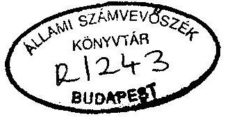
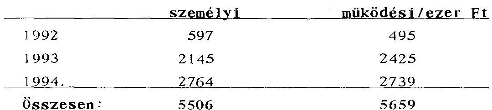
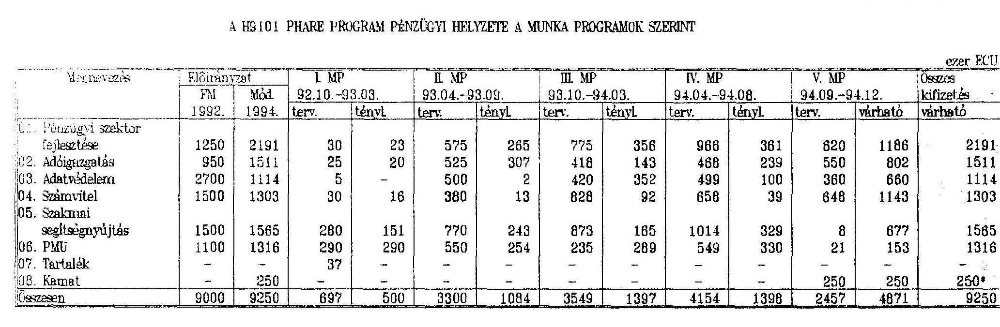
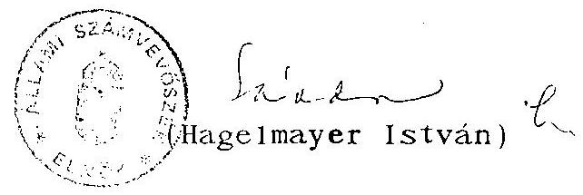

# JELENTÉS 

a pénzügyi szektor fejlesztését elősegítő
H9101 számú PHARE program végrehajtásának ellenőrzéséről

---

A vizsgálatot vezette:

| Kemény Emil | osztályvezető főtanácsos |
| :-- | :-- |

A vizsgálatban részt vettek:

Benti Gabriella
Réthelyi Jenő
Tardos József
számvevő tanácsos
számvevő
számvevő

---

TARTALOMJEGYZÉK
O1da1
I. BEVEZETÉS ..... 1
1.1 A finanszirozási megállapodás ..... 1
1.2 A vizsgálat ..... 2
1.3 Az ellenőrzés módszere ..... 3
II. ÖSSZEFOGLALÓ MEGÁLLAPÍTÁSOK, AJÁNLÁSOK ..... 5
2.1 A PHARE program megvalósítása és hatékonysága ..... 5
2.2 A PHARE előírások és a hazai jogszabályok betartása ..... 9
2.3 Ajánlások ..... 10
III. RÉSZLETES MEGÁLLAPÍTÁSOK ..... 13
3. A programok menedzselése ..... 13
3.1 PHARE Programiroda ..... 13
3.2 Hazai és külföldi szakértők ..... 16
3.3 A korábbi ellenőrzések megállapításai és tapasztalatai ..... 17
4. A segély felhasználása, munkaprogramok ..... 17
4.1 Előkészítés, tervezés ..... 17
4.2 A pénz kezelése, nyilvántartása ..... 20
4.3 Kapcsolat egyéb PHARE programokkal ..... 21
A programok részletes ismertetése ..... 22
5. A pénzügyi szektor fejlesztése és reformja ..... 22
5.1 Országos Betétbiztosítási Alap (OBA) ..... 24
5.2 Jelzálogfinanszírozás ..... 24
5.3 Hitel- és bankkonszolidáció ..... 24

---

6. Adóigazgatás ..... 25
6.1 ÁFA tanulmány ..... 25
6.2 APEH-PM képzés ..... 26
6.3 APEH oktatási program ..... 27
6.4 A TÁKISZ információs hálózat fejlesztése ..... 28
7. Adatbiztonság, adatvédelem ..... 30
7.1 Országos banki klíring és adatvédelmi stratégia ..... 31
7.2 Kölcsön a GIRO Rt. részére ..... 33
7.3 Postazsíró ..... 33
7.4 Állami Bankfelügyelet ..... 36
8. Számviteli és könyvvizsgálói szakmai szervezetek fejlesztése ..... 36
8.1 EK országok "legjobb" gyakorlata ..... 37
8.2 Könyvelői, adótanácsadói és könyvvizsgálói szakmai szervezetek üzleti terve ..... 37
8.3 Keret-projektek ..... 38
9. Szakmai segítségnyújtás ..... 40
9.1 Az Állami Biztosításfelügyelet felülvizsgálata ..... 40
9.1.1 Adatspecifikáció az ÁBIF részére ..... 40
9.1.2 Az Állami Biztosításfelügyelet felszerelése ..... 43
9.1.3 Szakmai segítségnyújtás és képzés az Állami Biztosításfelügyelet részére ..... 43
9.2 Biztosítási Oktatási Központ (BOI) ..... 44
9.2.1 Szakmai segítségnyújtás és képzés a Biztosítási Oktató Központ részére ..... 44
9.2.2 Felszerelések szállítása a Biztosítási OktatóKözpont részére ..... 45

---

9.3 Nemzetközi Bankárképző Központ (NBK) ..... 46
9.3.1 A Nemzetközi Bankárképző Központ oktatási programjainak bővítése ..... 46
9.3.2 Távoktatás a bank-szektorban ..... 48
9.3.3 A bankok oktatási osztályainak képzése ..... 48
9.4 Az európai közösségek biztosítási direktíváinak fordítása ..... 49
9.5 Egyéb programok ..... 51
9.5.1 A Pénzügyminisztérium információrendszere (A PM könyvtárának felszerelése) ..... 51
9.5.2 Pénzügyi Reform Újság ..... 51
9.5.3 Pénzügyminisztériumi alkalmazottak képzése ..... 53

---

# ÁLLAMI SZÁMVEVŐSZÉK 

$\mathrm{V}-12-27 / 94-95$.
Témaszám: 234

## JELENTÉS

A pénzügyi szektor fejlesztését elősegítő
H9101 számú PHARE program végrehajtásának ellenőrzéséről

## I.

## BEVEZETÉS

### 1.1 A finanszirozási megállapodás

1101 Az 1991. évi PHARE program keretében készítették elő és 1992 áprilisában írták alá a magyar pénzügyi szektor fejlesztését elősegítő finanszirozási megállapodást (FM). A program voltaképpen folytatása az 1990-ben aláírt - Bank és Pénzügyi szektor című - megállapodásnak. A szerződést az EU részéről a brüsszeli Bizottság PHARE igazgatósága, magyar részről a Pénzügyminisztérium akkori politikai államtitkára dr. Botos Katalin írta alá.

A szerződés keretösszege: 9 M ECU.

A program végrehajtásának határideje 1994. december 31.

---

1102 A programban megfogalmazott általános cél, a magyar pénzügyi szektor modernizációjának, fejlesztésének támogatása, kiemelten kezelve az általános forgalmi adórendszert, a banki adatforgalom biztonságát, a számviteli és auditálási szakma színvonalának emelését.

1103 A program felügyeletét és menedzselését a Pénzügyminisztérium (PM), illetve a minisztériumon belül alakított PHARE Titkárság (PMU) látta el.

# 1.2 A vizsgálat 

1201 Az Állami Számvevőszék a vizsgálatot az ellenőrzési terve alapján végezte, szem előtt tartva az Európai Közösség (EK; EU) Számvevőszékével kialakított együttműködést. Az ellenőrzés célja annak megállapítása volt, hogy:

1202 - az előkészítésért és megvalósításért felelős PM hogyan érvényesíti az EK és a kormány között megkötött Keretmegállapodásban, és a Finanszirozási Megállapodásban foglaltakat,

1203 - a PHARE források felhasználása illeszkedik-e a hazai jogszabályi keretekhez, hogyan ellenőrzik a pénzeszközök felhasználását,

1204 - a megvalósított programok hogyan hasznosulnak, mennyiben segítik elő a modernizációs törekvéseket.

1205 A vizsgált időszak az FM aláírásától kezdődően 1994. év IV. negyedévéig terjed.

A helyszíni ellenőrzés kezdete: 1994. szeptember 5. befejezése: 1994. október 31.

---

A vizsgálat helyszínei:
Pénzügyminisztérium PHARE Titkárság
1051. Budapest, Roosevelt tér 7/8.

1206 Tájékozódás és adatgyűjtés céljából felkerestük az alábbi szervezeteket:

- GIRO Rt.
- Magyar Posta Rt.
- Magyar Nemzeti Bank
- Állami Bankfelügyelet
- APEH
- MBFB Rt.
- Állami Biztosításfelügyelet
- Nemzetközi Bankárképző Központ
- Biztosítási Oktató Központ

# 1.3 Az ellenőrzés módszere: 

1301 Az egyes programok tervezésére és végrehajtására kiterjedő helyszíni vizsgálat.

Az Állami Számvevőszék a PMU működését törvényességi és szabályszerűségi szempontból vizsgálta és az egyes programok hatékonyságának, a projektek eredményességének értékelését a tapasztalt tényekre és szakértői véleményekre alapozta.
Az ellenőrzés megállapításai a vizsgálat során rendelkezésünkre bocsátott dokumentumokra, a különböző szintű vezetőkkel folytatott interjúkra és a helyszíni szemlék tapasztalataira támaszkodnak.

1302 A jelentést és annak nem hivatalos angol fordítását az Állami Számvevőszék elnöke megküldi az Európai Unió Számvevőszékének tájékoztatás céljából.

---

1303 A vizsgálat megállapításait alátámasztó dokumentumokat - terjedelmi okokból - nem mellékeljük a jelentéshez, azok az Állami Számvevőszék irattárában megtekinthetők.

---

II.

# ÖSSZEFOGLALÓ MEGÁLLAPÍTÁSOK, AJÁNLÁSOK 

### 2.1 A PHARE program megvalósítása és hatékonysága

2101 A Magyar pénzügyi szektor fejlesztését és modernizálását elősegítő PHARE program öt témakörben több mint 60 projektet fog össze.

Az elvben 1994. év végén lezáruló programból a vizsgálat időpontjában a projektek egy része még a megvalósítás - néhány esetben az előkészítés - szakaszában tart. A program pénzügyi és technikai lezárása 1995. évben várható.

Az elkészült és folyamatban lévő projektek vizsgálata alapján a program egésze nem mondható sikeresnek, a született eredmények nem állnak arányban a felhasznált anyagi és szellemi erőforrással.

E megállapításnak nem mond ellent az a tény, hogy néhány projekt sikeresen és hasznosan lezárult és még a sikertelen és félbehagyott projektek is sok esetben szolgáltak tanulsággal.

A program eredményes végrehajtását és lezárást több belső és külső tényező gátolta. Ezek közül talán a legnagyobb súllyal az átfogó pénzügyi koncepció, illetve az ezt képviselő és következetesen végrehajtó irányítás hiánya esik latba. A Finanszirozási Megállapodás előkészítésekor ez a szakértelem és koncepció még jelen volt, de az előkészítést irányító pénzügyminisztériumi

---

államtitkár más irányú megbízatása után a program átfogó szakmai irányítása megszűnt, a program koordinálatlan elemekre esett szét.

Eredményes projektekkel ott találkozott a vizsgálat, ahol a kedvezményezett rendelkezett határozott koncepcióval és a helyi érdekeket érvényesíteni képes vezetővel.

Az eredmények elmaradásának külső oka a tendereket nyerő külföldi cégek üzletpolitikája, akik - néhány kedvező kivételtől eltekintve - saját bevált gyakorlatuk eladására helyezték a hangsúlyt, kevésbé törődve a magyarországi törvényi környezettel, gyakorlattal vagy személyi feltételekkel, amelyek az adaptációt gátolják, vagy lehetetlenné teszik.

A kedvezményezettek - a PM PHARE Irodával egyetértésben - nem élezték ki a szerződések késedelmes, tartalmilag és minőségileg kifogásolható teljesítéséből eredő viszonyokat, megelégedtek a szerződés összegének redukálásával.

Több esetben csak azért igazoltak részteljesítéseket, mert féltek attól, hogy negatív vélemény esetén nem részesülnek további PHARE támogatásban. Ezekben az esetekben - egy részteljesítés után - eltekintettek a munka folytatásától, a szerződésben foglaltak befejezésétől. Jogi szankcionálásra egyetlen esetben sem került sor.

2102 A program egésze, a Finanszirozási Megállapodás aláírásától kezdve, folyamatos késedelembe van. A 9.0 M ECU keretösszeg 61 %-át kötötték le szerződésekkel és mindössze 35 %-át használták fel 1994. október 28-ig.

---

Valamivel kedvezőbb a kép, ha a teljesítést a Magyarországra átutalt összegre (6,6 M ECU) vetítjük. Ennek 64 %-át lekötötték szerződésekkel és 49 %-át kifizették.

2103 A program csúszását több szervezeti, szervezési és emberi tényező idézte elő.

A program 1992. áprilisi jóváhagyását követően a PMU jogilag június 25-én alakult meg, de ténylegesen csak 1992. augusztus végétől működött.

Az első munkaprogram elfogadására és az ahhoz kötődő első pénzátutalásra 1992. év végéig kellett várni, ami korlátozta a PMU szerződéskötési lehetőségét.

A döntéseket lassította a programot koncepcionálisan összefogó, témákat előkészítő személy Project Authorising Officer (PAO) irányító és koordináló tevékenységének hiánya, valamint a külföldi tanácsadó mellé delegált magyar személyzet PHARE eljárásokban való gyakorlatlansága.

Jelentős belső feszültséggel járt a PMU vezetője, és a külföldi tanácsadók között kialakult szemléletbeli ellentmondás.

2104 A magyar ÁFA rendszer átvilágítására készített tanulmány - amelyet Brüsszel közvetlenül rendelt meg egy angol szakértőtől - nem volt megtalálható az APEH-nál, így nem gyakorolhatott hatást az APEH elvi-gyakorlati működésére.

---

2105 A TÁKISZ információs hálózat fejlesztésére kiírt projekt megvalósításában érdekelt szervek nem tisztázták a projekt perspektíváit akkor, amikor az első szakasz után a tanácsadó cég a szerződés összegének 50 százalékos emelését kérte a "helyzet megismerése" alapján. Nem készült elemzés és döntés arról, hogy a magyar viszonyokra hogyan és milyen költségekkel alkalmazható egy jó nyugateurópai rendszer, ennek költségeit lehet-e PHARE forrásból fedezni.

2106 A Postazsíró program részleges sikertelenségét és befejezés előtti felfüggesztését az okozta, hogy a munka elindítása előtt nem tisztázták a Magyar Posta pénzforgalmi tevékenységének ellentmondásos törvényi helyzetét, aminek alapja, hogy a postáról szóló 1992. évi XLV. törvény és a pénzforgalom szabályozásával foglalkozó 3/1992. MNB rendelet nem tesz lehetővé a posta számára semminemű banki jellegű tevékenységet.

Nem oldották fel a pénzforgalmi tevékenység elkülönítéséből és privatizálásából fakadó érdekellentéteket, ugyanis a Posta szervezeti érdeke a hálózat teljes tulajdonlása, míg a Postazsíró bank létrehozása esetén a Posta tulajdona nem lehet 25 %-nál több.

2107 A könyvelői, adótanácsadói és könyvvizsgálói szakmai szervezetek részére szükséges "üzleti terv" elkészítésére tendert írtak ki. A tender kiértékelő bizottság javaslatát az EU Képviselete felülbírálta és más külföldi céget nyilvánított a tender győztesének, egy - a bizottságétól eltérő - szakértői díj alapján, amely a bruttó ajánlati összeg helyett az egy szakértői napra eső díjat vette alapul.

---

2.2 A PHARE előírások és a hazai jogszabályok betartása

2201 Az egyes projektekre kötött szerződések nem tartalmazták a kedvezményezettek pontos megnevezését, a felelős személyeket és a kapcsolattartás rendjét.

2202 A PHARE előírásai szerint minden projektnél félévenként külső auditálást kell végezni. A program beindulása óta az EK, illetve EU Bizottság megbízásából külső auditor cég nem folytatott vizsgálatot a PM PHARE irodánál. A Bizottság nem tartotta magát saját előírásaihoz.

2203 A PHACSY rendszerrel készített pénzügyi jelentésekből (Local financial report, Progress report) nem állapítható meg, hogy azok mely időszakra vonatkoznak, továbbá eltérést mutat a bankszámla követel oldala és a kifizetett összeg értéke.

2204 A számlákat a programért felelős tanácsadó szignálása mellett a PMU vezetője egy személyben írta alá. A tanácsadási, szolgáltatási szerződések számláin nem található a kedvezményezett cég képviselőjének aláírása, a teljesítés igazolása.

2205 Ideiglenes külföldi kiküldetések elszámolásához nem mellékelték a 36/1991. (XII.23.) PM, a 30/1992. (XI.13.) Kormányrendelet előírásai szerint kötelező alapbizonylatokat.

2206 A PMU nem intézkedett a hazai és az EK előírásokat magába foglaló pénzügyi nyilvántartási rendszer kialakításáról, az eltérések okainak feltárásáról és megszüntetéséről. Az alkalmazott nyilvántartási rendszer
 a megbízhatósági és teljességi követelményeknek nem felel meg. A belső számviteli rend laza, több ponton szabályozatlan.

---

2207 A pénzügyi szektor fejlesztése és reformja programcsomaghoz a PMU 8 M Ft összegben rendelt meg fordítást az A-Z fordítóirodától. A megbízást nem előzte meg pályáztatás.

2208 A Pénzügykutató Rt. készített helyzetfeltáró tanulmányt a jelzálog finanszírozásáról, és a közép- és hosszú lejáratú vállalkozási hitelezés problémáiról. A tanulmányok elkészítését a PMU angol nyelven kérte a magyar cégtől, majd külön megrendelte a fordítást magyar nyelvre.

2209 A Nemzetközi Bankárképző Központ távoktatási programjához készített tender anyagát a PMU külföldi szakértője megküldte a Cseh Nemzeti Bank részére anélkül, hogy az érintettek engedélyét beszerezték volna. Ezzel az eljárással egy külföldi banknak kiszolgáltatták a magyar bankszféra belső ügyeit, összefüggéseit, ami sérti az ország és a szakma érdekeit.

# 2.3 Ajánlások 

### 2.3.1 A Kormánynak

A pénzügyminiszter

2310 - számoltassa be a program irányításáért felelős vezető tisztviselőt (PAO-t) eddigi tevékenységéről és intézkedjen a program végrehajtásának felelős szakmai irányításáról egy egységes pénzügyi koncepció alapján.

2311 - gondoskodjon arról, hogy a PMU-t az általa megbízott felkészült menedzser és ne a külföldi tanácsadók vezessék. Biztosítsa szakmai véleménykülönbségek esetén a nemzeti érdekek érvényesülését.

---

2312 - kezdeményezzen az elkülönült lakossági, banki és postaérdekek figyelembevételével egyeztetést a KHVM az MNB és a Posta bevonásával egy korszerű Postatakarék törvényi feltételeinek kialakítására.

OECD segélyt koordináló tárcaközi bizottság (IpM, KÜM)

2313 - vizsgálja meg milyen intézkedésekkel lehet csökkenteni a kockázatát annak, hogy a stratégiailag fontos területeket érintő PHARE projektek kapcsán fontos információk illetéktelen kezekbe kerüljenek.

2314 - kezdeményezzen tárgyalásokat az EU Brüsszeli Bizottságával a PHARE finanszírozási folyamat adminisztratív egyszerűsítésére a projektek megvalósításának gyorsítása érdekében.

2315 - vizsgálja felül a programok előkészítésének és bonyolításának hazai folyamatát, tárják fel a magyar félen múló gátló körülményeket és tegyenek lépéseket a gyorsítás érdekében.

# 2.3.2 PM PHARE Titkárságnak 

2321 Ügyeljenek arra, hogy a további tender kiírásokban az adaptálhatóság, a magyar törvényi és eljárási környezet megismerésére és feldolgozására építve, nagyobb súllyal szerepeljen.

2322 Gondoskodjanak arról, hogy a szakértői szerződések tartalmazzanak szankcionálási lehetőséget, késedelmes, hiányos vagy alkalmatlan teljesítés esetére; a szerződésekből egyértelműen derüljön ki mind a vállalkozó, mind a kedvezményezett pontos megnevezése, a kapcsolattartás rendje.

---

2323 Intézkedjenek a pénzügyi nyilvántartási rendszerek összehangolásáról és naprakész, megbízható vezetéséről.

2324 Hívják fel a kedvezményezettek figyelmét - a programok sikeres és eredményes végrehajtása érdekében - a gondosabb előkészítésre, a törvényi akadályok és érdekkülönbségek előzetes feloldására.

---

# 111. 

## RÉSZLETES MEGÁLLAPÍTÁSOK

## 3. A programok menedzselése

### 3.1. PHARE Programiroda

3101 A H9101 "Pénzügyi szektor fejlesztése Magyarországon" programot tartalmazó "Financing Memorandum"-ot (FM) 1992 áprilisában írták alá.

A Programiroda (PMU) vezetőjét 1992. június 25-én nevezték ki.

3102 A program megvalósításához segítséget nyújtó tanácsadókat küldő Ramboll Hannemann & Hojlund (RH & H) céggel a szerződést 1992 augusztusában írták alá Brüsszelben. A tanácsadók ezt követően rövid időn belül megérkeztek Magyarországra.

Az Irodának 8 munkatársa van, amelyből eredetileg 3 tanácsadó és 2 titkárnő (magyar) a külföldi tanácsadó cég alkalmazásában állt. A külföldiek munkájára az EK Bizottsága kötött szerződést a dán RH & H tanácsadó céggel. Az 1992. augusztus 20-án aláírt egy évre szóló szerződés végösszege 653.000 ECU. A szerződést egyszer egy évre (447.000 ECU értékben), egyszer négy hónapra (90.460 ECU értékben) meghosszabbították.

Az 1995. január 1-je utáni időszakra új tenderfelhívást tett közzé új külső tanácsadó cég foglalkoztatására (magyar cégek is voltak a rövidlistán).

---

3103 A Programiroda tevékenységében nagyfokú önállóságot élvez. Tevékenységével a PM Miniszteri Értekezlet nem foglalkozott. Az Iroda munkájáról ugyan készültek tájékoztató feljegyzések a felügyelő helyettes államtitkárok részére, de a vizsgálat sem szakmai sem adminisztratív felügyelet nyomát nem látta. A program beindulása idején a PM, illetve az akkori politikai államtitkár adott irányelveket, témajavaslatokat a keretek kitöltéséhez, de az államtitkár más irányú megbízása után a megvalósítás gyakorlatilag a PMU magyar és külföldi munkatársaira hárult.

3104 Az egyes alprojektek dossziéiban nem találhatók olyan írásos anyagok, amelyek javasolták volna az adott téma PHARE támogatásának beindítását, igaz ellenzését sem (bár egyes témák - a kapott szóbeli információk szerint - minisztériumi idegenkedés miatt elhaltak).

3105 A Programiroda személyi és működési költségei a Pénzügyminisztérium költségvetésébe beépültek. Miután az iroda a "Lánchid" Irodaházban van, a dologi kiadásokat ki lehetett gyűjteni. Ezek szerint az Iroda költségeiből a magyar kormány az alábbiakat fizeti:

A kormány által fedezett eddigi több mint 11 M Ft költségnem tartalmazza a Titkárság 150 m² területű irodahelyiségének bérletét. A helyiségek térítésmentes juttatása mintegy 3 M Ft/év költségmegtakarítást jelent a PMU számára.

---

3106 Az Irodában szervezetileg együtt dolgozik a külföldi tanácsadó csoport és a magyar munkatársak. A 3 külföldi tanácsadó (a vizsgálat befejezésének idejére csak kettő) mellett 1-1 magyar munkatárs dolgozik, így az egyes területeken megvalósítandó projektek érdemi és technikai feladatait közösen látják el. Ez a szervezés lehetőséget ad arra, hogy bizonyos idő után a magyar munkatársak önállóan, külföldi tanácsadók segítsége nélkül lássák el az Irodára háruló feladatokat.

A projektekkel kapcsolatos írásos anyagok irattározása a helyszínen történik. Az anyagok elrendezése jól áttekinthető. Vizsgálatunk megállapította:

3107 - a megtekintett projekt dossziék jelentős részében nincs dokumentálva, hogy az alprojektet, projektet kinek a javaslatára, jóváhagyásával kezdeményezték;

3108 - az elkezdett, de végig nem vitt projektek esetében viszont hiányzik egy olyan feljegyzés, hogy miért hagyták abba a témát;

3109 - nem nyitottak külön dossziékat - az új - H9303 program keretébe tartozó projekteknek, így a kedvezményezett részére párhuzamosan futó programok levelezése összekeveredik;

3110 - nincs lerakva megfelelő aláírásokkal ellátott munkaprogram, vagy beszámoló jelentésmásolat, amely egyértelműen mutatná, hogy a tervezetek közül melyik volt az EU képviselethez küldött szöveg;

3111 - a Titkárság által finanszírozott tanulmányutakról, a kedvezményezettek külföldi tárgyalásairól nem találtunk útijelentéseket.

---

# 3. 2 Hazai és külföldi szakértők 

3201 Az 1994. szeptember 20-ig megkötött szerződések értéke 5.527 E ECU. Ebből 4.492 E ECU értékben - 85 % - külföldi székhelyű és mindössze 207 E ECU értékben - 3 % - magyar tulajdonú cégekkel szerződtek. A fennmaradt 12 %-ot Magyarországon bejegyzett külföldi cégek kapták. A külföldi cégek foglalkoztatnak magyar alvállalkozókat is, ennek volumenét azonban nem lehetett a szerződésekből összeállítani.

3202 A tanácsadó cégek szakértőik munkájáért díjat, napidíjat, bizonyos járulékos költségeket (pl. lakás, iroda, telefon, stb.) és elszámolási kötelezettséggel terhelt költségeket (pl. repülőjegy) számítanak fel. Ezek átlagban egy szakértői napra számítva 1000 ECU-t (kb. napi 120 ezer Ft) tesznek ki. Ez az összeg a magyar árszínvonalat tekintve rendkívül magas, sokszorosa azoknak az összegeknek, amelyeket azonos munkáért magyar szakértőknek fizetnek.

3203 A szakértők munkájának szakmai színvonalát a vizsgálat nem kívánja minősíteni. Fel kívánjuk azonban hívni a figyelmet egy általános problémára, amely több projekt kapcsán is felmerül: a nyugateurópai gyakorlat (vagy legjobb gyakorlat) és a magyar feltételek, körülmények között még jelentős az eltérés. Több esetben csak a szakértői jelentések, javaslatok megtárgyalásakor derült ki, hogy azok a javasolt formában azonnal nem vezethetők be Magyarországon. Ebben szerepet játszott az:

- hogy a szakértők nem eléggé ismerték a szóban forgó terület magyarországi helyzetét;
- hogy a kedvezményezettek a legjobbat szeretnék kapni - függetlenül a hazai realitásoktól;

---

- hogy a feladatmeghatározások elkészítésénél a Programiroda szakértői erre a tényezőre nem fordítottak kellő figyelmet.

# 3.3 A korábbi ellenőrzések megállapításai és tapasztalatai 

3301 A PHARE előírásai szerint minden projektnél félévenként külső auditálást kell végezni. A program beindulása óta az EK, illetve EU Bizottság megbízásából külső auditor cég nem folytatott vizsgálatot a PM PHARE irodánál. Az induló előlegen túl a vizsgálat időpontjáig két átutalás történt Brüsszelből, amelyek előfeltétele lett volna az előző átutalások felhasználásának auditálása. A Bizottság nem tartotta magát saját előírásaihoz.

3302 A PHARE Titkárság gazdálkodását a Pénzügyminisztérium belső ellenőrzése sem vizsgálta.

3303 1994 elején a Központi Számvevőszéki Hivatal kérdőíves adatbekérés útján megvizsgálta valamennyi PHARE Titkárság költségvetési és egyéb eszközeinek felhasználását és ezek hasznosulását, de az ellenőrzés a projektek végrehajtását nem érintette.
4. A segély felhasználása, munkaprogramok

## 4. 1 Előkészítés, tervezés

4101 A pénzügyi szektor fejlesztése és reformja téma keretében 1992 októberében kezdődtek egyeztető tárgyalások a program tartalommal való kitöltésére, a koncepció, finanszírozandó feladatok meghatározására. A prioritási listát 1993 januárjában fogadták el. A FM aláírása és a prioritási lista elfogadása között eltelt háromnegyed év késedelemnek tudható be, hogy 1994 augusztusáig - a IV. munkaprogram (MP) végéig - mindössze 4,379 M ECU került felhasználásra.

---

# A H3101 PHARE PROGRAM PÉNZÜGYI HELYZETE A MUNKA PROGRAMOK SZERINT 

* az összes tervezett karzat: 0,250 M ECU

Karnatok tervezett felhasználása:

01 sor 100 E ECU
03 sor 25 E ECU
05 sor 125 E ECU
250 E ECU

---

4102 A H9101 PHARE program pénzügyi helyzetét a támogatási keret felhasználását az 1. sz. táblázat mutatja be. Az FM aláírásától, 1992-től a program befejezéséig öt munkaprogramot készítettek, melyből az I., II., III. MP hat hónapos, a IV. MP öthónapos, az V. MP négy hónapos időszakra készült. A munkaprogramokra (az I. MP kivételével) az igen nagyméretű, mintegy 2,5 - 3-szoros túltervezés a jellemző. A IV. MP végéig 1994 augusztusáig az összes tényleges felhasználás 4.379 E ECU, ami a teljes előirányzat 49 %-a. A lemaradás okai:

4103 - a program 1992. áprilisi jóváhagyását követően a PMU jogilag június 25-én alakult meg, ténylegesen 1992. augusztus végétől működött;

4104 - a programot koncepcionálisan összefogó, témákat előkészítő személy Project Authorising Officer (PAO) tevékenységének hiánya;

4105 - a külföldi tanácsadó mellé delegált magyar személyzet PHARE eljárásokban való gyakorlatlansága;

4106 - PMU vezetője, és a külföldi tanácsadók között kialakult szemléletbeli ellentmondás.

4107 Az 1994. évből még fennmaradó négy hónap alatt (V. munka-program) tervezi a PMU a még rendelkezésre álló 4,87 M ECU-t szerződéssel lekötni, illetve kifizetni. A keret minden áron való elköltése magában hordja előkészítetlen témák finanszírozásának veszélyét.

4108 A vizsgálat megállapította, hogy a FM előkészítését követően - a pénzügyi szektor irányításában beállt személyi változások miatt - a projekt átfogó szakmai irányítása megszűnt. Központi koncepció hiányában az egész

---

program elemekre esett szét, ahol a szakmai érdekek és feladatok meghatározása döntően a kedvezményezettek felkészültségén múlott.

# 4. 2 A pénz kezelése, nyilvántartása 

4201 A PHARE forrás kezelésére a Magyar Nemzeti Banknál (MNB) nyitottak elkülönített számlát.

4202 Az előlegként átutalt, de fel nem használt összegek után 1994. december 31-ig a várható kamat nagysága 250 E ECU, amelyet a - 01. soron 100 E ECU; 03. soron 25 E ECU; 05. soron 125 E ECU - programokhoz terveznek felhasználni.

4203 A PHARE forrás felhasználása a Minisztérium pénzügyi rendszerétől elkülönült. A támogatás felhasználását az EK által kifejlesztett számítógépes könyvelési és beszámolási
 rendszeren (PHACSY), valamint egy pénztárkönyvben tartják nyilván.

4204 A PHACSY rendszerrel készített pénzügyi jelentésekből (Local financial report, Progress report) nem állapítható meg, hogy azok mely időszakra vonatkoznak, továbbá eltérést mutat a bankszámla követel oldala és a kifizetett összeg értéke. A PMU az eltérések okára nem tudott pontos magyarázatot adni. Valószínűsíthető okként adatbeviteli hibát jelöltek meg.

4205 A pénztárkönyvbe a könyvelés a bankértesítés alapján történik. Az 1994. augusztus 29-i pénzügyi jelentés bankszámla záróegyenlege és a pénztárkönyv között eltérés mutatkozott.

A pénztárkönyv mellett az analitikus nyilvántartás megtalálható, az egyeztethetőség biztosított.

---

4206 A PMU nem intézkedett a hazai és az EK előírásokat magába foglaló pénzügyi nyilvántartási rendszer kialakításáról, az eltérések okainak feltárásáról és megszüntetéséről.

Az aláírási joggal is rendelkező pénzügyi adminisztrátor nem rendelkezik munkaköri leírással.

A számlákat a programért felelős tanácsadó szignálása mellett a PMU vezetője egy személyben írta alá. A tanácsadási, szolgáltatási szerződések számláin nem található a kedvezményezett cég képviselőjének aláírása, a teljesítés igazolása.

Az ideiglenes külföldi kiküldetések elszámolásához nem mellékelték a 36/1991. (XII.23.) PM, a 30/1992. (XI.13.) Kormányrendelet előírásai szerint kötelező alapbizonylatokat.

A vizsgálat megállapította, hogy a nyilvántartási rendszer a megbízhatósági és teljességi követelményeknek nem felel meg. A belső számviteli rend laza, több ponton szabályozatlan.

# 4. 3 Kapcsolat egyéb PHARE programokkal 

4301 A H9101 programon kívül a pénzügyi szektor részére a PHARE 1990-es programja keretében 5 M ECU-t irányoztak elő a "pénzügyi rendszer modernizálása" címen. A finanszírozási szerződést a magyar fél 1990. december 7-én, az EK 1991. március 25-én írta alá. A végrehajtás szervezése részben az MNB, részben az EK budapesti képviselete feladata volt.

Az 1994. végéig befejezendő programból 1994. április 29-ig 3,97 millió ECU-t kötöttek le szerződéssel és 3,28 millió ECU-t fizettek ki.

---

4302 Az 1990-es program 3 olyan intézményt is érint, amelyek a jelenleg vizsgált program keretében is részesülnek segítségben. A H9001 finanszírozási megállapodás az alábbi összegeket irányozta elő: Állami Bankfelügyelet 944 ezer ECU, Bankszövetség 445 ezer ECU és a Nemzetközi Bankárképző Központ 685 ezer ECU.

4303 Egy külön program (H9111) keretében kapott a Vám- és Pénzügyőrség segítséget technikai színvonalának emelésére 8 millió ECU értékben.

4304 A pénzügyi szektor további segítségét irányozzák elő a Magánszektor fejlesztése című H9303 program keretében. A 31 millió ECU-ból a szektor 8 milliót kap. A finanszírozási szerződést a felek 1994. márciusában írták alá.

4305 Összesen tehát a pénzügyi szektor a PHARE programok keretében eddig 30 millió ECU (kb. 3,6 Mrd Ft) támogatást kapott a szakma modernizálására.
Az előzetes jelzések szerint a pénzügyi szektor további 5 millió ECU támogatásra számíthat az 1994-es program keretében.

A programok részletes ismertetése
5. A pénzügyi szektor fejlesztése és reformja

5001 Az FM a pénzügyi szektor fejlesztése és reformja programra eredetileg 1,25 M ECU-t hagyott jóvá, amely a teljes előirányzat mintegy 14%-a. Az 1994. évi módosítás 2,191 M ECU-t tartalmaz, mely az előirányzat 24%-a.

---

5002 A program három fő területére (hitelkonszolidáció, jelzálogkölcsön, betétbiztosítás) 1994. augusztus végéig a megkötött szerződések összege mintegy 1,6 M ECU, a tényleges kifizetés 1,0 M ECU.

5003 A szerződések megkötése során az EU érvényben levő előírásait - tendereztetés, ajánlatok elbírálása stb. - betartották. A szerződéseket a PMU készítette elő és kötötte meg a tanácsadó cégekkel a harmadik, kedvezményezett fél (pl. Magyar Befektetési és Fejlesztési Bank Rt, Hitelgarancia Rt, Országos Betétbiztosítási Alap stb.) részére.

A szerződésekben nincs feltüntetve a kedvezményezett cégek neve, képviselője stb. Nincs rendezve a PMU, a tanácsadó cégek és a kedvezményezett cégek kapcsolattartási rendje, jogaik, kötelezettségeik.

5004 A PMU-hoz közvetlenül beérkező számlákon nem szerepel a kedvezményezett képviselőjének aláírása, a teljesítés igazolása.

5005 Az FM szerint a PAO felügyeli a programot, a kifizetéseket. Az átvizsgált dokumentumokban (levelezés, szerződések, számlák stb.) nem találkoztunk a PAO aláírásával, így felügyelő, koordináló tevékenységét nem lehetett megítélni.

5006 Más PHARE irodáknál tapasztalt gyakorlattól eltérően a PMU jelentős összeget fizetett ki fordításra. 1992. augusztus és 1994. szeptember között ilyen célra mintegy 8 M Ft-ot költöttek el, ugyanakkor a fordítást végző céget nem pályáztatás útján választották ki.

---

# 5.1 Országos Betétbiztosítási Alap (OBA) 

5101 Az Ernst and Young cég biztosított tanácsadást az OBA alapításához és működési rendjének kialakításához. Az OBA meg volt elégedve a tanácsadó cég munkájával. A szerződés alapján készült 350 E ECU-s számlát a PMU kifizette. További segítségre igényt nem jeleztek.

### 5.2 Jelzálogfinanszírozás

5201 A Pénzügykutató Rt. készített helyzetfeltáró tanulmányt a jelzálog finanszírozásáról, és a közép- és hosszú lejáratú vállalkozási hitelezés problémáiról. A teljesítést követően a PMU kifizette a szerződés szerinti 27,4 E ECU-t.

A tanulmányok elkészítését a PMU angol nyelven kérte a magyar cégtől, majd külön megrendelte a fordítást magyar nyelvre.

5202 A Credit Agricole Consultants cég biztosított tanácsadást az IM részére a jelzálog finanszírozásra vonatkozó törvénytervezet elkészítéséhez. A szerződés értéke 50 E ECU, melyet a PMU a teljesítés után kifizetett. További segítségre igényt nem jelzett a kedvezményezett. A jelzálog törvénytervezet ezideig nem került a parlament elé, az elvégzett feladat hatása nem volt értékelhető.

### 5.3 Hitel- és bankkonszolidáció

5301 International Development Ireland Ltd. (IDI) cég részéről tanácsadási segítség a Magyar Befektetési és Fejlesztési Bank Rt. (MBFB) részére. A szerződés összege E ECU, aláírására 1993. novemberében került sor. A

---

Project legnagyobb értékű szerződését a PMU részéről a PAO helyett alkalmi megbízással egy beosztott írta alá. 1994. október végéig 302 E ECU került kifizetésre. A tanácsadók tevékenységével a MBFB elégedett volt. Az V. MP keretében tervezik az IDI tanácsadók tevékenységének meghosszabbítását, új tender kiírását pénzpiaci, pénzügyi és számviteli, valamint a kereskedelmi bankok újratőkésítéséhez pénzügyi tanácsadók igénybevételére.

5304 Az IFB-Belgian Institute készített a Hitelgarancia Rt. részére egy tanulmányt a kisvállalkozók részére kialakítandó garancia alapról. A szerződés összege 122 E ECU, amelyet a teljesítést követően kifizettek.

# 6. Adóigazgatás 

6001 Az adóigazgatás témakörében megvalósítandó projektekre a menetközbeni módosítások után 1.510.000 ECU-t irányoztak elő, amelyből 1994. októberéig 676.400 ECU-t költöttek el. Ennek - leszámítva a PM szakfőosztály tanulmányútját - két kedvezményezettje van: az APEH és az önkormányzatok informatikai szolgálata, a TÁKISZ.

## 6. 1 ÁFA tanulmány

6101 1992 elején, még a PM PHARE Titkárság megalakulása előtt Brüsszel - a PM szakfőosztállyal egyetértésben - egy angol szakértőt szerződtetett a magyar ÁFA rendszer átvilágítására. A szakértő jelentését, - amelyért Brüsszel 33.740 ECU-t fizetett - a Pénzügyminisztériumnak küldte meg, ahonnan továbbították az APEH elnökének és elnökhelyettesének. A vizsgálat során megpróbáltuk felmérni a jelentés hasznosítását, de az APEH-tól azt a választ kaptuk, hogy a szakértőre emlé-

---

keznek, de a jelentést nem látta senki. Megállapítható, hogy a szakértő munkája nem gyakorolt hatást az APEH ÁFA beszedési gyakorlatára.

# 6. 2 APEH-PM képzés 

6201 1992 végén felmerült, hogy a PHARE nyújtson segítséget annak megállapítására, hogy az APEH-nek milyen képzési igényei vannak. A program feladatmeghatározását egy angol szakértő 6.600 ECU-ért elkészítette, felhasználva az APEH 1992-97. évekre vonatkozó képzési tervét is. Az APEH akkori elnöke technikai észrevételei alapján a tervezetet átdolgozták és ennek alapján kiírták a tendert.

6202 Az 1993. májusában tartott tenderértékelés alapján a portugál Alves, Costa és Társai cég kapta a 447.819 ECU értékű megbízást. Kifogásolható, hogy a cég 1993. június 1-jén elkezdte a helyszíni munkáját, miközben a magyar fél az EU Képviselet június 7-i jóváhagyása után június 8-án írta alá a szerződést. Az EU standard szerződés 61. cikke szerint a szerződés kezdete az arról kapott értesítést követő nap. A szerződéses kötelezettségek teljesítése azonban csak a szerződés érvényességének keltétől számítható és nem tekinthető szerződésnek a tender eredményéről küldött értesítés.

6203 A munkaterv szerint a képzési igények felmérését 1993. szeptember 15-ig 3 lépcsőben kellett elvégezni, amelyet azonnal követett volna a negyedik szakaszban egy tanácsadó egy éves foglalkoztatása az oktatási központ berendezésének, konkrét tananyagának összeállítása céljából. A negyedik szakasz azonban csak 9 hónapos késéssel indulhatott. Az első három szakaszról adott jelentést ugyanis csak jelentős átírás, és pótlólagosan el-

---

végzett munka után tudta a magyar fél elfogadni. A helyzetet jellemzi a Titkárság egyik külföldi tanácsadójának a portugál cég alvállalkozójához intézett 1994. március 30-i levele: "a projekttel kapcsolatos problémáinkat meghatározó elsődleges hiba abból származik, hogy az Önök csapata képtelen volt elvégezni azt a feladatot, amelyre szerződésesleg vállalkozott".

6204 A negyedik szakasz késedelmes indítását befolyásolta az is, hogy az APEH nem fogadta el a javasolt szakértőt. Az új szakértőnek júniusban pedig többlet munkát okozott az, hogy az APEH - költségvetési okok miatt - egy központ helyett az oktatást megyénként kényszerül megszervezni. Miután a szakértő munkáját még nem fejezte be, nem lehet értékelni a PHARE támogatás hasznosulását a fent említett nehézségek jelzésén túl. Az viszont már látható, hogy a téma befejezésére a PHARE következő segélyprogramjából 2 millió ECU-t irányoztak elő.

# 6. 3 APEH oktatási program 

6301 1994. második felében - félve attól is, hogy a szerződéssel le nem kötött pénzeket az Európai Unió Bizottsága az év végén visszavonja - a programból az APEH részére még két projekt előkészítése indult meg. Az egyik keretében 500.000 ECU-s költségvetéssel az APEH revizorai számára 20 szakmáról készítenének (fodrász, pék, vendéglátás, stb.) olyan leírásokat, amelyek alapján világosan tudnák, hogy milyen beszállítói számlákat kell keresniük, milyen forgalommal kalkulálhatnak. A másik projekt keretében 75.000 ECU-s költségvetéssel az adózást és az APEH-et népszerűsítő kampányt terveznek.

---

# 6.4 A TÁKISZ információs hálózat fejlesztése 

6401 A tenderkiírás témája a magyar önkormányzati adóinformatikai rendszer áttekintése volt. Az önkormányzatok által kivetett helyi adók nyilvántartására és a központi hatóságok tájékoztatására szervezett jelenlegi informatikai rendszert számos bírálat érte (pl. az, hogy csak egyirányú információáramlást biztosít, a központi hatóságok igényeit kívánja elsősorban kiszolgálni). Az általánosan használt APEH-SZTADI információs rendszer mellett Heves és Csongrád megyében kifejlesztettek egy rendszert, amelyet a PM és a BM alkalmasnak tartott arra, hogy azt a PHARE támogatásával a fejlett országok szintjének is megfelelő országos rendszerré fejlesszék.

6402 A tenderfelhívást, egy angol szakértő által kidolgozott feladatmeghatározás alapján, 1993 elején tették közzé. A tender kiértékelése során egy cég ajánlata kapott 70%-nál magasabb értékelést, így csak az ő pénzügyi borítékát bontották fel és a 174.746 ECU-s ajánlatot el is fogadták. Ez a Coopers & Lybrand (C & L) tanácsadó cég volt.
A munkát két szakaszban kellett elvégezni. Az első, felmérő szakasz után a "feltárt helyzet" és a 2. szakasz ennek megfelelő feladatmódosításai miatt a szerződés végösszegét 262.718 ECU-re emelték és beiktattak egy 3. szakaszt is a feladatok közé (35.000 ECU), amelyben a tanácsadók előkészítenék a TÁKISZ-ok
 új informatikai rendszerének bevezetését. Ehhez a Képviselet 1993 szeptemberében hozzájárult.

I több, mint 50 százalékos szerződési díjemelés valószínűsíti, hogy a feladatmeghatározást kidolgozó szakértő nem járt el kellő gondossággal, de ettől függetlenül is ilyen mértékű szerződésváltoztatás esetén új tendert kellett volna kiírni.

---

6403 A tanácsadó cég 1993 szeptemberében adta le jelentését és javaslatait a Titkárság, a BM, a PM és a TÁKISZ képviselőiből álló Irányító Bizottságnak. Az Irányító Bizottság nem látott reális lehetőséget a magas szintű követelmények érvényesítésére az EU "legjobb" gyakorlata és a magyar rendszer alapvető eltérése miatt. A PM illetékes osztályának vezetője 1993. október 15-i, a Titkársághoz írott levelében kijelentette, hogy adottságaik csak a közigazgatás hosszú távú reformja során módosulhatnak és "a munka folytatását jelen koncepció szerint nem tartjuk célravezetőnek".

Az Irányító Bizottság azóta nem ülésezett, csupán beszélgetések folytak arról, hogy mit gondol a PHARE Titkárság további lépésként.

A PHARE Titkárság megrendelte a C&L-től a 3. szakaszt is, amelynek keretében javaslatokat kértek, hogy milyen módosításokkal lehetne adaptálni az EK országokban alkalmazott önkormányzatokat szolgáló szoftvereket. A C&L arra is vállalkozott, hogy körülnéz, van-e olyan EU tagállam, amelynek kormánya ingyenesen a magyar kormánynak átadna egy nálunk használható szoftvert. Felmérésük eredménye negatív volt.

6404 Tárgyalások folynak egy 1,4 millió ECU költségvetésű tanulmány beindításáról (most már a következő PHARE program terhére), amely segítene egy alkalmazható információs rendszer átvételében. E témában a kormány képviselőinek bevonásával 1994. július elején tárgyalásokat folytattak Brüsszelben, azonban a magyar fél a kormányváltásból eredő bizonytalanságokra hivatkozva nem tett elkötelező nyilatkozatot egyik irányba sem.

---

6405 Az önkormányzati információs rendszer modernizációját csak akkor lehetne megoldani, ha a sok tanulmány után a PHARE támogatásból a szükséges szoftver és hardver kiegészítés is beszerezhető lenne. Hogy erre vonatkozóan a magyar fél nem kapott biztatást, jelzi az is, hogy időközben az önkormányzatok számára a Heves és Csongrád megyében kifejlesztett rendszert állami szoftverként engedélyezték. Így az APEH-SZTADI rendszer mellett választható ez a rendszer is. Tehát megteremtették a "piaci verseny" helyzetet.

6406 Az információs rendszer megvalósításában érdekelt szervek nem tisztázták a projekt perspektíváit akkor, amikor az első szakasz után a tanácsadó cég a szerződés összegének 50 százalékos emelését kérte a "helyzet megismerése" alapján. Nem készült elemzés és döntés arról, hogy a magyar viszonyokra hogyan és milyen költségekkel alkalmazható egy jó nyugateurópai rendszer, ennek költségeit lehet-e PHARE forrásból fedezni (esetleg a pénzügyi szektoron belüli jelentős forrás-átcsoportosítással).

6407 Ezek elmaradása miatt hiábavalók voltak azok az erőfeszítések, amelyeket a tanácsadó cég és a PHARE Iroda tett a projekt életben tartására, a két szakasz munkája alapján született jelentés megismerése után.
7. Adatbiztonság adatvédelem

7001 1987-ben a kétszintű bankrendszer kialakításával egy időben megfogalmazódott a GIRO rendszer felállításának igénye, amelyen belül az egyes bankok kifejlesztik saját belső elektronikus adatfeldolgozó rendszerüket és mentesítik az MNB-t a bankközi klíring és elszámolási rendszer szolgáltatása alól.

---

7002 A rendszer működtetésére nagyobb kereskedelmi bankok létrehozták a GIRO Rt.-t, amelynek tervezett fő alapfunkciói:

- aznapi klíring elszámolás (same day clearing accounting)
- valós idejű tranzakció-feldolgozás (real time transaction handling)
- valós idejű pozíció lekérdezési lehetőség (real time position enquiry possibility)

7003 A GIRO Rt. világbanki hitelből finanszírozta a szükséges GIRO-rendszer tervezését, azonban a fejlesztés idején még élő COCOM szabályok korlátozták a beszállítható hardver és szoftver lehetőségeit. A korlátozások az adatok integritását veszélyeztető illetéktelen behatolással szembeni védelmet érintették a legérzékenyebben.

Az adatbiztonsági rendszer fejlesztésére a Pénzügyi szektor modernizálását támogató H9101. számú Pénzügyi Megállapodás 2.735 E ECU-t irányzott elő.
7.1 Országos banki klíring és adatvédelmi stratégia

7101 A COCOM korlátozások feloldása után merült fel a biztonsági rendszer kiegészítésének igénye. A vizsgálat rendelkezésére bocsátott dokumentumokból nem derült ki, hogy melyik intézmény és mikor kezdeményezte a PHARE program bekapcsolódását a fejlesztésbe.

7102 A PHARE PMU 1993 májusában bemutatta a bankok képviselőinek a magyar bankközi elszámolásforgalom adatvédelmi stratégiájának kidolgozását célzó versenyfelhívás tervezetét.

---

A PHARE Iroda - a tender meghirdetése előtt - írásban körkérdést intézett a bankok vezetőihez megerősítendő az igényt az adatvédelmi stratégia kialakítására és a hajlandóságot a munka közbeni konzultációra. A bankok többsége pozitív választ adott.

7103 A tendert szabályos körülmények között a dán CARL BRO INTERNATIONAL A/S cég nyerte. A szerződést 1993. szeptember 9-én írták alá 374.767 ECU összeggel. A feladat végrehajtását 6 szakaszban tervezték. A szerződés az első rész három szakasz elkészítésére 16 hetet, a második három szakasz időtartamául 12 hetet írt elő. A szerződés nem tartalmazott szankcionáló feltételeket sem késedelem, sem minőségi kifogások, sem részteljesítés esetére.

7104 A CARL BRO cég elkészítette a szerződés első három szakasza szerinti tanulmányokat, amelyeket egyenként majd összefoglalva széles körű szakmai zsűri véleményezett és értékelt. Az értékelés szakmai észrevételeit nem minősítette a vizsgálat, mivel nem volt módunk megismerni a tanulmányok készítőinek érvanyagát, válaszait. A különböző szakértői véleményekből az alábbi általános megállapítások vonhatók le:

7105 A három elkészült jelentés nem, illetve csak részben felel meg a projekt eredeti célkitűzéseinek. Az átadott anyagok az általánosság szintjén maradtak, kevéssé vették figyelembe a valóságban kialakult helyzetet, a konkrét magyar jogszabályi hátteret és az elszámolásforgalomban érintett felek kapcsolatrendszerét.

Bár a jelentések tartalma és szerkezete magas fokú szakmai hozzáértésről és átfogó elméleti tudásról tanúskodik, gyakorlati használhatóságuk a magyar elszámolásforgalom és a fejlesztési stratégia felületes ismerete miatt nem éri el a kívánatos szintet. Ezek a tanulmányok a rendszer koncepciójának kialakításakor nagy segítséget jelentettek volna, de a fejlesztés utolsó fázisában konkrét és megvalósítható javaslatokat tartalmazó tanulmányra lett volna szükség.

7106 A projektet felügyelő bizottság - e vélemény kialakítása után - úgy döntött, hogy a CARL BRO tanácsadó cég további munkájára nem tart igényt, a munkát a 3. fázis befejezésével leállítja. A PHARE PMU a részteljesítés fejében benyújtott számlák ellenében 164.648,38 ECU-t utalt át a dán cég részére. A kifizetett összeg az eredeti szerződés 43,5%-a.

# 7. 2 Kölcsön a GIRO Rt. részére 

7201 Az eredeti program szerint a CARL BRO tanácsadó cég jelentésének II. része tartalmazta volna a GIRO biztonsági alrendszer műszaki követelményeit, megvalósítási tervét és költségvetését. A tanulmány meghiúsulása miatt a GIRO Rt. vezetése úgy döntött, hogy nem tart igényt a rendszer fizikai megvalósítására elkülönített - kedvezményes - PHARE kölcsönre.

7202 Az előirányzatból pénzfelhasználás nem történt, az egész 1.000 E ECU-t az alapszerződés keretén belül más témákra átcsoportosították.

### 7.3 Postazsíró

7301 A kereskedelmi bankok mellett a Magyar Posta az országon belüli pénzforgalom legjelentősebb intézménye.

---

A Magyar Posta tevékenységét az 1992. évi XLV. törvény szabályozza. Sajátos ellentmondás, hogy a Magyar Posta által ellátott széles körű pénzátutalási szolgáltatásokkal a Postatörvény nem foglalkozik, a postautalványok feldolgozása kivételével. Alacsonyabb rendű jogszabályok, mint a 39/1984. Mtv., illetve a 3/1992. MNB rendelet foglalkoznak a postai pénzforgalom szabályozásával, de megállapítható, hogy a folyó gyakorlat ellenére nem törvényes követelmény a pénzátutalási szolgáltatások biztosítása minden postahivatal számára.

A Magyar Posta 1992-ben közel 7600 főt foglalkoztatott a pénzátutalási szolgáltatások ellátására döntően a hálózaton, illetve a Posta Elszámoló Központban. Az 1992-ben lebonyolított tranzakciók száma 163 millió, értéke hozzávetőleg 2.100 milliárd forint volt, közel másfélszerese az akkori nemzeti jövedelemnek.

7302 A fejlett országokhoz képest elmaradott hazai pénzforgalmi technológia fejlesztésére - alapvetően a számítástechnika alkalmazásának lehetőségeire - 1990-től kezdődően több tanulmány készült. 1991-ben a Posta vezetése úgy döntött, megpályázza a PHARE források fejlesztési célú igénybevételét. A tendert a korábban készült tanulmányok felhasználásával készítették el.

7303 A szabályosan lefolytatott tender-eljárás alapján, a Postazsíró tanulmány elkészítésére a dán Saint & Bendix, illetve vele partnerként a Coopers & Lybrand London cégek kaptak megbízást.

Az 1993 augusztusában, 360,0 E ECU értékben aláírt szerződés fázisai: a jelenlegi tevékenység elemzése, a stratégiai lehetőségek meghatározása, a Projekt Megvalósítási Kézikönyv és a tenderdosszié kidolgozása, a privatizációs lehetőségek vizsgálata.

---

7304 A tanulmány első három fázisát a szakértők elkészítették. A zsűri a tanulmányokat a fejlesztési koncepció szempontjából elfogadta, de a készített üzleti számításokat megalapozatlannak ítélte. A zsűri véleménye szerint a szakértők nem ismerkedtek meg kellő mélységben a hazai, illetve a Postán belüli valós viszonyokkal és ez okozta, hogy az elkészült számítások, elemzések nem alkalmasak arra, hogy akár EBRD, akár PHARE fejlesztési hitelfelvétel előtanulmányául szolgáljanak.

7305 A postai pénzforgalom technikai korszerűsítésén túlmenően a tanulmány javaslatot tett a postai pénzforgalmi szolgáltatások kibővítésére a postazsíró, vagyis egy szakosított pénzintézet szolgáltatásaival. Ehhez célul tűzte ki a Magyar Postától elkülönült postazsíró szervezeti létrehozását. A pénzintézeti törvény (1991/LXIX.) 18. § (1) bekezdése által előírt maximum 25%-os tulajdonlási részhányad ellentétes a Posta érdekeivel, amely szerint a postazsíró többségi postai tulajdonú kell maradjon a postahivatalokban bonyolított egyéb szolgáltatások irányítása és ellenőrzése miatt.

7306 A Posta vezetése fenti értékelés alapján úgy döntött, hogy a Postazsíró projekt további kidolgozását felfüggeszti és nem veszi igénybe a felajánlott kedvezményes hitelt.

7307 A program részleges sikertelenségét és befejezés előtti felfüggesztését az okozta, hogy a munka elindítása előtt nem tisztázták a Magyar Posta pénzforgalmi tevékenységének ellentmondásos törvényi helyzetét, továbbá nem oldották fel a tevékenység elkülönítéséből és privatizálásából fakadó érdekellentéteket.

---

# 7.4 Állami Bankfelügyelet 

7401 Az ÁBF korlátozott ellenőrző kapacitása nem teszi lehetővé, hogy a felügyelete alá tartozó bankoknál a nemzetközileg szokásos - átlagosan évenkénti - átfogó vizsgálatot a jelenlegi helyszíni ellenőrző módszerekkel ellássa. A konszolidáció kapcsán felmerülő gyakoribb - fél-éves, negyedéves - ellenőrzés további pótlólagos forrást igényel.

7402 Az ellenőrzési tevékenység fejlesztésére az ÁBF több lépcsőben megvalósítható tervet készített, amelynek első fázisához kapott a PHARE programból 500 E ECU keretösszeget. (A teljes program tervezett költsége 2.305 E ECU.)

7403 Az elfogadott projekt célja egy ellenőrzési kézikönyv kimunkálása, amely összefüzi az adatbekéréses (off-site) és a helyszíni (on-site) vizsgálatot és implementálja a módszert. A vizsgálat időpontjában a beérkezett tenderek értékelése folyik. A projekt véghatárideje 1995.
8. Számviteli és könyvvizsgálói szakmai szervezetek fejlesztése

8001 A projekt csoportra a módosított (belső átcsoportosítással) pénzügyi memorandum 1.303.000 ECU-t irányzott elő. Az elgondolások, az érdeklődés változásai eredményeként az alprojektekre 1994. okt. 28-i kimutatás szerint 640 ezer ECU-t kötöttek le szerződéssel és csak 144 ezret fizettek ki.
A téma keretében több projekt született, ezek egy részét már befejezték, illetve a megvalósulás folyamatában van, más részük azonban "elhalt", vagy tartalmában megváltozott.

---

# 8.1 EK országok "legjobb" gyakorlata 

8101 Az első nagyobb vállalkozásként egy konzultáns tanulmányt készített az EK országok legjobb számviteli és könyvvizsgálói gyakorlatáról és javaslatokat tett azoknak magyarországi alkalmazására a mintegy 80.000 könyvelő, könyvvizsgáló és adótanácsadó szakmai szervezeteinek kiépítésére és azok jövőbeni együttműködésére.

A jelentést csak harmadik változatban fogadták el,
 de ennek megtárgyalása során is felmerült, hogy a "legjobb" gyakorlat több ország gyakorlatának elemeiből állt össze, továbbá, hogy a javasolt szervezeti séma nem kellően veszi figyelembe a magyar körülményeket. A projektre 51.653 ECU-t költöttek, amiből a szövegek magyarra fordítása 247.188 forintba került.
8. 2 Könyvelői, adótanácsadói és könyvvizsgálói szakmai szervezetek üzleti terve

8201 A könyvelői, adótanácsadói és könyvvizsgálói szakmai szervezetek felállítására, az érdeklődők számára 1994 februárjában 3 szakmai konferenciát szerveztek (500-650 jelentkező szakmánként), azonban az egyiket, a Magyar Könyvvizsgáló Kamara tiltakozására, kénytelenek voltak az utolsó pillanatban lemondani.

A három szakmai szervezet létesítésére, illetve az egyik modernizálására létrehozott 3 bizottságnak az előkészítő munkára 5 M Ft-ot utaltak ki. A bizottságoknak a pénzt 1994. július 31-ig el kellett volna költeni, azonban addig még az első részletet sem költötte el mind, így a határidőt a Titkárság meghosszabbította.

---

8202 A három szervezet részére szükséges "üzleti terv" elkészítésére tendert írtak ki 1994 májusában 500.000 ECU maximális költséggel. A tender kiértékelő bizottság javaslatát az EU Képviselete felülbírálta és más külföldi céget nyilvánított a tender győztesének, egy - a bizottságétól eltérő - szakértői díj alapján, amely a bruttó ajánlati összeg helyett, az egy szakértői napra eső díjat vette alapul. A bizottság természetesen méltatlankodott és volt, aki szavazatát visszavonta. Az üzleti tervek elkészítése jelentésünk írásakor még folyamatban van, a szakmai szervezetek még nem működnek - kivéve a Könyvvizsgálói Kamarát.

# 8. 3 Keret-projektek 

8301 1993 májusában a PMU egyik külföldi tanácsadója készített egy összeállítást arról, hogy a számviteli és könyvvizsgálói szakma számára milyen témákban lehetne PHARE segítséget nyújtani. Az ötletek a PHARE Titkárság által életre hívott szakmai "irányító" bizottság 1993. márciusi ülésén vetődtek fel. Egy részletes feladatmeghatározást is készített egy (vagy több) konzultáns számára kiírandó tender felhíváshoz a témák részletes kidolgozására. A tendert végül nem írták ki. Viszont kialakítottak 500.000 ECU értékben egy "keretprojektet", amely terhére a projektek kidolgozása egy év késéssel, 1994 nyarán indult meg. Kifizetés az 1994. augusztus végi pénzügyi beszámoló szerint még nem történt.

Az 1993 márciusi javaslatok közül

8302 - megszületett 1994. szeptember 13-án a tenderfelhívás "a könyvvizsgálók és adótanácsadók részére post-graduális egyetemi és főiskolai képzés tematikájára és képzési módszertanára". A projekt jóváhagyott költségvetése $300.000$ ECU.

---

8303 - 1994 szeptemberében közzétették a tenderfelhívást az "összevont éves beszámoló elkészítésével kapcsolatos oktatási anyag elkészítésére úgy, hogy egyben kiképzik az anyagot a későbbiekben oktatókat is". (Mérlegkonszolidáció)

A projekt költségvetési előirányzata 120.000 ECU. A tender kiírás szerint "az 1993. évi CVIII. törvény... részletes útmutatást ad a konszolidált éves beszámoló készítésére...". Miután a törvény részletes útmutatást ad és az első konszolidált beszámolókat 1995 elején kell elkészíteni, vitatható a projekt időzítése és összege is. További kétségeket támaszt a projekt szükségességét illetően az a tény, hogy a témáról a Könyvvizsgálói Kamara és a Közgazdasági Egyetem már kurzusokat is szervezett, a PM illetékes főosztályvezetője pedig egy könyvet írt a mérlegkonszolidáció elméleti kérdéseiről.

8304 - 1994 szeptemberében készül a feladatmeghatározás a "nemzetközi számviteli normák (standards) fordításának aktualizálása és a könyvvizsgálói kézikönyv fordítása magyarra, valamint közös szó- és kifejezésgyűjtemény készítése" projekthez. A rövidlistán három magyar cég van, a nyertes feladata lesz az anyag nyomdakész állapotban történő átadása. A projektre 50.000 ECU-t irányoznak elő.

8305 - Nem kapott pénzügyminisztériumi támogatást (1994 júniusa óta nem válaszolnak) az inflációs hatást a mérlegből kiszűrő módszerrel foglalkozó projekt.

---

# 9. Szakmai segítségnyújtás 

### 9.1 Az Állami Biztosításfelügyelet felülvizsgálata

9101 A TILLINGHAST tanácsadó cég szerződésben rögzített feladata az Állami Biztosításfelügyelet (ÁBIF) rövidtávú (1 év) szükségleteinek meghatározása volt, az optimális működés távlati alapfeltételeit nem kellett meghatározniuk. A szerződés feltételeinek (TOR) ilyen sajátos megfogalmazását az indokolta, hogy lehetett számítani a biztosítási törvény közeli hatálybalépésére, ami vizsgálatunk időpontjáig nem történt meg.

Bár a Tanácsadó zárójelentésében megfogalmazottak alapul szolgáltak három újabb projekt indításához, a beszerzett felszerelések, a szakmai segítségnyújtás és képzések távlatilag hasznosulnak, az ÁBIF zárójelentésre tett írásbeli elismerésében nagyobb szerepet játszott a további PHARE támogatások elnyerésének reménye, mint a szakmai egyetértés. A Tanácsadó kevéssé volt figyelemmel az EU gyakorlatnak magyarországi adaptálási lehetőségeire.

## 9. 1. 1 Adatspecifikáció az ÁBIF részére

9111 A projekt célkitűzése a biztosító társaságoktól havonta, negyedévenként és évenként szolgáltatandó olyan adatok meghatározása, amelyek birtokában az ÁBIF képes szabályozó és felügyelő szerepének eredményes ellátására. Kiemelt fontosságot nyert a fizetőképesség figyelemmel kísérése és az időbeni jelzőrendszer kialakítása.

---

9112 A projekt tendereztetése elmaradt; közvetlen megbízást kapott a megvalósítására ugyanaz a tanácsadó cég (TILLINGHAST), aki az Állami Biztosításfelügyelet általános felülvizsgálatát végezte. A projekt előbb kezdődött, mint ahogy az alaptanulmány befejeződött volna. Az 1993. február 25-i szerződésben rögzített teljesítési időszak: 8 hét. A zárójelentés tervezete 1993. július közepére készült el; véglegesítésére 1993. szeptember közepén került sor.

9113 Az időpontoknak az a jelentősége, hogy helyenként ellentmondás mutatkozik az alaptanulmány, valamint az "Irodai felszerelések" projekt és e projekt között:

- előbb kell megismerni az ÁBIF humán- és eszközkapacitásának jelenét és jövőjét ahhoz, hogy a biztosító társaságoktól beáramló adatok sikeres feldolgozása és hatékony hasznosítása elvárható legyen.
- Az alaptanulmány csak az elkövetkező 12 hónapra vállalkozik követelmény/szükséglet meghatározásra - okkal, a hiányzó biztosítási törvény miatt -, ugyanakkor az adatszolgáltatás körének és tartalmának időtálló meghatározására vállalkoztak.
- Az EU biztosítási információrendszerének szemléletével kialakításra került adatspecifikáció, s ennek révén az ÁBIF-nél keletkező adatbázis nem - az Irodai felszerelések projekt teljesítését követően sem - találkozik megfelelő színvonalú hardver, szoftver kapacitással.

---

9114 Az ÁBIF részére rendszeres adatszolgáltatásra kötelezett biztosító társaságok észrevételeit nem várták be a zárójelentés elkészítéséhez.

A Tanácsadó és a PMU külföldi szakértőinek vezetője között - 1993. július 2-i - levelezés tanúsítja, hogy a Tanácsadó egyrészt jelezte a biztosítókat képviselő MABISZ kérését, mely szerint még időt kérnek a jelentés-tervezet részletekben menő véleményezéséhez. Másrészt úgy vélte, hogy: "tisztességesebb lenne megengedni nekik, hogy megtegyék észrevételeiket, és hogy mi beépítsük azokat a zárójelentésbe".

A PMU külföldi szakértőjének válasza kétséget nem hagy afelől, hogy szükségtelennek tartja a biztosító társaságok észrevételeit bevárni és azokat akceptálni. (Válaszának három pontja: 1. Készítsen a Tanácsadó részletes kitöltési útmutatókat az adatlapokra vonatkozóan a biztosító társaságok részére. 2. Az ily módon elkészített jelentés-tervezetet az Állami Biztosításfelügyelet megkapja 10-14 napon belül. 3. Ezt követően a Tanácsadó egyik munkatársa Budapesten bemutatja majd a gyakorlati alkalmazást az Állami Biztosításfelügyeletnek és a biztosító társaságoknak.)

9118 A fentiek jól mutatják azt a máshol is - bár nem ennyire élesen - tapasztalható intézkedési stílust, amelyet a PMU külföldi szakértő-vezetője tanúsított. Hiányolható továbbá a biztosító társaságok projekttel kapcsolatos egyetértő nyilatkozata, hiszen az ő együttműködésük nélkül nem várható a tervezett adatbázis létrehozása, illetve folyamatos aktualizálása.

---

# 9.1.2 Az Állami Biztosításfelügyelet felszerelése 

9121 A 72.700 ECU-s szerződést 1993. november 10-én nem a PMU vezetője, hanem egy munkatársa írta alá.

A tendert nyert BULL - Francia-Magyar Informatikai Kft. 7 hónap alatt teljesítette a szállítást.

9122 A vizsgálat megállapította, hogy a BULL Magyar-Francia Kft. néhány héttel a szállításra megkötött szerződés aláírását követően, kiegészítő ajánlataival lényegesen növelni akarta a már megkötött szerződés összegét, amit ez esetben a megrendelő nem fogadott el. A BULL Magyar-Francia Kft. azért lett tendergyőztes, mert a tenderértékelő bizottság akceptálta az ajánlott költségcsökkentő kedvezményt a többi tenderezővel szemben.

Ha a szerződéskötések utáni költségnövelő akciókat is figyelembe vesszük, már nem biztosan optimális választás a BULL Magyar-Francia Kft. megbízása (1d. a BULL 9.2 alatti szerződését).
9.1.3 Szakmai segítségnyújtás és képzés az Állami Biztosítás felügyelet részére

9131 Az 1994. június 6-i keltezésű, "KPMG European Business Centre"-vel megkötött szerződést nem a PMU vezetője, hanem egy munkatársa írta alá. A szerződés összege: 250.000 ECU.

Vizsgálatunk időpontjáig eltelt közel öt hónap, s a projekt teljesítését el sem kezdték.

---

# 9. 2 Biztosítási Oktatási Központ (BOI) 

### 9.2.1 Szakmai segítségnyújtás és képzés a Biztosítási Oktató Központ részére

9211 A Chartered Insurance Institute-tal (CII) 1993. május 1-jén 134.000 ECU értékben megkötött szerződés 90 napos teljesítést tartalmaz, ezzel szemben a projekt 1994 októberében még folyamatban volt. A CII részére csak a szerződésben rögzített összeg 20%-át utalták át, amely a munka megkezdésekor megillette. A CII eddigi teljesítménye egy 1994. januárban készített "üzleti terv" a BOI létesítéséhez.

Bár a CII-nak az oktatási intézmény létesítéséhez nyújtott tanácsadását, az üzleti tervben prognosztizált információit nem vette figyelembe a MABISZ elnöksége, az eredeti céltól eltérő megbízással tovább dolgozik a Tanácsadó. A BOI igazgatójának kérésére a PMU megbízta a CII-t a "Biztosítási gyakorlat" című kiadványának magyar nyelvre fordításával és magyar környezethez adaptálásával. A Fővárosi Oktatástechnológiai Központ a megvalósításban együttműködő magyar fél. A munka folyamatban van.

9213 A CII-szerződés teljesítéséhez jelentős fordítási kiadások kapcsolódtak. A PMU hiányosan kitöltött fordítói számlákat is elfogadott. Esetenként nem jelezték a lefordított anyag terjedelmét és oldalankénti egységárát, csak a kifizetendő összeget; előfordult, hogy 50 E Ft-os számlaköveteléshez mindössze "szakfordítás" indoklás szerepelt. Ily módon fizetett ki a PMU egy fordítónak 131.800 Ft-ot.

---

# 9.2.2 Felszerelések szállítása a Biztosítási Oktató Központ részére 

9221 A CII a Központ tevékenységére vonatkozó üzleti tervet 1994 januárjában készítette el. A BOI igazgatója által készített oktatási koncepció 1994 februárjában került a MABISZ elnökség elé. Mivel a központ informatikai és irodai gépesítési felszerelése a PHARE projekt keretében 1994. február 1-ig befejeződött, a szállítás alapjául szolgáló szerződéseket jóval a BOI létesítését megelőzően kötötték.

9222 A projekt három szerződés kötésével és végrehajtásával teljesült összesen 149.927 ECU értékben. A szerződések időrendben:

- 1993. július 6. BULL Magyar-Francia Informatikai Kft. (BULL M-FI) hardver szállítására, 129.997 ECU,
- 1993. szeptember 1. AGFA Kft. fénymásolók szállítására, 13.932 ECU,
- 1993. október 12. BULL M-FI szoftverek szállítására, 5.998 ECU.

9223 A projektet csakis a BOI létesítéséhez nyújtott szakmai segítségnyújtást szolgáló projekttel összevetve lehet minősíteni. A CII 1993. szeptemberben arról győzte meg magyar partnereit, hogy megfelelő szervezettel és módszerrel piaci igényfelmérést kell végezni (meggyőződni arról, hogy adott tanfolyam(ok) érdemes(ek)-e a megvalósításra, elégséges bevétel biztosítja-e majd a BOI életképességét). Ennek ellenére a felszerelések szállítására a szerződéseket megkötötték. Mire 1994. január-

---

ban a CII üzleti tervéből a 20 M Ft körüli éves veszteség olvasható, már az eszköz beszerzések megtörténtek (a szoftver kivételével). A szoftver szállítása közel 3 hónappal követte a hardvert, így addig nem lehetett a berendezéseket hasznosítani.

9224 A gépek installálása, és a működésükhöz szükséges szoftver-ellátás pótlólagos szerződéskötéssel teljesült.

# 9.3 Nemzetközi Bankárképző Központ (NBK) 

### 9.3.1 A Nemzetközi Bankárképző Központ oktatási programjainak bővítése

9311 A PMU feltételül szabta a további PHARE támogatásokhoz, hogy a Nemzetközi Bankárképző Központ szervezetét, működését, költségvetését teljes
 kivizsgálásnak vesse alá. A NBK a teljes átvilágítást elutasította, mivel a magyarországi bank-oktatás EK felülvizsgálata már megtörtént, és annak megállapításai még helytállóak. Az NBK késznek mutatkozott olyan kiértékelésnek alávetni magát, amely egy meghatározott támogatáshoz, illetve adott projekthez kapcsolódik.

9312 Az ismételt átvilágítást azért tartotta szükségesnek a PMU, mert egyrészt nem minősítették e projekt megalapozására alkalmasnak azt az előtanulmányt, amelyet közvetlen brüsszeli megbízásra készített el 1993. január 6-án a Tanácsadó (Mr. Tsantis és team-je): másrészt bizonyságot akartak szerezni a korábbi PHARE támogatások hatékony hasznosulásáról. Ezeken túl tudni akarták, hogy a PHARE támogatás elmaradása követően életképes-e az NBK.

---

A vizsgálat nem találta megalapozottnak az indokokat, amelyek miatt meghiúsult a projekt. A kapcsolatos észrevételeink az alábbiak:

9313 Az NBK-nak nyújtott korábbi PHARE támogatások hasznosságának ellenőrzése akkor kellett megtörténjen, amikor a korábbi támogatások feltételeit (TOR-t) meghatározták, illetve a teljesítések ellenértékét kifizették, nem utólag, egy elfogadott projekt kapcsán.

9314 Az NBK oktatási hatékonyságát e projekthez előfeltételként vizsgálni értelmetlen akkor, amikor a (Távoktatás a bankszektorban) másik projekt folyamatban van a Tanácsadó és kedvezményezett kölcsönös megelégedésére, a konkrét tanfolyamok sikeres beindításával.

9315 Az NBK külső támogatások nélkül is érvényesülő (ön)fenntartó képességét olyan szigorral vizsgálni, hogy ha az nem nyer bizonyítást, akkor a PHARE támogatások megvonása bekövetkezik, akkor akceptálnánk, ha más projektnél nem tapasztalnánk ennek figyelmen kívül hagyását. (Biztosítási Oktató Központ, CII üzleti terv.)

9316 Nem bizonyult alaptalannak az NBK aggálya belső információinak kiszolgáltatására. A Nemzetközi Bankárképző Központ távoktatási programjához készített tender anyagát a PMU külföldi szakértője megküldte a Cseh Nemzeti Bank részére anélkül, hogy az érintettek engedélyét beszerezte volna. Ezzel az eljárással egy külföldi banknak kiszolgáltatták a magyar bankszféra belső ügyeit, összefüggéseit, ami sérti az ország és a szakma érdekeit.

---

# 9.3.2 Távoktatás a bank-szektorban 

9321 A szerződést 1994. januárban 329.250 ECU összegben kötötték a Nederlands Instituut voor Het Bank-En Effectenbedrijf (NIBE) céggel. A projekt teljesítése a tervezett ütemet tartva folyamatban van. Az NBK és a Tanácsadó közötti együttműködés kölcsönös megelégedéssel folyik. Az NBK egyik szakértő munkatársát delegálta főállásban a projekt teljes időtartamára a Tanácsadó mellé, mint az NBK "projekt-koordinátor"-át (PHARE finanszírozással).

9322 1993. októberben a PMU kezdeményezésére Konzultációs Bizottságot hoztak létre tanácsadói minőségben. A PMU és az NBK képviselőin kívül 7 nagy bank oktatási vezetője kíséri figyelemmel, hogy a kidolgozásra kerülő tananyag és képzési tanmenet összhangban legyen a kereskedelmi bankok képzési igényeivel.

9323 A projekttel kapcsolatos szakfordításokkal és személyes tolmácsolással, kevés kivételtől eltekintve, az "A-Z STÚDIÓ BT"-t bízták meg. Ez a költségtakarékosság teljes mellőzése, ugyanis aránytalanul magas díjtételekkel dolgoznak összehasonlítva más fordító-vállalkozókkal.

### 9.3.3 A bankok oktatási osztályainak képzése

9331 Az 1993. március 29-én 114.250 ECU összegű szerződés Tanácsadója az Allied Irish Bank (AIB) International Consultants Ltd volt, aki a szerződésben rögzített feladatokat ütemesen, időben teljesítette. Magyarországi partnere a Nemzetközi Bankárképző Központ volt.

A Tanácsadó öt fázisra osztotta a projektet. A PMU 38 bankot és pénzintézetet értesített körlevélben a pro-

---

jekt indításáról, de mindössze 12 bank mutatott érdeklődést a projekt iránt és a 3. fázistól csak hét folytatta és végezte el a teljes képzést.

9332 Az AIB e színvonalas projekt bővítéseként - újabb szerződés nélkül - megbízást kapott a bankok emberi erőforrás fejlesztő egységei vezetőinek képzésére. A projektet az Ír kormány finanszírozta 10.000 ír font felajánlással.

Hasznosnak és sikeresnek minősíthető a projekt keretében teljesült képzés és tanácsadás, de hatékonysága jobb lett volna, ha több bank kapcsolódik be a képzési folyamatba.

# 9. 4 Az európai közösségek biztosítási direktíváinak fordítása 

9401 A projekt kezdete korábbi időszakra nyúlik vissza, mint a PM PMU megalakulása. A direktívák magyar nyelvre fordításának igényét már 1991. szeptemberben felvetette az Állami Biztosításfelügyelet. Az Európai Közösségek Bizottságának (CEC) DG XV. Biztosítási Osztálya közvetlen kapcsolatot vett fel a Budapesti Közgazdaságtudományi Egyetem (BKE) Biztosítás Oktatási és Kutató Csoportjával (BOKCS), akik megkezdték a direktívák fordítását.

9402 A CEC 1992. novemberben javasolta a PM PMU-nak, hogy munkaprogramon kívül - vegye át a projekt menedzselését.

A szerződés 1993. január 15-i keltezéssel jött létre 945.000 Ft + ÁFA értékben. A fordítással a BKE BOKCS lett megbízva. A fordításra vállalt határidő két hónap, ami teljesült is. (A direktívák többségét a szerződéskötés időpontjára már lefordították.) Ezt követően 18

---

hónapot vettek igénybe a lektorálással és a kiadással kapcsolatos munkák. Az akceptált fordítási igény és a kiadvány megjelenése között 3 év telt el.

9403 1994 elején megjelent a magyar könyvpiacon - "Az Európai Közösségek jogszabályainak gyűjteménye" című sorozatban - az EU biztosítási direktívák magyar nyelvű fordítása. A PMU végülis úgy oldotta meg e projekt teljesítését, hogy a megjelent kiadványt - a kiadóval hivatalosan és pénzügyileg rendezett eljárással - megvette, és minimális kiegészítéssel ezer példányban kinyomtatta.

9404 A hosszú átfutási időt okozó tényezők:

- az ismételt lektorálás szükségessége,
- a nyomdai paraméterek változtatása (pl. lapméret),
- egyes normaszövegekhez hozzájutásra hosszas várakozás.

9405 Lassította továbbá a kiadói folyamatot egy londoni székhelyű cég közbeiktatása a PMU és a tatai nyomda közötti instrukciók ellátására. (Pl. faxok Londonba/Londonból a PMU munkatársainak kézírásos javítású eredeti szövegének Lánchíd Irodaházba visszajuttatása ügyében; erre várakozás.)

A számlák alapján az "Európai Közösségek biztosítási irányelvei" címen - 387 oldal terjedelemben és 1000 példányban - megjelent kiadvány összes költsége 1.433.960 Ft (ebből 945.000 Ft a fordítói munka díjazása), és 15.380 ECU (közel 2 M Ft), amely a londoni céget illette meg.

---

# 9.5 Egyéb programok 

9501 A programok átcsoportosítása révén felszabadult források felhasználására a PMU néhány kisebb - általában a PM szervezetén belül megvalósuló - projektet indított.

### 9.5.1 A Pénzügyminisztérium információrendszere (A PM könyvtárának felszerelése)

9511 A kétféle megnevezéssel is ellátott projekt lényegében a londoni székhelyű Information Management & Engineering Limited által forgalmazott angol "TINLIB" könyvtári rendszer megvételét jelentette.
A PM Könyvtára 1992-ben saját forrásból a legszükségesebbnek ítélt hardvert beszerezte. Ennek bővítéséhez és a könyvtári feldolgozáshoz szükséges szoftver megvételéhez kérte 1992. decemberben a PHARE támogatást.

Összesen 1.309.000 Ft PHARE támogatást használtak fel a projektre, mely összeg a támogatási kérelemben jelzett 2 M Ft-on belül van.

### 9.5.2 Pénzügyi Reform Újság

9521 Az összesen 18 hónapot megélt újság első száma 1993. februárban jelent meg, utolsó száma pedig 1994. júliusában. A projektet részben szerződés nélküliség, részben szerződés hiányosság jellemzi.
Az első három - kísérletinek szánt - szám kiadásához a londoni székhelyű Meridian Corporate Communications kapott megbízást. Az 1993. január 24-i Londonból küldött szerződésnek szánt szöveget csak a londoni cég vezetője írta alá.

---

A PM PMU részéről aláírásra illetékesként a vele kapcsolatot tartó külföldi szakértő nevét gépeltette. Ennek kijavításával és a PMU tényleges vezetőjének aláírásával hiteles szerződést nem kötöttek. A negyedik számtól a budapesti ARANYPÉNZ Rt.-vel kötött szerződést a PMU. Az 1993. április 5-i keltezésű szerződés elégtelensége, hogy a költségeket részletező két melléklet egyike hiányzik. A három kísérleti szám megjelentetéséhez 17.585 ECU, a következő hat számhoz pedig 49.764 ECU volt a jóváhagyott összeg, ami 1993. októberig fedezte volna az újság kiadásának költségeit. Az ezt követő hónapokra költségvetésterjesztés nem készült.

9522 A számlák alapján a 18 szám megjelentetéséhez 17.585 ECU és 7.666.179 Ft költség merült fel.

9523 Az EC budapesti delegációja által jóváhagyott összegek mind az első három számra, mind a további hat hónapra vonatkozóan a MERIDIAN CORPORATE COMMUNICATIONS költséglevezetésén alapultak. Ezen összegből 1000 példányban megjelenő magyar nyelvű és 250 példányban előállított angol nyelvű újság terjesztésére került sor.

Az ARANYPÉNZ Rt. a költségkeretet tartva 3000 példányú magyar nyelvű és 2500 db angol nyelvű újság kiadását végezte, változatlan minőséget tartva. Az ARANYPÉNZ Rt. 2000 példány terjesztéséről gondoskodott azáltal, hogy a - szerkesztésében megjelenő - 'Bank és tőzsde' című lapba elhelyezte a négyoldalas Pénzügyi Reform újságot is. Az ezen felüli példányokat a PMU által megadott címekre postázták ki.

95.3 A tetemes példányszám eltérést a PMU-nak a kiadóval felvett közvetlen kapcsolata eredményezte. Számlák tanúsága alapján a MERIDIAN CORPORA'T' (i)N'NICATIONS a

---

részére havonta kifizetett 5.195 ECU-ból (közel 520 M Ft) mindössze 87.980 Ft-ot juttatott a nyomdai munkát végző magyar TEXTRONIC Kft.-nek. Ezáltal a szervező, közvetítő tevékenysége ellenértékeként a külföldi cég megtartotta a részére átutalt összeg 83%-át.

9525 A PHARE-támogatás - s így az újság - megszüntetését a lap tartalmában bekövetkezett kedvezőtlen változással indokolta az EC budapesti delegációja. Mivel érzékelhető színvonal-esés a kiadványokban nem tapasztalható, ezért a megszünés oka valószínűleg az, hogy az angol kiadóval szemben a magyar kiadót a delegáció nem kívánta támogatni.
9.5.3 Pénzügyminisztériumi alkalmazottak képzése

9531 A projekt célja a PM PMU munkatársainak képzése, a stáb felkészítése a PHARE támogatások hatékony menedzselésére. A PMU munkatársak képzésére eddig felhasznált összeg 18.600 ECU.

Budapest, 1995. február 16.

---

|   | Megnevezés: | Nomi. Pll | Előir. | Előir. | Nomi. | Előir. |  |  |  |  |  |  |  |  |  |  |  |  |  |  |  |  |  |   |
| --- | --- | --- | --- | --- | --- | --- | --- | --- | --- | --- | --- | --- | --- | --- | --- | --- | --- | --- | --- | --- | --- | --- | --- | --- |
|   |  |  |  |  |  |  |  |  |  |  |  |  |  |  |  |  |  |  |  |  |  |  |  |   |
|   |  |  |  |  |  |  |  |  |  |  |  |  |  |  |  |  |  |  |  |  |  |  |  |   |
|   |  |  |  |  |  |  |  |  |  |  |  |  |  |  |  |  |  |  |  |  |  |  |  |   |
|   |  |  |  |  |  |  |  |  |  | 
 |  |  |  |  |  |  |  |  |  |  |  |  |  |   |
|   |  |  |  |  |  |  |  |  |  |  |  |  |  |  |  |  |  |  |  |  |  |  |  |   |
|   |  |  |  |  |  |  |  |  |  |  |  |  |  |  |  |  |  |  |  |  |  |  |  |   |
|   |  |  |  |  |  |  |  |  |  |  |  |  |  |  |  |  |  |  |  |  |  |  |  |   |
|   |  |  |  |  |  |  |  |  |  |  |  |  |  |  |  |  |  |  |  |  |  |  |  |   |
|   |  |  |  |  |  |  |  |  |  |  |  |  |  |  |  |  |  |  |  |  |  |  |  |   |
|   |  |  |  |  |  |  |  |  |  |  |  |  |  |  |  |  |  |  |  |  |  |  |  |   |
|   |  |  |  |  |  |  |  |  |  |  |  |  |  |  |  |  |  |  |  |  |  |  |  |   |
|   |  |  |  |  |  |  |  |  |  |  |  |  |  |  |  |  |  |  |  |  |  |  |  |  |   |
|   |  |  |  |  |  |  |  |  |  |  |  |  |  |  |  |  |  |  |  |  |  |  |  |  |   |
|   |  |  |  |  |  |  |  |  |  |  |  |  |  |  |  |  |  |  |  |  |  |  |  |  |   |
|   |  |  |  |  |  |  |  |  |  |  |  |  |  |  |  |  |  |  |  |  |  |  |  |  |   |
|   |  |  |  |  |  |  |  |  |  |  |  |  |  |  |  |  |  |  |  |  |  |  |  |  |   |
|   |  |  |  |  |  |  |  |  |  |  |  |  |  |  |  |  |  |  |  |  |  |  |  |  |   |
|   |  |  |  |  |  |  |  |  |  |  |  |  |  |  |  |  |  |  |  |  |  |  |  |  |   |
|   |  |  |  |  |  |  |  |  |  |  |  |  |  |  |  |  |  |  |  |  |  |  |  |  |   |
|   |  |  |  |  |  |  |  |  |  |  |  |  |  |  |  |  |  |  |  |  |  |  |  |  |   |
|   |  |  |  |  |  |  |  |  |  |  |  |  |  |  |  |  |  |  |  |  |  |  |  |  |   |
|   |  |  |  |  |  |  |  |  |  |  |  |  |  |  |  |  |  |  |  |  |  |  |  |  |   |
|   |  |  |  |  |  |  |  |  |  |  |  |  |  |  |  |  |  |  |  |  |  |  |  |  |   |
|   |  |  |  |  |  |  |  |  |  |  |  |  |  |  |  |  |  |  |  |  |  |  |  |  |   |
|   |  |  |  |  |  |  |  |  |  |  |  |  |  |  |  |  |  |  |  |  |  |  |  |  |   |
|   |  |  |  |  |  |  |  |  |  |  |  |  |  |  |  |  |  |  |  |  |  |  |  |  |   |
|   |  |  |  |  |  |  |  |  |  |  |  |  |  |  |  |  |  |  |  |  |  |  |  |  |   |
|   |  |  |  |  |  |  |  |  |  |  |  |  |  |  |  |  |  |  |  |  |  |  |  |  |   |
|   |  |  |  |  |  |  |  |  |  |  |  |  |  |  |  |  |  |  |  |  |  |  |  |  |   |
|   |  |  |  |  |  |  |  |  |  |  |  |  |  |  |  |  |  |  |  |  |  |  |  |  |   |
|   |  |  |  |  |  |  |  |  |  |  |  |  |  |  |  |  |  |  |  |  |  |  |  |  |   |

 |  |  |  |  |  |  |  |  |  |  |  |  |  |  |  |  |   |
|   |  |  |  |  |  |  |  |  |  |  |  |  |  |  |  |  |  |  |  |  |  |  |  |  |   |
|   |  |  |  |  |  |  |  |  |  |  |  |  |  |  |  |  |  |  |  |  |  |  |  |  |   |
|   |  |  |  |  |  |  |  |  |  |  |  |  |  |  |  |  |  |  |  |  |  |  |  |  |   |
|   |  |  |  |  |  |  |  |  |  |  |  |  |  |  |  |  |  |  |  |  |  |  |  |  |   |
|   |  |  |  |  |  |  |  |  |  |  |  |  |  |  |  |  |  |  |  |  |  |  |  |  |   |
|   |  |  |  |  |  |  |  |  |  |  |  |  |  |  |  |  |  |  |  |  |  |  |  |  |   |
|   |  |  |  |  |  |  |  |  |  |  |  |  |  |  |  |  |  |  |  |  |  |  |  |  |   |
|   |  |  |  |  |  |  |  |  |  |  |  |  |  |  |  |  |  |  |  |  |  |  |  |  |   |
|  

