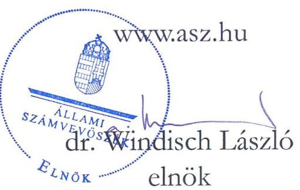
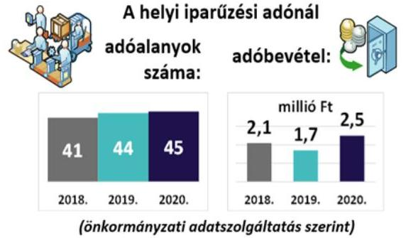
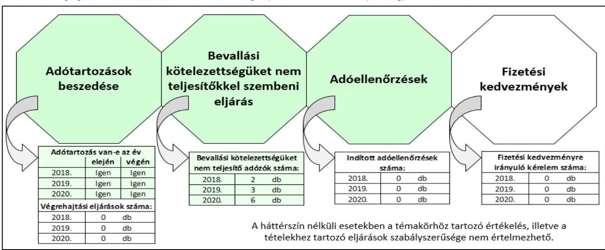

# JELENTÉS 

## Az önkormányzatok helyi iparűzési adóval kapcsolatos tevékenységének ellenőrzése

Fancsal Községi Önkormányzat ellenőrzése

2023.

---

# JELENTÉS 

## Az önkormányzatok helyi iparűzési adóval kapcsolatos tevékenységének ellenőrzése

Fancsal Községi Önkormányzat ellenőrzése
2023.

23003

---

# ELLENŐRZÉSI IGAZGATÓSÁG: 

## ÁLLAMHÁZTARTÁS HELYI SZINTJÉT ELLENŐRZŐ IGAZGATÓSÁG

ELLENŐRZÉSI IGAZGATÓ:
KISGERGELY ISTVÁN igazgató

ELLENŐRZÉSVEZETŐ:
$\square$ Jelentéseink az interneten a www.asz.hu címen olvashatók.

## ÓDOR ZOLTÁN TAMÁS ellenőrzésvezető

IKTATÓSZÁM: EL-3822-001/2023.
TÉMASZÁM: 2578
ELLENŐRZÉS-AZONOSÍTÓ SZÁM: V0921

---

# TARTALOMJEGYZÉK 

■ ÖSSZEGZÉS ..... 5
■ AZ ELLENŐRZÉS CÉLJA ..... 6
■ AZ ELLENŐRZÉS TERÜLETE ..... 7
■ AZ ELLENŐRZÉS HÁTTERE, INDOKOLTSÁGA ..... 8
■ A JELENTÉS LÉNYEGES KÉRDÉSKÖREI ..... 9
■ AZ ELLENŐRZÉS HATÓKÖRE ÉS MÓDSZEREI ..... 10
■ MEGÁLLAPÍTÁSOK ..... 12
■ JAVASLATOK ..... 15
■ MELLÉKLET ..... 17
I. sz. melléklet: Értelmező szótár ..... 17
■ FÜGGELÉK: ÉSZREVÉTELEK ..... 19
■ RÖVIDÍTÉSEK JEGYZÉKE ..... 21

---

.

---

# ÖSSZEGZÉS 

A 2018-2020. években Fancsal Községi Önkormányzat a törvényi előírásokkal összhangban alakította ki a helyi iparűzési adózás kereteit, azonban az adóigazgatási feladatok ellátásának szabályozottsága hiányos volt, amit a jegyző 2020-ban pótolt. Az önkormányzati adóhatóság egyes adóigazgatási tevékenységei nem feleltek meg a jogszabályi előírásoknak.

## Az ellenőrzés társadalmi indokoltsága

Magyarország Alaptörvénye kimondja, hogy a helyi közügyek intézése és a helyi közhatalom gyakorlása érdekében helyi önkormányzatok működnek hazánkban. Az önkormányzatok alapvető feladata a helyi közszolgáltatások folyamatos biztosítása, ehhez pedig fontos, hogy fenntartható költségvetéssel rendelkezzenek. A feladatoknak a helyi sajátosságokhoz és igényekhez igazítható ellátása elengedhetetlenné teszi az önkormányzatok felelős, egyensúlyra törekvő gazdálkodásának megteremtését, aminek egyik fontos bevételi forrása a helyi adók rendszere.

A helyi adózást érintő kérdések nagy társadalmi relevanciával bírnak, hiszen az önkormányzatok gazdálkodásában mind társadalompolitikai jelentősége, mind volumene miatt fontos szerepet tölt be a helyi adóztatás. A helyi adók bevezetésének lehetőségével a települési önkormányzatok 99,2%-a élt 2020-ban, a helyi iparűzési adót az önkormányzatok több, mint 90%-a vezette be. Az önkormányzatok költségvetési bevételeinek átlagosan mintegy egyharmadát tették ki a helyi adókból származó bevételek. A helyi adóbevételeken belül a legnagyobb súlyt (mintegy 80%-ot) a helyi iparűzési adó képviselte. Az önkormányzatok által beszedett helyi adók, miközben bevételt jelentenek a közkiadások finanszírozásához, addig kiadás formájában megjelennek a vállalkozások és a helyi háztartások költségvetésében is, ezért bevezetésük függ a település lakosainak és vállalkozásainak teherviselő képességétől is.

A helyi adóztatás sokrétű, szakértelmet igénylő feladat, amely magában foglalja az önkormányzat részéről az adó mértékének meghatározását és az adókedvezmények, adómentességek megállapítását, valamint a jegyző, mint önkormányzati adóhatóság részéről az adó beszedését, az adóellenőrzést és a hátralékok behajtását. Minden érintett érdeke, hogy ez az adóztatási tevékenység összhangban legyen a jogszabályi előírásokkal, biztosítsa az önkormányzat feladatellátásához szükséges bevételeket, emellett a helyben működő vállalkozások fennmaradása biztosított legyen. Az ÁSZ ${ }^{1}$ ellenőrzése az esetleges hiányosságok feltárásával hozzájárulhat a helyi önkormányzatok, önkormányzati adóhatóságok szabályszerűbb adóhatósági tevékenységéhez.

## Főbb megállapítások

AZ ADÓZÁS KERETEIT az önkormányzat a 2018-2020. években a törvényi előírásokkal összhangban alakította ki, adórendeletében a jogszabályi előírásokat betartva döntött a helyi iparűzési adó mértékéről.

AZ ADÓIGAZGATÁSI SZABÁLYOKAT a jegyző a 2018-2019. években nem teljeskörűen határozta meg, a kiadmányozás rendjét nem szabályozta, és az ellenőrzési nyomvonalat nem készítette el, ezen hiányosságokat 2020. évben pótolta.

A BEVALLÁSI KÖTELEZETTSÉGET NEM TELJESÍTŐ ADÓZÓKAT a 2018-2020. években az önkormányzati adóhatóság a jogszabályi előírás ellenére nem hívta fel a bevallási kötelezettségük jogszerű teljesítésére, ezzel nem tett eleget jogszabályi kötelezettségének.

ADÓELLENŐRZÉST a 2018-2020 években az önkormányzati adóhatóság nem végzett.
A HELYI IPARŰZÉSI ADÓTARTOZÁSOK BESZEDÉSE ÉRDEKÉBEN az önkormányzati adóhatóság az ellenőrzött időszakban nem intézkedett, végrehajtási intézkedés megtételére a 2018-2020. években fennálló adótartozások ellenére nem került sor.

Az Állami Számvevőszék az intézkedések megtétele céljából a jegyző részére kettő javaslatot fogalmazott meg.

---

# AZ ELLENŐRZÉS CÉLJA 

AZ ELLENŐRZÉS CÉLJA annak megállapítása volt, hogy az önkormányzatok helyi iparűzési adóról szóló rendelete, illetve annak megalkotása a jogszabályi előírásoknak megfelelő volt-e, valamint a jegyző az adóigazgatási feladatok ellátásának helyi szabályait a jogszabályi előírásokkal összhangban határozta-e meg, továbbá az önkormányzati adóhatóságok a helyi iparűzési adóval kapcsolatos egyes feladataikat (adómentesség, adókedvezmények megállapítása, ellenőrzés, fizetési kedvezmények engedélyezése, hátralékok beszedése) szabályszerűen látták-e el.

---

# AZ ELLENŐRZÉS TERÜLETE 

## Fancsal Községi Önkormányzat, Forrói Közös Önkormányzati Hivatal

FANCSAL Lakónépesség 2021. január 1-én: 324 fő (Központi Statisztikai Hivatal adata szerint)

Magyarország Alaptörvénye értelmében a helyi önkormányzat a helyi közügyek intézése körében a törvény keretei között dönt a helyi adók fajtájáról és mértékéről. A Mötv. ${ }^{2}$ rögzíti, hogy a helyi adóval kapcsolatos feladatok ellátása a helyi önkormányzatok feladata. A Hatásköri tv. ${ }^{3}$, valamint a Htv. ${ }^{4}$ értelmében a helyi adók bevezetéséről a települési önkormányzat képviselő-testülete dönt rendelettel.

A Htv. rögzíti, hogy az önkormányzatok adómegállapítási joga kiterjed az adó bevezetésére, a már bevezetett adó hatályon kívül helyezésére, illetőleg módosítására, az adó mértékének a törvényi keretek közötti megállapítására, a törvényben meghatározott mentességeken, kedvezményeken túli további mentességek, kedvezmények biztosítására, valamint a Htv., az Art. ${ }^{5}$, az Air. ${ }^{6}$ keretei között az adózás részletes szabályainak meghatározására. A Hatásköri tv. és az Air. előírja, hogy adóügyekben elsőfokú hatósági jogkörben a település jegyzője, mint önkormányzati adóhatóság jár el, a kötelezettségek teljesítésének előmozdítása érdekében ellenőrzést folytat.

Az ÁSZ ellenőrzése az önkormányzati adóhatósági tevékenység esetében kiterjedt a rendeletalkotásra, az adóztatással összefüggő helyi szabályozásokra és az adóigazgatási feladatok közül a végrehajtásra, a bevallási kötelezettséget elmulasztókkal kapcsolatos intézkedésekre, a fizetési kedvezményekre irányuló kérelmekkel kapcsolatos eljárásokra, valamint az adóellenőrzésre. Az önkormányzati adóhatósághoz a helyi iparűzési adónemhez kapcsolódó fizetési kedvezmény kérelem a 2018-2020. években nem érkezett.

Fancsal község az Észak-Magyarország régióban, Borsod-Abaúj-Zemplén megyében, az Encsi járásban található. Az ellenőrzött időszakban a községet a polgármesterrel együtt 5 fős képviselő-testület irányította. A Forrói Közös Önkormányzati Hivatal látta el a település önkormányzatának működésével, fenntartásával kapcsolatos feladatokat. Az ellenőrzött időszakban a polgármester személye egy alkalommal, 2019-ben változott.

Adóügyekben elsőfokú adóhatóságként az Air. alapján a Közös Önkormányzati Hivatal ${ }^{7}$ jegyzője járt el, az ő feladatkörébe tartozik az adóigazgatás belső szabályainak meghatározása (pl. kiadmányozás rendje, ellenőrzési nyomvonal). A jelenlegi jegyző 2020. októbere óta vezeti a Közös Önkormányzati Hivatalt. Az adóigazgatási feladatokat 1 fő adóigazgatási munkakört betöltő hivatali dolgozó végezte.

---

# AZ ELLENŐRZÉS HÁTTERE, INDOKOLTSÁGA 

Az önkormányzatok alapvető feladata a helyi közszolgáltatások biztosítása a lakosság számára. A feladatnak a helyi sajátosságokhoz és igényekhez igazítható ellátása elengedhetetlenné teszi az önkormányzatok kiegyensúlyozott gazdálkodásának megteremtését, amelynek egyik eszköze a helyi adók rendszere.

A helyi adók adják átlagosan az önkormányzatok összes költségvetési bevételének egyharmadát, ezért az önkormányzatok feladatainak finanszírozásában a helyi adóztatási tevékenységnek kiemelt jelentősége van. A helyi adóbevételek mintegy 80%-a helyi iparűzési adóból származik. Az iparűzési adó jelentős bevételi forrást jelent az önkormányzati alrendszer számára, egyes önkormányzatok esetében pedig a költségvetési bevételek meghatározó részét képviseli. Az önkormányzatok több, mint 90%-a vezette be a helyi iparűzési adót.

Az ÁSZ törvény ${ }^{8}$ 5. § (8) bekezdése alapján az ÁSZ feladata az önkormányzatok adóztatási tevékenységének ellenőrzése. Az ÁSZ esetleges szabályszerűségi hibák, kockázatok feltárásával hozzájárulhat a helyi önkormányzatok, önkormányzati adóhatóságok jogkövető magatartásának elősegítéséhez.

---

# A JELENTÉS LÉNYEGES KÉRDÉSKÖREI 

1. Kialakították-e az önkormányzatnál a helyi iparűzési adóval kapcsolatos egyes adóhatósági tevékenységek szabályszerű ellátását biztosító belső szabályzatokat?
2. Az önkormányzati adóhatóság helyi iparűzési adóval kapcsolatos egyes adóhatósági tevékenységei szabályszerűek voltak-e?

---

# AZ ELLENŐRZÉS HATÓKÖRE ÉS MÓDSZEREI 

## Az ellenőrzés típusa

Megfelelőségi ellenőrzés.

## Az ellenőrzött időszak

Az ellenőrzött időszak a 2018. január 1.-2020. december 31. közötti időszak.

## Az ellenőrzés tárgya

Az önkormányzatok helyi iparűzési adóval kapcsolatos tevékenységének ellátása.

## Az ellenőrzött szervezet

Fancsal Községi Önkormányzat, Forrói Közös Önkormányzati Hivatal

## Az ellenőrzés jogalapja

Az ellenőrzés jogszabályi alapját az ÁSZ törvény 5. § (2), (6) és (8) bekezdései képezték.

## Az ellenőrzés módszerei

Az ellenőrzést az ellenőrzési program szempontjai, az ellenőrzött időszakban hatályos jogszabályok, az ellenőrzés általános szakmai szabályai és az ellenőrzésre irányadó ÁSZ módszertanok alapján végezte az ÁSZ.

Az ellenőrzési kérdések megválaszolásához szükséges bizonyítékok megszerzése az ellenőrzött szervezetek által rendelkezésre bocsátott dokumentumokra, adatokra alapozva megfigyelés, kérdésfeltevés (információkérés), mintavételezés, valamint elemző eljárás útján történt. Az ellenőrzési bizonyítékként felhasználható adatforrások közé tartoztak egyrészt az ellenőrzési program részletes szempontjainál felsorolt adatforrások, másrészt minden egyéb - az ellenőrzés folyamán felhasznált, az ellenőrzés szempontjából információt tartalmazó - dokumentum.

Az ellenőrzés lefolytatásához az ellenőrzött szervezetek tanúsítványok kitöltésével, valamint az ÁSZ által kért dokumentumok elektronikus megküldésével szolgáltattak adatokat, amelyek valódiságát és teljeskörűségét az ellenőrzött szervezetek vezetője által tett teljességi és hitelességi nyilatkozat igazolta.

---

Az egyes adóhatósági tevékenységek (ellenőrzés; fizetési kedvezmények engedélyezése; hátralékok beszedése) szabályszerűségének ellenőrzésénél mintavételezést alkalmazott az ÁSZ. Amennyiben az alapsokaság tételeinek száma nem érte el a minta elemszámot ( $30 \mathrm{db} / \mathrm{év}+5 \mathrm{db} / \mathrm{év}$ póttétel), abban az esetben tételes ellenőrzésre került sor. Az ezt meghaladó minta elemszám esetén a minta tételeinek értékelése „szabályszerűnek" minősült, ha a minta ellenőrzésének eredménye alapján 95%-os bizonyossággal megállapítható, hogy a teljes sokaságban az átlagos hibaarány nem haladta meg, vagy egyenlő volt a 10%-os mértékkel, „nem szabályszerű", ha ez az arány nagyobb volt, mint 10%.

---

# 1. Kialakították-e az önkormányzatnál a helyi iparűzési adóval kapcsolatos egyes adóhatósági tevékenységek szabályszerű ellátását biztosító belső szabályzatokat? 

Összegző megállapítás

1.1. számú megállapítás
1.2. számú megállapítás

A 2018-2020. években az önkormányzat helyi iparűzési adórendelete megfelelt a jogszabályi előírásoknak, a jegyző 2020. évre a kiadmányozás rendjét szabályozta, és az ellenőrzési nyomvonalat elkészítette.

A 2018-2020. években helyi iparűzési adózás rendeleti szabályainak meghatározása a jogszabályi előírásokkal összhangban történt.

AZ ÖNKORMÁNYZATI ADÓRENDELET MEGALKOTÁSA szabályszerű volt. Fancsal Községi Önkormányzat Képviselő-testülete a Htv.-ben, valamint a Hatásköri tv.-ben foglaltak szerint a helyi iparűzési adózás szabályait önkormányzati adórendeletben ${ }^{9}$ határozta meg, kialakította a helyi iparűzési adóval kapcsolatos egyes adóhatósági tevékenységek szabályszerű ellátását biztosító alapvető kontroll- és szabályozási környezetet. Az önkormányzati adórendelet megalkotásakor a Mötv. 47. § (1) bekezdés előírása szerint a képviselő-testület határozatképes volt, az adórendeletet minősített többséggel fogadta el, a Mötv. 50. §, illetve a 42. § 1. pontjában foglaltaknak megfelelően.

Az önkormányzati rendelettel az állandó és ideiglenes jellegű iparűzési tevékenység vonatkozásában megállapított helyi iparűzési adómérték a Htv.-ben foglalt előírásokkal összhangban történt. Az önkormányzati rendelettel megállapított helyi iparűzési adómérték a Htv. 40. § (1) bekezdés c) pontjának keretei között állandó jellegű iparűzési tevékenység esetén az adóalap 1%-ában került meghatározásra. A helyi iparűzési adó mértéke a Htv. 40. § (2) bekezdés keretei között ideiglenes jellegű iparűzési tevékenység esetén naptári naponként 5000 forint volt.

A 2018-2020. években a Htv. 39/C. § (2)-(4) bekezdésekben biztosított helyi iparűzési adóhoz kapcsolódó adómentességek, adókedvezmények igénybevételét adórendeletében az önkormányzat képviselő-testülete nem tette lehetővé.

Az adóigazgatási feladatok ellátásának szabályozottsága a 2020. évben a jogszabályi előírásoknak megfelelt. 2018-2019. években az adóigazgatási feladatok ellátásának szabályozottságával kapcsolatban hiányosságokat tárt fel az ellenőrzés.

AZ ADÓIGAZGATÁSI
 FELADATOK ELLÁTÁSÁNAK SZABÁLYAIT 2020-ban belső szabályzatokban rögzítették. A Közös Önkormányzati Hivatal SZMSZ-e az Ávr. ${ }^{10}$. 13. § (1) bekezdés g) pontjában foglalt előírás szerint tartalmazta az adóigazgatási feladatok ellátásának módját.

---

A 2018-2019. években az adóhatósági feladatok ellátásának szabályozottsága nem teljes mértékben felelt meg a jogszabályi előírásoknak, mert az önkormányzat jegyzője az Mötv. 81. § (3) bekezdés j) pontjában foglaltakat figyelmen kívül hagyva a hatáskörébe tartozó adóigazgatási ügyekben a kiadmányozás rendjét nem szabályozta, a Bkr. 6. § (3) bekezdés előírása ellenére nem készítette el az ellenőrzési nyomvonalat.

# 2. Az önkormányzati adóhatóság helyi iparűzési adóval kapcsolatos egyes adóhatósági tevékenységei szabályszerűek voltak-e? 

Összegző megállapítás

A 2018-2020. években az önkormányzati adóhatóság helyi iparűzési adóval kapcsolatos egyes ellenőrzött tevékenységei a bevallási kötelezettséget nem teljesítőkkel szembeni eljárásokkal, az adóellenőrzésekkel és a végrehajtási eljárásokkal kapcsolatos mulasztások miatt nem voltak szabályszerűek.

A helyi iparűzési adóztatással kapcsolatos önkormányzati adóigazgatási feladatok számvevőszéki ellenőrzés megállapításainak tartalmát befolyásoló egyes adatok alakulását mutatja be az 1. ábra.

1. ábra - Az adóigazgatási feladatok számvevőszéki ellenőrzés megállapításainak tartalmát befolyásoló egyes adatok alakulása

Forrás: önkormányzati adatszolgáltatás alapján ÁSZ szerkesztés
2.1. számú megállapítás

A 2018-2020. években az önkormányzati adóhatóság nem a jogszabályi előírásokkal összhangban látta el a helyi iparűzési adóhoz kapcsolódó egyes hatósági, ellenőrzési feladatait.

## BEVALLÁSI KÖTELEZETTSÉGET NEM TELJESÍTŐ

ADÓZÓKAT az önkormányzati adóhatóság
a 2018-2020. években az Art. 221. § (1) bekezdés a) pontja előírása ellenére, a mulasztás jogkövetkezményeire történő figyelmeztetés mellett, tizenöt napos határidő tűzésével a helyi iparűzési adó tekintetében bevallási kötelezettségük jogszerű teljesítésére nem hívta fel.

---

Az önkormányzati adóhatóság a bevallási kötelezettséget 2018-2020. években nem teljesítő nyolc adózót a bevallási kötelezettség jogszerű teljesítésére csak jelentős időbeli késedelemmel az ellenőrzött időszakot követően hívta fel. Az önkormányzati adóhatóság három adóalany esetében a felhívást és a mulasztási bírság kiszabását az Art. 221. § (4) bekezdés előírása szerint mellőzte, mivel az adózók végelszámolás vagy kényszertörlési eljárás alatt álltak.

ADÓELLENŐRZÉST az önkormányzati adóhatóság a 2018-2020. években -az Air. 86. § előírása ellenére - az adótörvényekben előírt kötelezettségek teljesítésének előmozdítása érdekében nem folytatott le.

### 2.2. számú megállapítás

A 2018-2020. években az önkormányzati adóhatóság a helyi iparűzési adótartozások beszedése érdekében végrehajtási eljárást nem indított.

Az önkormányzati adóhatóság által nyilvántartott helyi iparűzési adótartozás összege 2018. január 1-jén 1,2 millió Ft, 2019. december 31-én 0,5 millió Ft, 2020. december 31-én 0,6 millió Ft volt.

A HELYI IPARŰZÉSI ADÓTARTOZÁSOK BESZEDÉSE ÉRDEKÉBEN az Avt. ${ }^{11}$ 30. § (1) bekezdésében foglaltak ellenére az önkormányzati adóhatóság a 2018-2019. években és 2020. március 24. napjáig, az 57/2020. (III. 23.) Korm. rendelet ${ }^{12}$ hatálybelépésének időpontjáig végrehajtási eljárást nem indított. Az önkormányzati adóhatóság a tartozás megfizetésére az adósokat nem hívta fel, végrehajtási intézkedések megtételére a 2018-2020. években fennálló adótartozások ellenére nem került sor.

---

# JAVASLATOK 

Az ÁSZ tv. 33. § (1) bekezdésében foglaltak értelmében az ellenőrzött szervezet vezetője köteles a jelentésben foglalt megállapításokhoz kapcsolódó intézkedési tervet összeállítani és azt a jelentés kézhezvételétől számított 30 napon belül az ÁSZ részére megküldeni. Amennyiben az ellenőrzött szervezet vezetője nem küldi meg határidőben az intézkedési tervet, vagy továbbra sem elfogadható intézkedési tervet küld, az Állami Számvevőszék elnöke az ÁSZ tv. 33. § (3) bekezdése a) és b) pontjaiban foglaltakat érvényesítheti.

## Fancsal Községi Önkormányzat jegyzője

1. Intézkedjen az Air. 86. §-ban foglaltaknak megfelelően a helyi iparűzési adókötelezettség teljesítésével kapcsolatos adóellenőrzések lefolytatása érdekében.
(2.1. sz. megállapítás 4. bekezdése alapján)
2. Intézkedjen az Avt. 30. § (1) bekezdés előírása szerint a helyi iparűzési adótartozások, hátralékok beszedése érdekében.
(2.2. sz. megállapítás 2. bekezdése alapján)

---

.

---

# MELLÉKLET 

- I. SZ. MELLÉKLET: ÉRTELMEZŐ SZÓTÁR
önkormányzat
önkormányzati hivatal
adóhatóság
adózó
helyi iparűzési adó
adóalany
vállalkozó
adóigazgatási eljárás
adóhatósági ellenőrzés
adóellenőrzés
fizetési kedvezmény adótartozás

A helyi önkormányzat jogi személy. Az önkormányzati feladatok ellátását a képviselőtestület és szervei biztosítják. A képviselő-testület szervei: a polgármester, a főpolgármester, a megyei közgyűlés elnöke, a képviselő-testület bizottságai, a részönkormányzat testülete, a polgármesteri hivatal, a megyei önkormányzati hivatal, a közös önkormányzati hivatal, a jegyző, továbbá a társulás. A képviselő-testület a feladatkörébe tartozó közszolgáltatások ellátására - jogszabályban meghatározottak szerint - költségvetési szervet, a Polgári perrendtartásról szóló 2016. évi CXXX. törvény szerinti gazdálkodó szervezetet (a továbbiakban: gazdálkodó szervezet), nonprofit szervezetet és egyéb szervezetet (a továbbiakban együtt: intézmény) alapíthat, továbbá szerződést köthet természetes és jogi személlyel vagy jogi személyiséggel nem rendelkező szervezettel. (Forrás: Mötv. 41. § (1), (2), (6) bekezdései)
Az ellenőrzési programban önkormányzati hivatalként értelmezzük a polgármesteri hivatalt, a főpolgármesteri hivatalt, a megyei önkormányzati hivatalt és a közös önkormányzati hivatalt (Forrás: Áht. ${ }^{13}$ 1. § 18. pont).
Az önkormányzat jegyzője, mint önkormányzati adóhatóság. (Forrás: Air. 22. § b) pont) Az a személy, akinek vagy amelynek adókötelezettségét adót, költségvetési támogatást megállapító törvény, e törvény, az adózás rendjéről szóló 2017. évi CL. törvény (a továbbiakban: Art.) vagy önkormányzati rendelet előírja. (Forrás: Air. 11. § (1) bekezdés) Az önkormányzat illetékességi területén állandó vagy ideiglenes jelleggel végzett vállalkozási tevékenység (a továbbiakban: iparűzési tevékenység) esetén az önkormányzat költségvetése javára megállapított adó. (Forrás: Htv. 35. § (1) bekezdés)
A helyi iparűzési adó alanya a vállalkozó. (Forrás: Htv. 35. § (2) bekezdés)
A Polgári Törvénykönyvről szóló törvény szerinti bizalmi vagyonkezelési szerződés alapján kezelt vagyon, valamint a gazdasági tevékenységet saját nevében és kockázatára haszonszerzés céljából, üzletszerűen végző
a) a személyi jövedelemadóról szóló törvényben meghatározott egyéni vállalkozó,
b) a személyi jövedelemadóról szóló törvényben meghatározott mezőgazdasági őstermelő, feltéve, hogy őstermelői tevékenységéből származó bevétele az adóévben a 600 000 forintot meghaladja,
c) jogi személy, ideértve azt is, ha az felszámolás, kényszertörlés vagy végelszámolás alatt áll,
d) egyéni cég, egyéb szervezet, ideértve azt is, ha azok felszámolás, kényszertörlés vagy végelszámolás alatt állnak. (Forrás: Htv. 52. § 26. pont)
Az adóigazgatási eljárásban az adóhatóság megállapítja az adózó jogait, kötelezettségeit, ellenőrzi az adókötelezettségek teljesítését, a joggyakorlás törvényességét, nyilvántartást vezet az adózást érintő tényekről, adatokról, körülményekről, és adatot igazol, illetve az ezeket érintő döntését érvényesíti. (Forrás: Air. 9. §)
Az adóhatóság az adótörvényekben és más jogszabályokban előírt kötelezettségek teljesítésének vagy megsértésének megállapítása, a kötelezettségek teljesítésének előmozdítása érdekében ellenőrzést folytat. (Forrás: Air. 86. §)
Adóellenőrzés keretében az adóhatóság az adózó adómegállapítási, adatbejelentési, bevallási kötelezettsége teljesítését adónként, támogatásonként és időszakonként vagy meghatározott időszakra több adó és támogatás tekintetében is vizsgálja. (Forrás: Air. 90. § (1) bekezdés)

A fizetési halasztás, részletfizetés, valamint az adómérséklés. (Forrás: Art. 198.-201. §) Az esedékességkor meg nem fizetett adó és a jogosulatlanul igénybe vett költségvetési támogatás. (Forrás: Art. 7. § 6. pont)

---

.

---

# FÜGGELÉK: ÉSZREVÉTELEK 

A jelentéstervezetet a Számvevőszék 15 napos észrevételezésre megküldte az ellenőrzött szervezet vezetőjének az ÁSZ tv. 29. § (1) bekezdése előírásának megfelelően.

Az észrevételezésre megküldött jelentéstervezet megállapításaira az ellenőrzött szervezetek vezetői nem tettek észrevételt.

[^0]
[^0]:    * 29. § (1) Az Állami Számvevőszék az ellenőrzési megállapításait megküldi az ellenőrzött szervezet vezetőjének vagy az általa megbízott személynek, és annak, akinek személyes felelősségét állapította meg.
    (2) Az ellenőrzött szervezet vezetője és a felelősként megjelölt személy az ellenőrzés megállapításaira tizenöt napon belül írásban észrevételt tehet.
    (3) Az Állami Számvevőszék az észrevételre a beérkezésétől számított harminc napon belül írásban válaszol. A figyelembe nem vett észrevételeket köteles a jelentésben feltüntetni, és megindokolni, hogy azokat miért nem fogadta el.

---

.

---

# RÖVIDÍTÉSEK JEGYZÉKE 

${ }^{1}$ ÁSZ
${ }^{2}$ Mötv.
${ }^{3}$ Hatásköri tv.
${ }^{4}$ Htv.
${ }^{5}$ Art.
${ }^{6}$ Air.
${ }^{7}$ Közös Önkormányzati Hivatal
${ }^{8}$ ÁSZ törvény
${ }^{9}$ adórendelet
${ }^{10}$ Ávr.
${ }^{11}$ Avt.
${ }^{12}$ 57/2020. (III. 23.) Korm. rendelet
${ }^{13}$ Áht.

Állami Számvevőszék
2011. évi CLXXXIX. törvény Magyarország helyi önkormányzatairól
1991. évi XX. törvény a helyi önkormányzatok és szerveik, a köztársasági megbízottak, valamint egyes centrális alárendeltségű szervek feladat- és hatásköreiről
1990. évi C. törvény a helyi adókról
2017. évi CL. törvény az adózás rendjéről
2017. évi CLI. törvény az adóigazgatási rendtartásról

Forrói Közös Önkormányzati Hivatal
2011. évi LXVI. törvény az Állami Számvevőszékről

Fancsal Községi Önkormányzat Képviselő-testülete 9/2015 (IX.23) önkormányzati rendelete a helyi iparűzési adóról
368/2011.(XII.31.) Korm.rendelet az államháztartásról szóló törvény végrehajtásáról
2017. évi CLIII. törvény az adóhatóság által foganatosítandó végrehajtási eljárásokról
57/2020. (III. 23.) Korm. rendelet az élet- és vagyonbiztonságot veszélyeztető tömeges megbetegedést okozó humánjárvány megelőzése, illetve következményeinek elhárítása, a magyar állampolgárok egészségének és életének megóvása érdekében elrendelt veszélyhelyzet során a végrehajtással kapcsolatban teendő intézkedésekről
2011. évi CXCV. törvény az államháztartásról

---

1052 Budapest, Apáczai Csere János u. 10. | 1364 Budapest 4., Pf. 54
www.asz.hu | szamvevoszek@asz.hu
telefon: +36 14849100
