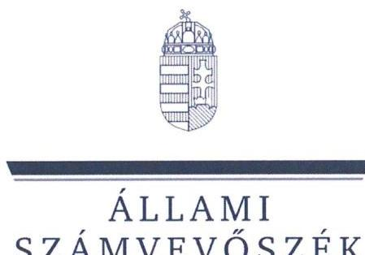
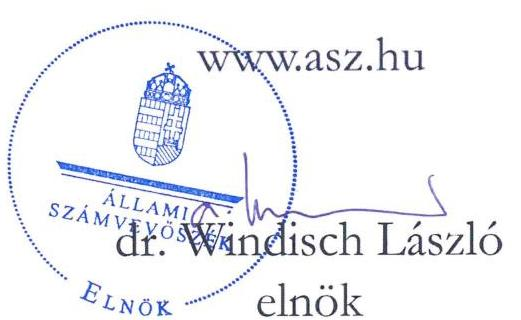
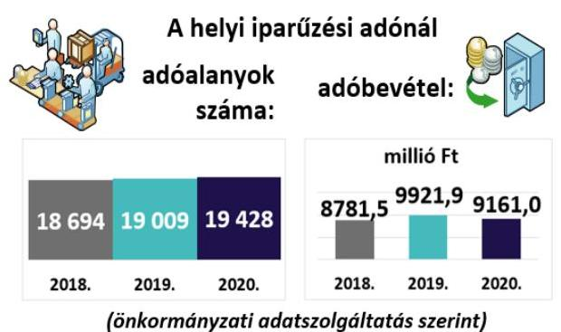
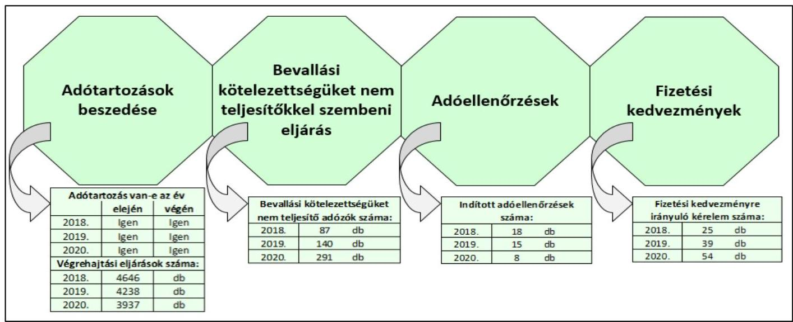

# JELENTÉS 

## Az önkormányzatok helyi iparűzési adóval kapcsolatos tevékenységének ellenőrzése

Nyíregyháza Megyei Jogú Város Önkormányzata ellenőrzése

2023.

---

ÁLLAMI
SZÁMVEVŐSZÉK

# JELENTÉS 

## Az önkormányzatok helyi iparűzési adóval kapcsolatos tevékenységének ellenőrzése

Nyíregyháza Megyei Jogú Város Önkormányzata ellenőrzése

2023. 

23005

---

# ELLENŐRZÉSI IGAZGATÓSÁG: 

## ÁLLAMHÁZTARTÁS HELYI SZINTJÉT ELLENŐRZŐ IGAZGATÓSÁG

ELLENŐRZÉSI IGAZGATÓ:
KISGERGELY ISTVÁN igazgató

ELLENŐRZÉSVEZETŐ:
$\square$ Jelentéseink az interneten a www.asz.hu címen olvashatók.

## ÓDOR ZOLTÁN TAMÁS ellenőrzésvezető

IKTATÓSZÁM: EL-3824-001/2023.
TÉMASZÁM: 2578
ELLENŐRZÉS-AZONOSÍTÓ SZÁM: V0921

---

# TARTALOMJEGYZÉK 

■ ÖSSZEGZÉS ..... 5
■ AZ ELLENŐRZÉS CÉLJA ..... 7
■ AZ ELLENŐRZÉS TERÜLETE ..... 8
■ AZ ELLENŐRZÉS HÁTTERE, INDOKOLTSÁGA ..... 9
■ A JELENTÉS LÉNYEGES KÉRDÉSKÖREI ..... 10
■ AZ ELLENŐRZÉS HATÓKÖRE ÉS MÓDSZEREI ..... 11
■ MEGÁLLAPÍTÁSOK ..... 13
■ MELLÉKLET ..... 17
I. sz. melléklet: Értelmező szótár ..... 17
■ FÜGGELÉK: ÉSZREVÉTELEK ..... 19
■ RÖVIDÍTÉSEK JEGYZÉKE ..... 21

---

.

---

# ÖSSZEGZÉS 

A 2018-2020. években Nyíregyháza Megyei Jogú Város Önkormányzata a törvényi előírásokkal összhangban alakította ki a helyi iparűzési adózás szabályozási kereteit, a helyi iparúzési adóigazgatási feladatok ellátásának szabályozottsága megfelelt a jogszabályi előírásoknak. A 2018-2019. években az önkormányzati adóhatóság az adóhatósági felhívás ellenére a bevallási kötelezettséget határidőben nem teljesitő adózók esetén nem minden esetben szabott ki mulasztási bírságot, és nem hívta fel az adózókat a bevallási kötelezettség jogszerü teljesitésére, a 2020. évben e tevékenységét szabályszerüen végezte. Az önkormányzati adóhatóság ellenőrzött adóigazgatási tevékenységei közül a fizetési kedvezményre vonatkozó döntései, adóellenőrzései a jogszabályi előírásokkal összhangban történtek.

## Az ellenőrzés társadalmi indokoltsága

Magyarország Alaptörvénye kimondja, hogy a helyi közügyek intézése és a helyi közhatalom gyakorlása érdekében helyi önkormányzatok múködnek hazánkban. Az önkormányzatok alapvető feladata a helyi közszolgáltatások folyamatos biztosítása, ehhez pedig fontos, hogy fenntartható költségvetéssel rendelkezzenek. A feladatoknak a helyi sajátosságokhoz és igényekhez igazítható ellátása elengedhetetlenné teszi az önkormányzatok felelős, egyensúlyra törekvő gazdálkodásának megteremtését, aminek egyik fontos bevételi forrása a helyi adók rendszere.

A helyi adózást érintő kérdések nagy társadalmi relevanciával bírnak, hiszen az önkormányzatok gazdálkodásában mind társadalompolitikai jelentősége, mind volumene miatt fontos szerepet tölt be a helyi adóztatás. A helyi adók bevezetésének lehetőségével a települési önkormányzatok 99,2\%-a élt 2020-ban, a helyi iparűzési adót az önkormányzatok több, mint 90\%-a vezette be. Az önkormányzatok költségvetési bevételeinek átlagosan mintegy egyharmadát tették ki a helyi adókból származó bevételek. A helyi adóbevételeken belül a legnagyobb súlyt (mintegy 80\%ot) a helyi iparűzési adó képviselte. Az önkormányzatok által beszedett helyi adók, miközben bevételt jelentenek a közkiadások finanszírozásához, addig kiadás formájában megjelennek a vállalkozások és a helyi háztartások költségvetésében is, ezért bevezetésük függ a település lakosainak és vállalkozásainak teherviselő képességétől is.

A helyi adóztatás sokrétű, szakértelmet igénylő feladat, amely magában foglalja az önkormányzat részéről az adó mértékének meghatározását és az adókedvezmények, adómentességek megállapítását, valamint a jegyző, mint önkormányzati adóhatóság részéről az adó beszedését, az adóellenőrzést és a hátralékok behajtását. Minden érintett érdeke, hogy ez az adóztatási tevékenység összhangban legyen a jogszabályi előírásokkal, biztosítsa az önkormányzat feladatellátásához szükséges bevételeket, emellett a helyben múködő vállalkozások fennmaradása biztosított legyen. Az ÁSZ ${ }^{1}$ ellenőrzése az esetleges hiányosságok feltárásával hozzájárulhat a helyi önkormányzatok, önkormányzati adóhatóságok szabályszerűbb adóhatósági tevékenységéhez.

## Főbb megállapítások

A 2018-2020. években Nyíregyháza Megyei Jogú Város Önkormányzatának helyi iparűzési adóval kapcsolatos tevékenységét ellenőriztük.

AZ ADÓZÁS KERETEIT az önkormányzat a 2018-2020. években a törvényi előírásokkal összhangban alakította ki, adórendeletében a jogszabályi előírásokat betartva döntött a helyi iparűzési adó mértékéről.

AZ ADÓIGAZGATÁSI SZABÁLYOKAT a helyi iparűzési adó beszedéséhez a jegyző a 2018-2020. években a jogszabályi előírásoknak megfelelően kialakította, az adóigazgatási feladatok ellátásának szabályait belső szabályzatban rögzítette.

---

A BEVALLÁSI KÖTELEZETTSÉGET NEM TELJESÍTŐ ADÓZÓK felhívása a bevallási kötelezettség jogszerű teljesítésére a 2020. évben szabályszerűen történt. A 2018-2019. években az önkormányzati adóhatóság az adóhatósági felhívás ellenére a bevallási kötelezettséget nem teljesítő adózókat ismételten nem hívta fel a bevallási kötelezettség jogszerű teljesítésére, és nem szabott ki mulasztási bírságot.

AZ ADÓELLENŐRZÉS során az önkormányzat a jogszabályi előírásokban és a belső szabályzatokban foglaltak szerint járt el a 2018-2020. években.

A FIZETÉSI KEDVEZMÉNYEKRE irányuló kérelmekről az önkormányzati adóhatóság az ellenőrzött időszakban szabályszerűen döntött.

A HELYI IPARŰZÉSI ADÓTARTOZÁSOK BESZEDÉSE ÉRDEKÉBEN tett végrehajtási intézkedéseit végrehajtási okirat alapján indította meg, és a végrehajtási cselekményeket dokumentálta.

---

# AZ ELLENŐRZÉS CÉLJA 

AZ ELLENŐRZÉS CÉLJA annak megállapítása volt, hogy az önkormányzatok helyi iparűzési adóról szóló rendelete, illetve annak megalkotása a jogszabályi előírásoknak megfelelő volt-e, valamint a jegyző az adóigazgatási feladatok ellátásának helyi szabályait a jogszabályi előírásokkal összhangban határozta-e meg, továbbá az önkormányzati adóhatóságok a helyi iparűzési adóval kapcsolatos egyes feladataikat (adómentesség, adókedvezmények megállapítása, ellenőrzés, fizetési kedvezmények engedélyezése, hátralékok beszedése) szabályszerűen látták-e el.

---

# AZ ELLENŐRZÉS TERÜLETE 

## Nyíregyháza Megyei Jogú Város Önkormányzata, Nyíregyháza Megyei Jogú Város Polgármesteri Hivatala

## NYÍREGYHÁZA

Lakónépesség 2021. január 1-én:

## 116554 fő

(Központi Statisztikai Hivatal adata szerint)

Magyarország Alaptörvénye értelmében a helyi önkormányzat a helyi közügyek intézése körében a törvény keretei között dönt a helyi adók fajtájáról és mértékéről. A Mötv. ${ }^{2}$ rögzíti, hogy a helyi adóval kapcsolatos feladatok ellátása a helyi önkormányzatok feladata. A Hatásköri tv. ${ }^{3}$, valamint a Htv. ${ }^{4}$ értelmében a helyi adók bevezetéséről a települési önkormányzat képviselő-testülete dönt rendelettel.

A Htv. rögzíti, hogy az önkormányzatok adómegállapítási joga kiterjed az adó bevezetésére, a már bevezetett adó hatályon kívül helyezésére, illetőleg módosítására, az adó mértékének a törvényi keretek közötti megállapítására, a törvényben meghatározott mentességeken, kedvezményeken túli további mentességek, kedvezmények biztosítására, valamint a Htv., az Art. ${ }^{5}$, az Air. ${ }^{6}$ keretei között az adózás részletes szabályainak meghatározására. A Hatásköri tv. és az Air. előírja, hogy adóügyekben elsőfokú hatósági jogkörben a település jegyzője, mint önkormányzati adóhatóság jár el, a kötelezettségek teljesítésének előmozdítása érdekében el-
lenőrzést folytat.

Az ÁSZ ellenőrzése az önkormányzati adóhatósági tevékenység esetében kiterjedt a rendeletalkotásra, az adóztatással összefüggő helyi szabályozásokra és az adóigazgatási feladatok közül a végrehajtásra, a bevallási kötelezettséget elmulasztókkal kapcsolatos intézkedésekre, a fizetési kedvezményekre irányuló kérelmekkel kapcsolatos eljárásokra, valamint az adóellenőrzésre.

Nyíregyháza Szabolcs-Szatmár-Bereg megye székhelye. Az ellenőrzött időszakban a megyei jogú várost 22 fős közgyűlés irányította. A Polgármesteri Hivatal ${ }^{7}$ látta el a város múködésével, fenntartásával kapcsolatos feladatokat. Az ellenőrzött időszakban a polgármester személye nem változott.

Adóügyekben elsőfokú adóhatóságként az Air. alapján Nyíregyháza Megyei Jogú Város Polgármesteri Hivatala címzetes főjegyzője járt el. A jelenlegi címzetes főjegyző 1999 óta vezeti a Polgármesteri Hivatalt. Az adóigazgatási feladatokat Nyíregyháza Megyei Jogú Város Polgármesteri Hivatala Adóosztálya végezte.

---

# AZ ELLENŐRZÉS HÁTTERE, INDOKOLTSÁGA 

Az önkormányzatok alapvető feladata a helyi közszolgáltatások biztosítása a lakosság számára. A feladatnak a helyi sajátosságokhoz és igényekhez igazítható ellátása elengedhetetlenné teszi az önkormányzatok kiegyensúlyozott gazdálkodásának megteremtését, amelynek egyik eszköze a helyi adók rendszere.

A helyi adók adják átlagosan az önkormányzatok összes költségvetési bevételének egyharmadát, ezért az önkormányzatok feladatainak finanszírozásában a helyi adóztatási tevékenységnek kiemelt jelentősége van. A helyi adóbevételek mintegy 80\%-a helyi iparűzési adóból származik. Az iparűzési adó jelentős bevételi forrást jelent az önkormányzati alrendszer számára, egyes önkormányzatok esetében pedig a költségvetési bevételek meghatározó részét képviseli. Az önkormányzatok több, mint 90\%-a vezette be a helyi iparűzési adót.

Az ÁSZ törvény ${ }^{8}$ 5. § (8) bekezdése alapján az ÁSZ feladata az önkormányzatok adóztatási tevékenységének ellenőrzése. Az ÁSZ esetleges szabályszerűségi hibák, kockázatok feltárásával hozzájárulhat a helyi önkormányzatok, önkormányzati adóhatóságok jogkövető magatartásának elősegítéséhez.

---

# A JELENTÉS LÉNYEGES KÉRDÉSKÖREI 

1.     - Kialakították-e az önkormányzatnál a helyi iparüzési adóval kapcsolatos egyes adóhatósági tevékenységek szabályszerű ellátását biztosító belső szabályzatokat?
2.     - Az önkormányzati adóhatóság helyi iparüzési adóval kapcsolatos egyes adóhatósági tevékenységei szabályszerűek voltak-e?

---

# AZ ELLENŐRZÉS HATÓKÖRE ÉS MÓDSZEREI 

## Az ellenőrzés típusa

Megfelelőségi ellenőrzés.

## Az ellenőrzött időszak

Az ellenőrzött időszak a 2018. január 1.-2020. december 31. közötti időszak.

## Az ellenőrzés tárgya

Az önkormányzatok helyi iparűzési adóval kapcsolatos tevékenységének ellátása.

## Az ellenőrzött szervezet

Nyíregyháza Megyei Jogú Város Önkormányzata, Nyíregyháza Megyei Jogú Város Polgármesteri Hivatala

## Az ellenőrzés jogalapja

Az ellenőrzés jogszabályi alapját az ÁSZ törvény 5. § (2), (6) és (8) bekezdései képezik.

## Az ellenőrzés módszerei

Az ellenőrzést az ellenőrzési program szempontjai, az ellenőrzött időszakban hatályos jogszabályok, az ellenőrzés általános szakmai szabályai és az ellenőrzésre irányadó ÁSZ módszertanok alapján végezte az ÁSZ.

Az ellenőrzési kérdések megválaszolásához szükséges bizonyítékok megszerzése az ellenőrzött szervezetek által rendelkezésre bocsátott dokumentumokra, adatokra alapozva megfigyelés, kérdésfeltevés (információkérés), mintavételezés, valamint elemző eljárás útján történt. Az ellenőrzési bizonyítékként felhasználható adatforrások közé tartoztak egyrészt az ellenőrzési program részletes szempontjainál felsorolt adatforrások, másrészt minden egyéb - az ellenőrzés folyamán felhasznált, az ellenőrzés szempontjából információt tartalmazó - dokumentum.

Az ellenőrzés lefolytatásához az ellenőrzött szervezetek a tanúsítványok elektronikus kitöltésével, valamint az ÁSZ által kért dokumentumok

---

elektronikus megküldésével szolgáltattak adatokat, amelyek valódiságát és teljeskörűségét az ellenőrzött szervezetek vezetője által tett teljességi és hitelességi nyilatkozat igazolta.

Az egyes adóhatósági tevékenységek (ellenőrzés; fizetési kedvezmények engedélyezése; hátralékok beszedése) szabályszerűségének ellenőrzésénél mintavételezést alkalmazott az ÁSZ. Amennyiben az alapsokaság tételeinek száma nem érte el a minta elemszámot ( $30 \mathrm{db} / \mathrm{év}+5 \mathrm{db} / \mathrm{év}$ póttétel), abban az esetben tételes ellenőrzésre került sor. Az ezt meghaladó minta elemszám esetén a minta tételeinek értékelése „szabályszerűnek" minősült, ha a minta ellenőrzésének eredménye alapján $95 \%$-os bizonyossággal megállapítható, hogy a teljes sokaságban az átlagos hibaarány nem haladta meg, vagy egyenlő volt a $10 \%$-os mértékkel, „nem szabályszerű", ha ez az arány nagyobb volt, mint $10 \%$.

---

# 1. Kialakították-e az önkormányzatnál a helyi iparűzési adóval kapcsolatos egyes adóhatósági tevékenységek szabályszerű ellátását biztosító belső szabályzatokat? 

Összegző megállapítás

Az önkormányzat a helyi iparűzési adózás szabályait önkormányzati adórendeletben szabályszerűen határozta meg, az adóigazgatási feladatok ellátásának szabályozottsága megfelel a jogszabályi előírásoknak a 2018-2020. évek tekintetében.
1.1. számú megállapítás

A 2018-2020. években a helyi iparűzési adózás rendeleti szabályainak meghatározása a jogszabályi előírásokkal összhangban történt.

AZ ÖNKORMÁNYZATI ADÓRENDELET MEGALKO-
TÁSA szabályszerű volt. Nyíregyháza Megyei Jogú Város Önkormányzata Közgyűlése a Htv.-ben, valamint a Hatásköri tv.-ben foglaltak szerint a helyi iparűzési adózás szabályait önkormányzati adórendeletben ${ }^{9}$ határozta meg, kialakította a helyi iparűzési adóval kapcsolatos egyes adóhatósági tevékenységek szabályszerű ellátását biztosító alapvető kontroll- és szabályozási környezetet. Az önkormányzati adórendelet megalkotásakor a Mötv. 47. § (1) bekezdés előírása szerint a közgyűlés határozatképes volt, az adórendeletet minősített többséggel fogadta el a Mötv. 50. §, illetve a 42. § 1.pontjában foglaltaknak megfelelően.

Az önkormányzati rendeletben az állandó és ideiglenes jellegű iparűzési tevékenység vonatkozásában a helyi iparűzési adó mértékét a Htv.-ben foglalt törvényi előírásokkal összhangban állapították meg. Az önkormányzati rendelettel megállapított helyi iparűzési adómérték állandó jellegű iparűzési tevékenység esetén a Htv. 40. § (1) bekezdés c) pontjának keretei között, az adóalap $2 \%$-ában került meghatározásra. A helyi iparűzési adómérték ideiglenes jellegű iparűzési tevékenység esetén naptári naponként 5000 forint volt, ez összhangban volt a Htv. 40. § (2) bekezdés előírásával.

Az önkormányzati adórendeletben a Htv.39/C. § (2) bekezdésében rögzített, az adóalap nagysága alapján adható adómentességet, adókedvezményt az előírásoknak megfelelően állapították meg, az adómentesség határát 2,5 millió Ft összegben határozták meg. A Htv. 39/C. § (3)-(4) bekezdésekben biztosított helyi iparűzési adóhoz kapcsolódó adómentességek, adókedvezmények igénybevételét a 2018-2020. években az adórendeletben nem tették lehetővé.

---

# 1.2. számú megállapítás 

A 2018-2020. években az adóigazgatási feladatok ellátásának szabályozottsága megfelelt a jogszabályi előírásoknak.

AZ ADÓIGAZGATÁSI FELADATOK ELLÁTÁSÁNAK SZABÁLYAIT a 2018-2020. években a belső szabályzatokban a jogszabályi előírásoknak megfelelően rögzítették. A Polgármesteri Hivatal SZMSZ-e az Ávr. ${ }^{10} 13 . \S$ (1) bekezdés e) pontjában foglalt előírás szerint tartalmazta az adóigazgatási feladatok ellátásának módját és az adóigazgatási feladatokat ellátó szervezeti egység feladatait. Az Ávr. 13. § (5) bekezdésében foglaltak szerint az adóigazgatási feladatokat ellátó szervezeti egység alkalmazottainak feladat- és hatásköreit, valamint az adóigazgatási feladatokat ellátó szervezeti egység költségvetési szerven kívüli külső kapcsolattartásának módját, szabályait belső szabályzatban meghatározták. Az önkormányzat jegyzője a Mötv. 81. § (3) bekezdés j) pontjában foglaltak szerint a hatáskörébe tartozó adóigazgatási ügyekben a kiadmányozás rendjét szabályozta. A Bkr. ${ }^{11} 6 . \S$ (3) bekezdés előírása szerint az önkormányzat jegyzője elkészítette a költségvetési szerv ellenőrzési nyomvonalát, amely kiterjedt az adóigazgatási eljárásokra is. (fizetési halasztás, részletfizetés, adómérséklés és a végrehajtási eljárás)

## 2. Az önkormányzati adóhatóság helyi iparúzési adóval kapcsolatos egyes adóhatósági tevékenységei szabályszerűek voltak-e?

Összegző megállapítás

A 2018-2020. években az önkormányzati adóhatóság helyi iparúzési adónemhez kapcsolódó fizetési kedvezményre vonatkozó döntései, valamint az adóellenőrzések a jogszabályi előírásokkal összhangban voltak. A 2020. évben a bevallási kötelezettséget határidőben nem teljesítő adózók felhívásával kapcsolatos eljárás - a 2018-2019. évi hiányosságokat megszüntetve - szabályszerű volt.

A helyi iparúzési adóztatással kapcsolatos önkormányzati adóigazgatási feladatok számvevőszéki ellenőrzés megállapításainak tartalmát befolyásoló egyes adatok alakulását mutatja be az 1. ábra.

---

1. ábra - Az adóigazgatási feladatok számvevőszéki ellenőrzés megállapításainak tartalmát befolyásoló egyes adatok alakulása

Forrás: önkormányzati adatszolgáltatás alapján ÁSZ szerkesztés
2.1. számú megállapítás

A 2018-2019. években az önkormányzati adóhatóság nem a jogszabályi előírásokkal összhangban látta el a helyi iparűzési adóhoz kapcsolódó egyes hatósági feladatait, a 2020. évben szabályszerűen végezte azokat.

A BEVALLÁSI KÖTELEZETTSÉGET NEM TELJESÍTŐ ADÓZÓK esetében az önkormányzati adóhatóság a 20182019. években nem szabályszerűen intézkedett, a 2018. évben 18 tételt, a 2019. évben 7 tételt értékeltünk, amelyből
$\longrightarrow$ a 2018. évben hat esetben, a 2019. évben négy esetben az adóhatósági felhívás ellenére a bevallási kötelezettséget határidőben nem teljesítő adózók esetén az Art. 221. § (2) bekezdés előírása szerint mulasztási bírságot nem állapított meg az adózók terhére, és ismételten 15 napos teljesítési határidő megjelölésével nem hívta fel az adózókat a bevallási kötelezettség jogszerű teljesítésére, továbbá
$\longrightarrow$ az ismételt felhívásban szereplő teljesítési határidő eredménytelen elteltét követően az adóhatóság a 2018. évben 4 esetben, a 2019. évben egy esetben Art. 221. § (3) bekezdésben előírtak ellenére mulasztási bírságot szintén nem állapított meg, és ismételten nem hívta fel az adózót a mulasztás jogkövetkezményeire.
A 2020. évben az önkormányzati adóhatóság a helyi iparűzési adóhoz kapcsolódóan a bevallási kötelezettségüket nem teljesítő adózókkal összefüggő egyes hatósági feladatait szabályszerűen végezte.

AZ ADÓELLENŐRZÉST az önkormányzati adóhatóság a 20182020. években a jogszabályi előírásokkal és belső szabályzatokban foglaltakkal összhangban látta el a helyi iparűzési adóhoz kapcsolódóan.

A 2019. évben 15 ellenőrzést, a 2020. évben nyolc ellenőrzést végeztek, amelyek lefolytatása szabályszerű volt. A 2018. évben végzett 18 adóellenőrzésből három esetben az adóhatóság az ellenőrzést nem az előírt határidőben folytatta le, mivel nem tartották be az Air. 94. § (1) bekezdés a) pontja által előírt 90 napos határidőt.

---

2.2. számú megállapítás

A 2018-2020. években az önkormányzati adóhatóság a helyi iparúzési adónemhez kapcsolódó fizetési kedvezményekről a jogszabályi előírásokkal és belső szabályzatokban foglaltakkal összhangban, szabályszerűen döntött.

FIZETÉSI KEDVEZMÉNY IGÉNYBEVÉTELÉRE irányuló kérelmet az adóhatósághoz a 2018-2020. években 118 esetben nyújtottak be, ebből 2018. évben 25-ből 24 releváns, értékelhető tétel volt, a 2019-2020. években mintavételi eljárással kiválasztott 30-30 tétel értékelésére került sor.

Az önkormányzati adóhatóság a beérkezett fizetési kedvezmény igénybevételére irányuló kérelmekről a jogszabályi előírásokkal és belső szabályzatokban foglaltakkal összhangban döntött. A fizetési kedvezmény igénybevételére irányuló kérelem elbírálása során az Air. 47. §-a szerint a 2018. évben kilenc esetben, a 2019. évben tíz esetben, a 2020. évben öt esetben történt hiánypótlásra felhívás, és az Air. 50. § (2) bekezdés szerint nem került sor határidő meghosszabbítására. Az adóhatóság az Air. 50. § (1), (2) bekezdés előírásának megfelelően a 2018-2020. évben a 2019. évi két eset és a 2020. évi egy eset kivételével (néhány napos késedelemmel) betartotta a kérelem elbírálására vonatkozó 30 napos ügyintézési határidőt. A fizetési kedvezmény igénybevételére irányuló kérelem elbírálása az Air. 72. §-nak megfelelően határozati formában történt. A határozatok kiadmányozása a 335/2005. (XII.29.) Korm. rend. ${ }^{12}$ 52. § (1) bekezdés előírásának megfelelően szabályszerű volt.
2.3. számú megállapítás

A 2018-2020. években az önkormányzati adóhatóság a végrehajtási eljárásokat végrehajtható okirat alapján indította meg, a végrehajtási cselekményeket dokumentálta, a végrehajtási eljárások megfeleltek a jogszabályi előírásoknak.

Az önkormányzati adóhatóság által nyilvántartott helyi iparúzési adótartozás összege 2018. január 1-jén 310,2 millió Ft, 2019. december 31-én 216,1 millió Ft, 2020. december 31-én 221,1 millió Ft volt.

## A HELYI IPARÚZÉSI ADÓTARTOZÁSOK BESZEDÉ-

SÉVEL kapcsolatban az önkormányzati adóhatóság az ellenőrzött időszakban a 37/2015. (XII. 28.) NGM rendelet ${ }^{13}$ 2. § (1) bekezdés n) pontjában előírtak szerint az önkormányzati adóhatóság által létrehozott, a végrehajtási cselekményekről szóló nyilvántartást vezette. Az Avt. ${ }^{14}$ 30. § (1), 31. § (1) bekezdések előírásainak megfelelően végrehajtási eljárás megindítására végrehajtható okirat alapján került sor, a végrehajtási cselekményeket dokumentálták.

---

# MELLÉKLET 

## I. SZ. MELLÉKLET: ÉRTELMEZŐ SZÓTÁR

önkormányzat
önkormányzati hivatal
adóhatóság
adózó
helyi iparűzési adó
adóalany
vállalkozó
adóigazgatási eljárás
adóhatósági ellenőrzés
adóellenőrzés
fizetési kedvezmény adótartozás

A helyi önkormányzat jogi személy. Az önkormányzati feladatok ellátását a képviselőtestület és szervei biztosítják. A képviselő-testület szervei: a polgármester, a főpolgármester, a megyei közgyűlés elnöke, a képviselő-testület bizottságai, a részönkormányzat testülete, a polgármesteri hivatal, a megyei önkormányzati hivatal, a közös önkormányzati hivatal, a jegyző, továbbá a társulás. A képviselő-testület a feladatkörébe tartozó közszolgáltatások ellátására - jogszabályban meghatározottak szerint - költségvetési szervet, a Polgári perrendtartásról szóló 2016. évi CXXX. törvény szerinti gazdálkodó szervezetet (a továbbiakban: gazdálkodó szervezet), nonprofit szervezetet és egyéb szervezetet (a továbbiakban együtt: intézmény) alapíthat, továbbá szerződést köthet természetes és jogi személlyel vagy jogi személyiséggel nem rendelkező szervezettel. (Forrás: Mötv. 41. § (1), (2), (6) bekezdései)
Az ellenőrzési programban önkormányzati hivatalként értelmezzük a polgármesteri hivatalt, a főpolgármesteri hivatalt, a megyei önkormányzati hivatalt és a közös önkormányzati hivatalt (Forrás: Áht. ${ }^{15}$ 1. § 18. pont).
Az önkormányzat jegyzője, mint önkormányzati adóhatóság. (Forrás: Air. 22. § b) pont)
Az a személy, akinek vagy amelynek adókötelezettségét adót, költségvetési támogatást megállapító törvény, e törvény, az adózás rendjéről szóló 2017. évi CL. törvény (a továbbiakban: Art.) vagy önkormányzati rendelet előírja. (Forrás: Air. 11. § (1) bekezdés)
Az önkormányzat illetékességi területén állandó vagy ideiglenes jelleggel végzett vállalkozási tevékenység (a továbbiakban: iparűzési tevékenység) esetén az önkormányzat költségvetése javára megállapított adó. (Forrás: Htv. 35. § (1) bekezdés)
A helyi iparűzési adó alanya a vállalkozó. (Forrás: Htv. 35. § (2) bekezdés)
A Polgári Törvénykönyvről szóló törvény szerinti bizalmi vagyonkezelési szerződés alapján kezelt vagyon, valamint a gazdasági tevékenységet saját nevében és kockázatára haszonszerzés céljából, üzletszerűen végző
a) a személyi jövedelemadóról szóló törvényben meghatározott egyéni vállalkozó,
b) a személyi jövedelemadóról szóló törvényben meghatározott mezőgazdasági őstermelő, feltéve, hogy őstermelői tevékenységéből származó bevétele az adóévben a 600 000 forintot meghaladja,
c) jogi személy, ideértve azt is, ha az felszámolás, kényszertörlés vagy végelszámolás alatt áll,
d) egyéni cég, egyéb szervezet, ideértve azt is, ha azok felszámolás, kényszertörlés vagy végelszámolás alatt állnak. (Forrás: Htv. 52. § 26. pont)
Az adóigazgatási eljárásban az adóhatóság megállapítja az adózó jogait, kötelezettségeit, ellenőrzi az adókötelezettségek teljesítését, a joggyakorlás törvényességét, nyilvántartást vezet az adózást érintő tényekről, adatokról, körülményekről, és adatot igazol, illetve az ezeket érintő döntését érvényesíti. (Forrás: Air. 9. §)
Az adóhatóság az adótörvényekben és más jogszabályokban előírt kötelezettségek teljesítésének vagy megsértésének megállapítása, a kötelezettségek teljesítésének előmozdítása érdekében ellenőrzést folytat. (Forrás: Air. 86. §)
Adóellenőrzés keretében az adóhatóság az adózó adómegállapítási, adatbejelentési, bevallási kötelezettsége teljesítését adónként, támogatásonként és időszakonként vagy meghatározott időszakra több adó és támogatás tekintetében is vizsgálja. (Forrás: Air. 90. § (1) bekezdés)

A fizetési halasztás, részletfizetés, valamint az adómérséklés. (Forrás: Art. 198.-201. §)
Az esedékességkor meg nem fizetett adó és a jogosulatlanul igénybe vett költségvetési támogatás. (Forrás: Art. 7. § 6. pont)

---

.

---

# FÜGGELÉK: ÉSZREVÉTELEK 

A jelentéstervezetet a Számvevőszék 15 napos észrevételezésre megküldte az ellenőrzött szervezet vezetőjének az ÁSZ tv. 29. §* (1) bekezdése előírásának megfelelően.

Az észrevételezésre megküldött jelentéstervezet megállapításaira az ellenőrzött szervezetek vezetői nem tettek észrevételt.

[^0]
[^0]:    * 29. § (1) Az Állami Számvevőszék az ellenőrzési megállapításait megküldi az ellenőrzött szervezet vezetőjének vagy az általa megbízott személynek, és annak, akinek személyes felelősségét állapította meg.
    (2) Az ellenőrzött szervezet vezetője és a felelősként megjelölt személy az ellenőrzés megállapításaira tizenöt napon belül írásban észrevételt tehet.
    (3) Az Állami Számvevőszék az észrevételre a beérkezésétől számított harminc napon belül írásban válaszol. A figyelembe nem vett észrevételeket köteles a jelentésben feltüntetni, és megindokolni, hogy azokat miért nem fogadta el.

---

.

---

# RÖVIDÍTÉSEK JEGYZÉKE 

${ }^{1}$ ÁSZ
${ }^{2}$ Mötv.
${ }^{3}$ Hatásköri tv.
${ }^{4}$ Htv.
${ }^{5}$ Art.
${ }^{6}$ Air.
${ }^{7}$ Polgármesteri Hivatal
${ }^{8}$ ÁSZ törvény
${ }^{9}$ Adórendelet
${ }^{10}$ Ávr.
${ }^{11}$ Bkr.
${ }^{12}$ 335/2005. (XII.29.) Korm. rend.
${ }^{13}$ 37/2015. (XII. 28.) NGM rendelet
${ }^{14}$ Avt.
${ }^{15}$ Áht.

Állami Számvevőszék
2011. évi CLXXXIX. törvény Magyarország helyi önkormányzatairól
1991. évi XX. törvény a helyi önkormányzatok és szerveik, a köztársasági megbízottak, valamint egyes centrális alárendeltségű szervek feladat- és hatásköreiről
1990. évi C. törvény a helyi adókról
2017. évi CL. törvény az adózás rendjéről
2017. évi CLI. törvény az adóigazgatási rendtartásról

Nyíregyháza Megyei Jogú Város Polgármesteri Hivatala
2011. évi LXVI. törvény az Állami Számvevőszékről

Nyíregyháza Megyei Jogú Város Önkormányzata közgyűlésének 18/2017.(IV.28) önkormányzati rendelete a helyi iparűzési adóról
368/2011. (XII. 31.) Korm. rendelet az államháztartásról szóló törvény végrehajtásáról
370/2011. (XII. 31.) Korm. rendelet a költségvetési szervek belső kontrollrendszeréről és belső ellenőrzéséről
335/2005. (XII. 29.) Korm. rendelet a közfeladatot ellátó szervek iratkezelésének általános követelményeiről
37/2015. (XII.28.) NGM rendelet az önkormányzati adóhatóság hatáskörébe tartozó adók és adók módjára behajtandó köztartozások nyilvántartásának, kezelésének, elszámolásának, valamint az önkormányzati adóhatóság adatszolgáltatási eljárásának szabályairól (Hatályon kívül 2021. január 01-től)
2017. évi CLIII. törvény az adóhatóság által foganatosítandó végrehajtási eljárásokról
2011. évi CXCV. törvény az államháztartásról

---

1052 Budapest, Apáczai Csere János u. 10. | 1364 Budapest 4., Pf. 54
www.asz.hu | szamvevoszek@asz.hu
telefon: +36 14849100