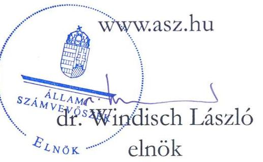
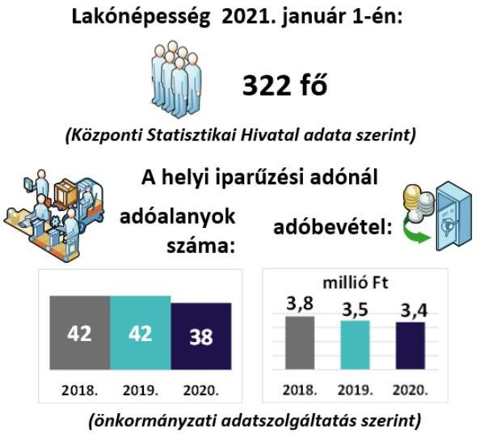
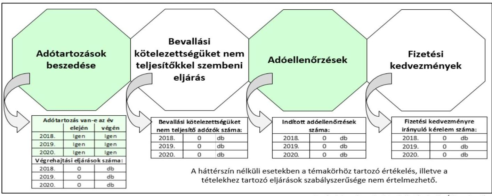

# JELENTÉS 

## Az önkormányzatok helyi iparűzési adóval kapcsolatos tevékenységének ellenőrzése

Pénzesgyőr Község Önkormányzata ellenőrzése

2023.

---

# JELENTÉS 

## Az önkormányzatok helyi iparűzési adóval kapcsolatos tevékenységének ellenőrzése

Pénzesgyőr Község Önkormányzata ellenőrzése

2023.

23007

---

# ELLENŐRZÉSI IGAZGATÓSÁG: 

## ÁLLAMHÁZTARTÁS HELYI SZINTJÉT ELLENŐRZŐ IGAZGATÓSÁG

ELLENŐRZÉSI IGAZGATÓ:
KISGERGELY ISTVÁN igazgató

ELLENŐRZÉSVEZETŐ:
$\square$ Jelentéseink az interneten a www.asz.hu címen olvashatók.

## ÓDOR ZOLTÁN TAMÁS ellenőrzésvezető

IKTATÓSZÁM: EL-3825-001/2023.
TÉMASZÁM: 2578
ELLENŐRZÉS-AZONOSÍTÓ SZÁM: V0921

---

# TARTALOMJEGYZÉK 

■ ÖSSZEGZÉS ..... 5
■ AZ ELLENŐRZÉS CÉLJA ..... 6
■ AZ ELLENŐRZÉS TERÜLETE ..... 7
■ AZ ELLENŐRZÉS HÁTTERE, INDOKOLTSÁGA ..... 8
■ A JELENTÉS LÉNYEGES KÉRDÉSKÖREI ..... 9
■ AZ ELLENŐRZÉS HATÓKÖRE ÉS MÓDSZEREI ..... 10
■ MEGÁLLAPÍTÁSOK ..... 12
■ JAVASLATOK ..... 15
■ MELLÉKLET ..... 17
I. sz. melléklet: Értelmező szótár ..... 17
■ FÜGGELÉK: ÉSZREVÉTELEK ..... 19
■ RÖVIDÍTÉSEK JEGYZÉKE ..... 21

---

.

---

# ÖSSZEGZÉS 

A 2018-2020. években Pénzesgyőr Község Önkormányzata az adórendeletében a törvényi előírásokkal összhangban alakította ki a helyi iparúzési adózás kereteit, azonban az adóigazgatási feladatok ellátásának szabályozottságával kapcsolatban az önkormányzati adóhatóságnál hiányosságokat tárt fel az ellenőrzés. Az önkormányzati adóhatóság a jogszabályi előirások ellenére adóellenőrzést nem végzett és végrehajtási eljárást az adótartozások ellenére nem indított.

## Az ellenőrzés társadalmi indokoltsága

Magyarország Alaptörvénye kimondja, hogy a helyi közügyek intézése és a helyi közhatalom gyakorlása érdekében helyi önkormányzatok múködnek hazánkban. Az önkormányzatok alapvető feladata a helyi közszolgáltatások folyamatos biztosítása, ehhez pedig fontos, hogy fenntartható költségvetéssel rendelkezzenek. A feladatoknak a helyi sajátosságokhoz és igényekhez igazítható ellátása elengedhetetlenné teszi az önkormányzatok felelős, egyensúlyra törekvő gazdálkodásának megteremtését, aminek egyik fontos bevételi forrása a helyi adók rendszere.

A helyi adózást érintő kérdések nagy társadalmi relevanciával bírnak, hiszen az önkormányzatok gazdálkodásában mind társadalompolitikai jelentősége, mind volumene miatt fontos szerepet tölt be a helyi adóztatás. A helyi adók bevezetésének lehetőségével a települési önkormányzatok 99,2\%-a élt 2020-ban, a helyi iparúzési adót az önkormányzatok több, mint $90 \%$-a vezette be. Az önkormányzatok költségvetési bevételeinek átlagosan mintegy egyharmadát tették ki a helyi adókból származó bevételek. A helyi adóbevételeken belül a legnagyobb súlyt (mintegy 80\%ot) a helyi iparúzési adó képviselte. Az önkormányzatok által beszedett helyi adók, miközben bevételt jelentenek a közkiadások finanszírozásához, addig kiadás formájában megjelennek a vállalkozások és a helyi háztartások költségvetésében is, ezért bevezetésük függ a település lakosainak és vállalkozásainak teherviselő képességétől is.

A helyi adóztatás sokrétű, szakértelmet igénylő feladat, amely magában foglalja az önkormányzat részéről az adó mértékének meghatározását és az adókedvezmények, adómentességek megállapítását, valamint a jegyző, mint önkormányzati adóhatóság részéről az adó beszedését, az adóellenőrzést és a hátralékok behajtását. Minden érintett érdeke, hogy ez az adóztatási tevékenység összhangban legyen a jogszabályi előírásokkal, biztosítsa az önkormányzat feladatellátásához szükséges bevételeket, emellett a helyben múködő vállalkozások fennmaradása biztosított legyen. Az ÁSZ ${ }^{1}$ ellenőrzése az esetleges hiányosságok feltárásával hozzájárulhat a helyi önkormányzatok, önkormányzati adóhatóságok szabályszerűbb adóhatósági tevékenységéhez.

## Főbb megállapítások

AZ ADÓZÁS KERETEIT az önkormányzat a 2018-2020. években a törvényi előírásokkal összhangban alakította ki, adórendeletében a jogszabályi előírásokat betartva döntött a helyi iparúzési adó mértékéről.
AZ ADÓIGAZGATÁSI SZABÁLYOKAT a helyi iparúzési adó beszedéséhez a jegyző a 2018-2020. években nem teljeskörűen határozta meg, belső szabályozása nem tartalmazta az adóigazgatási feladatok gyakorlásának módját, valamint a jegyző nem szabályozta a kiadmányozás rendjét, és nem készítette el az ellenőrzési nyomvonalat.

ADÓELLENŐRZÉST a 2018-2020 évben az önkormányzati adóhatóság nem végzett.
A HELYI IPARÚZÉSI ADÓTARTOZÁSOK BESZEDÉSE ÉRDEKÉBEN az önkormányzati adóhatóság az ellenőrzött időszakban nem intézkedett, végrehajtási intézkedések megindítására a fennálló adótartozások ellenére nem került sor.

Az Állami Számvevőszék az intézkedések megtétele céljából a jegyző részére öt javaslatot fogalmazott meg.

---

# AZ ELLENŐRZÉS CÉLJA 

AZ ELLENŐRZÉS CÉLJA annak megállapítása volt, hogy az önkormányzatok helyi iparűzési adóról szóló rendelete, illetve annak megalkotása a jogszabályi előírásoknak megfelelő volt-e, valamint a jegyző az adóigazgatási feladatok ellátásának helyi szabályait a jogszabályi előírásokkal összhangban határozta-e meg, továbbá az önkormányzati adóhatóságok a helyi iparűzési adóval kapcsolatos egyes feladataikat (adómentesség, adókedvezmények megállapítása, ellenőrzés, fizetési kedvezmények engedélyezése, hátralékok beszedése) szabályszerűen látták-e el.

---

# AZ ELLENŐRZÉS TERÜLETE 

## Pénzesgyőr Község Önkormányzata, Bakonybéli Közös Önkormányzati Hivatal

PÉNZESGYŐR Lakónépesség 2021. január 1-én:

Magyarország Alaptörvénye értelmében a helyi önkormányzat a helyi közügyek intézése körében a törvény keretei között dönt a helyi adók fajtájáról és mértékéről. A Mötv. ${ }^{2}$ rögzíti, hogy a helyi adóval kapcsolatos feladatok ellátása a helyi önkormányzatok feladata. A Hatásköri tv. ${ }^{3}$, valamint a Htv. ${ }^{4}$ értelmében a helyi adók bevezetéséről a települési önkormányzat képviselő-testülete dönt rendelettel.

A Htv. rögzíti, hogy az önkormányzatok adómegállapítási joga kiterjed az adó bevezetésére, a már bevezetett adó hatályon kívül helyezésére, illetőleg módosítására, az adó mértékének a törvényi keretek közötti megállapítására, a törvényben meghatározott mentességeken, kedvezményeken túli további mentességek, kedvezmények biztosítására, valamint a Htv., az Art. ${ }^{5}$, az Air. ${ }^{6}$ keretei között az adózás részletes szabályainak meghatározására. A Hatásköri tv. és az Air. előírja, hogy adóügyekben elsőfokú hatósági jogkörben a település jegyzője, mint önkormányzati adóhatóság jár el, a kötelezettségek teljesítésének előmozdítása érdekében ellenőrzést folytat.

Az ÁSZ ellenőrzése az önkormányzati adóhatósági tevékenység esetében kiterjedt a rendeletalkotásra, az adóztatással összefüggő helyi szabályozásokra és az adóigazgatási feladatok közül a végrehajtásra, a bevallási kötelezettséget elmulasztókkal kapcsolatos intézkedésekre, a fizetési kedvezményekre irányuló kérelmekkel kapcsolatos eljárásokra, valamint az adóellenőrzésre. Az önkormányzati adóhatósághoz a helyi iparűzési adónemhez kapcsolódó fizetési kedvezmény kérelem a 2018-2020. években nem érkezett, és a bevallási kötelezettség nem teljesítésére nem került sor.

Pénzesgyőr község a Közép-Dunántúl régióban, Veszprém megyében, a Zirci járásban található. Az ellenőrzött időszakban a községet a polgármesterrel együtt 5 fős képviselő-testület irányította. A Bakonybéli Közös Önkormányzati Hivatal látta el a település önkormányzatának müködésével, fenntartásával kapcsolatos feladatokat. Az ellenőrzött időszakban a polgármester személye egy alkalommal, 2019-ben változott.

Adóügyekben elsőfokú adóhatóságként az Air. alapján a Közös Önkormányzati Hivatal ${ }^{7}$ jegyzője járt el. A jelenlegi jegyző 2017. júniusá óta vezeti a Közös Önkormányzati Hivatalt. Az adóigazgatási feladatokat az adóigazgatási munkakört betöltő hivatali dolgozó végezte.

---

# AZ ELLENŐRZÉS HÁTTERE, INDOKOLTSÁGA 

Az önkormányzatok alapvető feladata a helyi közszolgáltatások biztosítása a lakosság számára. A feladatnak a helyi sajátosságokhoz és igényekhez igazítható ellátása elengedhetetlenné teszi az önkormányzatok kiegyensúlyozott gazdálkodásának megteremtését, amelynek egyik eszköze a helyi adók rendszere.

A helyi adók adják átlagosan az önkormányzatok összes költségvetési bevételének egyharmadát, ezért az önkormányzatok feladatainak finanszírozásában a helyi adóztatási tevékenységnek kiemelt jelentősége van. A helyi adóbevételek mintegy 80\%-a helyi iparűzési adóból származik. Az iparűzési adó jelentős bevételi forrást jelent az önkormányzati alrendszer számára, egyes önkormányzatok esetében pedig a költségvetési bevételek meghatározó részét képviseli. Az önkormányzatok több, mint 90\%-a vezette be a helyi iparűzési adót.

Az ÁSZ törvény ${ }^{8}$ 5. § (8) bekezdése alapján az ÁSZ feladata az önkormányzatok adóztatási tevékenységének ellenőrzése. Az ÁSZ esetleges szabályszerűségi hibák, kockázatok feltárásával hozzájárulhat a helyi önkormányzatok, önkormányzati adóhatóságok jogkövető magatartásának elősegítéséhez.

---

# A JELENTÉS LÉNYEGES KÉRDÉSKÖREI 

1. Kialakították-e az önkormányzatnál a helyi iparüzési adóval kapcsolatos egyes adóhatósági tevékenységek szabályszerű ellátását biztosító belső szabályzatokat?
2. Az önkormányzati adóhatóság helyi iparüzési adóval kapcsolatos egyes adóhatósági tevékenységei szabályszerűek voltak-e?

---

# AZ ELLENŐRZÉS HATÓKÖRE ÉS MÓDSZEREI 

## Az ellenőrzés típusa

Megfelelőségi ellenőrzés.

## Az ellenőrzött időszak

Az ellenőrzött időszak a 2018. január 1.-2020. december 31. közötti időszak.

## Az ellenőrzés tárgya

Az önkormányzatok helyi iparűzési adóval kapcsolatos tevékenységének ellátása.

## Az ellenőrzött szervezet

Pénzesgyőr Község Önkormányzata, Bakonybéli Közös Önkormányzati Hivatal

## Az ellenőrzés jogalapja

Az ellenőrzés jogszabályi alapját az ÁSZ törvény 5. § (2), (6) és (8) bekezdései képezik.

## Az ellenőrzés módszerei

Az ellenőrzést az ellenőrzési program szempontjai, az ellenőrzött időszakban hatályos jogszabályok, az ellenőrzés általános szakmai szabályai és az ellenőrzésre irányadó ÁSZ módszertanok alapján végezte az ÁSZ.

Az ellenőrzési kérdések megválaszolásához szükséges bizonyítékok megszerzése az ellenőrzött szervezetek által rendelkezésre bocsátott dokumentumokra, adatokra alapozva megfigyelés, kérdésfeltevés (információkérés), mintavételezés, valamint elemző eljárás útján történt. Az ellenőrzési bizonyítékként felhasználható adatforrások közé tartoznak egyrészt az ellenőrzési program részletes szempontjainál felsorolt adatforrások, másrészt minden egyéb - az ellenőrzés folyamán felhasznált, az ellenőrzés szempontjából információt tartalmazó - dokumentum.

Az ellenőrzés lefolytatásához az ellenőrzött szervezetek a tanúsítványok elektronikus kitöltésével, valamint az ÁSZ által kért dokumentumok

---

elektronikus megküldésével szolgáltattak adatokat, amelyek valódiságát és teljeskörűségét az ellenőrzött szervezetek vezetője által tett teljességi és hitelességi nyilatkozat igazolta.

Az egyes adóhatósági tevékenységek (ellenőrzés; fizetési kedvezmények engedélyezése; hátralékok beszedése) szabályszerűségének ellenőrzésénél mintavételezést alkalmazott az ÁSZ. Amennyiben az alapsokaság tételeinek száma nem érte el a minta elemszámot ( $30 \mathrm{db} / \mathrm{év}+5 \mathrm{db} / \mathrm{év}$ póttétel), abban az esetben tételes ellenőrzésre került sor. Az ezt meghaladó minta elemszám esetén a minta tételeinek értékelése „szabályszerűnek" minősült, ha a minta ellenőrzésének eredménye alapján $95 \%$-os bizonyossággal megállapítható, hogy a teljes sokaságban az átlagos hibaarány nem haladta meg vagy egyenlő volt a $10 \%$-os mértékkel, „nem szabályszerű", ha ez az arány nagyobb volt, mint $10 \%$.

---

# 1. Kialakították-e az önkormányzatnál a helyi iparúzési adóval kapcsolatos egyes adóhatósági tevékenységek szabályszerű ellátását biztosító belső szabályzatokat? 

Összegző megállapítás

1.1. számú megállapítás

1.2. számú megállapítás

A 2018-2020. években az önkormányzat a helyi iparúzési adózás szabályait az önkormányzati adórendeletben szabályszerűen határozta meg, azonban belső szabályozása nem tartalmazta az adóigazgatási feladatok gyakorlásának módját, valamint a jegyző́ nem szabályozta a kiadmányozás rendjét és nem készítette el az ellenőrzési nyomvonalat.

A 2018-2020. években a helyi iparúzési adózás rendeleti szabályainak meghatározása a jogszabályi előírásokkal összhangban történt.

AZ ÖNKORMÁNYZATI ADÓRENDELET MEGALKOTÁSA szabályszerű volt. Pénzesgyőr Község Önkormányzatának Képvi-selő-testülete a Htv.-ben, valamint a Hatásköri tv.-ben foglaltak szerint a helyi iparúzési adózás szabályait önkormányzati adórendeletben ${ }^{9}$ határozta meg, kialakította a helyi iparúzési adóval kapcsolatos egyes adóhatósági tevékenységek szabályszerű ellátását biztosító alapvető kontroll- és szabályozási környezetet. Az önkormányzati adórendelet megalkotásakor a Mötv. 47. § (1) bekezdés előírása szerint a képviselő-testület határozatképes volt, az adórendeletet minősített többséggel fogadta el, a Mötv. 50. §-ban, illetve a 42. § 1. pontjában foglaltaknak megfelelően.

Az önkormányzati rendelettel az állandó és ideiglenes jellegú iparúzési tevékenység vonatkozásában a helyi iparúzési adó mértékét a Htv.-ben foglalt előírásokkal összhangban állapították meg. Az önkormányzati rendelettel megállapított helyi iparúzési adómérték állandó jellegú iparúzési tevékenység esetén a Htv. 40. § (1) bekezdés c) pontjának keretei között az adóalap $2 \%$-ában került meghatározásra. A helyi iparúzési adómérték ideiglenes jellegú iparúzési tevékenység esetén naptári naponként 1000 forint volt, ami összhangban volt a Htv. 40. § (2) bekezdés előírásával. A 2018-2020. években az önkormányzati adórendeletben a Htv. 39/C. § (2)(4) bekezdésekben biztosított helyi iparúzési adóhoz kapcsolódó adómentességek, adókedvezmények igénybevételét az önkormányzat képviselőtestülete nem tette lehetővé.

A 2018-2020. években az adóigazgatási feladatok ellátásának szabályozottsága a jogszabályi előírásoknak nem felelt meg.

AZ ADÓIGAZGATÁSI FELADATOK ELLÁTÁSÁNAK
SZABÁLYAIT a 2018-2020-ban a belső szabályzatokban nem a jogszabályi előírásoknak megfelelően rögzítették, mert

---

$\longrightarrow$ az Ávr. ${ }^{10}$ 13. § (1) bekezdés g) pontjában foglaltak ellenére az önkormányzati hivatali SZMSZ-e nem tartalmazta az adóigazgatási munkakörhöz tartozó feladat- és hatásköröket, a hatáskörök gyakorlásának módját,
$\longrightarrow$ az önkormányzat jegyzője a Mötv. 81. § (3) bekezdés j) pontjában foglaltakat ellenére a hatáskörébe tartozó adóigazgatási ügyekben a kiadmányozás rendjét nem szabályozta,
$\longrightarrow$ a Bkr. ${ }^{11}$ 6. § (3) bekezdés előírása ellenére az önkormányzat jegyzője nem készítette el az ellenőrzési nyomvonalat.

# 2. Az önkormányzati adóhatóság helyi iparúzési adóval kapcsolatos egyes adóhatósági tevékenységei szabályszerűek voltak-e? 

Összegző megállapítás

A 2018-2020. években az önkormányzati adóhatóság a jogszabályi előírások ellenére adóellenőrzést nem végzett, és végrehajtási eljárást az adótartozások beszedése érdekében nem indított.

A helyi iparúzési adóztatással kapcsolatos önkormányzati adóigazgatási feladatok számvevőszéki ellenőrzés megállapításának tartalmát befolyásoló egyes adatok alakulását mutatja be az 1. ábra.

1. ábra - Az adóigazgatási feladatok számvevőszéki ellenőrzés megállapításának tartalmát befolyásoló egyes adatok alakulása

Forrás: önkormányzati adatszolgáltatás alapján ÁSZ szerkesztés
2.1. számú megállapítás

A 2018-2020. években az önkormányzati adóhatóság adóellenőrzést nem végzett az adókötelezettségek teljesítésének előmozdítására.

ADÓELLENŐRZÉST az önkormányzati adóhatóság a 2018-2020. években -az Air. 86. § előírása ellenére - az adótörvényekben előírt kötelezettségek teljesítésének előmozdítása érdekében nem folytatott le.

---

2.2. számú megállapítás

A 2018-2020. években az önkormányzati adóhatóság a helyi iparúzési adótartozások beszedése érdekében végrehajtási eljárást nem indított.

Az önkormányzati adóhatóság által nyilván tartott helyi iparúzési adótartozás összege 2018. január 1-jén 0,3 millió Ft, 2019. december 31-én 0,4 millió Ft, 2020. december 31-én 0,4 millió Ft volt.

A HELYI IPARÚZÉSI ADÓTARTOZÁSOK BESZEDÉSE ÉRDEKÉBEN az Avt. ${ }^{12} 30 . \S$ (1) bekezdésében foglaltak ellenére az önkormányzati adóhatóság a 2018-2019. években és 2020. március 24. napjáig, az 57/2020. (III. 23.) Korm. rendelet ${ }^{13}$ hatálybelépésének időpontjáig végrehajtási eljárást nem indított. Az önkormányzati adóhatóság a tartozás megfizetésére az adósokat nem hívta fel, végrehajtási intézkedések megtételére a 2018-2020. években fennálló adótartozások ellenére nem került sor.

---

# JAVASLATOK 

Az ÁSZ tv. 33. § (1) bekezdésében foglaltak értelmében az ellenőrzött szervezet vezetője köteles a jelentésben foglalt megállapításokhoz kapcsolódó intézkedési tervet összeállítani és azt a jelentés kézhezvételétől számított 30 napon belül az ÁSZ részére megküldeni. Amennyiben az ellenőrzött szervezet vezetője nem küldi meg határidőben az intézkedési tervet, vagy továbbra sem elfogadható intézkedési tervet küld, az Állami Számvevőszék elnöke az ÁSZ tv. 33. § (3) bekezdése a) és b) pontjaiban foglaltakat érvényesítheti.

## Pénzesgyőr Község Önkormányzata jegyzője

1. Intézkedjen az Ávr. 13. § (1) bekezdés g) pontjában foglalt elöírások belső szabályozásban történő rögzítéséről.
(1.2. sz. megállapítás 2. bekezdése alapján)
2. Intézkedjen a Mötv. 81. § (3) bekezdés j) pontjában foglalt elöírás szerint a hatáskörébe tartozó adóigazgatási ügyekben a kiadmányozás rendjének szabályozásáról.
(1.2. sz. megállapítás 3. bekezdése alapján)
3. Készítse el a Bkr. 6. § (3) bekezdés elöírása szerint az ellenőrzési nyomvonalat.
(1.2. sz. megállapítás 4. bekezdése alapján)
4. Intézkedjen az Air. 86. §-ban foglaltaknak megfelelően a helyi iparüzési adó teljesítésével kapcsolatos adóellenőrzések lefolytatása érdekében.
(2.1. sz. megállapítás alapján)
5. Intézkedjen az Avt. 30. § (1) bekezdés elöírása szerint a helyi iparüzési adótartozások, hátralékok beszedése érdekében.
(2.2. sz. megállapítás 2. bekezdése alapján)

---

.

---

# MELLÉKLET 

## I. SZ. MELLÉKLET: ÉRTELMEZŐ SZÓTÁR

önkormányzat
önkormányzati hivatal
adóhatóság
adózó
helyi iparűzési adó
adóalany
vállalkozó
adóigazgatási eljárás
adóhatósági ellenőrzés
adóellenőrzés
fizetési kedvezmény adótartozás

A helyi önkormányzat jogi személy. Az önkormányzati feladatok ellátását a képviselő-testület és szervei biztosítják. A képviselő-testület szervei: a polgármester, a főpolgármester, a megyei közgyűlés elnöke, a képviselő-testület bizottságai, a részönkormányzat testülete, a polgármesteri hivatal, a megyei önkormányzati hivatal, a közös önkormányzati hivatal, a jegyző, továbbá a társulás. A képviselő-testület a feladatkörébe tartozó közszolgáltatások ellátására - jogszabályban meghatározottak szerint - költségvetési szervet, a Polgári perrendtartásról szóló 2016. évi CXXX. törvény szerinti gazdálkodó szervezetet (a továbbiakban: gazdálkodó szervezet), nonprofit szervezetet és egyéb szervezetet (a továbbiakban együtt: intézmény) alapithat, továbbá szerződést köthet természetes és jogi személlyel vagy jogi személyiséggel nem rendelkező szervezettel. (Forrás: Mötv. 41. § (1), (2), (6) bekezdései)
Az ellenőrzési programban önkormányzati hivatalként értelmezzük a polgármesteri hivatalt, a főpolgármesteri hivatalt, a megyei önkormányzati hivatalt és a közös önkormányzati hivatalt. (Forrás: Áht. ${ }^{14}$ 1. § 18. pont).
Az önkormányzat jegyzője, mint önkormányzati adóhatóság. (Forrás: Air. 22. § b) pont)
Az a személy, akinek vagy amelynek adókötelezettségét adót, költségvetési támogatást megállapító törvény, e törvény, az adózás rendjéről szóló 2017. évi CL. törvény (a továbbiakban: Art.) vagy önkormányzati rendelet előírja. (Forrás: Air. 11. § (1) bekezdés)
Az önkormányzat illetékességi területén állandó vagy ideiglenes jelleggel végzett vállalkozási tevékenység (a továbbiakban: iparűzési tevékenység) esetén az önkormányzat költségvetése javára megállapított adó. (Forrás: Htv. 35. § (1) bekezdés)
A helyi iparűzési adó alanya a vállalkozó. (Forrás: Htv. 35. § (2) bekezdés)
A Polgári Törvénykönyvről szóló törvény szerinti bizalmi vagyonkezelési szerződés alapján kezelt vagyon, valamint a gazdasági tevékenységet saját nevében és kockázatára haszonszerzés céljából, üzletszerűen végző
a) a személyi jövedelemadóról szóló törvényben meghatározott egyéni vállalkozó,
b) a személyi jövedelemadóról szóló törvényben meghatározott mezőgazdasági őstermelő, feltéve, hogy őstermelői tevékenységéből származó bevétele az adóévben a 600000 forintot meghaladja,
c) jogi személy, ideértve azt is, ha az felszámolás, kényszertörlés vagy végelszámolás alatt áll, d) egyéni cég, egyéb szervezet, ideértve azt is, ha azok felszámolás, kényszertörlés vagy végelszámolás alatt állnak. (Forrás: Htv. 52. § 26. pont)
Az adóigazgatási eljárásban az adóhatóság megállapítja az adózó jogait, kötelezettségeit, ellenőrzi az adókötelezettségek teljesítését, a joggyakorlás törvényességét, nyilvántartást vezet az adózást érintő tényekről, adatokról, körülményekről, és adatot igazol, illetve az ezeket érintő döntését érvényesíti. (Forrás: Air. 9. §)
Az adóhatóság az adótörvényekben és más jogszabályokban előírt kötelezettségek teljesítésének vagy megsértésének megállapítása, a kötelezettségek teljesítésének előmozdítása érdekében ellenőrzést folytat. (Forrás: Air. 86. §)
Adóellenőrzés keretében az adóhatóság az adózó adómegállapítási, adatbejelentési, bevallási kötelezettsége teljesítését adónként, támogatásonként és időszakonként vagy meghatározott időszakra több adó és támogatás tekintetében is vizsgálja.
(Forrás: Air. 90. § (1) bekezdés)
A fizetési halasztás, részletfizetés, valamint az adómérséklés. (Forrás: Art. 198.-201. §)
Az esedékességkor meg nem fizetett adó és a jogosulatlanul igénybe vett költségvetési támogatás. (Forrás: Art. 7. § 6. pont)

---

.

---

# FÜGGELÉK: ÉSZREVÉTELEK 

A jelentéstervezetet a Számvevőszék 15 napos észrevételezésre megküldte az ellenőrzött szervezet vezetőjének az ÁSZ tv. 29. §* (1) bekezdése előírásának megfelelően.

Az ellenőrzött szervezetek vezetői a jelentéstervezet megállapításaira vonatkozó észrevételezési jogukkal nem éltek.

[^0]
[^0]:    * 29. § (1) Az Állami Számvevőszék az ellenőrzési megállapításait megküldi az ellenőrzött szervezet vezetőjének vagy az általa megbízott személynek, és annak, akinek személyes felelősségét állapította meg.
    (2) Az ellenőrzött szervezet vezetője és a felelősként megjelölt személy az ellenőrzés megállapításaira tizenöt napon belül írásban észrevételt tehet.
    (3) Az Állami Számvevőszék az észrevételre a beérkezésétől számított harminc napon belül írásban válaszol. A figyelembe nem vett észrevételeket köteles a jelentésben feltüntetni, és megindokolni, hogy azokat miért nem fogadta el.

---

.

---

# RÖVIDÍTÉSEK JEGYZÉKE 

${ }^{1}$ ÁSZ
${ }^{2}$ Mötv.
${ }^{3}$ Hatásköri tv.
${ }^{4}$ Htv.
${ }^{5}$ Art.
${ }^{6}$ Air.
${ }^{7}$ Közös Önkormányzati Hivatal
${ }^{8}$ ÁSZ törvény
${ }^{9}$ adórendelet
${ }^{10}$ Ávr.
${ }^{11}$ Bkr.
${ }^{12}$ Avt.
${ }^{13}$ 57/2020. (III. 23.) Korm. rendelet
${ }^{14}$ Áht.

Állami Számvevőszék
2011. évi CLXXXIX. törvény Magyarország helyi önkormányzatairól
1991. évi XX. törvény a helyi önkormányzatok és szerveik, a köztársasági megbízottak, valamint egyes centrális alárendeltségű szervek feladat- és hatásköreiről
1990. évi C. törvény a helyi adókról
2017. évi CL. törvény az adózás rendjéről
2017. évi CLI. törvény az adóigazgatási rendtartásról

Bakonybéli Közös Önkormányzati Hivatal
2011. évi LXVI. törvény az Állami Számvevőszékről

Pénzesgyőr Község Önkormányzata Képviselő-testületének 6/2014.(X.2.) önkormányzati rendelete a helyi adókról, módosítva a 8/2014. (XI.29.) önkormányzati rendelettel
368/2011. (XII. 31.) Korm. rendelet az államháztartásról szóló törvény végrehajtásáról
370/2011. (XII. 31.) Korm. rendelet a költségvetési szervek belső kontrollrendszeréről és belső ellenőrzéséről
2017. évi CLIII. törvény az adóhatóság által foganatosítandó végrehajtási eljárásokról
57/2020. (III. 23.) Korm. rendelet az élet- és vagyonbiztonságot veszélyeztető tömeges megbetegedést okozó humánjárvány megelőzése, illetve következményeinek elhárítása, a magyar állampolgárok egészségének és életének megóvása érdekében elrendelt veszélyhelyzet során a végrehajtással kapcsolatban teendő intézkedésekről
2011. évi CXCV. törvény az államháztartásról

---

1052 Budapest, Apáczai Csere János u. 10. | 1364 Budapest 4., Pf. 54
www.asz.hu | szamvevoszek@asz.hu
telefon: +36 14849100