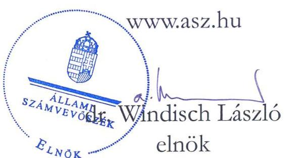
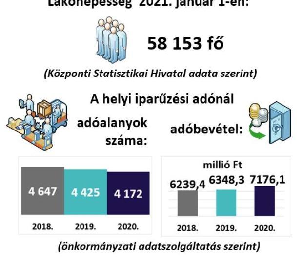
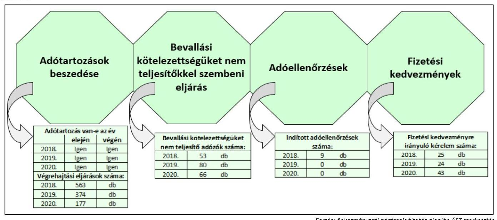

# JELENTÉS 

## Az önkormányzatok helyi iparűzési adóval kapcsolatos tevékenységének ellenőrzése

Veszprém Megyei Jogú Város Önkormányzata ellenőrzése
2023.

23010
www.asz.hu

---

# JELENTÉS 

## Az önkormányzatok helyi iparűzési adóval kapcsolatos tevékenységének ellenőrzése

Veszprém Megyei Jogú Város Önkormányzata ellenőrzése
2023.

23010

---

# ELLENŐRZÉSI IGAZGATÓSÁG: 

## ÁLLAMHÁZTARTÁS HELYI SZINTJÉT ELLENŐRZŐ IGAZGATÓSÁG

ELLENŐRZÉSI IGAZGATÓ:
KISGERGELY ISTVÁN igazgató

ELLENŐRZÉSVEZETŐ:
$\square$ Jelentéseink az interneten a www.asz.hu címen olvashatók.

## ÓDOR ZOLTÁN TAMÁS ellenőrzésvezető

IKTATÓSZÁM: EL-3828-001/2023.
TÉMASZÁM: 2578
ELLENŐRZÉS-AZONOSÍTÓ SZÁM: V0921

---

# TARTALOMJEGYZÉK 

■ ÖSSZEGZÉS ..... 5
■ AZ ELLENŐRZÉS CÉLJA ..... 7
■ AZ ELLENŐRZÉS TERÜLETE ..... 8
■ AZ ELLENŐRZÉS HÁTTERE, INDOKOLTSÁGA ..... 9
■ A JELENTÉS LÉNYEGES KÉRDÉSKÖREI ..... 10
■ AZ ELLENŐRZÉS HATÓKÖRE ÉS MÓDSZEREI ..... 11
■ MEGÁLLAPÍTÁSOK ..... 13
■ JAVASLATOK ..... 17
■ MELLÉKLET ..... 19
I. sz. melléklet: Értelmező szótár ..... 19
■ FÜGGELÉK: ÉSZREVÉTELEK ..... 21
■ RÖVIDÍTÉSEK JEGYZÉKE ..... 23

---

.

---

# ÖSSZEGZÉS 

A 2018-2020. években Veszprém Megyei Jogú Város Önkormányzata a törvényi előírásokkal összhangban alakította ki a helyi iparűzési adózás rendeleti kereteit, azonban az adóigazgatási feladatok ellátásának szabályozottságával kapcsolatban az önkormányzati adóhatóságnál hiányosságokat tárt fel az ellenőrzés. Az önkormányzati adóhatóság egyes ellenőrzött tevékenységei közül a bevallási kötelezettséget nem teljesítő adózókhoz kapcsolódó értékelt eljárások több, mint fele nem felelt meg a jogszabályi előírásoknak.

## Az ellenőrzés társadalmi indokoltsága

Magyarország Alaptörvénye kimondja, hogy a helyi közügyek intézése és a helyi közhatalom gyakorlása érdekében helyi önkormányzatok működnek hazánkban. Az önkormányzatok alapvető feladata a helyi közszolgáltatások folyamatos biztosítása, ehhez pedig fontos, hogy fenntartható költségvetéssel rendelkezzenek. A feladatoknak a helyi sajátosságokhoz és igényekhez igazítható ellátása elengedhetetlenné teszi az önkormányzatok felelős, egyensúlyra törekvő gazdálkodásának megteremtését, aminek egyik fontos bevételi forrása a helyi adók rendszere.

A helyi adózást érintő kérdések nagy társadalmi relevanciával bírnak, hiszen az önkormányzatok gazdálkodásában mind társadalompolitikai jelentősége, mind volumene miatt fontos szerepet tölt be a helyi adóztatás. A helyi adók bevezetésének lehetőségével a települési önkormányzatok 99,2%-a élt 2020-ban, a helyi iparűzési adót az önkormányzatok több, mint 90%-a vezette be. Az önkormányzatok költségvetési bevételeinek átlagosan mintegy egyharmadát tették ki a helyi adókból származó bevételek. A helyi adóbevételeken belül a legnagyobb súlyt (mintegy 80%-ot) a helyi iparűzési adó képviselte. Az önkormányzatok által beszedett helyi adók, miközben bevételt jelentenek a közkiadások finanszírozásához, addig kiadás formájában megjelennek a vállalkozások és a helyi háztartások költségvetésében is, ezért bevezetésük függ a település lakosainak és vállalkozásainak teherviselő képességétől is.

A helyi adóztatás sokrétű, szakértelmet igénylő feladat, amely magában foglalja az önkormányzat részéről az adó mértékének meghatározását és az adókedvezmények, adómentességek megállapítását, valamint a jegyző, mint önkormányzati adóhatóság részéről az adó beszedését, az adóellenőrzést és a hátralékok behajtását. Minden érintett érdeke, hogy ez az adóztatási tevékenység összhangban legyen a jogszabályi előírásokkal, biztosítsa az önkormányzat feladatellátásához szükséges bevételeket, emellett a helyben működő vállalkozások fennmaradása biztosított legyen. Az ÁSZ ${ }^{1}$ ellenőrzése az esetleges hiányosságok feltárásával hozzájárulhat a helyi önkormányzatok, önkormányzati adóhatóságok szabályszerűbb adóhatósági tevékenységéhez.

## Főbb megállapítások

AZ ADÓZÁS KERETEIT az ellenőrzött a 2018-2020. években a törvényi előírásokkal összhangban alakította ki, adórendeletében a jogszabályi előírásokat betartva döntött a helyi iparűzési adó mértékéről.
AZ ADÓIGAZGATÁSI SZABÁLYOKAT a jegyző a 2018-2020. években nem teljeskörűen alakította ki, belső szabályzat nem tartalmazta az adóigazgatási feladatokat ellátó szervezeti egység alkalmazottainak feladat- és hatásköreit. A 2018-2020. években rendelkeztek a jegyző által elkészített ellenőrzési nyomvonallal, ugyanakkor a 2020. évben hatályos szabályozás nem tartalmazta a fizetési halasztás, a részletfizetés és az adómérséklés elbírálásának folyamatát.

## A BEVALLÁSI KÖTELEZETTSÉGET AZ ADÓHATÓSÁGI FELHÍVÁS ELLENÉRE

HATÁRIDŐBEN NEM TELJESÍTŐ ADÓZÓKAT az önkormányzati adóhatóság mulasztási bírsággal nem sújtotta és 15 napos határidő megjelölésével a bevallási kötelezettség jogszerű teljesítésére ismételten nem hívta fel.

---

ADÓELLENŐRZÉSRE a 2018. évben kilenc esetben került sor, míg a 2019-2020. években az adóhatóság adóellenőrzést nem végzett.

A FIZETÉSI KEDVEZMÉNYEKRE irányuló kérelmekről az önkormányzati adóhatóság a 2018-2019. években néhány esetben az ügyintézési határidő betartása kivételével, a 2020. évben a jogszabályi előírásokkal összhangban döntött.

A HELYI IPARŰZÉSI ADÓTARTOZÁSOK BESZEDÉSE ÉRDEKÉBEN tett végrehajtási intézkedéseit végrehajtható okirat alapján indította meg és a végrehajtási cselekményeket dokumentálta.

Az Állami Számvevőszék az intézkedések megtétele céljából a jegyző részére három javaslatot fogalmazott meg.

---

# AZ ELLENŐRZÉS CÉLJA 

AZ ELLENŐRZÉS CÉLJA annak megállapítása volt, hogy az önkormányzatok helyi iparűzési adóról szóló rendelete, illetve annak megalkotása a jogszabályi előírásoknak megfelelő volt-e, valamint a jegyző az adóigazgatási feladatok ellátásának helyi szabályait a jogszabályi előírásokkal összhangban határozta-e meg, továbbá az önkormányzati adóhatóságok a helyi iparűzési adóval kapcsolatos egyes feladataikat (adómentesség, adókedvezmények megállapítása, ellenőrzés, fizetési kedvezmények engedélyezése, hátralékok beszedése) szabályszerűen látták-e el.

---

# AZ ELLENŐRZÉS TERÜLETE 

## Veszprém Megyei Jogú Város Önkormányzata, Veszprém Megyei Jogú Város Polgármesteri Hivatala

VESZPRÉM Lakónépesség 2021. január 1-én:

Magyarország Alaptörvénye értelmében a helyi önkormányzat a helyi közügyek intézése körében a törvény keretei között dönt a helyi adók fajtájáról és mértékéről. A Mötv. ${ }^{2}$ rögzíti, hogy a helyi adóval kapcsolatos feladatok ellátása a helyi önkormányzatok feladata. A Hatásköri tv. ${ }^{3}$, valamint a Htv. ${ }^{4}$ értelmében a helyi adók bevezetéséről a települési önkormányzat képviselő-testülete dönt rendelettel.

A Htv. rögzíti, hogy az önkormányzatok adómegállapítási joga kiterjed az adó bevezetésére, a már bevezetett adó hatályon kívül helyezésére, illetőleg módosítására, az adó mértékének a törvényi keretek közötti megállapítására, a törvényben meghatározott mentességeken, kedvezményeken túli további mentességek, kedvezmények biztosítására, valamint a Htv., az Art. ${ }^{5}$, az Air. ${ }^{6}$ keretei között az adózás részletes szabályainak meghatározására. A Hatásköri tv. és az Air. előírja, hogy adóügyekben elsőfokú hatósági jogkörben a település jegyzője, mint önkormányzati adóhatóság jár el, a kötelezettségek teljesítésének előmozdítása érdekében ellenőrzést folytat.

Az ÁSZ ellenőrzése az önkormányzati adóhatósági tevékenység esetében kiterjedt a rendeletalkotásra, az adóztatással összefüggő helyi szabályozásokra és az adóigazgatási feladatok közül a végrehajtásra, a bevallási kötelezettséget elmulasztókkal kapcsolatos intézkedésekre, a fizetési kedvezményekre irányuló kérelmekkel kapcsolatos eljárásokra, valamint az adóellenőrzésre.

Veszprém megyei jogú város a Közép-Dunántúli régióban, Veszprém megyében, a Veszprémi járásban található, megyeszékhely és járási székhely. Az ellenőrzött időszakban a várost a polgármesterrel együtt 18 fős Közgyűlés irányította és a Veszprém Megyei Jogú Város Polgármesteri Hivatala látta el a település önkormányzatának működésével, fenntartásával kapcsolatos feladatokat. Az ellenőrzött időszakban a polgármester személye nem változott.

Adóügyekben elsőfokú adóhatóságként az Air. alapján a Polgármesteri Hivatal ${ }^{7}$ jegyzője járt el. A jelenlegi jegyző 2020. márciusá óta vezeti a Polgármesteri Hivatalt. Az adóigazgatási feladatokat a Polgármesteri Hivatal szervezeti egysége látta el.

---

# AZ ELLENŐRZÉS HÁTTERE, INDOKOLTSÁGA 

Az önkormányzatok alapvető feladata a helyi közszolgáltatások biztosítása a lakosság számára. A feladatnak a helyi sajátosságokhoz és igényekhez igazítható ellátása elengedhetetlenné teszi az önkormányzatok kiegyensúlyozott gazdálkodásának megteremtését, amelynek egyik eszköze a helyi adók rendszere.

A helyi adók adják átlagosan az önkormányzatok összes költségvetési bevételének egyharmadát, ezért az önkormányzatok feladatainak finanszírozásában a helyi adóztatási tevékenységnek kiemelt jelentősége van. A helyi adóbevételek mintegy 80%-a helyi iparűzési adóból származik. Az iparűzési adó jelentős bevételi forrást jelent az önkormányzati alrendszer számára, egyes önkormányzatok esetében pedig a költségvetési bevételek meghatározó részét képviseli. Az önkormányzatok több, mint 90%-a vezette be a helyi iparűzési adót.

Az ÁSZ törvény ${ }^{8}$ 5. § (8) bekezdése alapján az ÁSZ feladata az önkormányzatok adóztatási tevékenységének ellenőrzése. Az ÁSZ esetleges szabályszerűségi hibák, kockázatok feltárásával hozzájárulhat a helyi önkormányzatok, önkormányzati adóhatóságok jogkövető magatartásának elősegítéséhez.

---

# A JELENTÉS LÉNYEGES KÉRDÉSKÖREI 

1.     - Kialakították-e az önkormányzatnál a helyi iparűzési adóval kapcsolatos egyes adóhatósági tevékenységek szabályszerű ellátását biztosító belső szabályzatokat?
2.     - Az önkormányzati adóhatóság helyi iparűzési adóval kapcsolatos egyes adóhatósági tevékenységei szabályszerűek voltak-e?

---

# AZ ELLENŐRZÉS HATÓKÖRE ÉS MÓDSZEREI 

## Az ellenőrzés típusa

Megfelelőségi ellenőrzés.

## Az ellenőrzött időszak

Az ellenőrzött időszak a 2018. január 1.-2020. december 31. közötti időszak.

## Az ellenőrzés tárgya

Az önkormányzatok helyi iparűzési adóval kapcsolatos tevékenységének ellátása.

## Az ellenőrzött szervezet

Veszprém Megyei Jogú Város Önkormányzata, Veszprém Megyei Jogú Város Polgármesteri Hivatala

## Az ellenőrzés jogalapja

Az ellenőrzés jogszabályi alapját az ÁSZ törvény 5. § (2), (6) és (8) bekezdései képezik.

## Az ellenőrzés módszerei

Az ellenőrzést az ellenőrzési program szempontjai, az ellenőrzött időszakban hatályos jogszabályok, az ellenőrzés általános szakmai szabályai és az ellenőrzésre irányadó ÁSZ módszertanok alapján végezte az ÁSZ.

Az ellenőrzési kérdések megválaszolásához szükséges bizonyítékok megszerzése az ellenőrzött szervezetek által rendelkezésre bocsátott dokumentumokra, adatokra alapozva megfigyelés, kérdésfeltevés (információkérés), mintavételezés, valamint elemző eljárás útján történt. Az ellenőrzési bizonyítékként felhasználható adatforrások közé tartoztak egyrészt az ellenőrzési program részletes szempontjainál felsorolt adatforrások, másrészt minden egyéb - az ellenőrzés folyamán feltárt, az ellenőrzés szempontjából információt tartalmazó - dokumentum.

Az ellenőrzés lefolytatásához az ellenőrzött szervezetek tanúsítványok elektronikus kitöltésével, valamint az ÁSZ által kért dokumentumok

---

elektronikus megküldésével szolgáltattak adatokat, amelyek valódiságát és teljeskörűségét az ellenőrzött szervezetek vezetője által tett teljességi és hitelességi nyilatkozat igazolta.

Az egyes adóhatósági tevékenységek (ellenőrzés; fizetési kedvezmények engedélyezése; hátralékok beszedése) szabályszerűségének ellenőrzésénél mintavételezést alkalmazott az ÁSZ. Amennyiben az alapsokaság tételeinek száma nem érte el a minta elemszámot ( $30 \mathrm{db} / \mathrm{év}+5 \mathrm{db} / \mathrm{év}$ póttétel), abban az esetben tételes ellenőrzést végzett Az ezt meghaladó minta elemszám esetén a minta tételeinek értékelése „szabályszerűnek" minősült, ha a minta ellenőrzésének eredménye alapján 95%-os bizonyossággal megállapítható, hogy a teljes sokaságban az átlagos hibaarány nem haladta meg vagy egyenlő volt a 10%-os mértékkel, „nem szabályszerű", ha ez az arány nagyobb volt, mint 10%.

---

# 1. Kialakították-e az önkormányzatnál a helyi iparűzési adóval kapcsolatos egyes adóhatósági tevékenységek szabályszerű ellátását biztosító belső szabályzatokat? 

Összegző megállapítás

Az önkormányzat helyi iparűzési adórendelete megfelelt a jogszabályi előírásoknak, azonban az adóigazgatási feladatok ellátásának szabályozottságával kapcsolatban az önkormányzati adóhatóságnál a 2018-2020. évek tekintetében hiányosságokat tárt fel az ellenőrzés.
1.1. számú megállapítás

A 2018-2020. években a helyi iparűzési adózás rendeleti szabályainak meghatározása a jogszabályi előírásokkal összhangban történt.

AZ ÖNKORMÁNYZATI ADÓRENDELET MEGALKO-
TÁSA szabályszerű volt. Veszprém Megyei Jogú Város Önkormányzata Közgyűlése a Htv.-ben, valamint a Hatásköri tv.-ben foglaltak szerint a helyi iparűzési adózás szabályait önkormányzati adórendeletben ${ }^{9}$ határozta meg, kialakította a helyi iparűzési adóval kapcsolatos egyes adóhatósági tevékenységek szabályszerű ellátását biztosító alapvető kontroll- és szabályozási környezetet. Az önkormányzati adórendelet megalkotásakor a Mötv. 47. § (1) bekezdés előírása szerint a képviselő-testület határozatképes volt, az adórendeletet minősített többséggel fogadta el a Mötv. 50. §-ban és a 42. § 1. pontjában foglaltaknak megfelelően.

Az önkormányzati adórendelet az állandó és ideiglenes jellegű iparűzési tevékenység vonatkozásában a helyi iparűzési adó mértékét a Htv.-ben foglalt törvényi előírásokkal összhangban állapította meg. Az önkormányzati rendelettel megállapított helyi iparűzési adómérték állandó jellegű iparűzési tevékenység esetén a Htv. 40. § (1) bekezdés c) pontjának megfelelően 2%-ban került meghatározásra. Az önkormányzati rendelettel megállapított helyi
 iparűzési adómérték ideiglenes jellegű iparűzési tevékenység esetén naptári naponként 5000 forint volt, amely összhangban volt a Htv. 40. § (2) bekezdés előírásával.

Az önkormányzati adórendeletben a Htv. 39/C. § (2)-(3) bekezdései szerinti adómentességet, adókedvezményt az előírásoknak megfelelően állapították meg. A 2019-2020. években a Htv. 39/C. § (4) bekezdésében biztosított helyi iparűzési adóhoz kapcsolódó adómentességek, adókedvezmények igénybevételét adórendeletében az önkormányzat közgyűlése nem tette lehetővé.

---

1.2. számú megállapítás

A 2018-2020. években az adóigazgatási feladatok ellátásának szabályozottságával kapcsolatban az önkormányzati adóhatóságnál hiányosságokat tárt fel az ellenőrzés.

AZ ADÓIGAZGATÁSI FELADATOK ELLÁTÁSÁNAK
SZABÁLYAIT a 2018-2020. években a belső szabályozásokban az adóigazgatási feladatokat ellátó szervezeti egység alkalmazottainak feladat- és hatáskörei, valamint az ellenőrzési nyomvonal tartalma kivételével szabályszerűen rögzítették. Az előforduló hiányosságok az alábbiak voltak:
$\longrightarrow$ az Ávr. ${ }^{10}$ 13. § (5) bekezdésében foglaltak ellenére belső szabályzatban nem rögzítették az adóigazgatási feladatokat ellátó szervezeti egység alkalmazottainak feladat- és hatásköreit,
$\longrightarrow$ a Bkr. ${ }^{11}$ 6. § (3) bekezdésében előírt ellenőrzési nyomvonallal az ellenőrzött időszakban rendelkeztek. Az 2020. évben hatályos szabályozás nem tartalmazta a fizetési halasztás, a részletfizetés és az adómérséklés elbírálásának folyamatát.
A Polgármesteri Hivatal SZMSZ-e az Ávr. 13. § (1) bekezdés e) pontjában foglalt előírás szerint tartalmazta az adóigazgatási feladatok ellátásának módját és az adóigazgatási feladatokat ellátó szervezeti egység feladatait. Az Ávr. 13. § (5) bekezdésében foglaltak szerint az adóigazgatási feladatokat ellátó szervezeti egység költségvetési szerven kívüli külső kapcsolattartásának módját, szabályait a Polgármesteri Hivatal SZMSZ-ében meghatározták.

# 2. Az önkormányzati adóhatóság helyi iparűzési adóval kapcsolatos egyes adóhatósági tevékenységei szabályszerűek voltak-e? 

Összegző megállapítás

A 2018-2020. években az önkormányzati adóhatóság helyi iparűzési adóval kapcsolatos egyes adóhatósági tevékenységei közül a bevallási kötelezettséget nem teljesítő adózókhoz kapcsolódó értékelt eljárások 58,8 %-a nem volt szabályszerű.

A helyi iparűzési adóztatással kapcsolatos önkormányzati adóigazgatási feladatok számvevőszéki ellenőrzés megállapításának tartalmát befolyásoló egyes adatok alakulását mutatja be az 1. ábra.

---

1. ábra - A helyi iparűzési adóztatással kapcsolatos adóigazgatási feladatok számvevőszéki ellenőrzés megállapításának tartalmát befolyásoló egyes adatok alakulása

2.1. számú megállapítás

A 2018-2020. években az önkormányzati adóhatóság nem a jogszabályi előírásokkal összhangban látta el a helyi iparűzési adó bevallási kötelezettséget nem teljesítő adózókhoz kapcsolódó eljárás hatósági feladatait, 2018-ban az adóellenőrzést a jogszabályi előírásokkal összhangban végezte, a 2019-2020. években nem végzett adóellenőrzést.

## A BEVALLÁSI KÖTELEZETTSÉGÜKET NEM TELJESÍTŐ ADÓZÓK felhívását az önkormányzati adóhatóság a 2018-2020. években nem szabályszerűen végezte el, mivel
$\longrightarrow$ a releváns, értékelhető esetekben (2018-ban a 15-ből 10 esetben, 2019. évben a 18-ból 10 esetben, 2020-ban a 18-ból 10 esetben) az Art. 221. § (2) bekezdésében előírtak ellenére az adóhatósági felhívás ellenére határidőben bevallási kötelezettségüket nem teljesítő adózókat mulasztási bírsággal nem sújtotta és 15 napos határidő megjelölésével a bevallási kötelezettség jogszerű teljesítésére ismételten nem hívta fel.

ADÓELLENŐRZÉST az önkormányzati adóhatóság az Air. 86. § előírásának megfelelő 2018. évi gyakorlattól eltérően a 2019-2020. években az adótörvényekben előírt kötelezettségek teljesítésének előmozdítása érdekében nem folytatott.

A 2018. évben Air. 86. § előírása szerint az adóhatóság kilenc esetben végzett adóellenőrzést, amelyek a jogszabályi előírásoknak megfeleltek. Az Air. 88. § valamint az Art. 135. § figyelembevételével az adózó ellenőrzésre történő kijelölése célzott kiválasztási rendszerek alkalmazásával vagy egyedi kockázatelemzési eljárás eredményeként történt. Az adóellenőrzéseket az Air. 94. § (1) bekezdés a) pontja, az (5) bekezdés, a 95. § (1), (3), (6) bekezdések figyelembevételével határidőben lefolytatták. Az adóhatóság az ellenőrzés eredményétől függetlenül a megállapításokról határozatot hozott az Air. 117. § (1) bekezdése szerint.

---

2.2. számú megállapítás

A 2018-2019. években az önkormányzati adóhatóság a helyi iparűzési adónemhez kapcsolódó fizetési kedvezményekről néhány esetben az ügyintézési határidő betartása kivételével, a 2020. évben a jogszabályi előírásokkal összhangban döntött.

FIZETÉSI KEDVEZMÉNY IGÉNYBEVÉTELÉRE irányuló kérelmet az adóhatósághoz a 2018-2020. években 92 esetben nyújtottak be.

Az önkormányzati adóhatóság a beérkezett fizetési kedvezmény igénybevételére irányuló kérelmekről a jogszabályi előírásokkal és belső szabályzatokban foglaltakkal összhangban döntött. Az adóhatóság az Air. 50. § (1), (2) bekezdés előírása ellenére 2018-ban az értékelt 25-ből három, 2019-ben 24-ből egy esetben nem tartotta be a kérelem elbírálására vonatkozó ügyintézési határidőt. A 2020. évben az ügyintézési határidőt betartották. A fizetési kedvezmény igénybevételére irányuló kérelem elbírálása az Air.72. §-nak megfelelően határozati formában történt.
2.3. számú megállapítás

A 2018-2020. években az önkormányzati adóhatóság a végrehajtási eljárásokat végrehajtható okirat alapján indította meg, a végrehajtási cselekményeket dokumentálta.

Az önkormányzati adóhatóság által nyilvántartott helyi iparűzési adótartozás összege 2018. január 1-jén 93,6 millió Ft, 2019. év december 31-én 55,8 millió Ft, 2020. december 31-én 121,2 millió Ft volt.

A HELYI IPARŰZÉSI ADÓTARTOZÁSOK BESZEDÉSÉVEL kapcsolatban az önkormányzati adóhatóság az ellenőrzött időszakban a 37/2015. (XII. 28.) NGM rendelet ${ }^{12}$ 2. § (1) bekezdés n) pontjában előírtak szerint az önkormányzati adóhatóság által létrehozott, a végrehajtási cselekményekről szóló nyilvántartást vezette. Az Avt. ${ }^{13}$ előírása szerint a végrehajtási eljárás megindítására - a 2020. évben értékelt 30-ból egy eset kivételével - végrehajtható okirat alapján került sor és a végrehajtási cselekményeket dokumentálták.

---

# JAVASLATOK 

Az ÁSZ tv. 33. § (1) bekezdésében foglaltak értelmében az ellenőrzött szervezet vezetője köteles a jelentésben foglalt megállapításokhoz kapcsolódó intézkedési tervet összeállítani és azt a jelentés kézhezvételétől számított 30 napon belül az ÁSZ részére megküldeni. Amennyiben az ellenőrzött szervezet vezetője nem küldi meg határidőben az intézkedési tervet, vagy továbbra sem elfogadható intézkedési tervet küld, az Állami Számvevőszék elnöke az ÁSZ tv. 33. § (3) bekezdés a) és b) pontjaiban foglaltakat érvényesítheti.

## Veszprém Megyei Jogú Város Önkormányzata jegyzője

1. Intézkedjen az Ávr. 13. § (5) bekezdésében foglaltak szerint az adóigazgatási feladatokat ellátó szervezeti egység alkalmazottai feladat- és hatásköreinek belső szabályzatban való rögzítéséről.
(1.2. sz. megállapítás 2. bekezdése alapján)
2. Egészítse ki a költségvetési szerv ellenőrzési nyomvonalát, hogy az a Bkr. 6. § (3) bekezdés előírása szerint tartalmazza a fizetési halasztás elbírálásának, a részletfizetés elbírálásának és az adómérséklés elbírálásának folyamatát.
(1.2. sz. megállapítás 3. bekezdése alapján)
3. Intézkedjen az Art. 221. § (2) bekezdés előírása szerint az adóhatósági felhívás ellenére bevallási kötelezettséget határidőben nem teljesítő adózók tizenöt napos határidő kitűzésével történő ismételt, hiánypótlásra történő felhívásáról és a mulasztási bírság kiszabásáról.
(2.1. sz. megállapítás 2. bekezdése alapján)

---

.

---

# MELLÉKLET 

## I. SZ. MELLÉKLET: ÉRTELMEZŐ SZÓTÁR

önkormányzat
önkormányzati hivatal
adóhatóság
adózó
helyi iparűzési adó
adóalany
vállalkozó
adóigazgatási eljárás
adóhatósági ellenőrzés
adóellenőrzés
fizetési kedvezmény adótartozás

A helyi önkormányzat jogi személy. Az önkormányzati feladatok ellátását a képviselőtestület és szervei biztosítják. A képviselő-testület szervei: a polgármester, a főpolgármester, a megyei közgyűlés elnöke, a képviselő-testület bizottságai, a részönkormányzat testülete, a polgármesteri hivatal, a megyei önkormányzati hivatal, a közös önkormányzati hivatal, a jegyző, továbbá a társulás. A képviselő-testület a feladatkörébe tartozó közszolgáltatások ellátására - jogszabályban meghatározottak szerint - költségvetési szervet, a Polgári perrendtartásról szóló 2016. évi CXXX. törvény szerinti gazdálkodó szervezetet (a továbbiakban: gazdálkodó szervezet), nonprofit szervezetet és egyéb szervezetet (a továbbiakban együtt: intézmény) alapíthat, továbbá szerződést köthet természetes és jogi személlyel vagy jogi személyiséggel nem rendelkező szervezettel. (Forrás: Mötv. 41. § (1), (2), (6) bekezdései)
Az ellenőrzési programban önkormányzati hivatalként értelmezzük a polgármesteri hivatalt, a főpolgármesteri hivatalt, a megyei önkormányzati hivatalt és a közös önkormányzati hivatalt (Forrás: Áht. ${ }^{14}$ 1. § 18. pont).
Az önkormányzat jegyzője, mint önkormányzati adóhatóság. (Forrás: Air. 22. § b) pont) Az a személy, akinek vagy amelynek adókötelezettségét adót, költségvetési támogatást megállapító törvény, e törvény, az adózás rendjéről szóló 2017. évi CL. törvény (a továbbiakban: Art.) vagy önkormányzati rendelet előírja. (Forrás: Air. 11. § (1) bekezdés)
Az önkormányzat illetékességi területén állandó vagy ideiglenes jelleggel végzett vállalkozási tevékenység (a továbbiakban: iparűzési tevékenység) esetén az önkormányzat költségvetése javára megállapított adó. (Forrás: Htv. 35. § (1) bekezdés)
A helyi iparűzési adó alanya a vállalkozó. (Forrás: Htv. 35. § (2) bekezdés)
A Polgári Törvénykönyvről szóló törvény szerinti bizalmi vagyonkezelési szerződés alapján kezelt vagyon, valamint a gazdasági tevékenységet saját nevében és kockázatára haszonszerzés céljából, üzletszerűen végző
a) a személyi jövedelemadóról szóló törvényben meghatározott egyéni vállalkozó,
b) a személyi jövedelemadóról szóló törvényben meghatározott mezőgazdasági őstermelő, feltéve, hogy őstermelői tevékenységéből származó bevétele az adóévben a 600 000 forintot meghaladja,
c) jogi személy, ideértve azt is, ha az felszámolás, kényszertörlés vagy végelszámolás alatt áll,
d) egyéni cég, egyéb szervezet, ideértve azt is, ha azok felszámolás, kényszertörlés vagy végelszámolás alatt állnak. (Forrás: Htv. 52. § 26. pont)
Az adóigazgatási eljárásban az adóhatóság megállapítja az adózó jogait, kötelezettségeit, ellenőrzi az adókötelezettségek teljesítését, a joggyakorlás törvényességét, nyilvántartást vezet az adózást érintő tényekről, adatokról, körülményekről, és adatot igazol, illetve az ezeket érintő döntését érvényesíti. (Forrás: Air. 9. §)
Az adóhatóság az adótörvényekben és más jogszabályokban előírt kötelezettségek teljesítésének vagy megsértésének megállapítása, a kötelezettségek teljesítésének előmozdítása érdekében ellenőrzést folytat. (Forrás: Air. 86. §)
Adóellenőrzés keretében az adóhatóság az adózó adómegállapítási, adatbejelentési, bevallási kötelezettsége teljesítését adónként, támogatásonként és időszakonként vagy meghatározott időszakra több adó és támogatás tekintetében is vizsgálja.
(Forrás: Air. 90. § (1) bekezdés)
A fizetési halasztás, részletfizetés, valamint az adómérséklés. (Forrás: Art. 198.-201. §)
Az esedékességkor meg nem fizetett adó és a jogosulatlanul igénybe vett költségvetési támogatás. (Forrás: Art. 7. § 6. pont)

---

.

---

# FÜGGELÉK: ÉSZREVÉTELEK 

A jelentéstervezetet a Számvevőszék 15 napos észrevételezésre megküldte az ellenőrzött szervezet vezetőjének az ÁSZ tv. 29. § (1) bekezdése előírásának megfelelően.

Az észrevételezésre megküldött jelentéstervezet megállapításaira az ellenőrzött szervezetek vezetői nem tettek észrevételt.

[^0]
[^0]:    * 29. § (1) Az Állami Számvevőszék az ellenőrzési megállapításait megküldi az ellenőrzött szervezet vezetőjének vagy az általa megbízott személynek, és annak, akinek személyes felelősségét állapította meg.
    (2) Az ellenőrzött szervezet vezetője és a felelősként megjelölt személy az ellenőrzés megállapításaira tizenöt napon belül írásban észrevételt tehet.
    (3) Az Állami Számvevőszék az észrevételre a beérkezésétől számított harminc napon belül írásban válaszol. A figyelembe nem vett észrevételeket köteles a jelentésben feltüntetni, és megindokolni, hogy azokat miért nem fogadta el.

---

.

---

# RÖVIDÍTÉSEK JEGYZÉKE 

${ }^{1}$ ÁSZ
${ }^{2}$ Mötv.
${ }^{3}$ Hatásköri tv.
${ }^{4}$ Htv.
${ }^{5}$ Art.
${ }^{6}$ Air.
${ }^{7}$ Polgármesteri Hivatal
${ }^{8}$ ÁSZ törvény
${ }^{9}$ Adórendelet
${ }^{10}$ Ávr.
${ }^{11}$ Bkr.
${ }^{12}$ 37/2015. (XII. 28.) NGM rendelet
${ }^{13}$ Avt.
${ }^{14}$ Áht.

Állami Számvevőszék
2011. évi CLXXXIX. törvény Magyarország helyi önkormányzatairól
1991. évi XX. törvény a helyi önkormányzatok és szerveik, a köztársasági megbízottak, valamint egyes centrális alárendeltségű szervek feladat- és hatásköreiről
1990. évi C. törvény a helyi adókról
2017. évi CL. törvény az adózás rendjéről
2017. évi CLI. törvény az adóigazgatási rendtartásról

Veszprém Megyei Jogú Város Polgármesteri Hivatala
2011. évi LXVI. törvény az Állami Számvevőszékről

Veszprém Megyei Jogú Város önkormányzata Közgyűlésének 33/2014.
(VI.30.) önkormányzati rendelete a helyi adókról
368/2011. (XII. 31.) Korm. rendelet az államháztartásról szóló törvény végrehajtásáról
370/2011. (XII. 31.)
 Korm. rendelet a költségvetési szervek belső kontrollrendszeréről és belső ellenőrzéséről
37/2015. (XII. 28.) NGM rendelet az önkormányzati adóhatóság hatáskörébe tartozó adók és adók módjára behajtandó köztartozások nyilvántartásának, kezelésének, elszámolásának, valamint az önkormányzati adóhatóság adatszolgáltatási eljárásának szabályairól (Hatályon kívül 2021. január 1-től)
2017. évi CLIII. törvény az adóhatóság által foganatosítandó végrehajtási eljárásokról
2011. évi CXCV. törvény az államháztartásról

---

1052 Budapest, Apáczai Csere János u. 10. | 1364 Budapest, IV. Pf. 54
www.asz.hu | szamvevoszek@asz.hu
telefon: +36 1 4849100
