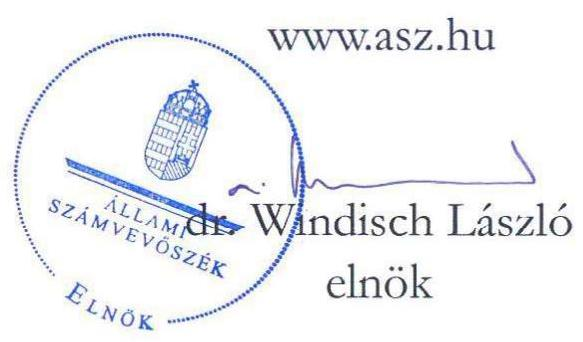
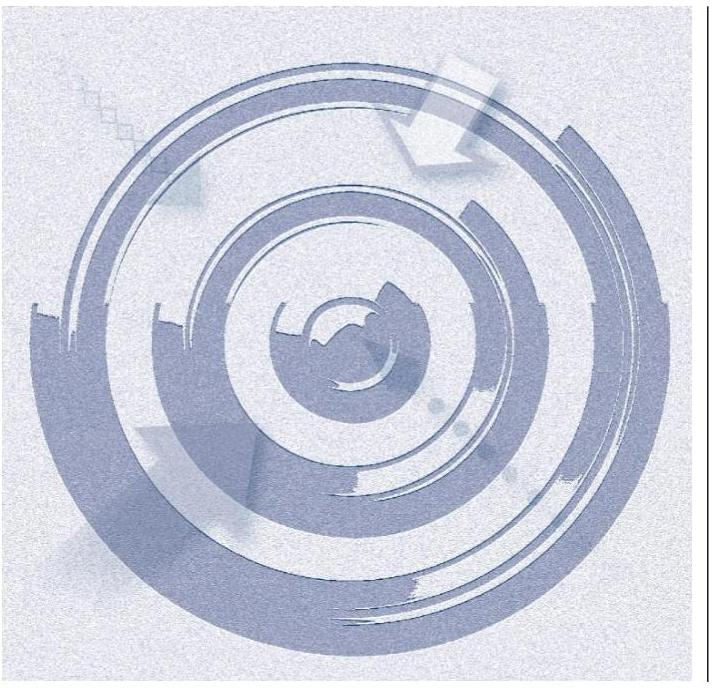
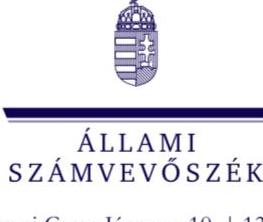

# JELENTÉS 

## Többségi állami és önkormányzati tulajdonú gazdasági társaságok ellenőrzése

Többségi állami és önkormányzati tulajdonú gazdasági társaságok integritásának monitoring típusú ellenőrzése - 1574 gazdasági társaság
2023.

23011
www.asz.hu

---

# JELENTÉS 

## Többségi állami és önkormányzati tulajdonú gazdasági társaságok ellenőrzése

Többségi állami és önkormányzati tulajdonú gazdasági társaságok integritásának monitoring típusú ellenőrzése - 1574 gazdasági társaság
2023.

23011

---

# ELLENŐRZÉSI IGAZGATÓSÁG: 

## ÁLLAMHÁZTARTÁS HELYI SZINTJÉT ELLENŐRZŐ IGAZGATÓSÁG

## ELLENŐRZÉSI IGAZGATÓ:

KISGERGELY ISTVÁN igazgató

## ELLENŐRZÉSVEZETŐ:

SALAMON ILDIKÓ ellenőrzésvezető
KISTÓTH KRISZTINA ellenőrzésvezető
DR. NAGY IMRE ellenőrzésvezető
SIPOSNÉ DÓCZI KLÁRA ellenőrzésvezető
KLINGA LÁSZLÓ ellenőrzésvezető

IKTATÓSZÁM: EL-3281-002/2023
TÉMASZÁM: 2598
ELLENŐRZÉS-AZONOSÍTÓ SZÁM: V0942

---

# TARTALOMJEGYZÉK 

- ÖSSZEGZÉS ..... 5
- AZ ELLENŐRZÉS CÉLJA ..... 7
- AZ ELLENŐRZÉS TERÜLETE ..... 8
- AZ ELLENŐRZÉS HÁTTERE, INDOKOLTSÁGA ..... 11
- A JELENTÉS LÉNYEGES KÉRDÉSKÖREI ..... 12
- AZ ELLENŐRZÉS HATÓKÖRE ÉS MÓDSZEREI ..... 13
- MEGÁLLAPÍTÁSOK ..... 15
- MELLÉKLETEK ..... 25
I. sz. melléklet: Értelmező szótár ..... 25
II. sz. melléklet: Ellenőrzött szervezetek ..... 27
III. sz. melléklet: Egyes gazdasági mutatók a gazdasági társaságok csoportjai szerint ..... 64
- RÖVIDÍTÉSEK JEGYZÉKE ..... 65

---

.

---

# ÖSSZEGZÉS 

Az ellenőrzött 1574 többségi állami és önkormányzati tulajdonú gazdasági társaság 57,1\%a rendelkezett számviteli szabályzatokkal, javadalmazási szabályzattal és a jogszabályok által előirt integritási szabályzatokkal. Az Állami Számvevőszék által feltárt hibákra, hiányosságokra tett vezetői intézkedések eredményeképpen a jogszabályok által kötelezően előirt szabályzatokkal az ellenőrzött gazdasági társaságok 82,3\%-a rendelkezett, ami - a jelentős mértékü javulás mellett is - elmaradt az állami és önkormányzati többségi tulajdonban álló gazdasági társaságok számára a jogszabályokban előirt szabályozási kötelmektől.
Az intézkedések hatására 65,4\%-ról 79,9\%-ra javult azoknak az ellenőrzött gazdasági társaságoknak az aránya, amelyek a jogszabályokban előirtakon túli, integritást erősitő szabályozásokkal is rendelkeznek.
Az ellenőrzés adatai alapján végzett elemzés azt mutatta, hogy minél magasabbak a gazdasági társaságok egyes csoportjainál a jogszabályban előirt szabályozási követelmények, illetve a vagyon nagyságrendje, annál magasabb a szabályzatok rendelkezésre állásának az aránya.

## Az ellenőrzés társadalmi indokoltsága

Magyarország Alaptörvénye szerint az állam és a helyi önkormányzatok tulajdonában álló szervezetek a törvényben meghatározott módon, önállóan és felelősen gazdálkodnak a törvényesség, célszerűség és az eredményesség követelményei szerint. A közpénzekkel gazdálkodó minden szervezet köteles a nyilvánosság előtt elszámolni e forrásból megvalósuló gazdálkodásával. A közpénzeket és a nemzeti vagyont az átláthatóság és a közélet tisztaságának elve szerint kell kezelni.

Az államháztartásról szóló törvény szerint a közfeladatok ellátása elsősorban költségvetési szervek alapításával és működtetésével valósul meg. Ugyanakkor a közfeladatok ellátásában jogszabályban meghatározott feltételekkel államháztartáson kívüli szervezetek - így gazdasági társaságok is - közreműködhetnek. Az állam, valamint az önkormányzatok tulajdonában álló gazdasági társaságokat három csoportba sorolta az Állami Számvevőszék: a köztulajdonban álló gazdasági társaságok belső kontrollrendszeréről szóló 339/2019. (XII. 23.) Korm. rendelet hatálya alá tartozó, a költségvetési szervek belső kontrollrendszeréről és belső ellenőrzéséről szóló 370/2011. (XII. 31.) Korm. rendelet hatálya alá tartozó, és egyik említett jogszabály hatálya alá sem tartozó gazdasági társaságok. Az érintett jogszabályok egyben kijelölik azokat a szabályozásokat is, amelyek mentén a társaságok a belső kontrollrendszerüket kötelesek kialakítani és működtetni.

Az állami és önkormányzati többségi tulajdonú, ellenőrzött gazdasági társaságok szerteágazó közszolgáltatásokat is nyújtanak. Alapvető feladataik körébe tartozik többek között az ingatlan- és vagyonkezelési, ingatlan-üzemeltetési, zöldterület-kezelési, mezőgazdasági termelési és feldolgozási, energia-ellátási, ivóvíz ellátási és szennyvíz kezelési, hulladékgazdálkodási, szállítási, vendéglátási, járóbeteg-ellátási, szociális ellátási, sport és művészeti tevékenység. Ezért feladatellátásuk közvetlenül a társadalom széles rétegét érinti, a közfeladatot ellátó gazdasági társaságok müködésének minősége hatással van az azokat igénybe vevő állampolgárok életére is.

---

# Főbb megállapítások, következtetések 

Az Állami Számvevőszék a többségi állami és önkormányzati tulajdonba tartozó gazdasági társaságoknál ellenőrizte, hogy rendelkeznek-e számviteli szabályzatokkal, javadalmazási szabályzattal és a belső kontrollrendszer részét képező integritási szabályozásokkal.

A köztulajdonban álló gazdasági társaságok belső kontrollrendszeréről szóló 339/2019. (XII. 23.) Korm. rendelet hatálya alá tartozó, ellenőrzött gazdasági társaságok 56,3\%-a (94 gazdasági társaság), a költségvetési szervek belső kontrollrendszeréről és belső ellenőrzéséről szóló 370/2011. (XII. 31.) Korm. rendelet hatálya alá tartozó, ellenőrzött gazdasági társaságok 53,7\%-a (123 gazdasági társaság) rendelkezett a jogszabályok által előírt számviteli szabályzatokkal, javadalmazási szabályzattal és integritási szabályozásokkal. A belső kontrollrendszer kialakítására jogszabályi előírás alapján nem kötelezett, ellenőrzött gazdasági társaságok 57,8\%-a (681 gazdasági társaság) rendelkezett a jogszabályok által előírt számviteli szabályzatokkal és javadalmazási szabályzattal.

A feltárt hibákat, hiányosságokat az Állami Számvevőszék jelezte az ellenőrzött gazdasági társaságok képviseletére jogosult vezetők részére. A vezetők által hozott intézkedések eredményeként a köztulajdonban álló gazdasági társaságok belső kontrollrendszeréről szóló 339/2019. (XII. 23.) Korm. rendelet hatálya alá tartozó gazdasági társaságok 91,0\%-a (152 gazdasági társaság), a költségvetési szervek belső kontrollrendszeréről és belső ellenőrzéséről szóló 370/2011. (XII. 31.) Korm. rendelet hatálya alá tartozó gazdasági társaságok 83,8\%-a (192 gazdasági társaság), a belső kontrollrendszer kialakítására jogszabály alapján nem kötelezett gazdasági társaságok 80,8\%-a (952 gazdasági társaság) rendelkezett a számviteli szabályzatokkal, javadalmazási szabályzattal és integritási szabályozásokkal.

A számviteli szabályzatok, javadalmazási szabályzat és integritási szabályozások az ellenőrzött gazdasági társaságok 54,4\%-ánál (857 gazdasági társaság) nem feleltek meg a jogszabályok által előírt tartalmi követelményeknek. Az ellenőrzés által feltárt tartalmi hiányosságok javítása érdekében az érintett gazdasági társaságok 79,7\%-a (683 gazdasági társaság) intézkedett.

Az ellenőrzött gazdasági társaságok 65,4\%-a (1029 gazdasági társaság) rendelkezett a jogszabályi előírásokon túli, integritást erősítő szabályozással, amely arány a vezetők által hozott intézkedések eredményeként 79,9\%-ra (1258 gazdasági társaság) nőtt.

Az Állami Számvevőszék - ellenőrzés adatai alapján végzett - elemzése azt mutatta, hogy minél magasabbak a jogszabályban előírt szabályozási követelmények, illetve minél nagyobb a vagyon nagyságrendje, az ellenőrzött gazdasági társaságok annál jobban kiépítették a jogszabályokban előírt, valamint az integritást erősítő helyénvalósági szabályozásokat egyaránt. Ennek jelentőségét jelzi, hogy az ellenőrzést követően a gazdasági társaságoknak a 17,7\%a nem rendelkezett a jogszabályban előírt valamennyi szabályzattal, ez azonban az ellenőrzött gazdasági társaságok által működtetett vagyonnak mindössze a 3,8\%-ára van hatással.

---

# AZ ELLENŐRZÉS CÉLJA 

Az ellenőrzés célja annak értékelése volt, hogy a többségi állami és önkormányzati tulajdonú gazdasági társaságok rendelkeztek-e számviteli szabályzatokkal, javadalmazási szabályzattal, a jogszabályok által előírt integritási szabályzatokkal, valamint a jogszabályok által előírtakon túli, integritást erősítő szabályozásokkal.

---

# AZ ELLENŐRZÉS TERÜLETE 

## Többségi állami és önkormányzati tulajdonú gazdasági társaságok

Az ellenőrzés 1574 többségi állami, illetve önkormányzati tulajdonú gazdasági társaság számviteli szabályzatainak, javadalmazási szabályzatának, valamint integritási szabályozásának kialakítására terjedt ki.

A számvitelről szóló 2000. évi C. törvény (Számv. tv. ${ }^{1}$ ) 14. § (3) bekezdése alapján, a gazdálkodónak ki kell alakítani és írásba kell foglalni a számviteli politikát. A Számv. tv. 14. § (5) bekezdése alapján a számviteli politika keretében el kell készíteni az eszközök és a források leltárkészítési és leltározási szabályzatát; az eszközök és a források értékelési szabályzatát; valamint a pénzkezelési szabályzatot. A Számv. tv. 161. § (1) bekezdése a kettős könyvvitelt vezető gazdálkodók részére számlarend készítésének kötelezettségét írja elő, és a törvény meghatározza a számlarend minimum tartalmát is.

A mikrogazdálkodóknak - a mikrogazdálkodói egyszerűsített éves beszámolóról szóló 398/2012. (XII. 20.) Korm. rendelet ${ }^{2}$ 3. § (3) bekezdése értelmében - számviteli politikát készíteniük nem kell, továbbá - amenynyiben a főkönyvi elszámolásokat a 398/2012. (XII. 20.) Korm. rendelet 3. melléklet szerinti számlatúkör szerint vezetik - a 2. § (2) bekezdése szerint a számlarend-készítési kötelezettség alól is mentesülnek.

A köztulajdonban álló gazdasági társaságok takarékosabb müködéséről szóló 2009. évi CXXII. törvény (Tak.tv. ${ }^{3}$ ) 5. § (3) bekezdése szerint a köztulajdonban álló gazdasági társaság legfőbb szerve köteles szabályzatot alkotni a vezető tisztségviselők, felügyelőbizottsági tagok, valamint a munka törvénykönyvéről szóló 2012. évi I. törvény (Mt. ${ }^{4}$ ) 208. §-ának hatálya alá eső munkavállalók javadalmazása, valamint a jogviszony megszűnése esetére biztosított juttatások módjának, mértékének elveiről, annak rendszeréről (továbbiakban: javadalmazási szabályzat). A javadalmazási szabályzatot a Tak.tv. hatálya alá tartozó mikrogazdálkodóknak is el kell készíteniük.

A köztulajdonban álló gazdasági társaságok belső kontrollrendszeréről szóló 339/2019. (XII. 23.) Korm. rendelet (Gbkr. ${ }^{5}$ ) hatálya alá 167 ellenőrzött gazdasági társaság tartozik. A Gbkr. 1. §-a szerint a rendelet hatálya a Tak.tv. alapján belső kontrollrendszer kialakítására és müködtetésére köteles köztulajdonban álló gazdasági társaságokra és a belső kontrollrendszer kialakítását és müködtetését a tulajdonosi joggyakorló vagy a felügyelőbizottság javaslata alapján vállaló köztulajdonban álló gazdasági társaságokra terjed ki. A Tak.tv. 7/J. § (1) bekezdése szerint azon köztulajdonban álló gazdasági társaság - a Magyar Nemzeti Bank és annak felügyelete alá tartozó köztulajdonban álló gazdasági társaság, valamint az Államadósság Kezelő Központ Zártkörűen Müködő Részvénytársaság kivételével -, amely esetében a tárgyévet megelőző két üzleti évben a mérlegforduló napján a következő három mutatóérték közül legalább kettő a társaság elfogadott (egyszerűsített) éves beszámolója, vagy - amennyiben konszolidált éves

---

beszámolót is készít - a konszolidált éves beszámolója alapján meghaladja az alábbi határértéket, belső kontrollrendszert kell működtetnie:
a) a mérlegfőösszeg a 600 millió forintot,
b) az éves nettó árbevétel az 1200 millió forintot,
c) az átlagosan foglalkoztatottak száma a 100 főt,

A Tak.tv. 7/J. § (2) bekezdése szerint az a gazdasági társaság, amely az (1) bekezdés szerinti feltételnek nem felel meg, a tulajdonosi joggyakorló vagy a felügyelőbizottság javaslata alapján alkalmazhatja és működtetheti a belső kontrollrendszert.

A Gbkr. hatálya alá tartozó gazdasági társaságoknak meg kell határozni a Gbkr. 4. § (1) bekezdés d) pontjában előírtak alapján az etikai elvárásokat, a g) pontjában előírtak alapján a szervezeten belüli összeférhetetlenség megelőzését és ellenőrzését szolgáló szabályokat. Rendelkezniük kell továbbá a Gbkr. 4. § (5) bekezdésében előírtak alapján a szervezeti integritást sértő események kezelésének eljárásrendjével és az integrált kockázatkezelés eljárásrendjével. A jogszabály meghatározza a szervezeti integritást sértő események kezelésének eljárásrendje tartalmi követelményeit is. A Gbkr. 7. § (2) bekezdésben előírtak alapján a szervezeti integritást sértő események és panaszok bejelentése és kezelése érdekében bejelentőrendszert kell kialakítani és működtetni.

A költségvetési szervek belső kontrollrendszeréről és belső ellenőrzéséről szóló 370/2011. (XII. 31.) Korm. rendelet (Bkr. ${ }^{6}$ ) hatálya alá 229 ellenőrzött gazdasági társaság tartozott. A Bkr. 1. § (2) bekezdés d) pontja szerint a Korm. rendelet hatálya kiterjed - a Tak. tv. 7/J. § (1) bekezdésének a hatálya alá tartozó köztulajdonban álló gazdasági társaságok, valamint a Magyar Nemzeti Bank és annak felügyelete alá tartozó gazdasági társaságok kivételével - a kormányzati szektorba sorolt egyéb szervezetekre. A kormányzati szektorba sorolt egyéb szervezeteket a kormányzati szektorba sorolt egyéb szervezetekről szóló PM közlemények tartalmazzák. A PM közlemények - figyelemmel a 479/2009/EK tanácsi rendeletben foglaltakra - a kormányzati szektort alszektorokra - központi és önkormányzati alszektorra - bontják.

A Bkr. hatálya alá tartozó gazdasági társaságoknak rendelkezniük kell a Bkr. 6. § (4) bekezdésében előírtak alapján a szervezeti integritást sértő események kezelésének eljárásrendjével és az integrált kockázatkezelés eljárásrendjével, valamint meg kell határozniuk a Bkr. 6. § (1) bekezdés c) pontjában előírtak alapján az etikai elvárásokat. A jogszabály meghatározza a szervezeti integritást sértő események kezelésének eljárásrendje tartalmi követelményeit is.

Az ellenőrzött 1574 közül 1178 gazdasági társaság nem tartozott a Gbkr. és a Bkr. hatálya alá az előzőekben részletezett jogszabályi előírások alapján.

Az ellenőrzés összesen 17 szabályzatra, szabályozási területre terjedt ki, amelyek - a gazdasági társaságokra vonatkozó jogszabályi előírások és az ÁSZ ${ }^{7}$ által közzétett helyénvalósági kritériumok alapján besorolt - ellenőrzési szempontok (szabályszerűségi, illetve integritást erősítő) és a gazdasági társaságok csoportjai szerinti megoszlását az 1. táblázat mutatja.

---

1. táblázat

# AZ ELLENŐRZÖTT SZABÁLYZATOK, SZABÁLYOZÁSOK BESOROLÁSA AZ ELLENŐRZÉSI SZEMPONTOK ÉS A GAZDASÁGI TÁRSASÁGOK CSOPORTJAI SZERINT 

Ellenőrzött szabályzat, szabályozás

## Gbkr. hatálya

alá tartozó 167 gazdasági társaság

## Bkr. hatálya

alá tartozó 229 gazdasági társaság

## Egyik hatálya alá sem tartozó 1178 gazdasági társaság

számviteli politika
az eszközök és a források leltárkészítési és leltározási szabályzata
az eszközök és a források értékelési szabályzata
pénzkezelési szabályzat
számlarend
javadalmazási szabályzat, és a legfőbb szerv javadalmazási szabályzatra vonatkozó határozata
a szervezeten belüli integritást sértő események kezelésének eljárásrendje integrált kockázatkezelés eljárásrendje
az etikai elvárások, követelmények, magatartási szabályok meghatározását igazoló dokumentum
a szervezeten belüli összeférhetetlenség megelőzését és ellenőrzését alátámasztó dokumentum
a szervezeti integritást sértő események és panaszok bejelentő rendszerének kialakítását igazoló dokumentum
a Ptk. 3:115 §-a szerinti összeférhetetlenséget kizáró szabályozás
az ajándékok elfogadására vonatkozó szabályozás
a beszerzésekre vonatkozó szabályozás
a munkatársak gazdasági összeférhetetlenségét kizáró szabályozás
a külső panaszokat kezelő eljárások rendje
a munkáltatói visszaélés-bejelentő rendszer szabályozása

Forrás: ÁSZ saját szerkesztés
A jogszabályban előírt szabályozási követelmények a gazdasági társaságok egyes csoportjainál eltérőek voltak az ellenőrzött időszakban, a Gbkr. hatálya alá tartozó gazdasági társaságoknál 11, a Bkr. hatálya alá tartozó gazdasági társaságoknál kilenc, a Gbkr. és a Bkr. hatálya alá nem tartozó gazdasági társaságoknál hat kötelezően előírt szabályzat, szabályozási terület volt.

---

# AZ ELLENŐRZÉS HÁTTERE, INDOKOLTSÁGA 

Az ÁSZ által végzett integritás felmérések eredményei azt mutatták, hogy jelentős különbségek vannak az egyes gazdasági társaságok között az integritási kontrollok kiépítettségének tekintetében, valamint a gazdálkodáshoz szükséges szabályozási környezet kialakításában.

Az ÁSZ a többségi állami és a többségi önkormányzati tulajdonban lévő gazdasági társaságoknál helyénvalósági kritériumok közzétételével segítette elő a jogszabályi rendelkezések betartását, az integritás érvényesülését. Mindezek azt is támogatták, hogy a Gbkr. hatálya alá tartozó gazdasági társaságok felkészüljenek a 2021-től kötelező szabályok alkalmazására. A Bkr. és a Gbkr. hatálya alá nem tartozó állami és önkormányzati tulajdonú gazdasági társaságok felelős vezetői ugyanakkor az elvárások megismerésével és azoknak megfelelő gyakorlatuk saját döntésen alapuló kialakításával tudnak integritást erősítő lépéseket tenni.

Az ÁSZ ellenőrzése hozzájárul ahhoz, hogy a köztulajdonú gazdasági társaságok integritásirányítási/integritás-kockázatkezelési rendszer keretében alkalmazott kontrolljainak kiépítettsége javuljon.

---

# A JELENTÉS LÉNYEGES KÉRDÉSKÖREI 

1.     - A gazdasági társaságok rendelkeztek-e számviteli szabályzatokkal, javadalmazási szabályzattal, valamint a jogszabályok által előírt integritási szabályozásokkal?
2.     - A gazdasági társaságok rendelkeztek-e a jogszabályokban előírtakon túli, integritást erősitő szabályozásokkal?
3.     - Mutatható-e ki kapcsolat az ellenőrzött gazdasági társaságok jogszabályban előírt szabályozási követelményei és egyes gazdasági mutatói, valamint a szabályzatok rendelkezésre állása között?

---

# AZ ELLENŐRZÉS HATÓKÖRE ÉS MÓDSZEREI 

## Az ellenőrzés típusa

Megfelelőségi ellenőrzés.

## Az ellenőrzött időszak

2021. év és 2022. I. félév (az ellenőrzött szervezetek adatszolgáltatásának lezárásáig)

## Az ellenőrzés tárgya

Az ellenőrzés tárgyát a többségi állami és önkormányzati tulajdonú gazdasági társaságok számviteli szabályzatainak és javadalmazási szabályzatának megléte, valamint az integritási szabályozások kialakítása képezte.

## Az ellenőrzött szervezet

Többségi önkormányzati, állami tulajdonban lévő 1574 gazdasági társaság. Az ellenőrzött szervezetek felsorolását a II. sz. melléklet tartalmazza.

## Az ellenőrzés jogalapja

Az ellenőrzés jogalapját az ÁSZ tv. ${ }^{8} 1 . \S$ (3) bekezdése képezte.

## Az ellenőrzés módszerei

Az ellenőrzés végrehajtása az ellenőrzési program szempontjai, kérdéskörei, az ellenőrzött időszakban hatályos jogszabályok, az ellenőrzés szakmai szabályai, az ÁSZ megfelelőségi ellenőrzési módszertana alapján történt.

Az ellenőrzés során az ÁSZ az ellenőrzött szervezetek adatszolgáltatásakor hatályos számviteli szabályzataira, javadalmazási szabályzatára és integritási szabályozásaira fókuszálva a kiválasztott kritériumok alapján értékelte, hogy rendelkezésre állnak-e a gazdálkodás ezen fontos szabályozási dokumentumai, valamint azok tartalma megfelel-e a jogszabályokban előírtaknak.

Az ellenőrzés lehetőséget biztosított a feltárt hibák, hiányosságok javítására, az integritási kontrollok fejlesztésére. A program ellenőrzési szempontjait, kritériumait a szabályszerűségi szempontok szerinti

---

ellenőrzésben a jogszabályok, közjogi szervezetszabályozó eszközök, határozatok, további belső utasítások, belső szabályozók előírásai képezték. A helyénvalósági szempontok alapján azon kérdéskörben történt az értékelés, ahol - az ellenőrzött szervezet szempontjából - jogszabályi előírás egyéb ágazatnál, más szervezetnél létezik és az adott követelmény megléte hozzájárul a többségi állami és önkormányzati tulajdonban lévő gazdasági társaság szabályozása terén pozitív folyamatok elindításához, a tevékenységének ellátása körében integritásának biztosításához, ezáltal a közpénzügyi helyzet átláthatóságához, szükség esetén javulásához. A helyénvalósági kritériumokat az ÁSZ honlapján tette közzé.

Az ellenőrzési kérdések megválaszolásához szükséges bizonyítékok megszerzése ellenőrzési eljárások alkalmazásával történt. Az ellenőrzési bizonyítékként felhasználható adatforrások közé tartoztak egyrészt az ellenőrzési programban felsorolt adatforrások, másrészt adatforrás még minden - az ellenőrzés folyamán - feltárt, az ellenőrzés szempontjából információkat tartalmazó dokumentum.

Az ellenőrzés eredményeinek elemzése statisztikai eljárásokkal korreláció elemzés és variancia analízis alkalmazásával - történt. Az elemzés során a gazdasági társaságok a jogszabályokban előírt szabályozási követelmények, valamint a mérlegben kimutatott vagyon nagysága figyelembe véve a vagyon nagyságrend szerinti szórását - kerültek csoportosításra.

---

# MEGÁLLAPÍTÁSOK 

## 1. A gazdasági társaságok rendelkeztek-e számviteli szabályzatokkal, javadalmazási szabályzattal, valamint a jogszabályok által előírt integritási szabályozásokkal?

Összegző megállapítás

Az ellenőrzött gazdasági társaságok 57,1\%-a (898 gazdasági társaság) rendelkezett számviteli szabályzatokkal, javadalmazási szabályzattal, valamint a jogszabályban előírt integritási szabályozásokkal. Ez az arány a gazdasági társaságok vezetői intézkedéseinek hatására 82,3\%-ra (1296 gazdasági társaság) növekedett.

### 1.1. számú megállapítás

A Gbkr. hatálya alá tartozó, ellenőrzött gazdasági társaságok 56,3\%-a (94 gazdasági társaság) rendelkezett számviteli szabályzatokkal, javadalmazási szabályzattal, valamint a jogszabályban előírt integritási szabályozásokkal. Ez az arány a vezetői intézkedések hatására 91,0\%-ra (152 gazdasági társaság) növekedett.

A Számv. tv. 14. § (3) bekezdése, valamint az (5) bekezdés a), b), d) pontjaiban előírtak ellenére Gbkr. hatálya alá tartozó ellenőrzött 167 gazdasági társaság közül
$\longrightarrow$ nyolc $(4,8 \%)$ gazdasági társaság nem rendelkezett számviteli politikával,
$\longrightarrow 11(6,6 \%)$ gazdasági társaság nem rendelkezett az eszközök és a források leltárkészítési és leltározási szabályzatával,
$\longrightarrow 14(8,4 \%)$ gazdasági társaság nem rendelkezett az eszközök és a források értékelési szabályzatával, és
$\longrightarrow 11(6,6 \%)$ gazdasági társaság nem rendelkezett pénzkezelési szabályzattal.
A Számv. tv. 14. § (4) bekezdésében foglaltak ellenére 55 (34,6\%) gazdasági társaság a számviteli politika keretében írásban nem rögzítette azokat a gazdálkodóra jellemző szabályokat, előírásokat, módszereket, amelyekkel meghatározza, hogy mit tekint a számviteli elszámolás, az értékelés szempontjából lényegesnek, nem lényegesnek, továbbá hat (3,8\%) gazdasági társaság írásban nem rögzítette, hogy mit tekint a számviteli elszámolás, az értékelés szempontjából jelentősnek, nem jelentősnek.

A mennyiségi felvétellel történő leltározás szabályzatban meghatározott gyakorisága hat $(3,8 \%)$ gazdasági társaságnál nem felelt meg a Számv. tv. 69. § (3) bekezdésében előírtaknak.

Az ellenőrzött gazdasági társaságok a Számv. tv. előírásai szerint a pénzkezelési szabályzatban rendelkeztek a pénzkezelés felelősségi szabályairól.

---

## Vellenveö hibák, hiányosságook

A Számv. tv.-ben foglalt előírás ellenére több esetben előfordult, hogy a gazdasági társaság számlarend helyett számlatükörrel rendelkezett.

A Számv. tv. 14. § (8) bekezdésében előírtak ellenére a pénzkezelési szabályzatban
—- kilenc (5,8\%) gazdasági társaság nem rendelkezett a készpénzállományt érintő pénzmozgások jogcímeiről és eljárási rendjéről,
—- 13 (8,3\%) gazdasági társaság nem rendelkezett a készpénzállomány ellenőrzésekor követendő eljárásról, illetve annak gyakoriságáról.
A Számv. tv. 161. § (1) bekezdésében foglaltak ellenére 19 (11,4\%) gazdasági társaság nem rendelkezett számlarenddel. A Számv. tv. 161. § (2) bekezdés c) pontjában előírtak ellenére kilenc (6,1\%) gazdasági társaságnál a számlarendben nem rögzítették a főkönyvi számla és az analitikus nyilvántartás kapcsolatát.

Az ellenőrzött 167 gazdasági társaság közül - a Tak.tv. 5. § (3) bekezdésében foglaltak ellenére - 29 (17,4\%) gazdasági társaság nem rendelkezett a gazdasági társaság legfőbb szerve által alkotott javadalmazási szabályzattal.

A Tak.tv. 5. § (3) bekezdésében foglaltak ellenére a javadalmazási szabályzatban
—- öt (3,6\%) gazdasági társaságnál nem rögzítették a vezető tisztségviselők, felügyelőbizottsági tagok, valamint a vezető állású munkavállalók javadalmazása módját, mértékének elveit, annak rendszerét,
—- kilenc (6,5\%) gazdasági társaságnál nem rögzítették a jogviszony megszűnése esetére biztosított juttatások módját, mértékének elveit, rendszerét.
A Gbkr. 4. § (5) bekezdésében előírtak ellenére 23 (13,8\%) gazdasági társaság nem rendelkezett integrált kockázatkezelés eljárásrendjével, 19 (11,4\%) gazdasági társaság szervezeti integritást sértő események eljárásrendjével. A Gbkr. 4. § (1) bekezdés d) pontjában előírtak ellenére 22 (13,2\%) gazdasági társaság nem határozott meg etikai elvárásokat.

A Gbkr. 4. § (6) bekezdés a), e), f), g) pontjaiban foglaltak ellenére a szervezeti integritást sértő események kezelésének eljárásrendjében
— hat (4,1\%) gazdasági társaság nem határozta meg a bejelentett vagy feltárt kockázatok és események előzetes értékelésének módszertanát,
—- kilenc (6,1\%) gazdasági társaság nem határozta meg a szervezeti integritást sértő események elhárításához szükséges intézkedéseket,
— nyolc (5,4\%) gazdasági társaság nem határozta meg az alkalmazható jogkövetkezményeket,
— hat (4,1\%) gazdasági társaság nem határozta meg a bejelentő védelmére, a vizsgálat eredményéről való tájékoztatásra, valamint a bejelentésből eredő szakmai következtetések hasznosítására vonatkozó szabályokat.
A Gbkr. 7. § (2) bekezdésében előírtak ellenére 19 (11,4\%) gazdasági társaságnál nem alakították ki a szervezeti integritást sértő események és panaszok bejelentése és kezelése érdekében a bejelentőrendszert. A Gbkr. 4. § (1) bekezdés g) pontjában előírtak ellenére 29 (17,4\%) gazdasági társaságnál nem alakították ki a szervezeten belüli összeférhetetlenség megelőzését és ellenőrzését szolgáló szabályozókat.

---

### 1.1.1. számú megállapítás

### 1.2. számú megállapítás

## Jellemző hibák, hiányosságok

A Számv. tv.-ben foglalt előírás ellenére több esetben előfordult, hogy a gazdasági társaság a számviteli politikában a gazdálkodóra jellemző szabályokat, előírásokat, módszereket nem rögzítette. Mindössze azokat az általános szabályokat szerepeltette számviteli politikájában, amelyek alkalmazását a Számv. tv. minden gazdálkodóra kötelezően előírja.

## Jellemző hibák, hiányosságok

A Számv. tv.-ben foglalt előírás ellenére több esetben előfordult, hogy a gazdasági társaság a leltárkészítési és leltározási szabályzatban a mennyiségi leltárfelvétel gyakoriságát 4-5 évben határozta meg, vagy mennyiségi leltárfelvétel helyett is az analitikus nyilvántartásokkal való egyeztetést írta

## Az ellenőrzés által feltárt hibák és hiányosságok teljes körű javítására 103 (86,6\%) gazdasági társaság képviseletére jogosult vezető intézkedett.

Az ellenőrzés által feltárt hibák, hiányosságok alapján - a szabályszerű számviteli szabályzatok, a javadalmazási szabályzat, valamint a jogszabályban előírt integritási szabályozások biztosítása érdekében - 71 (42,5\%) gazdasági társaságnál egy vagy több szabályzat elkészítése, 86 (51,5\%) gazdasági társaságnál a meglévő szabályzat tartalmi kiegészítése volt indokolt. A javítás érdekében az ÁSZ összesen 119 (71,3\%) gazdasági társaság képviseletére jogosult vezetőnek jelezte a hibákat, hiányosságokat.

Az ellenőrzés által feltárt szabályszerűségi hibák és hiányosságok tekintetében 103 (86,6\%) gazdasági társaság teljes körű intézkedésről, 12 $(10,1 \%)$ gazdasági társaság a hibák egy részére tett intézkedésről adott tájékoztatást. Így az ellenőrzés által feltárt 345 szabályszerűségi hiba 85,2\%a vonatkozásában intézkedésekről adtak tájékoztatást a gazdasági társaságok képviseletére jogosult vezetők. Az intézkedések hatására az ellenőrzött szabályzatok mindegyike 152 (91,0\%) gazdasági társaságnál rendelkezésre állt. Emellett 80 (93,0\%) gazdasági társaságnál a feltárt tartalmi hiányosságokra intézkedések történtek.

## A Bkr. hatálya alá tartozó, ellenőrzött gazdasági társaságok 53,7\%a (123 gazdasági társaság) rendelkezett számviteli szabályzatokkal, javadalmazási szabályzattal, valamint a jogszabályban előírt integritási szabályozásokkal. Ez az arány a vezetői intézkedések hatására 83,8\%-ra (192 gazdasági társaság) nőtt.

A Számv. tv. 14. § (3) bekezdése, valamint az (5) bekezdés a), b), d) pontjaiban előírtak ellenére az ellenőrzött 229 gazdasági társaság közül
$\longrightarrow 10(4,4 \%)$ gazdasági társaság nem rendelkezett számviteli politikával,
$\longrightarrow 13(5,7 \%)$ gazdasági társaság nem rendelkezett az eszközök és a források leltárkészítési és leltározási szabályzatával,
$\longrightarrow$ nyolc (3,5\%) gazdasági társaság nem rendelkezett az eszközök és a források értékelési szabályzatával, és
$\longrightarrow 12(5,2 \%)$ gazdasági társaság nem rendelkezett pénzkezelési szabályzattal.
A Számv. tv. 14. § (4) bekezdésében foglaltak ellenére 100 (45,7\%) gazdasági társaság a számviteli politika keretében írásban nem rögzítette azokat a gazdálkodóra jellemző szabályokat, előírásokat, módszereket, amelyekkel meghatározza, hogy mit tekint a számviteli elszámolás, az értékelés szempontjából lényegesnek, nem lényegesnek, továbbá $13(5,9 \%)$ gazdasági társaság, hogy mit tekint a számviteli elszámolás, az értékelés szempontjából jelentősnek, nem jelentősnek.

A mennyiségi felvétellel történő leltározás szabályzatban meghatározott gyakorisága hét (3,2\%) gazdasági társaságnál nem felelt meg a Számv. tv. 69. § (3) bekezdésében előírtaknak.

Az ellenőrzött gazdasági társaságok a Számv. tv. előírásai szerint a pénzkezelési szabályzatokban rendelkeztek a pénzkezelés felelősségi szabályairól.

---

## jellemzö hibák, hiányosságok

A Számv. tv.-ben foglalt előírás ellenére több esetben előfordult, hogy a gazdasági társaság számlarend helyett számlatúkörrel rendelkezett.

## jellemzö hibák, hiányosságok

Több esetben előfordult, hogy a gazdasági társaság a vezetők jelzése szerint azért nem készítette el a Bkr.-ben előírt szabályzatokat, mert nem volt ismert számukra, hogy a kormányzati szektorba sorolt egyéb szervezetként a Bkr. hatálya alá tartoznak.

### 1.2.1. számú megállapítás

A Számv. tv. 14. § (8) bekezdésében előírtak ellenére a pénzkezelési szabályzatban
$\longrightarrow 15(6,9 \%)$ gazdasági társaság nem rendelkezett a készpénzállományt érintő pénzmozgások jogcímeiről és eljárási rendjéről,
$\longrightarrow 36(16,6 \%)$ gazdasági társaság nem rendelkezett a készpénzállomány ellenőrzésekor követendő eljárásról, illetve annak gyakoriságáról.
A Számv. tv. 161. § (1) bekezdésében foglaltak ellenére 26 (11,4\%) gazdasági társaság nem rendelkezett számlarenddel. A Számv. tv. 161. § (2) bekezdés c) pontjában előírtak ellenére nyolc (3,9\%) gazdasági társaságnál a számlarendben nem rögzítették a főkönyvi számla és az analitikus nyilvántartás kapcsolatát.
Az ellenőrzött 229 gazdasági társaság közül - a Tak.tv. 5. § (3) bekezdésében foglaltak ellenére - 44 (19,2\%) gazdasági társaság nem rendelkezett a társaság legfőbb szerve által alkotott javadalmazási szabályzattal.

A Tak.tv. 5. § (3) bekezdésében foglaltak ellenére a javadalmazási szabályzatban
$\longrightarrow 12(6,5 \%)$ gazdasági társaságnál nem rögzítették a vezető tisztségviselők, felügyelőbizottsági tagok, valamint a vezető állású munkavállalók javadalmazása módját, mértékének elveit, annak rendszerét,
$\longrightarrow 20(10,8 \%)$ gazdasági társaságnál nem rögzítették a jogviszony megszűnése esetére biztosított juttatások módját, mértékének elveit, rendszerét.
A Bkr. 6. § (4) bekezdésében előírtak ellenére 64 (27,9\%) gazdasági társaság nem rendelkezett integrált kockázatkezelés eljárásrendjével, 51 $(22,3 \%)$ gazdasági társaság nem rendelkezett a szervezeti integritást sértő események kezelésének eljárásrendjével. A Bkr. 6. § (1) bekezdés c) pontjában előírtak ellenére $63(27,5 \%)$ gazdasági társaság nem határozott meg etikai elvárásokat.

A Bkr. 6. § (4a) bekezdésben foglaltak ellenére a szervezeti integritást sértő események kezelésének eljárásrendjében
$\longrightarrow$ öt $(2,8 \%)$ gazdasági társaság nem határozta meg a bejelentett kockázatok és események előzetes értékelésének módszertanát,
$\longrightarrow$ hat $(3,4 \%)$ gazdasági társaság nem határozta meg a szervezeti integritást sértő események elhárításához szükséges intézkedéseket,
$\longrightarrow 10(5,6 \%)$ gazdasági társaság nem határozta meg az alkalmazható jogkövetkezményeket,
$\longrightarrow$ öt $(2,8 \%)$ gazdasági társaság nem határozta meg a bejelentő szervezeten belüli védelmére, a vizsgálat eredményéről való tájékoztatására vonatkozó szabályokat.

## Az ellenőrzés által feltárt hibák és hiányosságok teljes körű javítására 138 (78,4\%) gazdasági társaság képviseletére jogosult vezető intézkedett.

Az ellenőrzés által feltárt hibák, hiányosságok alapján - a szabályszerű számviteli szabályzatok, a javadalmazási szabályzat, valamint a jogszabályban előírt integritási szabályozások biztosítása érdekében - 100 (43,7\%) gazdasági társaságnál egy vagy több szabályzat elkészítése, 144 (62,9\%)

---

### 1.3. számú megállapítás

## jellemzö hibák, hiányosságok

A Számv. tv.-ben foglalt előírás ellenére több esetben előfordult, hogy a gazdasági társaság a számviteli politikában a gazdálkodóra jellemző szabályokat, előírásokat, módszereket nem rögzítette. Mindössze azokat az általános szabályokat szerepeltette számviteli politikájában, amelyek alkalmazását a Számv. tv. minden gazdálkodóra kötelezően előírja.

## jellemzö hibák, hiányosságok

A Számv. tv.-ben foglalt előírás ellenére több esetben előfordult, hogy a gazdasági társaság a leltárkészítési és leltározási szabályzatban a mennyiségi leltárfelvétel gyakoriságát 4-5 évben határozta meg, vagy mennyiségi leltárfelvétel helyett is az analitikus nyilvántartásokkal való egyeztetést írta elő.

## jellemzö hibák, hiányosságok

A Számv. tv.-ben foglalt előírás ellenére több esetben előfordult, hogy a gazdasági társaság számlarend helyett számlatúkörrel rendelkezett.
gazdasági társaságnál a meglévő szabályzat tartalmi kiegészítése volt indokolt. A javítás érdekében az ÁSZ összesen 176 (76,9\%) gazdasági társaság képviseletére jogosult vezetőnek jelezte a hibákat, hiányosságokat.

Az ellenőrzés által feltárt szabályszerűségi hibák és hiányosságok tekintetében 138 gazdasági társaság (78,4\%) teljes körű intézkedésről, 20 $(11,4 \%)$ gazdasági társaság a hibák egy részére tett intézkedésről adott tájékoztatást. Így az ellenőrzés által feltárt 528 szabályszerűségi hiba 71,2\%a vonatkozásában intézkedésekről adtak tájékoztatást a gazdasági társaságok képviseletére jogosult vezetők. Az intézkedések hatására az ellenőrzött szabályzatok mindegyike 192 (83,8\%) gazdasági társaságnál rendelkezésre állt. Emellett 130 (90,3\%) gazdasági társaságnál a feltárt tartalmi hiányosságokra intézkedések történtek.

A belső kontrollrendszer kialakítására jogszabály alapján nem kötelezett, ellenőrzött gazdasági társaságok 57,8\%-a (681 gazdasági társaság) rendelkezett számviteli szabályzatokkal és javadalmazási szabályzattal. Ez az arány a vezetői intézkedések hatására 80,8\%-ra ( 952 gazdasági társaság) nőtt.

A Számv. tv. 14. § (3) bekezdése, valamint az (5) bekezdés a), b), d) pontjaiban előírtak ellenére
$\longrightarrow 141(12,1 \%)$ gazdasági társaság nem rendelkezett számviteli politikával,
$\longrightarrow 143(12,3 \%)$ gazdasági társaság nem rendelkezett az eszközök és a források leltárkészítési és leltározási szabályzatával,
$\longrightarrow 156(13,4 \%)$ gazdasági társaság nem rendelkezett az eszközök és a források értékelési szabályzatával, és
$\longrightarrow 145(12,5 \%)$ gazdasági társaság nem rendelkezett pénzkezelési szabályzattal.
A szabályzat készítés alóli mentesülés ellenére, saját döntés alapján a Számv. tv. szerinti számviteli politikát egy, az eszközök és a források leltározási és leltárkészítési szabályzatát, az eszközök és a források értékelési szabályzatát, valamint a pénzkezelési szabályzatot öt-öt mikrogazdálkodó elkészítette.

A Számv. tv. 14. § (4) bekezdésében foglaltak ellenére 500 (48,8\%) gazdasági társaság a számviteli politika keretében írásban nem rögzítette azokat a gazdálkodóra jellemző szabályokat, előírásokat, módszereket, amelyekkel meghatározza, hogy mit tekint a számviteli elszámolás, az értékelés szempontjából lényegesnek, nem lényegesnek, továbbá $87(8,5 \%)$ gazdasági társaság írásban nem rögzítette, hogy mit tekint a számviteli elszámolás, az értékelés szempontjából jelentősnek, nem jelentősnek.

A mennyiségi felvétellel történő leltározás gyakoriságára vonatkozó előírás $39(3,8 \%)$ gazdasági társaságnál nem felelt meg a Számv. tv. 69. § (3) bekezdésében előírtaknak.

A Számv. tv. 14. § (8) bekezdésében előírtak ellenére a pénzkezelési szabályzatban
$\longrightarrow$ hat $(0,6 \%)$ gazdasági társaságnál nem rendelkeztek a pénzkezelés felelősségi szabályairól,

---

- 42 (4,1\%) gazdasági társaságnál nem rendelkeztek a készpénzállományt érintő pénzmozgások jogcímeiről és eljárási rendjéről,
- 137 (13,4\%) gazdasági társaságnál nem rendelkeztek a készpénzállomány ellenőrzésekor követendő eljárásról, illetve annak gyakoriságáról.
A Számv. tv. 161. § (1) bekezdésében foglaltak ellenére 250 (21,5\%) gazdasági társaság nem rendelkezett számlarenddel. A szabályzat készítés alóli mentesülés ellenére, saját döntés alapján a Számv. tv. szerinti számlarendet egy mikrogazdálkodó elkészítette.

A Számv. tv. 161. § (2) bekezdés c) pontjában előírtak ellenére 37 (4,0\%) gazdasági társaságnál a számlarendben nem rögzítették a főkönyvi számla és az analitikus nyilvántartás kapcsolatát.

Az ellenőrzött 1178 gazdasági társaság közül - a Tak.tv. 5. § (3) bekezdésében foglaltak ellenére - 405 (34,4\%) gazdasági társaság nem rendelkezett a gazdasági társaság legfőbb szerve által alkotott javadalmazási szabályzattal.

A Tak.tv. 5. § (3) bekezdésében foglaltak ellenére a javadalmazási szabályzatban
$\longrightarrow$ nyolc (1,0\%) gazdasági társaságnál nem rögzítették a vezető tisztségviselők, felügyelőbizottsági tagok, valamint a vezető állású munkavállalók javadalmazása módját, mértékének elveit, annak rendszerét,
$\longrightarrow 40(5,2 \%)$ gazdasági társaságnál nem rögzítették a jogviszony megszűnése esetére biztosított juttatások módját, mértékének elveit, rendszerét.

# 1.3.1. számú megállapítás 

Az ellenőrzés által feltárt hibák és hiányosságok teljes körű javítására 614 (70,3\%) gazdasági társaság képviseletére jogosult vezető intézkedett.

Az ellenőrzés által feltárt hibák, hiányosságok alapján - a szabályszerű számviteli szabályzatok és a javadalmazási szabályzat biztosítása érdekében - 453 (38,5\%) gazdasági társaságnál egy vagy több szabályzat elkészítése, 627 (53,2\%) gazdasági társaságnál a meglévő szabályzat tartalmi kiegészítése volt indokolt. A javítás érdekében az ÁSZ összesen 873 (74,1\%) gazdasági társaság képviseletére jogosult vezetőnek jelezte a hibákat, hiányosságokat.

Az ellenőrzés által feltárt szabályszerűségi hibák és hiányosságok tekintetében 614 (70,3\%) gazdasági társaság teljes körű, 57 (6,5\%) gazdasági társaság a hibák egy részére tett intézkedésről adott tájékoztatást. Így az ellenőrzés által feltárt 2136 szabályszerűségi hiba 61,1\%-a vonatkozásában intézkedésekről adtak tájékoztatást a gazdasági társaságok képviseletére jogosult vezetők. Az intézkedések hatására az ellenőrzött szabályzatok 952 (80,8\%) gazdasági társaságnál rendelkezésre állt. Emellett 473 (75,4\%) gazdasági társaságnál a feltárt tartalmi hiányosságokra intézkedések történtek.

---

# 2. A gazdasági társaságok rendelkeztek-e a jogszabályokban előírtakon túli, integritást erősítő szabályozásokkal? 

2.1. számú megállapítás

Az ellenőrzött gazdasági társaságok 65,4\%-a (1029 gazdasági társaság) rendelkezett a jogszabályokban elöirtakon túli, integritást erősitő szabályozással. Ez az arány a vezetők által hozott intézkedésekkel 79,9\%-ra (1258 társaság) nőtt.

Az ellenőrzött Gbkr. hatálya alá tartozó gazdasági társaságok közül 158 (94,6\%), a Bkr. hatálya alá tartozó gazdasági társaságok közül 198 (86,5\%), a Gbkr. és a Bkr. hatálya alá nem tartozó gazdasági társaságok közül 673 (57,1\%) rendelkezett legalább egy, a jogszabályokban elöirtakon túli, integritást erősitő szabályozással.

Az egyes szabályozási területeken az integritást erősitő szabályozásokkal rendelkező társaságok arányát a 2. táblázat mutatja.
2. táblázat

## AZ INTEGRITÁST ERŐSÍTŐ SZABÁLYOZÁSSAL RENDELKEZŐ TÁRSASÁGOK

Ellenőrzött helyénvalósági szabályzat, szabályozás megnevezése

Gbkr. hatálya alá tartozó - adott szabályozással rendelkező - társaságok aránya (\%)

Bkr. hatálya alá tartozó - adott szabályozással rendelkező - társaságok aránya (\%)

A Gbkr. és a Bkr. hatálya alá nem tartozóadott szabályozással rendelkező - társaságok aránya (\%)

37,8\%
$34,6 \%$
$41,4 \%$
$38,3 \%$
$76,4 \%$
$38,5 \%$
$59,0 \%$
$59,0 \%$
$66,4 \%$
$69,0 \%$
$60,7 \%$
$67,7 \%$
$51,1 \%$
$38,5 \%$
$44,1 \%$
$46,6 \%$
$38,3 \%$
$42,3 \%$
$33,4 \%$
Forrás: ÁSZ szerkesztés az ellenőrzött társaságok adatai alapján

A szervezeti integritás érvényesülésének elősegítése érdekében az ÁSZ a Gbkr. hatálya alá tartozó gazdasági társaságok közül 81, a Bkr. hatálya alá tartozó gazdasági társaságok közül 139, a Gbkr. és a Bkr. hatálya alá nem tartozó gazdasági társaságok közül 884 gazdasági társaság részére jelezte - a 2. táblázatban felsoroltak közül - az érintett gazdasági társaságnál hiányzó, integritást erősitő szabályozási lehetőségeket. A gazdasági társaságok vezetőinek visszajelzései alapján, a Gbkr. hatálya alá tartozó gazdasági

---

társaságok közül 62 (76,5\%), a Bkr. hatálya alá tartozó gazdasági társaságok közül 102 (73,4\%), a Gbkr. és a Bkr. hatálya alá nem tartozó gazdasági társaságok közül 485 (54,9\%) gazdasági társaság vezetője intézkedett további, a jogszabályokban előírtakon túli, integritást erősítő szabályozás kialakítására. Közülük a Gbkr. hatálya alá tartozó gazdasági társaságok esetében hat (9,7\%), a Bkr. hatálya alá tartozó gazdasági társaságok esetében 12 (11,8\%), a Gbkr. és a Bkr. hatálya alá nem tartozó gazdasági társaságok esetében 211 (43,5\%) olyan gazdasági társaság vezetője intézkedett, amely korábban nem rendelkezett integritást erősítő szabályozással.

# 3. Mutatható-e ki kapcsolat az ellenőrzött gazdasági társaságok jogszabályban előírt szabályozási követelményei és egyes gazdasági mutatói, valamint a szabályzatok rendelkezésre állása között? 

3.1. számú megállapítás

Kapcsolat volt kimutatható az ellenőrzött gazdasági társaságok szabályzatainak rendelkezésre állása, valamint a jogszabályban előírt szabályozási követelmények és a vagyon nagyságrendje alapján történő csoportosítás között. Minél magasabbak a jogszabályban előírt szabályozási követelmények, illetve a vagyon nagyságrendje, az ellenőrzött gazdasági társaságok annál jobban kiépítették a jogszabályokban előírt, valamint az integritást erősítő helyénvalósági szabályozásokat egyaránt.

Az ellenőrzött gazdasági társaságok gazdasági mutatóinak szélső értékeit és átlagait összesítetten a 3. táblázat, a belső kontrollrendszer kiépítésére vonatkozó jogszabályi környezet szerinti csoport bontásban a III. sz. melléklet mutatja be.
3. táblázat

AZ ELLENŐRZÖTT GAZDASÁGI TÁRSASÁGOK EGYES GAZDASÁGI MUTATÓI

| Gazdasági társaságok összesen (1574) | Szélső értékek |  | Átlag |
| :--: | :--: | :--: | :--: |
|  | Alvó | Felső |  |
| Mérleg adatok, 2021 |  |  |  |
| Mérlegfőösszeg (ezer Ft) | 0 | 743343000 | 2319162 |
| Befektetett eszközök összesen (ezer Ft) | 0 | 713627000 | 1744366 |
| Forgóeszközök összesen (ezer Ft) | 0 | 51026306 | 479660 |
| Pénzeszközök összesen (ezer Ft) | 0 | 51023292 | 235721 |
| Saját tőke (ezer Ft) | $-5722214$ | 212431000 | 917043 |
| Jegyzett tőke (ezer Ft) | 0 | 116000000 | 389087 |
| Kötelezettségek (ezer Ft) | 0 | 110795000 | 700190 |
| Létszám 2021 (fő) | 0 | 13056 | 57 |
| Értékesítés árbevétele 2021 (ezer Ft) | 0 | 138909000 | 734558 |
| Adózás előtti eredmény (ezer Ft) | $-13321000$ | 2330679 | $-10539$ |
| A 2022. I. félév általános forgalmi adó alapja összesen (ezer Ft) | 0 | 50453073 | 446052 |

---

Az egyes gazdasági mutatók (a mérlegfőösszeg, a befektetett eszközök, a forgóeszközök, a pénzeszközök, a saját tőke, a jegyzett tőke, a kötelezettségek, a létszám, az értékesítés árbevétele és az adózás előtti eredmény) szélső értékei - mind az 1574 gazdasági társaságra összesítetten, mind a belső kontrollrendszer kiépítésére vonatkozó jogszabályi környezet szerinti csoportosításban - széles sávban mozogtak, továbbá az átlagtól viszonyított eltérés alapján is jelentős szóródást mutattak.

Az adatok jelentős szóródása is hozzájárult ahhoz, hogy az egyes gazdasági társaságok elemzett gazdasági mutatói és szabályozottsága között jellemzően nem, illetve csak gyenge kapcsolat volt kimutatható.

A gazdasági társaságok összesített adatai alapján, a jogszabályok által előírt szabályzatok rendelkezésre állásának aránya egyik elemzett gazdasági mutatóval sem volt kapcsolatban.

Szignifikáns, vagyis meghatározó kapcsolat volt kimutatható ugyanakkor a szabályzatok rendelkezésre állásának aránya, valamint az ellenőrzött gazdasági társaságok jogszabályban előírt szabályozási követelményei és a vagyon nagysága szerinti csoportba sorolása között.

A belső kontrollrendszer kiépítésére vonatkozó, jogszabályban előírt szabályozási követelmények és a vagyon nagysága szerinti csoportosításban az ellenőrzött gazdasági társaságoknál a szabályzatok rendelkezésre állásának átlagos arányát a 4. táblázat mutatja.
4. táblázat

# AZ ELLENŐRZÖTT GAZDASÁGI TÁRSASÁGOKNÁL A SZABÁLYZATOK RENDELKEZÉSRE ÁLLÁSÁNAK ÁTLAGOS ARÁNYA 

| Gazdasági társaságok csoportjai | Szabályozottság aránya (\%) |  | A csoportba tartozó gazdasági társaságok száma (db) |
| :--: | :--: | :--: | :--: |
|  | jogszabályok által előírt szabályzatok | jogszabályban elöírtakon túli, integritást erősítő szabályozások |  |
| Gbkr. hatálya alá tartozó | 88,9 | 81,2 | 167 |
| Bkr. hatálya alá tartozó | 85,9 | 63,7 | 229 |
| A Gbkr. és a Bkr. hatálya alá nem tartozó | 82,5 | 39,4 | 1178 |
| 13,1 Mrd Ft mérlegfőösszeg feletti vagyonnal rendelkező | 90,6 | 73,9 | 38 |
| 2,2 Mrd Ft és 13,1 Mrd Ft mérlegfőösszeg közötti vagyonnal rendelkező (beleértve a szélső értékeket is) | 90,7 | 72,4 | 132 |
| 2,2 Mrd Ft mérlegfőösszegalatti vagyonnal rendelkező | 82,8 | 44,3 | 1404 |
| Összesen | 83,6 | 47,4 | 1574 |

A Gbkr. hatálya alá tartozó, a Bkr. hatálya alá tartozó, valamint a belső kontrollrendszer kiépítésére jogszabály által nem kötelezett gazdasági társaságok csoportjaiban mind a jogszabályok által előírt szabályzatok, mind a jogszabályokban előírtakon túli, integritást erősítő szabályozások aránya szignifikánsan különbözött egymástól, vagyis az egyes csoportokba tartozás befolyásolta a szabályozottság arányát. A Gbkr. hatálya alá tartozó gazdasági társaságoknál a jogszabályok által előírt szabályzatok, illetve a jogszabályokban előírtakon túli, integritást erősítő szabályozások rendelkezésre állásának aránya átlagosan $88,9 \%$, illetve $81,2 \%$, a Bkr. hatálya alá tartozó gazdasági társaságoknál $85,9 \%$, illetve $63,7 \%$, a belső kontrollrendszer kiépítésére jogszabály által nem kötelezett gazdasági társaságoknál $82,5 \%$, illetve $39,4 \%$.

---

Ez azt mutatja, hogy minél magasabbak a jogszabályban előírt szabályozási követelmények az ellenőrzött gazdasági társaságok annál jobban kiépítették a jogszabályi előírásokon túli, integritást erősítő helyénvalósági szabályozásokat, és igyekeztek megfelelni olyan elvárásoknak is, amelyek erősítik a jogszabályokban előírtak alkalmazását.

Előzőekhez hasonló összefüggés volt megfigyelhető a gazdasági társaságok vagyon nagysága szerinti csoportosítását és a szabályozottság arányát elemezve. A nagy (13,1 Mrd Ft mérlegfőösszeg feletti), a közepes (2,2 Mrd Ft és 13,1 Mrd Ft közötti), valamint a kis (2,2 Mrd Ft alatti) vagyonnal rendelkező gazdasági társaságok csoportjaiba való tartozás befolyásolta mind a jogszabályok által előírt szabályzatok, mind a jogszabályokban előírtakon túli, integritást erősítő szabályozások rendelkezésre állásának az arányát. A 13,1 Mrd Ft feletti, illetve a 2,2-13,1 Mrd Ft közötti vagyonnal rendelkező gazdasági társaságoknál a jogszabályok által előírt szabályzatok rendelkezésre állásának aránya átlagosan 90,6\% és 90,7\%, a jogszabályokban előírtakon túli, integritást erősítő szabályozások rendelkezésre állásának aránya 73,9\% és 72,4\%. A 2,2 Mrd Ft alatti vagyonnal rendelkező gazdasági társaságoknál a jogszabályok által előírt, illetve a jogszabályokban előírtakon túli, integritást erősítő szabályozások rendelkezésre állásának aránya 82,8\%, illetve 44,3\%. Mindezek következtében, az ellenőrzést követő intézkedések hatására a gazdasági társaságoknak a 17,7\%-a nem rendelkezett a jogszabályban előírt valamennyi szabályzattal, ez azonban az ellenőrzött gazdasági társaságok által működtetett vagyonnak mindössze a $3,8 \%$-át érinti.

Az ellenőrzött, nagyobb vagyonnal rendelkező gazdasági társaságoknál egyrészt a szabályzatok rendelkezésre állásának aránya is magasabb volt, másrészt ezek a gazdasági társaságok nemcsak a jogszabályban előírt szabályozási követelményeknek, hanem a jogszabályi előírásokon túli, integritást erősítő helyénvalósági szabályozásokat is magasabb arányban építették ki.

A kontrollrendszer kiépítésére jogszabály által nem kötelezett, valamint a 2,2 Mrd Ft alatti vagyonnal rendelkező gazdasági társaságok - többihez viszonyítottan - rosszabb mutatóihoz hozzájárult, hogy ezen gazdasági társaságok közé tartoztak a létszámmal nem, vagy mindössze egy létszámmal rendelkező, illetve az árbevétellel sem rendelkező gazdasági társaságok többsége. Az ellenőrzött gazdasági társaságok 22,6\%-a (355 gazdasági társaság) - nyilvános adatai szerint - létszámmal nem, vagy mindössze egy létszámmal rendelkezett. Ezeknek a gazdasági társaságoknak a 97,7\%-a (347 gazdasági társaság) 2,2 Mrd Ft alatti vagyonnal rendelkezett, 96,1\%-a (341 gazdasági társaság) a kontrollrendszer kialakítására jogszabály alapján nem kötelezett gazdasági társaságok közé tartozott, továbbá 29,6\%-a (105 gazdasági társaság) az elemzett 2021-ben nem realizált árbevételt.

Az ellenőrzött gazdasági társaságok jogszabálykövető magatartását az is jellemezte, hogy összefüggés volt kimutatható a jogszabályok által előírt szabályzatok rendelkezésre állásának az ellenőrzés során megállapított aránya, valamint az érintett gazdasági társaságok NAV ${ }^{9}$ felé történő bevallás benyújtási kötelezettségének teljesítése között. Vagyis azok a gazdasági társaságok, amelyek a NAV felé teljeskörűen eleget tettek bevallás benyújtási kötelezettségüknek, jellemzően a jogszabályok által előírt szabályozásokkal is nagyobb arányban rendelkeztek.

---

# MELLÉKLETEK 

- I. SZ. MELLÉKLET: ÉRTELMEZŐ SZÓTÁR
gazdasági társaság
integritás
integritási szabályzatok
integrált kockázatkezelési rendszer
javadalmazási szabályzat

A gazdasági társaságok üzletszerű közös gazdasági tevékenység folytatására, a tagok vagyoni hozzájárulásával létrehozott, jogi személyiséggel rendelkező vállalkozások, amelyekben a tagok a nyereségből közösen részesednek, és a veszteséget közösen viselik. (Forrás: Ptk. ${ }^{10}$ 3:88. § (1) bekezdés)
A gazdasági társaság szabályszerű, a gazdasági társaság célkitűzéseinek, értékeinek és elveinek megfelelő múködése. (Forrás: Gbkr. 2. § 5. pont)
Jogszabályban előírt integritási szabályozások:
$\longrightarrow$ a Gbkr. 4. § (1) bekezdés d) pontjában előírt etikai elvárások, a g) pontjában előírt, a szervezeten belüli összeférhetetlenség megelőzését és ellenőrzését szolgáló szabályok, a Gbkr. 4. § (5) bekezdésében előírt, a szervezeti integritást sértő események kezelésének eljárásrendje és az integrált kockázatkezelés eljárásrendje, valamint a Gbkr. 7. § (2) bekezdésében előírt, a szervezeti integritást sértő események és panaszok bejelentése és kezelése érdekében a bejelentőrendszer kialakításának és múködtetésének szabályozása.
$\longrightarrow$ a Bkr. 6. § (4) bekezdésében előírt, a szervezeti integritást sértő események kezelésének eljárásrendje és az integrált kockázatkezelés eljárásrendje, valamint a Bkr. 6. § (1) bekezdés c) pontjában előírt etikai elvárások.
Jogszabályban előírtakon túli, az integritást erősítő szabályozások:
$\longrightarrow$ valamennyi gazdasági társaság esetében a Ptk. 3:115 §-a szerinti összeférhetetlenséget kizáró szabályozás, az ajándékok elfogadására vonatkozó szabályozás, a beszerzésekre vonatkozó szabályozás, a munkatársak gazdasági összeférhetetlenségét kizáró szabályozás, a külső panaszokat kezelő eljárások rendje.
$\longrightarrow$ a Bkr. hatálya alá tartozó gazdasági társaságok esetében - az előző pontban foglaltakon túl - a szervezeten belüli összeférhetetlenség megelőzését és ellenőrzését szolgáló szabályok, valamint a szervezeti integritást sértő események és panaszok bejelentése és kezelése érdekében a bejelentőrendszer kialakításának és múködtetésének szabályozása.
$\longrightarrow$ a Gbkr. és a Bkr. hatálya alá nem tartozó gazdasági társaságoknál - az előző két pontban foglaltakon túl - a szervezeti integritást sértő események kezelésének eljárásrendje, az integrált kockázatkezelés eljárásrendje, valamint az etikai elvárások.
Olyan kockázatkezelési rendszer, amelynek keretében a gazdasági társaság tevékenységében rejlő és a szervezeti célokkal összefüggő kockázatokat azonosítják és elemzik, valamint meghatározzák az egyes kockázatokkal kapcsolatban szükséges intézkedéseket, az intézkedéssel érintett szervezeti egységek körét, az intézkedések végrehajtásának folyamatos nyomon követési módját és eljárásrendjét. (Forrás: Bkr. 7. § (2) bekezdés, Gbkr. 5. §)

A Tak.tv. 5. § (3) bekezdésében előírt, a vezető tisztségviselők, felügyelőbizottsági tagok, valamint az Mt. 208. §-ának hatálya alá eső munkavállalók javadalmazása, valamint a jogviszony megszűnése esetére biztosított juttatások módjának, mértékének elveiről, annak rendszeréről szóló szabályzat.

---

jogszabály alapján belső kontrollrendszer kialakítására nem kötelezett gazdasági társaság
munkáltatói visszaélés-bejelentési rendszer
munkatársak gazdasági öszszeférhetetlensége
szervezeten belüli feladatköri összeférhetetlenség
szervezeti integritást sértő esemény
többségi állami és önkormányzati tulajdonú gazdasági társaság
vezető tisztségviselő és közvetlen hozzátartozója összeférhetetlensége
számviteli szabályzatok
szignifikáns kapcsolat
a Gbkr. és a Bkr. hatálya alá nem tartozó gazdasági társaság

Az érvényes jogszabályok, valamint a közérdek, vagy nyomós magánérdek védelmének biztosítására a munkáltató által megállapított magatartási szabályok megsértésének bejelentésére a foglalkoztató által létrehozott rendszer. (2013. évi CLXV. törvény a panaszokról és a közérdekú bejelentésekről 13-16. §)
A munkatársak olyan külső gazdasági kapcsolatainak meghatározása, amelyek fennállása esetén a munkatársak foglalkoztatása a foglalkoztató gazdasági érdekeit sértheti. (Forrás: ÁSZ meghatározás, figyelemmel az Mt. 8. § (1) bekezdésében, a Ptk. 3:115. §-ban és a közbeszerzésekről szóló 2015. évi CXLIII. törvény 25. § (1) bekezdésében foglaltakra.)
A döntések előkészítése, jóváhagyása, ellenjegyzése, valamint a gazdasági eseményekhez kapcsolódó elszámolások feladatkörei közül bármelyik kettő egy személy általi ellátása. (Forrás: Gbkr. 6. § (3) bekezdés)
Minden olyan esemény, amely
$\longrightarrow$ a köztulajdonban álló gazdasági társaságra vonatkozó jogszabályoktól, belső szabályzatoktól, valamint a köztulajdonban álló gazdasági társaság célkitűzéseinek, értékeinek és elveinek megfelelő múködéstől eltér. (Forrás: Gbkr. 2. § 7. pont)
$\longrightarrow$ a szervezetre vonatkozó szabályoktól, valamint a jogszabályi keretek között a költségvetési szerv vezetője és az irányító szerv által meghatározott szervezeti célkitűzéseknek, értékeknek és elveknek megfelelő múködéstől eltér. (Forrás: Bkr. 2. § u) pont)
A közvetlenül vagy közvetve többségi (50\%-ot meghaladó) állami és/vagy (egy vagy több) önkormányzati tulajdonban lévő gazdasági társaság.

A Ptk. 3:115. §-ában meghatározott összeférhetetlenség

A Számv. tv. 14. § (3) bekezdésében előírt számviteli politika, az (5) bekezdés a), b), d) pontjaiban előírt, az eszközök és a források leltárkészítési és leltározási szabályzata, az eszközök és a források értékelési szabályzata és a pénzkezelési szabályzat; továbbá a Számv. tv. 161. § (1) bekezdésében előírt számlarend.
Meghatározó kapcsolat. A variancia analízis alkalmazásánál a nullhipotézis az volt, hogy nincs különbség - az ellenőrzött gazdasági társaságok jogszabályban előírt szabályozási követelményei, a vagyon nagysága szerinti, valamint a NAV felé történő bevallási kötelezettség teljesítése szerinti - csoportok átlagai között, tehát az egyes kategóriák nem befolyásolják a szabályzatok rendelkezésre állásának arányát. A számítás során a p<0,05 esetében elutasítottuk a nullhipotézist, és elfogadtuk az alternatív hipotézist, miszerint szignifikáns különbség van az egyes kategóriák között.

---

# II. SZ. MELLÉKLET: ELLENŐRZÖTT SZERVEZETEK

|  Össz.
ssz. | Ssz. | Megnevezés | Szabályszerü-
ségi hiányos-
ság maradt  |
| --- | --- | --- | --- |
|  Gbkr. hatálya alá tartozó gazdasági társaságok |  |  |   |
|  1. | 1. | "ARIES" Ipari, Kereskedelmi és Szolgáltató Nonprofit Korlátolt Felelősségű Társaság |   |
|  2. | 2. | "PRIMER" Ajkai Távhőszolgáltatási Korlátolt Felelősségű Társaság | X  |
|  3. | 3. | "Sóstó-Gyógyfürdők" Szolgáltató és Fejlesztő Zártkörűen Működő Részvénytársaság |   |
|  4. | 4. | "SZÁKOM" Százhalombattai Kommunális Szolgáltató Nonprofit Korlátolt Felelősségű Társaság |   |
|  5. | 5. | "VKSZ" Veszprémi Közüzemi Szolgáltató Zártkörűen Működő Részvénytársaság |   |
|  6. | 6. | "Zöld Híd B.I.G.G." Környezetvédelmi és Hulladékgazdálkodási Nonprofit Korlátolt Felelősségű Társaság |   |
|  7. | 7. | AH NET Távközlési Szolgáltató Zártkörűen Működő Részvénytársaság, 2022. szeptember 14-től MVM NET Távközlési Szolgáltató Zártkörűen Működő Részvénytársaság |   |
|  8. | 8. | ALFÖLDVÍZ Regionális Víziközmű- szolgáltató Zártkörűen Működő Részvénytársaság |   |
|  9. | 9. | AQUA Szolgáltató Korlátolt Felelősségű Társaság |   |
|  10. | 10. | Aquaticum Debrecen Korlátolt Felelősségű Társaság |   |
|  11. | 11. | BÁCSVÍZ Víz- és Csatornaszolgáltató Zártkörűen Működő Részvénytársaság |   |
|  12. | 12. | BAJA MARKETING Bajai Kommunikációs és Marketing Korlátolt Felelősségű Társaság | X  |
|  13. | 13. | BAJAVÍZ Baja és Térsége Víz- és Csatornamű Korlátolt Felelősségű Társaság |   |
|  14. | 14. | BAKONYKARSZT Víz- és Csatornamű Zártkörűen Működő Részvénytársaság |   |
|  15. | 15. | BARANYA-VÍZ Víziközmű Szolgáltató Zártkörűen Működő Részvénytársaság |   |
|  16. | 16. | Barcika Szolg Vagyonkezelő és Szolgáltató Korlátolt Felelősségű Társaság |   |
|  17. | 17. | Belváros-Lipótváros Városüzemeltető Korlátolt Felelősségű Társaság |   |
|  18. | 18. | BIOKOM Pécsi Városüzemeltetési és Környezetgazdálkodási Nonprofit Korlátolt Felelősségű Társaság |   |
|  19. | 19. | BKK Budapesti Közlekedési Központ Zártkörűen Működő Részvénytársaság | X  |
|  20. | 20. | BKM Budapesti Közművek Nonprofit Zártkörűen Működő Részvénytársaság |   |
|  21. | 21. | BM HEROS LEK Logisztikai Ellátó Központ Korlátolt Felelősségű Társaság |   |
|  22. | 22. | BORSODVÍZ Önkormányzati Közüzemi Szolgáltató Zártkörűen Működő Részvénytársaság |   |
|  23. | 23. | BTG Budaörsi Településgazdálkodási Nonprofit Korlátolt Felelősségű Társaság |   |
|  24. | 24. | Budapest Bábszínház Közhasznú Nonprofit Korlátolt Felelősségű Társaság |   |
|  25. | 25. | Budapest Főváros Vagyonkezelő Központ Zártkörűen Működő Részvénytársaság |   |
|  26. | 26. | Budapest Gyógyfürdői és Hévizei Zártkörűen Működő Részvénytársaság | X  |
|  27. | 27. | Budapest Közút Zártkörűen Működő Részvénytársaság |   |
|  28. | 28. | Budapesti Közlekedési Zártkörűen Működő Részvénytársaság | X  |
|  29. | 29. | Budapesti Nagybani Piac Zártkörűen Működő Részvénytársaság |   |
|  30. | 30. | BVH Budapesti Városüzemeltetési Holding Zártkörűen Működő Részvénytársaság, 2022. június 8-tól BVH Budapesti Városüzemeltetési Holding Nonprofit Zártkörűen Működő Részvénytársaság |   |
|  31. | 31. | Civis Ház Zártkörűen Működő Részvénytársaság |   |
|  32. | 32. | Családbarát Magyarország Központ Nonprofit Közhasznú Korlátolt Felelősségű Társaság |   |
|  33. | 33. | Csepeli Városgazda Közhasznú Nonprofit Zártkörűen Működő Részvénytársaság |   |
|  34. | 34. | Csongrádi Víz- és Kommunális Szolgáltató Nonprofit Korlátolt Felelősségű Társaság | X  |
|  35. | 35. | DAKÖV Dabas és Környéke Vízügyi Korlátolt Felelősségű Társaság |   |
|  36. | 36. | DEBRECEN INTERNATIONAL AIRPORT Korlátolt Felelősségű Társaság | X  |
|  37. | 37. | Debreceni Hulladék Közszolgáltató Nonprofit Korlátolt Felelősségű Társaság | X  |
|  38. | 38. | Debreceni Sportcentrum Közhasznú Nonprofit Korlátolt Felelősségű Társaság |   |
|  39. | 39. | Debreceni Vagyonkezelő Zártkörűen Működő Részvénytársaság |   |
|  40. | 40. | Debreceni Vízmú Zártkörűen Működő Részvénytársaság |   |
|  41. | 41. | Dél-budai Egészségügyi Szolgálat Közhasznú Nonprofit Korlátolt Felelősségű Társaság |   |

---

|  Össz.
ssz. | Ssz. | Megnevezés | Szabályszerüségi hiányosság maradt  |
| --- | --- | --- | --- |
|  42. | 42. | Dél-Pest Megyei Víziközmű Szolgáltató Zártkörűen Működő Részvénytársaság |   |
|  43. | 43. | Délzalai Víz- és Csatornamú Zártkörűen Működő Részvénytársaság |   |
|  44. | 44. | DEPÓNIA Hulladékkezelő és Településtisztasági Nonprofit Korlátolt Felelősségű Társaság |   |
|  45. | 45. | DKV Debreceni Közlekedési Zártkörűen Működő Részvénytársaság |   |
|  46. | 46. | DTKH Duna-Tisza közi Hulladékgazdálkodási Nonprofit Korlátolt Felelősségű Társaság |   |
|  47. | 47. | DUNAKESZI KÖZÜZEMI Nonprofit Korlátolt Felelősségű Társaság |   |
|  48. | 48. | DUNANETT Dunaújvárosi Regionális Köztisztasági és Hulladékkezelő, Szolgáltató Nonprofit Korlátolt Felelősségű Társaság |   |
|  49. | 49. | Dunaújvárosi Víz-, Csatorna- Hőszolgáltató Korlátolt Felelősségű Társaság "felszámolás alatt" | X  |
|  50. | 50. | DVG Dunaújvárosi Vagyonkezelő Zártkörűen Működő Részvénytársaság |   |
|  51. | 51. | ÉAK Észak-Alföldi Környezetgazdálkodási Nonprofit Korlátolt Felelősségű Társaság |   |
|  52. | 52. | Észak-zalai Víz- és Csatornamú Zártkörűen Működő Részvénytársaság |   |
|  53. | 53. | ÉTH Érd és Térsége Hulladékkezelési Nonprofit Korlátolt Felelősségű Társaság | X  |
|  54. | 54. | EVAT Egri Vagyonkezelő és Távfűtő Zártkörűen Működő Részvénytársaság |   |
|  55. | 55. | FEJÉRVÍZ Fejér Megyei Önkormányzatok Víz- és Csatornamú Zártkörűen Működő Részvénytársaság |   |
|  56. | 56. | Ferencvárosi Egészségügyi Szolgáltató Közhasznú Nonprofit Korlátolt Felelősségű Társaság |   |
|  57. | 57. | Fővárosi Csatornázási Művek Zártkörűen Működő Részvénytársaság | X  |
|  58. | 58. | Fővárosi Vízművek Zártkörűen Működő Részvénytársaság |   |
|  59. | 59. | FTSZV Fővárosi Településtisztasági és Környezetvédelmi Korlátolt Felelősségű Társaság |   |
|  60. | 60. | GYHG Győri Hulladékgazdálkodási Nonprofit Korlátolt Felelősségű Társaság |   |
|  61. | 61. | GYŐR-SZOL Győri Közszolgáltató és Vagyongazdálkodó Zártkörűen Működő Részvénytársaság |   |
|  62. | 62. | GYULAHÚS Korlátolt Felelősségű Társaság |   |
|  63. | 63. | Gyulai Közüzemi Nonprofit Korlátolt Felelősségű Társaság |   |
|  64. | 64. | GYULAI VÁRFÜRDŐ Fürdő- és Gyógyszolgáltató Korlátolt Felelősségű Társaság | X  |
|  65. | 65. | Hajdúkerületi és Bihari Víziközmű Szolgáltató Zártkörűen Működő Részvénytársaság "végelszámolás alatt" |   |
|  66. | 66. | Hajdúszoboszlói Városgazdálkodási Nonprofit Zártkörűen Működő Részvénytársaság |   |
|  67. | 67. | Harkányi Gyógyfürdő Zártkörűen Működő Részvénytársaság |   |
|  68. | 68. | Heves Megyei Vízmű Zártkörűen Működő Részvénytársaság |   |
|  69. | 69. | Hódmezővásárhelyi Működtető és Szolgáltató Nonprofit Zártkörűen Működő Részvénytársaság |   |
|  70. | 70. | II. Kerületi Kulturális Közhasznú Nonprofit Korlátolt Felelősségű Társaság |   |
|  71. | 71. | Jászberényi Vagyonkezelő és Városüzemeltető Nonprofit Zártkörűen Működő Részvénytársaság |   |
|  72. | 72. | Józsefvárosi Gazdálkodási Központ Zártkörűen Működő Részvénytársaság |   |
|  73. | 73. | KAPOS HOLDING Közszolgáltató Zártkörűen Működő Részvénytársaság |   |
|  74. | 74. | Kaposvári Hulladékgazdálkodási Nonprofit Korlátolt Felelősségű Társaság |   |
|  75. | 75. | Kaposvári Önkormányzati Vagyonkezelő és Szolgáltató Zártkörűen Működő Részvénytársaság |   |
|  76. | 76. | KARTONPACK Dobozipari Zártkörűen Működő Részvénytársaság |   |
|  77. | 77. | KAVÍZ Kaposvári Víz- és Csatornamú Korlátolt Felelősségű Társaság |   |
|  78. | 78. | KECSKEMÉTI TERMOSTAR Hőszolgáltató Korlátolt Felelősségű Társaság |   |
|  79. | 79. | Kecskeméti Városüzemeltetési Nonprofit Korlátolt Felelősségű Társaság |   |
|  80. | 80. | Kiskunsági Víziközmű-Szolgáltató Korlátolt Felelősségű Társaság |   |
|  81. | 81. | KOMLÓI FŰTŐERŐMŰ Zártkörűen Működő Részvénytársaság |   |
|  82. | 82. | Kőbányai Vagyonkezelő Zártkörűen Működő Részvénytársaság |   |
|  83. | 83. | Lenti Gyógyfürdő Korlátolt Felelősségű Társaság |   |
|  84. | 84. | Madách Színház Nonprofit Korlátolt Felelősségű Társaság |   |
|  85. | 85. | Mezőföldi Regionális Víziközmű Korlátolt Felelősségű Társaság |   |

---

|  Össz.
ssz. | Ssz. | Megnevezés | Szabályszerü-
ségi hiányos-
ság maradt  |
| --- | --- | --- | --- |
|  86. | 86. | Mezőkövesdi Városgazdálkodási Nonprofit Zártkörűen Müködő Részvénytársaság |   |
|  87. | 87. | MIHŐ Miskolci Hőszolgáltató Korlátolt Felelősségű Társaság |   |
|  88. | 88. | Miskolc Holding Önkormányzati Vagyonkezelő Zártkörűen Müködő Részvénytársaság |   |
|  89. | 89. | Miskolci Fürdők Korlátolt Felelősségű Társaság |   |
|  90. | 90. | MISKOLCI VÁROSGAZDA Városgazdálkodási Közhasznú Nonprofit Korlátolt Felelősségű Társaság |   |
|  91. | 91. | MIVÍZ Miskolci Vízmú Korlátolt Felelősségű Társaság |   |
|  92. | 92. | MVK Miskolc Városi Közlekedési Zártkörűen Müködő Részvénytársaság |   |
|  93. | 93. | MVM BSZK Biztonsági Szolgáltató Központ Zártkörűen Müködő Részvénytársaság |   |
|  94. | 94. | MVM ERBE ENERGETIKA Mérnökiroda Zártkörűen Müködő Részvénytársaság |   |
|  95. | 95. | MVM Mátra Energia Zártkörűen Müködő Részvénytársaság |   |
|  96. | 96. | MVM Oroszlányi Távhőtermelő és Szolgáltató Zártkörűen Müködő Részvénytársaság |   |
|  97. | 97. | MVM Zöld Generáció Korlátolt Felelősségű Társaság |   |
|  98. | 98. | Netta-Pannonia Környezetvédelmi Korlátolt Felelősségű Társaság |   |
|  99. | 99. | NHSZ Kétpó Hulladékgazdálkodási Korlátolt Felelősségű Társaság |   |
|  100. | 100. | NHSZ Szolnok Közszolgáltató Nonprofit Korlátolt Felelősségű Társaság |   |
|  101. | 101. | NHSZ Tatabánya Hulladékgazdálkodási és Környezetvédelmi Zártkörűen Müködő Részvénytársaság |   |
|  102. | 102. | NHSZ Vértes Vidéke Hulladékgazdálkodási Nonprofit Korlátolt Felelősségű Társaság |   |
|  103. | 103. | NHSZ Zounok Zártkörű Részvénytársaság |   |
|  104. | 104. | Nyíregyházi Állatpark Nonprofit Korlátolt Felelősségű Társaság |   |
|  105. | 105. | NYÍRTÁVHŐ Nyíregyházi Távhőszolgáltató Korlátolt Felelősségű Társaság |   |
|  106. | 106. | NYÍRVV Nyíregyházi Városüzemeltető és Vagyonkezelő Nonprofit Korlátolt Felelősségű Társaság |   |
|  107. | 107. | Orosházi Városüzemeltetési és Szolgáltató Zártkörűen Müködő Részvénytársaság |   |
|  108. | 108. | Özdi Távhőtermelő és Szolgáltató Korlátolt Felelősségű Társaság |   |
|  109. | 109. | PANNON-VÍZ Regionális Önkormányzati Víziközmű-szolgáltató Zártkörűen Müködő Részvénytársaság |   |
|  110. | 110. | Pápai Víz- és Csatornamú Zártkörűen Müködő Részvénytársaság |   |
|  111. | 111. | Pécsi Nemzeti Színház Nonprofit Korlátolt Felelősségű Társaság |   |
|  112. | 112. | Pécsi Sport Nonprofit Zártkörűen Müködő Részvénytársaság |   |
|  113. | 113. | Pécsi Vagyonhasznosító Zártkörűen Müködő Részvénytársaság |   |
|  114. | 114. | Pestszentlőrinc-Pestszentimre Egészségügyi Szolgáltató Nonprofit Közhasznú
Korlátolt Felelősségű Társaság |   |
|  115. | 115. | PÉTÁV Pécsi Távfűtő Korlátolt Felelősségű Társaság |   |
|  116. | 116. | PRO KULTÚRA SOPRON Nonprofit Korlátolt Felelősségű Társaság |   |
|  117. | 117. | PROBIO Balatonfüredi Településüzemeltetési Zártkörűen Müködő Részvénytársaság |   |
|  118. | 118. | Rába Jármúalkatrész Gyártó és Kereskedelmi Kft. |   |
|  119. | 119. | Rákosmente Városfejlesztő, Városüzemeltető, Kivitelező, Karbantartó és Szolgáltató
Korlátolt Felelősségű Társaság |   |
|  120. | 120. | REGIHU-HEJŐPAPI Regionális Hulladéklerakó Korlátolt Felelősségű Társaság | X  |
|  121. | 121. | Salgó Vagyon Salgótarjáni Önkormányzati Vagyonkezelő és Távhőszolgáltató
Korlátolt Felelősségű Társaság |   |
|  122. | 122. | Sárvári Gyógyfürdő Korlátolt Felelősségű Társaság |   |
|  123. | 123. | SIÓKOM Hulladékgazdálkodási Közszolgáltató Nonprofit Korlátolt Felelősségű Társaság |   |
|  124. | 124. | SOPRON HOLDING Vagyonkezelő Zártkörűen Müködő Részvénytársaság |   |
|  125. | 125. | Soproni Vízmú Zártkörűen Müködő Részvénytársaság |   |
|  126. | 126. | STKH Sopron és Térsége Környezetvédelmi és Hulladékgazdálkodási Nonprofit
Korlátolt Felelősségű Társaság |   |
|  127. | 127. | Szegedi Hulladékgazdálkodási Nonprofit Korlátolt Felelősségű Társaság |   |
|  128. | 128. | Szegedi Környezetgazdálkodási Nonprofit Korlátolt Felelősségű Társaság |   |

---

|  Össz.
ssz. | Ssz. | Megnevezés | Szabályszerüségi hiányosság maradt  |
| --- | --- | --- | --- |
|  129. | 129. | Szegedi Közlekedési Korlátolt Felelősségű Társaság | X  |
|  130. | 130. | Szegedi Sport és Fürdők Szolgáltató Korlátolt Felelősségű Társaság |   |
|  131. | 131. | Szegedi Vízmú Zártkörűen Működő Részvénytársaság |   |
|  132. | 132. | Székesfehérvár Városgondnoksága Korlátolt Felelősségű Társaság |   |
|  133. | 133. | Szelektív Hulladékhasznosító és Környezetvédelmi Nonprofit Korlátolt Felelősségű Társaság |   |
|  134. | 134. | Szent Kristóf Szakrendelő Újbudai Egészségügyi Szolgáltató Közhasznú Nonprofit
Korlátolt Felelősségű Társaság |   |
|  135. | 135. | Szent Margit Rendelőintézet Nonprofit Korlátolt Felelősségű Társaság |   |
|  136. | 136. | SZÉPHŐ Székesfehérvári Épületfenntartó és Hőszolgáltató Zártkörűen Működő Részvénytársaság |   |
|  137. | 137. | Szolnoki Sportcentrum, Sportiskola és Sportszervező Szolgáltató Nonprofit és Közhasznú Korlátolt Fele-
lősségű Társaság |   |
|  138. | 138. | Szombathelyi Távhőszolgáltató Korlátolt Felelősségű Társaság |   |
|  139. | 139. | SZOVA Szombathelyi Vagyonhasznosító és Városgazdálkodási Nonprofit
Zártkörűen Működő Részvénytársaság |   |
|  140. | 140. | Tatabánya Erőmű Korlátolt Felelősségű Társaság |   |
|  141. | 141. | T-Busz Tatabányai Közlekedési Korlátolt Felelősségű Társaság |   |
|  142. | 142. | Terézvárosi Vagyonkezelő Nonprofit Zártkörűen Működő Részvénytársaság |   |
|  143. | 143. | TETTYE FORRÁSHÁZ Pécsi Városi Víziközmű Üzemeltetési Zártkörűen Működő Részvénytársaság |   |
|  144. | 144. | TiszaSzolg 2004 Közszolgáltató, Vagyonkezelő és Gazdaságfejlesztő Korlátolt Felelősségű Társaság |   |
|  145. | 145. | T-Szol Tatabányai Szolgáltató Zártkörűen Működő Részvénytársaság |   |
|  146. | 146. | Tüke Busz Közösségi Közlekedési Zártkörűen Működő Részvénytársaság |   |
|  147. | 147. | Újbuda Prizma Szociális Fejlesztési és Foglalkoztatási Közhasznú Nonprofit Korlátolt Felelősségű Társaság |   |
|  148. | 148. | Újpesti Egészségügyi Szolgáltató Nonprofit Korlátolt Felelősségű Társaság |   |
|  149. | 149. | UV Újpesti Vagyonkezelő Zártkörűen Működő Részvénytársaság |   |
|  150. | 150. | Városgazda XVIII. kerület Nonprofit Zártkörűen Működő Részvénytársaság |   |
|  151. | 151. | Városgondozási Zártkörű Részvénytársaság | X  |
|  152. | 152. | Városi Szolgáltató Nonprofit Zártkörűen Működő Részvénytársaság |   |
|  153. | 153. | Városüzemeltető és Fenntartó Korlátolt Felelősségű Társaság |   |
|  154. | 154. | Várpalotai Közszolgáltató Nonprofit Korlátolt Felelősségű Társaság | X  |
|  155. | 155. | V-Busz Veszprémi Közlekedési Korlátolt Felelősségű Társaság | X  |
|  156. | 156. | Vértesi Erőmű Zártkörűen Működő Részvénytársaság |   |
|  157. | 157. | VERTIKÁL Közszolgáltató Nonprofit Zártkörűen Működő Részvénytársaság |   |
|  158. | 158. | VGÜ Salgótarjáni Hulladékgazdálkodási és Városüzemeltetési Nonprofit Korlátolt Felelősségű Társaság |   |
|  159. | 159. | Vigszínház Nonprofit Korlátolt Felelősségű Társaság |   |
|  160. | 160. | Viridis-Pannonia Hulladékgazdálkodási Közszolgáltató Nonprofit Korlátolt Felelősségű Társaság |   |
|  161. | 161. | XIII. Kerületi Egészségügyi Szolgálat Közhasznú Nonprofit Korlátolt Felelősségű Társaság |   |
|  162. | 162. | XIII. Kerületi Közszolgáltató Zártkörűen Működő Részvénytársaság |   |
|  163. | 163. | Zalakarosi Családi-, Élmény- és Gyógyfürdő Zártkörűen Működő Részvénytársaság |   |
|  164. | 164. | ZALA-MÜLLEX Hulladékgazdálkodási és Környezetvédelmi Korlátolt Felelősségű Társaság | X  |
|  165. | 165. | ZEMPLÉNI Vízmú Korlátolt Felelősségű Társaság |   |
|  166. | 166. | Zuglói Városgazdálkodási Közszolgáltató Zártkörűen Működő Részvénytársaság |   |
|  167. | 167. | Zsolnay Örökségkezelő Nonprofit Korlátolt Felelősségű Társaság |   |
|  Bkr. hatálya alá tartozó gazdasági társaságok |  |  |   |
|  168. | 1. | "AZ ORMÁNSÁG EGÉSZSÉGÉÉRT" NONPROFIT KORLÁTOLT FELELŐSSÉGŰ TÁRSASÁG |   |
|  169. | 2. | "Hajdúböszörmény ESZ-V" Egészségügyi Szolgáltató és Vagyonkezelő Nonprofit Korlátolt Felelősségű Társaság |   |
|  170. | 3. | "Koppány-Völgye KEK" Egészségügyi és Szolgáltató Nonprofit Korlátolt Felelősségű Társaság |   |

---

|  Össz.
ssz. | Ssz. | Megnevezés | Szabályszerü-
ségi hiányos-
ság maradt  |
| --- | --- | --- | --- |
|  171. | 4. | "KÖLCSEY" Televízió Műsorszolgáltató Nonprofit Korlátolt Felelősségű Társaság |   |
|  172. | 5. | "Munkalehetőség a Jövőért" Szolnok Nonprofit és Közhasznú Korlátolt Felelősségű Társaság |   |
|  173. | 6. | "NAGYERDEI KULTÚRPARK" Közhasznú Nonprofit Korlátolt Felelősségű Társaság |   |
|  174. | 7. | "Szabadhajdú" Közművelődési Média és Rendezvényszervező Közhasznú Nonprofit
Korlátolt Felelősségű Társaság |   |
|  175. | 8. | "Szemesért" Közhasznú Nonprofit Korlátolt Felelősségű Társaság |   |
|  176. | 9. | Aba-Novák Agóra Kulturális Központ Nonprofit és Közhasznú Korlátolt Felelősségű Társaság |   |
|  177. | 10. | Agóra Közhasznú Nonprofit Korlátolt Felelősségű Társaság |   |
|  178. | 11. | AGORA Savaria Kulturális és Médiaközpont Nonprofit Korlátolt Felelősségű Társaság (2022.01.01-től) |   |
|  179. | 12. | AGORA Sport és Szabadidő Közhasznú Nonprofit Korlátolt Felelősségű Társaság |   |
|  180. | 13. | Agria-Humán Közhasznú Nonprofit Korlátolt Felelősségű Társaság |   |
|  181. | 14. | Aranytíz Kereskedelmi és Szolgáltató Korlátolt Felelősségű Társaság |   |
|  182. | 15. | Bajai Kommunális és Szolgáltató Nonprofit Korlátolt Felelősségű Társaság |   |
|  183. | 16. | Balatonalmádi Kistérségi Egészségügyi Központ Közhasznú Nonprofit Korlátolt Felelősségű Társaság | X  |
|  184. | 17. | Balatonfüred Kulturális Közgyűjtemény Fenntartó Nonprofit Korlátolt Felelősségű Társaság |   |
|  185. | 18. | Balmazújvárosi Városgazdálkodási Nonprofit Közhasznú Korlátolt Felelősségű Társaság |   |
|  186. | 19. | Balmazújvárosi VESZ Városi Egészségügyi Szolgálat Nonprofit Korlátolt Felelősségű Társaság |   |
|  187. | 20. | BARCIKA ART Kommunikációs, Kulturális és Sport Szolgáltató Korlátolt Felelősségű Társaság |   |
|  188. | 21. | BARCIKA PARK Városüzemeltetési Nonprofit Korlátolt Felelősségű Társaság |   |
|  189. | 22. | Bátonyterenyei Közművelődési, Városi Könyvtár és Létesítményüzemeltető Nonprofit
Korlátolt Felelősségű Társaság |   |
|  190. | 23. | Békési Férfi Kézilabda Kereskedelmi és Szolgáltató Korlátolt Felelősségű Társaság | X  |
|  191. | 24. | BÉKÉS-MANIFEST Közszolgáltató Nonprofit Korlátolt Felelősségű Társaság "kényszertörlés alatt", 2022.
november 29-től "felszámolás alatt" | X  |
|  192. | 25. | Bicskei Egészségügyi Központ Szolgáltató Nonprofit Korlátolt Felelősségű Társaság |   |
|  193. | 26. | BKMFÜ Bács-Kiskun Megyei Fejlesztési Ügynökség Nonprofit Korlátolt Felelősségű Társaság |   |
|  194. | 27. | BLTG Településgazdálkodási Nonprofit Korlátolt Felelősségű Társaság |   |
|  195. | 28. | BMSK Sport Közhasznú Nonprofit Korlátolt Felelősségű Társaság |   |
|  196. | 29. | Bóbita Bábszínház Nonprofit Korlátolt Felelősségű Társaság | X  |
|  197. | 30. | Bodrogközi Járóbeteg Szakrendelő Nonprofit Korlátolt Felelősségű Társaság |   |
|  198. | 31. | BORA 94 Borsod-Abaúj-Zemplén Megyei Fejlesztési Ügynökség Nonprofit Korlátolt Felelősségű Társaság,
2023. január 23-től BORA 94 Borsod-Abaúj-Zemplén Vármegyei Fejlesztési Ügynökség Nonprofit
Korlátolt Felelősségű Társaság | X  |
|  199. | 32. | Borsodi Közszolgáltató Szolgáltató Nonprofit Korlátolt Felelősségű Társaság |   |
|  200. | 33. | BŐ-VÍZ Bőcsi Víziközmű Szolgáltató Nonprofit Közhasznú Korlátolt Felelősségű Társaság |   |
|  201. | 34. | Budafoki Dohnányi Ernő Szimfonikus Zenekar Közhasznú Nonprofit Korlátolt Felelősségű Társaság |   |
|  202. | 35. | Budai Polgár Kiadó, Tájékoztató és Kulturális Közhasznú Nonprofit Korlátolt Felelősségű Társaság |   |
|  203. | 36. | Budakeszi Városfejlesztési és Városüzemeltetési Korlátolt Felelősségű Társaság |   |
|  204. | 37. | Budapest Brand Nonprofit Zártkörűen Működő Részvénytársaság |   |
|  205. | 38. | BUDAPEST ESÉLY Nonprofit Korlátolt Felelősségű Társaság | X  |
|  206. | 39. | Cervinus Teátrum Művészeti Szolgáltató Közhasznú Nonprofit Korlátolt Felelősségű Társaság |   |
|  207. | 40. | CINE-MIS Moziüzemi Szolgáltató Nonprofit Korlátolt Felelősségű Társaság |   |
|  208. | 41. | Csepeli Városkép Korlátolt Felelősségű Társaság |   |
|  209. | 42. | Csiky Gergely Színház és Kulturális Központ Közhasznú Nonprofit Korlátolt Felelősségű Társaság | X  |
|  210. | 43. | Csömöri Települési Szolgáltató Nonprofit Korlátolt Felelősségű Társaság |   |
|  211. | 44. | Csurgói Egészségügyi Centrum Szolgáltató Nonprofit Korlátolt Felelősségű Társaság |   |
|  212. | 45. | DEKERT Debreceni Kertészeti és Humán Szolgáltató Közhasznú Nonprofit Korlátolt Felelősségű Társaság |   |

---

|  Össz.
ssz. | Ssz. | Megnevezés | Szabályszerüségi hiányosság maradt  |
| --- | --- | --- | --- |
|  213. | 46. | DENOK Debreceni Nemzetközi Oktatási Központ Nonprofit Korlátolt Felelősségű Társaság |   |
|  214. | 47. | Diósgyőri Stadionrekonstrukciós Korlátolt Felelősségű Társaság |   |
|  215. | 48. | DKKA-Dunaújvárosi Kohász Kézilabda Akadémia Nonprofit Korlátolt Felelősségű Társaság |   |
|  216. | 49. | Dombóvári Városgazdálkodási Nonprofit Korlátolt Felelősségű Társaság | X  |
|  217. | 50. | DUNAKESZI- SZTK Egészségügyi és Szociális Közhasznú Nonprofit Korlátolt Felelősségű Társaság |   |
|  218. | 51. | DVSC Kézilabda Korlátolt Felelősségű Társaság |   |
|  219. | 52. | Egészségügyi Ellátást Szervező és Működtető Nonprofit Közhasznú Korlátolt Felelősségű Társaság | X  |
|  220. | 53. | e-Mobi Elektromobilitás Nonprofit Korlátolt Felelősségű Társaság |   |
|  221. | 54. | Ercsi Járóbeteg-szakellátó Egészségügyi Központ Közhasznú Nonprofit Korlátolt Felelősségű Társaság |   |
|  222. | 55. | Érdi Sport Szolgáltató és Kereskedelmi Korlátolt Felelősségű Társaság |   |
|  223. | 56. | Érdi Városfejlesztési és Szolgáltató Korlátolt Felelősségű Társaság |   |
|  224. | 57. | Erkel Ferenc Kulturális Központ és Múzeum Nonprofit Korlátolt Felelősségű Társaság |   |
|  225. | 58. | EROMŰVHÁZ Erzsébetvárosi Összevont Művelődési Központ Nonprofit Korlátolt Felelősségű Társaság | X  |
|  226. | 59. | Esély Győri Rehabilitációs és Foglalkoztatási Közhasznú Nonprofit Korlátolt Felelősségű Társaság |   |
|  227. | 60. | Esernyős Óbudai Kulturális és Sport Nonprofit Korlátolt Felelősségű Társaság |   |
|  228. | 61. | EURÓPA EGÉSZSÉGHÁZ - BAKTALÓRÁNTHÁZA közhasznú nonprofit Zártkörűen Múködő Részvénytársaság | X  |
|  229. | 62. | F.C. Ajka Korlátolt Felelősségű Társaság | X  |
|  230. | 63. | FALCO KC Szombathely Sportszolgáltató Korlátolt Felelősségű Társaság |   |
|  231. | 64. | Fehérvár Médiacentrum Korlátolt Felelősségű Társaság |   |
|  232. | 65. | FESZOFE Ferencvárosi Szociális Foglalkoztató és Ellátó Nonprofit Korlátolt Felelősségű Társaság |   |
|  233. | 66. | FEV IX. Ferencvárosi Vagyonkezelő és Városfejlesztő Zártkörűen Múködő Részvénytársaság |   |
|  234. | 67. | Flesch Károly Közművelődési, Könyvtári, Kulturális és Városmarketing Közhasznú Nonprofit
Korlátolt Felelősségű Társaság |   |
|  235. | 68. | Fogyatékkal Élőket és Hajléktalanokat Ellátó Közhasznú Nonprofit Korlátolt Felelősségű Társaság |   |
|  236. | 69. | Fonyódi Városfejlesztési és Városüzemeltetési Nonprofit Közhasznú Korlátolt Felelősségű Társaság | X  |
|  237. | 70. | Főnix Rendezvényszervező Közhasznú Nonprofit Korlátolt Felelősségű Társaság |   |
|  238. | 71. | Füzesgyarmati Városgazdálkodási és Önkormányzati Vagyonkezelő Korlátolt Felelősségű Társaság |   |
|  239. | 72. | GYEVIÉP Algyői Településüzemeltetési és -fejlesztési Nonprofit Korlátolt Felelősségű Társaság |   |
|  240. | 73. | Gyöngyösi Sportfólió Nonprofit Korlátolt Felelősségű Társaság |   |
|  241. | 74. | GYŐR PROJEKT Korlátolt Felelősségű Társaság |   |
|  242. | 75. | Gyulai Várszínház Nonprofit Korlátolt Felelősségű Társaság | X  |
|  243. | 76. | Gyulasport Sportlétesítményeket Múködtető, Utánpótlás Nevelő Sportiskola, Sportszervező és
Szolgáltató Nonprofit Korlátolt Felelősségű Társaság |   |
|  244. | 77. | Hajdúnánási Gyermek- és Közétkeztetési Nonprofit Korlátolt Felelősségű Társaság |   |
|  245. | 78. | HALASI VÁROSGAZDA Beruházó, Szolgáltató és Vagyonkezelő Zártkörűen Múködő Részvénytársaság |   |
|  246. | 79. | HATVANI MÉDIA és Rendezvényszervező Nonprofit Közhasznú Korlátolt Felelősségű Társaság |   |
|  247. | 80. | Hegyvidéki Szabadidősport Nonprofit Korlátolt Felelősségű Társaság |   |
|  248. | 81. | Hírös Agóra Kulturális és Ifjúsági Központ Nonprofit Korlátolt Felelősségű Társaság |   |
|  249. | 82. | Hírös Sport Szabadidő Létesítményeket Múködtető és Szolgáltató Nonprofit
Korlátolt Felelősségű Társaság |   |
|  250. | 83. | Hódfó Hódmezővásárhelyi Foglalkoztató Közhasznú Nonprofit Korlátolt Felelősségű Társaság |   |
|  251. | 84. | Hód-Fürdő Szolgáltató és Üzemeltető Korlátolt Felelősségű Társaság | X  |
|  252. | 85. | Hungarospa Hajdúszoboszlói Gyógyfürdő és Egészségturisztikai Zártkörűen Múködő Részvénytársaság |   |
|  253. | 86. | II. Kerületi Sport és Szabadidősport Nonprofit Korlátolt Felelősségű Társaság |   |
|  254. | 87. | IKV Ingatlankezelő és Vagyongazdálkodó Zártkörűen működő Részvénytársaság |   |
|  255. | 88. | JÁNOSHALMI KISTÉRSÉGI EGÉSZSÉGÜGYI KÖZPONT Nonprofit Közhasznú Korlátolt Felelősségű Társaság |   |
|  256. | 89. | JÁSZKERÜLET Kulturális és Művészeti Közhasznú Nonprofit Korlátolt Felelősségű Társaság | X  |

---

|  Össz.
ssz. | Ssz. | Megnevezés | Szabályszerü-
ségi hiányos-
ság maradt  |
| --- | --- | --- | --- |
|  257. | 90. | József Attila Színház Nonprofit Korlátolt Felelősségű Társaság |   |
|  258. | 91. | Józsefváros Közösségeiért Nonprofit Zártkörűen Működő Részvénytársaság |   |
|  259. | 92. | KALOCSAI VAGYONHASZNOSÍTÁSI és KÖNYVVEZETŐ Nonprofit Korlátolt Felelősségű Társaság |   |
|  260. | 93. | Kanizsa Rehab Nonprofit Korlátolt Felelősségű Társaság |   |
|  261. | 94. | Kaposvári Közlekedési Zártkörűen Működő Részvénytársaság | X  |
|  262. | 95. | Kaposvári Nagypiac Korlátolt Felelősségű Társaság | X  |
|  263. | 96. | Katona József Színház Közhasznú Nonprofit Korlátolt Felelősségű Társaság |   |
|  264. | 97. | Kecskeméti Foglalkoztatási Nonprofit Korlátolt Felelősségű Társaság |   |
|  265. | 98. | Kecskeméti Junior Sport Nonprofit Korlátolt Felelősségű Társaság |   |
|  266. | 99. | Kecskeméti Kortárs Művészeti Műhelyek Nonprofit Korlátolt Felelősségű Társaság |   |
|  267. | 100. | Kecskeméti Társadalomtudományi Ismeretek Szolgáltató Központ Nonprofit Közhasznú
Korlátolt Felelősségű Társaság |   |
|  268. | 101. | Kecskeméti Televízió Nonprofit Korlátolt Felelősségű Társaság | X  |
|  269. | 102. | Kiskunmajsai Kistérségi Közszolgáltató Nonprofit Korlátolt Felelősségű Társaság |   |
|  270. | 103. | Kisteleki Térségi Egészségügyi Központ Nonprofit Korlátolt Felelősségű Társaság |   |
|  271. | 104. | Kisvárdai Intézményműködtető Nonprofit Korlátolt Felelősségű Társaság |   |
|  272. | 105. | KISVÁRDAI VÁRFÜRDŐ Fejlesztő Nonprofit Korlátolt Felelősségű Társaság |   |
|  273. | 106. | KISVÁROS Városüzemeltetési Közhasznú Nonprofit Korlátolt Felelősségű Társaság | X  |
|  274. | 107. | Kolibri Gyermek- és Ifjúsági Színház Közhasznú Nonprofit Korlátolt Felelősségű Társaság |   |
|  275. | 108. | Komáromi Városgazda Közhasznú Nonprofit Korlátolt Felelősségű Társaság |   |
|  276. | 109. | Kontakt Humán Szolgáltató Nonprofit Korlátolt Felelősségű Társaság |   |
|  277. | 110. | KÖKERT Kőbányai Kerületgondnoksági és Településüzemeltetési Non-profit Közhasznú
Korlátolt Felelősségű Társaság |   |
|  278. | 111. | Kőrösi Csoma Sándor Kőbányai Kulturális Nonprofit Korlátolt Felelősségű Társaság | X  |
|  279. | 112. | KÖZPARK Kispesti Köztisztasági és Közfoglalkoztatási Nonprofit Korlátolt Felelősségű Társaság |   |
|  280. | 113. | KT-DINAMIC Szolgáltató és Kereskedelmi Nonprofit Korlátolt Felelősségű Társaság | X  |
|  281. | 114. | KVÁRTÉLYHÁZ Szabadtéri Színház Korlátolt Felelősségű Társaság |   |
|  282. | 115. | LŐRINC-MED Közhasznú Nonprofit Korlátolt Felelősségű Társaság |   |
|  283. | 116. | MAGLÓD PROJEKT Ingatlanfejlesztő- és Hasznosító Korlátolt Felelősségű Társaság | X  |
|  284. | 117. | Magyarság Háza Nonprofit Korlátolt Felelősségű Társaság |   |
|  285. | 118. | MAKÖI Szolgáltató Nonprofit Zártkörűen Működő Részvénytársaság |   |
|  286. | 119. | Maradványvagyon-hasznosító Zártkörűen Működő Részvénytársaság |   |
|  287. | 120. | Mátészalkai Kulturális Nonprofit Korlátolt Felelősségű Társaság |   |
|  288. | 121. | Mezőcsáti kistérségi Egészségfejlesztő Központ Egészségügyi Szolgáltató Közhasznú Nonprofit
Korlátolt Felelősségű Társaság |   |
|  289. | 122. | Mezőkövesdi KÖZKINCS-TÁR Kulturális, Könyvtári, Turisztikai és Múzeumi Nonprofit
Korlátolt Felelősségű Társaság |   |
|  290. | 123. | Mezőtúri Intézményellátó és Ingatlankezelő Közhasznú Nonprofit Korlátolt Felelősségű Társaság |   |
|  291. | 124. | Mezőtúri Közművelődési és Sport Közhasznú Nonprofit Korlátolt Felelősségű Társaság | X  |
|  292. | 125. | MIKOM Miskolci Kommunikációs Nonprofit Korlátolt Felelősségű Társaság |   |
|  293. | 126. | Miskolci Csodamalom Bábszínház Nonprofit Korlátolt Felelősségű Társaság |   |
|  294. | 127. | Miskolci Kulturális Központ Nonprofit Korlátolt Felelősségű Társaság |   |
|  295. | 128. | Miskolci Nemzeti Színház Nonprofit Korlátolt Felelősségű Társaság |   |
|  296. | 129. | Miskolci Sportcentrum Korlátolt Felelősségű Társaság |   |
|  297. | 130. | Miskolci Sportiskola Nonprofit Közhasznú Korlátolt Felelősségű Társaság |   |
|  298. | 131. | Miskolci Szimfonikus Zenekar Nonprofit Korlátolt Felelősségű Társaság |   |
|  299. | 132. | MODEM Modern Debreceni Művészeti Közhasznú Nonprofit Korlátolt Felelősségű Társaság, 2023. január
1-jétől MODEM Modern és Kortárs Művészeti Központ Nonprofit Korlátolt Felelősségű Társaság |   |

---

|  Össz.
ssz. | Ssz. | Megnevezés | Szabályszerüségi hiányosság maradt  |
| --- | --- | --- | --- |
|  300. | 133. | MOM Kulturális Központ Nonprofit Korlátolt Felelősségű Társaság |   |
|  301. | 134. | MÓRA-VITÁL Térségi Egészségmegőrző és Szociális Nonprofit Közhasznú Korlátolt Felelősségű Társaság |   |
|  302. | 135. | Möricz Zsigmond Színház Nonprofit Korlátolt Felelősségű Társaság |   |
|  303. | 136. | MÜVÉSZETEK HÁZA GÖDÖLLŐ Nonprofit Közhasznú Korlátolt Felelősségű Társaság |   |
|  304. | 137. | Nagykállói, Oktatási, Műsorszolgáltató, Közművelődési és Szociális Közhasznú Nonprofit
Korlátolt Felelősségű Társaság |   |
|  305. | 138. | Nagykun Viz- és Csatornamú Korlátolt Felelősségű Társaság |   |
|  306. | 139. | Nánás Pro Cultura Nonprofit Korlátolt Felelősségű Társaság |   |
|  307. | 140. | Nemzeti Védelmi Ipan Innovációs Zártkörűen Működő Részvénytársaság, 2022. május 30-tól N7 Holding
Nemzeti Védelmi Ipan Innovációs Zártkörűen Működő Részvénytársaság |   |
|  308. | 141. | Nyíregyházi Sportcentrum Nonprofit Korlátolt Felelősségű Társaság |   |
|  309. | 142. | NYÍRINFO Nyíregyházi Informatikai Nonprofit Korlátolt Felelősségű Társaság |   |
|  310. | 143. | NYÍR-TEL-SZOL Nyírteleki Településüzemeltetési és Szolgáltató Közhasznú Nonprofit
Korlátolt Felelősségű Társaság |   |
|  311. | 144. | NYÍRVIDÉK Képző Központ Közhasznú Nonprofit Korlátolt Felelősségű Társaság |   |
|  312. | 145. | Óbudai Kulturális Központ Nonprofit Korlátolt Felelősségű Társaság |   |
|  313. | 146. | Óbudai Vagyonkezelő Nonprofit Zártkörűen Működő Részvénytársaság |   |
|  314. | 147. | Ócsa Városüzemeltetési nonprofit Korlátolt Felelősségű Társaság, 2023. január 1-jétől megszűnt |   |
|  315. | 148. | Opera Vagyonkezelő Korlátolt Felelősségű Társaság |   |
|  316. | 149. | Özdi Sport- és Élményközpont Nonprofit Korlátolt Felelősségű Társaság |   |
|  317. | 150. | ÖZDSZOLG Szolgáltató Nonprofit Korlátolt Felelősségű Társaság |   |
|  318. | 151. | Önkormányzati Informatikai Központ Non-profit Korlátolt Felelősségű Társaság | X  |
|  319. | 152. | Örkény István Színház Nonprofit Korlátolt Felelősségű Társaság |   |
|  320. | 153. | Paksi Közművelődési Közhasznú Nonprofit Korlátolt Felelősségű Társaság |   |
|  321. | 154. | Pannon Filharmonikusok-Pécs Közhasznú Nonprofit Korlátolt Felelősségű Társaság | X  |
|  322. | 155. | Pásztói Városgazdálkodási Közhasznú Nonprofit Korlátolt Felelősségű Társaság |   |
|  323. | 156. | Pécsi Állatkert és Akvárium-Terrárium Közhasznú Nonprofit Korlátolt Felelősségű Társaság |   |
|  324. | 157. | Pécsi Városfejlesztési Nonprofit Zártkörűen Működő Részvénytársaság | X  |
|  325. | 158. | Pécs-Pogányi Repülőteret Működtető Korlátolt Felelősségű Társaság | X  |
|  326. | 159. | Pelikán Szociális és Egészségügyi Szolgáltató Közhasznú Non-profit Korlátolt Felelősségű Társaság | X  |
|  327. | 160. | PÉTEGISZ Polgár és Térsége Egészségügyi Központ Nonprofit Zártkörűen Működő Részvénytársaság |   |
|  328. | 161. | Petőfi Kulturális Közhasznú Nonprofit Korlátolt Felelősségű Társaság |   |
|  329. | 162. | Piroskavárosi Szociális és Rehabilitációs Foglalkoztató Nonprofit Korlátolt Felelősségű Társaság Csongrád |   |
|  330. | 163. | PLER Kézilabdasport Korlátolt Felelősségű Társaság |   |
|  331. | 164. | POSZF PÉCSI ORSZÁGOS SZÍNHÁZI FESZTIVÁL KÖZHASZNÚ NONPROFIT KORLÁTOLT FELELŐSSÉGŰ TÁRSASÁG "végelszámolás alatt", 2023. január 21-től megszűnt | X  |
|  332. | 165. | Pro Regio Közép-Magyarországi Regionális Fejlesztési és Szolgáltató Nonprofit
Korlátolt Felelősségű Társaság |   |
|  333. | 166. | Püspökladányi Egészségügyi Szolgáltató Nonprofit Korlátolt Felelősségű Társaság |   |
|  334. | 167. | Püspökladányi Városüzemeltető és Gyógyfürdő Korlátolt Felelősségű Társaság |   |
|  335. | 168. | PVK Páty Vagyonkezelő és Közmű Üzemeltető Nonprofit Korlátolt Felelősségű Társaság |   |
|  336. | 169. | Radnóti Miklós Színház Nonprofit Korlátolt Felelősségű Társaság | X  |
|  337. | 170. | RÉPSZOLG Környezetgazdálkodási és Foglalkoztatási Nonprofit Közhasznú Korlátolt Felelősségű Társaság "végelszámolás alatt" |   |
|  338. | 171. | Rétsági Kistérségi Egészségfejlesztő Központ Egészségügyi Szolgáltató Nonprofit
Korlátolt Felelősségű Társaság |   |
|  339. | 172. | Salgótarján Foglalkoztatási Nonprofit Korlátolt Felelősségű Társaság | X  |
|  340. | 173. | Sarkadi Kistérségi Egészségügyi Fejlesztő Nonprofit Korlátolt Felelősségű Társaság |   |

---

|  Össz.
ssz. | Ssz. | Megnevezés | Szabályszerü-
ségi hiányos-
ság maradt  |
| --- | --- | --- | --- |
|  341. | 174. | Sárvíz Kistérségi Járóbeteg Szakellátó és Egészségügyi Szolgáltató Közhasznú Nonprofit
Korlátolt Felelősségű Társaság |   |
|  342. | 175. | Savaria Turizmus Nonprofit Korlátolt Felelősségű Társaság |   |
|  343. | 176. | Segítő Kezek az Aktív Évekért Közhasznú Nonprofit Korlátolt Felelősségű Társaság |   |
|  344. | 177. | SÖV Sándorfalva Önkormányzati Vagyonkezelő Közhasznú Nonprofit Korlátolt Felelősségű Társaság | X  |
|  345. | 178. | SZABAD TÉR SZÍNHÁZ Nonprofit Korlátolt Felelősségű Társaság |   |
|  346. | 179. | SZÉCSÉNY és TÉRSÉGE Egészségügyi Centrum Nonprofit Közhasznú Korlátolt Felelősségű Társaság |   |
|  347. | 180. | Szeged Pólus Fejlesztési Nonprofit Korlátolt Felelősségű Társaság |   |
|  348. | 181. | SZEGEDI KISTÉRSÉG- ÉS GAZDASÁGFEJLESZTÉSI Tanácsadó és Szolgáltató Nonprofit
Korlátolt Felelősségű Társaság |   |
|  349. | 182. | Szegedi Rendezvény- és Médiaközpont Nonprofit Korlátolt Felelősségű Társaság |   |
|  350. | 183. | Szekszárdi Sportközpont Közhasznú Nonprofit Korlátolt Felelősségű Társaság | X  |
|  351. | 184. | Szent István Filharmonikusok Non-profit Korlátolt Felelősségű Társaság |   |
|  352. | 185. | Szent Márton Járóbeteg Központ Nonprofit Közhasznú Korlátolt Felelősségű Társaság |   |
|  353. | 186. | Szentendrei Kulturális Központ Nonprofit Korlátolt Felelősségű Társaság |   |
|  354. | 187. | Szerencsi Városgazda Non-profit Korlátolt Felelősségű Társaság |   |
|  355. | 188. | Szolnok Televízió Zártkörűen Működő Részvénytársaság |   |
|  356. | 189. | Szolnoki Szigligeti Színház Nonprofit Korlátolt Felelősségű Társaság |   |
|  357. | 190. | Szolnoki Szimfonikus Zenekar Nonprofit Korlátolt Felelősségű Társaság |   |
|  358. | 191. | Szombathelyi Képző Központ Közhasznú Nonprofit Korlátolt Felelősségű Társaság
2022.június 30-ával beolvadt az AGORA Savaria Kulturális és Médiaközpont Nonprofit
Korlátolt Felelősségű Társaságba |   |
|  359. | 192. | Szombathelyi Sportközpont és Sportiskola Nonprofit Korlátolt Felelősségű Társaság |   |
|  360. | 193. | Tarpai Talpasok Szolgáltató Nonprofit Korlátolt Felelősségű Társaság |   |
|  361. | 194. | Tatabánya Megyei Jogú Város Önkormányzatának Gazdaságfejlesztő Szervezete Nonprofit
Korlátolt Felelősségű Társaság |   |
|  362. | 195. | Tatai Városkapu Közművelődési, Turisztikai, Pályázatkoordináló és Kommunikációs Közhasznú Nonprofit
Zártkörűen Működő Részvénytársaság |   |
|  363. | 196. | Terézvárosi Foglalkoztatást Elősegítő Nonprofit Korlátolt Felelősségű Társaság | X  |
|  364. | 197. | Terézvárosi Kulturális Közhasznú Nonprofit Zártkörűen Működő Részvénytársaság | X  |
|  365. | 198. | Téti Kistérségi Gyógyítóház Közhasznú Nonprofit Korlátolt Felelősségű Társaság |   |
|  366. | 199. | THURY-VÁR Kulturális és Szolgáltató Közhasznú Nonprofit Korlátolt Felelősségű Társaság |   |
|  367. | 200. | Tiszaföldvári Városüzemeltető Nonprofit Korlátolt Felelősségű Társaság |   |
|  368. | 201. | Tiszalúci Községüzemelési és Szolgáltató Nonprofit Korlátolt Felelősségű Társaság |   |
|  369. | 202. | TISZA-TÓ 2005 Nonprofit Korlátolt Felelősségű Társaság | X  |
|  370. | 203. | Tisza-tó Fejlesztési Korlátolt Felelősségű Társaság |   |
|  371. | 204. | Tiszaújvárosi Sport-Park Nonprofit Közhasznú Korlátolt Felelősségű Társaság |   |
|  372. | 205. | Tiszaújvárosi Városgazda Közhasznú Foglalkoztatási Nonprofit Korlátolt Felelősségű Társaság |   |
|  373. | 206. | Tokaji Egészségfejlesztő Központ Nonprofit Korlátolt Felelősségű Társaság |   |
|  374. | 207. | TRAFÓ Kortárs Művészetek Háza Nonprofit Korlátolt Felelősségű Társaság |   |
|  375. | 208. | TURUL PROVINCIA Városüzemeltetési -és Közszolgáltató Nonprofit Korlátolt Felelősségű Társaság | X  |
|  376. | 209. | Új Színház Nonprofit Korlátolt felelősségű Társaság |   |
|  377. | 210. | Újbuda SMART 11 Üzemeltető és Fejlesztő Nonprofit Korlátolt Felelősségű Társaság |   |
|  378. | 211. | Újpesti Kulturális Központ Nonprofit Korlátolt Felelősségű Társaság |   |
|  379. | 212. | Újpesti Sajtó Szolgáltató Nonprofit Korlátolt Felelősségű Társaság | X  |
|  380. | 213. | Újpesti Városgondnokság Szolgáltató Korlátolt Felelősségű Társaság | X  |
|  381. | 214. | UPP Újpesti Pályázati Projektmenedzsment Zártkörűen Működő Részvénytársaság |   |
|  382. | 215. | Üllői Városüzemeltető és Fejlesztő Korlátolt Felelősségű Társaság | X  |

---

|  Össz.
ssz. | Ssz. | Megnevezés | Szabályszerüségi hiányosság maradt  |
| --- | --- | --- | --- |
|  383. | 216. | Váci Dunakanyar Színház Nonprofit Korlátolt Felelősségű Társaság |   |
|  384. | 217. | VÁRVAG Városüzemeltetési és Vagyongazdálkodási Nonprofit Közhasznú Korlátolt Felelősségű Társaság |   |
|  385. | 218. | Velencei-tavi Kistérségi Járöbeteg Szakellátó Közhasznú Nonprofit Korlátolt Felelősségű Társaság |   |
|  386. | 219. | Veszprém 2030 Műszaki Infrastruktúra Fejlesztő Korlátolt Felelősségű Társaság | X  |
|  387. | 220. | Via Kanizsa Városüzemeltető Nonprofit Zártkörűen Működő Részvénytársaság |   |
|  388. | 221. | VÚSZI Gödöllői Városüzemeltető és Szolgáltató Nonprofit Közhasznú Korlátolt Felelősségű Társaság |   |
|  389. | 222. | Weöres Sándor Színház Nonprofit Korlátolt Felelősségű Társaság |   |
|  390. | 223. | Zalaegerszegi Televízió és Rádió Korlátolt Felelősségű Társaság | X  |
|  391. | 224. | Zenthe Ferenc Színház Nonprofit Korlátolt Felelősségű Társaság |   |
|  392. | 225. | Zöldpark Gyomaendrőd Nonprofit Korlátolt Felelősségű Társaság |   |
|  393. | 226. | ZTE Kosárlabda Klub Sportszolgáltató Korlátolt Felelősségű Társaság |   |
|  394. | 227. | Zuglói Cserepes Kulturális Non-profit Korlátolt Felelősségű Társaság |   |
|  395. | 228. | Zuglói Közbiztonsági Non-profit Korlátolt Felelősségű Társaság |   |
|  396. | 229. | Zuglói Sport- és Rendezvényszervező Nonprofit Korlátolt Felelősségű Társaság |   |
|   | A Gbkr. és a Bkr. hatálya alá nem tartozó gazdasági társaságok |  |   |
|  397. | 1. | "Ajakgazda" Vagyonkezelő és Településgazdálkodási Közhasznú Nonprofit Korlátolt Felelősségű Társaság |   |
|  398. | 2. | "AKÁC-TRADE" Szolgáltató Korlátolt Felelősségű Társaság | X  |
|  399. | 3. | "ANDRÁSTERMÁL" JÁSZSZENTANDRÁSI TERMÁLFÜRDŐ ÉS IVÖVÍZ Szolgáltató
Korlátolt Felelősségű Társaság |   |
|  400. | 4. | "AVAR AJKA" Városgazdálkodási és Hulladékgazdálkodási Közszolgáltató Nonprofit
Korlátolt Felelősségű Társaság |   |
|  401. | 5. | "AVÉP" Ajkai Építőipari Korlátolt Felelősségű Társaság | X  |
|  402. | 6. | "BEREGVÍZ" Víz és Csatornamű Üzemeltető és Szolgáltató Korlátolt Felelősségű Társaság | X  |
|  403. | 7. | "Bikal" Szolgáltató Nonprofit Korlátolt Felelősségű Társaság |   |
|  404. | 8. | "Biofuna" Mezőgazdasági Szolgáltató, Forgalmazó Korlátolt Felelősségű Társaság |   |
|  405. | 9. | "BIZTONSÁG SOLTVADKERT" Vagyonvédelmi Korlátolt Felelősségű Társaság |   |
|  406. | 10. | "Borosán-völgy" Szolgáltató Nonprofit Korlátolt Felelősségű Társaság | X  |
|  407. | 11. | "BUDA-HOLD" Vállalkozás Szervezési és Szolgáltató Korlátolt Felelősségű Társaság | X  |
|  408. | 12. | "Croatica" Kulturális, Információs és Kiadói Nonprofit Korlátolt Felelősségű Társaság |   |
|  409. | 13. | "Cronica" Román Lap- és Könyvkiadó Nonprofit Korlátolt Felelősségű Társaság |   |
|  410. | 14. | "Cselle-Ház" Városüzemeltetési Korlátolt Felelősségű Társaság |   |
|  411. | 15. | "DUNABOGDÁNYI VÍZMŰ" és Szolgáltató Nonprofit Korlátolt Felelősségű Társaság |   |
|  412. | 16. | "Élhetőbb Bőcsért" Egyszemélyes Nonprofit Korlátolt Felelősségű Társaság |   |
|  413. | 17. | "Érték-Rend" Dunaszigeti Községüzemeltető Korlátolt Felelősségű Társaság |   |
|  414. | 18. | "Esztergomi Turisztikai Nonprofit" Korlátolt Felelősségű Társaság |   |
|  415. | 19. | "Felsőszentiváni Vendégváró" Szolgáltató Nonprofit Korlátolt Felelősségű Társaság | X  |
|  416. | 20. | "FIZ" Felsőzsolcai Iparı Zóna Befektetési, Ingatlanforgalmazási és Szolgáltató
Korlátolt Felelősségű Társaság |   |
|  417. | 21. | "Foglalkoztató ZalA-KAR" Nonprofit Közhasznú Korlátolt Felelősségű Társaság |   |
|  418. | 22. | "FORENO" Foglalkoztatási és Rehabilitációs Nonprofit Korlátolt Felelősségű Társaság |   |
|  419. | 23. | "FÜRED Stúdió" Televíziós Korlátolt Felelősségű Társaság |   |
|  420. | 24. | "FÜTŐMÜ" Szolgáltató és Kereskedelmi Korlátolt Felelősségű Társaság |   |
|  421. | 25. | "GESZTERÉD" Községi Innovációs Nonprofit Korlátolt Felelősségű Társaság "végelszámolás alatt" |   |
|  422. | 26. | "GÓTIKA" Balatonfüred és Környéke Építőipari Korlátolt Felelősségű Társaság |   |
|  423. | 27. | "Hajdúkerületi-Hús" Állattenyésztő és Húsfeldolgozó Nonprofit Korlátolt Felelősségű Társaság |   |
|  424. | 28. | "Halászbokor" Korlátolt Felelősségű Társaság "végelszámolás alatt", 2022. július 1-jétől megszűnt | X  |
|  425. | 29. | "HERPÁLY - TEAM" Építőipari és Szolgáltató Korlátolt Felelősségű Társaság |   |

---

|  Össz.
ssz. | Ssz. | Megnevezés | Szabályszerü-
ségi hiányos-
ság maradt  |
| --- | --- | --- | --- |
|  426. | 30. | "HoProjekt" Hosszúpályi Településfejlesztési és Projektmenedzsment Nonprofit
Korlátolt Felelősségű Társaság |   |
|  427. | 31. | "JÓSZÍV" Temetkezési Szolgáltató és Kereskedelmi Korlátolt Felelősségű Társaság |   |
|  428. | 32. | "Kárpátia Kincsesház Kistelek" Térségi Humán Innovációs, Oktatási és Közszolgáltató Közhasznú Nonprofit
Korlátolt Felelősségű Társaság |   |
|  429. | 33. | "Kelet-Kapuja 2010" Szolgáltató- és Üzemeltető Nonprofit Korlátolt Felelősségű Társaság | X  |
|  430. | 34. | "Kemenesaljai Kistelepülésekért" Kommunális Szolgáltató Nonprofit Korlátolt Felelősségű Társaság | X  |
|  431. | 35. | "Kis-Duna mente Szigetszentmiklós és térsége" Turisztikai Desztináció Menedzsment Nonprofit
Korlátolt Felelősségű Társaság | X  |
|  432. | 36. | "Kisszállás Önkormányzati" Nonprofit Korlátolt Felelősségű Társaság |   |
|  433. | 37. | "Kittenberger Kálmán" Növény és Vadaspark Szolgáltató Közhasznú Nonprofit Korlátolt Felelősségű Tár-
saság |   |
|  434. | 38. | "KOPPÁNY-VÖLGYE TANUSZODA" Üzemeltető Korlátolt Felelősségű Társaság |   |
|  435. | 39. | "Kossuth Művelődési Központ" Nonprofit Közhasznú Korlátolt Felelősségű Társaság |   |
|  436. | 40. | "Kozármisleny Város Településfejlesztéséért" Szolgáltató Nonprofit Korlátolt Felelősségű Társaság |   |
|  437. | 41. | "LENTI VÁROSÜZEMELTETŐ" Nonprofit Korlátolt Felelősségű Társaság |   |
|  438. | 42. | "Magyarországi Szerb Színház" Nonprofit Közhasznú Korlátolt Felelősségű Társaság |   |
|  439. | 43. | "Mocsolád-Civilház" Szociális Szolgáltató, Oktatási- és Szabadidő-szervező Közhasznú Nonprofit Korlátolt
Felelősségű Társaság |   |
|  440. | 44. | "MOFETTA 2003" Egészségügyi, Kereskedelmi és Szolgáltató Korlátolt Felelősségű Társaság |   |
|  441. | 45. | "MT" Mecseknádasdi Településfenntartó Nonprofit Korlátolt Felelősségű Társaság |   |
|  442. | 46. | "Nagyecsedi Városüzemeltetési" Szolgáltató Nonprofit Korlátolt Felelősségű Társaság |   |
|  443. | 47. | "Nyugodt Öregkor" Illocskai Idősotthon Nonprofit Korlátolt Felelősségű Társaság |   |
|  444. | 48. | "ÖNKORMÁNYZAT LEVELEK" Településgazdálkodási, Gazdasági, Szolgáltató és Kereskedelmi Közhasznú
Nonprofit Korlátolt Felelősségű Társaság |   |
|  445. | 49. | "PÉTKOMM" Pétfürdői Kommunális és Szolgáltató Korlátolt Felelősségű Társaság |   |
|  446. | 50. | "SÁRVÍZ" Önkormányzati Település- és Térségfejlesztési Nonprofit Korlátolt Felelősségű Társaság |   |
|  447. | 51. | "Sashalmi Piac" Ingatlanfejlesztő, Beruházó és Üzemeltető Korlátolt Felelősségű Társaság |   |
|  448. | 52. | "Seregélyes" Településüzemeltetési és Vagyongazdálkodási Nonprofit Korlátolt Felelősségű Társaság |   |
|  449. | 53. | "Somogyjádi Sportcsarnok" Létesítmény- és Településüzemeltető és Szolgáltató Közhasznú Nonprofit
Korlátolt Felelősségű Társaság |   |
|  450. | 54. | "SZÁRSZÓÉRT" Településgazdálkodási Nonprofit Korlátolt Felelősségű Társaság "végelszámolás alatt" | X  |
|  451. | 55. | "SZARVASI GYÓGY-TERMÁL" Gyógyfürdő és Termálvisszolgáltató Nonprofit Korlátolt Felelősségű Társaság |   |
|  452. | 56. | "Szőlősgyörökért" Közösségi Szolgáltató Közhasznú Nonprofit Korlátolt Felelősségű Társaság |   |
|  453. | 57. | "THERMAL-FÜRDŐ" Kereskedelmi és Szolgáltató Korlátolt Felelősségű Társaság |   |
|  454. | 58. | "Tisza Média" Műsorkészítő- és Szolgáltató Korlátolt Felelősségű Társaság | X  |
|  455. | 59. | "Tiszaladányi Alap" Foglalkoztató- és Ellátó Nonprofit Korlátolt Felelősségű Társaság |   |
|  456. | 60. | "TÖMÖTTVÁR 2007" Városüzemeltetési és Szolgáltató Közhasznú Nonprofit
Korlátolt Felelősségű Társaság |   |
|  457. | 61. | "Urbs Novum" Nagykállói Városfejlesztési Nonprofit Korlátolt Felelősségű Társaság | X  |
|  458. | 62. | "VÁROSGONDOZÁS EGER" Ipari-, Kereskedelmi és Szolgáltató Korlátolt Felelősségű Társaság | X  |
|  459. | 63. | "Városlódi Villa" Oktatás-fejlesztési-, Üdültetési- és Étkeztetési Nonprofit Korlátolt Felelősségű Társaság | X  |
|  460. | 64. | "VESZOL" Veszprémi Közösségi Lakásügynökség Nonprofit Korlátolt Felelősségű Társaság |   |
|  461. | 65. | "VHK" Veszprémi Hulladékgazdálkodási Közszolgáltató Nonprofit Korlátolt Felelősségű Társaság |   |
|  462. | 66. | "Vigadó" Kulturális és Civil Központ Nonprofit Korlátolt Felelősségű Társaság |   |
|  463. | 67. | "Zirci Városüzemeltetés" Közhasznú Nonprofit Korlátolt Felelősségű Társaság |   |
|  464. | 68. | "ZSADÁNY" Közhasznú Nonprofit Korlátolt Felelősségű Társaság |   |
|  465. | 69. | A Művelődés Háza Esztergom Nonprofit Korlátolt Felelősségű Társaság |   |
|  466. | 70. | Abádszalóki Szálláshely- üzemeltető Nonprofit Korlátolt Felelősségű Társaság |   |

---

|  Össz.
ssz. | Ssz. | Megnevezés | Szabályszerü-
ségi hiányos-
ság maradt  |
| --- | --- | --- | --- |
|  467. | 71. | Aba-Invest Vagyonkezelő és Ingatlanfejlesztő Korlátolt Felelősségű Társaság |   |
|  468. | 72. | Abasári Nonprofit Településüzemeltetési és Fejlesztési Korlátolt Felelősségű Társaság | X  |
|  469. | 73. | ABATERM Ingatlanhasznosító Korlátolt Felelősségű Társaság |   |
|  470. | 74. | ABAÚJ CONTROL Szolgáltató és Tanácsadó Korlátolt Felelősségű Társaság | X  |
|  471. | 75. | Abaújszántó Városgazda Nonprofit Korlátolt Felelősségű Társaság |   |
|  472. | 76. | ABAVIZÉP Abasári Vízgazdálkodási, Építő és Szolgáltató Nonprofit
Korlátolt Felelősségű Társaság "végelszámolás alatt" | X  |
|  473. | 77. | Abdai Településüzemeltetési Korlátolt Felelősségű Társaság | X  |
|  474. | 78. | ABÉVA Alsónémedi Beruházó és Vagyonhasznosító Korlátolt Felelősségű Társaság | X  |
|  475. | 79. | ABOKOM Közhasznú Nonprofit Korlátolt Felelősségű Társaság | X  |
|  476. | 80. | ABONYI VÁROSFEJLESZTŐ Korlátolt Felelősségű Társaság | X  |
|  477. | 81. | ACÉLMAX Szolgáltató és Kereskedelmi Zártkörűen Működő Részvénytársaság |   |
|  478. | 82. | Agárdi Gyógy- és Termálfürdő Üzemeltető és Szolgáltató Zártkörűen Működő Részvénytársaság |   |
|  479. | 83. | Agárdi Zöld Korlátolt Felelősségű Társaság |   |
|  480. | 84. | Agria Térségfejlesztési Nonprofit Korlátolt Felelősségű Társaság |   |
|  481. | 85. | Agria-Film Moziüzemeltető és Szolgáltató Korlátolt Felelősségű Társaság | X  |
|  482. | 86. | Agricola Dévaványa Korlátolt Felelősségű Társaság |   |
|  483. | 87. | AIPA Alföldi Iparfejlesztési Nonprofit Közhasznú Korlátolt Felelősségű Társaság |   |
|  484. | 88. | AIR-HORIZONT PÉCS-POGÁNYI REPÜLŐTÉR FEJLESZTÉSÉÉRT Nonprofit Korlátolt Felelősségű Társaság |   |
|  485. | 89. | Ajaki Városélelmezési Korlátolt Felelősségű Társaság |   |
|  486. | 90. | Ajkai Hegyhát Ingatlanfejlesztő Korlátolt Felelősségű Társaság | X  |
|  487. | 91. | Ajkai Innovációs és Szolgáltató Központ Korlátolt Felelősségű Társaság | X  |
|  488. | 92. | Ajkai Média Nonprofit Korlátolt Felelősségű Társaság |   |
|  489. | 93. | Ajkait Befektetési és Fejlesztési Korlátolt Felelősségű Társaság | X  |
|  490. | 94. | AKÁCFA UDVAR Építőipari és Ingatlanforgalmazó Korlátolt Felelősségű Társaság |   |
|  491. | 95. | AKI Agrárközgazdasági Intézet Nonprofit Korlátolt Felelősségű Társaság |   |
|  492. | 96. | AKTV Algyői Kábeltelevízió Üzemeltető Korlátolt Felelősségű Társaság |   |
|  493. | 97. | Alba Airport Fejlesztő és Üzemeltető Korlátolt Felelősségű Társaság |   |
|  494. | 98. | ALBENSIS Fejér Megyei Területfejlesztési Nonprofit Korlátolt Felelősségű Társaság |   |
|  495. | 99. | ALFA-SZÉLPARK Energiatermelő Korlátolt Felelősségű Társaság | X  |
|  496. | 100. | Alisca Terra Regionális Hulladékgazdálkodási Nonprofit Korlátolt Felelősségű Társaság |   |
|  497. | 101. | Alsómocsoládi Községfejlesztő és Szolgáltató Közhasznú Nonprofit Korlátolt Felelősségű Társaság |   |
|  498. | 102. | Apagy-i Erdészeti és Földhasznosítási Korlátolt Felelősségű Társaság "végelszámolás alatt" | X  |
|  499. | 103. | Apaj Nonprofit Korlátolt Felelősségű Társaság |   |
|  500. | 104. | Apáti Ízek Nonprofit Korlátolt Felelősségű Társaság |   |
|  501. | 105. | APÁTI-KER Kereskedelmi és Szolgáltató Korlátolt Felelősségű Társaság |   |
|  502. | 106. | Áporkai Nonprofit Korlátolt Felelősségű Társaság | X  |
|  503. | 107. | Aquamedical Korlátolt Felelősségű Társaság |   |
|  504. | 108. | AQUAPALACE Kereskedelmi és Szolgáltató Korlátolt Felelősségű Társaság | X  |
|  505. | 109. | AranyLó Bugac Önkormányzati Korlátolt Felelősségű Társaság |   |
|  506. | 110. | Arlói Turisztikai, Közösségi, Szolgáltató és Kereskedelmi Korlátolt Felelősségű Társaság |   |
|  507. | 111. | Árpád Fürdő Vizgyógyászati Korlátolt Felelősségű Társaság |   |
|  508. | 112. | Ásványráró 2000 Termelő, Szolgáltató Korlátolt Felelősségű Társaság | X  |
|  509. | 113. | Atkári Településfejlesztési és Gondozási Nonprofit Korlátolt Felelősségű Társaság | X  |
|  510. | 114. | Bábolna Városgazda Szolgáltató Korlátolt Felelősségű Társaság |   |

---

|  Össz.
ssz. | Ssz. | Megnevezés | Szabályszerü-
ségi hiányos-
ság maradt  |
| --- | --- | --- | --- |
|  511. | 115. | BÁBOLNAI TELEVÍZIÓ Szolgáltató Közhasznú Nonprofit Korlátolt Felelősségű Társaság | X  |
|  512. | 116. | Bácsalmási Egészségügyi Szolgáltató Korlátolt Felelősségű Társaság |   |
|  513. | 117. | Bácsalmási Önkormányzati Közszolgáltatási Közhasznú Nonprofit Korlátolt Felelősségű Társaság |   |
|  514. | 118. | Badacsonylábdihegyi Strandüzemeltető Szolgáltató Korlátolt Felelősségű Társaság |   |
|  515. | 119. | Badacsonytomaj Városüzemeltető Közhasznú Nonprofit Korlátolt Felelősségű Társaság |   |
|  516. | 120. | Baja Energetika Bajai Energia racionalizációs és Távhőszolgáltató Korlátolt Felelősségű Társaság |   |
|  517. | 121. | BAJA HANGJA Korlátolt Felelősségű Társaság |   |
|  518. | 122. | Baja Vagyon Vagyonhasznosítási és Szolgáltató Zártkörűen Működő Részvénytársaság |   |
|  519. | 123. | BAJAKERT Bajai Kertészeti és Kegyeleti Nonprofit Korlátolt Felelősségű Társaság |   |
|  520. | 124. | BAK Bodajki Szolgáltató és Kereskedelmi Korlátolt Felelősségű Társaság | X  |
|  521. | 125. | BAKÉR Kunszentmiklósi Közhasznú Nonprofit Korlátolt Felelősségű Társaság |   |
|  522. | 126. | Bakonyalja-2002 Vízgazdálkodási Korlátolt Felelősségű Társaság |   |
|  523. | 127. | Baksi Falufejlesztő, Üzemeltető és Szolgáltató Nonprofit Korlátolt Felelősségű Társaság |   |
|  524. | 128. | Balassagyarmati Városfejlesztő Korlátolt Felelősségű Társaság |   |
|  525. | 129. | Balassagyarmati Városközpont Nonprofit Korlátolt Felelősségű Társaság |   |
|  526. | 130. | Balatonakarattyai Önkormányzati Szolgáltató Korlátolt Felelősségű Társaság |   |
|  527. | 131. | Balatonalmádi Kommunális és Szolgáltató Nonprofit Korlátolt Felelősségű Társaság |   |
|  528. | 132. | Balatonberényi Településüzemeltetési és Fejlesztési Közhasznú Nonprofit Korlátolt Felelősségű Társaság |   |
|  529. | 133. | Balatonboglári Városüzemeltetési, Szolgáltató és Kereskedelmi Nonprofit Korlátolt Felelősségű Társaság | X  |
|  530. | 134. | Balatonföldvári Kulturális Szolgáltató és Fenntartó Közhasznú Nonprofit Korlátolt Felelősségű Társaság |   |
|  531. | 135. | Balatonfüredi Hulladékgazdálkodási Nonprofit Korlátolt Felelősségű Társaság |   |
|  532. | 136. | Balaton-parti Fenntartó és Hasznosító Korlátolt Felelősségű Társaság |   |
|  533. | 137. | Balkányi Településgazdálkodási, Gazdasági, Szolgáltató és Kereskedelmi Nonprofit
Korlátolt Felelősségű Társaság |   |
|  534. | 138. | Balmaz InterCOM Távközlési és Szolgáltató Korlátolt Felelősségű Társaság | X  |
|  535. | 139. | Balmazújvárosi Turisztikai és Szolgáltató Korlátolt Felelősségű Társaság |   |
|  536. | 140. | Bánhegyesi Vízszolgáltató Nonprofit Korlátolt Felelősségű Társaság |   |
|  537. | 141. | Baranya Megyei Fejlesztési Ügynökség Nonprofit Korlátolt Felelősségű Társaság |   |
|  538. | 142. | Baranya Megyei Turizmusfejlesztési Ügynökség Nonprofit Korlátolt Felelősségű Társaság |   |
|  539. | 143. | BARCIKA CENTRUM Vagyonkezelő és Szolgáltató Korlátolt Felelősségű Társaság |   |
|  540. | 144. | BARCIKA Kontroll Gazdálkodási Szolgáltató Korlátolt Felelősségű Társaság |   |
|  541. | 145. | BARCIKA PRIMA Közétkeztetési és Vendéglátási Korlátolt Felelősségű Társaság |   |
|  542. | 146. | BARCSTEX Szociális Foglalkoztató Nonprofit Közhasznú Korlátolt Felelősségű Társaság |   |
|  543. | 147. | Bárdudvarnoki Településfejlesztési Korlátolt Felelősségű Társaság |   |
|  544. | 148. | Barnag-Ért Korlátolt Felelősségű Társaság | X  |
|  545. | 149. | BARNASZÖG 2010 Korlátolt Felelősségű Társaság | X  |
|  546. | 150. | Bátai Szolgáltató Korlátolt Felelősségű Társaság "végelszámolás alatt", 2023. január 28-tól megszűnt | X  |
|  547. | 151. | Bátaszékért Marketing Nonprofit Korlátolt Felelősségű Társaság |   |
|  548. | 152. | BÁT-KOM 2004. Városüzemeltető és Szolgáltató Korlátolt Felelősségű Társaság |   |
|  549. | 153. | Bátmonostori Kommunális és Szolgáltató Nonprofit Korlátolt Felelősségű Társaság |   |
|  550. | 154. | BÁTONYREHAB Rehabilitációs Nonprofit Korlátolt Felelősségű Társaság |   |
|  551. | 155. | Bátonyterenyei Vagyonkezelő és Foglalkoztatási Nonprofit Korlátolt Felelősségű Társaság |   |
|  552. | 156. | BATTAVAGYON Százhalombattai Vagyongazdálkodási Korlátolt Felelősségű Társaság |   |
|  553. | 157. | Batthyány Örökségközpont Kastélyfejlesztő és Üzemeltető Nonprofit Korlátolt Felelősségű Társaság |   |
|  554. | 158. | Battonyai Közművelődési Nonprofit Korlátolt Felelősségű Társaság |   |
|  555. | 159. | Bázakerettye Község Szolgáltató Nonprofit Korlátolt Felelősségű Társaság | X  |

---

|  Össz.
ssz. | Ssz. | Megnevezés | Szabályszerü-
ségi hiányos-
ság maradt  |
| --- | --- | --- | --- |
|  556. | 160. | BBSZ Ingatlan 2022 Korlátolt Felelősségű Társaság |   |
|  557. | 161. | BEKCSÉNY Közszolgáltató és Építőipari Korlátolt Felelősségű Társaság |   |
|  558. | 162. | Békés Megyei Aktivitás Nonprofit Korlátolt Felelősségű Társaság |   |
|  559. | 163. | Békés Megyei Vállalkozási és Fejlesztési Nonprofit Korlátolt Felelősségű Társaság "felszámolás alatt" | X  |
|  560. | 164. | Békés Turisztikai és Szolgáltató Korlátolt Felelősségű Társaság | X  |
|  561. | 165. | Békés-Bihar Településfejlesztési Nonprofit Korlátolt Felelősségű Társaság | X  |
|  562. | 166. | Békéscsaba Energia ESCO Korlátolt Felelősségű Társaság |   |
|  563. | 167. | Békéscsaba Vagyonkezelő Zártkörűen Működő Részvénytársaság |   |
|  564. | 168. | Békéscsabai Hulladékgazdálkodási Nonprofit Korlátolt Felelősségű Társaság |   |
|  565. | 169. | Békéscsabai Médiacentrum Korlátolt Felelősségű Társaság |   |
|  566. | 170. | Békéscsabai Városfejlesztési Beruházó és Szolgáltató Nonprofit Korlátolt Felelősségű Társaság |   |
|  567. | 171. | Békéscsabai Városgazdálkodási Korlátolt Felelősségű Társaság |   |
|  568. | 172. | Békési Városfejlesztési és Szolgáltató Nonprofit Korlátolt Felelősségű Társaság |   |
|  569. | 173. | Bélkő Nonprofit Területfejlesztési Korlátolt Felelősségű Társaság |   |
|  570. | 174. | Bélmegyeri Konyha Településfejlesztési és Településüzemeltetési Nonprofit
Korlátolt Felelősségű Társaság |   |
|  571. | 175. | Belváros-Lipótváros Cigányzenekar Nonprofit Korlátolt Felelősségű Társaság |   |
|  572. | 176. | Belváros-Lipótváros Sportközpont Korlátolt Felelősségű Társaság |   |
|  573. | 177. | Belváros-Lipótváros Vagyonkezelő Zártkörűen Működő Részvénytársaság |   |
|  574. | 178. | Belváros-Lipótváros Városfejlesztő Korlátolt Felelősségű Társaság |   |
|  575. | 179. | BEREK-KER Szociális és Kereskedelmi Korlátolt Felelősségű Társaság |   |
|  576. | 180. | Berek-Víz Szolgáltató Üzemeltető és Kereskedelmi Korlátolt Felelősségű Társaság |   |
|  577. | 181. | Beremend Sport Korlátolt Felelősségű Társaság |   |
|  578. | 182. | BERÉPŐ Berettyóújfalui Értelmi Fogyatékosok és Pszichiátriai Betegek Otthona Nonprofit
Korlátolt Felelősségű Társaság |   |
|  579. | 183. | BES-ÁSZ Besenyszögi Általános Szolgáltató Korlátolt Felelősségű Társaság | X  |
|  580. | 184. | Besenyszögi Hulladékgazdálkodási Nonprofit Korlátolt Felelősségű Társaság "végelszámolás alatt" | X  |
|  581. | 185. | Beszterec- Kemecse- Tiszarád- Vasmegyer Vizi Közmű Korlátolt Felelősségű Társaság | X  |
|  582. | 186. | Biatorbágy Város Egészségügyi Ellátó Nonprofit Korlátolt Felelősségű Társaság | X  |
|  583. | 187. | Biatorbágyi Közösségi Médiaszolgáltató Nonprofit Korlátolt Felelősségű Társaság |   |
|  584. | 188. | Bicske Építő Korlátolt Felelősségű Társaság | X  |
|  585. | 189. | Biharkeresztesi Városfejlesztési Szolgáltató Korlátolt Felelősségű Társaság |   |
|  586. | 190. | Biharkeresztesi Városgazdálkodási és Szolgáltató Nonprofit Korlátolt Felelősségű Társaság |   |
|  587. | 191. | Biharnagybajomi Településüzemeltetési és Vagyongazdálkodási Nonprofit Korlátolt Felelősségű Társaság |   |
|  588. | 192. | Bihartorda Településüzemeltető Nonprofit Közhasznú Korlátolt Felelősségű Társaság | X  |
|  589. | 193. | BioSzentandrás Termelő és Értékesítő Nonprofit Korlátolt Felelősségű Társaság | X  |
|  590. | 194. | BKSZ Békési Kommunális és Szolgáltató Korlátolt Felelősségű Társaság |   |
|  591. | 195. | BMKP Békés Megyei Kitörési Pont Nonprofit Korlátolt Felelősségű Társaság |   |
|  592. | 196. | Bodrogkeresztúrért Nonprofit Korlátolt Felelősségű Társaság | X  |
|  593. | 197. | BOGÁCSI THERMÁLFÜRDŐ Szolgáltató Korlátolt Felelősségű Társaság |   |
|  594. | 198. | Bogácsi Turisztikai és Szolgáltató Nonprofit Korlátolt Felelősségű Társaság |   |
|  595. | 199. | BÓLYI IPARI PARK Üzemeltető és Szolgáltató Korlátolt Felelősségű Társaság |   |
|  596. | 200. | Bólyi Településfenntartó Nonprofit Korlátolt Felelősségű Társaság | X  |
|  597. | 201. | BONYCOM Bonyhádi Közüzemi Nonprofit Korlátolt Felelősségű Társaság |   |
|  598. | 202. | BONYHÁD VÁROSI MEZŐGAZDASÁGI Korlátolt Felelősségű Társaság |   |
|  599. | 203. | BONYHÁDI FÜRDŐ Beruházó és Szolgáltató Korlátolt Felelősségű Társaság, 2023. január 1-jével beolvadt a BONYCOM Bonyhádi Közüzemi Nonprofit Korlátolt Felelősségű Társaságba | X  |

---

|  Össz.
ssz. | Ssz. | Megnevezés | Szabályszerü-
ségi hiányos-
ság maradt  |
| --- | --- | --- | --- |
|  600. | 204. | Bonyhádi Ipari Park Korlátolt Felelősségű Társaság |   |
|  601. | 205. | Bordányi Településfejlesztő Nonprofit Korlátolt Felelősségű Társaság | X  |
|  602. | 206. | Bőcsi Vagyonkezelő Korlátolt Felelősségű Társaság | X  |
|  603. | 207. | Bögöte Fejlesztéséért Nonprofit Korlátolt Felelősségű Társaság "végelszámolás alatt",
megszűnt 2023. január 12-től | X  |
|  604. | 208. | BÖKÖNY Településgazdálkodási, Gazdasági, Szolgáltató és Kereskedelmi Nonprofit
Korlátolt Felelősségű Társaság |   |
|  605. | 209. | BŐ-KÖZ-ÉRT Korlátolt Felelősségű Társaság "felszámolás alatt" | X  |
|  606. | 210. | Börzsöny Kisvasút Fenntartó és Üzemeltető Nonprofit Korlátolt Felelősségű Társaság | X  |
|  607. | 211. | Budafok-Tétényért Városfejlesztő Korlátolt Felelősségű Társaság |   |
|  608. | 212. | Budakeszi Sváb Vagyonkezelő Nonprofit Korlátolt Felelősségű Társaság | X  |
|  609. | 213. | Budapest Film Forgalmazó és Moziüzemi Zártkörűen Működő Részvénytársaság | X  |
|  610. | 214. | Budapest Főváros Városépítési Tervező Korlátolt Felelősségű Társaság |   |
|  611. | 215. | BUDAPEST VÁSÁRCSARNOKAI Piacokat, Üzletközpontokat és Vásárcsarnokokat Üzemeltető
Korlátolt Felelősségű Társaság |   |
|  612. | 216. | Budapesti Önkormányzati Követeléskezelő Korlátolt Felelősségű Társaság, 2022. november 30-ával beol-
vadt a BKK Budapesti Közlekedési Központ Zártkörűen Működő Részvénytársaságba | X  |
|  613. | 217. | Budapesti Sportszolgáltató Központ Közhasznú Nonprofit Korlátolt Felelősségű Társaság |   |
|  614. | 218. | Budavári Játszótér Üzemeltető Közhasznú Nonprofit Korlátolt Felelősségű Társaság |   |
|  615. | 219. | Budavári Kapu Behajtási Rendszert Üzemeltető Korlátolt Felelősségű Társaság | X  |
|  616. | 220. | Budavári Kulturális Nonprofit Korlátolt Felelősségű Társaság |   |
|  617. | 221. | BUDÉP Budai Épületfenntartó Korlátolt Felelősségű Társaság |   |
|  618. | 222. | Bükk Színtér Kulturális és Rendezvényszervező Nonprofit Korlátolt Felelősségű Társaság |   |
|  619. | 223. | BÜKKSZÉK TERMÁLSTRAND Üzemeltető és Szolgáltató Korlátolt Felelősségű Társaság |   |
|  620. | 224. | Bükkszentkereszt Szolgáltató Korlátolt Felelősségű Társaság |   |
|  621. | 225. | Cecei Közérdekű Nonprofit Korlátolt Felelősségű Társaság | X  |
|  622. | 226. | CEEGEX Közép-Kelet-Európai Szervezett Földgázpiac Zártkörűen Működő Részvénytársaság |   |
|  623. | 227. | Ceglédi Sportcsarnok Korlátolt Felelősségű Társaság |   |
|  624. | 228. | Ceglédi Termálfürdő Üzemeltető Korlátolt Felelősségű Társaság |   |
|  625. | 229. | Ceglédi TV Egyszemélyes Közhasznú Nonprofit Korlátolt Felelősségű Társaság |   |
|  626. | 230. | Ceglédi Városfejlesztési Korlátolt Felelősségű Társaság |   |
|  627. | 231. | CEI Közép-európai Befektetési Zártkörűen Működő Részvénytársaság |   |
|  628. | 232. | Celldömölki Média Nonprofit Közhasznú Korlátolt Felelősségű Társaság |   |
|  629. | 233. | Cigánd Településüzemeltetési és Városfejlesztő Nonprofit Korlátolt Felelősségű Társaság | X  |
|  630. | 234. | Cigándi Futball Club Korlátolt Felelősségű Társaság | X  |
|  631. | 235. | Citadella Vagyonkezelő Nonprofit Korlátolt Felelősségű Társaság |   |
|  632. | 236. | CITY Televíziós Műsorszolgáltató Korlátolt Felelősségű Társaság |   |
|  633. | 237. | Congeria Településüzemeltető Szolgáltató Korlátolt Felelősségű Társaság |   |
|  634. | 238. | Continus Nova Hulladékgazdálkodási és Vagyonkezelő Korlátolt Felelősségű Társaság |   |
|  635. | 239. | Csaba Ügyeleti Egészségügyi Korlátolt Felelősségű Társaság |   |
|  636. | 240. | Csabacsűdi Szolgáltató Nonprofit Korlátolt Felelősségű Társaság |   |
|  637. | 241. | Csabai Foglalkozásegészségügyi Szolgáltató Korlátolt Felelősségű Társaság | X  |
|  638. | 242. | CSABAI SZLOVÁKOK Közösségi Szolgáltató Korlátolt Felelősségű Társaság |   |
|  639. | 243. | Csákvári Kulturális és Sport Nonprofit Korlátolt Felelősségű Társaság |   |
|  640. | 244. | CSAPI-15 Vásárcsarnok és Piacfenntartó Korlátolt Felelősségű Társaság |   |
|  641. | 245. | CSAPI-KER Kereskedelmi és Szolgáltató Egyszemélyes Korlátolt Felelősségű Társaság |   |
|  642. | 246. | Csávolyi Önkormányzati Nonprofit Korlátolt Felelősségű Társaság |   |

---

|  Össz.
ssz. | Ssz. | Megnevezés | Szabályszerü-
ségi hiányos-
ság maradt  |
| --- | --- | --- | --- |
|  643. | 247. | Csend Völgye Németbánya Nonprofit Korlátolt Felelősségű Társaság | X  |
|  644. | 248. | CSENGERI VÁROSÚZEMELTETÉSI Nonprofit Korlátolt Felelősségű Társaság |   |
|  645. | 249. | Csengersimai Gazdák Szövetsége Termelő és Szolgáltató Korlátolt Felelősségű Társaság | X  |
|  646. | 250. | Csepeli Városfejlesztési és Gazdaságfejlesztési Nonprofit Korlátolt Felelősségű Társaság |   |
|  647. | 251. | Cserepes Sori Piac Kereskedelmi és Szolgáltató Korlátolt Felelősségű Társaság |   |
|  648. | 252. | Cserépfalu Nonprofit Korlátolt Felelősségű Társaság | X  |
|  649. | 253. | Cseri Strand és Élményfürdő Szolgáltató Korlátolt Felelősségű Társaság |   |
|  650. | 254. | Csernai Pál Közösségi Központ Nonprofit Korlátolt Felelősségű Társaság |   |
|  651. | 255. | Csingervölgy Nonprofit Korlátolt Felelősségű Társaság | X  |
|  652. | 256. | Csokonai Kulturális Központ és Kommunikációs Közhasznú Nonprofit Korlátolt Felelősségű Társaság |   |
|  653. | 257. | CSOMÁDI Invest Szolgáltató Korlátolt Felelősségű Társaság | X  |
|  654. | 258. | Csongrád Megye Fejlesztéséért Nonprofit Korlátolt Felelősségű Társaság |   |
|  655. | 259. | Csongrád Megyei Településtisztasági Nonprofit Korlátolt Felelősségű Társaság |   |
|  656. | 260. | Csongrád Televízió Korlátolt Felelősségű Társaság |   |
|  657. | 261. | Csongrádi Közmű Szolgáltató Korlátolt Felelősségű Társaság |   |
|  658. | 262. | Csopak-Info Turisztikai és Kulturális Nonprofit Korlátolt Felelősségű Társaság |   |
|  659. | 263. | Csorna Projekt Korlátolt Felelősségű Társaság |   |
|  660. | 264. | CSORNAHŐ Csornai Hőszolgáltató Korlátolt Felelősségű Társaság | X  |
|  661. | 265. | Csorvási Szolgáltató Nonprofit Korlátolt Felelősségű Társaság |   |
|  662. | 266. | CSOTERM Termálrendszer Beruházó, Fejlesztő és Szolgáltató Korlátolt Felelősségű Társaság |   |
|  663. | 267. | Csömöri Sport és Szabadidő-szervező Nonprofit Korlátolt Felelősségű Társaság |   |
|  664. | 268. | Csővári Települési Szolgáltató Non Profit Korlátolt Felelősségű Társaság |   |
|  665. | 269. | Csurgói Ipari Park Beruházó Korlátolt Felelősségű Társaság | X  |
|  666. | 270. | Csurgói Sportcsarnok Üzemeltető Nonprofit Korlátolt Felelősségű Társaság |   |
|  667. | 271. | Csurgói Városgazdálkodási Korlátolt Felelősségű Társaság |   |
|  668. | 272. | Dabas Sportcsarnok Beruházó és Szolgáltató Nonprofit Korlátolt Felelősségű Társaság |   |
|  669. | 273. | Dányi Kommunális Közhasznú Nonprofit Korlátolt Felelősségű Társaság |   |
|  670. | 274. | DC Dunakom Városfejlesztési és Szolgáltató Zártkörűen Müködő Részvénytársaság |   |
|  671. | 275. | Debrecen Turisztikai Ügynökség Közhasznú Nonprofit Korlátolt Felelősségű Társaság |   |
|  672. | 276. | Debreceni Infrastruktúra Fejlesztő Korlátolt Felelősségű Társaság |   |
|  673. | 277. | Debreceni Ingatlanfejlesztő Korlátolt Felelősségű Társaság |   |
|  674. | 278. | DEBRECENI KÉPZŐ KÖZPONT Oktatási Szolgáltató Nonprofit Korlátolt Felelősségű társaság |   |
|  675. | 279. | Dél-Alföldi Térségfejlesztő Korlátolt Felelősségű Társaság |   |
|  676. | 280. | Dél-Dunántúli Hulladékkezelő Nonprofit Korlátolt Felelősségű Társaság "felszámolás alatt" | X  |
|  677. | 281. | Dél-Nógrádi Vízmú Korlátolt Felelősségű Társaság | X  |
|  678. | 282. | DÉL-ZSELIC Vízmú Korlátolt Felelősségű Társaság | X  |
|  679. | 283. | Demecseri Városgazda Szolgáltató Közhasznú Nonprofit Korlátolt Felelősségű Társaság | X  |
|  680. | 284. | DEMKI Debreceni Művelődési Központ és Ifjúsági Ház Nonprofit Korlátolt Felelősségű Társaság |   |
|  681. | 285. | Demo-Rend Környezetvédelmi Korlátolt Felelősségű Társaság |   |
|  682. | 286. | Derecskei Városgazdálkodási Nonprofit Korlátolt Felelősségű Társaság |   |
|  683. | 287. | Deszki Település-üzemeltetési Nonprofit Korlátolt Felelősségű Társaság |   |
|  684. | 288. | DEUTSCHES HAUS Szolgáltató és Ingatlanhasznosító Korlátolt Felelősségű Társaság |   |
|  685. | 289. | Devecseri Városüzemeltetési Nonprofit Korlátolt Felelősségű Társaság |   |
|  686. | 290. | DHHF Dunaújvárosi Hátrányos Helyzetűek Foglalkoztatásáért Nonprofit Korlátolt Felelősségű Társaság |   |
|  687. | 291. | DHK Hátralékkezelő és Pénzügyi Szolgáltató Zártkörűen Müködő Részvénytársaság |   |
|  688. | 292. | Digitális Kormányzati Fejlesztés és Projektmenedzsment Korlátolt Felelősségű Társaság |   |

---

|  Össz.
ssz. | Ssz. | Megnevezés | Szabályszerü-
ségi hiányos-
ság maradt  |
| --- | --- | --- | --- |
|  689. | 293. | Diósdi Városgazda Nonprofit Korlátolt Felelősségű Társaság | X  |
|  690. | 294. | DISTHERM Távhőszolgáltató Korlátolt Felelősségű Társaság |   |
|  691. | 295. | Dobozi Óvár Szolgáltató Nonprofit Korlátolt Felelősségű Társaság | X  |
|  692. | 296. | DOMATISZ Domaszéki Településüzemeltetési Szolgáltató Nonprofit Korlátolt Felelősségű Társaság |   |
|  693. | 297. | Dombó-Land Térségfejlesztő Korlátolt Felelősségű Társaság | X  |
|  694. | 298. | Dombóvári Vízmú Korlátolt Felelősségű Társaság "végelszámolás alatt" |   |
|  695. | 299. | Dombrádért Együtt Közművelődési, Könyvtár - és Intézményműködtető, Közösségi Szolgáltató és Kereskedelmi Nonprofit Korlátolt Felelősségű Társaság |   |
|  696. | 300. | Dögei Településfejlesztési Nonprofit Korlátolt Felelősségű Társaság |   |
|  697. | 301. | Drávaszerdahelyi Kereskedelmi Korlátolt Felelősségű Társaság | X  |
|  698. | 302. | Drégelypalánki Közművelődési és Turisztikai Nonprofit Korlátolt Felelősségű Társaság |   |
|  699. | 303. | DSZM Közhasznú Nonprofit Korlátolt Felelősségű Társaság |   |
|  700. | 304. | DUNAFÖLDVÁRI DUNAPARTI IDEGENFORGALMI KORLÁTOLT FELELŐSSÉGŰ TÁRSASÁG |   |
|  701. | 305. | Dunakanyar-Ipoly-Börzsöny Területfejlesztési Nonprofit Korlátolt Felelősségű Társaság | X  |
|  702. | 306. | Dunakeszi Városi Sport Korlátolt Felelősségű Társaság | X  |
|  703. | 307. | Dunakiliti Községüzemeltető, Fenntartó és Szolgáltató Korlátolt Felelősségű Társaság |   |
|  704. | 308. | Dunaszegi Településüzemeltetési Nonprofit Korlátolt Felelősségű Társaság |   |
|  705. | 309. | Dunaszentpáli Településfejlesztési Nonprofit Korlátolt Felelősségű Társaság | X  |
|  706. | 310. | Dunaújvárosi Turisztikai Nonprofit Korlátolt Felelősségű Társaság |   |
|  707. | 311. | Dunavarsányi Városgazdálkodási Korlátolt Felelősségű Társaság |   |
|  708. | 312. | DV Dunaharaszti Vagyongazdálkodási Korlátolt Felelősségű Társaság |   |
|  709. | 313. | DV Info Informatikai Korlátolt Felelősségű Társaság |   |
|  710. | 314. | DV N Dunaújvárosi Városfejlesztési Nonprofit Zártkörűen Működő Részvénytársaság |   |
|  711. | 315. | Ebes Kulturális Közhasznú Nonprofit Korlátolt Felelősségű Társaság |   |
|  712. | 316. | Ebesi Arany Oroszlán Idegenforgalmi, Vendéglátó, Kulturális és Szolgáltató Zártkörűen Müködő Részvénytársaság |   |
|  713. | 317. | Ebesi Községgondnokság Ipari és Szolgáltató Korlátolt Felelősségű Társaság |   |
|  714. | 318. | Ecseri Kommunális Szolgáltató Korlátolt Felelősségű Társaság |   |
|  715. | 319. | EDC Debrecen Város- és Gazdaságfejlesztési Központ Nonprofit Korlátolt Felelősségű Társaság |   |
|  716. | 320. | EGER TERMÁL Fürdőüzemeltető Korlátolt Felelősségű Társaság |   |
|  717. | 321. | Egerszalóki Gyógyforrást Üzemeltető és Szolgáltató Korlátolt Felelősségű Társaság |   |
|  718. | 322. | Egressy Gábor Kulturális Szolgáltató Nonprofit Korlátolt Felelősségű Társaság |   |
|  719. | 323. | Egri TISZK Térségi Integrált Szakképző Központ Közhasznú Nonprofit Korlátolt Felelősségű Társaság |   |
|  720. | 324. | Egri Városfejlesztési Korlátolt Felelősségű Társaság |   |
|  721. | 325. | EGYEKI SZÖGHATÁR Szociális és Településüzemeltetési Nonprofit Korlátolt Felelősségű Társaság |   |
|  722. | 326. | EHRAT LAZAC Kereskedelmi és Szolgáltató Korlátolt Felelősségű Társaság | X  |
|  723. | 327. | ÉKKÖV Építőipari Kereskedelmi Közszolgáltató Korlátolt Felelősségű Társaság |   |
|  724. | 328. | Éleki Hulladékgazdálkodási Nonprofit Korlátolt Felelősségű Társaság |   |
|  725. | 329. | Elemózsia Étkezde Nonprofit Korlátolt Felelősségű Társaság |   |
|  726. | 330. | Első Vasi Éléstár Nonprofit Korlátolt Felelősségű Társaság | X  |
|  727. | 331. | EMREG Észak-magyarországi Gazdasági és Területfejlesztési Nonprofit Korlátolt Felelősségű Társaság |   |
|  728. | 332. | ENCS VÁROSGAZDA Nonprofit Közhasznú Korlátolt Felelősségű Társaság |   |
|  729. | 333. | ENEREA Észak-Alföldi Regionális Energia Ügynökség Nonprofit Korlátolt Felelősségű Társaság | X  |
|  730. | 334. | ENERGOPARK KARCSA Energetikai Beruházó és Környezetvédelmi Korlátolt Felelősségű Társaság | X  |
|  731. | 335. | ENERGOPARK VALKÓ Energetikai Beruházó és Környezetvédelmi Korlátolt Felelősségű Társaság | X  |
|  732. | 336. | ENTER-NÁNA Építőipari és Szolgáltató Nonprofit Korlátolt Felelősségű Társaság |   |

---

|  Össz.
ssz. | Ssz. | Megnevezés | Szabályszerüségi hiányosság maradt  |
| --- | --- | --- | --- |
|  733. | 337. | ENVIRODUNA Beruházás Előkészítő Korlátolt Felelősségű Társaság |   |
|  734. | 338. | Eperjeske 2007 Szolgáltató Egyszemélyes Korlátolt Felelősségű társaság | X  |
|  735. | 339. | Eranus Kétújfalu és Térsége Zöldterületkezelő és Szolgáltató Korlátolt Felelősségű Társaság | X  |
|  736. | 340. | ERCSI DUNAKAVICS Nonprofit Korlátolt Felelősségű Társaság "végelszámolás alatt",
2022. szeptember 10-től megszűnt |   |
|  737. | 341. | Érd és Térsége Csatorna-szolgáltató Korlátolt Felelősségű Társaság |   |
|  738. | 342. | Érd Médiacentrum Közhasznú Nonprofit Korlátolt Felelősségű Társaság |   |
|  739. | 343. | Érdi Vizisport Korlátolt Felelősségű Társaság |   |
|  740. | 344. | Erdőtelki Nonprofit Szolgáltató és Kereskedelmi Korlátolt Felelősségű Társaság |   |
|  741. | 345. | Erzsébet Királyné Szálloda Korlátolt Felelősségű Társaság |   |
|  742. | 346. | Erzsébeti Önkormányzat Kereskedelmi és Szolgáltató Nonprofit Korlátolt Felelősségű Társaság | X  |
|  743. | 347. | Erzsébetváros Fejlesztési és Beruházási Korlátolt Felelősségű Társaság |   |
|  744. | 348. | Erzsébetvárosi Piacüzemeltetési Korlátolt Felelősségű Társaság |   |
|  745. | 349. | Erzsébetvárosi Szolgáltató Korlátolt Felelősségű Társaság |   |
|  746. | 350. | Észak-Balatoni Regionális Konferencia Központ Kereskedelmi és Szolgáltató Korlátolt Felelősségű Társaság |   |
|  747. | 351. | Észak-Csepel szigeti Víz- és Csatornamú Nonprofit Korlátolt Felelősségű Társaság |   |
|  748. | 352. | Észak-Hegyháti Unió Nonprofit Korlátolt Felelősségű Társaság | X  |
|  749. | 353. | Észak-Nógrád Vízmű Korlátolt Felelősségű Társaság | X  |
|  750. | 354. | Esztergomi Kegyeleti Korlátolt Felelősségű Társaság |   |
|  751. | 355. | Etyeki Sport Nonprofit Korlátolt Felelősségű Társaság |   |
|  752. | 356. | EUNet 2000 Regionális Informatikai Nonprofit Korlátolt Felelősségű Társaság |   |
|  753. | 357. | EuroWaste Hulladékgazdálkodási Korlátolt Felelősségű Társaság | X  |
|  754. | 358. | EVIKINT Intézményi Műszaki Gondnoki és Településüzemeltetési Korlátolt Felelősségű Társaság |   |
|  755. | 359. | EVIN Erzsébetvárosi Ingatlangazdálkodási Nonprofit Zártkörűen Működő Részvénytársaság |   |
|  756. | 360. | F.K.L. Sportszolgáltató Korlátolt Felelősségű Társaság |   |
|  757. | 361. | FÁBER Üzemeltető, Városfejlesztő és -fenntartó Korlátolt Felelősségű Társaság |   |
|  758. | 362. | Fábiánsebestyén Közszolgáltató Nonprofit Korlátolt Felelősségű Társaság |   |
|  759. | 363. | FATODI Kommunális Szolgáltató Korlátolt Felelősségű Társaság |   |
|  760. | 364. | FEHÉRTŐ Önkormányzati Közszolgáltatási és Kulturális Non-profit Korlátolt Felelősségű Társaság |   |
|  761. | 365. | Fejér Megyei Önkormányzatok Kegyeleti Központ Korlátolt Felelősségű Társaság |   |
|  762. | 366. | Félegyházi Egészségügyi Nonprofit Korlátolt Felelősségű Társaság |   |
|  763. | 367. | Félegyházi Fejlesztési Nonprofit Korlátolt Felelősségű Társaság |   |
|  764. | 368. | Félegyházi Közlöny Nonprofit Korlátolt Felelősségű Társaság |   |
|  765. | 369. | Félegyházi Szabadidő és Sport Nonprofit Korlátolt Felelősségű Társaság |   |
|  766. | 370. | Félegyházi Térségi Sportiskola Nonprofit Korlátolt Felelősségű Társaság |   |
|  767. | 371. | Félegyházi Városfenntartó Nonprofit Korlátolt Felelősségű Társaság |   |
|  768. | 372. | FELFAL Önkormányzati Nonprofit Korlátolt Felelősségű Társaság | X  |
|  769. | 373. | Felgyői Községfejlesztő Nonprofit Korlátolt Felelősségű Társaság | X  |
|  770. | 374. | Felsőtárkány Bükk-kapu Korlátolt Felelősségű Társaság |   |
|  771. | 375. | Felsőtárkány Nonprofit Korlátolt Felelősségű Társaság |   |
|  772. | 376. | Felsőtárkányi Közétkeztetési Nonprofit Korlátolt Felelősségű Társaság |   |
|  773. | 377. | Felsőzsolcai Vagyonkezelő és Fejlesztő Korlátolt Felelősségű Társaság |   |
|  774. | 378. | Fény Utcai Piac Beruházó, Szervező és Üzemeltető Korlátolt Felelősségű Társaság |   |
|  775. | 379. | Ferencvárosi Bérleményüzemeltető Korlátolt Felelősségű Társaság | X  |
|  776. | 380. | Ferencvárosi Média Nonprofit Korlátolt Felelősségű Társaság |   |

---

|  Össz.
ssz. | Ssz. | Megnevezés | Szabályszerü-
ségi hiányos-
ság maradt  |
| --- | --- | --- | --- |
|  777. | 381. | Fertődi Városgazda Korlátolt Felelősségű Társaság |   |
|  778. | 382. | Fertőszéplaki Ingatlanhasznosító Korlátolt Felelősségű Társaság |   |
|  779. | 383. | Fonyód Konyha Nonprofit Közhasznú Korlátolt Felelősségű Társaság |   |
|  780. | 384. | Fonyód Média Nonprofit Közhasznú Korlátolt Felelősségű Társaság |   |
|  781. | 385. | Forrás Település- és Intézményüzemeltető Korlátolt Felelősségű Társaság "végelszámolás alatt" | X  |
|  782. | 386. | Fóti Közszolgáltató Közhasznú Nonprofit Korlátolt Felelősségű Társaság |   |
|  783. | 387. | FÖLDES Vagyongazdálkodási, Községüzemeltetési és Szolgáltató Korlátolt Felelősségű Társaság | X  |
|  784. | 388. | Főnix Leánya Ingatlanhasznosító Korlátolt Felelősségű Társaság |   |
|  785. | 389. | Futurus-Pannonia Hulladékgazdálkodási Közszolgáltató Nonprofit Korlátolt Felelősségű Társaság |   |
|  786. | 390. | Fülöpjakabi Községgazdálkodási Korlátolt Felelősségű Társaság | X  |
|  787. | 391. | Fűzérvári Sáfárház Nonprofit Korlátolt Felelősségű Társaság | X  |
|  788. | 392. | Füzesabonyi Média Nonprofit Korlátolt Felelősségű Társaság |   |
|  789. | 393. | Füzesabonyi Városi Televíziózást Segítő Nonprofit Korlátolt Felelősségű Társaság |   |
|  790. | 394. | Füzesabonyi Városüzemeltetési Korlátolt Felelősségű Társaság |   |
|  791. | 395. | Fűzői Vagyonkezelő Korlátolt Felelősségű Társaság |   |
|  792. | 396. | Galéria '13 Soroksár Kulturális Szolgáltató Nonprofit Korlátolt Felelősségű Társaság |   |
|  793. | 397. | GAMESZ Nonprofit Korlátolt Felelősségű Társaság | X  |
|  794. | 398. | GÁNT-ÉRT Közhasznú Nonprofit Korlátolt Felelősségű Társaság |   |
|  795. | 399. | GÁRDONYI Városüzemeltetési Korlátolt Felelősségű Társaság |   |
|  796. | 400. | Gávavencsellői Gazdaságfejlesztési és Építményüzemeltetési Nonprofit Korlátolt Felelősségű Társaság |   |
|  797. | 401. | Gelej 2015. Mezőgazdasági és Kereskedelmi Korlátolt Felelősségű Társaság |   |
|  798. | 402. | GERESDLAKÉRT Korlátolt Felelősségű Társaság | X  |
|  799. | 403. | Gotthárd-Therm Fürdő és Idegenforgalmi Szolgáltató Korlátolt Felelősségű Társaság |   |
|  800. | 404. | Gödi Hulladékgazdálkodási Nonprofit Korlátolt Felelősségű Társaság |   |
|  801. | 405. | Gödöllői Piac Üzemeltető és Szolgáltató Korlátolt Felelősségű Társaság | X  |
|  802. | 406. | Gödöllői Távhőszolgáltató Korlátolt Felelősségű Társaság |   |
|  803. | 407. | GÖDREI Településüzemeltetési és Fejlesztési Nonprofit Korlátolt Felelősségű Társaság |   |
|  804. | 408. | Gönyűi Önkormányzati Korlátolt Felelősségű Társaság |   |
|  805. | 409. | Gran Spa \& Sport Korlátolt Felelősségű Társaság |   |
|  806. | 410. | Grand Vision Korlátolt Felelősségű Társaság |   |
|  807. | 411. | GTÜ Gomba Község Településüzemeltető, Településfejlesztő és Szociális Közhasznú Nonprofit
Korlátolt Felelősségű Társaság | X  |
|  808. | 412. | Gy.T.H. Gyál és Térsége Hulladékgazdálkodási Nonprofit Korlátolt Felelősségű Társaság |   |
|  809. | 413. | Gyál Városfejlesztési és Városüzemeltetési Nonprofit Korlátolt Felelősségű Társaság |   |
|  810. | 414. | Gyáli-Városgazda Gazdasági-Műszaki Ellátó Korlátolt Felelősségű Társaság |   |
|  811. | 415. | GYARMATI MÉDIA KOMMUNIKÁCIÓS NONPROFIT KÖZHASZNÚ KORLÁTOLT FELELŐSSÉGŰ TÁRSASÁG |   |
|  812. | 416. | GYEVIKULT KULTURÁLIS ÉS MŰVELŐDÉSI NONPROFIT KORLÁTOLT FELELŐSSÉGŰ TÁRSASÁG |   |
|  813. | 417. | GYEVITUR Algyői Vendégház és Turisztikai Nonprofit Korlátolt Felelősségű Társaság | X  |
|  814. | 418. | Gyögyfürdő Nonprofit Közhasznú Korlátolt Felelősségű Társaság |   |
|  815. | 419. | Gyögyvíz-Medicina Egészségügyi Szolgáltató Betéti Társaság |   |
|  816. | 420. | Gyomaendrődi Földkezelő Korlátolt Felelősségű Társaság |   |
|  817. | 421. | Gyomaendrődi Liget Fürdő Szolgáltató Nonprofit Korlátolt Felelősségű Társaság |   |
|  818. | 422. | GYOMASZOLG IPARI PARK Építő és Szolgáltató Korlátolt Felelősségű Társaság |   |
|  819. | 423. | Gyömrő Városi Település Üzemeltető és Fejlesztő Nonprofit Korlátolt Felelősségű Társaság |   |
|  820. | 424. | Gyöngyösi Kulturális Nonprofit Korlátolt Felelősségű társaság |   |

---

|  Össz.
ssz. | Ssz. | Megnevezés | Szabályszerü-
ségi hiányos-
ság maradt  |
| --- | --- | --- | --- |
|  821. | 425. | Gyöngyösi TV Nonprofit Korlátolt Felelősségű Társaság, 2022. január 27-től Gyöngyösi Médiaközpont
Nonprofit Korlátolt Felelősségű Társaság |   |
|  822. | 426. | Gyöngyösi Várostérség Fejlesztő Nonprofit Korlátolt Felelősségű Társaság |   |
|  823. | 427. | Gyöngyösmenti Nonprofit Korlátolt Felelősségű Társaság |   |
|  824. | 428. | GYÖNGYÖS-SPORTCSARNOK Ingatlanhasznosító Korlátolt Felelősségű Társaság |   |
|  825. | 429. | GYÖNGYÖS-STRAND Ingatlanhasznosító Korlátolt Felelősségű Társaság |   |
|  826. | 430. | Győri Térségfejlesztési és Projektmenedzsment Korlátolt Felelősségű Társaság | X  |
|  827. | 431. | Györkönyi Önkormányzati Fejlesztési és Üzemeltetési Nonprofit Korlátolt Felelősségű Társaság | X  |
|  828. | 432. | Győrvár Food Korlátolt Felelősségű Társaság |   |
|  829. | 433. | Gyulaházai Értékteremtő Korlátolt Felelősségű Társaság |   |
|  830. | 434. | GYULAI HÍRLAP Kiadó és Hírlapterjesztő Nonprofit Korlátolt Felelősségű Társaság |   |
|  831. | 435. | Gyulakonyha Élelmezési, Kereskedelmi és Szolgáltató Nonprofit Korlátolt Felelősségű Társaság |   |
|  832. | 436. | HADÉP Hadházi Építőipari és Szolgáltató Korlátolt Felelősségű Társaság |   |
|  833. | 437. | HADIK-Kávéház Ingatlanhasznosító és Vendéglátó Korlátolt Felelősségű Társaság |   |
|  834. | 438. | Haditechnikai Kereskedelmi Ügynökség Korlátolt Felelősségű Társaság, 2022. október 12-vel beolvadt a
Magyar Védelmi Exportügynökség Zártkörűen Működő Részvénytársaságba |   |
|  835. | 439. | Hajdúböszörményi Vagyonkezelő Zártkörűen Múködő Részvénytársaság |   |
|  836. | 440. | Hajdúböszörményi Városgazdálkodási Nonprofit Korlátolt Felelősségű Társaság |   |
|  837. | 441. | Hajdúnánási Gyógyfürdő Korlátolt Felelősségű Társaság | X  |
|  838. | 442. | Hajdúnánási Holding Zártkörűen Múködő Részvénytársaság | X  |
|  839. | 443. | Hajdúnánási Távhőszolgáltató Korlátolt Felelősségű Társaság | X  |
|  840. | 444. | Hajdúsági Hulladékgazdálkodási Szolgáltató Nonprofit Korlátolt Felelősségű Társaság | X  |
|  841. | 445. | Hajdúsági-Nyírségi Pályázatkezelő Nonprofit Korlátolt Felelősségű Társaság | X  |
|  842. | 446. | Hajdúsámsoni Ingatlan- és Vagyonkezelő Nonprofit Korlátolt Felelősségű Társaság |   |
|  843. | 447. | Hajdúvitéz Rendezvényszervező és Szolgáltató Nonprofit Korlátolt Felelősségű Társaság |   |
|  844. | 448. | HAIŐSSZOLG Korlátolt Felelősségű Társaság |   |
|  845. | 449. | Halasi Média és Kultúra Nonprofit Szolgáltató Korlátolt Felelősségű Társaság, 2023. január 1-jétől Halasi
Városmenedzser Nonprofit Korlátolt Felelősségű Társaság | X  |
|  846. | 450. | HALAS-T Vagyonhasznosító Korlátolt Felelősségű Társaság |   |
|  847. | 451. | Halasthermál Fürdő és Idegenforgalmi Korlátolt Felelősségű Társaság | X  |
|  848. | 452. | Halma Aszaló Korlátolt Felelősségű Társaság |   |
|  849. | 453. | Halom Televízió Nonprofit Korlátolt Felelősségű Társaság |   |
|  850. | 454. | Hangony-VK Településüzemeltetési Nonprofit Korlátolt Felelősségű Társaság |   |
|  851. | 455. | HANSÁG BIOGÁZ Termelő Korlátolt Felelősségű Társaság | X  |
|  852. | 456. | Harkányi Városgazdálkodási Zártkörűen Múködő Részvénytárság |   |
|  853. | 457. | Háromhuta Önkormányzati Kereskedelmi és Szolgáltató Korlátolt Felelősségű Társaság |   |
|  854. | 458. | Hasznos Szabadidő '97 Szolgáltató Korlátolt Felelősségű Társaság |   |
|  855. | 459. | HATÁRSZÉL Szociális Gazdasági Szolgáltató és Kereskedelmi Nonprofit Korlátolt Felelősségű Társaság | X  |
|  856. | 460. | HATE Városüzemeltetési Nonprofit Korlátolt Felelősségű Társaság "végelszámolás alatt" |   |
|  857. | 461. | Hatvan és Térsége Környezetvédelmi Korlátolt Felelősségű Társaság "felszámolás alatt" |   |
|  858. | 462. | Hatvani Gazdasági Szolgáltató Korlátolt Felelősségű Társaság |   |
|  859. | 463. | Hatvani Közétkeztetési Korlátolt Felelősségű Társaság |   |
|  860. | 464. | Hatvani Sportcsarnok Üzemeltető Korlátolt Felelősségű Társaság, 2022. augusztus 31-vel beolvadt a HAT-
VANI MÉDIA és Rendezvényszervező Nonprofit Közhasznú Korlátolt Felelősségű Társaságba |   |
|  861. | 465. | Hatvani Szolgáltató Korlátolt Felelősségű Társaság |   |
|  862. | 466. | HáziCOOL Korlátolt Felelősségű Társaság |   |
|  863. | 467. | HBMFÜ Hajdú-Bihar Megyei Fejlesztési Ügynökség Nonprofit Korlátolt Felelősségű Társaság | X  |

---

|  Össz.
ssz. | Ssz. | Megnevezés | Szabályszerü-
ségi hiányos-
ság maradt  |
| --- | --- | --- | --- |
|  864. | 468. | Hédervárért Nonprofit Korlátolt Felelősségű Társaság | X  |
|  865. | 469. | Hegyeshalmi Községgazdálkodási Korlátolt Felelősségű Társaság | X  |
|  866. | 470. | Hegyvidéki Sportcsarnok és Sportközpont Korlátolt Felelősségű Társaság |   |
|  867. | 471. | Hencida Falugondnokság Korlátolt Felelősségű Társaság |   |
|  868. | 472. | Herceghalomi Községfejlesztési Korlátolt Felelősségű Társaság | X  |
|  869. | 473. | HERÉDI IPARI ÉS SZOLGÁLTATÓ ÖNKORMÁNYZATI Korlátolt Felelősségű Társaság | X  |
|  870. | 474. | Hernádvölgyi Környezetvédelmi, Közművelődési és Településfejlesztési Nonprofit
Korlátolt Felelősségű Társaság | X  |
|  871. | 475. | HEVA Hevesi Önkormányzati Vagyonkezelő Korlátolt Felelősségű Társaság |   |
|  872. | 476. | Heves Megyei Fejlesztési és Koordinációs Korlátolt Felelősségű Társaság | X  |
|  873. | 477. | Heves Megyei Térségfejlesztési Nonprofit Korlátolt Felelősségű Társaság |   |
|  874. | 478. | Heves Megyei Területfejlesztési Úgynökség Nonprofit Korlátolt Felelősségű Társaság |   |
|  875. | 479. | Heves Termál Turisztikai Idegenforgalmi és Szolgáltató Korlátolt Felelősségű Társaság |   |
|  876. | 480. | Hevesi Iparfejlesztési Nonprofit Korlátolt Felelősségű Társaság |   |
|  877. | 481. | Hévízi Televíziós Szolgáltató Nonprofit Korlátolt Felelősségű Társaság |   |
|  878. | 482. | HÉVÚZ Hévíz Városüzemeltetési Korlátolt Felelősségű Társaság |   |
|  879. | 483. | Hidasért Szolgáltató Nonprofit Korlátolt Felelősségű Társaság |   |
|  880. | 484. | HIDRO-G Vízszolgáltató Korlátolt Felelősségű Társaság | X  |
|  881. | 485. | Himesházi Településüzemeltetési és Fejlesztési Közhasznú Nonprofit Korlátolt Felelősségű Társaság | X  |
|  882. | 486. | Hírós-Net Telekommunikációs Korlátolt Felelősségű Társaság | X  |
|  883. | 487. | Hódmezővásárhelyi Vagyonkezelő és Szolgáltató Zártkörűen Működő Részvénytársaság |   |
|  884. | 488. | Hollókői Világörökség-kezelő Nonprofit Korlátolt Felelősségű Társaság |   |
|  885. | 489. | Homokhátság Fejlődéséért Nonprofit Korlátolt Felelősségű Társaság |   |
|  886. | 490. | Homokhátsági Regionális Hulladékgazdálkodási Vagyonkezelő és Közszolgáltató
Zártkörűen Működő Részvénytársaság |   |
|  887. | 491. | Honfoglalók Öröksége Nonprofit Korlátolt Felelősségű Társaság |   |
|  888. | 492. | Horti Településfejlesztési Nonprofit Közhasznú Korlátolt Felelősségű Társaság |   |
|  889. | 493. | HORTOBÁGYI-DÉLIBÁB Településüzemeltetési és Rendezvényszervező Szolgáltató Nonprofit Korlátolt Fe-
lelősségű Társaság "végelszámolás alatt", 2022. szeptember 28-tól megszűnt |   |
|  890. | 494. | Hosszúhetényi Településüzemeltetési Nonprofit Korlátolt Felelősségű Társaság | X  |
|  891. | 495. | Hőgyészi Közszolgáltató Korlátolt Felelősségű Társaság "felszámolás alatt" | X  |
|  892. | 496. | HTV Média Nonprofit Korlátolt Felelősségű Társaság |   |
|  893. | 497. | Huguag Településüzemeltetési Korlátolt Felelősségű Társaság "végelszámolás alatt" | X  |
|  894. | 498. | I. kerületi Házgondnoksági Korlátolt Felelősségű Társaság | X  |
|  895. | 499. | Idegenforgalmi és Szabadidő Centrum Nonprofit Korlátolt Felelősségű Társaság | X  |
|  896. | 500. | IGAL Parkoló Szolgáltató Korlátolt Felelősségű Társaság |   |
|  897. | 501. | IGAL Szolgáltató Korlátolt Felelősségű Társaság |   |
|  898. | 502. | IGAL-FÜRDŐ Üzemeltető és Szolgáltató Korlátolt Felelősségű Társaság |   |
|  899. | 503. | II. Kerületi Városfejlesztő és Beruházás-szervező Zártkörűen Működő Részvénytársaság |   |
|  900. | 504. | IKERVÁRÉRT Kereskedelmi, Fejlesztési és Szolgáltató Korlátolt Felelősségű Társaság | X  |
|  901. | 505. | Illocska Lapáncsa, Magyarbóly Szolgáltató Nonprofit Korlátolt Felelősségű Társaság |   |
|  902. | 506. | Inárcsi Közszolgáltató Nonprofit Korlátolt Felelősségű Társaság "végelszámolás alatt" | X  |
|  903. | 507. | INERT-INWEST Kereskedelmi és Szolgáltató Korlátolt Felelősségű Társaság | X  |
|  904. | 508. | INNONET Innovációs és Technológiai Központ Nonprofit Korlátolt Felelősségű Társaság | X  |
|  905. | 509. | INNOPARK Nonprofit Korlátolt Felelősségű Társaság |   |
|  906. | 510. | Innovációs és Technológiai Fejlesztési Központ Nonprofit Korlátolt Felelősségű Társaság |   |

---

|  Össz.
ssz. | Ssz. | Megnevezés | Szabályszerüségi hiányosság maradt  |
| --- | --- | --- | --- |
|  907. | 511. | INNOVO-PATAK Sárospataki Városfejlesztő Nonprofit Korlátolt Felelősségű Társaság |   |
|  908. | 512. | INOKA-2000 Kereskedelmi, Szolgáltató Non-profit Korlátolt Felelősségű Társaság |   |
|  909. | 513. | INTEGRIT-XX. Városüzemeltetési-, Szervező-, Fejlesztő- és Szolgáltató Korlátolt Felelősségű Társaság |   |
|  910. | 514. | Isaszegi Városgazda Nonprofit Korlátolt Felelősségű Társaság |   |
|  911. | 515. | ISZKOM Iszkaszentgyörgy Falugondnoksága Korlátolt Felelősségű Társaság | X  |
|  912. | 516. | ITEA Információtechnika és Elektronikus Adatvédelem Korlátolt Felelősségű Társaság |   |
|  913. | 517. | Ivád Nonprofit Korlátolt Felelősségű Társaság | X  |
|  914. | 518. | Izsáki Városgazdálkodási és Szolgáltató Korlátolt Felelősségű Társaság | X  |
|  915. | 519. | IZSÁK-KOM Térségi Kommunális Szolgáltató Nonprofit Korlátolt Felelősségű Társaság |   |
|  916. | 520. | Jánoshalmi Közétkeztetési Korlátolt Felelősségű Társaság |   |
|  917. | 521. | Jánosháza Fejlesztéséért Nonprofit Korlátolt Felelősségű Társaság | X  |
|  918. | 522. | Jászalsószentgyörgyi Vízmű Koncessziós Közmű Üzemeltető Korlátolt Felelősségű Társaság | X  |
|  919. | 523. | Jászapáti Gazdaságfejlesztő Korlátolt Felelősségű Társaság |   |
|  920. | 524. | Jászapáti Városüzemeltető Nonprofit Korlátolt Felelősségű Társaság |   |
|  921. | 525. | Jászboldogházi Településfejlesztő Korlátolt Felelősségű Társaság |   |
|  922. | 526. | JÁSZFÉNYSZARU IPARI CENTRUM Korlátolt Felelősségű Társaság |   |
|  923. | 527. | Jászivány Fejlesztési Korlátolt Felelősségű Társaság |   |
|  924. | 528. | Jászkarajenői Szolgáltató Nonprofit Korlátolt Felelősségű Társaság | X  |
|  925. | 529. | Jász-Nagykun-Szolnok Megyei Területfejlesztési Ügynökség Nonprofit Korlátolt Felelősségű Társaság |   |
|  926. | 530. | JÁSZSZENTLÁSZLÓ Közmű Beruházó Üzemeltető és Szolgáltató Korlátolt Felelősségű Társaság |   |
|  927. | 531. | Kakucs Községfejlesztési Korlátolt Felelősségű Társaság |   |
|  928. | 532. | KALÁZ Ipari Kereskedelmi Szolgáltató Korlátolt Felelősségű Társaság | X  |
|  929. | 533. | Kállósemjéni Kállay-kúria Nonprofit Korlátolt Felelősségű Társaság |   |
|  930. | 534. | Kalocsa Róza Művelődési Központ Közhasznú Nonprofit Korlátolt Felelősségű Társaság |   |
|  931. | 535. | Kalocsai Innovációs és Közművelődési Központ Nonprofit Korlátolt Felelősségű Társaság, 2021. szeptember 22-től Kalocsai Innovációs és Közművelődési Központ Nonprofit Korlátolt Felelősségű Társaság |   |
|  932. | 536. | KALÓRIA Gödöllői Gyermek- és Közétkeztetési Nonprofit Közhasznú Korlátolt Felelősségű Társaság |   |
|  933. | 537. | Kamara-Projekt Ingatlanfejlesztő és Beruházó Korlátolt Felelősségű Társaság "végelszámolás alatt" |   |
|  934. | 538. | Kanizsa Aréna Üzemeltető Nonprofit Korlátolt Felelősségű Társaság |   |
|  935. | 539. | KANIZSA MÉDIAHÁZ Kereskedelmi és Szolgáltató Egyszemélyes Nonprofit Korlátolt Felelősségű Társaság |   |
|  936. | 540. | KANIZSA USZODA Szolgáltató Egyszemélyes Korlátolt Felelősségű Társaság |   |
|  937. | 541. | K-APÁTI Nyársapáti Vagyon- és Községgazdálkodási Korlátolt Felelősségű Társaság | X  |
|  938. | 542. | Kapos Sport Nonprofit Korlátolt Felelősségű Társaság |   |
|  939. | 543. | KAPOS TV ÉS RÁDIÓ Szolgáltató Közhasznú Nonprofit Korlátolt Felelősségű Társaság |   |
|  940. | 544. | KAPOSHOMOKÉRT Nonprofit Korlátolt Felelősségű Társaság | X  |
|  941. | 545. | Kaposmérői Közszolgáltatási Korlátolt Felelősségű Társaság | X  |
|  942. | 546. | Kaposvári Élmény- és Gyógyfürdő Nonprofit Korlátolt Felelősségű Társaság |   |
|  943. | 547. | Kaposvári Fejlesztési Központ Közhasznú Nonprofit Korlátolt Felelősségű Társaság |   |
|  944. | 548. | Kaposvári INERT Hulladékkezelő és Szolgáltató Zártkörűen Működő Részvénytársaság "felszámolás alatt" | X  |
|  945. | 549. | Kaposvári Környezetvédelmi Korlátolt Felelősségű Társaság "felszámolás alatt" | X  |
|  946. | 550. | Kaposvári Labdarúgó Korlátolt Felelősségű Társaság |   |
|  947. | 551. | Kaposvári Parkolási Korlátolt Felelősségű Társaság |   |
|  948. | 552. | Kaposvári Városüzemeltetési Nonprofit Korlátolt Felelősségű Társaság |   |
|  949. | 553. | KAPUKOM Kommunális, Kommunikációs és Ipari Park Korlátolt Felelősségű Társaság |   |
|  950. | 554. | KAPUVÁRI HŐSZOLGÁLTATÓ Korlátolt Felelősségű Társaság |   |

---

|  Össz.
ssz. | Ssz. | Megnevezés | Szabályszerü-
ségi hiányos-
ság maradt  |
| --- | --- | --- | --- |
|  951. | 555. | Kapuvári Kéz - Mú és Szociális Foglalkoztató Nonprofit Közhasznú Korlátolt Felelősségű Társaság |   |
|  952. | 556. | Karancs Térségi Közműfejlesztő és Szolgáltató Korlátolt Felelősségű Társaság | X  |
|  953. | 557. | KARANCSFÖLD Aktív Szociálpolitikai Nonprofit Korlátolt Felelősségű Társaság, 2022. május 1-jétől KARANCSSZOLG Nonprofit Korlátolt Felelősségű Társaság | X  |
|  954. | 558. | Kárász Községért Nonprofit Korlátolt Felelősségű Társaság | X  |
|  955. | 559. | Karcag Kincse Rendezvényszervező Nonprofit Korlátolt Felelősségű Társaság |   |
|  956. | 560. | Karcag Térségi Hulladékgazdálkodási Közszolgáltató Nonprofit Korlátolt Felelősségű Társaság |   |
|  957. | 561. | Karcagi "Erőforrás" Vagyonhasznosító és Szolgáltató Korlátolt Felelősségű Társaság |   |
|  958. | 562. | Karcagi VG Lakatosipari Gyártó, Szolgáltató és Kereskedelmi Korlátolt Felelősségű Társaság |   |
|  959. | 563. | KAROS-PARK Városgazdálkodási Korlátolt Felelősségű Társaság | X  |
|  960. | 564. | KASZAPER Zöldségfeldolgozó Nonprofit Korlátolt Felelősségű Társaság |   |
|  961. | 565. | KÁTA HIDRO KORLÁTOLT FELELŐSSÉGŰ TÁRSASÁG |   |
|  962. | 566. | Katymár Produkt Korlátolt Felelősségű Társaság |   |
|  963. | 567. | KAZÁRI Szociálpolitikai Nonprofit Korlátolt Felelősségű Társaság |   |
|  964. | 568. | KÉBSZ, Közműépítő, Beruházó és Szolgáltató Korlátolt Felelősségű Társaság | X  |
|  965. | 569. | Kecel Közműépítő Korlátolt Felelősségű Társaság |   |
|  966. | 570. | Kecskeméti Közlekedési Központ Korlátolt Felelősségű Társaság |   |
|  967. | 571. | Kecskeméti Turizmusfejlesztési és Marketing Korlátolt Felelősségű Társaság | X  |
|  968. | 572. | Kecskeméti Városfejlesztő Korlátolt Felelősségű Társaság |   |
|  969. | 573. | Kecskeméti Városgazdasági Nonprofit Korlátolt Felelősségű Társaság |   |
|  970. | 574. | Kékcsei Falugazda Termelési és Szolgáltató Korlátolt Felelősségű Társaság |   |
|  971. | 575. | KELEBIA Építőipari, Szolgáltató és Kereskedelmi Korlátolt Felelősségű Társaság |   |
|  972. | 576. | Kemencei Tiszta Forrás Nonprofit Korlátolt Felelősségű Társaság | X  |
|  973. | 577. | Kemenes Szolgáltató Korlátolt Felelősségű Társaság |   |
|  974. | 578. | Kémesi "Közös út" Nonprofit Korlátolt Felelősségű Társaság "végelszámolás alatt", 2022. október 21-től megszűnt | X  |
|  975. | 579. | KENDERESI Nonprofit Korlátolt Felelősségű Társaság | X  |
|  976. | 580. | Kerekegyházi Városgazdasági Nonprofit Korlátolt Felelősségű Társaság |   |
|  977. | 581. | Kerepesi Városüzemeltetési Nonprofit Korlátolt Felelősségű Társaság |   |
|  978. | 582. | KÉRI-FŰZ Szolgáltató Korlátolt Felelősségű Társaság | X  |
|  979. | 583. | Kertvárosi Sportlétesítményeket Üzemeltető Korlátolt Felelősségű Társaság |   |
|  980. | 584. | Keszthelyi HUSZ Hulladékszállító Egyszemélyes Nonprofit Korlátolt Felelősségű Társaság |   |
|  981. | 585. | Keszthelyi Televízió Szolgáltató Nonprofit Korlátolt Felelősségű Társaság |   |
|  982. | 586. | Keszthelyi Városfejlesztő Egyszemélyes Nonprofit Korlátolt Felelősségű Társaság |   |
|  983. | 587. | KETÉH Keszthely és Térsége Hulladékkezelő Korlátolt Felelősségű Társaság |   |
|  984. | 588. | KEVIKO Prevenció Védőnői Szolgáltató Korlátolt Felelősségű Társaság |   |
|  985. | 589. | KIK-FOR Ingatlankezelő és Forgalmazó Korlátolt Felelősségű Társaság |   |
|  986. | 590. | KIRÁLYEGYHÁZA 2020 Korlátolt Felelősségű Társaság |   |
|  987. | 591. | Kisapostagi Vagyonkezelő Korlátolt Felelősségű Társaság | X  |
|  988. | 592. | KISÉR-SZOLG Városfejlesztési Szolgáltató Nonprofit Korlátolt Felelősségű Társaság | X  |
|  989. | 593. | Kisköre Városfenntartó és Szolgáltató Korlátolt Felelősségű Társaság | X  |
|  990. | 594. | KISKÖREI-TŐ Termálhasznosító és Szolgáltató Nonprofit Korlátolt Felelősségű Társaság | X  |
|  991. | 595. | Kiskőrösi Önkormányzat Kommunális Szolgáltató Nonprofit Korlátolt Felelősségű Társaság |   |
|  992. | 596. | Kiskunmajsai Gazdaságfejlesztő Nonprofit Korlátolt Felelősségű Társaság |   |
|  993. | 597. | Kislángi Kommunális és Szolgáltató Nonprofit Korlátolt Felelősségű Társaság | X  |
|  994. | 598. | Kisnémedi Településfejlesztési és Üzemeltetési Korlátolt Felelősségű Társaság | X  |

---

|  Össz.
ssz. | Ssz. | Megnevezés | Szabályszerü-
ségi hiányos-
ság maradt  |
| --- | --- | --- | --- |
|  995. | 599. | Kispest Városfejlesztési és Üzemeltetési Korlátolt Felelősségű Társaság |   |
|  996. | 600. | Kistarcsai KÖFE Közterület-fenntartó Korlátolt Felelősségű Társaság | X  |
|  997. | 601. | Kistarcsai VMSK Városi Művelődési, Sportközpont és Könyvtár Nonprofit Korlátolt Felelősségű Társaság |   |
|  998. | 602. | Kisteleki Kistérség- és Gazdaságfejlesztő Közhasznú Nonprofit Korlátolt Felelősségű Társaság |   |
|  999. | 603. | Kisteleki Városfejlesztési Korlátolt Felelősségű Társaság |   |
|  1000. | 604. | Kisújszállási Városgazdálkodási Nonprofit Korlátolt Felelősségű Társaság |   |
|  1001. | 605. | KISVÁRDAI KÖZMŰ Szolgáltató Korlátolt Felelősségű Társaság |   |
|  1002. | 606. | KOGNITÍV HUNGARY Kereskedelmi és Szolgáltató Korlátolt Felelősségű Társaság |   |
|  1003. | 607. | Kóka Községi Korlátolt Felelősségű Társaság |   |
|  1004. | 608. | Kolostorok és Kertek Korlátolt Felelősségű Társaság | X  |
|  1005. | 609. | Komádi-94. Fejlesztési, Beruházási és Szolgáltató Korlátolt Felelősségű Társaság "végelszámolás alatt" |   |
|  1006. | 610. | Komárom-Esztergom Megyei Területfejlesztési Korlátolt Felelősségű Társaság |   |
|  1007. | 611. | Komáromi Távhőszolgáltató Korlátolt Felelősségű Társaság |   |
|  1008. | 612. | Komáromi Thermálfürdő Szolgáltató Korlátolt Felelősségű Társaság |   |
|  1009. | 613. | Komáromi Városi Televízió Szolgáltató Közhasznú Nonprofit Korlátolt Felelősségű Társaság |   |
|  1010. | 614. | Komáromi Városmarketing és Turisztikai Közhasznú Nonprofit Korlátolt Felelősségű Társaság | X  |
|  1011. | 615. | Komlói Városgazdálkodási Nonprofit Zártkörűen Működő Részvénytársaság |   |
|  1012. | 616. | Komlós Településszolgáltatási Korlátolt Felelősségű Társaság |   |
|  1013. | 617. | KOMMUNÁL-JUNK Közszolgáltató Nonprofit Korlátolt Felelősségű Társaság |   |
|  1014. | 618. | KOMOTTHON Komádi Idősek Otthona és Gyermekélelmezési Nonprofit Közhasznú Korlátolt Felelősségű Társaság, 2022. október 1-jétől KOMOTTHON Közszolgáltató Nonprofit Közhasznú Korlátolt Felelősségű Társaság |   |
|  1015. | 619. | Kondorosi Településüzemeltető és Szolgáltató Közhasznú Nonprofit Korlátolt Felelősségű Társaság |   |
|  1016. | 620. | Kondorosi Turisztikai Szolgáltató Közhasznú Nonprofit Korlátolt Felelősségű Társaság |   |
|  1017. | 621. | KORPUSZ 93' Temetkezési, Szolgáltató és Kereskedelmi Nonprofit Korlátolt Felelősségű Társaság |   |
|  1018. | 622. | Korshak Ingatlanberuházó, Forgalmazó, Kereskedelmi és Szolgáltató Korlátolt Felelősségű Társaság |   |
|  1019. | 623. | Kozármislenyi Művelődési Központ és Könyvtár Nonprofit Korlátolt Felelősségű Társaság |   |
|  1020. | 624. | Kozármislenyi Sport Nonprofit Korlátolt Felelősségű Társaság |   |
|  1021. | 625. | Kőbányai Szivárvány Szociális Gondoskodást Nyújtó Közhasznú Nonprofit Korlátolt Felelősségű Társaság |   |
|  1022. | 626. | Kölesdi Önkormányzati Szolgáltató és Kereskedelmi Korlátolt Felelősségű Társaság | X  |
|  1023. | 627. | Kölkedi Szolgáltató Nonprofit Korlátolt Felelősségű Társaság | X  |
|  1024. | 628. | Kömlő Felemelkedéséért Nonprofit Korlátolt Felelősségű Társaság | X  |
|  1025. | 629. | Körmendi Idősekért Nonprofit Korlátolt Felelősségű Társaság |   |
|  1026. | 630. | Körmendi Média Centrum Városi Televízió és Rádió Nonprofit Közhasznú Korlátolt Felelősségű Társaság |   |
|  1027. | 631. | Körösladányi Városüzemeltetési Korlátolt Felelősségű Társaság | X  |
|  1028. | 632. | Körös-szögi Kistérségi Területfejlesztési Nonprofit Korlátolt Felelősségű Társaság |   |
|  1029. | 633. | KÖRÖSSZOLG Kiskörösi Önkormányzat Településüzemeltetési Szolgáltató Közhasznú Nonprofit Korlátolt Felelősségű Társaság |   |
|  1030. | 634. | Kőszegi Városüzemeltető és Kommunális Szolgáltató Nonprofit Korlátolt Felelősségű Társaság |   |
|  1031. | 635. | KÖVA-KOM Nonprofit Zártkörűen Működő Részvénytársaság |   |
|  1032. | 636. | KÖVÜZ Felsőpakony Községi Településüzemeltető Nonprofit Korlátolt Felelősségű Társaság | X  |
|  1033. | 637. | Közösségért Nonprofit Korlátolt Felelősségű Társaság | X  |
|  1034. | 638. | Központ Rendész Szolgáltató Korlátolt Felelősségű Társaság | X  |
|  1035. | 639. | KözPont Újbudai Kulturális Nonprofit Korlátolt Felelősségű Társaság |   |
|  1036. | 640. | Községek Orvosi Ügyelete Nonprofit Közhasznú Korlátolt Felelősségű Társaság |   |
|  1037. | 641. | KÖZSZOLG Pápai Köztisztasági és Szolgáltató Nonprofit Korlátolt Felelősségű Társaság |   |
|  1038. | 642. | Kristályfürdő Idegenforgalmi és Szolgáltató Korlátolt Felelősségű Társaság | X  |

---

|  Össz.
ssz. | Ssz. | Megnevezés | Szabályszerü-
ségi hiányos-
ság maradt  |
| --- | --- | --- | --- |
|  1039. | 643. | KTeGa Kőszárhegyi Településgazdálkodási Közszolgáltató Korlátolt Felelősségű Társaság |   |
|  1040. | 644. | KTF-KER Korlátolt Felelősségű Társaság |   |
|  1041. | 645. | Kultúra Háza és Könyvtár Ajak Nonprofit Korlátolt Felelősségű Társaság |   |
|  1042. | 646. | KulTurDia Bélapátfalvai Kulturális, Turisztikai és Média Nonprofit Korlátolt Felelősségű Társaság |   |
|  1043. | 647. | Kumánia Gyógyfürdő Korlátolt Felelősségű Társaság |   |
|  1044. | 648. | Kunadacsi Paprika Szárító és Örlő Nonprofit Korlátolt Felelősségű Társaság |   |
|  1045. | 649. | Kunglobál Foglalkoztató és Szolgáltató Nonprofit Korlátolt Felelősségű Társaság |   |
|  1046. | 650. | Kunhegyesi Víz- és Csatornamű Korlátolt Felelősségű Társaság | X  |
|  1047. | 651. | KUNSÁG-HALAS Hulladékgazdálkodási Nonprofit Korlátolt Felelősségű Társaság |   |
|  1048. | 652. | KUNSÁG-MÉDIA Nonprofit Szolgáltató Korlátolt Felelősségű Társaság |   |
|  1049. | 653. | KUNSZÁLLÁSI FALUGAZDÁLKODÁSI Szolgáltató Korlátolt Felelősségű Társaság "végelszámolás alatt" |   |
|  1050. | 654. | KUNSZENTMÁRTONI IPARI PARK Korlátolt Felelősségű Társaság | X  |
|  1051. | 655. | Kun-Te-Va Kunszigeti Településfejlesztési és Vagyongazdálkodó Korlátolt Felelősségű Társaság |   |
|  1052. | 656. | Kübekháza Manufaktúra Közhasznú Nonprofit Korlátolt Felelősségű Társaság | X  |
|  1053. | 657. | Lajoskomáromi Településfejlesztő és Üzemeltető Korlátolt Felelősségű Társaság |   |
|  1054. | 658. | Lakáskezelő, Építőipari és Szolgáltató Korlátolt Felelősségű Társaság |   |
|  1055. | 659. | LAKI-KONYHA Nonprofit Közétkeztetési, Vendéglátóipari, és Idegenforgalmi
Korlátolt Felelősségű Társaság | X  |
|  1056. | 660. | LAKI-PARK Nonprofit Településüzemeltetési Korlátolt Felelősségű Társaság |   |
|  1057. | 661. | Leányfalu Termálfürdő Kereskedelmi és Szolgáltató Korlátolt Felelősségű Társaság |   |
|  1058. | 662. | LE-KO Építőipari Korlátolt Felelősségű Társaság |   |
|  1059. | 663. | LeleInnov Befektetési és Szolgáltató Nonprofit Korlátolt Felelősségű Társaság |   |
|  1060. | 664. | Lenti és Vidéke Fejlesztési Ügynökség Közhasznú Nonprofit Korlátolt Felelősségű Társaság |   |
|  1061. | 665. | Lenti Hulladékgazdálkodási Közszolgáltató Nonprofit Korlátolt Felelősségű Társaság |   |
|  1062. | 666. | Lenti Hulladékkezelő Korlátolt Felelősségű Társaság |   |
|  1063. | 667. | Lenti Televízió Szolgáltató Korlátolt Felelősségű Társaság |   |
|  1064. | 668. | Lenti Városgazdálkodási Korlátolt Felelősségű Társaság |   |
|  1065. | 669. | Létesítményeket Üzemeltető Közhasznú Nonprofit Korlátolt Felelősségű Társaság |   |
|  1066. | 670. | Linum HLEN Korlátolt Felelősségű Társaság "végelszámolás alatt" |   |
|  1067. | 671. | Local Government Gas Korlátolt Felelősségű Társaság |   |
|  1068. | 672. | Madách Imre Művelődési, Kulturális és Szolgáltató Nonprofit Korlátolt Felelősségű Társaság |   |
|  1069. | 673. | MADA-KOMM Kommunális Szolgáltató Nonprofit Korlátolt Felelősségű Társaság |   |
|  1070. | 674. | Magas BakonyÉRT Településfejlesztési és Üzemeltetési Nonprofit Korlátolt Felelősségű Társaság |   |
|  1071. | 675. | MagHáz Centrum Nonprofit Közhasznú Korlátolt Felelősségű Társaság | X  |
|  1072. | 676. | MAGMAPLUS Kisteleki Szolgáltató Korlátolt Felelősségű Társaság |   |
|  1073. | 677. | Mágocs Városgazdálkodási Közhasznú Nonprofit Korlátolt Felelősségű Társaság |   |
|  1074. | 678. | Magyar Fejlesztésösztönző Iroda Nonprofit Korlátolt Felelősségű Társaság | X  |
|  1075. | 679. | Magyar Posta Vagyonkezelő Zártkörűen Működő Részvénytársaság |   |
|  1076. | 680. | Magyar Régiómenedzsment Közhasznú Nonprofit Korlátolt Felelősségű Társaság | X  |
|  1077. | 681. | Magyar Védelmi Exportügynökség Zártkörűen Működő Részvénytársaság |   |
|  1078. | 682. | Magyarcsanád Településüzemeltetési és Fejlesztési Nonprofit Korlátolt Felelősségű Társaság |   |
|  1079. | 683. | Magyarhertelend Szolgáltató Nonprofit Korlátolt Felelősségű Társaság "kényszertörlés alatt" | X  |
|  1080. | 684. | Magyarszék Község Önkormányzati Településüzemeltetési Szolgáltató és Kereskedelmi Nonprofit
Korlátolt Felelősségű Társaság |   |
|  1081. | 685. | MAKÁD Üzemeltetési és Szolgáltató Nonprofit Korlátolt Felelősségű Társaság | X  |
|  1082. | 686. | Makói Városgazdálkodási Nonprofit Korlátolt Felelősségű Társaság |   |

---

|  Össz.
ssz. | Ssz. | Megnevezés | Szabályszerü-
ségi hiányos-
ság maradt  |
| --- | --- | --- | --- |
|  1083. | 687. | MÁLYI INVEST NONPROFIT Ipari, Kereskedelmi és Szolgáltató Korlátolt Felelősségű Társaság | X  |
|  1084. | 688. | Margitszigeti Színház Nonprofit Korlátolt Felelősségű Társaság |   |
|  1085. | 689. | Maros Építőipari és Kommunális Nonprofit Korlátolt Felelősségű Társaság |   |
|  1086. | 690. | Martonvásár Városi Közszolgáltató Nonprofit Korlátolt Felelősségű Társaság |   |
|  1087. | 691. | Mátészalkai Távhőszolgáltató Korlátolt Felelősségű Társaság |   |
|  1088. | 692. | Mátészalkai Városfejlesztési Korlátolt Felelősségű Társaság |   |
|  1089. | 693. | Mátészalkai Városgazda Nonprofit Kereskedelmi és Szolgáltató Korlátolt Felelősségű Társaság |   |
|  1090. | 694. | Mátra a Cserhátban Kereskedelmi és Szolgáltató Korlátolt Felelősségű Társaság "végelszámolás alatt", 2022. november 30-tól megszűnt | X  |
|  1091. | 695. | Mátraalja Térségfejlesztő Nonprofit Korlátolt Felelősségű Társaság |   |
|  1092. | 696. | Mátrakapu Nonprofit Korlátolt Felelősségű Társaság | X  |
|  1093. | 697. | Mátyás Étkezde Vendéglátó-ipari Nonprofit Korlátolt Felelősségű Társaság |   |
|  1094. | 698. | Mecsekvidék Helyi Közösség Korlátolt Felelősségű Társaság "végelszámolás alatt" |   |
|  1095. | 699. | Medgyesegyházi Ipari Park Beruházó és Fejlesztő Nonprofit Korlátolt Felelősségű Társaság |   |
|  1096. | 700. | MEDGYESEGYHÁZI TELEPÜLÉSÜZEMELTETÉS Közhasznú Nonprofit Korlátolt Felelősségű Társaság |   |
|  1097. | 701. | Média 11 Korlátolt Felelősségű Társaság |   |
|  1098. | 702. | Médiacentrum Debrecen Korlátolt Felelősségű Társaság |   |
|  1099. | 703. | MÉKI Ingatlanközvetítő és Részvét Temetkezési Szolgáltató Korlátolt Felelősségű Társaság |   |
|  1100. | 704. | Mélykúti Önkormányzati Köszzolgáltatási, Művészeti és Kulturális Non-profit
Korlátolt Felelősségű Társaság |   |
|  1101. | 705. | Mendevíz Szolgáltató Nonprofit Korlátolt Felelősségű Társaság |   |
|  1102. | 706. | Menü Vendéglátóipari Korlátolt Felelősségű Társaság |   |
|  1103. | 707. | Mernyei Településüzemeltetési Korlátolt Felelősségű Társaság |   |
|  1104. | 708. | Mezőberény '17 Városüzemeltetési Korlátolt Felelősségű Társaság | X  |
|  1105. | 709. | MEZŐ-FA 2011 Nonprofit Korlátolt Felelősségű Társaság | X  |
|  1106. | 710. | Mezőkovácsházi Településgazdálkodási, Kereskedelmi és Szolgáltatási Korlátolt Felelősségű Társaság |   |
|  1107. | 711. | Mezőkövesdi Média Nonprofit Korlátolt Felelősségű Társaság |   |
|  1108. | 712. | Mezőladány Fejlesztéséért Nonprofit Korlátolt Felelősségű Társaság | X  |
|  1109. | 713. | Mezőtúri Ipari Park Korlátolt Felelősségű Társaság |   |
|  1110. | 714. | Mezőtúri Turizmusfejlesztési Korlátolt Felelősségű Társaság |   |
|  1111. | 715. | Mezőtúri Városfejlesztési Korlátolt Felelősségű Társaság |   |
|  1112. | 716. | Mezőzombori Település-üzemeltetési és Szolgáltató Nonprofit Korlátolt Felelősségű Társaság | X  |
|  1113. | 717. | Mikepércsi Településüzemeltetési és Településfejlesztési Nonprofit Korlátolt Felelősségű Társaság | X  |
|  1114. | 718. | MILAK-ÉP Miskolci Lakásépítő- és Üzemeltető Korlátolt Felelősségű Társaság | X  |
|  1115. | 719. | MIPRODUKT Reklám- és Nyomdaipari Szolgáltató Korlátolt Felelősségű Társaság |   |
|  1116. | 720. | MiREND-Sec Miskolc Rendjéért Vagyonvédelmi Korlátolt Felelősségű Társaság |   |
|  1117. | 721. | Miskolc Városi Szabadidőközpont Nonprofit Korlátolt Felelősségű Társaság |   |
|  1118. | 722. | MKM-Megyer Fejlesztő Korlátolt Felelősségű Társaság | X  |
|  1119. | 723. | MLINARCE Településfejlesztési Korlátolt Felelősségű Társaság |   |
|  1120. | 724. | MMDF Megváltozott Munkaképességű Dunamentieket Foglalkoztató Korlátolt Felelősségű Társaság |   |
|  1121. | 725. | MMK Közhasznú Nonprofit Korlátolt Felelősségű Társaság |   |
|  1122. | 726. | MOBILIS Közhasznú Nonprofit Korlátolt Felelősségű Társaság |   |
|  1123. | 727. | Mocsoládi Cognitív Mentor Közhasznú Nonprofit Korlátolt Felelősségű Társaság |   |
|  1124. | 728. | Mogyoród Településüzemeltető Nonprofit Korlátolt Felelősségű Társaság |   |
|  1125. | 729. | Mogyoród Turisztikai és Településfejlesztő Korlátolt Felelősségű Társaság | X  |
|  1126. | 730. | Mohács-2019 Kikötőfejlesztő Nonprofit Korlátolt Felelősségű Társaság | X  |

---

|  Össz.
ssz. | Ssz. | Megnevezés | Szabályszerü-
ségi hiányos-
ság maradt  |
| --- | --- | --- | --- |
|  1127. | 731. | MOHÁCS-HŐ Hőszolgáltató Korlátolt Felelősségű Társaság |   |
|  1128. | 732. | Mohácsi Városgazdálkodási és Révhajózási Nonprofit Korlátolt Felelősségű Társaság |   |
|  1129. | 733. | Monori Sportcsarnok Üzemeltető Nonprofit Korlátolt Felelősségű Társaság | X  |
|  1130. | 734. | Monori Városfejlesztő Nonprofit Korlátolt Felelősségű Társaság | X  |
|  1131. | 735. | Monostorpályi M.F.Ü. Fejlesztési és Üzemeltetési Nonprofit Korlátolt Felelősségű Társaság |   |
|  1132. | 736. | Mór Városi Televízió Nonprofit Korlátolt Felelősségű Társaság | X  |
|  1133. | 737. | MÓRAÉP Városüzemeltetési, Szolgáltató és Kereskedelmi Nonprofit Közhasznú
Korlátolt Felelősségű Társaság |   |
|  1134. | 738. | MÓRA-GROUP Korlátolt Felelősségű Társaság |   |
|  1135. | 739. | Mórahalmi Városfejlesztő Korlátolt Felelősségű Társaság |   |
|  1136. | 740. | MÓRANET Mórahalmi Informatikai Szolgáltató Nonprofit Közhasznú Korlátolt Felelősségű Társaság |   |
|  1137. | 741. | MÓRA-PROP Szolgáltató Korlátolt Felelősségű Társaság |   |
|  1138. | 742. | Móra-Solar Energia Korlátolt Felelősségű Társaság |   |
|  1139. | 743. | MÓR-HOLDING Korlátolt Felelősségű Társaság |   |
|  1140. | 744. | Móri Hőtermelő- és Szolgáltató Korlátolt Felelősségű Társaság |   |
|  1141. | 745. | MÓRI SZABADIDŐKÖZPONT Korlátolt Felelősségű Társaság |   |
|  1142. | 746. | Mosonszolnok Kábeltévé Szolgáltató Korlátolt Felelősségű Társaság | X  |
|  1143. | 747. | Mosonszolnok Községüzemeltető, Fenntartó és Szolgáltató Korlátolt Felelősségű Társaság | X  |
|  1144. | 748. | MOVINNOV Befektetési Innovációs és Szolgáltató Korlátolt Felelősségű Társaság |   |
|  1145. | 749. | MŐCSÉNY-KER Kereskedelmi Korlátolt Felelősségű Társaság |   |
|  1146. | 750. | MTKSZ Marcali és Térsége Közszolgáltató Nonprofit Korlátolt Felelősségű Társaság | X  |
|  1147. | 751. | Mucsonyi Településüzemeltetési Nonprofit Korlátolt Felelősségű Társaság | X  |
|  1148. | 752. | MVM Mátra Mélyépítő Korlátolt Felelősségű Társaság |   |
|  1149. | 753. | MVM Tisza Erőmű Korlátolt Felelősségű Társaság |   |
|  1150. | 754. | NÁDASD Borsodnádasdi Csatornamű és Kommunális Szolgáltató Korlátolt Felelősségű Társaság |   |
|  1151. | 755. | Nádudvari Településfejlesztési és Városgazdálkodási Nonprofit Korlátolt Felelősségű Társaság |   |
|  1152. | 756. | Nagyatádi Városfejlesztő Korlátolt Felelősségű Társaság |   |
|  1153. | 757. | Nagybajomi Településfejlesztési, Szolgáltató és Kereskedelmi Korlátolt Felelősségű Társaság |   |
|  1154. | 758. | Nagybajomi Vendégváró Korlátolt Felelősségű Társaság |   |
|  1155. | 759. | Nagybörzsöny, Erdei Kisvasút Fenntartó és Üzemeltető Nonprofit Korlátolt Felelősségű Társaság |   |
|  1156. | 760. | Nagykanizsa Vagyongazdálkodási és Szolgáltató Zártkörűen Működő Részvénytársaság |   |
|  1157. | 761. | Nagykanizsai Városfejlesztő Korlátolt Felelősségű Társaság |   |
|  1158. | 762. | Nagykanizsa-Netta-Pannonia Hulladéklerakót Üzemeltető Korlátolt Felelősségű Társaság |   |
|  1159. | 763. | Nagykáta Városi Mezőgazdasági Termelő és Szolgáltató Korlátolt Felelősségű Társaság |   |
|  1160. | 764. | Nagykátai Gyógyfürdő és Egyéb Szolgáltató Nonprofit Korlátolt Felelősségű Társaság |   |
|  1161. | 765. | Nagykörüi Örökségkezelő és Fejlesztő Nonprofit Korlátolt Felelősségű Társaság |   |
|  1162. | 766. | Nagykunságért Térségi Vidékfejlesztési Nonprofit Korlátolt Felelősségű Társaság | X  |
|  1163. | 767. | Nagykunsági Környezetvédelmi, Területfejlesztési és Szolgáltató Korlátolt Felelősségű Társaság |   |
|  1164. | 768. | Nagy-Milic Natúrpark Vidékfejlesztési Nonprofit Korlátolt Felelősségű Társaság |   |
|  1165. | 769. | Nagysimonyi Falugazda Településfejlesztési, Kivitelezö és Szolgáltató Korlátolt Felelősségű Társaság | X  |
|  1166. | 770. | Nagyszénási Kulturális Központ Nonprofit Korlátolt Felelősségű Társaság |   |
|  1167. | 771. | Nagytarcsai Közszolgáltató Nonprofit Korlátolt Felelősségű Társaság |   |
|  1168. | 772. | Nagyvázsonyi Kinizsi Kulturális és Szolgáltató Közhasznú Nonprofit Korlátolt Felelősségű Társaság | X  |
|  1169. | 773. | Nakoil Növényolaj Termeltető, Feldolgozó és Értékesítő Korlátolt Felelősségű Társaság |   |
|  1170. | 774. | Napkori Polgárok Kereskedelmi, Mezőgazdasági és Szolgáltató Korlátolt Felelősségű Társaság |   |
|  1171. | 775. | Négyforrás Nonprofit Közhasznú Korlátolt Felelősségű Társaság | X  |

---

|  Össz.
ssz. | Ssz. | Megnevezés | Szabályszerü-
ségi hiányos-
ság maradt  |
| --- | --- | --- | --- |
|  1172. | 776. | Nemesvámos Falugazda Szolgáltató Korlátolt Felelősségű Társaság |   |
|  1173. | 777. | Nemzeti Adatvagyon Ügynökség Korlátolt Felelősségű Társaság |   |
|  1174. | 778. | Nemzeti Bélyegmúzeum Korlátolt Felelősségű Társaság |   |
|  1175. | 779. | Nemzeti Egészségügyi Kutatási Ügynökség Nonprofit Korlátolt Felelősségű Társaság |   |
|  1176. | 780. | Nemzeti Vízművek Zártkörűen Működő Részvénytársaság |   |
|  1177. | 781. | NHSZ Biogáz Tatabánya Korlátolt Felelősségű Társaság |   |
|  1178. | 782. | NHSZ Dabas Hulladékgazdálkodási Korlátolt Felelősségű Társaság |   |
|  1179. | 783. | NHSZ Mátra Hulladékkezelő Nonprofit Korlátolt Felelősségű Társaság |   |
|  1180. | 784. | NHSZ OKÖT Hulladékgazdálkodási Nonprofit Korlátolt Felelősségű Társaság | X  |
|  1181. | 785. | NLP Nemzeti Légiipari Projekt Korlátolt Felelősségű Társaság | X  |
|  1182. | 786. | Nógrádi Fejlesztési Ügynökség Nonprofit Korlátolt Felelősségű Társaság |   |
|  1183. | 787. | Noszvaji Táj- és Falugazda Kereskedelmi és Szolgáltató Nonprofit Korlátolt Felelősségű Társaság |   |
|  1184. | 788. | Nőtincsi Településüzemeltetési és Fejlesztési Korlátolt Felelősségű Társaság |   |
|  1185. | 789. | Nyárfa Településüzemeltetési és Szolgáltató Nonprofit Korlátolt Felelősségű Társaság | X  |
|  1186. | 790. | NYBT Nyugat-Borsodi Területfejlesztési Nonprofit Korlátolt Felelősségű Társaság | X  |
|  1187. | 791. | Nyíradonyi Vagyonkezelő, Kereskedelmi és Szolgáltató Korlátolt Felelősségű Társaság |   |
|  1188. | 792. | Nyírbátori Sport- és Utánpótlás-nevelő Nonprofit Korlátolt Felelősségű Társaság |   |
|  1189. | 793. | Nyírbátori Városfejlesztő és Működtető Korlátolt Felelősségű Társaság |   |
|  1190. | 794. | Nyíregyházi Városfejlesztési és Ipari Park Nonprofit Korlátolt Felelősségű Társaság |   |
|  1191. | 795. | Nyírjákói Településgazdálkodási Nonprofit Korlátolt Felelősségű Társaság |   |
|  1192. | 796. | Nyírkarászi Földvár Kereskedelmi és Szolgáltató Korlátolt Felelősségű Társaság | X  |
|  1193. | 797. | NYÍRPAZONY TELEPÜLÉSÜZEMELTETÉSI KORLÁTOLT FELELŐSSÉGŰ TÁRSASÁG |   |
|  1194. | 798. | NYÍRSÉGI RÖNK Nonprofit Korlátolt Felelősségű Társaság |   |
|  1195. | 799. | Nyírtassi Településgazdálkodási Nonprofit Közhasznú Korlátolt Felelősségű Társaság |   |
|  1196. | 800. | Nyírtét Szolgáltató Nonprofit Korlátolt Felelősségű Társaság |   |
|  1197. | 801. | Nyírtura Invest Kereskedelmi és Szolgáltató Korlátolt Felelősségű Társaság |   |
|  1198. | 802. | Nyírvasvári Településgazdálkodási Nonprofit Korlátolt Felelősségű Társaság | X  |
|  1199. | 803. | NYSÚ Nyíregyházi Sportlétesítményeket Üzemeltető Korlátolt Felelősségű Társaság |   |
|  1200. | 804. | Nyugat-Nógrád Térségfejlesztő Nonprofit Korlátolt Felelősségű Társaság |   |
|  1201. | 805. | Oázis Kulturális és Szolgáltató Közhasznú Nonprofit Korlátolt Felelősségű Társaság | X  |
|  1202. | 806. | Óbuda-Békásmegyer Városfejlesztő Nonprofit Korlátolt Felelősségű Társaság |   |
|  1203. | 807. | Óbudai Parkolási Nonprofit Korlátolt Felelősségű Társaság |   |
|  1204. | 808. | Óbudai Rendelők Egészségügyi Szolgáltató Nonprofit Korlátolt Felelősségű Társaság, 2022. augusztus 31-től beolvadt a Szent Margit Rendelőintézet Nonprofit Korlátolt Felelősségű Társaságba |   |
|  1205. | 809. | Ócsa és Társai Közmű Üzemeltető Nonprofit Korlátolt Felelősségű Társaság |   |
|  1206. | 810. | Ófehértói Településfejlesztő és Működtető Nonprofit Korlátolt Felelősségű Társaság | X  |
|  1207. | 811. | Onga Konyha Nonprofit Korlátolt Felelősségű Társaság | X  |
|  1208. | 812. | Orfű Pécsi-tó Nonprofit Regionális Fejlesztő és Üzemeltető Közhasznú Korlátolt Felelősségű Társaság | X  |
|  1209. | 813. | Orgoványi Településfejlesztési- és Üzemeltetési Korlátolt Felelősségű Társaság | X  |
|  1210. | 814. | OrosCafe Korlátolt Felelősségű Társaság |   |
|  1211. | 815. | OROS-PROJEKT Nonprofit Korlátolt Felelősségű Társaság |   |
|  1212. | 816. | Oroszlányi Ingatlankezelő és Hasznosító Zártkörűen Működő Részvénytársaság |   |
|  1213. | 817. | OSZMOTRING Szolgáltató Korlátolt Felelősségű Társaság | X  |
|  1214. | 818. | Özdi Művelődési és Kommunikációs Nonprofit Korlátolt Felelősségű Társaság |   |
|  1215. | 819. | ÖZDINVEST Önkormányzati Vagyonkezelő és Beruházásszervező Korlátolt Felelősségű Társaság |   |
|  1216. | 820. | Öko-Aranyosvölgy Ingatlanforgalmazó Korlátolt Felelősségű Társaság |   |

---

|  Össz.
ssz. | Ssz. | Megnevezés | Szabályszerü-
ségi hiányos-
ság maradt  |
| --- | --- | --- | --- |
|  1217. | 821. | Önkormányzati Fejlesztési- és Projektiroda Korlátolt Felelősségű Társaság |   |
|  1218. | 822. | Örkény Városfejlesztési Nonprofit Korlátolt Felelősségű Társaság | X  |
|  1219. | 823. | Paksi Fejlesztési és Vagyongazdálkodási Zártkörűen Működő Részvénytársaság |   |
|  1220. | 824. | Paksi Közlekedési Korlátolt Felelősségű Társaság | X  |
|  1221. | 825. | Pálfai Önkormányzati Korlátolt Felelősségű Társaság | X  |
|  1222. | 826. | Palkonya Településfejlesztési Nonprofit Korlátolt Felelősségű Társaság | X  |
|  1223. | 827. | PALÓC SAROK Korlátolt Felelősségű Társaság |   |
|  1224. | 828. | PALOTA-15 Rehabilitációs és Közfoglalkoztatási Közhasznú Nonprofit Korlátolt Felelősségű Társaság |   |
|  1225. | 829. | PALOTA-HOLDING Ingatlan- és Vagyonkezelő Zártkörűen Működő Részvénytársaság |   |
|  1226. | 830. | Palotasport Egészségügyi és Sportszervezési Szolgáltató Közhasznú Nonprofit
Korlátolt Felelősségű Társaság |   |
|  1227. | 831. | Pályázati Management Iroda Nonprofit Korlátolt Felelősségű Társaság |   |
|  1228. | 832. | Pannon Novum Nyugat-dunántúli Regionális Innovációs Nonprofit Korlátolt Felelősségű Társaság |   |
|  1229. | 833. | Pannonhalma Városfejlesztő Nonprofit Korlátolt Felelősségű Társaság |   |
|  1230. | 834. | Pápai Platán Városmarketing és Turisztikai Nonprofit Korlátolt Felelősségű Társaság |   |
|  1231. | 835. | Pápai Sport Nonprofit Korlátolt Felelősségű Társaság |   |
|  1232. | 836. | Pápai Termálvízhasznosító Kereskedelmi és Szolgáltató Zártkörűen Működő Részvénytársaság |   |
|  1233. | 837. | Pápai Városfejlesztő Társaság Korlátolt Felelősségű Társaság |   |
|  1234. | 838. | Pári Fejlesztési és Üzemeltetési Korlátolt Felelősségű Társaság | X  |
|  1235. | 839. | PARKOM Korlátolt Felelősségű Társaság |   |
|  1236. | 840. | Patakhő Energiaszolgáltató Nonprofit Korlátolt Felelősségű Társaság |   |
|  1237. | 841. | PATAQUA Sárospataki Termálfürdő-és Campingfejlesztő Korlátolt Felelősségű Társaság |   |
|  1238. | 842. | Pátrohai Közhasznú Nonprofit Vagyonkezelő Korlátolt Felelősségű Társaság |   |
|  1239. | 843. | Pécel Üzemeltető Korlátolt Felelősségű Társaság |   |
|  1240. | 844. | Pécsi Balett Nonprofit Korlátolt Felelősségű Társaság |   |
|  1241. | 845. | Pécsi Horvát Színház Nonprofit Korlátolt Felelősségű Társaság |   |
|  1242. | 846. | Pécsi Kommunikációs Központ Korlátolt Felelősségű Társaság | X  |
|  1243. | 847. | Pécsváradi Művelődési Központ, Könyvtár és Múzeum Nonprofit Korlátolt Felelősségű Társaság |   |
|  1244. | 848. | PÉCSVÁRADI VÁR Szolgáltató Korlátolt Felelősségű Társaság |   |
|  1245. | 849. | Pécsváradi Városüzemeltetési Korlátolt Felelősségű Társaság |   |
|  1246. | 850. | Pellérdi Közüzemi és Vagyonkezelő Nonprofit Korlátolt Felelősségű Társaság |   |
|  1247. | 851. | PÉR Sport Szolgáltató Korlátolt Felelősségű Társaság | X  |
|  1248. | 852. | Perkátai Kínai Központ Nonprofit Korlátolt Felelősségű Társaság, 2022. szeptember 28-tól PETÚSZ Perkátai Településüzemeltető és Szolgáltató Nonprofit Korlátolt Felelősségű Társaság |   |
|  1249. | 853. | Pest Megyei Területfejlesztési Nonprofit Korlátolt Felelősségű Társaság |   |
|  1250. | 854. | Pétervásárai Szociális Nonprofit Korlátolt Felelősségű Társaság |   |
|  1251. | 855. | Petneháza Településüzemeltetési, Mezőgazdasági, Szolgáltató és Termelői Nonprofit
Korlátolt Felelősségű Társaság |   |
|  1252. | 856. | PEVIK Közüzemi és Szolgáltató Nonprofit Korlátolt Felelősségű Társaság |   |
|  1253. | 857. | Pilisi Klastrom Nonprofit Korlátolt Felelősségű Társaság |   |
|  1254. | 858. | Pilisi Városüzemeltető Nonprofit Korlátolt Felelősségű Társaság |   |
|  1255. | 859. | Pilisvörösvári Városgazda Nonprofit Korlátolt Felelősségű Társaság |   |
|  1256. | 860. | PITYPALATTY Területfejlesztési és Egyéb Szolgáltató Nonprofit Korlátolt Felelősségű Társaság | X  |
|  1257. | 861. | Pocsaj Önkormányzati Szolgáltató Iroda Korlátolt Felelősségű Társaság | X  |
|  1258. | 862. | Polgárdi Városgondnokság Korlátolt Felelősségű Társaság |   |
|  1259. | 863. | POLGÁRDI-VÍZ Víz- és Szennyvízkezelési Beruházó és Szolgáltató Korlátolt Felelősségű Társaság |   |
|  1260. | 864. | Pomáz Városfejlesztési és Városüzemeltetési Szolgáltató Korlátolt Felelősségű Társaság | X  |

---

|  Össz.
ssz. | Ssz. | Megnevezés | Szabályszerü-
ségi hiányos-
ság maradt  |
| --- | --- | --- | --- |
|  1261. | 865. | Pomázi Zenekastély Nonprofit Korlátolt Felelősségű Társaság |   |
|  1262. | 866. | PORCSALMAI TELEPÜLÉSÜZEMELTETÉSI Nonprofit Korlátolt Felelősségű Társaság |   |
|  1263. | 867. | Pornóapáti Vagyonhasznosító Korlátolt Felelősségű Társaság |   |
|  1264. | 868. | Poroszlói-Szolgáltató Korlátolt Felelősségű Társaság |   |
|  1265. | 869. | Pro Pócsmegyer Településfejlesztési Korlátolt Felelősségű Társaság |   |
|  1266. | 870. | PRO TOMAJMONOSTORA Nonprofit Közhasznú Korlátolt Felelősségű Társaság | X  |
|  1267. | 871. | Pro Veszprém Városfejlesztési és Befektetés-ösztönző Nonprofit Korlátolt Felelősségű Társaság |   |
|  1268. | 872. | Pro Visegrád Kulturális Szolgáltató Közhasznú Nonprofit Korlátolt Felelősségű Társaság |   |
|  1269. | 873. | PROGÁDOR Településüzemeltető és Szolgáltató Nonprofit Korlátolt Felelősségű Társaság |   |
|  1270. | 874. | Projekt 18 Beruházó és Szolgáltató Korlátolt Felelősségű Társaság |   |
|  1271. | 875. | PROMOTION SERVICE Marketing-Kommunikációs Nonprofit Korlátolt Felelősségű Társaság |   |
|  1272. | 876. | Prosperis Alba Kutatóközpont Nonprofit Korlátolt Felelősségű Társaság |   |
|  1273. | 877. | Protheus Holding Zártkörűen Működő Részvénytársaság |   |
|  1274. | 878. | Pusztaföldvári Településszolgáltató Nonprofit Korlátolt Felelősségű Társaság | X  |
|  1275. | 879. | Püspökszilágy Településfejlesztési és Üzemeltetési Korlátolt Felelősségű Társaság |   |
|  1276. | 880. | PVTV Putnoki Városi Televízió Szolgáltató Közhasznú Nonprofit Korlátolt Felelősségű Társaság | X  |
|  1277. | 881. | Rábaköz-Sokoróalja Fejlesztési Nonprofit Korlátolt Felelősségű Társaság |   |
|  1278. | 882. | Ráckevei Városüzemeltetési és Szolgáltató Korlátolt Felelősségű Társaság | X  |
|  1279. | 883. | RÁCTHERM Hévízhasznosító Korlátolt Felelősségű Társaság "végelszámolás alatt" |   |
|  1280. | 884. | RÁDIÓ HORIZONT Kereskedelmi és Szolgáltató Korlátolt Felelősségű Társaság |   |
|  1281. | 885. | Rajkai Hármashatár Községüzemeltető és Fenntartó Korlátolt Felelősségű Társaság | X  |
|  1282. | 886. | Rakamazi Víz- és Csatornamű Nonprofit Korlátolt Felelősségű Társaság |   |
|  1283. | 887. | Rákosmenti Sport- és Rendezvényközpont Nonprofit Korlátolt Felelősségű Társaság | X  |
|  1284. | 888. | RÁTKAI-MANUFAKTURA Szolgáltató és Kereskedelmi Nonprofit Korlátolt Felelősségű Társaság |   |
|  1285. | 889. | READYMIX-LESENCE Kavicsbánya Korlátolt Felelősségű Társaság |   |
|  1286. | 890. | REGIO-KOM Térségi Kommunális Szolgáltató Nonprofit Korlátolt Felelősségű Társaság |   |
|  1287. | 891. | Regölyi Falu- és Vagyongazdálkodási Korlátolt Felelősségű Társaság |   |
|  1288. | 892. | REHAB - XVI. Foglalkoztató és Szolgáltató Nonprofit Korlátolt Felelősségű Társaság |   |
|  1289. | 893. | RékasSzolg Közhasznú Nonprofit Korlátolt Felelősségű Társaság | X  |
|  1290. | 894. | REMEK Salgótarjáni Rendezvény- és Médiaközpont Nonprofit Korlátolt Felelősségű Társaság |   |
|  1291. | 895. | RÉPCE Televízió Nonprofit Korlátolt Felelősségű Társaság | X  |
|  1292. | 896. | Répcelaki Városüzemeltetési és Szolgáltató Nonprofit Korlátolt Felelősségű Társaság |   |
|  1293. | 897. | RepTár Szolnok Nonprofit Korlátolt Felelősségű Társaság |   |
|  1294. | 898. | Rétköz Konyhája Vendéglátó Korlátolt Felelősségű Társaság |   |
|  1295. | 899. | Rév8 Józsefvárosi Rehabilitációs és Városfejlesztési Zártkörűen Működő Részvénytársaság | X  |
|  1296. | 900. | Re-víz Duna-menti Regionális Víz- és Csatornamű Korlátolt Felelősségű Társaság | X  |
|  1297. | 901. | Rigyalch Korlátolt Felelősségű Társaság |   |
|  1298. | 902. | RITEK Regionális Információtechnológiai Központ Zártkörűen Működő Részvénytársaság |   |
|  1299. | 903. | Róbert Károly Meddőségi Centrum Korlátolt Felelősségű Társaság | X  |
|  1300. | 904. | Rudabányai Városüzemeltető Non Profit Korlátolt Felelősségű Társaság |   |
|  1301. | 905. | RUDA-PARK Turisztikai Nonprofit Korlátolt Felelősségű Társaság |   |
|  1302. | 906. | Sajó Lakópark Korlátolt Felelősségű Társaság |   |
|  1303. | 907. | Sajó Televízió Nonprofit Korlátolt Felelősségű Társaság |   |
|  1304. | 908. | Sajókazai Településüzemeltető és Szolgáltató Nonprofit Korlátolt Felelősségű Társaság | X  |
|  1305. | 909. | Sajószentpéteri Közétkeztetési Nonprofit Korlátolt Felelősségű Társaság |   |

---

|  Össz.
ssz. | Ssz. | Megnevezés | Szabályszerü-
ségi hiányos-
ság maradt  |
| --- | --- | --- | --- |
|  1306. | 910. | Sajószöged Önkormányzat Községüzemeltetési Korlátolt Felelősségű Társaság |   |
|  1307. | 911. | Salgótarján és Környéke Vízmú Korlátolt Felelősségű Társaság |   |
|  1308. | 912. | Salgótarjáni Csatornamú Szolgáltató Korlátolt Felelősségű Társaság |   |
|  1309. | 913. | Salgótarjáni Városfejlesztő és Turisztikai Korlátolt Felelősségű Társaság | X  |
|  1310. | 914. | Sándorfalvi Építő Korlátolt Felelősségű Társaság |   |
|  1311. | 915. | Sárkány-Szol Kereskedelmi, Szolgáltató és Szállító Korlátolt Felelősségű Társaság |   |
|  1312. | 916. | Sármellékért Településüzemeltető és Falufejlesztő Közhasznú Nonprofit Korlátolt Felelősségű Társaság | X  |
|  1313. | 917. | SárosdGazda Nonprofit Korlátolt Felelősségű Társaság |   |
|  1314. | 918. | Sárospataki Közszolgáltatási Nonprofit Korlátolt Felelősségű Társaság |   |
|  1315. | 919. | Sárréti Hulladékgazdálkodási Nonprofit Korlátolt Felelősségű Társaság, 2022. április 1-jétől Monostor Étterem Élelmezési, Kereskedelmi és Szolgáltató Nonprofit Korlátolt Felelősségű Társaság | X  |
|  1316. | 920. | Sárszentlőrinc 2017 Közétkeztetési Nonprofit Korlátolt Felelősségű Társaság | X  |
|  1317. | 921. | Sárvári Média Músorszolgáltató és Lapkiadó Közhasznú Nonprofit Korlátolt Felelősségű Társaság |   |
|  1318. | 922. | Sárvári Sportfólió és Kulturális Korlátolt Felelősségű Társaság |   |
|  1319. | 923. | Sárvári Városgondnokság, Városüzemeltetési és Közszolgáltató Közhasznú Nonprofit
Korlátolt Felelősségű Társaság |   |
|  1320. | 924. | SÁSD VÁROSGAZDÁLKODÁSI Nonprofit Közhasznú Korlátolt Felelősségű Társaság | X  |
|  1321. | 925. | Sátoraljaújhelyi Városfejlesztő és Gazdasági Korlátolt Felelősségű Társaság |   |
|  1322. | 926. | Sátoraljaújhelyi Ipari Park Korlátolt Felelősségű Társaság |   |
|  1323. | 927. | SAVARIA Városfejlesztési Nonprofit Korlátolt Felelősségű Társaság |   |
|  1324. | 928. | Segesdi Fafeldolgozó és Kereskedelmi Korlátolt Felelősségű Társaság "felszámolás alatt" |   |
|  1325. | 929. | Sellye Kommunális Beruházó és Szolgáltató Korlátolt Felelősségű Társaság |   |
|  1326. | 930. | SÉNYŐ Településüzemeltetési Nonprofit Korlátolt Felelősségű Társaság | X  |
|  1327. | 931. | SIDINFO Sárospataki Idegenforgalmi Információs Nonprofit Korlátolt Felelősségű Társaság | X  |
|  1328. | 932. | Siklósi Várszínház Kulturális és Idegenforgalmi Központ Nonprofit Közhasznú
Korlátolt Felelősségű Társaság |   |
|  1329. | 933. | Simontornyai Városüzemeltetési Korlátolt Felelősségű Társaság |   |
|  1330. | 934. | Siófoki Temetkezési Korlátolt Felelősségű Társaság |   |
|  1331. | 935. | SÍOKÖZ Sióagárdi Víz- és Csatornamú Korlátolt Felelősségű Társaság "végelszámolás alatt",
2022. szeptember 2-től megszűnt | X  |
|  1332. | 936. | SIXO Fejlesztési Korlátolt Felelősségű Társaság | X  |
|  1333. | 937. | SIXO TENDER Kereskedelmi és Szolgáltató Nonprofit Korlátolt Felelősségű Társaság | X  |
|  1334. | 938. | SlovakUm Szolgáltató és Ingatlanhasznosító Non-profit Közhasznú Korlátolt Felelősségű Társaság |   |
|  1335. | 939. | Solt Aranykulcs Városgazdálkodási Nonprofit Korlátolt Felelősségű Társaság |   |
|  1336. | 940. | Solymári Településüzemeltetési Korlátolt Felelősségű Társaság |   |
|  1337. | 941. | Solymosért Nonprofit Korlátolt Felelősségű Társaság | X  |
|  1338. | 942. | Somogy Társadalmi Felemelkedéséért Fejlesztési, Kommunikációs, Oktatási Nonprofit
Korlátolt Felelősségű Társaság |   |
|  1339. | 943. | Somogyszili Szolgáltató Korlátolt Felelősségű Társaság |   |
|  1340. | 944. | Soproni Kommunikációs Központ Korlátolt Felelősségű Társaság |   |
|  1341. | 945. | Soproni Önkormányzati Hulladékkezelő Korlátolt Felelősségű Társaság | X  |
|  1342. | 946. | Soproni Városfejlesztési Korlátolt Felelősségű Társaság |   |
|  1343. | 947. | Soroksár Sport Club Korlátolt Felelősségű Társaság |   |
|  1344. | 948. | Soroksári Sportcsarnok Nonprofit Korlátolt Felelősségű Társaság |   |
|  1345. | 949. | Soroksári Szociális Foglalkoztató Nonprofit Korlátolt Felelősségű Társaság |   |
|  1346. | 950. | Sporthalom Sportlétesítményet Üzemeltető és Ingatlanfejlesztő Nonprofit Korlátolt Felelősségű Társaság |   |
|  1347. | 951. | SPORTVÁROS Nonprofit Korlátolt Felelősségű Társaság | X  |

---

|  Össz.
ssz. | Ssz. | Megnevezés | Szabályszerüségi hiányosság maradt  |
| --- | --- | --- | --- |
|  1348. | 952. | START Garancia Pénzügyi Szolgáltató Zártkörűen Működő Részvénytársaság |   |
|  1349. | 953. | Strigonium Számviteli és Gazdasági Tanácsadó Zártkörűen Működő Részvénytársaság |   |
|  1350. | 954. | SUKORÓ INVEST INGATLAN FEJLESZTŐ és SZOLGÁLTATÓ Korlátolt Felelősségű Társaság | X  |
|  1351. | 955. | Sümegi Közszolgáltató Korlátolt Felelősségű Társaság |   |
|  1352. | 956. | Swing-Swing Kereskedelmi és Szolgáltató Korlátolt Felelősségű Társaság |   |
|  1353. | 957. | Szabolcs-Szatmár-Bereg Megyei Temetkezési Szolgáltató Korlátolt Felelősségű Társaság |   |
|  1354. | 958. | SZADA NOVA Településfejlesztési Közhasznú Nonprofit Korlátolt Felelősségű Társaság |   |
|  1355. | 959. | SZAMOS Szociális és Szolgáltató Nonprofit Korlátolt Felelősségű Társaság |   |
|  1356. | 960. | SZAMOSSÁLYI EMBEREKÉRT Általános Szolgáltató Korlátolt Felelősségű Társaság | X  |
|  1357. | 961. | Szárazhegy Quercus Nonprofit Korlátolt Felelősségű Társaság |   |
|  1358. | 962. | Szarvasi Általános Informatikai Korlátolt Felelősségű Társaság |   |
|  1359. | 963. | Szarvasi Gyermekélelmezési Szolgáltató Közhasznú Nonprofit Korlátolt Felelősségű Társaság |   |
|  1360. | 964. | Szarvasi KOMÉP Városgazdálkodási Nonprofit Korlátolt Felelősségű Társaság |   |
|  1361. | 965. | Szarvasi Turisztikai és Városmarketing Korlátolt Felelősségű Társaság |   |
|  1362. | 966. | Szászvári Településüzemeltetési Nonprofit Korlátolt Felelősségű Társaság |   |
|  1363. | 967. | Szécsény Holding Korlátolt Felelősségű Társaság | X  |
|  1364. | 968. | Szécsényi Közművelődési Nonprofit Korlátolt Felelősségű Társaság |   |
|  1365. | 969. | Szeged és Térsége Turisztikai Nonprofit Korlátolt Felelősségű Társaság |   |
|  1366. | 970. | Szegedi Vadaspark és Programszervező Közhasznú Nonprofit Korlátolt Felelősségű Társaság |   |
|  1367. | 971. | Szegedi Városkép és Piac Korlátolt Felelősségű Társaság | X  |
|  1368. | 972. | Szegvári Falufejlesztő, Üzemeltető és Szolgáltató Közhasznú Nonprofit Korlátolt Felelősségű Társaság |   |
|  1369. | 973. | Székesfehérvári Városfejlesztési Közhasznú Nonprofit Korlátolt Felelősségű Társaság |   |
|  1370. | 974. | Székkutasi Településüzemeltetési Nonprofit Korlátolt Felelősségű Társaság |   |
|  1371. | 975. | Szekszárdi Diákétkeztetési Korlátolt Felelősségű Társaság |   |
|  1372. | 976. | Szekszárdi Ipari Park Korlátolt Felelősségű Társaság |   |
|  1373. | 977. | Szekszárdi Közétkeztetési Korlátolt Felelősségű Társaság |   |
|  1374. | 978. | Szekszárdi Közművelődési Szolgáltató Nonprofit Korlátolt Felelősségű Társaság | X  |
|  1375. | 979. | Szekszárdi Turisztikai Non-Profit Korlátolt Felelősségű Társaság "végelszámolás alatt", 2022. szeptember 14-től megszűnt | X  |
|  1376. | 980. | Szekszárdi Vagyonkezelő Korlátolt Felelősségű Társaság |   |
|  1377. | 981. | Szekszárdi Víz- és Csatornamű Korlátolt Felelősségű Társaság |   |
|  1378. | 982. | Szent Erzsébet Mórahalmi Fürdőgyógyászati Nonprofit Korlátolt Felelősségű Társaság |   |
|  1379. | 983. | SZENT ISTVÁN TÉR MÉLYGARÁZS Beruházó és Üzemeltető Korlátolt Felelősségű Társaság |   |
|  1380. | 984. | Szentendre És Térsége TDM Nonprofit Korlátolt Felelősségű Társaság |   |
|  1381. | 985. | Szentes Energia Korlátolt Felelősségű Társaság |   |
|  1382. | 986. | Szentes Városellátó Nonprofit Korlátolt Felelősségű Társaság |   |
|  1383. | 987. | Szentes Városi Szolgáltató Korlátolt Felelősségű Társaság |   |
|  1384. | 988. | Szentesi Élet Korlátolt Felelősségű Társaság |   |
|  1385. | 989. | Szentesi Sport- és Üdülőközpont Nonprofit Korlátolt Felelősségű Társaság |   |
|  1386. | 990. | Szentgotthárdi Ipari Park Gazdaságfejlesztő és Beruházó Korlátolt Felelősségű Társaság | X  |
|  1387. | 991. | Szentgrótért Kereskedelmi és Szolgáltató Korlátolt Felelősségű Társaság |   |
|  1388. | 992. | Szentlőrinci Közüzemi Nonprofit Korlátolt Felelősségű Társaság |   |
|  1389. | 993. | SZENTLŐRINCI MÉDIA Nonprofit Korlátolt Felelősségű Társaság |   |
|  1390. | 994. | Szerb Intézet Non-profit Korlátolt Felelősségű Társaság |   |
|  1391. | 995. | Szerb Kulturális és Média Nonprofit Korlátolt Felelősségű Társaság |   |

---

|  Össz.
ssz. | Ssz. | Megnevezés | Szabályszerü-
ségi hiányos-
ság maradt  |
| --- | --- | --- | --- |
|  1392. | 996. | Szerencsi Városüzemeltető Non-profit Korlátolt Felelősségű Társaság |   |
|  1393. | 997. | Szeri Mester Szolgáltató Korlátolt Felelősségű Társaság |   |
|  1394. | 998. | SZET Szentgotthárdi Eszközkezelő és Településfejlesztő Korlátolt Felelősségű Társaság |   |
|  1395. | 999. | Szigetvári Gyógyfürdő Üzemeltető és Humán Szolgáltató Korlátolt Felelősségű Társaság |   |
|  1396. | 1000. | Szigetvári Távhő Szolgáltató Nonprofit Korlátolt Felelősségű Társaság |   |
|  1397. | 1001. | SZIKSZÓ-VÍZ Koncessziós Vízgazdálkodási Korlátolt Felelősségű Társaság |   |
|  1398. | 1002. | Szirmabesenyői TGV Településüzemeltetési, Gazdaságfejlesztési és Vagyonkezelő Nonprofit
Korlátolt Felelősségű Társaság |   |
|  1399. | 1003. | Szlovén Rádió Közhasznú Nonprofit Korlátolt Felelősségű Társaság | X  |
|  1400. | 1004. | SZOCIÁLIS FOGLALKOZTATÓ Szolgáltató és Kereskedelmi Közhasznú Nonprofit
Korlátolt Felelősségű Társaság |   |
|  1401. | 1005. | Szolgáltató és Kulturális Központ Nonprofit Korlátolt Felelősségű Társaság |   |
|  1402. | 1006. | SZOLLAK Vagyonkezelő Korlátolt Felelősségű Társaság |   |
|  1403. | 1007. | SZOLNOKI IPARI PARK ÉS LOGISZTIKAI SZOLGÁLTATÓ KÖZPONT Szolgáltató, üzemeltető és fejlesztő
Korlátolt Felelősségű Társaság |   |
|  1404. | 1008. | Szolnoki Városfejlesztő Nonprofit Zártkörűen Működő Részvénytársaság |   |
|  1405. | 1009. | Szolnoki Városüzemeltetési Korlátolt Felelősségű Társaság |   |
|  1406. | 1010. | Szombathelyi Parkfenntartási Korlátolt Felelősségű Társaság | X  |
|  1407. | 1011. | SZOMHULL Szombathelyi Hulladékgazdálkodási Közszolgáltató Nonprofit Korlátolt Felelősségű Társaság |   |
|  1408. | 1012. | Szögi-Szántó Korlátolt Felelősségű Társaság | X  |
|  1409. | 1013. | Szőlős-Hús Korlátolt Felelősségű Társaság |   |
|  1410. | 1014. | SZSZM Szigetszentmiklósi Városfejlesztő Nonprofit Korlátolt Felelősségű Társaság |   |
|  1411. | 1015. | Szuhai Tobóka Közhasznú Nonprofit Korlátolt Felelősségű Társaság "végelszámolás alatt" | X  |
|  1412. | 1016. | Táborfalva Településfejlesztő és Üzemeltető Korlátolt Felelősségű Társaság | X  |
|  1413. | 1017. | Taksony Településüzemeltető és Fejlesztő Közhasznú Nonprofit Korlátolt Felelősségű Társaság |   |
|  1414. | 1018. | Taktaköz-Hernádvölgy Fejlesztéséért Nonprofit Korlátolt Felelősségű Társaság |   |
|  1415. | 1019. | Tamási Közétkeztetési Nonprofit Korlátolt Felelősségű Társaság |   |
|  1416. | 1020. | Tamási Szolgáltató Korlátolt Felelősségű Társaság |   |
|  1417. | 1021. | Tamási Vagyongazdálkodó Korlátolt Felelősségű Társaság |   |
|  1418. | 1022. | Tamási Városüzemeltető Korlátolt Felelősségű Társaság |   |
|  1419. | 1023. | TÁPIÓ-HALESZ Korlátolt Felelősségű Társaság |   |
|  1420. | 1024. | Tápiómenti Városüzemeltető és Szolgáltató Korlátolt Felelősségű Társaság |   |
|  1421. | 1025. | Tápióság Termelő és Szolgáltató Korlátolt Felelősségű Társaság |   |
|  1422. | 1026. | Tapolca Kereskedelmi és Szolgáltató Korlátolt Felelősségű Társaság | X  |
|  1423. | 1027. | Tapolcai Diák-, és Közétkeztető, Szolgáltató Korlátolt Felelősségű Társaság | X  |
|  1424. | 1028. | Tapolcai Kommunikációs, Kulturális és Média Korlátolt Felelősségű Társaság |   |
|  1425. | 1029. | Tapolcai Városfejlesztési Korlátolt Felelősségű Társaság |   |
|  1426. | 1030. | Tapolcai Városgazdálkodási Korlátolt Felelősségű Társaság |   |
|  1427. | 1031. | Tarnamérai Településüzemeltetési és Szolgáltató Korlátolt Felelősségű Társaság |   |
|  1428. | 1032. | TÁRNICS Környezetvédelmi és Hulladékgazdálkodási Korlátolt Felelősségű Társaság |   |
|  1429. | 1033. | TÁRNOKI KÖZ-ÉRT Településüzemeltetési és Vagyongazdálkodási Korlátolt Felelősségű Társaság | X  |
|  1430. | 1034. | Tatabányai Közszolgáltató Közhasznú Nonprofit Korlátolt Felelősségű Társaság |   |
|  1431. | 1035. | Tataházi Önkormányzati Közszolgáltatási Nonprofit Korlátolt Felelősségű Társaság | X  |
|  1432. | 1036. | Tatai Öreg-tó Halászati Korlátolt Felelősségű Társaság |   |
|  1433. | 1037. | Tatai Rend-ház Korlátolt Felelősségű Társaság |   |
|  1434. | 1038. | Tatai Városgazda Nonprofit Korlátolt Felelősségű Társaság |   |

---

|  Össz.
ssz. | Ssz. | Megnevezés | Szabályszerü-
ségi hiányos-
ság maradt  |
| --- | --- | --- | --- |
|  1435. | 1039. | TÁTIKA Gazdaságfejlesztő Szolgáltató és Információs Nonprofit Közhasznú Korlátolt Felelősségű Társaság |   |
|  1436. | 1040. | Távfűtési Rendszert Fejlesztő Közhasznú Nonprofit Korlátolt Felelősségű Társaság |   |
|  1437. | 1041. | TELEPAKS MÉDIACENTRUM Nonprofit Korlátolt Felelősségű Társaság |   |
|  1438. | 1042. | Teresztenye Főnix Szolgáltató Nonprofit Korlátolt Felelősségű Társaság | X  |
|  1439. | 1043. | TERIBER Terézvárosi Ingatlanfejlesztő és Beruházó Korlátolt Felelősségű Társaság |   |
|  1440. | 1044. | TERMÁLFÜRDŐ- MEZŐCSÁT Kereskedelmi és Szolgáltató Korlátolt Felelősségű Társaság |   |
|  1441. | 1045. | Termelői Zöldség Kereskedőház Szolgáltató és Kereskedelmi Korlátolt Felelősségű Társaság |   |
|  1442. | 1046. | Termofok-Sió Szolgáltató Korlátolt Felelősségű Társaság |   |
|  1443. | 1047. | TESZOVÁL Településszolgáltató és Vállalkozó Korlátolt Felelősségű Társaság |   |
|  1444. | 1048. | TH18 Létesítménygazdálkodási Korlátolt Felelősségű Társaság |   |
|  1445. | 1049. | THELENA Városi Szolgáltató Korlátolt Felelősségű Társaság |   |
|  1446. | 1050. | Tihany Félsziget Fejlesztési Programiroda Nonprofit Korlátolt Felelősségű Társaság |   |
|  1447. | 1051. | TI-KÖSZ Köztisztasági Szolgáltató Korlátolt Felelősségű Társaság |   |
|  1448. | 1052. | T-Ingatlanfejlesztő 2016 Ingatlanfejlesztő Korlátolt Felelősségű Társaság |   |
|  1449. | 1053. | Tinódi Ház Nonprofit Korlátolt Felelősségű Társaság |   |
|  1450. | 1054. | Tiszabábolnai Településfejlesztési és Szolgáltató Korlátolt Felelősségű Társaság, 2022. február 2-től PRIMAKONSTRUAL Korlátolt Felelősségű Társaság |   |
|  1451. | 1055. | Tiszabezdéd Község Önkormányzati Nonprofit Korlátolt Felelősségű Társaság |   |
|  1452. | 1056. | Tiszaderzsi Községfejlesztő és Szolgáltató Nonprofit Korlátolt Felelősségű Társaság |   |
|  1453. | 1057. | Tiszadorogma Önkormányzati Termelő, Kereskedelmi és Szolgáltató Korlátolt Felelősségű Társaság |   |
|  1454. | 1058. | Tiszaeszlár Községfejlesztési Közhasznú Nonprofit Korlátolt Felelősségű Társaság | X  |
|  1455. | 1059. | TISZAGYENDÁÉRT Kommunális Nonprofit Korlátolt Felelősségű Társaság "kényszertörlés alatt", 2022. december 14-től "felszámolás alatt" | X  |
|  1456. | 1060. | Tiszakécskei Városüzemeltetési Nonprofit Korlátolt Felelősségű Társaság |   |
|  1457. | 1061. | Tiszatarján Községüzemeltetési Korlátolt Felelősségű Társaság |   |
|  1458. | 1062. | TISZA-TAVI ÖKOCENTRUM Nonprofit Közhasznú Korlátolt Felelősségű Társaság |   |
|  1459. | 1063. | Tisza-tó Strand Nonprofit Korlátolt Felelősségű Társaság |   |
|  1460. | 1064. | Tiszavasvári Településszolgáltatási és Vagyonkezelő Nonprofit Korlátolt Felelősségű Társaság |   |
|  1461. | 1065. | TISZA-VIZ Víztermelő és Szolgáltató Korlátolt Felelősségű Társaság |   |
|  1462. | 1066. | TISZT Tiszaligeti Szállásértékesítő és Turisztikai Korlátolt Felelősségű Társaság 2021. december 31-től be- |   |
|   |  | olvadt a Szolnoki Városüzemeltetési Korlátolt Felelősségű Társaságba |   |
|  1463. | 1067. | TM.GF Törökszentmiklósi Gazdaságfejlesztő Korlátolt Felelősségű Társaság |   |
|  1464. | 1068. | TMFÜ Tolna Megyei Fejlesztési Ügynökség Nonprofit Közhasznú Korlátolt Felelősségű Társaság |   |
|  1465. | 1069. | Tokaj Consulting Korlátolt Felelősségű Társaság |   |
|  1466. | 1070. | Tolnáért - Tolna Megyei Térségfejlesztési Nonprofit Közhasznú Korlátolt Felelősségű Társaság |   |
|  1467. | 1071. | Tompai Városfejlesztési Korlátolt Felelősségű Társaság |   |
|  1468. | 1072. | Tornyospálcai Településüzemeltetési Nonprofit Korlátolt Felelősségű Társaság |   |
|  1469. | 1073. | Törökbálinti Sport és Üzemeltető Nonprofit Korlátolt Felelősségű Társaság |   |
|  1470. | 1074. | TÖRÖKKÜT Környezetvédelmi és Vízgazdálkodási Nonprofit Korlátolt Felelősségű Társaság | X  |
|  1471. | 1075. | Törökszentmiklósi Kommunális Szolgáltató Nonprofit Korlátolt Felelősségű Társaság |   |
|  1472. | 1076. | TŐSERDŐ Turisztikai Nonprofit Korlátolt Felelősségű Társaság |   |
|  1473. | 1077. | Turai Városüzemeltetési Szolgáltató Korlátolt Felelősségű Társaság |   |
|  1474. | 1078. | Túristvándiért Információs és Szolgáltató Nonprofit Közhasznú Egyszemélyes | X  |
|   |  | Korlátolt Felelősségű Társaság |   |
|  1475. | 1079. | Túrkevei Városfejlesztési, Rendezvényszervező és Médiaszolgáltató Korlátolt Felelősségű Társaság |   |
|  1476. | 1080. | Túrkevei Városgondnokság Nonprofit Korlátolt Felelősségű Társaság |   |
|  1477. | 1081. | Új Hevesi Média Kulturális és Szolgáltató Nonprofit Korlátolt Felelősségű Társaság |   |

---

|  Össz.
ssz. | Ssz. | Megnevezés | Szabályszerü-
ségi hiányos-
ság maradt  |
| --- | --- | --- | --- |
|  1478. | 1082. | Újbuda Andor 60 Ingatlanhasznosító Korlátolt Felelősségű Társaság 2022. augusztus 30-tól beolvadt a
"BUDA-HOLD" Vállalkozás Szervezési és Szolgáltató Korlátolt Felelősségű Társaságba |   |
|  1479. | 1083. | Újbuda Parkolásüzemeltető Nonprofit Korlátolt Felelősségű Társaság |   |
|  1480. | 1084. | Újbuda Sportjáért Közhasznú Nonprofit Korlátolt Felelősségű Társaság |   |
|  1481. | 1085. | Újélet 8 Ingatlanhasznosító Korlátolt Felelősségű Társaság |   |
|  1482. | 1086. | Újfehértour Közlekedési Korlátolt Felelősségű Társaság |   |
|  1483. | 1087. | Újhartyán Település Üzemeltető és Ország Közepe Ipari Park Korlátolt Felelősségű Társaság |   |
|  1484. | 1088. | Újhelyi Gazdálkodási Korlátolt Felelősségű Társaság |   |
|  1485. | 1089. | Újlengyeli Szolgáltató Korlátolt Felelősségű Társaság |   |
|  1486. | 1090. | ÚJSZÁSZ ÉRT-SZOLG Nonprofit Korlátolt Felelősségű Társaság |   |
|  1487. | 1091. | Újszentiván Településgazdálkodási Korlátolt Felelősségű Társaság | X  |
|  1488. | 1092. | ÚJSZILVÁS Kommunális Szolgáltató Korlátolt Felelősségű Társaság |   |
|  1489. | 1093. | Újszilvási Naperőműpark Korlátolt Felelősségű Társaság |   |
|  1490. | 1094. | Üllői Sport és Szabadidő Korlátolt Felelősségű Társaság | X  |
|  1491. | 1095. | Vác Piac Kereskedelmi és Szolgáltató Korlátolt Felelősségű Társaság | X  |
|  1492. | 1096. | Váci Hulladékgazdálkodási Nonprofit Korlátolt Felelősségű Társaság |   |
|  1493. | 1097. | Váci Sport Közhasznú Nonprofit Korlátolt Felelősségű Társaság |   |
|  1494. | 1098. | Váci Távhőszolgáltatási Nonprofit Közhasznú Korlátolt Felelősségű Társaság |   |
|  1495. | 1099. | Váci Városfejlesztő Szolgáltató Korlátolt Felelősségű Társaság | X  |
|  1496. | 1100. | Váci Városimázs Nonprofit Korlátolt Felelősségű Társaság |   |
|  1497. | 1101. | VADKERT KOMSZOLG Kommunális és Szolgáltató Korlátolt Felelősségű Társaság |   |
|  1498. | 1102. | Vajai Városüzemeltető Nonprofit Korlátolt Felelősségű Társaság |   |
|  1499. | 1103. | VAKÁCIÓ - Táborozási és Üdültetési Közhasznú Nonprofit Korlátolt Felelősségű Társaság | X  |
|  1500. | 1104. | VÁLLALKOZÓK A VÁROSÉRT MÉDIA NONPROFIT Szolgáltató Korlátolt Felelősségű Társaság |   |
|  1501. | 1105. | Valurus Nonprofit Szolgáltató Korlátolt Felelősségű Társaság | X  |
|  1502. | 1106. | Vámospércsi Humánszolgáltató Nonprofit Korlátolt Felelősségű Társaság "végelszámolás alatt",
2022. szeptember 2-től megszűnt |   |
|  1503. | 1107. | Vámosvíz Szolgáltató Korlátolt Felelősségű Társaság "végelszámolás alatt",
2022. szeptember 14-től megszűnt |   |
|  1504. | 1108. | VÁNYA-SZOLG Építőipari, Gyártó, Kereskedelmi, Szolgáltató Korlátolt Felelősségű Társaság |   |
|  1505. | 1109. | VÁRALIA-KAPTÁRKŐ Turisztikai és Egyéb Szolgáltató Korlátolt Felelősségű Társaság |   |
|  1506. | 1110. | VARBÓCSKA-2000 Szolgáltató, Kereskedelmi Korlátolt Felelősségű Társaság | X  |
|  1507. | 1111. | Városgazda Utánpótlás Akadémia Nonprofit Korlátolt Felelősségű Társaság |   |
|  1508. | 1112. | VÁROSGAZDA Vízgazdálkodási, Kommunális Szolgáltató és Kereskedelmi Korlátolt Felelősségű Társaság |   |
|  1509. | 1113. | Városgazdálkodási Korlátolt Felelősségű Társaság, Zalaegerszeg |   |
|  1510. | 1114. | Városi Alapkezelő Zártkörűen Működő Részvénytársaság | X  |
|  1511. | 1115. | VÁROS-KÉP Szolgáltató Nonprofit Korlátolt Felelősségű Társaság |   |
|  1512. | 1116. | Városrehabilitáció18 Nonprofit Zártkörűen Működő Részvénytársaság |   |
|  1513. | 1117. | Várostanya Településfejlesztő és Szolgáltató Nonprofit Közhasznú Korlátolt Felelősségű Társaság | X  |
|  1514. | 1118. | Várpalotai Hírcentrum Nonprofit Korlátolt Felelősségű Társaság |   |
|  1515. | 1119. | Varsányi Rozmaring Korlátolt Felelősségű Társaság |   |
|  1516. | 1120. | Vas Megyei Temetkezési Korlátolt Felelősségű Társaság | X  |
|  1517. | 1121. | VASADI PORTÉKA Korlátolt Felelősségű Társaság |   |
|  1518. | 1122. | Vasadi Településüzemeltetési Korlátolt Felelősségű Társaság |   |
|  1519. | 1123. | Vásárhelyi Médiacentrum Nonprofit Korlátolt Felelősségű Társaság | X  |
|  1520. | 1124. | Vasi Triász Thermálvíz Hasznosító és Szolgáltató Korlátolt Felelősségű Társaság |   |

---

|  Össz.
ssz. | Ssz. | Megnevezés | Szabályszerü-
ségi hiányos-
ság maradt  |
| --- | --- | --- | --- |
|  1521. | 1125. | Vaskúti Közterületfenntartó és Szolgáltató Nonprofit Korlátolt Felelősségű Társaság |   |
|  1522. | 1126. | Vasmű u. 41. Irodaház Ingatlanfejlesztő, Beruházó és Értékesítő Korlátolt Felelősségű Társaság |   |
|  1523. | 1127. | Vasvári Városfejlesztési Nonprofit Korlátolt Felelősségű Társaság |   |
|  1524. | 1128. | Vecsés Városközpont-fejlesztő Projekt Non-profit Korlátolt Felelősségű Társaság |   |
|  1525. | 1129. | Vecsési Gasztro Korlátolt Felelősségű Társaság |   |
|  1526. | 1130. | Vecsési Városgondnok Nonprofit Korlátolt Felelősségű Társaság | X  |
|  1527. | 1131. | Velence Szálló Korlátolt Felelősségű Társaság |   |
|  1528. | 1132. | Velence Városgazdálkodási Korlátolt Felelősségű Társaság |   |
|  1529. | 1133. | Véméndi Településüzemeltetési és Fejlesztési Közhasznú Nonprofit Korlátolt Felelősségű Társaság |   |
|  1530. | 1134. | Veresegyházi Városfejlesztő Korlátolt Felelősségű Társaság |   |
|  1531. | 1135. | Veszprém Városi Televízió és Lapkiadó Korlátolt Felelősségű Társaság | X  |
|  1532. | 1136. | Veszprém-Balaton 2023 Zártkörűen Működő Részvénytársaság |   |
|  1533. | 1137. | Veszprémi Programiroda Rendezvényszervező és Kulturális Szolgáltató Korlátolt Felelősségű Társaság |   |
|  1534. | 1138. | Veszprémi Turisztikai Nonprofit Korlátolt Felelősségű Társaság |   |
|  1535. | 1139. | Veszprémvarsány Zsibolya Szolgáltató Kereskedelmi Korlátolt Felelősségű Társaság | X  |
|  1536. | 1140. | Vésztői Sajtmanufaktúra Korlátolt Felelősségű Társaság | X  |
|  1537. | 1141. | Vésztői Városfejlesztő Korlátolt Felelősségű Társaság | X  |
|  1538. | 1142. | VETIKOM Nonprofit Szolgáltató Korlátolt Felelősségű Társaság |   |
|  1539. | 1143. | VIA ABA Környezetvédelmi, Energiagazdálkodási, Közmű- és Útépítő Korlátolt Felelősségű Társaság | X  |
|  1540. | 1144. | VIADUKT SPORT Nonprofit Korlátolt Felelősségű Társaság |   |
|  1541. | 1145. | Vigántpetendért Nonprofit Korlátolt Felelősségű Társaság | X  |
|  1542. | 1146. | Világörökség Termál Korlátolt Felelősségű Társaság, 2022. december 16-tól PH.
Medical Korlátolt Felelősségű Társaság |   |
|  1543. | 1147. | Villa Igku Korlátolt Felelősségű Társaság |   |
|  1544. | 1148. | VILMOS PARK Városüzemeltető Korlátolt Felelősségű Társaság |   |
|  1545. | 1149. | Virágértékesítő Korlátolt Felelősségű Társaság |   |
|  1546. | 1150. | Visegrádi Városfejlesztő Korlátolt Felelősségű Társaság |   |
|  1547. | 1151. | Visontáért Nonprofit Közhasznú Korlátolt Felelősségű Társaság |   |
|  1548. | 1152. | VITKA Városüzemeltetési Szolgáltató Korlátolt Felelősségű Társaság |   |
|  1549. | 1153. | Völgység Ipari Park Nonprofit Korlátolt Felelősségű Társaság | X  |
|  1550. | 1154. | Vulkán Gyógy- és Élményfürdő Üzemeltető Korlátolt Felelősségű Társaság |   |
|  1551. | 1155. | VÜZ Keszthelyi Városüzemeltető Egyszemélyes Nonprofit Korlátolt Felelősségű Társaság |   |
|  1552. | 1156. | Xantus János Állatkert Közhasznú Nonprofit Korlátolt Felelősségű Társaság | X  |
|  1553. | 1157. | Záhony Városi Szabadidő Központ Nonprofit Korlátolt Felelősségű Társaság |   |
|  1554. | 1158. | Záhonyi Hőtermelő és Távhőszolgáltató Nonprofit Korlátolt Felelősségű Társaság |   |
|  1555. | 1159. | ZAJTAI 2012. Kereskedelmi és Szolgáltató Korlátolt Felelősségű Társaság |   |
|  1556. | 1160. | Zala Megyei Területfejlesztési Ügynökség Közhasznú Nonprofit Korlátolt Felelősségű Társaság |   |
|  1557. | 1161. | Zalaegerszegi Élménypark Korlátolt Felelősségű Társaság | X  |
|  1558. | 1162. | Zalaegerszegi Létesítményfenntartó Korlátolt Felelősségű Társaság |   |
|  1559. | 1163. | Zalaegerszegi Rendezvényszervező Korlátolt Felelősségű Társaság |   |
|  1560. | 1164. | Zalaegerszegi Városfejlesztő Zártkörűen Működő Részvénytársaság |   |
|  1561. | 1165. | Zalakarosi Turisztikai Nonprofit Korlátolt Felelősségű Társaság | X  |
|  1562. | 1166. | Zalaszentiváni Településfejlesztő Nonprofit Korlátolt Felelősségű Társaság | X  |
|  1563. | 1167. | ZalaZONE Ipari Park Szolgáltató Zártkörűen Működő Részvénytársaság |   |
|  1564. | 1168. | Zamárdi Parkolási Korlátolt Felelősségű Társaság |   |

---

| Össz.   ssz. | Ssz. | Megnevezés | Szabályszerú-   segi hiányos-   ság maradt |
| :--: | :--: | :--: | :--: |
| 1565. | 1169. | Zemplén Televízió Közhasznú Nonprofit Korlátolt Felelősségű Társaság, 2022. január 28-tól Zemplén   Médiacentrum Közhasznú Nonprofit Korlátolt Felelősségű Társaság |  |
| 1566. | 1170. | ZEMPLÉNI HELYI TERMÉK Klaszter Menedzser Korlátolt Felelősségű Társaság | X |
| 1567. | 1171. | Zöld BakonyÉRT Településfejlesztési és Üzemeltetési Nonprofit Korlátolt Felelősségű Társaság |  |
| 1568. | 1172. | Zöld Bicske Nonprofit Korlátolt Felelősségű Társaság | X |
| 1569. | 1173. | Zöld Nadap Nonprofit Korlátolt Felelősségű Társaság | X |
| 1570. | 1174. | ZÖLD-ÜT Esztergom Zöldfelület-gondozó és Útfenntartó Korlátolt Felelősségű Társaság | X |
| 1571. | 1175. | Zselic Vidéke Falu és Területfejlesztő Korlátolt Felelősségű Társaság | X |
| 1572. | 1176. | Zsombó Szolgáltató, Kereskedelmi Korlátolt Felelősségű Társaság "végelszámolás alatt",   2022. december 15-től megszűnt | X |
| 1573. | 1177. | Zsombói Településfejlesztési Korlátolt Felelősségű Társaság | X |
| 1574. | 1178. | Zsombolyai Ingatlanhasznosító Korlátolt Felelősségű Társaság | X |

---

| Gbkr. hatálya alá tartozó gazdasági társaságok összesen (167) | Szélső értékek |  | Átlag |
| :--: | :--: | :--: | :--: |
|  | Alsó | Felső |  |
| Mérleg adatok, 2021 |  |  |  |
| Mérlegfőösszeg (ezer Ft) | 202464 | 743343000 | 16159004 |
| Befektetett eszközök összesen (ezer Ft) | 447 | 713627 | 12814724 |
| Forgóeszközök összesen (ezer Ft) | 28 | 43612028 | 2784213 |
| Pénzeszközök összesen (ezer Ft) | 312 | 17507866 | 882691 |
| Saját tőke (ezer Ft) | $-5722214$ | 212431000 | 6110236 |
| Jegyzett tőke (ezer Ft) | 3000 | 116000000 | 3177650 |
| Kötelezettségek (ezer Ft) | 63708 | 110795000 | 4671925 |
| Létszám 2021 (fő) | 0 | 13056 | 355 |
| Értékesítés árbevétele 2021 (ezer Ft) | 3628 | 138909000 | 5719069 |
| Adózás előtti eredmény (ezer Ft) | $-13321000$ | 2330679 | $-99846$ |
| A 2022. I. félév általános forgalmi adó alapja összesen (ezer Ft) | 1520 | 50453073 | 2856658 |
| Bkr. hatálya alá tartozó gazdasági társaságok összesen (229) | Szélső értékek |  | Átlag |
|  | Alsó | Felső |  |
| Mérleg adatok, 2021 |  |  |  |
| Mérlegfőösszeg (ezer Ft) | 0 | 104028696 | 1697771 |
| Befektetett eszközök összesen (ezer Ft) | 0 | 83837102 | 1100299 |
| Forgóeszközök összesen (ezer Ft) | 0 | 51026306 | 496920 |
| Pénzeszközök összesen (ezer Ft) | 0 | 51023292 | 414288 |
| Saját tőke (ezer Ft) | $-710366$ | 47957055 | 374263 |
| Jegyzett tőke (ezer Ft) | 0 | 3720300 | 65579 |
| Kötelezettségek (ezer Ft) | 0 | 98949643 | 753783 |
| Létszám 2021 (fő) | 0 | 578 | 52 |
| Értékesítés árbevétele 2021 (ezer Ft) | 0 | 3573672 | 188534 |
| Adózás előtti eredmény (ezer Ft) | $-656091$ | 193537 | $-7339$ |
| A 2022. I. félév általános forgalmi adó alapja összesen (ezer Ft) | 0 | 4696842 | 143258 |
| A Gbkr. és Bkr. hatálya alá nem tartozó gazdasági társaságok összesen (1178) | Szélső értékek |  | Átlag |
|  | Alsó | Felső |  |
| Mérleg adatok, 2021 |  |  |  |
| Mérlegfőösszeg (ezer Ft) | 0 | 102556213 | 483201 |
| Befektetett eszközök összesen (ezer Ft) | 0 | 98857252 | 304170 |
| Forgóeszközök összesen (ezer Ft) | 0 | 32050251 | 150624 |
| Pénzeszközök összesen (ezer Ft) | 0 | 31892393 | 109850 |
| Saját tőke (ezer Ft) | $-186956$ | 100494482 | 288600 |
| Jegyzett tőke (ezer Ft) | 0 | 3503000 | 57634 |
| Kötelezettségek (ezer Ft) | 0 | 18867918 | 128146 |
| Létszám 2021 (fő) | 0 | 183 | 15 |
| Értékesítés árbevétele 2021 (ezer Ft) | 0 | 5547943 | 135551 |
| Adózás előtti eredmény (ezer Ft) | $-839665$ | 938755 | 1439 |
| A 2022. I. félév általános forgalmi adó alapja összesen (ezer Ft) | 0 | 10970904 | 107665 |

Forrás: ÁSZ szerkesztés az ellenőrzött társaságok adatai alapján

---

# RÖVIDÍTÉSEK JEGYZÉKE 

${ }^{1}$ Számv. tv.
${ }^{2}$ 398/2012. (XII. 20.) Korm. rendelet
${ }^{3}$ Tak.tv.
${ }^{4} \mathrm{Mt}$.
${ }^{5}$ Gbkr.
${ }^{6}$ Bkr.
${ }^{7}$ ÁSZ
${ }^{8}$ ÁSZ tv.
${ }^{9}$ NAV
${ }^{10}$ Ptk.
2000. évi C. törvény a számvitelről

398/2012. (XII. 20.) Korm. rendelet a mikrogazdálkodói egyszerűsített éves beszámolóról
2009. évi CXXII. törvény a köztulajdonban álló gazdasági társaságok takarékosabb müködéséről
2012. évi I. törvény a munka törvénykönyvéről

339/2019. (XII. 23.) Korm. rendelet a köztulajdonban álló gazdasági társaságok belső kontrollrendszeréről
370/2011. (XII. 31.) Korm. rendelet a költségvetési szervek belső kontrollrendszeréről és belső ellenőrzéséről
Állami Számvevőszék
2011. évi LXVI. törvény az Állami Számvevőszékről

Nemzeti Adó- és Vámhivatal
2013. évi V. törvény a Polgári Törvénykönyvről

---

1052 Budapest, Apáczai Csere János u. 10. | 1364 Budapest 4., Pf. 54
www.asz.hu | szamvevoszek@asz.hu
telefon: +36 14849100