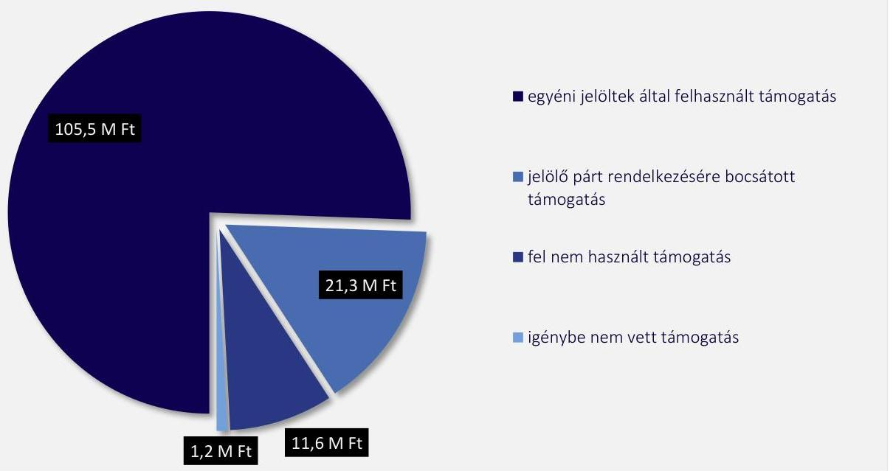

# JELENTÉS 

A kampánypénzek ellenőrzése - A 2022. évi országgyúlési képviselő-választási kampányra fordított pénzeszközök elszámolásának ellenőrzése az egyéni jelölteknél

2023.

---

# JELENTÉS 

A kampánypénzek ellenőrzése - A 2022. évi országgyúlési képviselő-választási kampányra fordított pénzeszközök elszámolásának ellenőrzése az egyéni jelölteknél
2023.

---

# ELLENŐRZÉSI IGAZGATÓSÁG: 

## ÁLLAMHÁZTARTÁSON KÍVÜLI SZERVEZETEKET ELLENŐRZŐ IGAZGATÓSÁG

## ELLENŐRZÉSI IGAZGATÓ:

## KLINGA LÁSZLÓ igazgató

## ELLENŐRZÉSVEZETŐ:

Jelentéseink az interneten a www.asz.hu címen olvashatók.

## HOFMEISTER LÁSZLÓ ellenőrzésvezető

IKTATÓSZÁM: EL-3850-001/2023.
TÉMASZÁM: 2644
ELLENŐRZÉS-AZONOSÍTÓ SZÁM: V0988

---

# TARTALOMJEGYZÉK 

- AZ ELLENŐRZÉS ALAPADATAI ..... 5
- AZ ELLENŐRZÉS HATÓKÖRE ÉS TERÜLETE ..... 7
- ÖSSZEFOGLALÁS ..... 8
- AZ ELLENŐRZÉS FÓKUSZTERÜLETE ..... 10
- MEGÁLLAPÍTÁSOK ..... 11
- MELLÉKLETEK ..... 98
I. sz. melléklet: Értelmező szótár ..... 98
II. sz. melléklet: Az ellenőrzött egyéni képviselőjelöltek jegyzéke ..... 99
- FÜGGELÉK: ÉSZREVÉTELEK ..... 102
- RÖVIDÍTÉSEK JEGYZÉKE ..... 103

---

.

---

# AZ ELLENŐRZÉS ALAPADATAI 

## AZ ELLENŐRZÉS CÉLJA

Az ellenőrzés célja annak értékelése volt, hogy az országgyűlési választáson képviselethez jutott egyéni jelöltek a Kftv. ${ }^{1}$ 1. §-a alapján nekik járó központi költségvetésből juttatott támogatást a választási kampányidőszakban a választási kampánytevékenységgel összefüggő kiadások finanszírozására fordították-e.

## AZ ELLENŐRZÉS TÍPUSA

Szabályszerűségi ellenőrzés.

## AZ ELLENŐRZÖTT IDŐSZAK

A Ve. ${ }^{2}$ 139. §-ában rögzített - a szavazás napját megelőző 50. naptól (2022. február 12-étől) a szavazás befejezésének időpontjáig (2022. április 3 -áig) tartó - választási kampányidőszak, valamint az azt követő elszámolási időszak, azaz a Kftv. 9. § (1) bekezdés szerint az országgyűlési választást követő 60 nap, a 2022. június 2 -áig tartó időszak.

## AZ ELLENŐRZÉS TÁRGYA

Ellenőrzésre került a Kincstár ${ }^{3}$ és a jelölt által megkötött megállapodás, a kincstári kártyafedezeti számla rendelkezésre állása, a számla használatára vonatkozó szabályok jelölt általi betartása. Vizsgálat tárgyát képezte a kampánytevékenységhez köthető bizonylatok szabályszerűsége, megfelelése a Kincstárral kötött megállapodásnak, illetve a Számv. tv. ${ }^{4}$-ben előírt alaki és tartalmi kellékeknek, az NGM rendelet ${ }^{5}$ szerinti hitelesítési előírásoknak a betartása, a számlák ÁFA tv ${ }^{6}$. szerinti kötelező adattartalmának megléte. Továbbá az ellenőrzés tárgyát képezte a költségvetési támogatásból finanszírozott valamennyi kiadásnak a választási kampányidőszak alatti, illetve a kampánytevékenységre történő teljesítése, a finanszírozott tételeknek a dologi kiadások körébe tartozása, a Kincstár felé benyújtott elszámolás formai és tartalmi szempontok szerinti szabályszerűsége, valamint a politikai hirdetések kapcsán alkalmazott áraknak a sajtótermékek által megküldött, az ÁSZ honlapján megjelentetett árjegyzékekkel, tájékoztatókkal való egyezősége.

## AZ ELLENŐRZÉS JOGALAPJA

Az ellenőrzés jogszabályi alapját a Kftv. 8/B. § (1) bekezdése képezte.

---

# AZ ELLENŐRZÉS MÓDSZERE 

Az ellenőrzés az ellenőrzött időszakban hatályos jogszabályok, az ÁSZ* ellenőrzés szakmai szabályai, a jelen ellenőrzésre irányadó ÁSZ módszertanok, az ellenőrzési programban foglalt értékelési szempontok szerint került végrehajtásra.

Az ÁSZ az ellenőrzéshez adatszolgáltatásra kérte fel a Kincstárt és a Nemzeti Választási Irodát. Az ellenőrzési kérdések megválaszolásához szükséges bizonyítékok megszerzése a Kincstár és a Nemzeti Választási Iroda által rendelkezésre bocsátott dokumentumokra, adatokra alapozva történt. Az ellenőrzési bizonyítékként felhasznált adatforrások közé tartoztak egyrészt az ellenőrzési program részletes szempontjainál felsorolt adatforrások, másrészt minden egyéb - az ellenőrzés folyamán feltárt, az ellenőrzés szempontjából információt tartalmazó - dokumentum.

Az ellenőrzés lefolytatásához az adatszolgáltatásra felkért szervezetek az ÁSZ által kért dokumentumok elektronikus megküldésével szolgáltattak adatokat, amelyek valódiságát és teljes körűségét az adatszolgáltatásra felkért által tett teljességi és hitelességi nyilatkozat igazolta. Az így rendelkezésre bocsátott adatok, információk kontrollja az ellenőrzés keretében történt meg.

Az egyéni jelöltek által kampányfinanszírozásra kapott költségvetési támogatás felhasználásának ellenőrzése a Kincstárhoz a jelöltek által beküldött elszámolások ellenőrzésével, valamint a másolatban rendelkezésre bocsátott dokumentumok tételes ellenőrzésével történt.

Az ÁSZ a kampányfinanszírozásra fordított pénzeszközök szabályszerű felhasználása kapcsán ellenőrizte:

- a kampányidőszakban a kifizetések bizonylatait, az azokat alátámasztó egyéb dokumentumokat (szerződések, megállapodások, bankszámlakivonatok, számlák, kiadások, költségek elszámolási dokumentumai),
- a Kincstárnak átadott elszámolásokat,
- a képviselői nyilatkozatokat,
- a tanúsítványokat,
- az alkalmazott áraknak a sajtótermékek kiadói által megküldött, az ÁSZ honlapján megjelentetett árjegyzékekkel, tájékoztatókkal való egyezőségét.

---

# AZ ELLENŐRZÉS HATÓKÖRE ÉS TERÜLETE 

A Kftv. 8/B. § (1) bekezdése értelmében az 1. § szerinti támogatás felhasználását az ÁSZ a választást követő egy éven belül, az országgyűlési képviselethez jutott jelöltek tekintetében kötelezően, hivatalból ellenőrzi a Kincstárnál, szükség esetén a jelöltnél vagy a 2/A. § szerinti esetben a jelöltet jelölő pártnál.

Az egyéni jelöltek a Kftv. 1. § (1) bekezdése szerint 2014. évben egymillió forint, a következő választásokon a Kftv. 1. § (2) bekezdése alapján a „törvény hatálybalépését követő általános választását követő évtől kezdődően a Központi Statisztikai Hivatal által a tárgyévet megelőző évre megállapított fogyasztói árindexszel évente" növelt összegű támogatásra jogosultak. 2022. évben ez a támogatási összeg 1182,9 E Ft volt.

Az Okvt. ${ }^{8}$ 3. § (2) bekezdésében foglaltak szerint a 199 fő országgyűlési képviselőből 106 főt egyéni választókerületben, 93 főt országos listán választanak. Az ellenőrzés kiterjedt a 106 egyéni választókerületben megválasztott egyéni jelöltre, valamint arra a 12 főre is, akik egyéni jelöltként támogatást vettek igénybe és bár nem egyéni jelöltként, hanem országos listáról, de mandátumot szereztek. Az országos listáról mandátumot szerzett 12 főből egy jelölt nem vette fel a mandátumát. Az ellenőrzött egyéni jelöltek száma összesen 118 fő volt. Az ellenőrzött egyéni jelöltek nevét, képviselő csoportját, egyéni választókörzetét és a felhasznált támogatás összegét a II. számú melléklet tartalmazza.

---

# ÖSSZEFOGLALÁS

A Kftv. rendelkezéseinek megfelelően a 2022. évi országgyűlési képviselő-választást követő egy éven belül az ÁSZ összesen 118 fő mandátumot szerzett egyéni jelölt tekintetében ellenőrizte a választásra fordított állami támogatások felhasználását. Az ÁSZ az ellenőrzés során értékelte, hogy az egyéni jelöltek a nekik járó központi költségvetésből juttatott támogatást a választási kampányidőszakban, a választási kampánytevékenységgel összefüggő kiadások finanszírozására fordították-e, valamint hogy a támogatással való elszámolás során betartották-e a vonatkozó jogszabályi előírásokat.

Az ellenőrzött 118 fő egyéni jelölt közül 18 jelölt összesen 21,3 M Ft költségvetési támogatás igénybevételéről mondott le, és bocsátotta azt jelölő pártja rendelkezésére. Az ÁSZ a Kftv. értelmében a választást követő egy éven belül ellenőrzi az egy százalék feletti listás eredményt elért jelölő szervezetek kampány költéseit is, melynek keretében ellenőrzésre kerül az egyéni jelöltek által – a jelölő szervezetnek – felajánlott támogatási összegek felhasználása. A jelölő szervezetek ellenőrzéséről külön jelentés készül.

A Kincstár a támogatás folyósítása céljából 99 fő egyéni jelölttel a Kftv.-ben előírtaknak megfelelően, az NGM rendeletben meghatározott tartalommal megállapodást kötött, kincstári kártyafedezeti számlát nyitott, kincstári kártya kibocsátásáról intézkedett, összesen 117,1 M Ft támogatási összeget bocsátott a jelöltek rendelkezésére. A Kincstárral megállapodást kötött 99 fő egyéni jelölt közül két jelölt nem vett igénybe támogatást, a 97 jelölt összesen 105,5 M Ft-ot számolt el kampánycélra. A fel nem használt támogatás 11,6 M Ft.

Egy jelölt a támogatásról nem mondott le jelölő pártja javára, de saját nevében sem kötött megállapodást a Kincstárral, így az 1,2 M Ft összegű támogatást nem vette igénybe.

1. ábra

**KIMUTATÁS A KÖZPONTI KÖLTSÉGVETÉSBŐL AZ EGYÉNI JELŐLTEK RÉSZÉRE A 2022. ÉVI VÁLASZTÁSI KAMPÁNYRA JUTTATOTT TÁMOGATÁS FELHASZNÁLÁSÁRÓL**

*Forrás: ÁSZ saját szerkesztés*

A támogatást igénybe vevő 97 fő egyéni jelölt a választási kampányidőszak alatti kiadásainak elszámolását a Kincstárhoz a Kftv.-ben előírt határidőben, az összes kifizetést igazoló bizonylat másolatával, az NGM rendeletben rögzítetteknek megfelelően számlaösszesítő adatlapon nyújtotta be, melyen a kiadási tételekhez

---

részletes, szöveges indokolást adott azok felhasználási céljáról, valamint nyilatkozott a támogatás szabályszerű felhasználásáról.

A 97 jelölt közül 94 jelölt esetében a Kincstárhoz benyújtott elszámolás és az elszámoláshoz csatolt bizonylatok alapján a támogatás felhasználása a Kftv.-ben foglalt előírásoknak megfelelt.

A támogatás felhasználását igazoló számviteli bizonylatok - egy jelölt kivételével - a Kftv.-ben előírtaknak megfelelően a jelöltek nevére szóltak, és azokon az egyéni választókerület megjelölése feltüntetésre került.

A bizonylatok hitelesek voltak, megfeleltek a Számv. tv. által meghatározott alaki és tartalmi követelményeknek. A támogatás felhasználását igazoló bizonylatok Kincstárhoz benyújtott másolatait a jelöltek az NGM rendeletben foglaltaknak megfelelően aláírásukkal és „Az eredetivel mindenben megegyező" szöveg feltüntetésével hitelesítették.

A bizonylatok a Ve. szerinti kampányeszközök igénybevételét támasztották alá, melyek kampányidőszaki felhasználása a Ve. értelmében kampánytevékenységnek minősült. Az elszámolásokhoz csatolt dokumentumok a Kftv. rendelkezésének megfelelően - két jelölt kivételével - kampányidőszak alatti felhasználást igazoltak. A Kincstárhoz elszámolásra benyújtott bizonylatok a Kftv. előírásának megfelelően kampánytevékenységgel összefüggő dologi kiadásokat tartalmaztak, a finanszírozott tételek az Áhsz. ${ }^{9}$ szerinti dologi kiadások rovatba tartoztak.

Három jelöltnél fordult elő a támogatás felhasználására vonatkozó szabálytalanság. Az előírásokat maradéktalanul be nem tartó három jelölt közül egy jelölt esetében a számviteli bizonylatok - a Kftv.-ben foglaltak ellenére - nem a jelölt nevére szóltak. További két jelölt elszámolásához csatolt - jelöltenként egy-egy - bizonylat nem felelt meg teljeskörűen a Kftv. előírásainak, mivel a bizonylatokon rögzített szolgáltatás igénybevétele nem a Ve.-ben, valamint az IM rendelet ${ }^{10}$-ben meghatározott kampányidőszakban történt. A Kincstár a három jelölt esetében a szabálytalanul felhasznált, központi költségvetésből juttatott összesen 641,5 E Ft összegű támogatás kétszeresének visszafizetésére vonatkozóan határozatban intézkedett. A jelöltek a Kincstár határozatában megállapított összeget visszafizették. A Kincstár által megállapított szabálytalanságokon túl az ÁSZ további szabálytalanságot nem tárt fel.

---

# AZ ELLENŐRZÉS FÓKUSZTERÜLETE 

1- Szabályszerü volt-e az ellenőrzött egyéni jelöltek részére juttatott Kftv. 1. § (1)-(2) bekezdés szerinti központi költségvetési támogatás felhasználása?

---

# 1. Dr. Apáti István egyéni képviselőjelölt 

## Összegző megállapítás Az ellenőrzött egyéni képviselőjelölt részére juttatott központi költségvetési támogatás felhasználása és elszámolása szabályszerű volt.

A Kincstár a támogatás folyósítása céljából a Kftv. 2. § (1)-(2) bekezdéseiben előírtaknak megfelelően a jelölttel megállapodást kötött, kincstári kártyafedezeti számlát nyitott, amin a központi költségvetésből juttatott, a Kftv. 1. § (1)-(2) bekezdéseiben foglaltak szerinti, 1182,9 E Ft támogatási összeget bocsátott a jelölt rendelkezésére, valamint kincstári kártya kibocsátásáról intézkedett. A jelölt a részére folyósított költségvetési támogatásból 1161,2 E Ft-ot használt fel.
A jelölt a Kftv. 2. § (4) bekezdésében előírtaknak megfelelően a kampánytevékenységekkel összefüggő dologi kiadásokat a kincstári kártyafedezeti számláról kincstári kártyával történő vásárlással vagy átutalással teljesítette, a Kftv. 2. § (5) bekezdése előírását betartotta, a kincstári kártyáról készpénzt nem vett fel.
A jelölt a választási kampányidőszak alatti kiadásainak elszámolását a Kincstárhoz a Kftv. 8. § (1) bekezdése szerinti határidőben, az összes kifizetést igazoló bizonylat másolatával, az NGM rendelet 7. § (1) és (3) bekezdéseiben rögzítetteknek megfelelően számlaösszesítő adatlapon nyújtotta be, melyen a kiadási tételekhez részletes, szöveges indokolást adott azok felhasználási céljáról, valamint nyilatkozott a támogatás szabályszerű felhasználásáról.
A támogatás felhasználását igazoló számlák, számviteli bizonylatok a Kftv. 2. § (6) bekezdésében foglaltaknak megfelelően a jelölt nevére szóltak, és azokon feltüntették az egyéni választókerület megjelölését. A bizonylatok hitelesek voltak, megfeleltek a Számv. tv. 166-167. § által meghatározott alaki és tartalmi követelményeknek. A támogatás felhasználását igazoló bizonylatok Kincstárhoz benyújtott másolatait a jelölt az NGM rendelet 7. § (2) bekezdésében foglaltaknak megfelelően aláírásával és „Az eredetivel mindenben megegyezö" szöveg feltüntetésével hitelesítette.
A bizonylatok a Ve. 140. §-a szerinti kampányeszközök igénybevételét támasztották alá, melyek kampányidőszaki felhasználása a Ve. 141. § értelmében kampánytevékenységnek minősült.
A Kincstárhoz elszámolásra benyújtott bizonylatok a Kftv. 1. § (3) bekezdésének megfelelően kampányidőszak alatti, kampánytevékenységgel összefüggő dologi kiadásokat tartalmaztak, a finanszírozott tételek az Áhsz. 15. melléklete szerinti K3 Dologi kiadások rovatba tartoztak.
A jelölt nem rendelt meg sajtóterméktől politikai hirdetést.

---

# 2. Dr. Aradszki András egyéni képviselőjelölt 

## Összegző megállapítás Az ellenőrzött egyéni képviselőjelölt részére juttatott központi költségvetési támogatás felhasználása és elszámolása szabályszerű volt.

A Kincstár a támogatás folyósítása céljából a Kftv. 2. § (1)-(2) bekezdéseiben előírtaknak megfelelően a jelölttel megállapodást kötött, kincstári kártyafedezeti számlát nyitott, amin a központi költségvetésből juttatott, a Kftv. 1. $\$ (1)-(2) bekezdéseiben foglaltak szerinti, 1182,9 E Ft támogatási összeget bocsátott a jelölt rendelkezésére, valamint kincstári kártya kibocsátásáról intézkedett. A jelölt a részére folyósított költségvetési támogatásból 1165,9 E Ft-ot használt fel.
A jelölt a Kftv. 2. § (4) bekezdésében előírtaknak megfelelően a kampánytevékenységekkel összefüggő dologi kiadásokat a kincstári kártyafedezeti számláról kincstári kártyával történő vásárlással vagy átutalással teljesítette, a Kftv. 2. $\$ (5) bekezdése előírását betartotta, a kincstári kártyáról készpénzt nem vett fel.
A jelölt a választási kampányidőszak alatti kiadásainak elszámolását a Kincstárhoz a Kftv. 8. $\$ \ (1)$ bekezdése szerinti határidőben, az összes kifizetést igazoló bizonylat másolatával, az NGM rendelet 7. $\$ (1)$ és (3) bekezdéseiben rögzítetteknek megfelelően számlaösszesítő adatlapon nyújtotta be, melyen a kiadási tételekhez részletes, szöveges indokolást adott azok felhasználási céljáról, valamint nyilatkozott a támogatás szabályszerű felhasználásáról.
A támogatás felhasználását igazoló számlák, számviteli bizonylatok a Kftv. 2. § (6) bekezdésében foglaltaknak megfelelően a jelölt nevére szóltak, és azokon feltüntették az egyéni választókerület megjelölését. A bizonylatok hitelesek voltak, megfelelttek a Számv. tv. 166-167. § által meghatározott alaki és tartalmi követelményeknek. A támogatás felhasználását igazoló bizonylatok Kincstárhoz benyújtott másolatait a jelölt az NGM rendelet 7. § (2) bekezdésében foglaltaknak megfelelően aláírásával és „Az eredetivel mindenben megegyező" szöveg feltüntetésével hitelesítette.
A bizonylatok a Ve. 140. §-a szerinti kampányeszközök igénybevételét támasztották alá, melyek kampányidőszaki felhasználása a Ve. 141. § értelmében kampánytevékenységnek minősült.
A Kincstárhoz elszámolásra benyújtott bizonylatok a Kftv. 1. § (3) bekezdésének megfelelően kampányidőszak alatti, kampánytevékenységgel összefüggő dologi kiadásokat tartalmaztak, a finanszírozott tételek az Áhsz. 15. melléklete szerinti K3 Dologi kiadások rovatba tartoztak.
A jelölt által a Kincstárhoz elszámolásra benyújtott, sajtóban közzétett politikai hirdetést tartalmazó számla kapcsán a sajtótermék megjelentetője a Ve. 148. § (3) bekezdése előírásainak megfelelően eljuttatta az ÁSZ-hoz szolgáltatási árjegyzékét, az ÁSZ azt közzétette honlapján. A számlázott ellenérték a Ve. 148. § (4) bekezdésében előírtaknak megfelelően megegyezett a sajtótermék kiadója által az ÁSZ részére megküldött árjegyzékében szereplő adatokkal. A közzétett politikai hirdetésről a sajtótermék kiadója a Ve. 148. § (5) bekezdésében rögzített tájékoztatási kötelezettségének nem tett eleget. A Ve.-ben előírt kötelezettség körében feltárt mulasztás az ellenőrzött egyéni jelöltnek nem róható fel.

---

# 3. Arató Gergely László egyéni képviselőjelölt 

## Összegző megállapítás

Az ellenőrzött egyéni képviselőjelölt az őt megillető központi költségvetési támogatás igénybevételéről lemondott, annak teljes összegét jelölő pártja rendelkezésére bocsátotta.

Az országgyűlési választáson képviselethez jutott egyéni jelölt a Kftv. 2/A. § (1) bekezdésének megfelelően a Kincstárnál írásban lemondott a Kftv. 1. § szerinti őt megillető 1182,9 E Ft központi költségvetési támogatási összeg igénybevételéről, és azt jelölő szervezete, a Demokratikus Koalíció rendelkezésére bocsátotta.
A Kftv. 2/A. (2) bekezdése előírásának megfelelően a Kincstár a jelölő párttal kötött megállapodást. A Kftv. 8/C. § (2a) bekezdésében foglaltak alapján a jelöltet megillető támogatás felhasználásának szabályszerűségét az ÁSZ a jelöltet jelölő Demokratikus Koalíciónál ellenőrizte.

## 4. Ágh Péter egyéni képviselőjelölt

## Összegző megállapítás Az ellenőrzött egyéni képviselőjelölt részére juttatott központi költségvetési támogatás felhasználása és elszámolása szabályszerű volt.

A Kincstár a támogatás folyósítása céljából a Kftv. 2. § (1)-(2) bekezdéseiben előírtaknak megfelelően a jelölttel megállapodást kötött, kincstári kártyafedezeti számlát nyitott, amin a központi költségvetésből juttatott, a Kftv. 1. § (1)-(2) bekezdéseiben foglaltak szerinti, 1182,9 E Ft támogatási összeget bocsátott a jelölt rendelkezésére, valamint kincstári kártya kibocsátásáról intézkedett. A jelölt a részére folyósított költségvetési támogatásból 1175,8 E Ft-ot használt fel.
A jelölt a Kftv. 2. § (4) bekezdésében előírtaknak megfelelően a kampánytevékenységekkel összefüggő dologi kiadásokat a kincstári kártyafedezeti számláról kincstári kártyával történő vásárlással vagy átutalással teljesítette, a Kftv. 2. § (5) bekezdése előírását betartotta, a kincstári kártyáról készpénzt nem vett fel.
A jelölt a választási kampányidőszak alatti kiadásainak elszámolását a Kincstárhoz a Kftv. 8. § (1) bekezdése szerinti határidőben, az összes kifizetést igazoló bizonylat másolatával, az NGM rendelet 7. § (1) és (3) bekezdéseiben rögzítetteknek megfelelően számlaösszesítő adatlapon nyújtotta be, melyen a kiadási tételekhez részletes, szöveges indokolást adott azok felhasználási céljáról, valamint nyilatkozott a támogatás szabályszerű felhasználásáról.
A támogatás felhasználását igazoló számlák, számviteli bizonylatok a Kftv. 2. § (6) bekezdésében foglaltaknak megfelelően a jelölt nevére szóltak, és azokon feltüntették az egyéni választókerület megjelölését. A bizonylatok hitelesek voltak, megfeleltek a Számv. tv. 166-167. § által meghatározott alaki és tartalmi követelményeknek. A támogatás felhasználását igazoló bizonylatok Kincstárhoz benyújtott másolatait a jelölt az NGM rendelet 7. § (2) bekezdésében foglaltaknak megfelelően aláírásával és „Az eredetivel mindenben megegyezơ" szöveg feltüntetésével hitelesítette.
A bizonylatok a Ve. 140. §-a szerinti kampányeszközök igénybevételét támasztották alá, melyek kampányidőszaki felhasználása a Ve. 141. § értelmében kampánytevékenységnek minősült.

---

A Kincstárhoz elszámolásra benyújtott bizonylatok a Kftv. 1. § (3) bekezdésének megfelelően kampányidőszak alatti, kampánytevékenységgel összefüggő dologi kiadásokat tartalmaztak, a finanszirozott tételek az Áhsz. 15. melléklete szerinti K3 Dologi kiadások rovatba tartoztak.
A jelölt nem rendelt meg sajtóterméktől politikai hirdetést.

# 5. Balla Mihály Tibor egyéni képviselőjelölt 

## Összegző megállapítás Az ellenőrzött egyéni képviselőjelölt részére juttatott központi költségvetési támogatás felhasználása és elszámolása szabályszerű volt.

A Kincstár a támogatás folyósítása céljából a Kftv. 2. § (1)-(2) bekezdéseiben előírtaknak megfelelően a jelölttel megállapodást kötött, kincstári kártyafedezeti számlát nyitott, amin a központi költségvetésből juttatott, a Kftv. 1. $\$ (1)-(2) bekezdéseiben foglaltak szerinti, 1182,9 E Ft támogatási összeget bocsátott a jelölt rendelkezésére, valamint kincstári kártya kibocsátásáról intézkedett. A jelölt a részére folyósított költségvetési támogatásból 705,4 E Ft-ot használt fel.
A jelölt a Kftv. 2. $\$ (4) bekezdésében előírtaknak megfelelően a kampánytevékenységekkel összefüggő dologi kiadásokat a kincstári kártyafedezeti számláról kincstári kártyával történő vásárlással vagy átutalással teljesítette, a Kftv. 2. § (5) bekezdése előírását betartotta, a kincstári kártyáról készpénzt nem vett fel.
A jelölt a választási kampányidőszak alatti kiadásainak elszámolását a Kincstárhoz a Kftv. 8. $\$ (1) bekezdése szerinti határidőben, az összes kifizetést igazoló bizonylat másolatával, az NGM rendelet 7. $\$ (1)$ és (3) bekezdéseiben rögzítetteknek megfelelően számlaösszesítő adatlapon nyújtotta be, melyen a kiadási tételekhez részletes, szöveges indokolást adott azok felhasználási céljáról, valamint nyilatkozott a támogatás szabályszerű felhasználásáról.
A támogatás felhasználását igazoló számlák, számviteli bizonylatok a Kftv. 2. § (6) bekezdésében foglaltaknak megfelelően a jelölt nevére szóltak, és azokon feltüntették az egyéni választókerület megjelölését. A bizonylatok hitelesek voltak, megfelelttek a Számv. tv. 166-167. § által meghatározott alaki és tartalmi követelményeknek. A támogatás felhasználását igazoló bizonylatok Kincstárhoz benyújtott másolatait a jelölt az NGM rendelet 7. § (2) bekezdésében foglaltaknak megfelelően aláírásával és „Az eredetivel mindenben megegyezơ" szöveg feltüntetésével hitelesítette.
A bizonylatok a Ve. 140. §-a szerinti kampányeszközök igénybevételét támasztották alá, melyek kampányidőszaki felhasználása a Ve. 141. § értelmében kampánytevékenységnek minősült.
A Kincstárhoz elszámolásra benyújtott bizonylatok a Kftv. 1. § (3) bekezdésének megfelelően kampányidőszak alatti, kampánytevékenységgel összefüggő dologi kiadásokat tartalmaztak, a finanszirozott tételek az Áhsz. 15. melléklete szerinti K3 Dologi kiadások rovatba tartoztak.
A jelölt nem rendelt meg sajtóterméktől politikai hirdetést.

---

# 6. Barcza Attila egyéni képviselőjelölt 

## Összegző megállapítás Az ellenőrzött egyéni képviselőjelölt részére juttatott központi költségvetési támogatás felhasználása és elszámolása szabályszerű volt.

A Kincstár a támogatás folyósítása céljából a Kftv. 2. § (1)-(2) bekezdéseiben előírtaknak megfelelően a jelölttel megállapodást kötött, kincstári kártyafedezeti számlát nyitott, amin a központi költségvetésből juttatott, a Kftv. 1. § (1)-(2) bekezdéseiben foglaltak szerinti, 1182,9 E Ft támogatási összeget bocsátott a jelölt rendelkezésére, valamint kincstári kártya kibocsátásáról intézkedett. A jelölt a részére folyósított költségvetési támogatásból 1070,6 E Ft-ot használt fel.
A jelölt a Kftv. 2. § (4) bekezdésében előírtaknak megfelelően a kampánytevékenységekkel összefüggő dologi kiadásokat a kincstári kártyafedezeti számláról kincstári kártyával történő vásárlással vagy átutalással teljesítette, a Kftv. 2. § (5) bekezdése előírását betartotta, a kincstári kártyáról készpénzt nem vett fel.
A jelölt a választási kampányidőszak alatti kiadásainak elszámolását a Kincstárhoz a Kftv. 8. § (1) bekezdése szerinti határidőben, az összes kifizetést igazoló bizonylat másolatával, az NGM rendelet 7. § (1) és (3) bekezdéseiben rögzítetteknek megfelelően számlaösszesítő adatlapon nyújtotta be, melyen a kiadási tételekhez részletes, szöveges indokolást adott azok felhasználási céljáról, valamint nyilatkozott a támogatás szabályszerű felhasználásáról.
A támogatás felhasználását igazoló számlák, számviteli bizonylatok a Kftv. 2. § (6) bekezdésében foglaltaknak megfelelően a jelölt nevére szóltak, és azokon feltüntették az egyéni választókerület megjelölését. A bizonylatok hitelesek voltak, megfeleltek a Számv. tv. 166-167. § által meghatározott alaki és tartalmi követelményeknek. A támogatás felhasználását igazoló bizonylatok Kincstárhoz benyújtott másolatait a jelölt az NGM rendelet 7. § (2) bekezdésében foglaltaknak megfelelően aláírásával és „Az eredetivel mindenben megegyezơ" szöveg feltüntetésével hitelesítette.
A bizonylatok a Ve. 140. §-a szerinti kampányeszközök igénybevételét támasztották alá, melyek kampányidőszaki felhasználása a Ve. 141. § értelmében kampánytevékenységnek minősült.
A Kincstárhoz elszámolásra benyújtott bizonylatok a Kftv. 1. § (3) bekezdésének megfelelően kampányidőszak alatti, kampánytevékenységgel összefüggő dologi kiadásokat tartalmaztak, a finanszírozott tételek az Áhsz. 15. melléklete szerinti K3 Dologi kiadások rovatba tartoztak.
A jelölt által a Kincstárhoz elszámolásra benyújtott, sajtóban közzétett politikai hirdetést tartalmazó számla kapcsán a sajtótermék megjelentetője a Ve. 148. § (3) bekezdése előírásainak megfelelően eljuttatta az ÁSZ-hoz szolgáltatási árjegyzékét, az ÁSZ azt közzétette honlapján. A számlázott ellenérték a Ve. 148. § (4) bekezdésében előírtaknak megfelelően megegyezett a sajtótermék kiadója által az ÁSZ részére megküldött árjegyzékében szereplő adatokkal. A közzétett politikai hirdetésről a sajtótermék kiadója a Ve. 148. § (5) bekezdésében rögzített tájékoztatási kötelezettségének nem tett eleget. A Ve.-ben előírt kötelezettség körében feltárt mulasztás az ellenőrzött egyéni jelöltnek nem róható fel.

---

# 7. Barkóczi Balázs egyéni képviselőjelölt 

## Összegző megállapítás

Az ellenőrzött egyéni képviselőjelölt az őt megillető központi költségvetési támogatás igénybevételéről lemondott, annak teljes összegét jelölő pártja rendelkezésére bocsátotta.

Az országgyűlési választáson képviselethez jutott egyéni jelölt a Kftv. 2/A. § (1) bekezdésének megfelelően a Kincstárnál írásban lemondott a Kftv. 1. § szerinti őt megillető 1182,9 E Ft központi költségvetési támogatási összeg igénybevételéről, és azt jelölő szervezete, a Demokratikus Koalíció rendelkezésére bocsátotta.
A Kftv. 2/A. (2) bekezdése előírásának megfelelően a Kincstár a jelölő párttal kötött megállapodást. A Kftv. 8/C. § (2a) bekezdésében foglaltak alapján a jelöltet megillető támogatás felhasználásának szabályszerűségét az ÁSZ a jelöltet jelölő Demokratikus Koalíciónál ellenőrizte.

## 8. Bányai Gábor Elemér egyéni képviselőjelölt

## Összegző megállapítás Az ellenőrzött egyéni képviselőjelölt részére juttatott központi költségvetési támogatás felhasználása és elszámolása szabályszerű volt.

A Kincstár a támogatás folyósítása céljából a Kftv. 2. § (1)-(2) bekezdéseiben előírtaknak megfelelően a jelölttel megállapodást kötött, kincstári kártyafedezeti számlát nyitott, amin a központi költségvetésből juttatott, a Kftv. 1. § (1)-(2) bekezdéseiben foglaltak szerinti, 1182,9 E Ft támogatási összeget bocsátott a jelölt rendelkezésére, valamint kincstári kártya kibocsátásáról intézkedett. A jelölt a részére folyósított költségvetési támogatásból 1179,6 E Ft-ot használt fel.
A jelölt a Kftv. 2. § (4) bekezdésében előírtaknak megfelelően a kampánytevékenységekkel összefüggő dologi kiadásokat a kincstári kártyafedezeti számláról kincstári kártyával történő vásárlással vagy átutalással teljesítette, a Kftv. 2. § (5) bekezdése előírását betartotta, a kincstári kártyáról készpénzt nem vett fel.
A jelölt a választási kampányidőszak alatti kiadásainak elszámolását a Kincstárhoz a Kftv. 8. § (1) bekezdése szerinti határidőben, az összes kifizetést igazoló bizonylat másolatával, az NGM rendelet 7. § (1) és (3) bekezdéseiben rögzítetteknek megfelelően számlaösszesítő adatlapon nyújtotta be, melyen a kiadási tételekhez részletes, szöveges indokolást adott azok felhasználási céljáról, valamint nyilatkozott a támogatás szabályszerű felhasználásáról.
A támogatás felhasználását igazoló számlák, számviteli bizonylatok a Kftv. 2. § (6) bekezdésében foglaltaknak megfelelően a jelölt nevére szóltak, és azokon feltüntették az egyéni választókerület megjelölését. A bizonylatok hitelesek voltak, megfelelttek a Számv. tv. 166-167. § által meghatározott alaki és tartalmi követelményeknek. A támogatás felhasználását igazoló bizonylatok Kincstárhoz benyújtott másolatait a jelölt az NGM rendelet 7. § (2) bekezdésében foglaltaknak megfelelően aláírásával és „Az eredetivel mindenben megegyezơ" szöveg feltüntetésével hitelesítette.
A bizonylatok a Ve. 140. §-a szerinti kampányeszközök igénybevételét támasztották alá, melyek kampányidőszaki felhasználása a Ve. 141. § értelmében kampánytevékenységnek minősült.

---

A Kincstárhoz elszámolásra benyújtott bizonylatok a Kftv. 1. § (3) bekezdésének megfelelően kampányidőszak alatti, kampánytevékenységgel összefüggő dologi kiadásokat tartalmaztak, a finanszírozott tételek az Áhsz. 15. melléklete szerinti K3 Dologi kiadások rovatba tartoztak.
A jelölt nem rendelt meg sajtóterméktől politikai hirdetést.

# 9. Becsó Zsolt egyéni képviselőjelölt 

## Összegző megállapítás Az ellenőrzött egyéni képviselőjelölt részére juttatott központi költségvetési támogatás felhasználása és elszámolása szabályszerű volt.

A Kincstár a támogatás folyósítása céljából a Kftv. 2. § (1)-(2) bekezdéseiben előírtaknak megfelelően a jelölttel megállapodást kötött, kincstári kártyafedezeti számlát nyitott, amin a központi költségvetésből juttatott, a Kftv. 1. § (1)-(2) bekezdéseiben foglaltak szerinti, 1182,9 E Ft támogatási összeget bocsátott a jelölt rendelkezésére, valamint kincstári kártya kibocsátásáról intézkedett. A jelölt a részére folyósított költségvetési támogatásból 1182,9 E Ft-ot használt fel.
A jelölt a Kftv. 2. § (4) bekezdésében előírtaknak megfelelően a kampánytevékenységekkel összefüggő dologi kiadásokat a kincstári kártyafedezeti számláról kincstári kártyával történő vásárlással vagy átutalással teljesítette, a Kftv. 2. § (5) bekezdése előírását betartotta, a kincstári kártyáról készpénzt nem vett fel.
A jelölt a választási kampányidőszak alatti kiadásainak elszámolását a Kincstárhoz a Kftv. 8. § (1) bekezdése szerinti határidőben, az összes kifizetést igazoló bizonylat másolatával, az NGM rendelet 7. § (1) és (3) bekezdéseiben rögzítetteknek megfelelően számlaösszesítő adatlapon nyújtotta be, melyen a kiadási tételekhez részletes, szöveges indokolást adott azok felhasználási céljáról, valamint nyilatkozott a támogatás szabályszerű felhasználásáról.
A támogatás felhasználását igazoló számlák, számviteli bizonylatok a Kftv. 2. § (6) bekezdésében foglaltaknak megfelelően a jelölt nevére szóltak, és azokon feltüntették az egyéni választókerület megjelölését. A bizonylatok hitelesek voltak, megfeleltek a Számv. tv. 166-167. § által meghatározott alaki és tartalmi követelményeknek. A támogatás felhasználását igazoló bizonylatok Kincstárhoz benyújtott másolatait a jelölt az NGM rendelet 7. § (2) bekezdésében foglaltaknak megfelelően aláírásával és „Az eredetivel mindenben megegyezơ" szöveg feltüntetésével hitelesítette.
A bizonylatok a Ve. 140. §-a szerinti kampányeszközök igénybevételét támasztották alá, melyek kampányidőszaki felhasználása a Ve. 141. § értelmében kampánytevékenységnek minősült.
A Kincstárhoz elszámolásra benyújtott bizonylatok a Kftv. 1. § (3) bekezdésének megfelelően kampányidőszak alatti, kampánytevékenységgel összefüggő dologi kiadásokat tartalmaztak, a finanszírozott tételek az Áhsz. 15. melléklete szerinti K3 Dologi kiadások rovatba tartoztak.
A jelölt nem rendelt meg sajtóterméktől politikai hirdetést.

---

# 10. Bencsik János egyéni képviselőjelölt 

## Összegző megállapítás Az ellenőrzött egyéni képviselőjelölt részére juttatott központi költségvetési támogatás felhasználása és elszámolása szabályszerű volt.

A Kincstár a támogatás folyósítása céljából a Kftv. 2. § (1)-(2) bekezdéseiben előírtaknak megfelelően a jelölttel megállapodást kötött, kincstári kártyafedezeti számlát nyitott, amin a központi költségvetésből juttatott, a Kftv. 1. $\$ (1)-(2) bekezdéseiben foglaltak szerinti, 1182,9 E Ft támogatási összeget bocsátott a jelölt rendelkezésére, valamint kincstári kártya kibocsátásáról intézkedett. A jelölt a részére folyósított költségvetési támogatásból 1150,0 E Ft-ot használt fel.
A jelölt a Kftv. 2. § (4) bekezdésében előírtaknak megfelelően a kampánytevékenységekkel összefüggő dologi kiadásokat a kincstári kártyafedezeti számláról kincstári kártyával történő vásárlással vagy átutalással teljesítette, a Kftv. 2. $\$ (5) bekezdése előírását betartotta, a kincstári kártyáról készpénzt nem vett fel.
A jelölt a választási kampányidőszak alatti kiadásainak elszámolását a Kincstárhoz a Kftv. 8. § (1) bekezdése szerinti határidőben, az összes kifizetést igazoló bizonylat másolatával, az NGM rendelet 7. § (1) és (3) bekezdéseiben rögzítetteknek megfelelően számlaösszesítő adatlapon nyújtotta be, melyen a kiadási tételekhez részletes, szöveges indokolást adott azok felhasználási céljáról, valamint nyilatkozott a támogatás szabályszerű felhasználásáról.
A támogatás felhasználását igazoló számlák, számviteli bizonylatok a Kftv. 2. § (6) bekezdésében foglaltaknak megfelelően a jelölt nevére szóltak, és azokon feltüntették az egyéni választókerület megjelölését. A bizonylatok hitelesek voltak, megfelelttek a Számv. tv. 166-167. § által meghatározott alaki és tartalmi követelményeknek. A támogatás felhasználását igazoló bizonylatok Kincstárhoz benyújtott másolatait a jelölt az NGM rendelet 7. § (2) bekezdésében foglaltaknak megfelelően aláírásával és „Az eredetivel mindenben megegyező" szöveg feltüntetésével hitelesítette.
A bizonylatok a Ve. 140. §-a szerinti kampányeszközök igénybevételét támasztották alá, melyek kampányidőszaki felhasználása a Ve. 141. § értelmében kampánytevékenységnek minősült.
A Kincstárhoz elszámolásra benyújtott bizonylatok a Kftv. 1. § (3) bekezdésének megfelelően kampányidőszak alatti, kampánytevékenységgel összefüggő dologi kiadásokat tartalmaztak, a finanszírozott tételek az Áhsz. 15. melléklete szerinti K3 Dologi kiadások rovatba tartoztak.
A jelölt nem rendelt meg sajtóterméktől politikai hirdetést.

## 11. Bodó Sándor egyéni képviselőjelölt

## Összegző megállapítás Az ellenőrzött egyéni képviselőjelölt részére juttatott központi költségvetési támogatás felhasználása és elszámolása szabályszerű volt.

A Kincstár a támogatás folyósítása céljából a Kftv. 2. § (1)-(2) bekezdéseiben előírtaknak megfelelően a jelölttel megállapodást kötött, kincstári kártyafedezeti számlát nyitott, amin a központi költségvetésből juttatott, a Kftv. 1. § (1)-(2) bekezdéseiben foglaltak szerinti, 1182,9 E Ft támogatási összeget bocsátott a

---

jelölt rendelkezésére, valamint kincstári kártya kibocsátásáról intézkedett. A jelölt a részére folyósított költségvetési támogatásból 950,9 E Ft-ot használt fel.
A jelölt a Kftv. 2. § (4) bekezdésében előírtaknak megfelelően a kampánytevékenységekkel összefüggő dologi kiadásokat a kincstári kártyafedezeti számláról kincstári kártyával történő vásárlással vagy átutalással teljesítette, a Kftv. 2. $\$ (5) bekezdése előírását betartotta, a kincstári kártyáról készpénzt nem vett fel.
A jelölt a választási kampányidőszak alatti kiadásainak elszámolását a Kincstárhoz a Kftv. 8. $\$ (1) bekezdése szerinti határidőben, az összes kifizetést igazoló bizonylat másolatával, az NGM rendelet 7. $\$ (1) és (3) bekezdéseiben rögzítetteknek megfelelően számlaösszesítő adatlapon nyújtotta be, melyen a kiadási tételekhez részletes, szöveges indokolást adott azok felhasználási céljáról, valamint nyilatkozott a támogatás szabályszerű felhasználásáról.
A támogatás felhasználását igazoló számlák, számviteli bizonylatok a Kftv. 2. § (6) bekezdésében foglaltaknak megfelelően a jelölt nevére szóltak, és azokon feltüntették az egyéni választókerület megjelölését. A bizonylatok hitelesek voltak, megfeleltek a Számv. tv. 166-167. § által meghatározott alaki és tartalmi követelményeknek. A támogatás felhasználását igazoló bizonylatok Kincstárhoz benyújtott másolatait a jelölt az NGM rendelet 7. § (2) bekezdésében foglaltaknak megfelelően aláírásával és „Az eredetivel mindenben megegyezö" szöveg feltüntetésével hitelesítette.
A bizonylatok a Ve. 140. §-a szerinti kampányeszközök igénybevételét támasztották alá, melyek kampányidőszaki felhasználása a Ve. 141. § értelmében kampánytevékenységnek minősült.
A Kincstárhoz elszámolásra benyújtott bizonylatok a Kftv. 1. § (3) bekezdésének megfelelően kampányidőszak alatti, kampánytevékenységgel összefüggő dologi kiadásokat tartalmaztak, a finanszírozott tételek az Áhsz. 15. melléklete szerinti K3 Dologi kiadások rovatba tartoztak.
A jelölt nem rendelt meg sajtóterméktől politikai hirdetést.

# 12. Bóna Zoltán egyéni képviselőjelölt 

## Összegző megállapítás Az ellenőrzött egyéni képviselőjelölt részére juttatott központi költségvetési támogatás felhasználása és elszámolása szabályszerű volt.

A Kincstár a támogatás folyósítása céljából a Kftv. 2. § (1)-(2) bekezdéseiben előírtaknak megfelelően a jelölttel megállapodást kötött, kincstári kártyafedezeti számlát nyitott, amin a központi költségvetésből juttatott, a Kftv. 1. § (1)-(2) bekezdéseiben foglaltak szerinti, 1182,9 E Ft támogatási összeget bocsátott a jelölt rendelkezésére, valamint kincstári kártya kibocsátásáról intézkedett. A jelölt a részére folyósított költségvetési támogatásból 1182,4 E Ft-ot használt fel.
A jelölt a Kftv. 2. § (4) bekezdésében előírtaknak megfelelően a kampánytevékenységekkel összefüggő dologi kiadásokat a kincstári kártyafedezeti számláról kincstári kártyával történő vásárlással vagy átutalással teljesítette, a Kftv. 2. § (5) bekezdése előírását betartotta, a kincstári kártyáról készpénzt nem vett fel.
A jelölt a választási kampányidőszak alatti kiadásainak elszámolását a Kincstárhoz a Kftv. 8. § (1) bekezdése szerinti határidőben, az összes kifizetést igazoló bizonylat másolatával, az NGM rendelet 7. § (1) és (3) bekezdéseiben rögzítetteknek megfelelően számlaösszesítő adatlapon nyújtotta be, melyen a kiadási tételekhez részletes, szöveges indokolást adott azok felhasználási céljáról, valamint nyilatkozott a támogatás szabályszerű felhasználásáról.

---

A támogatás felhasználását igazoló számlák, számviteli bizonylatok a Kftv. 2. § (6) bekezdésében foglaltaknak megfelelően a jelölt nevére szóltak, és azokon feltüntették az egyéni választókerület megjelölését. A bizonylatok hitelesek voltak, megfelelttek a Számv. tv. 166-167. § által meghatározott alaki és tartalmi követelményeknek. A támogatás felhasználását igazoló bizonylatok Kincstárhoz benyújtott másolatait a jelölt az NGM rendelet 7. § (2) bekezdésében foglaltaknak megfelelően aláírásával és „Az eredetivel mindenben megegyezó" szöveg feltüntetésével hitelesítette.
A bizonylatok a Ve. 140. §-a szerinti kampányeszközök igénybevételét támasztották alá, melyek kampányidőszaki felhasználása a Ve. 141. § értelmében kampánytevékenységnek minősült.
A Kincstárhoz elszámolásra benyújtott bizonylatok a Kftv. 1. § (3) bekezdésének megfelelően kampányidőszak alatti, kampánytevékenységgel összefüggő dologi kiadásokat tartalmaztak, a finanszírozott tételek az Áhsz. 15. melléklete szerinti K3 Dologi kiadások rovatba tartoztak.
A jelölt által a Kincstárhoz elszámolásra benyújtott, sajtóban közzétett politikai hirdetést tartalmazó számla kapcsán a sajtótermék megjelentetője a Ve. 148. § (3) bekezdése előírásainak megfelelően eljuttatta az ÁSZ-hoz szolgáltatási árjegyzékét, az ÁSZ azt közzétette honlapján. A számlázott ellenérték a Ve. 148. § (4) bekezdésében előírtaknak megfelelően megegyezett a sajtótermék kiadója által az ÁSZ részére megküldött árjegyzékében szereplő adatokkal. A közzétett politikai hirdetésről a sajtótermék kiadója a Ve. 148. § (5) bekezdésében rögzített tájékoztatási kötelezettségének eleget tett.

# 13. Czerván György egyéni képviselőjelölt 

## Összegző megállapítás Az ellenőrzött egyéni képviselőjelölt részére juttatott központi költségvetési támogatás felhasználása és elszámolása szabályszerű volt.

A Kincstár a támogatás folyósítása céljából a Kftv. 2. § (1)-(2) bekezdéseiben előírtaknak megfelelően a jelölttel megállapodást kötött, kincstári kártyafedezeti számlát nyitott, amin a központi költségvetésből juttatott, a Kftv. 1. § (1)-(2) bekezdéseiben foglaltak szerinti, 1182,9 E Ft támogatási összeget bocsátott a jelölt rendelkezésére, valamint kincstári kártya kibocsátásáról intézkedett. A jelölt a részére folyósított költségvetési támogatásból 1182,9 E Ft-ot használt fel.
A jelölt a Kftv. 2. § (4) bekezdésében előírtaknak megfelelően a kampánytevékenységekkel összefüggő dologi kiadásokat a kincstári kártyafedezeti számláról kincstári kártyával történő vásárlással vagy átutalással teljesítette, a Kftv. 2. § (5) bekezdése előírását betartotta, a kincstári kártyáról készpénzt nem vett fel.
A jelölt a választási kampányidőszak alatti kiadásainak elszámolását a Kincstárhoz a Kftv. 8. § (1) bekezdése szerinti határidőben, az összes kifizetést igazoló bizonylat másolatával, az NGM rendelet 7. § (1) és (3) bekezdéseiben rögzítetteknek megfelelően számlaösszesítő adatlapon nyújtotta be, melyen a kiadási tételekhez részletes, szöveges indokolást adott azok felhasználási céljáról, valamint nyilatkozott a támogatás szabályszerű felhasználásáról.
A támogatás felhasználását igazoló számlák, számviteli bizonylatok a Kftv. 2. § (6) bekezdésében foglaltaknak megfelelően a jelölt nevére szóltak, és azokon feltüntették az egyéni választókerület megjelölését. A bizonylatok hitelesek voltak, megfelelttek a Számv. tv. 166-167. § által meghatározott alaki és tartalmi követelményeknek. A támogatás felhasználását igazoló bizonylatok Kincstárhoz

---

benyújtott másolatait a jelölt az NGM rendelet 7. § (2) bekezdésében foglaltaknak megfelelően aláírásával és „Az eredetivel mindenben megegyezó" szöveg feltüntetésével hitelesítette.
A bizonylatok a Ve. 140. §-a szerinti kampányeszközök igénybevételét támasztották alá, melyek kampányidőszaki felhasználása a Ve. 141. § értelmében kampánytevékenységnek minősült.
A Kincstárhoz elszámolásra benyújtott bizonylatok a Kftv. 1. § (3) bekezdésének megfelelően kampányidőszak alatti, kampánytevékenységgel összefüggő dologi kiadásokat tartalmaztak, a finanszírozott tételek az Áhsz. 15. melléklete szerinti K3 Dologi kiadások rovatba tartoztak.
A jelölt nem rendelt meg sajtóterméktől politikai hirdetést.

# 14. Czunyiné Dr. Bertalan Judit egyéni képviselőjelölt 

## Összegző megállapítás Az ellenőrzött egyéni képviselőjelölt részére juttatott központi költségvetési támogatás felhasználása és elszámolása szabályszerű volt.

A Kincstár a támogatás folyósítása céljából a Kftv. 2. § (1)-(2) bekezdéseiben előírtaknak megfelelően a jelölttel megállapodást kötött, kincstári kártyafedezeti számlát nyitott, amin a központi költségvetésből juttatott, a Kftv. 1. § (1)-(2) bekezdéseiben foglaltak szerinti, 1182,9 E Ft támogatási összeget bocsátott a jelölt rendelkezésére, valamint kincstári kártya kibocsátásáról intézkedett. A jelölt a részére folyósított költségvetési támogatásból 1175,0 E Ft-ot használt fel.
A jelölt a Kftv. 2. § (4) bekezdésében előírtaknak megfelelően a kampánytevékenységekkel összefüggő dologi kiadásokat a kincstári kártyafedezeti számláról kincstári kártyával történő vásárlással vagy átutalással teljesítette, a Kftv. 2. § (5) bekezdése előírását betartotta, a kincstári kártyáról készpénzt nem vett fel.
A jelölt a választási kampányidőszak alatti kiadásainak elszámolását a Kincstárhoz a Kftv. 8. § (1) bekezdése szerinti határidőben, az összes kifizetést igazoló bizonylat másolatával, az NGM rendelet 7. § (1) és (3) bekezdéseiben rögzítetteknek megfelelően számlaösszesítő adatlapon nyújtotta be, melyen a kiadási tételekhez részletes, szöveges indokolást adott azok felhasználási céljáról, valamint nyilatkozott a támogatás szabályszerű felhasználásáról.
A támogatás felhasználását igazoló számlák, számviteli bizonylatok a Kftv. 2. § (6) bekezdésében foglaltaknak megfelelően a jelölt nevére szóltak, és azokon feltüntették az egyéni választókerület megjelölését. A bizonylatok hitelesek voltak, megfeleltek a Számv. tv. 166-167. § által meghatározott alaki és tartalmi követelményeknek. A támogatás felhasználását igazoló bizonylatok Kincstárhoz benyújtott másolatait a jelölt az NGM rendelet 7. § (2) bekezdésében foglaltaknak megfelelően aláírásával és „Az eredetivel mindenben megegyezó" szöveg feltüntetésével hitelesítette.
A bizonylatok a Ve. 140. §-a szerinti kampányeszközök igénybevételét támasztották alá, melyek kampányidőszaki felhasználása a Ve. 141. § értelmében kampánytevékenységnek minősült.
A Kincstárhoz elszámolásra benyújtott bizonylatok a Kftv. 1. § (3) bekezdésének megfelelően kampányidőszak alatti, kampánytevékenységgel összefüggő dologi kiadásokat tartalmaztak, a finanszírozott tételek az Áhsz. 15. melléklete szerinti K3 Dologi kiadások rovatba tartoztak.
A jelölt nem rendelt meg sajtóterméktől politikai hirdetést.

---

# 15. Csárdi Antal egyéni képviselőjelölt 

## Összegző megállapítás

Az ellenőrzött egyéni képviselőjelölt az őt megillető központi költségvetési támogatás igénybevételéről lemondott, annak teljes összegét jelölő pártja rendelkezésére bocsátotta.

Az országgyűlési választáson képviselethez jutott egyéni jelölt a Kftv. 2/A. § (1) bekezdésének megfelelően a Kincstárnál írásban lemondott a Kftv. 1. § szerinti őt megillető 1182,9 E Ft központi költségvetési támogatási összeg igénybevételéről, és azt jelölő szervezete, a LMP - Magyarország Zöld Pártja rendelkezésére bocsátotta.
A Kftv. 2/A. (2) bekezdése előírásának megfelelően a Kincstár a jelölő párttal kötött megállapodást. A Kftv. 8/C. § (2a) bekezdésében foglaltak alapján a jelöltet megillető támogatás felhasználásának szabályszerűségét az ÁSZ a jelöltet jelölő LMP - Magyarország Zöld Pártjánál ellenőrizte.

## 16. Cseresnyés Péter egyéni képviselőjelölt

## Összegző megállapítás Az ellenőrzött egyéni képviselőjelölt részére juttatott központi költségvetési támogatás felhasználása és elszámolása szabályszerű volt.

A Kincstár a támogatás folyósítása céljából a Kftv. 2. § (1)-(2) bekezdéseiben előírtaknak megfelelően a jelölttel megállapodást kötött, kincstári kártyafedezeti számlát nyitott, amin a központi költségvetésből juttatott, a Kftv. 1. § (1)-(2) bekezdéseiben foglaltak szerinti, 1182,9 E Ft támogatási összeget bocsátott a jelölt rendelkezésére, valamint kincstári kártya kibocsátásáról intézkedett. A jelölt a részére folyósított költségvetési támogatásból 900,3 E Ft-ot használt fel.
A jelölt a Kftv. 2. § (4) bekezdésében előírtaknak megfelelően a kampánytevékenységekkel összefüggő dologi kiadásokat a kincstári kártyafedezeti számláról kincstári kártyával történő vásárlással vagy átutalással teljesítette, a Kftv. 2. § (5) bekezdése előírását betartotta, a kincstári kártyáról készpénzt nem vett fel.
A jelölt a választási kampányidőszak alatti kiadásainak elszámolását a Kincstárhoz a Kftv. 8. § (1) bekezdése szerinti határidőben, az összes kifizetést igazoló bizonylat másolatával, az NGM rendelet 7. § (1) és (3) bekezdéseiben rögzítetteknek megfelelően számlaösszesítő adatlapon nyújtotta be, melyen a kiadási tételekhez részletes, szöveges indokolást adott azok felhasználási céljáról, valamint nyilatkozott a támogatás szabályszerű felhasználásáról.
A támogatás felhasználását igazoló számlák, számviteli bizonylatok a Kftv. 2. § (6) bekezdésében foglaltaknak megfelelően a jelölt nevére szóltak, és azokon feltüntették az egyéni választókerület megjelölését. A bizonylatok hitelesek voltak, megfelelttek a Számv. tv. 166-167. § által meghatározott alaki és tartalmi követelményeknek. A támogatás felhasználását igazoló bizonylatok Kincstárhoz benyújtott másolatait a jelölt az NGM rendelet 7. § (2) bekezdésében foglaltaknak megfelelően aláírásával és „Az eredetivel mindenben megegyezơ" szöveg feltüntetésével hitelesítette.
A bizonylatok a Ve. 140. §-a szerinti kampányeszközök igénybevételét támasztották alá, melyek kampányidőszaki felhasználása a Ve. 141. § értelmében kampánytevékenységnek minősült.

---

A Kincstárhoz elszámolásra benyújtott bizonylatok a Kftv. 1. § (3) bekezdésének megfelelően kampányidőszak alatti, kampánytevékenységgel összefüggő dologi kiadásokat tartalmaztak, a finanszírozott tételek az Áhsz. 15. melléklete szerinti K3 Dologi kiadások rovatba tartoztak.
A jelölt nem rendelt meg sajtóterméktől politikai hirdetést.

# 17. Csöbör Katalin egyéni képviselőjelölt 

## Összegző megállapítás Az ellenőrzött egyéni képviselőjelölt részére juttatott központi költségvetési támogatás felhasználása és elszámolása szabályszerű volt.

A Kincstár a támogatás folyósítása céljából a Kftv. 2. § (1)-(2) bekezdéseiben előírtaknak megfelelően a jelölttel megállapodást kötött, kincstári kártyafedezeti számlát nyitott, amin a központi költségvetésből juttatott, a Kftv. 1. § (1)-(2) bekezdéseiben foglaltak szerinti, 1182,9 E Ft támogatási összeget bocsátott a jelölt rendelkezésére, valamint kincstári kártya kibocsátásáról intézkedett. A jelölt a részére folyósított költségvetési támogatásból 1047,5 E Ft-ot használt fel.
A jelölt a Kftv. 2. § (4) bekezdésében előírtaknak megfelelően a kampánytevékenységekkel összefüggő dologi kiadásokat a kincstári kártyafedezeti számláról kincstári kártyával történő vásárlással vagy átutalással teljesítette, a Kftv. 2. § (5) bekezdése előírását betartotta, a kincstári kártyáról készpénzt nem vett fel.
A jelölt a választási kampányidőszak alatti kiadásainak elszámolását a Kincstárhoz a Kftv. 8. § (1) bekezdése szerinti határidőben, az összes kifizetést igazoló bizonylat másolatával, az NGM rendelet 7. § (1) és (3) bekezdéseiben rögzítetteknek megfelelően számlaösszesítő adatlapon nyújtotta be, melyen a kiadási tételekhez részletes, szöveges indokolást adott azok felhasználási céljáról, valamint nyilatkozott a támogatás szabályszerű felhasználásáról.
A támogatás felhasználását igazoló számlák, számviteli bizonylatok a Kftv. 2. § (6) bekezdésében foglaltaknak megfelelően a jelölt nevére szóltak, és azokon feltüntették az egyéni választókerület megjelölését. A bizonylatok hitelesek voltak, megfeleltek a Számv. tv. 166-167. § által meghatározott alaki és tartalmi követelményeknek. A támogatás felhasználását igazoló bizonylatok Kincstárhoz benyújtott másolatait a jelölt az NGM rendelet 7. § (2) bekezdésében foglaltaknak megfelelően aláírásával és „Az eredetivel mindenben megegyezơ" szöveg feltüntetésével hitelesítette.
A bizonylatok a Ve. 140. §-a szerinti kampányeszközök igénybevételét támasztották alá, melyek kampányidőszaki felhasználása a Ve. 141. § értelmében kampánytevékenységnek minősült.
A Kincstárhoz elszámolásra benyújtott bizonylatok a Kftv. 1. § (3) bekezdésének megfelelően kampányidőszak alatti, kampánytevékenységgel összefüggő dologi kiadásokat tartalmaztak, a finanszírozott tételek az Áhsz. 15. melléklete szerinti K3 Dologi kiadások rovatba tartoztak.
A jelölt nem rendelt meg sajtóterméktől politikai hirdetést.

---

# 18. Dankó Béla egyéni képviselőjelölt 

## Összegző megállapítás Az ellenőrzött egyéni képviselőjelölt részére juttatott központi költségvetési támogatás felhasználása és elszámolása szabályszerű volt.

A Kincstár a támogatás folyósítása céljából a Kftv. 2. § (1)-(2) bekezdéseiben előírtaknak megfelelően a jelölttel megállapodást kötött, kincstári kártyafedezeti számlát nyitott, amin a központi költségvetésből juttatott, a Kftv. 1. $\$ (1)-(2) bekezdéseiben foglaltak szerinti, 1182,9 E Ft támogatási összeget bocsátott a jelölt rendelkezésére, valamint kincstári kártya kibocsátásáról intézkedett. A jelölt a részére folyósított költségvetési támogatásból 1182,9 E Ft-ot használt fel.
A jelölt a Kftv. 2. § (4) bekezdésében előírtaknak megfelelően a kampánytevékenységekkel összefüggő dologi kiadásokat a kincstári kártyafedezeti számláról kincstári kártyával történő vásárlással vagy átutalással teljesítette, a Kftv. 2. $\$ (5) bekezdése előírását betartotta, a kincstári kártyáról készpénzt nem vett fel.
A jelölt a választási kampányidőszak alatti kiadásainak elszámolását a Kincstárhoz a Kftv. 8. § (1) bekezdése szerinti határidőben, az összes kifizetést igazoló bizonylat másolatával, az NGM rendelet 7. § (1) és (3) bekezdéseiben rögzítetteknek megfelelően számlaösszesítő adatlapon nyújtotta be, melyen a kiadási tételekhez részletes, szöveges indokolást adott azok felhasználási céljáról, valamint nyilatkozott a támogatás szabályszerű felhasználásáról.
A támogatás felhasználását igazoló számlák, számviteli bizonylatok a Kftv. 2. § (6) bekezdésében foglaltaknak megfelelően a jelölt nevére szóltak, és azokon feltüntették az egyéni választókerület megjelölését. A bizonylatok hitelesek voltak, megfelelttek a Számv. tv. 166-167. § által meghatározott alaki és tartalmi követelményeknek. A támogatás felhasználását igazoló bizonylatok Kincstárhoz benyújtott másolatait a jelölt az NGM rendelet 7. § (2) bekezdésében foglaltaknak megfelelően aláírásával és „Az eredetivel mindenben megegyezó" szöveg feltüntetésével hitelesítette.
A bizonylatok a Ve. 140. §-a szerinti kampányeszközök igénybevételét támasztották alá, melyek kampányidőszaki felhasználása a Ve. 141. § értelmében kampánytevékenységnek minősült.
A Kincstárhoz elszámolásra benyújtott bizonylatok a Kftv. 1. § (3) bekezdésének megfelelően kampányidőszak alatti, kampánytevékenységgel összefüggő dologi kiadásokat tartalmaztak, a finanszírozott tételek az Áhsz. 15. melléklete szerinti K3 Dologi kiadások rovatba tartoztak.
A jelölt nem rendelt meg sajtóterméktől politikai hirdetést.

## 19. Demeter Zoltán egyéni képviselőjelölt

## Összegző megállapítás Az ellenőrzött egyéni képviselőjelölt részére juttatott központi költségvetési támogatás felhasználása és elszámolása szabályszerű volt.

A Kincstár a támogatás folyósítása céljából a Kftv. 2. § (1)-(2) bekezdéseiben előírtaknak megfelelően a jelölttel megállapodást kötött, kincstári kártyafedezeti számlát nyitott, amin a központi költségvetésből juttatott, a Kftv. 1. § (1)-(2) bekezdéseiben foglaltak szerinti, 1182,9 E Ft támogatási összeget bocsátott a

---

jelölt rendelkezésére, valamint kincstári kártya kibocsátásáról intézkedett. A jelölt a részére folyósított költségvetési támogatásból 569,5 E Ft-ot használt fel.
A jelölt a Kftv. 2. § (4) bekezdésében előírtaknak megfelelően a kampánytevékenységekkel összefüggő dologi kiadásokat a kincstári kártyafedezeti számláról kincstári kártyával történő vásárlással vagy átutalással teljesítette, a Kftv. 2. $\$ (5) bekezdése előírását betartotta, a kincstári kártyáról készpénzt nem vett fel.
A jelölt a választási kampányidőszak alatti kiadásainak elszámolását a Kincstárhoz a Kftv. 8. $\$ (1) bekezdése szerinti határidőben, az összes kifizetést igazoló bizonylat másolatával, az NGM rendelet 7. $\$ (1)$ és (3) bekezdéseiben rögzítetteknek megfelelően számlaösszesítő adatlapon nyújtotta be, melyen a kiadási tételekhez részletes, szöveges indokolást adott azok felhasználási céljáról, valamint nyilatkozott a támogatás szabályszerű felhasználásáról.
A támogatás felhasználását igazoló számlák, számviteli bizonylatok a Kftv. 2. § (6) bekezdésében foglaltaknak megfelelően a jelölt nevére szóltak, és azokon feltüntették az egyéni választókerület megjelölését. A bizonylatok hitelesek voltak, megfeleltek a Számv. tv. 166-167. § által meghatározott alaki és tartalmi követelményeknek. A támogatás felhasználását igazoló bizonylatok Kincstárhoz benyújtott másolatait a jelölt az NGM rendelet 7. § (2) bekezdésében foglaltaknak megfelelően aláírásával és „Az eredetivel mindenben megegyezö" szöveg feltüntetésével hitelesítette.
A bizonylatok a Ve. 140. §-a szerinti kampányeszközök igénybevételét támasztották alá, melyek kampányidőszaki felhasználása a Ve. 141. § értelmében kampánytevékenységnek minősült.
A Kincstárhoz elszámolásra benyújtott bizonylatok a Kftv. 1. § (3) bekezdésének megfelelően kampányidőszak alatti, kampánytevékenységgel összefüggő dologi kiadásokat tartalmaztak, a finanszírozott tételek az Áhsz. 15. melléklete szerinti K3 Dologi kiadások rovatba tartoztak.
A jelölt nem rendelt meg sajtóterméktől politikai hirdetést.

# 20. Dócs Dávid egyéni képviselőjelölt 

## Összegző megállapítás Az ellenőrzött egyéni képviselőjelölt részére juttatott központi költségvetési támogatás felhasználása és elszámolása szabályszerű volt.

A Kincstár a támogatás folyósítása céljából a Kftv. 2. § (1)-(2) bekezdéseiben előírtaknak megfelelően a jelölttel megállapodást kötött, kincstári kártyafedezeti számlát nyitott, amin a központi költségvetésből juttatott, a Kftv. 1. § (1)-(2) bekezdéseiben foglaltak szerinti, 1182,9 E Ft támogatási összeget bocsátott a jelölt rendelkezésére, valamint kincstári kártya kibocsátásáról intézkedett. A jelölt a részére folyósított költségvetési támogatásból 1182,8 E Ft-ot használt fel.
A jelölt a Kftv. 2. § (4) bekezdésében előírtaknak megfelelően a kampánytevékenységekkel összefüggő dologi kiadásokat a kincstári kártyafedezeti számláról kincstári kártyával történő vásárlással vagy átutalással teljesítette, a Kftv. 2. § (5) bekezdése előírását betartotta, a kincstári kártyáról készpénzt nem vett fel.
A jelölt a választási kampányidőszak alatti kiadásainak elszámolását a Kincstárhoz a Kftv. 8. § (1) bekezdése szerinti határidőben, az összes kifizetést igazoló bizonylat másolatával, az NGM rendelet 7. § (1) és (3) bekezdéseiben rögzítetteknek megfelelően számlaösszesítő adatlapon nyújtotta be, melyen a kiadási tételekhez részletes, szöveges indokolást adott azok felhasználási céljáról, valamint nyilatkozott a támogatás szabályszerű felhasználásáról.

---

A támogatás felhasználását igazoló számlák, számviteli bizonylatok a Kftv. 2. § (6) bekezdésében foglaltaknak megfelelően a jelölt nevére szóltak, és azokon feltüntették az egyéni választókerület megjelölését. A bizonylatok hitelesek voltak, megfelelttek a Számv. tv. 166-167. § által meghatározott alaki és tartalmi követelményeknek. A támogatás felhasználását igazoló bizonylatok Kincstárhoz benyújtott másolatait a jelölt az NGM rendelet 7. § (2) bekezdésében foglaltaknak megfelelően aláírásával és „Az eredetivel mindenben megegyezó" szöveg feltüntetésével hitelesítette.
A bizonylatok a Ve. 140. §-a szerinti kampányeszközök igénybevételét támasztották alá, melyek kampányidőszaki felhasználása a Ve. 141. § értelmében kampánytevékenységnek minősült.
A Kincstárhoz elszámolásra benyújtott bizonylatok a Kftv. 1. § (3) bekezdésének megfelelően kampányidőszak alatti, kampánytevékenységgel összefüggő dologi kiadásokat tartalmaztak, a finanszírozott tételek az Áhsz. 15. melléklete szerinti K3 Dologi kiadások rovatba tartoztak.
A jelölt nem rendelt meg sajtóterméktől politikai hirdetést.

# 21. Dunai Mónika egyéni képviselőjelölt 

## Összegző megállapítás Az ellenőrzött egyéni képviselőjelölt részére juttatott központi költségvetési támogatás felhasználása és elszámolása szabályszerű volt.

A Kincstár a támogatás folyósítása céljából a Kftv. 2. § (1)-(2) bekezdéseiben előírtaknak megfelelően a jelölttel megállapodást kötött, kincstári kártyafedezeti számlát nyitott, amin a központi költségvetésből juttatott, a Kftv. 1. § (1)-(2) bekezdéseiben foglaltak szerinti, 1182,9 E Ft támogatási összeget bocsátott a jelölt rendelkezésére, valamint kincstári kártya kibocsátásáról intézkedett. A jelölt a részére folyósított költségvetési támogatásból 1123,6 E Ft-ot használt fel.
A jelölt a Kftv. 2. § (4) bekezdésében előírtaknak megfelelően a kampánytevékenységekkel összefüggő dologi kiadásokat a kincstári kártyafedezeti számláról kincstári kártyával történő vásárlással vagy átutalással teljesítette, a Kftv. 2. § (5) bekezdése előírását betartotta, a kincstári kártyáról készpénzt nem vett fel.
A jelölt a választási kampányidőszak alatti kiadásainak elszámolását a Kincstárhoz a Kftv. 8. § (1) bekezdése szerinti határidőben, az összes kifizetést igazoló bizonylat másolatával, az NGM rendelet 7. § (1) és (3) bekezdéseiben rögzítetteknek megfelelően számlaösszesítő adatlapon nyújtotta be, melyen a kiadási tételekhez részletes, szöveges indokolást adott azok felhasználási céljáról, valamint nyilatkozott a támogatás szabályszerű felhasználásáról.
A támogatás felhasználását igazoló számlák, számviteli bizonylatok a Kftv. 2. § (6) bekezdésében foglaltaknak megfelelően a jelölt nevére szóltak, és azokon feltüntették az egyéni választókerület megjelölését. A bizonylatok hitelesek voltak, megfelelttek a Számv. tv. 166-167. § által meghatározott alaki és tartalmi követelményeknek. A támogatás felhasználását igazoló bizonylatok Kincstárhoz benyújtott másolatait a jelölt az NGM rendelet 7. § (2) bekezdésében foglaltaknak megfelelően aláírásával és „Az eredetivel mindenben megegyezó" szöveg feltüntetésével hitelesítette.
A bizonylatok a Ve. 140. §-a szerinti kampányeszközök igénybevételét támasztották alá, melyek kampányidőszaki felhasználása a Ve. 141. § értelmében kampánytevékenységnek minősült.

---

A Kincstárhoz elszámolásra benyújtott bizonylatok a Kftv. 1. § (3) bekezdésének megfelelően kampányidőszak alatti, kampánytevékenységgel összefüggő dologi kiadásokat tartalmaztak, a finanszírozott tételek az Áhsz. 15. melléklete szerinti K3 Dologi kiadások rovatba tartoztak.
A jelölt nem rendelt meg sajtóterméktől politikai hirdetést.

# 22. Dúró Dóra egyéni képviselőjelölt 

## Összegző megállapítás Az ellenőrzött egyéni képviselőjelölt részére juttatott központi költségvetési támogatás felhasználása és elszámolása szabályszerű volt.

A Kincstár a támogatás folyósítása céljából a Kftv. 2. § (1)-(2) bekezdéseiben előírtaknak megfelelően a jelölttel megállapodást kötött, kincstári kártyafedezeti számlát nyitott, amin a központi költségvetésből juttatott, a Kftv. 1. § (1)-(2) bekezdéseiben foglaltak szerinti, 1182,9 E Ft támogatási összeget bocsátott a jelölt rendelkezésére, valamint kincstári kártya kibocsátásáról intézkedett. A jelölt a részére folyósított költségvetési támogatásból 1180,9 E Ft-ot használt fel.
A jelölt a Kftv. 2. § (4) bekezdésében előírtaknak megfelelően a kampánytevékenységekkel összefüggő dologi kiadásokat a kincstári kártyafedezeti számláról kincstári kártyával történő vásárlással vagy átutalással teljesítette, a Kftv. 2. § (5) bekezdése előírását betartotta, a kincstári kártyáról készpénzt nem vett fel.
A jelölt a választási kampányidőszak alatti kiadásainak elszámolását a Kincstárhoz a Kftv. 8. § (1) bekezdése szerinti határidőben, az összes kifizetést igazoló bizonylat másolatával, az NGM rendelet 7. § (1) és (3) bekezdéseiben rögzítetteknek megfelelően számlaösszesítő adatlapon nyújtotta be, melyen a kiadási tételekhez részletes, szöveges indokolást adott azok felhasználási céljáról, valamint nyilatkozott a támogatás szabályszerű felhasználásáról.
A támogatás felhasználását igazoló számlák, számviteli bizonylatok a Kftv. 2. § (6) bekezdésében foglaltaknak megfelelően a jelölt nevére szóltak, és azokon feltüntették az egyéni választókerület megjelölését. A bizonylatok hitelesek voltak, megfeleltek a Számv. tv. 166-167. § által meghatározott alaki és tartalmi követelményeknek. A támogatás felhasználását igazoló bizonylatok Kincstárhoz benyújtott másolatait a jelölt az NGM rendelet 7. § (2) bekezdésében foglaltaknak megfelelően aláírásával és „Az eredetivel mindenben megegyezơ" szöveg feltüntetésével hitelesítette.
A bizonylatok a Ve. 140. §-a szerinti kampányeszközök igénybevételét támasztották alá, melyek kampányidőszaki felhasználása a Ve. 141. § értelmében kampánytevékenységnek minősült.
A Kincstárhoz elszámolásra benyújtott bizonylatok a Kftv. 1. § (3) bekezdésének megfelelően kampányidőszak alatti, kampánytevékenységgel összefüggő dologi kiadásokat tartalmaztak, a finanszírozott tételek az Áhsz. 15. melléklete szerinti K3 Dologi kiadások rovatba tartoztak.
A jelölt által a Kincstárhoz elszámolásra benyújtott, sajtóban közzétett politikai hirdetést tartalmazó számla kapcsán a sajtótermék megjelentetője a Ve. 148. § (3) bekezdése előírásainak megfelelően eljuttatta az ÁSZ-hoz szolgáltatási árjegyzékét, az ÁSZ azt közzétette honlapján. A számlázott ellenérték a Ve. 148. § (4) bekezdésében előírtaknak megfelelően megegyezett a sajtótermék kiadója által az ÁSZ részére megküldött árjegyzékében szereplő adatokkal. A közzétett politikai hirdetésről a sajtótermék kiadója a Ve. 148. § (5) bekezdésében rögzített tájékoztatási kötelezettségének eleget tett.

---

# 23. Erdős Norbert Zoltán egyéni képviselőjelölt 

## Összegző megállapítás Az ellenőrzött egyéni képviselőjelölt részére juttatott központi költségvetési támogatás felhasználása és elszámolása szabályszerű volt.

A Kincstár a támogatás folyósítása céljából a Kftv. 2. § (1)-(2) bekezdéseiben előírtaknak megfelelően a jelölttel megállapodást kötött, kincstári kártyafedezeti számlát nyitott, amin a központi költségvetésből juttatott, a Kftv. 1. $\$ (1)-(2) bekezdéseiben foglaltak szerinti, 1182,9 E Ft támogatási összeget bocsátott a jelölt rendelkezésére, valamint kincstári kártya kibocsátásáról intézkedett. A jelölt a részére folyósított költségvetési támogatásból 1182,9 E Ft-ot használt fel.
A jelölt a Kftv. 2. § (4) bekezdésében előírtaknak megfelelően a kampánytevékenységekkel összefüggő dologi kiadásokat a kincstári kártyafedezeti számláról kincstári kártyával történő vásárlással vagy átutalással teljesítette, a Kftv. 2. $\$ (5) bekezdése előírását betartotta, a kincstári kártyáról készpénzt nem vett fel.
A jelölt a választási kampányidőszak alatti kiadásainak elszámolását a Kincstárhoz a Kftv. 8. § (1) bekezdése szerinti határidőben, az összes kifizetést igazoló bizonylat másolatával, az NGM rendelet 7. § (1) és (3) bekezdéseiben rögzítetteknek megfelelően számlaösszesítő adatlapon nyújtotta be, melyen a kiadási tételekhez részletes, szöveges indokolást adott azok felhasználási céljáról, valamint nyilatkozott a támogatás szabályszerű felhasználásáról.
A támogatás felhasználását igazoló számlák, számviteli bizonylatok a Kftv. 2. § (6) bekezdésében foglaltaknak megfelelően a jelölt nevére szóltak, és azokon feltüntették az egyéni választókerület megjelölését. A bizonylatok hitelesek voltak, megfelelttek a Számv. tv. 166-167. § által meghatározott alaki és tartalmi követelményeknek. A támogatás felhasználását igazoló bizonylatok Kincstárhoz benyújtott másolatait a jelölt az NGM rendelet 7. § (2) bekezdésében foglaltaknak megfelelően aláírásával és „Az eredetivel mindenben megegyező" szöveg feltüntetésével hitelesítette.
A bizonylatok a Ve. 140. §-a szerinti kampányeszközök igénybevételét támasztották alá, melyek kampányidőszaki felhasználása a Ve. 141. § értelmében kampánytevékenységnek minősült.
A Kincstárhoz elszámolásra benyújtott bizonylatok a Kftv. 1. § (3) bekezdésének megfelelően kampányidőszak alatti, kampánytevékenységgel összefüggő dologi kiadásokat tartalmaztak, a finanszírozott tételek az Áhsz. 15. melléklete szerinti K3 Dologi kiadások rovatba tartoztak.
A jelölt nem rendelt meg sajtóterméktől politikai hirdetést.

## 24. Erős Gábor egyéni képviselőjelölt

## Összegző megállapítás Az ellenőrzött egyéni képviselőjelölt részére juttatott központi költségvetési támogatás felhasználása és elszámolása szabályszerű volt.

A Kincstár a támogatás folyósítása céljából a Kftv. 2. § (1)-(2) bekezdéseiben előírtaknak megfelelően a jelölttel megállapodást kötött, kincstári kártyafedezeti számlát nyitott, amin a központi költségvetésből juttatott, a Kftv. 1. § (1)-(2) bekezdéseiben foglaltak szerinti, 1182,9 E Ft támogatási összeget bocsátott a

---

jelölt rendelkezésére, valamint kincstári kártya kibocsátásáról intézkedett. A jelölt a részére folyósított költségvetési támogatásból 905,0 E Ft-ot használt fel.
A jelölt a Kftv. 2. § (4) bekezdésében előírtaknak megfelelően a kampánytevékenységekkel összefüggő dologi kiadásokat a kincstári kártyafedezeti számláról kincstári kártyával történő vásárlással vagy átutalással teljesítette, a Kftv. 2. $\$ (5) bekezdése előírását betartotta, a kincstári kártyáról készpénzt nem vett fel.
A jelölt a választási kampányidőszak alatti kiadásainak elszámolását a Kincstárhoz a Kftv. 8. $\$ (1) bekezdése szerinti határidőben, az összes kifizetést igazoló bizonylat másolatával, az NGM rendelet 7. $\$ (1) és (3) bekezdéseiben rögzítetteknek megfelelően számlaösszesítő adatlapon nyújtotta be, melyen a kiadási tételekhez részletes, szöveges indokolást adott azok felhasználási céljáról, valamint nyilatkozott a támogatás szabályszerű felhasználásáról.
A támogatás felhasználását igazoló számlák, számviteli bizonylatok a Kftv. 2. § (6) bekezdésében foglaltaknak megfelelően a jelölt nevére szóltak, és azokon feltüntették az egyéni választókerület megjelölését. A bizonylatok hitelesek voltak, megfeleltek a Számv. tv. 166-167. § által meghatározott alaki és tartalmi követelményeknek. A támogatás felhasználását igazoló bizonylatok Kincstárhoz benyújtott másolatait a jelölt az NGM rendelet 7. § (2) bekezdésében foglaltaknak megfelelően aláírásával és „Az eredetivel mindenben megegyezó" szöveg feltüntetésével hitelesítette.
A bizonylatok a Ve. 140. §-a szerinti kampányeszközök igénybevételét támasztották alá, melyek kampányidőszaki felhasználása a Ve. 141. § értelmében kampánytevékenységnek minősült.
A Kincstárhoz elszámolásra benyújtott bizonylatok a Kftv. 1. § (3) bekezdésének megfelelően kampányidőszak alatti, kampánytevékenységgel összefüggő dologi kiadásokat tartalmaztak, a finanszírozott tételek az Áhsz. 15. melléklete szerinti K3 Dologi kiadások rovatba tartoztak.
A jelölt nem rendelt meg sajtóterméktől politikai hirdetést.

# 25. F. Kovács Sándor egyéni képviselőjelölt 

## Összegző megállapítás Az ellenőrzött egyéni képviselőjelölt részére juttatott központi költségvetési támogatás felhasználása és elszámolása szabályszerű volt.

A Kincstár a támogatás folyósítása céljából a Kftv. 2. § (1)-(2) bekezdéseiben előírtaknak megfelelően a jelölttel megállapodást kötött, kincstári kártyafedezeti számlát nyitott, amin a központi költségvetésből juttatott, a Kftv. 1. § (1)-(2) bekezdéseiben foglaltak szerinti, 1182,9 E Ft támogatási összeget bocsátott a jelölt rendelkezésére, valamint kincstári kártya kibocsátásáról intézkedett. A jelölt a részére folyósított költségvetési támogatásból 1151,9 E Ft-ot használt fel.
A jelölt a Kftv. 2. § (4) bekezdésében előírtaknak megfelelően a kampánytevékenységekkel összefüggő dologi kiadásokat a kincstári kártyafedezeti számláról kincstári kártyával történő vásárlással vagy átutalással teljesítette, a Kftv. 2. § (5) bekezdése előírását betartotta, a kincstári kártyáról készpénzt nem vett fel.
A jelölt a választási kampányidőszak alatti kiadásainak elszámolását a Kincstárhoz a Kftv. 8. § (1) bekezdése szerinti határidőben, az összes kifizetést igazoló bizonylat másolatával, az NGM rendelet 7. § (1) és (3) bekezdéseiben rögzítetteknek megfelelően számlaösszesítő adatlapon nyújtotta be, melyen a kiadási tételekhez részletes, szöveges indokolást adott azok felhasználási céljáról, valamint nyilatkozott a támogatás szabályszerű felhasználásáról.

---

A támogatás felhasználását igazoló számlák, számviteli bizonylatok a Kftv. 2. § (6) bekezdésében foglaltaknak megfelelően a jelölt nevére szóltak, és azokon feltüntették az egyéni választókerület megjelölését. A bizonylatok hitelesek voltak, megfelelttek a Számv. tv. 166-167. § által meghatározott alaki és tartalmi követelményeknek. A támogatás felhasználását igazoló bizonylatok Kincstárhoz benyújtott másolatait a jelölt az NGM rendelet 7. § (2) bekezdésében foglaltaknak megfelelően aláírásával és „Az eredetivel mindenben megegyezó" szöveg feltüntetésével hitelesítette.
A bizonylatok a Ve. 140. §-a szerinti kampányeszközök igénybevételét támasztották alá, melyek kampányidőszaki felhasználása a Ve. 141. § értelmében kampánytevékenységnek minősült.
A Kincstárhoz elszámolásra benyújtott bizonylatok a Kftv. 1. § (3) bekezdésének megfelelően kampányidőszak alatti, kampánytevékenységgel összefüggő dologi kiadásokat tartalmaztak, a finanszírozott tételek az Áhsz. 15. melléklete szerinti K3 Dologi kiadások rovatba tartoztak.
A jelölt nem rendelt meg sajtóterméktől politikai hirdetést.

# 26. Farkas Sándor egyéni képviselőjelölt 

## Összegző megállapítás Az ellenőrzött egyéni képviselőjelölt részére juttatott központi költségvetési támogatás felhasználása és elszámolása szabályszerű volt.

A Kincstár a támogatás folyósítása céljából a Kftv. 2. § (1)-(2) bekezdéseiben előírtaknak megfelelően a jelölttel megállapodást kötött, kincstári kártyafedezeti számlát nyitott, amin a központi költségvetésből juttatott, a Kftv. 1. § (1)-(2) bekezdéseiben foglaltak szerinti, 1182,9 E Ft támogatási összeget bocsátott a jelölt rendelkezésére, valamint kincstári kártya kibocsátásáról intézkedett. A jelölt a részére folyósított költségvetési támogatásból 1182,9 E Ft-ot használt fel.
A jelölt a Kftv. 2. § (4) bekezdésében előírtaknak megfelelően a kampánytevékenységekkel összefüggő dologi kiadásokat a kincstári kártyafedezeti számláról kincstári kártyával történő vásárlással vagy átutalással teljesítette, a Kftv. 2. § (5) bekezdése előírását betartotta, a kincstári kártyáról készpénzt nem vett fel.
A jelölt a választási kampányidőszak alatti kiadásainak elszámolását a Kincstárhoz a Kftv. 8. § (1) bekezdése szerinti határidőben, az összes kifizetést igazoló bizonylat másolatával, az NGM rendelet 7. § (1) és (3) bekezdéseiben rögzítetteknek megfelelően számlaösszesítő adatlapon nyújtotta be, melyen a kiadási tételekhez részletes, szöveges indokolást adott azok felhasználási céljáról, valamint nyilatkozott a támogatás szabályszerű felhasználásáról.
A támogatás felhasználását igazoló számlák, számviteli bizonylatok a Kftv. 2. § (6) bekezdésében foglaltaknak megfelelően a jelölt nevére szóltak, és azokon feltüntették az egyéni választókerület megjelölését. A bizonylatok hitelesek voltak, megfelelttek a Számv. tv. 166-167. § által meghatározott alaki és tartalmi követelményeknek. A támogatás felhasználását igazoló bizonylatok Kincstárhoz benyújtott másolatait a jelölt az NGM rendelet 7. § (2) bekezdésében foglaltaknak megfelelően aláírásával és „Az eredetivel mindenben megegyezó" szöveg feltüntetésével hitelesítette.
A bizonylatok a Ve. 140. §-a szerinti kampányeszközök igénybevételét támasztották alá, melyek kampányidőszaki felhasználása a Ve. 141. § értelmében kampánytevékenységnek minősült.

---

A Kincstárhoz elszámolásra benyújtott bizonylatok a Kftv. 1. § (3) bekezdésének megfelelően kampányidőszak alatti, kampánytevékenységgel összefüggő dologi kiadásokat tartalmaztak, a finanszírozott tételek az Áhsz. 15. melléklete szerinti K3 Dologi kiadások rovatba tartoztak.
A jelölt által a Kincstárhoz elszámolásra benyújtott, sajtóban közzétett politikai hirdetést tartalmazó számlák kapcsán a sajtótermék megjelentetője a Ve. 148. § (3) bekezdése előírásainak megfelelően eljuttatta az ÁSZ-hoz szolgáltatási árjegyzékét, az ÁSZ azt közzétette honlapján. A számlázott ellenérték a Ve. 148. § (4) bekezdésében előírtaknak megfelelően megegyezett a sajtótermék kiadója által az ÁSZ részére megküldött árjegyzékében szereplő adatokkal. A közzétett politikai hirdetésről a sajtótermék kiadója a Ve. 148. $\$ \mathbf{( 5 )}$ bekezdésében rögzített tájékoztatási kötelezettségének eleget tett.

# 27. Font Sándor egyéni képviselőjelölt 

## Összegző megállapítás Az ellenőrzött egyéni képviselőjelölt részére juttatott központi költségvetési támogatás felhasználása és elszámolása szabályszerű volt.

A Kincstár a támogatás folyósítása céljából a Kftv. 2. § (1)-(2) bekezdéseiben előírtaknak megfelelően a jelölttel megállapodást kötött, kincstári kártyafedezeti számlát nyitott, amin a központi költségvetésből juttatott, a Kftv. 1. § (1)-(2) bekezdéseiben foglaltak szerinti, 1182,9 E Ft támogatási összeget bocsátott a jelölt rendelkezésére, valamint kincstári kártya kibocsátásáról intézkedett. A jelölt a részére folyósított költségvetési támogatásból 1142,1 E Ft-ot használt fel.
A jelölt a Kftv. 2. § (4) bekezdésében előírtaknak megfelelően a kampánytevékenységekkel összefüggő dologi kiadásokat a kincstári kártyafedezeti számláról kincstári kártyával történő vásárlással vagy átutalással teljesítette, a Kftv. 2. § (5) bekezdése előírását betartotta, a kincstári kártyáról készpénzt nem vett fel.
A jelölt a választási kampányidőszak alatti kiadásainak elszámolását a Kincstárhoz a Kftv. 8. § (1) bekezdése szerinti határidőben, az összes kifizetést igazoló bizonylat másolatával, az NGM rendelet 7. § (1) és (3) bekezdéseiben rögzítetteknek megfelelően számlaösszesítő adatlapon nyújtotta be, melyen a kiadási tételekhez részletes, szöveges indokolást adott azok felhasználási céljáról, valamint nyilatkozott a támogatás szabályszerű felhasználásáról.
A támogatás felhasználását igazoló számlák, számviteli bizonylatok a Kftv. 2. § (6) bekezdésében foglaltaknak megfelelően a jelölt nevére szóltak, és azokon feltüntették az egyéni választókerület megjelölését. A bizonylatok hitelesek voltak, megfeleltek a Számv. tv. 166-167. § által meghatározott alaki és tartalmi követelményeknek. A támogatás felhasználását igazoló bizonylatok Kincstárhoz benyújtott másolatait a jelölt az NGM rendelet 7. § (2) bekezdésében foglaltaknak megfelelően aláírásával és „Az eredetivel mindenben megegyezơ" szöveg feltüntetésével hitelesítette.
A bizonylatok a Ve. 140. §-a szerinti kampányeszközök igénybevételét támasztották alá, melyek kampányidőszaki felhasználása a Ve. 141. § értelmében kampánytevékenységnek minősült.
A Kincstárhoz elszámolásra benyújtott bizonylatok a Kftv. 1. § (3) bekezdésének megfelelően kampányidőszak alatti, kampánytevékenységgel összefüggő dologi kiadásokat tartalmaztak, a finanszírozott tételek az Áhsz. 15. melléklete szerinti K3 Dologi kiadások rovatba tartoztak.

---

A jelölt által a Kincstárhoz elszámolásra benyújtott, sajtóban közzétett politikai hirdetést tartalmazó számla kapcsán a sajtótermék megjelentetője a Ve. 148. § (3) bekezdése előírásainak megfelelően eljuttatta az ÁSZ-hoz szolgáltatási árjegyzékét, az ÁSZ azt közzétette honlapján. A számlázott ellenérték a Ve. 148. $\$ (4) bekezdésében előírtaknak megfelelően megegyezett a sajtótermék kiadója által az ÁSZ részére megküldött árjegyzékében szereplő adatokkal. A közzétett politikai hirdetésről a sajtótermék kiadója a Ve. 148. $\$ \mathbf{( 5 )}$ bekezdésében rögzített tájékoztatási kötelezettségének nem tett eleget. A Ve.-ben előírt kötelezettség körében feltárt mulasztás az ellenőrzött egyéni jelöltnek nem róható fel.

# 28. Földesi Gyula egyéni képviselőjelölt 

## Összegző megállapítás Az ellenőrzött egyéni képviselőjelölt részére juttatott központi költségvetési támogatás felhasználása és elszámolása szabályszerű volt.

A Kincstár a támogatás folyósítása céljából a Kftv. 2. § (1)-(2) bekezdéseiben előírtaknak megfelelően a jelölttel megállapodást kötött, kincstári kártyafedezeti számlát nyitott, amin a központi költségvetésből juttatott, a Kftv. 1. $\$ (1)-(2) bekezdéseiben foglaltak szerinti, 1182,9 E Ft támogatási összeget bocsátott a jelölt rendelkezésére, valamint kincstári kártya kibocsátásáról intézkedett. A jelölt a részére folyósított költségvetési támogatásból 1177,1 E Ft-ot használt fel.
A jelölt a Kftv. 2. § (4) bekezdésében előírtaknak megfelelően a kampánytevékenységekkel összefüggő dologi kiadásokat a kincstári kártyafedezeti számláról kincstári kártyával történő vásárlással vagy átutalással teljesítette, a Kftv. 2. $\$ (5) bekezdése előírását betartotta, a kincstári kártyáról készpénzt nem vett fel.
A jelölt a választási kampányidőszak alatti kiadásainak elszámolását a Kincstárhoz a Kftv. 8. § (1) bekezdése szerinti határidőben, az összes kifizetést igazoló bizonylat másolatával, az NGM rendelet 7. § (1) és (3) bekezdéseiben rögzítetteknek megfelelően számlaösszesítő adatlapon nyújtotta be, melyen a kiadási tételekhez részletes, szöveges indokolást adott azok felhasználási céljáról, valamint nyilatkozott a támogatás szabályszerű felhasználásáról.
A támogatás felhasználását igazoló számlák, számviteli bizonylatok a Kftv. 2. § (6) bekezdésében foglaltaknak megfelelően a jelölt nevére szóltak, és azokon feltüntették az egyéni választókerület megjelölését. A bizonylatok hitelesek voltak, megfelelttek a Számv. tv. 166-167. § által meghatározott alaki és tartalmi követelményeknek. A támogatás felhasználását igazoló bizonylatok Kincstárhoz benyújtott másolatait a jelölt az NGM rendelet 7. § (2) bekezdésében foglaltaknak megfelelően aláírásával és „Az eredetivel mindenben megegyező" szöveg feltüntetésével hitelesítette.
A bizonylatok a Ve. 140. §-a szerinti kampányeszközök igénybevételét támasztották alá, melyek kampányidőszaki felhasználása a Ve. 141. § értelmében kampánytevékenységnek minősült.
A Kincstárhoz elszámolásra benyújtott bizonylatok a Kftv. 1. § (3) bekezdésének megfelelően kampányidőszak alatti, kampánytevékenységgel összefüggő dologi kiadásokat tartalmaztak, a finanszírozott tételek az Áhsz. 15. melléklete szerinti K3 Dologi kiadások rovatba tartoztak.
A jelölt nem rendelt meg sajtóterméktől politikai hirdetést.

---

# 29. Földi László egyéni képviselőjelölt 

## Összegző megállapítás Az ellenőrzött egyéni képviselőjelölt részére juttatott központi költségvetési támogatás felhasználása és elszámolása szabályszerű volt.

A Kincstár a támogatás folyósítása céljából a Kftv. 2. § (1)-(2) bekezdéseiben előírtaknak megfelelően a jelölttel megállapodást kötött, kincstári kártyafedezeti számlát nyitott, amin a központi költségvetésből juttatott, a Kftv. 1. § (1)-(2) bekezdéseiben foglaltak szerinti, 1182,9 E Ft támogatási összeget bocsátott a jelölt rendelkezésére, valamint kincstári kártya kibocsátásáról intézkedett. A jelölt a részére folyósított költségvetési támogatásból 886,0 E Ft-ot használt fel.
A jelölt a Kftv. 2. § (4) bekezdésében előírtaknak megfelelően a kampánytevékenységekkel összefüggő dologi kiadásokat a kincstári kártyafedezeti számláról kincstári kártyával történő vásárlással vagy átutalással teljesítette, a Kftv. 2. § (5) bekezdése előírását betartotta, a kincstári kártyáról készpénzt nem vett fel.
A jelölt a választási kampányidőszak alatti kiadásainak elszámolását a Kincstárhoz a Kftv. 8. § (1) bekezdése szerinti határidőben, az összes kifizetést igazoló bizonylat másolatával, az NGM rendelet 7. § (1) és (3) bekezdéseiben rögzítetteknek megfelelően számlaösszesítő adatlapon nyújtotta be, melyen a kiadási tételekhez részletes, szöveges indokolást adott azok felhasználási céljáról, valamint nyilatkozott a támogatás szabályszerű felhasználásáról.
A támogatás felhasználását igazoló számlák, számviteli bizonylatok a Kftv. 2. § (6) bekezdésében foglaltaknak megfelelően a jelölt nevére szóltak, és azokon feltüntették az egyéni választókerület megjelölését. A bizonylatok hitelesek voltak, megfeleltek a Számv. tv. 166-167. § által meghatározott alaki és tartalmi követelményeknek. A támogatás felhasználását igazoló bizonylatok Kincstárhoz benyújtott másolatait a jelölt az NGM rendelet 7. § (2) bekezdésében foglaltaknak megfelelően aláírásával és „Az eredetivel mindenben megegyezơ" szöveg feltüntetésével hitelesítette.
A bizonylatok a Ve. 140. §-a szerinti kampányeszközök igénybevételét támasztották alá, melyek kampányidőszaki felhasználása a Ve. 141. § értelmében kampánytevékenységnek minősült.
A Kincstárhoz elszámolásra benyújtott bizonylatok a Kftv. 1. § (3) bekezdésének megfelelően kampányidőszak alatti, kampánytevékenységgel összefüggő dologi kiadásokat tartalmaztak, a finanszírozott tételek az Áhsz. 15. melléklete szerinti K3 Dologi kiadások rovatba tartoztak.
A jelölt által a Kincstárhoz elszámolásra benyújtott, sajtóban közzétett politikai hirdetést tartalmazó számlák kapcsán a sajtótermékek megjelentetői a Ve. 148. § (3) bekezdése előírásainak megfelelően eljuttatták az ÁSZ-hoz szolgáltatási árjegyzéküket, az ÁSZ azt közzétette honlapján. A számlázott ellenérték a Ve. 148. § (4) bekezdésében előírtaknak megfelelően megegyezett a sajtótermék kiadója által az ÁSZ részére megküldött árjegyzékében szereplő adatokkal. A közzétett politikai hirdetésről az egyik sajtótermék kiadója a Ve. 148. § (5) bekezdésében rögzített tájékoztatási kötelezettségének nem tett eleget. A Ve.-ben előírt kötelezettség körében feltárt mulasztás az ellenőrzött egyéni jelöltnek nem róható fel.

---

# 30. Gelencsér Attila egyéni képviselőjelölt 

## Összegző megállapítás Az ellenőrzött egyéni képviselőjelölt részére juttatott központi költségvetési támogatás felhasználása és elszámolása szabályszerű volt.

A Kincstár a támogatás folyósítása céljából a Kftv. 2. § (1)-(2) bekezdéseiben előírtaknak megfelelően a jelölttel megállapodást kötött, kincstári kártyafedezeti számlát nyitott, amin a központi költségvetésből juttatott, a Kftv. 1. $\$ (1)-(2) bekezdéseiben foglaltak szerinti, 1182,9 E Ft támogatási összeget bocsátott a jelölt rendelkezésére, valamint kincstári kártya kibocsátásáról intézkedett. A jelölt a részére folyósított költségvetési támogatásból 1158,3 E Ft-ot használt fel.
A jelölt a Kftv. 2. § (4) bekezdésében előírtaknak megfelelően a kampánytevékenységekkel összefüggő dologi kiadásokat a kincstári kártyafedezeti számláról kincstári kártyával történő vásárlással vagy átutalással teljesítette, a Kftv. 2. $\$ (5) bekezdése előírását betartotta, a kincstári kártyáról készpénzt nem vett fel.
A jelölt a választási kampányidőszak alatti kiadásainak elszámolását a Kincstárhoz a Kftv. 8. § (1) bekezdése szerinti határidőben, az összes kifizetést igazoló bizonylat másolatával, az NGM rendelet 7. § (1) és (3) bekezdéseiben rögzítetteknek megfelelően számlaösszesítő adatlapon nyújtotta be, melyen a kiadási tételekhez részletes, szöveges indokolást adott azok felhasználási céljáról, valamint nyilatkozott a támogatás szabályszerű felhasználásáról.
A támogatás felhasználását igazoló számlák, számviteli bizonylatok a Kftv. 2. § (6) bekezdésében foglaltaknak megfelelően a jelölt nevére szóltak, és azokon feltüntették az egyéni választókerület megjelölését. A bizonylatok hitelesek voltak, megfelelttek a Számv. tv. 166-167. § által meghatározott alaki és tartalmi követelményeknek. A támogatás felhasználását igazoló bizonylatok Kincstárhoz benyújtott másolatait a jelölt az NGM rendelet 7. § (2) bekezdésében foglaltaknak megfelelően aláírásával és „Az eredetivel mindenben megegyező" szöveg feltüntetésével hitelesítette.
A bizonylatok a Ve. 140. §-a szerinti kampányeszközök igénybevételét támasztották alá, melyek kampányidőszaki felhasználása a Ve. 141. § értelmében kampánytevékenységnek minősült.
A Kincstárhoz elszámolásra benyújtott bizonylatok a Kftv. 1. § (3) bekezdésének megfelelően kampányidőszak alatti, kampánytevékenységgel összefüggő dologi kiadásokat tartalmaztak, a finanszírozott tételek az Áhsz. 15. melléklete szerinti K3 Dologi kiadások rovatba tartoztak.
A jelölt nem rendelt meg sajtóterméktől politikai hirdetést.

## 31. Gyopáros Alpár Ádám egyéni képviselőjelölt

## Összegző megállapítás Az ellenőrzött egyéni képviselőjelölt részére juttatott központi költségvetési támogatás felhasználása és elszámolása szabályszerű volt.

A Kincstár a támogatás folyósítása céljából a Kftv. 2. § (1)-(2) bekezdéseiben előírtaknak megfelelően a jelölttel megállapodást kötött, kincstári kártyafedezeti számlát nyitott, amin a központi költségvetésből juttatott, a Kftv. 1. § (1)-(2) bekezdéseiben foglaltak szerinti, 1182,9 E Ft támogatási összeget bocsátott a

---

jelölt rendelkezésére, valamint kincstári kártya kibocsátásáról intézkedett. A jelölt a részére folyósított költségvetési támogatásból 1162,8 E Ft-ot használt fel.
A jelölt a Kftv. 2. § (4) bekezdésében előírtaknak megfelelően a kampánytevékenységekkel összefüggő dologi kiadásokat a kincstári kártyafedezeti számláról kincstári kártyával történő vásárlással vagy átutalással teljesítette, a Kftv. 2. § (5) bekezdése előírását betartotta, a kincstári kártyáról készpénzt nem vett fel.
A jelölt a választási kampányidőszak alatti kiadásainak elszámolását a Kincstárhoz a Kftv. 8. § (1) bekezdése szerinti határidőben, az összes kifizetést igazoló bizonylat másolatával, az NGM rendelet 7. § (1) és (3) bekezdéseiben rögzítetteknek megfelelően számlaösszesítő adatlapon nyújtotta be, melyen a kiadási tételekhez részletes, szöveges indokolást adott azok felhasználási céljáról, valamint nyilatkozott a támogatás szabályszerű felhasználásáról.
A támogatás felhasználását igazoló számlák, számviteli bizonylatok a Kftv. 2. § (6) bekezdésében foglaltaknak megfelelően a jelölt nevére szóltak, és azokon feltüntették az egyéni választókerület megjelölését. A bizonylatok hitelesek voltak, megfeleltek a Számv. tv. 166-167. § által meghatározott alaki és tartalmi követelményeknek. A támogatás felhasználását igazoló bizonylatok Kincstárhoz benyújtott másolatait a jelölt az NGM rendelet 7. § (2) bekezdésében foglaltaknak megfelelően aláírásával és „Az eredetivel mindenben megegyezơ" szöveg feltüntetésével hitelesítette.
A bizonylatok a Ve. 140. §-a szerinti kampányeszközök igénybevételét támasztották alá, melyek kampányidőszaki felhasználása a Ve. 141. § értelmében kampánytevékenységnek minősült.
A Kincstárhoz elszámolásra benyújtott bizonylatok a Kftv. 1. § (3) bekezdésének megfelelően kampányidőszak alatti, kampánytevékenységgel összefüggő dologi kiadásokat tartalmaztak, a finanszírozott tételek az Áhsz. 15. melléklete szerinti K3 Dologi kiadások rovatba tartoztak.
A jelölt nem rendelt meg sajtóterméktől politikai hirdetést.

# 32. Dr. Hadházy Ákos Ányos egyéni képviselőjelölt 

## Összegző megállapítás Az ellenőrzött egyéni képviselőjelölt az őt megillető központi költségvetési támogatás igénybevételéről lemondott, annak teljes összegét jelölő pártja rendelkezésére bocsátotta.

Az országgyűlési választáson képviselethez jutott egyéni jelölt a Kftv. 2/A. § (1) bekezdésének megfelelően a Kincstárnál írásban lemondott a Kftv. 1. § szerinti őt megillető 1182,9 E Ft központi költségvetési támogatási összeg igénybevételéről, és azt jelölő szervezete, a Momentum Mozgalom rendelkezésére bocsátotta.
A Kftv. 2/A. (2) bekezdése előírásának megfelelően a Kincstár a jelölő párttal kötött megállapodást. A Kftv. 8/C. § (2a) bekezdésében foglaltak alapján a jelöltet megillető támogatás felhasználásának szabályszerűségét az ÁSZ a jelöltet jelölő Momentum Mozgalomnál ellenőrizte.

---

# 33. Hajnal Miklós egyéni képviselőjelölt 

## Összegző megállapítás

Az ellenőrzött egyéni képviselőjelölt az őt megillető központi költségvetési támogatás igénybevételéről lemondott, annak teljes összegét jelölő pártja rendelkezésére bocsátotta.

Az országgyűlési választáson képviselethez jutott egyéni jelölt a Kftv. 2/A. § (1) bekezdésének megfelelően a Kincstárnál írásban lemondott a Kftv. 1. § szerinti őt megillető 1182,9 E Ft központi költségvetési támogatási összeg igénybevételéről, és azt jelölő szervezete, a Momentum Mozgalom rendelkezésére bocsátotta.
A Kftv. 2/A. (2) bekezdése előírásának megfelelően a Kincstár a jelölő párttal kötött megállapodást. A Kftv. 8/C. § (2a) bekezdésében foglaltak alapján a jelöltet megillető támogatás felhasználásának szabályszerűségét az ÁSZ a jelöltet jelölő Momentum Mozgalomnál ellenőrizte.

## 34. Dr. Hargitai János György egyéni képviselőjelölt

## Összegző megállapítás Az ellenőrzött egyéni képviselőjelölt részére juttatott központi költségvetési támogatás felhasználása és elszámolása szabályszerű volt.

A Kincstár a támogatás folyósítása céljából a Kftv. 2. § (1)-(2) bekezdéseiben előírtaknak megfelelően a jelölttel megállapodást kötött, kincstári kártyafedezeti számlát nyitott, amin a központi költségvetésből juttatott, a Kftv. 1. § (1)-(2) bekezdéseiben foglaltak szerinti, 1182,9 E Ft támogatási összeget bocsátott a jelölt rendelkezésére, valamint kincstári kártya kibocsátásáról intézkedett. A jelölt a részére folyósított költségvetési támogatásból 1182,9 E Ft-ot használt fel.
A jelölt a Kftv. 2. § (4) bekezdésében előírtaknak megfelelően a kampánytevékenységekkel összefüggő dologi kiadásokat a kincstári kártyafedezeti számláról kincstári kártyával történő vásárlással vagy átutalással teljesítette, a Kftv. 2. § (5) bekezdése előírását betartotta, a kincstári kártyáról készpénzt nem vett fel.
A jelölt a választási kampányidőszak alatti kiadásainak elszámolását a Kincstárhoz a Kftv. 8. § (1) bekezdése szerinti határidőben, az összes kifizetést igazoló bizonylat másolatával, az NGM rendelet 7. § (1) és (3) bekezdéseiben rögzítetteknek megfelelően számlaösszesítő adatlapon nyújtotta be, melyen a kiadási tételekhez részletes, szöveges indokolást adott azok felhasználási céljáról, valamint nyilatkozott a támogatás szabályszerű felhasználásáról.
A támogatás felhasználását igazoló számlák, számviteli bizonylatok a Kftv. 2. § (6) bekezdésében foglaltaknak megfelelően a jelölt nevére szóltak, és azokon feltüntették az egyéni választókerület megjelölését. A bizonylatok hitelesek voltak, megfelelttek a Számv. tv. 166-167. § által meghatározott alaki és tartalmi követelményeknek. A támogatás felhasználását igazoló bizonylatok Kincstárhoz benyújtott másolatait a jelölt az NGM rendelet 7. § (2) bekezdésében foglaltaknak megfelelően aláírásával és az „eredetivel mindenben megegyezơ" szöveg feltüntetésével hitelesítette.
A bizonylatok a Ve. 140. §-a szerinti kampányeszközök igénybevételét támasztották alá, melyek kampányidőszaki felhasználása a Ve. 141. § értelmében kampánytevékenységnek minősült.

---

A Kincstárhoz elszámolásra benyújtott bizonylatok a Kftv. 1. § (3) bekezdésének megfelelően kampányidőszak alatti, kampánytevékenységgel összefüggő dologi kiadásokat tartalmaztak, a finanszírozott tételek az Áhsz. 15. melléklete szerinti K3 Dologi kiadások rovatba tartoztak.
A jelölt nem rendelt meg sajtóterméktől politikai hirdetést.

# 35. Dr. Hende Csaba Károly egyéni képviselőjelölt 

## Összegző megállapítás Az ellenőrzött egyéni képviselőjelölt részére juttatott központi költségvetési támogatás felhasználása és elszámolása szabályszerű volt.

A Kincstár a támogatás folyósítása céljából a Kftv. 2. § (1)-(2) bekezdéseiben előírtaknak megfelelően a jelölttel megállapodást kötött, kincstári kártyafedezeti számlát nyitott, amin a központi költségvetésből juttatott, a Kftv. 1. § (1)-(2) bekezdéseiben foglaltak szerinti, 1182,9 E Ft támogatási összeget bocsátott a jelölt rendelkezésére, valamint kincstári kártya kibocsátásáról intézkedett. A jelölt a részére folyósított költségvetési támogatásból 1182,9 E Ft-ot használt fel.
A jelölt a Kftv. 2. § (4) bekezdésében előírtaknak megfelelően a kampánytevékenységekkel összefüggő dologi kiadásokat a kincstári kártyafedezeti számláról kincstári kártyával történő vásárlással vagy átutalással teljesítette, a Kftv. 2. § (5) bekezdése előírását betartotta, a kincstári kártyáról készpénzt nem vett fel.
A jelölt a választási kampányidőszak alatti kiadásainak elszámolását a Kincstárhoz a Kftv. 8. § (1) bekezdése szerinti határidőben, az összes kifizetést igazoló bizonylat másolatával, az NGM rendelet 7. § (1) és (3) bekezdéseiben rögzítetteknek megfelelően számlaösszesítő adatlapon nyújtotta be, melyen a kiadási tételekhez részletes, szöveges indokolást adott azok felhasználási céljáról, valamint nyilatkozott a támogatás szabályszerű felhasználásáról.
A támogatás felhasználását igazoló számlák, számviteli bizonylatok a Kftv. 2. § (6) bekezdésében foglaltaknak megfelelően a jelölt nevére szóltak, és azokon feltüntették az egyéni választókerület megjelölését. A bizonylatok hitelesek voltak, megfeleltek a Számv. tv. 166-167. § által meghatározott alaki és tartalmi követelményeknek. A támogatás felhasználását igazoló bizonylatok Kincstárhoz benyújtott másolatait a jelölt az NGM rendelet 7. § (2) bekezdésében foglaltaknak megfelelően aláírásával és „Az eredetivel mindenben megegyezơ" szöveg feltüntetésével hitelesítette.
A bizonylatok a Ve. 140. §-a szerinti kampányeszközök igénybevételét támasztották alá, melyek kampányidőszaki felhasználása a Ve. 141. § értelmében kampánytevékenységnek minősült.
A Kincstárhoz elszámolásra benyújtott bizonylatok a Kftv. 1. § (3) bekezdésének megfelelően kampányidőszak alatti, kampánytevékenységgel összefüggő dologi kiadásokat tartalmaztak, a finanszírozott tételek az Áhsz. 15. melléklete szerinti K3 Dologi kiadások rovatba tartoztak.
A jelölt nem rendelt meg sajtóterméktől politikai hirdetést.

---

# 36. Herczeg Tamás József egyéni képviselőjelölt 

## Összegző megállapítás Az ellenőrzött egyéni képviselőjelölt részére juttatott központi költségvetési támogatás felhasználása és elszámolása szabályszerű volt.

A Kincstár a támogatás folyósítása céljából a Kftv. 2. § (1)-(2) bekezdéseiben előírtaknak megfelelően a jelölttel megállapodást kötött, kincstári kártyafedezeti számlát nyitott, amin a központi költségvetésből juttatott, a Kftv. 1. $\$ (1)-(2) bekezdéseiben foglaltak szerinti, 1182,9 E Ft támogatási összeget bocsátott a jelölt rendelkezésére, valamint kincstári kártya kibocsátásáról intézkedett. A jelölt a részére folyósított költségvetési támogatásból 1178,1 E Ft-ot használt fel.
A jelölt a Kftv. 2. § (4) bekezdésében előírtaknak megfelelően a kampánytevékenységekkel összefüggő dologi kiadásokat a kincstári kártyafedezeti számláról kincstári kártyával történő vásárlással vagy átutalással teljesítette, a Kftv. 2. $\$ (5) bekezdése előírását betartotta, a kincstári kártyáról készpénzt nem vett fel.
A jelölt a választási kampányidőszak alatti kiadásainak elszámolását a Kincstárhoz a Kftv. 8. § (1) bekezdése szerinti határidőben, az összes kifizetést igazoló bizonylat másolatával, az NGM rendelet 7. § (1) és (3) bekezdéseiben rögzítetteknek megfelelően számlaösszesítő adatlapon nyújtotta be, melyen a kiadási tételekhez részletes, szöveges indokolást adott azok felhasználási céljáról, valamint nyilatkozott a támogatás szabályszerű felhasználásáról.
A támogatás felhasználását igazoló számlák, számviteli bizonylatok a Kftv. 2. § (6) bekezdésében foglaltaknak megfelelően a jelölt nevére szóltak, és azokon feltüntették az egyéni választókerület megjelölését. A bizonylatok hitelesek voltak, megfelelttek a Számv. tv. 166-167. § által meghatározott alaki és tartalmi követelményeknek. A támogatás felhasználását igazoló bizonylatok Kincstárhoz benyújtott másolatait a jelölt az NGM rendelet 7. § (2) bekezdésében foglaltaknak megfelelően aláírásával és „Az eredetivel mindenben megegyező" szöveg feltüntetésével hitelesítette.
A bizonylatok a Ve. 140. §-a szerinti kampányeszközök igénybevételét támasztották alá, melyek kampányidőszaki felhasználása a Ve. 141. § értelmében kampánytevékenységnek minősült.
A Kincstárhoz elszámolásra benyújtott bizonylatok a Kftv. 1. § (3) bekezdésének megfelelően kampányidőszak alatti, kampánytevékenységgel összefüggő dologi kiadásokat tartalmaztak, a finanszírozott tételek az Áhsz. 15. melléklete szerinti K3 Dologi kiadások rovatba tartoztak.
A jelölt nem rendelt meg sajtóterméktől politikai hirdetést.

## 37. Herczeg Zsolt egyéni képviselőjelölt

## Összegző megállapítás Az ellenőrzött egyéni képviselőjelölt részére juttatott központi költségvetési támogatás felhasználása és elszámolása szabályszerű volt.

A Kincstár a támogatás folyósítása céljából a Kftv. 2. § (1)-(2) bekezdéseiben előírtaknak megfelelően a jelölttel megállapodást kötött, kincstári kártyafedezeti számlát nyitott, amin a központi költségvetésből juttatott, a Kftv. 1. § (1)-(2) bekezdéseiben foglaltak szerinti, 1182,9 E Ft támogatási összeget bocsátott a

---

jelölt rendelkezésére, valamint kincstári kártya kibocsátásáról intézkedett. A jelölt a részére folyósított költségvetési támogatásból 1182,5 E Ft-ot használt fel.
A jelölt a Kftv. 2. § (4) bekezdésében előírtaknak megfelelően a kampánytevékenységekkel összefüggő dologi kiadásokat a kincstári kártyafedezeti számláról kincstári kártyával történő vásárlással vagy átutalással teljesítette, a Kftv. 2. § (5) bekezdése előírását betartotta, a kincstári kártyáról készpénzt nem vett fel.
A jelölt a választási kampányidőszak alatti kiadásainak elszámolását a Kincstárhoz a Kftv. 8. § (1) bekezdése szerinti határidőben, az összes kifizetést igazoló bizonylat másolatával, az NGM rendelet 7. § (1) és (3) bekezdéseiben rögzítetteknek megfelelően számlaösszesítő adatlapon nyújtotta be, melyen a kiadási tételekhez részletes, szöveges indokolást adott azok felhasználási céljáról, valamint nyilatkozott a támogatás szabályszerű felhasználásáról.
A támogatás felhasználását igazoló számlák, számviteli bizonylatok a Kftv. 2. § (6) bekezdésében foglaltaknak megfelelően a jelölt nevére szóltak, és azokon feltüntették az egyéni választókerület megjelölését. A bizonylatok hitelesek voltak, megfeleltek a Számv. tv. 166-167. § által meghatározott alaki és tartalmi követelményeknek. A támogatás felhasználását igazoló bizonylatok Kincstárhoz benyújtott másolatait a jelölt az NGM rendelet 7. § (2) bekezdésében foglaltaknak megfelelően aláírásával és „Az eredetivel mindenben megegyezơ" szöveg feltüntetésével hitelesítette.
A bizonylatok a Ve. 140. §-a szerinti kampányeszközök igénybevételét támasztották alá, melyek kampányidőszaki felhasználása a Ve. 141. § értelmében kampánytevékenységnek minősült.
A Kincstárhoz elszámolásra benyújtott bizonylatok a Kftv. 1. § (3) bekezdésének megfelelően kampányidőszak alatti, kampánytevékenységgel összefüggő dologi kiadásokat tartalmaztak, a finanszírozott tételek az Áhsz. 15. melléklete szerinti K3 Dologi kiadások rovatba tartoztak.
A jelölt nem rendelt meg sajtóterméktől politikai hirdetést.

# 38. Dr. Hiller István egyéni képviselőjelölt 

## Összegző megállapítás Az ellenőrzött egyéni képviselőjelölt az őt megillető központi költségvetési támogatás igénybevételéről lemondott, annak teljes összegét jelölő pártja rendelkezésére bocsátotta.

Az országgyűlési választáson képviselethez jutott egyéni jelölt a Kftv. 2/A. § (1) bekezdésének megfelelően a Kincstárnál írásban lemondott a Kftv. 1. § szerinti őt megillető 1182,9 E Ft központi költségvetési támogatási összeg igénybevételéről, és azt jelölő szervezete, a Magyar Szocialista Párt rendelkezésére bocsátotta.
A Kftv. 2/A. (2) bekezdése előírásának megfelelően a Kincstár a jelölő párttal kötött megállapodást. A Kftv. 8/C. § (2a) bekezdésében foglaltak alapján a jelöltet megillető támogatás felhasználásának szabályszerűségét az ÁSZ a jelöltet jelölő Magyar Szocialista Pártnál ellenőrizte.

---

# 39. Hiszékeny Dezső egyéni képviselőjelölt 

## Összegző megállapítás

Az ellenőrzött egyéni képviselőjelölt az őt megillető központi költségvetési támogatás igénybevételéről lemondott, annak teljes összegét jelölő pártja rendelkezésére bocsátotta.

Az országgyűlési választáson képviselethez jutott egyéni jelölt a Kftv. 2/A. § (1) bekezdésének megfelelően a Kincstárnál írásban lemondott a Kftv. 1. § szerinti őt megillető 1182,9 E Ft központi költségvetési támogatási összeg igénybevételéről, és azt jelölő szervezete, a Magyar Szocialista Párt rendelkezésére bocsátotta.
A Kftv. 2/A. (2) bekezdése előírásának megfelelően a Kincstár a jelölő párttal kötött megállapodást. A Kftv. 8/C. § (2a) bekezdésében foglaltak alapján a jelöltet megillető támogatás felhasználásának szabályszerűségét az ÁSZ a jelöltet jelölő Magyar Szocialista Pártnál ellenőrizte.

## 40. Dr. Hoppál Péter Tamás egyéni képviselőjelölt

## Összegző megállapítás Az ellenőrzött egyéni képviselőjelölt részére juttatott központi költségvetési támogatás felhasználása és elszámolása szabályszerű volt.

A Kincstár a támogatás folyósítása céljából a Kftv. 2. § (1)-(2) bekezdéseiben előírtaknak megfelelően a jelölttel megállapodást kötött, kincstári kártyafedezeti számlát nyitott, amin a központi költségvetésből juttatott, a Kftv. 1. § (1)-(2) bekezdéseiben foglaltak szerinti, 1182,9 E Ft támogatási összeget bocsátott a jelölt rendelkezésére, valamint kincstári kártya kibocsátásáról intézkedett. A jelölt a részére folyósított költségvetési támogatásból 1182,4 E Ft-ot használt fel.
A jelölt a Kftv. 2. § (4) bekezdésében előírtaknak megfelelően a kampánytevékenységekkel összefüggő dologi kiadásokat a kincstári kártyafedezeti számláról kincstári kártyával történő vásárlással vagy átutalással teljesítette, a Kftv. 2. § (5) bekezdése előírását betartotta, a kincstári kártyáról készpénzt nem vett fel.
A jelölt a választási kampányidőszak alatti kiadásainak elszámolását a Kincstárhoz a Kftv. 8. § (1) bekezdése szerinti határidőben, az összes kifizetést igazoló bizonylat másolatával, az NGM rendelet 7. § (1) és (3) bekezdéseiben rögzítetteknek megfelelően számlaösszesítő adatlapon nyújtotta be, melyen a kiadási tételekhez részletes, szöveges indokolást adott azok felhasználási céljáról, valamint nyilatkozott a támogatás szabályszerű felhasználásáról.
A támogatás felhasználását igazoló számlák, számviteli bizonylatok a Kftv. 2. § (6) bekezdésében foglaltaknak megfelelően a jelölt nevére szóltak, és azokon feltüntették az egyéni választókerület megjelölését. A bizonylatok hitelesek voltak, megfelelttek a Számv. tv. 166-167. § által meghatározott alaki és tartalmi követelményeknek. A támogatás felhasználását igazoló bizonylatok Kincstárhoz benyújtott másolatait a jelölt az NGM rendelet 7. § (2) bekezdésében foglaltaknak megfelelően aláírásával és „Az eredetivel mindenben megegyezơ" szöveg feltüntetésével hitelesítette.
A bizonylatok a Ve. 140. §-a szerinti kampányeszközök igénybevételét támasztották alá, melyek kampányidőszaki felhasználása a Ve. 141. § értelmében kampánytevékenységnek minősült.

---

A Kincstárhoz elszámolásra benyújtott bizonylatok a Kftv. 1. § (3) bekezdésének megfelelően kampányidőszak alatti, kampánytevékenységgel összefüggő dologi kiadásokat tartalmaztak, a finanszírozott tételek az Áhsz. 15. melléklete szerinti K3 Dologi kiadások rovatba tartoztak.
A jelölt által a Kincstárhoz elszámolásra benyújtott, sajtóban közzétett politikai hirdetést tartalmazó számlák kapcsán a sajtótermék megjelentetője a Ve. 148. $\$ \mathbf{( 3 )}$ bekezdése előírásainak megfelelően eljuttatta az ÁSZ-hoz szolgáltatási árjegyzékét, az ÁSZ azt közzétette honlapján. A számlázott ellenérték a Ve. 148. $\$ (4) bekezdésében előírtaknak megfelelően megegyezett a sajtótermék kiadója által az ÁSZ részére megküldött árjegyzékében szereplő adatokkal. A közzétett politikai hirdetésről a sajtótermék kiadója a Ve. 148. $\$ \mathbf{( 5 )}$ bekezdésében rögzített tájékoztatási kötelezettségének eleget tett.

# 41. Horváth István egyéni képviselőjelölt 

## Összegző megállapítás Az ellenőrzött egyéni képviselőjelölt központi költségvetési támogatást nem használt fel, ezért elszámolásra sem volt kötelezett.

A Kincstár a Kftv. 2. § (1)-(2) bekezdéseiben előírtaknak megfelelően a támogatás folyósítása céljából a jelölttel megállapodást kötött, kincstári kártyafedezeti számlát nyitott, amin a központi költségvetésből juttatott, a Kftv. 1. § (1)-(2) bekezdéseiben foglaltak szerinti, 1182,9 E Ft támogatási összeget bocsátott a jelölt rendelkezésére, valamint kincstári kártya kibocsátásáról intézkedett.
A jelölt a kampánytevékenysége finanszírozására biztosított költségvetési támogatási összeget nem vette igénybe, a kincstári kártyafedezeti számláról kifizetést sem kincstári kártyával, sem átutalással nem teljesített, a kincstári kártyáról készpénzt nem vett fel.

## 42. Horváth László Dezső egyéni képviselőjelölt

## Összegző megállapítás Az ellenőrzött egyéni képviselőjelölt részére juttatott központi költségvetési támogatás felhasználása és elszámolása szabályszerű volt.

A Kincstár a támogatás folyósítása céljából a Kftv. 2. § (1)-(2) bekezdéseiben előírtaknak megfelelően a jelölttel megállapodást kötött, kincstári kártyafedezeti számlát nyitott, amin a központi költségvetésből juttatott, a Kftv. 1. § (1)-(2) bekezdéseiben foglaltak szerinti, 1182,9 E Ft támogatási összeget bocsátott a jelölt rendelkezésére, valamint kincstári kártya kibocsátásáról intézkedett. A jelölt a részére folyósított költségvetési támogatásból 787,4 E Ft-ot használt fel.
A jelölt a Kftv. 2. § (4) bekezdésében előírtaknak megfelelően a kampánytevékenységekkel összefüggő dologi kiadásokat a kincstári kártyafedezeti számláról kincstári kártyával történő vásárlással vagy átutalással teljesítette, a Kftv. 2. § (5) bekezdése előírását betartotta, a kincstári kártyáról készpénzt nem vett fel.
A jelölt a választási kampányidőszak alatti kiadásainak elszámolását a Kincstárhoz a Kftv. 8. § (1) bekezdése szerinti határidőben, az összes kifizetést igazoló bizonylat másolatával, az NGM rendelet 7. § (1) és (3) bekezdéseiben rögzítetteknek megfelelően számlaösszesítő adatlapon

---

nyújtotta be, melyen a kiadási tételekhez részletes, szöveges indokolást adott azok felhasználási céljáról, valamint nyilatkozott a támogatás szabályszerű felhasználásáról.
A támogatás felhasználását igazoló számlák, számviteli bizonylatok a Kftv. 2. § (6) bekezdésében foglaltaknak megfelelően a jelölt nevére szóltak, és azokon feltüntették az egyéni választókerület megjelölését. A bizonylatok hitelesek voltak, megfelelttek a Számv. tv. 166-167. § által meghatározott alaki és tartalmi követelményeknek. A támogatás felhasználását igazoló bizonylatok Kincstárhoz benyújtott másolatait a jelölt az NGM rendelet 7. § (2) bekezdésében foglaltaknak megfelelően aláírásával és „Az eredetivel mindenben megegyezơ" szöveg feltüntetésével hitelesítette.
A bizonylatok a Ve. 140. §-a szerinti kampányeszközök igénybevételét támasztották alá, melyek kampányidőszaki felhasználása a Ve. 141. § értelmében kampánytevékenységnek minősült.
A Kincstárhoz elszámolásra benyújtott bizonylatok a Kftv. 1. § (3) bekezdésének megfelelően kampányidőszak alatti, kampánytevékenységgel összefüggő dologi kiadásokat tartalmaztak, a finanszírozott tételek az Áhsz. 15. melléklete szerinti K3 Dologi kiadások rovatba tartoztak.
A jelölt nem rendelt meg sajtóterméktől politikai hirdetést.

# 43. Dr. Hörcsik Richárd egyéni képviselőjelölt 

## Összegző megállapítás Az ellenőrzött egyéni képviselőjelölt részére juttatott központi költségvetési támogatás felhasználása és elszámolása szabályszerű volt.

A Kincstár a támogatás folyósítása céljából a Kftv. 2. § (1)-(2) bekezdéseiben előírtaknak megfelelően a jelölttel megállapodást kötött, kincstári kártyafedezeti számlát nyitott, amin a központi költségvetésből juttatott, a Kftv. 1. § (1)-(2) bekezdéseiben foglaltak szerinti, 1182,9 E Ft támogatási összeget bocsátott a jelölt rendelkezésére, valamint kincstári kártya kibocsátásáról intézkedett. A jelölt a részére folyósított költségvetési támogatásból 1180,8 E Ft-ot használt fel.
A jelölt a Kftv. 2. § (4) bekezdésében előírtaknak megfelelően a kampánytevékenységekkel összefüggő dologi kiadásokat a kincstári kártyafedezeti számláról kincstári kártyával történő vásárlással vagy átutalással teljesítette, a Kftv. 2. § (5) bekezdése előírását betartotta, a kincstári kártyáról készpénzt nem vett fel.
A jelölt a választási kampányidőszak alatti kiadásainak elszámolását a Kincstárhoz a Kftv. 8. § (1) bekezdése szerinti határidőben, az összes kifizetést igazoló bizonylat másolatával, az NGM rendelet 7. § (1) és (3) bekezdéseiben rögzítetteknek megfelelően számlaösszesítő adatlapon nyújtotta be, melyen a kiadási tételekhez részletes, szöveges indokolást adott azok felhasználási céljáról, valamint nyilatkozott a támogatás szabályszerű felhasználásáról.
A támogatás felhasználását igazoló számlák, számviteli bizonylatok a Kftv. 2. § (6) bekezdésében foglaltaknak megfelelően a jelölt nevére szóltak, és azokon feltüntették az egyéni választókerület megjelölését. A bizonylatok hitelesek voltak, megfeleltek a Számv. tv. 166-167. § által meghatározott alaki és tartalmi követelményeknek. A támogatás felhasználását igazoló bizonylatok Kincstárhoz benyújtott másolatait a jelölt az NGM rendelet 7. § (2) bekezdésében foglaltaknak megfelelően aláírásával és „Az eredetivel mindenben megegyezơ" szöveg feltüntetésével hitelesítette.
A bizonylatok a Ve. 140. §-a szerinti kampányeszközök igénybevételét támasztották alá, melyek kampányidőszaki felhasználása a Ve. 141. § értelmében kampánytevékenységnek minősült.

---

A Kincstárhoz elszámolásra benyújtott bizonylatok a Kftv. 1. § (3) bekezdésének megfelelően kampányidőszak alatti, kampánytevékenységgel összefüggő dologi kiadásokat tartalmaztak, a finanszírozott tételek az Áhsz. 15. melléklete szerinti K3 Dologi kiadások rovatba tartoztak.
A jelölt nem rendelt meg sajtóterméktől politikai hirdetést.

# 44. Jámbor András Imre egyéni képviselőjelölt 

## Összegző megállapítás Az ellenőrzött egyéni képviselőjelölt az őt megillető központi költségvetési támogatás igénybevételéről lemondott, annak teljes összegét jelölő pártja rendelkezésére bocsátotta.

Az országgyűlési választáson képviselethez jutott egyéni jelölt a Kftv. 2/A. § (1) bekezdésének megfelelően a Kincstárnál írásban lemondott a Kftv. 1. § szerinti őt megillető 1182,9 E Ft központi költségvetési támogatási összeg igénybevételéről, és azt jelölő szervezete, a Párbeszéd Magyarországért Párt rendelkezésére bocsátotta.
A Kftv. 2/A. (2) bekezdése előírásának megfelelően a Kincstár a jelölő párttal kötött megállapodást. A Kftv. 8/C. § (2a) bekezdésében foglaltak alapján a jelöltet megillető támogatás felhasználásának szabályszerűségét az ÁSZ a jelöltet jelölő Párbeszéd Magyarországért Pártnál ellenőrizte.

## 45. Kara Ákos egyéni képviselőjelölt

## Összegző megállapítás Az ellenőrzött egyéni képviselőjelölt részére juttatott központi költségvetési támogatás felhasználása és elszámolása szabályszerű volt.

A Kincstár a támogatás folyósítása céljából a Kftv. 2. § (1)-(2) bekezdéseiben előírtaknak megfelelően a jelölttel megállapodást kötött, kincstári kártyafedezeti számlát nyitott, amin a központi költségvetésből juttatott, a Kftv. 1. § (1)-(2) bekezdéseiben foglaltak szerinti, 1182,9 E Ft támogatási összeget bocsátott a jelölt rendelkezésére, valamint kincstári kártya kibocsátásáról intézkedett. A jelölt a részére folyósított költségvetési támogatásból 1174,3 E Ft-ot használt fel.
A jelölt a Kftv. 2. § (4) bekezdésében előírtaknak megfelelően a kampánytevékenységekkel összefüggő dologi kiadásokat a kincstári kártyafedezeti számláról kincstári kártyával történő vásárlással vagy átutalással teljesítette, a Kftv. 2. § (5) bekezdése előírását betartotta, a kincstári kártyáról készpénzt nem vett fel.
A jelölt a választási kampányidőszak alatti kiadásainak elszámolását a Kincstárhoz a Kftv. 8. § (1) bekezdése szerinti határidőben, az összes kifizetést igazoló bizonylat másolatával, az NGM rendelet 7. § (1) és (3) bekezdéseiben rögzítetteknek megfelelően számlaösszesítő adatlapon nyújtotta be, melyen a kiadási tételekhez részletes, szöveges indokolást adott azok felhasználási céljáról, valamint nyilatkozott a támogatás szabályszerű felhasználásáról.
A támogatás felhasználását igazoló számlák, számviteli bizonylatok a Kftv. 2. § (6) bekezdésében foglaltaknak megfelelően a jelölt nevére szóltak, és azokon feltüntették az egyéni választókerület megjelölését. A bizonylatok hitelesek voltak, megfeleltek a Számv. tv. 166-167. § által meghatározott alaki és tartalmi követelményeknek. A támogatás felhasználását igazoló bizonylatok Kincstárhoz

---

benyújtott másolatait a jelölt az NGM rendelet 7. $\$ (2) bekezdésében foglaltaknak megfelelően aláírásával és „Az eredetivel mindenben megegyezơ" szöveg feltüntetésével hitelesítette.
A bizonylatok a Ve. 140. §-a szerinti kampányeszközök igénybevételét támasztották alá, melyek kampányidőszaki felhasználása a Ve. 141. § értelmében kampánytevékenységnek minősült.
A Kincstárhoz elszámolásra benyújtott bizonylatok a Kftv. 1. $\$ (3) bekezdésének megfelelően kampányidőszak alatti, kampánytevékenységgel összefüggő dologi kiadásokat tartalmaztak, a finanszírozott tételek az Áhsz. 15. melléklete szerinti K3 Dologi kiadások rovatba tartoztak.
A jelölt nem rendelt meg sajtóterméktől politikai hirdetést.

# 46. Dr. Kállai Mária egyéni képviselőjelölt 

## Összegző megállapítás Az ellenőrzött egyéni képviselőjelölt részére juttatott központi költségvetési támogatás felhasználása és elszámolása szabályszerű volt.

A Kincstár a támogatás folyósítása céljából a Kftv. 2. § (1)-(2) bekezdéseiben előírtaknak megfelelően a jelölttel megállapodást kötött, kincstári kártyafedezeti számlát nyitott, amin a központi költségvetésből juttatott, a Kftv. 1. $\$ (1)-(2) bekezdéseiben foglaltak szerinti, 1182,9 E Ft támogatási összeget bocsátott a jelölt rendelkezésére, valamint kincstári kártya kibocsátásáról intézkedett. A jelölt a részére folyósított költségvetési támogatásból 1049,4 E Ft-ot használt fel.
A jelölt a Kftv. 2. $\$ (4) bekezdésében előírtaknak megfelelően a kampánytevékenységekkel összefüggő dologi kiadásokat a kincstári kártyafedezeti számláról kincstári kártyával történő vásárlással vagy átutalással teljesítette, a Kftv. 2. $\$ (5) bekezdése előírását betartotta, a kincstári kártyáról készpénzt nem vett fel.
A jelölt a választási kampányidőszak alatti kiadásainak elszámolását a Kincstárhoz a Kftv. 8. $\$ (1) bekezdése szerinti határidőben, az összes kifizetést igazoló bizonylat másolatával, az NGM rendelet 7. $\$ (1) és (3) bekezdéseiben rögzítetteknek megfelelően számlaösszesítő adatlapon nyújtotta be, melyen a kiadási tételekhez részletes, szöveges indokolást adott azok felhasználási céljáról, valamint nyilatkozott a támogatás szabályszerű felhasználásáról.
A támogatás felhasználását igazoló számlák, számviteli bizonylatok a Kftv. 2. § (6) bekezdésében foglaltaknak megfelelően a jelölt nevére szóltak, és azokon feltüntették az egyéni választókerület megjelölését. A bizonylatok hitelesek voltak, megfelelttek a Számv. tv. 166-167. § által meghatározott alaki és tartalmi követelményeknek. A támogatás felhasználását igazoló bizonylatok Kincstárhoz benyújtott másolatait a jelölt az NGM rendelet 7. § (2) bekezdésében foglaltaknak megfelelően aláírásával és „Az eredetivel mindenben megegyezơ" szöveg feltüntetésével hitelesítette.
A bizonylatok a Ve. 140. §-a szerinti kampányeszközök igénybevételét támasztották alá, melyek kampányidőszaki felhasználása a Ve. 141. § értelmében kampánytevékenységnek minősült.
A Kincstárhoz elszámolásra benyújtott bizonylatok a Kftv. 1. § (3) bekezdésének megfelelően kampányidőszak alatti, kampánytevékenységgel összefüggő dologi kiadásokat tartalmaztak, a finanszírozott tételek az Áhsz. 15. melléklete szerinti K3 Dologi kiadások rovatba tartoztak.
A jelölt nem rendelt meg sajtóterméktől politikai hirdetést.

---

# 47. Dr. Kiss János egyéni képviselőjelölt 

## Összegző megállapítás Az ellenőrzött egyéni képviselőjelölt részére juttatott központi költségvetési támogatás felhasználása és elszámolása szabályszerű volt.

A Kincstár a támogatás folyósítása céljából a Kftv. 2. § (1)-(2) bekezdéseiben előírtaknak megfelelően a jelölttel megállapodást kötött, kincstári kártyafedezeti számlát nyitott, amin a központi költségvetésből juttatott, a Kftv. 1. § (1)-(2) bekezdéseiben foglaltak szerinti, 1182,9 E Ft támogatási összeget bocsátott a jelölt rendelkezésére, valamint kincstári kártya kibocsátásáról intézkedett. A jelölt a részére folyósított költségvetési támogatásból 900,0 E Ft-ot használt fel.
A jelölt a Kftv. 2. § (4) bekezdésében előírtaknak megfelelően a kampánytevékenységekkel összefüggő dologi kiadásokat a kincstári kártyafedezeti számláról kincstári kártyával történő vásárlással vagy átutalással teljesítette, a Kftv. 2. § (5) bekezdése előírását betartotta, a kincstári kártyáról készpénzt nem vett fel.
A jelölt a választási kampányidőszak alatti kiadásainak elszámolását a Kincstárhoz a Kftv. 8. § (1) bekezdése szerinti határidőben, az összes kifizetést igazoló bizonylat másolatával, az NGM rendelet 7. § (1) és (3) bekezdéseiben rögzítetteknek megfelelően számlaösszesítő adatlapon nyújtotta be, melyen a kiadási tételekhez részletes, szöveges indokolást adott azok felhasználási céljáról, valamint nyilatkozott a támogatás szabályszerű felhasználásáról.
A támogatás felhasználását igazoló számlák, számviteli bizonylatok a Kftv. 2. § (6) bekezdésében foglaltaknak megfelelően a jelölt nevére szóltak, és azokon feltüntették az egyéni választókerület megjelölését. A bizonylatok hitelesek voltak, megfeleltek a Számv. tv. 166-167. § által meghatározott alaki és tartalmi követelményeknek. A támogatás felhasználását igazoló bizonylatok Kincstárhoz benyújtott másolatait a jelölt az NGM rendelet 7. § (2) bekezdésében foglaltaknak megfelelően aláírásával és „Az eredetivel mindenben megegyezơ" szöveg feltüntetésével hitelesítette.
A bizonylatok a Ve. 140. §-a szerinti kampányeszközök igénybevételét támasztották alá, melyek kampányidőszaki felhasználása a Ve. 141. § értelmében kampánytevékenységnek minősült.
A Kincstárhoz elszámolásra benyújtott bizonylatok a Kftv. 1. § (3) bekezdésének megfelelően kampányidőszak alatti, kampánytevékenységgel összefüggő dologi kiadásokat tartalmaztak, a finanszírozott tételek az Áhsz. 15. melléklete szerinti K3 Dologi kiadások rovatba tartoztak.
A jelölt nem rendelt meg sajtóterméktől politikai hirdetést.

## 48. Dr. Koncz Zsófia egyéni képviselőjelölt

## Összegző megállapítás Az ellenőrzött egyéni képviselőjelölt részére juttatott központi költségvetési támogatás felhasználása és elszámolása szabályszerű volt.

A Kincstár a támogatás folyósítása céljából a Kftv. 2. § (1)-(2) bekezdéseiben előírtaknak megfelelően a jelölttel megállapodást kötött, kincstári kártyafedezeti számlát nyitott, amin a központi költségvetésből juttatott, a Kftv. 1. § (1)-(2) bekezdéseiben foglaltak szerinti, 1182,9 E Ft támogatási összeget bocsátott a

---

jelölt rendelkezésére, valamint kincstári kártya kibocsátásáról intézkedett. A jelölt a részére folyósított költségvetési támogatásból 1182,5 E Ft-ot használt fel.
A jelölt a Kftv. 2. § (4) bekezdésében előírtaknak megfelelően a kampánytevékenységekkel összefüggő dologi kiadásokat a kincstári kártyafedezeti számláról kincstári kártyával történő vásárlással vagy átutalással teljesítette, a Kftv. 2. $\$ (5) bekezdése előírását betartotta, a kincstári kártyáról készpénzt nem vett fel.
A jelölt a választási kampányidőszak alatti kiadásainak elszámolását a Kincstárhoz a Kftv. 8. $\$ (1) bekezdése szerinti határidőben, az összes kifizetést igazoló bizonylat másolatával, az NGM rendelet 7. $\$ (1)$ és (3) bekezdéseiben rögzítetteknek megfelelően számlaösszesítő adatlapon nyújtotta be, melyen a kiadási tételekhez részletes, szöveges indokolást adott azok felhasználási céljáról, valamint nyilatkozott a támogatás szabályszerű felhasználásáról.
A támogatás felhasználását igazoló számlák, számviteli bizonylatok a Kftv. 2. § (6) bekezdésében foglaltaknak megfelelően a jelölt nevére szóltak, és azokon feltüntették az egyéni választókerület megjelölését. A bizonylatok hitelesek voltak, megfelelttek a Számv. tv. 166-167. § által meghatározott alaki és tartalmi követelményeknek. A támogatás felhasználását igazoló bizonylatok Kincstárhoz benyújtott másolatait a jelölt az NGM rendelet 7. § (2) bekezdésében foglaltaknak megfelelően aláírásával és „Az eredetivel mindenben megegyezö" szöveg feltüntetésével hitelesítette.
A bizonylatok a Ve. 140. §-a szerinti kampányeszközök igénybevételét támasztották alá, melyek kampányidőszaki felhasználása a Ve. 141. § értelmében kampánytevékenységnek minősült.
A Kincstárhoz elszámolásra benyújtott bizonylatok a Kftv. 1. § (3) bekezdésének megfelelően kampányidőszak alatti, kampánytevékenységgel összefüggő dologi kiadásokat tartalmaztak, a finanszírozott tételek az Áhsz. 15. melléklete szerinti K3 Dologi kiadások rovatba tartoztak.
A jelölt nem rendelt meg sajtóterméktől politikai hirdetést.

# 49. Dr. Kontrát Károly egyéni képviselőjelölt 

## Összegző megállapítás Az ellenőrzött egyéni képviselőjelölt részére juttatott központi költségvetési támogatás felhasználása és elszámolása szabályszerű volt.

A Kincstár a támogatás folyósítása céljából a Kftv. 2. § (1)-(2) bekezdéseiben előírtaknak megfelelően a jelölttel megállapodást kötött, kincstári kártyafedezeti számlát nyitott, amin a központi költségvetésből juttatott, a Kftv. 1. § (1)-(2) bekezdéseiben foglaltak szerinti, 1182,9 E Ft támogatási összeget bocsátott a jelölt rendelkezésére, valamint kincstári kártya kibocsátásáról intézkedett. A jelölt a részére folyósított költségvetési támogatásból 1051,6 E Ft-ot használt fel.
A jelölt a Kftv. 2. § (4) bekezdésében előírtaknak megfelelően a kampánytevékenységekkel összefüggő dologi kiadásokat a kincstári kártyafedezeti számláról kincstári kártyával történő vásárlással vagy átutalással teljesítette, a Kftv. 2. § (5) bekezdése előírását betartotta, a kincstári kártyáról készpénzt nem vett fel.
A jelölt a választási kampányidőszak alatti kiadásainak elszámolását a Kincstárhoz a Kftv. 8. § (1) bekezdése szerinti határidőben, az összes kifizetést igazoló bizonylat másolatával, az NGM rendelet 7. § (1) és (3) bekezdéseiben rögzítetteknek megfelelően számlaösszesítő adatlapon nyújtotta be, melyen a kiadási tételekhez részletes, szöveges indokolást adott azok felhasználási céljáról, valamint nyilatkozott a támogatás szabályszerű felhasználásáról.

---

A támogatás felhasználását igazoló számlák, számviteli bizonylatok a Kftv. 2. § (6) bekezdésében foglaltaknak megfelelően a jelölt nevére szóltak, és azokon feltüntették az egyéni választókerület megjelölését. A bizonylatok hitelesek voltak, megfeleltek a Számv. tv. 166-167. § által meghatározott alaki és tartalmi követelményeknek. A támogatás felhasználását igazoló bizonylatok Kincstárhoz benyújtott másolatait a jelölt az NGM rendelet 7. § (2) bekezdésében foglaltaknak megfelelően aláírásával és „Az eredetivel mindenben megegyezö" szöveg feltüntetésével hitelesítette.
A bizonylatok a Ve. 140. §-a szerinti kampányeszközök igénybevételét támasztották alá, melyek kampányidőszaki felhasználása a Ve. 141. § értelmében kampánytevékenységnek minősült.
A Kincstárhoz elszámolásra benyújtott bizonylatok a Kftv. 1. § (3) bekezdésének megfelelően kampányidőszak alatti, kampánytevékenységgel összefüggő dologi kiadásokat tartalmaztak, a finanszírozott tételek az Áhsz. 15. melléklete szerinti K3 Dologi kiadások rovatba tartoztak.
A jelölt által a Kincstárhoz elszámolásra benyújtott, sajtóban közzétett politikai hirdetést tartalmazó számla kapcsán a sajtótermék megjelentetője a Ve. 148. § (3) bekezdése előírásainak megfelelően eljuttatta az ÁSZ-hoz szolgáltatási árjegyzékét, az ÁSZ azt közzétette honlapján. A számlázott ellenérték a Ve. 148. § (4) bekezdésében előírtaknak megfelelően megegyezett a sajtótermék kiadója által az ÁSZ részére megküldött árjegyzékében szereplő adatokkal. A közzétett politikai hirdetésről a sajtótermék kiadója a Ve. 148. § (5) bekezdésében rögzített tájékoztatási kötelezettségének nem tett eleget. A Ve.-ben előírt kötelezettség körében feltárt mulasztás az ellenőrzött egyéni jelöltnek nem róható fel.

# 50. Dr. Kovács József Dezső egyéni képviselőjelölt 

## Összegző megállapítás Az ellenőrzött egyéni képviselőjelölt részére juttatott központi költségvetési támogatás felhasználása és elszámolása szabályszerű volt.

A Kincstár a támogatás folyósítása céljából a Kftv. 2. § (1)-(2) bekezdéseiben előírtaknak megfelelően a jelölttel megállapodást kötött, kincstári kártyafedezeti számlát nyitott, amin a központi költségvetésből juttatott, a Kftv. 1. § (1)-(2) bekezdéseiben foglaltak szerinti, 1182,9 E Ft támogatási összeget bocsátott a jelölt rendelkezésére, valamint kincstári kártya kibocsátásáról intézkedett. A jelölt a részére folyósított költségvetési támogatásból 1100,0 E Ft-ot használt fel.
A jelölt a Kftv. 2. § (4) bekezdésében előírtaknak megfelelően a kampánytevékenységekkel összefüggő dologi kiadásokat a kincstári kártyafedezeti számláról kincstári kártyával történő vásárlással vagy átutalással teljesítette, a Kftv. 2. § (5) bekezdése előírását betartotta, a kincstári kártyáról készpénzt nem vett fel.
A jelölt a választási kampányidőszak alatti kiadásainak elszámolását a Kincstárhoz a Kftv. 8. § (1) bekezdése szerinti határidőben, az összes kifizetést igazoló bizonylat másolatával, az NGM rendelet 7. § (1) és (3) bekezdéseiben rögzítetteknek megfelelően számlaösszesítő adatlapon nyújtotta be, melyen a kiadási tételekhez részletes, szöveges indokolást adott azok felhasználási céljáról, valamint nyilatkozott a támogatás szabályszerű felhasználásáról.
A támogatás felhasználását igazoló számlák, számviteli bizonylatok a Kftv. 2. § (6) bekezdésében foglaltaknak megfelelően a jelölt nevére szóltak, és azokon feltüntették az egyéni választókerület megjelölését. A bizonylatok hitelesek voltak, megfeleltek a Számv. tv. 166-167. § által meghatározott

---

alaki és tartalmi követelményeknek. A támogatás felhasználását igazoló bizonylatok Kincstárhoz benyújtott másolatait a jelölt az NGM rendelet 7. $\$ (2) bekezdésében foglaltaknak megfelelően aláírásával és „Az eredetivel mindenben megegyezó" szöveg feltüntetésével hitelesítette.
A bizonylatok a Ve. 140. §-a szerinti kampányeszközök igénybevételét támasztották alá, melyek kampányidőszaki felhasználása a Ve. 141. § értelmében kampánytevékenységnek minősült.
A Kincstárhoz elszámolásra benyújtott bizonylatok a Kftv. 1. § (3) bekezdésének megfelelően kampányidőszak alatti, kampánytevékenységgel összefüggő dologi kiadásokat tartalmaztak, a finanszírozott tételek az Áhsz. 15. melléklete szerinti K3 Dologi kiadások rovatba tartoztak.
A jelölt nem rendelt meg sajtóterméktől politikai hirdetést.

# 51. Kovács Sándor egyéni képviselőjelölt 

## Összegző megállapítás Az ellenőrzött egyéni képviselőjelölt részére juttatott központi költségvetési támogatás felhasználása és elszámolása szabályszerű volt.

A Kincstár a támogatás folyósítása céljából a Kftv. 2. § (1)-(2) bekezdéseiben előírtaknak megfelelően a jelölttel megállapodást kötött, kincstári kártyafedezeti számlát nyitott, amin a központi költségvetésből juttatott, a Kftv. 1. $\$ (1)-(2) bekezdéseiben foglaltak szerinti, 1182,9 E Ft támogatási összeget bocsátott a jelölt rendelkezésére, valamint kincstári kártya kibocsátásáról intézkedett. A jelölt a részére folyósított költségvetési támogatásból 1161,6 E Ft-ot használt fel.
A jelölt a Kftv. 2. § (4) bekezdésében előírtaknak megfelelően a kampánytevékenységekkel összefüggő dologi kiadásokat a kincstári kártyafedezeti számláról kincstári kártyával történő vásárlással vagy átutalással teljesítette, a Kftv. 2. $\$ (5) bekezdése előírását betartotta, a kincstári kártyáról készpénzt nem vett fel.
A jelölt a választási kampányidőszak alatti kiadásainak elszámolását a Kincstárhoz a Kftv. 8. § (1) bekezdése szerinti határidőben, az összes kifizetést igazoló bizonylat másolatával, az NGM rendelet 7. § (1) és (3) bekezdéseiben rögzítetteknek megfelelően számlaösszesítő adatlapon nyújtotta be, melyen a kiadási tételekhez részletes, szöveges indokolást adott azok felhasználási céljáról, valamint nyilatkozott a támogatás szabályszerű felhasználásáról.
A támogatás felhasználását igazoló számlák, számviteli bizonylatok a Kftv. 2. § (6) bekezdésében foglaltaknak megfelelően a jelölt nevére szóltak, és azokon feltüntették az egyéni választókerület megjelölését. A bizonylatok hitelesek voltak, megfelelttek a Számv. tv. 166-167. § által meghatározott alaki és tartalmi követelményeknek. A támogatás felhasználását igazoló bizonylatok Kincstárhoz benyújtott másolatait a jelölt az NGM rendelet 7. § (2) bekezdésében foglaltaknak megfelelően aláírásával és „Az eredetivel mindenben megegyezó" szöveg feltüntetésével hitelesítette.
A bizonylatok a Ve. 140. §-a szerinti kampányeszközök igénybevételét támasztották alá, melyek kampányidőszaki felhasználása a Ve. 141. § értelmében kampánytevékenységnek minősült.
A Kincstárhoz elszámolásra benyújtott bizonylatok a Kftv. 1. § (3) bekezdésének megfelelően kampányidőszak alatti, kampánytevékenységgel összefüggő dologi kiadásokat tartalmaztak, a finanszírozott tételek az Áhsz. 15. melléklete szerinti K3 Dologi kiadások rovatba tartoztak.
A jelölt nem rendelt meg sajtóterméktől politikai hirdetést.

---

# 52. Dr. Kovács Zoltán egyéni képviselőjelölt 

## Összegző megállapítás Az ellenőrzött egyéni képviselőjelölt részére juttatott központi költségvetési támogatás felhasználása és elszámolása szabályszerű volt.

A Kincstár a támogatás folyósítása céljából a Kftv. 2. § (1)-(2) bekezdéseiben előírtaknak megfelelően a jelölttel megállapodást kötött, kincstári kártyafedezeti számlát nyitott, amin a központi költségvetésből juttatott, a Kftv. 1. § (1)-(2) bekezdéseiben foglaltak szerinti, 1182,9 E Ft támogatási összeget bocsátott a jelölt rendelkezésére, valamint kincstári kártya kibocsátásáról intézkedett. A jelölt a részére folyósított költségvetési támogatásból 1169,0 E Ft-ot használt fel.
A jelölt a Kftv. 2. § (4) bekezdésében előírtaknak megfelelően a kampánytevékenységekkel összefüggő dologi kiadásokat a kincstári kártyafedezeti számláról kincstári kártyával történő vásárlással vagy átutalással teljesítette, a Kftv. 2. § (5) bekezdése előírását betartotta, a kincstári kártyáról készpénzt nem vett fel.
A jelölt a választási kampányidőszak alatti kiadásainak elszámolását a Kincstárhoz a Kftv. 8. § (1) bekezdése szerinti határidőben, az összes kifizetést igazoló bizonylat másolatával, az NGM rendelet 7. § (1) és (3) bekezdéseiben rögzítetteknek megfelelően számlaösszesítő adatlapon nyújtotta be, melyen a kiadási tételekhez részletes, szöveges indokolást adott azok felhasználási céljáról, valamint nyilatkozott a támogatás szabályszerű felhasználásáról.
A támogatás felhasználását igazoló számlák, számviteli bizonylatok a Kftv. 2. § (6) bekezdésében foglaltaknak megfelelően a jelölt nevére szóltak, és azokon feltüntették az egyéni választókerület megjelölését. A bizonylatok hitelesek voltak, megfeleltek a Számv. tv. 166-167. § által meghatározott alaki és tartalmi követelményeknek. A támogatás felhasználását igazoló bizonylatok Kincstárhoz benyújtott másolatait a jelölt az NGM rendelet 7. § (2) bekezdésében foglaltaknak megfelelően aláírásával és „Az eredetivel mindenben megegyezơ" szöveg feltüntetésével hitelesítette.
A bizonylatok a Ve. 140. §-a szerinti kampányeszközök igénybevételét támasztották alá, melyek kampányidőszaki felhasználása a Ve. 141. § értelmében kampánytevékenységnek minősült.
A Kincstárhoz elszámolásra benyújtott bizonylatok a Kftv. 1. § (3) bekezdésének megfelelően kampányidőszak alatti, kampánytevékenységgel összefüggő dologi kiadásokat tartalmaztak, a finanszírozott tételek az Áhsz. 15. melléklete szerinti K3 Dologi kiadások rovatba tartoztak.
A jelölt nem rendelt meg sajtóterméktől politikai hirdetést.

## 53. Kósa Lajos egyéni képviselőjelölt

## Összegző megállapítás Az ellenőrzött egyéni képviselőjelölt részére juttatott központi költségvetési támogatás felhasználása és elszámolása szabályszerű volt.

A Kincstár a támogatás folyósítása céljából a Kftv. 2. § (1)-(2) bekezdéseiben előírtaknak megfelelően a jelölttel megállapodást kötött, kincstári kártyafedezeti számlát nyitott, amin a központi költségvetésből juttatott, a Kftv. 1. § (1)-(2) bekezdéseiben foglaltak szerinti, 1182,9 E Ft támogatási összeget bocsátott a

---

jelölt rendelkezésére, valamint kincstári kártya kibocsátásáról intézkedett. A jelölt a részére folyósított költségvetési támogatásból 1083,0 E Ft-ot használt fel.
A jelölt a Kftv. 2. § (4) bekezdésében előírtaknak megfelelően a kampánytevékenységekkel összefüggő dologi kiadásokat a kincstári kártyafedezeti számláról kincstári kártyával történő vásárlással vagy átutalással teljesítette, a Kftv. 2. $\$ (5) bekezdése előírását betartotta, a kincstári kártyáról készpénzt nem vett fel.
A jelölt a választási kampányidőszak alatti kiadásainak elszámolását a Kincstárhoz a Kftv. 8. $\$ (1) bekezdése szerinti határidőben, az összes kifizetést igazoló bizonylat másolatával, az NGM rendelet 7. $\$ (1)$ és (3) bekezdéseiben rögzítetteknek megfelelően számlaösszesítő adatlapon nyújtotta be, melyen a kiadási tételekhez részletes, szöveges indokolást adott azok felhasználási céljáról, valamint nyilatkozott a támogatás szabályszerű felhasználásáról.
A támogatás felhasználását igazoló számlák, számviteli bizonylatok a Kftv. 2. § (6) bekezdésében foglaltaknak megfelelően a jelölt nevére szóltak, és azokon feltüntették az egyéni választókerület megjelölését. A bizonylatok hitelesek voltak, megfelelttek a Számv. tv. 166-167. § által meghatározott alaki és tartalmi követelményeknek. A támogatás felhasználását igazoló bizonylatok Kincstárhoz benyújtott másolatait a jelölt az NGM rendelet 7. § (2) bekezdésében foglaltaknak megfelelően aláírásával és „Az eredetivel mindenben megegyező" szöveg feltüntetésével hitelesítette.
A bizonylatok a Ve. 140. §-a szerinti kampányeszközök igénybevételét támasztották alá, melyek kampányidőszaki felhasználása a Ve. 141. § értelmében kampánytevékenységnek minősült.
A Kincstárhoz elszámolásra benyújtott bizonylatok a Kftv. 1. § (3) bekezdésének megfelelően kampányidőszak alatti, kampánytevékenységgel összefüggő dologi kiadásokat tartalmaztak, a finanszírozott tételek az Áhsz. 15. melléklete szerinti K3 Dologi kiadások rovatba tartoztak.
A jelölt nem rendelt meg sajtóterméktől politikai hirdetést.

# 54. Kunhalmi Ágnes egyéni képviselőjelölt 

Összegző megállapítás Az ellenőrzött egyéni képviselőjelölt az őt megillető központi költségvetési támogatás igénybevételéről lemondott, annak teljes összegét jelölő pártja rendelkezésére bocsátotta.

Az országgyűlési választáson képviselethez jutott egyéni jelölt a Kftv. 2/A. § (1) bekezdésének megfelelően a Kincstárnál írásban lemondott a Kftv. 1. § szerinti őt megillető 1182,9 E Ft központi költségvetési támogatási összeg igénybevételéről, és azt jelölő szervezete, a Magyar Szocialista Párt rendelkezésére bocsátotta.
A Kftv. 2/A. (2) bekezdése előírásának megfelelően a Kincstár a jelölő párttal kötött megállapodást. A Kftv. 8/C. § (2a) bekezdésében foglaltak alapján a jelöltet megillető támogatás felhasználásának szabályszerűségét az ÁSZ a jelöltet jelölő Magyar Szocialista Pártnál ellenőrizte.

---

# 55. Dr. Lázár János egyéni képviselőjelölt 

## Összegző megállapítás Az ellenőrzött egyéni képviselőjelölt részére juttatott központi költségvetési támogatás felhasználása és elszámolása szabályszerű volt.

A Kincstár a támogatás folyósítása céljából a Kftv. 2. § (1)-(2) bekezdéseiben előírtaknak megfelelően a jelölttel megállapodást kötött, kincstári kártyafedezeti számlát nyitott, amin a központi költségvetésből juttatott, a Kftv. 1. § (1)-(2) bekezdéseiben foglaltak szerinti, 1182,9 E Ft támogatási összeget bocsátott a jelölt rendelkezésére, valamint kincstári kártya kibocsátásáról intézkedett. A jelölt a részére folyósított költségvetési támogatásból 1082,3 E Ft-ot használt fel.
A jelölt a Kftv. 2. § (4) bekezdésében előírtaknak megfelelően a kampánytevékenységekkel összefüggő dologi kiadásokat a kincstári kártyafedezeti számláról kincstári kártyával történő vásárlással vagy átutalással teljesítette, a Kftv. 2. § (5) bekezdése előírását betartotta, a kincstári kártyáról készpénzt nem vett fel.
A jelölt a választási kampányidőszak alatti kiadásainak elszámolását a Kincstárhoz a Kftv. 8. § (1) bekezdése szerinti határidőben, az összes kifizetést igazoló bizonylat másolatával, az NGM rendelet 7. § (1) és (3) bekezdéseiben rögzítetteknek megfelelően számlaösszesítő adatlapon nyújtotta be, melyen a kiadási tételekhez részletes, szöveges indokolást adott azok felhasználási céljáról, valamint nyilatkozott a támogatás szabályszerű felhasználásáról.
A támogatás felhasználását igazoló számlák, számviteli bizonylatok a Kftv. 2. § (6) bekezdésében foglaltaknak megfelelően a jelölt nevére szóltak, és azokon feltüntették az egyéni választókerület megjelölését. A bizonylatok hitelesek voltak, megfeleltek a Számv. tv. 166-167. § által meghatározott alaki és tartalmi követelményeknek. A támogatás felhasználását igazoló bizonylatok Kincstárhoz benyújtott másolatait a jelölt az NGM rendelet 7. § (2) bekezdésében foglaltaknak megfelelően aláírásával és „Az eredetivel mindenben megegyezó" szöveg feltüntetésével hitelesítette.
A bizonylatok a Ve. 140. §-a szerinti kampányeszközök igénybevételét támasztották alá, melyek kampányidőszaki felhasználása a Ve. 141. § értelmében kampánytevékenységnek minősült.
A Kincstárhoz elszámolásra benyújtott bizonylatok a Kftv. 1. § (3) bekezdésének megfelelően kampányidőszak alatti, kampánytevékenységgel összefüggő dologi kiadásokat tartalmaztak, a finanszírozott tételek az Áhsz. 15. melléklete szerinti K3 Dologi kiadások rovatba tartoztak.
A jelölt nem rendelt meg sajtóterméktől politikai hirdetést.

## 56. Lezsák Sándor István egyéni képviselőjelölt

## Összegző megállapítás Az ellenőrzött egyéni képviselőjelölt részére juttatott központi költségvetési támogatás felhasználása és elszámolása szabályszerű volt.

A Kincstár a támogatás folyósítása céljából a Kftv. 2. § (1)-(2) bekezdéseiben előírtaknak megfelelően a jelölttel megállapodást kötött, kincstári kártyafedezeti számlát nyitott, amin a központi költségvetésből juttatott, a Kftv. 1. § (1)-(2) bekezdéseiben foglaltak szerinti, 1182,9 E Ft támogatási összeget bocsátott a

---

jelölt rendelkezésére, valamint kincstári kártya kibocsátásáról intézkedett. A jelölt a részére folyósított költségvetési támogatásból 1128,5 E Ft-ot használt fel.
A jelölt a Kftv. 2. § (4) bekezdésében előírtaknak megfelelően a kampánytevékenységekkel összefüggő dologi kiadásokat a kincstári kártyafedezeti számláról kincstári kártyával történő vásárlással vagy átutalással teljesítette, a Kftv. 2. $\$ (5) bekezdése előírását betartotta, a kincstári kártyáról készpénzt nem vett fel.
A jelölt a választási kampányidőszak alatti kiadásainak elszámolását a Kincstárhoz a Kftv. 8. $\$ (1) bekezdése szerinti határidőben, az összes kifizetést igazoló bizonylat másolatával, az NGM rendelet 7. $\$ (1)$ és (3) bekezdéseiben rögzítetteknek megfelelően számlaösszesítő adatlapon nyújtotta be, melyen a kiadási tételekhez részletes, szöveges indokolást adott azok felhasználási céljáról, valamint nyilatkozott a támogatás szabályszerű felhasználásáról.
A támogatás felhasználását igazoló számlák, számviteli bizonylatok a Kftv. 2. § (6) bekezdésében foglaltaknak megfelelően a jelölt nevére szóltak, és azokon feltüntették az egyéni választókerület megjelölését. A bizonylatok hitelesek voltak, megfelelttek a Számv. tv. 166-167. § által meghatározott alaki és tartalmi követelményeknek. A támogatás felhasználását igazoló bizonylatok Kincstárhoz benyújtott másolatait a jelölt az NGM rendelet 7. § (2) bekezdésében foglaltaknak megfelelően aláírásával és „Az eredetivel mindenben megegyezö" szöveg feltüntetésével hitelesítette.
A bizonylatok a Ve. 140. §-a szerinti kampányeszközök igénybevételét támasztották alá, melyek kampányidőszaki felhasználása a Ve. 141. § értelmében kampánytevékenységnek minősült.
A Kincstárhoz elszámolásra benyújtott bizonylatok a Kftv. 1. § (3) bekezdésének megfelelően kampányidőszak alatti, kampánytevékenységgel összefüggő dologi kiadásokat tartalmaztak, a finanszírozott tételek az Áhsz. 15. melléklete szerinti K3 Dologi kiadások rovatba tartoztak.
A jelölt nem rendelt meg sajtóterméktől politikai hirdetést.

# 57. Dr. Márki-Zay Péter egyéni képviselőjelölt 

## Összegző megállapítás Az ellenőrzött egyéni képviselőjelölt részére juttatott központi költségvetési támogatás felhasználása és elszámolása szabályszerű volt.

A Kincstár a támogatás folyósítása céljából a Kftv. 2. § (1)-(2) bekezdéseiben előírtaknak megfelelően a jelölttel megállapodást kötött, kincstári kártyafedezeti számlát nyitott, amin a központi költségvetésből juttatott, a Kftv. 1. § (1)-(2) bekezdéseiben foglaltak szerinti, 1182,9 E Ft támogatási összeget bocsátott a jelölt rendelkezésére, valamint kincstári kártya kibocsátásáról intézkedett. A jelölt a részére folyósított költségvetési támogatásból 1182,9 E Ft-ot használt fel.
A jelölt a Kftv. 2. § (4) bekezdésében előírtaknak megfelelően a kampánytevékenységekkel összefüggő dologi kiadásokat a kincstári kártyafedezeti számláról kincstári kártyával történő vásárlással vagy átutalással teljesítette, a Kftv. 2. § (5) bekezdése előírását betartotta, a kincstári kártyáról készpénzt nem vett fel.
A jelölt a választási kampányidőszak alatti kiadásainak elszámolását a Kincstárhoz a Kftv. 8. § (1) bekezdése szerinti határidőben, az összes kifizetést igazoló bizonylat másolatával, az NGM rendelet 7. § (1) és (3) bekezdéseiben rögzítetteknek megfelelően számlaösszesítő adatlapon nyújtotta be, melyen a kiadási tételekhez részletes, szöveges indokolást adott azok felhasználási céljáról, valamint nyilatkozott a támogatás szabályszerű felhasználásáról.

---

A támogatás felhasználását igazoló számlák, számviteli bizonylatok a Kftv. 2. § (6) bekezdésében foglaltaknak megfelelően a jelölt nevére szóltak, és azokon feltüntették az egyéni választókerület megjelölését. A bizonylatok hitelesek voltak, megfeleltek a Számv. tv. 166-167. § által meghatározott alaki és tartalmi követelményeknek. A támogatás felhasználását igazoló bizonylatok Kincstárhoz benyújtott másolatait a jelölt az NGM rendelet 7. § (2) bekezdésében foglaltaknak megfelelően aláírásával és „Az eredetivel mindenben megegyezó" szöveg feltüntetésével hitelesítette.
A bizonylatok a Ve. 140. §-a szerinti kampányeszközök igénybevételét támasztották alá, melyek kampányidőszaki felhasználása a Ve. 141. § értelmében kampánytevékenységnek minősült.
A Kincstárhoz elszámolásra benyújtott bizonylatok a Kftv. 1. § (3) bekezdésének megfelelően kampányidőszak alatti, kampánytevékenységgel összefüggő dologi kiadásokat tartalmaztak, a finanszírozott tételek az Áhsz. 15. melléklete szerinti K3 Dologi kiadások rovatba tartoztak.
A jelölt nem rendelt meg sajtóterméktől politikai hirdetést.

# 58. Dr. Mellár Tamás egyéni képviselőjelölt 

## Összegző megállapítás Az ellenőrzött egyéni képviselőjelölt az őt megillető központi költségvetési támogatás igénybevételéről lemondott, annak teljes összegét jelölő pártja rendelkezésére bocsátotta.

Az országgyűlési választáson képviselethez jutott egyéni jelölt a Kftv. 2/A. § (1) bekezdésének megfelelően a Kincstárnál írásban lemondott a Kftv. 1. § szerinti őt megillető 1182,9 E Ft központi költségvetési támogatási összeg igénybevételéről, és azt jelölő szervezete, a Párbeszéd Magyarországért Párt rendelkezésére bocsátotta.
A Kftv. 2/A. (2) bekezdése előírásának megfelelően a Kincstár a jelölő párttal kötött megállapodást. A Kftv. 8/C. § (2a) bekezdésében foglaltak alapján a jelöltet megillető támogatás felhasználásának szabályszerűségét az ÁSZ a jelöltet jelölő Párbeszéd Magyarországért Pártnál ellenőrizte.

## 59. Menczer Tamás egyéni képviselőjelölt

## Összegző megállapítás Az ellenőrzött egyéni képviselőjelölt részére juttatott központi költségvetési támogatás felhasználása és elszámolása szabályszerű volt.

A Kincstár a támogatás folyósítása céljából a Kftv. 2. § (1)-(2) bekezdéseiben előírtaknak megfelelően a jelölttel megállapodást kötött, kincstári kártyafedezeti számlát nyitott, amin a központi költségvetésből juttatott, a Kftv. 1. § (1)-(2) bekezdéseiben foglaltak szerinti, 1182,9 E Ft támogatási összeget bocsátott a jelölt rendelkezésére, valamint kincstári kártya kibocsátásáról intézkedett. A jelölt a részére folyósított költségvetési támogatásból 720,7 E Ft-ot használt fel.
A jelölt a Kftv. 2. § (4) bekezdésében előírtaknak megfelelően a kampánytevékenységekkel összefüggő dologi kiadásokat a kincstári kártyafedezeti számláról kincstári kártyával történő vásárlással vagy átutalással teljesítette, a Kftv. 2. § (5) bekezdése előírását betartotta, a kincstári kártyáról készpénzt nem vett fel.

---

A jelölt a választási kampányidőszak alatti kiadásainak elszámolását a Kincstárhoz a Kftv. 8. $\$ (1) bekezdése szerinti határidőben, az összes kifizetést igazoló bizonylat másolatával, az NGM rendelet 7. $\$ (1) és (3) bekezdéseiben rögzítetteknek megfelelően számlaösszesítő adatlapon nyújtotta be, melyen a kiadási tételekhez részletes, szöveges indokolást adott azok felhasználási céljáról, valamint nyilatkozott a támogatás szabályszerű felhasználásáról.
A támogatás felhasználását igazoló számlák, számviteli bizonylatok a Kftv. 2. § (6) bekezdésében foglaltaknak megfelelően a jelölt nevére szóltak, és azokon feltüntették az egyéni választókerület megjelölését. A bizonylatok hitelesek voltak, megfeleltek a Számv. tv. 166-167. § által meghatározott alaki és tartalmi követelményeknek. A támogatás felhasználását igazoló bizonylatok Kincstárhoz benyújtott másolatait a jelölt az NGM rendelet 7. § (2) bekezdésében foglaltaknak megfelelően aláírásával és „Az eredetivel mindenben megegyezơ" szöveg feltüntetésével hitelesítette.
A bizonylatok a Ve. 140. §-a szerinti kampányeszközök igénybevételét támasztották alá, melyek kampányidőszaki felhasználása a Ve. 141. § értelmében kampánytevékenységnek minősült.
A Kincstárhoz elszámolásra benyújtott bizonylatok a Kftv. 1. § (3) bekezdésének megfelelően kampányidőszak alatti, kampánytevékenységgel összefüggő dologi kiadásokat tartalmaztak, a finanszírozott tételek az Áhsz. 15. melléklete szerinti K3 Dologi kiadások rovatba tartoztak.
A jelölt nem rendelt meg sajtóterméktől politikai hirdetést.

# 60. Dr. Mészáros Lajos egyéni képviselőjelölt 

Összegző megállapítás Az ellenőrzött egyéni képviselőjelölt a részére juttatott központi költségvetési támogatásból 288,9 E Ft-ot nem szabályszerűen használt fel. A jelölt részére juttatott támogatásból 890,8 E Ft felhasználása és elszámolása szabályszerű volt.

A Kincstár a támogatás folyósítása céljából a Kftv. 2. § (1)-(2) bekezdéseiben előírtaknak megfelelően a jelölttel megállapodást kötött, kincstári kártyafedezeti számlát nyitott, amin a központi költségvetésből juttatott, a Kftv. 1. § (1)-(2) bekezdéseiben foglaltak szerinti, 1182,9 E Ft támogatási összeget bocsátott a jelölt rendelkezésére, valamint kincstári kártya kibocsátásáról intézkedett. A jelölt a részére folyósított költségvetési támogatásból 1179,7 E Ft-ot használt fel.
A jelölt a választási kampányidőszak alatti kiadásainak elszámolását a Kincstárhoz a Kftv. 8. § (1) bekezdése szerinti határidőben, az összes kifizetést igazoló bizonylat másolatával, az NGM rendelet 7. § (1) és (3) bekezdéseiben rögzítetteknek megfelelően számlaösszesítő adatlapon nyújtotta be, melyen a kiadási tételekhez részletes, szöveges indokolást adott azok felhasználási céljáról, valamint nyilatkozott a támogatás szabályszerű felhasználásáról.
A jelölt 890,8 E Ft felhasználása során a Kftv. 2. § (4) bekezdésében előírtaknak megfelelően a kampánytevékenységekkel összefüggő választási kampányidőszak alatt felmerült dologi kiadásait a kincstári kártyafedezeti számláról kincstári kártyával történő vásárlással vagy átutalással teljesítette, a Kftv. 2. § (5) bekezdése előírását betartotta, a kincstári kártyáról készpénzt nem vett fel.
A jelölt által a Kincstárhoz elszámolásra benyújtott számlák közül egy számla a csatolt részletező adatszolgáltatás alapján a támogatási összeg egy részének a Kftv. 1. § (3) bekezdése előírásai ellenére

---

nem a választási kampányidőszak alatt történt felhasználását támasztotta alá. A részletező adatszolgáltatás alapján a számlában olyan tételek is elszámolásra kerültek, melyek teljesítése a kampányidőszakot megelőzően történt, így a kampányidőszakon kívül teljesített szolgáltatás finanszírozására igénybe vett támogatásnak, 288,9 E Ft-nak a visszafizetése vált indokolttá. A szabálytalanságot a Kincstár az elszámolás ellenőrzése során megállapította és a szabálytalanul felhasznált központi költségvetésből juttatott támogatás kétszeresének visszafizetésére vonatkozóan határozatban intézkedett. A jelölt a Kincstár határozatában megállapított összeget visszafizette. A Kincstár által megállapított szabálytalanságon túl az ÁSZ további szabálytalanságot nem tárt fel.
A támogatás felhasználását igazoló számviteli bizonylatok a Kftv. 2. § (6) bekezdésében előírtaknak megfelelően a jelölt nevére szóltak, és azokon az egyéni választókerület megjelölése feltüntetésre került. A bizonylatok hitelesek voltak, megfeleltek a Számv. tv. 166-167. § által meghatározott alaki és tartalmi követelményeknek. A támogatás felhasználását igazoló bizonylatok Kincstárhoz benyújtott másolatait a jelölt az NGM rendelet 7. $\$ (2)$ bekezdésében foglaltaknak megfelelően aláírásával és „-4z eredetivel mindenben megegyezö" szöveg feltüntetésével hitelesítette.
A további bizonylatok a Ve. 140. §-a szerinti kampányeszközök igénybevételét támasztották alá, melyek kampányidőszaki felhasználása a Ve. 141. § értelmében kampánytevékenységnek minősültek. A Kincstárhoz elszámolásra benyújtott bizonylatok a Kftv. 1. $\$ (3) bekezdésének megfelelően kampánytevékenységgel összefüggő dologi kiadásokat tartalmaztak, a finanszírozott tételek az Áhsz. 15. melléklete szerinti K3 Dologi kiadások rovatba tartoztak.
A jelölt nem rendelt meg sajtóterméktől politikai hirdetést.

# 61. Mihálffy Béla Lajos egyéni képviselőjelölt 

## Összegző megállapítás Az ellenőrzött egyéni képviselőjelölt részére juttatott központi költségvetési támogatás felhasználása és elszámolása szabályszerű volt.

A Kincstár a támogatás folyósítása céljából a Kftv. 2. § (1)-(2) bekezdéseiben előírtaknak megfelelően a jelölttel megállapodást kötött, kincstári kártyafedezeti számlát nyitott, amin a központi költségvetésből juttatott, a Kftv. 1. § (1)-(2) bekezdéseiben foglaltak szerinti, 1182,9 E Ft támogatási összeget bocsátott a jelölt rendelkezésére, valamint kincstári kártya kibocsátásáról intézkedett. A jelölt a részére folyósított költségvetési támogatásból 886,5 E Ft-ot használt fel.
A jelölt a Kftv. 2. § (4) bekezdésében előírtaknak megfelelően a kampánytevékenységekkel összefüggő dologi kiadásokat a kincstári kártyafedezeti számláról kincstári kártyával történő vásárlással vagy átutalással teljesítette, a Kftv. 2. § (5) bekezdése előírását betartotta, a kincstári kártyáról készpénzt nem vett fel.
A jelölt a választási kampányidőszak alatti kiadásainak elszámolását a Kincstárhoz a Kftv. 8. § (1) bekezdése szerinti határidőben, az összes kifizetést igazoló bizonylat másolatával, az NGM rendelet 7. § (1) és (3) bekezdéseiben rögzítetteknek megfelelően számlaösszesítő adatlapon nyújtotta be, melyen a kiadási tételekhez részletes, szöveges indokolást adott azok felhasználási céljáról, valamint nyilatkozott a támogatás szabályszerű felhasználásáról.
A támogatás felhasználását igazoló számlák, számviteli bizonylatok a Kftv. 2. § (6) bekezdésében foglaltaknak megfelelően a jelölt nevére szóltak, és azokon feltüntették az egyéni választókerület

---

megjelölését. A bizonylatok hitelesek voltak, megfeleltek a Számv. tv. 166-167. § által meghatározott alaki és tartalmi követelményeknek. A támogatás felhasználását igazoló bizonylatok Kincstárhoz benyújtott másolatait a jelölt az NGM rendelet 7. § (2) bekezdésében foglaltaknak megfelelően aláírásával és „Az eredetivel mindenben megegyezơ" szöveg feltüntetésével hitelesítette.
A bizonylatok a Ve. 140. §-a szerinti kampányeszközök igénybevételét támasztották alá, melyek kampányidőszaki felhasználása a Ve. 141. § értelmében kampánytevékenységnek minősült.
A Kincstárhoz elszámolásra benyújtott bizonylatok a Kftv. 1. § (3) bekezdésének megfelelően kampányidőszak alatti, kampánytevékenységgel összefüggő dologi kiadásokat tartalmaztak, a finanszírozott tételek az Áhsz. 15. melléklete szerinti K3 Dologi kiadások rovatba tartoztak.
A jelölt nem rendelt meg sajtóterméktől politikai hirdetést.

# 62. Móring József Attila egyéni képviselőjelölt 

## Összegző megállapítás Az ellenőrzött egyéni képviselőjelölt részére juttatott központi költségvetési támogatás felhasználása és elszámolása szabályszerű volt.

A Kincstár a támogatás folyósítása céljából a Kftv. 2. § (1)-(2) bekezdéseiben előírtaknak megfelelően a jelölttel megállapodást kötött, kincstári kártyafedezeti számlát nyitott, amin a központi költségvetésből juttatott, a Kftv. 1. $\$ (1)-(2) bekezdéseiben foglaltak szerinti, 1182,9 E Ft támogatási összeget bocsátott a jelölt rendelkezésére, valamint kincstári kártya kibocsátásáról intézkedett. A jelölt a részére folyósított költségvetési támogatásból 1127,2 E Ft-ot használt fel.
A jelölt a Kftv. 2. § (4) bekezdésében előírtaknak megfelelően a kampánytevékenységekkel összefüggő dologi kiadásokat a kincstári kártyafedezeti számláról kincstári kártyával történő vásárlással vagy átutalással teljesítette, a Kftv. 2. § (5) bekezdése előírását betartotta, a kincstári kártyáról készpénzt nem vett fel.
A jelölt a választási kampányidőszak alatti kiadásainak elszámolását a Kincstárhoz a Kftv. 8. § (1) bekezdése szerinti határidőben, az összes kifizetést igazoló bizonylat másolatával, az NGM rendelet 7. § (1) és (3) bekezdéseiben rögzítetteknek megfelelően számlaösszesítő adatlapon nyújtotta be, melyen a kiadási tételekhez részletes, szöveges indokolást adott azok felhasználási céljáról, valamint nyilatkozott a támogatás szabályszerű felhasználásáról.
A támogatás felhasználását igazoló számlák, számviteli bizonylatok a Kftv. 2. § (6) bekezdésében foglaltaknak megfelelően a jelölt nevére szóltak, és azokon feltüntették az egyéni választókerület megjelölését. A bizonylatok hitelesek voltak, megfeleltek a Számv. tv. 166-167. § által meghatározott alaki és tartalmi követelményeknek. A támogatás felhasználását igazoló bizonylatok Kincstárhoz benyújtott másolatait a jelölt az NGM rendelet 7. § (2) bekezdésében foglaltaknak megfelelően aláírásával és „Az eredetivel mindenben megegyezơ" szöveg feltüntetésével hitelesítette.
A bizonylatok a Ve. 140. §-a szerinti kampányeszközök igénybevételét támasztották alá, melyek kampányidőszaki felhasználása a Ve. 141. § értelmében kampánytevékenységnek minősült.
A Kincstárhoz elszámolásra benyújtott bizonylatok a Kftv. 1. § (3) bekezdésének megfelelően kampányidőszak alatti, kampánytevékenységgel összefüggő dologi kiadásokat tartalmaztak, a finanszírozott tételek az Áhsz. 15. melléklete szerinti K3 Dologi kiadások rovatba tartoztak.
A jelölt nem rendelt meg sajtóterméktől politikai hirdetést.

---

# 63. Nagy Csaba egyéni képviselőjelölt 

## Összegző megállapítás Az ellenőrzött egyéni képviselőjelölt részére juttatott központi költségvetési támogatás felhasználása és elszámolása szabályszerű volt.

A Kincstár a támogatás folyósítása céljából a Kftv. 2. § (1)-(2) bekezdéseiben előírtaknak megfelelően a jelölttel megállapodást kötött, kincstári kártyafedezeti számlát nyitott, amin a központi költségvetésből juttatott, a Kftv. 1. § (1)-(2) bekezdéseiben foglaltak szerinti, 1182,9 E Ft támogatási összeget bocsátott a jelölt rendelkezésére, valamint kincstári kártya kibocsátásáról intézkedett. A jelölt a részére folyósított költségvetési támogatásból 810,4 E Ft-ot használt fel.
A jelölt a Kftv. 2. § (4) bekezdésében előírtaknak megfelelően a kampánytevékenységekkel összefüggő dologi kiadásokat a kincstári kártyafedezeti számláról kincstári kártyával történő vásárlással vagy átutalással teljesítette, a Kftv. 2. § (5) bekezdése előírását betartotta, a kincstári kártyáról készpénzt nem vett fel.
A jelölt a választási kampányidőszak alatti kiadásainak elszámolását a Kincstárhoz a Kftv. 8. § (1) bekezdése szerinti határidőben, az összes kifizetést igazoló bizonylat másolatával, az NGM rendelet 7. § (1) és (3) bekezdéseiben rögzítetteknek megfelelően számlaösszesítő adatlapon nyújtotta be, melyen a kiadási tételekhez részletes, szöveges indokolást adott azok felhasználási céljáról, valamint nyilatkozott a támogatás szabályszerű felhasználásáról.
A támogatás felhasználását igazoló számlák, számviteli bizonylatok a Kftv. 2. § (6) bekezdésében foglaltaknak megfelelően a jelölt nevére szóltak, és azokon feltüntették az egyéni választókerület megjelölését. A bizonylatok hitelesek voltak, megfeleltek a Számv. tv. 166-167. § által meghatározott alaki és tartalmi követelményeknek. A támogatás felhasználását igazoló bizonylatok Kincstárhoz benyújtott másolatait a jelölt az NGM rendelet 7. § (2) bekezdésében foglaltaknak megfelelően aláírásával és „Az eredetivel mindenben megegyezó" szöveg feltüntetésével hitelesítette.
A bizonylatok a Ve. 140. §-a szerinti kampányeszközök igénybevételét támasztották alá, melyek kampányidőszaki felhasználása a Ve. 141. § értelmében kampánytevékenységnek minősült.
A Kincstárhoz elszámolásra benyújtott bizonylatok a Kftv. 1. § (3) bekezdésének megfelelően kampányidőszak alatti, kampánytevékenységgel összefüggő dologi kiadásokat tartalmaztak, a finanszírozott tételek az Áhsz. 15. melléklete szerinti K3 Dologi kiadások rovatba tartoztak.
A jelölt nem rendelt meg sajtóterméktől politikai hirdetést.

## 64. Dr. Nagy István egyéni képviselőjelölt

## Összegző megállapítás Az ellenőrzött egyéni képviselőjelölt részére juttatott központi költségvetési támogatás felhasználása és elszámolása szabályszerű volt.

A Kincstár a támogatás folyósítása céljából a Kftv. 2. § (1)-(2) bekezdéseiben előírtaknak megfelelően a jelölttel megállapodást kötött, kincstári kártyafedezeti számlát nyitott, amin a központi költségvetésből juttatott, a Kftv. 1. § (1)-(2) bekezdéseiben foglaltak szerinti, 1182,9 E Ft támogatási összeget bocsátott a

---

jelölt rendelkezésére, valamint kincstári kártya kibocsátásáról intézkedett. A jelölt a részére folyósított költségvetési támogatásból 1052,4 E Ft-ot használt fel.
A jelölt a Kftv. 2. § (4) bekezdésében előírtaknak megfelelően a kampánytevékenységekkel összefüggő dologi kiadásokat a kincstári kártyafedezeti számláról kincstári kártyával történő vásárlással vagy átutalással teljesítette, a Kftv. 2. $\$ (5) bekezdése előírását betartotta, a kincstári kártyáról készpénzt nem vett fel.
A jelölt a választási kampányidőszak alatti kiadásainak elszámolását a Kincstárhoz a Kftv. 8. $\$ (1) bekezdése szerinti határidőben, az összes kifizetést igazoló bizonylat másolatával, az NGM rendelet 7. $\$ (1)$ és (3) bekezdéseiben rögzítetteknek megfelelően számlaösszesítő adatlapon nyújtotta be, melyen a kiadási tételekhez részletes, szöveges indokolást adott azok felhasználási céljáról, valamint nyilatkozott a támogatás szabályszerű felhasználásáról.
A támogatás felhasználását igazoló számlák, számviteli bizonylatok a Kftv. 2. § (6) bekezdésében foglaltaknak megfelelően a jelölt nevére szóltak, és azokon feltüntették az egyéni választókerület megjelölését. A bizonylatok hitelesek voltak, megfelelttek a Számv. tv. 166-167. § által meghatározott alaki és tartalmi követelményeknek. A támogatás felhasználását igazoló bizonylatok Kincstárhoz benyújtott másolatait a jelölt az NGM rendelet 7. § (2) bekezdésében foglaltaknak megfelelően aláírásával és „Az eredetivel mindenben megegyezö" szöveg feltüntetésével hitelesítette.
A bizonylatok a Ve. 140. §-a szerinti kampányeszközök igénybevételét támasztották alá, melyek kampányidőszaki felhasználása a Ve. 141. § értelmében kampánytevékenységnek minősült.
A Kincstárhoz elszámolásra benyújtott bizonylatok a Kftv. 1. § (3) bekezdésének megfelelően kampányidőszak alatti, kampánytevékenységgel összefüggő dologi kiadásokat tartalmaztak, a finanszírozott tételek az Áhsz. 15. melléklete szerinti K3 Dologi kiadások rovatba tartoztak.
A jelölt nem rendelt meg sajtóterméktől politikai hirdetést.

# 65. Nagy Sándor Bálint egyéni képviselőjelölt 

Összegző megállapítás Az ellenőrzött egyéni képviselőjelölt részére juttatott központi költségvetési támogatás felhasználása és elszámolása szabályszerű volt.

A Kincstár a támogatás folyósítása céljából a Kftv. 2. § (1)-(2) bekezdéseiben előírtaknak megfelelően a jelölttel megállapodást kötött, kincstári kártyafedezeti számlát nyitott, amin a központi költségvetésből juttatott, a Kftv. 1. § (1)-(2) bekezdéseiben foglaltak szerinti, 1182,9 E Ft támogatási összeget bocsátott a jelölt rendelkezésére, valamint kincstári kártya kibocsátásáról intézkedett. A jelölt a részére folyósított költségvetési támogatásból 576,7 E Ft-ot használt fel.
A jelölt a Kftv. 2. § (4) bekezdésében előírtaknak megfelelően a kampánytevékenységekkel összefüggő dologi kiadásokat a kincstári kártyafedezeti számláról kincstári kártyával történő vásárlással vagy átutalással teljesítette, a Kftv. 2. § (5) bekezdése előírását betartotta, a kincstári kártyáról készpénzt nem vett fel.
A jelölt a választási kampányidőszak alatti kiadásainak elszámolását a Kincstárhoz a Kftv. 8. § (1) bekezdése szerinti határidőben, az összes kifizetést igazoló bizonylat másolatával, az NGM rendelet 7. § (1) és (3) bekezdéseiben rögzítetteknek megfelelően számlaösszesítő adatlapon nyújtotta be, melyen a kiadási tételekhez részletes, szöveges indokolást adott azok felhasználási céljáról, valamint nyilatkozott a támogatás szabályszerű felhasználásáról.

---

A támogatás felhasználását igazoló számlák, számviteli bizonylatok a Kftv. 2. § (6) bekezdésében foglaltaknak megfelelően a jelölt nevére szóltak, és azokon feltüntették az egyéni választókerület megjelölését. A bizonylatok hitelesek voltak, megfeleltek a Számv. tv. 166-167. § által meghatározott alaki és tartalmi követelményeknek. A támogatás felhasználását igazoló bizonylatok Kincstárhoz benyújtott másolatait a jelölt az NGM rendelet 7. § (2) bekezdésében foglaltaknak megfelelően aláírásával és „Az eredetivel mindenben megegyezö" szöveg feltüntetésével hitelesítette.
A bizonylatok a Ve. 140. §-a szerinti kampányeszközök igénybevételét támasztották alá, melyek kampányidőszaki felhasználása a Ve. 141. § értelmében kampánytevékenységnek minősült.
A Kincstárhoz elszámolásra benyújtott bizonylatok a Kftv. 1. § (3) bekezdésének megfelelően kampányidőszak alatti, kampánytevékenységgel összefüggő dologi kiadásokat tartalmaztak, a finanszírozott tételek az Áhsz. 15. melléklete szerinti K3 Dologi kiadások rovatba tartoztak.
A jelölt nem rendelt meg sajtóterméktől politikai hirdetést.

# 66. Dr. Navracsics Tibor egyéni képviselőjelölt 

## Összegző megállapítás Az ellenőrzött egyéni képviselőjelölt részére juttatott központi költségvetési támogatás felhasználása és elszámolása szabályszerű volt.

A Kincstár a támogatás folyósítása céljából a Kftv. 2. § (1)-(2) bekezdéseiben előírtaknak megfelelően a jelölttel megállapodást kötött, kincstári kártyafedezeti számlát nyitott, amin a központi költségvetésből juttatott, a Kftv. 1. § (1)-(2) bekezdéseiben foglaltak szerinti, 1182,9 E Ft támogatási összeget bocsátott a jelölt rendelkezésére, valamint kincstári kártya kibocsátásáról intézkedett. A jelölt a részére folyósított költségvetési támogatásból 1179,5 E Ft-ot használt fel.
A jelölt a Kftv. 2. § (4) bekezdésében előírtaknak megfelelően a kampánytevékenységekkel összefüggő dologi kiadásokat a kincstári kártyafedezeti számláról kincstári kártyával történő vásárlással vagy átutalással teljesítette, a Kftv. 2. § (5) bekezdése előírását betartotta, a kincstári kártyáról készpénzt nem vett fel.
A jelölt a választási kampányidőszak alatti kiadásainak elszámolását a Kincstárhoz a Kftv. 8. § (1) bekezdése szerinti határidőben, az összes kifizetést igazoló bizonylat másolatával, az NGM rendelet 7. § (1) és (3) bekezdéseiben rögzítetteknek megfelelően számlaösszesítő adatlapon nyújtotta be, melyen a kiadási tételekhez részletes, szöveges indokolást adott azok felhasználási céljáról, valamint nyilatkozott a támogatás szabályszerű felhasználásáról.
A támogatás felhasználását igazoló számlák, számviteli bizonylatok a Kftv. 2. § (6) bekezdésében foglaltaknak megfelelően a jelölt nevére szóltak, és azokon feltüntették az egyéni választókerület megjelölését. A bizonylatok hitelesek voltak, megfeleltek a Számv. tv. 166-167. § által meghatározott alaki és tartalmi követelményeknek. A támogatás felhasználását igazoló bizonylatok Kincstárhoz benyújtott másolatait a jelölt az NGM rendelet 7. § (2) bekezdésében foglaltaknak megfelelően aláírásával és „Az eredetivel mindenben megegyezö" szöveg feltüntetésével hitelesítette.
A bizonylatok a Ve. 140. §-a szerinti kampányeszközök igénybevételét támasztották alá, melyek kampányidőszaki felhasználása a Ve. 141. § értelmében kampánytevékenységnek minősült.

---

A Kincstárhoz elszámolásra benyújtott bizonylatok a Kftv. 1. § (3) bekezdésének megfelelően kampányidőszak alatti, kampánytevékenységgel összefüggő dologi kiadásokat tartalmaztak, a finanszirozott tételek az Áhsz. 15. melléklete szerinti K3 Dologi kiadások rovatba tartoztak.
A jelölt nem rendelt meg sajtóterméktől politikai hirdetést.

# 67. Németh Szilárd István egyéni képviselőjelölt 

Összegző megállapítás Az ellenőrzött egyéni képviselőjelölt részére juttatott központi költségvetési támogatás felhasználása és elszámolása szabályszerű volt.

A Kincstár a támogatás folyósítása céljából a Kftv. 2. § (1)-(2) bekezdéseiben előírtaknak megfelelően a jelölttel megállapodást kötött, kincstári kártyafedezeti számlát nyitott, amin a központi költségvetésből juttatott, a Kftv. 1. $\$ (1)-(2) bekezdéseiben foglaltak szerinti, 1182,9 E Ft támogatási összeget bocsátott a jelölt rendelkezésére, valamint kincstári kártya kibocsátásáról intézkedett. A jelölt a részére folyósított költségvetési támogatásból 1087,6 E Ft-ot használt fel.
A jelölt a Kftv. 2. $\$ (4) bekezdésében előírtaknak megfelelően a kampánytevékenységekkel összefüggő dologi kiadásokat a kincstári kártyafedezeti számláról kincstári kártyával történő vásárlással vagy átutalással teljesítette, a Kftv. 2. § (5) bekezdése előírását betartotta, a kincstári kártyáról készpénzt nem vett fel.
A jelölt a választási kampányidőszak alatti kiadásainak elszámolását a Kincstárhoz a Kftv. 8. $\$ (1) bekezdése szerinti határidőben, az összes kifizetést igazoló bizonylat másolatával, az NGM rendelet 7. $\$ (1)$ és (3) bekezdéseiben rögzítetteknek megfelelően számlaösszesítő adatlapon nyújtotta be, melyen a kiadási tételekhez részletes, szöveges indokolást adott azok felhasználási céljáról, valamint nyilatkozott a támogatás szabályszerű felhasználásáról.
A támogatás felhasználását igazoló számlák, számviteli bizonylatok a Kftv. 2. § (6) bekezdésében foglaltaknak megfelelően a jelölt nevére szóltak, és azokon feltüntették az egyéni választókerület megjelölését. A bizonylatok hitelesek voltak, megfelelttek a Számv. tv. 166-167. § által meghatározott alaki és tartalmi követelményeknek. A támogatás felhasználását igazoló bizonylatok Kincstárhoz benyújtott másolatait a jelölt az NGM rendelet 7. § (2) bekezdésében foglaltaknak megfelelően aláírásával és „Az eredetivel mindenben megegyezơ" szöveg feltüntetésével hitelesítette.
A bizonylatok a Ve. 140. §-a szerinti kampányeszközök igénybevételét támasztották alá, melyek kampányidőszaki felhasználása a Ve. 141. § értelmében kampánytevékenységnek minősült.
A Kincstárhoz elszámolásra benyújtott bizonylatok a Kftv. 1. § (3) bekezdésének megfelelően kampányidőszak alatti, kampánytevékenységgel összefüggő dologi kiadásokat tartalmaztak, a finanszirozott tételek az Áhsz. 15. melléklete szerinti K3 Dologi kiadások rovatba tartoztak.
A jelölt nem rendelt meg sajtóterméktől politikai hirdetést.

---

# 68. Németh Zsolt Attila egyéni képviselőjelölt 

## Összegző megállapítás Az ellenőrzött egyéni képviselőjelölt részére juttatott központi költségvetési támogatás felhasználása és elszámolása szabályszerű volt.

A Kincstár a támogatás folyósítása céljából a Kftv. 2. § (1)-(2) bekezdéseiben előírtaknak megfelelően a jelölttel megállapodást kötött, kincstári kártyafedezeti számlát nyitott, amin a központi költségvetésből juttatott, a Kftv. 1. § (1)-(2) bekezdéseiben foglaltak szerinti, 1182,9 E Ft támogatási összeget bocsátott a jelölt rendelkezésére, valamint kincstári kártya kibocsátásáról intézkedett. A jelölt a részére folyósított költségvetési támogatásból 1182,9 E Ft-ot használt fel.
A jelölt a Kftv. 2. § (4) bekezdésében előírtaknak megfelelően a kampánytevékenységekkel összefüggő dologi kiadásokat a kincstári kártyafedezeti számláról kincstári kártyával történő vásárlással vagy átutalással teljesítette, a Kftv. 2. § (5) bekezdése előírását betartotta, a kincstári kártyáról készpénzt nem vett fel.
A jelölt a választási kampányidőszak alatti kiadásainak elszámolását a Kincstárhoz a Kftv. 8. § (1) bekezdése szerinti határidőben, az összes kifizetést igazoló bizonylat másolatával, az NGM rendelet 7. § (1) és (3) bekezdéseiben rögzítetteknek megfelelően számlaösszesítő adatlapon nyújtotta be, melyen a kiadási tételekhez részletes, szöveges indokolást adott azok felhasználási céljáról, valamint nyilatkozott a támogatás szabályszerű felhasználásáról.
A támogatás felhasználását igazoló számlák, számviteli bizonylatok a Kftv. 2. § (6) bekezdésében foglaltaknak megfelelően a jelölt nevére szóltak, és azokon feltüntették az egyéni választókerület megjelölését. A bizonylatok hitelesek voltak, megfeleltek a Számv. tv. 166-167. § által meghatározott alaki és tartalmi követelményeknek. A támogatás felhasználását igazoló bizonylatok Kincstárhoz benyújtott másolatait a jelölt az NGM rendelet 7. § (2) bekezdésében foglaltaknak megfelelően aláírásával és „Az eredetivel mindenben megegyezơ" szöveg feltüntetésével hitelesítette.
A bizonylatok a Ve. 140. §-a szerinti kampányeszközök igénybevételét támasztották alá, melyek kampányidőszaki felhasználása a Ve. 141. § értelmében kampánytevékenységnek minősült.
A Kincstárhoz elszámolásra benyújtott bizonylatok a Kftv. 1. § (3) bekezdésének megfelelően kampányidőszak alatti, kampánytevékenységgel összefüggő dologi kiadásokat tartalmaztak, a finanszírozott tételek az Áhsz. 15. melléklete szerinti K3 Dologi kiadások rovatba tartoztak.
A jelölt nem rendelt meg sajtóterméktől politikai hirdetést.

## 69. Novák Előd Attila egyéni képviselőjelölt

## Összegző megállapítás Az ellenőrzött egyéni képviselőjelölt részére juttatott központi költségvetési támogatás felhasználása és elszámolása szabályszerű volt.

A Kincstár a támogatás folyósítása céljából a Kftv. 2. § (1)-(2) bekezdéseiben előírtaknak megfelelően a jelölttel megállapodást kötött, kincstári kártyafedezeti számlát nyitott, amin a központi költségvetésből juttatott, a Kftv. 1. § (1)-(2) bekezdéseiben foglaltak szerinti, 1182,9 E Ft támogatási összeget bocsátott a

---

jelölt rendelkezésére, valamint kincstári kártya kibocsátásáról intézkedett. A jelölt a részére folyósított költségvetési támogatásból 1182,9 E Ft-ot használt fel.
A jelölt a Kftv. 2. § (4) bekezdésében előírtaknak megfelelően a kampánytevékenységekkel összefüggő dologi kiadásokat a kincstári kártyafedezeti számláról kincstári kártyával történő vásárlással vagy átutalással teljesítette, a Kftv. 2. $\$ (5) bekezdése előírását betartotta, a kincstári kártyáról készpénzt nem vett fel.
A jelölt a választási kampányidőszak alatti kiadásainak elszámolását a Kincstárhoz a Kftv. 8. $\$ (1) bekezdése szerinti határidőben, az összes kifizetést igazoló bizonylat másolatával, az NGM rendelet 7. $\$ (1)$ és (3) bekezdéseiben rögzítetteknek megfelelően számlaösszesítő adatlapon nyújtotta be, melyen a kiadási tételekhez részletes, szöveges indokolást adott azok felhasználási céljáról, valamint nyilatkozott a támogatás szabályszerű felhasználásáról.
A támogatás felhasználását igazoló számlák, számviteli bizonylatok a Kftv. 2. § (6) bekezdésében foglaltaknak megfelelően a jelölt nevére szóltak, és azokon feltüntették az egyéni választókerület megjelölését. A bizonylatok hitelesek voltak, megfelelttek a Számv. tv. 166-167. § által meghatározott alaki és tartalmi követelményeknek. A támogatás felhasználását igazoló bizonylatok Kincstárhoz benyújtott másolatait a jelölt az NGM rendelet 7. § (2) bekezdésében foglaltaknak megfelelően aláírásával és „Az eredetivel mindenben megegyező" szöveg feltüntetésével hitelesítette.
A bizonylatok a Ve. 140. §-a szerinti kampányeszközök igénybevételét támasztották alá, melyek kampányidőszaki felhasználása a Ve. 141. § értelmében kampánytevékenységnek minősült.
A Kincstárhoz elszámolásra benyújtott bizonylatok a Kftv. 1. § (3) bekezdésének megfelelően kampányidőszak alatti, kampánytevékenységgel összefüggő dologi kiadásokat tartalmaztak, a finanszírozott tételek az Áhsz. 15. melléklete szerinti K3 Dologi kiadások rovatba tartoztak.
A jelölt által a Kincstárhoz elszámolásra benyújtott, sajtóban közzétett politikai hirdetést tartalmazó számla kapcsán a sajtótermék megjelentetője a Ve. 148. § (3) bekezdése előírásainak megfelelően eljuttatta az ÁSZ-hoz szolgáltatási árjegyzékét, az ÁSZ azt közzétette honlapján. A számlázott ellenérték a Ve. 148. § (4) bekezdésében előírtaknak megfelelően megegyezett a sajtótermék kiadója által az ÁSZ részére megküldött árjegyzékében szereplő adatokkal. A közzétett politikai hirdetésről a sajtótermék kiadója a Ve. 148. § (5) bekezdésében rögzített tájékoztatási kötelezettségének eleget tett.

# 70. Dr. Oláh Lajos egyéni képviselőjelölt 

Összegző megállapítás Az ellenőrzött egyéni képviselőjelölt az őt megillető központi költségvetési támogatás igénybevételéről lemondott, annak teljes összegét jelölő pártja rendelkezésére bocsátotta.

Az országgyűlési választáson képviselethez jutott egyéni jelölt a Kftv. 2/A. § (1) bekezdésének megfelelően a Kincstárnál írásban lemondott a Kftv. 1. § szerinti őt megillető 1182,9 E Ft központi költségvetési támogatási összeg igénybevételéről, és azt jelölő szervezete, a Demokratikus Koalíció rendelkezésére bocsátotta.

---

A Kftv. 2/A. (2) bekezdése előírásának megfelelően a Kincstár a jelölő párttal kötött megállapodást. A Kftv. 8/C. $\$ 2$ (2a) bekezdésében foglaltak alapján a jelöltet megillető támogatás felhasználásának szabályszerűségét az ÁSZ a jelöltet jelölő Demokratikus Koalíciónál ellenőrizte.

# 71. Orosz Anna egyéni képviselőjelölt 

## Összegző megállapítás Az ellenőrzött egyéni képviselőjelölt az őt megillető központi költségvetési támogatás igénybevételéről lemondott, annak teljes összegét jelölő pártja rendelkezésére bocsátotta.

Az országgyűlési választáson képviselethez jutott egyéni jelölt a Kftv. 2/A. § (1) bekezdésének megfelelően a Kincstárnál írásban lemondott a Kftv. 1. § szerinti őt megillető 1182,9 E Ft központi költségvetési támogatási összeg igénybevételéről, és azt jelölő szervezete, a Momentum Mozgalom rendelkezésére bocsátotta.
A Kftv. 2/A. (2) bekezdése előírásának megfelelően a Kincstár a jelölő párttal kötött megállapodást. A Kftv. 8/C. § (2a) bekezdésében foglaltak alapján a jelöltet megillető támogatás felhasználásának szabályszerűségét az ÁSZ a jelöltet jelölő Momentum Mozgalomnál ellenőrizte.

## 72. Ovádi Péter egyéni képviselőjelölt

## Összegző megállapítás Az ellenőrzött egyéni képviselőjelölt részére juttatott központi költségvetési támogatás felhasználása és elszámolása szabályszerű volt.

A Kincstár a támogatás folyósítása céljából a Kftv. 2. § (1)-(2) bekezdéseiben előírtaknak megfelelően a jelölttel megállapodást kötött, kincstári kártyafedezeti számlát nyitott, amin a központi költségvetésből juttatott, a Kftv. 1. § (1)-(2) bekezdéseiben foglaltak szerinti, 1182,9 E Ft támogatási összeget bocsátott a jelölt rendelkezésére, valamint kincstári kártya kibocsátásáról intézkedett. A jelölt a részére folyósított költségvetési támogatásból 1154,9 E Ft-ot használt fel.
A jelölt a Kftv. 2. § (4) bekezdésében előírtaknak megfelelően a kampánytevékenységekkel összefüggő dologi kiadásokat a kincstári kártyafedezeti számláról kincstári kártyával történő vásárlással vagy átutalással teljesítette, a Kftv. 2. § (5) bekezdése előírását betartotta, a kincstári kártyáról készpénzt nem vett fel.
A jelölt a választási kampányidőszak alatti kiadásainak elszámolását a Kincstárhoz a Kftv. 8. § (1) bekezdése szerinti határidőben, az összes kifizetést igazoló bizonylat másolatával, az NGM rendelet 7. § (1) és (3) bekezdéseiben rögzítetteknek megfelelően számlaösszesítő adatlapon nyújtotta be, melyen a kiadási tételekhez részletes, szöveges indokolást adott azok felhasználási céljáról, valamint nyilatkozott a támogatás szabályszerű felhasználásáról.
A támogatás felhasználását igazoló számlák, számviteli bizonylatok a Kftv. 2. § (6) bekezdésében foglaltaknak megfelelően a jelölt nevére szóltak, és azokon feltüntették az egyéni választókerület megjelölését. A bizonylatok hitelesek voltak, megfeleltek a Számv. tv. 166-167. § által meghatározott alaki és tartalmi követelményeknek. A támogatás felhasználását igazoló bizonylatok Kincstárhoz

---

benyújtott másolatait a jelölt az NGM rendelet 7. $\$ (2) bekezdésében foglaltaknak megfelelően aláírásával és „Az eredetivel mindenben megegyezơ" szöveg feltüntetésével hitelesítette.
A bizonylatok a Ve. 140. §-a szerinti kampányeszközök igénybevételét támasztották alá, melyek kampányidőszaki felhasználása a Ve. 141. § értelmében kampánytevékenységnek minősült.
A Kincstárhoz elszámolásra benyújtott bizonylatok a Kftv. 1. § (3) bekezdésének megfelelően kampányidőszak alatti, kampánytevékenységgel összefüggő dologi kiadásokat tartalmaztak, a finanszírozott tételek az Áhsz. 15. melléklete szerinti K3 Dologi kiadások rovatba tartoztak.
A jelölt nem rendelt meg sajtóterméktől politikai hirdetést.

# 73. Dr. Pajtók Gábor József egyéni képviselőjelölt 

## Összegző megállapítás Az ellenőrzött egyéni képviselőjelölt részére juttatott központi költségvetési támogatás felhasználása és elszámolása szabályszerű volt.

A Kincstár a támogatás folyósítása céljából a Kftv. 2. § (1)-(2) bekezdéseiben előírtaknak megfelelően a jelölttel megállapodást kötött, kincstári kártyafedezeti számlát nyitott, amin a központi költségvetésből juttatott, a Kftv. 1. $\$ (1)-(2) bekezdéseiben foglaltak szerinti, 1182,9 E Ft támogatási összeget bocsátott a jelölt rendelkezésére, valamint kincstári kártya kibocsátásáról intézkedett. A jelölt a részére folyósított költségvetési támogatásból 1181,6 E Ft-ot használt fel.
A jelölt a Kftv. 2. § (4) bekezdésében előírtaknak megfelelően a kampánytevékenységekkel összefüggő dologi kiadásokat a kincstári kártyafedezeti számláról kincstári kártyával történő vásárlással vagy átutalással teljesítette, a Kftv. 2. $\$ (5) bekezdése előírását betartotta, a kincstári kártyáról készpénzt nem vett fel.
A jelölt a választási kampányidőszak alatti kiadásainak elszámolását a Kincstárhoz a Kftv. 8. § (1) bekezdése szerinti határidőben, az összes kifizetést igazoló bizonylat másolatával, az NGM rendelet 7. § (1) és (3) bekezdéseiben rögzítetteknek megfelelően számlaösszesítő adatlapon nyújtotta be, melyen a kiadási tételekhez részletes, szöveges indokolást adott azok felhasználási céljáról, valamint nyilatkozott a támogatás szabályszerű felhasználásáról.
A támogatás felhasználását igazoló számlák, számviteli bizonylatok a Kftv. 2. § (6) bekezdésében foglaltaknak megfelelően a jelölt nevére szóltak, és azokon feltüntették az egyéni választókerület megjelölését. A bizonylatok hitelesek voltak, megfelelttek a Számv. tv. 166-167. § által meghatározott alaki és tartalmi követelményeknek. A támogatás felhasználását igazoló bizonylatok Kincstárhoz benyújtott másolatait a jelölt az NGM rendelet 7. § (2) bekezdésében foglaltaknak megfelelően aláírásával és „Az eredetivel mindenben megegyezơ" szöveg feltüntetésével hitelesítette.
A bizonylatok a Ve. 140. §-a szerinti kampányeszközök igénybevételét támasztották alá, melyek kampányidőszaki felhasználása a Ve. 141. § értelmében kampánytevékenységnek minősült.
A Kincstárhoz elszámolásra benyújtott bizonylatok a Kftv. 1. § (3) bekezdésének megfelelően kampányidőszak alatti, kampánytevékenységgel összefüggő dologi kiadásokat tartalmaztak, a finanszírozott tételek az Áhsz. 15. melléklete szerinti K3 Dologi kiadások rovatba tartoztak.
A jelölt nem rendelt meg sajtóterméktől politikai hirdetést.

---

# 74. Pánczél Károly egyéni képviselőjelölt 

## Összegző megállapítás

Az ellenőrzött egyéni képviselőjelölt a részére juttatott központi költségvetési támogatásból 100,0 E Ft-ot nem szabályszerűen használt fel. A jelölt részére juttatott támogatásból 1058,3 E Ft felhasználása és elszámolása szabályszerű volt.

A Kincstár a támogatás folyósítása céljából a Kftv. 2. § (1)-(2) bekezdéseiben előírtaknak megfelelően a jelölttel megállapodást kötött, kincstári kártyafedezeti számlát nyitott, amin a központi költségvetésből juttatott, a Kftv. 1. § (1)-(2) bekezdéseiben foglaltak szerinti, 1182,9 E Ft támogatási összeget bocsátott a jelölt rendelkezésére, valamint kincstári kártya kibocsátásáról intézkedett. A jelölt a részére folyósított költségvetési támogatásból 1158,3 E Ft-ot használt fel.
A jelölt a választási kampányidőszak alatti kiadásainak elszámolását a Kincstárhoz a Kftv. 8. § (1) bekezdése szerinti határidőben, az összes kifizetést igazoló bizonylat másolatával, az NGM rendelet 7. § (1) és (3) bekezdéseiben rögzítetteknek megfelelően számlaösszesítő adatlapon nyújtotta be, melyen a kiadási tételekhez részletes, szöveges indokolást adott azok felhasználási céljáról, valamint nyilatkozott a támogatás szabályszerű felhasználásáról.
A jelölt 1058,3 E Ft felhasználása során a Kftv. 2. § (4) bekezdésében előírtaknak megfelelően a kampánytevékenységekkel összefüggő választási kampányidőszak alatt felmerült dologi kiadásait a kincstári kártyafedezeti számláról kincstári kártyával történő vásárlással vagy átutalással teljesítette, a Kftv. 2. § (5) bekezdése előírását betartotta, a kincstári kártyáról készpénzt nem vett fel.
A jelölt által a Kincstárhoz elszámolásra benyújtott számlák közül egy számla, 100,0 E Ft összegben nem felelt meg a Kftv. 1. $\$ (3) bekezdésében előírtaknak, miszerint a támogatás kizárólag a választási kampányidőszak alatt használható fel, mert a szolgáltatás igénybevétele - a számlán szereplő teljesítési dátum alapján - kampányidőszakon kívül esett, így az igénybe vett támogatás visszafizetése vált indokolttá. A szabálytalanságot a Kincstár az elszámolás ellenőrzése során megállapította és a szabálytalanul felhasznált központi költségvetésből juttatott támogatás kétszeresének visszafizetésére vonatkozóan határozatban intézkedett. A jelölt a Kincstár határozatában megállapított összeget visszafizette. A Kincstár által megállapított szabálytalanságon túl az ÁSZ további szabálytalanságot nem tárt fel.
A támogatás felhasználását igazoló számlák, számviteli bizonylatok a Kftv. 2. § (6) bekezdésében foglaltaknak megfelelően a jelölt nevére szóltak, és azokon feltüntették az egyéni választókerület megjelölését. A bizonylatok hitelesek voltak, megfeleltek a Számv. tv. 166-167. § által meghatározott alaki és tartalmi követelményeknek. A támogatás felhasználását igazoló bizonylatok Kincstárhoz benyújtott másolatait a jelölt az NGM rendelet 7. § (2) bekezdésében foglaltaknak megfelelően aláírásával és „Az eredetivel mindenben megegyezơ" szöveg feltüntetésével hitelesítette.
A bizonylatok a Ve. 140. §-a szerinti kampányeszközök igénybevételét támasztották alá, melyek kampányidőszaki felhasználása a Ve. 141. § értelmében kampánytevékenységnek minősültek. A Kincstárhoz elszámolásra benyújtott bizonylatok - 100 E Ft kivételével - a Kftv. 1. § (3) bekezdésének megfelelően kampányidőszak alatti, kampánytevékenységgel összefüggő dologi kiadásokat tartalmaztak, a finanszírozott tételek az Áhsz. 15. melléklete szerinti K3 Dologi kiadások rovatba tartoztak.

---

A jelölt által a Kincstárhoz elszámolásra benyújtott, sajtóban közzétett politikai hirdetést tartalmazó számlák kapcsán egy esetben 100,0 E Ft összegben a sajtótermék megjelentetője a Ve. 148. $\$ 3$ ) bekezdése előírásai ellenére nem juttatta el az ÁSZ-hoz szolgáltatási árjegyzékét, az ÁSZ azt nem tette közzé honlapján. A Ve. 148. § (4) bekezdése előírásai ellenére a sajtótermék úgy közölt politikai hirdetést, hogy hirdetési árjegyzékét az ÁSZ nem vette nyilvántartásba. A közzétett politikai hirdetésről a sajtótermék kiadója a Ve. 148. $\$ 5$ bekezdésében rögzített tájékoztatási kötelezettségének nem tett eleget. A Ve.-ben előírt kötelezettségek körében feltárt mulasztások az ellenőrzött egyéni jelöltnek nem róhatók fel.

# 75. Pogácsás Tibor János egyéni képviselőjelölt 

## Összegző megállapítás Az ellenőrzött egyéni képviselőjelölt részére juttatott központi költségvetési támogatás felhasználása és elszámolása szabályszerű volt.

A Kincstár a támogatás folyósítása céljából a Kftv. 2. § (1)-(2) bekezdéseiben előírtaknak megfelelően a jelölttel megállapodást kötött, kincstári kártyafedezeti számlát nyitott, amin a központi költségvetésből juttatott, a Kftv. 1. $\$ (1)-(2) bekezdéseiben foglaltak szerinti, 1182,9 E Ft támogatási összeget bocsátott a jelölt rendelkezésére, valamint kincstári kártya kibocsátásáról intézkedett. A jelölt a részére folyósított költségvetési támogatásból 1175,5 E Ft-ot használt fel.
A jelölt a Kftv. 2. § (4) bekezdésében előírtaknak megfelelően a kampánytevékenységekkel összefüggő dologi kiadásokat a kincstári kártyafedezeti számláról kincstári kártyával történő vásárlással vagy átutalással teljesítette, a Kftv. 2. $\$ (5) bekezdése előírását betartotta, a kincstári kártyáról készpénzt nem vett fel.
A jelölt a választási kampányidőszak alatti kiadásainak elszámolását a Kincstárhoz a Kftv. 8. § (1) bekezdése szerinti határidőben, az összes kifizetést igazoló bizonylat másolatával, az NGM rendelet 7. § (1) és (3) bekezdéseiben rögzítetteknek megfelelően számlaösszesítő adatlapon nyújtotta be, melyen a kiadási tételekhez részletes, szöveges indokolást adott azok felhasználási céljáról, valamint nyilatkozott a támogatás szabályszerű felhasználásáról.
A támogatás felhasználását igazoló számlák, számviteli bizonylatok a Kftv. 2. § (6) bekezdésében foglaltaknak megfelelően a jelölt nevére szóltak, és azokon feltüntették az egyéni választókerület megjelölését. A bizonylatok hitelesek voltak, megfelelttek a Számv. tv. 166-167. § által meghatározott alaki és tartalmi követelményeknek. A támogatás felhasználását igazoló bizonylatok Kincstárhoz benyújtott másolatait a jelölt az NGM rendelet 7. § (2) bekezdésében foglaltaknak megfelelően aláírásával és „Az eredetivel mindenben megegyező" szöveg feltüntetésével hitelesítette.
A bizonylatok a Ve. 140. §-a szerinti kampányeszközök igénybevételét támasztották alá, melyek kampányidőszaki felhasználása a Ve. 141. § értelmében kampánytevékenységnek minősült.
A Kincstárhoz elszámolásra benyújtott bizonylatok a Kftv. 1. § (3) bekezdésének megfelelően kampányidőszak alatti, kampánytevékenységgel összefüggő dologi kiadásokat tartalmaztak, a finanszírozott tételek az Áhsz. 15. melléklete szerinti K3 Dologi kiadások rovatba tartoztak.
A jelölt nem rendelt meg sajtóterméktől politikai hirdetést.

---

# 76. Potápi Árpád János egyéni képviselőjelölt 

## Összegző megállapítás Az ellenőrzött egyéni képviselőjelölt részére juttatott központi költségvetési támogatás felhasználása és elszámolása szabályszerű volt.

A Kincstár a támogatás folyósítása céljából a Kftv. 2. § (1)-(2) bekezdéseiben előírtaknak megfelelően a jelölttel megállapodást kötött, kincstári kártyafedezeti számlát nyitott, amin a központi költségvetésből juttatott, a Kftv. 1. § (1)-(2) bekezdéseiben foglaltak szerinti, 1182,9 E Ft támogatási összeget bocsátott a jelölt rendelkezésére, valamint kincstári kártya kibocsátásáról intézkedett. A jelölt a részére folyósított költségvetési támogatásból 1100,0 E Ft-ot használt fel.
A jelölt a Kftv. 2. § (4) bekezdésében előírtaknak megfelelően a kampánytevékenységekkel összefüggő dologi kiadásokat a kincstári kártyafedezeti számláról kincstári kártyával történő vásárlással vagy átutalással teljesítette, a Kftv. 2. § (5) bekezdése előírását betartotta, a kincstári kártyáról készpénzt nem vett fel.
A jelölt a választási kampányidőszak alatti kiadásainak elszámolását a Kincstárhoz a Kftv. 8. § (1) bekezdése szerinti határidőben, az összes kifizetést igazoló bizonylat másolatával, az NGM rendelet 7. § (1) és (3) bekezdéseiben rögzítetteknek megfelelően számlaösszesítő adatlapon nyújtotta be, melyen a kiadási tételekhez részletes, szöveges indokolást adott azok felhasználási céljáról, valamint nyilatkozott a támogatás szabályszerű felhasználásáról.
A támogatás felhasználását igazoló számlák, számviteli bizonylatok a Kftv. 2. § (6) bekezdésében foglaltaknak megfelelően a jelölt nevére szóltak, és azokon feltüntették az egyéni választókerület megjelölését. A bizonylatok hitelesek voltak, megfeleltek a Számv. tv. 166-167. § által meghatározott alaki és tartalmi követelményeknek. A támogatás felhasználását igazoló bizonylatok Kincstárhoz benyújtott másolatait a jelölt az NGM rendelet 7. § (2) bekezdésében foglaltaknak megfelelően aláírásával és „Az eredetivel mindenben megegyezơ" szöveg feltüntetésével hitelesítette.
A bizonylatok a Ve. 140. §-a szerinti kampányeszközök igénybevételét támasztották alá, melyek kampányidőszaki felhasználása a Ve. 141. § értelmében kampánytevékenységnek minősült.
A Kincstárhoz elszámolásra benyújtott bizonylatok a Kftv. 1. § (3) bekezdésének megfelelően kampányidőszak alatti, kampánytevékenységgel összefüggő dologi kiadásokat tartalmaztak, a finanszírozott tételek az Áhsz. 15. melléklete szerinti K3 Dologi kiadások rovatba tartoztak.
A jelölt nem rendelt meg sajtóterméktől politikai hirdetést.

## 77. Pócs János egyéni képviselőjelölt

## Összegző megállapítás Az ellenőrzött egyéni képviselőjelölt részére juttatott központi költségvetési támogatás felhasználása és elszámolása nem volt szabályszerű.

A Kincstár a támogatás folyósítása céljából a Kftv. 2. § (1)-(2) bekezdéseiben előírtaknak megfelelően a jelölttel megállapodást kötött, kincstári kártyafedezeti számlát nyitott, amin a központi költségvetésből juttatott, a Kftv. 1. § (1)-(2) bekezdéseiben foglaltak szerinti, 1182,9 E Ft támogatási összeget bocsátott a

---

jelölt rendelkezésére, valamint kincstári kártya kibocsátásáról intézkedett. A jelölt a részére folyósított költségvetési támogatásból 252,6 E Ft-ot használt fel.
A jelölt a Kftv. 2. $\$ (4) bekezdésében előírtaknak megfelelően a kincstári kártyafedezeti számláról kincstári kártyával történő vásárlással vagy átutalással teljesítette, a Kftv. 2. $\$ (5) bekezdése előírását betartotta, a kincstári kártyáról készpénzt nem vett fel.
A jelölt a választási kampányidőszak alatti kiadásainak elszámolását a Kincstárhoz a Kftv. 8. $\$ (1) bekezdése szerinti határidőben, az összes kifizetést igazoló bizonylat másolatával, az NGM rendelet 7. $\$ (1)$ és (3) bekezdéseiben rögzítetteknek megfelelően számlaösszesítő adatlapon nyújtotta be, melyen a kiadási tételekhez részletes, szöveges indokolást adott azok felhasználási céljáról, valamint nyilatkozott a támogatás szabályszerű felhasználásáról.
A támogatás felhasználását igazoló számlák, számviteli bizonylatok a Kftv. 2. $\$ \mathbf{( 6 )}$ bekezdésében előírtak ellenére nem a jelölt nevére szóltak, emiatt az igénybe vett támogatás visszafizetése vált indokolttá. A szabálytalanságot a Kincstár az elszámolások ellenőrzése során feltárta és a jelöltet végzésben hívta fel hiánypótlásra. A hiánypótlás eredménytelenségének megállapítása után a Kincstár a szabálytalanul felhasznált központi költségvetésből juttatott támogatás kétszeresének visszafizetésére vonatkozóan határozatban intézkedett. A jelölt a Kincstár határozatában megállapított összeget visszafizette. A Kincstár által megállapított szabálytalanságon túl az ÁSZ további szabálytalanságot nem tárt fel.
A bizonylatok a Ve. 140. §-a szerinti kampányeszközök igénybevételét támasztották alá, melyek kampányidőszaki felhasználása a Ve. 141. § értelmében kampánytevékenységnek minősültek.
A jelölt nem rendelt meg sajtóterméktől politikai hirdetést.

# 78. Dr. Pósán László egyéni képviselőjelölt 

## Összegző megállapítás Az ellenőrzött egyéni képviselőjelölt részére juttatott központi költségvetési támogatás felhasználása és elszámolása szabályszerű volt.

A Kincstár a támogatás folyósítása céljából a Kftv. 2. $\$ (1)-(2) bekezdéseiben előírtaknak megfelelően a jelölttel megállapodást kötött, kincstári kártyafedezeti számlát nyitott, amin a központi költségvetésből juttatott, a Kftv. 1. $\$ (1)-(2) bekezdéseiben foglaltak szerinti, 1182,9 E Ft támogatási összeget bocsátott a jelölt rendelkezésére, valamint kincstári kártya kibocsátásáról intézkedett. A jelölt a részére folyósított költségvetési támogatásból 1094,4 E Ft-ot használt fel.
A jelölt a Kftv. 2. § (4) bekezdésében előírtaknak megfelelően a kampánytevékenységekkel összefüggő dologi kiadásokat a kincstári kártyafedezeti számláról kincstári kártyával történő vásárlással vagy átutalással teljesítette, a Kftv. 2. $\$ (5) bekezdése előírását betartotta, a kincstári kártyáról készpénzt nem vett fel.
A jelölt a választási kampányidőszak alatti kiadásainak elszámolását a Kincstárhoz a Kftv. 8. § (1) bekezdése szerinti határidőben, az összes kifizetést igazoló bizonylat másolatával, az NGM rendelet 7. § (1) és (3) bekezdéseiben rögzítetteknek megfelelően számlaösszesítő adatlapon nyújtotta be, melyen a kiadási tételekhez részletes, szöveges indokolást adott azok felhasználási céljáról, valamint nyilatkozott a támogatás szabályszerű felhasználásáról.

---

A támogatás felhasználását igazoló számlák, számviteli bizonylatok a Kftv. 2. § (6) bekezdésében foglaltaknak megfelelően a jelölt nevére szóltak, és azokon feltüntették az egyéni választókerület megjelölését. A bizonylatok hitelesek voltak, megfeleltek a Számv. tv. 166-167. § által meghatározott alaki és tartalmi követelményeknek. A támogatás felhasználását igazoló bizonylatok Kincstárhoz benyújtott másolatait a jelölt az NGM rendelet 7. § (2) bekezdésében foglaltaknak megfelelően aláírásával és „Az eredetivel mindenben megegyezö" szöveg feltüntetésével hitelesítette.
A bizonylatok a Ve. 140. §-a szerinti kampányeszközök igénybevételét támasztották alá, melyek kampányidőszaki felhasználása a Ve. 141. § értelmében kampánytevékenységnek minősült.
A Kincstárhoz elszámolásra benyújtott bizonylatok a Kftv. 1. § (3) bekezdésének megfelelően kampányidőszak alatti, kampánytevékenységgel összefüggő dologi kiadásokat tartalmaztak, a finanszírozott tételek az Áhsz. 15. melléklete szerinti K3 Dologi kiadások rovatba tartoztak.
A jelölt nem rendelt meg sajtóterméktől politikai hirdetést.

# 79. Dr. Rétvári Bence Máté egyéni képviselőjelölt 

## Összegző megállapítás Az ellenőrzött egyéni képviselőjelölt részére juttatott központi költségvetési támogatás felhasználása és elszámolása szabályszerű volt.

A Kincstár a támogatás folyósítása céljából a Kftv. 2. § (1)-(2) bekezdéseiben előírtaknak megfelelően a jelölttel megállapodást kötött, kincstári kártyafedezeti számlát nyitott, amin a központi költségvetésből juttatott, a Kftv. 1. § (1)-(2) bekezdéseiben foglaltak szerinti, 1182,9 E Ft támogatási összeget bocsátott a jelölt rendelkezésére, valamint kincstári kártya kibocsátásáról intézkedett. A jelölt a részére folyósított költségvetési támogatásból 1099,3 E Ft-ot használt fel.
A jelölt a Kftv. 2. § (4) bekezdésében előírtaknak megfelelően a kampánytevékenységekkel összefüggő dologi kiadásokat a kincstári kártyafedezeti számláról kincstári kártyával történő vásárlással vagy átutalással teljesítette, a Kftv. 2. § (5) bekezdése előírását betartotta, a kincstári kártyáról készpénzt nem vett fel.
A jelölt a választási kampányidőszak alatti kiadásainak elszámolását a Kincstárhoz a Kftv. 8. § (1) bekezdése szerinti határidőben, az összes kifizetést igazoló bizonylat másolatával, az NGM rendelet 7. § (1) és (3) bekezdéseiben rögzítetteknek megfelelően számlaösszesítő adatlapon nyújtotta be, melyen a kiadási tételekhez részletes, szöveges indokolást adott azok felhasználási céljáról, valamint nyilatkozott a támogatás szabályszerű felhasználásáról.
A támogatás felhasználását igazoló számlák, számviteli bizonylatok a Kftv. 2. § (6) bekezdésében foglaltaknak megfelelően a jelölt nevére szóltak, és azokon feltüntették az egyéni választókerület megjelölését. A bizonylatok hitelesek voltak, megfeleltek a Számv. tv. 166-167. § által meghatározott alaki és tartalmi követelményeknek. A támogatás felhasználását igazoló bizonylatok Kincstárhoz benyújtott másolatait a jelölt az NGM rendelet 7. § (2) bekezdésében foglaltaknak megfelelően aláírásával és „Az eredetivel mindenben megegyezö" szöveg feltüntetésével hitelesítette.
A bizonylatok a Ve. 140. §-a szerinti kampányeszközök igénybevételét támasztották alá, melyek kampányidőszaki felhasználása a Ve. 141. § értelmében kampánytevékenységnek minősült.

---

A Kincstárhoz elszámolásra benyújtott bizonylatok a Kftv. 1. § (3) bekezdésének megfelelően kampányidőszak alatti, kampánytevékenységgel összefüggő dologi kiadásokat tartalmaztak, a finanszirozott tételek az Áhsz. 15. melléklete szerinti K3 Dologi kiadások rovatba tartoztak.
A jelölt nem rendelt meg sajtóterméktől politikai hirdetést.

# 80. Riz Gábor egyéni képviselőjelölt 

## Összegző megállapítás Az ellenőrzött egyéni képviselőjelölt részére juttatott központi költségvetési támogatás felhasználása és elszámolása szabályszerű volt.

A Kincstár a támogatás folyósítása céljából a Kftv. 2. § (1)-(2) bekezdéseiben előírtaknak megfelelően a jelölttel megállapodást kötött, kincstári kártyafedezeti számlát nyitott, amin a központi költségvetésből juttatott, a Kftv. 1. $\$ (1)-(2) bekezdéseiben foglaltak szerinti, 1182,9 E Ft támogatási összeget bocsátott a jelölt rendelkezésére, valamint kincstári kártya kibocsátásáról intézkedett. A jelölt a részére folyósított költségvetési támogatásból 1142,4 E Ft-ot használt fel.
A jelölt a Kftv. 2. $\$ (4) bekezdésében előírtaknak megfelelően a kampánytevékenységekkel összefüggő dologi kiadásokat a kincstári kártyafedezeti számláról kincstári kártyával történő vásárlással vagy átutalással teljesítette, a Kftv. 2. § (5) bekezdése előírását betartotta, a kincstári kártyáról készpénzt nem vett fel.
A jelölt a választási kampányidőszak alatti kiadásainak elszámolását a Kincstárhoz a Kftv. 8. $\$ (1) bekezdése szerinti határidőben, az összes kifizetést igazoló bizonylat másolatával, az NGM rendelet 7. $\$ (1)$ és (3) bekezdéseiben rögzítetteknek megfelelően számlaösszesítő adatlapon nyújtotta be, melyen a kiadási tételekhez részletes, szöveges indokolást adott azok felhasználási céljáról, valamint nyilatkozott a támogatás szabályszerű felhasználásáról.
A támogatás felhasználását igazoló számlák, számviteli bizonylatok a Kftv. 2. § (6) bekezdésében foglaltaknak megfelelően a jelölt nevére szóltak, és azokon feltüntették az egyéni választókerület megjelölését. A bizonylatok hitelesek voltak, megfelelttek a Számv. tv. 166-167. § által meghatározott alaki és tartalmi követelményeknek. A támogatás felhasználását igazoló bizonylatok Kincstárhoz benyújtott másolatait a jelölt az NGM rendelet 7. § (2) bekezdésében foglaltaknak megfelelően aláírásával és „Az eredetivel mindenben megegyezơ" szöveg feltüntetésével hitelesítette.
A bizonylatok a Ve. 140. §-a szerinti kampányeszközök igénybevételét támasztották alá, melyek kampányidőszaki felhasználása a Ve. 141. § értelmében kampánytevékenységnek minősült.
A Kincstárhoz elszámolásra benyújtott bizonylatok a Kftv. 1. § (3) bekezdésének megfelelően kampányidőszak alatti, kampánytevékenységgel összefüggő dologi kiadásokat tartalmaztak, a finanszirozott tételek az Áhsz. 15. melléklete szerinti K3 Dologi kiadások rovatba tartoztak.
A jelölt nem rendelt meg sajtóterméktől politikai hirdetést.

---

# 81. Dr. Salacz László egyéni képviselőjelölt 

## Összegző megállapítás Az ellenőrzött egyéni képviselőjelölt részére juttatott központi költségvetési támogatás felhasználása és elszámolása szabályszerű volt.

A Kincstár a támogatás folyósítása céljából a Kftv. 2. § (1)-(2) bekezdéseiben előírtaknak megfelelően a jelölttel megállapodást kötött, kincstári kártyafedezeti számlát nyitott, amin a központi költségvetésből juttatott, a Kftv. 1. § (1)-(2) bekezdéseiben foglaltak szerinti, 1182,9 E Ft támogatási összeget bocsátott a jelölt rendelkezésére, valamint kincstári kártya kibocsátásáról intézkedett. A jelölt a részére folyósított költségvetési támogatásból 1178,7 E Ft-ot használt fel.
A jelölt a Kftv. 2. § (4) bekezdésében előírtaknak megfelelően a kampánytevékenységekkel összefüggő dologi kiadásokat a kincstári kártyafedezeti számláról kincstári kártyával történő vásárlással vagy átutalással teljesítette, a Kftv. 2. § (5) bekezdése előírását betartotta, a kincstári kártyáról készpénzt nem vett fel.
A jelölt a választási kampányidőszak alatti kiadásainak elszámolását a Kincstárhoz a Kftv. 8. § (1) bekezdése szerinti határidőben, az összes kifizetést igazoló bizonylat másolatával, az NGM rendelet 7. § (1) és (3) bekezdéseiben rögzítetteknek megfelelően számlaösszesítő adatlapon nyújtotta be, melyen a kiadási tételekhez részletes, szöveges indokolást adott azok felhasználási céljáról, valamint nyilatkozott a támogatás szabályszerű felhasználásáról.
A támogatás felhasználását igazoló számlák, számviteli bizonylatok a Kftv. 2. § (6) bekezdésében foglaltaknak megfelelően a jelölt nevére szóltak, és azokon feltüntették az egyéni választókerület megjelölését. A bizonylatok hitelesek voltak, megfeleltek a Számv. tv. 166-167. § által meghatározott alaki és tartalmi követelményeknek. A támogatás felhasználását igazoló bizonylatok Kincstárhoz benyújtott másolatait a jelölt az NGM rendelet 7. § (2) bekezdésében foglaltaknak megfelelően aláírásával és „Az eredetivel mindenben megegyezó" szöveg feltüntetésével hitelesítette.
A bizonylatok a Ve. 140. §-a szerinti kampányeszközök igénybevételét támasztották alá, melyek kampányidőszaki felhasználása a Ve. 141. § értelmében kampánytevékenységnek minősült.
A Kincstárhoz elszámolásra benyújtott bizonylatok a Kftv. 1. § (3) bekezdésének megfelelően kampányidőszak alatti, kampánytevékenységgel összefüggő dologi kiadásokat tartalmaztak, a finanszírozott tételek az Áhsz. 15. melléklete szerinti K3 Dologi kiadások rovatba tartoztak.
A jelölt nem rendelt meg sajtóterméktől politikai hirdetést.

## 82. Dr. Seszták Miklós István egyéni képviselőjelölt

## Összegző megállapítás Az ellenőrzött egyéni képviselőjelölt részére juttatott központi költségvetési támogatás felhasználása és elszámolása szabályszerű volt.

A Kincstár a támogatás folyósítása céljából a Kftv. 2. § (1)-(2) bekezdéseiben előírtaknak megfelelően a jelölttel megállapodást kötött, kincstári kártyafedezeti számlát nyitott, amin a központi költségvetésből juttatott, a Kftv. 1. § (1)-(2) bekezdéseiben foglaltak szerinti, 1182,9 E Ft támogatási összeget bocsátott a

---

jelölt rendelkezésére, valamint kincstári kártya kibocsátásáról intézkedett. A jelölt a részére folyósított költségvetési támogatásból 1091,9 E Ft-ot használt fel.
A jelölt a Kftv. 2. § (4) bekezdésében előírtaknak megfelelően a kampánytevékenységekkel összefüggő dologi kiadásokat a kincstári kártyafedezeti számláról kincstári kártyával történő vásárlással vagy átutalással teljesítette, a Kftv. 2. $\$ (5) bekezdése előírását betartotta, a kincstári kártyáról készpénzt nem vett fel.
A jelölt a választási kampányidőszak alatti kiadásainak elszámolását a Kincstárhoz a Kftv. 8. $\$ (1) bekezdése szerinti határidőben, az összes kifizetést igazoló bizonylat másolatával, az NGM rendelet 7. $\$ (1)$ és (3) bekezdéseiben rögzítetteknek megfelelően számlaösszesítő adatlapon nyújtotta be, melyen a kiadási tételekhez részletes, szöveges indokolást adott azok felhasználási céljáról, valamint nyilatkozott a támogatás szabályszerű felhasználásáról.
A támogatás felhasználását igazoló számlák, számviteli bizonylatok a Kftv. 2. § (6) bekezdésében foglaltaknak megfelelően a jelölt nevére szóltak, és azokon feltüntették az egyéni választókerület megjelölését. A bizonylatok hitelesek voltak, megfelelttek a Számv. tv. 166-167. § által meghatározott alaki és tartalmi követelményeknek. A támogatás felhasználását igazoló bizonylatok Kincstárhoz benyújtott másolatait a jelölt az NGM rendelet 7. § (2) bekezdésében foglaltaknak megfelelően aláírásával és „Az eredetivel mindenben megegyezö" szöveg feltüntetésével hitelesítette.
A bizonylatok a Ve. 140. §-a szerinti kampányeszközök igénybevételét támasztották alá, melyek kampányidőszaki felhasználása a Ve. 141. § értelmében kampánytevékenységnek minősült.
A Kincstárhoz elszámolásra benyújtott bizonylatok a Kftv. 1. § (3) bekezdésének megfelelően kampányidőszak alatti, kampánytevékenységgel összefüggő dologi kiadásokat tartalmaztak, a finanszírozott tételek az Áhsz. 15. melléklete szerinti K3 Dologi kiadások rovatba tartoztak.
A jelölt nem rendelt meg sajtóterméktől politikai hirdetést.

# 83. Dr. Simicskó István egyéni képviselőjelölt 

## Összegző megállapítás Az ellenőrzött egyéni képviselőjelölt részére juttatott központi költségvetési támogatás felhasználása és elszámolása szabályszerű volt.

A Kincstár a támogatás folyósítása céljából a Kftv. 2. § (1)-(2) bekezdéseiben előírtaknak megfelelően a jelölttel megállapodást kötött, kincstári kártyafedezeti számlát nyitott, amin a központi költségvetésből juttatott, a Kftv. 1. § (1)-(2) bekezdéseiben foglaltak szerinti, 1182,9 E Ft támogatási összeget bocsátott a jelölt rendelkezésére, valamint kincstári kártya kibocsátásáról intézkedett. A jelölt a részére folyósított költségvetési támogatásból 1182,9 E Ft-ot használt fel.
A jelölt a Kftv. 2. § (4) bekezdésében előírtaknak megfelelően a kampánytevékenységekkel összefüggő dologi kiadásokat a kincstári kártyafedezeti számláról kincstári kártyával történő vásárlással vagy átutalással teljesítette, a Kftv. 2. § (5) bekezdése előírását betartotta, a kincstári kártyáról készpénzt nem vett fel.
A jelölt a választási kampányidőszak alatti kiadásainak elszámolását a Kincstárhoz a Kftv. 8. § (1) bekezdése szerinti határidőben, az összes kifizetést igazoló bizonylat másolatával, az NGM rendelet 7. § (1) és (3) bekezdéseiben rögzítetteknek megfelelően számlaösszesítő adatlapon nyújtotta be, melyen a kiadási tételekhez részletes, szöveges indokolást adott azok felhasználási céljáról, valamint nyilatkozott a támogatás szabályszerű felhasználásáról.

---

A támogatás felhasználását igazoló számlák, számviteli bizonylatok a Kftv. 2. § (6) bekezdésében foglaltaknak megfelelően a jelölt nevére szóltak, és azokon feltüntették az egyéni választókerület megjelölését. A bizonylatok hitelesek voltak, megfeleltek a Számv. tv. 166-167. § által meghatározott alaki és tartalmi követelményeknek. A támogatás felhasználását igazoló bizonylatok Kincstárhoz benyújtott másolatait a jelölt az NGM rendelet 7. § (2) bekezdésében foglaltaknak megfelelően aláírásával és „Az eredetivel mindenben megegyezó" szöveg feltüntetésével hitelesítette.
A bizonylatok a Ve. 140. §-a szerinti kampányeszközök igénybevételét támasztották alá, melyek kampányidőszaki felhasználása a Ve. 141. § értelmében kampánytevékenységnek minősült.
A Kincstárhoz elszámolásra benyújtott bizonylatok a Kftv. 1. § (3) bekezdésének megfelelően kampányidőszak alatti, kampánytevékenységgel összefüggő dologi kiadásokat tartalmaztak, a finanszírozott tételek az Áhsz. 15. melléklete szerinti K3 Dologi kiadások rovatba tartoztak.
A jelölt nem rendelt meg sajtóterméktől politikai hirdetést.

# 84. Dr. Simon Miklós egyéni képviselőjelölt 

## Összegző megállapítás Az ellenőrzött egyéni képviselőjelölt részére juttatott központi költségvetési támogatás felhasználása és elszámolása szabályszerű volt.

A Kincstár a támogatás folyósítása céljából a Kftv. 2. § (1)-(2) bekezdéseiben előírtaknak megfelelően a jelölttel megállapodást kötött, kincstári kártyafedezeti számlát nyitott, amin a központi költségvetésből juttatott, a Kftv. 1. § (1)-(2) bekezdéseiben foglaltak szerinti, 1182,9 E Ft támogatási összeget bocsátott a jelölt rendelkezésére, valamint kincstári kártya kibocsátásáról intézkedett. A jelölt a részére folyósított költségvetési támogatásból 1180,0 E Ft-ot használt fel.
A jelölt a Kftv. 2. § (4) bekezdésében előírtaknak megfelelően a kampánytevékenységekkel összefüggő dologi kiadásokat a kincstári kártyafedezeti számláról kincstári kártyával történő vásárlással vagy átutalással teljesítette, a Kftv. 2. § (5) bekezdése előírását betartotta, a kincstári kártyáról készpénzt nem vett fel.
A jelölt a választási kampányidőszak alatti kiadásainak elszámolását a Kincstárhoz a Kftv. 8. § (1) bekezdése szerinti határidőben, az összes kifizetést igazoló bizonylat másolatával, az NGM rendelet 7. § (1) és (3) bekezdéseiben rögzítetteknek megfelelően számlaösszesítő adatlapon nyújtotta be, melyen a kiadási tételekhez részletes, szöveges indokolást adott azok felhasználási céljáról, valamint nyilatkozott a támogatás szabályszerű felhasználásáról.
A támogatás felhasználását igazoló számlák, számviteli bizonylatok a Kftv. 2. § (6) bekezdésében foglaltaknak megfelelően a jelölt nevére szóltak, és azokon feltüntették az egyéni választókerület megjelölését. A bizonylatok hitelesek voltak, megfeleltek a Számv. tv. 166-167. § által meghatározott alaki és tartalmi követelményeknek. A támogatás felhasználását igazoló bizonylatok Kincstárhoz benyújtott másolatait a jelölt az NGM rendelet 7. § (2) bekezdésében foglaltaknak megfelelően aláírásával és „Az eredetivel mindenben megegyezó" szöveg feltüntetésével hitelesítette.
A bizonylatok a Ve. 140. §-a szerinti kampányeszközök igénybevételét támasztották alá, melyek kampányidőszaki felhasználása a Ve. 141. § értelmében kampánytevékenységnek minősült.

---

A Kincstárhoz elszámolásra benyújtott bizonylatok a Kftv. 1. § (3) bekezdésének megfelelően kampányidőszak alatti, kampánytevékenységgel összefüggő dologi kiadásokat tartalmaztak, a finanszirozott tételek az Áhsz. 15. melléklete szerinti K3 Dologi kiadások rovatba tartoztak.
A jelölt nem rendelt meg sajtóterméktől politikai hirdetést.

# 85. Simon Róbert Balázs egyéni képviselőjelölt 

## Összegző megállapítás Az ellenőrzött egyéni képviselőjelölt részére juttatott központi költségvetési támogatás felhasználása és elszámolása szabályszerű volt.

A Kincstár a támogatás folyósítása céljából a Kftv. 2. § (1)-(2) bekezdéseiben előírtaknak megfelelően a jelölttel megállapodást kötött, kincstári kártyafedezeti számlát nyitott, amin a központi költségvetésből juttatott, a Kftv. 1. $\$ (1)-(2) bekezdéseiben foglaltak szerinti, 1182,9 E Ft támogatási összeget bocsátott a jelölt rendelkezésére, valamint kincstári kártya kibocsátásáról intézkedett. A jelölt a részére folyósított költségvetési támogatásból 1182,9 E Ft-ot használt fel.
A jelölt a Kftv. 2. $\$ (4) bekezdésében előírtaknak megfelelően a kampánytevékenységekkel összefüggő dologi kiadásokat a kincstári kártyafedezeti számláról kincstári kártyával történő vásárlással vagy átutalással teljesítette, a Kftv. 2. § (5) bekezdése előírását betartotta, a kincstári kártyáról készpénzt nem vett fel.
A jelölt a választási kampányidőszak alatti kiadásainak elszámolását a Kincstárhoz a Kftv. 8. $\$ (1) bekezdése szerinti határidőben, az összes kifizetést igazoló bizonylat másolatával, az NGM rendelet 7. $\$ (1)$ és (3) bekezdéseiben rögzítetteknek megfelelően számlaösszesítő adatlapon nyújtotta be, melyen a kiadási tételekhez részletes, szöveges indokolást adott azok felhasználási céljáról, valamint nyilatkozott a támogatás szabályszerű felhasználásáról.
A támogatás felhasználását igazoló számlák, számviteli bizonylatok a Kftv. 2. § (6) bekezdésében foglaltaknak megfelelően a jelölt nevére szóltak, és azokon feltüntették az egyéni választókerület megjelölését. A bizonylatok hitelesek voltak, megfelelttek a Számv. tv. 166-167. § által meghatározott alaki és tartalmi követelményeknek. A támogatás felhasználását igazoló bizonylatok Kincstárhoz benyújtott másolatait a jelölt az NGM rendelet 7. § (2) bekezdésében foglaltaknak megfelelően aláírásával és „Az eredetivel mindenben megegyezơ" szöveg feltüntetésével hitelesítette.
A bizonylatok a Ve. 140. §-a szerinti kampányeszközök igénybevételét támasztották alá, melyek kampányidőszaki felhasználása a Ve. 141. § értelmében kampánytevékenységnek minősült.
A Kincstárhoz elszámolásra benyújtott bizonylatok a Kftv. 1. § (3) bekezdésének megfelelően kampányidőszak alatti, kampánytevékenységgel összefüggő dologi kiadásokat tartalmaztak, a finanszirozott tételek az Áhsz. 15. melléklete szerinti K3 Dologi kiadások rovatba tartoztak.
A jelölt nem rendelt meg sajtóterméktől politikai hirdetést.

---

# 86. Süli János egyéni képviselőjelölt 

## Összegző megállapítás Az ellenőrzött egyéni képviselőjelölt részére juttatott központi költségvetési támogatás felhasználása és elszámolása szabályszerű volt.

A Kincstár a támogatás folyósítása céljából a Kftv. 2. § (1)-(2) bekezdéseiben előírtaknak megfelelően a jelölttel megállapodást kötött, kincstári kártyafedezeti számlát nyitott, amin a központi költségvetésből juttatott, a Kftv. 1. § (1)-(2) bekezdéseiben foglaltak szerinti, 1182,9 E Ft támogatási összeget bocsátott a jelölt rendelkezésére, valamint kincstári kártya kibocsátásáról intézkedett. A jelölt a részére folyósított költségvetési támogatásból 1181,1 E Ft-ot használt fel.
A jelölt a Kftv. 2. § (4) bekezdésében előírtaknak megfelelően a kampánytevékenységekkel összefüggő dologi kiadásokat a kincstári kártyafedezeti számláról kincstári kártyával történő vásárlással vagy átutalással teljesítette, a Kftv. 2. § (5) bekezdése előírását betartotta, a kincstári kártyáról készpénzt nem vett fel.
A jelölt a választási kampányidőszak alatti kiadásainak elszámolását a Kincstárhoz a Kftv. 8. § (1) bekezdése szerinti határidőben, az összes kifizetést igazoló bizonylat másolatával, az NGM rendelet 7. § (1) és (3) bekezdéseiben rögzítetteknek megfelelően számlaösszesítő adatlapon nyújtotta be, melyen a kiadási tételekhez részletes, szöveges indokolást adott azok felhasználási céljáról, valamint nyilatkozott a támogatás szabályszerű felhasználásáról.
A támogatás felhasználását igazoló számlák, számviteli bizonylatok a Kftv. 2. § (6) bekezdésében foglaltaknak megfelelően a jelölt nevére szóltak, és azokon feltüntették az egyéni választókerület megjelölését. A bizonylatok hitelesek voltak, megfeleltek a Számv. tv. 166-167. § által meghatározott alaki és tartalmi követelményeknek. A támogatás felhasználását igazoló bizonylatok Kincstárhoz benyújtott másolatait a jelölt az NGM rendelet 7. § (2) bekezdésében foglaltaknak megfelelően aláírásával és „Az eredetivel mindenben megegyezơ" szöveg feltüntetésével hitelesítette.
A bizonylatok a Ve. 140. §-a szerinti kampányeszközök igénybevételét támasztották alá, melyek kampányidőszaki felhasználása a Ve. 141. § értelmében kampánytevékenységnek minősült.
A Kincstárhoz elszámolásra benyújtott bizonylatok a Kftv. 1. § (3) bekezdésének megfelelően kampányidőszak alatti, kampánytevékenységgel összefüggő dologi kiadásokat tartalmaztak, a finanszírozott tételek az Áhsz. 15. melléklete szerinti K3 Dologi kiadások rovatba tartoztak.
A jelölt nem rendelt meg sajtóterméktől politikai hirdetést.

## 87. Szabadi István egyéni képviselőjelölt

## Összegző megállapítás Az ellenőrzött egyéni képviselőjelölt részére juttatott központi költségvetési támogatás felhasználása és elszámolása szabályszerű volt.

A Kincstár a támogatás folyósítása céljából a Kftv. 2. § (1)-(2) bekezdéseiben előírtaknak megfelelően a jelölttel megállapodást kötött, kincstári kártyafedezeti számlát nyitott, amin a központi költségvetésből juttatott, a Kftv. 1. § (1)-(2) bekezdéseiben foglaltak szerinti, 1182,9 E Ft támogatási összeget bocsátott a

---

jelölt rendelkezésére, valamint kincstári kártya kibocsátásáról intézkedett. A jelölt a részére folyósított költségvetési támogatásból 1182,8 E Ft-ot használt fel.
A jelölt a Kftv. 2. § (4) bekezdésében előírtaknak megfelelően a kampánytevékenységekkel összefüggő dologi kiadásokat a kincstári kártyafedezeti számláról kincstári kártyával történő vásárlással vagy átutalással teljesítette, a Kftv. 2. $\$ (5) bekezdése előírását betartotta, a kincstári kártyáról készpénzt nem vett fel.
A jelölt a választási kampányidőszak alatti kiadásainak elszámolását a Kincstárhoz a Kftv. 8. § (1) bekezdése szerinti határidőben, az összes kifizetést igazoló bizonylat másolatával, az NGM rendelet 7. § (1) és (3) bekezdéseiben rögzítetteknek megfelelően számlaösszesítő adatlapon nyújtotta be, melyen a kiadási tételekhez részletes, szöveges indokolást adott azok felhasználási céljáról, valamint nyilatkozott a támogatás szabályszerű felhasználásáról.
A támogatás felhasználását igazoló számlák, számviteli bizonylatok a Kftv. 2. § (6) bekezdésében foglaltaknak megfelelően a jelölt nevére szóltak, és azokon feltüntették az egyéni választókerület megjelölését. A bizonylatok hitelesek voltak, megfelelttek a Számv. tv. 166-167. § által meghatározott alaki és tartalmi követelményeknek. A támogatás felhasználását igazoló bizonylatok Kincstárhoz benyújtott másolatait a jelölt az NGM rendelet 7. § (2) bekezdésében foglaltaknak megfelelően aláírásával és „Az eredetivel mindenben megegyező" szöveg feltüntetésével hitelesítette.
A bizonylatok a Ve. 140. §-a szerinti kampányeszközök igénybevételét támasztották alá, melyek kampányidőszaki felhasználása a Ve. 141. § értelmében kampánytevékenységnek minősült.
A Kincstárhoz elszámolásra benyújtott bizonylatok a Kftv. 1. § (3) bekezdésének megfelelően kampányidőszak alatti, kampánytevékenységgel összefüggő dologi kiadásokat tartalmaztak, a finanszírozott tételek az Áhsz. 15. melléklete szerinti K3 Dologi kiadások rovatba tartoztak.
A jelölt által a Kincstárhoz elszámolásra benyújtott, sajtóban közzétett politikai hirdetést tartalmazó számlák egyik tétele, a képújság hirdetési szolgáltatás kapcsán a sajtótermék megjelentetője a Ve. 148. § (3) bekezdése előírásai ellenére nem juttatta el az ÁSZ-hoz szolgáltatási árjegyzékét, a Ve. 148. § (4) bekezdése előírásai ellenére a sajtótermék úgy közölt politikai hirdetést, hogy vonatkozó hirdetési árjegyzékét az ÁSZ nem vette nyilvántartásba. A Ve.-ben előírt kötelezettség körében feltárt mulasztás az ellenőrzött egyéni jelöltnek nem róható fel. A számlák további tételei esetében a számlázott ellenérték a Ve. 148. § (4) bekezdésében előírtaknak megfelelően megegyezett a sajtótermék kiadója által az ÁSZ részére megküldött árjegyzékében szereplő adatokkal. A közzétett politikai hirdetésekről a sajtótermék kiadója a Ve. 148. § (5) bekezdésében rögzített tájékoztatási kötelezettségének eleget tett.

# 88. Szabó Sándor egyéni képviselőjelölt 

Összegző megállapítás Az ellenőrzött egyéni képviselőjelölt az őt megillető központi költségvetési támogatás igénybevételéről lemondott, annak teljes összegét jelölő pártja rendelkezésére bocsátotta.

Az országgyűlési választáson képviselethez jutott egyéni jelölt a Kftv. 2/A. § (1) bekezdésének megfelelően a Kincstárnál írásban lemondott a Kftv. 1. § szerinti őt megillető 1182,9 E Ft központi költségvetési támogatási összeg igénybevételéről, és azt jelölő szervezete, a Magyar Szocialista Párt rendelkezésére bocsátotta.

---

A Kftv. 2/A. (2) bekezdése előírásának megfelelően a Kincstár a jelölő párttal kötött megállapodást. A Kftv. 8/C. $\$ 2$ (2a) bekezdésében foglaltak alapján a jelöltet megillető támogatás felhasználásának szabályszerűségét az ÁSZ a jelöltet jelölő Magyar Szocialista Pártnál ellenőrizte.

# 89. Dr. Szabó Szabolcs egyéni képviselőjelölt 

## Összegző megállapítás Az ellenőrzött egyéni képviselőjelölt az őt megillető központi költségvetési támogatás felhasználását nem kezdeményezte.

Az országgyűlési választáson képviselethez jutott egyéni jelölt a Kftv. 1. $\int$ szerinti támogatás folyósítása céljából nem kezdeményezte a Kincstárral a Kftv. 2. § (l)-(2) bekezdései szerinti megállapodás megkötését. Megállapodás hiányában a Kincstár kincstári kártyafedezeti számlát nem nyitott, kincstári kártya kibocsátása iránt nem intézkedett, a támogatás összegét nem bocsátotta a jelölt rendelkezésére.

## 90. Szabó Tímea egyéni képviselőjelölt

## Összegző megállapítás Az ellenőrzött egyéni képviselőjelölt az őt megillető központi költségvetési támogatás igénybevételéről lemondott, annak teljes összegét jelölő pártja rendelkezésére bocsátotta.

Az országgyűlési választáson képviselethez jutott egyéni jelölt a Kftv. 2/A. § (1) bekezdésének megfelelően a Kincstárnál írásban lemondott a Kftv. 1. $\int$ szerinti őt megillető 1182,9 E Ft központi költségvetési támogatási összeg igénybevételéről, és azt jelölő szervezete, a Párbeszéd Magyarországért Párt rendelkezésére bocsátotta.
A Kftv. 2/A. (2) bekezdése előírásának megfelelően a Kincstár a jelölő párttal kötött megállapodást. A Kftv. 8/C. $\$ 2$ (2a) bekezdésében foglaltak alapján a jelöltet megillető támogatás felhasználásának szabályszerűségét az ÁSZ a jelöltet jelölő Párbeszéd Magyarországért Pártnál ellenőrizte.

## 91. Dr. Szabó Tünde egyéni képviselőjelölt

## Összegző megállapítás Az ellenőrzött egyéni képviselőjelölt részére juttatott központi költségvetési támogatás felhasználása és elszámolása szabályszerű volt.

A Kincstár a támogatás folyósítása céljából a Kftv. 2. § (1)-(2) bekezdéseiben előírtaknak megfelelően a jelölttel megállapodást kötött, kincstári kártyafedezeti számlát nyitott, amin a központi költségvetésből juttatott, a Kftv. 1. § (1)-(2) bekezdéseiben foglaltak szerinti, 1182,9 E Ft támogatási összeget bocsátott a jelölt rendelkezésére, valamint kincstári kártya kibocsátásáról intézkedett. A jelölt a részére folyósított költségvetési támogatásból 1114,3 E Ft-ot használt fel.
A jelölt a Kftv. 2. § (4) bekezdésében előírtaknak megfelelően a kampánytevékenységekkel összefüggő dologi kiadásokat a kincstári kártyafedezeti számláról kincstári kártyával történő vásárlással vagy átutalással teljesítette, a Kftv. 2. § (5) bekezdése előírását betartotta, a kincstári kártyáról készpénzt nem vett fel.

---

A jelölt a választási kampányidőszak alatti kiadásainak elszámolását a Kincstárhoz a Kftv. 8. $\$ (1) bekezdése szerinti határidőben, az összes kifizetést igazoló bizonylat másolatával, az NGM rendelet 7. $\$ (1) és (3) bekezdéseiben rögzítetteknek megfelelően számlaösszesítő adatlapon nyújtotta be, melyen a kiadási tételekhez részletes, szöveges indokolást adott azok felhasználási céljáról, valamint nyilatkozott a támogatás szabályszerű felhasználásáról.
A támogatás felhasználását igazoló számlák, számviteli bizonylatok a Kftv. 2. § (6) bekezdésében foglaltaknak megfelelően a jelölt nevére szóltak, és azokon feltüntették az egyéni választókerület megjelölését. A bizonylatok hitelesek voltak, megfeleltek a Számv. tv. 166-167. § által meghatározott alaki és tartalmi követelményeknek. A támogatás felhasználását igazoló bizonylatok Kincstárhoz benyújtott másolatait a jelölt az NGM rendelet 7. § (2) bekezdésében foglaltaknak megfelelően aláírásával és „Az eredetivel mindenben megegyezơ" szöveg feltüntetésével hitelesítette.
A bizonylatok a Ve. 140. §-a szerinti kampányeszközök igénybevételét támasztották alá, melyek kampányidőszaki felhasználása a Ve. 141. § értelmében kampánytevékenységnek minősült.
A Kincstárhoz elszámolásra benyújtott bizonylatok a Kftv. 1. § (3) bekezdésének megfelelően kampányidőszak alatti, kampánytevékenységgel összefüggő dologi kiadásokat tartalmaztak, a finanszírozott tételek az Áhsz. 15. melléklete szerinti K3 Dologi kiadások rovatba tartoztak.
A jelölt nem rendelt meg sajtóterméktől politikai hirdetést.

# 92. Szabó Zsolt egyéni képviselőjelölt 

## Összegző megállapítás Az ellenőrzött egyéni képviselőjelölt részére juttatott központi költségvetési támogatás felhasználása és elszámolása szabályszerű volt.

A Kincstár a támogatás folyósítása céljából a Kftv. 2. § (1)-(2) bekezdéseiben előírtaknak megfelelően a jelölttel megállapodást kötött, kincstári kártyafedezeti számlát nyitott, amin a központi költségvetésből juttatott, a Kftv. 1. § (1)-(2) bekezdéseiben foglaltak szerinti, 1182,9 E Ft támogatási összeget bocsátott a jelölt rendelkezésére, valamint kincstári kártya kibocsátásáról intézkedett. A jelölt a részére folyósított költségvetési támogatásból 1182,9 E Ft-ot használt fel.
A jelölt a Kftv. 2. § (4) bekezdésében előírtaknak megfelelően a kampánytevékenységekkel összefüggő dologi kiadásokat a kincstári kártyafedezeti számláról kincstári kártyával történő vásárlással vagy átutalással teljesítette, a Kftv. 2. § (5) bekezdése előírását betartotta, a kincstári kártyáról készpénzt nem vett fel.
A jelölt a választási kampányidőszak alatti kiadásainak elszámolását a Kincstárhoz a Kftv. 8. § (1) bekezdése szerinti határidőben, az összes kifizetést igazoló bizonylat másolatával, az NGM rendelet 7. § (1) és (3) bekezdéseiben rögzítetteknek megfelelően számlaösszesítő adatlapon nyújtotta be, melyen a kiadási tételekhez részletes, szöveges indokolást adott azok felhasználási céljáról, valamint nyilatkozott a támogatás szabályszerű felhasználásáról.
A támogatás felhasználását igazoló számlák, számviteli bizonylatok a Kftv. 2. § (6) bekezdésében foglaltaknak megfelelően a jelölt nevére szóltak, és azokon feltüntették az egyéni választókerület megjelölését. A bizonylatok hitelesek voltak, megfeleltek a Számv. tv. 166-167. § által meghatározott alaki és tartalmi követelményeknek. A támogatás felhasználását igazoló bizonylatok Kincstárhoz

---

benyújtott másolatait a jelölt az NGM rendelet 7. $\$ (2) bekezdésében foglaltaknak megfelelően aláírásával és „Az eredetivel mindenben megegyezó" szöveg feltüntetésével hitelesítette.
A bizonylatok a Ve. 140. §-a szerinti kampányeszközök igénybevételét támasztották alá, melyek kampányidőszaki felhasználása a Ve. 141. § értelmében kampánytevékenységnek minősült.
A Kincstárhoz elszámolásra benyújtott bizonylatok a Kftv. 1. § (3) bekezdésének megfelelően kampányidőszak alatti, kampánytevékenységgel összefüggő dologi kiadásokat tartalmaztak, a finanszírozott tételek az Áhsz. 15. melléklete szerinti K3 Dologi kiadások rovatba tartoztak.
A jelölt nem rendelt meg sajtóterméktől politikai hirdetést.

# 93. Szatmáry Kristóf egyéni képviselőjelölt 

## Összegző megállapítás Az ellenőrzött egyéni képviselőjelölt részére juttatott központi költségvetési támogatás felhasználása és elszámolása szabályszerű volt.

A Kincstár a támogatás folyósítása céljából a Kftv. 2. § (1)-(2) bekezdéseiben előírtaknak megfelelően a jelölttel megállapodást kötött, kincstári kártyafedezeti számlát nyitott, amin a központi költségvetésből juttatott, a Kftv. 1. § (1)-(2) bekezdéseiben foglaltak szerinti, 1182,9 E Ft támogatási összeget bocsátott a jelölt rendelkezésére, valamint kincstári kártya kibocsátásáról intézkedett. A jelölt a részére folyósított költségvetési támogatásból 1147,9 E Ft-ot használt fel.
A jelölt a Kftv. 2. § (4) bekezdésében előírtaknak megfelelően a kampánytevékenységekkel összefüggő dologi kiadásokat a kincstári kártyafedezeti számláról kincstári kártyával történő vásárlással vagy átutalással teljesítette, a Kftv. 2. § (5) bekezdése előírását betartotta, a kincstári kártyáról készpénzt nem vett fel.
A jelölt a választási kampányidőszak alatti kiadásainak elszámolását a Kincstárhoz a Kftv. 8. § (1) bekezdése szerinti határidőben, az összes kifizetést igazoló bizonylat másolatával, az NGM rendelet 7. § (1) és (3) bekezdéseiben rögzítetteknek megfelelően számlaösszesítő adatlapon nyújtotta be, melyen a kiadási tételekhez részletes, szöveges indokolást adott azok felhasználási céljáról, valamint nyilatkozott a támogatás szabályszerű felhasználásáról.
A támogatás felhasználását igazoló számlák, számviteli bizonylatok a Kftv. 2. § (6) bekezdésében foglaltaknak megfelelően a jelölt nevére szóltak, és azokon feltüntették az egyéni választókerület megjelölését. A bizonylatok hitelesek voltak, megfeleltek a Számv. tv. 166-167. § által meghatározott alaki és tartalmi követelményeknek. A támogatás felhasználását igazoló bizonylatok Kincstárhoz benyújtott másolatait a jelölt az NGM rendelet 7. § (2) bekezdésében foglaltaknak megfelelően aláírásával és „Az eredetivel mindenben megegyezó" szöveg feltüntetésével hitelesítette.
A bizonylatok a Ve. 140. §-a szerinti kampányeszközök igénybevételét támasztották alá, melyek kampányidőszaki felhasználása a Ve. 141. § értelmében kampánytevékenységnek minősült.
A Kincstárhoz elszámolásra benyújtott bizonylatok a Kftv. 1. § (3) bekezdésének megfelelően kampányidőszak alatti, kampánytevékenységgel összefüggő dologi kiadásokat tartalmaztak, a finanszírozott tételek az Áhsz. 15. melléklete szerinti K3 Dologi kiadások rovatba tartoztak.
A jelölt nem rendelt meg sajtóterméktől politikai hirdetést.

---

# 94. Szászfalvi László egyéni képviselőjelölt 

## Összegző megállapítás Az ellenőrzött egyéni képviselőjelölt részére juttatott központi költségvetési támogatás felhasználása és elszámolása szabályszerű volt.

A Kincstár a támogatás folyósítása céljából a Kftv. 2. § (1)-(2) bekezdéseiben előírtaknak megfelelően a jelölttel megállapodást kötött, kincstári kártyafedezeti számlát nyitott, amin a központi költségvetésből juttatott, a Kftv. 1. $\$ (1)-(2) bekezdéseiben foglaltak szerinti, 1182,9 E Ft támogatási összeget bocsátott a jelölt rendelkezésére, valamint kincstári kártya kibocsátásáról intézkedett. A jelölt a részére folyósított költségvetési támogatásból 880,9 E Ft-ot használt fel.
A jelölt a Kftv. 2. § (4) bekezdésében előírtaknak megfelelően a kampánytevékenységekkel összefüggő dologi kiadásokat a kincstári kártyafedezeti számláról kincstári kártyával történő vásárlással vagy átutalással teljesítette, a Kftv. 2. $\$ (5) bekezdése előírását betartotta, a kincstári kártyáról készpénzt nem vett fel.
A jelölt a választási kampányidőszak alatti kiadásainak elszámolását a Kincstárhoz a Kftv. 8. § (1) bekezdése szerinti határidőben, az összes kifizetést igazoló bizonylat másolatával, az NGM rendelet 7. § (1) és (3) bekezdéseiben rögzítetteknek megfelelően számlaösszesítő adatlapon nyújtotta be, melyen a kiadási tételekhez részletes, szöveges indokolást adott azok felhasználási céljáról, valamint nyilatkozott a támogatás szabályszerű felhasználásáról.
A támogatás felhasználását igazoló számlák, számviteli bizonylatok a Kftv. 2. § (6) bekezdésében foglaltaknak megfelelően a jelölt nevére szóltak, és azokon feltüntették az egyéni választókerület megjelölését. A bizonylatok hitelesek voltak, megfelelttek a Számv. tv. 166-167. § által meghatározott alaki és tartalmi követelményeknek. A támogatás felhasználását igazoló bizonylatok Kincstárhoz benyújtott másolatait a jelölt az NGM rendelet 7. § (2) bekezdésében foglaltaknak megfelelően aláírásával és „Az eredetivel mindenben megegyező" szöveg feltüntetésével hitelesítette.
A bizonylatok a Ve. 140. §-a szerinti kampányeszközök igénybevételét támasztották alá, melyek kampányidőszaki felhasználása a Ve. 141. § értelmében kampánytevékenységnek minősült.
A Kincstárhoz elszámolásra benyújtott bizonylatok a Kftv. 1. § (3) bekezdésének megfelelően kampányidőszak alatti, kampánytevékenységgel összefüggő dologi kiadásokat tartalmaztak, a finanszírozott tételek az Áhsz. 15. melléklete szerinti K3 Dologi kiadások rovatba tartoztak.
A jelölt nem rendelt meg sajtóterméktől politikai hirdetést.

## 95. Dr. Szeberényi Gyula Tamás egyéni képviselőjelölt

## Összegző megállapítás Az ellenőrzött egyéni képviselőjelölt központi költségvetési támogatást nem használt fel, ezért elszámolásra sem volt kötelezett.

A Kincstár a Kftv. 2. § (1)-(2) bekezdéseiben előírtaknak megfelelően a támogatás folyósítása céljából a jelölttel megállapodást kötött, kincstári kártyafedezeti számlát nyitott, amin a központi költségvetésből juttatott, a Kftv. 1. § (1)-(2) bekezdéseiben foglaltak szerinti, 1182,9 E Ft támogatási összeget bocsátott a jelölt rendelkezésére, valamint kincstári kártya kibocsátásáról intézkedett.

---

A jelölt a kampánytevékenysége finanszírozására biztosított költségvetési támogatási összeget nem vette igénybe, a kincstári kártyafedezeti számláról kifizetést sem kincstári kártyával, sem átutalással nem teljesített, a kincstári kártyáról készpénzt nem vett fel.

# 96. Dr. Szűcs Lajos egyéni képviselőjelölt 

## Összegző megállapítás Az ellenőrzött egyéni képviselőjelölt részére juttatott központi költségvetési támogatás felhasználása és elszámolása szabályszerű volt.

A Kincstár a támogatás folyósítása céljából a Kftv. 2. § (1)-(2) bekezdéseiben előírtaknak megfelelően a jelölttel megállapodást kötött, kincstári kártyafedezeti számlát nyitott, amin a központi költségvetésből juttatott, a Kftv. 1. § (1)-(2) bekezdéseiben foglaltak szerinti, 1182,9 E Ft támogatási összeget bocsátott a jelölt rendelkezésére, valamint kincstári kártya kibocsátásáról intézkedett. A jelölt a részére folyósított költségvetési támogatásból 1182,4 E Ft-ot használt fel.
A jelölt a Kftv. 2. § (4) bekezdésében előírtaknak megfelelően a kampánytevékenységekkel összefüggő dologi kiadásokat a kincstári kártyafedezeti számláról kincstári kártyával történő vásárlással vagy átutalással teljesítette, a Kftv. 2. § (5) bekezdése előírását betartotta, a kincstári kártyáról készpénzt nem vett fel.
A jelölt a választási kampányidőszak alatti kiadásainak elszámolását a Kincstárhoz a Kftv. 8. § (1) bekezdése szerinti határidőben, az összes kifizetést igazoló bizonylat másolatával, az NGM rendelet 7. § (1) és (3) bekezdéseiben rögzítetteknek megfelelően számlaösszesítő adatlapon nyújtotta be, melyen a kiadási tételekhez részletes, szöveges indokolást adott azok felhasználási céljáról, valamint nyilatkozott a támogatás szabályszerű felhasználásáról.
A támogatás felhasználását igazoló számlák, számviteli bizonylatok a Kftv. 2. § (6) bekezdésében foglaltaknak megfelelően a jelölt nevére szóltak, és azokon feltüntették az egyéni választókerület megjelölését. A bizonylatok hitelesek voltak, megfeleltek a Számv. tv. 166-167. § által meghatározott alaki és tartalmi követelményeknek. A támogatás felhasználását igazoló bizonylatok Kincstárhoz benyújtott másolatait a jelölt az NGM rendelet 7. § (2) bekezdésében foglaltaknak megfelelően aláírásával és „Az eredetivel mindenben megegyezơ" szöveg feltüntetésével hitelesítette.
A bizonylatok a Ve. 140. §-a szerinti kampányeszközök igénybevételét támasztották alá, melyek kampányidőszaki felhasználása a Ve. 141. § értelmében kampánytevékenységnek minősült.
A Kincstárhoz elszámolásra benyújtott bizonylatok a Kftv. 1. § (3) bekezdésének megfelelően kampányidőszak alatti, kampánytevékenységgel összefüggő dologi kiadásokat tartalmaztak, a finanszírozott tételek az Áhsz. 15. melléklete szerinti K3 Dologi kiadások rovatba tartoztak.
A jelölt által a Kincstárhoz elszámolásra benyújtott, sajtóban közzétett politikai hirdetést tartalmazó számla kapcsán a sajtótermék megjelentetője a Ve. 148. § (3) bekezdése előírásainak megfelelően eljuttatta az ÁSZ-hoz szolgáltatási árjegyzékét, az ÁSZ azt közzétette honlapján. A számlázott ellenérték a Ve. 148. § (4) bekezdésében előírtaknak megfelelően megegyezett a sajtótermék kiadója által az ÁSZ részére megküldött árjegyzékében szereplő adatokkal. A közzétett politikai hirdetésről a sajtótermék kiadója a Ve. 148. § (5) bekezdésében rögzített tájékoztatási kötelezettségének eleget tett.

---

# 97. Tasó László egyéni képviselőjelölt 

## Összegző megállapítás Az ellenőrzött egyéni képviselőjelölt részére juttatott központi költségvetési támogatás felhasználása és elszámolása szabályszerű volt.

A Kincstár a támogatás folyósítása céljából a Kftv. 2. § (1)-(2) bekezdéseiben előírtaknak megfelelően a jelölttel megállapodást kötött, kincstári kártyafedezeti számlát nyitott, amin a központi költségvetésből juttatott, a Kftv. 1. $\$ (1)-(2) bekezdéseiben foglaltak szerinti, 1182,9 E Ft támogatási összeget bocsátott a jelölt rendelkezésére, valamint kincstári kártya kibocsátásáról intézkedett. A jelölt a részére folyósított költségvetési támogatásból 1161,4 E Ft-ot használt fel.
A jelölt a Kftv. 2. § (4) bekezdésében előírtaknak megfelelően a kampánytevékenységekkel összefüggő dologi kiadásokat a kincstári kártyafedezeti számláról kincstári kártyával történő vásárlással vagy átutalással teljesítette, a Kftv. 2. $\$ (5) bekezdése előírását betartotta, a kincstári kártyáról készpénzt nem vett fel.
A jelölt a választási kampányidőszak alatti kiadásainak elszámolását a Kincstárhoz a Kftv. 8. § (1) bekezdése szerinti határidőben, az összes kifizetést igazoló bizonylat másolatával, az NGM rendelet 7. § (1) és (3) bekezdéseiben rögzítetteknek megfelelően számlaösszesítő adatlapon nyújtotta be, melyen a kiadási tételekhez részletes, szöveges indokolást adott azok felhasználási céljáról, valamint nyilatkozott a támogatás szabályszerű felhasználásáról.
A támogatás felhasználását igazoló számlák, számviteli bizonylatok a Kftv. 2. § (6) bekezdésében foglaltaknak megfelelően a jelölt nevére szóltak, és azokon feltüntették az egyéni választókerület megjelölését. A bizonylatok hitelesek voltak, megfelelttek a Számv. tv. 166-167. § által meghatározott alaki és tartalmi követelményeknek. A támogatás felhasználását igazoló bizonylatok Kincstárhoz benyújtott másolatait a jelölt az NGM rendelet 7. § (2) bekezdésében foglaltaknak megfelelően aláírásával és „Az eredetivel mindenben megegyező" szöveg feltüntetésével hitelesítette.
A bizonylatok a Ve. 140. §-a szerinti kampányeszközök igénybevételét támasztották alá, melyek kampányidőszaki felhasználása a Ve. 141. § értelmében kampánytevékenységnek minősült.
A Kincstárhoz elszámolásra benyújtott bizonylatok a Kftv. 1. § (3) bekezdésének megfelelően kampányidőszak alatti, kampánytevékenységgel összefüggő dologi kiadásokat tartalmaztak, a finanszírozott tételek az Áhsz. 15. melléklete szerinti K3 Dologi kiadások rovatba tartoztak.
A jelölt nem rendelt meg sajtóterméktől politikai hirdetést.

## 98. Tállai András László egyéni képviselőjelölt

## Összegző megállapítás Az ellenőrzött egyéni képviselőjelölt részére juttatott központi költségvetési támogatás felhasználása és elszámolása szabályszerű volt.

A Kincstár a támogatás folyósítása céljából a Kftv. 2. § (1)-(2) bekezdéseiben előírtaknak megfelelően a jelölttel megállapodást kötött, kincstári kártyafedezeti számlát nyitott, amin a központi költségvetésből juttatott, a Kftv. 1. § (1)-(2) bekezdéseiben foglaltak szerinti, 1182,9 E Ft támogatási összeget bocsátott a

---

jelölt rendelkezésére, valamint kincstári kártya kibocsátásáról intézkedett. A jelölt a részére folyósított költségvetési támogatásból 1141,7 E Ft-ot használt fel.
A jelölt a Kftv. 2. § (4) bekezdésében előírtaknak megfelelően a kampánytevékenységekkel összefüggő dologi kiadásokat a kincstári kártyafedezeti számláról kincstári kártyával történő vásárlással vagy átutalással teljesítette, a Kftv. 2. $\$ (5) bekezdése előírását betartotta, a kincstári kártyáról készpénzt nem vett fel.
A jelölt a választási kampányidőszak alatti kiadásainak elszámolását a Kincstárhoz a Kftv. 8. $\$ (1) bekezdése szerinti határidőben, az összes kifizetést igazoló bizonylat másolatával, az NGM rendelet 7. $\$ (1) és (3) bekezdéseiben rögzítetteknek megfelelően számlaösszesítő adatlapon nyújtotta be, melyen a kiadási tételekhez részletes, szöveges indokolást adott azok felhasználási céljáról, valamint nyilatkozott a támogatás szabályszerű felhasználásáról.
A támogatás felhasználását igazoló számlák, számviteli bizonylatok a Kftv. 2. § (6) bekezdésében foglaltaknak megfelelően a jelölt nevére szóltak, és azokon feltüntették az egyéni választókerület megjelölését. A bizonylatok hitelesek voltak, megfeleltek a Számv. tv. 166-167. § által meghatározott alaki és tartalmi követelményeknek. A támogatás felhasználását igazoló bizonylatok Kincstárhoz benyújtott másolatait a jelölt az NGM rendelet 7. § (2) bekezdésében foglaltaknak megfelelően aláírásával és „Az eredetivel mindenben megegyezó" szöveg feltüntetésével hitelesítette.
A bizonylatok a Ve. 140. §-a szerinti kampányeszközök igénybevételét támasztották alá, melyek kampányidőszaki felhasználása a Ve. 141. § értelmében kampánytevékenységnek minősült.
A Kincstárhoz elszámolásra benyújtott bizonylatok a Kftv. 1. § (3) bekezdésének megfelelően kampányidőszak alatti, kampánytevékenységgel összefüggő dologi kiadásokat tartalmaztak, a finanszírozott tételek az Áhsz. 15. melléklete szerinti K3 Dologi kiadások rovatba tartoztak.
A jelölt nem rendelt meg sajtóterméktől politikai hirdetést.

# 99. Tessely Zoltán Károly egyéni képviselőjelölt 

## Összegző megállapítás Az ellenőrzött egyéni képviselőjelölt részére juttatott központi költségvetési támogatás felhasználása és elszámolása szabályszerű volt.

A Kincstár a támogatás folyósítása céljából a Kftv. 2. § (1)-(2) bekezdéseiben előírtaknak megfelelően a jelölttel megállapodást kötött, kincstári kártyafedezeti számlát nyitott, amin a központi költségvetésből juttatott, a Kftv. 1. § (1)-(2) bekezdéseiben foglaltak szerinti, 1182,9 E Ft támogatási összeget bocsátott a jelölt rendelkezésére, valamint kincstári kártya kibocsátásáról intézkedett. A jelölt a részére folyósított költségvetési támogatásból 1100,0 E Ft-ot használt fel.
A jelölt a Kftv. 2. § (4) bekezdésében előírtaknak megfelelően a kampánytevékenységekkel összefüggő dologi kiadásokat a kincstári kártyafedezeti számláról kincstári kártyával történő vásárlással vagy átutalással teljesítette, a Kftv. 2. § (5) bekezdése előírását betartotta, a kincstári kártyáról készpénzt nem vett fel.
A jelölt a választási kampányidőszak alatti kiadásainak elszámolását a Kincstárhoz a Kftv. 8. § (1) bekezdése szerinti határidőben, az összes kifizetést igazoló bizonylat másolatával, az NGM rendelet 7. § (1) és (3) bekezdéseiben rögzítetteknek megfelelően számlaösszesítő adatlapon nyújtotta be, melyen a kiadási tételekhez részletes, szöveges indokolást adott azok felhasználási céljáról, valamint nyilatkozott a támogatás szabályszerű felhasználásáról.

---

A támogatás felhasználását igazoló számlák, számviteli bizonylatok a Kftv. 2. § (6) bekezdésében foglaltaknak megfelelően a jelölt nevére szóltak, és azokon feltüntették az egyéni választókerület megjelölését. A bizonylatok hitelesek voltak, megfelelttek a Számv. tv. 166-167. § által meghatározott alaki és tartalmi követelményeknek. A támogatás felhasználását igazoló bizonylatok Kincstárhoz benyújtott másolatait a jelölt az NGM rendelet 7. § (2) bekezdésében foglaltaknak megfelelően aláírásával és „Az eredetivel mindenben megegyezó" szöveg feltüntetésével hitelesítette.
A bizonylatok a Ve. 140. §-a szerinti kampányeszközök igénybevételét támasztották alá, melyek kampányidőszaki felhasználása a Ve. 141. § értelmében kampánytevékenységnek minősült.
A Kincstárhoz elszámolásra benyújtott bizonylatok a Kftv. 1. § (3) bekezdésének megfelelően kampányidőszak alatti, kampánytevékenységgel összefüggő dologi kiadásokat tartalmaztak, a finanszírozott tételek az Áhsz. 15. melléklete szerinti K3 Dologi kiadások rovatba tartoztak.
A jelölt nem rendelt meg sajtóterméktől politikai hirdetést.

# 100. Dr. Tiba István Csaba egyéni képviselőjelölt 

## Összegző megállapítás Az ellenőrzött egyéni képviselőjelölt részére juttatott központi költségvetési támogatás felhasználása és elszámolása szabályszerű volt.

A Kincstár a támogatás folyósítása céljából a Kftv. 2. § (1)-(2) bekezdéseiben előírtaknak megfelelően a jelölttel megállapodást kötött, kincstári kártyafedezeti számlát nyitott, amin a központi költségvetésből juttatott, a Kftv. 1. § (1)-(2) bekezdéseiben foglaltak szerinti, 1182,9 E Ft támogatási összeget bocsátott a jelölt rendelkezésére, valamint kincstári kártya kibocsátásáról intézkedett. A jelölt a részére folyósított költségvetési támogatásból 1182,9 E Ft-ot használt fel.
A jelölt a Kftv. 2. § (4) bekezdésében előírtaknak megfelelően a kampánytevékenységekkel összefüggő dologi kiadásokat a kincstári kártyafedezeti számláról kincstári kártyával történő vásárlással vagy átutalással teljesítette, a Kftv. 2. § (5) bekezdése előírását betartotta, a kincstári kártyáról készpénzt nem vett fel.
A jelölt a választási kampányidőszak alatti kiadásainak elszámolását a Kincstárhoz a Kftv. 8. § (1) bekezdése szerinti határidőben, az összes kifizetést igazoló bizonylat másolatával, az NGM rendelet 7. § (1) és (3) bekezdéseiben rögzítetteknek megfelelően számlaösszesítő adatlapon nyújtotta be, melyen a kiadási tételekhez részletes, szöveges indokolást adott azok felhasználási céljáról, valamint nyilatkozott a támogatás szabályszerű felhasználásáról.
A támogatás felhasználását igazoló számlák, számviteli bizonylatok a Kftv. 2. § (6) bekezdésében foglaltaknak megfelelően a jelölt nevére szóltak, és azokon feltüntették az egyéni választókerület megjelölését. A bizonylatok hitelesek voltak, megfelelttek a Számv. tv. 166-167. § által meghatározott alaki és tartalmi követelményeknek. A támogatás felhasználását igazoló bizonylatok Kincstárhoz benyújtott másolatait a jelölt az NGM rendelet 7. § (2) bekezdésében foglaltaknak megfelelően aláírásával és „Az eredetivel mindenben megegyezó" szöveg feltüntetésével hitelesítette.
A bizonylatok a Ve. 140. §-a szerinti kampányeszközök igénybevételét támasztották alá, melyek kampányidőszaki felhasználása a Ve. 141. § értelmében kampánytevékenységnek minősült.

---

A Kincstárhoz elszámolásra benyújtott bizonylatok a Kftv. 1. § (3) bekezdésének megfelelően kampányidőszak alatti, kampánytevékenységgel összefüggő dologi kiadásokat tartalmaztak, a finanszírozott tételek az Áhsz. 15. melléklete szerinti K3 Dologi kiadások rovatba tartoztak.
A jelölt nem rendelt meg sajtóterméktől politikai hirdetést.

# 101. Dr. Tilki Attila egyéni képviselőjelölt 

## Összegző megállapítás Az ellenőrzött egyéni képviselőjelölt részére juttatott központi költségvetési támogatás felhasználása és elszámolása szabályszerű volt.

A Kincstár a támogatás folyósítása céljából a Kftv. 2. § (1)-(2) bekezdéseiben előírtaknak megfelelően a jelölttel megállapodást kötött, kincstári kártyafedezeti számlát nyitott, amin a központi költségvetésből juttatott, a Kftv. 1. § (1)-(2) bekezdéseiben foglaltak szerinti, 1182,9 E Ft támogatási összeget bocsátott a jelölt rendelkezésére, valamint kincstári kártya kibocsátásáról intézkedett. A jelölt a részére folyósított költségvetési támogatásból 1182,9 E Ft-ot használt fel.
A jelölt a Kftv. 2. § (4) bekezdésében előírtaknak megfelelően a kampánytevékenységekkel összefüggő dologi kiadásokat a kincstári kártyafedezeti számláról kincstári kártyával történő vásárlással vagy átutalással teljesítette, a Kftv. 2. § (5) bekezdése előírását betartotta, a kincstári kártyáról készpénzt nem vett fel.
A jelölt a választási kampányidőszak alatti kiadásainak elszámolását a Kincstárhoz a Kftv. 8. § (1) bekezdése szerinti határidőben, az összes kifizetést igazoló bizonylat másolatával, az NGM rendelet 7. § (1) és (3) bekezdéseiben rögzítetteknek megfelelően számlaösszesítő adatlapon nyújtotta be, melyen a kiadási tételekhez részletes, szöveges indokolást adott azok felhasználási céljáról, valamint nyilatkozott a támogatás szabályszerű felhasználásáról.
A támogatás felhasználását igazoló számlák, számviteli bizonylatok a Kftv. 2. § (6) bekezdésében foglaltaknak megfelelően a jelölt nevére szóltak, és azokon feltüntették az egyéni választókerület megjelölését. A bizonylatok hitelesek voltak, megfeleltek a Számv. tv. 166-167. § által meghatározott alaki és tartalmi követelményeknek. A támogatás felhasználását igazoló bizonylatok Kincstárhoz benyújtott másolatait a jelölt az NGM rendelet 7. § (2) bekezdésében foglaltaknak megfelelően aláírásával és „Az eredetivel mindenben megegyezơ" szöveg feltüntetésével hitelesítette.
A bizonylatok a Ve. 140. §-a szerinti kampányeszközök igénybevételét támasztották alá, melyek kampányidőszaki felhasználása a Ve. 141. § értelmében kampánytevékenységnek minősült.
A Kincstárhoz elszámolásra benyújtott bizonylatok a Kftv. 1. § (3) bekezdésének megfelelően kampányidőszak alatti, kampánytevékenységgel összefüggő dologi kiadásokat tartalmaztak, a finanszírozott tételek az Áhsz. 15. melléklete szerinti K3 Dologi kiadások rovatba tartoztak.
A jelölt nem rendelt meg sajtóterméktől politikai hirdetést.

---

# 102. Tordai Bence egyéni képviselőjelölt 

## Összegző megállapítás Az ellenőrzött egyéni képviselőjelölt az őt megillető központi költségvetési támogatás igénybevételéről lemondott, annak teljes összegét jelölő pártja rendelkezésére bocsátotta.

Az országgyűlési választáson képviselethez jutott egyéni jelölt a Kftv. 2/A. § (1) bekezdésének megfelelően a Kincstárnál írásban lemondott a Kftv. 1. § szerinti őt megillető 1182,9 E Ft központi költségvetési támogatási összeg igénybevételéről, és azt jelölő szervezete, a Párbeszéd Magyarországért Párt rendelkezésére bocsátotta.
A Kftv. 2/A. (2) bekezdése előírásának megfelelően a Kincstár a jelölő párttal kötött megállapodást. A Kftv. 8/C. § (2a) bekezdésében foglaltak alapján a jelöltet megillető támogatás felhasználásának szabályszerűségét az ÁSZ a jelöltet jelölő Párbeszéd Magyarországért Pártnál ellenőrizte.

## 103. Toroczkai László egyéni képviselőjelölt

## Összegző megállapítás Az ellenőrzött egyéni képviselőjelölt részére juttatott központi költségvetési támogatás felhasználása és elszámolása szabályszerű volt.

A Kincstár a támogatás folyósítása céljából a Kftv. 2. § (1)-(2) bekezdéseiben előírtaknak megfelelően a jelölttel megállapodást kötött, kincstári kártyafedezeti számlát nyitott, amin a központi költségvetésből juttatott, a Kftv. 1. § (1)-(2) bekezdéseiben foglaltak szerinti, 1182,9 E Ft támogatási összeget bocsátott a jelölt rendelkezésére, valamint kincstári kártya kibocsátásáról intézkedett. A jelölt a részére folyósított költségvetési támogatásból 1088,7 E Ft-ot használt fel.
A jelölt a Kftv. 2. § (4) bekezdésében előírtaknak megfelelően a kampánytevékenységekkel összefüggő dologi kiadásokat a kincstári kártyafedezeti számláról kincstári kártyával történő vásárlással vagy átutalással teljesítette, a Kftv. 2. § (5) bekezdése előírását betartotta, a kincstári kártyáról készpénzt nem vett fel.
A jelölt a választási kampányidőszak alatti kiadásainak elszámolását a Kincstárhoz a Kftv. 8. § (1) bekezdése szerinti határidőben, az összes kifizetést igazoló bizonylat másolatával, az NGM rendelet 7. § (1) és (3) bekezdéseiben rögzítetteknek megfelelően számlaösszesítő adatlapon nyújtotta be, melyen a kiadási tételekhez részletes, szöveges indokolást adott azok felhasználási céljáról, valamint nyilatkozott a támogatás szabályszerű felhasználásáról.
A támogatás felhasználását igazoló számlák, számviteli bizonylatok a Kftv. 2. § (6) bekezdésében foglaltaknak megfelelően a jelölt nevére szóltak, és azokon feltüntették az egyéni választókerület megjelölését. A bizonylatok hitelesek voltak, megfelelttek a Számv. tv. 166-167. § által meghatározott alaki és tartalmi követelményeknek. A támogatás felhasználását igazoló bizonylatok Kincstárhoz benyújtott másolatait a jelölt az NGM rendelet 7. § (2) bekezdésében foglaltaknak megfelelően aláírásával és „Az eredetivel mindenben megegyezơ" szöveg feltüntetésével hitelesítette.
A bizonylatok a Ve. 140. §-a szerinti kampányeszközök igénybevételét támasztották alá, melyek kampányidőszaki felhasználása a Ve. 141. § értelmében kampánytevékenységnek minősült.

---

A Kincstárhoz elszámolásra benyújtott bizonylatok a Kftv. 1. § (3) bekezdésének megfelelően kampányidőszak alatti, kampánytevékenységgel összefüggő dologi kiadásokat tartalmaztak, a finanszírozott tételek az Áhsz. 15. melléklete szerinti K3 Dologi kiadások rovatba tartoztak.
A jelölt nem rendelt meg sajtóterméktől politikai hirdetést.

# 104. Tóth Endre egyéni képviselőjelölt 

## Összegző megállapítás Az ellenőrzött egyéni képviselőjelölt az őt megillető központi költségvetési támogatás igénybevételéről lemondott, annak teljes összegét jelölő pártja rendelkezésére bocsátotta.

Az országgyűlési választáson képviselethez jutott egyéni jelölt a Kftv. 2/A. § (1) bekezdésének megfelelően a Kincstárnál írásban lemondott a Kftv. 1. § szerinti őt megillető 1182,9 E Ft központi költségvetési támogatási összeg igénybevételéről, és azt jelölő szervezete, a Momentum Mozgalom rendelkezésére bocsátotta.
A Kftv. 2/A. (2) bekezdése előírásának megfelelően a Kincstár a jelölő párttal kötött megállapodást. A Kftv. 8/C. § (2a) bekezdésében foglaltak alapján a jelöltet megillető támogatás felhasználásának szabályszerűségét az ÁSZ a jelöltet jelölő Momentum Mozgalomnál ellenőrizte.

## 105. Törő Gábor egyéni képviselőjelölt

## Összegző megállapítás Az ellenőrzött egyéni képviselőjelölt részére juttatott központi költségvetési támogatás felhasználása és elszámolása szabályszerű volt.

A Kincstár a támogatás folyósítása céljából a Kftv. 2. § (1)-(2) bekezdéseiben előírtaknak megfelelően a jelölttel megállapodást kötött, kincstári kártyafedezeti számlát nyitott, amin a központi költségvetésből juttatott, a Kftv. 1. § (1)-(2) bekezdéseiben foglaltak szerinti, 1182,9 E Ft támogatási összeget bocsátott a jelölt rendelkezésére, valamint kincstári kártya kibocsátásáról intézkedett. A jelölt a részére folyósított költségvetési támogatásból 1174,8 E Ft-ot használt fel.
A jelölt a Kftv. 2. § (4) bekezdésében előírtaknak megfelelően a kampánytevékenységekkel összefüggő dologi kiadásokat a kincstári kártyafedezeti számláról kincstári kártyával történő vásárlással vagy átutalással teljesítette, a Kftv. 2. § (5) bekezdése előírását betartotta, a kincstári kártyáról készpénzt nem vett fel.
A jelölt a választási kampányidőszak alatti kiadásainak elszámolását a Kincstárhoz a Kftv. 8. § (1) bekezdése szerinti határidőben, az összes kifizetést igazoló bizonylat másolatával, az NGM rendelet 7. § (1) és (3) bekezdéseiben rögzítetteknek megfelelően számlaösszesítő adatlapon nyújtotta be, melyen a kiadási tételekhez részletes, szöveges indokolást adott azok felhasználási céljáról, valamint nyilatkozott a támogatás szabályszerű felhasználásáról.
A támogatás felhasználását igazoló számlák, számviteli bizonylatok a Kftv. 2. § (6) bekezdésében foglaltaknak megfelelően a jelölt nevére szóltak, és azokon feltüntették az egyéni választókerület megjelölését. A bizonylatok hitelesek voltak, megfeleltek a Számv. tv. 166-167. § által meghatározott alaki és tartalmi követelményeknek. A támogatás felhasználását igazoló bizonylatok Kincstárhoz

---

benyújtott másolatait a jelölt az NGM rendelet 7. $\$ (2) bekezdésében foglaltaknak megfelelően aláírásával és „Az eredetivel mindenben megegyezơ" szöveg feltüntetésével hitelesítette.
A bizonylatok a Ve. 140. §-a szerinti kampányeszközök igénybevételét támasztották alá, melyek kampányidőszaki felhasználása a Ve. 141. § értelmében kampánytevékenységnek minősült.
A Kincstárhoz elszámolásra benyújtott bizonylatok a Kftv. 1. § (3) bekezdésének megfelelően kampányidőszak alatti, kampánytevékenységgel összefüggő dologi kiadásokat tartalmaztak, a finanszírozott tételek az Áhsz. 15. melléklete szerinti K3 Dologi kiadások rovatba tartoztak.
A jelölt nem rendelt meg sajtóterméktől politikai hirdetést.

# 106. Dr. Tuzson Bence Balázs egyéni képviselőjelölt 

## Összegző megállapítás Az ellenőrzött egyéni képviselőjelölt részére juttatott központi költségvetési támogatás felhasználása és elszámolása szabályszerű volt.

A Kincstár a támogatás folyósítása céljából a Kftv. 2. § (1)-(2) bekezdéseiben előírtaknak megfelelően a jelölttel megállapodást kötött, kincstári kártyafedezeti számlát nyitott, amin a központi költségvetésből juttatott, a Kftv. 1. $\$ (1)-(2) bekezdéseiben foglaltak szerinti, 1182,9 E Ft támogatási összeget bocsátott a jelölt rendelkezésére, valamint kincstári kártya kibocsátásáról intézkedett. A jelölt a részére folyósított költségvetési támogatásból 1182,9 E Ft-ot használt fel.
A jelölt a Kftv. 2. § (4) bekezdésében előírtaknak megfelelően a kampánytevékenységekkel összefüggő dologi kiadásokat a kincstári kártyafedezeti számláról kincstári kártyával történő vásárlással vagy átutalással teljesítette, a Kftv. 2. $\$ (5) bekezdése előírását betartotta, a kincstári kártyáról készpénzt nem vett fel.
A jelölt a választási kampányidőszak alatti kiadásainak elszámolását a Kincstárhoz a Kftv. 8. § (1) bekezdése szerinti határidőben, az összes kifizetést igazoló bizonylat másolatával, az NGM rendelet 7. § (1) és (3) bekezdéseiben rögzítetteknek megfelelően számlaösszesítő adatlapon nyújtotta be, melyen a kiadási tételekhez részletes, szöveges indokolást adott azok felhasználási céljáról, valamint nyilatkozott a támogatás szabályszerű felhasználásáról.
A támogatás felhasználását igazoló számlák, számviteli bizonylatok a Kftv. 2. § (6) bekezdésében foglaltaknak megfelelően a jelölt nevére szóltak, és azokon feltüntették az egyéni választókerület megjelölését. A bizonylatok hitelesek voltak, megfelelttek a Számv. tv. 166-167. § által meghatározott alaki és tartalmi követelményeknek. A támogatás felhasználását igazoló bizonylatok Kincstárhoz benyújtott másolatait a jelölt az NGM rendelet 7. § (2) bekezdésében foglaltaknak megfelelően aláírásával és „Az eredetivel mindenben megegyezơ" szöveg feltüntetésével hitelesítette.
A bizonylatok a Ve. 140. §-a szerinti kampányeszközök igénybevételét támasztották alá, melyek kampányidőszaki felhasználása a Ve. 141. § értelmében kampánytevékenységnek minősült.
A Kincstárhoz elszámolásra benyújtott bizonylatok a Kftv. 1. § (3) bekezdésének megfelelően kampányidőszak alatti, kampánytevékenységgel összefüggő dologi kiadásokat tartalmaztak, a finanszírozott tételek az Áhsz. 15. melléklete szerinti K3 Dologi kiadások rovatba tartoztak.
A jelölt nem rendelt meg sajtóterméktől politikai hirdetést.

---

# 107. V. Németh Zsolt egyéni képviselőjelölt 

## Összegző megállapítás Az ellenőrzött egyéni képviselőjelölt részére juttatott központi költségvetési támogatás felhasználása és elszámolása szabályszerű volt.

A Kincstár a támogatás folyósítása céljából a Kftv. 2. § (1)-(2) bekezdéseiben előírtaknak megfelelően a jelölttel megállapodást kötött, kincstári kártyafedezeti számlát nyitott, amin a központi költségvetésből juttatott, a Kftv. 1. § (1)-(2) bekezdéseiben foglaltak szerinti, 1182,9 E Ft támogatási összeget bocsátott a jelölt rendelkezésére, valamint kincstári kártya kibocsátásáról intézkedett. A jelölt a részére folyósított költségvetési támogatásból 279,0 E Ft-ot használt fel.
A jelölt a Kftv. 2. § (4) bekezdésében előírtaknak megfelelően a kampánytevékenységekkel összefüggő dologi kiadásokat a kincstári kártyafedezeti számláról kincstári kártyával történő vásárlással vagy átutalással teljesítette, a Kftv. 2. § (5) bekezdése előírását betartotta, a kincstári kártyáról készpénzt nem vett fel.
A jelölt a választási kampányidőszak alatti kiadásainak elszámolását a Kincstárhoz a Kftv. 8. § (1) bekezdése szerinti határidőben, az összes kifizetést igazoló bizonylat másolatával, az NGM rendelet 7. § (1) és (3) bekezdéseiben rögzítetteknek megfelelően számlaösszesítő adatlapon nyújtotta be, melyen a kiadási tételekhez részletes, szöveges indokolást adott azok felhasználási céljáról, valamint nyilatkozott a támogatás szabályszerű felhasználásáról.
A támogatás felhasználását igazoló számlák, számviteli bizonylatok a Kftv. 2. § (6) bekezdésében foglaltaknak megfelelően a jelölt nevére szóltak, és azokon feltüntették az egyéni választókerület megjelölését. A bizonylatok hitelesek voltak, megfeleltek a Számv. tv. 166-167. § által meghatározott alaki és tartalmi követelményeknek. A támogatás felhasználását igazoló bizonylatok Kincstárhoz benyújtott másolatait a jelölt az NGM rendelet 7. § (2) bekezdésében foglaltaknak megfelelően aláírásával és „Az eredetivel mindenben megegyezơ" szöveg feltüntetésével hitelesítette.
A bizonylatok a Ve. 140. §-a szerinti kampányeszközök igénybevételét támasztották alá, melyek kampányidőszaki felhasználása a Ve. 141. § értelmében kampánytevékenységnek minősült.
A Kincstárhoz elszámolásra benyújtott bizonylatok a Kftv. 1. § (3) bekezdésének megfelelően kampányidőszak alatti, kampánytevékenységgel összefüggő dologi kiadásokat tartalmaztak, a finanszírozott tételek az Áhsz. 15. melléklete szerinti K3 Dologi kiadások rovatba tartoztak.
A jelölt nem rendelt meg sajtóterméktől politikai hirdetést.

## 108. Vajda Zoltán Tamás egyéni képviselőjelölt

## Összegző megállapítás Az ellenőrzött egyéni képviselőjelölt az őt megillető központi költségvetési támogatás igénybevételéről lemondott, annak teljes összegét jelölő pártja rendelkezésére bocsátotta.

Az országgyűlési választáson képviselethez jutott egyéni jelölt a Kftv. 2/A. § (1) bekezdésének megfelelően a Kincstárnál írásban lemondott a Kftv. 1. § szerinti őt megillető 1182,9 E Ft központi költségvetési támogatási összeg igénybevételéről, és azt jelölő szervezete, a Magyar Szocialista Párt rendelkezésére bocsátotta.

---

A Kftv. 2/A. (2) bekezdése előírásának megfelelően a Kincstár a jelölő párttal kötött megállapodást. A Kftv. 8/C. § (2a) bekezdésében foglaltak alapján a jelöltet megillető támogatás felhasználásának szabályszerűségét az ÁSZ a jelöltet jelölő Magyar Szocialista Pártnál ellenőrizte.

# 109. Varga Gábor egyéni képviselőjelölt 

## Összegző megállapítás Az ellenőrzött egyéni képviselőjelölt részére juttatott központi költségvetési támogatás felhasználása és elszámolása szabályszerű volt.

A Kincstár a támogatás folyósítása céljából a Kftv. 2. § (1)-(2) bekezdéseiben előírtaknak megfelelően a jelölttel megállapodást kötött, kincstári kártyafedezeti számlát nyitott, amin a központi költségvetésből juttatott, a Kftv. 1. $\$ (1)-(2) bekezdéseiben foglaltak szerinti, 1182,9 E Ft támogatási összeget bocsátott a jelölt rendelkezésére, valamint kincstári kártya kibocsátásáról intézkedett. A jelölt a részére folyósított költségvetési támogatásból 1140,2 E Ft-ot használt fel.
A jelölt a Kftv. 2. § (4) bekezdésében előírtaknak megfelelően a kampánytevékenységekkel összefüggő dologi kiadásokat a kincstári kártyafedezeti számláról kincstári kártyával történő vásárlással vagy átutalással teljesítette, a Kftv. 2. $\$ (5) bekezdése előírását betartotta, a kincstári kártyáról készpénzt nem vett fel.
A jelölt a választási kampányidőszak alatti kiadásainak elszámolását a Kincstárhoz a Kftv. 8. § (1) bekezdése szerinti határidőben, az összes kifizetést igazoló bizonylat másolatával, az NGM rendelet 7. § (1) és (3) bekezdéseiben rögzítetteknek megfelelően számlaösszesítő adatlapon nyújtotta be, melyen a kiadási tételekhez részletes, szöveges indokolást adott azok felhasználási céljáról, valamint nyilatkozott a támogatás szabályszerű felhasználásáról.
A támogatás felhasználását igazoló számlák, számviteli bizonylatok a Kftv. 2. § (6) bekezdésében foglaltaknak megfelelően a jelölt nevére szóltak, és azokon feltüntették az egyéni választókerület megjelölését. A bizonylatok hitelesek voltak, megfelelttek a Számv. tv. 166-167. § által meghatározott alaki és tartalmi követelményeknek. A támogatás felhasználását igazoló bizonylatok Kincstárhoz benyújtott másolatait a jelölt az NGM rendelet 7. § (2) bekezdésében foglaltaknak megfelelően aláírásával és „Az eredetivel mindenben megegyező" szöveg feltüntetésével hitelesítette.
A bizonylatok a Ve. 140. §-a szerinti kampányeszközök igénybevételét támasztották alá, melyek kampányidőszaki felhasználása a Ve. 141. § értelmében kampánytevékenységnek minősült.
A Kincstárhoz elszámolásra benyújtott bizonylatok a Kftv. 1. § (3) bekezdésének megfelelően kampányidőszak alatti, kampánytevékenységgel összefüggő dologi kiadásokat tartalmaztak, a finanszírozott tételek az Áhsz. 15. melléklete szerinti K3 Dologi kiadások rovatba tartoztak.
A jelölt nem rendelt meg sajtóterméktől politikai hirdetést.

---

# 110. Vargha Tamás János egyéni képviselőjelölt 

## Összegző megállapítás Az ellenőrzött egyéni képviselőjelölt részére juttatott központi költségvetési támogatás felhasználása és elszámolása szabályszerű volt.

A Kincstár a támogatás folyósítása céljából a Kftv. 2. § (1)-(2) bekezdéseiben előírtaknak megfelelően a jelölttel megállapodást kötött, kincstári kártyafedezeti számlát nyitott, amin a központi költségvetésből juttatott, a Kftv. 1. § (1)-(2) bekezdéseiben foglaltak szerinti, 1182,9 E Ft támogatási összeget bocsátott a jelölt rendelkezésére, valamint kincstári kártya kibocsátásáról intézkedett. A jelölt a részére folyósított költségvetési támogatásból 1170,6 E Ft-ot használt fel.
A jelölt a Kftv. 2. § (4) bekezdésében előírtaknak megfelelően a kampánytevékenységekkel összefüggő dologi kiadásokat a kincstári kártyafedezeti számláról kincstári kártyával történő vásárlással vagy átutalással teljesítette, a Kftv. 2. § (5) bekezdése előírását betartotta, a kincstári kártyáról készpénzt nem vett fel.
A jelölt a választási kampányidőszak alatti kiadásainak elszámolását a Kincstárhoz a Kftv. 8. § (1) bekezdése szerinti határidőben, az összes kifizetést igazoló bizonylat másolatával, az NGM rendelet 7. § (1) és (3) bekezdéseiben rögzítetteknek megfelelően számlaösszesítő adatlapon nyújtotta be, melyen a kiadási tételekhez részletes, szöveges indokolást adott azok felhasználási céljáról, valamint nyilatkozott a támogatás szabályszerű felhasználásáról.
A támogatás felhasználását igazoló számlák, számviteli bizonylatok a Kftv. 2. § (6) bekezdésében foglaltaknak megfelelően a jelölt nevére szóltak, és azokon feltüntették az egyéni választókerület megjelölését. A bizonylatok hitelesek voltak, megfeleltek a Számv. tv. 166-167. § által meghatározott alaki és tartalmi követelményeknek. A támogatás felhasználását igazoló bizonylatok Kincstárhoz benyújtott másolatait a jelölt az NGM rendelet 7. § (2) bekezdésében foglaltaknak megfelelően aláírásával és „Az eredetivel mindenben megegyezơ" szöveg feltüntetésével hitelesítette.
A bizonylatok a Ve. 140. §-a szerinti kampányeszközök igénybevételét támasztották alá, melyek kampányidőszaki felhasználása a Ve. 141. § értelmében kampánytevékenységnek minősült.
A Kincstárhoz elszámolásra benyújtott bizonylatok a Kftv. 1. § (3) bekezdésének megfelelően kampányidőszak alatti, kampánytevékenységgel összefüggő dologi kiadásokat tartalmaztak, a finanszírozott tételek az Áhsz. 15. melléklete szerinti K3 Dologi kiadások rovatba tartoztak.
A jelölt nem rendelt meg sajtóterméktől politikai hirdetést.

## 111. Varjú László egyéni képviselőjelölt

## Összegző megállapítás Az ellenőrzött egyéni képviselőjelölt az őt megillető központi költségvetési támogatás igénybevételéről lemondott, annak teljes összegét jelölő pártja rendelkezésére bocsátotta.

Az országgyűlési választáson képviselethez jutott egyéni jelölt a Kftv. 2/A. § (1) bekezdésének megfelelően a Kincstárnál írásban lemondott a Kftv. 1. § szerinti őt megillető 1182,9 E Ft központi költségvetési támogatási összeg igénybevételéről, és azt jelölő szervezete, a Demokratikus Koalíció rendelkezésére bocsátotta.

---

A Kftv. 2/A. (2) bekezdése előírásának megfelelően a Kincstár a jelölő párttal kötött megállapodást. A Kftv. 8/C. § (2a) bekezdésében foglaltak alapján a jelöltet megillető támogatás felhasználásának szabályszerűségét az ÁSZ a jelöltet jelölő Demokratikus Koalíciónál ellenőrizte.

# 112. Vécsey László József egyéni képviselőjelölt 

## Összegző megállapítás Az ellenőrzött egyéni képviselőjelölt részére juttatott központi költségvetési támogatás felhasználása és elszámolása szabályszerű volt.

A Kincstár a támogatás folyósítása céljából a Kftv. 2. § (1)-(2) bekezdéseiben előírtaknak megfelelően a jelölttel megállapodást kötött, kincstári kártyafedezeti számlát nyitott, amin a központi költségvetésből juttatott, a Kftv. 1. $\$ (1)-(2) bekezdéseiben foglaltak szerinti, 1182,9 E Ft támogatási összeget bocsátott a jelölt rendelkezésére, valamint kincstári kártya kibocsátásáról intézkedett. A jelölt a részére folyósított költségvetési támogatásból 1155,9 E Ft-ot használt fel.
A jelölt a Kftv. 2. $\$ (4) bekezdésében előírtaknak megfelelően a kampánytevékenységekkel összefüggő dologi kiadásokat a kincstári kártyafedezeti számláról kincstári kártyával történő vásárlással vagy átutalással teljesítette, a Kftv. 2. $\$ (5) bekezdése előírását betartotta, a kincstári kártyáról készpénzt nem vett fel.
A jelölt a választási kampányidőszak alatti kiadásainak elszámolását a Kincstárhoz a Kftv. 8. § (1) bekezdése szerinti határidőben, az összes kifizetést igazoló bizonylat másolatával, az NGM rendelet 7. § (1) és (3) bekezdéseiben rögzítetteknek megfelelően számlaösszesítő adatlapon nyújtotta be, melyen a kiadási tételekhez részletes, szöveges indokolást adott azok felhasználási céljáról, valamint nyilatkozott a támogatás szabályszerű felhasználásáról.
A támogatás felhasználását igazoló számlák, számviteli bizonylatok a Kftv. 2. § (6) bekezdésében foglaltaknak megfelelően a jelölt nevére szóltak, és azokon feltüntették az egyéni választókerület megjelölését. A bizonylatok hitelesek voltak, megfelelttek a Számv. tv. 166-167. § által meghatározott alaki és tartalmi követelményeknek. A támogatás felhasználását igazoló bizonylatok Kincstárhoz benyújtott másolatait a jelölt az NGM rendelet 7. § (2) bekezdésében foglaltaknak megfelelően aláírásával és „Az eredetivel mindenben megegyező" szöveg feltüntetésével hitelesítette.
A bizonylatok a Ve. 140. §-a szerinti kampányeszközök igénybevételét támasztották alá, melyek kampányidőszaki felhasználása a Ve. 141. § értelmében kampánytevékenységnek minősült.
A Kincstárhoz elszámolásra benyújtott bizonylatok a Kftv. 1. § (3) bekezdésének megfelelően kampányidőszak alatti, kampánytevékenységgel összefüggő dologi kiadásokat tartalmaztak, a finanszírozott tételek az Áhsz. 15. melléklete szerinti K3 Dologi kiadások rovatba tartoztak.
A jelölt nem rendelt meg sajtóterméktől politikai hirdetést.

---

# 113. Vigh László egyéni képviselőjelölt 

## Összegző megállapítás Az ellenőrzött egyéni képviselőjelölt részére juttatott központi költségvetési támogatás felhasználása és elszámolása szabályszerű volt.

A Kincstár a támogatás folyósítása céljából a Kftv. 2. § (1)-(2) bekezdéseiben előírtaknak megfelelően a jelölttel megállapodást kötött, kincstári kártyafedezeti számlát nyitott, amin a központi költségvetésből juttatott, a Kftv. 1. § (1)-(2) bekezdéseiben foglaltak szerinti, 1182,9 E Ft támogatási összeget bocsátott a jelölt rendelkezésére, valamint kincstári kártya kibocsátásáról intézkedett. A jelölt a részére folyósított költségvetési támogatásból 1178,6 E Ft-ot használt fel.
A jelölt a Kftv. 2. § (4) bekezdésében előírtaknak megfelelően a kampánytevékenységekkel összefüggő dologi kiadásokat a kincstári kártyafedezeti számláról kincstári kártyával történő vásárlással vagy átutalással teljesítette, a Kftv. 2. § (5) bekezdése előírását betartotta, a kincstári kártyáról készpénzt nem vett fel.
A jelölt a választási kampányidőszak alatti kiadásainak elszámolását a Kincstárhoz a Kftv. 8. § (1) bekezdése szerinti határidőben, az összes kifizetést igazoló bizonylat másolatával, az NGM rendelet 7. § (1) és (3) bekezdéseiben rögzítetteknek megfelelően számlaösszesítő adatlapon nyújtotta be, melyen a kiadási tételekhez részletes, szöveges indokolást adott azok felhasználási céljáról, valamint nyilatkozott a támogatás szabályszerű felhasználásáról.
A támogatás felhasználását igazoló számlák, számviteli bizonylatok a Kftv. 2. § (6) bekezdésében foglaltaknak megfelelően a jelölt nevére szóltak, és azokon feltüntették az egyéni választókerület megjelölését. A bizonylatok hitelesek voltak, megfeleltek a Számv. tv. 166-167. § által meghatározott alaki és tartalmi követelményeknek. A támogatás felhasználását igazoló bizonylatok Kincstárhoz benyújtott másolatait a jelölt az NGM rendelet 7. § (2) bekezdésében foglaltaknak megfelelően aláírásával és „Az eredetivel mindenben megegyezơ" szöveg feltüntetésével hitelesítette.
A bizonylatok a Ve. 140. §-a szerinti kampányeszközök igénybevételét támasztották alá, melyek kampányidőszaki felhasználása a Ve. 141. § értelmében kampánytevékenységnek minősült.
A Kincstárhoz elszámolásra benyújtott bizonylatok a Kftv. 1. § (3) bekezdésének megfelelően kampányidőszak alatti, kampánytevékenységgel összefüggő dologi kiadásokat tartalmaztak, a finanszírozott tételek az Áhsz. 15. melléklete szerinti K3 Dologi kiadások rovatba tartoztak.
A jelölt nem rendelt meg sajtóterméktől politikai hirdetést.

## 114. Dr. Vinnai Győző egyéni képviselőjelölt

## Összegző megállapítás Az ellenőrzött egyéni képviselőjelölt részére juttatott központi költségvetési támogatás felhasználása és elszámolása szabályszerű volt.

A Kincstár a támogatás folyósítása céljából a Kftv. 2. § (1)-(2) bekezdéseiben előírtaknak megfelelően a jelölttel megállapodást kötött, kincstári kártyafedezeti számlát nyitott, amin a központi költségvetésből juttatott, a Kftv. 1. § (1)-(2) bekezdéseiben foglaltak szerinti, 1182,9 E Ft támogatási összeget bocsátott a

---

jelölt rendelkezésére, valamint kincstári kártya kibocsátásáról intézkedett. A jelölt a részére folyósított költségvetési támogatásból 1182,9 E Ft-ot használt fel.
A jelölt a Kftv. 2. § (4) bekezdésében előírtaknak megfelelően a kampánytevékenységekkel összefüggő dologi kiadásokat a kincstári kártyafedezeti számláról kincstári kártyával történő vásárlással vagy átutalással teljesítette, a Kftv. 2. $\$ (5) bekezdése előírását betartotta, a kincstári kártyáról készpénzt nem vett fel.
A jelölt a választási kampányidőszak alatti kiadásainak elszámolását a Kincstárhoz a Kftv. 8. $\$ (1) bekezdése szerinti határidőben, az összes kifizetést igazoló bizonylat másolatával, az NGM rendelet 7. $\$ (1)$ és (3) bekezdéseiben rögzítetteknek megfelelően számlaösszesítő adatlapon nyújtotta be, melyen a kiadási tételekhez részletes, szöveges indokolást adott azok felhasználási céljáról, valamint nyilatkozott a támogatás szabályszerű felhasználásáról.
A támogatás felhasználását igazoló számlák, számviteli bizonylatok a Kftv. 2. § (6) bekezdésében foglaltaknak megfelelően a jelölt nevére szóltak, és azokon feltüntették az egyéni választókerület megjelölését. A bizonylatok hitelesek voltak, megfelelttek a Számv. tv. 166-167. § által meghatározott alaki és tartalmi követelményeknek. A támogatás felhasználását igazoló bizonylatok Kincstárhoz benyújtott másolatait a jelölt az NGM rendelet 7. § (2) bekezdésében foglaltaknak megfelelően aláírásával és „Az eredetivel mindenben megegyezö" szöveg feltüntetésével hitelesítette.
A bizonylatok a Ve. 140. §-a szerinti kampányeszközök igénybevételét támasztották alá, melyek kampányidőszaki felhasználása a Ve. 141. § értelmében kampánytevékenységnek minősült.
A Kincstárhoz elszámolásra benyújtott bizonylatok a Kftv. 1. § (3) bekezdésének megfelelően kampányidőszak alatti, kampánytevékenységgel összefüggő dologi kiadásokat tartalmaztak, a finanszírozott tételek az Áhsz. 15. melléklete szerinti K3 Dologi kiadások rovatba tartoztak.
A jelölt nem rendelt meg sajtóterméktől politikai hirdetést.

# 115. Dr. Vitályos Eszter Zsuzsanna egyéni képviselőjelölt 

Összegző megállapítás Az ellenőrzött egyéni képviselőjelölt részére juttatott központi költségvetési támogatás felhasználása és elszámolása szabályszerű volt.

A Kincstár a támogatás folyósítása céljából a Kftv. 2. § (1)-(2) bekezdéseiben előírtaknak megfelelően a jelölttel megállapodást kötött, kincstári kártyafedezeti számlát nyitott, amin a központi költségvetésből juttatott, a Kftv. 1. § (1)-(2) bekezdéseiben foglaltak szerinti, 1182,9 E Ft támogatási összeget bocsátott a jelölt rendelkezésére, valamint kincstári kártya kibocsátásáról intézkedett. A jelölt a részére folyósított költségvetési támogatásból 1177,7 E Ft-ot használt fel.
A jelölt a Kftv. 2. § (4) bekezdésében előírtaknak megfelelően a kampánytevékenységekkel összefüggő dologi kiadásokat a kincstári kártyafedezeti számláról kincstári kártyával történő vásárlással vagy átutalással teljesítette, a Kftv. 2. § (5) bekezdése előírását betartotta, a kincstári kártyáról készpénzt nem vett fel.
A jelölt a választási kampányidőszak alatti kiadásainak elszámolását a Kincstárhoz a Kftv. 8. § (1) bekezdése szerinti határidőben, az összes kifizetést igazoló bizonylat másolatával, az NGM rendelet 7. § (1) és (3) bekezdéseiben rögzítetteknek megfelelően számlaösszesítő adatlapon nyújtotta be, melyen a kiadási tételekhez részletes, szöveges indokolást adott azok felhasználási céljáról, valamint nyilatkozott a támogatás szabályszerű felhasználásáról.

---

A támogatás felhasználását igazoló számlák, számviteli bizonylatok a Kftv. 2. § (6) bekezdésében foglaltaknak megfelelően a jelölt nevére szóltak, és azokon feltüntették az egyéni választókerület megjelölését. A bizonylatok hitelesek voltak, megfeleltek a Számv. tv. 166-167. § által meghatározott alaki és tartalmi követelményeknek. A támogatás felhasználását igazoló bizonylatok Kincstárhoz benyújtott másolatait a jelölt az NGM rendelet 7. § (2) bekezdésében foglaltaknak megfelelően aláírásával és „Az eredetivel mindenben megegyezó" szöveg feltüntetésével hitelesítette.
A bizonylatok a Ve. 140. §-a szerinti kampányeszközök igénybevételét támasztották alá, melyek kampányidőszaki felhasználása a Ve. 141. § értelmében kampánytevékenységnek minősült.
A Kincstárhoz elszámolásra benyújtott bizonylatok a Kftv. 1. § (3) bekezdésének megfelelően kampányidőszak alatti, kampánytevékenységgel összefüggő dologi kiadásokat tartalmaztak, a finanszírozott tételek az Áhsz. 15. melléklete szerinti K3 Dologi kiadások rovatba tartoztak.
A jelölt nem rendelt meg sajtóterméktől politikai hirdetést.

# 116. Dr. Vitányi István József egyéni képviselőjelölt 

## Összegző megállapítás Az ellenőrzött egyéni képviselőjelölt részére juttatott központi költségvetési támogatás felhasználása és elszámolása szabályszerű volt.

A Kincstár a támogatás folyósítása céljából a Kftv. 2. § (1)-(2) bekezdéseiben előírtaknak megfelelően a jelölttel megállapodást kötött, kincstári kártyafedezeti számlát nyitott, amin a központi költségvetésből juttatott, a Kftv. 1. § (1)-(2) bekezdéseiben foglaltak szerinti, 1182,9 E Ft támogatási összeget bocsátott a jelölt rendelkezésére, valamint kincstári kártya kibocsátásáról intézkedett. A jelölt a részére folyósított költségvetési támogatásból 1163,9 E Ft-ot használt fel.
A jelölt a Kftv. 2. § (4) bekezdésében előírtaknak megfelelően a kampánytevékenységekkel összefüggő dologi kiadásokat a kincstári kártyafedezeti számláról kincstári kártyával történő vásárlással vagy átutalással teljesítette, a Kftv. 2. § (5) bekezdése előírását betartotta, a kincstári kártyáról készpénzt nem vett fel.
A jelölt a választási kampányidőszak alatti kiadásainak elszámolását a Kincstárhoz a Kftv. 8. § (1) bekezdése szerinti határidőben, az összes kifizetést igazoló bizonylat másolatával, az NGM rendelet 7. § (1) és (3) bekezdéseiben rögzítetteknek megfelelően számlaösszesítő adatlapon nyújtotta be, melyen a kiadási tételekhez részletes, szöveges indokolást adott azok felhasználási céljáról, valamint nyilatkozott a támogatás szabályszerű felhasználásáról.
A támogatás felhasználását igazoló számlák, számviteli bizonylatok a Kftv. 2. § (6) bekezdésében foglaltaknak megfelelően a jelölt nevére szóltak, és azokon feltüntették az egyéni választókerület megjelölését. A bizonylatok hitelesek voltak, megfeleltek a Számv. tv. 166-167. § által meghatározott alaki és tartalmi követelményeknek. A támogatás felhasználását igazoló bizonylatok Kincstárhoz benyújtott másolatait a jelölt az NGM rendelet 7. § (2) bekezdésében foglaltaknak megfelelően aláírásával és „Az eredetivel mindenben megegyezó" szöveg feltüntetésével hitelesítette.
A bizonylatok a Ve. 140. §-a szerinti kampányeszközök igénybevételét támasztották alá, melyek kampányidőszaki felhasználása a Ve. 141. § értelmében kampánytevékenységnek minősült.

---

A Kincstárhoz elszámolásra benyújtott bizonylatok a Kftv. 1. § (3) bekezdésének megfelelően kampányidőszak alatti, kampánytevékenységgel összefüggő dologi kiadásokat tartalmaztak, a finanszirozott tételek az Áhsz. 15. melléklete szerinti K3 Dologi kiadások rovatba tartoztak.
A jelölt nem rendelt meg sajtóterméktől politikai hirdetést.

# 117. Witzmann Mihály egyéni képviselőjelölt 

## Összegző megállapítás Az ellenőrzött egyéni képviselőjelölt részére juttatott központi költségvetési támogatás felhasználása és elszámolása szabályszerű volt.

A Kincstár a támogatás folyósítása céljából a Kftv. 2. § (1)-(2) bekezdéseiben előírtaknak megfelelően a jelölttel megállapodást kötött, kincstári kártyafedezeti számlát nyitott, amin a központi költségvetésből juttatott, a Kftv. 1. $\$ (1)-(2) bekezdéseiben foglaltak szerinti, 1182,9 E Ft támogatási összeget bocsátott a jelölt rendelkezésére, valamint kincstári kártya kibocsátásáról intézkedett. A jelölt a részére folyósított költségvetési támogatásból 1182,9 E Ft-ot használt fel.
A jelölt a Kftv. 2. $\$ (4) bekezdésében előírtaknak megfelelően a kampánytevékenységekkel összefüggő dologi kiadásokat a kincstári kártyafedezeti számláról kincstári kártyával történő vásárlással vagy átutalással teljesítette, a Kftv. 2. § (5) bekezdése előírását betartotta, a kincstári kártyáról készpénzt nem vett fel.
A jelölt a választási kampányidőszak alatti kiadásainak elszámolását a Kincstárhoz a Kftv. 8. $\$ (1) bekezdése szerinti határidőben, az összes kifizetést igazoló bizonylat másolatával, az NGM rendelet 7. $\$ (1)$ és (3) bekezdéseiben rögzítetteknek megfelelően számlaösszesítő adatlapon nyújtotta be, melyen a kiadási tételekhez részletes, szöveges indokolást adott azok felhasználási céljáról, valamint nyilatkozott a támogatás szabályszerű felhasználásáról.
A támogatás felhasználását igazoló számlák, számviteli bizonylatok a Kftv. 2. § (6) bekezdésében foglaltaknak megfelelően a jelölt nevére szóltak, és azokon feltüntették az egyéni választókerület megjelölését. A bizonylatok hitelesek voltak, megfelelttek a Számv. tv. 166-167. § által meghatározott alaki és tartalmi követelményeknek. A támogatás felhasználását igazoló bizonylatok Kincstárhoz benyújtott másolatait a jelölt az NGM rendelet 7. § (2) bekezdésében foglaltaknak megfelelően aláírásával és „Az eredetivel mindenben megegyezơ" szöveg feltüntetésével hitelesítette.
A bizonylatok a Ve. 140. §-a szerinti kampányeszközök igénybevételét támasztották alá, melyek kampányidőszaki felhasználása a Ve. 141. § értelmében kampánytevékenységnek minősült.
A Kincstárhoz elszámolásra benyújtott bizonylatok a Kftv. 1. § (3) bekezdésének megfelelően kampányidőszak alatti, kampánytevékenységgel összefüggő dologi kiadásokat tartalmaztak, a finanszirozott tételek az Áhsz. 15. melléklete szerinti K3 Dologi kiadások rovatba tartoztak.
A jelölt nem rendelt meg sajtóterméktől politikai hirdetést.

---

# 118. Zsigó Róbert Vilmos egyéni képviselőjelölt 

## Összegző megállapítás Az ellenőrzött egyéni képviselőjelölt részére juttatott központi költségvetési támogatás felhasználása és elszámolása szabályszerű volt.

A Kincstár a támogatás folyósítása céljából a Kftv. 2. § (1)-(2) bekezdéseiben előírtaknak megfelelően a jelölttel megállapodást kötött, kincstári kártyafedezeti számlát nyitott, amin a központi költségvetésből juttatott, a Kftv. 1. § (1)-(2) bekezdéseiben foglaltak szerinti, 1182,9 E Ft támogatási összeget bocsátott a jelölt rendelkezésére, valamint kincstári kártya kibocsátásáról intézkedett. A jelölt a részére folyósított költségvetési támogatásból 1014,4 E Ft-ot használt fel.
A jelölt a Kftv. 2. § (4) bekezdésében előírtaknak megfelelően a kampánytevékenységekkel összefüggő dologi kiadásokat a kincstári kártyafedezeti számláról kincstári kártyával történő vásárlással vagy átutalással teljesítette, a Kftv. 2. § (5) bekezdése előírását betartotta, a kincstári kártyáról készpénzt nem vett fel.
A jelölt a választási kampányidőszak alatti kiadásainak elszámolását a Kincstárhoz a Kftv. 8. § (1) bekezdése szerinti határidőben, az összes kifizetést igazoló bizonylat másolatával, az NGM rendelet 7. § (1) és (3) bekezdéseiben rögzítetteknek megfelelően számlaösszesítő adatlapon nyújtotta be, melyen a kiadási tételekhez részletes, szöveges indokolást adott azok felhasználási céljáról, valamint nyilatkozott a támogatás szabályszerű felhasználásáról.
A támogatás felhasználását igazoló számlák, számviteli bizonylatok a Kftv. 2. § (6) bekezdésében foglaltaknak megfelelően a jelölt nevére szóltak, és azokon feltüntették az egyéni választókerület megjelölését. A bizonylatok hitelesek voltak, megfeleltek a Számv. tv. 166-167. § által meghatározott alaki és tartalmi követelményeknek. A támogatás felhasználását igazoló bizonylatok Kincstárhoz benyújtott másolatait a jelölt az NGM rendelet 7. § (2) bekezdésében foglaltaknak megfelelően aláírásával és „Az eredetivel mindenben megegyezơ" szöveg feltüntetésével hitelesítette.
A bizonylatok a Ve. 140. §-a szerinti kampányeszközök igénybevételét támasztották alá, melyek kampányidőszaki felhasználása a Ve. 141. § értelmében kampánytevékenységnek minősült.
A Kincstárhoz elszámolásra benyújtott bizonylatok a Kftv. 1. § (3) bekezdésének megfelelően kampányidőszak alatti, kampánytevékenységgel összefüggő dologi kiadásokat tartalmaztak, a finanszírozott tételek az Áhsz. 15. melléklete szerinti K3 Dologi kiadások rovatba tartoztak.
A jelölt nem rendelt meg sajtóterméktől politikai hirdetést.

---

# MELLÉKLETEK 

## I. SZ. MELLÉKLET: ÉRTELMEZŐ SZÓTÁR

dologi kiadás
jelölő szervezet
egyéni jelölt
kampányeszköz
kampánytevékenység
politikai hirdetés

Az Áhsz. 15. melléklet (I. Egységes rovatrend a költségvetési és finanszírozási bevételekhez, kiadásokhoz) K3. pontja szerinti kiadások (forrás: Áhsz. 15. melléklet K3. Dologi kiadások rovat).
Az országgyűlési képviselők választásán a választás kitűzésekor a civil szervezetek bírósági nyilvántartásában jogerősen szereplő párt (forrás: Ve. 3. $\S 3$. pontja).
Az országgyűlési választáson az egyéni választókerületben független jelöltként vagy párt jelöltjeként, illetve két vagy több párt közös jelöltjeként induló személy (forrás: Okvt. 5. §-a).
Kampányeszköznek minősül minden olyan eszköz, amely alkalmas a választói akarat befolyásolására vagy annak megkísérlésére, így különösen
a) plakát,
b) jelölő szervezet vagy jelölt által történő közvetlen megkeresés,
c) politikai reklám és politikai hirdetés,
d) választási gyűlés (forrás: Ve. 140. §-a).

Kampánytevékenység a kampányeszközök kampányidőszakban történő felhasználása és minden egyéb kampányidőszakban folytatott tevékenység a választói akarat befolyásolása vagy ennek megkísérlése céljából (forrás: Ve. 141. §-a).
Az ellenérték fejében közzétett, valamely jelölő szervezet vagy független jelölt népszerűsítését szolgáló, vagy támogatásra ösztönző, illetve azok nevét, célját, tevékenységét, emblémáját népszerüsítő sajtótermékben közzétett médiatartalom vagy filmszínházban közzétett audiovizuális tartalom (forrás: Ve. 146. § b) pont).

---

# II. SZ. MELLÉKLET: AZ ELLENŐRZÖTT EGYÉNI KÉPVISELŐJELŐLTEK JEGYZÉKE 

| SORSZÁM | NEV | KÉPVISELÓ CSORORT | EGYÉNI VÁLASZTORÓRZET |  | VÉGYASZMÁLÉ TÁMORATÁS (E. Ft.) |
| :--: | :--: | :--: | :--: | :--: | :--: |
| 1. | Dr. Apáti István | Mi Hazánk | Szabolcs-Szatmár-Bereg | 05 | 1161,2 |
| 2. | Dr. Aradszki András | KDNP | Pest | 01 | 1165,9 |
| 3. | Arató Gergely László | DK | Budapest | 09 | felajánlotta |
| 4. | Ágh Péter | FIDESZ | Vas | 02 | 1175,8 |
| 5. | Balla Mihály Tibor | FIDESZ | Nógrád | 02 | 705,4 |
| 6. | Barcza Attila | FIDESZ | Győr-Moson-Sopron | 04 | 1070,6 |
| 7. | Barkóczi Balázs | DK | Budapest | 12 | felajánlotta |
| 8. | Bányai Gábor Elemér | FIDESZ | Bács-Kiskun | 05 | 1179,6 |
| 9. | Becsó Zsolt | FIDESZ | Nógrád | 01 | 1182,9 |
| 10. | Bencsik János | FIDESZ | Komárom-Esztergom | 01 | 1150,0 |
| 11. | Bodó Sándor | FIDESZ | Hajdú-Bihar | 05 | 950,9 |
| 12. | Bóna Zoltán | FIDESZ | Pest | 08 | 1182,4 |
| 13. | Czerván György | FIDESZ | Pest | 09 | 1182,9 |
| 14. | Czunyiné Dr. Bertalan Judit | FIDESZ | Komárom-Esztergom | 03 | 1175,0 |
| 15. | Csárdi Antal | LMP | Budapest | 01 | felajánlotta |
| 16. | Cseresnyés Péter | FIDESZ | Zala | 03 | 900,3 |
| 17. | Csöbör Katalin | FIDESZ | Borsod-Abaúj-Zemplén | 01 | 1047,5 |
| 18. | Dankó Béla | FIDESZ | Békés | 02 | 1182,9 |
| 19. | Demeter Zoltán | FIDESZ | Borsod-Abaúj-Zemplén | 04 | 569,5 |
| 20. | Dócs Dávid | Mi Hazánk | Nógrád | 02 | 1182,8 |
| 21. | Dunai Mónika | FIDESZ | Budapest | 14 | 1123,6 |
| 22. | Dúró Dóra | Mi Hazánk | Budapest | 06 | 1180,9 |
| 23. | Erdős Norbert Zoltán | FIDESZ | Békés | 04 | 1182,9 |
| 24. | Erős Gábor | FIDESZ | Komárom-Esztergom | 02 | 905,0 |
| 25. | F. Kovács Sándor | FIDESZ | Jász-Nagykun-Szolnok | 03 | 1151,9 |
| 26. | Farkas Sándor | FIDESZ | Csongrád-Csanád | 03 | 1182,9 |
| 27. | Font Sándor | FIDESZ | Bács-Kiskun | 03 | 1142,1 |
| 28. | Földesi Gyula | FIDESZ | Budapest | 16 | 1177,1 |
| 29. | Földi László | KDNP | Pest | 12 | 886,0 |
| 30. | Gelencsér Attila | FIDESZ | Somogy | 01 | 1158,3 |
| 31. | Gyopáros Alpár Ádám | FIDESZ | Győr-Moson-Sopron | 03 | 1162,8 |
| 32. | Dr. Hadházy Ákos Ányos | független | Budapest | 08 | felajánlotta |
| 33. | Hajnal Miklós | Momentum | Budapest | 03 | felajánlotta |
| 34. | Dr. Hargitai János György | KDNP | Baranya | 03 | 1182,9 |
| 35. | Dr. Hende Csaba Károly | FIDESZ | Vas | 01 | 1182,9 |
| 36. | Herczeg Tamás József | FIDESZ | Békés | 01 | 1178,1 |
| 37. | Herczeg Zsolt | FIDESZ | Jász-Nagykun-Szolnok | 04 | 1182,5 |
| 38. | Dr. Hiller István | MSZP | Budapest | 16 | felajánlotta |
| 39. | Hiszékeny Dezső | MSZP | Budapest | 07 | felajánlotta |
| 40. | Dr. Hoppál Péter Tamás | FIDESZ | Baranya | 02 | 1182,4 |
| 41. | Horváth István | FIDESZ | Tolna | 01 | 0,0 |
| 42. | Horváth László Dezső | FIDESZ | Heves | 02 | 787,4 |
| 43. | Dr. Hórcsik Richárd | FIDESZ | Borsod-Abaúj-Zemplén | 05 | 1180,8 |

---

| SORSZÁM | NEV | KEPUSZLÓ   CSORORF | EGYÉNI VALASZTOKÖKZET |  | FELHASZNAKT   TÁNDOSTÁS (É. E.) |
| :--: | :--: | :--: | :--: | :--: | :--: |
| 44. | Jámbor András Imre | Párbeszéd | Budapest | 06 | felajánlotta |
| 45. | Kara Ákos | FIDESZ | Győr-Moson-Sopron | 02 | 1174,3 |
| 46. | Dr. Kállai Mária | FIDESZ | Jász-Nagykun-Szolnok | 01 | 1049,4 |
| 47. | Dr. Kiss János | FIDESZ | Borsod-Abaúj-Zemplén | 02 | 900,0 |
| 48. | Dr. Koncz Zsófia | FIDESZ | Borsod-Abaúj-Zemplén | 06 | 1182,5 |
| 49. | Dr. Kontrát Károly | FIDESZ | Veszprém | 02 | 1051,6 |
| 50. | Dr. Kovács József Dezső | FIDESZ | Békés | 03 | 1100,0 |
| 51. | Kovács Sándor | FIDESZ | Szabolcs-Szatmár-Bereg | 05 | 1161,6 |
| 52. | Dr. Kovács Zoltán | FIDESZ | Veszprém | 04 | 1169,0 |
| 53. | Kósa Lajos | FIDESZ | Hajdú-Bihar | 01 | 1083,0 |
| 54. | Kunhalmi Ágnes | MSZP | Budapest | 15 | felajánlotta |
| 55. | Dr. Lázár János | FIDESZ | Csongrád-Csanád | 04 | 1082,3 |
| 56. | Lezsák Sándor István | FIDESZ | Bács-Kiskun | 04 | 1128,5 |
| 57. | Dr. Márki-Zay Péter | - | Csongrád-Csanád | 04 | 1182,9 |
| 58. | Dr. Mellár Tamás | Párbeszéd | Baranya | 01 | felajánlotta |
| 59. | Menczer Tamás | FIDESZ | Pest | 02 | 720,7 |
| 60. | Dr. Mészáros Lajos | FIDESZ | Fejér | 04 | 1179,7 |
| 61. | Mihálffy Béla Lajos | KDNP | Csongrád-Csanád | 02 | 886,5 |
| 62. | Móring József Attila | KDNP | Somogy | 03 | 1127,2 |
| 63. | Nagy Csaba | FIDESZ | Baranya | 04 | 810,4 |
| 64. | Dr. Nagy István | FIDESZ | Győr-Moson-Sopron | 05 | 1052,4 |
| 65. | Nagy Sándor Bálint | FIDESZ | Zala | 02 | 576,7 |
| 66. | Dr. Navracsics Tibor | KDNP | Veszprém | 03 | 1179,5 |
| 67. | Németh Szilárd István | FIDESZ | Budapest | 17 | 1087,6 |
| 68. | Németh Zsolt Attila | FIDESZ | Budapest | 18 | 1182,9 |
| 69. | Novák Előd Attila | Mi Hazánk | Budapest | 02 | 1182,9 |
| 70. | Dr. Oláh Lajos | DK | Budapest | 05 | felajánlotta |
| 71. | Orosz Anna | Momentum | Budapest | 02 | felajánlotta |
| 72. | Ovádi Péter | FIDESZ | Veszprém | 01 | 1154,9 |
| 73. | Dr. Pajtók Gábor József | FIDESZ | Heves | 01 | 1181,6 |
| 74. | Pánczél Károly | FIDESZ | Pest | 11 | 1158,3 |
| 75. | Pogácsás Tibor János | FIDESZ | Pest | 10 | 1175,5 |
| 76. | Potápi Árpád János | FIDESZ | Tolna | 02 | 1100,0 |
| 77. | Pócs János | FIDESZ | Jász-Nagykun-Szolnok | 02 | 252,6 |
| 78. | Dr. Pósán László | FIDESZ | Hajdú-Bihar | 02 | 1094,4 |
| 79. | Dr. Rétvári Bence Máté | KDNP | Pest | 04 | 1099,3 |
| 80. | Riz Gábor | FIDESZ | Borsod-Abaúj-Zemplén | 03 | 1142,4 |
| 81. | Dr. Salacz László | FIDESZ | Bács-Kiskun | 01 | 1178,7 |
| 82. | Dr. Seszták Miklós István | KDNP | Szabolcs-Szatmár-Bereg | 03 | 1091,9 |
| 83. | Dr. Simicskó István | KDNP | Budapest | 02 | 1182,9 |
| 84. | Dr. Simon Miklós | FIDESZ | Szabolcs-Szatmár-Bereg | 06 | 1180,0 |
| 85. | Simon Róbert Balázs | FIDESZ | Győr-Moson-Sopron | 01 | 1182,9 |
| 86. | Süli János | KDNP | Tolna | 03 | 1181,1 |
| 87. | Szabadi István | Mi Hazánk | Bács-Kiskun | 05 | 1182,8 |
| 88. | Szabó Sándor | MSZP | Csongrád-Csanád | 01 | felajánlotta |

---

| SORSZÁM | NEV | KEPETEKLÍ   CSORORT | EGYENI VALASZTORÓRZET |  | FREJASZNADZ   ZÁMODATÁs (E-Fr) |
| :--: | :--: | :--: | :--: | :--: | :--: |
| 89. | Dr. Szabó Szabolcs | Momentum | Budapest | 17 | 0,0 |
| 90. | Szabó Tímea | Párbeszéd | Budapest | 10 | felajánlotta |
| 91. | Dr. Szabó Tünde | FIDESZ | Szabolcs-Szatmár-Bereg | 01 | 1114,3 |
| 92. | Szabó Zsolt | FIDESZ | Heves | 03 | 1182,9 |
| 93. | Szatmáry Kristóf | FIDESZ | Budapest | 13 | 1147,9 |
| 94. | Szászfalvi László | KDNP | Somogy | 02 | 880,9 |
| 95. | Dr. Szeberényi Gyula Tamás | FIDESZ | Bács-Kiskun | 02 | 0,0 |
| 96. | Dr. Szücs Lajos | FIDESZ | Pest | 07 | 1182,4 |
| 97. | Tasó László | FIDESZ | Hajdú-Bihar | 03 | 1161,4 |
| 98. | Tállai András László | FIDESZ | Borsod-Abaúj-Zemplén | 07 | 1141,7 |
| 99. | Tessely Zoltán Károly | FIDESZ | Fejér | 03 | 1100,0 |
| 100. | Dr. Tiba István Csaba | FIDESZ | Hajdú-Bihar | 06 | 1182,9 |
| 101. | Dr. Tilki Attila | FIDESZ | Szabolcs-Szatmár-Bereg | 04 | 1182,9 |
| 102. | Tordai Bence | Párbeszéd | Budapest | 04 | felajánlotta |
| 103. | Toroczkai László | Mi Hazánk | Csongrád-Csanád | 02 | 1088,7 |
| 104. | Tóth Endre | Momentum | Budapest | 18 | felajánlotta |
| 105. | Törő Gábor | FIDESZ | Fejér | 02 | 1174,8 |
| 106. | Dr. Tuzson Bence Balázs | FIDESZ | Pest | 05 | 1182,9 |
| 107. | V. Németh Zsolt | FIDESZ | Vas | 03 | 279,0 |
| 108. | Vajda Zoltán Tamás | MSZP | Budapest | 13 | felajánlotta |
| 109. | Varga Gábor | FIDESZ | Fejér | 05 | 1140,2 |
| 110. | Vargha Tamás János | FIDESZ | Fejér | 01 | 1170,6 |
| 111. | Varju László | DK | Budapest | 11 | felajánlotta |
| 112. | Vécsey László József | FIDESZ | Pest | 06 | 1155,9 |
| 113. | Vigh László | FIDESZ | Zala | 01 | 1178,6 |
| 114. | Dr. Vinnai Győző | FIDESZ | Szabolcs-Szatmár-Bereg | 02 | 1182,9 |
| 115. | Dr. Vitályos Eszter Zsuzsanna | FIDESZ | Pest | 03 | 1177,7 |
| 116. | Dr. Vitányi István József | FIDESZ | Hajdú-Bihar | 04 | 1163,9 |
| 117. | Witzmann Mihály | FIDESZ | Somogy | 04 | 1182,9 |
| 118. | Zsigó Róbert Vilmos | FIDESZ | Bács-Kiskun | 06 | 1014,4 |

---

# FÜGGELÉK: ÉSZREVÉTELEK 

A jelentéstervezetet a Számvevőszék 15 napos észrevételezésre megküldte az ellenőrzött szervezet vezetőjének az ÁSZ tv. 29. §* (1) bekezdése előirásának megfelelően.

Az ellenőrzöttek a jelentéstervezet megállapításaira nem tettek észrevételt.

[^0]
[^0]:    * 29. § (1) Az Állami Számvevőszék az ellenőrzési megállapításait megküldi az ellenőrzött szervezet vezetőjének vagy az általa megbízott személynek, és annak, akinek személyes felelősségét állapította meg.
    (2) Az ellenőrzött szervezet vezetője és a felelősként megjelölt személy az ellenőrzés megállapításaira tizenöt napon belül írásban észrevételt tehet.
    (3) Az Állami Számvevőszék az észrevételre a beérkezésétől számított harminc napon belül írásban válaszol. A figyelembe nem vett észrevételeket köteles a jelentésben feltüntetni, és megindokolni, hogy azokat miért nem fogadta el.

---

# RÖVIDÍTÉSEK JEGYZÉKE 

${ }^{1}$ Kftv.
${ }^{2} \mathrm{Ve}$.
${ }^{3}$ Kincstár
${ }^{4}$ Számv. tv.
${ }^{5}$ NGM rendelet
${ }^{6}$ ÁFA tv.
${ }^{7}$ ÁSZ
${ }^{8}$ Okvt.
${ }^{9}$ Áhsz.
${ }^{10}$ IM rendelet
2013. évi LXXXVII. törvény az országgyűlési képviselők választása kampányköltségeinek átláthatóvá tételéről (hatályos 2013. június 20-tól)
2013. évi XXXVI. törvény a választási eljárásról (hatályos 2013. április 18-tól)

Magyar Államkincstár
2000. évi C. törvény a számvitelről (hatályos 2001. január 1-jétől)

69/2013. (XII. 29.) NGM rendelet - az országgyűlési képviselők választása kampányköltségeinek támogatásáról (hatályos 2013. december 29-től)
2007. évi CXXVII. törvény - az általános forgalmi adóról (hatályos 2007. november 16-tól) Állami Számvevőszék
2011. évi CCIII. törvény az Országgyűlési képviselők választásáról (hatályos 2012. január 1-jétől) 4/2013. (I. 11.) Korm. rendelet az államháztartás számviteléről (hatályos 2014. január 1-jétől) 1/2022. (I. 11.) IM rendelet a 2022. április 3. napjára kitűzött országgyűlési képviselő-választás és országos népszavazási eljárások határidőinek és határnapjainak megállapításáról (hatályos: 2022. január 12-től)

---

1052 Budapest, Apáczai Csere János u. 10. | 1364 Budapest 4., Pf. 54
www.asz.hu | szamvevoszek@asz.hu
telefon: +36 14849100