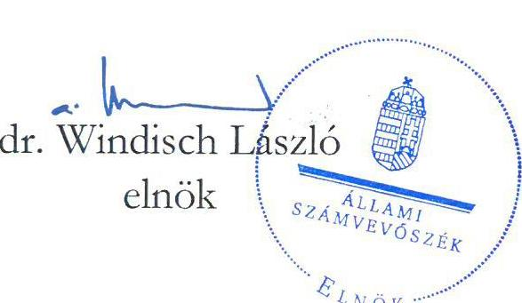
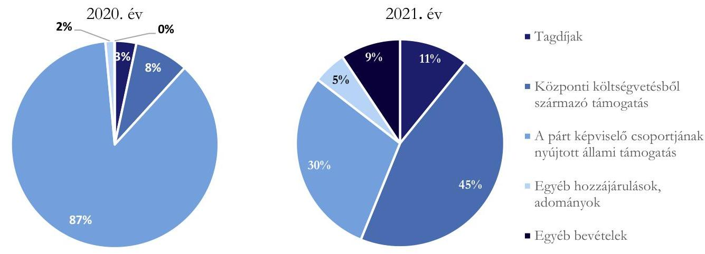
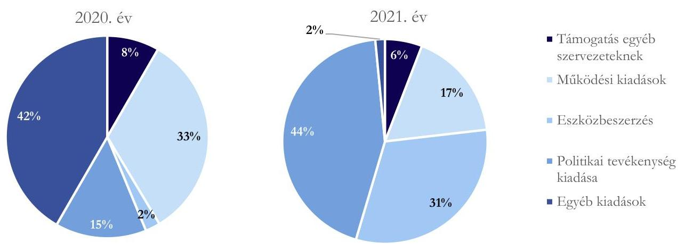

# JELENTÉS 

A költségvetési támogatásban részesülő pártok 2020-2021. évi gazdálkodása törvényességének ellenőrzése

FIDESZ - Magyar Polgári Szövetség
2023.

---

# JELENTÉS 

A költségvetési támogatásban részesülő pártok 2020-2021. évi gazdálkodása törvényességének ellenőrzése

FIDESZ - Magyar Polgári Szövetség
2023.

23013
www.asz.hu

---

# ELLENŐRZÉSI IGAZGATÓSÁG: 

## ÁLLAMHÁZTARTÁSON KÍVÜLI SZERVEZETEKET ELLENŐRZŐ IGAZGATÓSÁG

## ELLENŐRZÉSI IGAZGATÓ:

## KLINGA LÁSZLÓ igazgató

## ELLENŐRZÉSVEZETŐ:

## SOLYMÁR ÁGNES ellenőrzésvezető

A TÉMÁHOZ KAPCSOLÓDÓ KORÁBBI SZÁMVEVŐSZÉKI JELENTÉSEK:

- címe: A költségvetési támogatásban részesülő pártok 2018-2019. évi gazdálkodása törvényességének ellenőrzése - FIDESZ - Magyar Polgári Szövetség
- sorszáma: 21035

IKTATÓSZÁM: EL-3855-001/2023.
TÉMASZÁM: 2620
ELLENŐRZÉS-AZONOSÍTÓ SZÁM: V-0964

---

# TARTALOMJEGYZÉK 

- AZ ELLENŐRZÉS ALAPADATAI ..... 5
- AZ ELLENŐRZÖTT SZERVEZET ..... 7
- ÖSSZEFOGLALÁS ..... 8
- AZ ELLENŐRZÉS FÓKUSZTERÜLETEI ..... 9
- MEGÁLLAPÍTÁSOK ..... 10
- MELLÉKLETEK ..... 16
I. sz. melléklet: Értelmező szótár ..... 16
- FÜGGELÉK: ÉSZREVÉTELEK ..... 17
- RÖVIDÍTÉSEK JEGYZÉKE ..... 18

---

.

---

# AZ ELLENŐRZÉS ALAPADATAI 

## AZ ELLENŐRZÉS CÉLJA

Az ellenőrzés célja, hogy az ÁSZ ${ }^{1}$ - mint az Országgyűlés legfőbb pénzügyi és gazdasági ellenőrző szerve - független és szakmailag megalapozott véleményt adjon az ellenőrzött szervezet gazdálkodásának törvényességéről.

## AZ ELLENŐRZÉS TÍPUSA

Szabályszerűségi ellenőrzés

## AZ ELLENŐRZÖTT IDŐSZAK

A 2020 - 2021. évek.

## AZ ELLENŐRZÉS TÁRGYA

A párt ellenőrzése során az ellenőrzés tárgyát képezték a 2020. és a 2021. évre vonatkozó pénzügyi kimutatás elkészítésére, jóváhagyására, közzétételére, a párt könyvvezetésére, gazdálkodására, ennek keretében a számviteli szabályozás kialakítására, a bizonylati rend, bizonylati fegyelem betartására, egyéb gazdálkodási, ellenőrzési és pénzügyi-számviteli feladatok ellátására irányuló tevékenységek. Az ellenőrzés tárgya volt még a Párttv ${ }^{2}$ szerinti források elszámolása és felhasználása, valamint a vagyon jogszabályi előírásoknak megfelelő hasznosítása.

## AZ ELLENŐRZÉS JOGALAPJA

Az ellenőrzés jogszabályi alapját az ÁSZ tv. ${ }^{3}$ 5. § (11) bekezdés a) pontja, a Párttv. 4. § (4)-(5) bekezdése, valamint 10. $\S$ (1), (3)-(4) bekezdés előírásai képezték.

## AZ ELLENŐRZÉS MÓDSZERE

Az ellenőrzést az ellenőrzési program szempontjai, az ellenőrzött időszakban hatályos jogszabályok, az ÁSZ ellenőrzés szakmai szabályai, az ellenőrzésre irányadó ÁSZ módszertanok figyelembevételével végezte az ÁSZ.

Az ellenőrzési kérdések megválaszolásához szükséges bizonyítékok megszerzése az ellenőrzött szervezet által rendelkezésre bocsátott dokumentumokra, adatokra alapozva, továbbá kérdésfeltevés (információkérés), interjú, mintavételezés útján történt.

---

Az ellenőrzési bizonyítékként felhasználható adatforrások közé tartoznak egyrészt az ellenőrzési programban felsorolt adatforrások, másrészt adatforrás lehet még - minden az ellenőrzés folyamán - feltárt, az ellenőrzés szempontjából információt tartalmazó dokumentum.

Az ellenőrzés lefolytatásához az ellenőrzött szervezet tanúsítványok kitöltésével, hitelesítésével az ÁSZ által kért dokumentumok, adatok, információk megküldésével és az ellenőrzés során szolgáltatott adatokat.

Az ÁSZ a központi költségvetésből származó bevételeket és a párt által nyújtott támogatásokat tételesen ellenőrizte, emellett további mintavételi területeken mintavételezést és értékelést is alkalmazott az alábbiak szerint:

- A hozzájárulások, adományok és egyéb bevételek szabályszerűségének megítéléséhez az ellenőrzött időszak évei esetében évente rétegzett 50-50 elemű mintavétel történt.
- A rendszeres személyi juttatások, eszközbeszerzések és a működési kiadások további tételei, politikai tevékenység kiadásai, egyéb kiadások mintatételeinek értékeléséhez az ellenőrzött időszak évei esetében évente rétegzett 100-100 elemű mintavétel történt.
A tények feltárása és azok összegzése során a megállapítások az ellenőrzött mintatételekre vonatkozóan kerültek megfogalmazásra.

---

# AZ ELLENŐRZÖTT SZERVEZET

A FIDESZ - Magyar Polgári Szövetség 1988-ban jött létre, működésének alapvető szabályait a Párttv. határozza meg. A Párt ${ }^{4}$ alapszabályában foglaltak értelmében tevékenységének egyik kiemelt célja, az ember méltóságán és felelősségvállalásán alapuló polgári társadalom megszilárdítása, a nemzet összetartó erejének növelése, valamint az európai kultúra és értékek megőrzése.

A Párt legfelsőbb tanácskozó és döntéshozó szerve a Kongresszus. Az Országos Választmány ${ }^{5}$ a Párt információs, egyeztető és döntéshozó fóruma, az Országos Elnökség ${ }^{6}$ az irányító és döntéshozó szerve, amely többek között, gondoskodik a Párt képviseletéről, a jóváhagyott költségvetés végrehajtásáról. A Párt a Párttv. 9/A. § (1) bekezdése alapján 2003-ban létrehozta a Szövetség a Polgári Magyarországért Alapítványt. A Párt gazdasági társaságot nem alapított.

A Párt 2020. és 2021. évi pénzügyi kimutatása szerinti bevételeinek és kiadásainak összetételét az 1. táblázat mutatja be.

|  A PÁRT BEVÉTELEI ÉS KIADÁSAI 2020-2021 ÉVEKBEN / (EZER FT) |  |   |
| --- | --- | --- |
|  BEVÉTELEK | 2020. EV | 2021. EV  |
|  Tagdíjak | 193473 | 231444  |
|  Központi költségvetésből juttatott támogatás | 483900 | 967800  |
|  A párt országgyűlési képviselőcsoportjának nyújtott állami támogatás | 5000000 | 6270000  |
|  Egyéb hozzájárulások, adományok | 81606 | 110088  |
|  Egyéb bevételek | 2636 | 199596  |
|  Összes bevétel a gazdasági évben | 5761615 | 8135928  |
|  KIADÁSOK | 2020. EV | 2021. EV  |
|  Támogatás egyéb szervezeteknek | 103000 | 231000  |
|  Működési kiadások | 409359 | 680916  |
|  Eszközbeszerzés | 29068 | 1236642  |
|  Politikai tevékenység kiadása | 179867 | 1729137  |
|  Egyéb kiadások | 515491 | 59347  |
|  Összes kiadás a gazdasági évben | 1236785 | 3937042  |

---

# ÖSSZEFOGLALÁS 

Magyarországon pártként működnek azok az egyesületek, amelyek nyilvántartott tagsággal rendelkeznek, és amelyek a nyilvántartásba vételüket végző bíróság előtt kinyilvánítják, hogy a Párttv. rendelkezéseit magukra nézve kötelezőnek ismerik el.

Az Állami Számvevőszék a Párttv. alapján kétévente ellenőrzi azoknak a pártoknak a gazdálkodását, amelyek a Párttv. szerint a központi költségvetésből rendszeres támogatásban részesültek. A FIDESZ - Magyar Polgári Szövetség a 2020. évi pénzügyi kimutatása szerint 483900 ezer Ft, a 2021. évi pénzügyi kimutatása szerint 967800 ezer Ft költségvetési támogatásban részesült.

A FIDESZ - Magyar Polgári Szövetség a 2020. és a 2021. évi pénzügyi kimutatását a Párttv.-ben előírt határidőben és tartalommal elkészítette és közzétette a Magyar Közlöny mellékletét képező Hivatalos Értesítőben. A pénzügyi kimutatások adatait a főkönyvi és az analitikus nyilvántartások alátámasztották. A pénzügyi kimutatásokban a Párttv. előírását betartva az ötszázezer forintot meghaladó hozzájárulásokat - a hozzájárulást adó megnevezésével és az összeg megjelölésével - külön feltüntették.

A FIDESZ - Magyar Polgári Szövetség gazdálkodására vonatkozó számviteli szabályzatok kialakítása és a belső szabályozások tartalma összességében megfelelt a jogszabályi előírásoknak. Az ellenőrzött időszakban a hatályos számviteli politika, valamint az annak keretében elkészített leltározási szabályzat, értékelési szabályzat és pénzügyi szabályzat a Számv. tv. által előírt tartalmi követelményeknek megfelelt. Az ellenőrzött időszakban hatályos számlarend ${ }_{1-3}$ a Számv. tv. előírása ellenére nem tartalmazta valamennyi számla értéke növekedésének, csökkenésének jogcímeit, a számlákat érintő gazdasági események más számlákkal való kapcsolatát, valamint a főkönyvi számla és az analitikus nyilvántartások kapcsolatát. A FIDESZ - Magyar Polgári Szövetség ellenőrzési időszakot követően a hiányosságot Számlarendjében ${ }^{7}$ megszüntette. A FIDESZ - Magyar Polgári Szövetség gondoskodott az ellenőrzés rendjének kialakításáról, a kialakított rend megfelelt a belső előírásainak.

A FIDESZ - Magyar Polgári Szövetség a Számv. tv. ${ }^{8}$ rendelkezései és a számviteli politika előírásával összhangban kettős könyvvitelt vezetett és a gazdasági eseményeket a könyveiben idősorosan rögzítette. Az analitikus nyilvántartások alátámasztották a főkönyvi könyvelés adatait.

A FIDESZ - Magyar Polgári Szövetség bevételei a Párttv. szerinti engedélyezett forrásokból tagdíjfizetésből, központi költségvetési támogatásból, a Párt országgyűlési képviselőcsoportjának nyújtott állami támogatásból, egyéb hozzájárulásokból, adományokból és egyéb bevételekből - származtak.

A FIDESZ - Magyar Polgári Szövetség az ellenőrzött időszakban az értékelt mintatételek alapján a Párttv. előírásait betartva nem fogadott el jogi személytől, jogi személyiséggel nem rendelkező szervezettől, más államtól, külföldi szervezettől, nem magyar állampolgártól vagyoni hozzájárulást, továbbá névtelen adományt.

A működéséhez a forrásokat, különösen a költségvetésből jutatott és az egyéb támogatásokat, adományokat szabályszerűen használta fel és számolta el, a gazdálkodással összefüggő tevékenységének keretében az ellenőrzött kiadási mintatételek kifizetése során a jogszabályok és a belső szabályzatok előírásait betartotta.

A FIDESZ - Magyar Polgári Szövetség gazdálkodási tevékenysége során a vagyonát a törvényi előírásoknak megfelelően használta, a tulajdonában lévő ingatlanokat a Vagyon tv. ${ }^{9}$ előírásának megfelelően működési feltételeinek biztosítása érdekében - használta, hasznosította. Az MFB Zrt. ${ }^{10}$-től felvett hitelekből vásárolt állami tulajdonú ingatlanokkal kapcsolatos törlesztési kötelezettségeinek az ellenőrzött időszakban, a Vagyon tv. előírásait betartva, határidőben eleget tett.

---

# AZ ELLENŐRZÉS FÓKUSZTERÜLETEI 

1. A párt kialakította-e a törvényes gazdálkodás szabályozási, könyvvezetési és ellenőrzési feltételeit?
2. A párt pénzügyi kimutatása megfelelt-e a jogszabályi előírásoknak, közzétételi kötelezettségét szabályszerűen teljesítette-e?
3. A párt könyvvezetése és gazdálkodása során a vonatkozó jogszabályi rendelkezéseket és belső előírásokat betartotta-e?

---

# 1. A párt kialakította-e a törvényes gazdálkodás szabályozási, könyvvezetési és ellenőrzési feltételeit? 

| Összegző megállapítás | A Párt a 2020-2021. években kialakította a törvényes   gazdálkodás szabályozási, könyvvezetési, ellenőrzési   feltételeit. |
| :-- | :-- |

1.1. számú megállapítás

A Párt gazdálkodására vonatkozó számviteli szabályzatok kialakítása, belső szabályozása megfelelt a jogszabályi előírásoknak.

A Párt rendelkezett a Számv.tv-ben előírt számviteli szabályzatokkal. A Számv. tv. előírásai szerint a számviteli politika ${ }_{1,2}{ }^{11}$ keretében elkészítették a leltározási és leltárkészítési szabályzatot ${ }^{12}$, az értékelési szabályzatot ${ }^{13}$, a pénzügyi szabályzatot ${ }_{1,2}{ }^{14}$-, valamint rendelkeztek számlarenddel ${ }_{1-3}{ }^{15}$ és bizonylati renddel ${ }_{1,2},{ }^{16}$. A számviteli szabályzatok elkészíttetéséről és hatályba léptetéséről a Számv. tv., a Civil tv. ${ }^{17}$ és az Alapszabály ${ }_{1,2}{ }^{18}$ előírása szerint a képviseleti joggal rendelkező gazdasági igazgató gondoskodott.

A számviteli politika ${ }_{1,2}$, a Számv.tv. előírásának megfelelően tartalmazta a könyvvezetés módját, az évközi és évvégi zárlatok feladatait és azok időpontját, valamint azt, hogy az értékelési szempontból mit tekint jelentősnek, nem jelentősnek, lényegesnek és nem lényegesnek.

A leltározási és leltárkészítési szabályzat a Számv. tv. előírásának megfelelően tartalmazta a leltározás módját, a leltározás lebonyolításának rendjét, valamint a leltározás bizonylati rendjét.

Az értékelési szabályzat a Számv. tv. előírásának megfelelően tartalmazta az eszközcsoportok és forráscsoportok választott értékelési eljárásait, valamint a kedvezményesen biztosított ingatlanokra vonatkozó bérleti díjak piaci értéke meghatározásának szabályait.

A pénzügyi szabályzat ${ }_{1,2}$ a Számv. tv. pénzkezelési szabályzatra vonatkozó előírásait tartalmazta.
A Számlarend ${ }_{1-3}$ a Számv. tv. előírásának megfelelően tartalmazta azoknak a főkönyvi számláknak a tartalmát melyek megnevezéséből, az egyértelműen nem következett. A Párt 2020-2021. években hatályos Számlarend ${ }_{1-3}$-je:

- a Számv. tv. 161. § (2) bekezdés b) pont előírása ellenére nem tartalmazta valamennyi számla értéke növekedésének, csökkenésének jogcímeit, a számlákat érintő gazdasági események más számlákkal való kapcsolatát,
- a Számv. tv. 161. § (2) bekezdés c) pont előírása ellenére nem tartalmazta a főkönyvi számlák és az analitikus nyilvántartások kapcsolatát.

A Párt az ellenőrzött időszakot követően a hiányosságot Számlarendjében megszüntette.
A Számv. tv. előírásának eleget téve a Párt kialakította a számlarendben foglaltakat alátámasztó, önálló bizonylati rendet, amely a bizonylatok megőrzésére vonatkozó szabályokat a Számv. tv. előírásainak megfelelően határozta meg.

---

1.2. számú megállapítás

A Párt könyvvezetése, számviteli nyilvántartási rendszere a 2020. és a 2021.
 években összhangban volt a jogszabályi és belső szabályozási előírásokkal.

A Párt a Számv. tv.-ben és a számviteli politikában ${ }_{1,2}$ rögzítettek szerint az ellenőrzött időszakban kettős könyvvitelt alkalmazott. A könyvviteli feladatokat a gazdasági vezető irányítása alatt álló munkavállalók, valamint megbízási szerződés alapján külső szolgáltató látta el, könyvviteli szolgáltató váltás az ellenőrzött időszakban nem történt.

A Számlarend ${ }_{1-3}$ előírásainak megfelelően készítették el az analitikus nyilvántartásokat, ezáltal a Számv. tv.-ben előírtaknak megfelelően az analitikus nyilvántartások és a főkönyvi könyvelés között az értékadatok számszerű egyeztetésének lehetőségét biztosították.

A könyvviteli zárlatot a Számv. tv., valamint a számviteli politika előírásai szerint elvégezték.
A leltározási szabályzatban foglaltak szerint a Párt 2020-2021. év végén elvégezte az előírt eszköz és forrás egyeztetéseket, illetve a mennyiségi leltározást.

A pénzkezelés szabályszerűségét a Számv. tv. és a pénzügyi szabályzat előírásaival összhangban biztosították, az ellenőrzött mintatételek alapján a szabályszerű kiadási pénztárbizonylatok a kiadások készpénzben történő kifizetéseihez rendelkezésre álltak, a kiadási pénztárbizonylatokon elszámolt tételekhez kapcsolódó bizonylatok megfeleltek a Számv. tv. előírásainak.
1.3. számú megállapítás

A Párt az ellenőrzési rendszer belső szabályozási kereteit 2020-2021. évekre vonatkozóan kialakította, a belső előírások szerinti működését biztosította.

A Párt a vezetői ellenőrzés kereteit az Alapszabályban ${ }_{1,2}$, a pénzügyi szabályzatban ${ }_{1,2}$ és a költségvetési gazdálkodási szabályzatban ${ }^{19}$ határozta meg, ezen túl szabályozta a kötelezettségvállalás és utalványozás rendjét. A belső szabályok betartása - az ellenőrzött mintatételek alapján - a gyakorlatban megvalósult.

Az Alapszabály ${ }_{1,2}$ 80-85. §-aiban meghatározták a Párt felügyelő és számvizsgáló szerveit, az ellenőrzés kereteit. A Felügyelő és Számvizsgáló Bizottság feladata volt, az Országos Választmány, illetve a Kongresszus elé terjesztett éves pénzügyi kimutatás vizsgálata és véleményezése. A Felügyelő és Számvizsgáló bizottság öt tagból állt, elnökét maga választotta, az Alapszabály ${ }_{1,2}$ ban előírt feladatának eleget téve véleményezte az Országos választmány elé terjesztett 2020. évi és 2021. évi beszámolót.

A mintatételek alapján a szabályzatok előírásait betartották. A gazdasági területen dolgozók a munkakörükbe tartozó feladatokról írásbeli dokumentummal rendelkeztek, megfelelve ezzel az $\mathrm{Mt}^{20}$ előírásainak.

---

# 2. A párt pénzügyi kimutatása megfelelt-e a jogszabályi előírásoknak, közzétételi kötelezettségét szabályszerűen teljesítette-e? 

Összegző megállapítás A Párt pénzügyi kimutatása a 2020. és a 2021. években megfelelt a jogszabályi előírásoknak. A Párt közzétételi kötelezettségét szabályszerűen teljesítette.
2.1. számú megállapítás A Párt a 2020. és a 2021. években a pénzügyi kimutatásait a jogszabályi előírások betartásával készítette el.

A Párt a 2020. és a 2021. évre vonatkozó pénzügyi kimutatását a Párttv.-ben előírt tartalommal elkészítette, amelyek a bevételeken belül tartalmazták a tagdíjakat, a központi költségvetésből származó támogatást, a Párt országgyűlési képviselőcsoportjának nyújtott állami támogatást, az egyéb hozzájárulásokat és adományokat, valamint az egyéb bevételeket. A pénzügyi kimutatásokban az egy naptári év alatt adott, összesített, ötszázezer forintot meghaladó hozzájárulásokat, adományokat a Párttv. előírását betartva - a hozzájárulást adó megnevezésével és az összeg megjelölésével - külön feltüntették. A Pártnak gazdasági vállalkozási bevétele 2020. és 2021. években kizárólag a Párttv. alapján engedélyezett, a tulajdonában álló ingatlanok és ingóságok értékesítéséből származott összesen 1900 ezer Ft értékben.

A Párt 2020. és 2021. évi pénzügyi kimutatásaiban a Párttv. 1. számú melléklete szerint kiadásként szerepeltette az egyéb szervezeteknek nyújtott támogatást, a működési kiadásokat, az eszközbeszerzést, a politikai tevékenység kiadásait és az egyéb kiadások összesített értékeit. A Párt az ellenőrzött időszakban vállalkozást nem alapított, országgyűlési képviselőcsoportja részére támogatást nem folyósított, így ezek a tételek a Párttv. előírásainak megfelelően a pénzügyi kimutatásokban érték nélkül szerepeltek.

A főkönyvi könyvelésben a működési és a politikai tevékenység kiadásait elkülönítette, annak érdekében, hogy a Párttv.-ben foglalt működési és politikai kiadások tartalmi megkülönböztetésének előírása érvényesüljön.

A 2020. és a 2021. évre vonatkozó éves pénzügyi kimutatásokat, az Alapszabály ${ }_{1,2}$ előírásának eleget téve, az Országos Választmány Elnöksége elfogadta.
2.2. számú megállapítás A Párt a 2020. és a 2021. évi pénzügyi kimutatásait határidőben, a jogszabályi előírásoknak megfelelően közzétette.

A Párt a Párttv. előírásának megfelelően a 2020. és a 2021. évi pénzügyi kimutatásait határidőben elkészítette, a Magyar Közlöny Hivatalos Értesítő 2021. évi 16. számában 2021. március 31-én, illetve a Hivatalos Értesítő 2022. évi 22. számában 2022. május 13-án a tárgyévet követő május 31. napig közzétette, saját honlapján megjelentette.

---

# 3. A párt könyvvezetése és gazdálkodása során a vonatkozó jogszabályi rendelkezéseket és belső előírásokat betartotta-e? 

## Összegző megállapítás

3.1. számú megállapítás

A Párt a 2020. és a 2021. években a könyvvezetése és gazdálkodása során a vonatkozó jogszabályi rendelkezéseket és belső előírásokat betartotta.
A Párt a működéséhez a forrásokat az ellenőrzött mintatételek alapján szabályszerűen számolta el. A bevételek főkönyvi egyezősége és bizonylati alátámasztottsága biztosított volt.

A FIDESZ - Magyar Polgári Szövetség bevételei a Párttv. szerinti engedélyezett forrásokból - tagdíjfizetésből, központi költségvetési támogatásból, adományokból és egyéb bevételekből - származtak. A Párt a 2020. évi pénzügyi kimutatásában 5761615 ezer Ft, a 2021. évi pénzügyi kimutatásában 2135928 ezer Ft bevételt mutatott ki, melynek összetételét az 1. ábra mutatja.
1. ábra

A FIDESZ - MAGYAR POLGÁRI SZÖVETSÉG BEVÉTELEINEK ALAKULÁSA A 2020-2021. ÉVEKBEN

Forrás: a Párt 2020 és 2021. évi pénzügyi kimutatásának adatai alapján, ÁSZ szerkesztés
A „Tagdíjak", a „Központi költségvetésből származó támogatás" és az „Egyéb bevétel" pénzügyi kimutatás sorok értékei megegyeztek a könyvviteli nyilvántartással, azokon csak az előírt jogcímű összegek szerepeltek.

A Párt az „Egyéb hozzájárulások, adományok" pénzügyi kimutatás soron a Párttv. előírását betartva az 500 ezer Ft összeghatár feletti adományokat nevesítve rögzítette. A Párt az ellenőrzött időszakban a Párttv. előírásait betartva tiltott vagyoni hozzájárulást nem fogadott el.

A Párt a Párttv. előírását betartva az értékelt mintatételek alapján nem pénzbeli vagyoni hozzájárulást, névtelen adományt, valamint más államtól támogatást az ellenőrzött években nem fogadott el. A Párt a pártalapítványától - a Szövetség a Polgári Magyarországért Alapítványtól - vagyoni hozzájárulást a Párttv. előírását betartva nem fogadott el.

---

3.2. számú megállapítás

A Párt a gazdálkodással összefüggő tevékenysége keretében a 2020-2021. évi kiadások kifizetése során az ellenőrzött mintatételek alapján betartotta a jogszabályok és belső szabályzatok előírásait.

A Párt összes kiadása a 2020. évben 1236785 ezer Ft, a 2021. évben 3937042 ezer Ft-ot tettek ki, melyeknek összetételét a 2. ábra mutatja.
2. ábra

# A FIDESZ - MAGYAR POLGÁRI SZÖVETSÉG KIADÁSAINAK ALAKULÁSA A 2020. - 2021. ÉVEKBEN 

Forrás: a Párt 2020 és 2021. évi pénzügyi kimutatásának adatai alapján, ÁSZ szerkesztés
A kiadási mintatételek értékelése alapján a kiadási bizonylatokon a számlák kijelölése megfelelt a Számv. tv. és a Számlarend $_{1-3}$ előírásainak, a kiadásokat a megfelelő kiadási jogcímre számolták el.

Az ellenőrzött mintatételek alapján a rendszeres személyi juttatások kifizetését az Mt. előírása szerinti munkaszerződések támasztották alá, amelyeket az elnök, vagy az elnöki meghatalmazással rendelkező ügyvezető elnök írta alá. A munkaszerződések az Mt. előírásai szerint tartalmazták a munkavállaló alapbérét, munkakörét, munkaviszonya tartamát, munkahelyét, és a munkaviszony kezdetének napját. A 2020. és a 2021. évi adófolyószámla-kivonatok szerint a Párt adóbevallási kötelezettségének határidőben eleget tett. A foglalkoztatás és a személyi jellegű kifizetések, illetve az ehhez kapcsolódó bejelentési, nyilvántartási, levonási, bevallási, befizetési, adatszolgáltatási kötelezettségek teljesítése megfelelt a jogszabályi és a belső szabályzatok előírásainak.

A Párt eszközbeszerzéseinek kifizetése, elszámolása és dokumentálása, az eszköz bekerülési értékének meghatározása, az ellenőrzött mintatételek alapján megfelelt a Számv. tv. és az értékelési szabályzat előírásainak. Az eszközök üzembe helyezésének hitelt érdemlő módon történő dokumentálása a Számv. tv. előírása szerint megtörtént. A Párt a Számv. tv. és a számviteli politika előírásai szerint gondoskodott az értékcsökkenés elszámolásáról.

A személyi jellegű kiadásokon és az eszközbeszerzéseken túli kiadási jogcímeken történő kifizetések az ellenőrzött mintatételek alapján megfeleltek a jogszabályi és a belső szabályzatok előírásainak. A Számv. tv. előírása szerint a gazdasági eseményhez kapcsolódott banki/pénztári kifizetési bizonylat, valamint az elszámolás alapjául szolgáló számla rendelkezésre állt. A könyvviteli elszámolást közvetlenül alátámasztó bizonylatokon a Számv. tv. előírásának megfelelően szerepelt a gazdasági műveletet elrendelő személy megjelölése, az utalványozó és a rendelkezés végrehajtását igazoló személy és az ellenőr aláírása.

A Párt a 2020. és a 2021. évi pénzügyi kimutatásaiban a „Támogatás egyéb szervezeteknek" soron kimutatott támogatásait bírósági nyilvántartásban szereplő szervezetnek, illetve pártalapítványának nyújtotta. A Párt elnöke

---

által aláírt támogatási szerződésekkel összhangban a teljesített kifizetések megfeleltek a belső szabályzat előírásainak, a támogatási szerződések alapján a támogatásokról a támogatottnak elszámolási kötelezettsége nem volt.
3.3. számú megállapítás

A Párt működése során a vagyon használata, vagyonnal való gazdálkodása a 2020. és a 2021. években megfelelt a törvényi előírásoknak.

A Párt a 2020. és a 2021. évben szabályzataiban kitért a vagyonnal való gazdálkodás, ezen belül a kapcsolódó feladat- és hatáskörök, felelősségi viszonyok szabályozására. A Pártnak az ellenőrzési időszakban a Párttv. szerinti vagyonmérleg készítési kötelezettsége nem volt, a céljai eléréséhez rendelt vagyont a jogszabályban meghatározott módon használta fel.

A Párt a vagyonnal való gazdálkodásának szabályait, az ezzel kapcsolatos feladat- és hatásköröket az Alapszabályban ${ }_{1-2}$, számviteli politikában ${ }_{1-2}$, számlarendben ${ }_{1-2}$ határozta meg.

Az Alapszabály ${ }_{1-2}$ előírása szerint a Felügyelő és Számvizsgáló Bizottság feladata volt az Országos Elnökség ellenőrzése a Szövetség érdekeinek megóvása céljából, a Szövetség vagyonkezelésének és pénzügyeinek folyamatos ellenőrzése.

A Párt az MFB hitelekből az ellenőrzött időszakot megelőzően vásárolt állami tulajdonú, irodai rendeltetésű ingatlanokkal kapcsolatos törlesztési kötelezettségeinek eleget tett, hiteleit a Vagyon tv. előírásának megfelelően, az előírásokat betartva, határidőben törlesztette az ellenőrzött időszakban. Az MFB által rendelkezésre bocsátott egyenlegközlő kimutatás és a párt könyveiben kimutatott MFB hitelek összege megegyezett, a 2021. év végére a Párt hiteleit visszafizette.

A Párt gazdálkodási tevékenysége keretében a tulajdonában lévő ingatlanokat a Vagyon tv. előírásának megfelelően - működési feltételeinek biztosítása érdekében - használta, hasznosította. A Párttv. 6. § (1) bekezdésének b) pontjában részletezett jogát gyakorolva a Párt a 2021. évben egy db ingatlant értékesített. A Párt az ingatlan értékesítése során a jogszabályi előírásokat betartva járt el, a hitel felhasználásával megvásárolt ingatlan értékesítése előtt a még fennálló hiteltartozás összegét törlesztette. A Párt ingatlan és ingó vagyontárgyi hasznosítására az ellenőrzött időszakban bérleti szerződést nem kötött.

---

# MELLÉKLETEK 

## I. SZ. MELLÉKLET: ÉRTELMEZŐ SZÓTÁR

pénzügyi kimutatás
nem pénzbeli támogatás

A Párttv. 9. § (1) bekezdésében meghatározott, a törvény 1. számú melléklete szerinti pénzügyi kimutatás (hatályos 2014. május 6-ától), amelyet a pártok kötelesek minden év május 31-ig a Magyar Közlönyben, valamint saját honlappal rendelkező pártok a honlapjukon is közzétenni.

Vagyoni értékkel rendelkező forgalomképes dolog, szellemi alkotás, illetve vagyoni értékű jog részben vagy egészében, véglegesen vagy ideiglenesen, teljesen vagy részben ingyenesen történő átruházása vagy átengedése, illetve szolgáltatás biztosítása. (Civil tv. 2. § 25. pont)

---

# FÜGGELÉK: ÉSZREVÉTELEK 

A jelentéstervezetet a Számvevőszék 15 napos észrevételezésre megküldte az ellenőrzött szervezet vezetőjének az ÁSZ tv. 29. § (1)
 bekezdése előírásának megfelelően.

Az ellenőrzött szervezet vezetője a jelentéstervezet megállapításaira nem tett észrevételt.

[^0]
[^0]:    * 29. § (1) Az Állami Számvevőszék az ellenőrzési megállapításait megküldi az ellenőrzött szervezet vezetőjének vagy az általa megbízott személynek, és annak, akinek személyes felelősségét állapította meg.
    (2) Az ellenőrzött szervezet vezetője és a felelősként megjelölt személy az ellenőrzés megállapításaira tizenöt napon belül írásban észrevételt tehet.
    (3) Az Állami Számvevőszék az észrevételre a beérkezésétől számított harminc napon belül írásban válaszol. A figyelembe nem vett észrevételeket köteles a jelentésben feltüntetni, és megindokolni, hogy azokat miért nem fogadta el.

---

# RÖVIDÍTÉSEK JEGYZÉKE 

${ }^{1}$ ÁSZ
${ }^{2}$ Párttv.
${ }^{3}$ ÁSZ tv.
${ }^{4}$ Párt
${ }^{5}$ Országos Választmány
${ }^{6}$ Országos Elnökség
${ }^{7}$ Számlarend
${ }^{8}$ Számv.tv.
${ }^{9}$ Vagyon tv.
${ }^{10}$ MFB Zrt.
${ }^{11}$ Számviteli politika
Számviteli politika
Számviteli politika
${ }^{12}$ Leltározási szabályzat
${ }^{13}$ Értékelési szabályzat
${ }^{14}$ Pénzügyi szabályzat
${ }^{15}$ Számlarend
Számlarend
Számlarend
Számlarend
${ }^{16}$ Bizonylati rend
Bizonylati rend
Bizonylati rend${ }_{2}$
${ }^{17}$ Civil tv.
${ }^{18}$ Alapszabály
Alapszabály
Alapszabály
${ }^{19}$ Költségvetési gazdálkodási szabályzat
${ }^{20} \mathrm{Mt}$.

Állami Számvevőszék
1989. évi XXXIII. törvény a pártok működéséről és gazdálkodásáról
2011. évi LXVI. törvény az Állami Számvevőszékről

FIDESZ - Magyar Polgári Szövetség
FIDESZ - Magyar Polgári Szövetség Országos Választmánya
FIDESZ - Magyar Polgári Szövetség Országos Elnöksége
FIDESZ Magyar Polgári Szövetség Számlarend (hatályos 2022. december 13-ától)
2000. évi C törvény a számvitelről (hatályos 2000. szeptember 21-étől)
2007. évi CVI. törvény az állami vagyonról (hatályos: 2007. szeptember 17-étől)

Magyar Fejlesztési Bank Zrt.

FIDESZ - Magyar Polgári Szövetség, (hatályos: 2020. január 01-2020. december 31.)
FIDESZ - Magyar Polgári Szövetség, (hatályos 2021. január 1-jétől)
FIDESZ - Magyar Polgári Szövetség, Leltárkészítési és leltározási szabályzat
(hatályos 2020. január 1-jétől)
FIDESZ - Magyar Polgári Szövetség, Értékelési szabályzat
(hatályos 2020. január 1-jétől)
FIDESZ - Magyar Polgári Szövetség, Pénzügyi szabályzat
(hatályos 2020. január 1-jétől)
FIDESZ - Magyar Polgári Szövetség, Pénzügyi szabályzat
(hatályos 2021. január 1-jétől)

FIDESZ - Magyar Polgári Szövetség (hatályos: 2020. január 1-2020. május 31.)
FIDESZ - Magyar Polgári Szövetség (hatályos: 2020. június 1-2020. december 31.)
FIDESZ - Magyar Polgári Szövetség (hatályos: 2021. január 1-jétől)

FIDESZ - Magyar Polgári Szövetség (hatályos: 2020. január 1-2020. december 31.)
FIDESZ - Magyar Polgári Szövetség (hatályos: 2021. január 1-jétől)
2011. évi CLXXV. törvény az egyesülési jogról, a közhasznú jogállástól, valamint a civil szervezetek működéséről és támogatásáról

A FIDESZ - Magyar Polgári Szövetség Alapszabálya
(hatályos: 2019. szeptember 29-2021. november 13.)
A FIDESZ - Magyar Polgári Szövetség Alapszabálya
(hatályos: 2021. november 14-étől)
a Párt Költségvetési gazdálkodási szabályzata (hatályos: 2014. január 1-jétől)
2012. évi I. törvény a munka törvénykönyvéről (hatályos: 2012. január 6-ától)

---

1052 Budapest, Apáczai Csere János u. 10. | 1364 Budapest 4., Pf. 54
www.asz.hu | szamvevoszek@asz.hu
telefon: +36 14849100

