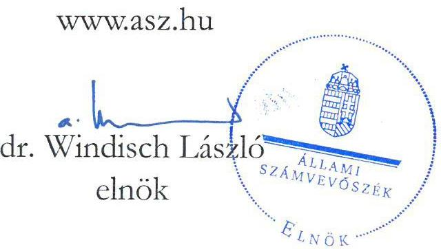
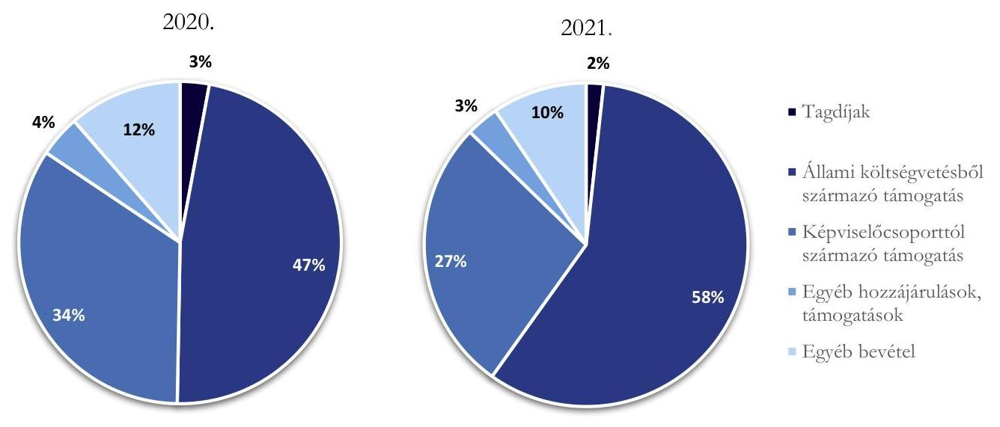
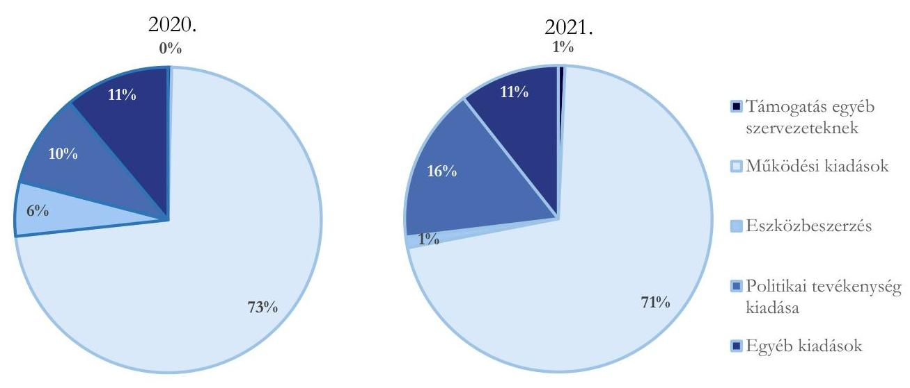

# JELENTÉS 

A költségvetési támogatásban részesülő pártok 2020-2021. évi gazdálkodása törvényességének ellenőrzése

Kereszténydemokrata Néppárt
2023.

23014
www.asz.hu

---

# JELENTÉS 

A költségvetési támogatásban részesülő pártok 2020-2021. évi gazdálkodása törvényességének ellenőrzése

Kereszténydemokrata Néppárt
2023.

23014

---

# ELLENŐRZÉSI IGAZGATÓSÁG: 

## ÁLLAMHÁZTARTÁSON KÍVÜLI SZERVEZETEKET ELLENŐRZŐ IGAZGATÓSÁG

## ELLENŐRZÉSI IGAZGATÓ:

## KLINGA LÁSZLÓ igazgató

## ELLENŐRZÉSVEZETŐ:

## SOLYMÁR ÁGNES ellenőrzésvezető

A TÉMÁHOZ KAPCSOLÓDÓ KORÁBBI SZÁMVEVŐSZÉKI JELENTÉSEK:

- címe: A költségvetési támogatásban részesülő pártok 2018-2019. évi gazdálkodása törvényességének ellenőrzése Kereszténydemokrata Néppárt
- sorszáma: 21039

IKTATÓSZÁM: EL-3856-001/2023.
TÉMASZÁM: 2620
ELLENŐRZÉS-AZONOSÍTÓ SZÁM: V-0964

---

# TARTALOMJEGYZÉK 

- AZ ELLENŐRZÉS ALAPADATAI ..... 5
- AZ ELLENŐRZÖTT SZERVEZET ..... 7
- ÖSSZEFOGLALÁS ..... 8
- AZ ELLENŐRZÉS FÓKUSZTERÜLETEI ..... 10
- MEGÁLLAPÍTÁSOK ..... 11
- JAVASLATOK ..... 17
- MELLÉKLETEK ..... 18
I. sz. melléklet: Értelmező szótár ..... 18
- FÜGGELÉK: ÉSZREVÉTELEK ..... 19
- RÖVIDÍTÉSEK JEGYZÉKE ..... 20

---

.

---

# AZ ELLENŐRZÉS ALAPADATAI 

## AZ ELLENŐRZÉS CÉLJA

Az ellenőrzés célja, hogy az ÁSZ ${ }^{1}$ - mint az Országgyűlés legfőbb pénzügyi és gazdasági ellenőrző szerve - független és szakmailag megalapozott véleményt adjon az ellenőrzött szervezet gazdálkodásának törvényességéről.

## AZ ELLENŐRZÉS TÍPUSA

Szabályszerűségi ellenőrzés.

## AZ ELLENŐRZÖTT IDŐSZAK

A 2020 - 2021. évek.

## AZ ELLENŐRZÉS TÁRGYA

A párt ellenőrzése során az ellenőrzés tárgyát képezték a 2020. és a 2021. évre vonatkozó pénzügyi kimutatás elkészítésére, jóváhagyására, közzétételére, a párt könyvvezetésére, gazdálkodására, ennek keretében a számviteli szabályozás kialakítására, a bizonylati rend, bizonylati fegyelem betartására, egyéb gazdálkodási, ellenőrzési és pénzügyi-számviteli feladatok ellátására irányuló tevékenységek. Az ellenőrzés tárgya volt még a Párttv. ${ }^{2}$ szerinti források elszámolása és felhasználása, valamint a vagyon jogszabályi előírásoknak megfelelő hasznosítása.

## AZ ELLENŐRZÉS JOGALAPJA

Az ellenőrzés jogszabályi alapját az ÁSZ tv. ${ }^{3}$ 5. § (11) bekezdés a) pontja, a Párttv. 4. § (4)-(5) bekezdés, valamint 10. § (1), (3)-(4) bekezdés előírásai képezték.

## AZ ELLENŐRZÉS MÓDSZERE

Az ellenőrzést az ellenőrzési program szempontjai, az ellenőrzött időszakban hatályos jogszabályok, az ÁSZ ellenőrzés szakmai szabályai, az ellenőrzésre irányadó ÁSZ módszertanok figyelembevételével végezte az ÁSZ.

Az ellenőrzési kérdések megválaszolásához szükséges bizonyítékok megszerzése az ellenőrzött szervezet által rendelkezésre bocsátott dokumentumokra, adatokra alapozva, továbbá kérdésfeltevés (információkérés), interjú, mintavételezés útján történt.

---

Az ellenőrzési bizonyítékként felhasználható adatforrások közé tartoznak egyrészt az ellenőrzési programban felsorolt adatforrások, másrészt adatforrás lehet még - minden az ellenőrzés folyamán feltárt - az ellenőrzés szempontjából információt tartalmazó dokumentum.

Az ellenőrzés lefolytatásához az ellenőrzött szervezet tanúsítványok kitöltésével, hitelesítésével az ÁSZ által kért dokumentumok, adatok, információk megküldésével és az ellenőrzés során szolgáltatott adatokat.

Az ÁSZ a központi költségvetésből származó bevételeket és a párt által nyújtott támogatásokat tételesen ellenőrizte, emellett további mintavételi területeken mintavételezést és értékelést is alkalmazott az alábbiak szerint:

- A hozzájárulások, adományok és egyéb bevételek szabályszerűségének megítéléséhez az ellenőrzött időszak évei esetében évente rétegzett 50-50 elemű mintavétel történt.
- A rendszeres személyi juttatások, eszközbeszerzések és a működési kiadások további tételei, politikai tevékenység kiadásai, egyéb kiadások mintatételeinek értékelése az ellenőrzött időszak évei esetében évente rétegzett 100-100 elemű mintavétel történt.
A tények feltárása és azok összegzése során a megállapítások az ellenőrzött mintatételekre vonatkozóan kerültek megfogalmazásra.

---

# AZ ELLENŐRZÖTT SZERVEZET

A Kereszténydemokrata Néppárt az 1944. évben létrejött Demokrata Néppárt jogutódja, olyan egyesület, amely nyilvántartott tagsággal rendelkezik, és amely a Párttv. 1. §-a alapján - a nyilvántartásba vételét végző bíróság előtt - kinyilvánította, hogy a Párttv. rendelkezéseit magára nézve kötelezőnek ismeri el.

A Párt ${ }^{4}$ célja „a magyar nemzet és a magyar haza szolgálata a keresztény erkölcs és értékek alapján a politikai életben; az európai népek közösségében együttműködő, szabad és független Magyarország fejlődésének előmozdítása, hogy az ország szellemileg és anyagilag, népességében és erkölcsében egyaránt gyarapodjék."

A Párt szervezeti alapegységei a helyi szervezetek, amelyek taggyűlése testületi formában működik, a helyi szervezet élén a helyi szervezet vezetősége áll. A választott politikai testületek a Megyei Választmány, az Országos Elnökség és az Országos Választmány, a folyamatosan működő végrehajtó és képviseleti vezető testületi szerv az Ügyvezető Elnökség. A Párt elnöke az Országos Elnökség és az Ügyvezető Elnökség elnöke is. A Párt a 2006. évben hozta létre a Barankovics István Alapítványt, gazdasági társaságot nem alapított.

A Párt a 2020. évi pénzügyi kimutatása szerint 190450 ezer Ft bevételt és 138234 ezer Ft kiadást, a 2021. évi pénzügyi kimutatása szerint 310285 ezer Ft bevételt és 170358 ezer Ft kiadást számolt el. A 2020. és 2021. évi pénzügyi kimutatások főbb adatait az 1. számú. táblázat tartalmazza:

|  A PÁRT 2020-2021. ÉVI PÉNZÜGYI KIMUTATÁSÁNAK ADATAI (ADATOK EZER FT-BAN) |  |   |
| --- | --- | --- |
|  BEVÉTELEK | 2020. ÉV | 2021. ÉV  |
|  Tagdíjak | 5559 | 5369  |
|  Központi költségvetésből juttatott támogatás | 90200 | 180400  |
|  A párt országgyűlési képviselőcsoportjának nyújtott állami támogatás | 65000 | 85000  |
|  Egyéb hozzájárulások, adományok | 7966 | 10177  |
|  Egyéb bevételek | 21725 | 29339  |
|  Összes bevétel a gazdasági évben | 190450 | 310285  |
|  Kiadások | 2020. Év | 2021. Év  |
|  Támogatás egyéb szervezeteknek | 527 | 1199  |
|  Működési kiadások | 100781 | 121394  |
|  Eszközbeszerzés | 7983 | 1923  |
|  Politikai tevékenység kiadása | 13605 | 27797  |
|  Egyéb kiadások | 15338 | 18045  |
|  Összes kiadás a gazdasági évben | 138234 | 170358  |

---

# ÖSSZEFOGLALÁS 

Magyarországon pártként működnek azok az egyesületek, amelyek nyilvántartott tagsággal rendelkeznek, és amelyek a nyilvántartásba vételüket végző bíróság előtt kinyilvánítják, hogy a Párttv. rendelkezéseit magukra nézve kötelezőnek ismerik el.

A Párttv. és az ÁSZ tv. alapján a pártok gazdálkodása törvényességének ellenőrzésére az Állami Számvevőszék jogosult. Az ÁSZ a Párttv. felhatalmazás alapján kétévente ellenőrzi azoknak a pártoknak a gazdálkodását, amelyek a Párttv. szerint a központi költségvetési támogatásban részesültek. A Kereszténydemokrata Néppárt a 2020. évi pénzügyi kimutatása szerint 90200 ezer Ft, a 2021. évi pénzügyi kimutatása szerint 180400 ezer Ft költségvetési támogatásban részesült.

Az ÁSZ jelen ellenőrzés során azt értékelte, hogy a Kereszténydemokrata Néppárt a 2020. és 2021. években kialakította-e a törvényes gazdálkodás szabályozási, könyvvezetési és ellenőrzési feltételeit, a pénzügyi kimutatása megfelelt-e a jogszabályi előírásoknak, közzétételi kötelezettségét szabályszerűen teljesítette-e, továbbá, hogy a könyvvezetése és gazdálkodása során a vonatkozó jogszabályi rendelkezéseket és belső előírásokat betartotta-e.

A Kereszténydemokrata Néppárt a 2020. és a 2021. évi pénzügyi kimutatását a Párttv.-ben előírt határidőben és tartalommal elkészítette és közzétette a Magyar Közlöny mellékletét képező Hivatalos Értesítőben. A pénzügyi kimutatások adatait a főkönyvi és analitikus nyilvántartások adatai alátámasztották. A pénzügyi kimutatásokban a Párttv. előírását betartva az ötszázezer forintot meghaladó hozzájárulásokat - a hozzájárulást adó megnevezésével és az összeg megjelölésével - külön feltüntették.

A Kereszténydemokrata Néppárt gazdálkodására vonatkozó számviteli szabályzatok kialakítása és a belső szabályozások tartalma megfelelt a jogszabályi előírásoknak. Az ellenőrzött időszakban a hatályos számviteli politika, valamint az annak keretében elkészített leltározási szabályzat, értékelési szabályzat és pénzkezelési szabályzat a Számv. tv. ${ }^{5}$ által előírt tartalmi követelményeknek megfelelt. Az ellenőrzött időszakban hatályos számlarend a Számv.tv. előírása ellenére nem tartalmazta minden alkalmazásra kijelölt számla számjelét és megnevezését. A Kereszténydemokrata Néppárt gondoskodott az ellenőrzés rendjének kialakításáról, a kialakított rend megfelelt a belső előírásoknak. A Felügyelő Bizottság az ellenőrzött időszakban az Alapszabályban ${ }^{5}$ a gazdálkodás ellenőrzésére vonatkozó feladatait nem látta el.

A Kereszténydemokrata Néppárt a Számv. tv. rendelkezései és a számviteli politika előírásával összhangban kettős könyvvitelt vezetett és a gazdasági eseményeket a könyveiben idősorosan rögzítette. Az ellenőrzött időszakban jellemző volt, hogy a pénzeszközöket érintő gazdasági műveletek, események bizonylatainak adatait készpénzforgalom esetén a Számv. tv. előírásától eltérően nem a pénzmozgással egyidejűleg rögzítették a könyvviteli rendszerben.

A Kereszténydemokrata Néppárt bevételei a Párttv. szerinti engedélyezett forrásokból - tagdíjfizetésből, központi költségvetési támogatásból, a párt országgyűlési képviselőcsoportjának nyújtott állami támogatásból, egyéb hozzájárulásokból, adományokból és egyéb bevételekből - származtak.

A Kereszténydemokrata Néppárt az ellenőrzött időszakban az értékelt mintatételek alapján a Párttv. előírásait betartva nem fogadott el jogi személytől, jogi személyiséggel nem rendelkező szervezettől, más államtól, külföldi szervezettől, nem magyar állampolgártól vagyoni hozzájárulást, továbbá névtelen adományt.

---

A Kereszténydemokrata Néppárt a gazdálkodása során a forrásokat szabályszerűen használta fel és számolta el, az ellenőrzött kiadási mintatételek kifizetése során a jogszabályok és a belső szabályzatok előírásait betartotta.

A Kereszténydemokrata Néppárt gazdálkodási tevékenysége során a vagyonát a törvényi előírásoknak megfelelően használta, a tulajdonában lévő ingatlanokat és ingóságokat a Vagyon tv. ${ }^{6}$ előírásának megfelelően működési feltételeinek biztosítása érdekében - használta, hasznosította. Az MFB Zrt ${ }^{7}$.-től felvett hitelekből vásárolt állami tulajdonú ingatlanokkal kapcsolatos törlesztési kötelezettségeinek az ellenőrzött időszakban, a Vagyon tv. előírásait betartva, határidőben eleget tett.

---

# AZ ELLENŐRZÉS FÓKUSZTERÜLETEI 

1. A párt kialakította-e a törvényes gazdálkodás szabályozási, könyvvezetési és ellenőrzési feltételeit?
2. A párt pénzügyi kimutatása megfelelt-e a jogszabályi előírásoknak, közzétételi kötelezettségét szabályszerűen teljesítette-e?
3. A párt könyvvezetése és gazdálkodása során a vonatkozó jogszabályi rendelkezéseket és belső előírásokat betartotta-e?

---

# 1. A párt kialakította-e a törvényes gazdálkodás szabályozási, könyvvezetési és ellenőrzési feltételeit? 

| Összegző megállapítás | A Párt a 2020-2021. években kialakította a törvényes |
| :-- | :-- |
| gazdálkodás szabályozási, könyvvezetési, ellenőrzési |  |
| feltételeit. |  |

A Párt rendelkezett a Számv.tv-ben előírt számviteli szabályzatokkal. A Számv. tv. előírásai szerint a számviteli politika ${ }^{8}$ keretében elkészítették a leltározási és leltárkészítési szabályzat ${ }^{9}$-ot, az értékelési szabályzat ${ }^{10}$-ot, a pénzkezelési szabályzat ${ }^{11}$-ot, valamint rendelkeztek számlarenddel ${ }^{12}$ és bizonylati renddel ${ }^{13}$. A szabályzatok elkészíttetéséről és hatályba léptetéséről a Számv. tv., a Civil tv. ${ }^{14}$ és az Alapszabály ${ }^{15}$ előírása szerint a Párt elnöke, illetve az e jogkörrel felhatalmazott ügyvezető gondoskodott.

A számviteli politika, a Számv.tv. előírásának megfelelően tartalmazta a könyvvezetés módját, az évközi és évvégi zárlatok feladatait és azok időpontját, valamint azt, hogy az értékelési szempontból mit tekint jelentősnek, nem jelentősnek, lényegesnek és nem lényegesnek.

A leltározási és leltárkészítési szabályzat a Számv. tv. előírásának megfelelően tartalmazta a leltározás módját, a leltározás lebonyolításának rendjét, valamint a leltározás bizonylati rendjét.

Az értékelési szabályzata Számv. tv. előírásának megfelelően tartalmazta az eszközcsoportok és forráscsoportok választott értékelési eljárásait, valamint a kedvezményesen biztosított ingatlanokra vonatkozó bérleti díjak piaci értéke meghatározásának szabályait.

A Párt Pénzkezelési szabályzata a Számv. tv. vonatkozó előírásait tartalmazta.
A számlarend a Számv. tv. előírásának megfelelően tartalmazta a számla tartalmát, a számla értéke növekedésének, csökkenésének jogcímeit, a számlát érintő gazdasági eseményeket és azok más számlákkal való kapcsolatát, a főkönyvi számla és analitikus nyilvántartás kapcsolatát. A Számv. tv. előírásának eleget
 téve a Párt kialakította a számlarendben foglaltakat alátámasztó, önálló bizonylati rendet, amely a bizonylatok megőrzésére vonatkozó szabályokat a Számv. tv. előírásainak megfelelően határozta meg. A számlarend a Számv.tv. 161. § (2) bekezdés a) pontjának előírása ellenére nem tartalmazta minden alkalmazásra kijelölt számla számjelét és megnevezését, mivel nem került rögzítésre az egyéb hozzájárulások esetében használt valamennyi számla, továbbá a 2020. évben az Országgyűlésről szóló törvény ${ }^{16} 118/$A $\S$-ának hatályba lépésével megnyitott új számlával a számlarendet nem egészítették ki.
1.2. számú megállapítás

A Párt könyvvezetése, számviteli nyilvántartási rendszere a 2020. és a 2021. években összhangban volt a jogszabályi és belső szabályozási előírásokkal.

A Párt a Számv. tv-ben és a számviteli politikában foglaltaknak megfelelően az ellenőrzött időszakban kettős könyvvitelt alkalmazott. A könyvviteli feladatokat a gazdasági vezető irányítása alatt álló munkavállalók,

---

valamint megbízási szerződés alapján külső szolgáltató látta el, könyvviteli szolgáltató váltás az ellenőrzött időszakban nem történt.

A számlarend előírásainak megfelelően készítették el az analitikus nyilvántartásokat. A Számv. tv.-ben előírtaknak megfelelően az analitikus nyilvántartások és a főkönyvi könyvelés között az értékadatok számszerű egyeztetésének lehetőségét biztosították.

A könyvviteli zárlatot a Számv. tv., valamint a számviteli politika előírásai szerint elvégezték.
A leltározási szabályzatban foglaltak szerint a Párt 2020. és 2021. év végén elvégezte az előírt eszköz és forrás egyeztetéseket, illetve a mennyiségi leltározást.

Az ellenőrzött készpénzes bevételi mintatételek tekintetében az ellenőrzött időszakban a pénzeszközöket érintő gazdasági műveletek, események bizonylatainak adatait készpénzforgalom esetén a Számv. tv. 165. § (3) bekezdés a) pontjában foglaltak ellenére jellemzően több hónappal (3-6 hónap) a pénzmozgást követően rögzítették a könyvviteli rendszerben (A 2020. évben 39 esetben, a 2021. évben 41 esetben).

A pénzkezelés szabályszerűségét a Számv. tv. és a pénzkezelési szabályzat előírásaival összhangban biztosították, az ellenőrzött mintatételeknél a szabályszerű kiadási pénztárbizonylatok a kiadások készpénzben történő kifizetéseihez rendelkezésre álltak, a kiadási pénztárbizonylatok alapján elszámolt tételekhez kapcsolódó bizonylatok megfeleltek a Számv. tv. előírásainak.

A Párt az ellenőrzött mintatételek alapján a bizonylatok megőrzésére vonatkozó jogszabályi és belső szabályozási előírásokat betartotta.
1.3. számú megállapítás

A Párt az ellenőrzési rendszer belső szabályozási kereteit 2020-2021. évekre vonatkozóan kialakította, a belső előírások szerinti működését biztosította.

A Párt a vezetői ellenőrzés kereteit az Alapszabályban ${ }_{1,2}$, a pénzkezelési szabályzatban és a gazdálkodási szabályzatban határozta meg, ezen túl szabályozta a kötelezettségvállalás és utalványozás rendjét. Ezen szabályok előírásainak betartása - az ellenőrzés rendelkezésére álló dokumentumok/mintatételek alapján - a gyakorlatban megvalósult.

Az Alapszabály ${ }_{1,2}$ 80. §- 86. §-aiban meghatározták a Párt ellenőrző szerveit, az ellenőrzés kereteit. A Megyei Pénzügyi Ellenőrző Bizottság ${ }^{17}$ és az Országos Pénzügyi Ellenőrző Bizottság ${ }^{18}$ feladata volt a helyi és az országos szervezetekben a Párt gazdálkodása szabályszerűségének, a Párt vagyonának gondos és takarékos kezelésének, a költségvetés betartásának felügyelete, a visszaélések kiküszöbölése.

Az időszakban hatályos Alapszabály ${ }_{2}$ rendelkezett a Felügyelő Bizottságról ${ }^{19}$, melynek feladata a jogszabályok, az alapszabály betartásának, a párthatározatok végrehajtásának és a Párt gazdálkodásának ellenőrzése volt. Az első alkalommal létrehozott Felügyelő bizottság az Alapszabály ${ }_{2}$ 21/A. § előírása szerint három tagból áll. A Ptk. ${ }^{20}$ 3:26. § (4) bekezdést részletező átmenti rendelkezés ${ }^{21}$ 11. § (1) bekezdés előírásai ellenére a létrehozott Felügyelő Bizottság tagjainak nevét az azt követő első, 2021. december 11-étől hatályos, módosított Alapszabályban ${ }_{2}$ a Párt nem rögzítette. A Felügyelő Bizottság az ellenőrzött időszakban az Alapszabályban ${ }_{2}$ meghatározott a gazdálkodás ellenőrzésére vonatkozó feladatait nem látta el.

A Párt az ellenőrzési rendszer működéséhez, a szerződéskötés rendjében ${ }^{22}$, a gazdálkodási szabályzatban, valamint a pénzkezelési szabályzatban meghatározta a szerződéskötés és kötelezettségvállalás rendjét, a gazdálkodási jogosítványokat, továbbá a gazdálkodási jogosítványokkal rendelkező személyek és feladataik, valamint annak ellenőrzési folyamata is meghatározásra került. A belső szabályok betartása - az ellenőrzött mintatételek, valamint a pénztári nyilvántartás ellenőrzése alapján - a gyakorlatban megvalósult.

---

A gazdasági területen dolgozók a munkakörükbe tartozó feladatokról, az Mt. ${ }^{23}$ előírásainak megfelelően írásbeli dokumentummal rendelkeztek.

# 2. A párt pénzügyi kimutatása megfelelt-e a jogszabályi előírásoknak, közzétételi kötelezettségét szabályszerűen teljesítette-e? 

Összegző megállapítás A Párt pénzügyi kimutatása a 2020. és a 2021. években megfelelt a jogszabályi előírásoknak. A Párt közzétételi kötelezettségét szabályszerűen teljesítette.
2.1. számú megállapítás
A Párt 2020. és a 2021. évi pénzügyi kimutatásait a 2020. és a 2021. években a jogszabályi előírások betartásával készítette el.

A Párt a 2020. és a 2021. évre vonatkozó pénzügyi kimutatásait a Párttv.-ben előírt tartalommal elkészítette, amelyek a bevételeken belül tartalmazták a tagdíjakat, a központi költségvetésből származó támogatást, a képviselőcsoporttól kapott támogatást, az egyéb hozzájárulásokat és adományokat, valamint az egyéb bevételeket. A pénzügyi kimutatásokban az egy naptári év alatt adott, összesített, ötszázezer forintot meghaladó hozzájárulásokat, adományokat a Párttv. előírását betartva - a hozzájárulást adó megnevezésével és az összeg megjelölésével - külön feltüntették. A Pártnak gazdasági-vállalkozási bevétele 2020. és 2021. években kizárólag a Párttv. alapján engedélyezett, a tulajdonában álló ingatlanok és ingóságok értékesítéséből származott, 2020-ban 19001 ezer Ft, 2021-ben 24000 ezer Ft értékben.

A Párt 2020. és 2021. évi pénzügyi kimutatásaiban a Párttv. 1. számú melléklete szerint kiadásként szerepeltette az egyéb szervezeteknek nyújtott támogatást, a működési kiadásokat, az eszközbeszerzést, a politikai tevékenység kiadásait és az egyéb kiadások összesített értékeit. A Párt vállalkozást nem alapított, országgyűlési képviselőcsoportja részére támogatást nem folyósított, így ezek a tételek a pénzügyi kimutatásokban, helyesen érték nélkül szerepeltek.

A főkönyvi könyvelésben a működési és a politikai tevékenység kiadásait elkülönítették annak érdekében, hogy a Párttv.-ben foglalt működési és politikai kiadások tartalmi megkülönböztetésének előírása érvényesüljön.

A 2020. és a 2021. évre vonatkozó éves pénzügyi kimutatásokat, az Alapszabály előírásának eleget téve, az Országos Elnökség elfogadta.
2.2. számú megállapítás
A Párt a 2020. és a 2021. évi pénzügyi kimutatásait határidőben, a jogszabályi előírásoknak megfelelően közzétette.

A Párt a Párttv. előírásának megfelelően a 2020. és a 2021. évi pénzügyi kimutatásait határidőben elkészítette, a Magyar Közlöny Hivatalos Értesítő 2021. május 31-i 27. számában, illetve a Hivatalos Értesítő 2022. május 27-i 24. számában a tárgyévet követő május 31. napig közzétette, saját honlapján megjelentette.

---

# 3. A párt könyvvezetése és gazdálkodása során a vonatkozó jogszabályi rendelkezéseket és belső előírásokat betartotta-e? 

Összegző megállapítás

A Párt a 2020. és a 2021. években a könyvvezetése és gazdálkodása során a vonatkozó jogszabályi rendelkezéseket és belső előírásokat betartotta.
3.1. számú megállapítás

A Párt a működéséhez a forrásokat szabályszerűen számolta el. A bevételek főkönyvi egyezősége és bizonylati alátámasztottsága biztosított volt.

A Párt bevételei a Párttv. szerinti engedélyezett forrásokból - tagdíjfizetésből, központi költségvetési támogatásból, adományokból és egyéb bevételekből - származtak. A Párt a 2020. évi pénzügyi kimutatásában 190450 ezer Ft, a 2021. évi pénzügyi kimutatásában 310285 ezer Ft bevételt mutatott ki, melynek összetételét az 1. ábra mutatja.

1. ábra
A PÁRT BEVÉTELEI ÖSSZETÉTELÉNEK ALAKULÁSA A 2020. - 2021. ÉVEKBEN

Forrás: a Párt 2020 és 2021. évi pénzügyi kimutatásának adatai alapján (ÁSZ szerkesztés)
A „Tagdíjak", a „Központi költségvetésből származó támogatás" és az „Egyéb bevétel" pénzügyi kimutatás sorok értékei megegyeztek a könyvviteli nyilvántartással, azokon csak az előírt jogcímű összegek szerepeltek.

A Párt az „Egyéb hozzájárulások, adományok" pénzügyi kimutatás soron a Párttv. előírását betartva az 500 ezer Ft összeghatár feletti adományokat nevesítve rögzítette. A Párt az ellenőrzött időszakban a Párttv. előírásait betartva tiltott vagyoni hozzájárulást nem fogadott el.

A Párt a Párttv. előírását betartva nem pénzbeli vagyoni hozzájárulást, névtelen adományt, valamint más államtól támogatást az ellenőrzött években nem fogadott el. A Párt a pártalapítványától - a Barankovics István Alapítványtól - vagyoni hozzájárulást nem fogadott el.

---

3.2. számú megállapítás

A Párt a gazdálkodással összefüggő tevékenysége keretében a 2020-2021. évi kiadások kifizetése során betartotta a jogszabályok és belső szabályzatok előírásait.

A 2020. évben a Párt összes kiadása 138234 ezer Ft volt. A kiadások a 2021. évben 170358 ezer Ft-ot tettek ki.

A Párt 2020-2021. évi pénzügyi kimutatása kiadásainak összetételét a 2. ábra mutatja be.
2. ábra

A PÁRT KIADÁSAI ÖSSZETÉTELÉNEK ALAKULÁSA A 2020.-2021. ÉVEKBEN

Forrás: a 2020 és 2021. évi pénzügyi kimutatások adatai alapján (ÁSZ szerkesztés)
A kiadási mintatételek értékelése alapján a kiadási bizonylatokon a számlák kijelölése megfelelt a Számv. tv. és a számlarend előírásainak, a kiadásokat a megfelelő jogcímre számolták el.

A rendszeres személyi juttatások kifizetését az Mt. előírása szerinti munkaszerződések támasztották alá, amelyeket az elnök, vagy az elnöki meghatalmazással rendelkező ügyvezető elnök írta alá. A munkaszerződések az Mt. előírásai szerint tartalmazták a munkavállaló alapbérét, munkakörét, munkaviszonya tartamát, munkahelyét, és a munkaviszony kezdetének napját. A 2020. és a 2021. évi munkabérek kifizetéseihez teljesítésigazolás kapcsolódott. A foglalkoztatás és a személyi jellegű kifizetések, illetve az ehhez kapcsolódó bejelentési, nyilvántartási, levonási, bevallási, befizetési, adatszolgáltatási kötelezettségek teljesítése megfelelt a jogszabályi és a belső szabályzatok előírásainak.

A Párt eszközbeszerzéseinek kifizetése, elszámolása és dokumentálása az eszköz bekerülési értékének meghatározása megfelelt a Számv. tv. és az értékelési szabályzat előírásainak. Az eszközök üzembe helyezésének hitelt érdemlő módon történő dokumentálása a Számv. tv. előírása szerint megtörtént. A Párt a Számv. tv. és a számviteli politika előírásai szerint gondoskodott az értékcsökkenés elszámolásáról.

A rendszeres személyi jellegű kiadásokon és az eszközbeszerzéseken túli kiadási jogcímeken történő kifizetések megfeleltek a jogszabályi és a belső szabályzatok előírásainak. A Számv. tv. előírása szerint a gazdasági eseményhez kapcsolódott banki/pénztári kifizetési bizonylat, valamint az elszámolás alapjául szolgáló számla rendelkezésre állt. A könyvviteli elszámolást közvetlenül alátámasztó bizonylatokon a Számv. tv. előírásának megfelelően szerepelt a gazdasági műveletet elrendelő személy megjelölése, az utalványozó és a rendelkezés végrehajtását igazoló személy és az ellenőr aláírása.

---

A Párt a 2020. és a 2021. évi pénzügyi kimutatásaiban a „Támogatás egyéb szervezeteknek" soron kimutatott támogatásait bírósági nyilvántartásban szereplő szervezeteknek, családoknak nyújtotta, a vidéki szervezetekre vonatkozó szabályok betartásával. A támogatási szerződések alapján a támogatásokról a támogatottnak elszámolási kötelezettsége nem volt.
3.3. számú megállapítás

A Párt működése során a vagyon használata, vagyonnal való gazdálkodása a 2020. és a 2021. években megfelelt a törvényi előírásoknak.

A Párt a vagyonnal való gazdálkodásának szabályait, az ezzel kapcsolatos feladat- és hatásköröket az Alapszabályban ${ }_{1,2}$, számviteli politikában, számlarendben, szerződéskötés rendjében és pénzkezelési szabályzatban határozta meg.

Az Alapszabály ${ }_{1,2}$ előírása szerint a tíz millió értékhatáron felüli jogügyletekről, a Párt hitelfelvételéről, ingatlan adásvételéről és vagyonának megterheléséről való döntést az Országos Elnökség hatáskörébe utalta. Továbbá az Alapszabály ${ }_{1,2}$ a Megyei Választmány hatáskörébe sorolta a helyi szervezetek gazdálkodásának felügyeletét, a juttatások elszámoltatását, valamint a Megyei Pénzügyi Ellenőrző Bizottság és az Országos Pénzügyi Ellenőrző Bizottság feladataként határozza meg, hogy a Párt vagyonát gondosan és takarékosan kezeljék, a visszaélések lehetőségét kiküszöböljék, a költségvetéseket megtartsák.

A Pártnak az ellenőrzési
 időszakban vagyonmérleg-készítési kötelezettsége nem volt, a céljai eléréséhez rendelt vagyont a jogszabályban meghatározott módon használta fel.

A Párt az MFB hitelekből az ellenőrzött időszakot megelőzően vásárolt állami tulajdonú, irodai rendeltetésű ingatlanokkal kapcsolatos törlesztési kötelezettségeinek eleget tett, hiteleit a Vagyon tv. előírásainak megfelelően, az előírásokat betartva, határidőben törlesztette az ellenőrzött időszakban. Az MFB által rendelkezésre bocsátott egyenlegközlő kimutatás és a Párt könyveiben kimutatott MFB hitelek összege megegyezett, a 2020. évi 67 017,5 ezer Ft nyitó érték 2021. év végére 36 269,5 ezer Ft-ra csökkent.

A Párt gazdálkodási tevékenysége keretében a tulajdonában lévő ingatlanokat a Vagyon tv. előírásainak megfelelően – működési feltételeinek biztosítása érdekében – használta, hasznosította. A Párttv. 6. § (1) bekezdésének b) pontjában részletezett jogát gyakorolva a Párt az ellenőrzött időszakban három db ingatlant értékesített, 41 000 ezer Ft összegben, illetve egy db számítógépet és egy db személygépkocsit 2001 ezer Ft összegben. A Párt az ingatlan értékesítések során a jogszabályi előírásokat betartva járt el, a hitel felhasználásával megvásárolt ingatlanoknál értékesítésük előtt a még fennálló hiteltartozás összegét törlesztette. A Párt ingatlan és ingó vagyontárgyi hasznosítására az ellenőrzött időszakban bérleti szerződést nem kötött.

---

# JAVASLATOK 

Az ÁSZ tv. 33. § (1) bekezdésében foglaltak értelmében az ellenőrzött szervezet vezetője köteles a jelentésben foglalt megállapításokhoz kapcsolódó intézkedési tervet összeállítani és azt a jelentés kézhezvételétől számított 30 napon belül az ÁSZ részére megküldeni. Amennyiben az ellenőrzött szervezet vezetője nem küldi meg határidőben az intézkedési tervet, vagy továbbra sem elfogadható intézkedési tervet küld, az Állami Számvevőszék elnöke az ÁSZ tv. 33. § (3) bekezdése a) és b) pontjaiban foglaltakat érvényesítheti.

## KERESZTÉNYDEMOKRATA NÉPPÁRT ELNÖKE

1. Intézkedjen, hogy a számlarend a Számv. tv. 161. § (2) bekezdésében előírtaknak megfelelően minden alkalmazásra kijelölt számla számjelét és megnevezését tartalmazza.
(1. sz. megállapítás 7. bekezdése alapján)
2. Gondoskodjon arról, hogy a pénzeszközöket érintő gazdasági műveletek, események bizonylatainak adatait készpénzforgalom esetén a Számv. tv. 165. § (3) bekezdés a) pontjának megfelelően a pénzmozgással egyidejűleg rögzítsék a könyvekben.
(1. sz. megállapítás 13. bekezdése alapján)
3. Intézkedjen arról, hogy a Felügyelő Bizottság az alapszabályban előírt feladatait dokumentáltan elvégezze.
(1. sz. megállapítás 19. bekezdése alapján)

---

# MELLÉKLETEK 

## I. SZ. MELLÉKLET: ÉRTELMEZŐ SZÓTÁR

pénzügyi kimutatás
nem pénzbeli támogatás

A Párttv. 9. § (1) bekezdésében meghatározott, a törvény 1. számú melléklete szerinti pénzügyi kimutatás (hatályos 2014. május 6-ától), amelyet a pártok kötelesek minden év május 31-ig a Magyar Közlönyben, valamint saját honlappal rendelkező pártok a honlapjukon is közzétenni.
Vagyoni értékkel rendelkező forgalomképes dolog, szellemi alkotás, illetve vagyoni értékű jog részben vagy egészében, véglegesen vagy ideiglenesen, teljesen vagy részben ingyenesen történő átruházása vagy átengedése, illetve szolgáltatás biztosítása. (Civil tv. 2. § 25. pont)

---

# FÜGGELÉK: ÉSZREVÉTELEK 

A jelentéstervezetet a Számvevőszék 15 napos észrevételezésre megküldte az ellenőrzött szervezet vezetőjének az ÁSZ tv. 29. § (1) bekezdése előírásának megfelelően.

Az ellenőrzött szervezet vezetője a jelentéstervezet megállapításaira nem tett észrevételt.

[^0]
[^0]:    * 29. § (1) Az Állami Számvevőszék az ellenőrzési megállapításait megküldi az ellenőrzött szervezet vezetőjének vagy az általa megbízott személynek, és annak, akinek személyes felelősségét állapította meg.
    (2) Az ellenőrzött szervezet vezetője és a felelősként megjelölt személy az ellenőrzés megállapításaira tizenöt napon belül írásban észrevételt tehet.
    (3) Az Állami Számvevőszék az észrevételre a beérkezésétől számított harminc napon belül írásban válaszol. A figyelembe nem vett észrevételeket köteles a jelentésben feltüntetni, és megindokolni, hogy azokat miért nem fogadta el.

---

# RÖVIDÍTÉSEK JEGYZÉKE 

${ }^{1}$ ÁSZ
${ }^{2}$ Párttv.
${ }^{3}$ ÁSZ tv.
${ }^{4}$ Párt
${ }^{5}$ Számv. tv.
${ }^{6}$ Vagyon tv.
${ }^{7}$ MFB Zrt.
${ }^{8}$ számviteli politika
${ }^{9}$ leltározási szabályzat
${ }^{10}$ értékelési szabályzat
${ }^{11}$ pénzkezelési szabályzat
${ }^{12}$ számlarend

Állami Számvevőszék
1989. évi XXXIII. törvény a pártok működéséről és gazdálkodásáról
2011. évi LXVI. törvény az Állami Számvevőszékről

Kereszténydemokrata Néppárt
2000. évi C. törvény a számvitelről
2007. évi CVI. törvény az állami vagyonról (hatályos: 2007. 09. 17-étől)

Magyar Fejlesztési Bank Zártkörű Részvénytársaság
Kereszténydemokrata Néppárt Számviteli politika (hatályos: 2008. 03. 05-től)

1. számú kiegészítés a párt Számviteli politikához (hatályos: 2009. 01. 01-étől)
2. számú kiegészítés a párt Számviteli politikához (hatályos: 2012. 01. 01-étől)
3. számú kiegészítés a párt Számviteli politikához (hatályos: 2012. 01. 01-étől)
4. számú kiegészítés a párt Számviteli politikához (hatályos: 2012. 01. 01-étől)
5. számú kiegészítés a párt Számviteli politikához (hatályos: 2016. 11. 18-ától)
6. számú kiegészítés a párt Számviteli politikához (hatályos: 2017. 07. 15-étől)
7. számú kiegészítés a párt Számviteli politikához (hatályos: 2019. 05. 10-étől)
8. számú kiegészítés a párt Számviteli politikához (hatályos: 2021. 05. 17-étől)

Kereszténydemokrata Néppárt Leltározási és leltárkészítési Szabályzata (hatályos: 2008.03.05-től)
I. számú kiegészítés a párt Leltározási és leltárkezelési szabályzatához (hatályos: 2009. 01. 01-étől)
II. számú kiegészítés a párt Leltározási és leltárkezelés szabályzatához (hatályos: 2017. 07. 15-étől)
III. számú kiegészítés a párt Leltározási és leltárkezelés szabályzatához (hatályos: 2019. 05. 10-étől)

Kereszténydemokrata Néppárt Eszközök és források értékelési Szabályzata (hatályos 2007. 11. 27-étől)
Eszközök és források értékelési Szabályzata I. és II. számú kiegészítés (hatályos 2012. 01. 01-étől)

Kereszténydemokrata Néppárt Pénzkezelési szabályzat (hatályos: 2008. 03. 05-étől)
Kiegészítés a párt Pénzkezelési szabályzatához (hatályos: 2008. 10. 11-étől)
I. számú kiegészítés a Pénzkezelési szabályzathoz (hatályos: 2008. 09. 11-étől)
II. számú kiegészítés a Pénzkezelési szabályzathoz (hatályos: 2008. 09. 11-étől)
III. számú kiegészítés a Pénzkezelési szabályzathoz (hatályos: 2009. 01. 01-étől)
IV. számú kiegészítés a Pénzkezelési szabályzathoz (hatályos: 2011. 01. 13-ától)
V. és VI. számú kiegészítés a Pénzkezelési szabályzathoz (hatályos: 2013. 01. 01-étől)
VII. számú kiegészítés a Pénzkezelési szabályzathoz (hatályos: 2013. 01. 01-étől)
VIII. számú kiegészítés a Pénzkezelési szabályzathoz (hatályos: 2013. 01. 01-étől)
IX. számú kiegészítés a Pénzkezelési szabályzathoz (hatályos: 2015. 05. 12-étől)
X. számú kiegészítés a Pénzkezelési szabályzathoz (hatályos: 2015. 07. 01-étől)

Kereszténydemokrata Néppárt Számlarend (hatályos: 2008. 03. 05-étől)
Számlatükör melléklet (hatályos: 2009. 01. 01-étől)

1. számú kiegészítés a párt Számlarendjéhez (hatályos: 2009. 01. 01-étől)
2. számú kiegészítés a párt Számlarendjéhez (hatályos: 2012. 01. 01-étől)
3. számú kiegészítés a párt Számlarendjéhez (hatályos: 2017. 07. 15-étől)
III. számú kiegészítés a párt Számlarendjéhez (hatályos: 2019. 05. 10-étől)

Számlatükör 2019.

---

${ }^{13}$ bizonylati rend
${ }^{14}$ Civil tv.
${ }^{15}$ alapszabály ${ }_{1,2}$
${ }^{16}$ Országgyülési törvény
${ }^{17}$ Megyei Pénzügyi Ellenőrző
${ }^{18}$ Országos Pénzügyi Ellenőrző Bizottság
${ }^{19}$ Felügyelő Bizottság
${ }^{20}$ Ptk.
${ }^{21}$ átmeneti rendelkezés
${ }^{22}$ szerződéskötés rendje
${ }^{23} \mathrm{Mt}$.

Kereszténydemokrata Néppárt Bizonylati rendje (hatályos 2019. 05. 15-től)
2011. évi CLXXV. törvény az egyesülési jogról, a közhasznú jogállásról, valamint a civil szervezetek működéséről és támogatásáról
A KDNP 2020. január 18-ai módosítással egységes szerkezetbe foglalt alapszabálya A KDNP alapszabálya (2021. december 11-én kelt módosításokkal)
2012. évi XXXVI. törvény az Országgyűlésről (hatályos 2012. 04. 20-ától)
Kereszténydemokrata Néppárt Megyei Pénzügyi Ellenőrző Bizottsága
Kereszténydemokrata Néppárt Országos Pénzügyi Ellenőrző Bizottsága
Kereszténydemokrata Néppárt Felügyelő Bizottsága
2013. évi CLXXVII. törvény a Polgári Törvénykönyvről
2013. évi CLXXVII. tv. a Polgári Törvénykönyvről szóló 2013. évi V. törvény hatálybalépésével összefüggő átmeneti és felhatalmazó rendelkezésekről
Kereszténydemokrata Néppárt szabályzata (hatályos: 2007. 11. 24-étől)
2012. évi I. törvény a munka törvénykönyvéről (hatályos: 2012. 01. 06-ától)

---

1052 Budapest, Apáczai Csere János u. 10. | 1364 Budapest 4., Pf. 54
www.asz.hu | szamvevoszek@asz.hu
telefon: +36 1 4849100

