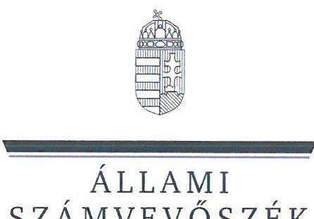
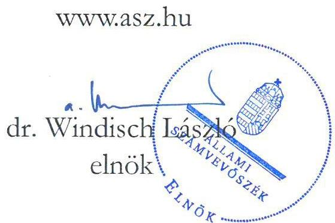

# JELENTÉS 

A költségvetési támogatásban részesülő pártok 2020-2021. évi gazdálkodása törvényességének ellenőrzése

Magyar Kétfarkú Kutya Párt
2023.

---

ÁLLAMI
SZÁMVEVŐSZÉK

# JELENTÉS 

## A költségvetési támogatásban részesülő pártok 2020-2021. évi gazdálkodása törvényességének ellenőrzése

Magyar Kétfarkú Kutya Párt
2023.

23015

---

# ELLENŐRZÉSI IGAZGATÓSÁG: 

## ÁLLAMHÁZTARTÁSON KÍVÜLI SZERVEZETEKET ELLENŐRZŐ IGAZGATÓSÁG

## ELLENŐRZÉSI IGAZGATÓ:

## KLINGA LÁSZLÓ igazgató

## ELLENŐRZÉSVEZETŐ:

## SOLYMÁR ÁGNES ellenőrzésvezető

A TÉMÁHOZ KAPCSOLÓDÓ KORÁBBI SZÁMVEVŐSZÉKI JELENTÉSEK:

- címe: A költségvetési támogatásban részesülő pártok 2018-2019. évi gazdálkodása törvényességének ellenőrzése - Magyar Kétfarkú Kutya Párt
- sorszáma: 21064

IKTATÓSZÁM: EL-3857-001/2023.
TÉMASZÁM: 2620
ELLENŐRZÉS-AZONOSÍTÓ SZÁM: V-0964

---

# TARTALOMJEGYZÉK 

- AZ ELLENŐRZÉS ALAPADATAI ..... 5
- AZ ELLENŐRZÖTT SZERVEZET ..... 7
- ÖSSZEFOGLALÁS ..... 8
- AZ ELLENŐRZÉS FÓKUSZTERÜLETEI ..... 10
- MEGÁLLAPÍTÁSOK ..... 11
- JAVASLATOK ..... 16
- MELLÉKLETEK ..... 18
I. sz. melléklet: Értelmező szótár ..... 18
- FÜGGELÉK: ÉSZREVÉTELEK ..... 19
- RÖVIDÍTÉSEK JEGYZÉKE ..... 22

---

.

---

# AZ ELLENŐRZÉS ALAPADATAI 

## AZ ELLENŐRZÉS CÉLJA

Az ellenőrzés célja, hogy az ÁSZ ${ }^{1}$ - mint az Országgyűlés legfőbb pénzügyi és gazdasági ellenőrző szerve - független és szakmailag megalapozott véleményt adjon az ellenőrzött szervezet gazdálkodásának törvényességéről.

## AZ ELLENŐRZÉS TÍPUSA

Szabályszerűségi ellenőrzés

## AZ ELLENŐRZÖTT IDŐSZAK

A 2020-2021. év

## AZ ELLENŐRZÉS TÁRGYA

A párt ellenőrzése során az ellenőrzés tárgyát képezték a 2020. és a 2021. évre vonatkozó pénzügyi kimutatás elkészítésére, jóváhagyására, közzétételére, a párt könyvvezetésére, gazdálkodására, ennek keretében a számviteli szabályozás kialakítására, a bizonylati rend, bizonylati fegyelem betartására, egyéb gazdálkodási, ellenőrzési és pénzügyi-számviteli informatikai feladatok ellátására irányuló tevékenységek. Az ellenőrzés tárgya volt még a Párttv. ${ }^{2}$ szerinti források elszámolása és felhasználása, valamint a vagyon jogszabályi előírásoknak megfelelő hasznosítása.

## AZ ELLENŐRZÉS JOGALAPJA

Az ellenőrzés jogszabályi alapját az ÁSZ tv. ${ }^{3}$ 5. § (11) bekezdés a) pontja, valamint a Párttv. 4. § (4)-(5) bekezdései, továbbá a 10. § (1), (3)-(4) bekezdések előírásai képezték.

## AZ ELLENŐRZÉS MÓDSZERE

Az ellenőrzést az ellenőrzési program szempontjai, az ellenőrzött időszakban hatályos jogszabályok, az ellenőrzés általános szakmai szabályai, az ellenőrzésre irányadó ÁSZ módszertanok figyelembevételével végezte az ÁSZ.

Az ellenőrzési kérdések megválaszolásához szükséges bizonyítékok megszerzése az ellenőrzött szervezet által rendelkezésre bocsátott dokumentumokra, adatokra alapozva kérdésfeltevés (információkérés), interjú, mintavételezés útján történt.

---

Az ellenőrzési bizonyítékként felhasználható adatforrások közé tartoznak egyrészt az ellenőrzési programban felsorolt adatforrások, másrészt adatforrás lehet még - minden az ellenőrzés folyamán feltárt, az ellenőrzés szempontjából információt tartalmazó dokumentum.

Az ellenőrzés lefolytatásához az ellenőrzött szervezet tanúsítványok kitöltésével, hitelesítésével és a teljességi és hitelességi nyilatkozattal alátámasztott dokumentumok rendelkezésre bocsátásával szolgáltatott adatokat.

Az ÁSZ a központi költségvetésből származó bevételeket és a párt által nyújtott támogatásokat tételesen ellenőrizte, emellett további mintavételi területeken statisztikai alapú mintavételezést és értékelést is alkalmazott az alábbiak szerint:

- A hozzájárulások, adományok és egyéb bevételek szabályszerűségének megítéléséhez az ellenőrzött időszak évei esetében évente rétegzett 50-50 elemű mintavétel történt.
- A rendszeres személyi juttatások, eszközbeszerzések és a működési kiadások további tételei, politikai tevékenység kiadásai, egyéb kiadások mintatételeinek értékelése az ellenőrzött időszak évei esetében évente rétegzett 100-100 elemű mintavétel történt.
A tények feltárása és azok összegzése során a megállapítások az ellenőrzött mintatételekre vonatkozóan kerültek megfogalmazásra.

---

# AZ ELLENŐRZÖTT SZERVEZET

A Magyar Kétfarkú Kutya Pártot politikai célú tevékenység céljából hozták létre, a Fővárosi Törvényszék pártként működő egyesületként jegyezte be 2014. szeptember 24-én. A Párt ${ }^{4}$ Alapszabályában ${ }^{5}$ rögzített célja a közhatalom gyakorlásában való részvétel, ennek során a képviseleti demokrácia, a társadalmi igazságosság érvényre juttatása, a demokratikus államfelépítés támogatása, valamint a humor megjelenítése a közpolitikában.

A Párt döntéshozó szerve a taggyűlés, ügyvezető szerve az elnökség, amelyet az Alapszabály alapján két társelnök, az elnökhelyettes és két további tag alkot.

A Párt a Párttv. 9/A. § (1) bekezdése alapján 2018. májusában létrehozta a Savköpő Menyét Alapítványt. A Párt a 2021. évi határozata alapján egyszemélyes Korlátolt Felelősségű Társaságot létrehozásáról döntött, amely gazdasági társaság bejegyzése, így a létrehozása 2021. év végéig nem történt meg.

A Párt a 2020-2021. évi költségvetési bevételeit és kiadásait az 1. táblázat tartalmazza. 1. táblázat

A MAGYAR KÉTFARKÚ KUTYA PÁRT KÖZZÉTETT PÉNZÜGYI KIMUTATÁSÁNAK ADATAI 2020-2021. ÉVEKBEN / (EZER FT)

|  MEGNEVEZÉS | 2020. FV | 2021. FV  |
| --- | --- | --- |
|  Központi költségvetésből származó támogatás | 12300 | 24600  |
|  Egyéb hozzájárulás, adomány | 4527 | 29923  |
|  Egyéb bevétel | 10654 | 14468  |
|  Bevétel összesen | 27481 | 68991  |
|  Működési kiadások | 10278 | 17263  |
|  Politikai kiadások | 6166 | 13133  |
|  Támogatás egyéb szervezetnek | 1318 | 4350  |
|  Egyéb kiadások | 8115 | 29246  |
|  Kiadások összesen | 25877 | 63992  |

Formátum: A Párt 2020-2021. évi pénzügyi kimutatásának adatai alapján ÁSZ szerkesztés

---

# ÖSSZEFOGLALÁS 

Magyarországon pártként működnek azok az egyesületek, amelyek nyilvántartott tagsággal rendelkeznek, és amelyek a nyilvántartásba vételüket végző bíróság előtt kinyilvánítják, hogy a Párttv. rendelkezéseit magukra nézve kötelezőnek ismerik el.

Az ÁSZ a Párttv. alapján kétévente ellenőrzi azoknak a pártoknak a gazdálkodását, amelyek a Párttv. szerint költségvetési támogatásban részesültek. A Magyar Kétfarkú Kutya Párt a 2020. évi pénzügyi kimutatása szerint 12300 ezer Ft, a 2021. évi pénzügyi kimutatása szerint 24600 ezer Ft költségvetési támogatásban részesült.

A Magyar Kétfarkú Kutya Párt a 2020. és a 2021. évi pénzügyi kimutatását a Párttv.-ben előírt határidőben elkészítette és közzétette a Magyar Közlöny mellékletét képező Hivatalos Értesítőben, azonban a 2020-2021. évben a Számv. tv. ${ }^{6}$-ben foglaltak ellenére a könyvvezetési rendszert nem részletezték tovább úgy, hogy abból a Párttv. 1. számú mellékletében meghatározott pénzügyi kimutatás adatainak rendelkezésre állása biztosított legyen.

A 2020. és a 2021. évi pénzügyi kimutatások nem feleltek meg a jogszabályi előírásoknak, nem valós adatokat tartalmaztak az alábbiak miatt:

- Az adományok vonatkozásában előfordult, hogy nem a Számv. tv. előírása szerint mutatták ki a könyvviteli nyilvántartásban, ezáltal ezen adományokat nem a tényleges gazdasági tartalmuknak megfelelő jogcímen tartották nyilván.
- A kiadások esetében a Számv. tv. előírása ellenére előfordult bizonylat nélküli számviteli elszámolás, emiatt a könyvvitelben rögzített és a pénzügyi kimutatásban szereplő tételek a valóságban nem voltak megtalálhatóak, bizonyíthatóak, kívülállók által is megállapíthatóak.
- A 2021. évi pénzügyi kimutatás bevételi és kiadási adatait a Számv. tv. előírása ellenére nem támasztották alá főkönyvi kivonattal, ezáltal a pénzügyi kimutatás, valamint az azt alátámasztó könyvvezetés tekintetében az állandóság és az összehasonlíthatóság nem volt biztosított. A pénzügyi kimutatásban és a főkönyvi nyilvántartásból eredő eltérés összege az éves összes bevétel 20,2 %-a volt.

Az ellenőrzött időszakban a Magyar Kétfarkú Kutya Párt bevételei központi költségvetési támogatásból, adomány és hozzájárulásból, valamint egyéb bevételből származtak.

A Magyar Kétfarkú Kutya Párt a Párttv.-ben előírtak ellenére mindkét ellenőrzött évben elfogadott a Párttv. alapján nem engedélyezett forrásból - az általa alapított Alapítványától - származó vagyoni hozzájárulást, mindösszesen 2020. évben 1690651 Ft összegben, 2021. évben 3922773 Ft összegben.

- 2020. évben 1073101 Ft, 2021. évben 618490 Ft vagyoni hozzájárulást fogadott el az általa létrehozott Alapítványtól, mivel a Párt részére az Alapítvány egy ingatlan ingyenes használatát biztosította iroda céljára mindkét ellenőrzött évben. Az ingatlant ténylegesen a Párt és az általa létrehozott Alapítvány 20-80 %-os arányban használta, azonban az iroda bérleti díját és a kapcsolódó költségeket teljes egészében az Alapítvány fizette meg.
- A Párttv.-ben foglaltak ellenére a 2020. évben 617550 Ft, a 2021. évben 3304283 Ft összegben vagyoni hozzájárulást fogadott el az általa létrehozott Alapítványtól, mivel a közös program megvalósítása (táboroztatás) során a résztvevőktől beszedett részvételi díj teljes egészében a Párt bevételét képezte, ugyanakkor a táborral kapcsolatos ráfordításokat az Alapítvány finanszírozta.

---

A fentiek alapján a Magyar Kétfarkú Kutya Párt az ellenőrzött időszakban a Párttv. előírásai ellenére jogi személytől fogadott el 5613424 Ft vagyoni hozzájárulást, amelynek értékét a Párttv. előírásai alapján köteles a központi költségvetésnek befizetni, továbbá a párt központi költségvetésből juttatott támogatását ezen összeggel csökkenteni kell.

Mindez azt mutatja, hogy a Párt gazdálkodása több esetben nem különült el az általa létrehozott Alapítvány gazdálkodásától. Ez kockázatot jelent a Párt jogszabályi kötelezettségei teljesítésére, valamint a Párttv. szerinti engedélyezett forrásból történő, szabályos gazdálkodására.

A Magyar Kétfarkú Kutya Párt az ellenőrzött időszakra vonatkozóan elkészítette a Számv. tv. előírásainak megfelelő Számviteli politikát ${ }^{7}$, valamint az annak keretében a Leltározási szabályzatot ${ }^{8}$, Értékelési szabályzatot ${ }^{9}$ és Pénzkezelési szabályzatot ${ }^{10}$. A 2020. évre vonatkozóan azonban nem készítette el a Számv. tv.-ben előírt számlarendet. Továbbá a 2021. évben hatályos Számlarend ${ }^{11}$ a Számv. tv.-ben foglaltak ellenére nem tartalmazta minden alkalmazásra kijelölt számla számjelét és megnevezését.

A Párt 2020. és 2021. évi fordulónapi leltár nem felelt meg a Leltározási szabályzatban ${ }^{1,2}$ előírtaknak, mivel a tárgyi eszközök és immateriális javakon kívül nem tartalmazta minden eszköz és forrás mennyiségét és értékét.

A Magyar Kétfarkú Kutya Párt az ellenőrzés rendjének kialakításáról a Gazdálkodási szabályzatában és Pénzkezelési szabályzatában ${ }^{1,2,3}$ gondoskodott. A pénztár ellenőrzése a 2020. évben nem, 2021. évben nem teljes körűen történt meg, a belső szabályzatban előírt pénztárjelentéseket nem készítették el.

A Magyar Kétfarkú Kutya Párt a működéséhez a forrásokat, a költségvetésből juttatott és az egyéb támogatásokat, adományokat 2020. és 2021. években nem szabályszerűen használta fel és számolta el. A kiadások kifizetése során a Számv. tv. és a belső szabályzatok előírásait nem tartotta be, mivel valamennyi ellenőrzött mintatétel esetében a kiadások kifizetésénél a gazdasági műveletet elrendelő személy, az utalványozó és a rendelkezés végrehajtását igazoló személy aláírása nem szerepelt a könyvviteli elszámolást közvetlenül alátámasztó bizonylatokon.

További hiányosság volt, hogy az ellenőrzött két évben a Párt által támogatott 11 szervezet a támogatási szerződésekben, valamint a belső szabályzatokban foglaltaktól eltérően a támogatások felhasználásáról nem számolt el, elszámoltatás hiányában a Párt nem érvényesíthette a szerződésben szereplő szankciókat.

---

# AZ ELLENŐRZÉS FÓKUSZTERÜLETEI 

1- A párt kialakította-e a törvényes gazdálkodás szabályozási, könyvvezetési és ellenőrzési feltételeit?
2. A párt pénzügyi kimutatása megfelelt-e a jogszabályi előírásoknak, közzétételi kötelezettségét szabályszerűen teljesítette-e?
3. A párt könyvvezetése és gazdálkodása során a vonatkozó jogszabályi rendelkezéseket és belső előírásokat betartotta-e?

---

# MEGÁLLAPÍTÁSOK 

## 1. A párt kialakította-e a törvényes gazdálkodás szabályozási, könyvvezetési és ellenőrzési feltételeit?

## Összegző megállapítás

1.1. számú megállapítás

A Párt nem teljes körűen alakította ki a törvényes gazdálkodás szabályozási, könyvvezetési és ellenőrzési feltételeit a 2020-2021. években.

A Párt gazdálkodására vonatkozó számviteli szabályzatok kialakítása nem mindenben felelt meg a jogszabályi előírásoknak.

A Párt az ellenőrzött időszakban rendelkezett a Számv. tv. előírásainak megfelelő Számviteli politikával ${ }^{1,2}$, melynek keretében elkészítette a Leltározási szabályzatát ${ }^{1,2}$ az Értékelési szabályzatot ${ }^{1,2}$, valamint a Pénzkezelési szabályzatot ${ }^{1,2,3}$. A Számviteli politika ${ }^{1,2}$ tartalmazta,
 hogy a Párt minden naptári év végén teljes könyvviteli zárlatot hajt végre, illetve tartalmazta a Számv. tv.-ben foglaltaknak megfelelően az év végi zárlati feladatok kereteit.

A Párt 2020. január 1. és 2021. július 18. között a Számv. tv. 161. § (1) bekezdésben foglaltak ellenére nem rendelkezett számlarenddel. 2021. július 19-étől a Párt rendelkezett Számlarenddel, azonban az a Számv. tv. 161. § (2) bekezdés a) pontjában foglaltak ellenére nem tartalmazta minden alkalmazásra kijelölt számla számjelét, megnevezését (pl: 911 webshop bevétel/tábor, 96731 költségvetési támogatás, 5111 politikai tevékenység anyagköltsége). A Számv. tv. előírásának megfelelve a Párt kialakította a Bizonylati rendet ${ }^{12}$.

A Párt a Párttv.-ben előírtak alapján a Számviteli politikában meghatározta a nem pénzbeli vagyoni hozzájárulás értékelésének szabályait.
1.2. számú megállapítás

A párt könyvvezetése, számviteli nyilvántartási rendszere nem felelt meg a jogszabályi és belső szabályozási előírásoknak a 2020-2021. években.

A Párt az ellenőrzött években kettős könyvviteli nyilvántartást vezetett. A jogszabályban előírt könyvviteli feladatokat külső szolgáltató látta el.

A Párt a 2020-2021. években a Számv. tv. 161/A. § (2) bekezdésében foglaltak ellenére könyvvezetési rendszerét nem részletezte tovább úgy, hogy abból a Párttv. 1. számú mellékletében meghatározott pénzügyi kimutatás adatainak rendelkezésre állása biztosított legyen.

A Párt a 2020. évben hat mintatétel, a 2021. évben két mintatétel esetében a könyviteli rendszerében a Számv. tv. 165. § (2) bekezdésében foglaltak ellenére bizonylat hiányában szerepeltetett adatot. A bizonylatok hiánya miatt a Számv. tv. 165. § (4) bekezdésében előírt főkönyvi könyvelés, az analitikus nyilvántartások és a bizonylatok adatai közötti egyeztetés lehetősége nem volt biztosított egyik ellenőrzött évben sem.

A Leltározási szabályzat ${ }_{1,2}$ 1.1. pontjában előírtak ellenére a Párt a 2020-2021. évekre vonatkozóan a tárgyi eszköz és immateriális javak mennyiségi egyeztetéséről szóló leltár kivételével nem készítette el minden eszköz és forrás fordulónapi leltárát.

A Pártnál a főkönyvi nyilvántartás alapján a 2020. évben egy, a 2021. évben három pénztár működött. A Pénzkezelési szabályzat ${ }_{1,2,3}$ 7. pontjában foglaltak ellenére a készpénzes bizonylatokkal kapcsolatban az előírt pénztárjelentést a 2020. évben egyáltalán, valamint 2021. évben a három pénztárból egy pénztárra vonatkozóan nem vezette, illetve ezen pénztárak vonatkozásában kiadási pénztárbizonylatot nem állított ki. Ezek hiányában a készpénzes kifizetések a Pénzkezelési szabályzat ${ }_{1,2,3}$ 7. pontjában foglaltak ellenére csak alapbizonylatok alapján kerültek elszámolásra.
1.3. számú megállapítás

A Párt az ellenőrzési rendszer belső szabályozási kereteit 2020-2021. évekre vonatkozóan kialakította, azonban a működése a 2020. évben nem felelt meg a belső előírásoknak.

A 2020. év tekintetében a Bizonylati rend, illetve a Pénzkezelési szabályzat ${ }_{1,2,3}$ foglalta magában az utalványozó és az ellenőr személyét, az ellenőrzés kereteit. A 2021. szeptember 1-jétől hatályos Gazdálkodási szabályzat ${ }^{13}$-ban a Párt szabályozta a vezetői ellenőrzés kereteit, és meghatározta a gazdasági műveletet elrendelő, utalványozó, végrehajtást igazoló, valamint az ellenőr személyét.

A Pénzkezelési szabályzatban ${ }_{1,2,3}$ a Párt meghatározta a házipénztár ellenőrzésének szabályait, azonban az évente legalább egy alkalommal elvégzendő pénztárellenőrzésre a fentiekben részletezett pénztárjelentés vezetésének hiánya miatt a 2020. évben, valamint a 2021. évben három pénztárból egy pénztár esetében nem került sor.

A Párt a 2020-2021. években nem rendelkezett felügyelő bizottsággal, mivel a Párt taglétszáma 2020. évben 46 fő, 2021. évben 52 fő volt, ezért a Ptk. ${ }^{14}$ előírása szerint nem volt kötelezett felügyelő bizottság létrehozására.

# 2. A párt pénzügyi kimutatása megfelelt-e a jogszabályi előírásoknak, közzétételi kötelezettségét szabályszerűen teljesítette-e? 

## Összegző megállapítás

2.1. számú megállapítás

A Párt a 2020. és 2021. évi pénzügyi kimutatását elkészítette és közzétette, azonban azok nem feleltek meg a jogszabályi előírásoknak.

A Párt a 2020. és a 2021. évi pénzügyi kimutatásai nem feleltek meg a jogszabályi előírásoknak.

A Párttv. alapján a Párt a pénzügyi kimutatását a 2020-2021. években határidőben elkészítette. A Párt elnöksége a 2020. évi pénzügyi kimutatást 2021. május 25-én, a 2021. évi pénzügyi kimutatást 2022. május 27-én fogadta el a Párttv.-ben előírtaknak megfelelően.

A Párt a 2020. évi pénzügyi kimutatását a 3. pontban részletezett hiányosságok miatt nem szabályszerű könyvvezetéssel támasztotta alá.

A Párt 2021. évi pénzügyi kimutatásában szereplő bevételi és kiadási adatok nem egyeztek meg az alátámasztó főkönyvi nyilvántartás számszaki adataival, ezáltal a Párt a Számv. tv. 164. § (2) bekezdésében foglaltak ellenére a pénzügyi kimutatás adatait nem támasztotta alá a főkönyvi kivonat. A 2. táblázat a 2021. közzétett pénzügyi kimutatás és főkönyvi kivonat számszaki eltéréseit tartalmazza.

---

# A PÁRT 2021. ÉVI PÉNZÜGYI KIMUTATÁSÁNAK ÉS FŐKÖNYVI NYILVÁNTARTÁSÁNAK ELTÉRÉSEI (ADATOK EZER FT-BAN MEGADVA)

| MEGNEVEZÉS | PÉNZÜGYI   KIMUTATÁS   (PÚIK) | FŐKÖNYVI   NYILVÁNTARTÁS   (FK) ${ }^{a}$ | SZÁMSZAKI   ELTÉRÉS A PÚIK   ÉS FK KÖZÖTT |
| :-- | :--: | :--: | :--: |
| Központi költségvetésből származó támogatás | 24600 | 24600 | 0 |
| Egyéb hozzájárulások, adományok | 29923 | 29177 | 746 |
| Egyéb bevétel | 14468 | 15036 | -568 |
| Bevételek összesen | $\mathbf{68991}$ | $\mathbf{68813}$ | $\mathbf{178}$ |
| Működési kiadások | 17263 | 17339 | -76 |
| Politikai kiadások | 13133 | 13251 | -118 |
| Támogatás egyéb szervezetnek | 4350 | 4049 | 301 |
| Egyéb kiadások | 29246 | 15500 | 13746 |
| Kiadások összesen | $\mathbf{63992}$ | $\mathbf{50139}$ | $\mathbf{13853}$ |

${ }^{a}$ A Párt által megadott, az egyes pénzügyi kimutatás adataiba bevont, kapcsolódó számítások eredménye a főkönyvi adatok alapján.
Forrás: a Párt pénzügyi kimutatásának és dokumentumainak adatai alapján ÁSZ szerkesztés
A Párt 2021. évi pénzügyi kimutatásában és a főkönyvi kivonatában szereplő összegek számszaki eltérése meghaladta a Számviteli politika ${ }_{1,2}$ 10. pontjában előírt, a bevétel 2%-ában meghatározott jelentős hiba határértékét. Az összes bevétel 2%-a 2021. évben 1380 ezer Ft volt és a pénzügyi kimutatás bevételi és kiadási összegeinek a főkönyvi adatoktól való eltérésének abszolút értéke 15555 ezer Ft.
2.2. számú megállapítás

A Párt a 2020. és 2021. évi Pénzügyi kimutatásait határidőben, a jogszabályi előírásoknak megfelelően közzétette.

A Párttv. melléklete szerinti pénzügyi kimutatást a Párt a Párttv.-ben előírt határidőn belül, a tárgyévet követő év május 31-ig a Magyar Közlöny mellékletében, a Hivatalos Értesítőben közzétette és saját honlapján is szerepeltette.

## 3. A párt könyvvezetése és gazdálkodása során a vonatkozó jogszabályi rendelkezéseket és belső előírásokat betartotta-e?

## Összegző megállapítás

3.1. számú megállapítás

A Párt a könyvvezetése és gazdálkodása során a vonatkozó jogszabályi rendelkezéseket és belső előírásokat nem tartotta be.
A Párt működéséhez kapcsolódó forrásokat a 2020-2021. években nem szabályszerűen számolta el, a Párttv. előírását megsértve mindkét ellenőrzött évben jogi személytől fogadott el vagyoni hozzájárulást.

A Párttv. 4. § (2) bekezdésében foglaltak ellenére a 2020-2021. években a Párt nem pénzbeli vagyoni hozzájárulást fogadott el az általa létrehozott Alapítványtól ${ }^{15}$. A Párt részére az Alapítvány egy ingatlan ingyenes használatát biztosította mindkét ellenőrzött évben, mivel a Párt által használt ingatlan költségeit az Alapítvány viselte, amely az Alapítvány főkönyvi nyilvántartása alapján a 2020. évben 5365508 Ft, a 2021. évben 3092450 Ft volt. Az ingatlan tényleges használatát a Párt és az általa létrehozott Alapítvány 20-80%-os arányban osztotta meg egymás között. A Párttv. 4. § (5) bekezdésében foglaltak alapján az ÁSZ által megállapított nem vagyoni hozzájárulás értéke, az Alapítvány által az ingatlannal kapcsolatban megfizetett valamennyi költségnek az Alapítvány és a Párt által megvalósult tényleges használat arányában számított összege: 2020. évben 1073101 Ft, 2021. évben 618490 Ft.

A Párttörvény 4. § (2) bekezdésében foglaltak ellenére a Párt és az Alapítvány közös rendezésű táboroztatás kapcsán 2020-2021. években vagyoni hozzájárulást fogadott el az Alapítványtól. A tábor résztvevőitől beszedett részvételi díj bevétele mindkét évben teljes egészében a párt bevételét képezte. Ugyanakkor a táborral kapcsolatos ráfordítást 2020. évben 617550 Ft, 2021. évben 3304283 Ft a Párt helyett az Alapítvány finanszírozta.

A fentiek alapján a Párttv. rendelkezéseire figyelemmel, a 2020-2021. években a Párt jogi személytől 5613424 Ft összegű vagyoni hozzájárulásban, azaz tiltott támogatásban részesült. A Párttv. 4. § (4) bekezdése alapján a tiltott támogatás összegét - az ÁSZ felhívására - 15 napon belül a központi költségvetés részére köteles befizetni a Párt.

A Párt az ellenőrzött bevételi mintatételek alapján a 2020. évben hat mintatétel, a 2021. évben három mintatétel esetében egyéb hozzájárulást, adományt a Számv. tv. 77. § (2) bekezdés d) pontjában foglaltak ellenére a főkönyvi nyilvántartásában értékesítés árbevételeként számolta el és tartotta nyilván az egyéb bevételek helyett. Ennek következtében mindkét ellenőrzött évben ezek az adományok a Párt pénzügyi kimutatásában nem szerepeltek az egyéb hozzájárulások, adományok bevételei között.

A Párt 2020-2021. években a Párt tv. előírásai szerinti, a központi költségvetésről szóló törvényben meghatározott összegű költségvetési támogatásban részesült. A pénzügyi kimutatás "Központi költségvetésből származó támogatások" sorában a főkönyvvel egyezően az adott jogcímen, a Számv. tv. előírásainak megfelelően elszámolt összegek szerepeltek. A 2020-2021. év tekintetében a pénzügyi kimutatásban, főkönyvi adatokkal összhangban a központi költségvetésből származó támogatás összege megegyezett a Kvtv.-ben ${ }^{16}$ közzétett összeggel.

A 2020-2021. évi főkönyvi kivonat és pénzügyi kimutatás alapján a Párt nem rendelkezett tagdíjból származó bevétellel.

A 2020-2021. évre vonatkozó pénzügyi kimutatásokban a Párttv.-ben előírt egy naptári év alatt adott, ötszázezer forintot meghaladó hozzájárulások, adományok nem szerepeltek, mivel a nyilvántartások alapján nem volt olyan adományozó, akinek befizetése elérte volna az ötszázezer forintos értékhatárt.
3.2. számú megállapítás

A mintatételek értékelése alapján a Párt gazdálkodásával összefüggő tevékenység keretében a személyi jellegű ráfordítások elszámolása szabályszerű volt, a további kiadások elszámolása során a Párt nem tartotta be a jogszabályok és a belső szabályok előírásait.

A foglalkoztatás és a személyi jellegű kifizetések, illetve az ehhez kapcsolódó bejelentési, adó- és járulék nyilvántartási, levonási, bevallási, befizetési, adatszolgáltatási kötelezettségek teljesítése megfelelt a jogszabályi és a belső szabályzatok előírásainak. A munkaszerződések tartalmazták az Mtv ${ }^{17}$-ben előírtakat. A Párt a 2020. és 2021. évben a foglalkoztatottak adatait az Art. ${ }^{18}$-ban előírtaknak megfelelően bejelentette. Az adóigazgatási eljárás részletszabályairól szóló 465/2017. (XII.28.) Korm. rendeletben előírt, bérkifizetéssel kapcsolatos igazolásokat a Párt a munkavállalók részére kiadta.

---

A személyi jellegű kiadásokon túli kiadási jogcímeken történő kiadási mintatételek elszámolása nem felelt meg a Számv. tv., mivel:

- a kiadások kifizetésénél a gazdasági műveletet elrendelő személy megjelölése, az utalványozó, a rendelkezés végrehajtását igazoló személy aláírása valamennyi mintatétel esetében a Számv. tv. 167. § (1) bekezdés c) pontjában foglaltak ellenére 2020-2021. években nem szerepelt a könyvviteli elszámolást közvetlenül alátámasztó bizonylatokon.
- a jelentés 1.2. pontjában részletezettek alapján a Párt a számviteli nyilvántartásába a
 Számv. tv. 165.§ (2) bekezdésében foglaltak ellenére bizonylat nélkül számolt el kiadásokat a 2020-2021. évben

A 2020-2021. évben a Párt által támogatott egyéb szervezetek a bírósági nyilvántartásban szereplő, bejegyzett civil szervezetek voltak.

Az ellenőrzött két évben a Párt által támogatott 11 szervezet a támogatási szerződésben foglaltaktól eltérően a támogatások felhasználásáról (2668,1 ezer Ft) nem számolt el. Elszámoltatás hiányában a Párt nem érvényesíthette a támogatási szerződésekben szereplő, a céltól eltérő felhasználás esetére vonatkozó visszafizetési szankciókat. Két szervezet esetében a Párt nem írt elő a szerződésekben elszámolási kötelezettséget.
3.3. számú megállapítás

A Párt 2020-2021. évek vagyonnal való gazdálkodásának szabályozása megfelelt a törvényi előírásoknak, saját tulajdonú ingatlannal, értékpapírral nem rendelkezett.

A Párt szabályzataiban kitért a vagyonnal való gazdálkodás, ezen belül a kapcsolódó feladat- és hatáskörök, felelősségi viszonyok szabályaira, amelyeket az Alapszabályban, az SZMSZ-ben, a Számviteli politikában, a Pénzkezelési szabályzatban1,2,3, a Bizonylati rendben, valamint a Gazdálkodási és pénzügyi szabályzatban rögzített.

A Párttv. 3. számú melléklete alapján a Párt nem részesült a Párttv.-ben rögzített, az állam tulajdonából ingyenesen juttatott ingatlannal. A Párt 2020-2021. években nem rendelkezett saját tulajdonú, vagy ingyenesen juttatott ingatlannal, értékpapírral.

---

# JAVASLATOK 

Az ÁSZ tv. 33. § (1) bekezdésében foglaltak értelmében az ellenőrzött szervezet vezetője köteles a jelentésben foglalt megállapításokhoz kapcsolódó intézkedési tervet összeállítani és azt a jelentés kézhezvételétől számított 30 napon belül az ÁSZ részére megküldeni. Amennyiben az ellenőrzött szervezet vezetője nem küldi meg határidőben az intézkedési tervet, vagy továbbra sem elfogadható intézkedési tervet küld, az Állami Számvevőszék elnöke az ÁSZ tv. 33. § (3) bekezdése a) és b) pontjaiban foglaltakat érvényesítheti.

## A MAGYAR KÉTFARKÚ KUTYA PÁRT ELNÖKE

1. Intézkedjen, hogy a számlarend a Számv.tv. 161. § (2) bekezdés a) pontjában előírtaknak megfelelően minden alkalmazásra kijelölt számla számjelét és megnevezését tartalmazza.
(1.1. sz. megállapítás 2. bekezdés alapján)
2. A könyvvezetési rendszerét részletezze tovább úgy, hogy abból a Számv. tv. 161/A. § (2) bekezdésében foglaltaknak megfelelően a Párttv. 1. számú mellékletében meghatározott pénzügyi kimutatás adatai rendelkezésre álljanak.
(1.2. sz. megállapítás 2. bekezdés alapján)
3. Gondoskodjon arról, hogy a Számv. tv. 165. § (2) bekezdésében foglaltaknak megfelelően a könyvelési rendszerében szabályszerű bizonylat alapján jegyezzenek be adatot, biztosítva ezzel a Számv. tv.165. § (4) bekezdésében előírt főkönyv, analitika és a bizonylatok egyeztetésének lehetőségét.
(1.2. sz. megállapítás 2. bekezdés, valamint a 3.2. megállapítás 4. bekezdés alapján)
4. Intézkedjen, hogy az eszközök és források fordulónapi leltára során a Leltározási szabályzat 1.1. pontjában előírtak betartásra kerüljenek.
(1.2. sz. megállapítás 3. bekezdés alapján)
5. Intézkedjen, hogy a Pénzkezelési szabályzat 7. pontjában foglaltaknak megfelelően a pénztárakhoz kapcsolódóan vezessenek pénztárjelentést.
(1.2. sz. megállapítás 4. bekezdés alapján)
6. Gondoskodjon arról, hogy a Pénzkezelési szabályzatban előírtak alapján az előírt gyakorisággal, dokumentáltan sor kerüljön a házipénztár ellenőrzésére.
(1.3. sz. megállapítás 2. bekezdés alapján)
7. Gondoskodjon arról, hogy a Párt a Számv. tv. 164. § (2) bekezdésében foglaltaknak megfelelően a pénzügyi kimutatását főkönyvi kivonattal támasza alá.
(2.1. sz. megállapítás 3. bekezdés alapján)

---

8. Gondoskodjon arról, hogy a könyvviteli elszámolások során a Számv. tv. 77. §-ában foglalt előírásokat betartsák, ezáltal biztosítva, hogy a Párttv. 1. számú mellékletében előírt pénzügyi kimutatás tartalma tényszerűen könyvelt, valós értéken nyilvántartott adatokon alapuljon.
(3.1. sz. megállapítás 4. bekezdés alapján)
9. Intézkedjen, hogy a Számv.tv. 167. § (1) bekezdés c) pontjában foglaltak szerint a könyvviteli elszámolást közvetlenül alátámasztó bizonylatok tartalmazzák a gazdasági műveletet elrendelő személy, az utalványozó és a rendelkezés végrehajtását igazoló személy aláírását.
(3.2. sz. megállapítás 3. bekezdés alapján)
10. Intézkedjen, hogy a támogatott szervezetek a támogatási szerződésekben, továbbá a Gazdálkodási és pénzügyi szabályzatban foglaltak szerint számoljanak el a nyújtott támogatásokkal.
(3.2. sz. megállapítás 6. bekezdés alapján)

---

# MELLÉKLETEK 

## I. SZ. MELLÉKLET: ÉRTELMEZŐ SZÓTÁR

pénzügyi kimutatás
nem pénzbeli támogatás

A Párttv. 9. § (1) bekezdésében meghatározott, a törvény 1. számú melléklete szerinti pénzügyi kimutatás (hatályos 2014. május 6-ától), amelyet a pártok kötelesek minden év május 31-ig a Magyar Közlönyben, valamint saját honlappal rendelkező pártok a honlapjukon is közzétenni.
Vagyoni értékkel rendelkező forgalomképes dolog, szellemi alkotás, illetve vagyoni értékű jog részben vagy egészében, véglegesen, vagy ideiglenesen, teljesen vagy részben ingyenesen történő átruházása vagy átengedése, illetve szolgáltatás biztosítása. (Civil tv ${ }^{19}$. 2. § 25. pont)

---

# FÜGGELÉK: ÉSZREVÉTELEK 

A jelentéstervezetet a Számvevőszék 15 napos észrevételezésre megküldte az ellenőrzött szervezet vezetőjének az ÁSZ tv. 29. §* (1) bekezdése előírásának megfelelően.
A Párt társelnöke a jelentéstervezetre észrevételt tett.
A függelék tartalmazza az ellenőrzött észrevételeit, illetve az el nem fogadott észrevételek elutasításának indoklását.

[^0]
[^0]:    * 29. § (1) Az Állami Számvevőszék az ellenőrzési megállapításait megküldi az ellenőrzött szervezet vezetőjének vagy az általa megbízott személynek, és annak, akinek személyes felelősségét állapította meg.
    (2) Az ellenőrzött szervezet vezetője és a felelősként megjelölt személy az ellenőrzés megállapításaira tizenöt napon belül írásban észrevételt tehet.
    (3) Az Állami Számvevőszék az észrevételre a beérkezésétől számított harminc napon belül írásban válaszol. A figyelembe nem vett észrevételeket köteles a jelentésben feltüntetni, és megindokolni, hogy azokat miért nem fogadta el.

---

# MAGYAR KÉTFARKÚ KUTYA PÁRT 

azonosító: 0199031622 | adószám: 18649167-1-42 | nyilvántartási szám: 01-02-0015629

Klinga László Igazgató úr részére
Állami Számvevőszék
kapja: part_2022@asz.hu, valamint e-papír

Tisztelt Állami Számvevőszék!
Tisztelt Klinga László Igazgató Úr!

A Magyar Kétfarkú Kutya Párt 2020-2021. évi gazdálkodásáról készített számvevőszéki jelentés tervezetére az alábbi észrevételt teszem.
Megalapozatlannak tartom a tervezet azon megállapítását, hogy a Magyar Kétfarkú Kutya Párt a Savköpő Menyét Alapítványtól a tábor megrendezésével összefüggésben vagyoni hozzájárulást fogadott volna el.
Az a körülmény, hogy az SMA a politikai kultúra fejlesztését célzó tábort szervezett, teljes mértékben összhangban volt az alapítvány céljával, még akkor is, ha az segítette a Magyar Kétfarkú Kutya Párt működését.
A Savköpő Menyét Alapítvány a pártok működését segítő tudományos, ismeretterjesztő, kutatási, oktatási tevékenységet végző alapítványokról szóló 2003. évi XLVII. törvény hatálya alá tartozó alapítvány. A törvény címe alapján is egyértelmű, hogy az ilyen alapítvány lényege, hogy olyan ismeretterjesztő és oktatási tevékenységet végez, amely a párt működését segíti.
Az a körülmény, hogy Magyar Kétfarkú Kutya Párt díjat szedett a táboron való részvételért, lehet polgári jogi szempontból vitatható, de az nem teszi vagyoni hozzájárulássá a tábor költségeit (legfeljebb jogalap nélküli gazdagodás címén az SMA léphetne fel az MKKP-val szemben).

## Kérem ezért, hogy a tervezet idevágó részeit korrigálni szíveskedjen.

Budapest, 2023. március 3.

Tisztelettel,

## Kovács Gergely, társelnök

Magyar Kétfarkú Kutya Párt

---

# Az el nem fogadott észrevételek elutasításának indoklása: 

A Magyar Kétfarkú Kutya Párt társelnöke 2023. március 3-án kelt levelében megalapozatlannak tartotta a számvevőszéki jelentéstervezet azon megállapítását, hogy a Magyar Kétfarkú Kutya Párt a Savköpő Menyét Alapítványtól a tábor megrendezésével összefüggésben vagyoni hozzájárulást fogadott volna el.

Indokolását azzal támasztotta alá, hogy "A Savköpő Menyét Alapítvány a pártok működését segítő tudományos, ismeretterjesztő, kutatási, oktatási tevékenységet végző alapítványokról szóló 2003. évi XLVII. törvény hatálya alá tartozó alapítvány. A törvény címe alapján is egyértelmű, hogy az ilyen alapítvány lényege, hogy olyan ismeretterjesztő és oktatási tevékenységet végez, amely a párt működését segíti. Az a körülmény, hogy Magyar Kétfarkú Kutya Párt díjat szedett a táboron való részvételért, lehet polgári jogi szempontból vitatható, de az nem teszi vagyoni hozzájárulássá a tábor költségeit (legfeljebb jogalap nélküli gazdagodás címén az SMA léphetne fel az MKKP-val szemben)."

Azt a tényt, hogy a Magyar Kétfarkú Kutya Párt gazdasági tevékenysége körében olyan szolgáltatás díját számolta el bevételként, amellyel kapcsolatos kiadásokat a Savköpő Menyét Alapítvány viselte kizárólagosan, a társelnök észrevételében nem vitatta. Indokolásában azt is elismerte, hogy ezáltal a Magyar Kétfarkú Kutya Párt bevételre tett szert. A bevétel Magyar Kétfarkú Kutya Pártnál történő realizálódásával és a ráfordítások kizárólagosan a Savköpő Menyét Alapítvány által történő finanszírozásával, a Magyar Kétfarkú Kutya Párt nem pénzbeli vagyoni hozzájárulást fogadott el a Savköpő Menyét Alapítványtól, amely törvényi tilalom alá esik, így a jelentéstervezet módosítása nem indokolt.

A levél 3. bekezdésében hivatkozott körülmény vonatkozásában - "az SMA a politikai kultúra fejlesztését célzó tábort szervezett, teljes mértékben összhangban volt az alapítvány céljával" - a jelentéstervezet nem tartalmaz megállapítást.

Továbbá a pártok működéséről és gazdálkodásáról szóló 1989. évi XXXIII. törvény 4. § (2) bekezdése azt írja elő, hogy a párt részére jogi személy (pl.: alapítvány), jogi személyiséggel nem rendelkező szervezet vagyoni hozzájárulást nem adhat. Tehát a tiltott támogatás tilalmát előíró jogszabály nem tartalmaz kivételt abban az esetben sem, ha a támogatás a párt működését segíti elő és az összhangban volt az alapítvány céljaival. Ennek okán a jelentéstervezet módosítása szintén nem indokolt.

---

# RÖVIDÍTÉSEK JEGYZÉKE 

${ }^{1}$ ÁSZ
${ }^{2}$ Párttv.
${ }^{3}$ ÁSZ tv.
${ }^{4}$ Párt
${ }^{5}$ Alapszabály
${ }^{6}$ Számv. tv.
${ }^{7}$ Számviteli politika $1,2$
${ }^{8}$ Leltározási szabályzat ${ }_{1,2}$
${ }^{9}$ Értékelési szabályzat ${ }_{1,2,3}$
${ }^{10}$ Pénzkezelési szabályzat ${ }_{1,2,3}$
${ }^{11}$ Számlarend
${ }^{12}$ Bizonylati rend ${ }_{1,2}$
${ }^{13}$ Gazdálkodási szabályzat
${ }^{14}$ Ptk.
${ }^{15}$ Alapítvány
${ }^{16}$ Kvtv.
${ }^{17}$ Mtv.
${ }^{18}$ Art.
${ }^{19}$ Civil tv.

Állami Számvevőszék
a pártok működéséről és gazdálkodásáról szóló 1989. évi XXXIII. törvény (hatályos: 1989. október 30-ától)
2011. évi LXVI. törvény az Állami Számvevőszékről

Magyar Kétfarkú Kutya Párt
A Magyar Kétfarkú Kutya Párt Alapszabálya (módosítva és egységes szerkezetbe foglalva 2018. július 13-tól, 2022. május 6-tól)
2000. évi C. törvény a számvitelről

A Magyar Kétfarkú Kutya Párt számviteli politikája (hatályos 2016. július 16-ától, 2021. július 19-étől)
A Magyar Kétfarkú Kutya Párt Eszközök és források leltárkészítési és leltározási szabályzata (hatályos 2016.július 16-ától, 2021. július 19-étől)
A Magyar Kétfarkú Kutya Párt Eszközök és források értékelési szabályzata (hatályos 2016. július 16-ától, 2020. május 29-étől, 2021. július 19-étől)
A Magyar Kétfarkú Kutya Párt Pénzkezelési szabályzata (hatályos 2016. július 16-ától, 2020. május 29-étől, 2021. július 19-étől)
A Magyar Kétfarkú Kutya Párt számlarendje (hatályos: 2021. július 19-étől)
A Magyar Kétfarkú Kutya Párt bizonylati rendje (hatályos: 2016. július 16-ától, 2021. július 19-étől)
A Magyar Kétfarkú Kutya Párt gazdálkodási szabályzata, (hatályos: 2021. szeptember 01-jétől)
2013. évi V. törvény a Polgári Törvénykönyvről (hatályos: 2014. március 15-étől)
A Magyar Kétfarkú Kutya Párt által alapított Savköpő Menyét Alapítvány
Magyarország 2020. évi központi költségvetéséről szóló 2019. évi LXXI. törvény, Magyarország 2021. évi központi költségvetéséről szóló 2020. évi XC. törvény
2012. évi I. törvény - a munka törvénykönyvéről
2017. évi CL. törvény az adózás rendjéről
2011. évi CLXXV. törvény az egyesülési jogról, a közhasznú jogállásról, valamint a civil szervezetek működéséről és támogatásáról

---

1052 Budapest, Apáczai Csere János u. 10. | 1364 Budapest 4., Pf. 54
www.asz.hu | szamvevoszek@asz.hu
telefon: +36 1 4849100

