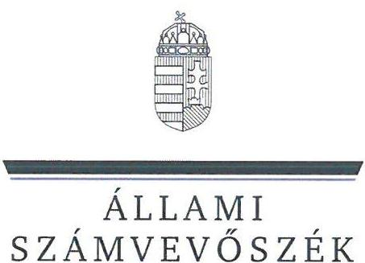
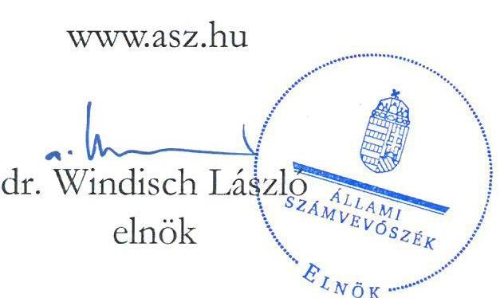
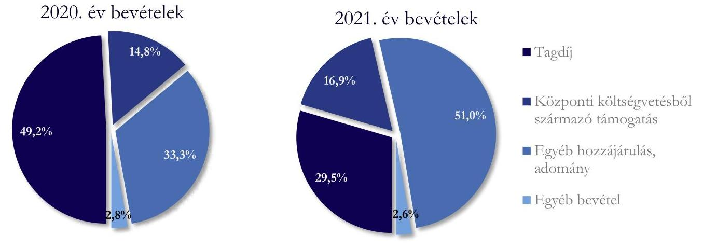
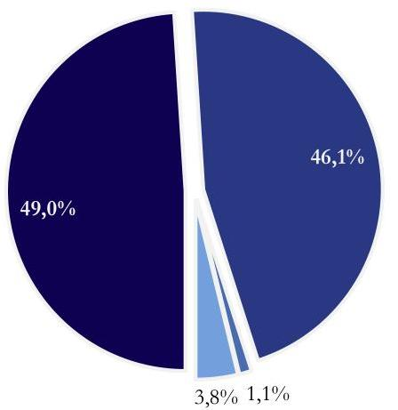
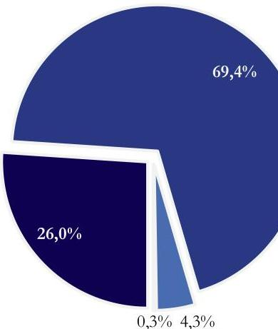

# JELENTÉS 

A költségvetési támogatásban részesülő pártok 2020-2021. évi gazdálkodása törvényességének ellenőrzése

Momentum Mozgalom
2023.

23016
www.asz.hu

---

ÁLLAMI
SZÁMVEVŐSZÉK

# JELENTÉS 

## A költségvetési támogatásban részesülő pártok 2020-2021. évi gazdálkodása törvényességének ellenőrzése

Momentum Mozgalom
2023.

23016

---

# ELLENŐRZÉSI IGAZGATÓSÁG: 

## ÁLLAMHÁZTARTÁSON KÍVÜLI SZERVEZETEKET ELLENŐRZŐ IGAZGATÓSÁG

## ELLENŐRZÉSI IGAZGATÓ:

## KLINGA LÁSZLÓ igazgató

## ELLENŐRZÉSVEZETŐ:

## SOLYMÁR ÁGNES ellenőrzésvezető

A TÉMÁHOZ KAPCSOLÓDÓ KORÁBBI SZÁMVEVŐSZÉKI JELENTÉSEK:

- címe: A költségvetési támogatásban részesülő pártok 2018-2019. évi gazdálkodása törvényességének ellenőrzése - Momentum Mozgalom
- sorszáma: 21060

IKTATÓSZÁM: EL-3858-001/2023.
TÉMASZÁM: 2620
ELLENŐRZÉS-AZONOSÍTÓ SZÁM: V-0964

---

# TARTALOMJEGYZÉK 

- AZ ELLENŐRZÉS ALAPADATAI ..... 5
- AZ ELLENŐRZÖTT SZERVEZET ..... 7
- ÖSSZEFOGLALÁS ..... 8
- AZ ELLENŐRZÉS FÓKUSZTERÜLETEI ..... 9
- MEGÁLLAPÍTÁSOK ..... 10
- JAVASLATOK ..... 15
- MELLÉKLETEK ..... 16
I. sz. melléklet: Értelmező szótár ..... 16
- FÜGGELÉK: ÉSZREVÉTELEK ..... 17
- RÖVIDÍTÉSEK JEGYZÉKE ..... 18

---

.

---

# AZ ELLENŐRZÉS ALAPADATAI 

## AZ ELLENŐRZÉS CÉLJA

Az ellenőrzés célja, hogy az ÁSZ ${ }^{1}$ - mint az Országgyűlés legfőbb pénzügyi és gazdasági ellenőrző szerve - független és szakmailag megalapozott véleményt adjon az ellenőrzött szervezet gazdálkodásának törvényességéről.

## AZ ELLENŐRZÉS TÍPUSA

Szabályszerűségi ellenőrzés.

## AZ ELLENŐRZÖTT IDŐSZAK

A 2020-2021. év.

## AZ ELLENŐRZÉS TÁRGYA

A párt ellenőrzése során az ellenőrzés tárgyát képezték a 2020. és a 2021. évre vonatkozó pénzügyi kimutatás elkészítésére, jóváhagyására, közzétételére, a párt könyvvezetésére, gazdálkodására, ennek keretében a számviteli szabályozás kialakítására, a bizonylati rend, bizonylati fegyelem betartására, egyéb gazdálkodási, ellenőrzési és pénzügyi-számviteli informatikai feladatok ellátására irányuló tevékenységek. Az ellenőrzés tárgya volt még a Párttv. ${ }^{2}$ szerinti források elszámolása és felhasználása, valamint a vagyon jogszabályi előírásoknak megfelelő hasznosítása.

## AZ ELLENŐRZÉS JOGALAPJA

Az ellenőrzés jogszabályi alapját az ÁSZ tv. ${ }^{3}$ 5. § (11) bekezdés a) pontja, a Párttv. 4. § (4)-(5) bekezdései, továbbá a 10. § (1), (3)-(4) bekezdések előírásai képezték.

## AZ ELLENŐRZÉS MÓDSZERE

Az ellenőrzést az ellenőrzési program szempontjai, az ellenőrzött időszakban hatályos jogszabályok, az ÁSZ ellenőrzés szakmai szabályai, az ellenőrzésre irányadó ÁSZ módszertanok figyelembevételével végezte az ÁSZ.

Az ellenőrzési kérdések megválaszolásához szükséges bizonyítékok megszerzése az ellenőrzött szervezet által rendelkezésre bocsátott dokumentumokra, adatokra alapozva kérdésfeltevés (információkérés), interjú, mintavételezés útján történt.

---

Az ellenőrzési bizonyítékként felhasználható adatforrások közé tartoztak egyrészt az ellenőrzési programban felsorolt adatforrások, másrészt adatforrás lehetett még minden - az ellenőrzés folyamán - feltárt, az ellenőrzés szempontjából információkat tartalmazó dokumentum.

Az ellenőrzés lefolytatásához az ellenőrzött szervezet tanúsítványok kitöltésével, hitelesítésével és az ÁSZ által kért dokumentumok, adatok információk megküldésével szolgáltatott adatokat.

Az ÁSZ a központi költségvetésből származó bevételeket és a párt által nyújtott támogatásokat tételesen ellenőrizte, emellett további mintavételi területeken mintavételezést és értékelést is alkalmazott az alábbiak szerint:

- A hozzájárulások, adományok és egyéb bevételek szabályszerűségének megítéléséhez az ellenőrzött időszak évei esetében évente rétegzett 50-50 elemű mintavétel történt.
- A rendszeres személyi juttatások, eszközbeszerzések és a működési kiadások további tételei, politikai tevékenység kiadásai, egyéb kiadások mintatételeinek értékeléséhez az ellenőrzött időszak évei esetében évente rétegzett 100-100 elemű mintavétel történt.
A tények feltárása és azok összegzése során a megállapítások az ellenőrzött mintatételekre vonatkozóan kerültek megfogalmazásra.

---

# AZ ELLENŐRZÖTT SZERVEZET

A Momentum Mozgalom 2017. május 19-én jött létre. A Párt^{4} Alapszabályában_{1-6}^{5} lefektetett főbb célja, hogy *„a magyar civil társadalom önszerveződését, közelebbi való részvételét, politikai tudatosságának kialakítását, és az állampolgárok demokratikus és felelős állampolgári nevelését és oktatását előmozdítsa, hogy működése során kialakítsa saját véleményét, stratégiáját és identitását, illetve megszervezze a Párt értékeivel azonosuló a Párt céljainak megvalósítását vállaló egyének érdekközösségének alapjait.”*

A Párt legfőbb döntéshozó szerve a Küldöttgyűlés, ügyvezető szerve az Elnökség. Az Elnökség a jogszabályok, az Alapszabály_{1-6} és a Küldöttgyűlési határozatok keretei között irányítja a Párt működését. A Párt Elnökét és Elnökségét a Párt a tagjai közül a Küldöttgyűlés két évre választja. Az Igazgatóság felel a Párt operatív működéséért.

A Párt gazdasági társaságot nem alapított, 2018. évben hozta létre az „Indítsuk Be Magyarországot Alapítványt”.

A Párt a 2020. és a 2021. évi pénzügyi kimutatásában szereplő bevételeket és kiadásokat az 1. táblázat tartalmazza.

|  A MOMENTUM MOZGALOM BEVÉTELEI ÉS KIADÁSAI 2020-2021 ÉVEKBEN / (EZER FT) |  |   |
| --- | --- | --- |
|  MEGNEVEZÉS | 2020. ÉV | 2021. ÉV  |
|  Összes bevétel a gazdasági évben: | 149 853 | 262 507  |
|  Központi költségvetésből származó támogatás | 22 150 | 44 300  |
|  Tagdíjak | 73 678 | 77 497  |
|  Egyéb hozzájárulások, adományok | 49 851 | 133 804  |
|  Egyéb bevétel | 4 174 | 6 906  |
|  Összes kiadás a gazdasági évben | 115 744 | 367 682  |
|  Működési kiadások | 56 695 | 95 738  |
|  Politikai kiadás | 53 345 | 255 318  |
|  Támogatás egyéb szervezetnek | 4 405 | 947  |
|  Eszközbeszerzés | 1 299 | 15 679  |

*Forrás: A Párt 2020-2021. évi pénzügyi kimutatásának adatai alapján ÁSZ szerkesztés*

A Párt a Párttv. 3. számú melléklete alapján nem kapott az állam tulajdonából ingyenesen juttatott ingatlant. A Párt 2020-2021. években nem rendelkezett saját tulajdonú ingatlannal, értékpapírral, és nem alapított gazdasági társaságot.

---

# ÖSSZEFOGLALÁS 

Magyarországon pártként működnek azok az egyesületek, amelyek nyilvántartott tagsággal rendelkeznek, és amelyek a nyilvántartásba vételüket végző bíróság előtt kinyilvánítják, hogy a Párttv. rendelkezéseit magukra nézve kötelezőnek ismerik el.

Az Állami Számvevőszék a Párttv. alapján kétévente ellenőrzi azoknak a pártoknak a gazdálkodását, amelyek a Párttv. szerint költségvetési támogatásban részesültek. A Momentum Mozgalom a 2020. évi pénzügyi kimutatása szerint 22 150 ezer Ft, a 2021. évi pénzügyi kimutatása szerint 44 300 ezer Ft költségvetési támogatásban részesült.

A Momentum Mozgalom a Párttv.-ben előírt pénzügyi kimutatását a 2020-2021. évekre vonatkozóan az előírt tartalommal és határidőben elkészítette, valamint közzétette a Magyar Közlöny mellékletében, illetve a saját honlapján. A Momentum Mozgalom 2020-2021. évi pénzügyi kimutatásait a főkönyvi és analitikus nyilvántartások adatai alátámasztották. A pénzügyi kimutatásokban a Párttv. előírásaival összhangban az ötszázezer forintot meghaladó hozzájárulások - a hozzájárulást adó megnevezésével és az összeg megjelölésével - tételesen bemutatásra kerültek.

A Momentum Mozgalom a 2020-2021. évi gazdálkodására vonatkozó Számviteli politika ${ }^{6}$, valamint az annak keretében elkészített Leltározási szabályzat ${ }^{7}$, Értékelési szabályzat ${ }^{8}$ és Pénzkezelési szabályzat ${ }_{1-3}{ }^{9}$, és a Számlarend ${ }_{1-3}{ }^{10}$ összességében megfeleltek a jogszabályi előírásoknak. Az ÁSZ a 2018-2019. évekre vonatkozó ellenőrzésének eredménye alapján a szabályozás több területen javulást mutatott.

A Momentum Mozgalom a Számviteli politika előírásaival összhangban kettős könyvvitelt vezetett és a gazdasági eseményeket a jogszabályban előírtak szerint könyvelte. A Momentum Mozgalom 2020-2021. évi bevételei a Párttv. szerinti engedélyezett forrásokból - tagdíjfizetésből, központi költségvetési támogatásból, egyéb hozzájárulások és adományokból, valamint egyéb bevételekből - származtak.

A Momentum Mozgalom 2020-2021. évekre vonatkozó mintatételek értékelése alapján a Párttv. előírásaival összhangban vagyoni hozzájárulást jogi személytől, jogi személyiséggel nem rendelkező szervezettől, más államtól, külföldi szervezettől, nem magyar állampolgártól nem fogadott el.

A Momentum Mozgalom a 2020-2021. években a működéséhez kapott forrásokat szabályszerűen használta fel és számolta el, a gazdálkodással összefüggő tevékenységének keretében az ellenőrzött kiadási mintatételekhez kapcsolódó kifizetése során a jogszabályok és a belső szabályzatok előírásait betartotta.

---

# AZ ELLENŐRZÉS FÓKUSZTERÜLETEI 

1. A párt kialakította-e a törvényes gazdálkodás szabályozási, könyvvezetési és ellenőrzési feltételeit?
2. A párt pénzügyi kimutatása megfelelt-e a jogszabályi előírásoknak, közzétételi kötelezettségét szabályszerűen teljesítette-e?
3. A párt könyvvezetése és gazdálkodása során a vonatkozó jogszabályi rendelkezéseket és belső előírásokat betartotta-e?

---

# 1. A párt kialakította-e a törvényes gazdálkodás szabályozási, könyvvezetési és ellenőrzési feltételeit? 

## Összegző megállapítás

1.1. számú megállapítás

A Párt kialakította a törvényes gazdálkodás szabályozási, könyvvezetési és ellenőrzési feltételeit a 2020-2021. években.

A Párt gazdálkodására vonatkozó számviteli szabályzatok kialakítása összességében megfelelt a jogszabályi előírásoknak.

A Párt a 2020-2021. években rendelkezett a Számv. tv ${ }^{11}$.-ben előírtaknak megfelelő Számviteli politikával és annak keretében elkészítendő Értékelési szabályzattal, Pénzkezelési szabályzattal ${ }_{1-3}$, Leltározási szabályzattal. A Párt a 2020-2021. években rendelkezett Számlarenddel ${ }_{1-3}$, valamint Bizonylati renddel ${ }^{12}$, amelyek a 2021.04.29-éig hatályos Pénzkezelési szabályzat kivételével megfeleltek a Számv. tv.-ben előírtaknak.

A Párt a Számviteli politikájában egyszerűsített mérleg és eredménykimutatás készítését írta elő, valamint rögzítette, hogy a mérlegtételeket leltárral kell alátámasztani. A szabályozás szerint a beszámoló elkészítéséért a pártigazgató a felelős, és a Párt elnöke írja alá.

A Párt a 2020. évben a Számv. tv. 14. § (8) bekezdésében előírtak ellenére a napi készpénz záró állomány maximális mértékét nem határozta meg, mivel 2020 évre vonatkozóan a Pénzkezelési szabályzat ${ }_{1-2}$ 2. fejezet 4. bekezdés a záráskori pénzkészlet maximális mértékét határozta meg, miközben a Pénzkezelési szabályzat ${ }_{1-2}$ 5.1. pontja havi zárást definiál. A 2021. április 30-ától hatályos Pénzkezelési szabályzat ${ }_{3}$ a Számv. tv. előírásainak megfelelően tartalmazta a napi készpénz záró állomány maximális mértékét.

A 2021.04.30-ától hatályos Pénzkezelési szabályzat ${ }_{3}$ 3. pontja alapján a pénztárosi feladatokat kizárólag a gazdasági igazgató látja el, ugyanakkor a Pénzkezelési szabályzat ${ }_{3}$ 3.3. pontja alapján a pénztári utalványozással kapcsolatban a gazdasági igazgató utalványozó is lehet, ami ellentmondásban van a Pénzkezelési szabályzat ${ }_{3}$ 3.3. pontjában foglaltakkal, miszerint az utalványozó nem lehet azonos személy a pénztárossal.

A Párt a pénzügyi kimutatáshoz szükséges adatok szabályozását a 2020-2021. évben hatályos Számlarendjében ${ }_{1-3}$ és Számviteli politikájában részletezte. A Párt a Párttv.-ben előírtak alapján az Értékelési szabályzatában meghatározta a nem pénzbeli vagyoni hozzájárulás érték megállapításának módszerét és szabályait.
1.2. számú megállapítás

A párt könyvvezetése, számviteli nyilvántartási rendszere megfelelt a jogszabályi és belső szabályozási előírásoknak a 2020-2021 években.

Az ellenőrzött időszakban a Párt kettős könyvvitelt vezetett a Számv. tv. előírásaival összhangban. A jogszabályban előírt könyvviteli feladatokat külső szolgáltató látta el.

A Párt a Számv. tv.-ben foglaltaknak megfelelően könyvvezetési rendszerét munkaszámok és főkönyvi számok alkalmazásával tovább részletezte, így abból a Párttv.-ben meghatározott 2020-2021. évre vonatkozó pénzügyi kimutatás adatainak rendelkezésre állása biztosított volt.

A Párt az Értékelési szabályzatban foglaltaknak megfelelően év végén vizsgálta és értékelte, hogy az ingatlan bérlés a szokásos piaci értéken történt-e.

---

A 2020-2021. években a Párt a Számv. tv. előírásainak megfelelően gondoskodott a főkönyvi könyvelés, az analitikus nyilvántartások és a bizonylatok adatai közötti egyeztetésekről. A könyvviteli zárlatot a Számv. tv., valamint a Számviteli politika előírásai szerint, dokumentáltan végezte el. A Leltározási szabályzatban foglaltak szerint a 2020. és a 2021. évek végén elvégezte az előírt eszköz és forrás egyeztetéseket, leltározást.
1.3. számú megállapítás
A Párt az ellenőrzési rendszer belső szabályozási kereteit a 2020-2021. évekre vonatkozóan kialakította, annak működését biztosította.

A Párt az Alapszabály ${ }_{1-6}$, a Pénzkezelési szabályzat ${ }_{1-3}$, a Számviteli politika, valamint az SZMSZ ${ }_{1-6}{ }^{13}$ tartalmazott rendelkezéseket

 a gazdasági tevékenységre vonatkozóan.

A Pénzkezelési szabályzatban ${ }_{1-3}$ a Párt meghatározta a házipénztár ellenőrzésének szabályait és kijelölte az ellenőrzésre jogosult személyt. A Pártnál a 2020-2021. években a hatályos Pénzkezelési szabályzatban ${ }_{1-3}$ meghatározottak alapján elvégezték a pénztár-ellenőrzési feladatokat.

A Párt gondoskodott a Ptk. ${ }^{14}$ előírásaiban meghatározott Felügyelőbizottság ${ }^{15}$ létrehozásáról, folyamatos működtetéséről. A Felügyelőbizottság működésének szabályait az Alapszabály ${ }_{1-6}$ tartalmazta. A felügyelőbizottság az Alapszabályban ${ }_{1-6}$ előírt, 2020-2021. évekre vonatkozó pénzügyi kimutatás véleményezési feladatait ellátta.

# 2. A párt pénzügyi kimutatása megfelelt-e a jogszabályi előírásoknak, közzétételi kötelezettségét szabályszerűen teljesítette-e? 

## Összegző megállapítás

2.1. számú megállapítás

A Párt 2020. és 2021. évi pénzügyi kimutatása megfelelt a jogszabályi előírásoknak, közzétételi kötelezettségét szabályszerűen teljesítette.

A Párt a 2020. és 2021. évi pénzügyi kimutatása megfelelt a jogszabályi előírásoknak.

A Párttv. alapján a Párt a pénzügyi kimutatásait a 2020-2021. évekre vonatkozóan határidőben elkészítette. A pénzügyi kimutatás a Párttv. mellékletének megfelelően tartalmazta a bevételi és kiadási adatokat. A Számv. tv.-ben foglaltaknak megfelelően biztosított volt az egyezőség a bizonylatok adatai, és a főkönyvi könyvelés, továbbá az analitikus nyilvántartás adatai között. A Párt a Számlarendjében ${ }_{1-3}$ és Számviteli politikájában előírtaknak megfelelően biztosította a Párttv.-ben előírt pénzügyi kimutatás adatainak elkülönített nyilvántartását.

A Párttv.-ben foglaltaknak megfelelően a pénzügyi kimutatásban az 500 ezer Ft feletti hozzájárulásokat a hozzájárulást adó megnevezésével és az összeg megjelölésével szerepeltette a Párt a 2020-2021. években.

A Párt 2020. évi pénzügyi kimutatását a Párt Elnöksége 2021. május 28-án, a 2021. évi pénzügyi kimutatást 2022. május 28-án fogadta el. A Párt 2020-2021. évi pénzügyi kimutatását a Ptk.-ban és a Számviteli Politikában előírtaknak megfelelően a Párt elnöke írta alá.

---

# 2.2. számú megállapítás 

A Párt a 2020. és 2021. évi pénzügyi kimutatásait határidőben, a jogszabályi előírásoknak megfelelően közzétette.

A Párttv.-ben foglaltaknak megfelelően a Párttv. melléklete szerinti a 2020. és 2021. évre vonatkozó pénzügyi kimutatásokat a Párt a jogszabályban előírt határidőn belül, a tárgyévet követő év május 31-éig a Magyar Közlöny mellékletében, és a belső szabályozásának megfelelően a saját honlapján közzétette.

## 3. A párt könyvvezetése és gazdálkodása során a vonatkozó jogszabályi rendelkezéseket és belső előírásokat betartotta-e?

## Összegző megállapítás

3.1. számú megállapítás

A Párt a 2020. és a 2021. években a könyvvezetése és gazdálkodása során a vonatkozó jogszabályi rendelkezéseket és belső előírásokat betartotta.

A Párt működéséhez kapcsolódó forrásokat az ellenőrzött mintatételek alapján a 2020-2021. években szabályszerűen számolta el. A bevételek főkönyvi egyezősége és bizonylati alátámasztottsága biztosított volt.

A Párt 2020-2021. évre vonatkozó pénzügyi kimutatásában a bevételi összegek a Számv. tv. előírásainak megfelelően kerültek elszámolásra, bizonylattal alátámasztottak voltak, valamint megegyeztek az alátámasztó könyvviteli nyilvántartással. Az 1. ábra a Párt bevételeit szemlélteti a pénzügyi kimutatásban szereplő bevétel típusok szerinti megoszlásban.

1. ábra

## A PÁRT 2020-2021. ÉVI BEVÉTELEINEK ÖSSZETÉTELE

Forrás: A Párt 2020-2021. évi pénzügyi kimutatásának adatai alapján ÁSZ szerkesztés
A Párt a Számv. tv. és a Párttv. előírásaival összhangban az Alapszabályban ${ }_{1-6}$, valamint a Tagdíjszabályzatban ${ }^{16}$ meghatározta a tagok által fizetendő díjakat, a tagdíj és tagdíj-kiegészítés összegét és a tagdíjfizetés szabályait. A Pénzügyi kimutatásban szereplő tagdíj bevétel összege a Számv. tv. előírásainak megfelelően megegyezett a főkönyvben nyilvántartott tagdíjbevétel összegével.

A Párt a Költségvetési szabályzatában, Számlarendjében ${ }_{1-3}$ és Számviteli politikájában szabályozta a költségvetésből kapott támogatások elszámolását, valamint elkülönített nyilvántartását. A pénzügyi kimutatás

---

"Központi költségvetésből származó támogatások" összege a belső szabályoknak megfelelően összhangban volt a főkönyvben nyilvántartott azonos jogcímen elszámolt összeggel a 2020-2021. években.

A Párt a 2020-2021. évi pénzügyi kimutatásában az „egyéb hozzájárulások, adományok" jogcímen, a főkönyvvel egyezően kimutatott összegekből az 500 ezer Ft-ot meghaladó hozzájárulásokat a hozzájárulást adó megnevezésével, és az adott összeg megjelölésével a Párttv. előírásainak megfelelően tételesen szerepeltette.

A Párttv. előírásait betartva a Párt az ellenőrzött időszakban az értékelt mintatételek alapján jogi személytől, jogi személyiséggel nem rendelkező szervezettől vagyoni hozzájárulást nem fogadott el.

A Párt a főkönyvében a kötelezettségek között a 2020. és 2021. évben a Párttv. 4. § (3) bekezdése szerinti névtelen adományokat tartott nyilván, 2020. évben 506 ezer Ft, 2021. évben 373 ezer Ft összegben. A Párt a névtelen adományok összegét az „Egyéb kötelezettség”-ek között elkülönítetten tarja nyilván, ezzel a jogszabályi előírásoknak megfelelően az ellenőrzött időszakban biztosította, hogy a névtelen adományok ne kerüljenek felhasználásra a Párt kiadásainak finanszírozására.
3.2. számú megállapítás

A párt a gazdálkodással összefüggő tevékenységének keretében a 2020-2021. évi kiadások kifizetése során az ellenőrzött mintatételek alapján betartotta a jogszabályok és a belső szabályzatok előírásait.

A pénzügyi kimutatásban szereplő kiadások összege megegyezett a könyvviteli nyilvántartással, a teljesített kifizetések megfeleltek a belső szabályzat előírásainak.

A kiadási mintatételek értékelése alapján a kiadások a Számv. tv.-ben és a Számlarendben ${ }_{1-3}$ foglaltakkal összhangban kerültek elszámolásra. A kiadások a belső szabályzattal összhangban, valamint a Párttv. mellékletében részletezetteknek megfelelően szerepeltek a pénzügyi kimutatásban.

A Párt összes kiadása a 2020. évben 115744 ezer Ft, a 2021. évben 367682 ezer Ft volt. A Párt pénzügyi kimutatásban szereplő kiadás típusok szerinti megoszlását a 2. ábra tartalmazza.
2. ábra

# A PÁRT KIADÁSAINAK ÖSSZETÉTELE 

2020. év kiadások

2021. év kiadások

- Működési kiadás
- Politikai kiadás
- Eszközbeszerzés
- Támogatás egyéb szervezetnek

Forrás: A Párt 2020-2021. évi pénzügyi kimutatásának adatai alapján ÁSZ szerkesztés
Az ellenőrzött tételek alapján bérkifizetésekkel kapcsolatos ráfordítások a 2020. és 2021. évben a pénzügyi kimutatás működési költségei között kerültek kimutatásra a Számlarendben ${ }_{1-3}$ előírtakkal összhangban. A munkaszerződések tartalmazták a Mtv. ${ }^{17}$-ben előírtakat. A Párt a 2020. és 2021. évben a foglalkoztatottak adatait

---

az Art. ${ }^{18}$-ban előírtaknak megfelelően bejelentette. Az adóigazgatási eljárás részletszabályairól szóló 465/2017. (XII. 28.) Korm. rendeletben előírt, bérkifizetéssel kapcsolatos igazolásokat a Párt a munkavállalók részére kiadta.

Az eszközbeszerzés elszámolása az ellenőrzött mintatételek alapján a 2020. és 2021. évben a Számlarendben ${ }_{1-3}$ meghatározottakkal összhangban volt, bekerülési értékének meghatározása és nyilvántartásba vétele a Számviteli politika és a Leltározási szabályzat, valamint a Számlarend ${ }_{1-3}$ előírásainak megfelelt.

A személyi jellegű kiadásokon és az eszközbeszerzéseken túli kiadási jogcímeken történő kifizetések elszámolása az értékelt mintatételek alapján a 2020. és 2021. évben megfelelt a Számv. tv. és a belső szabályzatok előírásainak. A Számv. tv. előírásai alapján a könyvelt tételeket bizonylattal alátámasztották.
3.3. számú megállapítás

A Párt 2020-2021. évek vagyonnal való gazdálkodásának szabályozása megfelelt a törvényi előírásoknak, saját tulajdonú ingatlannal, értékpapírral nem rendelkezett.

A Párt a belső szabályzataiban kitért a vagyonnal való gazdálkodás, ezen belül a kapcsolódó feladat- és hatáskörök, felelősségi viszonyok szabályaira, amelyeket az Alapszabályban ${ }_{1-6}$, a Számviteli politikában, a Pénzkezelési szabályzatban ${ }_{1-3}$, az Értékelési szabályzatban, és a Leltározási szabályzatban rögzített a Párttv-ben és a Számv. tv.-ben foglaltakkal összhangban.

A Párttv. 3. számú melléklete alapján a Párt nem részesült a Párttv.-ben rögzített, az állam tulajdonából ingyenesen juttatott ingatlannal. A Párt 2020-2021. években nem rendelkezett saját tulajdonú ingatlannal, értékpapírral, nem alapított gazdasági társaságot.

A Pártnak a 2020-2021. években a Párttv.-ben előírt vagyonmérleg készítési kötelezettsége nem volt.

---

# JAVASLATOK 

Az ÁSZ tv. 33. § (1) bekezdésében foglaltak értelmében az ellenőrzött szervezet vezetője köteles a jelentésben foglalt megállapításokhoz kapcsolódó intézkedési tervet összeállítani és azt a jelentés kézhezvételétől számított 30 napon belül az ÁSZ részére megküldeni. Amennyiben az ellenőrzött szervezet vezetője nem küldi meg határidőben az intézkedési tervet, vagy továbbra sem elfogadható intézkedési tervet küld, az Állami Számvevőszék elnöke az ÁSZ tv. 33. § (3) bekezdése a) és b) pontjaiban foglaltakat érvényesítheti.

## MOMENTUM MOZGALOM ELNÖKE

1. Intézkedjen arról, hogy a Pénzkezelési szabályzatban a pénztári utalványozással, pénztárosi feladatokkal kapcsolatos előírások összhangban legyenek.
(1.1. sz. megállapítás 4. bekezdés alapján)

---

# MELLÉKLETEK 

## I. SZ. MELLÉKLET: ÉRTELMEZŐ SZÓTÁR

pénzügyi kimutatás

A Párttv. 9. § (1) bekezdésében meghatározott, a törvény 1. számú melléklete szerinti pénzügyi kimutatás (hatályos 2014. május 6-ától), amelyet a pártok kötelesek minden év május 31-ig a Magyar Közlönyben, valamint saját honlappal rendelkező pártok a honlapjukon is közzétenni.
nem pénzbeli támogatás Vagyoni értékkel rendelkező forgalomképes dolog, szellemi alkotás, illetve vagyoni értékű jog részben vagy egészében, véglegesen, vagy ideiglenesen, teljesen vagy részben ingyenesen történő átruházása vagy átengedése, illetve szolgáltatás biztosítása. (Civil tv. 2. § 25. pont)

---

# FÜGGELÉK: ÉSZREVÉTELEK 

A jelentéstervezetet a Számvevőszék 15 napos észrevételezésre megküldte az ellenőrzött szervezet vezetőjének az ÁSZ tv. 29. §* (1) bekezdése előírásának megfelelően.

Az ellenőrzött szervezet vezetője a jelentéstervezet megállapításaira nem tett észrevételt.

[^0]
[^0]:    * 29. § (1) Az Állami Számvevőszék az ellenőrzési megállapításait megküldi az ellenőrzött szervezet vezetőjének vagy az általa megbízott személynek, és annak, akinek személyes felelősségét állapította meg.
    (2) Az ellenőrzött szervezet vezetője és a felelősként megjelölt személy az ellenőrzés megállapításaira tizenöt napon belül írásban észrevételt tehet.
    (3) Az Állami Számvevőszék az észrevételre a beérkezésétől számított harminc napon belül írásban válaszol. A figyelembe nem vett észrevételeket köteles a jelentésben feltüntetni, és megindokolni, hogy azokat miért nem fogadta el.

---

# RÖVIDÍTÉSEK JEGYZÉKE 

${ }^{1}$ ÁSZ
${ }^{2}$ Párttv.
${ }^{3}$ ÁSZ tv.
${ }^{4}$ Párt
${ }^{5}$ Alapszabály ${ }_{1-6}$
${ }^{6}$ Számviteli politika
${ }^{7}$ Leltározási szabályzat
${ }^{8}$ Értékelési szabályzat
${ }^{9}$ Pénzkezelési szabályzat ${ }_{1-3}$
${ }^{10}$ Számlarend $_{1-3}$
${ }^{11}$ Számv. tv.
${ }^{12}$ Bizonylati rend
${ }^{13}$ SZMSZ $_{1-6}$
${ }^{14}$ Ptk.
${ }^{15}$ Felügyelő Bizottság
${ }^{16}$ Tagdíjszabályzat
${ }^{17}$ Mtv.
${ }^{18}$ Art.

Állami Számvevőszék
a pártok működéséről és gazdálkodásáról szóló 1989. évi XXXIII. törvény 2011. évi LXVI. törvény az Állami Számvevőszékről Momentum Mozgalom
A Momentum Mozgalom többször módosított alapszabálya (hatályos: 2019. január 7-étől, 2020. augusztus 27-étől, 2021. január 1-jétől, 2021. április 11-étől, 2021. november 11-étől, 2021. november 29-étől)

A Momentum Mozgalom számviteli politikája (hatályos: 2020. január 1-jétől)
A Momentum Mozgalom leltározási és selejtezési szabályzata (hatályos: 2018. június 13-ától)
A Momentum Mozgalom eszközök, források értékelési szabályzata (hatályos: 2020. január 1-jétől)
A Momentum Mozgalom pénzkezelési szabályzata (pénzkezelési szabályzat ${ }_{1}$ hatályos: 2019. augusztus 31-étől, pénzkezelési szabályzat ${ }_{2}$ 2020. február 28-ától, pénzkezelési szabályzat ${ }_{3}$ 2021. április 30-ától)
A Momentum Mozgalom számlarendje (hatályos: 2020. január 1-jétől, 2020. július 1-jétől, 2020. augusztus 1-jétől)
2000. évi C. törvény a számvitelről

A Momentum Mozgalom bizonylati rendje (hatályos: 2020. január 1-jétől)
A Momentum Mozgalom szervezeti és működési szabályzata (hatályos: hatályos: 2019.03.22-étől, 2020.05.03-ától, 2020.06.19-étől, 2020.11.29-étől, 2021.02.20-ától, 2021.04.11-étől)
2013. évi V. törvény a Polgári Törvénykönyvről

A Momentum Mozgalom Etikai és Felügyelőbizottsága
A Momentum Mozgalom Tagdíjszabályzata (hatályos: 2019. január 1-jétől)
2012. évi I. törvény - a munka törvénykönyvéről
2017. évi CL törvény az adózás rendjéről

---

1052 Budapest, Apáczai Csere János u. 10. | 1364 Budapest 4., Pf. 54
www.asz.hu | szamvevoszek@asz.hu
telefon: +36 1 4849100

