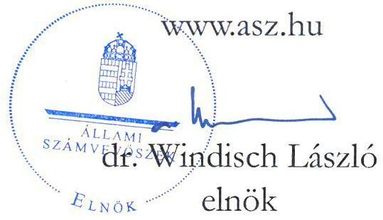

# JELENTÉS 

A költségvetési támogatásban részesülő pártalapítványok 2020-2021. évi gazdálkodása törvényességének ellenőrzése

Szövetség a Polgári Magyarországért Alapítvány

2023.

---

# JELENTÉS 

## A költségvetési támogatásban részesülő pártalapítványok 2020-2021. évi gazdálkodása törvényességének ellenőrzése

Szövetség a Polgári Magyarországért Alapítvány

2023.

23018

---

# ELLENŐRZÉSI IGAZGATÓSÁG: 

## ÁLLAMHÁZTARTÁSON KÍVÜLI SZERVEZETEKET ELLENŐRZŐ IGAZGATÓSÁG

## ELLENŐRZÉSI IGAZGATÓ:

KLINGA LÁSZLÓ ellenőrzési igazgató

## ELLENŐRZÉSVEZETŐ:

KAKAS SÁNDOR ellenőrzésvezető

A TÉMÁHOZ KAPCSOLÓDÓ KORÁBBI SZÁMVEVŐSZÉKI JELENTÉSEK:

- címe: A költségvetési támogatásban részesülő pártalapítványok 2018-2019. évi gazdálkodása törvényességének ellenőrzése Szövetség a Polgári Magyarországért Alapítvány
- sorszáma: 21048

IKTATÓSZÁM: EL-3860-001/2023
TÉMASZÁM: 2629
ELLENŐRZÉS-AZONOSÍTÓ SZÁM: V0973

---

# TARTALOMJEGYZÉK 

- AZ ELLENŐRZÉS ALAPADATAI ..... 5
- AZ ELLENŐRZÉS HATÓKÖRE ÉS TERÜLETE, AZ ELLENŐRZÖTT SZERVEZET ..... 7
- ÖSSZEFOGLALÁS ..... 9
- AZ ELLENŐRZÉS FÓKUSZTERÜLETEI ..... 10
- MEGÁLLAPÍTÁSOK ..... 11
- JAVASLATOK ..... 16
- MELLÉKLETEK ..... 17
I. sz. melléklet: Értelmező szótár ..... 17
II. sz. melléklet: A Pártalapítvány 2020. és 2021. évi egyszerúsített éves beszámoló adatai. ..... 18
- FÜGGELÉK: ÉSZREVÉTELEK ..... 19
- RÖVIDÍTÉSEK JEGYZÉKE ..... 20

---

.

---

# AZ ELLENŐRZÉS ALAPADATAI 

## AZ ELLENŐRZÉS CÉLJA

Az ellenőrzés célja, hogy az Állami Számvevőszék - mint az Országgyűlés legfőbb pénzügyi és gazdasági ellenőrző szerve - független és szakmailag megalapozott véleményt adjon a Szövetség a Polgári Magyarországért Alapítvány, mint ellenőrzött szervezet gazdálkodásának törvényességéről

## AZ ELLENŐRZÉS TÍPUSA

Szabályszerúségi ellenőrzés

## AZ ELLENŐRZÖTT IDŐSZAK

2020-2021. évek

## AZ ELLENŐRZÉS TÁRGYA

Az ellenőrzés tárgyát képezte a Pártalapítvány ${ }^{1}$ gazdálkodása, a könyvvezetés szabályozása és gyakorlata szabályszerűsége, az éves számviteli beszámolókra és a Pártalapítvány tevékenységéről szóló éves jelentésekre vonatkozó kötelezettség teljesítése.

## AZ ELLENŐRZÉS JOGALAPJA

Az ellenőrzés jogszabályi alapját az ÁSZ tv. ${ }^{2}$ 1. § (3) bekezdése, 5. § (3) bekezdése, valamint a Pmtv. ${ }^{3}$ 4. $\S$ (2) és (4) bekezdéseinek előírásai képezték.

## AZ ELLENŐRZÉS MÓDSZERE

Az ellenőrzés az ellenőrzött időszakban hatályos jogszabályok, az ÁSZ ellenőrzés szakmai szabályai, a jelen ellenőrzésre irányadó ÁSZ ${ }^{4}$ módszertanok, az ellenőrzési programban foglalt értékelési szempontok szerint került végrehajtásra. A gazdálkodás hibáinak kijavítására irányuló javaslat kidolgozásakor a hatályos jogszabályok voltak irányadóak.

Az ellenőrzési kérdések megválaszolásához szükséges bizonyítékok megszerzése az ellenőrzött szervezet által rendelkezésre bocsátott dokumentumokra, adatokra alapozva, továbbá kérdésfeltevés (információkérés), interjú, valamint mintavételezés útján történt. Az ellenőrzési bizonyítékként felhasználható adatforrások közé tartoztak egyrészt az ellenőrzési programban felsorolt adatforrások, másrészt adatforrás lehetett még minden az ellenőrzés folyamán - feltárt, az ellenőrzés szempontjából információkat tartalmazó dokumentum. Az

---

ellenőrzés lefolytatásához az ellenőrzött szervezet tanúsítvány kitöltésével és az ÁSZ által kért dokumentumok, adatok, információk megküldésével szolgáltatott adatokat.

Az ÁSZ a tételes ellenőrzés mellett mintavételezést és értékelést alkalmazott az alábbiak szerint:

- A Pártalapítvány kiadásai, ráfordításai elszámolásai szabályszerűségének megítéléséhez az ellenőrzött időszak évei estében évente érték szerint rétegzett 30-30 elemű mintavétel történt.
- A Pártalapítvány által nyújtott támogatások elszámolása szabályszerűségének megítéléséhez az ellenőrzött időszak évei esetében évente érték szerint rétegzett 30-30 elemű mintavételre került sor.
- A Pártalapítvány mérlegtételeinek besorolása, év végi értékelése, azok leltárral való alátámasztottsága szabályszerűségének megítéléséhez a mérleget alátámasztó analitikákból az ellenőrzött időszak évei esetében egyszerű véletlen 30-30 elemű mintavételre került sor.
A mintavétel mellett a külső személyi jellegű ráfordítások esetében évente a 3-3 legnagyobb összegű kifizetés kiválasztására és ellenőrzésére is sor került.

A kiadások, a ráfordítások, a nyújtott támogatások, valamint a mérlegtételek értékelése a tények feltárásával és azok összegzésével (szabálytalanság súlya, összege, gyakorisága) történt, úgy, hogy megállapítás az ellenőrzött mintatételekre vonatkozóan került megfogalmazásra.

---

# AZ ELLENŐRZÉS HATÓKÖRE ÉS TERÜLETE, AZ ELLENŐRZÖTT SZERVEZET 

## SzÖVETSÉG a PolgÁri MAGYARORSZÁGÉRT AlAPíTVÁNY

Az ellenőrzés a Párttv. ${ }^{5}$ alapján a politikai kultúra fejlesztése érdekében tudományos, ismeretterjesztő, kutatási, oktatási tevékenység folytatása céljából, a Ptk. ${ }^{6}$ szerinti alapító okiraton alapuló bírósági nyilvántartásba vétellel létrejött Pártalapítvány gazdálkodására terjedt ki. A Pártalapítvány törvényes gazdálkodásának (könyvvezetése, beszámolása, jelentés készítése) szabályait a Pmtv.-n túl, a Számv. tv. ${ }^{7}$ és az Eszkr. ${ }^{8}$ határozzák meg. A Pmtv. a 2020. január 1. napjától hatályos 3. $\$ (7) bekezdésében nevesíti, hogy a kuratórium tagjának politikai felsővezető, közigazgatási államtitkár, helyettes államtitkár is kijelölhető. Továbbá a Pmtv. a 2021. július 1. napjától hatályos 3. $\$ (6a) bekezdésben rögzíti, milyen tevékenységek nem tekinthetők gazdaságivállalkozási tevékenységnek, illetve a 3/A. $\$ (6) bekezdésében egyértelműsíti a pártalapítványok beszámolókészítési kötelezettségére vonatkozó szabályokat. A pártalapítványra az Ectv. ${ }^{9}$ 11. alcíme szerinti beszámolási szabályokat megfelelően alkalmazni kell.

A Pártalapítványt 2003-ban hozta létre a FIDESZ - Magyar Polgári Szövetség 0,6 M Ft induló vagyonnal. A Pártalapítvány alapító okirat ${ }_{1,2,3}{ }^{10}$-ban rögzített célja „a politikai kultúra fejlesztése a nemzeti elkötelezettség és a kereszténydemokrata eszmekör jegyében, az ország határain belül, illetve a határon túli magyarság lakta területeken tudományos, kutatási tevékenység szervezése, ezen kutatások eredményeinek felhasználásával oktatási, ismeretterjesztő tevékenység végzése".

A Pártalapítvány az alábbi cél szerinti tevékenységeket végzi az alapító okirat ${ }_{1,2,3}$ szerint:

- „korszerü oktatási, tudományos, ismeretterjesztő tevékenység formák szervezésével, illetve támogatásával;
- az alapítvány céljait szolgáló kutatási tevékenység szervezésével, illetve támogatásával;
- előadások, konferenciák szervezésével, illetve támogatásával;
- tanulmányok, szakkönyvek, egyéb az alapítvány célját szolgáló kiadványok kiadásával, illetve kiadásuk támogatásával;
- bel- és kiülföldi szaklapok, szakfolyóiratok, illetve szakkönyvek megvásárlásával;
- fenti célokkal összefüggésben kiirt pályázatokon való részvétellel valósítja meg céljait".

A Pártalapítvány a vagyonának felhasználására vonatkozó előírásokat az alapító okirat ${ }_{1,2,3}$-ban rögzítette. „A Kuratórium ${ }^{11}$ pályázat vagy kérelem útján, illetve saját kezdeményezésére és döntése alapján ösztöndíjat, támogatást nyújthat, alapítványi díjat hozhat létre, melynek odaítéléséről dönthet, továbbá anyagi támogatást nyújthat minden olyan kezdeményezés, tevékenység vagy szervezet részére, amely a Pártalapítvány céljainak eléréséhez jelentős, széles körben hasznosítható eredményt ígér."

A Pártalapítvány a 2020. és 2021. évben évente 1468,9 M Ft központi költségvetési támogatásban részesült. A Pártalapítványnál foglalkoztatott munkavállalók átlagos állományi létszáma a 2020. évben 14 fő, a 2021. évben 11,4 fő volt az egyszerűsített éves beszámolók kiegészítő melléklete alapján. Legfőbb döntéshozó és kezelő szerve a három tagból álló Kuratórium volt, a kuratóriumi elnök személye 2021. február 8-tól változott. Az alapító okirat 2021. szeptember 3-tól lehetővé tette a Pártalapítvány számára gazdaságivállalkozási tevékenység folytatását. Az ellenőrzött időszakban a Pártalapítvány tevékenységét a három tagból álló felügyelőbizottság és választott könyvvizsgáló ellenőrizte. A Pártalapítvány a kettős könyvvitel rendszerében egyszerűsített éves beszámoló készítésére volt kötelezett. A könyvviteli feladatai ellátását külső

---

szervezet bevonásával biztosította. A Pártalapítvány a Polgári Szemle Alapítványt 2004-ben alapította az alapításkor érvényben lévő törvényi szabályozás szerint.

A Pártalapítvány 2020. és 2021. évi egyszerűsített éves beszámolóinak főbb adatait a II. számú melléklet tartalmazza.

A Pártalapítvány bevételeit az egyszerűsített éves beszámolók adatai alapján a 2020. évben 1 468,9 M Ft összegű központi költségvetési támogatás, 100,0 M Ft alapítótól kapott befizetés, 1,0 M Ft összegben gazdálkodó szervezettől kapott támogatás képezte, továbbá pénzügyi műveletek bevételeként 2,1 M Ft-ot ért el. A 2021. évben 1 468,9 M Ft összegben kapott központi költségvetési támogatást és 0,5 M Ft összegben támogatást magánszemélytől, a pénzügyi műveleteinek bevétele 11,2 M Ft volt, továbbá 0,4 M Ft összegben értékesítési árbevételt számolt el.

A Pártalapítvány az ellenőrzött időszaban az alapító okirat ${ }_{1,2,3}$ szerint támogatást nyújtott, melynek összege a Pártalapítvány főkönyvi kivonata alapján 2020. évben 205,6 M Ft, 2021. évben 207,3 M Ft volt.

---

# ÖSSZEFOGLALÁS 

Magyarországon a pártok a Pmtv. alapján a politikai kultúra fejlesztése érdekében tudományos, ismeretterjesztő, kutatási és oktatási tevékenységük elősegítésére alapítványt hozhatnak létre. A létrehozott pártalapítvány a Párttv.-ben meghatározott mértékű költségvetési támogatásra jogosult. A FIDESZ - Magyar Polgári Szövetség a törvényben biztosított lehetőséggel élve 2003-ban létrehozta a Szövetség a Polgári Magyarországért Alapítványt.

Az alapító okirat ${ }_{1,2,3}$-ban a jogszabályi előírásokkal összhangban rögzítették a Pártalapítvány legfőbb döntéshozó és kezelő szervét, meghatározták a Pártalapítvány működésének célját, tevékenységét, a Kuratórium összetételét, valamint a felügyelőbizottságot, és feladataikat. Az ellenőrzött időszakban az alapító okirat módosítására két alkalommal került sor a Ptk. és a Pmtv. előírásai szerint, a módosítások a Kuratórium elnökének személyében történt változást és a vállalkozási-gazdasági tevékenységre vonatkozó előírásokat érintették.

A Pártalapítvány rendelkezett a jogszabályi előírásoknak megfelelő számviteli politikával, eszközök és források leltározási és leltárkészítési szabályzatával, értékelési szabályzattal, pénzkezelési szabályzattal, továbbá számlarenddel.

A Pártalapítvány az ellenőrzött időszakban évente 1 468,9 M Ft összegű költségvetési támogatásban részesült. A 2020. évben az alapítótól 100,0 M Ft-ot, gazdasági társaságtól 1,0 M Ft-ot kapott, míg a 2021. évben magánszemélytől $0,5 \mathrm{M}$ Ft támogatást fogadott el a Pmtv. előírásainak figyelembevételével. A kapott támogatásokra vonatkozó adatokat a jogszabályi előírások szerint közzétette. A támogatások számviteli nyilvántartása a Számv. tv. előírásainak megfelelt.

A Pártalapítvány a 2020. és a 2021. évben a tevékenységének költségeit, ráfordításait az ellenőrzött tételek esetében szabályszerűen számolta el. A Pártalapítvány mindkét évben nyújtott támogatást harmadik személy részére. A nyújtott támogatások a Pártalapítvány céljaival összhangban voltak, a támogatások odaítélése, elszámolása, nyilvántartása során a jogszabályi rendelkezéseket betartották.

A Pártalapítvány a jogszabályi előírások szerint mindkét ellenőrzött évben elkészítette és közzétette a tevékenységéről szóló jelentéseket, valamint az egyszerűsített éves beszámolóit. Az egyszerűsített éves beszámolók ellenőrzött mérlegtételeinek besorolása, értékelése, leltárral való alátámasztottsága megfelelt a Számv. tv. előírásainak. A Pártalapítvány a 2021. évi eredménykimutatásában vállalkozási-gazdálkodási tevékenység árbevételeként mutatott ki ingatlan hasznosításból keletkező bevételt $0,4 \mathrm{M}$ Ft összegben, azonban a Pmtv. 2021. július 1-jétől hatályos módosítása szerint ez a tevékenység már nem minősült gazdaságivállalkozási tevékenységnek.

---

# AZ ELLENŐRZÉS FÓKUSZTERÜLETEI 

1. A Pártalapítvány kialakította-e a törvényes gazdálkodáshoz szükséges szabályokat?
2. A Pártalapítvány könyvvezetése és gazdálkodása során a vonatkozó jogszabályi rendelkezéseket és belső előírásokat betartották-e?
3. A Pártalapítvány tevékenységéről szóló éves jelentések, az éves számviteli beszámolók a jogszabályi előírásoknak megfeleltek-e?

---

# 1. A Pártalapítvány kialakította-e a törvényes gazdálkodáshoz szükséges szabályokat? 

## Összegző megállapítás

1.1. számú megállapítás

A 2020-2021. években a Pártalapítvány a törvényes gazdálkodásához a szükséges szabályokat kialakította.
A Pártalapítvány működésének a törvényi előírásokon alapuló szabályait az alapító okirat ${ }_{1,2,3}$-ban rögzítették.

Az alapító okirat ${ }_{1,2,3}$ a Ptk. és a Pmtv. előírásainak megfelelően tartalmazta a Pártalapítvány legfőbb döntéshozó és kezelő szervét, a Kuratóriumot, valamint annak összetételét, a képviseletre jogosult személyt és a képviseletre vonatkozó szabályokat.

Az alapító okirat ${ }_{1,2,3}$ a Pártalapítvány gazdálkodása kapcsán az ellenőrzött időszakban a Ptk. előírásainak megfelelően tartalmazta a Pártalapítvány célját, valamint a részére teljesítendő vagyoni hozzájárulást, annak értékét. A Pártalapítvány az alapító okirat ${ }_{1,2,3}$-ban a Ptk.-nak megfelelően rögzítette a vagyon kezelésének és felhasználásának szabályait. Az alapító okirat ${ }_{1,2,3}$ tartalmazta továbbá a Pártalapítvány szerveinek hatáskörét és eljárási szabályait, valamint a csatlakozás elfogadásához kapcsolódó szabályokat. Az ellenőrzött időszakban az alapító okirat módosítására két alkalommal került sor a Ptk. és a Pmtv. előírásai szerint, a módosítások a Kuratórium elnökének személyében történt változást és a vállalkozási-gazdasági tevékenységre vonatkozó előírásokat érintették.

A Pártalapítvány az ellenőrzött időszakban a Kuratóriuma munkáját támogató munkaszervezettel rendelkezett, melynek tevékenységét a Pártalapítvány az $\mathrm{SZMSZ}_{1,2,3}{ }^{12}$-ban a jogszabályi előírásokkal összhangban szabályozta. A vezetők és a munkavállalók feladat és hatáskörét munkaköri leírásokban rögzítették.

A Pártalapítvány az ellenőrzött időszakban a pénzügyi- és számviteli feladatai ellátását a Számv. tv. előírásait figyelembe véve szerződés alapján külső szervezet bevonásával biztosította. A könyvviteli szolgáltatás körébe tartozó feladatok irányításával, vezetésével, az egyszerűsített éves beszámoló elkészítésével megbízottak a Számv. tv., valamint az Eszkr. előírásainak megfelelően rendelkeztek a szükséges szakmai képzettséggel, végzettséggel.

A Pártalapítvány gazdálkodásával kapcsolatos könyvvezetési-nyilvántartási rendszer kialakítása szabályszerűen történt. A Pártalapítvány az Eszkr. előírásainak megfelelően kettős könyvvitellel alátámasztott egyszerűsített éves beszámolót készített a 2020. és 2021. évekre vonatkozóan.

A Pártalapítványnál az ellenőrzött időszakban az egyszerűsített éves beszámolókat választott könyvvizsgáló ellenőrizte.
1.2. számú megállapítás

A Pártalapítvány gazdálkodására vonatkozó belső szabályozás a 20202021. években megfelelt a jogszabályi előírásoknak.

A Pártalapítvány gazdálkodásával kapcsolatos folyamatokat, feladat- és hatásköröket az ellenőrzött időszakban az alapító okirat ${ }_{1,2,3}$-ban és az $\mathrm{SZMSZ}_{1,2,3}$-ban határozták meg, mely szerint a Pártalapítvány vagyonának felhasználásáról, a felhasználás feltételeinek meghatározásáról a Kuratórium döntött.

---

A Pártalapítvány az ellenőrzött években a Számv. tv.-nek megfelelően rendelkezett hatályos számviteli politika ${ }_{1,2,3}$-al ${ }^{13}$. A számviteli politika ${ }_{1,2,3}$ tartalmazta a Számv. tv. előírásainak megfelelő eszközök és a források leltárkészítési és leltározási szabályzatát, az eszközök és a források értékelési szabályzatát, továbbá a pénzkezelési szabályzatot.

A 2020-2021. években a számviteli politika ${ }_{1,2,3}$ a Számv. tv. előírásainak megfelelően tartalmazta a Pártalapítványra jellemző szabályokat, előírásokat, módszereket, amelyekkel meghatározták, hogy mit tekint a számviteli elszámolás, az értékelés szempontjából lényegesnek, nem lényegesnek; továbbá a számviteli elszámolás, az értékelés szempontjából jelentősnek, nem jelentősnek; a törvényben biztosított választási, minősítési lehetőségek közül azok megjelölését, amelyeket alkalmaztak. A számviteli politika ${ }_{1,2,3}$ továbbá a Számv. tv. és az Eszkr. előírásaival összhangban tartalmazta a Pártalapítvány sajátosságaihoz igazodóan a könyvvezetés módját, az éves beszámoló késztésének rendjét, időpontját. A számviteli politika ${ }_{1,2,3}$-ban a Számv. tv.-nek megfelelően előírták a főkönyvi számlák analitikus nyilvántartásokkal való kapcsolatát. A Pártalapítvány az eszközök és források leltárkészítési és leltározási szabályzatában a Számv. tv. előírásaival összhangban rögzítette a leltározásra vonatkozó előírásokat.

A Pártalapítvány a Számv. tv.-nek megfelelően rendelkezett számlarend ${ }_{1,2}$-el ${ }^{14}$.
1.3. számú megállapítás

A Pártalapítvány az ellenőrzött időszakban nem volt tagja egyéb szervezetnek.

A Pártalapítvány a 2020-2021. években nem volt korlátlan felelősségű tagja más jogalanynak a Ptk. előírásait betartva. A Pártalapítvány az ellenőrzött 2020-2021. években nem alapított gazdasági társaságot vagy más szervezetet.

# 2. A Pártalapítvány könyvvezetése és gazdálkodása során a vonatkozó jogszabályi rendelkezéseket és belső előírásokat betartották-e? 

Összegző megállapítás A Pártalapítvány a könyvvezetése és gazdálkodása során a 2020-2021. években a jogszabályi rendelkezéseket és előírásokat betartotta.
2.1. számú megállapítás

A Pártalapítvány az ellenőrzött időszakban a támogatásokat, adományokat szabályszerűen fogadta el és számolta el.

A Pártalapítvány a 2020-2021. években az Eszkr. és Ectv. előírásainak megfelelően az alapító okirat ${ }_{1,2,3}$ ban és a számviteli politika ${ }_{1,2,3}$-ban előírta a támogatások elkülönített nyilvántartását. A számviteli politika ${ }_{1,2,3}$ ban az alapcél szerinti tevékenységből, illetve a költségvetési támogatásokból származó bevételek és költségek, ráfordítások elkülönített nyilvántartására vonatkozó szabályokat rögzítették, továbbá a számlarend ${ }_{1,2}$-ben a vonatkozó főkönyvi számlák alábontásával biztosították a támogatások elkülönített főkönyvi nyilvántartását.

A Pártalapítvány az ellenőrzött időszakban a Párttv. és a költségvetési tv. ${ }_{1,2}{ }^{15}$ előírásaival összhangban fogadta el a költségvetési támogatást.

A Pártalapítvány az alapító okirat ${ }_{1,2,3}$-ban rögzítette az ötszázezer forintot, illetve a külföldről származó támogatás esetében a százezer forintnak megfelelő összeget meghaladó támogatásokra vonatkozó adatok közzétételére vonatkozó előírásokat a Pmtv.-nek megfelelően. A Pártalapítvány az alapító párttól ${ }^{16}$

---

2020. július 7-én kapott befizetést 100 M Ft értékben, továbbá egy jogi személytől 2020.10.27-én 1 M Ft, egy magánszemélytől pedig 2021.04.08-án 0,5 M Ft összegben kapott támogatást, amely megfelelt a jogszabályi előírásoknak.

A Pártalapítvány a Pmtv. előírásait betartva támogatást csak egyértelműen azonosítható személytől fogadott el. A támogatások az azt nyújtó személy fizetési számlájáról a Pártalapítvány pénzforgalmi számlájára átutalással történtek. A közérdekből nyilvános adatnak minősülő esetben a Pártalapítvány a honlapján a támogatást nyújtó személy azonosításához szükséges adatokat és a támogatás összegét a jogszabályoknak megfelelően közzétette.

A Pártalapítványnál a támogatások számviteli elszámolása és nyilvántartása megfelelt a Számv. tv. és az Eszkr. előírásainak.

A Pártalapítvány az ellenőrzött 2020-2021. években külföldről nem kapott támogatást, ezért erre vonatkozóan közzétételi kötelezettsége nem állt fenn. A Pártalapítványnak a kapott támogatások vonatkozásában nem volt elszámolási kötelezettsége a támogatók felé és nem volt kötelezett pénzügyi elszámolásra.
2.2. számú megállapítás

A Pártalapítvány tevékenységének költségei, ráfordításai tekintetében az ellenőrzött tételek alapján a felhasználás, kifizetés és elszámolás szabályszerű volt.

A Pártalapítvány a 2020. és 2021. évi ellenőrzött anyagjellegủ és személyi jellegű költségek, ráfordítások elszámolása és kifizetése során a Számv. tv., az Eszkr., továbbá a számviteli politika ${ }_{1,2,3}$ és a számlarend ${ }_{1,2}$ előírásait betartotta.

A költségelszámolás, ráfordítás számviteli elszámolását megalapozó munkaszerződés, megbízási szerződés, vállalkozási szerződés, számla, megrendelés dokumentumok a Számv. tv.-ben előírtak szerint minden mintatétel esetében rendelkezésre álltak. A Számv. tv. előírásait betartva mindkét ellenőrzött évben az anyagköltséget, és az igénybevett anyagjellegủ szolgáltatások értékét anyagjellegủ ráfordításként, a bérköltséget és a személyi jellegű egyéb kifizetéseket személyi jellegű ráfordításként, a jogszabálynak megfelelő költségnemen számolták el, melyet a főkönyvi kivonat és az egyszerűsített éves beszámolók adatai alátámasztottak.

A Számv. tv. előírásai és az SZMSZ ${ }_{1,2,3}$-ban előírtak szerint került sor a gazdasági műveletek Kuratórium elnöke általi elrendelésre. A Számv. tv. és a belső szabályzatok előírásait betartva az ellenőrzött tételeknél a kiadások és ráfordítások esetében megtörtént az utalványozás és a végrehajtás igazolása, a könyvviteli elszámolást alátámasztó bizonylatokon a főkönyvi számlák kijelölését elvégezték.
2.3. számú megállapítás

A Pártalapítvány az ellenőrzött tételek esetében szabályszerűen nyújtott támogatásokat az ellenőrzött időszakban.

Az ellenőrzött időszakban a harmadik fél részére nyújtott támogatások elbírálásának, folyósításának, nyilvántartásának, elszámolásának, a támogatások közzétételének rendjét az alapító okiratok ${ }_{1,2,3}$-ban, az SZMSZ ${ }_{1,2,3}$-ban, a számlarend ${ }_{1,2}$-ben kialakította. Az SZMSZ ${ }_{1,2,3}$-ban előírták, hogy a harmadik fél részére nyújtott támogatásokról a Kuratórium dönt, továbbá előírták a támogatások odaítélésének szabályait. A számlarend ${ }_{1,2}$-ben meghatározták a jóváhagyott éves költségvetés terhére megállapított, a Pártalapítvány cél szerinti tevékenységét szolgáló támogatások nyilvántartására és elszámolására alkalmazott főkönyvi számlákat, továbbá előírták a nyújtott támogatások elkülönített nyilvántartási kötelezettségét a Számv. tv. előírásaival összhangban. A számviteli politika ${ }_{1,2,3}$-ban meghatározták az analitikus nyilvántartások vezetésére, a kiegészítő mellékletre, valamint az egyszerűsített éves beszámoló közzétételére, nyilvánosságára vonatkozó előírásokat.

---

Az ellenőrzött időszakban valamennyi harmadik személy részére nyújtott támogatás mintatétel esetében a nyújtott támogatások jogcímei megfeleltek az alapító okirat1,2,3-ban foglaltaknak. A Kuratórium döntése alapján nyújtott támogatások kedvezményezettjeivel támogatási szerződés megkötésére került sor, betartva a Ptk. és a belső szabályzatok előírásait. A támogatások folyósítása a kedvezményezett bankszámlájára történő utalással valósult meg, a támogatási szerződésekben foglaltak szerint.

A mintatételek alapján a nyújtott támogatások és adományozott díjak főkönyvi elszámolását az egyéb ráfordítások között, a gyakornoki pályázat alapján, kuratóriumi döntéssel megítélt ösztöndíjat személyi jellegű egyéb kifizetésként számolták el a számlarend ${ }_{1,2}$-ben előírtaknak megfelelően.

A Pártalapítvány az alapító párt részére támogatást, vagyoni hozzájárulást az ellenőrzött időszakban nem adott, ezzel eleget tett a Párttv. előírásainak.

# 3. A Pártalapítvány tevékenységéről szóló éves jelentések, az éves számviteli beszámolók a jogszabályi előírásoknak megfeleltek-e? 

## Összegző megállapítás A Pártalapítvány tevékenységéről szóló 2020. és 2021. évi jelentések a jogszabályi előírásoknak megfeleltek.

A Pártalapítvány a Pmtv. előírásainak megfelelően a 2020. és 2021. évekre a tevékenységéről szóló jelentését az egyszerűsített éves beszámolók elfogadásával egyidejűleg elkészítette. A jelentések a Pmtv. előírásainak megfelelően tartalmazták az egyszerűsített éves beszámolót, a költségvetési támogatások felhasználására vonatkozó és a vagyon felhasználásával kapcsolatos kimutatást, továbbá a Pártalapítvány tevékenységéről szóló rövid tartalmi beszámolót. A jelentéseket a Magyar Közlöny mellékleteként megjelenő Hivatalos Értesítőben, a jogszabályi előírások szerinti határidőben közzétették.

A Pártalapítvány a 2020. és 2021. évek vonatkozásában a Számv. tv., az Eszkr. és az Ectv. előírásainak, valamint a számviteli politika ${ }_{1,2,3}$-ban foglaltaknak megfelelően, az üzleti év utolsó napjára vonatkozóan, működéséről, vagyoni, pénzügyi és jövedelmi helyzetéről szóló egyszerűsített éves beszámolót készített. A beszámolókat a Pmtv.-nek megfelelően a Kuratórium a Számv. tv.-ben meghatározott határidőig a felügyelőbizottság véleményének ismeretében fogadta el. Az Ectv. előírásainak megfelelve 2021. évre közhasznúsági mellékletet is készített, 2020. évre vonatkozóan ilyen kötelezettsége nem volt. A Pártalapítvány a Számv. tv.-ben, Eszkr.-ben meghatározott, valamint az Ectv.-ben előírt számviteli beszámoló közzétételi kötelezettségének eleget tett. A Pártalapítvány 2020. és 2021. évre vonatkozó egyszerűsített éves beszámolóit az $\mathrm{OBH}^{17}$ részére megküldte, ezzel a beszámolók letétbe helyezése szabályszerűen megtörtént, továbbá a beszámolókat saját honlapján is közzétette.

A Pártalapítvány a Számv. tv. és az Eszkr. előírásainak megfelelően az egyszerűsített éves beszámolóiban biztosította, nyilvántartásaiban eleget tett a költségvetési támogatások szétválasztása, elkülönített nyilvántartása, bemutatása kötelezettségének. A Pártalapítvány a bevételeit a főkönyvi és analitikus nyilvántartásaiban elkülönítetten mutatta ki, az alapcél szerinti tevékenysége ellátásához kapott központi költségvetési támogatást és a kapott egyéb támogatásokat elkülönített főkönyvi számlákon tartotta nyilván, a 2020. és a 2021. évi egyszerűsített éves beszámolóval egyezően.

A Pártalapítvány 2020. évben nem folytatott gazdasági-vállalkozási tevékenységet. A Pártalapítványnak a 2021. szeptember-november közötti időszakban $0,4 \mathrm{M}$ Ft bevétele származott terem bérbeadásból. A

---

Pártalapítvány a 2021. évben gazdasági-vállalkozási tevékenységéből származó bevételként 0,4 M Ft összeget mutatott ki az egyszerűsített éves beszámoló eredménykimutatásában, amely nem felelt meg a Pmtv. 3. $\int$ (6a) bekezdés c) pontjában előírtaknak. A Pmtv. 2021. július 1-jétől hatályos 3. $\int$ (6a) bekezdés c) pontja szerint nem minősül gazdasági-vállalkozási tevékenységnek az ingatlan megszerzése, használatának átengedése és átruházása. Ennek értelmében a 2021. évben a rendezvényterem bérbeadása, azaz használat átengedése nem minősült gazdasági-vállalkozási tevékenységnek.

A mérlegtételek tartalma, besorolása és bekerülési értékének meghatározása valamennyi mintatételnél megfelelt a Számv. tv. és az Eszkr. előírásainak. A mérlegtételeket a Számv. tv., az Eszkr. és a belső szabályzatok előírásainak megfelelően az ellenőrzött időszakban leltárral alátámasztották, a tárgyi eszközök leltározását a Számv. tv. és a belső előírásoknak megfelelően mennyiségi leltárfelvétellel végezték el. A mérlegtételek év végi értékelése megtörtént.

A Pártalapítvány az ellenőrzött időszakban a saját vagyonával gazdálkodott, az alapítói vagyonon felül ingyenesen állami vagy önkormányzati juttatásban nem részesült, így ezzel kapcsolatban nyilvántartási és adatszolgáltatási kötelezettsége nem keletkezett.

---

# JAVASLATOK 

Az ÁSZ tv. 33. § (1) bekezdésében foglaltak értelmében az ellenőrzött szervezet vezetője köteles a jelentésben foglalt megállapításokhoz kapcsolódó intézkedési tervet összeállítani és azt a jelentés kézhezvételétől számított 30 napon belül az ÁSZ részére megküldeni. Amennyiben az ellenőrzött szervezet vezetője nem küldi meg határidőben az intézkedési tervet, vagy továbbra sem elfogadható intézkedési tervet küld, az Állami Számvevőszék elnöke az ÁSZ tv. 33. § (3) bekezdése a) és b) pontjaiban foglaltakat érvényesítheti.

## A PÁrtalapítVÁNY KURATÓRIUMI ELNÖKE RÉSZÉRE

1. Intézkedjen arról, hogy a Pártalapítvány egyszerüsített éves beszámolója eredménykimutatásának elkészitése során a bevételek kimutatása a Pmtv. 3. § (6a) bekezdés c) pontjában elöírtak szerint történjen.
(3. számú megállapítás 4. bekezdése alapján)

---

# MELLÉKLETEK 

## I. SZ. MELLÉKLET: ÉRTELMEZŐ SZÓTÁR

alapítvány
költségvetési támogatás
pártalapítvány

Az alapítvány az alapító által az alapító okiratban meghatározott tartós cél folyamatos megvalósítására létrehozott jogi személy. Az alapító az alapító okiratban meghatározza az alapítványnak juttatott vagyont és az alapítvány szervezetét. Alapítvány nem alapítható gazdasági tevékenység folytatására. Az alapítvány az alapítványi cél megvalósításával közvetlenül összefüggő gazdasági tevékenység végzésére jogosult. Alapítvány nem lehet korlátlan felelősségű tagja más jogalanynak, nem létesíthet alapítványt és nem csatlakozhat alapítványhoz.
(Forrás: Ptk. 3:378. §, 3:379. § (1)-(3) bekezdés)
A pártalapítványoknak a Párttv. 9/A. § (1) bekezdése és a Pmtv. 1. § előírásainak értelmében, az éves költségvetési törvények szerint jellemzően az 1. számú melléklet I. Országgyűlés fejezet 9. Pártalapítványok támogatás címen - az állami költségvetésből juttatott támogatás.
A politikai kultúra fejlesztése érdekében, tudományos, ismeretterjesztő, kutatási és oktatási tevékenység folytatása céljából pártok által létrehozott, külön jogszabályban - a Pmtv. 1. § és 3. § (1) bekezdése - meghatározott, jogi személynek minősülő egyéb szervezet, speciális jogállású alapítvány. (Forrás: Párttv. 9/A. § (1) bekezdés, Pmtv. 1. §, Ectv. 2. § 6. c) pont, Számv. tv. 3. § (1) bekezdés 4. pont, Eszkr. 2. § (1) bekezdés 1) pont)

---

II. SZ. MELLÉKLET: A PÁRTALAPÍTVÁNY 2020. ÉS 2021. ÉVI EGYSZERÜSÍTETT ÉVES BESZÁMOLÓ ADATAI

| EGYSZERÜSÍTETT ÉVES BESZÁMOLÓK TÉTELEI | 2020. (MiFt) | 2021. (MiFt) |
| :--: | :--: | :--: |
| A) Befektetett eszközök | 1298,6 | 2207,0 |
| I) Immateriális javak | 11,617 | 0 |
| II) Tárgyi eszközök | 1286,9 | 1260,6 |
| III) Befektetett pénzügyi eszközök | 0 | 946,5 |
| B) Forgóeszközök | 1637,3 | 1525,3 |
| I) Készletek | 0 | 0 |
| II) Követelések | 338,4 | 1,9 |
| III) Értékpapírok | 0 | 0 |
| IV) Pénzeszközök | 1298,9 | 1523,4 |
| - ebből valutapénztár | 0,1 | 0,5 |
| - ebből devizaszámla | 0 | 0 |
| C) Aktív időbeli elhatárolások | 2,0 | 0,2 |
| Eszközök összesen: | 2937,8 | 3732,5 |
| D) Saját tőke | 2898,8 | 3690,1 |
| I) Induló tőke | 0,6 | 0,6 |
| II) Tőkeváltozás | 2049,7 | 2898,2 |
| III) Lekötött tartalék | 0 | 0 |
| IV) Értékelési tartalék | 0 | 0 |
| V) Tárgyévi eredmény alaptevékenységből | 848,6 | 790,9 |
| VI) Tárgyévi eredmény vállalkozási tevékenységből | 0 | 0,390 |
| E) Céltartalékok | 0 | 0 |
| F) Kötelezettségek | 29,8 | 40,9 |
| I) Hátrasorolt kötelezettségek | 0 | 0 |
| II) Hosszúlejáratú kötelezettségek | 0 | 0 |
| III) Rövidlejáratú kötelezettségek | 29,8 | 40,9 |
| G) Passzív időbeli elhatárolások | 9,2 | 1,5 |
| Források összesen | 2937,8 | 3732,5 |
| Bevételek | 1572,1 | 1480,8 |
| Költségvetéstől kapott támogatás | 1468,9 | 1468,9 |
| Költségek, ráfordítások | 723,6 | 689,9 |
| A Pártalapítvány által nyújtott támogatás | 205,6 | 207,4 |
| Tárgyévi eredmény | 848,6 | 790,9 |

---

# FÜGGELÉK: ÉSZREVÉTELEK 

A jelentéstervezetet a Számvevőszék 15 napos észrevételezésre megküldte az ellenőrzött szervezet vezetőjének az ÁSZ tv. 29. §* (1) bekezdése előírásának megfelelően.

A Pártalapítvány kuratóriumi elnöke a jelentéstervezetre nem tett észrevételt.

[^0]
[^0]:    * 29. § (1) Az Állami Számvevőszék az ellenőrzési megállapításait megküldi az ellenőrzött szervezet vezetőjének vagy az általa megbízott személynek, és annak, akinek személyes felelősségét állapította meg.
    (2) Az ellenőrzött szervezet vezetője és a felelősként megjelölt személy az ellenőrzés megállapításaira tizenöt napon belül írásban észrevételt tehet.
    (3) Az Állami Számvevőszék az észrevételre a beérkezésétől számított harminc napon belül írásban válaszol. A figyelembe nem vett észrevételeket köteles a jelentésben feltüntetni, és megindokolni, hogy azokat miért nem fogadta el.

---

# RÖVIDÍTÉSEK JEGYZÉKE 

${ }^{1}$ Pártalapítvány
${ }^{2}$ ÁSZ tv.
${ }^{3}$ Pmtv.
${ }^{4}$ ÁSZ
${ }^{5}$ Párttv.
${ }^{6}$ Ptk.
${ }^{7}$ Számv. tv.
${ }^{8}$ Eszkr.
${ }^{9}$ Ectv.
${ }^{10}$ alapító okirat ${ }_{1}$
alapító okirat ${ }_{2}$
alapító okirat ${ }_{3}$
${ }^{11}$ Kuratórium
${ }^{12} \mathrm{SZMSZ}_{1}$
$\mathrm{SZMSZ}_{2}$
$\mathrm{SZMSZ}_{3}$
${ }^{13}$ számviteli politika $_{1}$
számviteli politika $_{2}$
számviteli politika $_{3}$
${ }^{14}$ számlarend $_{1}$
számlarend $_{2}$
${ }^{15}$ költségvetési tv. ${ }_{1}$
költségvetési tv. ${ }_{2}$
${ }^{16}$ alapító párt
${ }^{17} \mathrm{OBH}$

Szövetség a Polgári Magyarországért Alapítvány
2011. évi LXVI. törvény az Állami Számvevőszékről
2003. évi XLVII. törvény a pártok müködését segítő tudományos, ismeretterjesztő, kutatási, oktatási tevékenységet végző alapítványokról
Állami Számvevőszék
1989. évi XXXIII. törvény a pártok müködéséről és gazdálkodásáról
2013. évi V. törvény a Polgári Törvénykönyvről
2000. évi C. törvény a számvitelről
479/2016. (XII.28.) Korm. rendelet a számviteli törvény szerinti egyes egyéb szervezetek beszámoló készítési és könyvvezetési kötelezettségének sajátosságairól
2011. évi CLXXV. törvény az egyesülési jogról, a közhasznú jogállásról, valamint a civil szervezetek müködéséről és támogatásáról
Szövetség a Polgári Magyarországért Alapítvány Alapító okirata, hatályos: 2017.02.21-2021.02.07.

Szövetség a Polgári Magyarországért Alapítvány Alapító okirata, hatályos: 2021.02.08-2021.09.02.

Szövetség a Polgári Magyarországért Alapítvány Alapító okirata, hatályos: 2021.09.03-tól

Szövetség a Polgári Magyarországért Alapítvány Kuratóriuma
Szövetség a Polgári Magyarországért Alapítvány Szervezeti és Müködési Szabályzata, hatályos: 2019.10.28-2021.04.05
Szövetség a Polgári Magyarországért Alapítvány Szervezeti és Müködési Szabályzata, hatályos: 2021.04.06-2021.09.30
Szövetség a Polgári Magyarországért Alapítvány Szervezeti és Müködési Szabályzata, hatályos: 2021.10.01-től
Szövetség a Polgári Magyarországért Alapítvány Számviteli politika és kapcsolódó szabályzatok, hatályos:2020.01.01-2020.09.30.
Szövetség a Polgári Magyarországért Alapítvány Számviteli politika és kapcsolódó szabályzatok, hatályos: 2020.10.01-2021.09.30
Szövetség a Polgári Magyarországért Alapítvány Számviteli politika és kapcsolódó szabályzatok, hatályos: 2021.10.01-től
Szövetség a Polgári Magyarországért Alapítvány Számlarend, hatályos: 2018. május 28 -tól 2021. szeptember 30-ig
Szövetség a Polgári Magyarországért Alapítvány Számlarend (hatályos: 2021. október 1-től)
Magyarország 2020. évi központi költségvetéséről szóló 2019. évi LXXI. törvény, hatályos: 2019.11.01-től
Magyarország 2021. évi központi költségvetéséről szóló 2020. évi XC. törvény, hatályos: 2020.10.01-től
FIDESZ - Magyar Polgári Szövetség
Országos Bírósági Hivatal

---

1052 Budapest, Apáczai Csere János u. 10. | 1364 Budapest 4., Pf. 54
www.asz.hu | szamvevoszek@asz.hu
telefon: +36 14849100