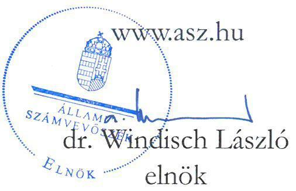

# JELENTÉS 

A költségvetési támogatásban részesülő pártalapítványok 2020-2021. évi gazdálkodása törvényességének ellenőrzése

Indítsuk be Magyarországot Alapítvány

2023.

---

# JELENTÉS 

## A költségvetési támogatásban részesülő pártalapítványok 2020-2021. évi gazdálkodása törvényességének ellenőrzése

Indítsuk be Magyarországot Alapítvány

2023.

23019

---

# ELLENŐRZÉSI IGAZGATÓSÁG: 

## ÁLLAMHÁZTARTÁSON KÍVÜLI SZERVEZETEKET ELLENŐRZŐ IGAZGATÓSÁG

## ELLENŐRZÉSI IGAZGATÓ:

KLINGA LÁSZLÓ ellenőrzési igazgató

## ELLENŐRZÉSVEZETŐ:

KAKAS SÁNDOR ellenőrzésvezető

A TÉMÁHOZ KAPCSOLÓDÓ KORÁBBI SZÁMVEVŐSZÉKI JELENTÉSEK:

- címe: A költségvetési támogatásban részesülő pártalapítványok 2018-2019. évi gazdálkodása törvényességének ellenőrzése Indítsuk Be Magyarországot Alapítvány
- sorszáma: $\quad 21042$

IKTATÓSZÁM: EL-3861-001/2023
TÉMASZÁM: 2629
ELLENŐRZÉS: V0973

---

# TARTALOMJEGYZÉK 

- AZ ELLENŐRZÉS ALAPADATAI ..... 5
- AZ ELLENŐRZÉS HATÓKÖRE ÉS TERÜLETE, AZ ELLENŐRZÖTT SZERVEZET ..... 7
- ÖSSZEFOGLALÁS ..... 9
- AZ ELLENŐRZÉS FÓKUSZKÉRDÉSEI ..... 10
- MEGÁLLAPÍTÁSOK ..... 11
- JAVASLATOK ..... 15
- MELLÉKLETEK ..... 16
I. sz. melléklet: Értelmező szótár ..... 16
II. sz. melléklet: A Pártalapítvány 2020. és 2021. évi egyszerűsített éves beszámolóinak főbb adatai ..... 17
- FÜGGELÉK: ÉSZREVÉTELEK ..... 18
- RÖVIDÍTÉSEK JEGYZÉKE ..... 19

---

.

---

# AZ ELLENŐRZÉS ALAPADATAI 

## AZ ELLENŐRZÉS CÉLJA

Az ellenőrzés célja, hogy az Állami Számvevőszék - mint az Országgyűlés legfőbb pénzügyi és gazdasági ellenőrző szerve - független és szakmailag megalapozott véleményt adjon az Indítsuk Be Magyarországot Alapítvány, mint ellenőrzött szervezet gazdálkodásának törvényességéről.

## AZ ELLENŐRZÉS TÍPUSA

Szabályszerűségi ellenőrzés

## AZ ELLENŐRZÖTT IDŐSZAK

2020-2021. évek

## AZ ELLENŐRZÉS TÁRGYA

Az ellenőrzés tárgyát képezte a Pártalapítvány ${ }^{1}$ gazdálkodása, a könyvvezetés szabályozása és gyakorlata szabályszerűsége, az egyszerűsített éves beszámolókra és a Pártalapítvány tevékenységéről szóló éves jelentésekre vonatkozó kötelezettség teljesítése.

## AZ ELLENŐRZÉS JOGALAPJA

Az ellenőrzés jogszabályi alapját az ÁSZ tv. ${ }^{2}$ 1. § (3) bekezdése, 5. § (3) bekezdése, valamint a Pmtv. ${ }^{3}$ 4. § (2) és (4) bekezdéseinek előírásai képezték.

## AZ ELLENŐRZÉS MÓDSZERE

Az ellenőrzés az ellenőrzött időszakban hatályos jogszabályok, az ellenőrzés szakmai szabályai, a jelen ellenőrzésre irányadó ÁSZ ${ }^{4}$ módszertanok, az ellenőrzési programban foglalt értékelési szempontok szerint került végrehajtásra. A gazdálkodás hibáinak kijavítására irányuló javaslatok kidolgozásakor a hatályos jogszabályok voltak irányadóak.

Az ellenőrzési kérdések megválaszolásához szükséges bizonyítékok megszerzése az ellenőrzött által rendelkezésre bocsátott dokumentumokra, adatokra alapozva kérdésfeltevés (információkérés), interjú, valamint mintavételezés útján történt. Az ellenőrzési bizonyítékként felhasználható adatforrások közé tartoztak egyrészt az ellenőrzési programban felsorolt adatforrások, másrészt adatforrás lehetett még minden - az ellenőrzés folyamán - feltárt, az ellenőrzés szempontjából információkat tartalmazó dokumentum. Az

---

ellenőrzés lefolytatásához az ellenőrzött szervezet a tanúsítvány kitöltésével és az ÁSZ által kért dokumentumok, adatok, információk megküldésével és az ellenőrzés során szolgáltatott adatokat.

A Pártalapítvány mérlegtételeinek besorolása, év végi értékelése, azok leltárral való alátámasztottsága szabályszerűségének megítéléséhez az ellenőrzött időszak évei esetében a mérleget alátámasztó analitikák alapján - mivel az abban szereplő tételek darabszáma nem érte el a mintavételes ellenőrzés évi minimum 30 db-os elemszámát - tételes ellenőrzésre került sor a befektetett eszközök, a forgó eszközök elemei vonatkozásában.

A Pártalapítvány által nyújtott támogatások elszámolása szabályszerűségének megítéléséhez az ellenőrzött időszak évei esetében a mérleget alátámasztó analitikák alapján - mivel az abban szereplő tételek darabszáma nem érte el a mintavételes ellenőrzés évi minimum 30 db-os elemszámát - tételes ellenőrzésre került sor.

Az ÁSZ a tételes ellenőrzés mellett mintavételezést alkalmazott a Pártalapítvány kiadásai, ráfordításai elszámolásai szabályszerűségének megítéléséhez, az ellenőrzött időszak évei esetében évente érték szerint rétegzett 30-30 elemű mintavétel történt. A mintavétel mellett a külső személyi jellegű ráfordítások esetében továbbá évente a 3-3 legnagyobb összegű kifizetés kiválasztására is sor került. A kiadások és a ráfordítások értékelése a tények feltárásával és azok összegzésével (szabálytalanság súlya, összege, gyakorisága) történt, úgy, hogy megállapítás az ellenőrzött mintatételekre vonatkozóan került megfogalmazásra.

---

# AZ ELLENŐRZÉS HATÓKÖRE ÉS TERÜLETE, AZ ELLENŐRZÖTT SZERVEZET 

## INDÍTSUK BE MAGYARORSZÁGOT ALAPÍTVÁNY

Az ellenőrzés a Párttv. ${ }^{5}$ alapján a politikai kultúra fejlesztése érdekében tudományos, ismeretterjesztő, kutatási, oktatási tevékenység folytatása céljából, a Ptk. ${ }^{6}$ szerinti alapító okiraton alapuló bírósági nyilvántartásba vétellel létrejött Pártalapítvány gazdálkodására terjedt ki. A Pártalapítvány törvényes gazdálkodásának (könyvvezetése, beszámolása, jelentés készítése) szabályait a Pmtv.-n túl, a Számv. tv. ${ }^{7}$ és az Eszkr. ${ }^{8}$ határozzák meg. A Pmtv. a 2020. január 1. napjától hatályos 3. § (7) bekezdésben nevesíti, hogy a kuratórium tagjának politikai felsővezető, közigazgatási államtitkár, helyettes államtitkár is kijelölhető. Továbbá a Pmtv. a 2021. július 1. napjától hatályos 3. § (6a) bekezdésben rögzíti, milyen tevékenységek nem tekinthetők gazdasági-vállalkozási tevékenységnek, illetve a 3/A. § (6) bekezdésében egyértelműsíti a pártalapítványok beszámolókészítési kötelezettségére vonatkozó szabályokat. A pártalapítványokra az Ectv. ${ }^{9}$ 11. alcíme szerinti beszámolási szabályokat megfelelően alkalmazni kell.

Az Indítsuk Be Magyarországot Alapítványt 2018-ban hozta létre a Momentum Mozgalom 0,2 M Ft induló vagyonnal. A Pártalapítvány alapító okiratában rögzített célja „a politikai kultúra fejlesztése, valamint ehhez kapcsolódóan különböző tudományos, kutatási, ismeretterjesztő, oktatási tevékenység végzése, amely hozzájárul az állampolgárok közéleti ismereteinek szélesítéséhez".

A Pártalapítvány alapító okirata szerinti tevékenysége

- „tudományos elemzés, közvélemény-kutatás,
- nevelés-, oktatás-, ismeretterjesztés,
- előadások-, konferenciák-, rendezvények szervezése,
- könyvek-, tanulmányok-, kiadványok nyomtatott és elektronikus kiadása, megjelentetése;
- könyvek-, tanulmányok-, kiadványok-, dokumentumok gyűjtése, archiválása, rendszerezése, feldolgozása,
- pályázatokon történő részvétel;
- kezdeményezések támogatása;
- kapcsolatok építése, ápolása és együttműködés civil szervezetekkel illetve az Alapítvány céljával összeegyeztethető célokat kitűző és hasonló elvek alapján működő alapítványokkal Magyarországon és külföldön."
Pártalapítvány vagyonának felhasználására vonatkozó előírásokat az alapító okiratában rögzítette. A Pártalapítvány működésével kapcsolatos döntéseket a Kuratórium ${ }^{11}$ volt hivatott meghozni. A Pártalapítvány képviseleti joga a kuratóriumi elnököt a Kuratórium egy tagjával együttesen illette meg. Ügyvezető szerve a három tagból álló Kuratórium volt, a kuratóriumi elnök személyében 2020. december 9-től, a Kuratórium tagjai személyében 2021. december 3-től történt változás. A Pártalapítvány az alapító okiratban rögzített célok megvalósítását segítő szervezeteket egyedi pályázat útján 2021. évben 10,0 M Ft-tal támogatta. A Pártalapítványnak 2020. évben egy fő teljes munkaidőben és kettő fő részmunkaidőben, 2021. évben egy fő teljes munkaidőben és egy fő részmunkaidőben foglalkoztatott alkalmazottja volt a számviteli beszámolók kiegészítő melléklete alapján. Az ellenőrzött időszakban a Pártalapítvány tevékenységét felügyelőbizottság ellenőrizte. A Pártalapítvány az ellenőrzött időszakban jogszabályi előírás szerint kettős könyvvitel vezetésére volt kötelezett, és ennek megfelelően egyszerűsített éves beszámolót készített. A Pártalapítvány az ellenőrzött időszakban nem volt kötelezett könyvvizsgálatra. Gazdasági-vállalkozási tevékenységet az ellenőrzött

---

időszakban nem végzett. A Pártalapítványnál az ellenőrzött időszakban külső ellenőrzésre nem került sor. A Pártalapítvány 2020. és a 2021. évi egyszerűsített éves beszámolóinak főbb adatait az II. számú melléklet tartalmazza.

---

# ÖSSZEFOGLALÁS 

Magyarországon a pártok a Pmtv. alapján a politikai kultúra fejlesztése érdekében tudományos, ismeretterjesztő, kutatási és oktatási tevékenységük elősegítésére alapítványt hozhatnak létre. A létrehozott pártalapítvány a Párttv.-ben meghatározott mértékű költségvetési támogatásra jogosult. Az Indítsuk Be Magyarországot Alapítványt 2018-ban hozta létre a Momentum Mozgalom.

Az ellenőrzött időszakban az alapító okirat rögzítette a Pártalapítvány működési kereteit. Az alapító okiratban a jogszabályi előírásokkal összhangban rögzítették a Pártalapítvány ügyvezető szervét, meghatározták a Pártalapítvány működésének célját, tevékenységét, a Kuratórium és a felügyelőbizottság tagjait, feladataikat. Az ellenőrzött időszakban az alapító okirat módosítására két alkalommal került sor, melyek keretében a kuratóriumi tagok személyében történt változást, a tagok megbízatásának időtartamát rögzítették, amely módosítások megfeleltek mind a Pmtv., mind a Ptk. előírásainak.

A Pártalapítvány kialakította és írásba foglalta a Számv. tv.-nek megfelelő számviteli politikát, valamint elkészítette a Pártalapítvány valamennyi, a Számv. tv.-ben meghatározott, rá vonatkozó szabályzatát.

A Pártalapítvány az ellenőrzött időszakban évente 74,2 M Ft összegű költségvetési támogatást kapott. 2021. évben egy szervezettől 5,3 M Ft támogatást fogadott be a Pmtv. előírásai figyelembevételével. A támogatások számviteli nyilvántartása a Számv. tv. előírásainak megfelelt.

A Pártalapítvány a 2020. és 2021. évben a tevékenységének költségeit, ráfordításait szabályszerűen számolta el. A Pártalapítvány a 2020. évben nem nyújtott támogatást. A 2021. évben nyújtott támogatások a Pártalapítvány céljaival összhangban voltak, odaítélésük, elszámolásuk, nyilvántartásuk során a jogszabályi rendelkezéseket betartották.

A Pártalapítvány a jogszabályi előírások szerint mindkét ellenőrzött évben elkészítette és közzétette a tevékenységéről szóló jelentéseket. A 2020. és 2021. évre vonatkozó egyszerűsített éves beszámolóit a jogszabályi előírások szerint elkészítette, azonban a 2021. évi egyszerűsített éves beszámolóját a jogszabályi határidőt követően 24 nappal később tette közzé. Az egyszerűsített éves beszámolók mérlegtételeinek besorolása, értékelése, leltárral való alátámasztottsága megfelelt a Számv. tv. előírásainak. Az ÁSZ a Pártalapítvány kuratóriumi elnökének a közzététel vonatkozásában feltárt szabálytalanság jövőbeni kiküszöbölése érdekében egy javaslatot fogalmazott meg.

---

# AZ ELLENŐRZÉS FÓKUSZKÉRDÉSEI 

1. A Pártalapítvány kialakította-e a törvényes gazdálkodáshoz szükséges szabályokat?
2. A Pártalapítvány könyvvezetése és gazdálkodása során a vonatkozó jogszabályi rendelkezéseket és belső előírásokat betartották-e?
3. A Pártalapítvány tevékenységéről szóló éves jelentések, az éves számviteli beszámolók a jogszabályi előírásoknak megfeleltek-e?

---

# 1. A Pártalapítvány kialakította-e a törvényes gazdálkodáshoz szükséges szabályokat? 

Összegző megállapítás A 2020-2021. években a Pártalapítvány a törvényes gazdálkodásához szükséges szabályokat kialakította.
1.1. számú megállapítás A Pártalapítvány működésének szabályait a jogszabályi előírásoknak megfelelően rögzítették az alapító okiratban.

Az alapító okiratban az alapító párt ${ }^{13}$ a jogszabályi előírásoknak megfelelően meghatározta a Pártalapítvány ügyvezető szervét, a Kuratóriumot, továbbá meghatározta annak elnökét, tagjait és mandátumát, jogosítványait, valamint kötelezettségeit, továbbá a képviselet szabályait. Az alapító okirat a jogszabályi előírások szerint tartalmazta az alapítványi működés célját, feladatait, a működés keretszabályait, valamint a Pártalapítványhoz történő csatlakozás feltételeit, a kuratóriumi működés szabályait. Az alapító okirat a Ptk.-ban előírtak figyelembevételével három tagú felügyelőbizottság létrehozására, valamint annak összeférhetetlenségére, működésére továbbá a feladataira és hatásköreire vonatkozó szabályokat is tartalmazott.

Az ellenőrzött időszakban az alapító okirat módosítására két alkalommal került sor, melyek keretében a kuratóriumi tagok személyében történt változást, a tagok megbízatásának időtartamát rögzítették, amely módosítások megfeleltek mind a Pmtv., mind a Ptk. előírásainak.

A Pártalapítvány a Számv. tv.-ben rögzített könyvviteli szolgáltatás körébe tartozó feladatok irányításával, vezetésével, az egyszerűsített éves beszámoló elkészítésével olyan számviteli szolgáltatást nyújtó társaságot bízott meg, melynek tagja megfelelt a törvényben meghatározott feltételeknek.
1.2. számú megállapítás A Pártalapítvány gazdálkodására vonatkozó belső szabályozás a 2020-2021. években megfelelt a jogszabályi előírásoknak.

A Pártalapítvány működési kereteit az SZMSZ tartalmazta, amely alapító okirattal összhangban rögzítette a vagyonnal való gazdálkodásra vonatkozó szabályokat, a Pártalapítvány támogatási rendszerét, a kötelezettségvállalás rendjét.

A Pártalapítvány rendelkezett a Számv. tv.-nek megfelelő számviteli politikával, melyben meghatározták a számviteli beszámoló típusát, a kapcsolódó könyvvezetés módját, a mérlegkészítés idejét. Meghatározták továbbá a Számv. tv.-ben biztosított választási lehetőséggel élve a devizás tételek nyilvántartása során alkalmazott árfolyamot, valamint a befektetett eszközök értékcsökkenésének, illetve a készletek felhasználásának elszámolási módszereit is.

A Pártalapítvány a Számv. tv.-ben előírtak szerint a számviteli politika keretében elkészítette a Számv. tv.-nek megfelelő leltározási és selejtezési szabályzatot
 ${ }^{15}$, az értékelési szabályzatot ${ }^{16}$, a pénzkezelési szabályzatot ${ }_{1,2,3}{ }^{17}$, valamint rendelkezett a Számv. tv.-nek megfelelő számlarenddel ${ }^{18}$ és bizonylati szabályzattal ${ }^{19}$.

---

1.3. számú megállapítás

A Pártalapítvány az ellenőrzött időszakban nem folytatott vállalkozási tevékenységet, és nem volt tagja egyéb szervezetnek.

Az alapító okirat ${ }_{1,2,3}$ szerint a Pártalapítvány az ellenőrzött időszakban az alapítványi cél megvalósításával közvetlenül összefüggő gazdasági tevékenységet folytathatott, az ellenőrzött időszaki egyszerűsített éves beszámolói és az azokat alátámasztó könyvviteli nyilvántartásai szerint vállalkozási célú tevékenységet nem végzett.

A Pártalapítvány ellenőrzött időszaki számviteli beszámolói és az azokat alátámasztó könyvviteli nyilvántartásai szerint nem volt tagja sem gazdasági társaságnak, sem egyéb szervezetnek. A Pártalapítvány a Ptk.-ban előírtaknak megfelelően nem volt korlátlan felelősségű tagja más jogalanynak, valamint nem volt alapítója, tagja alapítványnak, nem csatlakozott más alapítványhoz.

# 2. A Pártalapítvány könyvvezetése és gazdálkodása során a vonatkozó jogszabályi rendelkezéseket és belső előírásokat betartották-e? 

## Összegző megállapítás

2.1. számú megállapítás

A Pártalapítvány a könyvvezetése és a gazdálkodása során a 2020-2021. években betartotta a Számv. tv. előírásait.

A Pártalapítvány a kapott támogatásokat a 2020-2021. években a törvényi előírások szerint tartotta nyilván.

A Pártalapítvány a 2020. és a 2021. évi egyszerűsített éves beszámolók kiegészítő mellékletében a Számv. tv. előírásainak megfelelően bemutatta, hogy bevételeiből mekkora összeg származott a költségvetési támogatásból, továbbá bemutatta, hogy a központi költségvetéstől kapott támogatást mely, az alapító okiratban megjelölt célra, milyen összegben használta fel.

A Pártalapítvány a Pmtv. előírásait betartva támogatást csak egyértelműen azonosítható személytől fogadott el. A támogatások az azt nyújtó személy fizetési számlájáról a Pártalapítvány pénzforgalmi számlájára történő átutalással történtek. A közérdekből nyilvános adatnak minősülő esetben a Pártalapítvány honlapján a támogatást nyújtó személy azonosításához szükséges adatokat és a támogatás összegét a jogszabályoknak megfelelően közzétette.
2.2. számú megállapítás

A Pártalapítvány a költségek és ráfordítások könyvviteli nyilvántartása során a 2020-2021. években betartotta a Számv. tv. előírásait.

A Pártalapítvány tevékenységének költségei, ráfordításai elszámolása során a 2020. és a 2021. években a Számv. tv. előírásainak megfelelően rendelkezésre állt a könyvviteli elszámolást megalapozó bizonylat.

A költségeket és a ráfordításokat a Számv. tv. előírásai szerint megfelelő költségnemre számolták el. A gazdasági műveletek elrendelését a Pártalapítvány belső szabályzataiban jogosultként meghatározott személy végezte. Az utalványozás, a végrehajtás igazolása és a végrehajtás ellenőrzése megtörtént a Számv. tv. és a belső szabályzatában előírtaknak megfelelően.

---

2.3. számú megállapítás

A Pártalapítvány az általa nyújtott támogatásokat a 2020-2021. években a belső szabályozások előírásai szerint hagyta jóvá, azok könyvviteli nyilvántartása során betartotta a Számv. tv. és az Eszkr. előírásait.

A Pártalapítvány az alapító okirat ${ }_{1,2,3}$ előírásaival összhangban az $\mathrm{SZMSZ}_{1,2}$-ben szabályozta, hogy a Pártalapítvány támogatásokat pályázatok és egyéni kérelmek alapján is nyújthat, továbbá pályáztatás esetén a Kuratórium az alapító okirat ${ }_{1,2,3}$-ban rögzített céloknak megfelelően dönt a támogatások odaítéléséről, azok mértékéről és formájáról, valamint felhasználásának ellenőrzéséről.

A Pártalapítvány a 2020. évben nem nyújtott támogatást. A 2021. évben 10 M Ft összegben nyújtott támogatást harmadik személy részére, melynek odaítélése szabályszerű volt. A támogatások kedvezményezettjei megfeleltek a Ptk. előírásainak, továbbá a nyújtott támogatások során figyelembe vették a Párttv. előírásait. A támogatási szerződéseket az alapító okirat ${ }_{1,2,3}$ és az $\mathrm{SZMSZ}_{1,2}$ előírásait betartva kötötték meg. A támogatások folyósítása a szerződés szerint történt, a számviteli elszámolásuk és nyilvántartásuk megfelelt a Számv. tv. és az Eszkr. előírásainak.

# 3. A Pártalapítvány tevékenységéről szóló éves jelentések, az éves számviteli beszámolók a jogszabályi előírásoknak megfeleltek-e? 

## Összegző megállapítás

A Pártalapítvány tevékenységéről készített 2020. és 2021. évi jelentések, valamint az egyszerűsített éves beszámolók a jogszabályi előírásoknak megfeleltek.

A Pártalapítvány a 2020. és 2021. évben eleget tett a Pmtv.-ben előírt jelentéskészítési kötelezettségének. A tevékenységéről szóló jelentéseket a Pmtv.-ben előírt tartalommal mindkét ellenőrzött év vonatkozásában elkészítette.

A Pártalapítvány az egyszerűsített éves beszámolóit az Eszkr. előírásainak megfelelően az adott év december 31-re vonatkozóan elkészítette, azokat a Kuratórium a felügyelőbizottság véleményének ismeretében elfogadta. A Pártalapítvány az ellenőrzött időszak mindkét évében az egyszerűsített éves beszámolók részeként - az Eszkr. 3. sz melléklete szerinti - mérleget, - az Eszkr. 4. sz melléklete szerinti - eredménykimutatást, a Számv. tv.-ben előírt kiegészítő mellékletet, és 2021-ben az Ectv. előírásai szerinti közhasznúsági mellékletet is készített.

A 2020. és 2021. évi egyszerűsített éves beszámolók mérlegtételeinek tartalma, besorolása és bekerülési értékének meghatározása valamennyi tételnél megfelelt a Számv. tv. és az Eszkr. előírásainak. A mérlegtételeket a Számv. tv., az Eszkr. és a belső szabályzatok előírásainak megfelelően az ellenőrzött időszakban leltárral alátámasztották, a tárgyi eszközök leltározását a Számv. tv. és a belső előírásoknak megfelelően 2021-ben mennyiségi leltárfelvétellel végezték el. A mérlegtételek év végi értékelése mindkét évben szabályszerűen megtörtént.

A Pártalapítvány a tevékenységéről szóló jelentéseket a Magyar Közlöny mellékleteként megjelenő Hivatalos Értesítőben a jogszabályi előírások szerinti határidőben közzétette.

A Pártalapítvány a 2020. évi egyszerűsített éves beszámolóját a jogszabályi előírások szerint közzétette, a 2021. évi egyszerűsített éves beszámolóját azonban az Ectv. 30. § (I) bekezdésében meghatározott határidőn

---

túl - az üzleti év mérlegfordulónapját követő ötödik hónap utolsó napja - 24 nappal később tette közzé. Egyszerűsített éves beszámolóit a Pmtv. előírása szerint a saját honlapján is közzétette.

A Pártalapítvány a 2021. évben kapott 5,3 M Ft összegű támogatás adatait a Pmtv. előírásai szerint a honlapján közzétette.

A Pártalapítvány gazdálkodásának forrását az ellenőrzött időszakban a költségvetési támogatások és saját vagyona biztosította. Az alapítói vagyonon túli, Vtv. ${ }^{20}$ vagy Nvtv. ${ }^{21}$ szerinti vagyoni juttatásban nem részesült, használatába, tulajdonába nemzeti, önkormányzati vagyon részét képező vagyontárgy nem került, így nem keletkezett a Nvtv., valamint a Vtvr. ${ }^{22}$ előírásai szerinti vagyonhoz kapcsolódó nyilvántartási, adatszolgáltatási kötelezettsége.

---

# JAVASLATOK 

Az ÁSZ tv. 33. § (1) bekezdésében foglaltak értelmében az ellenőrzött szervezet vezetője köteles a jelentésben foglalt megállapításokhoz kapcsolódó intézkedési tervet összeállítani és azt a jelentés kézhezvételétől számított 30 napon belül az ÁSZ részére megküldeni. Amennyiben az ellenőrzött szervezet vezetője nem küldi meg határidőben az intézkedési tervet, vagy továbbra sem elfogadható intézkedési tervet küld, az Állami Számvevőszék elnöke az ÁSZ tv. 33. § (3) bekezdése a) és b) pontjaiban foglaltakat érvényesítheti.

## A Pártalapítvány Kuratóriumi elnöke részére

1. Intézkedjen arra, hogy a jövőben a Pártalapítvány egyszerűsített éves beszámolójának közzétételére az Ectv.-ben rögzített határidőben kerüljön sor.
2. számú megállapítás 5. bekezdése alapján

---

# MELLÉKLETEK 

## I. SZ. MELLÉKLET: ÉRTELMEZŐ SZÓTÁR

alapítvány
költségvetési támogatás
pártalapítvány

Az alapítvány az alapító által az alapító okiratban meghatározott tartós cél folyamatos megvalósítására létrehozott jogi személy. Az alapító az alapító okiratban meghatározza az alapítványnak juttatott vagyont és az alapítvány szervezetét. Alapítvány nem alapítható gazdasági tevékenység folytatására. Az alapítvány az alapítványi cél megvalósításával közvetlenül összefüggő gazdasági tevékenység végzésére jogosult. Alapítvány nem lehet korlátlan felelősségű tagja más jogalanynak, nem létesíthet alapítványt és nem csatlakozhat alapítványhoz.
(Forrás: Ptk. 3:378. §, 3:379. § (1)-(3) bekezdés)
A pártalapítványoknak a Párttv. 9/A. § (1) bekezdése és a Pmtv. 1. § előírásainak értelmében, az éves költségvetési törvények szerint jellemzően az 1. számú melléklet I. Országgyűlés fejezet 9. Pártalapítványok támogatás címen - az állami költségvetésből juttatott támogatás.
A politikai kultúra fejlesztése érdekében, tudományos, ismeretterjesztő, kutatási és oktatási tevékenység folytatása céljából pártok által létrehozott, külön jogszabályban - a Pmtv. 1. § és 3. § (1) bekezdése - meghatározott, jogi személynek minősülő egyéb szervezet, speciális jogállású alapítvány.
(Forrás: Párttv. 9/A. § (1) bekezdés, Pmtv. 1. §, Ectv. 2. § 6. c) pont, Számv. tv. 3. § (1) bekezdés 4. pont, Eszkr. 2. § (1) bekezdés 1) pont)

---

II. SZ. MELLÉKLET: A PÁRTALAPÍTVÁNY 2020. ÉS 2021. ÉVI EGYSZERŰSÍTETT ÉVES BESZÁMOLÓINAK FŐBB ADATAI

|   | EGYSZERŰSÍTETT ÉVES BESZÁMOLÓK TÉTELEI | 2020. (M FT) | 2021. (M FT)  |
| --- | --- | --- | --- |
|  A) | Befektetett eszközök | 0,7 | 0,6  |
|  I) | Immateriális javak | 0 | 0  |
|  II) | Tárgyi eszközök | 0,7 | 0,6  |
|  III) | Befektetett pénzügyi eszközök |  0 | 0  |
|  B) | Forgó eszközök | 10,9 | 7,2  |
|  I) | Készletek |  0 | 0  |
|  II) | Követelések | 1,1 | 1,2  |
|  III) | Értékpapírok |  0 |  0  |
|  IV) | Pénzeszközök | 9,8 | 6,0  |
|  C) | Aktív időbeli elhatárolások | 0,1 | 0,1  |
|  D) | Saját tőke | 0,2 | 5,7  |
|  I) | Induló tőke | 0,2 | 0,2  |
|  II) | Tőkeváltozás | 0 | 0  |
|  III) | Lekötött tartalék | 0 | 0  |
|  IV) | Értékelési tartalék | 0 | 0  |
|  V) | Tárgyévi eredmény alaptevékenységből | 0 | 5,5  |
|  VI) | Tárgyévi eredmény vállalkozási tevékenységből | 0 | 0  |
|  E) | Céltartalékok | 0 | 0  |
|  F) | Kötelezettségek | 1,7 | 1,9  |
|  I) | Hátra sorolt kötelezettségek | 0 | 0  |
|  II) | Hosszúlejáratú kötelezettségek | 0 | 0  |
|  III) | Rövidlejáratú kötelezettségek | 1,7 | 1,9  |
|  G) | Passzív időbeli elhatárolások | 9,9 | 0,3  |
|  Mérlegfőösszeg |  | 11,8 | 7,9  |
|  - | Költségvetéstől kapott támogatás | 74,2 | 74,2  |
|  - | Adományok - magánszemélytől | 0,0 | 0  |
|  - | Más szervezettől átvett pénzeszköz | 0 | 5,3  |
|  A Pártalapítvány által nyújtott támogatás |  | 0 | 10,0  |

---

# FÜGGELÉK: ÉSZREVÉTELEK 

A jelentéstervezetet a Számvevőszék 15 napos észrevételezésre megküldte az ellenőrzött szervezet vezetőjének az ÁSZ tv. 29. §* (1) bekezdése előírásának megfelelően.

A Pártalapítvány kuratóriumi elnöke a jelentéstervezetre nem tett észrevételt.

[^0]
[^0]:    * 29. § (1) Az Állami Számvevőszék az ellenőrzési megállapításait megküldi az ellenőrzött szervezet vezetőjének vagy az általa megbízott személynek, és annak, akinek személyes felelősségét állapította meg.
    (2) Az ellenőrzött szervezet vezetője és a felelősként megjelölt személy az ellenőrzés megállapításaira tizenöt napon belül írásban észrevételt tehet.
    (3) Az Állami Számvevőszék az észrevételre a beérkezésétől számított harminc napon belül írásban válaszol. A figyelembe nem vett észrevételeket köteles a jelentésben feltüntetni, és megindokolni, hogy azokat miért nem fogadta el.

---

# RÖVIDÍTÉSEK JEGYZÉKE 

${
 }^{1}$ Pártalapítvány
${ }^{2}$ ÁSZ tv.
${ }^{3}$ Pmtv.
${ }^{4}$ ÁSZ
${ }^{5}$ Párttv.
${ }^{6}$ Ptk.
${ }^{7}$ Számv. tv.
${ }^{8}$ Eszkr.
${ }^{9}$ Ectv.
${ }^{10}$ alapító okirat ${ }_{1,2,3}$
${ }^{11}$ Kuratórium
${ }^{12}$ számviteli politika $_{1,2,3}$
${ }^{13}$ alapító párt
${ }^{14} \mathrm{SZMSZ}_{1,2}$
${ }^{15}$ leltározási és selejtezési szabályzat
${ }^{16}$ értékelési szabályzat
${ }^{17}$ pénzkezelési szabályzat ${ }_{1,2,3}$
${ }^{18}$ számlarend
${ }^{19}$ bizonylati szabályzat
${ }^{20}$ Vtv.
${ }^{21}$ Nvtv.
${ }^{22}$ Vtvr.

Indítsuk Be Magyarországot Alapítvány
2011. évi LXVI. törvény az Állami Számvevőszékről
2003. évi XLVII. törvény a pártok működését segítő tudományos, ismeretterjesztő, kutatási, oktatási tevékenységet végző alapítványokról
Állami Számvevőszék
1989. évi XXXIII. törvény a pártok működéséről és gazdálkodásáról
2013. évi V. törvény a Polgári Törvénykönyvről
2000. évi C. törvény a számvitelről
479/2016. (XII.28.) Korm. rendelet a számviteli törvény szerinti egyes egyéb szervezetek beszámoló készítési és könyvvezetési kötelezettségének sajátosságairól
2011. évi CLXXV. törvény az egyesülési jogról, a közhasznú jogállásról, valamint a civil szervezetek működéséről és támogatásáról
Indítsuk Be Magyarországot Alapítvány Alapító okirat ${ }_{1}$ hatályos: 2019. július 15-2020. december 8.
Indítsuk Be Magyarországot Alapítvány Alapító okirat ${ }_{2}$ hatályos: 2020. december 9. - 2021. december 2.
Indítsuk Be Magyarországot Alapítvány Alapító okirat ${ }_{3}$ hatályos: 2021. december 3-tól
Indítsuk Be Magyarországot Alapítvány Kuratóriuma
Indítsuk Be Magyarországot Alapítvány Számviteli politika ${ }_{1}$ hatályos: 2020. január 1.-2020. december 31.
Számviteli politika ${ }_{2}$ hatályos: 2021. január 1.- 2021. december 19-ig
Számviteli politika ${ }_{3}$ hatályos: 2021. december 20-tól
Momentum Mozgalom
Indítsuk Be Magyarországot Alapítvány Szervezeti és Működési Szabályzat ${ }_{1}$ hatályos: 2019. március 18-2020. december 31-ig;
Indítsuk Be Magyarországot Alapítvány Szervezeti és Működési Szabályzat ${ }_{2}$ hatályos: 2021. január 1-jétől
Indítsuk Be Magyarországot Alapítvány Leltározási és selejtezési szabályzat hatályos: 2018. december 18-tól
Indítsuk Be Magyarországot Alapítvány Értékelési szabályzat hatályos: 2020. január 1-jétől
Indítsuk Be Magyarországot Alapítvány Pénzkezelési Szabályzat ${ }_{1}$ hatályos: 2018. december 18. - 2020. december 31.

Pénzkezelési Szabályzat ${ }_{2}$ hatályos: 2021. január 1.- 2021. december 19.
Pénzkezelési Szabályzat ${ }_{3}$ hatályos: 2021. december 20-tól
Indítsuk Be Magyarországot Alapítvány Számlarend hatályos: 2020. január 1-jétől
Indítsuk Be Magyarországot Alapítvány Bizonylati Szabályzat hatályos: 2020. január 1-jétől 2007. évi CVI. törvény az állami vagyonról
2011. évi CXCVI. törvény a nemzeti vagyonról

254/2007. (X. 4.) Korm. rendelet az állami vagyonnal való gazdálkodásról

---

1052 Budapest, Apáczai Csere János u. 10. | 1364 Budapest 4., Pf. 54
www.asz.hu | szamvevoszek@asz.hu
telefon: +36 14849100
