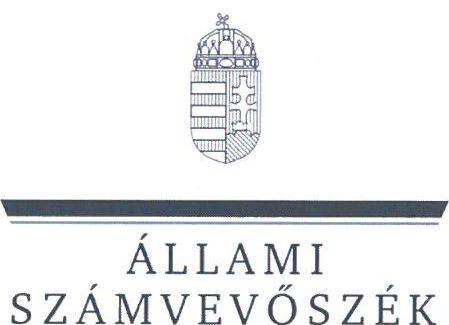
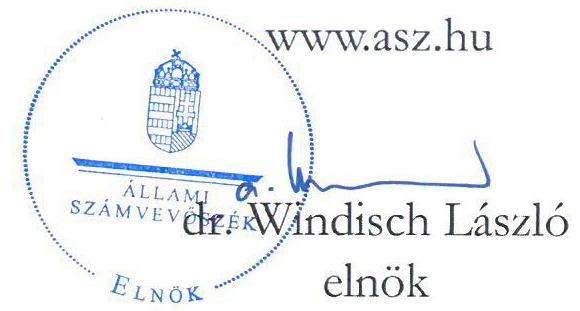
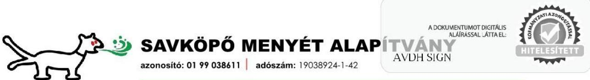

# JELENTÉS 

A költségvetési támogatásban részesülő pártalapítványok 2020-2021. évi gazdálkodása törvényességének ellenőrzése

Savköpő Menyét Alapítvány

2023.

---

ÁLLAMI
SZÁMVEVŐSZÉK

# JELENTÉS 

## A költségvetési támogatásban részesülő pártalapítványok 2020-2021. évi gazdálkodása törvényességének ellenőrzése

Savköpő Menyét Alapítvány

2023.

---

# ELLENŐRZÉSI IGAZGATÓSÁG: 

## ÁLLAMHÁZTARTÁSON KÍVÜLI SZERVEZETEKET ELLENŐRZŐ IGAZGATÓSÁG

## ELLENŐRZÉSI IGAZGATÓ:

KLINGA LÁSZLÓ ellenőrzési igazgató

## ELLENŐRZÉSVEZETŐ:

KAKAS SÁNDOR ellenőrzésvezető

A TÉMÁHOZ KAPCSOLÓDÓ KORÁBBI SZÁMVEVŐSZÉKI JELENTÉSEK:

- címe: A költségvetési támogatásban részesülő pártalapítványok 2018-2019. évi gazdálkodása törvényességének ellenőrzése Savköpő Menyét Alapítvány
- sorszáma: 21050

IKTATÓSZÁM: EL-3862-001/2023
TÉMASZÁM: 2629
ELLENŐRZÉS-AZONOSÍTÓ SZÁM: V0973

---

# TARTALOMJEGYZÉK 

- AZ ELLENŐRZÉS ALAPADATAI ..... 5
- AZ ELLENŐRZÉS HATÓKÖRE ÉS TERÜLETE, AZ ELLENŐRZÖTT SZERVEZET ..... 7
- ÖSSZEFOGLALÁS ..... 8
- AZ ELLENŐRZÉS FÓKUSZKÉRDÉSEI. ..... 10
MEGÁLLAPÍTÁSOK ..... 11
JAVASLATOK ..... 17
MELLÉKLETEK ..... 19
I. sz. melléklet: Értelmező szótár ..... 19
FÜGGELÉK: ÉSZREVÉTELEK ..... 20
RÖVIDÍTÉSEK JEGYZÉKE. ..... 23

---

.

---

# AZ ELLENŐRZÉS ALAPADATAI 

## AZ ELLENŐRZÉS CÉLJA

Az ellenőrzés célja, hogy az Állami Számvevőszék - mint az Országgyűlés legfőbb pénzügyi és gazdasági ellenőrző szerve - független és szakmailag megalapozott véleményt adjon a Savköpő Menyét Alapítvány, mint ellenőrzött szervezet gazdálkodásának törvényességéről.

## AZ ELLENŐRZÉS TÍPUSA

Szabályszerúségi ellenőrzés

## AZ ELLENŐRZŐTT IDŐSZAK

2020-2021. évek. Az utóellenőrzés tekintetében az utóellenőrzés alapját képező 21050. számú ÁSZ jelentés ${ }^{1}$ közzétételének napjától (2021.08.19.) az ellenőrzésről szóló adatszolgáltatásra felhívó levél keltének napjáig (2022.06.03.) terjedő időszak.

## AZ ELLENŐRZÉS TÁRGYA

Az ellenőrzés tárgyát képezte a Pártalapítvány² gazdálkodása, a könyvvezetés szabályozása és gyakorlata szabályszerűsége, az egyszerűsített éves beszámolókra és a Pártalapítvány tevékenységéről szóló éves jelentésekre vonatkozó kötelezettség teljesítése, valamint a gazdálkodáshoz kapcsolódó ellenőrzés javaslatainak hasznosítására irányuló tevékenység. A 21050. számú ÁSZ jelentésben foglalt megállapításhoz kapcsolódó - a Pártalapítvány által készített - intézkedési tervben foglaltak végrehajtásának ellenőrzése.

## AZ ELLENŐRZÉS JOGALAPJA

Az ellenőrzés jogszabályi alapját az ÁSZ tv. ${ }^{3} 1 . \int(3)$ bekezdése, 5. $\int(3)$ bekezdése, 33. $\int(7)$ bekezdése, valamint a Pmtv. ${ }^{4} 4 . \int(2)$ és (4) bekezdéseinek előírásai képezték.

## AZ ELLENŐRZÉS MÓDSZERE

Az ellenőrzés az ellenőrzött időszakban hatályos jogszabályok, az ellenőrzés szakmai szabályai, a jelen ellenőrzésre irányadó ÁSZ ${ }^{5}$ módszertanok, az ellenőrzési programban foglalt értékelési szempontok szerint került végrehajtásra. A gazdálkodás hibáinak kijavítására irányuló javaslatok kidolgozásakor a hatályos jogszabályok voltak irányadóak.

Az ellenőrzési kérdések megválaszolásához szükséges bizonyítékok megszerzése az ellenőrzött által rendelkezésre bocsátott dokumentumokra, adatokra alapozva kérdésfeltevés (információkérés), interjú, valamint mintavételezés útján történt. Az ellenőrzési bizonyítékként felhasználható adatforrások közé tartoztak

---

egyrészt az adatbekérő levelek mellékletében szereplő dokumentumok jegyzékében rögzített adatforrások, másrészt minden az ellenőrzés folyamán feltárt, az ellenőrzés szempontjából információt tartalmazó dokumentum. Az ellenőrzés lefolytatásához az ellenőrzött szervezet tanúsítvány kitöltésével és az ÁSZ által kért dokumentumok, adatok, információk megküldésével, továbbá az ellenőrzés során szolgáltatott adatokat.

Az ÁSZ a tételes ellenőrzés mellett mintavételezést és értékelést alkalmazott az alábbiak szerint:

- A Pártalapítvány kiadásai, ráfordításai elszámolásai szabályszerűségének megítéléséhez az ellenőrzött időszak évei esetében évente érték szerint rétegzett 30-30 elemű mintavétel történt.
- A Pártalapítvány által nyújtott támogatások elszámolása szabályszerűségének megítéléséhez a 2020. évben érték szerint rétegzett 30 elemű mintavételre, a 2021. évben tételes ellenőrzésére került sor, mivel a tételek száma ( 3 db ) nem haladta meg a minimálisan kiválasztandó mintaelemszámot.
- A Pártalapítvány mérlegtételeinek besorolása, év végi értékelése, azok leltárral való alátámasztottsága szabályszerűségének megítéléséhez a mérleget alátámasztó analitikákból az ellenőrzött időszak évei esetében egyszerű véletlen 30-30 elemű mintavételre került sor.
A mintavétel mellett a külső személyi jellegű ráfordítások esetében évente a 3-3 legnagyobb összegű kifizetés ellenőrzésére is sor került.

A kiadások, a ráfordítások, a nyújtott támogatások, valamint a mérlegtételek értékelése a tények feltárásával és azok összegzésével (szabálytalanság súlya, összege, gyakorisága) történt, úgy, hogy megállapítás csak a kiválasztott mintatételekre vonatkozóan került megfogalmazásra.

Az utóellenőrzés megállapítása az ÁSZ rendelkezésére álló dokumentumok, valamint az ÁSZ adatbekérése szerint, az ellenőrzött szervezet által rendelkezésre bocsátott dokumentumok, adatok alapján került megfogalmazásra. Az ellenőrzés esetében a 21050. számú ÁSZ ellenőrzés alapján a Pártalapítvány által készített intézkedési tervben előírt feladat, annak végrehajthatósága, illetve végrehajtása szempontjából az alábbiak szerint került értékelésre:

- „határidóben végrebajtotl" a feladat, ha a teljesítés dokumentáltan, az intézkedési tervben előírt határidőben és tartalommal megtörtént;
- „határidőn túl végrebajtotl" a feladat, ha annak teljesítése az intézkedési tervben meghatározott módon, de az abban előírt határidőn túl történt meg;
- „nem végrebajtotl" a feladat, ha a végrehajtás nem történt meg, vagy amennyiben a teljesítést/végrehajtást nem dokumentálták, dokumentumokkal nem tudják igazolni annak teljesítését;
- „okafogyottá váll" a feladat, ha végrehajtására - meghatározott esemény bekövetkezése, továbbá külső körülmény, a működést érintő feltétel változása miatt - már nincs szükség, illetve lehetőség, és egyértelműen megállapítható, hogy az intézkedést szükségessé tevő körülmény a jövőben nem fordulhat elő;
- „nem időszerü" az a feladat, amelynek ellenőrzési időszakon belüli végrehajtására azért nem került (kerülhetett) sor, mert az intézkedés alapjául szolgáló esemény nem következett be, de annak jövőbeni előfordulása lehetséges, a végrehajtása nem volt esedékes, vagy a végrehajtás határideje még nem járt le.

---

# AZ ELLENŐRZÉS HATÓKÖRE ÉS TERÜLETE, AZ ELLENŐRZÖTT SZERVEZET 

## SAVKÖPŐ MENYÉT ALAPÍTVÁNY

Az ellenőrzés a Párttv. ${ }^{6}$ alapján a politikai kultúra fejlesztése érdekében tudományos, ismeretterjesztő, kutatási, oktatási tevékenység folytatása céljából, a Ptk. ${ }^{7}$ szerinti alapító okiraton alapuló bírósági nyilvántartásba vétellel létrejött Pártalapítvány gazdálkodására terjedt ki. A Pártalapítvány törvényes gazdálkodásának (könyvvezetése, beszámolása, jelentés készítése) szabályait a Pmtv.-n túl, a Számv. tv. ${ }^{8}$ és az Eszkr. ${ }^{9}$ határozzák meg. A Pmtv. a 2020. január 1. napjától hatályos 3. § (7) bekezdésben nevesíti, hogy a kuratórium tagjának politikai felsővezető, közigazgatási államtitkár, helyettes államtitkár is kijelölhető. Továbbá a Pmtv. a 2021. július 1. napjától hatályos 3. § (6a) bekezdésben rögzíti, milyen tevékenységek nem tekinthetők gazdasági-vállalkozási tevékenységnek, illetve a 3/A. § (6) bekezdésben egyértelműsíti a pártalapítványok beszámolókészítési kötelezettségére vonatkozó szabályokat. A pártalapítványokra az Ectv. ${ }^{10}$ 11. alcíme szerinti beszámolási szabályokat megfelelően alkalmazni kell.

A Savköpő Menyét Alapítványt a Magyar Kétfarkú Kutya Párt alapította 2018. május 18-án.
A Pártalapítvány alapító okirata ${ }_{1,2}{ }^{11}$ szerinti célja „a politikai kultúra fejlesztése érdekében történő tudományos, ismeretterjesztő, kutatási, oktatási tevékenység folytatása".

Az alapító okirat ${ }_{1,2}$ szerint a Pártalapítvány céljának eléréséhez az alábbi tevékenységeket végzi:

- „a politikai kultúrával összefüggő legjobb nemzetközi gyakorlatok azonosítása, azok tapasztalatainak megismertetése érdekében kutatásokat végez, illetve kutatásokat támogat;
- támogatja az állampolgári aktivitás módszereinek fejlesztését, oktatását és megismertetését;
- a saját kutatásainak, illetve a támogatásával megvalósuló kutatásoknak az eredményeit, illetve egyéb, a politikai kultúra fejlesztését szolqáló müveket nyilvánosságra hozza, illetve támogatja azok nyilvánosságra hozatalát;
- a politikai kultúra fejlesztését szolqáló rendezvényeket szervez, illetve támogat;
- együttmüködik a politikai kultúra fejlesztésére irányuló tevékenységet folytató magyar és nemzetközi civil és más szervezetekkel."
A Pártalapítvány alapító okirata ${ }_{1,2}$ szerint a Pártalapítvány ügyvezető szerve a három tagú Kuratórium ${ }^{12}$, melynek összetétele az ellenőrzött időszakban egy tag tekintetében változott. A Pártalapítvány felügyelőbizottsággal nem rendelkezett, annak létrehozására nem volt kötelezett. Könyvvezetése kettős könyvvitel rendszerében történt. A Pártalapítvány az ellenőrzött időszakban a pénzügyi- és számviteli feladatai ellátását külső szervezet bevonásával biztosította. Az ellenőrzött időszakban az egyszerűsített éves beszámolókat könyvvizsgáló nem ellenőrizte, erre jogszabályi kötelezettsége nem volt.

A Pártalapítvány tevékenysége ellátásához a 2020. és a 2021. évben évente 41,3 M Ft költségvetési támogatást kapott. A 2020. évben magánszemélyektől és egyéb szervezettől összesen 0,1 M Ft-ot, a 2021. évben magánszemélyektől $0,1 \mathrm{M}$ Ft-ot kapott.

A Pártalapítványnál az ellenőrzött időszakban külső ellenőrzésre nem került sor. Az ÁSZ legutóbb a Pártalapítvány 2018-2019. évi gazdálkodását ellenőrizte, megállapításait a 21050. számú jelentésben tette közzé.

---

# ÖSSZEFOGLALÁS 

Magyarországon a pártok a Pmtv. alapján a politikai kultúra fejlesztése érdekében tudományos, ismeretterjesztő, kutatási és oktatási tevékenységük elősegítésére alapítványt hozhatnak létre. A létrehozott pártalapítvány a Párttv.-ben meghatározott mértékű költségvetési támogatásra jogosult. A Savköpő Menyét Alapítványt 2018. május 18 -án a Magyar Kétfarkú Kutya Párt alapította.

A Pártalapítvány az ellenőrzött időszakban rendelkezett a Számv. tv. szerint kötelezően elkészítendő szabályzatokkal, azonban azok tartalmukban nem feleltek meg a Számv. tv. előírásainak. A számviteli politika, ${ }^{13}$ nem tartalmazott minden Számv. tv. szerint előírt tartalmi elemet. A 2021. december 10-tól hatályos számviteli politika ${ }_{2}{ }^{14}$, az eszközök és a források leltárkészítési és leltározási szabályzat ${ }_{2}{ }^{15}$, az eszközök és a források értékelési szabályzat ${ }_{2}{ }^{16}$, valamint a pénzkezelési szabályzat ${ }_{2}{ }^{17}$ nem a Pártalapítvány adottságainak, körülményeinek megfelelően került kialakításra, mert a szabályzatok az alapító párt ${ }^{18}$ gazdálkodására vonatkozóan tartalmaztak szabályokat. Az ellenőrzött időszakban a számlarend ${ }_{1,2}{ }^{19}$ nem felelt meg a Számv. tv. előírásainak, mert nem tartalmazta a követelések, ráfordítások tekintetében az alkalmazásra kijelölt számlák számjelét és megnevezését.

A Pártalapítvány a központi költségvetésből kapott támogatás mellett az ellenőrzött időszakban magánszemélytől és egyéb szervezettől is fogadott el támogatást, azonban a 2021. évben magánszemélyek által adott támogatások - összesen 10500 Ft összegben - a Pmtv.-ben előírtak ellenére nem a Pártalapítvány pénzforgalmi számlájára való átutalással érkeztek, hanem a Pártalapítvány pénztárába történtek készpénzes befizetés formájában. A Pmtv.-ben előírtak szerint a szabálytalanul elfogadott 10500 Ft támogatást a Pártalapítvány köteles a központi költségvetésnek befizetni, továbbá a Pártalapítvány központi költségvetési támogatását az ÁSZ felhívását követő negyedévben ezen összeggel csökkenteni kell.

A Pártalapítvány a Párttv.-ben előírtak ellenére a 2020. évben összesen 1690651 Ft, a 2021. évben pedig összesen 3922773 Ft tiltott vagyoni hozzájárulást nyújtott az alapító párt részére, mert az alapító párttal közös használatú ingatlan bérleti díját az ellenőrzött időszakban önállóan fizette, azt nem osztotta meg a használat arányában, továbbá a közös rendezvény (táboroztatás) kapcsán a 2020. és 2021. években a táborral kapcsolatos ráfordításokat az alapító párt helyett finanszírozta.

Az ellenőrzött időszakban a kiadások elszámolása során a Számv. tv. előírásait nem tartották be, több esetben a gazdasági események számviteli nyilvántartásban történő rögzítését bizonylat nélkül, vagy nem szabályszerűen kiállított bizonylat alapján végezték.

A Pártalapítvány az ellenőrzött időszak mindkét évében nyújtott támogatásokat harmadik fél részére, azonban a támogatás odaítélésénél az alapító okirat ${ }_{1,2}$-ban előírt szabályokat nem tartották be, mert több esetben a támogatások odaítéléséről a Kuratórium nem hozott döntést. A nyújtott támogatások számviteli elszámolása során több tétel esetében nem tartották be a Számv. tv. előírásait, mert a gazdasági események számviteli nyilvántartásban történő rögzítését bizonylat nélkül, vagy nem szabályszerűen kiállított bizonylat alapján végezték, továbbá a 2020. évben anyagjellegú ráfordításokat számoltak el egyéb ráfordításként.

A Pártalapítvány a 2020. és 2021. évre vonatkozóan elkészítette a tevékenységéről szóló jelentéseket, azonban a jelentések nem tartalmazták Pmtv.-ben előírt vagyon felhasználásával kapcsolatos kimutatást és a cél szerinti juttatások kimutatását, a 2021. évi jelentés a támogatások felhasználásával kapcsolatos kimutatást. Az éves jelentéseket a Pmtv.-ben előírtak ellenére nem tette közzé a Magyar Közlöny mellékleteként megjelenő Hivatalos Értesítőben.

---

A Pártalapítvány a 2020. és 2021. évre vonatkozóan elkészítette az egyszerűsített éves beszámolóit. A 2020. évi egyszerűsített éves beszámolót közzétette. A 2021. évi egyszerűsített éves beszámoló közzétételére az Ectv.-ben meghatározott határidőt követően 30 napos késedelemmel került sor.

A Pártalapítvány a 2020. és 2021. években a Számv. tv.-ben előírtak ellenére a beszámoló elkészítéséhez, a mérlegtételeinek alátámasztásához nem állított össze leltárt. A mérlegben a Számv. tv.-ben előírtak ellenére a 2020. és 2021. évben követelésként olyan tételeket mutattak ki, amelyet bizonylatokkal nem támasztottak alá. A Pártalapítvány a 2020. évi beszámolójában 9,9 M Ft, a 2021. évi beszámolóban 11,1 M Ft mérlegfőösszeget mutatott ki. A mérlegben követelésként kimutatott, bizonylatokkal nem alátámasztott tételek hibahatása jelentős összegűnek minősül mindkét ellenőrzött évben a Számv. tv. szerint, mert azok évenkénti együttes összege meghaladta az ellenőrzött év mérlegfőösszegének $2 \%$-át. A 2020. és 2021. évi egyszerűsített éves beszámolók nem mutattak megbízható és valós képet a Pártalapítvány vagyoni, pénzügyi és jövedelmi helyzetéről.

A Pártalapítvány az utóellenőrzés megállapítása alapján az intézkedési tervben meghatározott feladatot nem hajtotta végre, mert a Számv. tv.-ben előírtak ellenére nem a Pártalapítvány adottságainak, körülményeinek megfelelő számviteli politikát alakított ki. A Pártalapítvány által az ÁSZ részére megküldött, az intézkedési tervben rögzített feladat végrehajtását alátámasztó, 2021. december 10-től hatályos számviteli politika ${ }_{2}$ nem a Pártalapítvány sajátosságaira vonatkozóan, hanem az alapító párt gazdálkodására vonatkozóan került kialakításra. Így az ellenőrzött időszak végén az ÁSZ által korábban feltárt szabálytalanság továbbra is fennállt.

Az ÁSZ a Pártalapítvány kuratóriumi elnökének az ellenőrzés során feltárt szabálytalanságok megszüntetése érdekében 12 javaslatot fogalmazott meg.

---

# AZ ELLENŐRZÉS FÓKUSZKÉRDÉSEI 

1.     - A Pártalapítvány kialakította-e a törvényes gazdálkodáshoz szükséges szabályokat?
2.     - A Pártalapítvány könyvvezetése és gazdálkodása során a vonatkozó jogszabályi rendelkezéseket és belső előírásokat betartották-e?
3.     - A Pártalapítvány tevékenységéről szóló éves jelentések, az éves számviteli beszámolók a jogszabályi előírásoknak megfeleltek-e?
4.     - A Pártalapítvány az intézkedési tervben meghatározott feladatokat végrehajtotta-e?

---

# 1. A Pártalapítvány kialakította-e a törvényes gazdálkodáshoz szükséges szabályokat? 

## Összegző megállapítás

1.1. számú megállapítás

A Pártalapítvány a törvényes gazdálkodáshoz szükséges szabályokat az ellenőrzött időszakban nem a jogszabályi előírások szerint alakította ki.
A 2020. és a 2021. évben a Pártalapítvány múködésének szabályait az alapító okirat ${ }_{1,2}$-ban rögzítették. Az induló vagyon rendelkezésre bocsátása tekintetében a Kuratórium az alapító pártot az ellenőrzött időszak végéig nem szólította fel.

Az alapító okirat ${ }_{1,2}$ a Ptk. előírásainak megfelelően tartalmazta a Pártalapítvány ügyvezető szervét, a Kuratóriumot, a képviseletre jogosult személyt a Kuratórium elnöke személyében, és a képviseleti jogra vonatkozó szabályokat, továbbá a Pártalapítvány célját és tevékenységét, a vagyoni hozzájárulásra, a vagyon kezelésére vonatkozó előírásokat. Az alapító okirat ${ }_{1,2}$-ban a Pártalapítványhoz történő csatlakozás szabályait a Pmtv.-ben foglaltak szerint előírták.

A Pártalapítvány alapító okiratának módosítására az ellenőrzött időszakban egy alkalommal került sor, a módosítás a Kuratórium tagjainak személyében bekövetkezett változásra vonatkozott. A módosítás a Ptk. és a Pmtv. előírásai szerint történt.

A Pártalapítvány alapító okirat ${ }_{1,2}$-ban rögzített $0,1 \mathrm{M}$ Ft összegű induló vagyonát az alapító párt ügyvédi letétbe helyezte, azonban az alapító okirat ${ }_{1,2} 4.1$. pontjában előírtak ellenére az ellenőrzött időszak végéig annak a Pártalapítvány bankszámlájára történő átutalása nem történt meg, melynek teljesítésére a Kuratórium a Ptk. 3:382. $\int(4)$ bekezdésében előírtak ellenére az alapító pártot nem szólította fel.

A Pártalapítvány gazdálkodásával kapcsolatos könyvvezetési-nyilvántartási rendszert az Eszkr. előírásainak megfelelően kialakította. A 2020. és 2021. évekre vonatkozóan a Számv. tv.-ben előírtak szerint kettős könyvvitellel alátámasztott egyszerűsített éves beszámolót készített.
1.2. számú megállapítás

A Pártalapítvány gazdálkodására vonatkozó belső szabályozás az ellenőrzött időszakban nem felelt meg a jogszabályi előírásoknak.

A Pártalapítvány gazdálkodására vonatkozó szabályokat az ellenőrzött időszakban az alapító okirat ${ }_{1,2}$ is tartalmazott, mely szerint a Pártalapítvány vagyonának felhasználásáról a Kuratórium dönt. A Kuratórium elnöke 2020. évre és a 2021. január 1. - 2021. december 9. közötti időszakra vonatkozóan a jogszabályi előírásoknak megfelelően meghatározta, kialakította a pénzgazdálkodással kapcsolatos folyamatokat, feladat- és hatásköröket a pénzkezelési szabályzatban ${ }^{20}$ és a bizonylati rendben ${ }^{21}$.

A Pártalapítvány az ellenőrzött időszakban rendelkezett a Számv.tv. előírásainak megfelelően számviteli politikával ${ }_{1}{ }^{22}$ és az annak keretében elkészítendő eszközök és a források leltárkészítési és leltározási szabályzatával ${ }_{1}{ }^{23}$, az eszközök és a források értékelési szabályzatával ${ }_{1}{ }^{24}$, illetve pénzkezelési szabályzattal ${ }_{1}$. A számviteli politika a Számv. tv. 14. $\int(4)$ bekezdésében előírtak ellenére nem tartalmazta a Pártalapítványra

---

jellemző szabályokat, előírásokat, módszereket, amelyekkel meghatározza, hogy mit tekint a számviteli elszámolás, az értékelés szempontjából lényegesnek, nem lényegesnek.

A 2021. december 10-től hatályos, 2/2022 (XII. 10.) kuratóriumi határozattal elfogadott számviteli politika ${ }_{2}$, a 4/2022 (XII. 10.) határozattal elfogadott eszközök és a források leltárkészítési és leltározási szabályzat ${ }_{2}$, az 5/2022 (XII. 10.) határozattal elfogadott eszközök és a források értékelési szabályzat ${ }_{2}$, valamint a 6/2022 (XII. 10.) határozattal elfogadott pénzkezelési szabályzat ${ }_{2}$ nem a Pártalapítvány adottságainak, körülményeinek megfelelően került kialakításra, mert a szabályzatok az alapító párt gazdálkodására vonatkozóan tartalmaztak szabályokat.

A Pártalapítvány a Számv. tv. előírása szerint számlarendet készített, azonban a számlarend ${ }_{1,2}$ a Számv. tv. 161. § (2) bekezdés a) pontjában előírtak ellenére nem tartalmazta minden alkalmazásra kijelölt számla számjelét és megnevezését, többek között a követelések, ráfordítások nyilvántartására alkalmazott számlák esetében sem. A 2020. és a 2021. évben a számlarend ${ }_{1,2}$-ben a Számv. tv.-nek megfelelően rögzítették a főkönyvi számlák analitikus nyilvántartásokkal való kapcsolatát.
1.3. számú megállapítás

A Pártalapítvány az ellenőrzött időszakban a jogszabályi előírásnak megfelelően nem volt korlátlan felelősségű tagja más jogalanynak. A Pártalapítvány az ellenőrzött időszakban vállalkozási tevékenységet nem folytatott.

A Pártalapítvány az alapító okirat ${ }_{1,2}$ alapján az ellenőrzött időszakban az alapítványi cél megvalósításával közvetlenül összefüggő gazdasági tevékenység végzésére jogosult volt. A Pártalapítvány a 2020. és a 2021. évben nem folytatott gazdasági-vállalkozási tevékenységet. A 2020-2021. években a Ptk. előírásait betartva nem volt korlátlan felelősségű tagja más jogalanynak, továbbá nem alapított gazdasági társaságot vagy más szervezetet.

# 2. A Pártalapítvány könyvvezetése és gazdálkodása során a vonatkozó jogszabályi rendelkezéseket és belső előírásokat betartották-e? 

Összegző megállapítás A Pártalapítvány a 2020. és 2021. évben a könyvvezetése és gazdálkodása során a jogszabályi rendelkezéseket és a belső előírásokat nem tartotta be.
2.1. számú megállapítás

A Pártalapítvány a központi költségvetésből kapott támogatásokat szabályszerűen fogadta el és számolta el a 2020-2021. évben. A 2021. évben a magánszemélyektől érkező támogatások befogadása során három esetben nem tartották be a törvényi előírást.

A Pártalapítvány az ellenőrzött időszakban a Párttv. és a költségvetési tv ${ }_{1,2}{ }^{25}$ előírásaival összhangban, szabályszerűen fogadta el a költségvetési támogatást. A kapott költségvetési támogatásokat főkönyvi könyvelésében egyéb bevételként, a többi támogatástól elkülönítetten tartotta nyilván a Számv. tv. és az Eszkr. előírásának megfelelően.

A Pártalapítvány a 2020. évben magán-, és jogi személyektől összesen 0,1 MFt, 2021. évben pedig magánszemélyektől összesen 0,1 MFt támogatást kapott, amelyek egyik évben sem érték el a Pmtv.-ben foglalt ötszázezer forint értékhatárt, ebből következően ezen támogatásokra vonatkozóan közzétételi kötelezettsége

---

nem volt. A 2020. évben a Pártalapítvány a Pmtv. és az alapító okirat ${ }_{1,2}$ előírásainak megfelelően csak egyértelműen azonosítható személyektől fogadott el támogatást, a támogatások a személyek fizetési számlájáról a Pártalapítvány pénzforgalmi számlájára történő átutalással történtek. A 2021. évben a Pártalapítvány a Pmtv. 3. $\$ (3) bekezdésében előírtak ellenére magánszemélyektől úgy fogadott el három alkalommal, összesen 10500 Ft összegű támogatást, hogy azok teljesítése nem a támogatást nyújtó személyek fizetési számlájáról a Pártalapítvány pénzforgalmi számlájára történő átutalással történt, hanem a Pártalapítvány pénztárába készpénzes befizetés formájában. A Pmtv. 3. $\$ (5) bekezdésében előírtak szerint a szabálytalanul elfogadott 10500 Ft támogatást a Pártalapítvány köteles a központi költségvetésnek befizetni, továbbá a Pártalapítvány központi költségvetési támogatását az ÁSZ felhívását követő negyedévben ezen összeggel csökkenteni kell.
2.2. számú megállapítás

A Pártalapítvány a 2020. és 2021. évben a kiadásait nem szabályszerűen számolta el, a harmadik fél részére nyújtott támogatások elszámolása nem felelt meg a jogszabályi előírásoknak.

A Pártalapítvány tevékenységének költségei, ráfordításai felhasználása, kifizetése és elszámolása a 2020. és 2021. évben az ellenőrzött mintaételek alapján nem volt szabályszerű:

- A Pártalapítvány a 2020. évben három tétel esetében a Számv. tv. 165. § (2) bekezdésében előírtak ellenére bizonylatok nélkül jegyzett be adatokat a számviteli nyilvántartásába;
- A 2020. évben 29 tétel esetében a Számv. tv. 165. § (2) bekezdésben előírtak ellenére a könyvviteli nyilvántartásba nem szabályszerűen kiállított bizonylat alapján jegyeztek be adatokat, mert a Számv. tv. 167. § (1) bekezdés c) pontjában előírtak ellenére a könyvviteli elszámolást közvetlenül alátámasztó bizonylatok nem tartalmazták a bizonylatok általános alaki és tartalmi kellékei közül az utalványozó, a rendelkezés végrehajtását igazoló személy, valamint az ellenőr aláírását; továbbá 12 db tétel esetében a Számv. tv. 167. § (1) bekezdés h) pontjában előírtak ellenére a könyvelés módjára, az érintett könyvviteli számlákra a könyvviteli elszámolást közvetlenül alátámasztó bizonylatokon nem történt hivatkozás;
- A Pártalapítvány a 2021. évben egy tétel esetében a Számv. tv. 165. § (2) bekezdésében előírtak ellenére bizonylat nélkül jegyzett be adatokat a számviteli nyilvántartásába;
- A 2021. évben egy kiadás esetében az igénybe vett szolgáltatás értékét a Számv. tv. 78. § (3) bekezdésében előírtak ellenére anyagköltségként számolták el;
- A 2021. évben 24 tétel esetében a Számv. tv. 165. § (2) bekezdésben előírtak ellenére a könyvviteli nyilvántartásba nem szabályszerűen kiállított bizonylat alapján jegyeztek be adatokat, mert a Számv. tv. 167. § (1) bekezdés c) pontjában előírtak ellenére a könyvviteli elszámolást közvetlenül alátámasztó bizonylatok nem tartalmazták a bizonylatok általános alaki és tartalmi kellékei közül az utalványozó, az ellenőr, valamint 23 tétel esetében a rendelkezés végrehajtását igazoló személy aláírását; továbbá 2021. évben az összes ellenőrzött tételnél a Számv. tv. 167. § (1) bekezdés h) pontjában előírtak ellenére a könyvelés módjára, az érintett könyvviteli számlákra a könyvviteli elszámolást közvetlenül alátámasztó bizonylatokon nem történt hivatkozás.
A Pártalapítvány a Párttv. 4. § (2) pontjában előírtak ellenére a 2020. évben összesen 1690651 Ft, a 2021. évben összesen 3922773 Ft vagyoni hozzájárulást nyújtott az alapító párt részére:
- A Pártalapítvány az alapító párt részére egy ingatlan ingyenes használatát biztosította mindkét ellenőrzött évben, mivel az alapító párt által használt ingatlan költségeit kizárólag a Pártalapítvány viselte, amely a főkönyvi nyilvántartása alapján a 2020. évben 5365508 Ft , a 2021. évben

---

3092450 Ft volt. Az ingatlan tényleges használatát a Pártalapítvány és az alapító párt 80-20\%-os arányban osztotta meg egymás között, így a Párttv. 4. § (2) bekezdésében előírtak ellenére a Pártalapítvány a 2020. évben 1073101 Ft , a 2021. évben pedig 618490 Ft nem pénzbeli vagyoni hozzájárulást nyújtott az alapító párt részére.

- A Párttv. 4. § (2) bekezdésében előírtak ellenére a Pártalapítvány közös rendezésű táboroztatás kapcsán 2020-2021. években vagyoni hozzájárulást nyújtott az alapító párt részére, mert a táborral kapcsolatos ráfordításokat a 2020. évben 617550 Ft , a 2021. évben 3304283 Ft az alapító párt helyett a Pártalapítvány finanszírozta.
A Pártalapítvány által harmadik fél részére nyújtott támogatások elszámolása az ellenőrzött időszakban nem volt szabályszerű:
- A Pártalapítvány által 2020. évben nyújtott támogatások közül 26 tétel esetében az alapító okirat1,2 5.2 a) pontjában előírtak ellenére a támogatás odaítéléséről kuratóriumi döntés nem áll rendelkezésre;
- A 2020. évben 20 tétel esetében a Számv. tv. 165. § (2) bekezdésben előírtak ellenére a könyvviteli nyilvántartásba nem szabályszerűen kiállított bizonylat alapján jegyeztek be adatokat, mert a Számv. tv. 167. § (1) bekezdés c) pontjában előírtak ellenére a könyvviteli elszámolást közvetlenül alátámasztó bizonylatok nem tartalmazták a bizonylatok általános alaki és tartalmi kellékei közül az utalványozó, a rendelkezés végrehajtását igazoló személy, valamint az ellenőr aláírását;
- A 2020. évben a harmadik fél részére nyújtott támogatások elszámolása a Számv. tv. 78. § (1) bekezdésében előírtak ellenére 12 tétel esetében egyéb ráfordításként történt anyag jellegű ráfordítások helyett, továbbá egy tétel esetében tárgyi eszköz beszerzés helyett;
- A Pártalapítvány a 2020. évben három támogatásként elszámolt tétel esetében a Számv. tv. 165. § (2) bekezdésében előírtak ellenére bizonylat nélkül jegyzett be adatokat a számviteli nyilvántartásába
- A Pártalapítvány által 2021. évben nyújtott támogatások esetében az alapító okirat1,2 5.2 a) pontjában előírtak ellenére a támogatás odaítéléséről kuratóriumi döntés nem állt rendelkezésre.

# 3. A Pártalapítvány tevékenységéről szóló éves jelentések, az éves számviteli beszámolók a jogszabályi előírásoknak megfeleltek-e? 

## Összegző megállapítás

3.1. számú megállapítás

A Pártalapítvány 2020. és 2021. évi tevékenységéről szóló jelentések, valamint az egyszerúsített éves beszámolók nem feleltek meg a jogszabályi előírásoknak.

A Pártalapítvány 2020. és 2021. évi tevékenységéről szóló jelentések nem feleltek meg a jogszabályi előírásoknak.

A Pártalapítvány a 2020. és a 2021. évben a tevékenységéről szóló jelentéseket a törvényi határidőben elkészítette. A jelentések a Pmtv. szerint tartalmazták a számviteli beszámolót, a központi költségvetési szervtől kapott támogatás mértékét, az egyes vezető tisztségviselőinek nyújtott juttatások értékét, illetve összegét, továbbá a tevékenységéről szóló rövid tartalmi beszámolót. A Pártalapítvány 2020. évi tevékenységéről szóló

---

jelentés a Pmtv. előírása szerint tartalmazta a költségvetési támogatás felhasználására vonatkozó kimutatást, azonban a 2021. évi tevékenységéről szóló jelentés a Pmtv. 3/A. $\$ 3$ ) bekezdés b) pontjában előírtak ellenére nem tartalmazott a költségvetési támogatás felhasználására vonatkozó kimutatást. A 2020. és a 2021. évi tevékenységéről szóló jelentések a Pmtv. 3/A. § (3) bekezdés c) és d) pontjaiban előírtak ellenére nem tartalmaztak a vagyon felhasználásával kapcsolatos kimutatást és a cél szerinti juttatások kimutatását.

A Pártalapítvány a Pmtv. 3/A. $\$ 5$ ) bekezdésében előírtak ellenére a 2020. és a 2021. évi tevékenységéről szóló jelentéseket a Magyar Közlöny mellékleteként megjelenő Hivatalos Értesítőben nem tette közzé. A jelentéseket a Pmtv.-ben előírtak szerint a honlapján közzétette.

A Pártalapítvány a Számv. tv.-ben és az Eszkr.-ben foglalt előírások alapján a 2020. és a 2021. évre vonatkozóan egyszerűsített éves beszámolót készített, amely megfelelt a Eszkr. mellékleteiben előírt egyszerűsített éves beszámoló mérleg és eredménykimutatás tagolásának, valamint tartalmazta a kiegészítő mellékletet. 2021-ben az Ectv. előírásai szerinti közhasznúsági mellékletet is készített.

A Pártalapítvány 2020. és 2021. évi beszámolóját a Pmtv.-nek megfelelően a Kuratórium a Számv. tv.ben meghatározott határidőig elfogadta. A 2020. évi egyszerűsített éves beszámolót és mellékleteit közzétette, azonban a 2021. évi egyszerűsített éves beszámolóját és mellékleteit az Ectv. 30. § (1) bekezdésben előírt határidőt (2022. május 31.) követően - 2022. június 30 -án - tette közzé.
3.2. számú megállapítás

A Pártalapítvány a 2020. és a 2021. évi egyszerűsített éves beszámolói mérlegtételeit nem támasztotta alá leltárral.

A Pártalapítvány a Számv. tv. 69. § (1) bekezdésében előírtak ellenére a 2020. és 2021. évi számviteli beszámolók mérlegtételeinek alátámasztásához nem állított össze olyan leltárt, amely tételesen, ellenőrizhető módon tartalmazta a mérleg fordulónapján meglévő eszközeit és forrásait mennyiségben és értékben.

A mérlegben az ellenőrzött mintatételek alapján a Számv. tv. 165. § (2) bekezdésben előírtak ellenére a 2020. és 2021. évben a számviteli nyilvántartásokba bizonylat nélkül jegyeztek be adatokat a követelések között:

A 2020. évben a követelés mérlegtételek között

- a 361901. főkönyvi számlán „2020.12.31. pénztár állomány" megnevezéssel nyilvántartott állományt,
- a 361806. főkönyvi számlán gazdálkodó szervezettel szembeni követelést,
- a 3615. főkönyvi számlán az alapító párttal való elszámolás jogcímén nyilvántartott követelést,
- a 3614. főkönyvi számlán bankszámlán keresztül hiányzó számlák kiegyenlítésének állományaként, a 361803. főkönyvi számlán „Követelés passzivisták.kal szemben" követelés állományként mutatott ki összeget, összesen 5,8 M Ft értékben.
A 2021. évben a követelés mérlegtételek között
- a 3615. főkönyvi számlán az alapító párttal való elszámolás jogcímen nyilvántartott követelést,
- a 361806. főkönyvi számlán gazdálkodó szervezettel szembeni követelést,
- a 355. főkönyvi számlán kaució jogcímen nyilvántartott követelést,
- a 361803. főkönyvi számlán „Követelés passzivisták.kal szemben" követelés állományként, a 361901. főkönyvi számlán „2021.12.31. pénztár állomány" megnevezéssel nyilvántartott összeget, összesen 6,2 M Ft értékben.

---

A 2020. és 2021. évben egy-egy tétel esetében a Számv. tv. 165. § (2) és 166. § (1) bekezdéseiben előírtak ellenére a követelések között a 3617. főkönyvi számlán $0,2 \mathrm{M}$ Ft összeget mutattak ki, amelynek számviteli elszámolását megalapozó bizonylat nem a Pártalapítvány nevére került kiállításra.

A Pártalapítvány a 2020. évi beszámolójában 9,9 M Ft, a 2021. évi beszámolóban 11,0 M Ft mérlegfőösszeget mutatott ki. A követelések esetében a bizonylat nélkül könyvelt tételek együttes összege a 2020. évben 5,8 M Ft, a 2021. évben összesen 6,2 M Ft, így a főkönyvi könyvelésben bizonylat nélkül könyvelt és a mérlegben kimutatott tételek hibahatása jelentős összegűnek minősül mindkét ellenőrzött évben a Számv. tv. 3. § (3) bekezdés 3. pontjában rögzítettek szerint, mert azok évenkénti együttes összege meghaladta az ellenőrzött év mérlegfőösszegének 2 \%-át. A 2020. és 2021. évi egyszerűsített éves beszámolók nem mutattak megbízható és valós képet a Pártalapítvány vagyoni, pénzügyi és jövedelmi helyzetéről.

# 4. A Pártalapítvány az intézkedési tervben meghatározott feladatokat végrehajtotta-e? 

## Összegző megállapítás

A Pártalapítvány az intézkedési tervben meghatározott feladatot nem hajtotta végre, így az intézkedés végrehajtása elmaradásának következtében az ellenőrzött időszak végén továbbra is fennmaradt a szabálytalanság.

Az ÁSZ a 21050. számú ellenőrzési jelentésében a Pártalapítvány kuratóriuma elnökének címezve egy javaslatot tett a számviteli törvénynek megfelelő számviteli politika elkészítésére vonatkozóan. A számvevőszéki jelentésben tett javaslatra a Pártalapítvány az elkészített intézkedési tervében a számviteli politika és annak mellékletét képező szabályzatok áttekintését és frissítését írta elő magának, 2021. november 15-i határidővel. A Pártalapítvány az intézkedési tervben meghatározott feladatot nem hajtotta végre, mert a Számv. tv. 14. § (3) bekezdésében előírtak ellenére nem a Pártalapítvány adottságainak, körülményeinek megfelelő számviteli politikát alakított ki. A Pártalapítvány által az ÁSZ részére megküldött, az intézkedési tervben rögzített feladat végrehajtását alátámasztó, 2021. december 10-től hatályos számviteli politika; nem a Pártalapítvány sajátosságaira vonatkozóan, hanem az alapító párt gazdálkodására vonatkozóan került kialakításra. Így az ellenőrzött időszak végén az ÁSZ által korábban feltárt szabálytalanság továbbra is fennállt.

---

# JAVASLATOK 

Az ÁSZ tv. 33. § (1) bekezdésében foglaltak értelmében az ellenőrzött szervezet vezetője köteles a jelentésben foglalt megállapításokhoz kapcsolódó intézkedési tervet összeállítani és azt a jelentés kézhezvételétől számított 30 napon belül az ÁSZ részére megküldeni. Amennyiben az ellenőrzött szervezet vezetője nem küldi meg határidőben az intézkedési tervet, vagy továbbra sem elfogadható intézkedési tervet küld, az Állami Számvevőszék elnöke az ÁSZ tv. 33. § (3) bekezdése a) és b) pontjaiban foglaltakat érvényesítheti.

## A PÁRTALAPÍTVÁNY KURATÓRIUMI ELNÖKE RÉSZÉRE

1. Szólítsa fel az alapító pártot az alapító okiratban rögzített vagyonjuttatás teljesítésére a Ptk. elöírása szerint.
1.1. számú megállapítás 3. bekezdése alapján
2. Gondoskodjon a Számv. tv.-nek megfelelő számviteli politika és az annak keretében elkészítendő számviteli szabályzatok (az eszközök és a források leltárkészittési és leltározási szabályzata, az eszközök és a források értékelési szabályzata, pénzkezelési szabályzat) elkészítéséről.
1.2. számú megállapítás 3. bekezdése alapján
3. Gondoskodjon arról, hogy a számlarend a Számv. tv. előírásainak megfelelően tartalmazza minden alkalmazásra kijelölt számla számjelét és megnevezését.
1.2. számú megállapítás 4. bekezdése alapján
4. Intézkedjen arra, hogy a jövőben a Pártalapítvány a támogatások befogadása során tartsa be Pmtv. 3. § (3) bekezdésében elöírtakat.
2.1. számú megállapítás 2. bekezdése alapján
5. Intézkedjen arra, hogy a számviteli (könyvviteli) nyilvántartásba csak szabályszerűen kiállított bizonylat alapján jegyezzenek be adatokat a Számv. tv. előírásai szerint.
2.2. számú megállapítás 1. és 3. bekezdése, 3.2. számú megállapítás 2. bekezdése alapján
6. Intézkedjen arra, hogy a számviteli (könyvviteli) nyilvántartásban a Számv. tv. előírásai szerint kerüljenek kimutatásra a gazdasági események.
2.2. számú megállapítás 1. bekezdése alapján
7. Intézkedjen arra, hogy a Pártalapítvány a jövőben ne nyújtson vagyoni hozzájárulást az alapító párt részére a Párttv.-ben elöírtaknak megfelelően.
2.2. számú megállapítás 2. bekezdése alapján

---

8. Intézkedjen arra, hogy a harmadik fél részére nyújtott támogatások odaítélése során az alapító okiratban elöirt szabályokat tartsák be.
2.2. számú megállapítás 3. bekezdése alapján
9. Gondoskodjon arról, hogy a jövőben a Pártalapítvány tevékenységéről szóló jelentés a Pmtv.-ben elöirt tartalommal készüljön el.
3.1. számú megállapítás 1. bekezdése alapján
10. Gondoskodjon arról, hogy a jövőben a Pártalapítvány tevékenységéről szóló jelentés a Magyar Közlöny mellékleteként megjelenő Hivatalos Értesítöben a Pmtv.-ben elöirtak szerint kerüljön közzétételre.
3.1. számú megállapítás 2. bekezdése alapján
11. Gondoskodjon arról, hogy a jövőben az egyszerüsített éves beszámoló közzététele során az Ectv.-ben elöirt határidőt tartsák be.
3.1. számú megállapítás 4. bekezdése alapján
12. Gondoskodjon arról, hogy a jövőben a számviteli beszámolók mérlegtételei kerüljenek alátámasztásra leltárral Számv. tv. előírásai szerint.
3.2. számú megállapítás 1. bekezdése alapján

---

# MELLÉKLETEK 

## I. SZ. MELLÉKLET: ÉRTELMEZŐ SZÓTÁR

alapítvány
költségvetési támogatás
pártalapítvány

Az alapítvány az alapító által az alapító okiratban meghatározott tartós cél folyamatos megvalósítására létrehozott jogi személy. Az alapító az alapító okiratban meghatározza az alapítványnak juttatott vagyont és az alapítvány szervezetét. Alapítvány nem alapítható gazdasági tevékenység folytatására. Az alapítvány az alapítványi cél megvalósításával közvetlenül összefüggő gazdasági tevékenység végzésére jogosult. Alapítvány nem lehet korlátlan felelősségű tagja más jogalanynak, nem létesíthet alapítványt és nem csatlakozhat alapítványhoz.
(Forrás: Ptk. 3:378. §, 3:379. § (1)-(3) bekezdés)
A pártalapítványoknak a Párttv. 9/A. § (1) bekezdése és a Pmtv. 1. § előírásainak értelmében, az éves költségvetési törvények szerint jellemzően az 1. számú melléklet I. Országgyűlés fejezet 9. Pártalapítványok támogatás címen - az állami költségvetésből juttatott támogatás.
A politikai kultúra fejlesztése érdekében, tudományos, ismeretterjesztő, kutatási és oktatási tevékenység folytatása céljából pártok által létrehozott, külön jogszabályban - a Pmtv. 1. § és 3. § (1) bekezdése - meghatározott, jogi személynek minősülő egyéb szervezet, speciális jogállású alapítvány.
(Forrás: Párttv. 9/A. § (1) bekezdés, Pmtv. 1. §, Ectv. 2. § 6. c) pont, Számv. tv. 3. § (1) bekezdés 4. pont, Eszkr. 2. § (1) bekezdés 1) pont)

---

# FÜGGELÉK: ÉSZREVÉTELEK 

A jelentéstervezetet a Számvevőszék 15 napos észrevételezésre megküldte az ellenőrzött szervezet vezetőjének az ÁSZ tv. 29. §* (1) bekezdése előírásának megfelelően.

A Pártalapítvány kuratóriumi elnöke a jelentéstervezetre észrevételt tett.
A függelék tartalmazza az ellenőrzött észrevételeit, illetve az el nem fogadott észrevételek elutasításának indoklását.

[^0]
[^0]:    * 29. § (1) Az Állami Számvevőszék az ellenőrzési megállapításait megküldi az ellenőrzött szervezet vezetőjének vagy az általa megbízott személynek, és annak, akinek személyes felelősségét állapította meg.
    (2) Az ellenőrzött szervezet vezetője és a felelősként megjelölt személy az ellenőrzés megállapításaira tizenöt napon belül írásban észrevételt tehet.
    (3) Az Állami Számvevőszék az észrevételre a beérkezésétől számított harminc napon belül írásban válaszol. A figyelembe nem vett észrevételeket köteles a jelentésben feltüntetni, és megindokolni, hogy azokat miért nem fogadta el.

---

Klinga László igazgató úr részére
Állami Számvevőszék
kapja: epapír, valamint
Tisztelt Igazgató Úr!
A Savköpő Menyét Alapítvány 2020-2021. évi gazdálkodásáról készített számvevőszéki jelentés tervezetére az alábbi észrevételt teszem.

Megalapozatlannak tartom a tervezet azon megállapítását, hogy a Párt a Savköpő Menyét Alapítványtól a tábor megrendezésével összefüggésben vagyoni hozzájárulást fogadott volna el.

A Savköpő Menyét Alapítvány a pártok működését segítő tudományos, ismeretterjesztő, kutatási, oktatási tevékenységet végző alapítványokról szóló 2003. évi XLVII. törvény hatálya alá tartozó alapítvány. A törvény címe alapján is egyértelmű, hogy az ilyen alapítvány lényege, hogy olyan ismeretterjesztő és oktatási tevékenységet végez, amely a párt működését segíti. Az a körülmény, hogy az SMA a politikai kultúra fejlesztését célzó tábort szervezett, teljes mértékben összhangban volt az alapítvány céljával, még akkor is, ha az segítette az MKKP működését.

Az a körülmény, hogy az MKKP díjat szedett a táboron való részvételért, lehet polgári jogi szempontból vitatható, de az nem teszi vagyoni hozzájárulássá a tábor költségeit (legfeljebb jogalap nélküli gazdagodás címén az SMA léphetne fel az MKKP-val szemben).

# Kérem ezért, hogy a tervezet idevágó részeit korrigálni szíveskedjen. 

Budapest, 2023. március 2.
Tisztelettel,

## Döme Zsuzsanna

a kuratórium elnöke
Savköpő Menyét Alapítvány

---

# Az el nem fogadott észrevételek elutasításának indoklása: 

A Pártalapítvány kuratóriumi elnöke 2023. március 2-án kelt levelében megalapozatlannak tartotta a számvevőszéki jelentéstervezet azon megállapítását, hogy a Magyar Kétfarkú Kutya Párt a Pártalapítványtól a tábor megrendezésével összefüggésben vagyoni hozzájárulást fogadott volna el.

Indokolását azzal támasztotta alá, hogy "A Savköpő Menyét Alapitvány a pártok müködését segitő tudományos, ismeretterjesztő, kutatási, oktatási tevékenységet végzö alapitványokról szóló 2003. évi XLVII. törvény batálya alá tartozó alapitvány. A törvény címe alapján is egyértelmü, hogy az ilyen alapitvány lényege, hogy olyan ismeretterjesztő és oktatási tevékenységet végez, amely a párt müködését segiti. Az a körïlmény, hogy az SMA a politikai kultúra fejlesztését célzó tábort szervezett, teljes mértékben összhangban volt az alapitvány céljával, még akkor is, ha az segítette az MKKP müködését."

Azt a tényt, hogy a táboron való részévtelért a Magyar Kétfarkú Kutya Párt díjat szedett a kuratóriumi elnök észrevételében nem vitatta. A táboroztatással kapcsolatos bevételek Magyar Kétfarkú Kutya Pártnál történő realizálódása mellett, a Savköpő Menyét Alapítvány a táborral kapcsolatos ráfordításokat a Magyar Kétfarkú Kutya Párt helyett finanszírozta, ezáltal nem pénzbeli vagyoni hozzájárulást nyújtott a párt részére, amely törvényi tilalom alá esik. Továbbá a Párttv. 4. § (2) bekezdése azt írja elő, hogy a párt részére jogi személy (pl.: alapítvány), jogi személyiséggel nem rendelkező szervezet vagyoni hozzájárulást nem adhat. Tehát a tiltott támogatás tilalmát előíró jogszabály nem tartalmaz kivételt abban az esetben sem, ha a támogatás a párt működését segíti elő és az összhangban volt az alapítvány céljaival.

Fentiek alapján a jelentéstervezet módosítása nem indokolt.

---

# RÖVIDÍTÉSEK JEGYZÉKE 

${ }^{1}$ 21050. számú ÁSZ jelentés
${ }^{2}$ Pártalapítvány
${ }^{3}$ ÁSZ tv.
${ }^{4}$ Pmtv.
${ }^{5}$ ÁSZ
${ }^{6}$ Párttv.
${ }^{7}$ Ptk.
${ }^{8}$ Számv. tv.
${ }^{9}$ Eszkr.
${ }^{10}$ Ectv.
${ }^{11}$ alapító okirat ${ }_{1}$
alapító okirat ${ }_{2}$
${ }^{12}$ Kuratórium
${ }^{13}$ számviteli politika ${ }_{1}$
${ }^{14}$ számviteli politika ${ }_{2}$
${ }^{15}$ eszközök és a források leltárkészítési és leltározási szabályzata ${ }_{2}$
${ }^{16}$ eszközök és a források értékelési szabályzat ${ }_{2}$
${ }^{17}$ pénzkezelési szabályzat ${ }_{2}$
${ }^{18}$ alapító párt
${ }^{19}$ számlarend ${ }_{1}$
számlarend $_{2}$
${ }^{20}$ pénzkezelési szabályzat ${ }_{1}$
${ }^{21}$ bizonylati rend
${ }^{22}$ számviteli politika ${ }_{1}$
${ }^{23}$ eszközök és források leltárkészítési és leltározási szabályzata ${ }_{1}$
${ }^{24}$ eszközök és a források értékelési szabályzata ${ }_{1}$
${ }^{25}$ költségvetési törvény ${ }_{1}$ költségvetési törvény ${ }_{2}$

A költségvetési támogatásban részesülő pártalapítványok 2018-2019. évi gazdálkodása törvényességének ellenőrzése - Savköpő Menyét Alapítvány Savköpő Menyét Alapítvány
2011. évi LXVI. törvény az Állami Számvevőszékről
2003. évi XLVII. törvény a pártok működését segítő tudományos, ismeretterjesztő, kutatási, oktatási tevékenységet végző alapítványokról
Állami Számvevőszék
1989. évi XXXIII. törvény a pártok működéséről és gazdálkodásáról
2013. évi V. törvény a Polgári Törvénykönyvről
2000. évi C. törvény a számvitelről
479/2016. (XII.28.) Korm. rendelet a számviteli törvény szerinti egyes egyéb szervezetek beszámoló készítési és könyvvezetési kötelezettségének sajátosságairól 2011. évi CLXXV. törvény az egyesülési jogról, a közhasznú jogállásról, valamint a civil szervezetek müködéséről és támogatásáról
Savköpő Menyét Alapítvány módosításokkal egységes szerkezetbe foglalt alapító okirata, kelt: 2018. szeptember 18.
Savköpő Menyét Alapítvány módosításokkal egységes szerkezetbe foglalt alapító okirata, kelt: 2021.11.29.
Savköpő Menyét Alapítvány kuratóriuma
Savköpő Menyét Alapítvány számviteli politikája, hatályos: 2018. szeptember 18-tól 2021. december 9-ig

Savköpő Menyét Alapítvány számviteli politikája, hatályos: 2021. december 10-től
Savköpő Menyét Alapítvány eszközök és források leltározási és leltárkészítési szabályzat, hatályos: 2021. december 10-től
Savköpő Menyét Alapítvány eszközök és források leltározási és leltárkészítési szabályzat, hatályos: 2021. december 10-től
Savköpő Menyét Alapítvány pénzkezelési szabályzata, hatályos: 2021. december 10-től
Magyar Kétfarkú Kutyapárt
Savköpő Menyét Alapítvány számlarendje, hatályos: 2018. szeptember 18-tól 2021. december 9-ig)
Savköpő Menyét Alapítvány számlarendje, hatályos: 2021. december 10-től
Savköpő Menyét Alapítvány pénzkezelési szabályzata, hatályos: 2018. szeptember 18-tól 2021. december 9-ig
Savköpő Menyét Alapítvány Bizonylati rendje, hatályos: 2018. szeptember 18-tól 2021. december 9-ig

Savköpő Menyét Alapítvány számviteli politikája, hatályos: 2018. szeptember 18-tól 2021. december 9-ig

Savköpő Menyét Alapítvány eszközök és források leltározási és leltárkészítési szabályzat, hatályos: 2018. szeptember 18-tól-2021. december 9-ig
Savköpő Menyét Alapítvány eszközök és források leltározási és leltárkészítési szabályzat, hatályos: 2018. szeptember 18-tól-2021. december 9-ig
2019. évi LXXI. törvény Magyarország 2020. évi központi költségvetéséről 2020. évi XC. törvény Magyarország 2021. évi központi költségvetéséről

---

1052 Budapest, Apáczai Csere János u. 10. | 1364 Budapest 4., Pf. 54
www.asz.hu | szamvevoszek@asz.hu
telefon: +36 14849100