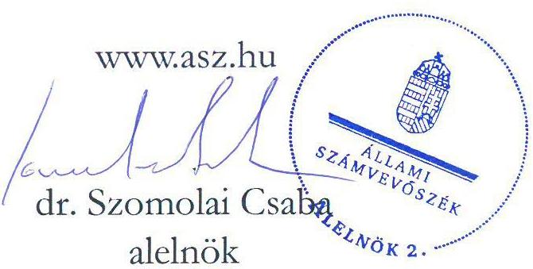
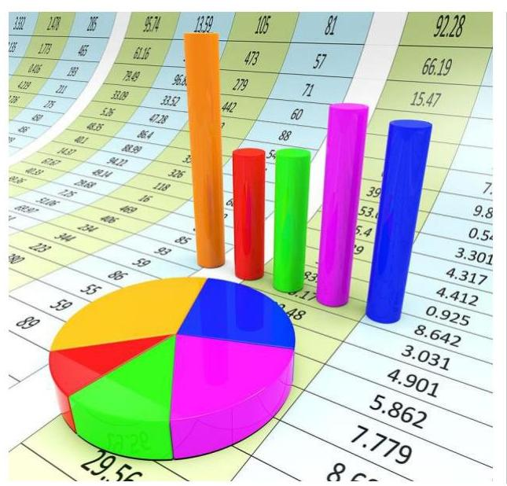

# JELENTÉS 

## Az adatgyűjtés, adatfeldolgozás rendszerének ellenőrzése

2023.

---

# ÁLLAMI   SZÁMVEVŐSZÉK 

## JELENTÉS

## Az adatgyűjtés, adatfeldolgozás rendszerének ellenőrzése

2023.

23021

---

# ELLENŐRZÉSI IGAZGATÓSÁG: 

## ÁLLAMHÁZTARTÁS KÖZPONTI SZINTJÉT ELLENŐRZŐ IGAZGATÓSÁG

ELLENŐRZÉSI IGAZGATÓ:
BALKAY ATTILA igazgató

ELLENŐRZÉSVEZETŐ:
$\square$ DR. KISS ESZTER ellenőrzésvezető

## IKTATÓSZÁM: EL-3865-001/2023

TÉMASZÁM: 2605

ELLENŐRZÉS-AZONOSÍTÓ SZÁM: V0949

---

# TARTALOMJEGYZÉK 

■ ÖSSZEGZÉS ..... 5
■ AZ ELLENŐRZÉS CÉLJA ..... 6
■ AZ ELLENŐRZÉS TERÜLETE ..... 7
■ AZ ELLENŐRZÉS HÁTTERE, INDOKOLTSÁGA ..... 9
■ A JELENTÉS LÉNYEGES KÉRDÉSKÖREI ..... 10
■ AZ ELLENŐRZÉS HATÓKÖRE ÉS MÓDSZEREI ..... 11
■ MEGÁLLAPÍTÁSOK ..... 13
■ MELLÉKLETEK ..... 19
I. sz. melléklet: Értelmező szótár ..... 19
II. sz. melléklet: Az ellenőrzött 2019-2020. évi OSAP adatátadások ..... 21
■ FÜGGELÉK: ÉSZREVÉTELEK ..... 23
■ RÖVIDÍTÉSEK JEGYZÉKE ..... 25

---

.

---

# ÖSSZEGZÉS 

A 2019-2020. években a Hivatalos Statisztikai Szolgálat tagjai statisztikai tevékenységének szabályozottsága megfelelt az előírásoknak. A statisztikai tevékenység ellátása során a Nemzeti Statisztika Gyakorlati Kódexe elveinek teljesülését a Központi Statisztikai Hivatal értékelte. A statisztikai tevékenység teljesítményének mérésére a Központi Statisztikai Hivatal, az Agrárminisztérium és az Igazságügyi Minisztérium kialakított gyakorlatokat. Az adminisztratív adatforrást kezelő szervezetek statisztikai adatátadással kapcsolatos feladatainak szabályozottsága megfelelt az előírásoknak. Hiányosságot az ellenőrzés az együttmüködési megállapodás kapcsán tárt fel. Az adminisztratív adatforrás minőségéről éves minőségjelentést az Országos Meteorológiai Szolgálat állította össze.

## Az ellenőrzés társadalmi indokoltsága

A hivatalos statisztikai tevékenység a tájékoztatást és a társadalom általános tájékozottságát statisztikai adatok nyilvánosságra hozatalával szolgáló, a tényekre alapozott döntéshozatalt támogató, törvényben szabályozott közfeladat. Ezen statisztikai tevékenység célja, hogy a statisztikai információk nyilvánosságra hozatalával tárgyilagos képet adjon a társadalom, a gazdaság, a környezet állapotáról és annak változásairól a közszféra és magánszféra szervezetei, a tudományos tevékenységet végzők, a közvélemény, a média szereplői, valamint a nemzetközi szervezetek számára egyaránt.

A statisztikai tevékenység jogszabályi előírásoknak megfelelő szabályozási környezete kialakításának és a statisztikai tevékenység eredményessége mérésének szerepe van abban, hogy a gazdasági és társadalmi szereplők objektív információk alapján hozhassák meg döntéseiket. Emellett segítik a gazdasági-társadalmi folyamatok elemzését, az összefüggések feltárását, tájékoztatást adnak a nemzetközi- és a magyar gazdaságra hatást gyakorló intézmények számára.

A statisztikai tevékenységet ellátó Hivatalos Statisztikai Szolgálat tagjai és az adminisztratív adatforrást kezelő szervezetek ellenőrzésével az Állami Számvevőszék célja, hogy támogassa a központi költségvetési forrásokat felhasználó szervezetek statisztikai tevékenysége szabályozási környezetének megfelelő kialakítását és azon keresztül a feladatellátást.

## Főbb megállapítások

A Hivatalos Statisztikai Szolgálat tagjai a 2019-2020. években belső szabályzataikban meghatározták a statisztikai tevékenységgel kapcsolatos feladatellátás szervezeti és működési rendjét.

Az adminisztratív adatforrást kezelő szervezetek belső szabályzataikban meghatározták a statisztikai adatátadással kapcsolatos feladatokat és felelősségi köröket. Az Állami Számvevőszék által ellenőrzött adminisztratív adatátadásokhoz együttműködési megállapodással az adminisztratív adatforrást kezelő szervezetek - a Szellemi Tulajdon Nemzeti Hivatala, a Nemzeti Népegészségügyi Központ, a Büntetés-végrehajtás Országos Parancsnoksága, az Innovációs és Technológiai Minisztérium kivételével - rendelkeztek az ellenőrzött időszakban.

Az adminisztratív adatforrás minőségéről éves minőségjelentést 2019-2020. években az Országos Meteorológiai Szolgálat készített.

A Hivatalos Statisztikai Szolgálat tagjainál a Központi Statisztikai Hivatal a statisztikai tevékenység ellátása során a Nemzeti Statisztika Gyakorlati Kódexe egyes elveinek teljesülését akkreditációs eljárásban értékelte.

A Központi Statisztikai Hivatal, az Agrárminisztérium és az Igazságügyi Minisztérium kialakított gyakorlatokat a statisztikai tevékenysége teljesítményének mérésére.

---

# AZ ELLENŐRZÉS CÉLJA 

Az ellenőrzés célja annak értékelése volt, hogy a Hivatalos Statisztikai Szolgálat tagjai és az adminisztratív adatforrást kezelő ellenőrzött szervezetek statisztikai tevékenységének szabályozottsága megfelelt-e az előírásoknak és a Hivatalos Statisztikai Szolgálat ellenőrzött tagjai alakítottake ki gyakorlatokat a statisztikai tevékenység teljesítményének mérésére.

---

# AZ ELLENŐRZÉS TERÜLETE 

## A statisztikai tevékenységet ellátó Hivatalos Statisztikai Szolgálat tagjai és az adminisztratív adatforrást kezelő szervezetek

A hivatalos statisztikai tevékenységet a 2017. január 1-jén hatályba lépett Stt. ${ }^{1}$ és az Stt. vhr. ${ }^{2}$ szabályozza.

A hivatalos statisztikai tevékenységet, mint közfeladatot a Hivatalos Statisztikai Szolgálat látja el, tagjai a jogszabályban rögzített hivatalos statisztika előállításában múködnek közre. 13 tagja közül az alábbiakban bemutatott hat tagjánál folytatott le ellenőrzést az ÁSZ³.

A $\mathrm{KSH}^{4}$ feladatát képezi többek között a Hivatalos Statisztikai Szolgálat tagjainak akkreditációja, akkreditációjuk felülvizsgálata, a hivatalos statisztikai tevékenységük szakmai koordinációja és az OSAP ${ }^{5}$ összeállítása.

Az AM ${ }^{6}$ hivatalos statisztikai adatokat az OSAP alapján gyújt, melynek keretében a mezőgazdaság, az élelmiszeripar, valamint a környezet- és természetvédelem egyes részterületeinek helyzetéről és annak időbeli változásáról állít elő statisztikai adatokat. Az AM az ellenőrzött időszakban az OSAP-ban elrendelt adatgyűjtésekkel kapcsolatos hivatalos statisztikai tevékenységet háttérintézménye bevonásával, valamint kiszervezett formában látta el. Az OSAP-ban elrendelt erdészeti témájú statisztikai adatfelvételeket az AM megbízásából és szakmai felügyelete mellett 2018. április 9-től a NÉBIH7, 2019. szeptember 18-tól az NFK ${ }^{8}$ végezte együttműködési megállapodás alapján, mint a minisztérium háttérintézménye.

A KIM ${ }^{9}$ jogelődje, az EMMI ${ }^{10}$ hivatalos statisztikai adatokat az OSAP alapján gyújtött, három szakstatisztikai terület - egészségügy, oktatás, kultúra - adatgyűjtéseinek és adatátvételeinek végrehajtásáért volt felelős. Az EMMI az ellenőrzött időszakban az OSAP-ban elrendelt adatgyűjtésekkel kapcsolatos hivatalos statisztikai tevékenységet háttérintézményei bevonásával látta el. A háttérintézmények feladatkörébe tartozott az adatgyűjtések végrehajtása, a minisztérium koordinációs és döntési jogkört gyakorolt.

A $\mathrm{BM}^{11}$ hivatalos statisztikai adatokat szintén az OSAP alapján gyújt, valamint adminisztratív adatforrásokat is felhasznál a statisztikai adatok előállításához.

Az ITM ${ }^{12}$ részére a 2014. február 21-én létrejött megállapodás alapján az OSAP ITM fejezetében szereplő adatgyűjtéseket és statisztikai célú adatátvételeket a KSH hajtotta végre. A teljes statisztikai adatelőállítási tevékenységet, az adatok publikálását, nyilvánosságra hozatalát, a felhasználókkal való kapcsolattartást is végezte azzal, hogy az ITM az adatgazda, az adatgyűjtésekkel és a statisztikai adatok nyilvánosságra hozatalával kapcsolatos végső döntést az ITM hozta meg. A statisztikai adatelőállítási

---

folyamat egyes részfolyamatait a minisztérium a KSH-val együttműködve látta el.

Az IM ${ }^{13}$ az OSAP alapján a felügyelete alá tartozó szervek, szervezetek igazságügyi statisztikai adatait, a közjegyzők tevékenységével kapcsolatos adatokat, a törvényszékeken működő végrehajtói irodák és a törvényszéki végrehajtók tevékenységének adatait, továbbá az önálló bírósági végrehajtók tevékenységét bemutató ügyforgalmi adatokat gyűjti és teszi közzé.

A hivatalos statisztikai tevékenység ellátása során a Hivatalos Statisztikai Szolgálat tagjainak meg kell felelnie az Európai Statisztika Gyakorlati Kódexében, valamint az Stt. -ben meghatározott alapelveknek, amelyek részletes tartalmát az Stt. 3. § (4) bekezdésének előírása alapján megalkotott és 2017. júniusában a KSH elnöke által kiadott Nemzeti Statisztika Gyakorlati Kódexe határozza meg. A Kódex ${ }^{14}$ elveinek való megfelelést a KSH elnöke akkreditációs eljárás alkalmazásával állapítja meg a Hivatalos Statisztikai Szolgálat tagjai tekintetében, amelyet ötévente felülvizsgál.

Az adminisztratív adatforrást kezelő, közfeladatot ellátó szervezetek jogszabályi felhatalmazás alapján - hivatalos statisztikai célra különféle adminisztratív adatokat gyűjtenek és egyedi azonosításra alkalmas módon átadják a Hivatalos Statisztikai Szolgálat tagjai részére.

Az ÁSZ által lefolytatott megfelelőségi ellenőrzés a Hivatalos Statisztikai Szolgálat tagjai közül a KSH-ra, az AM-re, az EMMI-re, a BM-re, az ITM-re; az adminisztratív adatforrást kezelő szervezetek közül a MÁK ${ }^{15}$-ra, az SZTNH ${ }^{16}$-ra, az MFB Zrt. ${ }^{17}$-re, a BVOP ${ }^{18}$-ra, az OMSZ ${ }^{19}$-re, a NÉBIH-re, az $\mathrm{NNK}^{20}$-ra, az $\mathrm{NMHH}^{21}$-ra, az ITM-re és az IM-re terjedt ki. A megfelelőségi ellenőrzés keretében az ÁSZ a Hivatalos Statisztikai Szolgálat tagjai statisztikai tevékenysége szabályozottságának megfelelőségét, a statisztikai tevékenységük ellátása során a Kódex minőség iránti elkötelezettség elve 7.3. ismérvében, a relevancia elv 10.1. ismérvében, a pontosság és megbízhatóság elv 11.1. ismérvében előírtak teljesülésének KSH általi értékelését ellenőrizte. A megfelelőségi ellenőrzés kiterjedt az adminisztratív adatforrást kezelő szervezetek statisztikai adatátadással kapcsolatos feladatai szabályozottságának megfelelőségére. Az ÁSZ a II. számú mellékletben szereplő 14 adatátadás (OSAP 1919, 2040, 2041, 2265, 1616, 2443, 2329, 2340, 2498, 1066, 1254, 2349, 1560, 1705) esetében ellenőrizte az adatátadásokhoz az együttműködési megállapodás meglétét. Az adminisztratív adatforrást kezelő szervezetek esetében ellenőrzésre került az adminisztratív adatforrások minőségéről az éves minőségjelentés összeállításával kapcsolatos kötelezettség teljesítése. Az NMHH részéről az ellenőrzött időszakban az éves minőségjelentés összeállításának és az adatátadáshoz az együttműködési megállapodás megkötésének kötelezettsége nem állt fenn, mivel az OSAP 1705 azonosító számú adatátadás egyéb másodlagos forrásból származó, OSAP rendeleten ${ }^{22}$ kívül elrendelt adatátadásnak és az NMHH adatszolgáltató szervezetnek minősült. A NÉBIH részéről az ellenőrzött időszakban az éves minőségjelentés összeállításának kötelezettsége szintén nem állt fenn, mivel az AM részére az OSAP-ban elrendelt erdészeti témájú statisztikai adatfelvételeket együttműködési megállapodás alapján 2019. szeptember 17-ig végezte, amely feladat jogutódlással átkerült az NFK-hoz.

Az ÁSZ által lefolytatott teljesítmény-ellenőrzés a Hivatalos Statisztikai Szolgálat tagjai közül a KSH-ra, az AM-re, az EMMI-re, a BM-re, az ITM-re és az IM-re terjedt ki, amelynek keretében az ÁSZ feltárta a statisztikai tevékenység teljesítménymérésére kialakított gyakorlatokat.

---

# AZ ELLENŐRZÉS HÁTTERE, INDOKOLTSÁGA 

A statisztikai tevékenység megfelelő szabályozási környezetének kialakítása, a Kódex elveinek való megfelelése, az eredményesség mérése fontos annak érdekében, hogy a hivatalos statisztika találkozzon a felhasználói igényekkel, a statisztikai adatelőállítási folyamat eredményeképpen nyilvánosságra hozott statisztikai termékek a társadalom, a gazdaság, a környezet állapotáról tárgyilagos képet biztosítsanak és minden felhasználó számára hozzáférhetőek legyenek.

Az ÁSZ ellenőrzése a döntéshozók, az ellenőrzött szervezetek és a társadalom számára visszajelzést ad a Hivatalos Statisztikai Szolgálat és az adminisztratív adatforrást kezelő szervezetek statisztikai tevékenysége szabályozottságának megfelelőségéről, a kialakított teljesítménymérési gyakorlatokról és támogatja az ellenőrzött szervezetek feladatellátását.

---

# A JELENTÉS LÉNYEGES KÉRDÉSKÖREI 

1.     - Az ellenőrzött szervezetek kialakították-e a statisztikai tevékenységgel kapcsolatos feladatok ellátásának rendjét?
2.     - Az adminisztratív adatforrást kezelő szervezetek összeállitottáke az éves minőségjelentést az adminisztratív adatforrások minőségéről?
3.     - A Hivatalos Statisztikai Szolgálat tagjainál értékelték-e a Kódex egyes elveinek teljesülését?
4.     - A Hivatalos Statisztikai Szolgálat tagjai alakítottak-e ki gyakorlatokat a statisztikai tevékenység teljesítményének mérésére?

---

# AZ ELLENŐRZÉS HATÓKÖRE ÉS MÓDSZEREI 

## Az ellenőrzés típusa

Megfelelőségi és teljesítmény-ellenőrzés.

## Az ellenőrzött időszak

2019-2020. évek.

## Az ellenőrzés tárgya

A megfelelőségi ellenőrzés tárgyát képezte a Hivatalos Statisztikai Szolgálat tagjai statisztikai tevékenysége szabályozottságának megfelelősége, a statisztikai tevékenységük ellátása során a Kódex egyes elvei teljesülésének értékelése. A megfelelőségi ellenőrzés kiterjedt az adminisztratív adatforrást kezelő szervezetek statisztikai adatátadással kapcsolatos feladatai szabályozottságának megfelelőségére, valamint az adminisztratív adatforrások minőségéről az éves minőségjelentés összeállításával kapcsolatos kötelezettség teljesítésére.

A teljesítmény-ellenőrzés tárgyát képezte a Hivatalos Statisztikai Szolgálat tagjai által a statisztikai tevékenység teljesítménymérésére kialakított gyakorlatok felmérése.

## Az ellenőrzött szervezet

A megfelelőségi ellenőrzés során ellenőrzött szervezet volt a Hivatalos Statisztikai Szolgálat tagjai közül a KSH, az AM, az EMMI, a BM és az ITM, az adminisztratív adatforrást kezelő szervezetek közül a MÁK, az SZTNH, az MFB Zrt., a BVOP, az OMSZ, a NÉBIH, az NNK, az NMHH, az ITM és az IM.

A teljesítmény-ellenőrzés során ellenőrzött szervezet volt a Hivatalos Statisztikai Szolgálat tagjai közül a KSH, az AM, az EMMI, a BM, az ITM és az IM.

## Az ellenőrzés jogalapja

Az ellenőrzés jogszabályi alapját az ÁSZ tv. ${ }^{23} 1 . \S$ (3), valamint az 5. § (2) és (6) bekezdéseinek előírásai képezik.

---

# Az ellenőrzés módszerei 

Az ellenőrzést az ÁSZ a vonatkozó időszakban hatályos jogszabályok, az ellenőrzés szakmai szabályai, a megfelelőségi ellenőrzésre irányadó ÁSZ módszertan, valamint a teljesítmény-ellenőrzésre irányadó ÁSZ módszertan alapján folytatta le az ellenőrzési program kérdéseire adott válaszok kiértékelésével.

Az ellenőrzési kérdések megválaszolásához szükséges bizonyítékok megszerzése az ellenőrzött szervezetek által rendelkezésre bocsátott dokumentumokra és adatokra alapozva megfigyelés, szemle (szemrevételezés), mintavétel, valamint elemző eljárás útján történt. Az ellenőrzési bizonyítékként felhasználható adatforrások közé tartoztak egyrészt az ellenőrzési programban rögzített adatforrások, másrészt adatforrás lehetett minden - az ellenőrzés folyamán feltárt - az ellenőrzés szempontjából információt tartalmazó dokumentum. Az ellenőrzés lefolytatásához az ellenőrzött szervezetek az ÁSZ által kért dokumentumok rendelkezésre bocsátásával szolgáltattak adatokat.

---

# 1. Az ellenőrzött szervezetek kialakították-e a statisztikai tevékenységgel kapcsolatos feladatok ellátásának rendjét? 

1.1. számú megállapítás

A Hivatalos Statisztikai Szolgálat tagjai a 2019-2020. években belső szabályzataikban kialakították a statisztikai tevékenységgel kapcsolatos feladatellátás szervezeti és múködési rendjét.

A KSH a 2019-2020. években az Áht. ${ }^{24}$ és az Ávr. ${ }^{25}$ rendelkezéseivel összhangban az SZMSZ ${ }_{1,2,3}{ }^{26}$-ban, illetve a szervezeti egységek ügyrendjeiben részletesen meghatározta a statisztikai tevékenységgel kapcsolatos feladatok ellátásának rendjét. A KSH elnöke az SZMSZ ${ }_{1,2,3}$-ban rögzítette a szervezeti egységek statisztikai feladatait, az azok elvégzéséért felelős vezetők feladat- és hatáskörét, a főosztályok ügyrendjei tartalmazták a statisztikai tevékenységgel kapcsolatban ellátandó feladatok részletszabályait, a munkafolyamatok leírását, az érintett alkalmazottak feladat- és hatáskörét.

A BM a 2019-2020. években az Áht. és az Ávr. rendelkezéseivel összhangban az SZMSZ ${ }^{27}$-ben meghatározta a statisztikai tevékenységgel kapcsolatos feladatokat ellátó szervezeti egységek feladatait és a munkakörökhöz kapcsolódó felelősségi szabályokat. A Jogszabály-előkészítő és Koordinációs Főosztály ügyrendje tartalmazta a statisztikai feladatellátás munkafolyamatainak leírását, az érintett szervezeti egységek vezetőinek és alkalmazottainak feladat- és hatáskörét.

AZ ITM a 2019-2020. években az Áht. és az Ávr. rendelkezéseivel összhangban SZMSZ ${ }_{1,2}{ }^{28}$-ben meghatározta a minisztérium külső és belső statisztikai koordinációs feladatait ellátó szervezeti egység, az Igazgatási és Biztonsági Főosztály feladatait, amelynek ügyrendjében szabályozták a feladatok elvégzéséért felelős vezetők, alkalmazottak feladat- és hatáskörét. A statisztikai adatelőállítási tevékenység munkafolyamatainak leírását az adatgyűjtések és statisztikai célú adatátvételek végrehajtását ellátó KSHval kötött megállapodás ${ }^{29}$ tartalmazta.

AZ EMMI a 2019-2020. években az Áht. és az Ávr. rendelkezéseivel összhangban SZMSZ ${ }^{30}$-ben szabályozta a minisztérium statisztikai koordinációs tevékenységével kapcsolatos feladatokat ellátó szervezeti egységeinek feladatait, a munkafolyamatok leírását, a szervezeti egységek vezetőinek és alkalmazottainak feladat- és hatáskörét.

AZ AM a 2019-2020. években az Áht. és az Ávr. rendelkezéseivel összhangban SZMSZ ${ }_{1,2}{ }^{31}$-ben meghatározta a minisztérium hivatalos statisztika előállításában részt vevő szervezeti egységek feladatait, az azok elvégzéséért felelős vezetők és alkalmazottak feladat- és hatáskörének általános

---

1.2. számú megállapítás

szabályait az SZMSZ1,2-ben, a részletszabályokat az együttműködési megállapodás ${ }_{5,6}{ }^{32}$-ban rögzítették. Az AM a statisztikai tevékenységek munkafolyamatairól a Statisztikai szabályzatában ${ }^{33}$ rendelkezett.

Az adminisztratív adatforrást kezelő szervezetek belső szabályzataikban meghatározták a statisztikai adatátadással kapcsolatos feladatokat és felelősségi köröket. Az ellenőrzött adminisztratív adatátadásokhoz együttmüködési megállapodással az adminisztratív adatforrást kezelő szervezetek - az SZTNH, az NNK, a BVOP, az ITM kivételével - rendelkeztek az ellenőrzött időszakban.

A MÁK a 2019-2020. években az Ávr. előírása szerint a statisztikai adatátadást ellátó szervezeti egységek ügyrendjében meghatározta a feladatokat, az adatátadással kapcsolatos felelősségi köröket.

A MÁK az Stt. előírásával összhangban az ellenőrzött OSAP 1919, 2040, 2041, 2265, 1616 azonosító számú adminisztratív adatátadásokhoz a KSHval, mint a $\mathrm{HSSz}^{34}$ adatot átvevő tagjával kötött együttműködési megállapodás ${ }_{1}{ }^{35}$-vel rendelkezett.

AZ OMSZ a 2019-2020. években az Ávr. előírása szerint a statisztikai adatátadást ellátó szervezeti egységek feladatait, az adatátadással kapcsolatos felelősségi köröket az SZMSZ ${ }_{1,2}{ }^{36}$-ben, ügyrendben meghatározta.

Az OMSZ 2020. évtől az Stt. előírásával összhangban rendelkezett az ellenőrzött OSAP 1066 azonosítószámú adminisztratív adatátadáshoz a KSHval kötött együttmúködési megállapodás ${ }_{2}{ }^{37}$-vel.

AZ SZTNH a 2020.08.31-től hatályos ügyrendjében határozta meg az Ávr. előírása szerint a statisztikai adatátadást ellátó szervezeti egységek feladatait, az adatátadással kapcsolatos felelősségi köröket.

Az SZTNH az Stt. 28. § (7) bekezdésében előírtak ellenére a 2019-2020. évekre vonatkozóan ellenőrzött OSAP 2340 azonosító számú adminisztratív adatátadáshoz a KSH-val, mint a HSSz adatot átvevő tagjával együttmúködési megállapodással nem rendelkezett.

AZ NNK SZMSZ ${ }_{1,2}{ }^{38}$-e a 2019-2020. években a jogszabályi előírásokkal összehangban tartalmazta a statisztikai adatátadást ellátó szervezeti egységek feladatait és a felelősségi köröket.

Az NNK az Stt. 28. § (7) bekezdésében előírtak ellenére a 2019-2020. évekre vonatkozóan ellenőrzött OSAP 1560 azonosító számú adminisztratív adatátadáshoz az EMMI-vel, mint a HSSz adatot átvevő tagjával együttműködési megállapodással nem rendelkezett.

A BVOP a 2019-2020. években az Ávr. előírása szerint a statisztikai adatátadást ellátó szervezeti egységek feladatait és a felelősségi köröket SZMSZ ${ }_{1,2}{ }^{39}$-ben meghatározta.

A BVOP az Stt. 28. § (7) bekezdésében előírtak ellenére a 2019-2020. évekre vonatkozóan ellenőrzött OSAP 2349 azonosító számú adminisztratív adatátadáshoz a BM-mel, mint a HSSz adatot átvevő tagjával együttműködési megállapodással nem rendelkezett.

---

AZ NMHH a 2019-2020. években az Ávr. előírása szerint SZMSZ ${ }_{1-7}{ }^{40}$ ben meghatározta a statisztikai adatszolgáltatási kötelezettségek teljesítését végző szervezeti egysége feladatait és a kapcsolódó felelősségi köröket.

AZ MFB ZRT. a 2019-2020. években a jogszabályi előírásokkal öszszehangban belső szabályzatban, SZMSZ ${ }_{1-8}{ }^{41}$-ban rögzítette a statisztikai adatátadást ellátó szervezeti egység feladatait és a felelősségi köröket.

Az MFB Zrt. a 2019-2020. években az ellenőrzött OSAP 2498 azonosító számú adatátadás kapcsán a KSH-val, mint a HSSz adatot átvevő tagjával kötött együttműködési megállapodás ${ }_{5}{ }^{42}$-val az Stt. előírásával összhangban rendelkezett.

A NÉBIH 2019. szeptember 17-ig az Ávr. előírása szerint a statisztikai adatátadást ellátó Erdészeti Igazgatóság feladatait, az adatátadással kapcsolatos felelősségi köröket az OSAP keretében végzett tevékenységek belső eljárásrendjében meghatározta.

A NÉBIH 2019. szeptember 17-ig az ellenőrzött OSAP 1254 azonosító számú adminisztratív adatátadáshoz az AM jogelődjével, az FM ${ }^{43}$-mel, mint a HSSz adatot átvevő tagjával kötött együttműködési megállapodás ${ }_{5}{ }^{44}$-val az Stt. előírásával összhangban rendelkezett.

# AZ IM, MINT ADMINISZTRATÍV ADATFORRÁST 

KEZELŐ SZERVEZET a 2019-2020. években az Ávr. előírása szerint a statisztikai adatátadást ellátó szervezeti egységek feladatait, az adatátadással kapcsolatos felelősségi köröket SZMSZ ${ }_{1,2}{ }^{45}$-ben, ügyrendben meghatározta.

Az IM a 2019-2020. években az ellenőrzött OSAP 2329 azonosító számú adminisztratív adatátadáshoz a KSH-val, mint a HSSz adatot átvevő tagjával kötött együttműködési megállapodás ${ }_{4}{ }^{46}$-val az Stt. előírásával összhangban rendelkezett.

## AZ ITM, MINT ADMINISZTRATÍV ADATFORRÁST

KEZELŐ SZERVEZET a 2019-2020. években az Ávr. előírása szerint SZMSZ ${ }_{1,2}$-ben meghatározta az OSAP 2443 azonosító számú jogszabály által elrendelt adatátadását végző Európai Uniós Fejlesztésekért Felelős Államtitkárság feladatait és a kapcsolódó felelősségi köröket.

Az ITM az Stt. 28. § (7) bekezdésében előírtak ellenére a 2019-2020. évekre vonatkozóan ellenőrzött OSAP 2443 azonosító számú adminisztratív adatátadáshoz a KSH-val, mint a HSSz adatot átvevő tagjával együttműködési megállapodással nem rendelkezett.

---

# 2. Az adminisztratív adatforrást kezelő szervezetek összeállított- 

ták-e az éves minőségjelentést az adminisztratív adatforrások minőségéről?

Összegző megállapítás

Az ellenőrzött adminisztratív adatforrást kezelő szervezetek közül a 2019-2020. években az OMSZ készített az adminisztratív adatforrás minőségéről éves minőségjelentést.

AZ OMSZ az Stt.-ben előírt jogszabályi kötelezettségét teljesítette, a 2019-2020. évekre az OSAP-ban elrendelt 1066 nyilvántartási számú leve-gőtisztaság-védelmi adatok minőségére vonatkozó elvárások teljesüléséről az éves minőségjelentést elkészítette, amely az AM-en keresztül megküldésre került a KSH részére.

A MÁK, AZ ITM, AZ IM, AZ SZTNH, AZ MFB ZRT., A BVOP, AZ NNK az Stt. 28. § (11) bekezdésében előírtak ellenére az ellenőrzött időszakban az adminisztratív adatforrás minőségéről nem állított össze éves minőségjelentést.

## 3. A Hivatalos Statisztikai Szolgálat tagjainál értékelték-e a Kódex egyes elveinek teljesülését?

## Összegző megállapítás

A Hivatalos Statisztikai Szolgálat tagjainál a KSH a statisztikai tevékenység ellátása során a Kódex egyes elveinek teljesülését akkreditációs eljárásban értékelte.

A KSH által felállított Akkreditációs Bizottság a Kódex elveinek való megfelelősége megállapítása érdekében a Hivatalos Statisztikai Szolgálat alábbi tagjainál az Stt. 5. § (1) bekezdésében foglaltak szerint lefolytatott akkreditációs eljárás keretében:
$\longrightarrow$ AZ AM statisztikai tevékenységének esetében a 2018. augusztus 24-én kelt akkreditációs vizsgálati jelentésben értékelte a Kódex minőség iránti elkötelezettség elve 7.3. ismérvében, a relevancia elv 10.1. ismérvében, a pontosság és megbízhatóság elv 11.1. ismérvében előírtak teljesülését;
$\longrightarrow$ A BM statisztikai tevékenységének esetében a 2019. május hónapban kelt akkreditációs vizsgálati jelentésben értékelte a Kódex minőség iránti elkötelezettség elve 7.3. ismérvében, a relevancia elv 10.1. ismérvében, a pontosság és megbízhatóság elv 11.1. ismérvében előírtak teljesülését;
$\longrightarrow$ AZ EMMI statisztikai tevékenységének esetében a 2019. július hónapban kelt akkreditációs vizsgálati jelentésben értékelte a Kódex minőség iránti elkötelezettség elve 7.3. ismérvében, a relevancia elv 10.1. ismérvében, a pontosság és megbízhatóság elv 11.1. ismérvében előírtak teljesülését;
$\longrightarrow$ AZ ITM statisztikai tevékenységének esetében a 2018. május 18án kelt akkreditációs vizsgálati jelentésben értékelte a Kódex

---

minőség iránti elkötelezettség elve 7.3. ismérvében, a relevancia elv 10.1. ismérvében, a pontosság és megbízhatóság elv 11.1. ismérvében előírtak teljesülését.

# 4. A Hivatalos Statisztikai Szolgálat tagjai alakítottak-e ki gyakorlatokat a statisztikai tevékenység teljesítményének mérésére? 

## Összegző megállapítás

A KSH, az AM és az IM kialakított gyakorlatokat a statisztikai tevékenysége teljesítményének mérésére.

A KSH a 2020. évig terjedő Stratégiájában ${ }^{47}$ meghatározta a statisztikai tevékenységéhez kapcsolódó célkitűzéseit, a Minőségpolitikájában ${ }^{48}$ és a szakstatisztikák módszertani leírásaiban rögzítette a statisztikai adatok minőségére vonatkozó elérendő kritériumokat, amelyek teljesülésének mérésére indikátorokat alkalmazott. Az OSAP jelentés ${ }_{1,2}$-ben ${ }^{49}$ részletesen elemezte és értékelte a statisztikai adatelőállítási folyamatok indikátorokkal mért teljesülését a 2019-2020. évekre. A KSH a statisztikai adatátvételeket a KARÁT rendszerén hajtotta végre, amely az átvételkor a hibákat vizsgálta.

A szakstatisztikákra vonatkozó európai uniós jogszabályokban ${ }^{50}$ meghatározott minőségi elvárások teljesülését az Eurostat az európai minőségjelentés ${ }_{1,2}$-ben ${ }^{51}$ értékelte az ellenőrzött időszakban.

A KSH az adminisztratív adatforrásokból előállított statisztikai adatok esetében a felhasználói fókuszcsoportok számára szervezett interjúk feldolgozásával és kiértékelésével azonosította az adatok hasznosulásának formáját, céljait, a honlapon feltett kérdésekre adott válaszok kiértékelésével mérte a felhasználói adatigényeket, valamint online kérdőíves felméréssel mérte a honlap adattartalmával való elégedettséget. A KSH a statisztikai információk relevanciájának fennállását vizsgálta, az ellenőrzött időszakban folyamatosan monitorozta honlapja letöltési adatait és gyűjtötte a nem teljesített adatkérési igényeket. Ezeket az információkat az OSAP adatfelvételek tervezéséhez felhasználta.

Az adminisztratív adatforrásból származó adatok statisztikai felhasználásra való alkalmasságát a KSH a Minőségi irányelvek ${ }^{52}$ dokumentumban rögzített módszertan alkalmazásával segítette. Ezen túlmenően a KSH új adminisztratív adatforrás létrehozásakor vagy már meglévő adatforrás módosítása kapcsán a közigazgatási egyeztetés keretében jelezte az illetékes minisztériumnak a hivatalos statisztikát érintő igényeket az adminisztratív adatforrás tartalmára, módszertanára vonatkozóan, ezzel segítve elő az adminisztratív adatforrás hivatalos statisztikai felhasználásra való alkalmasságát. A KSH bevonásával történt meg - többek között - a születési, a házasságkötési és a halálozási statisztikai adatlapok kitöltésének és KSH felé történő továbbításának elektronizálása, az állam többségi tulajdonában lévő gazdasági társaságok által teljesítendő egységes kontrolling adatszolgáltatási rendszer (GAT rendszer ${ }^{53}$ ) bevezetése.

A KSH-nál a másodlagos adatforrásból származó adatok minőségének mérése, értékelése megvalósult. A relevancia mérésére alkalmas indikátorokat a Minőségi irányelvek dokumentumban meghatározták, az igényspecifikáció folyamatszakaszában a felhasználói igények meghatározása, egyeztetése biztosította a relevancia elvének érvényesülését. Az összehasonlíthatóság elvének érvényesülését a nemzetközi standard mutatók,

---

változók, osztályozások használatával biztosították. Az időszerűség elvének Minőségi irányelvek dokumentumban meghatározott tájékoztatási naptárral, az időszerűség mérésére kialakított minőség- és teljesítményindikátorok alkalmazásával szereztek érvényt. Elindult a Big Data bevonása a hivatalos statisztikába, új eszközökkel például műholdas felvételekkel, kameraképekkel kezdték kiegészíteni a hagyományos adatállományokat.

AZ AM meghatározta a statisztikai tevékenységéhez kapcsolódó célkitűzéseit, a Statisztikai szabályzatában rögzítette az adatminőségre vonatkozó mérőszámokat. A statisztikai adatelőállítási folyamatminőséget és adatminőséget indikátorokkal mérték, amelyeket az OSAP adatfelvételekről készített minőségjelentésekben értékeltek.

Az AM a 2019. évben kérdőíves felhasználói igényfelmérést végzett a statisztikai információk relevanciájának vizsgálatára. Az eredményeket hat szempont alapján - ismertség, publikálási idővel való elégedettség, elérhetőség, a téma fontossága, megbízhatóság, felhasználás - értékelte.

Az adminisztratív adatforrásból származó adatok statisztikai felhasználásra való alkalmasságát az AM az adatfeldolgozási folyamatának lépéseire, valamint a hiányzó- és hibás adatok javítására, pótlására kidolgozott módszertannal segítette elő.

AZ IM meghatározta a statisztikai tevékenységéhez kapcsolódó célkitűzéseit az ellenőrzött időszakban, amelyek teljesítését a 2019. és a 2020. évi intézményi munkatervéhez készített szakmai beszámolóiban értékelt.

---

# MELLÉKLETEK 

## I. SZ. MELLÉKLET: ÉRTELMEZŐ SZÓTÁR

adminisztratív adatforrás
adminisztratív adatforrást kezelő szervezet

Big Data

Eurostat

Gazdasági Adattárház

Hivatalos Statisztikai Szolgálat feladata és tagja

Hivatalos Statisztikai Szolgálat tagjai

KARÁT rendszer
másodlagos adatforrás

Olyan másodlagos adatforrás, amelyben tárolt adatok gyűjtését vagy azokról nyilvántartás vezetését jogszabály írja elő az adminisztratív adatforrás kezelője számára. (Forrás: Stt. 2. § 3. pont)
Az együttműködési megállapodásokban, az Országos Statisztikai Adatfelvételi Program kötelező adatszolgáltatásairól szóló 388/2017. (XII. 13.) Korm. rendeletben rögzített, az Stt., illetve egyéb jogszabályok által elrendelt kötelező statisztikai átadásokban érintett szervezetek. (Forrás: Stt. 26. § (1) bek., 28. § (7) bek., OSAP rendelet)
Minden olyan másodlagos adatforrás, ami nem minősül adminisztratív adatforrásnak. A Big Data a másodlagos adatforrások új területe, nagy mennyiségű, nagy sebességgel változó és nagyon változatos adatok feldolgozása. (Forrás: https://www.ksh.hu/docs/hun/xftp/idoszaki/pdf/muhelytanulmanyok11.pdf)
Az Európai Unió statisztikai hivatala. Európai szintű, minőségi statisztikákkal és mutatókkal szolgál, melyek alapján összehasonlíthatók az egyes országok és régiók.
(Forrás: https://ec.europa.eu/info/departments/eurostat-european-statistics_hu)
Egységes elveken nyugvó, naprakész adatbázisként szolgáló központi elektronikus adatszolgáltatási rendszer. (Forrás: a Miniszterelnökség Szervezeti és Müködési Szabályzatáról szóló 5/2022. (VI. 17.) MvM utasítás 2. függelék 11.5.1. pont 22. alpont)
A Hivatalos Statisztikai Szolgálat feladata a hivatalos statisztikai tevékenység ellátása. A Hivatalos Statisztikai Szolgálat tagja az a szervezet lehet - az Sttv. 4. és az 5. §-ban foglaltak figyelembevételével -, amely közfeladatának részeként hoz nyilvánosságra hivatalos statisztikai adatokat, és amelynek szervezete és müködése megfelel a Nemzeti Statisztika Gyakorlati Kódexében és az Európai Statisztikai Rendeletben foglaltaknak. (Forrás: Stt. 4. § (1)-(2) bek.)
A Központi Statisztikai Hivatal, az Agrárminisztérium, a Belügyminisztérium, az Emberi Erőforrások Minisztériuma, az Igazságügyi Minisztérium, az Innovációs és Technológiai Minisztérium, a Külgazdasági és Külügyminisztérium, a Miniszterelnökség, a Pénzügyminisztérium, a Legfőbb Ügyészség, a Közbeszerzési Hatóság, a Magyar Energetikai és Közmű-szabályozási Hivatal, a Magyar Nemzeti Bank, az Országos Bírósági Hivatal. A Hivatalos Statisztikai Szolgálat tagja volt a Nemzeti Agrárkutatási és Innovációs Központ, amely 2021. január 31-én, jogutód nélkül megszűnt.
(Forrás: http://www.ksh.hu/hssz_nyito?lang=hu, SZIF/2/1/2021. számú Megszüntető okirat)
A Központi Statisztikai Hivatal által az adatállományok átvételére és kezelésére kifejlesztett adatforgalmi rendszer, amely biztosítja az Stt., illetve az adatgazda szervezetekkel kötött együttműködési megállapodások alapján az átvételhez és az állományok feldolgozásához kapcsolódó események egységes adminisztrálását, dokumentálását. (Forrás: https://www.ksh.hu/karat_tajekoztato_menu)
Olyan adatforrás, amelyből a statisztikai adatfelvétel által leírt sokaság adott időszakra vagy időpontra vonatkozó ismérvei teljes mértékben vagy részben statisztikai adatátvétellel meghatározhatók. A másodlagos adatforrások begyűjtésének két típusát különböztetjük meg: az adminisztratív forrásból történő adatátvételeket (adminisztratív adatátvétel) és az egyéb másodlagos forrásból történő adatátvételeket.
(Forrás: Stt. 2. § 12. pont)

---

Országos Statisztikai Adatfelvételi Program szerinti adatszolgáltatás
statisztikai adatátvétel
statisztikai adatgyűjtés
statisztikai adatelőállítási folyamat
statisztikai folyamatok minőségére vonatkozó elvek
statisztikai termékek minőségére vonatkozó elvek
statisztikai termékek
statisztikai tevékenység
tájékoztatási naptár

Az Országos Statisztikai Adatfelvételi Program kötelező adatszolgáltatásairól szóló 388/2017. (XII. 13.) Korm. rendelet szerinti, a statisztikai adatgyűjtésekhez kapcsolódó adatszolgáltatási kötelezettségek. (Forrás: OSAP rendelet)
A statisztikai adatfelvétel által meghatározott sokaság adott időszakra vagy időpontra vonatkozó ismérveinek meghatározásához más szervezet által nyilvántartott vagy öszszegyűjtött adatok átvétele, felhasználása. (Forrás: Stt. 2. § 13. pont)
A statisztikai adatfelvétel által meghatározott sokaság adott időszakra vagy időpontra vonatkozó ismérveinek összegyűjtése a kiválasztott adatszolgáltatók megkérdezésével vagy közvetlen megfigyeléssel. (Forrás: Stt. 2. § 16. pont)
A hivatalos statisztikai adatok előállítási folyamata, a hivatalos statisztikai adatot kezelő intézmények alaptevékenysége, amely magában foglalja a hivatalos statisztikák iránti igények megismerését, a hivatalos statisztikai adatok előállítási folyamatának és az azt támogató eszközöknek a megtervezését, szervezését, fejlesztését, adatforrások használatát, a hivatalos statisztikai célból kezelt adatok előkészítését, feldolgozását, elemzését, az azok alapján történő hivatalos közlést és megjelenítést, valamint a hivatalos statisztikai információk archiválását. (Forrás: Stt. 2. § 14. pont)
Minőség iránti elkötelezettség (7. elv), Megalapozott módszertan (8. elv), Adatvédelem (9. elv) (Forrás: A Nemzeti Statisztika Gyakorlati Kódexe, KSH, 2017. https://www.ksh.hu/docs/bemutatkozas/hun/gyakorlati_kodex.pdf)
Relevancia (10. elv), Pontosság és megbízhatóság (11. elv), Időszerűség és időbeli pontosság (12. elv), Koherencia és összehasonlíthatóság (13. elv), Hozzáférhetőség és érthetőség (14. elv) (Forrás: A Nemzeti Statisztika Gyakorlati Kódexe, KSH, 2017. https://www.ksh.hu/docs/bemutatkozas/hun/gyakorlati_kodex.pdf)
Nyilvánosságra hozott statisztikai információk, függetlenül a közzététel módjától. A statisztikai termék mindig valamilyen sokaság jellemzőit leíró, elemző információ, amely a nyilvánosság számára hozzáférhető, tipikusan a jellemzett sokaság egyedeinek azonosítása nélkül. (Forrás: https://docplayer.hu/112320015-A-nemzeti-statisztika-gyakor-lati-kodexe-es-a-kapcsolodo-onertekelo-kerdoiv-fogalommagyarazatai.html)
Adatok statisztikai módszerekkel történő felvétele, feldolgozása, tárolása, átadása, átvétele, elemzése, közlése a Hivatalos Statisztikai Szolgálat tagjai által.
(Forrás: Stt. 4. § (1) bek., 23. § (1) bek., 31. § (1) bek. alapján)
A statisztikai termékek megjelenését szabályozó tájékoztatási program egyik formája. Tartalmazza a közzététel időpontját (terméktől függő pontossággal pl. év, hónap, nap, óra, dátum, módosított dátum, megjelent dátum), a kiadvány címét, a kiadvány angol címét, adatbázisba kerülés dátumát. (Forrás: https://docplayer.hu/112320015-A-nem-zeti-statisztika-gyakorlati-kodexe-es-a-kapcsolodo-onertekelo-kerdoiv-fogalommagyarazatai.html)

---

| Azonosító   szám | Megnevezés | Átadó | Átvevő |
| :--: | :--: | :--: | :--: |
| 1919 | Családtámogatási ellátások éves és területi adatai | Magyar Államkincstár | Központi Statisztikai   Hivatal |
| 2040 | Az államháztartás központi alrendszerének éves   költségvetési beszámolója | Magyar Államkincstár | Központi Statisztikai   Hivatal |
| 2041 | Az államháztartás önkormányzati alrendszerének   éves költségvetési beszámolója | Magyar Államkincstár | Központi Statisztikai   Hivatal |
| 2265 | Éves munkaügyi jelentés a Központosított illet-   ményszámfejtési rendszerben lévő szervezetekről | Magyar Államkincstár | Központi Statisztikai   Hivatal |
| 1616 | Jelentés az önkormányzatok tulajdonában lévő in-   gatlanvagyonról | Magyar Államkincstár | Központi Statisztikai   Hivatal |
| 2443 | EU forrásból finanszírozott tárgyi eszközben érin-   tett projektek adatbázisa | Innovációs és Technológiai   Minisztérium | Központi Statisztikai   Hivatal |
| 2329 | Cégszolgálatnál (CSZ) közzétett beszámolók | Igazságügyi Minisztérium | Központi Statisztikai   Hivatal |
| 2340 | Szabadalmi adatok címú adatátadás | Szellemi Tulajdon Nemzeti   Hivatala | Központi Statisztikai   Hivatal |
| 2498 | Kockázati tőkebefektetésekkel támogatott startup   vállalkozások nyilvántartott adatai | Magyar Fejlesztési Bank Zrt. | Központi Statisztikai   Hivatal |
| 1066 | Levegőtisztaság-védelmi adatok | Országos Meteorológiai Szol-   gálat | Agrárminisztérium |
| 1254 | Beszámoló az erdősítésekről és a fakitermelésről | Nemzeti Élelmiszerlánc-biz-   tonsági Hivatal | Agrárminisztérium |
| 2349 | Jelentés a büntetés-végrehajtási pártfogó felügye-   lői tevékenységről | Büntetés-végrehajtás Orszá-   gos Parancsnoksága | Belügyminisztérium |
| 1560 | Összesítő az élelmiszer eredetű megbetegedési   eseményekről | Nemzeti Népegészségügyi   Központ | Emberi Eröforrások   Minisztériuma |
| 1705 | A postai, hírközlési, média és műsorszórási ható-   sági tevékenység | Nemzeti Média- és Hírközlési   Hatóság | Innovációs és Techno-   lógiai Minisztérium |

---

.

---

# FÜGGELÉK: ÉSZREVÉTELEK 

A jelentéstervezetet a Számvevőszék 15 napos észrevételezésre megküldte az ellenőrzött szervezetek vezetőinek az ÁSZ tv. 29. §* (1) bekezdése előírásának megfelelően.

Az ellenőrzött szervezetek közül a jelentéstervezet megállapításaira az Energiaügyi Minisztérium minisztere az ellenőrzés megállapításainak helytállóságát nem vitató tájékoztatást; az IM parlamenti államtitkára, az MFB Zrt. elnökvezérigazgatója és ügyvezető igazgatója, az NNK országos tisztifőorvosa az ellenőrzés megállapításainak helytállóságát nem vitató, a számvevőszéki ellenőrzés során feltárt hiányosság megszüntetése érdekében tett intézkedésről szóló tájékoztatást adott.
További ellenőrzött szervezet vezetője az ellenőrzés megállapításaira észrevételt nem tett.

[^0]
[^0]:    * 29. § (1) Az Állami Számvevőszék az ellenőrzési megállapításait megküldi az ellenőrzött szervezet vezetőjének vagy az általa megbízott személynek, és annak, akinek személyes felelősségét állapította meg.
    (2) Az ellenőrzött szervezet vezetője és a felelősként megjelölt személy az ellenőrzés megállapításaira tizenöt napon belül írásban észrevételt tehet.
    (3) Az Állami Számvevőszék az észrevételre a beérkezésétől számított harminc napon belül írásban válaszol. A figyelembe nem vett észrevételeket köteles a jelentésben feltüntetni, és megindokolni, hogy azokat miért nem fogadta el.

---

.

---

# RÖVIDÍTÉSEK JEGYZÉKE 

${ }^{1}$ Stt.
${ }^{2}$ Stt. vhr.
${ }^{3}$ ÁSZ
${ }^{4}$ KSH
${ }^{5}$ OSAP
${ }^{6}$ AM
${ }^{7}$ NÉBIH
${ }^{8}$ NFK
${ }^{9}$ KIM
${ }^{10}$ EMMI
${ }^{11}$ BM
${ }^{12}$ ITM
${ }^{13}$ IM
${ }^{14}$ Kódex
${ }^{15}$ MÁK
${ }^{16}$ SZTNH
${ }^{17}$ MFB Zrt.
${ }^{18}$ BVOP
${ }^{19}$ OMSZ
${ }^{20}$ NNK
${ }^{21}$ NMHH
${ }^{22}$ OSAP rendelet
${ }^{23}$ ÁSZ tv.
${ }^{24}$ Áht.
${ }^{25}$ Ávr.
${ }^{26}$ KSH SZMSZ ${ }_{1,2,3}$
${ }^{27}$ BM SZMSZ
${ }^{28}$ ITM SZMSZ ${ }_{1,2}$
${ }^{29}$ megállapodás
2016. évi CLV. törvény a hivatalos statisztikáról

184/2017. (VII. 5.) Korm. rendelet a hivatalos statisztikáról szóló 2016. évi CLV. törvény végrehajtásáról

Állami Számvevőszék
Központi Statisztikai Hivatal
Országos Statisztikai Adatfelvételi Program
Agrárminisztérium
Nemzeti Élelmiszerlánc-biztonsági Hivatal
Nemzeti Földügyi Központ
Kulturális és Innovációs Minisztérium
Emberi Erőforrások Minisztériuma
Belügyminisztérium
Innovációs és Technológiai Minisztérium
Igazságügyi Minisztérium
Nemzeti Statisztika Gyakorlati Kódexe
Magyar Államkincstár
Szellemi Tulajdon Nemzeti Hivatala
MFB Magyar Fejlesztési Bank Zártkörűen Működő Részvénytársaság
Büntetés-végrehajtás Országos Parancsnoksága
Országos Meteorológiai Szolgálat
Nemzeti Népegészségügyi Központ
Nemzeti Média-és Hírközlési Hatóság
388/2017. (XII. 13.) Korm. rendelet az Országos Statisztikai Adatfelvételi Program kötelező adatszolgáltatásairól
2011. évi LXVI. törvény az Állami Számvevőszékről
2011. évi CXCV. törvény az államháztartásról

368/2011. (XII. 31.) Korm. rendelet az államháztartásról szóló törvény végrehajtásáról
6/2017. (II. 27.) MvM utasítás a Központi Statisztikai Hivatal Szervezeti és Működési Szabályzatáról (hatálytalan: 2019. március 4. 21.00 órától)
3/2019. (III. 4.) MvM utasítás a Központi Statisztikai Hivatal Szervezeti és Müködési Szabályzatáról (hatályos: 2019. március 4. 21.00 órától-2020. december 28.)
27/2020. (XII. 28.) MvM utasítás a Központi Statisztikai Hivatal Szervezeti és Müködési Szabályzatáról (hatályos: 2020. december 29-től)
11/2018. (VI. 12.) BM utasítás a Belügyminisztérium Szervezeti és Müködési Szabályzatáról (hatályos: 2018. június 12-2022. június 28.)
33/2014. (X. 10.) NFM utasítás a Nemzeti Fejlesztési Minisztérium Szervezeti és Müködési Szabályzatáról (hatálytalan: 2019. március 1-től)
4/2019. (II. 28.) ITM utasítás az Innovációs és Technológiai Minisztérium Szervezeti és Müködési Szabályzatáról (hatályos: 2019. március 1-től)
Megállapodás közfeladatok tartós jelleggel történő átadásáról-átvételéről a Nemzeti Fejlesztési Minisztérium és a Központi Statisztikai Hivatal között (hatályos: 2014. február 21-től)

---

${ }^{30}$ EMMI SZMSZ
${ }^{31}$ AM SZMSZ ${ }_{1,2}$
${ }^{32}$ együttműködési megállapodás ${ }_{6}$
${ }^{33}$ Statisztikai szabályzat
${ }^{34} \mathrm{HSSz}$
${ }^{35}$ együttműködési megállapodás ${ }_{1}$
${ }^{36}$ OMSZ SZMSZ ${ }_{1,2}$
${ }^{37}$ együttműködési megállapodás ${ }_{2}$
${ }^{38}$ NNK SZMSZ ${ }_{1,2}$
${ }^{39}$ BVOP SZMSZ ${ }_{1,2}$
${ }^{40}$ NMHH SZMSZ ${ }_{1-7}$
${ }^{41}$ MFB Zrt. SZMSZ ${ }_{1-8}$

16/2018. (VII. 26.) EMMI utasítás az Emberi Erőforrások Minisztériuma Szervezeti és Múködési Szabályzatáról (hatályos: 2018. július 27-2022. augusztus 8.)
2/2018. (IX. 10.) AM utasítás az Agrárminisztérium Szervezeti és Múködési Szabályzatáról (hatálytalan: 2019. december 31-től)
10/2019. (XII. 30.) AM utasítás az Agrárminisztérium Szervezeti és Múködési Szabályzatáról (hatályos: 2019. december 31-től)
Megállapodás statisztikai feladatok ellátásáról az Agrárminisztérium és a Nemzeti Földügyi Központ között (hatályos: 2019. szeptember 18-tól)
1/2018. (III. 14.) FM utasítás a statisztikai szabályzat kiadásáról
Hivatalos Statisztikai Szolgálat
Együttműködési megállapodás a Magyar Államkincstár és a Központi Statisztikai Hivatal között (hatályos: 2018. december 13-tól)
12/2011. (VII. 8.) VM utasítás az Országos Meteorológiai Szolgálat Szervezeti és Múködési Szabályzatának kiadásáról (hatálytalan: 2019. május 11-től)
5/2019. (V. 10.) AM utasítás az Országos Meteorológiai Szolgálat Szervezeti és Múködési Szabályzatának kiadásáról (hatályos: 2019. május 11-2022. április 29.)
Együttműködési megállapodás az Országos Meteorológiai Szolgálat és a Központi Statisztikai Hivatal között (hatályos: 2020. január 8-tól)
51/2017. (X. 25.) EMMI utasítás az Országos Közegészségügyi Intézet szervezeti és múködési szabályzatáról (hatálytalan: 2019. június 7-től)
18/2019. (VI. 6.) EMMI utasítás a Nemzeti Népegészségügyi Központ Szervezeti és Múködési Szabályzatáról (hatályos: 2019. június 7-től)
1/2016. (IV. 15.) BVOP utasítás a Büntetés-végrehajtás Országos Parancsnoksága Szervezeti és Múködési Szabályzatáról (hatályos: 2016. április 16-2020. december 18.) 68/2020. (XII. 18.) BVOP utasítás a Büntetés-végrehajtás Országos Parancsnoksága Szervezeti és Múködési Szabályzatáról (hatályos: 2020. december 19-től)
33/2018. számú Elnöki Utasítás a Nemzeti Média- és Hírközlési Hatóság Szervezeti és Múködési Szabályzatának kiadásáról (hatálytalan: 2019. március 1-től)
9/2019. számú Elnöki Utasítás a Nemzeti Média- és Hírközlési Hatóság Szervezeti és Múködési Szabályzatának kiadásáról (hatálytalan: 2019. április 1-től)
12/2019. számú Elnöki Utasítás a Nemzeti Média- és Hírközlési Hatóság Szervezeti és Múködési Szabályzatának kiadásáról (hatálytalan: 2019. október 1-től)
24/2019. számú Elnöki Utasítás a Nemzeti Média- és Hírközlési Hatóság Szervezeti és Múködési Szabályzatának kiadásáról (hatálytalan: 2020. január 17-től)
1/2020. számú Elnöki Utasítás a Nemzeti Média- és Hírközlési Hatóság Szervezeti és Múködési Szabályzatának kiadásáról (hatálytalan: 2020. május 1-től)
10/2020. számú Elnöki Utasítás a Nemzeti Média- és Hírközlési Hatóság Szervezeti és Múködési Szabályzatának kiadásáról (hatálytalan: 2020. december 1-től)
20/2020. számú Elnöki Utasítás a Nemzeti Média- és Hírközlési Hatóság Szervezeti és Múködési Szabályzatának kiadásáról (hatályos: 2020. december 1-2021. augusztus 31.)
4/2018. számú Szervezeti és Múködési Szabályzat - MFB Magyar Fejlesztési Bank Zártkörűen Múködő Részvénytársaság (hatálytalan: 2019. február 1-től)
1/2019. számú Szervezeti és Múködési Szabályzat - MFB Magyar Fejlesztési Bank Zártkörűen Múködő Részvénytársaság (hatálytalan: 2019. június 1-től)
2/2019. számú Szervezeti és Múködési Szabályzat - MFB Magyar Fejlesztési Bank Zártkörűen Múködő Részvénytársaság (hatálytalan: 2019. november 1-től)
3/2019. számú Szervezeti és Múködési Szabályzat - MFB Magyar Fejlesztési Bank Zártkörűen Múködő Részvénytársaság (hatálytalan: 2019. december 6-tól)

---

4/2019. számú Szervezeti és Múködési Szabályzat - MFB Magyar Fejlesztési Bank Zártkörűen Működő Részvénytársaság (hatálytalan: 2020. március 2-től)
1/2020. számú Szervezeti és Múködési Szabályzat - MFB Magyar Fejlesztési Bank Zártkörűen Működő Részvénytársaság (hatálytalan: 2020. június 1-től)
2/2020. számú Szervezeti és Múködési Szabályzat - MFB Magyar Fejlesztési Bank Zártkörűen Múködő Részvénytársaság (hatálytalan: 2020. október 1-től)
3/2020. számú Szervezeti és Múködési Szabályzat - MFB Magyar Fejlesztési Bank Zártkörűen Múködő Részvénytársaság (hatályos: 2020. október 1-től)
Együttműködési megállapodás az MFB Magyar Fejlesztési Bank Zártkörűen Múködő Részvénytársaság és a Központi Statisztikai Hivatal között (hatályos: 2019. április 18-tól)
Földművelésügyi Minisztérium
Megállapodás statisztikai feladatok ellátásáról a Földművelésügyi Minisztérium és a Nemzeti Élelmiszerlánc-biztonsági Hivatal között (hatályos: 2018. április 9-től)
7/2014. (XI. 14.) IM utasítás az Igazságügyi Minisztérium Szervezeti és Múködési Szabályzatáról (hatálytalan: 2019. augusztus 1. 19.00 órától)
9/2019. (VIII. 1.) IM utasítás az Igazságügyi Minisztérium Szervezeti és Múködési Szabályzatáról (hatályos: 2019. augusztus 1. 19.00 órától - 2022. június 11.)
Együttműködési megállapodás az Igazságügyi Minisztérium és a Központi Statisztikai Hivatal között (hatályos: 2018. június 14-től)
Központi Statisztikai Hivatal Stratégia 2020
KSH Minőségpolitikája, 2014
"A 2019. évi Országos Statisztikai Adatfelvételi Program (OSAP) teljesülése" című dokumentum
"A 2020. évi Országos Statisztikai Adatfelvételi Program (OSAP) teljesülése" című dokumentum
388/2017. (XII. 13.) Korm. rendelet az Országos Statisztikai Adatfelvételi Program kötelező adatszolgáltatásairól 12. számú melléklete
ESA10_NQREQ_A_HU_2019_0000 National Reference Metadata in ESS Standard for Quality Reports Structure (ESQRS) Compiling agency: Hungarian Central Statistical Office
ESA10_NQREQ_A_HU_2020_0000 National Reference Metadata in ESS Standard for Quality Reports Structure (ESQRS) Compiling agency: Hungarian Central Statistical Office
Minőségi irányelvek a Központi Statisztikai Hivatal statisztikai folyamataira
Gazdasági Adattárház

---

1052 Budapest, Apáczai Csere János u. 10. | 1364 Budapest 4., Pf. 54
www.asz.hu | szamvevoszek@asz.hu
telefon: +36 14849100