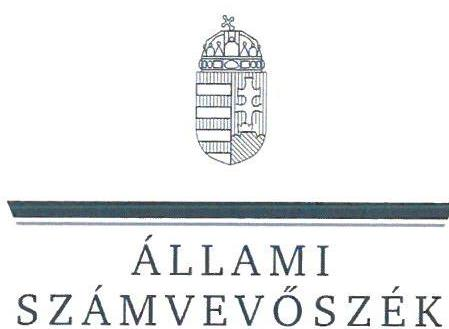
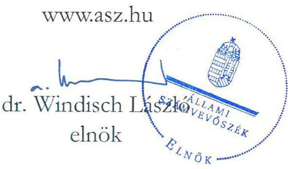
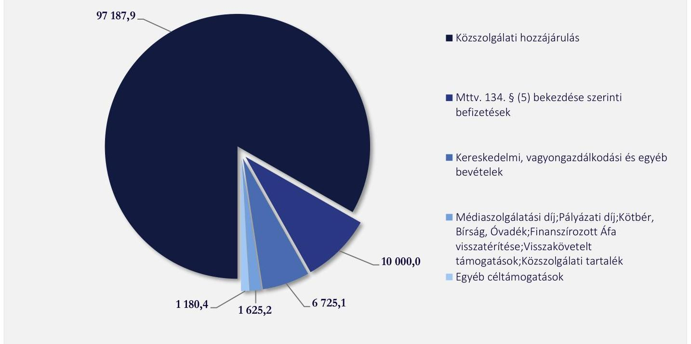
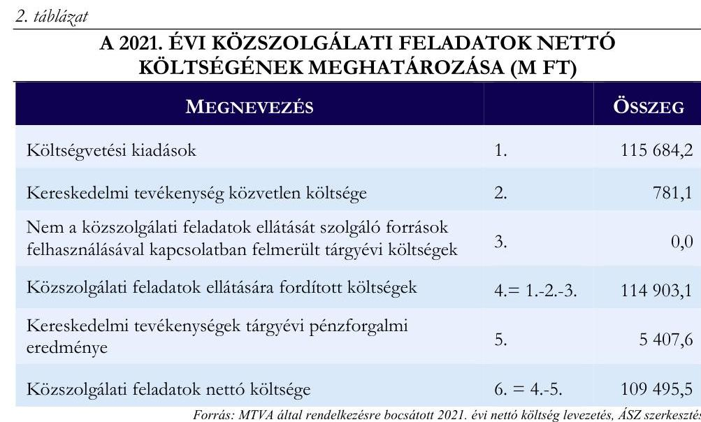
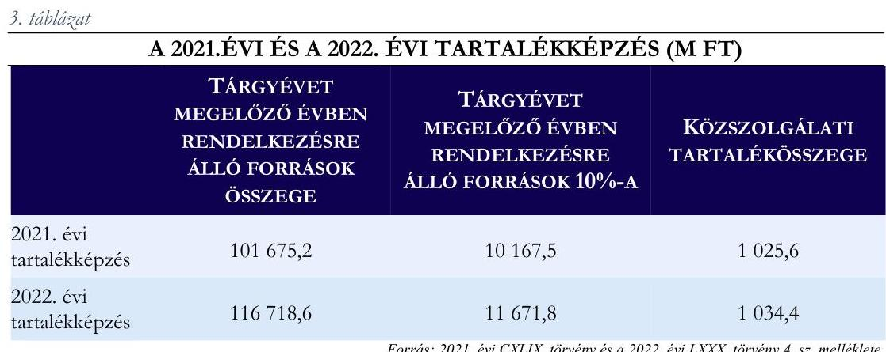
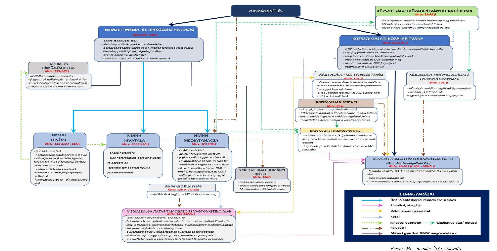

# JELENTÉS 

## A Médiaszolgáltatás-támogató és Vagyonkezelő Alap (MTVA) ellenőrzése

2023.

---

ÁLLAMI
SZÁMVEVŐSZÉK

# JELENTÉS 

## A Médiaszolgáltatás-támogató és Vagyonkezelő Alap (MTVA) ellenőrzése

2023.

23022

---

# ELLENŐRZÉSI IGAZGATÓSÁG: 

## ÁLLAMHÁZTARTÁSON KÍVÜLI SZERVEZETEKET ELLENŐRZŐ IGAZGATÓSÁG

## ELLENŐRZÉSI IGAZGATÓ:

## KLINGA LÁSZLÓ igazgató

## ELLENŐRZÉSVEZETŐ:

Jelentéseink az interneten a www.asz.hu címen olvashatók.

SALAMIN VIKTOR ellenőrzésvezető

IKTATÓSZÁM: EL-3710-008/2023.
TÉMASZÁM: 45
ELLENŐRZÉS-AZONOSÍTÓ SZÁM: V0991

---

# TARTALOMJEGYZÉK 

- AZ ELLENŐRZÉS ALAPADATAI ..... 5
- AZ ELLENŐRZÉS HATÓKÖRE, TERÜLETE, AZ ELLENŐRZÖTT SZERVEZETEK ..... 7
- ÖSSZEFOGLALÁS ..... 9
- AZ ELLENŐRZÉS FÓKUSZTERÜLETEI ..... 10
- MEGÁLLAPÍTÁSOK ..... 11
- MELLÉKLETEK ..... 17
I. sz. melléklet: Értelmező szótár ..... 17
II. sz. melléklet: A magyar közmédiaszolgáltatás rendszere ..... 20
- FÜGGELÉK: ÉSZREVÉTELEK ..... 21
- RÖVIDÍTÉSEK JEGYZÉKE ..... 22

---

.

---

# AZ ELLENŐRZÉS ALAPADATAI 

## AZ ELLENŐRZÉS CÉLJA

Az ellenőrzés célja annak értékelése, hogy az ellenőrzött időszakban a közszolgálati feladatok ellátására nyújtott források felhasználása és a közszolgálati tartalék képzése során érvényesült-e az elszámoltathatóság és az átláthatóság. Az ellenőrzés célja továbbá annak értékelése, hogy az MTVA közszolgálati feladatainak ellátására nyújtott finanszírozása meghaladta-e a közszolgálati feladatok nettó költségeit.

## AZ ELLENŐRZÉS TÍPUSA

Megfelelőségi ellenőrzés.

## AZ ELLENŐRZÖTT IDŐSZAK

Az ellenőrzött időszak 2021. január 1-jétől 2021. december 31-éig, a 2021. évi források terhére történő tartalékképzés tekintetében 2022. május 31-ig tartott.

## AZ ELLENŐRZÉS TÁRGYA

Az ellenőrzés tárgyát képezi az MTVA ${ }^{1}$ közszolgálati feladatainak ellátására nyújtott forrásokkal való gazdálkodása, a Médiatanács ${ }^{2}$ tartalékképzési tevékenysége, továbbá annak értékelése, hogy az MTVA közszolgálati feladatainak ellátására nyújtott finanszírozás meghaladta-e a közszolgálati feladatok nettó költségeit.

## AZ ELLENŐRZÉS JOGALAPJA

Az ellenőrzés jogszabályi alapját az Állami Számvevőszékről szóló 2011. évi LXVI. törvény 1. § (3) bekezdése és a Nemzeti Média- és Hírközlési Hatóság 2020. évi egységes költségvetésének végrehajtásáról szóló 2021. évi CXLIX. törvény 6. § (2)-(4) bekezdései képezték.

## AZ ELLENŐRZÉS MÓDSZERE

Az ellenőrzés végrehajtása az ellenőrzési program szempontjai, kérdéskörei, az ellenőrzött időszakban hatályos jogszabályok, az ellenőrzés szakmai szabályai és a jelen ellenőrzésre irányadó ÁSZ ${ }^{3}$ módszertanok alapján történt meg.

Az ellenőrzési kérdések megválaszolásához szükséges bizonyítékok megszerzése az ellenőrzöttek által rendelkezésre bocsátott dokumentumokra, adatokra alapozva kérdésfeltevés (információkérés), interjú, mintavételezés útján történt.

---

Az ellenőrzési bizonyítékként felhasználható adatforrások közé tartoztak egyrészt az ellenőrzési programban felsorolt adatforrások, másrészt minden az ellenőrzés folyamán feltárt, az ellenőrzés szempontjából információt tartalmazó dokumentum. Az ellenőrzés lefolytatásához az ellenőrzött szervezetek az ÁSZ által kért, teljességi és hitelességi nyilatkozattal alátámasztott dokumentumok rendelkezésre bocsátásával szolgáltattak adatokat.

Az ÁSZ az ellenőrzés során a mintavételezést az anyagjellegű ráfordítások, az egyéb ráfordítások és a személyi jellegű ráfordítások sokaságából végezte. Az egyes ráfordításokhoz kapcsolódó mintatételek kiválasztására és értékelésére két lépcsőben került sor. Az első lépcsőben a legnagyobb összegű ráfordítások, a második lépcsőben további véletlenszerűen kiválasztott mintatételek értékelésére került sor. A ráfordítások értékelése a tények feltárásával és azok összegzésével történt úgy, hogy a megállapítás az ellenőrzött mintatételekre vonatkozóan került megfogalmazásra.

---

# AZ ELLENŐRZÉS HATÓKÖRE, TERÜLETE, AZ ELLENŐRZÖTT SZERVEZETEK 

A 2021. december 29-én hatályba lépett, 2021. évi CXLIX. törvény ${ }^{4}$ 6. § (2) - (4) bekezdéseiben rögzített előírás alapján az ÁSZ ellenőrzése a közszolgálati feladatok ellátására nyújtott források e célra történt felhasználására, a források fel nem használt részéből képzett közszolgálati tartalék mértékére, illetve az esetlegesen előzetesen meghatározott, eseti célkitűzés teljesítésére szolgáló tartalékképzés szabályainak teljesülésére terjedt ki. Az ellenőrzés kiterjedt továbbá annak értékelésére, hogy az MTVA közszolgálati feladatainak ellátására nyújtott finanszírozása meghaladta-e a közszolgálati feladatok nettó költségeit. A 2021. évi CXLIX. törvény alapján az ÁSZ a 2021. évre - majd ezt követően 4 évente, az érintett 4 éves időszakra vonatkozóan folytatja le az ellenőrzést.

Az ellenőrzés az MTVA és a Médiatanács szervezeteket érintette.
Az MTVA olyan elkülönített vagyonkezelő- és pénzalap, amelynek feladata a közszolgálati médiaszolgáltatás, a Közszolgálati Közalapítvány ${ }^{5}$, a közösségi médiaszolgáltatások, a Közszolgálati Médiaszolgáltató ${ }^{6}$ szervezeti átalakításának támogatása, a közszolgálati célú műsorszámok gyártása és támogatása, a tulajdonosi joggyakorlása alatt álló állami és saját vagyonának gondos kezelése és gyarapítása, valamint az ezekhez kapcsolódó egyéb tevékenységek támogatása, illetve elvégzése. Az MTVA nem közszolgálati feladatot nem végzett.

Az MTVA jogi személy, gazdálkodó szervezet, kezelője a Médiatanács. Az MTVA államháztartáson kívüli, kormányzati szektorba sorolt egyéb szervezet.

Az MTVA képviseletére a vezérigazgató jogosult. Az MTVA vezérigazgatója feletti teljes munkáltatói jogkört a Médiatanács elnöke gyakorolja. A hivatalban lévő vezérigazgató 2018 szeptemberétől látja el feladatait. Az MTVA felügyelő bizottságának elnökét és négy tagját a Médiatanács elnöke bízza meg és hívja vissza. Az MTVA az Mttv. ${ }^{7}$-ben meghatározott bevételekből gazdálkodik, éves költségvetését - önálló törvény mellékleteként az NMHH ${ }^{8}$ egységes költségvetésén belül - az Országgyűlés hagyja jóvá. Az MTVA kezelésének részletes szabályait a Médiatanács határozza meg. Az MTVA a rábízott állami vagyonnal kapcsolatos könyvvezetési és beszámoló készítési kötelezettségének az Áhsz. ${ }^{9}$ szerint köteles eleget tenni.

Az MTVA bevételeit különösen a médiaszolgáltatási díj, a pályázati díj, a műsorszolgáltatási szerződésszegési kötbér és kártérítés, a bírság, a közszolgálati hozzájárulás, az Mttv. 134. § (5) bekezdése szerinti bevételek, a központi költségvetési céltámogatások, a vagyonhasznosításból, annak értékesítéséből, illetve a vállalkozási tevékenységből származó bevételek, a kamatbevételek, továbbá az önkéntes befizetések képezik.

Az MTVA bevétele a 2022. évi LXXX. törvény ${ }^{10}$ 4. számú melléklete szerint 116 718,6 M Ft volt. A bevételek több, mint 80%-át, 97 187,9 M Ft-ot a közszolgálati hozzájárulás képezte. Az MTVA dolgozóinak létszáma 2021. december 31-én 2211 fő volt. Az MTVA bevételeinek megoszlását az 1. ábra szemlélteti.

---

Forrás: Az MTVA 2021. évi költségvetésének teljesüléséről szóló beszámolója, ÁSZ szerkesztés
A Médiatanács az NMHH önálló hatáskörű, az Országgyűlés felügyelete alatt álló, jogi személyiséggel rendelkező szerve. A Médiatanács és tagjai csak a törvénynek vannak alárendelve, és tevékenységük körében nem utasíthatók.

A Médiatanács elnökét és négy tagját az Országgyűlés kilenc évre választja. A Médiatanács jelenlegi elnöke 2021. december 3-án lépett hivatalba. A Médiatanács feladatai többek között a sajtószabadság érvényesülésének ellenőrzése és biztosítása, a törvényben előírt felügyeleti és ellenőrzési feladatok ellátása, a fogyasztóvédelemmel és a tisztességtelen piaci magatartás tilalmával kapcsolatos eljárások kezdeményezése. A Médiatanács minden év május 31-ig előterjeszti az Országgyűlésnek a megelőző évi tevékenységére vonatkozó beszámolóját. A Médiatanács az NMHH egységes költségvetésén belül gazdálkodási autonómiával rendelkezik. A Médiatanács költségvetését az Országgyűlés az NMHH egységes költségvetésének részeként hagyja jóvá.

Az ellenőrzés lefolytatása során a Közszolgálati Testület és a Közszolgálati Érték-Testület adatszolgálatásra felkért szervezetként szolgáltatott adatot az ÁSZ részére.

A magyar közmédiaszolgáltatás rendszerét, szervezeteit, azok kapcsolatát a III. számú melléklet mutatja be.

---

# ÖSSZEFOGLALÁS 

Az ÁSZ törvényi kötelezettsége alapján ellenőrizte az MTVA-nál a közszolgálati feladatok ellátására nyújtott források felhasználásának célhoz kötöttségét, továbbá azt, hogy a közszolgálati feladatokhoz nyújtott finanszírozás meghaladta-e a közszolgálati feladatok nettó költségét, valamint a tartalékképzés szabályainak teljesülését 2021. évre vonatkozóan.

Az MTVA-nál megvalósult a közszolgálati feladatok ellátására nyújtott források cél szerinti felhasználása.

Az MTVA által ellátandó közszolgálati feladatokat az Mttv., valamint az MTVA Alapító Okirata ${ }^{11}$ és SZMSZ ${ }^{12}$-e meghatározta. Az MTVA a jogszabályi előírásoknak megfelelően alakította ki a gazdálkodására vonatkozó számviteli szabályait. Az MTVA belső szabályzói - köztük a számviteli szabályzatok - biztosították a források szabályszerű nyilvántartásának, elszámolásának kereteit, nyilvántartási rendszere biztosította a beszámolási kötelezettsége teljesítéséhez szükséges adatokat. Az ellenőrzött tételek esetében a ráfordítások elszámolása szabályszerű volt, azok az Mttv.-ben rögzített közszolgálati médiaszolgáltatás céljainak megvalósításához, a közszolgálati feladatok ellátásához kapcsolódtak.

Az MTVA a jogszabályok előírásainak megfelelően a 2021. év vonatkozásában elkészítette számviteli törvény szerinti éves beszámolóját, valamint a 2021. évi költségvetésének teljesülésére vonatkozó beszámolóját. A beszámolókat könyvvizsgáló hitelesítette, azt a Médiatanács a jogszabályi előírásnak megfelelően jóváhagyta. Az Országgyűlés a 2021. évi költségvetés teljesülésére vonatkozó beszámolót a 2022. évi LXXX. törvény keretében elfogadta.

Az MTVA 2021. évi finanszírozása összhangban volt a jogszabályban előírt rendelkezésekkel. Az MTVA a közszolgálati feladatok nettó költségének meghatározásakor figyelembe vette a kereskedelmi tevékenységek közvetlen költségeit, valamint az összes kereskedelmi tevékenység nettó hasznát, azaz a kereskedelmi tevékenységből származó nyereséget.

Az MTVA közszolgálati feladatainak ellátására nyújtott finanszírozása nem haladta meg a közszolgálati feladatok nettó költségét.

Az MTVA 2021. évi finanszírozása (97 187,9 M Ft) kevesebb volt, mint a közszolgálati feladatok nettó költsége (109 495,5 M Ft).

A tartalékképzés szabályai teljesültek.

A közszolgálati feladatok ellátására nyújtott források fel nem használt részéből történő tartalékképzés szabályai teljesültek. A Médiatanács által az MTVA számára 2021. és 2022. évre képzett közszolgálati tartalék mértéke megfelelt az Mttv.-ben rögzített előírásnak, a tartalék mértéke egyik évben sem haladta meg a megelőző évben rendelkezésre álló források 10%-át.

---

# AZ ELLENŐRZÉS FÓKUSZTERÜLETEI 

1. Az MTVA-nál megvalósult-e a közszolgálati feladatok ellátására nyújtott források cél szerinti felhasználása?
2. Az MTVA közszolgálati feladatainak ellátására nyújtott finanszírozása meghaladta-e a közszolgálati feladatok nettó költségeit?
3. A közszolgálati feladatok ellátására nyújtott források fel nem használt részéből történő tartalékképzés szabályai teljesültek-e?

---

# 1. Az MTVA-nál megvalósult-e a közszolgálati feladatok ellátására nyújtott források cél szerinti felhasználása? 

| Összegző megállapítás | Az ellátandó közfeladatok rögzítése, a jogszabályoknak megfelelően kialakított gazdálkodási szabályok, a szabályszerűen vezetett nyilvántartások, az azokon alapuló, könyvvizsgálattal hitelesített beszámolás megalapozták a források szabályszerű, célnak megfelelő felhasználását. Az ellenőrzéssel érintett ráfordítások esetében a cél szerinti felhasználás megvalósult. |
| :--: | :--: |

Az MTVA a 2021. évre vonatkozóan kialakította a gazdálkodásra, forrásainak felhasználására vonatkozó belső szabályzatokat a jogszabályi előírásokkal összhangban. A szabályozás biztosította a források szabályszerű elszámolásának kereteit.

Az MTVA szervezeti kereteit, alaptevékenységét, közszolgálati feladatait, működésének szabályait az Mttv. előírása szerint elkészített Alapító Okirat, valamint a Médiatanács által jóváhagyott SZMSZ rögzítette. A Médiatanács az Mttv. előírása alapján a 2021. évre vonatkozóan elfogadta az MTVA Támogatáspolitikáját ${ }^{13}$ és Üzleti tervét ${ }^{14}$.

A Számv. tv. ${ }^{15}$-ben foglalt előírásoknak megfelelően az MTVA vezérigazgatója kialakította és írásba foglalta az MTVA beszámolási és könyvvezetési kötelezettsége teljesítéséhez szükséges Számviteli Politikát ${ }^{16}$, továbbá - annak mellékleteként - az eszközök és források leltárkészítési és leltározási szabályzatát, az eszközök és források értékelési szabályzatát, az önköltségszámítás rendjére vonatkozó belső szabályzatot, a pénzkezelési szabályzatot, valamint a számlarendet. Az MTVA számlarendjének mellékletei a Számv. tv. előírása szerint tartalmazták a közszolgálati feladatok bevételeinek és költségeinek nyilvántartására kijelölt és alkalmazott számlaszámokat és megnevezéseket.

Az ellenőrzött időszakban az MTVA vállalkozási tevékenységeket is folytatott, ezen tevékenységek (jog, tartalom- és kapacitásértékesítés, a reklámidőértékesítés és ingatlanhasznosítás) az Mttv.-ben meghatározott közszolgálati feladatokhoz kapcsolódtak. A 479/2016. (XII. 28.) Korm. rendelet ${ }^{17}$ előírása alapján az MTVA a 2021. évben elkülönítetten mutatta ki a rá vonatkozó, Mttv.-ben meghatározott alaptevékenységgel és vállalkozási tevékenységgel kapcsolatos bevételeket, ráfordításokat (költségeket), kiadásokat.

Az MTVA a 479/2016. (XII. 28.) Korm. rendeletben rögzítetteknek megfelelően a 2021. évben olyan
 nyilvántartási rendszert alakított ki, amelyből a közpénzek felhasználásával, a köztulajdon használatának nyilvánosságával, átláthatóbbá tételével és ellenőrzésének bővítésével összefüggő jogszabályokban meghatározott adatokkal kapcsolatos információk rendelkezésre álltak.

---

1.2. számú megállapítás

Az MTVA beszámolási kötelezettségének a jogszabályok előírásainak megfelelően eleget tett.

Az MTVA a 479/2016. (XII. 28.) Korm. rendelet előírása alapján a 2021. év vonatkozásában elkészítette a számviteli törvény szerinti éves beszámolóját, amit a Médiatanács - az Mttv.-ben rögzített rendelkezéssel összhangban - a 407/2022. (V. 3.) számú döntésével jóváhagyott. Az MTVA az Mttv.-ben foglalt előírás szerint a Médiatanács részére előterjesztette a 2021. évi költségvetésének teljesülésére vonatkozó beszámolóját, amelyet a Médiatanács a 406/2022. (V. 3.) számú döntésével jóváhagyott.

Az MTVA a 2021. évi éves beszámolójában és a 2021. évi költségvetésének teljesülésére vonatkozó beszámolójában szereplő adatokat a Számv. tv.-ben foglalt előírásoknak megfelelően a könyvvezetési rendszeréből származó főkönyvi kivonattal alátámasztotta.

Az MTVA a 2021. évi éves beszámolójának és a 2021. évi költségvetésének teljesülésére vonatkozó beszámolójának a felülvizsgálatával könyvvizsgálót bízott meg a 479/2016. (XII. 28.) Korm. rendelet előírásának megfelelően. A könyvvizsgáló a 2021. évi éves beszámoló kapcsán független könyvvizsgálói jelentést készített, mely szerint a 2021. évi éves beszámoló megbízható és valós képet adott az MTVA vagyoni, pénzügyi, jövedelmi helyzetéről. A 2021. évi költségvetésének teljesüléséről szóló beszámoló vonatkozásában könyvvizsgálói véleményt állított ki, mely szerint a beszámoló valósan mutatta be a költségvetési elszámolásokat, összhangban volt a 2021. évi éves beszámoló adataival.

Az Országgyűlés az MTVA 2021. évi költségvetés teljesülésére vonatkozó beszámolóját a 2022. évi LXXX. törvény keretében, az Mttv. előírása szerint elfogadta.
1.3. számú megállapítás

A mintavételes ellenőrzés tapasztalatai alapján megvalósult a közszolgálati feladatok ellátására nyújtott források cél szerinti felhasználása, a ráfordítások elszámolása az ellenőrzött tételek esetében szabályszerű volt.

Az anyagjellegű, egyéb és személyi jellegű ráfordításokhoz kapcsolódó ellenőrzött tételek esetében a kötelezettségvállalási jogkörgyakorlás a Médiatanács által készített szabályozásban (GKSZ. ${ }^{18}$ ), az SZMSZ-ben és az MTVA vezérigazgatója által kiadott a kötelezettségvállalási jogkörgyakorlásra vonatkozó utasításokban ${ }^{19}$ meghatározott rendelkezések szerint történt. A kötelezettségvállalás és ellenjegyzés gyakorlata szabályszerű volt, azok megfeleltek a GKSZ.-ben, valamint az MTVA vezérigazgatója által kiadott a kötelezettségvállalási jogkörgyakorlásra vonatkozó utasításokban meghatározott értékhatároknak. Az ellenőrzött tételek esetében a teljesítésigazolás és az utalványozás az MTVA vezérigazgatója által kiadott a teljesítésigazolási és utalványozási jogkörgyakorlására vonatkozó utasításokban ${ }^{20}$ rögzített előírások szerint történt.

Az ellenőrzött tételeket a Számv.tv. előírása szerint bizonylattal támasztották alá, azok kontírozása a Számv.tv., valamint a Számlarend rendelkezése szerint történt meg. Az ellenőrzött tételek esetében a ráfordítások az Mttv.-ben rögzített közszolgálati médiaszolgáltatás céljainak megvalósításához, a közszolgálati feladatok ellátásához kapcsolódtak.

Az MTVA 100/2020. (XII. 10.) számú vezérigazgatói utasításával és a Közszolgálati Médiaszolgáltató vezérigazgatójának 8/2020. számú utasításával elfogadásra került a Közszolgálati Érték-Szabályzat ${ }^{21}$. A Közszolgálati Érték-Szabályzat célja - figyelemmel az Mttv.-ben előírt rendelkezésre - a Közszolgálati Médiaszolgáltató által nyújtott szolgáltatások közszolgálati jellegének és értékének, illetve a médiapiac sokszínűségére gyakorolt hatásának vizsgálata és ellenőrzése, értékteszt lefolytatása, a már működő szolgáltatások folyamatos felülvizsgálata.

---

# 2. Az MTVA közszolgálati feladatainak ellátására nyújtott finanszírozása meghaladta-e a közszolgálati feladatok nettó költségeit? 

## Összegző megállapítás

Az MTVA közszolgálati feladatainak ellátására nyújtott finanszírozás nem haladta meg a közszolgálati feladatok nettó költségét.

Az Mttv. 4. számú mellékletében rögzíti, hogy az MTVA közszolgálati feladatainak ellátására nyújtott finanszírozás nem haladhatja meg a közszolgálati feladatok nettó költségeit. Rögzíti továbbá, hogy a közfeladatellátáshoz szükséges források összegének meghatározásakor figyelembe kell venni a közszolgálati és kereskedelmi bevételeket is.

Az MTVA 2021. évi költségvetésének teljesülésére vonatkozó beszámolója szerint az MTVA bevétele közszolgálati hozzájárulásból, médiaszolgáltatási díjból, pályázati díjakból, médiaszolgáltatási szerződésszegési kötbérből, bírságból, óvadékból, az Mttv. 134. § (5) bekezdése szerinti befizetésekből, egyéb céltámogatásokból, finanszírozott áfa visszatérítésből, visszakövetelt támogatásokból, kereskedelmi, vagyongazdálkodási és egyéb bevételekből, valamint az előző évi közszolgálati tartalék felhasználásából tevődött össze.

Az Mttv. rendelkezése szerint a Magyar Állam évente közszolgálati hozzájárulást fizet a lineáris audiovizuális médiaszolgáltatások vételére alkalmas készüléket használó háztartások számát alapul véve. A közszolgálati hozzájárulás mértékét, kiszámítási módját az Mttv. 4. számú melléklete határozza meg. A 2020. évi XC. törvény ${ }^{22}$ 1. sz. melléklete szerint a 2021. évi közszolgálati hozzájárulás mértéke 97 187,9 M Ft volt. A 2022. évi LXXX. törvény 4. sz. mellékletében szereplő és a Médiatanács által jóváhagyott, az MTVA 2021. évi költségvetésének teljesülésére vonatkozó beszámolóban a bevételi források között rögzített közszolgálati hozzájárulás mértéke megegyezett a 2020. évi XC. törvény 1. sz. mellékletében rögzített mértékkel. Az MTVA 2021. évi bevételeit az 1. táblázat mutatja be.

---

1. táblázat

AZ MTVA 2021. ÉVI BEVÉTELI FORRÁSAI (M FT)

| BEVÉTELEK | ÉREDEI   ELŐIRÁNYZAT | TELJESÍTÉS |
| :-- | :-- | --: |
| 1. Közszolgálati hozzájárulás | 97187,9 | 97187,9 |
| 2. Médiaszolgáltatási díj | 1630,0 | 456,3 |
| 3. Pályázati díjak (támogatási,   frekvencia) | 21,5 | 10,2 |
| 4. Médiaszolgáltatási szerződésszegési   kötbérből, bírság, óvadék | 48,5 | 30,0 |
| 5. Az Mttv. 134. § (5) bekezdése   szerinti befizetések | 10000,0 | 10000,0 |
| 6. Egyéb céltámogatások | 1002,7 | 1180,4 |
| 7. Finanszírozott áfa visszatérítése | 0,0 | 91,8 |
| 8. Visszakövetelt támogatások | 0,0 | 11,3 |
| KÖLTSÉGVETÉSI BEVÉTELEK | 109890,6 | 108967,9 |
| 9. Kereskedelmi, vagyongazdálkodási és   egyéb bevételek | 7825,3 | 6725,1 |
| KÖLTSÉGVETÉSI, KERESKEDELMI ÉS   EGYÉB BEVÉTELEK | 117715,9 | 115693,0 |
| KÖLTSÉGVETÉSEN KÍVÜLI TÉTELEK   (hitelfelvétel) | 0,0 | 0,0 |
| ELŐZŐ ÉVI KÖZSZOLGÁLATI   TARTALÉK FELHASZNÁLÁSA | 0,0 | 1025,6 |
| ÖSSZES BEVÉTEL | 117715,9 | 116718,6 |

Forrás: Az MTVA 2021. évi költségvetésének teljesüléséről szóló beszámolója, ÁSZ szerkesztés
Az MTVA a közszolgálati feladatok nettó költségének meghatározásakor figyelembe vette az összes kereskedelmi tevékenység nettó hasznát, azaz a kereskedelmi tevékenységből származó nyereséget az Mttv. előírásának megfelelően. A nettó költség kiszámításakor az MTVA a költségvetési kiadásokat csökkentette a kereskedelmi tevékenységek közvetlen költségei mellett a kereskedelmi tevékenységek tárgyévi pénzforgalmi eredményével, így a 2021. évi közszolgálati feladatok nettó költsége 109 495,5 M Ft volt. A nettó költség kiszámításának módját a 2. táblázat mutatja be.

---

A 2021. évben az MTVA közszolgálati feladatainak ellátására nyújtott finanszírozása (97 187,9 M Ft) kevesebb volt, mint a közszolgálati feladatok nettó költsége (109 495,5 M Ft), az MTVA 2021. évi finanszírozása megfelelt az Mttv.-ben rögzített rendelkezésnek.

# 3. A közszolgálati feladatok ellátására nyújtott források fel nem használt részéből történő tartalékképzés szabályai teljesültek-e? 

## Összegző megállapítás A közszolgálati feladatok ellátására nyújtott források fel nem használt részéből történő tartalékképzés szabályai teljesültek.

Az MTVA vezérigazgatója kérelmezte a Médiatanácstól a közszolgálati tartalékképzést a 2021. év, illetve a 2022. év vonatkozásában az MTVA 2020. évi, valamint a 2021. évi költségvetési beszámoló keretében, összhangban az Mttv.-ben előírt rendelkezéssel. Az MTVA vezérigazgatója az MTVA 2020. évi költségvetésének teljesülésére vonatkozó beszámoló szerint a 2021. évre 1025,6 M Ft, az MTVA 2021. évi költségvetésének teljesülésére vonatkozó beszámoló szerint a 2022. évre 1034,4 M Ft közszolgálati tartalékképzést kezdeményezett.

Az Mttv. és Számviteli Politika előírásának megfelelően a 2021. évre, valamint a 2022. évre vonatkozó közszolgálati tartalék összege kisebb volt, mint a közszolgálati feladatok ellátására szolgáló tárgyévet megelőző évben rendelkezésre álló források 10%-a.

A 2021. évre vonatkozó közszolgálati tartalék összege 1025,6 M Ft volt. A tárgyévet megelőző évben, azaz a 2020. évben a rendelkezésre álló források 10%-a - a 2021. évi CXLIX. törvény 4. sz. melléklete szerint - 10 167,5 M Ft volt. A 2022. évre vonatkozó közszolgálati tartalék összege 1034,4 M Ft volt. A tárgyévet megelőző évben, azaz a 2021. évben a rendelkezésre álló források 10%-a - a 2022. évi LXXX. törvény 4. sz. melléklete szerint - 11 671,8 M Ft volt. A 2021. és 2022. években a tartalékképzés gyakorlatát a 3. táblázat összegzi.

---

A Médiatanács a 2021. évi közszolgálati tartalékról a 316/2021. (IV. 27.) számú döntés, a 2022. évi közszolgálati tartalék esetében a 405/2022. (V. 3.) számú döntés keretében határozott, összhangban az Mttv. előírásával.

---

# MELLÉKLETEK 

## I. SZ. MELLÉKLET: ÉRTELMEZŐ SZÓTÁR

Átláthatóság

Elszámoltathatóság

Költségvetés teljesülésére vonatkozó beszámoló

Közszolgálati Érték-Szabályzat

Közszolgálati-Érték Testület

Közszolgálati feladat

A törvényeknek és egyéb szabályoknak megfelelő tevékenységellátás, és arról történő nyilvános beszámolás. Az átláthatóság érdekében biztosítani szükséges, hogy a célok elérése érdekében folytatott tevékenységekről, folyamatokról rendszeres vagy időközönkénti beszámolók, megbízható, időszerű, a tevékenység szempontjából fontos információk elérhetőek és megismerhetőek legyenek.
Közpénzekkel és a nemzeti vagyonnal való gazdálkodásért való felelősség érvényesítése, amely magába foglalja a közfeladat ellátására, valamint a közpénzek és közvagyon használatára vonatkozó felelősség érvényesítését. Az elszámoltathatóság, abban az esetben érvényesíthető, ha a feladatellátás folyamatában beazonosíthatóan meghatározásra kerülnek a konkrét feladatok, felelősségi viszonyok és hatáskörök, a közpénzügyi folyamatok szabályozottak, átláthatóak és nyomonkövethetőek.
Az MTVA zárszámadása, amely az Mttv. 134 § (10) bekezdésében meghatározott, az Országgyűlés számára benyújtott zárszámadási törvényjavaslat mellékletét képezi. A törvényjavaslat keretében a Nemzeti Média- és Hírközlési Hatóság, valamint a Médiatanács zárszámadása is benyújtásra kerül.
Az Mttv. 100/B.§ (2) bekezdése szerinti szabályozása. A szabályozás célja a Közszolgálati Médiaszolgáltató által nyújtott szolgáltatások közszolgálati jellegének és értékének, illetve a médiapiac sokszínűségére gyakorolt hatásának vizsgálata és ellenőrzése, érték-teszt lefolytatása.
A közszolgálati-érték testület feladata a közszolgálati médiaszolgáltató által nyújtott vagy a jövőben indítani tervezett szolgáltatások közszolgálati jellegét és értékét, valamint a médiapiac sokszínűségére gyakorolt hatását feltáró, elemző vizsgálatára irányuló közszolgálati érték-teszt lefolytatása.
A Közszolgálati médiaszolgáltatás, a Közszolgálati Közalapítvány, a közösségi médiaszolgáltatások, a közszolgálati médiaszolgáltató szervezeti átalakításának támogatása, a közszolgálati célú műsorszámok gyártása és támogatása, a tulajdonosi joggyakorlása alatt álló állami és saját vagyon gondos kezelése és gyarapítása, valamint az ezekhez kapcsolódó egyéb tevékenységek támogatása, illetve elvégzése, továbbá - a közszolgálati médiaszolgáltatás Mttv. 83. §-ban foglalt céljai elérése érdekében - a megfelelő minőségű médiatartalom előállításának elősegítése érdekében a közszolgálati médiaszolgáltatások tartalmának előállításában részt vevők továbbképzésének biztosítása. Közszolgálati feladatnak minősül a Közszolgálati Médiaszolgáltató feladatellátásának támogatása, erre irányuló megrendelés esetén a Közszolgálati Médiaszolgáltató médiatartalmainak készítése, beszerzése, megvásárlása, valamint a közszolgálati médiaszolgáltatáshoz szükséges egyéb tevékenység ellátása. A közszolgálati feladat keretén belül az MTVA gondoskodik a közszolgálati médiavagyon, valamint a

---

Közszolgálati feladatok ellátására nyújtott források

Közszolgálati feladatok nettó költsége

Közszolgálati Közalapítvány

Közszolgálati Közalapítvány

Közszolgálati Médiaszolgáltató

Közszolgálati Médiaszolgáltató és az MTVA tulajdonába került, a közszolgálati médiavagyon körébe nem tartozó, a szerzői jogról szóló 1999. évi LXXVI. törvény hatálya alá tartozó műveket és más teljesítményeket tartalmazó fizikai hordozók tárolásáról, megőrzéséről és felhasználásáról.

A Magyar Állam évente közszolgálati hozzájárulást fizet a lineáris audiovizuális médiaszolgáltatások vételére alkalmas készüléket használó háztartások számát alapul véve. A közszolgálati hozzájárulás mértékét az Mttv. 4. számú melléklete határozza meg. A Magyar
 Állam a közszolgálati hozzájárulást tizenkét egyenlő részletben előre, minden hónap harmadik napjáig fizeti meg az MTVA pénzforgalmi számlájára. Az MTVA a Médiatanács hozzájárulásával jogosult a közszolgálati hozzájárulásból származó bevételeinek engedményezésére. (Forrás: Mttv. 136.§ (4) bekezdés)
Az Mttv. 4. számú mellékletében rögzíti, hogy az MTVA közszolgálati feladatainak ellátására nyújtott finanszírozás nem haladhatja meg a közszolgálati feladatok nettó költségeit. Az Mttv. 4. sz. melléklete szerint, az MTVA közfeladatellátáshoz szükséges források összegének meghatározásakor figyelembe kell venni a közszolgálati és kereskedelmi bevételeket is. Az állami támogatás szabályainak a közszolgálati műsorszolgáltatásra történő alkalmazásáról szóló Európai Bizottság által kiadott 2009/C 257/01. sz. Közlemény 6.5. fejezetének 71. pontja szerint az állami finanszírozás általában szükséges a vállalkozások számára a közszolgálati feladatok végrehajtásához. A Bizottsági Közlemény 71. pontja - az arányossági próbának való megfelelés érdekében - úgy rendelkezett, hogy a közszolgáltatási ellentételezés nem haladhatja meg a közszolgálati feladatok nettó költségeit, figyelembe véve más, a közszolgálati feladatból származó közvetlen vagy közvetett bevételeket. Ebből kifolyólag a Bizottsági Közlemény 6.4. fejezetének 67. pontja és a 6.5. fejezetének 71. pontja szerint a közszolgálati tevékenységekhez kapcsolódó összes kereskedelmi tevékenység nettó hasznát figyelembe kellett venni a nettó közszolgálati költség meghatározásakor.
Az Országgyűlés által létrehozott közalapítvány, tulajdonosa a közszolgálati médiaszolgáltatónak. Az Országgyűlés a Kuratóriumba hat tagot választ. A Kuratórium elnökét és egy további tagját a Médiatanács delegálja kilenc évre. A Kuratórium tagjait az Országgyűlés kilencévi időtartamra választja. A Kuratórium feladata többek között a közszolgálati médiaszolgáltatás céljainak a közszolgálati médiaszolgáltató tevékenysége általi megvalósulásának ellenőrzése, a közszolgálati médiaszolgáltató függetlenségének védelmezése. A Kuratórium megválasztja a közszolgálati médiaszolgáltató vezérigazgatóját, megállapítja munkaszerződése feltételeit és díjazását, megszüntetheti a közszolgálati médiaszolgáltató vezérigazgatójának munkaviszonyát, megválasztja a közszolgálati médiaszolgáltató felügyelő bizottságának elnökét és tagjait, illetve visszahívhatja azokat. (Forrás: Mttv. 84. -91. §)
A közszolgálati médiaszolgáltató a Duna Médiaszolgáltató Nonprofit Zrt., amelynek tulajdonosa az Országgyűlés által létrehozott Közszolgálati Közalapítvány. Az Mttv. rendelkezése szerint a

---

Közszolgálati Testület

Médiatanács

MTVA

Nemzeti Média- és Hírközlési Hatóság

Tartalékképzés
közszolgálati médiaszolgáltató feladata a közszolgálati médiaszolgáltatás céljainak megvalósítása. A közszolgálati médiaszolgáltatóra az Mttv.ben foglalt eltérésekkel a Ptk. ${ }^{23}$ gazdasági társaságokra vonatkozó rendelkezéseinek a részvénytársaságokra vonatkozó szabályait kell megfelelően alkalmazni, ideértve a gazdasági társaságok közös szabályait is. (Forrás: Mttv. 98. §)

A közszolgálati testület a közszolgálati médiaszolgáltató feletti társadalmi felügyeletet biztosít és ellenőrzi a közszolgálatiság érvényesülését. 15 tagját az Mttv. 1. számú mellékletében meghatározott jelölő szervezet delegálja. (Forrás: Mttv. 97. § (6)-(7) bekezdések)
A 2010. október 11-én alakult Médiatanács az NMHH önálló hatáskörű, az Országgyűlés felügyelete alatt álló, jogi személyiséggel rendelkező szerve. A Médiatanács az Országos Rádió és Televízió Testület jogutódja. (Forrás: Mttv. 123. § (1) bekezdés)
Az MTVA olyan elkülönített vagyonkezelő- és pénzalap, amelynek feladata a közszolgálati médiaszolgáltatás, a Közszolgálati Közalapítvány, a közösségi médiaszolgáltatások, a közszolgálati médiaszolgáltató szervezeti átalakításának támogatása, a közszolgálati célú műsorszámok gyártása és támogatása, a tulajdonosi joggyakorlása alatt álló állami és saját vagyonának gondos kezelése és gyarapítása, valamint az ezekhez kapcsolódó egyéb tevékenységek támogatása, illetve elvégzése. Az MTVA 2011. január 1. napjától a Műsorszolgáltatási Alap, valamint a Műsorszolgáltatás Támogató és Vagyonkezelő Alap jogutódja. (Forrás: Mttv. 136. § (1) és (6) bekezdések)
A Nemzeti Média- és Hírközlési Hatóság önálló szabályozó szerv, amely kizárólag a törvénynek van alárendelve. Az NMHH elnöke évente beszámol a Hatóság tevékenységéről az Országgyűlésnek. A Hatóság a feladatát és a hatáskörét önállóan, a jogszabályoknak megfelelően gyakorolja. Az Elnököt a miniszterelnök javaslatára a köztársasági elnök nevezi ki kilenc évre. (Forrás: Mttv. 109. §, 111/A.§ (1) bekezdés)
A Médiatanács az MTVA vezérigazgatójának a zárszámadási törvényjavaslat benyújtásáig előterjesztett indokolt kérelmére a közszolgálati kötelezettségek jövőbeni teljesítése, a hatékony gazdálkodás elősegítése érdekében az MTVA számára a tárgyévre vonatkozóan nyújtott források fel nem használt részéből közszolgálati tartalékot képezhet. A közszolgálati tartalék mindenkori mértéke legfeljebb a közszolgálati feladatok ellátására szolgáló tárgyévet megelőző évben rendelkezésre álló források 10\%-a lehet. (Forrás: Mttv. 136. § (3b) bekezdés)

A Médiatanács különösen indokolt - kizárólag a közszolgálati feladatellátással összefüggő - esetben a 10\%-ot meghaladó mértékű tartalék képzését is jóváhagyja, ha az valamely - előzetesen meghatározott, a közszolgálati feladatellátást szolgáló - eseti célkitűzés teljesítése érdekében szükséges, és a tartalék mértéke legfeljebb három negyedéven keresztül haladja meg a 10\%-os mértéket. (Forrás: Mttv. 136. $\S(3 \mathrm{c})$ bekezdés)

---

Mellékletek

1. SZ. MELLÉKLET: A MAGYAR KÖZMÉDIASZOLGÁLTATÁS RENDSZERE

2. ábra

SZERVEZETI ÁBRA

Főzészítő azalágtartó záró
bizontóig a következő záró mézvezdése
a frekvencsügesetélye (az a hírszobt) zavarási részt vezi a
bizontóig gyümölésűnek végrehajtásakban
bizontó bocsátnul az 2007-nek
- önálló hatáskérrel rendelkező szervei vannak

NINHH
KLNÖKE
Mítv. 150-220.§ 120.§

- önálló hatáskérrel
- közreműködés elnök nevezi ki 9 évre
- előterjeszti az éves költségvetés
- arvasztati, éves hírteremére költségi
- mértéke beosztásolgat
- ellátja a Hatóság vezetését
- ellenőrzi a Hivatal (Rigengató)jét,
a Biztosít
- Szemelsősítési az ÁSZ elsőképzéltájával azok

NINHH
HIVATALA
Mítv. 150-2-120.§

- önálló hatáskérrel
- élén határozottan időre kinevezett
(riszespréz el)
- szakmai támogatási nyújt a
felszítetefektárhoz

NINHH
MÉGHATANÁCSA
Mítv. 150-220.§

- önálló hatáskérrel
- élén határozottan időre kinevezett
(riszespréz el)
- szakmai támogatási nyújt a
felszítetefektárhoz

NINHH
MÉGHATANÁCSA
Mítv. 150-220.§

- önálló hatáskérrel
- élén határozottan időre kinevezett
(riszespréz el)
- szakmai támogatási nyújt a
felszítetefektárhoz

NINHH
MÉGHATANÁCSA
Mítv. 150-220.§

- önálló hatáskérrel
- elén határozottan időre kinevezett
(riszespréz el)
- szakmai támogatási nyújt a
felszítetefektárhoz

NINHH
HIVATALA
Mítv. 150-2-120.§

- önálló hatáskérrel
- élén határozottan időre kinevezett
(riszespréz el)
- szakmai támogatási nyújt a
felszítetefektárhoz

NINHH
MÉGHATANÁCSA
Mítv. 150-220.§

- önálló hatáskérrel
- elén határozottan időre kinevezett
(riszespréz el)
- szakmai támogatási nyújt a
felszítetefektárhoz

NINHH
MÉGHATANÁCSA
Mítv. 150-220.§

- önálló hatáskérrel
- elén határozottan időre kinevezett
(riszespréz el)
- szakmai támogatási nyújt
 a
felszítetüfektárhoz

NINHH
MÉDIATANÁCSA
Mttv. 150-220.8

- önálló hatáskörrel
- elöl határozott időre kinevezett
(riszespréz el)
- szakmai támogatást nyújt a
felszítetüfektárhoz

NINHH
MÉDIATANÁCSA
Mttv. 150-220.8

- önálló hatáskörrel
- elöl határozott időre kinevezett
(riszespréz el)
- szakmai támogatást nyújt a
felszítetüfektárhoz

NINHH
MÉDIATANÁCSA
Mttv. 150-220.8

- önálló hatáskörrel
- elöl határozott időre kinevezett
(riszespréz el)
- szakmai támogatást nyújt a
felszítetüfektárhoz

NINHH
MÉDIATANÁCSA
Mttv. 150-220.8

- önálló hatáskörrel
- elöl határozott időre kinevezett
(riszespréz el)
- szakmai támogatást nyújt a
felszítetüfektárhoz

NINHH
MÉDIATANÁCSA
Mttv. 150-220.8

- önálló hatáskörrel
- elöl határozott időre kinevezett
(riszespréz el)
- szakmai támogatást nyújt a
felszítetüfektárhoz

NINHH
MÉDIATANÁCSA
Mttv. 150-220.8

- önálló hatáskörrel
- elöl határozott időre kinevezett
(riszespréz el)
- szakmai támogatást nyújt a
felszítetüfektárhoz

NINHH
MÉDIATANÁCSA
Mttv. 150-220.8

- önálló hatáskörrel
- elöl határozott időre kinevezett
(riszespréz el)
- szakmai támogatást nyújt a
felszítetüfektárhoz

NINHH
MÉDIATANÁCSA
Mttv. 150-220.8

- önálló hatáskörrel
- elöl határozott időre kinevezett
(riszespréz el)
- szakmai támogatást nyújt a
felszítetüfektárhoz

NINHH
MÉDIATANÁCSA
Mttv. 150-220.8

- önálló hatáskörrel
- elöl határozott időre kinevezett
(riszespréz el)
- szakmai támogatást nyújt a
felszítetüfektárhoz

NINHH
MÉDIATANÁCSA
Mttv. 150-220.8

- önálló hatáskörrel
- elöl határozott időre kinevezett
(riszespréz el)
- szakmai támogatást nyújt a
felszítetüfektárhoz

NINHH
MÉDIATANÁCSA
Mttv. 150-220.8

- önálló hatáskörrel
- elöl határozott időre kinevezett
(riszespréz el)
- szakmai támogatást nyújt a
felszítetüfektárhoz

NINHH
MÉDIATANÁCSA
Mttv. 150-220.8

- önálló hatáskörrel
- elöl határozott időre kinevezett
(riszespréz el)
- szakmai támogatást nyújt a
felszítetüfektárhoz

NINHH
MÉDIATANÁCSA
Mttv. 150-220.8

- önálló hatáskörrel
- elöl határozott időre kinevezett
(riszespréz el)
- szakmai támogatást nyújt a
felszítetüfektárhoz

NINHH
MÉDIATANÁCSA
Mttv. 150-220.8

- önálló hatáskörrel
- elöl határozott időre kinevezett
(riszespréz el)
- szakmai támogatást nyújt a
felszítetüfektárhoz

NINHH
MÉDIATANÁCSA
Mttv. 150-220.8

- önálló hatáskörrel
- elöl határozott időre kinevezett
(riszespréz el)
- szakmai támogatást nyújt a
felszítetüfektárhoz

NINHH
MÉDIATANÁCSA
Mttv. 150-220.8

- önálló hatáskörrel
- elöl határozott időre kinevezett
(riszespréz el)
- szakmai támogatást nyújt a
felszítetüfektárhoz

NINHH
MÉDIATANÁCSA
Mttv. 150-220.8

- önálló hatáskörrel
- elöl határozott időre kinevezett
(riszespréz el)
- szakmai támogatást nyújt a
felszítetüfektárhoz

NINHH
MÉDIATANÁCSA
Mttv. 150-220.8

- önálló hatáskörrel
- elöl határozott időre kinevezett
(riszespréz el)
- szakmai támogatást nyújt a
felszítetüfektárhoz

NINHH
MÉDIATANÁCSA
Mttv. 150-220.8

- önálló hatáskörrel
- elöl határozott időre kinevezett
(riszespréz el)
- szakmai támogatást nyújt a
felszítetüfektárhoz

NINHH
MÉDIATANÁCSA
Mttv. 150-220.8

- önálló hatáskörrel
- elöl határozott időre kinevezett
(riszespréz el)
- szakmai támogatást nyújt a
felszítetüfektárhoz

NINHH
MÉDIATANÁCSA
Mttv. 150-220.8

- önálló hatáskörrel
- elöl határozott időre kinevezett
(riszespréz el)
- szakmai támogatást nyújt a
felszítetüfektárhoz

NINHH
MÉDIATANÁCSA
Mttv. 150-220.8

- önálló hatáskörrel
- elöl határozott időre kinevezett
(riszespréz el)
- szakmai támogatást nyújt a
felszítetüfektárhoz

NINHH
MÉDIATANÁCSA
Mttv. 150-220.8

- önálló hatáskörrel
- elöl határozott időre kinevezett
(riszespréz el)
- szakmai támogatást nyújt a
felszítetüfektárhoz

NINHH
MÉDIATANÁCSA
Mttv. 150-220.8

- önálló hatáskörrel
- elöl határozott időre kinevezett
(riszespréz el)
- szakmai támogatást nyújt a
felszítetüfektárhoz

NINHH
MÉDIATANÁCSA
Mttv. 150-220.8

- önálló hatáskörrel
- elén határozottan időre kinevezett

---

# FÜGGELÉK: ÉSZREVÉTELEK 

A jelentéstervezetet a Számvevőszék 15 napos észrevételezésre megküldte az ellenőrzött szervezet vezetőjének az ÁSZ tv. 29. § (1) bekezdése előírásának megfelelően.

Az ellenőrzöttek a jelentéstervezet megállapításaira nem tettek észrevételt.

* 29. § (1) Az Állami Számvevőszék az ellenőrzési megállapításait megküldi az ellenőrzött szervezet vezetőjének vagy az általa megbízott személynek, és annak, akinek személyes felelősségét állapította meg.
(2) Az ellenőrzött szervezet vezetője és a felelősként megjelölt személy az ellenőrzés megállapításaira tizenöt napon belül írásban észrevételt tehet.
(3) Az Állami Számvevőszék az észrevételre a beérkezésétől számított harminc napon belül írásban válaszol. A figyelembe nem vett észrevételeket köteles a jelentésben feltüntetni, és megindokolni, hogy azokat miért nem fogadta el.

---

# RÖVIDÍTÉSEK JEGYZÉKE 

${ }^{1}$ MTVA
${ }^{2}$ Médiatanács
${ }^{3}$ ÁSZ
${ }^{4}$ 2021. évi CXLIX. törvény
${ }^{5}$ Közszolgálati Közalapítvány
${ }^{6}$ Közszolgálati Médiaszolgáltató
${ }^{7}$ Mttv.
${ }^{8}$ NMHH
${ }^{9}$ Áhsz.
${ }^{10}$ 2022. évi LXXX. törvény
${ }^{11}$ Alapító Okirat
${ }^{12}$ SZMSZ
${ }^{13}$ Támogatáspolitika
${ }^{14}$ Üzleti Terv
${ }^{15}$ Számv. tv.
${ }^{16}$ Számviteli Politika
${ }^{17}$ 479/2016. (XII.28.) Korm. rendelet
${ }^{18}$ GKSZ.
${ }^{19}$ Kötelezettségvállalási jogkörgyakorlásra vonatkozó utasítások
${ }^{20}$ Teljesítésigazolási és utalványozási jogkörgyakorlására
${ }^{21}$ Közszolgálati Érték-Szabályzat
${ }^{22}$ 2020. évi XC. törvény
${ }^{23}$ Ptk.

Médiaszolgáltatás-támogató és Vagyonkezelő Alap
Nemzeti Média- és Hírközlési Hatóság Méditanácsa
Állami Számvevőszék
A Nemzeti Média- és Hírközlési Hatóság 2020. évi egységes
költségvetésének végrehajtásáról szóló 2021. évi CXLIX. törvény (hatályos: 2021. december 29-től)

Az Országgyűlés által létrehozott közalapítvány, tulajdonosa a Közszolgálati Médiaszolgáltatónak
Duna Médiaszolgáltató Nonprofit Zrt.
A médiaszolgáltatásokról és a tömegkommunikációról szóló 2010. évi CLXXXV. törvény (hatályos: 2011. január 1-től)
Nemzeti Média- és Hírközlési Hatóság
Az államháztartás számviteléről szóló 4/2013. (I.11.) Korm. rendelet (hatályos: 2014. január 1-től)
A Nemzeti Média- és Hírközlési Hatóság 2021. évi egységes
költségvetésének végrehajtásáról szóló 2022. évi LXXX. törvény (hatályos: 2022. december 29-től)

Az MTVA Méditanács által jóváhagyott Alapító Okirata
32/2020. (X. 1.) számú vezérigazgatói utasítása a Médiaszolgáltatás-támogató és Vagyonkezelő Alap Szervezeti és Működési Szabályzata módosításának hatálybaléptetéséről
Az MTVA vezérigazgatójának 104/2020. (XII.16.) számú vezérigazgatói utasítása az MTVA Támogatáspolitikájának hatálybaléptetéséről
Az MTVA 2021. évi Üzleti Terve és a 2022-2026. évekre vonatkozó Középtávú Terv
A számvitelről szóló 2000. évi C. törvény (hatályos: 2001. január 1-től)
Az MTVA vezérigazgatójának 18/2021. (IV.29.) számú vezérigazgatói utasítása az MTVA Számviteli Politikájáról
A számviteli törvény szerinti egyes egyéb szervezetek beszámoló készítési és könyvvezetési kötelezettségének sajátosságairól szóló 479/2016. (XII.28.) Korm. rendelet (hatályos: 2017. január 1-től)
Az Mttv. 136. § (16) bekezdése és az Mttv. 183. § (1) bekezdés k) pontja alapján a Médiatanács által kiadott szabályzat -Az MTVA Gazdálkodási és Kezelési Szabályzata - (hatályos: 2020. december 22-től)
Az MTVA vezérigazgatója által kiadott 40/2016. (VII.12.)
sz. vezérigazgató utasítás; 51/2018. (XI.29.) sz. vezérigazgatói utasítás; 56/2019. (VIII.15.) számú vezérigazgatói utasítás; 34/2020. (X.1.) számú vezérigazgatói utasítás; 39/2020. (X.6.) számú vezérigazgatói utasítás; 19/2021. (V.3.) számú vezérigazgatói utasítás
Az MTVA vezérigazgatója által kiadott 4/2021. (I.25.) számú vonatkozó utasítások vezérigazgatói utasítás; a 10/2021. (II.24.) számú vezérigazgatói utasítás
Az MTVA vezérigazgatójának a 100/2020. számú utasításával és a Duna Médiaszolgáltató Nonprofit Zrt. vezérigazgatójának a 8/2020. számú utasításával elfogadott szabályozás (hatályos: 2021. január 1-től)
Magyarország 2021. évi központi költségvetéséről szóló 2020. évi XC törvény (hatályos: 2020. július 15-től)
A Polgári Törvénykönyvről szóló 2013. évi V. törvény (hatályos: 2014. március 15-től)

---

1052 Budapest, Apáczai Csere János u. 10. | 1364 Budapest 4., Pf. 54
www.asz.hu | szamvevoszek@asz.hu
telefon: +36 14849100
