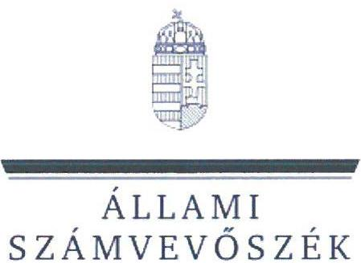
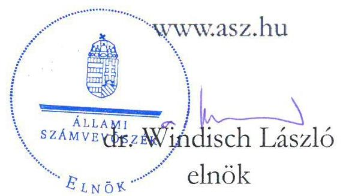
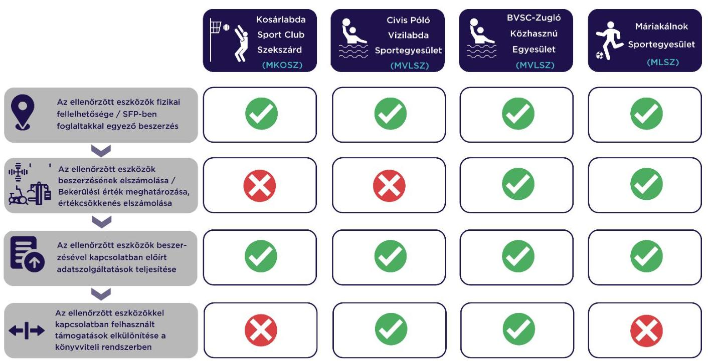

# JELENTÉS 

## Sportegyesületek eszközbeszerzésre kapott támogatás felhasználása szabályszerűségének ellenőrzése

Kosárlabda Sport Club Szekszárd, Cívis Póló Vízilabda Egyesület, BVSC-Zugló Közhasznú Egyesület, Máriakálnok Sportegyesület

2023.

---

ÁLLAMI
SZÁMVEVŐSZÉK

# JELENTÉS 

## Sportegyesületek eszközbeszerzésre kapott támogatás felhasználása szabályszerűségének ellenőrzése

Kosárlabda Sport Club Szekszárd, Cívis Póló Vízilabda Egyesület, BVSC-Zugló Közhasznú Egyesület, Máriakálnok Sportegyesület

2023.

23023

---

# ELLENŐRZÉSI IGAZGATÓSÁG: 

## ÁLLAMHÁZTARTÁSON KÍVÜLI SZERVEZETEK ELLENŐRZŐ IGAZGATÓSÁG

## ELLENŐRZÉSI IGAZGATÓ:

## KLINGA LÁSZLÓ igazgató

## ELLENŐRZÉSVEZETŐ:

## KAKAS SÁNDOR ellenőrzésvezető

SALAMIN VIKTOR ellenőrzésvezető

IKTATÓSZÁM: EL-3870-028/2023.
TÉMASZÁM: 2638.
ELLENŐRZÉS-AZONOSÍTÓ SZÁM: V1027

---

# TARTALOMJEGYZÉK 

- AZ ELLENŐRZÉS ALAPADATAI ..... 5
- AZ ELLENŐRZÖTT SZERVEZET ..... 6
- ÖSSZEFOGLALÁS ..... 7
- AZ ELLENŐRZÉS FÓKUSZKÉRDÉSE ..... 8
- MEGÁLLAPÍTÁSOK ..... 9
- MELLÉKLETEK ..... 11
I. sz. melléklet: Értelmező szótár ..... 11
II. sz. melléklet: Az ellenőrzött szervezetek jegyzéke ..... 12
- FÜGGELÉK: ÉSZREVÉTELEK ..... 13
- RÖVIDÍTÉSEK JEGYZÉKE ..... 14

---

.

---

# AZ ELLENŐRZÉS ALAPADATAI 

## AZ ELLENŐRZÉS CÉLJA

Annak ellenőrzése, hogy az ellenőrzött sportegyesületnél a $\mathrm{TAO}^{1}$ támogatásból megvalósult kiválasztott eszközbeszerzés szabályszerűen történt-e.

## AZ ELLENŐRZÉS TÍPUSA

Szabályszerűségi ellenőrzés.

## AZ ELLENŐRZÖTT IDŐSZAK

A kiválasztott sportfejlesztési támogatás felhasználásáról szóló döntéstől a helyszíni ellenőrzés napjáig tartó időszak.

## AZ ELLENŐRZÉS TÁRGYA

A sportegyesületeknél a TAO támogatásból megvalósult kiválasztott eszközbeszerzések ellenőrzése.

## AZ ELLENŐRZÉS JOGALAPJA

Az ellenőrzés jogalapját az ÁSZ tv. ${ }^{2} 1 . \S$ (3), valamint az 5. § (3) bekezdése képezi.

## AZ ELLENŐRZÉS MÓDSZERE

Az ellenőrzést az ellenőrzési program szempontjai, az ellenőrzött időszakban hatályos jogszabályok, előírások, az ellenőrzés általános szakmai szabályai, az ellenőrzésre irányadó ÁSZ ${ }^{3}$ módszertanok figyelembevételével végezte az ÁSZ.

Az ellenőrzési kérdések megválaszolásához szükséges bizonyítékok megszerzése az ellenőrzött szervezet által rendelkezésre bocsátott dokumentumokra, adatokra alapozva kérdésfeltevés (információkérés), helyszíni szemle, interjú, mintavételezés útján történt. A helyszíni szemle során a sportfejlesztési program alapján beszerzett eszközök közül legalább 3 db - legnagyobb értékű - eszköz került kiválasztásra. Az ellenőrzésvezető a helyszíni ellenőrzés során további eszközök ellenőrzéséről is dönthetett.

Az ellenőrzési bizonyítékként felhasználható adatforrások közé tartoztak egyrészt az ellenőrzési programban felsorolt adatforrások, másrészt adatforrás lehet még az ellenőrzés folyamán feltárt, az ellenőrzés szempontjából információt tartalmazó dokumentum.

Az ellenőrzés lefolytatásához az ellenőrzött szervezet teljességi és hitelességi nyilatkozattal alátámasztott dokumentumok rendelkezésre bocsátásával szolgáltatott adatokat.

---

# AZ ELLENŐRZÖTT SZERVEZET 

## Kosárlabda Sport Club Szekszárd

Az ellenőrzés a kosárlabda sportágat érintő SFP-17017/2021/MKOSZ számú, 2021. április 1-jén határozattal jóváhagyott sportfejlesztési program megvalósítására eszközbeszerzés jogcímen kapott TAO támogatásból 2021-2022. években megvalósult eszközbeszerzések elszámolásának szabályszerűségére és a helyszíni ellenőrzés során a kiválasztott, beszerzett eszközök fizikai szemrevételezésére irányult.

Az ellenőrzött SFP-17017/2021/MKOSZ számú sportfejlesztési program keretében 7 db eszközt szerzett be az ellenőrzés megkezdéséig. A beszerzett eszközök beszerzési árából a támogatott összeg: 1675 E Ft , ebből a helyszíni ellenőrzés keretében szemrevételezett 5 db eszköz elszámolt támogatási összege 1664 E Ft (az eszközbeszerzésre felhasznált támogatás $99,3 \%$-a) volt.

## Cívis Póló Vízilabda Egyesület

Az ellenőrzés a vízilabda sportágat érintő SFP-08058/2021/MVLSZ számú, 2021. április 7-én határozattal jóváhagyott sportfejlesztési program megvalósítására eszközbeszerzés jogcímen kapott TAO támogatásból 2021-2022. években megvalósult eszközbeszerzések elszámolásának szabályszerűségére és a helyszíni ellenőrzés során a kiválasztott, beszerzett eszközök fizikai szemrevételezésére irányult.

Az ellenőrzött SFP-08058/2021/MVLSZ számú sportfejlesztési program keretében 39 db eszközt szerzett be az ellenőrzés megkezdéséig. A beszerzett eszközök beszerzési árából a támogatott összeg 13041 E Ft , ebből a helyszíni ellenőrzés keretében szemrevételezett 7 db eszköz támogatási összege 9974 E Ft (az eszközbeszerzésre felhasznált támogatás $76,5 \%$-a) volt.

## BVSC-Zugló Közhasznú Egyesület

Az ellenőrzés a vízilabda sportágat érintő SFP-08073/2021/MVLSZ számú, 2021. május 21-én határozattal jóváhagyott sportfejlesztési program megvalósítására eszközbeszerzés jogcímen kapott TAO támogatásból 2021-2022. években megvalósult eszközbeszerzések elszámolásának szabályszerűségére és a helyszíni ellenőrzés során a kiválasztott, beszerzett eszközök fizikai szemrevételezésére irányult.

Az ellenőrzött SFP-08073/2021/MVLSZ számú sportfejlesztési program keretében az ellenőrzött 20 db eszközt szerzett be az ellenőrzés megkezdéséig. A beszerzett eszközök beszerzési árából a támogatott összeg 47001 E Ft , ebből a helyszíni ellenőrzés keretében szemrevételezett 14 db eszköz támogatási összege 43031 E Ft (az eszközbeszerzésre felhasznált támogatás $91,6 \%$-a) volt.

## Máriakálnok Sportegyesület

Az ellenőrzés a labdarúgás sportág SFP-45485/2021/MLSZ számú, 2021. május 9-én határozattal jóváhagyott sportfejlesztési program megvalósítására eszközbeszerzés jogcímen kapott TAO támogatásból 2021-2022. években megvalósult eszközbeszerzések elszámolásának szabályszerűségére és a helyszíni ellenőrzés során a beszerzett eszközök fizikai szemrevételezésére irányult.

Az ellenőrzött a SFP-45485/2021/MLSZ számú sportfejlesztési program keretében 8 db tárgyi eszközt szerzett be az ellenőrzés megkezdéséig. A beszerzett eszközök beszerzési árából a támogatott összeg 1288 E Ft volt, ebből a helyszíni ellenőrzés keretében valamennyi eszköz szemrevételezésre került.
Az ellenőrzés a látvány-csapatsportágak sportegyesületei számára juttatott, a sportegyesületek költségvetésében jelentős hányadot képviselő, a Tao tv. ${ }^{4}$ alapján TAO támogatásokból (látvány-csapatsport támogatás) megvalósult eszközbeszerzésekre terjedt ki. A hiányosságok feltárása elősegíti a sportegyesületek által elnyert támogatásokkal való szabályszerű gazdálkodást. Az ÁSZ ellenőrzés célja az ellenőrzött támogatása, a szabályszerű működésének elősegítése.

---

# ÖSSZEFOGLALÁS 

A Sportegyesület ${ }_{3}$-nál ${ }^{5}$ az ellenőrzött eszközbeszerzésre kapott támogatások felhasználása szabályszerűen valósult meg. A Sportegyesület ${ }_{1,2,4}$-nél ${ }^{6}$ az eszközbeszerzésre kapott támogatások felhasználása összességében nem volt szabályszerű.

A Sportegyesület ${ }_{1-4}$ az $\mathrm{SFP}_{1-4}{ }^{-}$-ben meghatározott támogatások felhasználásával az $\mathrm{SFP}_{1-4}$-ben szereplő eszközöket vásárolta meg. Az eszközök a nyilvántartással összhangban a helyszíni szemrevételezés során - két dokumentummal a telephelyen kívül használt eszköz kivételével - fellelhetőek voltak.

A bekerülési érték meghatározása, valamint az értékcsökkenés elszámolása a Sportegyesület ${ }_{1,2}$-nél nem volt szabályszerű, mivel nem felelt meg a Számv. tv. ${ }^{8}$-ben foglaltaknak.

Az előírt elszámolási, adatszolgáltatási kötelezettségét a Sportegyesület ${ }_{1-4}$ a 107/2011. Korm. rendeletben ${ }^{9}$ előírtaknak megfelelően teljesítette, az előrehaladási jelentések, záró elszámolások a támogató felé beküldésre kerültek.

Az ellenőrzött eszközökkel kapcsolatos támogatások felhasználásának könyvvitelben való elkülönítése a Sportegyesület ${ }_{2,3}$-nál a jogszabályoknak megfelelően történt. A Sportegyesület ${ }_{1,4}$-nél a Számv. tv., valamint a 107/2011. Korm. rendeletben foglaltakkal ellentétben az ellenőrzött eszközökre kapott támogatások felhasználását a könyvviteli rendszerükben nem különítették el.

Az alábbi ábra a főbb ellenőrzési tapasztalatokat szemlélteti sportegyesületenként:

---

# AZ ELLENŐRZÉS FÓKUSZKÉRDÉSE 

- Szabályszerű volt-e a Sportegyesületek eszközbeszerzésre kapott támogatásának felhasználása?

---

# 1. Szabályszerű volt-e a Sportegyesületek eszközbeszerzésre kapott támogatásának felhasználása? 

Összegző megállapítás A Sportegyesület ${ }_{3}$-nál az ellenőrzött eszközbeszerzésre kapott támogatások felhasználása szabályszerűen valósult meg. A Sportegyesület ${ }_{1,2,4}$-nél az eszközbeszerzésre kapott támogatások felhasználása összességében nem volt szabályszerű.

## Az ellenőrzött eszközök fizikai fellelhetősége, SFP ${ }_{1-4}$-ben foglaltakkal egyező tartalma

A támogatásból beszerzett ellenőrzött eszközök a Sportegyesület ${ }_{1-4}$-nél a helyszíni szemrevételezés során fizikailag fellelhetőek voltak. Két eszköz esetében a telephelyen kívül használat dokumentummal igazolt volt. A helyszíni szemle során az ellenőrzött támogatásból beszerzett eszközök leltári szám, valamint az eszköz típusa, megnevezése és gyári száma alapján beazonosíthatóak voltak. Az ellenőrzött eszközöket a Sportegyesület ${ }_{1-4}$ a Számv. tv. és a belső előírások figyelembevételével egyedileg nyilvántartotta.
A Sportegyesület ${ }_{1-4}$ az $\mathrm{SFP}_{1-4}$-ben meghatározott támogatásokat az $\mathrm{SFP}_{1-4}$-ben jóváhagyott eszközök beszerzésére fordította.

## Az ellenőrzött eszközök beszerzésének elszámolása, a bekerülési érték és az értékcsökkenés meghatározása

A Sportegyesület ${ }_{1-4}$ az ellenőrzött eszközbeszerzéseket a Számv. tv.-ben előírtak szerint számolta el. Az ellenőrzött eszközök beszerzései és elszámolásai a Számv. tv.-ben előírtaknak megfelelő, szabályszerű bizonylattal alátámasztottak voltak.
A bekerülési érték meghatározása az ellenőrzött tárgyi eszközök tekintetében a Sportegyesület ${ }_{1,2}$-nél összesen három tárgyi eszköz tekintetében nem a Számv. tv. 47. § (1)-(4), (7) bekezdéseiben előírtak szerint történt. Az érintett három tárgyi eszköz vonatkozásában a bekerülési érték a beszerzési számlán, illetve kapcsolódó szerződésben szereplő bekerülési értéktől összesen 197 E Ft-tal alacsonyabb összegben került kimutatásra a főkönyvi és tárgyi eszköz nyilvántartásban. Ennek okán az értékcsökkenés összegének elszámolása sem felelt meg a Számv. tv. 80. § (2) bekezdésében foglaltaknak. A Sportegyesület ${ }_{1}$-nél két ellenőrzött tárgyi eszköz esetében az értékcsökkenés alkalmazott módszere és összegének elszámolása nem felelt meg a Számv. tv. 80. § (2) bekezdésében foglaltaknak. A két ellenőrzött tárgyi eszköz beszerzéskori értéke egyösszegben költségként elszámolásra került, annak ellenére, hogy mindkét eszköz bekerülési értéke meghaladta a 200 E Ft-tot.
A Sportegyesület ${ }_{3-4}$-nél az ellenőrzött eszközök bekerülési értékének megállapítása, az értékcsökkenés megállapítása, valamint elszámolása a Számv. tv.-ben előírtak szerint történt.

---

# Az ellenőrzött eszközökkel kapcsolatos előírt adatszolgáltatások teljesítése 

Az $\mathrm{SFP}_{1-4}$ vonatkozásában a 107/2011. Korm. rendeletben előírt elszámolási és adatszolgáltatási kötelezettségének a Sportegyesület ${ }_{1-4}$ eleget tett, az előrehaladási jelentések, záró elszámolások, végelszámolások beküldésre kerültek.

## Az ellenőrzött eszközökkel kapcsolatban felhasznált támogatások elkülönítése a könyvviteli rendszerben

A Sportegyesület ${ }_{2,3}$ a 107/2011. Korm. rendeletben, illetve a Civil tv. ${ }^{10}$-ben foglaltakkal összhangban a támogatásból beszerzett ellenőrzött eszközöket a könyvviteli rendszerében elkülönítetten nyilvántartotta. A Sportegyesület ${ }_{1,4}$ a Civil tv. 20. § (4) bekezdésében foglaltak ellenére az ellenőrzött eszközök beszerzésére kapott támogatásokról nem vezetett elkülönített számviteli nyilvántartást. A Számv. tv. 161/A. (2) bekezdésében foglaltaktól eltérően a nyilvántartási (könyvvezetési) rendszerüket nem részletezték tovább oly módon, hogy abból a Civil tv. 20. § (4) bekezdése és 107/2011. Korm. rendelet 9. $\S$ (9) bekezdése előírásai alapján a meghatározott adatok rendelkezésre álljanak.

---

# MELLÉKLETEK 

## I. SZ. MELLÉKLET: ÉRTELMEZŐ SZÓTÁR

költségvetési támogatás

TAO támogatás
kiválasztott eszköz
sportfejlesztési program
sportegyesület
a társadalombiztosítás pénzügyi alapjai kivételével az államháztartás központi alrendszeréből ellenérték nélkül, pénzben nyújtott támogatások (Áht. ${ }^{11} 1 . \S$ (14) bekezdés)
látvány-csapatsport támogatása: az adóévben visszafizetési kötelezettség nélkül nyújtott támogatás, juttatás, véglegesen átadott pénzeszköz és térítés nélkül átadott eszköz könyv szerinti értéke, az adóévben térítés nélkül nyújtott szolgáltatás bekerülési értéke az e törvényben meghatározott jogcímeken (Tao tv. 4.§ 44. pont)
az ÁSZ által ellenőrzésre kiválasztott tárgyi eszköz, forgóeszköz
a támogatás igénybevételére jogosult szervezet által készített, a sportpolitikáért felelős miniszter, illetve az országos sportági szakszövetség által jóváhagyott, a látvány-csapatsport támogatás igénybevételének feltételét képező, tervezett támogatással érintett sportfejlesztési program (Tao. tv. 22/C. § (3e) bekezdés)
a sportegyesület olyan egyesület, amelynek alaptevékenysége a sporttevékenység szervezése, valamint a sporttevékenység feltételeinek megteremtése (Sport tv. ${ }^{12}$ 16. § (1) bekezdése Civil tv. Ptk. ${ }^{13}$ )

---

II. SZ. MELLÉKLET: AZ ELLENŐRZÖTT SZERVEZETEK JEGYZÉKE

| Ssz. | Sportegyesület megnevezése | Székhely |
| :-- | :-- | :-- |
| 1. | Kosárlabda Sport Club Szekszárd | Szekszárd |
| 2. | Cívis Póló Vízilabda Egyesület | Debrecen |
| 3. | BVSC-Zugló Közhasznú Egyesület | Budapest |
| 4. | Máriakálnok Sportegyesület | Máriakálnok |

---

# FÜGGELÉK: ÉSZREVÉTELEK 

A jelentéstervezetet a Számvevőszék 15 napos észrevételezésre megküldte az ellenőrzött szervezetek vezetőinek az ÁSZ tv. 29. § (1) bekezdése előírásának megfelelően.
A Kosárlabda Sport Club Szekszárd, a Cívis Póló Vízilabda Egyesület, valamint a BVSC-Zugló Közhasznú Egyesület elnökei a jelentéstervezetre nem tettek észrevételt. A Máriakálnok Sportegyesület elnöke a jelentéstervezetben megfogalmazott megállapítások helytállóságát nem vitatta.

[^0]
[^0]:    * 29. § (1) Az Állami Számvevőszék az ellenőrzési megállapításait megküldi az ellenőrzött szervezet vezetőjének vagy az általa megbízott

 személynek, és annak, akinek személyes felelősségét állapította meg.
    (2) Az ellenőrzött szervezet vezetője és a felelősként megjelölt személy az ellenőrzés megállapításaira tizenöt napon belül írásban észrevételt tehet.
    (3) Az Állami Számvevőszék az észrevételre a beérkezésétől számított harminc napon belül írásban válaszol. A figyelembe nem vett észrevételeket köteles a jelentésben feltüntetni, és megindokolni, hogy azokat miért nem fogadta el.

---

# RÖVIDÍTÉSEK JEGYZÉKE 

${ }^{1}$ TAO
${ }^{2}$ ÁSZ tv.
${ }^{3}$ ÁSZ
${ }^{4}$ Tao. tv.
${ }^{5}$ Sportegyesület ${ }_{3}$
${ }^{6}$ Sportegyesület ${ }_{1,2,4}$
${ }^{7} \mathrm{SFP}_{1-4}$
${ }^{8}$ Számv. tv.
${ }^{9}$ 107/2011. Korm. rendelet
${ }^{10}$ Civil tv.
${ }^{11}$ Áht.
${ }^{12}$ Sport tv.
${ }^{13}$ Ptk.

Társasági adó
2011. évi LXVI. törvény az Állami Számvevőszékről

Állami Számvevőszék
1996. évi LXXXI. törvény a társasági adóról és osztalékadóról
${ }_{1}$ BVSC-Zugló Közhasznú Egyesület (MVLSZ)
${ }_{1}$ Kosárlabda Sport Club Szekszárd (MKOSZ)
${ }_{2}$ Civis Póló Vízilabda Sportegyesület (MVLSZ)
${ }_{4}$ Máriakálnok Sportegyesület (MLSZ)
${ }_{1}$ SFP-17017/2021/MKOSZ
${ }_{2}$ SFP-08058/2021/MVLSZ
${ }_{3}$ SFP-08073/2021/MVLSZ
${ }_{4}$ SFP-45485/2021/MLSZ
2000. évi C. törvény a számvitelről

107/2011. (VI. 30.) Korm. rendelet a látvány-csapatsport támogatását biztosító támogatási igazolás kiállításáról, felhasználásáról, a támogatás elszámolásának és ellenőrzésének, valamint visszafizetésének szabályairól
2011. évi CLXXV. törvény az egyesülési jogról, a közhasznú jogállásról, valamint a civil szervezetek működéséről és támogatásáról
2011. évi CXCV. törvény az államháztartásról
2004. évi I. törvény a sportról
2013. évi V. törvény a Polgári Törvénykönyvről

---

1052 Budapest, Apáczai Csere János u. 10. | 1364 Budapest 4., Pf. 54
www.asz.hu | szamvevoszek@asz.hu
telefon: +36 14849100
