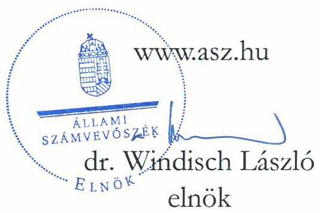
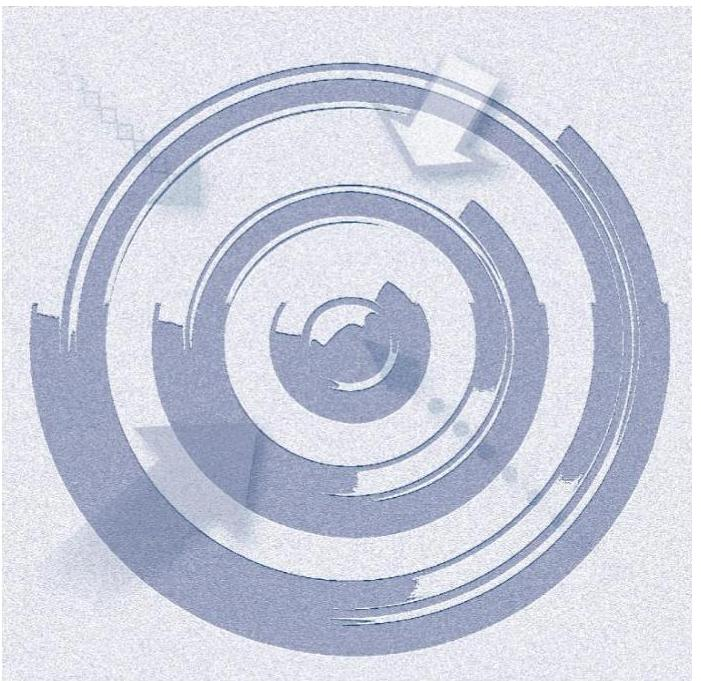
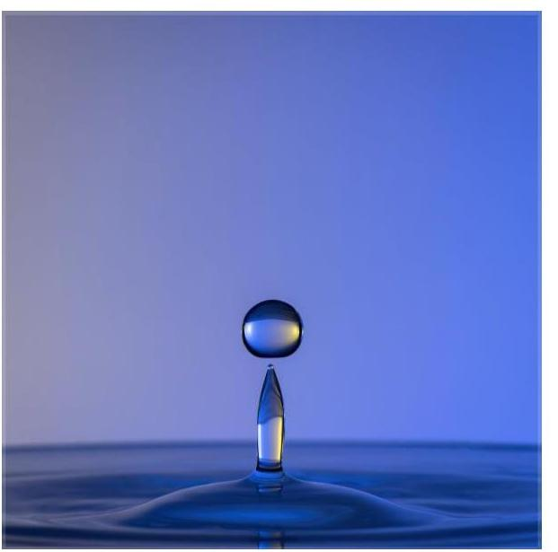
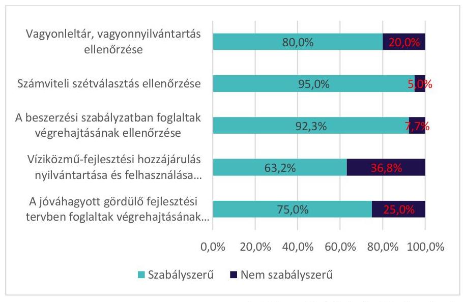
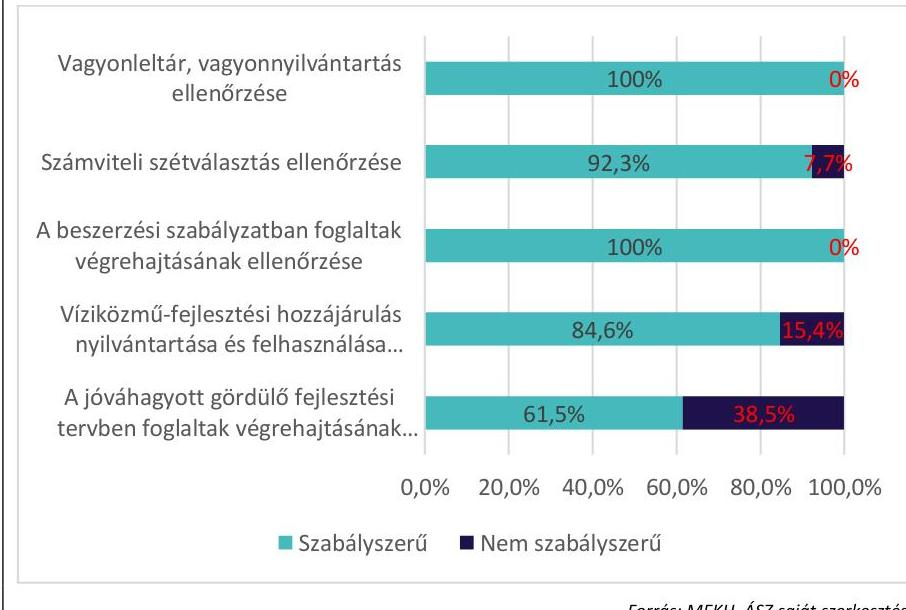
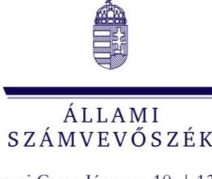

# JELENTÉS 

## A vizek védelmének és a vízgazdálkodási feladatok ellátásának ellenőrzése

A víziközmű-szolgáltatás ellenőrzése

2023.

---

# JELENTÉS 

## A vizek védelmének és a vízgazdálkodási feladatok ellátásának ellenőrzése

A víziközmű-szolgáltatás ellenőrzése

2023.

23024

---

# ELLENŐRZÉSI IGAZGATÓSÁG: 

ÁLLAMHÁZTARTÁS KÖZPONTI SZINTJÉT ELLENŐRZŐ IGAZGATÓSÁG

## ELLENŐRZÉSVEZETŐ:

ÓDOR ZOLTÁN TAMÁS ellenőrzésvezető

Jelentéseink az interneten a www.asz.hu címen olvashatók.

IKTATÓSZÁM: EL-3930-001/2023
TÉMASZÁM: 2622
ELLENŐRZÉS-AZONOSÍTÓ SZÁM: V0966

---

# TARTALOMJEGYZÉK 

- ÖSSZEGZÉS ..... 5
- AZ ELLENŐRZÉS CÉLJA ..... 6
- AZ ELLENŐRZÉS TERÜLETE ..... 7
- AZ ELLENŐRZÉS HÁTTERE, INDOKOLTSÁGA ..... 8
- A JELENTÉS LÉNYEGES KÉRDÉSKÖRE ..... 9
- AZ ELLENŐRZÉS HATÓKÖRE ÉS MÓDSZEREI ..... 10
- MEGÁLLAPÍTÁSOK ..... 12
- MELLÉKLETEK ..... 17
I. sz. melléklet: Az ellenőrzött víziközmű társaságok ..... 17
II. sz. melléklet: A MEKH által a víziközmű-szolgáltatóknál 2018-2022. években végzett átfogó ellenőrzések tapasztalatainak összegzése ..... 18
III. sz. melléklet: A víziközmű-szolgáltatással kapcsolatos, a MEKH által elvégeztetett 2018. és a 2020 évi felhasználói elégedettség felmérés eredményeinek összefoglalása ..... 21
IV. sz. melléklet: Értelmező szótár ..... 23
- FÜGGELÉK: ÉSZREVÉTELEK ..... 25
- RÖVIDÍTÉSEK JEGYZÉKE ..... 27

---

.

---

# ÖSSZEGZÉS 

Az ellenőrzött időszakban a Magyar Energetikai és Közmű-szabályozási Hivatal víziközműszolgáltatással összefüggő feladatellátása szabályszerű volt.

## Az ellenőrzés társadalmi indokoltsága

Magyarország Alaptörvénye P) cikk (1) bekezdése szerint a vízkészlet a nemzet közös örökségét képezi, amelynek védelme, fenntartása és jövő nemzedékek számára való megőrzése az állam és mindenki kötelessége. Az Alaptörvény XX. cikke szerint mindenkinek joga van a testi és lelki egészséghez, amelynek érvényesülését Magyarország többek között az egészséges ivóvízhez való hozzáférés biztosításával támogatja.

A jogszabályi rendelkezések mellett alapvető társadalmi igény a természetes vízkészletek védelme, a jövő nemzedék számára történő megóvása, annak érdekében, hogy a tiszta víz hosszú távon mindenki számára elérhető legyen.

## Főbb megállapítások

A MAGYAR ENERGETIKAI ÉS KÖZMŰ-SZABÁLYOZÁSI HIVATAL a víziközmű-szolgáltatással kapcsolatos feladatellátása az ellenőrzött időszakban szabályszerű volt.

A Magyar Energetikai és Közmű-szabályozási Hivatal a 2018-2021. években elkészítette és minden év október 15-éig az innovációs és technológiai miniszter részére megküldte a víziközmű szolgáltatás áraira és díjaira vonatkozó javaslatát.

A Magyar Energetikai és Közmű-szabályozási Hivatal az Állami Számvevőszék által ellenőrzött 11 víziközmű-szolgáltatóval kapcsolatos felügyeleti tevékenységét szabályszerűen gyakorolta. A Magyar Energetikai és Közmű-szabályozási Hivatal által készített ellenőrzési módszertan a víziközmű-szolgáltatók komplex ellenőrzésére vonatkozó iránymutatásokat tartalmazott és biztosította a víziközmű-szolgáltatók átfogó ellenőrzésének végrehajtását, a víziközműszolgáltatók törvényességi ellenőrzését.

A Magyar Energetikai és Közmű-szabályozási Hivatal a beszámolással kapcsolatos feladatai körében az Országgyűlés által jóváhagyott beszámolóit a 2018-2020. évek tekintetében a honlapján közzétette.

A Magyar Energetikai és Közmű-szabályozási Hivatal a Felhasználói Elégedettségi Felmérés keretében 2018-tól kezdődően kétévente független közvélemény-kutató szervezet bevonásával felmérte a közszolgáltatási-szerződések alapján vételező lakossági felhasználók víziközmű-szolgáltatással kapcsolatos elégedettségét. A Magyar Energetikai és Közmű-szabályozási Hivatal 2018. és 2020. évi felmérés adatai alapján 2018-ról 2020-ra a víziközmű-szolgáltatással kapcsolatban javult a felhasználói elégedettség.

---

# **AZ ELLENŐRZÉS CÉLJA**

**AZ ELLENŐRZÉS CÉLJA** a Magyar Energetikai és Közműszabályozási Hivatal víziközművekkel kapcsolatos egyes feladatai ellátásának értékelése.

---

# AZ ELLENŐRZÉS TERÜLETE 

## Magyar Energetikai és Közmű-szabályozási Hivatal

A MEKH ${ }^{1}$ „különleges jogállású" önálló szabályozó szerv, melyet az Országgyűlés 2013. április 4-én alapított. A MEKH költségvetése az Országgyűlés költségvetési fejezetén belül önálló címet képez. A MEKH Vksztv²-ben előírt feladata a víziközműszolgáltatói működési és más engedélyek kiadása, az azokban foglaltak betartásának ellenőrzése, jogszabálysértés esetén a szükséges intézkedések megtétele.

A MEKH tájékoztatja az innovációs és technológiai minisztert a víziközmű-szolgáltatási piac általános helyzetéről, az ágazat gazdálkodási helyzetéről, a víziközmű-szolgáltatás műszaki feltételeiről, az ágazatban az elmúlt évben bekövetkezett változásokról. Javaslatot tesz a közműves ivóvíz ellátás, szennyvízelvezetés- és tisztítás díjára, továbbá az ivóvíz átadási árára és az átvett szennyvíz kezelési díjára, valamint a külön díj ellenében végezhető szolgáltatások díjára.

A MEKH felügyeli a víziközmű szolgáltatók tevékenységét, valamint ellenőrzéseket folytat le az ellátásért felelősök tekintetében. A Vksztv. alapján felügyelet átfogó ellenőrzésre, célvizsgálatra és utóellenőrzésre terjedhet ki. A MEKH továbbá megállapítja az átmeneti díjat, a korábban nem nyújtott víziközmű szolgáltatás esetében. Ellátja az egységes elektronikus közműnyilvántartással kapcsolatos hatósági felügyeleti feladatokat.

A Vksztv. alapján a MEKH elvégzi a víziközmű-szolgáltató ellátási területén a felhasználói elégedettségi szint, továbbá az egyes víziközmű-szolgáltatókkal szembeni elvárás felmérését.

A MEKH a víziközmű-szolgáltató gazdasági társaságok feletti felügyeleti tevékenységének ellenőrzése céljából az ÁSZ a víziközmű-szolgáltató gazdasági társaságok közül 11 társaságot ellenőrzött. Az ellenőrzött szervezeteket az I. melléklet mutatja.

A MEKH által a víziközmű-szolgáltatóknál a 2018-2020 és a 2021-2022 közötti időszakban végzett átfogó ellenőrzések tapasztalatainak összegzését a II. melléklet mutatja be.

A víziközmű-szolgáltatással kapcsolatos a MEKH által elvégeztetett 2018. és a 2020 évi felhasználói elégedettség felmérés ( $\mathrm{FEF}^{3}$ ) eredményeit a III. melléklet foglalja össze.

---

# **AZ ELLENŐRZÉS HÁTTERE, INDOKOLTSÁGA**

Az Alaptörvény XX. cikke szerint mindenkinek joga van a testi és lelki egészséghez, melynek érvényesülését Magyarország az egészséges ivóvízhez való hozzáférés biztosításával segíti elő. A Kormány állami feladatnak tekinti a vízkészletek védelmének és hasznosításának ügyét.

---

# A JELENTÉS LÉNYEGES KÉRDÉSKÖRE 

1. A MEKH szabályszerűen látta-e el a víziközmű-szolgáltatással kapcsolatos egyes feladatait?

---

# AZ ELLENŐRZÉS HATÓKÖRE ÉS MÓDSZEREI 

## Az ellenőrzés típusa

Megfelelőségi ellenőrzés.

## Az ellenőrzött időszak

2018. január 1-jétől 2022. május 9-ig tartó időszak.

## Az ellenőrzés tárgya

A megfelelőségi ellenőrzés tárgyát képezte a MEKH víziközmű-szolgáltatással kapcsolatos feladatellátása feltételei, víziközmű-szolgáltatás árai és díjai kialakításának, a MEKH víziközmű-szolgáltatókkal kapcsolatos felügyeleti tevékenységének, valamint a beszámolással kapcsolatos feladatellátásának értékelése.

## Az ellenőrzött szervezet

Magyar Energetikai és Közmű-szabályozási Hivatal.

## Az ellenőrzés jogalapja

Az ellenőrzés jogalapját az Állami Számvevőszékről szóló 2011. évi LXVI. törvény 1. § (3) és 5. § (3) bekezdései képezték.

## Az ellenőrzés módszerei

Az ellenőrzés végrehajtása az ellenőrzési program szempontjai, kérdéskörei, az ellenőrzött időszakban hatályos jogszabályok, az ellenőrzés szakmai szabályai, az ÁSZ megfelelőségi ellenőrzésre vonatkozó módszertana alapján történt.

Az ellenőrzési kérdések megválaszolásához szükséges bizonyítékok megszerzése az ellenőrzött szervezet által rendelkezésre bocsátott dokumentumokra és adatokra alapozva, továbbá megfigyelés, szemle (szemrevételezés), kérdésfeltevés (információkérés), mintavételi eljárás, interjú, valamint elemző eljárás útján történt.

Az ÁSZ mintavételi eljárással ellenőrizte a MEKH víziközmű-szolgáltatókkal összefüggő felügyeleti tevékenységeinek előkészítését és végrehajtását. A mintavételi eljárással ellenőrzött területek esetében az ÁSZ

---

„szabályszerű"-nek értékelt egy ellenőrzött tételt, amennyiben a hibaarány legfeljebb 10%-ot, „nem szabályszerű"-értékelést adott, amennyiben a hibák 10%-nál magasabb arányt képviseltek.

Az ellenőrzési bizonyítékként felhasználható adatforrások közé tartoztak egyrészt az ellenőrzési program mellékletében szereplő dokumentumok jegyzékében rögzített adatforrások, másrészt adatforrás lehetett minden, az ellenőrzés folyamán feltárt, az ellenőrzés szempontjából információt tartalmazó dokumentum.

Az ellenőrzés lefolytatásához az ellenőrzött szervezet az ÁSZ által kért teljességi és hitelességi nyilatkozattal alátámasztott dokumentumok rendelkezésre bocsátásával szolgáltatott adatokat.

Az ellenőrzés során az ÁSZ felhasználta a MEKH által a víziközmű szolgáltatás színvonalának mérésére lefolytatott felmérés eredményeit.

---

# 1. A MEKH szabályszerűen látta-e el a víziközmű-szolgáltatással kapcsolatos egyes feladatait? 

Összegző megállapítás

Az ellenőrzött időszakban a MEKH víziközmű-szolgáltatással kapcsolatos egyes feladatainak ellátása szabályszerű volt.

### 1.1. számú megállapítás

A MEKH az ellenőrzött időszakban a jogszabályi előírásoknak megfelelően látta el az ellenőrzött víziközmű-szolgáltatók felügyeleti feladatait.

A MEKH a 2018-2022. ÉVEKRE VONATKOZÓ ÁTFOGÓ ELLENŐRZÉSEINEK ütemezését a Vksztv. 5/B. § (1) bekezdés előírásának megfelelően ellenőrzési tervekbe foglalta. A 2018-2022. évi ellenőrzési tervekben szereplő átfogó ellenőrzések a Vksztv. 5/A. § (3) bekezdése, 5/B. § (1) bekezdés előírásainak megfelelően -a víziközmű-szolgáltatók működésének legalább hároméves ciklusokként megvalósuló komplex, minden működési területre kiterjedő törvényességi, szakszerűségi és hatékonysági ellenőrzések voltak.

A MEKH által készített ellenőrzési módszertan ${ }_{1-4}{ }^{4}$ tartalmazta a víziközmű-szolgáltatók komplex ellenőrzésére vonatkozó iránymutatásokat és biztosította a víziközmű-szolgáltatók átfogó ellenőrzésének végrehajtását, a víziközmű-szolgáltatók törvényességi ellenőrzését.

A MEKH az ellenőrzött időszakban elkészítette a víziközmű-szolgáltatók átfogó és utóellenőrzéseinek ellenőrzési programjait, melyek tartalmazták a jogszabályban előírt tartalmi elemeket.

A MEKH ellenőrzési programjai az ellenőrzési módszertannak megfelelően kerültek összeállításra.

Az ellenőrzési módszertanban foglaltaknak megfelelően az ellenőrzéseket a MEKH a Vksztv. 3. § (4) bekezdés a) pont szerint rendelkezésre álló ügyintézési határidőn - 135 napon - belül lefolytatta.

### 1.2. számú megállapítás

A MEKH az ellenőrzött időszak második felére megteremtette a víziközmű-szolgáltatáshoz kapcsolódó feladatellátásának szabályszerű biztosításához szükséges feltételeket.

A MEKH víziközmű-szolgáltatással összefüggő feladatait ellátó szervezeti egységei az ellenőrzött időszakban az Ávr. ${ }^{5}$ 13. § (5) bekezdésének megfelelően rendelkeztek a szervezeti egységek által ellátott feladatok munkafolyamatainak leírásával, a szervezeti egység vezetőinek és alkalmazottainak feladat- és hatáskörét, a helyettesítés rendjét meghatározó szervezeti és működési szabályzattal, valamint ügyrenddel. A szervezeti integritást sértő események kezelésének eljárásrendjét a Bkr. 6. § (4) bekezdés előírásának megfelelően szabályzatban rögzítették. A kiadmányozás rendjét a 335/2005. (XII.29.) sz. Korm. rendelet szerint a MEKH 5/2015. számú szabályzatban ${ }^{6}$ rögzítették.

---

A 2018-2019. években a MEKH az Lv tv. ${ }^{7}$ 10. § (1) bekezdés b) pontjában rögzítettek ellenére iratkezelési szabályzatát nem a Magyar Nemzeti Levéltár egyetértésével adta ki. Továbbá a MEKH a 2018-2021. június 30. között az E-ügyintézési tv. ${ }^{8}$ 65. § (1) bekezdésében rögzítettek ellenére információátadási szabályzatot nem fogadott el.

Az iratkezelésről szóló 11/2019 MEKH szabályzat ${ }^{9}$ bevezetésével a Magyar Nemzeti Levéltár 2020. január 1-jétől egyetértett. A MEKH 2021. július 1-jétől a 8/2021. számú, egységes szerkezetbe foglalt MEKH szabályzatban ${ }^{10}$ a jogszabályi előírásoknak megfelelően gondoskodott az információ átadás feladatainak szabályozásáról.

A 335/2005. (XII.29) Korm. rendelet ${ }^{11}$ 54. §-ában előírtak szerint a MEKH a 32/2015. MEKH szabályzatban ${ }^{12}$ rendelkezett a hivatalos célra felhasználható elektronikus aláírások, elektronikus bélyegzők kezelésének rendjéről és nyilvántartásáról az ellenőrzött időszak vonatkozásában.

A MEKH az E-ügyintézési tv. 25. § (3) bekezdés b) pontja szerint az ellenőrzött időszakban biztosította az ügyfelei számára a személyre szabott ügyintézési felületen az elektronikus ügyintézést és az E-ügyintézési tv. 25. § (3) bekezdés g) pontja és a 137/2016. (VI.13.) Korm. rendelet 7. § szerint olyan elektronikus ügyintézést biztosító információs rendszert működtetett, amely biztosította a hitelesített dokumentumok előállítását.

Az E-ügyintézési tv. 26. § (1) bekezdése, az E-ügyintézési vhr. ${ }^{13} 34 . \S$ (1) bekezdése, a 37. § a)-g) pontjaiban előírtaknak megfelelően a MEKH az ügyek elektronikus intézéséhez szükséges vagy azt segítő, meghatározott tartalmú tájékoztatást közzétette olyan módon, hogy azt az ügyfél képes legyen megjeleníteni és tárolni. A MEKH az E-ügyintézési tv. 10. § b) pontja szerint közzétette a tájékoztatást az igénybe vehető elektronikus útról, az E-ügyintézési tv. 18. § (2) bekezdés c) pontja szerint az igénybe vehető elektronikus azonosítási szolgáltatásokról, az elektronikus űrlap kitöltésével kezdeményezhető eljárásokról, az elektronikus űrlapok elérhetőségeiről. A MEKH az E-ügyintézési vhr. 17. § (1)-(2) bek. előírása szerint közzétette és rögzítette, hogy az elektronikus kapcsolattartás keretében milyen fájl formátumú elektronikus dokumentumokat fogad el.

A MEKH az E-ügyintézési vhr. 37. § h) pontjában rögzítettek ellenére az ügyfeleket az eljárásért fizetendő terhek elektronikus megfizetésének módjáról a 2018-2022. években nem tájékoztatta.

# 1.3. számú megállapítás 

A MEKH a 2018-2021. években szabályszerűen ellátta a víziközmű szolgáltatás árainak és díjainak kialakításához kapcsolódó feladatait.

A
 MEKH a Vksztv. 65. § (2) bekezdés előírásának megfelelően a közműves ivóvízellátás, valamint a közműves szennyvízelvezetés- és tisztítás díjára (együtt: hatósági díj) vonatkozó javaslatát a 2018-2021. években elkészítette és minden év október 15-éig az innovációs és technológiai miniszter részére megküldte.

A MEKH a hatósági díjra vonatkozó javaslatban a 17/2015. (IV. 9.) NFM rendelet 3. § szerint tájékoztatta a minisztert:
— a díjjavaslat kidolgozásánál alkalmazott módszertanról, valamint az elmúlt időszak változásairól, tendenciákról,

---

- a díjavaslatban előterjesztett, illetve a díjavaslat megküldésének időpontjában hatályos díjak közötti különbségekről, különös tekintettel az árszínvonal változására, továbbá
- a víziközmű-szolgáltatási piac általános helyzetéről, a műszaki feltételek alakulásáról és az ágazat gazdálkodási helyzetéről.
A MEKH az ivóvíz átadási árára és az átvett szennyvíz kezelési díjára (együtt: átadási ár) vonatkozó javaslatát a Vksztv. 67. § (4) bekezdés előírása szerint a 2018-2021. években elkészítette és a javaslatot minden év október 15-éig a miniszternek megküldte.

A MEKH a Vksztv. 72/A. § (2) bekezdésének megfelelően a víziközműszolgáltató által külön díj ellenében végzendő szolgáltatások körére és díjaira, a külön díj felszámítása nélkül biztosítandó szolgáltatások legszűkebb körére, valamint a felhasználó szerződésszegése esetén külön díj ellenében végezhető szolgáltatások körére és díjaira vonatkozó javaslatát elkészítette és megküldte a miniszter részére.

# 1.4. számú megállapítás 

A MEKH 2018-2020. években szabályszerűen látta el a beszámolási és a víziközmű szolgáltatás színvonalának felmérésével kapcsolatos feladatait.

Az Országgyűlés által jóváhagyott beszámolóit a MEKH a 2018-2020. évek tekintetében a MEKH tv. ${ }^{14}$ 4. § (2) bek. a) pontja előírásának megfelelően honlapján közzétette. Az Országgyűlés részére készített éves beszámolók összefoglalást tartalmaztak a víziközmű-szolgáltató gazdasági társaságok ellenőrzési tapasztalatairól.

A felhasználói elégedettségi szint, továbbá az egyes víziközmű-szolgáltatókkal szembeni elvárás felmérésének eljárásrendjét a MEKH a Felhasználói Elégedettségi Felmérés Szabályzatában rögzítette.

A MEKH a Vksztv. 5. § (2) bekezdése alapján elvégeztette a víziközműszolgáltató ellátási területén a felhasználói elégedettségi szint, továbbá az egyes víziközmű-szolgáltatókkal szembeni elvárás felmérését. A felmérés az ellenőrzött időszakban kétszer került lefolytatásra, a 2018. és 2020. években.

A MEKH 2018. áprilisi határozatában kötelezte a víziközmű-szolgáltatókat, hogy 2018-tól kezdődően kétévente független közvélemény-kutató szervezettel méressék fel a közszolgáltatási szerződések alapján vételező lakossági felhasználók víziközmű-szolgáltatással kapcsolatos elégedettségét.

A MEKH által bevezetett FEF15 egyik legfontosabb célja az volt, hogy hiteles, a felhasználók szubjektív értékítéletét hűen tükröző visszajelzést adjon a szolgáltatások, azon belül a szolgáltatók tevékenységének megítéléséről.

A FEF három, módszertanilag elkülöníthető, időpontban és célját tekintve is különböző felmérésből tevődött össze. Az átlagok számításához a 0-9-es skála értékei transzponálásra kerültek egy 1-10-es skálára mindhárom mérésnél. Az eljárásban minden víziközmű-szolgáltató azonos módszertannal, azonos méretű reprezentatív minta segítségével, azonos

---

kérdések alapján, külső kérdezőbiztosok által került felmérésre. A FEF alapfelmérés 2018. évben 19500 fő, 2020. évben 19726 fő személyes megkérdezésével történt.

A negyven adatszolgáltatásra kötelezett víziközmű-szolgáltató közül a Dunaújvárosi Víz-, Csatorna- és Hőszolgáltató Korlátolt Felelősségű Társaság a 2018. és 2020. évekre, a Hajdúkerületi és Bihari Víziközmű Szolgáltató Zrt. a 2020. évre nem szolgáltatott adatot a MEKH-nek. Érd és Térsége Csatornaszolgáltató Korlátolt Felelősségű Társaság, valamint a Fővárosi Csatornázási Művek Zrt. nem végzett vízszolgáltatást a 2017-2021. években.

A FEF alapfelmérésben az ivóvíz minőségével kapcsolatos kérdések értékelése a 2018. évben a 37 víziközmű-szolgáltató adataiból számított átlagok alapján történt:
— Az ivóvíz tisztaságát tekintve az elégedettségi átlag 8,1 volt.
— Az ivóvíz ízét átlagosan 8,0-ra értékelték a víziközmű-szolgáltatók ügyfelei.
— Az ivóvíz keménységét, lágyságát illetően az átlagérték 6,9 volt.
— Összességében az ivóvíz minősége 7,9-es átlagértéket kapott.
— A vezetékes ivóvíz-ellátás folyamatossága elégedettségének átlagértéke 8,9 volt.
— A víziközmű-szolgáltatók honlapjain található tájékoztatást az ivóvíz minőségéről 8,2-re értékelték a válaszadók.
Az ivóvíz minőségével kapcsolatos kérdések értékelése a 2020. évben a 36 víziközmű-szolgáltató adataiból számított átlagok alapján történt:
— Az ivóvíz tisztaságát tekintve az elégedettségi átlag 8,4 volt.
— Az ivóvíz ízét átlagosan 8,3-ra értékelték a víziközmű-szolgáltatók ügyfelei.
— Az ivóvíz keménységét, lágyságát illetően az átlagérték 7,4 volt.
— Összességében az ivóvíz minősége 8,2-es átlagértéket kapott.
— A vezetékes ivóvíz-ellátás folyamatossága elégedettségének átlagértéke 9,0 volt.
— A víziközmű-szolgáltatók honlapjain található tájékoztatást az ivóvíz minőségéről 8,4-re értékelték a válaszadók.
A FEF-index (az átlagos teljesítményt mérő kumulált index) az Alap-, a Kiegészítő és az Azonnali Felmérés MEKH által meghatározott kérdéseinek összevont átlagait tartalmazta. A FEF-index alapján 22 víziközmű-szolgáltatónál javult a felhasználói elégedettség. A 2018. és 2020. évi felmérések eredményei szerint a felhasználók a víziközmű-szolgáltató összteljesítményének és az ivóvíz minőségének javulását tapasztalták.

A 2018. és 2020. évi a MEKH által előírt elégedettség felmérések eredményei szerint a felmérésben részt vett víziközmű-szolgáltatók 38,9%-ánál (14 víziközmű-szolgáltatónál) a 2020. évre romlott a víziközmű-szolgáltató teljesítményének fogyasztók általi megítélése.

A víziközmű-szolgáltatással kapcsolatos 2018. és a 2020. évi felhasználói elégedettség felmérés eredményeit a III. melléklet foglalja össze.

---

.

---

# MELLÉKLETEK 

I. SZ. MELLÉKLET: AZ ELLENŐRZÖTT VÍZIKÖZMŰ TÁRSASÁGOK

## Víziközmű szolgáltató neve

1. ALFÖLDVÍZ Regionális Víziközmű-szolgáltató Zrt.
2. BARANYA-VÍZ Víziközmű Szolgáltató Zrt.
3. BORSODVÍZ Önkormányzati Közüzemi Szolgáltató Zrt.
4. DAKÖV Dabas és Környéke Vízügyi Kft.
5. Észak-zalai Víz- és Csatornamű Zrt.
6. FEJÉRVÍZ Fejér Megyei Önkormányzatok Víz- és Csatornamű Zrt.
7. KAVÍZ Kaposvári Víz- és Csatornamű Kft.
8. Mezőföldi Regionális Víziközmű Kft.
9. Pápai Víz- és Csatornamű Zrt.
10. VASI VÍZ Vas megyei Víz- és Csatornamű Zrt.
11. ZEMPLÉNI Vízmű Kft.

---

# II. SZ. MELLÉKLET: A MEKH ÁLTAL A VÍZIKÖZMŰ-SZOLGÁLTATÓKNÁL 2018-2022. ÉVEKBEN VÉGZETT ÁTFOGÓ ELLENŐRZÉSEK TAPASZTALATAINAK ÖSSZEGZÉSE 

A MEKH által a 2018-2020. közötti időszakban végzett átfogó ellenőrzések a 40 ellenőrzött, víziközmű-szolgáltatási engedéllyel rendelkező víziközmű-szolgáltató gazdasági társaság 57,5%-ánál (23 víziközmű-szolgáltatónál) tártak fel hibát, szabálytalanságot.

A MEKH megállapításai alapján az egyes területek szabályszerűségét a 2018-2020. közötti időszakban az 1. ábra mutatja be.

1. ábra - A MEKH által 2018-2020. években ellenőrzött, 40 víziközmű-szolgáltató gazdasági társaságnál az átfogó ellenőrzések megállapításai alapján az egyes területek szabályszerűsége (%)

A vagyonleltár, vagyonnyilvántartás területén az átfogó ellenőrzések során feltárt hibák, szabálytalanságok azt mutatták, hogy az egyes víziközmű-szolgáltatók vagyonleltárában nem megfelelő besorolású rendszerfüggetlen víziközmű-elemek, illetve működtető eszközök voltak találhatók; a rendszerfüggetlen víziközmű-elemek nem voltak külön nyilvántartva, továbbá a szolgáltatók könyveiben olyan rendszerfüggő víziközmű-elemek is szerepeltek, amelyek átadása az ellátásért felelős önkormányzatoknak nem történt meg a vizsgált időszak tekintetében.

A számviteli szétválasztás szabályainak ellenőrzése területén a MEKH két víziközmű-szolgáltató gazdasági társaságnál tárt fel szabálytalanságot, mivel megsértették a számviteli szétválasztás teljeskörűségének alapelvét.

## A víziközmű-szolgáltatók beszerzési

szabályzataiban foglaltak ellenőrzése során a MEKH hiányosságként állapította meg, hogy egy víziközmű-szolgáltató gazdasági társaság nem készített beszerzési tervet. A MEKH további hiányosságként állapította meg, hogy nem került bekérésre a beszerzési szabályzatban előírt 3 árajánlat, garanciális kötelezettség miatt, vagy annak okán, hogy a regionális piacon csak egy partner volt elérhető.

---

A víziközmű-szolgáltató gazdasági társaságok víziközmű-fejlesztési hozzájárulásának nyilvántartásának ellenőrzése során hiányosságként tárta fel a MEKH, hogy:
$\longrightarrow$ a víziközmű-szolgáltató által készített nyilvántartás nem tartalmazta teljes körűen a kötelező tartalmi elemeket (felhasználó székhelye, ingatlan helyrajzi szám, kvóta, felhasználó),
$\longrightarrow$ a víziközmű-szolgáltató a víziközmű-fejlesztési hozzájárulás számviteli nyilvántartásban szereplő összesített adatairól, valamint az elvégzett felújítási, pótlási és beruházási munkák tartalmáról, azok műszaki szükségességéről nem tájékoztatta évente az ellátásért felelősöket.

# A jóváhagyott gördülő fejlesztési tervben foglaltak végrehajtásánál a MEKH hiányosságként állapította meg, hogy egy víziközmű-szolgáltató a jóváhagyott feladatok átütemezéséről, valamint az előre nem tervezett feladatok megvalósításáról a MEKH-t nem tájékoztatta, valamint típushiányosságként jelentkezett, hogy a szolgáltatók elmulasztották a MEKH előzetes hozzájárulását kérni a 20%-ot meghaladó mértékű változtatáshoz. 

A MEKH által a 2021-2022 közötti időszakban végzett átfogó ellenőrzései a 13 ellenőrzött víziközmű-szolgáltató gazdasági társaság 53,8%-ánál (7 víziközmű-szolgáltatónál) állapítottak meg hibát, szabálytalanságot. A MEKH által végzett átfogó ellenőrzések megállapításai alapján az egyes területek szabályszerűségét az 2. ábra mutatja be.
2. ábra - A MEKH által 2021-2022. években ellenőrzött, 13 víziközmű-szolgáltató gazdasági társaságnál az átfogó ellenőrzések megállapításai alapján az egyes területek szabályszerűsége (%)

A számviteli szétválasztás szabályainak ellenőrzése területén a MEKH egy víziközmű-szolgáltató gazdasági társaságnál tárt fel jogszabálysértést, a gazdasági társaság az átfogó ellenőrzést megelőzően nem tájékoztatta a MEKH-t a számviteli szétválasztási szabályrendszerében bekövetkezett változásokról.

---

# A víziközmű-szolgáltató gazdasági társaságok víziközmű-fejlesztési hozzájárulásának nyilvántartásának ellenőrzése során kettő víziközmű-szolgáltató gazdasági társaságnál hiányosságként tárta fel a MEKH, hogy: 

- a víziközmű-szolgáltató által készített nyilvántartás nem tartalmazta az ingatlan helyrajzi számát,
- a víziközmű-szolgáltató a víziközmű-fejlesztési hozzájárulás számviteli nyilvántartásban szereplő összesített adatairól, valamint az elvégzett felújítási, pótlási és beruházási munkák tartalmáról, azok műszaki szükségességéről nem tájékoztatta évente az ellátásért felelősöket

## A jóváhagyott gördülő fejlesztési tervben foglaltak végrehajtásánál a MEKH hiányosságként állapította, hogy

öt víziközmű-szolgáltató esetében, hogy a jóváhagyott feladatok átütemezéséről, az előre nem tervezett feladatok megvalósításáról a MEKH-t nem tájékoztatta, valamint a szolgáltatók elmulasztották a MEKH előzetes hozzájárulását kérni a 20%-ot meghaladó mértékű változtatáshoz.

---

# *Mellékletek*

### **III. SZ. MELLÉKLET: A VÍZIKÖZMŰ-SZOLGÁLTATÁSSAL KAPCSOLATOS, A MEKH ÁLTAL ELVÉGEZTETETT 2018. ÉS A 2020. ÉVI FELHASZNÁLÓI ELÉGEDETTSÉG FELMÉRÉS EREDMÉNYEINEK ÖSSZEFOGLALÁSA**

|  Sor-
szám | Víziközmű-szolgáltató megnevezése | Hogyan alakult az ivóvíz
tisztaságának felhasználói elégedettsége? | Hogyan alakult az ivóvíz
ízzel kapcsolatban a felhasználói elégedettség? | Hogyan alakult az ivóvíz
keménységét, lágyságát illetően a felhasználói elégedettség? | Hogyan alakult az ivóvíz
minőségével kapcsolatban a felhasználói összelégedettség? | Hogyan alakult az ivóvíz
ellátás folyamatosságával kapcsolatban a felhasználói elégedettség? | Hogyan alakult az ivóvíz
minőségével kapcsolatban a felhasználói elégedettség? | Hogyan alakult az ivóvíz
minőségével kapcsolatban a felhasználói elégedettség? | Hogyan alakult a honlapon található, az ivóvíz
minőségével kapcsolatban a felhasználói elégedettség?  |
| --- | --- | --- | --- | --- | --- | --- | --- | --- | --- |
|   |  | 2018. év | 2020. év | 2018. év | 2020. év | 2018. év | 2020. év | 2018. év | 2020. év  |
|  1. | ALFÖLDVÍZ Regionális Víziközmű-szolgáltató Zrt. | 8,2 | 8,5 | 8,3 | 8,5 | 8,4 | 8,7 | 8,3 | 8,5  |
|  2. | AQUA Szolgáltató Korlátolt Felelősségű Társaság | 9,1 | 9,2 | 9,1 | 9,2 | 8,7 | 8,2 | 9,1 | 9,1  |
|  3. | BÁCSVÍZ Víz- és Csatornaszolgáltató Zrt. | 9,0 | 9,1 | 8,8 | 9,1 | 8,7 | 9,0 | 8,9 | 9,1  |
|  4. | BAJAVÍZ Baja és Térsége Víz- és Csatornamű Kft. | 5,7 | 7,0 | 5,6 | 7,2 | 5,8 | 6,7 | 5,7 | 7,2  |
|  5. | BAKONYKARSZT Víz- és Csatornamű Zrt. | 9,4 | 9,2 | 9,4 | 9,2 | 7,9 | 7,8 | 9,3 | 9,1  |
|  6. | BARANYA-VÍZ Víziközmű Szolgáltató Zrt. | 8,0 | 8,0 | 7,8 | 7,6 | 7,0 | 6,0 | 7,9 | 7,6  |
|

  7. | BORSODVÍZ Önkormányzati Közüzemi Szolgáltató Zrt. | 7,2 | 7,6 | 7,1 | 7,7 | 5,2 | 6,9 | 6,8 | 7,5  |
|  8. | DAKÖV Dabas és Környéke Vízügyi Korlátolt Felelősségű Társaság | 7,5 | 8,3 | 7,2 | 8,2 | 6,3 | 7,9 | 7,2 | 8,3  |
|  9. | Debreceni Vízmű Zrt. | 8,1 | 7,9 | 7,9 | 7,6 | 6,7 | 7,3 | 7,8 | 7,7  |
|  10. | Dél-Pest Megyei Víziközmű Szolgáltató Zrt. | 8,0 | 8,3 | 7,9 | 8,4 | 6,9 | 8,1 | 7,8 | 8,3  |
|  11. | Dél-zalai Víz- és Csatornamű Zrt. | 8,6 | 8,2 | 8,5 | 7,9 | 5,8 | 6,4 | 8,4 | 7,9  |
|  12. | DMRV Duna Menti Regionális Vízmű Zrt. | 7,4 | 8,5 | 7,3 | 8,5 | 6,5 | 7,6 | 7,2 | 8,3  |
|  13. | Dunántúli Regionális Vízmű Zrt. | 8,0 | 7,4 | 7,5 | 7,4 | 6,3 | 6,8 | 7,6 | 7,3  |
|  14. | E.R.Ö.V. Egyesült Regionális Önkormányzati Víziközmű Zrt. | 6,9 | 6,8 | 6,4 | 7,0 | 5,0 | 6,9 | 6,2 | 7,0  |
|  15. | Érd és Térsége Regionális Víziközmű Korlátolt Felelősségű Társaság | 8,1 | 8,0 | 7,9 | 7,7 | 7,1 | 7,1 | 7,8 | 7,8  |
|  16. | ÉRV. Észak-magyarországi Regionális Vízművek Zrt. | 7,4 | 8,6 | 6,8 | 8,5 | 5,1 | 7,7 | 6,9 | 8,4  |
|  17. | Észak-dunántúli Vízmű Zrt. | 8,0 | 8,6 | 7,8 | 8,5 | 6,4 | 8,0 | 7,7 | 8,4  |
|  18. | Észak-zalai Víz- és Csatornamű Zrt. | 9,2 | 8,6 | 9,1 | 8,5 | 8,1 | 6,6 | 8,9 | 8,1  |
|  19. | FEJÉRVÍZ Fejér Megyei Önkormányzatok Víz- és Csatornamű Zrt. | 7,5 | 8,6 | 8,0 | 8,5 | 9,0 | 7,1 | 8,0 | 8,4  |
|  20. | Fővárosi Vízművek Zrt. | 8,3 | 8,1 | 8,2 | 7,8 | 7,8 | 7,4 | 8,2 | 7,8  |
|  21. | Gyulai Közüzemi Nonprofit Korlátolt Felelősségű Társaság | 8,7 | 8,7 | 8,7 | 8,7 | 8,6 | 8,7 | 8,7 | 8,7  |
|  22. | Hajdúkerületi és Bihari Víziközmű Szolgáltató Zrt. | 8,1 | - | 7,7 | - | 6,2 | - | 7,4 | -  |
|  23. | Heves Megyei Vízmű Zrt. | 7,8 | 8,7 | 7,8 | 8,6 | 6,8 | 7,5 | 7,5 | 8,6  |
|  24. | KAVÍZ Kaposvári Víz- és Csatornamű Korlátolt Felelősségű Társaság | 7,1 | 8,3 | 7,1 | 7,7 | 6,4 | 5,8 | 7,2 | 7,9  |
|  25. | Kiskunsági Víziközmű-Szolgáltató Kft. | 7,8 | 9,0 | 7,5 | 8,9 | 7,0 | 8,8 | 7,6 | 8,9  |

---

|  Sorszám | Víziközmű-szolgáltató megnevezése | Hogyan alakult az ivóvíz tisztaságának felhasználói elégedettsége? | Hogyan alakult az ivóvíz bével kapcsolatban a felhasználói elégedettség? | Hogyan alakult az ivóvíz keménységét, lágyságát illetően a felhasználói elégedettség? | Hogyan alakult az ivóvíz minőségével kapcsolatban a felhasználói összelégedettség? | Hogyan alakult az ivóvíz ellátás folyamatosságával kapcsolatban a felhasználói elégedettség? | Hogyan alakult az ivóvíz minőségével kapcsolatos tájékoztatásra vonatkozó felhasználói elégedettség értéke?  |
| --- | --- | --- | --- | --- | --- | --- | --- |
|   |  | 2018. év | 2020. év | 2018. év | 2020. év | 2018. év | 2020. év  |
|  26. | Mezőföldi Regionális Víziközmű Korlátolt Felelősségű Társaság | 8,5 | 8,3 | 8,3 | 8,1 | 6,6 | 7,2  |
|  27. | MIVÍZ Miskolci Vízmű Korlátolt Felelősségű Társaság | 8,2 | 9,0 | 8,3 | 8,9 | 5,7 | 7,3  |
|  28. | NYÍRSÉGVÍZ Nyíregyháza és Térsége Víz- és Csatornamű Zrt. | 8,7 | 8,8 | 8,1 | 8,4 | 7,5 | 7,6  |
|  29. | PANNON-VÍZ Regionális Önkormányzati Víziközmű-szolgáltató Zrt. | 8,6 | 8,5 | 8,9 | 8,6 | 8,1 | 8,2  |
|  30. | Pápai Víz- és Csatornamű Zrt. | 9,3 | 8,7 | 9,1 | 8,7 | 6,5 | 6,3  |
|  31. | Soproni Vízmű Zrt. | 9,2 | 9,0 | 9,2 | 8,9 | 8,8 | 6,1  |
|  32. | Szegedi Vízmű Zrt. | 7,6 | 8,7 | 7,2 | 8,5 | 7,2 | 8,4  |
|  33. | TETTYE FORRÁSHÁZ Pécsi Városi Víziközmű Üzemeltetési Zrt. | 8,1 | 8,1 | 7,6 | 7,6 | 4,5 | 5,0  |
|  34. | Tiszamenti Regionális Vízművek Zrt. | 7,7 | 7,7 | 7,0 | 7,0 | 7,5 | 7,1  |
|  35. | VASIVÍZ Vas megyei Víz- és Csatornamű Zrt. | 9,1 | 8,7 | 9,1 | 8,7 | 6,3 | 7,1  |
|  36. | Víz- és Csatornaművek Koncessziós Zrt. Szolnok | 8,2 | 8,9 | 8,0 | 8,3 | 7,7 | 8,0  |
|  37. | ZEMPLÉNI Vízmű Korlátolt Felelősségű Társaság | 8,5 | 8,6 | 8,4 | 8,5 | 6,3 | 8,0  |
|   | Átlag érték | 8,1 | 8,4 | 8,0 | 8,3 | 6,9 | 7,4  |

A FEF három, módszertanilag elkülöníthető, időpontban és célját tekintve is különböző felmérésből tevődött össze. Az átlagok számításához a 0–9-es skála értékei transzponálásra kerültek egy 1–10-es skálára mindhárom mérésnél. Az eljárásban minden víziközmű-szolgáltató azonos módszertannal, azonos méretű reprezentatív minta segítségével, azonos kérdések alapján, külső kérdezőbiztosok által került felmérésre. A FEF alapfelmérés 2018. évben 19 500 fő, 2020. évben 19 726 fő személyes megkérdezésével történt.

A FEF-index (az átlagos teljesítményt mérő kumulált index) az Alap-, a Kiegészítő és az Azonnali Felmérés MEKH által meghatározott kérdéseinek összevont átlagait tartalmazta.

---

# - IV. SZ. MELLÉKLET: ÉRTELMEZŐ SZÓTÁR 

Különleges jogállású szervezet 2019. évi CVII. törvény a különleges jogállású szervekről és az általuk foglalkoztatottak jogállásáról hatálya alá eső szervezetek

---

.

---

# FÜGGELÉK: ÉSZREVÉTELEK 

A jelentéstervezetet a Számvevőszék 15 napos észrevételezésre megküldte az ellenőrzött szervezet vezetőjének az ÁSZ tv. 29. § (1) bekezdése előírásának megfelelően.

Az észrevételezésre megküldött jelentéstervezet megállapításaira az ellenőrzött szervezet vezetője nem tett észrevételt.

[^0]
[^0]:    * 29. § (1) Az Állami Számvevőszék az ellenőrzési megállapításait megküldi az ellenőrzött szervezet vezetőjének vagy az általa megbízott személynek, és annak, akinek személyes felelősségét állapította meg.
    (2) Az ellenőrzött szervezet vezetője és a felelősként megjelölt személy az ellenőrzés megállapításaira tizenöt napon belül írásban észrevételt tehet.
    (3) Az Állami Számvevőszék az észrevételre a beérkezésétől számított harminc napon belül írásban válaszol. A figyelembe nem vett észrevételeket köteles a jelentésben feltüntetni, és megindokolni, hogy azokat miért nem fogadta el.

---

.

---

# RÖVIDÍTÉSEK JEGYZÉKE 

${ }^{1}$ MEKH
${ }^{2}$ Vksztv.
${ }^{3}$ FEF
${ }^{4}$ Ellenőrzési módszertan ${ }_{1-4}$
${ }^{5}$ Ávr.
${ }^{6}$ Kiadmányozás rendje
${ }^{7}$ Lv tv.
${ }^{8}$ E ügyintézési tv.
${ }^{9}$ Iratkezelés rendje
${ }^{10}$ Információ átadási szabályzat
${ }^{11}$ 335/2005. (XII. 29.) Korm. rendelet
${ }^{12}$ Elektronikus aláírásról szóló szabályzat
${ }^{13}$ E-ügyintézési vhr.
${ }^{14}$ MEKH tv.

Magyar Energetikai és Közmű-szabályozási Hivatal
2011. évi CCIX. törvény a víziközmű-szolgáltatásról

MEKH Felhasználói Elégedettség Felmérés
Ellenőrzési módszertan A víziközmű-szolgáltatók átfogó felügyeleti ellenőrzéseinek végrehajtásához - MEKH - 2018
Ellenőrzési módszertan A víziközmű-szolgáltatók átfogó felügyeleti ellenőrzéseinek végrehajtásához - MEKH - 2019
Ellenőrzési módszertan A víziközmű-szolgáltatók átfogó felügyeleti ellenőrzéseinek végrehajtásához - MEKH - 2021
Ellenőrzési módszertan A víziközmű-szolgáltatók átfogó felügyeleti ellenőrzéseinek végrehajtásához - MEKH - 2022
368/2011. (XII. 31.) Korm. rendelet az államháztartásról szóló törvény végrehajtásáról 5/2015. számú szabályzat a MEKH nevében történő kiadmányozásról - 2015.április 29. 1995. évi LXV. törvény a köziratokról, a közlevéltárakról és a magánlevéltári anyag védelméről
2015. évi CCXXII. törvény az elektronikus ügyintézés és a bizalmi szolgáltatások általános szabályairól
A Magyar Energetikai és Közmű-szabályozási Hivatal 11/2019 MEKH számú iratkezelés rendjéről szóló szabályzata hatályos 2020. január 1-től
8/2021. MEKH szabályzat a Magyar Energetikai és Közmű-szabályozási Hivatal információátadási szabályzatáról - 2021. július 1.
335/2005. (XII. 29.) Korm. rendelet a közfeladatot ellátó szervek iratkezelésének általános követelményeiről
32/2015. MEKH szabályzat a Magyar Energetikai és Közmű-szabályozási Hivatal Elektronikus aláírásról szóló szabályzata - 2015. május 14.
451/2016. (XII. 19.) Korm. rendelet az elektronikus ügyintézés részletszabályairól
2013. évi XXII. törvény a Magyar Energetikai és Közmű-szabályozási Hivatalról

---

1052 Budapest, Apáczai Csere János u. 10. | 1364 Budapest 4., Pf. 54
www.asz.hu | szamvevoszek@asz.hu
telefon: +36 1 484 9100
