# RÉSZJELENTÉS 

## Kampánypénzek ellenőrzése

A 2022. évi országgyűlési képviselő-választási kampányra fordított pénzeszközök elszámolásának ellenőrzése hat jelölő szervezetnél
2024.

---

# RÉSZJELENTÉS 

## Kampánypénzek ellenőrzése

A 2022. évi országgyűlési képviselő-választási kampányra fordított pénzeszközök elszámolásának ellenőrzése hat jelölő szervezetnél
2024.

---

# ELLENŐRZÉSI IGAZGATÓSÁG: 

## ÁLLAMHÁZTARTÁSON KÍVÜLI SZERVEZETEKET ELLENŐRZŐ IGAZGATÓSÁG

## ELLENŐRZÉSI IGAZGATÓ:

## KLINGA LÁSZLÓ igazgató

## ELLENŐRZÉSVEZETŐ:

## NEMESVÁRI-HORTHY ESZTER ellenőrzésvezető

## A TÉMÁHOZ KAPCSOLÓDÓ KORÁBBI SZÁMVEVŐSZÉKI JELENTÉSEK:

- címe: $\quad$ Kampánypénzek ellenőrzése - A 2018. évi országgyűlési képviselő-választási kampányra fordított pénzeszközök elszámolásának ellenőrzése a jelölő szervezeteknél
- sorszáma: $\quad 19030$
- címe: $\quad$ Az időközi országgyűlési képviselő-választási kampányokra fordított pénzeszközök felhasználásának ellenőrzése
- sorszáma: $\quad 21070$

IKTATÓSZÁM: EL-3936-004/2024
TÉMASZÁM: 2643
ELLENŐRZÉS-AZONOSÍTÓ SZÁM: V-0987

---

# TARTALOMJEGYZÉK 

AZ ELLENŐRZÉS ALAPADATAI ..... 5
A RÉSZJELENTÉS KIADÁSÁNAK INDOKAI ..... 9
AZ ELLENŐRZÖTT SZERVEZETEK. ..... 10
ÖSSZEFOGLALÁS ..... 14
AZ ELLENŐRZÉS FÓKUSZTERÜLETEI ..... 15
MEGÁLLAPÍTÁSOK ..... 16
MELLÉKLETEK ..... 42
I. sz. melléklet: Értelmező szótár ..... 42
II. sz. melléklet: Az ellenőrzött szervezetek jegyzéke ..... 44
III. sz. melléklet: Az ellenőrzés során azonosított új körülmények és az ÁSZ válaszai ..... 45
IV. sz. melléklet: A jelölő szervezeteket megillető központi költségvetési támogatás és egyéb forrás felhasználása ..... 46
V. sz. melléklet: Választásra fordított pénzeszközök felhasználása, elszámolása, ellenőrzése - Idővonal ..... 47
VI. sz. melléklet: Az MMM kampányköltései ..... 48
VII. sz. melléklet: 2022. március 15-i rendezvény pártok, MMM és gazdasági társaság közös finanszírozásával ..... 73
FÜGGELÉK: ÉSZREVÉTELEK ..... 74
RÖVIDÍTÉSEK JEGYZÉKE ..... 265

---

.

---

# AZ ELLENŐRZÉS ALAPADATAI 

## AZ ELLENŐRZÉS CÉLJA

Az ellenőrzés célja annak feltárása volt, hogy a pártlistákra leadott összes érvényes szavazat legalább $1 \%$-át megszerzett pártok, valamint az országgyűlési választáson képviselethez jutott országos nemzetiségi önkormányzat (jelölő szervezetek ${ }^{1}$ ) a Kampányfinanszírozási törvény ${ }^{2}$ előírásait betartották-e. Az ellenőrzés értékelte azt is, hogy a választási kampányra fordított állami és más pénzeszközök felhasználása a Ve. ${ }^{3}$ által meghatározott alapelvek szerint, a választási eljárás tisztaságának, az esélyegyenlőségnek, valamint a jóhiszemű és rendeltetésszerű joggyakorlás elvének biztosításával történt-e.

Az ellenőrzés célja továbbá annak megállapítása volt, hogy:

- az egyéni jelöltek a Kampányfinanszírozási törvény 1. § (1)-(2) bekezdés szerinti összegű, nekik járó, központi költségvetésből juttatott támogatásról a Kampányfinanszírozási törvény 2/A. §-a alapján a jelöltet jelölő pártjuk részére történő lemondása esetén, a pártok az így kapott támogatást a választási kampányidőszakban, a választási kampánytevékenységgel összefüggő kiadások finanszírozására fordították-e;
- a jelölő szervezetek a Kampányfinanszírozási törvény 3. §-a, valamint 4. §-a szerint, a központi költségvetésből juttatott támogatást a választási kampányidőszak alatt, a választási kampánytevékenységgel összefüggő kiadások finanszírozására fordították-e;
- a jelölő szervezetek jelöltjeikkel együtt betartották-e a Kampányfinanszírozási törvény 7. § (1)-(2) bekezdéseiben meghatározott, jelöltenkénti - a kampány költségeinek korlátját jelentő összeghatárt;
- a pártok, mint jelölő szervezetek, a Párt törvény ${ }^{4}$ 4. §-ában meghatározott forrásokat vették-e igénybe a választási kampányidőszak alatt, a választási kampánytevékenységgel összefüggő kiadások finanszírozására;
- a Kampányfinanszírozási törvény 9. § (1) bekezdésében előírt kampányelszámolás közzététele a törvény szerinti határidőben és tartalommal történt-e.
Az ellenőrzés célja volt továbbá a pártok kampánya esetében a jogi személy általi támogatás tekintetében felmerült gyanúk és kockázatok tisztázása, valamint az ÁSZ ${ }^{5}$-hoz érkezett bejelentés kivizsgálása.

Az ÁSZ ellenőrzésének célját, a törvényi alapelvekkel való összefüggésben az 1. ábra szemlélteti.

---

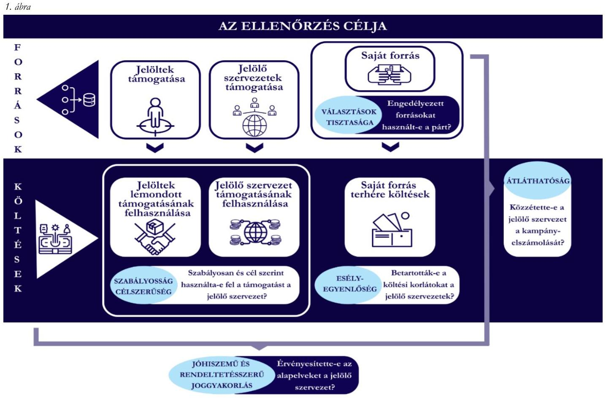

# AZ ELLENŐRZÉS TÍPUSA 

Szabályszerűségi ellenőrzés.

## AZ ELLENŐRZÖTT IDŐSZAK

A Ve. 139. §-ában rögzített - a szavazás napját megelőző 50. naptól (2022. február 12-től) a szavazás befejezésének időpontjáig (2022. április 3-ig) tartó - választási kampányidőszak, valamint az azt követő elszámolási időszak, amely a Kampányfinanszírozási törvény 9. § (1) bekezdése szerint az országgyűlési választást követő 60 nap, azaz a 2022. június 2-ig tartó időszak.

## AZ ELLENŐRZÉS TÁRGYA

A pártlistát állító párt írásba foglalt, a Kampányfinanszírozási törvény 3/A. § (1) bekezdés szerinti nyilatkozatának a megléte, rendelkezésre állása.

A kampánytevékenységhez köthető bizonylatok szabályszerűsége, hitelessége, a Kincstárral ${ }^{6}$ kötött megállapodásban, illetve a Számviteli törvény ${ }^{7}$ 166. §-ában előírt alaki és tartalmi kellékei megléte.

A költségvetési támogatásból és egyéb forrásból finanszírozott valamennyi kiadásnak a választási kampányidőszak alatti, illetve a kampánytevékenységre történő teljesítése.

---

# Az ellenőrzés jogalapja 

Az ellenőrzés jogszabályi alapját a Kampányfinanszírozási törvény 8/B. § (1) bekezdése, a 8/C. § (2a) bekezdése és a 9. $\S$ (2) bekezdése, valamint a Párt törvény 10. § (1) bekezdése képezték.

## AZ ELLENŐRZÉS MÓDSZERE

Az ellenőrzés az ellenőrzött időszakban hatályos jogszabályok, az ÁSZ tv. ${ }^{8}$ előírásai, az ellenőrzés szakmai szabályai, a jelen ellenőrzésre irányadó ÁSZ módszertanok, valamint az ellenőrzési programban foglalt értékelési szempontok szerint került végrehajtásra.

Az ellenőrzési kérdések megválaszolásához szükséges bizonyítékok megszerzése a Kincstár és a jelölő szervezetek, valamint az ellenőrzést támogató szervezetek által rendelkezésre bocsátott dokumentumokra, adatokra alapozva kérdésfeltevés (információkérés), mintavételezés, valamint elemző eljárás, helyszíni interjú útján történt. Az ellenőrzési bizonyítékként felhasználható adatforrások közé tartoztak egyrészt az adatbekérő levelek mellékletében szereplő dokumentumok jegyzékében rögzített adatforrások, másrészt minden az ellenőrzés folyamán feltárt, az ellenőrzés szempontjából információt tartalmazó dokumentum.

Az ÁSZ tv. szerint az ellenőrzésekkel szemben támasztott követelmény, hogy azok eredményeinek, a megállapításoknak alátámasztottnak, a következtetéseknek okszerűnek és megalapozottnak kell lenniük. Az ellenőrzésekkel szemben támasztott követelmények érvényesítése, a tényállás teljes körű tisztázása érdekében az ÁSZ az ÁSZ tv. 25. § (3) bekezdésében foglalt lehetőséggel élve ellenőrzést támogató szervezeteket (egyesület, gazdasági társaságok) keresett meg adatszolgáltatás céljából. Az ellenőrzés során azonosított új körülményeket és az ÁSZ válaszait a III. sz. melléklet ábrája mutatja be. A megkeresett ellenőrzést támogató szervezetek egy része a megkeresésnek nem tett eleget.

Az ÁSZ ellenőrzése során értékelte, hogy ellenőrzést támogató szervezetként megkeresett egyesület, az $\mathrm{MMM}^{9}$ kiadásai kampányköltésnek minősülnek-e. A kiadásokból kizárólag azokat minősítette közös kampánykiadásnak, amelyről megállapítható volt, hogy kampányeszközhöz vagy kampánytevékenységhez kapcsolódik, azaz közvetlenül a Hatpárti összefogás ${ }^{10}$ kampánytevékenységét szolgálta és a Ve.-ben meghatározott kampányidőszakhoz kötődik. Az ÁSZ az MMM kiadásai közül a rendelkezésre bocsátott bizonylatok, számlák, szerződések, megrendelések, a szerződésszerű teljesítést igazoló dokumentumok (pl.: plakát, szórólap, kiadvány fotója, képi megjelenítése, teljesítésigazolás stb.) értékelése alapján kizárólag azokat minősítette kampányköltésnek, amelyeket az MMM kifejezetten a Ve.-ben meghatározott kampányeszközökre, vagy egyéb olyan kiadásokra fordított, amelyek alkalmasak voltak a 2022-es országgyűlési választási kampányban a választói akarat befolyásolására, a Hatpárti összefogás népszerűsítése érdekében kerültek kifizetésre. Ezen kiadások közül az ÁSZ a jogkövetkezmények alkalmazása szempontjából részjelentésében kizárólag azokat vette figyelembe, amelyeket érintően a NAV ${ }^{11}$ által folytatott eljárás nincs folyamatban.

Az ellenőrzés lefolytatásához az ellenőrzött jelölő szervezetek tanúsítványok, nyilatkozatok kitöltésével és az ÁSZ által kért, teljességi és hitelességi nyilatkozattal alátámasztott dokumentumok rendelkezésre bocsátásával szolgáltattak adatokat.

Az egyéni jelöltek által kampányfinanszírozásra kapott, de a párt javára lemondott, a Kampányfinanszírozási törvény 1. § (1)-(2) bekezdése szerinti költségvetési támogatás felhasználásának ellenőrzése a Kincstárhoz a Demokratikus Koalíció, a Jobbik ${ }^{12}$, a Momentum Mozgalom, az MSZP ${ }^{13}$, az LMP ${ }^{14}$, a Párbeszéd ${ }^{15}$ által

---

beküldött elszámolások ellenőrzésével, valamint a másolatban rendelkezésre bocsátott dokumentumok tételes ellenőrzésével történt, miután a tételek száma egyetlen esetben sem haladta meg az 50 tételt.

A pártlistát állító pártok részére a jelöltek száma alapján járó, a Kampányfinanszírozási törvény 3. §-a szerinti központi költségvetési támogatás felhasználásának ellenőrzése a pártoknál mintavétellel kiválasztott mintatételek alapján történt, amennyiben az alapsokaság elemszáma meghaladta a 100 tételt (Demokratikus Koalíció, Jobbik, LMP, Momentum Mozgalom, MSZP, Párbeszéd).

A pártok által kampányfinanszírozásra felhasznált egyéb források szabályszerűségének értékelése mintavétellel kiválasztott mintatételek alapján történt, amennyiben az alapsokaság elemszáma meghaladta a 100 tételt (Demokratikus Koalíció, Momentum Mozgalom, Párbeszéd), amennyiben az alapsokaság elemszáma nem haladta meg a 100 tételt, úgy tételes ellenőrzésre került sor (Jobbik, LMP, MSZP).

A kiadások és a bevételek kapcsán az összegző és a részletes megállapításokat a feltárt hiányosságok nagysága, gyakorisága, jellege, kampányelszámolásra gyakorolt hatása alapján tette meg az ÁSZ.

Az ÁSZ a kampányfinanszírozásra fordított pénzeszközök szabályszerű felhasználása kapcsán ellenőrizte:

- a kampányidőszakban a kifizetések bizonylatait, az azokat alátámasztó egyéb dokumentumokat (pl.: ellenőrzött időszakban hatályos szerződések, megállapodások, a terület -, a helységbérlet, a plakát -, reklámhely stb. vonatkozásában; a bankszámlakivonatok, adományozók befizetését igazoló postai utalványok, számlák, kiadások, költségek elszámolási dokumentumai, továbbá az előző évi maradvány kimutatását tartalmazó dokumentum és ezt igazoló nyilvántartás, a pártnak juttatott vagyoni hozzájárulások dokumentumai, tekintettel a Párt törvény 4. § (2) és (3) bekezdésében foglaltakra),
- a pénzügyi, számviteli nyilvántartásokat, azok Számviteli törvény 161/A. § (2) bekezdésében foglaltaknak megfelelő kialakítását, ennek keretrendszerét adó belső szabályozást,
- a pénzügyi elszámolásokat, a Kincstárnak átadott elszámolásokat, a Magyar Közlönyben nyilvánosságra hozott adatokat, beszámolókat,
- képviselői nyilatkozatokat,
- tanúsítványokat,
- az alkalmazott áraknak a sajtótermékek által megküldött, az ÁSZ honlapján megjelentetett árjegyzékekkel, tájékoztatókkal való egyezőségét,
- az ellenőrzés során tapasztalt különleges körülmények tisztázása érdekében megkeresett ellenőrzést támogató szervezetek által az ÁSZ rendelkezésére bocsátott dokumentumokat.

---

# A RÉSZJELENTÉS KIADÁSÁNAK INDOKAI 

Az ÁSZ a Megállapítások I. pontjában részletesen kifejtettek szerint megállapította, hogy a Demokratikus Koalíció, a Jobbik, az LMP, az MSZP, a Momentum Mozgalom és a Párbeszéd az MMM-től nem pénzbeli vagyoni hozzájárulásban, azaz tiltott párttámogatásban részesült a választási kampány során ezen pártok helyett és érdekében finanszírozott kampánytevékenység formájában. Az ellenőrzés során a jogsértés ténye, valamint részben a tiltott párttámogatás összegszerűsége is megállapítható volt.

Egyes ellenőrzött szervezetnek nem minősülő gazdálkodó szervezetek között lezajlott gazdasági események esetében nem volt megállapítható, hogy a bizonylat szerinti gazdasági esemény megvalósult-e, ha pedig igen, úgy ez a bizonylat szerinti tartalommal történt-e. Figyelemmel arra, hogy a tiltott párttámogatás összegszerűségének megállapításához ezek vizsgálata nem volt mellőzhető, továbbá ilyen ellenőrzés lefolytatására a NAV rendelkezik hatáskörrel és eszközökkel, az ÁSZ megkereste a NAV-ot a szükséges ellenőrzési eljárások lefolytatása és a tiltott párttámogatás teljes összegének megállapítása érdekében tisztázandó körülmények feltárása céljából. Miután ezen eljárások a megállapítás jogi indokait nem, csak a tiltott párttámogatás összegét módosítják, az ÁSZ az ezidáig megismert nagyszámú bizonylat feldolgozását és számos gazdasági esemény megvizsgálását követően a jelen részjelentés kiadása mellett döntött.

Az ÁSZ a végleges jelentését a hatósági vizsgálatok lezárultát, a még vizsgálat alatt álló tények pontos tisztázását követően fogja nyilvánosságra hozni.

---

# AZ ELLENŐRZÖTT SZERVEZETEK 

Az ÁSZ a Kampányfinanszírozási törvény 9. § (2) bekezdésében foglalt felhatalmazás alapján az országgyűlési választást követő egy éven belül kötelezően, hivatalból ellenőrzi az országgyűlési képviselethez jutott jelölő szervezetek vonatkozásában a választásra fordított állami és a Párt törvényben meghatározott más pénzeszközök felhasználását. Az országgyűlési képviselethez nem jutott jelölő szervezetek tekintetében az ÁSZ az ellenőrzést kérelemre végzi. A Kampányfinanszírozási törvény 8/B. § 1) bekezdése értelmében amennyiben a Kampányfinanszírozási törvény 2/A. § 1) bekezdésében foglaltak alapján a párt egyéni választókerületi jelöltje az 1. § szerinti támogatás igénybevételéről lemond, és azt az őt jelölő párt rendelkezésére bocsátja - az ÁSZ a választást követő egy éven belül kötelezően, hivatalból ellenőrzi az 1. § szerinti támogatás felhasználását, az országgyűlési képviselethez jutott jelöltek tekintetében a Kincstárnál és a jelöltet jelölő pártnál. A Kampányfinanszírozási törvény 8/C. § (2a) bekezdése szerint az ÁSZ az országgyűlési képviselők általános választását követő egy éven belül hivatalból ellenőrzi a Kampányfinanszírozási törvény 3. §-a szerinti támogatás felhasználását azoknál a pártlistát állító pártoknál, amelyek pártlistája a pártlistákra leadott összes érvényes szavazat legalább $1 \%$-át megszerezte. A Párt törvény 10. § (1) bekezdése alapján az ÁSZ jogosult a pártok gazdálkodása törvényességének ellenőrzésére.

A 2022. évi országgyűlési választáson a FIDESZ-KDNP ${ }^{16}$, a Demokratikus Koalíció-Jobbik-Momentum Mozgalom-MSZP-LMP-Párbeszéd, a MEMO ${ }^{17}$, a Mi Hazánk Mozgalom és az MKKP ${ }^{18}$ jelölő szervezet szerezte meg a pártlistákra leadott összes érvényes szavazat legalább $1 \%$-át. A nemzetiségi listát állító országos nemzetiségi önkormányzatok közül az MNOÖ ${ }^{19}$ jutott képviselethez a Parlamentben. A Kampányfinanszírozási törvényben kapott felhatalmazás alapján ezen jelölő szervezetek ellenőrzését végezte el kötelező jelleggel az ÁSZ. Kérelem országgyűlési választáson képviselethez nem jutott jelölő szervezetek ellenőrzésére nem érkezett, így az ÁSZ kérelemre

| Országos listák eredményei |  |
| :-- | --: |
| - FIDESZ-KDNP | $54,13 \%$ |
| - Demokratikus Koalíció-Jobbik- |  |
| Momentum Mozgalom-MSZP- |  |
| LMP-Párbeszéd | $34,44 \%$ |
| - Mi Hazánk Mozgalom | $5,88 \%$ |
| - MKKP | $3,27 \%$ |
| - MEMO | $1,04 \%$ |
| - MNOÖ | $0,44 \%$ |

Forrás: Nemzeti Választási Iroda adatai alapján nem végzett ellenőrzést. A teljes ellenőrzés során ellenőrzött szervezetek felsorolását a II. sz. melléklet tartalmazza. A II. sz. mellékletben szereplő jelölő szervezetek közül a részjelentés a Demokratikus Koalíció, a Jobbik, a Momentum Mozgalom, az MSZP, az LMP, a Párbeszéd jelölő szervezetek ellenőrzésével kapcsolatos eddigi megállapításokat tartalmazza. A többi öt jelölő szervezet (FIDESZ-KDNP, a MEMO, a Mi Hazánk Mozgalom, MKKP, MNOÖ) ellenőrzésének megállapításairól az ÁSZ külön jelentést készít.

A jelen részjelentésben a továbbiakban a Demokratikus Koalíció, a Jobbik, az LMP, az MSZP, a Momentum Mozgalom és a Párbeszéd minősül ellenőrzött szervezetnek (a továbbiakban együttesen: Hatpárti összefogás).

---

# AZ ÁSZ ÁLTAL ELVÉGZETT ELLENŐRZÉS JOGSZABÁLYI HÁTTERÉNEK BEMUTATÁSA, AZ ORSZÁGGYŰLÉSI VÁLASZTÁSON INDULÓ ÉS A KAMPÁNYFINANSZÍROZÁSI TÖRVÉNY ALAPJÁN KÖTELEZŐEN ELLENŐRZÖTT JELÖLŐ SZERVEZETEK FINANSZÍROZÁSA ÉS ELLENŐRZÉSE 

A 2014-től hatályos Kampányfinanszírozási törvényt az Országgyűlés az országgyűlési választási kampányok finanszírozásának átláthatóvá és ellenőrizhetővé tétele érdekében alkotta meg. A jogalkotói szándék szerint a Kampányfinanszírozási törvény az Alaptörvényben ${ }^{20}$ és a Ve.-ben rögzített kampányszabályokon kívül egy olyan szabályozás, amely átlátható forrást biztosít a pártok számára programjuknak a választók számára történő bemutatásához. A Kampányfinanszírozási törvényben meghatározott finanszírozási szabályok célja egyúttal, hogy hozzájáruljanak a Ve.-ben lefektetett, a választások tisztaságának megóvása, a választási csalások megakadályozása, a jelöltek és a jelölő szervezetek esélyegyenlőségének biztosítása törvényi alapelveinek érvényre juttatásához. Figyelemmel arra, hogy az Alaptörvény értelmében a pártoknak kiemelkedő szerepük van a nép akaratának kialakításában és kinyilvánításában. Az országgyűlési választások során jelölő szervezet kizárólag párt, azon túlmenően országos nemzetiségi önkormányzat lehet, más formában működő szervezet (pl.: egyesület, alapítvány, gazdasági társaság stb.) nem válhat jelölő szervezetté.

A jelölő szervezetek választási kampánytevékenységükkel összefüggő kiadásaikat több forrásból finanszírozzák. A kampányköltségek ellenőrzését a Kincstár és az ÁSZ végzi. A Kampányfinanszírozási törvényben foglaltak szerint a Kincstár ellenőrzi az egyéni jelöltek lemondásával a párt rendelkezésére bocsátott költségvetési támogatás felhasználását. Az ÁSZ a pártokat és az országos nemzetiségi önkormányzatokat megillető valamennyi költségvetési támogatás tekintetében végez ellenőrzést. Az ÁSZ ezen túlmenően a pártok, mint jelölő szervezetek esetében a kampányban felhasznált saját forrásokat is ellenőrzi. A jelölő szervezetek forrásait, ellenőrzésük rendszerét a 2022. évi országgyűlési választás vonatkozásában a 2. ábra mutatja be.
2. ábra
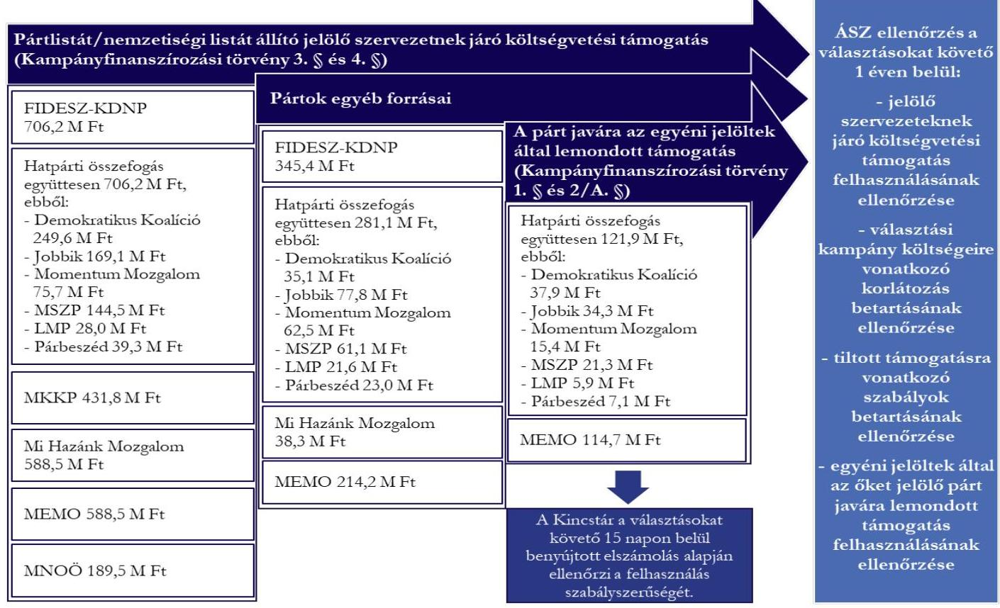

Forrás: ÁSZ szerkesztés

---

Az egyéni választókerületben állított jelöltek által a párt javára lemondott $1,0 \mathrm{MFt}^{21}$ összegű támogatás a Kampányfinanszírozási törvény 1. § (2) bekezdésében foglaltakra tekintettel - miszerint az összeget a KSH által a tárgyévet megelőző évre megállapított fogyasztói árindexszel évente növelni kell - a 2022. évi országgyűlési választás vonatkozásában 1182896 Ft volt (a továbbiakban kerekítve: 1,2 M Ft), amelyet a pártok a Kincstárral kötött megállapodás alapján kincstári kártyafedezeti számlán kapják meg és a Kampányfinanszírozási törvény előírásai szerint kizárólag a választási kampányidőszak alatt, kampánytevékenységgel összefüggő dologi kiadásra fordíthatják. A kincstári kártya előállításával és használatával kapcsolatos valamennyi költséget az állam viseli. A pártok a Kincstár felé a támogatás felhasználásáról a párt nevére szóló, a Számviteli törvény és az ÁFA tv. ${ }^{22}$ előírásainak megfelelően kiállított számlákkal kötelesek elszámolni. A Demokratikus Koalíció, a Jobbik, az LMP, a Momentum Mozgalom, az MSZP és a Párbeszéd jelöltjei mondtak le a jelölő pártjuk javára az 1,2 M Ft összegű támogatásról. A támogatás igénybevételéről lemondást követően a jelöltet jelölő párt a Kincstárral megállapodást kötött. Az egyéni választókerületben indított jelöltek által a párt javára lemondott támogatás felhasználását a Kincstár és az ÁSZ is ellenőrzi a jelölő szervezeteknél. Azon jelöltek esetében, akik az 1,2 M Ft összegű támogatásról az őket jelölő pártjuk javára nem mondtak le, az ÁSZ a támogatás felhasználását a Kincstár felé benyújtott elszámolásuk Kincstár általi ellenőrzését követően ellenőrizte és annak tapasztalatairól külön jelentést készített (23012-es sorszámú, „A kampánypénzek ellenőrzése - A 2022. évi országgyűlési képviselőválasztási kampányra fordított pénzeszközök elszámolásának ellenőrzése az egyéni jelölteknél" című, 2023. március 31-én nyilvánosságra hozott jelentés).

A nyilvántartásba vett jelöltek számát és az egyéni választókerületben a párt javára lemondott jelöltek számát az 1. táblázat szemlélteti valamennyi ellenőrzött jelölő szervezet vonatkozásában.

| 1. táblázat |  |  |   |
| --- | --- | --- | --- |
|  NYILVÁNTARTÁSBA VETT ÉS A PÁRT JAVÁRA LEMONDOTT JELÖLTEK SZÁMA (FŐ) |  |  |   |
|  A JELÖLŐ <br> SZERVEZET <br> MEGNEVEZÉSE | NYILVÁNTARTÁSBA <br> VETT JELÖLTEK <br> SZÁMA | A PÁRT JAVÁRA LEMONDOTT JELÖLTEK SZÁMA | A pártlistát/nemzetiségi listát állító jelölő szervezeteknek járó költségvetési támogatásra a pártok az egyéni választókerületekben állított jelöltek száma alapján, illetve az országos nemzetiségi önkormányzatok jogosultak, amelyek a támogatás igénybevétele esetén vállalják a felhasználáshoz kapcsolódó szigorú szabályok betartását. A közös pártlistát állító pártok e támogatás vonatkozásában egy pártnak tekintendők, a támogatás elosztásáról megállapodást kell kötniük.  |
|  FIDESZ-KDNP | 106 | 0 |   |
|  Demokratikus Koalíció |  | 32 |   |
|  Jobbik |  | 29 |   |
|  Momentum Mozgalom |  | 13 |   |
|  MSZP | 106 | 18 |   |
|  LMP |  | 5 |   |
|  Párbeszéd |  | 6 |   |
|  MKKP | 79 | 61 |   |
|  Mi Hazánk Mozgalom | 102 | 0 |   |
|  MEMO | 99 | 97 |   |
|   | Forrás: ÁSZ szerkesztés a Kincstár adatszolgáltatása alapján |  |   |

szervezetnek járó költségvetési támogatást kizárólag a választási kampányidőszak alatt, a választási kampánytevékenységgel összefüggő kiadások finanszírozására fordíthatják. A 2022. évi országgyűlési képviselőválasztáson közös országos listát a FIDESZ és a KDNP, valamint a Demokratikus Koalíció, a Jobbik, az LMP,

---

a Momentum Mozgalom, az MSZP és a Párbeszéd állított. A Demokratikus Koalíció, a Jobbik, az LMP, a Momentum Mozgalom, az MSZP és a Párbeszéd által állított közös országos lista alapján járó költségvetési támogatást a megállapodásuk alapján, a megállapodásukban szereplő megosztási arány szerint folyósította a Kincstár a hat párt részére.

A Demokratikus Koalíció, a Jobbik, az LMP, a Momentum Mozgalom, az MSZP és a Párbeszéd által állított közös országos lista alapján járó költségvetési támogatás megosztási arányát és az ez alapján kiutalt támogatás összegét a 2. táblázat mutatja be.
2. táblázat

# A KÖZÖS LISTÁT ÁLLÍTÓ HAT PÁRT KÖLTSÉGVETÉSI TÁMOGATÁS MEGOSZTÁSI ARÁNYA ÉS A KIUTALT TÁMOGATÁS ÖSSZEGE 

| A JELÖLŐ <br> SZERVEZET <br> MEGNEVEZÉSE | MEGOSZTÁSI <br> ARÁNY <br> $(\%)$ | A KIUTALT <br> TÁMOGATÁS <br> ÖSSZEGE <br> (M Ft) |
| :-- | :--: | :--: |
| Demokratikus Koalíció | 35,34 | 249,6 |
| Jobbik | 23,94 | 169,1 |
| Momentum Mozgalom | 10,72 | 75,7 |
| MSZP | 20,46 | 144,5 |
| LMP | 3,97 | 28,0 |
| Párbeszéd | 5,56 | 39,3 |
| Összesen: | 100,0 | 706,2 |

A pártlistát/nemzetiségi listát állító jelölő szervezeteknek járó költségvetési támogatás felhasználását az ÁSZ ellenőrzi.

A választási kampány költségeinek korlátozását a Kampányfinanszírozási törvény írja elő, amely szerint a választási kampányidőszak alatt, a választási kampánytevékenységgel összefüggő kiadásai finanszírozására a pártlistát állító párt és annak jelöltje és az országos nemzetiségi önkormányzat a nemzetiségi listán szereplő jelöltjeire jelöltenként legfeljebb $5,0 \mathrm{MFt}$ összeget fordíthat, amely összeg a Kampányfinanszírozási törvény 7. § (2) bekezdésében foglaltakra tekintettel - miszerint az összeget a KSH által a tárgyévet megelőző évre megállapított fogyasztói árindexszel évente növelni kell - a 2022. évi országgyűlési választás vonatkozásában 5914478 Ft (a továbbiakban kerekítve: $5,9 \mathrm{MFt}$ ) volt. A közös jelölteket vagy közös pártlistát állító pártok e korlátozás vonatkozásában egy pártnak tekintendők. A Hatpárti összefogás pártjai, a Demokratikus Koalíció, a Jobbik, az LMP, a Momentum Mozgalom, az MSZP és a Párbeszéd egy pártnak tekintendők a választási kampány költségeinek korlátozása vonatkozásában.

A pártoknak a gazdálkodásukra vonatkozó szabályokat a kampányidőszakban is figyelembe kell venniük, ezek megtartásának ellenőrzése szintén az ÁSZ feladata. Az ÁSZ ennek keretében ellenőrzi a pártok költségvetési támogatáson kívüli saját forrásai kampányidőszakban történő kampánycélú felhasználását is.

A Kincstárral kötött megállapodás alapján a jelölő szervezetet megillető támogatás összegét és a felhasználást, a pártlistát/nemzetiségi listát állító jelölő szervezeteknek járó költségvetési támogatás összegét és abból a felhasználást ellenőrzött jelölő szervezetenként a IV. sz. melléklet mutatja be. A pártok Magyar Közlönyben közzétett kampányelszámolása szerint a választási kampány során felhasznált saját forrás összegét ellenőrzött jelölő szervezetenként szintén a IV. sz. melléklet mutatja be.

A jelölő szervezetek által folytatott kampányukra nyújtott források felhasználását, az elszámolási és ellenőrzési feladatok határidőit összefoglalóan az V. sz. melléklet ábrája tartalmazza.

---

# ÖSSZEFOGLALÁS 

A Demokratikus Koalíció, a Jobbik Magyarországért Mozgalom, a Momentum Mozgalom, a Magyar Szocialista Párt, az LMP-Magyarország Zöld Pártja és a Párbeszéd Magyarországért Párt a választási kampányban a jóhiszemű és rendeltetésszerű joggyakorlás alapelvét figyelmen kívül hagyta, a törvényi előírásokat megkerülte a közös kampányuk finanszírozása, a kampányköltések mértékének korlátozása és a kampányelszámolás tekintetében.

A hat párt közös
 listát állított a választáson egy pártokon kívüli egyesület, a Mindenki Magyarországa Mozgalom elnökének részvételével, aki a Hatpárti összefogás miniszterelnökjelöltje volt. A Hatpárti összefogás vezetői elfogadták, hogy közös kampányt folytatnak, amelynek irányítója a kampánytanács lesz, ebben mindegyik szervezet, az érintett pártok és a Mindenki Magyarországa Mozgalom is képviselteti magát. A hat párt és közös miniszterelnök-jelöltjük által létrehozott összefogás közös kampányrendezvényeket tartott, a kampányban közös plakátokat, közös logót és egységes választási szlogeneket használt. Mindezek alapján a Mindenki Magyarországa Mozgalom kampányhoz kapcsolódó tevékenysége és költései alkalmasak voltak a választási kampány és a választások befolyásolására. A Mindenki Magyarországa Mozgalom kampányköltései a közös kampányhoz nyújtott nem pénzbeli vagyoni hozzájárulásnak minősülnek, amelyet az ellenőrzött szervezetek a kampányelszámolásaikban nem vettek figyelembe, ezáltal nem biztosították a közös kampány költéseinek teljes átláthatóságát.
A közös kampány során az ellenőrzött szervezetek jogi személytől, a Mindenki Magyarországa Mozgalomtól tiltott támogatásban, nem pénzbeli vagyoni hozzájárulásban részesültek, amelynek összege elérte a 261,26 M Ft-ot. A Hatpárti összefogásban részt vevő pártok a kampányköltésekre előírt törvényi korlátozást nem tartották be, a hat párt és a Mindenki Magyarországa Mozgalom együttesen több mint $193,3 \mathrm{M}$ Ft-al többet költött a választási kampányra az engedélyezett összegnél. Továbbá politikai hirdetés vásárlása során a Demokratikus Koalíció 213 ezer Ft, a Magyar Szocialista Párt $4,0 \mathrm{M}$ Ft tiltott támogatást fogadott el. A Jobbik Magyarországért Mozgalom a Kampányfinanszírozási törvény előírásaival ellentétesen a jelölő szervezetnek járó költségvetési támogatásból két esetben kampánytevékenységgel összefüggő 58,1 ezer Ft kiadást számolt el, amely nem a választási kampányidőszak alatt merült fel.
A Mindenki Magyarországa Mozgalom által a kampányidőszakban kampányeszközök finanszírozására fordított $1673,52 \mathrm{M}$ Ft összegből $1412,26 \mathrm{M}$ Ft összeg tekintetében a Nemzeti Adó- és Vámhivatal részéről hatósági eljárások vannak folyamatban. A részjelentés az ellenőrzés eddig megtett megállapításait és összesen 261,26 M Ft, a Nemzeti Adó- és Vámhivatal hatósági vizsgálatával nem érintett kiadás tekintetében a jogkövetkezményeket rögzíti. A Mindenki Magyarországa Mozgalom kiadásaiból $1412,26 \mathrm{M}$ Ft értékű gazdasági esemény tekintetében a tiltott támogatás összegszerűségére, valamint az azzal kapcsolatos jogkövetkezményekre vonatkozó végleges megállapítást a Nemzeti Adó- és Vámhivatal által folytatott vizsgálatok lezárultát követően az Állami Számvevőszék végleges jelentése fogja tartalmazni.

---

# AZ ELLENŐRZÉS FÓKUSZTERÜLETEI

Szabályszerű volt-e az egyéni jelöltek által a jelölő szervezet javára lemondott költségvetési támogatás felhasználása? Szabályszerű volt-e az ellenőrzött pártoknál a jelölő szervezetnek járó költségvetési támogatás felhasználása? Betartották-e a választási kampány költségeire vonatkozó korlátozást az ellenőrzött pártok? Betartották-e a tiltott támogatásra vonatkozó finanszírozási tilalmakat az ellenőrzött pártok?

1.  Hatpárti összefogás
2.  Demokratikus Koalíció
3.  Jobbik
4.  LMP
5.  MSZP
6.  Momentum Mozgalom
7.  Párbeszéd

---

# MEGÁLLAPÍTÁSOK

## Szabályszerű volt-e az egyéni jelöltek által a jelölő szervezet javára lemondott költségvetési támogatás felhasználása? Szabályszerű volt-e az ellenőrzött pártoknál a jelölő szervezetnek járó költségvetési támogatás felhasználása? Betartották-e a választási kampány költségeire vonatkozó korlátozást az ellenőrzött pártok? Betartották-e a tiltott támogatásra vonatkozó finanszírozási tilalmakat az ellenőrzött pártok?

## 1. HATPÁRTI ÖSSZEFOGÁS

A jelen részjelentés a Hatpárti összefogás egészére és az egyes ellenőrzött jelölő szervezetekre tartalmaz megállapításokat.

## I. A Hatpárti összefogás közös kampánytevékenységére vonatkozó megállapítások

## I. 1. Az ellenőrzés folyamata

A következő pontban fentiekben jelzett információk hasznosítása, a bejelentés kivizsgálása és a felmerült gyanú tisztázása érdekében az ÁSZ az ÁSZ tv. 23. § (2) bekezdés a) és d) pontja és 25. § (3) bekezdésében foglaltak alapján a választási kampányban érintett egyesületet, gazdasági társaságokat keresett meg ellenőrzést támogató szervezetként.
Az ÁSZ adatszolgáltatást kért az MMM-től, majd a beérkezett dokumentumok alapján adatkéréssel fordult 53 további gazdasági társasághoz, amelyek részt vettek az MMM kampányidőszakban folytatott tevékenységének megvalósításában. Emellett az ÁSZ adatszolgáltatást kért a nyilvános NIK ${ }^{23}$ tájékoztató szerint külföldi támogatásban részesült szervezetektől és a NIK tájékoztatóban nevesített további 18 gazdasági társaságtól. Az ÁSZ megkeresett továbbá 21 magyarországi pénzintézetet a pártok által használt bankszámlák és azok forgalmának áttekintése érdekében. Az ÁSZ a pártoktól további adatszolgáltatást kért az általuk használt elektronikus pénzügyi szolgáltatásokról. Az ÁSZ nyilatkozatot kért a pártoktól és az MMM-től a kampánytanács működéséről, továbbá a pártok és az MMM kampányköltéseinek kapcsolatáról. Az ÁSZ adatkéréssel fordult 15, óriásplakátok bérbeadásával, gyártásával, kihelyezésével foglalkozó plakátcéghez is. Az ÁSZ ellenőrzés az adatszolgáltatásra felkért, ellenőrzést támogató szervezetektől beérkezett, több, mint 8000 db iratot, dokumentumot (pl.: megrendelés, szerződés, teljesítésigazolás, számla, a teljesítést igazoló dokumentum) vizsgált, értékelt. A beérkezett dokumentumokat, nyilatkozatokat az ÁSZ nyilvántartásba vette, feldolgozta és értékelte. Az ÁSZ ennek során vizsgálta, hogy a megrendelésekben, szerződésekben, teljesítésigazolásokban és számlákban, illetve a tevékenység eredményeként született termékekben (plakát, szórólap, újság, egyéb kiadvány, sms, egyéb üzenet, rendezvény meghívó, fénykép, hangfelvétel, videó, stb.) szereplő áruk vagy szolgáltatások és kifizetések közvetlenül kapcsolódnak-e kampányidőszakban megvalósított kampánytevékenységhez, így kampányköltésnek minősülnek-e. A beérkezett dokumentumok tartalmi értékelése mellett az ÁSZ összevetette a pártok, az MMM és más ellenőrzést támogató szervezetek által beküldött dokumentumokat, nyilatkozatokat és a kampányhoz kapcsolódó, nyilvánosan elérhető információkat is.
Több, adatbekéréssel megkeresett gazdasági társaság nem működött együtt az ÁSZ-szal, és nem, vagy nem teljeskörűen szolgáltatott adatokat, dokumentumokat az ellenőrzés részére. Egyes gazdasági társaságok

---

megszűntek vagy felszámolás alatt állnak, amelyek korábban több száz millió forint összegben kaptak megrendeléseket az MMM-től vagy a NIK jelentésekben szereplő gazdasági társaságtól. Az ÁSZ tv. 25. § (3) bekezdésében foglaltak alapján az ellenőrzést támogató szervezet a megkeresést annak megérkezésétől számított 8 napon belül köteles teljesíteni vagy a megkeresés teljesítésének jogszabályi akadályát az ÁSZ-szal közölni. Ugyanakkor a törvény nem fűz szankciót az adatszolgáltatás teljesítésének elmaradásához, esetleges visszautasításához. Az ÁSZ az ellenőrzést támogató szervezetek együttműködésének hiányában megkereséssel fordult a NAV-hoz a gazdasági események megvalósulásának tisztázása érdekében.
Ezt indokolta azon körülmény is, hogy az ellenőrzés során számos olyan adat, dokumentum került az ÁSZ birtokába, amelyek visszaélések gyanúját vetették fel. Eszerint egyes kampányköltéseknél felmerült a gyanú, hogy ugyanazt vagy azonos típusú, a kampányhoz kapcsolódó terméket, szolgáltatást párhuzamosan több szervezet, esetenként több partnertől is megrendelt egyidejűleg. Annak tisztázása érdekében, hogy egyes kampányköltéseknél a kifizetések valós gazdasági eseményekhez kapcsolódtak-e, a rendelkezésére álló információkat az ÁSZ továbbította a kérdésben eljárásra, intézkedésre jogosult NAV részére.

# I. 2. Tényállás

A 2022. évi országgyűlési választásokon a Hatpárti összefogás pártjai közös listán indultak és közös miniszterelnök-jelöltet támogattak Márki-Zay Péter ${ }^{24}$ személyében, aki a Hatpárti összefogás listáját is vezette. 2021. november 21-én megalakult a közös ellenzéki kampánytanács ${ }^{25}$ (a továbbiakban: KT), amelynek egy jelölő pártnak nem minősülő szervezet, az MMM is tagja volt*. Az MMM elnöke a közös listát vezető miniszterelnökjelölt, Márki-Zay Péter (a továbbiakban: Hatpárti összefogás közös miniszterelnök-jelöltje) volt. A 2021. november 21-i közlemény alapján ,,az egyesült ellenzék vezetői konszenzussal elfogadták, hogy közös kampányt folytatnak, amelynek irányítója a kampánytanács lesz, ebben mindegyik szervezet képviselteti magát". ${ }^{\dagger}$
A 2022-es országgyűlési választások után a sajtóban olyan nyilatkozat jelent meg, miszerint a Hatpárti összefogás külföldi anyagi támogatásban részesült, „ennek a segítségével tudták kifizetni a kampány utolsó számláit". ${ }^{\ddagger}$ Jelentőséggel bírnak továbbá az alábbi nyilatkozatok is:

-   „Az előválasztás megnyerése után az MMM szervezte a közös ellenzéki kampányt, annak minden felelősségével és ódiumával, a pártok helyett is...."6;
-   „Az összes pénz bement egy nagy zsákba, egy számlára, és abból mentek a kifizetések...." [...] „Volt egy MMM-es számla, ami a központi kampánynak a működtetését szolgálta. Természetesen ebből voltak jelöltek, akiket támogattunk, voltak kiadványok, amiket támogattunk, gépjárművek, bömbis autók úgymond vagy robocall hívások, IVR-kampány és a többi" [...] „Az egyik legfontosabb feladatom volt nekem is már tavaly októbertől kezdve, hogy tudjuk finanszírozni az ellenzék kampányát, hogy tudjunk óriásplakátokat venni, hogy tudjunk Facebook-hirdetéseket, Youtube hirdetéseket venni. És igen ahhoz, hogy ezt meg tudjuk tenni, ahhoz kellett egy nem pártos, párhuzamos civil kampány is, amit az MMM folytatott, az MMM finanszírozott, magyar nagy adományozók és külföldi magyar adományozók segítségével." ${ }^{\text {* }}$


## *https://www.klubradio.hu/archivum/esti-gyors-2021-november-22-hetfo-181521354 (benne: Márki-Zay Péter, az ellenzék közös miniszterelnök-jelöltje, Hódmezővásárhely polgármestere - Megalakul a közös ellenzéki kampánytanács)

$\dagger$ <https://momentum.hu/megalakult-a-kozos-ellenzeki-kampanytanacs/>
‡ <https://magyarnemzet.hu/belfold/2022/09/meg-az-alelnoke-sem-tudott-marki-zay-kulfoldi-penzeirol>
§ <https://telex.hu/belfold/2022/05/18/marki-zay-mindenki-magyarorszaga->
kampanypenz
** <https://videa.hu/videok/hireentrum/hirek-politika/marki-zay-bevallotta-hogy-partokdollarmilliok-> kampany-mmm-VlGVHvR31GfrkdLD?start=0ca

---

Ezt követően a NIK a nyilvánosság számára is közzétett nyilatkozatában gyanút fogalmazott meg arra vonatkozólag, hogy a külföldi szervezetek által magyarországi szervezeteknek, köztük az MMM-nek utalt összegeket „alapvetően a magyar választók véleményének, illetve a választások eredményének befolyásolására használták fel" ${ }^{19}$
Az ÁSZ a sajtóban megjelent nyilatkozatok valóságtartalmának és a NIK jelentésében foglaltak vizsgálata céljából az ellenőrzés keretében nyilatkoztatta a Hatpárti összefogás pártjait, valamint az MMM-et és más említett szervezeteket is a közös választási kampány finanszírozására és a KT szerepére vonatkozóan. Az ellenőrzött szervezetek válaszai alapján az MMM nem szavazati joggal vett részt a KT-ben, a költségekhez nem járult hozzá, alapító dokumentumok nem készültek. A KT-t a hat párt egyikéhez sem tartozó miniszterelnökjelölt által felkért kampányfőnök vezette, abba a hat párt mindegyike 1-1 főt delegált. A KT feladata a kampány megszervezése és operatív lebonyolítása volt, rendszeresen (hetente több alkalommal) ülésezett. A döntéseket 2022. január 5-ig konszenzussal hozta meg a kampánytanács, azt követően többségi döntést alkalmazott a testület. Nyilatkozataikban a pártok előadták, hogy az MMM a pártoktól teljesen független önálló szervezet. Sem a tevékenységéről, sem annak finanszírozásáról nem tájékoztatta a hat pártot, így az MMM által kezelt bevételekről, azok összegeiről, forrásairól, felhasználásáról sem az egyes pártok, sem a KT soha nem kapott tájékoztatást, azokról tudomásuk nincs.
Az MMM válaszai alapján az MMM az országgyűlési választáson induló egyéni jelöltek megválasztásával vagy pártlistára szavazással kapcsolatos kampánytevékenységet nem finanszírozott. Nyilatkozatában jelezte továbbá, hogy ,,a Momentum fenti közleménye a Mindenki Magyarországa Mozgalommal (a továbbiakban: MMM) nem egyeztetett, pontatlan és nem felel meg a valóságnak. Az MMM, mint szervezet a kampánytanács működésében nem vett részt. A kampánytanács tudomásunk szerint 2021. novemberétől a választásokig (2022. április 3-ig) működött, és az MMM csak 2022. március elejétől küldhetett megfigyelőt az üléseire, de ez - értékelésünk szerint - nem jelent részvételt."
Az LMP 2023. március 21-én kelt, ÁSZ-nak eljuttatott beadványában előadta, hogy a „közös összellenzéki anyagokat az egyes ellenőrzött szervezetek, képviselőiből álló kampánytanács rendelte meg, amely rendelések pénzügyi terheit főszabály szerint a pártok a jelöltek számának arányában viselték" (36. pont); „Ezen rendelésekhez az LMP tudomása szerint semmilyen más párt vagy egyesület nem adott le ugyanannak a gyártónak, megrendelést egyazon termék tekintetében" (37. pont); „Az LMP a kéretlen MMM-es kampányanyagokat visszautasította és nem használta fel" (38-39. pontok). Az LMP beadványában egy konkrét esetre vonatkozóan támasztotta alá bizonyítékkal a kampányeszköz visszautasítását. A fentiek alapján a Hatpárti összefogást alkotó pártoknak a kampány során a KT-ra vonatkozóan tett közös nyilatkozata, a Hatpárti összefogás közös miniszterelnök-jelöltjének a választásokat követően tett nyilatkozatai ${ }^{20}$, valamint a pártok által az ellenőrzés során tett nyilatkozatok nem állnak egymással összhangban. A KT működéséről további más forrásból származó információ nem volt fellelhető, így ellentmondásos, hogy a kampány során ténylegesen milyen feladatot látott el, illetőleg abban az MMM a pártok fent összefoglalt

[^0]
[^0]:    ${ }^{19}$ https://www.parlament.hu/documents/129803/64121212/irat_OGYNB_B_20230124.pdf/3ab6435c-4ff6-e6a2-3f53-ed0e8b4cf67a?t=1674631845584
    ${ }^{20}$ https://telex.hu/belfold/2022/05/18/marki-zay-mindenki-magyarorszagakampanypenz
    https://videa.hu/videok/hircentrum/hirek-politika/marki-zay-bevallotta-hogy-partokdollarmilliok-kampany-mmm-VlGVHvR31GfrkdLD?start=0

---

előadása vagy a Hatpárti összefogás közös miniszterelnök-jelöltje tavalyi sajtónyilatkozatai ${ }^{55}$ szerinti szerepet töltött-e be.
Az ÁSZ az ÁSZ tv. 25. § (3) bekezdése alapján ellenőrzést támogató szervezetként adatszolgáltatásra hívta fel az MMM-et, az MMM válaszai alapján beazonosított és más, a NIK jelentésében megjelölt szervezeteket. Az adatszolgáltatás keretében nagyszámú gazdasági eseményre vonatkozóan szerződések és más bizonylatok kerültek átadásra az ÁSZ részére, amelyeket az ÁSZ azon szempontból vizsgált meg, hogy ezen szolgáltatások kapcsolódnak-e, és ha igen, hogyan a Hatpárti összefogás választási kampányához.
Az ÁSZ bizonyítékként vette figyelembe az MMM és a Datadat GmbH között 2022. március 17-én létrejött Megbízási keretszerződést, valamint az ez alapján létrejött megrendelőkben, teljesítési igazolásokban és számlákban foglaltakat. A Datadat GmbH részére az MMM által kifizetett 1 355,07 M Ft összegről az ÁSZ vizsgálat megállapította, hogy kampányeszközökre fordított kiadásnak minősülnek, azonban a Datadat GmbH-t érintően NAV vizsgálat van folyamatban, amely kiadás a NAV vizsgálat eredménye függvényében kerülhet tiltott támogatásként a Hatpárti összefogás részére megállapításra.
A jelen részjelentés VI. sz. mellékletében felsorolt bizonylatokkal érintett gazdasági eseményekre vonatkozóan megállapításra került, hogy

- a szolgáltatások megrendelője az MMM volt, amely
- az általa fizetett ellenérték fejében,
- a Hatpárti összefogás kampánytevékenységéhez közvetlenül kötődő szolgáltatást vett igénybe.

Ezen szolgáltatások kifejezetten az országgyűlési választásokkal kapcsolatos kampányeszközökhöz (pl.: plakát, szórólap, választási gyűlés, továbbá kiadvány) kapcsolódnak. A Hatpárti összefogás és a közös miniszterelnökjelölt által közösen megvalósított kampány közös, koordinált finanszírozását jól példázza a 2022. március 15-én a Műegyetem rakparton megtartott, „A hatalom a népé" című, közös kampányrendezvény, amelynek megvalósítását a Hatpárti összefogás egyes pártjain kívül az MMM és egy gazdasági társaság is támogatta. A rendezvény közös finanszírozásával kapcsolatos információkat a VII. sz. melléklet ábrája szemlélteti.
Mindezen körülmények mellett a rendelkezésre bocsátott bizonyítékok alapján az ellenőrzés feltárta, hogy az MMM a kampányidőszakban, 2022. február 12. és április 3. között legalább 1673,52 M Ft-ot fordított a Hatpárti összefogás érdekében folytatott választási kampánytevékenységre, amelyből a NAV által folytatott hatósági eljárással érintett összeg 1412,26 M Ft. A hatósági vizsgálattal nem érintett összeg 261,26 M Ft, amelyből az MMM 87,48 M Ft-ot költött választási gyűlésekre, kampányrendezvényekre, 76,76 M Ft-ot fordított választási plakátokra, szóróanyagokra és egyéb kampányeszközökre, továbbá 97,02 M Ft-ot költött kiadványokra.
Az MMM további 1412,26 M Ft kiadást fordított a kampányidőszakban a Hatpárti összefogás érdekében, amelyből választási gyűlésekre, kampányrendezvényekre 226,93 M Ft-ot, SMS-re, adatbázis építésre, online hirdetésre 860,53 M Ft-ot, plakátra, szórólapra, egyéb kampányeszközre 288,98 M Ft-ot, kiadványokra 35,82 M Ft-ot költött. Ezen kiadások tekintetében - amelyek döntő hányadát a Datadat GmbH részére teljesített kiadások teszik ki - a részjelentés készítésének időszakában a NAV folytat vizsgálatot. Az ÁSZ vizsgálata ezen összeg tekintetében tiltott támogatást és annak jogkövetkezményét a jelen részjelentésében nem állapít meg.

[^0]
[^0]:    ${ }^{55}$ A Telex.hu-n 2022. május 18-án megjelent cikk nyomán Márki-Zay Péter által küldött reakciójában foglaltak, a 2022. október 17-én a videa.hu oldalra feltöltött videójában foglaltak.

---

A Hatpárti összefogáshoz kapcsolódó, pártokon kívüli kampányköltések körülményeit a 3. ábra mutatja be. 3. ábra

# PÁRTOKON KÍVÜLI SZERVEZETEK KAMPÁNYKÖLTÉSEI 

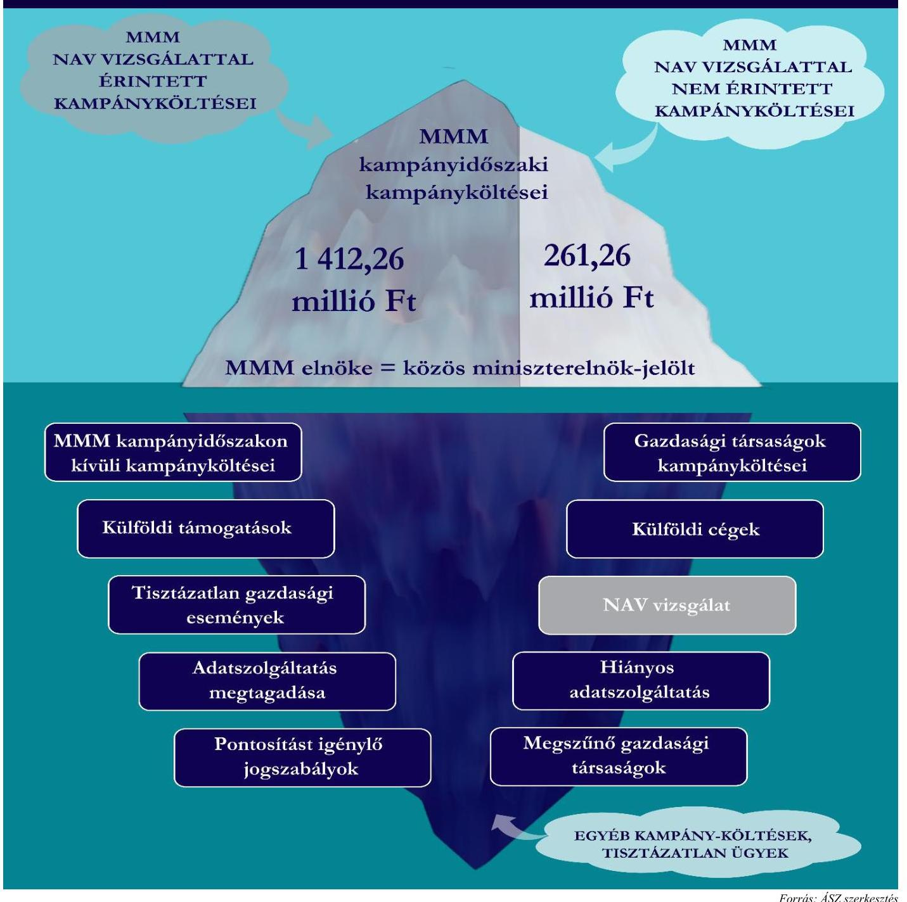

A fentiek alapján az ÁSZ által feltárt tényállás annyiban összegezhető, hogy a Hatpárti összefogás közös kampánytanácsában résztvevő, a Hatpárti összefogás miniszterelnök-jelöltje által vezetett MMM - ellentétben az ellenőrzött szervezetek nyilatkozataival - a jelen részjelentés VI. sz. mellékletében felsorolt gazdasági események keretében a Hatpárti összefogás választási kampányához kapcsolható szolgáltatásokat finanszírozott legalább 261,26 M Ft összegben. Az ÁSZ ezen megállapítása elsődlegesen a szolgáltatásokkal kapcsolatos bizonylatokon alapul, amely megerősíti a Hatpárti összefogás közös miniszterelnök-jelöltjének a választásokat követően tett fent idézett sajtónyilatkozatait.

---

# I. 3. A vonatkozó jogszabályi rendelkezések 

A Párt törvény 4. § (1) bekezdése értelmében a párt vagyonát képezik többek között a magyar állampolgár természetes személyek vagyoni hozzájárulásai. Ugyanezen jogszabályhely (2) bekezdése alapján a párt részére az (1) bekezdésben foglalt kivételektől eltekintve - jogi személy, jogi személyiséggel nem rendelkező szervezet vagyoni hozzájárulást nem adhat, a párt jogi személytől, jogi személyiséggel nem rendelkező szervezettől vagyoni hozzájárulást nem fogadhat el. Ugyanezen jogszabályhely (3) bekezdése szerint a párt vagyoni hozzájárulást más államtól nem fogadhat el. A párt külföldi szervezettől - jogi státusától függetlenül - és nem magyar állampolgár természetes személytől vagyoni hozzájárulást nem fogadhat el. A párt névtelen adományt nem fogadhat el; az ilyen adományt be kell fizetni a 8. § (1) bekezdésében meghatározott alapítvány céljaira. Ugyanezen jogszabályhely (5) bekezdése szerint, ha a párt részére a vagyoni hozzájárulást nem pénzben nyújtották, köteles annak értékeléséről (értékének meghatározásáról) gondoskodni. Ha a párt a (2) és (3) bekezdésben foglalt szabályt megsértve tiltott, nem pénzbeli hozzájárulást fogadott el, annak értékét az Állami Számvevőszék állapítja meg.
A Kampányfinanszírozási törvény 7. § (1) bekezdése alapján a választási kampányidőszak alatt, a választási kampánytevékenységgel összefüggő kiadások finanszírozására
a) a független jelölt,
b) a jelöltet vagy pártlistát állító párt és annak jelöltje együttesen jelöltenként,
c) az országgyűlési képviselők általános választásán nemzetiségi listát állító országos nemzetiségi önkormányzat jelöltenként
legfeljebb ötmillió forintot fordíthat.
Ugyanezen jogszabályhely (2) bekezdése a fenti limit inflációval történő növeléséről rendelkezik.
A hivatkozott rendelkezések alapján a párt kizárólag a Párt törvényben meghatározott forrásokból gazdálkodhat, ellenkező esetben tiltott párttámogatás valósul meg. Ezen túlmenően a választási kampány során a kampánytevékenységgel összefüggő kiadásokat a törvényi szinten kell tartania.
A Ve. 139. § (1) bekezdése értelmében a választási kampányidőszak a szavazás napját megelőző 50. naptól a szavazás napján a szavazás befejezéséig tart; a 140. § szerint kampányeszköznek minősül minden olyan eszköz, amely alkalmas a választói akarat befolyásolására vagy annak megkísérlésére; a törvény példálózó felsorolása szerint ilyenek a plakát, a jelölő szervezet vagy jelölt által történő közvetlen megkeresés, politikai reklám és politikai hirdetés és a választási gyűlés; a 141. § alapján kampánytevékenység a kampányeszközök kampányidőszakban történő felhasználása és minden egyéb kampányidőszakban folytatott tevékenység a választói akarat befolyásolása vagy ennek megkísérlése céljából; a 142. § értelmében nem minősül választási kampánynak egyes állami szervek tevékenysége mellett az állampolgárok - mint magánszemélyek - közötti személyes kommunikáció, függetlenül annak tartalmától és formájától. A hivatkozott rendelkezések alapján a Ve. igen tágan határozza meg a kampányeszközök és a kampánytevékenység fogalmát, annak lényege meghatározó eleme a választói akarat befolyásolása, illetve annak megkísérlése.

## I. 4. A tényállás jogi minősítése

A pártok részéről a kampányfinanszírozásra és a kampányköltésekre vonatkozó törvényi előírások betartása elengedhetetlen feltétele a Ve.-ben meghatározott alapelvek érvényesülésének mind a választási kampány, mind a választások tekintetében. Ha a pártok nem tartják be a törvényi előírásokat, az veszélyezteti a választások tisztaságát és a jelölő szervezetek közötti esélyegyenlőséget. Emellett, ha a kampányban olyan szervezet is részt vesz, amelyre nem vonatkoznak a működés és a választási részvétel tisztaságát védő garanciális jogszabályi előírások, felmerül a törvényi előírások megkerülésének gyanúja, a Ve.-ben rögzített jóhiszemű és

---

rendeltetésszerű joggyakorlás alapelvének sérelme. Ha a jogi személyek részéről érkező támogatás tilalma nem érvényesül a választási kampányban, az a pártokon kívüli szereplővel együttműködő pártok kampánya tekintetében tiltott támogatást, a választások szempontjából pedig a választási alapelvekkel ellentétes, a választópolgárok akaratán túli külső befolyást jelenthet, ami veszélyezteti a választások tisztaságát.
Az ÁSZ az MMM kampánycélú kiadásai vonatkozásában azt vizsgálta, hogy
a) pártnak nem minősülő szervezet részéről a jelölő szervezet érdekében a választási kampány során teljesített kiadás tiltott párttámogatásnak minősül-e, valamint
b) az ilyen kiadást a választási kampánytevékenységgel összefüggő kiadások körében is figyelembe kell-e venni?

# ad a) 

A Ve. a kampányeszközök felsorolását példálózó jelleggel rögzíti, azzal, hogy a kampányeszköz lényege annak alkalmassága a választói akarat befolyásolására vagy annak megkísérlésére. Ugyanígy, a kampánytevékenység lényege ugyanez, amennyiben arra kampányidőszakban kerül sor. A Ve. nem tartalmaz olyan rendelkezést, miszerint csak a pártok tevékenysége minősülhet kampánytevékenységnek, továbbá annak iránya is irreleváns, a vonatkozó joggyakorlat szerint a negatív kampányt is kampánynak kell tekinteni. Mindezek alapján az adott természetes vagy jogi személy, jogi személynek nem minősülő egyéb szervezet kampányol, ha kampányidőszakban kampánytevékenységet folytat. A választás lényegéből következően ezen kampánytevékenység szükségképpen egy vagy több pártot támogat. Figyelemmel a választók befolyásolásának igen összetett mechanizmusára, az nem képezheti jogi eljárás tárgyát, hogy egy konkrét kampánytevékenység ténylegesen mely jelölt vagy párt választási eredményét javítja.
A Ve. szabályai alapján nem minősül választási kampánynak a magánszemélyek közötti személyes kommunikáció, továbbá az állami szervek jogszabályban meghatározott feladatuk során végzett tevékenysége. Rögzítendő továbbá, hogy a Párt törvény alapján magánszemély - nem anonim módon - adománnyal támogathatja is a pártok tevékenységét, ezért az ÁSZ a magánszemélynek nem minősülő szervezetek tevékenységére koncentrált.
A Párt törvény preambuluma szerint „a pártok társadalmi rendeltetése, hogy a népakarat kialakításához és kinyilvánításához, valamint a politikai életben való állampolgári részvételhez szervezeti kereteket nyújtsanak". Az Alaptörvény 2. cikk (1) bekezdése szerint az országgyűlési képviselőket a választópolgárok általános és egyenlő választójog alapján, közvetlen és titkos szavazással, a választók akaratának szabad kifejezését biztosító választáson, sarkalatos törvényben meghatározott módon választják. Ezen rendelkezésből következően a pártok - amennyiben társadalmi rendeltetésüknek megfelelően kívánnak működni - indulnak a választásokon és az eredményes szereplésük érdekében kampánytevékenységet folytatnak.
A kampánytevékenység szükségszerűen költségekkel jár, így a választási eljárás során kampánytevékenységet folytató, jelölő szervezetnek és pártnak nem minősülő szervezet szükségképpen anyagilag tehermentesíti a kampánytevékenysége folytán kedvezményezett pártot. A párt helyett vállalt kiadás ezért a párt részére adott nem pénzbeli vagyoni hozzájárulásnak minősül.
Az Alaptörvény IX. cikk (1) bekezdése szerint mindenkinek joga van a véleménynyilvánítás szabadságához. Miután az Alaptörvény ezen rendelkezést nem korlátozza természetes személyekre, illetőleg a Ptk. ${ }^{26}$ 3:1. § (2) bekezdése szerint a jogi személy jogképessége kiterjed minden olyan jogra és kötelezettségre, amely jellegénél fogva nem csupán az emberhez fűződhet, így a véleménynyilvánítás szabadsága a jogi személyeket is megilleti (ennek nevesített körét képezik a sajtó szabadságát védő szabályok). A véleménynyilvánítás szabadságából következően a választási kampányban kampánytevékenységet folytató jogi személy még nem feltétlen valósít meg egyidejűleg tiltott párttámogatást is.

---

A jelen ügyben kiemelt jelentőséggel bír, hogy a Hatpárti összefogás közös miniszterelnök-jelöltje az MMM elnöke volt, így az MMM kampánytevékenység finanszírozására irányuló tevékenysége nem választható el a Márki-Zay Péter vezette lista népszerűsítésétől és az azt alkotó pártok kampányfinanszírozásától. Ezt erősíti, hogy bár nem minősült jelölő szervezetnek, valamint pártnak, az MMM nevesített - a nyilvánosság felé is kommunikált - módon részt vett a közös listán induló pártok választási együttműködését operatív módon szervező KT tevékenységében, azaz az ellenőrzött szervezetek kampányát nem csupán „kívülről" támogatta. A jelen részjelentés VI. sz. mellékletében felsorolt, az MMM által finanszírozott kiadások nem értelmezhetők az MMM-et is megillető véleménynyilvánítási jog keretein belül, miután közvetlenül kapcsolódnak közös kampányeseményekhez, ezáltal a rendezvényeket szervező, közös kampánytevékenységet folytató pártokat anyagilag tehermentesítették. Az MMM aktív részvételével minden általa teljesített kampánykiadás a Hatpárti összefogás közös kampánykiadásává vált, amelyet így nem lehet elválasztani az egyes pártok hivatalos kampánykiadásaitól. Ezzel ellentétes értelmezés a pártok támogatásának tilalmára, illetve a kampányköltségek korlátozására vonatkozó szabályok teljes kijátszhatóságát legitimálná. A közös miniszterelnök-jelölttel, a KT-ben történő részvétellel, „a közös összellenzéki anyagok" egyeztetett beszerzésével a közös listán induló pártok, valamint az MMM kampánytevékenységét csak a maga egységében lehet vizsgálni. A közös listavezető miniszterelnök-jelöltön alapuló és szervezett formában történő, a választópolgárok felé is kihangsúlyozott együttműködésből következően az MMM kampánytevékenységét a Hatpárti összefogás érdekében álló, az abban résztvevő pártok által legalább hallgatólagosan is elfogadott anyagi támogatásnak kell tekinteni.
Miután az ellenőrzött szervezetek a KT működésére vonatkozóan konkrét információkkal, dokumentumokkal nem szolgáltak, a kampánykiadásaik jelenleg nem oszthatók meg olyan elv szerint, hogy mely kiadások alapulnak közös döntésen és melyek nem. Az ellenőrzött szervezetek nyilatkozatai alapján az MMM kampánykiadásairól nem volt tudomásuk. Figyelemmel a kampány összehangolt jellegére, az ellenőrzött szervezetek által életre hívott KT működésére, ez nem életszerű, különösképpen a közösen megszervezett és lebonyolított rendezvények kiadásai vonatkozásában. Az is megalapozatlan feltételezés, hogy az MMM az ellenőrzött szervezetek tudta nélkül finanszírozott volna olyan szolgáltatásokat, amelyek kifejezetten közös kampányesemények szervezett együttműködésben történő lebonyolítását szolgálják (pl.: hangosítás, személyszállítás) és így az MMM alapító okirata szerinti célokkal közvetlen kapcsolatban nem állnak. Ezen kampányeseményeknek az MMM részéről történő direkt finanszírozása arra is rámutat, hogy az ellenőrzött szervezetek előtt ismert kellett, hogy legyen: az MMM is részt vesz a kampány költségeinek viselésében. Jól szemlélteti az összehangolt „kampányköltést" a 2022. március 15-én tartott, „kormányváltó nagygyűlés" kapcsán felmerült szervezési költségek pártok, illetve MMM általi megosztott viselése: a rendezvény - melynek szervezői a Facebook esemény alapján mind a hat párt, valamint az MMM és maga Márki-Zay Péter voltak közel 400 millió forintos (jelenleg beazonosított) összköltségéből a hat párt összesen 10%-ot viselt, míg az MMM 69%-ot. A fennmaradó, a teljes összköltség 21%-át kitevő, 80,0 M Ft-ot meghaladó összeget egy gazdasági társaság a Datadat Professional Kft. finanszírozta. Ez alapján az ellenőrzött szervezetek kizárólag rendezvénybiztosítási, rendezvénytechnikai és dekorációs költségeket viseltek a kampány legnagyobb eseményének szánt nagygyűlésen, míg az MMM közel hétszer nagyobb összegben további szervezési, személyszállítási, kampányeszköz gyártási költségeket finanszírozott. A közel 400 millió forintos összköltség 73%-ának megfelelő összeg tekintetében NAV ellenőrzés van folyamatban.
Miután az ellenőrzött szervezetek megteremtették a közös kampány elméleti és gyakorlati hátterét, továbbá a Hatpárti összefogás közös listájának vezetését általuk is ismert módon egy pártnak nem minősülő szervezet az MMM - által nyíltan támogatott személyre, annak elnökére bízták, az ellenőrzött szervezeteknek határozott intézkedéseket kellett volna tenniük a Párt törvény rendelkezéseinek betartása érdekében, beleértve a tiltott

---

támogatás MMM általi rendelkezésre bocsátásának, illetve annak pártok általi elfogadásának elkerülését is. Ilyen intézkedésekről a közös listán induló ellenőrzött szervezetek az ellenőrzés során nem számoltak be, erre vonatkozó bizonyítékot nem csatoltak. Figyelemmel arra, hogy a magánjogi jogviszonyokra irányadó, a Ptk. 1:4. § (2) bekezdése szerint felróható magatartására előnyök szerzése végett senki nem hivatkozhat, a pártok azon érvelése, hogy az MMM kiadásairól nem volt tudomásuk, a javukra nem fogadható el. Ezen okból az MMM valamennyi kampánycélú, a Hatpárti összefogás számára nem pénzbeli vagyoni hozzájárulásnak minősülő kiadását ab ovo tiltott párttámogatásnak kell tekinteni.
Miután az MMM nem kizárólagosan az országgyűlési választáson történő részvétel céljából alakult, illetve végezte működését, az MMM összes kiadását nem lehet automatikusan a Hatpárti összefogás kampánykiadásának tekinteni. Az MMM kiadásaiból az ÁSZ vizsgálata során kizárólag azokat minősítette közös kampánykiadásnak, amelyről megállapítható volt, hogy kampányeszközhöz vagy kampánytevékenységhez kapcsolódik, azaz közvetlenül a Hatpárti összefogás kampánytevékenységét szolgálta és a Ve.-ben meghatározott kampányidőszakhoz kötődik. Az ÁSZ ennek értelmében az MMM működésére fordított, kampányeszközhöz, kampánytevékenységhez nem kötődő kiadásokat nem vette figyelembe a nem pénzbeli vagyoni hozzájárulás megállapításánál.
Felmerül a kérdés, hogy mentesülhet-e valamely ellenőrzött szervezet az MMM bármely kiadásának tiltott támogatásként történő megállapítása alól azon az alapon, hogy állítása szerint nem tudott a konkrét kiadásról, illetve azt nem hagyta jóvá. Figyelemmel arra, hogy

- a közös miniszterelnök-jelölt indítása és kiválasztása a pártok közös döntése volt,
- az MMM KT-ba történő bevonása csak az ellenőrzött szervezetek közös döntésével volt lehetséges, és részvétel tényét mind a hat párt nyilatkozatában megerősítette, továbbá
- nincs arra utaló jel - az LMP beadványában foglalt egy kivétellel -, hogy az ÁSZ részéről vizsgált, az MMM által viselt kiadások tekintetében bármely ellenőrzött szervezet tiltakozott volna,
egyik ellenőrzött szervezet sem mentesülhet a tiltott támogatás jogkövetkezményei alól azon az alapon, hogy valamely kiadásról állítása szerint nem tudott.
A teljesség kedvéért megjegyezzük továbbá, hogy az MMM, mint jogi személy részéről nyújtott nem pénzbeli támogatás az MMM forrásaitól függetlenül a Párt törvény gazdálkodásra vonatkozó szabályainak megsértését jelenti, a hivatkozott jogszabályok alapján annak azonban nincs jogi jelentősége, hogy az MMM ezen forrásokhoz milyen forrásból, illetőleg mely személyektől, szervezetektől jutott hozzá. Így a fentieket nem érinti az esetleges külföldi állam befolyásolási kísérlete, ahogy a jogsértést az sem zárja ki, ha igazolást nyerne az MMM azon korábbi állítása, miszerint a forrásokhoz magánszemélyek adományaiból jutott hozzá.


# ad b) 

Felmerül a kérdés, hogy a fentiek alapján tiltott támogatásként megállapított kiadások vonatkozásában alkalmazni kell-e a kampányköltségek korlátozására vonatkozó jogszabályi rendelkezések megsértése esetén irányadó jogkövetkezményeket?
Elsődlegesen rögzíteni kell, hogy a Párt törvény gazdálkodási szabályai és a kampányköltségek korlátozására vonatkozó jogszabályi rendelkezések egymástól függetlenek, a pártokat egyidejűleg és egymástól függetlenül kötelezik. A kampányköltségek korlátozására vonatkozó szabályok tekintetében a jogszerű forrásból és a tiltott forrásból finanszírozott kiadások azonos jogi megítélés alá esnek, a limit megtartását egységesen szükséges vizsgálni.

---

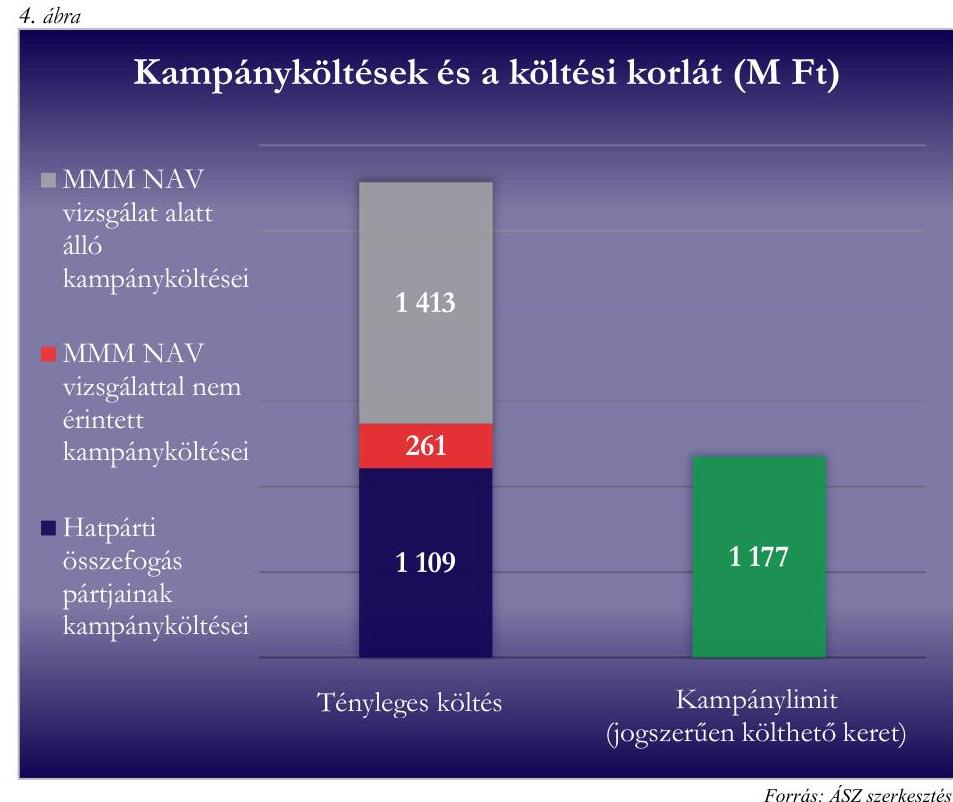

Az ellenőrzött szervezetek a választási kampány során tiltott párttámogatásban részesültek, ezzel pedig egyidejűleg túllépték a jogszabályban meghatározott költési korlátot is. Az ellenőrzött szervezetek a kampányban összesen 1 109,0 M Ft-ot költöttek, amely 67,9 M Ft-tal kevesebb, mint a Kampányfinanszírozási törvény szerint felhasználható maximális költési keret. Ez alapján, valamint a tiltott párttámogatásnak minősülő nem pénzbeli vagyoni hozzájárulás összegének (261,26 M Ft) figyelembevételével a Hatpárti összefogás 193,3 M Ft összeggel lépte túl a Kampányfinanszírozási törvény szerinti költési korlátot.

A fentiekből az következik, hogy amennyiben az állapítható meg, hogy a tiltott forrásból finanszírozott kiadásokkal az ellenőrzött szervezetek egyben túllépték a kampányköltség limitet is, mindkét megsértett jogszabály jogkövetkezményeit alkalmazni kell. Bár az ÁSZ ellenőrzéseire vonatkozó szabályok ilyen követelményt nem tartalmaznak, a kettős szankcionálás tilalmára vonatkozó, a jogrendszer egészét átható alapelvből az következik, hogy a jogkövetkezményeket vélhetően csak a tiltott párttámogatás után lehet indokolt megállapítani. Ezen értelmezést erősíti az a tény is, hogy bár összehangolt kampánytevékenységről van szó, a „többletként jelentkező" kiadások egy ténylegesen nem pártként működő szervezetnél merültek fel.

# I. 5. További megállapítások 

## Hiányos az ellenőrzött szervezetek kampányelszámolása

Az ellenőrzött szervezetek az országgyűlési választást követő 60 napon belül nyilvánosságra hozták a választásra fordított állami és más pénzeszközök, anyagi támogatások összegét, forrását és felhasználásának módjáról elszámolásukat a Magyar Közlönyben. Az ellenőrzött szervezetek kampányelszámolásai azonban nem voltak teljes körűek, mivel nem vették figyelembe az MMM fentiek szerint tiltott párttámogatásnak minősülő kiadásait. Emiatt a választópolgárok és a pártok tagsága számára nem biztosították a közös kampány forrásainak és költéseinek átláthatóságát.

---

Az ellenőrzés a fenti körben tett megállapításait az 5. ábra mutatja be.
5. ábra
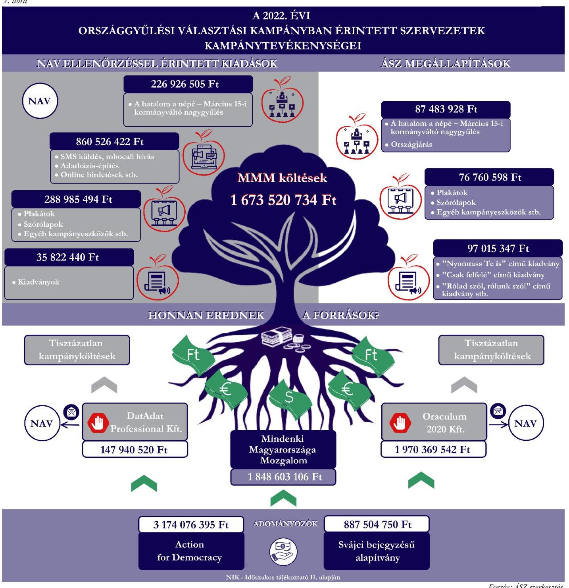

# I. 6. A jelen pontban ismertetett jogsértéssel kapcsolatos jogkövetkezmények 

Az ÁSZ a jogkövetkezmények vonatkozásában - figyelemmel az ellenőrzött szervezeteknek a jelentéstervezetre tett észrevételeire, valamint az Igazságügyi Minisztérium állásfoglalására - arra a következtetésre jutott, hogy a jogkövetkezmények alkalmazása a pártoknak közösen nyújtott nem vagyoni hozzájárulás esetében sem mellőzhető.

---

A Párt törvény 4. § (4) bekezdése szerint az a párt, amely a (2) és (3) bekezdésben foglalt szabályt megsértve vagyoni hozzájárulást fogadott el, köteles annak értékét - az Állami Számvevőszék felhívására - tizenöt napon belül a központi költségvetésnek befizetni. Késedelem esetén a tartozást adók módjára kell behajtani. A párt központi költségvetésből juttatott támogatását az elfogadott vagyoni hozzájárulás értékét kitevő összeggel csökkenteni kell. Ugyanezen jogszabályhely (5) bekezdése alapján, ha a párt részére a vagyoni hozzájárulást nem pénzben nyújtották, köteles annak értékeléséről (értékének meghatározásáról) gondoskodni. Ha a párt a (2) és (3) bekezdésben foglalt szabályt megsértve tiltott, nem pénzbeli hozzájárulást fogadott el, annak értékét az Állami Számvevőszék állapítja meg.
Az ÁSZ a jelen pontban foglalt párttámogatás vonatkozásában a NAV ellenőrzésével nem érintett körben a nem pénzbeli vagyoni hozzájárulás értékét az MMM által teljesített - a jelen részjelentés VI. sz. mellékletében ismertetett - kifizetések összegében, azaz 261,26 M Ft (kétszázhatvanegymillió-kétszázhatvanezer forint) összegben állapította meg, miután olyan körülmény nem merült fel, amely alapján arra lehetne következtetni, hogy az MMM ezen szolgáltatásokat nem piaci áron finanszírozta.
Az ellenőrzött szervezetek egyenlő mértékben, pártonként 43,543 M Ft (negyvenhárommillió-ötszáznegyvenháromezer forint) összegben kötelesek az Állami Számvevőszék külön felhívására - annak kézhezvételétől számított tizenöt napon belül - a központi költségvetésnek befizetni, illetőleg az ellenőrzött szervezetek központi költségvetésből juttatott támogatását is ezen összeggel kell csökkenteni. Ezen összeg nem tartalmazza az egyes pártok esetében egyedileg megállapított további tiltott párttámogatás jogkövetkezményeit. Az ÁSZ álláspontja szerint a Hatpárti összefogást alkotó pártok közös kampánytevékenységet folytattak, a számukra nyújtott nem pénzbeli vagyoni hozzájárulás a közös listán induló pártok érdekeit egyenlő mértékben szolgálta. Olyan jogi előírás nincs, amely alapján az egyes pártoknak a közös listához fűződő érdekeltsége ettől eltérő mértékben lenne meghatározható, hiszen a közös listán induló, a kormányalakításhoz szükséges parlamenti többségre törekvő pártok nem csupán a saját, de a velük közös listán induló többi párt sikeres választási szereplésében is egyaránt érdekeltek.

---

# 2. DEMOKRATIKUS KOALÍCIÓ 

Összegző megállapítás

A Demokratikus Koalíció Magyar Közlönyben közzétett kampányelszámolása nem volt teljes körű, mert nem vette figyelembe az MMM közös kampányra fordított kiadásait. A választási kampány költségeire vonatkozó korlátozást a
 Demokratikus Koalíció és a vele közös országos listát állító pártok együttesen nem tartották be. A Demokratikus Koalíció a Párt törvényben előírt finanszírozási tilalmakat nem tartotta be, mivel a hat párt és az MMM elnöke részvételével létrejött Hatpárti összefogás közös kampánya során jogi személytől, az MMM-től tiltott, nem pénzbeli vagyoni hozzájárulásban, tiltott párttámogatásban részesült. A Demokratikus Koalíció politikai hirdetés vásárlása során jogi személytől tiltott támogatást fogadott el. A Demokratikus Koalíció az egyéni jelöltek által a párt javára lemondott költségvetési támogatást, a jelölő szervezetnek járó költségvetési támogatást szabályszerűen használta fel.

## A DEMOKRATIKUS KOALÍCIÓ MAGYAR KÖZLÖNYBEN KÖZZÉTETT KAMPÁNYELSZÁMOLÁSA NEM VOLT TELJES KÖRŰ.

A Kampányfinanszírozási törvény 9. § (1) bekezdésében foglaltaknak megfelelően a Demokratikus Koalíció az országgyűlési képviselők 2022. évi általános választására fordított állami és más pénzeszközök, anyagi támogatások összegéről, forrásáról és felhasználásának módjáról szóló beszámolóját az országgyűlési választást követő 60 napon belül a Magyar Közlönyben nyilvánosságra hozta. A Demokratikus Koalíció kampányelszámolása azonban nem volt teljes körű, mivel nem vette figyelembe a közös miniszterelnök-jelölt által vezetett és kampányt folytató MMM nem pénzbeli vagyoni hozzájárulásnak minősülő kiadásait. Emiatt a választópolgárok és a Demokratikus Koalíció tagsága számára nem biztosították a közös kampány forrásainak és költéseinek átláthatóságát.

## A DEMOKRATIKUS KOALÍCIÓ ÉS A VELE KÖZÖS ORSZÁGOS LISTÁT ÁLLÍTÓ PÁRTOK EGYÜTTESEN NEM TARTOTTÁK BE A VÁLASZTÁSI KAMPÁNY KÖLTSÉGEIRE VONATKOZÓ KORLÁTOZÁST.

A Demokratikus Koalíciót, a vele közös országos listát, közös jelölteket állító Hatpárti összefogás közös kampányát a 2022. évi országgyűlési választási kampány időszakában az MMM - hatósági vizsgálattal nem érintett - kampányeszközök finanszírozásával, legalább 261,26 M Ft összeggel támogatta, amelyből a Demokratikus Koalíciót érintő tiltott támogatás összege 43,543 M Ft. A közös országos listát, közös jelölteket állító Hatpárti összefogás a kampányára az MMM által a kampányidőszak alatt a kampányeszközök finanszírozására 193,3 M Ft összeggel többet költött. Ennek következtében a Demokratikus Koalíció és a vele közös országos listát állító pártok együttesen nem tartották be a Kampányfinanszírozási törvény 7. § (1)-(2) bekezdéseiben foglalt, a kampány költségeire vonatkozó korlátozást.

---

# A HATPÁRTI ÖSSZEFOGÁS AZ MMM-TŐL TILTOTT TÁMOGATÁST KAPOTT. A DEMOKRATIKUS KOALÍCIÓ POLITIKAI HIRDETÉS VÁSÁRLÁSAKOR TILTOTT TÁMOGATÁST FOGADOTT EL. 

Az MMM a kampányidőszakban - hatósági vizsgálattal nem érintett - kampányeszközök finanszírozására 261,26 M Ft-ot fordított, amely a miniszterelnök-jelölt és ezen keresztül a Hatpárti összefogás érdekeit szolgálta. Ennek következtében a Demokratikus Koalíció nem tartotta be a Párt törvény 4. § (2) bekezdésében foglalt finanszírozási tilalmat, a Párt törvény 4. § (2) bekezdését megszegve jogi személytől 43,543 M Ft összegű vagyoni hozzájárulást fogadott el.
A Demokratikus Koalíció a Párt törvény 4. § (2) bekezdését megszegve jogi személytől vagyoni hozzájárulást fogadott el, mivel négy esetben a politikai hirdetés közzétételéért fizetett ellenérték - a Ve. 148. § (4) bekezdésében foglaltakkal ellentétben - alacsonyabb volt, mint az ÁSZ által nyilvántartásba vett árjegyzék által meghatározott ellenérték. A sajtótermék megjelentetője a Ve. 148. § (5) bekezdésében foglalt határidőn túl, az ÁSZ adatszolgáltatásra felkérése keretében adott tájékoztatást a közzétett politikai hirdetésekről, amely szerint a hirdetések ellenértéke (bruttó 132 ezer Ft) megegyezik az ÁSZ által nyilvántartásba vett árjegyzék által meghatározott ellenértékkel, ellenben nem egyezik meg a sajtótermék megjelentetője által kiállított számlákon feltüntetett fizetendő végösszeggel.
Figyelemmel a Párt törvény 4. § (5) bekezdésében foglaltakra az ÁSZ által megállapított tiltott támogatás értéke az árjegyzékben meghatározott ár alapján számított érték (bruttó 528 ezer Ft) és a sajtótermék megjelentetője által kiállított számlákon feltüntetett fizetendő végösszeg (bruttó 315 ezer Ft) közötti különbözet értéke, azaz 213 ezer Ft, amely a Párt törvény 4. § (2) bekezdésében foglaltak szerint tiltott forrásból származó nem pénzbeli vagyoni hozzájárulásnak minősül.

## AZ EGYÉNI JELÖLTEK ÁLTAL LEMONDOTT KÖLTSÉGVETÉSI TÁMOGATÁS FELHASZNÁLÁSA SZABÁLYSZERŰ VOLT.

A Demokratikus Koalíció egyéni választókerületi jelöltjei - 32 fő - a Kampányfinanszírozási törvény 2/A. § (1) bekezdésében foglaltaknak megfelelően írásban nyilatkoztak a Kincstárnak arról, hogy a Kampányfinanszírozási törvény 1. §-a szerinti támogatás igénybevételéről lemondanak és a 2022. évi országgyűlési választás során jelöltenkénti 1,2 M Ft-os támogatás összegét az őket jelölő párt rendelkezésére bocsátják.
Az egyéni jelöltek lemondó nyilatkozata, valamint a Kampányfinanszírozási törvény 2/A. § (2) bekezdésében foglaltak szerint, a Demokratikus Koalíció és a Kincstár között létrejött megállapodás alapján a Kincstár a kincstári kártyafedezeti számlán a Demokratikus Koalíció részére 37,9 M Ft költségvetési támogatást biztosított.
A Demokratikus Koalíció a kincstári kártyafedezeti számla használata során betartotta a Kampányfinanszírozási törvény 2/A. § (4) bekezdése előírásait, a kifizetést átutalással teljesítette.
A Demokratikus Koalíció a választási kampányidőszak alatt a választási kampánytevékenységgel összefüggő kiadás elszámolását a Kincstár felé a Kampányfinanszírozási törvény 8/A. § (1) bekezdésében foglaltaknak megfelelően a kifizetést igazoló bizonylat másolatának benyújtásával teljesítette.
Az elszámoláshoz benyújtott számla kampánytevékenységgel kapcsolatos szolgáltatás megfizetésére irányult a Kampányfinanszírozási törvény 1. § (3) bekezdésében foglaltaknak megfelelően.
A benyújtott számla, számviteli bizonylat az NGM rendelet ${ }^{27}$ 2. § (4) bekezdés b) pont 7. alpontja és az Áhsz. ${ }^{28}$ 15. számú melléklet előírásainak megfelelően a K3 Dologi kiadások rovatba tartozó, a kampánytevékenységgel összefüggésben elszámolható dologi kiadások körébe tartozott.

---

A támogatás felhasználását igazoló számla a Kampányfinanszírozási törvény 2/A. § (5) bekezdésében foglaltaknak megfelelően a Demokratikus Koalíció nevére szólt, alaki és tartalmi kellékei megfeleltek a Számviteli törvény és az ÁFA tv. előírásainak.

# A DEMOKRATIKUS KOALÍCIÓ A JELŐLŐ SZERVEZETNEK JÁRÓ KÖLTSÉGVETÉSI TÁMOGATÁST SZABÁLYSZERŰEN HASZNÁLTA FEL. 

A Demokratikus Koalíció a Kampányfinanszírozási törvény 3. §-a szerinti költségvetési támogatást a Ve. 140. §-ában meghatározott kampányeszközök megfizetésére használta fel, továbbá a Ve. 141. §-ában és a Kampányfinanszírozási törvény 6. § (1) bekezdésében foglaltakkal összhangban, a választási kampányidőszak alatt a választási kampánytevékenységgel összefüggő kiadások finanszírozására fordította, amelyet szabályszerű bizonylatokkal és az ÁFA tv. 169. §-ában foglalt adattartalomnak megfelelő, nevére szóló számlákkal igazolt.
A Demokratikus Koalíció költségvetési támogatásból nem fizetett politikai hirdetést. A költségvetési támogatáson kívüli kampányfinanszírozásra fordított forrásoknál a politikai hirdetést tartalmazó számla kibocsátója - egy kiadó kivételével - a Ve. 148. § (3)-(4) bekezdéseiben foglaltaknak megfelelően, az ÁSZ által nyilvántartásba vett, honlapján közzétett árjegyzékben szereplő sajtótermékek megjelentetője volt. A politikai hirdetést tartalmazó számlában szereplő adatok - négy kivétellel - megegyeztek a választást követően a sajtótermék kibocsátója által megküldött tájékoztatóban foglaltakkal.

## 2. JOBBIK

Összegző megállapítás

A Jobbik Magyar Közlönyben közzétett kampányelszámolása nem volt teljes körű, mert nem vette figyelembe az MMM közös kampányra fordított kiadásait. A választási kampány költségeire vonatkozó korlátozást a Jobbik és a vele közös országos listát állító pártok együttesen nem tartották be. A Jobbik a Párt törvényben előírt finanszírozási tilalmakat nem tartotta be, mivel a hat párt és az MMM elnöke részvételével létrejött Hatpárti összefogás közös kampánya során jogi személytől, az MMM-től tiltott, nem pénzbeli vagyoni hozzájárulásban, tiltott párttámogatásban részesült. A Jobbik az egyéni jelöltek által a párt javára lemondott költségvetési támogatást, a jelölő szervezetnek járó költségvetési támogatást - két eset kivételével - szabályszerűen használta fel.

## A JOBBIK MAGYAR KÖZLÖNYBEN KÖZZÉTETT KAMPÁNYELSZÁMOLÁSA NEM VOLT TELJES KÖRŰ.

A Kampányfinanszírozási törvény 9. § (1) bekezdésében foglaltaknak megfelelően a Jobbik az országgyűlési képviselők 2022. évi általános választására fordított állami és más pénzeszközök, anyagi támogatások összegéről, forrásáról és felhasználásának módjáról szóló beszámolóját az országgyűlési választást követő 60 napon belül a Magyar Közlönyben nyilvánosságra hozta. A Jobbik kampányelszámolása azonban nem volt teljes körű, mivel nem vette figyelembe a közös miniszterelnökjelölt által vezetett és kampányt folytató MMM nem pénzbeli vagyoni hozzájárulásnak minősülő kiadásait. Emiatt a választópolgárok és a Jobbik tagsága számára nem biztosították a közös kampány forrásainak és költéseinek átláthatóságát.

---

# A JOBBIK ÉS A VELE KÖZÖS ORSZÁGOS LISTÁT ÁLLÍTÓ PÁRTOK EGYÜTTESEN NEM TARTOTTÁK BE A VÁLASZTÁSI KAMPÁNY KÖLTSÉGEIRE VONATKOZÓ KORLÁTOZÁST. 

A Jobbikot, a vele közös országos listát, közös jelölteket állító Hatpárti összefogás közös kampányát a 2022. évi országgyűlési választási kampány időszakában az MMM - hatósági vizsgálattal nem érintett kampányeszközök finanszírozására, legalább 261,26 M Ft összeggel támogatta, amelyből a Jobbikot érintő tiltott támogatás összege 43,543 M Ft. A közös országos listát, közös jelölteket állító Hatpárti összefogás a kampányára az MMM által a kampányidőszak alatt a kampányeszközök finanszírozására 193,3 M Ft összeggel többet költött. Ennek következtében a Jobbik és a vele közös országos listát állító pártok együttesen nem tartották be a Kampányfinanszírozási törvény 7. § (1)-(2) bekezdéseiben foglalt, a kampány költségeire vonatkozó korlátozást.

## A HATPÁRTI ÖSSZEFOGÁS AZ MMM-TŐL TILTOTT TÁMOGATÁST KAPOTT.

Az MMM a kampányidőszakban - hatósági vizsgálattal nem érintett - kampányeszközök finanszírozására 261,26 M Ft-ot fordított, amely a miniszterelnök-jelölt és ezen keresztül a Hatpárti összefogás érdekeit szolgálta. Ennek következtében a Jobbik nem tartotta be a Párt törvény 4. § (2) bekezdésében foglalt finanszírozási tilalmat, a Párt törvény 4. § (2) bekezdését megszegve jogi személytől 43,543 M Ft összegű vagyoni hozzájárulást fogadott el.

## AZ EGYÉNI JELÖLTEK ÁLTAL LEMONDOTT KÖLTSÉGVETÉSI TÁMOGATÁS FELHASZNÁLÁSA SZABÁLYSZERŰ VOLT.

A Jobbik egyéni választókerületi jelöltjei - 29 fő - a Kampányfinanszírozási törvény 2/A. § (1) bekezdésében foglaltaknak megfelelően írásban nyilatkoztak a Kincstárnak arról, hogy a Kampányfinanszírozási törvény 1. §-a szerinti támogatás igénybevételéről lemondanak és a 2022. évi országgyűlési választás során jelöltenkénti 1,2 M Ft-os támogatás összegét az őket jelölő párt rendelkezésére bocsátják.
Az egyéni jelöltek lemondó nyilatkozata, valamint a Kampányfinanszírozási törvény 2/A. § (2) bekezdésében foglaltak szerint, a Jobbik és a Kincstár között létrejött megállapodás alapján a Kincstár a kincstári kártyafedezeti számlán a Jobbik részére 34,3 M Ft költségvetési támogatást biztosított.
A Jobbik a kincstári kártyafedezeti számla használata során betartotta a Kampányfinanszírozási törvény 2/A. § (4) bekezdése előírásait, a kifizetést átutalással teljesítette.
A Jobbik a választási kampányidőszak alatt a választási kampánytevékenységgel összefüggő kiadások elszámolását a Kincstár felé a Kampányfinanszírozási törvény 8/A. § (1) bekezdésében foglaltaknak megfelelően a kifizetést igazoló bizonylatok másolatának benyújtásával teljesítette.
Az elszámoláshoz benyújtott számlák kampánytevékenységgel kapcsolatos szolgáltatások megfizetésére irányultak a Kampányfinanszírozási törvény 1. § (3) bekezdésében foglaltaknak megfelelően.
A benyújtott számlák, számviteli bizonylatok az NGM rendelet 2. § (4) bekezdés b) pont 7. alpontja és az Áhsz. 15. számú melléklet előírásainak megfelelően a K3 Dologi kiadások rovatba tartozó, a kampánytevékenységgel összefüggésben elszámolható dologi kiadások körébe tartoztak.
A támogatás felhasználását igazoló számlák a Kampányfinanszírozási törvény 2/A. § (5) bekezdésében foglaltaknak megfelelően a Jobbik nevére szóltak, alaki és tartalmi kellékei megfeleltek a Számviteli törvény és az ÁFA tv. előírásainak.

---

# A JOBBIK A JELÖLŐ SZERVEZETNEK JÁRÓ KÖLTSÉGVETÉSI TÁMOGATÁST - KÉT ESET KIVÉTELÉVEL - SZABÁLYSZERŰEN HASZNÁLTA FEL. 

A Jobbik a Kampányfinanszírozási törvény 3. §-a szerinti költségvetési támogatást a
 Ve. 140. §-ában meghatározott kampányeszközök megfizetésére használta fel, továbbá a Ve. 141. §-ában és a Kampányfinanszírozási törvény 6. § (1) bekezdésében foglaltakkal összhangban, két eset kivételével a választási kampányidőszak alatt a választási kampánytevékenységgel összefüggő kiadások finanszírozására fordította, amelyet szabályszerű bizonylatokkal és az ÁFA tv. 169. §-ában foglalt adattartalomnak megfelelő, nevére szóló számlákkal igazolt.
A Jobbik két esetben a Kampányfinanszírozási törvény 3. §-a szerinti támogatást a Kampányfinanszírozási törvény 6. § (1) bekezdésében előírtak ellenére a kampánytevékenységgel összefüggő olyan kiadásra fordította, amely nem a választási kampány időszak alatt merült fel az alábbiak szerint:

- kampánycsapat kampányidőszak lezárultát követő étkeztetésére 18 ezer Ft kiadást számoltak el;
- kampányidőszakot megelőzően megjelent politikai hirdetésre 40,1 ezer Ft kiadást számoltak el a központi költségvetési támogatás terhére.
A Kampányfinanszírozási törvény jelenlegi előírásai nem tartalmaznak szankciót az ÁSZ ellenőrzése során feltárt jogszabálysértő gyakorlatra.
A Jobbik vonatkozásában a politikai hirdetést tartalmazó számla kibocsátója, a Ve. 148. § (3)-(4) bekezdéseiben foglaltaknak megfelelően, kizárólag az ÁSZ által nyilvántartásba vett, honlapján közzétett árjegyzékben szereplő sajtótermékek megjelentetője volt. A politikai hirdetések vásárlásáról szóló számlákon szereplő egységárak megegyeztek az ÁSZ által nyilvántartásba vett, honlapján közzétett árjegyzékben szereplő árakkal. Három politikai hirdetés esetén a sajtótermék megjelentetője által a Jobbik részére kiállított számlában szereplő egységár a hirdetés méretére, vagy a megnevezésére (típusára) tekintettel nem volt egyeztethető az ÁSZ honlapján közzétett árjegyzékben szereplő árakkal.
A politikai hirdetést tartalmazó számlákban szereplő adatok megegyeztek a választást követően a sajtótermék kibocsátója által megküldött tájékoztatóban foglaltakkal. Hat esetben a sajtótermék megjelentetője a Ve. 148. § (5) bekezdésében foglaltak ellenére az ÁSZ-t nem tájékoztatta a közzétett politikai hirdetésekről. A Ve.-ben előírt kötelezettség körében feltárt mulasztás a Jobbiknak nem róható fel.

---

# 3. LMP 

Összegző megállapítás

Az LMP Magyar Közlönyben közzétett kampányelszámolása nem volt teljes körű, mert nem vette figyelembe az MMM közös kampányra fordított kiadásait. A választási kampány költségeire vonatkozó korlátozást az LMP és a vele közös országos listát állító pártok együttesen nem tartották be. Az LMP a Párt törvényben előírt finanszírozási tilalmakat nem tartotta be, mivel a hat párt és az MMM elnöke részvételével létrejött Hatpárti összefogás közös kampánya során jogi személytől, az MMM-től tiltott, nem pénzbeli vagyoni hozzájárulásban, tiltott párttámogatásban részesült. Az LMP az egyéni jelöltek által a párt javára lemondott költségvetési támogatást, a jelölő szervezetnek járó költségvetési támogatást szabályszerűen használta fel.

AZ LMP MAGYAR KÖZLÖNYBEN KÖZZÉTETT KAMPÁNYELSZÁMOLÁSA NEM VOLT TELJES KÖRŰ.
A Kampányfinanszírozási törvény 9. § (1) bekezdésében foglaltaknak megfelelően az LMP az országgyűlési képviselők 2022. évi általános választására fordított állami és más pénzeszközök, anyagi támogatások összegéről, forrásáról és felhasználásának módjáról szóló beszámolóját az országgyűlési választást követő 60 napon belül a Magyar Közlönyben nyilvánosságra hozta. Az LMP kampányelszámolása azonban nem volt teljes körű, mivel nem vette figyelembe a közös miniszterelnökjelölt által vezetett és kampányt folytató MMM nem pénzbeli vagyoni hozzájárulásnak minősülő kiadásait. Emiatt a választópolgárok és az LMP tagsága számára nem biztosították a közös kampány forrásainak és költéseinek átláthatóságát.

AZ LMP ÉS A VELE KÖZÖS ORSZÁGOS LISTÁT ÁLLÍTÓ PÁRTOK EGYÜTTESEN NEM TARTOTTÁK BE A VÁLASZTÁSI KAMPÁNY KÖLTSÉGEIRE VONATKOZÓ KORLÁTOZÁST.
Az LMP-t, a vele közös országos listát, közös jelölteket állító Hatpárti összefogás közös kampányát a 2022. évi országgyűlési választási kampány időszakában az MMM - hatósági vizsgálattal nem érintett kampányeszközök finanszírozására, legalább 261,26 M Ft összeggel támogatta, amelyből az LMP-t érintő tiltott támogatás összege 43,543 M Ft. A közös országos listát, közös jelölteket állító Hatpárti összefogás a kampányára az MMM által a kampányidőszak alatt a kampányeszközök finanszírozására 193,3 M Ft összeggel többet költött. Ennek következtében az LMP és a vele közös országos listát állító pártok együttesen nem tartották be a Kampányfinanszírozási törvény 7. § (1)-(2) bekezdéseiben foglalt, a kampány költségeire vonatkozó korlátozást.

A HATPÁRTI ÖSSZEFOGÁS AZ MMM-TŐL TILTOTT TÁMOGATÁST KAPOTT.
Az MMM a kampányidőszakban, - hatósági vizsgálattal nem érintett - kampányeszközök finanszírozására 261,26 M Ft-ot fordított, amely a miniszterelnök-jelölt és ezen keresztül a Hatpárti összefogás érdekeit szolgálta. Ennek következtében az LMP nem tartotta be a Párt törvény 4. § (2) bekezdésében foglalt finanszírozási tilalmat, a Párt törvény 4. § (2) bekezdését megszegve jogi személytől 43,543 M Ft összegű vagyoni hozzájárulást fogadott el.

---

# AZ EGYÉNI JELÖLTEK ÁLTAL LEMONDOTT KÖLTSÉGVETÉSI TÁMOGATÁS FELHASZNÁLÁSA SZABÁLYSZERŰ VOLT. 

Az LMP egyéni választókerületi jelöltjei - 5 fő - a Kampányfinanszírozási törvény 2/A. § (1) bekezdésében foglaltaknak megfelelően írásban nyilatkoztak a Kincstárnak arról, hogy a Kampányfinanszírozási törvény 1. §-a szerinti támogatás igénybevételéről lemondanak és a 2022. évi országgyűlési választás során jelöltenkénti 1,2 M Ft-os támogatás összegét az őket jelölő párt rendelkezésére bocsátják.
Az egyéni jelöltek lemondó nyilatkozata, valamint a Kampányfinanszírozási törvény 2/A. § (2) bekezdésében foglaltak szerint, az LMP és a Kincstár között létrejött megállapodás alapján a Kincstár a kincstári kártyafedezeti számlán az LMP részére 5,9 M Ft költségvetési támogatást biztosított.
Az LMP a kincstári kártyafedezeti számla használata során betartotta a Kampányfinanszírozási törvény 2/A. § (4) bekezdése előírásait, a kifizetést átutalással teljesítette.
Az LMP a választási kampányidőszak alatt a választási kampánytevékenységgel összefüggő kiadás elszámolását a Kincstár felé a Kampányfinanszírozási törvény 8/A. § (1) bekezdésében foglaltaknak megfelelően a kifizetést igazoló bizonylat másolatának benyújtásával teljesítette.
Az elszámoláshoz benyújtott számla kampánytevékenységgel kapcsolatos szolgáltatás megfizetésére irányult a Kampányfinanszírozási törvény 1. § (3) bekezdésében foglaltaknak megfelelően.
A benyújtott számla, számviteli bizonylat az NGM rendelet 2. § (4) bekezdés b) pont 7. alpontja és az Áhsz. 15. számú melléklet előírásainak megfelelően a K3 Dologi kiadások rovatba tartozó, a kampánytevékenységgel összefüggésben elszámolható dologi kiadások körébe tartozott.
A támogatás felhasználását igazoló számla a Kampányfinanszírozási törvény 2/A. § (5) bekezdésében foglaltaknak megfelelően az LMP nevére szólt, alaki és tartalmi kellékei megfeleltek a Számviteli törvény és az ÁFA tv. előírásainak.

## AZ LMP A JELÖLŐ SZERVEZETNEK JÁRÓ KÖLTSÉGVETÉSI TÁMOGATÁST SZABÁLYSZERŰEN HASZNÁLTA FEL.

Az LMP a Kampányfinanszírozási törvény 3. §-a szerinti költségvetési támogatást a Ve. 140. §-ában meghatározott kampányeszközök megfizetésére használta fel, továbbá a Ve. 141. §-ában és a Kampányfinanszírozási törvény 6. § (1) bekezdésében foglaltakkal összhangban, a választási kampányidőszak alatt a választási kampánytevékenységgel összefüggő kiadások finanszírozására fordította, amelyet szabályszerű bizonylatokkal és az ÁFA tv. 169. §-ában foglalt adattartalomnak megfelelő, nevére szóló számlákkal igazolt.
Az LMP vonatkozásában a politikai hirdetéseket tartalmazó számlák kibocsátói, a Ve. 148. § (3)-(4) bekezdéseiben foglaltaknak megfelelően, kizárólag az ÁSZ által nyilvántartásba vett, honlapján közzétett árjegyzékben szereplő sajtótermékek megjelentetői voltak. A politikai hirdetések vásárlásáról szóló számlákon szereplő egységárak megegyeztek az ÁSZ által nyilvántartásba vett, honlapján közzétett árjegyzékben szereplő árakkal. A politikai hirdetést tartalmazó számlákban szereplő adatok megegyeztek a választást követően a sajtótermék kibocsátója által megküldött tájékoztatóban foglaltakkal.

---

# 4. MSZP 

## Összegző megállapítás

Az MSZP Magyar Közlönyben közzétett kampányelszámolása nem volt teljes körű, mert nem vette figyelembe az MMM közös kampányra fordított kiadásait. A választási kampány költségeire vonatkozó korlátozást az MSZP és a vele közös országos listát állító pártok együttesen nem tartották be. Az MSZP a Párt törvényben előírt finanszírozási tilalmakat nem tartotta be, mivel a hat párt és az MMM elnöke részvételével létrejött Hatpárti összefogás közös kampánya során jogi személytől, az MMM-től tiltott, nem pénzbeli vagyoni hozzájárulásban, tiltott párttámogatásban részesült. Az MSZP politikai hirdetés vásárlása során jogi személytől tiltott támogatást fogadott el. Az MSZP az egyéni jelöltek által a párt javára lemondott költségvetési támogatást, a jelölő szervezetnek járó költségvetési támogatást szabályszerűen használta fel.

AZ MSZP MAGYAR KÖZLÖNYBEN KÖZZÉTETT KAMPÁNYELSZÁMOLÁSA NEM VOLT TELJES KÖRŰ.
A Kampányfinanszírozási törvény 9. § (1) bekezdésében foglaltaknak megfelelően az MSZP az országgyűlési képviselők 2022. évi általános választására fordított állami és más pénzeszközök, anyagi támogatások összegéről, forrásáról és felhasználásának módjáról szóló beszámolóját az országgyűlési választást követő 60 napon belül a Magyar Közlönyben nyilvánosságra hozta. Az MSZP kampányelszámolása azonban nem volt teljes körű, mivel nem vette figyelembe a közös miniszterelnökjelölt által vezetett és kampányt folytató MMM nem pénzbeli vagyoni hozzájárulásnak minősülő kiadásait. Emiatt a választópolgárok és az MSZP tagsága számára nem biztosították a közös kampány forrásainak és költéseinek átláthatóságát.

AZ MSZP ÉS A VELE KÖZÖS ORSZÁGOS LISTÁT ÁLLÍTÓ PÁRTOK EGYÜTTESEN NEM TARTOTTÁK BE A VÁLASZTÁSI KAMPÁNY KÖLTSÉGEIRE VONATKOZÓ KORLÁTOZÁST.
Az MSZP-t, a vele közös országos listát, közös jelölteket állító Hatpárti összefogás közös kampányát a 2022. évi országgyűlési választási kampány időszakában az MMM - hatósági vizsgálattal nem érintett kampányeszközök finanszírozására, legalább 261,26 M Ft összeggel támogatta, amelyből az MSZP-t érintő tiltott támogatás összege 43,543 M Ft. A közös országos listát, közös jelölteket állító Hatpárti összefogás a kampányára az MMM által a kampányidőszak alatt a kampányeszközök finanszírozására 193,3 M Ft összeggel többet költött. Ennek következtében az MSZP és a vele közös országos listát állító pártok együttesen nem tartották be a Kampányfinanszírozási törvény 7. § (1)-(2) bekezdéseiben foglalt, a kampány költségeire vonatkozó korlátozást.

A HATPÁRTI ÖSSZEFOGÁS AZ MMM-TŐL TILTOTT TÁMOGATÁST KAPOTT. AZ MSZP POLITIKAI HIRDETÉS VÁSÁRLÁSAKOR TILTOTT TÁMOGATÁST FOGADOTT EL.
Az MMM a kampányidőszakban - hatósági vizsgálattal nem érintett - kampányeszközök finanszírozására 261,26 M Ft-ot fordított, amely a miniszterelnök-jelölt és ezen keresztül a Hatpárti összefogás érdekeit

---

szolgálta. Ennek következtében az MSZP nem tartotta be a Párt törvény 4. § (2) bekezdésében foglalt finanszírozási tilalmat, a Párt törvény 4. § (2) bekezdését megszegve jogi személytől 43,543 M Ft összegű vagyoni hozzájárulást fogadott el.
A Párt törvény 4. § (2) bekezdését megszegve az MSZP jogi személytől vagyoni hozzájárulást fogadott el, mivel egy esetben a politikai hirdetések közzétételéért fizetett ellenérték - a Ve. 148. § (4) bekezdésében foglaltakkal ellentétben - alacsonyabb volt, mint az ÁSZ által nyilvántartásba vett árjegyzék által meghatározott ellenérték. Figyelemmel a Párt törvény 4. § (5) bekezdésében foglaltakra az ÁSZ által megállapított tiltott támogatás értéke az árjegyzékben meghatározott ár alapján számított, a sajtótermék megjelentetője által a kiállított számlán is szerepeltetett ellenérték (bruttó 6,7 M Ft) és a sajtótermék megjelentetője által kiállított számlán feltüntetett 60%-os speciális kedvezménnyel csökkentett ár (bruttó 2,7 M Ft) közötti különbözet értéke, azaz 4,0 M Ft, amely a Párt törvény 4. § (2) bekezdésében foglaltak szerint tiltott forrásból származó nem pénzbeli vagyoni hozzájárulásnak minősül.

# AZ EGYÉNI JELÖLTEK ÁLTAL LEMONDOTT KÖLTSÉGVETÉSI TÁMOGATÁS FELHASZNÁLÁSA SZABÁLYSZERŰ VOLT. 

Az MSZP egyéni választókerületi jelöltjei - 18 fő - a Kampányfinanszírozási törvény 2/A. § (1) bekezdésében foglaltaknak megfelelően írásban nyilatkoztak a Kincstárnak arról, hogy a Kampányfinanszírozási törvény 1. §-a szerinti támogatás igénybevételéről lemondanak és a 2022. évi országgyűlési választás során jelöltenkénti
 $1,2 \mathrm{M}$ Ft-os támogatás összegét az őket jelölő párt rendelkezésére bocsátják.
Az egyéni jelöltek lemondó nyilatkozata, valamint a Kampányfinanszírozási törvény 2/A. § (2) bekezdésében foglaltak szerint, az MSZP és a Kincstár között létrejött megállapodás alapján a Kincstár a kincstári kártyafedezeti számlán az MSZP részére 21,3 M Ft költségvetési támogatást biztosított.
Az MSZP a kincstári kártyafedezeti számla használata során betartotta a Kampányfinanszírozási törvény 2/A. § (4) bekezdése előírásait, a kifizetést átutalással teljesítette.
Az MSZP a választási kampányidőszak alatt a választási kampánytevékenységgel összefüggő kiadás elszámolását a Kincstár felé a Kampányfinanszírozási törvény 8/A. § (1) bekezdésében foglaltaknak megfelelően a kifizetést igazoló bizonylatok másolatának benyújtásával teljesítette.
Az elszámoláshoz benyújtott számla kampánytevékenységgel kapcsolatos szolgáltatás megfizetésére irányult a Kampányfinanszírozási törvény 1. § (3) bekezdésében foglaltaknak megfelelően.
A benyújtott számla, számviteli bizonylat az NGM rendelet 2. § (4) bekezdés b) pont 7. alpontja és az Áhsz. 15. számú melléklet előírásainak megfelelően a K3 Dologi kiadások rovatba tartozó, a kampánytevékenységgel összefüggésben elszámolható dologi kiadások körébe tartozott.
A támogatás felhasználását igazoló számla a Kampányfinanszírozási törvény 2/A. § (5) bekezdésében foglaltaknak megfelelően az MSZP nevére szólt, alaki és tartalmi kellékei megfeleltek a Számviteli törvény és az ÁFA tv. előírásainak.

## AZ MSZP A JELŐLŐ SZERVEZETNEK JÁRÓ KÖLTSÉGVETÉSI TÁMOGATÁST SZABÁLYSZERŰEN HASZNÁLTA FEL.

Az MSZP a Kampányfinanszírozási törvény 3. §-a szerinti költségvetési támogatást a Ve. 140. §-ában meghatározott kampányeszközök megfizetésére használta fel, továbbá a Ve. 141. §-ában és a Kampányfinanszírozási törvény 6. § (1) bekezdésében foglaltakkal összhangban, a választási kampányidőszak alatt a választási kampánytevékenységgel összefüggő kiadások finanszírozására

---

fordította, amelyet szabályszerű bizonylatokkal és az ÁFA tv. 169. §-ában foglalt adattartalomnak megfelelő, nevére szóló számlákkal igazolt.
Az MSZP vonatkozásában a politikai hirdetést tartalmazó számla kibocsátója, a Ve. 148. § (3)-(4) bekezdéseiben foglaltaknak megfelelően, minden esetben az ÁSZ által nyilvántartásba vett, honlapján közzétett árjegyzékben szereplő sajtótermékek megjelentetője volt. A politikai hirdetések vásárlásáról szóló számlákon szereplő egységárak egy kivétellel megegyeztek az ÁSZ által nyilvántartásba vett, honlapján közzétett árjegyzékben szereplő árakkal. A politikai hirdetést tartalmazó számlákban szereplő adatok hat sajtótermék esetében megegyeztek a választást követően a sajtótermék kibocsátója által megküldött tájékoztatóban foglaltakkal. Három esetben a sajtótermék megjelentetője a Ve. 148. § (5) bekezdésében foglaltak ellenére nem tájékoztatta az ÁSZ-t a közzétett politikai hirdetésekről. A Ve.-ben előírt kötelezettség körében feltárt mulasztás az MSZP-nek nem róható fel.

# 5. MOMENTUM MOZGALOM 

Összegző megállapítás A Momentum Mozgalom Magyar Közlönyben közzétett kampányelszámolása nem volt teljes körű, mert nem vette figyelembe az MMM közös kampányra fordított kiadásait. A választási kampány költségeire vonatkozó korlátozást a Momentum Mozgalom és a vele közös országos listát állító pártok együttesen nem tartották be. A Momentum Mozgalom a Párt törvényben előírt finanszírozási tilalmakat nem tartotta be, mivel a hat párt és az MMM elnöke részvételével létrejött Hatpárti összefogás közös kampánya során jogi személytől, az MMM-től tiltott, nem pénzbeli vagyoni hozzájárulásban, tiltott párttámogatásban részesült. A Momentum Mozgalom az egyéni jelöltek által a párt javára lemondott költségvetési támogatást, a jelölő szervezetnek járó költségvetési támogatást szabályszerűen használta fel.

## A MOMENTUM MOZGALOM MAGYAR KÖZLÖNYBEN KÖZZÉTETT KAMPÁNYELSZÁMOLÁSA NEM VOLT TELJES KÖRŰ.

A Kampányfinanszírozási törvény 9. § (1) bekezdésében foglaltaknak megfelelően a Momentum Mozgalom az országgyűlési képviselők 2022. évi általános választására fordított állami és más pénzeszközök, anyagi támogatások összegéről, forrásáról és felhasználásának módjáról szóló beszámolóját az országgyűlési választást követő 60 napon belül a Magyar Közlönyben nyilvánosságra hozta. A Momentum Mozgalom kampányelszámolása azonban nem volt teljes körű, mivel nem vette figyelembe a közös miniszterelnök-jelölt által vezetett és kampányt folytató MMM nem pénzbeli vagyoni hozzájárulásnak minősülő kiadásait. Emiatt a választópolgárok és a Momentum Mozgalom tagsága számára nem biztosították a közös kampány forrásainak és költéseinek átláthatóságát.

## A MOMENTUM MOZGALOM ÉS A VELE KÖZÖS ORSZÁGOS LISTÁT ÁLLÍTÓ PÁRTOK EGYÜTTESEN NEM TARTOTTÁK BE A VÁLASZTÁSI KAMPÁNY KÖLTSÉGEIRE VONATKOZÓ KORLÁTOZÁST.

A Momentum Mozgalmat, a vele közös országos listát, közös jelölteket állító Hatpárti összefogás közös kampányát a 2022. évi országgyűlési választási kampány időszakában az MMM - hatósági vizsgálattal nem

---

érintett - kampányeszközök finanszírozására, legalább 261,26 M Ft összeggel támogatta, amelyből a Momentum Mozgalmat érintő tiltott támogatás összege 43,543 M Ft. A közös országos listát, közös jelölteket állító Hatpárti összefogás a kampányára az MMM által a kampányidőszak alatt a kampányeszközök finanszírozására 193,3 M Ft összeggel többet költött. Ennek következtében a Momentum Mozgalom és a vele közös országos listát állító pártok együttesen nem tartották be a Kampányfinanszírozási törvény 7. § (1)-(2) bekezdéseiben foglalt, a kampány költségeire vonatkozó korlátozást.

# A 

## A HATPÁRTI ÖSSZEFOGÁS AZ MMM-TŐL TILTOTT TÁMOGATÁST KAPOTT.

Az MMM a kampányidőszakban, - hatósági vizsgálattal nem érintett - kampányeszközök finanszírozására 261,26 M Ft-ot fordított, amely a miniszterelnök-jelölt és ezen keresztül a Hatpárti összefogás érdekeit szolgálta. Ennek következtében a Momentum Mozgalom nem tartotta be a Párt törvény 4. § (2) bekezdésében foglalt finanszírozási tilalmat, a Párt törvény 4. § (2) bekezdését megszegve jogi személytől 43,543 M Ft összegű vagyoni hozzájárulást fogadott el.

## AZ EGYÉNI JELÖLTEK ÁLTAL LEMONDOTT KÖLTSÉGVETÉSI TÁMOGATÁS FELHASZNÁLÁSA SZABÁLYSZERŰ VOLT.

A Momentum Mozgalom egyéni választókerületi jelöltjei - 13 fő - a Kampányfinanszírozási törvény 2/A. § (1) bekezdésében foglaltaknak megfelelően írásban nyilatkoztak a Kincstárnak arról, hogy a Kampányfinanszírozási törvény 1. §-a szerinti támogatás igénybevételéről lemondanak és a 2022. évi országgyűlési választás során jelöltenkénti 1,2 M Ft-os támogatás összegét az őket jelölő párt rendelkezésére bocsátják.
Az egyéni jelöltek lemondó nyilatkozata, valamint a Kampányfinanszírozási törvény 2/A. § (2) bekezdésében foglaltak szerint, a Momentum Mozgalom és a Kincstár között létrejött megállapodás alapján a Kincstár a kincstári kártyafedezeti számlán a Momentum Mozgalom részére 15,4 M Ft költségvetési támogatást biztosított.
A Momentum Mozgalom a kincstári kártyafedezeti számla használata során betartotta a Kampányfinanszírozási törvény 2/A. § (4) bekezdése előírásait, a kifizetést átutalással teljesítette.
A Momentum Mozgalom a választási kampányidőszak alatt a választási kampánytevékenységgel összefüggő kiadás elszámolását a Kincstár felé a Kampányfinanszírozási törvény 8/A. § (1) bekezdésében foglaltaknak megfelelően a kifizetést igazoló bizonylat másolatának benyújtásával teljesítette.
Az elszámoláshoz benyújtott számla kampánytevékenységgel kapcsolatos szolgáltatás megfizetésére irányult a Kampányfinanszírozási törvény 1. § (3) bekezdésében foglaltaknak megfelelően.
A benyújtott számla, számviteli bizonylatok az NGM rendelet 2. § (4) bekezdés b) pont 7. alpontja és az Áhsz. 15. számú melléklet előírásainak megfelelően a K3 Dologi kiadások rovatba tartozó, a kampánytevékenységgel összefüggésben elszámolható dologi kiadások körébe tartoztak.
A támogatás felhasználását igazoló számla a Kampányfinanszírozási törvény 2/A. § (5) bekezdésében foglaltaknak megfelelően a Momentum Mozgalom nevére szólt, alaki és tartalmi kellékei megfeleltek a Számviteli törvény és az ÁFA tv. előírásainak.

## A MOMENTUM MOZGALOM A JELÖLŐ SZERVEZETNEK JÁRÓ KÖLTSÉGVETÉSI TÁMOGATÁST SZABÁLYSZERŰEN HASZNÁLTA FEL.

A Momentum Mozgalom a Kampányfinanszírozási törvény 3. §-a szerinti költségvetési támogatást a Ve. 140. §-ában meghatározott kampányeszközök megfizetésére használta fel, továbbá a Ve. 141. §-ában

---

és a Kampányfinanszírozási törvény 6. § (1) bekezdésében foglaltakkal összhangban, a választási kampányidőszak alatt a választási kampánytevékenységgel összefüggő kiadások finanszírozására fordította, amelyet szabályszerű bizonylatokkal és az ÁFA tv. 169. §-ában foglalt adattartalomnak megfelelő, nevére szóló számlákkal igazolt.
A Momentum Mozgalom költségvetési támogatás terhére nem számolt el politikai hirdetést tartalmazó számlát. A költségvetési támogatáson kívüli kampányfinanszírozásra fordított forrásoknál három esetben a sajtótermék megjelentetője nem küldött az ÁSZ részére árjegyzéket. Azon sajtótermékek esetében, amelyeknél a sajtótermék megjelentetője megküldte az ÁSZ részére a hirdetési árjegyzéket, a számla kibocsátója az árjegyzékben szereplő sajtótermék megjelentetője volt. A politikai hirdetések vásárlásáról szóló számlákon szereplő egységárak megegyeztek az ÁSZ által nyilvántartásba vett, honlapján közzétett árjegyzékben szereplő árakkal. Négy esetben a sajtótermék megjelentetője a Ve. 148. § (5) bekezdésében foglaltak ellenére nem tájékoztatta az ÁSZ-t a közzétett politikai hirdetésekről. Azon sajtótermékek esetében, amelyeknél a sajtótermék megjelentetője megküldte az ÁSZ részére a közzétett politikai hirdetésekről a tájékoztatót, a politikai hirdetést tartalmazó számlában szereplő adatok megegyeztek az ÁSZ részére megküldött tájékoztatóban foglaltakkal. A Ve.-ben előírt kötelezettség körében feltárt mulasztás a Momentum Mozgalomnak nem róható fel.

# 6. PÁRBESZÉD 

Összegző megállapítás A Párbeszéd Magyar Közlönyben közzétett kampányelszámolása nem volt teljes körű, mert nem vette figyelembe az MMM közös kampányra fordított kiadásait. A választási kampány költségeire vonatkozó korlátozást a Párbeszéd és a vele közös országos listát állító pártok együttesen nem tartották be. A Párbeszéd a Párt törvényben előírt finanszírozási tilalmakat nem tartotta be, mivel a hat párt és az MMM elnöke részvételével létrejött Hatpárti összefogás közös kampánya során jogi személytől, az MMM-től tiltott, nem pénzbeli vagyoni hozzájárulásban, tiltott párttámogatásban részesült. A Párbeszéd az egyéni jelöltek által a párt javára lemondott költségvetési támogatást, a jelölő szervezetnek járó költségvetési támogatást szabályszerűen használta fel.

## A PÁRBESZÉD MAGYAR KÖZLÖNYBEN KÖZZÉTETT KAMPÁNYELSZÁMOLÁSA NEM VOLT TELJES KÖRŰ.

A Kampányfinanszírozási törvény 9. § (1) bekezdésében foglaltaknak megfelelően a Párbeszéd az országgyűlési képviselők 2022. évi általános választására fordított állami és más pénzeszközök, anyagi támogatások összegéről, forrásáról és felhasználásának módjáról szóló beszámolóját az országgyűlési választást követő 60 napon belül a Magyar Közlönyben nyilvánosságra hozta. A Párbeszéd kampányelszámolása azonban nem volt teljes körű, mivel nem vette figyelembe a közös miniszterelnökjelölt által vezetett és kampányt folytató MMM nem pénzbeli vagyoni hozzájárulásnak minősülő kiadásait. Emiatt a választópolgárok és a Párbeszéd tagsága számára nem biztosították a közös kampány forrásainak és költéseinek átláthatóságát.

---

## A PÁRBESZÉD ÉS A VELE KÖZÖS ORSZÁGOS LISTÁT ÁLLÍTÓ PÁRTOK EGYÜTTESEN NEM TARTOTTÁK BE A VÁLASZTÁSI KAMPÁNY KÖLTSÉGEIRE VONATKOZÓ KORLÁTOZÁST. 

A Párbeszédet, a vele közös országos listát, közös jelölteket állító Hatpárti összefogás közös kampányát a 2022. évi országgyűlési választási kampány időszakában az MMM - hatósági vizsgálattal nem érintett kampányeszközök finanszírozására, legalább 261,26 M Ft összeggel támogatta, amelyből a Párbeszédet érintő tiltott támogatás összege 43,543 M Ft. A közös országos listát, közös jelölteket állító Hatpárti összefogás a kampányára az MMM által a kampányidőszak alatt a kampányeszközök finanszírozására 193,3 M Ft összeggel többet költött. Ennek következtében a Párbeszéd és a vele közös országos listát állító pártok együttesen nem tartották be a Kampányfinanszírozási törvény 7. § (1)-(2) bekezdéseiben foglalt, a kampány költségeire vonatkozó korlátozást.

## A HATPÁRTI ÖSSZEFOGÁS AZ MMM-TŐL TILTOTT TÁMOGATÁST KAPOTT.

Az MMM a kampányidőszakban, - hatósági vizsgálattal nem érintett - kampányeszközök finanszírozására 261,26 M Ft-ot fordított, amely a miniszterelnök-jelölt és ezen keresztül a Hatpárti összefogás érdekeit szolgálta. Ennek következtében a Párbeszéd nem tartotta be a Párt törvény 4. § (2) bekezdésében foglalt finanszírozási tilalmat, a Párt törvény 4. § (2) bekezdését megszegve jogi személytől 43,543 M Ft összegű vagyoni hozzájárulást fogadott el.
 AZ EGYÉNI JELÖLTEK ÁLTAL LEMONDOTT KÖLTSÉGVETÉSI TÁMOGATÁS FELHASZNÁLÁSA SZABÁLYSZERŰ VOLT.

A Párbeszéd egyéni választókerületi jelöltjei - 6 fő - a Kampányfinanszírozási törvény 2/A. § (1) bekezdésében foglaltaknak megfelelően írásban nyilatkoztak a Kincstárnak arról, hogy a Kampányfinanszírozási törvény 1. §-a szerinti támogatás igénybevételéről lemondanak és a 2022. évi országgyűlési választás során jelöltenkénti 1,2 M Ft-os támogatás összegét az őket jelölő párt rendelkezésére bocsátják.
Az egyéni jelöltek lemondó nyilatkozata, valamint a Kampányfinanszírozási törvény 2/A. § (2) bekezdésében foglaltak szerint, a Párbeszéd és a Kincstár között létrejött megállapodás alapján a Kincstár a kincstári kártyafedezeti számlán a Párbeszéd részére 7,1 M Ft költségvetési támogatást biztosított.
A Párbeszéd a kincstári kártyafedezeti számla használata során betartotta a Kampányfinanszírozási törvény 2/A. § (4) bekezdése előírásait, a kifizetést átutalással teljesítette.
A Párbeszéd a választási kampányidőszak alatt a választási kampánytevékenységgel összefüggő kiadás elszámolását a Kincstár felé a Kampányfinanszírozási törvény 8/A. § (1) bekezdésében foglaltaknak megfelelően a kifizetést igazoló bizonylat másolatának benyújtásával teljesítette.
Az elszámoláshoz benyújtott számla kampánytevékenységgel kapcsolatos szolgáltatás megfizetésére irányult a Kampányfinanszírozási törvény 1. § (3) bekezdésében foglaltaknak megfelelően.
A benyújtott számla, számviteli bizonylat az NGM rendelet 2. § (4) bekezdés b) pont 7. alpontja és az Áhsz. 15. számú melléklet előírásainak megfelelően a K3 Dologi kiadások rovatba tartozó, a kampánytevékenységgel összefüggésben elszámolható dologi kiadások körébe tartozott.
A támogatás felhasználását igazoló számla a Kampányfinanszírozási törvény 2/A. § (5) bekezdésében foglaltaknak megfelelően a Párbeszéd nevére szólt, alaki és tartalmi kellékei megfeleltek a Számviteli törvény és az ÁFA tv. előírásainak.

---

# A PÁRBESZÉD A JELÖLŐ SZERVEZETNEK JÁRÓ KÖLTSÉGVETÉSI TÁMOGATÁST SZABÁLYSZERŰEN HASZNÁLTA FEL. 

A Párbeszéd a Kampányfinanszírozási törvény 3. §-a szerinti költségvetési támogatást a Ve. 140. §-ában meghatározott kampányeszközök megfizetésére használta fel, továbbá a Ve. 141. §-ában és a Kampányfinanszírozási törvény 6. § (1) bekezdésében foglaltakkal összhangban, a választási kampányidőszak alatt a választási kampánytevékenységgel összefüggő kiadások finanszírozására fordította, amelyet szabályszerű bizonylatokkal és az ÁFA tv. 169. §-ában foglalt adattartalomnak megfelelő, nevére szóló számlákkal igazolt.
A Párbeszéd vonatkozásában a politikai hirdetést tartalmazó számla kibocsátója, a Ve. 148. § (3)-(4) bekezdéseiben foglaltaknak megfelelően, kizárólag az ÁSZ által nyilvántartásba vett, honlapján közzétett árjegyzékben szereplő sajtótermékek megjelentetője volt. A politikai hirdetések vásárlásáról szóló számlákon szereplő egységárak megegyeztek az ÁSZ által nyilvántartásba vett, honlapján közzétett árjegyzékben szereplő árakkal. A politikai hirdetést tartalmazó számlában szereplő adatok megegyeztek a választást követően a sajtótermék kibocsátója által megküldött tájékoztatóban foglaltakkal. A Párbeszéd a költségvetési támogatásokon felüli választási kampánytevékenységgel összefüggő saját forrásokból nem finanszírozott politikai hirdetést.

---

egyéni jelölt
ellenőrzést támogató szervezet
finanszírozási tilalmak
jelölő szervezet
kampányelszámolás
kampányeszköz

Az országgyűlési választásokon az egyéni választókerületben független jelöltként, vagy párt jelöltjeként, illetve két vagy több párt közös jelöltjeként induló személy (forrás: az országgyűlési képviselők választásáról szóló 2011. évi CCIII. tv. 5. §-a).
A rendelkezésre bocsátott dokumentumok, adatok, illetve tájékoztatás hitelességének, megalapozottságának, teljességének megállapítása vagy egyes ellenőrzési megállapítások alátámasztása, kiegészítése érdekében az összefüggő tények vizsgálata céljából az ÁSZ által adat, dokumentáció, tájékoztatás kérése érdekében megkeresett szervezet, amelynél az ÁSZ ellenőrzés végzésére is jogosult. Az ellenőrzést támogató szervezet a megkeresésben foglaltak teljesítését csak akkor tagadhatja meg, ha az jogszabályba ütközik. Az ellenőrzést támogató szervezet a megkeresést annak megérkezésétől számított 8 napon belül köteles teljesíteni vagy a megkeresés teljesítésének jogszabályi akadályát az ÁSZ-szal közölni (forrás: ÁSZ tv. 25. § (3) bekezdés).

A pártok számára a működésük tisztaságát garantáló finanszírozási tilalmakat a Párt törvény rögzíti, amely finanszírozási tilalmakat a pártoknak a választási kampányidőszak során is be kell tartaniuk a választási kampány tisztaságának biztosítása érdekében. A pártok a Párt törvény rendelkezései értelmében jogi személytől, jogi személyiséggel nem rendelkező szervezettől, más államtól, külföldi szervezettől, nem magyar állampolgár magánszemélytől, névtelen adományozótól vagyoni hozzájárulást nem fogadhatnak el. Ezen előírás alapján tiltott támogatásnak minősül az is, ha a pártok nem pénzbeli vagyoni hozzájárulásként ingyenes, vagy piaci ár alatti szolgáltatást fogadnak el jogi személytől, vagy jogi személyiséggel nem rendelkező szervezettől. Amennyiben a párt tiltott vagyoni hozzájárulást fogadott el, köteles annak értékét - az Állami Számvevőszék felhívására tizenöt napon belül a központi költségvetésnek befizetni. Késedelem esetén a tartozást adók módjára kell behajtani. A párt központi költségvetésből juttatott támogatását az elfogadott vagyoni hozzájárulás értékét kitevő összeggel csökkenteni kell.
A párt részére a tiltott finanszírozást nem pénzben nyújtották, köteles annak értékeléséről (értékének meghatározásáról) gondoskodni. Tiltott, nem pénzben nyújtott hozzájárulást elfogadása esetén annak értékét az Állami Számvevőszék állapítja meg. (forrás: Párt törvény 4. § (2)-(5) bekezdései)
Az országgyűlési képviselők választásán a választás kitűzésekor a civil szervezetek bírósági nyilvántartásában jogerősen szereplő párt, továbbá az országos nemzetiségi önkormányzat, ha a választási bizottság a jelölő szervezetek nyilvántartásába felvette (forrás: Ve. 3. § 3. pontja).
A jelölő szervezetek által az országgyűlési választást követő 60 napon belül a Magyar Közlönyben nyilvánosságra hozott pénzügyi beszámoló, amely tartalmazza a választásra fordított állami és más pénzeszközök, anyagi támogatások összegét, forrását és felhasználásának módját. (forrás: Kampányfinanszírozási törvény 9. § (1) bekezdés)
Kampányeszköznek minősül minden olyan eszköz, amely alkalmas a választói akarat befolyásolására vagy annak megkísérlésére, így különösen
a) plakát,
b) jelölő szervezet vagy jelölt által történő közvetlen megkeresés,
c) politikai reklám és politikai hirdetés,
d) választási gyűlés.

Továbbá minden olyan eszköz, amely kampánytevékenység megvalósítására irányul (forrás: Ve. 140. §-a).

---

kampányidőszak
kampányidőszak elszámolási időszaka
plakát
politikai hirdetés
választási kampány költségeinek korlátozása (jelölő szervezetek költéseinek korlátozása)

A szavazás napját megelőző 50. naptól a szavazás napján a szavazás befejezéséig tartó időszak, azaz 2022. február 12-től - 2022. április 3-áig tartó időszak. (forrás: Ve. 139. §-a).
Az országgyűlési választást követő 60 nap, azaz 2022. április 4-étől 2022. június 2-áig tartó időszak. (forrás: Kampányfinanszírozási törvény 9. § (1) bekezdés).
A választási falragasz, felirat, szórólap, vetített kép, embléma mérettől és hordozóanyagtól függetlenül (forrás: Ve. 144. § (1) bekezdés).
Az ellenérték fejében közzétett, valamely jelölő szervezet vagy független jelölt népszerűsítését szolgáló, vagy támogatásra ösztönző, illetve azok nevét, célját, tevékenységét, emblémáját népszerűsítő sajtótermékben közzétett médiatartalom vagy filmszínházban közzétett audiovizuális tartalom (forrás: Ve. 146. § b) pont).
A választási kampányidőszak alatt, a választási kampánytevékenységgel összefüggő kiadások finanszírozására a független jelölt, a jelöltet vagy pártlistát állító párt és annak jelöltje együttesen jelöltenként, az országgyűlési képviselők általános választásán nemzetiségi listát állító országos nemzetiségi önkormányzat jelöltenként legfeljebb ötmillió forintot fordíthat, melyet a Központi Statisztikai Hivatal által a tárgyévet megelőző évre megállapított fogyasztói árindexszel évente növelni kell. A választási kampánytevékenységre összesen fordított összegbe be kell számítani a jelöltek által a jelölő szervezet javára lemondott támogatást, a pártlistát állító párt részére járó költségvetési támogatást, a nemzetiségi listát állító országos nemzetiségi önkormányzatot megillető támogatás felhasználását is.
Egy párt által a választási kampánytevékenységre összesen fordítható összeg meghatározásakor az egyéni választókerületi jelöltjei számát, valamint az országos listán indított jelöltjei számát, de legfeljebb az országos listán megszerezhető mandátumok számát kell alapul venni.
Egy párt által a választási kampánytevékenységre összesen fordítható összeg meghatározásakor az egyéni választókerületben és az országos listán is jelölt személyt a jelölések számának megfelelően kell figyelembe venni. A közös jelölteket vagy közös pártlistát állító pártokat a kampány költségeinek korlátozása vonatkozásában egy pártnak kell tekinteni.
Az országgyűlési képviselők általános választásán nemzetiségi listát állító országos nemzetiségi önkormányzat által a választási kampánytevékenységre összesen fordítható összeg meghatározásakor az országos listán indított jelöltjei számát, de legfeljebb az országos listán megszerezhető mandátumok számát kell alapul venni.
Amennyiben a jelölő szervezet a kampány költségeinek korlátozására vonatkozó rendelkezéseket megsérti, köteles a választásra összesen fordítható összeg felett felhasznált összeg kétszeresét az Állami Számvevőszék felhívására 15 napon belül a központi költségvetés részére befizetni. Amennyiben a jelölő szervezet visszafizetési kötelezettségét határidőben nem teljesíti, az Állami Számvevőszék ellenőrzési megállapításait közli a kincstárral. A kincstár a befizetési kötelezettségről határozatot hoz, amellyel szemben fellebbezésnek nincs helye. A befizetési kötelezettség az azt követő tizenötödik napon válik esedékessé, amikor a kincstár határozatát a bíróság helybenhagyta vagy a keresetindításra nyitva álló határidő eredménytelenül telt el. Ha a jelölő szervezet kötelezettségét határidőben nem teljesíti, a kincstár kezdeményezése alapján a Nemzeti Adó- és Vámhivatal gondoskodik a tartozás adók módjára történő behajtásáról. (forrás: Kampányfinanszírozási törvény 7. § (1)-(6) és 9. § (4)-(6) bekezdései)

---

II. SZ. MELLÉKLET: AZ ELLENŐRZÖTT SZERVEZETEK JEGYZÉKE

# AZ ELLENŐRZÖTT SZERVEZETEK JEGYZÉKE 

## ELLENŐRZÖTT SZERVEZET MEGNEVEZÉSE

Demokratikus Koalíció
FIDESZ - Magyar Polgári Szövetség
Jobbik Magyarországért Mozgalom
Kereszténydemokrata Néppárt
LMP - Magyarország Zöld Pártja
Magyar Kétfarkú Kutya Párt
Magyar Szocialista Párt
Megoldás Mozgalom
Mi Hazánk Mozgalom
Momentum Mozgalom
Párbeszéd Magyarországért Párt
Magyarországi Németek Országos Önkormányzata

---

# KAMPÁNYPÉNZEK ELLENŐRZÉSE 

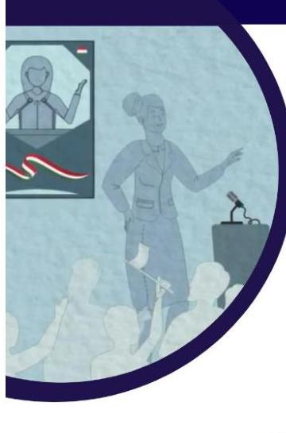

ÁSZ ellenőrzés
Az ellenőrzés célja értékelni, hogy a választási kampányra fordított állami és más pénzeszközök felhasználása a Ve. és a Kampányfinanszírozási törvény alapelvei betartásával történt-e, a pártok a Párt törvényben foglalt engedélyezett forrásokat használtak-e fel a kampány során.

## Új jelenségek

- Az MMM elnöke az ellenzéki összefogás miniszterelnök-jelöltje volt.
- Közös kampányt folytattak az ellenzéki összefogás vezetői (kampánytanácsban a pártok és az MMM is képviseltette magát).
- Közös kampányrendezvényeket tartottak, közös plakátokat, logót és egységes választási szlogeneket használtak.
- A miniszterelnök-jelölt 2022. évi nyilatkozata a központi kampány működtetését szolgáló „MMM-es számla" létezéséről.

ÁSZ-hoz érkező jelzések, információk

- NIK tájékoztatója (külföldi finanszírozás).
- Országgyűlési képviselő bejelentése melyben az MMM kivizsgálását kérte.

Sérülhettek a törvényben foglalt alapelvek:

- a választási eljárás tisztaságának elve;
- az esélyek egyenlőségének elve;
- a jóhiszemű és rendeltetésszerű joggyakorlás elve.

Mit tett az ÁSZ?

- Új ellenőrzési cselekmények.
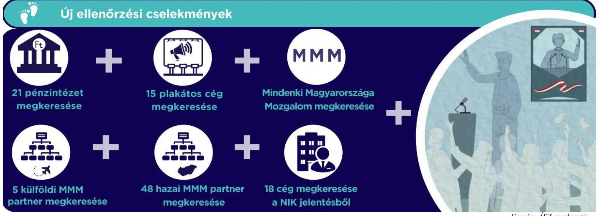

---

# IV. SZ. MELLÉKLET: A JELÖLŐ SZERVEZETEKET MEGILLETŐ KÖZPONTI KÖLTSÉGVETÉSI TÁMOGATÁS ÉS EGYÉB FORRÁS FELHASZNÁLÁSA

A JELÖLŐ SZERVEZETEKET A KAMPÁNYFINANSZÍROZÁSI TÖRVÉNY EGYES JOGCÍMEI SZERINT MEGILLETŐ KÖZPONTI KÖLTSÉGVETÉSI TÁMOGATÁS ÉS EGYÉB FORRÁS FELHASZNÁLÁSA (ADATOK M FT-BAN)

|  Jelölő
szervezet neve | Egyéni jelöltek által lemondott és felhasznált támogatás | Visszafizetési kötelezettség (kiesett és $1 \%$-ot el nem érő jelöltek után) | Pártlistát állító pártnak/ nemzetiségi listát állító országos nemzetiségi önkormányzatnak járó |  | Párthkegyék forrás felhasználása a Hivatalos Értesítőben közzétett adatok szezire | Összes felhasználás  |
| --- | --- | --- | --- | --- | --- | --- |
|   |  |  | központi költségvetési támogatás | központi költségvetési támogatásból a felhasználás |  |   |
|  Demokratikus Koalíció | 37,9 | - | 249,6 | 249,6 | 35,1 | 322,6  |
|  FIDESZ - KDNP | - | - | 706,2 | 706,2 | 344,8 | 1051,0  |
|  Jobbik | 34,3 | - | 169,1 | 169,1 | 77,8 | 281,1  |
|  LMP | 5,9 | - | 28,0 | 28,0 | 21,6 | 55,5  |
|  MKKP | - | 117,7 | 470,8 | 431,8 | - | 431,8 
 |
|  MSZP | 21,3 | - | 144,5 | 144,5 | 61,1 | 226,9  |
|  MEMO | 114,7 | - | 588,5 | 588,5 | 214,2 | 917,5  |
|  Mi Hazánk Mozgalom | - | - | 588,5 | 588,5 | 38,3 | 626,8  |
|  Momentum Mozgalom | 15,4 | - | 75,7 | 75,7 | 62,5 | 153,6  |
|  Párbeszéd | 7,1 | - | 39,3 | 39,3 | 23,0 | 69,4  |
|  MNOÓ | - | - | 191,1 | $189,5^{10}$ | - | 189,5  |
|  Összesen: | 236,6 | 117,7 | 3251,3 | 3210,7 | 878,4 | 4325,7  |

Forrás: ÁSZ szerkesztés a Kincstár nyilvántartása és a Hivatalos Értesítőben közzétett kampányelszámolások, tanúsítványi adatszolgáltatás alapján

[^0] [^0]: ${ }^{9}$ Az MKKP a fel nem használt $39,0 \mathrm{M}$ Ft-ot a Kincstár részére visszautalta. ${ }^{10}$ Az MNOÓ a fel nem használt $1,6 \mathrm{M}$ Ft támogatást visszafizette a Kincstárnak.

---

# V. SZ. MELLÉKLET: VÁLASZTÁSRA FORDÍTOTT PÉNZESZKÖZÖK FELHASZNÁLÁSA, ELSZÁMOLÁSA, ELLENŐRZÉSE - IDŐVONAL 

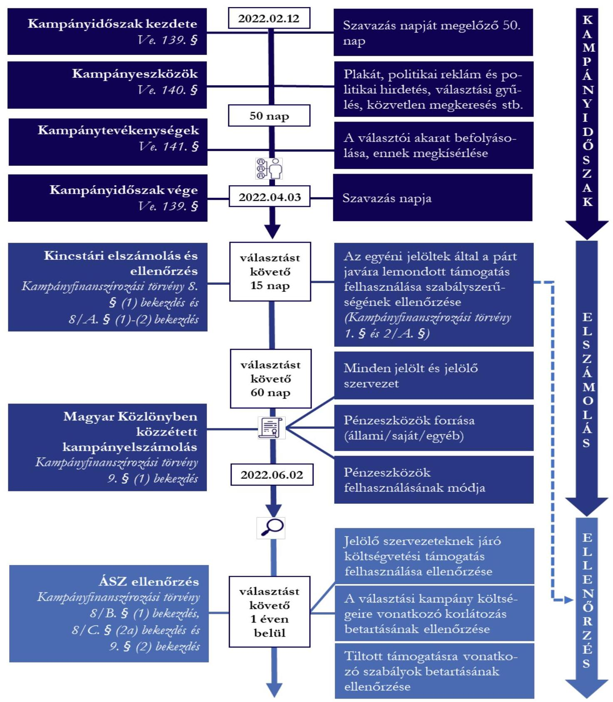

Forrás: ÁSZ szerkesztés a Ve. és a Kampányfinanszírozási törvény rendelkezései alapján

---

# VI. SZ. MELLÉKLET: AZ MMM KAMPÁNYKÖLTÉSEI

|  Sor-
szám | Kampányeszköz, tevékenység megnevezése | Típusa | Kifizetés |  | Indokolás  |
| --- | --- | --- | --- | --- | --- |
|   |  |  | tárgya | összege |   |
|  1. | MÁRCIUS 15.
A hatalom a népé kampány dal színpadi megszólaltatása, statiszta szervezés | választási gyűlések, kampányrendezvények | casting szereplő közvetítés | 1709420 | A számlán található megjegyzés: "Március 15.-ei megemlékezés"
A számlán a teljesítés dátuma: 2022.03.15.
A 2022. március 10-én kelt Vállalkozási szerződés szerint a Vállalkozó feladata az MMM, mint "Megrendelő által szervezett március 15. rendezvényen, Patti Smith 'People Have The Power' dalának magyar átirata, „A hatalom a népé" munkacímű „kampánydal" színpadi megszólaltatása (éneklése) statiszták által, illetve ennek az előadásnak a munka napján történő próbájához statisztaszervezés szolgáltatás".  |
|  2. | Kampányesemény,
CSAKFELFELÉ! -
MAKÓN MÁRKI-
ZAY PÉTER
Makó, lakossági
fórum | választási
gyűlések,
kampányrendezvények | rendezvény-
technikai
szolgáltatás
(Makó, dobogó+
világítás) | 22400 | A számla szerinti teljesítési időpont és a megnevezésben szereplő helyszín megegyezik a Facebook event információi alapján egy kampányrendezvény helyszínével és időpontjával.
A számlán található megnevezés: "900205 Rendezvénytechnikai szolgáltatás (Makó, dobogó + világítás.
A számlán a teljesítés kelte: 2022.03.28.
Facebook event információk a rendezvény vonatkozásában:
Esemény megnevezése: CSAKFELFELÉ! - MAKÓN MÁRKI-ZAY PÉTER
RÉSZTVEVŐK: Márki-Zay Péter miniszterelnök-jelölt, képviselőjelölt (Csongrád 04)
Karácsony Gergely, Budapest főpolgármestere, a Párbeszéd társelnöke
SZERVEZŐK: Kossuth kör-Makó, MMM, Márki-Zay Péter
Találkozzon Márki-Zay Péterrel, Magyarország miniszterelnök-jelöltjével és a körzet képviselőjelöltjével Makón!
Április 3-án szavazzon a valódi változásra! Legyen Magyarország mindannyiunké!
#csakfelfelé #MZP #egységbenmagyarországért  |
|  3. | Holnaptól Magyarország mindannyiunké Eredményvári Kampányzári Városligeti Műjégpálya | választási gyűlések, kampányrendezvények | egyéb humán-
egészségügyi
ellátás
(rendezvény
egészségügyi
biztosítása -
esetkocsi 3 fős
személyzet
kiemelt
mentéstechnikai
felszereléssel) | 0 | A számlán a teljesítés kelte: 2022.04.03.
Az ügyvezető 2023. március 14-i keltezésű nyilatkozatának 1) pontjában foglalt kérdésre adott válasz alapján az egészségügyi ellátás biztosítása a Hatpárti összefogás részére szervezett eredményvári rendezvényen történt.
Facebook event információk a rendezvény vonatkozásában:
Esemény megnevezése: Holnaptól Magyarország mindannyiunké - Eredményvári
SZERVEZŐK:
Márki-Zay Péter; MMM; LMP; Egységben Magyarországért; Párbeszéd; DK; MSZP; Momentum Várunk titeket április 3-án 18 órától az Egységben Magyarországért eredményvári eseményén a Műjégpályán, ahol óriáskivetítőkön követhetitek élőben az eredményvári adást!  |

---

|  Sor-
szám | Kampányeszköz, tevékenység megnevezése | Típusa | Kifizetés |  | Indokolás  |
| --- | --- | --- | --- | --- | --- |
|   |  |  | tárgya | összege |   |
|  4. | "LED-fal projekt" | választási gyűlések, kampányrendezvények | rendezvény-
technikai
szolgáltatás
szerződés
szerint,
18 helyszínen történő technikai szolgáltatás
Rendelésszám: 2203280403_ledfal_proj
ekt_18_helyszín | 9486800 | A számlán található Rendelésszám: "220328-0403_ledfal_projekt_18_helyszín". A számla megnevezésében: "18 helyszínen történő technikai szolgáltatás". A számlán a teljesítés dátuma: 2022.04.03.
Teljesítési igazolás: "Projekt szám: 220324-0403_ledfal_projekt_18_helyszín"
A 2022.03.22-én kelt vállalkozási szerződésben "Projekt szám: 2203240403_ledfal_projekt_18_helyszín", a szolgáltatás helyszínei: Balatonfüred, Eger, Esztergom, Gyöngyös, Gyula, Hódmezővásárhely, Kecskemét, Makó, Nagykanizsa, Ráckeve, Salgótarján, Szeged, Székesfehérvár, Szekszárd, Vác, Várpalota, Vecsés, Veszprém, a szolgáltatási időszak kezdete: 2022. március 24., vége: 2022. április 3.
A mellékelt fotókon, a LED falon a 2022. évi országgyűlési választásokon közös listát állító Hatpárti összefogás szlogenje (A HATALOM A NÉPÉ!) szerepel.  |
|  5. | "LED-fal projekt" | választási gyűlések, kampányrendezvények | Biztonsági tevékenység 18 helyszín | 9381744 | A számla tárgya: Biztonsági tevékenység, mennyiség 18 helyszín. A számlán a teljesítés kelte: 2022.03.22.
2022.03.22-én kelt megrendelés szerint: "...megrendelem az egyeztetett LED-falhoz kapcsolódó szolgáltatásokat 18 helyszínen a Mindenki Magyarországa Mozgalom nevében."  |
|  6. | "LED-fal projekt" | választási gyűlések, kampányrendezvények | Biztonsági tevékenység 18 helyszín | 9381744 | A számla tárgya: Biztonsági tevékenység, mennyiség 18 helyszín. A számlán a teljesítés kelte: 2022.03.25.
2022.03.22-én kelt megrendelés szerint: "...megrendelem az egyeztetett LED-falhoz kapcsolódó szolgáltatásokat 18 helyszínen a Mindenki Magyarországa Mozgalom nevében."  |
|  7. | "LED-fal projekt" | választási gyűlések, kampányrendezvények | Mns. előadó-
művészetet
kiegészítő
tevékenység
(LED27 projekt) | 50406300 | A számlán található megjegyzés: "LED18 projekt"
A számlán a teljesítés dátuma: 2022.03.23.
A 2022.03.23-án kelt szolgáltatási szerződésben rögzített esemény: "LED27 projekt", Üzemeltetés helye: Csatolt árajánlat alapján, Üzemeltetés ideje: 2022. március 28 - 2022. április 3.
A mellékelt fotókon, a LED falon a 2022. évi országgyűlési választásokon közös listát állító Hatpárti összefogás szlogenje (A HATALOM A NÉPÉ!) szerepel.  |
|  8. | "LED-fal projekt" | választási gyűlések, kampányrendezvények | rendezvény-
technikai
szolgáltatás
(Hangosítás
18 db kihelyezett
LEDfalhoz
Magyarország
különböző
városaiban.) | 4160520 | A számlán található megjegyzés: "Hangosítás 18 db kihelyezett LEDfalhoz Magyarország különböző városaiban."
A számlán a teljesítés dátuma: 2022.03.22.
2022.03.22-én kelt megrendelés szerint: "...megrendelem az egyeztetett LED-falhoz kapcsolódó szolgáltatásokat 18 helyszínen a Mindenki Magyarországa Mozgalom nevében."  |

---

|  Sorszám | Kampányeszköz, tevékenység megnevezése | Típusa | Kifizetés |  | Indokolás  |
| --- | --- | --- | --- | --- | --- |
|   |  |  | tárgya | összege |   |
|  9. | Legyen
Magyarország mindannyiunké! -
Márki-Zay Péter
Budafokon | választási gyűlések, kampányrendezvények | Budafok
Vásártér -
színpadtechnikai
szolgáltatás,
hangosítás | 195000 | A számlán egyértelműen szerepel, hogy Budafok Vásártéren volt a hangosítás. A youtube-on megtalálható videó szerint a kampány-eseményre ott került sor Tóth Endre, Donáth Anna és Márki-Zay Péter részvételével.
A kampánygyűlésről készült, a youtube-on megtalálható videón a résztvevők mögött lévő épület homlokzatán a "Budafoki Szomszédok piaca" felirat olvasható, amely a vállalkozó számláján és nyilatkozatában is nevesítve van, mint helyszín.
Facebook event információk a rendezvény vonatkozásában:
Esemény megnevezése: Legyen Magyarország mindannyiunké! - Márki-Zay Péter Budafokon
RÉSZTVEVŐK: Márki-Zay Péter miniszterelnök-jelölt, Tóth Endre képviselőjelölt (Budapest 18); Donáth Anna a Momentum elnöke; Majtényi László alkotmányjogász; Molnár Gyula országgyűlési képviselő
SZERVEZŐK: Márki-Zay Péter; Tóth Endre; MMM
Találkozzon Márki-Zay Péterrel, Magyarország miniszterelnök-jelöltjével és a körzet képviselőjelöltjével, Tóth Endrével Budafokon! Április 3-án szavazzon a valódi változásra! Legyen Magyarország mindannyiunké!  |
|  10. | Hódmezővásárhely, Balogh Imsi Sportcsarnok országos választás közvetítése | választási gyűlések, kampányrendezvények |  |  | 0 A számlán a teljesítés időpontja: 2022.04.03.
Az egyéni vállalkozó 2023.03.09-én kelt írásbeli nyilatkozata szerint: "...a MMM-el 2022. április 3-án álltam egyszeri egy alkalmas megbízási szerződés alapján jogviszonyban.
Hódmezővásárhelyen a Balogh Imsi Sportcsarnokban kellett hangosítási és vetítési munkát végeznem. Az országos választást kellett kibangosítani és kivetíteni a szervezők által letelepített számítógépről, amit a szervezők üzemeltettek!"  |
|  11. | Eredményváró esemény | választási gyűlések, kampányrendezvények | bérleti díj |  | 0 Az Egyedi Albérleti Szerződés szerinti helyszín (Városligeti Műjégpálya) a Hatpárti összefogás április 3-i választás eredményvárójának helyszíne.
Az Egyedi Albérleti Szerződés 2. pontja rögzíti az albérlet célját, miszerint "Albérlő eredményváró eseményt szervez..."
Az Egyedi Albérleti Szerződés 1. pontja rögzíti, hogy "Vébérlő albérletbe adja, Albérlő pedig bérbe veszi a Városligeti Műjégpálya alábbi területeit, valamint Történelmi Korcsolyacsarnokában található lent felsorolt helyiségeit a következő időtartamokban:
2022.04.02-án 6:00 és 2022.04.04. 12:00 óra között a Tómedret a T2 előtti területtel együtt, parkolási lehetőséggel.
2022.04.03-án és 2022.04.04-én a bontási idő végéig a csatolót, a sétányt, a tárgyalót, az északi ruhatárat, a melegedőt és a Városligeti Műjégpálya északi szárnyában található helyiséget."  |
|  12. | Eredményváró esemény | választási gyűlések, kampányrendezvények | bérleti díj |  | 0 Az Egyedi Albérleti Szerződés szerinti helyszín (Városligeti Műjégpálya) a Hatpárti összefogás április 3-i választás eredményvárójának helyszíne.
Az Egyedi Albérleti Szerződés 2. pontja rögzíti az albérlet célját, miszerint "Albérlő eredményváró eseményt szervez..."
Az Egyedi Albérleti Szerződés 1. pontja rögzíti, hogy "Vébérlő albérletbe adja, Albérlő pedig bérbe veszi a Városligeti Műjégpálya Disztermét az alábbi időtartamokban:
2022.04.02-án a bepakolás kezdetétől 2022.04.04-én a bontás végéig"  |

---

|  Sorszám | Kampányeszköz, tevékenység megnevezése | Típusa | Kifizetés |  | Indokolás  |
| --- | --- | --- | --- | --- | --- |
|   |  |  | tárgya | összege |   |
|  13. | Rendezvény rögzítése | választási gyűlések, kampányrendezvények | Műsor gyártása | 1 270 000 | A számla szerint a teljesítés dátuma megegyezik a Facebook event információi alapján egy kampányrendezvény (Országértékelő rendezvény Márki-Zay Péterrel) időpontjával. A számlán szerepel: "Változás 2022-Országértékelő Márki-Zay Péterrel" - szerződés szerint.  |
|   |  |  |  |  | Facebook event információk alapján az esemény kampányrendezvény, a Hatpárti összefogáshoz köthető. Esemény megnevezése: Országértékelő rendezvény Márki-Zay Péterrel "Az április 3-i történelmi választáson dönthetünk arról, melyek úton menjünk tovább." Szervezők: Márki-Zay Péter; Kunhalmi Ágnes; Dobrev Klára; Karácsony Gergely Az eseményen felszólalnak: Márki-Zay Péter Miniszterelnök-jelölt, Egységben Magyarországért Dobrev Klára Európai parlamenti képviselő, Demokratikus Koalíció Jakab Péter Országgyűlési képviselő, Jobbik Magyarországért Mozgalom elnöke Donáth Anna Európai parlamenti képviselő, Momentum Mozgalom elnöke Kunhalmi Ágnes Országgyűlési képviselő, Magyar Szocialista Párt társelnöke Kanász-Nagy Máté, Lehet Más a Politika társelnöke Karácsony Gergely Budapest főpolgármestere, Párbeszéd Magyarországért társelnöke  |
|  14. | Kampány szervezése | választási gyűlések, kampányrendezvények | Kampány szervezése | 200 000 | A számla szerint a teljesítés dátuma megegyezik a Facebook event információi alapján egy kampányrendezvény (Országértékelő rendezvény Márki-Zay Péterrel) időpontjával. A számlán szerepel: "Kampányszervezés" Facebook event részletes információi jelen táblázat 16. ssz. sorában az indokolásban találhatóak.  |
|  15. | Rendezvény rögzítése | választási gyűlések, kampányrendezvények | Műsor gyártása | 1 270 000 | A számlán szerepel: "Csak felfelé! - Az emelkedő Magyarország programja" - szerződés szerint" Facebook event információk alapján az esemény kampányrendezvény, a Hatpárti összefogáshoz köthető. Esemény megnevezése: Csak felfelé! – Az emelkedő Magyarország programja Szervezők: Márki-Zay Péter, Egységben Magyarországért, LMP, Momentum, MSZP, MMM, Párbeszéd Felszólalnak: Márki-Zay Péter, Magyarország miniszterelnök-jelöltje Hadházy Ákos országgyűlési képviselő (Momentum) Komjáthi Imre, az MSZP elnökhelyettese és országgyűlési képviselőjelöltje Szabó Tímea, a Párbeszéd társelnöke és frakcióvezetője Arató Gergely, a DK országgyűlési képviselője Z. Kárpát Dániel, a Jobbik alelnöke és országgyűlési képviselője Lengyel Róbert, Siófok polgármestere, az MMM elnökségi tagja Schmuck Erzsébet, az LMP társelnöke és országgyűlési képviselője  |

---

|  Sor-
szám | Kampányeszköz,
tevékenység
megnevezése | Típusa | Kifizetés |  | Indokolás  |
| --- | --- | --- | --- | --- | --- |
|   |  |  | tárgya | összege |   |
|  16. | Hódmezővásárhely,
Balogh Imsi
Sportcsarnok
országos választás
közvetítése | választási
gyűlések,
kampány-
rendezvények | Balogh Imsi
Aréna bérlet,
Küzdőtér
leborítása,
felszedése,
székek pakolása | 0 | A számlán szerepel: "Bérlet célja: 2022. évi Választás eredményeiről rendezvény, Időpontja: 2022.04.03.
20:00- 24:00-ig"  |
|   |  |  |  |  | A fentieken túl egy másik MMM partner adatszolgáltatása alapján rögzítésre kerül:
Az egyéni vállalkozó 2023.03.09-én kelt írásbeli nyilatkozata szerint:"...a MMM-el 2022. április 3-án állítottam egyszeri egy alkalmas megbízási szerződés alapján jogviszonyban.
Hódmezővásárhelyen a Balogh Imsi Sportcsarnokban kellett bányosítási és vetítési munkát végeznem. Az országos választást kellett kibányosítani és kivetíteni a szervezők által letelepített számítógépeitől, amit a szervezők üzemeltettek!"  |
|  Választási gyűlések, kampányrendezvények összesen: |  |  |  | 87483928 |   |
|  17. | A hatalom a népé kampány dal színpadi megszólaltatása, statiszta szervezés | egyéb
kampány-
eszközök | casting szereplő közvetítés | 853440 | A számlán található megjegyzés: "Kampány dal"
A számlán a teljesítés dátuma: 2022.03.01.
A 2022. február 28-án kelt Vállalkozási szerződés szerint: "Vállalkozó a Megrendelő által szervezett videoklip forgatásra, Patti Smith 'People Have The Power' dalának magyar átiratához, „A hatalom a népé" munkacímű „kampánydal" projekt elkészítése tekintetében statisztaszervezés szolgáltatás teljesítését vállalja Megrendelő részére."  |
|  18. | Nyomdai szolgáltatás | szórólapok | Választási
szórólap +
szállítás | 283870 | A számla szerinti teljesítést igazoló szórólap azt támasztja alá, hogy az, az országgyűlési választási kampányra készült. A szórólap a Hatpárti összefogás miniszterelnök-jelöltjének a választási szórólapja. A szórólap előlapján szerepel, hogy "Márki-Zay Péter az ellenzők közös miniszterelnökjelöltje", az "Egységben Magyarországért" szlogen, valamint a Hatpárti összefogás pártjai és az MMM logója. A szórólap hátoldalán Márki-Zay Péter bemutatkozása, valamint szavazásra történő felhívás szerepel.  |
|  19. | Nyomdai szolgáltatás | egyéb
kampány-
eszközök | Tyvek karszalag 500 db Roll-up 200x250 cm 1 db | 104178 | A megrendelésben szerepel, hogy "A költségeiseit az MMM nekik: kell majd számlázzond."
A megrendelésből másolatot kapott az MMM-el 2021. december 1-jével megkötött szerződés szerint, a 2022-es választási kampány támogatásával összefüggő feladatok ellátásával megbízott személy, aki nem függetleníthető a Hatpárti összefogástól, tekintettel arra, hogy az MMM elnöke a közös országos lista 1. helyén volt és a Hatpárti összefogás közös miniszterelnök-jelöltje. A megbízási szerződéssel kapcsolatos információk részletesen a jelen táblázat 2. ssz. soránál az indokolásban találhatóak.
A kampánytárgyról megküldött fotón a következő feliratok szerepelnek
CSAK FELFELÉ!
EGYSÉGBEN MAGYARORSZÁGÉRT
Hatpárti összefogás pártjai és az MMM logója.  |

---

|  Sor-
szám | Kampánveszköz, tevékenység megnevezése | Típusa | Kifizetés |  | Indokolás  |
| --- | --- | --- | --- | --- | --- |
|   |  |  | tárgya | összege |   |
|  20. | Nyomdai szolgáltatás | egyéb kampányeszközök | Matrica 53000 db | 491363 | A matricák felirata az országgyűlési választási kampányra készült.
A számla alapján 6 féle matrica gyártása történt az alábbi, a Hatpárti összefogás által használt kampányszlogeneket tartalmazó feliratokkal:
CSAK FELFELÉ!
ÁPRILIS 3.
CSAK FELFELÉ!
LEGYEN MAGYARORSZÁG MINDANNYIUNKÉ! ÁPRILIS 3.-TÓL!
LEGYEN MAGYARORSZÁG MINDANNYIUNKÉ!)
CSAK FELFELÉ! HADD ÍRJAM ÉN IS ALÁ
KELETI HITEL VAGY NYUGATI OKTATÁS?  |
|  21. | Nyomdai szolgáltatás | egyéb kampányeszközök | Vászontáska, hosszútülü, natúr 500 db
Műanyag
golyóstoll 500 db
Bevásárlókocsi
érme 500 db
Öngyújtó,
tűzköves
1000 db
Hűtőmágnes
500 db | 358775 | A dokumentumok azt támasztják alá, hogy a tárgyak feliratozása az országgyűlési választási kampányra készült.
A kampánytárgyakról megküldött fotókon a következő, a Hatpárti összefogás által használt kampányszlogeneket tartalmazó feliratok szerepelnek:
Műanyag golyóstoll:
LEGYEN MAGYARORSZÁG MINDANNYIUNKÉ!
Bevásárlókocsi érme:
LEGYEN MAGYARORSZÁG MINDANNYIUNKÉ!
Öngyújtó:
LEGYEN MAGYARORSZÁG MINDANNYIUNKÉ!  |
|  22. | Nyomdai szolgáltatás | egyéb kampányeszközök | Textilnyomtatás 1 db | 41783 | A termék feliratozása az országgyűlési választási kampányra készült.
A kampánytárgyról megküldött fotón a következő felirat szerepel:
EGYSÉGBEN MAGYARORSZÁG SZÍVÉÉRT
BUDAPEST ÉS AGGLOMERÁCIÓ EGYÜTT TÖBB  |
|  23. | Nyomdai szolgáltatás | egyéb kampányeszközök | Dekoráció
Sajtóterem 2 db
Plexi pulpitus 2 db
Megállítótábla,
A alakú, B1 2 db
Roll-up, 100x200
4 db
Pulpitus dekoráció
csere 4 db
Nyomatcsere rollup szerkezetben 1 db | 834263 | A dokumentumok azt támasztják alá, hogy a tárgyak feliratozása az országgyűlési választási kampányra készült.
A kampánytárgyakról megküldött fotókon a következő feliratok szerepelnek:
Az EGYSÉGBEN MAGYARORSZÁGÉRT felirat alatt a Hatpárti összefogás pártjai és az MMM logója.
LEGYEN MAGYARORSZÁG MINDANNYIUNKÉ!
TALÁLKOZZON MAGYARORSZÁG KÖVETKEZŐ MINISZTERELNÖKÉVEL!
MÁRKI-ZAY PÉTER MAGYARORSZÁG MINISZTERELNÖK-JELÖLTJE
CSAK FELFELÉ!  |

---

|  Sor-
szám | Kampánveszköz, tevékenység megnevezése | Típusa | Kifizetés |  | Indokolás  |
| --- | --- | --- | --- | --- | --- |
|   |  |  | tárgya | összege |   |
|  24. | Nyomdai szolgáltatás | egyéb kampányeszközök | Plakát A3 500 db
Matrica 2000 db | 209550 | A dokumentumok azt támasztják alá, hogy a tárgyak feliratozása az országgyűlési választási kampányra készült.
A matrica alján a bal oldalon apró betűvel: 220113-NegatívKampany-Felulragasztas-Covid$400 \times 150$.indd  |
|  25. | Nyomdai szolgáltatás | egyéb kampányeszközök | Nyomtatás
Szavazat-
számálás
csomagolás
150 db | 301404 | A matricákon szereplő feliratok:
Ásó, kapa, Yachtkaland alatta közéleti szereplők rajzolt képe.  |
|  26. | Nyomdai szolgáltatás | egyéb kampányeszközök | Matrica 10 féle | 361950 | A dokumentumok azt támasztják alá, hogy a gyártott matricák az országgyűlési választási kampányra készültt.
Az aláírásgyűjtő dobozokhoz készített csomagoláson a Hatpárti összefogás által használt kampányszlogen szerepel: "LEGYEN MAGYARORSZÁG MINDANNYIUNKÉ!".
A dokumentumok azt támasztják alá, hogy a gyártott matricák az országgyűlési választási kampányra készültek.
Megrendelés e-mailben található üzenet szövege: "Ugyanígy az MMM fizeti".
A matricákon az MFM (Minden Fiatal Magyarországa) logója szerepel.
A matricákon szereplő feliratok:
Ásó, kapa, Yachtkaland, alatta közéleti szereplők rajzolt képe.  |
|  27. | Nyomdai szolgáltatás | egyéb kampányeszközök | Autómágnes (100 db) | 796290 | Az autómágnes fotója azt támasztja alá, hogy az, az országgyűlési választási kampányra készült.
Az autómágnesen szereplő felirat a Hatpárti összefogás által használt kampányszlogenje: "CSAK FELFELÉ! ÁPRILIS 3."  |
|  28. | Nyomdai szolgáltatás | egyéb kampányeszközök | Kampány
tárgyak készítése
Matrica
70000 db
Matrica
20000 db
Hűtőmágnes
500 db | 1012825 | A dokumentumok azt támasztják alá, hogy a tárgyak az országgyűlési választási kampányra készültek.
A Megrendelés e-mailben, az üzenet szövege: "Mehet az MMM számlájára az egész, az adatokat szerintem már tudod."
A kampánytárgyak felirata:
Matricák: Márki-Zay Péter arcképe alatta SZAVAZZ! Különböző színekben
Hűtőmágnes: MÁRKI-ZAY PÉTER BOKRÉTA
a magyar politika szomorú szürke kalapján  |

---

|  Sor-
szám | Kampánveszköz, tevékenység megnevezése | Típusa | Kifizetés |  | Indokolás  |
| --- | --- | --- | --- | --- | --- |
|   |  |  | tárgya | összege |   |
|  29. | MÁRCIUS 15.
Nyomdai szolgáltatás | egyéb kampányeszközök | Kampány tárgyak készítése
Széldzseki emblémázás 1 db
Tapsrúd 2250 db
Zászló 750 db
Bevásárlókocsi érme 5000 db
Műanyag
golyóstoll
2500 db
Vászontáska, hosszútúlú, natúr 500 db | 12514580 | A dokumentumok azt támasztják alá, hogy a tárgyak az országgyűlési választási kampányra készültek.
Az árajánlatban szerepel, hogy az ajánlatot a március 15-i rendezvényhez kapcsolódó ajándéktárgyakra adja meg a vállalkozó.
Az ajándéktárgyak felirata
Széldzseki: ÁPRILIS 3., LEGYEN MAGYARORSZÁG MINDANNYIUNKÉ!, CSAK FELFELÉ!
Tapsrudak: ÁPRILIS 3., A HATALOM A NÉPÉ!
Bevásárlókocsi érme: LEGYEN MAGYARORSZÁG MINDANNYIUNKÉ!
Műanyag golyóstoll: LEGYEN MAGYARORSZÁG MINDANNYIUNKÉ!, SZAVAZZ MÁRKI-ZAY PÉTERRE!
Vászontáska: LEGYEN MAGYARORSZÁG MINDANNYIUNKÉ!  |
|  30. | MÁRCIUS 15.
Nyomdai szolgáltatás | egyéb kampányeszközök | Kampány tárgyak készítése
Térkép nyomtatása 1 db
Cápazászló szerkezettel 4 db
Csatlakozz táblák 1 db
Pulpituscsík 1 db
Tábla 3 db
Tábla 300 db
Matrica
1000 db
Széldzseki 50 db
Tábla 50 db
Tábla 20 db
Matrica 500 db
Matrica
15000 db
Roll-up, 200x200
cm, 1 db
Programfüzet
nyomtatás,
A4 70 db | 2814518 | A dokumentumok azt támasztják alá, hogy a tárgyak az országgyűlési választási kampányra készültek.
A budapesti kampányszórólap megrendelésről szóló e-mailben szerepel: "Momentum bulnap jelez még vissza, de szerintem max még 5 jelölti anyaggal bővül a lista" + 1 Szabó Rebolsa szövegét,.... "
Az árajánlaton szerepel, hogy az ajánlatokat a március 15-i rendezvényhez adják.
A cápa zászlón szereplő felirat: CSAK FELFELÉ! SZAVAZZON ÁPRILIS 3-ÁN, MÁRKIZAY PÉTERT MINISZTERELNÖKNEK!, LEGYEN MAGYARORSZÁG MINDANNYIUNKÉ!, Az EGYSÉGBEN MAGYARORSZÁGÉRT felirat alatt a Hatpárti összefogás pártjai és az MMM logója.
Táblák felirata: CSATLAKOZZ!, Az EGYSÉGBEN MAGYARORSZÁGÉRT felirat alatt a Hatpárti összefogás pártjai és az MMM logója.
A HATALOM A NÉPÉ!, KORMÁNYVÁLTÓ NAGYGYŰLÉS 2022. MÁRCIUS 15. 15:00 MŰEGYETEM RAKPART
Putyin fejét áthúzva ábrázoló tábla felirat nélkül
Pulpituscsík felirat: "CSAK FELFELÉ"
Matrica felirat: "húzzatok a *ba", Stop Putyin
ÁPRILIS 3., SZAVAZTAM!, BÜSZKE KORMÁNYVÁLTÓ
Széldzseki felirat: LEGYEN MAGYARORSZÁG MINDANNYIUNKÉ!  |

---

|  Sor-
szám | Kampányeszköz, tevékenység megnevezése | Típusa | Kifizetés |  | Indokolás  |
| --- | --- | --- | --- | --- | --- |
|   |  |  | tárgya | összege |   |
|   |  |  | Matrica QR, Ne add fel 10000 db
Plakát A/3 Ne
add fel, 200 db
Szórólap
nyomtatás
5000 pld
Teacímke
6000 db
Szórólap
nyomtatás
20000 pld
Matrica
5000 db
Szórólap
nyomtatás
88000 pld
Szórólap
nyomtatás
15000 pld
Plakát A/4
200 db
Matrica
15000 db |  | Programfüzet: CSAK FELFELÉ! AZ EMELKEDŐ MAGYARORSZÁG PROGRAMJA; LEGYEN MAGYARORSZÁG MINDANNYIUNKÉ!
Az EGYSÉGBEN MAGYARORSZÁGÉRT felirat alatt a Hatpárti összefogás pártjai és az MMM logója, Támogató szervezet: MMM
MINISZTERELNÖKI KAMPÁNYCSAPAT  |
|   |  |  |  |  | Szórólapok felirata: LEGYEN MAGYARORSZÁG MINDANNYIUNKÉ!,
EREDMÉNYVÁRÓ 2022. ÁPRILIS 3., KÜLDJ SMST HÁROM A KORMÁNYVÁLTÁST, TÁMOGATÓ ISMERŐSÖDNEK!, KIADÓ: MAGYAR SZOCIALISTA PÁRT, ÁPRILIS 3., EGYÜTT GYŐZNI FOGUNK!, VÉGRE VALÓDI ESÉLYÜNK VAN A KORMÁNYVÁLTÁSRA.
Budapesti szórólapok felirata: Valamennyi szórólapon szerepel: ÁPRILIS 3. LEGYEN BUDAPEST MINDANNYIUNKÉ
Valamennyi szórólapon szerepel Karácsony Gergely főpolgármester és az Egységben Magyarországért közös jelöltje.
Arató Gergely Budapest 09. OEVK; Szabó Tímea Budapest 10. OEVK; Hajnal Miklós Budapest 03. OEVK; Orosz Anna Budapest 02. OEVK; Varju László Budapest 11. OEVK; Barkóczi Balázs Budapest 12. OEVK; Tóth Endre Budapest 18. OEVK; Szél Bernadett Budapest 02. OEVK; Dorosz Dávid Budapest 05. OEVK; Vajda Zoltán Budapest 13. OEVK; Dr. Hiller István Budapest 16. OEVK; Kunhalmi Ágnes Budapest 15. OEVK; Tordai Bence Budapest 04. OEVK; Hiszékeny Dezső Budapest 07. OEVK; Dr. Oláh Lajos Budapest 05. OEVK; Jámbor András Budapest 06. OEVK; Csárdi Antal Budapest 01. OEVK; Ezen túlmenően a képviselőjelöltek 3 - a választókerületre vonatkozóan tett - vállalása.
A teacímke felirat: "Csak felfelé"  |

---

|  Sor-
szám | Kampányeszköz, tevékenység megnevezése | Típusa | Kifizetés |  | Indokolás  |
| --- | --- | --- | --- | --- | --- |
|   |  |  | tárgya | összege |   |
|  31. | Nyomdai szolgáltatás | egyéb kampányeszközök és szórólap | Kampány tárgyak készítése
Tyvek karszalag: 3960 db badge: 750 db szórólap (3 mondat): 1000 pld Tábla eredményváró matricákkal: 15 db | 0 | A dokumentumok azt támasztják alá, hogy a tárgyak az országgyűlési választási kampányra készültek.
Az árajánlatban szereplő tárgyak a választási kampány eredményváró rendezvényéhez kapcsolódó kellékek.
Tyvek karszalag felirat: "Legyen Magyarország mindannyiunké! Eredményváró 2022"
A badge felirat: "Eredményváró 2022. április 3."
A szórólap felirat: LEGYEN MAGYARORSZÁG MINDANNYIUNKÉ!, EREDMÉNYVÁRÓ 2022. ÁPRILIS 3
A fotón szerepel Márki-Zay Péter, Dobrev Klára, Jakab Péter, Karácsony Gergely, Fekete Győr András
Az EGYSÉGBEN MAGYARORSZÁGÉRT felirat alatt a Hatpárti összefogás pártjainak logója, támogató szervezet: MMM
A másik szórólapon a következő szöveg olvasható:
LEGYEN MAGYARORSZÁG MINDANNYIUNKÉ!
EREDMÉNYVÁRÓ 2022. ÁPRILIS 3.
KÜLDJ SMST HÁROM A KORMÁNYVÁLTÁST TÁMOGATÓ ISMERŐSÖDNEK!
KIADÓ: MAGYAR SZOCIALISTA PÁRT
Táblák felirata: 2022.04.03-i eredményváró rendezvényre készült útbaigazító táblák magyar és angol nyelven a következő feliratokkal.
"VENDÉG", "SAJTÓ", "STÁB", "PÁRT", "CREW"; "ALL ACCESS" EREDMÉNYVÁRÓ 2022. ÁPRILIS 3.
Az árajánlatot az eredményváró rendezvényhez kapcsolódóan adták meg.  |

---

|  Sor-
szám | Kampányeszköz, tevékenység megnevezése | Típusa | Kifizetés |  | Indokolás  |
| --- | --- | --- | --- | --- | --- |
|   |  |  | tárgya | összege |   |
|  32. | Nyomdai szolgáltatás | egyéb kampányeszközök | Kampány tárgyak készítése Vászontáska, hosszútulú, natur, Emblémázva, 2000 db Vászontáska, hosszútulú, natur, Emblémázva, 2000 db Öngyújtó, tűzköves Emblémázva, 5000 db Bevásárlókocsi érme Emblémázva, 10000 db Műanyag golyóstoll Emblémázva, 13000 db Nyakpánt 500 db Kitűző, 32 mm 5000 db Hűtőmágnes 10000 db | 5407025 | A dokumentumok azt támasztják alá, hogy a tárgyak az országgyűlési választási kampányra készültek.
A kampánytárgyakon szereplő feliratok:
Vászontáska, hosszútulú, natur, Emblémázva: LEGYEN MAGYARORSZÁG MINDANNYIUNKÉ!, CSAK FELFELÉ
Öngyújtó, tűzköves Emblémázva: LEGYEN MAGYARORSZÁG MINDANNYIUNKÉ!
Bevásárlókocsi érme Emblémázva: LEGYEN MAGYARORSZÁG MINDANNYIUNKÉ!
Műanyag golyóstoll Emblémázva: LEGYEN MAGYARORSZÁG MINDANNYIUNKÉ!
Nyakpánt: LEGYEN MAGYARORSZÁG MINDANNYIUNKÉ!
Kitűző: CSAK FELFELÉ
Hűtőmágnes: LEGYEN MAGYARORSZÁG MINDANNYIUNKÉ!, ÁPRILIS 3., MÁRKIZAY PÉTER  |
|  33. | MÁRCIUS 15.
Nyomdai szolgáltatás | egyéb kampányeszközök és szórólap | Kampány tárgyak készítése Papírzászló 2250 db
Műanyag promóciós kínáló 15 db Kitelepülőpult matrica 15 db Korona matrica | 16864692 | A dokumentumok azt támasztják alá, hogy a tárgyak az országgyűlési választási kampányra készültek.
Az árajánlatokon szerepel, hogy az ajánlatot a március 15-i rendezvényhez kapcsolódó kellékekre adják meg.
Az egyes legyártott termékeken szereplő feliratok:
Táblák és matricák: LEGYEN MAGYARORSZÁG MINDANNYIUNKÉ!
Az EGYSÉGBEN MAGYARORSZÁGÉRT felirat alatt a Hatpárti összefogás pártjainak és az MMM logója.
ÜZENJ A VÁLTOZÁSÉRT!
A HATALOM A NÉPÉ!  |

---

|  Sor-
szám | Kampányeszköz, tevékenység megnevezése | Típusa | Kifizetés |  | Indokolás  |
| --- | --- | --- | --- | --- | --- |
|   |  |  | tárgya | összege |   |
|   |  |  | 20 db
Felírótábla, egyedi 200 db Hűtőmágnes 5000 db
Pulpitus tábla 2 db
Matrica QR kódos 20 db
Szórólap nyom.
Dalszöveg
4000 pld
Dekoráció 1 db
Tábla 1 db
Molinó 3 db
Integréttábla
10000 db
Tyvek karszalag 500 db
Badge gyártás 500 db
Nyakpánt 500 db
Strandzászló
szerkezettel 6 db |  | Orbán Viktor arcképe várakozni tilos táblában
CSAK FELFELÉ! ÁPRILIS 3.
Hűtőmágnes: LEGYEN MAGYARORSZÁG MINDANNYIUNKÉ! 04.03 MÁRKI-ZAY PÉTER
Pulpitus tábla: CSAK FELFELÉ!
Szórólapok: Dalszöveg A HATALOM A NÉPÉ!
Papírzászló magyar: A HATALOM A NÉPÉ!
Tyvek karszalag: Lehet, hogy az olaj keletről jön, de a szabadság nyugatról érkezik
Badge: A HATALOM A NÉPÉ!
2022. március 15.
Strandzászló: CSAK FELFELÉ!, SZAVAZZON ÁPRILIS 3-ÁN, MÁRKI-ZAY PÉTERT MINISZTERELNÖKNEK!, LEGYEN MAGYARORSZÁG MINDANNYIUNKÉ!, Az EGYSÉGBEN MAGYARORSZÁGÉRT felirat alatt a Hatpárti összefogás pártjai és az MMM logója  |
|  34. | Nyomdai szolgáltatás | szórólapok | A/5 Tájékoztató | 810646 | A szórólapok fotója alátámasztja, hogy azok az országgyűlési választási kampányra készültek. A kampánytárgyról megküldött fotón a következő feliratok szerepelnek:
"Választási bűncselekmény nyomravezetői díja." A szórólapon szerepel a "Csak felfelé" felirat. Továbbá a másik szórólapon Márki-Zay Péter fotója mellett április 3. felirat és megtalálható a szórólap hátoldalán a Hatpárti összefogás pártjainak logója is.  |

---

|  Sor-
szám | Kampányozó
tevékenység
megnevezése | Típusa | Kifizetés |  | Indokolás  |
| --- | --- | --- | --- | --- | --- |
|   |  |  | tárgya | összege |   |
|  35. | Nyomdai
szolgáltatás | szórólap
(a számla 2.
tétele
bizonyított
összegként a
Kiadványok
típusnál,
a 113.
sorszámon
kerül
feltüntetésre) | Digitális
nyomtatás
(etikett, A/3
újság, A/5
szórólap) | 38 862 | Számla tételei alapján:
1. Etikett címke: A megküldött etikett címkéken Márki-Zay Péter fotója, neve szerepel, mellette: Magyarország térképe, benne az MMM logója és a "Segíts itt......... (település név) Gyertek velünk szeretetországba" szöveg. Az alatta levő szövegrész kitakarásra került valamennyi megküldött etikett címkén. (az interneten fellelhető etikett címkén a kitakart rész telefonszámot tartalmaz) Az etikett címkék a választásokra, a kampányra, illetve a Hatpárti összefogásra utaló szöveget nem tartalmaz, ezért kampányköltséget alátámasztó bizonyítékként nem vehető figyelembe.
2. A "Nyomtass te is!" című újság 2022. január 25-i számát küldték meg. (A megküldött lapszám kampányidőszakon kívüli, a számlán feltüntetett teljesítési időpont azonban kampányidőszak alatti: 2022. március 16.)
Az újság 4 oldalas, ebből csak 2 oldal került megküldésre. A megküldött 2 oldalról 3 cikk aktuális politikai kérdésekhez kapcsolódik, egy cikk hozható összefüggésbe a választásokkal. Ebben felhívást tesznek közzé, szavazatszámlálók jelentkezését várják a megjelölt e-mail címen, ill. telefonszámon.
3. Szórólapok: A szórólapokon Márki-Zay Péter fotója, alatta a "SZAVAZZ" felirat.  |
|  36. | Nyomdai
szolgáltatás | szórólapok | Digitális
nyomtatás | 93 345 | A szórólapon egyértelműen szerepel az országgyűlési választás időpontja, a 2022.04.03-i dátum.  |
|  37. | Nyomdai
szolgáltatás | szórólapok | Szórólap MZP
kampányzáró | 126 000 | A dokumentumok alátámasztják, hogy a szórólap az országgyűlési választási kampányra készült. A számla tárgyának megnevezésénél szerepel "Szórólap MZP kampányzáró"
A szórólapon Márki-Zay Péter fotója a "LEGYEN MAGYARORSZÁG MINDANNYIUNKÉ!
ÁPRILIS 3-ÁN SZAVAZZON MÁRKI-ZAY PÉTER MINISZTERELNÖK JELÖLTRE"  |
|  38. | Nyomdai
szolgáltatás | szórólapok | Szórólapok,
kampány-
eseményekhez | 183 300 | A szórólap fotója alátámasztja, hogy az, az országgyűlési választási kampányra készült. Márki-Zay Péter fotó és április 3-i szavazásra felhívó szórólap, az alábbi szöveggel:
"CSAK FELFELÉ
SZAVAZZ MÁRKI-ZAY PÉTERRE
ÁPRILIS 3-ÁN!"  |
|  39. | MÁRCIUS 15.
Plakát A/3
(Ne add fel) | választási
plakátok | Plakát A/3
(Ne add fel) | 22 098 | A plakátokon a következő szöveg szerepel: "Ne add el a hangod! Április 3-án választások lesznek. Ne add el a hangod, szavazz a szíved szerint!
Az árajánlaton szerepel, hogy az ajánlatokat a március 15-i rendezvényhez adják.  |
|  40. | MÁRCIUS 15.
Plakát A/4 |  | Plakát A/4 | 12 192 | A plakátokon a következő szöveg szerepel: "Ne add el a hangod! Április 3-án választások lesznek. Ne add el a hangod, szavazz a szíved szerint!
Az árajánlaton szerepel, hogy az ajánlatokat a március 15-i rendezvényhez adják.  |

---

|  Sor-
szám | Kampányeszköz, tevékenység megnevezése | Típusa | Kifizetés |  | Indokolás  |
| --- | --- | --- | --- | --- | --- |
|   |  |  | tárgya | összege |   |
|  41. | Kék szalaggal a korrupció megállításáért | egyéb kampányeszközök | Szatén szalag
6mmx22.86m -
Királykék
Szatén szalag
25mmx22.86m -
Királykék
Szatén szalag
38mmx22.86m-
Királykék | 1032395 | Köztudomású tény, hogy a kék szalag a korrupcióellenes és elszámoltatás párti Hatpárti összefogás jelképe, amit a politikusok a mellkasukra tűztek.
Az MMM Facebook oldalán fellelhető információk szerint:
"KÉK SZALAGGAL A KORRUPCIÓ MEGÁLLÍTÁSÁÉRT
Új nemzeti mozgalmat indított Márki-Zay Péter: a kék szalag a korrupcióellenes küzdelem és az elszámoltatás jelképe mostantól Magyarországon.
A kék szalag a korrupcióellenes küzdelemnek és az elszámoltatásnak a jelképe, amelyet pártállástól függetlenül bárki viselhet, aki egy tisztességes, becsületes, európai jogállamot szeretne látni Magyarországon.
Csatlakozzanak és viseljék büszkén a kék szalagot. Ez a kék szalag kösse össze minden magyar szívét, hogy a kezünk is egy közös célért tudjon cselekedni."
Márki-Zay Péter a Hatpárti összefogás miniszterelnök-jelöltjének Facebook oldalán fellelhető információk szerint:
"Viselje büszkén a kék szalagot, az elszámoltatás és a korrupcióellenes küzdelem jelképét! Tűzze ki kabátjára, kösse fel autója antennájára vagy lakása kilincsére, hogy minél több emberhez eljuthasson a valódi változás üzenete!"  |
|  42. | Kitűző | egyéb
kampány-
eszközök | 44 mm KÖR
kitűző készítése
(3 000 db-)
mennyiség: 10
000 db
+ szállítás,
csomagolás
költsége 1 alk.
/időgarantált
csomag/ | 844550 | A kitűző készítésével kapcsolatban a megrendeléshez kapcsolódó levelezésből látható a kitűző grafikája (tervezési segédlet), amelyen Márki-Zay Péter képmása jelenik meg "Csak felfelé!" szöveggel, amely a Hatpárti összefogás egyik szlogenje volt.  |
|  43. | Autódekoráció | egyéb
kampány-
eszközök | Autódekoráció
- nagy autó: 4 db
x 240000 Ft
- kis autó: 4 db x
180000 Ft | 1680000 | A 2022.03.07-én kelt szerződés tárgya 8 db , a megrendelő által bérelt gépkocsi dekorációs munkájának elkészítése és annak eltávolítása.
A szerződéshez mellékelt dekorációk szerint azokon szerepel a "Csak felfelé!" szlogen, az "APRILIS3.hu" és "MÁRKI-ZAY PÉTERT MINISZTERELNÖKNEK!".  |
|  44. | Járműdekoráció készítés | egyéb
kampány-
eszközök | járműdekoráció
készítés
szerződés szerint
6 db x
(240 000 Ft +
ÁFA) | 1828800 | A 2022.03.16-án kelt szerződés tárgya 6 db kisteherautó eltávolítható matricázása.
A szerződéshez mellékelt dekorációk szerint azokon szerepel a "Csak felfelé!" szlogen, az "APRILIS3.hu" és "MÁRKI-ZAY PÉTERT MINISZTERELNÖKNEK!".  |

---

|  Sor-
szám | Kampányeszköz, tevékenység megnevezése | Típusa | Kifizetés |  | Indokolás  |
| --- | --- | --- | --- | --- | --- |
|   |  |  | tárgya | összege |   |
|  45. | Járműdekoráció és matrica készítés | egyéb kampányeszközök | járműdekoráció készítés - Citroen C8: $180000 \mathrm{Ft}+$ ÁFA $=$
$228600 \mathrm{Ft}$
járműdekoráció
készítés:
$240000 \mathrm{Ft}+$
ÁFA $=$
$304800 \mathrm{Ft}$
matrica készítés -
5 szett:
$18000 \mathrm{Ft}+$
ÁFA/db $=$
114300 Ft | 647700 | Számla alapján: járműdekoráció készítés - Citroen C8: $180000 \mathrm{Ft}+$ ÁFA $=228600 \mathrm{Ft}$
járműdekoráció készítés: $240000 \mathrm{Ft}+$ ÁFA $=304800 \mathrm{Ft}$
matrica készítés - 5 szett: $18000 \mathrm{Ft}+$ ÁFA/db $=114300 \mathrm{Ft}$
A szerződéshez mellékelt dekorációk szerint azokon szerepel a "Csak felfelé!" szlogen, az "APRILIS3.hu" és "MÁRKI-ZAY PÉTERT MINISZTERELNÖKNEK!".  |
|  46. | Járműdekoráció és matrica készítés | egyéb kampányeszközök | járműdekoráció készítés -
Megrongált dekoráció cseréje Renault Master bal oldala | 289560 | Számla alapján: járműdekoráció készítés - Megrongált dekoráció cseréje Renault Master bal oldala.
A szerződéshez mellékelt dekorációk szerint azokon szerepel a "Csak felfelé!" szlogen, az "APRILIS3.hu" és "MÁRKI-ZAY PÉTERT MINISZTERELNÖKNEK!".  |
|  47. | Autódekoráció | egyéb kampányeszközök | autódekoráció készítés szerződés szerint $12 \mathrm{db} \mathrm{x}$ $240000 \mathrm{Ft}=$ $2880000 \mathrm{Ft}$ | 2880000 | A 2022.03.07-én kelt szerződés tárgya 12 db , a megrendelő által bérelt gépkocsi dekorációs munkájának elkészítése és eltávolítása.
A szerződéshez mellékelt dekorációk szerint azokon szerepel a "Csak felfelé!" szlogen, az APRILIS3.hu és "MÁRKI-ZAY PÉTERT MINISZTERELNÖKNEK!".  |
|  48. | Hirdetés | egyéb kampányeszközök | Hirdetés 1 db | 100000 | Internetes újságban megrendelt politikai hirdetés.
A megjelentetett politikai hirdetésen a "Szavazzon az 1-es listára", "Szavazzon a kormányváltásra", "Április 3." és a Hatpárti összefogás pártjainak logója szerepel, a másikon "LEGYEN MAGYARORSZÁG MINDANNYIUNKÉ!", "MÁRKI-ZAY PÉTER MAGYARORSZÁG MINISZTERELNÖK-JELÖLTJE", "EGYSÉGBEN MAGYARORSZÁGÉRT" és a Hatpárti összefogás pártjai, valamint az MMM logója szerepel.  |
|  49. | Szórólap terjesztése | szórólapok | kiadvány
terjesztés
1 alk 166130 Ft
$+A F A=$
$210985,10 \mathrm{Ft}$ | 210985 | A teljesítés igazoláson szerepel: "Csongrád m. OEVK-4 Márkizay" OEVK rövidítés: országgyűlési egyéni választókerület.  |

---

|  Sor-
szám | Kampányeszköz, tevékenység megnevezése | Típusa | Kifizetés |  | Indokolás  |
| --- | --- | --- | --- | --- | --- |
|   |  |  | tárgya | összege |   |
|  50. | Szórólap terjesztése | szórólapok | kiadvány terjesztés
1 alk 212550 Ft
$+\mathrm{ÁFA}=$
269 938,50 Ft | 269939 | A teljesítést igazoló jegyzőkönyvön szerepel: "Csongrád m. OEVK-4 Márkyzai" OEVK rövidítés: országgyűlési egyéni választókerület.  |
|  51. | Szórólap terjesztése | szórólapok | kiadvány terjesztés
1 alk 170740 Ft
$+\mathrm{ÁFA}=$
216 839,80 Ft | 216840 | A teljesítést igazoló jegyzőkönyvön szerepel: "Csongrád m. OEVK-4 Márkyzai" OEVK rövidítés: országgyűlési egyéni választókerület.  |
|  52. | Szórólap terjesztése | szórólapok | Szórólap terjesztése
22500 db x
$6,3 \mathrm{Ft}+$ ÁFA | 180023 | A vállalkozás ügyvezetőjének 2022. május 23-i keltezésű nyilatkozata szerint: "...... nyilatkozom, hogy a szórólap terjesztése (...... számla közzeménye szerint "szórólap terjesztése") az ellenzési összefogás párfiai részére a 2022. évi országgyűlési választásokkal kapcsolatban elkészített szórólap ingyenes információs kiadvány volt."  |
|  53. | Kampányvezetés | egyéb kampányeszközök | Kampányvezetés
1 db x
350000 Ft | 350000 | A megbízott a 2022. évi országgyűlési választásokat megelőzően Márki-Zay Péter kampányfőnöke volt.
A megbízási szerződéssel kapcsolatos információk részletesen a jelen táblázat 2. ssz. soránál az indokolásban találhatóak.  |
|  54. | Kampányvezetés | egyéb kampányeszközök | Kampányvezetés
1 db x 350000
Ft | 350000 | A megbízott a 2022. évi országgyűlési választásokat megelőzően Márki-Zay Péter kampányfőnöke volt.
A megbízási szerződéssel kapcsolatos információk részletesen a jelen táblázat 2. ssz. soránál az indokolásban találhatóak.  |

---

|  Sor-
szám | Kampányeszköz, tevékenység megnevezése | Típusa | Kifizetés |  | Indokolás  |
| --- | --- | --- | --- | --- | --- |
|   |  |  | tárgya | összege |   |
|  55. | Nyomdai tevékenység | egyéb kampányeszközök | Kötészeti és vegyes csomagolási szolgáltatás, "Kék szalag készítése". | 300 990 | A számlán szerepel, hogy "kötészeti és vegyes csomagolási szolgáltatás", "Kék szalag készítése".  |
|   |  |  |  |  | Köztudomású tény, hogy a kék szalag a korrupcióellenes és elszámoltatás párti Hatpárti összefogás jelképe, amit a politikusok a mellkasukra tűztek, a kampányban használt kitűző volt.  |
|   |  |  |  |  | Az MMM Facebook oldalán fellelhető információk szerint: "KÉK SZALAGGAL A KORRUPCIÓ MEGÁLLÍTÁSÁÉRT"  |
|   |  |  |  |  | Új nemzeti mozgalmat indított Márki-Zay Péter: a kék szalag a korrupcióellenes küzdelem és az elszámoltatás jelképe mostantól Magyarországon.  |
|   |  |  |  |  | A kék szalag a korrupcióellenes küzdelemnek és az elszámoltatásnak a jelképe, amelyet pártállástól függetlenül bárki viselhet, aki egy tisztességes, becsületes, európai jogállamot szeretne látni Magyarországon.  |
|   |  |  |  |  | Csatlakozzanak és viseljék büszkén a kék szalagot. Ez a kék szalag kösse össze minden magyar szívét, hogy a kezünk is egy közös célért tudjon cselekedni."  |
|   |  |  |  |  | Márki-Zay Péter a Hatpárti összefogás miniszterelnök-jelöltjének Facebook oldalán fellelhető információk szerint: "Viselje büszkén a kék szalagot, az elszámoltatás és a korrupcióellenes küzdelem jelképét! Tűzze ki kabátjára, kösse fel autója antennájára vagy lakása kilincsére, hogy minél több emberhez eljuthasson a valódi változás üzenete!"  |
|  56. | Monitoring tevékenység | egyéb kampányeszközök | Monitoring és elemzői tevékenység | 2 540 000 | A szerződés I. sz. Melléklete tartalmazza: "...A Megbízott vállalja bogy, bogy kszentitatt és kszentitatt szempontrendszeret is alkalmazza segíti a miniszterelnök-jelölti kampányt..." "...monitorozza a kampány aktivitását..." "A Megbízó és a Megbízott által közösen elfogadott faktornok szerint a Megbízott megkezdje a kampány felmérést, bogy az országosolási választási kampány második felére egy működőképes rendszer segítse a központi kampánycsapat munkáját."  |
|  57. | Monitoring és elemzői tevékenység | egyéb kampányeszközök | Monitoring és elemzői tevékenység | 2 540 000 | A szerződéssel kapcsolatos részletes információkat a jelen táblázat 76. ssz. soránál az indokolásban találhatóak.  |
|  58. | Monitoring és elemzői tevékenység | egyéb kampányeszközök | Monitoring és elemzői tevékenység | 2 540 000 | A szerződéssel kapcsolatos részletes információkat a jelen táblázat 76. ssz. soránál az indokolásban találhatóak.  |
|  59. | Nyomdai szolgáltatás | egyéb kampányeszközök | Matrica 100*70 (10 db) Matrica 50*70 (10 db) | 47 625 | A matrica fotói egyértelműen alátámasztják, hogy az MMM által megrendelt és finanszírozott termékek a Hatpárti összefogás kampánycéljait szolgálták.  |
|   |  |  |  |  | A termékeken Gyenes Szilárd az LMP Nógrád megye 2 OEVK-ban indított jelöltje szerepel, továbbá a "LEGYEN MAGYARORSZÁG MINDANNYIUNKÉ!" és az "EGYSÉGBEN MAGYARORSZÁGÉRT" felirat, valamint az "ÁRILIS 3." dátum, alatta a Hatpárti összefogás párttal és az MMM logója.  |
|   |  |  |  |  | Egy terméken pedig a képviselőjelölt fotója nélkül a "LEGYEN MAGYARORSZÁG MINDANNYIUNKÉ!" felirat és az "ÁRILIS 3." dátum szerepel.  |

---

|  Sor-
szám | Kampányeszköz, tevékenység megnevezése | Típusa | Kifizetés |  | Indokolás  |
| --- | --- | --- | --- | --- | --- |
|   |  |  | tárgya | összege |   |
|  60. | Nyomdai szolgáltatás | egyéb kampányeszközök | Vinyl matrica (5 db)
One way matrica (1 db) és (2 db) | 43434 | A matrica fotói egyértelműen alátámasztják, hogy az MMM által megrendelt és finanszírozott termékek a Hatpárti összefogás kampánycéljait szolgálták.
A termékeken Gyenes Szilárd az LMP Nógrád megye 2 OEVK-ban indított jelöltje szerepel, továbbá a "LEGYEN MAGYARORSZÁG MINDANNYIUNKÉ!" és az "EGYSÉGBEN MAGYARORSZÁGÉRT" felirat, valamint az "ÁRILIS 3." dátum, a Hatpárti összefogás pártjainak és az MMM logója.
Egy terméken pedig a képviselőjelölt fotója nélkül a "LEGYEN MAGYARORSZÁG MINDANNYIUNKÉ!" felirat és az "ÁRILIS 3." dátum szerepel.  |
|  61. | Nyomdai szolgáltatás | választási plakátok | Plakát 70 db | 22225 | A gyártott plakátok fotója egyértelműen alátámasztja, hogy az MMM által megrendelt és finanszírozott termékek a Hatpárti összefogás kampánycéljait szolgálták.
A termékeken Gyenes Szilárd az LMP Nógrád megye 2 OEVK-ban indított jelöltje szerepel, továbbá a "LEGYEN MAGYARORSZÁG MINDANNYIUNKÉ!" és az "EGYSÉGBEN MAGYARORSZÁGÉRT" felirat, valamint az "ÁRILIS 3." dátum, alatta a Hatpárti összefogás pártjainak és az MMM logója.
Egy terméken pedig a képviselőjelölt fotója nélkül a "LEGYEN MAGYARORSZÁG MINDANNYIUNKÉ!" felirat és az "ÁRILIS 3." dátum szerepel.  |
|  62. | Nyomdai szolgáltatás | választási plakátok | Plakát A/2 70 db | 44450 | A gyártott plakátok fotója egyértelműen alátámasztja, hogy az MMM által megrendelt és finanszírozott termékek a Hatpárti összefogás kampánycéljait szolgálták..
A termékeken Gyenes Szilárd az LMP Nógrád megye 2 OEVK-ban indított jelöltje szerepel, továbbá a "LEGYEN MAGYARORSZÁG MINDANNYIUNKÉ!" és az "EGYSÉGBEN MAGYARORSZÁGÉRT" felirat, valamint az "ÁRILIS 3." dátum, alatta a Hatpárti összefogás pártjainak és az MMM logója. Egy terméken pedig a képviselőjelölt fotója nélkül a "LEGYEN MAGYARORSZÁG MINDANNYIUNKÉ!" felirat és az "ÁRILIS 3." dátum szerepel.
Egy terméken pedig a képviselőjelölt fotója nélkül a "LEGYEN MAGYARORSZÁG MINDANNYIUNKÉ!" felirat és az "ÁRILIS 3." dátum szerepel.  |

---

|  Sor-
szám | Kampányeszköz, tevékenység megnevezése | Típusa | Kifizetés |  | Indokolás  |
| --- | --- | --- | --- | --- | --- |
|   |  |  | tárgya | összege |   |
|  63. | Autóbérlés | egyéb kampányeszközök | Autóbérlés
37 napra 7 db
gépjárműre | 3947160 | A cégtől bérelt gépjárműveket kampánycélra használták, tekintettel arra, hogy a gépkocsikra vállalkozó eltávolítható matricákat tett. A matricák fotói alátámasztja a bérelt gépjárművek kampánycélú felhasználását.
A furgon hátsó ajtaján Márki-Zay Péter fotója mellett a CSAK FELFELÉ!
MÁRKI-ZAY PÉTERT MINISZTERELNÖKNEK! ÁPRILIS 3.
FIDESZ VAGY NEM FIDESZ
Márki-Zay Péter fotója alatt:
MÁRKI-ZAY PÉTERT MAGYARORSZÁG MINISZTERELNÖK-JELÖLTJE.
A furgon jobb oldalán Márki-Zay Péter fotója mellett:
" CSAK FELFELÉ!
MÁRKI-ZAY PÉTERT MINISZTERELNÖKNEK! ÁPRILIS 3. HU"
A furgon bal oldalán Orbán Viktor fotója mellett a következő felirat:
HAZUDIK, EZÉRT FÉL VITÁZNI!
ORBÁN VIKTOR
MINISZTERELNÖK-JELÖLT  |
|  64. | Autóbérlés | egyéb kampányeszközök | Autóbérlés
38 napra 7 db
gépjárműre | 3378200 | A cégtől bérelt gépjárműveket kampánycélra használták, tekintettel arra, hogy a gépkocsikra vállalkozó eltávolítható matricákat tett. A matricák fotói alátámasztja a bérelt gépjárművek kampánycélú felhasználását. A furgon hátsó ajtaján Márki-Zay Péter fotója mellett a CSAK FELFELÉ!
MÁRKI-ZAY PÉTERT MINISZTERELNÖKNEK! ÁPRILIS 3.
FIDESZ VAGY NEM FIDESZ
Márki-Zay Péter fotója alatt:
MÁRKI-ZAY PÉTERT MAGYARORSZÁG MINISZTERELNÖK-JELÖLTJE.
A furgon jobb oldalán Márki -Zay Péter fotója mellett:
" CSAK FELFELÉ!
MÁRKI-ZAY PÉTERT MINISZTERELNÖKNEK! ÁPRILIS 3. HU"
A furgon bal oldalán Orbán Viktor fotója mellett a következő felirat:
HAZUDIK, EZÉRT FÉL VITÁZNI!
ORBÁN VIKTOR
MINISZTERELNÖK-JELÖLT  |

---

|  Sor-
szám | Kampányeszköz, tevékenység megnevezése | Típusa | Kifizetés |  | Indokolás  |
| --- | --- | --- | --- | --- | --- |
|   |  |  | tárgya | összege |   |
|  65. | Autóbérlés | egyéb kampányeszközök | Autóbérlés 5 db gépjárműre | 1477010 | A cégtől bérelt gépjárműveket kampánycélra használták, tekintettel arra, hogy a gépkocsikra vállalkozó eltávolítható matricákat tett. A matricák fotói alátámasztja a bérelt gépjárművek kampánycélú felhasználását.
A furgon hátsó ajtaján Márki-Zay Péter fotója mellett a CSAK FELFELÉ!
MÁRKI-ZAY PÉTERT MINISZTERELNÖKNEK! ÁPRILIS 3.
FIDESZ VAGY NEM FIDESZ
Márki-Zay Péter fotója alatt:
MÁRKI-ZAY PÉTERT MAGYARORSZÁG MINISZTERELNÖK-JELÖLTJE.
A furgon jobb oldalán Márki-Zay Péter fotója mellett: " CSAK FELFELÉ! MÁRKI-ZAY PÉTERT MINISZTERELNÖKNEK! ÁPRILIS 3. HU"
A furgon bal oldalán Orbán Viktor fotója mellett a következő felirat: HAZUDIK, EZÉRT FÉL VITÁZNI!
ORBÁN VIKTOR MINISZTERELNÖK-JELÖLT  |
|  66. | Autóbérlés | egyéb kampányeszközök | Teherautó bérlés 3 db | 467360 | A cégtől bérelt gépjárműveket kampánycélra használták, tekintettel arra, hogy a gépkocsikra vállalkozó eltávolítható matricákat tett. A matricák fotói alátámasztja a bérelt gépjárművek kampánycélú felhasználását.
A furgon hátsó ajtaján Márki-Zay Péter fotója mellett a CSAK FELFELÉ!
MÁRKI-ZAY PÉTERT MINISZTERELNÖKNEK! ÁPRILIS 3.
FIDESZ VAGY NEM FIDESZ
Márki-Zay Péter fotója alatt:
MÁRKI-ZAY PÉTERT MAGYARORSZÁG MINISZTERELNÖK-JELÖLTJE.
A furgon jobb oldalán Márki-Zay Péter fotója mellett: " CSAK FELFELÉ!
MÁRKI-ZAY PÉTERT MINISZTERELNÖKNEK! ÁPRILIS 3. HU"
A furgon bal oldalán Orbán Viktor fotója mellett a következő felirat:
HAZUDIK, EZÉRT FÉL VITÁZNI!
ORBÁN VIKTOR MINISZTERELNÖK-JELÖLT  |
|  67. | Autóbérlés | egyéb kampányeszközök | Kisteherautó (furgon) bérlés 26 napra ( 4 db ) | 462280 | A cégtől bérelt gépjárműveket kampánycélra használták, tekintettel arra, hogy a gépkocsikra vállalkozó eltávolítható matricákat tett. A matricák fotói alátámasztja a bérelt gépjárművek kampánycélú felhasználását.
A furgon hátsó ajtaján Márki-Zay Péter fotója mellett a CSAK FELFELÉ!
MÁRKI-ZAY PÉTERT MINISZTERELNÖKNEK! ÁPRILIS 3.
FIDESZ VAGY NEM FIDESZ
Márki-Zay Péter fotója alatt: MÁRKI-ZAY PÉTERT MAGYARORSZÁG
MINISZTERELNÖK-JELÖLTJE.
A furgon jobb oldalán Márki-Zay Péter fotója mellett: " CSAK FELFELÉ! MÁRKI-ZAY PÉTERT MINISZTERELNÖKNEK! ÁPRILIS 3. HU"
A furgon bal oldalán Orbán Viktor fotója mellett a következő felirat:
HAZUDIK, EZÉRT FÉL VITÁZNI! ORBÁN VIKTOR MINISZTERELNÖK-JELÖLT  |

---

|  Sor-
szám | Kampányeszköz, tevékenység megnevezése | Típusa | Kifizetés |  | Indokolás  |
| --- | --- | --- | --- | --- | --- |
|   |  |  | tárgya | összege |   |
|  68. | Autóbérlés | egyéb kampányeszközök | Furgon bérleti díj 7 napra | 124460 | A cégtől bérelt gépjárműveket kampánycélra használták, tekintettel arra, hogy a gépkocsikra vállalkozó eltávolítható matricákat tett. A matricák fotói alátámasztja a bérelt gépjárművek kampánycélú felhasználását.
A furgon hátsó ajtaján Márki-Zay Péter fotója mellett a CSAK FELFELÉ!
MÁRKI-ZAY PÉTERT MINISZTERELNÖKNEK! ÁPRILIS 3.
FIDESZ VAGY NEM FIDESZ
Márki-Zay Péter fotója alatt: MÁRKI-ZAY PÉTERT MAGYARORSZÁG
MINISZTERELNÖK-JELÖLTJE.
A furgon jobb oldalán Márki-Zay Péter fotója mellett: " CSAK FELFELÉ!
MÁRKI-ZAY PÉTERT MINISZTERELNÖKNEK! ÁPRILIS 3. HU"
A furgon bal oldalán Orbán Viktor fotója mellett a következő felirat:
HAZUDIK, EZÉRT FÉL VITÁZNI!
ORBÁN VIKTOR
MINISZTERELNÖK-JELÖLT  |
|  69. | Matrica készítés | egyéb kampányeszközök | One way vision matrica 2 db x 9800 Ft + ÁFA | 24892 | A megküldött plakátokon, matricákon szerepel: "ÁPRILIS 3.", "EGYSÉGBEN MAGYARORSZÁGÉRT", "LEGYEN MAGYARORSZÁG MINDANNYIUNKÉ!", "SZAVAZZ!", "GYENES SZILÁRD AZ ELLENZÉK KÖZÖS JELÖLTJE NÓGRÁD 02. OEVK", valamint a Hatpárti összefogás pártjai és az MMM logója.  |
|  70. | Nyomdai szolgáltatás | egyéb kampányeszközök | Matrica $110 * 80$
$(2 \mathrm{db})$ | 17780 | A matrica fotók egyértelműen alátámasztják, hogy az MMM által megrendelt és finanszírozott termékek a Hatpárti összefogás kampánycéljait szolgálták.
A termékeken Gyenes Szilárd az LMP Nógrád megye 2 OEVK-ban indított jelöltje szerepel, továbbá a "LEGYEN MAGYARORSZÁG MINDANNYIUNKÉ!" és az "EGYSÉGBEN MAGYARORSZÁGÉRT" felirat, valamint az "ÁPRILIS 3." dátum, alatta a Hatpárti összefogás pártjainak és az MMM logója.
Egy terméken pedig a képviselőjelölt fotója nélkül a "LEGYEN MAGYARORSZÁG MINDANNYIUNKÉ!" felirat és az "ÁPRILIS 3." dátum szerepel.  |
|  71. | Nyomdai szolgáltatás | egyéb kampányeszközök | Pultmatrica (384 szett) | 3364992 | A Hatpárti összefogás 106 egyéni választókerületi országgyűlési képviselőjelöltjei közül 103 részére készült 3 féle pultmatrica.
1. A frontmatricákon a Hatpárti összefogás képviselőjelöltjének fotója látható alul a képviselőjelölt neve alatt a felirat "Egységben Magyarországért", a felirat a alatt a Hatpárti összefogás pártjainak és az MMM logója.
2. A koronamatricákon a Hatpárti összefogás képviselőjelöltjének a neve, alatta: "ÁPRILIS 3." (több koronamatricán az OEVK száma is feltüntetésre került.)
3. Az oldalmatricákon a "LEGYEN MAGYARORSZÁG MINDANNYIUNKÉ!" alatta a Hatpárti összefogás képviselőjelöltjének neve,
alatta az "Egységben Magyarországért" felirat, alatt a Hatpárti összefogás pártjainak és az MMM logója.
A fentiek egyértelműen alátámasztják, hogy az MMM által megrendelt és finanszírozott matricák a Hatpárti összefogás kampánycéljait szolgálták.  |

---

|  Sor-
szám | Kampányeszköz, tevékenység megnevezése | Típusa | Kifizetés |  | Indokolás  |
| --- | --- | --- | --- | --- | --- |
|   |  |  | tárgya | összege |   |
|  Plakát, szórólap, egyéb kampányeszköz összesen: |  |  |  | 76760598 |   |
|  72. | Kampányújság nyomtatása | kiadványok | "Csak felfelé" újság nyomtatása + szállítási költség | 41349559 | A "Csak felfelé" című újságban többségében az országgyűlési választásra, a kormányváltásra buzdító cikkek és szlogenek találhatóak. Pl: "Rabok legyünk vagy szabadok? Ez a kérdés válasszatok! Április 3!" "Csak egy mód van a kormányváltásra!", "Új világot teremtünk április 3. után.", "Valódi esély a változásra" című cikk teljes egészében a kormányváltás szükségességéről szól. "Mi a választás tétje?", "Sorsdöntő lesz az április 3-i választás."  |
|  73. | Kampányújság nyomtatása | kiadványok | "Csak felfelé" újság | 38264952 | A "Csak felfelé" című újságban többségében az országgyűlési választásra, a kormányváltásra buzdító cikkek és szlogenek találhatóak. Pl: "Rabok legyünk vagy szabadok? Ez a kérdés válasszatok! Április 3!", "Csak egy mód van a kormányváltásra!", "Új világot teremtünk április 3. után.", "Valódi esély a változásra" című cikk teljes egészében a kormányváltás szükségességéről szól. "Mi a választás tétje?", "Sorsdöntő lesz az április 3-i választás."  |
|  74. | Nyomdai szolgáltatás | kiadványok | "Nyomtass te is" kiadvány | 427990 | A kiadványban a cikkek többsége az országgyűlési választásról, a kormányváltásról és aktuális politikai kérdésekről szól.
A kiadványban szerepel: "Válaszd a változást! A szavazófülkében egyedül leszel", "Április 3-án szavazzatok - és döntsetek Magyarország, mindannyiunk jövőjéről!", " Mit kell tudni a szavazásról?", " A szavazatvásárlás bűncselekmény".  |
|  75. | Nyomdai szolgáltatás | kiadványok | "Nyomtass te is" kiadvány | 235395 | A kiadványban a cikkek többsége az országgyűlési választásról, a kormányváltásról, a Hatpárti összefogás kormányprogramjáról és aktuális politikai kérdésekről szól.
Az egyik cikkben az április 3-i szavazás kapcsán szerepel a Hatpárti összefogás pártjainak logója is.
A kiadványban szerepel: "Április 3-án téged is vár a szavazófülke", "Ezt keresd, ha a hatpárti ellenzékre akarsz szavazni!"  |
|  76. | Nyomdai szolgáltatás | kiadványok | "Nyomtass te is" kiadvány | 213973 | A kiadványban található cikkben utalás történik az április 3-i választásokra, a kormányváltásra, valamint fellelhető egy kép amelyen Márki-Zay Péter és családja egy szavazó urna mellett állnak és adják le a szavazatokat.  |
|  77. | Nyomdai szolgáltatás | kiadványok | "Nyomtass te is" kiadvány | 267494 | A kiadványban a cikkek többsége az országgyűlési választásról, a kormányváltásról, a Hatpárti összefogás programjáról és aktuális politikai kérdésekről szól.
A kiadványban található cikk: "Kormányváltást akar a többség", "Az ellenzék megduplázza a családi pótlékot, és megemeli a nyugdíjat", "Pártkatonát vagy képviselőt? Mondd, te kit választanál?"  |
|  78. | MÁRCIUS 15.
Nyomdai szolgáltatás | kiadványok | "Nyomtass te is" kiadvány | 160496 | A kiadványban a cikkek többsége a kormányváltásról és belpolitikai kérdésekről szól. Az egyik cikkben a március 15-i nagygyűlésre hívja az olvasókat. "Az ellenzék a Műegyetem rakparton ünnepel"  |

---

|  Sor-
szám | Kampányeszköz, tevékenység megnevezése | Típusa | Kifizetés |  | Indokolás  |
| --- | --- | --- | --- | --- | --- |
|   |  |  | tárgya | összege |   |
|  79. | Nyomdai szolgáltatás | kiadványok | "Nyomtass te is" kiadvány | 197924 | A kiadványban a cikkek többsége a kormányváltásról és belpolitikai kérdésekről szól. Egy cikk található a lapban a "A Fidesz szavazók fele is szeretne Márki-Zay - Orbán vitát", ami közvetlenül a választásokra és Márki-Zay Péter miniszterelnök-jelölt által a Hatpárti összefogásra utal.  |
|  80. | MÁRCIUS 15.
Nyomdai szolgáltatás | kiadványok | "Nyomtass te is" kiadvány | 192596 | A kiadványban a cikkek többsége a Hatpárti összefogás programjáról és aktuális politikai kérdésekről szól.
Az egyik cikkben a március 15-i nagygyűlésre hívja az olvasókat, amelyben név szerint említi a Hatpárti összefogás pártjait: "Március 15. - Budapestre hív mindenkit Márki-Zay Péter". "Ezt teszi az ellenzék, ha megnyeri a választást"  |
|  81. | Nyomdai szolgáltatás | kiadványok | "Csak felfelé" időszaki kiadvány 540000 db és a "Rólad szól, rólunk szól" időszaki lap $36500 \mathrm{db}+$ szállítási költség | 10948439 | A dokumentumok azt támasztják alá, hogy a tárgyak az országgyűlési választási kampányra készültek. A "Csak felfelé" című újságban többségében az országgyűlési választásra, a kormányváltásra buzdító cikkek és szlogenek találhatóak.
Például:
CSAK FELFELÉ!; ÁPRILIS 3-ÁN VÁLASZTÁS!; LEGYEN MAGYARORSZÁG
MINDANNYIUNKÉ!; A HATALOM A NÉPÉ!; ÁPRILIS 3.; CSATLAKOZZON A
VALÓDI VÁLTOZÁSHOZ!
Rólad szól, rólunk szól című kiadvány kampánytevékenységre utaló szövegeket tartalmaz, az alábbiak szerint:
Az összefogott ellenzék közös lapja
ÁPRILIS 3-ÁN VÁLASZTÁS!
Április 3-án véget vetünk a Fidesz tizenkét éves uralkodásának,…  |
|  82. | Nyomdai szolgáltatás | kiadványok | "Nyomtass te is" kiadvány | 197323 | A kiadvány fotója szerint főként belpolitikai (főként Zala megyei) témákról szól. A lapszámban található cikk utal a választásokra a cikk címe szerint: "A nyugdíjasok csak a választások előtt fontosak".  |
|  83. | Nyomdai szolgáltatás | kiadványok | Szórólap A4
("Nyomtass te is kiadvány") | 132290 | A kiadvány fotója szerint a cikkek többsége a kormányváltásról és
 belpolitikai kérdésekről szól. A kiadvány 2. oldalán található cikk utal a választásokra: "Győzelem esetén 50 százalékos tanári béremelés" "Ingyenes mobilnetet ígér az ellenzék" 4. oldalán található cikk: "Számoljuk együtt a szavazatokat"  |
|  84. | MÁRCIUS 15.
Nyomdai szolgáltatás | kiadványok | Szórólap
("Nyomtass te is" kiadvány) | 420000 | A kiadvány fotója szerint a cikkek többsége belpolitikai témájú és a kormányváltásról szól. A kiadványban egy cikk hozható közvetlen kapcsolatba a választásokkal: "Ellenzéki március 15-e Budapesten" A kiadványban felhívás található, amely kapcsolatba hozható a választásokkal: "VÉDD MEG A DEMOKRÁCIÁT! LEGYÉL ELLENZÉKI SZAVAZATSZÁMLÁLÓ!"  |

---

|  Sor-
szám | Kampányeszköz, tevékenység megnevezése | Típusa | Kifizetés |  | Indokolás  |
| --- | --- | --- | --- | --- | --- |
|   |  |  | tárgya | összege |   |
|  85. | MÁRCIUS 15.
Nyomdai szolgáltatás | kiadványok | Szórólap
("Nyomtass te is" kiadvány) | 420000 | A kiadvány fotója szerint a cikkek többsége a kormányváltásról, és az országgyűlési választások menetéről, a szavazólapok tartalmáról szól.
Az egyik cikkben a március 15-i nagygyűlésre hívja az olvasókat, továbbá megtalálható a lapban a Hatpárti összefogás pártjainak logója, továbbá: "Az ellenzék a Műegyetem rakparton ünnepel", "Az ellenzék lesz első helyen a szavazólapon", "Te is tehetsz a választás tisztaságáért!"  |
|  86. | MÁRCIUS 15.
Nyomdai szolgáltatás | kiadványok | Szórólap
("Nyomtass te is" kiadvány) | 420000 | A kiadvány fotója szerint a cikkek többsége a kormányváltásról, és az országgyűlési választások menetéről, a szavazólapok tartalmáról szól.
Az egyik cikkben a március 15-i nagygyűlésre hívja az olvasókat, ebben a Hatpárti összefogás pártjait név szerint is említi. "Ezt teszi az ellenzék, ha megnyeri a választást"; "Március 15. Budapestre hív mindenkit Márki-Zay Péter", "Hogyan kell szavazni április 3-án?"  |
|  87. | Nyomdai szolgáltatás | kiadványok | Szórólap
("Nyomtass te is" kiadvány) | 420000 | A kiadvány fotója szerint a cikkek többsége az országgyűlési választásról, a kormányváltásról, a Hatpárti összefogás programjáról és aktuális politikai kérdésekről szól.
A kiadványban szerepel: "Válaszd a változást! A szavazófülkében egyedül leszel", "A Fidesz hazugságokkal akar győzni", "Ellenzéki program: adómentes minimálbér, duplázott családi pótlék", "Mit kell tudni a szavazásról?", "A szavazatvásárlás bűncselekmény!"  |
|  88. | Nyomdai szolgáltatás | kiadványok | Szórólap
Nyomtass te is 243. szám | 420000 | A kiadvány fotója szerint a cikkek többsége az országgyűlési választásról, a kormányváltásról, a Hatpárti összefogás kormányprogramjáról és aktuális politikai kérdésekről szól.
Az egyik cikkben az április 3-i szavazás kapcsán szerepel a Hatpárti összefogás pártjainak logója. A kiadványban szerepel továbbá: "Ezt keresd, ha a hatpárti ellenzékre akarsz szavazni!", "Ha választási csalást tapasztalsz".  |
|  89. | Nyomdai szolgáltatás | kiadványok | Szórólap
("Nyomtass te is" kiadvány) | 432000 | A kiadvány fotója szerint a cikkek többsége az országgyűlési választásról, a kormányváltásról és aktuális politikai kérdésekről szól.
A kiadványban szerepel: "Jobb életet ígér az ellenzék a romáknak- Szavazz te is", "Három roma képviselőt juttat be az ellenzék a parlamentbe", "Így segít az ellenzék a szegény és cigány embereken", "Ne add el a szavazatodat!" "Hogyan szavazz?"  |

---

|  Sor-
szám | Kampányeszköz, tevékenység megnevezése | Típusa | Kifizetés |  | Indokolás  |
| --- | --- | --- | --- | --- | --- |
|   |  |  | tárgya | összege |   |
|  90. | Nyomdai szolgáltatás | kiadvány
(a számla
3. tétele
bizonyított
összegként a
Plakát,
szórólap,
egyéb
kampány-
eszköz
típusnál, az
50. sor-
számon kerül
feltüntetésre) | Digitális nyomtatás (etikett, A/3 újság, A/5 szórólap) | 60071 | Számla tételei alapján:
1. Etikett címke: A megküldött etikett címkéken Márki-Zay Péter fotója, neve szerepel, mellette: Magyarország térképe, benne az MMM logója és a "Segíts itt........ (település név) Gyertek velünk szeretetországba" szöveg. Az alatta levő szövegrész kitakarásra került valamennyi megküldött etikett címkén. (az interneten fellelhető etikett címkén a kitakart rész telefonszámot tartalmaz) Az etikett címkék a választásokra, a kampányra, illetve a Hatpárti összefogásra utaló szöveget nem tartalmaz, ezért kampányköltséget alátámasztó bizonyítékként nem vehető figyelembe.
2. A "Nyomtass te is!" című újság. Az újságban felhívást tesznek közzé, szavazatszámlálók jelentkezését várják a megjelölt e-mail címen, ill. telefonszámon.
3. Szórólapok: A szórólapokon Márki-Zay Péter fotója, alatta a "SZAVAZZ" felirat.  |
|  91. | Kiadvány terjesztése | kiadványok | Szerződés szerinti megbízási díj 1 alkalom x 720 000 Ft | 720000 | A szerződés 1. pontja szerint: "A Megrendelő megbízza a Vállalkozót kiadványterjesztési tevékenységgel Baranya megyében. Vállalkozó vállalja a rábízott kampánykiadványok terjesztését. A kiadványt egyszeri alkalommal kell Baranya megye 01 és 02-es OEVK területén terjeszteni 2022. március hónapban."
Számlán szerepel: "Kiadványterjesztés Baranya 01-02. OEVK (72.000 példány)" OEVK rövidítés: országgyűlési egyéni választókerület.  |
|  92. | Kiadvány terjesztése | kiadványok | 744013 terjesztés
12400 db x 4 Ft
+ ÁFA | 62992 | A számlán szerepel: "Kampányanyag terjesztés Nógrád 2 VK. 02.15." A VK. országgyűlési választókerület rövidítése.  |
|  93. | Kiadvány terjesztése | kiadványok | Kiadvány terjesztés Hajdú 5 Ft x 134150 db + ÁFA | 851853 | A megrendelőn szerepel: "Megrendelő megrendeli a kiadványának terjesztését.... Kiadvány megnevezése: "Csak felfelé" újság".
A megnevezett kiadvány az 2022. évi országgyűlési választásokra összefogott Hatpárti összefogás kiadványa volt.  |
|  94. | Kiadvány
szerkesztése | kiadványok | Kiadványszerkesztés 1 db | 200000 | A szerkesztett kiadvány első oldalán, az első cikk végén szerepel: "Szavazzunk április 3-án!", a második cikk utolsó mondata: "A fizetésünknek akkor lesz újra értéke, ha áprilisban Márki-Zay Péter vezetésével új kormány alakul."  |
|  Kiadványok összesen: |  |  |  | 97015347 |   |
|  MMM összes kampányidőszaki kampányköltése: |  |  |  | 261259873 |   |

---

VII. SZ. MELLÉKLET: 2022. MÁRCIUS 15-I RENDEZVÉNY PÁRTOK, MMM ÉS GAZDASÁGI TÁRSASÁG KÖZÖS FINANSZÍROZÁSÁVAL
6. álma

# MÁRCIUS 15. KAMPÁNYKÖLTÉSEK 

## kormányváltó nagygyűlés - Műegyetem rakpart

## KI, MIT ÉS MENNYIT FINANSZÍROZOTT?

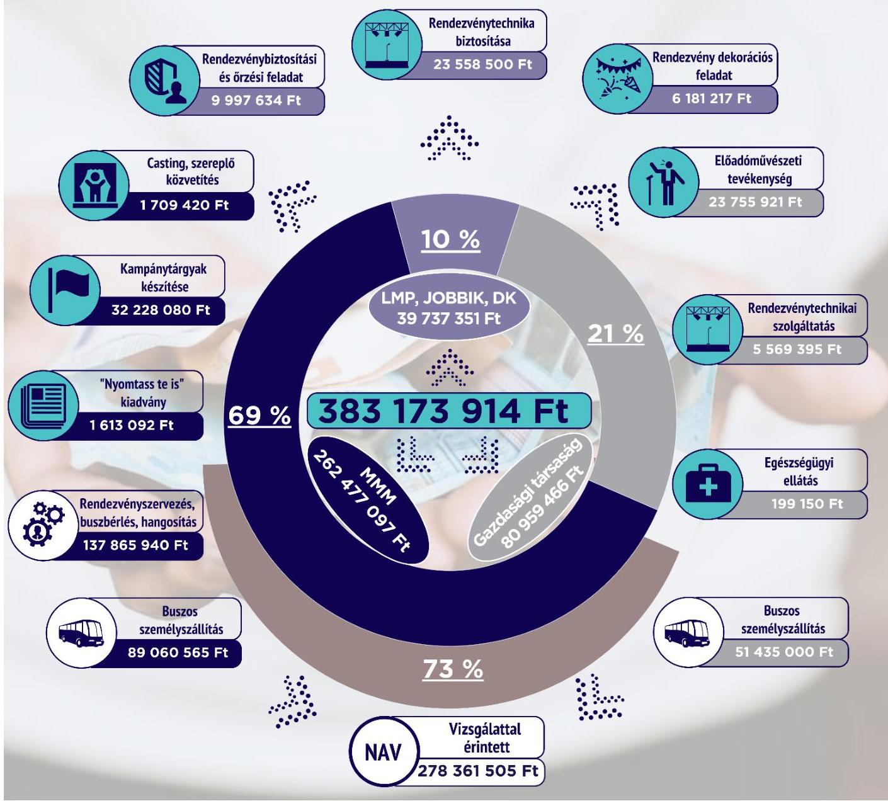

Fornás: ÁSZ szerkesztés

---

# FÜGGELÉK: ÉSZREVÉTELEK 

A részjelentés-tervezetet a Számvevőszék 15 napos észrevételezésre két körben - 2023. június 16-án és 2023. december 5-én megküldte az ellenőrzött szervezetek vezetőinek az ÁSZ tv. 29. § (1) bekezdése előírásában foglalt észrevételezési jog biztosítása érdekében.

Az ellenőrzött hat jelölő szervezet a részjelentés-tervezetre az első és második körben is észrevételt tett.

Az elfogadott észrevételek alapján a Számvevőszék módosította a részjelentést.
A függelék tartalmazza az ellenőrzöttek észrevételeit, illetve az el nem fogadott észrevételek elutasításának indoklását.

29. § (1) Az Állami Számvevőszék az ellenőrzési megállapításait megküldi az ellenőrzött szervezet vezetőjének vagy az általa megbízott személynek, és annak, akinek személyes felelősségét állapította meg.
(2) Az ellenőrzött szervezet vezetője és a felelősként megjelölt személy az ellenőrzés megállapításaira tizenöt napon belül írásban észrevételt tehet.
(3) Az Állami Számvevőszék az észrevételre a beérkezésétől számított harminc napon belül írásban válaszol. A figyelembe nem vett észrevételeket köteles a jelentésben feltüntetni, és megindokolni, hogy azokat miért nem fogadta el.

---

# Tisztelt Állami Számvevőszék! 

Alulírott Demokratikus Koalíció (székhely: 1066 Budapest, Teréz körút 46.; nyilvántartási szám: 01-02-0014391; adószám: 18270655-1-42; képviseli: Gyurcsány Ferenc elnök) csatolt meghatalmazással igazolt jogi képviselőm (Dr. Czeglédy és Társai Ügyvédi Iroda, székhely: 9700 Szombathely, Szily J. u. 9. I/5.; telefon: 0630/9511- 545; e-mail: iroda@czegledy.hu; eljáró ügyvéd: dr. Fodor Tímea, KASZ: 36060137) útján az Állami Számvevőszék által folytatott „Kampánypénzek ellenőrzése - A 2022. évi országgyűlési képviselő-választási kampányra fordított pénzeszközök elszámolásának ellenőrzése hat jelölő szervezetnél!" elnevezésű EL-3712/2023. ügyszámú eljárásában az EL-3712-667/2023 ikt. számú számvevőszéki részjelentés tervezetre - hivatkozással az EL-3712-667/2023 ikt. számú iratra - az Állami Számvevőszékről szóló 2011. évi LXVI. törvény (a továbbiakban: ÁSZ tv.) 29. § (2) bekezdése alapján az ellenőrzés megállapításaira az alábbi

## észrevételt

teszem.
(1) A Demokratikus Koalíció vitatja az Állami Számvevőszék azon megállapításait, hogy
(i) a Demokratikus Koalíció Magyar Közlönyben közzétett kampányelszámolása nem volt teljeskörű, mert nem vette figyelembe a Mindenki Magyarországa Mozgalom (a továbbiakban: MMM) az Állami Számvevőszék szerinti Demokratikus Koalíció érdekeit szolgáló, a Demokratikus Koalíció kampánytevékenységének részét képező kampánytevékenységre fordított kiadásait, továbbá, hogy
(ii) a választási kampány költségeire vonatkozó korlátozást a Demokratikus Koalíció a vele közös országos listát állító pártokkal együttesen nem tartotta be, valamint, hogy
(iii) a Demokratikus Koalíció a Pártok működéséről és gazdálkodásáról szóló törvényben előírt finanszírozási tilalmakat nem tartotta be, mivel a Demokratikus Koalíció az ún. hatpárti összefogás tagjaként másik öt párttal közös kampányt folytatva annak során az MMM-től tiltott, nem pénzbeli vagyoni hozzájárulásban, tiltott párttámogatásban részesült, illetve, hogy
(iv) az MMM a tárgybeli kampányidőszakban a Demokratikus Koalíció érdekeit szolgáló, a Demokratikus Koalíció kampánytevékenységének részét képező kampánytevékenységet folytatott arra 1683,3 millió forintot fordítva.
(2) Az Állami Számvevőszék a vitatott megállapításait részben hiányosan felállított tényállásra, téves következtetéseket levonva, korábbi megállapításaival ellentétesen, prekoncepció mentén, törvénysértő módon, tisztességtelen eljárást folytatva tette.
(3) A Demokratikus Koalíció az országgyűlési képviselők 2022. évi általános választására fordított állami és más pénzeszközök, anyagi támogatások összegéről, forrásáról és felhasználásának módjáról szóló beszámolója szerinti kampányelszámolása teljeskörű.

---

(4) A Demokratikus Koalíció biztosította a választópolgárok és a Demokratikus Koalíció tagsága számára a kampánya forrásainak és költéseinek átláthatóságát.
(5) A Demokratikus Koalíció kampányát a 2022. évi országgyűlési választási kampány időszakában az MMM nem támogatta, tőle a Demokratikus Koalíció pénzbeli vagy vagyoni hozzájárulást nem fogadott el, ebből következően a Demokratikus Koalíció nem szegte meg a pártok működéséről és gazdálkodásáról szóló 1989. évi XXXIII. törvény (a továbbiakban: Párt törvény) 4. § (2) bekezdésében foglalt finanszírozási tilalmat.
(6) Az országgyűlési képviselők választása kampányköltségeinek átláthatóvá tételéről szóló 2013. évi LXXXVII. törvény (a továbbiakban: Kampányfinanszírozási törvény) 7. § (1)-(2) bekezdéseiben foglalt, a kampány költségeire vonatkozó korlátozást a Demokratikus Koalíció betartotta.
(7) A Demokratikus Koalíció nem folytatott közös kampányt az MMM-mel.
(8) A Demokratikus Koalíció az MMM Állami Számvevőszék által hivatkozott, dokumentált kiadásaira vonatkozó döntéseinek meghozatalában nem vett részt.
(9) Az Állami Számvevőszék által hivatkozott ún. a közös ellenzéki kampánytanács sem vett részt az MMM Állami Számvevőszék által hivatkozott, dokumentált kiadásaira vonatkozó döntéshozatali folyamatban. A hat párt választási együttműködését alapvetően információáramlással segítő kampánytanács nem koordinálta, nem irányította az MMM Állami Számvevőszék által hivatkozott tevékenységét.
(10) Tényállás körében hivatkozunk arra, hogy a Demokratikus Koalíció nevében a pártot képviselő Gyurcsány Ferenc elnökön kívül csak Sebián-Petrovszki László pártigazgató vállalhat pénzügyi kifizetéssel járó kötelezettséget, továbbá arra, hogy a Demokratikus Koalíció kampánytevékenysége vonatkozásában Molnár Csaba ügyvezető alelnök volt jogosult a tárgybeli kampányidőszakban kampánytevékenység vonatkozásában döntést hozni, valamint arra, hogy az Állami Számvevőszék által hivatkozott ún. a közös ellenzéki kampánytanács ülésen a Demokratikus Koalíciót Sebián-Petrovszki László pártigazgató képviselte, de a Demokratikus Koalíció kampánytevékenysége vonatkozásában döntést nem hozott, arra jogosult nem volt.
(11) Az MMM Állami Számvevőszék által hivatkozott, dokumentált kiadásai vonatkozásában csak ezen civil szervezet törvényes képviselői voltak jogosultak döntést hozni, kötelezettséget vállalni. A Demokratikus Koalíció egyetlen tagja, így vezetői sem törvényes képviselői az MMM-nek.
(12) Mindezekből következően nem bírnak relevanciával Demokratikus Koalíció vonatkozásában az Állami Számvevőszék által hivatkozott, a vitatott megállapítást alátámasztani hivatott iratok, ugyanis az ezen iratok szerinti kötelezettségeket az MMM arra jogosultjai vállalták.
(13) Feltéve, de nem megengedve, hogy az MMM Állami Számvevőszék által hivatkozott tevékenysége kampánytevékenységnek minősül, az Állami Számvevőszék bizonyítani lenne köteles, hogy ezen tevékenység egyrészt a Demokratikus Koalíció érdekét szolgálta, másrészt, hogy ezen tevékenység vonatkozásában az MMM döntéshozatali folyamatában a Demokratikus

---

Koalíció részt vett. Ezen bizonyítási kötelezettségének az Állami Számvevőszék eleget tenni nem tud.
(14) Az Állami Számvevőszék vitatott megállapításait döntőrészt arra alapozza, hogy a Demokratikus Koalíció szándékos magatartása irányult arra, hogy a hat ellenzéki párt által folytatott kampányban olyan szervezet is részt vegyen, amelyre nem vonatkoznak a működés és a választási részvétel tisztaságát védő garanciális jogszabályi előírások, így kerülve meg a vonatkozó törvényi előírásokat, megsértve a jóhiszemű és rendeltetésszerű joggyakorlás alapelveit.
(15) Feltéve, de nem megengedve, hogy az MMM Állami Számvevőszék által hivatkozott tevékenysége kampánytevékenységnek minősül, az Állami Számvevőszék - annak meg nem történte miatt - bizonyítani nem tudja, hogy a Demokratikus Koalíció bármilyen módon részt vett volna az MMM azon döntésében, hogy az tevékenységet fejtsen ki a választási kampányidőszakban.
(16) Mivel az MMM a Demokratikus Koalíciótól befolyásmentesen döntött arról, hogy tevékenységet végez a választási kampányidőszakban, ennek érdekében kötelezettségeket vállal, ezért megalapozatlan az Állami Számvevőszék azon megállapítása, hogy a Demokratikus Koalíció az MMM-től tiltott módon nem pénzbeli vagyoni hozzájárulásban, párttámogatásban részesült.
(17) A hatályos törvényi szabályozás nem tiltja, hogy a jelölőszervezeteken kívül más személyek olyan tevékenységet folytassanak a kampányidőszakban, amely alkalmas lehet a választási kampány és a választások befolyásolására. Ebből következően az MMM hivatkozott tevékenysége nem valósít meg jogszabálysértést.
(18) Nem csak a jelölőszervezetek akarják a választási kampányidőszakban befolyásolni a választói akaratot, maguk a választópolgárok, az általuk alkotott kisebb-nagyobb, formális vagy nem formális közösségek szervezett vagy eseti jelleggel is igyekeznek az általuk támogatott jelölőszervezeteket, jelölteket népszerűsíteni, vagy éppen eltántorítani a választókat más jelölőszervezetek, jelöltek támogatásától. Ezen tevékenységük azonban attól függetlenül, hogy alkalmas lehet a választási kampány és a választások befolyásolására, még nem minősül kampánytevékenységnek. A választópolgárok valójában a szabad véleménynyilvánításukat gyakorolják annak érdekében, hogy más választópolgárok a tájékozódáshoz fűződő alkotmányos jogukkal élhessenek. Törvényi tiltás hiányában az MMM hivatkozott tevékenységét, még ha az - feltéve, de nem megengedve - alkalmas volt a választási kampány és a választások befolyásolására, szabadon gyakorolhatta.
(19) Az AJF-0666-005/2023 ikt. számú irat szerinti bejelentésekben a Demokratikus Koalíció bizonyítékokkal alátámasztottan hivatkozott a Civil Összefogás Fórum - Civil Összefogás Közhasznú Alapítvány, a Megafon Digitális Inkubátor Központ Nonprofit Korlátolt Felelősségű Társaság, az Aktuális Média Nonprofit Korlátolt Felelősségű Társaság, valamint több magánszemély választási kampányidőszakban kifejtett tevékenységére, amely tevékenységek vonatkozásában megalapozottan merül fel, hogy azok a Fidesz-KDNP jelölőszervezet és annak jelöltjei érdekét szolgálták.
(20) Ennek ellenére semmilyen adat nem merül fel arra, hogy az Állami Számvevőszék a vitatott jelentésben megfogalmazott jogi álláspontjának megfelelően vizsgálná vagy vizsgálta

---

volna a Fidesz-KDNP jelölőszervezet kampányelszámolásának teljeskörűségét annak okán, hogy a Fidesz-KDNP jelölőszervezet abban nem vette figyelembe a hivatkozott szervezetek és személyek nem pénzbeli vagyoni hozzájárulásnak minősülő kiadásait a Fidesz-KDNP jelölőszervezet érdekében megvalósult tevékenységei vonatkozásában.
(21) Az AJF-0666-005/2023 ikt. számú irat szerinti bejelentésekben hivatkozott szervezetek és személyek tevékenysége vizsgálatának hiányában sajnálatos módon az látszik megvalósulni, hogy az Állami Számvevőszék nem tisztességes eljárást folytatva végzi ezen ellenőrzési tevékenységét, a jelölőszervezeteket nem ugyanazon szempontok alapján, közöttük különbséget téve, nem egyenlő mércét alkalmazva vizsgálja.
(22) Példaként hivatkozik a Demokratikus Koalíció arra, hogy amennyiben az Állami Számvevőszék szerint a Mindenki Magyarországa Mozgalom 2022. március 15-i kormányváltó nagygyűlés vonatkozásában kifejtett tevékenysége és költései alkalmasak voltak a választási kampány és a választások befolyásolására, akkor az ugyanazon napon a Civil Összefogás Fórum - Civil Összefogás Közhasznú Alapítvány által szervezett nagygyűlés is alkalmas volt a választási kampány és a választások befolyásolására, mivel az nem vitatható módon a FideszKDNP jelölőszervezet és annak jelöltjei érdekét szolgálta. A Civil Összefogás Fórum - Civil Összefogás Közhasznú Alapítvány által szervezett nagygyűlésen a Fidesz-KDNP jelölőszervezetet alkotó pártok nevei, logói, a jelölőszervezet kampányszlogenjei jelentek meg, az ország minden pontjáról szervezetten utaztatták rá a résztvevőket, a jelölőszervezet jelöltjei is részt vettek rajta, a jelölőszervezet miniszterelnök-jelöltje mondott vezérszónokként kampánybeszédet. A nagygyűlés Fidesz-KDNP jelölőszervezet erejét és társadalmi támogatottságát volt hivatott szolgálni, továbbá azt a célt valósította meg, hogy ugyanazon a napon, amikor az ellenzéki nagygyűlés is megrendezésre került, a Fidesz-KDNP jelölőszervezet érdekében a közbeszédet tematizálja.
(23) Továbbá amennyiben az MMM hivatkozott tevékenységéhez köthető, a közösségi médiában, videómegosztókon megjelent hirdetések alkalmasak voltak a választási kampány és a választások befolyásolására, akkor az AJF-0666-005/2023 ikt. számú irat szerinti szervezetek és személyek hirdetési tevékenysége is alkalmas volt a választási kampány és a választások befolyásolására. Ebből következően amennyiben az MMM hivatkozott tevékenységéhez köthető, a közösségi médiában, videómegosztókon megjelent hirdetések szerinti tevékenységet az Állami Számvevőszék kampánytevékenységnek minősíti, akkor az AJF-0666-005/2023 ikt. számú irat szerinti szervezetek és személyek hirdetési tevékenységét is kampánytevékenységnek kell minősítenie.
(24) Másik irányból megközelítve, amennyiben az Állami Számvevőszék az AJF-0666005/2023 ikt. számú irat szerinti szervezetek és személyek tevékenységét nem minősíti kampánytevékenységnek, akkor tisztességes eljárást folytatva az MMM hivatkozott tevékenységét sem minősítheti kampánytevékenységnek.
(25) Az Állami Számvevőszék által hivatkozott közösségi médiában, videómegosztókon megjelent hirdetések vonatkozásában a Demokratikus Koalíció továbbá rámutat arra, hogy az Állami Számvevőszék az EL-3311-001/2021. iktatószámú jelentésében (azonosító szám: V 0912) annak ellenére állapította meg, hogy dr. Koncz Zsófia egyéni jelölt és a FIDESZ-KDNP jelölő szervezet a Magyar Közlönyben nyilvánosságra hozott pénzügyi elszámolások és a rendelkezésére bocsátott számviteli bizonylatok alapján a választási kampányidőszak alatt, a

---

választási kampánytevékenységgel összefüggő kiadásai együttesen nem haladták meg az 5 millió forintot, hogy dr. Koncz Zsófia egyéni jelölt általa sem vitatottan közel 5,5 millió forintot fordított Facebook-hirdetésekre a választási kampányidőszakban.
(26) Az Állami Számvevőszék akkori nyilatkozata szerinti jogi álláspontja az volt, hogy közösségi médiában közzétett hirdetések nem szoríthatók be a jelenlegi politikai hirdetésekhez kapcsolódó hazai jogszabályok közé.
(27) Ezt a jogi álláspontot támasztja alá, hogy az Állami Számvevőszék a 2021. évben „kézikönyv az országgyűlési képviselő-választási kampányra fordított pénzeszközök elszámolásához" elnevezésű kiadványában a politikai hirdetés mint kampánytevékenység vonatkozásában csupán arra a jogi meghatározásra hivatkozik, hogy a politikai hirdetés az ellenérték fejében közzétett, valamely jelölő szervezet vagy független jelölt népszerűsítését szolgáló vagy támogatására ösztönző, illetve azok nevét, célját, tevékenységét, jelszavát, emblémáját népszerűsítő, sajtótermékben közzétett médiatartalom vagy filmszínházban közzétett audio-vizuális tartalom.
(28) A Facebook, a YouTube se nem sajtótermék, se nem filmszínház, ebből következően az Állami Számvevőszék által hivatkozott MMM tevékenység szerinti közösségi médiában, videómegosztókon megjelent hirdetések nem minősíthetőek politikai reklámnak, így ezekkel az MMM nem valósított meg kampánytevékenységet. Ez pedig azt jelenti, hogy ezen hirdetések megjelentetése sem minősíthető a Demokratikus Koalíció érdekét szolgáló, a Demokratikus Koalíció kampánytevékenységének részét képező tevékenységnek, az MMM ezekre vonatkozó kiadásai nem minősülhetnek tiltott, nem pénzbeli vagyoni hozzájárulásnak.
(29) Annak vonatkozásában, hogy az Állami Számvevőszék megállapította, hogy a jelenleg hatályos jogszabályi rendelkezések nem tartalmaznak egyértelmű rendelkezést arra vonatkozólag, hogy - az Állami Számvevőszék által állítottan - a Demokratikus Koalíció és a másik öt párt érdekében, de nem konkrétan megjelölt pártnak címzett nem pénzbeli vagyoni hozzájárulás esetében a jogkövetkezményeket melyik párt vonatkozásában, illetőleg a pártok között megosztva hogyan kell alkalmazni, a Demokratikus Koalíció rámutat, hogy ez azt jelenti, hogy abban a nem várt esetben, ha az Állami Számvevőszék az észrevételben foglaltak ellenére, törvénysértő módon továbbra is fenntartja vitatott megállapításait a Demokratikus Koalícióra és a másik öt pártra vonatkozóan és jogkövetkezmény alkalmazásáról dönt, azt a pártok között jogszabályi rendelkezés hiányában megosztani nem tudja, egyetemlegesen sem tudja velük szemben a jogkövetkezményeket alkalmazni.

Kelt Budapesten 2023. szeptember 7. napján

Tisztelettel

# Demokratikus Koalíció 

képv.: dr. Fodor Timea ügyvéd
Dr. Czeglédy és Társai Ügyvédi Iroda

---

# Gyurcsány Ferenc 

elnök
Demokratikus Koalíció

## Budapest

Tárgy: Válaszlevél ellenőrzéssel kapcsolatos észrevételek kezeléséről

## Tisztelt Elnök Úr!

A „Kampánypénzek ellenőrzése - A 2022. évi országgyűlési képviselő-választási kampányra fordított pénzeszközök elszámolásának ellenőrzése hat jelölő szervezetnél" című számvevőszéki részjelentés tervezetével kapcsolatos, a Dr. Czeglédy és Társai Ügyvédi Iroda nevében eljáró Dr. Fodor Tímea ügyvéd által küldött, 2023. szeptember 7-i keltezésű észrevételt köszönettel megkaptam.

Az Állami Számvevőszékről szóló 2011. évi LXVI. törvény (a továbbiakban: ÁSZ törvény) 29. § (2) bekezdése szerint az ellenőrzött szervezet vezetője és a felelősként megjelölt személy az ellenőrzés megállapításaira tizenöt napon belül írásban észrevételt tehet. Ugyanezen szakasz (3) bekezdése szerint az Állami Számvevőszék (a továbbiakban: ÁSZ) az észrevételre a beérkezésétől számított harminc napon belül írásban válaszol. A figyelembe nem vett észrevételeket köteles a jelentésben feltüntetni, és megindokolni, hogy azokat miért nem fogadta el. Tájékoztatom Elnök urat, hogy a számvevőszéki részjelentésben a figyelembe nem vett észrevételeket szerepeltetjük az elutasítás indokának feltüntetésével.

---

Az ÁSZ észrevételekre vonatkozó álláspontjáról az alábbi tájékoztatást adom:
a) Észrevételt tett az ÁSZ eljárására.

Az ÁSZ törvénysértő, tisztességtelen eljárásával kapcsolatos észrevételét visszautasítom. Tájékoztatom, hogy az ÁSZ az ellenőrzés során a törvényi előírások, a nyilvános módszertanok és az ellenőrzési program maradéktalan betartásával járt el.

Az ÁSZ-nak az ÁSZ törvény 29. §-ában foglaltak alapján az érdemi, konkrétumokat tartalmazó észrevételeket áll módjában megvizsgálni.

A részjelentés-tervezet módosítása az észrevétel alapján nem indokolt.
b) Észrevételt tett a nem teljes körű kampányelszámolásra vonatkozóan tett megállapításra.

A nem teljeskörű kampányelszámolásra vonatkozó megállapításra tett észrevételével kapcsolatban a részjelentés-tervezet is rögzíti, a pártoknak egyszerre kell megfelelniük a pártok működéséről és gazdálkodásáról szóló 1989. évi XXXIII. törvény (a továbbiakban: Párt törvény) és az országgyűlési képviselők választása kampányköltségeinek átláthatóvá tételéről szóló 2013. évi LXXXVII. törvény (a továbbiakban: Kampányfinanszírozási törvény) rendelkezéseinek. Amennyiben a tiltott párttámogatás kampánykiadással kapcsolatos, a cselekmény mindkét jogszabály rendelkezéseit sérti. A Demokratikus Koalíció az MMM-től kapott nem vagyoni hozzájárulást elszámolásában nem szerepeltette, így a kampányelszámolás hiányosságát kellett megállapítani.

Emiatt a részjelentés-tervezet módosítása az észrevétel alapján nem indokolt.
c) Észrevételt tett a tiltott támogatás párt általi tudomásra jutására és elfogadására.

A tiltott támogatás tudomására jutásával és elfogadásával kapcsolatban tett észrevételére tájékoztatom, hogy a polgári törvénykönyvről szóló 2013. évi V. törvény (a továbbiakban: Ptk.) 6:4. § (2) bekezdése alapján jognyilatkozat nem csak írásban, hanem szóban vagy ráutaló magatartással is tehető. Az ÁSZ természetesen nem állítja, hogy a bizonyítás terhe átfordult volna és az ellenőrzött szervezeteknek kellene bizonyítani, hogy a vagyoni hozzájárulást nem fogadták el. Az ÁSZ az elfogadást az ismert tényállási elemek alapján állapította meg.

Az észrevételben foglaltak a Hatpárti összefogásra vonatkozó megállapítás I. 4. pontjának a) alpontjában foglaltakat érintik. Ezen pontban az ÁSZ rögzítette, hogy mely körülményekre figyelemmel tekinti a nem vagyoni hozzájárulást elfogadottnak. Ezen érvelésre az észrevétele érdemben nem reagált, annak megalapozottságát nem cáfolta, ezért az ÁSZ az álláspontját fenntartja. Önmagában az a körülmény, hogy az ellenőrzött szervezetek a nem vagyoni hozzájárulást formális nyilatkozattal nem fogadták el, nem értékelhető az ellenőrzött szervezetek javára, miután a közös kampány lebonyolításának körülményei, a költségek

---

mértéke, a kampány volumene, továbbá az egyes kiadások összehangolt jellege a részjelentés tervezetében részletezettek szerint a hallgatólagos elfogadást valószínűsítik.

Az ÁSZ hangsúlyozza, nem életszerű, hogy a Hatpárti összefogás pártjai a kampányukhoz történő ilyen jelentős anyagi hozzájárulás tényét nem észlelték.

Emiatt a részjelentés-tervezet módosítása az észrevétele alapján nem indokolt.
d) Levelében észrevételt tett a civil szervezetek és gazdasági társaságok által végzett kampánytevékenység értékelésére a véleménynyilvánítás szabadsága szempontjából.

A véleménynyilvánítás szabadsága kapcsán tett észrevételére az ÁSZ hivatkozik arra, hogy az ÁSZ törvény 24. § (1) bekezdés b) pontja értelmében az ellenőrzés végrehajtása során a jogszabályok szerint kell eljárni. Eszerint az ellenőrzött szervezetek tevékenységét a jogszabályok, nem pedig más szervezetek tevékenységével történő összevetés alapján kell minősíteni. Az ilyen - politikai, közéleti jellegű - érvek az észrevételek körében nem vehetők figyelembe.

Az ÁSZ a tiltott párttámogatásra vonatkozó szabályokat valamennyi párt esetében alkalmazza. A pártok közötti választási versengésbeli esélyegyenlőség vélt vagy valós hiányának vizsgálata nem lehet az ÁSZ eljárásának tárgya, továbbá nem adhat okot a jogszabályi rendelkezések figyelmen kívül hagyására.

Az észrevétel megalapozatlan azon okból is, hogy a jogi értékelés szempontjából lényeges különbségeket figyelmen kívül hagy.

1) Az ÁSZ egyetért az észrevételt tevő ellenőrzött szervezettel abban, hogy a véleménynyilvánítás joga a jogi személyeket is megilleti.

Az Alaptörvény IX. cikk (1) bekezdése értelmében mindenkinek joga van a véleménynyilvánítás szabadságához. Az Alaptörvény I. cikk (4) bekezdése szerint a törvény alapján létrehozott jogalanyok számára is biztosítottak azok az alapvető jogok, valamint őket is terhelik azok a kötelezettségek, amelyek természetüknél fogva nem csak az emberre vonatkoznak. Ezzel egyezően a Ptk. 3:1. § (2) bekezdése alapján a jogi személy jogképessége kiterjed minden olyan jogra és kötelezettségre, amely jellegénél fogva nem csupán az emberhez fűződhet.

Ebből következően mind az MMM-et, mind az észrevételében említett jogi személyeket megilleti a véleménynyilvánítás joga.
2) Az Alkotmánybíróság 30/1992 AB határozatában foglaltak alapján

- a szabad véleménynyilvánítás joga a kommunikációs alapjogok „anyajoga"; belőle vezethető le többek között a sajtószabadság alapjoga is;

---

- az Alkotmány a szabad kommunikációt — az egyéni magatartást és a társadalmi folyamatot — biztosítja és védi, tekintet nélkül annak tartalmára, illetve a véleménynyilvánító személyére;
- a véleményszabadság kiemelt szerepe folytán a vele szemben mérlegelendő jogokat korlátozóan kell értelmezni;
- az államot, ahol ez értelemszerű, intézményvédelmi kötelesség is terheli, ezért a véleménynyilvánításhoz való alanyi alapjog, a demokratikus közvélemény kialakulása feltételeinek és működése fenntartásának biztosítására irányuló állami kötelezettség.

A vonatkozó joggyakorlat szerint a véleménynyilvánítás joga - különösen a választási kampány során - kiemelt védelemben részesül; a véleménynyilvánítás jogát korlátozó rendelkezéseket korlátozóan kell értelmezni. A jogszabályok nem tartalmaznak olyan rendelkezést, hogy csak a jelöltek és a jelölő szervezetek folytathatnak kampánytevékenységet, az alkotmányosan elvárt tág értelmezés alapján és az állam alapjogvédelmi kötelezettségére figyelemmel az alapelvekből az következik, hogy a jogi személy véleménynyilvánítási jogának gyakorlása a véleményt nyilvánító jogi személy jellegére hivatkozással nem korlátozható.
3) A választási eljárásról szóló 2013. évi XXXVI. törvény (a továbbiakban: Ve.) 142. §-a szerint egyes állami szervek tevékenységén felül nem minősül választási kampánynak az állampolgárok - mint magánszemélyek - közötti személyes kommunikáció, függetlenül annak tartalmától és formájától. A Ve. tehát a jogi személyek tevékenységét, amennyiben az kampányidőszakban a választói akarat befolyásolására vagy ennek kísérletére irányul, nem sorolja a kivételek közé, így azt kampánytevékenységnek tekinti. A Ve. ugyanakkor olyan rendelkezést nem tartalmaz, miszerint a jelölő szervezeteken kívül eső más jogi személy számára tiltott lenne a kampánytevékenység folytatása. Ebből következően a Ve. rendelkezései nem tekinthetők a jogi személy véleménynyilvánítási jogát korlátozó szabályozásnak.
4) Az előző pontokban foglaltak alapján felmerül a kérdés, hogy a jogi személy kampánytevékenysége mikor valósít meg tiltott párttámogatást?
A Párt törvény 4. § (2) bekezdése szerint a párt részére jogi személy, jogi személyiséggel nem rendelkező szervezet vagyoni hozzájárulást nem adhat, a párt jogi személytől, jogi személyiséggel nem rendelkező szervezettől vagyoni hozzájárulást nem fogadhat el.
A Ve. 141. §-a szerint kampánytevékenység a kampányeszközök kampányidőszakban történő felhasználása és minden egyéb kampányidőszakban folytatott tevékenység a választói akarat befolyásolása vagy ennek megkísérlése céljából. A törvényi meghatározás tehát igen tág, a kampány fogalmát annak célja alapján határozza meg.
A nem a jelöltek, jelölő szervezetek által folytatott kampánynak a Párt törvény rendelkezését figyelembe véve két esetköre lehet:

---

a) A „kampánytámogatásnak" nevezett esetben a jogi személy csak látszólag folytat önálló kampányt, valójában a kampánytevékenysége számos körülményt illetően összeolvad a jelölő szervezet kampányával, így az a jelölő szervezetnek betudható. A kampánytámogatást az eset összes körülményét mérlegelve lehet megállapítani. A kampánytámogatás esetében a jelölő szervezettel történő egyeztetés biztosítja, hogy az egyeztetett kampány valóban a támogatott jelölő szervezet céljait szolgálja, így a jelölő szervezet kiadásainak részbeni átvállalása tiltott támogatást valósít meg. Az egyeztetés az elfogadás aktusát is megvalósítja. Kampánytámogatásra utalnak a jogi személy és a jelölő szervezet egymással összekapcsolódó (egymást kiegészítő) kiadásai, a kampányeszközök tartalmi összehangolása, közös logó használata, szervezeti és személyi összefonódások, a szervezett együttműködés intézményesített keretei. A kampánytámogatás közvetlen anyagi támogatást valósít meg.
b) A „nem egyeztetett (önálló) kampánynak" minősülő esetben a jogi személy nem egyezteti a kampánytevékenységét az általa támogatott jelölő szervezettel. Üzenetei, a kampányeszközök tartalma nem utal konkrét együttműködésre, a jogi személy kiadásai függetlenek a támogatott jelölő szervezet kampánytevékenységétől. A nem egyeztetett (önálló) kampány esetében a támogatás csak annyiban valósul meg, hogy a jogi személy üzenetei egybeesnek a támogatott jelölő szervezet céljaival, a jogi személy kifejezi a támogatott jelölő szervezet mellett szóló érveket, illetőleg kritizálja a konkurens jelölő szervezeteket és jelölteket. A nem egyeztetett (önálló) kampány elsődlegesen erkölcsi jellegű, közvetlen anyagi támogatásról nincs szó.

Az ÁSZ eljárásában nincs mód annak feltárására, hogy egy jogi személy kampánytevékenysége az egyes jelölő szervezetek választási eredményét milyen mértékben befolyásolta. Nem állapítható meg teljes bizonyossággal, hogy egy jelölő szervezet támogatottsága ténylegesen milyen körülmények (kampányeszközök, üzenetek, események) hatására alakult ki, illetve hogyan alakult volna a jogi személy támogató kampányának hiányában. Ad absurdum az sem zárható ki, hogy a jogi személy kampánya - mondjuk a jogi személy elutasítottsága miatt, vele szemben fennálló széles körű ellenszenv esetén - az üzenete ellenére még rontja is a támogatni kívánt jelölő szervezet kampányát és választási eredményét, azaz a hasznosság nem egyértelmű. Ezért önmagában a jogi személy kampányának ténye, üzenete és irányultsága nem szolgálhat a tiltott pártámogatás megállapításának alapjául.

Önmagában a jogi személy véleménynyilvánítási jogának gyakorlása nem valósít meg tiltott párttámogatást. Tiltott párttámogatás csak a kampánytámogatás, azaz elsődlegesen vagyoni támogatás esetében valósul meg, azaz amikor a jogi személy véleményének támogató jellegén túl további elemek is fennállnak, amelyek igazolják a támogatás irányát (kedvezményezettjét), konkretizálják a vagyoni hozzájárulás tényét, igazolják vagy valószínűsítik a támogatás elfogadását és esetleg annak összegszerűségének megállapítására is alapot szolgáltatnak.

Az észrevételében megjelölt esetek nem analógok az MMM támogatásával a tekintetben, hogy nem állnak olyan bizonyítékok az ÁSZ rendelkezésére arra vonatkozólag, hogy a megjelölt

---

szervezetek tevékenységüket a FIDESZ-KDNP kampányával összehangolták volna, illetve a miniszterelnök-jelölt tekintetében személyi összefonódás merült volna fel. Ahogy arra a részjelentés-tervezet is rámutat, a Hatpárti összefogás 2022. március 15-i rendezvényére vonatkozóan megállapítható volt a költségek megosztása, a kiadások összehangoltsága a jelölő szervezetek és az MMM között, ami legalább hallgatólagos elfogadás nélkül nem lett volna lehetséges. Az MMM elnöke és a közös miniszterelnök-jelölt azonos személy volt, aki nyilvánvalóan tudomással rendelkezett a költségvállalás módjáról - ahogy ezt a sajtónyilatkozataiban el is ismerte, továbbá a kampánytanács keretében az együttműködés szervezett formában történt. A közös listán induló pártoknak észlelniük kellett a kampánytevékenységük volumene és a hivatalos kiadások nagysága közötti jelentős eltérést. Az észrevételek ezen körülményekre nem térnek ki.

A jelen eljárásban a CÖF vagy más szervezetek anyagi forrásai - figyelemmel az ellenőrzés alapjául szolgáló jogszabályi rendelkezésekre, az ellenőrzés fókuszkérdéseire - nem bírnak jelentőséggel. Az észrevétel ugyanis arra vonatkozik, hogy a CÖF és más szervezetek milyen forrásokat kaptak - többek között a FIDESZ-től - , nem pedig arra, hogy a FIDESZ-nek vagy más pártnak anyagi támogatást nyújtottak. A Párt törvény szabályai a pártok forrásait korlátozzák, azt azonban nem, hogy milyen szervezeteket támogathatnak.

Hangsúlyozzuk, a tiltott párttámogatás nem arra tekintettel került megállapításra, hogy az MMM véleménynyilvánítási jogát gyakorolta. A megállapítás alapja az, hogy az MMM amelynek elnöke egyben a Hatpárti összefogás miniszterelnök-jelöltje is volt véleménynyilvánítási jogának gyakorlása mellett a Hatpárti összefogás kampányának egyes költségeit is átvállalta, ezen támogatást pedig a jelölő szervezetek - amelyek előtt a kampány mérete ismert kellett, hogy legyen - legalább hallgatólagosan elfogadták.

Végezetül megjegyezzük továbbá, hogy a NIK jelentése szerint több olyan magyarországi jogi személy, amely közvetlenül külföldi támogatásban részesült, a Hatpárti összefogás kampányát támogatva jelentős összegben finanszírozott kampánytevékenységeket, kampányeszközöket. Az ÁSZ azonban ezen jogi személyek Ve. szerinti kampányidőszakhoz kötődő, kampányeszközökre és kampánytevékenységekre fordított kiadásait nem egyeztetett (önálló) kampánynak tekinti, figyelemmel arra, hogy a kampánytámogatásra utaló jelek nem voltak megállapíthatók, azaz ezen esetek nem analógok az MMM által nyújtott támogatással.

Mindezek miatt a részjelentés-tervezet módosítása az észrevétel alapján nem indokolt.
e) Észrevételt tett a közösségi médiában megjelenő, politikai hirdetés jellegű tartalmak kampány szempontjából történő értékelésére.

A közösségi médiához kapcsolódó költségek diszkriminatív értékelése tárgyában tett észrevételére az ÁSZ ehelyütt ismételten hangsúlyozza, hogy az ÁSZ törvény 24. § (1) bekezdés b) pontjából következően a jelentésnek a jogszabályoknak kell megfelelni.

---

Az esélyegyenlőség sérelmére, szelektív jogértelmezésre vonatkozó észrevétel megalapozatlan, ugyanis az ÁSZ 2021 őszén az országgyűlési képviselő-választási kampányra fordított pénzeszközök elszámolásának elősegítése érdekében közzétett és valamennyi jelölő szervezetre irányadónak tekintett kézikönyvében a következőket rögzítette:

# „Politikai hirdetés jellegű tartalmak a közösségi médiafelületeken 

A közösségi médiafelületek használatának elterjedése következtében ezen felületek a politikai véleményformálásban is egyre jelentősebb mértékben vannak jelen. A közösségi médiafelületeken megjelenő, politikai hirdetés jellegű tartalmak nem minősülnek a Ve. szerinti politikai hirdetésnek, mivel annak megjelenési felülete csak sajtótermék vagy filmszínház lehet, a közösségi médiafelületek pedig nem tartoznak bele az Mttv. szerinti sajtótermék fogalmába.

Ugyanakkor mivel alkalmasak a választói akarat befolyásolására vagy annak megkísérlésére, kampányidőszakban történő használatuk kampánytevékenységnek minősül. Erre tekintettel a Ve. kampánytevékenységre vonatkozó előírásait a közösségi médiában a kampányidőszakban megjelenő tartalmak esetében is alkalmazni kell.

A Kftv. 5 millió forintos korlátozást állít fel a kampányidőszak alatti, választási kampánytevékenységgel összefüggő kiadásokkal kapcsolatban. A közösségi médiában megjelenő tartalmakért fizetett ellenérték tekintetében a kampánytevékenység ezen formáját alkalmazó egyéni jelölteket, jelölő szervezeteket fokozott felelősség terheli a választások tisztaságának megőrzéséért az 5 millió forintos keret betartása szempontjából.

Figyelemmel arra, hogy a Kftv. szerinti támogatás felhasználását a jelölt, illetve a jelölő szervezet nevére kiállított számlával kell igazolni, az ettől eltérő névre szóló számlát az ÁSZ nem ellenőrizheti a törvényi keretek között".

Az észrevétel tehát megalapozatlan, miután az ÁSZ az észrevételben foglaltakkal ellentétben már az országgyűlési képviselő-választási kampányt megelőzően rögzítette, hogy a közösségi médiához kapcsolódó költségeket is figyelembe veszi a kampányköltség-korlátozás vonatkozásában.
Emiatt a részjelentés-tervezet módosítása az észrevétel alapján nem indokolt.
f) Levelében észrevételt tett az MMM által finanszírozott kiadások esetében a döntéshozatali folyamatra.

Az észrevételére, miszerint az MMM által finanszírozott kiadások kapcsán a döntéshozatali folyamatban sem a kampánytanács, sem a Demokratikus Koalíció nem vett részt, az ÁSZ hivatkozik a részjelentés-tervezetnek a Hatpárti összefogásra vonatkozó megállapításai I.4. pontjában, illetve a jelen levélnek, a tiltott támogatás elfogadásával kapcsolatos e) pontjában foglaltakra. Az ÁSZ hangsúlyozza tovább, hogy a jelen esetben a megállapítás alapja nem

---

pénzügyi kifizetéssel járó kötelezettségvállalás, hanem a nem pénzbeli vagyoni hozzájárulás elfogadása. Miután ez utóbbit az ÁSZ a fentiek szerint igazoltnak látja, annak nincs jelentősége, hogy a nem pénzbeli vagyoni hozzájárulást megvalósító szolgáltatás kiválasztásában a Demokratikus Koalíció pontosan milyen részt vállalt.

Figyelemmel arra, hogy a pártok elsődleges célja a politikai hatalom törvényes - választások útján történő - megszerzése, a Hatpárti összefogás kampányának közvetlen anyagi támogatása egyértelműen a Demokratikus Koalíció érdekét is szolgálta.
Emiatt a részjelentés-tervezet módosítása az észrevétel alapján nem indokolt.
g) A levelében észrevételt tett arra, hogy az ÁSZ nem tudja bizonyítani, hogy a Demokratikus Koalíció részt vett az MMM azon döntésének meghozatalában, hogy az tevékenységet fejtsen ki a választási kampányidőszakban.

Az ÁSZ egyetért az ellenőrzött szervezettel abban, hogy a jelölő szervezetnek nem minősülő jogi személy, így az MMM kampánytevékenysége önmagában nem jogsértő, a megállapítás nem is ezzel ellentétes állásponton alapul. Hangsúlyozzuk, a megállapítás alapja a nem pénzbeli vagyoni hozzájárulás elfogadása, amelyet - más körülmények mellett - az is alátámaszt, hogy a Demokratikus Koalíció a választási kampányát a fent részletesen kifejtettek szerint az MMM-mel is közösen bonyolította le. A Demokratikus Koalíció felelőssége tehát a saját, nem pedig az MMM döntésein alapul.
Emiatt a részjelentés-tervezet módosítása az észrevétel alapján nem indokolt.
h) Észrevételt tett a pártok felelősségének megállapítására és az ÁSZ jogszabálymódosítási kezdeményezésére.
A pártok felelősségének megállapítására és az ÁSZ jogszabálymódosítási kezdeményezésére vonatkozóan tett észrevételével kapcsolatban hangsúlyozzuk, hogy az ÁSZ törvény 1. § (1) bekezdése szerint az ÁSZ az Országgyűlés legfőbb pénzügyi és gazdasági ellenőrző szerve, amely az Országgyűlésnek alárendelve látja el feladatát. Az ÁSZ törvény 24. § (1) bekezdés b) pontja értelmében az ellenőrzés végrehajtása során a jogszabályok szerint kell eljárni.
Az ÁSZ jogalkalmazó szerv, jogalkotás nem tartozik a hatáskörébe, ebből következően a jogalkotással szemben támasztott követelmények teljesítése nem az ÁSZ feladata. Az észrevétel nem az ÁSZ ellenőrzésére vonatkozik, az abban megjelölt szempontokat a jogalkotónak szükséges figyelembe vennie.

---

Az ÁSZ megjegyzi ugyanakkor, hogy a jelen esetben arról nincs szó, hogy a pártok jogi helyzete utólag elnehezülne, illetőleg az elkövetéskori magatartásukat utólag minősítenék jogsértőnek. A tiltott párttámogatások megvalósulásának időpontjában ugyanis a Párt törvény tiltotta a jogi személyektől származó pénzbeli és nem pénzbeli vagyoni hozzájárulás elfogadását, azaz a jogi minősítésre nem utólagos jogalkotás eredményeképpen kerül sor. Emiatt a részjelentés-tervezet módosítása az észrevétel alapján nem indokolt.

Kelt: Budapest, időbélyegző szerint

Tisztelettel:
az Állami Számvevőszék elnöke nevében:

# Klinga László s.k. 

igazgató
Állami Számvevőszék
Államháztartáson Kívüli Szervezeteket
Ellenőrző Igazgatóság

---

# A tisztelt Állami Számvevőszék és tisztelt dr. Windisch László Elnök Úr részére! 

Tárgy: az EL-3712-668/2023. iktatószámú részjelentés-tervezet véleményezése

Alulírott Gyöngyösi Márton Balázs elnök a JOBBIK-Konzervatívok (székhelye: 1034 Budapest, Bécsi út 120., nyilvántartási száma: 01-02-0010655, a továbbiakban: JOBBIK) törvényes képviseletében ezúton

## véleményezem és észrevételezem

a tisztelt Állami Számvevőszék Budapesten, 2023. június 16-án kelt, EL-3712-668/2023. iktatószámú részjelentés-tervezetét (a továbbiakban: részjelentés-tervezet).

## I.

## A vizsgálat tárgya, az Állami Számvevőszék hatásköre

Előadom, hogy álláspontom szerint már a vizsgálat kiindulópontja is hibás. Mind az országgyűlési képviselők választása kampányköltségeinek átláthatóvá tételéről szóló 2013. évi LXXXVII. törvény (a továbbiakban: Kampányfinanszírozási törvény), mind a pártok működéséről és gazdálkodásáról szóló 1989. évi XXXIII. törvény (a továbbiakban: Párttörvény), mind pedig az Állami Számvevőszékről szóló 2011. évi LXVI. törvény (a továbbiakban: Ásztv.) egyértelműen pártról (párt gazdálkodásáról) tesz említést az Állami Számvevőszék által lefolytatható vizsgálat tárgyaként. Ebből következően a pártok a maguk egyediségében, egymástól elkülönült jogalanyokként képezhetik tárgyát a tisztelt Állami Számvevőszék vizsgálatának, és kizárólag ez lehet jogszerű kiindulópont. Ezt támasztja alá a Kampányfinanszírozási törvény is, amely külön kiemeli, hogy mely esetekben kell egy pártnak tekinteni a közös pártlistát állító pártokat, a 3. § (2) bekezdése és 7. § (5) bekezdése alapján csak a listaállításhoz szükséges egyéni jelöltek száma, illetve a kampánytevékenységre összesen fordítható maximális összeg meghatározásánál engedi ezt meg a törvény, a választási kampány költségeinek elszámolása és ellenőrzése során nem. Ehhez képest már a szóban forgó részjelentés-tervezet címe is egyértelművé teszi, hogy a tisztelt Állami Számvevőszék

---

túlterjeszkedett hatáskörén, és olyat vizsgált, aminek vizsgálatára nincs jogszabályi felhatalmazása. A tisztelt Állami Számvevőszék ugyanis a pártok egyedileg történő vizsgálata helyett - jogellenesen és módszertanilag is hibásan - valamiféle összevont vizsgálódást kíván végezni, erre azonban nincs hatásköre. A módszertan hibás voltát leginkább a részjelentéstervezetben szereplő ezen mondat (7. oldal negyedik bekezdés közepe) szemlélteti: ,,Az ÁSZ az MMM kiadásai közül a rendelkezésre bocsátott bizonylatok, a számlák, szerződések, megrendelések, a szerződésszerű teljesítést igazoló dokumentumok (pl.: plakát, szórólap, kiadvány fotója, képi megjelenítése, teljesítésigazolás stb.) értékelése alapján kizárólag azokat minősítette kampányköltségnek, amelyeket az MMM kifejezetten a Ve-ben meghatározott kampányeszközökre, vagy egyéb olyan kiadásokra fordította, amelyek alkalmasak voltak a 2022-es országgyűlési választási kampányban a választói akarat befolyásolására, a Hatpárti összefogás népszerűsítése érdekében kerültek kifizetésre". A tisztelt Állami Számvevőszéknek ilyen ellenőrzési hatásköre nincs, a tisztelt Állami Számvevőszék az Ásztv. 5. § (11) bekezdés a) pontja értelmében csak a törvény rendelkezéseinek megfelelően, kizárólag az egyes pártok gazdálkodását vizsgálhatja külön-külön.

Itt jegyzem meg, hogy a tisztelt Állami Számvevőszék internetes honlapján van ugyan olyan fül, hogy „Módszertani útmutató a pénzügyi ellenőrzéshez", valamint olyan is, hogy „A pénzügyi ellenőrzés alapelvei", ezek azonban inaktívak, nem nyílnak meg, semmilyen tartalom elérését nem teszik lehetővé. Természetesen ezt a tényt informatikailag dokumentáltuk és rögzítettük. Az erről készült képernyőmentést ide másolom:
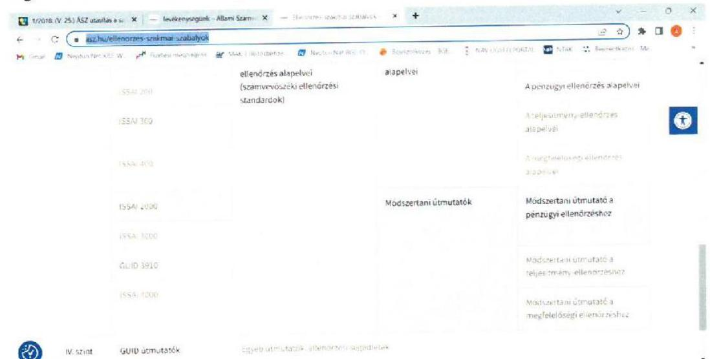

---

Jelen esetben tehát úgy kell észrevételeznünk egy részjelentés-tervezetet, hogy a tisztelt Állami Számvevőszék eljárására vonatkozó fontos szabályokat meg sem ismerhetjük, a tisztelt Állami Számvevőszék eljárását nem tudjuk azokkal egybevetni, mert ezt maga a tisztelt Állami Számvevőszék hiúsítja meg azáltal, hogy bár az Ásztv. 23. § (1) bekezdése alapján ez törvényi kötelessége lenne, mégsem teszi elérhetővé ezeket a fontos normákat. Álláspontom szerint jogállami körülmények között semmiképpen sem megengedhető, hogy a tisztelt Állami Számvevőszék olyan módszertani útmutatóra és olyan alapelvekre hivatkozik, amelyek a vizsgálattal érintett jogalany számára nem elérhetőek, ha ugyan léteznek egyáltalán. Ezáltal a tisztelt Állami Számvevőszék teljes eljárása átláthatatlanná és ellenőrizhetetlenné válik (sérül a transzparencia követelménye), ami az eljárás kimenetelétől függetlenül a tisztességes eljáráshoz fűződő alkotmányos alapjog súlyos sérelmét is jelenti egyben.
Az Alkotmánybíróság következetes gyakorlata alapján az Alaptörvény a plurális demokrácia alapintézményeiként tekint a politikai pártokra és a politikai pártok gazdálkodásának törvényességével kapcsolatos jogi felelősség tisztázása (a felelősség jogalapja és összegszerűsége) során érvényesülnie kell a fair, méltányos, kiegyensúlyozott eljáráshoz való jog és a hatékony jogorvoslathoz való jog követelményeinek.

A részjelentés-tervezet 11. oldalának harmadik bekezdésében maga a tisztelt Állami Számvevőszék ismeri el, hogy ,,a jelenleg hatályos jogszabályi rendelkezések nem tartalmaznak egyértelmű rendelkezést arra vonatkozólag, hogy a Hatpárti összefogás érdekében, de nem konkrétan megjelölt pártnak címzett nem pénzbeli vagyoni hozzájárulás esetében a jogkövetkezményeket melyik párt vonatkozásában, illetőleg a pártok között megosztva hogyan kell alkalmazni. Az ÁSZ e vonatkozásban a jogszabályi rendelkezések pontosítását kezdeményezi a jogalkotónál". Ez annyiban pontosítandó, hogy a jogszabályok egyáltalán nem tartalmaznak olyan rendelkezést, amely alapján a tisztelt Állami Számvevőszék jogosult lenne több elkülönült, önálló jogalanyisággal rendelkező pártot egy gyűjtőnév alá vonni és így vizsgálat tárgyává tenni, sőt kifejezetten ezzel ellentétes rendelkezést tartalmaznak, amikor egyértelműen úgy fogalmaznak, hogy az ÁSZ az egyes pártok gazdálkodását vizsgálhatja bizonyos, a jogszabályokban ugyancsak egyértelműen lefektetett szempontok mentén. Megjegyzendő továbbá, hogy hiába kezdeményez a tisztelt Állami Számvevőszék bármilyen jogszabálymódosítást, az visszaható hatályú nem lehet.
Ráadásul a tisztelt Állami Számvevőszék a fentebb idézett mondattal maga ismeri el, hogy nem konkrétan valamelyik pártnak címzett nem pénzbeli vagyoni hozzájárulás tekintetében kíván vizsgálódni, jóllehet kizárólag az egyes pártok gazdálkodását, a konkrétan nekik címzett és

---

általuk aktívan elfogadott támogatások körét vizsgálhatná, és nem bocsátkozhatna feltételezésekbe, fikciók felállításába, hiszen az Ásztv. 24. § (1) bekezdés d) pontja az ellenőrzésekkel szemben támasztott követelmények kapcsán egyértelműen kimondja, hogy az ellenőrzések eredményeinek, a megállapításoknak alátámasztottnak, a következtetéseknek okszerűnek és megalapozottnak kell lenniük. Ha a tisztelt Állami Számvevőszék ennél tovább terjeszkedik, akkor kiüresíti a választási eljárásról szóló 2013. évi XXXVI. törvény (a továbbiakban: Választási eljárásról szóló törvény) biztosította közös listaállítás lehetőségét, továbbá szembehelyezkedik a hazai és nemzetközi ellenőrzési sztenderdekkel.
A tisztelt Állami Számvevőszék kizárólag akkor járt volna el jogállami módon, ha a JOBBIK gazdálkodásával kapcsolatos ellenőrzés körében nem lép ki a garanciákkal biztosított eljárási keretek közül.

A részjelentés-tervezet 15. oldalának első mondata így szól: ,, A közös pártlistát állító pártok e támogatás vonatkozásában egy pártnak tekintendők, a támogatás elosztásáról megállapodást kell kötniük". Az első tagmondatban szereplő - téves - állítást a második tagmondat, tehát maga a tisztelt Állami Számvevőszék cáfolja. A második tagmondat ugyanis egyértelművé teszi, hogy a közös pártlistát állító pártok továbbra is elkülönült jogalanyok maradnak, hiszen megállapodást kell kötniük a támogatás elosztásáról. Semmiféle olyan közös gazdálkodás nem jön tehát létre a közös pártlista állítása révén, amely alapján az ÁSZ a közös pártlistát állító pártokat egy pártnak
 tekinthetné. A tisztelt Állami Számvevőszék tehát önmagával is ellentmondásba kerül, mert nyilvánvalóan maga is pontosan tisztában van vele, hogy nem vizsgálhatná azt, amit vizsgál, és nem vizsgálhatná úgy, ahogyan vizsgálja, vagyis, hogy eljárása módszertanilag is hibás és jogszabályba ütközik. Mindez egyébként álláspontom szerint a tisztelt Állami Számvevőszék prekoncepcióját is tükrözi, ezen az alapon is kétségessé téve a lefolytatott vizsgálat elfogulatlanságát és tárgyilagosságát.
Azt egyébként, hogy több párt mikor, milyen szempontból, melyik tételes jogszabályi rendelkezés alkalmazásában tekintendő egy pártnak, a Kampánytörvény egyértelműen és a lehető legszűkebb körben határozza meg, és ez sem érinti az egyes pártok elkülönült jogalanyiságát, nem hoz létre semmiféle gazdálkodási egységet.

Összefoglalóan tehát megállapítható, hogy a tisztelt Állami Számvevőszék jogellenesen áttöri a pártok elkülönült jogalanyiságát, amikor az állítólagos közös logóból és szlogenből jut olyan téves következtetésre, hogy a pártok és az MMM gazdálkodási egységet alkottak. Ez szöges ellentétben áll a Választási eljárásról szóló törvény rendelkezéseivel is, hiszen ebben - az

---

egyedül irányadó - jogszabályban sem esik szó arról, hogy a közös pártlista állítása valamiféle közös „projektpártot" vagy felelősségi és elszámolási egységet hozna létre.

Az, hogy egy civil szervezet a véleménynyilvánítás szabadsága körében és a szerződési szabadság jegyében olyan tevékenységet fejt ki, amellyel valamely párt álláspontját támogatja, egyébként sem eshet az adott párt terhére, az adott párt ugyanis nem felelhet tőle elkülönült más jogalanyok magatartásáért. Az adott pártnak az ilyen magatartás megakadályozására nincs is jogi lehetősége. Ilyen alapon a Civil Összefogás Fórum (a továbbiakban: CÖF) ún. bohócos plakátkampánya is megvalósította volna a tiltott pártfinanszírozás tényállását, hiszen a kormánypárt álláspontja jutott kifejezésre rajta keresztül. A bohócos kampányt annak ellenére nem találta jogellenesnek a tisztelt Állami Számvevőszék, hogy a CÖF a kizárólagos állami tulajdonban lévő MVM Zrt.-től közvetett módon költségvetési forrást kapott a közgondolkodás javítására, és ennek részeként került sor a kormánypártok álláspontját súlykoló és az ellenzék lejáratására irányuló agresszív kampányra.

A részjelentés-tervezet tárgyát képező esetben pusztán a Választási eljárásról szóló törvény szerinti közös jelölt- és listaállításra került sor. A jelölő szervezeteknek egyedül erre volt lehetőségük, hiszen a jogszabályok is erre adnak felhatalmazást. A Választási eljárásról szóló törvény lehetőséget ad arra, hogy két vagy több párt közös listát vagy jelöltet állítson, ettől azonban gazdálkodásuk még nem lesz közös. A jelölő szervezetek csak munkát végeztek közösen, gazdálkodásuk és jogalanyiságuk azonban továbbra is elkülönült.

Minden kétséget kizáróan megállapítható tehát, hogy az egyes pártok minden körülmények között önállóan alanyai a jogszabályok által előírt és a tisztelt Állami Számvevőszék által ellenőrizhető egyes elszámolási kötelezettségeknek.

# II. 

## A JOBBIK-ra vonatkozó megállapítások cáfolata

A tisztelt Állami Számvevőszék nem tudta (és meg sem kísérelte) bizonyítani, hogy tételesen a JOBBIK-Konzervatívok kampányára érkezett-e tiltott pártfinanszírozást megvalósító juttatás, a részjelentés-tervezetből ennek ellenére ilyen jellegű prekoncepció tűnik ki, ami álláspontom szerint jogállami körülmények között megengedhetetlen.

---

A tisztelt Állami Számvevőszék részjelentés-tervezetének a JOBBIK-ot érintő egyik összegző megállapítása így szól: „A Jobbik a Párt törvényben előírt finanszírozási tilalmakat nem tartotta be, mivel a hat párt és az MMM elnöke részvételével létrejött Hatpárti összefogás közös kampánya során jogi személytől, az MMM-től tiltott, nem pénzbeli vagyoni hozzájárulásban, tiltott párttámogatásban részesült".
Ez a megállapítás teljességgel alátámasztatlan, továbbá a vonatkozó jogszabályokkal is ellentétes.

A Párttörvény 4. § (2) bekezdése ugyanis ekként rendelkezik: „A párt részére - az (1) bekezdésben foglalt kivételektől eltekintve - jogi személy, jogi személyiséggel nem rendelkező szervezet vagyoni hozzájárulást nem adhat, a párt jogi személytől, jogi személyiséggel nem rendelkező szervezettől vagyoni hozzájárulást nem fogadhat el".

Ahhoz tehát, hogy a tisztelt Állami Számvevőszék jogszerűen tehessen a fentebb idézetthez hasonló kijelentést, először is annak kell kétséget kizáróan bizonyítottnak lennie, hogy konkrétan az adott párt részesült tiltott, nem pénzbeli vagyoni hozzájárulásban, másodszor pedig az elfogadás mozzanatának is bizonyosnak kell lennie.

Az „elfogad" kifejezés kétségkívül aktív, közvetlen cselekvést jelent, vagyis azt, hogy valaki valamit átvesz, és azt sajátjaként megtartja. Egyértelműen így fogalmaz a Magyar Nyelv Értelmező Szótára is. A JOBBIK tiltott, nem pénzbeli vagyoni hozzájárulást nem fogadott el, az pedig, hogy esetlegesen más jogalany ilyet tett, jogállami körülmények között nem eshet a JOBBIK terhére, a közös lista és jelölt állítása ilyen megállapításra nem adhat alapot.

Mindebből következően a tisztelt Állami Számvevőszék azon megállapítása is alaptalan, amely szerint ,, a Jobbik kampányelszámolása (...) nem volt teljeskörű, mivel nem vette figyelembe a közös miniszterelnökjelölt által vezetett és kampányt folytató MMM nem pénzbeli vagyoni hozzájárulásnak minősülő kiadásait".
A JOBBIK tőle függetlenül gazdálkodó harmadik személy magatartásáért semmilyen felelősséget nem vállalhat, és a tisztelt Állami Számvevőszék a JOBBIK-on jogállami keretek között kizárólag azt kérheti számon, amire a JOBBIK-nak közvetlen ráhatása van vagy volt. A JOBBIK-nak semmilyen ráhatása nem volt arra, hogy az MMM mit és mire költ. Az MMM a JOBBIK-tól teljesen független jogalany. A JOBBIK nem fogadott el semmit az MMM-től, és ennek ellenkezőjét a tisztelt Állami Számvevőszék sem tudta igazolni sem okiratokkal, sem

---

egyéb bizonyítékokkal. A JOBBIK nem utasította, nem kérte az MMM-et arra, hogy a JOBBIK érdekében kampánytevékenységet folytasson vagy bármit tegyen. A JOBBIK-nak az MMM által állítólagosan végzett ilyen tevékenységről nem is volt tudomása.

A tisztelt Állami Számvevőszék a JOBBIK-ot érintően az alábbi összegző megállapításokat is tette:
„A Jobbik és a vele közös országos listát állító pártok együttesen nem tartották be a választási kampány költségeire vonatkozó korlátozást".
„A hatpárti összefogás az MMM-tól tiltott támogatást kapott".

A tisztelt Állami Számvevőszék a JOBBIK-ra vonatkozó ezen összegző megállapításai is teljességgel alaptalanok, jogellenesek, a tisztelt Állami Számvevőszék hatáskörén kívül esnek, és ráadásul még értelmezhetetlenek is. Először is értelmezhetetlen az, hogy a pártok együttesen nem tartották be a választási kampány költségeire vonatkozó korlátozást. A tisztelt Állami Számvevőszék, mint fentebb bemutattam, kizárólag az egyes pártok gazdálkodását vizsgálhatja, így az együttesség fogalmának használata több elkülönült gazdálkodási egység jogállami körülmények között meg nem engedhető „összemosásáról" tanúskodik, ami nem csupán a tisztelt Állami Számvevőszék hatáskörén esik kívül, hanem önmagában is jogellenes. A tisztelt Állami Számvevőszék azon megállapítása, hogy a hatpárti összefogás tiltott támogatást kapott, ugyancsak értelmezhetetlen, hiszen olyan jogalany, hogy hatpárti összefogás, nem létezett, hanem egymástól elkülönült jogalanyisággal rendelkező szervezetek éltek a Választási eljárásról szóló törvény biztosította közös lista- és jelöltállítás lehetőségével.
Talán ez az az összegző megállapítás, amely legékesebb bizonyítéka annak, hogy a tisztelt Állami Számvevőszék a jogszabályok által egyértelműen meghatározott és egyszersmind be is határolt hatáskörén kívülre tévedt, ráadásul olyan mértékben, hogy álláspontom szerint az már a tisztelt Állami Számvevőszék hitelét is csorbítja.

# III. 

Záró megállapítások, indítvány

A fentiek alapján összefoglalóan megállapítható, és egyfajta elvi következtetésként levonható, hogy a Választási eljárásról szóló törvény szerinti közös pártlista nem eredményez közös kampányfinanszírozást, és nem teremt egyetemlegességet megalapozó gazdasági egységet

---

a közös listát és jelöltet állító jelölő szervezetek között. Egyetlen párton sem kérhető számon a tőle független, elkülönült jogalanyisággal rendelkező és önállóan gazdálkodó, tehát harmadik személynek minősülő szervezet magatartása.

Végezetül a tisztelt Állami Számvevőszéknek azt is nyomatékosan figyelembe kell vennie eljárása során, hogy a pártoknak más társadalmi szervezetekhez képest különleges a viszonya a közhatalomhoz, mivel közreműködnek a nép akaratának kialakításában és kinyilvánításában, miként arra az Alkotmánybíróság is rámutatott 3001/2019. (I. 7.) AB határozatában. A pártoknak tehát a demokratikus jogállamokban - így Magyarországon is - kitüntetett szerepük van. Ahhoz, hogy be tudják tölteni alkotmányos funkciójukat, e körben szabadságot kell számukra biztosítani a végrehajtó hatalom kontrollja alól. Az Alaptörvény a B) cikk (1) bekezdésében és a VIII. cikk (3) bekezdésében éppen ezt garantálja.
Az Alaptörvény B) cikk (1) bekezdése és VIII. cikk (3) bekezdése együttesen azt is magában foglalja, hogy a pártok gazdálkodásának ellenőrzésére és a pártok kötelezésére nem terjedhet ki a végrehajtó hatalom szerveinek feladat- és hatásköre azokon a területeken, amelyeken a pártok alkotmányos funkciójukat teljesítik, azaz a népakaratot becsatornázzák a közhatalomba. A tisztelt Állami Számvevőszék jelen ügyben folytatott eljárása éppen a JOBBIK mint ellenzéki párt ezen alkotmányos funkciójának csorbítására irányul, hiszen jogellenes módszerekkel, fikciók és alátámasztatlan feltételezések eszközével kíván a tisztelt Állami Számvevőszék odáig eljutni, hogy a JOBBIK-ot hátrányos jogkövetkezmények sújtsák.

A tisztelt Állami Számvevőszék ezeket a szempontokat teljes egészében figyelmen kívül hagyta eljárása során, amit a részjelentés-tervezet is tükröz.

Összességében megállapítható, hogy a tisztelt Állami Számvevőszék ellenőrzése és a részjelentés-tervezetben szereplő megállapításai nem felelnek meg az Alaptörvénynek, a magyar alkotmányos hagyományoknak és a nemzetközi szakmai szervezetek ajánlásaiban rögzített követelményeknek.
Az ellenőrzés során mutatkozó súlyos demokratikus deficitek miatt, valamint a már a vizsgálódás kiindulópontjának megválasztásakor érzékelhető prekoncepció okán kétséget kizáróan kijelenthető, hogy a tisztelt Állami Számvevőszék más szervektől független hivatali státusza nem áll fenn.

---

Minderre figyelemmel kérem és indítványozom, hogy a tisztelt Állami Számvevőszék szíveskedjék további vizsgálatai során visszahelyezkedni a jogállami keretek közé, és szíveskedjék a JOBBIK-ot érintő fenti összegző megállapításait és az ezekhez tartozó részletes megállapításokat törölni.
Kérem továbbá, hogy a tisztelt Állami Számvevőszék szíveskedjék a jogállami követelményeknek és a nemzetközi sztenderdeknek megfelelően kialakítani és közzétenni módszertanát arra nézve, hogy közös lista- és jelöltállítás esetén az egyes jogalanyok gazdálkodása továbbra is egyenként, elkülönülten vizsgálandó, továbbá hogy egyik jogalany sem tartozik semmilyen felelősséggel a hatókörén kívül eső másik jogalany cselekedeteiért.

A további észrevételezés, véleményezés és indítványozás jogát fenntartom.

Budapest, 2023. július 3.

Tisztelettel:
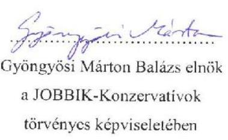

JOBBIK-KONZERVATÍVOK
1034 Budapest, Bécsi út 120.
Asz.: 18249956-1-41

---

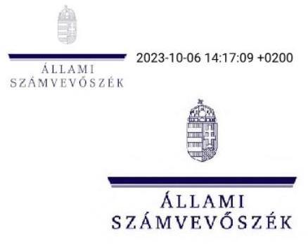

ÁLLAMHÁZTARTÁSON KÍVÜLI
SZERVEZETEKET ELLENŐRZŐ
IGAZGATÓSÁG

Ikt. szám: EL-3712-739/2023
Ügyintéző: Nemesvári-Horthy Eszter
Telefonszám: +3614568345

# Gyöngyösi Márton Balázs 

elnök
Jobbik - Konzervatívok

## Budapest

Tárgy: Válaszlevél ellenőrzéssel kapcsolatos észrevételek kezeléséről

## Tisztelt Elnök Úr!

A „Kampánypénzek ellenőrzése - A 2022. évi országgyűlési képviselő-választási kampányra fordított pénzeszközök elszámolásának ellenőrzése hat jelölő szervezetnél" című számvevőszéki részjelentés tervezetével kapcsolatos, 2023. július 3-ai keltezésű észrevételét köszönettel megkaptam. A 2023. július 24-ei válaszlevelemben tájékoztattam Elnök urat, hogy tekintettel a tényállás összefüggéseire, és a Hatpárti összefogás érintett öt pártjánál folyamatban lévő észrevételezésre az Állami Számvevőszék (a továbbiakban: ÁSZ) a Jobbik - Konzervatívok által tett észrevételeket a többi öt jelölő szervezet észrevételeivel egyidejűleg fogja megválaszolni. A Hatpárti összefogás pártjai a részjelentés tervezetére vonatkozó észrevételeiket megküldték, ez alapján - a korábbi levelemmel összhangban - a Jobbik - Konzervatívok észrevételeivel kapcsolatban az alábbiakról tájékoztatom. Az Állami Számvevőszékről szóló 2011. évi LXVI. törvény (a továbbiakban: ÁSZ törvény) 29. § (2) bekezdése szerint az ellenőrzött szervezet vezetője és a felelősként megjelölt személy az ellenőrzés megállapításaira tizenöt napon belül írásban észrevételt tehet. Ugyanezen szakasz (3) bekezdése szerint az ÁSZ az észrevételre a beérkezésétől számított harminc napon belül írásban válaszol. A figyelembe nem vett észrevételeket köteles a jelentésben feltüntetni,
 és megindokolni, hogy azokat miért nem fogadta el. Tájékoztatom Elnök urat, hogy a számvevőszéki részjelentésben a figyelembe nem vett észrevételeket szerepeltetjük az elutasítás indokának feltüntetésével.

---

Az ÁSZ észrevételekre vonatkozó álláspontjáról az alábbi tájékoztatást adom:
a) A levelében észrevételt tett a vizsgálat kiindulópontjára, az egyes pártok egyedi ellenőrzésére és ehhez kapcsolódóan a részjelentés címére és tartalmára.

Az ÁSZ egyetért az észrevételben foglaltakkal a tekintetben, hogy a közös pártlistát állító pártok csak az országgyűlési képviselők választása kampányköltségeinek átláthatóvá tételéről szóló 2013. évi LXXXVII. törvény (a továbbiakban: Kampányfinanszírozási törvény) hivatkozott rendelkezései vonatkozásában kezelhetők egy pártként, ez azonban a jogalanyiságukat, a gazdálkodásuk önállóságát nem érinti. Ugyanakkor az észrevétel azon a téves állásponton alapul, hogy az ÁSZ a részjelentésben vizsgált hat pártot egy gazdálkodó egységnek tekintette. Az ÁSZ ellenőrzése a 2022. évi országgyűlési választáson a pártlistákra leadott összes érvényes szavazat legalább $1 \%$-át megszerzett pártokra terjedt ki a Kampányfinanszírozási törvény rendelkezéseivel összhangban. Ahogy „az ellenőrzött szervezetek" című fejezetből is kitűnik, a teljes ellenőrzés során ellenőrzött szervezetek felsorolását a II. számú melléklet tartalmazza és a részjelentésben a Demokratikus Koalíció, a Jobbik, a Momentum Mozgalom, az MSZP, az LMP és a Párbeszéd minősül ellenőrzött szervezetnek. Az észrevételében foglaltakkal szemben a részjelentés tervezet címe és tartalma sem utal összevont vizsgálatra, hanem egyértelműen az egyes pártoknál, mint jelölő szervezeteknél folytatott ellenőrzés eredményét mutatja be. Az észrevételében konkrétan hivatkozott mondat - amely a Hatpárti összefogás népszerűsítése érdekében történt kifizetésekre vonatkozik - nem tartalmaz a pártokra vonatkozó összevont megállapítást. Ehelyett a hivatkozott mondat azt a részjelentés-tervezetben is részletezett tényhelyzetet és annak jogi értékelését mutatja be, hogy ,,a Hatpárti összefogás közös miniszterelnök-jelöltje az MMM elnöke volt, így az MMM kampánytevékenység finanszírozására irányuló tevékenysége nem választható el a Márki-Zay Péter vezette lista népszerűsítésétől és az azt alkotó pártok kampányfinanszírozásától", illetve „Miután az ellenőrzött szervezetek a KT működésére vonatkozóan konkrét információkkal, dokumentumokkal nem szolgáltak, a kampánykiadásaik jelenleg nem oszthatók meg olyan elv szerint, hogy mely kiadások alapulnak közös döntésen és melyek nem." Az kizárólag formai, szövegszerkesztési megoldás, hogy a részjelentés-tervezet ezen hat párt felsorolásától a későbbiekben eltekintett és a hat pártra együttesen Hatpárti összefogásként hivatkozott. A tervezet rövidítés jegyzéke szerint Hatpárti összefogás „a Demokratikus Koalíció-Jobbik-Momentum Mozgalom-MSZP-LMPPárbeszéd jelölő szervezetek, amelyek a 2022. évi országgyűlési választáson közös országos listát állítottak.". Az ÁSZ hangsúlyozza, hogy a Hatpárti összefogást nem tekinti önálló jogalanyisággal rendelkező szervezetnek.

A pártok gazdálkodásuk jogszerűségéért önállóan felelnek, azonban ebből az is következik, hogy ezen felelősségük a közösen, összehangoltan végzett tevékenységek során is fennáll. A pártok önálló jogalanyisága és gazdasági önállósága nem jelenti azt, hogy a részükre közösen nyújtott vagyoni előny ne lenne vizsgálható, továbbá a pártok nem mentesülhetnek a

---

gazdálkodásukat korlátozó rendelkezések alól olyan módon, hogy a kampányukhoz adott vagyoni támogatást közösen fogadják el, illetve használják fel.

Mindezek miatt a részjelentés-tervezet módosítása az észrevétele alapján nem indokolt.
b) Észrevételt tett az ellenőrzéshez kapcsolódó módszertani dokumentumok elérhetőségére az ÁSZ honlapján.

Ehhez kapcsolódóan felhívom a figyelmét, hogy a 2022. évi országgyűlési képviselő-választási kampányra fordított pénzeszközök elszámolásának ellenőrzése az észrevételben foglaltakkal ellentétben nem pénzügyi ellenőrzés, hanem szabályszerűségi ellenőrzés, ahogy ezt a Jobbiknak az ellenőrzés megkezdésekor megküldött ellenőrzési program (5. oldal „Az ellenőrzés típusa") és az észrevételezésre megküldött részjelentés-tervezet (6. oldal „Az ellenőrzés típusa") is egyértelműen tartalmazza.

A szabályszerűségi ellenőrzésre, mint a megfelelőségi ellenőrzés egyik típusára vonatkozó módszertani szabályok a 2015-ben közzétett „A megfelelőségi ellenőrzés alapelvei" és a 2020-ban közzétett „Módszertani útmutató a megfelelőségi ellenőrzéshez" című dokumentumokban találhatóak, amelyek elérhetőek az ÁSZ honlapján a Módszertanok/ Ellenőrzés-szakmai szabályok pont alatt (https://www.asz.hu/ellenorzes-szakmai-szabalyok). Ahogy az az ellenőrzési alapelveket bemutató dokumentum 2.4. pontjában rögzítésre került, „a megfelelőségi ellenőrzés lehet szabályszerűségi ellenőrzés vagy betyárvalósági ellenőrzés vagy a kettő kombinációja".

Az ÁSZ rögzíti továbbá, hogy az ellenőrzött szervezettől az észrevétel beérkezését megelőzően nem érkezett olyan megkeresés, amelyben a szabályszerűségi ellenőrzésre vonatkozó módszertani szabályok megküldését kérte.

Mindezek miatt a részjelentés-tervezet módosítása az észrevétele alapján nem indokolt.
c) Észrevételt tett a tiltott támogatás jogkövetkezményeinek alkalmazásával kapcsolatos leírásra a részjelentés-tervezetben és ennek kapcsán az ÁSZ törvényben foglaltak érvényesülésére.

Az észrevételéhez kapcsolódóan az alábbiakról tájékoztatom. Figyelemmel arra, hogy a Jobbik, valamint a Demokratikus Koalíció, a Momentum Mozgalom, az MSZP, az LMP és a Párbeszéd közös listán indultak, önálló kampányról nem lehet beszélni. A pártok gazdálkodása ugyan önálló maradt, kampánytevékenységet azonban közösen folytattak, így az MMM-nek a közös kampányköltségekhez történő hozzájárulása egyben a Jobbik kampányához történő hozzájárulást is jelenti. Annak, hogy a tiltott párttámogatást nem lehet konkrét pártokhoz kötni, nem az az oka, hogy az ÁSZ tényállás-tisztázási kötelezettségének nem tett eleget, hanem az, hogy a közös listán induló pártok - az ellenőrzés során tett nyilatkozatuk szerint a közös kampányukra, a kampánytanács tevékenységére vonatkozóan semmilyen írásos dokumentációt nem vezettek.

---

Mindezek miatt a részjelentés-tervezet módosítása az észrevétele alapján nem indokolt.
d) Észrevételt tett a tiltott támogatás párt által történő elfogadására és a civil szervezetek által végzett kampánytevékenység értékelésére a véleménynyilvánítás szabadsága szempontjából.

Ehhez kapcsolódóan az alábbiakról tájékoztatom. Az ÁSZ hivatkozik arra, hogy az ÁSZ törvény 24. § (1) bekezdés b) pontja értelmében az ellenőrzés végrehajtása során a jogszabályok szerint kell eljárni. Eszerint az ellenőrzött szervezetek tevékenységét a jogszabályok, nem pedig más szervezetek tevékenységével történő összevetés alapján kell minősíteni. Az ilyen - politikai, közéleti jellegű - érvek az észrevételek körében nem vehetők figyelembe.

Az ÁSZ a tiltott párttámogatásra vonatkozó szabályokat valamennyi párt esetében alkalmazza. A pártok közötti választási versengésbeli esélyegyenlőség vélt vagy valós hiányának vizsgálata nem lehet az ÁSZ eljárásának tárgya, továbbá nem adhat okot a jogszabályi rendelkezések figyelmen kívül hagyására.

Az észrevétel megalapozatlan azon okból is, hogy a jogi értékelés szempontjából lényeges különbségeket figyelmen kívül hagy.

1. Az ÁSZ egyetért azzal, hogy a véleménynyilvánítás joga a jogi személyeket is megilleti.

Az Alaptörvény IX. cikk (1) bekezdése értelmében mindenkinek joga van a véleménynyilvánítás szabadságához. Az Alaptörvény I. cikk (4) bekezdése szerint a törvény alapján létrehozott jogalanyok számára is biztosítottak azok az alapvető jogok, valamint őket is terhelik azok a kötelezettségek, amelyek természetüknél fogva nem csak az emberre vonatkoznak. Ezzel egyezően a polgári törvénykönyvről szóló 2013. évi V. törvény (a továbbiakban: Ptk.) 3:1. § (2) bekezdése alapján a jogi személy jogképessége kiterjed minden olyan jogra és kötelezettségre, amely jellegénél fogva nem csupán az emberhez fűződhet.

Ebből következően mind az MMM-et, mind az észrevételekben említett jogi személyeket megilleti a véleménynyilvánítás joga.
2. Az Alkotmánybíróság 30/1992 AB határozatában foglaltak alapján

- a szabad véleménynyilvánítás joga a kommunikációs alapjogok „anyajoga"; belőle vezethető le többek között a sajtószabadság alapjoga is;
- az Alkotmány a szabad kommunikációt — az egyéni magatartást és a társadalmi folyamatot - biztosítja és védi, tekintet nélkül annak tartalmára, illetve a véleménynyilvánító személyére;
- a véleményszabadság kiemelt szerepe folytán a vele szemben mérlegelendő jogokat korlátozóan kell értelmezni;

---

- az államot, ahol ez értelemszerű, intézményvédelmi kötelesség is terheli, ezért a véleménynyilvánításhoz való alanyi alapjog, a demokratikus közvélemény kialakulása feltételeinek és működése fenntartásának biztosítására irányuló állami kötelezettség.

A vonatkozó joggyakorlat szerint a véleménynyilvánítás joga - különösen a választási kampány során - kiemelt védelemben részesül; a véleménynyilvánítás jogát korlátozó rendelkezéseket korlátozóan kell értelmezni. A jogszabályok nem tartalmaznak olyan rendelkezést, hogy csak a jelöltek és a jelölő szervezetek folytathatnak kampánytevékenységet, az alkotmányosan elvárt tág értelmezés alapján és az állam alapjogvédelmi kötelezettségére figyelemmel az alapelvekből az következik, hogy a jogi személy véleménynyilvánítási jogának gyakorlása a véleményt nyilvánító jogi személy jellegére hivatkozással nem korlátozható.
3. A választási eljárásról szóló 2013. évi XXXVI. törvény (a továbbiakban: Ve.) 142. §-a szerint egyes állami szervek tevékenységén felül nem minősül választási kampánynak az állampolgárok - mint magánszemélyek - közötti személyes kommunikáció, függetlenül annak tartalmától és formájától. A Ve. tehát a jogi személyek tevékenységét, amennyiben az kampányidőszakban a választói akarat befolyásolására vagy ennek kísérletére irányul, nem sorolja a kivételek közé, így azt kampánytevékenységnek tekinti. A Ve. ugyanakkor olyan rendelkezést nem tartalmaz, miszerint a jelölő szervezeteken kívül eső más jogi személy számára tiltott lenne a kampánytevékenység folytatása. Ebből következően a Ve. rendelkezései nem tekinthetők a jogi személy véleménynyilvánítási jogát korlátozó szabályozásnak.
4. Az előző pontokban foglaltak alapján felmerül a kérdés, hogy a jogi személy kampánytevékenysége mikor valósít meg tiltott párttámogatást?

A pártok működéséről és gazdálkodásáról szóló 1989. évi XXXIII. törvény (a továbbiakban: Párt törvény) 4. § (2) bekezdése szerint a párt részére jogi személy, jogi személyiséggel nem rendelkező szervezet vagyoni hozzájárulást nem adhat, a párt jogi személytől, jogi személyiséggel nem rendelkező szervezettől vagyoni hozzájárulást nem fogadhat el.

A Ve. 141. §-a szerint kampánytevékenység a kampányeszközök kampányidőszakban történő felhasználása és minden egyéb kampányidőszakban folytatott tevékenység a választói akarat befolyásolása vagy ennek megkísérlése céljából. A törvényi meghatározás tehát igen tág, a kampány fogalmát annak célja alapján határozza meg.

A nem a jelöltek, jelölő szervezetek által folytatott kampánynak a Párt törvény rendelkezését figyelembe véve két esetköre lehet:
a) A „kampánytámogatásnak" nevezett esetben a jogi személy csak látszólag folytat önálló kampányt, valójában a kampánytevékenysége számos körülményt illetően összeolvad a jelölő szervezet kampányával, így az a jelölő szervezetnek betudható. A kampánytámogatást az eset összes körülményét mérlegelve lehet megállapítani. A kampánytámogatás esetében a jelölő szervezettel történő egyeztetés biztosítja, hogy az egyeztetett kampány valóban a támogatott

---

jelölő szervezet céljait szolgálja, így a jelölő szervezet kiadásainak részbeni átvállalása tiltott támogatást valósít meg. Az egyeztetés az elfogadás aktusát is megvalósítja. Kampánytámogatásra utalnak a jogi személy és a jelölő szervezet egymással összekapcsolódó (egymást kiegészítő) kiadásai, a kampányeszközök tartalmi összehangolása, közös logó használata, szervezeti és személyi összefonódások, a szervezett együttműködés intézményesített keretei. A kampánytámogatás közvetlen anyagi támogatást valósít meg.
b) A „nem egyeztetett (önálló) kampánynak" minősülő esetben a jogi személy nem egyezteti a kampánytevékenységét az általa támogatott jelölő szervezettel. Üzenetei, a kampányeszközök tartalma nem utal konkrét együttműködésre, a jogi személy kiadásai függetlenek a támogatott jelölő szervezet kampánytevékenységétől. A nem egyeztetett (önálló) kampány esetében a támogatás csak annyiban valósul meg, hogy a jogi személy üzenetei egybeesnek a támogatott jelölő szervezet céljaival, a jogi személy kifejezi a támogatott jelölő szervezet mellett szóló érveket, illetőleg kritizálja a konkurens jelölő szervezeteket és jelölteket. A nem egyeztetett (önálló) kampány elsődlegesen erkölcsi jellegű, közvetlen anyagi támogatásról nincs szó.
Az ÁSZ eljárásában nincs mód annak feltárására, hogy egy jogi személy kampánytevékenysége az egyes jelölő szervezetek választási eredményét milyen mértékben befolyásolta. Nem állapítható meg teljes bizonyossággal, hogy egy jelölő szervezet támogatottsága ténylegesen milyen körülmények (kampányeszközök, üzenetek, események) hatására alakult ki, illetve hogyan alakult volna a jogi személy támogató kampányának hiányában. Ad absurdum az sem zárható ki, hogy a jogi személy kampánya - mondjuk a jogi személy elutasítottsága miatt, vele szemben fennálló széles körű ellenszenv esetén - az üzenete ellenére még rontja is a támogatni kívánt jelölő szervezet kampányát és választási eredményét, azaz a hasznosság nem egyértelmű. Ezért önmagában a jogi személy kampányának ténye, üzenete és irányultsága nem szolgálhat a tiltott pártámogatás megállapításának alapjául.
Önmagában a jogi személy véleménynyilvánítási jogának gyakorlása nem valósít meg tiltott párttámogatást. Tiltott párttámogatás csak a kampánytámogatás, azaz elsődlegesen vagyoni támogatás esetében valósul meg, azaz amikor a jogi személy véleményének támogató jellegén túl további elemek is fennállnak, amelyek igazolják a támogatás irányát (kedvezményezettjét), konkretizálják a vagyoni hozzájárulás tényét, igazolják vagy valószínűsítik a támogatás elfogadását és esetleg annak összegszerűségének megállapítására is alapot szolgáltatnak.
Az észrevételében megjelölt esetek nem analógok az MMM támogatásával a tekintetben, hogy nem állnak olyan bizonyítékok az ÁSZ rendelkezésére arra vonatkozólag, hogy a megjelölt szervezetek tevékenységüket a FIDESZ-KDNP kampányával összehangolták volna, illetve a miniszterelnök-jelölt tekintetében személyi összefonódás merült volna fel. Ahogy arra a részjelentés-tervezet is rámutat, a Hatpárti összefogás 2022. március 15-i rendezvényére vonatkozóan megállapítható volt a költségek megosztása, a kiadások összehangoltsága a jelölő szervezetek és az MMM között, ami legalább hallgatólagos elfogadás nélkül nem lett volna

---

lehetséges. Az MMM elnöke és a közös miniszterelnök-jelölt azonos személy volt, aki nyilvánvalóan tudomással rendelkezett a költségvállalás módjáról - ahogy ezt a sajtónyilatkozataiban el is ismerte, továbbá a kampánytanács keretében az együttműködés szervezett formában történt. A közös listán induló pártoknak észlelniük kellett a kampánytevékenységük volumene és a hivatalos kiadások nagysága közötti jelentős eltérést. Az észrevétele ezen körülményekre nem tér ki.

A jelen eljárásban a CÖF vagy más szervezetek anyagi forrásai - figyelemmel az ellenőrzés alapjául szolgáló jogszabályi rendelkezésekre, az ellenőrzés fókuszkérdéseire - nem bírnak jelentőséggel. Az észrevétel ugyanis arra vonatkozik, hogy a CÖF és más szervezetek milyen forrásokat kaptak - többek között a FIDESZ-től -, nem pedig arra, hogy a FIDESZ-nek vagy más pártnak anyagi támogatást nyújtottak. A Párt törvény szabályai a pártok forrásait korlátozzák, azt azonban nem, hogy milyen szervezeteket támogathatnak.

Hangsúlyozzuk, a tiltott párttámogatás nem arra tekintettel került megállapításra, hogy az MMM véleménynyilvánítási jogát gyakorolta. A megállapítás alapja az, hogy az MMM amelynek elnöke egyben a Hatpárti összefogás miniszterelnök-jelöltje is volt véleménynyilvánítási jogának gyakorlása mellett a Hatpárti összefogás kampányának egyes költségeit is átvállalta, ezen támogatást pedig a jelölő szervezetek - amelyek előtt a kampány mérete ismert kellett, hogy legyen - legalább hallgatólagosan elfogadták.

Végezetül megjegyezzük továbbá, hogy a NIK jelentése szerint több olyan magyarországi jogi személy, amely közvetlenül külföldi támogatásban részesült, a Hatpárti összefogás kampányát támogatva jelentős összegben finanszírozott kampánytevékenységeket, kampányeszközöket. Az ÁSZ azonban ezen jogi személyek Ve. szerinti kampányidőszakhoz kötődő, kampányeszközökre és kampánytevékenységekre fordított kiadásait nem (önálló) kampánynak tekinti, figyelemmel arra, hogy a kampánytámogatásra utaló jelek nem voltak megállapíthatók, azaz ezen esetek nem analógok az MMM által nyújtott támogatással.

Mindezek miatt a részjelentés-tervezet módosítása az észrevétel alapján nem indokolt.

# e) Észrevételt tett a nem pénzbeli vagyoni hozzájárulás elfogadására vonatkozóan. 

A Ptk. 6:4. § (2) bekezdése alapján jognyilatkozat nem csak írásban, hanem szóban vagy ráutaló magatartással is tehető. Az ÁSZ természetesen nem állítja, hogy a bizonyítás terhe átfordult volna és az ellenőrzött szervezeteknek kellene bizonyítani, hogy a vagyoni hozzájárulást nem fogadták el. Az ÁSZ az elfogadást az ismert tényállási elemek alapján állapította meg.

Az észrevételben foglaltak a Hatpárti összefogásra vonatkozó megállapítás I. 4. pontjának a) alpontjában foglaltakat érintik. Ezen pontban az ÁSZ rögzítette, hogy mely körülményekre figyelemmel tekinti a nem vagyoni hozzájárulást elfogadottnak. Ezen érvelésre az észrevételükben érdemben nem reagáltak, annak megalapozottságát nem cáfolták, ezért az ÁSZ az álláspontját fenntartja. Önmagában az a körülmény, hogy az ellenőrzött szervezetek a

---

nem vagyoni hozzájárulást formális nyilatkozattal nem fogadták el, nem értékelhető az ellenőrzött szervezetek javára, miután a közös kampány lebonyolításának körülményei, a költségek mértéke, a kampány volumene, továbbá az egyes kiadások összehangolt jellege a részjelentés-tervezetben részletezettek szerint a hallgatólagos elfogadást valószínűsítik.

Az ÁSZ hangsúlyozza, nem életszerű, hogy a Hatpárti összefogás pártjai a kampányukhoz történő ilyen jelentős anyagi hozzájárulás tényét nem észlelték.

Mindezek miatt a részjelentés-tervezet módosítása az észrevétel alapján nem indokolt.
f) Észrevételt tett és indítványt fogalmazott meg a pártok végrehajtó hatalomtól való védelmére vonatkozó alaptörvényi rendelkezések és a jogállamiság érvényesülésére.

A jogállami követelmények érvényesítésére vonatkozó indítványát visszautasítom. Tájékoztatom, hogy az ÁSZ az ellenőrzés során a törvényi előírások, a nyilvános módszertanok és az ellenőrzési program maradéktalan betartásával járt el.

Az észrevételében hivatkozott 3001/2019. (I. 7.) AB határozat [68]-[69] pontjában az Alkotmánybíróság az alábbiakat rögzítette: „4.4. A pártoknak más társadalmi szervezetekhez képest különleges a viszonya a közhatalomhoz, mivel közreműködnek a nép akaratának kialakításában és kinyilvánításában, ezért a pártok vagyonáról és gazdálkodásáról sarkalatos törvény, a Párttv. rendelkezik. A politikai élet tisztasága érdekében a Párttv. megállapítja a pártok vagyonára és gazdálkodására vonatkozó szabályokat. A Párttv. 4. § (1) bekezdése tételesen felsorolja a párt vagyonát alkotó forrásokat: a tagok által fizetett díjak, a központi költségvetésből juttatott támogatás, az állam által ingyenesen átadott ingatlanok, a magyar állampolgár természetes személyek vagyoni hozzájárulásai, végintézkedés alapján természetes személyek hagyatéka, a párt gazdasági-vállalkozási tevékenysége, illetve a párt által alapított egyszemélyes korlátolt felelősségű társaság adózott nyeresége.
A Párttv. 4. § (2) bekezdése kifejezetten megtiltja, hogy a párt részére - az (1) bekezdésben foglalt kivételtől eltekintve - jogi személy, jogi személyiséggel nem rendelkező szervezet vagyoni hozzájárulást adjon, a párt jogi személytől, jogi személyiséggel nem rendelkező szervezettől vagyoni hozzájárulást fogadjon el".

Az Alkotmánybíróság döntése - amely a településkép védelméről szóló 2016. évi LXXIV. törvénynek reklámok közterületen és a közterületről látható magánterületen történő elhelyezésére vonatkozik - olyan megállapítást nem tesz, amely a részjelentés-tervezetben foglaltakkal ellentétes lenne.

---

Miután a vagyoni hozzájárulás elfogadásának tilalmát a Párt törvény egyértelműen rögzíti, az ÁSZ döntése nem értékelhető bármely ellenzéki párt alkotmányos funkciójának csorbításaként.

Mindezek miatt a részjelentés-tervezet módosítása az észrevétel alapján nem indokolt.

Kelt: Budapest, időbélyegző szerint

Tisztelettel:
az Állami Számvevőszék elnöke nevében:

# Klinga László s.k. 

igazgató
Állami Számvevőszék
Államháztartáson Kívüli Szervezeteket
Ellenőrző Igazgatóság

---

# Állami Számvevőszék 

1052 Budapest, Apáczai Csere János utca 10

## Tisztelt Állami Számvevőszék!

Alulírott Magyar Szocialista Párt (székhely: 1114 Budapest, Villányi út 11-13; a továbbiakban „MSZP") az alábbi

## észrevételeket

terjeszti elő a T. Állami Számvevőszék EL-3712/2023 iktatószámú, 23025 jelentés sorszámú részjelentés-tervezetével (továbbiakban „Tervezet") összefüggésben, az Állami Számvevőszék EL3712-716/2023 iktatószám alatti tájékoztatásában foglalt 2023. szeptember 10-i észrevételezési határidő megtartása mellett.

Az MSZP nem fogadott el jogi személytől tiltott támogatást, a Magyar Közlönyben közzétett kampányelszámolása teljes körű volt, a választási kampányköltségeire vonatkozó korlátozást betartotta.

## 1. Ellenőrzés tárgya

Amint azt az „Ellenőrzés tárgya" is megállapítja az ellenőrzés a pártlistát állító pártokra terjed ki. „A pártlistát állító párt iratha foglalt a Kampányfinanszírozási törvény 3/A. § (1) bekezdés szerinti nyilatkozatának a megléte, rendelkezésre állása. A kampánytevékenységhez köthető bizonylatok szabályszerűsége, hitelessége, a Kincstárral kötött megállapodásban, illetve a Számviteli törvény 166. §-ában előírt alaki és tartalmi kellékei megléte. A költségvetési támogatásból és egyéb forrásból finanszírozott valamennyi kiadásnak a választási kampányidőszak alatti, illetve a kampánytevékenységre történő teljesítése."

Mindezek alapján megállapítható, hogy a Tervezet a „Hatpárti Összefogás" vagy az MMM egyesület gazdálkodására vonatkozó, azt értékelő „egységes" megállapításai az Állami Számvevőszék hatáskörén túlmutatnak.

## 2. Ellenőrzési időszak

Az „Ellenőrzési időszak" a „Ve. 139. §-ában rögzített - a szavazás napját megelőző 50. naptól (2022. február 12-től) a szavazás befejezésének időpontjáig (2022. április 3-ig) tartó választási kampányidőszak, valamint az azt követő elszámolási időszak, amely a Kampányfinanszírozási törvény

---

9.  § (1) bekezdése szerint az országgyűlési választást követő 60 nap, azaz a 2022. június 2-ig tartó időszak."

Az "ellenőrzési időszak" meghatározása alapján a kampányidőszakon kívüli kiadások, amennyiben a kiadások nem a kampányidőszak alatti teljesítéshez kapcsolódó elszámolások a jelen ellenőrzésnek nem lehetnek tárgyai.

# 3. Az ellenőrzés módszere 

Az Állami Számvevőszék az értékelése során az MMM egyes kiadásait kampányköltésnek tekintette, mely értékelési módszer azért elfogadhatatlan, mert az MSZP (mint ellenőrzött szervezet) teljességi nyilatkozata, az MMM ellenőrzés során tett nyilatkozata figyelmen kívül hagyásra került. Az MSZP "kampányfinanszírozásra felhasznált egyéb forrásai" tételes ellenőrzésre kerültek.
„Az ÁSZ ellenőrzése során értékelte, hogy ellenőrzést támogató szervezetként megkeresett egyesület, az MMM kiadásai kampányköltésnek minősülnek-e. A kiadásokból kizárólag azokat minősítette közös kampánykiadásnak, amelyről megállapítható volt, hogy kampányeszközhöz vagy kampánytevékenységhez kapcsolódik, azaz közvetlenül a Hatpárti összefogás kampánytevékenységét szolgálta és a Ve.-ben meghatározott kampányidőszakhoz kötődik. Az ÁSZ az MMM kiadásai közül a rendelkezésre bocsátott bizonylatok, a számlák, szerződések, megrendelések, a szerződésszerű teljesítést igazoló dokumentumok (pl.: plakát, szórólap, kiadvány fotója, képi megjelenítése, teljesítésigazolás stb.) értékelése alapján kizárólag azokat minősítette kampányköltésnek, amelyeket az MMM kifejezetten a Ve.-ben meghatározott kampányeszközökre, vagy egyéb olyan kiadásokra fordította, amelyek alkalmasak voltak a 2022-es országgyűlési választási kampányban a választói akarat befolyásolására, a Hatpárti összefogás népszerűsítése érdekében kerültek kifizetésre."

Az Állami Számvevőszék a megállapításai alapját képező tényállást arra alapítja, hogy az MMM Egyesület elnöke személyében azonos a "Hatpárti összefogás" miniszterelnök-jelöltjével. Pusztán ezen összekötő kapocs alapján az Állami Számvevőszék az MSZP által ismeretlen "válogatási módszer" alapján különböző az MSZP által igénybe nem vett szolgáltatások tekintetében megállapítja, hogy az "MMM ... Hatpárti összefogás választási kampányához kapcsolható szolgáltatásokat finanszírozott".

## 4. Megállapítások

---

Az Állami Számvevőszék a megállapításait az „ellenőrzési támogató szervezetektől beérkezett, több, mint 8000 db irat, dokumentum (pl.: megrendelés, szerződés, teljesítésigazolás, számla, a teljesítési igazoló dokumentum)" vizsgálatára, értékelésére alapította.

A tényállásban rögzítettek szerint a fenti megállapításra az Állami Számvevőszék azáltal jut, hogy minden az Állami Számvevőszék rendelkezésére álló bizonyíték ellenére a „kampánytanács"-ban résztvevőnek határozza meg az MMM-et. Ezen alá nem támasztott megállapításra alapítottan von le következtetést a gazdasági események kampányfinanszírozásának minősítése körében. Teszi mindezt úgy, hogy az Állami Számvevőszék a kampánytanács tényleges működését, abban az MMM tényleges részvételét maga is „ellentmondásos"-nak jelöli, majd ezen ellentmondás kiküszöbölése nélkül von le következtetéseket.

# 5. Az Állami Számvevőszék által vizsgált és rendelkezésre bocsátott okiratokkal kapcsolatos észrevételek 

Az Állami Számvevőszék a VI. számú mellékletben foglalt gazdasági események vonatkozásában harmadik személyek, mint gazdasági szereplők egymás közötti szerződéses jogviszonyait elemezte. Ezen szerződéses jogviszonyok elemzése alapján fogalmazza meg az egyes gazdasági esemény(ek) kapcsán megállapításait, azok indokolását és foglal állást a jogsértés összegszerűsége tekintetében, amely egyben az összegszerű megállapítások alapját is képezi.
Az MSZP, mint az ellenőrzéssel érintett jelölő szervezet számára a VI. melléklet iratanyagai anonimizált módon átadásra kerültek. Megjegyezzük, hogy az Állami Számvevőszék vizsgálatának alapját képező valamennyi okirat nem került átadásra. A részjelentés tervezet tartalmazza az alábbiakat: "Az adatszolgáltatás keretében nagyszámú gazdasági eseményre vonatkozóan szerződések és más bizonylatok kerültek átadásra az ÁSZ részére, amelyeket az ÁSZ azon szempontból vizsgált meg, hogy ezen szolgáltatások kapcsolódnak-e, és ha igen, hogyan a Hatpárti összefogás választási kampányához."

Az iratmegismerés nem teljeskörűsége egyben a jogállami garanciák sérelmét is jelentik, így a jelentésben foglaltak alapján a Magyar Államkincstár által meghozandó közigazgatási határozat jogellenességét is eredményezik.
Az Állami Számvevőszék a Tervezetben az MSZP, mint jelölő szervezet 2022. évi országgyűlési képviselő-választási kampányra fordított pénzeszközeinek elszámolását vizsgálta. Ahhoz, hogy az Állami Számvevőszék vizsgálata során jogsértést állapítson meg kell tudnia állapítani, hogy a 2022. évi országgyűlési képviselő-választási kampány vonatkozásában az adott jelölő szervezet, azaz az MSZP vagyoni hozzájárulást fogadott el jogi vagy jogi személyiséggel nem rendelkező szervezettől. Az Állami Számvevőszék a Tervezet VI. számú mellékletében rögzíti azokat a szerződéses jogviszonyokat és a jogviszonyok alapján történő kifizetéseket, amelyeket jogszabálysértő vagyoni hozzájárulásnak

---

tekint. A VI. számú melléklet 6. oszlopa tartalmazza az egyes tételek vonatkozásában az Állami Számvevőszék indokolását. Egységes a bírói gyakorlat a tekintetben, hogy a jogellensséget megállapító határozatnak pontos és egybehangzó, olyan zárt logikai láncolatot alkotó bizonyítékokra kell hivatkoznia, amelyek ellentmondásmentesen bizonyítják a jogsértést. A megállapított tényállás tehát nem alapulhat feltételezéseken.
Ugyanakkor az Állami Számvevőszék indokolása egyik tétel tekintetében sem éri el még a valószínűsítés szintjét sem az alábbiak vonatkozásában:

- az adott kifizetéssel érintett gazdasági esemény a 2022. évi országgyűlési képviselő-választási kampánnyal összefüggésben van:

A Tervezet olyan gazdasági események, illetve kiadások esetében is megállapíthatónak látja a 2022. évi országgyűlési képviselő-választási kampánnyal való összefüggést, amelyek esetében már tárgykörük Tervezetben szereplő rövid megjelölése alapján is egyértelmű, hogy azok bizonyosan nem kapcsolódhattak a Ve. 141. § bekezdés szerinti kampánytevékenység finanszírozása körébe. Az anonimizált módon csatolt dokumentumok alapján sem állapítható meg a kampánytevékenységhez történő kapcsolódás. Ilyennek tekinthető az ellenzéki együttműködés választási kampányt lezáró eredményváró rendezvényének kapcsán a Tervezet által vélelmezett támogatás esete. Ezen gazdasági események ab ovo azért sem minősülhetnek a jelen vizsgálat szempontjai alapján jogellenesnek, mert - a rendezvény urnazárást követő időpontjából fakadóan - nem a kampányidőszakban zajlott le, az urnazárást követően történő esemény tartása fogalmilag zárja ki a választói akarat befolyásolását vagy annak megkísérlését.
A Tervezet olyan gazdasági eseményeket is jogellenesnek tekint, amelyek a Tervezetben szereplő leírás alapján sem kapcsolhatóak logikailag vagy tartalmilag a hat párt közös kampánytevékenységéhez. A választással egyidőben, közös eljárásban és azonos közjogi kampányidőszakkal lebonyolítva országos népszavazásra is sor került, amellyel kapcsolatban a jelölő szervezetek, így az MSZP, mint jelölő szervezet szintén fogalmaztak meg üzeneteket. Sem a Tervezet indoklásából, sem az anonimizált dokumentumok alapján nem állapítható meg annak maradéktalan indoklása, hogy az adott gazdasági eseményt mi alapján köti az országgyűlési képviselő-választási kampányhoz és különíti el az országos népszavazás körében megfogalmazott véleménynyilvánításoktól az Állami Számvevőszék.
Tényszerű, hogy az MMM elnöke a közjogi relevanciával nem rendelkező közös miniszterelnökjelölti minősége mellett két másik, közjogi minőséggel is rendelkezett Hódmezővásárhely Megyei Jogú Város polgármestereként és a hódmezővásárhelyi székhelyű egyéni választókerületben induló egyéni képviselőjelöltként a kampányidőszakban. Ezen tényt a tervezet figyelmen kívül hagyja, az anonimizált dokumentumok alapján nem állapítható meg annak maradéktalan indoklása, hogy az adott gazdasági eseményt mi alapján köti az országgyűlési képviselő-választási kampányhoz és különíti el a közös miniszterelnökjelölti minősége melletti két másik, közjogi minőséggel összefüggő kampánytól, e más minősége körében megfogalmazott véleménynyilvánításoktól az Állami Számvevőszék. A Tervezet VI. számú mellékletében szereplő kiadások esetében mindezek ellenére a Márki-Zay Péter helyi

---

kampányához és önkormányzati politikusi tevékenységéhez kapcsolódó, az MSZP jelölőszervezetekhez semmilyen módon nem köthető kiadások elkülönítése sem történt meg.
Az Állami Számvevőszéknek valamennyi tétel vonatkozásában külön-külön részletesen meg kell tudnia indokolni, azok elhatárolásának megjelölésével, hogy az adott gazdasági esemény mennyiben köthető az MSZP jelölő szervezet 2022. évi országgyűlési képviselő-választási kampányához. Ennek hiányában ugyanis a jogszabálysértés nem állapítható meg.

- az adott kifizetéssel azonosított vagyoni előnyt az MSZP, mint jelölő szervezet elfogadta, arról egyáltalán tudomással bírt:

A jelölő szervezet jogi személytől, jogi személyiséggel nem rendelkező szervezettől vagyoni hozzájárulást nem fogadhat el. A jogszabálysértés megállapításának feltétele tehát az, hogy az Állami Számvevőszék bizonyítsa, hogy a vagyoni hozzájárulást a jelölő szervezet, azaz az MSZP elfogadta. Az MSZP a vagyoni hozzájárulást elfogadni akkor tudja, ha annak létezéséről tudomással bír. Az Állami Számvevőszék feltételezésen alapuló megállapításaira alapítottan állapítja meg az MSZP részéről történő jogszabálysértést. A jogsértés megállapításának előfeltétele, hogy az Állami Számvevőszék tételesen valamennyi gazdasági esemény vonatkozásában bizonyítsa, hogy arról az MSZP jelölő szervezetnek nem csak tudomása volt, de az azzal azonosított vagyoni hozzájárulást el is fogadta. Ennek hiányában ugyanis a jogszabálysértés nem állapítható meg.
A vagyoni előnynek a jelölő szervezetnél, azaz az MSZP-nél kell megjelennie. A „Hatpárti Összefogás" nem alanya a jelen ellenőrzésnek, nem címzettje az ellenőrzés nyomán készített jelentésnek. A Tervezet megállapításai következetesen együttesen kezeli a „pártokat" a „pártokon kívüli szervezetek kampányköltéseit". A Tervezetben még csak előadás sincs a tekintetében, hogy mely vizsgált gazdasági esemény mely párt jogsértését alapozná meg, így a tekintetben sem tartalmaz megállapítást, hogy az MSZP jogsértését, mely gazdasági esemény alapozza meg.
 konkrétan.
Az ellenőrzés alá vont MSZP tekintetében csak azon összeg tekintetében kerülhet sor megállapításra, amennyiben az MSZP a Kampánytv. 7. §-ban foglalt rendelkezést megsértette. Mivel azonban a Tervezet nem tartalmaz előadást a tekintetben, hogy az MSZP mennyivel lépte volna túl a választásra összesen fordítható összeghatárt, így a Kampánytv. 7. §-a, fizetési felszólítás jogalapjának megvalósulása sem állapítható meg.

- az adott kifizetéssel érintett gazdasági esemény nem véleménynyilvánításnak minősül, hanem az MSZP, mint jelölő szervezet kampányfinanszírozásának:

Az Állami Számvevőszék azonban teljes egészében adós marad annak a bemutatásával, hogy az egyes gazdasági események vonatkozásában a véleménynyilvánítás-kampányfinanszírozás elhatárolására milyen okszerű jogi következtetés alapján került sor.
A Tervezet így nem a véleménynyilvánítás körébe sorolt olyan gazdasági eseményeket, mint „Ásó, kapa, Yachtkaland matricák" (39. sor és 41. sor) vagy a „Ne add el a hangod, szavazz a szíved szerint."

---

plakátok (56. sor) gyártása. Példaként említhető továbbá a „Kék szalaggal a korrupció megállításáért" szatén szalag jelölő szervezethez nem köthető jogi személy általi megrendelése.
A fenti példák jól mutatják, hogy az Állami Számvevőszék meg sem kísérelte annak a vizsgálatát, hogy az adott gazdasági esemény vonatkozásában a véleménynyilvánításhoz szükséges szolgáltatás került megrendelésre, avagy az adott jelölő szervezet országgyűlési kampánya kerül jogellenes módon közvetve finanszírozásra.
Több a VI. melléklethez átadott anonimizált dokumentumban is fellelhető, hogy a megbízott felelősségi körébe esően került megállapításra a tevékenysége olyan módon való végzése, hogy az ne minősüljön tiltott pártfinanszírozásnak. Ezen harmadik személy általi megbízási szerződésben vállalt kötelezettség a Megbízottat terhelte, a harmadik személy megbízásáról az MSZP az Állami Számvevőszék által megküldött dokumentumokból szerzett tudomást, így ezen - általa nem is tudott - megbízás teljesítése körében esetlegesen felmerülő szerződésszegéseként nem is tehető felelőssé.

# 6. Jogszabályi környezet 

A Tervezetben az Állami Számvevőszék jogszabályi környezettel kapcsolatosan megállapítja, hogy a jogszabályi környezet nem tartalmaz arra rendelkezést, hogy a tiltott vagyoni hozzájárulás elfogadása melyik párt vonatkozásában állapítható meg a pártok összefogása esetén. Az Állami Számvevőszék így a jogkövetkezmény levonását is a jogszabályi környezet „pontosításától" teszi függővé.
Amennyiben a jogszabályi környezet alapján a jogszabálysértés, illetve a jogkövetkezmények levonása nem állapítható meg, úgy arra a jogalkotó általi „pontosítást" követően sincs mód, tekintve, hogy a „pontosítás" nem egy, a jogalkotásról szóló 2010. évi CXXX. törvényben („Jat.") vagy az Alaptörvényben rögzített jogi konstrukció.
Jogszabályi rendelkezések tartalmának utólagos kiszélesítése és/vagy megváltoztatása tehát az Alaptörvény jogállamisági klauzulájából levezethető visszaható hatályú jogalkotás és jogalkalmazás tilalmába ütközne.
A jogbiztonság követelményét az Alaptörvény B) cikk (1) bekezdésében foglalt jogállamiság klauzula tartalmazza. Az Alkotmánybíróság számos ügyben foglalkozott a jogbiztonság követelményével és annak a visszaható hatályú jogalkotással való összefüggésével.
Az Alkotmánybíróság gyakorlatában nem csak az jelent visszaható hatályú jogalkotást, ha a jogszabályt a jogalkotó visszamenőlegesen léptette hatályba, hanem az is, ha az utólag hatályba lépett jogszabályt a jogalkotó már korábban fennálló jogviszonyokra is alkalmazni rendeli. Az Alkotmánybíróság a 30/2014. (IX. 30.) AB határozat 106. pontjában a következőképpen foglalta össze az ezzel kapcsolatos gyakorlatát:
"A jogállamiság [B) cikk (1) bekezdése] részét képező jogbiztonság elve megköveteli az egyes jogintézmények működésének kiszámíthatóságát, az egyes normák egyértelműségét. Ebből fakadóan a jogszabály szövegének értelmes és világos, a jogalkalmazás során felismerhető normatartalmat kell hordoznia [3200 2013. (X. 31.) AB határozat. Indokolás [9]]. Emellett a jogbiztonság elvéből vezethető le a visszaható hatályú jogalkotás tilalma is, amelynek magját a jogalkotási törvényben is

---

megfogalmazott tilalom adja, miszerint a jogszabály a kihirdetését megelőző időre nem állapíthat meg kötelezettséget és nem nyilváníthat valamely magatartást jogellenessé. A következetes alkotmánybírósági gyakorlat értelmében továbbá valamely jogszabály nem csupán akkor minősülhet az említett tilalomba ütközőnek, ha a jogszabályt a jogalkotó visszamenőlegesen léptette hatályba, hanem akkor is, ha a hatálybaléptetés nem visszamenőlegesen történt ugyan, de a jogszabály rendelkezéseit erre irányuló kifejezett rendelkezés szerint a jogszabály hatálybalépése előtt létrejött jogviszonyokra is alkalmazni kell. [10/2014. (IV. 4.) AB határozat. Indokolás [15]]"

A jelen ellenőrzést megelőzően keletkezett tényállás tekintetében egy esetlegesen később hatályba lépő jogszabályi rendelkezés, avagy meglévő szabályozás jövőbeni módosításának alkalmazása a visszaható hatályú jogalkalmazás tilalmába ütközne. Az Alkotmánybíróság korábbi gyakorlatában azt is kimondta, hogy ez a tilalom nem abszolút, mivel az ,,kizárólag a jogalanyok helyzetét elnehezítő (ad malam partem) jogalkotásra irányadó, továbbá a tilalom nem terjed ki a jogszabályok módosíthatóságának időbeli korlátaira sem" [16/2014. (V. 22.) AB határozat. Indokolás [32]]:

A jelen helyzetben egy olyan jogszabályi rendelkezés, amely az ellenőrzés alá vont pártok jogi felelősségét keletkeztetné, egyértelműen elnehezíti azok helyzetét, terhesebbé teszi az őket terhelő felelősséget azáltal, hogy olyan körülményekre is kiterjeszti azt, amelyért korábban nem állt volna fenn a pártok jogi felelőssége.

# 7. MSZP- összegző megállapítás 

A fentiekben kifejtettek alapján az Állami Számvevőszék azon megállapítása, mely szerint az MSZP kampányelszámolása nem volt teljeskörű, nem megalapozott, tekintettel arra, hogy az MSZP az MMM-től nem pénzbeli vagyoni hozzájárulást nem fogadott el.

Nem megalapozott továbbá az Állami Számvevőszék azon megállapítása sem, mely szerint az "MSZP és a vele közös országos listát állító pártok együttesen nem tartották be a Kampányfinanszírozási törvény 7. § (1)-(2) bekezdésében foglalt, a kampány költségeire vonatkozó korlátozást", tekintettel arra, hogy az MSZP az MMM-től nem pénzbeli vagyoni hozzájárulást nem fogadott el.

Nem megalapozott továbbá az Állami Számvevőszék azon megállapítása sem, mely szerint "az MSZP nem tartotta be a Párt törvény 4. § (2) bekezdésében foglalt finanszírozási tilalmat, a Párt törvény 4. § (2) bekezdését megszegve jogi személytől vagyoni hozzájárulást fogadott el", tekintettel arra, hogy az MSZP az MMM-től nem pénzbeli vagyoni hozzájárulást nem fogadott el.

Az MSZP a politikai hirdetést az Állami Számvevőszék részére megküldött árlista szerint rendelte meg, a körben az MSZP-t felelősség nem terheli, hogy a politikai hirdetést vállaló médiaszolgáltató az Állami

---

Számvevőszék részére árlistáját, a mennyiségi kedvezményt, annak igénybevételének lehetőségét és módját az Állami Számvevőszék részére megküldte-e.

Az MSZP nem sértette meg a Párt törvény 4. § (2) bekezdését, amikor is a politikai hirdetési szolgáltatást igénybe vett, különös figyelemmel a szolgáltató nyilatkozatában foglaltakra.

# Összegzés: 

Az MSZP nem fogadott el jogi személytől tiltott támogatást, a Magyar Közlönyben közzétett kampányelszámolása teljes körű volt, a választási kampányköltségeire vonatkozó korlátozást betartotta.
Az Állami Számvevőszék megállapításait olyan dokumentumokra kívánja alapítani, amelyekkel összefüggésben az Állami Számvevőszék maga is feltételezéseket állít, ezen feltételezésekből von le következtetéseket. A rendelkezésre bocsátott dokumentumok nem teljes körűek, így az Állami Számvevőszék "kampányfinanszírozásnak történő minősítése" körében, valamint az adott gazdasági esemény az országgyűlési képviselő-választási kampányhoz kötése és a közös miniszterelnökjelölt e-minősége melletti (két másik) közjogi minőséggel összefüggő kampánnytól, e-más minősége körében megfogalmazott véleménynyilvánításoktól való elkülönítése körében alkalmazott szempontjai az MSZP előtt nem ismertek.
A Tervezet az MSZP megítélése szerint nem igazolja, hogy

- az Állami Számvevőszék által megjelölt gazdasági események a 2022. évi országgyűlési képviselő-választási kampánnyal összefüggésben vannak,
- az adott kifizetéssel az Állami Számvevőszék által azonosított vagyoni előnyt az MSZP, mint jelölő szervezet elfogadta, arról egyáltalán tudomással bírt,
- az adott kifizetéssel az Állami Számvevőszék által azonosított vagyoni előny összegszerűen mennyi az MSZP jelölő szervezetnél,
- az adott gazdasági esemény az országgyűlési képviselő-választási kampányhoz kötése és a közös miniszterelnökjelölt e-minősége melletti két másik, közjogi minőséggel összefüggő kampánnytól, e-más minősége körében megfogalmazott véleménynyilvánításoktól való elkülönítése szempontját, módszerét.

A fentiek alapján kérjük, hogy a Tisztelt Állami Számvevőszék a részjelentésbe foglalt megállapításokat szíveskedjen felülvizsgálni.

Budapest, 2023. szeptember 09.
Tisztelettel:
Magyar Szocialista Pár
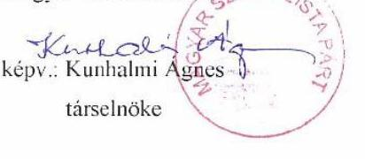

---

# Kunhalmi Ágnes 

## Komjáthi Imre

Társelnökök
Magyar Szocialista Párt

## Budapest

Tárgy: Válaszlevél ellenőrzéssel kapcsolatos észrevételek kezeléséről

## Tisztelt Társelnök Asszony és Társelnök Úr!

A „Kampánypénzek ellenőrzése - A 2022. évi országgyűlési képviselő-választási kampányra fordított pénzeszközök elszámolásának ellenőrzése hat jelölő szervezetnél" című számvevőszéki részjelentés tervezetével kapcsolatos, 2023. szeptember 9-i keltezésű észrevételüket köszönettel megkaptam.

Az Állami Számvevőszékről szóló 2011. évi LXVI. törvény (a továbbiakban: ÁSZ tv.) 29. § (2) bekezdése szerint az ellenőrzött szervezet vezetője és a felelősként megjelölt személy az ellenőrzés megállapításaira tizenöt napon belül írásban észrevételt tehet. Ugyanezen szakasz (3) bekezdése szerint az Állami Számvevőszék (a továbbiakban: ÁSZ) az észrevételre a beérkezésétől számított harminc napon belül írásban válaszol. A figyelembe nem vett észrevételeket köteles a jelentésben feltüntetni, és megindokolni, hogy azokat miért nem fogadta el. Tájékoztatom Társelnök asszonyt és Társelnök urat, hogy a számvevőszéki részjelentésben a figyelembe nem vett észrevételeket szerepeltetjük az elutasítás indokának feltüntetésével.

---

Az ÁSZ észrevételekre vonatkozó álláspontjáról az alábbi tájékoztatást adom:

# a) Levelében észrevételt tett az ellenőrzés tárgyával kapcsolatban. 

Az ellenőrzés tárgyával kapcsolatos észrevételében írtakkal kapcsolatban tájékoztatom, hogy az ÁSZ ellenőrzése a 2022. évi országgyűlési választáson a pártlistákra leadott összes érvényes szavazat legalább 1%-át megszerzett pártokra terjedt ki az országgyűlési képviselők választása kampányköltségeinek átláthatóvá tételéről szóló 2013. évi LXXXVII. törvény (a továbbiakban: Kampányfinanszírozási törvény) rendelkezéseivel összhangban. Ahogy „az ellenőrzött szervezetek" című fejezetből is kitűnik, a teljes ellenőrzés során ellenőrzött szervezetek felsorolását a II. számú melléklet tartalmazza és a részjelentés-tervezetben a Demokratikus Koalíció, a Jobbik, a Momentum Mozgalom, az MSZP, az LMP és a Párbeszéd minősül ellenőrzött szervezetnek. Az kizárólag formai, szövegszerkesztési megoldás, hogy a részjelentés-tervezet ezen hat párt felsorolásától a későbbiekben eltekintett és a hat pártra együttesen Hatpárti összefogásként hivatkozott. A tervezet rövidítés jegyzéke szerint Hatpárti összefogás „a Demokratikus Koalíció-Jobbik-Momentum Mozgalom-MSZP-LMP-Párbeszéd jelölő szervezetek, amelyek a 2022. évi országgyűlési választáson közös országos listát állítottak". Az ÁSZ hangsúlyozza, hogy a Hatpárti összefogást nem tekinti önálló jogalanyisággal rendelkező szervezetnek.
Emiatt a részjelentés-tervezet módosítása az észrevétele alapján nem indokolt.

## b) Levelében észrevételt tett az ellenőrzési időszakkal kapcsolatban.

A részjelentés tervezete megjelöli az ellenőrzés jogalapját, így a Kampányfinanszírozási törvény 9. § (2) bekezdését és a pártok működéséről és gazdálkodásáról szóló 1989. évi XXXIII. törvény (a továbbiakban: Párt törvény) 10. § (1) bekezdését. A Kampányfinanszírozási törvény 9. § (2) bekezdése értelmében az ÁSZ a választásra fordított állami és a pártok működéséről és gazdálkodásáról szóló törvényben meghatározott más pénzeszközök felhasználását ellenőrzi. A Párt törvény 10. § (1) bekezdése alapján a párt gazdálkodása törvényességének ellenőrzésére az ÁSZ jogosult.
Ahogy arra a részjelentés tervezete rámutat, „a Párt törvény gazdálkodási szabályai és a kampányköltségek korlátozására vonatkozó jogszabályi rendelkezések egymástól függetlenek, a pártokat egyidejűleg és egymástól függetlenül kötelezik" (a Hatpárti összefogásra vonatkozó megállapítások, I.4. b) pont). Ebből következően a tiltott párttámogatás attól függetlenül megállapítható, hogy az adott ügylet kampányhoz vagy kampányidőszakhoz kötődik-e.
Az egyik vizsgálati szempont a kampányfinanszírozási limit. A Kampányfinanszírozási törvény szóhasználata („választásra fordított") nem kötődik kampányidőszakhoz, hiszen nem kizárt, hogy a kampánycélt szolgáló kiadás a kampányidőszakot megelőzően vagy azt követően merül fel az igénybe vett szolgáltatás jellegéből, a szolgáltatóval történő elszámolás
 módjából következően. Ezért önmagában az, hogy a kiadás kampányidőszakon kívül merült fel, nem

---

teszi a megállapítást megalapozatlanná, amennyiben a kiadás a választással kapcsolatban merül fel, annak vizsgálata indokolt.

Ugyanezen szófordulatból az is következik, hogy a vizsgálható kiadások köre tágabb a „kampánytevékenységgel kapcsolatos költéseknél", azaz minden, a választással kapcsolatos költség vizsgálható. Így például az eredményváró rendezvénnyel kapcsolatos kiadásokra vonatkozó megállapítások annak ellenére vizsgálhatók, hogy az eredményváró rendezvény nem minősül kampánytevékenységnek, hiszen jellegéből következően nem alkalmas a választói akarat befolyásolására.

Mindezek alapján a jelen ellenőrzés keretében minden olyan kiadás vizsgálható volt, amely akár kampányidőszak alatt, akár kampányidőszakon kívül a választással kapcsolatban merült fel.

Az ellenőrzés alapadatai között került rögzítésre az ellenőrzés tárgya, amely többek között az „egyéb forrásból finanszírozott valamennyi kiadásnak a választási kampányidőszak alatti, illetve a kampánytevékenységre történő teljesítése".
Emiatt a részjelentés-tervezet módosítása az észrevétele alapján nem indokolt.

# c) Levelében észrevételt tett az ellenőrzési módszerrel kapcsolatban. 

Az ellenőrzés módszere kapcsán tett észrevételére tájékoztatom, hogy a részjelentéstervezetnek a Hatpárti összefogással kapcsolatos megállapításait tartalmazó részének I.2. pontjában összefoglalóan ismertette a pártok és az MMM nyilatkozataiban foglaltakat, így azon állítás, miszerint az ÁSZ figyelmen kívül hagyta a hivatkozott nyilatkozatokat, megalapozatlan. Tájékoztatom továbbá, hogy a részjelentés-tervezet I. 4. pontjának a) alpontjában az ÁSZ rögzítette, hogy mely körülményekre figyelemmel tekinti a nem vagyoni hozzájárulást elfogadottnak. Eszerint az ÁSZ álláspontja nem kizárólag az MMM elnökének miniszterelnökjelöltségén alapul. Az ÁSZ a részjelentés-tervezetben rögzítette a megállapításait megalapozó érveket, azok tehát ismertek valamennyi ellenőrzött szervezet előtt.
Emiatt a részjelentés-tervezet módosítása az észrevétele alapján nem indokolt.

## d) Levelében észrevételt tett az ellenőrzés megállapításaival kapcsolatban.

Az ellenőrzés megállapításai kapcsán tett észrevételére, miszerint az ÁSZ az MMM „kampánytanácsban" való „ellentmondásos" részvételére és ennek az ellentmondásnak a kiküszöbölése nélkül levont következtetéseire alapozta megállapításait az alábbiakról tájékoztatom.

A részjelentés-tervezet e tekintetben a következő megállapítást tartalmazza: „A KT működéséről további más forrásból származó információ nem volt fellelhető, így ellentmondásos, hogy a kampány során ténylegesen milyen feladatot látott el, illetőleg abban az MMM a pártok fent összefoglalt előadása vagy a Hatpárti összefogás közös miniszterelnök-jelöltje tavalyi sajtónyilatkozatai szerinti szerepet töltött-e be". Tény ugyanakkor, hogy a kampánytanács megalapításáról az ellenőrzött szervezetek

---

sajtónyilatkozatot bocsátottak ki, továbbá annak fenntartását nem cáfolták. Mindezek mellett a tiltott vagyoni hozzájárulás megállapítására nem kizárólag a kampánytanács tényére figyelemmel került sor. Megállapítható továbbá, hogy az ellenőrzött szervezet a tényállásban és a tényállás jogi minősítésénél (I.4. pont) megjelölt egyéb körülményeket figyelmen kívül hagyja.
Mindezekre tekintettel a részjelentés-tervezet módosítása az észrevétel alapján nem indokolt.

# e) Levelében észrevételt tett az iratmegismerés kapcsán. 

Észrevételében, miszerint az iratmegismerés nem teljeskörűsége álláspontja szerint a jogállami garanciák sérelmét is jelenti egyben, tájékoztatom, hogy az ÁSZ törvény az iratismertetésre vonatkozó rendelkezéseket, erre vonatkozó jogosultságokat nem tartalmaz. Az ÁSZ az észrevételezési jog gyakorlásának vonatkozásában biztosította az ellenőrzött szervezetek részére a megállapítások alapjául szolgáló iratok megismerését. Az MSZP észrevétele konkrétumokat nem tartalmaz, így nem világos, mely iratok megismerésére nem volt módja és az miként befolyásolta az észrevételezési joga gyakorlását.
Az észrevételben foglaltakkal ellentétben az ÁSZ a vizsgálat alapját képező valamennyi, a részjelentés-tervezet VI. számú mellékletében bemutatott gazdasági eseményt alátámasztó bizonylatot (szerződéseket, számlákat, teljesítési igazolásokat) az MSZP részére anonimizált formában átadott.
Emiatt a részjelentés-tervezet módosítása az észrevétele alapján nem indokolt.
f) Levelében észrevételt tett a kampányzáró rendezvénnyel kapcsolatos kiadásokra vonatkozó megállapításra.
A kampányzáró rendezvénnyel kapcsolatos kiadásokra vonatkozó észrevételét az ÁSZ elfogadja, a részjelentés-tervezet az észrevétele alapján módosítja, a VI. számú melléklet kampányzáró rendezvénnyel kapcsolatos kiadásai összegével, összesen 9,8 M Ft-tal csökkenti a kampányidőszakra megállapított nem pénzbeli vagyoni hozzájárulás összegét.
g) Levelében észrevételt tett arra, hogy az ÁSZ nem vette figyelembe, hogy Márki-Zay Péter a miniszterelnök-jelölti mellett további két másik, közjogi relevanciával is rendelkezett.
Észrevételében, miszerint az ÁSZ figyelmen kívül hagyta, hogy Márki-Zay Péter a közjogi relevanciával nem bíró miniszterelnök-jelöltként két másik közjogi minőséggel (Hódmezővásárhely Megyei Jogú Város polgármestere és Hódmezővásárhelyi székhelyű egyéni választókerületben induló képviselőjelölt) is rendelkezett, az ÁSZ elsődlegesen rögzíti, hogy a Hatpárti összefogás miniszterelnök-jelöltje egyben az MMM elnöke volt, így az MMM kampányidőszakban folytatott nyilvános tevékenysége nem választható el a Márki-Zay Péter vezette lista népszerűsítésétől és az azt alkotó pártok kampányfinanszírozásától. Ezt erősíti, hogy az MMM nevesített - a nyilvánosság felé is kommunikált - módon részt vett a közös

---

listán induló pártok választási együttműködését operatív módon szervező kampánytanács tevékenységében, azaz az ellenőrzött szervezetek kampányát nem csupán „kívülről" támogatta, a kampányidőszakban a Hatpárti összefogás érdekében kampánytevékenységeket, kampányeszközöket finanszírozott, amelyeket az ÁSZ a részjelentés-tervezet VI. számú mellékletében mutat be. Az ÁSZ a részjelentés-tervezetben leírtakkal összhangban az MMM kiadásai közül a rendelkezésre bocsátott bizonylatok, a számlák, szerződések, megrendelések, a szerződésszerű teljesítést igazoló dokumentumok (pl.: plakát, szórólap, kiadvány fotója, képi megjelenítése, teljesítési igazolás stb.) értékelése alapján kizárólag azokat minősítette kampányköltésnek, amelyeket az MMM kifejezetten a választási eljárásról szóló 2013. évi XXXVI. törvényben (a továbbiakban: Ve.) meghatározott kampányeszközökre, vagy egyéb olyan kiadásokra fordította, amelyek alkalmasak voltak a 2022-es országgyűlési választási kampányban a választói akarat befolyásolására, a Hatpárti összefogás népszerűsítése érdekében kerültek kifizetésre. A részjelentés-tervezet VI. számú melléklete tehát nem tartalmaz olyan gazdasági eseményeket, amelyek Márki-Zay Péter „két másik, közjogi minőséggel összefüggő" kampányának, tevékenységének kiadásai, azaz nem Márki-Zay Péter hódmezővásárhelyi egyéni választókerületi kampányával és nem Márki-Zay Péternek, mint Hódmezővásárhely Megyei Jogú Város polgármesterének politikusi tevékenységével függenek össze. Az ÁSZ Márki-Zay Péter egyéni választókerületi kampányával kapcsolatos, a Magyar Államkincstár felé benyújtott elszámolását ellenőrizte, annak tapasztalatait 23012-es sorszámú, „A kampánypénzeszközök ellenőrzése - A 2022. évi országgyűlési képviselő-választási kampányra fordított pénzeszközök elszámolásának ellenőrzése az egyéni jelölteknél" című jelentésében hozta nyilvánosságra. Ezen túlmenően a Márki-Zay Pétert jelölő Hatpárti összefogás pártjai közül a Párbeszéd, a Magyar Közlönyben közzétett elszámolása alátámasztására megküldött dokumentumok szerint 4,7 M Ft-ot fordított Márki-Zay Péter, mint a Párbeszéd képviselőjelöltjének kampányára. A részjelentés-tervezet VI. számú mellékletében szereplő kiadások sem Márki-Zay Péter által, sem a Párbeszéd által elszámolt, Márki-Zay Péter egyéni képviselőjelölti kampányának kampánykiadásai között nem szerepelnek.
Emiatt a részjelentés-tervezet módosítása az észrevétele alapján nem indokolt.

# b) Észrevételt tett a tiltott támogatás párt általi tudomásra jutására és elfogadására. 

A tiltott támogatás elfogadásával kapcsolatban tett észrevételére tájékoztatom, hogy a polgári törvénykönyvről szóló 2013. évi V. törvény (a továbbiakban: Ptk.) 6:4. § (2) bekezdése alapján jognyilatkozat nem csak írásban, hanem szóban vagy ráutaló magatartással is tehető. Az ÁSZ természetesen nem állítja, hogy a bizonyítás terhe átfordult volna és az ellenőrzött szervezeteknek kellene bizonyítani, hogy a vagyoni hozzájárulást nem fogadták el. Az ÁSZ az elfogadást az ismert tényállási elemek alapján állapította meg.

Az észrevételben foglaltak a Hatpárti összefogásra vonatkozó megállapítás I. 4. pontjának a) alpontjában foglaltakat érintik. Ezen pontban az ÁSZ rögzítette, hogy mely körülményekre

---

figyelemmel tekinti a nem vagyoni hozzájárulást elfogadottnak. Ezen érvelésre az észrevétele érdemben nem reagált, annak megalapozottságát nem cáfolta, ezért az ÁSZ az álláspontját fenntartja. Önmagában az a körülmény, hogy az ellenőrzött szervezetek a nem vagyoni hozzájárulást formális nyilatkozattal nem fogadták el, nem értékelhető az ellenőrzött szervezetek javára, miután a közös kampány lebonyolításának körülményei, a költségek mértéke, a kampány volumene, továbbá az egyes kiadások összehangolt jellege a részjelentés tervezetében részletezettek szerint a hallgatólagos elfogadást valószínűsítik.

Az ÁSZ hangsúlyozza, nem életszerű, hogy a Hatpárti összefogás pártjai a kampányukhoz történő ilyen jelentős anyagi hozzájárulás tényét nem észlelték.

Emiatt a részjelentés-tervezet módosítása az észrevétele alapján nem indokolt.
i) Észrevételt tett az MMM által megvalósított kiadások véleménynyilvánítás körében történő értékelése kapcsán.

A véleménynyilvánítás szabadsága kapcsán tett észrevételére az ÁSZ hivatkozik arra, hogy az ÁSZ tv. 24. § (1) bekezdés b) pontja értelmében az ellenőrzés végrehajtása során a jogszabályok szerint kell eljárni. Eszerint az ellenőrzött szervezetek tevékenységét a jogszabályok, nem pedig más szervezetek tevékenységével történő összevetés alapján kell minősíteni. Az ilyen - politikai, közéleti jellegű - érvek az észrevételek körében nem vehetők figyelembe.

Az ÁSZ a tiltott párttámogatásra vonatkozó szabályokat valamennyi párt esetében alkalmazza. A pártok közötti választási versengésbeli esélyegyenlőség vélt vagy valós hiányának vizsgálata nem lehet az ÁSZ eljárásának tárgya, továbbá nem adhat okot a jogszabályi rendelkezések figyelmen kívül hagyására.

Az észrevétel megalapozatlan azon okból is, hogy a jogi értékelés szempontjából lényeges különbségeket figyelmen kívül hagy.

1) Az ÁSZ egyetért az észrevételt tevő ellenőrzött szervezettel abban, hogy a véleménynyilvánítás joga a jogi személyeket is megilleti.

Az Alaptörvény IX. cikk (1) bekezdése értelmében mindenkinek joga van a véleménynyilvánítás szabadságához. Az Alaptörvény I. cikk (4) bekezdése szerint a törvény alapján létrehozott jogalanyok számára is biztosítottak azok az alapvető jogok, valamint őket is terhelik azok a kötelezettségek, amelyek természetüknél fogva nem csak az emberre vonatkoznak. Ezzel egyezően a Ptk. 3:1. § (2) bekezdése alapján a jogi személy jogképessége kiterjed minden olyan jogra és kötelezettségre, amely jellegénél fogva nem csupán az emberhez fűződhet.

Ebből következően mind az MMM-et, más jogi személyeket megilleti a véleménynyilvánítás joga.

---

2) Az Alkotmánybíróság 30/1992 AB határozatában foglaltak alapján

-   a szabad véleménynyilvánítás joga a kommunikációs alapjogok „anyajoga"; belőle vezethető le többek között a sajtószabadság alapjoga is;
-   az Alkotmány a szabad kommunikációt — az egyéni magatartást és a társadalmi folyamatot - biztosítja és védi, tekintet nélkül annak tartalmára, illetve a véleménynyilvánító személyére;
-   a véleményszabadság kiemelt szerepe folytán a vele szemben mérlegelendő jogokat korlátozóan kell értelmezni;
-   az államot, ahol ez értelemszerű, intézményvédelmi kötelesség is terheli, ezért a véleménynyilvánításhoz való alanyi alapjog, a demokratikus közvélemény kialakulása feltételeinek és működése fenntartásának biztosítására irányuló állami kötelezettség.

A vonatkozó joggyakorlat szerint a véleménynyilvánítás joga - különösen a választási kampány során - kiemelt védelemben részesül; a véleménynyilvánítás jogát korlátozó rendelkezéseket korlátozóan kell értelmezni. A jogszabályok nem tartalmaznak olyan rendelkezést, hogy csak a jelöltek és a jelölő szervezetek folytathatnak kampánytevékenységet, az alkotmányosan elvárt tág értelmezés alapján és az állam alapjogvédelmi kötelezettségére figyelemmel az alapelvekből az következik, hogy a jogi személy véleménynyilvánítási jogának gyakorlása a véleményt nyilvánító jogi személy jellegére hivatkozással nem korlátozható.
3) A Ve. 142. §-a szerint egyes állami szervek tevékenységén felül nem minősül választási kampánynak az állampolgárok - mint magánszemélyek - közötti személyes kommunikáció, függetlenül annak tartalmától és formájától. A Ve. tehát a jogi személyek tevékenységét, amennyiben az kampányidőszakban a választói akarat befolyásolására vagy ennek kísérletére irányul, nem sorolja a kivételek közé, így azt kampánytevékenységnek tekinti. A Ve. ugyanakkor olyan rendelkezést nem tartalmaz, miszerint a jelölő szervezeteken kívül eső más jogi személy számára tiltott lenne a kampánytevékenység folytatása. Ebből következően a Ve. rendelkezései nem tekinthetők a jogi személy véleménynyilvánítási jogát korlátozó szabályozásnak.
4) Az előző pontokban foglaltak alapján felmerül a kérdés, hogy a jogi személy kampánytevékenysége mikor valósít meg tiltott párttámogatást?
A Párt törvény 4. § (2) bekezdése szerint a párt részére jogi személy, jogi személyiséggel nem rendelkező szervezet vagyoni hozzájárulást nem adhat, a párt jogi személytől, jogi személyiséggel nem rendelkező szervezettől vagyoni hozzájárulást nem fogadhat el.
A Ve. 141. §-a szerint kampánytevékenység a kampányeszközök kampányidőszakban történő felhasználása és minden egyéb kampányidőszakban folytatott tevékenység a választói akarat

---

befolyásolása vagy ennek megkísérlése céljából. A törvényi meghatározás tehát igen tág, a kampány fogalmát annak célja alapján határozza meg.

A nem a jelöltek, jelölő szervezetek által folytatott kampánynak a Párt törvény rendelkezését figyelembe véve két esetköre lehet:
a) A „kampánytámogatásnak" nevezett esetben a jogi személy csak látszólag folytat önálló kampányt, valójában a kampánytevékenysége számos körülményt illetően összeolvad a jelölő szervezet kampányával, így az a jelölő szervezetnek betudható. A kampánytámogatást az eset összes körülményét mérlegelve lehet megállapítani. A kampánytámogatás esetében a jelölő szervezettel történő egyeztetés biztosítja, hogy az egyeztetett kampány valóban a támogatott jelölő szervezet céljait szolgálja, így a jelölő szervezet kiadásainak részbeni átvállalása tiltott támogatást valósít meg. Az egyeztetés az elfogadás aktusát is megvalósítja. Kampánytámogatásra utalnak a jogi személy és a jelölő szervezet egymással összekapcsolódó (egymást kiegészítő) kiadásai, a kampányeszközök tartalmi összehangolása, közös logó használata, szervezeti és személyi összefonódások, a szervezett együttműködés intézményesített keretei. A kampánytámogatás közvetlen anyagi támogatást valósít meg.
b) A „nem egyeztetett (önálló) kampánynak" minősülő esetben a jogi személy nem egyezteti a kampánytevékenységét az általa támogatott jelölő szervezettel. Üzenetei, a kampányeszközök tartalma nem utal konkrét együttműködésre, a jogi személy kiadásai függetlenek a támogatott jelölő szervezet kampánytevékenységétől. A nem egyeztetett (önálló) kampány esetében a támogatás csak annyiban valósul meg, hogy a jogi személy üzenetei egybeesnek a támogatott jelölő szervezet céljaival, a jogi személy kifejezi a támogatott jelölő szervezet mellett szóló érveket, illetőleg kritizálja a konkurens jelölő szervezeteket és jelölteket. A nem egyeztetett (önálló) kampány elsődlegesen erkölcsi jellegű, közvetlen anyagi támogatásról nincs szó.

Az ÁSZ eljárásában nincs mód annak feltárására, hogy egy jogi személy kampánytevékenysége az egyes jelölő szervezetek választási eredményét milyen mértékben befolyásolta. Nem állapítható meg teljes bizonyossággal, hogy egy jelölő szervezet támogatottsága ténylegesen milyen körülmények (kampányeszközök, üzenetek, események) hatására alakult ki, illetve hogyan alakult volna a jogi személy támogató kampányának hiányában. Ad absurdum az sem zárható ki, hogy a jogi személy kampánya - mondjuk a jogi személy elutasítottsága miatt, vele szemben fennálló széles körű ellenszenv esetén - az üzenete ellenére még rontja is a támogatni kívánt jelölő szervezet kampányát és választási eredményét, azaz a hasznosság nem egyértelmű. Ezért önmagában a jogi személy kampányának ténye, üzenete és irányultsága nem szolgálhat a tiltott pártámogatás megállapításának alapjául.

Önmagában a jogi személy véleménynyilvánítási jogának gyakorlása nem valósít meg tiltott párttámogatást. Tiltott párttámogatás csak a kampánytámogatás, azaz elsődlegesen vagyoni támogatás esetében valósul meg, azaz amikor a jogi személy véleményének támogató jellegén túl további elemek is fennállnak, amelyek igazolják a támogatás irányát (kedvezményezettjét),

---

konkretizálják a vagyoni hozzájárulás tényét, igazolják vagy valószínűsítik a támogatás elfogadását és esetleg annak összegszerűségének megállapítására is alapot szolgáltatnak.

Hangsúlyozzuk, a tiltott párttámogatás nem arra tekintettel került megállapításra, hogy az MMM véleménynyilvánítási jogát gyakorolta. A megállapítás alapja az, hogy az MMM amelynek elnöke egyben a Hatpárti összefogás miniszterelnök-jelöltje is volt véleménynyilvánítási jogának gyakorlása mellett a Hatpárti összefogás kampányának egyes költségeit is átvállalta, ezen támogatást pedig a jelölő szervezetek - amelyek előtt a kampány mérete ismert kellett, hogy legyen - legalább hallgatólagosan elfogadták.

Végezetül megjegyezzük továbbá, hogy a NIK jelentése szerint több olyan magyarországi jogi személy, amely közvetlenül külföldi támogatásban részesült, a Hatpárti összefogás kampányát támogatva jelentős összegben finanszírozott kampánytevékenységeket, kampányeszközöket. Az ÁSZ azonban ezen jogi személyek Ve. szerinti kampányidőszakhoz kötődő, kampányeszközökre és kampánytevékenységekre fordított kiadásait nem egyeztetett (önálló) kampánynak tekinti, figyelemmel arra, hogy a kampánytámogatásra utaló jelek nem voltak megállapíthatók, azaz ezen esetek nem analógok az MMM által nyújtott támogatással.

Mindezek miatt a részjelentés-tervezet módosítása az észrevétel alapján nem indokolt.
j) Észrevételt tett a részjelentés tervezetének VI. számú mellékletében hivatkozott kiadások alátámasztására átadott anonimizált dokumentumokban a megbízott felelősségi körére, az esetlegesen felmerült szerződésszegésekért való felelősségre.

Az észrevétele kapcsán az ÁSZ álláspontja szerint a jelen esetben annak van jelentősége, hogy a pártok tiltott támogatása, a támogatás elfogadása megvalósult-e. Amennyiben igen, annak nincs jelentősége, hogy a szerződő felek az egyes szerződésekben ezzel ellentétes - de ténylegesen be nem tartott - vállalásokat tettek. Az észrevétel ténylegesen azt jelenti, hogy az ellenőrzés során a tényekkel szemben a valóságban nem teljesült szerződéses nyilatkozatokat kellene alapul venni. Ezen elv elfogadásával mindenfajta ellenőrzés értelmét vesztené.

Emiatt a részjelentés-tervezet módosítása az észrevétel alapján nem indokolt.
k) Észrevételt tett a pártok felelősségének megállapítására és az ÁSZ jogszabálymódosítási kezdeményezésére.

A pártok felelősségének megállapítása és az ÁSZ jogszabálymódosítási kezdeményezésére vonatkozóan tett észrevételével kapcsolatban hangsúlyozzuk, hogy az ÁSZ törvény 1. § (1) bekezdése szerint az ÁSZ az Országgyűlés legfőbb pénzügyi és gazdasági ellenőrző szerve, amely az Országgyűlésnek alárendelve látja el feladatát. Az ÁSZ törvény 24. § (1) bekezdés b) pontja értelmében az ellenőrzés végrehajtása során a jogszabályok szerint kell eljárni.

Az ÁSZ jogalkalmazó szerv, jogalkotás nem tartozik a hatáskörébe, ebből következően a jogalkotással szemben támasztott követelmények teljesítése nem az ÁSZ feladata. Az

---

észrevétel nem az ÁSZ ellenőrzésére vonatkozik, az abban megjelölt szempontokat a jogalkotónak szükséges figyelembe vennie.

Az ÁSZ megjegyzi ugyanakkor, hogy a jelen esetben arról nincs szó, hogy a pártok jogi helyzete utólag elnehezülne, illetőleg az elkövetéskori magatartásukat utólag minősítenék jogsértőnek. A tiltott párttámogatások megvalósulásának időpontjában ugyanis a Párt törvény tiltotta a jogi személyektől származó pénzbeli és nem pénzbeli vagyoni hozzájárulás elfogadását, azaz a jogi minősítésre nem utólagos jogalkotás eredményeképpen kerül sor.

Emiatt a részjelentés-tervezet módosítása az észrevétel alapján nem indokolt.
l) Észrevételt tett a nem teljes körű kampányelszámolásra vonatkozóan tett megállapításra.

A nem teljeskörű kampányelszámolásra vonatkozó megállapításra tett észrevételével kapcsolatban a részjelentés-tervezet is rögzíti, a pártoknak egyszerre kell megfelelniük a Párt törvény és a Kampányfinanszírozási törvény rendelkezéseinek. Amennyiben a tiltott páttámogatás kampánykiadással kapcsolatos, a cselekmény mindkét jogszabály rendelkezéseit sérti. Az MSZP az MMM-től kapott nem vagyoni hozzájárulást elszámolásában nem szerepeltette, így a kampányelszámolás hiányosságát kellett megállapítani.

Emiatt a részjelentés-tervezet módosítása az észrevétel alapján nem indokolt.
m) Észrevételt tett politikai hirdetés vásárlása során speciális kedvezmény igénybevétele miatt megállapított 4,0 M Ft tiltott támogatás kapcsán.

A politikai hirdetés vásárlása során speciális kedvezmény igénybevétele miatt az MSZP részére megállapított $4,0 \mathrm{M}$ Ft értékű tiltott támogatás kapcsán tett észrevételére tájékoztatom, hogy, egy esetben az MSZP részéről a politikai hirdetések közzétételéért fizetett ellenérték - a Ve. 148. § (4) bekezdésében foglaltakkal ellentétben - alacsonyabb volt, mint az ÁSZ által nyilvántartásba vett árjegyzék által meghatározott ellenérték, a párt $60 \%$-os, speciális kedvezményt kapott. Az észrevétel téves abban a tekintetben, hogy a szolgáltatás nyújtására nem az „árlistában" (árjegyzékben) megjelölt áron került sor, mivel az árjegyzékben megjelölt árnál $60 \%$-kal csökkentett összegben lett a kifizetendő végösszeg meghatározva. Olyan körülmény nem merült fel, amely alapján az árlista megfelelősége megkérdőjelezhető lett volna. Ezen okból a megállapítás nem volt mellőzhető.

Azon érv, miszerint a médiaszolgáltató a kedvezményt más pártnak is nyújtotta volna, nem fogadható el, mert a Ve. 148. § (4) bekezdésben foglaltak alapján a politikai hirdetés csak a nyilvántartásba vett árjegyzék által meghatározott ellenérték fejében közölhető. A politikai hirdetés közzétevője - az ÁSZ részére megküldött árjegyzékkel igazoltan - a „2022. április 3-án tartandó országgyűlési választások előtti" időszak tekintetében meghatározta árlistáját, és ennek ellenére az előre rögzített ár alatt - az adható/biztosított kedvezmények mértékének számítási módjának, elveinek általános rögzítése hiányában - nyújtott kedvezményes szolgáltatást az

---

MSZP részére. Az ÁSZ fentiek miatt továbbra is fenntartja, hogy az MSZP a politikai hirdetés vásárlásakor nem pénzbeli vagyoni hozzájárulást fogadott el.

Emiatt a részjelentés-tervezet módosítása az észrevétel alapján nem indokolt.

Kelt: Budapest, időbélyegző szerint

Tisztelettel:
az Állami Számvevőszék elnöke nevében:

# Klinga László s.k. 

igazgató
Állami Számvevőszék
Államháztartáson Kívüli Szervezeteket
Ellenőrző Igazgatóság

---

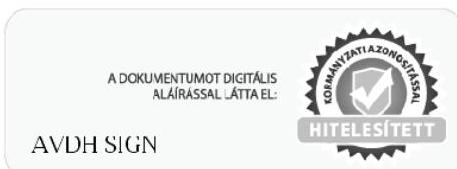

| HATÓSÁG: | T. ÁLLAMI SZÁMVEVŐSZÉK |
| :--: | :--: |
| ÜGYSZÁM: | EL-3712/2023 |
| JELÖLŐ | LMP - Magyarország Zöld Pártja (székhely: 1136 Budapest, Hegedűs |
| SZERVEZETEK: | Gyula utca 36. fszt. 5.; Adószám: 18199260-1-41), |
|  | Párbeszéd - a Zöldek Pártja (székhely: 1015 Budapest, Batthyány utca 62.; Adószám: 18511213-1-41), |
|  | Momentum Mozgalom (székhely: 1024 Budapest, Rózsahegy utca 1-2. I/1.; Adószám: 18903939-1-41) |
|  | jogi képviselő: |
|  | Szecskay Ügyvédi Iroda (1055 Budapest, Kossuth Lajos tér 16-17.; eljáró ügyvédek: dr. Wellmann György, dr. Szabó Emil, dr. Bihary Dániel; email cím: gyorgy.wellmann@szecskay.com, emil.szabo@szecskay.com, daniel.bihary@szecskay.com; telefon: 06-1-472-3000) |
| ELJÁRÁS | Kampánypénzek ellenőrzése - A 2022. évi országgyűlési képviselő- |
| TÁRGYA: | választási kampányra fordított pénzeszközök elszámolásának ellenőrzése jelölő szervezeteknél |
| KELT: | Budapest, 2023. szeptember 8. |

# ÉSZREVÉTELEK

---

# T. ÁLLAMI SZÁMVEVŐSZÉK! <br> Budapest 

Alulírott LMP - Magyarország Zöld Pártja (székhely: 1136 Budapest, Hegedűs Gyula utca 36. fszt. 5.; Adószám: 18199260-1-41), Párbeszéd - a Zöldek Pártja (székhely: 1015 Budapest, Batthyány utca 62.; Adószám: 18511213-1-41), és Momentum Mozgalom (székhely: 1024 Budapest, Rózsahegy utca 1-2. I/1.; Adószám: 18903939-1-41) - a korábban csatolt meghatalmazások által igazolt jogi képviselőnk, a Szecskay Ügyvédi Iroda (1055 Budapest, Kossuth Lajos tér 16-17.; eljáró ügyvédek: dr. Wellmann György, dr. Szabó Emil, dr. Bihary Dániel; e-mail cím: gyorgy.wellmann@szecskay.com, emil.szabo@szecskay.com, daniel.bihary@szecskay.com; telefon: 06-1-472-3000) útján - az alábbi

## észrevételeket

terjesztjük elő a T. Számvevőszék részjelentés-tervezetével („Tervezet") összefüggésben.

## 1. A VIZSGÁLAT JOGALAPJA ÉS AZ ELJÁRÁS GARANCIÁI

### 1.1 A vizsgálat jogalapja

1.  A pártok működéséről és gazdálkodásáról szóló 1989. évi XXXIII. törvény („Párttv.") 1. §-ával összhangban a Párttv. speciális szabályokat tartalmaz azokra az egyesületekre, amelyek nyilvántartott tagsággal rendelkeznek, és amelyek a nyilvántartásba vételüket végző bíróság előtt kinyilvánítják, hogy a Párttv. rendelkezéseit magukra nézve kötelezőnek ismerik el.
2.  A Párttv. IV. fejezete tartalmaz rendelkezéseket a párt vagyonával és gazdálkodásával kapcsolatban. A Párttv. 4. § (1) bekezdése tételesen felsorolja a párt vagyonát alkotó forrásokat. A Párttv. 4. § (2) és (3) bekezdése szerint pedig:
„(2) A párt részére - az (1) bekezdésben foglalt kivételektől eltekintve - jogi személy, jogi személyiséggel nem rendelkező szervezet vagyoni hozzájárulást nem adhat, a párt jogi személytől, jogi személyiséggel nem rendelkező szervezettől vagyoni hozzájárulást nem fogadhat el.
(3) A párt vagyoni hozzájárulást más államtól nem fogadhat el. A párt külföldi szervezettől - jogi státusától függetlenül - és nem magyar állampolgár természetes személytől vagyoni hozzájárulást nem fogadhat el. A párt névtelen adományt nem fogadhat el; az ilyen adományt be kell fizetni a 8. § (1) bekezdésében meghatározott alapítvány céljaira."
3. Ennek következményeként a Párttv. 4. § (4) bekezdése az alábbiak szerint rendelkezik:
„(4) Az a párt, amely a (2) és (3) bekezdésben foglalt szabályt megsértve vagyoni hozzájárulást fogadott el, köteles annak értékét - az Állami Számvevőszék felhívására - tizenöt napon belül a központi költségvetésnek

---

befizetni. Késedelem esetén a tartozást adók módjára kell behajtani. A párt központi költségvetésből juttatott támogatását az elfogadott vagyoni hozzájárulás értékét kitevő összeggel csökkenteni kell."
4. A Párttv. 10. § (1) bekezdése szerint:
„A párt gazdálkodása törvényességének ellenőrzésére az Állami Számvevőszék jogosult." (kiemelés részünkről)
5. Az Állami Számvevőszékről szóló 2011. évi LXVI. törvény („ÁSZ tv.") 5. § (11) bekezdésében foglalt jogkör a következő:
„Az Állami Számvevőszék - törvény rendelkezéseinek megfelelően törvényességi szempontok szerint ellenőrzi
a) a pártok gazdálkodását,
b) a pártok országgyűlési képviselőcsoportjai számára az Országgyűlés által folyósított hozzájárulás felhasználását.".
6. Hangsúlyozzuk tehát, hogy a T. Számvevőszék a vonatkozó jogszabályi rendelkezéseknek megfelelően a párt gazdálkodásának törvényességét jogosult és köteles vizsgálni.
7. A T. Számvevőszék jelen vizsgálatának körében relevanciával bír az országgyűlési képviselők választása kampányköltségeinek átláthatóvá tételéről szóló 2013. évi LXXXVII. törvény („Kampánytv."). A Kampánytv. a jelöltek és jelölő szervezetek részére nyújtandó jogszerű támogatások, illetve az azok részére felajánlott tiltott támogatások elfogadásának megtiltásával összefüggésben tartalmaz rendelkezéseket. ${ }^{1}$
8. A Kampánytv. 8/B. § (1) bekezdése szerint az Állami Számvevőszék vizsgálja a támogatás felhasználását a jelöltnél vagy a jelöltet jelölő pártnál. A 9. § (2) bekezdés szerint a választásra fordított állami és a Párttv.-ben meghatározott más pénzeszközök felhasználását az T. Számvevőszék a választást követő egy éven belül vizsgálja a jelöltek és jelölő szervezetek tekintetében.
9. A T. Számvevőszék eljárásnak jogi természetével részletesen foglalkozott az Alkotmánybíróság 32/2019. (XI. 15.) AB határozata, amely szerint:
„[47] Az ÁSZ tv. értelmében az ÁSZ ellenőrzései során, minthogy hatósági jogkör nélküli hivatalnak minősül, nem tekinthető hatóságnak és bíróságnak, az ellenőrzései eredményeként elfogadott jelentések nem kötelező érvényű hatósági döntések, illetve nem ítéletek, továbbá az ÁSZ közvetlen szankcionálási joggal sem rendelkezik. Az ÁSZ az általa folytatott ellenőrzésekről az ÁSZ tv. 32. §-a alapján jelentést készít, amely a feltárt tényeket és az ezeken alapuló

[^0]
[^0]:    ${ }^{1}$ Kampánytv. jogalkotói indokolásának általános indokolása.

---

megállapításokat, következtetéseket tartalmazza. Következésképpen az ÁSZ által készített jelentéseknek az ÁSZ tv. értelmében csak a feltárt tényállás és az ellenőrzési megállapítások képezik részét, az ellenőrzött szervezettel szembeni jogkövetkezmények alkalmazására, ekként szankciók alkalmazása az ÁSZ az ÁSZ tv. értelmében, és a pártok gazdálkodásának ellenőrzése tekintetében a Párttv. értelmében nem rendelkezik hatáskörrel."
10. Az Alkotmánybíróság többségi véleménye akként foglalt állást, hogy a T. Számvevőszék eljárására formális értelemben - közvetlenül - nem vonatkoznak a hatósági eljárásokra vonatkozó alapelvek és eljárási garanciák. Mivel azonban a Magyar Államkincstár szankciót alkalmazó döntésével szemben van helye bírósági felülvizsgálatnak, ezen felülvizsgálat körében az Állami Számvevőszék eljárására kiterjedően is lehet vizsgálni ezen alapelvek és eljárási garanciák érvényesülését. ${ }^{2}$
11. Hangsúlyozzuk, hogy a Magyar Államkincstár a Párttv. 10. § (2) bekezdése szerint nem jogosult pártok gazdasági-pénzügyi ellenőrzésére, amiből kifolyólag a T. Állami Számvevőszék megállapításait a 10/2022. (XII. 16.) PM rendelettel összhangban csupán átveszi. Következésképpen amennyiben a jelölő szervezet jogai a jelen vizsgálat során sérülnek, úgy annak jogkövetkezményeit a közigazgatási bíróság a Magyar Államkincstár határozatával szembeni jogorvoslatban köteles levonni.

# 1.2 A vizsgálat tárgya és alanyai 

## a) Az ellenőrzés tárgya

12. A Tervezet a vizsgálat tárgyát a 6. oldalán található „Az ellenőrzés tárgya" elnevezésű alcímben rögzíti az alábbiak szerint:
(i) a Kampánytv. 3/A. § (1) bekezdés szerinti nyilatkozat megléte;
[^0]
[^0]:    ${ }^{2}$ 32/2019. (XI. 15.) AB határozat: A Magyar Államkincstár döntése ellen az Ákr. és a Kp. szabályai szerint van helye jogorvoslatnak. Az Alkotmánybíróság utal arra, hogy közigazgatási perben a Kp. 6. §-a és a 78. § (1) bekezdése értelmében alkalmazandó a polgári perrendtartásról szóló 2016. évi CXXX. törvény 263. §-a és a 264. §-a, amelyek értelmében közigazgatási perben a szabad bizonyítás érvényesül és a közigazgatási bíróságot más hatóság döntése nem köti, e tekintetben csak a büntető bíróság bűncselekményt megállapító ítélete, illetve másik közigazgatási ügyben eljáró bíróság közigazgatási tevékenység jogszerűségének kérdésében hozott jogerős döntése rendelkezik jogi kötőerővel. Ezzel összefüggésben utal arra az Alkotmánybíróság, hogy egyetlen jogszabályi rendelkezés sem tartalmazza, hogy az ÁSZ megállapításai közigazgatási perben önmagában megdönthetetlen kötőerővel rendelkeznének a tényállás megállapítása során a bíróságok számára. Ezen túlmenően az Alkotmánybíróság hangsúlyozza, hogy „[t]örténeti alkotmányunk vívmányaira és a hivatkozott döntésre alapozva az Alkotmánybíróság megerősítette, hogy a közigazgatási határozatok törvényességének bírói felülvizsgálata alkotmányosan nem korlátozódhat a jogszerűség pusztán formális szempontok szerinti, az eljárási szabályok betartására korlátozódó vizsgálatára. A közigazgatási ügyben eljáró bíróság nincs kötve a közigazgatási határozatban megállapított tényálláshoz, és a jogszerűség szempontjából felülbírálhatja - sőt, felül kell bírálnia - a közigazgatási szerv mérlegelését is. Döntése során figyelemmel kell lennie az Alaptörvény 28. cikkére, vagyis azt kell feltételeznie, hogy a jogszabályok a józan észnek és a közjónak megfelelő, erkölcsös és gazdaságos célt szolgálnak." [...] Az Alkotmánybíróság kiemeli, hogy a bíróságnak ezen érdemi felülvizsgálata során a párt támogatása visszafizetésének, illetve csökkentésének jogalapja körében az összegszerűségre is kiterjedő felülvizsgálatot kell végeznie.

---

(ii) a kampánytevékenységhez köthető bizonylatok szabályszerűsége, hitelessége;
(iii) a költségvetési támogatásból és egyéb forrásból finanszírozott valamennyi kiadásnak a választási kampányidőszak alatti, illetve a kampánytevékenységre történő teljesítése.
13. A vizsgálattal érintett időszak szintén a Tervezet 6. oldalán kerül rögzítésre. A kampánytevékenység tekintetében az ellenőrzött időszak a szavazás napját megelőző 50. naptól a szavazás befejezésének időpontjáig tartó választási kampányidőszak, azaz a 2022. február 12. napjától 2022. április 3. napjáig tartó időszak.
14. Hangsúlyozzuk, hogy a Tervezetből is egyértelműen következik, hogy a kampánytevékenységgel kapcsolatos költések vizsgálata releváns a jelen ügy szempontjából.
15. Bármely olyan költés, amely
(i) nem kampánytevékenységgel kapcsolatos (így például a népszavazással kapcsolatos véleménynyilvánítás, a szavazatszámlálóként való részvételre buzdító kommunikáció); illetve
(ii) nem a kampányidőszakon belül lett eszközölve (így például a szavazás lezárást követő, eredményváró eseménnyel kapcsolatos költés)
nem illeszkedik a T. Számvevőszék által a vizsgálat tekintetében meghatározott keretbe.

# b) Az ellenőrzés alanyai 

16. A Tervezet az „Ellenőrzött szervezetek" alcím alatt nevesít „jelölő szervezeteket", amelyek gazdálkodása a jelen ellenőrzés tárgyát képezte. Ugyanezen fejezet alatt azonban a Tervezet már vegyesen hivatkozott hat pártra, mint különálló jelölő szervezetekre, illetve azokra egy egységként, mint „Hatpárti Összefogás", az adataik összesítésével.
17. A Tervezet hivatkozik a Kampánytv. 7. § (5) bekezdésében foglalt azon rendelkezésre, amely szerint a választási kampánytevékenységre összesen fordítható összeg meghatározásakor „[a] közös jelölteket vagy közös pártlistát állító pártokat [...] egy pártnak kell tekinteni."
18. A T. Számvevőszék a pártok gazdálkodását vizsgálja. Amíg a Kampánytv. 3.§ (2) bekezdése és a 7. § (5) bekezdése tartalmaz olyan kitételt, amely szerint az adott szakasz értelmében a közös listát állító pártokat egy pártnak kell tekinteni, addig a Párttv. ilyen szabályt nem tartalmaz. A pártokat a két jogszabály - a Párttv. és a Kampánytv. egymástól függetlenül szabályozza, amint azt a T. Számvevőszék is rögzíti:

---

„Elsődlegesen rögzíteni kell, hogy a Párttörvény gazdálkodási szabályai és a kampányköltségek korlátozására vonatkozó jogszabályi rendelkezések egymástól függetlenek, a pártokat egyidejűleg és egymástól függetlenül kötelezik."3
19. A Kampánytv. 3.§ (2) bekezdése és a 7. § (5) bekezdéséhez hasonló rendelkezés hiányában a T. Számvevőszék által a Párttv. 4. § (2) bekezdése ${ }^{4}$ alapján a pártoknak betudni kívánt, kampányköltésnek minősülő vagyoni hozzájárulás vizsgálata csak pártonként külön-külön történhet. A rendelkezés fogalmi elemei, a törvényi tényállás feltételei csupán pártonként külön-külön értelmezhetők. A Párttv. 4. § (2) bekezdésének contra legem értelmezése lenne egy olyan álláspont, ami alapján egy párt - kifejezett ilyen tartalmú szándékot alátámasztó bizonyíték nélkül - valamennyi másik párt nevében is elfogadhatna nem pénzbeni hozzájárulást.
20. A Tervezet alábbi megállapítása azonban a fentiek fényében nehezen értelmezhető:
„A kampányköltségek korlátozására vonatkozó szabályok tekintetében a jogszerű forrásból és a tiltott forrásból finanszírozott kiadások azonos jogi megítélés alá esnek, a limit megtartását egységesen szükséges vizsgálni."5
21. Amíg ugyanis a kampányköltségek korlátozására vonatkozó szabályok tekintetében valóban egy pártnak kell tekinteni a közös pártlistát állító pártokat, addig a kampányköltésnek minősülő vagyoni hozzájárulás vizsgálata csak pártonként külön-külön történhet.
22. Így összegzésként az állapítható meg, hogy az Állami Számvevőszék vizsgálatának alanyai az egyes pártok külön-külön, annak ellenére, hogy a Kampánytv. 3. és 7. §§-ai körében azok egy pártnak tekintendők.

# 1.2 Az ellenőrzés alá vont pártok jogait biztosító garanciák 

## a) Általános jogelvek - a visszaható jogalkotás és jogalkalmazás tilalma

23. A Tervezet az alábbi megjegyzést teszi:
„a jelenleg hatályos jogszabályi rendelkezések nem tartalmaznak egyértelmű rendelkezést arra vonatkozólag, hogy a Hatpárti összefogás érdekében, de nem konkrétan megjelölt pártnak címzett nem pénzbeli vagyoni hozzájárulás esetében a jogkövetkezményeket melyik párt vonatkozásában, illetőleg a pártok között megosztva hogyan kell alkalmazni, ezért az ÁSZ e vonatkozásban a
[^0]
[^0]:    ${ }^{3}$ Tervezet 26. oldal utolsó bekezdés.
    4 "4. § (2) A párt részére - az (1) bekezdésben foglalt kivételektől eltekintve - jogi személy, jogi személyiséggel nem rendelkező szervezet vagyoni hozzájárulást nem adhat, a párt jogi személytől, jogi személyiséggel nem rendelkező szervezettől vagyoni hozzájárulást nem fogadhat el."
    ${ }^{5}$ Tervezet 26. oldal 10. bekezdés.

---

jogszabályi rendelkezések pontosítását kezdeményezi a jogalkotónál. Ezen körülmény szintén a részjelentés kiadását indokolja."6
24. A Tervezetben tehát maga az Állami Számvevőszék foglal el olyan álláspontot, hogy a jogszabályi környezet nem tartalmaz arra rendelkezést, hogy a tiltott vagyoni hozzájárulás elfogadása melyik párt vonatkozásában állapítható meg a pártok összefogása esetén. Az Állami Számvevőszék így a jogkövetkezmény levonását is a jogszabályi környezet „pontosításától" teszi függővé.
25. Amennyiben a jogszabályi környezet alapján a jogszabálysértés, illetve a jogkövetkezmények levonása nem állapítható meg, úgy arra a jogalkotó általi „pontosítást" követően sincs mód. A „pontosítás" nem egy, a jogalkotásról szóló 2010. évi CXXX. törvényben („Jat.") vagy az Alaptörvényben rögzített jogi konstrukció.
26. A Jat. „jogalkotás alapvető követelményei" című fejezetében elhelyezett 2. §-a szerint:
„(1) A jogszabálynak a címzettek számára egyértelműen értelmezhető szabályozási tartalommal kell rendelkeznie.
(2) Jogszabály a hatálybalépését megelőző időre nem állapíthat meg kötelezettséget, kötelezettséget nem tehet terhesebbé, valamint nem vonhat el vagy korlátozhat jogot, és nem nyilváníthat valamely magatartást jogellenessé.
(3) A jogszabály hatálybalépésének időpontját úgy kell megállapítani, hogy elegendő idő álljon rendelkezésre a jogszabály alkalmazására való felkészülésre."
27. Jogszabályi rendelkezések tartalmának utólagos kiszélesítése és/vagy megváltoztatása tehát az Alaptörvény jogállamisági klauzulájából levezethető visszaható hatályú jogalkotás és jogalkalmazás tilalmába ütközne.
28. A jogbiztonság követelményét az Alaptörvény B) cikk (1) bekezdésében foglalt jogállamiság klauzula tartalmazza. Az Alkotmánybíróság számos ügyben foglalkozott a jogbiztonság követelményével és annak a visszaható hatályú jogalkotással való összefüggésével. ${ }^{7}$
29. Az Alkotmánybíróság gyakorlatában nem csak az jelent visszaható hatályú jogalkotást, ha a jogszabályt a jogalkotó visszamenőlegesen léptette hatályba, hanem az is, ha az utólag hatályba lépett jogszabályt a jogalkotó már korábban fennálló jogviszonyokra is

[^0]
[^0]:    ${ }^{6}$ Tervezet 9. oldal 3. bekezdés.
    ${ }^{7}$ „A jogállamiság egyik legfontosabb alkotóeleme a jogbiztonság, amely - egyebek között - megköveteli, hogy a jogalanyoknak meglegyen a tényleges lehetőségük arra, hogy magatartásukat a jog előírásaihoz tudják igazítani, ennek érdekében a jogszabályok a kihirdetésüket megelőző időre nézve ne állapítsanak meg kötelezettséget, illetőleg valamely magatartást visszamenőleges hatállyal ne minősítsenek jogellenesnek". (Először: 34/1991. (VI. 15.) AB határozat, ABH 1991, 170, 172.; 34/2014. (XI. 14.) AB határozat, Indokolás [71])

---

alkalmazni rendeli. Az Alkotmánybíróság a 30/2014. (IX. 30.) AB határozat 106. pontjában a következőképpen foglalta össze az ezzel kapcsolatos gyakorlatát:
"A jogállamiság [B) cikk (1) bekezdése] részét képező jogbiztonság elve megköveteli az egyes jogintézmények működésének kiszámíthatóságát, az egyes normák egyértelműségét. Ebből fakadóan a jogszabály szövegének értelmes és világos, a jogalkalmazás során felismerhető normatartalmat kell hordoznia \{3200/2013. (X. 31.) AB határozat, Indokolás [9]\}. Emellett a jogbiztonság elvéből vezethető le a visszaható hatályú jogalkotás tilalma is, amelynek magját a jogalkotási törvényben is megfogalmazott tilalom adja, miszerint a jogszabály a kihirdetését megelőző időre nem állapíthat meg kötelezettséget és nem nyilváníthat valamely magatartást jogellenessé. A következetes alkotmánybírósági gyakorlat értelmében továbbá valamely jogszabály nem csupán akkor minősülhet az említett tilalomba ütközőnek, ha a jogszabályt a jogalkotó visszamenőlegesen léptette hatályba, hanem akkor is, ha a hatálybaléptetés nem visszamenőlegesen történt ugyan, de a jogszabály rendelkezéseit - erre irányuló kifejezett rendelkezés szerint - a jogszabály hatálybalépése előtt létrejött jogviszonyokra is alkalmazni kell. \{10/2014. (IV. 4.) AB határozat, Indokolás [15]\}" (kiemelés tőlünk)
30. A jelen ellenőrzést megelőzően keletkezett tényállás tekintetében egy esetlegesen később hatályba lépő jogszabályi rendelkezés, avagy meglévő szabályozás jövőbeni módosításának alkalmazása a visszaható hatályú jogalkalmazás tilalmába ütközne. Az Alkotmánybíróság korábbi gyakorlatában azt is kimondta, hogy ez a tilalom nem abszolút, mivel az „kizárólag a jogalanyok helyzetét elnehezítő (ad malam partem) jogalkotásra irányadó, továbbá a tilalom nem terjed ki a jogszabályok módosíthatóságának időbeli korlátaira sem" \{16/2014. (V. 22.) AB határozat, Indokolás [32]\}. A jelen helyzetben egy olyan jogszabályi rendelkezés, amely az ellenőrzés alá vont pártok jogi felelősségét keletkeztetné, egyértelműen elnehezíti azok helyzetét, terhesebbé teszi az őket terhelő felelősséget azáltal, hogy olyan körülményekre is kiterjeszti azt, amelyért korábban nem állt volna fenn a pártok jogi felelőssége.
31. Mindezek alapján tehát annak következménye, hogy az egyes pártok jogi felelősségét a vizsgált időszak során jogszabály nem állapította meg, nem az, hogy a vonatkozó jogszabályok „pontosításra" vagy kiegészítésre szorulnak. Ennek alapján az egyetlen levonható jogi következtetés az, hogy a pártok felelőssége a vizsgált magatartások tekintetében nem áll fenn.

---

# b) Az esélyegyenlőség követelménye 

32. A választási kampány ellenőrzésével kapcsolatban a hátrányos megkülönböztetés tilalmának mintegy ellenpárja a Ve. 2. § (1) bekezdés c) pontjában rögzített esélyegyenlőségi követelmény. ${ }^{8}$
33. A Kúria Kvk.IV.37.359/2014/2. sz. végzése részletesen foglalkozott ennek tartalmával [29-30. bek.]:


#### Abstract

„[a] választási kampány a jelölő szervezetek és jelöltek közötti verseny, amelynek kifejezett célja a választópolgári akarat befolyásolása, formálása, a választópolgárok meggyőződésének kialakítása. A kampányhoz kötődő jogegyenlőség követelménye, az egyenlő esély elve a választási kampány idején akkor érvényesül, ha a jelölőszervezetek és jelöltek számára azonosak azok az objektív, külső feltételek, amelyek mellett képesek választási üzeneteiket eljuttatni a választókhoz. Így külső, objektív feltétel egyebek mellett az, hogy azonos eséllyel férjenek hozzá azokhoz az eszközökhöz, alkalmazhassák azokat a technikákat, amelyek sikeresen és hatékonyan többszörözik meg kommunikációjuk meggyőző erejét."


34. Ebből következően
„[m]egbomlik a választási versengésbeli esélyegyenlőség akkor, ha valamely jelölő szervezet vagy jelölt a kampány időszakában olyan támogatásban részesül, olyan segítséget kap, amely őt ésszerű indok nélkül privilegizálja más szervezetekhez és jelöltekhez képest. A választási versengés során megkérdőjelezi az egyenlő esélyek elvének érvényesülését az a tény avagy látszat, amikor a helyi közhatalom a választási kampányban semleges pozícióját feladva az egyik jelölő szervezet vagy jelölt mellett tűnik fel."
35. A Tervezet azt igyekszik megállapítani, hogy a Hatpárti Összefogás részét képező pártok tekintetében a kampányfinanszírozási limit túllépése vagy a felhasznált források jogszerűtlensége következtében a választási versengésbeli esélyegyenlőség megbomlott.
36. Ezzel szemben a valóság az, hogy az Állami Számvevőszék azon jogértelmezése bontja meg a választási versengésbeli esélyegyenlőséget, amely a Megafon Digitális Inkubátor Központ Nonprofit Kft. vagy a Civil Összefogás Fórum által nyújtott szolgáltatást nem értékeli a Párttv. 4. §-a, vagy a Kampánytv. 7. §-a körében, míg az azzal az Állami Számvevőszék álláspontja szerint tartalmában megfeleltethető - az MMM által eszközölt - szolgáltatások viszonylatában megállapíthatónak találja az imént hivatkozott rendelkezések sérelmét.

[^0]
[^0]:    ${ }^{8}$ 2. § (1) A választási eljárás szabályainak alkalmazása során érvényre kell juttatni a következő alapelveket: [...] c) esélyegyenlőség a jelöltek és a jelölő szervezetek között,"

---

# 2. A JOGSÉRTÉS MEGÁLLAPÍTÁSÁNAK KÖVETELMÉNYEI 

2.  1 A gazdasági események jogsértő voltát megállapító teszt
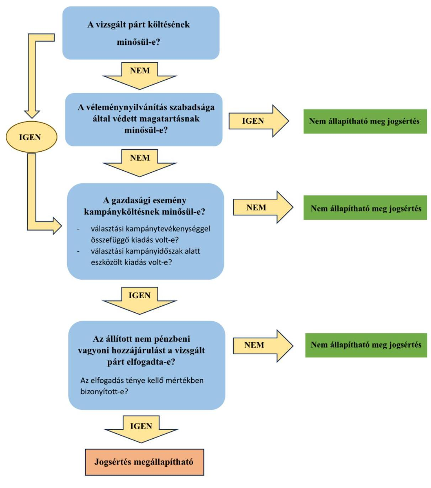

---

# 2. 2 A jogsértést megállapító teszt szempontjainak részletezése 

## a) A párt költésének kritériuma

37. Amennyiben az adott párt túllépné a Kampánytv. 7. §-ában foglalt kampányköltési korlátot a párt jogsértése megállapítható lenne.
38. Ezen összegszerű korlátozásba viszont csak olyan gazdasági események vehetők számításba, amelyek
(i) a párt által eszközölt költések, vagy
(ii) a Párttv. szerint a pártnak tulajdonítható nem pénzbeni hozzájárulásnak minősülnek.
39. Az Állami Számvevőszék álláspontja szerint a Hatpárti Összefogásban résztvevő pártok az MMM-től tiltott, nem pénzbeni vagyoni hozzájárulásban részesültek, amelynek következtében megsértették a Párttv. 4. §-ában foglalt finanszírozási tilalmat.
40. Az alábbiakban bemutatjuk, hogy milyen feltételek együttes teljesülése esetén lenne minősíthető egy nem pénzbeni vagyoni hozzájárulás a Kampánytv. 7. §-ában foglalt korlátba beszámítandó kampányköltésnek. A jelen észrevételünk 1. számú mellékletében részletesen bemutatjuk, hogy az Állami Számvevőszék Tervezetének VI. számú mellékletében részletezett egyetlen gazdasági esemény sem minősül a fentiek szerinti nem pénzbeni vagyoni hozzájárulásnak.

## b) A véleménynyilvánítás szabadsága által védett magatartások

41. Az Alaptörvény IX. cikke szerint „(1) Mindenkinek joga van a véleménynyilvánítás szabadságához." Az Alaptörvény I. cikke pedig a jogi személyekre is kiterjeszti az alapjogok védelmét: „(4) A törvény alapján létrehozott jogalanyok számára is biztosítottak azok az alapvető jogok, valamint őket is terhelik azok a kötelezettségek, amelyek természetüknél fogva nem csak az emberre vonatkoznak."
42. Ennek megfelelően az MMM-et, mint nem természetes személyt is megilleti a véleménynyilvánítás szabadsága. A véleménynyilvánítás része az egyesület célkitűzéseivel kapcsolatos politikai vélemények megfogalmazása és nyilvánosság felé történő közlése.
43. Az Állami Számvevőszék a Tervezetben az alapján tesz különbséget a jelen ellenőrzés tárgyát képező gazdasági események és egyes olyan kormánypárti szereplőkhöz köthető gazdasági események között, mint a Megafon Digitális Inkubátor Központ Nonprofit Kft. vagy a Civil Összefogás Fórum, hogy amíg az előbbit jogellenes vagyoni hozzájárulásnak minősíti, addig az utóbbit véleménynyilvánításnak. Az Állami Számvevőszék azonban teljes egészében adós marad annak a bemutatásával, hogy az egyes gazdasági események vonatkozásában az eltérő jogi minősítés mögött milyen okszerű jogi következtetés húzódik meg. A jelen észrevételeink 4. pontjában részletesen

---

bemutatjuk, hogy az Állami Számvevőszék mesterségesen tesz megkülönböztetést a fenti szervezetek között aszerint, hogy az általuk finanszírozott gazdasági eseményeket kampányfinanszírozásnak vagy véleménynyilvánításnak minősíti.
44. Az Állami Számvevőszék jogi következtetése már abból kifolyólag is teljesen önkényes, hogy a Tervezet VI. számú mellékletében foglalt valamennyi gazdasági eseményt (117 darab) tiltott vagyoni hozzájárulásként minősített. A Tervezet így nem a véleménynyilvánítás körébe sorolt olyan gazdasági eseményeket, mint „Ásó, kapa, Yachtkaland matricák" (39. sor és 41. sor) vagy a „Ne add el a hangod, szavazz a szíved szerint." plakátok (56. sor) gyártása. Ugyancsak értetlenül állunk az előtt, hogy az Állami Számvevőszék milyen logika mentén jutott arra a következtetésre, hogy a „Kék szalaggal a korrupció megállításáért" szatén szalag jelölő szervezethez nem köthető jogi személy általi megrendelése mi alapján minősül vagyoni hozzájárulásnak és nem véleménynyilvánításnak.
45. A fenti példák jól mutatják, hogy az Állami Számvevőszék meg sem kísérelte annak a vizsgálatát, hogy az adott gazdasági esemény vonatkozásában a véleménynyilvánításhoz szükséges szolgáltatás került megrendelésre, avagy az adott jelölő szervezet országgyűlési kampánya kerül jogellenes módon közvetve finanszírozásra.

# c) A kampányköltési kritérium 

46. Nem állapítható meg a Kampánytv. 7. §-a szerinti kampányköltési korlát sérelme olyan gazdasági események által, amelyek nem a
(i) a választási kampányidőszak alatt; és
(ii) a választási kampánytevékenységgel összefüggő kiadások finanszírozására lettek fordítva.
47. A Tervezet olyan gazdasági események, illetve kiadások esetében is megállapíthatónak látja a 2022. évi országgyűlési képviselő-választási kampánnyal való összefüggést, amelyek esetében már tárgykörük Tervezetben szereplő rövid megjelölése alapján is egyértelmű, hogy azok bizonyosan nem kapcsolódhattak a Ve. 141. § bekezdés szerinti kampánytevékenység finanszírozása körébe. Ilyen mindenekelőtt az ellenzéki együttműködés választási kampányt lezáró eredményváró rendezvényének kapcsán a Tervezet által vélelmezett támogatás esete. Ezen gazdasági események ab ovo azért sem számíthatnak bele a Kampánytv. 7. §-a szerinti korlátba, mert - a rendezvény urnazárást követő időpontjából fakadóan - nem a kampányidőszakban zajlott le és az természetszerűleg nem is volt alkalmas - utólag - a választói akarat befolyásolására vagy annak megkísérlésére.
48. A Tervezet olyan gazdasági eseményeket is jogellenesnek tekint, amelyek a Tervezetben szereplő leírás alapján sem kapcsolhatóak logikailag vagy tartalmilag a hat párt közös kampánytevékenységéhez. A választással egyidőben, közös eljárásban és

---

azonos közjogi kampányidőszakkal lebonyolítva országos népszavazásra is sor került, amellyel kapcsolatban mind a jelölő szervezetek, mind civil szervezetek, így az MMM vagy a CÖF-CÖKA szintén fogalmaztak meg üzeneteket, és amelyre a választási kampány finanszírozására vonatkozó szabályok egyáltalán nem vonatkoztak. A Tervezet teljességgel adós marad annak indokolásával, hogy az adott gazdasági eseményt mi alapján köti az országgyűlési képviselő-választási kampányhoz és különíti el az országos népszavazás körében megfogalmazott véleménynyilvánításoktól.
49. A Tervezet szintén figyelmen kívül hagyja - meg sem említi - azt, hogy az MMM elnöke a közjogi relevanciával nem rendelkező közös miniszterelnökjelölti minősége mellett két másik, közjogi minőséggel is rendelkezett Hódmezővásárhely Megyei Jogú Város polgármestereként és a hódmezővásárhelyi székhelyű egyéni választókerületben induló egyéni képviselőjelöltként a kampányidőszakban. Ahogy a jelen észrevételek 105. és 107. bekezdéseiben részletesen bemutatjuk, a Tervezet VI. számú mellékletében szereplő 20. és 22. tétel is helyi közszereplők bemutatására irányult, ám annak a választási kampányhoz való kapcsolódását a Tervezet nem mutatta be.
50. A fenti egyértelmű példákon keresztül jól látható, hogy az Állami Számvevőszéknek valamennyi tétel vonatkozásában külön-külön meg kell tudnia indokolni, hogy az adott gazdasági esemény mennyiben köthető a jelölő szervezet 2022. évi országgyűlési képviselő-választási kampányához. Ennek hiányában ugyanis a jogszabálysértés nem állapítható meg.

# d) Nem pénzbeni vagyoni hozzájárulás elfogadása 

51. A Párttv. 4. § (2) bekezdése egyrészről a jogi személyekre, jogi személyiséggel nem rendelkező szervezetekre, másrészről pedig a pártokra tartalmaz kötelezést:
„A párt részére - az (1) bekezdésben foglalt kivételektől eltekintve - jogi személy, jogi személyiséggel nem rendelkező szervezet vagyoni hozzájárulást nem adhat, a párt jogi személytől, jogi személyiséggel nem rendelkező szervezettől vagyoni hozzájárulást nem fogadhat el."
52. A jogi személy tehát nem adhat, a párt pedig nem fogadhat el vagyoni hozzájárulást. A jogalkotó célja a fenti szabályozással az, hogy a párt részére történő vagyoni hozzájárulás ne keletkeztessen felelősséget (és szankciót) az érintett párt tekintetében, amennyiben a párt a vagyoni hozzájárulást nem kívánja, illetőleg arról nem tud.
53. A Párttv. 4. § (5) bekezdése terjeszti ki a tilalmat a nem pénzbeni vagyoni hozzájárulásra:
„(5) Ha a párt részére a vagyoni hozzájárulást nem pénzben nyújtották, köteles annak értékeléséről (értékének meghatározásáról) gondoskodni. Ha a párt a (2) és (3) bekezdésben foglalt szabályt megsértve tiltott, nem pénzbeli hozzájárulást fogadott el, annak értékét az Állami Számvevőszék állapítja meg."

---

54. A nem pénzbeni vagyoni hozzájárulás esetén kiemelt jelentősége van a vagyoni hozzájárulás elfogadásnak.
55. A Párttv. 4. § (2) és (5) bekezdése szerinti jogsértés megállapításának feltétele tehát az, hogy az Állami Számvevőszék bizonyítsa, hogy a vagyoni hozzájárulást a párt elfogadta. A jelölő szervezet a vagyoni hozzájárulást elfogadni akkor tudja, ha annak létezéséről tudomással bír. A Tervezet abból a körülményből, hogy bizonyos gazdasági esemény(ek)ről a jelölő szervezeteknek bizonyíthatóan tudomása volt azt az okszerűtlen következtetést vonja le, hogy kivétel nélkül valamennyi gazdasági eseményről a párt tudott és az azzal érintett állítólagos vagyoni hozzájárulást el is fogadta. Önmagában a VI. számú mellékletben felsorolt gazdasági események köre alapján is egyértelmű, hogy az Állami Számvevőszék feltételezése okszerűtlen, az egyes konkrét tételek vonatkozásában ezt lentebb külön ki is fejtjük.
56. A jogsértés megállapításának előfeltétele, hogy az Állami Számvevőszék tételesen valamennyi gazdasági esemény vonatkozásában bizonyítsa, hogy arról a pártnak nem csak tudomása volt, de az azzal azonosított vagyoni hozzájárulást el is fogadta. Ennek hiányában ugyanis a jogszabálysértés nem állapítható meg.

# 3. AZ ÁLLAMI SZÁMVEVŐSZÉK BIZONYÍTÁSI ÉS INDOKOLÁSI KÖTELEZETTSÉGE 

57. Ahhoz, hogy az Állami Számvevőszék vizsgálata során jogsértést állapítson meg, meg kell tudnia állapítani, hogy a 2022. évi országgyűlési képviselő-választási kampány vonatkozásában a pártok megsértették a Kampánytv. 7. §-ában foglalt kampányköltési korlátot. Azaz az Állami Számvevőszéknek bizonyítania kell, hogy
(i) az adott kifizetéssel érintett gazdasági esemény a 2022. évi országgyűlési képviselő-választási kampánnyal összefüggésben van;
(ii) az adott kifizetéssel érintett gazdasági esemény nem véleménynyilvánításnak minősül, ezen felül az az adott párt kampánytevékenységének minősül
(iii) az adott gazdasági eseménnyel azonosított vagyoni hozzájárulást a jelölő szervezet elfogadta;
(iv) a fenti feltételek teljesítő gazdasági esemény nem ölel fel olyan költségelemeket, amelyek nem minősülnek kampánytevékenységnek.
58. Ehhez viszont a fenti (i)-(iii) pontokban rögzített körülményeket nem csak állítania, vagy pedig valószínűsítenie kell, hanem azt ítéleti bizonyossággal kell bizonyítania, mivel az Állami Számvevőszék jelentése alapján esetlegesen kibocsátott fizetési felszólítás annak kétszeres mértékéből kifolyólag szankciós jellegű.
59. A pártok nem kötelezhetők annak bizonyítására, hogy a VI. mellékletben foglalt tételeket nem fogadták el, nemleges tény bizonyítása a pártoktól nem várható el. Ezzel

---

ellenkezőleg az Állami Számvevőszék köteles bizonyítani, az általa állított jogsértés megvalósulását.
60. A VI. mellékletben megjelölt tételek vonatkozásban a jogsértés megállapítását az Állami Számvevőszék olyan közvetett bizonyítékokra alapozta, amelyek ellentmondásosak és nem alkotnak zárt logikai láncot. A Tervezet adós marad annak bemutatásával, hogy az Állami Számvevőszék milyen indokok alapján gondolja azt, hogy a közvetett bizonyítékokból levont következtetései logikusak és okszerűek lennének.
61. Megjegyezzük, hogy felelősséget megállapító közigazgatási eljárás keretében az adott párt pusztán azt köteles igazolni, hogy van észszerűbb értékelése a bizonyítékoknak, létezik okszerűbb jogi mérlegelés annál, mint amelyet a Tervezet képvisel. ${ }^{9}$ Következésképpen elegendő, ha arra mutatunk rá, hogy a közvetett bizonyítékok nem alkotnak olyan logikai láncolatot, amelyek kétséget kizáróan és ellentmondásmentesen igazolják a jogsértést. ${ }^{10}$ A Tervezet által megállapított tényállás tehát nem alapulhat pusztán spekuláción és feltételezéseken, annak ellentmondásmentes bizonyítékokon kell nyugodnia. ${ }^{11}$

# 4. A PÁRTOK ESÉLYEGYENLŐSÉGÉNEK SÉRELME 

62. Amint arra az észrevételeink 1.2 c) és 2.2. b) pontjaiban is utaltunk, a Civil Összefogás Fórum (a továbbiakban „CÖF") által eszközölt szolgáltatások akként való értékelése, hogy az nem sérti a Párttv. 4. § (2) és (4) bekezdéseiben foglalt tilalmat, illetve azok nem számítanak bele a Kampánytv. 7. §-ában foglalt korlátba, sérti a pártok esélyegyenlőséghez való jogát.
63. Az alábbiakban bemutatjuk, hogy a CÖF által eszközölt mely szolgáltatások értékelhetők akként, hogy azok a Ve. 140. és 141. §-a szerinti kampánytevékenységnek minősülnek. Emellett kitérünk arra is, hogy hasonló tényállás körében az Állami Számvevőszék 2022. március 15-i ellenzéki nagygyűléssel kapcsolatos egyes kiadásokat a kampányfinanszírozási korlát tekintetében figyelembe kívánja venni.

### 4.1 A 2022-es Békemenet

64. 2022. március 15. napján a civil szervezetként működő Civil Összefogás Közhasznú Alapítvány (CÖF-CÖKA) békemenetet és nagygyűlést szervezett az 1848-49-es forradalom és szabadságharc emlékére. A rendezvényen a sajtóértesülések szerint megközelítőleg félmillió ember vett részt. A rendezvény programja szerint a résztvevők az Elvis Presley parkban gyülekeztek, majd közösen átvonultak a Kossuth térre, ahol a rendezvény fő programjaként - az ott felállított színpadon - Orbán Viktor ünnepi
[^0]
[^0]:    9 Kúria Kfv.III.37.690/2013/29. számú ítélete
    10 Kúria Kfv.II.39.259/2006/4 számú ítélete
    11 30/2014. (IX. 30.) AB határozat

---

beszédet mondott. Az eseményen Fidesz táblákat és zászlókat osztogattak a szervezők. ${ }^{12}$
65. Az eseményre a sajtóértesülések ${ }^{13}$ szerint majdnem kétszáz busz szállította vidékről és külföldről a résztvevőket. Noha a CÖF kifejezetten tagadta, hogy a CÖF szervezte és finanszírozta volna a résztvevők szállíttatását, tény, hogy a buszok többségén CÖF-ös matrica ${ }^{14}$ szerepelt:
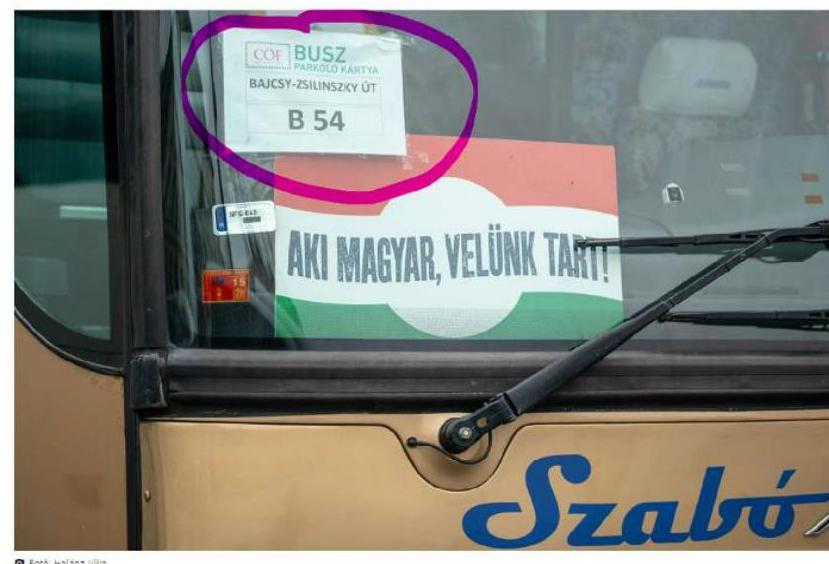
66. A miniszterelnök (és a Fidesz miniszterelnök-jelöltje) maga is jelezte közösségi média ${ }^{15}$ oldalán, hogy részt vesz az eseményen:

[^0]
[^0]:    12 https://24.hu/kozelet/2022/03/15/marcius-15-1848-1849-forradalom-szabadsagharc-evfordulo-unnep-orban-viktor-bekemenet-ellenzek-donald-tusk/1/
    ${ }^{13} \mathrm{https}: / / 444 . \mathrm{hu} / 2022 / 03 / 15 /$ megszamoltuk-196-bekemenetes-busz-sorakozik-a-bajcsy-zsilinszky-uton
    14 https://444.hu/kepek/2022/03/15/egy-gombostut-nem-lehetett-leejteni-a-belvarosban-a-bekemenetre-erkezobuszoktol
    15 https://24.hu/kozelet/2022/03/15/marcius-15-1848-1849-forradalom-szabadsagharc-evfordulo-unnep-orban-viktor-bekemenet-ellenzek-donald-tusk/1/

---

Orbán Viktor beszédével ér véget a Békemenet, a miniszterelnök éppen a szövegen dolgozik.
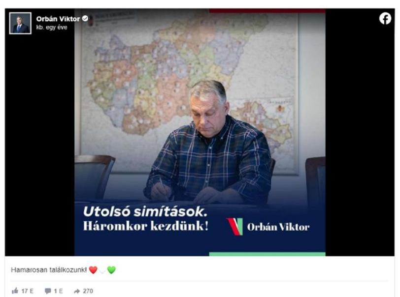
67. Orbán Viktor ünnepi beszéde jellemzően a pártpolitikai, a Fidesz-kampányba illő megjegyzésekkel volt tele:
„Nem is emlékszem, mikor álltak utoljára ilyen jól a csillagok, 19 nappal a választás előtt" - tette hozzá Orbán és megjegyezte: megmutatta az erejét a Fidesz és ez meg is hozta az eredményt.

Az ellenzék a szétesés szélén áll - véli a miniszterelnök
Az üstökösnek hitt miniszterelnök-jelöltjük mára már csak egy üstökösnek hitt, kihűlt kődarab. És vele együtt beleállta a földbe az egész baloldali miskulancia."16
„Kétszázezerrel több gyerek született, mintha a baloldal maradt volna kormányon, jelentette ki a miniszterelnök.

Lesz világraszóló hadseregünk és fegyverkezéseink, egymásnak adják a kilincset a világ legnagyobb sportrendezvényei és világraszóló kulturális események zajlanak Budapesten - sorolta a Fidesz-kormány érdemeit Orbán.

[^0]
[^0]:    16 https://24.hu/kozelet/2022/03/15/marcius-15-1848-1849-forradalom-szabadsagharc-evfordulo-unnep-orban-viktor-bekemenet-ellenzek-donald-tusk/4/

---

A baloldal elvesztette a józan eszét és holdkórosan beletámolyogna a háborúba, jelentette ki Orbán és elismételte azt a kampánymondatot, miszerint az ellenzék katonákat küldene Ukrajnába."17
68. Az esemény után az MTI-nek is eljuttatott közleményében a CÖF így fogalmazott:
„Kormányunk hivatott nemzetközi képviseletünkre. Megtett intézkedései a magyarság érdekeit messzemenőkig követik. Miniszterelnök úr beszéde erőt, erőnket sugározta. Hívására is félmillióan ott voltunk, megszégyenítve az ellenzék magyarellenes, több sebből vérző összetákolt, azonos időben összehívott „nagygyűlését". (...)

Tegnap megtörtént a kommunistákat és fasisztákat együtt képviselő ellenzéki pártok hattyúdala. A kiöregedett „komszomolisták - ifjú kommunisták" megérettek leváltásukra."18
69. A miniszterelnök ezt követően Facebook oldalán is közzétett ${ }^{19}$ egy fényképet a 2022. márciusi CÖF Békemeneten való részvételéről:
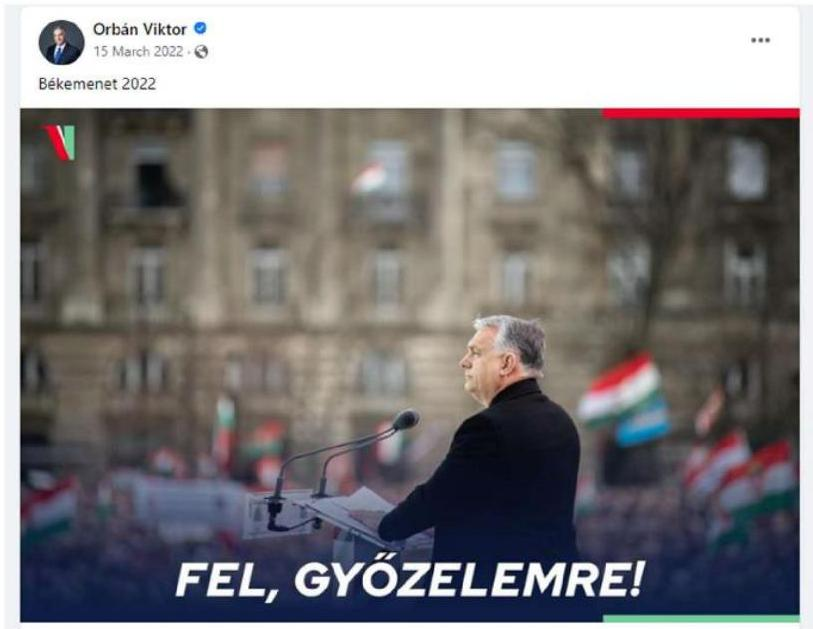
70. Orbán Viktor Kossuth-téri beszédét a CÖF által felállított hatalmas, fedett színpadon és professzionális hangosítással mondhatta el.

[^0]
[^0]:    17 https://24.hu/kozelet/2022/03/15/marcius-15-1848-1849-forradalom-szabadsagharc-evfordulo-unnep-orban-viktor-bekemenet-ellenzek-donald-tusk/5/
    ${ }^{18} \mathrm{https}: / /$ civilosszefogas.hu/koazonet-13/
    ${ }^{19} \mathrm{https}$ ://www.facebook.com/orbanviktor/posts/512080016956268/

---

71. A Fidesz miniszterelnök-jelöltje tehát egy civil szervezet által szervezett tömegrendezvényen kampánybeszédet mondott a 2022-es választások előtt mindössze két héttel.

# 4.2 A CÖF/CÖKA és a Fidesz kapcsolata 

72. Szeretnénk felhívni a T. Számvevőszék figyelmét arra, hogy a CÖF és a Fidesz között pénzügyi/finanszírozási kapcsolat áll fenn. A CÖF ugyanis évek óta jelentős összegeket kap a Fidesz által alapított alapítványtól ${ }^{20}$, a Polgári Magyarországért Alapítványtól. Az alapítvány kuratóriumának két tagja Kövér László és Gulyás Gergely Fideszes országgyűlési képviselők.
73. A CÖF Fidesz általi finanszírozása az elmúlt évek során folyamatos. Így volt ez például a 2012-es kampányidőszakban, ahol a CÖF 46,5 millió forintos költségvetéséből 40 millió forintot az alapítványán keresztül a Fidesz finanszírozott, ahogy ezt maga a szervezet is megerősítette:
„A szervezet - amelynek bevétele 46,5 millió forint volt - tavaly a Fidesz pártalapítványától, a Szövetség a Polgári Magyarországért Alapítványtól 40 millió forint támogatást kért és kapott, amit "a nemzeti érzelmű polgárok összefogásának érdekében használt fel". ${ }^{21}$
74. Ez a jelenség folytatódott a 2016-os kampány során is, ahol a Fidesz alapítványa mellett az állami tulajdonú MVM-től több, mint 500 millió forintot kapott a CÖF.
75. A korábbiakhoz hasonló módon a CÖF a 2022-23-as évben is óriási összegeket kapott a Fidesz pártalapítványától. A 2023-as évben ez 70.000.000 forintot tett ki, a 2022-es évben 65.000.000 forintot, 2021-ben pedig 60.000.000 forintot. ${ }^{22}$
76. Megállapítható tehát, hogy a CÖF az elmúlt évek során folyamatosan a Fidesz támogatásával működik. Ez a támogatás olyan mértékű, hogy bizonyos években a CÖF teljes költségvetésének 86%-át a Fidesz pártalapítványa biztosította.

### 4.3 A 2022. március 15-i ellenzéki nagygyűlés

77. A CÖF által szervezett és Orbán Viktor beszédével fémjelzett rendezvénnyel párhuzamosan a hatalom a népé címmel került március 15-i ünnepség megtartásra a Műegyetem rakparton. Az érkezőknek korrupcióellenes kék szalagokat osztogattak a
[^0]
[^0]:    20 "A Fidesz - Magyar Polgári Szövetség a politikai kultúra fejlesztése, és a polgári-keresztény-nemzeti értékrend alapján szerveződő erők megsegítése érdekében 2003 őszén megalapította a Polgári Magyarországért Alapítványt, miután az Országgyűlés lehetőséget teremtett arra, hogy a politikai pártok költségvetési forrásból támogatott alapítványokat hozzanak létre." https://szpma.hu/rolunk\#rolunk
    ${ }^{21}$ https://hvg.hu/itthon/20130425_Tenyleg_Fideszalapitvany_penzeli_a_bekem
    ${ }^{22}$ https://szpma.hu/jovahagyott-tamogatasok/20220307_jovahagyott_tamogatasok.pdf
    https://szpma.hu/palyazatok-tamogatasok\#

---

szervezők. ${ }^{23}$ A rendezvény kisebb tömeget mozgatott meg, mint a CÖF által szervezett rendezvény.
78. A rendezvényen a beszédeket Iványi Gábor, lelkész; Donáth Anna, a Momentum elnöke; Karácsony Gergely, főpolgármester; Jakab Péter, a Jobbik elnöke; Schmuck Erzsébet, az LMP társelnöke; Tóth Bertalan, az MSZP társelnöke; Dobrev Klára, EP képviselő; Márki-Zay Péter, miniszterelnök-jelölt és Donald Tusk, Európai Néppárt lengyel elnöke tartották.
79. Az ellenzéki összefogás miniszterelnök-jelöltje, Márki-Zay Péter a Fidesz miniszterelnök-jelöltjéhez hasonlóan szintén politikai üzenetekkel teli ünnepi beszédet tartott. Beszédében többek között kijelentette, hogy:
„Idehaza is rettenetes bűnt követett el Orbán, aki éket vert barátok közé, családok és családtagok közé. Megmérgezte szép szavunkat, azt hogy nép, és a még szebbet, azt hogy nemzet, állítja Márki-Zay.

20 nap múlva, a választásokon arra kell szavaznunk, hogy ismét egy nép legyünk, és ne kívülállók a saját hazánkban.

Hiszünk egy olyan országban, ahol nem kötelező a védőoltás, ahol az orvosoknak nem kötelező a szolgálati jogviszony, ahol az orvosok döntenek az egészségügyről, ahol a tesztek lesznek ingyenesek és nem a parkolás, és azt a vakcinát vesszük meg, ami sokaknak menti meg az életét és nem keveseknek hoz meggazdagodást"24
80. A rendezvényen a miniszterelnök-jelölt az MMM által finanszírozott hangosítással és technikai eszközök igénybevételével mondhatta el beszédét.
81. A rendezvényen a CÖF-rendezvényhez hasonlóan busszal ${ }^{25}$ érkezett számtalan résztvevő:

[^0]
[^0]:    23 https://index.hu/belfold/2022/03/15/ellenzeki-nagygyules-a-hatalom-a-nepe-marki-zay-peter-karacsony-gergely-donald-tusk-jakab-peter-schmuck-erzsebet/a-szabadsag-hidon-mar-gyulekeznek/
    24 https://24.hu/kozelet/2022/03/15/marcius-15-1848-1849-forradalom-szabadsagharc-evfordulo-unnep-orban-viktor-bekemenet-ellenzek-donald-tusk/5/
    25 https://pestisracok.hu/buszok-szazaival-fuvaroztak-az-ellenzeki-szimpatizansokat-mzp-marcius-15-i-kampanyesemenyere-video/

---

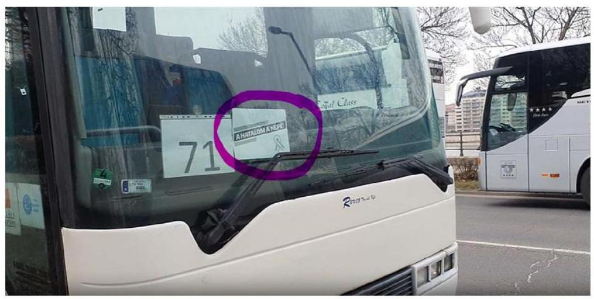
82. Az ellenzék miniszterelnök-jelöltje tehát civil szervezet által szervezett tömegrendezvényen mondott kampánybeszédet a CÖF által szervezett rendezvénnyel egyidejűleg, a választások előtt alig pár héttel.

# 4.4 A CÖF és az MMM által szervezett rendezvények összevetése 

83. A fentiek alapján megállapítható, hogy
(i) mind a 2022. március 15-i Békemenetet, mind az MMM rendezvényét egy civil szervezet szervezte;
(ii) az egyik rendezvényen a Fidesz miniszterelnök-jelöltje Orbán Viktor, a másik rendezvényen az ellenzéki összefogás miniszterelnök-jelöltje Márki-Zay Péter szólalt fel;
(iii) mind a két rendezvényen felszólaló politikus kampányszöveggel teli beszédet tartott;
(iv) mind a két rendezvényen megjelentek az adott politikai oldalhoz tartozó plakátok, zászlók, stb.; és
(v) mind a két rendezvényen megvalósult buszos személyszállítás.
84. A fentiek ellenére a T. Számvevőszék szerint kizárólag az ellenzéki összefogás által megtartott rendezvény tekinthető a Ve. szerinti választási gyűlésnek, míg a CÖF által szervezett, azonos napon tartott, azonos jellegű rendezvény nem.
85. Tette ezt a T. Számvevőszék annak ellenére, hogy a CÖF és az MMM lényegében teljesen azonos tevékenységet végző civil szervezet: céljuk a politikai kultúra és a civil/ polgári élet fejlesztése. A két szervezet közötti egyetlen különbség az, hogy az MMM elnöke egy miniszterelnök jelölt (Márki-Zay Péter), míg a CÖF elnöke nem. A T. Számvevőszék erre a különbségre alapozva megállapíthatónak találja az MMM részéről

---

a tiltott pártfinanszírozási tevékenység megvalósulását, míg a CÖF tevékenységét a politikai véleménynyilvánítás körében értékeli.
86. A T. Számvevőszék feltevése azonban téves, ugyanis az MMM tevékenysége nem „tudható be" Márki-Zay Péternek, hiszen az MMM tevékenységét egy független elnökség irányítja és határozza meg annak politikai tevékenységét. ${ }^{26}$ Az MMM alapszabálya szerint ugyanis az elnöknek semmiféle olyan jogosultsága nincs, amellyel irányítani vagy egyáltalán befolyásolni tudná azt, hogy az MMM mikor, mire és milyen összegben költ vagy milyen politikai vagy közéleti tevékenységet folytat.
87. Nem helytálló tehát a T. Számvevőszék által a Tervezet 25. oldalán tett kijelentés, mely szerint „a jelen ügyben kiemelt jelentőséggel bír, hogy a Hatpárti összefogás közös miniszterelnök-jelöltje az MMM elnöke volt, így az MMM kampánytevékenység finanszírozására irányuló tevékenysége nem választható el a Márki-Zay Péter vezette lista népszerűsítésétől és az azt alkotó pártok kampányfinanszírozásától."
88. A fenti különbségtétel különösen annak fényében érthetetlen, hogy a CÖF kapcsán a T. Számvevőszék nem találta megállapíthatónak a tiltott pártfinanszírozást, sőt, annak tevékenységét kifejezetten a politikai véleménynyilvánítás szabadsága körében megítélendőnek tekintette. Tette ezt a T. Számvevőszék annak ellenére, hogy a CÖF köztudottan - és fent részletesen bemutatott módon - a Fidesz alapítványa által finanszírozottan működik. A Fidesznek ráadásul olyan befolyása van a szervezetre, hogy a CÖF bizonyos politikai kampánytevékenységét (pl.: a 2012-es bohóc kampányt - „együtt tették tönkre az országot") a Fidesz kérésére végezte, ahogy ezt a szervezet 2012-es közhasznúsági jelentésében is elismerte:
„Támogatóink kérésére és anyagi támogatásuk erejéig, a költségeket elkülönítve alaptevékenységünktől, ismeretterjesztő tevékenységet folytattunk.

Plakátokon és szórólapokon hívtuk fel a magyar polgárok figyelmét arra, hogy különböző, civilnek mondott szervezetek kezdték meg politikai tevékenységüket annak érdekében, hogy a 2014-es országgyűlési választásokon megjelenjenek. Tevékenységünk arra irányult, hogy bemutassuk, hogy 2002 és 2010 között miként kerülhetett az ország csőd-közeli helyzetbe és kik voltak ennek a gazdasági és társadalmi ország-rontásnak nevezendő szituáció kialakítói. A nekünk meghatározott cél az volt, hogy a polgárok véleményét minél több helyen és alkalommal hozzuk nyilvánosságra, a civil kurázsi új eszközével."
89. A fentiek alapján az egyetlen jogszerű döntés az, ha a T. Számvevőszék az MMM politikai tevékenységét is a CÖF-höz hasonlóan politikai véleménynyilvánításnak minősíti és nem tudja azt be az ellenzéki pártok érdekében teljesített kampánynak.

[^0]
[^0]:    ${ }^{26}$ MMM Alapszabály 10. § és 11. §

---

# 4.5 A Közösségi médiához kapcsolódó költségek diszkriminatív értékelése 

90. A VI. sz. melléklet több olyan tételt tartalmaz, amely közösségi médiákhoz kapcsolódó gazdasági eseményekre vonatkozik. Az Állami Számvevőszék ugyanakkor a közösségi médiához kapcsolódó költéseket korábban nem vette figyelembe a Kampánytv. 7. §-a szerinti költési korlát ellenőrzése körében.
91. Az Állami Számvevőszék „A választási kampányidőszakban, az egyes médiafelületeken megjelenő politikai hirdetések jogszabályi környezete" című, 2020. júniusi keltezésű elemzésében akként fogalmazott, hogy
„a közösségi médiában megjelenő, politikai hirdetés jellegű tartalmak nem sorolhatók be egyetlen, a Ve. 140.§-ában szereplő kampányeszköz kategóriába sem, így e nevesített kampányeszközökre vonatkozó jogszabályi előírások sem alkalmazandók a közösségi média ilyen típusú tartalmai vonatkozásában.

E tekintetben kiemelendő, hogy a közösségi médiában megjelenő, politikai hirdetés jellegű tartalmak nem esnek a Ve. 146.§ b) pontjában szereplő „politikai hirdetés" definíció alá, mivel a politikai hirdetések megjelenési felülete csak sajtótermék, vagy filmszínház lehet. "27
92. Ugyanakkor megállapította, hogy
„A Ve. fogalommeghatározásai alapján egyértelműen megállapítható, hogy a közösségi médiában megjelenő, politikai hirdetés jellegű tartalmak - a Ve. 140.§-ában szereplő példálózó felsorolásban nem nevesített kampányeszköznek minősülnek, mivel a választói akarat befolyásolására vagy annak megkísérlésére alkalmas eszközök."
93. Az Állami Számvevőszék ugyanakkor a 2020. október 11. napján tartott időközi választások kapcsán számos sajtószerv által közölten azt az álláspontot foglalta el, hogy Koncz Zsófia egyéni jelölt esetében vizsgált kampányköltések keretében a Facebookhirdetéseket nem vették figyelembe, mivel azok nem illeszkednek a politikai hirdetések fogalmába. ${ }^{28}$
94. Koncz Zsófia egyéni jelölt kampányának tekintetében az Állami Számvevőszék tehát a saját elemzésében foglalt megállapításai ellenére - egyáltalán nem foglalkozott a Facebook-hirdetésekre fordított költségekkel.
95. A szabályozás olyan rugalmas értelmezése, amely szerint egyes jelöltek tekintetében az Állami Számvevőszék egyáltalán nem veszi figyelembe a Facebook-hirdetések költségeit, más esetekben pedig azokat a Párttv. 4. §-a alapján a pártoknak betudja, majd

[^0]
[^0]:    ${ }^{27}$ A választási kampányidőszakban, az egyes médiafelületeken megjelenő politikai hirdetések jogszabályi környezete című elemzés, 2020. június, 46. oldal utolsó bekezdése és 47. oldal első bekezdése.
    ${ }^{28} \mathrm{https}: / /$ media1.hu/2022/01/13/hazugsaggal-vadolja-az-allami-szamvevoszek-az-indexet-es-a-hvg-t/

---

a Kampánytv. 7. §-ában foglalt korlát körében értékeli, sérti a Ve. 2. § (1) bekezdés c) pontjában foglalt esélyegyenlőségi alapelvet.
96. A pártok közötti verseny egyértelműen torzul, amennyiben az Állami Számvevőszék egyes pártokkal szemben alkalmazza a korábban kialakított jogértelmezését, másokkal szemben pedig - mindenféle érdemi indokolást nélkülözve - nem.
97. Megjegyezzük továbbá, hogy ha el is fogadjuk az Állami Számvevőszék azon állítását, amely szerint az MMM közösségi média költései betudhatók a Hatpárti Összefogás javára, úgy az Állami Számvevőszék adós marad annak megválaszolásával, hogy a CÖF/CÖKA és a Megafon által eszközölt hasonló kiadásokat miért nem tekinti betudhatónak a Fidesz kampányköltségvetésének terhére.
98. A Facebook Ad Library 2019. áprilisa óta tartja számon a felületen megjelenő politikai hirdetéseket. A Megafon Facebookon több, mint egymilliárd forintot költött el a kormánypártok népszerűsítésére a kampányidőszakban. ${ }^{29}$ A választás évének első felében a teljes magyar politikai hirdetések összege 4,1 milliárd forintot tett ki, amelynek csaknem a 18%-át költötte egymagában a Megafon.
99. A Megafon a Facebook mellett a YouTube platformon is nagy összegeket költött el a kormánypártot támogató tartalmak népszerűsítésére. A Google Ads Transparency Center alapján ez az összeg 2022. március hónapban megközelítette a 40.000 EUR összeget. ${ }^{30}$
100. Amennyiben tehát a T. Számvevőszék változtatni kíván a gyakorlatán és civil szervezetek által teljesített közösségi média költéseket is egyes pártok kampánybüdzséje terhére kívánja elszámolni, úgy ezt nem teheti szelektíven kizárólag az Ellenzéki Összefogás terhére.

# 5. A VI. SZ. MELLÉKLET EGYES TÉTELEIVEL KAPCSOLATOS MEGÁLLAPÍTÁSOK RÉSZLETES VITATÁSA 

101. Az alábbiakban részletesen bemutatjuk a VI. sz. mellékletben megjelenítésre kerülő, az összegszerűségükben jelentősebb nem pénzbeni hozzájárulásnak minősített tételek vonatkozásában azt, hogy azok a 2.1 pontban bemutatott teszt alapján miért nem minősülnek tiltott nem pénzbeni hozzájárulásnak. A VI. sz. melléklet valamennyi tétel vonatkozásában észrevételeinket a jelen észrevételeink 1. sz. mellékleteként csatolt táblázatban tesszük meg.
[^0]
[^0]:    29 https://teles.hu/belfold/2022/03/28/ujabb-alomhatart-ertunk-el-egymilliard-forint-felett-a-megafon-facebookos-reklamkoltese
    30
    https://adstransparency.google.com/advertiser/AR03443343313485168641?region=EU\&topic=political\&format $=$ VIDEO\&start-date $=2022-01-01 \&$ end-date $=2022-04-02$

---

102. Az 1. és 2. sorszám alatt rendelkezésre bocsátott iratanyag értelmében az MMM autóbusszal történő személyszállítást rendelt meg a 2022. március 15-i ünnepségre. Az ünnepségen résztvevők, valamint a fellépők politikai véleményüket nyilvánították ki.
103. A 3. sorszám alatt rendelkezésre bocsátott iratanyag értelmében 2022. március 17. napján az MMM harmadik személlyel megbízási szerződést kötött rendezvényszervezési szolgáltatások tárgyában. A kiállított számla 2022. február és áprilisa közötti időszakban nyújtott szolgáltatások alapján került kiállításra. Sem a teljesítésigazolás, sem a számla nem részletezi, hogy a megjelölt roadshow costs (stage, sound, security); campaign staff bus rental and logistics avagy a campaign management fee kitételek alatt pontosan milyen tevékenységek értendőek. A Hatpárti Összefogás előtt nem ismert, hogy az MMM pontosan mikor és milyen célból vett igénybe logisztikai, avagy rendezvényszervezési szolgáltatásokat. Az átadott iratok alapján nem állapítható meg, hogy ezen gazdasági események a Hatpárti Összefogás országgyűlési kampányához és nem más ugyanezen időszakban folytatott társadalmi eseményhez (pl. gyermekvédelmi népszavazás stb.) kapcsolódnak. Minden ezzel kapcsolatos a Tervezetben levont következtetés minden ténybeli alapot nélkülöző feltételezés.
104.
 A 7. sorszám alatt rendelkezésre bocsátott iratanyag értelmében az MMM 18 helyszín vonatkozásában rendelt meg $6 * 3$ és $3 * 3$ méter alapterületű pop-up sátrak és az azokhoz tartozó kordonok telepítését és bontását. A 8. és 9. sorszám alatt rendelkezésre bocsátott iratanyag értelmében az MMM 18 helyszín vonatkozásában rendelt meg biztonsági szolgáltatásokat. A 10. sorszám alatt rendelkezésre bocsátott iratanyag értelmében az MMM több helyszín vonatkozásában rendezvénytechnikai szolgáltatásokat, LED falak időszakos telepítését és üzemeltetését rendelte meg. Az Állami Számvevőszék 7. sorszám alatt két internetes újságcikk linkjét jelölte meg annak alátámasztásául, hogy a LED falakon a Hatpárti Összefogás országgyűlési kampányához köthető tartalmak kerültek megjelenítésre. Megjegyezzük, hogy amíg az atv.hu link nem elérhető, addig a telex.hu cikk pusztán arról számol be, hogy az MMM úgynevezett LED-híradóval igyekszik bemutatni azt, hogy Orbán Viktor nem képes arra, hogy megoldja a fokozódó gazdasági- és megélhetési válságot, valamint, hogy képtelen lenne elintézni azt is, hogy a jogállamisági, elsősorban korrupciós aggályok miatt visszatartott uniós támogatásokat mégis megkapja Magyarország. Megjegyezzük, hogy ez az online cikk a LED falak telepítését megelőzően született, így nincs bizonyító erejük a tekintetben, hogy az MMM milyen üzenetek közvetítésére használta azokat. Ugyanakkor amennyiben az Állami Számvevőszék által hivatkozott hírforrásban jósoltak tényszerűen igazak is lennének, úgy a megfogalmazott üzenetek egyértelműen a politikai véleménynyilvánítás szabadságának körébe esnének és nem minősülnének kampánytevékenységnek.
105. A 20. sorszám alatt rendelkezésre bocsátott teljesítési igazolás és számla értelmében az MMM olyan tartalmú robot-telefonhívások lebonyolítását rendelte meg, amelyben a vonatkozó vállalkozó az MMM főbb politikai kérdésekben elfoglalt álláspontját, helyi közéleti képviselőit mutatta be a telefonos előfizetőknek. A teljesítési igazolásban

---

szereplő tartalmak semmilyen módon nem köthetőek sem a Hatpárti Összefogáshoz, sem az országgyűlési kampányhoz. A teljesítési igazolás tartalma alapján a szolgáltatás megrendelésének célja az volt, hogy az MMM, mint egyesület tevékenységét általánosságban megismertessék az emberekkel. Megjegyezzük, hogy az Állami Számvevőszék indokolását nem a teljesítési igazolásban foglaltakra alapítja, hanem a felek között megkötött szerződés egyes rendelkezéseire. A vizsgálat tárgyát képező gazdasági esemény azonban az a szolgáltatás, amelyről teljesítési igazolás és számla került kiállításra. Az Állami Számvevőszék vizsgálatának tárgyául nem tehet pusztán vélelmezett gazdasági eseményeket.
106. A 21. sorszám alatt rendelkezésre bocsátott iratanyag értelmében az MMM különböző szolgáltatásokat (call center, telefonkészülék bérleti díj, robocall, sms blast és kampány menedzsment díj) rendelt meg. A rendelkezésre bocsátott teljesítési igazolásban az MMM ugyanakkor csak a call center szolgáltatást és a rendezvénymobilizációs célú sms-küldés szolgáltatás elvégzését igazolta. Az Állami Számvevőszék elmulasztotta figyelembe venni, hogy (i) sem a megbízási szerződés, sem a teljesítésigazolás nem köti a megrendelt szolgáltatást a Hatpárti Összefogás kampányához, (ii) a megrendelt szolgáltatások az MMM egyéb tevékenységéhez is kapcsolódhatnak, és (iii) hogy a gyakran kampánytevékenységre használt robocall és kampánymenedzsment feladat elvégzését az MMM nem igazolta. Megjegyezzük továbbá, hogy az angol „campaign management fee" nem tekinthető azonos jelentésűnek a magyar kampány (értsd, politikai kampány) kifejezéssel. Az angol nyelvben a campaign szó a magyar feladattal, megbízással rokonértelmű. ${ }^{31}$ Önmagában tehát az Állami Számvevőszék azon hivatkozása, hogy a számla „kampánymenedzsment" díjat tartalmaz, nem tekinthető politikai kampány menedzsment díjra vonatkozó kikötésnek, csupán a feladat ellátásával kapcsolatos adminisztratív díjnak. Összeségében megállapítható, hogy a vizsgálat tárgyát képező gazdasági esemény csak az a szolgáltatás lehet, amelyről teljesítési igazolás és számla került kiállításra. Az Állami Számvevőszék vizsgálatának tárgyául nem tehet pusztán vélelmezett gazdasági eseményeket.
107. A 22. sorszám alatt rendelkezésre bocsátott anyag értelmében az MMM sms küldés szolgáltatást rendelt meg. A rendelkezésre bocsátott iratanyagban fellelhető teljesítésigazolás alapján az sms-ek tárgya semmilyen módon nem köthető a Hatpárti Összefogáshoz vagy az országgyűlési kampányhoz. A teljesítésigazolás ugyanis egyértelműen meghatározza, hogy milyen tárgyú sms-ek kerültek kiküldésre: (i) az MMM álláspontja a kampányidőszak főbb politikai kérdéseit illetően és (ii) az MMM helyi közéleti szereplőinek bemutatása. A fenti tárgyú sms-ek politikai véleménynyilvánításnak tekintendők. Az Állami Számvevőszék e kiadás kapcsán is indokolásként jelöli meg a „kampánymenedzsment díj" kifejezés használatát, amelyre a fent leírtak hasonlóképpen vonatkoznak. Az átadott iratok alapján tehát nem állapítható meg, hogy ezen gazdasági események a Hatpárti Összefogás országgyűlési kampányához és nem más ugyanezen időszakban folytatott társadalmi eseményhez (pl.

[^0]
[^0]:    ${ }^{31}$ https://dictionary.cambridge.org/dictionary/english/campaign

---

gyermekvédelmi népszavazás stb.) kapcsolódnak. Minden ezzel kapcsolatos a Tervezetben levont következtetés minden ténybeli alapot nélkülöző feltételezés.
108. A 23. sorszám alatt rendelkezésre bocsátott anyag értelmében az MMM SMS-küldési megoldást rendelt meg, kifejezetten véleménykutatási célból. A Tervezet az SMSküldési szolgáltatás véleménykutatási céljáról hallgat, pusztán az SMS-küldési szolgáltatás tényét tiltott pártfinanszírozásnak tekinti annak ellenére, hogy sem a megrendelőlap, sem a számla, sem a teljesítésigazolás nem köti a véleménykutatási célú SMS-eket a Hatpárti Összefogáshoz vagy az országgyűlési kampányhoz. Az átadott iratok alapján tehát ebben az esetben sem állapítható meg, hogy ezen gazdasági események a Hatpárti Összefogás országgyűlési kampányához és nem más ugyanezen időszakban folytatott társadalmi eseményhez (pl. gyermekvédelmi népszavazás stb.) kapcsolódnak. Minden ezzel kapcsolatos a Tervezetben levont következtetés minden ténybeli alapot nélkülöző feltételezés.
109. A 24. sorszám alatt rendelkezésre bocsátott anyag értelmében az MMM "Call center (50 operátor - január, február)" szolgáltatást rendelt meg. A rendelkezésre bocsátott teljesítésigazolásból azonban látható, hogy a call-center feladatot a „közelgő népszavazásra" tekintettel rendelte meg az MMM aktivizáció céljából, nem pedig a Hatpárti Összefogásra vagy az országgyűlési választásra tekintettel. Nem világos, hogy a T. Számvevőszék a rendelkezésre álló iratanyag alapján miért és milyen megfontolásból minősítette ezt a kiadást az MMM által a Hatpárti Összefogás javára teljesítettnek.
110. A 25., 26. és 27. sorszámok alatt rendelkezésre bocsátott anyagok egyaránt Facebook és Google hirdetésekre vonatkoznak. A T. Számvevőszék a fenti sorszámokhoz tartozó csaknem 500 millió forint értékű beszerzéseket különösebb vizsgálat nélkül a Hatpárti Összefogás javára megrendelt, az országgyűlési választáshoz kapcsolódó tételként jelölte meg. A rendelkezésre bocsátott iratanyag alapján azonban a helyzet teljesen más:
(i) a 25. sorszám alatt rendelkezésre bocsátott megrendelőlap alapján a megrendelt szolgáltatás az egyesület népszavazási kampányához kapcsolódik, nem az országgyűlési választásokhoz;
(ii) a 26. sorszám alatt rendelkezésre bocsátott megrendelőlap alapján a megrendelt szolgáltatás az egyesület népszavazási kampányához kapcsolódik, nem az országgyűlési választásokhoz;
(iii) a 27. sorszám alatt rendelkezésre bocsátott megrendelőlap nem jelöli meg a kampány célját (nem állapítható meg tehát annak országgyűlési kampányhoz kapcsolódása), ugyanakkor rögzíti, hogy a megbízás valójában egy véleménykutatási akciót takar, nem kampánytevékenységet.

A fenti részleteket a T. Számvevőszék elmulasztotta figyelembe venni. Önmagában az iratok alapján megállapítható, hogy ezen gazdasági események nem a Hatpárti

---

Összefogás országgyűlési kampányához, hanem más, ugyanezen időszakban folytatott társadalmi eseményhez (pl. gyermekvédelmi népszavazás stb.) kapcsolódnak. Minden ezzel ellentétes, a Tervezetben levont következtetés minden ténybeli alapot nélkülöző feltételezés.
111. A 28. sorszám alatt rendelkezésre bocsátott anyag online hirdetés-foglalási és menedzsment tevékenységre vonatkozó szolgáltatás megrendelését fedi. A megrendelőlap alapján látható, hogy a hivatkozott szolgáltatás nem Hatpárti Összefogáshoz vagy azok országgyűlési kampányához, hanem az MMM azonos időszakban folytatott népszavazási kampányához kapcsolódik, amely politikai véleménynyilvánításnak tekintendő.
112. A 29. sorszám alatt rendelkezésre bocsátott megrendelőlap nem jelöli meg az online banner kampány célját (nem állapítható meg tehát annak országgyűlési kampányhoz kapcsolódása), ugyanakkor rögzíti, hogy a megbízás valójában egy véleménykutatási akciót takar, nem kampánytevékenységet. Egy véleménykutató projekt semmiképpen nem tekinthető kampánytevékenységnek.
113. A 30. sorszám alatt rendelkezésre bocsátott iratanyag alapján az MMM által megrendelt szolgáltatás tárgya az Ecanvasser applikációra való előfizetés. Az Ecanvasser egy aktivistákat segítő mobilalkalmazás, amellyel többek között a házról házra járó aktivisták vagy értékesítők tudják követni tevékenységüket és annak hatékonyságát. ${ }^{32}$ A rendelkezésre bocsátott iratanyag alapján azonban nem állapítható meg, hogy az MMM mire használta - ha egyáltalán használta - az Ecanvasser applikációt. A T. Számvevőszék tehát ismét csupán feltételezésekre hagyatkozik annak ellenére, hogy tudomása van arról, hogy az MMM az érintett időszakban nem csupán az országgyűlési kampány kapcsán tevékenykedett, hanem egyéb nagyobb társadalmi jelentőségű kérdések kapcsán is végzett civil feladatokat.
114. A 32. sorszám alatt rendelkezésre bocsátott iratanyag alapján az MMM nyomdai szolgáltatást (szórólapokat) rendelt meg. Egyik iratanyag sem tartalmaz ugyanakkor bármilyen utalást arra vonatkozóan, hogy a nyomdai tartalmak az országgyűlési választásokhoz vagy a Hatpárti Összefogáshoz kapcsolódnának. A T. Számvevőszék ezt a tételt is csupán a kampánymenedzser és a megrendelőlapot aláíró személy azonossága miatt találta aggályosnak. A megrendelt szolgáltatás jogszerűtlensége tehát ismét csupán feltételezés a T. Számvevőszék részéről.
115. A 44. sorszám alatt rendelkezésre bocsátott iratanyag kapcsán megállapítható, hogy az többféle egyéb tárgyi eszköz beszerzésére vonatkozik. Megjegyezzük ugyanakkor, hogy a teljes 12.514.580 forintos tétel csaknem felét magyar és EU-s zászlók nyomtatásának költsége teszi ki, amely minden tekintetben politikai véleménynyilvánításnak tekintendő. Az egyéb tárgyak (pl.: „Legyen Magyarország mindannyiunké!" feliratos vászontáskák) kapcsán a tiltott pártfinanszírozás törvényi
${ }^{32}$ https://www.ecanvasser.com/political-campaigns

---

tényállása kizárólag a tárgyi eszköz párt általi elfogadásával valósul meg, amelyet a T. Számvevőszék elmulasztott bizonyítani. Az ilyen és ehhez hasonló eszközök MMM általi puszta beszerzése tiltott pártfinanszírozást fogalmilag nem tud megvalósítani.
116. A 48. sorszám alatt rendelkezésre bocsátott iratanyag ömlesztve tartalmaz többfajta „egyéb kampányeszközt" és szórólapot. A T. Számvevőszék ebben az esetben szintén nem tett különbséget az egyértelműen politikai véleménynyilvánításnak minősülő eszközöktől (pl.: egy ellenzéki dal kinyomtatásának költsége) és az Ellenzéki Összefogás pártjainak logóit tartalmazó kampányeszközök között. Ez utóbbi kapcsán a tiltott pártfinanszírozás törvényi tényállása kizárólag a tárgyi eszköz párt általi elfogadásával valósul meg, amelyet a T. Számvevőszék elmulasztott bizonyítani. Az ilyen és ehhez hasonló eszközök MMM általi puszta beszerzése és legyártatása tiltott pártfinanszírozást önmagában fogalmilag nem tud megvalósítani.
117. Az 54. sorszám alatt rendelkezésre bocsátott iratanyag „kampánytámogatási tárgyak" gyártására vonatkozik. A Tervezet megállapítását kizárólag a rendelkezésre bocsátott együttműködési megállapodás első pontját képező „Felek megállapodnak, hogy együttműködnek a választási kampány során felhasználni kívánt kampánytámogatást célzó tárgyak előállítása során" mondatra alapítja. A T. Számvevőszék azonban elmulasztja bemutatni, hogy a szerződés alapján végül legyártott tárgyi eszközök valóban tartalmaztak-e olyan kijelentéseket/feliratokat, amelyek tiltott pártfinanszírozásnak tekintendők. A Tervezetben levont következtetés tehát ismét egy minden ténybeli alapot nélkülöző feltételezés.
118. A 65. és 66. sorszám alatt rendelkezésre bocsátott anyagok egy óriásplakát kampányhoz és egy grafikai / nyomdai előkészítő szolgáltatáshoz kapcsolódó szerződéseket tartalmaznak. A rendelkezésre bocsátott iratanyag semmilyen információt nem tartalmaz arra vonatkozóan, hogy az óriásplakátok és grafikai anyagok mit ábrázoltak. A T. Számvevőszék tehát ismét csak abból következtet arra, hogy az MMM által megrendelt szolgáltatás az országgyűlési választással kapcsolatos, hogy azt az országgyűlési kampány menedzsere írta alá. Ezt a feltételezését a T. Számvevőszék semmivel nem tudja
 alátámasztani.
119. A 67. és 68. sorszám alatt rendelkezésre bocsátott iratanyagok nemzetközi stratégiai tanácsadásra vonatkozó szerződéseket takarnak. A rendelkezésre bocsátott iratanyag semmilyen információt nem tartalmaz arra vonatkozóan, hogy a stratégiai tanácsadás milyen témakört érintett, így azt sem, hogy annak volt-e bármi köze a Hatpárti Összefogáshoz vagy azok országgyűlési választással kapcsolatos kampányához. A T. Számvevőszék tehát ismét csak abból következtet arra, hogy az MMM által megrendelt szolgáltatás az országgyűlési választással kapcsolatos, hogy azt az országgyűlési kampány menedzsere írta alá. Ezt a feltételezését a T. Számvevőszék semmivel nem tudja alátámasztani.
120. A 77. sorszám alatt rendelkezésre bocsátott anyag alapján az MMM kommunikációs kreatív kampányt rendelt meg. A rendelkezésre bocsátott iratanyag semmilyen

---

információt nem tartalmaz arra vonatkozóan, hogy a kreatív és kommunikációs megbízás milyen témakört érintett, így azt sem, hogy annak volt-e bármi köze a Hatpárti Összefogáshoz vagy azok országgyűlési választással kapcsolatos kampányához. A T. Számvevőszék tehát ismét csak abból következtet arra, hogy az MMM által megrendelt szolgáltatás az országgyűlési választással kapcsolatos, hogy azt az országgyűlési kampány menedzsere írta alá. Ezt a feltételezését a T. Számvevőszék semmivel nem tudja alátámasztani.
121. A 78. sorszám alatt rendelkezésre bocsátott anyag alapján az MMM társadalomkutatásra vonatkozó megbízást adott az alábbi témakörökben:
(i) a magyarországi pártok népszerűségének vizsgálata;
(ii) a magyarországi választók gazdasági percepcióinak vizsgálata;
(iii) a magyarországi választók véleményének kutatása az ukrán - orosz háború kapcsán;
(iv) a magyarországi választók percepcióinak vizsgálata a április 3-i országgyűlési választás tisztasága kapcsán;
(v) a magyarországi választók percepcióinak vizsgálata a pedagógussztrájk kapcsán; és
(vi) a magyarországi választók percepcióinak vizsgálata a COVID-19 kapcsán.
122. Az Állami Számvevőszék indokolása nem magyarázza el, hogy az MMM miért nem végeztethet önálló véleménykutatásokat. A politikai élet sarkallására létrejött civil szervezetként egy ilyen típusú kutatás megrendelése nem tekinthető szokatlannak, vagy az MMM céljától eltérőnek. Az Állami Számvevőszék pusztán a keretszerződésre hivatkozással igyekszik alátámasztani azt a feltételezését, hogy minden ahhoz kapcsolódó szolgáltatás valójában a Hatpárti Összefogás kampányát szolgálja. Az Állami Számvevőszék vizsgálatának tárgyául nem tehet pusztán vélelmezett gazdasági eseményeket.
123. A 94. sorszám alatt rendelkezésre bocsátott iratanyag alapján megállapítható, hogy az MMM a "népszavazási kampányhoz kapcsolódó újságot kívánt nyomtatni, valamint az országjáró rendezvényeihez rendezvénytáblákat és rendezvény-eszközöket kívánt nyomtatni." A rendelkezésre bocsátott teljesítésigazolás értelmében ezen körben kerültek olyan nyomdaipari termékek legyártásra, mint búlvárújság, matrica, hűtőmágnes, szórólapok, badgek. A teljesítésigazolás alapján kiállított számla értelmében a teljesítésre - legalábbis részben - a kampányidőszakot megelőzően került sor. Az MMM által kiadott megrendelés alapján bizonyított, hogy a kérdéses nyomdaipari termékek egyrészről a népszavazási kampányhoz, másrészről az MMM, mint egyesület népszerűsítéséhez köthetőek. Egyetlen nyomdaipari termék esetében sem bizonyított még a valószínűsítés szintjén sem, hogy azok a pártok

---

kampánytevékenységének elősegítését célozták volna. Az Állami Számvevőszék ugyancsak adós maradt annak a bizonyításával, hogy a pártok a kérdéses nyomdaipari termékekről tudtak, azokat elfogadták volna.
124. A 95., 96. és 104. sorszám alatt rendelkezésre bocsátott iratanyag alapján megállapítható, hogy az MMM a saját kiadásban megjelentetendő sajtótermékek gyártása tárgyában rendelt meg nyomdai szolgáltatást. A kiadványok tartalmukat tekintve a politikai véleménynyilvánítás szabadsága alapján nem minősülnek kampánytevékenységnek. A fentieken túl az Állami Számvevőszék még a valószínűsítés szintjén sem kísérli meg annak a bizonyítását, hogy az adott párt tudott volna a kiadványok nyomdai gyártásáról, azt elfogadta, a kiadványok terjesztésében ennek megfelelően részt vett volna. Hangsúlyozzuk, hogy az adott pártok a kérdéses kiadványokról nem tudtak. Ennek megfelelően a kiadványokban szereplő szövegek általános, az aktuális kormányt kritizáló, politikai véleményt fogalmaznak meg, de a Hatpárti Összefogáshoz köthető kampánytevékenységre utaló szövegeket nem tartalmaznak.

# 6. A LEVONHATÓ JOGKÖVETKEZMÉNY HIÁNYA 

125. Amíg a Kampánytv. 3. és 7. §§-ai tartalmaznak olyan kitételt, amely szerint az adott szakaszok keretében a közös pártlistát állító pártokat egy pártnak kell tekinteni, addig a Párttv. 9. §-ában foglalt lehetséges jogkövetkezmények tekintetében ilyen rendelkezést a Párttv. nem tartalmaz.
126. Ennek alapján nem állapítható meg, hogy mely párt milyen arányban kötelezhető a választásra összesen fordítható összeg felett felhasznált összeg után szankció megfizetésére.
127. Ezen felül a vagyoni hozzájárulásnak nem a Hatpárti Összefogásnál, hanem egy adott pártnál kell megjelennie. A Hatpárti Összefogás nem lehet alanya a Párttv. 4. § (2) és (5) bekezdése szerinti törvényi tényállásnak, nem lehet címzettje az ellenőrzés nyomán készített jelentésnek, de különösen nem a jelentés nyomán kibocsátott fizetési felszólításnak.
128. Márpedig a Tervezet megállapításai következetesen együttesen kezelik a „pártokon kívüli szervezetek kampányköltéseit". Az Állami Számvevőszék viszont még csak előadást sem tett annak tekintetében, hogy mely vizsgált gazdasági eseményt mely párt fogadta el.
129. A Párttv. 4. § (4) és (5) bekezdése szerint a párt köteles a vagyoni hozzájárulást, illetve nem pénzbeni hozzájárulás megállapított értékét a központi költségvetésnek befizetni. Ismételten hangsúlyozzuk, hogy miként sem a „Hatpárti Összefogás", sem az MMM egyesület nem párt - illetőleg a Párttv. nem tartalmaz olyan rendelkezést, ami szerint a közös listát állító pártok egy pártnak tekintendők - így azok részére nem bocsátható ki fizetési felszólítás.

---

130. Az ellenőrzés alá vont pártok tekintetében csak annyiban lenne kibocsátható fizetési felszólítás, amennyiben az adott párt a Párttv. 4. §-ban foglalt tényállások valamelyikét megsértette. Mivel azonban az egyes pártok tekintetében a Tervezet nem tartalmaz előadást abban a kérdésben, hogy melyik párt melyik - a VI. mellékletben felsorolt nem pénzbeni vagyoni hozzájárulást fogadta el, így nem csak a Párttv. 4. §-a szerinti jogsértés nem állapítható meg, hanem ezek a tételek a Kampánytv. 7. §-ában foglalt limit vizsgálata esetén sem vehetők figyelembe.
131. Mindennek megfelelően
(i) nincs olyan jogszabályi rendelkezés, ami a Párttv. szerinti tényállások vonatkozásában lehetőséget teremtene a Hatpárti Összefogás egy pártként való kezelésére;
(ii) olyan jogszabályi rendelkezés sincs, ami alapján a közös listát állító valamely párt szempontjából esetlegesen felderített tényállást a közös listát állító többi párt részére betudható lenne;
(iii) nincs továbbá olyan jogszabályi rendelkezés sem, ami lehetővé tenné, hogy a Tervezet által javasolt fizetési felszólítás valamennyi érintett pártot egyetemlegesen kötelezze;
(iv) az ilyen - felelősséget megállapító - rendelkezések kiterjesztő jogértelmezés útján nem pótolhatók, utólag megalkotott jogszabályi rendelkezés visszaható hatálya pedig alaptörvényellenes lenne.
132. Az észrevételeink keretében bemutatott érvek alapján nincs helye a pártokkal szemben jogsértés megállapításának.

Tisztelettel:
LMP - Magyarország Zöld Pártja
Párbeszéd - a Zöldek Pártja
Momentum Mozgalom
képv.:
Welbann

# Mellékletek: 

1. sz. melléklet

A Tervezet VI. sz. mellékletében lévő tételek részletes vitatásait tartalmazó táblázat

---

# Függlék: Észrevételek

|  Személy | Kampányeszközök |  |  |  |  |   |
| --- | --- | --- | --- | --- | --- | --- |
|   | tevékenység |  |  |  |  |   |
|   | megnevezés |  |  |  |  |   |
|   |  |  |  |  |  | A 2022. március 8-án kelt Személyes állítási szerződés szerint a Megrendelő nem lépítéshez vonatkozó összes szolgáltatási  |
|   |  |  |  |  |  | válaszát a 2022. március 8-án kelt Személyes állítási szerződés szerint a Megkötelek minőszenes személyes állítási szolgáltatási  |
|   |  |  |  |  |  | válaszát a 2022. március 8. áta 2022. március 20-t  |
|   |  |  |  |  |  | befezdési kóvólmek 5 (pontjában foglalt kérdésre adott válaszra alapján a megretelek 125 szerződéses értékelmére a Haupttár)  |
|   |  |  |  |  |  | 42 862 5000 összefüggés részvételével 2022. március 15-i, Márki-Zay test chápatént megtartott rendezvény volt  |
|   |  |  |  |  |  | 42 862 5000 összefüggés részvételével 2022. március 15-i, Márki-Zay test chápatént megtartott rendezvény volt  |
|   |  |  |  |  |  | 42 862 5000 összefüggés részvételével 2022. március 15-i, Márki-Zay test chápatént megtartott rendezvény volt  |
|   |  |  |  |  |  | 42 862 5000 összefüggés részvételével 2022. március 15-i, Márki-Zay test chápatént megtartott rendezvény volt  |
|   |  |  |  |  |  | 42 862 5000 összefüggés részvételével 2022. március 15-i, Márki-Zay test chápatént megtartott rendezvény volt  |
|   |  |  |  |  |  | 42 862 5000 összefüggés részvételével 2022. március 15-i, Márki-Zay test chápatént megtartott rendezvény volt  |
|   |  |  |  |  |  | 42 862 5000 összefüggés részvételével 2022. március 15-i, Márki-Zay test chápatént megtartott rendezvény volt  |
|   |  |  |  |  |  | 42 862 5000 összefüggés részvételével 2022. március 15-i, Márki-Zay test chápatént megtartott rendezvény volt  |
|   |  |  |  |  |  | 42 862 5000 összefüggés részvételével 2022. március 15-i, Márki-Zay test chápatént megtartott rendezvény volt  |
|   |  |  |  |  |  | 42 862 5000 összefüggés részvételével 2022. március 15-i, Márki-Zay test chápatént megtartott rendezvény volt  |
|   |  |  |  |  |  | 42 862 5000 összefüggés részvételével 2022. március 15-i, Márki-Zay test chápatént megtartott rendezvény volt  |
|   |  |  |  |  |  | 42 862 5000 összefüggés részvételével 2022. március 15-i, Márki-Zay test chápatént megtartott rendezvény volt  |
|   |  |  |  |  |  | 42 862 5000 összefüggés részvételével 2022. március 15-i, Márki-Zay test chápatént megtartott rendezvény volt  |
|   |  |  |  |  |  | 42 862 5000 összefüggés részvételével 2022. március 15-i, Márki-Zay test chápatént megtartott rendezvény volt  |
|   |  |  |  |  |  | 42 862 5000 összefüggés részvételével 2022. március 15-i, Márki-Zay test chápatént megtartott rendezvény volt  |
|   |  |  |  |  |  | 42 862 5000 összefüggés részvételével 2022. március 15-i, Margit-szigeten megtartott rendezvény volt
|   |  |  |  |  |  | 42 862 5000 összefüggés részvételével 2022. március 15-i, Margit-szigeten megtartott rendezvény volt
|   |  |  |  |  |  | 42 862 5000 összefüggés részvételével 2022. március 15-i, Margit-szigeten megtartott rendezvény volt
|   |  |  |  |  |  | 42 862 5000 összefüggés részvételével 2022. március 15-i, Margit-szigeten megtartott rendezvény volt
|   |  |  |  |  |  | 42 862 5000 összefüggés részvételével 2022. március 15-i, Margit-szigeten megtartott rendezvény volt
|   |  |  |  |  |  | 42 862 5000 összefüggés részvételével 2022. március 15-i, Margit-szigeten megtartott rendezvény volt
|   |  |  |  |  |  | 42 862 5000 összefüggés részvételével 2022. március 15-i, Margit-szigeten megtartott rendezvény volt
|   |  |  |  |  |  | 42 862 5000 összefüggés részvételével 2022. március 15-i, Margit-szigeten megtartott rendezvény volt
|   |  |  |  |  |  | 42 862 5000 összefüggés részvételével 2022. március 15-i, Margit-szigeten megtartott rendezvény volt
|   |  |  |  |  |  | 42 862 5000 összefüggés részvételével 2022. március 15-i, Margit-szigeten megtartott rendezvény volt
|   |  |  |  |  |  | 42 862 5000 összefüggés részvételével 2022. március 15-i, Margit-szigeten megtartott rendezvény volt
|   |  |  |  |  |  | 42 862 5000 összefüggés részvételével 2022. március 15-i, Margit-szigeten megtartott rendezvény volt
|   |  |  |  |  |  | 42 862 5000 összefüggés részvételével 2022. március 15-i, Margit-szigeten megtartott rendezvény volt
|   |  |  |  |  |  | 42 862 5000 összefüggés részvételével 2022. március 15-i, Margit-szigeten megtartott rendezvény volt
|   |  |  |  |  |  | 42 862 5000 összefüggés részvételével 2022. március 15-i, Margit-szigeten megtartott rendezvény volt


---

# Függelék: Észrevételek

|   |  |  |  |  |  |  |  |  |  |  |  |  |  |  |  |  |  |  |  |  |  |  |  |  |  |  |  |  |  |   |
| --- | --- | --- | --- | --- | --- | --- | --- | --- | --- | --- | --- | --- | --- | --- | --- | --- | --- | --- | --- | --- | --- | --- | --- | --- | --- | --- | --- | --- | --- | --- | --- |
|   |  |  |  |  |  |  |  |  |  |  |  |  |  |  |  |  |  |  |  |  |  |  |  |  |  |  |  |  |  |  |   |
|   |  |  |  |  |  |  |  |  |  |  |  |  |  |  |  |  |  |  |  |  |  |  |  |  |  |  |  |  |  |  |   |
|   |  |  |  |  |  |  |  |  |  |  |  |  |  |  |  |  |  |  |  |  |  |  |  |  |  |  |  |  |  |  |   |
|   |  |  |  |  |  |  |  |  |  |  |  |  |  |  |  |  |  |  |  |  |  |  |  |  |  |  |  |  |  |  |   |
|   |  |  |  |  |  |  |  |  |  |  |  |  |  |  |  |  |  |  |  |  |  |  |  |  |  |  |  |  |  |  |   |
|   |  |  |  |  |  |  |  |  |  |  |  |  |  |  |  |  |  |  |  |  |  |  |  |  |  |  |  |  |  |  |   |
|   |  |  |  |  |  |  |  |  |  |  |  |  |  |  |  |  |  |  |  |  |  |  |  |  |  |  |  |  |  |  |   |
|   |  |  |  |  |  |  |  |  |  |  |  |  |  |  |  |  |  |  |  |  |  |  |  |  |  |  |  |  |  |  |   |
|   |  |  |  |  |  |  |  |  |  |  |  |  |  |  |  |  |  |  |  |  |  |  |  |  |  |  |  |  |  |  |   |
|   |  |  |  |  |  |  |  |  |  |  |  |  |  |  |  |  |  |  |  |  |  |  |  |  |  |  |  |  |  |  |   |
|   |  |  |  |  |  |  |  |  |  |  |  |  |  |  |  |  |  |  |  |  |  |  |  |  |  |  |  |  |  |  |   |
|   |  |  |  |  |  |  |  |  |  |  |  |  |  |  |  |  |  |  |  |  |  |  |  |  |  |  |  |  |  |  |   |
|   |  |  |  |  |  |  |  |  |  |  |  |  |  |  |  |  |  |  |  |  |  |  |  |  |  |  |  |  |  |  |   |
|   |  |  |  |  |  |  |  |  |  |  |  |  |  |  |  |  |  |  |  |  |  |  |  |  |  |  |  |  |  |  |   |
|   |  |  |  |  |  |  |  |  |  |  |  |  |  |  |  |  |  |  |  |  |  |  |  |  |  |  |  |  |  |  |   |
|   |  |  |  | | | | | | | | | | | | | | | | | | | | | | | | | | | | |
| | | | | | | | | | | | | | | | | | | | | | | | | | | | | | | | |
| | | | | | | | | | | | | | | | | | | | | | | | | | | | | | | | |
| | | | | | | | | | | | | | | | | | | | | | | | | | | | | | | | |
| | | | | | | | | | | | | | | | | | | | | | | | | | | | | | | | |
| | | | | | | | | | | | | | | | | | | | | | | | | | | | | | | | |
| | | | | | | | | | | | | | | | | | | | | | | | | | | | | | | | |
| | | | | | | | | | | | | | | | | | | | | | | | | | | | | | | | |
| | | | | | | | | | | | | | | | | | | | | | | | | | | | | | | | |
| | | | | | | | | | | | | | | | | | | | | | | | | | | | | | | | |
| | | | | | | | | | | | | | | | | | | | | | | | | | | | | | | | |
| | | | | | | | | | | | | | | | | | | | | | | | | | | | | | | | |
| | | | | | | | | | | | | | | | | | | | | | | | | | | | | | | | |
| | | | | | | | | | | | | | | | | | | | | | | | | | | | | | | | |
| | | | | | | | | | | | | | | | | | | | | | | | | | | | | | | | |
| | | | | | | | | | | | | | | | | | | | | | | | | | | | | | | | |
| | | | | | | | | | | | | | | | | | | | | | | | | | | | | | | | |
| | | | | | | | | | | | | | | | | | | | | | | | | | | | | | | | |
| | | | | | | | | | | | | | | | | | | | | | | | | | | | | | | | |
| | | | | | | | | | | | | | | | | | | | | | | | | | | | | | | | |
| | | | | | | | | | | | | | | | | | | | | | | | | | | | | | | | |
| | | | | | | | | | | | | | | | | | | | | | | | | | | | | | | | |
| | | | | | | | | | | | | | | | | | | | | | | | | | | | | | | | |
| | | | | | | | | | | | | | | | | | | | | | | | | | | |  |  |  |  |  |  |  |  |   |
|   |  |  |  |  |  |  |  |  |  |  |  |  |  |  |  |  |  |  |  |  |  |  |  |  |  |  |  |  |  |  |  |   |
|   |  |  |  |  |  |  |  |  |  |  |  |  |  |  |  |  |  |  |  |  |  |  |  |  |  |  |  |  |  |  |  |   |
|   |  |  |  |  |  |  |  |  |  |  |  |  |  |  |  |  |  |  |  |  |  |  |  |  |  |  |  |  |  |  |  |   |
|   |  |  |  |  |  |  |  |  |  |  |  |  |  |  |  |  |  |  |  |  |  |  |  |  |  |  |  |  |  |  |  |   |
|   |  |  |  |  |  |  |  |  |  |  |  |  |  |  |  |  |  |  |  |  |  |  |  |  |  |  |  |  |  |  |  |   |
|   |  |  |  |  |  |  |  |  |  |  |  |  |  |  |  |  |  |  |  |  |  |  |  |  |  |  |  |  |  |  |  |   |
|   |  |  |  |  |  |  |  |  |  |  |  |  |  |  |  |  |  |  |  |  |  |  |  |  |  |  |  |  |  |  |  |   |
|   |  |  |  |  |  |  |  |  |  |  |  |  |  |  |  |  |  |  |  |  |  |  |  |  |  |  |  |  |  |  |  |   |
|   |  |  |  |  |  |  |  |  |  |  |  |  |  |  |  |  |  |  |  |  |  |  |  |  |  |  |  |  |  |  |  |   |
|   |  |  |

---

|  10 | Adjektorie opitne, referentni kompetentni kompetentni kompetentni kompetentni kompetentni kompetentni kompetentni kompetentni kompetentni kompetentni kompetentni kompetentni kompetentni kompetentni kompetentni kompetentni kompetentni kompetentni kompetentni kompetentni kompetentni kompetentni kompetentni kompetentni kompetentni kompetentni kompetentni kompetentni kompetentni kompetentni kompetentni kompetentni kompetentni kompetentni kompetentni kompetentni kompetentni kompetentni kompetentni kompetentni kompetentni kompetentni kompetentni kompetentni kompetentni kompetentni kompetentni kompetentni kompetentni kompetentni kompetentni kompetentni kompetentni kompetentni kompetentni kompetentni kompetentni kompetentni kompetentni kompetentni kompetentni kompetentni kompetentni kompetentni kompetentni kompetent

---

# Függelék: Észrevételek

|  12. | Pszvintás
(Ürgütüleki
Aztörlapi
Azirölapi
Azirölapi
Azirölapi
Azirölapi
Azirölapi
Azirölapi
Azirölapi
Azirölapi
Azirölapi
Azirölapi
Azirölapi
Azirölapi
Azirölapi
Azirölapi
Azirölapi
Azirölapi
Azirölapi
Azirölapi
Azirölapi
Azirölapi
Azirölapi
Azirölapi
Azirölapi
Azirölapi
Azirölapi
Azirölapi
Azirölapi
Azirölapi
Azirölapi
Azirölapi
Azirölapi
Azirölapi
Azirölapi
Azirölapi
Azirölapi
Azirölapi
Azirölapi
Azirölapi
Azirölapi
Aziröl

---

|  40 |  |  |  |  |  |   |
| --- | --- | --- | --- | --- | --- | --- |
|   |  |  |  |  | A dokumentum |   |
|   |  |  |  |  | A tait |   |
|   |  |  |  |  | A tait |   |
|   |  |  |  |  | A tait |   |
|   |  |  |  |  | A tait |   |
|   |  |  |  |  | A tait |   |
|   |  |  |  |  | A tait |   |
|   |  |  |  |  | A tait |   |
|   |  |  |  |  | A tait |   |
|   |  |  |  |  | A tait |   |
|   |  |  |  |  | A tait |   |
|   |  |  |  |  | A tait |   |
|   |  |  |  |  | A tait |   |
|   |  |  |  |  | A tait |   |
|   |  |  |  |  | A tait |   |
|   |  |  |  |  | A tait |   |
|   |  |  |  |  | A tait |   |
|   |  |  |  |  | A tait |   |
|   |  |  |  |  | A tait |   |
|   |  |  |  |  | A tait |   |
|   |  |  |  |  | A tait |   |
|   |  |  |  |  | A tait |   |
|   |  |  |  |  | A tait |   |
|   |  |  |  |  | A tait |   |
|   |  |  |  |  | A tait |   |
|   |  |  |  |  | A tait |   |
|   |  |  |  |  | A tait |   |
|   |  |  |  |  | A tait |   |
|   |  |  |  |  | A tait |   |
|   |  |  |  |  | A tait |   |
|   |  |  |  |  | A tait |   |
|   |  |  |  |  | A tait |   |
|   |

---

# Függelék: Észrevételek

|  10. |  |  |  |  |   |
| --- | --- | --- | --- | --- | --- |
|   |  |  |  |  | 1) A dokumentumok azt tévesztik elő, hogy a tárgyuk az eredő ügyfélővé válaszhoz kompliézen készülünk.
2) a átadás átalan szereplő tárgyuk a válaszhoz kompliézi eredményezési rendezvényében kapcsolódó küllükük.
3) A felnevezésű kódok "Függelék Megnevezésű (Fizetőnyüzetelem" fizetéshelyezése 2012).
4) hadge (kódai: "Fizetőnyüzetelem 2012. április 2").
5) zserelési módot: LEZITEN MÁSZI MÉDISZÁSI MÉNEASNYECNEZ, EREDMÉNYVÁRÓ 2012.
6) MÉSZ 011.
7) Átalan ervezési Módok (Egy Péter, Heitorz Kálmi, Jakub Péter, Kankzantó Gergely, Fekete Győr- Szabó)
8) A KÖTÖGJÖNY MÁSZI MÉDISZNEZET kódon akár a kiapántt összefüggés pályázatát kapjuk, támogató
márkózati MÉRÉ.
9) adatok párházának a következő esélyeg elraskánk:
1) LEZITEN MÁSZI MÉDISZÁSI MÉNEASNYECNEZ!
2) EREDMÉNYVÁRÓ 2012. APRILÉU!
3) FIZETSZÉNYI KÓDOKA LEZITEN MÁSZI LEZITEN MÁSZI MÉDISZNEZET
4) FIZETTÉNYI KÓDOKA LEZITEN MÁSZI MÉDISZNEZET
5) MÁSZI MÁSZI MÉDISZNEZET ÉREZ
6) MÁSZI MÁSZI MÉDISZNEZET ÉREZ
7) MÁSZI MÁSZI MÉDISZNEZET ÉREZ
8) MÁSZI MÁSZI MÉDISZNEZET ÉREZ
9) MÁSZI MÁSZI MÉDISZNEZET ÉREZ
10) A átadás átalan ervezési kiadások és kódok állítáigazási időkük magam és amígél nyelvei
a következő táblázatékok:
1) FEZETÉNY "NAZTÓ", "SÍTÁR", "PÁRTI", "URÓW", "ALL ACCESS" EREDMÉNYVÁRÓ 2012.
2) MÉSZ 011.
3) A átadás átalan ervezési kiadások és kódok állítáigazási időkük magam és amígél nyelvei
a következő táblázatékok:
1) FEZETÉNY "NAZTÓ", "SÍTÁR", "PÁRTI", "URÓW", "ALL ACCESS" EREDMÉNYVÁRÓ 2012.
2) MÉSZ 011.
3) A átadás átalan ervezési kiadások és kódok állítáigazási időkük magam és amígél nyelvei
a последуú 4. díjazatákok:
1) FEZETÉNY "NAZTÓ", "SÍTÁR", "PÁRTI", "URÓW", "ALL ACCESS" EREDMÉNYVÁRÓ 2012.
2) MÉSZ 011.
3) A átadás átalan ervezési kiadások és kódok állítáigazási időkük magam és amígél nyelvei
a последуú 5. díjazatákok:
1) FEZETÉNY "NAZTÓ", "SÍTÁR", "PÁRTI", "URÓW", "ALL ACCESS" EREDMÉNYVÁRÓ 2012.
2) MÉSZ 011.
3) A átadás átalan ervezési kiadások és kódok állítáigazási időkük magam és amígél nyelvei
a последуú 6. díjazatákok:
1) FEZETÉNY "NAZTÓ", "SÍTÁR", "PÁRTI", "URÓW", "ALL ACCESS" EREDMÉNYVÁRÓ 2012.
2) MÉSZ 011.
3) A átadás átalan ervezési kiadások és kódok állítáigazási időkük magam és amígél nyelvei
a последуú 7. díjazatákok:
1) FEZETÉNY "NAZTÓ", "SÍTÁR", "PÁRTI", "ÚRÓW", "ALL ACCESS" EREDMÉNYVÁRÓ 2012.
2) MÉSZ 011.
3) A átadás átalán ervezési kiadások és kódok állítáigazítási időkük magam és amíg él nyelvei
a последуú 8. díjazatákok:
1) FEZETÉNY "NAZTÓ", "SÍTÁR", "PÁRTI", "ÚRÓW", "ALL ACCESS" EREDMÉNYVÁRÓ 2012.
2) MÉSZ 011.
3) A átadás átalán ervezési kiadások és kódok állítáigazítási időkük magam és amíg él nyelvei
a последуú 9. díjazatákok:
1) FEZETÉNY "NAZTÓ", "SÍTÁR", "PÁRTI", "ÚRÓW", "ALL ACCESS" EREDMÉNYVÁRÓ 2012.
2) MÉSZ 011.
3) A átadás átalán ervezési kiadások és kódok állítáigazítási időkük magam és amíg él nyelvei
a последуú 10. díjazatákok:
1) FEZETÉNY "NAZTÓ", "SÍTÁR", "PÁRTI", "ÚRÓW", "ALL ACCESS" EREDMÉNYVÁRÓ 2012.
2) MÉSZ 011.
3) A átadás átalán ervezési kiadások és kódok állítáigazítási időkük magam és amíg él nyelvei
a последуú 11. díjazatákok:
1) FEZETÉNY "NAZTÓ", "SÍTÁR", "PÁRTI", "ÚRÓW", "ALL ACCESS" EREDMÉNYVÁRÓ 2012.
2) MÉSZ 011.
3) A átadás átalán ervezési kiadások és kódok állítáigazítási időkük magam és amíg él nyelvei
a последуú 12. díjazatákok:
1) FEZETÉNY "NAZTÓ", "SÍTÁR", "PÁRTI", "ÚRÓW", "ALL ACCESS" EREDMÉNYVÁRÓ 2012.
2) MÉSZ 011.
3) A átadás átalán ervezési kiadások és kódok állítáigazítási időkük magam és amíg él nyelvei
a последуú 13. díjazatákok:
1) FEZETÉNY "NAZTÓ", "SÍTÁR", "PÁRTI", "ÚRÓW", "ALL ACCESS" EREDMÉNYVÁRÓ 2012.
2) MÉSZ 011.
3) A átadás átalán ervezési kiadások és kódok állítáigazítási időkük magam és amíg él nyelvei
a последуú 14. díjazatákok:
1) FEZETÉNY "NAZTÓ", "SÍTÁR", "PÁRTI", "ÚRÓW", "ALL ACCESS" EREDMÉNYVÁRÓ 2012.
2) MÉSZ 011.
3) A átadás átalán ervezési kiadások és kódok állítáigazítási időkük magam és amíg él nyelvei
a последуú 15. díjazatákok:
1) FEZETÉNY "NAZTÓ", "SÍTÁR", "PÁRTI", "ÚRÓW", "ALL ACCESS" EREDMÉNYVÁRÓ 2012.
2) MÉSZ 011.
3) A átadás átalán ervezési kiadások és kódok állítáigazítási időkük magam és amíg él nyelvei
a последуú 16. díjazatákok:
1) FEZETÉNY "NAZTÓ", "SÍTÁR", "PÁRTI", "ÚRÓW", "ALL ACCESS" EREDMÉNYVÁRÓ 2012.
2) MÉSZ 011.
3) A átadás átalán ervezési kiadások és kódok állítáigazítási időkük magam és amíg él nyelvei
a последуú 17. díjazatákok:
1) FEZETÉNY "NAZTÓ", "SÍTÁR", "PÁRTI", "ÚRÓW", "ALL ACCESS" EREDMÉNYVÁRÓ 2012.
2) MÉSZ 011.
3) A átadás átalán ervezési kiadások és kódok állítáigazítási időkük magam és amíg él nyelvei
a последуú 18. díjazatákok:
1) FEZETÉNY "NAZTÓ", "SÍTÁR", "PÁRTI", "ÚRÓW", "ALL ACCESS" EREDMÉNYVÁRÓ 2012.
2) MÉSZ 011.
3) A átadás átalán ervezési kiadások és kódok állítáigazítási időkük magam és amíg él nyelvei
a последуú 20. díjazatákok:
1) FEZETÉNY "NAZTÓ", "SÍTÁR", "PÁRTI", "ÚRÓW", "ALL ACCESS" EREDMÉNYVÁRÓ 2012.
2) MÉSZ 011.
3) A átadás átalán ervezési kiadások és kódok állítáigazítási időkük magam és amíg él nyelvei
a последуú 21. díjazatákok:
1) FEZETÉNY "NAZTÓ", "SÍTÁR", "PÁRTI", "ÚRÓW", "ALL ACCESS" EREDMÉNYVÁRÓ 2012.
2) MÉSZ 011.
3) A átadás átalán ervezési kiadások és kódok állítáigazítási időkük magam és amíg él nyelvei
a последуú 22. díjazatákok:
1) FEZETÉNY "NAZTÓ", "SÍTÁR", "PÁRTI", "ÚRÓW", "ALL ACCESS" EREDMÉNYVÁRÓ 2012.
2) MÉSZ 011.
3) A átadás átalán ervezési kiadások és kódok állítáigazítási időkük magam és amíg él nyelvei
a последуú 23. díjazatákok:
1) FEZETÉNY "NAZTÓ", "SÍTÁR", "PÁRTI", "ÚRÓW", "ALL ACCESS" EREDMÉNYVÁRÓ 2012.
2) MÉSZ 011.
3) A átadás átalán ervezési kiadások és kódok állítáigazítási időkük magam és amíg él nyelvei
a последуú 24. díjazatákok:
1) FEZETÉNY "NAZTÓ", "SÍTÁR", "PÁRTI", "ÚRÓW", "ALL ACCESS" EREDMÉNYVÁRÓ 2012.
2) MÉSZ 011.
3) A átadás átalán ervezési kiadások és kódok állítáigazítási időkük magam és amíg él nyelvei
a последуú 25. díjazatákok:
1) FEZETÉNY "NAZTÓ", "SÍTÁR", "PÁRTI", "ÚRÓW", "ALL ACCESS" EREDMÉNYVÁRÓ 2012.
2) MÉSZ 011.
3) A átadás átalán ervezési kiadások és kódok állítáigazítási időkük magam és amíg él nyelvei
a последуú 26. díjazatákok:
1) FEZETÉNY "NAZTÓ", "SÍTÁR", "PÁRTI", "ÚRÓW", "ALL ACCESS" EREDMÉNYVÁRÓ 2012.
2) MÉSZ 011.
3) A átadás átalán ervezési kiadások és kódok állítáigazítási időkük magam és amíg él nyelvei
a последуú 28. díjazatákok:
1) FEZETÉNY "NAZTÓ", "SÍTÁR", "PÁRTI", "ÚRÓW", "ALL ACCESS" EREDMÉNYVÁRÓ 2012.
2) MÉSZ 011.
3) A átadás átalán ervezési kiadások és kódok állítáigazítási időkük magam és amíg él nyelvei
a последуú 30. díjazatákok:
1) FEZETÉNY "NAZTÓ", "SÍTÁR", "PÁRTI", "ÚRÓW", "ALL ACCESS" EREDMÉNYVÁRÓ 2012.
2) MÉSZ 011.
3) A átadás átalán ervezési kiadások és kódok állítáigazítási időkük magam és amíg él nyelvei
a последуú 31. díjazatákok:
1) FEZETÉNY "NAZTÓ", "SÍTÁR", "PÁRTI", "ÚRÓW", "ALL ACCESS" EREDMÉNYVÁRÓ 2012.
2) MÉSZ 011.
3) A átadás átalán ervezési kiadások és kódok állítáigazítási időkük magam és amíg él nyelvei
a последуú 32. díjazatákok:
1) FEZETÉNY "NAZTÓ", "SÍTÁR", "PÁRTI", "ÚRÓW", "ALL ACCESS" EREDMÉNYVÁRÓ 2012.
2) MÉSZ 011.
3) A átadás átalán ervezési kiadások és kódok állítáigazítási időkük magam és amíg él nyelvei
a последуú 33. díjazatákok:
1) FEZETÉNY "NAZTÓ", "SÍTÁR", "PÁRTI", "ÚRÓW", "ALL ACCESS" EREDMÉNYVÁRÓ 2012.
2) MÉSZ 011.
3) A átadás átalán ervezési kiadások és kódok állítáigazítási időkük magam és amíg él nyelvei
a последуú 35. díjazatákok:
1) FEZETÉNY "NAZTÓ", "SÍTÁR", "PÁRTI", "ÚRÓW", "ALL ACCESS" EREDMÉNYVÁRÓ 2012.
2) MÉSZ 011.
3) A átadás átalán ervezési kiadások és kódok állítáigazítási időkük magam és amíg él nyelvei
a последуú 36. díjazatákok:
1) FEZETÉNY "NAZTÓ", "SÍTÁR", "PÁRTI", "ÚRÓW", "ALL ACCESS" EREDMÉNYVÁRÓ 2012.
2) MÉSZ 011.
3) A átadás átalán ervezési kiadások és kódok állítáigazítási időkük magam és amíg él nyelvei
a последуú 40. díjazatákok:
1) FEZETÉNY "NAZTÓ", "SÍTÁR", "PÁRTI", "ÚRÓW", "ALL ACCESS" EREDMÉNYVÁRÓ 2012.
2) MÉSZ 011.
3) A átadás átalán ervezési kiadások és kódok állítáigazítási időkük magam és amíg él nyelvei
a последуú 42. díjazatákok:
1) FEZETÉNY "NAZTÓ", "SÍTÁR", "PÁRTI", "ÚRÓW", "ALL ACCESS" EREDMÉNYVÁRÓ 2012.
2) MÉSZ 011.
3) A átadás átalán ervezési kiadások és kódok állítáigazítási időkük magam és amíg él nyelvei
a последуú 50. díjazatákok:
1) FEZETÉNY "NAZTÓ", "SÍTÁR", "PÁRTI", "ÚRÓW", "ALL ACCESS" EREDMÉNYVÁRÓ 2012.
2) MÉSZ 011.
3) A átadás átalán ervezési kiadások és kódok állítáigazítási időkük magam és amíg él nyelvei
a последуú 60. díjazatákok:
1) FEZETÉNY "NAZTÓ", "SÍTÁR", "PÁRTI", "ÚRÓW", "ALL ACCESS" EREDMÉNYVÁRÓ 2012.
2) MÉSZ 011.
3) A átadás átalán ervezési kiadások és kódok állítáigazítási időkük magam és amíg él nyelvei
a последуú 70. díjazatákok:
1) FEZETÉNY "NAZTÓ", "SÍTÁR", "PÁRTI", "ÚRÓW", "ALL ACCESS" EREDMÉNYVÁRÓ 2012.
2) MÉSZ 011.
3) A átadás átalán ervezési kiadások és kódok állítáigazítási időkük magam és amíg él nyelvei
a последуú 80. díjazatákok:
1) FEZETÉNY "NAZTÓ", "SÍTÁR", "PÁRTI", "ÚRÓW", "ALL ACCESS" EREDMÉNYVÁRÓ 2012.
2) MÉSZ 011.
3) A átadás átalán ervezési kiadások és kódok állítáigazítási időkük magam és amíg él nyelvei
a последуú 110. díjazatákok:
1) FEZETÉNY "NAZTÓ", "SÍTÁR", "PÁRTI", "ÚRÓW", "ALL ACCESS" EREDMÉNYVÁRÓ 2012.
2) MÉSZ 011.
3) A átadás átalán ervezési kiadások és kódok állítáigazítási időkük magam és amíg él nyelvei
a последуú 120. díjazatákok:
1) FEZETÉNY "NAZTÓ", "SÍTÁR", "PÁRTI", "ÚRÓW", "ALL ACCESS" EREDMÉNYVÁRÓ 2012.
2) MÉSZ 011.
3) A átadás átalán ervezési kiadások és kódok állítáigazítási időkük magam és amíg él nyelvei
a последуú 130. díjazatákok:
1) FEZETÉNY "NAZTÓ", "SÍTÁR", "PÁRTI", "ÚRÓW", "ALL ACCESS" EREDMÉNYVÁRÓ 2012.
2) MÉSZ 011.
3) A átadás átalán ervezési kiadások és kódok állítáigazítási időkük magam és amíg él nyelvei
a последуú 140. díjazatákok:
1) FEZETÉNY "NAZTÓ", "SÍTÁR", "PÁRTI", "ÚRÓW", "ALL ACCESS" EREDMÉNYVÁRÓ 2012.
2) MÉSZ 011.
3) A átadás átalán ervezési kiadások és kódok állítáigazítási időkük magam és amíg él nyelvei
a последуú 150. díjazatákok:
1) FEZETÉNY "NAZTÓ", "SÍTÁR", "PÁRTI", "ÚRÓW", "ALL ACCESS" EREDMÉNYVÁRÓ 2012.
2) MÉSZ 011.
3) A átadás átalán ervezési kiadások és kódok állítáigazítási időkük magam és amíg él nyelvei
a последуú 160. díjazatákok:
1) FEZETÉNY "NAZTÓ", "SÍTÁR", "PÁRTI", "ÚRÓW", "ALL ACCESS" EREDMÉNYVÁRÓ 2012.
2) MÉSZ 011.
3) A átadás átalán ervezési kiadások és kódok állítáigazítási időkük magam és amíg él nyelvei
a последуú 170. díjazatákok:
1) FEZETÉNY "NAZTÓ", "SÍTÁR", "PÁRTI", "ÚRÓW", "ALL ACCESS" EREDMÉNYVÁRÓ 2012.
2) MÉSZ 011.
3) A átadás átalán ervezési kiadások és kódok állítáigazítási időkük magam és amíg él nyelvei
a последуú 180. díjazatákok:
1) FEZETÉNY "NAZTÓ", "SÍTÁR", "PÁRTI", "ÚRÓW", "ALL ACCESS" EREDMÉNYVÁRÓ 2012.
2) MÉSZ 011.
3) A átadás átalán ervezési kiadások és kódok állítáigazítási időkük magam és amíg él nyelvei
a последуú 190. díjazatákok:
1) FEZETÉNY "NAZTÓ", "SÍTÁR", "PÁRTI", "ÚRÓW", "ALL ACCESS" EREDMÉNYVÁRÓ 2012.
2) MÉSZ 011.
3) A átadás átalán ervezési kiadások és kódok állítáigazítási időkük magam és amíg él nyelvei
a последуú 210. díjazatákok:
1) FEZETÉNY "NAZTÓ", "SÍTÁR", "PÁRTI", "ÚRÓW", "ALL ACCESS" EREDMÉNYVÁRÓ 2012.
2) MÉSZ 011.
3) A átadás átalán ervezési kiadások és kódok állítáigazítási időkük magam és amíg él nyelvei
a последуú 220. díjazatákok:
1) FEZETÉNY "NAZTÓ", "SÍTÁR", "PÁRTI", "ÚRÓW", "ALL ACCESS" EREDMÉNYVÁRÓ 2012.
2) MÉSZ 011.
3) A átadás átalán ervezési kiadások és kódok állítáigazítási időkük magam és amíg él nyelvei
a последуú 230. díjazatákok:
1) FEZETÉNY "NAZTÓ", "SÍTÁR", "PÁRTI", "ÚRÓW", "ALL ACCESS" EREDMÉNYVÁRÓ 2012.
2) MÉSZ 011.
3) A átadás átalán ervezési kiadások és kódok állítáigazítási időkük magam és amíg él nyelvei
a последуú 240. díjazatákok:
1) FEZETÉNY "NAZTÓ", "SÍTÁR", "PÁRTI", "ÚRÓW", "ALL ACCESS" EREDMÉNYVÁRÓ 2012.
2) MÉSZ 011.
3) A átadás átalán ervezési kiadások és kódok állítáigazítási időkük magam és amíg él nyelvei
a последуú 250. díjazatákok:
1) FEZETÉNY "NAZTÓ", "SÍTÁR", "PÁRTI", "ÚRÓW", "ALL ACCESS" EREDMÉNYVÁRÓ 2012.
2) MÉSZ 011.
3) A átadás átalán ervezési kiadások és kódok állítáigazítási időkük magam és amíg él nyelvei
a последуú 260. díjazatákok:
1) FEZETÉNY "NAZTÓ", "SÍTÁR", "PÁRTI", "ÚRÓW", "ALL ACCESS" EREDMÉNYVÁRÓ 2012.
2) MÉSZ 011.
3) A átadás átalán ervezési kiadások és kódok állítáigazítási időkük magam és amíg él nyelvei
a последуú 280. díjazatákok:
1) FEZETÉNY "NAZTÓ", "SÍTÁR", "PÁRTI", "ÚRÓW", "ALL ACCESS" EREDMÉNYVÁRÓ 2012.
2) MÉSZ 011.
3) A átadás átalán ervezési kiadások és kódok állítáigazítási időkük magam és amíg él nyelvei
a последуú 290. díjazatákok:
1) FEZETÉNY "NAZTÓ", "SÍTÁR", "PÁRTI", "ÚRÓW", "ALL ACCESS" EREDMÉNYVÁRÓ 2012.
2) MÉSZ 011.
3) A átadás átalán ervezési kiadások és kódok állítáigazítási időkük magam és amíg él nyelvei
a последуú 310. díjazatákok:
1) FEZETÉNY "NAZTÓ", "SÍTÁR", "PÁRTI", "ÚRÓW", "ALL ACCESS" EREDMÉNYVÁRÓ 2012.
2) MÉSZ 011.
3) A átadás átalán ervezési kiadások és kódok állítáigazítási időkük magam és amíg él nyelvei
a последуú 320. díjazatákok:
1) FEZETÉNY "NAZTÓ", "SÍTÁR", "PÁRTI", "ÚRÓW", "ALL ACCESS" EREDMÉNYVÁRÓ 2012.
2) MÉSZ 011.
3) A átadás átalán ervezési kiadások és kódok állítáigazítási időkük magam és amíg él nyelvei
a последуú 330. díjazatákok:
1) FEZETÉNY "NAZTÓ", "SÍTÁR", "PÁRTI", "ÚRÓW", "ALL ACCESS" EREDMÉNYVÁRÓ 2012.
2) MÉSZ 011.
3) A átadás átalán ervezési kiadások és kódok állítáigazítási időkük magam és amíg él nyelvei
a последуú 340. díjazatákok:
1) FEZETÉNY "NAZTÓ", "SÍTÁR", "PÁRTI", "ÚRÓW", "ALL ACCESS" EREDMÉNYVÁRÓ 2012.
2) MÉSZ 011.
3) A átadás átalán ervezési kiadások és kódok állítáigazítási időkük magam és amíg él nyelvei
a последуú 350. díjazatákok:
1) FEZETÉNY "NAZTÓ", "SÍTÁR", "PÁRTI", "ÚRÓW", "ALL ACCESS" EREDMÉNYVÁRÓ 2012.
2) MÉSZ 011.
3) A átadás átalán ervezési kiadások és kódok állítáigazítási időkük magam és amíg él nyelvei
a последуú 360. díjazatákok:
1) FEZETÉNY "NAZTÓ", "SÍTÁR", "PÁRTI", "ÚRÓW", "ALL ACCESS" EREDMÉNYVÁRÓ 2012.
2) MÉSZ 011.
3) A átadás átalán ervezési kiadások és kódok állítáigazítási időkük magam és amíg él nyelvei
a последуú 370. díjazatákok:
1) FEZETÉNY "NAZTÓ", "SÍTÁR", "PÁRTI", "ÚRÓW", "ALL ACCESS" EREDMÉNYVÁRÓ 2012.
2) MÉSZ 011.
3) A átadás átalán ervezési kiadások és kódok állítáigazítási időkük magam és amíg él nyelvei
a последуú 380. díjazatákok:
1) FEZETÉNY "NAZTÓ", "SÍTÁR", "PÁRTI", "ÚRÓW", "ALL ACCESS" EREDMÉNYVÁRÓ 2012.
2) MÉSZ 011.
3) A átadás átalán ervezési kiadások és kódok állítáigazítási időkük magam és amíg él nyelvei
a последуú 390. díjazatákok:
1) FEZETÉNY "NAZTÓ", "SÍTÁR", "PÁRTI", "ÚRÓW", "ALL ACCESS" EREDMÉNYVÁRÓ 2012.
2) MÉSZ 011.
3) A átadás átalán ervezési kiadások és kódok állítáigazítási időkük magam és amíg él nyelvei
a последуú 40. díjazatákok:
1) FEZETÉNY "NAZTÓ", "SÍTÁR", "PÁRTI", "ÚRÓW", "ALL ACCESS" EREDMÉNYVÁRÓ 2012.
2) MÉSZ 011.
3) A átadás átalán ervezési kiadások és kódok állítáigazítási időkük magam és amíg él nyelvei
a последуú 410. díjazatákok:
1) FEZETÉNY "NAZTÓ", "SÍTÁR", "PÁRTI", "ÚRÓW", "ALL ACCESS" EREDMÉNYVÁRÓ 2012.
2) MÉSZ 011.
3) A átadás átalán ervezési kiadások és kódok állítáigazítási időkük magam és amíg él nyelvei
a последуú 420. díjazatákok:
1) FEZETÉNY "NAZTÓ", "SÍTÁR", "PÁRTI", "ÚRÓW", "ALL ACCESS" EREDMÉNYVÁRÓ 2012.
2) MÉSZ 011.
3) A átadás átalán ervezési kiadások és kódok állítáigazítási időkük magam és amíg él nyelvei
a последуú 430. díjazatákok:
1) FEZETÉNY "NAZTÓ", "SÍTÁR", "PÁRTI", "ÚRÓW", "ALL ACCESS" EREDMÉNYVÁRÓ 2012.
2) MÉSZ 011.
3) A átadás átalán ervezési kiadások és kódok állítáigazítási időkük magam és amíg él nyelvei
a последуú 440. díjazatákok:
1) FEZETÉNY "NAZTÓ", "SÍTÁR", "PÁRTI", "URÓW", "ALL ACCESS" EREDMÉNYVÁRÓ 2012.
2) MÉSZ 011.
3) A átadásátalan ervezési kiadások és kódok állítáigazási időkük magam és amíg él nyelvei
a последуú 450. díjazatákok:
1) FEZETÉNY "NAZTÓ", "SÍTÁR", "PÁRTI", "URÓW", "ALL ACCESS" EREDMÉNYVÁRÓ 2012.
2) MÉSZ 011.
3) A átadásátalan ervezési kiadások és kódok állítáigazási időkük magam és amíg él nyelvei
a szükségét
2) MÉSZ 011.
3) A átadásátalan ervezési kiadások és kódok állítáigazási időkük magam és amíg él nyelvei
a szükségét
2) MÉSZ 011.
3) A átadásátalan ervezési kiadások és kódok állítáigazási időkük magam és amíg él nyelvei
a szükségét
2) MÉSZ 011.
3) A átadásátalan ervezési kiadások és kódok állítáigazási időkük magam és amíg él nyelvei
a szükségét
2) MÉSZ 011.
3) A átadásátalan ervezési kiadások és kódok állítáigazási időkük magam és amíg él nyelvei
a szükségét
2) MÉSZ 011.
3) A átadásátalan ervezési kiadások és kódok állítáigazási időkük magam és amíg él nyelvei
a szükségét
2) MÉSZ 011.
3) A átadásátalan ervezési kiadások és kódok állítáigazási időkük magam és amíg él nyelvei
a szükségét
2) MÉSZ 011.
3) A átadásátalan ervezési kiadások és kódok állítáigazási időkük magam és amíg él nyelvei
a szükségét
2) MÉSZ 011.
3) A átadásátalan ervezési kiadások és kódok állítáigazási időkük magam és amíg él nyelvei
a szükségét
2) MÉSZ 011.
3) A átadásátalan ervezési kiadások és kódok állítáigazási időkük magam és amíg él nyelvei
a szükségét
2) MÉSZ 011.
3) A átadásátalan ervezési kiadások és kódok állítáigazási időkük magam és amíg él nyelvei
a szükségét
2) MÉSZ 011.
3) A átadásátalan ervezési kiadások és kódok állítáigazási időkük magam és amíg él nyelvei
a szükségét
2) MÉSZ 011.
3) A átadásátalan ervezési kiadások és kódok állítáigazási időkük magam és amíg él nyelvei
a szükségét
2) MÉSZ 011.
3) A átadásátalan ervezési kiadások és kódok állítáigazási időkük magam és amíg él nyelvei
a szükségét
2) MÉSZ 011.
3) A átadásátalan ervezési kiadások és kódok állítáigazási időkük magam és amíg él nyelvei
a szükségét
2) MÉSZ 011.
3) A átadásátalan ervezési kiadások és kódok állítáigazási időkük magam és amíg él nyelvei
a szükségét
2) MÉSZ 011.
3) A átadásátalan ervezési kiadások és kódok állítáigazási időkük magam és amíg él nyelvei
a szükségét
2) MÉSZ 011.
3) A átadásátalan ervezési kiadások és kódok állítáigazási időkük magam és amíg él nyelvei
a szükségét
2) MÉSZ 011.
3) A átadásátalan ervezési kiadások és kódok állítáigazási időkük magam és amíg él nyelvei
a szükségét
2) MÉSZ 011.
3) A átadásátalan ervezési kiadások és kódok állítáigazási időkük magam és amíg él nyelvei
a szükségét
2) MÉSZ 011.
3) A átadásátalan ervezési kiadások és kódok állítáigazási időkük magam és amíg él nyelvei
a szükségét
2) MÉSZ 011.
3) A átadásátalan ervezési kiadások és kódok állítáigazási időkük magam és amíg él nyelvei
a szükségét
2) MÉSZ 011.
3) A átadásátalan ervezési kiadások és kódok állítáigazási időkük magam és amíg él nyelvei
a szükségét
2) MÉSZ 011.
3) A átadásátalan ervezési kiadások és kódok állítáigazási időkük magam és amíg él nyelvei
a szükségét
2) MÉSZ 011.
3) A átadásátalan ervezési kiadások és kódok állítáigazási időkük magam és amíg él nyelvei
a szükségét
2) MÉSZ 011.
3) A átadásátalan ervezési kiadások és kódok állítáigazási időkük magam és amíg él nyelvei
a szükségét
2) MÉSZ 011.
3) A átadásátalan ervezési kiadások és kódok állítáigazási időkük magam és amíg él nyelvei
a szükségét
2) MÉSZ 011.
3) A átadásátalan ervezési kiadások és kódok állítáigazási időkük magam és amíg él nyelvei
a szükségét
2) MÉSZ 011.
3) A átadásátalan ervezési kiadások és kódok állítáigazási időkük magam és amíg él nyelvei
a szükségét
2) MÉSZ 011.
3) A átadásátalan ervezési kiadások és kódok állítáigazási időkük magam és amíg él nyelvei
a szükségét
2) MÉSZ 011.
3) A átadásátalan ervezési kiadások és kódok állítáigazási időkük magam és amíg él nyelvei


---

| 11. |  |  |  |  |  |  |  |  |  |  |  |  |  |  |  |  |  |  |  |  |  |  |  |  |  |  |  |  |  |  |  |  |  |  |  |  |  |  |  |  |  |  |  |  |  |  |  |  |  |  |  |  |  |  |  |  |  |  |  |  |  |  |  |  |  |  |  |  |  |  |  |  |  |  |  |  |  |  |  |  |  |  |  |  |  |  |  |  |  |  |  |  |  |  |  |  |  |  |  |

---

| 11. |  |  |  |  |   |
| --- | --- | --- | --- | --- | --- |
|   |  |  |  |  | 16.  |
|   |  |  |  |  | 17.  |
|   |  |  |  |  | 18.  |
|   |  |  |  |  | 19.  |
|   |  |  |  |  | 20.  |
|   |  |  |  |  | 21.  |
|   |  |  |  |  | 22.  |
|   |  |  |  |  | 23.  |
|   |  |  |  |  | 24.  |
|   |  |  |  |  | 25.  |
|   |  |  |  |  | 26.  |
|   |  |  |  |  | 27.  |
|   |  |  |  |  | 28.  |
|   |  |  |  |  | 29.  |
|   |  |  |  |  | 30.  |
|   |  |  |  |  | 31.  |
|   |  |  |  |  | 32.  |
|   |  |  |  |  | 33.  |
|   |  |  |  |  | 34.  |
|   |  |  |  |  | 35.  |
|   |  |  |  |  | 36.  |
|   |  |  |  |  | 37.  |
|   |  |  |  |  | 38.  |
|   |  |  |  |  | 39.  |
|   |  |  |  |  | 40.  |
|   |  |  |  |  | 41.  |
|   |  |  |  |  | 42.  |
|   |  |  |  |  | 43.  |
|   |  |  |  |  | 44.  |
|   |  |  |  |  | 45.  |
|   |  |  |  |  | 46.  |
|   |  |  |  |  | 47.  |
|   |  |  |  |  | 48.  |
|   |  |  |  |  | 49.  |
|   |  |  |  |  | 50.  |
|   |  |  |  |  | 51.  |
|   |  |  |  |  | 52.  |
|   |  |  |  |  | 53.  |
|   |  |  |  |  | 54.  |
|   |  |  |  |  | 55.  |
|   |  |  |  |  | 56.  |
|   |  |  |  |  | 57.  |
|   |  |  |  |  | 58.  |
|   |  |  |  |  | 59.  |
|   |  |  |  |  | 60.  |
|   |  |  |  |  | 61.  |
|   |  |  |  |  | 62.  |
|   |  |  |  |  | 63.  |
|   |  |  |  |  | 64.  |
|   |  |  |  |  | 65.  |
|   |  |  |  |  | 66.  |
|   |  |  |  |  | 67.  |
|   |  |  |  |  | 68.  |
|   |  |  |  |  | 69.  |
|   |  |  |  |  | 70.  |
|   |  |  |  |  | 71.  |
|   |  |  |  |  | 72.  |
|   |  |  |  |  | 73.  |
|   |  |  |  |  | 74.  |
|   |  |  |  |  | 75.  |
|   |  |  |  |  | 76.  |
|   |  |  |  |  | 77.
78.
79.
80.
81.
82.
83.
84.
85.
86.
87.
88.
89.
90.
91.
92.
93.
94.
95.
96.
97.
98.
99.
100.
101.
102.
103.
104.
105.
106.
107.
108.
109.
110.
111.
112.
113.
114.
115.
116.
117.
118.
119.
120.
121.
122.
123.
124.
125.
126.
127.
128.
129.
130.
131.
132.
133.
134.
135.
136.
137.
138.
139.
140.
141.
142.
143.
144.
145.
146.
147.
148.
149.
150.
151.
152.
153.
154.
155.
156.
157.
158.
159.
160.
161.
162.
163.
164.
165.
166.
167.
168.
169.
170.
171.
172.
173.
174.
175.
176.
177.
178.
179.
180.
181.
182.
183.
184.
185.
186.
187.
188.
189.
190.
191.
  |  |  |  |  | 192. |
|   |  |  |  |  | 193. |
|   |  |  |  |  | 194. |
|   |  |  |  |  | 195. |
|   |  |  |  |  | 196. |
|   |  |  |  |  | 197. |
|   |  |  |  |  | 198. |
|   |  |  |  |  | 199. |
|   |  |  |  |  | 200. |
|   |  |  |  |  | 201. |
|   |  |  |  |  | 202. |
|   |  |  |  |  | 203. |
|   |  |  |  |  | 204. |
|   |  |  |  |  | 205. |
|   |  |  |  |  | 206. |
|   |  |  |  |  | 207. |
|   |  |  |  |  | 208. |
|   |  |  |  |  | 209. |
|   |  |  |  |  | 210. |
|   |  |  |  |  | 211. |
|   |  |  |  |  | 212. |
|   |  |  |  |  | 213. |
|   |  |  |  |  | 214. |
|   |  |  |  |  | 215. |
|   |  |  |  |  | 216. |
|   |  |  |  |  | 217. |
|   |  |  |  |  | 218. |
|   |  |  |  |  | 219. |
|   |  |  |  |  | 220. |
|   |  |  |  |  | 221. |
|   |  |  |  |  | 222. |
|   |  |  |  |  | 223. |
|   |  |  |  |  | 224. |
|   |  |  |  |  | 225. |
|   |  |  |  |  | 226. |
|   |  |  |  |  | 227. |
|   |  |  |  |  | 228. |
|   |  |  |  |  | 229. |
|   |  |  |  |  | 230. |
|   |  |  |  |  | 231. |
|   |  |  |  |  | 232. |
|   |  |  |  |  | 233. |
|   |  |  |  |  | 234. |
|   |  |  |  |  | 235. |
|   |  |  |  |  | 236. |
|   |  |  |  |  | 237. |
|   |  |  |  |  | 238. |
|   |  |  |  |  | 239. |
|   |  |  |  |  | 240. |
|   |  |  |  |  | 241. |
|   |  |  |  |  | 242. |
|   |  |  |  |  | 243. |
|   |  |  |  |  | 244. |
|   |  |  |  |  | 245. |
|   |  |  |  |  | 246. |
|   |  |  |  |  | 247. |
|   |  |  |  |  | 248. |
|   |  |  |  |  | 249. |
|   |  |  |  |  | 250. |
|   |  |  |  |  | 251. |
|   |  |  |  |  | 252. |
|   |  |  |  |  | 253. |
|   |  |  |  |  | 254. |
|   |  |  |  |  | 255. |
|   |  |  |  |  | 256. |
|   |  |  |  |  | 257. |
|   |  |  |  |  | 258. |
|   |  |  |  |  | 259. |
|   |  |  |  |  | 260. |
|   |  |  |  |  | 261. |
|   |  |  |  |  | 262. |
|   |  |  |  |  | 263. |
|   |  |  |  |  | 264. |
|   |  |  |  |  | 265. |
|   |  |  |  |  | 266. |
|   |  |  |  |  | 267. |
|   |  |  |  |  | 268. |
|   |  |  |  |  | 269. |
|   |  |  |  |  | 270. |
|   |  |  |  |  | 271. |
|   |  |  |  |  | 272. |
|   |  |  |  |  | 273. |
|   |  |  |  |  | 274. |
|   |  |  |  |  | 275. |
|   |  |  |  |  | 276. |
|   |  |  |  |  | 277. |
|   |  |  |  |  | 278. |
|   |  |  |  |  | 279. |
|   |  |  |  |  | 280. |
|   |  |  |  |  | 281. |
|   |  |  |  |  | 282. |
|   |  |  |  |  | 283. |
|   |  |  |  |  | 284. |
|   |  |  |  |  | 285. |
|   |  |  |  |  | 286. |
|   |  |  |  |  | 287. |
|   |  |  |  |  | 288. |
|   |  |  |  |  | 289. |
|   |  |  |  |  | 290. |
|   |  |  |  |  | 291. |
|   |  |  |  |  | 292. |
|   |  |  |  |  | 293. |
|   |  |  |  |  | 294. |
|   |  |  |  |  | 295. |
|   |  |  |  |  | 296. |
|   |  |  |  |  | 297. |
|   |  |  |  |  | 298. |
|   |  |  |  |  | 299. |
|   |  |  |  |  | 299. |
|   |  |  |  |  | 291. |
|   |  |  |  |  | 292. |
|   |  |  |  |  | 293. |
|   |  |  |  |  | 294. |
|   |  |  |  |  | 295. |
|   |  |  |  |  | 296.  |
|   |  |  |  |  | 297.  |
|   |  |  |  |  | 298.  |
|   |  |  |  |  | 299.  |
|   |  |  |  |  | 299.  |
|   |  |  |  |  | 297.  |
|   |  |  |  |  | 299.  |
|   |  |  |  |  | 298.  |
|   |  |  |  |  | 299.  |
|   |  |  |  |  | 299.  |
|   |  |  |  |  | 299.  |
|   |  |  |  |  | 299.  |
|   |  |  |  |  | 291.  |
|   |  |  |  |  | 292.  |
|   |  |  |  |  | 293.  |
|   |  |  |  |  | 294.  |
|   |  |  |  |  | 295.  |
|   |  |  |  |  | 296.  |
|   |  |  |  |  | 297.  |
|   |  |  |  |  | 297.  |
|   |  |  |  |  | 298.  |
|   |  |  |  |  | 299.  |
|   |  |  |  |  | 299.  |
|   |  |  |  |  | 299.  |
|   |  |  |  |  | 299.  |
|   |  |  |  |  | 299.  |
|   |  |  |  |  | 299.  |
|   |  |  |  |  | 299.  |
|   |  |  |  |  | 299.  |
|   |  |  |  |  | 299.  |
|   |  |  |  |  | 299.  |
|   |  |  |  |  | 299.  |
|   |  |  |  |  | 299.  |
|   |  |  |  |  | 299.  |
|   |  |  |  |  | 299.  |
|   |  |  |  |  | 299.  |
|   |  |  |  |  | 299.  |
|   |  |  |  |  | 299.  |
|   |  |  |  |  | 299.  |
|   |  |  |  |  | 299.  |
|   |  |  |  |  | 299.  |
|   |  |  |  |  | 299.  |
|   |  |  |  |  | 299.  |
|   |  |  |  |  | 299.  |
|   |  |  |  |  | 299.  |
|   |  |  |  |  | 299.  |
|   |  |  |  |  | 299.  |
|   |  |  |  |  | 299.  |
|   |  |  |  |  | 299.  |
|   |  |  |  |  | 299.  |
|   |  |  |  |  | 299.  |


---

|  11. | Isztarijn
izvazovno |  | Isztarijne
izvazovno
(18) / 19.10.15
(19) / 20.12.15
(20) 039.04.31 |  | Isztarijni
izvazovni
(1) / 21.10.15
(21) 039.04.31 |  | Isztarijne
izvazovni
(1) / 21.10.15
(21) 039.04.31
(22) 039.04.31
(23) 039.04.31
(24) 039.04.31
(25) 039.04.31
(26) 039.04.31
(27) 039.04.31
(28) 039.04.31
(29) 039.04.31
(30) 039.04.31
(31) 039.04.31
(32) 039.04.31
(33) 039.04.31
(34) 039.04.31
(35) 039.04.31
(36) 039.04.31
(37) 039.04.31
(38) 039.04.31
(39) 039.04.31
(40) 039.04.31
(41) 039.04.31
(42) 039.04.31
(43) 039.04.31
(44) 039.04.31
(45) 039.04.31
(46) 039.04.31
(47) 039.04.31
(48) 039.04.31
(49) 039.04.31
(50) 039.04.31
(51) 039.04.31
(52) 039.04.31
(53) 039.04.31
(54) 039.04.31
(55) 039.04.31
(56) 039.04.31
(57) 039.04.31
(58) 039.04.31
(59) 039.04.31
(60) 039.04.31
(61) 039.04.31
(62) 039.04.31
(63) 039.04.31
(64) 039.04.31
(65) 039.04.31
(66) 039.04.31
(67) 039.04.31
(68) 039.04.31
(69) 039.04.31
(70) 039.04.31
(71) 039.04.31
(72) 039.04.31
(73) 039.04.31
(74) 039.04.31
(75) 039.04.31
(76) 039.04.31
(77) 039.04.31
(78) 039.04.31
(79) 039.04.31
(80) 039.04.31
(81) 039.04.31
(82) 039.04.31
(83) 039.04.31
(84) 039.04.31
(85) 039.04.31
(86) 039.04.31
(87) 039.04.31
(88) 039.04.31
(89) 039.04.31
(90) 039.04.31
(91) 039.04.31
(92) 039.04.31
(93) 039.04.31
(94) 039.04.31
(95) 039.04.31
(96) 039.04.31
(97) 039.04.31
(98) 039.04.31
(99) 039.04.31
(100) 039.04.31
(101) 039.04.31
(102) 039.04.31
(103) 039.04.31
(104) 039.04.31
(105) 039.04.31
(106) 039.04.31
(107) 039.04.31
(108) 039.04.31
(109) 039.04.31
(110) 039.04.31
(111) 039.04.31
(112) 039.04.31
(113) 039.04.31
(114) 039.04.31
(115) 039.04.31
(116) 039.04.31
(117) 039.04.31
(118) 039.04.31
(119) 039.04.31
(120) 039.04.31
(121) 039.04.31
(122) 039.04.31
(123) 039.04.31
(124) 039.04.31
(125) 039.04.31
(126) 039.04.31
(127) 039.04.31
(128) 039.04.31
(129) 039.04.31
(130) 039.04.31
(131) 039.04.31
(132) 039.04.31
(133) 039.04.31
(134) 039.04.31
(135) 039.04.31
(136) 039.04.31
(137) 039.04.31
(138) 039.04.31
(139) 039.04.31
(140) 039.04.31
(141) 039.04.31
(142) 039.04.31
(143) 039.04.31
(144) 039.04.31
(145) 039.04.31
(146) 039.04.31
(147) 039.04.31
(148) 039.04.31
(149) 039.04.31
(141) 039.04.31
(142) 039.04.31
(143) 039.04.31
(144) 039.04.31
(145) 039.04.31
(146) 039.04.31
(147) 039.04.31
(148) 039.04.31
(149) 039.04.31
(150) 039.04.31
(151) 039.04.31
(152) 039.04.31
(153) 039.04.31
(154) 039.04.31
(155) 039.04.31
(156) 039.04.31
(157) 039.04.31
(158) 039.04.31
(159) 039.04.31
(151) 039.04.31
(152) 039.04.31
(153) 039.04.31
(154) 039.04.31
(155) 039.04.31
(156) 039.04.31
(157) 039.04.31
(158) 039.04.31
(159) 039.04.31
(151) 039.04.31
(152) 039.04.31
(153) 039.04.31
(154) 039.04.31
(155) 039.04.31
(156) 039.04.31
(158) 039.04.31
(159) 039.04.31
(151) 039.04.31
(152) 039.04.31
(153) 039.04.31
(154) 039.04.31
(155) 039.04.31
(156) 039.04.31
(157) 039.04.31
(158) 039.04.31
(159) 039.04.31
(151) 039.04.31
(152) 039.04.31
(153) 039.04.31
(154) 039.04.31
(155) 039.04.31
(156) 039.04.31
(158) 039.04.31
(159) 039.04.31
(151) 039.04.31
(152) 039.04.31
(153) 039.04.31
(154) 039.04.31
(155) 039.04.31
(156) 039.04.31
(157) 039.04.31
(158) 039.04.31
(159) 039.04.31
(151) 039.04.31
(152) 039.04.31
(153) 039.04.31
(154) 039.04.31
(155) 039.04.31
(156) 039.04.31
(158) 039.04.31
(159) 039.04.31
(151) 039.04.31
(152) 039.04.31
(153) 039.04.31
(154) 039.04.31
(155) 039.04.31
(156) 039.04.31
(157) 039.04.31
(158) 039.04.31
(159) 039.04.31
(151) 039.04.31
(152) 039.04.31
(153) 039.04.31
(154) 039.04.31
(155) 039.04.31
(156) 039.04.31
(158) 039.04.31
(159) 039.04.31
(151) 039.04.31
(152) 039.04.31
(153) 039.04.31
(154) 039.04.31
(155) 039.04.31
(156) 039.04.31
(157) 039.04.31
(158) 039.04.31
(159) 039.04.31
(151) 039.04.31
(152) 039.04.31
(153) 039.04.31
(154) 039.04.31
(155) 039.04.31
(156) 039.04.31
(157) 039.04.31
(158) 039.04.31
(159) 039.04.31
(151) 039.04.31
(152) 039.04.31
(153) 039.04.31
(154) 039.04.31
(155) 039.04.31
(156) 039.04.31
(157) 039.04.31
(158) 039.04.31
(159) 039.04.31
(151) 039.04.31
(152) 039.04.31
(153) 039.04.31
(154) 039.04.31
(155) 039.04.31
(156) 039.04.31
(157) 039.04.31
(158) 039.04.31
(159) 039.04.31
(151) 039.04.31
(152) 039.04.31
(153) 039.04.31
(154) 039.04.31
(155) 039.04.31
(156) 039.04.31
(157) 039.04.31
(158) 039.04.31
(159) 039.04.31
(151) 039.04.31
(152) 039.04.31
(153) 039.04.31
(154) 039.04.31
(155) 039.04.31
(156) 039.04.31
(157) 039.04.31
(158) 039.04.31
(159) 039.04.31
(151) 039.04.31
(152) 039.04.31
(153) 039.04.31
(154) 039.04.31
(155) 039.04.31
(156) 039.04.31
(157) 039.04.31
(158) 039.04.31
(159) 039.04.31
(151) 039.04.31
(152) 039.04.31
(153) 039.04.31
(154) 039.04.31
(155) 039.04.31
(156) 039.04.31
(157) 039.04.31
(158) 039.04.31
(159) 039.04.31
(151) 039.04.31
(152) 039.04.31
(153) 039.04.31
(154) 039.04.31
(155) 039.04.31
(156) 039.04.31
(157) 039.04.31
(158) 039.04.31
(159) 039.04.31
(151) 039.04.31
(152) 039.04.31
(153) 039.04.31
(154) 039.04.31
(155) 039.04.31
(156) 039.04.31
(157) 039.04.31
(158) 039.04.31
(159) 039.04.31
(151) 039.04.31
(152) 039.04.31
(153) 039.04.31
(154) 039.04.31
(155) 039.04.31
(156) 039.04.31
(157) 039.04.31
(158) 039.04.31
(159) 039.04.31
(151) 039.04.31
(152) 039.04.31
(153) 039.04.31
(154) 039.04.31
(155) 039.04.31
(156) 039.04.31
(157) 039.04.31
(158) 039.04.31
(159) 039.04.31
(151) 039.04.31
(152) 039.04.31
(153) 039.04.31
(154) 039.04.31
(155) 039.04.31
(156) 039.04.31
(157) 039.04.31
(158) 039.04.31
(159) 039.04.31
(151) 039.04.31
(152) 039.04.31
(153) 039.04.31
(154) 039.04.31
(155) 039.04.31
(156) 039.04.31
(157) 039.04.31
(158) 039.04.31
(159) 039.04.31
(151) 039.04.31
(152) 039.04.31
(153) 039.04.31
(154) 039.04.31
(155) 039.04.31
(156) 039.04.31
(157) 039.04.31
(158) 039.04.31
(159) 039.04.31
(151) 039.04.31
(152) 039.04.31
(153) 039.04.31
(154) 039.04.31
(155) 039.04.31
(156) 039.04.31
(157) 039.04.31
(158) 039.04.31
(159) 039.04.31
(151) 039.04.31
(152) 039.04.31
(153) 039.04.31
(154) 039.04.31
(155) 039.04.31
(156) 039.04.31
(157) 039.04.31
(158) 039.04.31
(159) 039.04.31
(151) 039.04.31
(152) 039.04.31
(153) 039.04.31
(154) 039.04.31
(155) 039.04.31
(156) 039.04.31
(157) 039.04.31
(158) 039.04.31
(159) 039.04.31
(151) 039.04.31
(152) 039.04.31
(153) 039.04.31
(154) 039.04.31
(155) 039.04.31
(156) 039.04.31
(157) 039.04.31
(158) 039.04.31
(159) 039.04.31
(151) 039.04.31
(152) 039.04.31
(153) 039.04.31
(154) 039.04.31
(155) 039.04.31
(156) 039.04.31
(157) 039.04.31
(158) 039.04.31
(159) 039.04.31
(151) 039.04.31
(152) 039.04.31
(153) 039.04.31
(154) 039.04.31
(155) 039.04.31
(156) 039.04.31
(157) 039.04.31
(158) 039.04.31
(159) 039.04.31
(151) 039.04.31
(152) 039.04.31
(153) 039.04.31
(154) 039.04.31
(155) 039.04.31
(157) 039.04.31
(158) 039.04.31
(159) 039.04.31
(151) 039.04.31
(152) 039.04.31
(153) 039.04.31
(154) 039.04.31
(155) 039.04.31
(156) 039.04.31
(157) 039.04.31
(158) 039.04.31
(159) 039.04.31
(151) 039.04.31
(152) 039.04.31
(153) 039.04.31
(154) 039.04.31
(155) 039.04.31
(156) 039.04.31
(157) 039.04.31
(158) 039.04.31
(159) 039.04.31
(151) 039.04.31
(152) 039.04.31
(153) 039.04.31
(154) 039.04.31
(155) 039.04.31
(157) 039.04.31
(158) 039.04.31
(159) 039.04.31
(151) 039.04.31
(152) 039.04.31
(153) 039.04.31
(154) 039.04.31
(155) 039.04.31
(156) 039.04.31
(157) 039.04.31
(158) 039.04.31
(159) 039.04.31
(151) 039.04.31
(152) 039.04.31
(153) 039.04.31
(154) 039.04.31
(155) 039.04.31
(157) 039.04.31
(158) 039.04.31
(159) 039.04.31
(151) 039.04.31
(152) 039.04.31
(153) 039.04.31
(154) 039.04.31
(155) 039.04.31
(156) 039.04.31
(157) 039.04.31
(158) 039.04.31
(159) 039.04.31
(151) 039.04.31
(152) 039.04.31
(153) 039.04.31
(154) 039.04.31
(155) 039.04.31
(157) 039.04.31
(158) 039.04.31
(159) 039.04.31
(151) 039.04.31
(152) 039.04.31
(153) 039.04.31
(154) 039.04.31
(155) 039.04.31
(156) 039.04.31
(157) 039.04.31
(158) 039.04.31
(159) 039.04.31
(151) 039.04.31
(152) 039.04.31
(153) 039.04.31
(154) 039.04.31
(155) 039.04.31
(157) 039.04.31
(158) 039.04.31
(159) 039.04.31
(151) 039.04.31
(152) 039.04.31
(153) 039.04.31
(154) 039.04.31
(155) 039.04.31
(157) 039.04.31
(159) 039.04.31
(158) 039.04.31
(159) 039.04.31
(151) 039.04.31
(152) 039.04.31
(153) 039.04.31
(154) 039.04.31
(155) 039.04.31
(157) 039.04.31
(159) 039.04.31
(159) 039.04.31
(152) 039.04.31
(157) 039.04.31
(159) 039.04.31
(157) 039.04.31
(159) 039.04.31
(159) 039.04.31
(159) 039.04.31
(158) 039.04.31
(159) 039.04.31
(159) 039.04.31
(159) 039.04.31
(159) 039.04.31
(159) 039.04.31
(159) 039.04.31
(159) 039.04.31
(159) 039.04.31
(159) 039.04.31
(159) 039.04.31
(159) 039.04.31
(159) 039.04.31
(159) 039.04.31
(159) 039.04.31
(159) 039.04.31
(159) 039.04.31
(159) 039.04.31
(159) 039.04.31
(159) 039.04.31
(159) 039.04.31
(159) 039.04.31
(159) 039.04.31
(159) 039.04.31
(159) 039.04.31
(159) 039.04.31
(159) 039.04.31
(159) 039.04.31
(159) 039.04.31
(159) 039.04.31


---

| 16. | | | | | | | | | | | | | | | | | | | | | | | | | | | | | | | | | | | | | | | | | | | | | | | | | | | | | | | | | | | | | | | | | | | | | | | | | | | | | | | | | | | | | | | | | | | | | | | | | | | | |

---

| 84 | A | A | 86 | A | A | A | A | 86 | A | 86 | A | 86 | A | 86 | A | 86 | A | 86 | A | 86 | A | 86 | A | 86 | A | 86 | A | 86 | A | 86 | A | 86 | A | 86 | A | 86 | A | 86 | A | 86 | A | 86 | A | 86 | A | 86 | A | 86 | A | 86 | A | 86 | A | 86 | A | 86 | A | 86 | A | 86 | A | 86 | A | 86 | A | 86 | A | 86 | A | 86 | A | 86 | A | 86 | A | 86 | A | 86 | A | 86 | A | 86 | A | 86 | A | 86 | A | 86 | A | 86 | A | 86 | A | 86 | A | 86 | A | 86 | A | 86 | A | 86 | A | 86 | A | 86 | A | 86 | A | 86 | A | 86 | A | 86 | A | 86 | A | 86 | A | 86 | A | 86 | A | 86 | A | 86 | A | 86 | A | 86 | A | 86 | A | 86 | A | 86 | A | 86 | A | 86 | A | 86 | A | 86 | A | 86 | A | 86 | A | 86 | A | 86 | A | 86 | A | 86 | A | 86 | A | 86 | A | 86 | A | 86 | A | 86 | A | 86 | A | 86 | A | 86 | A | 86 | A | 86 | A | 86 | A | 86 | A | 86 | A | 86 | A | 86 | A | 86 | A | 86 | A | 86 | A | 86 | A | 86 | A | 86 | A | 86 | A | 86 | A | 86 | A | 86 | A | 86 | A | 86 | A | 86 | A | 86 | A | 86 | A | 86 | A | 86 | A | 86 | A | 86 | A | 86
 |---|---|---|---|---|---|---|---|---|---|---|---|---|---|---|---|---|---|---|---|---|---|---|---|---|---|---|---|---|---|---|---|---|---|---|---|---|---|---|---|---|---|---|---|---|---|---|---|---|---|---|---|---|---|---|---|---|---|---|---|---|---|---|---|---|---|---|---|---|---|---|---|---|---|---|---|---|---|---|---|---|---|---|---|---|---|---|---|---|---|---|---|---|---|---|---|---|---|---|---|---|---|---|---|---|---|---|---|---|---|---|---|---|---|---|---|---|---|---|---|---|---|---|---|---|---|---|---|---|---|---|---|---|---|---|---|---|---|---|---|---|---|---|---|---|---|---|---|---|---|---|---|---|---|---|---|---|---|---|---|---|---|---|---|---|---|---|---|---|---|---|---|---|---|---|---|---|---|---|---|---|---|---|---|---|---|---|---|---|---|---|---|---|---|---|---|---|---|---|---|---|---|---|---|---|---|---|---|---|---|---|---|---|---|---|---|---|---|---|---|---|---|---|---|---|---|---|---|---|---|---|---|---|---|---|---|---|---|---|---|---|---|---|---|---|---|---|---|---|---|---|---|---|---|---|---|---|---|---|---|---|---|---|---|---|---|---|---|---|---|---|---|---|---|---|---|---|---|---|---|---|---|---|---|---|---|---|---|---|---|---|---|---|---|---|---|---|---|---|---|---|---|---|---|---|---|---|---|---|---|---|---|---|---|---|---|---|---|---|---|---|---|---|---|---|---|---|---|---|---|---|---|---|---|---|---|---|---|---|---|---|---|---|---|---|---|---|---|---|---|---|---|---|---|---|---|---|---|---|---|---|---|---|---|---|---|---|---|---|---|---|---|---|---|---|---|---|---|---|---|---|---|---|---|---|---|---|---|---|---|---|---|---|---|---|---|---|---|---|---|---|---|---|---|---|---|---|---|---|---|---|---|---|---|---|---|---|---|---|---|---|---|---|---|---|---|---|---|---|---|---|---|---|---|---|---|---|---|---|---|---|---|---|---|---|---|---|---|---|---|---|---|---|---|---|---|---|---|---|---|---|---|---|---|---|---|---|---|---|---|---|---|---|---|---|---|---|---|---|---|---|---|---|---|---|---|---|---|---|---|---|---|---|---|---|---|---|---|---|---|---|---|---|---|---|---|---|---|---|---|---|---|---|---|---|---|---|---|---|---|---|---|---|---|---|---|---|---|---|---|---|---|---|---|---|---|---|---|---|---|---|---|---|---|---|---|---|---|---|---|---|---|---|---|---|---|---|---|---|---|---|---|---|---|---|---|---|---|---|---|---|---|---|---|---|---|---|---|---|---|---|---|---|---|---|---|---|---|---|---|---|---|---|---|---|---|---|---|---|---|---|---|---|---|---|---|---|---|---|---|---|---|---|---|---|---|---|---|---|---|---|---|---|---|---|---|---|---|---|---|---|---|---|---|---|---|---|---|---|---|---|---|---|---|---|---|---|---|---|---|---|---|---|---|---|---|---|---|---|---|---|---|---|---|---|---|---|---|---|---|---|---|---|---|---|---|---|---|---|---|---|---|---|---|---|---|---|---|---|---|---|---|---|---|---|---|---|---|---|---|---|---|---|---|---|---|---|---|---|---|---|---|---|---|---|---|---|---|---|---|---|---|---|---|---|---|---|---|---|---|---|---|---|---|---|---|---|---|---|---|---|---|---|---|---|---|---|---|---|---|---|---|---|---|---|---|---|---|---|---|---|---|---|---|---|---|---|---|---|---|---|---|---|---|---|---|---|---|---|---|---|---|---|---|---|---|---|---|---|---|---|---|---|---|---|---|---|---|---|---|---|---|---|---|---|---|---|---|---|---|---|---|---|---|---|---|---|---|---|---|---|---|---|---|---|---|---|---|---|---|---|---|---|---|---|---|---|---|---|---|---|---|---|---|---|---|---|---|---|---|---|---|---|---|---|---|---|---|---|---|---|---|---|---|---|---|---|---|---|---|---|---|---|---|---|---|---|---|---|---|---|---|---|---|---|---|---|---|---|---|---|---|---|---|---|---|---|---|---|---|---|---|---|---|---|---|---|---|---|---|---|---|---|---|---|---|---|---|---|---|---|---|---|---|---|---|---|---|---|---|---|---|---|---|---|---|---|---|---|---|---|---|---|---|---|---|---|---|---|---|---|---|---|---|---|---|---|---|---|---|---|---|---|---|---|---|---|---|---|---|---|---|---|---|---|---|---|---|---|---|---|---|---|---|---|---|---|---|---|---|---|---|---|---|---|---|---|---|---|---|---|---|---|---|---|---|---|---|---|---|---|---|---|---|---|---|---|---|---|---|---|---|---|---|---|---|---|---|---|---|---|---|---|---|---|---|---|---|---|---|---|---|---|---|---|---|---|---|---|---|---|---|---|---|---|---|---|---|---|---|---|---|---|---|---|---|---|---|---|---|---|---|---|---|---|---|---|---|---|---|---|---|---|---|---|---|---|---|---|---|---|---|---|---|---|---|---|---|---|---|---|---|---|---|---|---|---|---|---|---|---|---|---|---|---|---|---|---|---|---|---|---|---|---|---|---|---|---|---|---|---|---|---|---|---|---|---|---|---|---|---|---|---|---|---|---|---|---|---|---|---|---|---|---|---|---|---|---|---|---|---|---|---|---|---|---|---|---|---|---|---|---|---|---|---|---|---|---|---|---|---|---|---|---|---|---|---|---|---|---|---|---|---|---|---|---|---|---|---|---|---|---|---|---|---|---|---|---|---|---|---|---|---|---|---|---|---|---|---|---|---|---|---|---|---|---|---|---|---|---|---|---|---|---|---|---|---|---|---|---|---|---|---|---|---|---|---|---|---|---|---|---|---|---|---|---|---|---|---|---|---|---|---|---|---|---|---|---|---|---|---|---|---|---|---|---|---|---|---|---|---|---|---|---|---|---|---|---|---|---|---|---|---|---|---|---|---|---|---|---|---|---|---|---|---|---|---|---|---|---|---|---|---|---|---|---|---|---|---|---|---|---|---|---|---|---|---|---|---|---|---|---|---|---|---|---|---|---|---|---|---|---|---|---|---|---|---|---|---|---|---|---|---|---|---|---|---|---|---|---|---|---|---|---|---|---|---|---|---|---|---|---|---|---|---|---|---|---|---|---|---|---|---|---|---|---|---|---|---|---|---|---|---|---|---|---|---|---|---|---|---|---|---|---|---|---|---|---|---|---|---|---|---|---|---|---|---|---|---|---|---|---|---|---|---|---|---|---|---|---|---|---|---|---|---|---|---|---|---|---|---|---|---|---|---|---|---|---|---|---|---|---|---|---|---|---|---|---|---|---|---|---|---|---|---|---|---|---|---|---|---|---|---|---|---|---|---|---|---|---|---|---|---|---|---|---|---|---|---|---|---|---|---|---|---|---|---|---|---|---|---|---|---|---|---|---|---|---|---|---|---|---|---|---|---|---|---|---|---|---|---|---|---|---|---|---|---|---|---|---|---|---|---|---|---|---|---|---|---|---|---|---|---|---|---|---|---|---|---|---|---|---|---|---|---|---|---|---|---|---|---|---|---|---|---|---|---|---|---|---|---|---|---|---|---|---|---|---|---|---|---|---|---|---|---|---|---|---|---|---|---|---|---|---|---|---|---|---|---|---|---|---|---|---|---|---|---|---|---|---|---|---|---|---|---|---|---|---|---|---|---|---|---|---|---|---|---|---|---|---|---|---|---|---|---|---|---|---|---|---|---|---|---|---|---|---|---|---|---|---|---|---|---|---|---|---|---|---|---|---|---|---|---|---|---|---|---|---|---|---|---|---|---|---|---|---|---|---|---|---|---|---|---|---|---|---|---|---|---|---|---|---|---|---|---|---|---|---|---|---|---|---|---|---|---|---|---|---|---|---|---|---|---|---|---|---|---|---|---|---|---|---|---|---|---|---|---|---|---|---|---|---|---|---|---|---|---|---|---|---|---|---|---|---|---|---|---|---|---|---|---|---|---|---|---|---|---|---|---|---|---|---|---|---|---|---|---|---|---|---|---|---|---|---|---|---|---|---|---|---|---|---|---|---|---|---|---|---|---|---|---|---|---|---|---|---|---|---|---|---|---|---|---|---|---|---|---|---|---|---|---|---|---|---|---|---|---|---|---|---|---|---|---|---|---|---|---|---|---|---|---|---|---|---|---|---|---|---|---|---|---|---|---|---|---|---|---|---|---|---|---|---|---|---|---|---|---|---|---|---|---|---|---|---|---|---|---|---|---|---|---|---|---|---|---|---|---|---|---|---|---|---|---|---|---|---|---|---|---|---|---|---|---|---|---|---|---|---|---|---|---|---|---|---|---|---|---|---|---|---|---|---|---|---|---|---|---|---|---|---|---|---|---|---|---|---|---|---|---|---|---|---|---|---|---|---|---|---|---|---|---|---|---|---|---|---|---|---|---|---|---|---|---|---|---|---|---|---|---|---|---|---|---|---|---|---|---|---|---|---|---|---|---|---|---|---|---|---|---|---|---|---|---|---|---|---|---|---|---|---|---|---|---|---|---|---|---|---|---|---|---|---|---|---|---|---|---|---|---|---|---|---|---|---|---|---|---|---|---|---|---|---|---|---|---|---|---|---|---|---|---|---|---|---|---|---|---|---|---|---|---|---|---|---|---|---|---|---|---|---|---|---|---|---|---|---|---|---|---|---|---|---|---|---|---|---|---|---|---|---|---|---|---|---|---|---|---|---|---|---|---|---|---|---|---|---|---|---|---|---|---|---|---|---|---|---|---|---|---|---|---|---|---|---|---|---|---|---|---|---|---|---|---|---|---|---|---|---|---|---|---|---|---|---|---|---|---|---|---|---|---|---|---|---|---|---|---|---|---|---|---|---|---|---|---|---|---|---|---|---|---|---|---|---|---|---|---|---|---|---|---|---|---|---|---|---|---|---|---|---|---|---|---|---|---|---|---|---|---|---|---|---|---|---|---|---|---|---|---|---|---|---|---|---|---|---|---|---|---|---|---|---|---|---|---|---|---|---|---|---|---|---|---|---|---|---|---|---|---|---|---|---|---|---|---|---|---|---|---|---|---|---|---|---|---|---|---|---|---|---|---|---|---|---|---|---|---|---|---|---|---|---|---|---|---|---|---|---|---|---|---|---|---|---|---|---|---|---|---|---|---|---|---|---|---|---|---|---|---|---|---|---|---|---|---|---|---|---|---|---|---|---|---|---|---|---|---|---|---|---|---|---|---|---|---|---|---|---|---|---|---|---|---|---|---|---|---|---|---|---|---|---|---|---|---|---|---|---|---|---|---|---|---|---|---|---|---|---|---|---|---|---|---|---|---|---|---|---|---|---|---|---|---|---|---|---|---|---|---|---|---|---|---|---|---|---|---|---|---|---|---|---|---|---|---|---|---|---|---|---|---|---|---|---|---|---|---|---|---|---|---|---|---|---|---|---|---|---|---|---|---|---|---|---|---|---|---|---|---|---|---|---|---|---|---|---|---|---|---|---|---|---|---|---|---|---|---|---|---|---|---|---|---|---|---|---|---|---|---|---|---|---|---|---|---|---|---|---|---|---|---|---|---|---|---|---|---|---|---|---|---|---|---|---|---|---|---|---|---|---|---|---|---|---|---|---|---|---|---|---|---|---|---|---|---|---|---|---|---|---|---|---|---|---|---|---|---|---|---|---|---|---|---|---|---|---|---|---|---|---|---|---|---|---|---|---|---|---|---|---|---|---|---|---|---|---|---|---|---|---|---|---|---|---|---|---|---|---|---|---|---|---|---|---|---|---|---|---|---|---|---|---|---|---|---|---|---|---|---|---|---|---|---|---|---|---|---|---|---|---|---|---|---|---|---|---|---|---|---|---|---|---|---|---|---|---|---|---|---|---|---|---|---|---|---|---|---|---|---|---|---|---|---|---|---|---|---|---|---|---|---|---|---|---|---|---|---|---|---|---|---|---|---|---|---|---|---|---|---|---|---|---|---|---|---|---|---|---|---|---|---|---|---|---|---|---|---|---|---|---|---|---|---|---|---|---|---|---|---|---|---|---|---|---|---|---|---|---|---|---|---|---|---|---|---|---|---|---|---|---|---|---|---|---|---|---|---|---|---|---|---|---|---|---|---|---|---|---|---|---|---|---|---|---|---|---|---|---|---|---|---|---|---|---|---|---|---|---|---|---|---|---|---|---|---|---|---|---|---|---|---|---|---|---|---|---|---|---|---|---|---|---|---|---|---|---|---|---|---|---|---|---|---|---|---|---|---|---|---|---|---|---|---|---|---|---|---|---|---|---|---|---|---|---|---|---|---|---|---|---|---|---|---|---|---|---|---|---|---|---|---|---|---|---|---|---|---|---|---|---|---|---|---|---|---|---|---|---|---|---|---|---|---|---|---|---|---|---|---|---|---|---|---|---|---|---|---|---|---|---|---|---|---|---|---|---|---|---|---|---|---|---|---|---|---|---|---|---|---|---|---|---|---|---|---|---|---|---|---|---|---|---|---|---|---|---|---|---|---|---|---|---|---|---|---|---|---|---|---|---|---|---|---|---|---|---|---|---|---|---|---|---|---|---|---|---|---|---|---|---|---|---|---|---|---|---|---|---|---|---|---|---|---|---|---|---|---|---|---|---|---|---|---|---|---|---|---|---|---|---|---|---|---|---|---|---|---|---|---|---|---|---|---|---|---|---|---|---|---|---|---|---|---|---|---|---|---|---|---|---|---|---|---|---|---|---|---|---|---|---|---|---|---|---|---|---|---|---|---|---|---|---|---|---|---|---|---|---|---|---|---|---|---|---|---|---|---|---|---|---|---|---|---|---|---|---|---|---|---|---|---|---|---|---|---|---|---|---|---|---|---|---|---|---|---|---|---|---|---|---|---|---|---|---|---|---|---|---|---|---|---|---|---|---|---|---|---|---|---|---|---|---|---|---|---|---|---|---|---|---|---|---|---|---|---|---|---|---|---|---|---|---|---|---|---|---|---|---|---|---|---|---|---|---|---|---|---|---|---|---|---|---|---|---|---|---|---|---|---|---|---|---|---|---|---|---|---|---|---|---|---|---|---|---|---|---|---|---|

 | A | 86 | A | 86 | A | 86 | A | 86 | A | 86 | A | 86 | A | 86 | A | 86 | A | 86 | A | 86 | A | 86 | A | 86 | A | 86 | A | 86 | A | 86 | A | 86 | A | 86 | A | 86 | A | 86 | A | 86 | A | 86 | A | 86 | A | 86 | A | 86 | A | 86 | A | 86 | A | 86 | A | 86 | A | 86 | A | 86 | A | 86 | A | 86 | A | 86 | A | 86 | A | 86 | A | 86 | A | 86 | A | 86 | A | 86 | A | 86 | A | 86 | A | 86 | A | 86 | A | 86 | A | 86 | A | 86 | A | 86 | A | 86 | A | 86 | A | 86 | A | 86 | A | 86 | A | 86 | A | 86 | A | 86 | A | 86 | A | 86 | A | 86 | A | 86 | A | 86 | A | 86 | A | 86 | A | 86 | A | 86 | A | 86 | A | 86 | A | 86 | A | 86 | A | 86 | A | 86 | A | 86 | A | 86 | A | 86 | A | 86 | A | 86 | A | 86 | A | 86 | A | 86 | A | 86 | A | 86 | A | 86 | A | 86 | A | 86 | A | 86 | A | 86 | A | 86 | A | 86 | A | 86 | A | 86 | A | 86 | A | 86 | A | 86 | A | 86 | A | 86 | A | 86 | A | 86 | A | 86 | A | 86 | A | 86 | A | 86
 | A | 86 | A | 86 | A | 86 | A | 86 | A | 86 | A | 86 | A | 86 | A | 86 | A | 86 | A | 86 | A | 86 | A | 86 | A | 86 | A | 86 | A | 86 | A | 86 | A | 86 | A | 86 | A | 86 | A | 86 | A | 86 | A | 86 | A | 86 | A | 86 | A | 86 | A | 86 | A | 86 | A | 86 | A | 86 | A | 86 | A | 86 | A | 86 | A | 86 | A | 86 | A | 86 | A | 86 | A | 86 | A | 86 | A | 86 | A | 86 | A | 86 | A | 86 | A | 86 | A | 86 | A | 86 | A | 86 | A | 86 | A | 86 | A | 86 | A | 86 | A | 86 | A | 86 | A | 86 | A | 86 | A | 86 | A | 86 | A | 86 | A | 86 | A | 86 | A | 86 | A | 86 | A | 86 | A | 86 | A | 86 | A | 86 | A | 86 | A | 86 | A | 86 | A | 86 | A | 86 | A | 86 | A | 86 | A | 86 | A | 86 | A | 86 | A | 86 | A | 86 | A | 86 | A | 86 | A | 86 | A | 86 | A | 86 | A | 86 | A | 86 | A | 86 | A | 86 | A | 86 | A | 86 | A | 86 | A | 86 | A | 86 | A | 86 | A | 86 | A | 86 | A | 86 | A | 86 | A | 86 | A | 86 | A | 86 | A | 86
 |---|---|---|---|---|---|---|---|---|---|---|---|---|---|---|---|---|---|---|---|---|---|---|---|---|---|---|---|---|---|---|---|---|---|---|---|---|---|---|---|---|---|---|---|---|---|---|---|---|---|---|---|---|---|---|---|---|---|---|---|---|---|---|---|---|---|---|---|---|---|---|---|---|---|---|---|---|---|---|---|---|---|---|---|---|---|---|---|---|---|---|---|---|---|---|---|---|---|---|---|---|---|---|---|---|---|---|---|---|---|---|---|---|---|---|---|---|---|---|---|---|---|---|---|---|---|---|---|---|---|---|---|---|---|---|---|---|---|---|---|---|---|---|---|---|---|---|---|---|---|---|---|---|---|---|---|---|---|---|---|---|---|---|---|---|---|---|---|---|---|---|---|---|---|---|---|---|---|---|---|---|---|---|---|---|---|---|---|---|---|---|---|---|---|---|---|---|---|---|---|---|---|---|---|---|---|---|---|---|---|---|---|---|---|---|---|---|---|---|---|---|---|---|---|---|---|---|---|---|---|---|---|---|---|---|---|---|---|---|---|---|---|---|---|---|---|---|---|---|---|---|---|---|---|---|---|---|---|---|---|---|---|---|---|---|---|---|---|---|---|---|---|---|---|---|---|---|---|---|---|---|---|---|---|---|---|---|---|---|---|---|---|---|---|---|---|---|---|---|---|---|---|---|---|---|---|---|---|---|---|---|---|---|---|---|---|---|---|---|---|---|---|---|---|---|---|---|---|---|---|---|---|---|---|---|---|---|---|---|---|---|---|---|---|---|---|---|---|---|---|---|---|---|---|---|---|---|---|---|---|---|---|---|---|---|---|---|---|---|---|---|---|---|---|---|---|---|---|---|---|---|---|---|---|---|---|---|---|---|---|---|---|---|---|---|---|---|---|---|---|---|---|---|---|---|---|---|---|---|---|---|---|---|---|---|---|---|---|---|---|---|---|---|---|---|---|---|---|---|---|---|---|---|---|---|---|---|---|---|---|---|---|---|---|---|---|---|---|---|---|---|---|---|---|---|---|---|---|---|---|---|---|---|---|---|---|---|---|---|---|---|---|---|---|---|---|---|---|---|---|---|---|---|---|---|---|---|---|---|---|---|---|---|---|---|---|---|---|---|---|---|---|---|---|---|---|---|---|---|---|---|---|---|---|---|---|---|---|---|---|---|---|---|---|---|---|---|---|---|---|---|---|---|---|---|---|---|---|---|---|---|---|---|---|---|---|---|---|---|---|---|---|---|---|---|---|---|---|---|---|---|---|---|---|---|---|---|---|---|---|---|---|---|---|---|---|---|---|---|---|---|---|---|---|---|---|---|---|---|---|---|---|---|---|---|---|---|---|---|---|---|---|---|---|---|---|---|---|---|---|---|---|---|---|---|---|---|---|---|---|---|---|---|---|---|---|---|---|---|---|---|---|---|---|---|---|---|---|---|---|---|---|---|---|---|---|---|---|---|---|---|---|---|---|---|---|---|---|---|---|---|---|---|---|---|---|---|---|---|---|---|---|---|---|---|---|---|---|---|---|---|---|---|---|---|---|---|---|---|---|---|---|---|---|---|---|---|---|---|---|---|---|---|---|---|---|---|---|---|---|---|---|---|---|---|---|---|---|---|---|---|---|---|---|---|---|---|---|---|---|---|---|---|---|---|---|---|---|---|---|---|---|---|---|---|---|---|---|---|---|---|---|---|---|---|---|---|---|---|---|---|---|---|---|---|---|---|---|---|---|---|---|---|---|---|---|---|---|---|---|---|---|---|---|---|---|---|---|---|---|---|---|---|---|---|---|---|---|---|---|---|---|---|---|---|---|---|---|---|---|---|---|---|---|---|---|---|---|---|---|---|---|---|---|---|---|---|---|---|---|---|---|---|---|---|---|---|---|---|---|---|---|---|---|---|---|---|---|---|---|---|---|---|---|---|---|---|---|---|---|---|---|---|---|---|---|---|---|---|---|---|---|---|---|---|---|---|---|---|---|---|---|---|---|---|---|---|---|---|---|---|---|---|---|---|---|---|---|---|---|---|---|---|---|---|---|---|---|---|---|---|---|---|---|---|---|---|---|---|---|---|---|---|---|---|---|---|---|---|---|---|---|---|---|---|---|---|---|---|---|---|---|---|---|---|---|---|---|---|---|---|---|---|---|---|---|---|---|---|---|---|---|---|---|---|---|---|---|---|---|---|---|---|---|---|---|---|---|---|---|---|---|---|---|---|---|---|---|---|---|---|---|---|---|---|---|---|---|---|---|---|---|---|---|---|---|---|---|---|---|---|---|---|---|---|---|---|---|---|---|---|---|---|---|---|---|---|---|---|---|---|---|---|---|---|---|---|---|---|---|---|---|---|---|---|---|---|---|---|---|---|---|---|---|---|---|---|---|---|---|---|---|---|---|---|---|---|---|---|---|---|---|---|---|---|---|---|---|---|---|---|---|---|---|---|---|---|---|---|---|---|---|---|---|---|---|---|---|---|---|---|---|---|---|---|---|---|---|---|---|---|---|---|---|---|---|---|---|---|---|---|---|---|---|---|---|---|---|---|---|---|---|---|---|---|---|---|---|---|---|---|---|---|---|---|---|---|---|---|---|---|---|---|---|---|---|---|---|---|---|---|---|---|---|---|---|---|---|---|---|---|---|---|---|---|---|---|---|---|---|---|---|---|---|---|---|---|---|---|---|---|---|---|---|---|---|---|---|---|---|---|---|---|---|---|---|---|---|---|---|---|---|---|---|---|---|---|---|---|---|---|---|---|---|---|---|---|---|---|---|---|---|---|---|---|---|---|---|---|---|---|---|---|---|---|---|---|---|---|---|---|---|---|---|---|---|---|---|---|---|---|---|---|---|---|---|---|---|---|---|---|---|---|---|---|---|---|---|---|---|---|---|---|---|---|---|---|---|---|---|---|---|---|---|---|---|---|---|---|---|---|---|---|---|---|---|---|---|---|---|---|---|---|---|---|---|---|---|---|---|---|---|---|---|---|---|---|---|---|---|---|---|---|---|---|---|---|---|---|---|---|---|---|---|---|---|---|---|---|---|---|---|---|---|---|---|---|---|---|---|---|---|---|---|---|---|---|---|---|---|---|---|---|---|---|---|---|---|---|---|---|---|---|---|---|---|---|---|---|---|---|---|---|---|---|---|---|---|---|---|---|---|---|---|---|---|---|---|---|---|---|---|---|---|---|---|---|---|---|---|---|---|---|---|---|---|---|---|---|---|---|---|---|---|---|---|---|---|---|---|---|---|---|---|---|---|---|---|---|---|---|---|---|---|---|---|---|---|---|---|---|---|---|---|---|---|---|---|---|---|---|---|---|---|---|---|---|---|---|---|---|---|---|---|---|---|---|---|---|---|---|---|---|---|---|---|---|---|---|---|---|---|---|---|---|---|---|---|---|---|---|---|---|---|---|---|---|---|---|---|---|---|---|---|---|---|---|---|---|---|---|---|---|---|---|---|---|---|---|---|---|---|---|---|---|---|---|---|---|---|---|---|---|---|---|---|---|---|---|---|---|---|---|---|---|---|---|---|---|---|---|---|---|---|---|---|---|---|---|---|---|---|---|---|---|---|---|---|---|---|---|---|---|---|---|---|---|---|---|---|---|---|---|---|---|---|---|---|---|---|---|---|---|---|---|---|---|---|---|---|---|---|---|---|---|---|---|---|---|---|---|---|---|---|---|---|---|---|---|---|---|---|---|---|---|---|---|---|---|---|---|---|---|---|---|---|---|---|---|---|---|---|---|---|---|---|---|---|---|---|---|---|---|---|---|---|---|---|---|---|---|---|---|---|---|---|---|---|---|---|---|---|---|---|---|---|---|---|---|---|---|---|---|---|---|---|---|---|---|---|---|---|---|---|---|---|---|---|---|---|---|---|---|---|---|---|---|---|---|---|---|---|---|---|---|---|---|---|---|---|---|---|---|---|---|---|---|---|---|---|---|---|---|---|---|---|---|---|---|---|---|---|---|---|---|---|---|---|---|---|---|---|---|---|---|---|---|---|---|---|---|---|---|---|---|---|---|---|---|---|---|---|---|---|---|---|---|---|---|---|---|---|---|---|---|---|---|---|---|---|---|---|---|---|---|---|---|---|---|---|---|---|---|---|---|---|---|---|---|---|---|---|---|---|---|---|---|---|---|---|---|---|---|---|---|---|---|---|---|---|---|---|---|---|---|---|---|---|---|---|---|---|---|---|---|---|---|---|---|---|---|---|---|---|---|---|---|---|---|---|---|---|---|---|---|---|---|---|---|---|---|---|---|---|---|---|---|---|---|---|---|---|---|---|---|---|---|---|---|---|---|---|---|---|---|---|---|---|---|---|---|---|---|---|---|---|---|---|---|---|---|---|---|---|---|---|---|---|---|---|---|---|---|---|---|---|---|---|---|---|---|---|---|---|---|---|---|---|---|---|---|---|---|---|---|---|---|---|---|---|---|---|---|---|---|---|---|---|---|---|---|---|---|---|---|---|---|---|---|---|---|---|---|---|---|---|---|---|---|---|---|---|---|---|---|---|---|---|---|---|---|---|---|---|---|---|---|---|---|---|---|---|---|---|---|---|---|---|---|---|---|---|---|---|---|---|---|---|---|---|---|---|---|---|---|---|---|---|---|---|---|---|---|---|---|---|---|---|---|---|---|---|---|---|---|---|---|---|---|---|---|---|---|---|---|---|---|---|---|---|---|---|---|---|---|---|---|---|---|---|---|---|---|---|---|---|---|---|---|---|---|---|---|---|---|---|---|---|---|---|---|---|---|---|---|---|---|---|---|---|---|---|---|---|---|---|---|---|---|---|---|---|---|---|---|---|---|---|---|---|---|---|---|---|---|---|---|---|---|---|---|---|---|---|---|---|---|---|---|---|---|---|---|---|---|---|---|---|---|---|---|---|---|---|---|---|---|---|---|---|---|---|---|---|---|---|---|---|---|---|---|---|---|---|---|---|---|---|---|---|---|---|---|---|---|---|---|---|---|---|---|---|---|---|---|---|---|---|---|---|---|---|---|---|---|---|---|---|---|---|---|---|---|---|---|---|---|---|---|---|---|---|---|---|---|---|---|---|---|---|---|---|---|---|---|---|---|---|---|---|---|---|---|---|---|---|---|---|---|---|---|---|---|---|---|---|---|---|---|---|---|---|---|---|---|---|---|---|---|---|---|---|---|---|---|---|---|---|---|---|---|---|---|---|---|---|---|---|---|---|---|---|---|---|---|---|---|---|---|---|---|---|---|---|---|---|---|---|---|---|---|---|---|---|---|---|---|---|---|---|---|---|---|---|---|---|---|---|---|---|---|---|---|---|---|---|---|---|---|---|---|---|---|---|---|---|---|---|---|---|---|---|---|---|---|---|---|---|---|---|---|---|---|---|---|---|---|---|---|---|---|---|---|---|---|---|---|---|---|---|---|---|---|---|---|---|---|---|---|---|---|---|---|---|---|---|---|---|---|---|---|---|---|---|---|---|---|---|---|---|---|---|---|---|---|---|---|---|---|---|---|---|---|---|---|---|---|---|---|---|---|---|---|---|---|---|---|---|---|---|---|---|---|---|---|---|---|---|---|---|---|---|---|---|---|---|---|---|---|---|---|---|---|---|---|---|---|---|---|---|---|---|---|---|---|---|---|---|---|---|---|---|---|---|---|---|---|---|---|---|---|---|---|---|---|---|---|---|---|---|---|---|---|---|---|---|---|---|---|---|---|---|---|---|---|---|---|---|---|---|---|---|---|---|---|---|---|---|---|---|---|---|---|---|---|---|---|---|---|---|---|---|---|---|---|---|---|---|---|---|---|---|---|---|---|---|---|---|---|---|---|---|---|---|---|---|---|---|---|---|---|---|---|---|---|---|---|---|---|---|---|---|---|---|---|---|---|---|---|---|---|---|---|---|---|---|---|---|---|---|---|---|---|---|---|---|---|---|---|---|---|---|---|---|---|---|---|---|---|---|---|---|---|---|---|---|---|---|---|---|---|---|---|---|---|---|---|---|---|---|---|---|---|---|---|---|---|---|---|---|---|---|---|---|---|---|---|---|---|---|---|---|---|---|---|---|---|---|---|---|---|---|---|---|---|---|---|---|---|---|---|---|---|---|---|---|---|---|---|---|---|---|---|---|---|---|---|---|---|---|---|---|---|---|---|---|---|---|---|---|---|---|---|---|---|---|---|---|---|---|---|---|---|---|---|---|---|---|---|---|---|---|---|---|---|---|---|---|---|---|---|---|---|---|---|---|---|---|---|---|---|---|---|---|---|---|---|---|---|---|---|---|---|---|---|---|---|---|---|---|---|---|---|---|---|---|---|---|---|---|---|---|---|---|---|---|---|---|---|---|---|---|---|---|---|---|---|---|---|---|---|---|---|---|---|---|---|---|---|---|---|---|---|---|---|---|---|---|---|---|---|---|---|---|---|---|---|---|---|---|---|---|---|---|---|---|---|---|---|---|---|---|---|---|---|---|---|---|---|---|---|---|---|---|---|---|---|---|---|---|---|---|---|---|---|---|---|---|---|---|---|---|---|---|---|---|---|---|---|---|---|---|---|---|---|---|---|---|---|---|---|---|---|---|---|---|---|---|---|---|---|---|---|---|---|---|---|---|---|---|---|---|---|---|---|---|---|---|---|---|---|---|---|---|---|---|---|---|---|---|---|---|---|---|---|---|---|---|---|---|---|---|---|---|---|---|---|---|---|---|---|---|---|---|---|---|---|---|---|---|---|---|---|---|---|---|---|---|---|---|---|---|---|---|---|---|---|---|---|---|---|---|---|---|---|---|---|---|---|---|---|---|---|---|---|---|---|---|---|---|---|---|---|---|---|---|---|---|---|---|---|---|---|---|---|---|---|---|---|---|---|---|---|---|---|---|---|---|---|---|---|---|---|---|---|---|---|---|---|---|---|---|---|---|---|---|---|---|---|---|---|---|---|---|---|---|---|---|---|---|---|---|---|---|---|---|---|---|---|---|---|---|---|---|---|---|---|---|---|---|---|---|---|---|---|---|---|---|---|---|---|---|---|---|---|---|---|---|

 |---|---|---|---|---|---|---|---|---|---|---|---|---|---|---|---|---|---|---|---|---|---|---|---|---|---|---|---|---|---|---|---|---|---|---|---|---|---|---|---|---|---|---|---|---|---|---|---|---|---|---|---|---|---|---|---|---|---|---|---|---|---|---|---|---|---|---|---|---|---|---|---|---|---|---|---|---|---|---|---|---|---|---|---|---|---|---|---|---|---|---|---|---|---|---|---|---|---|---|---|---|---|---|---|---|---|---|---|---|---|---|---|---|---|---|---|---|---|---|---|---|---|---|---|---|---|---|---|---|---|---|---|---|---|---|---|---|---|---|---|---|---|---|---|---|---|---|---|---|---|---|---|---|---|---|---|---|---|---|---|---|---|---|---|---|---|---|---|---|---|---|---|---|---|---|---|---|---|---|---|---|---|---|---|---|---|---|---|---|---|---|---|---|---|---|---|---|---|---|---|---|---|---|---|---|---|---|---|---|---|---|---|---|---|---|---|---|---|---|---|---|---|---|---|---|---|---|---|---|---|---|---|---|---|---|---|---|---|---|---|---|---|---|---|---|---|---|---|---|---|---|---|---|---|---|---|---|---|---|---|---|---|---|---|---|---|---|---|---|---|---|---|---|---|---|---|---|---|---|---|---|---|---|---|---|---|---|---|---|---|---|---|---|---|---|---|---|---|---|---|---|---|---|---|---|---|---|---|---|---|---|---|---|---|---|---|---|---|---|---|---|---|---|---|---|---|---|---|---|---|---|---|---|---|---|---|---|---|---|---|---|---|---|---|---|---|---|---|---|---|---|---|---|---|---|---|---|---|---|---|---|---|---|---|---|---|---|---|---|---|---|---|---|---|---|---|---|---|---|---|---|---|---|---|---|---|---|---|---|---|---|---|---|---|---|---|---|---|---|---|---|---|---|---|---|---|---|---|---|---|---|---|---|---|---|---|---|---|---|---|---|---|---|---|---|---|---|---|---|---|---|---|---|---|---|---|---|---|---|---|---|---|---|---|---|---|---|---|---|---|---|---|---|---|---|---|---|---|---|---|---|---|---|---|---|---|---|---|---|---|---|---|---|---|---|---|---|---|---|---|---|---|---|---|---|---|---|---|---|---|---|---|---|---|---|---|---|---|---|---|---|---|---|---|---|---|---|---|---|---|---|---|---|---|---|---|---|---|---|---|---|---|---|---|---|---|---|---|---|---|---|---|---|---|---|---|---|---|---|---|---|---|---|---|---|---|---|---|---|---|---|---|---|---|---|---|---|---|---|---|---|---|---|---|---|---|---|---|---|---|---|---|---|---|---|---|---|---|---|---|---|---|---|---|---|---|---|---|---|---|---|---|---|---|---|---|---|---|---|---|---|---|---|---|---|---|---|---|---|---|---|---|---|---|---|---|---|---|---|---|---|---|---|---|---|---|---|---|---|---|---|---|---|---|---|---|---|---|---|---|---|---|---|---|---|---|---|---|---|---|---|---|---|---|---|---|---|---|---|---|---|---|---|---|---|---|---|---|---|---|---|---|---|---|---|---|---|---|---|---|---|---|---|---|---|---|---|---|---|---|---|---|---|---|---|---|---|---|---|---|---|---|---|---|---|---|---|---|---|---|---|---|---|---|---|---|---|---|---|---|---|---|---|---|---|---|---|---|---|---|---|---|---|---|---|---|---|---|---|---|---|---|---|---|---|---|---|---|---|---|---|---|---|---|---|---|---|---|---|---|---|---|---|---|---|---|---|---|---|---|---|---|---|---|---|---|---|---|---|---|---|---|---|---|---|---|---|---|---|---|---|---|---|---|---|---|---|---|---|---|---|---|---|---|---|---|---|---|---|---|---|---|---|---|---|---|---|---|---|---|---|---|---|---|---|---|---|---|---|---|---|---|---|---|---|---|---|---|---|---|---|---|---|---|---|---|---|---|---|---|---|---|---|---|---|---|---|---|---|---|---|---|---|---|---|---|---|---|---|---|---|---|---|---|---|---|---|---|---|---|---|---|---|---|---|---|---|---|---|---|---|---|---|---|---|---|---|---|---|---|---|---|---|---|---|---|---|---|---|---|---|---|---|---|---|---|---|---|---|---|---|---|---|---|---|---|---|---|---|---|---|---|---|---|---|---|---|---|---|---|---|---|---|---|---|---|---|---|---|---|---|---|---|---|---|---|---|---|---|---|---|---|---|---|---|---|---|---|---|---|---|---|---|---|---|---|---|---|---|---|---|---|---|---|---|---|---|---|---|---|---|---|---|---|---|---|---|---|---|---|---|---|---|---|---|---|---|---|---|---|---|---|---|---|---|---|---|---|---|---|---|---|---|---|---|---|---|---|---|---|---|---|---|---|---|---|---|---|---|---|---|---|---|---|---|---|---|---|---|---|---|---|---|---|---|---|---|---|---|---|---|---|---|---|---|---|---|---|---|---|---|---|---|---|---|---|---|---|---|---|---|---|---|---|---|---|---|---|---|---|---|---|---|---|---|---|---|---|---|---|---|---|---|---|---|---|---|---|---|---|---|---|---|---|---|---|---|---|---|---|---|---|---|---|---|---|---|---|---|---|---|---|---|---|---|---|---|---|---|---|---|---|---|---|---|---|---|---|---|---|---|---|---|---|---|---|---|---|---|---|---|---|---|---|---|---|---|---|---|---|---|---|---|---|---|---|---|---|---|---|---|---|---|---|---|---|---|---|---|---|---|---|---|---|---|---|---|---|---|---|---|---|---|---|---|---|---|---|---|---|---|---|---|---|---|---|---|---|---|---|---|---|---|---|---|---|---|---|---|---|---|---|---|---|---|---|---|---|---|---|---|---|---|---|---|---|---|---|---|---|---|---|---|---|---|---|---|---|---|---|---|---|---|---|---|---|---|---|---|---|---|---|---|---|---|---|---|---|---|---|---|---|---|---|---|---|---|---|---|---|---|---|---|---|---|---|---|---|---|---|---|---|---|---|---|---|---|---|---|---|---|---|---|---|---|---|---|---|---|---|---|---|---|---|---|---|---|---|---|---|---|---|---|---|---|---|---|---|---|---|---|---|---|---|---|---|---|---|---|---|---|---|---|---|---|---|---|---|---|---|---|---|---|---|---|---|---|---|---|---|---|---|---|---|---|---|---|---|---|---|---|---|---|---|---|---|---|---|---|---|---|---|---|---|---|---|---|---|---|---|---|---|---|---|---|---|---|---|---|---|---|---|---|---|---|---|---|---|---|---|---|---|---|---|---|---|---|---|---|---|---|---|---|---|---|---|---|---|---|---|---|---|---|---|---|---|---|---|---|---|---|---|---|---|---|---|---|---|---|---|---|---|---|---|---|---|---|---|---|---|---|---|---|---|---|---|---|---|---|---|---|---|---|---|---|---|---|---|---|---|---|---|---|---|---|---|---|---|---|---|---|---|---|---|---|---|---|---|---|---|---|---|---|---|---|---|---|---|---|---|---|---|---|---|---|---|---|---|---|---|---|---|---|---|---|---|---|---|---|---|---|---|---|---|---|---|---|---|---|---|---|---|---|---|---|---|---|---|---|---|---|---|---|---|---|---|---|---|---|---|---|---|---|---|---|---|---|---|---|---|---|---|---|---|---|---|---|---|---|---|---|---|---|---|---|---|---|---|---|---|---|---|---|---|---|---|---|---|---|---|---|---|---|---|---|---|---|---|---|---|---|---|---|---|---|---|---|---|---|---|---|---|---|---|---|---|---|---|---|---|---|---|---|---|---|---|---|---|---|---|---|---|---|---|---|---|---|---|---|---|---|---|---|---|---|---|---|---|---|---|---|---|---|---|---|---|---|---|---|---|---|---|---|---|---|---|---|---|---|---|---|---|---|---|---|---|---|---|---|---|---|---|---|---|---|---|---|---|---|---|---|---|---|---|---|---|---|---|---|---|---|---|---|---|---|---|---|---|---|---|---|---|---|---|---|---|---|---|---|---|---|---|---|---|---|---|---|---|---|---|---|---|---|---|---|---|---|---|---|---|---|---|---|---|---|---|---|---|---|---|---|---|---|---|---|---|---|---|---|---|---|---|---|---|---|---|---|---|---|---|---|---|---|---|---|---|---|---|---|---|---|---|---|---|---|---|---|---|---|---|---|---|---|---|---|---|---|---|---|---|---|---|---|---|---|---|---|---|---|---|---|---|---|---|---|---|---|---|---|---|---|---|---|---|---|---|---|---|---|---|---|---|---|---|---|---|---|---|---|---|---|---|---|---|---|---|---|---|---|---|---|---|---|---|---|---|---|---|---|---|---|---|---|---|---|---|---|---|---|---|---|---|---|---|---|---|---|---|---|---|---|---|---|---|---|---|---|---|---|---|---|---|---|---|---|---|---|---|---|---|---|---|---|---|---|---|---|---|---|---|---|---|---|---|---|---|---|---|---|---|---|---|---|---|---|---|---|---|---|---|---|---|---|---|---|---|---|---|---|---|---|---|---|---|---|---|---|---|---|---|---|---|---|---|---|---|---|---|---|---|---|---|---|---|---|---|---|---|---|---|---|---|---|---|---|---|---|---|---|---|---|---|---|---|---|---|---|---|---|---|---|---|---|---|---|---|---|---|---|---|---|---|---|---|---|---|---|---|---|---|---|---|---|---|---|---|---|---|---|---|---|---|---|---|---|---|---|---|---|---|---|---|---|---|---|---|---|---|---|---|---|---|---|---|---|---|---|---|---|---|---|---|---|---|---|---|---|---|---|---|---|---|---|---|---|---|---|---|---|---|---|---|---|---|---|---|---|---|---|---|---|---|---|---|---|---|---|---|---|---|---|---|---|---|---|---|---|---|---|---|---|---|---|---|---|---|---|---|---|---|---|---|---|---|---|---|---|---|---|---|---|---|---|---|---|---|---|---|---|---|---|---|---|---|---|---|---|---|---|---|---|---|---|---|---|---|---|---|---|---|---|---|---|---|---|---|---|---|---|---|---|---|---|---|---|---|---|---|---|---|---|---|---|---|---|---|---|---|---|---|---|---|---|---|---|---|---|---|---|---|---|---|---|---|---|---|---|---|---|---|---|---|---|---|---|---|---|---|---|---|---|---|---|---|---|---|---|---|---|---|---|---|---|---|---|---|---|---|---|---|---|---|---|---|---|---|---|---|---|---|---|---|---|---|---|---|---|---|---|---|---|---|---|---|---|---|---|---|---|---|---|---|---|---|---|---|---|---|---|---|---|---|---|---|---|---|---|---|---|---|---|---|---|---|---|---|---|---|---|---|---|---|---|---|---|---|---|---|---|---|---|---|---|---|---|---|---|---|---|---|---|---|---|---|---|---|---|---|---|---|---|---|---|---|---|---|---|---|---|---|---|---|---|---|---|---|---|---|---|---|---|---|---|---|---|---|---|---|---|---|---|---|---|---|---|---|---|---|---|---|---|---|---|---|---|---|---|---|---|---|---|---|---|---|---|---|---|---|---|---|---|---|---|---|---|---|---|---|---|---|---|---|---|---|---|---|---|---|---|---|---|---|---|---|---|---|---|---|---|---|---|---|---|---|---|---|---|---|---|---|---|---|---|---|---|---|---|---|---|---|---|---|---|---|---|---|---|---|---|---|---|---|---|---|---|---|---|---|---|---|---|---|---|---|---|---|---|---|---|---|---|---|---|---|---|---|---|---|---|---|---|---|---|---|---|---|---|---|---|---|---|---|---|---|---|---|---|---|---|---|---|---|---|---|---|---|---|---|---|---|---|---|---|---|---|---|---|---|---|---|---|---|---|---|---|---|---|---|---|---|---|---|---|---|---|---|---|---|---|---|---|---|---|---|---|---|---|---|---|---|---|---|---|---|---|---|---|---|---|---|---|---|---|---|---|---|---|---|---|---|---|---|---|---|---|---|---|---|---|---|---|---|---|---|---|---|---|---|---|---|---|---|---|---|---|---|---|---|---|---|---|---|---|---|---|---|---|---|---|---|---|---|---|---|---|---|---|---|---|---|---|---|---|---|---|---|---|---|---|---|---|---|---|---|---|---|---|---|---|---|---|---|---|---|---|---|---|---|---|---|---|---|---|---|---|---|---|---|---|---|---|---|---|---|---|---|---|---|---|---|---|---|---|---|---|---|---|---|---|---|---|---|---|---|---|---|---|---|---|---|---|---|---|---|---|---|---|---|---|---|---|---|---|---|---|---|---|---|---|---|---|---|---|---|---|---|---|---|---|---|---|---|---|---|---|---|---|---|---|---|---|---|---|---|---|---|---|---|---|---|---|---|---|---|---|---|---|---|---|---|---|---|---|---|---|---|---|---|---|---|---|---|---|---|---|---|---|---|---|---|---|---|---|---|---|---|---|---|---|---|---|---|---|---|---|---|---|---|---|---|---|---|---|---|---|---|---|---|---|---|---|---|---|---|---|---|---|---|---|---|---|---|---|---|---|---|---|---|---|---|---|---|---|---|---|---|---|---|---|---|---|---|---|---|---|---|---|---|---|---|---|---|---|---|---|---|---|---|---|---|---|---|---|---|---|---|---|---|---|---|---|---|---|---|---|---|---|---|---|---|---|---|---|---|---|---|---|---|---|---|---|---|---|---|---|---|---|---|---|---|---|---|---|---|---|---|---|---|---|---|---|---|---|---|---|---|---|---|---|---|---|---|---|---|---|---|---|---|---|---|---|---|---|---|---|---|---|---|---|---|---|---|---|---|---|---|---|---|---|---|---|---|---|---|---|---|---|---|---|---|---|---|---|---|---|---|---|---|---|---|---|---|---|---|---|---|---|---|---|---|---|---|---|---|---|---|---|---|---|---|---|---|---|---|---|---|---|---|---|---|---|---|---|---|---|---|---|---|---|---|---|---|---|---|---|---|---|---|---|---|---|---|---|---|---|---|---|---|---|---|---|---|---|---|---|---|---|---|---|---|---|---|---|---|---|---|---|---|---|---|---|---|---|---|---|---|---|---|---|---|---|---|---|---|---|---|---|---|---|---|---|---|---|---|---|---|---|---|---|---|---|---|---|---|---|---|---|---|---|---|---|---|---|---|---|---|---|---|---|---|---|---|---|---|---|---|---|---|---|---|---|---|---|---|---|---|---|---|

 | A | 86 | A | 86 | A | 86 | A | 86 | A | 86 | A | 86 | A | 86 | A | 86 | A | 86 | A | 86 | A | 86 | A | 86 | A | 86 | A | 86 | A | 86 | A | 86 | A | 86 | A | 86 | A | 86 | A | 86 | A | 86 | A | 86 | A | 86 | A | 86 | A | 86 | A | 86 | A | 86 | A | 86 | A | 86 | A | 86 | A | 86 | A | 86 | A | 86 | A | 86 | A | 86 | A | 86 | A | 86 | A | 86 | A | 86 | A | 86 | A | 86 | A | 86 | A | 86 | A | 86 | A | 86 | A | 86 | A | 86 | A | 86 | A | 86 | A | 86 | A | 86 | A | 86 | A | 86 | A | 86 | A | 86 | A | 86 | A | 86 | A | 86 | A | 86 | A | 86 | A | 86 | A | 86 | A | 86 | A | 86 | A | 86 | A | 86 | A | 86 | A | 86 | A | 86 | A | 86 | A | 86 | A | 86 | A | 86 | A | 86 | A | 86 | A | 86 | A | 86 | A | 86 | A | 86 | A | 86 | A | 86 | A | 86 | A | 86 | A | 86 | A | 86 | A | 86 | A | 86 | A | 86 | A | 86 | A | 86 | A | 86 | A | 86 | A | 86 | A | 86 | A | 86 | A | 86 | A | 86 | A | 86 | A | 86 | A | 86
 | A | 86 | A | 86 | A | 86 | A | 86 | A | 86 | A | 86 | A | 86 | A | 86 | A | 86 | A | 86 | A | 86 | A | 86 | A | 86 | A | 86 | A | 86 | A | 86 | A | 86 | A | 86 | A | 86 | A | 86 | A | 86 | A | 86 | A | 86 | A | 86 | A | 86 | A | 86 | A | 86 | A | 86 | A | 86 | A | 86 | A | 86 | A | 86 | A | 86 | A | 86 | A | 86 | A | 86 | A | 86 | A | 86 | A | 86 | A | 86 | A | 86 | A | 86 | A | 86 | A | 86 | A | 86 | A | 86 | A | 86 | A | 86 | A | 86 | A | 86 | A | 86 | A | 86 | A | 86 | A | 86 | A | 86 | A | 86 | A | 86 | A | 86 | A | 86 | A | 86 | A | 86 | A | 86 | A | 86 | A | 86 | A | 86 | A | 86 | A | 86 | A | 86 | A | 86 | A | 86 | A | 86 | A | 86 | A | 86 | A | 86 | A | 86 | A | 86 | A | 86 | A | 86 | A | 86 | A | 86 | A | 86 | A | 86 | A | 86 | A | 86 | A | 86 | A | 86 | A | 86 | A | 86 | A | 86 | A | 86 | A | 86 | A | 86 | A | 86 | A | 86 | A | 86 | A | 86 | A | 86 | A | 86 | A | 86 | A | 86
 | A | 86 | A | 86 | A | 86 | A | 86 | A | 86 | A | 86 | A | 86 | A | 86 | A | 86 | A | 86 | A | 86 | A | 86 | A | 86 | A | 86 | A | 86 | A | 86 | A | 86 | A | 86 | A | 86 | A | 86 | A | 86 | A | 86 | A | 86 | A | 86 | A | 86 | A | 86 | A | 86 | A | 86 | A | 86 | A | 86 | A | 86 | A | 86 | A | 86 | A | 86 | A | 86 | A | 86 | A | 86 | A | 86 | A | 86 | A | 86 | A | 86 | A | 86 | A | 86 | A | 86 | A | 86 | A | 86 | A | 86 | A | 86 | A | 86 | A | 86 | A | 86 | A | 86 | A | 86 | A | 86 | A | 86 | A | 86 | A | 86 | A | 86 | A | 86 | A | 86 | A | 86 | A | 86 | A | 86 | A | 86 | A | 86 | A | 86 | A | 86 | A | 86 | A | 86 | A | 86 | A | 86 | A | 86 | A | 86 | A | 86 | A | 86 | A | 86 | A | 86 | A | 86 | A | 86 | A | 86 | A | 86 | A | 86 | A | 86 | A | 86 | A | 86 | A | 86 | A | 86 | A | 86 | A | 86 | A | 86 | A | 86 | A | 86 | A | 86 | A | 86 | A | 86 | A | 86 | A | 86 | A | 86 | A | 86 | A | 86 | A | 86 | A | 86 | A | 86 |A | 86 | A | 86 | A | 86 | A | 86 | A | 86 |A | 86 | A | 86 | A | 86 |A | 86 |A | 86 |A | 86 |A | 86 |A | 86 |A | 86 |A | 86 |A | 86 |A | 86 |A | 86 |A | 86 |A | 86 |A | 86 |A | 86 |A | 86 |A | 86 |A | 86 |A | 86 |A | 86 |A | 86 |A | 86 |A | 86 |A | 86 |A | 86 |A | 86 |A | 86 |A | 86 |A | 86 |A | 86 |A | 86 |A | 86 |A | 86 |A | 86 |A | 86 |A | 86 |A | 86 |A | 86 |A | 86 |A | 86 |A | 86 |A | 86 |A | 86 |A | 86 |A | 86 |A | 86 |A | 86 |A | 86 |A | 86 |A | 86 |A | 86 |A | 86 |A | 86 |A | 86 |A | 86 |A | 86 |A | 86 |A | 86 |A | 86 |A | 86 |A | 86 |A | 86 |A | 86 |A | 86 |A | 86 |A | 86 |A | 86 |A | 86 |A | 86 |A | 86 |A | 86 |A | 86 |A | 86 |A | 86 |A | 86 |A | 86 |A | 86 |A | 86 |A | 86 |A | 86 |A | 86 |A | 86 |A | 86 |A | 86 |A | 86 |A | 86 |A | 86 |A | 86 |A | 86 |A | 86 |A | 86 |A | 86 |A | 86 |A | 86 |A | 86 |A | 86 |A | 86 |A | 86 |A | 86 |A | 86 |A | 86 |A | 86 |A | 86 |A | 86 |A | 86 |A | 86 |A | 86 |A | 86 |A |
 86 |A | 86 |A | 86 |A | 86 |A | 86 |A | 86 |A | 86 |A | 86 |A | 86 |A | 86 |A | 86 |A | 86 |A | 86 |A | 86 |A | 86 |A | 86 |A | 86 |A | 86 |A | 86 |A | 86 |A | 86 |A | 86 |A | 86 |A | 86 |A | 86 |A | 86 |A | 86 |A | 86 |A | 86 |A | 86 |A | 86 |A | 86 |A | 86 |A | 86 |A | 86 |A | 86 |A | 86 |A | 86 |A | 86 |A | 86 |A | 86 |A | 86 |A | 86 |A | 86 |A | 86 |A | 86 |A | 86 |A | 86 |A | 86 |A | 86 |A | 86 |A | 86 |A | 86 |A | 86 |A | 86 |A | 86 |A | 86 |A | 86 |A | 86 |A | 86 |A | 86 |A | 86 |A | 86 |A | 86 |A | 86 |A | 86 |A | 86 |A | 86 |A | 86 |A | 86 |A | 86 |A | 86 |A | 86 |A | 86 |A | 86 |A | 86 |A | 86 |A | 86 |A | 86 |A | 86 |A | 86 |A | 86 |A | 86 |A | 86 |A | 86 |A | 86 |A | 86 |A | 86 |A | 86 |A | 86 |A | 86 |A | 86 |A | 86 |A | 86 |A | 86 |A | 86 |A | 86 |A | 86 |A | 86 |A | 86 |A | 86 |A | 86 |A | 86 |A | 86 |A | 86 |A | 86 |A | 86 |A | 86 |A | 86 |A | 86 |A | 86 |A | 86 |A | 86 |A | 86 |A | 86 |A | 86 |A | 86 |A | 86 |A | 86 |A | 86 |A | 86 |A | 86 |A | 86 |A | 86 |A | 86 |A | 86 |A | 86 |A | 86 |A | 86 |A | 86 |A | 86 |A | 86 |A | 86 |A | 86 |A | 86 |A | 86 |A | 86 |A | 86 |A | 86 |A | 86 |A | 86 |A | 86 |A | 86 |A | 86 |A | 86 |A | 86 |A | 86 |A | 86 |A | 86 |A | 86 |A | 86 |A | 86 |A | 86 |A | 86 |A | 86 |A | 86 |A | 86 |A | 86 |A | 86 |A | 86 |A | 86 |A | 86 |A | 86 |A | 86 |A | 86 |A | 86 |A | 86 |A | 86 |A | 86 |A | 86 |A | 86 |A | 86 |A | 86 |A | 86 |A | 86 |A | 86 |A | 86 |A | 86 |A | 86 |A | 86 |A | 86 |A | 86 |A | 86 |A | 86 |A | 86 |A | 86 |A | 86 |A | 86 |A | 86 |A | 86 |A | 86 |A | 86 |A | 86 |A | 86 |A | 86 |A | 86 |A | 86 |A | 86 |A | 86 |A | 86 |A | 86 |A | 86 |A | 86 |A | 86 |A | 86 |A | 86 |A | 86 |A | 86 |A | 86 |A | 86 |A | 86 |A | 86 |A | 86 |A | 86 |A | 86 |A | 86 |A | 86 |A | 86 |A | 86 |A | 86 |A | 86 |A | 86 |A | 86 |A | 86 |A | 86 |A | 86 |A | 86 |A | 86 |A | 86 |A | 86 |A | 86 |A | 86 |A | 86 |A | 86 |A | 86 |A | 86 |A | 86 |A | 86 |A | 86 |A | 86 |A | 86 |A | 86 |A | 86 |A | 86 |A | 86 |A | 86 |A | 86 |A | 86 |A | 86 |A | 86 |A | 86 |A | 86 |A | 86 |A | 86 |A | 86 |A | 86 |A | 86 |A | 86 |A | 86 |A | 86 |A | 86 |A | 86 |A | 86 |A | 86 |A | 86 |A | 86 |A | 86 |A | 86 |A | 86 |A | 86 |A | 86 |A | 86 |A | 86 |A | 86 |A | 86 |A | 86 |A | 86 |A | 86 |A | 86 |A | 86 |A | 86 |A | 86 |A | 86 |A | 86 |A | 86 |A | 86

---

# Függelék: Észrevitelek

|   |  |  |  |  |  |  |  |  |  |  |  |  |  |  |  |  |  |  |  |  |  |  |  |  |  |  |  |  |  |  |  |  |  |  |  |  |  |  |  |  |  |  |  |  |  |  |  |  |  |  |  |  |  |  |  |  |  |  |  |  |  |  |  |  |  |  |  |  |  |  |  |  |  |  |  |  |  |  |  |  |  |  |  |  |  |  |  |  |  |  |  |  |  |  |  |  |  |  |  |  |  |

---

# 2023-10-06 14:17:08 +0200 <br> ÁLLAMI SZÁMVEVŐSZÉK

ÁLLAMI
SZÁMVEVŐSZÉK

ÁLLAMHÁZTARTÁSON KÍVÜLI
SZERVEZETEKET ELLENŐRZŐ
IGAZGATÓSÁG

Ikt. szám: EL-3712-741/2023
Ügyintéző: Nemesvári-Horthy Eszter
Telefonszám: +3614568345

## Dr. Schmuck Erzsébet társelnök

Ungár Péter Károly társelnök
LMP - Magyarország Zöld Pártja

## Szabó Rebeka Katalin társelnök

Tordai Bence társelnök
Párbeszéd - a Zöldek Pártja

## Gelencsér Ferenc József elnök

Momentum Mozgalom

## Budapest

Tárgy: Válaszlevél ellenőrzéssel kapcsolatos észrevételek kezeléséről

## Tisztelt Társelnök Asszony/Úr! Tisztelt Elnök Úr!

A „Kampánypénzek ellenőrzése - A 2022. évi országgyűlési képviselő-választási kampányra fordított pénzeszközök elszámolásának ellenőrzése hat jelölő szervezetnél" című számvevőszéki részjelentés tervezetével kapcsolatos, a Szecskay Ügyvédi Iroda nevében eljáró Dr. Wellmann György ügyvéd által küldött, 2023. szeptember 8-ai keltezésű észrevételt köszönettel megkaptam.
Az Állami Számvevőszékről szóló 2011. évi LXVI. törvény (a továbbiakban: ÁSZ törvény) 29. § (2) bekezdése szerint az ellenőrzött szervezet vezetője és a felelősként megjelölt személy az ellenőrzés megállapításaira tizenöt napon belül írásban észrevételt tehet. Ugyanezen szakasz (3) bekezdése szerint az Állami Számvevőszék (a továbbiakban: ÁSZ) az észrevételre a beérkezésétől számított harminc napon belül írásban válaszol. A figyelembe nem vett észrevételeket köteles a jelentésben feltüntetni, és megindokolni, hogy azokat miért nem fogadta el. Tájékoztatom Társelnök/Elnök asszonyt/urat, hogy a számvevőszéki részjelentésben a figyelembe nem vett észrevételeket szerepeltetjük az elutasítás indokának feltüntetésével.

---

Az ÁSZ észrevételekre vonatkozó álláspontjáról az alábbi tájékoztatást adom:

# a) A levelében észrevételt tett az ellenőrzés tárgyára vonatkozóan. 

A tervezet megjelöli az ellenőrzés jogalapját, így az országgyűlési képviselők választása kampányköltségeinek átláthatóvá tételéről szóló 2013. évi LXXXVII. törvény (a továbbiakban: Kampányfinanszírozási törvény) 9. § (2) bekezdését és a pártok működéséről és gazdálkodásáról szóló 1989. évi XXXIII. törvény (a továbbiakban: Párt törvény) 10. § (1) bekezdését. A Kampányfinanszírozási törvény 9. § (2) bekezdése értelmében az ÁSZ a választásra fordított állami és a pártok működéséről és gazdálkodásáról szóló törvényben meghatározott más pénzeszközök felhasználását ellenőrzi. A Párt törvény 10. § (1) bekezdése alapján a párt gazdálkodása törvényességének ellenőrzésére az ÁSZ jogosult.

Ahogy arra a részjelentés-tervezet rámutat, „a Párt törvény gazdálkodási szabályai és a kampányköltségek korlátozására vonatkozó jogszabályi rendelkezések egymástól függetlenek, a pártokat egyidejűleg és egymástól függetlenül kötelezik" (a Hatpárti összefogásra vonatkozó megállapítások, I.4. b) pont). Ebből következően a tiltott párttámogatás attól függetlenül megállapítható, hogy az adott ügylet kampányhoz vagy kampányidőszakhoz kötődik-e.

Az egyik vizsgálati szempont a kampányfinanszírozási limit. A Kampányfinanszírozási tv. szóhasználata („választásra fordított") nem kötődik kampányidőszakhoz, hiszen nem kizárt, hogy a kampánycélt szolgáló kiadás a kampányidőszakot megelőzően vagy azt követően merül fel az igénybe vett szolgáltatás jellegéből, a szolgáltatóval történő elszámolás módjából következően. Ezért önmagában az, hogy a kiadás kampányidőszakon kívül merült fel, nem teszi a megállapítást megalapozatlanná, amennyiben a kiadás a választással kapcsolatban merül fel, annak vizsgálata indokolt.

Ugyanezen szófordulatból az is következik, hogy a vizsgálható kiadások köre tágabb a „kampánytevékenységgel kapcsolatos költéseknél", azaz minden, a választással kapcsolatos költség vizsgálható. Így például az eredményváró rendezvénnyel kapcsolatos kiadásokra vonatkozó megállapítások annak ellenére vizsgálhatók, hogy az eredményváró rendezvény nem minősül kampánytevékenységnek, hiszen jellegéből következően nem alkalmas a választói akarat befolyásolására.

Mindezek alapján a jelen ellenőrzés keretében minden olyan kiadás vizsgálható volt, amely akár kampányidőszak alatt, akár kampányidőszakon kívül a választással kapcsolatban merült fel.

Az ellenőrzés alapadatai között került rögzítésre az ellenőrzés tárgya, amely többek között az „egyéb forrásból finanszírozott valamennyi kiadásnak a választási kampányidőszak alatti, illetve a kampánytevékenységre történő teljesítése". Figyelemmel az ellenőrzés tárgyának ezen formában történő meghatározására, az észrevétel csak azon kiadások vonatkozásában megalapozott, amelyek kampányidőszakon kívül nem kampánycélra merültek fel. Ezen tiltott

---

párttámogatások megállapítására a pártok a felmerülés időszakában folytatott gazdálkodásának vizsgálatára irányuló ellenőrzés során kerülhet sor.
b) A levelében észrevételt tett az egyes pártok egyedi ellenőrzésének és értékelésének szükségességére.

Az észrevételének 16-22. pontjaiban foglaltakkal kapcsolatban tájékoztatom, hogy az ÁSZ egyetért az észrevételben foglaltakkal a tekintetben, hogy a közös pártlistát állító pártok csak a Kampányfinanszírozási törvény hivatkozott rendelkezései vonatkozásában kezelhetők egy pártként, ez azonban a jogalanyiságukat, a gazdálkodásuk önállóságát nem érinti. Ugyanakkor az észrevétel azon a téves állásponton alapul, hogy az ÁSZ a részjelentés-tervezetben vizsgált hat pártot egy gazdálkodó egységnek tekintette. Az ÁSZ ellenőrzése a 2022. évi országgyűlési választáson a pártlistákra leadott összes érvényes szavazat legalább 1\%-át megszerzett pártokra terjedt ki a Kampányfinanszírozási törvény rendelkezéseivel összhangban. Ahogy „az ellenőrzött szervezetek" című fejezetből is kitűnik, a teljes ellenőrzés során ellenőrzött szervezetek felsorolását a II. számú melléklet tartalmazza és a részjelentés-tervezetben a Demokratikus Koalíció, a Jobbik, a Momentum Mozgalom, az MSZP, az LMP és a Párbeszéd minősül ellenőrzött szervezetnek. Az észrevételében foglaltakkal szemben a részjelentéstervezet tartalma nem utal összevont vizsgálatra, hanem egyértelműen az egyes pártoknál, mint jelölő szervezeteknél folytatott ellenőrzés eredményét mutatja be. Ennek megfelelően a részjelentés-tervezet azt a tényhelyzetet és annak jogi értékelését mutatja be, hogy „a Hatpárti összefogás közös miniszterelnök-jelöltje az MMM elnöke volt, így az MMM kampánytevékenység finanszírozására irányuló tevékenysége nem választható el a Márki-Zay Péter vezette lista népszerűsítésétől és az azt alkotó pártok kampányfinanszírozásától", illetve „Miután az ellenőrzött szervezetek a KT működésére vonatkozóan konkrét információkkal, dokumentumokkal nem szolgáltak, a kampánykiadásaik jelenleg nem oszthatók meg olyan elv szerint, hogy mely kiadások alapulnak közös döntésen és melyek nem." Az kizárólag formai, szövegszerkesztési megoldás, hogy a részjelentés-tervezet ezen hat párt felsorolásától a későbbiekben eltekintett és a hat pártra együttesen Hatpárti összefogásként hivatkozott. A tervezet rövidítés jegyzéke szerint Hatpárti összefogás „a Demokratikus Koalíció-Jobbik-Momentum Mozgalom-MSZP-LMP-Párbeszéd jelölő szervezetek, amelyek a 2022. évi országgyűlési választáson közös országos listát állítottak.". Az ÁSZ hangsúlyozza, hogy a Hatpárti összefogást nem tekinti önálló jogalanyisággal rendelkező szervezetnek.

A pártok gazdálkodásuk jogszerűségéért önállóan felelnek, azonban ebből az is következik, hogy ezen felelősségük a közösen, összehangoltan végzett tevékenységek során is fennáll. A pártok önálló jogalanyisága és gazdasági önállósága nem jelenti azt, hogy a részükre közösen nyújtott vagyoni előny ne lenne vizsgálható, továbbá a pártok nem mentesülhetnek a gazdálkodásukat korlátozó rendelkezések alól olyan módon, hogy a kampányukhoz adott vagyoni támogatást közösen fogadják el, illetve használják fel.

Emiatt a részjelentés-tervezet módosítása az észrevétele alapján nem indokolt.

---

c) Észrevételt tett a pártok felelősségének megállapítására és az ÁSZ jogszabálymódosítási kezdeményezésére.

Az észrevételének 23-31. pontjaiban foglaltakkal kapcsolatban tájékoztatom, hogy téves az észrevételének azon állítása, hogy a részjelentés tervezete szerint az egyes pártok jogi felelőssége a vizsgált időszak során jogszabály alapján ne lenne megállapítható.

Ezzel szemben a részjelentés tervezete azt rögzíti, hogy a Demokratikus Koalíció, a Jobbik, az LMP, az MSZP, a Momentum Mozgalom és a Párbeszéd az MMM-től nem pénzbeli vagyoni hozzájárulásban, azaz tiltott párttámogatásban részesült a választási kampány során ezen pártok helyett és érdekében finanszírozott kampánytevékenység formájában. Az ellenőrzés során a jogsértés ténye, valamint részben a tiltott párttámogatás összegszerűsége is megállapítható volt.

Az észrevételének a visszaható hatály tilalmára vonatkozó részével kapcsolatosan hangsúlyozzuk, hogy az ÁSZ törvény 1. § (1) bekezdése szerint az ÁSZ az Országgyűlés legfőbb pénzügyi és gazdasági ellenőrző szerve, amely az Országgyűlésnek alárendelve látja el feladatát. Az ÁSZ törvény 24. § (1) bekezdés b) pontja értelmében az ellenőrzés végrehajtása során a jogszabályok szerint kell eljárni.

Az ÁSZ jogalkalmazó szerv, jogalkotás nem tartozik a hatáskörébe, ebből következően a jogalkotással szemben támasztott követelmények teljesítése nem az ÁSZ feladata. Az észrevétel nem az ÁSZ ellenőrzésére vonatkozik, az abban megjelölt szempontokat a jogalkotónak szükséges figyelembe vennie.

Az ÁSZ megjegyzi ugyanakkor, hogy a jelen esetben arról nincs szó, hogy a pártok jogi helyzete utólag elnehezülne, illetőleg az elkövetéskori magatartásukat utólag minősítenék jogsértőnek. A tiltott párttámogatások megvalósulásának időpontjában ugyanis a Párt törvény tiltotta a jogi személyektől származó pénzbeli és nem pénzbeli vagyoni hozzájárulás elfogadását, azaz a jogi minősítésre nem utólagos jogalkotás eredményeképpen kerül sor.

Mindezek miatt a részjelentés-tervezet módosítása az észrevétele alapján nem indokolt.
d) Észrevételt tett a tiltott támogatás párt általi tudomásra jutására és elfogadására, illetve a civil szervezetek és gazdasági társaságok által végzett kampánytevékenység értékelésére a véleménynyilvánítás szabadsága szempontjából.

Az észrevételének 32-45., és 51-89., pontjaiban foglaltakkal kapcsolatban az alábbiakról tájékoztatom. Az ÁSZ ismételten hivatkozik arra, hogy az ÁSZ törvény 24. § (1) bekezdés b) pontja értelmében az ellenőrzés végrehajtása során a jogszabályok szerint kell eljárni. Eszerint az ellenőrzött szervezetek tevékenységét a jogszabályok, nem pedig más szervezetek tevékenységével történő összevetés alapján kell minősíteni. Az ilyen - politikai, közéleti jellegű - érvek az észrevételek körében nem vehetők figyelembe. A Kúria hivatkozott

---

Kvk.IV.37.359/2014/2. számú döntése sem értelmezhető jogsértésre történő felhatalmazásként, illetve a jogszabályi kötelezettségek teljesítése alóli mentesítésként.

Az ÁSZ a tiltott párttámogatásra vonatkozó szabályokat valamennyi párt esetében alkalmazza. A pártok közötti választási versengésbeli esélyegyenlőség vélt vagy valós hiányának vizsgálata nem lehet az ÁSZ eljárásának tárgya, továbbá nem adhat okot a jogszabályi rendelkezések figyelmen kívül hagyására.

Az észrevétel megalapozatlan azon okból is, hogy a jogi értékelés szempontjából lényeges különbségeket figyelmen kívül hagy.

1. Az ÁSZ egyetért azzal, hogy a véleménynyilvánítás joga a jogi személyeket is megilleti.

Az Alaptörvény IX. cikk (1) bekezdése értelmében mindenkinek joga van a véleménynyilvánítás szabadságához. Az Alaptörvény I. cikk (4) bekezdése szerint a törvény alapján létrehozott jogalanyok számára is biztosítottak azok az alapvető jogok, valamint őket is terhelik azok a kötelezettségek, amelyek természetüknél fogva nem csak az emberre vonatkoznak. Ezzel egyezően a polgári törvénykönyvről szóló 2013. évi V. törvény (a továbbiakban: Ptk.) 3:1. § (2) bekezdése alapján a jogi személy jogképessége kiterjed minden olyan jogra és kötelezettségre, amely jellegénél fogva nem csupán az emberhez fűződhet.

Ebből következően mind az MMM-et, mind az észrevételekben említett jogi személyeket megilleti a véleménynyilvánítás joga.
2. Az Alkotmánybíróság 30/1992 AB határozatában foglaltak alapján

- a szabad véleménynyilvánítás joga a kommunikációs alapjogok „anyajoga"; belőle vezethető le többek között a sajtószabadság alapjoga is;
- az Alkotmány a szabad kommunikációt — az egyéni magatartást és a társadalmi folyamatot - biztosítja és védi, tekintet nélkül annak tartalmára, illetve a véleménynyilvánító személyére;
- a véleményszabadság kiemelt szerepe folytán a vele szemben mérlegelendő jogokat korlátozóan kell értelmezni;
- az államot, ahol ez értelemszerű, intézményvédelmi kötelesség is terheli, ezért a véleménynyilvánításhoz való alanyi alapjog, a demokratikus közvélemény kialakulása feltételeinek és működése fenntartásának biztosítására irányuló állami kötelezettség.

A vonatkozó joggyakorlat szerint a véleménynyilvánítás joga - különösen a választási kampány során - kiemelt védelemben részesül; a véleménynyilvánítás jogát korlátozó rendelkezéseket korlátozóan kell értelmezni. A jogszabályok nem tartalmaznak olyan rendelkezést, hogy csak a jelöltek és a jelölő szervezetek folytathatnak kampánytevékenységet, az alkotmányosan elvárt tág értelmezés alapján és az állam alapjogvédelmi kötelezettségére figyelemmel az alapelvekből az következik, hogy a jogi személy véleménynyilvánítási jogának gyakorlása a véleményt nyilvánító jogi személy jellegére hivatkozással nem korlátozható.

---

3. A választási eljárásról szóló 2013. évi XXXVI. törvény (a továbbiakban: Ve.) 142. §-a szerint egyes állami szervek tevékenységén felül nem minősül választási kampánynak az állampolgárok - mint magánszemélyek - közötti személyes kommunikáció, függetlenül annak tartalmától és formájától. A Ve. tehát a jogi személyek tevékenységét, amennyiben az kampányidőszakban a választói akarat befolyásolására vagy ennek kísérletére irányul, nem sorolja a kivételek közé, így azt kampánytevékenységnek tekinti. A Ve. ugyanakkor olyan rendelkezést nem tartalmaz, miszerint a jelölő szervezeteken kívül eső más jogi személy számára tiltott lenne a kampánytevékenység folytatása. Ebből következően a Ve. rendelkezései nem tekinthetők a jogi személy véleménynyilvánítási jogát korlátozó szabályozásnak.
4. Az előző pontokban foglaltak alapján felmerül a kérdés, hogy a jogi személy kampánytevékenysége mikor valósít meg tiltott párttámogatást?

A Párt törvény 4. § (2) bekezdése szerint a párt részére jogi személy, jogi személyiséggel nem rendelkező szervezet vagyoni hozzájárulást nem adhat, a párt jogi személytől, jogi személyiséggel nem rendelkező szervezettől vagyoni hozzájárulást nem fogadhat el.

A Ve. 141. §-a szerint kampánytevékenység a kampányeszközök kampányidőszakban történő felhasználása és minden egyéb kampányidőszakban folytatott tevékenység a választói akarat befolyásolása vagy ennek megkísérlése céljából. A törvényi meghatározás tehát igen tág, a kampány fogalmát annak célja alapján határozza meg.

A nem a jelöltek, jelölő szervezetek által folytatott kampánynak a Párt törvény rendelkezését figyelembe véve két esetköre lehet:
a) A „kampánytámogatásnak" nevezett esetben a jogi személy csak látszólag folytat önálló kampányt, valójában a kampánytevékenysége számos körülményt illetően összeolvad a jelölő szervezet kampányával, így az a jelölő szervezetnek betudható. A kampánytámogatást az eset összes körülményét mérlegelve lehet megállapítani. A kampánytámogatás esetében a jelölő szervezettel történő egyeztetés biztosítja, hogy az egyeztetett kampány valóban a támogatott jelölő szervezet céljait szolgálja, így a jelölő szervezet kiadásainak részbeni átvállalása tiltott támogatást valósít meg. Az egyeztetés az elfogadás aktusát is megvalósítja. Kampánytámogatásra utalnak a jogi személy és a jelölő szervezet egymással összekapcsolódó (egymást kiegészítő) kiadásai, a kampányeszközök tartalmi összehangolása, közös logó használata, szervezeti és személyi összefonódások, a szervezett együttműködés intézményesített keretei. A kampánytámogatás közvetlen anyagi támogatást valósít meg.
b) A „nem egyeztetett (önálló) kampánynak" minősülő esetben a jogi személy nem egyezteti a kampánytevékenységét az általa támogatott jelölő szervezettel. Üzenetei, a kampányeszközök tartalma nem utal konkrét együttműködésre, a jogi személy kiadásai függetlenek a támogatott jelölő szervezet kampánytevékenységétől. A nem egyeztetett (önálló) kampány esetében a támogatás csak annyiban valósul meg, hogy a jogi személy üzenetei egybeesnek a támogatott

---

jelölő szervezet céljaival, a jogi személy kifejezi a támogatott jelölő szervezet mellett szóló érveket, illetőleg kritizálja a konkurens jelölő szervezeteket és jelölteket. A nem egyeztetett (önálló) kampány elsődlegesen erkölcsi jellegű, közvetlen anyagi támogatásról nincs szó.

Az ÁSZ eljárásában nincs mód annak feltárására, hogy egy jogi személy kampánytevékenysége az egyes jelölő szervezetek választási eredményét milyen mértékben befolyásolta. Nem állapítható meg teljes bizonyossággal, hogy egy jelölő szervezet támogatottsága ténylegesen milyen körülmények (kampányeszközök, üzenetek, események) hatására alakult ki, illetve hogyan alakult volna a jogi személy támogató kampányának hiányában. Ad absurdum az sem zárható ki, hogy a jogi személy kampánya - mondjuk a jogi személy elutasítottsága miatt, vele szemben fennálló széles körű ellenszenv esetén - az üzenete ellenére még rontja is a támogatni kívánt jelölő szervezet kampányát és választási eredményét, azaz a hasznosság nem egyértelmű. Ezért önmagában a jogi személy kampányának ténye, üzenete és irányultsága nem szolgálhat a tiltott pártámogatás megállapításának alapjául.

Önmagában a jogi személy véleménynyilvánítási jogának gyakorlása nem valósít meg tiltott párttámogatást. Tiltott párttámogatás csak a kampánytámogatás, azaz elsődlegesen vagyoni támogatás esetében valósul meg, azaz amikor a jogi személy véleményének támogató jellegén túl további elemek is fennállnak, amelyek igazolják a támogatás irányát (kedvezményezettjét), konkretizálják a vagyoni hozzájárulás tényét, igazolják vagy valószínűsítik a támogatás elfogadását és esetleg annak összegszerűségének megállapítására is alapot szolgáltatnak.

Az észrevételében megjelölt esetek nem analógok az MMM támogatásával a tekintetben, hogy nem állnak olyan bizonyítékok az ÁSZ rendelkezésére arra vonatkozólag, hogy a megjelölt szervezetek tevékenységüket a FIDESZ-KDNP kampányával összehangolták volna, illetve a miniszterelnök-jelölt tekintetében személyi összefonódás merült volna fel. Ahogy arra a részjelentés-tervezet is rámutat, a Hatpárti összefogás 2022. március 15-i rendezvényére vonatkozóan megállapítható volt a költségek megosztása, a kiadások összehangoltsága a jelölő szervezetek és az MMM között, ami legalább hallgatólagos elfogadás nélkül nem lett volna lehetséges. Az MMM elnöke és a közös miniszterelnök-jelölt azonos személy volt, aki nyilvánvalóan tudomással rendelkezett a költségvállalás módjáról - ahogy ezt a sajtónyilatkozataiban el is ismerte, továbbá a kampánytanács keretében az együttműködés szervezett formában történt. A közös listán induló pártoknak észlelniük kellett a kampánytevékenységük volumene és a hivatalos kiadások nagysága közötti jelentős eltérést. Az észrevételek ezen körülményekre nem térnek ki.

A jelen eljárásban a CÖF vagy más szervezetek anyagi forrásai - figyelemmel az ellenőrzés alapjául szolgáló jogszabályi rendelkezésekre, az ellenőrzés fókuszkérdéseire - nem bírnak jelentőséggel. Az észrevétel ugyanis arra vonatkozik, hogy a CÖF és más szervezetek milyen forrásokat kaptak - többek között a FIDESZ-től -, nem pedig arra, hogy a FIDESZ-nek vagy

---

más pártnak anyagi támogatást nyújtottak. A Párt törvény szabályai a pártok forrásait korlátozzák, azt azonban nem, hogy milyen szervezeteket támogathatnak.

Hangsúlyozzuk, a tiltott párttámogatás nem arra tekintettel került megállapításra, hogy az MMM véleménynyilvánítási jogát gyakorolta. A megállapítás alapja az, hogy az MMM amelynek elnöke egyben a Hatpárti összefogás miniszterelnök-jelöltje is volt véleménynyilvánítási joga gyakorlása mellett a Hatpárti összefogás kampányának egyes költségeit is átvállalta, ezen támogatást pedig a jelölő szervezetek - amelyek előtt a kampány mérete ismert kellett, hogy legyen - legalább hallgatólagosan elfogadták.

Végezetül megjegyezzük továbbá, hogy a NIK jelentése szerint több olyan magyarországi jogi személy, amely közvetlenül külföldi támogatásban részesült, a Hatpárti összefogás kampányát támogatva jelentős összegben finanszírozott kampánytevékenységeket, kampányeszközöket. Az ÁSZ azonban ezen jogi személyek Ve. szerinti kampányidőszakhoz kötődő, kampányeszközökre és kampánytevékenységekre fordított kiadásait nem egyeztetett (önálló) kampánynak tekinti, figyelemmel arra, hogy a kampánytámogatásra utaló jelek nem voltak megállapíthatók, azaz ezen esetek nem analógok az MMM által nyújtott támogatással.

Mindezek miatt a részjelentés-tervezet módosítása az észrevétel alapján nem indokolt.

# e) Észrevételt tett a nem pénzbeli vagyoni hozzájárulás elfogadása vonatkozásában.

A Ptk. 6:4. § (2) bekezdése alapján jognyilatkozat nem csak írásban, hanem szóban vagy ráutaló magatartással is tehető. Az ÁSZ természetesen nem állítja, hogy a bizonyítás terhe átfordult volna és az ellenőrzött szervezeteknek kellene bizonyítani, hogy a vagyoni hozzájárulást nem fogadták el. Az ÁSZ az elfogadást az ismert tényállási elemek alapján állapította meg.

Az észrevételben foglaltak a Hatpárti összefogásra vonatkozó megállapítás I. 4. pontjának a) alpontjában foglaltakat érintik. Ezen pontban az ÁSZ rögzítette, hogy mely körülményekre figyelemmel tekinti a nem vagyoni hozzájárulást elfogadottnak. Ezen érvelésre az észrevételek érdemben nem reagáltak, annak megalapozottságát nem cáfolták, ezért az ÁSZ az álláspontját fenntartja. Önmagában az a körülmény, hogy az ellenőrzött szervezetek a nem vagyoni hozzájárulást formális nyilatkozattal nem fogadták el, nem értékelhető az ellenőrzött szervezetek javára, miután a közös kampány lebonyolításának körülményei, a költségek mértéke, a kampány volumene, továbbá az egyes kiadások összehangolt jellege a részjelentéstervezetben részletezettek szerint a hallgatólagos elfogadást valószínűsítik.

Az ÁSZ hangsúlyozza, nem életszerű, hogy a Hatpárti összefogás pártjai a kampányukhoz történő ilyen jelentős anyagi hozzájárulás tényét nem észlelték.

A fentiek alapján az észrevétel megalapozatlan.

---

# f) Észrevételt tett a közösségi médiában megjelenő, politikai hirdetés jellegű tartalmak kampány szempontjából történő értékelésére. 

Az észrevételének 90-100. pontjaiban foglaltakkal kapcsolatban az alábbiakról tájékoztatom. Az ÁSZ ehelyütt ismételten hangsúlyozza, hogy az ÁSZ törvény 24. § (1) bekezdés b) pontjából következően a jelentésnek a jogszabályoknak kell megfelelni.

Az esélyegyenlőség sérelmére, szelektív jogértelmezésre vonatkozó észrevétel megalapozatlan, ugyanis az ÁSZ 2021 őszén az országgyűlési képviselő-választási kampányra fordított pénzeszközök elszámolásának elősegítése érdekében közzétett és valamennyi jelölő szervezetre irányadónak tekintett kézikönyvében a következőket rögzítette:
„Politikai hirdetés jellegű tartalmak a közösségi médiafelületeken
A közösségi médiafelületek használatának elterjedése következtében ezen felületek a politikai véleményformálásban is egyre jelentősebb mértékben vannak jelen. A közösségi médiafelületeken megjelenő, politikai hirdetés jellegű tartalmak nem minősülnek a Ve. szerinti politikai hirdetésnek, mivel annak megjelenési felülete csak sajtótermék vagy filmszínház lehet, a közösségi médiafelületek pedig nem tartoznak bele az Mttv. szerinti sajtótermék fogalmába.

Ugyanakkor mivel alkalmasak a választói akarat befolyásolására vagy annak megkísérlésére, kampányidőszakban történő használatuk kampánytevékenységnek minősül. Erre tekintettel a Ve. kampánytevékenységre vonatkozó előírásait a közösségi médiában a kampányidőszakban megjelenő tartalmak esetében is alkalmazni kell.

A Kftv. 5 millió forintos korlátozást állít fel a kampányidőszak alatti, választási kampánytevékenységgel összefüggő kiadásokkal kapcsolatban. A közösségi médiában megjelenő tartalmakért fizetett ellenérték tekintetében a kampánytevékenység ezen formáját alkalmazó egyéni jelölteket, jelölő szervezeteket fokozott felelősség terheli a választások tisztaságának megőrzéséért az 5 millió forintos keret betartása szempontjából.

Figyelemmel arra, hogy a Kftv. szerinti támogatás felhasználását a jelölt, illetve a jelölő szervezet nevére kiállított számlával kell igazolni, az ettől eltérő névre szóló számlát az ÁSZ nem ellenőrizheti a törvényi keretek között".

Az észrevétel tehát megalapozatlan, miután az ÁSZ az észrevételben foglaltakkal ellentétben már az országgyűlési képviselő-választási kampányt megelőzően rögzítette, hogy a közösségi médiához kapcsolódó költségeket is figyelembe veszi a kampányköltség-korlátozás vonatkozásában.

Emiatt a részjelentés-tervezet módosítása az észrevétele alapján nem indokolt.
g) Észrevételt tett a részjelentés tervezet VI. számú mellékeltében foglaltakra.

Az észrevételének 46-50., 101-124. pontjaiban és I. mellékletében foglaltakkal kapcsolatban az elfogadott és el nem fogadott észrevételekről és az el nem fogadott észrevételek indokolásáról

---

jelen levél 1. számú mellékletében tájékoztatom.

# h) Összefoglaló észrevételt tett az ellenőrzés alapján jogsértés megállapítására. 

Az észrevételének 125-132. pontjaiban foglaltakkal kapcsolatban tájékoztatom, hogy a korábban megválaszolt, el nem fogadott észrevételek alapján az ÁSZ továbbra is fenntartja a részjelentésben foglalt megállapítást, amely szerint a Hatpárti összefogás pártjai, köztük a Momentum Mozgalom, az LMP és a Párbeszéd a választási kampányban a jóhiszemű és rendeltetésszerű joggyakorlás alapelvét figyelmen kívül hagyta, a törvényi előírásokat megkerülte a közös kampányuk finanszírozása, a kampányköltések mértékének korlátozása és a kampányelszámolás tekintetében. A hat párt közös listát állított a választáson egy pártokon kívüli egyesület, az MMM elnökének részvételével, aki a Hatpárti összefogás miniszterelnökjelöltje volt. A Hatpárti összefogás vezetői elfogadták, hogy közös kampányt folytatnak, amelynek irányítója a kampánytanács lesz, ebben mindegyik szervezet, az érintett pártok és az is képviselteti magát. A hat párt és közös miniszterelnök-jelöltjük által létrehozott összefogás közös kampányrendezvényeket tartott, a kampányban közös plakátokat, közös logót és egységes választási szlogeneket használt. Mindezek alapján az MMM kampányhoz kapcsolódó tevékenysége és költései alkalmasak voltak a választási kampány és a választások befolyásolására. Az MMM kampányköltései a közös kampányhoz nyújtott nem pénzbeli vagyoni hozzájárulásnak minősülnek, amelyet az ellenőrzött szervezetek a kampányelszámolásaikban sem vettek figyelembe, ezáltal nem biztosították a közös kampány költéseinek teljes átláthatóságát.

Kelt: Budapest, időbélyegző szerint

Tisztelettel:
az Állami Számvevőszék elnöke nevében:

Klinga László s.k.
igazgató
Állami Számvevőszék
Államháztartáson Kívüli Szervezeteket
Ellenőrző Igazgatóság

Melléklet: 1. sz. melléklet - A részjelentés-tervezet VI. számú mellékletére tett észrevételek elfogadásáról, az el nem fogadott észrevételek indokolásáról

---

# A részjelentés-tervezet VI. számú mellékletére tett észrevételek elfogadásáról, az el nem fogadott észrevételek indokolásáról

|  No. | Kárpáncsodási szervényben mezőszervényben | Típusa | Szervény mezőszervényben | Indokolás | Az ÁSZ által el nem fogadott észrevételek indokolása  |
| --- | --- | --- | --- | --- | --- |
|  1. | 44 000 00 00 14. A hatalom a népé - Máncsa 15-i kormányváltó nagygyűlés Mikgymem nápad | válaszom személy szállítás (120 db) | 42 000 000 személy szállítás (120 db) | A 2022. március 8-án kelt Személyszállítási szerződés szerint a Megbízó az előszemélyszállítási szolgáltatást válik. "Pregnan mámise 15-i ámpár medvény (Jággaló: Fűtőn
2022/03.15. áhodi)". Az ügyvezető 2023. március
20-i lehetszíró levelének 1) pontjában foglalt
kérdésre adott válasz alapján a megnevezett 125
azelőször szállítására a Hárpátri összefogás
szervezésével 2022. március 15-i, Mikymem
nápadvar magatron módszvény volt. | Az MMM által finanszírozott hatálatát nem érzétszcherül, az MMM-et is megelőző
változórnyelvástátáza jog keretein belül, másítja közvetlenül kapcsolódását, kísérle
kampányeseményhez. A kísérle máncsomások aláírása, a KF-hez érintést részesírciké, „a kísérle
összellenesíti anyagok" egyszerített keretetelezési a kísérle listán induló pátrok, valamint az MMM
kampányrevelszerűségét csak a maga egyeüjjében lehet vizsgálni.
A 2022. március 15-án a Mikymem nápadvar magatron, „A hatalom a népé" címei, kísérle
kampányrendszvény megvalósítását a Hárpátri összefogás egyes pántai, az MMM és egy
gazdasági társaság-közömet finanszírozni."  |
|  2. | 2022. március 15-án a Mikymem nápadvar magatron, „A hatalom a népé" címei, kísérle
kampányrendszvény megvalósítását a Hárpátri összefogás egyes pántai, az MMM és egy
gazdasági társaság-közömet finanszírozni."  |
|  3. | 100 000 00 00 100 00 00 100 00 00 100 00 00 100 00 00 100 00 00 100 00 00 100 00 00 100 00 00 100 00 00 100 00 00 100 00 00 100 00 00 100 00 00 100 00 00 100 00 00 100 00 00 100 00 00 100 00 00 100 00 00 100 00 00 100 00 00 100 00 00 100 00 00 100 00 00 100 00 00 100 00 00 100 00 00 100 00 00 100 00 00 100 00 00 100 00 00 100 00 00 100 00 00 100 00 00 100 00 00 100 00 00 100 00 00 100 00 00 100 00 00 100 00 00 100 00 00 100 00 00 100 00 00 100 00 00 100 00 00 100 00 00 100 00 00 100 00 00 100 00 00 100 00 00 100 00 00 100 00 00 100 00 00 100 00 00 100 00 00 100 00 00 100 00 00 100 00 00 100 00 00 100 00 00 100 00 00 100 00 00 100 00 00 100 00 00 100 00 00 100 00 00 100 00 00 100 00 00 100 00 00 100 00 00 100 00 00 100 00 00 100 00 00 100 00 00 100 00 00 100 00 00 100 00 00 100 00 00 100 00 00 100 00 00 100 00 00 100
 00 00 100 00 00 100 00 00 100 00 00 100 00 00 100 00 00 100 00 00 100 00 00 100 00 00 100 00 00 100 00 00 100 00 00 100 00 00 100 00 00 100 00 00 100 00 00 100 00 00 100 00 00 100 00 00 100 00 00 100 00 00 100 00 00 100 00 00 100 00 00 100 00 00 100 00 00 100 00 00 100 00 00 100 00 00 100 00 00 100 00 00 100 00 00 100 00 00 100 00 00 100 00 00 100 00 00 100 00 00 100 00 00 100 00 00 100 00 00 100 00 00 100 00 00 100 00 00 100 00 00 100 00 00 100 00 00 100 00 00 100 00 00 100 00 00 100 00 00 100 00 00 100 00 00 100 00 00 100 00 00 100 00 00 100 00 00 100 00 00 100 00 00 100 00 00 100 00 00 100 00 00 100 00 00
 100 00 00 100 00 00 100 00 00 100 00 00 100 00 00 100 00 00 100 00 00 100 00 00 100 00 00 100 00 00 100 00 00 100 00 00 100 00 00 100 00 00 100 00 00 100 00 00 100 00 00 100 00 00 100 00 00 100 00 00 100 00 00 100 00 00 100 00 00 100 00 00 100 00 00 100 00 00 100 00 00 100 00 00 100 00 00 100 00 00 100 00 00 100 00 00 100 00 00 100 00 00 100 00 00 100 00 00 100 00 00 100 00 00 100 00 00 100 00 00 100 00 00 100 00 00 100 00 00 100 00 00 100 00 00 100 00 00 100 00 00 100 00 00 100 00 00 100 00 00 100 00 00 100 00 00 100 00 00 100 00 00 100 00 00 100 00 00 100 00 00 100 00 00 100 00 00 100 00 00 100 00 00 100 00 00 100 00 00 100 00 00 100 00 00 100 00 00 100 00 00 100 00 00 100 00 00 100 00 00 100 00 00 100 00 00 100 00 00 100 00 00 100 00 00 100 00 00 100 00 00 100 00 00 100 00 00 100 00 00 100 00 00 100 00 00 100 00 00 100 00 00 100 00 00 100 00 00 100 00 00 100 00 00 100 00 00 100 00 00 100 00 00 100 00 00 100 00 00 100 00 00 100 00 00 100 00 00 100 00 00 100 00 00 100 00 00 100 00 00 100 00 00 100 00 00 100 00 00 100 00 00 100 00 00 100 00 00 100 00 00 100 00 00 100 00 00 100 00 00 100 00 00 100 00 00 100 00 00 100 00 00 100 00 00 100 00 00 100 00 00 100 00 00 100 00 00 100 00 00 100 00 00 100 00 00 100 00 00 100 00 00 100 00 00 100 00 00 100 00 00 100 00 00 100 00 00 100 00 00 100 00 00 100 00 00 100 00 00 100 00 00 100 00 00 100 00 00 100 00 00 100 00 00 100 00 00 100 00 00 100 00 00 100 00 00 100 00 00 100 00 00 100 00 00 100 00 00 100 00 00 100 00 00 100 00 00 100 00 00 100 00 00 100 00 00 100 00 00 100 00 00 100 00 00 100 00 00 100 00 00 100 00 00 100 00 00 100 00 00 100 00 00 100 00 00 100 00 00 100 00 00 100 00 00 100 00 00 100 00 00 100 00 00 100 00 00 100 00 00 100 00 00 100 00 00 100 00 00 100 00 00 100 00 00 100 00 00 100 00 00 100 00 00 100 00 00 100 00 00 100 00 00 100 00 00 100 00 00 100 00 00 100 00 00 100 00 00 100 00 00 100 00 00 100 00 00 100 00 00 100 00 00 100 00 00 100 00 00 100 00 00 100 00 00 100 00 00 100 00 00 100 00 00 100 00 00 100 00 00 100 00 00 100 00 00 100 00 00 100 00 00 100 00 00 100 00 00 100 00 00 100 00 00 100 00 00 100 00 00 100 00 00 100 00 00 100 00 00 100 00 00 100 00 00 100 00 00 100 00 00 100 00 00 100 00 00 100 00 00 100 00 00 100 00 00 100 00 00 100 00 00 100 00 00 100 00 00 100 00 00 100 00 00 100 00 00 100 00 00 100 00 00 100 00 00 100 00 00 100 00 00 100 00 00 100 00 00 100 00 00 100 00 00 100 00 00 100 00 00 100 00 00 100 00 00 100 00 00 100 00 00 100 00 00 100 00 00 100 00 00 100 00 00 100 00 00 100 00 00 100 00 00 100 00 00 100 00 00 100 00 00 100 00 00 100 00 00 100 00 00 100 00 00 100 00 00 100 00 00 100 00 00 100 00 00 100 00 00 100 00 00 100 00 00 100 00 00 100 00 00 100 00 00 100 00 00 100 00 00 100 00 00 100 00 00 100 00 00 100 00 00 100 00 00 100 00 00 100 00 00 100 00 00 100 00 00 100 00 00 100 00 00 100 00 00 100 00 00 100 00 00 100 00 00 100 00 00 100 00 00 100 00 00 100 00 00 100 00 00 100 00 00 100 00 00 100 00 00 100 00 00 100 00 00 100 00 00 100 00 00 100 00 00 100 00 00 100 00 00 100 00 00 100 00 00 100 00 00 100 00 00 100 00 00 100 00 00 100 00 00 100 00 00 100 00 00 100 00 00 100 00 00 100 00 00 100 00 00 100 00 00 100 00 00 100 00 00 100 00 00 100 00 00 100 00 00 100 00 00 100 00 00 100 00 00 100 00 00 100 00 00 100 00 00 100 00 00 100 00 00 100 00 00 100 00 00 100 00 00 100 00 00 100 00 00 100 00 00 100 00 00 100 00 00 100 00 00 100 00 00 100 00 00 100 00 00 100 00 00 100 00 00 100 00 00 100 00 00 100 00 00 100 00 00 100 00 00 100 00 00 100 00 00 100 00 00 100 00 00 100 00 00 100 00 00 100 00 00 100 00 00 100 00 00 100 00 00 100 00 00 100 00 00 100 00 00 100 00 00 100 00 00 100 00 00 100 00 00 100 00 00 100 00 00 100 00 00 100 00 00 100 00 00 100 00 00 100 00 00 100 00 00 100 00 00 100 00 00 100 00 00 100 00 00 100 00 00 100 00 00 100 00 00 100 00 00 100 00 00 100 00 00 100 00 00 100 00 00 100 00 00 100 00 00 100 00 00 100 00 00 100 00 00 100 00 00 100 00 00 100 00 00 100 00 00 100 00 00 100 00 00 100 00 00 100 00 00 100 00 00 100 00 00 100 00 00 100 00 00 100 00 00 100 00 100 00 00 100 00 00 100 00 00 100 00 00 100 00 00 100 00 00 100 00 00 100 00 00 100 00 00 100 00 00 100 00 00 100 00 00 100 00 00 100 00 00 100 00 00 100 00 00 100 00 00 100 00 00 100 00 00 100 00 00 100 00 00 100 00 00 100 00 00 100 00 00 100 00 00 100 00 00 100 00 00 100 00 00 100 00 00 100 00 00 100 00 00 100 00 00 100 00 00 100 00 00 100 00 00 100 00 00 100 00 00 100 00 00 100 00 00 100 00 00 100 00 00 100 00 00 100 00 00 100 00 00 100 00 00 100 00 00 100 00 00 100 00 00 100 00 00 100 00 00 100 00 00 100 00 00 100 00 00 100 00 00 100 00 00 100 00 00 100 00 00 100 00 00 100 00 00 100 00 00 100 00 00
 100 00 00 100 00 00 100 00 00 100 00 00 100 00 00 100 00 00 100 00 00 100 00 00 100 00 00 100 00 00 100 00 00 100 00 00 100 00 00 100 00 00 100 00 00 100 00 00 100 00 00 100 00 00 100 00 00 100 00 00 100 00 00 100 00 00 100 00 00 100 00 00 100 00 00 100 00 00 100 00 00 100 00 00 100 00 00 100 00 00 100 00 00 100 00 00 100 00 00 100 00 00 100 00 00 100 00 00 100 00 00 100 00 00 100 00 00 100 00 00 100 00 00 100 00 00 100 00 00 100 00 00 100 00 00 100 00 00 100 00 00 100 00 00 100 00 00 100 00 00 100 00 00 100 00 00 100 00 00 100 00 00 100 00 00 100 00 00 100 00 00 100 00 00 100 00 00 100 00 00 100 00 00 100 00 00 100 00 00 100 00 00 100 00 00 100 00 00 100 00 00 100 00 00 100 00 00 100 00 00 100 00 00 100 00 00 100 00 00 100 00 00 100 00 00 100 00 00 100 00 00 100 00 00 100 00 00 100 00 00 100 00 00 100 00 00 100 00 00 100 00 00 100 00 00 100 00 00 100 00 00 100 00 00 100 00 00 100 00 00 100 00 00 100 00 00 100 00 00 100 00 00 100 00 00 100 00 00 100 00 00 100 00 00 100 00 00 100 00 00 100 00 00 100 00 00 100 00 00 100 00 00 100 00 00 100 00 00 100 00 00 100 00 00 100 00 00 100 00 00 100 00 00 100 00 00 100 00 00 100 00 00 100 00 00 100 00 00 100 00 00 100 00 00 100 00 00 100 00 00 100 00 00 100 00 00 100 00 00 100 00 00 100 00 00 100 00 00 100 00 00 100 00 00 100 00 00 100 00 00 100 00 00 100 00 00 100 00 00 100 00 00 100 00 00 100 00 00 100 00 00 100 00 00 100 00 00 100 00 00 100 00 00 100 00 00 100 00 00 100 00 00 100 00 00 100 00 00 100 00 00 100 00 00 100 00 00 100 00 00 100 00 00 100 00 00 100 00 00 100 00 00 100 00 00 100 00 00 100 00 00 100 00 00 100 00 00 100 00 00 100 00 00 100 00 00 100 00 00 100 00 00 100 00 00 100 00 00 100 00 00 100 00 00 100 00 00 100 00 00 100 00 00 100 00 00 100 00 00 100 00 00 100 00 00 100 00 00 100 00 00 100 00 00 100 00 00 100 00 00 100 00 00 100 00 00 100 00 00 100 00 00 100 00 00 100 00 00 100 00 00 100 00 00 100 00 00 100 00 00 00 00 00 100 00 00 100 00 00 100 00 00 100 00 00 100 00 00 100 00 00 100 00 00 100 00 00 100 00 00 100 00 00 100 00 00 100 00 00 100 00 00 100 00 00 100 00 00 100 00 00 100 00 00 100 00 00 100 00 00 100 00 00 100 00 00 100 00 00 100 00 00 100 00 00 100 00 00 100 00 00 100 00 00 100 00 00 100 00 00 100 00 00 100 00 00 100 00 00 100 00 00 100 00 00 100 00 00 100 00 00 100 00 00 100 00 00 100 00 00 100 00 00 00 100 00 00 100 00 00 100 00 00 100 00 00 100 00 00 100 00 00 100 00 00 100 00 00 100 00 00 100 00 00 100 00 00 100 00 00 100 00 00 100 00 00 100 00 00 100 00 00 100 00 00 100 00 00 100 00 00 100 00 00 100 00 00 100 00 100 00 00 100 00 100 00 100 00 00 100 00 100 00 100 00 100 00 00 100 00 100 00 00 100 00 100 00 00 100 00 00 100 00 100 00 100 00 100 00 100 00 100 00 100 00 100 00 100 00 100 00 100 00 100 00 100 00 100 00 100 00 100 00 100 00 100 00 100 00 100 00 100 00 100 00 100 00 100 00 100 00 100 00 100 00 100 00 100 00 100 00 100 00 100 00 100 00 100 00 100 00 100 00 100 00 100 00 100 00 100 00 100 00 100 00 100 00 100 00 100 00 100 00 100 00 100 00 100 00 100 00 100 00 100 00 100 00 100 00 100 00 100 00 100 00 100 00 100 00 100 00 100 00 100 00 100 00 100 00 100 00 100 00 100 00 100 00 100 00 100 00 100 00 100 00 100 00 100 00 100 00 100 00 100 00 100 00 100 00 100 00 100 00 100 00 100 00 100 00 100 00 100 00 100 00 100 00 100 00 100 00 100 00 100 00 100 00 100 00 100 00 100 00 100 00 100 00 100 00 100 00 100 00 100 00 100 00 100 00 100 00 100 00 100 00 100 00 100 100 00 100 00 100 00 100 00 100 00 100 00 100 00 100 00 100 00 100 00 100 00 100 00 100 00 100 00 100 00 100 00 100 00 100 00 100 00 100 00 100 00 100 00 100 00 100 00 100 00 100 00 100 00 100 00 100 00 100 00 100 00 100 00 100 00 100 00 100 00 100 00 100 00 100 00 100 00 100 100 100 100 100 100 100 100 100 100 100 100 100 100 100 100 100 100 100 100 100 100 100 100 100 100 100 100 100 100 100 100 100 100 100 100 100 100 100 100 100 100 100 100 100 100 100 100 100 1

---

# Függelék: Észrevételek

| Ssz. | Kampányeszközök | Típusa | Kefuates | Indoklás | Az ÁSZ által el nem fogadott észrevétel indoklása |
| --- | --- | --- | --- | --- | --- |
| 3. | MÁRCIUS 15. A hatalom a népet kampány típusa | választási szervosíts, bucslatélés, széppal építés, hangostén, híromsig rechnika, szállíténi nyostát hajszabba szolgáltatás | 137 867 545 szervosíts, bucslatélés, széppal építés, hangostén, híromsig rechnika, szállíténi nyostát hajszabba szolgáltatás | A szántás esetén a szolgáltatásokat 2022. előment is építős kísérlet nyújtották, a 2022. műközet 17-én megkötött megbővát büntetésrekláb. 4. pontja alapján. A megbővás kitereszreklábival kapcsolatos információk részletezen a jelen táblázat 2. no. sodénál az indokolisában találtamád. A gazdasági szenténylees kapcsolódóan a Megemdebb és a Teljesítési igazolási is, az MMM el 2021. december 1-ével megkötött megbővás szerződés alapján, a 2022-es választási kampány támogatásával összefüggő feladatok ellátásával megfejezi személy, és a mi, a megbővás szerződéssel kapcsolatos információk részletezen a jelen táblázat 2. no. sodénál az indokolisában vállhatóak. | A Halpami összefüggő kívánt intézményelétől jelölje az MMM áttelős volt, így az MMM kampányrevelemjong nem válaszbani el a Mátlo Zse Péter veszteti lesz arjasszerkészéről és az eit alkotó pátrok kampanyfinanszírozásáról. Emi erősíti, hogy bár nem minősült jelölő szervezetnek, valamint pátrokk, az MMM tervezkést – a nyilvánosság felé is kommunikál – meidőn része vett a közös listán induló pátrok választási együttműködését operatív módon szervezet KF tevékenységében, azaz az ellenőrzött szervezetek kampányát nem csupán "tövidítő" támogat. |
| | | | | A szerződésből egyértelműen megállapítható, hogy az kampányelőhoz kapcsolódik. A szántás és a teljesítési igazolás alapján a népszervezési kampány nem válaszbani el a választási kampányról. | |
| | | | | Az adott minősze kapcsolódó szántás 5 db titolt tartalmus, amely titolok közül észrevétel közönleg a szántás osaklótort essen (mapi, svazed, socsátó), campaign staff ben nemű and hajzatos és a campaign management for magnovestrid titolot esetén került megfogalmazásra. Az észrevétefűzet foglaltak alapján nem mindez, hogy a szántás első két titolt (March 15-essent esete, March 10-ben nemű esett (second part)) kampányrevelemjongunk máséről. | |
| | | | | A teljesítési igazolás tartalmazza, hogy a feladatokra építős 2-1 határidővel vigasztik el. A politikai osaklótort-k is részel voltak a kampánynak, ahol a közös listát állító ellátusfáj pátrok polidózata (a jelölje), valamint Mátlo Zse Péter a Halpami összefüggés közös intézményelték jelölője vették részt. (cikk. pl.: https://peredének.hu/fiimk/hampany-hatanyaban-matlo-ssp-ondó-szabuk-dokter/-pedig-jover-epitilos-szervezetes-hezalkotás-a-pecsikket/) | |
| | | | | FB event alapján néhány osaklótort helyzete a teljesítési igényi nélkül: | |
| | | | | https://markiszeprent.hu/faschrock-event/legyen-magyaronszag-mindamynatka-matki-szy-psten-telvombos/ | |
| | | | | https://markiszeprent.hu/faschrock-event/legyen-magyaronszag-mindamynatka-matki-szy-psten-telvombos/ | |
| | | | | https://markiszeprent.hu/faschrock-event/legyen-magyaronszag-mindamynatka-matki-szy-psten-telvombos/ | |
| | | | | https://markiszeprent.hu/faschrock-event/legyen-magyaronszag-mindamynatka-matki-szy-psten-telvombos/ | |
| | | | | https://markiszeprent.hu/faschrock-event/legyen-magyaronszag-mindamynatka-matki-szy-psten-telvombos/ | |
| | | | | https://markiszeprent.hu/faschrock-event/legyen-magyaronszag-mindamynatka-matki-szy-psten-telvombos/ | |
| | | | | https://markiszeprent.hu/faschrock-event/legyen-magyaronszag-mindamynatka-matki-szy-psten-telvombos/ | |
| | | | | https://markiszeprent.hu/faschrock-event/legyen-magyaronszag-mindamynatka-matki-szy-psten-telvombos/ | |
| | | | | https://markiszeprent.hu/faschrock-event/legyen-magyaronszag-mindamynatka-matki-szy-psten-telvombos/ | |
| | | | | https://markiszeprent.hu/faschrock-event/legyen-magyaronszag-mindamynatka-matki-szy-psten-párpótlódanyban/ | |

1. sz. melléklet

| Ssz. | Kampányeszközök | Típusa | Kefuates | Indoklás | Az ÁSZ által el nem fogadott észrevétel indoklása |
| --- | --- | --- | --- | --- | --- |
| 4. | MÁRCIUS 15. A hatalom a népet kampány típusa | választási szervosíts | 1 709 420 szervosíts | A szántás található megjegyzés: "Mátézo 15.-a megenhőségő" | Az MMM által finanszírozott kiadások nem értelmezhettik az MMM-et is megfőző releményelvételték (eg. komtató belül, mintár közvetlenül kapcsolódnak közös kampányrevelemjongékhoz. A közös intézményleték jelölést), a KT-ben mintár elnevételek), "a közön levezőkezdés anyagok" agyestített büntetéskezel a közös listán induló pátrok, valamint az MMM kampányrevelemjongék csak a maga egységében lehet vizsgálni. |
| | | | | A "dal az Egységben Magyaronsziget" facshock oldalmak információk (https://www.faschrock.com/1egységmagyaronszagMindamynatka/videos/a-hatalom-a-et%C3%A9g%C3%A9/1374056296377470) szerint az Egységben Magyaronsziget hivatálott kampánylala. | |
| | | | | A bejegyzés szerint: "Hallgassárok, németek és dialokárok az Egységben Magyarországon hivatálos kampánylaládi #egységbenmagcseressziget" | |
| | | | | Az Egységben Magyarországon Facshock információk (https://www.faschrock.com/1egységmagyaronszagMindamynatka/ideusz) szerint "Fokkán szervezet, amelynek tagjai: Döntelmülése Kizaksta, Jokhán, Memestram Mosgalom, Magyar Kossuthra, Pán, ASB, Magyarossági Ádát Párna, Párhesszék továbbis ujjusi kampányozékterékén a Mánderek Magyarországon Mosgalom is szerepel. | |
| | | | | A hatalom a népet – Mátézo 15-i kormanyozási nagygolási teljes reányja elölhető itt https://www.youtube.com/watch?v=9Pyz19SAOv4 | |
| | | | | A "Hatalom a népet" - dal a reány 17. pont 9. másodperzétől nézhető vissza. | |
| | | | | "Az Egységben Magyarországon kampánylala, a Hatalom a népet https://www.youtube.com/watch?v=PeRoms733lgQ" | |
| | | | | A dal youtube reányja alun 2022. műközet 9-et bejegyzés szerint többek között láthadó "#markiszeprent #izsáddélek #egységbannagcseressziget" | |
| | | | | Vegyen rész 036 és az Egységben Magyarországon kormanyozási nagygolására!" Kanárcsony Gergely facshock oldalán is megjelent a dal, a következő címmel: A hatalom a népet "Az Egységben Magyarországon kampánylala" (https://www.faschrock.com/1ezszeseregsegely/videos/a-hatalom-a-et%C3%A9g%C3%A9-az-egység%C3%A9gben-magyarons%C3%A3g%C3%A9/le-kamp%C3%A3nyilala/652999619142410/) A bejegyzés mellett szerepel továbbá, | |

---

# *Függelék: Észrevételek*

| Ssz. | Kundamaskont anerkennend megeretlelek | Típusa | Keltesens típusa | Indokotika | Az AAZ által a nem fogadott észrevést indokotika |
| --- | --- | --- | --- | --- | --- |
| | | | | | "Utóközvetelé egy 22. szintű a Mitegvesen odapatran az Egységben Mogyarvességre megerítőkezésére" Célkek, amelyek megerősíték, hogy "A Hatalom a népe" című dal a Harpúrit összefogás kampanyolata: https://males.hu/belfold/2022/03/08/ist-az-ellennek-kampanyolata-a-hatalom-a-nepe/ https://afisfait.hu/limit//kampanyold_a_hatalom_a_nepe_egységben_mogyarvességért_2022a t_ortozaggyakot_választások |
| | | | | | A fentiek alapján mind a dal, mind pedig annak előadása a szerződést matiszták által nem az MMM által megfogalmazott társadalompelekkel üzemeteket népszerítését, hanem egyértelműen a Harpúrit összefogás kampanyoszkóna, a gazdasági esemény a Harpúrit összefogás 2022. évi országpelelek kampányához köthető. |
| | | | | | Fentiek alapján az észrevéstét nem fogadjuk el, a megállapítás módosítása nem indokolt. |
| 5. | Kampányosemény, CSAKFELEFELÉ/ MÁKON MARKÁ ZAY PETER Makó, lakossági fórum | választási szélletek, kampány rendszrények | rendezvény nefentikai szolgáltatás (Makó, dolongó + világítás) | 22 400 | A szántás szerinti teljesítési időpont és a megnövezésben szereplő helyszíts megjegyzék a Facebook event információi alapján egy kampanyrendszrény helyszítsével és időpontjával. A szántáin található megnevezés: "900205 Rendezvénynefentikai szolgáltatás (Makó, dohogó + világítás. A szántáin a teljesítés kelte: 2022.03.28. |
| | | | | | Facebook event információk a rendezvény vontatkozásában: Eszemény megnevezése: CSAKFELEFELÉ/ MÁKON MARKÁ ZAY PETER RÉSZTVÉNŐK: Makó-Zay Péter ministerenttelik jelölt, képviselőjelölt (Coongrád 04) Kurásszay Gergely, Budapest főpedgármestere, a Parboszád ispodatika: SZEBVEZOK: Komuth kör-Makó, MMM, Makó-Zay Péter Tádékozcsot Mákó-Zay Péterrel, Magyarország ministerenttelik jelölésvel és a körest képviselőjelölésével Makóel Apella 3-án szavazcsot a válisát változások! Legyen Mogyarvesség mindennyezzése! #csakfelfold #MZP #egységbenmagyarorteségért |
| | | | | | Az AAZ a kampanypéntek ellenőrzése keretében, az egyéni jelöltekkel, többek között Mäki-Zay Péternél is elvégzete a 2022. évi országpállító képviselő-választási kampányra fordítsár pénzeszközök elszámolásának ellenőrzését, amely alapján Mäki-Zay Péter - nevére szóló szántással igazolása - 1,2 M Ft-vit fordított egyéni választókordást kampányára. Ezen túlmenően az öt jelölti Harpúrit összefogás pontja közül a Parboszád, a Magyar Közlönyben készített elszámolása áldoktatásására megfelelőt dokonszámaunk szerint 4,7 M Ft-vit fordított Mäki-Zay Péter, mint a Parboszád képviselő-jelőkjének kampányára. Figyelemmel a fentieken, továbbá a Kampanyfinanszírozási törvény 7. § 12. bekezdésében foglaltakta - amely alapján a 2022. évi országpelelek választás vonatkozásában, a választási kampányelőtezek alatt, a választási kampanyrevelkonyolagát összefüggő kiadások finanszírozására jelölésüként legfeljebb 3,5 M Ft
összeg volt fordítható - Márki-Zay Péter egyéni képviselőjelölt kampányára a Köreszámaik
keretébeni elszámolás és a Magyar Közlönyben készített elszámolás alapján, tavaszi 11,2 M Ft
+ 4,7 M Ft, 3,5 M Ft-ot fordítottak.
Jelen tétel sem Márki-Zay Péter által, sem a Parbeszéd által elszámolt, Márki-Zay Péter egyéni
képviselőjelölt kampányának kampánykiadása között nem szerepel.  |
|   |  |  |  |  | A Facebook event információkkal is kiáltuk, hogy Márki-Zay Péter nemcsak a körzet
képviselőjelöltjeként, hanem egyben Magyarország miniszterelnök-jelöltjeként vett részt a
rendezvényen, ezúttal az Ellenzéki összefogás országos kampányához kapcsolódik. Ezt
erősíti meg, hogy a rendezvény népszerűsítését jelszava Márki-Zay Péter és Kurász-Zay Gergely
szerepel, a plakát alatti teszati pedig laktató az "EGYSÉGBEN MAGYARORSZÁGÉRT"
félénk, alatti pedig a Jelölő szervezetek fogója (Demokratikus Koalíció, Jobboldal, Momentum
Mozgalom, MSZP, LMP, Parbeszéd), Támogató szervezet: Mindenki Magyarországa
Mozgalom.  |
|   |  |  |  |  | 5  |
|   |  |  |  |  | 1. sz. melléklet  |
|  Szn.
nr | Kundamaskont
anerkennend
megeretlelek | Típusa | Keltesens
típusa | Indokotika | Az AAZ által a nem fogadott észrevételt indokotika  |
|   |  |  | Típusa |  | A  |
|  6. | Holnapról
Magyarország
mindennyezést
Hódmezővásárhelyi -
Kampányvári -
Várvelgéri
Műzgaplya | választási
gyűlések,
kampány
rendezvények | egyéb
homás
egészségügyi
ellékes
(nendezvény
egészségügyi
keresésére
esetlését 3
fős
személyért
kismelt
mennyesetlen
ikai
felezetelések | 160 000 | A számlán a teljesítés kelte: 2022.04.03.
Az igyvazett 2022. március 14-i felfezetel
rethekvataland 11 pontjában foglalt kérdésre adott
válasz alapján az egészségügyi ellékes keresítése.
Harpúrit összefogás részére szervezet
eordinányvári rendezvényen történt.  |
|   |  |  |  |  | Facebook event információk a rendezvény
vontatkozásában:
Eszemény megnevezése: Holnapról Magyarország
mindennyezést
SZERVEZŐK:
Márki-Zay Péter, MMM, LMP, Egységben
Magyarországért, Parbeszéd, DK, MSZP,
Momentum
Várunk titokat április 3-án 18 órától az Egységben
Magyarországért eredményévért események a
Műzgaplyán, ahol mindévrettőkön következtek
elében az eredményvári adást!  |
|  7. | "LED-fal projek" |  |  |  | A számlán található Rendeźésszám: "220328-
0403_heféd_projekt_18_belyelet", a számlás
megnövezésében "18 helyesben történő nefentikai
szolgáltatás" A számlán a teljesítés dátuma:
2022.04.03.
Teljesített igazolás: "Projekt szám: 220324-
0403_heféd_projekt_18_belyelet".
A 2022.03.22-én kell vállalkozási szerződésben
"Projekt szám: 220324-
0403_heféd_projekt_18_belyelet", a szolgáltatás
helyzetezi: Balatonfüred, Eger, Gorsium, Gyöngyös, Gisas, Hódmezővásárhely,
Keszthely, Makó, Nagykanizsa, Rákoskeresztúr,
Sárrétudvari, Sárgatelek, Székesfehérvár, Szekszárd, Vár, Várpalota, Veszés, Veszprém, a szolgáltatás  |

A 2022.03.22-én kell vállalkozási szerződésben "Projekt szám: 220324-
0403_heféd_projekt_18_belyelet", a szolgáltatás helyzetezi: Balatonfüred, Eger, Gorsium, Gyöngyös, Gisas, Hódmezővásárhely,
Keszthely, Makó, Nagykanizsa, Rákoskeresztúr,
Sárrétudvari, Sárgatelek, Székesfehérvár, Szekszárd, Vár, Várpalota, Veszés, Veszprém, a szolgáltatás

5

1. sz. melléklet

|  Szn.
nr | Kundamaskont
anerkennend
megeretlelek | Típusa | Keltesens
típusa | Indokotika | Az AAZ által a nem fogadott észrevételt indokotika  |
| --- | --- | --- | --- | --- | --- |
|   |  |  |  |  | A  |
|  8. |  |  |  |  | A  |
|   |  |  |  |  | A  |
|  9. | Holnapról
Magyarország
mindennyezést
Hódmezővásárhelyi -
Kampányvári -
Várvelgéri
Műzgaplya |  | egyéb
homás
egészségügyi
ellékes
(nendezvény
egészségügyi
keresésére
esetlését 3
fős
személyért
kismelt
mennyesetlen
ikai
felezetelések | 160 000 | A számlán a teljesítés kelte: 2022.04.03.
Az igyvazett 2022. március 14-i felfezetel
rethekvataland 11 pontjában foglalt kérdésre adott
válasz alapján az egészségügyi ellékes keresítése.
Harpúrit összefogás részére szervezet
eordinányvári rendezvényen történt.  |
|   |  |  |  |  | Facebook event információk a rendezvény
vontatkozásában:
Eszemény megnevezése: Holnapról Magyarország
mindennyezést
SZERVEZŐK:
Márki-Zay Péter, MMM, LMP, Egységben
Magyarországért, Parbeszéd, DK, MSZP,
Momentum
Várunk titokat április 3-án 18 órától az Egységben
Magyarországért eredményévért események a
Műzgaplyán, ahol mindévrettőkön következtek
elében az eredményvári adást!  |
|   |  |  |  |  | A  |
|  10. | "LED-fal projek" |  |  |  | A  |
|   |  |  |  |  | A  |
|  11. | "LED-fal projek" |  |  |  | A  |
|   |  |  |  |  | A  |
|  12. | "LED-fal projek" |  |  |  | A  |
|   |  |  |  |  | A  |
|  13. | "LED-fal projek" |  |  |  | A  |
|   |  |  |  |  | A  |
|  14. | "Makó-Zay Péter
14. |  |  |  | A  |
|   |  |  |  |  | A  |
|  15. | "Makó-Zay Péter
15. |  |  |  | A  |
|   |  |  |  |  | A  |
|  16. | "Makó-Zay Péter
16. |  |  |  | A  |
|   |  |  |  |  | A  |
|  17. | "Makó-Zay Péter
17. |  |  |  | A  |
|   |  |  |  |  | A  |
|  18. | "Makó-Zay Péter
18. |  |  |  | A  |
|   |  |  |  |  | A  |
|  19. | "Makó-Zay Péter
19. |  |  |  | A  |
|   |  |  |  |  | A  |
|  20. | "Makó-Zay Péter
20. |  |  |  | A  |
|   |  |  |  |  | A  |
|  21. | "Makó-Zay Péter
21. |  |  |  | A  |
|   |  |  |  |  | A  |
|  22. | "Makó-Zay Péter
22. |  |  |  | A  |
|   |  |  |  |  | A  |
|  23. | "Makó-Zay Péter
23. |  |  |  | A  |
|   |  |  |  |  | A  |
|  24. | "Makó-Zay Péter
24. |  |  |  | A  |
|   |  |  |  |  | A  |
|  25. | "Makó-Zay Péter
25. |  |  |  | A  |
|   |  |  |  |  | A  |
|  26. | "Makó-Zay Péter
26. |  |  |  | A  |
|   |  |  |  |  | A  |
|  27. | "Makó-Zay Péter
27. |  |  |  | A  |
|   |  |  |  |  | A  |
|  28. | "Makó-Zay Péter
28. |  |  |  | A  |
|   |  |  |  |  | A  |
|  29. | "Makó-Zay Péter
29. |  |  |  | A  |
|   |  |  |  |  | A  |
|  30. | "Makó-Zay Péter
30. |  |  |  | A  |
|   |  |  |  |  | A  |
|  31. | "Makó-Zay Péter
31. |  |  |  | A  |
|   |  |  |  |  | A  |
|  32. | "Makó-Zay Péter
32. |  |  |  | A  |
|   |  |  |  |  | A  |
|  33. | "Makó-Zay Péter
33. |  |  |  | A  |
|   |  |  |  |  | A  |
|  34. | "Makó-Zay Péter
34. |  |  |  | A  |
|   |  |  |  |  | A  |
|  35. | "Makó-Zay Péter
35. |  |  |  | A  |
|   |  |  |  |  | A  |
|  36. | "Makó-Zay Péter
36. |  |  |  | A  |
|   |  |  |  |  | A  |
|  37. | "Makó-Zay Péter
37. |  |  |  | A  |
|   |  |  |  |  | A  |
|  38. | "Makó-Zay Péter
38. |  |  |  | A  |
|   |  |  |  |  | A  |
|  39. | "Makó-Zay Péter
39. |  |  |  | A  |
|   |  |  |  |  | A  |
|  40. | "Makó-Zay Péter
40. |  |  |  | A  |
|   |  |  |  |  | A  |
|  41. | "Makó-Zay Péter
41. |  |  |  | A  |
|   |  |  |  |  | A  |
|  42. | "Makó-Zay Péter
42. |  |  |  | A  |
|   |  |  |  |  | A  |
|  43. | "Makó-Zay Péter
43. |  |  |  | A  |
|   |  |  |  |  | A  |
|  44. | "Makó-Zay Péter
44. |  |  |  | A  |
|   |  |  |  |  | A  |
|  45. | "Makó-Zay Péter
45. |  |  |  | A  |
|   |  |  |  |  | A  |
|  46. | "Makó-Zay Péter
46. |
 |  |  |  | A  |
|   |  |  |  |  | A  |
|  47. | "Makó-Zay Péter
47. |  |  |  | A  |
|   |  |  |  |  | A  |
|  48. | "Makó-Zay Péter
48. |  |  |  | A  |
|   |  |  |  |  | A  |
|  49. | "Makó-Zay Péter
49. |  |  |  | A  |
|   |  |  |  |  | A  |
|  50. | "Makó-Zay Péter
50. |  |  |  | A  |
|   |  |  |  |  | A  |
|  51. | "Makó-Zay Péter
51. |  |  |  | A  |
|   |  |  |  |  | A  |
|  52. | "Makó-Zay Péter
52. |  |  |  | A  |
|   |  |  |  |  | A  |
|  53. | "Makó-Zay Péter
53. |  |  |  | A  |
|   |  |  |  |  | A  |
|  54. | "Makó-Zay Péter
54. |  |  |  | A  |
|   |  |  |  |  | A  |
|  55. | "Makó-Zay Péter
55. |  |  |  | A  |
|   |  |  |  |  | A  |
|  56. | "Makó-Zay Péter
56. |  |  |  | A  |
|   |  |  |  |  | A  |
|  57. | "Makó-Zay Péter
57. |  |  |  | A  |
|   |  |  |  |  | A  |
|  58. | "Makó-Zay Péter
58. |  |  |  | A  |
|   |  |  |  |  | A  |
|  59. | "Makó-Zay Péter
59. |  |  |  | A  |
|   |  |  |  |  | A  |
|  60. | "Makó-Zay Péter
60. |  |  |  | A  |
|   |  |  |  |  | A  |
|  61. | "Makó-Zay Péter
61. |  |  |  | A  |
|   |  |  |  |  | A  |
|  62. | "Makó-Zay Péter
62. |  |  |  | A  |
|   |  |  |  |  | A  |
|  63. | "Makó-Zay Péter
63. |  |  |  | A  |
|   |  |  |  |  | A  |
|  64. | "Makó-Zay Péter
64. |  |  |  | A  |
|   |  |  |  |  | A  |
|  65. | "Makó-Zay Péter
65. |  |  |  | A  |
|   |  |  |  |  | A  |
|  66. | "Makó-Zay Péter
66. |  |  |  | A  |
|   |  |  |  |  | A  |
|  67. | "Makó-Zay Péter
67. |  |  |  | A  |
|   |  |  |  |  | A  |
|  68. | "Makó-Zay Péter
68. |  |  |  | A  |
|   |  |  |  |  | A  |
|  69. | "Makó-Zay Péter
69. |  |  |  | A  |
|   |  |  |  |  | A  |
|  70. | "Makó-Zay Péter
70. |  |  |  | A  |
|   |  |  |  |  | A  |
|  71. | "Makó-Zay Péter
71. |  |  |  | A  |
|   |  |  |  |  | A  |
|  72. | "Makó-Zay Péter
72. |  |  |  | A  |
|   |  |  |  |  | A  |
|  73. | "Makó-Zay Péter
73. |  |  |  | A  |
|   |  |  |  |  | A  |
|  74. | "Makó-Zay Péter
74. |  |  |  | A  |
|   |  |  |  |  | A  |
|  75. | "Makó-Zay Péter
75. |  |  |  | A  |
|   |  |  |  |  | A  |
|  76. | "Makó-Zay Péter
76. |  |  |  | A  |
|   |  |  |  |  | A  |
|  77. | "Makó-Zay Péter
77. |  |  |  | A  |
|   |  |  |  |  | A  |
|  78. | "Makó-Zay Péter
78. |  |  |  | A  |
|   |  |  |  |  | A  |
|  79. | "Makó-Zay Péter
79. |  |  |  | A  |
|   |  |  |  |  | A  |
|  80. | "Makó-Zay Péter
80. |  |  |  | A  |
|   |  |  |  |  | A  |
|  81. | "Makó-Zay Péter
81. |  |  |  | A  |
|   |  |  |  |  | A  |
|  82. | "Makó-Zay Péter
82. |  |  |  | A  |
|   |  |  |  |  | A  |
|  83. | "Makó-Zay Péter
83. |  |  |  | A  |
|   |  |  |  |  | A  |
|  84. | "Makó-Zay Péter
84. |  |  |  | A  |
|   |  |  |  |  | A  |
|  85. | "Makó-Zay Péter
85. |  |  |  | A  |
|   |  |  |  |  | A  |
|  86. | "Makó-Zay Péter
86. |  |  |  | A  |
|   |  |  |  |  | A  |
|  87. | "Makó-Zay Péter
87. |  |  |  | A  |
|   |  |  |  |  | A  |
|  88. | "Makó-Zay Péter
88. |  |  |  | A  |
|   |  |  |  |  | A  |
|  89. | "Makó-Zay Péter
89. |  |  |  | A  |
|   |  |  |  |  | A  |
|  90. | "Makó-Zay Péter
90. |  |  |  | A  |
|   |  |  |  |  | A  |
|  91. | "Makó-Zay Péter
91. |  |  |  | A  |
|   |  |  |  |  | A  |
|  92. | "Makó-Zay Péter
92. |  |  |  | A  |
|   |  |  |  |  | A  |
|  93. | "Makó-Zay Péter
93. |  |  |  | A  |
|   |  |  |  |  | A  |
|  94. | "Makó-Zay Péter
94. |  |  |  | A  |
|   |  |  |  |  | A  |
|  95. | "Makó-Zay Péter
95. |  |  |  | A  |
|   |  |  |  |  | A  |
|  96. | "Makó-Zay Péter
96. |  |  |  | A  |
|   |  |  |  |  | A  |
|  97. | "Makó-Zay Péter
97. |  |  |  | A  |
|   |  |  |  |  | A  |
|  98. | "Makó-Zay Péter
98. |  |  |  | A  |
|   |  |  |  |  | A  |
|  99. | "Makó-Zay Péter
99. |  |  |  | A  |
|   |  |  |  |  | A  |
|  100. | "Makó-Zay Péter
100. |  |  |  | A  |
|   |  |  |  |  | A  |
|  101. | "Makó-Zay Péter
101. |  |  | | A |
| | | | | | A |
| 102. | "Makó-Zay Péter
102. | | | | A |
| | | | | | A |
| 103. | "Makó-Zay Péter
103. | | | | A |
| | | | | | A |
| 104. | "Makó-Zay Péter
104. | | | | A |
| | | | | | A |
| 105. | "Makó-Zay Péter
105. | | | | A |
| | | | | | A |
| 106. | "Makó-Zay Péter
106. | | | | A |
| | | | | | A |
| 107. | "Makó-Zay Péter
107. | | | | A |
| | | | | | A |
| 108. | "Makó-Zay Péter
108. | | | | A |
| | | | | | A |
| 109. | "Makó-Zay Péter
109. | | | | A |
| | | | | | A |
| 110. | "Makó-Zay Péter
110. | | | | A |
| | | | | | A |
| 111. | "Makó-Zay Péter
111. | | | | A |
| | | | | | A |
| 112. | "Makó-Zay Péter
112. | | | | A |
| | | | | | A |
| 113. | "Makó-Zay Péter
113. | | | | A |
| | | | | | A |
| 114. | "Makó-Zay Péter
114. | | | | A |
| | | | | | A |
| 115. | "Makó-Zay Péter
115. | | | | A |
| | | | | | A |
| 116. | "Makó-Zay Péter
116. | | | | A |
| | | | | | A |
| 117. | "Makó-Zay Péter
117. | | | | A |
| | | | | | A |
| 118. | "Makó-Zay Péter
118. | | | | A |
| | | | | | A |
| 119. | "Makó-Zay Péter
119. | | | | A |
| | | | | | A |
| 120. | "Makó-Zay Péter
120. | | | | A |
| | | | | | A |
| 121. | "Makó-Zay Péter
121. | | | | A |
| | | | | | A |
| 122. | "Makó-Zay Péter
122. | | | | A |
| | | | | | A |
| 123. | "Makó-Zay Péter
123. | | | | A |
| | | | | | A |
| 124. | "Makó-Zay Péter
124. | | | | A |
| | | | | | A |
| 125. | "Makó-Zay Péter
125. | | | | A |
| | | | | | A |
| 126. | "Makó-Zay Péter
126. | | | | A |
| | | | | | A |
| 127. | "Makó-Zay Péter
127. | | | | A |
| | | | | | A |
| 128. | "Makó-Zay Péter
128. | | | | A |
| | | | | | A |
| 129. | "Makó-Zay Péter
129. | | | | A |
| | | | | | A |
| 130. | "Makó-Zay Péter
130. | | | | A |
| | | | | | A |
| 131. | "Makó-Zay Péter
131. | | | | A |
| | | | | | A |
| 132. | "Makó-Zay Péter
132. | | | | A |
| | | | | | A |
| 133. | "Makó-Zay Péter
133. | | | | A |
| | | | | | A |
| 134. | "Makó-Zay Péter
134. | | | | A |
| | | | | | A |
| 135. | "Makó-Zay Péter
135. | | | | A |
| | | | | | A |
| 136. | "Makó-Zay Péter
136. | | | | A |
| | | | | | A |
| 137. | "Makó-Zay Péter
137. | | | | A |
| | | | | | A |
| 138. | "Makó-Zay Péter
138. | | | | A |
| | | | | | A |
| 139. | "Makó-Zay Péter
139. | | | | A |
| | | | | | A |
| 139. | "Makó-Zay Péter
139. | | | | A |
| | | | | | A |
| 140. | "Makó-Zay Péter
140. | | | | A |
| | | | | | A |
| 141. | "Makó-Zay Péter
141. | | | | A |
| | | | | | A |
| 142. | "Makó-Zay Péter
142. | | | | A |
| | | | | | A |
| 143. | "Makó-Zay Péter
143. | | | | A |
| | | | | | A |
| 144. | "Makó-Zay Péter
144. | | | | A |
| | | | | | A |
| 145. | "Makó-Zay Péter
145. | | | | A |
| | | | | | A |
| 146. | "Makó-Zay Péter
146. | | | | A |
| | | | | | A |
| 147. | "Makó-Zay Péter
147. | | | | A |
| | | | | | A |
| 148. | "Makó-Zay Péter
148. | | | | A |
| | | | | | A |
| 149. | "Makó-Zay Péter
149. | | | | A |
| | | | | | A |
| 150. | "Makó-Zay Péter
150. | | | | A |
| | | | | | A |
| 151. | "Makó-Zay Péter
151. | | | | A |
| | | | | | A |
| 152. | "Makó-Zay Péter
152. | | | A |
| | | | | | A |
| 153. | "Makó-Zay Péter
153. | | | A |
| | | | | | A |
| 154. | "Makó-Zay Péter
154. | | | A |
| | | | | | A |
| 155. | "Makó-Zay Péter
155. | | | A |
| | | |
 |  | A |
| 156. | "Makó-Zay Péter |
| 156. |  |  | A |
|   |  |  |  |  | A |
| 157. | "Makó-Zay Péter |
| 157. |  |  | A |
|   |  |  |  |  | A |
| 158. | "Makó-Zay Péter |
| 158. |  |  | A |
|   |  |  |  |  | A |
| 159. | "Makó-Zay Péter |
| 159. |  | A |
|   |  |  |  |  | A |
| 160. | "Makó-Zay Péter |
| 160. |  | A |
|   |  |  |  |  | A |
| 161. | "Makó-Zay Péter |
| 161. |  | A |
|   |  |  |  |  | A |
| 162. | "Makó-Zay Péter |
| 162. |  | A |
|   |  |  |  |  | A |
| 163. | "Makó-Zay Péter |
| 163. |  | A |
|   |  |  |  |  | A |
| 164. | "Makó-Zay Péter |
| 164. |  | A |
|   |  |  |  |  | A |
| 165. | "Makó-Zay Péter |
| 165. |  | A |
|   |  |  |  |  | A |
| 166. | "Makó-Zay Péter |
| 166. |  | A |
|   |  |  |  |  | A |
| 167. | "Makó-Zay Péter |
| 167. |  | A |
|   |  |  |  |  | A |
| 168. | "Makó-Zay Péter |
| 168. |  | A |
|   |  |  |  |  | A |
| 169. | "Makó-Zay Péter |
| 169. |  | A |
|   |  |  |  |  | A |
| 170. | "Makó-Zay Péter |
| 170. |  | A |
|   |  |  |  |  | A |
| 171. | "Makó-Zay Péter |
| 171. |  | A |
|   |  |  |  |  | A |
| 172. | "Makó-Zay Péter |
| 172. |  | A |
|   |  |  |  | A |
| 173. | "Makó-Zay Péter |
| 173. |  | A |
|   |  |  |  | A |
| 174. | "Makó-Zay Péter |
| 174. |  | A |
|   |  |  |  | A |
| 175. | "Makó-Zay Péter |
| 176. |  | A |
|   |  |  | A |
| 176. | "Makó-Zay Péter |
| 177. |  | A |
|   |  |  | A |
| 178. | "Makó-Zay Péter |
| 178. |  | A |
|   |  |  | A |
| 179. | "Makó-Zay Péter |
| 179. |  | A |
|   |  |  | A |
| 180. | "Makó-Zay Péter |
| 181. |  | A |
|   |  |  | A |
| 182. | "Makó-Zay Péter |
| 182. |  | A |
|   |  | A |
| 183. | "Makó-Zay Péter |
| 183. |  | A |
|   |  | A |
| 184. | "Makó-Zay Péter |
| 181. |  | A |
|   |  | A |
| 185. | "Makó-Zay Péter |
| 182. |  | A |
|   |  | A |
| 186. | "Makó-Zay Péter |
| 181. |  | A |
|   |  | A |
| 187. | "Makó-Zay Péter |
| 182. |  | A |
|   |  | A |
| 188. | "Makó-Zay Péter |
| 181. |  | A |
|   |  | A |
| 189. | "Makó-Zay Péter |
| 182. |  | A |
|   |  | A |
| 189. | "Makó-Zay Péter |
| 181. |  | A |
|   |  | A |
| 190. | "Makó-Zay Péter |
| 182. |  | A |
|   |  | A |
| 191. | "Makó-Zay Péter |
| 182. |  | A |
|   |  | A |
| 192. | "Makó-Zay Péter |
| 183. |  | A |
|   |  | A |
| 192. | "Makó-Zay Péter |
| 184. |  | A |
|   |  | A |
| 193. | "Makó-Zay Péter |
| 181. |  | A |
|   |  | A |
| 192. | "Makó-Zay Péter |
| 182. |  | A |
|   |  | A |
| 193. | "Makó-Zay Péter |
| 181. |  | A |
|   |  | A |
| 192. | "Makó-Zay Péter |
| 181. |  | A |
|   |  | A |
| 190. | "Makó-Zay Péter |
| 181. |  | A |
|   |  | A |
| 191. | "Makó-Zay Péter |
| 182. |  | A |
|   |  | A |
| 192. | "Makó-Zay Péter |
| 181. |  | A |
|   |  | A |
| 192. | "Makó-Zay Péter |
| 181. |  | A |
|   |  | A |
| 193. | "Makó-Zay Péter |
| 181. |  | A |
|   |  | A |
| 192. | "Makó-Zay Péter |
| 181. |  | A |
|   |  | A |
| 192. | "Makó-Zay Péter |
| 181. |  | A |
|   |  | A |
| 194. | "Makó-Zay Péter |
| 181. |  | A |
|   |  | A |
| 192. | "Makó-Zay Péter |
| 181. |  | A |
|   |  | A |
| 193. | "Makó-Zay Péter |
| 181. |  | A |
|   |  | A |
| 192. | "Makó-Zay Péter |
| 181. |  | A |
|   |  | A |
| 192. | "Makó-Zay Péter |
| 181. |  | A |
|   |  | A |
| 194. | "Makó-Zay Péter |
| 181. | A |
|   |  | A |
| 192. | "Makó-Zay Péter |
| 181. |  | A |
|   |  | A |
| 194. | "Makó-Zay Péter |
| 181. |  | A |
|   |  | A |
| 192. | "Makó-Zay Péter |
| 181. |  | A |
|   |  | A |
| 192. | "Makó-Zay Péter |
| 181. |  | A |
|   |  | A |
| 192. | "Makó-Zay Péter |
| 181. |  | A |
|   |  | A |
| 192. | "Makó-Zay Péter |
| 181. | A |
|   |  | A |
| 192. | "Makó-Zay Péter |
| 181. | A |
|   |  | A |
| 192. | "Makó-Zay Péter |
| 181. | A |
|   |  | A |
| 192. | "Makó-Zay Péter |
| 181. | A |
|   |  | A |
| 192. | "Makó-Zay Péter |
| 181. |  | A |
|   |  | A |
| 192. | "Makó-Zay Péter |
| 181. |  | A |
|   |  | A |
| 192. | "Makó-Zay Péter |
| 181. |  | A |
|   |  | A |
| 192. | "Makó-Zay Péter |
| 181. |  | A |
|   |  | A |
| 192. | "Makó-Zay Péter |
| 181. |  | A |
|   |  | A |
| 192. | "Makó-Zay Péter |
| 181. |  | A |
|   |  | A |
| 192. | "Makó-Zay Péter |
| 181. | A |
|   |  | A |
| 192. | "Makó-Zay Péter |
| 181. | A |
|   |  | A |
| 192. | "Makó-Zay Péter |
| 181. |  | A |
|   |  | A |
| 192. | "Makó-Zay Péter |
| 181. |  | A |
|   |  | A |
| 192. | "Makó-Zay Péter |
| 181. |  | A |
|   |  | A |
| 192. | "Makó-Zay Péter |
| 181. | A |
|   |  | A |
| 192. | A |
|   |  | A |
| 192. | "Makó-Zay Péter |
| 181. | A |
|   |  | A |
| 192. | A |
|   | A |
| 192. | "Makó-Zay Péter |
| 181. |  | A |
|
 |  | A  |
| 192.  | A  |
|   | A  |
| 192.  | A  |
|   | A  |
| 192.  | A  |
|   | A  |
| 192.  | A  |
|   | A  |
| 192.  | A  |
|   | A  |
| 192.  | A  |
|   | A  |
| 192.  | A  |
|   | A  |
| 192.  | A  |
|   | A  |
| 192.  | A  |
|   | A  |
| 192.  | A  |
|   | A  |
| 192.  | A  |
|   | A  |
| 192.  | A  |
|   | A  |
| 192.  | A  |
|   | A  |
| 192.  | A  |
|   | A  |
| 192.  | A  |
|   | A  |
| 192.  | A  |
|   | A  |
| 192.  | A  |
|   | A  |
| 192.  | A  |
|   | A  |
| 192.  | A  |
|   | A  |
| 192.  | A  |
|   | A  |
| 192.  | A  |
|   | A  |
| 192.  | A  |
|   | A  |
| 192.  | A  |
|   | A  |
| 192.  | A  |
|   | A  |
| 192.  | A  |
|   | A  |
| 192.  | A  |
|   | A  |
| 192.  | A  |
|   | A  |
| 192.  | A  |
|   | A  |
| 192.  | A  |
|   | A  |
| 192.  | A  |
|   | A  |
| 192.  | A  |
|   | A  |
| 192.  | A  |
|   | A  |
|   | A  |
|   | A  |
|   | A  |
|   | A  |
|   | A  |
|   | A  |
|   | A  |
|   | A  |
|   | A  |
|   | A  |
|   | A  |
|   | A  |
|   | A  |
|   | A  |
|   | A  |
|   | A  |
|   | A  |
|   | A  |
|   | A  |
|   | A  |
|   | A  |
|   | A  |
|   | A  |
|   | A  |
|   | A  |
|   | A  |
|   | A  |
|   | A  |
|   | A  |
|   | A  |


---

# Függelék: Észrevételek

|  SZ
SZK | Kampányozók,
levelezővel
ési
képviselők | Típusa | Kéfuorrási
típusa | Indokolás | Az ÁSZ által el nem fogadott észrevétel indokolása  |
| --- | --- | --- | --- | --- | --- |
|   |  |  |  | elkövetett átutalást: 2022. március 24., | A gazdasági eseményhez kapcsolódóan a megrendelést is a teljesítési igazolást (e.s.) szerződést is  |
|   |  |  |  |  | az MMM-el 2021. december 1-jével megfelelő szerződés alapján, a 2022-es választási kampány  |
|   |  |  |  |  | támogatásával összefüggő feladatok ellátásával megbízott személy írta alá.  |
|  8. | "LED-fal projek" | választási
grafének,
kampány-
rendezvények | Burkoltsági
levelezővég
18 helyszínt | 9 581 744 | A számla titegye: Burkoltsági levelezővég
mezővég 18 helyszínt. A számban a teljesítés helye
2022/01.22.
2022/01.22-én kell megrendelés esetén
-, megrendelést az egyszerest LED-falhoz
kapcsolódó szolgáltatásokra 18 helyszíntet
Mindenki Magyarország Mozgalom nevében."  |
|  9. | "LED-fal projek" |  |  |  | a számla titegye: Burkoltsági levelezővég
mezővég 18 helyszínt. A számban a teljesítés helye
2022/01.22.
2022/01.22-én kell megrendelés esetén
-, megrendelést az egyszerest LED-falhoz
kapcsolódó szolgáltatásokra 18 helyszíntet
Mindenki Magyarország Mozgalom nevében."  |
|  9. | "LED-fal projek" |  |  |  | a számla titegye: Burkoltsági levelezővég
mezővég 18 helyszínt. A számban a teljesítés helye
2022/01.22.
2022/01.22-én kell megrendelés esetén
-, megrendelést az egyszerest LED-falhoz
kapcsolódó szolgáltatásokra 18 helyszíntet
Mindenki Magyarország Mozgalom nevében."  |
|  9. | "LED-fal projek" |  |  |  | a számla titegye: Burkoltsági levelezővég
mezővég 18 helyszínt. A számban a teljesítés helye
2022/01.22.
2022/01.22-én kell megrendelés esetén
-, megrendelést az egyszerest LED-falhoz
kapcsolódó szolgáltatásokra 18 helyszíntet
Mindenki Magyarország Mozgalom nevében."  |
|  9. | "LED-fal projek" |  |  |  | a számla titegye: Burkoltsági levelezővég
mezővég 18 helyszínt. A számban a teljesítés helye
2022/01.22.
2022/01.22-én kell megrendelés esetén
-, megrendelést az egyszerest LED-falhoz
kapcsolódó szolgáltatásokra 18 helyszíntet
Mindenki Magyarország Mozgalom nevében."  |
|  9. | "LED-fal projek" |  |  |  | a számla titegye: Burkoltsági levelezővég
mezővég 18 helyszínt. A számban a teljesítés helye
2022/01.22.
2022/01.22-én kell megrendelés esetén
-, megrendelést az egyszerest LED-falhoz
kapcsolódó szolgáltatásokra 18 helyszíntet
Mindenki Magyarország Mozgalom nevében."  |
|  10. | "LED-fal projek" |  |  |  | a számla titegye: Burkoltsági levelezővég
mezővég 18 helyszínt. A számban a teljesítés helye
2022/01.22.
2022/01.22-én kell megrendelés esetén
-, megrendelést az egyszerest LED-falhoz
kapcsolódó szolgáltatásokra 18 helyszíntet
Mindenki Magyarország Mozgalom nevében."  |
|  11. | "LED-fal projek" |  |  |  | a számla titegye: Burkoltsági levelezővég
mezővég 18 helyszínt. A számban a teljesítés helye
2022/01.22.
2022/01.22-én kell megrendelés esetén
-, megrendelést az egyszerest LED-falhoz
kapcsolódó szolgáltatásokra 18 helyszíntet
Mindenki Magyarország Mozgalom nevében."  |

# 1. sz. melléklet

|  SZ
SZK | Kampányozók,
levelezővég
mezővég | Típusa | Kéfuorrási
típusa | Indokolás | Az ÁSZ által el nem fogadott észrevétel indokolása  |
| --- | --- | --- | --- | --- | --- |
|   |  |  |  |  | az ÁSZ által el nem fogadott észrevétel indokolása  |
|   |  |  |  |  | az MMM-el 2021. december 1-jével megfelelő szerződés alapján, a 2022-es választási kampány
támogatásával összefüggő feladatok ellátásával megbízott személy írta alá.  |
|   |  |  |  |  | a Vasadékok  |
|   |  |  |  |  | az ÁSZ által el nem fogadott észrevétel indokolása  |
|   |  |  |  |  | az MMM-el 2021. december 1-jével
megbízott szerződés alapján, a 2022-es választási kampány
támogatásával összefüggő feladatok
ellátásával megbízott személy írta alá.  |
|   |  |  |  |  | az ÁSZ által el nem fogadott észrevétel indokolása  |
|   |  |  |  |  | az MMM feladatok  |
|   |  |  |  |  | az ÁSZ által el nem fogadott észrevétel indokolása  |
|   |  |  |  |  | az MMM feladatok  |
|   |  |  |  |  | az ÁSZ által el nem fogadott észrevétel indokolása  |
|   |  |  |  |  | az MMM-el 2021. december 1-jével
megbízott szerződés alapján, a 2022-es választási kampány
támogatásával összefüggő feladatok
ellátásával megbízott személy írta alá.  |
|   |  |  |  |  | az ÁSZ által el nem fogadott észrevétel indokolása  |
|   |  |  |  |  | az ÁSZ által el nem fogadott észrevétel indokolása  |
|   |  |  |  |  | az ÁSZ által el nem fogadott észrevétel indokolása  |
|   |  |  |  |  | az ÁSZ által el nem fogadott észrevétel indokolása  |
|   |  |  |  |  | az ÁSZ által el nem fogadott észrevétel indokolása  |
|   |  |  |  |  | az ÁSZ által el nem fogadott észrevétel indokolása  |
|   |  |  |  |  | az ÁSZ által el nem fogadott észrevétel indokolása  |
|   |  |  |  |  | az ÁSZ által el nem fogadott észrevétele indokolása  |
|   |  |  |  |  | az ÁSZ által el nem fogadott észrevétele indokolása  |
|   |  |  |  |  | az ÁSZ által el nem fogadott észrevétele indokolása  |
|   |  |  |  |  | az ÁSZ által el nem fogadott észrevétele indokolása  |
|   |  |  |  |  | az ÁSZ által el nem fogadott észrevétele indokolása  |
|   |  |  |  |  | az ÁSZ által el nem fogadott észrevétele indokolása  |
|   |  |  |  |  | az ÁSZ által el nem fogadott észrevétele indokolása  |
|   |  |  |  |  | az ÁSZ által el nem fogadott észrevétele indokolása  |
|   |  |  |  | | az ÁSZ által el nem fogadott észrevétel indokolása |
|   |  |  |  |  | az ÁSZ által el nem fogadott észrevétel indokolása |
|   |  |  |  |  | az ÁSZ által el nem fogadott észrevétel indokolása |
|   |  |  |  |  | az ÁSZ által el nem fogadott észrevétel indokolása |
|   |  |  |  |  | az ÁSZ által el nem fogadott észrevétel indokolása |
|   |  |  |  |  | az ÁSZ által el nem fogadott észrevétel indokolása |
|   |  |  |  |  | az ÁSZ által el nem fogadott észrevétel indokolása |
|   |  |  |  |  | az ÁSZ által el nem fogadott észrevétel indokolása |
|   |  |  |  |  | az ÁSZ által el nem fogadott észrevétel indokolása |
|   |  |  |  |  | az ÁSZ által el nem fogadott észrevétel indokolása |
|   |  |  |  |  | az ÁSZ által el nem fogadott észrevétel indokolása |
|   |  |  |  |  | az ÁSZ által el nem fogadott észrevétel indokolása |
|   |  |  |  |  | az ÁSZ által el nem fogadott észrevétel indokolása |
|   |  |  |  |  | az ÁSZ által el nem fogadott észrevétel indokolása |
|   |  |  |  |  | az ÁSZ által el nem fogadott észrevétel indokolása |
|   |  |  |  |  | az ÁSZ által el nem fogadott észrevétel indokolása |
|   |  |  |  |  | az ÁSZ által el nem fogadott észrevétel indokolása |
|   |  |  |  |  | az ÁSZ által el nem fogadott észrevétel indokolása |
|   |  |  |  |  | az ÁSZ által el nem fogadott észrevétel indokolása |
|   |  |  |  |  | az ÁSZ által el nem fogadott észrevétel indokolása |
|   |  |  |  |  | az ÁSZ által el nem fogadott észrevétel indokolása |
|   |  |  |  |  | az ÁSZ által el nem fogadott észrevétel indokolása |
|   |  |  |  |  | az ÁSZ által el nem fogadott észrevétel indokolása |

---

# *Vägglök: Észrevételek*

| Systém | Komponens | Típus | Kétezés | Indokolás | Az ÁKÉ által éppen fogadási észrevetési indokolás |
| --- | --- | --- | --- | --- | --- |
| 12. | Legem:
Magyarország
mindannyiunkartal -
Márki-Zay Péter
Budalokon | válaszom
gyfélévét,
kampúra-
rendcévények | Besztési
Visszést
szárpadtazási
ővá
szolgáltatás,
hangostás | 20 000
5. vezetési agyrovételtési oszolgál, hogy Budalok
Visszéstese volt a hangszétés. A vezetéke-me
megráldható video esetén a kampúnyi eseményre
on került sor Tóth Eades, Donshív Sama és Márki-
Zay Péter részvételével.
A kampúnyijelékető kézzék, a vezetéke-me
megráldható videós a észrevevők megeze lévő
típáter homlokozást a "Budaloki Szomszédok
piara" felirat ofrostban, amely a vállalkozó
szándékát és nyilatkozatában is nevezése van, mint
helyszét.
Facebook event információk a rendcévény
vonalkezésében.
Fermére megnevezése: Legem: Magyarország
mindannyiunkartal – Márki-Zay Péter Budalokon
BENZTVENÖK; Márki-Zay Péter
misszetezhezk-jelvét, Tóth Eades képviselőjelvét
(Budajcs) 18), Donshív Sama a Monarziom elmélet,
Majstner László alkománnyiogása; Molnár Gyula
ossziggylálni képviselő
SZERVEZÖK; Márki-Zay Péter, Tóth Eades;
MMM
Táldhossom Márki-Zay Péternél, Magyarország
misszetezhezk-jelvétével és a krászt
kípviselőjelvétjével, Tóth Endével Budalokon.
Apátis 3-án sorvasson a valaki valósziand Legem
Magyarország.
A vezetéke a teljesítés időpontja 2022/04/01.
Az agyirat vállalkozó 2023/03/09-én kelt írásbeli
rezhakózata esetén: "...a MMM el 2022. járási 3-án
állom agyirat egy alkalmas megfogás egyegebik alapján
paprizszerűen.
Hirdóeszkészénkben a Budajt Émei Sportszemékben
kellett hangszettek és sokkív mindkét edgetem. Az
osszágya válaszoszt kellett kihangsodani és kézzéti a
szervségük által átteképített személyégek, amit a szervségük
képesítették!". | A Szövetkezet elfogadjuk a részjelentést az észrevétele alapján módosítjuk, a VI. sz.
melléklet 13. sorozónak, a kampányezési rendcévénnyel kapcsolatos kiadás összegével
(El 120 000 Ft) csökkentjük a kampányidőszakra megállapított nem pénzbeli vagyoni
beszájánkás összegét. |
| 13. | Hirdóeszkészénhely,
Babigh Imai
Sportszemek
osszágya válaszok
közvetítése | válaszom
gyfélévét,
kampúra-
rendcévények | rendcévény
rezhakóz
szolgáltatás | 650 000
5. vezetési a teljesítés időpontja 2022/04/01.
Az agyirat vállalkozó 2023/03/09-én kelt írásbeli
rezhakózata esetén: "...a MMM el 2022. járási 3-án
állom agyirat egy alkalmas megfogás egyegebik alapján
paprizszerűen.
Hirdóeszkészénkben a Budajt Émei Sportszemékben
kellett hangszettek és sokkív mindkét edgetem. Az
osszágya válaszoszt kellett kihangsodani és kézzéti a
szervségük által átteképített személyégek, amit a szervségük
képesítették!". | |

1. sz. melléklet

| Systém | Komponens | Típus | Kétezés | Indokolás | Az ÁKÉ által éppen fogadási észrevetési indokolás |
| --- | --- | --- | --- | --- | --- |
| 14. | Főredősztyvűrő
csemény | válaszom
gyfélévét,
kampúra-
rendcévények | lezlető díj | 8 128 000
5. vezetési a kártyázó
(Valvóágni Műgignélyi) a Hárpáti összeg
(apátis 3-v válaszok csodszényvátójának helyzetei.
Az Egyedi Áthérleti Szexeldés 2. pontja eligeti az
alkotási, szálás terjesztési "Vállvót" máncsiacul
szeményi gyeregy.
Az Egyedi Áthérleti Szexeldés 1. pontja eligeti,
hogy "Vállvót" alkotásk adja, "Állvót" pedig távén veszi a
"Valvóágni Műgignélyi" alábbi módosító, valamint
"Tárthodási Koronf

---

# Függelék: Észrevételek

| SZ
SZK | Kampányozók,
tová限制空间比
kappanokok | Típusa | Keltetési
típusa | Indokolás | Az ÁSZ által el nem fogadott észrevétel indokolása |
| --- | --- | --- | --- | --- | --- |
| | | | | Füzemény
tárgyítóvetési
tárvállalás | Összegésretelek
továllalás |
| | | | | Szemvétel
"Az ajtótét: Az történelne válaszáson álmétetések arról,
melyik ábra átrajánik magát." | |
| | | | | Szervozék: Mártó-Zsy Péter, Kazhubni Ágnes;
Dobrov Klára, Karácsony Gergely
Az esemétesen felteződésük
Mártó-Zsy Péter Móniateretések jelölt, Egyeigben
Magyarországért
Dobrov Klára Karópai parlamenti képviselő,
Demokratiész Kszékói
Jakák Péter Összeggizlási képviselő, Jobbék
Magyarországért Mosgalom elméke
Zsosték Anna Karópai parlamenti képviselő,
Monsettom Mosgalom elméke
Kazhubni Ágnes Összeggizlási képviselő, Magyar
feszetében Párt tártalónk
Katánz-Nagy Mári, Lehet Más a Politika
tártalónk
Karácsony Gergely Budapest főpolgármestere,
Parbezatid Magyarországért tártalónk |
| 17. | Kampany
szervozése | válaszási
gyilások,
kampány
továllalás | Kampany
szervozése | 200 000 | A számát szerint a teljesítés dátuma megegyezik a
Facebook event információi alapján egy
kampánymendezvény (Összegésretelek) rendezvény
Mártó-Zsy Péternél időpontjával.
A számátn exempel "Kampanyozékok" |
| | | | | Facebook event részletes információi jákor
elölései 16. évt, esetben az indokotásban
vállhatunk. | A számátn kiállító egyéni vállalkozó Mártó-Zsy Péter a Harpártt összefogás késete
móniateretések jelöltjének romáegyezett felelős eshetesse.
Aktármentő előlek:
https://www.razdudhuvrqta.hu/a/mir-ajatd-a-szervazeteket-exerthe-martó-zsy-peter-
esletesse-a-romalessá,/35661258.html
https://hang.hu/halb.hl/lelatva-bele.martó-zsy-as-egyeben-garancia-romangchen-136276 |
| | | | | | Fentiek alapján az észrevérelt nem fogadjuk el, a megállapítás módosítása nem
indekelt. |
| 18. | Rendezvény
rögzítése | válaszási
gyilások,
kampány
továllalás | Móno
gyintása | 1 270 000 | A számátn exempel: "Csak jöjjük! - Az emelkedik
Magyarország programjai" - szereplőbbs ezemek
Facebook event információi alapján az esemény
kampánymendezvény, a Harpártt összefogáshoz
kettkedj.
Esemény megnevezése: Csak felhöl! - Az
emelkedik Magyarország programjai |
| | | | | | A kérelmet felvételek a Facebook oldalon
(https://www.facebook.com/martószepeter/videos/as-egys?sICP=39ghen-
magrazoza?sICP=33q51C9%20m-r51C9%20jant%C9%21a-programjai/346089727457397;
A
csak
szem
vélke
(https://zoatecha.52527526286a,
https://www.zoatecha.com/watch?v=EOGHUo8rFFA; https://zoatecha/UNGHEARVFN;
A láthatók, amelyek alkalmazuk a válaszási akarat befolyásolására. |
| | | | | | AZ FdV délken is kiesszítettek: Mátló-Zsy Péter programtáromszedek
(https://www.zoatecha.com/watch?v=QVJ7Y2e20m), amely szintén alkalmas a válaszási
akarat befolyásolására. |

1. sz. melléklet

| SZ
SZK | Kampanyozékok,
továllalás | Típusa | Keltetési
típusa | Indokolás | Az ÁSZ által el nem fogadott észrevétel indokolása |
| --- | --- | --- | --- | --- | --- |
| | | | | Szervozék: Mártó-Zsy Péter, Egyeigben
Magyarországért, LMP, Monsettom, MSZF,
MSZK, Parbezatid
Felteződésük
Mártó-Zsy Péter, Magyarország móniateretések
jelölés
Hafésny Ákos országgyilási képviselő
(Monsettom)
Komjátér Isten, az MSZF elmékehelyettes és
országgyilási képviselőjelölés
Sedés Támza, a Parbezatid tártalónk és
felezővezetély
Jesési Gergely, a DK országgyilási képviselője
Z. Karpat Dániel, a Jobbék aktivitás és
országgyilási képviselője
Lengyel Rákosi, felülök polgármestere, az MMM
elmékelegi tagja
Selencsék Fesséket, az LMP tártalónk és
országgyilási képviselője | Fentiek alapján az észrevérelt nem fogadjuk el, a megállapítás módosítása nem
indekelt. |
| 19. | Hódmozóvásárhely,
Bulogh Imsi
Sportcseresok
ostorgos választás
kövvetítése | válaszási
gyilások,
kampány
továllalás | Bulogh Imsi
Azzin lejtője,
Készítésére
készítésre,
lehetséges,
széltek
paleátása | 206 502 | A számátn exempel: "Bebt elég 2022. évi Választás
evültségének rendezvény, kifélnélés 2022/04/05 20:00 -
24:00-ig"
A fernieken túl egy másik MMM partner
aktivizálgátitítása alapján rögzítése kevés
Az egyéni vállalkozó 2021/01/09-én kelt írásbeli
rezkátkozása szerint "…A MMM-el 2022. április 3-án
állom egyeget egy alkalmas megbízási szereplőbb alapján
egyszerelése.
Vállamépészéshelyen a Bulogh Imsi Sportcseresőben
köllel kategóriási és estetési munkát végezzen. Az
országot válaszázat különk bekerapatlan és késetében a
ezzetezők által kitépített számítógénél, amit a ezzetezők
képzelheték" |
| Választási gyilások, kampánymendezvények összesen: | | | 314 410 433 | | |

---

# *Függelék: Eszrvételek*

1. 1. 1. 1. 1. 1. 1. 1. 1. 1. 1. 1. 1. 1. 1. 1. 1. 1. 1. 1. 1. 1. 1. 1. 1. 1. 1. 1. 1. 1. 1. 1. 1. 1. 1. 1. 1. 1. 1. 1. 1. 1. 1. 1. 1. 1. 1. 1. 1. 1.

---

# Függelék: Észrevételek

| SZ
KGS | Kampanyozékok
terelkartoság
tárkastartása | Típusa | Kefesítés | Indokolás | Az ÁSZ által el nem fogadott észrevétel indokolása |
| --- | --- | --- | --- | --- | --- |
| 23. | 1000 valakés | sem kampany,
automatizált
indokolávások
és közösségi
módában
megjelenti
fizékésnek,
adultszer
építés és
kezelés | 3000 valakés
tám 100 1000
tám 100 1000
tám 100 1000
tám 100 1000
tám 100 1000
tám 100 1000
tám 100 1000
tám 100 1000
tám 100 1000
tám 100 1000
tám 100 1000
tám 100 1000
tám 100 1000
tám 100 1000
tám 100 1000
tám 100 1000
tám 100 1000
tám 100 1000
tám 100 1000
tám 100 1000
tám 100 1000
tám 100 1000
tám 100 1000
tám 100 1000
tám 100 1000
tám 100 1000
tám 100 1000
tám 100 1000
tám 100 1000
tám 100 1000
tám 100 1000

---

# *Vägglök: Eszrevétlek*

| Syst.
Kontinental
mégénéről
eszervétellel | | | | | | |  |  |  |  |  |  |  |  |  |  |  |  |  |  |  |  |  |  |  |  |  |  |  |  |  |  |  |  |  |  |  |  |  |   |
| --- | --- | --- | --- | --- | --- | --- | --- | --- | --- | --- | --- | --- | --- | --- | --- | --- | --- | --- | --- | --- | --- | --- | --- | --- | --- | --- | --- | --- | --- | --- | --- | --- | --- | --- | --- | --- | --- | --- | --- | --- |
|  |   |   |   |   |   |   |   |   |   |   |   |   |   |   |   |   |   |   |   |   |   |   |   |   |   |   |   |   |   |   |   |   |   |   |   |   |   |   |
|  1. |  |  |  |  |  |  |  |  |  |  |  |  |  |  |  |  |  |  |  |  |  |  |  |  |  |  |  |  |  |  |  |  |  |  |  |  |  |  |   |
|  1. |  |  |  |  |  |  |  |  |  |  |  |  |  |  |  |  |  |  |  |  |  |  |  |  |  |  |  |  |  |  |  |  |  |  |  |  |  |  |  |   |
|  1. |  |  |  |  |  |  |  |  |  |  |  |  |  |  |  |  |  |  |  |  |  |  |  |  |  |  |  |  |  |  |  |  |  |  |  |  |  |  |  |   |
|  1. |  |  |  |  |  |  |  |  |  |  |  |  |  |  |  |  |  |  |  |  |  |  |  |  |  |  |  |  |  |  |  |  |  |  |  |  |  |  |  |   |
|  1. |  |  |  |  |  |  |  |  |  |  |  |  |  |  |  |  |  |  |  |  |  |  |  |  |  |  |  |  |  |  |  |  |  |  |  |  |  |  |  |   |
|  1. |  |  |  |  |  |  |  |  |  |  |  |  |  |  |  |  |  |  |  |  |  |  |  |  |  |  |  |  |  |  |  |  |  |  |  |  |  |  |  |  |   |
|  1. |  |  |  |  |  |  |  |  |  |  |  |  |  |  |  |  |  |  |  |  |  |  |  |  |  |  |  |  |  |  |  |  |  |  |  |  |  |  |  |  |   |
|  1. |  |  |  |  |  |  |  |  |  |  |  |  |  |  |  |  |  |  |  |  |  |  |  |  |  |  |  |  |  |  |  |  |  |  |  |  |  |  |  |  |   |
|  1. |  |  |  |  |  |  |  |  |  |  |  |  |  |  |  |  |  |  |  |  |  |  |  |  |  |  |  |  |  |  |  |  |  |  |  |  |  |  |  |  |   |
|  1. |  |  |  |  |  |  |  |  |  |  |  |  |  |  |  |  |  |  |  |  |  |  |  |  |  |  |  |  |  |  |  |  |  |  |  |  |  |  |  |  |   |
|  1. |  |  |  |  |  |  |  |  |  |  |  |  |  |  |  |  |  |  |  |  |  |  |  |  |  |  |  |  |  |  |  |  |  |  |  |  |  |  |  |  |   |
|  1. |  |  |  |  |  |  |  |  |  |  |  |  |  |  |  |  |  |  |  |  |  |  |  |  |  |  |  |  |  |  |  |  |  |  |  |  |  |  |  |  |   |
|  1. |  |  |  |  |  |  |  |  |  |  |  |  |  |  |  |  |  |  |  |  |  |  |  |  |  |  |  |  |  |  |  |  |  |  |  |  |  |  |  |  |   |
|  1. |  |  |  |  |  |  |  |  |  |  |  |  |  |  |  |  |  |  |  |  |  |  |  |  |  |  |  |  |  |  |  |  |  |  |  |  |  |  |  |  |   |
|  1. |  |  |  |  |  |  |  |  |  |  |  |  |  |  |  |  |  |  |  |  |  |  |  |  |  |
|  1. |  |  |  |  |  |  |  |  |  |  |  |  |  |  |  |  |  |  |  |  |  |  |  |  |  |
 |  |  |  |  |  |  |  |  |  |  |  |  |  |  |   |
|  1. |  |  |  |  |  |  |  |  |  |  |  |  |  |  |  |  |  |  |  |  |  |  |  |  |  |  |  |  |  |  |  |  |  |  |  |  |  |  |  |  |   |
|  1. |  |  |  |  |  |  |  |  |  |  |  |  |  |  |  |  |  |  |  |  |  |  |  |  |  |  |  |  |  |  |  |  |  |  |  |  |  |  |  |  |   |
|  1. |  |  |  |  |  |  |  |  |  |  |  |  |  |  |  |  |  |  |  |  |  |  |  |  |  |  |  |  |  |  |  |  |  |  |  |  |  |  |  |  |  |   |
|  1. |  |  |  |  |  |  |  |  |  |  |  |  |  |  |  |  |  |  |  |  |  |  |  |  |  |  |  |  |  |  |  |  |  |  |  |  |  |  |  |  |  |   |
|  1. |  |  |  |  |  |  |  |  |  |  |  |  |  |  |  |  |  |  |  |  |  |  |  |  |  |  |  |  |  |  |  |  |  |  |  |  |  |  |  |  |  |   |
|  1. |  |  |  |  |  |  |  |  |  |  |  |  |  |  |  |  |  |  |  |  |  |  |  |  |  |  |  |  |  |  |  |  |  |  |  |  |  |  |  |  |  |   |
|  1. |  |  |  |  |  |  |  |  |  |  |  |  |  |  |  |  |  |  |  |  |  |  |  |  |  |  |  |  |  |  |  |  |  |  |  |  |  |  |  |  |  |   |
|  1. |  |  |  |  |  |  |  |  |  |  |  |  |  |  |  |  |  |  |  |  |  |  |  |  |  |  |  |  |  |  |  |  |  |  |  |  |  |  |  |  |  |   |
|  1. |  |  |  |  |  |  |  |  |  |  |  |  |  |  |  |  |  |  |  |  |  |  |  |  |  |  |  |  |  |  |  |  |  |  |  |  |  |  |  |  |  |   |
|  1. |  |  |  |  |  |  |  |  |  |  |  |  |  |  |  |  |  |  |  |  |  |  |  |  |  |  |  |  |  |  |  |  |  |  |  |  |  |  |  |  |  |   |
|  1. |  |  |  |  |  |  |  |  |  |  |  |  |  |  |  |  |  |  |  |  |  |  |  |  |  |  |  |  |  |  |  |  |  |  |  |  |  |  |  |  |  |   |
|  1. |  |  |  |  |  |  |  |  |  |  |  |  |  |  |  |  |  |  |  |  |  |  |  |  |  |  |  |  |  |  |  |  |  |  |  |  |  |  |  |  |  |   |
|  1. |  |  |  |  |  |  |  |  |  |  |  |  |  |  |  |  |  |  |  |  |  |  |  |  |  |  |  |  |  |  |  |  |  |  |  |  |  |  |  |  |  |   |
|  1. |  |  |  |  |  |  |  |  |  |  |  |  |  |  |  |  |  |  |  |  |  |  |  |  |  |  |  |  |  |  |  |  |  |  |  |  |  |  |  |  |  |   |
|  1. |  |  |  |  |  |  |  |  |  |  |  |  |  |  |  |  |  |  |  |  |  |  |  |  |  |  |  |  |  |  |  |  |  |  |  |  |  |  |  |  |  |   |
|  1. |  |  |  |  |  |  |  |  |  |  |  |  |  |  |  |  |  |  |  |  |  |  |  |  |  |  |  |  |  |  |  |  |  |  |  |  |  |  |  |  |  |   |
|  1. |  |  |  |  |  |  |  |  |  |  |  |  |  |  |  |  |  |  |  |  |  |  |  |  |  |  |  |  |  |  |  |  |  |  |  |  |  |  |  |  |  |   |
|  1. |  |  |  |  |  |  |  |  |  |  |  |  |  |  |  |  |  |  |  |  |  |  |  |  |  |  |  |  |  |  |  |  |  |  |  |  |  |  |  |  |  |   |
|  1. |  |  |  |  |  |  |  |  |  |  |  |  |  |  |  |  |  |  |  |  |  |  |  |  |  |  |  |  |  |  |  |  |  |  |  |  |  |  |  |  |  |   |
|  1. |  |  |  |  |  |  |  |  |  |  |  |  |  |  |  |  |  |  |  |  |  |  |  |  |  |  |  |  |  |  |  |  |  |  |  |  |  |  |  |  |  |   |
|  1. |  |  |  |  |  |  |  |  |  |  |  |  |  |  |  |  |  |  |  |  |  |  |  |  |  |  |  |  |  |  |  |  |  |  |  |  |  |  |  |  |  |   |
|  1. |  |  |  |  |  |  |  |  |  |  |  |  |  |  |  |  |  |  |  |  |  |  |  |  |  |  |  |  |  |  |  |  |  |  |  |  |  |  |  |  |  |   |
|  1. |  |  |  |  |  |  |  |  |  |  |  |  |  |  |  |  |  |  |  |  |  |  |  |  |  |  |  |  |  |  |  |  |  |  |  |  |  |  |  |  |  |   |
|  1. |  |  |  |  |  |  |  |  |  |  |  |  |  |  |  |  |  |  |  |  |  |  |  |  |  |  |  |  |  |  |  |  |  |  |  |  |  |  |  |  |  |   |
|  1. |  |  |  |  |  |  |  |  |  |  |  |  |  |  |  |  |  |  |  |  |  |  |  |  |  |  |  |  |  |  |  |  |  |  |  |  |  |  |  |  |  |   |
|  1. |  |  |  |  |  |  |  |  |  |  |  |  |  |  |  |  |  |  |  |  |  |  |  |  |  |  |  |  |  |  |  |  |  |  |  |  |  |  |  |  |  |   |
|  1. |  |  |  |  |  |  |  |  |  |  |  |  |  |  |  |  |  |  |  |  |  |  |  |  |  |  |  |  |  |  |  |  |  |  |  |  |  |  |  |  |  |   |
|  1. |  |  |  |  |  |  |  |  |  |  |  |  |  |  |  |  |  |  |  |  |  |  |  |  |  |  |  |  |  |  |  |  |  |  |  |  |  |  |  |  |  |   |
|  1. |  |  |  |  |  |  |  |  |  |  |  |  |  |  |  |  |  |  |  |  |  |  |  |  |  |  |  |  |  |  |  |  |  |  |  |  |  |  |  |  |  |   |
|  1. |  |  |  |  |  |  |  |  |  |  |  |  |  |  |  |  |  |  |  |  |  |  |  |  |  |  |  |  |  |  |  |  |  |  |  |  |  |  |  |  |  |   |
|  1. |  |  |  |  |  |  |  |  |  |  |  |  |  |  |  |  |  |  |  |  |  |  |  |  |  |  |  |  |  |  |  |  |  |  |  |  |  |  |  |  |  |   |


---

# Függelék: Észrevételek

|  SZK
KGS | Kampánycélok
terheltség
képviselése | Típusa | Kefesítés | Indokolás | Az ÁSZ által el nem fogadott észrevétel indokolása  |
| --- | --- | --- | --- | --- | --- |
|   |  |  | típusa az
kezelés |  |   |
|   |  |  |  | A gazdasági eseményhez kapcsolódóan a
Megrendelőt és a Teljesítési igazolást is, az MMM
által 2021. december 1-jével megfelelő terelvétől
alapján, a 2022-es választási kampány
támogatásával összefüggő feladatok ellátásával
megbízott személy írta alá. A megbízás
szerződéssel kapcsolatos információk részletesen a
jelen táblázat 2. sor soránál az indokolásban
találhatók. | A beszerzésről egyértelműen megállapítható, hogy az kampánycélhoz kapcsolódik. A számú cs.
a teljesítési igazolás alapján a népszerűsítés kampány nem választható el a választási kampányról.
Jelen tényként a teljesítési igazolás a következőket tartalmazza: "Összesen hirdetésfoglalást
szolgáltatás a Facebook- és Google- hirdetésfelületekeni regisztrációs célok".
A külföldi számla egyértelmű hivatkozást tartalmaz az MMM és a vállalkozó között 2022.
március 17-én létrejött megbízás keretszerződéséb 4. (iv) és (v) pontjára, továbbá a teljesített
igazolás is tartalmazza, hogy a 2022. március 17-én kötött szerződésben foglaltaknak
megfelelően végezték el a feladatokat.
A fentiek alapján, mind a teljesítési igazolás, mind pedig a külföldi számla azon a szerződéssel
alapul, amelyből egyértelműen megállapítható, hogy az kampánycélhoz kapcsolódik.  |
|   |  |  |  | Az ÁSZ nem vélelmezett gazdasági eseményt, hanem a fizetésről érvényes 165. § (2)
bekezdésében és 166. § (1) és (3) bekezdésében foglaltakra tekintettel, a gazdasági művelet,
esemény megtörténtét igazoló számla és annak könyvviteli nyilvántartásban történő
szerepeltetése alapján állítja, hogy az adott gazdasági esemény ténylegesen megtörtént és a
Hajrá Magyarország 2022. évi országgyűlési választási kampányához kapcsolódik.  |
|   |  |  |  | Egyébként az online hirdetések nem tartoznak a Ve.-ben felsorolt kampányeszközök egyikébe
sem, azonban alkalmazzuk a választói akarat befolyásolására.  |
|   |  |  |  | Fentiek alapján az észrevételt nem fogadjuk el, a megállapítás módosítása nem
indokolt.  |
|  28. | programmatic
elérésű online
hirdetéseiköz | nincs kampány,
szeremekelő
telefonhívások
tő kiterőségi
módában
megehető
hirdetések,
adultázis
építés és
kezelés | program
matic elérésű
online
hirdetés
vásárlás
hirdetés
kezelési díj | 28 437 227 Ft A számla szerint a szolgáltatásokat 2022. január 08
és 2022. március 16. között nyújtották a 2022.
március 17-én kelt, a 2022. március 17-én kelt
megbízási keret szerződésben foglaltakra
hivatkozással. A megbízási keretszerződéssel
kapcsolatos információk részletesen a jelen
táblázat 2. sor soránál az indokolásban találhatók. | A 166. § (1) és (3) bekezdésében foglaltakra tekintettel, a gazdasági művelet,
esemény megtörténtét igazoló számla és annak könyvviteli nyilvántartásban történő
szerepeltetése alapján állítja, hogy az adott gazdasági esemény ténylegesen megtörtént és a
Harpánt összefogás 2022. évi országgyűlési választási kampányához kapcsolódik.  |
|   |  |  |  | A gazdasági eseményhez kapcsolódóan a
Megrendelőt az MMM-el 2021. december 1-jével
megbízott szerződés alapján, a 2022-es választási
kampány támogatásával összefüggő feladatok
ellátásával megbízott személy írta alá. A megbízási
szerződéssel kapcsolatos információk részletesen a
jelen táblázat 2. sor soránál az indokolásban
találhatók. | A 166. § (1) és (3) bekezdésében foglaltakra tekintettel, a gazdasági művelet,
esemény megtörténtét igazoló számla és annak könyvviteli nyilvántartásban történő
szerepeltetése alapján állítja, hogy az adott gazdasági esemény ténylegesen megtörtént és a
Harpánt összefogás 2022. évi országgyűlési választási kampányához kapcsolódik.  |
|   |  |  |  | A 28 437 227 Ft A számla szerint a szolgáltatásokat 2022. január 08
és 2022. március 16. között nyújtották a 2022.
március 17-én kelt, a 2022. március 17-én kelt
megbízási keret szerződésben foglaltakra
hivatkozással. A megbízási keretszerződéssel
kapcsolatos információk részletesen a jelen
táblázat 2. sor soránál az indokolásban találhatók.  |
|   |  |  |  | A gazdasági eseményhez kapcsolódóan a
Megrendelőt és a Teljesítési igazolást is, az MMM
el 2021. december 1-jével kötött szerződéstől
alapján, a 2022-es választási
kampány támogatásával összefüggő feladatok ellátásával
megbízott személy írta alá. A megbízás
szerződéssel kapcsolatos információk részletesen a
jelen táblázat 2. sor soránál az indokolásban
találhatók.  |
|   |  |  |  | A 28 437 227 Ft A számla szerint a szolgáltatásokat 2022. január 08
és 2022. március 16. között nyújtották a 2022.
március 17-én kelt, a 2022. március 17-én kelt
megbízási keret szerződésben foglaltakra
hivatkozással. A megbízási keretszerződéssel
kapcsolatos információk részletesen a jelen
táblázat 2. sor soránál az indokolásban találhatók.  |
|   |  |  |  | A gazdasági eseményhez kapcsolódóan a
Megrendelőt és a Teljesítési igazolást is, az MMM
el 2021. december 1-jével kötött szerződéstől
alapján, a 2022-es választási kampány
támogatásával összefüggő feladatok ellátásával
megbízott személy írta alá. A megbízás
szerződéssel kapcsolatos információk részletesen a
jelen táblázat 2. sor soránál az indokolásban
találhatók.  |
|   |  |  |  | Az ÁSZ nem vélelmezett gazdasági eseményt, hanem a fizetéséről élévény 165. § (2)
bekezdésében és 166. § (1) és (3) bekezdésében foglaltakra tekintettel, a gazdasági művelet,
esemény megtörténtét igazoló számla és annak könyvviteli nyilvántartásban történő
szerepeltetése alapján állítja, hogy az adott gazdasági esemény ténylegesen megtörtént és a
Harpánt összefogás 2022. évi országgyűlési választási kampányához kapcsolódik.  |
|   |  |  |  | A 28 437 227 Ft A számla szerint a szolgáltatásokat 2022. március
és 2022. március 16. között nyújtották a 2022. március
17-én kelt, a 2022. március 17-én kelt
megbízási keret szerződésben foglaltakra
hivatkozással. A megbízási keretszerződéssel
kapcsolatos információk részletesen a jelen
táblázat 2. sor soránál az indokolásban találhatók.  |
|   |  |  |  | A gazdasági eseményhez kapcsolódóan a
Megrendelőt és a Teljesítési igazolást is, az MMM
el 2021. december 1-jével kötött szerződéstől
alapján, a 2022-es választási kampány
támogatásával összefüggő feladatok ellátásával
megbízott személy írta alá. A megbízás
szerződéssel kapcsolatos információk részletesen a
jelen táblázat 2. sor soránál az indokolásban
találhatók.  |
|   |  |  |  | A 28 437 227 Ft A számla szerint a szolgáltatásokat 2022. január 08
és 2022. március 16. között nyújtották a 2022. március
17-én kelt, a 2022. március 17-én kelt
megbízási keret szerződésben foglaltakra
hivatkozással. A megbízási keretszerződéssel
kapcsolatos információk részletesen a jelen
táblázat 2. sor soránál az indokolásban találhatók.  |
|   |  |  |  | A gazdasági eseményhez kapcsolódóan a
Megrendelőt és a Teljesítési igazolást is, az MMM
el 2021. december 1-jével kötött szerződéstől
alapján, a 2022-es választási kampány
támogatásával összefüggő feladatok ellátásával
megbízott személy írta alá. A megbízás
szerződéssel kapcsolatos információk részletesen a
jelen táblázat 2. sor soránál az indokolásban
találhatók.  |
|   |  |  |  | A 28 437 227 Ft A számla szerint a szolgáltatásokat 2022. január 08
és 2022. március 16. között nyújtották a 2022. március
17-én kelt, a 2022. március 17-én kelt
megbízási keret szerződésben foglaltakra
hivatkozással. A megbízási keretszerződéssel
kapcsolatos információk részletesen a jelen
táblázat 2. sor soránál az indokolásban találhatók.  |
|   |  |  |  | A gazdasági eseményhez kapcsolódóan a
Megrendelőt és a Teljesítési igazolást is, az MMM
el 2021. december 1-jével kötött szerződéstől
alapján, a 2022-es választási kampány
támogatásával összefüggő feladatok ellátásával
megbízott személy írta alá. A megbízás
szerződéssel kapcsolatos információk részletesen a
jelen táblázat 2. sor soránál az indokolásban
találhatók.  |
|   |  |  |  | A 28 437 227 Ft A számla szerint a szolgáltatásokat 2022. január 08
és 2022. március 16. között nyújtották a 2022. március
17-én kelt, a 2022. március 17-én kelt
megbízási keret szerződésben foglaltakra
hivatkozással. A megbízási keretszerződéssel
kapcsolatos információk részletesen a jelen
táblázat 2. sor soránál az indokolásban találhatók.  |
|   |  |  |  | A gazdasági eseményhez kapcsolódóan a
Megrendelőt és a Teljesítési igazolást is, az MMM
el 2021. december 1-jével kötött szerződéstől
alapján, a 2022-es választási kampány
támogatásával összefüggő feladatok ellátásával
megbízott személy írta alá. A megbízás
szerződéssel kapcsolatos információk részletesen a
jelen táblázat 2. sor soránál az indokolásban
találhatók.  |
|   |  |  |  | A 28 437 227 Ft A számla szerint a szolgáltatásokat 2022. január 08
és 2022. március 16. között nyújtották a 2022. március
17-én kelt, a 2022. március 17-én kelt
megbízási keret szerződésben foglaltakra
hivatkozással. A megbízási keretszerződéssel
kapcsolatos információk részletesen a jelen
táblázat 2. sor soránál az indokolásban találhatók.  |
|   |  |  |  | A gazdasági eseményhez kapcsolódóan a
Megrendelőt és a Teljesítési igazolást is, az MMM
el 2021. december 1-jével kötött szerződéstől
alapján, a 2022-es választási kampány támogatásával összefüggő feladatok ellátásával
megbízott személy írta alá. A megbízás
szerződéssel kapcsolatos információk részletesen a
jelen táblázat 2. sor soránál az indokolásban
találhatók.  |
|   |  |  |  | A 28 437 227 Ft A számla szerint a szolgáltatásokat 2022. január 08
és 2022. március 16. között nyújtották a 2022. március
17-én kelt, a 2022. március 17-én kelt
megbízási keret szerződésben foglaltakra
hivatkozással. A megbízási keretszerződéssel
kapcsolatos információk részletesen a jelen
táblázat 2. sor soránál az indokolásban találhatók.  |
|   |  |  |  | A gazdasági eseményhez kapcsolódóan a
Megrendelőt és a Teljesítési igazolást is, az MMM
el 2021. december 1-jével kötött szerződéstől
alapján, a 2022-es választási kampány
támogatásával összefüggő feladatok ellátásával
megbízott személy írta alá. A megbízás
szerződéssel kapcsolatos információk részletesen a
jelen táblázat 2. sor soránál az indokolásban
találhatók.  |
|   |  |  |  | A 28 437 227 Ft A számla szerint a szolgáltatásokat 2022. január 08
és 2022. március 16. között nyújtották a 2022. március
17-én kelt, a 2022. március 17-én kelt
megbízási keret szerződésben foglaltakra
hivatkozással. A megbízási keretszerződéssel
kapcsolatos információk részletesen a jelen
táblázat 2. sor soránál az indokolásban találhatók.  |
|   |  |  |  | A gazdasági eseményhez kapcsolódóan a
Megrendelőt és a Teljesítési igazolást is, az MMM
el 2021. december 1-jével kötött szerződéstől
alapján, a 2022-es választási kampány
támogatásával összefüggő feladatok ellátásával
megbízott személy írta alá. A megbízás
szerződéssel kapcsolatos információk részletesen a
jelen táblázat 2. sor soránál az indokolásban
találhatók.  |
|   |  |  |  | A 28 437 227 Ft A számla szerint a szolgáltatásokat 2022. január 08
és 2022. március 16. között nyújtották a 2022. március
17-én kelt, a 2022. március 17-én kelt
megbízási keret szerződésben foglaltakra
hivatkozással. A megbízási keretszerződéssel
kapcsolatos információk részletesen a jelen
táblázat 2. sor soránál az indokolásban találhatók.  |
|   |  |  |  | A gazdasági eseményhez kapcsolódóan a
Megrendelőt és a Teljesítési igazolást is, az MMM
el 2021. december 1-jével kötött szerződéstől
alapján, a 2022-es választási kampány
támogatásával összefüggő feladatok ellátásával
megbízott személy írta alá. A megbízás
szerződéssel kapcsolatos információk részletesen a
jelen táblázat 2. sor soránál az indokolásban
találhatók.  |
|   |  |  |  | A gazdasági eseményhez kapcsolódóan a
Megrendelőt és a Teljesítési igazolást is, az MMM
el 2021. december 1-jével kötött szerződéstől
alapján, a 2022-es választási kampány
támogatásával összefüggő feladatok ellátásával
megbízott személy írta alá. A megbízás
szerződéssel kapcsolatos információk részletesen a
jelen táblázat 2. sor soránál az indokolásban találhatnak.  |
|   |  |  |  | A gazdasági eseményhez kapcsolódóan a
Megrendelőt és a Teljesítési igazolást is, az MMM
el 2021. december 1-jével készítettem eseteként
alapján, a 2022-es választási kampány
támogatásával összefüggő feladatok ellátásával
megbízott személy írta alá. A megbízás
szerződéssel kapcsolatos információk részletesen a
jelen táblázat 2. sor soránál az indokolásban találhatnak.  |
|   |  |  |  | A gazdasági eseményhez kapcsolódóan a
Megrendelőt és a Teljesítési igazolást is, az MMM
el 2021. december 1-jével készítettem eseteként
alapján, a 2022-es választási kampány
támogatásával összefüggő feladatok ellátásával
megbízott személy írta alá. A megbízás
szerződéssel kapcsolatos információk részletesen a
jelen táblázat 2. sor soránál az indokolásban találhatnak.  |
|   |  |  |  | A gazdasági eseményhez kapcsolódóan a
Megrendelőt és a Teljesítési igazolást is, az MMM
el 2021. december 1-jével készítettem eseteként
alapján, a 2022-es választási kampány
támogatásával összefüggő feladatok ellátásával
megbízott személy írta alá. A megbízás
szerződéssel kapcsolatos információk részletesen a
jelen táblázat 2. sor soránál az indokolásban találhatnak.  |
|   |  |  |  | A gazdasági eseményhez kapcsolódóan a
Megrendelőt és a Teljesítési igazolást is, az MMM
el 2021. december 1-jével készítettem eseteként
alapján, a 2022-es választási kampány
támogatásával összefüggő feladatok ellátásával
megbízott személy írta alá. A megbízás
szerződéssel kapcsolatos információk részletesen a jelen
táblázat 2. sor soránál az indokolásban találhatnak.  |
|   |  |  |  | A gazdasági eseményhez kapcsolódóan a
Megrendelőt és a Teljesítési igazolást is, az MMM
el 2021. december 1-jével készítettem eseteként
alapján, a 2022-es választási kampány
támogatásával összefüggő feladatok ellátásával
megbízott személy írta alá. A megbízás
szerződéssel kapcsolatos információk részletesen a
jelen táblázat 2. sor soránál az indokolásban találhatnak.  |
|   |  |  |  | A gazdasági eseményhez kapcsolódóan a
Megrendelőt és a Teljesítési igazolást is, az MMM
el 2021. december 1-jével készítettem eseteként
alapján, a 2022-es választási kampány
támogatásával összefüggő feladatok ellátásával
megbízott személy írta alá. A megbízás
szerződéssel kapcsolatos információk részletesen a jelen
táblázat 2. sor soránál az indokolásban találhatnak.  |
|   |  |  |  | A gazdasági eseményhez kapcsolódóan a
Megrendelőt és a Teljesítési igazolást is, az MMM
el 2021. december 1-jével készítettem eseteként
alapján, a 2022-es magától
szerződéssel kapcsolatos információk részletesen a jelen
táblázat 2. sor soránál az indokolásban találhatnak.  |
|   |  |  |  | A gazdasági eseményhez kapcsolatos információk részletesen a jelen
táblázat 2. sor soránál az indokolásban találhatnak.  |
|   |  |  |  | A gazdasági eseményhez kapcsolatos információk részletesen a jelen
táblázat 2. sor soránál az indokolásban találhatnak.  |
|   |  |  |  | A gazdasági eseményhez kapcsolatos információk részletesen a jelen
táblázat 2. sor soránál az indokolásban találhatnak.  |
|   |  |  |  | A gazdasági eseményhez kapcsolatos információk részletesen a jelen
táblázat 2. sor soránál az indokolásban találhatnak.  |
|   |  |  |  | A gazdasági eseményhez kapcsolatos információk részletesen a jelen
táblázat 2. sor soránál az indokolásban találhatnak.  |
|   |  |  |  | A gazdasági eseményhez kapcsolatos információk részletesen a jelen
táblázat 2. sor soránál az indokolásban találhatnak.  |
|   |  |  |  | A gazdasági eseményhez kapcsolatos információk részletesen a jelen
táblázat 2. sor soránál az indokolásban találhatnak.  |
|   |  |  |  | A gazdasági eseményhez kapcsolatos információk részletesen a jelen
táblázat 2. sor soránál az indokolásban találhatnak.  |
|   |  |  |  | A gazdasági eseményhez kapcsolatos információk részletesen a jelen
táblázat 2. sor soránál az indokolásban találhatnak.  |
|   |  |  |  | A gazdasági eseményhez kapcsolatos információk részletesen a jelen
táblázat 2. sor soránál az indokolásban találhatnak.  |
|   |  |  |  | A gazdasági eseményhez kapcsolatos információk részletesen a jelen
táblázat 2. sor soránál az indokolásban találhatnak.  |
|   |  |  |  | A gazdasági eseményhez kapcsolatos információk részletesen a jelen
táblázat 2. sor soránál az indokolásban találhatnak.  |
|   |  |  |  | A gazdasági eseményhez kapcsolatos információk részletesen a jelen
táblázat 2. sor soránál az indokolásban találhatnak.  |
|   |  |  |  | A gazdasági eseményhez kapcsolatos információk részletesen a jelen
táblázat 2. sor soránál az indokolásban találhatnak.  |
|   |  |  |  | A gazdasági eseményhez kapcsolatos információk részletesen a jelen
táblázat 2. sor soránál az indokolásban találhatnak.  |
|   |  |  |  | A gazdasági eseményhez kapcsolatos információk részletesen a jelen
táblázat 2. sor soránál az indokolásban találhatnak.  |
|   |  |  |  | A gazdasági eseményhez kapcsolatos információk részletesen a jelen
táblázat 2. sor soránál az indokolásban találhatnak.  |
|   |  |  |  | A gazdasági eseményhez kapcsolatos információk részletesen a jelen
táblázat 2. sor soránál az indokolásban találhatnak.  |
|   |  |  |  | A gazdasági eseményhez kapcsolatos információk részletesen a jelen
táblázat 2. sor soránál az indokolásban találhatnak.  |
|   |  |  |  | A gazdasági eseményhez kapcsolatos információk részletesen a jelen
táblázat 2. sor soránál az indokolásban találhatnak.  |
|   |  |  |  | A gazdasági eseményhez kapcsolatos információk részletesen a jelen
táblázat 2. sor soránál az indokolásban találhatnak.  |
|   |  |  |  | A gazdasági eseményhez kapcsolatos információk részletesen a jelen
táblázat 2. sor soránál az indokolásban találhatnak.  |
|   |  |  |  | A gazdasági eseményhez kapcsolatos információk részletesen a jelen
táblázat 2. sor soránál az indokolásban találhatnak.  |
|   |  |  |  | A gazdasági eseményhez kapcsolatos információk részletesen a jelen
táblázat 2. sor soránál az indokolásban találhatnak.  |
|   |  |  |  | A gazdasági eseményhez kapcsolatos információk részletesen a jelen
táblázat 2. sor soránál az indokolásban találhatnak.  |
|   |  |  |  | A gazdasági eseményhez kapcsolatos információk részletesen a jelen
táblázat 2. sor soránál az indokolásban találhatnak.  |
|   |  |  |  | A gazdasági eseményhez kapcsolatos információk részletesen a jelen
táblázat 2. sor soránál az indokolásban találhatnak.  |
|   |  |  |  | A gazdasági eseményhez kapcsolatos információk részletesen a jelen
táblázat 2. sor soránál az indokolásban találhatnak.  |
|   |  |  |  | A gazdasági eseményhez kapcsolatos információk részletesen a jelen
táblázat 2. sor soránál az indokolásban találhatnak.  |
|   |  |  |  | A gazdasági eseményhez kapcsolatos információk részletesen a jelen
táblázat 2. sor soránál az indokolásban találhatnak.  |
|   |  |  |  | A gazdasági eseményhez kapcsolatos információk részletesen a jelen
táblázat 2. sor soránál az indokolásban találhatnak.  |
|   |  |  |  | A gazdasági eseményhez kapcsolatos információk részletesen a jelen
táblázat 2. sor soránál az indokolásban találhatnak.  |
|   |  |  |  | A gazdasági eseményhez kapcsolatos információk részletesen a jelen
táblázat 2. sor soránál az indokolásban találhatnak.  |
|   |  |  |  | A gazdasági eseményhez kapcsolatos információk részletesen a jelen
táblázat 2. sor soránál az indokolásban találhatnak.  |
|   |  |  |  | A gazdasági eseményhez kapcsolatos információk részletesen a jelen
táblázat 2. sor soránál az indokolásban találhatnak.  |
|   |  |  |  | A gazdasági eseményhez kapcsolatos információk részletesen a jelen
táblázat 2. sor soránál az indokolásban találhatnak.  |
|   |  |  |  | A gazdasági eseményhez kapcsolatos információk részletesen a jelen
táblázat 2. sor soránál az indokolásban találhatnak.  |
|   |  |  |  | A gazdasági eseményhez kapcsolatos információk részletesen a jelen
táblázat 2. sor soránál az indokolásban találhatnak.  |
|   |  |  |  | A gazdasági eseményhez kapcsolatos információk részletesen a jelen
táblázat 2. sor soránál az indokolásban találhatnak.  |
|   |  |  |  | A gazdasági eseményhez kapcsolatos információk részletesen a jelen
táblázat 2. sor soránál az indokolásban találhatnak.  |
|   |  |  |  | A gazdasági eseményhez kapcsolatos információk részletesen a jelen
táblázat 2. sor soránál az indokolásban találhatnak.  |
|   |  |  |  | A gazdasági eseményhez kapcsolatos információk részletesen a jelen
táblázat 2. sor soránál az indokolásban találhatnak.  |
|   |  |  |  | A gazdasági eseményhez kapcsolatos információk részletesen a jelen
táblázat 2. sor soránál az indokolásban találhatnak.  |
|   |  |  |  | A gazdasági eseményhez kapcsolatos információk részletesen a jelen
táblázat 2. sor soránál az indokolásban találhatnak.  |
|   |  |  |  | A gazdasági eseményhez kapcsolatos információk részletesen a jelen
táblázat 2. sor soránál az indokolásban találhatnak.  |
|   |  |  |  | A gazdasági eseményhez kapcsolatos információk részletesen a jelen
táblázat 2. sor soránál az indokolásban találhatnak.  |
|   |  |  |  | A gazdasági eseményhez kapcsolatos információk részletesen a jelen
táblázat 2. sor soránál az indokolásban találhatnak.  |
|   |  |  |  | A gazdasági eseményhez kapcsolatos információk részletesen a jelen
táblázat 2. sor soránál az indokolásban találhatnak.  |
|   |  |  |  | A gazdasági eseményhez kapcsolatos információk részletesen a jelen
táblázat 2. sor. soránál az indokolásban találhatnak.  |
|   |  |  |  | A gazdasági eseményhez kapcsolatos információk részletesen a jelen
táblázat 2. sor. soránál az indokolásban találhatnak.  |
|   |  |  |  | A gazdasági eseményhez kapcsolatos információk részletesen a jelen
táblázat 2. sor. soránál az indokolásban találhatnak.  |
|   |  |  |  | A gazdasági eseményhez kapcsolatos információk részletesen a jelen
táblázat 2. sor. soránál az indokolásban találhatnak.  |
|   |  |  |  | A gazdasági eseményhez kapcsolatos információk részletesen a jelen
táblázat 2. sor. soránál az indokolásban találhatnak.  |
|   |  |  |  | A gazdasági eseményhez kapcsolatos információk részletesen a jelen
táblázat 2. sor. soránál az indokolásban találhatnak.  |
|   |  |  |  | A gazdasági eseményhez kapcsolatos információk részletesen a jelen
táblázat 2. sor. soránál az indokolásban találhatnak.  |
|   |  |  |  | A gazdasági eseményhez kapcsolatos információk részletesen a jelen
táblázat 2. sor. soránál az indokolásban találhatnak.  |
|   |  |  |  | A gazdasági eseményhez kapcsolatos információk részletesen a jelen
táblázat 2. sor. soránál az indokolásban találhatnak.  |
|   |  |  |  | A gazdasági eseményhez kapcsolatos információk részletesen a jelen
táblázat 2. sor. soránál az indokolásban találhatnak.  |
|   |  |  |  | A gazdasági eseményhez kapcsolatos információk részletesen a jelen
táblázat 2. sor. soránál az indokolásban találhatnak.  |
|   |  |  |  | A gazdasági eseményhez kapcsolatos információk részletesen a jelen
táblázat 2. sor. soránál az indokolásban találhatnak.  |
|   |  |  |  | A gazdasági eseményhez kapcsolatos információk részletesen a jelen
táblázat 2. sor. soránál az indokolásban találhatnak.  |
|   |  |  |  | A gazdasági eseményhez kapcsolatos információk részletesen a jelen
táblázat 2. sor. soránál az indokolásban találhatnak.  |
|   |  |  |  | A gazdasági eseményhez kapcsolatos információk részletesen a jelen
táblázat 2. sor. soránál az indokolásban találhatnak.  |
|   |  |  |  | A gazdasági eseményhez kapcsolatos információk részletesen a jelen
táblázat 2. sor. soránál az indokolásban találhatnak.  |
|   |  |  | A gazdasági eseményhez kapcsolatos információk részletesen a jelen
táblázat 2. sor. soránál az indokolásban találhatnak.  |
|   |  |  |  | A gazdasági eseményhez kapcsolatos információk részletesen a jelen
táblázat 2. sor. soránál az indokolásban találhatnak.  |
|   |  |  | A gazdasági eseményhez kapcsolatos információk részletesen a jelen
táblázat 2. sor. soránál az indokolásban találhatnak.  |
|   |  |  | A gazdasági eseményhez kapcsolatos információk részletesen a jelen
táblázat 2. sor. soránál az indokolásban találhatnak.  |
|   |  |  | A gazdasági eseményhez kapcsolatos információk részletesen a jelen
táblázat 2. sor. soránál az indokolásban találhatnak.  |
|   |  |  | A gazdasági eseményhez kapcsolatos információk részletesen a jelen
táblázat 2. sor. soránál az indokolásban találhatnak.  |
|   |  |  | A gazdasági eseményhez kapcsolatos információk részletesen a jelen
táblázat 2. sor. soránál az indokolásban találhatnak.  |
|   |  |  | A gazdasági eseményhez kapcsolatos információk részletesen a jelen
táblázat 2. sor. soránál az indokolásban találhatnak.  |
|   |  |  | A gazdasági eseményhez kapcsolatos információk részletesen a jelen
táblázat 2. sor. soránál az indokolásban találhatnak.  |
|   |  |  | A gazdasági eseményhez kapcsolatos információk részletesen a jelen
táblázat 2. sor. soránál az indokolásban találhatnak.  |
|   |  | A gazdasági eseményhez kapcsolatos információk részletesen a jelen
táblázat 2. sor. soránál az indokolásban találhatnak.  |
|   |  | A gazdasági eseményhez kapcsolatos információk részletesen a jelen
táblázat 2. sor. soránál az indokolásban találhatnak.  |
|   |  | A gazdasági eseményhez kapcsolatos információk részletesen a jelen
táblázat 2. sor. soránál az indokolásban találhatnak.  |
|   |  | A gazdasági eseményhez kapcsolatos információk részletesen a jelen
táblázat 2. sor. soránál az indokolásban találhatnak.  |
|   |  | A gazdasági eseményhez kapcsolatos információk részletesen a jelen
táblázat 2. sor. soránál az indokolásban találhatnak.  |
|   |  | A gazdasági eseményhez összefüggésében.  |
|   |  | A gazdasági eseményhez összefüggésében.  |
|   |  | A gazdasági eseményhez összefüggésében.  |
|   |  | A gazdasági eseményhez összefüggésében.  |
|   |  | A gazdasági eseményhez összefüggésében.  |
|   |  | A gazdasági eseményhez összefüggésében.  |
|   |  | A gazdasági eseményhez összefüggésében.  |
|   |  | A gazdasági eseményhez összefüggésében.  |
|   | A gazdasági eseményhez összefüggésében.  |
|   |  | A gazdasági eseményhez összefüggésében.  |
|   |  | A gazdasági eseményhez összefüggésében.  |
|   |  | A gazdasági eseményhez összefüggésében.  |
|   |  | A gazdasági eseményhez összefüggésében.  |
|   |  | A gazdasági eseményhez összefüggésében.  |
|   |  | A gazdasági eseményhez összefüggésében.  |
|   |  | A gazdasági eseményhez összefüggésében.  |
|   | A gazdasági eseményhez összefüggésében.  |
|   |  | A gazdasági eseményhez összefüggésében.  |
|   | A gazdasági eseményhez összefüggésében.  |
|   | A gazdasági eseményhez összefüggésében.  |
|   |  | A gazdasági eseményhez összefüggésében.  |
|   | A gazdasági eseményhez összefüggésében.  |
|   | A gazdasági eseményhez összefüggésében.  |
|   | A gazdasági eseményhez összefüggésében.  |
|   | A gazdasági eseményhez összefüggésében.  |
|   | A gazdasági eseményhez összefüggésében.  |
|   | A gazdasági eseményhez összefüggésében.  |
|   | A gazdasági eseményhez összefüggésében.  |
|   | A gazdasági eseményhez összefüggésében.  |
|   | A gazdasági eseményhez összefüggésében.  |
|   | A gazdasági eseményhez összefüggésében.  |
|   | A gazdasági eseményhez összefüggésében.  |
|   | A gazdasági eseményhez összefüggésében.  |
|   | A gazdasági eseményhez összefüggésében.  |
|   | A gazdasági eseményhez összefüggésében.  |
|   | A gazdasági eseményhez összefüggésében.  |
|   | A gazdasági eseményhez összefüggésében.  |
|   | A gazdasági eseményhez összefüggésében.  |
|   | A gazdasági eseményhez összefüggésében.  |
|   | A gazdasági eseményhez összefüggésében.  |
|   | A gazdasági eseményhez összefüggésében.  |
|   | A gazdasági eseményhez összefüggésében.  |
|   | A gazdasági eseményhez összefüggésében.  |
|   | A gazdasági eseményhez összefüggésében.  |
|   | A gazdasági eseményhez összefüggésében.  |
|   | A gazdasági eseményhez összefüggésében.  |
|   | A gazdasági eseményhez összefüggésében.  |
|   | A gazdasági eseményhez összefüggésében.  |
|   | A gazdasági eseményhez összefüggésében.  |
|   | A gazdasági eseményhez összefüggésében.  |
|   |

---

# Függelék: Észrevételek

|  Sorsz.
szám | Kampánycélú
szolgáltatás |  | Költségvetés |  | Indokolás | Az ÁSZ által el nem fogadott észrevétel indokolása  |
| --- | --- | --- | --- | --- | --- | --- |
|   |  |  |  |  |  | Az ÁSZ által el nem fogadott észrevétel indokolása  |
|  10. | Észrevétel szerint levett
díj és szolgáltatási
díj | sem kampány,
szerematodik
telefonfotokok
és késeteségi
módáikat
megeztető
hirdetések,
adatkuda
építés és
tezelés | Észrevétel
10 100 999. | A csatén csatén a szolgáltatásokra 2022. január.rt.
2022. március hónap között nyújtották a 2022.
március
17-én között
megéttént
kormuszfeldtéket, valamint a megfelelő
kormusszédén 1. sz. mellékletéket szereplő
adatbőkögészési
szemédételben foglaltakta
hivatkozását. A megfelelő
kormuszfeldő
kapcsolatos információk részletezen a jelen
táblázat 2. sz. sorától az indokolásban, az
adatbőkögészési
szemédétel
kapcsolatos
információk részletezen a jelen táblázat 20. sz.
sorától
az
indokolásban
tádfizetők. | A Harpúris összefogás között tapasztalatok jelölés az MMM elérési. volt, így az MMM
kampányesvékeszeteig nem választható el a Mátézőzé Péter vezetői lesz népszemlééséről és az
azt alkotó páncik kampányfinanszírozásától. Ezt erősíti, hogy hát nem minősült jelölti
szervesennek, valamint páncuk, az MMM nevezheti – a nyilvánosság felé is kommunikált –
miután részt vett a közös hívás induló páncik választás egyintmúködését operatív módon
szervesét KÉ tevékenységében, azaz az ellátóérőét szervesenek kampányát nem csupán
"kivételt" támogatás. |   |
|  11. | a. | a. | a. | a. | a. | a.  |
|  12. | a. | a. | a. | a. | a. | a.  |

A nemoldásfelügyítésénkett megállapítható, hogy az kampányelőese kapcsolódik.

A külfeszt szánta egyértelmű hivatkozást tartalmuk az MMM és a vállalkozó között 2022. március 17-én létrejött megfelelő kormuszfeldét 4. (sát) pontján, továbbá a teljesítési igazolás is tartalmazza, hogy a 2022. március 17-én között szerződésben foglaltaknak megfelelően végzettik el a feladatokat. Kampányesvékeszeteigre támasztja alá továbbá, hogy mind a megemlélőt, mind a teljesítési igazolást a 2022-es választási kampány támogatásával összefüggő feladatok ellátásával meghívott személy írta alá.

Az ÁSZ nem véletkezetei gazdasági esemény, hanem a Számviteli törvény 165. § (2) bekezdésében és 166. § (1) és (3) bekezdésében foglaltakta tekintettel, a gazdasági művelet, esemény megértelmét igazoló szánta és annak könyvvitel nyilvántartásban történő szerepelestése alapján állítja, hogy az adott gazdasági esemény ténylegesen megértelni és a Harpúris összefogás 2022. évi országosítási választási kampányához kapcsolódik.

Fezetele alapján az észrevéreit nem fogadjuk el, a megállapítás módosítása nem indokolt.

|  Sorsz.
szám | Kampánycélú
szolgáltatás |  | 868 526 422 | |   |
| --- | --- | --- | --- | --- | --- |
| 31. | A hatalom a népé
kampány által
szárpadi
rengemlékezési,
március szervesés | egyéb
kampány
eszközök | csatéig
szemplő
közvetítés | 853 440 | A számlán található megezegzés: "Kampányág" |
| 32. |  |  |  |  | A számlán a teljesítés dárazza: 2022/03/01. |
| 33. |  |  |  |  | A 2022. február 28-án kelt Vállalkozási szerződés
szetsze. "I váladnap a Magnódi által opreszepti
valorkép terpeszés, Kurt Smith Propit Floss 'The Power'
dalánuk magyar áttestény, "A hatalom a népé"
membeztett "kampányala" projekt elkészítés
választása márisprognozja szolgálatáá teljesítési
vállalja Magnódi részére." | A 2022. február 28-án kelt Vállalkozási szerződés
szetsze. "I váladnap a Magnódi által opreszepti
valorkép terpeszés, Kurt Smith Propit Floss 'The Power'
dalánuk magyar áttestény, "A hatalom a népé"
membeztett "kampányala" projekt elkészítés
választása márisprognozja szolgálatáá teljesítési
vállalja Magnódi részére." |

| 34. | a. | a. | a. | a. | a. |
| --- | --- | --- | --- | --- | --- |
| 35. | a. | a. | a. | a. | a. |

| Sott.
mét | Kampányosságos
szelíszeteig |  | Kékeses
mét |  | Indokolás | Az ÁKÉ által el nem fogadott észrevést indokolása |
| --- | --- | --- | --- | --- | --- | --- |
|   |  |  |  |  |  | Az ÁKÉ által el nem fogadott észrevést indokolása |
| 36. |  |  |  |  |  | "Feltigazások, mizetést és utasítások az Egészségben Magyarországon kivételre kampanyakad.
#Egészségbennagcsonaságért" |
| 37. |  |  |  |  |  | Az Egészségben Magyarországon Facebook információk
(https://www.facebook.com/LegyenMagyarosságMindamrizetés/almat/ esetén Politikai
szervesen amellyek jégét. Hasonlótába. Kizáróni jóddel. Megsemett Móagdétel, Magyar
feszedése, Plan, 1.689 Magyarország 2042. Párda, Párkossód, továbbá egyes
kampányeszközökén a Mindstálá Magyarországra Mosgalom is szempel.
A hatalom a népé - Március 15-i kormányzatát nagygolás teljes valotja elérhető itt:
https://www.youtube.com/watch?v=0Pzs19SAOv4 |
| 38. |  |  |  |  |  | A "Hatalom a népé" a. dal a való 17. pont 9. másodpercérd utalotó vissza.
"Az Egészségben Magyarországon kampányáda, a Hatalom a népé:
https://www.youtube.com/watch?v=P6Ktota7A3qKf" |
| 39. |  |  |  |  |  | A dal yostoke valóba alatt 2022. március 9-én bejegyzés esetén többek között látható:
"Winárkasszpiros Roadclothik #egészségbennagcsonaságért
Vagyon rész Ön is az Egészségben Magyarországon kormányzatát nagygolással" |
| 40. |  |  |  |  |  | Karácsony Gergely Facebook oldalon is megjelten a dal, a következő címmel: A hatalom a népé!
Az Egészségben Magyarországon kampányáda.
(https://www.facebook.com/KaracsonyGergely/vakozs/a-hatalom-a-n?sC3%39p%C3%A9s
az-egzr%C3%A9ghen-magyarostat%C3%A1g%C3%A9es
kamp%C3%A1nyádaa.XXI999639142410/) A bejegyzés mellett szempel továbbá,
"Feltikosszank ma 15 ótéröl a Mészgvtem nápamon az Egészségben Magyarországon
megintéltáukától" |
| 41. |  |  |  |  |  | Célnek, amellyek megerősítik, hogy "A Hatalom a népé" című dal a Harpúris összefogás kampányálda:
https://index.hu/he864d/2022/05/08/ist-az-elletnek-kampanyálda-a-hatalom-a-nepc/
https://afelmi.hu/heist/kampanydal_a_hatalom_a_nepc_egzseghen_magyaroszsegert_2022e
c_istszaggyakta_császorunk |
| 42. |  |  |  |  |  | A fentiek alapján mind a dal, mind pedig annak elolalása a szerződést matiszták által nem az
MMM által megfogalmazott társadalompolitikai észrevéket népszeresíti, hanem egyértelműen a
Harpúris összefogás kampányosságos, a gazdasági esemény a Harpúris összefogás 2022. évi
országosítási kampányához kötheti! |

Fezetele alapján az észrevéreit nem fogadjuk el, a megállapítás módosítása nem indokolt.

---

# Függelék: Észrevételek

| No. | Kampányeszköz
terzkerçing | Típusa | Keltetési
típusa | Indokotis | Az ÁSZ által el nem fogadott észrevével indokotisa |
| --- | --- | --- | --- | --- | --- |
| 32. | Nyomdai
neolgáltatán
(sozorkaj) | sozorkajok | Nyomdai
kölltség | 2018/19. 9. 2018. | A szentű esetén a neolgáltatásokat 2022. túlesteti és 2022. tájdalás kisztré terülsöték a 2022. március 17-én között a 2022. március 17-én között megkészni keretesenekléppen foglaltakot lóvalóosztató. A megkészni keretesenekléssel kapcsolatos információk részletezett a jelen táblázat 2. no. szerinti az indokotisban találhatjuk. |
|   |  |  |  |  | A gazdasági eseményhez kapcsolódóan a Megemekléb és a Telponkra igazolási is, az MMM el 2021. december 1-jével megfelelő szerződés alapján, a 2022-as választási kampány támogatásával összefüggő feladatok ellátásával megkészni személy óta alá. A megkészni szerződéssel kapcsolatos információk részletezett a jelen táblázat 2. no. szerinti az indokotisban találhatjuk. |
|   |  |  |  |  | A szentűs kampánymonodament díjai tartalmai. |
| 33. | Nyomdai
neolgáltatán | sozorkajok | Választási
szemény +
szállás | 2018/19. 9. 2018. | A szentű esetén teljesítési igazoló sozorkaj- azi támasztás alá, hogy az, az országosítási választási kampányra készült. A szentőig a Hárpánt összefüggő miniszemítélők jelölésének a választásja, a szentőig előlapják szerepét, hogy "Markt-Zay Péter az elkezelk közje miniszemítélők jelölje", az "Egyegére Magyarországon" sóhágos, valamint a Hárpánt összefüggő pártai és az MMM legcsi. A szentőig bámiddalan Markt-Zay Péter bemutatkozása, valamint szavazásra történő felhívás szerepel. |
|   |  |  |  |  | A szentőig bámiddalan Markt-Zay Péter bemutatkozása, valamint szavazásra történő felhívás szerepel. |
|   |  |  |  |  | A MSSP számára a közösszéd képviselőket a párnok, a címlek, a |
|   |  |  |  |  | A külsőnét számla egyértelmű létrejönésben tartalmaz az MMM és a vállalkozó között 2022. március 17-én létrejött megkészni keretesenekléb 8. (vii) és (vii) pontján, továbbá a teljesítési igazolás is tartalmazza, hogy a 2022. március 17-én között szerződésben foglaltaknak megfeljöttes végzettik el a feladatokat. |
|   |  |  |  |  | Kampányeszköznyögét támogatás alá továbbá, hogy mind a megemekléb, mind a teljesítést igazolási a 2022-as választási kampány támogatásával összefüggő feladatok ellátásával megkészni személy óta alá. A megemekléb tartalmazza továbbá, hogy a szakmai fordításáról a kampányélnök végzi. |
|   |  |  |  |  | Az ÁSZ nem találkozott gazdasági esemény, hanem a fizetéséről törvény 165. § (2) beleződésében és 166. § (1) és (3) beleződésében foglaltakot tekintettel, a gazdasági művelet, esemény megértelműit igazoló szentű és annak készszerűsítő nyilvántartásban történő szempédetése alapján állítja, hogy az adott gazdasági esemény ténylegesen megértelni és a Hárpánt összefüggő 2022. évi országosítási választási kampányához kapcsolódik. |
|   |  |  |  |  | Fenttek alapján az észrevérelt nem fogadjuk el, a megállapítás módosítása nem indokolt. |
| 34. | Nyomdai
neolgáltatán | egyéb
kampány
eszközök | Tüvek
kurszabaj
100 db
Rell op
200x250 cm
1 db | 111 798 | A megrendelésben szerepel, hogy "A kóhigység az
MMM nehéz kell majd csatolni" (100 db
Rell op
200x250 cm
1 db). |
|   |  |  |  |  | az ÁSZ által el nem fogadott észrevével indokoltis |
|   |  |  |  |  | az ÁSZ által el nem fogadott észrevével indokoltis |
|   |  |  |  |  | az ÁSZ által el nem fogadott észrevével indokoltis |
|   |  |  |  |  | az ÁSZ által el nem fogadott észrevével indokoltis |
|   |  |  |  |  | az ÁSZ által el nem fogadott észrevével indokoltis |
|   |  |  |  |  | az ÁSZ által el nem fogadott észrevével indokoltis |
|   |  |  |  |  | az ÁSZ által el nem fogadott észrevével indokoltis |
|   |  |  |  |  | az ÁSZ által el nem fogadott észrevével indokoltis |
|   |  |  |  |  | az ÁSZ által el nem fogadott észrevével indokoltis |
|   |  |  |  |  | az ÁSZ által el nem fogadott észrevével indokoltis |
|   |  |  |  |  | az ÁSZ által el nem fogadott észrevével indokoltis |
|   |  |  |  |  | az ÁSZ által el nem fogadott észrevével indokoltis |
|   |  |  |  |  | az ÁSZ által el nem fogadott észrevével indokoltis |
|   |  |  |  |  | az ÁSZ által el nem fogadott észrevével indokoltis |
|   |  |  |  |  | az ÁSZ által el nem fogadott észrevével indokoltis |
|   |  |  |  |  | az ÁSZ által el nem fogadott észrevével indokoltis |
|   |  |  |  |  | az ÁSZ által el nem fogadott észrevével indokoltis |
|   |  |  |  |  | az ÁSZ által el nem fogadott észrevével indokoltis |
|   |  |  |  |  | az ÁSZ által el nem fogadott észrevével indokoltis |
|   |  |  |  |  | az ÁSZ által el nem fogadott észrevével indokoltis |
|   |  |  |  |  | az ÁSZ által el nem fogadott észrevével indokoltis |
|   |  |  |  |  | az ÁSZ által el nem fogadott észrevével indokoltis |
|   |  |  |  |  | az ÁSZ által el nem fogadott észrevével indokoltis |
|   |  |  |  |  | az ÁSZ által el nem fogadott észrevével indokoltis |
|   |  |  |  |  | az ÁSZ által el nem fogadott észrevétellel indokoltis  |
|   |  |  |  |  | az ÁSZ által el nem fogadott észrevétellel indokoltis  |
|   |  |  |  |  | az ÁSZ által el nem fogadott észrevétellel indokoltis  |
|   |  |  |  |  | az ÁSZ által el nem fogadott észrevétellel indokoltis  |
|   |  |  |  |  | az ÁSZ által el nem fogadott észrevétellel indokoltis  |
|   |  |  |  |  | az ÁSZ által el nem fogadott észrevétellel indokoltis  |
|   |

---

# Függelék: Észrevételek

| Sze. | Kampányaszáma, |  |  |  |  |   |
| --- | --- | --- | --- | --- | --- | --- |
|  |   |   |   |   |   |   |
| 32. | Nyomdai
szolgáltatás | egyéb
kampány
eszközök | Mentre 12
000 db | 201 001
A | A: mamtuk felhoni az országgyűlési választás
kampányra
A számla alapján 6 élő mamtua gyártása történt az
alábbi, a Huppiri összefogás által használt
kampányaságoséket tartalmazó felmestékkel:
CSAK FELFELÉ/ ÁPRILIS 3.
CSAK FELFELÉ/
LEGYEN
MINIMÁNNYIUNKÉ/ ÁPRILIS 3.-3UU
LEGYEN
MINIMÁNNYIUNKÉ/
CSAK FELFELÉ/ HÁDIÍ IRJAM ÉN IS ÁLÁ
KELETI HITEL VAGY NYUGATI OKTATÁS! | A számla szerint a teljesítés 2022. január 31-én történt, az adatszolgáltatás során megküldött
dokumentumok azonban azt támasztják alá, hogy a mamtuk felhoni az országgyűlési választás
kampányra készült.
A számla alapján 6 élő mamtua gyártása történt az alábbi felmestékkel:
CSAK FELFELÉ/ ÁPRILIS 3., CSAK FELFELÉ/ LEGYEN MAGYARORSZÁG
MINIMÁNNYIUNKÉ/ ÁPRILIS 3.-3UU, LEGYEN MAGYARORSZÁG
MINIMÁNNYIUNKÉ/ CSAK FELFELÉ/ HÁDIÍ IRJAM ÉN IS ÁLÁ), KELETI HITEL
VAGY NYUGATI OKTATÁS!
A Vs. 141. §-a alapján kampányosvilkonyozg a kampányeszközök kampányáthozékban történt
felhasználása, amely alkalmas a választó akarat befolyásolására vagy ennek megfelelősége.
A Huppiri összefogás párlyai, többek között a Párbeszéd, a Dánkokszélszó Kszékesi, az MSZP
számsor elterjesztő kampányeszközök, a Képesésről felhonek előhordó LEGYEN
MAGYARORSZÁG MINIMÁNNYIUNKÉ/ ÁPRILIS 3., CSAK FELFELÉ/, amely alapján az
MMM által megrendelt mamtuk a Huppiri összefogás párlyához kapcsolható
kampányösszözően tartalmaz.
Mindecek alapján a kampányáthozék előtt megrendelt mamtuk a kampány érdekében,
kampányáthozék felhasználásra kerültek megrendelésre, a gazdasági esemény a Huppiri
összefogás 2022. évi országgyűlési kampányához kirtheti. |
| 36. | Nyomdai
szolgáltatás | egyéb
kampány
eszközök | Vászontáska,
hosszúfülű,
naszár 500 db
Mástyug
gelytőről
500 db
Bevázatítási
csi zima 500
db
Óngyúrós,
térkérem
1 000 db
Hilohuágass
500 db | Fentiek alapján az észrevételt nem fogadjuk el, a megállapítás módosítása nem
indokolt. |  |   |
| 37. |  |  |  |  | A: mamtuk felhoni az országgyűlési választás
kampányra
A kérelem
A kempinyriszgazol megküldött forékon a
következő, a Huppiri összefogás által használt
kampányaságoséket tartalmazó felmesté
szempeltek:
Mástyug gelytőről:
LEGYEN
MINIMÁNNYIUNKÉ/
Bevázatításcsi zima:
LEGYEN
MINIMÁNNYIUNKÉ/
Óngyúrós
LEGYEN
MINIMÁNNYIUNKÉ/ | A számla szerint a teljesítés 2022. január 31-én történt, az adatszolgáltatás során megküldött
dokumentumok azonban azt támasztják alá, hogy a mamtuk felhoni az országgyűlési választás
kampányra készült.
Feltéző LEGYEN MAGYARORSZÁG MINIMÁNNYIUNKÉ/
A Vs. 141. §-a alapján kampányosvilkonyozg a kampányeszközök kampányáthozékban történt
felhasználása, amely alkalmas a választó akarat befolyásolására vagy ennek megfelelősége.
A Huppiri összefogás párlyai, többek között a Párbeszéd, a Dánkokszélszó Kszékesi, az MSZP
számsor elterjesztő kampányeszközök, bármire a LEGYEN MAGYARORSZÁG
MINIMÁNNYIUNKÉ/ feltéző, amely alapján az MMM által megrendelt kampányeszközök a
Huppiri összefogás párlyához kapcsolható kampányösszözőt tartalmaz. |
|   |  |  |  |  | A: Pégtőhónnal a kampány összefogását jellegére, az ellenőször szervszerek által élene
fényel, KFunctájának, nem ábrázolni lefthordulajban. a Huppiri összefogás párlyához
kapcsolható kampányösszözőt ellátott kampányeszközök kiadása vonatkozásában, hogy nem
volt tudomásuk az MMM kampánykiadásáról.
Mindecek alapján a kampányáthozék előtt megrendelt eszközök a kampány érdekében,
kampányáthozék felhasználásra kerültek megrendelésre, a gazdasági esemény a Huppiri
összefogás 2022. évi országgyűlési kampányához kirtheti. |
|   |  |  |  |  | Fentiek alapján az észrevételt nem fogadjuk el, a megállapítás módosítása nem
indokolt. |   |
| 38. |  |  |  |  |  | 1.  |
| 39. |  |  |  |  |  |   |
| 40. |  |  |  |  |  |   |
| 41. |  |  |  |  |  |   |
| 42. |  |  |  |  |  |   |
| 43. |  |  |  |  |  |   |
| 44. |  |  |  |  |  |   |
| 45. |  |  |  |  |  |   |
| 46. |  |  |  |  |  |   |
| 47. |  |  |  |  |  |   |
| 48. |  |  |  |  |  |   |
| 49. |  |  |  |  |  |   |
| 50. |  |  |  |  |  |   |
| 51. |  |  |  |  |  |   |
| 52. |  |  |  |  |  |   |
| 53. |  |  |  |  |  |   |
| 54. |  |  |  |  |  |   |
| 55. |  |  |  |  |  |   |
| 56. |  |  |  |  |  |   |
| 57. |  |  |  |  |  |   |
| 58. |  |  |  |  |  |   |
| 59. |  |  |  |  |  |   |
| 60. |  |  |  |  |  |   |
| 61. |  |  |  |  |  |   |
| 62. |  |  |  |  |  |   |
| 63. |  |  |  |  |  |   |
| 64. |  |  |  |  |  |   |
| 65. |  |  |  |  |  |   |
| 66. |  |  |  |  |  |   |
| 67. |  |  |  |  |  |   |
| 68. |  |  |  |  |  |   |
| 69. |  |  |  |  |  |   |
| 70. |  |  |  |  |  |   |
| 71. |  |  |  |  |  |   |
| 72. |  |  |  |  |  |   |
| 73. |  |  |  |  |  |   |
| 74. |  |  |  |  |  |   |
| 75. |  |  |  |  |  |   |
| 76. |  |  |  |  |  |   |
| 77. |  |  |  |  |  |   |
| 78. |  |  |  |  |  |   |
| 79. |  |  |  |  |  |   |
| 80. |  |  |  |  |  |   |
| 81. |  |  |  |  |  |   |
| 82. |  |  |  |  |  |   |
| 83. |  |  |  |  |  |   |
| 84. |  |  |  |  |  |   |
| 85. |  |  |  |  |  |   |
| 86. |  |  |  |  |  |   |
| 87. |  |  |  |  |  |   |
| 88. |  |  |  |  |  |   |
| 89. |  |  |  |  |  |   |
| 90. |  |  |  |  |  |   |
| 91. |  |  |  |  |  |   |
| 92. |  |  |  |  |  |   |
| 93. |  |  |  |  |  |   |
| 94. |  |  |  |  |  |   |
| 95. |  |  |  |  |  |   |
| 96. |  |  |  |  |  |   |
| 97. |  |  |  |  |  |   |
| 98. |  |  |  |  |  |   |
| 99. |  |  |  |  |  |   |
| 100. |  |  |  |  |  |   |
| 101. | |  |  |  |  |   |
|  102. |  |  |  |  |  |   |
|  103. |  |  |  |  |  |   |
|  104. |  |  |  |  |  |   |
|  105. |  |  |  |  |  |   |
|  106. |  |  |  |  |  |   |
|  107. |  |  |  |  |  |   |
|  108. |  |  |  |  |  |   |
|  109. |  |  |  |  |  |   |
|  110. |  |  |  |  |  |   |
|  111. |  |  |  |  |  |   |
|  112. |  |  |  |  |  |   |
|  113. |  |  |  |  |  |   |
|  114. |  |  |  |  |  |   |
|  115. |  |  |  |  |  |   |
|  116. |  |  |  |  |  |   |
|  117. |  |  |  |  |  |   |
|  118. |  |  |  |  |  |   |
|  119. |  |  |  |  |  |   |
|  120. |  |  |  |  |  |   |
|  121. |  |  |  |  |  |   |
|  122. |  |  |  |  |  |   |
|  123. |  |  |  |  |  |   |
|  124. |  |  |  |  |  |   |
|  125. |  |  |  |  |  |   |
|  126. |  |  |  |  |  |   |
|  127. |  |  |  |  |  |   |
|  128. |  |  |  |  |  |   |
|  129. |  |  |  |  |  |   |
|  130. |  |  |  |  |  |   |
|  131. |  |  |  |  |  |   |
|  132. |  |  |  |  |  |   |
|  133. |  |  |  |  |  |   |
|  134. |  |  |  |  |  |   |
|  135. |  |  |  |  |  |   |
|  136. |  |  |  |  |  |   |
|  137. |  |  |  |  |  |   |
|  138. |  |  |  |  |  |   |
|  139. |  |  |  |  |  |   |
|  140. |  |  |  |  |  |   |
|  141. |  |  |  |  |  |   |
|  142. |  |  |  |  |  |   |
|  143. |  |  |  |  |  |   |
|  144. |  |  |  |  |  |   |
|  145. |  |  |  |  |  |   |
|  146. |  |  |  |  |  |   |
|  147. |  |  |  |  |  |   |
|  148. |  |  |  |  |  |   |
|  149. |  |  |  |  |  |   |
|  150. |  |  |  |  |  |   |
|  151. |  |  |  |  |  |   |
|  152. |  |  |  |  |  |   |
|  153. |  |  |  |  |  |   |
|  154. |  |  |  |  |  |   |
|  155. |  |  |  |  |  |   |
|  156. |  |  |  |  |  |   |
|  157. |  |  |  |  |  |   |
|  158. |  |  |  |  |  |   |
|  159. |  |  |  |  |  |   |
|  160. |  |  |  |  |  |   |
|  161. |  |  |  |  |  |   |
|  162. |  |  |  |  |  |   |
|  163. |  |  |  |  |  |   |
|  164. |  |  |  |  |  |   |
|  165. |  |  |  |  |  |   |
|  166. |  |  |  |  |  |   |
|  167. |  |  |  |  |  |   |
|  168. |  |  |  |  |  |   |
|  169. |  |  |  |  |  |   |
|  1610. |  |  |  |  |  |   |
|  1611. |  |  |  |  |  |   |
|  1612. |  |  |  |  |  |   |
|  1613. |  |  |  |  |  |   |
|  1614. |  |  |  |  |  |   |
|  1615. |  |  |  |  |  |   |
|  1616. |  |  |  |  |  |   |
|  1617. |  |  |  |  |  |   |
|  1617. |  |  |  |  |  |   |
|  1618. |  |  |  |  |  |   |
|  1619. |  |  |  |  |  |   |
|  1620. |  |  |  |  |  |   |
|  1619. |  |  |  |  |  |   |
|  1620. |  |  |  |  |  |   |
|  1619. |  |  |  |  |  |   |
|  1619. |  |  |  |  |  |   |
|  1620. |  |  |  |  |  |   |
|  1619. |  |  |  |  |  |   |
|  1619. |  |  |  |  |  |   |
|  1619. |  |  |  |  |  |   |
|  1620. |  |  |  |  |  |   |
|  1619. |  |  |  |  |  |   |
|  1619. |  |  |  |  |  |   |
|  1619. |  |  |  |  |  |   |
|  1619. |  |  |  |  |  |   |
|  1620. |  |  |  |  |  |   |
|  1619. |  |  |  |  |  |   |
|  1619. |  |  |  |  |  |   |
|  1619. |  |  |  |  |  |   |
|  1619. |  |  |  |  |  |   |
|  1620. |  |  |  |  |  |   |
|  1619. | |  |  |  |  |   |
|  1619. |  |  |  |  |  |   |
|  1620. |  |  |  |  |  |   |
|  1619. |  |  |  |  |  |   |
|  1619. |  |  |  |  |  |   |
|  1620. |  |  |  |  |  |   |
|  1619. |  |  |  |  |  |   |
|  1619. |  |  |  |  |  |   |
|  1620. |  |  |  |  |  |   |
|  1619. |  |  |  |  |  |   |
|  1620. |  |  |  |  |  |   |
|  1619. |  |  |  |  |  |   |
|  1620. |  |  |  |  |  |   |
|  1619. |  |  |  |  |  |   |
|  1620. |  |  |  |  |  |   |
|  1619. |  |  |  |  |  |   |
|  1620. |  |  |  |  |  |   |
|  1620. |  |  |  |  |  |   |
|  1620. |  |  |  |  |  |   |
|  1620. |  |  |  |  |  |   |
|  1620. |  |  |  |  |  |   |
|  1620. |  |  |  |  |  |   |
|  1620. |  |  |  |  |  |   |
|  1620. |  |  |  |  |  |   |
|  1620. |  |  |  |  |  |   |
|  1620. |  |  |  |  |  |   |
|  1620. |  |  |  |  |  |   |
|  1620. |  |  |  |  |  |   |
|  1620. |  |  |  |  |  |   |
|  1620. |  |  |  |  |  |   |
|  1620. |  |  |  |  |  |   |
|  1620. |  |  |  |  |  |   |
|  1620. |  |  |  |  |  |   |
|  1620. |  |  |  |  |  |   |
|  1620. |  |  |  |  |  |   |
|  1620. |  |  |  |  |  |   |
|  1620. |  |  |  |  |  |   |
|  1620. |  |  |  |  |  |   |
|  1620. |  |  |  |  |  |   |
|  1620. |  |  |  |  |  |   |
|  1620. |  |  |  |  |  |   |
|  1620. |  |  |  |  |  |   |
|  1620. |  |  |  |  |  |   |
|  1620. |  |  |  |  |  |   |
|  1620. |  |  |  |  |  |   |
|  1620. |  |  |  |  |  |   |
|  1620. |  |  |  |  |  |   |


---

# Függelék: Észrevételek

|  SZ
SZ
KGSZ | Kampányozók
terelkező
megbízásolás | Típusa | Kefuoross
típusa | Indokolás | Az ÁSZ által el nem fogadott észrevétel indokolása  |
| --- | --- | --- | --- | --- | --- |
|  38. | Nyomulár
neolgáltatón | egyéb
kampány
ozékosok | Plakat A3
300 db
Mentor
2 000 db | 209 550
A dokumentumok azt támasztják alá, hogy a
télegok feltételezése az országgyűlési
választási kampányra készült.
A mentóráuján a bal oldalon apró betűvel: 220113
Negatívkampany Felsősgezztus-Covid
498x130.indd | Az MSHM által finanszírozott kiadások nem értelmezhetők az MSHM-ot is megállító
választási kampányra készült.
Az aláírásjogától dobassódósa készített
esemegedésére a Haspóri-tám-ideális által használó
kampányozékjára szempét "LEGYEN
MAGYARORSZÁG MINIHANNYIUNKÉT" felten.
A Ve. 141. §-a alapján kampányosvilanyozja a kampányozók kampányidőszakban történő
felfuszordása, amely alkalmas a választó akarat befolyásolására vagy ennek megfelelőségei.
A Haspóri-támcsőegés pánijai, többek között a Párbeszéd, a Demokratiéus Koadézi, az MSZP
reámos olcsámoit kampányozékként lefizeti a "LEGYEN MAGYARORSZÁG
MINIHANNYIUNKÉT" felten, amely alapján az MSHM által megemlélő csomagolás a Haspóri
támcsőegés pánijához kapcsolható kampányizumtatást tartalmaz.
A matérzé alján a bal oldalon apró betűvel: 220113-Negatívkampany Felsősgezztus-Covid
498x130.indd  |
|  39. | Nyomulár
neolgáltatón | egyéb
kampány
ozékosok | Plakat A3
300 db
Mentor
2 000 db | 301 404
A dokumentumok azt támasztják alá, hogy a
télegok feltételezése az országgyűlési választás
kampányra készült.
A mantéza alján a bal oldalon apró betűvel: 220113
Negatívkampany Felsősgezztus-Covid
498x130.indd | A veszíne terelte a tájutóra 2022. szinten 10-én szerint az utasosolgáltatón miért maginárom
dokumentumok azt támasztják alá, hogy a tényező feltételezése az országgyűlési
választási kampányra készült.
Az aláírásjogától dobassódósa készített
esemegedésére a Haspóri-tám-ideális által használó
kampányozékjára szempét "LEGYEN
MAGYARORSZÁG MINIHANNYIUNKÉT" felten.
A Ve. 141. §-a alapján kampányosvilanyozja a kampányozók kampányidőszakban történő
felfuszordása, amely alkalmas a választó akarat befolyásolására vagy ennek megfelelőségei.
A Haspóri-támcsőegés pánijai, többek között a Párbeszéd, a Demokratiéus Koadézi, az MSZP
reámos olcsámoit kampányozékként lefizeti a "LEGYEN MAGYARORSZÁG
MINIHANNYIUNKÉT" felten, amely alapján az MSHM által megemlélő csomagolás a Haspóri
támcsőegés pánijához kapcsolható kampányizumtatást tartalmaz.
A matérzé alján a bal oldalon apró betűvel: 220113-Negatívkampany Felsősgezztus-Covid
498x130.indd  |
|  40. | Nyomulár
neolgáltatón | egyéb
kampány
ozékosok | Plakat A3
300 db
Mentor
2 000 db | 301 404
A dokumentumok azt támasztják alá, hogy a tényező feltételezése az országgyűlési
választási kampányra készült.
Az aláírásjogától dobassódósa készített
esemegedésére a Haspóri-tám-ideális által használó
kampányozékjára szempét "LEGYEN
MAGYARORSZÁG MINIHANNYIUNKÉT" felten.
A Ve. 141. §-a alapján kampányosvilanyozja a kampányozók kampányidőszakban történő
felfuszordása, amely alkalmas a választó akarat befolyásolására vagy ennek megfelelőségei.
A Haspóri-támcsőegés pánijai, többek között a Párbeszéd, a Demokratiéus Koadézi, az MSZP
reámos olcsámoit kampányozékként lefizeti a "LEGYEN MAGYARORSZÁG
MINIHANNYIUNKÉT" felten, amely alapján az MSHM által megemlélő csomagolás a Haspóri
támcsőegés pánijához kapcsolható kampányizumtatást tartalmaz.
A matérzé alján a bal oldalon apró betűvel: 220113-Negatívkampany Felsősgezztus-Covid
498x130.indd | A 10-től átal el nem fogadott észrevével indokolása  |
|  41. | Nyomulár
neolgáltatón | egyéb
kampány
ozékosok | Párbeszéd
2 000 db
Mentor
2 000 db | 301 404
A dokumentumok azt támasztják alá, hogy a tényező feltételezése az országgyűlési
választási kampányra készült.
Az aláírásjogától dobassódósa készített
esemegedésére a Haspóri-tám-ideális által használó
kampányozékjára szempét "LEGYEN
MAGYARORSZÁG MINIHANNYIUNKÉT" felten.
A Ve. 141. §-a alapján kampányosvilanyozja a kampányozók kampányidőszakban történő
felfuszordása, amely alkalmas a választó akarat befolyásolására vagy ennek megfelelőségei.
A Haspóri-támcsőegés pánijai, többek között a Párbeszéd, a Demokratiéus Koadézi, az MSZP
reámos olcsámoit kampányozékként lefizeti a "LEGYEN MAGYARORSZÁG
MINIHANNYIUNKÉT" felten, amely alapján az MSHM által megemlélő csomagolás a Haspóri
támcsőegés pánijához kapcsolható kampányizumtatást tartalmaz.
A matérzé alján a bal oldalon apró betűvel: 220113-Negatívkampany Felsősgezztus-Covid
498x130.indd | A 10-től átal el nem fogadott észrevével indokolása  |
|  42. | Nyomulár
neolgáltatón | egyéb
kampány
ozékosok | Párbeszéd
2 000 db
Mentor
2 000 db | 301 404
A dokumentumok azt támasztják alá, hogy a tényező feltételezése az országgyűlési
választási kampányra készült.
Az aláírásjogától dobassódósa készített
esemegedésére a Haspóri-tám-ideális által használó
kampányozékjára szempét "LEGYEN
MAGYARORSZÁG MINIHANNYIUNKÉT" felten.
A Ve. 141. §-a alapján kampányosvilanyozja a kampányozók kampányidőszakban történő
felfuszordása, amely alkalmas a választó akarat befolyásolására vagy ennek megfelelőségei.
A Haspóri-támcsőegés pánijai, többek között a Párbeszéd, a Demokratiéus Koadézi, az MSZP
reámos olcsámoit kampányozékként lefizeti a "LEGYEN MAGYARORSZÁG
MINIHANNYIUNKÉT" felten, amely alapján az MSHM által megemlélő csomagolás a Haspóri
támcsőegés pánijához kapcsolható kampányizumtatást tartalmaz.
A matérzé alján a bal oldalon apró betűvel: 220113-Negatívkampany Felsősgezztus-Covid
498x130.indd | A 10-től átal el nem fogadott észrevével indokolása  |
|  43. | Nyomulár
neolgáltatón | egyéb
kampány
ozékosok | Párbeszéd
2 000 db
Mentor
2 000 db | 301 404
A dokumentumok azt támasztják alá, hogy a tényező feltételezése az országgyűlési
választási kampányra készült.
Az aláírásjogától dobassódósa készített
esemegedésére a Haspóri-tám-ideális által használó
kampányozékjára szempét "LEGYEN
MAGYARORSZÁG MINIHANNYIUNKÉT" felten.
A Ve. 141. §-a alapján kampányosvilanyozja a kampányozók kampányidőszakban történő
felfuszordása, amely alkalmas a választó akarat befolyásolására vagy menek megkészítésére.
A Haspóri-támcsőegés pánijai, többek között a Párbeszéd, a Demokratiéus Koadézi, az MSZP
reámos olcsámoit kampányozékként lefizeti a "LEGYEN MAGYARORSZÁG
MINIHANNYIUNKÉT" felten, amely alapján az MSHM által megemlélő csomagolás a Haspóri
támcsőegés pánijához kapcsolható kampányizumtatást tartalmaz.
A matérzé alján a bal oldalon apró betűvel: 220113-Negatívkampany Felsősgezztus-Covid
498x130.indd | A 10-től átal el nem fogadott észrevével indokolása  |
|  44. | Nyomulár
neolgáltatón | egyéb
kampány
ozékosok | Párbeszéd
2 000 db
Mentor
2 000 db | 301 404
A dokumentumok azt támasztják alá, hogy a tényező feltételezése az országgyűlési választás
kampányra készült.
Az aláírásjogától dobassódósa készített
esemegedésére a Haspóri-tám-ideális által használó
kampányozékjára szempét "LEGYEN
MAGYARORSZÁG MINIHANNYIUNKÉT" felten.
A Ve. 141. §-a alapján kampányosvilanyozja a kampányozók kampányidőszakban történő
felfuszordása, amely alkalmas a választó akarat befolyásolására vagy menek megkészítésére.
A Haspóri-támcsőegés pánijai, többek között a Párbeszéd, a Demokratiéus Koadézi, az MSZP
reámos olcsámoit kampányozékként lefizeti a "LEGYEN MAGYARORSZÁG
MINIHANNYIUNKÉT" felten, amely alapján az MSHM által megemlélő csomagolás a Haspóri
támcsőegés pánijához kapcsolható kampányizumtatást tartalmaz.
A matérzé alján a bal oldalon apró betűvel: 220113-Negatívkampany Felsősgezztus-Covid
498x130.indd | A 10-től átal el nem fogadott részvével indokolása  |
|  45. | Nyomulár
neolgáltatón | egyéb
kampány
ozékosok | Párbeszéd
2 000 db
Mentor
2 000 db | 301 404
A dokumentumok azt támasztják alá, hogy a tényező feltételezése az országgyűlési választás
kampányra készült.
Az aláírásjogától dobassódósa készített
esemegedésére a Haspóri-tám-ideális
 által használó
kampányozékjára szempét "LEGYEN
MAGYARORSZÁG MINDANNYIUNKÉRT" felten.
A Ve. 141. §-a alapján kampányosvilányozza a kampányozékosok kampányidőszakban történő
felfuszordása, amely alkalmas a választó akarat befolyásolására vagy menek megkészítésére.
A Haspóri-támcsőegés pánijai, többek között a Párbeszéd, a Demokratiéus Koadézi, az MSZP
reámos olcsámoit kampányozékként lefizeti a "LEGYEN MAGYARORSZÁG
MINDANNYIUNKÉRT" felten, amely alapján az MSHM által megemlélő csomagolás a Haspóri
támcsőegés pánijához kapcsolható kampányizumtatást tartalmaz.
A matérzé alján a bal oldalon apró betűvel: 220113-Negatívkampany Felsősgezztus-Covid
498x130.indd | A 10-től átal el nem fogadott részvével indokolása |
| 46. | Nyomulár
neolgáltatón | egyéb
kampány
ozékosok | Párbeszéd
2 000 db
Mentor
2 000 db | 301 404
A dokumentumok azt támasztják alá, hogy a tényező feltételezése az országgylábai választás
kampányra készelik.
Az aláírásjogától dobassódósa készített
esemegedésére a Haspóri-tám-ideális által használó
kampányozékjára szempét "LEGYEN
MAGYARORSZÁG MINDANNYIUNKÉRT" felten.
A Ve. 141. §-a alapján kampányosvilányozza a kampányozékosok kampányidőszakban történő
felfuszordása, amely alkalmas a választó akarat befolyásolására vagy menek megkészítésére.
A Haspóri-támcsőegés pánijai, többek között a Párbeszéd, a Demokratiéus Koadézi, az MSZP
reámos olcsámoit kampányozékként lefizeti a "LEGYEN MAGYARORSZÁG
MINDANNYIUNKÉRT" felten, amely alapján az MSHM által megemlélő csomagolás a Haspóri
támcsőegés pánijához kapcsolható kampányizumtatást tartalmaz.
A matérzé alján a bal oldalon apró betűvel: 220113-Negatívkampany Felsősgezztus-Covid
498x130.indd | A 10-től átal el nem fogadott részvével indokolása |
| 47. | Nyomulár
neolgáltatón | egyéb
kampány
ozékosok | Párbeszéd
2 000 db
Mentor
2 000 db | 301 404
A dokumentumok azt támasztják alá, hogy a tényező feltételezése az országgylábai választás
kampányra készelik.
Az aláírásjogától dobassódósa készített
esemegedésére a Haspóri-tám-ideális által használó
kampányozékjára szempét "LEGYEN
MAGYARORSZÁG MINDANNYIUNKÉRT" felten.
A Ve. 141. §-a alapján kampányosvilányozza a kampányozékosok kampányidőszakban történő
felfuszordása, amely alkalmas a választó akarat befolyásolására vagy menek megkészítésére.
A Haspóri-támcsőegés pánijai, többek között a Párbeszéd, a Demokratiéus Koadézi, az MSZP
reámos olcsámoit kampányozékként lefizeti a "LEGYEN MAGYARORSZÁG
MINDANNYIUNKÉRT" felten, amely alapján az MSHM által megemlélő csomagolás a Haspóri
támcsőegés pánijához kapcsolható kampányizumtatást tartalmaz.
A matérzé alján a bal oldalon apró betűvel: 220113-Negatívkampany Felsősgezztus-Covid
498x130.indd | A 10-től átal el nem fogadott részvével indokolása |
| 48. | Nyomulár
neolgáltatón | egyéb
kampány
ozékosok | Párbeszéd
2 000 db
Mentor
2 000 db | 301 404
A dokumentumok azt támasztják alá, hogy a tényező feltételezése az országgylábai választás
kampányra készelik.
Az aláírásjogától dobassódósa készített
esemegedésére a Haspóri-tám-ideális által használó
kampányozékjára szempét "LEGYEN
MAGYARORSZÁG MINDANNYIUNKÉRT" felten.
A Ve. 141. §-a alapján kampányosvilányozza a kampányozékosok kampányidőszakban történő
felfuszordása, amely alkalmas a választó akarat befolyásolására vagy menek megkészítésére.
A Haspóri-támcsőegés pánijai, többek között a Párbeszéd, a Demokratiéus Koadézi, az MSZP
reámos olcsámoit kampányozékként lefizeti a "LEGYEN MAGYARORSZÁG
MINDANNYIUNKÉRT" felten, amely alapján az MSHM által megemlélő csomagolás a Haspóri
támcsőegés pánijához kapcsolható kampányizumtatást tartalmaz.
A matérzé alján a bal oldalon apró betűvel: 220113-Negatívkampany Felsősgezztus-Covid
498x130.indd | A 10-től átal el nem fogadott részvével indokolása |
| 49. | Nyomulár
neolgáltatón | egyéb
kampány
ozékosok | Párbeszéd
2 000 db
Mentor
2 000 db | 301 404
A dokumentumok azt támasztják alá, hogy a tényező feltételezése az országgylábai választás
kampányra készelik.
Az aláírásjogától dobassódósa készített
esemegedésére a Haspóri-tám-ideális által használó
kampányozékjára szempét "LEGYEN
MAGYARORSZÁG MINDANNYIUNKÉRT" felten.
A Ve. 141. §-a alapján kampányosvilányozza a kampányozékosok kampányidőszakban történő
felfuszordása, amely alkalmas a választó akarat befolyásolására vagy menek megkészítésére.
A Haspóri-támcsőegés pánijai, többek között a Párbeszéd, a Demokratiéus Koadézi, az MSZP
reámos olcsámoit kampányozékként lefizeti a "LEGYEN MAGYARORSZÁG
MINDANNYIUNKÉRT" felten, amely alapján az MSHM által megemlélő csomagolás a Haspóri
támcsőegés pánijához kapcsolható kampányizumtatást tartalmaz.
A matérzé alján a bal oldalon apró betűvel: 220113-Negatívkampany Felsősgezztus-Covid
498x130.indd | A 10-től átal el nem fogadott részvével indokolása |
| 50. | Nyomulár
neolgáltatón | egyéb
kampány
ozékosok | Párbeszéd
2 000 db
Mentor
2 000 db | 301 404
A dokumentumok azt támasztják alá, hogy a tényező feltételezése az országgylábai választás
kampányra készelik.
Az aláírásjogától dobassódósa készített
esemegedésére a Haspóri-tám-ideális által használó kampányozékjára szempét "LEGYEN
MAGYARORSZÁG MINDANNYIUNKÉRT" felten.
A Ve. 141. §-a alapján kampányosvilányozza a kampányozékosok kampányidőszakban történő
felfuszordása, amely alkalmas a választó akarat befolyásolására vagy menek megkészítésére.
A Haspóri-támcsőegés pánijai, többek között a Párbeszéd, a Demokratiéus Koadézi, az MSZP
reámos olcsámoit kampányozékként lefizeti a "LEGYEN MAGYARORSZÁG
MINDANNYIUNKÉRT" felten, amely alapján az MSHM által megemlélő csomagolás a Haspóri
támcsőegés pánijához kapcsolható kampányizumtatást tartalmaz.
A matérzé alján a bal oldalon apró betűvel: 220113-Negatívkampany Felsősgezztus-Covid
498x130.indd | A 10-től átal el nem fogadott részvével indokolása |
| 51. | Nyomulár
neolgáltatón | egyéb
kampány
ozékosok | Párbeszéd
2 000 db
Mentor
2 000 db | 301 404
A dokumentumok azt támasztják alá, hogy a tényező feltételezése az országgylábai választás
kampányra készelik.
Az aláírásjogától dobassódósa készített
esemegedésére a Haspóri-tám-ideális által használó kampányozékjára szempét "LEGYEN
MAGYARORSZÁG MINDANNYIUNKÉRT" felten.
A Ve. 141. §-a alapján kampányosvilányozza a kampányozékosok kampányidőszakban történő
felfuszordása, amely alkalmas a választó akarat befolyásolására vagy menek megkészítésére.
A Haspóri-támcsőegés pánijai, többek között a Párbeszéd, a Demokratiéus Koadézi, az MSZP
reámos olcsámoit kampányozékként lefizeti a "LEGYEN MAGYARORSZÁG
MINDANNYIUNKÉRT" felten, amely alapján az MSHM által megemlélő csomagolás a Haspóri
támcsőegés pánijához kapcsolható kampányizumtatást tartalmaz.
A matérzé alján a bal oldalon apró betűvel: 220113-Negatívkampany Felsősgezztus-Covid
498x130.indd | A 10-től átal el nem fogadott részvével indokolása |
| 52. | Nyomulár
neolgáltatón | egyéb
kampány
ozékosok | Párbeszéd
2 000 db
Mentor
2 000 db | 301 404
A dokumentumok azt támasztják alá, hogy a tényező feltételezése az országgylábai választás
kampányra készelik.
Az aláírásjogától dobassódósa készített
esemegedésére a Haspóri-tám-ideális által használó kampányozékjára szempét "LEGYEN
MAGYARORSZÁG MINDANNYIUNKÉRT" felten.
A Ve. 141. §-a alapján kampányosvilányozza a kampányozékosok kampányidőszakban történő
felfuszordása, amely alkalmas a választó akarat befolyásolására vagy menek megkészítésére.
A Haspóri-támcsőegés pánijai, többek között a Párbeszéd, a Demokratiéus Koadézi, az MSZP
reámos olcsámoit kampányozékként lefizeti a "LEGYEN MAGYARORSEAG MINIHANNYIUNKÉT" felten.
A Ve. 141. §-a alapján kampanyosvilanyozja a kampanyozékosok kampanyidőszakban történő
felfuszordása, amely alkalmas a választó akarat befolyásolására vagy menek megkészítésére.
A Haspóri-támcsőegés pánijai, többek között a Párbeszéd, a Demokratiéus Koadézi, az MSZP
reámos olcsámoit kampanyozékként lefizeti a "LEGYEN MAGYARORSEAG MINIHANNYIUNKÉT" felten.
A Ve. 141. §-a alapján kampanyosvilanyozja a kampanyozékosok kampanyidőszakban történő
felfuszordása, amely alkalmas a választó akarat befolyásolására vagy menek megkészítésére.
A Haspóri-támcsőegés pánijai, többek között a Párbeszéd, a Demokratiéus Koadézi, az MSZP
reámos olcsámoit kampanyozékként lefizeti a "LEGYEN MAGYARORSEAG MINIHANNYIUNKÉT" felten.
A Ve. 141. §-a alapján kampanyosvilanyozja a kampanyozékosok kampanyidőszakban történő
felfuszordása, amely alkalmas a választó akarat befolyásolására vagy menek megkészítésére.
A Haspóri-támcsőegés pánijai, többek között a Párbeszéd, a Demokratiéus Koadézi, az MSZP
reámos olcsámoit kampanyozékként lefizeti a "LEGYEN MAGYARORSEAG MINIHANNYIUNKÉT" felten.
A Ve. 141. §-a alapján kampanyosvilanyozja a kampanyozékosok kampanyidőszakban történő
felfuszordása, amely alkalmas a választó akarat befolyásolására vagy menek megkészítésére.
A Haspóri-támcsőegés pánijai, többek között a Párbeszéd, a Demokratiéus Koadézi, az MSZP
reámos olcsámoit kampanyozékként lefizeti a "LEGYEN MAGYARORSEAG MINIHANNYIUNKÉT" felten.
A Ve. 141. §-a alapján kampanyosvilanyozja a kampanyozékosok kampanyidőszakban történő
felfuszordása, amely alkalmas a választó akarat befolyásolására vagy menek megkészítésére.
A Haspóri-támcsőegés pánijai, többek között a Párbeszéd, a Demokratiéus Koadézi, az MSZP
reámos olcsámoit kampanyozékként lefizeti a "LEGYEN MAGYARORSEAG MINIHANNYIUNKÉT" felten.
A Ve. 141. §-a alapján kampanyosvilanyozja a kampanyozékosok kampanyidőszakban történő
felfuszordása, amely alkalmas a választó akarat befolyásolására vagy menek megkészítésére.
A Haspóri-támcsőegés pánijai, többek között a Párbeszéd, a Demokratiéus Koadézi, az MSZP
reámos olcsámoit kampanyozékként lefizeti a "LEGYEN MAGYARORSEAG MINIHANNYIUNKÉT" felten.
A Ve. 141. §-a alapján kampanyosvilanyozja a kampanyozékosok kampanyidőszakban történő
felfuszordása, amely alkalmas a választó akarat befolyásolására vagy menek megkészítésére.
A Haspóri-támcsőegés pánijai, többek között a Párbeszéd, a Demokratiéus Koadézi, az MSZP
reámos olcsámoit kampanyozékként lefizeti a "LEGYEN MAGYARORSEAG MINIHANNYIUNKÉT" felten.
A Ve. 141. §-a alapján kampanyosvilanyozja a kampanyozékosok kampanyidőszakban történő
felfuszordása, amely alkalmas a választó akarat befolyásolására vagy menek megkészítésére.
A Haspóri-támcsőegés pánijai, többek között a Párbeszéd, a Demokratiéus Koadézi, az MSZP
reámos olcsámoit kampanyozékként lefizeti a "LEGYEN MAGYARORSEAG MINIHANNYIUNKÉT" felten.
A Ve. 141. §-a alapján kampanyosvilanyozja a kampanyozékosok kampanyidőszakban történő
felfuszordása, amely alkalmas a magától akarat befolyásolására vagy menek megkészítésére.
A Haspóri-támcsőegés pánijai, többek között a Párbeszéd, a Demokratiéus Koadézi, az MSZP
reámos olcsámoit kampanyozékként lefizeti a "LEGYEN MAGYARORSEAG MINIHANNYIUNKÉT" felten.
A Ve. 141. §-a alapján kampanyosvilanyozja a kampanyozékosok kampanyidőszakban történő
felfuszordása, amely alkalmas a magától akarat befolyásolására vagy menek megkészítésére.
A Haspóri-támcsőegés pánijai, többek között a Párbeszéd, a Demokratiéus Koadézi, az MSZP
reámos olcsámoit kampanyozékként lefizeti a "LEGYEN MAGYARORSEAG MINIHANNYIUNKÉT" felten.
A Ve. 141. §-a alapján kampanyosvilanyozja a kampanyozékosok kampanyidőszakban történő felfuszordása, amely alkalmas a magától akarat befolyásolására vagy menek megkészítésére.
A Haspóri-támcsőegés pánijai, többek között a Párbeszéd, a Demokratiéus Koadézi, az MSZP
reámos olcsámoit kampanyozékként lefizeti a "LEGYEN MAGYARORSEAG MINIHANNYIUNKÉT" felten.
A Ve. 141. §-a alapján kampanyosvilanyozja a kampanyozékosok kampanyidőszakban történő felfuszordása, amely alkalmas a magától akarat befolyásolására vagy menek megkészítésére.
A Ve. 141. §-a alapján kampanyosvilanyozja a kampanyozékosok kampanyidőszakban történő felfuszordása, amely alkalmas a magától akarat befolyásolására vagy menek megkészítésére.
A Ve. 141. §-a alapján kampanyosvilanyozja a kampanyozékosok kampanyidőszakban történő felfuszordása, amely alkalmas a magától akarat befolyásolásra vagy menek megkészítésére.
A Ve. 141. §-a alapján kampanyosvilanyozja a kampanyozékosok kampanyidőszakban történő felfuszordása, amely alkalmas a magától akarat befolyásolásra vagy menek megkészítésére.
A Ve. 141. §-a alapján kampanyosvilanyozja a kampanyozékosok kampanyidőszakban történő felfuszordása, amely alkalmas a magától akarat befolyásolásra vagy menek megkészítésére.
A Ve. 141. §-a alapján kampanyosvilanyozja a kampanyozékosok kampanyidőszakban történő felfuszordása, amely alkalmas a magától akarat befolyásolásra vagy menek megkészítésére.
A Ve. 141. §-a alapján kampanyosvilanyozja a kampanyozékosok kampanyidőszakban történő felfuszordása, amely alkalmas a magától akarat befolyásolásra vagy menek megkészítésére.
A Ve. 141. §-a alapján kampanyosvilanyozja a kampanyozékosok kampanyidőszakban történő felfuszordása, amely alkalmas a magától akarat befolyásolásra vagy menek megkészítésére.
A Ve. 141. §-a alapján kampanyosvilanyozja a kampanyozékosok kampanyidőszakban történő felfuszordása, amely alkalmas a magától akarat befolyásolásra vagy menek megkészítésére.
A Ve. 141. §-a alapján kampanyosvilanyozja a kampanyozékosok kampanyidőszakban történő felfuszordása, amely alkalmas a magától akarat befolyásolásra vagy menek megkészítésére.
A Ve. 141. §-a alapján kampanyosvilanyozja a kampanyozékosok kampanyidőszakban történő felfuszordása, amely alkalmas a magától akarat befolyásolásra vagy menek megkészítésére.
A Ve. 141. §-a alapján kampanyosvilanyozja a kampanyozékosok kampanyidőszakban történő felfuszordása, amely alkalmas a magától akarat befolyásolásra vagy menek megkészítésére.
A Ve. 141. §-a alapján kampanyosvilanyozja a kampanyozékosok kampanyidőszakban történő felfuszordása, amely alkalmas a magától akarat befolyásolásra vagy menek megkészítésére.
A Ve. 141. §-a alapján kampanyosvilanyozja a kampanyozékosok kampanyidőszakban történő felfuszordása, amely alkalmas a magától akarat befolyásolásra vagy menek megkészítésére.
A Ve. 141. §-a alapján kampanyosvilanyozja a kampanyozékosok kampanyidőszakban történő felfuszordása, amely alkalmas a magától akarat befolyásolásra vagy menek megkészítésére.
A Ve. 141. §-a alapján kampanyosvilanyozja a kampanyozékosok kampanyidőszakban történő felfuszordása, amely alkalmas a magától akarat befolyásolásra vagy menek megkészítésére.
A Ve. 141. §-a alapján kampanyosvilanyozja a kampanyozékosok kampanyidőszakban történő felfuszordása, amely alkalmas a magától akarat befolyásolásra vagy menek megkészítésére.
A Ve. 141. §-a alapján kampanyosvilanyozja a kampanyozékosok kampanyidőszakban történő felfuszordása, amely alkalmas a magától akarat befolyásolásra vagy menek megkészítésére.
A Ve. 141. §-a alapján kampányosvilányozza a kampányeszközök kampányidőszakban történő felfuszordása, amely alkalmas a magától akarat befolyásolásra vagy menek megkészítésére.
A Ve. 141. §-a alapján kampányosvilányozza a kampányeszközök kampányidőszakban történő felfuszordása, amely alkalmas a magától akarat befolyásolásra vagy menek megkészítésére.
A Ve. 141. §-a alapján kampányosvilányozza a kampányeszközök kampányidőszakban történő felfuszordása, amely alkalmas a magától akarat befolyásolásra vagy menek megkészítésére.
A Ve. 141. §-a alapján kampányosvilányozza a kampányeszközök kampányidőszakban történő felfuszordása, amely alkalmas a magától akarat befolyásolásra vagy menek megkészítésére.
A Ve. 141. §-a alapján kampányosvilányozza a kampányeszközök kampányidőszakban történő felfuszordása, amely alkalmas a magától akarat befolyásolásra vagy menek megkészítésére.
A Ve. 141. §-a alapján kampányosvilányozza a kampányeszközök kampányidőszakban történő felfuszordása, amely alkalmas a magától akarat befolyásolásra vagy menek megkészítésére.
A Ve. 141. §-a alapján kampányosvilányozza a kampányeszközök kampányidőszakban történő felfuszordása, amely alkalmas a magától akarat befolyásolásra vagy menek megkészítésekre.
A Ve. 141. §-a alapján kampányosvilányozza a kampányeszközök kampányidőszakban történő felfuszordása, amely alkalmas a magától akarat befolyásolásra vagy menek megkészítésekre.
A Ve. 141. §-a alapján kampányosvilányozza a kampányeszközök kampányidőszakban történő felfuszordása, amely alkalmas a magától akarat befolyásolásra vagy menek megkészítésekre.
A Ve. 141. §-a alapján kampányosvilányozza a kampányeszközök kampányidőszakban történő felfuszordása, amely alkalmas a magától akarat befolyásolásra vagy menek megkészítésekre.
A Ve. 141. §-a alapján kampányosvilányozza a kampányeszközök kampányidőszakban történő felfuszordása, amely alkalmas a magától akarat befolyásolásra vagy menek megkészítésekre.
A Ve. 141. §-a alapján kampányosvilányozza a kampányeszközök kampányidőszakban történő felfuszordása, amely alkalmas a magától akarat befolyásolásra vagy menek megkészítésekre.
A Ve. 141. §-a alapján kampányosvilányozza a kampányeszközök kampányidőszakban történő felfuszordása, amely alkalmas a magától akarat befolyásolásra vagy menek megkészítésekre.
A Ve. 141. §-a alapján kampányosvilányozza a kampányeszközök kampányidőszakban történő felfuszordása, amely alkalmas a magától akarat befolyásolásra vagy menek megkészítésekre.
A Ve. 141. §-a alapján kampányosvilányozza a kampányeszközök kampányidőszakban történő felfuszordása, amely alkalmas a magától akarat befolyásolásra vagy menek megkészítésekre.
A Ve. 141. §-a alapján kampányosvilányok kampányidőszakban történő felfuszordása, amely alkalmas a magától akarat befolyásolásra vagy menek megkészítésekre.
A Ve. 141. §-a alapján kampányosvilányok kampányidőszakban történő felfuszordása, amely alkalmas a magától akarat befolyásolásra vagy menek megkészítésekre.
A Ve. 141. §-a alapján kampányosvilányok kampányidőszakban történő felfuszordása, amely alkalmas a magától akarat befolyásolásra vagy menek megkészítésekre.
A Ve. 141. §-a alapján kampányosvilányok kampányidőszakban történő felfuszordása, amely alkalmas a magától akarat befolyásolásra vagy menek megkészítésekre.
A Ve. 141. §-a alapján kampányosvilányok kampányidőszakban történő felfuszordása, amely alkalmas a magától akarat befolyásolásra vagy menek megkészítésekre.
A Ve. 141. §-a alapján kampányosvilányok kampányidőszakban történő felfuszordása, amely alkalmas a magától akarat befolyásolásra vagy menek megkészítésekre.
A Ve. 141. §-a alapján kampányosvilányok kampányidőszakban történő felfuszordása, amely alkalmas a magától akarat befolyásolásra vagy menek megkészítésekre.
A Ve. 141. §-a alapján kampányosvilányok kampányidőszakban történő felfuszordása, amely alkalmas a magától akarat befolyásolásra vagy menek megkészítésekre.
A Ve. 141. §-a alapján kampányosvilányok kampányidőszakban történő felfuszordása, amely alkalmas a magától akarat khỏiásolásra vagy menek megkészítésekre.
A Ve. 141. §-a alapján kampányosvilásra készítésekre.
A Ve. 141. §-a alapján kampányosvilásra készítésekre.
A Ve. 141. §-a alapján kampányosvilásra készítésekre.
A Ve. 141. §-a alapján kampányosvilásra készítésekre.
A Ve. 141. §-a alapján kampányosvilásra készítésekre.
A Ve. 141. §-a alapján kampányosvilásra készítésekre.
A Ve. 141. §-a alapján kampányosvilásra készítésekre.
A Ve. 141. §-a alapján kampányosvilásra készítésekre.
A Ve. 141. §-a alapján kampányosvilásra készítésekre.
A Ve. 141. §-a alapján kampányosvilásra készítésekre.
A Ve. 141. §-a alapján kampányosvilásra készítésekre.
A Ve. 141. §-a alapján kampányosvilásra készítésekre.
A Ve. 141. §-a alapján kampányosvilásra készítésekre.
A Ve. 141. §-a alapján kampányosvilásra készítésekre.
A Ve. 141. §-a alapján kampányosvilásra készítésekre.
A Ve. 141. §-a alapján kampányosvilásra készítésekre.
A Ve. 141. §-a alapján kampányosvilásra készítésekre.
A Ve. 141. §-a alapján kampányosvilásra készítésekre.
A Ve. 141. §-a alapján kampányosvilásra készítésekre.
A Ve. 141. §-a alapján kampányosvilásra készítésekre.
A Ve. 141. §-a alapján kampányosvilásra készítésekre.
A Ve. 141. §-a alapján kampányosvilásra készítésekre.
A Ve. 141. §-a alapján kampányosvilásra készítésekre.
A Ve. 141. §-a alapján kampányosvilásra készítésekre.
A Ve. 141. §-a alapján kampányosvilásra készítésekre.
A Ve. 141. §-a alapján kampányosvilásra készítésekre.
A Ve. 141. §-a alapján kampányosvilásra készítésekre.
A Ve. 141. §-a alapján kampányosvilásra készítésekre.
A Ve. 141. §-a alapján kampányosvilásra készítésekre.
A Ve. 141. §-a alapján kampányosvilásra készítésekre.
A Ve. 141. §-a alapján kampányosvilásra készítésekre.


---

# 1. 

|  No: | Kampányoasties, |  | Krikosies |  | Indokokis |  | A. AAE által el nem fogadott észrevétel indokokis  |
| --- | --- | --- | --- | --- | --- | --- | --- |
|  41. |  | Nyomás
sodgáltatás | egyéb
kampány
osokóo | 100-150
10-féle |  | A. dokumentumok azt támasztják alá, hogy a
gyútrest marncák az országigvábót válaszén
kampányos késcéltek.
Megrendelés e-mailben található üzemet seövege:
"Ugaztágy az MMM faytt".
A. marncákon az MFM (Minden Fund
Magyarországig) fogója szerepel.
A marncákon szereplő felmerek:
Áni, kapu, Yachtsaland, alana késelen szereplők
raport képe. | Az MMM által finanszírozott kudjával nem értelmezhettik az MMM-ot, és megköve
véleményelvételre javaszán belül. A késete miniszterelnök például, a KT-ben miniszt
nézveletlési, „a késete öncedémenés anyagok" agyementi beszerzésével a késete lenén indoló
pátrok, valamint az MMM kampánytovélonyolgát csak a maga egyeigében lehet vizsgálni.
A Ve. nem tartalmaz olyan rendelőzzéve, miszerint csak a pártok tevékenysége minősülhet
kampánytovélonyolgunk, továbbá annak iránta a testérzény, a trendkayó joggyakorba szerint a
megmét kampányt és kampánynak kell tekinteni. A Ve. 140. §-ában foglaltak szerint
kampánytoskóoatok minősül minden olyan eszköz, amely alkalmas a válaszén akarat
hetőzisedesíre vagy annak megbízótlestére.
Többek kísérte a Párbeszéd által kampánytoskóoként elszámolásra került olyan plakat, amely
szóztéri megmét kampánynak minősül, a plakárok felmete "Neomális helyett felmondást" és a
plakaton rajta van Márki-Zay Péter miniszterelnök példi, Elefnevi Kibre (Doroskovikus
Koukiró), Fekete-Győr András (Momentum Mosgalom), Jakub Péter (Jokhát), Katársony
Gergely (Párbeszéd).
A megmét kampány részeként elkészült marncák tekintettel arra, hogy a Miniszterelnökkel, a
Kormányzat kapcsolatos meghogalmazásokat tartalmaznak, amelyek egyértelműen a válaszén
akarat befolyásolására irányulnak, kampánytoskóoként értelmezhetnek, az országigvábót
kampányhoz kérhetnek.
Fentiek alapján az észrevételt nem fogadjuk el, a megállapítás módosítása nem indokolt.  |
|  42. |  | Nyomás
sodgáltatás | egyéb
kampány
osokóo | Asetámágozo (100-féle) | 796-290 | Az aztámágozo forrás azt támasztja alá, hogy az,
az országigvábót válaszén kampányos késcél.
Az aztámágozont szereplő felirat a Harpánt
összefogás által használt kampánysologosár,
"CSAK FELFELE! APRILIS 3."
A Harpánt összefogás párijai, többek kísérte a Párbeszéd, a Doroskovikus Koukiró, az MSZP
számon elszámolt kampánytoskóoáin a következő feliratok felhazda: APRILIS 3, CSAK
FELFELE!, amely alapján az MMM által megrendelt aztámágozo a Harpánt összefogás
párájához kapcsolható kampánytacsmolcát tartalmaz.
Függelenmel a kampány összefungott jellegére, az ellenőrzést szorvoszunk által elems bírom KT
mélcsábázni, nem ábrúzzeti, különösképpert a Harpánt összefogás párájához kapcsolható
kampánytacsmolcát ellátott kampánytoskóoák kiadásai vonatkozásában, hogy nem volt
nakoraknak az MMM kampányházásairól.
Mindecek alapján a gazdasági esemény a Harpánt összefogás 2022. évi országigvábót
kampányához kérheti. |  |  |  |  |   |
|  43. |  | Nyomás
sodgáltatás | egyéb
kampány
osokóo | Asetámágozo (100-féle) | 796-290 | Az aztámágozo forrás azt támasztja alá, hogy a
tárgyak az országigvábót válaszén kampányos késcéltek.
A. dokumentumok azt támasztják alá, hogy a
tárgyak az országigvábót válaszén kampányos
késcéltek.
A. dokumentumok azt támasztják alá, hogy a
tárgyak az országigvábót válaszén kampányos
késcéltek.
A. dokumentumok nem fogadjuk el, a megállapítás módosítása nem indokolt. |  |   |
|  45. |  | Nyomás
sodgáltatás | egyéb
kampány
osokóo | Asetámágozo
rángok
kezelme
Mamisa
20-000-féle
Hézőmágozo
500-féle | 1 012 825 | A. dokumentumok azt támasztják alá, hogy a
tárgyak az országigvábót válaszén kampányos
késcéltek.
A. dokumentumok nem fogadjuk el, a megállapítás módosítása nem
indokolt. | A. dokumentumok azt támasztják alá, hogy a
tárgyak az országigvábót válaszén kampányos
késcéltek.
A. dokumentumok nem fogadjuk el, a megállapítás módosítása nem
indokolt.  |

1. 

|  |   |   |   |   |   |
| --- | --- | --- | --- | --- | --- |
|  No: | Kampányoasties, |  | Krikosies |  | Indokokis  |
|  46. |  | Nyomás
sodgáltatás |  |  | A. AAE által el nem fogadott észrevétel indokokis  |
|  47. |  | Nyomás
sodgáltatás |  |  | A. dokumentumok azt támasztják alá, hogy a
tárgyak az országigvábót válaszén kampányos
késcéltek.
A. dokumentumok nem fogadjuk el, a megállapítás módosítása nem
indokolt.  |
|  48. |  |  |  |  | A. dokumentumok nem fogadjuk el, a megállapítás módosítása nem
indokolt.  |

---

# Függelék: Észrevételek

## 1. sz. melléklet

|  Sz. | Kampányasék |  |  |  |   |
| --- | --- | --- | --- | --- | --- |
|  01. |  |  |  |  |   |
|  02. |  |  |  |  |   |
|  03. |  |  |  |  |   |
|  04. |  |  |  |  |   |
|  05. |  |  |  |  |   |
|  06. |  |  |  |  |   |
|  07. |  |  |  |  |   |
|  08. |  |  |  |  |   |
|  09. |  |  |  |  |   |
|  10. |  |  |  |  |   |
|  11. |  |  |  |  |   |
|  12. |  |  |  |  |   |
|  13. |  |  |  |  |   |
|  14. |  |  |  |  |   |
|  15. |  |  |  |  |   |
|  16. |  |  |  |  |   |
|  17. |  |  |  |  |   |
|  18. |  |  |  |  |   |
|  19. |  |  |  |  |   |
|  20. |  |  |  |  |   |
|  21. |  |  |  |  |   |
|  22. |  |  |  |  |   |
|  23. |  |  |  |  |   |
|  24. |  |  |  |  |   | |   |
|  25. |  |  |  |  |   |
|  26. |  |  |  |  |   |
|  27. |  |  |  |  |   |
|  28. |  |  |  |  |   |
|  29. |  |  |  |  |   |
|  30. |  |  |  |  |   |
|  31. |  |  |  |  |   |
|  32. |  |  |  |  |   |
|  33. |  |  |  |  |   |
|  34. |  |  |  |  |   |
|  35. |  |  |  |  |   |
|  36. |  |  |  |  |   |
|  37. |  |  |  |  |   |
|  38. |  |  |  |  |   |
|  39. |  |  |  |  |   |
|  40. |  |  |  |  |   |
|  41. |  |  |  |  |   |
|  42. |  |  |  |  |   |
|  43. |  |  |  |  |   |
|  44. |  |  |  |  |   |
|  45. |  |  |  |  |   |
|  46. |  |  |  |  |   |
|  47. |  |  |  |  |   |
|  48. |  |  |  |  |   |
|  49. |  |  |  |  |   |
|  50. |  |  |  |  |   |
|  51. |  |  |  |  |   |
|  52. |  |  |  |  |   |
|  53. |  |  |  |  |   |
|  54. |  |  |  |  |   |
|  55. |  |  |  |  |   |
|  56. |  |  |  |  |   |
|  57. |  |  |  |  |   |
|  58. |  |  |  |  |   |
|  59. |  |  |  |  |   |
|  60. |  |  |  |  |   |
|  61. |  |  |  |  |   |
|  62. |  |  |  |  |   |
|  63. |  |  |  |  |   |
|  64. |  |  |  |  |   |
|  65. |  |  |  |  |   |
|  66. |  |  |  |  |   |
|  67. |  |  |  |  |   |
|  68. |  |  |  |  |   |
|  69. |  |  |  |  |   |
|  70. |  |  |  |  |   |
|  71. |  |  |  |  |   |
|  72. |  |  |  |  |   |
|  73. |  |  |  |  |   |
|  74. |  |  |  |  |   |
|  75. |  |  |  |  |   |
|  76. |  |  |  |  |   |
|  77. |  |  |  |  |   |
|  78. |  |  |  |  |   |
|  79. |  |  |  |  |   |
|  80. |  |  |  |  |   |
|  81. |  |  |  |  |   |
|  82. |  |  |  |  |   |
|  83. |  |  |  |  |   |
|  84. |  |  |  |  |   |
|  85. |  |  |  |  |   |
|  86. |  |  |  |  |   |
|  87. |  |  |  |  |   |
|  88. |  |  |  |  |   |
|  89. |  |  |  |  |   |
|  90. |  |  |  |  |   |
|  91. |  |  |  |  |   |
|  92. |  |  |  |  |   |
|  93. |  |  |  |  |   |
|  94. |  |  |  |  |   |
|  95. |  |  |  |  |   |
|  96. |  |  |  |  |   |
|  97. |  |  |  |  |   |
|  98. |  |  |  |  |   |
|  99. |  |  |  |  |   |
|  100. |  |  |  |  |   |
|  101. |  |  |  |  |   |
|  102. |  |  |  |  |   |
|  103. |  |  |  |  |   |
|  104. |  |  |  |  |   |
|  105. |  |  |  |  |   |
|  106. |  |  |  |  |   |
|  107. |  |  |  |  |   |
|  108. |  |  |  |  |   |
|  109. |  |  |  |  |   |
|  110. |  |  |  |  |   |
|  111. |  |  |  |  |   |
|  112. |  |  |  |  |   |
|  113. |  |  |  |  |   |
|  114. |  |  |  |  |   |
|  115. |  |  |  |  |   |
|  116. |  |  |  |  |   |
|  117. |  |  |  |  |   |
|  118. |  |  |  |  |   |
|  119. |  |  |  |  |   |
|  120. |  |  |  |  |   |
|  121. |  |  |  |  |   |
|  122. |  |  |  |  |   |
|  123. |  |  |  |  |   |
|  124. |  |  |  |  |   |
|  125. |  |  |  |  |   |
|  126. |  |  |  |  |   |
|  127. |  |  |  |  |   |
|  128. |  |  |  |  |   |
|  129. |  |  |  |  |   |
|  130. |  |  |  |  |   |
|  131. |  |  |  |  |   |
|  132. |  |  |  |  |   |
|  133. |  |  |  |  |   |
|  134. |  |  |  |  |   |
|  135. |  |  |  |  |   |
|  136. |  |  |  |  |   |
|  137. |  |  |  |  |   |
|  138. |  |  |  |  |   | |
| 139. | | | | | |
| 140. | | | | | |
| 141. | | | | | |
| 142. | | | | | |
| 143. | | | | | |
| 144. | | | | | |
| 145. | | | | | |
| 146. | | | | | |
| 147. | | | | | |
| 148. | | | | | |
| 149. | | | | | |
| 150. | | | | | |
| 151. | | | | | |
| 152. | | | | | |
| 153. | | | | | |
| 154. | | | | | |
| 155. | | | | | |
| 156. | | | | | |
| 157. | | | | | |
| 158. | | | | | |
| 159. | | | | | |
| 160. | | | | | |
| 161. | | | | | |
| 162. | | | | | |
| 163. | | | | | |
| 164. | | | | | |
| 165. | | | | | |
| 166. | | | | | |
| 167. | | | | | |
| 168. | | | | | |
| 169. | | | | | |
| 1610. | | | | | |
| 1611. | | | | | |
| 1612. | | | | | |
| 1613. | | | | | |
| 1614. | | | | | |
| 1615. | | | | | |
| 1616. | | | | | |
| 1617. | | | | | |
| 1618. | | | | | |
| 1619. | | | | | |
| 1620. | | | | | |
| 1617. | | | | | |
| 1618. | | | | | |
| 1619. | | | | | |
| 1620. | | | | | |
| 1619. | | | | | |
| 16110. | | | | | |
| 16111. | | | | | |
| 1612. | | | | | |
| 1613. | | | | | |
| 1614. | | | | | |
| 1615. | | | | | |
| 1616. | | | | | |
| 1617. | | | | | |
| 1618. | | | | | |
| 1619. | | | | | |
| 1620. | | | | | |
| 1617. | | | | | |
| 1618. | | | | | |
| 1619. | | | | | |
| 1620. | | | | | |
| 1619. | | | | | |
| 16111. | | | | | |
| 16112. | | | | | |
| 16113. | | | | | |
| 16114. | | | | | |
| 16115. | | | | | |
| 16116. | | | | | |
| 16117. | | | | | |
| 16117. | | | | | |
| 16118. | | | | | |
| 16118. | | | | | |
| 16119. | | | | | |
| 1612. | | | | | |
| 1612. | | | | | |
| 1613. | | | | | |
| 1613. | | | | | |
| 1613. | | | | | |
| 1614. | | | | | |
| 1614. | | | | | |
| 1614. | | | | | |
| 1614. | | | | | |
| 1614. | | | | | |
| 1615. | | | | | |
| 1615. | | | | | |
| 1615. | | | | | |
| 1615. | | | | | |
| 1615. | | | | | |
| 1616. | | | | | |
| 1616. | | | | | |
| 1616. | | | | | |
| 1616. | | | | | |
| 1617. | | | | | |
| 1617. | | | | | |
| 1617. | | | | | |
| 1617. | | | | | |
| 1617. | | | | | |
| 1618. | | | | | |
| 1618. | | | | | |
| 1618. | | | | | |
| 1618. | | | | | |
| 1618. | | | | | |
| 1618. | | | | | |
| 1618. | | | | | |
| 1618. | | | | | |
| 1618. | | | | | |
| 1618. | | | | | |
| 1618. | | | | | |
| 1618. | | | | | |
| 1618. | | | | | |
| 1618. | | | | | |
| 1618. | | | | | |
| 1618. | | | | | |
| 1618. | ```
 |  |  |  |   |
|  1618. |  |  |  |  |   |
|  1618. |  |  |  |  |   |
|  1618. |  |  |  |  |   |
|  1618. |  |  |  |  |   |
|  1618. |  |  |  |  |   |
|  1618. |  |  |  |  |   |
|  1618. |  |  |  |  |   |
|  1618. |  |  |  |  |   |
|  1618. |  |  |  |  |   |
|  1618. |  |  |  |  |   |
|  1618. |  |  |  |  |   |
|  1618. |  |  |  |  |   |
|  1618. |  |  |  |  |   |
|  1618. |  |  |  |  |   |
| 

---

# Függelék: Észrevételek

|  Sze. | Kampányszám, |  |  |  |   |
| --- | --- | --- | --- | --- | --- |
|  1. |  |  |  |  |   |
|   |  |  |  |  | 1.  |

## 1. sz. melléklet

|  Sze. | Kampányszám, |  |  |  |   |
| --- | --- | --- | --- | --- | --- |
|  1. |  |  |  |  |   |
|   |  |  |  |  | 1.  |

## 1. sz. melléklet

|  Sze. | Kampányszám, |  |  |  |   |
| --- | --- | --- | --- | --- | --- |
|  1. |  |  |  |  |   |
|   |  |  |  |  | 1.  |

## 1. sz. melléklet

|  Sze. | Kampányszám, |  |  |  |   |
| --- | --- | --- | --- | --- | --- |
|  1. |  |  |  |  |   |
|   |  |  |  |  | 1.  |

## 1. sz. melléklet

|  Sze. | Kampányszám, |  |  |  |   |
| --- | --- | --- | --- | --- | --- |
|  1. |  |  |  |  |   |
|   |  |  |  |  | 1.  |

## 1. sz. melléklet

|  Sze. | Kampányszám, |  |  |  |   |
| --- | --- | --- | --- | --- | --- |
|  1. |  |  |  |  |   |
|   |  |  |  |  | 1.  |

## 1. sz. melléklet

|  Sze. | Kampányszám, |  |  |  |   |
| --- | --- | --- | --- | --- | --- |
|  1. |  |  |  |  |   |
|   |  |  |  |  | 1.  |

## 1. sz. melléklet

|  Sze. | Kampányszám, |  |  |  |   |
| --- | --- | --- | --- | --- | --- |
|  1. |  |  |  |  |   |
|   |  |  |  |  | 1.  |

## 1. sz. melléklet

|  Sze. | Kampányszám, |  |  |  |   |
| --- | --- | --- | --- | --- | --- |
|  1. |  |  |  |  |   |
|   |  |  |  |  | 1.  |

## 1. sz. melléklet

|  Sze. | Kampányszám, |  |  |  |   |
| --- | --- | --- | --- | --- | --- |
|  1. |  |  |  |  |   |
|   |  |  |  |  | 1.  |

## 1. sz. melléklet

|  Sze. | Kampányszám, |  |  |  |   |
| --- | --- | --- | --- | --- | --- |
|  1. |  |  |  |  |   |
|   |  |  |  |  | 1.  |

## 1. sz. melléklet

|  Sze. | Kampányszám, |  |  |  |   |
| --- | --- | --- | --- | --- | --- |
|  1. |  |  |  |  |   |
|   |  |  |  |  | 1.  |

## 1. sz. melléklet

|  Sze. | Kampányszám, |  |  |  |   |
| --- | --- | --- | --- | --- | --- |
|  1. |  |  |  |  |   |
|   |  |  |  |  | 1.  |

## 1. sz. melléklet

|  Sze. | Kampányszám, |  |  |  |   |
| --- | --- | --- | --- | --- | --- |
|  1. |  |  |  |  |   |
|   |  |  |  |  | 1.  |

## 1. sz. melléklet

|  Sze. | Kampányszám, |  |  |  |   |
| --- | --- | --- | --- | --- | --- |
|  1. |  |  |  |  |   |
|   |  |  |  |  | 1.  |

## 1. sz. melléklet

|  Sze. | Kampányszám, |  |  |  |   |
| --- | --- | --- | --- | --- | --- |
|  1. |  |  |  |  |   |
|   |  |  |  |  | 1.  |

## 1. sz. melléklet

|  Sze. | Kampányszám, |  |  |  |   |
| --- | --- | --- | --- | --- | --- |
|  1. |  |  |  |  |   |
|   |  |  |  |  | 1.  |

## 1. sz. melléklet

|  Sze. | Kampányszám, |  |  |  |   |
| --- | --- | --- | --- | --- | --- |
|  1. |  |  |  |  |   |
|   |  |  |  |  | 1.  |

## 1. sz. melléklet

|  Sze. | Kampányszám, |  |  |  |   |
| --- | --- | --- | --- | --- | --- |
|  1. |  |  |  |  |   |
|   |  |  |  |  | 1.  |

## 1. sz. melléklet

|  Sze. | Kampányszám, |  |  |  |   |
| --- | --- | --- | --- | --- | --- |
|  1. |  |  |  |  |   |
|   |  |  |  |  | 1.  |

## 1. sz. melléklet

|  Sze. | Kampányszám, |  |  |  |   |
| --- | --- | --- | --- | --- | --- |
|  1. |  |  |  |  |   |
|   |  |  |  |  | 1.  |

## 1. sz. melléklet

|  Sze. | Kampányszám, |  |  |  |   |
| --- | --- | --- | --- | --- | --- |
|  1. |  |  |  |  |   |
|   |  |  |  |  | 1.  |

## 1. sz. melléklet

|  Sze. | Kampányszám, |  |  |  |   |
| --- | --- | --- | --- |
``` --- | --- |
|  1. |  |  |  |  |   |
|   |  |  |  |  | 1.  |

## 1. sz. melléklet

|  Sze. | Kampányszám, |  |  |  |   |
| --- | --- | --- | --- | --- | --- |
|  1. |  |  |  |  |   |
|   |  |  |  |  | 1.  |

## 1. sz. melléklet

|  Sze. | Kampányszám, |  |  |  |   |
| --- | --- | --- | --- | --- | --- |
|  1. |  |  |  |  |   |
|   |  |  |  |  | 1.  |

## 1. sz. melléklet

|  Sze. | Kampányszám, |  |  |  |   |
| --- | --- | --- | --- | --- | --- |
|  1. |  |  |  |  |   |
|   |  |  |  |  | 1.  |

## 1. sz. melléklet

|  Sze. | Kampányszám, |  |  |  |   |
| --- | --- | --- | --- | --- | --- |
|  1. |  |  |  |  |   |
|   |  |  |  |  | 1.  |

## 1. sz. melléklet

|  Sze. | Kampányszám, |  |  |  |   |
| --- | --- | --- | --- | --- | --- |
|  1. |  |  |  |  |   |
|   |  |  |  |  | 1.  |

## 1. sz. melléklet

|  Sze. | Kampányszám, |  |  |  |   |
| --- | --- | --- | --- | --- | --- |
|  1. |  |  |  |  |   |
|   |  |  |  |  | 1.  |

## 1. sz. melléklet

|  Sze. | Kampányszám, |  |  |  |   |
| --- | --- | --- | --- | --- | --- |
|  1. |  |  |  |  |   |
|   |  |  |  |  | 1.  |

## 1. sz. melléklet

|  Sze. | Kampányszám, |  |  |  |   |
| --- | --- | --- | --- | --- | --- |
|  1. |  |  |  |  |   |
|   |  |  |  |  | 1.  |

## 1. sz. melléklet

|  Sze. | Kampányszám, |  |  |  |   |
| --- | --- | --- | --- | --- | --- |
|  1. |  |  |  |  |   |
|   |  |  |  |  | 1.  |

## 1. sz. melléklet

|  Sze. | Kampányszám, |  |  |  |   |
| --- | --- | --- | --- | --- | --- |
|  1. |  |  |  |  |   |
|   |  |  |  |  | 1.  |

## 1. sz. melléklet

|  Sze. | Kampányszám, |  |  |  |   |
| --- | --- | --- | --- | --- | --- |
|  1. |  |  |  |  |   |
|   |  |  |  |  | 1.  |

## 1. sz. melléklet

|  Sze. | Kampányszám, |  |  |  |   |
| --- | --- | --- | --- | --- | --- |
|  1. |  |  |  |  |   |
|   |  |  |  |  | 1.  |

## 1. sz. melléklet

|  Sze. | Kampányszám, |  |  |  |   |
| --- | --- | --- | --- | --- | --- |
|  1. |  |  |  |  |   |
|   |  |  |  |  | 1.  |

## 1. sz. melléklet

|  Sze. | Kampányszám, |  |  |  |   |
| --- | --- | --- | --- | --- | --- |
|  1. |  |  |  |  |   |
|   |  |  |  |  | 1.  |

## 1. sz. melléklet

|  Sze. | Kampányszám, |  |  |  |   |
| --- | --- | --- | --- | --- | --- |
|  1. |  |  |  |  |   |
|   |  |  |  |  | 1.  |

## 1. sz. melléklet

|  Sze. | Kampányszám, |  |  |  |   |
| --- | --- | --- | --- | --- | --- |
|  1. |  |  |  |  |   |
|   |  |  |  |  | 1.  |

## 1. sz. melléklet

|  Sze. | Kampányszám, |  |  |  |   |
| --- | --- | --- | --- | --- | --- |
|  1. |  |  |  |  |   |
|   |  |  |  |  | 1.  |

## 1. sz. melléklet

|  Sze. | Kampányszám, |  |  |  |   |
| --- | --- | --- | --- | --- | --- |
|  1. |  |  |  |  |   |
|   |  |  |  |  | 1.  |

## 1. sz. melléklet

|  Sze. | Kampányszám, |  |  |  |   |
| --- | --- | --- | --- | --- | --- |
|  1. |  |  |  |  |   |
|   |  |  |  |  | 1.  |

## 1. sz. melléklet

|  Sze. | Kampányszám, |  |  |  |   |
| --- | --- | --- | --- | --- | --- |
|  1. |  |  |  |  |   |
|   |  |  |  |  | 1.  |

## 1. sz. melléklet

|  Sze. | Kampányszám, |  |  |  |   |
| --- | --- | --- | --- | --- | --- |
|  1. |  |  |  |  |   |
|   |  |  |  |  | 1.  |

## 1. sz. melléklet

|  Sze. | Kampányszám, |  |  |  |   |
| --- | --- | --- | --- | --- | --- |
|  1. |  |  |  |  |   |
|   |  |  |  |  | 1.  |

## 1. sz. melléklet

|  Sze. | Kampányszám, |  |  |  |   |
| --- | --- | --- | --- | --- | --- |
|  1. |  |  |  |  |   |
|   |  |  |  |  | 1.  |

## 1. sz. melléklet

|  Sze. | Kampányszám, |  |  |  |   |
| --- | --- | --- | --- | --- | --- |
| |  |  |  |  |  |   |
|   |  |  |  |  | 1.  |

## 1. sz. melléklet

| Sze. | Kampányszám, |  |  |  |   |
| --- | --- | --- | --- | --- | --- |
| 1. |  |  |  |  |   |
|   |  |  |  |  | 1.  |

## 1. sz. melléklet

| Sze. | Kampányszám, |  |  |  |   |
| --- | --- | --- | --- | --- | --- |
| 1. |  |  |  |  |   |
|   |  |  |  |  | 1.  |

## 1. sz. melléklet

| Sze. | Kampányszám, |  |  |  |   |
| --- | --- | --- | --- | --- | --- |
| 1. |  |  |  |  |   |
|   |  |  |  |  | 1.  |

## 1. sz. melléklet

| Sze. | Kampányszám, |  |  |  |   |
| --- | --- | --- | --- | --- | --- |
| 1. |  |  |  |  |   |
|   |  |  |  |  | 1.  |

## 1. sz. melléklet

| Sze. | Kampányszám, |  |  |  |   |
| --- | --- | --- | --- | --- | --- |
| 1. |  |  |  |  |   |
|   |  |  |  |  | 1.  |

## 1. sz. melléklet

| Sze. | Kampányszám, |  |  |  |   |
| --- | --- | --- | --- | --- | --- |
| 1. |  |  |  |  |   |
|   |  |  |  |  | 1.  |

## 1. sz. melléklet

| Sze. | Kampányszám, |  |  |  |   |
| --- | --- | --- | --- | --- | --- |
| 1. |  |  |  |  |   |
|   |  |  |  |  | 1.  |

## 1. sz. melléklet

| Sze. | Kampányszám, |  |  |  |   |
| --- | --- | --- | --- | --- | --- |
| 1. |  |  |  |  |   |
|   |  |  |  |  | 1.  |

## 1. sz. melléklet

| Sze. | Kampányszám, |  |  |  |   |
| --- | --- | --- | --- | --- | --- |
| 1. |  |  |  |  |   |
|   |  |  |  |  | 1.  |

## 1. sz. melléklet

| Sze. | Kampányszám, |  |  |  |   |
| --- | --- | --- | --- | --- | --- |
| 1. |  |  |  |  |   |
|   |  |  |  |  | 1.  |

## 1. sz. melléklet

| Sze. | Kampányszám, |  |  |  |   |
| --- | --- | --- | --- | --- | --- |
| 1. |  |  |  |  |   |
|   |  |  |  |  | 1.  |

## 1. sz. melléklet

| Sze. | Kampányszám, |  |  |  |   |
| --- | --- | --- | --- | --- | --- |
| 1. |  |  |  |  |   |
|   |  |  |  |  | 1.  |

## 1. sz. melléklet

| Sze. | Kampányszám, |  |  |  |   |
| --- | --- | --- | --- | --- | --- |
| 1. |  |  |  |  |   |
|   |  |  |  |  | 1.  |

## 1. sz. melléklet

| Sze. | Kampányszám, |  |  |  |   |
| --- | --- | --- | --- | --- | --- |
| 1. |  |  |  |  |   |
|   |  |  |  |  | 1.  |

## 1. sz. melléklet

| Sze. | Kampányszám, |  |  |  |   |
| --- | --- | --- | --- | --- | --- |
| 1. |  |  |  |  |   |
|   |  |  |  |  | 1.  |

## 1. sz. melléklet

| Sze. | Kampányszám, |  |  |  |   |
| --- | --- | --- | --- | --- | --- |
| 1. |  |  |  |  |   |
|   |  |  |  |  | 1.  |

## 1. sz. melléklet

| Sze. | Kampányszám, |  |  |  |   |
| --- | --- | --- | --- | --- | --- |
| 1. |  |  |  |  |   |
|   |  |  |  |  | 1.  |

## 1. sz. melléklet

| Sze. | Kampányszám, |  |  |  |   |
| --- | --- | --- | --- | --- | --- |
| 1. |  |  |  |  |   |
|   |  |  |  |  | 1.  |

## 1. sz. melléklet

| Sze. | Kampányszám, |  |  |  |   |
| --- | --- | --- | --- | --- | --- |
| 1. |  |  |  |  |   |
|   |  |  |  |  | 1.  |

## 1. sz. melléklet

| Sze. | Kampányszám, |  |  |  |   |
| --- | --- | --- | --- | --- | --- |
| 1. |  |  |  |  |   |
|   |  |  |  |  | 1.  |

## 1. sz. melléklet

| Sze. | Kampányszám, |  |  |  |   |
| --- | --- | --- | --- | --- | --- |
| 1. |  |  |  |  |   |
|   |  |  |  |  | 1.  |

## 1. sz. melléklet

| Sze. | Kampányszám, |  |  |  |   |
| --- | --- | --- | --- | --- | --- |
| 1. |  |  |  |  |   |
|   |  |  |  |  | 1.  |

## 1. sz. melléklet

| Sze. | Kampányszám, |  |  |  |   |
| --- | --- | --- | --- | --- | --- |
| 1. |  |  |  |  |   |
|   |  |  |  |  | 1.  |

## 1. sz. melléklet

| Sze. | Kampányszám, |  |  |  |   |
| --- | --- | --- | --- | --- | --- |
| 1. |  |  |  |  |   |
|   |  |  |  |  | 1.  |

## 1. sz. melléklet

| Sze. | Kampányszám, |  |  |  |   |
| --- | --- | --- | --- | --- | --- |
| 1. |  |  |  |  |   |
|   |  |  |  |  | 1.  |

## 1. sz. melléklet

|  Sze. | Kampanyaszám, |  |  |  |   |
| --- | --- | --- | --- | --- | --- |
|  1. |  |  |  |  |   |
|   |  |  |  |  | 1.  |

## 1. sz. melléklet

|  Sze. | Kampanyaszám, |  |  |  |   |
| --- | --- | --- | --- | --- | --- |
|  1. |  |  |  |  |   |
|   |  |  |  |  | 1.  |

## 1. sz. melléklet

|  Sze. | Kampanyaszám, |  |  |  |   |
| --- | --- | --- | --- | --- | --- |
|  1. |  |  |  |  |   |
|   |  |  |  |  | 1.  |

## 1. sz. melléklet

|  Sze. | Kampanyaszám, |  |  |  |   |
| --- | --- | --- | --- | --- | --- |
|  1. |  |  |  |  |   |
|   |  |  |  |  | 1.  |

## 1. sz. melléklet

|  Sze. | Kampanyaszám, |  |  |  |   |
| --- | --- | --- | --- | --- | --- |
|  1. |  |  |  |  |   |
|   |  |  |  |  | 1.  |

## 1. sz. melléklet

|  Sze. | Kampanyaszám, |  |  |  |   |
| --- | --- | --- | --- | --- | --- |
|  1. |  |  |  |  |   |
|   |  |  |  |  | 1.  |

## 1. sz. melléklet

|  Sze. | Kampanyaszám, |  |  |  |   |
| --- | --- | --- | --- | --- | --- |
|  1. |  |  |  |  |   |
|   |  |  |  |  | 1.  |

## 1. sz. melléklet

|  Sze. | Kampanyaszám, |  |  |  |   |
| --- | --- | --- | --- | --- | --- |
|  1. |  |  |  |  |   |
|   |  |  |  |  | 1.  |

## 1. sz. melléklet

|  Sze. | Kampanyaszám, |  |  |  |   |
| --- | --- | --- | --- | --- | --- |
|  1. |  |  |  |  |   |
|   |  |  |  |  | 1.  |

## 1. sz. melléklet

|  Sze. | Kampanyaszám, |  |  |  |   |
| --- | --- | --- | --- | --- | --- |
|  1. |  |  |  |  |   |
|   |  |  |  |  | 1.  |

## 1. sz. melléklet

|  Sze. | Kampanyaszám, |  |  |  |   |
| --- | --- | --- | --- | --- | --- |
|  1. |  |  |  |  |   |
|   |  |  |  |  | 1.  |

## 1. sz. melléklet

|  Sze. | Kampanyaszám, |  |  |  |   |
| --- | --- | --- | --- | --- | --- |
|  1. |  |  |  |  |   |
|   |  |  |  |  | 1.  |

## 1. sz. melléklet

|  Sze. | Kampanyaszám, |  |  |  |   |
| --- | --- | --- | --- | --- | --- |
|  1. |  |  |  |  |   |
|   |  |  |  |  | 1.  |

## 1. sz. melléklet

|  Sze. | Kampanyaszám, |  |  |  |   |
| --- | --- | --- | --- | --- | --- |
|  1. |  |  |  |  |   |
|   |  |  |  |  | 1.  |

## 1. sz. melléklet

|  Sze. | Kampanyaszám, |  |  |  |   |
| --- | --- | --- | --- | --- | --- |
|  1. |  |  |  |  |   |
|   |  |  |  |  | 1.  |

## 1. sz. melléklet

|  Sze. | Kampanyaszám, |  |  |  |   |
| --- | --- | --- | --- | --- | --- |
|  1. |  |  |  |  |   |
|   |  |  |  |  | 1.  |

## 1. sz. melléklet

|  Sze. | Kampanyaszám, |  |  |  |   |
| --- | --- | --- | --- | --- | --- |
|  1. |  |  |  |  |   |
|   |  |  |  |  | 1.  |

## 1. sz. Melléklet

|  Sze. | Kampanyaszám, |  |  |  |   |
| --- | --- | --- | --- | --- | --- |
|  1. |  |  |  |  |   |
|   |  |  |  |  | 1.  |

## 1. sz. Melléklet

|  Sze. | Kampanyaszám, |  |  |  |   |
| --- | --- | --- | --- | --- | --- |
|  1. |  |  |  |  |   |
|   |  |  |  |  | 1.  |

## 1. sz. Melléklet

|  Sze. | Kampanyaszám, |  |  |  |   |
| --- | --- | --- | --- | --- | --- |
|  1. |  |  |  |  |   |
|   |  |  |  |  | 1.  |

## 1. sz. Melléklet

|  Sze. | Kampanyaszám, |  |  |  |   |
| --- | --- | --- | --- | --- | --- |
|  1. |  |  |  |  |   |
|   |  |  |  |  | 1.  |

## 1. sz. Melléklet

|  Sze. | Kampanyaszám, |  |  |  |   |
| --- | --- | --- | --- | --- | --- |
|  1. |  |  |  |  |   |
|   |  |  |  |  | 1.  |

## 1. sz. Melléklet

|  Sze. | Kampanyaszám, |  |  |  |   |
| --- | --- | --- | --- | --- | --- |
|  1. |  |  |  |  |   |
|   |  |  |  |  | 1.  |

## 1. sz. Melléklet

|  Sze. | Kampanyaszám, |  |  |  |   |
| --- | --- | --- | --- | --- | --- |
|  1. |  |  |  |  |   |
|   |  |  |  |  | 1.  |

## 1. sz. Melléklet

|  Sze. | Kampanyaszám, |  |  |  |   |
| --- | --- | --- | --- | --- | --- |
|  1. |  |  |  |  |   |
|   |  |  |  |  | 1.  |

## 1. sz. Melléklet

|  Sze. | Kampanyaszám, |  |  |  |   |
| --- | --- | --- | --- | --- | --- |
|  1. |  |  |  |  |   |
|   |  |  |  |  | 1.  |

## 1. sz. Melléklet

|  Sze. | Kampanyaszám, |  |  |  |   |
| --- | --- | --- | --- | --- | --- | --- |
|  1. |  |  |  |  |   |
|   |  |  |  |  | 1.  |

## 1. sz. Melléklet

|  Sze. | Kampanyaszám, |  |  |  |   |
| --- | --- | --- | --- | --- | --- | --- |
|  1. | 
 |  |  |  |   |
|   |  |  |  |  | 1.  |

## 1. sz. Melléklet

|  Sze. | Kampányaszámlák, |  |  |  |   |
| --- | --- | --- | --- | --- | --- | --- |
|  1. |  |  |  |  |   |
|   |  |  |  |  | 1.  |

## 1. sz. Melléklet

|  Sze. | Kampányaszámlák, |  |  |  |   |
| --- | --- | --- | --- | --- | --- | --- |
|  1. |  |  |  |  |   |
|   |  |  |  |  | 1.  |

## 1. sz. Melléklet

|  Sze. | Kampányaszámlák, |  |  |  |   |
| --- | --- | --- | --- | --- | --- | --- |
|  1. |  |  |  |  |   |
|   |  |  |  |  | 1.  |

## 1. sz. Melléklet

|  Sze. | Kampányaszámlák, |  |  |  |   |
| --- | --- | --- | --- | --- | --- | --- |
|  1. |  |  |  |  |   |
|   |  |  |  |  | 1.  |

## 1. sz. Melléklet

|  Sze. | Kampányaszámlák, |  |  |  |   |
| --- | --- | --- | --- | --- | --- | --- |
|  1. |  |  |  |  |   |
|   |  |  |  |  | 1.  |

## 1. sz. Melléklet

|  Sze. | Kampányaszámlák, |  |  |  |   |
| --- | --- | --- | --- | --- | --- | --- | --- |
|  1. |  |  |  |  |   |
|   |  |  |  |  | 1.  |

## 1. sz. Melléklet

|  Sze. | Kampányaszámlák, |  |  |  |   |
| --- | --- | --- | --- | --- | --- | --- | --- |
|  1. |  |  |  |  |   |
|   |  |  |  |  | 1.  |

## 1. sz. Melléklet

|  Sze. | Kampányaszámlák, |  |  |  |   |
| --- | --- | --- | --- | --- | --- | --- | --- | --- |
|  1. |  |  |  |  |   |
|   |  |  |  |  | 1.  |

## 1. sz. Melléklet

|  Sze. | Kampányaszámlák, |  |  |  |   |
| --- | --- | --- | --- | --- | --- | --- | --- | --- | --- |

---

# Függelék: Észrevételek

|  No. | Kampányeszközök, |  |  |   |
| --- | --- | --- | --- | --- |
|  1. |  |  |  |   |
|   |  |  |  | 1.  |

## 1. sz. melléklet

|  No. | Kampányeszközök, |  |  |   |
| --- | --- | --- | --- | --- |
|  48. | MÁRCIUS 15. | egyéb kampány- | 16 864 692 | A dokumentumok azt támasztják alá, hogy a rángok az országgyűlési választás kampányra készíthető.  |
|   |  | kampány- |  |   |
|   |  | vezetésük is. |  |   |
|   |  | nevelsap |  |   |
|   | Nyomrási | 2 200 db |  |   |
|   | szolgáltatás |  |  |   |
|   |  |  |  | Az alájámenként szemped, hogy az ajánlatot a március 15-i csendezvényhez kapcsolódó kellékeknek adják meg.  |
|   |  |  |  | Az egyes kagrárom termékeken szereplő feltételek  |
|   |  |  |  | Tálódó és mamiuk: LEGYEN MAGYARORSZÁG MINDANNYIUNKÉ!  |
|   |  |  |  | Az EGYMEGREN MAGYARORSZÁGÉRT  |
|   |  |  |  | felirat alatt a Harpúrt összefogás párhajunk és az MMM kapája  |
|   |  |  |  | ÉZENJ A VÁLTOZÁSÉRT! A HATÁLOM A NÉPÉ!  |
|   |  |  |  | Orban Válors arckéje vánkoszti tőre táblában  |
|   |  |  |  | CSAK FELEFELE! ÁPRILIS 1.  |
|   |  |  |  | Háshangam: LEGYEN MAGYARORSZÁG MINDANNYIUNKÉ!  |
|   |  |  |  | 0030 MÁRKI-ZAY PÉTER  |
|   |  |  |  | Palpúrz tábla: CSAK FELEFELE!  |
|   |  |  |  | Szóvilapok: Didaszívag A HATÁLOM A NÉPÉ!  |
|   |  |  |  | Papírcsadó magyar: A HATÁLOM A NÉPÉ!  |
|   |  |  |  | Tyvek kárcolag: Lehet, hogy az okú keletről jön, de a szabadság nyugatról érkezik  |
|   |  |  |  | Badge: A HATÁLOM A NÉPÉ!  |
|   |  |  |  | 2022. március 15.  |
|   |  |  |  | Stratalóztató: CSAK FELEFELE!  |
|   |  |  |  | Szóvilapok: Didaszívag A HATÁLOM A NÉPÉ!  |
|   |  |  |  | Papírcsadó magyar: A HATÁLOM A NÉPÉ!  |
|   |  |  |  | Tyvek kárcolag: Lehet, hogy az okú keletről jön, de a szabadság nyugatról érkezik  |
|   |  |  |  | Badge: A HATÁLOM A NÉPÉ!  |
|   |  |  |  | 2022. március 15.  |
|   |  |  |  | Stratalóztató: CSAK FELEFELE!  |
|   |  |  |  | Szóvilapok: Didaszívag A HATÁLOM A NÉPÉ!  |
|   |  |  |  | Papírcsadó magyar: A HATÁLOM A NÉPÉ!  |
|   |  |  |  | Tyvek kárcolag: Lehet, hogy az okú keletről jön, de a szabadság nyugatról érkezik  |
|   |  |  |  | Badge: A HATÁLOM A NÉPÉ!  |
|   |  |  |  | 2022. március 15.  |
|   |  |  |  | Stratalóztató: CSAK FELEFELE!  |
|   |  |  |  | Szóvilapok: Didaszívag A HATÁLOM A NÉPÉ!  |
|   |  |  |  | Papírcsadó magyar: A HATÁLOM A NÉPÉ!  |
|   |  |  |  | Tyvek kárcolag: Lehet, hogy az okú keletről jön, de a szabadság nyugatról érkezik  |
|   |  |  |  | Badge: A HATÁLOM A NÉPÉ!  |
|   |  |  |  | 2022. március 15.  |
|   |  |  |  | Stratalóztató: CSAK FELEFELE!  |
|   |  |  |  | Szóvilapok: Didaszívag A HATÁLOM A NÉPÉ!  |
|   |  |  |  | Papírcsadó magyar: A HATÁLOM A NÉPÉ!  |
|   |  |  |  | Tyvek kárcolag: Lehet, hogy az okú keletről jön, de a szabadság nyugatról érkezik  |
|   |  |  |  | Badge: A HATÁLOM A NÉPÉ!  |
|   |  |  |  | 2022. március 15.  |
|   |  |  |  | Stratalóztató: CSAK FELEFELE!  |
|   |  |  |  | Szóvilapok: Didaszívag A HATÁLOM A NÉPÉ!  |
|   |  |  |  | Papírcsadó magyar: A HATÁLOM A NÉPÉ!  |
|   |  |  |  | Tyvek kárcolag: Lehet, hogy az okú keletről jön, de a szabadság nyugatról érkezik  |
|   |  |  |  | Badge: A HATÁLOM A NÉPÉ!  |
|   |  |  |  | 2022. március 15.  |
|   |  |  |  | Stratalóztató: CSAK FELEFELE!  |
|   |  |  |  | Szóvilapok: Didaszívag A HATÁLOM A NÉPÉ!  |
|   |  |  |  | Papírcsadó magyar: A HATÁLOM A NÉPÉ!  |
|   |  |  |  | Tyvek kárcolag: Lehet, hogy az okú keletről jön, de a szabadság nyugatról érkezik  |
|   |  |  |  | Badge: A HATÁLOM A NÉPÉ!  |
|   |  |  |  | 2022. március 15.  |
|   |  |  |  | Stratalóztató: CSAK FELEFELE!  |
|   |  |  |  | Szóvilapok: Didaszívag A HATÁLOM A NÉPÉ!  |
|   |  |  |  | Papírcsadó magyar: A HATÁLOM A NÉPÉ!  |
|   |  |  |  | Tyvek kárcolag: Lehet, hogy az okú keletről jön, de a csábadság nyugatról érkezik  |
|   |  |  |  | Badge: A HATÁLOM A NÉPÉ!  |
|   |  |  |  | 2022. mázsius 15.  |
|   |  |  |  | Stratalóztató: CSAK FELEFELE!  |
|   |  |  |  | Szóvilapok: Didaszívag A HATÁLOM A NÉPÉ!  |
|   |  |  |  | Papírcsadó magyar: A HATÁLOM A NÉPÉ!  |
|   |  |  |  | Tyvek kárcolag: Lehet, hogy az okú keletről jön, de a csábadság nyugatról érkezik  |
|   |  |  |  | 2022. mázsius 15.  |
|   |  |  |  | Stratalóztató: CSAK FELEFELE!  |
|   |  |  |  | Szóvilapok: Didaszívag A HATÁLOM A NÉPÉ!  |
|   |  |  |  | Papírcsadó magyar: A HATÁLOM A NÉPÉ!  |
|   |  |  |  | Tyvek kárcolag: Lehet, hogy az okú keletről jön, de a csábadság nyugatról érkezik  |
|   |  |  |  | 2022. mázsius 15.  |
|   |  |  |  | Stratalóztató: CSAK FELEFELE!  |
|   |  |  |  | Szóvilapok: Didaszívag A HATÁLOM A NÉPÉ!  |
|   |  |  |  | Papírcsadó magyar: A HATÁLOM A NÉPÉ!  |
|   |  |  |  | Tyvek kárcolag: Lehet, hogy az okú keletről jön, de a csábadság nyugatról érkezik  |
|   |  |  |  | 2022. mázsius 15.  |
|   |  |  |  | Stratalóztató: CSAK FELEFELE!  |
|   |  |  |  | Szóvilapok: Didaszívag A HATÁLOM A NÉPÉ!  |
|   |  |  |  | Papírcsadó magyar: A HATÁLOM A NÉPÉ!  |
|   |  |  |  | Tyvek kárcolag: Lehet, hogy az okú keletről jön, de a csábadság nyugatról érkezik  |
|   |  |  |  | 2022. mázsius 15.  |
|   |  |  |  | Stratalóztató: CSAK FELEFELE!  |
|   |  |  |  | Szóvilapok: Didaszívag A HATÁLOM A NÉPÉ!  |
|   |  |  |  | Papírcsadó magyar: A HATÁLOM A NÉPÉ!  |
|   |  |  |  | Tyvek kárcolag: Lehet, hogy az okú keletről jön, de a csábadság nyugatról érkezik  |
|   |  |  |  | 2022. mázsius 15.  |
|   |  |  |  | Stratalóztató: CSAK FELEFELE!  |
|   |  |  |  | Szóvilapok: Didaszívag A HATÁLOM A NÉPÉ!  |
|   |  |  |  | Papírcsadó magyar: A HATÁLOM A NÉPÉ!  |
|   |  |  |  | Tyvek kárcolag: Lehet, hogy az okú keletről jön, de a csábadság nyugatról érkezik  |
|   |  |  |  | 2022. mázsius 15.  |
|   |  |  |  | Stratalóztató: CSAK FELEFELE!  |
|   |  |  |  | Szóvilapok: Didaszívag A HATÁLOM A NÉPÉ!  |
|   |  |  |  | Papírcsadó magyar: A HATÁLOM A NÉPÉ!  |
|   |  |  |  | Tyvek kárcolag: Lehet, hogy az okú keletről jön, de a csábadság nyugatról érkezik  |
|   |  |  |  | 2022. mázsius 15.  |
|   |  |  |  | Stratalóztató: CSAK FELEFELE!  |
|   |  |  |  | Szóvilapok: Didaszívag A HATÁLOM A NÉPÉ!  |
|   |  |  |  | Papírcsadó magyar: A HATÁLOM A NÉPÉ!  |
|   |  |  |  | Tyvek kárcolag: Lehet, hogy az okú keletről jön, de a csábadság nyugatról érkezik  |
|   |  |  |  | 2022. mázsius 15.  |
|   |  |  |  | Stratalóztató: CSAK FELEFELE!  |
|   |  |  |  | 2022. mázsius 15.  |
|   |  |  |  | 2022. mázsius 15.  |
|   |  |  |  | 2022. mázsius 15.  |
|   |  |  |  | 2022. mázsius 15.  |
|   |  |  |  | 2022. mázsius 15.  |
|   |  |  |  | 2022. mázsius 15.  |
|   |  |  |  | 2022. mázsius 15.  |
|   |  |  |  | 2022. mázsius 15.  |
|   |  |  |  | 2022. mázsius 15.  |
|   |  |  |  | 2022. mázsius 15.  |
|   |  |  |  | 2022. mázsius 15.  |
|   |  |  |  | 2022. mázsius 15.  |
|   |  |  |  | 2022. mázsius 15.  |
|   |  |  |  | 2022. mázsius 15.  |
|   |  |  |  | 2022. mázsius 15.  |
|   |  |  |  | 2022. mázsius 15.  |
|   |  |  |  | 2022. mázsius 15.  |
|   |  |  |  | 2022. mázsius 15.  |
|   |  |  |  | 2022. mázsius 15.  |
|   |  |  |  | 2022. mázsius 15.  |
|   |  |  |  | 2022. mázsius 15.  |
|   |  |  |  | 2022. mázsius 15.  |
|   |  |  |  | 2022. mázsius 15.  |
|   |  |  |  | 2022. mázsius 15.  |
|   |  |  |  | 2022. mázsius 15.  |
|   |  |  |  | 2022. mázsius 15.  |
|   |  |  |  | 2022. mázsius 15.  |
|   |  |  |  | 2022. mázsius 15.  |
|   |  |  |  | 2022. mázsius 15.  |
|   |  |  |  | 2022. mázsius 15.  |
|   |  |  |  | 2022. mázsius 15.  |


---

# *Függelék: Észrevételek*

|  Sce: | Kampányaszmi, |  |  |  |  |   |
| --- | --- | --- | --- | --- | --- | --- |
|  tező |  |  |  |  |  |   |
|  |   |   |   |   |   |   |
|  |   |   |   |   |   |   |
|  |   |   |   |   |   |   |
|  |   |   |   |   |   |   |
|  |   |   |   |   |   |   |
|  |   |   |   |   |   |   |
|  50. |  | Nyomdai |  |  |  |   |
|   |  | sajtólap |  |  |  |   |
|   |  | (a számla 2. |  |  |  |   |
|   |  | tételes |  |  |  |   |
|   |  | bizonyított |  |  |  |   |
|   |  | összegében a |  |  |  |   |
|   |  | kizárólagos |  |  |  |   |
|   |  | (választóok a 113. |  |  |  |   |
|   |  | sort tartalmazó |  |  |  |   |
|   |  | kerül |  |  |  |   |
|   |  | (a 113. |  |  |  |   |
|   |  | sort tartalmazó |  |  |  |   |
|   | | kerül |  |  |  |   |
|   |  | felelőtlen) |  |  |  |   |
|  |   |   |   |   |   |   |
|  |   |   |   |   |   |   |
|  50. |  | Nyomdai |  |  |  |   |
|   |  | seórólap |  |  |  |   |
|   |  | (a számla 2. |  |  |  |   |
|   |  | véces |  |  |  |   |
|   |  | bizonyhott |  |  |  |   |
|   |  | összegében a |  |  |  |   |
|   |  | Kizárványok |  |  |  |   |
|   |  | (választó ok a 113. |  |  |  |   |
|   |  | sortażment |  |  |  |   |
|   |  | kerül |  |  |  |   |
|   |  | felelőtlen) |  |  |  |   |
|  |   |   |   |   |   |   |
|  |   |   |   |   |   |   |
|  50. |  | Nyomdai |  |  |  |   |
|   |  | seórólap |  |  |  |   |
|   |  | (a számla 2. |  |  |  |   |
|   |  | véces |  |  |  |   |
|   |  | bizonyhott |  |  |  |   |
|   |  | összegében a |  |  |  |   |
|   |  | Kizárványok |  |  |  |   |
|   |  | (választó ok a 113. |  |  |  |   |
|   |  | sortażment |  |  |  |   |
|   |  | kerül |  |  |  |   |
|   |  | felelőtlen) |  |  |  |   |
|  |   |   |   |   |   |   |
|  |   |   |   |   |   |   |
|  50. |  | Nyomdai |  |  |  |   |
|   |  | seórólap |  |  |  |   |
|   |  | (a számla 2. |  |  |  |   |
|   |  | véces |  |  |  |   |
|   |  | bizonyhott |  |  |  |   |
|   |  | összegében a |  |  |  |   |
|   |  | Kizárványok |  |  |  |   |
|   |  | (választó ok a 113. |  |  |  |   |
|   |  | sortażment |  |  |  |   |
|   |  | kerül |  |  |  |   |
|   |  | felelőtlen) |  |  |  |   |
|  |   |   |   |   |   |   |
|  |   |   |   |   |   |   |
|  50. |  | Nyomdai |  |  |  |   |
|   |  | seórólap |  |  |  |   |
|   |  | (a számla 2. |  |  |  |   |
|   |  | véces |  |  |  |   |
|   |  | bizonyhott |  |  |  |   |
|   |  | összegében a |  |  |  |   |
|   |  | Kizárványok |  |  |  |   |
|   |  | (választó ok a 113. |  |  |  |   |
|   |  | sortażment |  |  |  |   |
|   |  | kerül |  |  |  |   |
|   |  | felelőtlen) |  |  |  |   |
|  |   |   |   |   |   |   |
|  |   |   |   |   |   |   |
|  50. |  | Nyomdai |  |  |  |   |
|   |  | seórólap |  |  |  |   |
|   |  | (a számla 2. |  |  |  |   |
|   |  | véces |  |  |  |   |
|   |  | bizonyhott |  |  |  |   |
|   |  | összegében a |  |  |  |   |
|   |  | Kizárványok |  |  |  |   |
|   |  | (választó ok a 113. |  |  |  |   |
|   |  | sortażment |  |  |  |   |
|   |  | kerül |  |  |  |   |
|   |  | felelőtlen) |  |  |  |   |
|  |   |   |   |   |   |   |
|  |   |   |   |   |   |   |
|  50. |  | Nyomdai |  |  |  |   |
|   |  | seórólap |  |  |  |   |
|   |  | (a számla 2. |  |  |  |   |
|   |  | véces |  |  |  |   |
|   |  | bizonyhott |  |  |  |   |
|   |  | összegében a |  |  |  |   |
|   |  | Kizárványok |  |  |  |   |
|   |  | (választó ok a 113. |  |  |  |   |
|   |  | sortażment |  |  |  |   |
|   |  | kerül |  |  |  |   |
|   |  | felelőtlen) |  |  |  |   |
|  |   |   |   |   |   |   |
|  |   |   |   |   |   |   |
|  51. |  | Nyomdai |  |  |  |   |
|   |  | seórólapok |  |  |  |   |
|   |  | (a számla 2. |  |  |  |   |
|   |  | véces |  |  |  |   |
|   |  | bizonyhott |  |  |  |   |
|   |  | összegében a |  |  |  |   |
|   |  | Kizárványok |  |  |  |   |
|   |  | (választó ok a 113. |  |  |  |   |
|   |  | sortażment |  |  |  |   |
|   |  | kerül |  |  |  |   |
|   |  | felelőtlen) |  |  |  |   |
|  |   |   |   |   |   |   |
|  |
 |   |   |   |   |   |
|  51. |  | Nyomdai |  |  |  |   |
|   |  | seprőlapok |  |  |  |   |
|   |  | (a számla 2. |  |  |  |   |
|   |  | véges |  |  |  |   |
|   |  | bizonyított |  |  |  |   |
|   |  | összegében a |  |  |  |   |
|   |  | kizárványok |  |  |  |   |
|   |  | (választó ok a 113. |  |  |  |   |
|   |  | sortiment |  |  |  |   |
|   |  | kerül |  |  |  |   |
|   |  | feltüntetlen) |  |  |  |   |
|  |   |   |   |   |   |   |
|  |   |   |   |   |   |   |
|  51. |  | Nyomdai |  |  |  |   |
|   |  | seprőlapok |  |  |  |   |
|   |  | (a számla 2. |  |  |  |   |
|   |  | véges |  |  |  |   |
|   |  | bizonyított |  |  |  |   |
|   |  | összegében a |  |  |  |   |
|   |  | kizárványok |  |  |  |   |
|   |  | (választó ok a 113. |  |  |  |   |
|   |  | sortiment |  |  |  |   |
|   |  | kerül |  |  |  |   |
|   |  | feltüntetlen) |  |  |  |   |
|  |   |   |   |   |   |   |
|  |   |   |   |   |   |   |
|  51. |  | Nyomdai |  |  |  |   |
|   |  | seprőlapok |  |  |  |   |
|   |  | (a számla 2. |  |  |  |   |
|   |  | véges |  |  |  |   |
|   |  | bizonyított |  |  |  |   |
|   |  | összegében a |  |  |  |   |
|   |  | kizárványok |  |  |  |   |
|   |  | (választó ok a 113. |  |  |  |   |
|   |  | sortiment |  |  |  |   |
|   |  | kerül |  |  |  |   |
|   |  | feltüntetlen) |  |  |  |   |
|  |   |   |   |   |   |   |
|  |   |   |   |   |   |   |
|  51. |  | Nyomdai |  |  |  |   |
|   |  | seprőlapok |  |  |  |   |
|   |  | (a számla 2. |  |  |  |   |
|   |  | véges |  |  |  |   |
|   |  | bizonyított |  |  |  |   |
|   |  | összegében a |  |  |  |   |
|   |  | kizárványok |  |  |  |   |
|   |  | (választó ok a 113. |  |  |  |   |
|   |  | sortiment |  |  |  |   |
|   |  | kerül |  |  |  |   |
|   |  | feltüntetlen) |  |  |  |   |
|  |   |   |   |   |   |   |
|  |   |   |   |   |   |   |
|  51. |  | Nyomdai |  |  |  |   |
|   |  | seprőlapok |  |  |  |   |
|   |  | (a számla 2. |  |  |  |   |
|   |  | véges |  |  |  |   |
|   |  | bizonyított |  |  |  |   |
|   |  | összegében a |  |  |  |   |
|   |  | kizárványok |  |  |  |   |
|   |  | (választó ok a 113. |  |  |  |   |
|   |  | sortiment |  |  |  |   |
|   |  | kerül |  |  |  |   |
|   |  | feltüntetlen) |  |  |  |   |
|  |   |   |   |   |   |   |
|  |   |   |   |   |   |   |
|  52. |  | Nyomdai |  |  |  |   |
|   |  | seprőlapok |  |  |  |   |
|   |  | (a számla 2. |  |  |  |   |
|   |  | véges |  |  |  |   |
|   |  | bizonyított |  |  |  |   |
|   |  | összegében a |  |  |  |   |
|   |  | kizárványok |  |  |  |   |
|   |  | (választó ok a 113. |  |  |  |   |
|   |  | sortiment |  |  |  |   |
|   |  | kerül |  |  |  |   |
|   |  | feltüntetlen) |  |  |  |   |
|  |   |   |   |   |   |   |
|  |   |   |   |   |   |   |
|  53. |  | Nyomdai |  |  |  |   |
|   |  | seprőlapok |  |  |  |   |
|   |  | (a számla 2. |  |  |  |   |
|   |  | véges |  |  |  |   |
|   |  | bizonyított |  |  |  |   |
|   |  | összegében a |  |  |  |   |
|   |  | kizárványok |  |  |  |   |
|   |  | (választó ok a 113. |  |  |  |   |
|   |  | sortiment |  |  |  |   |
|   |  | kerül |  |  |  |   |
|   |  | feltüntetlen) |  |  |  |   |
|  |   |   |   |   |   |   |
|  |   |   |   |   |   |   |
|  54. |  | Nyomdai |  |  |  |   |
|   |  | seprőlapok |  |  |  |   |
|   |  | (a számla 2. |  |  |  |   |
|   |  | vécés |  |  |  |   |
|   |  | bizonyhott |  |  |  |   |
|   |  | összegében a |  |  |  |   |
|   |  | Kizárványok |  |  |  |   |
|   |  | (választóok a 113. |  |  |  |   |
|   |  | sortażment |  |  |  |   |
|   |  | kerül |  |  |  |   |
|   |  | felelőmetlen) |  |  |  |   |
|  |   |   |   |   |   |   |
|  |   |   |   |   |   |   |
|  55. |  | Nyomdai |  |  |  |   |
|   |  | szórólapok |  |  |  |   |
|   |  | (a számla 2. |  |  |  |   |
|   |  | vécés |  |  |  |   |
|   |  | bizonyhott |  |  |  |   |
|   |  | összegében a |  |  |  |   |
|   |  | Kizárványok |  |  |  |   |
|   |  | (választóok a 113. |  |  |  |   |
|   |  | sortażment |  |  |  |   |
|   |  | kerül |  |  |  |   |
|   |  | felelőmetlen) |  |  |  |   |
|  |   |   |   |   |   |   |
|  |   |   |   |   |   |   |
|  56. |  | Nyomdai |  |  |  |   |
|   |  | szórólapok |  |  |  |   |
|   |  | (a számla 2. |  |  |  |   |
|   |  | vécés |  |  |  |   |
|   |  | bizonyhott |  |  |  |   |
|   |  | összegében a |  |  |  |   |
|   |  | Kizárványok |  |  |  |   |
|   |  | (választóok a 113. |  |  |  |   |
|   |  | sortażment |  |  |  |   |
|   |  | kerül |  |  |  |   |
|   |  | felelőmetlen) |  |  |  |   |
|  |   |   |   |   |   |   |
|  |   |   |   |   |   |   |
|  57. |  | Nyomdai |  |  |  |   |
|   |  | szórólapok |  |  |  |   |
|   |  | (a számla 2. |  |  |  |   |
|   |  | vécés |  |  |  |   |
|   |  | bizonyhott |  |  |  |   |
|   |  | összegében a |  |  |  |   |
|   |  | Kizárványok |  |  |  |   |
|   |  | (választóok a 113. |  |  |  |   |
|   |  | sortażment |  |  |  |   |
|   |  | kerül |  |  |  |   |
|   |  | felelőmetlen) |  |  |  |   |
|  |   |   |   |   |   |   |
|  |   |   |   |   |   |   |
|  58. |  | Nyomdai |  |  |  |   |
|   |  | szórólapok |  |  |  |   |
|   |  | (a számla 2. |  |  |  |   |
|   |  | vécés |  |  |  |   |
|   |  | bizonyhott |  |  |  |   |
|   |  | összegében a |  |  |  |   |
|   |  | Kizárványok |  |  |  |   |
|   |  | (választóok a 113. |  |  |  |   |
|   |  | sortażment |  |  |  |   |
|   |  | kerül |  |  |  |   |
|   |  | felelőmetlen) |  |  |  |   |
|  |   |   |   |   |   |   |
|  59. |  | Nyomdai |  |  |  |   |
|   |  | szórólapok |  |  |  |   |
|   |  | (a számla 2. |  |  |  |   |
|   |  | vécés |  |  |  |   |
|   |  | bizonyhott |  |  |  |   |
|   |  | összegében a |  |  |  |   |
|   |  | Kizárványok |  |  |  |   |
|   |  | (választóok a 113. |  |  |  |   |
|   |  | sortażment |  |  |  |   |
|   |  | kerül |  |  |  |   |
|   |  | felelőmetlen) |  |  |  |   |
|  |   |   |   |   |   |   |
|  60. |  | Nyomdai |  |  |  |   |
|   |  | szórólapok |  |  |  |   |
|   |  | (a számla 2. |  |  |  |   |
|   |  | vécés |  |  |  |   |
|   |  | bizonyhott |  |  |  |   |
|   |  | összegében a |  |  |  |   |
|   |  | Kizárványok |  |  |  |   |
|   |  | (választóok a 113. |  |  |  |   |
|   |  | sortażment |  |  |  |   |
|   |  | kerül |  |  |  |   |
|   |  | felelőmetlen) |  |  |  |   |
|  |   |   |   |   |   |   |
|  61. |  | Nyomdai |  |  |  |   |
|   |  | szórólapok |  |  |  |   |
|   |  | (a számla 2. |  |  |  |   |
|   |  | vécés |  |  |  |   |
|   |  | bizonyhott |  |  |  |   |
|   |  | összegében a |  |  |  |   |
|   |  | Kizárványok |  |  |  |   |
|   |  | (választóok a 113. |  |  |  |   |
|   |  | sortażment |  |  |  |   |
  |  | körül |  |  |  |   |
|  62. |  | Nyomdai |  |  |  |   |
|   |  | seórólapok |  |  |  |   |
|   |  | (a számla 2. |  |  |  |   |
|   |  | vércés |  |  |  |   |
|   |  | bizonyított |  |  |  |   |
|   |  | összegében a |  |  |  |   |
|   |  | Kizárványok |  |  |  |   |
|   |  | (választó ok a 113. |  |  |  |   |
|   |  | sortiment |  |  |  |   |
|   |  | körül |  |  |  |   |
|  63. |  | Nyomdai |  |  |  |   |
|   |  | seórólapok |  |  |  |   |
|   |  | (a számla 2. |  |  |  |   |
|   |  | vércés |  |  |  |   |
|   |  | bizonyított |  |  |  |   |
|   |  | összegében a |  |  |  |   |
|   |  | Kizárványok |  |  |  |   |
|   |  | (választó ok a 113. |  |  |  |   |
|   |  | sortiment |  |  |  |   |
|   |  | körül |  |  |  |   |
|  64. |  | Nyomdai |  |  |  |   |
|   |  | seórólapok |  |  |  |   |
|   |  | (választó ok a 113. |  |  |  |   |
|   |  | sortiment |  |  |  |   |
|   |  | körül |  |  |  |   |
|   |  | körül |  |  |  |   |
|  65. |  | Nyomdai |  |  |  |   |
|   |  | seórólapok |  |  |  |   |
|   |  | (választó ok a 113. |  |  |  |   |
|   |  | sortiment |  |  |  |   |
|   |  | körül |  |  |  |   |
|   |  | körül |  |  |  |   |
|  66. |  | Nyomdai |  |  |  |   |
|   |  | seórólapok |  |  |  |   |
|   |  | (választó ok a 113. |  |  |  |   |
|   |  | sortiment |  |  |  |   |
|   |  | körül |  |  |  |   |
|   |  | körül |  |  |  |   |
|  67. |  | Nyomdai |  |  |  |   |
|   |  | seórólapok |  |  |  |   |
|   |  | (választó ok a 113. |  |  |  |   |
|   |  | sortiment |  |  |  |   |
|   |  | körül |  |  |  |   |
|   |  | körül |  |  |  |   |
|  68. |  | Nyomdai |  |  |  |   |
|   |  | seórólapok |  |  |  |   |
|   |  | (választó ok a 113. |  |  |  |   |
|   |  | sortiment |  |  |  |   |
|   |  | körül |  |  |  |   |
|   |  | körül |  |  |  |   |
|  69. |  | Nyomdai |  |  |  |   |
|   |  | seórólapok |  |  |  |   |
|   |  | (választó ok a 113. |  |  |  |   |
|   |  | sortiment |  |  |  |   |
|   |  | körül |  |  |  |   |
|   |  | körül |  |  |  |   |
|  70. |  | Nyomdai |  |  |  |   |
|   |  | seórólapok |  |  |  |   |
|   |  | (választó ok a 113. |  |  |  |   |
|   |  | sortiment |  |  |  |   |
|   |  | körül |  |  |  |   |
|   |  | körül |  |  |  |   |
|  71. |  | Nyomdai |  |  |  |   |
|   |  | seórólapok |  |  |  |   |
|   |  | (választó ok a 113. |  |  |  |   |
|   |  | sortiment |  |  |  |   |
|   |  | körül |  |  |  |   |
|   |  | körül |  |  |  |   |
|  72. |  | Nyomdai |  |  |  |   |
|   |  | seórólapok |  |  |  |   |
|   |  | (választó ok a 113. |  |  |  |   |
|   |  | sortiment |  |  |  |   |
|   |  | körül |  |  |  |   |
|   |  | körül |  |  |  |   |
|  73. |  | Nyomdai |  |  |  |   |
|   |  | seórólapok |  |  |  |   |
|   |  | (választó ok a 113. |  |  |  |   |
|   |  | sortiment |  |  |  |   |
|   |  | körül |  |  |  |   |
|   |  | körül |  |  |  |   |
|  74. |  | Nyomdai |  |  |  |   |
|   |  | seórólapok |  |  |  |   |
|   |  | (választó ok a 113. |  |  |  |   |
|   |  | sortiment |  |  |  |   |
|   |  | körül |  |  |  |   |
|   |  | körül |  |  |  |   |
|  75. |  | Nyomdai |  |  |  |   |
|   |  | seórólapok |  |  |  |   |
|   |  | (választó ok a 113. |  |  |  |   |
|   |  | sortiment |  |  |  |   |
|   |  | körül |  |  |  |   |
|   |  | körül |  |  |  |   |
|  76. |  | Nyomdai |  |  |  |   |
|   |  | seórólapok |  |  |  |   |
|   |  | (választó ok a 113. |  |  |  |   |
|   |  | sortiment |  |  |  |   |
|   |  | körül |  |  |  | |   |  | körül |  |  |  |   |
|  77. |  | Nyomdai |  |  |  |   |
|   |  | seórólapok |  |  |  |   |
|   |  | (választóok a 113. |  |  |  |   |
|   |  | sortażment |  |  |  |   |
|   |  | körül |  |  |  |   |
|   |  | körül |  |  |  |   |
|  78. |  | Nyomdai |  |  |  |   |
|   |  | seórólapok |  |  |  |   |
|   |  | (választóok a 113. |  |  |  |   |
|   |  | sortażment |  |  |  |   |
|   |  | körül |  |  |  |   |
|   |  | körül |  |  |  |   |
|  79. |  | Nyomdai |  |  |  |   |
|   |  | seórólapok |  |  |  |   |
|   |  | (választóok a 113. |  |  |  |   |
|   |  | sortażment |  |  |  |   |
|   |  | körül |  |  |  |   |
|   |  | körül |  |  |  |   |
|  80. |  | Nyomdai |  |  |  |   |
|   |  | seórólapok |  |  |  |   |
|   |  | (választóok a 113. |  |  |  |   |
|   |  | sortażment |  |  |  |   |
|   |  | körül |  |  |  |   |
|   |  | körül |  |  |  |   |
|  81. |  | Nyomdai |  |  |  |   |
|   |  | seórólapok |  |  |  |   |
|   |  | (választóok a 113. |  |  |  |   |
|   |  | sortażment |  |  |  |   |
|   |  | körül |  |  |  |   |
|   |  | körül |  |  |  |   |
|  82. |  | Nyomdai |  |  |  |   |
|   |  | seórólapok |  |  |  |   |
|   |  | (választóok a 113. |  |  |  |   |
|   |  | sortażment |  |  |  |   |
|   |  | körül |  |  |  |   |
|   |  | körül |  |  |  |   |
|  83. |  | Nyomdai |  |  |  |   |
|   |  | seórólapok |  |  |  |   |
|   |  | (választóok a 113. |  |  |  |   |
|   |  | sortażment |  |  |  |   |
|   |  | körül |  |  |  |   |
|   |  | körül |  |  |  |   |
|  84. |  | Nyomdai |  |  |  |   |
|   |  | seórólapok |  |  |  |   |
|   |  | (választóok a 113. |  |  |  |   |
|   |  | sortażment |  |  |  |   |
|   |  | körül |  |  |  |   |
|   |  | körül |  |  |  |   |
|  85. |  | Nyomdai |  |  |  |   |
|   |  | seórólapok |  |  |  |   |
|   |  | (választóok a 113. |  |  |  |   |
|   |  | sortażment |  |  |  |   |
|   |  | körül |  |  |  |   |
|   |  | körül |  |  |  |   |
|  86. |  | Nyomdai |  |  |  |   |
|   |  | sortażment |  |  |  |   |
|   |  | körül |  |  |  |   |
|   |  | körül |  |  |  |   |
|  87. |  | Nyomdai |  |  |  |   |
|   |  | sortażment |  |  |  |   |
|   |  | körül |  |  |  |   |
|   |  | körül |  |  |  |   |
|  88. |  | Nyomdai |  |  |  |   |
|   |  | sortażment |  |  |  |   |
|   |  | körül |  |  |  |   |
|   |  | körül |  |  |  |   |
|  89. |  | Nyomdai |  |  |  |   |
|   |  | sortażment |  |  |  |   |
|   |  | körül |  |  |  |   |
|   |  | körül |  |  |  |   |
|  90. |  | Nyomdai |  |  |  |   |
|   |  | sortażment |  |  |  |   |
|   |  | körül |  |  |  |   |
|   |  | körül |  |  |  |   |
|  91. |  | Nyomdai |  |  |  |   |
|   |  | sortażment |  |  |  |   |
|   |  | körül |  |  |  |   |
|   |  | körül |  |  |  |   |
|  92. |  | Nyomdai |  |  |  |   |
|   |  | sortażment |  |  |  |   |
|   |  | körül |  |  |  |   |
|   |  | körül |  |  |  |   |
|  93. |  | Nyomdai |  |  |  |   |
|   |  | sortażment |  |  |  |   |
|   |  | körül |  |  |  |   |
|   |  | körül |  |  |  |   |
|  94. |  | Nyomdai |  |  |  |   |
|   |  | sortażment |  |  |  |   |
|   |  | körül |  |  |  |   |
|   |  | körül |  |  |  |   |
|  95. |  | Nyomdai |  |  |  |   |
|   |  | sortażment |  |  |  |   |
|   |  | körül |  |  |  |   |
|   |  | körül |  |  |  |   |
|  96. |  | Nyomdai |  |  |  |   |
|   |  | sortażment |  |  |  |   |
|   |  | körül |  |  |  |   |
|   |  | körül |  |  |
 |   |
|  97. |  | Nyomdai |  |  |  |   |
|   |  | sortiment |  |  |  |   |
|   |  | körül |  |  |  |   |
|   |  | körül |  |  |  |   |
|  98. |  | Nyomdai |  |  |  |   |
|   |  | sortiment |  |  |  |   |
|   |  | körül |  |  |  |   |
|   |  | körül |  |  |  |   |
|  99. |  | Nyomdai |  |  |   |
|   |  | sortiment |  |  |  |   |
|   |  | körül |  |  |  |   |
|   |  | körül |  |  |  |   |
|  100. |  | Nyomdai |  |  |  |   |
|   |  | sortiment |  |  |  |   |
|   |  | sortiment |  |  |  |   |
|   |  | sortiment |  |  |  |   |
|   |  | körül |  |  |  |   |
|  101. |  | Nyomdai |  |  |   |
|   |  | sortiment |  |  |  |   |
|   |  | sortiment |  |  |   |
|   |  | sortiment |  |  |   |
|   |  | sortiment |  |  |   |
|   |  | sortiment |  |  |  |   |
|   |  | sortiment |  |  |   |
|   |  | sortiment |  |  |   |
|   |  | sortiment |  |  |   |
|   |  | sortiment |  |  |   |
|   |  | sortiment |  |  |   |
|   |  | sortiment |  |  |   |
|   |  | sortiment |  |  |   |
|   |  | sortiment |  |  |   |
|   |  | sortiment |  |  |   |
|   |  | sortiment |  |  |   |
|   |  | sortiment |  |  |   |
|   |  | sortiment |  |   |
|   |  | sortiment |  |  |   |
|   |  | sortiment |  |  |   |
|   |  | sortiment |  |  |   |
|   |  | sortiment |  |  |   |
|   |  | sortiment |  |   |
|   |  | sortiment |  |   |
|   |  | sortiment |  |   |
|   |  | sortiment |  |   |
|   |  | sortiment |  |   |
|   |  | sortiment |  |   |
|   |  | sortiment |  |   |
|   |  | sortiment |  |   |
|   |  | sortiment |  |   |
|   |  | sortiment |  |   |
|   |  | sortiment |  |   |
|   |  | sortiment |  |   |
|   |  | sortiment |  |   |
|   |  | sortiment |  |   |
|   |  | sortiment |  |   |
|   |  | sortiment |  |   |
|   |  | sortiment |  |   |
|   |  | sortiment |  |   |
|   |  | sortiment |  |   |
|   |  | sortás |  |   |
|   |  | sortás |  |   |
|   |  | sortás |  |   |
|   |  | sortás |  |   |
|   |  | sortás |  |   |
|   |  | sortás |  |   |
|   |  | sortás |  |   |
|   |  | sortás |  |   |
|   |  | sortás |  |   |
|   |  |  |  |   |
|   |  |  |  |   |
|   |  |  |  |   |
|   |  |  |  |   |
|   |  |  |  |   |
|   |  |  |  |   |
|   |  |  |  |   |
|   |  |  |  |   |
|   |  |  |  |   |
|   |  |  |  |   |
|   |  |  |  |   |
|   |  |  |  |   |
|   |  |  |  |   |
|   |  |  |  |   |
|   |  |  |  |   |
|   |  |  |  |   |
|   |  |  |  |   |
|   |  |  |  |   |
|   |  |  |  |   |
|   |  |  |  |   |
|   |  |  |  |   |
|   |  |  |  |   |
|   |  |  |  |   |
|   |  |  |  |   |
|   |  |  |  |   |
|   |  |  |  |   |
|   |  |  |  |   |
|   |  |  |  |   |
|   |  |  |  |   |
|   |  |  |  |   |
|   |  |  |   |
|   |  |  |  |   |
|   |  |  |   |
|   |  |  |  |   |
|   |  |  |   |
|   |  |  |  |   |
|   |  |  |   |
|   |  |  |   |
|   |  |  |  |   |
|   |  |  |   |
|   |  |  |  |   |
|   |  |  |   |
|   |  |  |   |
|   |  |  |   |
|   |  |  |  |   |
|   |  |  |   |
|   |  |  |   |
|   |  |  |   |
|   |  |  |   |
|   |  |  |   |
|   |  |  |   |
|   |  |  |   |
|   |  |  |   |
|   |  |  |   |
|   |  |  |  |   |
|   |  |  |   |
|   |  |  |   |
|   |  |  |   |
|   |  |  |  |   |
|   |  |  |   |
|   | |  |  |   |
|   |  |  |   |
|   |  |  |   |
|   |  |  |   |
|   |  |  |   |
|   |  |  |   |
|   |  |  |   |
|   |  |  |   |
|   |  |  |   |
|   |  |   |
|   |  |  |   |
|   |  |  |   |
|   |  |  |   |
|   |  |  |   |
|   |  |  |   |
|   |  |  |   |
|   |  |  |   |
|   |  |  |   |
|   |  |   |
|   |  |  |   |
|   |  |  |   |
|   |  |  |   |
|   |  |  |   |
|   |  |  |   |
|   |  |  |   |
|   |  |  |   |
|   |  |   |
|   |  |  |   |
|   |  |   |
|   |  |  |   |
|   |  |  |   |
|   |  |   |
|   |  |  |   |
|   |  |   |
|   |  |  |   |
|   |  |   |
|   |  |  |   |
|   |  |   |
|   |  |  |   |
|   |  |   |
|   |  |   |
|   |  |  |   |
|   |  |   |
|   |  |  |   |
|   |  |   |
|   |  |   |
|   |  |  |   |
|   |  |   |
|   |  |  |   |
|   |  |   |
|   |  |   |
|   |  |  |   |
|   |  |   |
|   |  |  |   |
|   |  |   |
|   |  |  |   |
|   |  |   |
|   |  |   |
|   |  |  |   |
|   |  |   |
|   |  |   |
|   |  |   |
|   |  |   |
|   |  |   |
|   |  |   |
|   |  |  |   |
|   |  |   |
|   |  |   |
|   |  |   |
|   |  |   |
|   |  |   |
|   |  |   |
|   |  |   |
|   |  |   |
|   |  |   |
|   |  |   |
|   |  |   |
|   |  |   |
|   |  |   |
|   |  |   |
|   |  |  |   |
|   |  |   |
|   |  |   |
|   |  |   |
|   |  |   |
|   |  |   |
|   |  |   |
|   |  |   |
|   |  |   |
|   |  |   |
|   |  |   |
|   |  |   |
|   |  |   |
|   |  |   |
|   |  |   |
|   |  |   |
|   |  |   |
|   |  |   |
|   |  |   |
|   |  |   |
|   |  |   |
|   |  |   |
|   |  |   |
|   |  |   |
|   |  |   |
|   |  |   |
|   |  |   |
|   |  |   |
|   |  |   |
|   |  |   |
|   |  |   |
|   |

---

# Függelék: Észrevételek

|  SZ
SZK | Kampányeszközök,
mechanizmusok,
képviselések | Típusa | Költségforrás
számla | Indokolás | Az ÁSZ által el nem fogadott észrevétel indokolása  |
| --- | --- | --- | --- | --- | --- |
|   |  |  |  |  | korlátozásról alkalmazta a Magyar Eszköz követését elszámolni alapján, összesen (12 M Ft) + 4,7 M Ft/1,9 M Ft-ot fordítsanak.
Jelen tétel sem Márki-Zay Péter által, sem a Párhuzam Intézet által elszámolt, Márki-Zay Péter egyéni képviselőjelölti kampányának kampánykiadásai között nem szerepel.  |
|   |  |  |  |  | A szórólapokon szerepelnek a "CSAK FELFELÉ!", "SZAVAZZ MÁRKI-ZAY PÉTERRE ÁPRILIS 3-án" feliratok.
A Hatpárti összefogás pártjai, többek között a Párhuzam Intézet, a Demokratikus Koalíció, az MSZP eseményeinek kampányeszközein szerepelnek a CSAK FELFELÉ! ÁPRILIS 3. feliratok, amely alapján az MMM által megrendelt személy a Hatpárti összefogás pártjaihoz kapcsolható kampányelemeket tartalmaz.
A külívre szánta tárgya "szórólapok, kampányeseményekhez" is igazolja, hogy kampányeszközös.  |
|   |  |  |  |  | A fentiek alapján a gazdasági esemény nem Márki-Zay Péter egyéni képviselőjelölti kampányához, hanem egyértelműen a Hatpárti összefogás 2022. évi országgyűlési választási kampányához kapcsolódik.  |
|   |  |  |  |  | Fentiek alapján az észrevételt nem fogadjuk el, a megállapítás módosítása nem indokolt.  |
|  54. | Kampánytámogatói tárgyak (pl. módon) | egyéb kampányeszközök és választási plakát | azirúmágrasz, módosz, rapadzkereséges táblá afelátra, "Kertő" táblá karóval | 14 326 111 | A gazdasági társaság és az MMM között 2022. január 30-án létrejött egyetemleges megállapodás 1. pontja az 1. oldalán tartalmazza, hogy: "Fent melléptekkel, úgy egyetemlegeskod a választás kampány nem kihasználni kívánt kampánytámogatói cél tárgyal alialikhoz minte.  |
|   |  |  |  |  | Az átalányított szánta azon a szerződésen alapul, amelyből egyértelműen megállapítható, hogy az kampányolikus kapcsolódik. A 2022. január 30-án megkötött szerződés azt is egyértelműen rögzíti, hogy "választási kampány során kihasználni kívánt kampánytámogatói célra rögzöd" elváltoztatni van szó. A megállapodás időreakció 2022. március 1-30. kampányelőreak átartó Mindezek alapján a gazdasági esemény a Hatpárti összefogás 2022. évi országgyűlési kampányához kéthenti.  |
|   |  |  |  |  | Fentiek alapján az észrevételt nem fogadjuk el, a megállapítás módosítása nem indokolt.  |
|  55. | MÁRCIUS 15.
Plakát A/3 (Ne add fel) | választási plakátok | Plakát A/3 (Ne add fel) | 22 098 | A plakátokon a következő szöveg szerepel: "Ne add el a hangod? Április 3-án választások lesznek. Ne add el a hangod?, szavazz a szíved szerint.  |
|   |  |  |  |  | Az átalányított szerepel, hogy az ajánlatokat a március 15-i rendezvényhez adják.  |

1. sz. melléklet

|  SZ
SZK | Kampányeszközök,
mechanizmusok,
képviselések | Típusa | Költségforrás
számla | Indokolás | Az ÁSZ által el nem fogadott észrevétel indokolása  |
| --- | --- | --- | --- | --- | --- |
|   |  |  |  |  | az ÁSZ által el nem fogadott észrevétel indokolása  |
|   |  |  |  |  | az ÁSZ által el nem fogadott észrevétel indokolása  |
|   |  |  |  |  | az ÁSZ által el nem fogadott észrevétel indokolása  |
|   |  |  |  |  | az ÁSZ által el nem fogadott észrevétel indokolása  |
|   |  |  |  |  | az ÁSZ által el nem fogadott észrevétel indokolása  |
|   |  |  |  |  | az ÁSZ által el nem fogadott észrevétel indokolása  |
|   |  |  |  |  | az ÁSZ által el nem fogadott észrevétel indokolása  |
|   |  |  |  |  | az ÁSZ által el nem fogadott észrevétel indokolása  |
|   |  |  |  |  | az ÁSZ által el nem fogadott észrevétel indokolása  |
|   |  |  |  |  | az ÁSZ által el nem fogadott észrevétel indokolása  |
|   |  |  |  |  | az ÁSZ által el nem fogadott észrevétel indokolása  |
|   |  |  |  |  | az ÁSZ által el nem fogadott észrevétel indokolása  |
|   |  |  |  |  | az ÁSZ által el nem fogadott észrevétel indokolása  |
|   |  |  |  |  | az ÁSZ által el nem fogadott észrevétel indokolása  |
|   |  |  |  |  | az ÁSZ által el nem fogadott észrevétel indokolása  |
|   |  |  |  |  | az ÁSZ által el nem fogadott észrevétel indokolása  |
|   |  |  |  |  | az ÁSZ által el nem fogadott észrevétel indokolása  |
|   |  |  |  |  | az ÁSZ által el nem fogadott észrevétel indokolása  |
|   |  |  |  |  | az ÁSZ által el nem fogadott észrevétel indokolása  |
|   |  |  |  |  | az ÁSZ által el nem fogadott észrevétel indokolása  |
|   |  |  |  |  | az ÁSZ által el nem fogadott észrevétel indokolása  |
|   |  |  |  |  | az ÁSZ által el nem fogadott észrevétel indokolása  |
|   |  |  |  |  | az ÁSZ által el nem fogadott észrevétel indokolása  |
|   |  |  |  |  | az ÁSZ által el nem fogadott észrevétel indokolása  |
|   |  |  |  |  | az ÁSZ által el nem fogadott észrevétel indokolása  |
|   |  |  |  |  | az ÁSZ által el nem fogadott észrevétel indokolása  |
|   |  |  |  |  | az ÁSZ által el nem fogadott észrevétel indokolása  |
|   |  |  |  |  | az ÁSZ által el nem fogadott észrevétel indokolása  |
|   |  |  |  |  | az ÁSZ által el nem fogadott észrevétel indokolása  |
|   |  |  |  |  | az ÁSZ által el nem fogadott észrevétel indokolása  |
|   |  |  |  |  | az ÁSZ által el nem fogadott észrevétel indokolása  |
|  

---

# Függelék: Észrevételek

|  Sze. | Kampanyamot, |  |  |  |  |   |
| --- | --- | --- | --- | --- | --- | --- |
|  1. |  |  |  |  |  |   |
|  2. |  |  |  |  |  |   |
|  3. | Kelt-vestigget a
komspció
megalibánáért | Egyéb
kampány
eszközök | Különös
tisztelet
táma |  |  | Az ÁAZ által el nem fogadott észrevétel indokolása  |
|  4. |  |  |  |  |  |   |
|  5. |  |  |  |  |  |   |
|  6. |  |  |  |  |  |   |
|  7. | Kelt-vestigget a
komspció
megalibánáért |  |  |  |  | Az ÁAZ által el nem fogadott észrevétel indokolása  |
|  8. |  |  |  |  |  | Az ÁAZ által el nem fogadott észrevétel indokolása  |
|  9. |  |  |  |  |  | Az ÁAZ által el nem fogadott észrevétel indokolása  |
|  10. |  |  |  |  |  | Az ÁAZ által el nem fogadott észrevétel indokolása  |
|  11. |  |  |  |  |  | Az ÁAZ által el nem fogadott észrevétel indokolása  |
|  12. |  |  |  |  |  | Az ÁAZ által el nem fogadott észrevétel indokolása  |
|  13. |  |  |  |  |  | Az ÁAZ által el nem fogadott észrevétel indokolása  |
|  14. |  |  |  |  |  | Az ÁAZ által el nem fogadott észrevétel indokolása  |
|  15. |  |  |  |  |  | Az ÁAZ által el nem fogadott észrevétel indokolása  |
|  16. |  |  |  |  |  | Az ÁAZ által el nem fogadott észrevétel indokolása  |
|  17. |  |  |  |  |  | Az ÁAZ által el nem fogadott észrevétel indokolása  |
|  18. |  |  |  |  |  | Az ÁAZ által el nem fogadott észrevétel indokolása  |
|  19. |  |  |  |  |  | Az ÁAZ által el nem fogadott észrevétel indokolása  |
|  20. |  |  |  |  |  | Az ÁAZ által el nem fogadott észrevétel indokolása  |
|  21. |  |  |  |  |  | Az ÁAZ által el nem fogadott észrevétel indokolása  |
|  22. |  |  |  |  |  | Az ÁAZ által el nem fogadott észrevétel indokolása  |
|  23. |  |  |  |  |  | Az ÁAZ által el nem fogadott észrevétel indokolása  |
|  24. |  |  |  |  |  | Az ÁAZ által el nem fogadott észrevétel indokolása  |
|  25. |  |  |  |  |  | Az ÁAZ által el nem fogadott észrevétel indokolása  |
|  26. |  |  |  |  |  | Az ÁAZ által el nem fogadott észrevétel indokolása  |
|  27. |  |  |  |  |  | Az ÁAZ által el nem fogadott észrevétel indokolása  |
|  28. |  |  |  |  |  | Az ÁAZ által el nem fogadott észrevétel indokolása  |
|  29. |  |  |  |  |  | Az ÁAZ által el nem fogadott észrevétel indokolása  |
|  30. |  |  |  |  |  | Az ÁAZ által el nem fogadott észrevétel indokolása  |
|  31. |  |  |  |  |  | Az ÁAZ által el nem fogadott észrevétel indokolása  |
|  32. |  |  |  |  |  | Az ÁAZ által el nem fogadott észrevétel indokolása  |
|  33. |  |  |  |  |  | Az ÁAZ által el nem fogadott észrevétel indokolása  |
|  34. |  |  |  |  |  | Az ÁAZ által el nem fogadott észrevétel indokolása  |
|  35. |  |  |  |  |  | Az ÁAZ által el nem fogadott észrevétel indokolása  |
|  36. |  |  |  |  |  | Az ÁAZ által el nem fogadott észrevétel indokolása  |
|  37. |  |  |  |  |  | Az ÁAZ által el nem fogadott észrevétel indokolása  |
|  38. |  |  |  |  |  | Az ÁAZ által el nem fogadott észrevétel indokolása  |
|  39. |  |  |  |  |  | Az ÁAZ által el nem fogadott észrevétel indokolása  |
|  40. |  |  |  |  |  | Az ÁAZ által el nem fogadott észrevétel indokolása  |
|  41. |  |  |  |  |  | Az ÁAZ által el nem fogadott észrevétel indokolása  |
|  42. |  |  |  |  |  | Az ÁAZ által el nem fogadott észrevétel indokolása  |
|  43. |  |  |  |  |  | Az ÁAZ által el nem fogadott észrevétel indokolása  |
|  44. |  |  |  |  |  | Az ÁAZ által el nem fogadott észrevétel indokolása  |
|  45. |  |  |  |  |  | Az ÁAZ által el nem fogadott észrevétel indokolása  |
|  46. |  |  |  |  |  | Az ÁAZ által el nem fogadott észrevétel indokolása  |
|  47. |  |  |  |  |  | Az ÁAZ által el nem
 fogadott észrevétel indokolása |
| 48. | | | | | | Az ÁSZ által el nem fogadott észrevétel indokolása |
| 49. | | | | | | Az ÁSZ által el nem fogadott észrevétel indokolása |
| 50. | | | | | | Az ÁSZ által el nem fogadott észrevétel indokolása |
| 51. | | | | | | Az ÁSZ által el nem fogadott észrevétel indokolása |
| 52. | | | | | | Az ÁSZ által el nem fogadott észrevétel indokolása |
| 53. | | | | | | Az ÁSZ által el nem fogadott észrevétel indokolása |
| 54. | | | | | | Az ÁSZ által el nem fogadott észrevétel indokolása |
| 55. | | | | | | Az ÁSZ által el nem fogadott észrevétel indokolása |
| 56. | | | | | | Az ÁSZ által el nem fogadott észrevétel indokolása |
| 57. | | | | | | Az ÁSZ által el nem fogadott észrevétel indokolása |
| 58. | | | | | | Az ÁSZ által el nem fogadott észrevétel indokolása |
| 59. | | | | | | Az ÁSZ által el nem fogadott észrevétel indokolása |
| 60. | | | | | | Az ÁSZ által el nem fogadott észrevétel indokolása |
| 61. | | | | | | Az ÁSZ által el nem fogadott észrevétel indokolása |
| 62. | | | | | | Az ÁSZ által el nem fogadott észrevétel indokolása |
| 63. | | | | | | Az ÁSZ által el nem fogadott észrevétel indokolása |
| 64. | | | | | | Az ÁSZ által el nem fogadott észrevétel indokolása |
| 65. | | | | | | Az ÁSZ által el nem fogadott észrevétel indokolása |
| 66. | | | | | | Az ÁSZ által el nem fogadott észrevétel indokolása |
| 67. | | | | | | Az ÁSZ által el nem fogadott észrevétel indokolása |
| 68. | | | | | | Az ÁSZ által el nem fogadott észrevétel indokolása |
| 69. | | | | | | Az ÁSZ által el nem fogadott észrevétel indokolása |
| 70. | | | | | | Az ÁSZ által el nem fogadott észrevétel indokolása |
| 71. | | | | | | Az ÁSZ által el nem fogadott észrevétel indokolása |
| 72. | | | | | | Az ÁSZ által el nem fogadott észrevétel indokolása |
| 73. | | | | | | Az ÁSZ által el nem fogadott észrevétel indokolása |
| 74. | | | | | | Az ÁSZ által el nem fogadott észrevétel indokolása |
| 75. | | | | | | Az ÁSZ által el nem fogadott észrevétel indokolása |
| 76. | | | | | | Az ÁSZ által el nem fogadott észrevétel indokolása |
| 77. | | | | | | Az ÁSZ által el nem fogadott észrevétel indokolása |
| 78. | | | | | | Az ÁSZ által el nem fogadott észrevétel indokolása |
| 79. | | | | | | Az ÁSZ által el nem fogadott észrevétel indokolása |
| 80. | | | | | | Az ÁSZ által el nem fogadott észrevétel indokolása |
| 81. | | | | | | Az ÁSZ által el nem fogadott észrevétel indokolása |
| 82. | | | | | | Az ÁSZ által el nem fogadott észrevétel indokolása |
| 83. | | | | | | Az ÁSZ által el nem fogadott észrevétel indokolása |
| 84. | | | | | | Az ÁSZ által el nem fogadott észrevétel indokolása |
| 85. | | | | | | Az ÁSZ által el nem fogadott észrevétel indokolása |
| 86. | | | | | | Az ÁSZ által el nem fogadott észrevétel indokolása |
| 87. | | | | | | Az ÁSZ által el nem fogadott észrevétel indokolása |
| 88. | | | | | | Az ÁSZ által el nem fogadott észrevétel indokolása |
| 89. | | | | | | Az ÁSZ által el nem fogadott észrevétel indokolása |
| 90. | | | | | | Az ÁSZ által el nem fogadott észrevétel indokolása |
| 91. | | | | | | Az ÁSZ által el nem fogadott észrevétel indokolása |
| 92. | | | | | | Az ÁSZ által el nem fogadott észrevétel indokolása |
| 93. | | | | | | Az ÁSZ által el nem fogadott észrevétel indokolása |
| 94. | | | | | | Az ÁSZ által el nem fogadott észrevétel indokolása |
| 95. | | | | | | Az ÁSZ által el nem fogadott észrevétel indokolása |
| 96. | | | | | | Az ÁSZ által el nem fogadott észrevétel indokolása |
| 97. | | | | | | Az ÁSZ által el nem fogadott észrevétel indokolása |
| 98. | | | | | | Az ÁSZ által el nem fogadott észrevétel indokolása |
| 99. | | | | | | Az ÁSZ által el nem fogadott észrevétel indokolása |
| 100. | | | | | | Az ÁSZ által el nem fogadott észrevétel indokolása |
| 101. | | | | | | Az ÁSZ által el nem fogadott észrevétel indokolása |
| 102. | | | | | | Az ÁSZ által el nem fogadott észrevétel indokolása |
| 103. | | | | | | Az ÁSZ által el nem fogadott észrevétel indokolása |
| 104. | | | | | | Az ÁSZ által el nem fogadott észrevétel indokolása |
| 105. | | | | | | Az ÁSZ által el nem fogadott észrevétel indokolása |
| 106. | | | | | | Az ÁSZ által el nem fogadott észrevétel indokolása |
| 107. | | | | | | Az ÁSZ által el nem fogadott észrevétel indokolása |
| 108. | | | | | | Az ÁSZ által el nem fogadott észrevétel indokolása |
| 109. | | | | | | Az ÁSZ által el nem fogadott észrevétel indokolása |
| 110. | | | | | | Az ÁSZ által el nem fogadott észrevétel indokolása |
| 111. | | | | | | Az ÁSZ által el nem fogadott észrevétel indokolása |
| 112. | | | | | | Az ÁSZ által el nem fogadott észrevétel indokolása |
| 113. | | | | | | Az ÁSZ által el nem fogadott észrevétel indokolása |
| 114. | | | | | | Az ÁSZ által el nem fogadott észrevétel indokolása |
| 115. | | | | | | Az ÁSZ által el nem fogadott észrevétel indokolása |
| 116. | | | | | | Az ÁSZ által el nem fogadott észrevétel indokolása |
| 117. | | | | |
 |  |  | Az ÁSZ által el nem fogadott észrevétel indokolása |
|  118. |  |  |  |  |  | Az ÁSZ által el nem fogadott észrevétel indokolása |
|  119. |  |  |  |  |  | Az ÁSZ által el nem fogadott észrevétel indokolása |
|  120. |  |  |  |  |  | Az ÁSZ által el nem fogadott észrevétel indokolása |
|  121. |  |  |  |  |  | Az ÁSZ által el nem fogadott észrevétel indokolása |
|  122. |  |  |  |  |  | Az ÁSZ által el nem fogadott észrevétel indokolása |
|  123. |  |  |  |  |  | Az ÁSZ által el nem fogadott észrevétel indokolása |
|  124. |  |  |  |  |  | Az ÁSZ által el nem fogadott észrevétel indokolása |
|  125. |  |  |  |  |  | Az ÁSZ által el nem fogadott észrevétel indokolása |
|  126. |  |  |  |  |  | Az ÁSZ által el nem fogadott észrevétel indokolása |
|  127. |  |  |  |  |  | Az ÁSZ által el nem fogadott észrevétel indokolása |
|  128. |  |  |  |  |  | Az ÁSZ által el nem fogadott észrevétel indokolása |
|  129. |  |  |  |  |  | Az ÁSZ által el nem fogadott észrevétel indokolása |
|  130. |  |  |  |  |  | Az ÁSZ által el nem fogadott észrevétel indokolása |
|  131. |  |  |  |  |  | Az ÁSZ által el nem fogadott észrevétel indokolása |
|  132. |  |  |  |  |  | Az ÁSZ által el nem fogadott észrevétel indokolása |
|  133. |  |  |  |  |  | Az ÁSZ által el nem fogadott észrevétel indokolása |
|  134. |  |  |  |  |  | Az ÁSZ által el nem fogadott észrevétel indokolása |
|  135. |  |  |  |  |  | Az ÁSZ által el nem fogadott észrevétel indokolása |
|  136. |  |  |  |  |  | Az ÁSZ által el nem fogadott észrevétel indokolása |
|  137. |  |  |  |  |  | Az ÁSZ által el nem fogadott észrevétel indokolása |
|  138. |  |  |  |  |  | Az ÁSZ által el nem fogadott észrevétel indokolása |
|  139. |  |  |  |  |  | Az ÁSZ által el nem fogadott észrevétel indokolása |
|  140. |  |  |  |  |  | Az ÁSZ által el nem fogadott észrevétel indokolása |
|  141. |  |  |  |  |  | Az ÁSZ által el nem fogadott észrevétel indokolása |
|  142. |  |  |  |  |  | Az ÁSZ által el nem fogadott észrevétel indokolása |
|  143. |  |  |  |  |  | Az ÁSZ által el nem fogadott észrevétel indokolása |
|  144. |  |  |  |  |  | Az ÁSZ által el nem fogadott észrevétel indokolása |
|  145. |  |  |  |  |  | Az ÁSZ által el nem fogadott észrevétel indokolása |
|  146. |  |  |  |  |  | Az ÁSZ által el nem fogadott észrevétel indokolása |
|  147. |  |  |  |  |  | Az ÁSZ által el nem fogadott észrevétel indokolása |
|  148. |  |  |  |  |  | Az ÁSZ által el nem fogadott észrevétel indokolása |
|  149. |  |  |  |  |  | Az ÁSZ által el nem fogadott észrevétel indokolása |
|  150. |  |  |  |  |  | Az ÁSZ által el nem fogadott észrevétel indokolása |
|  151. |  |  |  |  |  | Az ÁSZ által el nem fogadott észrevétel indokolása |
|  152. |  |  |  |  |  | Az ÁSZ által el nem fogadott észrevétel indokolása |
|  153. |  |  |  |  |  | Az ÁSZ által el nem fogadott észrevétel indokolása |
|  154. |  |  |  |  |  | Az ÁSZ által el nem fogadott észrevétel indokolása |
|  155. |  |  |  |  |  | Az ÁSZ által el nem fogadott észrevétel indokolása |
|  156. |  |  |  |  |  | Az ÁSZ által el nem fogadott észrevétel indokolása |
|  157. |  |  |  |  |  | Az ÁSZ által el nem fogadott észrevétel indokolása |
|  158. |  |  |  |  |  | Az ÁSZ által el nem fogadott észrevétel indokolása |
|  159. |  |  |  |  |  | Az ÁSZ által el nem fogadott észrevétel indokolása |
|  1510. |  |  |  |  |  | Az ÁSZ által el nem fogadott észrevétel indokolása |
|  1511. |  |  |  |  |  | Az ÁSZ által el nem fogadott észrevétel indokolása |
|  1512. |  |  |  |  |  | Az ÁSZ által el nem fogadott észrevétel indokolása |
|  1513. |  |  |  |  |  | Az ÁSZ által el nem fogadott észrevétel indokolása |
|  1514. |  |  |  |  |  | Az ÁSZ által el nem fogadott észrevétel indokolása |
|  1515. |  |  |  |  |  | Az ÁSZ által el nem fogadott észrevétel indokolása |
|  1516. |  |  |  |  |  | Az ÁSZ által el nem fogadott észrevétel indokolása |
|  1517. |  |  |  |  |  | Az ÁSZ által el nem fogadott észrevétel indokolása |
|  1518. |  |  |  |  |  | Az ÁSZ által el nem fogadott észrevétel indokolása |
|  1519. |  |  |  |  |  | Az ÁSZ által el nem fogadott észrevétel indokolása |
|  1520. |  |  |  |  |  | Az ÁSZ által el nem fogadott észrevétel indokolása |
|  1521. |  |  |  |  |  | Az ÁSZ által el nem fogadott észrevétel indokolása |
|  1522. |  |  |  |  |  | Az ÁSZ által el nem fogadott észrevétel indokolása |
|  1523. |  |  |  |  |  | Az ÁSZ által el nem fogadott észrevétel indokolása |
|  1524. |  |  |  |  |  | Az ÁSZ által el nem fogadott észrevétel indokolása |
|  1525. |  |  |  |  |  | Az ÁSZ által el nem fogadott észrevétel indokolása |
|  1526. |  |  |  |  |  | Az ÁSZ által el nem fogadott észrevétel indokolása |
|  1527. |  |  |  |  |  | Az ÁSZ által el nem fogadott észrevétel indokolása |
|  1528. |  |  |  |  |  | Az ÁSZ által el nem fogadott észrevétel indokolása |
|  1529. |  |  |  |  |  | Az ÁSZ által el nem fogadott észrevétel indokolása |
|  1530. |  |  |  |  |  | Az ÁSZ által el nem fogadott észrevétel indokolása |
|  1531. |  |  |  |  |  | Az ÁSZ által el nem fogadott észrevétel indokolása |
|  1532. |  |  |  |  |  | Az ÁSZ által el nem fogadott észrevétel indokolása |
|  1533. |  |  |  |  |  | Az ÁSZ által el nem fogadott észrevétel indokolása |
|  1534. |  |  |  |  |  | Az ÁSZ által el nem fogadott észrevétel indokolása |
|  1535. |  |  |  |  |  | Az ÁSZ által el nem fogadott észrevétel indokolása |
|  1536. |  |  |  |  |  | Az ÁSZ által el nem fogadott észrevétel indokolása
  |
|  1537. |  |  |  |  |  | Az ÁSZ által el nem fogadott észrevétel indokolása  |
|  1538. |  |  |  |  |  | Az ÁSZ által el nem fogadott észrevétel indokolása  |
|  1539. |  |  |  |  |  | Az ÁSZ által el nem fogadott észrevétel indokolása  |
|  1540. |  |  |  |  |  | Az ÁSZ által el nem fogadott észrevétel indokolása  |
|  1541. |  |  |  |  |  | Az ÁSZ által el nem fogadott észrevétel indokolása  |
|  1542. |  |  |  |  |  | Az ÁSZ által el nem fogadott észrevétel indokolása  |
|  1543. |  |  |  |  |  | Az ÁSZ által el nem fogadott észrevétel indokolása  |
|  1544. |  |  |  |  |  | Az ÁSZ által el nem fogadott észrevétel indokolása  |
|  1545. |  |  |  |  |  | Az ÁSZ által el nem fogadott észrevétel indokolása  |
|  1546. |  |  |  |  |  | Az ÁSZ által el nem fogadott észrevétel indokolása  |
|  1547. |  |  |  |  |  | Az ÁSZ által el nem fogadott észrevétel indokolása  |
|  1548. |  |  |  |  |  | Az ÁSZ által el nem fogadott észrevétel indokolása  |
|  1549. |  |  |  |  |  | Az ÁSZ által el nem fogadott észrevétel indokolása  |
|  1550. |  |  |  |  |  | Az ÁSZ által el nem fogadott észrevétel indokolása  |
|  1551. |  |  |  |  |  | Az ÁSZ által el nem fogadott észrevétel indokolása  |
|  1552. |  |  |  |  |  | Az ÁSZ által el nem fogadott észrevétel indokolása  |
|  1553. |  |  |  |  |  | Az ÁSZ által el nem fogadott észrevétel indokolása  |
|  1554. |  |  |  |  |  | Az ÁSZ által el nem fogadott észrevétel indokolása  |
|  1555. |  |  |  |  |  | Az ÁSZ által el nem fogadott észrevétel indokolása  |
|  1556. |  |  |  |  |  | Az ÁSZ által el nem fogadott észrevétel indokolása  |
|  1557. |  |  |  |  |  | Az ÁSZ által el nem fogadott észrevétel indokolása  |
|  1558. |  |  |  |  |  | Az ÁSZ által el nem fogadott észrevétel indokolása  |
|  1559. |  |  |  |  |  | Az ÁSZ által el nem fogadott észrevétel indokolása  |
|  1560. |  |  |  |  |  | Az ÁSZ által el nem fogadott észrevétel indokolása  |
|  1561. |  |  |  |  |  | Az ÁSZ által el nem fogadott észrevétel indokolása  |
|  1562. |  |  |  |  |  | Az ÁSZ által el nem fogadott észrevétel indokolása  |
|  1563. |  |  |  |  |  | Az ÁSZ által el nem fogadott észrevétel indokolása  |
|  1564. |  |  |  |  |  | Az ÁSZ által el nem fogadott észrevétel indokolása  |
|  1565. |  |  |  |  |  | Az ÁSZ által el nem fogadott észrevétel indokolása  |
|  1566. |  |  |  |  |  | Az ÁSZ által el nem fogadott észrevétel indokolása  |
|  1567. |  |  |  |  |  | Az ÁSZ által el nem fogadott észrevétel indokolása  |
|  1568. |  |  |  |  |  | Az ÁSZ által el nem fogadott észrevétel indokolása  |
|  1569. |  |  |  |  |  | Az ÁSZ által el nem fogadott észrevétel indokolása  |
|  1570. |  |  |  |  |  | Az ÁSZ által el nem fogadott észrevétel indokolása  |
|  1561. |  |  |  |  |  | Az ÁSZ által el nem fogadott észrevétel indokolása  |
|  1562. |  |  |  |  |  | Az ÁSZ által el nem fogadott észrevétel indokolása  |
|  1563. |  |  |  |  |  | Az ÁSZ által el nem fogadott észrevétel indokolása  |
|  1564. |  |  |  |  |  | Az ÁSZ által el nem fogadott észrevétel indokolása  |
|  1565. |  |  |  |  |  | Az ÁSZ által el nem fogadott észrevétel indokolása  |
|  1566. |  |  |  |  |  | Az ÁSZ által el nem fogadott észrevétel indokolása  |
|  1567. |  |  |  |  |  | Az ÁSZ által el nem fogadott észrevétel indokolása  |
|  1568. |  |  |  |  |  | Az ÁSZ által el nem fogadott észrevétel indokolása  |
|  1569. |  |  |  |  |  | Az ÁSZ által el nem fogadott észrevétel indokolása  |
|  1570. |  |  |  |  |  | Az ÁSZ által el nem fogadott észrevétel indokolása  |
|  1571. |  |  |  |  |  | Az ÁSZ által el nem fogadott észrevétel indokolása  |
|  1572. |  |  |  |  |  | Az ÁSZ által el nem fogadott észrevétel indokolása  |
|  1573. |  |  |  |  |  | Az ÁSZ által el nem fogadott észrevétel indokolása  |
|  1574. |  |  |  |  |  | Az ÁSZ által el nem fogadott észrevétel indokolása  |
|  1575. |  |  |  |  |  | Az ÁSZ által el nem fogadott észrevétel indokolása  |
|  1576. |  |  |  |  |  | Az ÁSZ által el nem fogadott észrevétel indokolása  |
|  1577. |  |  |  |  |  | Az ÁSZ által el nem fogadott észrevétel indokolása  |
|  1578. |  |  |  |  |  | Az ÁSZ által el nem fogadott észrevétel indokolása  |
|  1579. |  |  |  |  |  | Az ÁSZ által el nem fogadott észrevétel indokolása  |
|  1580. |  |  |  |  |  | Az ÁSZ által el nem fogadott észrevétel indokolása  |
|  1581. |  |  |  |  |  | Az ÁSZ által el nem fogadott észrevétel indokolása  |
|  1582. |  |  |  |  |  | Az ÁSZ által el nem fogadott észrevétel indokolása  |
|  1583. |  |  |  |  |  | Az ÁSZ által el nem fogadott észrevétel indokolása  |
|  1584. |  |  |  |  |  | Az ÁSZ által el nem fogadott észrevétel indokolása  |
|  1585. |  |  |  |  |  | Az ÁSZ által el nem fogadott észrevétel indokolása  |
|  1586. |  |  |  |  |  | Az ÁSZ által el nem fogadott észrevétel indokolása  |
|  1587. |  |  |  |  |  | Az ÁSZ által el nem fogadott észrevétel indokolása  |
|  1588. |  |  |  |  |  | Az ÁSZ által el nem fogadott észrevétel indokolása  |
|  1589. |  |  |  |  |  | Az ÁSZ által el nem fogadott észrevétel indokolása  |
|  1590. |  |  |  |  |  | Az ÁSZ által el nem fogadott észrevétel indokolása  |
|  1591. |  |  |  |  |  | Az ÁSZ által el nem fogadott észrevétel indokolása  |
|  1592. |  |  |  |  |  | Az ÁSZ által el nem fogadott észrevétel indokolása  |
|  1593. |  |  |  |  |  | Az ÁSZ által el nem fogadott észrevétel indokolása  |
|  1594. |  |  |  |  |  | Az ÁSZ által el nem fogadott észrevétel indokolása  |
|  1595. |  |  |  |  |  | Az ÁSZ által el nem fogadott észrevétel indokolása  |
|  1596. |  |  |  |  |  | | Az ÁSZ által el nem fogadott részvétel indokolása |
| 1597. | | | | | | Az ÁSZ által el nem fogadott részvétel indokolása |
| 1598. | | | | | | Az ÁSZ által el nem fogadott részvétel indokolása |
| 1599. | | | | | | Az ÁSZ által el nem fogadott részvétel indokolása |
| 15910. | | | | | | Az ÁSZ által el nem fogadott részvétel indokolása |
| 15920. | | | | | | Az ÁSZ által el nem fogadott részvétel indokolása |
| 15930. | | | | | | Az ÁSZ által el nem fogadott részvétel indokolása |
| 15940. | | | | | | Az ÁSZ által el nem fogadott részvétel indokolása |
| 15950. | | | | | | Az ÁSZ által el nem fogadott részvétel indokolása |
| 15960. | | | | | | Az ÁSZ által el nem fogadott részvétel indokolása |
| 15970. | | | | | | Az ÁSZ által el nem fogadott részvétel indokolása |
| 1598. | | | | | | Az ÁSZ által el nem fogadott részvétel indokolása |
| 1599. | | | | | | Az ÁSZ által el nem fogadott részvétel indokolása |
| 15910. | | | | | | Az ÁSZ által el nem fogadott részvétel indokolása |
| 15920. | | | | | | Az ÁSZ által el nem fogadott részvétel indokolása |
| 15930. | | | | | | Az ÁSZ által el nem fogadott részvétel indokolása |
| 15940. | | | | | | Az ÁSZ által el nem fogadott részvétel indokolása |
| 15950. | | | | | | Az ÁSZ által el nem fogadott részvétel indokolása |
| 15960. | | | | | | Az ÁSZ által el nem fogadott részvétel indokolása |
| 15970. | | | | | | Az ÁSZ által el nem fogadott részvétel indokolása |
| 15971. | | | | | | Az ÁSZ által el nem fogadott részvétel indokolása |
| 1598. | | | | | | Az ÁSZ által el nem fogadott részvétel indokolása |
| 1599. | | | | | | Az ÁSZ által el nem fogadott részvétel indokolása |
| 15910. | | | | | | Az ÁSZ által el nem fogadott részvétel indokolása |
| 15920. | | | | | | Az ÁSZ által el nem fogadott részvétel indokolása |
| 15930. | | | | | Az ÁSZ által el nem fogadott részvétel indokolása |
| 15940. | | | | | Az ÁSZ által el nem fogadott részvétel indokolása |
| 15950. | | | | | | Az ÁSZ által el nem fogadott részvétel indokolása |
| 15960. | | | | | | Az ÁSZ által el nem fogadott részvétel indokolása |
| 15970. | | | | | Az ÁSZ által el nem fogadott részvétel indokolása |
| 15971. | | | | | | Az ÁSZ által el nem fogadott részvétel indokolása |
| 159720. | | | | | Az ÁSZ által el nem fogadott részvétel indokolása |
| 159730. | | | | | | Az ÁSZ által el nem fogadott részvétel indokolása |
| 1598. | | | | | Az ÁSZ által el nem fogadott részvétel indokolása |
| 1599. | | | | | Az ÁSZ által el nem fogadott részvétel indokolása |
| 15910. | | | | | Az ÁSZ által el nem fogadott részvétel indokolása |
| 15910. | | | | | Az ÁSZ által el nem fogadott részvétel indokolása |
| 15920. | | | | | Az ÁSZ által el nem fogadott részvétel indokolása |
| 15950. | | | | | Az ÁSZ által el nem fogadott részvétel indokolása |
| 15951. | | | | | Az ÁSZ által el nem fogadott részvétel indokolása |
| 159520. | | | | Az ÁSZ által el nem fogadott részvétel indokolása |
| 15960. | | | | | Az ÁSZ által el nem fogadott részvétel indokolása |
| 15970. | | | | Az ÁSZ által el nem fogadott részvétel indokolása |
| 15971. | | | | | Az ÁSZ által el nem fogadott részvétel indokolása |
| 159720. | | | | Az ÁSZ által el nem fogadott részvétel indokolása |
| 159730. | | | | Az ÁSZ által el nem fogadott részvétel indokolása |
| 159740. | | | | Az ÁSZ által el nem fogadott részvétel indokolása |
| 159750. | | | | Az ÁSZ által el nem fogadott részvétel indokolása |
| 1598. | | | | Az ÁSZ által el nem fogadott részvétel indokolása |
| 1599. | | | | Az ÁSZ által el nem fogadott részvétel indokolása |
| 1599. | | | | Az ÁSZ által el nem fogadott részvétel indokolása |
| 159710. | | | Az ÁSZ által el nem fogadott részvétel indokolása |
| 159720. | | | Az ÁSZ által el nem fogadott részvétel indokolása |
| 1599. | | | Az ÁSZ által el nem fogadott részvétel indokolása |
| 159720. | | | Az ÁSZ által el nem fogadott részvétel indokolása |
| 159730. | | | Az ÁSZ által el nem fogadott részvétel indokolása |
| 159740. | | | Az ÁSZ által el nem fogadott részvétel indokolása |
| 159750. | | | Az ÁSZ által el nem fogadott részvétel indokolása |
| 159750. | | | Az ÁSZ által el nem fogadott részvétel indokolása |
| 159750. | | | Az ÁSZ által el nem fogadott részvétel indokolása |
| 159760. | | | Az ÁSZ által el nem fogadott részvétel indokolása |
| 159760. | | | Az ÁSZ által el nem fogadott részvétel indokolása |
| 1597710. | | | Az ÁSZ által el nem fogadott részvétel indokolása |
| 159720. | | | Az ÁSZ által el nem fogadott részvétel indokolása |
| 159730. | | | Az ÁSZ által el nem fogadott részvétel indokolása |
| 159740. | | | Az ÁSZ által el nem fogadott részvétel indokolása |
| 159750. | | | Az ÁSZ által el nem fogadott részvétel indokolása |
| 159750. | | | Az ÁSZ által el nem fogadott részvétel indokolása |
| 159760. | | | Az ÁSZ által el nem fogadott részvétel indokolása |
| 1597710. | | | Az ÁSZ által el nem fogadott részvétel indokolása |
| 159720. | | | Az ÁSZ által el nem fogadott részvétel indokolása |
| 159750. | | | Az ÁSZ által el nem fogadott részvétel indokolása |
| 159750. | | | Az ÁSZ által el nem fogadott részvétel indokolása |
| 159750. | | | Az ÁSZ által el nem fogadott részvétel indokolása |
| 159760. | | | Az ÁSZ által el nem fogadott részvétel indokolása |
| 159760. | | | Az ÁSZ által el nem fogadott részvétel indokolása |
| 1597710. | | | Az ÁSZ által el nem fogadott részvétel indokolása |
| 1597710. | | | Az ÁSZ által el nem fogadott részvétel indokolása |
| 1597710. | | | Az ÁSZ által el nem fogadott részvétel indokolása |
| 159750. | | | Az ÁSZ által el nem fogadott részvétel indokolása |
| 159750. | | Az ÁSZ által el nem fogadott részvétel indokolása |
| 159750. | | | Az ÁSZ által el nem fogadott részvétel indokolása |
| 159760. | | | Az ÁSZ által el nem fogadott részvétel indokolása |
| 159760. | | | Az ÁSZ által el nem fogadott részvétel indokolása |
| 159760. | | | Az ÁSZ által el nem fogadott részvétel indokolása |
| 159760. | | | Az ÁSZ
 által elnem fogadott részvétel indokolása
|
| 1597710. |  |  | Az ÁSZ által el nem fogadott részvétel indokolása |
| 159760. |  |  | Az ÁSZ által el nem fogadott részvétel indokolása |
| 159760. |  |  | Az ÁSZ által el nem fogadott részvétel indokolása |
| 1597710. |  |  | Az ÁSZ által el nem fogadott részvétel indokolása |
| 1597710. |  | Az ÁSZ által el nem fogadott részvétel indokolása |
| 159760. |  | Az ÁSZ által el nem fogadott részvétel indokolása |
| 159760. |  |  | Az ÁSZ által el nem fogadott részvétel indokolása |
| 1597710. |  |  | Az ÁSZ által el nem fogadott részvétel indokolása |
| 159760. |  | Az ÁSZ által el nem fogadott részvétel indokolása |
| 159760. |  | Az ÁSZ által el nem fogadott részvétel indokolása |
| 159760. |  | Az ÁSZ által el nem fogadott részvétel indokolása |
| 159760. |  | Az ÁSZ által el nem fogadott részvétel indokolása |
| 159760. |  | Az ÁSZ által el nem fogadott részvétel indokolása |
| 159760. |  | Az ÁSZ által el nem fogadott részvétel indokolása |
| 159760. |  | Az ÁSZ által el nem fogadott részvétel indokolása |
| 159760. |  | Az ÁSZ által el nem fogadott részvétel indokolása |
| 159760. |  | Az ÁSZ által el nem fogadott részvétel indokolása |
| 1597710. |  | Az ÁSZ által el nem fogadott részvétel indokolása |
| 159760. |  | Az ÁSZ által el nem fogadott részvétel indokolása |
| 159760. |  | Az ÁSZ által el nem fogadott részvétel indokolása |
| 159760. |  | Az ÁSZ által el nem fogadott részvétel indokolása |
| 159760. |  | Az ÁSZ által el nem fogadott részvétel indokolása |
| 1597710. |  | Az ÁSZ által el nem fogadott részvétel indokolása |
| 159760. |  | Az ÁSZ által el nem fogadott részvétel indokolása |
| 159760. |  | Az ÁSZ által el nem fogadott részvétel indokolása |
| 159760. |  | Az ÁSZ által el nem fogadott részvétel indokolása |
| 159760. |  | Az ÁSZ által el nem fogadott részvétel indokolása |
| 159760. |  | Az ÁSZ által el nem fogadott részvétel indokolása |
| 159760. |  | Az ÁSZ által el nem fogadott részvétel indokolása |
| 1597710. |  | Az ÁSZ által el nem fogadott részvétel indokolása |
| 159760. |  | Az ÁSZ által el nem fogadott részvétel indokolása |
| 159760. |  | Az ÁSZ által el nem fogadott részvétel indokolása |
| 159760. |  | Az ÁSZ által el nem fogadott részvétel indokolása |
| 159760. |  | Az ÁSZ által el nem fogadott részvétel indokolása |
| 159760. |  | Az ÁSZ által el nem fogadott részvétel indokolása |
| 159760. |  | Az ÁSZ által el nem fogadott részvétel indokolása |
| 159760. |  | Az ÁSZ által el nem fogadott részvétel indokolása |
| 159760. |  | Az ÁSZ át |  | Az ÁSZ által el nem fogadott |
| 159760. |  | Az ÁSZ által el nem fogadott részvétel indokolása |
| 159760. |  | Az ÁSZ által el nem fogadott részvétel indokolása |
| 159760. |  | Az ÁSZ által el nem fogadott részvétel indokolása |
| 159760. |  | Az ÁSZ által el nem fogadott részvétel indokolása |
| 159760. |  | Az ÁSZ által el nem fogadott részvétel indokolása |
| 159760. |  | Az ÁSZ által el nem fogadott részvétel indokolása |
| 159760. |  | Az ÁSZ által el nem fogadott részvétel indokolása |
| 159760. |  | Az ÁSZ által el nem fogadott részvétel indokolása |
| 159760. |  | Az ÁSZ által el nem fogadott részvétel indokolása |
| 159760. |  | Az ÁSZ által el nem fogadott részvétel indokolása |
| 159760. |  | Az ÁSZ által el nem fogadott részvétel indokolása |
| 159760. |  | Az ÁSZ által el nem fogadott részvétel indokolása |
| 159760. |  | Az ÁSZ által el nem fogadott részvétel indokolása |
| 159760. |  | Az ÁSZ által el nem fogadott részvétel indokolása |
| 159760. |  | Az ÁSZ által el nem fogadott részvétel indokolása |
| 159760. |  | Az ÁSZ által el nem fog

---

# Függelék: Észrevételek

| SZ
SZ
TÉ
Kontakt | Kampányeszközök
rekonstrukciók | Típusa | Kifuoross
tárgyai | Indokolás
tárgyai | Az ÁSZ által el nem fogadott észrevétel indokolása
tervezésről elosztás és a Magyar Közelművekben köszönni elosztás alapján, összesen (1,2 M Ft
+ 4,7 M Ft/1,9 M Ft-vé fordítsák)
Jelen tétel sem Márki Zay Péter által, sem a Párthezoid által elszámolt, Márki Zay Péter egyéni
köszvöződésétől kampányának kampányhizálása között nem szerepel. |
| --- | --- | --- | --- | --- | --- |
| | | | | | A gépjármű dekorációkra szerepel a "CSAK FELFELÉ", "APRILIS336" és "MÁRKI-ZAY
PÉTERT MINISZTERELNÖKNEK!" feliratok. |
| | | | | | A Harpinti összefogás pártai, többek között a Párthezoid, a Demokratiéus Köszékén, az MSZP
számos elszámolt kampányeszközökre szerepel a CSAK FELFELÉ! felirat, amely alapján az
MMM által megesedett dekoráció a Harpinti összefogás pártajához kapcsolható
kampányzatokat tartalma. |
| | | | | | Továbbá különböző elektronikus sájában megjelent elküben látható a Harpinti összefogás által
kampányeszközökként használó kódossá, amelyen látható mantsa, felirat megegyezik az MMM által
bénéi és mantsáztatott gépjárműtőeken látható grafikáról. Az eseményen a "Zay-kelén" akció
előtt sajátalázkosztató szerint a Demokratiéus Köszékén részéről Bőve Anon, a Momentum
Mosgakon részéről Felcés-Győr Andris, a Párthezoid részéről Továbi Benes.
(https://mfm.hu/valasztas-2022/2022/03/25/kampany-lellogos-koron-hangozhezeno-
elletuski-szeszfogas-zay-kelne) |
| | | | | | Az Egyeighen Magyarországon Facebook oldalán látható, hogy
(https://www.facebook.com/Legyer/llagvanorongMindamytankc/about) egy Politikai
szervesen, amelynek tagjai: Demokratiéus Köszékén; Jobbik, Momentum Mosgakon; Magyar
Sosialdota Párt; LSBP - Magyarország Zöld Pártai, Párthezoid, továbbá egyes
kampányeszközösékon a Mindenki Magyarországs Mosgalom is szerepel. |
| | | | | | Az Egyeighen Magyarországon Facebook oldalán készített "Zay-kelén" a kampány bajtájában
című és az "Elletünk hajtáj" című, továbbá a Zay-kelén sajátalázkosztató című valósíkban
láthatóak a felmantsárom kódossáak, amelyeken ugyanazok a mantsák láthatóak, amelyek az
MMM által finanszírozott gépjárműtőeken eldáhatóak, továbbá a valósíkban a pánuk részéről
jelen vannak: Bőve Anon (Demokratiéus Köszékén), Felcés-Győr Andris (Momentum
Mosgalom) (https://www.facebook.com/Legyer/llagvanorongMindamytankc/valsoz/vm-
kelt?sCf%50s-a-kamp%C3%A5ny-hajt%C3%A3j%C3%A3ban/333017998188575;
https://www.facebook.com/Legyer/llagvanorongMindamytankc/valsoz/980784802642974/ (https://www.facebook.com/Legyer/llagvanorongMindamytankc/valsoz/31368xh0/121716
3739089268). |
| | | | | | Mindezek alapján a gazdasági esemény a Harpinti összefogás 2022. évi országosítást
kampányhoz kódosító. |
| | | | | | Fentiek alapján az észrevérelt nem fogadjuk el, a megállapítás módosítása nem
indokolt. |

1. sz. melléklet

| SZ
SZ
TÉ
Kontakt | Kampányeszközök
rekonstrukciók | Típusa | Kifuoross
tárgyai | Indokolás
tárgyai | Az ÁSZ által el nem fogadott észrevétel indokolása
tervezésről elosztás alapját, összesen (1,2 M Ft
+ 4,7 M Ft/1,9 M Ft-vé fordítsák)
Jelen tétel sem Márki Zay Péter által, sem a Párthezoid által elszámolt, Márki Zay Péter egyéni
köszvöződésétől kampányának kampányhizálása között nem szerepel. |
| --- | --- | --- | --- | --- | --- |
| | | | | | A gépjármű dekorációkra szerepel a "CSAK FELFELÉ", "APRILIS336" és "MÁRKI-ZAY
PÉTERT MINISZTERELNÖKNEK!" feliratok. |
| | | | | | A Harpinti összefogás pártai, többek között a Párthezoid, a Demokratiéus Köszékén, az MSZP
számos elszámolt kampányeszközökre szerepel a "CSAK FELFELÉ! felirat, amely alapján az
MMM által megesedett dekoráció a Harpinti összefogás pártajához kapcsolható
kampányzatokat tartalma. |
| | | | | | Az Egyeighen Magyarországon Facebook oldalán készített "Zay-kelén" a kampány bajtájában
című és az "Elletünk hajtáj" című, továbbá a Zay-kelén sajátalázkosztató című valósíkban
láthatóak a felmantsárom kódossáak, amelyeken ugyanazok a mantsák láthatóak, amelyek az
MMM által finanszírozott gépjárműtőeken eldáhatóak, továbbá a valósíkban a pánuk részéről
jelen vannak: Bőve Anon (Demokratiéus Köszékén), Felcés-Győr Andris (Momentum
Mosgalom) (https://www.facebook.com/Legyer/llagvanorongMindamytankc/valsoz/vm-
kelt?sCf%50s-a-kamp%C3%A5ny-hajt%C3%A3j%C3%A3ban/333017998188575;
https://www.facebook.com/Legyer/llagvanorongMindamytankc/valsoz/980784802642974/ (https://www.facebook.com/Legyer/llagvanorongMindamytankc/valsoz/31368xh0/121716
3739089268). |
| | | | | | Mindezek alapján a gazdasági esemény a Harpinti összefogás 2022. évi országosítást
kampányhoz kódosító. |
| | | | | | Fentiek alapján az észrevérelt nem fogadjuk el, a megállapítás módosítása nem
indokolt. |

1. sz. melléklet

| SZ
SZ
TÉ
Kontakt | Kampányeszközök
rekonstrukciók | Típusa | Kifuoross
tárgyai | Indokolás
tárgyai | Az ÁSZ által el nem fogadott észrevétel indokolása
tervezésről elosztás alapját, összesen (1,2 M Ft
+ 4,7 M Ft/1,9 M Ft-vé fordítsák)
Jelen tétel sem Márki Zay Péter által, sem a Párthezoid által elszámolt, Márki Zay Péter egyéni
köszvöződésétől kampányának kampányhizálása között nem szerepel. |
| --- | --- | --- | --- | --- | --- |
| | | | | | Az ÉSZ-10110-ain korr. szervesen targya a de
kémfiztosító elvíválható mantsárom.
A mantsákban mellékelt dekoráció szerint
azokon szerepel a "CSAK FELFELÉ" sálogat, az
"APRILIS336" és "MÁRKI-ZAY PÉTERT
MINISZTERELNÖKNEK!" feliratok. |
| | | | | | Az ÁSZ a kampányárosztá, elkerintette keretében, az egyéni időtlenköl, többek között Márki
Zay Péternél is elfogotta a 2022. évi országosítást képviselőt válaszúak kampányos fordított
pótuszszészett elszámolásának ellenőrzését, amely alapján Márki Zay Péter - nevetsi szélő
számlával igazolhat - 1,2 M Ft-vé fordított egyéni választásoknálat kampányára. Ezen túlmenően
az őr jobbő Harpinti összefogás pártai közül a Párthezoid, a Magyar Közelműken készített
elszámolása alánnuszolására megküldött dokumentumok szerint 4,7 M Ft-vé fordított Márki
Zay Péter, mint a Párthezoid képviselő jobbépnek kampányára. Figyelemmel a fentieken, továbbá
a Kampányfinanszírozást törvény 7. [12] bekezdésében foglaltakat - amely alapján a 2022. évi
országosítást választás vonatkozásában, a választási kampányároszat alatt, a választási
kampánykevélemszággal összefogási kiadások finanszírozására időtlenként foglalabb 5,9 M Ft
részeg volt fordítsani - Márki Zay Péter egyéni képviselőtki kampányára a Kazomának
heresésről elszámolás és a Magyar Közleműken készített elszámolás alapján, összesen (1,2 M Ft
+ 4,7 M Ft/1,9 M Ft-vé fordítsáak. |
| | | | | | Jelen tétel sem Márki Zay Péter által, sem a Párbeszéd által elszámolt, Márki-Zay Péter egyéni
képviselőjelölti kampányának kampánykiadásai között nem szerepel.
|   |  |  |  |  | A gépjármű dekorációkra szerepel a "CSAK FELFELÉ", "APRILIS336" és "MÁRKI-ZAY
PÉTERT MINISZTERELNÖKNEK!" feliratok.  |
|   |  |  |  |  | A Harpinti összefogás pártjai, többek között a Párbeszéd, a Demokratikus Koalíció, az MSZP
számos elszámolt kampányeszközére szerepel a CSAK FELFELÉ! felirat, amely alapján az
MMM által megrendelt dekoráció a Harpinti összefogás pártjaihoz kapcsolható
kampányüzeneteket tartalmaz.  |
|   |  |  |  |  | Továbbá különböző elektronikus sajtójában megjelent cikkben látható a Harpinti összefogás által
kampányeszközként használt kódossá, amelyen látható minta, felirat megegyezik az MMM által
bérelni és mintáztatott gépjárműveken látható grafikáról. Az eseményen a "Zay-kelén" akció
előtt sajtótájékoztató szerint a Demokratikus Koalíció részéről Bőve Anon, a Momentum
Mozgalom részéről Felcés-Győr Andris, a Párbeszéd részéről Továbi Benes.
(https://mfm.hu/valasztas-2022/2022/03/25/kampany-lellogos-koron-hangozhezeno-
elletuski-szeszfogas-zay-kelne)  |
|   |  |  |  |  | Az Egyenlítő Magyarországon Facebook oldalán készített "Zay-kelén" a kampány bájaiban
című és az "Ellentünk hajtáj" című, továbbá a Zay-kelén sajtótájékoztató című valósíkban
láthatóak a felmintázott kódossáak, amelyeken ugyanazok a minták láthatóak, amelyek az
MMM által finanszírozott gépjárműveken eladhatóak, továbbá a valósíkban a pánuk részéről
jelen vannak: Bőve Anon (Demokratikus Koalíció), Felcés-Győr Andris (Momentum
Mozgalom) (https://mfm.hu/valasztas-2022/2022/03/25/kampany-lellogos-koron-hangozhezeno-
elletuski-szeszfogas-zay-kelne)  |
|   |  |  |  |  | Az ÁSZ által el nem fogadott észrevétel indokolása
tervezésről is szerepel a "CSAK FELFELÉ", "APRILIS336" és "MÁRKI-ZAY PÉTERT MINISZTERELNÖKNEK!" feliratok.  |
|   |  |  |  |  | Az ÁSZ a kampányárosztás, elkerintette keretében, az egyéni időtlenköl, többek között Márki
Zay Péternél is elfogadta a 2022. évi országgyűlést képviselőt választóak kampányos fordított
pótuszszészett elszámolásának ellenőrzését, amely alapján Márki Zay Péter - nevetsi szélő
számlával igazolhat - 1,2 M Ft-vé fordított egyéni választásoknálat kampányára. Ezen túlmenően
az őr jobbő Harpinti összefogás pártjai közül a Párbeszéd, a Magyar Közlönyben készített
elszámolása alánnuszolására megküldött dokumentumok szerint 4,7 M Ft-vé fordított Márki
Zay Péter, mint a Párbeszéd képviselő jobbépnek kampányára. Figyelemmel a fentieken, továbbá
a Kampányfinanszírozást törvény 7. [12] bekezdésében foglaltakat - amely alapján a 2022. évi
országgyűlést választás vonatkozásában, a választási kampányároszat alatt, a választási
kampánytevékenységgel összefogási kiadások finanszírozására időtlenként foglalabb 5,9 M Ft
részeg volt fordítsani - Márki Zay Péter egyéni képviselőjelöltjét kampányára a Kazomának
heresésről elszámolás és a Magyar Közleműken készített elszámolás alapján, összesen (1,2 M Ft
+ 4,7 M Ft/1,9 M Ft-vé fordítsáak.  |
|   |  |  |  |  | Jelen tétel sem Márki Zay Péter által, sem a Párbeszéd által elszámolt, Márki Zay Péter egyéni
képviselőjelölti kampányának kampánykiadásai között nem szerepel.  |
|   |  |  |  |  | A gépjármű dekorációkra szerepel a "CSAK FELFELÉ", "APRILIS336" és "MÁRKI-ZAY
PÉTERT MINISZTERELNÖKNEK!" feliratok.  |
|   |  |  |  |  | A Harpinti összefogás pártjai, többek között a Párbeszéd, a Demokratikus Koalíció, az MSZP
számos elszámolt kampányeszközére szerepel a CSAK FELFELÉ! felirat, amely alapján az
MMM által megrendelt dekoráció a Harpinti összefogás pártjaihoz kapcsolható
kampányüzeneteket tartalmaz.  |
|   |  |  |  |  | Továbbá különböző elektronikus sajtójában megjelent cikkben látható a Harpinti összefogás által
kampányeszközként használt kódossá, amelyen látható minta, felirat megegyezik az MMM által
bérelni és mintáztatott gépjárműveken látható grafikáról. Az eseményen a "Zay-kelén" akció
előtt sajtótájékoztató szerint a Demokratikus Koalíció részéről Bőve Anon, a Momentum
Mozgalom részéről Felcés-Győr Andris, a Párbeszéd részéről Továbi Benes.
(https://mfm.hu/valasztas-2022/2022/03/25/kampany-lellogos-koron-hangozhezeno-
elletuski-szeszfogas-zay-kelne)  |
|   |  |  |  |  | Az Egyenlítő Magyarországon Facebook oldalán készített, hogy
(https://www.facebook.com/Legyer/llagvanorongMindamytankc/about) egy Politikai
szervesen, amelynek tagjai: Demokratikus Koalíció; Jobbik, Momentum Mozgalom; Magyar
Szocialista Párt; LSBP - Magyarország Zöld Pártjai, Párbeszéd, továbbá egyes
kampányeszközökön a Mindenki Magyarországa Mozgalom is szerepel.  |
|   |  |  |  |  | Az Egyenlítő Magyarországon Facebook oldalán készített "Zay-kelén" a kampány bájaiban
című és az "Ellentünk hajtáj" című, továbbá a Zay-kelén sajtótájékoztató című valósíkban
láthatóak a felmintázott kódossáak, amelyeken ugyanazok a minták láthatóak, amelyek az
MMM által finanszírozott gépjárműveken eladhatóak, továbbá a valósíkban a pánuk részéről
jelen vannak: Bőve Anon (Demokratikus Koalíció), Felcés-Győr Andris, a Párbeszéd részéről Továbi Benes.
(https://mfm.hu/valasztas-2022/2022/03/25/kampany-lellogos-koron-hangozhezeno-
elletuski-szeszfogas-zay-kelne)  |
|   |  |  |  |  | Az ÉSZ-10110-ain korr. szervesen targya a de
kémfiztosító elvíválható mantsárom.  |
|   |  |  |  |  | Az ÁSZ által el nem fogadott észrevétel indokolása
tárgyai a 2022. évi országgyűlést kapcsolódó kódossáak, amelyeken ugyanazok a
MMM által megrendelt dekorációkra szerepel a "CSAK FELFELÉ" felirat, amely alapján az
MMM által megrendelt dekoráció a Harpinti összefogás pártjaihoz kapcsolható
kampányüzeneteket tartalmaz.  |
|   |  |  |  |  | Továbbá különböző elektronikus sajtójában megjelent cikkben látható a Harpinti összefogás által
kampányeszközökre használt kódossá, amelyen látható minta, felirat megegyezik az MMM által
bérelni és mintáztatott gépjárműveken látható grafikáról. Az eseményen a "Zay-kelén" akció
előtt sajtótájékoztató szerint a Demokratikus Koalíció részéről Bőve Anon, a Momentum
Mozgalom részéről Felcés-Győr Andris, a Párbeszéd részéről Továbi Benes.
(https://mfm.hu/valasztas-2022/2022/03/25/kampany-lellogos-koron-hangozhezeno-
elletuski-szeszfogas-zay-kelne)  |
|   |  |  |  |  | Az ÉSZ-10110-ain korr. szervesen targya a de
kémfiztosító elvíválható mantsárom.  |
|   |  |  |  |  | Az ÁSZ által el nem fogadott észrevétel indokolása
tárgyai a 2022. évi országgyűlést kapcsolódó kódossáak, amelyeken egy
Politikai szervesen, amelyeken tagjai: Demokratikus Koalíció; Jobbik, Momentum Mozgalom; Magyar
Szocialista Párt; LSBP - Magyarország Zöld Pártjai, Párbeszéd, továbbá egyes
kampányeszközökön a Mindenki Magyarországa Mozgalom is szerepel.  |
|   |  |  |  |  | Az ÉSZ-10110-ain korr. szervesen targya a de
kémfiztosító elvíválható mantsárom.  |
|   |  |  |  |  | Az ÁSZ által el nem fogadott észrevétel indokolása
tárgyai a 2022. évi országgyűlést kapcsolódó kódossáak, amelyeken egy
Politikai szervesen, amelyeken tagjai: Demokratikus Koalíció; Jobbik, Momentum Mozgalom; Magyar
Szocialista Párt; LSBP - Magyarország Zöld Pártjai, Párbeszéd, továbbá egyes
kampányeszközökön a Mindenki Magyarországa Mozgalom is szerepel.  |
|   |  |  |  |  | Az ÉSZ-10110-ain korr. szervesen targya a de
kémfiztosító elvíválható mantsárom.  |
|   |  |  |  |  | Az ÁSZ által el nem fogadott észrevétel indokolása
tárgyai a 2022. évi országgyűlést kapcsolódó kódossáak, amelyeken egy
Politikai szervesen, amelyeken tagjai: Demokratikus Koalíció; Jobbik, Momentum Mozgalom; Magyar
Szocialista Párt; LSBP - Magyarország Zöld Pártjai, Párbeszéd, továbbá egyes
kampányeszközökön a Mindenki Magyarországa Mozgalom is szerepel.  |
|   |  |  |  |  | Az ÉSZ-10110-ain korr. szervesen targya a de
kémfiztosító elvíválható mantsárom.  |
|   |  |  |  |  | Az ÁSZ által el nem fogadott észrevétel indokolása
tárgyai a 2022. évi országgyűlést kapcsolódó kódossáak, amelyeken egy
Politikai szervesen, amelyeken tagjai: Demokratikus Koalíció; Jobbik, Momentum Mozgalom; Magyar
Szocialista Párt; LSBP - Magyarország Zöld Pártjai, Párbeszéd, továbbá egyes
kampányeszközökön a Mindenki Magyarországa Mozgalom is szerepel.  |
|   |  |  |  |  | Az ÉSZ-10110-ain korr. szervesen targya a de
kémfiztosító elvíválható mantsárom.  |
|   |  |  |  |  | Az ÁSZ által el nem fogadott észrevétel indokolása
tárgyai a 2022. évi országgyűlést kapcsolódó kódossáak, amelyeken egy
Politikai szervesen, amelyeken tagjai: Demokratikus Koalíció; Jobbik, Momentum Mozgalom; Magyar
Szocialista Párt; LSBP - Magyarország Zöld Pártjai, Párbeszéd, továbbá egyes
kampányeszközökön a Mindenki Magyarországa Mozgalom is szerepel.  |
|   |  |  |  |  | Az ÁSZ által el nem fogadott észrevétel indokolása
tárgyai a 2022. évi országgyűlést kapcsolódó kódossáak, amelyeken egy
Politikai szervesen, amelyeken tagjai: Demokratikus Koalíció; Jobbik, Momentum Mozgalom; Magyar
Szocialista Párt; LSBP - Magyarország Zöld Pártjai, Párbeszéd, továbbá
veszéttel |  |  |

---

# Függelék: Észrevételek

| Sze
török | Kampányozó
revelses
szegelvételét | Típusa | Kifuorás
szegel | Indokolás | Az ÁSZ által el nem fogadott észrevétel indokolása  |
| --- | --- | --- | --- | --- | --- |
| 61. | Járműdokoráció és
muntra készítés | egyéb
kampány
eszközök | jármű
dekoráció
készítés
Címsen CR
100 000 Ft +
ÁFA =
228 600 Ft
járműdokorá
cím készítése
200 000 Ft +
ÁFA =
174 800 Ft
muntra
készítés
5 szert
18 000 Ft +
ÁFA (t db =
114 300 Ft | Számla alapján járműdokoráció készítés - Címsen
CR 100 000 Ft + ÁFA = 228 600 Ft
járműdokorá cím készítése
200 000 Ft + ÁFA =
174 800 Ft
muntra
készítés
5 szert
18 000 Ft +
ÁFA (t db =
114 300 Ft | Jámú
dekoráció
készítés -
Címsen CR
100 000 Ft +
ÁFA =
228 600 Ft
járműdokorá
cím készítése
200 000 Ft +
ÁFA =
174 800 Ft
muntra
készítés
5 szert
18 000 Ft +
ÁFA (t db =
114 300 Ft  |
| 62. | Járműdokoráció és
muntra készítés | egyéb
kampány
eszközök | jármű
dekoráció
készítés
Címsen CR
100 000 Ft +
ÁFA =
228 600 Ft
járműdokorá cím készítése
200 000 Ft +
ÁFA =
174 800 Ft
muntra
készítés
5 szert
18 000 Ft +
ÁFA (t db =
114 300 Ft | Számla alapján járműdokoráció készítés - Címsen
CR 100 000 Ft + ÁFA = 228 600 Ft
járműdokorá cím készítése
200 000 Ft + ÁFA =
174 800 Ft
muntra készítése - 5 szert: 18 000 Ft + ÁFA (db =
114 300 Ft | Az MMM által finanszírozott kiadások nem értelmezhetők az MMM-et is megfűrő
választószobrásának ázgószobrások a Kft-ben történő
észrevétellel, "a közös összefeszítési anyagok" agyantont beszerzésével a közös árási induló
pártok, valamint az MMM kampányrevelsesységét csak a maga egységében lehet vizsgálni.  |
|   |  |  | | Az ÁSZ a kampányprízock ellenőrzése keretében, az egyéni jelölésével, többek között Márkí-
Zay Péterrel is elvégzem a 2022. évi országgyűlési képviselőválasztási kampányos fordított
prízocsolások elszámolásának ellenőrzését, amely alapján Márkí-Zay Péter - nevére szóló
számlával igazoltan - 1,2 M Ft-et fordított egyéni választókerületi kampányára. Ezen túlmenően
az 16 jelölő Hargánt összefogás pártjai közül a Párbeszéd, a Magyar Közlönyben közzétett
elszámolása alátámasztására megfelelő dokumentumok szerint 4,7 M Ft-et fordított Márkí-
Zay Péterre, mint a Párbeszéd képviselő jelölésének kampányára. Egyebeknél elmenően, azadóba
a Kampányfinanszírozási törvény 7. § (2) bekezdésében foglaltakni - amely alapján a 2022. évi
országgyűlési választott szembészítékes, az elnevezés kampányokhozás, elnevezés a válaszrak
kampányrevelszerűségét összefogást kiadások finanszírozására jelölésüként foglaltakni 3,9 M Ft
összeg volt fordításait - Márkí-Zay Péter egyéni képviselőjelölt kampányára a Köszözések
benyújtott elszámolás és a Magyar Közlönyben közzétett elszámolás alapján, összezen (1,2 M Ft
+ 4,7 M Ft) 3,9 M Ft-et fordítottak. |  |  |   |
|   |  |  |  | Jelen tétel nem Márkí-Zay Péter által, nem a Párbeszéd által elszámolt, Márkí-Zay Péter egyéni
képviselőjelölt kampányának kampánykiadása között nem szerepel. |   |
|   |  |  |  | A gépjármű dekorációkon szerepel a "CSAK FELFELE", "APRILIS336" és "MÁRKI-ZAY
PÉTERT MINISZTERELNÖKNEK" kilevnél. |   |
|   |  |  |  | A Hargánt összefogás pártjai, többek között a Párbeszéd, a Demokratikus Koalíció, az MSZP
számon elszámolt kampányozókként szerepel a CSAK FELFELE! kiletni, amely alapján az |   |

1. sz. melléklet

|  Sze
török | Kampányozó
revelses
szegelvételét | Típusa | Kifuorás
szegel | Indokolás | Az ÁSZ által el nem fogadott észrevétel indokolása  |
| --- | --- | --- | --- | --- | --- |
|  63. | Járműdokoráció és
muntra készítés | egyéb
kampány
eszközök | jármű
dekoráció
készítés
Megvizsgált
dekoráció
csontja
Rasszél
Mazzer bal
oldala | Számla alapján járműdokoráció készítés - Címsen
Megvizsgált dekorációs csontja Rasszél-Mazzer bal
oldala. | 1. sz. melléklet  |
|  64. | Járműdokoráció és
muntra készítés | egyéb
kampány
eszközök | jármű
dekoráció
készítés
Megvizsgált
dekoráció csontja Rasszél-Mazzer bal
oldala. | A szerződéshez melléklet dekorációk szerint
azokon szerepel a "Csak felhítő" sárgást, az
"APRILIS336" és "MÁRKI-ZAY PÉTÉRT
MINISZTERELNÖKNEK". |   |

1. sz. melléklet

|  Sze
török | Kampányozó
revelses
szegelvételét | Típusa | Kifuorás
szegel | Indokolás | Az ÁSZ által el nem fogadott észrevétel indokolása  |
| --- | --- | --- | --- | --- | --- |
|  65. | Járműdokoráció és
muntra készítés | egyéb
kampány
eszközök | jármű
dekoráció
készítés
Megvizsgált
dekoráció csontja
Rasszél
Mazzer bal
oldala | Számla alapján járműdokoráció készítés - |   |

A szerződéshez melléklet dekorációk szerint azokon szerepel a "Csak felhítő" sárgást, az "APRILIS336" és "MÁRKI-ZAY PÉTÉRT MINISZTERELNÖKNEK".

---

# Függelék: Észrevételek

|  SZ
SZ
KGS | Kampányozékok
reveleleményi
képviselési
száma | Típusa | Kefuoross
száma | Indokolis
száma | Az ÁSZ által el nem fogadott észrevével indokolisia
tárkányúszaki
tárkányúszaki
tárkányúszaki
tárkányúszaki
tárkányúszaki
tárkányúszaki
tárkányúszaki
tárkányúszaki
tárkányúszaki
tárkányúszaki
tárkányúszaki
tárkányúszaki
tárkányúszaki
tárkányúszaki
tárkányúszaki
tárkányúszaki
tárkányúszaki
tárkányúszaki
tárkányúszaki
tárkányúszaki
tárkányúszaki
tárkányúszaki
tárkányúszaki
tárkányúszaki
tárkányúszaki
tárkányúszaki
tárkányúszaki
tárkányúszaki
tárkányúszaki
tárkányúszaki
tárkányúszaki


---

# Függelék: Észrevételek

|  Sze. | Kampányasźmi, |  |  |  |  |  |  |  |  |  |  |  |  |  |  |  |  |  |  |  |  |  |  |  |  |   |
| --- | --- | --- | --- | --- | --- | --- | --- | --- | --- | --- | --- | --- | --- | --- | --- | --- | --- | --- | --- | --- | --- | --- | --- | --- | --- | --- | --- |
|  1. |  |  |  |  |  |  |  |  |  |  |  |  |  |  |  |  |  |  |  |  |  |  |  |  |  |  |   |
|  2. |  |  |  |  |  |  |  |  |  |  |  |  |  |  |  |  |  |  |  |  |  |  |  |  |  |  |   |
|  3. |  |  |  |  |  |  |  |  |  |  |  |  |  |  |  |  |  |  |  |  |  |  |  |  |  |  |   |
|  4. |  |  |  |  |  |  |  |  |  |  |  |  |  |  |  |  |  |  |  |  |  |  |  |  |  |  |   |
|  5. |  |  |  |  |  |  |  |  |  |  |  |  |  |  |  |  |  |  |  |  |  |  |  |  |  |  |   |
|  6. |  |  |  |  |  |  |  |  |  |  |  |  |  |  |  |  |  |  |  |  |  |  |  |  |  |  |   |
|  7. |  |  |  |  |  |  |  |  |  |  |  |  |  |  |  |  |  |  |  |  |  |  |  |  |  |  |   |
|  8. |  |  |  |  |  |  |  |  |  |  |  |  |  |  |  |  |  |  |  |  |  |  |  |  |  |  |   |
|  9. |  |  |  |  |  |  |  |  |  |  |  |  |  |  |  |  |  |  |  |  |  |  |  |  |  |  |   |
|  10. |  |  |  |  |  |  |  |  |  |  |  |  |  |  |  |  |  |  |  |  |  |  |  |  |  |  |   |
|  11. |  |  |  |  |  |  |  |  |  |  |  |  |  |  |  |  |  |  |  |  |  |  |  |  |  |  |   |
|  12. |  |  |  |  |  |  |  |  |  |  |  |  |  |  |  |  |  |  |  |  |  |  |  |  |  |  |   |
|  13. |  |  |  |  |  |  |  |  |  |  |  |  |  |  |  |  |  |  |  |  |  |  |  |  |  |  |   |
|  14. |  |  |  |  |  |  |  |  |  |  |  |  |  |  |  |  |  |  |  |  |  |  |  |  |  |  |   |
|  15. |  |  |  |  |  |  |  |  |  |  |  |  |  |  |  |  |  |  |  |  |  |  |  |  |  |  |   |
|  16. |  |  |  |  |  |  |  |  |  |  |  |  |  |  |  |  |  |  |  |  |  |  |  |  |  |  |   |
|  17. |  |  |  |  |  |  |  |  |  |  |  |  |  |  |  |  |  |  |  |  |  |  |  |  |  |  |   |
|  18. |  |  |  |  |  |  |  |  |  |  |  |  |  |  |  |  |  |  |  |  |  |  |  |  |  |  |   |
|  19. |  |  |  |  |  |  |  |  |  |  |  |  |  |  |  |  |  |  |  |  |  |  |  |  |  |  |   | |  |  |  |  |  |  |  |  |  |  |  |  |  |  |  |  |  |   |
|  20. |  |  |  |  |  |  |  |  |  |  |  |  |  |  |  |  |  |  |  |  |  |  |  |  |  |  |   |
|  21. |  |  |  |  |  |  |  |  |  |  |  |  |  |  |  |  |  |  |  |  |  |  |  |  |  |  |   |
|  22. |  |  |  |  |  |  |  |  |  |  |  |  |  |  |  |  |  |  |  |  |  |  |  |  |  |  |   |
|  23. |  |  |  |  |  |  |  |  |  |  |  |  |  |  |  |  |  |  |  |  |  |  |  |  |  |  |   |
|  24. |  |  |  |  |  |  |  |  |  |  |  |  |  |  |  |  |  |  |  |  |  |  |  |  |  |  |   |
|  25. |  |  |  |  |  |  |  |  |  |  |  |  |  |  |  |  |  |  |  |  |  |  |  |  |  |  |   |
|  26. |  |  |  |  |  |  |  |  |  |  |  |  |  |  |  |  |  |  |  |  |  |  |  |  |  |  |   |
|  27. |  |  |  |  |  |  |  |  |  |  |  |  |  |  |  |  |  |  |  |  |  |  |  |  |  |  |   |
|  28. |  |  |  |  |  |  |  |  |  |  |  |  |  |  |  |  |  |  |  |  |  |  |  |  |  |  |   |
|  29. |  |  |  |  |  |  |  |  |  |  |  |  |  |  |  |  |  |  |  |  |  |  |  |  |  |  |   |
|  30. |  |  |  |  |  |  |  |  |  |  |  |  |  |  |  |  |  |  |  |  |  |  |  |  |  |  |   |
|  31. |  |  |  |  |  |  |  |  |  |  |  |  |  |  |  |  |  |  |  |  |  |  |  |  |  |  |   |
|  32. |  |  |  |  |  |  |  |  |  |  |  |  |  |  |  |  |  |  |  |  |  |  |  |  |  |  |   |
|  33. |  |  |  |  |  |  |  |  |  |  |  |  |  |  |  |  |  |  |  |  |  |  |  |  |  |  |   |
|  34. |  |  |  |  |  |  |  |  |  |  |  |  |  |  |  |  |  |  |  |  |  |  |  |  |  |  |   |
|  35. |  |  |  |  |  |  |  |  |  |  |  |  |  |  |  |  |  |  |  |  |  |  |  |  |  |  |   |
|  36. |  |  |  |  |  |  |  |  |  |  |  |  |  |  |  |  |  |  |  |  |  |  |  |  |  |  |   |
|  37. |  |  |  |  |  |  |  |  |  |  |  |  |  |  |  |  |  |  |  |  |  |  |  |  |  |  |   |
|  38. |  |  |  |  |  |  |  |  |  |  |  |  |  |  |  |  |  |  |  |  |  |  |  |  |  |  |   |
|  39. |  |  |  |  |  |  |  |  |  |  |  |  |  |  |  |  |  |  |  |  |  |  |  |  |  |  |   |
|  40. |  |  |  |  |  |  |  |  |  |  |  |  |  |  |  |  |  |  |  |  |  |  |  |  |  |  |   |
|  41. |  |  |  |  |  |  |  |  |  |  |  |  |  |  |  |  |  |  |  |  |  |  |  |  |  |  |   |
|  42. |  |  |  |  |  |  |  |  |  |  |  |  |  |  |  |  |  |  |  |  |  |  |  |  |  |  |   |
|  43. |  |  |  |  |  |  |  |  |  |  |  |  |  |  |  |  |  |  |  |  |  |  |  |  |  |  |   |
|  44. |  |  |  |  |  |  |  |  |  |  |  |  |  |  |  |  |  |  |  |  |  |  |  |  |  |  |   |
|  45. |  |  |  |  |  |  |  |  |  |  |  |  |  |  |  |  |  |  |  |  |  |  |  |  |  |  |   |
|  46. |  |  |  |  |  |  |  |  |  |  |  |  |  |  |  |  |  |  |  |  |  |  |  |  |  | |   |
|  47. |  |  |  |  |  |  |  |  |  |  |  |  |  |  |  |  |  |  |  |  |  |  |  |  |  |  |   |
|  48. |  |  |  |  |  |  |  |  |  |  |  |  |  |  |  |  |  |  |  |  |  |  |  |  |  |  |   |
|  49. |  |  |  |  |  |  |  |  |  |  |  |  |  |  |  |  |  |  |  |  |  |  |  |  |  |  |   |
|  50. |  |  |  |  |  |  |  |  |  |  |  |  |  |  |  |  |  |  |  |  |  |  |  |  |  |  |   |
|  51. |  |  |  |  |  |  |  |  |  |  |  |  |  |  |  |  |  |  |  |  |  |  |  |  |  |  |   |
|  52. |  |  |  |  |  |  |  |  |  |  |  |  |  |  |  |  |  |  |  |  |  |  |  |  |  |  |   |
|  53. |  |  |  |  |  |  |  |  |  |  |  |  |  |  |  |  |  |  |  |  |  |  |  |  |  |  |   |
|  54. |  |  |  |  |  |  |  |  |  |  |  |  |  |  |  |  |  |  |  |  |  |  |  |  |  |  |   |
|  55. |  |  |  |  |  |  |  |  |  |  |  |  |  |  |  |  |  |  |  |  |  |  |  |  |  |  |   |
|  56. |  |  |  |  |  |  |  |  |  |  |  |  |  |  |  |  |  |  |  |  |  |  |  |  |  |  |   |
|  57. |  |  |  |  |  |  |  |  |  |  |  |  |  |  |  |  |  |  |  |  |  |  |  |  |  |  |   |
|  58. |  |  |  |  |  |  |  |  |  |  |  |  |  |  |  |  |  |  |  |  |  |  |  |  |  |  |   |
|  59. |  |  |  |  |  |  |  |  |  |  |  |  |  |  |  |  |  |  |  |  |  |  |  |  |  |  |   |
|  60. |  |  |  |  |  |  |  |  |  |  |  |  |  |  |  |  |  |  |  |  |  |  |  |  |  |  |   |
|  61. |  |  |  |  |  |  |  |  |  |  |  |  |  |  |  |  |  |  |  |  |  |  |  |  |  |  |   |
|  62. |  |  |  |  |  |  |  |  |  |  |  |  |  |  |  |  |  |  |  |  |  |  |  |  |  |  |   |
|  63. |  |  |  |  |  |  |  |  |  |  |  |  |  |  |  |  |  |  |  |  |  |  |  |  |  |  |   |
|  64. |  |  |  |  |  |  |  |  |  |  |  |  |  |  |  |  |  |  |  |  |  |  |  |  |  |  |   |
|  65. |  |  |  |  |  |  |  |  |  |  |  |  |  |  |  |  |  |  |  |  |  |  |  |  |  |  |   |
|  66. |  |  |  |  |  |  |  |  |  |  |  |  |  |  |  |  |  |  |  |  |  |  |  |  |  |  |   |
|  67. |  |  |  |  |  |  |  |  |  |  |  |  |  |  |  |  |  |  |  |  |  |  |  |  |  |  |   |
|  68. |  |  |  |  |  |  |  |  |  |  |  |  |  |  |  |  |  |  |  |  |  |  |  |  |  |  |   |
|  69. |  |  |  |  |  |  |  |  |  |  |  |  |  |  |  |  |  |  |  |  |  |  |  |  |  |  |   |
|  70. |  |  |  |  |  |  |  |  |  |  |  |  |  |  |  |  |  |  |  |  |  |  |  |  |  |  |   |
|  71. |  |  |  |  |  |  |  |  |  |  |  |  |  |  |  |  |  |  |  |  |  |  |  |  |  |  |   |
|  72. |  |  |  |  |  |  |  |  |  |  |  |  |  |  |  |  |  |  |  |  |  |  |  |  |  |  |   |
|  73. |  |  |  |  |  |  |  |  |  |  |  |  |  |  |  |  |  |  |  |  |  |  |  |  |  |  |   |
|  74. |  |  |  |  |  |  |  |  |  |  |  |  | |  |  |  |  |  |  |  |  |  |  |  |  |   |
|  75. |  |  |  |  |  |  |  |  |  |  |  |  |  |  |  |  |  |  |  |  |  |  |  |  |  |  |   |
|  76. |  |  |  |  |  |  |  |  |  |  |  |  |  |  |  |  |  |  |  |  |  |  |  |  |  |  |   |
|  77. |  |  |  |  |  |  |  |  |  |  |  |  |  |  |  |  |  |  |  |  |  |  |  |  |  |  |   |
|  78. |  |  |  |  |  |  |  |  |  |  |  |  |  |  |  |  |  |  |  |  |  |  |  |  |  |  |   |
|  79. |  |  |  |  |  |  |  |  |  |  |  |  |  |  |  |  |  |  |  |  |  |  |  |  |  |  |   |
|  80. |  |  |  |  |  |  |  |  |  |  |  |  |  |  |  |  |  |  |  |  |  |  |  |  |  |  |   |
|  81. |  |  |  |  |  |  |  |  |  |  |  |  |  |  |  |  |  |  |  |  |  |  |  |  |  |  |   |
|  82. |  |  |  |  |  |  |  |  |  |  |  |  |  |  |  |  |  |  |  |  |  |  |  |  |  |  |   |
|  83. |  |  |  |  |  |  |  |  |  |  |  |  |  |  |  |  |  |  |  |  |  |  |  |  |  |  |   |
|  84. |  |  |  |  |  |  |  |  |  |  |  |  |  |  |  |  |  |  |  |  |  |  |  |  |  |  |   |
|  85. |  |  |  |  |  |  |  |  |  |  |  |  |  |  |  |  |  |  |  |  |  |  |  |  |  |  |   |
|  86. |  |  |  |  |  |  |  |  |  |  |  |  |  |  |  |  |  |  |  |  |  |  |  |  |  |  |   |
|  87. |  |  |  |  |  |  |  |  |  |  |  |  |  |  |  |  |  |  |  |  |  |  |  |  |  |  |   |
|  88. |  |  |  |  |  |  |  |  |  |  |  |  |  |  |  |  |  |  |  |  |  |  |  |  |  |  |   |
|  89. |  |  |  |  |  |  |  |  |  |  |  |  |  |  |  |  |  |  |  |  |  |  |  |  |  |  |   |
|  90. |  |  |  |  |  |  |  |  |  |  |  |  |  |  |  |  |  |  |  |  |  |  |  |  |  |  |   |
|  91. |  |  |  |  |  |  |  |  |  |  |  |  |  |  |  |  |  |  |  |  |  |  |  |  |  |  |   |
|  92. |  |  |  |  |  |  |  |  |  |  |  |  |  |  |  |  |  |  |  |  |  |  |  |  |  |  |   |
|  93. |  |  |  |  |  |  |  |  |  |  |  |  |  |  |  |  |  |  |  |  |  |  |  |  |  |  |   |
|  94. |  |  |  |  |  |  |  |  |  |  |  |  |  |  |  |  |  |  |  |  |  |  |  |  |  |  |   |
|  95. |  |  |  |  |  |  |  |  |  |  |  |  |  |  |  |  |  |  |  |  |  |  |  |  |  |  |   |
|  96. |  |  |  |  |  |  |  |  |  |  |  |  |  |  |  |  |  |  |  |  |  |  |  |  |  |  |   |
|  97. |  |  |  |  |  |  |  |  |  |  |  |  |  |  |  |  |  |  |  |  |  |  |  |  |  |  |   |
|  98. |  |  |  |  |  |  |  |  |  |  |  |  |  |  |  |  |  |  |  |  |  |  |  |  |  |  |   |
|  99. |  |  |  |  |  |  |  |  |  |  |  |  |  |  |  |  |  |  |  |  |  |  |  |  |  |  |   |
|  100. |  |  |  |  |  |  |  |  |  |  |  |  |  |  |  |  |  |  |  |  |  |  |  |  |  |  |   |
|  101. |  |  |  |  |  |  |  |  |  |  |  |  |  |  |  |  |  |  |  |  |  |  |  |  |  |  |   |
|  102. |  | |  |  |  |  |  |  |  |  |  |  |  |  |  |  |  |  |  |  |  |  |  |  |  |  |   |
|  103. |  |  |  |  |  |  |  |  |  |  |  |  |  |  |  |  |  |  |  |  |  |  |  |  |  |  |   |
|  104. |  |  |  |  |  |  |  |  |  |  |  |  |  |  |  |  |  |  |  |  |  |  |  |  |  |  |   |
|  105. |  |  |  |  |  |  |  |  |  |  |  |  |  |  |  |  |  |  |  |  |  |  |  |  |  |  |   |
|  106. |  |  |  |  |  |  |  |  |  |  |  |  |  |  |  |  |  |  |  |  |  |  |  |  |  |  |   |
|  107. |  |  |  |  |  |  |  |  |  |  |  |  |  |  |  |  |  |  |  |  |  |  |  |  |  |  |   |
|  108. |  |  |  |  |  |  |  |  |  |  |  |  |  |  |  |  |  |  |  |  |  |  |  |  |  |  |   |
|  109. |  |  |  |  |  |  |  |  |  |  |  |  |  |  |  |  |  |  |  |  |  |  |  |  |  |  |  |   |
|  110. |  |  |  |  |  |  |  |  |  |  |  |  |  |  |  |  |  |  |  |  |  |  |  |  |  |  |  |   |
|  111. |  |  |  |  |  |  |  |  |  |  |  |  |  |  |  |  |  |  |  |  |  |  |  |  |  |  |  |   |
|  112. |  |  |  |  |  |  |  |  |  |  |  |  |  |  |  |  |  |  |  |  |  |  |  |  |  |  |  |   |
|  113. |  |  |  |  |  |  |  |  |  |  |  |  |  |  |  |  |  |  |  |  |  |  |  |  |  |  |  |   |
|  114. |  |  |  |  |  |  |  |  |  |  |  |  |  |  |  |  |  |  |  |  |  |  |  |  |  |  |  |  |   |
|  115. |  |  |  |  |  |  |  |  |  |  |  |  |  |  |  |  |  |  |  |  |  |  |  |  |  |  |  |  |   |
|  116. |  |  |  |  |  |  |  |  |  |  |  |  |  |  |  |  |  |  |  |  |  |  |  |  |  |  |  |  |   |
|  117. |  |  |  |  |  |  |  |  |  |  |  |  |  |  |  |  |  |  |  |  |  |  |  |  |  |  |  |  |   |
|  118. |  |  |  |  |  |  |  |  |  |  |  |  |  |  |  |  |  |  |  |  |  |  |  |  |  |  |  |  |   |
|  119. |  |  |  |  |  |  |  |  |  |  |  |  |  |  |  |  |  |  |  |  |  |  |  |  |  |  |  |  |   |
|  120. |  |  |  |  |  |  |  |  |  |  |  |  |  |  |  |  |  |  |  |  |  |  |  |  |  |  |  |  |   |
|  121. |  |  |  |  |  |  |  |  |  |  |  |  |  |  |  |  |  |  |  |  |  |  |  |  |  |  |  |  |   |
|  122. |  |  |  |  |  |  |  |  |  |  |  |  |  |  |  |  |  |  |  |  |  |  |  |  |  |  |  |  |  |   |
|  123. |  |  |  |  |  |  |  |  |  |  |  |  |  |  |  |  |  |  |  |  |  |  |  |  |  |  |  |  |  |   |
|  124. |  |  |  |  |  |  |  |  |  |  |  |  |  |  |  |  |  |  |  |  |  |  |  |  |  |  |  |  |  |  |   |
|  125. |  |  |  |  |  |  |  |  |  |  |  |  |  |  |  |  |  |  |  |  |  |  |  |  |  |  |  |  |  |  |   |
|  126. |  |  |  |  |  |  |  |  |  |  |  |  |  |  |  |  |  |  |  |  |  |  |  |  |  |  |  |  |  |  |  |   |
|  127. |  |  |  |  |  |  |  |  |  |  |  |  |  |  |  |  |  |  |  |  |  |  |  |  |  |  |  |  |  |  |  |   |
|  128. |  |  | | | | | | | | | | | | | | | | | | | | | | | | | | | | | | |
| 129. | | | | | | | | | | | | | | | | | | | | | | | | | | | | | | | |
| 130. | | | | | | | | | | | | | | | | | | | | | | | | | | | | | | | | |
| 131. | | | | | | | | | | | | | | | | | | | | | | | | | | | | | | | | |
| 132. | | | | | | | | | | | | | | | | | | | | | | | | | | | | | | | | |
| 133. | | | | | | | | | | | | | | | | | | | | | | | | | | | | | | | | | |
| 134. | | | | | | | | | | | | | | | | | | | | | | | | | | | | | | | | | |
| 135. | | | | | | | | | | | | | | | | | | | | | | | | | | | | | | | | | | |
| 136. | | | | | | | | | | | | | | | | | | | | | | | | | | | | | | | | | | |
| 137. | | | | | | | | | | | | | | | | | | | | | | | | | | | | | | | | | | | |
| 138. | | | | | | | | | | | | | | | | | | | | | | | | | | | | | | | | | | | | |
| 139. | | | | | | | | | | | | | | | | | | | | | | | | | | | | | | | | | | | | |
| 140. | | | | | | | | | | | | | | | | | | | | | | | | | | | | | | | | | | | | | |
| 141. | | | | | | | | | | | | | | | | | | | | | | | | | | | | | | | | | | | | | | |
| 142. | | | | | | | | | | | | | | | | | | | | | | | | | | | | | | | | | | | | | | | |
| 143. | | | | | | | | | | | | | | | | | | | | | | | | | | | | | | | | | | | | | | |
| 144. | | | | | | | | | | | | | | | | | | | | | | | | | | | | | | | | | | | | | | | | |
| 145. | | | | | | | | | | | | | | | | | | | | | | | | | | | | | | | | | | | | | | | | | |
| 146. | | | | | | | | | | | | | | | | | | | | | | | | | | | | | | | | | | | | | | | | | | |
| 147. | | | | | | | | | | | | | | | | | | | | | | | | | | | | | | | | | | | | | | | | | | | |
| 148. | | | | | | | | | | |  |  |  |  |  |  |  |  |  |  |  |  |  |  |  |  |  |  |  |  |  |  |  |  |  |  |  |  |  |  |  |  |  |  |  |  |  |  |  |  |  |   |
|  149. |  |  |  |  |  |  |  |  |  |  |  |  |  |  |  |  |  |  |  |  |  |  |  |  |  |  |  |  |  |  |  |  |  |  |  |  |  |  |  |  |  |  |  |  |  |   |
|  150. |  |  |  |  |  |  |  |  |  |  |  |  |  |  |  |  |  |  |  |  |  |  |  |  |  |  |  |  |  |  |  |  |  |  |  |  |  |  |  |  |  |  |  |  |  |  |  |   |
|  151. |  |  |  |  |  |  |  |  |  |  |  |  |  |  |  |  |  |  |  |  |  |  |  |  |  |  |  |  |  |  |  |  |  |  |  |  |  |  |  |  |  |  |  |  |   |
|  152. |  |  |  |  |  |  |  |  |  |  |  |  |  |  |  |  |  |  |  |  |  |  |  |  |  |  |  |  |  |  |  |  |  |  |  |  |  |  |  |  |  |  |  |  |  |  |  |  |  |  |  |  |  |  |  |  |  |  |  |  |  |  |  |  |  |  |  |  |  |  |  |  |  |  |  |  |  |  |  |  |  |  |  |  |  |  |  |  |  |  |  |  |  |  |  |  |  |  |  |  | 

---

# Függelék: Észrevételek

|  No. | Kampanyaszköz |  | Kefuetes | Indokolis | Az ÁSZ által el nem fogadott észrevétel indokolása  |
| --- | --- | --- | --- | --- | --- |
|  66 | Eredékes keresés és nyeresítés
gyámintéldetésénél
szolgáltatás | egyéb
kampány-
aszközök | Tárgyátal:
doságra and
desktop
publishing
services | 19 107 015
A számla esetén a szolgáltatásokon 2022. február 16.
2022. április hónap között nyújtották a 2022.
március 17-én kötött megállapodás keretmegállapodásban
foglalulása
biválkodand. A
megbízás
keretmegállapodással
kapcsolatos
információk
résztésesen a jelen táblázat 2. sor. soránál az
indokolatban találhatnak.
A számla tartalmazza, hogy a teljesítés a szerződés
4. pontja alapján értettei.
A Megrendelő tartalmazza, hogy a szolgáltatás
alvállalkozók bevonásával kerül megvalósításra.
A gazdasági eseményhez kapcsolódóan
Megrendelőt és a Teljesítést igazolási is, az MMM
el 2021. december 1-jével megkötött szerződés
alapján, a 2022-es
választási kampány
támozatásolási összefüggő feladatok ellátásával
megbízott személy írta alá. A megállapodás
szerződéssel kapcsolatos információk részletesen a
jelen táblázat 2. sor. soránál az indokolatban
tálálhatnak. | A 102-229
A számla esetén a szolgáltatásokon 2022. február 16.
2022. április hónap között nyújtották a 2022.
március 17-én kötött megállapodás keretmegállapodásban
foglalulása
biválkodand. A
megbízás
keretmegállapodással
kapcsolatos
információk
résztésesen a jelen táblázat 2. sor. soránál az
indokolatban találhatnak.
A számla tartalmazza, hogy a teljesítés a szerződés
4. pontja alapján értettei.
A Megrendelő tartalmazza, hogy a szolgáltatás
alvállalkozók bevonásával kerül megvalósításra.
A gazdasági eseményhez kapcsolódóan
Megrendelőt és a Teljesítést igazolási is, az MMM
el 2021. december 1-jével megkötött szerződés
alapján, a 2022-es
választási kampány
támozatásolási összefüggő feladatok ellátásával
megbízott személy írta alá. A megállapodás
szerződéssel kapcsolatos információk részletesen a
jelen táblázat 2. sor. soránál az indokolatban
tálálhatnak. | A 102-229
A számla esetén a szolgáltatásokon 2022. február 16.
2022. április hónap között nyújtották a 2022.
március 17-én kötött megállapodás keretmegállapodásban
foglalulása
biválkodand. A
megbízás
keretmegállapodással
kapcsolatos
információk
résztésesen a jelen táblázat 2. sor. soránál az
indokolatban találhatnak.
A számla tartalmazza, hogy a teljesítés a szerződés
4. pontja alapján értettei.
A Megrendelő tartalmazza, hogy a szolgáltatás
alvállalkozók bevonásával kerül megvalósításra.
A gazdasági eseményhez kapcsolódóan
Megrendelőt és a Teljesítést igazolási is, az MMM
el 2021. december 1-jével megkötött szerződés
alapján, a 2022-es
választási kampány
támozatásolási összefüggő feladatok ellátásával
megbízott személy írta alá. A megállapodás
szerződéssel kapcsolatos információk részletesen a
jelen táblázat 2. sor. soránál az
indokolatban találhatnak.
A számla tartalmazza, hogy a teljesítés a szerződés
4. pontja alapján értettei.
A Megrendelő tartalmazza, hogy a szolgáltatás
alvállalkozók bevonásával kerül megvalósításra.
A gazdasági eseményhez kapcsolódóan
Megrendelőt és a Teljesítést igazolási is, az MMM
el 2021. december 1-jével megkötött szerződés
alapján, a 2022-es
választási kampány
támozatásolási összefüggő feladatok ellátásával
megbízott személy írta alá. A megállapodás
szerződéssel kapcsolatos információk részletesen a
jelen táblázat 2. sor. soránál az
indokolatban találhatnak.
A számla tartalmazza, hogy a teljesítés a szerződés
4. pontja alapján értettei.
A Megrendelő tartalmazza, hogy a szolgáltatás
alvállalkozók bevonásával kerül megvalósításra.
A gazdasági eseményhez kapcsolódóan
Megrendelőt és a Teljesítést igazolási is, az MMM
el 2021. december 1-jével megkötött szerződés
alapján, a 2022-es
választási kampány
támozatásolási összefüggő feladatok ellátásával
megbízott személy írta alá. A megállapodás
szerződéssel kapcsolatos információk részletesen a
jelen táblázat 2. sor. soránál az indokolatban
tálálhatnak.
A számla tartalmazza, hogy a teljesítés a szerződés
4. pontja alapján értettei.
A Megrendelő tartalmazza, hogy a szolgáltatás
alvállalkozók bevonásával kerül megvalósításra.
A gazdasági eseményhez kapcsolódóan
Megrendelőt és a Teljesítést igazolási is, az MMM
el 2021. december 1-jével megkötött szerződés
alapján, a 2022-es
választási kampány
támozatásolási összefüggő feladatok ellátásával
megbízott személy írta alá. A megállapodás
szerződéssel kapcsolatos információk részletesen a
jelen táblázat 2. sor. soránál az indokolatban
tálálhatnak.
A számla tartalmazza, hogy a teljesítés a szerződés
4. pontja alapján értettei.
A Megrendelő tartalmazza, hogy a szolgáltatás
alvállalkozók bevonásával kerül megvalósításra.
A gazdasági eseményhez kapcsolódóan
Megrendelőt és a Teljesítést igazolási is, az MMM
el 2021. december 1-jével megkötött szerződés
alapján, a 2022-es
választási kampány
támozatásolási összefüggő feladatok ellátásával
megbízott személy írta alá. A megállapodás
szerződéssel kapcsolatos információk részletesen a
jelen táblázat 2. sor. soránál az indokolatban
tálálhatnak.
A számla tartalmazza, hogy a teljesítés a szerződés
4. pontja alapján értettei.
A Megrendelő tartalmazza, hogy a szolgáltatás
alvállalkozók bevonásával kerül megvalósításra.
A gazdasági eseményhez kapcsolódóan
Megrendelőt és a Teljesítést igazolási is, az MMM
el 2021. december 1-jével megkötött szerződés
alapján, a 2022-es
választási kampány
támozatásolási összefüggő feladatok ellátásával
megbízott személy írta alá. A megállapodás
szerződéssel kapcsolatos információk részletesen a
jelen táblázat 2. sor. soránál az indokolatban
tálálhatnak.
A számla tartalmazza, hogy a teljesítés a szerződés
4. pontja alapján értettei.
A Megrendelő tartalmazza, hogy a szolgáltatás
alvállalkozók bevonásával kerül megvalósításra.
A gazdasági eseményhez kapcsolódóan
Megrendelőt és a Teljesítést igazolási is, az MMM
el 2021. december 1-jével megkötött szerződés
alapján, a 2022-es
választási kampány
támozatásolási összefüggő feladatok ellátásával
megbízott személy írta alá. A megállapodás
szerződéssel kapcsolatos információk részletesen a
jelen táblázat 2. sor. soránál az indokolatban
tálálhatnak.
A számla tartalmazza, hogy a teljesítés a szerződés
4. pontja alapján értettei.
A Megrendelő tartalmazza, hogy a szolgáltatás
alvállalkozók bevonásával kerül megvalósításra.
A gazdasági eseményhez kapcsolódóan
Megrendelőt és a Teljesítést igazolási is, az MMM
el 2021. december 1-jével megkötött szerződés
alapján, a 2022-es
választási kampány
támozatásolási összefüggő feladatok ellátásával
megbízott személy írta alá. A megállapodás
szerződéssel kapcsolatos információk részletesen a
jelen táblázat 2. sor. soránál az indokolatban
tálálhatnak.
A számla tartalmazza, hogy a teljesítés a szerződés
4. pontja alapján értettei.
A Megrendelő tartalmazza, hogy a szolgáltatás
alvállalkozók bevonásával kerül megvalósításra.
A gazdasági eseményhez kapcsolódóan
Megrendelőt és a Teljesítést igazolási is, az MMM
el 2021. december 1-jével megkötött szerződés
alapján, a 2022-es
választási kampány
támozatásolási összefüggő feladatok ellátásával
megbízott személy írta alá. A megállapodás
szerződéssel kapcsolatos információk részletesen a
jelen táblázat 2. sor. soránál az indokolatban
tálálhatnak.
A számla tartalmazza, hogy a teljesítés a szerződés
4. pontja alapján értettei.
A Megrendelő tartalmazza, hogy a szolgáltatás
alvállalkozók bevonásával kerül megvalósításra.
A gazdasági eseményhez kapcsolatos információk
észletesen a jelen táblázat 2. sor. soránál az
indokolatban találhatnak.
A számla tartalmazza, hogy a teljesítés a szerződés
4. pontja alapján értettei.
A Megrendelő tartalmazza, hogy a szolgáltatás
alvállalkozók bevonásával kerül megvalósításra.
A gazdasági eseményhez kapcsolódóan
Megrendelőt és a Teljesítést igazolási is, az MMM
el 2021. december 1-jével megkötött szerződés
alapján, a 2022-es
választási kampány
támozatásolási összefüggő feladatok ellátásával
megbízott személy írta alá. A megállapodás
szerződéssel kapcsolatos információk részletesen a
jelen táblázat 2. sor. soránál az indokolatban találhatnak.
A számla tartalmazza, hogy a teljesítés a szerződés
4. pontja alapján értettei.
A Megrendelő tartalmazza, hogy a szolgáltatás
alvállalkozók bevonásával kerül megvalósításra.
A gazdasági eseményhez kapcsolatos információk
észletesen a jelen táblázat 2. sor. soránál az
indokolatban találhatnak.
A számla tartalmazza, hogy a teljesítés a szerződés
4. pontja alapján értettei.
A Megrendelő tartalmazza, hogy a szolgáltatás
alvállalkozók bevonásával kerül megvalósításra.
A gazdasági eseményhez kapcsolatos információk
észletesen a jelen táblázat 2. sor. soránál az
indokolatban találhatnak.
A számla tartalmazza, hogy a teljesítés a szerződés
4. pontja alapján értettei.
A Megrendelő tartalmazza, hogy a szolgáltatás
alvállalkozók bevonásával kerül megvalósításra.
A gazdasági eseményhez kapcsolatos információk
észletesen a jelen táblázat 2. sor. soránál az
indokolatban találhatnak.
A számla tartalmazza, hogy a teljesítés a szerződés
4. pontja alapján értettei.
A Megrendelő tartalmazza, hogy a szolgáltatás
alvállalkozók bevonásával kerül megvalósításra.
A gazdasági eseményhez kapcsolatos információk
észletesen a jelen táblázat 2. sor. soránál az
indokolatban találhatnak.
A számla tartalmazza, hogy a teljesítés a szerződés
4. pontja alapján értettei.
A Megrendelő tartalmazza, hogy a szolgáltatás
alvállalkozók bevonásával kerül megvalósításra.
A gazdasági eseményhez kapcsolatos információk
észletesen a jelen táblázat 2. sor. soránál az
indokolatban találhatnak.
A szánta tartalmazza, hogy a teljesítés a szerződés
4. pontja alapján értettei.
A Megrendelő tartalmazza, hogy a szolgáltatás
alvállalkozók bevonásával kerül megvalósításra.
A gazdasági eseményhez kapcsolatos információk
észletesen a jelen táblázat 2. sor. soránál az
indokolatban találhatnak.
A szánta tartalmazza, hogy a teljesítés a szerződés
4. pontja alapján értettei.
A Megrendelő tartalmazza, hogy a szolgáltatás
alvállalkozók bevonásával kerül megvalósításra.
A gazdasági eseményhez kapcsolatos információk
észletesen a jelen táblázat 2. sor. soránál az
indokolatban találhatnak.
A szánta tartalmazza, hogy a teljesítés a szerződés
4. pontja alapján értettei.
A Megrendelő tartalmazza, hogy a szolgáltatás
alvállalkozók bevonásával kerül megvalósításra.
A gazdasági eseményhez kapcsolatos információk
észletesen a jelen táblázat 2. sor. soránál az
indokolatban találhatnak.
A szánta tartalmazza, hogy a teljesítés a szerződés
4. pontja alapján értettei.
A Megrendelő tartalmazza, hogy a szolgáltatás
alvállalkozók bevonásával kerül megvalósításra.
A gazdasági eseményhez kapcsolatos információk
észletesen a jelen táblázat 2. sor. soránál az
indokolatban találhatnak.
A szánta tartalmazza, hogy a teljesítés a szerződés
4. pontja alapján értettei.
A Megrendelő tartalmazza, hogy a szolgáltatás
alvállalkozók bevonásával kerül megvalósításra.
A gazdasági eseményhez kapcsolatos információk
észletesen a jelen táblázat 2. sor. soránál az
indokolatban találhatnak.
A szánta tartalmazza, hogy a teljesítés a szerződés
4. pontja alapján értettei.
A Megrendelő tartalmazza, hogy a szolgáltatás
alvállalkozók bevonásával kerül megvalósításra.
A gazdasági eseményhez kapcsolatos információk
észletesen a jelen táblázat 2. sor. soránál az
indokolatban találhatnak.
A szánta tartalmazza, hogy a teljesítés a szerződés
4. pontja alapján értettei.
A Megrendelő tartalmazza, hogy a szolgáltatás
alvállalkozók bevonásával kerül megvalósításra.
A gazdasági eseményhez kapcsolatos információk
észletesen a jelen táblázat 2. sor. soránál az
indokolatban találhatnak.
A szánta tartalmazza, hogy a teljesítés a szerződés
4. pontja alapján értettei.
A Megrendelő tartalmazza, hogy a szolgáltatás
alvállalkozók bevonásával kerül megvalósításra.
A gazdasági eseményhez kapcsolatos információk
észletesen a jelen táblázat 2. sor. soránál az
indokolatban találhatnak.
A szánta tartalmazza, hogy a teljesítés a szerződés
4. pontja alapján értettei.
A Megrendelő tartalmazza, hogy a szolgáltatás
alvállalkozók bevonásával kerül megvalósításra.
A gazdasági eseményhez kapcsolatos információk
észletesen a jelen táblázat 2. sor. soránál az
indokolatban találhatnak.
A szánta tartalmazza, hogy a teljesítés a szerződés
4. pontja alapján értettei.
A Megrendelő tartalmazza, hogy a szolgáltatás
alvállalkozók bevonásával kerül megvalósításra.
A gazdasági eseményhez kapcsolatos információk
észletesen a jelen táblázat 2. sor. soránál az
indokolatban találhatnak.
A szánta tartalmazza, hogy a teljesítés a szerződés
4. pontja alapján értettei.
A Megrendelő tartalmazza, hogy a szolgáltatás
alvállalkozók bevonásával kerül megvalósításra.
A gazdasági eseményhez kapcsolatos információk
észletesen a jelen táblázat 2. sor. soránál az
indokolatban találhatnak.
A szánta tartalmazza, hogy a teljesítés a szerződés
4. pontja alapján értettei.
A Megrendelő tartalmazza, hogy a szolgáltatás
alvállalkozók bevonásával kerül megvalósításra.
A gazdasági eseményhez kapcsolatos információk
észletesen a jelen táblázat 2. sor. soránál az
indokolatban találhatnak.
A szánta tartalmazza, hogy a teljesítés a szerződés
4. pontja alapján értettei.
A Megrendelő tartalmazza, hogy a szolgáltatás
alvállalkozók bevonásával kerül megvalósításra.
A gazdasági eseményhez kapcsolatos információk
észletesen a jelen táblázat 2. sor. soránál az
indokolatban találhatnak.
A szánta tartalmazza, hogy a teljesítés a szerződés
4. pontja alapján értettei.
A Megrendelő tartalmazza, hogy a szolgáltatás
alvállalkozók bevonásával kerül megvalósításra.
A gazdasági eseményhez kapcsolatos információk
észletesen a jelen táblázat 2. sor. soránál az
indokolatban találhatnak.
A szánta tartalmazza, hogy a teljesítés a szerződés
4. pontja alapján értettei.
A Megrendelő tartalmazza, hogy a szolgáltatás
alvállalkozók bevonásával kerül megvalósításra.
A gazdasági eseményhez kapcsolatos információk
észletesen a jelen táblázat 2. sor. soránál az
indokolatban találhatnak.
A szánta tartalmazza, hogy a teljesítés a szerződés
4. pontja alapján értettei.
A Megrendelő tartalmazza, hogy a szolgáltatás
alvállalkozók bevonásával kerül megvalósításra.
A gazdasági eseményhez kapcsolatos információk
észletesen a jelen táblázat 2. sor. soránál az
indokolatban találhatnak.
A szánta tartalmazza, hogy a teljesítés a szerződés
4. pontja alapján értettei.
A Megrendelő tartalmazza, hogy a szolgáltatás
alvállalkozók bevonásával kerül megvalósításra.
A gazdasági eseményhez kapcsolatos információk
észletesen a jelen táblázat 2. sor. soránál az
indokolatban találhatnak.
A szánta tartalmazza, hogy a teljesítés a szerződés
4. pontja alapján értettei.
A Megrendelő tartalmazza, hogy a szolgáltatás
alvállalkozók bevonásával kerül megvalósításra.
A gazdasági eseményhez kapcsolatos információk
észletesen a jelen táblázat 2. sor. soránál az
indokolatban találhatnak.
A szánta tartalmazza, hogy a teljesítés a szerződés
4. pontja alapján értettei.
A Megrendelő tartalmazza, hogy a szolgáltatás
alvállalkozók bevonásával kerül megvalósításra.
A gazdasági eseményhez kapcsolatos információk
észletesen a jelen táblázat 2. sor. soránál az
indokolatban találhatnak.
A szánta tartalmazza, hogy a teljesítés a szerződés
4. pontja alapján értettei.
A Megrendelő tartalmazza, hogy a szolgáltatás
alvállalkozók bevonásával kerül megvalósításra.
A gazdasági eseményhez kapcsolatos információk
észletesen a jelen táblázat 2. sor. soránál az
indokolatban találhatnak.
A szánta tartalmazza, hogy a teljesítés a szerződés
4. pontja alapján értettei.
A Megrendelő tartalmazza, hogy a szolgáltatás
alvállalkozók bevonásával kerül megvalósításra.
A gazdasági eseményhez kapcsolatos információk
észletesen a jelen táblázat 2. sor. soránál az
indokolatban találhatnak.
A szánta tartalmazza, hogy a teljesítés a szerződés
4. pontja alapján értettei.
A Megrendelő tartalmazza, hogy a szolgáltatás
alvállalkozók bevonásával kerül megvalósításra.
A gazdasági eseményhez kapcsolatos információk
észletesen a jelen táblázat 2. sor. soránál az
indokolatban találhatnak.
A szánta tartalmazza, hogy a teljesítés a szerződés
4. pontja alapján értettei.
A Megrendelő tartalmazza, hogy a szolgáltatás
alvállalkozók bevonásával kerül megvalósításra.
A gazdasági eseményhez kapcsolatos információk
észletesen a jelen táblázat 2. sor. soránál az
indokolatban találhatnak.
A szánta tartalmazza, hogy a teljesítés a szerződés
4. pontja alapján értettei.
A Megrendelő tartalmazza, hogy a szolgáltatás
alvállalkozók bevonásával kerül megvalósításra.
A gazdasági eseményhez kapcsolatos információk
észletesen a jelen táblázat 2. sor. soránál az
indokolatban találhatnak.
A szánta tartalmazza, hogy a teljesítés a szerződés
4. pontja alapján értettei.
A Megrendelő tartalmazza, hogy a szolgáltatás
alvállalkozók bevonásával kerül megvalósításra.
A gazdasági eseményhez kapcsolatos információk
észletesen a jelen táblázat 2. sor. soránál az
indokolatban találhatnak.
A szánta tartalmazza, hogy a teljesítés a szerződés
4. pontja alapján értettei.
A Megrendelő tartalmazza, hogy a szolgáltatás
alvállalkozók bevonásával kerül megvalósításra.
A gazdasági eseményhez kapcsolatos információk
észletesen a jelen táblázat 2. sor. soránál az
indokolatban találhatnak.
A szánta tartalmazza, hogy a teljesítés a szerződés
4. pontja alapján értettei.
A Megrendelő tartalmazza, hogy a szolgáltatás
alvállalkozók bevonásával kerül megvalósításra.
A gazdasági eseményhez kapcsolatos információk
észletesen a jelen táblázat 2. sor. soránál az
indokolatban találhatnak.
A szánta tartalmazza, hogy a teljesítés a szerződés
4. pontja alapján értettei.
A Megrendelő tartalmazza, hogy a szolgáltatás
alvállalkozók bevonásával kerül megvalósításra.
A gazdasági eseményhez kapcsolatos információk
észletesen a jelen táblázat 2. sor. soránál az
indokolatban találhatnak.
A szánta tartalmazza, hogy a teljesítés a szerződés
4. pontja alapján értettei.
A Megrendelő massacrálása megvilágátó
hűzések ellátásával
megbízott személy írta alá. A megbízott
szerződéssel kapcsolatos információk részletesen a
jelen táblázat 2. sor. soránál az indokolatban
tálálhatnak.
A szánta magyarázókat semmúbbalá
a 2022. május 16-17-én kitérőt szerződésben foglaltaknak
megbízott
nyilványtól, a 2022. június 16-17-én kitérőt szerződésben
foglaltaknak
megbízott
nyilványtól, a 2022. június 16-17-én kitérőt szerződésben
foglaltaknak
megbízott
nyilványtól, a 2022. július 16-17-én kitérőt szerződésben
foglaltaknak
megbízott
nyilványtól, a 2022. július 16-17-én kitérőt szerződésben
foglaltaknak
megbízott
nyilványtól, a 2022. július 16-17-én kitérőt szerződésben
foglaltaknak
megbízott
nyilványtól, a 2022. július 16-17-én kitérőt szerződésben
foglaltaknak
megbízott
nyilványtól, a 2022. július 16-17-én kitérőt szerződésben
foglaltaknak
megbízott
nyilványtól, a 2022. július 16-17-én kitérőt szerződésben
foglaltaknak
megbízott
nyilványtól, a 2022. július 16-17-én kitérőt szerződésben
foglaltaknak
megbízott
nyilványtól, a 2022. július 16-17-én kitérőt szerződésben
foglaltaknak
megbízott
nyilványtól, a 2022. július 16-17-én kitérőt szerződésben
foglaltaknak
megbízott
nyilványtól, a 2022. július 16-17-én kitérőt szerződésben
foglaltaknak
megbízott
nyilványtól, a 2022. július 16-17-én kitérőt szerződésben
foglaltaknak
megbízott
nyilványtól, a 2022. július 16-17-én kitérőt szerződésben
foglaltaknak
megbízott
nyilványtól, a 2022. július 16-17-én kitérőt szerződésben
foglaltaknak
megbízott
nyilványtól, a 2022. július 16-17-én kitérőt szerződésben
foglaltaknak
megbízott
nyilványtól, a 2022. július 16-17-én kitérőt szerződésben
foglaltaknak
megbízott
nyilványtól, a 2022. július 16-17-én kitérőt szerződésben
foglaltaknak
megbízott
nyilványtól, a 2022. július 16-17-én kitérőt szerződésben
foglaltaknak
megbízott
nyilványtól, a 2022. július 16-17-én kitérőt szerződésben
foglaltaknak
megbízott
nyilványtól, a 2022. július 16-17-én kitérőt szerződésben
foglaltaknak
megbízott
nyilványtól, a 2022. július 16-17-én kitérőt szerződésben
foglaltaknak
megbízott
nyilványtól, a 2022. július 16-17-én kitérőt szerződésben
foglaltaknak
megbízott
nyilványtól, a 2022. július 16-17-én kitérőt szerződésben
foglaltaknak
megbízott
nyilványtól, a 2022. július 16-17-én kitérőt szerződésben
foglaltaknak
megbízott
nyilványtól, a 2022. július 16-17-én kitérőt szerződésben
foglaltaknak
megbízott
nyilványtól, a 2022. július 16-17-én kitérőt szerződésben
foglaltaknak
megbízott
nyilványtól, a 2022. július 16-17-én kitérőt szerződésben
foglaltaknak
megbízott
nyilványtól, a 2022. július 16-17-én kitérőt szerződésben
foglaltaknak
megbízott
nyilványtól, a 2022. július 16-17-én kitérőt szerződésben
foglaltaknak
megbízott
nyilványtól, a 2022. július 16-17-én kitérőt szerződésben
foglaltaknak
megbízott
nyilványtól, a 2022. július 16-17-én kitérőt szerződésben
foglaltaknak
megbízott
nyilványtól, a 2022. július 16-17-én kitérőt szerződésben
foglaltaknak
megbízott
nyilványtól, a 2022. július 16-17-én kitérőt szerződésben
foglaltaknak
megbízott
nyilványtól, a 2022. július 16-17-én kitérőt szerződésben


---

# Függelék: Észrevételek

| Sze. | Kampányaszami, szociáspok | Pijmis | Kifuoross | Indokotis | Az ÁSZ által a nem fogadott észrevétel indokotina |
| --- | --- | --- | --- | --- | --- |
| 69. | Szociásp. terjesztési | szociáspok | kiadvány terjesztés 1.ák. 166.130 Ft + 42/4 + 210 900,10 Ft | 20 995. 5. teljesítés igazolását szereplő "Crompint" és OGVK-4 Márkusa" OGVK. elvalította országgólát segített választókentést. | Az MMM által finanszírozott kiadások nem értelmezhetők az MMM-ot is meglévő véleményesővásáttát jog keretein belül. A közös mézeszrednek például, a KT-ben történel részvételből, "a közös összelésedék anyagok" agyementet beszerzésével a közös fenán induló pártok, valamint az MMM kampánytevékenységét csak a maga egységében lehet vizsgálni. |
| 70. | Szociásp. terjesztési | szociáspok | kiadvány terjesztés 1.ák. 170.740 Ft + 42/4 + 216 839,00 Ft | 209 939. 5. teljesítés igazoló jogszékényvén szereplő "Crompint" és OGVK-4 Márkusa" OGVK. elvalította országgólát segített választókentést. | Az MMM által finanszírozott kiadások nem értelmezhetők az MMM-ot is meglévő véleményesővásáttát jog keretein belül. A közös mézeszrednek például, a KT-ben történel részvételből, "a közös összelésedék anyagok" agyementet beszerzésével a közös fenán induló pártok, valamint az MMM kampánytevékenységét csak a maga egységében lehet vizsgálni. |
| 71. | Szociásp. terjesztési | szociáspok | kiadvány terjesztés 1.ák. 170.740 Ft + 42/4 + 216 839,00 Ft | 216 840. 5. teljesítés igazoló jogszékényvén szereplő "Crompint" és OGVK-4 Márkusa" OGVK. elvalította országgólát segített választókentést. | Az ÁSZ a kampányasznek ellenőrzése keretében, az egyéni jelöléskező, többek között Márki-Zay Péternél is elvégzete a 2022. évi országosítást képviselő választókampányos fordított prészereközök elszámolásának ellenőrzését, amely alapján Márki-Zay Péter - nevére szóló számítival igazolhat. 1,2 M Ft-ot fordított egyéni választókentést kampányára. Ezen túlmentően az őt jelölő Harpánti összefogás pontja közül a Párbeszéd, a Magyar Közlömyben készített elszámolása alátámasztására megfelelőt dokumentumok szerint 4,7 M Ft-ot fordított Márki-Zay Péter, mint a Párbeszéd képviselő-jelőláttalá kampányára. Figyelemmel a bontako, továbbá a Kampányfinanszírozási törvény 7. § (2) bekezdésében foglaltakta - amely alapján a 2022. évi országosítást válaszén vonatkozásában, a választást kampányállásak akto, a választást kampánytevékenységgel összefüggő kiadások finanszírozására jelölésekben foglaltakta 3,9 M Ft összeg volt fordítható - Márki-Zay Péter egyéni képviselőjelölt kampányára a Késcsámaik benyújtott elszámolás és a Magyar Közlömyben készített elszámolás alapján, összezett (1,2 M Ft + 4,7 M Ft) 5,9 M Ft-ot fordítottak. Jelen tétel sem Márki-Zay Péter által, sem a Párbeszéd által elszámolt, Márki-Zay Péter egyéni képviselőjelölt kampányának kampánykiadása között nem szerepel. Mindezek alapján a gazdasági esemény a

 Harpánti összefogás 2022. évi országos választási kampányához köthető.
|   |  |  |  |  | Fentiek alapján az észrevételt nem fogadjuk el, a megállapítás módosítása nem indokolt.  |
|  76. | Szociálispl. terjesztési | szociálisplak. | kiadvány terjesztés 1.ák. 170.740 Ft + 42/4 + 216 839,00 Ft | 216 840. 5. teljesítés igazoló jogszékényvén szereplő "Crompint" és OGVK-4 Márkusa" OGVK. elvalította országgyűlést segített választókerületést. | Az MMM által finanszírozott kiadások nem értelmezhetők az MMM-ot is meglévő véleményesővásáttát jog keretein belül. A közös mézeszrednek például, a KT-ben történő részvételből, "a közös összelésedék anyagok" agyementet beszerzésével a közösen induló pártok, valamint az MMM kampánytevékenységét csak a maga egységében lehet vizsgálni.  |
|  77. | Szociálispl. terjesztési | szociálisplak. | kiadvány terjesztés 1.ák. 170.740 Ft + 42/4 + 216 839,00 Ft | 216 840. 5. teljesítés igazoló jogszékényvén szereplő "Crompint" és OGVK-4 Márkusa" OGVK. elvalította országgyűlést segített választókerületést. | Az ÁSZ a kampányasznek ellenőrzése keretében, az egyéni jelöléskező, többek között Márki-Zay Péternél is elvégezte a 2022. évi országos választást képviselő választási kampányra fordított prészereközök elszámolásának ellenőrzését, amely alapján Márki-Zay Péter - nevére szóló számítival igazolhat. 1,2 M Ft-ot fordított egyéni választókerületést kampányára. Ezen túlmentően az őt jelölő Harpánti összefogás pontja közül a Párbeszéd, a Magyar Közlönyben készített elszámolása alátámasztására megfelelő dokumentumok szerint 4,7 M Ft-ot fordított Márki-Zay Péter, mint a Párbeszéd képviselő-jelöltállá kampányára. Figyelemmel a bontako, továbbá a Kampányfinanszírozási törvény 7. § (2) bekezdésében foglaltakta - amely alapján a 2022. évi országos választás vonatkozásában, a választási kampányállásak akto, a választási kampánytevékenységgel összefüggő kiadások finanszírozására jelölésekben foglaltakta 3,9 M Ft összeg volt fordítható - Márki-Zay Péter egyéni képviselőjelölt kampányára a Késcsámaik benyújtott elszámolás és a Magyar Közlönyben készített elszámolás alapján, összezett (1,2 M Ft + 4,7 M Ft) 5,9 M Ft-ot fordítottak. Jelen tétel sem Márki-Zay Péter által, sem a Párbeszéd által elszámolt, Márki-Zay Péter egyéni képviselőjelölt kampányának kampánykiadása között nem szerepel. Mindezek alapján a gazdasági esemény a Harpánti összefogás 2022. évi országos választási kampányához köthető.  |
|   |  |  |  |  | Fentiek alapján az észrevételt nem fogadjuk el, a megállapítás módosítása nem indokolt.  |
|  71. | Szociálispl. terjesztési | szociálisplak. | kiadvány terjesztés 1.ák. 170.740 Ft + 42/4 + 216 839,00 Ft | 216 840. 5. teljesítés igazoló jogszékényvén szerepelt "Crompint" és OGVK-4 Márkusa" OGVK. elvalította országgyűlést segített választókerületést. | Az ÁSZ által a nem fogadott észrevétel indokotina.  |
|  72. | Szociálispl. terjesztési | szociálisplak. | kiadvány terjesztés 1.ák. 170.740 Ft + 42/4 + 216 839,00 Ft | 216 840. 5. teljesítés igazoló jogszékényvén szerepelt "Crompint" és OGVK-4 Márkusa" OGVK. elvalította országgyűlést segített választókerületést. | Az ÁSZ a kampányasznek ellenőrzése keretében, az egyéni jelöléskező, többek között Márki-Zay Péternél is elvégezte a 2022. évi országos választást képviselő választási kampányára fordított prészereközök elszámolásának ellenőrzését, amely alapján Márki-Zay Péter - nevére szóló számítival igazolhat. 1,2 M Ft-ot fordított egyéni választókerületést kampányára. Ezen túlmentően az őt jelölő Harpánti összefogás pontja közül a Párbeszéd, a Magyar Közlönyben készített elszámolása alátámasztására megfelelő dokumentumok szerint 4,7 M Ft-ot fordított Márki-Zay Péter, mint a Párbeszéd képviselő-jelöltállá kampányára. Figyelemmel a bontako, továbbá a Kampányfinanszírozási törvény 7. § (2) bekezdésében foglaltakta - amely alapján a 2022. évi országos választás vonatkozásában, a választási kampányállásak akto, a választási kampánytevékenységgel összefüggő kiadások finanszírozására jelölésekben foglaltakta 3,9 M Ft összeg volt fordítható - Márki-Zay Péter egyéni képviselőjelölt kampányára a Késcsámaik benyújtott elszámolás és a Magyar Közlönyben készített elszámolás alapján, összezett (1,2 M Ft + 4,7 M Ft) 5,9 M Ft-ot fordítottak. Jelen tétel sem Márki-Zay Péter által, sem a Párbeszéd által elszámolt, Márki-Zay Péter egyéni képviselőjelölt kampányának kampánykiadása között nem szerepel. Mindezek alapján a gazdasági esemény a Harpánti összefogás 2022. évi országos választási kampányához köthető.  |
|   |  |  |  |  | Fentiek alapján az észrevételt nem fogadjuk el, a megállapítás módosítása nem indokolt.  |
|  73. | Szociálispl. terjesztési | szociálisplak. | kiadvány terjesztés 1.ák. 170.740 Ft + 42/4 + 216 839,00 Ft | 216 840. 5. teljesítés igazoló jogszékényvén szerepelt "Crompint" és OGVK-4 Márkusa" OGVK. elvalította országgyűlést segített választókerületést. | Az ÁSZ által a nem fogadott észrevétel indokotina.  |

---

# Függelék: Észrevételek

|  No. | Kampányozók, tevékenység | Típusa | Kifizetés | Indokolás | Az ÁSZ által el nem fogadott észrevétel indokolása  |
| --- | --- | --- | --- | --- | --- |
|  72. | Személygépjárműszállítása | csemlégyek | Személygépjárműszállítása | 100 022 | A validályszat ágymazatároza 2022. május 23-i kefesítést nyilatkozata szerint: "... nyilatkozata, hogy a személyi terjesztési (i...) szpinás kiegészítése szerint "személygép terjesztési" az alanyék kiszpiratja pontja, megen a 2022. évi országos álló választásokkal kapcsolatosan ellátottat személyi tagvasa információkindányok."  |
|  73. | Kampányvezetés | egyéb kampányozók | Kampányvezetés | 350 000 | A megbízott a 2022. évi országos álló választásokat megelőzően Márki-Zsy Péter kampányfőnöknek, a megbízott szerződéssel kapcsolatos információk részletesen a jelen táblázat 2. sor, soránál az indokolásban találhatnak.  |
|  74. | Kampányvezetés | egyéb kampányozók | Kampányvezetés | 350 000 | A megbízott a 2022. évi országos álló választásokat megelőzően Márki-Zsy Péter kampányfőnöknek, a megbízott szerződéssel kapcsolatos információk részletesen a jelen táblázat 2. sor, soránál az indokolásban találhatnak.  |
|  75. | Nyomdai tevékenység | egyéb kampányozók | Kiztészet és regyes csomagolási szolgáltatás | 300 990 | A szándán szempol, hogy "kiztészet és regyes csomagolási szolgáltatás", "Kék nyalág kiszpirás"  |
|   |  |  |  |  | Kizmutásmási tény, hogy a kék szalag a korrupcióellenes és elszámoltatás miatt Harpánt összerőgés jellegse, amit a poltdíszsek a mellkandés tárola, a kampányban beserülk kódosnak.  |
|   |  |  |  |  | Az MSHM Facebook oldalán feltéltetés információk szerint: "KÉK, KÉALAGGAL A KORREPCOI MEGALETSZÁRÍT  |
|   |  |  |  |  | Üz nemzeti mozgalmát indított Márki-Zsy Péter a kék szalag a korrupcióellenes kiadalom és az elszámoltatás jellegse eszszemlé Magyarsországon. A kék szalag a korrupcióellenes kiadalomnak és az elszámoltatásnak a jellegse, amelyet pántdíszsek függetlenül bérk vívélhet, aki egy részességre, becsületre, szempol jogállamot szeretne létre Magyarsországon.  |
|   |  |  |  |  | Családszuzanak és vívéljék búzskén a kék szalagot. Ez a kék szalag káma össze mindaz magam szívele, hogy a kezünk is egy közös célért tudjuk csökkedni."  |
|   |  |  |  |  | Márki-Zsy Péter a Harpánt összerőgés mintesterebnek jelölte, Hadhánv Ákos országos álló képviselői (Monasztem Mosgalom), Komjárfa Isten, az MSZP ellelőfelézetesen és országos álló képviselőjelölte, Szabri Times, a Patlatszéd üresünkék és fedésösszankár, Nomi Gengely, a Dismokrathus Kizshöri országos álló képviselőek, Z. Kinyiri Díniel, a bóliték alehetős és országos álló képviselője, Lengyel Robert, bóliték polgármestere, az MSHM elnökrégt tagja, Szimusch Extreiber, az LMPt üresünkék és országos álló képviselője.  |
|   |  |  |  |  | A kék szalag, a korrupcióellenesség jellegse bizonyítottan a választás kampány része volt. A Harpánt összerőgés Csak felhívt! - Az emellezői Magyarsország programjának intézkedései bízott!  |
|   |  |  |  |  | (https://www.facebook.com/photos.php?fhal=269628538679907&sur=ph-100068982887074-2207520090&type=3; https://www.youtube.com/watch?v=LNGHUshvPF3; jól láthatva, hogy a Harpánt összerőgés valamennyi jelentésű képviselőjelölte van a kék szalagot, továbbá a plakátolcsot is a következő felirat olvasható: "CSAK FELENLE! AZ EMEGKEZIÓ MAGYARORSZÁG PROGRAMJA, ELSEÁMOLTATÁS ÉS KÜZDELEM A KORREPCOI ELEZN". Facebook assort (https://www.facebook.com/areats/484357763244069/) információk alapján Fszemény magasszázisa Csak felhívt! - Az emellezői Magyarsország programja Szervozék Márki-Zsy Péter, Egyenghen Magyarságot, LMP, Monasztem Mosgalom, MSZP, MSHM, Patlatszéd Felsesítésnek  |
|   |  |  |  |  | Márki-Zsy Péter, Magyarsország mintesterebnek jelölte, Hadhánv Ákos országos álló képviselői (Monasztem Mosgalom), Komjárfa Isten, az MSZP ellelőfelézetesen és országos álló képviselőjelölte, Szabri Times, a Patlatszéd üresünkék és fedésösszankár, Nomi Gengely, a Dismokrathus Kizshöri országos álló képviselőek, Z. Kinyiri Díniel, a bóliték alehetős és országos álló képviselője, Lengyel Robert, bóliték polgármestere, az MSHM elnökrégt tagja, Szimusch Extreiber, az LMPt üresünkék és országos álló képviselője.  |
|   |  |  |  |  | A kék szalag, a korrupcióellenesség jellegse bizonyítottan a választás kampány része volt. A Harpánt összerőgés Csak felhívt! - Az emellezői Magyarsország programjának intézkedései bízott!  |
|   |  |  |  |  | (https://www.facebook.com/photos.php?fhal=269628538679907&sur=ph-100068982887074-2207520090&type=3; https://www.youtube.com/watch?v=LNGHUshvPF3; jól láthatva, hogy a Harpánt összerőgés valamennyi jelentésű képviselőjelölte van a kék szalagot, továbbá a plakátolcsot is a következő felirat olvasható: "CSAK FELENLE! AZ EMEGKEZIÓ MAGYARORSZÁG PROGRAMJA, ELSEÁMOLTATÁS ÉS KÜZDELEM A KORREPCOI ELEZN". Facebook assort (https://www.facebook.com/areats/484357763244069/) információk alapján Fszemény magasszázisa Csak felhívt! - Az emellezői Magyarsország programja Szervozék Márki-Zsy Péter, Egyenghen Magyarságot, LMP, Monasztem Mosgalom, MSZP, MSHM, Patlatszéd Felsesítésnek  |
|   |  |  |  |  | Márki-Zsy Péter, Magyarsország mintesterebnek jelölte, Hadhánv Ákos országos álló képviselői (Monasztem Mosgalom), Komjárfa Isten, az MSZP ellelőfelézetesen és országos álló képviselőjelölte, Szabri Times, a Patlatszéd üresünkék és fedésösszankár, Nomi Gengely, a Dismokrathus Kizshöri országos álló képviselőek, Z. Kinyiri Díniel, a bóliték alehetős és országos álló képviselője, Lengyel Robert, bóliték polgármestere, az MSHM elnökrégt tagja, Szimusch Extreiber, az LMPt üresünkék és országos álló képviselője.  |
|   |  |  |  |  | A kék szalag, a korrupcióellenesség jellegse bizonyítottan a választás kampány része volt. A Harpánt összerőgés Csak felhívt! - Az emellezői Magyarsország programjának intézkedései bízott!  |
|   |  |  |  |  | (https://www.facebook.com/photos.php?fhal=269628538679907&sur=ph-100068982887074-2207520090&type=3; https://www.youtube.com/watch?v=LNGHUshvPF3; jól láthatva, hogy a Harpánt összerőgés valamennyi jelentésű képviselőjelölte van a kék szalagot, továbbá a plakátolcsot is a következő felirat olvasható: "CSAK FELENLE! AZ EMEGKEZIÓ MAGYARORSZÁG PROGRAMJA, ELSEÁMOLTATÁS ÉS KÜZDELEM A KORREPCOI ELEZN". Facebook assort (https://www.facebook.com/areats/484357763244069/) információk alapján Fszemény magasszázisa Csak felhívt! - Az emellezői Magyarsország programja Szervozék Márki-Zsy Péter, Egyenghen Magyarságot, LMP, Monasztem Mosgalom, MSZP, MSHM, Patlatszéd Felsesítésnek  |
|   |  |  |  | | Márki-Zay Péter, Magyarság miniszterelnök jelöltje, Hadházy Ákos országgyűlési képviselői (Momentum Mozgalom), Komjáthi Imre, az MSZP elnökhelyettese és országgyűlési képviselőjelöltje, Szabó Tímea, a Párbeszéd frakcióvezetője és országgyűlési képviselője, Németh Gergely, a Demokratikus Koalíció országgyűlési képviselője, Z. Kárpáti Dániel, a Jobbik alelnöke és országgyűlési képviselője, Lengyel Róbert, Jobbik polgármestere, az MSHM elnökségi tagja, Szemethy Balázs, az LMP frakcióvezetője és országgyűlési képviselője. |
|---|---|---|---|---| A kék szalag, a korrupcióellenesség jelképe bizonyítottan a választási kampány része volt. A Hálózat összerőgés Csak felhívt! - Az emlékezői Magyarság programjának intézkedései bízott! |
|---|---|---|---|---| (https://www.facebook.com/photos.php?fhal=269628538679907&sur=ph-100068982887074-2207520090&type=3; https://www.youtube.com/watch?v=LNGHUshvPF3; jól láthatva, hogy a Hálózat összerőgés valamennyi jelentős képviselőjelöltje van a kék szalagot, továbbá a plakátokon is a következő felirat olvasható: "CSAK FELENLE! AZ EMLÉKEZŐ MAGYARORSZÁG PROGRAMJA, ELSZÁMOLTATÁS ÉS KÜZDELEM A KORRUPCIÓ ELEZN". Facebook assort (https://www.facebook.com/areats/484357763244069/) információk alapján Fszemény magasszázisa Csak felhívt! - Az emlékezői Magyarság programja Szervezők Márki-Zay Péter, Egyenghen Magyarságot, LMP, Momentum Mozgalom, MSZP, MSHM, Párbeszéd Felsesítésnek |
|---|---|---|---|---| Márki-Zay Péter, Magyarság miniszterelnök jelöltje, Hadházy Ákos országgyűlési képviselői (Momentum Mozgalom), Komjáthi Imre, az MSZP elnökhelyettese és országgyűlési képviselőjelöltje, Szabó Tímea, a Párbeszéd frakcióvezetője és országgyűlési képviselője, Németh Gergely, a Demokratikus Koalíció országgyűlési képviselője, Z. Kárpáti Dániel, a Jobbik alelnöke és országgyűlési képviselője, Lengyel Róbert, Jobbik polgármestere, az MSHM elnökségi tagja, Szemethy Balázs, az LMP frakcióvezetője és országgyűlési képviselője. |
|---|---|---|---|---| A kék szalag, a korrupcióellenesség jelképe bizonyítottan a választási kampány része volt. A Hálózat összerőgés Csak felhívt! - Az emlékezői Magyarság programjának intézkedései bízott! |
|---|---|---|---|---| (https://supraava.hu/3132587_valaatas-2022-alkotunk-kosdettény) |
|---|---|---|---|---| A kék szalag a Hálózat összerőgés Mihegyszen emmetten megintem, handom a népi - Marzisz 15-i kormáncsúfol: nagygolási címủ rendkészítésére, ostánylakáson jelenik meg. (a |

---

# Függelék: Észrevételek

| Sze
retők | Kampányaszfő
tevékenyég
megbölésbe | Fjesse | Kékesés
sügze | Szügy
továke (k) | Indokokis | Az ÁSZ által el nem fogadott észrevétel indokolása |
| --- | --- | --- | --- | --- | --- | --- |
|---|---|---|---|---| tükessész, hogy minél váró intézethez elprészenve
a valódi változás üzemen! | https://se.omum.ver/1.za/dirukvasz/1129149888-
6/275813248_515124920173985_1518625550874667529_x.jpg?_m_zor=103&sch=1-
7&_m_zzd=4c1e7d&_m_zkx=1E2xFR0F6xA5E8BwnJAk_m_3o=seomum vez1-
1.euksek=30_AJC1AeE42R5a03KN2-
ejzetfeOGYFeQmv1MMeKX2VLezPq20Xsokoc=658CA6C2) |
|---|---|---|---|---| | A Magyar Nemzetben megjelent cikk esetén:
"Az ellenzék közös szövegeje a következő lett: Legyes Magyarország mindannyianké! És hogy
mit jelent az ellenzéki fele sodagi! Márki-Zay elmondása szerint az összefogás közös
szindrobanás a intézetként bontóni osalag a komspérinkmezetget és az elcsámrábatát fordul."
(https://magcarnomusi.hu/belfold/2022/03/a-gyancsany-kizme-vszeme-ellenzek-mark-
asytek-karasszny-gorgelegi) |
|---|---|---|---|---| | Fentiek alapján az észrevételt nem fogadjuk el, a megállapítás módosítása nem
indokolt. |
| 76. | Monitoring
tevékenység | egyéb
kampány
eszközök | Monitoring
és elemzői
tevékenység | 2 540 000 | A szerződés 1. sz. Melléklete tartalmazza:
"…t: Maghrizer valóája úgy, úgy éssedését
kvalitáti rongonátrankyot és alkalmazza segíti a
miniszterelnök jelölt kampány."
"…monitorozza a kampány aktérására..."
"A Maghrip és a Maghrizer által késjtett elfogadott
jakinnik szerint a Maghrizer meghozjó a kampány
jelmezzi, hogy az országokból válaszázó kampány
múszik jelező igyeinkülékére vesztett segítve a késjtett
kampányasport munkájár." | A szerződés tartalmazza többek között, hogy a Maghrizer segíti a miniszterelnök-jelölt
kampányt. A szerződés 2.1. pontja azt elgérít, hogy: "A Maghrizer egyi megkezdésről számított
30 napon belül elvégzi a feladatot." A szerződés a megkezdés döntését nem elgérít.
A szerződésből egyértelműen megállapítható, hogy az kampányhoz kapcsolódik. Telenketől
a szerződésben foglalt feladatokra, valamint a külföldi számla tartalmaz, amely szerint a szintik
a március hónapban viszont: Monitoring és elemzői továbbágyúgi díjat tartalmazza, a gazdasági
esemény egyértelműen a Нарártí összefogás 2022. évi országgyűlési kampányához kirtheti. A
szánta szerint a teljesítés 2022/04/01., amely kampányfelvesek.
A szerződés 2.2 pontja tartalmazza további, hogy a megbízási díj a szerződés 1. pontjában
elgadott továbbágyúja díja. |
|---|---|---|---|---| | Az ÁSZ nem véleményt gazdasági esemény, hanem a bámviteli törvény 165. § (2)
bekezdésében és 166. § (5) és (5) bekezdésében foglaltakra telemettel, a gazdasági művelet,
esemény megértelmét igazoló számla és annak könyvviteli nyilvántartalmai címénél
szempốngtérte alapján állítja, hogy az adott gazdasági esemény ténylegesen megértelne és a
Нарártí összefogás 2022. évi országgyűlési választási kampányához kapcsolódik. |
|---|---|---|---|---| | Fentiek alapján az észrevételt nem fogadjuk el, a megállapítás módosítása nem
indokolt. |
| 77. | | | | | | 57 |
| 78. | Kivantható és
kvalitáti
támadalonás
karatások | egyéb
kampány
eszközök | Kivantható
és kvalitáti
támadalonás
szentünk | 25 039 809 | A szánta szerint a szolgáltatásokra 2022. január 5.
és 2022. február 20. között nyújtották a 2022.
március 17-én között megbízási ketenszereklékben
foglaltakra bivatkozással. A megbízási
ketenszerekléksel kapcsolatos információk
részítésesen a jelen táblázat 2. sor. soránál az
indokokában találhatnak.
A szánta tartalmazza, hogy a teljesítés a szerződés
4./(iii) és (iv) pontjai alapján érzészi.
A gazdasági eseményhez kapcsolódóan a
Megrendelői és a Teljeskési igazolást is, az MMM
el 2021. december 1-jévét megkötött szerződés
alapján, a 2022-es választási kampány
támogatásával összefüggő feladatok ellátásával
megbítsen személy írta alá. A megbízási
szerződéssel kapcsolatos információk részletesen a
jelen táblázat 2. sor. soránál az indokokában
tálálhatnak. | A Нарártí összefogás közös miniszterelnök-jelölti az MMM elnöke volt, így az MMM
kampánytevékenysége nem választható el a Márki-Zay Péter veszteti fosa népszerűsítéséről és az
az ellenté pánok kampányfinanszírozásáról. Ezt érthető, hogy hát nem eszközök jelölt
szervszemet, valamint pármuk, az MMM nevezést - a nyilvánosság felé is kommunikált -
módos része van a közös felett miből pánok választási egyértelműekben operatív módon
szerezeti KIT tevékenységeben, azaz az ellentétezés szervszerek kampányát nem csupán
„kivételt" támogatás. |
|---|---|---|---|---| | A szerződésből egyértelműen megállapítható, hogy az kampányhoz kapcsolódik.
A külföldi számla egyértelmű bivatkozást tartalmaz az MMM és a vállalkozó között 2022.
március 17-én létrejött megbízási ketenszereklék 4./(iii) és (iv) pontján, további a teljesítés
igazolás is tartalmazza, hogy a 2022. március 17-én között szerződésben foglaltaknak
megbőlőben végzettik el a feladatokat. Kampánytevékenységet támasztja alá továbbá, hogy mind
a megrendelíti, mind a teljesítés igazolási a 2022-es választási kampány támogatásával
összefüggő feladatok ellátásával megbítsen személy írta alá. A megrendelt tartalmazza további,
hogy a szántai koordinációs a kampányfőnök végzi. |
|---|---|---|---|---| | Az ÁSZ nem véleményt gazdasági esemény, hanem a bámviteli törvény 165. § (2)
bekezdésében és 166. § (5) és (5) bekezdésében foglaltakra telemettel, a gazdasági művelet,
esemény megértelmét igazoló számla és annak könyvviteli nyilvántartalmai címénél
szempốngtérte alapján állítja, hogy az adott gazdasági esemény ténylegesen megértelne és a
Нарártí összefogás 2022. évi országgyűlési választási kampányához kapcsolódik. |
|---|---|---|---|---| | Fentiek alapján az észrevételt nem fogadjuk el, a megállapítás módosítása nem
indokolt. |
| 79. | | | | | | A szánta szerint a szolgáltatásokra 2022. január 5.
és 2022. február 20. között nyújtották a 2022.
március 17-én megkötött megbízási
ketenszereklékben, valamint a megbízási
ketenszereklék és a megállításában legjobb
adattáldolgazási szerződésben foglaltakra
bivatkozással. A megbízási ketenszerekléksel
kapcsolatos információk részletesen a jelen
táblázat 2. sor. soránál az indokokában, az
adattáldolgazási szerződéssel kapcsolatos
információk részletesen a jelen táblázat 20. sor.
soránál az indokokában találhatnak.
A szántás szempét, hogy a számla alapja a
szerződés 4. (v) pontja szerinti benyújtott
alvállalkozót szántják. |
|---|---|---|---|---| | A |
| 80. | | | | | | A |
| 81. | | | | | | A |
| 82. | | | | | | A |
| 83. | | | | | | A |
| 84. | | | | | | A |
| 85. | | | | | | A |
| 86. | | | | | | A |
| 87. | | | | | | A |
| 88. | | | | | | A |
| 89. | | | | | | A |
| 90. | | | | | | A |
| 91. | | | | | | A |
| 92. | | | | | | A |
| 93. | | | | | | A |
| 94. | | | | | | A |
| 95. | | | | | | A |
| 96. | | | | | | A |
| 97. | | | | | | A |
| 98. | | | | | | A |
| 99. | | | | | | A |
| 100. | | | | | | A |
| 101. | | | | | | A |
| 102. | | | | | | A |
| 103. | | | | | | A |
| 104. | | | | | | A |
| 105. | | | | | | A | | A |
| 106. | | | | | | A |
| 107. | | | | | | A |
| 108. | | | | | | A |
| 109. | | | | | | A |
| 110. | | | | | | A |
| 111. | | | | | | A |
| 112. | | | | | | A |
| 113. | | | | | | A |
| 114. | | | | | | A |
| 115. | | | | | | A |
| 116. | | | | | | A |
| 117. | | | | | | A |
| 118. | | | | | | A |
| 119. | | | | | | A |
| 120. | | | | | | A |
| 121. | | | | | | A |
| 122. | | | | | | A |
| 123. | | | | | | A |
| 124. | | | | | | A |
| 125. | | | | | | A |
| 126. | | | | | | A |
| 127. | | | | | | A |
| 128. | | | | | | A |
| 129. | | | | | | A |
| 130. | | | | | | A |
| 131. | | | | | | A |
| 132. | | | | | | A |
| 133. | | | | | | A |
| 134. | | | | | | A |
| 135. | | | | | | A |
| 136. | | | | | | A |
| 137. | | | | | | A |
| 138. | | | | | | A |
| 139. | | | | | | A |
| 140. | | | | | | A |
| 141. | | | | | | A |
| 142. | | | | | | A |
| 143. | | | | | | A |
| 144. | | | | | | A |
| 145. | | | | | | A |
| 146. | | | | | | A |
| 147. | | | | | | A |
| 148. | | | | | | A |
| 149. | | | | | | A |
| 150. | | | | | | A |
| 151. | | | | | | A |
| 152. | | | | | | A |
| 153. | | | | | | A |
| 154. | | | | | | A |
| 155. | | | | | | A |
| 156. | | | | | | A |
| 157. | | | | | | A |
| 158. | | | | | | A |
| 159. | | | | | | A |
| 160. | | | | | | A |
| 161. | | | | | | A |
| 162. | | | | | | A |
| 163. | | | | | | A |
| 164. | | | | | | A |
| 165. | | | | | | A |
| 166. | | | | | | A |
| 167. | | | | | | A |
| 168. | | | | | | A |
| 169. | | | | | | A |
| 1610. | | | | | | A |
| 1611. | | | | | | A |
| 1612. | | | | | | A |
| 1613. | | | | | | A |
| 1614. | | | | | | A |
| 1615. | | | | | | A |
| 1616. | | | | | | A |
| 1617. | | | | | | A |
| 1618. | | | | | | A |
| 1619. | | | | | | A |
| 1620. | | | | | | A |
| 161. | | | | | | A |
| 161. | | | | | | A |
| 162. | | | | | | A |
| 161. | | | | | | A |
| 162. | | | | | | A |
| 161. | | | | | | A |
| 162. | | | | | | A |
| 161. | | | | | | A |
| 162. | | | | | | A |
| 161. | | | | | | A |
| 162. | | | | | | A |
| 161. | | | | | | A |
| 162. | | | | | | A |
| 161. | | | | | | A |
| 162. | | | | | | A |
| 161. | | | | | | A |
| 162. | | | | | | A |
| 161. | | | | | | A |
| 161. | | | | | | A |
| 162. | | | | | | A |
| 161. | | | | | | A |
| 162. | | | | | | A |
| 161. | | | | | | A |
| 161. | | | | | | A |
| 162. | | | | | |
 | A  |
|  161. |  |  |  |  |  | A  |
|  162. |  |  |  |  |  | A  |
|  161. |  |  |  |  |  | A  |
|  161. |  |  |  |  |  | A  |
|  162. |  |  |  |  |  | A  |
|  161. |  |  |  |  |  | A  |
|  162. |  |  |  |  |  | A  |
|  161. |  |  |  |  |  | A  |
|  161. |  |  |  |  |  | A  |
|  162. |  |  |  |  |  | A  |
|  161. |  |  |  |  |  | A  |
|  161. |  |  |  |  |  | A  |
|  162. |  |  |  |  |  | A  |
|  161. |  |  |  |  |  | A  |
|  161. |  |  |  |  |  | A  |
|  162. |  |  |  |  |  | A  |
|  161. |  |  |  |  |  | A  |
|  161. |  |  |  |  |  | A  |
|  162. |  |  |  |  |  | A  |
|  161. |  |  |  |  |  | A  |
|  161. |  |  |  |  |  | A  |
|  162. |  |  |  |  |  | A  |
|  161. |  |  |  |  |  | A  |
|  161. |  |  |  |  |  | A  |
|  161. |  |  |  |  |  | A  |
|  161. |  |  |  |  |  | A  |
|  161. |  |  |  |  |  | A  |
|  161. |  |  |  |  |  | A  |
|  161. |  |  |  |  |  | A  |
|  161. |  |  |  |  |  | A  |
|  161. |  |  |  |  |  | A  |
|  161. |  |  |  |  |  | A  |
|  161. |  |  |  |  |  | A  |
|  161. |  |  |  |  |  | A  |
|  161. |  |  |  |  |  | A  |
|  161. |  |  |  |  |  | A  |
|  161. |  |  |  |  |  | A  |
|  161. |  |  |  |  |  | A  |
|  161. |  |  |  |  |  | A  |
|  161. |  |  |  |  |  | A  |
|  161. |  |  |  |  |  | A  |
|  161. |  |  |  |  |  | A  |
|  161. |  |  |  |  |  | A  |
|  161. |  |  |  |  |  | A  |
|  161. |  |  |  |  |  | A  |
|  161. |  |  |  |  |  | A  |
|  161. |  |  |  |  |  | A  |
|  161. |  |  |  |  |  | A  |
|  161. |  |  |  |  |  | A  |
|  161. |  |  |  |  |  | A  |
|  161. |  |  |  |  |  | A  |
|  161. |  |  |  |  |  | A  |
|  161. |  |  |  |  |  | A  |


---

# Függelék: Észrevételek

|  SZ
SZK | Kampányozók
részvételének
megbővítését | Típusa | Kifizetés
számlái | Indokolás | Az ÁSZ által el nem fogadott észrevétel indokolása  |
| --- | --- | --- | --- | --- | --- |
|   |  |  |  | A gazdasági eseményhez kapcsolódóan a
Megrendelőt és a Teljesítési igazolást is, az MMM
el 2021. december 1-jével megfelelő szerződés
alapján, a 2022-es választási kampány
ténsapattnivel összefüggő feladatok ellátásával
megbővített személy óta alá. A megfelelő
szerződéssel kapcsolatos információk tételesen a
péter táblázat 2. sor. soráról az indokolásban
találhatónak. | a megbővített személy óta alá. A megrendelő tartalmazza továbbá, hogy a szokásai kockáknázót a
kampányélések végzi.
A fentieken túl mind a megrendelő, mind pedig a teljesítési igazolás tartalmazza a
véleménykutatások vizsgálandó témakörét, amelyek a magyarországi választókra irányulnak,
száttal alkalmazuk a választó akarat befolyásolására.  |
|   |  |  |  |  | Az ÁSZ nem vélelmezett gazdasági esemény, hanem a Számviteli törvény 165. § (2)
bekezdésében és 166. § (1) és (3) bekezdésében foglaltakos információ, a gazdasági művelet,
esemény megemészeti igazoló számla és annak könyvekből nyilvántartásban történő
szemléltetés alapján állítja, hogy az adott gazdasági esemény ténylegesen megértetne és a
Harpánt összefogás 2022. évi országgyűlési választási kampányához kapcsolódik.  |
|   |  |  |  |  | Fentiek alapján az észrevételeit nem fogadjuk el, a megállapítás módosítása nem
indokolt.  |
|  79. | Monitoring és
elemzés
részvételének | egyéb
kampány
eszközök | Monitoring
és elemzés
részvételének | 2 540 000 | A szerződéssel kapcsolatos titulános
információkat a péter táblázat 76. sor. soráról az
indokolásban találtamán.  |
|   |  |  |  |  | A szerződés tartalmazza többek késélet, hogy a Megbízott segíti a miniszetszékelk-jelölti
kampányt. A szerződés 2.1. pontja elgazít, hogy "A Megbízott eji/ megkezdésről számított 30
napon belül elvégzi a feladatot." A szerződés a megkezdés áltamát nem elgazít.
A szerződésből egyértelműen megállapíthat, hogy az kampányelőkor kapcsolódik. Teléresetel
a szerződésben foglalt feladatokra, valamint a külfüret számla tartalmazza, amely szerint a számla
a felmúlt hónapban végzett Monitoring és elemzés részvételének díját tartalmazza, a gazdasági
esemény egyértelműen a Harpánt összefogás 2022. évi országgyűlési kampányához kitölzöl.
A szerződés 2.2 pontja tartalmazza továbbá, hogy a megfelelő díj a szerződés I. pontjában
rögzített részvételének díja.  |
|   |  |  |  |  | Az ÁSZ nem vélelmezett gazdasági esemény, hanem a Számviteli törvény 165. § (2)
bekezdésében és 166. § (1) és (3) bekezdésében foglaltakos információ, a gazdasági művelet,
esemény megemészeti igazoló számla és annak könyvekből nyilvántartásban történő
szemléltetés alapján állítja, hogy az adott gazdasági esemény ténylegesen megértetne és a
Harpánt összefogás 2022. évi országgyűlési választási kampányához kapcsolódik.  |
|   |  |  |  |  | Fentiek alapján az észrevéteit nem fogadjuk el, a megállapítás módosítása nem
indokolt.  |
|  80. | Monitoring és
elemzés
részvételének | egyéb
kampány
eszközök | Monitoring
és elemzés
részvételének | 2 540 000 | A szerződéssel kapcsolatos titulános
információkat a péter táblázat 76. sor. soráról az
indokolásban találtamán.  |
|   |  |  |  |  | A szerződés tartalmazza többek késélet, hogy a Megbízott segíti a miniszetszékelk-jelölti
kampányt. A szerződés 2.1. pontja elgazít, hogy "A Megbízott eji/ megkezdésről számított 30
napon belül elvégzi a feladatot." A szerződés a megkezdés áltamát nem elgazít.
A szerződésből egyértelműen megállapíthat, hogy az kampányelőkor kapcsolódik. Teléresetel
a szerződésben foglalt feladatokra, valamint a külfüret számla tartalmazza, amely szerint a számla
Monitoring és elemzés részvételének díját tartalmazza, a gazdasági esemény egyértelműen a  |

1. sz. melléklet

|  SZ
SZK | Kampányozók
részvételének
megbővítését | Típusa | Kifizetés
számlái | Indokolás | Az ÁSZ által el nem fogadott észrevétel indokolása  |
| --- | --- | --- | --- | --- | --- |
|   |  |  |  |  | Harpánt összefogás 2022. évi országgyűlési kampányához kitölzöl. A számla szerint a teljesítés
2022/02.16., amely kampányokhozik.
A szerződés 2.2 pontja tartalmazza továbbá, hogy a megfelelő díj a szerződés I. pontjában
rögzített részvételének díja.  |
|   |  |  |  |  | Az ÁSZ nem vélelmezett gazdasági esemény, hanem a Számviteli törvény 165. § (2)
bekezdésében és 166. § (1) és (3) bekezdésében foglaltakos információ, a gazdasági művelet,
esemény megemészeti igazoló számla és annak könyvekből nyilvántartásban történő
szemléltetés alapján állítja, hogy az adott gazdasági esemény ténylegesen megértetne és a
Harpánt összefogás 2022. évi országgyűlési választási kampányához kapcsolódik.  |
|   |  |  |  |  | Fentiek alapján az észrevéteit nem fogadjuk el, a megállapítás módosítása nem
indokolt.  |
|  81. | Nyomdai
szolgáltatás | egyéb
kampány
eszközök | Mantsa
100770
(10.ák)
Mantsa
309750
(10.ák) | 47 625 | A mantsa fenti egyértelműen áltámasztják, hogy
az MMM által megrendelt és finanszírozott
termének a Harpánt összefogás kampányokban
szolgálták.
A termékeken Gyenner Szilárd az LMP Nógrád
megye 2 OEVK-ban indított jelöltje szerepli
továbbá a "LEGYEN MAGYARORSZÁG
MINDANNYIUNKÉ" és az "EGYSEGIBON
MAGYARORSZÁGÉRT" kétrét, valamint az
"ÁPRILIS 3." áltatás, ajánl a Hatpárti összefogás
pártját és az MMM logóját.
Egy terméken pedig a képviselőjelölt forrás nélkül
a "LEGYEN MAGYARORSZÁG
MINDANNYIUNKÉ!" felirat és az "ÁPRILIS 3."
áltatás szerepel.  |
|   |  |  |  |  | Gyenes Szilárd az LMP Nógrád megye 2. OEVK-ban indított jelöltje az országos listán a 235.
helyen szerepel.
A kreatívokon együtt szerepel a hatpárti összefogásban részt vevő és közös listát állító ellenzéki
pártok és az MMM logója, amely alkalmas a választók befolyásolására.
Az MMM által finanszírozott kiadások nem értelmezhetőek az MMM-et is megillető
véleménynyilvánítás jog keretein belül. A közös miniszterelnök-jelölttől, a KF-ben történő
részvétellel, „a közös összefogás anyagok" egyszerrezi beszerzésével a közös listán induló
pártok, valamint az MMM kampánytevékenységei csak a maga egységében lehet vizsgálni.
A Hatpárti összefogás pártjai, többek között a Párbeszéd, a Demokratikus Koalíció, az MSZP
számos elszámolt kampányeszközén a következő feliratok láthatók: LEGYEN
MAGYARORSZÁG MINDANNYIUNKÉ!; SZAVAZZ: ÁPRILIS 3.; CSAK FELFELE!,
amely alapján az MMM által megrendelt tárgyak a Hatpárti összefogás pártjaihoz kapcsolható
kampányelemeket tartalmaz.
Az Egységben Magyarországon Facebook oldala
(https://www.facebook.com/LegyenMagyarorszagMindannyiunke/ ) szerint Politikai
szervezet, amelynek tagjai: Demokratikus Koalíció, Jobbik, Momentum Mozgalom, Magyar
Szocialista Párt; LMP Magyarország Zöld Pártja, Párbeszéd, továbbá egyes
kampányeszközökön a Mindenki Magyarországa Mozgalom is szerepel. Az oldalon látható
képek, valamennyi szintén tartalmazzák a megrendelt tárgyakon látható feliratokat, úgymint
LEGYEN MAGYARORSZÁG MINDANNYIUNKÉ!; ÁPRILIS 3.; "EGYSEGIBEN
MAGYARORSZÁGÉRT". Mint az oldal üzemeltető profilképe
(https://www.facebook.com/photos/98a0/25417659022513/ ) is
megjeleníti "LEGYEN MAGYARORSZÁG MINDANNYIUNKÉ!; "EGYSEGIBEN
MAGYARORSZÁGÉRT".  |
|   |  |  |  |  | Készítés dátuma:
https://lreg.hu/irihon/20220106_ellenzeki_osszefogas_egyenikusja  |

---

# Függelék: Észrevételek

|  Sorszám
| Kampányeszközök
százhatási
megbölésű | Típus | Kifogásolt
megy | Indokolás | Az ÁSZ által el nem fogadási észrevétel indokolása  |
| --- | --- | --- | --- | --- | --- |
|   |  |  |  |  | Kiegészítő adatok:
https://telcs.hu/valasztas-2022/2021/12/21/elkezdtek-valasztasi-szlogen-marki-zay-peter-
miniszterelnok-jelolt  |
|   |  |  |  |  | A fentiek alapján, figyelemmel a kampány összefüggő jellegére, az ellenzéki szervezetek által
elkövetett KF indokolható, különösképpen a kampányeszközökön szereplő, a Hatpárti
összefogás pártjaihoz kapcsolható kampányelemek, a gazdasági esemény a Hatpárti
összefogás 2022. évi országgyűlési kampányához köthető.  |
|   |  |  |  |  | Fentiek alapján az észrevételt nem fogadják el, a megállapítás módosítása nem
indokolt.  |
|  82. | Nyomdai
szolgáltatás | egyéb
kampány
eszközök | Vérd
munka
(1 db)
One way
munka
(1 db) és
(2 db) | 43 434 | A munka során egyértelműen alátámasztják, hogy
az MMM által megrendelt és finanszírozott
termékek a Hatpárti összefogás kampánycéljait
szolgálták.
A termékeken Gyenes Szilárd az LMP Nógrád
megye 2. OEVK-ban indított jelöltje szerepel,
továbbá a "LEGYEN MAGYARORSZÁG
MINDANNYIUNKÉ!" és az "EGYSEGIBEN
MAGYARORSZÁGÉRT" felirat, valamint az
"ÁPRILIS 3." utalás, a Hatpárti összefogás
pártjainak és az MMM logója.
Egy terméken pedig a képviselőjelölt forrás nélkül
a "LEGYEN MAGYARORSZÁG
MINDANNYIUNKÉ!" felirat és az "ÁPRILIS 3."
utalás szerepel.  |
|   |  |  |  |  | Gyenes Szilárd az LMP Nógrád megye 2. OEVK-ban indított jelöltje az országos listán a 235.
helyen szerepel.
A kiszállításokon együtt szerepel a hat - összefogásban részt vevő és közös listát állító - ellenzéki
pártok és az MMM logója, amely alkalmas a választók befolyásolására.
Az MMM által finanszírozott kiadások nem értelmezhetők az MMM-et is megillető
véleménynyilvánítását az üzemi indoknak. A közös miniszterelnök jelöltsége, a KF-ben minőségi
részvétellel, „a közös összefogadó anyagok" ugrasztatott haszonmazával a közös listán induló
pártok, valamint az MMM kampányaszlenszegjei csak a maga egységében lehet vizsgálni.
A Hatpárti összefogás pártjai, többek között a Párbeszéd, a Demokratikus Koalíció, az MSZP
számos elszámolt kampányeszközön a következő feliratok láthatók: LEGYEN
MAGYARORSZÁG MINDANNYIUNKÉ!; SZAVAZZ! ÁPRILIS 3.; CSAK FELFELE!,
amely alapján az MMM által megrendelt tárgyak a Hatpárti összefogás pártjaihoz kapcsolható
kampányelemeket tartalmaz.
Az Egységben Magyarországon Facebook oldala
(https://www.facebook.com/LegyesMagyarszssagMindamyturdes/alexin) szerint Politikai
szervezet, amelynek tagjai: Demokratikus Koalíció; Jobbik; Momentum Mozgalom; Magyar
Szocialista Párt; LMP Magyarország Zöld Pártja; Párbeszéd, továbbá egyes
kampányeszközökön a Mindenki Magyarország Mozgalom is szerepel. Az oldalra látható
képek, valunk semmit tartalmazzák a megrendelt tárgyakon látható hátiratokat, ugrasztát
LEGYEN MAGYARORSZÁG MINDANNYIUNKÉ!; ÁPRILIS 3.; "EGYSEGIBEN
MAGYARORSZÁGÉRT" Mint az oldal ugrasszairi profilkapás
(https://www.facebook.com/photos/98a0/25417659022513/alexin/ca.189461720029923) is
meglóbák "LEGYEN MAGYARORSZÁG MINDANNYIUNKÉ!; "EGYSEGIBEN
MAGYARORSZÁGÉRT".  |
|   |  |  |  |  | Kiegészítő díszje:
https://heg.hu/irthon/20220596_elkeazki_osszefogas_egyenikusja
Kiegészítő adatok:  |
|   |  |  |  |  | 1. az melléklet  |
|  83. | Nyomdai
szolgáltatás |  | Gyenes
százhatási
megbölésű | Indokolás | Az ÁSZ által el nem fogadási észrevétel indokolása  |
|   |  |  |  |  | https://telcs.hu/valasztas-2022/2021/12/21/elkezdtek-valasztasi-szlogen-marki-zay-peter-
miniszterelnok-jelolt  |
|   |  |  |  |  | A fentiek alapján, figyelemmel a kampány összefüggő jellegére, az ellenzéki szervezetek által
elkövetett KF indokolható, különösképpen a kampányeszközökön szereplő, a Hatpárti
összefogás pártjaihoz kapcsolható kampányelemek, a gazdasági esemény a Hatpárti
összefogás 2022. évi országgyűlési kampányához köthető.  |
|   |  |  |  |  | Fentiek alapján az észrevételt nem fogadják el, a megállapítás módosítása nem
indokolt.  |
|   |  |  |  |  | Gyenes Szilárd az LMP Nógrád megye 2. OEVK-ban indított jelöltje az országos listán a 235.
helyen szerepel.
A kiszállításokon együtt szerepel a hat - összefogásban részt vevő és közös listát állító - ellenzéki
pártok és az MMM logója, amely alkalmas a választók befolyásolására.
Az MMM által finanszírozott kiadások nem értelmezhetők az MMM-et is megillető
véleménynyilvánítását az üzemi indokok, a Hatpárti összefogás pártjaihoz kapcsolható kampányelemek, a gazdasági esemény a Hatpárti
összefogás 2022. évi országgyűlési kampányához köthető.  |
|   |  |  |  |  | Fentiek alapján az észrevételt nem fogadják el, a megállapítás módosítása nem
indokolt.  |
|   |  |  |  |  | Gyenes Szilárd az LMP Nógrád megye 2. OEVK-ban indított jelöltje az országos listán a 235.
helyen szerepel.
A kiszállításokon együtt szerepel a hat - összefogásban részt vevő és közös listát állító - ellenzéki
pártok és az MMM logója, amely alkalmas a választók befolyásolására.
Az MMM által finanszírozott kiadások nem értelmezhetők az MMM-et is megillető
véleménynyilvánítását az üzemi indokok, a Hatpárti összefogás pártjaihoz kapcsolható kampányelemek, a gazdasági esemény a Hatpárti
összefogás 2022. évi országgyűlési kampányához köthető.  |
|   |  |  |  |  | Fentiek alapján az észrevételt nem fogadják el, a megállapítás módosítása nem
indokolt.  |
|   |  |  |  |  | Gyenes Szilárd az LMP Nógrád megye 2. OEVK-ban indított jelöltje az országos listán a 235.
helyen szerepel.
A kiszállításokon együtt szerepel a hat - összefogásban részt vevő és közös listát állító - ellenzéki
pártok és az MMM logója, amely alkalmas a választók befolyásolására.
Az MMM által finanszírozott kiadások nem értelmezhetők az MMM-et is megillető
véleménynyilvánítását az üzemi indokok, a Hatpárti összefogás pártjaihoz kapcsolható kampányelemek, a gazdasági esemény a Hatpárti
összefogás 2022. évi országgyűlési kampányához köthető.  |
|   |  |  |  |  | Fentiek alapján az észrevételt nem fogadják el, a megállapítás módosítása nem
indokolt.  |
|   |  |  |  |  | Gyenes Szilárd az LMP Nógrád megye 2. OEVK-ban indított jelöltje az országos listán a 235.
helyen szerepel.
A kiszállításokon együtt szerepel a hat - összefogásban részt vevő és közös listát állító - ellenzéki
pártok és az MMM logója, amely alkalmas a választók befolyásolására.
Az MMM által finanszírozott kiadások nem értelmezhetők az MMM-et is megillető
véleménynyilvánítását az üzemi indokok, a Hatpárti összefogás pártjaihoz kapcsolható kampányelemek, a gazdasági esemény a Hatpárti
összefogás 2022. évi országgyűlési kampányához köthető.  |
|   |  |  |  |  | Fentiek alapján az észrevételt nem fogadják el, a megállapítás módosítása nem
indokolt.  |
|   |  |  |  |  | Gyenes Szilárd az LMP Nógrád megye 2. OEVK-ban indított jelöltje az országos listán a 235.
helyen szerepel.
A kiszállításokon együtt szerepel a hat - összefogásban részt vevő és közös listát állító - ellenzéki
pártok és az MMM logója, amely alkalmas a választók befolyásolására.
Az MMM által finanszírozott kiadások nem értelmezhetők az MMM-et is megillető
véleménynyilvánítását az üzemi indokok, a Hatpárti összefogás pártjaihoz kapcsolható kampányelemek, a gazdasági esemény a Hatpárti
összefogás 2022. évi országgyűlési kampányához köthető.  |
|   |  |  |  |  | Fentiek alapján az észrevételt nem fogadják el, a megállapítás módosítása nem
indokolt.  |
|   |  |  |  |  | Gyenes Szilárd az LMP Nógrád megye 2. OEVK-ban indított jelöltje az országos listán a 235.
helyen szerepel.
A kiszállításokon együtt szerepel a hat - összefogásban részt vevő és közös listát állító - ellenzéki
pártok és az MMM logója, amely alkalmas a választók befolyásolására.
Az MMM által finanszírozott kiadások nem értelmezhetők az MMM-et is megillető
véleménynyilvánítását az üzemi indokok, a Hatpárti összefogás pártjaihoz kapcsolható kampányelemek, a gazdasági esemény a Hatpárti
összefogás 2022. évi országgyűlési kampányához köthető.  |
|   |  |  |  |  | Fentiek alapján az észrevételt nem fogadják el, a megállapítás módosítása nem
indokolt.  |
|   |  |  |  |  | Gyenes Szilárd az LMP Nógrád megye 2. OEVK-ban indított jelöltje az országos listán a 235.
helyen szerepel.
A kiszállításokon együtt szerepel a hat - összefogásban részt vevő és közös listát állító - ellenzéki
pártok és az MMM logója, amely alkalmas a választók befolyásolására.
Az MMM által finanszírozott kiadások nem értelmezhetők az MMM-et is megillető
véleménynyilvánítását az üzemi indokok, a Hatpárti összefogás pártjaihoz kapcsolható kampányelemek, a gazdasági esemény a Hatpárti
összefogás 2022. évi országgyűlési kampányához köthető.  |
|   |  |  |  |  | Fentiek alapján az észrevételt nem fogadják el, a megállapítás módosítása nem
indokolt.  |
|   |  |  |  |  | Gyenes Szilárd az LMP Nógrád megye 2. OEVK-ban indított jelöltje az országos listán a 235.
helyen szerepel.
A kiszállításokon együtt szerepel a hat - összefogásban részt vevő és közös listát állító - ellenzéki
pártok és az MMM logója, amely alkalmas a választók befolyásolására.
Az MMM által finanszírozott kiadások nem értelmezhetők az MMM-et is megillető
véleménynyilvánítását az üzemi indokok, a Hatpárti összefogás pártjaihoz kapcsolható kampányelemek, a gazdasági esemény a Hatpárti
összefogás 2022. évi országgyűlési kampányához köthető.  |
|   |  |  |  |  | Fentiek alapján az észrevételt nem fogadják el, a megállapítás módosítása nem
indokolt.  |
|   |  |  |  |  | Gyenes Solárd az LMP Nógrád megye 2. OEVK-ban indított jelöltje az országos listán a 235.
helyen szerepel.
A kiszántokon együtt szerepel a hat - összefoglalható részt vevő és közös listát állni - ellenzék
párt és az MMM logója, amely alkalmas a választók befolyásolására.
Az MMM által finanszírozott kiadások nem értelmezhetők az MMM-et megillető
választókerület erősítését az üzemi indokok, a Helpúrt összegégie párhuzamosság kapcsolható kampánycélú emelését a gazdasági esemény a Helpúrt
összefogás 2022. évi országosítási kampányához közelemű.  |
|   |  |  |  |  | Fentiek alapján az észrevételt nem fogadják el, a megállapítás módosítása nem
indokolt.  |
|   |  |  |  |  | Gyenes Solárd az LMP Nógrád megye 2. OEVK-ban indított jelöltje az országos listán a 235.
helyen szerepel.
A kiszántokon együtt szerepel a hat - összefoglalható részt vevő és közös listát állni - ellenzék
párt és az MMM logója, amely alkalmas a választók befolyásolására.
Az MMM által finanszírozott kiadások nem értelmezhetők az MMM-et megillető
választókerület erősítését az üzemi indokok, a Helpúrt összegégie párhuzamosság kapcsolható kampánycélú emelését a gazdasági esemény a Helpúrt
összefogás 2022. évi országosítási kampányához közelemű.  |
|   |  |  |  |  | Fentiek alapján az észrevételt nem fogadják el, a megállapítás módosítása nem
indokolt.  |
|   |  |  |  |  | Gyenes Solárd az LMP Nógrád megye 2. OEVK-ban indított jelöltje az országos listán a 235.
helyen szerepel.
A kiszántokon együtt szerepel a hat - összefoglalható részt vevő és közös listát állni - ellenzék
párt és az MMM logója, amely alkalmas a választók befolyásolására.
Az MMM által finanszírozott kiadások nem értelmezhetők az MMM-et megillető
választókerület erősítését az üzemi indokok, a Helpúrt összegégie párhuzamosság kapcsolható kampánycélú emelését a gazdasági esemény a Helpúrt
összefogás 2022. évi országosítási kampányához közelemű.  |
|   |  |  |  |  | Fentiek alapján az észrevételt nem fogadják el, a megállapítás módosítása nem
indokolt.  |
|   |  |  |  |  | Gyenes Solárd az LMP Nógrád megye 2. OEVK-ban indított jelöltje az országos listán a 235.
helyen szerepel.
A kiszántokon együtt szerepel a hat - összefoglalható részt vevő és közös listát állni - ellenzék
párt és az MMM logója, amely alkalmas a választók befolyásolására.
Az MMM által finanszírozott kiadások nem értelmezhetők az MMM-et megillető
választókerület erősítését az üzemi indokok, a Helpúrt összegégie párhuzamosság kapcsolható kampánycélú emelését a gazdasági esemény a Helpúrt
összefogás 2022. évi országosítási kampányához közelemű.  |
|   |  |  |  |  | Fentiek alapján az észrevételt nem fogadják el, a megállapítás módosítása nem
indokolt.  |
|   |  |  |  |  | Gyenes Solárd az LMP Nógrád megye 2. OEVK-ban indított jelöltje az országos listán a 235.
helyen szerepel.
A kiszántokon együtt szerepel a hat - összefoglalható részt vevő és közös listát állni - ellenzék
párt és az MMM logója, amely alkalmas a választók befolyásolására.
Az MMM által finanszírozott kiadások nem értelmezhetők az MMM-et megillető
választókerület erősítését az üzemi indokok, a Helpúrt összegégie párhuzamosság kapcsolható kampánycélú emelését a gazdasági esemény a Helpúrt
összefogás 2022. évi országosítási kampányához közelemű.  |
|   |  |  |  |  | Fentiek alapján az észrevételt nem fogadják el, a megállapítás módosítása nem
indokolt.  |
|   |  |  |  |  | Gyenes Solárd az LMP Nógrád megye 2. OEVK-ban indított jelöltje az országos listán a 235.
helyen szerepel.
A kiszántokon együtt szerepel a hat - összefoglalható részt vevő és közös listát állni - ellenzék
párt és az MMM logója, amely alkalmas a választók befolyásolására.
Az MMM által finanszírozott kiadások nem értelmezhetők az MMM-et megillető
választókerület erősítését az üzemi indokok, a Helpúrt összegégie párhuzamosság kapcsolható kampánycélú emelését a gazdasági esemény a Helpúrt
összefogás 2022. évi országosítási kampányához közelemű.  |
|   |  |  |  |  | Fentiek alapján az észrevételt nem fogadják el, a megállapítás módosítása nem
indokolt.  |
|   |  |  |  |  | Gyenes Solárd az LMP Nógrád megye 2. OEVK-ban indított jelöltje az országos listán a 235.
helyen szerepel.
A kiszántokon együtt szerepel a hat - összefoglalható részt vevő és közös listát állni - ellenzék
párt és az MMM logója, amely alkalmas a választók befolyásolására.
Az MMM által finanszírozott kiadások nem értelmezhetők az MMM-et megillető
választókerület erősítését az üzemi indokok, a Helpúrt összegégie párhuzamosság kapcsolható kampánycélú emelését a gazdasági esemény a Helpúrt
összefogás 2022. évi országosítási kampányához közelemű.  |
|   |  |  |  |  | Fentiek alapján az észrevételt nem fogadják el, a megállapítás módosítása nem
indokolt.  |
|   |  |  |  |  | Gyenes Solárd az LMP Nógrád megye 2. OEVK-ban indított jelöltje az országos listán a 235.
helyen szerepel.
A kiszántokon együtt szerepel a hat - összefoglalható részt vevő és közös listát állni - ellenzék
párt és az MMM logója, amely alkalmas a választók befolyásolására.
Az MMM által finanszírozott kiadások nem értelmezhetők az MMM-et megillető
választókerület erősítését az üzemi indokok, a Helpúrt összegégie párhuzamosság kapcsolható kampánycélú emelését a gazdasági esemény a Helpúrt
összefogás 2022. évi országosítási kampányához közelemű.  |
|   |  |  |  |  | Fentiek alapján az észrevételt nem fogadják el, a megállapítás módosítása nem
indokolt.  |
|   |  |  |  |  | Gyenes Solárd az LMP Nógrád megye 2. OEVK-ban indított jelöltje az országos listán a 235.
helyen szerepel.
A kiszántokon együtt szerepel a hat - összefoglalható részt vevő és közös listát állni - ellenzék
párt és az MMM logója, amely alkalmas a választók befolyásolására.
Az MMM által finanszírozott kiadások nem értelmezhetők az MMM-et megillető
választókerület erősítését az üzemi indokok, a Helpúrt összegégie párhuzamosság kapcsolható kampánycélú emelését a gazdasági esemény a Helpúrt
összefogás 2022. évi országosítási kampányához közelemű.  |
|   |  |  |  |  | Fentiek alapján az észrevételt nem fogadják el, a megállapítás módosítása nem
indokolt.  |
|   |  |  |  |  | Gyenes Solárd az LMP Nógrád megye 2. OEVK-ban indított jelöltje az országos listán a 235.
helyen szerepel.
A kiszántokon együtt szerepel a hat - összefoglalható részt vevő és közös listát állni - ellenzék
párt és az MMM logója, amely alkalmas a választók befolyásolására.
Az MMM által finanszírozott kiadások nem értelmezhetők az MMM-et megillető
választókerület erősítését az üzemi indokok, a Helpúrt összegégie párhuzamosság kapcsolható kampánycélú emelését a gazdasági esemény a Helpúrt
összefogás 2022. évi országosítási kampányához közelemű.  |
|   |  |  |  |  | Fentiek alapján az észrevételt nem fogadják el, a megállapítás módosítása nem
indokolt.  |
|   |  |  |  |  | Gyenes Solárd az LMP Nógrád megye 2. OEVK-ban indított jelöltje az országos listán a 235.
helyen szerepel.
A kiszántokon együtt szerepel a hat - összefoglalható részt vevő és közös listát állni - ellenzék
párt és az MMM logója, amely alkalmas a választók befolyásolására.
Az MMM által finanszírozott kiadások nem értelmezhetők az MMM-et megillető
választókerület erősítését az üzemi indokok, a Helpúrt összegégie párhuzamosság kapcsolható kampánycélú emelését a gazdasági esemény a Helpúrt
összefogás 2022. évi országosítási kampányához közelemű.  |
|   |  |  |  |  | Fentiek alapján az észrevételt nem fogadják el, a megállapítás módosítása nem
indokolt.  |
|   |  |  |  |  | Gyenes Solárd az LMP Nógrád megye 2. OEVK-ban indított jelöltje az országos listán a 235.
helyen szerepel.
A kiszántokon együtt szerepel a hat - összefoglalható részt vevő és közös listát állni - ellenzék
párt és az MMM logója, amely alkalmas a választók befolyásolására.
Az MMM által finanszírozott kiadások nem értelmezhetők az MMM-et megillető
választókerület erősítését az üzemi indokok, a Helpúrt összegégie párhuzamosság kapcsolható kampánycélú emelését a gazdasági esemény a Helpúrt
összefogás 2022. évi országosítási kampányához közelemű.  |
|   |  |  |  |  | Fentiek alapján az észrevételt nem fogadják el, a megállapítás módosítása nem
indokolt.  |
|   |  |  |  |  | Gyenes Solárd az LMP Nógrád megye 2. OEVK-ban indított jelöltje az országos listán a 235.
helyen szerepel.
A kiszántokon együtt szerepel a hat - összefoglalható részt vevő és közös listát állni - ellenzék
párt és az MMM logója, amely alkalmas a választók befolyásolására.
Az MMM által finanszírozott kiadások nem értelmezhetők az MMM-et megillető
választókerület erősítését az üzemi indokok, a Helpúrt összegégie párhuzamosság kapcsolható kampánycélú emelését a gazdasági esemény a Helpúrt
összefogás 2022. évi országosítási kampányához közelemű.  |
|   |  |  |  |  | Fentiek alapján az észrevételt nem fogadják el, a megállapítás módosítása nem
indokolt.  |
|   |  |  |  |  | Gyenes Solárd az LMP Nógrád
 megye 2. OEVK-ban indított jelöltje az országos listán a 235.
helyen szerepel.
A kiszártokon együtt szerepel a hat - összefogásban részt vevő és közös listát állító - ellenzéki
párt és az MMM logója, amely alkalmas a választók befolyásolására.
Az MMM által finanszírozott kiadások nem értelmezhetők az MMM-et és megillető
választókerrelősítését az üzemi indokok, a Harpúrt összegégie párfajlása kapcsolható kampányásemelést a gazdasági esemény a Harpúrt
összefogás 2022. évi országosítási kampányához królemű.  |
|   |  |  |  |  | Fentiek alapján az észrevételt nem fogadják el, a megállapítás módosítása nem
indokolt.  |
|   |  |  |  |  | Gyenes Solárd az LMP Nógrád megye 2. OEVK-ban indított jelöltje az országos listán a 235.
helyen szerepel.
A kiszártokon együtt szerepel a hat - összefogásban részt vevő és közös listát állító - ellenzéki
párt és az MMM logója, amely alkalmas a választók befolyásolására.
Az MMM által finanszírozott kiadások nem értelmezhetők az MMM-et és megillető
választókerrelősítését az üzemi indokok, a Harpúrt összegégie párfajlása kapcsolható kampányásemelést a gazdasági esemény a Harpúrt
összefogás 2022. évi országosítási kampányához królemű.  |
|   |  |  |  |  | Fentiek alapján az észrevételt nem fogadják el, a megállapítás módosítása nem
indokolt.  |
|   |  |  |  |  | Gyenes Solárd az LMP Nógrád megye 2. OEVK-ban indított jelöltje az országos listán a 235.
helyen szerepel.
A kiszártokon együtt szerepel a hat - összefogásban részt vevő és közös listát állító - ellenzéki
párt és az MMM logója, amely alkalmas a választók befolyásolására.
Az MMM által finanszírozott kiadások nem értelmezhetők az MMM-et és megillető
választókerrelősítését az üzemi indokok, a Harpúrt összegégie párfajlása kapcsolható kampányásemelést a gazdasági esemény a Harpúrt összegégie párfajlása kapcsolható kampányásemelést a gazdasági esemény a Harpúrt összegégie párfajlása kapcsolható kampányásemelést a gazdasági esemény a Harpúrt összegégie párfajlása kapcsolható kampányásemelést a gazdasági esemény a Harpúrt összegégie párfajlása kapcsolható kampányásemelést a gazdasági esemény a Harpúrt összegégie párfajlása kapcsolható kampányásemelést a gazdasági esemény a Harpúrt összegégie párfajlása kapcsolható kampányásemelést a gaz Bengali eszköze  |
|  |  |  |  |  | Fentiek alapján az észrevételt nem fogadják el, a megállapítás módosítása nem
indokolt.  |
|   |  |  |  |  | Fentiek alapján az észrevételt nem fogadják el, a megállapítás módosítása nem
indokolt.  |
|   |  |  |  |  | Fentiek alapján az észrevételt nem fogadják el, a megállapítás módosítása nem
indokolt.  |
|   |  |  |  |  | Fentiek alapján az észrevételt nem fogadják el, a megállapítás módosítása nem
indokolt.  |
|   |  |  |  |  | Fentiek alapján az észrevételt nem fogadják el, a megállapítás módosítása nem
indokolt.  |
|   |  |  |  |  | Fentiek alapján az észrevételt nem fogadják el, a megállapítás módosítása nem
indokolt.  |
|   |  |  |  |  | Fentiek alapján az észrevételt nem fogadják el, a megállapítás módosítása nem
indokolt.  |
|   |  |  |  |  | Fentiek alapján az észrevételt nem fogadják el, a megállapítás módosítása nem
indokolt.  |
|   |  |  |  |  | Fentiek alapján az észrevételt nem fogadják el, a megállapítás módosítása nem
indokolt.  |
|   |  |  |  |  | Fentiek alapján az észrevételt nem fogadják el, a megállapítás módosítása nem
indokolt.  |
|   |  |  |  |  | Fentiek alapján az észrevételt nem fogadják el, a megállapítás módosítása nem
indokolt.  |
|   |  |  |  |  | Fentiek alapján az észrevételt nem fogadják el, a megállapítás módosítása nem
indokolt.  |
|   |  |  |  |  | Fentiek alapján az észrevételt nem fogadják el, a megállapítás módosítása nem
indokolt.  |
|   |  |  |  |  | Fentiek alapján az észrevételt nem fogadják el, a megállapítás módosítása nem
indokolt.  |
|   |  |  |  |  | Fentiek alapján az észrevételt nem fogadják el, a megállapítás módosítása nem
indokolt.  |
|   |  |  |  |  | Fentiek alapján az észrevételt nem fogadják el, a megállapítás módosítása nem
indokolt.  |
|   |  |  |  |  | Fentiek alapján az észrevételt nem fogadják el, a megállapítás módosítása nem
indokolt.  |
|   |  |  |  |  | Fentiek alapján az észrevételt nem fogadják el, a megállapítás módosítása nem
indokolt.  |
|   |  |  |  |  | Fentiek alapján az észrevételt nem fogadják el, a megállapítás módosítása nem
indokolt.  |
|   |  |  |  |  | Fentiek alapján az észrevételt nem fogadják el, a megállapítás módosítása nem
indokolt.  |
|   |  |  |  |  | Fentiek alapján az észrevételt nem fogadják el, a megállapítás módosítása nem
indokolt.  |
|   |  |  |  |  | Fentiek alapján az észrevételt nem fogadják el, a megállapítás módosítása nem
indokolt.  |
|   |  |  |  |  | Fentiek alapján az észrevételt nem fogadják el, a megállapítás módosítása nem
indokolt.  |
|   |  |  |  |  | Fentiek alapján az észrevételt nem fogadják el, a megállapítás módosítása nem
indokolt.  |
|   |  |  |  |  | Fentiek alapján az észrevételt nem fogadják el, a wzglét
választókerrelősítését az üzemi indokok, a Harpúrt összegégie párfajlása kapcsolható kampányásemelést a gazdasági esemény a Harpúrt összegégie párfajlása kapcsolható kampányásemelést a gaz Bengali eszköze  |
|  | Fentiek alapján az észrevételt nem fogadják el, a megállapítás módosítása nem
indokolt.  |
|   |  |  |  |  | Fentiek alapján az észrevételt nem fogadják el, a wzglét
választókerrelősítését az üzemi indokokok, a Harpúrt összegégie párfajlásaksam |  |  |

---

# Függelék: Észrevételek

|  No.
nr.
ok. | Kampányeszköz,
mechanizolg.
kappasszköz | Típusa | Keltezett
tárgyak |  | Indokolás | Az ÁSZ által el nem fogadott észrevétel indokolása  |
| --- | --- | --- | --- | --- | --- | --- |
|   |  |  |  |  |  | A fentiek alapján, figyelemmel a kampány összefungerő jellegére, az ellenőrzést szervezetek által
elents István KT működésére, különreképpen a kampányeszközcélcím szereplő, a Harpánt
összefogás pánipályos kapcsolható kampányászereszköz a gazdasági esemény a Harpánt
összefogás 2022. évi országgyűlési kampányához kérhező.  |
|   |  |  |  |  |  | Fentiek alapján az észrevételt nem fogadjuk el, a megállapítás módosítása nem
indokolt.  |
|  84. | Nyomdai
szolgáltatás | válaszolni
plakások | Plakás A/2
70-dh | 44 450 | A gyakveti plakások forrás egyértelműen
alkáminatáa, hogy az MMM által megrendelt és
finanszírozott míméljük a Harpánt összefogás
kampányfőjár szolgáljuk.
A termékeken Győrönn Seifard az LMP Nógrád
megye 2. OFVK-ban indított jelöltje szerepel,
rováltóá a "LEGYEN MAGYARORSZÁG
MINDANNYJUNKÉ?" és az "EGYNEGYREN
MAGYARORSZÁGÉRT" felirat, valamint az
"ÁPRILIS 3." áltázó, elérés a Harpánt összefogás
pánipánik és az MMM tagráz. Egy termében pedig
a képviselőjük forrás nélkül a "LEGYEN
MAGYARORSZÁG MINDANNYJUNKÉ?"
felirat és az "ÁPRILIS 3." áltázó szerepel.
Egy termében pedig a képviselőjük forrása nélkül
a "LEGYEN MAGYARORSZÁG
MINDANNYJUNKÉ?" felirat és az "ÁPRILIS 3."
állított szerepel.  |
|   |  |  |  |  |  | Győrönn Seifard az LMP Nógrád megye 2. OFVK-ban indított jelöltje az országos listán a 235.
helyen szerepelt.
A keretésében együtt szerepel a hat - összefogásban részt vevő és közös listát állító - ellenelői
pári és az MMM tagráz, amely alkalmas a válaszolni befolyásolására.
Az MMM által finanszírozott kiadások nem értelmezhettik az MMM-et is megfeleli
változótnyelvásítását jog keretein belül. A közös mítámasztalónk-jelöltsül, a KT-ben történel
részvételez, a közös összefietszék anyagok! egyeztetett beszerzésével a közös listán induló
párok, valamint az MMM kampányrevelszerűgéri csak a maga egységében lehet vizsgálni.
A Harpánt összefogás pánijai, többiek között a Párbeszéd, a Demokratikon Kordémi, az MSZP
számos elszámoló kampányeszközére a következő feliratok: lakiatók: LEGYEN
MAGYARORSZÁG MINDANNYJUNKÉ?, SZAV-SZZ! ÁPRILIS 3.; CSAK FELFELÉ!,  |
|   |  |  |  |  | amely alapján az MMM által megrendelt tárgyak a Harpánt összefogás pánipályos kapcsolható
kampányászereszköz tartalmas.
Az Egynéghen Magyarországon Facebook - oldala
(tetpe://www.facebook.com/1.egynefilagvarorongMindannyinskz/altasa) szerint Politikai
szervesen, amelynek tagjai Demokratikon Kordémi, Jokhda, Momentum Mosgalom, Magyar
Sosciálisra Párr, LMP - Magyarországon Zöld Párna, Párbeszéd, rováltóá egyes
kampányeszközöken a Míméljük Magyarországon 2022. évi országgyűlési
kampányák. Az oldalon leltesse
képeli, valóuló semmik tartalmazzék a megrendelt tárgyakon látható feliratokon, egyenen
LEGYEN MAGYARORSZÁG MINDANNYJUNKÉ?, ÁPRILIS 3.; "EGYNEGYREN
MAGYARORSZÁGÉRT" Mit az oldal igencvezett profilkepés
(tetpe://www.facebook.com/photos/98ad=354176500225111deatt=a.189461720029923) is
megjedezik "LEGYEN MAGYARORSZÁG MINDANNYJUNKÉ?, "EGYNEGYREN
MAGYARORSZÁGÉRT".  |
|   |  |  |  |  |  | Közös díszijn:
https://lerg.hu/leltess/20220106_elletselei_esszefogas_egyenikszijn
Közös szfugassék:
https://lelez.hu/választas-2022/2021/12/21/elletsele-választas-szfugen-martki-egy-peter-
mintustartisok-jelső  |
|  85. | Auszközlés | egyéb
kampány.
eszközök | Auszközlés
17. napra
7. dís
gépjárműne | 3 947 160 | A cégelő bérelt gépjárműveket kampányfós
használjuk, tekintend arra, hogy a gépkezésbe
váltokozó előreváltható mámbálat tart. A mámbál
kötő alkalmazotta a bérelt gépjárművek
kampányfós felhasználását.
A fergem futási ajánlat Mátló-Zsy Péter forrás
mellezi a CSAK FELFELÉ!
MÁRKI-ZSY PETERT
MINISZTERELNÖKNYK! ÁPRILI
FIZIKÁZ VAGY NEM FIZIKÁZ
Mátló-Zsy Péter forrás alatt
MÁRKI-ZSY PETERT MAGYARORSZÁG
MINISZTERELNÖK (ELŐSZIJ).
A fergem jobb oldalon Mátló-Zsy Péter forrás
mellezi "CSAK FELFELÉ!
MÁRKI-ZSY PETERT
MINISZTERELNÖKNYK! ÁPRILI 3. HU"
A fergem bal oldalon Othán Válosz forrás mellett
a következő felirat: HAZUDSK, EZERT FEL
VITÁZNE
ORRÓN VIKTOR MINISZTERELNÖK
(ELŐSZIJ) | A tennék alapján, figyelemmel a kampány összefungerő jellegére, az ellenőrzést szervezetek által
elents István KT működésére, különreképpen a kampányeszközcélcím szereplő, a Harpánt
összefogás pánipályos kapcsolható kampányászereszköz a gazdasági esemény a Harpánt
összefogás 2022. évi országgyűlési kampányához kérhező.  |
|   |  |  |  |  |  | Fentiek alapján az észrevételt nem fogadjuk el, a megállapítás módosítása nem
indokolt.  |
|  86. | Auszközlés | egyéb
kampány.
eszközök | Auszközlés
17. napra
7. dís
gépjárműne | 3 947 160 | A cégelő bérelt gépjárműveket kampányfós
használjuk, tekintend arra, hogy a gépkezésbe
váltokozó előreváltható mámbálat tart. A mámbál
kötő alkalmazotta a bérelt gépjárművek
kampánycélú felhasználását.
A fergem futási ajánlat Mátló-Zsy Péter forrás
mellékeli a CSAK FELFELE!
MÁRKI-ZSY PETERT
MINISZTERELNÖKNEK! ÁPRILI
FIZIKÁZ VAGY NEM FIZIKÁZ
Mátló-Zsy Péter forrás alatt
MÁRKI-ZSY PETERT MAGYARORSZÁG
MINISZTERELNÖK (ELŐSZÓI).
A fergem jobb oldalon Mátló-Zsy Péter forrás
mellékeli "CSAK FELFELE!
MÁRKI-ZSY PETERT
MINISZTERELNÖKNEK! ÁPRILI 3. HU"
A fergem bal oldalon Othán Válosz forrás mellett
a következő felirat: HAZUDSK, EZERT FEL
VITÁZNE
ORBÁN VIKTOR MINISZTERELNÖK
(ELŐSZÓI)  |
|   |  |  |  |  |  | A tények alapján, figyelemmel a kampány összefüggő jellegére, az ellenőrzést szervezetek által
elents István KT működésére, különösképpen a kampányeszközcélcím szereplő, a Hárpánt
összefogás pánipályos kapcsolható kampányszereszköz a gazdasági esemény a Hárpánt
összefogás 2022. évi országgyűlési kampányához kérhető.  |
|   |  |  |  |  |  | Fentiek alapján az észrevételt nem fogadjuk el, a megállapítás módosítása nem
indokolt.  |
|  87. | Auszközlés | egyéb
kampány.
eszközök | Auszközlés
17. napra
7. dís
gépjárműne | 3 947 160 | A cégelő bérelt gépjárműveket kampánycélú
használjuk, tekintend arra, hogy a gépkezésbe
váltakozó előreváltható mámbálat tart. A mámbál
kötő alkalmazotta a bérelt gépjárművek
kampánycélú felhasználását.
A fergem futási ajánlat Mátló-Zsy Péter forrás
mellékeli a CSAK FELFELE!
MÁRKI-ZSY PETERT
MINISZTERELNÖKNEK! ÁPRILI
FIZIKÁZ VAGY NEM FIZIKÁZ
Mátló-Zsy Péter forrás alatt
MÁRKI-ZSY PETERT MAGYARORSZÁG
MINISZTERELNÖK (ELŐSZÓI).
A fergem jobb oldalon Mátló-Zsy Péter forrás
mellékeli "CSAK FELFELE!
MÁRKI-ZSY PETERT
MINISZTERELNÖKNEK! ÁPRILI 3. HU"
A fergem bal oldalon Othán Válosz forrás mellett
a következő felirat: HAZUDSK, EZERT FEL
VITÁZNE
ORBÁN VIKTOR MINISZTERELNÖK
(ELŐSZÓI)  |
|   |  |  |  |  |  | A tények alapján, figyelemmel a kampány összefüggő jellegére, az ellenőrzést szervezetek által
elents István KT működésére, különösképpen a kampányeszközcélcím szereplő, a Hárpánt
összefogás pánipályos kapcsolható kampányszereszköz a gazdasági esemény a Hárpánt
összefogás 2022. évi országgyűlési kampányához kérhető.  |
|   |  |  |  |  |  | Fentiek alapján az észrevételt nem fogadjuk el, a megállapítás módosítása nem
indokolt.  |
|  88. | Auszközlés | egyéb
kampány.
eszközök | Auszközlés
17. napra
7. dís
gépjárműne | 3 947 160 | A cégelő bérelt gépjárműveket kampánycélú
használjuk, tekintend arra, hogy a gépkezésbe
váltakozó előreváltható mámbálat tart. A mámbál
kötő alkalmazotta a bérelt gépjárművek
kampánycélú felhasználását.
A fergem futási ajánlat Mátló-Zsy Péter forrás
mellékeli a CSAK FELFELE!
MÁRKI-ZSY PETERT
MINISZTERELNÖKNEK! ÁPRILI
FIZIKÁZ VAGY NEM FIZIKÁZ
Mátló-Zsy Péter forrás alatt
MÁRKI-ZSY PETERT MAGYARORSZÁG
MINISZTERELNÖK (ELŐSZÓI).
A fergem jobb oldalon Mátló-Zsy Péter forrás
mellékeli "CSAK FELFELE!"
MÁRKI-ZSY PETERT
MINISZTERELNÖKNEK! ÁPRILI 3. HU"
A fergem bal oldalon Othán Válosz forrás mellett
a következő felirat: HAZUDSK, EZERT FEL
VITÁZNE
ORBÁN VIKTOR MINISZTERELNÖK
(ELŐSZÓI)  |
|   |  |  |  |  |  | A gépjármű dekorációban szerepel a "CSAK FELFELE!", "ÁPRILIS16a" és "MÁRKI-ZSY
PETERT MINISZTERELNÖKNEK!" feliratok. A bérelt gépjárműveken elhelyezett mámbák
alkalminatá a válaszolni befolyásolására.
A Hárpánt összefogás pánijai, többiek között a Párbeszéd, a Demokratikon Kordémi, az MSZP
számos elszámoló kampányeszközére szerepel a CSAK FELFELE! felirat, amely alapján az
MMM által megrendelt dekoráció a Hárpánt összefogás pánipályos kapcsolható
kampányszereszt tartalmas.
Továbbá különbözé elektronikus sajátban megjelen cülében látható a Hárpánt összefogás által
kampányeszközöket használt kárkoss, amelyre látható mámba, fülött megegyünk az MMM által
bérelt és mámbázistént gépjárműveken látható grafikával. Az eseményen a "Zsy-kebés" akció
előtt szpirálászatától tartott a Demokratikon Kordémi részéről félen. Aként, a Momentum
Mosgalom részéről Fekete-Győr Andrin, a Párbeszéd részéről Fordai Benes  |

---

# Függelék: Észrevételek

|  Sce. | Kampanyasźmi, |  |  |  |   |
| --- | --- | --- | --- | --- | --- |
|  86. | Aasthérfés | egyéb kampanyasztelek | Aasthérfés 50 napra. 7.46. | 3.578.200 | A. ÁSZ által é nem fogadott észrevétel indokolása  |
|   |  |  |  |  | (https://www.ifas.hu/raportes-2022/2022/01/25/kampany-kifugs-koreai-kangyokoreiai-effezseki-resecfogas-eze-kefesi)  |
|   |  |  |  |  | Az Egysegben Magyarországért Facebook oldalán látható, hogy (https://www.facebook.com/LegyesMagyarszengMindamnyiseks/almat) egy Próinkat szervozni, amelynek tagjai: Demokratikus Koadziós Jobbék, Momentum Mosgalom, Magyar Soszudom Páró, LMP Magyarország Zöld Párúa, Párbeszéd, további egyes kampányoszközököt-e Mándunk Magyarországs Mosgalom is szempel.  |
|   |  |  |  |  | Az Egysegben Magyarországért Facebook oldalán készenem "Zay-kefési" a kampány kaptajában címit és az "Életünk kapája" címit, további a Zay-kefési zajtótájékoztató címit valachban láthatnak a felmattyazest különesek, amelyeket ugraniunk a mannik láthatnak, amelyek az MMM által finanszírozott gépjárműveken találhatnak, további a valachban a pánok részéről jelen vannak: Bírós Azeta (Demokratiños Koadziós), Fekete-Győr Andén (Momentum Mosgalom), Torkai Benes (Párbeszéd), (https://www.facebook.com/LegyesMagyarszengMindamnyiseks/videos/az-kefi?sCJ%5D=1-kamp%C3%A1ny-hap%C3%A1f-CJ%A3ban/315017998100271; https://www.facebook.com/LegyesMagyarszengMindamnyiseks/videos/989784892642974/ (https://www.facebook.com/LegyesMagyarszengMindamnyiseks/videos/31508cbb/1217163739089268).  |
|   |  |  |  |  | Mindezek alapján a bérelt gépjárművek kampányzata felhasználása szerint, a gazdasági esemény a Hárpánt összerfogás 2022. évi országgráfén kampányilkos körbező.  |
|   |  |  |  |  | Fentúzk alapján az észrevételt nem fogadjuk el, a megállapítás módosítása nem indokolt.  |
|  86. | Aasthérfés | egyéb kampanyasztelek | Aasthérfés 50 napra. 7.46. | 3.578.200 | A. cégről bérelt gépjárműveket kampányszíta használják, tekintettel arra, hogy a gépbevélés vállalkozó eltervidőtesti mánkokat tett. A mánkok főről álásisszemje a bérelt gépjárművek kampányzata felhasználása, a hepser főmég alapján Márki-Zay Péter forrás mellett a CSAK FELFELE! MÁRKI-ZAY PÉTERT MINISZTERELNÓKNEK! ÁPRILI 5. FIDESZ VÁGT NEM FIDESZ Márki-Zay Péter forrás alatt MÁRKI-ZAY PÉTERT MAGYÁRORSZÁG MINISZTERELNÓK-JEGÓLTJE. A hegesi jobb oldalán Márki-Zay Péter forrás mellett 7. CSAK FELFELE! MÁRKI-ZAY PÉTERT MINISZTERELNÓKNEK! ÁPRILI 5. HU  |
|   |  |  |  |  | Az MMM által finanszírozott kiadások nem értelmezhetők az MMM-et is megfelelő véleményreélvételét jog keretein belül. A közös mánkintethetk jobbhol, a KF-ben történő részévétellej, „a közös mozdárendék anyagok" ugranizott bizonatásával a közös bérás módot pánok, valamint az MMM kampánytoválanyságot csak a maga egyeégében lehet vizsgálni.  |
|   |  |  |  |  | Az ÁSZ a kampányzetesek ellenőrzése keretében, az egyéni jobbaknál, eléktek között Márki-Zay Péternél is elvégzett a 2022. évi országjáikát képviselö választás kampánytv fordított pénzeszközök elszámolásának ellenőrzését, amely alapján Márki-Zay Péter - nevére szóló szintűval igazolott - 1,2 M Ft-vt fordított egyéni választókedést kampányára. Ezen túlmenően az őt jelölő Hárpánt összerfogás párája közül a Párbeszéd, a Magyar Közülnyhess készenem elszámolása alátámasztására megfelelőst dokumentumok szerint 4,7 M Ft-vt fordított Márki-Zay Péter, mint a Párbeszéd képviselő-járlabjának kampányára. Figyelemmel a hentelen, további a Kampányfinanszírozást törvény 7. § 15 bekezdésében foglaltakét - amely alapján a 2022. évi országgráfén változott vonatkozásában, a választási kampányalőszak alatt, a választási kampánytoválanyságait összefüggő kiadások finanszírozására jelölhetékén legfeljebb 3,9 M Ft viszug volt fordítható - Márki-Zay Péter egyéni képviselőjelölt kampányára a Keresztének  |
|   |  |  |  |  | 65  |
|  86. |  | Kampanyasztelek |  |  |   |
|  86. |  |  |  |  |   |
|  86. |  |  |  |  |   |
|  86. |  |  |  |  |   |
|  86. |  |  |  |  |   |
|  86. |  |  |  |  |   |
|  86. |  |  |  |  |   |
|  86. |  |  |  |  |   |
|  86. |  |  |  |  |   |
|  86. |  |  |  |  |   |
|  86. |  |  |  |  |   |
|  86. |  |  |  |  |   |
|  86. |  |  |  |  |   |
|  86. |  |  |  |  |   |
|  86. |  |  |  |  |   |
|  86. |  |  |  |  |   |
|  86. |  |  |  |  |   |
|  86. |  |  |  |  |   |
|  86. |  |  |  |  |   |
|  86. |  |  |  |  |   |
|  86. |  |  |  |  |   |
|  86. |  |  |  |  |   |
|  86. |  |  |  |  |   |
|  86. |  |  |  |  |   |
|  86. |  |  |  |  |   |
|  86. |  |  |  |  |   |
|  86. |  |  |  |  |   |
|  86. |  |  |  |  |   |
|  86. |  |  |  |  |   |
|  86. |  |  |  |  |   |
|  86. |  |  |  |  |   |
|  86. |  |  |  |  |   |
|  

---

# Függelék: Észrevételek

|  No. | Kampányozékok, tevékenység | Típusa | Kefüzetes | Indokolis | Az ÁSZ által el nem fogadott észrevétel indokolása  |
| --- | --- | --- | --- | --- | --- |
|  87 | Aserházdés | egyéb kampányozékok | Aserházdés
1 db
gépjárműne | 1 877 015
A cégről beinél gépjárműnčekes kampanyolás
használják, tekintettel arra, hogy a gépkezelése
vállalkozó eltávolítható mamtalást tett. A mamtalá
forói általánosítja a beinél gépjárművek
kampanyolás felhasználásá.
A forpon bátasi ajtaján Máttá: Zay Péter forója
mellézi a CSAK FELFELEZ
MÁRKI-ZAY
PETTERT
MINISZTERELNOKNEK! ÁPRILI
FIDRAZ VAGY NEM FIDRAZ
Máttá: Zay Péter forója alatt
MÁRKI-ZAY PETTERT HAGYÁBORSZÁG
MINISZTERELNOK-JELOUTJE.
A forpon több oldalán Máttá: Zay Péter forója
mellézi * CSAK FELFELEZ! MÁRKI-ZAY
PETTERT MINISZTERELNOKNEK! ÁPRILI
1. HE!*
A forpon bal oldalán Othán Viktor forója mellett a következő felne: HAZUDIK, EZERT FEL
VITÁZNE ORBÁN VIKTOR
MINISZTERELNOK-JELOUT | Az ÁSZt a kampánypátosok ellenőrzése keretében, az egyéni jelöltékeit, többek készött Máttá:
Zay Pénemel is elvégzem a 2022. évi országgyűlési képviselő választási kampányra fordított
pénzeszközök elszámolásának ellenőrzését, amely alapján Márki-Zay Péter - nevére szóló
számlával igazolhat - 1,2 M Ft-ot fordított egyéni választókerületi kampányára. Ezen túlmenően
az ír példa Haránt összefogás pártjai közül a Párbeszéd, a Magyar Közlönyhöz készített
elszámolása általánosítására megküldött dokumentumok szerint 4,7 M Ft-ot fordított Márki-
Zay Péter, mint a Párbeszéd képviselő jelöltjeinek kampányára. Egyebekemel a bocsátás, továbbá
a Kampányfinanszírozási törvény * 1 (2) bekezdésében foglaltakás - amely alapján a 2022. évi
országgyűlési választás vonatkozásában, a választási kampányidőszak alatt, a választási
kampánytevékenységi összefogás kiadások finanszírozására jelölésenként foglalódó 5,9 M Ft
összeg volt fordítható - Márki-Zay Péter egyéni képviselőjelölt kampányára a Képesítések
bocsátásért elszámolás és a Magyar Közlönyhöz készített elszámolás alapján, összesen (1,2 M Ft
+ 4,7 M Ft) 5,9 M Ft-ot fordítsanak.
Jelen esetben nem Márki-Zay Péter által, nem a Párbeszéd által elszámolt, Márki-Zay Péter egyéni
képviselőjelölt kampányának kampánykiadása között nem szerepel.  |
|  88 | Aszódházdés | egyéb kampányeszközök | Tebeszazé
bérlés 3 db | 467 560 A cégről bérelt gépjárműveket kampányolásra
használják, tekintettel arra, hogy a gépkezelése
vállalkozó eltávolítható mágnestáblát tett. A mágnestábla
fotói általánosítják a bérelt gépjárművek
kampányolás felhasználását.
A forpon bátasi ajtaján Márki-Zay Péter fotója
mellezi a CSAK
MÁRKI-ZAY
PÉTERT
MINISZTERELNÖKNEK! ÁPRILI
FIDRAZ VAGY NEM FIDRAZ
Márki-Zay Péter fotója alatt
MÁRKI-ZAY PÉTERT MAGYARORSZÁG
MINISZTERELNÖK-JELÖLTJE.
A forpon több oldalán Márki-Zay Péter fotója
mellezi * CSAK
MÁRKI-ZAY
PÉTERT
MINISZTERELNÖKNEK! ÁPRILI 1. HE!*
A forpon bal oldalán Orbán Viktor fotója mellett a
következő felirat: HAZUDIK, EZÉRT FEL
VITÁZNA ORBÁN VIKTOR
MINISZTERELNÖK-JELÖLT | Az Egységben Magyarországért Facebook oldalán keretében „Zay-keltez" a kampány hajtájának
címé és az "Életünk hajtája" címé, továbbá a Zay-keltez sajtótájékoztatóit címé valóságában
láthatnak a felmatricázott kóduszok, amelyeken ugyanazok a mantrák láthatnak, amelyek az
MMM által finanszírozott gépjárműveken találtassak, továbbá a valóságban a pártok részéről
jelen számát: Bész Amer (Demokrattasz Kszékes), Zámás-Gyói András (Monszetszá-
Mongabay,
Fonka
https://www.facebook.com/LegyezMagzartossagMindunytazaka/videos/zar-
kelt?sC3%39s-a-kamp%C3%A3ny-hajt%C3%A1f-sC3%A1hazv%5N17998188175;
https://www.facebook.com/LegyezMagzartossagMindunytazaka/videos/788784802642974/
https://www.facebook.com/LegyezMagzartossagMindunytazaka/videos/11368eb0/121716
3739089268).
Mindezek alapján a bérelt gépjárművek kampányolás felhasználása szintén, a gazdasági esemény
a Haránt összefogás 2022. évi országgyűlési kampányához kódosol.  |
|  89 | Aszódházdés | egyéb kampányeszközök | Tebeszazé
bérlés 3 db | 467 560 A cégről bérelt gépjárműveket kampányolásra
használják, tekintettel arra, hogy a gépkezelése
vállalkozó eltávolítható mágnestáblát tett. A mágnestábla
fotói általánosítják a bérelt gépjárművek
kampányolás felhasználását.
A forpon bátasi ajtaján Márki-Zay Péter fotója
mellezi a CSAK
MÁRKI-ZAY
PÉTERT
MINISZTERELNÖKNEK! ÁPRILI
FIDRAZ VAGY NEM FIDRAZ
Márki-Zay Péter fotója alatt
MÁRKI-ZAY PÉTERT MAGYARORSZÁG
MINISZTERELNÖK-JELÖLTJE.
A forpon több oldalán Márki-Zay Péter fotója
mellezi * CSAK
MÁRKI-ZAY
PÉTERT
MINISZTERELNÖKNEK! ÁPRILI 1. HE!*
A forpon bal oldalán Orbán Viktor fotója mellett a kevezéssel felne: HAZUDIK, EZÉRT FEL
VITÁZNA ORBÁN VIKTOR
MINISZTERELNÖK-JELÖLT | Az ÁSZ által el nem fogadott észrevétel indokolása
Aki 2022. évi részére figyelem keretével indokolása  |

Az Egységben Magyarországért Facebook oldalán keretében „Zay-keltez" a kampány hajtájának
címé és az "Életünk hajtája" címé, továbbá a Zay-keltez sajtótájékoztatóit címé valóságában
láthatnak a felmatricázott kóduszok, amelyeken ugyanazok a mantrák láthatnak, amelyek az
MMM által finanszírozott gépjárműveken találtassak, továbbá a valóságban a pártok részéről
jelen számát: Bész Amer (Demokrattasz Kszékes), Zámás-Gyói András (Monszetszá-
Mongabay,
Fonka
https://www.facebook.com/LegyezMagzartossagMindunytazaka/videos/zar-
kelt?sC3%39s-a-kamp%C3%A3ny-hajt%C3%A1f-sC3%A1hazv%5N17998188175;
https://www.facebook.com/LegyezMagzartossagMindunytazaka/videos/788784802642974/
https://www.facebook.com/LegyezMagzartossagMindunytazaka/videos/11368eb0/121716
3739089268).
Mindezek alapján a bérelt gépjárművek kampányolás felhasználása szintén, a gazdasági esemény
a Haránt összefogás 2022. évi országgyűlési kampányához kódosol.

Fentiek alapján az észrevételt nem fogadjuk el, a megállapítás módosítása nem indokolt.

Az MMM által finanszírozott kiadások nem értelmezhetik az MMM-et is megállott
változásoktartását jön kereteit belül. A készre szomszénelezik jelölését, a Kf-ben röntgést
nézeteitből, „a készre összefeszítik anyagok" ugyanazon beosztotóérté a készre futás tudata
pártok, valamint az MMM kampánytevékenységi csak a maga egységében lehet vizsgálni.

Az ÁSZ a kampánypártok ellenőrzése keretében, az egyéni jelölteket, többek között Márki-
Zay Péterrel is elvégzem a 2022. évi országgyűlési képviselő választási kampányra fordított
pénzeszközök elszámolásának ellenőrzését, amely alapján Márki-Zay Péter - nevére szóló
számlával igazolhat - 1,2 M Ft-ot fordított egyéni választókerületi kampányára. Ezen túlmenően
az ír példa Haránt összefogás pártjai közül a Párbeszéd, a Magyar Közlönyhöz készített
elszámolása általánosítására megküldött dokumentumok szerint 4,7 M Ft-ot fordított Márki-
Zay Péter, mint a Párbeszéd képviselő jelöltjeinek kampányára. Egyebekemel a bocsátás, továbbá
a Kampányfinanszírozási törvény * 1 (2) bekezdésében foglaltakás - amely alapján a 2022. évi
országgyűlési választás vonatkozásában, a választási kampányidőszak alatt, a választási
kampánytevékenységi összefogás kiadások finanszírozására jelölésenként foglalódó 5,9 M Ft
összeg volt fordítható - Márki-Zay Péter egyéni képviselőjelölt kampányára a Képesítések
bocsátásért elszámolás és a Magyar Közlönyhöz készített elszámolás alapján, összesen (1,2 M Ft
+ 4,7 M Ft) 5,9 M Ft-ot fordítsanak.
Jelen esetben nem Márki-Zay Péter által, nem a Párbeszéd által elszámolt, Márki-Zay Péter egyéni
képviselőjelölt kampányának kampánykiadása között nem szerepel.
A gépjármű dekorációkban szerepel a "CSAK FELFELEZ", "ÁPRILISHAz" és "MÁRKI-ZAY
PÉTERT MINISZTERELNÖKNEK!" feliratok. A bérelt gépjárműveken alhelyezett mágnestáblák
alkalmasak a választási befolyásolására.

---

# Függelék: Észrevételek

|  Sze
török | Kampányaságos
továkanjelig
megbízásán | Fijusás | Kifuatás | Indokokás | Az ÁSZ által a nem fogadott észrevétét indokokás  |
| --- | --- | --- | --- | --- | --- |
|   |  |  | tépes | tavaszó (k) |   |
|   |  |  |  |  | A Haránt ósszehígát pártjai, többek között a Párbeszéd, a Döntelmétben Kordító, az MSZP
szüttesz elszámolt kampányeszközön szempet a CSAK FELFELE! Ildust, amely alapján az
MMM által megrendelt dekontoló a Haránt ósszehígát pártijához kapcsolható
kampányeszközön tartalmaa.
Továbbá különösen eltekreszése sájtában megjelent ekkiben látható a Haránt ósszehígát által
kampányeszközöntni használó kódusz, amelyen látható mantéza, hibret megegyezik az MMM által
bérelt és masticátratont gépjárműveken látható grafikával. Az eseményen a "Zay-kebés" akció
előtt sajátoljákozatait tartott a Döntelmékus Kordéón részéről Brísz Atseti, a Momentum
Mosgalom részéről Fokon-Győr András, a Párbeszéd részéről Tordai Bence
(https://relcs.hu/valastras-2022/2022/03/25/kampany-billogo-korezs-hangozbeszelo-
elbencés-osszehigaz-zay-kebés).
Az Egyeigben Magyarországért Facebook oldalán látható, hogy
(https://www.facebook.com/LegyesMagcarotengMindamytanks/alreat) egy
Politikai
szervezetei, amelynek tagjai, Döntelmékus Kordéón, Jobbik, Momentum Mosgalom, Magyar
foszsidása Párt LMP Magyarország Zöld Pártja, Párbeszéd, továbbá egyes
kampányeszközökön a Mindeski Magyarországá Mosgalom is szempet.
Az Egyeigben Magyarországért Facebook oldalán készített "Zay-kebés" á kampány bajtájában
cíntő és az "Életünk bajtája" cíntő, továbbá a Zay-kebés sajátoljákozatait cíntő valóságána
láthatrak a felmattőzárett kóduszok, amelyeken ugyanazok a mantézk láthatrak, amelyek az
MMM által finanszírozott gépjárműveken találhatrak, továbbá a valóságban a páttek részéről
jelén vastráló Brísz Atseti (Döntelmékus Kordéón), Fokon-Győr András (Momentum
Mosgalom),
Tordai Bence (Párbeszéd),
(https://www.facebook.com/LegyesMagcarotengMindamytanks/valesz/mp-
kelt?sCP=A9s-e-kamp%C3%A3ay-hap%C3%A1f%C3%A3ban/333017998188573,
https://www.facebook.com/LegyesMagcarotengMindamytanks/valesz/986784892642974/
(https://www.facebook.com/LegyesMagcarotengMindamytanks/valesz/31368c60/121716
3739085268).
Mindesek alapján a bérelt gépjárművek kampányelői felhasználása történt, a gazdasági esemény
a Harántó összefogás 2022. évi országgyilkos kampányához kötheti.
Fentiek alapján az észrevételt nem fogadjuk el, a megállapítás módosítása nem
indokolt.  |

1. sz. melléklet

|  Sze
török | Kampányaságos
továkanjelig
megbízásán | Fijusás | Kifuatás | Indokokás  |
| --- | --- | --- | --- | --- |
|   |  |  | tavaszó (k) |   |
|   |  |  |  | A FELTELÉ! Ildust, amely alapján az  |
|   |  |  |  | Az ÁSZ által a nem fogadott észrevétét indokokás  |
|   |  |  |  | Az ÁSZ által a nem fogadott észrevétét indokokás  |
|   |  |  |  | Az ÁSZ által a nem fogadott észrevétét indokokás  |
|   |  |  |  | Az ÁSZ által a nem fogadott észrevétét indokokás  |
|   |  |  |  | Az ÁSZ által a nem fogadott észrevétét indokokás  |
|   |  |  |  | Az ÁSZ által a nem fogadott észrevétét indokokás  |
|   |  |  |  | Az ÁSZ által a nem fogadott észrevétét indokokás  |
|   |  |  |  | Az ÁSZ által a nem fogadott észrevétét indokokás  |
|   |  |  |  | Az ÁSZ által a nem fogadott észrevétét indokokás  |
|   |  |  |  | Az ÁSZ által a nem fogadott észrevétét indokokás  |
|   |  |  |  | Az ÁSZ által a nem fogadott észrevétét indokokás  |
|   |  |  |  | Az ÁSZ által a nem fogadott észrevétét indokokás  |
|   |  |  |  | Az ÁSZ által a nem fogadott észrevétét indokokás  |
|   |  |  |  | Az ÁSZ által a nem fogadott észrevétét indokokás  |
|   |  |  |  | Az ÁSZ által a nem fogadott észrevétét indokokás  |
|   |  |  |  | Az ÁSZ által a nem fogadott észrevétét indokokás  |
|   |  |  |  | Az ÁSZ által a nem fogadott észrevétét indokokás  |
|   |  |  |  | Az ÁSZ által a nem fogadott észrevétét indokokás  |
|   |  |  |  | Az ÁSZ által a nem fogadott észrevétét indokokás  |
|   |  |  |  | Az ÁSZ által a nem fogadott észrevétét indokokás  |
|   |  |  |  | Az ÁSZ által a nem fogadott észrevétét indokokás  |
|   |  |  |  | Az ÁSZ által a nem fogadott észrevétét indokokás  |
|   |  |  |  | Az ÁSZ által a nem fogadott észrevétét indokokás  |
|   |  |  |  | Az ÁSZ által a nem fogadott észrevétét indokokás  |
|   |  |  |  | Az ÁSZ által a nem fogadott észrevétét indokokás  |
|   |  |  |  | Az ÁSZ által a nem fogadott észrevétét indokokás  |
|   |  |  |  | Az ÁSZ által a nem fogadott észrevétét indokokás  |
|   |  |  |  | Az ÁSZ által a nem fogadott észrevétét indokokás  |
|   |  |  |  | Az ÁSZ által a nem fogadott észrevétét indokokás  |
|   |  |  |  | Az ÁSZ által a nem fogadott észrevétét indokokás  |
|   |  |  |  | Az ÁSZ által a nem fogadott észrevétét indokokás  |
|   |  |  |  | Az ÁSZ által a nem fogadott észrevétét indokokás  |
|   |

---

# Függelék: Észrevételek

|  No.
nr. | Kampányaságos, |  |  |  |  |   |
| --- | --- | --- | --- | --- | --- | --- |
|   |  |  |  |  |  | 1.  |

|  No.
nr. | Kampányeszközök, |  |  |  |  |   |
| --- | --- | --- | --- | --- | --- | --- |
|   | tervakorong
kampányeszköz | Típusa | Kefuores |  | Indokolis | Az ÁSZ által el nem fogadott észrevétel indokolása  |
|   |  |  | típusa |  |  |   |
|   |  |  |  |  |  | Az Egységben Magyarországon Facebook oldalon köszöneti "Zay-kelti", a kampányban való
eivel és az "Tűrősek barátai" eivel, továbbá a Zay-kelti sajtónyilvános szerepléseivel valósítóan
láthatóak a felmantszárom kóduszok, amelyeken ugyanazok a mantszik láthatóak, amelyek az
MMM által finanszírozott gépjámdéseken találhatnak, továbbá a valósítóan a pánok részéről
jelen vannak: Róna Anon (Demokratikus Koalíció), Fekete-Győr Andrin (Momentum
Mozgalom), Fordai Benec (Párbeszéd),
(https://www.facebook.com/LagyselllagyarotssagMindamytanks/vidova/ray-
kel0?sCJ%5Dn a-kamp%C3%A5ny-hap%C3%A1j%C3%A1ban/315037998100573),
https://www.facebook.com/LagyselllagyarotssagMindamytanks/vidova/980784802642974/
(https://www.facebook.com/LagyselllagyarotssagMindamytanks/vidova/31568cbb/123774-
3739089268),
Mindezek alapján a bérelt gépjámdővek kampánycélú felhasználása történt, a gazdasági esemény
a Harpurni összefogás 2022. évi országgyűlési kampányához kódosol.  |
|   |  |  |  |  |  | Fentiek alapján az észrevételt nem fogadjuk el, a megállapítás módosítása nem
indokolt.  |
|  90. | Austilaildis | egyéb
kampány
eszközök | Fungon
kerhet díj
7 napra | 124 460 | A cégről bérelt gépjámdőseket kampánycélú
használuk, tekintettel arra, hogy a gépbezekben
vállalkozó eltévedéshez mantszátai tett. A mantszik
körét ellentmondja a bérelt gépjámdővek
kampánycélú felhasználását.
A fungon futón ajtaján Márki Zay Péter forója
mellert a CSAK FELEFELD
MÁRKI-ZAY PÉTERET
MINISZTERELNÖKNEK! ÁPRILI
FÉRENZ TÁGÓ SÉDI FÁDESZ
Márki Zay Péter forója alatt MÁRKI-ZAY
PÉTERET MAGYARORSZÁG
MINISZTERELNÖK-JELÖLTJÉ.
A fungon jobb oldalon Márki-Zay Péter forója
mellert * CSAK FELEFELD
MÁRKI-ZAY PÉTERET
MINISZTERELNÖKNEK! ÁPRILI 1. 10/7
A fungon bal oldalon Orbán Viktor forója mellert a következő felirat:
HAZGDIK, EZERT FEL VITÁZNE
ORBÁN VIKTOR MINISZTERELNÖK
JELÖLT  |
 | No. | Kampányeszközök, | | | | 1. |
| --- | --- | --- | --- | --- | --- |
| | | | | | 1. |

| No. | Kampányeszközök, | | | | |
| --- | --- | --- | --- | --- | --- |
| | | | | | 1. |

| No. | Kampányeszközök, | | | | |
| --- | --- | --- | --- | --- | --- |
| | | | | | 1. |

| No. | Kampányeszközök, | | | | |
| --- | --- | --- | --- | --- | --- |
| | | | | | 1. |

| No. | Kampányeszközök, | | | | |
| --- | --- | --- | --- | --- | --- |
| | | | | | 1. |

| No. | Kampányeszközök, | | | | |
| --- | --- | --- | --- | --- | --- |
| | | | | | 1. |

| No. | Kampányeszközök, | | | | |
| --- | --- | --- | --- | --- | --- |
| | | | | | 1. |

| No. | Kampányeszközök, | | | | |
| --- | --- | --- | --- | --- | --- |
| | | | | | 1. |

| No. | Kampányeszközök, | | | | |
| --- | --- | --- | --- | --- | --- |
| | | | | | 1. |

| No. | Kampányeszközök, | | | | |
| --- | --- | --- | --- | --- | --- |
| | | | | | 1. |

| No. | Kampányeszközök, | | | | |
| --- | --- | --- | --- | --- | --- |
| | | | | | 1. |

| No. | Kampányeszközök, | | | | |
| --- | --- | --- | --- | --- | --- |
| | | | | | 1. |

| No. | Kampányeszközök, | | | | |
| --- | --- | --- | --- | --- | --- |
| | | | | | 1. |

| No. | Kampányeszközök, | | | | |
| --- | --- | --- | --- | --- | --- |
| | | | | | 1. |

| No. | Kampányeszközök, | | | | |
| --- | --- | --- | --- | --- | --- |
| | | | | | 1. |

| No. | Kampányeszközök, | | | | |
| --- | --- | --- | --- | --- | --- |
| | | | | | 1. |

| No. | Kampányeszközök, | | | | |
| --- | --- | --- | --- | --- | --- |
| | | | | | 1. |

| No. | Kampányeszközök, | | | | |
| --- | --- | --- | --- | --- | --- |
| | | | | | 1. |

| No. | Kampányeszközök, | | | | |
| --- | --- | --- | --- | --- | --- |
| | | | | | 1. |

| No. | Kampányeszközök, | | | | |
| --- | --- | --- | --- | --- | --- |
| | | | | | 1. |

| No. | Kampányeszközök, | | | | |
| --- | --- | --- | --- | --- | --- |
| | | | | | 1. |

| No. | Kampányeszközök, | | | | |
| --- | --- | --- | --- | --- | --- |
| | | | | | 1. |

| No. | Kampányeszközök, | | | | |
| --- | --- | --- | --- | --- | --- |
| | | | | | 1. |

| No. | Kampányeszközök, | | | | |
| --- | --- | --- | --- | --- | --- |
| | | | | | 1. |

| No. | Kampányeszközök, | | | | |
| --- | --- | --- | --- | --- | --- |
| | | | | | 1. |

| No. | Kampányeszközök, | | | | |
| --- | --- | --- | --- | --- | --- |
| | | | | | 1. |

| No. | Kampányeszközök, | | | | |
| --- | --- | --- | --- | --- | --- |
| | | | | | 1. |

| No. | Kampányeszközök, | | | | |
| --- | --- | --- | --- | --- | --- |
| | | | | | 1. |

| No. | Kampányeszközök, | | | | |
| --- | --- | --- | --- | --- | --- |
| | | | | | 1. |

| No. | Kampányeszközök, | | | | |
| --- | --- | --- | --- | --- | --- |
| | | | | | 1. |

| No. | Kampányeszközök, | | | | |
| --- | --- | --- | --- | --- | --- |
| | | | | | 1. |

| No. | Kampányeszközök, | | | | |
| --- | --- | --- | --- | --- | --- |
| | | | | | 1. |

| No. | Kampányeszközök, | | | | |
| --- | --- | --- | --- | --- | --- |
| | | | | | 1. |

| No. | Kampányeszközök, | | | | |
| --- | --- | --- | --- | --- | --- |
| | | | | | 1. |

| No. | Kampányeszközök, | | | | |
| --- | --- | --- | --- | --- | --- |
| | | | | | 1. |

| No. | Kampányeszközök, | | | | |
| --- | --- | --- | --- | --- | --- |
| | | | | | 1. |

| No. | Kampányeszközök, | | | | |
| --- | --- | --- | --- | --- | --- |
| | | | | | 1. |

| No. | Kampányeszközök, | | | | |
| --- | --- | --- | --- | --- | --- |
| | | | | | 1. |

| No. | Kampányeszközök, | | | | |
| --- | --- | --- | --- | --- | --- |
| | | | | | 1. |

| No. | Kampányeszközök, | | | | |
| --- | --- | --- | --- | --- | --- |
| | | | | | 1. |

| No. | Kampányeszközök, | | | | |
| --- | --- | --- | --- | --- | --- |
 | No. | Kampányeszközök, | | | | 1. |
| --- | --- | --- | --- | --- | --- |
| | | | | | |

| No. | Kampányeszközök, | | | | 1. |
| --- | --- | --- | --- | --- | --- |
| | | | | | |

| No. | Kampányeszközök, | | | | 1. |
| --- | --- | --- | --- | --- | --- |
| | | | | | |

| No. | Kampányeszközök, | | | | 1. |
| --- | --- | --- | --- | --- | --- |
| | | | | | |

| No. | Kampányeszközök, | | | | 1. |
| --- | --- | --- | --- | --- | --- |
| | | | | | |

| No. | Kampányeszközök, | | | | 1. |
| --- | --- | --- | --- | --- | --- |
| | | | | | |

| No. | Kampányeszközök, | | | | 1. |
| --- | --- | --- | --- | --- | --- |
| | | | | | |

| No. | Kampányeszközök, | | | | 1. |
| --- | --- | --- | --- | --- | --- |
| | | | | | |

| No. | Kampányeszközök, | | | | 1. |
| --- | --- | --- | --- | --- | --- |
| | | | | | |

| No. | Kampányeszközök, | | | | 1. |
| --- | --- | --- | --- | --- | --- |
| | | | | | |

| No. | Kampányeszközök, | | | | 1. |
| --- | --- | --- | --- | --- | --- |
| | | | | | |

| No. | Kampányeszközök, | | | | 1. |
| --- | --- | --- | --- | --- | --- |
| | | | | | |

| No. | Kampányeszközök, | | | | 1. |
| --- | --- | --- | --- | --- | --- |
| | | | | | |

| No. | Kampányeszközök, | | | | 1. |
| --- | --- | --- | --- | --- | --- |
| | | | | | |

| No. | Kampányeszközök, | | | | 1. |
| --- | --- | --- | --- | --- | --- |
| | | | | | |

| No. | Kampányeszközök, | | | | 1. |
| --- | --- | --- | --- | --- | --- |
| | | | | | |

| No. | Kampányeszközök, | | | | 1. |
| --- | --- | --- | --- | --- | --- |
| | | | | | |

| No. | Kampányeszközök, | | | | 1. |
| --- | --- | --- | --- | --- | --- |
| | | | | | |

| No. | Kampányeszközök, | | | | 1. |
| --- | --- | --- | --- | --- | --- |
| | | | | | |

| No. | Kampányeszközök, | | | | 1. |
| --- | --- | --- | --- | --- | --- |
| | | | | | |

| No. | Kampányeszközök, | | | | 1. |
| --- | --- | --- | --- | --- | --- |
| | | | | | |

| No. | Kampányeszközök, | | | | 1. |
| --- | --- | --- | --- | --- | --- |
| | | | | | |

| No. | Kampányeszközök, | | | | 1. |
| --- | --- | --- | --- | --- | --- |
| | | | | | |

| No. | Kampányeszközök, | | | | 1. |
| --- | --- | --- | --- | --- | --- |
| | | | | | |

| No. | Kampányeszközök, | | | | 1. |
| --- | --- | --- | --- | --- | --- |
| | | | | | |

| No. | Kampányeszközök, | | | | 1. |
| --- | --- | --- | --- | --- | --- |
| | | | | | |

| No. | Kampányeszközök, | | | | 1. |
| --- | --- | --- | --- | --- | --- |
| | | | | | |

| No. | Kampányeszközök, | | | | 1. |
| --- | --- | --- | --- | --- | --- |
| | | | | | |

| No. | Kampányeszközök, | | | | 1. |
| --- | --- | --- | --- | --- | --- |
| | | | | | |

| No. | Kampányeszközök, | | | | 1. |
| --- | --- | --- | --- | --- | --- |
| | | | | | |

| No. | Kampányeszközök, | | | | 1. |
| --- | --- | --- | --- | --- | --- |
| | | | | | |

| No. | Kampányeszközök, | | | | 1. |
| --- | --- | --- | --- | --- | --- |
| | | | | | |

| No. | Kampányeszközök, | | | | 1. |
| --- | --- | --- | --- | --- | --- |
| | | | | | |

| No. | Kampányeszközök, | | | | 1. |
| --- | --- | --- | --- | --- | --- |
| | | | | | |

| No. | Kampányeszközök, | | | | 1. |
| --- | --- | --- | --- | --- | --- |
| | | | | | |

| No. | Kampányeszközök, | | | | 1. |
| --- | --- | --- | --- | --- | --- |
| | | | | | |

| No. | Kampányeszközök, | | | | 1. |
| --- | --- | --- | --- | --- | --- |
| | | | | | |

| No. | Kampányeszközök, | | | | 1. |
| --- | --- | --- | --- | --- | --- |
| | | | | | |

| No. | Kampányeszközök, | | | | 1. |
| --- | --- | --- | --- | --- | --- |
| | | | | | |

| No. | Kampányeszközök, | | | | 1. |
| --- | --- | --- | --- | --- | --- |
| | | | | | |

| No. | Kampányeszközök, | | | | 1. |
| --- | --- | --- | --- | --- | --- |
| | | | | | |

| No. | Kampányeszközök, | | | | 1. |
| --- | --- | --- | --- | --- | --- |
| | | | | | |

| No. | Kampányeszközök, | | | | 1. |
| --- | --- | --- | --- | --- | --- |
| | | | | | |

| No. | Kampányeszközök, | | | | 1. |
| --- | --- | --- | --- | --- | --- |
| | | | | | |

| No. | Kampányeszközök, | | | | 1. |
| --- | --- | --- | --- | --- | --- |
| | | | | | |

| No. | Kampányeszközök, | | | | 1. |
| --- | --- | --- | --- | --- | --- |
| | | | | | |

| No. | Kampányeszközök, | | | | 1. |
| --- | --- | --- | --- | --- | --- |
| | | | | | |

| No. | Kampányeszközök, | | | | 1. |
| --- | --- | --- | --- | --- | --- |
| | | | | | |

| No. | Kampányeszközök, | | | | 1. |
| --- | --- | --- | --- | --- | --- |
| | | | | | |
 |  |  |  |  | 1.  |
| --- | --- | --- | --- | --- | --- |
| No.
nr. | Kampanyasékok, |  |  |  |   |
|  |  |  |  | 1.  |
| --- | --- | --- | --- | --- | --- |
| No.
nr. | Kampanyasékok, |  |  |  |   |
|  |  |  |  | 1.  |
| --- | --- | --- | --- | --- | --- |
| No.
nr. | Kampanyasékok, |  |  |  |   |
|  |  |  |  | 1.  |
| --- | --- | --- | --- | --- | --- |
| No.
nr. | Kampanyasékok, |  |  |  |   |
|  |  |  |  | 1.  |
| --- | --- | --- | --- | --- | --- |
| No.
nr. | Kampanyasékok, |  |  |  |   |
|  |  |  |  | 1.  |
| --- | --- | --- | --- | --- | --- |
| No.
nr. | Kampanyasékok, |  |  |  |   |
|  |  |  |  | 1.  |
| --- | --- | --- | --- | --- | --- |
| No.
nr. | Kampanyasékok, |  |  |  |   |
|  |  |  |  | 1.  |
| --- | --- | --- | --- | --- | --- |
| No.
nr. | Kampanyasékok, |  |  |  |   |
|  |  |  |  | 1.  |
| --- | --- | --- | --- | --- | --- |
| No.
nr. | Kampanyasékok, |  |  |  |   |
|  |  |  |  | 1.  |
| --- | --- | --- | --- | --- | --- |
| No.
nr. | Kampanyasékok, |  |  |  |   |
|  |  |  |  | 1.  |
| --- | --- | --- | --- | --- | --- |
| No.
nr. | Kampanyasékok, |  |  |  |   |
|  |  |  |  | 1.  |
| --- | --- | --- | --- | --- | --- |
| No.
nr. | Kampanyasékok, |  |  |  |   |
|  |  |  |  | 1.  |
| --- | --- | --- | --- | --- | --- |
| No.
nr. | Kampanyasékok, |  |  |  |   |
|  |  |  |  | 1.  |
| --- | --- | --- | --- | --- | --- |
| No.
nr. | Kampanyasékok, |  |  |  |   |
|  |  |  |  | 1.  |
| --- | --- | --- | --- | --- | --- |
| No.
nr. | Kampanyasékok, |  |  |  |   |
|  |  |  |  | 1.  |
| --- | --- | --- | --- | --- | --- |
| No.
nr. | Kampanyasékok, |  |  |  |   |
|  |  |  |  | 1.  |
| --- | --- | --- | --- | --- | --- |
| No.
nr. | Kampanyasékok, |  |  |  |   |
|  |  |  |  | 1.  |
| --- | --- | --- | --- | --- | --- |
| No.
nr. | Kampanyasékok, |  |  |  |   |
|  |  |  |  | 1.  |
| --- | --- | --- | --- | --- | --- |
| No.
nr. | Kampanyasékok, |  |  |  |   |
|  |  |  |  | 1.  |
| --- | --- | --- | --- | --- | --- |
| No.
nr. | Kampanyasékok, |  |  |  |   |
 |  |  |  |  | 1.  |

|  No.
nr. | Kampányeszközök, |  |  |  |   |
| --- | --- | --- | --- | --- | --- |
|   |  |  |  |  | 1.  |

|  No.
nr. | Kampányeszközök, |  |  |  |   |
| --- | --- | --- | --- | --- | --- |
|   |  |  |  |  | 1.  |

|  No.
nr. | Kampányeszközök, |  |  |  |   |
| --- | --- | --- | --- | --- | --- |
|   |  |  |  |  | 1.  |

|  No.
nr. | Kampányeszközök, |  |  |  |   |
| --- | --- | --- | --- | --- | --- | --- |
|   |  |  |  |  | 1.  |

|  No.
nr. | Kampányeszközök, |  |  |  |   |
| --- | --- | --- | --- | --- | --- | --- |
|   |  |  |  |  | 1.  |

|  No.
nr. | Kampányeszközök, |  |  |  |   |
| --- | --- | --- | --- | --- | --- | --- |
|   |  |  |  |  | 1.  |

|  No.
nr. | Kampányeszközök, |  |  |  |   |
| --- | --- | --- | --- | --- | --- | --- |
|   |  |  |  |  | 1.  |

|  No.
nr. | Kampányeszközök, |  |  |  |   |
| --- | --- | --- | --- | --- | --- | --- |
|   |  |  |  |  | 1.  |

|  No.
nr. | Kampányeszközök, |  |  |  |   |
| --- | --- | --- | --- | --- | --- | --- |
|   |  |  |  |  | 1.  |

|  No.
nr. | Kampányeszközök, |  |  |  |   |
| --- | --- | --- | --- | --- | --- | --- |
|   |  |  |  |  | 1.  |

|  No.
nr. | Kampányeszközök, |  |  |  |   |
| --- | --- | --- | --- | --- | --- | --- |
|   |  |  |  |  | 1.  |

|  No.
nr. | Kampányeszközök, |  |  |  |   |
| --- | --- | --- | --- | --- | --- | --- |
|   |  |  |  |  | 1.  |

|  No.
nr. | Kampányeszközök, |  |  |  |   |
| --- | --- | --- | --- | --- | --- | --- | --- |
|   |  |  |  |  | 1.  |

|  No.
nr. | Kampányeszközök, |  |  |  |   |
| --- | --- | --- | --- | --- | --- | --- | --- |
|   |  |  |  |  | 1.  |

|  No.
nr. | Kampányeszközök, |  |  |  |   |
| --- | --- | --- | --- | --- | --- | --- | --- |
|   |  |  |  |  | 1.  |

|  No.
nr. | Kampányeszközök, |  |  |  |   |
| --- | --- | --- | --- | --- | --- | --- | --- | --- |
|   |  |  |  |  | 1.  |

|  No.
nr. | Kampányeszközök, |  |  |  |   |
| --- | --- | --- | --- | --- | --- | --- | --- | --- | --- |

---

# 1. 

1. 

1. 

1. 

1. 

1. 

1. 

1. 

1. 

1. 

1. 

1. 

1. 

1. 

1. 

1. 

1. 

1. 

1. 

1. 

1. 

1. 

1. 

1. 

1. 

1. 

1. 

1. 

1. 

1. 

1. 

1. 

1. 

1. 

1. 

1. 

1. 

1. 

1. 

1. 

1. 

1. 

1. 

1. 

1. 

1. 

1. 

1. 

1. 

1. 

1. 


---

# *Függelék: Észrevételek*

|  SZ
SZK | Kampányeszközök
bokhatong
megeceleke | Típusa | Kefeatee
sügün | Sözsüz | Indokotis | Az. 3A2 által el nem fogadani észrevevel indokotisa  |
| --- | --- | --- | --- | --- | --- | --- |
|   |  |  |  |  |  | Mindezek alapján a megezesleti eszközök elampany módon, kampányakorú felhasználása, kerültek megezedelései, a gazdasági esemény a Harpinti összefogás 2022. évi országosító kampányához kódható.  |
|   |  |  |  |  |  | Fentiek alapján az észrevételt nem fogadjuk el, a megállapítás módosítása nem indokolt.  |
|  Plakát, reórdap, egyéb kampányeszköz összezen: |  |  |  | 365 746 092 |  |   |
|  94. | Nyomdai
szolgáltatás | kizárványok | észrevételre
költség | 35 622 440 | A szántás szerint a szolgáltatásokat 2022. január 1.
és 2022. február 20. között nyújtották a 2022.
március 17-én között megbízási keretesenéléknél
foglalkása kiválkozással. A megbízás
keretesenéléknél kapcsolatos információi
részközben a jelen táblázat 2. sor. soránál az
indokotikában található. | A 10-énnben összefogás között nyújtották a 2022. február 20. között nyújtották a 2022.
március 17-én között megbízási keretesenéléknél
foglalkása kiválkozással. A megbízás
keretesenéléknél kapcsolatos információi
részközben a jelen táblázat 2. sor. soránál az
indokotikában található.  |
|   |  |  |  |  | A megezesleti szerint az országási kampányhoz is
kapcsolódtak a szentmertésnek. Számos
internetén eltehező információ alapján az
országási kampány a miniszterelnök-jelőbb
kampányhoz kaccolható, amely nem
függelhetőseni a Harpinti összefogások
tekintettel arra, hogy az MMM eltelik a közös
országos láza 1. helyén volt és a Harpinti
összefogás közös miniszterelnök-jelőlip. | A 10-énnben összefogás között nyújtották a 2022. február 20. között nyújtották a 2022.  |
|   |  |  |  |  | A gazdasági eseményhez kapcsolódóan a
Megrendelői és a Teljesítési igazolási is, az MMM
el 2021. december 1-jével megfelelő tanúsítás
alapján, a 2022-es választás kampáni
táthatgatásával összefogó feladatok ellátásával
megbízott személy óta alá. A megbízás
szerződéssel kapcsolatos információi részletesen a
jelen táblázat 2. sor. soránál az indokotikában
táldhatnak. | A 10-énnben összefogás között nyújtották a 2022. elérhető
esszefológiai kapcsolatos információi részletesen a
jelen táblázat 2. sor. soránál az indokotikában
táldhatnak.  |
|   |  |  |  |  | A saználáságt eseményhez kapcsolódóan a
Megrendelői és a Teljesítési igazolási is, az MMM
el 2021. december 1-jével megfelelő tanúsítás
alapján, a 2022-es választás kampáni
táthatgatásával összefogó feladatok ellátásával
megbízott személy óta alá. A megbízás
szerződéssel kapcsolatos információi részletesen a
jelen táblázat 2. sor. soránál az indokotikában
táldhatnak. | A 10-énnben összefogás között nyújtották a 2022. elérhető
esszefológiai kapcsolatos információi részletesen a
jelen táblázat 2. sor. soránál az indokotikában
táldhatnak.  |
|   |  |  |  |  | A saználáságt eseményhez
 kapcsolódóan a
Megrendelői és a Teljesítési igazolás is, az MMM
el 2021. december 1-jével megfelelő tanúsítás alapján, a 2022-es választás kampány
támogatásával összefogó feladatok ellátásával megbízott személy óta alá. A megbízás
szerződéssel kapcsolatos információi részletesen a
jelen táblázat 2. sor. soránál az indokotikában
találhatnak. | A 10-énnben összefogás között nyújtották a 2022. elérhető
esszefológiai kapcsolatos információi részletesen a
jelen táblázat 2. sor. soránál az indokotikában
találhatnak. |
| | | | | | A saználáságt eseményhez kapcsolódóan a
Megrendelői és a Teljesítési igazolás is, az MMM
el 2021. december 1-jével megfelelő tanúsítás alapján, a 2022-es választás kampány
támogatásával összefogó feladatok ellátásával megbízott személy óta alá. A megbízás
szerződéssel kapcsolatos információi részletesen a
jelen táblázat 2. sor. soránál az indokotikában
találhatnak. | A 10-énnben összefogás között nyújtották a 2022. elérhető
esszefológiai kapcsolatos információi részletesen a
jelen táblázat 2. sor. soránál az indokotikában
találhatnak. |
| | | | | | A saználáságt eseményhez kapcsolódóan a
Megrendelői és a Teljesítési igazolás is, az MMM
el 2021. december 1-jével megfelelő tanúsítás alapján, a 2022-es választás kampány
támogatásával összefogó feladatok ellátásával megbízott személy óta alá. A megbízás
szerződéssel kapcsolatos információi részletesen a
jelen táblázat 2. sor. soránál az indokotikában
találhatnak. | A 10-énnben összefogás között nyújtották a 2022. elérhető
esszefológiai kapcsolatos információi részletesen a
jelen táblázat 2. sor. soránál az indokotikában
találhatnak. |
| | | | | | A saználáságt eseményhez kapcsolódóan a
Megrendelői és a Teljesítési igazolás is, az MMM
el 2021. december 1-jével megfelelő tanúsítás alapján, a 2022-es választás kampány
támogatásával összefogó feladatok ellátásával megbízott személy óta alá. A megbízás
szerződéssel kapcsolatos információi részletesen a
jelen táblázat 2. sor. soránál az indokotikában
találhatnak. | A 10-énnben összefogás között nyújtották a 2022. elérhető
esszefológiai kapcsolatos információi részletesen a
jelen táblázat 2. sor. soránál az indokotikában
találhatnak. |
| | | | | | A saználáságt eseményhez kapcsolódóan a
Megrendelői és a Teljesítési igazolás is, az MMM
el 2021. december 1-jével megfelelő tanúsítás alapján, a 2022-es választás kampány
támogatásával összefogó feladatok ellátásával megbízott személy óta alá. A megbízás
szerződéssel kapcsolatos információi részletesen a
jelen táblázat 2. sor. soránál az indokotikában
található. | A 10-énnben összefogás között nyújtották a 2022. elérhető
esszefológiai kapcsolatos információi részletesen a
jelen táblázat 2. sor. soránál az indokotikában található. |
| | | | | | A saználáságt eseményhez kapcsolódóan a
Megrendelői és a Teljesítési igazolás is, az MMM
el 2021. december 1-jével megfelelő tanúsítás alapján, a 2022-es választás kampány
támogatásával összefogó feladatok ellátásával megbízott személy óta alá. A megbízás
szerződéssel kapcsolatos információi részletesen a
jelen táblázat 2. sor. soránál az indokotikában található. | A 10-énnben összefogás között nyújtották a 2022. elérhető
esszefológiai kapcsolatos információi részletesen a
jelen táblázat 2. sor. soránál az indokotikában található. |
| | | | | | A saználáságt eseményhez gazdasági esemény, hogy az
hivatalmazó 2022. február 20. eltérhető és a 2022. elérhető
esszefológiai gazdasági esemény, hogy az 2022. február 20. eltérhető és a 2022. elérhető
esszefológiai gazdasági esemény, hogy az 2022. február 20. eltérhető és a 2022. elérhető
esszefológiai gazdasági esemény, hogy az 2022. maîtrise 2022. kísérlet 2022. elérhető és a 2022. elérhető
esszefológiai gazdasági esemény, hogy az 2022. maîtrise 2022. kísérlet 2022. elérhető és a 2022. elérhető
esszefológiai gazdasági esemény, hogy az 2022. maîtrise 2022. kísérlet 2022. elérhető és a 2022. elérhető
esszefológiai gazdasági esemény, hogy az 2022. maîtrise 2022. kísérlet 2022. elérhető és a 2022. elérhető
esszefológiai gazdasági esemény, hogy az 2022. maîtrise 2022. kísérlet 2022. elérhető és a 2022. elérhető
esszefológiai gazdasági esemény, hogy az 2022. maîtrise 2022. kísérlet 2022. elérhető és a 2022. elérhető
esszefológiai gazdasági esemény, hogy az 2022. maîtrise 2022. kísérlet 2022. elérhető és a 2022. elérhető
esszefológiai gazdasági esemény, hogy az 2022. maîtrise 2022. kísérlet 2022. elérhető és a 2022. elérhető
esszefológiai gazdasági esemény, hogy az 2022. maîtrise 2022. kísérlet 2022. elérhető és a 2022. elérhető
esszefológiai gazdasági esemény, hogy az 2022. maîtrise 2022. kísérlet 2022. elérhető és a 2022. elérhető
esszefológiai gazdasági esemény, hogy az 2022. maîtrise 2022. kísérlet 2022. elérhető és a 2022. elérhető
esszefológiai gazdasági esemény, hogy az 2022. maîtrise 2022. kísérlet 2022. elérhető és a 2022. elérhető
esszefológiai gazdasági esemény, hogy az 2022. maîtrise 2022. kísérlet 2022. elérhető és a 2022. elérhető
esszefológiai gazdasági esemény, hogy az 2022. maîtrise 2022. kísérlet 2022. elérhető és a 2022. elérhető
esszefológiai gazdasági esemény, hogy az 2022. maîtrise 2022. kísérlet 2022. elérhető és a 2022. elérmély
esszefológiai gazdasági esemény, hogy az 2022. maîtrise 2022. kísérlet 2022. elérmély
esszefológiai gazdasági esemény, hogy az 2022. maîtrise 2022. kísérlet 2022. elérmély
esszefológiai gazdasági esemény, hogy az 2022. maîtrise 2022. kísérlet 2022. elérmély
esszefológiai gazdasági esemény, hogy az 2022. maîtrise 2022. kísérlet 2022. elérmély
esszefológiai gazdasági esemény, hogy az 2022. maîtrise 2022. kísérlet 2022. elérmély
esszefológiai gazdasági esemény, hogy az 2022. maîtrise 2022. kísérlet 2022. elérmély
esszefológiai gazdasági esemény, hogy az 2022. maîtrise 2022. kísérlet 2022. elérmély
esszefológiai gazdasági esemény, hogy az 2022. maîtrise 2022. kísérlet 2022. elérmély
esszefológiai gazdasági esemény, hogy az 2022. maîtrise 2022. kísérlet 2022. elérmély
esszefológiai gazdasági esemény, hogy az 2022. maîtrise 2022. kísérlet 2022. elérmély
esszefológiai gazdasági esemény, hogy az 2022. maîtrise 2022. kísérlet 2022. elérmély
esszefológiai gazdasági esemény, hogy az 2022. maîtrise 2022. kísérlet 2022. elérmély
esszefológiai gazdasági esemény, hogy az 2022. maîtrise 2022. kísérlet 2022. elérmély
esszefológiai gazdasági esemény, hogy az 2022. maîtrise 2022. kísérlet 2022. elérmély
esszefológiai gazdasági esemény, hogy az 2022. maîtrise 2022. kísérlet 2022. elérmély
esszefológiai gazdasági esemény, hogy az 2022. maîtrise 2022. kísérlet 2022. elérmély
esszefológiai gazdasági esemény, hogy az 2022. maîtrise 2022. kísérlet 2022. elérmély
esszefológiai gazdasági esemény, hogy az 2022. maîtrise 2022. kísérlet 2022. elérmély
esszefológiai gazdasági esemény, hogy az 2022. maîtrise 2022. kísérlet 2022. elérmély
esszefológiai gazdasági esemény, hogy az 2022. maîtrise 2022. félelem 2022. elérmély
esszefológiai gazdasági esemény, hogy az 2022. maîtrise 2022. félelem 2022. elérmély
esszefológiai gazdasági esemény, hogy az 2022. maîtrise 2022. félelem 2022. elérmély
esszefológiai gazdasági esemény, hogy az 2022. maîtrise 2022. félelem 2022. elérmély
esszefológiai gazdasági esemény, hogy az 2022. maîtrise 2022. félelem 2022. elérmély
esszefológiai gazdasági esemény, hogy az 2022. maîtrise 2022. félelem 2022. elérmély
esszefológiai gazdasági esemény, hogy az 2022. maîtrise 2022. félelem 2022. elérmély
esszefológiai gazdasági esemény, hogy az 2022. maîtrise 2022. félelem 2022. elérmély
esszefológiai gazdasági esemény, hogy az 2022. maîtrise 2022. félelem 2022. elérmély
esszefológiai gazdasági esemény, hogy az 2022. maîtrise 2022. félelem 2022. elérmély
esszefológiai gazdasági esemény, hogy az 2022. maîtrise 2022. félelem 2022. elérmély
esszefológiai gazdasági esemény, hogy az 2022. maîtrise 2022. félelem 2022. elérmély
esszefológiai gazdasági esemény, hogy az 2022. maîtrise 2022. félelem 2022. elérmély
esszefológiai gazdasági esemény, hogy az 2022. maîtrise 2022. félelem 2022. elérmély
esszefológiai gazdasági esemény, hogy az 2022. maîtrise 2022. félelem 2022. elérmély
esszefológiai gazdasági esemény, hogy az 2022. maîtrise 2022. félelem 2022. elérmély
esszefológiai gazdasági esemény, hogy az 2022. maîtrise 2022. félelem 2022. elérmély
esszefológiai gazdasági esemény, hogy az 2022. maîtrise 2022. félelem 2022. elérmély
esszefológiai gazdasági esemény, hogy az 2022. maîtrise 2022. félelem 2022. elérmély
esszefológiai gazdasági esemény, hogy az 2022. maîtrise 2022. félelem 2022. elérmély
esszefológiai gazdasági esemény, hogy az 2022. maîtrise 2022. félelem 2022. elérmély
esszefológiai gazdasági esemény, hogy az 2022. maîtrise 2022. félelem 2022. elérmély
esszefológiai gazdasági esemény, hogy az 2022. maîtrise 2022. félelem 2022. elérmély
esszefológiai gazdasági esemény, hogy az 2022. maîtrise 2022. félelem 2022. elérmély
esszefológiai gazdasági esemény, hogy az 2022. maîtrise 2022. félelem 2022. elérmély
esszefológiai gazdasági esemény, hogy az 2022. maîtrise 2022. félelem 2022. elérmély
esszefológiai gazdasági esemény, hogy az 2022. maîtrise 2022. félelem 2022. elérmély
esszefológiai gazdasági esemény, hogy az 2022. maîtrise 2022. félelem 2022. elérmély
esszefológiai gazdasági esemény, hogy az 2022. maîtrise 2022. félelem 2022. elérmély
esszefológiai gazdasági esemény, hogy az 2022. maîtrise 2022. félelem 2022. elérmély
esszefológiai gazdasági esemény, hogy az 2022. maîtrise 2022. félelem 2022. elérmély
ess

---

# Függelék: Eszrvételek

|  Sze. | Kampanyasźmi, |  |  |  |  |   |
| --- | --- | --- | --- | --- | --- | --- |
|  |   |   |   |   |   |   |
|  97. | Nyomala
szolgáltatás | kiadványok | "Nyomtasa
is is"
kiadvány | 207 994 | A kiadványban a cikkek többsége az országpótlás
választásról, a kormányzatkínról és aktuális
politikai kérdésekéről szól.
A kiadványban szerepelt * Választá a válaszától A
szavazsítélkeiben egyedül lezzet", "Apátis 3-án
szavassatok és döntestek Magyarország,
mindennémek jövőjelről", * Mit kell tudni a
szavassárofa", A szavazatvásárlás
bátassáldiménts? | Érdezni észrevételt az adott részén vonatkozóan nem terjed, ideprestése elismerik, hogy
kampányrevékenységgél van szó.  |
|  98. | Nyomala
szolgáltatás | kiadványok | "Nyomtasa
is is"
kiadvány | 235 395 | A kiadványban a cikkek többsége az országpótlás
választásról, a kormányzatkínról, a Harpánt
összefogás komtatgatapjárajáról és aktuális
politikai kérdésekről szól.
Az egyik cikkben az április 3-i szavazás kapcsán
szerepül a Harpánt összegégre partjainak kapép és
A kiadványban szerepelt "Apátis 3-án réged is vár
a szavazattála?", "Ezt keresd, ha a harpánt
elkezésre akarta szavamit" | Az MMM által finanszírozott kiadások nem értelmezhezik az MMM-et is megilleti
válensározdávánkán jog keresnie belül, másán közvedenül kapcsolódnak az országpótlás
választásokhoz. A közös mítárameténik jelölhet, a KF-ben történő éttervételek, „a közös
összeflensék anyagok" egyszerzett beszerzéséről a közös hívás induls páncik, valamint az MMM
kampányrevékenységet csak a maga egységében lehet vizsgálni.
Márki-Zay Péter faccbook oldalán látható vidści alapján, melyen látható a "CSAK FELFELE"
félese a Harpánt összegégre egyik kampánykeresre - a Nyomtasa is is kiadvány
(https://www.facebook.com/markszaypeter/videos/nyomtasa-is-issigz?sCP=BCk-d-a-
lámka-inform?sCP=A1zf%7CPOBCkar-szoksa-a-nihp%7CPOBCf%7CPObchás-is-ahzd-
c/388101909123635/) egyértelműen a Harpánt összegégre kampányához köthező.
Fezetek alapján az észrevételt nem fogadjuk el, a megállapítás módosítása nem
indokolt.  |
|  99. | Nyomala
szolgáltatás | kiadványok | "Nyomtasa
is is"
kiadvány | 213 973 | A kiadványban található cikkben utalás történik az
építés 1-i választásokra, a kormányzatkínra,
valamien feltéltasít egy kép, amelyen Márki-Zay
Péter és családja egy szavazó urra mellett állnak és
adják le a szavazatokat. | Az MMM által finanszírozott kiadások nem értelmezhezik az MMM-et is megilleti
válensározdávánkán jog keresnie belül, másán közvedenül kapcsolódnak az országpótlás
választásokhoz. A közös mítárameténik jelölhet, a KF-ben történő éttervételek, „a közös
összeflensék anyagok" egyszerzett beszerzéséről a közös hívás induls páncik, valamint az MMM
kampányrevékenységet csak a maga egységében lehet vizsgálni.
Márki-Zay Péter faccbook oldalán látható vidści alapján, melyen látható a "CSAK FELFELE"
félese a Harpánt összegégre egyik kampánykeresre - a Nyomtasa is is kiadvány
(https://www.facebook.com/markszaypeter/videos/nyomtasa-is-issigz?sCP=BCk-d-a-
lámka-inform?sCP=A1zf%7CPOBCkar-szoksa-a-nihp%7CPOBCf%7CPObchás-is-ahzd-
c/388101909123635/) egyértelműen a Harpánt összegégre kampányához köthező.
Fezetek alapján az észrevételt nem fogadjuk el, a megállapítás módosítása nem
indokolt.  |

# 1. sa. melléklet

|  Sze. | Kampanyasźmi, |  |  |  |  |   |
| --- | --- | --- | --- | --- | --- | --- |
|  99. | Nyomala
szolgáltatás | kiadványok | "Nyomtasa
is is"
kiadvány | 213 973 | A kiadványban a cikkek többsége az országpótlás
választásról, a kormányzatkínról, a Harpánt
összefogás programjáról és aktuális politika
kérdésekről szól.
A kiadványban található cikk "Kormányzatkín
akar a többség", "Az ellentek megkapályos a
szavazsítélkeibe, a megrend a meggéllel",
"Parfuzossal vagy képviselői! Mondd, in ki
választand?" | Az MMM által finanszírozott kiadások nem értelmezhezik az MMM-et is megilleti
válensározdávánkán jog keresnie belül, másán közvedenül kapcsolódnak az országpótlás
választásokhoz. A közös mítárameténik jelölhet, a KF-ben történő éttervételek, „a közös
összeflensék anyagok" egyszerzett beszerzéséről a közös hívás induls páncik, valamint az MMM
kampányrevékenységet csak a maga egységében lehet vizsgálni.
Márki-Zay Péter faccbook oldalán látható vidści alapján, melyen látható a "CSAK FELFELE"
félese a Harpánt összegégre egyik kampánykeresre - a Nyomtasa is is kiadvány
(https://www.facebook.com/markszaypeter/videos/nyomtasa-is-issigz?sCP=BCk-d-a-
lámka-inform?sCP=A1zf%7CPOBCkar-szoksa-a-nihp%7CPOBCf%7CPObchás-is-ahzd-
c/388101909123635/) egyértelműen a Harpánt összegégre kampányához köthező.
Fezetek alapján az észrevételt nem fogadjuk el, a megállapítás módosítása nem
indokolt.  |
|  100. | MARCICA 15.
Nyomala
szolgáltatás | kiadványok | "Nyomtasa
is is"
kiadvány | 160 496 | A kiadványban a cikkek többsége a
kormányzatkínról és helyettékkel kérdésekéről szól.
Az egyik cikkben a mútelez 15-i tagygydénne bírja
az olvasókat. "Az ellentek a Mészgyesen náspartest
ümeget!" | Az MMM által finanszírozott kiadások nem értelmezhezik az MMM-et is megilleti
válensározdávánkán jog keresnie belül, másán közvedenül kapcsolódnak az országpótlás
választásokhoz. A közös mítárameténik jelölhet, a KF-ben történő éttervételek, „a közös
összeflensék anyagok" egyszerzett beszerzéséről a közös hívás induls páncik, valamint az MMM
kampányrevékenységet csak a maga egységében lehet vizsgálni.
Márki-Zay Péter faccbook oldalán látható vidści alapján, melyen látható a "CSAK FELFELE"
félese a Harpánt összegégre egyik kampánykeresre - a Nyomtasa is is kiadvány
(https://www.facebook.com/markszaypeter/videos/nyomtasa-is-issigz?sCP=BCk-d-a-
lámka-inform?sCP=A1zf%7CPOBCkar-szoksa-a-nihp%7CPOBCf%7CPObchás-is-ahzd-
c/388101909123635/) egyértelműen a Harpánt összegégre kampányához köthező.
Fezetek alapján az észrevételt nem fogadjuk el, a megállapítás módosítása nem
indokolt.  |
|  101. | Nyomala
szolgáltatás | kiadványok | "Nyomtasa
is is"
kiadvány | 197 924 | A kiadványban a cikkek többsége a
kormányzatkínról és helyettékkel kérdésekéről szól.
Egy cikk található a lephun a "A Faktor szavazók
hűt is szerette, Márki-Zay - Célian várá", ami
közvetlenül a választásokra és Márki-Zay Péter
mítárameténik jelölt által a Harpánt összegégére
szül. | Az MMM által finanszírozott kiadások nem értelmezhezik az MMM-et is megilleti
válensározdávánkán jog keresnie belül, másán közvedenül kapcsolódnak az országpótlás
választásokhoz. A közös mítárameténik jelölhet, a KF-ben történő éttervételek, „a közös
összeflensék anyagok" egyszerzett beszerzéséről a közös hívás induls páncik, valamint az MMM
kampányrevékenységet csak a maga egységében lehet vizsgálni.
Márki-Zay Péter faccbook oldalán látható vidści alapján, melyen látható a "CSAK FELFELE"
félese a Harpánt összegégre egyik kampánykeresre - a Nyomtasa is is kiadvány
(https://www.facebook.com/markszaypeter/videos/nyomtasa-is-issigz?sCP=BCk-d-a-
lámka-inform?sCP=A1zf%7CPOBCkar-szoksa-a-nihp%7CPOBCf%7CPObchás-is-ahzd-
c/388101909123635/) egyértelműen a Harpánt összegégre kampányához köthező.
Fezetek alapján az észrevételt nem fogadjuk el, a megállapítás módosítása nem
indokolt.  |
|  102. | Nyomala
szolgáltatás | kiadványok | "Nyomtasa
is is"
kiadvány | 197 924 | A kiadványban a cikkek többsége a
kormányzatkínról és helyettékkel kérdésekéről szól.
Egy cikk található a lephun a "A Faktor szavazók
hűt is szerette, Márki-Zay - Célian várá", ami
közvetlenül a választásokra és Márki-Zay Péter
mítárameténik jelölt által a Harpánt összegégére
szül. | Az MMM által finanszírozott kiadások nem értelmezhezik az MMM-et is megilleti
válensározdávánkán jog keresnie belül, másán közvedenül kapcsolódnak az országpótlás
választásokhoz. A közös mítárameténik jelölhet, a KF-ben történő éttervételek, „a közös
összeflensék anyagok" egyszerzett beszerzéséről a közös hívás induls páncik, valamint az MMM
kampányrevékenységet csak a maga egységében lehet vizsgálni.
Márki-Zay Péter faccbook oldalán látható vidści alapján, melyen látható a "CSAK FELFELE"
félese a Harpánt összegégre egyik kampánykeresre - a Nyomtasa is is kiadvány
(https://www.facebook.com/markszaypeter/videos/nyomtasa-is-issigz?sCP=BCk-d-a-
lámka-inform?sCP=A1zf%7CPOBCkar-szoksa-a-nihp%7CPOBCf%7CPObchás-is-ahzd-
c/388101909123635/) egyértelműen a Harpánt összegégre kampányához köthező.
Fezetek alapján az észrevételt nem fogadjuk el, a megállapítás módosítása nem
indokolt.  |

---

# Függelék: Észrevételek

|  SZT
KGSZ | Kampanyaszköz
Szerhentég
Küzdőszobák | Típusa | Kefesítés | Indokokis | Az ÁKF által el nem fogadott észrevével indokokina  |
| --- | --- | --- | --- | --- | --- |
|  103 | MABUZVÁ 12.
Nyomulai
szolgáltatán | Szadványok | Nyomtani
is el
kiadvány | 152 290
A kiadványban a cikkuk többsége a Haspóri
összefogás programjáról és aktuális politikai
kérdésedetől szól.
Az egyik oldalom a mászise 15-i nagygolításra bírja
az olvasókat, amelyben név szerint említi a
Haspóri összefogás párlyán "Mászise 12.
Budapester hív mindenütt Márki-Zay Péter". "Esz
teszi az ellenzék, ha megnyert a választást" | Az MMM által finanszírozott kiadások nem értelmezhettik az MMM-el is megillető
ellenemnyezővintése jog keretein belül, miután közvetlenül kapcsolódnak az országgyilási
választásokhoz. A közös mímisternénék-jafölttel, a KF-ben történő részvétellel, „a közös
összeflenselle anyagok" agyszerezett beszerzésével a közös hívás induló pártok, valamint az MMM
kampanyaszköznyezgét csak a maga egységében lehet vizsgálni.
Márki-Zay Péter facelosok oldalán látható vidści alapján, melyen látható a "CSAK FELFELE"-
felirat - a Haspóri összefogás egyik kampányszerezte - a Nyomtani is el kiadvány
(https://www.facebook.com/markiszgrants/videos/nyomtani-is-szrign?sC3%80k-el-a-
hácbo-inform%C3%A1d%C3%B3kar-azoksa-a-nilsp%C3%B5%C3%A5hokat-is-abol-
c/388101909123635/) agyértelmélet a Haspóri összefogás kampányshoz kirtheti.
Fentek alapján az észrevérelt nem fogadjuk el, a megállapítás módosítása nem
indokolt.  |
|  104. | Nyomulai
szolgáltatán | kiadványok | "Csak
felhíti"
ařdossék
kiadvány
540 000 db
za a "Rohat
szól, erősek
szól"
ařdossék lap
36 500 db +
szállítást
köhnég | 10 948 439
A dokumentumok azt támasztják alá, hogy a
szegsek az országgyilási választás kampányra
készültek. A "Csak felhíti" című rázigban
nöthségében az országgyilási választásra,
komunnyváltásra hazidén célnak és szloganak
szállították.
Pókkkal:
CSAK FELFELE), ÁPRILIS 3-3/5,
VÁLASZTÁJE LEGYEN. MÁGYÁBORSZÁD
MINIMÁNYETENKÉ), A HÁTÁGÁM A
NÉPE), ÁPRILIS 1,- CHÁTLÁGÁSZÉON A
VÁLÁNY ÚJATVÁTÁMÁSZ.
Rohat szól, erősek szól című kiadvány
kampanyaszköznyege, csak szórszgóha
tartaltsza, az aláírása szerint
Az összefogott ellenzék közös lapja
ÁPRILIS 3-3/5 VÁLASZTÁJ!
Aprile 3-án végre ostánk a Fidesz küzdött éves
szólcsálozások...." | Az MMM által finanszírozott kiadások nem értelmezhettik az MMM-el is megillető
ellenőrzővintése jog keretein belül, miután közvetlenül kapcsolódnak az országgyűlési
választásokhoz. A közös mímisternénék-jafölttel, a KF-ben történő részvétellel, „a közös
összeflenselle anyagok" agyszerezett beszerzésével a közös hívás induló pártok, valamint az MMM
kampányaszköznyezgét csak a maga egységében lehet vizsgálni.
Már önmagában a kiadvány címe is a "Csak felhívó" kirthető a Haspóri összefogáshoz, tekintettel
arra, hogy az közös szlogatás volt a Haspóri összefogásnak. Ezzel a címmel készült el a
választás programjait is: "Csak felhívó" - Az emellcsől Magyarország programja".
Tevállító a Haspóri összefogás párlyán többek között a Patlónusok, a Bernokszékes Kszékvíz, az
MSZP számos zferátesőt kampányozásként szerepel a CSAK FELFELE! felirat, amely alapján
az MMM által megemlélő kiadvány a Haspóri összefogás párlyához kapcsolható
kampányszerezte tartaltsza.
Fentek alapján az észrevérelt nem fogadjuk el, a megállapítás módosítása nem
indokolt.  |
|  105. | Nyomdai
szolgáltatón | kiadványok | "Nyomtani
is el
kiadvány | 197 523
A kiadvány forrája szerint fékére beljedélikát
(felezet Zala megyei) termésről szól.
A laposánban található okk utal a választásokra a
okk címe szerint "A nyugdíjatok csak a
választások előre fontosak". | Az MMM által finanszírozott kiadások nem értelmezhettik az MMM-el is megillető
ellenemnyezővintése jog keretein belül, miután közvetlenül kapcsolódnak az országgyűlési
választásokhoz. A közös mímisternénék-jafölttel, a KF-ben történő részvétellel, „a közös
összeflenselle anyagok" agyszerezett beszerzésével a közös hívás induló pártok, valamint az MMM
kampányaszköznyezgét csak a maga egységében lehet vizsgálni.  |

1. sz. melléklet

|  SZT
KGSZ | Kampanyaszköz
Szerhentég
Küzdőszobák | Típusa | Kefesítés | Indokokis | Az ÁKF által el nem fogadott észrevével indokokina  |
| --- | --- | --- | --- | --- | --- |
|  106. | Nyomdai
szolgáltatón | kiadványok | Szórsfag: 54
"Nyomtani
is el
kiadvány" | 132 290
A kiadvány forrája szerint a cikkuk többsége a
komunnyváltásról és beljedélikát kérdésedetől szól.
A kiadvány 2. oldalán található okk utal a
választásokra "Fizzfesítem esetén 50 százalékos
savart letrennélő" "Ingenyes mobilitásra tájé az
ellenzék" A oldalán található okk "Nezetségel
együtt a szavazatokát" | Starta Zay Péter facelosok oldalán látható vidści alapján, melyen látható a "CSAK FELFELE"-
felirat - a Haspóri összefogás egyik kampányszerezte - a Nyomtani is el kiadvány
(https://www.facebook.com/markiszgrants/videos/nyomtani-is-szrign?sC3%80k-el-a-
hácbo-inform%C3%A1d%C3%B3kar-azoksa-a-nilsp%C3%B5%C3%A5hokat-is-abol-
c/388101909123635/) agyértelmélet a Haspóri összefogás kampányshoz kirthető.
Fentek alapján az észrevérelt nem fogadjuk el, a megállapítás módosítása nem
indokolt.  |
|  107. | MÁRCZÓ 13.
Nyomdai
szolgáltatón | kiadványok | Szórsfag:
("Nyomtani
is el
kiadvány) | 420 000
A kiadvány forrája szerint a cikkuk többsége
beljedélikát témájú és a komunnyváltásról szól.
A kiadványban egy okk beoltató közszobás
kapcsolatba a választásokkal "Ellenzékí mászise
15-i Budapester" A kiadványban látható
vállalásá, amely kapcsolatos beoltató
választásokhoz. "Fizzfesítem
mező" A oldalán található okk "Nezetségel
együtt a szavazatokát" | Az MMM által finanszírozott kiadások nem értelmezhettik az MMM-el is megillető
ellenemnyezővintése jog keretein belül, miután közvetlenül kapcsolódnak az országgyilási
választásokhoz. A közös mímisternénék-jafölttel, a KF-ben történő részvétellel, „a közös
összeflenselle anyagok" agyszerezett beszerzésével a közös hívás induló pártok, valamint az MMM
kampanyaszköznyezgét csak a maga egységében lehet vizsgálni.
Márki-Zay Péter facelosok oldalán látható vidści alapján, melyen látható a "CSAK FELFELE"-
felirat - a Haspóri összefogás egyik kampányszerezte - a Nyomtani is el kiadvány
(https://www.facebook.com/markiszgrants/videos/nyomtani-is-szrign?sC3%80k-el-a-
hácbo-inform%C3%A1d%C3%B3kar-azoksa-a-nilsp%C3%B5%C3%A5hokat-is-abol-
c/388101909123635/) agyértelmélet a Haspóri összefogás kampányshoz kirthető.
Fentek alapján az észrevérelt nem fogadjuk el, a megállapítás módosítása nem
indokolt.  |
|  108. | Nyomulai
szolgáltatán | kiadványok | Szórsfag: 54
"Nyomtani
is el
kiadvány" | 132 290
A kiadvány forrája szerint a cikkuk többsége a
komunnyváltásról és beljedélikát kérdésedetől szól.
A kiadvány 2. oldalán található okk utal a
választásokra "Fizzfesítem esetén 50 százalékos
savart letrennélő" "Ingenyes mobilitásra tájé az
ellenzék" A oldalán található okk "Nezetségel
együtt a szavazatokát" | Az MMM által finanszírozott kiadások nem értelmezhettik az MMM-el is megillető
ellenemnyezővintése jog keretein belül, miután közvetlenül kapcsolódnak az országgyilási
választásokhoz. A közös mímisternénék-jafölttel, a KF-ben történő részvétellel, „a közös
összeflenselle anyagok" agyszerezett beszerzésével a közös hívás induló pártok, valamint az MMM
kampanyaszköznyezgét csak a maga egységében lehet vizsgálni.
Márki-Zay Péter facelosok oldalán látható vidści alapján, melyen látható a "CSAK FELFELE"-
felirat - a Haspóri összefogás egyik kampányszerezte - a Nyomtani is el kiadvány
(https://www.facebook.com/markiszgrants/videos/nyomtani-is-szrign?sC3%80k-el-a-
hácbo-inform%C3%A1d%C3%B3kar-azoksa-a-nilsp%C3%B5%C3%A5hokat-is-abol-
c/388101909123635/) agyértelmélet a Haspóri összefogás kampányshoz kirthető.  |
|  109. | Nyomulai
szolgáltatán | kiadványok | Szórsfag: 54
"Nyomtani
is el
kiadvány" | 420 000
A kiadvány forrája szerint a cikkuk többsége a
beljedélikát témájú és a komunnyváltásról szól.
A kiadványban egy okk beoltató közszobás
kapcsolatba a választásokkal "Ellenzékí mászise
15-i Budapester" A kiadványban látható
vállalásá, amely kapcsolatos beoltató
választásokhoz. "Fizzfesítem
mező" A oldalán található okk "Nezetségel
együtt a szavazatokát" |  |   |

---

# Függelék: Eszrvételek

|  Sce: | Kampanyasźmi, |  |  |  |  |   |
| --- | --- | --- | --- | --- | --- | --- |
|  tőke |  |  |  |  |  |   |
|  108. | MÁRCIUS 12.
Nyomdal
szolgáltatás | kiadványok | Szóvilág
("Nyomtasa
te is"
kiadvány) | 201-001 | A kiadvány övöje esetén a cikkek többsége a
kormányválásnél, és az országpállító válaszának
menetnél, a szavazóigesk tartalmáról szól.
Az egtek cikláson a műmész 15-i nagygolásos bírja
az olvasókat, továbbá megtalálható a lajban a
Harpatti összefogás partjainak logája, továbbá
"Az ellenzék a Mészgesten odigazoló ünnepső",
"Az ellenzék ki a első helyes a szavazóigest", "Ez
is nehetes a választás önszakajától" | Az MMM által finanszírozott kiadások nem értelmezhettik az MMM-et is meglévő
változónyalvázatán jog keretein belül, miután közvetlenül kapcsolódnak az országpállító
választásokhoz. A közös mintorombók-jelómal, a KT-ben minimi stávszinélű, „a közös
összellenzék anyagok" egyeztetett beszerzéséről a közös bírán tudatát pántok, valamint az MMM
kampanyaszköztségét csak a maga egységében lehet vizsgálni. A kiadványban szerepel a hat -
összefogásban részt vevő és közös bírát állni - ellenzéki piét logája, amely alkalmas a választó
akarat befolyásolására.  |
|  109. | MÁRCIUS 15.
Nyomdal
szolgáltatás | kiadványok | Szóvilág
("Nyomtasa
te is"
kiadvány) | 420-000 | A kiadvány övöje esetén a cikkek többsége a
kormányválásnél, és az országpállító válaszának
menetnél, a szavazóigesk tartalmáról szól.
Az egtek cikláson a műmész 15-i nagygolásos bírja
az olvasókat, ehhez a Harpatti összefogás partjait
név esetén is említt. "Ezis teszi az ellenzék, ha
megreszt a választás", "Másöss 15. - Budapester
bis mindenké. Márki-Zay Péter", "Hogyan kell
szoranni ipotki 5-án" | Az MMM által finanszírozott kiadások nem értelmezhettik az MMM-et is meglévő
változónyalvázatán jog keretein belül, miután közvetlenül kapcsolódnak az országpállító
választásokhoz. A közös mintorombók-jelómal, a KT-ben minimi stávszinélű, „a közös
összellenzék anyagok" egyeztetett beszerzéséről a közös bírán tudatát pántok, valamint az MMM
kampanyaszköztségét csak a maga egységében lehet vizsgálni. A kiadványban szerepel a hat -
összefogásban részt vevő és közös bírát állni - ellenzéki piét logája, amely alkalmas a választó
akarat befolyásolására.  |
|  108. | MÁRCIUS 15.
Nyomdal
szolgáltatás | kiadványok | Szóvilág
("Nyomtasa
te is"
kiadvány) | 420-000 | A kiadvány övöje esetén a cikkek többsége az
országpállító válaszánról, a kormányzatnél, a
Harpatti összefogás programjáról és aktuális
polinkai kérdésekről szól.
A kiadványban szerepel: "Válassá a válaszán! A
szavarehlékfezet egyedül érteső", "A Feltes
hazagolgokkal akar gyözei", "Ellenzék program: | Az MMM által finanszírozott kiadások nem értelmezhettik az MMM-et is meglévő
változónyalvázatán jog keretein belül, miután közvetlenül kapcsolódnak az országpállító
választásokhoz. A közös mintorombók-jelómal, a KT-ben minimi stávszinélű, „a közös
összellenzék anyagok" egyeztetett beszerzéséről a közös bírán tudatát pántok, valamint az MMM
kampanyaszköztségét csak a maga egységében lehet vizsgálni. A kiadványban szerepel a hat -
összefogásban részt vevő és közös bírát állni - ellenzéki piét logája, amely alkalmas a választó
akarat befolyásolására.  |
|  109. | Nyomdal
szolgáltatás | kiadványok | Szóvilág
("Nyomtasa
te is"
kiadvány) | 420-000 | A kiadvány övöje esetén a cikkek többsége az
országpállító válaszánról, a kormányzatnél, a
Harpatti összefogás programjáról és aktuális
polinkai kérdésekről szól.
A kiadványban szerepel: "Válassá a válaszán! A
szavarehlékfezet egyedül érteső", "A Feltes
hazagolgokkal akar gyözei", "Ellenzék program: | Az MMM által finanszírozott kiadások nem értelmezhettik az MMM-et is meglévő
változónyalvázatán jog keretein belül, miután közvetlenül kapcsolódnak az országpállító
választásokhoz. A közös mintorombók-jelómal, a KT-ben minimi stávszinélű, „a közös
összellenzék anyagok" egyeztetett beszerzéséről a közös bírán tudatát pántok, valamint az MMM
kampanyaszköztségét csak a maga egységében lehet vizsgálni. A kiadványban szerepel a hat -
összefogásban részt vevő és közös bírát állni - ellenzéki piét logája, amely alkalmas a választó
akarat befolyásolására.  |
|  110. | Nyomdal
szolgáltatás | kiadványok | Szóvilág
("Nyomtasa
te is"
kiadvány) | 420-000 | A kiadvány övöje esetén a cikkek többsége az
országpállító válaszánról, a kormányzatnél, a
Harpatti összefogás programjáról és aktuális polinkai kérdésekről szól.
Az egtek cikláson az ipotki 5-i szavazás kapcsán
szerepel a Harpatti összefogás partjának logája. A
kiadványban szerepel szobába "Ezti kencsű, ha a
harpatti ellenzékes akarta szoranni", "Ha
választás ezáltal tapasztalni". | Az MMM által finanszírozott kiadások nem értelmezhettik az MMM-et is meglévő
változónyalvázatán jog keretein belül, miután közvetlenül kapcsolódnak az országpállító
választásokhoz. A közös mintorombók-jelómal, a KT-ben minimi stávszinélű, „a közös
összellenzék anyagok" egyeztetett beszerzéséről a közös bírán tudatát pántok, valamint az MMM
kampanyaszköztségét csak a maga egységében lehet vizsgálni. A kiadványban szerepel a hat -
összefogásban részt vevő és közös bírát állni - ellenzéki piét logája, amely alkalmas a választó akarat befolyásolására.  |
|  111. | Nyomdal
szolgáltatás | kiadványok | Szóvilág
("Nyomtasa
te is 245. szám" | 420-000 | A kiadvány övöje esetén a cikkek többsége az
országpállító válaszánról, a kormányzatnél, a
Harpatti összefogás programjáról és aktuális polinkai kérdésekről szól.
Az egtek cikláson az ipotki 5-i szavazás kapcsán
szerepel a Harpatti összefogás partjának logája. A
kiadványban szerepel szobába "Ezti kencsű, ha a
harpatti ellenzékes akarta szoranni", "Ha
választás ezáltal tapasztalni". | Az MMM által finanszírozott kiadások nem értelmezhettik az MMM-et is meglévő
változónyalvázatán jog keretein belül, miután közvetlenül kapcsolódnak az országpállító
választásokhoz. A közös mintorombók-jelómal, a KT-ben minimi stávszinélű, „a közös
összellenzék anyagok" egyeztetett beszerzéséről a közös bírán tudatát pántok, valamint az MMM
kampanyaszköztségét csak a maga egységében lehet vizsgálni. A kiadványban együtt szerepel a
hat - összefogásban részt vevő és közös bírát állni - ellenzéki piét és az MMM logája, amely
alkalmas a választó akarat befolyásolására.  |
|  112. | Nyomdal
szolgáltatás | kiadványok | Szóvilág
("Nyomtasa
te is"
kiadvány) | 432-000 | A kiadvány övöje esetén a cikkek többsége az
országpállító válaszánról, a kormányzatnél és
akciós polinkai kérdésekről szól.
A kiadványban szerepel: "Jelés őket igét az
ellenzék a vonatkozó. Szorazo te is", "Három
száz. Szárazok! Jelen ha az ellenzék a
partjannélek", "Ha add el a szavazásokn!" "Hogyan szorazo!" | Az MMM által finanszírozott kiadások nem értelmezhettik az MMM-et is meglévő
változónyalvázatán jog keretein belül, miután közvetlenül kapcsolódnak az országpállító
választásokhoz. A közös mintorombók-jelómal, a KT-ben minimi stávszinélű, „a közös
összellenzék anyagok" egyeztetett beszerzéséről a közös bírán tudatát pántok, valamint az MMM
kampanyaszköztségét csak a maga egységében lehet vizsgálni. A kiadványban együtt szerepel a
hat - összefogásban részt vevő és közös bírát állni - ellenzéki piét és az MMM logája, amely
alkalmas a választó akarat befolyásolására.  |
|  113. | Nyomdal
szolgáltatás | kiadványok | Szóvilág
("Nyomtasa
te is"
kiadvány) | 432-000 | A kiadvány övöje esetén a cikkek többsége az
országpállító válaszánról, a kormányzatnél és
akciós polinkai kérdésekről szól.
A kiadványban szerepel: "Jelés őket igét az
ellenzék a vonatkozó. Szorazo te is", "Három
száz. Szárazok! Jelen ha az ellenzék a
partjannélek", "Ha add el a szavazásokn!" "Hogyan szorazo!" | Az MMM által finanszírozott kiadások nem értelmezhettik az MMM-et is meglévő
változónyalvázatán jog keretein belül, miután közvetlenül kapcsolódnak az országpállító
választásokhoz. A közös mintorombók-jelómal, a KT-ben minimi stávszinélű, „a közös
összellenzék anyagok" egyeztetett beszerzéséről a közös bírán tudatát pántok, valamint az MMM
kampanyaszköztségét csak a maga egységében lehet vizsgálni. A kiadványban együtt szerepel a
hat - összefogásban részt vevő és közös bírát állni - ellenzéki piét és az MMM logája, amely
alkalmas a választó akarat befolyásolására.  |
|  114. | Nyomdal
szolgáltatás | kiadványok | Szóvilág
("Nyomtasa
te is"
kiadvány) | 432-000 | A kiadvány övöje esetén a cikkek többsége az
országpállító válaszánról, a kormányzatnél és
akciós polinkai kérdésekről szól.
A kiadványban szerepel: "Jelés őket igét az
ellenzék a vonatkozó. Szorazo te is", "Három
száz. Szárazok! Jelen ha az ellenzék a
partjannélek", "Ha add el a szavazásokn!" "Hogyan szorazo!" | Az MMM által finanszírozott kiadások nem értelmezhettik az MMM-et is meglévő
változónyalvázatán jog keretein belül, miután közvetlenül kapcsolódnak az országpállító
választásokhoz. A közös mintorombók-jelómal, a KT-ben minimi stávszinélű, „a közös
összellenzék anyagok" egyeztetett beszerzéséről a közös bírán tudatát pántok, valamint az MMM
kampanyaszköztségét csak a maga egységében lehet vizsgálni. A kiadványban együtt szerepel a
hat - összefogásban részt vevő és közös bírát állni - ellenzéki piét és az MMM logája, amely
alkalmas a választó akarat befolyásolására.  |
|  115. | Nyomdal
szolgáltatás | kiadványok | Szóvilág
("Nyomtasa
te is"
kiadvány) | 432-000 | A kiadvány övöje esetén a cikkek többsége az
országpállító válaszánról, a kormányzatnél és
akciós polinkai kérdésekről szól.
A kiadványban szerepel: "Jelés őket igét az
ellenzék a vonatkozó. Szorazo te is", "Három
száz. Szárazok! Jelen ha az ellenzék a
partjannélek", "Ha add el a szavazásokn!" "Hogyan szorazo!" | Az MMM által finanszírozott kiadások nem értelmezhettik az MMM-et is meglévő
változónyalvázatán jog keretein belül, miután tekintetkel kapcsolódnak az országpállító
választásokhoz. A közös mintorombók-jelómal, a KT-ben minimi stávszinélű, „a közös
összellenzék anyagok" egyeztetett beszerzéséről a közös bírán tudatát pántok, valamint az MMM
kampanyaszköztségét csak a maga egységében lehet vizsgálni. A kiadványban együtt szerepel a
hat - összefogásban részt vevő és közös bírát állni - ellenzéki piét és az MMM logája, amely
alkalmas a választó akarat befolyásolására.  |
|  116. | Nyomdal
szolgáltatás | kiadványok | Szóvilág
("Nyomtasa
te is"
kiadvány) | 432-000 | A kiadvány övöje esetén a cikkek többsége az
országpállító válaszánról, a kormányzatnél és
akciós polinkai kérdésekről szól.
A kiadványban szerepel: "Jelés őket igét az
ellenzék a vonatkozó. Szorazo te is", "Három
száz. Szárazok! Jelen ha az ellenzék a
partjannélek", "Ha add el a szavazásokn!" "Hogyan szorazo!" | Az MMM által finanszírozott kiadások nem értelmezhettik az MMM-et is meglévő
változónyalvázatán jog keretein belül, miután tekintettel kapcsolódnak az országgyűlési
választásokhoz. A közös mintorombók-jelómal, a KT-ben minimi stávszinélű, „a közös
összellenzék anyagok" egyeztetett beszerzéséről a közös bírán tudatát pántok, valamint az MMM
kampányeszköztségét csak a maga egységében lehet vizsgálni. A kiadványban együtt szerepel a
hat - összefogásban részt vevő és közös bírát állni - ellenzéki piét és az MMM logója, amely
alkalmas a választó akarat befolyásolására.  |
|  117. | Nyomdai
szolgáltatás | kiadványok | Szóvilág
("Nyomtasa
te is"
kiadvány) | 432-000 | A kiadvány övöje esetén a cikkek többsége az
országpállító válaszánról, a kormányzatnél és
akciós polinkai kérdésekről szól.
A kiadványban szerepel: "Jelés őket igét az
ellenzék a vonatkozó. Szorazo te is", "Három
száz. Szárazok! Jelen ha az ellenzék a
partjannélek", "Ha add el a szavazásokn!" "Hogyan szorazo!" | Az MMM által finanszírozott kiadások nem értelmezhettik az MMM-et is meglévő
változónyalvázatán jog keretein belül, miután tekintettel kapcsolódnak az országgyűlési
választásokhoz. A közös mintorombók-jelómal, a KT-ben minimi stávszinélű, „a közös
összellenzék anyagok" egyeztetett beszerzéséről a közös bírán tudatát pántok, valamint az MMM
kampányeszköztségét csak a maga egységében lehet vizsgálni. A kiadványban együtt szerepel a
hat - összefogásban részt vevő és közös bírát állni - ellenzéki piét és az MMM logója, amely
alkalmas a választó akarat befolyásolására.  |
|  118. | Nyomdai
szolgáltatás | kiadványok | Szóvilág
("Nyomtasa
te is"
kiadvány) | 432-000 | A kiadvány övöje esetén a cikkek többsége az
országpállító válaszánról, a kormányzatnél és
akciós polinkai kérdésekről szól.
A kiadványban szerepel: "Jelés őket igét az
ellenzék a vonatkozó. Szorazo te is", "Három
száz. Szárazok! Jelen ha az ellenzék a
partjannélek", "Ha add el a szavazásokn!" "Hogyan szorazo!" | Az MMM által finanszírozott kiadások nem értelmezhettik az MMM-et is meglévő
változónyalvázatán jog keretein belül, miután tekintettel kapcsolódnak az országgyűlési
választásokhoz. A közös mintorombók-jelómal, a KT-ben minimi stávszinélű, „a közös
összellenzék anyagok" egyeztetett beszerzéséről a közös bírán tudatát pántok, valamint az MMM
kampányeszköztségét csak a maga egységében lehet vizsgálni. A kiadványban együtt szerepel a
hat - összefogásban részt vevő és közös bírát állni - ellenzéki piét és az MMM logója, amely
alkalmas a választó akarat befolyásolására.  |
|  119. | Nyomdai
szolgáltatás | kiadványok | Szóvilág
("Nyomtasa
te is"
kiadvány) | 432-000 | A kiadvány övöje esetén a cikkek többsége az
országpállító válaszánról, a kormányzatnél és
akciós polinkai kérdésekről szól.
A kiadványban szerepel: "Jelés őket igét az
ellenzék a vonatkozó. Szorazo te is", "Három
száz. Szárazok! Jelen ha az ellenzék a
partjannélek", "Ha add el a szavazásokn!" "Hogyan szorazo!" | Az MMM által finanszírozott kiadások nem értelmezhettik az MMM-et is meglévő
változónyalvázatán jog keretein belül, miután tekintettel kapcsolódnak az országgyűlési
választásokhoz. A közös
 mintorombók-jelömal, a KT-ben minimi stávszinélű, „a közös
összellenzék anyagok" egyeztetett beszerzéséről a közös bírán tudatát pántok, valamint az MMM
kampányaszköztségét csak a maga egységében lehet vizsgálni. A kiadványban együtt szerepel a
hat - összefogásban részt vevő és közös bírát állni - ellenzéki piét és az MMM logója, amely
alkalmas a választó akarat befolyásolására.  |
|  120. | Nyomdai
szolgáltatás | kiadványok | Szóvilág
("Nyomtasa
te is"
kiadvány) | 432-000 | A kiadvány övöje esetén a cikkek többsége az
országpállító válaszánról, a kormányzatnél és
akciós polinkai kérdésekről szól.
A kiadványban szerepel: "Jelés őket igét az
ellenzék a vonatkozó. Szorazo te is", "Három
száz. Szárazok! Jelen ha az ellenzék a
partjannélek", "Ha add el a szavazásokn!" "Hogyan szorazo!" | Az MMM által finanszírozott kiadások nem értelmezhetik az MMM-et is meglévő
változónyalvázatán jog keretein belül, miután tekintettel kapcsolódnak az országpállító
választásokhoz. A közös mintorombók-jelömal, a KT-ben minimi stávszinélű, „a közös
összellenzék anyagok" egyeztetett beszerzéséről a közös bírán tudatát pántok, valamint az MMM
kampányaszköztségét csak a maga egységében lehet vizsgálni. A kiadványban együtt szerepel a
hat - összefogásban részt vevő és közös bírát állni - ellenzéki piét és az MMM logója, amely
alkalmas a választó akarat befolyásolására.  |
|  121. | Nyomdai
szolgáltatás | kiadványok | Szóvilág
("Nyomtasa
te is"
kiadvány) | 432-000 | A kiadvány övöje esetén a cikkek többsége az
országpállító válaszánról, a kormányzatnél és
akciós polinkai kérdésekről szól.
A kiadványban szerepel: "Jelés őket igét az
ellenzék a vonatkozó. Szorazo te is", "Három
száz. Szárazok! Jelen ha az ellenzék a
partjannélek", "Ha add el a szavazásokn!" "Hogyan szorazo!" | Az MMM által finanszírozott kiadások nem értelmezhetik az MMM-et is meglévő
változónyalvázatán jog keretein belül, miután tekintettel kapcsolódnak az országpállító
választásokhoz. A közös mintorombók-jelömal, a KT-ben minimi stávszinélű, „a közös
összellenzék anyagok" egyeztetett beszerzéséről a közös bírán tudatát pántok, valamint az MMM
kampányaszköztségét csak a maga egységében lehet vizsgálni. A kiadványban szerepel egy
hazagolgékben részt vevő és közös bírát állni - ellenzéki piét logója, amely alkalmas a választó
akarat befolyásolására.  |
|  122. | Nyomdai
szolgáltatás | kiadványok | Szóvilág
("Nyomtasa
te is"
kiadvány) | 432-000 | A kiadvány övöje esetén a cikkek többsége az
országpállító válaszánról, a kormányzatnél és
akciós polinkai kérdésekről szól.
A kiadványban szerepel: "Jelés őket igét az
ellenzék a vonatkozó. Szorazo te is", "Három
száz. Szárazok! Jelen ha az ellenzék a
partjannélek", "Ha add el a szavazásokn!" "Hogyan szorazo!" | Az MMM által finanszírozott kiadások nem értelmezhetik az MMM-et is meglévő
változónyalvázatán jog keretein belül, miután tekintettel kapcsolódnak az országpállító
választásokhoz. A közös mintorombók-jelömal, a KT-ben minimi stávszinélű, „a közös
összellenzék anyagok" egyeztetett beszerzéséről a közös bírán tudatát pántok, valamint az MMM
kampányaszköztségét csak a maga egységében lehet vizsgálni. A kiadványban szerepel egy
hazagolgékben részt vevő és közös bírát állni - ellenzéki piét logója, amely alkalmas a választó
akarat befolyásolására.  |
|  123. | Nyomdai
szolgáltatás | kiadványok | Szóvilág
("Nyomtasa
te is"
kiadvány) | 432-000 | A kiadvány övöje esetén a cikkek többsége az
országpállító válaszánról, a kormányzatnél és akciós
polinkai kérdésekről szól.
A kiadványban szerepel: "Jelés őket igét az
ellenzék a vonatkozó. Szorazo te is", "Három
száz. Szárazok! Jelen ha az ellenzék a
partjannélek", "Ha add el a szavazásokn!" "Hogyan szorazo!" | Az MMM által finanszírozott kiadások nem értelmezhetik az MMM-et is meglévő
változónyalvázatán jog keretein belül, miután tekintettel kapcsolódnak az országpállító
választásokhoz. A közös mintorombók-jelömal, a KT-ben minimi stávszinélű, „a közös
összellenzék anyagok" egyeztetett beszerzéséről a közös bírán tudatát pántok, valamint az MMM
kampányaszköztségét csak a maga egységében lehet vizsgálni. A kiadványban szerepel egy
hazagolgékben részt vevő és közös bírát állni - ellenzéki piét logója, amely alkalmas a választó
akarat befolyásolására.  |
|  124. | Nyomdai
szolgáltatás | kiadványok | Szóvilág
("Nyomtasa
te is"
kiadvány) | 432-000 | A kiadvány övöje esetén a cikkek többsége az
országpállító válaszánról, a kormányzatnél és
akciós polinkai kérdésekről szól.
A kiadványban szerepel: "Jelés őket igét az
ellenzék a vonatkozó. Szorazo te is", "Három
száz. Szárazok! Jelen ha az ellenzék a
partjannélek", "Ha add el a szavazásokn!" "Hogyan szorazo!" | Az MMM által finanszírozott kiadások nem értelmezhetik az MMM-et is meglévő
változónyalvázatán jog keretein belül, miután tekintettel kapcsolódnak az országpállító
választásokhoz. A közös mintorombók-jelömal, a KT-ben minimi stávszinélű, „a közös
összellenzék anyagok" egyeztetett beszerzéséről a közös bírán tudatát pántok, valamint az MMM
kampányaszköztségét csak a maga egységében lehet vizsgálni. A kiadványban szerepel egy
hazagolgékben részt vevő és közös bírát állni - ellenzéki piét logója, amely alkalmas a választó
akarat befolyásolására.  |
|  125. | Nyomdai
szolgáltatás | kiadványok | Szóvilág
("Nyomtasa
te is"
kiadvány) | 432-000 | A kiadvány övöje esetén a cikkek többsége az
országpállító válaszánról, a kormányzatnél és
akciós polinkai kérdésekről szól.
A kiadványban szerepel: "Jelés őket igét az
ellenzék a vonatkozó. Szorazo te is", "Három szorazo te is", "Hogyan szorazo!" | Az MMM által finanszírozott kiadások nem értelmezhetik az MMM-et is meglévő
változónyalvázatán jog keretein belül, miután tekintettel kapcsolódnak az országpállító
választásokhoz. A közös mintorombók-jelömal, a KT-ben minimi stávszinélű, „a közös
összellenzék anyagok" egyeztetett beszerzéséről a közös bírán tudatát pántok, valamint az MMM
kampányaszköztségét csak a maga egységében lehet vizsgálni. A kiadványban szerepel egy
hazagolgékben részt vevő és közös bírát állni - ellenzéki piét logója, amely alkalmas a választó
akarat befolyásolására.  |
|  126. | Nyomdai
szolgáltatás | kiadványok | Szóvilág
("Nyomtasa
te is"
kiadvány) | 432-000 | A kiadvány övöje esetén a cikkek többsége az
országpállító válaszánról, a kormányzatnél és
akciós polinkai kérdésekről szól.
A kiadványban szerepel: "Jelés őket igét az
ellenzék a vonatkozó. Szorazo te is", "Három szorazo te is", "Hogyan szorazo!" | Az MMM által finanszírozott kiadások nem értelmezhetik az MMM-et is meglévő
változónyalvázatán jog keretein belül, miután tekintettel kapcsolódnak az országpállító
választásokhoz. A közös mintorombók-jelömal, a KT-ben minimi stávszinélű, „a közös
összellenzék anyagok" egyeztetett beszerzéséről a közös bírán tudatát pántok, valamint az MMM
kampányaszköztségét csak a maga egységében lehet vizsgálni. A kiadványban szerepel egy
hazagolgékben részt vevő és közös bírát állni - ellenzéki piét logója, amely alkalmas a választó akarat befolyásolására.  |
|  127. | Nyomdai
szolgáltatás | kiadványok | Szóvilág
("Nyomtasa
te is"
kiadvány) | 432-000 | A kiadvány övöje esetén a cikkek többsége az
országpállító válaszánról, a kormányzatnél és
akciós polinkai kérdésekről szól.
A kiadványban szerepel: "Jelés őket igét az
ellenzék a vonatkozó. Szorazo te is", "Három szorazo te is", "Hogyan szorazo!" | Az MMM által finanszírozott kiadások nem értelmezhetik az MMM-et is meglévő
változónyalvázatán jog keretein belül, miután tekintettel kapcsolódnak az országpállító
választásokhoz. A közös mintorombók-jelömal, a KT-ben minimi stávszinélű, „a közös
összellenzék anyagok" egyeztetett beszerzéséről a közös bírát állni pántok,

---

# *Függelék: Észrevételek*

|  SZ
SZK | Kampányeszköz
bokhatong
szegedegel | Típusa | Kafsatos
bokhatong | Indokotis | Az. ÖZ által el nem fogadott észrevétel indokotisa  |
| --- | --- | --- | --- | --- | --- |
|  113. | Személyes
szolgáltatás | kiadvány
(a számlán
3. tétele
básosodvári
összegékést a
Phalak,
szórólap,
egyéb
kampány-
csakós
típustód, az
90. szemétem
kerté
feltézmestren) | 60 073
szegedegel | Szántó mézió alapján:
1. Ezikert elnök: A megküldött etiketé elsütőkön
Márki-Zay Péter forrás, neve szempal, mellette
Megcsensség tielején, benne az MMM bajtás és
"Stégén itt....... (település név) Gyertek velheti
szerencsességbe" szöveg. Az alatta leíve
szövegetésa kitekertére került valamennyi
megküldött etiketé elnökét. (az interneten
felkifozó) etiketé elnökét a kitekert rész
telefonszámát tartalmaz.
Az etiketé elnökét a választásokra, a kampányra,
főirra, a Hárpáti összefoglitás utaló szöveget nem
tartulhása, ezért kampányköltséges alátámasztó
bázisszítékként nem vehető figyelmébe.
2. A "Nyomtasa te itt" elmé tázóig. Az cégighan
felkívánt tesznek készel, szavazatszámláltók
jeleneksziteti vitták a megjelölt e-mail címen, ill.
telefonszámon.
3. Szóróképök: X szóróképöken Márki-Zay Péter
fortrás, alatta a "SZAVAZZ" feltézi. | A Számviteli törvény 166. § 21 és 22. bekezdéseire hivatkostra a szárcsítéli bizonyító (szántás)
egy gazdasági esemény szárcsítéli elszámolását és annak megvalósulását is igazolja.
A kiállított szántás 3 tétele tartalmaz, amelyikből jelen szerezést alatt kiszárólag a 2. téte" "Algródis
nyomtatás: A3 "ak" került feltézmestren. A mellékelt forró alapján a "Nyomtasa te itt" elmé
kiadványról van szó.
Márki-Zay Péter facelesek oldalán látható videti alapján, melyen látható a "CSAK FELFELÉ"
tölése - a Hárpáti összefoglit egyéb kampányázatotni - a Nyomtasa te itt kiadvány
(https://www.facebook.com/markiozpazes/videos/nyomtasa-te-istrigi?sZ3%BCh-el-a-
hárdos-kifonts%C3%A5s3%C3%B3kat-azokos-a-szky%C3%BC%C3%2Ftoldus-te-abok-
s/388101909123635/) egyértelműen a Hárpáti összefoglit kampányához köthezi. |   |
|  114. | Kiadvány
terjesztése | kiadványok | 744013
terjesztés 12
495 db x 4
Ft + SFA | 720 000 | Fentek alapján az észrevételt nem fogadjuk el, a megállapítás módosítása nem
indokolt.  |
|  115. | Kiadvány
terjesztése | kiadványok | 744013
terjesztés 12
495 db x 4
Ft + SFA | 62 992 | A szótólás szempal: "Kampányaszeg: szépesés
Nyágral 2 VK, 10.15." A VK országosféle
válaszcéketület rövidítése.  |
|  116. | Kiadvány
terjesztése | kiadványok | 744013
terjesztés
12
495 db x 4
Ft + SFA | 651 853 | A megemlékezésén szerepelt: "Agymaszi argomást a
Kiadványokok erjesztését....... Kiadvány megereszti
"Csak jobb" igaz."  |
|  117. | Kiadvány
methesztése | kiadványok | 744013
terjesztés
12
495 db x 4
Ft + SFA | 651 853 | A megemlékezésén szerepelt: "Agymaszi argomást a
Kiadványokok erjesztését....... Kiadvány megereszti
"Csak jobb" igaz."  |
|  118. | Kiadvány
methesztése | kiadványok | 744013
terjesztés
12
495 db x 4
Ft + SFA | 651 853 | A megereszti kiadvány az 2022. évi országosféle
választcímékre összefogott Hárpáti összefoglit
kiadványa volt.  |
|  119. | Kiadvány
methesztése | kiadványok | 744013
terjesztés
12
495 db x 4
Ft + SFA | 200 000 | A szétkeztető kiadvány első oldalán, az első élék
végzés szerepelt: "Nemzetesek április 3-én"
második élék szerint mondani, "A Kautószárcok
akkor lesz újra értéke, ha áprilisban Márki-Zay
Péter vezetőrével új kosteány alakul."  |

#### 1. sz. melléklet

|  SZ
SZK | Kampányeszköz
bokhatong
szegedegel | Típusa | Kafsatos
bokhatong | Indokotis | Az. ÖZ által el nem fogadott észrevétel indokotisa  |
| --- | --- | --- | --- | --- | --- |
|  116. | Kiadvány
terjesztése | kiadványok | 744013
terjesztés
12
495 db x 4
Ft + SFA | 651 853 | A megemlékezésén szerepelt: "Agymaszi argomást a
Kiadványokok erjesztését....... Kiadvány megereszti
"Csak jobb" igaz."  |
|  117. | Kiadvány
methesztése | kiadványok | 744013
terjesztés 12
495 db x 4
Ft + SFA | 651 853 | A megereszti kiadvány az 2022. évi országosféle
választcímékre összefogott Hárpáti összefoglit
kiadványa volt.  |
|  118. | Kiadvány
methesztése | kiadványok | 744013
terjesztés 12
495 db x 4
Ft + SFA | 200 000 | A szétkeztető kiadvány első oldalán, az első élék
végzés szerepelt: "Nemzetesek április 3-én"
második élék szerint mondani, "A Kautószárcok
akkor lesz újra értéke, ha áprilisban Márki-Zay
Péter vezetőrével új kosteány alakul."  |
|  119. | Kiadvány
methesztése | kiadványok | 744013
terjesztés 12
495 db x 4
Ft + SFA | 200 000 | A szétkeztető kiadvány első oldalán, az első élék
végzés szerepelt: "Nemzetesek április 3-én"
második élék szerint mondani, "A Kautószárcok
akkor lesz újra értéke, ha áprilisban Márki-Zay
Péter vezetőrével új kosteány alakul."  |

#### 1. sz. melléklet

|  SZ
SZK | Kampányeszköz
bokhatong
szegedegel | Típusa | Kafsatos
bokhatong | Indokotis | Az. ÖZ által el nem fogadott észrevétel indokotisa  |
| --- | --- | --- | --- | --- | --- |
|  120. | Kudvány
terjesztése | kudványok | 744013
terjesztés
12
495 db x 4
Ft + SFA | 651 853 | A megemlékését szerepelt: "Agymaszi argomást a
kudványokok erjesztését....... Kudvány megereszti
"Csak jobb" igaz."  |
|  121. | Kudvány
terjesztése | kudványok | 744013
terjesztés 12
495 db x 4
Ft + SFA | 651 853 | A megereszti kudvány az 2022. évi országos féle
válaszcímékre összefogott Harpáti összefoglit
kiadványa volt.  |
|  122. | Kudvány
terjesztése | kudványok | 744013
terjesztés 12
495 db x 4
Ft + SFA | 200 000 | A szétkeztető kiadvány első oldalán, az első élék
végzés szerepelt: "Nemzetesek április 3-án"
második élék szerint mondani, "A Kautószárcok
akkor lesz újra értéke, ha áprilisban Márki-Zay
Péter vezetésével új kosteány alakul."  |
|  123. | Kudvány
methesztése | kudványok | 744013
terjesztés 12
495 db x 4
Ft + SFA | 200 000 | A szétkeztető kiadvány első oldalán, az első élék
végzés szerepelt: "Nemzetesek április 3-án" a
második élék szerint mondani, "A Kautószárcok
akkor lesz újra értéke, ha áprilisban Márki-Zay
Péter vezetésével új kosteány alakul."  |
|  124. | Kudvány
methesztése | kudványok | 744013
terjesztés 12
495 db x 4
Ft + SFA | 200 000 | A szétkeztető kiadvány első oldalán, az első élék
végzés szerepelt: "Nemzetesek április 3-án" a
második élék szerint mondani, "A Kautószárcok
akkor lesz újra értéke, ha áprilisban Márki-Zay
Péter vezetésével új kosteány alakul."  |
|  125. | Kudvány
methesztése | kudványok | 744013
terjesztés 12
495 db x 4
Ft + SFA | 200 000 | A szétkeztető kiadvány első oldalán, az első élék
végzés szerepelt: "Nemzetesek április 3-án" a
második élék szerint mondani, "A Kautószárcok
akkor lesz újra értéke, ha áprilisban Márki-Zay
Péter vezetésével új kosteány alakul."  |
|  126. | Kudvány
methesztése | kudványok | 744013
terjesztés 12
495 db x 4
Ft + SFA | 200 000 | A szétkeztető kiadvány első oldalán, az első élék
végzés szerepelt: "Nemzetesek április 3-án" a
második élék szerint mondani, "A Kautószárcok
akkor lesz újra értéke, ha áprilisban Márki-Zay
Péter vezetésével új kosteány alakul."  |
|  127. | Kudvány
methesztése | kudványok | 744013
terjesztés 12
495 db x 4
Ft + SFA | 200 000 | A szétkeztető kiadvány első oldalán, az első élék
végzés szerepelt: "Nemzetesek április 3-án" a
második élék szerint mondani, "A Kautószárcok
akkor lesz újra értéke, ha áprilisban Márki-Zay
Péter vezetésével új kosteány alakul."  |
|  128. | Kudvány
methesztése | kudványok | 744013
terjesztés 12
495 db x 4
Ft + SFA | 200 000 | A szétkeztető kiadvány első oldalán, az első élék
végzés szerepelt: "Nemzetesek április 3-án" a
második élék szerint mondani, "A Kautószárcok
akkor lesz újra értéke, ha áprilisban Márki-Zay
Péter vezetésével új kosteány alakul."  |
|  129. | Kudvány
methesztése | kudványok | 744013
terjesztés 12
495 db x 4
Ft + SFA | 200 000 | A szétkeztető kiadvány első oldalán, az első élék
végzés szerepelt: "Nemzetesek április 3-án" a
második élék szerint mondani, "A Kautószárcok
akkor lesz újra értéke, ha áprilisban Márki-Zay
Péter vezetésével új kosteány alakul."  |
|  130. | Kudvány
methesztése | kudványok | 744013
terjesztés 12
495 db x 4
Ft + SFA | 200 000 | A szétkeztető kiadvány első oldalán, az első élék
végzés szerepelt: "Nemzetesek április 3-án" a
második élék szerint mondani, "A Kautószárcok
akkor lesz újra értéke, ha áprilisban Márki-Zay
Péter vezetésével új kosteány alakul."  |
|  131. | Kudvány
methesztése | kudványok | 744013
terjesztés 12
495 db x 4
Ft + SFA | 200 000 | A szétkeztető kiadvány első oldalán, az első élék
végzés szerepelt: "Nemzetesek április 3-án" a
második élék szerint mondani, "A Kautószárcok
akkor lesz újra értéke, ha áprilisban Márki-Zay
Péter vezetésével új kosteány alakul."  |
|  132. | Kudvány
methesztése | kudványok | 744013
terjesztés 12
495 db x 4
Ft + SFA | 200 000 | A szétkeztető kiadvány első oldalán, az első élék
végzés szerepelt: "Nemzetesek április 3-án" a
második élék szerint mondani, "A Kautószárcok
akkor lesz újra értéke, ha Gyula Székesfehérvárnak
szegedegel"  |
|  133. | Kudvány
methesztése | kudványok | 744013
terjesztés 12
495 db x 4
Ft + SFA | 200 000 | A szétkeztető kiadvány első oldalán, az első élék
végzés szerepelt: "Nemzetesek április 3-án" a
második élék szerint mondani, "A Kautószárcok
akkor lesz újra értéke, ha Gyula Székesfehérvárnak
szegedegel"  |
|  134. | Kudvány
methesztése | kudványok | 744013
terjesztés 12
495 db x 4
Ft + SFA | 200 000 | A szétkeztető kiadvány első oldalán, az első élék
végzés szerepelt: "Nemzetesek április 3-án" a
második élék szerint mondani, "A Kautószárcok
akkor lesz újra értéke, ha Gyula Székesfehérvárnak
szegedegel"  |
|  135. | Kudvány
methesztése | kudványok | 744013
terjesztés 12
495 db x 4
Ft + SFA | 200 000 | A szétkeztető kiadvány első oldalán, az első élék
végzés szerepelt: "Nemzetesek április 3-án" a
második élék szerint mondani, "A Kautószárcok
akkor lesz újra értéke, ha Gyula Székesfehérvárnak
szegedegel"  |
|  136. | Kudvány
methesztése | kudványok | 744013
terjesztés 12
495 db x 4
Ft + SFA | 200 000 | A szétkeztető kiadvány első oldalán, az első élék
végzés szerepelt: "Nemzetesek április 3-án" a
második élék szerint mondani, "A Kautószárcok
akkor lesz újra értéke, ha Gyula Székesfehérvárnak
szegedegel"  |
|  137. | Kudvány
methesztése | kudványok | 744013
terjesztés 12
495 db x 4
Ft + SFA | 200 000 | A szétkeztető kiadvány első oldalán, az első élék
végzés szerepelt: "Nemzetesek április 3-án" a
második élék szerint mondani, "A Kautószárcok
akkor lesz újra értéke, ha Gyula Székesfehérvárnak
szegedegel"  |
|  138. | Kudvány
methesztése | kudványok | 744013
terjesztés 12
495 db x 4
Ft + SFA | 200 000 | A szétkeztető kiadvány első oldalán, az első élék
végzés szerepelt: "Nemzetesek április 3-án" a
második élék szerint mondani, "A Kautószárcok
akkor lesz újra értéke, ha Gyula Székesfehérvárnak
szegedegel"  |
|  139. | Kudvány
methesztése | kudványok | 744013
terjesztés 12
495 db x 4
Ft + SFA | 200 000 | A szétkeztető kiadvány első oldalán, az első élék
végzés szerepelt: "Nemzetesek április 3-án" a
második élék szerint mondani, "A Kautószárcok
akkor lesz újra értéke, ha Gyula Székesfehérvárnak
szegedegel"  |
|  140. | Kudvány
methesztése | kudványok | 744013
terjesztés 12
495 db x 4
Ft + SFA | 200 000 | A szétkeztető kiadvány első oldalán, az első elék
végzés szerepelt: "Nemzetesek április 3-én" a
második elék szerint mondani, "A Kautószárcok
akkor lesz újra értéke, ha Gyula Székesfehérvárna
szegedegel"  |
|  141. | Kudvány
methesztése | kudványok | 744013
terjesztés 12
495 db x 4
Ft + SFA | 200 000 | A szétkeztető kiadvány első oldalán, az első elék
végzés szerepelt: "Nemzetesek április 3-én" a
második elék szerint mondani, "A Kautószárcok
akkor lesz újra értéke, ha Gyula Székesfehérvárna
szegedegel"  |
|  142. | Kudvány
methesztése | kudványok | 744013
terjesztés 12
495 db x 4
Ft + SFA | 200 000 | A szétkeztető kiadvány első oldalán, az első elék
végzés szerepelt: "Nemzetesek április 3-én" a
második elék szerint mondani, "A Kautószárcok
akkor lesz újra értéke, ha Gyula Székesfehérvárna
szegedegel"  |
|  143. | Kudvány
methesztése | kudványok | 744013
terjesztés 12
495 db x 4
Ft + SFA | 200 000 | A szétkeztető kiadvány első oldalán, az első elék
végzés szerepelt: "Nemzetesek április 3-én" a
második elék szerint mondani, "A Kautószárcok
akkor lesz újra értéke, ha Gyula Székesfehérvárna
szegedegel"  |
|  144. | Kudvány
methesztése | kudványok | 744013
terjesztés 12
495 db x 4
Ft + SFA | 200 000 | A szétkeztető kiadvány első oldalán, az első elék
végzés szerepelt: "Nemzetesek április 3-én" a
második elék szerint mondani, "A Kautószárcok
akkor lesz újra értéke, ha Gyula Székesfehérvárna
szegedegel"  |
|  145. | Kudvány
methesztése | kudványok | 744013
terjesztés 12
495 db x 4
Ft + SFA | 200 000 | A szétkeztető kiadvány első oldalán, az első elék
végzés szerepelt: "Nemzetesek április 3-én" a
második elék szerint mondani, "A Kautószárcok
akkor lesz újra értéke, ha Gyula Székesfehérvárna
szegedegel"  |
|  146. | Kudvány
methesztése | kudványok | 744013
terjesztés 12
495 db x 4
Ft + SFA | 200 000 | A szétkeztető kiadvány első oldalán, az első elék
végzés szerepelt: "Nemzetesek április 3-én" a
második elék szerint mondani, "A Kautószárcok
akkor lesz újra értéke, ha Gyula Székesfehérvárna
szegedegel"  |
|  147. | Kudvány
methesztése | kudványok | 744013
terjesztés 12
495 db x 4
Ft + SFA | 200 000 | A szétkeztető kiadvány első oldalán, az első elék
végzés szerepelt: "Nemzetesek április 3-én" a
második elék szerint mondani, "A Kautószárcok
akkor lesz újra értéke, ha Gyula Székesfehérvárna
szegedegel"  |
|  148. | Kudvány
methesztése | kudványok | 744013
terjesztés 12
495 db x 4
Ft + SFA | 200 000 | A szétkeztető kiadvány első oldalán, az első elék
végzés szerepelt: "Nemzetesek április 3-én" a
második elék szerint mondani, "A Kautószárcok
akkor lesz újra értéke, ha Gyula Székesfehérvárna
szegedegel"  |
|  149. | Kudvány
methesztése | kudványok | 744013
terjesztés 12
495 db x 4
Ft + SFA | 200 000 | A szétkeztető kiadvány első oldalán, az első elék
végzés szerepelt: "Nemzetesek április 3-én" a
második elék szerint mondani, "A Kautószárcok
akkor lesz újra értéke, ha Gyula Székesfehérvárna
szegedegel"  |
|  150. | Kudvány
methesztése | kudványok | 744013
terjesztés 12
495 db x 4
Ft + SFA | 200 000 | A szétkeztető kiadvány első oldalán, az első elék
végzés szerepelt: "Nemzetesek április 3-én" a
második elék szerint mondani, "A Kautószárcok
akkor lesz újra értéke, ha Gyula Székesfehérvárna
szegedegel"  |
|  151. | Kudvány
methesztése | kudványok | 744013
terjesztés 12
495 db x 4
Ft + SFA | 200 000 | A szétkeztető kiadvány első oldalán, az első elék
végzés szerepelt: "Nemzetesek április 3-én" a
második elék szerint mondani, "A Kautószárcok
akkor lesz újra értéke, ha Gyula Székesfehérvárna
szegedegel"  |
|  152. | Kudvány
methesztése | kudványok | 744013
terjesztés 12
495 db x 4
Ft + SFA | 200 000 | A szétkeztető kiadvány első oldalán, az első elék
végzés szerepelt: "Nemzetesek április 3-én" a
második elék szerint mondani, "A Kautószárcok
akkor lesz újra értéke, ha Gyula Székesfehérvárna
szegedegel"  |
|  153. | Kudvány
methesztése | kudványok | 744013
terjesztés 12
495 db x 4
Ft + SFA | 200 000 | A szétkeztető kiadvány első oldalán, az első elék
végzés szerepelt: "Nemzetesek április 3-én" a
második elék szerint mondani, "A Kautószárcok
akkor lesz újra értéke, ha Gyula Székesfehérvárna
szegedegel"  |
|  154. | Kudvány
methesztése | kudványok | 744013
terjesztés 12
495 db x 4
Ft + SFA | 200 000 | A szétkeztető kiadvány első oldalán, az első elék
végzés szerepelt: "Nemzetesek április 3-én" a
második elék szerint mondani, "A Kautószárcok
akkor lesz újra értéke, ha Gyula Székesfehérvárna
szegedegel"  |
|  155. | Kudvány
methesztése | kudványok | 744013
terjesztés 12
495 db x 4
Ft + SFA | 200 000 | A szétkeztető kiadvány első oldalán, az első elék
végzés szerepelt: "Nemzetesek április 3-én" a
második elék szerint mondani, "A Kautószárcok
akkor lesz újra értéke, ha Gyula Székesfehérvárna
szegedegel"  |
|  156. | Kudvány
methesztése | kudványok | 744013
terjesztés 12
495 db x 4
Ft + SFA | 200 000 | A szétkeztető kiadvány első oldalán, az első elék
végzés szerepelt: "Nemzetesek április 3-én" a
második elék szerint mondani, "A Kautószárcok
akkor lesz újra értéke, ha Gyula Székesfehérvárna
szegedegel"  |
|  157. | Kudvány
methesztése | kudványok | 744013
terjesztés 12
495 db x 4
Ft + SFA | 200 000 | A szétkeztető kiadvány első oldalán, az első elék
végzés szerepelt: "Nemzetesek április 3-én" a
második elék szerint mondani, "A Kautószárcok
akkor lesz újra értéke, ha Gyula Székesfehérvárna
szegedegel"  |
|  158. | Kudvány
methesztése | kudványok | 744013
terjesztés 12
495 db x 4
Ft + SFA | 200 000 | A szétkeztető kiadvány első oldalán, az első elék
végzés szerepelt: "Nemzetesek április 3-én" a
második elék szerint mondani, "A Kautószárcok
akkor lesz újra értéke, ha Gyula Székesfehérvárna
szegedegel"  |
|  159. | Kudvány
methesztése | kudványok | 744013
terjesztés 12
495 db x 4
Ft + SFA | 200 000 | A szétkeztető kiadvány első oldalán, az első elék
végzés szerepelt: "Nemzetesek április 3-én" a
második elék szerint mondani, "A Kautószárcok
akkor lesz újra értéke, ha Gyula Székesfehérvárna
szegedegel"  |
|  160. | Kudvány
methesztése | kudványok | 744013
terjesztés 12
495 db x 4
Ft + SFA | 200 000 | A szétkeztető kiadvány első oldalán, az első elék
végzés szerepelt: "Nemzetesek április 3-én" a
második elék szerint mondani, "A Kautószárcok
akkor lesz újra értéke, ha Gyula Székesfehérvárna
szegedegel"  |
|  161. | Kudvány
methesztése | kudványok | 744013
terjesztés 12
495 db x 4
Ft + SFA | 200 000 | A szétkeztető kiadvány első oldalán, az első elék
végzés szerepelt: "Nemzetesek április 3-én" a
második elék szerint mondani, "A Kautószárcok
akkor lesz újra értéke, ha Gyula Székesfehérvárna
szegedegel"  |
|  162. | Kudvány
methesztése | kudványok | 744013
terjesztés 12
495 db x 4
Ft + SFA | 200 000 | A szétkeztető kiadvány első oldalán, az első elék
végzés szerepelt: "Nemzetesek április 3-én" a
második elék szerint mondani, "A Kautószárcok
akkor lesz újra értéke, ha Gyula Székesfehérvárna
szegedegel"  |
|  163. | Kudvány
methesztése | kudványok | 744013
terjesztés 12
495 db x 4
Ft + SFA | 200 000 | A szétkeztető kiadvány első oldalán, az első elék
végzés szerepelt: "Nemzetesek április 3-én" a
második elék szerint mondani, "A Kautószárcok
akkor lesz újra értéke, ha Gyula Székesfehérvárna
szegedegel"  |
|  164. | Kudvány
methesztése | kudványok | 744013
terjesztés 12
495 db x 4
Ft + SFA | 200 000 | A szétkeztető kiadvány első oldalán, az első elék
végzés szerepelt: "Nemzetesek április 3-én" a
második elék szerint mondani, "A Kautószárcok
akkor lesz újra értéke, ha Gyula Székesfehérvárna
szegedegel"  |
|  165. | Kudvány
methesztése | kudványok | 744013
terjesztés 12
495 db x 4
Ft + SFA | 200 000 | A szétkeztető kiadvány első oldalán, az első elék
végzés szerepelt: "Nemzetesek április 3-én" a
második elék szerint mondani, "A Kautószárcok
akkor lesz újra értéke, ha Gyula Székesfehérvárna
szegedegel"  |
|  166. | Kudvány
methesztése | kudványok | 744013
terjesztés 12
495 db x 4
Ft + SFA | 200 000 | A szétkeztető kiadvány első oldalán, az első elék
végzés szerepelt: "Nemzetesek április 3-én" a
második elék szerint mondani, "A Kautószárcok
akkor lesz újra értéke, ha Gyula Székesfehérvárna
szegedegel"  |
|  167. | Kudvány
methesztése | kudványok | 744013
terjesztés 12
495 db x 4
Ft + SFA | 200 000 | A szétkeztető kiadvány első oldalán, az első elék
végzés szerepelt: "Nemzetesek április 3-én" a
második elék szerint mondani, "A Kautószárcok
akkor lesz újra értéke, ha Gyula Székesfehérvárna
szegedegel"  |
| 168. | Kudvány
methesztése | kudványok | 744013
terjesztés 12
495 db x 4
Ft + SFA | 200 000 | A szétkeztető kiadvány első oldalán, az első elék
végzés erősítést, ha Gyula Székesfehérvárna
szegedegel"  |
| 169. | Kudvány
methesztése | kudványok | 744013
terjesztés 12
495 db x 4
Ft + SFA | 200 000 | A szétkeztető kiadvány első oldalán, az első elék
végzés erősítést, ha Gyula Székesfehérvárna
szegedegel"  |
| 170. | Kudvány
methesztése | kudványok | 744013
terjesztés 12
495 db x 4
Ft + SFA | 200 000 | A szétkeztető kiadvány első oldalán, az első elék
végzés erősítést, ha Gyula Székesfehérvárna
szegedegel"  |
| 171. | Kudvány
methesztése | kudványok | 744013
terjesztés 12
495 db x 4
Ft + SFA | 200 000 | A szétkeztető kiadvány első oldalán, az első elék
végzés erősítést, ha Ursula Székesfehérvárna
szegedegel"  |
| 172. | Kudvány
methesztése | kudványok | 744013
terjesztés 12
495 db x 4
Ft + SFA | 200 000 | A szétkeztető kiadvány első oldalán, az első elék
végzés erősítést, ha Ursula Székesfehérvárna
szegedegel"  |
| 173. | Kudvány
methesztése | kudványok | 744013
terjesztés 12
495 db x 4
Ft + SFA | 200 000 | A szétkeztető kiadvány első oldalán, az első elék
végzés erősítést, ha Ursula Székesfehérvárna
szegedegel"  |
| 174. | Kudvány
methesztése | kudványok | 744013
terjesztés 12
495 db x 4
Ft + SFA | 200 000 | A szétkeztető kiadvány első oldalán, az első elék
végzés erősítést, ha Ursula Székesfehérvárna
szegedegel"  |
| 175. | Kudvány
methesztése | kudványok | 744013
terjesztés 12
495 db x 4
Ft + SFA | 200 000 | A szétkeztető kiadvány első oldalán, az első elék
végzés erősítést, ha Ursula Székesfehérvárna
szegedegel"  |
| 176. | Kudvány
methesztése | kudványok | 744013
terjesztés 12
495 db x 4
Ft + SFA | 200 000 | A szétkeztető kiadvány első oldalán, az első elék
végzés erősítést, ha Ursula Székesfehérvárna
szegedegel"  |
| 177. | Kudványok | 744013
terjesztés 12
495 db x 4
Ft + SFA | 200 000 | A szétkeztető kiadvány első oldalán, az első elék
végzés erősítést, ha Ursula Székesfehérvárna
szegedegel"  |
| 178. | Kudványok | kudványok | 744013
terjesztés 12
495 db x 4
Ft + SFA | 200 000 | A szétkeztető kiadvány első oldalán, az első elék
végzés erősítést, ha Ursula Székesfehérvárna
szegedegel"  |
| 179. | Kudványok | kudványok | 744013
terjesztés 12
495 db x 4
Ft + SFA | 200 000 | A szétkeztető kiadvány első oldalán, az első elék
végzés erősítést, ha Ursula Székesfehérvárna
szegedegel"  |
| 180. | Kudványok | kudványok | 744013
terjesztés 12
495 db x 4
Ft + SFA | 200 000 | A szétkeztető kiadvány első oldalán, az első elék
végzés erősítést, ha Ursula Székesfehérvárna
szegedegel"  |
| 181. | Kudványok | kudványok | 744013
terjesztés 12
495 db x 4
Ft + SFA | 200 000 | A szétkeztető kiadvány első oldalán, az első elék
végzés erősítést, ha Ursula Székesfehérvárna
szegedegel"  |
| 182. | Kudványok | kudványok | 744013
terjesztés 12
495 db x 4
Ft + SFA | 200 000 | A szétkeztető kiadvány első oldalán, az első elék
végzés erősítést, ha Ursula Székesfehérvárna
szegedegel"  |
| 183. | Kudványok | kudványok | 744013
terjesztés 12
495 db x 4
Ft + SFA | 200 000 | A szétkeztető kiadvány első oldalán, az első elék
végzés erősítést, ha Ursula Székesfehérvárna
szegedegel"  |
| 184. | Kudványok | kudványok | 744013
terjesztés 12
495 db x 4
Ft + SFA | 200 000 | A szétkeztető kiadvány első oldalán, az első elék
végzés erősítést, ha Ursula Székesfehérvárna
szegedegel"  |
| 185. | Kudványok | kudványok | 744013
terjesztés 12
495 db x 4
Ft + SFA | 200 000 | A szétkeztető kiadvány első oldalán, az első elék
végzés erősítést, ha Ursula Székesfehérvárna
szegedegel"  |
| 186. | Kudványok | kudványok | 744013
terjesztés 12
495 db x 4
Ft + SFA | 200 000 | A szétkeztető kiadvány első oldalán, az első elék
végzés erősítést, ha Ursula Székesfehérvárna
szegedegel"  |
| 187. | Kudványok | kudványok | 744013
terjesztés 12
495 db x 4
Ft + SFA | 200 000 | A szétkeztető kiadvány első oldalán, az első elék
végzés erősítést, ha Ursula Székesfehérvárna
szegedegel"  |
| 188.  | Kudványok | kudványok | 744013
terjesztés 12
495 db x 4
Ft + SFA  |
| 189.  | Kudványok | kudványok | 744013
terjesztés 12
495 db x 4
Ft + SFA  |
| 181.  | Kudványok | kudványok | 744013
terjesztés 12
495 db x 4
Ft + SFA  |
| 181.  | Kudványok | kudványok | 744013
terjesztés 12
495 db x 4
Ft + SFA  |
| 182.  | Kudványok | kudványok | 744013
terjesztés 12
495 db x 4
Ft + SFA  |
| 183.  | Kudványok | kudványok | 744013
terjesztés 12
495 db x 4
Ft + SFA  |
| 184.  | Kudványok | kudványok | 744013
terjesztés 12
495 db x 4
Ft + SFA  |
| 185.  | Kudványok | kudványok | 744013
terjesztés 12
495 db x 4
Ft + SFA  |
| 186.  | Kudványok | kudványok | 744013
terjesztés 12
495 db x 4
Ft + SFA  |
| 187.  | Kudványok | kudványok | 744013
terjesztés 12
495 db x 4
Ft + SFA  |
| 188.  | Kudványok | kudványok | 744013
terjesztés 12
495 db x 4
Ft + SFA  |
| 189.  | Kudványok | kudványok | 744013
terjesztés 12
495 db x 4
Ft + SFA  |
| 190.  | Kudványok | kudványok | 744013
terjesztés 12
495 db x 4
Ft + SFA  |
| 191.  | Kudványok | kudványok | kudványok | 744013
terjesztés 12
495 db x 4
Ft + SFA  |
| 192.  | Kudványok | kudványok | kudványok | 744013
terjesztés 12
495 db x 4
Ft + SFA  |
| 192.  | Kudványok | kudványok | kudványok | kudványok | kudványok | kudványok | 744013
terjesztés 12
495 db x 4
Ft + SFA  |
| 196.  | Kudványok | kudványok | kudványok | kudványok | kudványok | kudványok | kudványok | kudványok | kudványok | kudványok | kudványok | kudványok | kudványok | kudványok | kudványok | kudványok | kudványok | kudványok | kudványok | kudványok | kudványok | kudványok | kudványok | kudványok | kudványok | kudványok | kudványok | kudványok | kudványok | kudványok | kudványok | kudványok | kudványok | kudványok | kudványok | kudványok | kudványok | kudványok | kudványok | kudványok | kud

---

# Tisztelt Állami Számvevőszék! 

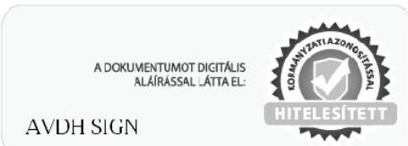

Alulírott Demokratikus Koalíció (székhely: 1066 Budapest, Teréz körút 46.; nyilvántartási szám: 01-02-0014391; adószám: 18270655-1-42; képviseli: Gyurcsány Ferenc elnök) már csatolt, de most ismételten csatolt meghatalmazással igazolt jogi képviselőm (Dr. Czeglédy és Társai Ügyvédi Iroda, székhely: 9700 Szombathely, Szily J. u. 9. I/5.; telefon: 0630/9511- 545; e-mail: iroda@czegledy.hu; eljáró ügyvéd: dr. Fodor Tímea, KASZ: 36060137) útján az Állami Számvevőszék által folytatott „Kampánypénzek ellenőrzése - A 2022. évi országgyúlési képviselő-választási kampányra forditott pénzeszközök elszámolásának ellenőrzése hat jelölő szervezetnél" elnevezésű EL-3712/2023. ügyszámú eljárásában az EL-3712-666/2023 ikt. számú számvevőszéki részjelentés tervezetre (témaszám: 2643, ellenőrzés-azonosító szám: V-0987) - hivatkozással az EL-3712-748/2023 ikt. számú, „Részjelentés-tervezet ismételt megküldése véleményezésre" elnevezésű átiratra - az Állami Számvevőszékről szóló 2011. évi LXVI. törvény (a továbbiakban: ÁSZ tv.) 29. § (2) bekezdése alapján az ellenőrzés megállapításaira az alábbi
észrevételt
teszem,
egyúttal
indítványozom,
hogy iratmegismerési jogomat biztosítva a T. Állami Számvevőszék a részjelentés tervezetben hivatkozott (I. 6. pont - 26. old) Igazságügyi Minisztérium állásfoglalás másolatát elektronikus módon a meghatalmazott ügyvédi iroda útján számomra kézbesíteni szíveskedjen.
(1) A Demokratikus Koalíció továbbra is vitatja az Állami Számvevőszék azon megállapításait, hogy
(i) a Demokratikus Koalíció Magyar Közlönyben közzétett kampányelszámolása nem volt teljeskörü, mert nem vette figyelembe a Mindenki Magyarországa Mozgalom (a továbbiakban: MMM) az Állami Számvevőszék szerinti Demokratikus Koalíció érdekekét szolgáló, a Demokratikus Koalíció kampánytevékenységének részét képező kampánytevékenységre fordított kiadásait, továbbá, hogy
(ii) a választási kampány költségeire vonatkozó korlátozást a Demokratikus Koalíció a vele közös országos listát állító pártokkal együttesen nem tartotta be, valamint, hogy
(iii) a Demokratikus Koalíció a Pártok müködéséről és gazdálkodásáról szóló törvényben előírt finanszírozási tilalmakat nem tartotta be, mivel a Demokratikus Koalíció az ún. hatpárti

---

összefogás tagjaként másik öt párttal közös kampányt folytatva annak során az MMM-től tiltott, nem pénzbeli vagyoni hozzájárulásban, tiltott párttámogatásban részesült, illetve, hogy
(iv) az MMM a tárgybeli kampányidőszakban a Demokratikus Koalíció érdekekét szolgáló, a Demokratikus Koalíció kampánytevékenységének részét képező kampánytevékenységet folytatott, amely során a - hatósági vizsgálattal nem érintett - kampányeszközök finanszírozására 261,26 M Ft-ot fordított.
(2) Az Állami Számvevőszék a vitatott megállapításait részben hiányosan felállított tényállásra, téves következtetéseket levonva, korábbi megállapításaival ellentétesen, prekoncepció mentén, törvénysértő módon, tisztességtelen eljárást folytatva tette.
(3) A Demokratikus Koalíció az országgyűlési képviselők 2022. évi általános választására fordított állami és más pénzeszközök, anyagi támogatások összegéről, forrásáról és felhasználásának módjáról szóló beszámolója szerinti kampányelszámolása teljeskörű.
(4) A Demokratikus Koalíció biztosította a választópolgárok és a Demokratikus Koalíció tagsága számára a kampánya forrásainak és költéseinek átláthatóságát.
(5) A Demokratikus Koalíció kampányát a 2022. évi országgyűlési választási kampány időszakában az MMM nem támogatta, tőle a Demokratikus Koalíció pénzbeli vagy vagyoni hozzájárulást nem fogadott el, ebből következően a Demokratikus Koalíció nem szegte meg a pártok működéséről és gazdálkodásáról szóló 1989. évi XXXIII. törvény (a továbbiakban: Párt törvény) 4. § (2) bekezdésében foglalt finanszírozási tilalmat.
(6) Az országgyűlési képviselők választása kampányköltségeinek átláthatóvá tételéről szóló 2013. évi LXXXVII. törvény (a továbbiakban: Kampányfinanszírozási törvény) 7. § (1)-(2) bekezdéseiben foglalt, a kampány költségeire vonatkozó korlátozást a Demokratikus Koalíció betartotta.
(7) A Demokratikus Koalíció nem folytatott közös kampányt az MMM-mel.
(8) A Demokratikus Koalíció az MMM Állami Számvevőszék által hivatkozott, dokumentált kiadásaira vonatkozó döntéseinek meghozatalában nem vett részt.
(9) Az Állami Számvevőszék által hivatkozott ún. a közös ellenzéki kampánytanács sem vett részt az MMM Állami Számvevőszék által hivatkozott, dokumentált kiadásaira vonatkozó döntéshozatali folyamatban. A hat párt választási együttműködését alapvetően információáramlással segítő kampánytanács nem koordinálta, nem irányította az MMM Állami Számvevőszék által hivatkozott tevékenységét.
(10) Tényállás körében hivatkozunk arra, hogy a Demokratikus Koalíció nevében a pártot képviselő Gyurcsány Ferenc elnökön kívül csak Sebián-Petrovszki László pártigazgató vállalhat pénzügyi kifizetéssel járó kötelezettséget, továbbá arra, hogy a Demokratikus Koalíció kampánytevékenysége vonatkozásában Molnár Csaba ügyvezető alelnök volt jogosult a tárgybeli kampányidőszakban kampánytevékenység vonatkozásában döntést hozni, valamint arra, hogy az Állami Számvevőszék által hivatkozott ún. közös ellenzéki kampánytanács ülésen a Demokratikus Koalíciót Sebián-Petrovszki László pártigazgató képviselte, de a Demokratikus Koalíció kampánytevékenysége vonatkozásában döntést nem hozott, arra jogosult nem volt.

---

(11) Az MMM Állami Számvevőszék által hivatkozott, dokumentált kiadásai vonatkozásában csak ezen civil szervezet törvényes képviselői voltak jogosultak döntést hozni, kötelezettséget vállalni. A Demokratikus Koalíció egyetlen tagja, így vezetői sem törvényes képviselői az MMM-nek.
(12) Mindezekből következően nem bírnak relevanciával a Demokratikus Koalíció vonatkozásában az Állami Számvevőszék által hivatkozott, a vitatott megállapítást alátámasztani hivatott iratok, ugyanis az ezen iratok szerinti kötelezettségeket az MMM arra jogosultjai vállalták.
(13) Feltéve, de nem megengedve, hogy az MMM Állami Számvevőszék által hivatkozott tevékenysége kampánytevékenységnek minősül, az Állami Számvevőszék bizonyítani lenne köteles, hogy ezen tevékenység egyrészt a Demokratikus Koalíció érdekét szolgálta, másrészt, hogy ezen tevékenység vonatkozásában az MMM döntéshozatali folyamatában a Demokratikus Koalíció részt vett. Ezen bizonyítási kötelezettségének az Állami Számvevőszék eleget tenni nem tud.
(14) Az Állami Számvevőszék vitatott megállapításait döntörészt arra alapozza, hogy a Demokratikus Koalíció szándékos magatartása irányult arra, hogy a hat ellenzéki párt által folytatott kampányban olyan szervezet is részt vegyen, amelyre nem vonatkoznak a müködés és a választási részvétel tisztaságát védő garanciális jogszabályi előírások, így kerülve meg a vonatkozó törvényi előírásokat, megsértve a jóhiszemủ és rendeltetésszerű joggyakorlás alapelveit.
(15) Feltéve, de nem megengedve, hogy az MMM Állami Számvevőszék által hivatkozott tevékenysége kampánytevékenységnek minősül, az Állami Számvevőszék - annak meg nem történte miatt - bizonyítani nem tudja, hogy a Demokratikus Koalíció bármilyen módon részt vett volna az MMM azon döntésében, hogy az tevékenységet fejtsen ki a választási kampányidőszakban.
(16) Mivel az MMM a Demokratikus Koalíciótól befolyásmentesen döntött arról, hogy tevékenységet végez a választási kampányidőszakban, ennek érdekében kötelezettségeket vállal, ezért megalapozatlan az Állami Számvevőszék azon megállapítása, hogy a Demokratikus Koalíció az MMM-től tiltott módon nem pénzbeli vagyoni hozzájárulásban, párttámogatásban részesült.
(17) A hatályos törvényi szabályozás nem tiltja, hogy a jelölőszervezeteken kívül más személyek olyan tevékenységet folytassanak a kampányidőszakban, amely alkalmas lehet a választási kampány és a választások befolyásolására. Ebből következően az MMM hivatkozott tevékenysége nem valósít meg jogszabálysértést.
(18) Nem csak a jelölőszervezetek akarják a választási kampányidőszakban befolyásolni a választói akaratot, maguk a választópolgárok, az általuk alkotott kisebb-nagyobb, formális vagy nem formális közösségek szervezett vagy eseti jelleggel is igyekeznek az általuk támogatott jelölőszervezeteket, jelölteket népszerűsíteni, vagy éppen eltántorítani a választókat más jelölőszervezetek, jelöltek támogatásától. Ezen tevékenységük azonban attól függetlenül, hogy alkalmas lehet a választási kampány és a választások befolyásolására, még nem minősül kampánytevékenységnek. A választópolgárok valójában a szabad véleménynyilvánításukat gyakorolják annak érdekében, hogy más választópolgárok a tájékozódáshoz fűződő

---

alkotmányos jogukkal élhessenek. Törvényi tiltás hiányában az MMM hivatkozott tevékenységét, még ha az - feltéve, de nem megengedve - alkalmas volt a választási kampány és a választások befolyásolására, szabadon gyakorolhatta.
(19) Az AJF-0666-005/2023 ikt. számú irat szerinti bejelentésekben a Demokratikus Koalíció bizonyítékokkal alátámasztottan hivatkozott a Civil Összefogás Fórum - Civil Összefogás Közhasznú Alapítvány, a Megafon Digitális Inkubátor Központ Nonprofit Korlátolt Felelősségű Társaság, az Aktuális Média Nonprofit Korlátolt Felelősségủ Társaság, valamint több magánszemély választási kampányidőszakban kifejtett tevékenységére, amely tevékenységek vonatkozásában megalapozottan merül fel, hogy azok a Fidesz-KDNP jelölőszervezet és annak jelöltjei érdekét szolgálták.
(20) Annak ellenére, hogy a Demokratikus Koalíció hivatkozott bejelentései megtétele óta több, mint öt hónap eltelt, semmilyen adat nem merül fel arra, hogy az Állami Számvevőszék a vitatott jelentésben megfogalmazott jogi álláspontjának megfelelően vizsgálná vagy vizsgálta volna a Fidesz-KDNP jelölőszervezet kampányelszámolásának teljeskörűségét annak okán, hogy a Fidesz-KDNP jelölőszervezet abban nem vette figyelembe a hivatkozott szervezetek és személyek nem pénzbeli vagyoni hozzájárulásnak minősülő kiadásait a Fidesz-KDNP jelölőszervezet érdekében megvalósult tevékenységei vonatkozásában.
(21) Az AJF-0666-005/2023 ikt. számú irat szerinti bejelentésekben hivatkozott szervezetek és személyek tevékenysége vizsgálatának hiányában sajnálatos módon az látszik megvalósulni, hogy az Állami Számvevőszék nem tisztességes eljárást folytatva végzi ezen ellenőrzési tevékenységét, a jelölőszervezeteket nem ugyanazon szempontok alapján, közöttük különbséget téve, nem egyenlő mércét alkalmazva, politikai megrendelést teljesítve vizsgálja.
(22) Példaként hivatkozik a Demokratikus Koalíció arra, hogy amennyiben az Állami Számvevőszék szerint a Mindenki Magyarországa Mozgalom 2022. március 15-i kormányváltó nagygyűlés vonatkozásában kifejtett tevékenysége és költései alkalmasak voltak a választási kampány és a választások befolyásolására, akkor az ugyanazon napon a Civil Összefogás Fórum - Civil Összefogás Közhasznú Alapítvány által szervezett nagygyűlés is alkalmas volt a választási kampány és a választások befolyásolására, mivel az nem vitatható módon a FideszKDNP jelölőszervezet és annak jelöltjei érdekét szolgálta. A Civil Összefogás Fórum - Civil Összefogás Közhasznú Alapítvány által szervezett nagygyűlésen a Fidesz-KDNP jelölőszervezetet alkotó pártok nevei, logói, a jelölőszervezet kampányszlogenjei jelentek meg, az ország minden pontjáról szervezetten utaztatták rá a résztvevőket, a jelölőszervezet jelöltjei is részt vettek rajta, a jelölőszervezet miniszterelnök-jelöltje mondott vezérszónokként kampánybeszédet. A nagygyűlés Fidesz-KDNP jelölőszervezet erejét és társadalmi támogatottságát volt hivatott szolgálni, továbbá azt a célt valósította meg, hogy ugyanazon a napon, amikor az ellenzéki nagygyűlés is megrendezésre került, a Fidesz-KDNP jelölőszervezet érdekében a közbeszédet tematizálja.
(23) Továbbá amennyiben az MMM hivatkozott, hatósági vizsgálattal érintett tevékenységéhez köthető, a közösségi médiában, videómegosztókon megjelent hirdetések (online hirdetések) alkalmasak voltak a választási kampány és a választások befolyásolására, akkor az AJF-0666005/2023 ikt. számú irat szerinti szervezetek és személyek hirdetési tevékenysége is alkalmas volt a választási kampány és a választások befolyásolására. Ebből következően amennyiben az MMM hivatkozott tevékenységéhez köthető, a közösségi médiában, videómegosztókon

---

megjelent hirdetések szerinti tevékenységet az Állami Számvevőszék kampánytevékenységnek minősíti, akkor az AJF-0666-005/2023 ikt. számú irat szerinti szervezetek és személyek hirdetési tevékenységét is kampánytevékenységnek kell minősítenie.
(24) Másik irányból megközelítve, amennyiben az Állami Számvevőszék az AJF-0666005/2023 ikt. számú irat szerinti szervezetek és személyek tevékenységét nem minősíti kampánytevékenységnek, akkor tisztességes eljárást folytatva az MMM hivatkozott tevékenységét sem minősítheti kampánytevékenységnek.
(25) Az Állami Számvevőszék által hivatkozott, jelenleg hatósági vizsgálattal érintett közösségi médiában, videómegosztókon megjelent hirdetések vonatkozásában a Demokratikus Koalíció továbbá rámutat arra, hogy az Állami Számvevőszék az EL-3311-001/2021. iktatószámú jelentésében (azonosító szám: V 0912) annak ellenére állapította meg, hogy dr. Koncz Zsófia egyéni jelölt és a FIDESZ-KDNP jelölő szervezet a Magyar Közlönyben nyilvánosságra hozott pénzügyi elszámolások és a rendelkezésére bocsátott számviteli bizonylatok alapján a választási kampányidőszak alatt, a választási kampánytevékenységgel összefüggő kiadásai együttesen nem haladták meg az 5 millió forintot, hogy dr. Koncz Zsófia egyéni jelölt általa sem vitatottan közel 5,5 millió forintot fordított Facebook-hirdetésekre a választási kampányidőszakban.
(26) Az Állami Számvevőszék akkori nyilatkozata szerinti jogi álláspontja az volt, hogy közösségi médiában közzétett hirdetések nem szoríthatók be a jelenlegi politikai hirdetésekhez kapcsolódó hazai jogszabályok közé.
(27) Ezt a jogi álláspontot támasztja alá, hogy az Állami Számvevőszék a 2021. évben „kézikönyv az országgyúlési képviselő-választási kampányra forditott pénzeszközök elszámolásához" elnevezésủ kiadványában a politikai hirdetés mint kampánytevékenység vonatkozásában csupán arra a jogi meghatározásra hivatkozik, hogy a politikai hirdetés az ellenérték fejében közzétett, valamely jelölő szervezet vagy független jelölt népszerűsítését szolgáló vagy támogatására ösztönző, illetve azok nevét, célját, tevékenységét, jelszavát, emblémáját népszerűsítő, sajtótermékben közzétett médiatartalom vagy filmszínházban közzétett audio-vizuális tartalom.
(28) A Facebook, a YouTube se nem sajtótermék, se nem filmszínház, ebből következően az Állami Szemvevőszék által hivatkozott - de jelenleg hatósági vizsgálattal érintett - MMM tevékenység szerinti közösségi médiában, videómegosztókon megjelent hirdetések nem minősíthetőek politikai reklámnak, így ezekkel az MMM nem valósított meg kampánytevékenységet. Ez pedig azt jelenti, hogy ezen hirdetések megjelentetése sem minősíthető a Demokratikus Koalíció érdekekét szolgáló, a Demokratikus Koalíció kampánytevékenységének részét képező tevékenységnek, az MMM ezekre vonatkozó kiadásai nem minősülhetnek tiltott, nem pénzbeli vagyoni hozzájárulásnak.
(29) A jelenleg hatályos törvényi szabályozás nem tartalmaz arra vonatkozóan szabályt, hogy amennyiben az Állami Számvevőszék jogsértést állapítana meg a Demokratikus Koalíció és a másik öt párt érdekében, hogyan kell és lehet a jogkövetkezményt egyes pártok vonatkozásában, illetőleg a pártok között megosztva érvényesíteni.
(30) Így hiába tartja fent továbbra is az Állami Számvevőszék törvénysértő módon és tisztességtelen eljárást folytatva a megállapításait, jogszabályi rendelkezés hiányában nem tudja

---

a jogkövetkezményt akként érvényesíteni, hogy az annak alapjául szolgáló 261,26 millió forintot egyenlő mértékben „szétosztja", azaz hatodolja a hat párt között.
(31) Az Igazságügyi Minisztérium egyébként nem ismert tartalmú állásfoglalása nyilván nem jogszabály, a minisztérium pozitív jogot nem alkothat, így a Demokratikus Koalíció vonatkozásában érvényesíteni kívánt 43,543 millió forint összegủ központi költségvetésbe történő befizetésre kötelezés, illetőleg a Demokratikus Koalíciónak a központi költségvetésből juttatott támogatásának ezen összeggel való további csökkentésére vonatkozó döntés törvénytelen.

Kelt Budapesten 2023. december 18. napján

Tisztelettel

# Demokratikus Koalíció 

képv.: dr. Fodor Tímea ügyvéd
Dr. Czeglédy és Társai Ügyvédi Iroda

---

# Gyurcsány Ferenc 

elnök
Demokratikus Koalíció

## Budapest

Tárgy: Válaszlevél a részjelentés-tervezet ismételt megküldését követően az ellenőrzési megállapításokra tett észrevételek kezeléséről

## Tisztelt Elnök Úr!

A „Kampánypénzek ellenörzése - A 2022. évi országgyölési képeiselö-választási kampanyra forditott pénzexközök elszámolásának ellenörzése bat jelölö szervezetné"" címủ számvevőszéki részjelentés tervezetével kapcsolatos, annak ismételt észrevételezése keretében a Dr. Czeglédy és Társai Ügyvédi Iroda nevében eljáró Dr. Fodor Tímea ügyvéd, valamint az Ön által küldött, 2023. december 18-i keltezésű észrevételt köszönettel megkaptam. A 2024. január 10-i válaszlevelemben tájékoztattam Elnök urat, hogy tekintettel a tényállás összefüggéseire, és a Hatpárti összefogás érintett öt pártja közül háromnál még folyamatban lévő észrevételezésre az Állami Számvevőszék (a továbbiakban: ÁSZ) a Demokratikus Koalíció által tett észrevételeket a Hatpárti összefogásban részt vett valamennyi jelölő szervezet észrevételeivel egyidejűleg fogja megválaszolni. A Hatpárti összefogás pártjai a részjelentés tervezetére vonatkozó észrevételeiket megküldték, ez alapján - a korábbi levelemmel összhangban - a Demokratikus Koalíció észrevételeivel kapcsolatban a jelen levelemben tájékoztatom.
Az Állami Számvevőszékről szóló 2011. évi LXVI. törvény (a továbbiakban: ÁSZ törvény) 29. § (2) bekezdése szerint az ellenőrzött szervezet vezetője és a felelősként megjelölt személy az ellenőrzés megállapításaira tizenöt napon belül írásban észrevételt tehet. Ugyanezen szakasz (3) bekezdése szerint az ÁSZ az észrevételre a beérkezésétől számított harminc napon belül írásban válaszol. A figyelembe nem vett észrevételeket köteles a jelentésben feltüntetni, és megindokolni, hogy azokat miért nem fogadta el. Tájékoztatom Elnök urat, hogy a számvevőszéki részjelentésben a figyelembe nem vett észrevételeket szerepeltetjük az elutasítás indokának feltüntetésével.

---

Az ÁSZ észrevételekre vonatkozó álláspontjáról az alábbi tájékoztatást adom:
Az ÁSZ a részjelentés-tervezetet két körben - 2023. június 16-án, majd 2023. december 5-én bocsátotta az Ön rendelkezésére az ÁSZ törvény szerinti észrevételezési jog biztosítása érdekében. A 2023. december 18-án kelt, ismételt észrevételeiről megállapítottam, hogy azok jelentős része -(1)-től (28) pontig - azonos tartalommal került szerepeltetésre és többnyire szó szerint megegyezik a 2023. szeptember 7-én kelt levelében tett észrevételeivel. Erre tekintettel jelen válaszlevelemben ezen észrevételeire tájékoztatom, hogy a 2023. október 6-án, EL-3712-740/2023 iktatószámon az Ön részére megküldött levelemben a)-tól f) pontig szerepeltetett válaszaimat megerősítem és fenntartom. A 2023. december 18-án kelt levelének (1)-(28) pontjában tett észrevételei alapján a részjelentés-tervezet módosítása nem indokolt.

# a) Levelének (29) és (30) pontjában észrevételt tett a jogkövetkezmények ellenőrzött szervezetek közötti felosztása kapcsán. 

Az ÁSZ e körben ismételten hangsúlyozza, hogy a jogértelmezése azon a tényen alapul, hogy a pártok önállóan gazdálkodó jogi személyek, a közös listán történő indulás nem érinti a gazdálkodási önállóságukat, továbbá az ellenőrzött szervezetek felelőségét saját, összehangolt magatartásuk alapján állapította meg.

A pártok működéséről és gazdálkodásáról szóló 1989. évi XXXIII. törvény (a továbbiakban: Párt törvény) 4. § (2) bekezdése szerint a párt részére nem adható vagyoni hozzájárulás és jogi személytől, jogi személyiséggel nem rendelkező szervezettől vagyoni hozzájárulást a párt nem fogadhat el. A törvény ilyen megfogalmazásából („a párt") azonban nem következik az, hogy a törvényi rendelkezések közös magatartással történő megsértése ne lenne jogszabályba ütköző, ahogy az sem, hogy az ilyen módon elkövetett jogszabálysértés esetében a törvényben meghatározott jogkövetkezményeket ne kellene alkalmazni. Bár a törvény - hasonlóan a más jogterületekre vonatkozó jogszabályokhoz - valóban nem nevesíti a közös jogsértés esetét, az ellenőrzött szervezetek erre mentesülésként nem hivatkozhatnak, hiszen amely magatartás önállóan megvalósítva jogsértő, az közös elkövetés esetén is az. Az ÁSZ tehát köteles volt a jogkövetkezményekre vonatkozóan is rendelkezést tenni.

Konkrét jogszabályi rendelkezés hiányában elvben valóban többféle felosztási metódus lehetősége merül fel, így az egyenlő felosztás mellett a pártok közötti valamilyen arányban (pl. mandátumok arányában, állami támogatás arányában, jelöltek arányában stb.) történő felosztás mellett is lehetne érvelni. Az ÁSZ az egyes ellenőrzött szervezetek érdekviszonyai helyett a jogszabályi rendelkezéseket vette alapul, ennek keretében a párt gazdálkodását a közös listán történő indulás jelentőségével összevetve kellett vizsgálni.

Ahogy ez a részjelentés-tervezet Megállapítások részének I.6. pontjában rögzítésre került, az ÁSZ az egyenlő felosztás elvét arra tekintettel vette alapul, hogy a közös listán induló pártok a közös lista választási sikerében, nem pedig kizárólag saját pártjuk választási sikerében érdekeltek. Az ÁSZ álláspontja szerint a Hatpárti összefogást alkotó pártok önkéntes

---

elhatározás alapján összehangolt, közös kampánytevékenységet folytattak, a közös kampányukhoz nyújtott nem pénzbeli vagyoni hozzájárulás a közös listán induló pártok érdekeit egyenlő mértékben szolgálta. Olyan jogi előírás nincs, amely alapján az egyes pártoknak a közös listához fűződő érdekeltsége ettől eltérő mértékben lenne meghatározható, hiszen a közös listán induló, a kormányalakításhoz szükséges parlamenti többségre törekvő pártok nem csupán a saját, de a velük közös listán induló többi párt és annak jelöltjeinek sikeres választási szereplésében is kölcsönösen érdekeltek. Ezen körülményt nem érinti, hogy az egyes jelölteket mely pártok delegálták, ahogy az sem, hogy végül közülük kik jutnak be az Országgyűlésbe. Ebből következően - mindenféle, jogi szempontból figyelembe vehető arányosság hiányában - az egyenlő felosztás az egyetlen olyan metódus, amely a jogszabály szövegéből a pártok önálló gazdálkodását nem sértő módon levezethető.

# b) Levelének (31) pontjában észrevételt tett a minisztériumi állásfoglalásra. 

Az ÁSZ törvény 1. § (2) bekezdésében foglaltak alapján az ÁSZ ellenőrzési tevékenysége során minden más szervezettől független. Az ÁSZ hangsúlyozza, hogy a részjelentés-tervezetet nem az Igazságügyi Minisztérium (a továbbiakban: IM) állásfoglalására alapítva, hanem saját jogértelmezése alapján, saját hatáskörében, saját felelősségére hozta meg. Az ÁSZ az IM állásfoglalását - ahogy az abban szerepel is - csupán egy szakmai véleménynek tekintette, amely az ÁSZ eljárására vonatkozóan semmiféle kötőerővel nem rendelkezik. Az ÁSZ az IM állásfoglalásának nem tulajdonított nagyobb jelentőséget, mint az ellenőrzött szervezetek észrevételeiben foglaltaknak: „Az Állami Számverőszék a jogkövetkezmények vonatkozásában figyelemmel az ellenörzött szervezetekeek a jelentéstervezete tett észrevételeire, valamint az Igazságügyi Minisztérium állásfoglalására - arra a következtetésre jutott, bogy a jogkövetkezmények alkalmazása a pártoknak közösen nyújtott nem vagyoni hozzájárulás esetében sem mellözbett?".

Az IM jogot nem alkotott, az ÁSZ álláspontját a Párt törvény hatályba lépése óta hatályos rendelkezésekből vezette le.

Mindezek miatt a 2023. december 18-án kelt levelének (29)-(31) pontjában tett észrevételei alapján a részjelentés-tervezet módosítása nem indokolt.

Kelt: Budapest, időbélyegző szerint.

Tisztelettel:
az Állami Számvevőszék elnöke nevében:
Klinga László s.k.
igazgató
Állami Számvevőszék
Államháztartáson Kívüli Szervezeteket
Ellenőrző Igazgatóság

---

Tárgy: az EL-3712-747/2023 iktatószámú részjelentés-tervezet véleményezése
Tisztelt Állami Számvevőszék, tisztelt Elnök Úr!

Alulírott Gyöngyösi Márton Balázs elnök a JOBBIK-Konzcrvatívok (székhelye: 1034 Budapest, Bécsi út 120., nyilvántartási száma: 01-02-0010655, a továbbiakban: JOBBIK) törvényes képviseletében czúton
véleményezem és észrevétclezem
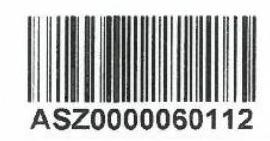
a tisztelt Állami Számvevőszék Budapesten, 2023. december 5-én kelt, EL-3712-747/2023 iktatószámú részjelentés-tervezetét (a továbbiakban: ismételten megküldött részjelentés tervezet).

Előadom, hogy álláspontom szerint a tisztelt Állami Számvevőszék vizsgálata és eljárása mind módszertanilag, mind jogilag teljes egészében hibás, összeegyeztethetetlen a jogszabályokkal és a jogállami elvekkel.
A tisztelt Állami Számvevők ismételten megküldött részjelentés tervezete továbbra is igen jelentős számban tartalmaz olyan megfogalmazásokat, amelyek pusztán valószínűsítések, fikciók, általánosítások, prekoncepcionális következtetések, jóllehet, egyedül a kétséget kizáró bizonyításnak lenne helye.

Ismételten hivatkozni kívánok rá, hogy a Párttörvény 4. § (2) bekezdése ekként rendelkezik: „A párt részére - az (1) bekezdésben foglalt kivételektől eltekintve - jogi személy, jogi személyiséggel nem rendelkező szervezet vagyoni hozzájárulást nem adhat, a párt jogi személytől, jogi személyiséggel nem rendelkező szervezettől vagyoni hozzájárulást nem fogadhat el.".
Ebből következően a tisztelt Állami Számvevőszéknek a JOBBIK általi elfogadás mozzanatát kellene kétséget kizáróan bizonyítania ahhoz, hogy bármiféle megállapítást tehessen, nem pedig azt, hogy harmadik személy milyen magatartást tanúsított. Egyedül annak van ugyanis jelentősége, hogy maga a JOBBIK elfogadott-e valamit, ezt azonban a tisztelt Állami Számvevőszék nem bizonyította, és nem is tudja bizonyítani, hiszen nem történt ilyen.

---

A tisztelt Állami Számvevőszék továbbra is azt állítja ismételten megküldött részjelentés tervezetében, hogy ,,Az MMM aktiv részvételével minden általa teljesitett kampánykiadás a Hatpárti összefogás közös kampánykiadásává vált, amelyet igy nem lehet elválasztani az egyes pártok hivatalos kampánykiadásaitól."

Ez cgy súlyos prekoncepció, melyet az időközben bekövetkezett események egyértelműen cáfolnak. A Szegedi Törvényszék ugyanis nem sokkal később nyilvántartásba vette a Mindenki Magyarországa Néppártot, amelynek elnöke dr. Marki-Zay Péter, a korábbi civil jelölt. A tisztelt Állami Számvevőszék prekoncepciójával szemben tehát a valóság az, hogy az MMM nem a Hatpárti összefogás érdekében kampányolt, hanem a rövidesen megalapítandó saját pártot és annak leendő clnökét, ez utóbbi személyes brandjét igyekezett felépiteni a JOBBIK országos ismertségét is felhasználva, vagyis a JOBBIK-tól éppenhogy elvéve, mintsem neki bármit is adva.

Ugyancsak a jogállami elvekkel szögesen ellentétes az, ahogy a tisztelt Állami Számvevőszék ismételten megküldött részjelentés tervezetének I.6. pontjában a jogkövetkezmények alkalmazását megalapozni igyekszik. Bármiféle jogkövetkezményt alkalmazni egyedül kétséget kizáró bizonyítás eredményeként tett megállapítások alapján lehetséges, ez alól semmilyen jogszabály nem ad felmentést, az Igazságügyi Minisztérium - jogforrásnak egyébként sem minősülő - utólagos állásfoglalását pedig a tisztelt Állami Számvevőszék mint független (kizárólag az Országgyűlésnek alárendelt) jogállami szerv egyáltalán nem is vehetné figyelembe. Ennek ellenére a tisztelt Állami Számvevőszék egy kormányszerv véleményére hivatkozik egy olyan eljárásban, amelyet törvények alapján és tisztán jogállami szempontok szerint kellene lefolytatnia.

Álláspontom szerint módszertanilag továbbra is problematikus, hogy a tisztelt Állami Számvevőszék anélkül von le következtetéseket, hogy először is jogszabályi rendelkezések mentén definiálná egy civil szervezetnek a véleménynyilvánítási szabadság keretei között végezhető tevékenységét és elhatárolná azt az egyes pártok kampánytevékenységétől. Sem jogszabályi háttér, sem nemzetközi, sem hazai számvevőszéki módszertan nem áll rendelkezésre ahhoz, hogy közös pártlistát állító pártok esetén az egyes pártok gazdálkodását milyen szempontrendszer alapján kell és lehet elkülönülten vizsgálni annak érdekében, hogy megalapozott következtetések legyenek levonhatók. Egy azonban biztos: az Állami Számvevőszék csak az egyes pártok gazdálkodását vizsgálhatja, és ezt is kizárólag közvetlenül teheti, nem pedig fikciók alapján visszakövetkeztetve. Ugyancsak súlyos módszertani és

---

jogszabályi hiányosság, hogy nincs definiálva és konkretizálva, hogy nem pénzbeli vagyoni hozzájárulás esetében mi minősül az elfogadás mozzanatának. Egy szemléletes példából kiindulva: Vajon köteles-e a párt eltávolítani azokat az öt bármilyen formában támogató plakátokat, amelyeket tőle függetlenül, nem az ő megrendelésére harmadik személy helyez ki, és amelyeket véletlenül vesz észre? És ha nem veszi észre, akkor az már elfogadásnak minösül? Hasonló módszertani hiba a tisztclt Állami Számvevőszék részéről az is, hogy nem vet számot azzal a lehetőséggel, amikor harmadik személy a saját érdekében fejt ki olyan nézeteket, amelyek egy párt álláspontjával is egybecsengenek ugyan, de ezt valójában azért teszi, hogy önmagát építse, nem pedig azért, hogy az adott pártot népszerüsítse. A módszertani kérdés ennek kapcsán konkrétan az, hogy miként állapítja meg a tisztelt Állami Számvevőszék, hogy ténylegesen mi volt az MMM motivációja? A feltételezés, illetve a látszatból való kiindulás ugyanis itt sem elegendő, hanem kétséget kizáró bizonyítás szükséges, és egyedül az fogadható el. Míg a tisztelt Állami Számvevőszék e bizonyítási kötelezettségének a legcsekélyebb mértékben sem tudott eleget tenni, addig a JOBBIK kétséget kizáró ellenbizonyítással élt az Önök feltételezéseivel szemben, hiszen igazolta a Mindenki Magyarországa Néppárt megalakulását és nyilvántartásba vételét annak a politikusnak a vezetése alatt, akinek személyes brandjét az MMM a vizsgált időszakban is igyekezett felépíteni.

Ugyancsak súlyos módszertani hiba és ellentmondás, hogy a tisztelt Állami Számvevőszék mindenféle alátámasztás nélkül kijelenti, hogy az MMM-tól a Hatpárti összefogás pártjai egyenlő mértékben részesültek nem pénzbeli vagyoni hozzájárulásban (ismételten megküldött részjelentés tervezet 27. oldal utolsó bekezdés). Ugyanezen bekezdés utolsó mondata pedig meg nem engedhető negatív megközelítést tartalmaz. A tisztclt Állami Számvevőszék számára ugyanis semmilyen körülmények között nem lehet kiindulópont az, ha valamire nincs jogszabályi előírás, hanem kizárólag tételes jogszabályi előírásra alapozhatnák eljárásukat. És ráadásul van is olyan jogszabályi előírás, amely eltérő mértékủ részesedést tesz lehetővé, ilyen például a Kampánytv. 6. § (7) bekezdése, amely szerint „a közös pártlistát állító pártok 3. § szerinti támogatását a közös pártlistát állító pártok megállapodása alapján kell a pártok részére folyósítani". Nem automatikus tehát, így kiindulásul sem szolgálhat, hogy mindenki mindenből egyenlő arányban részesedik.

Végezetül ismételten hangsúlyozni kívánom, hogy a tisztelt Állami Számvevők eljárásának keretét és egyben korlátját az Ásztv. 24. § (1) bekezdés d) pontja jelenti. A szóban forgó jogszabályhely szerint az ellenőrzések eredményeinek, a megállapításoknak alátámasztottnak,

---

a következtetéseknek okszerünek és megalapozottnak kell lenniük. Jelen esetben ezek a követelmények továbbra sem teljesülnek, így álláspontom szerint a tisztelt Állami Számvevőszék eljárása önkényes, a jogállamiságot és a jogbiztonságot veszélyezteti.
Mivel az Állami Számvevőszék jelentése bírósági úton nem támadható, vele szemben jogorvoslattal élni nem lehet, ezért az Állami Számvevőszéket fokozott felelősség terheli, amely többek között abban nyilvánul meg, hogy a szervnek tartózkodnia kell mindenféle valószínüsítéstől és vélelmezéstől, és megállapításait kétséget kizáró bizonyítékokkal köteles alátámasztani. A másik irányból ugyanezt erősíti az Alkotmánybíróság 3001/2019. (I. 7.) AB határozata, amely szerint „a pártoknak a demokratikus jogállamokban - így Magyarországon is - kitüntetett szerepük van. Ahhoz, hogy be tudják tölteni alkotmányos funkciójukat, e körben szabadságot kell számukra biztosítani a végrehajtó hatalom kontrollja alól. Az Alaptörvény a B) cikk (1) bekezdésében és a VIII. cikk (3) bekezdésében éppen ezt garantálja. Az Alaptörvény B) cikk (1) bekezdése és VIII. cikk (3) bekezdése együttesen azt is magában foglalja, hogy a pártok gazdálkodásának ellenőrzésére és a pártok kötelezésére nem terjedhet ki a végrehajtó hatalom szerveinek feladat- és hatásköre azokon a területeken, amelyeken a pártok alkotmányos funkciójukat teljesítik, azaz a népakaratot becsatornázzák a közhatalomba."
Ezzel szemben az ismételten megküldött részjelentés tervezet is prekoncepciót tükröz, hiszen a tisztelt Állami Számvevőszék nem végez el bizonyos megkerülhetetlen elhatárolásokat, nem különít el egymástól eltéró tényállásokat, és ilyen módon cgy fikciókon alapuló álvalóságot épít fel, ami nem egyeztethető össze a tisztelt Állami Számvevőszék függetlenségével.

A fentiek alapján megállapítható, hogy a tisztelt Állami Számvevőszék kiindulópontja és megállapításai teljes egészében megalapozatlanok és jogszabályellenesek, továbbá azokat a JOBBIK tételesen cáfolta, így a JOBBIK-kal szemben semmilyen joghátrány alkalmazásának nincs helye.
Budapest, 2023. december 20.

Tisztelettel:
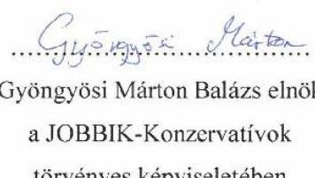

Gyöngyösi Márton Balázs elnök
a JOBBIK-Konzervatívok
törvényes képviseletében

---

# Gyöngyösi Márton Balázs 

elnök
Jobbik - Konzervatívok

## Budapest

Tárgy: Válaszlevél a részjelentés-tervezet ismételt megküldését követően az ellenőrzési megállapításokra tett észrevételek kezeléséről

## Tisztelt Elnök Úr!

A „Kampánypénzek ellenörzése - A 2022. évi országgyölési képeiselö-választási kampányra forditott pénzesekézök elszámolásának ellenörzése hat jelölő szervezetnié" című számvevőszéki részjelentés tervezetével kapcsolatos, 2023. december 20-i keltezésű észrevételét köszönettel megkaptam. A 2024. január 10-i válaszlevelemben tájékoztattam Elnök urat, hogy tekintettel a tényállás összefüggéseire, és a Hatpárti összefogás érintett öt pártja közül háromnál még folyamatban lévő észrevételezésre az Állami Számvevőszék (a továbbiakban: ÁSZ) a Jobbik-Konzervatívok (a továbbiakban: Jobbik) által tett észrevételeket a Hatpárti összefogásban részt vett valamennyi jelölő szervezet észrevételeivel egyidejűleg fogja megválaszolni. A Hatpárti összefogás pártjai a részjelentés tervezetére vonatkozó észrevételeiket megküldték, ez alapján - a korábbi levelemmel összhangban - a Jobbik észrevételeivel kapcsolatban jelen levelemben tájékoztatom.

Az Állami Számvevőszékről szóló 2011. évi LXVI. törvény (a továbbiakban: ÁSZ törvény) 29. § (2) bekezdése szerint az ellenőrzött szervezet vezetője és a felelősként megjelölt személy az ellenőrzés megállapításaira tizenöt napon belül írásban észrevételt tehet. Ugyanezen szakasz (3) bekezdése szerint az ÁSZ az észrevételre a beérkezésétől számított harminc napon belül írásban válaszol. A figyelembe nem vett észrevételeket köteles a jelentésben feltüntetni, és megindokolni, hogy azokat miért nem fogadta el. Tájékoztatom Elnök urat, hogy a számvevőszéki részjelentésben a figyelembe nem vett észrevételeket szerepeltetjük az elutasítás indokának feltüntetésével.

---

Az ÁSZ észrevételekre vonatkozó álláspontjáról az alábbi tájékoztatást adom:
Az ÁSZ a részjelentés-tervezetet két körben - 2023. június 16-án, majd 2023. december 5-én bocsátotta az Ön rendelkezésére az ÁSZ törvény szerinti észrevételezési jog biztosítása érdekében. A 2023. december 20-án kelt, ismételt észrevételeiről megállapítottam, hogy azok között több olyan észrevétel van, amelyek a 2023. július 3-án kelt levelében is szerepelnek. Ezek a következők:
$>$ ÁSZ vizsgálatának, eljárásának módszertani, jogi kérdései;
$>$ a tiltott támogatás párt által történő elfogadása;
$>$ civil szervezetek által végzett kampánytevékenység értékelése a véleménynyilvánítás szabadsága szempontjából;
$>$ a pártok gazdálkodásának egyedi ellenőrzése;
$>$ a pártok végrehajtó hatalomtól való védelmére vonatkozó alaptörvényi rendelkezések és a jogállamiság érvényesülése.
A felsorolt témákban ismételten megtett észrevételeire jelen válaszlevelemben tájékoztatom, hogy a 2023. október 6-án, EL-3712-739/2023 iktatószámon az Ön részére megküldött levelemben a)-tól f) pontig szerepeltetett válaszaimat megerősítem és fenntartom. Mindezek alapján a 2023. december 20-án kelt levelének - a 2023. július 3-án kelt levelével megegyező tartalmú észrevételei alapján a részjelentés-tervezet módosítása nem indokolt.

A további, a 2023. július 3-án kelt észrevételeihez képest újonnan adott észrevételeivel kapcsolatban az alábbiakról tájékoztatom:
a) Levelében észrevételt tett arra, hogy az ÁSZ részjelentés-tervezetében az Igazságügyi Minisztérium állásfoglalása figyelembevételével állapítja meg a jogkövetkezményeket.

Az ÁSZ törvény 1. § (2) bekezdésében foglaltak alapján az ÁSZ ellenőrzési tevékenysége során minden más szervezettől független. Az ÁSZ hangsúlyozza, hogy a részjelentés-tervezetet nem az Igazságügyi Minisztérium (a továbbiakban: IM) állásfoglalására alapítva, hanem saját jogértelmezése alapján, saját hatáskörében, saját felelősségére hozta meg. Az ÁSZ az IM állásfoglalását - ahogy az abban szerepel is - csupán egy szakmai véleménynek tekintette, amely az ÁSZ eljárására vonatkozóan semmiféle kötőerővel nem rendelkezik. Az ÁSZ az IM állásfoglalásának nem tulajdonított nagyobb jelentőséget, mint az ellenőrzött szervezetek észrevételeiben foglaltaknak: „Az Állami Számvevöszék a jogkövetkezmények vonatkozásában figyelemmel az ellenörzött szervezeteknek a jelentéstervezetre tett észrevételeire, valamint az Igazsáaügyi Minisztérium állásfoglalására - arra a következtetésre jutott, hogy a jogkövetkezmények alkalmazása a pártoknak közösen nyújtott nem vagyoni bozzájárulás esetében sem mellözbete?".

Az IM jogot nem alkotott, az ÁSZ álláspontját a pártok működéséről és gazdálkodásáról szóló 1989. évi XXXIII. törvény (a továbbiakban: Párt törvény) hatályba lépése óta hatályos rendelkezésekből vezette le.

---

# b) Levelében észrevételt tett a jogkövetkezmények ellenőrzött szervezetek közötti felosztása kapcsán. 

Az ÁSZ e körben ismételten hangsúlyozza, hogy a jogértelmezése azon a tényen alapul, hogy a pártok önállóan gazdálkodó jogi személyek, a közös listán történő indulás nem érinti a gazdálkodási önállóságukat, továbbá az ellenőrzött szervezetek felelőségét saját, összehangolt magatartásuk alapján állapította meg.

A Párt törvény 4. § (2) bekezdése szerint a párt részére nem adható vagyoni hozzájárulás és jogi személytől, jogi személyiséggel nem rendelkező szervezettől vagyoni hozzájárulást a párt nem fogadhat el. A törvény ilyen megfogalmazásából („a párt") azonban nem következik az, hogy a törvényi rendelkezések közös magatartással történő megsértése ne lenne jogszabályba ütköző, ahogy az sem, hogy az ilyen módon elkövetett jogszabálysértés esetében a törvényben meghatározott jogkövetkezményeket ne kellene alkalmazni. Bár a törvény - hasonlóan a más jogterületekre vonatkozó jogszabályokhoz - valóban nem nevesíti a közös jogsértés esetét, az ellenőrzött szervezetek erre mentesülésként nem hivatkozhatnak, hiszen amely magatartás önállóan megvalósítva jogsértő, az közös elkövetés esetén is az. Az ÁSZ tehát köteles volt a jogkövetkezményekre vonatkozóan is rendelkezést tenni.

Konkrét jogszabályi rendelkezés hiányában elvben valóban többféle felosztási metódus lehetősége merül fel, így az egyenlő felosztás mellett a pártok közötti valamilyen arányban (pl. mandátumok arányában, állami támogatás arányában, jelöltek arányában stb.) történő felosztás mellett is lehetne érvelni. Az ÁSZ az egyes ellenőrzött szervezetek érdekviszonyai helyett a jogszabályi rendelkezéseket vette alapul, ennek keretében a párt gazdálkodását a közös listán történő indulás jelentőségével összevetve kellett vizsgálni.

Ahogy ez a részjelentés-tervezet Megállapítások részének I.6. pontjában rögzítésre került, az ÁSZ az egyenlő felosztás elvét arra tekintettel vette alapul, hogy a közös listán induló pártok a közös lista választási sikerében, nem pedig kizárólag saját pártjuk választási sikerében érdekeltek. Az ÁSZ álláspontja szerint a Hatpárti összefogást alkotó pártok önkéntes elhatározás alapján összehangolt, közös kampánytevékenységet folytattak, a közös kampányukhoz nyújtott nem pénzbeli vagyoni hozzájárulás a közös listán induló pártok érdekeit egyenlő mértékben szolgálta. Olyan jogi előírás nincs, amely alapján az egyes pártoknak a közös listához fűződő érdekeltsége ettől eltérő mértékben lenne meghatározható, hiszen a közös listán induló, a kormányalakításhoz szükséges parlamenti többségre törekvő pártok nem csupán a saját, de a velük közös listán induló többi párt és annak jelöltjeinek sikeres választási szereplésében is kölcsönösen érdekeltek. Ezen körülményt nem érinti, hogy az egyes jelölteket mely pártok delegálták, ahogy az sem, hogy végül közülük kik jutnak be az Országgyűlésbe. Ebből következően - mindenféle, jogi szempontból figyelembe vehető arányosság hiányában - az egyenlő felosztás az egyetlen olyan metódus, amely a jogszabály szövegéből a pártok önálló gazdálkodását nem sértő módon levezethető.

---

A fentieknek látszólag ellentmond az országgyűlési képviselők választása kampányköltségeinek átláthatóvá tételéről szóló 2013. évi LXXXVII. törvény 6. § (7) bekezdése, amely szerint a közös pártlistát állító pártok 3. § szerinti támogatását a közös pártlistát állító pártok megállapodása alapján kell a pártok részére folyósítani. Ezen rendelkezés azonban csak az állami támogatás megosztására vonatkozik, de nem érinti a közös kampánytevékenység sikerében való érdekeltséget. Emellett a jogi személy részéről nyújtott nem pénzbeli vagyoni hozzájárulás nem analóg az állami támogatással, olyan körülmény pedig nem merült fel, miszerint a Mindenki Magyarországa Mozgalom (a továbbiakban: MMM) a vagyoni hozzájárulását az állami támogatás arányában nyújtotta volna. Az állami támogatás aránya eltér mind a jelöltek, mind a megszerzett mandátumok arányától - ebből is látszik, hogy mennyire vitatható az arányos megosztás valamely formája mellett érvelni.
c) Levelében észrevételt tett arra, hogy az MMM nem a Hatpárti összefogás érdekében kampányolt, hanem az idő közben a Szegedi Törvényszék által nyilvántartásba vett Mindenki Magyarországa Néppártot és annak leendő elnökét, ez utóbbi személyes brandjét igyekezett felépíteni.

Az ÁSZ a jelentését a vizsgált időszakra megállapított tényállás alapján készítette el, így az azt követő, a Hatpárti összefogás kampányához közvetlenül nem kapcsolódó események jogi jelentőséggel nem bírnak. Ezen kívül az ÁSZ megállapításait a tényekre alapozza, ezért politikai kérdésekben nem kíván állást foglalni, erre vonatkozóan hatásköre sincs. Tény, hogy az ÁSZ által feltárt, az MMM forrásaiból a Hatpárti összefogás érdekében teljesített kampánykiadások elsődlegesen és közvetlenül nem Márki-Zay Péter által a 2022-es országgyűlési választásokat követő több, mint egy évvel, 2023. május 12-én alapított pártjának és annak alapítójaként személyes brandjének építését szolgálták, hanem a Hatpárti összefogás kampánytevékenységét. Az észrevételben előadott feltételezés - függetlenül attól, hogy megalapozott-e vagy sem - a megállapítás lényegét azon okból sem érinti, hogy a törvény a pártok jogi személy részéről történő támogatását a támogató szándékától függetlenül tilalmazza.

---

Mindezekre figyelemmel a részjelentés-tervezet módosítása az észrevétele alapján nem indokolt.

Kelt: Budapest, időbélyegző szerint.

Tisztelettel:
az Állami Számvevőszék elnöke nevében:

# Klinga László s.k. 

igazgató
Állami Számvevőszék
Államháztartáson Kívüli Szervezeteket
Ellenőrző Igazgatóság

---

# Állami Számvevőszék 

1052 Budapest, Apáczai Csere János utca 10.

## Tisztelt Állami Számvevőszék!

Alulírott Magyar Szocilista Párt (székhely: 1114 Budapest, Villányi út 11-13; a továbbiakban „MSZP") az alábbi

## észrevételeket

terjeszti elő a T. Állami Számvevőszék EL- 3712-752/2023 iktatószámú levelével ismételten megküldött, 23025 jelentés sorszámú részjelentés-tervezetével (továbbiakban: „Tervezet") összefüggésben, az észrevételezési határidő megtartása mellett.

Az MSZP nem fogadott el jogi személytől tiltott támogatást, a Magyar Közlönyben közzétett kampányelszámolása teljes körű volt, a választási kampányköltségeire vonatkozó korlátozást betartotta.

## 1. Ellenőrzés tárgya

Amint azt az „Ellenőrzés tárgya" is megállapítja az ellenőrzés a pártlistát állító pártokra terjed ki. ,,A pártlistát állító párt írásba foglalt a Kampányfinanszirozási törvény 3/A. § (1) bekezdés szerinti nyilatkozatának a megléte, rendelkezésre állása. A kampánytevékenységhez köthető bizonylatok szabályszerűsége, hitelessége, a Kincstárral kötött megállapodásban, illetve a Számviteli törvény 166. $\S$-ában elöirt alakí és tartalmi kellékei megléte. A költségvetési támogatásból és egyéb forrásból finanszírozott valamennyi kiadásnak a választási kampányidőszak alatti, illetve a kampánytevékenységre történő teljesitése."

Mindezek alapján megállapítható, hogy a (ismételt) Tervezet a „Hatpárti Összefogás" vagy az MMM egyesület gazdálkodására vonatkozó, azt értékelő „egységes" megállapításai az Állami Számvevőszék hatáskörén túlmutatnak.

## 2. Ellenőrzési időszak

Az „Ellenőrzési időszak" a „Ve. 139. §-ában rögzített - a szavazás napját megelőző 50. naptól (2022. február 12-től) a szavazás befejezésének idöpontjáig (2022. április 3-ig) tartó - választási kampányidőszak, valamint az azt követő elszámolási időszak, amely a Kampányfinanszírozási törvény 9. § (1) bekezdése szerint az országgyölési választást követő 60 nap, azaz a 2022. június 2-ig tartó időszak."

---

Az "ellenörzési idöszak" meghatározása alapján a kampányidőszakon kívüli kiadások, amennyiben a kiadások nem a kampányidőszak alatti teljesítéshez kapcsolódó elszámolások a jelen ellenörzésnek nem lehetnek tárgyai.

# 3. Az ellenőrzés módszere 

Az Állami Számvevőszék az értékelése során az MMM egyes kiadásait kampányköltésnek tekintette, mely értékelési módszer azért elfogadhatatlan, mert az MSZP (mint ellenőrzött szervezet) teljességi nyilatkozata, az MMM ellenőrzés során tett nyilatkozata figyelmen kívül hagyásra került. Az MSZP "kampányfinanszirozásra felhasznált egyéb forrásai" tételes ellenőrzésre kerültek.
„Az ÁSZ ellenörzése során értékelte, hogy ellenörzést támogató szervezetként megkeresett egyesület, az MMM kiadásai kampányköltésnek minösülnek-e. A kiadásokból kizárólag azokat minösítette közös kampánykiadásnak, amelyröl megállapítható volt, hogy kampányeszkizhöz vagy kampánytevékenységhez kapcsolódik, azaz közvetlenül a Hatpárti összefogás kampánytevékenységét szolgálta és a Ve.-ben meghatározott kampányidőszakhoz kötödik. Az ÁSZ az MMM kiadásai közül a rendelkezésre bocsátott bizonylatok, a számlák, szerzödések, megrendelések, a szerződésszerü teljesitést igazoló dokumentumok (pl.: plakát, szórólap, kiadvány fotója, képi megjelenitése, teljesitésigazolás stb.) értékelése alapján kizárólag azokat minösítette kampányköltésnek, amelyeket az MMM kifejezetten a Ve.-ben meghatározott kampányeszközökre, vagy egyéb olyan kiadásokra fordította, amelyek alkalmasak voltak a 2022-es országgyülési választási kampányban a választói akarat befolyásolására, a Hatpárti összefogás népszerüsitése érdekében kerültek kifizetésre. Ezen kiadások közül az ÁSZ a jogkövetkezmények alkalmazása szempontjából részjelentésében kizárólag azokat vette figyelembe, amelyeket érintően a NAV által folytatott eljárás nincs jolyamatban. "

Az Állami Számvevőszék a megállapításai alapját képező tényállást arra alapítja, hogy az MMM Egyesület elnöke személyében azonos a "Hatpárti összefogás" miniszterelnök-jelöltjével. Pusztán ezen összekötő kapocs alapján az Állami Számvevőszék az MSZP által ismeretlen "válogatási módszer" alapján különböző az MSZP által igénybe nem vett szolgáltatások tekintetében megállapítja, hogy az "MMM .... Hatpárti összefogás választási kampányához kapcsolható szolgáltatásokat finanszírozati". Az Állami Számvevőszék az MSZP által ismeretlen "válogatási módszer" alapján különböző az MSZP által igénybe nem vett szolgáltatások kiadások köréből az Állami Számvevőszék az MSZP által szintén ismeretlen NAV eljárással nem érintett kiadásokkal kapcsolatosan állapít meg jogkövetkezményeket. Az MSZP előtt sem a NAV eljárás, sem az abban érintett illetve nem érintett kiadások nem ismertek, így azokkal kapcsolatosan az észrevételzési jogot sem tudja gyakorolni.

## 4. Megállapítások

Az Állami Számvevőszék a megállapításait az „ellenőrzést támogató szervezetektől beérkezett, több, mint 8000 db irat, dokumentum (pl.: megrendelés, szerződés, teljesitésigazolás, számla, a teljesitést igazoló dokumentum)" vizsgálatára, értékelésére alapította.

---

A tényállásban rögzítettek szerint a fenti megállapításra az Állami Számvevőszék azáltal jut, hogy minden az Állami Számvevőszék rendelkezésére álló bizonyíték ellenére a „kampánytanács"-ban résztvevőnek határozza meg az MMM-et. Ezen alá nem támasztott megállapításra alapítottan von le következtetés a gazdasági események kampányfinanszirozásának minősitése körében. Teszi mindezt úgy, hogy az Állami Számvevőszék a kampánytanács tényleges müködést, abban az MMM tényleges részvételét maga is „ellentmondásos"-nak jelöli, majd ezen ellentmondás kiküszöbölése nélkül von le következtetéseket.

# 5. Az Állami Számvevőszék által vizsgált és rendelkezésre bocsátott okiratokkal kapcsolatos észrevételek 

Az Állami Számvevőszék a VI. számú mellékletben foglalt gazdasági események vonatkozásában harmadik személyek, mint gazdasági szereplők egymás közötti szerződéses jogviszonyait elemezte. Ezen szerződéses jogviszonyok elemzése alapján fogalmazza meg az egyes gazdasági esemény(ek) kapcsán megállapításait, azok indokolását és foglal állást a jogsértés összegszerűsége tekintetében, amely egyben az összegszerű megállapítások alapját is képezi.
Az MSZP, mint az ellenőrzéssel érintett jelölő szervezet számára a VI. melléklet iratanyagai anonimizált módon átadásra kerültek. Megjegyezzük, hogy az Állami Számvevőszék vizsgálatának alapját képező valamennyi okirat nem került átadásra. A részjelentés tervezet tartalmazza az alábbiakat: "Az adatszolgáltatás keretében nagyszámú gazdasági eseményre vonatkozóan szerződések és más bizonylatok kerültek átadásra az ÁSZ részére, amelyeket az ÁSZ azon szempontból vizsgált meg, hogy ezen szolgáltatások kapcsolódnak-e, és ha igen, hogyan a Hatpárti összefogás választási kampányához."

Az iratmegismerés nem teljeskörüsége egyben a jogállami garanciák sérelmét is jelentik, így a jelentésben foglaltak alapján a Magyar Államkincstár által meghozandó közigazgatási határozat jogellenességét is eredményezik.
Az Állami Számvevőszék a Tervezetben az MSZP, mint jelölő szervezet 2022. évi országgyűlési képviselő-választási kampányra fordított pénzeszközeinek elszámolását vizsgálta. Ahhoz, hogy az Állami Számvevőszék vizsgálata során jogsértést állapítson meg kell tudnia állapítani, hogy a 2022. évi országgyűlési képviselő-választási kampány vonatkozásában az adott jelölő szervezet, azaz az MSZP vagyoni hozzájárulást fogadott el jogi vagy jogi személyiséggel nem rendelkező szervezettől. Az Állami Számvevőszék a Tervezet VI. számú mellékletében rögzíti azokat a szerződéses jogviszonyokat és a jogviszonyok alapján történő kifizetéseket, amelyeket jogszabálysértő vagyoni hozzájárulásnak tekint. A VI. számú melléklet 6. oszlopa tartalmazza az egyes tételek vonatkozásában az Állami Számvevőszék indokolását. Egységes a bírói gyakorlat a tekintetben, hogy a jogellenességet megállapító határozatnak pontos és egybehangzó, olyan zárt logikai láncolatot alkotó bizonyítékokra

---

kell hivatkoznia, amelyek ellentmondásmentesen bizonyítják a jogsértést. A megállapított tényállás tehát nem alapulhat feltételezéseken.
Ugyanakkor az Állami Számvevőszék indokolása egyik tétel tekintetében sem éri el még a valószínűsítés szintjét sem az alábbiak vonatkozásában:

- az adott kifizetéssel érintett gazdasági esemény a 2022. évi országgyűlési képviselő-választási kampánnyal összefüggésben van;

A Tervezet olyan gazdasági események, illetve kiadások esetében is megállapíthatónak látja a 2022. évi országgyűlési képviselő-választási kampánnyal való összefüggést, amelyek esetében már tárgykörük Tervezetben szereplő rövid megjelölése alapján is egyértelmű, hogy azok bizonyosan nem kapcsolódhattak a Ve. 141. § bekezdés szerinti kampánytevékenység finanszírozása körébe.
A Tervezet olyan gazdasági eseményeket is jogellenesnek tekint, amelyek a Tervezetben szereplő leírás alapján sem kapcsolhatóak logikailag vagy tartalmilag a hat párt közös kampánytevékenységéhez. A választással egyidőben, közös eljárásban és azonos közjogi kampányidőszakkal lebonyolítva országos népszavazásra is sor került, amellyel kapcsolatban a jelölő szervezetek, így az MSZP, mint jelölő szervezet szintén fogalmaztak meg üzeneteket. Sem a Tervezet indoklásából, sem az anonimizált dokumentumok alapján nem állapítható meg annak maradéktalan indoklása, hogy az adott gazdasági eseményt mi alapján köti az országgyűlési képviselő-választási kampányhoz és különíti el az országos népszavazás körében megfogalmazott véleménynyilvánításoktól az Állami Számvevőszék.
Tényszerű, hogy az MMM elnöke a közjogi relevanciával nem rendelkező közös miniszterelnökjelölti minősége mellett két másik, közjogi minőséggel is rendelkezett Hódmezővásárhely Megyei Jogú Város polgármestereként és a hódmezővásárhelyi székhelyű egyéni választókerületben induló egyéni képviselőjelöltként a kampányidőszakban. Ezen tényt a tervezet figyelmen kívül hagyja, az anonimizált dokumentumok alapján nem állapítható meg annak maradéktalan indoklása, hogy az adott gazdasági eseményt mi alapján köti az országgyűlési képviselő-választási kampányhoz és különíti el a közös miniszterelnökjelölti minősége melletti két másik, közjogi minőséggel összefüggő kampánytól, e-más minősége körében megfogalmazott véleménynyilvánításoktól az Állami Számvevőszék. A Tervezet VI. számú mellékletében szereplő kiadások esetében mindezek ellenére a Márki-Zay Péter helyi kampányához és önkormányzati politikusi tevékenységéhez kapcsolódó, az MSZP jelölőszervezetekhez semmilyen módon nem köthető kiadások elkülönítése sem történt meg.
Az Állami Számvevőszéknek valamennyi tétel vonatkozásában külön-külön részletesen meg kell tudnia indokolni, azok elhatárolásának megjelölésével, hogy az adott gazdasági esemény mennyiben köthető az MSZP jelölő szervezet 2022. évi országgyűlési képviselő-választási kampányához. Ennek hiányában ugyanis a jogszabálysértés nem állapítható meg.

- az adott kifizetéssel azonosított vagyoni előnyt az MSZP, mint jelölő szervezet elfogadta, arról egyáltalán tudomással bírt;

---

Az ismételten megküldött részjelentés tervezet IV. számú melléklete kevesebb tételt tartalmaz, mint az elsőként megküldött részjelentés tervezet. Az Állami Számvevőszék annak részletes indoklását nem adja, hogy az eltérést (egyes tételek hiánya, a tételeknél megjelenő összeg változása) mi indokolja. Továbbá még utalást sem tesz arra, hogy az eltérést az általa megjelölt NAV vizsgálattal való érintettség adja.
A jelölő szervezet jogi személytől, jogi személyiséggel nem rendelkező szervezettől vagyoni hozzájárulást nem fogadhat el. A jogszabálysértés megállapításának feltétele tehát az, hogy az Állami Számvevőszék bizonyitsa, hogy a vagyoni hozzájárulást a jelölő szervezet, azaz az MSZP elfogadta. Az MSZP a vagyoni hozzájárulást elfogadni akkor tudja, ha annak létezéséről tudomással bír. Az Állami Számvevőszék feltételezésen alapuló megállapításaira alapítottan állapítja meg az MSZP részéről történő jogszabálysértést. A jogsértés megállapításának előfeltétele, hogy az Állami Számvevőszék tételesen valamennyi gazdasági esemény vonatkozásában bizonyitsa, hogy arról az MSZP jelölő szervezetnek nem csak tudomása volt, de az azzal azonositott vagyoni hozzájárulást el is fogadta. Ennek hiányában ugyanis a jogszabálysértés nem állapítható meg.
A vagyoni előnynek a jelölő szervezetnél, azaz az MSZP-nél kell megjelennie. A „Hatpárti Összefogás" nem alanya a jelen ellenőrzésnek, nem címzettje az ellenőrzés nyomán készített jelentésnek. A Tervezet megállapításai következetesen együttesen kezeli a „pártokat" a „pártokon kivüli szerveztek kampányköltéseit". A Tervezetben még csak előadás sincs a tekintetében, hogy mely vizsgált gazdasági esemény mely párt jogsértését alapozná meg, így a tekintetben sem tartalmaz megállapítást, hogy az MSZP jogsértését, mely gazdasági esemény alapozza meg konkrétan.
Az ellenőrzés alá vont MSZP tekintetében csak azon összeg tekintetében kerülhet sor megállapításra, amennyiben MSZP a Kampánytv. 7. §-ban foglalt rendelkezést megsértette. Mivel azonban a Tervezet nem tartalmaz előadást a tekintetben, hogy MSZP mennyivel lépte volna túl a választásra összesen fordítható összeghatárt, így a Kampánytv. 7. §-a, fizetési felszólítás jogalapjának megvalósulása sem állapítható meg.

- az adott kifizetéssel érintett gazdasági esemény nem véleménynyilvánításnak minősül, hanem az MSZP, mint jelölő szervezet kampányfinanszirozásának;

Az Állami Számvevőszék azonban teljes egészében adós marad annak a bemutatásával, hogy az egyes gazdasági események vonatkozásában a véleménynyilvánítás-kampányfinanszírozás elhatárolására milyen okszerü jogi következtetés alapján került sor.
A Tervezet így nem a véleménynyilvánítás körébe sorolt olyan gazdasági eseményeket, mint „Ásó, kapa, Yachtkaland matricák" (39. sor és 41. sor) vagy a „Ne add el a hangod, szavazz a szíved szerint." plakátok (56. sor) gyártása. Példaként említhető továbbá a „Kék szalaggal a korrupció megállitásáért" szatén szalag jelölő szervezethez nem köthető jogi személy általi megrendelése.
A fenti példák jól mutatják, hogy az Állami Számvevőszék meg sem kísérelte annak a vizsgálatát, hogy az adott gazdasági esemény vonatkozásában a véleménynyilvánításhoz szükséges szolgáltatás került

---

megrendelésre, avagy az adott jelölő szervezet országgyűlési kampánya kerül jogellenes módon közvetve finanszírozásra.
Több a VI. melléklethez átadott anonimizált dokumentumban is fellelhető, hogy a megbízott felelősségi körébe esően került megállapításra a tevékenysége olyan módon való végzése, hogy az ne minősüljön tiltott pártfinanszírozásnak. Ezen harmadik személy általi megbízási szerződésben vállalt kötelezettség a Megbízottat terhelte, a harmadik személy megbízásáról az MSZP az Állami Számvevőszék által megküldött dokumentumokból szerzett tudomást, így ezen - általa nem is tudott - megbizás teljesítése körében esetlegesen felmerülő szerződésszegésekért nem is tehető felelőssé.

# 6. Jogszabályi környezet 

Az elsődlegesen megküldött Tervezetben az Állami Számvevőszék jogszabályi környezettel kapcsolatosan megállapítja, hogy a jogszabályi környezet nem tartalmaz arra rendelkezést, hogy a tiltott vagyoni hozzájárulás elfogadása melyik párt vonatkozásában állapítható meg a pártok összefogása esetén. Az Állami Számvevőszék így a jogkövetkezmény levonását is a jogszabályi környezet „pontosításától" teszi függővé.
Amennyiben a jogszabályi környezet alapján a jogszabálysértés, illetve a jogkövetkezmények levonása nem állapítható meg, úgy arra a jogalkotó általi „pontosítást" követően sincs mód, tekintve, hogy a „pontosítás" nem egy, a jogalkotásról szóló 2010. évi CXXX. törvényben (,Jat.") vagy az Alaptörvényben rögzített jogi konstrukció.
Jogszabályi rendelkezések tartalmának utólagos kiszélesítése és/vagy megváltoztatása tehát az Alaptörvény jogállamisági klauzulájából levezethető visszaható hatályú jogalkotás és jogalkalmazás tilalmába ütközne.
A jogbiztonság követelményét az Alaptörvény B) cikk (1) bekezdésében foglalt jogállamiság klauzula tartalmazza. Az Alkotmánybíróság számos ügyben foglalkozott a jogbiztonság követelményével és annak a visszaható hatályú jogalkotással való összefüggésével.
Az Alkotmánybíróság gyakorlatában nem csak az jelent visszaható hatályú jogalkotást, ha a jogszabályt a jogalkotó visszamenőlegesen léptette hatályba, hanem az is, ha az utólag hatályba lépett jogszabályt a jogalkotó már korábban fennálló jogviszonyokra is alkalmazni rendeli. Az Alkotmánybíróság a 30/2014. (IX. 30.) AB határozat 106. pontjában a következőképpen foglalta össze az ezzel kapcsolatos gyakorlatát:
"A jogállamiság [B) cikk (1) bekezdése] részét képező jogbiztonság elve megköveteli az egyes jogintézmények müködésének kiszámíthatóságát, az egyes normák egyértelmüségét. Ebböl fakadóan a jogszabály szövegének értelmes és világos, a jogalkalmazás során felismerhető normatartalmat kell hordoznia [3200/2013. (X. 31.) AB határozat, Indokolás [9]]. Emellett a jogbiztonság elvéböl vezethetö le a visszaható hatályú jogalkotás tilalma is, amelynek magját a jogalkotási törvényben is megfogalmazott tilalom adja, miszerint a jogszabály a kihirdetését megelöző idöre nem állapithat meg kötelezettséget és nem nyilvánithat valamely magatartást jogellenessé. A köveikezetes alkotmánybirósági gyakorlat értelmében továbbá valamely jogszabály nem csupán akkor minösülhet az

---

emlitett tilalomba ütközönek, ha a jogszabályt a jogalkotó visszamenölegesen léptette hatályba, hanem akkor is, ha a hatálybaléptetés nem visszamenölegesen történt ugyan, de a jogszabály rendelkezéseit erre irányuló kifejezett rendelkezés szerint - a jogszabály hatálybalépése elöit létrejött jogviszonyokra is alkalmazni kell. [10/2014. (IV. 4.) AB határozat, Indokolás [15]]"

A jelen ellenőrzést megelőzően keletkezett tényállás tekintetében egy esetlegesen később hatályba lépő jogszabályi rendelkezés, avagy meglévő szabályozás jövőbeni módosításának alkalmazása a visszaható hatályú jogalkalmazás tilalmába ütközne. Az Alkotmánybíróság korábbi gyakorlatában azt is kimondta, hogy ez a tilalom nem abszolút, mivel az ,,kizárólag a jogalanyok helyzetét elnehezitő (ad malam partem) jogalkotásra irányadó, továbbá a tilalom nem terjed ki a jogszabályok módosíthatóságának időbeli korlátaira sem" [16/2014. (V. 22.) AB határozat, Indokolás [32]].

A jelen helyzetben egy olyan jogszabályi rendelkezés, amely az ellenőrzés alá vont pártok jogi felelősségét keletkeztetné, egyértelműen elnehezíti azok helyzetét, terhesebbé teszi az őket terhelő felelősséget azáltal, hogy olyan körülményekre is kiterjeszti azt, amelyért korábban nem állt volna fenn.
 a pártok jogi felelőssége.

Az ismételten megküldött részjelentés tervezetben a jogkövetkezmények tekintetében az alábbiak írja az Állami Számvevőszék: "az Állami Számvevőszék a jogkövetkezmények vonatkozásában figyelemmel az ellenőrzött szervezeteknek a jelentéstervezetre tett észrevételeire, valamint az Igazságtigyi Minisztérium állásfoglalására - arra a következtetésre jutott, hogy a jogkövetkezmények alkalmazása a pártoknak közösen nyújtott nem vagyoni hozzájárulás esetében sem mellözhető.
A Párt törvény 4. § (4) bekezdése szerint az a párt, amely a (2) és (3) bekezdésben foglalt szabályt megsértve vagyoni hozzájárulást fogadott el, köteles annak értékét - az Állami Számvevőszék felhívására - tizenöt napon belül a központi költségvetésnek befizetni. Késedelem esetén a tartozást adók módjára kell behajtani. A pártközponti költségvetésböl juttatott támogatását az elfogadott vagyoni hozzájárulás értékét kitevő összeggel csökkenteni kell. Ugyanezen jogszabályhely (5) bekezdése alapján, ha a párt részére a vagyoni hozzájárulást nem pénzben nyújtották, köteles annak értékeléséről (értékének meghatározásáról) gondoskodni. Ha a párt a (2) és (3) bekezdésben foglalt szabályt megsértve tiltott, nem pénzbeli hozzájárulást fogadott el, annak értékét az Állami Számvevőszék állapítja meg.
Az ASZ a jelen pontban foglalt párttámogatás vonatkozásában a NAV ellenőrzésével nem érintett körben a nem pénzbeli vagyoni hozzájárulás értékét az MMM által teljesitett - a jelen részjelentés VI. sz. mellékletében ismertetett - kifizetések összegében, azaz 261,26 M Ft (kétszázhatvanegymilliókétszázhatvanezer forint) összegben állapította meg, miután olyan körülmény nem merült fel, amely alapján arra lehetne következtetni, hogy az MMM ezen szolgáltatásokat nem piaci áron finanszírozta. Az ellenőrzött szervezetek egyenlő mértékben, pártonként 43,543 M Ft negyvenhárommillióötszáznegyvenháromezer forint) összegben kötelesek az Állami Számvevőszék külön felhívására - annak kézhezvételétől számított tizenöt napon belül - a központi költségvetésnek befizetni, illetőleg az ellenőrzött szervezetek központi költségvetésből juttatott támogatását is ezen összeggel kell csökkenteni. Ezen összeg nem tartalmazza az egyes pártok esetében egyedileg megállapított további állati párttámogatás jogkövetkezményeit.
Az ASZ álláspontja szerint a Hatpárti összefogást alkotó pártok közös kampánytevékenységet folytattak, a számukra nyújtott nem pénzbeli vagyoni hozzájárulás a közös listán induló pártok érdekeit egyenlő mértékben szolgálta. Olyan jogi elöírás nincs, amely alapján az egyes pártoknak a közös listához füzödő érdekeltsége ettől eltérő mértékben lenne meghatározható, hiszen a közös listán induló, a kormányolakításhoz szükséges parlamenti többségre törekvő pártok nem csupán a saját, de a velük közös listán induló többi párt sikeres választási szereplésében is egyaránt érdekeltek.

---

Az Állami Számvevőszék az ismételten megküldött részjelentés tervezetében megjelent következtetését az Igazságügyi Minisztérium állásfoglalására alapítottan vonta le.

Az Alkotmánybíróság korábbi gyakorlatában elvi éllel mutatott rá arra, hogy a jogszabályokat a bíróságok értelmezik [3198/2013. (X.22.) AB végzés].
Ezen túlmenően a döntés, részben vagy egészben, "állásfoglalásra" való alapítása azon szempontból is jogszerütlen, hogy az Alaptörvény "állásfoglalás" elnevezésű jogszabályt nem ismer, így az eleve nem lehet olyan általánosan kötelező magatartási szabály, amelyre alapítva az Állami Számvevőszék döntést hozhat. Az ilyen "állásfoglalások" ugyanis "pszeudonormának" [60/1992. (XI. 17.) AB határozat] tekintendőek, amelyek nem szolgálhatnak döntés alapjául.

# 7. MSZP- összegző megállapítás 

A fentiekben kifejtettek alapján az Állami Számvevőszék azon megállapítása, mely szerint az MSZP kampányelszámolása nem volt teljeskörű nem meglapozott, tekintettel arra, hogy az MSZP az MMMtől nem pénzbeli vagyoni hozzájárulást nem fogadott el.

Nem megalapozott továbbá az Állami Számvevőszék azon megállapítása sem, mely szerint az "MSZP és a vele közös országos listát állító pártok együttesen nem tartották be a Kampányfinanszirozási törvény 7. § (1)-(2) bekezdéseiben foglalt, a kampány költségeire vonatkozó korlátozást", tekintettel arra, hogy az MSZP az MMM-től nem pénzbeli vagyoni hozzájárulást nem fogadott el.

Nem megalapozott továbbá az Állami Számvevőszék azon megállapítása sem, mely szerint "az MSZP nem tartotta be a Párt törvény 4. § (2) bekezdésében foglalt finanszírozási tilalmat, a Párt törvény 4. § (2) bekezdését megszegve jogi személytől vagyoni hozzájárulást fogadott el", tekintettel arra, hogy az MSZP az MMM-től nem pénzbeli vagyoni hozzájárulást nem fogadott el.

Az MSZP a politikai hirdetést az Állami Számvevőszék részére megküldött árlista szerint rendelte meg, a körben az MSZP-t felelősség nem terheli, hogy a politikai hirdetést vállaló médiaszolgáltató az Állami Számvevőszék részére árlistáját, a mennyiségi kedvezményt, annak igénybevételének lehetőségét és módját az Állami Számvevőszék részére megküldte-e. Amennyiben a sajtótermékek tekintetében a nem illetve nem megfelelő Állami Számvevőszéki tájékoztatás az MSZP-nek nem róható fel, úgy ezen analógia alapján médiaszolgáltató általi nem megfelelő Állami Számvevőszéki tájékoztatás MSZP-nek történő felróvása ezzel teljesen ellentétben áll.

Az MSZP nem sértette meg a Párt törvény 4. § (2) bekezdését, amikor is a politikai hirdetési szolgáltatást igénybe vett, különös figyelemmel a szolgáltató nyilatkozatában foglaltakra.

## Összegzés:

Az MSZP nem fogadott el jogi személytől tiltott támogatást, a Magyar Közlönyben közzétett kampányelszámolása teljes körű volt, a választási kampányköltségeire vonatkozó korlátozást betartotta.

---

Az Állami Számvevőszék megállapításait olyan dokumentumokra kívánja alapítani, amelyekkel összefüggésben az Állami Számvevőszék maga is feltételezéseket állít, ezen feltételezésekből von le következtetések. A rendelkezésre bocsátott dokumentumok nem teljes körűek, így az Állami Számvevőszék "kampányfinanszirozásnak történő minösitése" körében, valamint az adott gazdasági esemény az országgyűlési képviselő-választási kampányhoz kötése és a közös miniszterelnökjelölt e- minősége melletti (két másik) közjogi minőséggel összefüggő kampánnytól, e-más minősége körében megfogalmazott véleménynyilvánításoktól való elkülönítése körében alkalmazott szempontjai az MSZP előtt nem ismertek.

A Tervezet az MSZP megítélése szerint nem igazolja, hogy

- az Állami Számvevőszék által megjelölt gazdasági események a 2022. évi országgyűlési képviselő-választási kampánnyal összefüggésben vannak,
- az adott kifizetéssel az Állami Számvevőszék által azonosított vagyoni előnyt az MSZP, mint jelölő szervezet elfogadta, arról egyáltalán tudomással bírt,
- az adott kifizetéssel az Állami Számvevőszék által azonosított vagyoni előny összegszerűen mennyi az MSZP jelölő szervezetnél,
- az adott gazdasági esemény az országgyűlési képviselő-választási kampányhoz kötése és a közös miniszterelnökjelölt e-minősége melletti két másik, közjogi minőséggel összefüggő kampánytól, e-más minősége körében megfogalmazott véleménynyilvánításoktól való elkülönítése szempontját, módszerét.

A fentiek alapján kérjük, hogy a Tisztelt Állami Számvevőszék a részjelentésbe foglalt megállapításokat szíveskedjen felülvizsgálni.

Budapest, 2023. december 20.
Tisztelettel:
Magyar Szocilista Párt
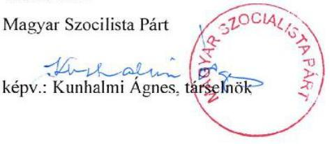

---

# Kunhalmi Ágnes 

## Komjáthi Imre

Társelnokók
Magyar Szocialista Párt

## Budapest

Tárgy: Válaszlevél a részjelentés-tervezet ismételt megküldését követően az ellenőrzési megállapításokra tett észrevételek kezeléséről

## Tisztelt Társelnök Asszony és Társelnök Úr!

A „Kampánypénzek ellenörzése - A 2022. évi országgyölési képréselö-választási kampányra forditott pénzeszközök elszámolásának ellenörzése bat jelöló szervestetnii"" című számvevőszéki részjelentés tervezetével kapcsolatos, 2023. december 20-i keltezésű észrevételüket köszönettel megkaptam. A 2024. január 10-i válaszlevelemben tájékoztattam Társelnök asszonyt és Társelnök urat, hogy tekintettel a tényállás összefüggéseire, és a Hatpárti összefogás érintett öt pártja közül háromnál még folyamatban lévő észrevételezésre az Állami Számvevőszék (a továbbiakban: ÁSZ) a Magyar Szocialista Párt (a továbbiakban: MSZP) által tett észrevételeket a Hatpárti összefogásban részt vett valamennyi jelölő szervezet észrevételeivel egyidejűleg fogja megválaszolni. A Hatpárti összefogás pártjai a részjelentés tervezetére vonatkozó észrevételeiket megküldték, ez alapján - a korábbi levelemmel összhangban - az MSZP észrevételeivel kapcsolatban jelen levelemben tájékoztatom.

Az Állami Számvevőszékről szóló 2011. évi LXVI. törvény (a továbbiakban: ÁSZ törvény) 29. § (2) bekezdése szerint az ellenőrzött szervezet vezetője és a felelősként megjelölt személy az ellenőrzés megállapításaira tizenöt napon belül írásban észrevételt tehet. Ugyanezen szakasz (3) bekezdése szerint az ÁSZ az észrevételre a beérkezésétől számított harminc napon belül írásban válaszol. A figyelembe nem vett észrevételeket köteles a jelentésben feltüntetni, és megindokolni, hogy azokat miért nem fogadta el. Tájékoztatom Társelnök asszonyt és Társelnök urat, hogy a számvevőszéki részjelentésben a figyelembe nem vett észrevételeket szerepeltetjük az elutasítás indokának feltüntetésével.

---

Az ÁSZ észrevételekre vonatkozó álláspontjáról az alábbi tájékoztatást adom:
Az ÁSZ a részjelentés-tervezetet két körben - 2023. június 16-án, majd 2023. december 5-én bocsátotta az Önök rendelkezésére az ÁSZ törvény szerinti észrevételezési jog biztosítása érdekében. A 2023. december 20-án kelt, ismételt észrevételeikről megállapítottam, hogy azok jelentős része azonos tartalommal került szerepeltetésre és többnyire szó szerint megegyezik a 2023. szeptember 9-én kelt levelükben tett észrevételeikkel. Erre tekintettel jelen válaszlevelemben ezen észrevételeikre tájékoztatom, hogy a 2023. október 6-án, EL-3712-744/2023 iktatószámon az Önök részére megküldött levelemben a)-tól m) pontig szerepeltetett válaszaimat megerősítem és fenntartom. Mindezek alapján a 2023. december 20-án kelt levelüknek - a 2023. szeptember 9-én kelt levelükkel megegyező tartalmú - észrevételei alapján a részjelentés-tervezet módosítása nem indokolt.

A további, a 2023. szeptember 9-én kelt észrevételeikhez képest újonnan adott észrevételeikkel kapcsolatban az alábbiakról tájékoztatom:
a) Levelükben észrevételt tettek arra, hogy az MSZP előtt sem a Nemzeti Adó- és Vámhivatal (a továbbiakban: NAV) eljárása, sem az abban érintett, illetve nem érintett kiadások nem ismertek, így azokkal kapcsolatosan az észrevételezési jogot sem tudják gyakorolni.

A részjelentés-tervezet VI. számú mellékletében kerültek bemutatásra a Mindenki Magyarországa Mozgalom (a továbbiakban: MMM) által a Hatpárti összefogás érdekében a kampányidőszakban finanszírozott kampánytevékenységekre, kampányeszközökre fordított kiadások. A részjelentés-tervezetben ismertetésre került, hogy a 2023. június 16-án az Önök részére első körben észrevételezésre küldött részjelentés-tervezethez képest elhagyásra került a NAV által folytatott hatósági eljárással érintett 1 412,26 M Ft. A részjelentés-tervezetben rögzítésre került továbbá az is, hogy ezen összeg tekintetében tiltott támogatást és annak jogkövetkezményét a részjelentésben nem állapítja meg az ÁSZ. A részjelentés-tervezetben rögzítettek szerint „1412,26 MFt értékú gazdasági esemény tekintetében a tiltott támogatás összegszerüségére, valamint az azzal kapcsolatos jogkövetkezményekre vonatkozó végleges megállapítást a Nemzeti Adó- és Vámhivatal által folytatott vizsgálatok lezárultát követöen az Állami Számvevöszék végleges jelentése fogja tartalmazni."

Az ÁSZ az Önök részére az észrevételezési jog gyakorlását biztosította, tekintettel arra, hogy a megállapítások alapjául szolgáló iratokat, a VI. számú mellékletben bemutatott gazdasági eseményeket alátámasztó bizonylatokat (szerződéseket, számlákat, teljesítési igazolásokat) az Önök részére - beleértve a NAV vizsgálattal érintett és nem érintett kiadásokat is 2023. július 20-án kelt jegyzőkönyvvel anonimizált formában átadott.

---

b) Levelükben észrevételt tettek arra, hogy a megküldött részjelentés-tervezet IV. számú melléklete kevesebb tételt tartalmaz, mint az elsőként megküldött részjelentés-tervezet, továbbá, hogy az ÁSZ ennek indokát nem adja, továbbá, hogy utalást sem tesz arra, hogy az eltérést a NAV vizsgálattal való érintettség adja.

A részjelentés-tervezet VI. számú melléklete - az Ön észrevételében tévesen hivatkozott IV. számú melléklet - tartalmazza az MMM által a Hatpárti összefogás érdekében a kampányidőszakban finanszírozott kampánytevékenységekre, kampányeszközökre fordított kiadásait. A részjelentés-tervezetben szerepel annak az indokolása, hogy a VI. számú melléklet miért tartalmaz kevesebb tételt a 2023. június 16-án észrevételezésre küldött részjelentéstervezethez képest. A részjelentés-tervezetben írtak szerint az ellenőrzés feltárta, hogy az MMM a kampányidőszakban, 2022. február 12. és április 3. között legalább 1 673,52 M Ft-ot fordított a Hatpárti összefogás érdekében folytatott választási kampányeszközökre, kampánytevékenységre, amelyből a NAV által folytatott hatósági eljárással érintett összeg 1 412,26 M Ft. Erre tekintettel a részjelentés-tervezet VI. számú mellékletében a fennmaradó, hatósági vizsgálattal nem érintett 261,26 M Ft kiadás került bemutatásra, amely a Hatpárti összefogás részére nyújtott nem pénzbeli vagyoni hozzájárulásként került megállapításra.
c) Levelükben észrevételt tettek arra, hogy az ÁSZ a részjelentés-tervezetben az Igazságügyi Minisztérium állásfoglalására alapítottan vonta le következtetését.

Az ÁSZ törvény 1. § (2) bekezdésében foglaltak alapján az ÁSZ ellenőrzési tevékenysége során minden más szervezettől független. Az ÁSZ hangsúlyozza, hogy a részjelentés-tervezetet nem az Igazságügyi Minisztérium (a továbbiakban: IM) állásfoglalására alapítva, hanem saját jogértelmezése alapján, saját hatáskörében, saját felelősségére hozta meg. Az ÁSZ az IM állásfoglalását - ahogy az abban szerepel is - csupán egy szakmai véleménynek tekintette, amely az ÁSZ eljárására vonatkozóan semmiféle kötőerővel nem rendelkezik. Az ÁSZ az IM állásfoglalásának nem tulajdonított nagyobb jelentőséget, mint az ellenőrzött szervezetek észrevételeiben foglaltaknak: „Az Állami Számverőszék a jogkövetkezmények vonatkozásában figyelemmel az ellenörzött szervezeteknek a jelentéstervezetev tett észrevételeire, valamint az Igazsáaügyi Minisztérium állásfoglalására - arra a következtetésre jutott, bogy a jogkövetkezmények alkalmazása a pártoknak közösen nyújtott nem vagyoni hozzájárulás esetében sem mellö̉hetö".
Az IM jogot nem alkotott, az ÁSZ álláspontját a pártok működéséről és gazdálkodásáról szóló 1989. évi XXXIII. törvény hatályba lépése óta hatályos rendelkezésekből vezette le.

Téves azon álláspont is, miszerint az ÁSZ az alkalmazott jogszabályi rendelkezéseket nem jogosult értelmezni. A 3198/2013. (X.22.) AB végzésre hivatkozás megalapozatlan, ugyanis a hivatkozott döntésben az Alkotmánybíróság a saját eljárására utalt: „A jogszabályokat a biróságok értelmezzék, az Alkotmánybiróság csak az értelmezési tartomány alkotmányos kereteit jelölheti ki" ([22] pont). Ugyanakkor az ÁSZ törvény 24. § (1) bekezdés b) pontja értelmében az ellenőrzés végrehajtása során a jogszabályok, az ellenőrzési program, és az ellenőrzési szakmai szabályok,

---

módszerek és az etikai normák szerint kell eljárni, így az ÁSZ - csakúgy, mint valamennyi jogalkalmazó szerv - a saját eljárásában igenis köteles értelmezi a jogot, ellenkező esetben nem tudna ezen törvényi kötelezettségének eleget tenni.

Mindezek miatt a részjelentés-tervezet módosítása az észrevételeik alapján nem indokolt.

Kelt: Budapest, időbélyegző szerint.

Tisztelettel:
az Állami Számvevőszék elnöke nevében:

# Klinga László s.k. 

igazgató
Állami Számvevőszék
Állambáztartáson Kívüli Szervezeteket
Ellenőrző Igazgatóság

---

| HATÓSÁG: | T. Állami Számvevőszék |
| :-- | :-- |
| ŰGYSZÁM: | EL-3712-749/2023 |
| JELÖLŐ | LMP - Magyarország Zöld Pártja |
| SZERVEZETEK: | (székhely: 1136 Budapest, Hegedűs Gyula utca 36. fszt. 5.; Adószám: |
|  | $18199260-1-41)$, |

# Párbeszéd - a Zöldek Pártja 

(székhely: 1015 Budapest, Batthyány utca 62.; Adószám: 18511213-1-
41),

## Momentum Mozgalom

(székhely: 1024 Budapest, Rózsahegy utca 1-2. I/1.; Adószám: 18903939-1-41)
jogi képviselőjük:

Szecskay Ügyvédi Iroda (1055 Budapest, Kossuth Lajos tér 16-17.; eljáró ügyvédek: dr. Wellmann György, dr. Szabó Emil, dr. Bihary Dániel; email cím: gyorgy.wellmann@szecskay.com, emil.szabo@szecskay.com, daniel.bihary@szecskay.com; telefon: 06-1-472-3000)

ELJÁRÁS Kampánypénzek ellenőrzése - A 2022. évi országgyűlési képviselőTÁRGYA: választási kampányra fordított pénzeszközök elszámolásának ellenőrzése jelölő szervezeteknél

KELT: Budapest, 2023. január 19.

## ÉSZREVÉTELEK A MÓDOSULT RÉSZJELENTÉS-TERVEZETHEZ

---

# T. ÁLLAMI SZÁMVEVŐSZÉK! <br> Budapest 

Alulírott LMP - Magyarország Zöld Pártja (székhely: 1136 Budapest, Hegedűs Gyula utca 36. fszt. 5.; Adószám: 18199260-1-41), Párbeszéd - a Zöldek Pártja (székhely: 1015 Budapest, Batthyány utca 62.; Adószám: 18511213-1-41), és Momentum Mozgalom (székhely: 1024 Budapest, Rózsahegy utca 1-2. I/1.; Adószám: 18903939-1-41) (a továbbiakban együtt „Pártok") - a korábban csatolt meghatalmazásokkal igazol jogi képviselőnk, a Szecskay Ügyvédi Iroda (1055 Budapest, Kossuth Lajos tér 16-17.; eljáró ügyvédek: dr. Wellmann György, dr. Szabó Emil, dr. Bihary Dániel; e-mail cím: gyorgy.wellmann@szecskay.com, emil.szabo@szecskay.com, daniel.bihary@szecskay.com; telefon: 06-1-472-3000) útján - az alábbi

## észrevételeket

terjesztjük elő a T. Állami Számvevőszék 2023. december 5. napján kézbesített módosított részjelentés-tervezetével („Módosított Tervezet") összefüggésben.

## 1. A MINISZTÉRIUMI ÁLLÁSFOGLALÁSRA SZANKCIÓ NEM ALAPÍTHATÓ

1. A T. Számvevőszék Módosított Tervezetének tanulmányozása során a Pártok meglepődve észlelték, hogy az I.6. pont alatt tárgyalt, az állítólagos jogsértés miatt megállapítható jogkövetkezmények körében a Módosított Tervezet - kiegészítve és ekként érdemben módosítva korábbi tervezetét - részben egy bizonyos Igazságügyi Minisztériumi állásfoglalásra alapozza a tervezett döntését.
2. A Pártok 2023. szeptember 11. napján kelt észrevételeikben részletesen kifejtették, hogy
(i) nincs olyan jogszabályi rendelkezés, ami a Párttv. szerinti tényállások vonatkozásában lehetőséget teremtene a Hatpárti Összefogás egy pártként való kezelésére;
(ii) olyan jogszabályi rendelkezés sincs, ami alapján a közös listát állító valamely párt szempontjából esetlegesen felderített tényállás a közös listát állító többi pártnak betudható lenne;
(iii) nincs továbbá olyan jogszabályi rendelkezés sem, ami lehetővé tenné, hogy az eredeti tervezet által javasolt fizetési felszólítás valamennyi érintett pártot egyetemlegesen vagy egyenlő arányban kötelezze;
(iv) az ilyen - felelősséget megállapító - rendelkezések kiterjesztő jogértelmezés útján nem pótolhatók, utólag megalkotott jogszabályi rendelkezés visszaható hatálya pedig alaptörvény-ellenes lenne.
3. Ezen felül a vagyoni hozzájárulásnak nem a Hatpárti Összefogásnál, hanem egy adott pártnál kell megjelennie. A Hatpárti Összefogás mint közös pártlista nem tekintendő

---

pártnak, ekként nem lehet alanya a Párttv. 4. § (2) és (5) bekezdése szerinti törvényi tényállásnak, nem lehet címzettje az ellenőrzés nyomán készített jelentésnek, de különösen nem a jelentés nyomán kibocsátott fizetési felszólításnak.
4. Az észrevételeinkben rögzítettük, hogy a bemutatott érvek alapján nincs helye a Pártokkal szemben jogsértés megállapításának.
5. Pontosan a fenti jogszabályi hézagra és előzményekre tekintettel kereste meg - egyfajta iránymutatásként - a T. Állami Számvevőszék az Igazságügyi Minisztériumot és jelölte meg a jogkövetkezmények alkalmazásának alapjaként ${ }^{1}$ a minisztériumi állásfoglalást:
„Az ÁSZ a jogkövetkezmények vonatkozásában - figyelemmel az ellenőrzött szervezeteknek a jelentéstervezetre tett észrevételeire, valamint az Igazságügyi Minisztérium állásfoglalására - arra a következtetésre jutott, hogy a jogkövetkezmények alkalmazása a pártoknak közösen nyújtott nem vagyoni hozzájárulás esetében sem mellőzhető."
6. Tekintettel arra, hogy a Módosított Tervezet szerint a jogkövetkezményekről való döntés egyik alapja a hivatkozott állásfoglalás, annak érdemi kihatása van a Módosított Tervezet tényállásból levont jogkövetkezményeire, így a Pártok csupán ezen minisztériumi állásfoglalás megismerését követően tudtak érdemben védekezni.
7. Állásfoglalásában az igazságügyi miniszter akként fogalmaz, hogy a Párttv. érintett rendelkezései kapcsán „több lehetséges értelmezés is levezethető a normaszövegből". Az Igazságügyi Minisztérium - bár ezt tételesen nem vezeti le - vélhetően a következő lehetséges értelmezésekre hivatkozik:
(i) a Párttv. 4. § akként értelmezendő, hogy a „párt" kifejezés alatt több párt is értendő, amelyek egyenlő arányban kötelesek viselni a T. Állami Számvevőszék által meghatározni kívánt szankciót;
(ii) a Párttv. 4. § akként értelmezendő, hogy a „párt" kifejezés alatt több párt is értendő, amelyek egyenlő arányban és egyetemlegesen kötelesek viselni a T. Állami Számvevőszék által meghatározni kívánt szankciót;
(iii) a Párttv. 4. § akként értelmezendő, hogy a „párt" kifejezés alatt több párt is értendő, amelyek mandátumarányosan kötelesek viselni a T. Állami Számvevőszék által meghatározni kívánt szankciót;
(iv) a Párttv. 4. § akként értelmezendő, hogy a „párt" kifejezés alatt több párt is értendő, amelyek mandátumarányosan és egyetemlegesen kötelesek viselni a T. Állami Számvevőszék által meghatározott szankciót;

[^0]
[^0]:    ${ }^{1}$ Módosított Tervezet, I. 6. pont, 26. o.

---

(v) a Párttv. 4. § akként értelmezendő, hogy a „párt" kifejezés alatt csak egyetlen párt értendő, így a párt költése is egyenként vizsgálandó és egyenként szankcionálható.
8. Az, hogy jogszabálynak többféle szóbajöhető értelmezése is elképzelhető, nem jelenti egyúttal azt, hogy a jogalkalmazó szabadon választhat azok közül. Ez ugyanis a jogbiztonság sérelmét eredményezné. A többértelmủ jogszabályoknak is egyetlen helyes értelmezése van, amelyet a jogalkalmazónak a jogértelmezés általánosan elfogadott és az ügyben alkalmazható elvei alapján kell meghatároznia. A jogértelmezési elvek között a miniszter javaslata nem szerepel.
9. Az Igazságügyi Minisztérium nem foglal azonban állást arról, hogy miként oldható fel ez az ellentét, csupán azt jelzi, hogy a T. Állami Számvevőszék által elfoglalt álláspont egyike a fentieknek.
10. A Pártok álláspontja azonban változatlan: a Kampánytv. 3.§ (2) bekezdése és a 7. § (5) bekezdéséhez hasonló rendelkezés hiányában a T. Számvevőszék által a Párttv. 4. § (2) bekezdése alapján a Pártoknak betudni kívánt, kampányköltésnek minősülő vagyoni hozzájárulás vizsgálata csak pártonként külön-külön történhet. A rendelkezés fogalmi elemei, a törvényi tényállás feltételei csupán pártonként külön-külön értelmezhetők. A Párttv. 4. § (2) bekezdésének contra legem értelmezése lenne egy olyan álláspont, ami alapján egy párt - kifejezett ilyen tartalmú szándékot alátámasztó bizonyíték nélkül valamennyi másik párt nevében is elfogadhatna nem pénzbeni hozzájárulást.
11. Amíg ugyanis a Kampánytv. 3. és 7. §-ai tartalmaznak olyan kitételt, amely szerint az adott szakaszok keretében a közös pártlistát állító pártokat egy pártnak kell tekinteni, addig a Párttv. 4. §-ában foglalt lehetséges jogkövetkezmények tekintetében ilyen rendelkezést a Párttv. nem tartalmaz. Ebből pedig a contrario következik, hogy azon rendelkezés tekintetében, amelynél a Párttv. nem írja elő a közös listát állító pártok egy pártnak tekintését, ott valamennyi párt külön-külön címzettje az adott normának. Ebből következően minden párt a saját magatartásáért tehető felelőssé, a közös listát állító többi párt magatartásáért viszont nem.
12. Mivel a Párttv. 4. §-a az egyes pártokra önállóan, külön-külön vonatkozik, a T. Állami Számvevőszék által feltárt tényállás alapján nem állapítható meg, hogy mely párt milyen arányban kötelezhető a választásra összesen fordítható összeg felett felhasznált összeg után szankció megfizetésére.
13. A fentieken túlmenően kénytelenek vagyunk ismételten hangsúlyozni, hogy a jelen ügyben felmerülő jelentős méretű jogértelmezési bizonytalanság kiküszöbölésére nem alkalmas eszköz az Igazságügyi Minisztérium megkeresése, ahogy azt maga az állásfoglalás is tartalmazza:
„Tájékoztatom, hogy az Alkotmánybiróság 60/1992. (XI.17.) AB határozatában foglaltakra tekintettel a minisztériumi és egyéb központi állami szervektől

---

származó, jogi iránymutatást tartalmazó leiratok, körlevelek, útmutatók, iránymutatások, állásfoglalások és egyéb informális jogértelmezések kiadása és az ezekkel való irányitás gyakorlata alkotmányellenes. Ennek okán a fentiekben kifejtett álláspont csupán egy olyan szakmai véleménynek tekinthető, amely sem a biróságokat, sem a közigazgatási szerveket nem köti vagy befolyásolja, jogértelmezések alapját nem képezheti."
14. A Pártok kifejezetten is sérelmezik, hogy a T. Állami Számvevőszék a Módosított Tervezetben annak ellenére hagyatkozott az Igazságügyi Minisztérium állásfoglalására, hogy maga az állásfoglalás zárta ki annak lehetőségét, hogy az abban írtak bíróságokat vagy közigazgatási szerveket befolyásoljon.
15. Mindennek megfelelően az észrevételeink keretében bemutatott érvek alapján nincs helye a pártokkal szemben jogsértés megállapításának, ugyanis erre a jelenlegi jogszabályi környezet nem nyújt lehetőséget. Megjegyezzük, hogy ezt maga a T. Állami Számvevőszék is elismerte Módosított Jelentésének 3. sz. ábráján, amelyben a vizsgálat akadályait mutatja be:
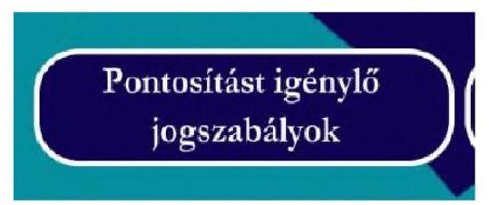
16. A jogszabályok valóban pontosítást igényelnek, mielőtt azok a Pártok szankcionálására alkalmasak lennének: ez azonban a jogalkotó feladata, nem pedig a T. Állami Számvevőszéké.
17. Amennyiben a T. Állami Számvevőszék szankcionálásra alkalmasnak találja a Párttv. fent idézett rendelkezését, úgy a Pártok határozott álláspontja az, hogy a fenti 7. pont (iii) bekezdése szerinti - mandátumarányos - jogértelmezés az egyetlen méltányos értelmezés.
18. Minden érintett párt egyformán felelős a kampányszabályok betartásáért. A jogsértéshez való egyéni hozzájárulásuk azonban eltérő lehet. Az egyenlő bírságok kiszabása figyelmen kívül hagyja az egyes felek részvételének árnyalatait, és méltánytalanul terheli a kevésbé vétkeseket. Amennyiben elfogadjuk az Állami Számvevőszék azon álláspontját, hogy az érintett pártok a vagyoni hozzájárulás tilalmazott elfogadása által előnyt szereztek a többi választásokon induló párttal szemben, úgy ezen előny az elnyert mandátumokban jelentkezik. A jogalkotói célnak egyedül az felelhet meg, amennyiben a szankció arányban áll a realizált előnnyel. Amennyiben elfogadjuk, hogy bárminemű jogkövetkezmény alkalmazható a pártokkal szemben, úgy a szankció pártok közötti fentiekkel ellentétes felosztása önkényes.

---

19. A bírságok kiosztása a párt által megszerzett mandátumok számának arányában tükrözi a párt képviseleti és befolyási szintjét az Országgyűlésben. Ez a módszer biztosítja, hogy a több mandátummal rendelkező, nagyobb támogatottságú pártok a szankció megfelelő részét viseljék.
20. A választásokon elnyert mandátumok közvetlenül tükrözik a választók bizalmát és támogatását egy adott párt iránt. A bírságok e mandátumoknak megfelelő elosztása tiszteletben tartja és elismeri a választók döntését, és megerősíti azt a demokratikus elvet, hogy a nagyobb választási sikerrel rendelkező pártok arányosan nagyobb terhet viselnek a választási szabályok állítólagos megsértése esetén.

# 2. A VIZSGÁLAT TÁRGYÁT KÉPEZŐ GAZDASÁGI ESEMÉNYEK 

21. A korábbi észrevételünkben részletesen bemutattuk a VI. sz. mellékletben megjelenítésre kerülő, az összegszerűségükben jelentősebb nem pénzbeni hozzájárulásnak minősített tételek vonatkozásában azt, hogy azok a korábbi észrevételeink 2.1 pontban bemutatott teszt alapján miért nem minősülnek tiltott nem pénzbeni hozzájárulásnak. A korábbi észrevételeinkben foglalt érvelést maradéktalanul fenntartjuk.
22. Önmagunk megismétlésének elkerülése érdekében csupán hangsúlyozni kívánjuk azokat a nagyobb jelentőségű tévedéseket, amelyek okán a T. Állami Számvevőszék tévesen tiltott nem pénzbeni hozzájárulásnak minősített gazdasági eseményeket:
(i) a T. Állami Számvevőszék számtalan tétel kapcsán tévesen kampánytevékenységnek értékelte az MMM véleménynyilvánítási szabadsága keretei közé tartozó, az abban megfogalmazott üzenetek általános érvényű közlésével kapcsolatos gazdasági eseményeket;
(ii) a T. Állami Számvevőszék nem tett eleget indokolási és bizonyítási kötelezettségének akkor, amikor számtalan általános beszerzést (pl.: LED falak, plakátok, szórólapok) anélkül tekintett kampányköltségnek, hogy tudomása lett volna arról, hogy az MMM pontosan mikor és milyen célból vette igénybe ezeket a logisztikai, avagy rendezvényszervezési szolgáltatásokat;
(iii) a T. Állami Számvevőszék több olyan tételt is általánosságban tiltott kampánytámogatásnak minősített, ahol az alapul fekvő iratok között teljesítésigazolás nem volt fellelhető, így bizonyítatlan maradt, hogy a szolgáltatást vagy árubeszerzést ténylegesen megvalósították-e;
(iv) a T. Állami Számvevőszék nem különítette el Márki-Zay Péter egyéni jelöltsége kapcsán felmerülő költségeket a Hatpárti Összefogás költségeitől, így azokat összemosva olyan tételeket jelenít meg, amelynek semmi köze nem volt a közös kampányhoz;

---

(v) a T. Állami Számvevőszék nem különítette el az MMM népszavazással kapcsolatos kampánytevékenységét az országgyűlési választási kampánnyal kapcsolatos tevékenységétől, ekként tévesen értékelt több gazdasági eseményt a Hatpárti Összefogás kárára;
(vi) a T. Állami Számvevőszék több esetben az MMM által elvégzett társadalomtudományi célú kutatásokat kampánytevékenységnek minősített anélkül, hogy ezt bármiféleképpen a kampányhoz kötötte volna;
(vii) a T. Állami Számvevőszék anélkül minősített kampánytevékenységnek nyomdai szolgáltatásmegrendeléseket, hogy igazolta volna, hogy a nyomdai tartalmak politikai kampánytevékenységhez kapcsolódtak volna;
(viii) a T. Állami Számvevőszék valamennyi tétel kapcsán elmulasztotta bizonyítani, hogy az adott kampányeszközt a Hatpárti Összefogás elfogadta: egy politikai tartalmú beszerzés ugyanis önmagában nem valósít meg tiltott támogatást, csak ha az eszközt az adott párt elfogadja;
23. Az észrevételeink keretében bemutatott érvek alapján nincs helye a pártokkal szemben jogsértés megállapításának.

Tisztelettel:
LMP - Magyarország Zöld Pártja
Párbeszéd - a Zöldek Pártja
Momentum Mozgalom
képv.:

---

# Dr. Schmuck Erzsébet társelnők 

Ungár Péter Károly társelnők
LMP - Magyarország Zöld Pártja

## Szabó Rebeka Katalin társelnők

Tordai Bence társelnők
Párbeszéd - a Zöldek Pártja

## Gelencsér Ferenc József elnök

Momentum Mozgalom

## Budapest

Tárgy: Válaszlevél a részjelentés-tervezet ismételt megküldését követően az ellenőrzési megállapításokra tett észrevételek kezeléséről

## Tisztelt Társelnők Asszony/Úr! Tisztelt Elnök Úr!

A „Kampánypénzék ellenörzése - A 2022. évi országgyölési képeiselö-választási kampányra forditott pénzexközök elszámolásának ellenörzése bat jelölö szervezetuél" című számvevőszéki részjelentés tervezetével kapcsolatos, a Szecskay Ügyvédi Iroda nevében eljáró Dr. Wellmann György ügyvéd által küldött, 2024. január 19-i keltezésű észrevételt köszönettel megkaptam.
Az Állami Számvevőszékről szóló 2011. évi LXVI. törvény (a továbbiakban: ÁSZ törvény) 29. § (2) bekezdése szerint az ellenőrzött szervezet vezetője és a felelősként megjelölt személy az ellenőrzés megállapításaira tizenöt napon belül írásban észrevételt tehet. Ugyanezen szakasz (3) bekezdése szerint az Állami Számvevőszék (a továbbiakban: ÁSZ) az észrevételre a beérkezésétől számított harminc napon belül írásban válaszol. A figyelembe nem vett észrevételeket köteles a jelentésben feltüntetni, és megindokolni, hogy azokat miért nem fogadta el. Tájékoztatom Társelnők asszonyt/urat, Elnök urat, hogy a számvevőszéki részjelentésben a figyelembe nem vett észrevételeket szerepeltetjük az elutasítás indokának feltüntetésével.

---

Az ÁSZ a részjelentés-tervezetet két körben - 2023. június 16-án, majd 2023. december 5-én bocsátotta az Önök rendelkezésére az ÁSZ törvény szerinti észrevételezési jog biztosítása érdekében. A 2024. január 19-én kelt, ismételt észrevételekről megállapítottam, hogy azok között több olyan észrevétel van, amelyek a 2023. szeptember 8-án kelt levélben is szerepelnek. Ezek a következők:
$>$ az ellenőrzés tárgya;
$>$ az egyes pártok egyedi ellenőrzésének és értékelésének szükségessége;
$>$ a pártok felelősségének megállapítása;
> a tiltott támogatás párt általi tudomásra jutása és elfogadása, illetve a civil szervezetek és gazdasági társaságok által végzett kampánytevékenység értékelése a véleménynyilvánítás szabadsága szempontjából;
$>$ a nem pénzbeli vagyoni hozzájárulás elfogadása;
$>$ a vizsgálat tárgyát képező, a részjelentés-tervezet VI. sz. mellékletében szereplő gazdasági események értékelésének magalapozottsága;
$>$ az ellenőrzési megállapítások alapján jogsértés megállapítása.
A felsorolt témákban ismételten megtett észrevételekre jelen válaszlevelemben tájékoztatom, hogy a 2023. október 6-án, EL-3712-741/2023 iktatószámon az Önök részére megküldött levelemben a)-tól h) pontig, valamint az egyes gazdasági eseményekhez kapcsolódóan a levelem 1. sz. mellékletében szerepeltetett válaszaimat megerősítem és fenntartom. Mindezek alapján a 2024. január 19-én kelt levelüknek - a 2023. szeptember 8-án kelt levéllel megegyező tartalmú észrevételei alapján a részjelentés-tervezet módosítása nem indokolt.

A további, a 2023. szeptember 8-án kelt észrevételekhez képest újonnan adott észrevételekkel kapcsolatban az alábbiakról tájékoztatom:

# a) Levelükben észrevételt tettek a minisztériumi állásfoglalásra. 

Az ÁSZ törvény 1. § (2) bekezdésében foglaltak alapján az ÁSZ ellenőrzési tevékenysége során minden más szervezettől független. Az ÁSZ hangsúlyozza, hogy a részjelentés-tervezetet nem az Igazságügyi Minisztérium (a továbbiakban: IM) állásfoglalására alapítva, hanem saját jogértelmezése alapján, saját hatáskörében, saját felelősségére hozta meg. Az ÁSZ az IM állásfoglalását - ahogy az abban szerepel is - csupán egy szakmai véleménynek tekintette, amely az ÁSZ eljárására vonatkozóan semmiféle kötőerővel nem rendelkezik. Az ÁSZ az IM állásfoglalásának nem tulajdonított nagyobb jelentőséget, mint az ellenőrzött szervezetek észrevételeiben foglaltaknak: „Az Állami Számverőszék a jogkövetkezmények vonatkozásában figyelemmel az ellenőrzött szervezetekenek a jelentéstervezetre tett észrevételeire, valamint az Igazsáaügyi Minisztérium állásfoglalására - arra a következtetésre jutott, bogy a jogkövetkezmények alkalmazása a pártoknak közösen nyújtott nem vagyoni hozzájárulás esetében sem mellézeteit".

---

Az IM jogot nem alkotott, az ÁSZ álláspontját a pártok működéséről és gazdálkodásáról szóló 1989. évi XXXIII. törvény (a továbbiakban: Párt törvény) hatályba lépése óta hatályos rendelkezésekből vezette le.

# b) Levelükben észrevételt tettek a jogkövetkezmények ellenőrzött szervezetek közötti felosztása kapcsán. 

Az ÁSZ e körben ismételten hangsúlyozza, hogy a jogértelmezése azon a tényen alapul, hogy a pártok önállóan gazdálkodó jogi személyek, a közös listán történő indulás nem érinti a gazdálkodási önállóságukat, továbbá az ellenőrzött szervezetek felelőségét saját, összehangolt magatartásuk alapján állapította meg.

A Párt törvény 4. § (2) bekezdése szerint a párt részére nem adható vagyoni hozzájárulás és jogi személytől, jogi személyiséggel nem rendelkező szervezettől vagyoni hozzájárulást a párt nem fogadhat el. A törvény ilyen megfogalmazásából (,a párt") azonban nem következik az, hogy a törvényi rendelkezések közös magatartással történő megsértése ne lenne jogszabályba ütköző, ahogy az sem, hogy az ilyen módon elkövetett jogszabálysértés esetében a törvényben meghatározott jogkövetkezményeket ne kellene alkalmazni. Bár a törvény - hasonlóan a más jogterületekre vonatkozó jogszabályokhoz - valóban nem nevesíti a közös jogsértés esetét, az ellenőrzött szervezetek erre mentesülésként nem hivatkozhatnak, hiszen amely magatartás önállóan megvalósítva jogsértő, az közös elkövetés esetén is az. Az ÁSZ tehát köteles volt a jogkövetkezményekre vonatkozóan is rendelkezést tenni.

Konkrét jogszabályi rendelkezés hiányában elvben valóban többféle felosztási metódus lehetősége merül fel, így az egyenlő felosztás mellett a pártok közötti valamilyen arányban (pl. mandátumok arányában, állami támogatás arányában, jelöltek arányában stb.) történő felosztás mellett is lehetne érvelni. Az ÁSZ az egyes ellenőrzött szervezetek érdekviszonyai helyett a jogszabályi rendelkezéseket vette alapul, ennek keretében a párt gazdálkodását a közös listán történő indulás jelentőségével összevetve kellett vizsgálni.

Ahogy ez a részjelentés-tervezet Megállapítások részének I.6. pontjában rögzítésre került, az ÁSZ az egyenlő felosztás elvét arra tekintettel vette alapul, hogy a közös listán induló pártok a közös lista választási sikerében, nem pedig kizárólag saját pártjuk választási sikerében érdekeltek. Az ÁSZ álláspontja szerint a Hatpárti összefogást alkotó pártok önkéntes elhatározás alapján összehangolt, közös kampánytevékenységet folytattak, a közös kampányukhoz nyújtott nem pénzbeli vagyoni hozzájárulás a közös listán induló pártok érdekeit egyenlő mértékben szolgálta. Olyan jogi előírás nincs, amely alapján az egyes pártoknak a közös listához fűződő érdekeltsége ettől eltérő mértékben lenne meghatározható, hiszen a közös listán induló, a kormányalakításhoz szükséges parlamenti többségre törekvő pártok nem csupán a saját, de a velük közös listán induló többi párt és annak jelöltjeinek sikeres választási szereplésében is kölcsönösen érdekeltek. Ezen körülményt nem érinti, hogy az egyes jelölteket mely pártok delegálták, ahogy az sem, hogy végül közülük kik jutnak be az

---

Országgyűlésbe. Ebből következően - mindenféle, jogi szempontból figyelembe vehető arányosság hiányában - az egyenlő felosztás az egyetlen olyan metódus, amely a jogszabály szövegéből a pártok önálló gazdálkodását nem sértő módon levezethető.

A fentieknek látszólag ellentmond az országgyűlési képviselők választása kampányköltségeinek átláthatóvá tételéről szóló 2013. évi LXXXVII. törvény 6. § (7) bekezdése, amely szerint a közös pártlistát állító pártok $3 . \int$ szerinti támogatását a közös pártlistát állító pártok megállapodása alapján kell a pártok részére folyósítani. Ezen rendelkezés azonban csak az állami támogatás megosztására vonatkozik, de nem érinti a közös kampánytevékenység sikerében való érdekeltséget. Emellett a jogi személy részéről nyújtott nem pénzbeli vagyoni hozzájárulás nem analóg az állami támogatással, olyan körülmény pedig nem merült fel, miszerint a Mindenki Magyarországa Mozgalom a vagyoni hozzájárulását az állami támogatás arányában nyújtotta volna. Az állami támogatás aránya eltér mind a jelöltek, mind a megszerzett mandátumok arányától - ebből is látszik, hogy mennyire vitatható az arányos megosztás valamely formája mellett érvelni.

Az ÁSZ egyetért azon észrevétellel, miszerint a jogkövetkezmény egyenlő felosztása figyelmen kívül hagyja az egyes pártok képviseleti és befolyási szintjét az Országgyűlésben. Ugyanakkor a pártok „erőviszonya" az országgyűlési választás eredményéből, azaz a jogsértő magatartást követő és attól független körülményből következik, amelyet az ÁSZ irányadó jogszabályi rendelkezés hiányában nem vehetett figyelembe.

Természetesen az ellenőrzött szervezetek nincsenek elzárva attól, hogy amennyiben nem osztják a fenti okfejtéseket, úgy igényüket egymással szemben jogi úton érvényesítsék. Nem hagyható azonban figyelmen kívül, hogy az ÁSZ nem rendelkezik hatáskörrel az ellenőrzött szervezetek esetleges egymással szembeni polgári jogi igényeinek elbírálására.
c) Levelükben észrevételt tettek arra, hogy a jogszabályok módosítása nem az ÁSZ feladata.

Az ÁSZ természetesen tisztában van azzal, hogy jogalkotási hatáskörrel nem rendelkezik, a részjelentés ilyen rendelkezést nem tartalmaz. Az ÁSZ az Országgyűlés ellenőrző szerveként jelentéseit azzal a céllal fogalmazza meg, hogy azok a jogalkotás keretében hasznosuljanak. Az ÁSZ - figyelemmel az ellenőrzött szervezetek észrevételeinek számosságára is - fenntartja, hogy indokolt az irányadó jogszabályi rendelkezések felülvizsgálata, azonban hangsúlyozza, hogy a jelen részjelentés a hatályos törvényi rendelkezéseken alapul. Az ÁSZ semmilyen, a jogszabályok módosítására vonatkozó nyilatkozata nem értelmezhető úgy, hogy a jelen részjelentés-tervezetben foglaltakat a hatályos jogszabályi rendelkezések nem támasztják alá.

---

Mindezekre tekintettel a részjelentés-tervezet módosítása nem indokolt.
Kelt: Budapest, időbélyegző szerint.

Tisztelettel:
az Állami Számvevőszék elnöke nevében:

# Klinga László s.k. 

igazgató
Állami Számvevőszék
Állambáztartáson Kívüli Szervezeteket
Ellenőrző Igazgatóság

---

# RÖVIDÍTÉSEK JEGYZÉKE 

${ }^{1}$ jelölő szervezetek
${ }^{2}$ Kampányfinanszírozási törvény
${ }^{3}$ Ve.
${ }^{4}$ Párt törvény
${ }^{5}$ ÁSZ
${ }^{6}$ Kincstár
${ }^{7}$ Számviteli törvény
${ }^{8}$ ÁSZ tv.
${ }^{9}$ MMM
${ }^{10}$ Hatpárti összefogás
${ }^{11}$ NAV
${ }^{12}$ Jobbik
${ }^{13}$ MSZP
${ }^{14}$ LMP
${ }^{15}$ Párbeszéd
${ }^{16}$ FIDESZ-KDNP
${ }^{17}$ MEMO
${ }^{18}$ MKKP
${ }^{19}$ MNOÖ
${ }^{20}$ Alaptörvény
${ }^{21}$ M Ft
${ }^{22}$ ÁFA tv.
${ }^{23}$ NIK
${ }^{24}$ Márki-Zay Péter
${ }^{25}$ KT
${ }^{26}$ Ptk.
${ }^{27}$ NGM rendelet
${ }^{28}$ Áhsz.
az országgyűlési képviselők választásán a választás kitűzésekor a civil szervezetek bírósági nyilvántartásában jogerősen szereplő párt, továbbá az országos nemzetiségi önkormányzat
2013. évi LXXXVII. törvény az országgyűlési képviselők választása kampányköltségeinek átláthatóvá tételéről (hatályos 2013. június 21-től)
2013. évi XXXVI. törvény a választási eljárásról (hatályos: 2013. április 18-tól)
1989. évi XXXIII. törvény a pártok működéséről és gazdálkodásáról (hatályos 1989. október 30-tól)
Állami Számvevőszék
Magyar Államkincstár
2000. évi C. törvény a számvitelről (hatályos 2001. január 1-jétől)
2011. évi LXVI. törvény az Állami Számvevőszékről (hatályos 2011. július 1-től)

Mindenki Magyarországa Mozgalom
Demokratikus Koalíció-Jobbik-Momentum Mozgalom-MSZP-LMP-Párbeszéd jelölő szervezetek, amelyek a 2022. évi országgyűlési választáson közös országos listát állítottak
Nemzeti Adó- és Vámhivatal
Jobbik Magyarországért Mozgalom bíróságon bejegyzett rövidített neve. A 2023. február 25-én megtartott kongresszusán hozott döntés szerint új elnevezése JobbikKonzervatívok.
Magyar Szocialista Párt bíróságon bejegyzett rövidített neve.
LMP - Magyarország Zöld Pártja bíróságon bejegyzett rövidített neve.
Párbeszéd Magyarországért Párt bíróságon bejegyzett egyik rövidített neve. A 2023. március 26-án megtartott nagyrendezvényen bejelentett új neve: Párbeszéd - A Zöldek Pártja (röviden Párbeszéd - Zöldek).
Fidesz-Magyar Polgári Szövetség és a Kereszténydemokrata Néppárt bíróságon bejegyzett rövidített neve.
Megoldás Mozgalom bíróságon bejegyzett rövidített neve.
Magyar Kétfarkú Kutya Párt bíróságon bejegyzett rövidített neve.
Magyarországi Németek Országos Önkormányzata
Magyarország Alaptörvénye (Magyarország Alaptörvényét az Országgyűlés a 2011. április 18-i ülésnapján fogadta el.)
millió Ft
2007. évi CXXVII. törvény az általános forgalmi adóról (hatályos 2008. január 1-től)

Nemzeti Információs Központ
Hatpárti összefogás közös miniszterelnök-jelöltje, Dr. Márki-Zay Péter
Kampánytanács
Polgári Törvénykönyvről szóló 2013. évi V. törvény (hatályos 2014. március 15-től)
69/2013. (XII. 29.) NGM rendelet az országgyűlési képviselők választása kampányköltségeinek támogatásáról (hatályos 2014. január 1-től)
4/2013. (I. 11.) Korm. rendelet az államháztartás számviteléről
(hatályos 2014. január 1-jétől)

---


1052 Budapest, Apáczai Csere János u. 10. | 1364 Budapest 4., Pf. 54
www.asz.hu | szamvevoszek@asz.hu
telefon: +36 14849100
