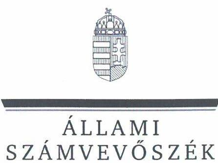
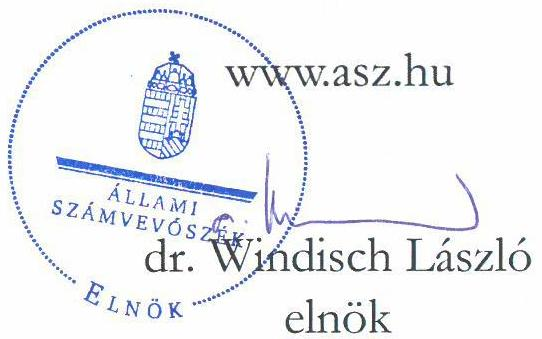
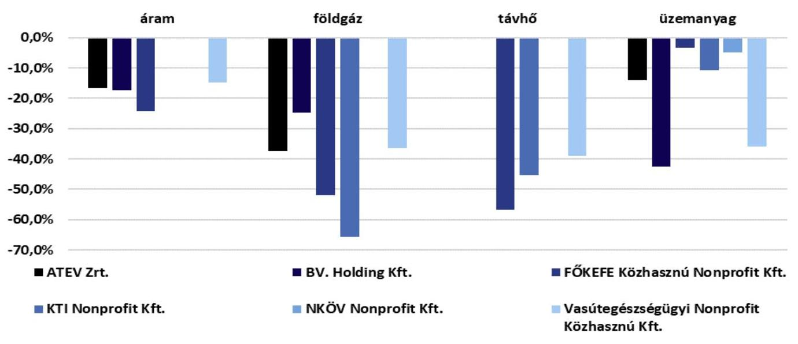

# JELENTÉS 

Az állami (többségi) tulajdonban lévő gazdasági társaságok takarékossági intézkedéseinek célzott ellenőrzése 2022. évre vonatkozóan

2023.

---

ÁLLAMI
SZÁMVEVŐSZÉK

# JELENTÉS 

## Az állami (többségi) tulajdonban lévő gazdasági társaságok takarékossági intézkedéseinek célzott ellenőrzése 2022. évre vonatkozóan

2023. 

23026

---

# ELLENŐRZÉSI IGAZGATÓSÁG: 

ÁLLAMI VAGYONGAZDÁLKODÁST ELLENŐRZŐ IGAZGATÓSÁG

ELLENŐRZÉSI IGAZGATÓ:
HERCZEGH ZSOLT ellenőrzési igazgató

ELLENŐRZÉSVEZETŐ:
Jelentéseink az interneten a www.asz.hu címen olvashatók.

IMRE ZSUZSANNA ellenőrzésvezető

IKTATÓSZÁM: EL-3914-001/2023
TÉMASZÁM: 2671
ELLENŐRZÉS-AZONOSÍTÓ SZÁM: V1015

---

# TARTALOMJEGYZÉK 

- AZ ELLENŐRZÉS ALAPADATAI ..... 5
- AZ ELLENŐRZÉS HATÓKÖRE ÉS TERÜLETE/AZ ELLENŐRZÖTT SZERVEZET ..... 6
- ÖSSZEFOGLALÁS ..... 9
- AZ ELLENŐRZÉS FÓKUSZTERÜLETEI/FÓKUSZKÉRDÉSEI ..... 12
- MEGÁLLAPÍTÁSOK ..... 13
- JAVASLATOK ..... 23
MELLÉKLETEK ..... 24
I. sz. melléklet: Értelmező szótár ..... 24
II. sz. melléklet: Az ellenőrzött szervezetek jegyzéke ..... 26
FÜGGELÉK: ÉSZREVÉTELEK ..... 27
RÖVIDÍTÉSEK JEGYZÉKE ..... 28

---

.

---

# AZ ELLENŐRZÉS ALAPADATAI 

## AZ ELLENŐRZÉS CÉLJA

Az ellenőrzés célja annak értékelése, hogy a gazdasági társaság az energiahordozók árának jelentős növekedése miatt tett-e takarékossági intézkedéseket, azok teljeskörűek voltak-e.

## AZ ELLENŐRZÉS TÍPUSA

Megfelelőségi ellenőrzés.

## AZ ELLENŐRZÖTT IDŐSZAK

2022. év, a döntések hatásának értékeléséhez a bázisév 2021. év.

## AZ ELLENŐRZÉS TÁRGYA

Az állami (többségi) tulajdonban lévő gazdasági társaságok által az energiahordozók árának jelentős növekedése miatt meghozott takarékossági döntések és azok hatásai.

## AZ ELLENŐRZÉS JOGALAPJA

Az ellenőrzés jogalapját az ÁSZ tv. ${ }^{1} 1 . \int(3)$ bekezdése és 5. $\int(4)$ bekezdése képezi.

## AZ ELLENŐRZÉS MÓDSZERE

Az ellenőrzést az Állami Számvevőszék (továbbiakban: ÁSZ) az ellenőrzött időszakban hatályos jogszabályok, az ellenőrzés szakmai szabályai, a jelen ellenőrzésre irányadó ÁSZ módszertanok alapján, a program kérdéseire adott válaszok kiértékelésével, a programban megjelölt adatforrások figyelembevételével folytatta le.

Az ellenőrzési kérdések megválaszolásához szükséges bizonyítékok megszerzése a következő ellenőrzési eljárások alkalmazásával történt: interjú, kérdésfeltevés, megfigyelés, összehasonlítás, elemző eljárás. Az ellenőrzési bizonyítékként felhasználható adatforrások közé tartoztak az ellenőrzési program részletes szempontjainál felsorolt adatforrások, valamint minden egyéb - az ellenőrzés folyamán feltárt, az ellenőrzés szempontjából információt tartalmazó - dokumentum.

Az ellenőrzés az ellenőrzött szervezet vezetőjével/képviselőivel lefolytatandó interjúval indult, majd ezt követően kerültek meghatározásra az ellenőrzéshez felhasználandó, további bekérendő adatok, dokumentumok.

---

# AZ ELLENŐRZÉS HATÓKÖRE ÉS TERÜLETE/AZ ELLENŐRZÖTT SZERVEZET 

Az ÁSZ ellenőrzése az állami (többségi) tulajdonban lévő gazdasági társaságok által - az energiahordozók árának jelentős növekedése miatt - hozott takarékossági célú döntéseknek, és a döntések hatásának értékelésére terjed ki az alábbi ellenőrzött szervezeteknél.

## ATEV Fehérjefeldolgozó Zártkörűen Működő Részvénytársaság

Az ATEV Zrt. ${ }^{2}$-t 1949-ben alapították, Állatifehérje Takarmányokat Előállító Vállalat néven, majd a társaság 1993-ban részvénytársasággá alakult, 2006-tól pedig zártkörűen működő részvénytársaságként működik. A társaság tekintetében a Magyar Állam nevében a tulajdonosi jogokat a Magyar Nemzeti Vagyonkezelő Zrt. gyakorolja.
Az ATEV Zrt. fő tevékenysége a nem veszélyes hulladékok kezelése, ártalmatlanítása. A melléktermék és nyersanyag feldolgozás négy gyárban, a nyersanyag begyűjtése, átrakása négy gyűjtő-átrakó helyen történik.

A Társaság kereskedelmi tevékenysége állati melléktermék begyűjtése és a késztermék értékesítése bel- és külföldi piacokon. Az állati melléktermék begyűjtési, kezelési szolgáltatás magában foglalja az állati melléktermék szelektív begyűjtését, szállítását és feldolgozását. Az alapanyagból feldolgozott állati fehérjét (baromfiliszt, vegyes állati fehérjeliszt, toll-liszt), hemoglobint (vérterméket), valamint állati zsírt (baromfi, vegyes) állít elő az ATEV Zrt.

A társaság 2021. évi beszámolójában szereplő mérlegfőösszeg 25 455,6 M Ft, az éves nettó árbevétel meghaladta a 18265 M Ft -ot, a saját tőke összege 20405 M Ft , a foglalkoztatottak átlagos állományi létszáma 449 fő volt.

## BV. Holding Korlátolt Felelősségű Társaság

A Magyar Állam 100%-os tulajdonában lévő BV. Holding Kft. ${ }^{3}$-t a büntetés-végrehajtáson belül a fogvatartottak foglalkoztatása, munkáltatása és ehhez kapcsolódó más feladatok végrehajtása érdekében 2015. január 1-én alapította a Büntetés-végrehajtás Országos Parancsnoksága, amely szervezet gyakorolja a BV. Holding Kft. feletti tulajdonosi jogokat.

A BV. Holding Kft. egy 9 vállalatból álló vállalatcsoport uralkodó tagja. Alaptevékenységén túl feladata a büntetés-végrehajtási szervezet belső ellátási kötelezettségében való részvétel, a fogvatartottak kötelező foglalkoztatása keretében előállított termékek és szolgáltatások adás-vétele és azok ellentételezése, valamint a székhelyén, telephelyein, fióktelepein működő fogvatartotti kiétkezési boltok és állományi büfék üzemeltetése, valamint a fogvatartotti csomagküldési rendszer működtetése.

A BV. Holding Kft. székhelye Budapesten található, 2021. évben 2 telephellyel és 18 fiókteleppel, 2022-ben 2 telephellyel és 44 fiókteleppel rendelkezett országszerte. Négy helyszínen (Kalocsa, Kiskunhalas, Celldömölk, Sátoraljaújhely) végez termelőtevékenységet. 2022. évben 26 fióktelepet vett át üzemeltetésre, amelyek mindegyike fogvatartotti kiétkezési bolt, vagy állományi büfé volt. A 2022. évben üzemeltetésre átvett boltok, büfék bérelt ingatlanokban helyezkedtek el. 2021. évi beszámolóban szereplő mérlegfőösszeg 23816 M Ft , az éves nettó árbevétel meghaladta a 15878 M Ft -ot, a saját tőke összege 5282,8 M Ft volt. A foglalkoztatottak átlagos állományi létszáma 490 fő volt.

---

# FŐKEFE Rehabilitációs Foglalkoztató Ipari Közhasznú Nonprofit Korlátolt Felelősségű Társaság 

A FŐKEFE Közhasznú Nonprofit Kft. ${ }^{4}$ 1994. január 1-ei átalakulást követően jött létre az 1949-ben alapított Kefe és Seprűgyártó Vállalat jogutódaként, nonprofit vállalkozássá 2008. évben alakult. A Magyar Állam kizárólagos tulajdonában lévő FŐKEFE Közhasznú Nonprofit Kft. tulajdonosi joggyakorlója a Belügyminisztérium. A közhasznú nonprofit vállalkozás fő tevékenysége 2008-tól seprű- és kefegyártás. Ezen felül saját előállításban faipari-, és papíralapú csomagoló termékeket, dobozokat, bérmunkában alkatrészeket, kötőelemeket, lámpákat és bútorokat gyárt, valamint textilipari (varrási) bérmunkát, csomagolást végez. A FŐKEFE Közhasznú Nonprofit Kft. székhelye Budapesten található, 2021. évben 50 telephellyel/fiókteleppel rendelkezett a fővárosban és vidéken. A FŐKEFE Közhasznú Nonprofit Kft. 2021. évi éves beszámolója szerint a mérlegfőösszeg 6575 M Ft , a saját tőke összege 4482 M Ft volt. Az értékesítés nettó árbevétele 2546 M Ft , az egyéb bevételek összege 5216 M Ft volt. 2021-ben az átlagos foglalkoztatottak létszáma 3223 fő, amiből 2844 fő munkavállaló megváltozott munkaképességű.

## KTI Magyar Közlekedéstudományi és Logisztikai Intézet Nonprofit Korlátolt Felelősségű Társaság

A KTI Nonprofit Kft. ${ }^{5}$ 2004-ben átalakulással jött létre a Közlekedéstudományi Intézet Részvénytársaság általános jogutódaként. 2008-tól nonprofit korlátolt felelősségű társaságként működik. A KTI Nonprofit Kft. tulajdonosa 100%-ban a Magyar Állam, a tulajdonosi jogokat az Építési és Közlekedési Minisztérium gyakorolja. A budapesti székhelyű KTI Nonprofit Kft. tevékenységével lefedi a közlekedés teljes vertikumát, a személyközlekedés, az áruszállítás és az infrastruktúra-fejlesztésének együttesére is kiterjed, közreműködő szervezetként kizárólagos joggal látja el a közúti közlekedésbiztonság egyes állami feladatainak részfeladatait és azok koordinálását. A KTI Nonprofit Kft. végzi a közlekedésbiztonság területén a hazai és nemzetközi kötelezettségekhez kapcsolódó adatgyűjtést, hozzájárul az állami közlekedésbiztonsági stratégiaalkotó munkákhoz, monitoring és koordináló tevékenységet végez a közlekedésbiztonsági kutatási-technológiai fejlesztési szakterületen. A KTI Nonprofit Kft. 2021. évi beszámolója alapján a mérlegfőösszege 36448 M Ft, a saját tőke összege 1433 M Ft volt. Az értékesítés nettó árbevétele 2093 M Ft , az egyéb bevételek összege 6574 M Ft volt. Az átlagos statisztikai létszám 2021-ben 310 fő teljes munkaidőben foglalkoztatott, 111 fő részmunkaidőben foglalkoztatott.

## NKÖV Nemzeti Kulturális Örökségvédelmi Nonprofit Korlátolt Felelősségű Társaság

Az NKÖV Nonprofit Kft. ${ }^{6}$ jogelődjét Nemzeti Kulturális Örökség Vagyonvédelmi Közhasznú Társaság néven alapították 2001. április 5-én. Az NKÖV Nonprofit Kft. alapításától közhasznú szervezetként működik, székhelye Budapesten van, telephellyel nem rendelkezik. Az NKÖV Nonprofit Kft. 100%-os tulajdonosa a Magyar Állam, a tulajdonosi jogokat a Kulturális és Innovációs Minisztérium gyakorolja.
Az NKÖV Nonprofit Kft. fő feladata a fegyveres biztonsági őrségről, a természetvédelmi és a mezei őrszolgálatról szóló 1997. évi CLIX. törvény alapján a kiemelt jelentőségű nemzeti, kulturális értékeket őrző intézmények védelmének biztosítása. Közhasznú tevékenységként biztosítja a Nagytétényi Kastélymúzeum, az Országos Széchenyi Könyvtár és raktár, a Vasarely Múzeum, a Magyar Nemzeti Levéltár, a Néprajzi Múzeum, az Országos Múzeumi és Restaurálási és Raktározási Központ, a Ludwig Múzeum, a Magyar Nemzeti Galéria, a Museum Complex, a Szabadtéri Néprajzi Múzeum és a Magyar Nemzeti Múzeum értékeinek védelmét.

---

Az NKÖV Nonprofit Kft. 2021. évi beszámolójának mérlegfőösszege 1653 M Ft , a közhasznú tevékenység összes bevétele 1374 M Ft , míg vállalkozási tevékenységből 114 M Ft bevételt ért el, a saját tőke összege 27,3 M Ft volt. Az NKÖV Nonprofit Kft. költségeinek jelentős részét, 94,1%-át személyi jellegű ráfordítások tették ki. A foglalkoztatottak átlagos állományi létszáma 295 fő, amelyből 283 fő volt fizikai foglalkoztatott.

# Vasútegészségügyi Szolgáltató Nonprofit Közhasznú Korlátolt Felelősségű Társaság 

A Vasútegészségügyi Nonprofit Közhasznú Kft. ${ }^{7}$ 2009. évben átalakulással jött létre a Vasútegészségügyi Szolgáltató Közhasznú Társaság általános jogutódaként. 2014-től nonprofit közhasznú korlátolt felelősségű társaságként működik. A társaságban a Magyar Állam 81,89%-os tulajdoni részesedéssel rendelkezik, a tulajdonosi jogokat a Belügyminisztérium gyakorolja. A Vasútegészségügyi Nonprofit Közhasznú Kft.-ben a MÁV Magyar Államvasutak Zártkörűen Működő Részvénytársaság 14,21%-os, a Vasutas Egészség- és Önsegélyező Pénztár 2,85%-os tulajdoni részesedéssel, míg a maradék tulajdoni részesedés felett további 5 gazdasági társaság rendelkezik. A Vasútegészségügyi Nonprofit Közhasznú Kft. Budapesten kívül 8 városban működtet járó- és fekvőbeteg-ellátó egészségközpontokat, valamint rehabilitációs intézményeket a társadalombiztosítási ellátás keretében. Ezen kívül foglalkozás-egészségügyi szolgáltatásokat nyújt kis-, közép- és a nagyvállalati szegmens számára, többek között szakorvosi szűrővizsgálatokat. A Vasútegészségügyi Nonprofit Közhasznú Kft. 2021. évi beszámolója alapján a mérlegfőösszeg 6803 M Ft , saját tőke összege 2554 M Ft volt. Az értékesítés nettó árbevétele 6500 M Ft , az egyéb bevételek összege 36214 M Ft volt. Az átlagos statisztikai létszám 2021-ben 657 fő teljes munkaidőben foglalkoztatott, 199 fő a részmunkaidőben foglalkoztatott.

---

# ÖSSZEFOGLALÁS 

## AZ ENERGIAHORDOZÓK ÁRÁNAK JELENTŐS NÖVEKEDÉSE MIATT AZ ELLENŐRZÖTT IDŐSZAKOT ÉRINTŐ TAKARÉKOSSÁGI INTÉZKEDÉSEK A GAZDÁLKODÓ SZERVEZETEK EGYIK LEGMEGHATÁROZÓBB GAZDÁLKODÁSI DÖNTÉSEI KÖZÉ TARTOZTAK.

A téma jelentősége, illetve a közfeladat ellátás fenntartása, az állami vagyon megőrzése miatt az ÁSZ hat állami (többségi) tulajdonban lévő gazdasági társaságnál azt értékelte, hogy a gazdasági társaságok az energiaárak jelentős növekedése miatt - lehetőségeik és gazdálkodási sajátosságaik figyelembevételével - hoztak-e takarékossági célú döntéseket, illetve tettek-e ilyen intézkedéseket, azok teljeskörűek voltak-e, azaz kiterjedtek-e valamennyi, a társaság által használt energiafajtára. Az ellenőrzés értékelte továbbá, hogy a takarékossági célú döntések, intézkedések ténylegesen eredményeztek-e energiafelhasználás csökkenést.

Az ellenőrzés megállapította, hogy az ATEV Zrt., a BV. Holding Kft., a FŐKEFE Közhasznú Nonprofit Kft, a KTI Nonprofit Kft., a Vasútegészségügyi Nonprofit Közhasznú Kft. az energiafelhasználás csökkentése érdekében valamennyi, az általa használt energiafajtákra kiterjedően hozott takarékossági célú döntéseket és tett intézkedéseket, amelyek az energiahordozók - KTI Nonprofit Kft.-nél az áram kivételével - felhasználásának csökkenését eredményezték. (Az említett társaságok esetében a 2022. II. félévi energiafelhasználás csökkenéséhez részben hozzájárult az enyhébb őszi és téli időszak is, azonban e külső tényező hatása számszerűen nem mutatható ki.) Az NKÖV Nonprofit Kft. lehetőségei és gazdálkodási sajátosságai figyelembevételével hozott - nem közvetlenül a saját energiafelhasználására ható - takarékossági döntéseket és tett intézkedéseket.
A KÍVÁNT EREDMÉNYEK ELÉRÉSE ÉRDEKÉBEN HOZOTT DÖNTÉSEK CÉLSZERŰSÉGÉNEK, EREDMÉNYESSÉGÉNEK GARANCIÁLIS ELEMEI A DÖNTÉSEK
 KÖRÜLTEKINTŐ, A HOSSZÚ TÁVÚ HATÁSOKAT IS MÉRLEGELŐ ELŐKÉSZÍTÉSE, A MEGFELELŐ VÉGREHAJTÁST BIZTOSÍTÓ DOKUMENTÁLTSÁG, AMELY LEHETŐVÉ TESZI A MEGVALÓSÍTÁS MÉRÉSÉT, KONTROLLJÁT ÉS AZ EREDMÉNYEK VISSZACSATOLÁSÁT AZ ÉRINTETTEK FELÉ.

AZ ELLENŐRZÉS POZITÍV MEGÁLLAPÍTÁSA, hogy az ellenőrzött gazdasági társaságoknál az általuk használt energiahordozók tekintetében hozott takarékossági célú döntések és intézkedések hozzájárultak az energiahordozók felhasználásának különböző mértékű csökkenéséhez. Az eredmények elérését támogatták az alábbi, kiemelendő jó gyakorlatok.

- A gazdasági társaságok az energiatakarékossági intézkedéseik megvalósulása érdekében írásba foglalt intézkedési terveket készítettek, dokumentáltan meghatároztak feladatokat, kijelöltek felelősöket, amely alapja volt a megvalósítás nyomon követésének (az ATEV Zrt., a Bv. Holding Kft., a FŐKEFE Közhasznú Nonprofit Kft, a KTI Nonprofit Kft., az NKÖV Nonprofit Kft., a Vasútegészségügyi Nonprofit Közhasznú Kft.).
- Az ATEV Zrt. a konkrét intézkedések mellett részletes energiatervet is készített 2022. évre vonatkozóan, melyben az áram és földgáz energiahordozók esetében telephelyenként, az üzemanyagok esetében járműcsoportonként, valamint költséghelyenként/gyáranként részletezetten rögzítette az elérendő célokat.

---

- Több gazdasági társaság az energiatakarékossági célokat számszerűsítve is meghatározta, ezzel konkretizálva az elérendő célokat (Bv. Holding Kft., a FŐKEFE Közhasznú Nonprofit Kft, a KTI Nonprofit Kft., a Vasútegészségügyi Nonprofit Közhasznú Kft.).
- Pozitív és előremutató, hogy az ATEV Zrt. az azonnali takarékossági intézkedések mellett, a gazdálkodását hosszú távon is befolyásoló energiahatékonysági beruházásokat valósított meg, illetve azok megvalósítását megkezdte 2022. évben (így például napelemparkot épített ki, frekvenciaváltókat üzemelt be, kazáncserék és gőzszerelvények szigetelését végezte el, a keletkező hulladékhőt hasznosította, zsírégetésre alkalmas kazánokat üzemelt be).
- A FŐKEFE Közhasznú Nonprofit Kft. az adottságai által meghatározott lehetőségeket kihasználva hozott intézkedéseket. Az energiaköltségek visszaszorítása érdekében átszervezéssel járó intézkedéseket tett, ezek között szerepelt a rosszabb energetikai besorolású üzemek megszüntetése, a munkavállalók korszerűbb, magasabb energetikai mutatóval bíró üzemegységekbe történő áthelyezése, a rehabilitációs foglalkoztatásnál állásidő bevezetése, az érintett telephelyeken/épületekben a temperáló fűtés $\left(3-5^{\circ} \mathrm{C}\right)$ alkalmazása.
- A Vasútegészségügyi Nonprofit Közhasznú Kft. az energiafelhasználás csökkentését eredményező intézkedések esetében az elért eredményeket visszacsatolta a dolgozók felé, amellyel az intézkedések elfogadottságát növelte munkavállalói körében.
- Több gazdasági társaság az energiatakarékossági intézkedések végrehajtásának, illetve az eredményeik folyamatos és dokumentált nyomon követését alakította ki, így biztosítva az intézkedések érvényesülésének kontrollját, továbbá az esetleges korrekciók, vagy további intézkedések időben történő végrehajtását (ATEV Zrt., a FŐKEFE Közhasznú Nonprofit Kft, a KTI Nonprofit Kft., a Vasútegészségügyi Nonprofit Közhasznú Kft.).
- Az előző pontban említett, az energiatakarékossági intézkedések hatásainak és eredményeinek folyamatos figyelemmel kísérése eredményeként több gazdasági társaság további takarékossági intézkedést is hozott (Bv. Holding Kft., a FŐKEFE Közhasznú Nonprofit Kft, a KTI Nonprofit Kft., a Vasútegészségügyi Nonprofit Közhasznú Kft.).

Az ellenőrzött gazdasági társaságoknál a meghozott energiatakarékossági intézkedések ugyan kiterjedtek valamennyi energiahordozóra, azonban az ellenőrzés megállapította, hogy egyes esetekben a takarékossági lehetőségek mérlegelése nem volt teljes körű, illetve a meghozott intézkedések nyomon követése nem minden esetben valósult meg, így

- a KTI Nonprofit Kft.-nél az üzemanyagfelhasználás csökkentése érdekében 2022. november 1-től elrendelték ugyan 25 db magánhasználatot is tartalmazó személyi használatra kiadott gépjármű futásteljesítményének 10%-os csökkentését, azonban a személyi használatra való jogosultság további korlátozhatóságára vonatkozó felülvizsgálatra nem került sor.
- a Bv. Holding Kft.-nél az ellenőrzés megállapította, hogy bár jelentős - 17,3 % és 43,6 % közötti - energiamegtakarítást ért el a társaság az intézkedései hatására, azonban az ellenőrzés véleménye szerint indokolt lett volna az energiatakarékossági intézkedések eredményének folyamatos nyomon követése - a celldömölki és a sátoraljaújhelyi telephely mellett - valamennyi, nem bérelt fióktelepen és telephelyen is.
Az ellenőrzött gazdasági társaságok a megtett és végrehajtott energiatakarékossági intézkedések hatására legmagasabb arányú megtakarításokat a földgázfelhasználás esetében értek el, amelynek mértéke 24,6 % és 65,7 % között teljesült. A villamosenergia felhasználás csökkenése a földgázmegtakarításhoz képest kisebb

---

mértékű, 14,9 % és 24,3 % közötti volt, míg a KTI Nonprofit Kft. esetében kisebb, 3,4 %-os növekedés következett be. A távhőt felhasználó gazdasági társaságok - FŐKEFE Közhasznú Nonprofit Kft, KTI Nonprofit Kft., Vasútegészségügyi Nonprofit Közhasznú Kft. - esetében a fogyasztás csökkenés 38,8 % és 56,9 % közötti volt. Az üzemanyag (benzin és gázolaj) esetében valamennyi ellenőrzött gazdasági társaságnál csökkent a felhasználás, amelynek mértéke 3,5 % és 42,5 % közötti volt. Az ellenőrzött gazdasági társaságok energiafelhasználás csökkenésének mértékét - 2021. II. félévéhez képest a 2022. II. félévében - gazdasági társaságonként és az általuk használt energiafajtánként az alábbi diagramm szemlélteti:

# Energiamegtakarítások (energiafelhasználás csökkenések) mértéke 

---

# AZ ELLENŐRZÉS 

## FÓKUSZTERÜLETEI/FÓKUSZKÉRDÉSEI

A gazdasági társaság az energiahordozók árának jelentős növekedése miatt - lehetőségei és gazdálkodási sajátosságai figyelembevételével - hozott-e takarékossági célú döntés(eke)t, illetve tett-e ilyen intézkedés(eke)t, azok teljeskörű(ek) volt(ak)-e, azaz kiterjedt(ek)-e valamennyi, a társaság által használt energiafajtára? A takarékossági célú döntés(ek), intézkedés(ek) - a gazdasági társaság lehetőségeit és gazdálkodási sajátosságait figyelembe véve - ténylegesen eredményeztek-e energiafelhasználás csökkenést?

---

# 1. ATEV Zrt. 

## Összegző megállapítás

Az ATEV Zrt. az energiafelhasználásának csökkentése érdekében valamennyi, a társaság által használt energiafajtára kiterjedően hozott takarékossági célú döntéseket és tett intézkedéseket, amelyek az energiahordozók felhasználásának csökkenését eredményezték. A társaság meghatározott feladatokat, kijelölt felelősöket, részletes energiatervet készített és a gazdálkodást hosszú távon befolyásoló energiahatékonysági beruházásokat valósított meg, az intézkedések végrehajtását, illetve az eredményeit folyamatosan, dokumentáltan nyomon követte.

| 1. táblázat |  |  |  |
| :--: | :--: | :--: | :--: |
| ENERGIAFELHASZNÁLÁS |  |  |  |
| MENNYISÉG   MENNYISÉG   LEGYSEG | 2021.   II. FÉLÉV | 2022.   II. FÉLÉV | VÁLTOZÁS |
| áram $/ \mathrm{kWh}$ | 6828378 | 5692410 | $-16,6 \%$ |
| földgáz $/ \mathrm{m}^{3}$ | 6379275 | 3993020 | $-37,4 \%$ |
| benzin/liter | 24457 | 23743 | $-2,9 \%$ |
| gázolaj/liter | 1309480 | 1124038 | $-14,2 \%$ |

Forrás: Az ATEV Zrt. adatszolgáltatása alapján saját szerkesztés
Az ATEV Zrt. minden általa használt energiahordozó tekintetében hozott energiatakarékossági intézkedéseket 2022. évben a Taktv. ${ }^{8}$ 7/J. § (3) a), c) bekezdéseiben foglaltakkal összhangban, így érvényesültek az Nvtv. ${ }^{9}$ 7. § (1), (2) bekezdésben meghatározott nemzeti vagyonnal való felelős és költségtakarékos gazdálkodásra vonatkozó elvek.
Az ATEV Zrt. a Gbkr. ${ }^{10}$ 4. § (3) bekezdésben előírtakkal összhangban végzett előzetes számításokat 2022. évre vonatkozóan az energiaköltségek növekedésének eredményességre gyakorolt hatásáról, továbbá a 2022. évre vonatkozóan részletes energiatervet készített, amely kiterjedt minden általa használt energiahordozóra.
Az ATEV Zrt. termelő tevékenysége kiemelten energiaintenzív, anyagköltségeinek meghatározó részét az energiaköltségek teszik ki, így a döntéseket alapvetően az energiafelhasználás hosszútávú csökkentése érdekében hozta meg.
Az ATEV Zrt. 2022-ben az áram fogyasztásának csökkentése érdekében három újabb telephelyen kezdte meg napelempark kiépítését, a termelési tevékenység energiahatékonyabb működése érdekében frekvenciaváltókat üzemelt be és energiahatékonyabb berendezésekre cserélte a régi klímaberendezéseket. A társaság a földgázfogyasztás csökkentése érdekében a budapesti telephelyen kazáncserét hajtott végre, szigetelte az épület homlokzatát, az irodai tevékenység összevonásával megszüntette a műhelycsarnok és raktár fűtését. Az ATEV Zrt. a termelés több szakaszában megkezdte a hulladékhő hasznosítását, szigetelte a termeléshez használt gőzszerelvényeket és - amennyiben a zsiradék földgázhoz viszonyított piaci ára ezt indokolta - zsírtüzelésre alkalmas kazánokat helyezett üzembe.

---

Az ATEV Zrt. a benzin és gázolaj fogyasztás csökkentése érdekében megújította teherautóparkját, a teherautósofőröknek tartott vezetéstechnikai képzéssel és az üzemanyagmegtakarítás juttatási rendszerbe építésével támogatta a gázolajfogyasztás csökkentését, valamint kisebb üzemanyagfogyasztású autókat bérelt. A társaság a személygépjárművek esetében munkakörönként eltérő (magánhasználatot is tartalmazó) maximális kilométer futásteljesítményt határozott meg a belső szabályozásában, valamint a magáncélú használat göngyölített értéke nem haladhatta meg az éves keret 50%-át, az azt meghaladó fogyasztást a munkavállaló köteles volt megtéríteni.
Az ATEV Zrt. az energiatakarékossági intézkedéseihez, döntéseihez meghatározott feladatokat, kijelölt felelősöket, valamint kitűzött határidőket az energiafelhasználás csökkentése érdekében, figyelemmel a Gbkr. 6. § (2) bekezdés b) pontjában foglaltakra.
Az ATEV Zrt. energiahatékonysági intézkedéseit a Gbkr. 8. §-ában foglaltaknak megfelelve nyomon követte, havonta mérte és nyilvántartotta a telephelyek földgáz és áram felhasználását (telephelyenként részletezve), a gázolaj és benzin fogyasztását (gépjárművenként). A társaság a megemelkedett energiaárakra tekintettel a 2022. évben - a már meglévő műszaki tervek alapján - az energiahatékonyságot szolgáló beruházásainak megvalósítási időpontját előrébb hozta.
Az ATEV Zrt. által, az energiafelhasználásának csökkentése érdekében hozott takarékossági célú döntések és intézkedések, valamennyi, az általa használt energiafajtára kiterjedően az energiahordozók felhasználásának csökkenését eredményezték (1. számú táblázat).

# 2. Bv. Holding Kft. 

Összegző megállapítás

A Bv. Holding Kft. az energiafelhasználásának csökkentése érdekében valamennyi, a társaság által használt energiafajtára kiterjedően hozott takarékossági célú döntéseket és tett intézkedéseket, amelyek az energiahordozók felhasználásának csökkenését eredményezték. A társaság energiatakarékossági döntéseihez meghatározott feladatokat, kijelölt felelősöket, az energiatakarékossági célokat számszerűsítve meghatározta, a takarékossági döntések nyomon követésének eredményeként egy telephelyre vonatkozóan további intézkedéseket tett. Indokolt lett volna az energiatakarékossági intézkedések eredményének folyamatos nyomon követése valamennyi, nem bérelt fióktelepen és telephelyen.

A Bv. Holding Kft. az általa használt energiafajták felhasználásának csökkentése érdekében hozott takarékossági célú döntéseket és tett intézkedéseket 2022-ben, figyelemmel a Taktv. 7/J. § (3) bekezdés

---

2. táblázat

| ENERGIAFELHASZNÁLÁS |  |  |  |
| :-- | --: | --: | --: |
| MEGNEVEZÉS   / MENNYISÉGI   KONDÍCIÓ | 2021.   II. FÉLÉV | 2022.   II. FÉLÉV | VÁLTOZÁS |
| áram $/ \mathrm{kWh}$ | 504025 | 416994 | $-17,3 \%$ |
| földgáz $/ \mathrm{m}^{3}$ | 19284 | 14542 | $-24,6 \%$ |
| benzin/liter* | 7811 | 4989 | $-36,1 \%$ |
| gázolaj/liter* | 48232 | 27210 | $-43,6 \%$ |

Forrás: A BV. Holding Kft. adatszolgáltatása alapján saját szerkesztés

* korrigált bázisadatok 2021. II. félév
a) és c) pontjaiban foglaltakra, érvényesítve az Nvtv. 7. § (1) és (2) bekezdéseiben megfogalmazott felelős és költségtakarékos gazdálkodásra vonatkozó elveket. ${ }^{1}$
A Bv. Holding Kft. a Gbkr. 6. § (2) bekezdés b) pontjában foglalt követelményekkel összhangban a használt energiafajták felhasználásának csökkentésére előírt intézkedésekben meghatározta a végrehajtandó feladatokat, azok felelősét és a határidőket.
Az energiatakarékossági intézkedések kiterjedtek a társaság által használt valamennyi energiafajtára, azok dokumentumai az energiatakarékossági célokat számszerűsítve tartalmazták, ezzel eleget téve a Taktv. 7/J. § (3) bekezdésében és a Gbkr. 4. § (3) bekezdésében foglaltaknak.
A Bv. Holding Kft. ügyvezetője az energiatakarékosság, ezáltal a költségek racionalizálása érdekében 2022 szeptember végén intézkedési tervet adott ki, amelyben feladatokat határozott meg a társaság által használt földgázfogyasztás 25%-os csökkentésére és fűtési idényben a használt épületek helyiségeiben a hőmérséklet - kiemelten a gázkazánok megfelelő beállításával - maximum 18°C-on történő tartására.
A Bv. Holding Kft. az áram mellett - a büntetésvégrehajtási intézetektől bérelt fióktelep és telephelyeken - távhő energiát is felhasznált, amelyet továbbszámlázott fűtésszolgáltatásként vett
 igénybe. Ez utóbbinak az energiafelhasználás esetében a fogyasztás mértékére nem volt hatása, ezért itt intézkedéseket nem tudott tenni.
A társaság a benzin- és gázolajfogyasztás csökkentéséhez kapcsolódóan előírta a személyes jelenléttel járó értekezletek számának csökkentését, az üzemanyag felhasználás áttekintését és a felhasználások csökkentését.
A Bv. Holding Kft. a Gbkr. 6.§ (2) b) pontjában foglalt követelményekkel összhangban a használt energiafajták felhasználásának csökkentésére előírt intézkedésekben meghatározta a végrehajtandó feladatokat, azok felelősét és a határidőket.
A Bv. Holding Kft. ügyvezetője a kiadott intézkedési tervben meghatározott energiatakarékossági feladatok végrehajtását - a Gbkr. 8. §-ban előírtak szerint eseti nyomon követéssel - a termelőtevékenységet végző telephelyek vezetőinek a beszámoltatásával ellenőrizte. Az energiafelhasználás további csökkentése érdekében 2022. novembertől a celldömölki varroda esetében 4 napos munkahét bevezetésére került sor.

[^0]
[^0]:    ${ }^{1}$ A Bv. Holding Kft. által használt gépjárművek száma 2021. december és 2022. december havi adatok alapján a benzinüzemű autók esetében 11 db-ról 7 db-ra, gázolaj üzemű autók esetében 58 db-ról 21 db-ra csökkent. A járművek darabszáma csökkenéséből eredő üzemanyagfogyasztás csökkenés kiszűrése után a benzin esetében $36,1 \%$-kal, a gázolaj esetében $43,6 \%$-kal csökkent az üzemanyagfelhasználás 2022. II. félévében az előző év hasonló időszakához képest (a 2. számú táblázat a korrigált 2021. évi adatokat tartalmazza).

---

Az ellenőrzés megállapítása szerint, az eseti beszámoltatás mellett indokolt lett volna az intézkedések eredményének folyamatos nyomon követése - a celldömölki és sátoraljaújhelyi telephelyek mellett valamennyi, nem bérelt fióktelepen és telephelyen is.
A Bv. Holding Kft. által, az energiafelhasználásának csökkentése érdekében hozott takarékossági célú döntések és intézkedések, valamennyi, az általa használt energiafajtára kiterjedően az energiahordozók felhasználásának csökkenését eredményezték. A társaság az általa meghatározott $25 \%$-os mértékű földgázfogyasztási célt teljesítette.

# 3. FŐKEFE Közhasznú Nonprofit Kft. 

| Összegző megállapítás | A FÖKEFE Közhasznú Nonprofit Kft. az energiafelhasználásának csökkentése érdekében valamennyi, a társaság által használt energiafajtára kiterjedően hozott takarékossági célú döntéseket és tett intézkedéseket, amelyek az energiahordozók felhasználásának csökkenését eredményezték. A társaság energiatakarékossági intézkedéseihez, döntéseihez meghatározott feladatokat, kijelölt felelősöket, az energiatakarékossági célt számszerűsítve meghatározta, a takarékossági döntések nyomon követésének eredményeként további intézkedéseket tett. A FÖKEFE Közhasznú Nonprofit Kft. a munkavállalókat magasabb energetikai mutatóval bíró üzemegységekbe áthelyezte, a rehabilitációs foglalkoztatásnál állásidőt vezetett be. |
| :--: | :--: |

3. táblázat

| ENERGIAFELHASZNÁLÁS |  |  |  |
| :--: | :--: | :--: | :--: |
| MENNYISÉG   / MENNYISÉGI   EGYSÉG | 2021.   II. FÉLÉV | 2022.   II. FÉLÉV | VÁLTOZÁS |
| áram $/ \mathrm{kWh}$ | 488557 | 370055 | $-24,3 \%$ |
| földgáz $/ \mathrm{m}^{3}$ | 189186 | 90907 | $-51,9 \%$ |
| távhő/ GJ | 603 | 260 | $-56,9 \%$ |
| benzin/liter | 3853 | 3807 | $-1,2 \%$ |
| gázolaj/liter | 42774 | 41203 | $-3,7 \%$ |

A FŐKEFE Közhasznú Nonprofit Kft. az energiahordozók árának jelentős növekedése miatt előzetes kalkulációkat végzett 2022. évre vonatkozóan, amelyek alapján takarékossági célú döntéseket, intézkedéseket hozott, amellyel megfelelt az Nvtv. 7. § (1)-(2) bekezdéseiben megfogalmazott, a nemzeti vagyonnal történő felelős és költségtakarékos gazdálkodásra vonatkozó elveknek, valamint a Taktv. 7/J. § (3) bekezdés a) és c) pontjaiban foglaltaknak.

A FŐKEFE Közhasznú Nonprofit Kft. által tett, ügyvezetői utasításokban rögzített, energiahordozókra vonatkozó takarékossági intézkedések teljeskörűek voltak, azaz kiterjedtek valamennyi, általuk használt energiafajtára.
A társaság - figyelemmel a Taktv. 7/J. § (3) bekezdésében és a Gbkr. 4. § (3) bekezdésében előírt takarékosabb működésre vonatkozó előírásokra - $15 \%$-os energiafelhasználás csökkentést határozott meg minimum követelményként.

---

A FŐKEFE Közhasznú Nonprofit Kft. az üzemelő telephelyek helyiségeiben a fűtés útján biztosított léghőmérséklet engedélyezett maximumának $18^{\circ} \mathrm{C}$-ban történő meghatározásával intézkedett a fűtéshez használt földgáz, távhő, áram energiafajták tekintetében az energiamegtakarítás érdekében. A társaság rendelkezett a nem használt elektromos berendezések áramtalanításáról és döntött a rosszabb energetikai besorolású üzemek megszüntetéséről, a munkavállalók korszerűbb, magasabb energetikai mutatóval bíró üzemegységekbe történő áthelyezéséről, továbbá 2022 novemberben rendelkezett a magasabb költséggel üzemelő Laky Adolf utcai irodaház munkavállalóinak a Csömöri úti székházba történő átköltöztetéséről. A társaság döntött a költségei csökkentéséről, amelynek keretében a meghatározott a szállítási költségek csökkentése érdekében a fuvarozási üzletágát 2022. II. félévében átszervezte, a külső szolgáltatók által végzett szállítási tevékenységek saját gépjárműállománnyal történő ellátásáról döntött, valamint további üzemanyagköltség csökkentést célzó intézkedést hozott a saját gépjárművel végzett szállítások racionalizálásával. A FŐKEFE Közhasznú Nonprofit Kft. üzemanyag felhasználása a termelés és termeléssel összefüggő adminisztratív feladatokhoz kapcsolódó szállítási igények miatt merült fel. Megtakarítás elsősorban nem az üzemanyagköltségeknél jelentkezett, hanem az igénybe vett szolgáltatásoknál.
A FŐKEFE Közhasznú Nonprofit Kft. ügyvezetője az energiafelhasználás csökkentése érdekében hozott döntéseiben részletesen meghatározta a feladatokat, a végrehajtásért felelősöket és a határidőket, ezzel az energiafelhasználás vonatkozásában is biztosítva a Gbkr. 6.§ (2) b) pontjában foglaltak teljesítését.
A FŐKEFE Közhasznú Nonprofit Kft. 2022. év II. félévi energiafelhasználások alakulását érintően a Gbkr. 4. § (4) bekezdés előírásával összhangban teljesítménymérési rendszert működtetett, továbbá a Gbkr. 8. §-ának előírásával összhangban folyamatos nyomon követési rendszert alakított ki az energiatakarékosságra vonatkozó vezetői döntések megvalósulásának nyomon követése érdekében.
A társaság a takarékossági döntések nyomon követésének eredményeként a Gbkr. 6. § (2) b) pont előírásának megfelelően - további takarékossági intézkedéseket hozott, 2022. december 1-jétől a rehabilitációs foglalkoztatásnál állásidőt vezetett be, a termelést leállította, az állásidővel érintett ingatlanoknál temperáló fűtést $\left(3-5^{\circ} \mathrm{C}\right)$ alkalmazott, valamint az üzemanyagkártyák használatánál további korlátozásokat tett (havi limit bevezetése) a benzin és a gázolaj üzemanyagmegtakarítás érdekében.
A FŐKEFE Közhasznú Nonprofit Kft. által, az energiafelhasználásának csökkentése érdekében hozott takarékossági célú döntések és intézkedések valamennyi, az általa használt energiafajtára kiterjedően az energiahordozók felhasználásának csökkenését eredményezték. A társaság az általa meghatározott $15 \%$-os energiafelhasználás csökkentési célt a villamosenergia, a földgáz és a távhő felhasználás tekintetében elérte.

---

# 4. KTI Nonprofit Kft. 

Összegző megállapítás

A KTI Nonprofit Kft. az energiafelhasználásának csökkentése érdekében valamennyi, a társaság által használt energiafajtára kiterjedően hozott takarékossági célú döntéseket és tett intézkedéseket, amelyek az energiahordozók - áram kivételével - felhasználásának csökkenését eredményezték. A társaság az energiatakarékossági intézkedéseihez, döntéseihez meghatározott feladatokat, kijelölt felelősöket, az energiatakarékossági célokat számszerűsítve meghatározta, a takarékossági döntések nyomon követésének eredményeként további intézkedéseket tett. A KTI Nonprofit Kft. a személyi használatra kiadott, a magánhasználatot is tartalmazó gépjárművek esetében a személyi használatra való jogosultság további korlátozhatóságát nem vizsgálta felül.

| ENERGIAFELHASZNÁLÁS |  |  |  |
| :--: | :--: | :--: | :--: |
| MENNYISÉG / MENNYISÉGI EGYSÉG | 2021.   II. FÉLÉV | 2022.   II. FÉLÉV | VÁLTOZÁS |
| áram $/ \mathrm{kWh}$ | 247 | 256 | $3,4 \%$ |
| földgáz/m ${ }^{3}$ | 198 | 68 | $-65,7 \%$ |
| távhő / GJ | 1892 | 1037 | $-45,2 \%$ |
| benzin/liter | 36448 | 31961 | $-12,3 \%$ |
| gázolaj/liter | 6426 | 6326 | $-1,6 \%$ |

A KTI Nonprofit Kft. az Nvtv. 7. § (1) és (2) bekezdéseiben előírt felelős és költségtakarékos gazdálkodás követelményével összhangban, továbbá a Taktv. 7/J. § (3) bekezdés a) és c) pontjaiban előírtaknak eleget téve az általa használt energiafajták felhasználásának csökkentése, valamint üzemi helyiségekben a fűtés útján biztosított léghőmérsékletek legfeljebb $18^{\circ} \mathrm{C}$-on tartása érdekében a gazdálkodási-működési lehetőségeivel összhangban álló intézkedéseket vezetett be 2022 őszén. ${ }^{2}$

A KTI Nonprofit Kft. az energiafelhasználás csökkentése érdekében hozott döntéseiben meghatározta a feladatokat, a végrehajtásért felelősöket és a határidőket a Gbkr. 6.§ (2) b) pontjában foglalt követelményekkel összhangban.
A KTI Nonprofit Kft. Taktv. 7/J. § (3) bekezdésében és a Gbkr. 4. § (3) bekezdésében foglaltakra figyelemmel az energiafelhasználás csökkentése érdekében hozott döntésekben, intézkedésekben meghatározta a megtakarítás célértékét, távhőnél $25 \%$, üzemanyagnál $10 \%$, áramnál a szinten tartás volt a cél.
A KTI Nonprofit Kft. által 2022. évben megtett intézkedések a felhasznált energiafajtánként csoportosítva a következők voltak:

[^0]
[^0]:    ${ }^{2}$ A távhő felhasználás tekintetében a tanúsítványban közölt mennyiségi adatok az átalány elszámolás alapját képező adatok voltak, amely nem tükrözte a tényleges felhasználás adatait, így a 4. számú táblázatban a KTI Nonprofit Kft. által rendelkezésre bocsátott, 2021. július - 2022. szeptember időszakra számlázott, valamint 2022. október - december időszakban a tényleges mérési adatokat vettük figyelembe.

---

- Az áramfelhasználás csökkentése érdekében 2022. évben folytatódott az irodák és folyosók elavult technológiájú neonvilágításának energiatakarékos LED-paneles világításra történő kicserélése.
- A társaság a földgázt kizárólag a laboratóriumi vizsgálatokhoz használta igény szerint.
- A távhőfelhasználás csökkentése érdekében 2022-ben lecserélésre került 209 db nem szabályozható öntöttvas radiátor modern, szabályozható szeleppel rendelkező lapradiátorra, továbbá a radiátorok mögé hővisszaverő tükörfólia került felhelyezésre, a huzat, légcsere csökkentése érdekében sor került a rosszul záródó ablakok javítására. A KTI Nonprofit Kft. 2022 októberében bevezette az otthoni munkavégzést a pénteki napokon, novemberben megtörtént az irodákban a radiátorszelepek minimumra állítása és a szabályozó fejek leszerelése, elrendelésre került az irodák hőmérsékletének mérése, valamint elrendelte a kötelező decemberi téli szünetet.
- A társaság az üzemanyagfelhasználás csökkentése érdekében 2022. november 1-től elrendelte 25 db személyi használatra kiadott gépjármű futásteljesítményének $10 \%$-os csökkentését. A személyi használatra kiadott gépjárművek magáncélú használata a vonatkozó szabályozás szerint meghatározott munkaköröket betöltő munkavállalók (jellemzően felső- és középvezetők) számára volt engedélyezett. A KTI Nonprofit Kft a szabályozásában meghatározta az egyes munkakörökhöz rendelt havi üzemanyag költségkeretet. A költségkeret nem tartalmazott megbontást a hivatali és a magáncélú használatra vonatkozóan. A KTI Nonprofit Kft. a személyi használatra kiadott, a magánhasználatot is tartalmazó gépjárművek esetében a személyi használatra való jogosultság további korlátozhatóságát nem vizsgálta felül.
A KTI Nonprofit Kft. a Gbkr. 8. §-ának előírásait figyelembe véve folyamatosan nyomon követte az intézkedések megvalósulását, az energiamegtakarítás számszerű adatait folyamatosan rögzítette, figyelemmel kísérte, értékelte, a célérték teljesülése érdekében további intézkedéseket hozott. A társaság ügyvezetője a 2022 augusztus havi kiugró (2021. év azonos időszakához képest $25 \%$-kal növekedett) energiafogyasztást követően lekapcsoltatta a klímaberendezéseket és a továbbiakban megtiltotta a KTI Nonprofit Kft. épületében a hősugárzók, olajradiátorok, egyéb melegítő berendezések használatát. Az intézkedés eredményeként csökkent az áram felhasználása, de az nem kompenzálta az augusztus havi növekményt.
A KTI Nonprofit Kft. által, az energiafelhasználásának csökkentése érdekében hozott takarékossági célú döntések és intézkedések, az általa használt energiafajtára - áram kivételével - kiterjedően az energiahordozók felhasználásának csökkenését eredményezték (4. számú táblázat). A társaság az általa meghatározott energiafelhasználás csökkentési célt mind az üzemanyag-, mind a távhőfelhasználás tekintetében teljesítette.

---

# 5. NKÖV Nonprofit Kft. 

## Összegző megállapítás

Az NKÖV Nonprofit Kft. lehetőségei és gazdálkodási sajátosságai figyelembevételével hozott
 - nem közvetlenül a saját energiafelhasználására ható - takarékossági döntéseket és tett intézkedéseket.

| 5. táblázat |  |  |  |
| :--: | :--: | :--: | :--: |
| ENERGIAFELHASZNÁLÁS |  |  |  |
| MEGNYILÁS   MENNYISEGI   EGYSÉG | 2021.   II. FÉLÉV | 2022.   II. FÉLÉV | VÁLTOZÁS |
| benzin/liter | 499 | 893 | $78,9 \%$ |
| gázolaj/liter | 1996 | 1484 | $-25,7 \%$ |
| üzemanyag/liter | 2495 | 2376 | $-4,8 \%$ |

Forrás: Az NKÖV Nonprofit Kft. adatszolgáltatása alapján saját szerkesztés
használatára is vonatkozott.
Az NKÖV Nonprofit Kft. kizárólag bérelt ingatlannal rendelkezett. Az irodahelyiségek és raktár bérleti díján felül fix összegben fizetett rezsidíjat, a vonatkozó bérleti szerződés alapján a fűtéshez használt energia- és az áramfogyasztás nem egyedileg mért mennyiségek alapján került számára számlázásra. A bérelt irodahelyiségek egyedi mérőórával nem rendelkeztek, így a fogyasztás mérésére sem adódott lehetőség. A fűtés és a villamosenergia-fogyasztás csökkentésére nem volt módja, mivel azt a bérleti szerződés alapján, nem a közvetlen fogyasztása figyelembevételével számlázta ki a bérbeadó.
A társaság a kiemelt jelentőségű nemzeti, kulturális értékek védelmét az egyes intézmények területén biztosította, ezért az NKÖV Nonprofit Kft. őrséget biztosító munkavállalóinak alkalmazkodnia kellett az egyes intézmények szabályozásához is, amelyet az Ügyvezetői körlevélben rögzítettek.
A tulajdonosi joggyakorló intézkedéseihez igazodva és figyelembe véve az NKÖV Nonprofit Kft. lehetőségeit, az ügyvezető 2022. szeptember végén kiadta az Energiamegtakarítási Intézkedési Tervet és november végén az 1/2022. (11.29.) Ügyvezetői körlevelet, amelyekben az áram és a távhő energiahordozók takarékos felhasználására vonatkozóan követendő magatartási normákat határozott meg. A társaság a követendő elvek és szabályok meghatározásával hozott takarékossági intézkedéseket, a Taktv. 7/J. $\int$ (3) bekezdésben foglaltakkal összhangban, így érvényesültek az Nvtv. 7. § (1)-(2) bekezdéseiben meghatározott nemzeti vagyonnal való felelős és költségtakarékos gazdálkodásra vonatkozó elvek.

---

# 6. Vasútegészségügyi Nonprofit Közhasznú Kft. 

Összegző megállapítás

A Vasútegészségügyi Nonprofit Közhasznú Kft. az energiafelhasználásának csökkentése érdekében valamennyi, a társaság által használt energiafajtára kiterjedően hozott takarékossági célú döntéseket és tett intézkedéseket, amelyek az energiahordozók felhasználásának csökkenését eredményezték. A társaság az energiatakarékossági intézkedéseihez, döntéseihez meghatározott feladatokat, kijelölt felelősöket, az energiatakarékossági célokat számszerűsítve meghatározta, a takarékossági döntések nyomon követésének eredményeként további intézkedéseket tett, továbbá a megtett intézkedések eredményeit visszacsatolta a dolgozók felé.

| ENERGIAFELHASZNÁLÁS |  |  |  |
| :--: | :--: | :--: | :--: |
| MEGNEVEZÉS   /MENNYISEGI   EGYSÉG | 2021.   II. FÉLÉV | 2022.   II. FÉLÉV | VÁLTOZÁS |
| áram/kWh | 795271 | 677046 | $-14,9 \%$ |
| földgáz/m ${ }^{3}$ | 2074886 | 1320998 | $-36,3 \%$ |
| távhő/GJ | 85694 | 52406 | $-38,8 \%$ |
| benzin/liter | 2555 | 1707 | $-33,2 \%$ |
| gázolaj/liter | 1276 | 750 | $-41,2 \%$ |
| geotermikus/kWh | 152037 | 63708 | $-58,1 \%$ |

A Vasútegészségügyi Nonprofit Közhasznú Kft. a Taktv. 7/J. § (3) bekezdés a) és c) pontjaiban előírtakkal összhangban 2022. évi üzleti tervében összegszerűen meghatározta az energiahordozók áremelkedése miatt az energiaköltségek várható növekedésének mértékét. A társaság az energiafelhasználás csökkentése érdekében a 10/2022. számú ügyvezetői utasítással takarékossági intézkedéseket vezetett be, az Nvtv. 7. § (1) és (2) bekezdéseiben előírt felelős és költségtakarékos gazdálkodás követelményével összhangban. Az intézkedések valamennyi, a Vasútegészségügyi Nonprofit
Közhasznú Kft. által használt energiahordozóra kiterjedtek, tartalmazták a konkrét feladatokat, felelősöket a Gbkr. 6. § (2) bekezdés b) pontjában foglalt követelményekkel összhangban.
A 10/2022. számú ügyvezetői utasítás részletes takarékossági szabályokat rögzített (klíma használatra, áramtalanításra, a világítótestek mozgásérzékelő kapcsolóval való ellátására, a radiátorok termoszelepeinek maximális fokozatára vonatkozóan), valamint legalább $10 \%$-os mennyiségi csökkentést írt elő az energiafelhasználás során a takarékossági intézkedések elvárt eredményeként. Az utasítás melléklete rögzítette a kijelölt energiafelelősöket, akik feladata a dolgozók oktatása, a szabályok betartásának ellenőrzése és a helyiségek hőmérsékletére vonatkozó kimutatások készítése volt.
A Vasútegészségügyi Nonprofit Közhasznú Kft. az energiafelhasználás alakulását táblázatok vezetésével folyamatosan nyomon követte, figyelemmel a Gbkr. 8. §-ában foglaltakra. A társaság további energiamegtakarítási intézkedéseként sor került izzócserékre és a radiátorok szelepcseréjére.
A társaság az elért megtakarításokról (azok mértékéről és pénzben kifejezett értékéről) folyamatosan tájékoztatta munkavállalóit a Gbkr. 7.§ (1) bekezdésben foglaltak előírásainak megfelelően. Az ellenőrzés

---

megállapította, hogy a megszorító jellegű intézkedések munkavállalók általi elfogadását, megértését, ezáltal a kitűzött célok elérését nagymértékben támogatja, ha részükre az eredmények visszacsatolásra kerülnek.
A Vasútegészségügyi Nonprofit Közhasznú Kft. valamennyi használt energiahordozó esetén elérte, illetve meghaladta az általa kitűzött és elvárt mértékű megtakarítást a Gbkr. 4.§ (3) bekezdésben foglaltakkal összhangban. Az áram a többi energiahordozó esetében elért megtakarításhoz képest - kisebb mértékű megtakarításának oka, hogy a Vasútegészségügyi Nonprofit Közhasznú Kft. ügyvezetőjének döntése alapján a gázfogyasztás csökkentése érdekében esetileg klímaberendezéseket használtak a fűtés beindításáig.
A Vasútegészségügyi Nonprofit Közhasznú Kft. által, az energiafelhasználásának csökkentése érdekében hozott takarékossági célú döntések és intézkedések, az általa használt energiafajtára kiterjedően az energiahordozók felhasználásának csökkenését eredményezték.

---

# JAVASLATOK 

Az ÁSZ tv. 33. § (1) bekezdésében foglaltak értelmében az ellenőrzött szervezet vezetője köteles a jelentésben foglalt megállapításokhoz kapcsolódó intézkedési tervet összeállítani és azt a jelentés kézhezvételétől számított 30 napon belül az ÁSZ részére megküldeni. Amennyiben az ellenőrzött szervezet vezetője nem küldi meg határidőben az intézkedési tervet, vagy továbbra sem elfogadható intézkedési tervet küld, az Állami Számvevőszék elnöke az ÁSZ tv. 33. § (3) bekezdés a) és b) pontjaiban foglaltakat érvényesítheti.

## KTI NONPROFIT KFT. ÜGYVEZETŐJÉNEK

1. Javasolt a társaság vonatkozó belső szabályozójában rögzített, gépjárművek magánhasználatával összefüggő rendelkezések magánhasználat korlátozhatóságára irányuló felülvizsgálata.

---

# MELLÉKLETEK 

## I. SZ. MELLÉKLET: ÉRTELMEZŐ SZÓTÁR

állami vagyon
gazdasági társaság
köztulajdonban álló gazdasági társaság
nemzeti vagyon
a) az állam tulajdonában lévő dolog, valamint a dolog módjára hasznosítható természeti erő,
b) az a) pont hatálya alá nem tartozó mindazon vagyon, amely vonatkozásában törvény az állam kizárólagos tulajdonjogát nevesíti,
c) az állam tulajdonában lévő tagsági jogviszonyt megtestesítő értékpapír, illetve az államot megillető egyéb társasági részesedés,
d) az államot megillető olyan immateriális, vagyoni értékkel rendelkező jogosultság, amelyet jogszabály vagyoni értékű jogként nevesít.
e) az állam tulajdonában álló a befektetési vállalkozásokról és az árutőzsdei szolgáltatókról, valamint az általuk végezhető tevékenységek szabályairól szóló 2007. évi CXXXVIII. törvény szerinti pénzügyi eszköz
Forrás: Vtv. ${ }^{11} 1 . \S$ (2) bekezdése
A gazdasági társaságok üzletszerű közös gazdasági tevékenység folytatására, a tagok vagyoni hozzájárulásával létrehozott, jogi személyiséggel rendelkező vállalkozások, amelyekben a tagok a nyereségből közösen részesednek, és a veszteséget közösen viselik.
Forrás: Ptk. ${ }^{12}$ 3:88. § (1) bekezdése
az a gazdasági társaság, amelyben a Magyar Állam, helyi önkormányzat, a helyi önkormányzat jogi személyiséggel rendelkező társulása, többcélú kistérségi társulás, fejlesztési tanács, nemzetiségi önkormányzat, nemzetiségi önkormányzat jogi személyiségű társulása, költségvetési szerv vagy közalapítvány külön-külön vagy együttesen számítva többségi befolyással rendelkezik
Forrás: Taktv. 1. § a) pont
a) az állam vagy a helyi önkormányzat kizárólagos tulajdonában álló dolgok,
b) az a) pont hatálya alá nem tartozó, állam vagy a helyi önkormányzat tulajdonában lévő dolog,
c) az állam vagy a helyi önkormányzat tulajdonában lévő pénzügyi eszközök, továbbá az államot vagy a helyi önkormányzatot megillető társasági részesedések,
d) az államot vagy a helyi önkormányzatot megillető bármely vagyoni értékkel rendelkező jogosultság, amelyet jogszabály vagyoni értékű jogként nevesít,
e) Magyarország határa által körbezárt terület feletti légtér,
f) az üvegházhatású gázok kibocsátási egységeinek kereskedelméről szóló törvény szerinti kibocsátási egység és légközlekedési kibocsátási egység, valamint az ENSZ Éghajlatváltozási Keretegyezménye és annak Kiotói Jegyzőkönyvének végrehajtási keretrendszeréről szóló törvény szerinti kiotói egység,
g) állami vagy helyi önkormányzati fenntartású közgyűjtemény (muzeális intézmény, levéltár, közgyűjteményként működő kép- és hangarchívum, valamint könyvtár) saját gyűjteményében nyilvántartott kulturális javak körébe tartozó dolog, kivéve, ha a dolog más tulajdonában áll,
h) a régészeti lelet,
i) a nemzeti adatvagyon körébe tartozó állami nyilvántartások fokozottabb védelméről szóló törvény szerinti nemzeti adatvagyon.
Forrás: Nvtv. 1. § (2)

---

többségi befolyás
az olyan kapcsolat, amelynek révén a befolyással rendelkező egy jogi személyben a szavazatok több mint ötven százalékával - közvetlenül vagy a jogi személyben szavazati joggal rendelkező más jogi személy (köztes vállalkozás) szavazati jogán keresztül - rendelkezik, azzal, hogy a közvetett módon való rendelkezés meghatározása során a jogi személyben szavazati joggal rendelkező más jogi személyt (köztes vállalkozást) megillető szavazati hányadot meg kell szorozni a befolyással rendelkezőnek a köztes vállalkozásban, illetve vállalkozásokban fennálló szavazati hányadával, ha azonban a köztes vállalkozásban fennálló szavazatainak hányada az ötven százalékot meghaladja, akkor azt egy egészként kell figyelembe venni. A befolyás számításánál nem kell figyelembe venni a huszonöt százalékot el nem érő közvetett befolyást
Forrás: Taktv. 1. § b) pont

---

# II. SZ. MELLÉKLET: AZ ELLENŐRZÖTT SZERVEZETEK JEGYZÉKE 

| TÁRSASÁG NEVE | TULAJDONOSI JOGGYAKORLÓ |
| :--: | :--: |
| ATEV Fehérjefeldolgozó Zártkörűen Működő Részvénytársaság | Magyar Nemzeti Vagyonkezelő Zártkörűen működő Részvénytársaság |
| Bv. Holding Korlátolt Felelősségű Társaság | Büntetés-végrehajtás Országos Parancsnoksága |
| FŐKEFE Rehabilitációs Foglalkoztató Ipari Közhasznú Nonprofit Korlátolt Felelősségű Társaság | Belügyminisztérium |
| KTI Magyar Közlekedéstudományi és Logisztikai Intézet Nonprofit Korlátolt Felelősségű Társaság | Építési és Közlekedési Minisztérium |
| NKÖV Nemzeti Kulturális Örökség Védelmi Nonprofit Korlátolt Felelősségű Társaság | Kulturális és Innovációs Minisztérium |
| Vasútegészségügyi Szolgáltató Nonprofit Közhasznú Korlátolt Felelősségű Társaság | Belügyminisztérium |

---

# FÜGGELÉK: ÉSZREVÉTELEK 

A jelentéstervezetet a Számvevőszék 15 napos észrevételezésre megküldte az ellenőrzött szervezetek vezetőinek az ÁSZ tv. 29. § (1) bekezdése előírásának megfelelően.

A jelentéstervezet megállapításaira a FÖKEFE Rehabilitációs Foglalkoztató Ipari Közhasznú Nonprofit Korlátolt Felelősségű Társaság ügyvezetője, valamint az NKÖV Nemzeti Kulturális Örökség Védelmi Nonprofit Korlátolt Felelősségű Társaság ügyvezetője nemleges észrevételt tett, a KTI Magyar Közlekedéstudományi és Logisztikai Intézet Nonprofit Korlátolt Felelősségű Társaság ügyvezetője az ellenőrzés megállapításainak helytállóságát nem vitató tájékoztatást küldött.
Az ellenőrzés megállapításaira további észrevétel nem érkezett.

[^0]
[^0]:    * 29. § (1) Az Állami Számvevőszék az ellenőrzési megállapításait megküldi az ellenőrzött szervezet vezetőjének vagy az általa megbízott személynek, és annak, akinek személyes felelősségét állapította meg.
    (2) Az ellenőrzött szervezet vezetője és a felelősként megjelölt személy az ellenőrzés megállapításaira tizenöt napon belül írásban észrevételt tehet.
    (3) Az Állami Számvevőszék az észrevételre a beérkezésétől számított harminc napon belül írásban válaszol. A figyelembe nem vett észrevételeket köteles a jelentésben feltüntetni, és megindokolni, hogy azokat miért nem fogadta el.

---

# RÖVIDÍTÉSEK JEGYZÉKE 

${ }^{1}$ ÁSZ tv.
${ }^{2}$ ATEV Zrt.
${ }^{3}$ Bv. Holding Kft.
${ }^{4}$ FÖKEFE Közhasznú Nonprofit Kft.
${ }^{5}$ KTI Nonprofit Kft.
${ }^{6}$ NKÖV Nonprofit Kft.
${ }^{7}$ Vasútegészségügyi Nonprofit Közhasznú Kft.
${ }^{8}$ Taktv.
${ }^{9}$ Nvtv.
${ }^{10}$ Gbkr.
${ }^{11}$ Vtv.
${ }^{12}$ Ptk.
2011. évi LXVI. törvény az Állami Számvevőszékről
ATEV Fehérjefeldolgozó Zártkörűen Működő Részvénytársaság
Bv.

 Holding Korlátolt Felelősségű Társaság
FŐKEFE Rehabilitációs Foglalkoztató Ipari Közhasznú Nonprofit Korlátolt Felelősségű Társaság
KTI Magyar Közlekedéstudományi és Logisztikai Intézet Nonprofit Korlátolt Felelősségű Társaság
NKÖV Nemzeti Kulturális Örökségvédelmi Nonprofit Korlátolt Felelősségű Társaság
Vasútegészségügyi Szolgáltató Nonprofit Közhasznú Korlátolt Felelősségű Társaság
2009. évi CXXII. törvény a köztulajdonban álló gazdasági társaságok takarékosabb működéséről
2011. évi CXCVI. törvény a nemzeti vagyonról

339/2019. (XII. 23.) Korm. rendelet a köztulajdonban álló gazdasági társaságok belső kontrollrendszeréről
2007. évi CVI. törvény az állami vagyonról
2013. évi V. törvény a Polgári Törvénykönyvről

---

1052 Budapest, Apáczai Csere János u. 10. | 1364 Budapest 4., Pf. 54
www.asz.hu | szamvevoszek@asz.hu
telefon: +36 14849100
