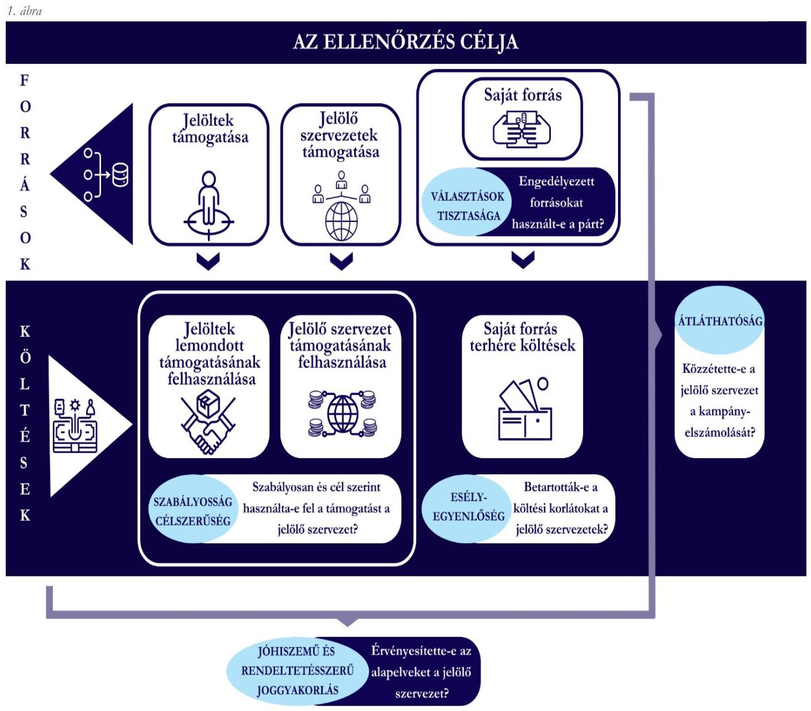
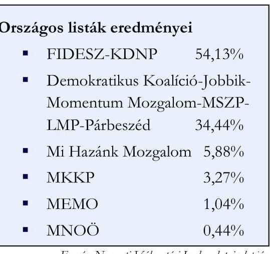
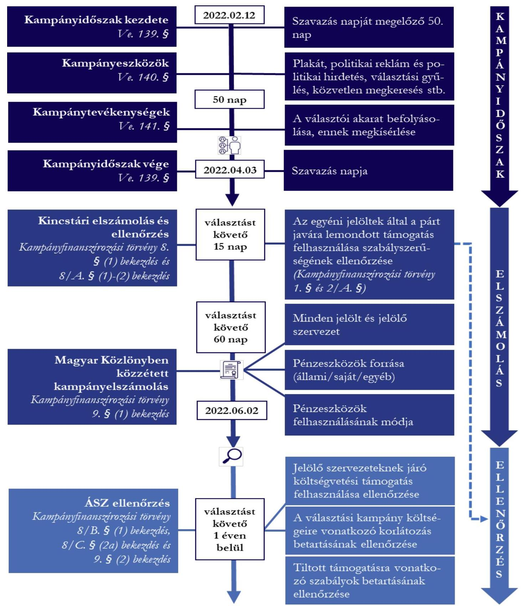
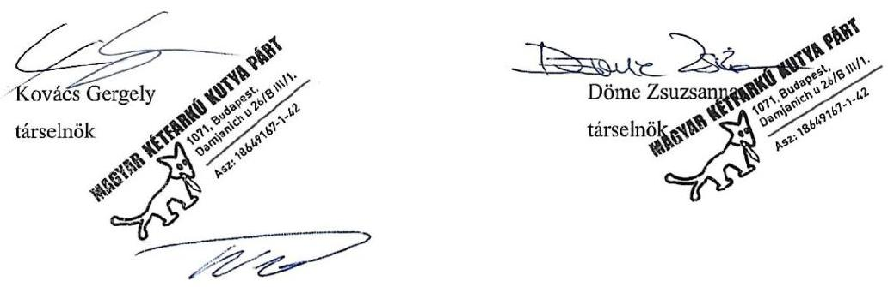

# JELENTÉS 

## Kampánypénzek ellenőrzése

A 2022. évi országgyúlési képviselő-választási kampányra fordított pénzeszközök elszámolásának ellenőrzése öt jelölő szervezetnél
2024.

---

# JELENTÉS 

## Kampánypénzek ellenőrzése

A 2022. évi országgyúlési képviselö-választási kampányra fordított pénzeszközök elszámolásának ellenőrzése öt jelölő szervezetnél
2024.

---

# ELLENŐRZÉSI IGAZGATÓSÁG: 

## ÁLLAMHÁZTARTÁSON KÍVÜLI SZERVEZETEKET ELLENŐRZŐ IGAZGATÓSÁG

## ELLENŐRZÉSI IGAZGATÓ:

## KLINGA LÁSZLÓ igazgató

## ELLENŐRZÉSVEZETŐ:

## NEMESVÁRI-HORTHY ESZTER ellenőrzésvezető

## A TÉMÁHOZ KAPCSOLÓDÓ KORÁBBI SZÁMVEVŐSZÉKI JELENTÉSEK:

- címe: $\quad$ Kampánypénzek ellenőrzése - A 2018. évi országgyűlési képviselő-választási kampányra fordított pénzeszközök elszámolásának ellenőrzése a jelölő szervezeteknél
- sorszáma: $\quad 19030$
- címe: $\quad$ Az időközi országgyűlési képviselő-választási kampányokra fordított pénzeszközök felhasználásának ellenőrzése
- sorszáma: $\quad 21070$

IKTATÓSZÁM: EL-3936-003/2024
TÉMASZÁM: 2643
ELLENŐRZÉS-AZONOSÍTÓ SZÁM: V-0987

---

# TARTALOMJEGYZÉK 

AZ ELLENŐRZÉS ALAPADATAI ..... 5
AZ ELLENŐRZÖTT SZERVEZETEK ..... 9
ÖSSZEFOGLALÁS ..... 13
AZ ELLENŐRZÉS FÓKUSZKÉRDÉSEI ..... 14
MEGÁLLAPÍTÁSOK ..... 15
JAVASLATOK ..... 26
MELLÉKLETEK ..... 27
I. sz. melléklet: Értelmező szótár ..... 27
II. sz. melléklet: Az ellenőrzött szervezetek jegyzéke ..... 30
III. sz. melléklet: A jelölő szervezeteket megillető központi költségvetési támogatás és egyéb forrás felhasználása ..... 31
IV. sz. melléklet: Választásra fordított pénzeszközök felhasználása, elszámolása, ellenőrzése - Idővonal ..... 32
FÜGGELÉK: ÉSZREVÉTELEK ..... 33
RÖVIDÍTÉSEK JEGYZÉKE ..... 38

---

.

---

# AZ ELLENŐRZÉS ALAPADATAI 

## AZ ELLENŐRZÉS CÉLJA

Az ellenőrzés célja annak feltárása volt, hogy a pártlistákra leadott összes érvényes szavazat legalább $1 \%$ - át megszerzett pártok, valamint az országgyúlési választáson képviselethez jutott országos nemzetiségi önkormányzat (jelölő szervezetek ${ }^{1}$ ) a Kampányfinanszírozási törvény ${ }^{2}$ előírásait betartották-e. Az ellenőrzés értékelte azt is, hogy a választási kampányra fordított állami és más pénzeszközök felhasználása a Ve. ${ }^{3}$ által meghatározott alapelvek szerint, a választási eljárás tisztaságának, az esélyegyenlőségnek, valamint a jóhiszemű és rendeltetésszerú joggyakorlás elvének biztosításával történt-e.

Az ellenőrzés célja továbbá annak megállapítása volt, hogy:

- az egyéni jelöltek a Kampányfinanszírozási törvény 1. § (1)-(2) bekezdés szerinti összegű, nekik járó, központi költségvetésből juttatott támogatásról a Kampányfinanszírozási törvény 2/A. §-a alapján a jelöltet jelölő pártjuk részére történő lemondása esetén, a pártok az így kapott támogatást a választási kampányidőszakban, a választási kampánytevékenységgel összefüggő kiadások finanszírozására fordították-e;
- a jelölő szervezetek a Kampányfinanszírozási törvény 3. §-a, valamint 4. §-a szerint, a központi költségvetésből juttatott támogatást a választási kampányidőszak alatt, a választási kampánytevékenységgel összefüggő kiadások finanszírozására fordították-e;
- a jelölő szervezetek jelöltjeikkel együtt betartották-e a Kampányfinanszírozási törvény 7. § (1)-(2) bekezdéseiben meghatározott, jelöltenkénti - a kampány költségeinek korlátját jelentő összeghatárt;
- a pártok, mint jelölő szervezetek, a Párt törvény ${ }^{4}$ 4. §-ában meghatározott forrásokat vették-e igénybe a választási kampányidőszak alatt, a választási kampánytevékenységgel összefüggő kiadások finanszírozására;
- a Kampányfinanszírozási törvény 9. § (1) bekezdésében előírt kampányelszámolás közzététele a törvény szerinti határidőben és tartalommal történt-e.
Az ÁSZ ${ }^{5}$ ellenőrzésének célját, a törvényi alapelvekkel való összefüggésben az 1. ábra szemlélteti.

---

# AZ ELLENŐRZÉS TÍPUSA 

Szabályszerüségi ellenőrzés.

## AZ ELLENŐRZÖTT IDŐSZAK

A Ve. 139. §̧ában rögzített - a szavazás napját megelőző 50. naptól (2022. február 12-től) a szavazás befejezésének időpontjáig (2022. április 3-ig) tartó - választási kampányidőszak, valamint az azt követő elszámolási időszak, amely a Kampányfinanszírozási törvény 9. § (1) bekezdése szerint az országgyűlési választást követő 60 nap, azaz a 2022. június 2-ig tartó időszak.

---

# AZ ELLENŐRZÉS TÁRGYA 

A pártlistát állító párt írásba foglalt a Kampányfinanszírozási törvény 3/A. § (1) bekezdés szerinti nyilatkozatának a megléte, rendelkezésre állása.

A kampánytevékenységhez köthető bizonylatok szabályszerűsége, hitelessége, a Kincstárral ${ }^{6}$ kötött megállapodásban, illetve a Számviteli törvény ${ }^{7}$ 166. §-ában előírt alaki és tartalmi kellékei megléte.

A költségvetési támogatásból és egyéb forrásból finanszírozott valamennyi kiadásnak a választási kampányidőszak alatti, illetve a kampánytevékenységre történő teljesítése.

## AZ ELLENŐRZÉS JOGALAPJA

Az ellenőrzés jogszabályi alapját a Kampányfinanszírozási törvény 8/B. § (1) bekezdése, a 8/C. § (2a) bekezdése és a 9. $\S$ (2) bekezdése, valamint a Párt törvény 10. $\S$ (1) bekezdése képezték.

## AZ ELLENŐRZÉS MÓDSZERE

Az ellenőrzés az ellenőrzött időszakban hatályos jogszabályok, az ÁSZ tv. ${ }^{8}$ előírásai, az ÁSZ ellenőrzés szakmai szabályai, a jelen ellenőrzésre irányadó ÁSZ módszertanok, valamint az ellenőrzési programban foglalt értékelési szempontok szerint került végrehajtásra.

Az ellenőrzési kérdések megválaszolásához szükséges bizonyítékok megszerzése a Kincstár és a jelölő szervezetek, valamint az ellenőrzést támogató szervezetek által rendelkezésre bocsátott dokumentumokra, adatokra alapozva kérdésfeltevés (információkérés), mintavételezés, valamint elemző eljárás, helyszíni interjú útján történt. Az ellenőrzési bizonyítékként felhasználható adatforrások közé tartoztak egyrészt az adatbekérő levelek mellékletében szereplő dokumentumok jegyzékében rögzített adatforrások, másrészt minden az ellenőrzés folyamán feltárt, az ellenőrzés szempontjából információt tartalmazó dokumentum.

Az ellenőrzés lefolytatásához az ellenőrzött jelölő szervezetek tanúsítványok, nyilatkozat kitöltésével és az ÁSZ által kért, teljességi és hitelességi nyilatkozattal alátámasztott dokumentumok rendelkezésre bocsátásával szolgáltattak adatokat.

Az egyéni jelöltek által kampányfinanszirozásra kapott, de a párt javára lemondott, a Kampányfinanszírozási törvény 1. § (1)-(2) bekezdése szerinti költségvetési támogatás felhasználásának ellenőrzése a Kincstárhoz a $\mathrm{MEMO}^{9}$ által beküldött elszámolások ellenőrzésével, valamint a másolatban rendelkezésre bocsátott dokumentumok tételes ellenőrzésével történt, miután a tételek száma egyetlen esetben sem haladta meg az 50 tételt.

A pártlistát állitó párttok részére a jelöltek, szára alapján járó, a Kampányfinanszírozási törvény 3. §-a szerinti központi költségvetési támogatás felhasználásának ellenőrzése a pártoknál mintavétellel kiválasztott mintatételek alapján történt, amennyiben az alapsokaság elemszáma meghaladta a 100 tételt (MEMO, Mi Hazánk Mozgalom, $\mathrm{MKKP}^{10}$ ), amennyiben az alapsokaság elemszáma nem haladta meg a 100 tételt, úgy tételes ellenőrzésre került sor (FIDESZ-KDNP ${ }^{11}$ ).

A párttok által kampányfinanszirozzásra felbasznált egyéb források szabályszerűségének értékelése mintavétellel kiválasztott mintatételek alapján történt, amennyiben az alapsokaság elemszáma meghaladta a 100 tételt

---

(FIDESZ, Mi Hazánk Mozgalom), amennyiben az alapsokaság elemszáma nem haladta meg a 100 tételt, úgy tételes ellenőrzésre került sor (MEMO).

A nemzetiségi listát állitó országos nemzetiségi önkormányzatnak járó, a Kampányfinanszírozási törvény 4. §-a szerinti központi költségvetési támogatás felhasználása szabályszerűségének értékelése mintavétellel kiválasztott mintatételek alapján történt, mivel az MNOÓ ${ }^{12}$-nél az alapsokság elemszáma meghaladta a 100 tételt.

A kiadások és a bevételek kapcsán az összegző és a részletes megállapításokat a feltárt hiányosságok nagysága, gyakorisága, jellege, kampányelszámolásra gyakorolt hatása alapján tette meg az ÁSZ.

Az ÁSZ a kampányfinanszírozásra fordított pénzeszközök szabályszerű felhasználása kapcsán ellenőrizte:

- a kampányidőszakban a kifizetések bizonylatait, az azokat alátámasztó egyéb dokumentumokat (pl.: ellenőrzött időszakban hatályos szerződések, megállapodások, a terület -, a helységbérlet, a plakát, reklám hely stb. vonatkozásában; a bankszámlakivonatok, adományozók befizetését igazoló postai utalványok, számlák, kiadások, költségek elszámolási dokumentumai, továbbá az előző évi maradvány kimutatását tartalmazó dokumentum és ezt igazoló nyilvántartás, a pártnak juttatott vagyoni hozzájárulások dokumentumai, tekintettel a Párt törvény 4. § (2) és (3) bekezdésében foglaltakra),
- a pénzügyi, számviteli nyilvántartásokat, azok Számviteli törvény 161/A. § (2) bekezdésében foglaltaknak megfelelő kialakítását, ennek keretrendszerét adó belső szabályozást,
- a pénzügyi elszámolásokat, a Kincstárnak átadott elszámolásokat, a Magyar Közlönyben nyilvánosságra hozott adatokat, beszámolókat,
- képviselői nyilatkozatokat,
- tanúsítványokat,
- az alkalmazott áraknak a sajtótermékek által megküldött, az ÁSZ honlapján megjelentetett árjegyzékekkel, tájékoztatókkal való egyezőségét,
- ellenőrzést támogató szervezetek által az ÁSZ rendelkezésére bocsátott dokumentumokat.

---

# AZ ELLENŐRZÖTT SZERVEZETEK 

Az ÁSZ a Kampányfinanszírozási törvény 9. § (2) bekezdésében foglalt felhatalmazás alapján az országgyűlési választást követő egy éven belül kötelezően, hivatalból ellenőrzi az országgyűlési képviselethez jutott jelölő szervezetek vonatkozásában a választásra fordított állami és a Párt törvényben meghatározott más pénzeszközök felhasználását. Az országgyűlési képviselethez nem jutott jelölő szervezetek tekintetében az ÁSZ az ellenőrzést kérelemre végzi. A Kampányfinanszírozási törvény 8/B. § (1) bekezdése értelmében amennyiben a Kampányfinanszírozási törvény 2/A. § (1) bekezdésében foglaltak alapján a párt egyéni választókerületi jelöltje az $1 . \S$ szerinti támogatás igénybevételéről lemond, és azt az őt jelölő párt rendelkezésére bocsátja - az ÁSZ a választást követő egy éven belül kötelezően, hivatalból ellenőrzi az 1. § szerinti támogatás felhasználását, az országgyűlési képviselethez jutott jelöltek tekintetében a Kincstárnál és a jelöltet jelölő pártnál. A Kampányfinanszírozási törvény 8/C. § (2a) bekezdése szerint az ÁSZ az országgyűlési képviselők általános választását követő egy éven belül hivatalból ellenőrzi a Kampányfinanszírozási törvény 3. §-a szerinti támogatás felhasználását azoknál a pártlistát állító pártoknál, amelyek pártlistája a pártlistákra leadott összes érvényes szavazat legalább $1 \%$-át megszerezte. A Párt törvény 10. § (1) bekezdése alapján az ÁSZ jogosult a pártok gazdálkodása törvényességének ellenőrzésére.

A 2022. évi országgyűlési választáson a FIDESZ-KDNP, a Demokratikus Koalíció-Jobbik ${ }^{13}$-Momentum Mozgalom-MSZP ${ }^{14}$-LMP ${ }^{15}$-Párbeszéd ${ }^{16}$, a MEMO, a Mi Hazánk Mozgalom és az MKKP jelölő szervezet szerezte meg a pártlistákra leadott összes érvényes szavazat legalább $1 \%$-át. A nemzetiségi listát állító országos nemzetiségi önkormányzatok közül az MNOÖ jutott képviselethez a Parlamentben. A Kampányfinanszírozási törvényben kapott felhatalmazás alapján ezen jelölő szervezetek ellenőrzését végezte el kötelező jelleggel az ÁSZ. Kérelem országgyűlési választáson képviselethez nem jutott jelölő szervezetek ellenőrzésére nem érkezett, így az ÁSZ kérelemre

Furcác: Nemzeti Választási Iroda adatai alapján
szervezetek felsorolását a II. sz. melléklet tartalmazza. A II. sz. mellékletben szereplő jelölő szervezetek közül a jelentés a FIDESZ-KDNP, a MEMO, a Mi Hazánk Mozgalom, az MKKP, valamint az MNOÖ jelölő szervezetek ellenőrzésével kapcsolatos megállapításokat tartalmazza. A többi hat jelölő szervezet (Demokratikus Koalíció, Jobbik, Momentum, MSZP, LMP, Párbeszéd) ellenőrzésének megállapításairól az ÁSZ külön jelentést készít.

## AZ ÁSZ ÁLTAL ELVÉGZETT ELLENŐRZÉS JOGSZABÁLYI HÁTTERÉNEK BEMUTATÁSA, AZ ORSZÁGGYŰLÉSI VÁLASZTÁSON INDULÓ ÉS A KAMPÁNYFINANSZÍROZÁSI TÖRVÉNY ALAPJÁN KÖTELEZŐEN ELLENŐRZÖTT JELÖLŐ SZERVEZETEK FINANSZÍROZÁSA ÉS ELLENŐRZÉSE

A 2014-től hatályos Kampányfinanszírozási törvényt az Országgyűlés az országgyűlési választási kampányok finanszírozásának átláthatóvá és ellenőrizhetővé tétele érdekében alkotta meg. A jogalkotói szándék szerint a Kampányfinanszírozási törvény az Alaptörvényben ${ }^{17}$ és a Ve.-ben rögzített kampányszabályokon kívül egy olyan szabályozás, amely átlátható forrást biztosít a pártok számára programjuknak a választók számára

---

történő bemutatásához. A Kampányfinanszírozási törvényben meghatározott finanszírozási szabályok célja egyúttal, hogy hozzájáruljanak a Ve.-ben lefektetett, a választások tisztaságának megóvása, a választási csalások megakadályozása, a jelöltek és a jelölő szervezetek esélyegyenlőségének biztosítása törvényi alapelveinek érvényre juttatásához. Figyelemmel arra, hogy az Alaptörvény értelmében a pártoknak kiemelkedő szerepük van a nép akaratának kialakításában és kinyilvánításában, az országgyűlési választások során jelölő szervezet kizárólag párt, azon túlmenően országos nemzetiségi önkormányzat lehet, más formában működő szervezet (pl.: egyesület, alapítvány, gazdasági társaság stb.) nem válhat jelölő szervezetté.

A jelölő szervezetek választási kampánytevékenységükkel összefüggő kiadásaikat több forrásból finanszírozzák. A kampányköltségek ellenőrzését a Kincstár és az ÁSZ végzi. A Kampányfinanszírozási törvényben foglaltak szerint a Kincstár ellenőrzi az egyéni jelöltek lemondásával a párt rendelkezésére bocsátott költségvetési támogatás felhasználását. Az ÁSZ a pártokat és az országos nemzetiségi önkormányzatokat megillető valamennyi költségvetési támogatás tekintetében végez ellenőrzést. Az ÁSZ ezen túlmenően a pártok, mint jelölő szervezetek esetében a kampányban felhasznált saját forrásokat is ellenőrzi. A jelölő szervezetek forrásait, ellenőrzésük rendszerét a 2022. évi országgyűlési választás vonatkozásában a 2. ábra mutatja be.
2. ábra

| Pártlistát/nemzetiségi listát állító jelölő szervezetnek járó költségvetési támogatás (Kampányfinanszírozási törvény 3. § és 4. §) |  |  |
| :--: | :--: | :--: |
| FIDESZ-KDNP   706,2 M Ft | Pártok egyéb forrásai | ÁSZ ellenőrzés a   választásokat követi   I éven belüli:   - jelölő   szervezeteknek   járó költségvetési   támogatás   felhasználása   ellenőrzése   - választási   kampány költségein   vonatkozó   korlátozás   betartásának   ellenőrzése   - tiltott támogatásra   vonatkozó   szabályok   betartásának   ellenőrzése   - egyéni jelöltek által   az őket jelölő párt   javára lemondott   támogatás   felhasználásának   ellenőrzése |  |
| Hatpáti összefogás   együttesen 706,2 M Ft,   ebből:   - Demokratikus Koalició   249,6 M Ft   - Jobbik 169,1 M Ft   - Momentum Mozgalom   75,7 M Ft   - MSZP 144,5 M Ft   - LMP 28,0 M Ft   - Párbeszéd 39,3 M Ft | Hatpáti összefogás   együttesen 281,1 M Ft,   ebből:   - Demokratikus Koalició   35,1 M Ft   - Jobbik 77,8 M Ft   - Momentum Mozgalom   62,5 M Ft   - MSZP 61,1 M Ft   - LMP 21,6 M Ft   - Párbeszéd 23,0 M Ft |  |
| MKKP 431,8 M Ft |  |  |
| Mi Hazánk Mozgalom   588,5 M Ft | Mi Hazánk Mozgalom   38,3 M Ft | MEMO 114,7 M Ft |
| MEMO 588,5 M Ft | MEMO 214,2 M Ft |  |
| MNOÓ 189,5 M Ft |  | A Kincstár a választásokat   követő 15 napon belül   benyújtott elszámolás alapján   ellenőrzi a felhasználás   szabályoznéséget |

Fonrás: ÁSZszerkesztés
Az egyéni választókerületben állított jelöltek által a párt javára lemondott $1,0 \mathrm{M} \mathrm{Ft}^{18}$ összegủ támogatás a Kampányfinanszírozási törvény 1. § (2) bekezdésében foglaltakra tekintettel - miszerint az összeget a KSH által a tárgyévet megelőző évre megállapított fogyasztói árindexszel évente növelni kellett - a 2022. évi országgyűlési választás vonatkozásában 1182896 Ft volt, (a továbbiakban kerekítve: 1,2 M Ft), amelyet a pártok a Kincstárral

---

kötött megállapodás alapján kincstári kártyafedezeti számlán kapták meg és a Kampányfinanszírozási törvény előírásai szerint kizárólag a választási kampányidőszak alatt, kampánytevékenységgel összefüggő dologi kiadásra fordíthattak. A kincstári kártya előállításával és használatával kapcsolatos valamennyi költséget az állam viseli. A pártok a Kincstár felé a támogatás felhasználásáról a párt nevére szóló, a Számviteli törvény és az ÁFA tv. ${ }^{19}$ előírásainak megfelelően kiállított számlákkal kötelesek elszámolni. A FIDESZ-KDNP, valamint a Mi Hazánk Mozgalom javára egyéni jelöltjei az 1,2 M Ft támogatásról nem mondtak le. A MEMO és az MKKP nyilvántartásba vett országgyűlési egyéni választókerületi jelöltjei közül 97, illetve 60 fő lemondott a jelölő pártjuk javára az 1,2 M Ft összegű támogatásról. A támogatás igénybevételéről lemondást követően a MEMO a Kincstárral megállapodást kötött. Az MKKP a Kampányfinanszírozási törvény 1. §-a szerinti támogatást nem vett igénybe. Az egyéni választókerületben indított jelöltek párt javára lemondott támogatásának felhasználását a Kincstár és az ÁSZ is ellenőrzi a jelölő szervezeteknél. Azon jelöltek esetében, akik az 1,2 M Ft összegű támogatásról az őket jelölő pártjuk javára nem mondtak le, az ÁSZ a támogatás felhasználását a Kincstár felé benyújtott elszámolásuk Kincstár általi ellenőrzését követően ellenőrizte és annak tapasztalatairól külön jelentést készített (23012-es sorszámú, „A kampánypénzek ellenörzés - A 2022. évi országgyüési képviselő-választási kampányra forditott pénzeszközök elszámolásának ellenörzése az egyéni jelölteknél" címủ, 2023. március 31-én nyilvánosságra hozott jelentés).

A nyilvántartásba vett jelöltek számát és az egyéni választókerületben a párt javára lemondott jelöltek számát valamennyi ellenőrzött jelölő szervezet vonatkozásában az 1. táblázat szemlélteti.

# 1. táblázat 

NYILVÁNTARTÁSBA VETT ÉS A PÁRT JAVÁRA LEMONDOTT JELÖLTEK SZÁMA (FŐ)

| A JELÖLÖ   SZERVEZET   MEGNEVEZÉSE | NYILVÁNTARTÁSBA   VETT JELÖLTEK   SZÁMA | A PÁRT JAVÁRA   LEMONDOTT   JELÖLTEK SZÁMA |
| :-- | :--: | :--: |
| FIDESZ-KDNP | 106 | 0 |
| Demokratikus Koalíció |  | 32 |
| Jobbik |  | 29 |
| Momentum Mozgalom |  | 13 |
| MSZP | 106 | 18 |
| LMP |  | 5 |
| Párbeszéd |  | 6 |
| MKKP | 79 | 60 |
| Mi Hazánk Mozgalom | 102 | 0 |
| MEMO | 99 | 97 |

A pártlistát/nemzetiségi listát állító jelöló szervezeteknek járó költségvetési támogatásra a pártok az egyéni választókerületekben állított jelöltek száma alapján, illetve az országos nemzetiségi önkormányzatok jogosultak, amelyek a támogatás igénybevétele esetén vállalják a felhasználáshoz kapcsolódó szigorú szabályok betartását. A közös pártlistát állító pártok e támogatás vonatkozásában egy pártnak tekintendők, a támogatás elosztásáról megállapodást kell kötniük. A pártok és a nemzetiségi listát állító országos nemzetiségi önkormányzatok a jelölő szervezetnek járó költségvetési támogatást kizárólag a választási kampányidőszak alatt, a választási kampánytevékenységgel összefüggő kiadások finanszírozására fordíthatják. A 2022. évi országgyűlési képviselő-választáson közös országos listát a FIDESZ és a KDNP, valamint a Demokratikus Koalíció, a Jobbik, az LMP, a Momentum Mozgalom, az MSZP és a Párbeszéd állított. A Kincstár a támogatást a FIDESZ és a KDNP között 2022. februárban létrejött

---

megállapodás alapján a FIDESZ-nek utalta át. Az MKKP-nak, a Mi Hazánk Mozgalomnak, a MEMO-nak és a MNOÓ-nek járó támogatást a Kincstár részükre folyósította.

A pártlistát/nemzetiségi listát állító jelölő szervezeteknek járó költségvetési támogatás felhasználását az ÁSZ ellenőrzi.

A választási kampány költségeinek korlátozását a Kampányfinanszírozási törvény írja elő, amely szerint a választási kampányidőszak alatt, a választási kampánytevékenységgel összefüggő kiadásai finanszírozására a pártlistát állító párt és annak jelöltje és az országos nemzetiségi önkormányzat a nemzetiségi listán szereplő jelöltjeire jelöltenként legfeljebb 5,0 M Ft összeget fordíthat, amely összeg a Kampányfinanszírozási törvény 7. § (2) bekezdésében foglaltakra tekintettel - miszerint az összeget a KSH által a tárgyévet megelőző évre megállapított fogyasztói árindexszel évente növelni kell - a 2022. évi országgyűlési választás vonatkozásában 5914478 Ft (a továbbiakban: 5,9 M Ft) volt. A közös jelölteket vagy közös pártlistát állító pártok e korlátozás vonatkozásában egy pártnak tekintendők. A FIDESZ és a KDNP egy pártnak tekintendők a választási kampány költségeinek korlátozása vonatkozásában.

A pártok számára a müködésük tisztaságát garantáló finanszirozási tilalmakat, a pártok kampányidőszaki gazdálkodása törvényességét az ÁSZ ellenőrizte. Az ÁSZ ennek keretében ellenőrizte a pártok költségvetési támogatáson kívüli saját forrásai kampányidőszakban történő kampánycélú felhasználását is.

A Kincstárral kötött megállapodás alapján a jelölő szervezetet megillető támogatás összegét és a felhasználást, a pártlistát/nemzetiségi listát állító jelölő szervezeteknek járó költségvetési támogatás összegét és abból a felhasználást ellenőrzött jelölő szervezetenként a III. sz. melléklet mutatja be. A pártok Magyar Közlönyben közzétett kampányelszámolása szerint a választási kampány során felhasznált saját forrás összegét ellenőrzött jelölő szervezetenként szintén a III. sz. melléklet mutatja be.

A jelölő szervezetek által folytatott kampányukra nyújtott források felhasználását, az elszámolási és ellenőrzési feladatok határidőit összefoglalóan az IV. sz. melléklet ábrája tartalmazza.

---

# ÖSSZEFOGLALÁS 

A FIDESZ-MAGYAR PolgÁri SzÓvetsÉG-KeresztÉNYDEMOKrata NÉPPÁrt egyéni jelöltjei a költségvetési támogatás felhasználásáról nem mondtak le az őket jelölő szervezet javára. A jelölő szervezetnek járó költségvetési támogatást a FIDESZ-MAGYAR PolgÁri SzÓvetsÉGKERESZTÉNYDEMOKRATA NÉPPÁRT szabályszerűen használta fel, a választási kampányidőszak alatt a választási kampánytevékenységgel összefüggő kiadások finanszírozására fordította, amelyet szabályszerű bizonylatokkal igazolt. A választási kampány költségeire vonatkozó korlátozást betartotta, a kampánytevékenységgel összefüggő kiadásainak összege nem érte el a 2022. évi országgyűlési választás során jelöltenként fordítható 5,9 M Ft-os összeghatárt. A tiltott támogatásra vonatkozó finanszírozási tilalmakat betartotta, jogi személytől, jogi személyiséggel nem rendelkező szervezettől, más államtól, külföldi szervezettől és nem magyar állampolgár természetes személytől vagyoni hozzájárulást nem fogadott el.
A MegoldÁs Mozgalom a választási kampányáról elszámolást nem tett közzé, ezáltal a választópolgárok, a tagsága és az adományozók számára nem biztosította a kampánya forrásainak és költéseinek átláthatóságát. A MEGOLDÁs MOZGALOM az egyéni jelöltek által a párt javára lemondott költségvetési támogatást szabályszerűen használta fel. A jelölő szervezetnek járó költségvetési támogatást a MEGOLDÁS MOZGALOM szabályszerűen használta fel, a választási kampányidőszak alatt a választási kampánytevékenységgel összefüggő kiadások finanszírozására fordította, amelyet szabályszerű bizonylatokkal igazolt. A választási kampány költségeire vonatkozó korlátozást betartotta, a kampánytevékenységgel összefüggő kiadásainak összege nem érte el a 2022. évi országgyűlési választás során jelöltenként fordítható 5,9 M Ft-os összeghatárt. A tiltott támogatásra vonatkozó finanszírozási tilalmakat betartotta, jogi személytől, jogi személyiséggel nem rendelkező szervezettől, más államtól, külföldi szervezettől és nem magyar állampolgár természetes személytől vagyoni hozzájárulást nem fogadott el.
A Mi HAZÁNK MOZGALOM egyéni jelöltjei a költségvetési támogatás felhasználásáról nem mondtak le az őket jelölő szervezet javára. A jelölő szervezetnek járó költségvetési támogatást A Mi HAZÁNK MOZGALOM szabályszerűen használta fel, a választási kampányidőszak alatt a választási kampánytevékenységgel összefüggő kiadások finanszírozására fordította, amelyet szabályszerű bizonylatokkal igazolt. A választási kampány költségeire vonatkozó korlátozást betartotta, a kampánytevékenységgel összefüggő kiadásainak összege nem érte el a 2022. évi országgyűlési választás során jelöltenként fordítható 5,9 M Ft-os összeghatárt. A tiltott támogatásra vonatkozó finanszírozási tilalmakat betartotta, jogi személytől, jogi személyiséggel nem rendelkező szervezettől, más államtól, külföldi szervezettől és nem magyar állampolgár természetes személytől vagyoni hozzájárulást nem fogadott el.
A MaGyar KÉtfarkú Kutya PÁrt a jelölő szervezetnek járó költségvetési támogatás közel felét, mintegy 198,7 millió M Ft-ot nem a választási eljárást szabályozó törvényben nevesített kampányeszközökre költötte, hanem pályázati úton szétosztotta magánszemélyek és szervezetek által megjelölt célok megvalósítására. A MaGyar KÉtfarkú Kutya PÁrt által alkalmazott gyakorlat felveti a kampányeszköz és kampánytevékenység fogalmára vonatkozó jogszabályi előírások felülvizsgálatának indokoltságát, a kampányeszköz és a kampánytevékenység fogalma egyértelműbb meghatározásának szükségességét. A MaGyar KÉtfarkú Kutya PÁrt a választási kampány költségeire vonatkozó korlátozást betartotta, a kampánytevékenységgel összefüggő kiadásainak összege nem érte el a 2022. évi országgyűlési választás során jelöltenként fordítható 5,9 M Ft-os összeghatárt. A MaGyar KÉtfarkú Kutya PÁrt a kampányához egyéb forrást nem használt fel. A MAGYARORSZÁGI NÉMETEK ORSZÁGOS ÖNKORMÁNYZATA a nemzetiségi lista alapján járó költségvetési támogatást szabályszerűen használta fel, a választási kampányidőszak alatt a választási kampánytevékenységgel összefüggő kiadások finanszírozására fordította, amelyet szabályszerű bizonylatokkal igazolt. A választási kampány költségeire vonatkozó korlátozást a MAGYARORSZÁGI NÉMETEK ORSZÁGOS ÖNKORMÁNYZATA betartotta.

---

# AZ ELLENŐRZÉS FÓKUSZKÉRDÉSEI 

- Szabályszerü volt-e az egyéni jelöltek által a jelölő szervezet javára lemondott költségvetési támogatás felhasználása? Szabályszerü volt-e az ellenőrzött pártoknál a jelölő szervezetnek járó költségvetési támogatás felhasználása? Betartották-e a választási kampány költségeire vonatkozó korlátozást az ellenőrzött pártok? Betartották-e a tiltott támogatásra vonatkozó finanszírozási tilalmakat az ellenőrzött pártok?

1. Fidesz-KDNP
2. MEMO
3. Mi Hazánk Mozgalom
4. $M K K P$

- Szabályszerü volt-e az ellenőrzött országos nemzetiségi önkormányzatnál a jelölő szervezetnek járó költségvetési támogatás felhasználása? Betartotta-e a választási kampány költségeire vonatkozó korlátozást az ellenőrzött országos nemzetiségi önkormányzat?

5. $M N O O ̈$

---

# MEGÁLLAPÍTÁSOK 

Szabályszerú volt-e az egyéni jelöltek által a jelölő szervezet javára lemondott költségvetési támogatás felhasználása? Szabályszerú volt-e az ellenőrzött pártoknál a jelölő szervezetnek járó költségvetési támogatás felhasználása? Betartották-e a választási kampány költségeire vonatkozó korlátozást az ellenőrzött pártok? Betartották-e a tiltott támogatásra vonatkozó finanszírozási tilalmakat az ellenőrzött pártok?

## 1. FIDESZ-KDNP

Összegző megállapítás

A FIDESZ-KDNP egyéni jelöltjei a költségvetési támogatás felhasználásáról nem mondtak le a jelölő szervezet javára. A FIDESZ a FIDESZ-KDNP jelölő szervezetnek járó költségvetési támogatást szabályszerűen használta fel. A választási kampány költségeire vonatkozó korlátozást a FIDESZ - KDNP betartotta. A FIDESZ-KDNP a tiltott támogatásra vonatkozó finanszírozási tilalmakat betartotta.

A FIDESZ-KDNP EGYÉNI JELÖLTJEI A KÖLTSÉGVETÉSI TÁMOGATÁS FELHASZNÁLÁSÁRÓL NEM MONDTAK LE A JELÖLŐ SZERVEZET JAVÁRA.
A FIDESZ-KDNP által az országgyúlési egyéni választókerületekben állított 106 jelölt nem mondott le a jelölő szervezet javára a Kampányfinanszírozási törvény 1. §-ában meghatározottak alapján a központi költségvetésből kapott támogatásról. A 2022. évi országgyúlési választás során jelöltenkénti 1,2 M Ft-os támogatás összegével a jelöltek egyénileg számoltak el a Kincstár felé. Az egyéni jelöltek elszámolásainak ellenőrzési tapasztalatairól az ÁSZ önálló jelentést készített.

A FIDESZ-KDNP A JELÖLŐ SZERVEZETNEK JÁRÓ KÖLTSÉGVETÉSI TÁMOGATÁST SZABÁLYSZERÜEN HASZNÁLTA FEL.
A FIDESZ és a KDNP 2022. februárban megállapodást kötött közös országos lista és valamennyi országgyúlési egyéni választókerületben közös jelölt indításáról, amelynek értelmében a Kampányfinanszírozási törvény 3. §-ában meghatározott, a jelölő szervezetnek járó költségvetési támogatás igénybevételére való jogosultság vonatkozásában egy jelölő szervezetnek minősülnek. A KDNP a megállapodás aláírásával hozzájárult ahhoz, hogy a Kincstár a FIDESZ részére folyósítsa a FIDESZ-KDNP jelölő szervezetet megillető támogatást. A FIDESZ és a KDNP megállapodott továbbá arról is, hogy a kampányidőszakban felmerülő kiadások elsősorban a Kampányfinanszírozási törvény 3. §- a szerinti támogatásból kerülnek finanszírozásra. A KDNP a megállapodás aláírásával kifejezetten hozzájárult ahhoz is, hogy a kampánytevékenységgel összefüggésben felmerült kiadásokat a FIDESZ egyéb előzetes jóváhagyás nélkül teljesítse, a közös költségvetési támogatással önállóan rendelkezzen.

---

A FIDESZ vezető tisztségviselői a Kampányfinanszírozási törvény 3/A. § (1) bekezdése szerinti, a 3. § szerinti támogatás folyósításához szükséges, annak visszafizetése esetén egyetemlegesen viselt felelősségükre vonatkozó nyilatkozatot megtették.
A Kampányfinanszírozási törvény 9. § (1) bekezdésében foglaltaknak megfelelően a FIDESZ-KDNP az országgyűlési képviselők 2022. évi általános választására fordított állami és más pénzeszközök, anyagi támogatások összegéről, forrásáról és felhasználásának módjáról szóló beszámolóját az országgyűlési választást követő 60 napon belül a Magyar Közlönyben nyilvánosságra hozta.
A FIDESZ-KDNP a Kampányfinanszírozási törvény 3. §-a szerinti költségvetési támogatást a Ve. 140. §-ában meghatározott kampányeszközök megfizetésére használta fel, továbbá a Ve. 141. §-ában és a Kampányfinanszírozási törvény 6. § (1) bekezdésében foglaltakkal összhangban, a választási kampányidőszak alatt a választási kampánytevékenységgel összefüggő kiadások finanszírozására fordította, amelyet szabályszerű bizonylatokkal és az ÁFA tv. 169. §-ában foglalt adattartalomnak megfelelő, nevére szóló számlákkal igazolt. A FIDESZ-KDNP a 2022. évi országgyűlési választás kampányidőszaka alatt a rendelkezésre álló dokumentumok szerint politikai hirdetést nem tett közzé.

# A VÁLASZTÁSI KAMPÁNY KÖLTSÉGEIRE VONATKOZÓ KORLÁTOZÁST A FIDESZ-KDNP BETARTOTTA. 

Figyelemmel a Kampányfinanszírozási törvény 7. § (3)-(4) bekezdésében foglaltakra, az egy jelöltre jutó kampánytevékenységgel összefüggő kiadás összege nem érte el a Kampányfinanszírozási törvény 7. § (1) - (2) bekezdés szerinti, a választási kampánytevékenységgel összefüggő kiadások finanszírozására a 2022. évi országgyűlési választás során jelöltenként fordítható 5,9 M Ft-os összeghatárt.
Mindezek alapján a FIDESZ-KDNP a kampánytevékenységre jelöltenként fordítható, a Kampányfinanszírozási törvény 7. § (1)-(2) bekezdés szerinti, a választási kampány költségeire vonatkozó korlátozást betartotta.

## A FIDESZ-KDNP A TILTOTT TÁMOGATÁSRA VONATKOZÓ FINANSZÍROZÁSI TILALMAKAT BETARTOTTA.

A FIDESZ-KDNP a Párt törvény 4. § (2) bekezdésében foglalt finanszírozási tilalmat betartotta, a párt részére jogi személy, jogi személyiséggel nem rendelkező szervezet vagyoni hozzájárulást nem adott, a párt jogi személytől, jogi személyiséggel nem rendelkező szervezettől vagyoni hozzájárulást nem fogadott el.
A FIDESZ-KDNP a Párt törvény 4. § (3) bekezdésében foglalt finanszírozási tilalmat betartotta, más államtól, külföldi szervezettől és nem magyar állampolgár természetes személytől, valamint névtelen adományt nem fogadott el.

---

# 2. MEMO 

## Összegző megállapítás

A MEMO a 2022. évi országgyúlési választási kampányáról nem tette közzé a Magyar Közlönyben kampányelszámolását, ezáltal a választópolgárok, a tagsága és az adományozók számára nem biztosította a választási kampány költségeinek és azok forrásának átláthatóságát. A MEMO az egyéni jelöltek által a párt javára lemondott költségvetési támogatást, a jelölő szervezetnek járó költségvetési támogatást szabályszerűen használta fel, a választási kampány költségeire vonatkozó korlátozást és a tiltott támogatásra vonatkozó finanszírozási tilalmat betartotta.

A
A MEMO A 2022. ÉVI ORSZÁGGYŰLÉSI VÁLASZTÁSI KAMPÁNYÁRÓL NEM TETTE KÖZZÉ A MAGYAR KÖZLÖNYBEN KAMPÁNYELSZÁMOLÁSÁT, ÍGY A KAMPÁNYÁRA FORDÍTOTT KIADÁSOKRÓL ÉS AZOK FORRÁSÁRÓL NEM SZÁMOLT EL A NYILVÁNOSSÁG ELŐTT.
A MEMO a Kampányfinanszírozási törvény 9. § (1) bekezdésében foglalt előírás ellenére az országgyúlési választást követően a Magyar Közlönyben a 2022. évi országgyúlési választásra fordított állami és más pénzeszközökről, anyagi támogatásokról, azok forrásáról és felhasználásának módjáról szóló beszámolót nem hozta nyilvánosságra. Ezzel a MEMO a választópolgárok, a tagsága és az adományozók számára nem tette lehetővé, hogy megismerjék a választási kampányra fordított kiadások összegét, azok forrását, ennek következtében a MEMO kampányának finanszírozása, a kampányára fordított kiadások és azok forrása nem volt átlátható.
Az ÁSZ a MEMO-nál a választási kampányra fordított pénzeszközök elszámolásának ellenőrzését a Kincstár adatszolgáltatása, valamint a MEMO által kitöltött tanúsítványok és az ÁSZ által kért, teljességi és hitelességi nyilatkozattal az ÁSZ ellenőrzés részére átadott dokumentumok alapján folytatta le és tette meg megállapításait.

## 2A MEMO AZ EGYÉNI JELŐLTEK ÁLTAL A PÁRT JAVÁRA LEMONDOTT KÖLTSÉGVETÉSI TÁMOGATÁST SZABÁLYSZERŰEN HASZNÁLTA FEL.

A MEMO nyilvántartásba vett 99 egyéni választókerületi jelöltje közül 97 jelölt a Kampányfinanszírozási törvény 2/A. $\S$ (1) bekezdésében foglaltaknak megfelelően írásban nyilatkozott a Kincstárnak arról, hogy a Kampányfinanszírozási törvény 1. §-a szerinti támogatás igénybevételéről lemondanak és a 2022. évi országgyúlési választás során jelöltenkénti 1,2 MFt-os támogatás összegét az őket jelölő párt rendelkezésére bocsátják.
Az egyéni jelöltek lemondó nyilatkozata, valamint a Kampányfinanszírozási törvény 2/A. § (2) bekezdésében foglaltak szerint, a MEMO és a Kincstár között létrejött megállapodás alapján a Kincstár a kincstári kártyafedezeti számlán a MEMO részére 114,7 MFt költségvetési támogatást biztosított.
A MEMO a kincstári kártyafedezeti számla használata során betartotta a Kampányfinanszírozási törvény 2/A. § (4) bekezdése előírásait, a kifizetést átutalással teljesítette.
A MEMO a választási kampányidőszak alatt a választási kampánytevékenységgel összefüggő kiadás elszámolását a Kampányfinanszírozási törvény 8/A. § (1) bekezdésében foglaltaknak megfelelően a kifizetést igazoló bizonylatok másolatának benyújtásával teljesítette a Kincstár felé.

---

Az elszámoláshoz benyújtott számlák kampánytevékenységgel kapcsolatos szolgáltatás megfizetésére irányult a Kampányfinanszírozási törvény 1. § (3) bekezdésében foglaltaknak megfelelően.
A benyújtott számlák, számviteli bizonylatok a 69/2013. (XII. 29.) NGM rendelet ${ }^{20}$ 2. § (4) bekezdés b) pont 7. alpontja és az Áhsz. ${ }^{21} 15$. számú melléklete előírásainak megfelelően a K3 Dologi kiadások rovatba tartozó, a kampánytevékenységgel összefüggésben elszámolható dologi kiadások körébe tartoztak.
A támogatás felhasználását igazoló számlák és az egyéb számviteli bizonylatok a Kampányfinanszírozási törvény 2/A. $\S$ (5) bekezdésében foglaltaknak megfelelően a MEMO nevére szóltak, alaki és tartalmi kellékei megfeleltek a Számviteli törvény és az ÁFA tv. előírásainak.
A MEMO vonatkozásában politikai hirdetés esetén a hirdetés megjelentetője a Ve. 148. § (3)-(4) bekezdéseiben foglaltaknak megfelelően, kizárólag az ÁSZ által nyilvántartásba vett, honlapján közzétett árjegyzékben szereplő sajtótermékek megjelentetője volt. A MEMO a politikai hirdetést az ÁSZ által nyilvántartásba vett, honlapján közzétett árjegyzékben szereplő áron, a választást követően a sajtótermék kibocsátója által megküldött tájékoztatóban foglaltaknak megfelelően vette igénybe.

# A MEMO A JELŐLŐ SZERVEZETNEK JÁRÓ KÖLTSÉGVETÉSI TÁMOGATÁST SZABÁLYSZERŰEN HASZNÁLTA FEL. 

A MEMO vezető tisztségviselői a Kampányfinanszírozási törvény 3/A. § (1) bekezdése szerinti, a 3. § szerinti támogatás folyósításához szükséges, annak visszafizetése esetén egyetemlegesen viselt felelősségükre vonatkozó nyilatkozatot megtették.
A MEMO a Kampányfinanszírozási törvény 3. §-a szerinti költségvetési támogatást a Ve. 140. §-ában meghatározott kampányeszközök megfizetésére használta fel, továbbá a Ve. 141. §-ában és a Kampányfinanszírozási törvény 6. § (1) bekezdésében foglaltakkal összhangban, a választási kampányidőszak alatt a választási kampánytevékenységgel összefüggő kiadások finanszírozására fordította, amelyet szabályszerű bizonylatokkal és az ÁFA tv. 169. §-ában foglalt adattartalomnak megfelelő, nevére szóló számlákkal igazolt.

## A VÁLASZTÁSI KAMPÁNY KÖLTSÉGEIRE VONATKOZÓ KORLÁTOZÁST A MEMO BETARTOTTA.

Figyelemmel a Kampányfinanszírozási törvény 7. § (3)-(4) bekezdésében foglaltakra, a MEMO felelős vezetőjének tanúsítványi adatszolgáltatásában a kampányra fordított kiadásai összegéről közölt adatok és az azok alátámasztására rendelkezésre bocsátott számviteli bizonylatai alapján, az egy jelöltre jutó kampánytevékenységgel összefüggő kiadás összege nem érte el a Kampányfinanszírozási törvény 7. § (1)(2) bekezdés szerinti, a választási kampánytevékenységgel összefüggő kiadások finanszírozására a 2022. évi országgyűlési választás során jelöltenként fordítható 5,9 M Ft-os összeghatárt.
Mindezek alapján a MEMO betartotta a Kampányfinanszírozási törvény 7. § (1)-(2) bekezdés szerinti, a választási kampány költségeire vonatkozó korlátozást.

## A MEMO A TILTOTT TÁMOGATÁSRA VONATKOZÓ FINANSZÍROZÁSI TILALMAT BETARTOTTA.

A MEMO, a MEMO felelős vezetőjének tanúsítványi adatszolgáltatásában a kampányra fordított kiadásai és azok forrásáról közölt adatok és az azok alátámasztására rendelkezésre bocsátott számviteli bizonylatai alapján a Párt törvény 4. § (2) bekezdésében foglalt finanszírozási tilalmat betartotta, a párt részére jogi személy, jogi személyiséggel nem rendelkező szervezet vagyoni hozzájárulást nem adott, a párt jogi személytől, jogi személyiséggel nem rendelkező szervezettől vagyoni hozzájárulást nem fogadott el.

---

A MEMO a Párt törvény 4. § (3) bekezdésében foglalt finanszírozási tilalmat betartotta, más államtól, külföldi szervezettől és nem magyar állampolgár természetes személytől, valamint névtelen adományt nem fogadott el.

# 3. MI HAZÁNK MOZGALOM 

Összegző megállapítás

A Mi Hazánk Mozgalom egyéni jelöltjei a költségvetési támogatás felhasználásáról nem mondtak le a jelölő szervezet javára. A Mi Hazánk Mozgalom a jelölő szervezetnek járó költségvetési támogatást szabályszerűen használta fel. A választási kampány költségeire vonatkozó korlátozást a Mi Hazánk Mozgalom betartotta. A Mi Hazánk Mozgalom a tiltott támogatásra vonatkozó finanszírozási tilalmakat betartotta.

## A MI HAZÁNK MOZGALOM EGYÉNI JELÖLTJEI A KÖLTSÉGVETÉSI TÁMOGATÁS FELHASZNÁLÁSÁRÓL NEM MONDTAK LE A JELÖLŐ SZERVEZET JAVÁRA.

A Mi Hazánk Mozgalom által az országgyűlési egyéni választókerületekben állított 102 jelölt nem mondott le a jelölő szervezet javára a Kampányfinanszírozási törvény 1. §-ában meghatározottak alapján a központi költségvetésből kapott támogatásról. A 2022. évi országgyűlési választás során jelöltenkénti 1,2 MFt támogatás összegével a jelöltek egyénileg számoltak el a Kincstár felé. Az egyéni jelöltek elszámolásainak ellenőrzési tapasztalatairól az ÁSZ önálló jelentést készített.

## A MI HAZÁNK MOZGALOM A JELÖLŐ SZERVEZETNEK JÁRÓ KÖLTSÉGVETÉSI TÁMOGATÁST SZABÁLYSZERŰEN HASZNÁLTA FEL.

A Mi Hazánk Mozgalom vezető tisztségviselői a Kampányfinanszírozási törvény 3/A. § (1) bekezdése szerinti, a 3. § szerinti támogatás folyósításához szükséges, annak visszafizetése esetén egyetemlegesen viselt felelősségükre vonatkozó nyilatkozatot megtették.
A Kampányfinanszírozási törvény 9. § (1) bekezdésében foglaltaknak megfelelően a Mi Hazánk Mozgalom az országgyűlési képviselők 2022. évi általános választására fordított állami és más pénzeszközök, anyagi támogatások összegéről, forrásáról és felhasználásának módjáról szóló beszámolóját az országgyűlési választást követő 60 napon belül a Magyar Közlönyben nyilvánosságra hozta.
A Mi Hazánk Mozgalom a Kampányfinanszírozási törvény 3. §-a szerinti költségvetési támogatást a Ve. 140. §-ában meghatározott kampányeszközök megfizetésére használta fel, továbbá a Ve. 141. §-ában és a Kampányfinanszírozási törvény 6. § (1) bekezdésében foglaltakkal összhangban, a választási kampányidőszak alatt a választási kampánytevékenységgel összefüggő kiadások finanszírozására fordította, amelyet szabályszerű bizonylatokkal és az ÁFA tv. 169. §-ában foglalt adattartalomnak megfelelő, nevére szóló számlákkal igazolt.
A Mi Hazánk Mozgalom vonatkozásában a politikai hirdetést tartalmazó számla kibocsátója, a Ve. 148. § (3)-(4) bekezdéseiben foglaltaknak megfelelően, kizárólag az ÁSZ által nyilvántartásba vett, honlapján közzétett árjegyzékben szereplő sajtótermékek megjelentetője volt. A politikai hirdetések vásárlásáról szóló számlákon szereplő egységárak megegyeztek az ÁSZ részére a választást követően a sajtótermék kibocsátója által megküldött tájékoztatóban foglaltakkal. Egy sajtótermék megjelentetője a

---

Ve. 148. § (5) bekezdésében foglaltak ellenére az ÁSZ-t nem tájékoztatta a közzétett politikai hirdetésekről. A Ve.-ben előírt kötelezettség körében feltárt mulasztás a Mi Hazánk Mozgalomnak nem róható fel.

# 2 A VÁLASZTÁSI KAMPÁNY KÖLTSÉGEIRE VONATKOZÓ KORLÁTOZÁST A MI HAZÁNK MOZGALOM BETARTOTTA. 

Figyelemmel a Kampányfinanszírozási törvény 7. § (3)-(4) bekezdésében foglaltakra, az egy jelöltre jutó kampánytevékenységgel összefüggő kiadás összege nem érte el a Kampányfinanszírozási törvény 7. § (1)(2) bekezdés szerinti, a választási kampánytevékenységgel összefüggő kiadások finanszírozására a 2022. évi országgyűlési választás során jelöltenként fordítható 5,9 M Ft-os összeghatárt.
Mindezek alapján a Mi Hazánk Mozgalom betartotta a Kampányfinanszírozási törvény 7. § (1)-(2) bekezdés szerinti, a választási kampány költségeire vonatkozó korlátozást.

## 3 A MI HAZÁNK MOZGALOM A TILTOTT TÁMOGATÁSRA VONATKOZÓ FINANSZÍROZÁSI TILALMAKAT BETARTOTTA.

A Mi Hazánk Mozgalom a Párt törvény 4. § (2) bekezdésében foglalt finanszírozási tilalmat betartotta, a párt részére jogi személy, jogi személyiséggel nem rendelkező szervezet vagyoni hozzájárulást nem adott, a párt jogi személytől, jogi személyiséggel nem rendelkező szervezettől vagyoni hozzájárulást nem fogadott el.
A Mi Hazánk Mozgalom a Párt törvény 4. § (3) bekezdésében foglalt finanszírozási tilalmat betartotta, más államtól, külföldi szervezettől és nem magyar állampolgár természetes személytől, valamint névtelen adományt nem fogadott el.

## 4. MKKP

Összegző megállapítás

Az MKKP az egyéni jelöltek által lemondott költségvetési támogatást nem használt fel a választási kampány finanszírozására. A jelölő szervezetnek járó költségvetési támogatás közel felét, mintegy 198,7 millió M Ft-ot nem Ve.-ben nevesített kampányeszközökre költötte, hanem pályázati úton szétosztotta magánszemélyek és szervezetek által megjelölt célok megvalósítására. Az MKKP által alkalmazott gyakorlat felveti, hogy indokolt egyértelműbben meghatározni a kampányeszköz fogalmát a törvényben. Az MKKP a választási kampány költségeire vonatkozó korlátozást betartotta. Az MKKP a kampányhoz egyéb forrást nem használt fel.

## AZ MKKP AZ EGYÉNI JELÖLTEK ÁLTAL LEMONDOTT KÖLTSÉGVETÉSI TÁMOGATÁST NEM HASZNÁLT FEL A KAMPÁNYA FINANSZÍROZÁSÁRA.

Az MKKP nyilvántartásba vett 79 egyéni választókerületi jelöltje közül 60 fő a Kampányfinanszírozási törvény 2/A. $\S$ (1) bekezdésében foglaltaknak megfelelően írásban nyilatkozott a Kincstárnak arról, hogy a Kampányfinanszírozási törvény 1. §-a szerinti támogatás igénybevételéről lemond és a 2022. évi országgyűlési választás során jelöltenkénti 1,2 M Ft-os támogatás összegét az őket jelölő párt rendelkezésére bocsátja. Az MKKP a Kampányfinanszírozási törvény 2/A. § (2) bekezdése szerint az 1. § szerinti támogatás folyósítása céljából a Kincstárral megállapodást nem kötött, részére a Kincstár ilyen jogcímen támogatást nem folyósított.

---

AZ MKKP A JELÖLŐ SZERVEZETNEK JÁRÓ KÖLTSÉGVETÉSI TÁMOGATÁS KÖZEL FELÉT, MINTEGY 198,7 MILLIÓ M FT-OT NEM A VE.-BEN NEVESÍTETT KAMPÁNYESZKÖZÖKRE HASZNÁLTA FEL, HANEM PÁLYÁZATI ÚTON SZÉTOSZTOTTA MAGÁNSZEMÉLYEK ÉS SZERVEZETEK ÁLTAL MEGJELÖLT CÉLOK MEGVALÓSÍTÁSÁRA. AZ MKKP ÁLTAL ALKALMAZOTT GYAKORLAT FELVETI, HOGY INDOKOLT LEHET EGYÉRTELMÚBBEN MEGHATÁROZNI A KAMPÁNYESZKÖZ FOGALMÁT A TÖRVÉNYBEN.
Az MKKP a Kampányfinanszírozási törvény 9. § (1) bekezdésében foglaltaknak megfelelően a választást követő 60 napon belül a Magyar Közlönyben nyilvánosságra hozta az országgyúlési képviselők 2022. évi általános választására fordított állami és más pénzeszközök, anyagi támogatások összegéről, forrásáról és felhasználásának módjáról szóló beszámolóját. Az MKKP a közzétett elszámolás szerint összesen 431,8 M Ft-ot fordított a választási kampányra, amely teljes egészében költségvetési támogatásból származott.
Az MKKP a költségvetési támogatás felhasználását szabályszerű bizonylatokkal és az ÁFA tv. 169. §-ában foglalt adattartalomnak megfelelő számlákkal igazolta, egy eset kivételével. Egy 93 ezer Ft értékủ mintatétel esetében a számla, bizonylat nem állt rendelkezésre, így a számviteli (könyvviteli) nyilvántartásba szabályszerűen kiállított bizonylat hiányában jegyeztek be adatokat, amely ellentétes a Számviteli törvény 165. § (2) bekezdésében foglaltak előírással. Bizonylat hiányában a támogatás Kampányfinanszírozási törvény 6. § (1) bekezdése szerinti, kampányidőszak alatti, kampánycélú felhasználása nem igazolt.
Az ÁSZ a költségvetési támogatás felhasználásának szabályszerűsége keretében ellenőrizte azt is, hogy az MKKP a jelölő szervezetnek járó költségvetési támogatást a Kampányfinanszírozási törvény 6. § (1) bekezdésének megfelelően kampányidőszak alatt, a választási kampánytevékenységgel összefüggő kiadások finanszírozására fordította-e.
Az ellenőrzés feltárta, hogy az MKKP a kampányra kapott költségvetési támogatás közel felét, 46,02\%- át, mintegy 198,7 M Ft-ot nem a Ve. 140. §-ában nevesített kampányeszközökre használta fel (ilyen nevesített kampányeszköz a plakát, a jelölő szervezet vagy jelölt által történő közvetlen megkeresés, a politikai reklám és politikai hirdetés és a választási gyűlés), hanem pályázat útján szétosztotta a pályázó magánszemélyek és szervezetek által megjelölt célok megvalósítására.
Az MKKP 2021 októberében hirdette meg a II. Rózsa Sándor Népi Kampánypénztékozló Alap pályázatot. A pályázati felhívás szerint: „ba összeszedjük tavasszal az aláírásokat legalább 71 helyen, félmillilárdunk lesz kábé kampányra, de sokkal inkább köželú tevékenységekre. Segitsetek eltékozolni olyan projektekere, amelyek minél több ember számára hasznosak, viccesek, vagy jobb lesz tölük a környék, szebb az élet!" A pályázati felhívásban feltételként jelent meg, hogy a támogatást kampányidőszakban kell elkölteni, és hogy a támogatott tevékenység legyen „közcélú". Emellett az MKKP a pályázati felhívásban rögzítette: „Ez a kampánypénzünk, amivel el kell számolnunk, ezért nem tudjuk titokban adni, valamilyen módon meg kell jelenjen a projekt valamely felületén az MKKP. Hogy hogyan, milyen formában, azt rád bizzuk!!". Az MKKP a kampánycélra szolgáló közpénzből támogatást ítélt meg és adott többek között macskák ivartalanítására, varjúrópde téliesítésére, napelemes sörhűtő vásárlására, tájház és stég felújítására, gyerekeknek szóló horror mesekönyv kiadására, kisméretű 3D-nyomtató vásárlására gombfocihoz szükséges kellékek nyomtatásához, meleg vízi terápiák népszerúsítésére, furgon vásárlására utcai cirkusz működtetéséhez.

---

A kampányra kapott költségvetési támogatás a Kampányfinanszírozási törvény szerint kizárólag a választási kampánytevékenységgel összefüggő kiadások finanszírozására fordítható. A Ve. szerint kampánytevékenység a kampányeszközök kampányidőszakban történő felhasználása és minden egyéb kampányidőszakban folytatott tevékenység a választói akarat befolyásolása vagy ennek megkísérlése céljából. A Ve. tehát a példálózó jellegű felsoroláson túl nem határozza meg konkrétan a kampányeszköz és a kampánytevékenység fogalmát. Ezért a Ve. kommentárja szerint a kampánytevékenység megítélése során azt is kell vizsgálni, hogy mi volt a tevékenységet végző szándéka. Mindezek mellett a Ve. előírja, hogy a választási eljárás szabályainak alkalmazása során érvényre kell juttatni a jóhiszemű és rendeltetésszerű joggyakorlás alapelvét.
Az MKKP nem tudta igazolni az ellenőrzés során, hogy a pályázat alapján átadott anyagok, támogatások felhasználása ténylegesen azokra a célokra történt-e, amelyeket az általa kiírt pályázatokban megjelöltek, és amelyekre a támogatást megítélte.
A nyertes pályázatok benyújtóival, a támogatottakkal az MKKP együttműködési megállapodást vagy támogatási szerződést kötött. Együttműködési megállapodás esetén a pályázat alapján megvalósítandó projekthez biztosította az anyagokat az MKKP, támogatási szerződés esetén pedig a támogatási összeget utalta át a támogatott részére a támogatási szerződésben meghatározott projekt megvalósítására. Az együttműködési megállapodásokban, támogatási szerződésekben előírták az önkéntes, illetve a támogatott részére, hogy a felhasznált anyagokról, illetve a felhasznált támogatásról jelentést kell készíteni.
Az MKKP az előírt jelentéseket 14 esetből 4 esetben nem tudta bemutatni az ellenőrzés során. Emellett az MKKP nem írta elő pénzügyi elszámolás elkészítését, és a támogatások felhasználását igazoló számlák, bizonylatok benyújtását, így nem igazolt, hogy az átadott anyagok, támogatások teljes körűen, olyan áron és arra a célra kerültek-e felhasználásra, amely a szerződésekben rögzítésre került. Az MKKP által alkalmazott pályázati rendszer kapcsán kérdéses az is, hogy a közpénzből vásárolt eszközök, felújított ingatlanok esetében gondoskodtak-e arról, hogy azok elsődlegesen a jogalkotó szándéka szerinti közcélt ne magáncélokat szolgáljanak.
A jelölő szervezetnek járó költségvetési támogatás felhasználásával összefüggő ellenőrzési tapasztalatok felvetik a kampányeszköz és kampánytevékenység fogalmára vonatkozó jogszabályi előírások felülvizsgálatának indokoltságát, a kampányeszköz és a kampánytevékenység fogalma egyértelműbb meghatározásának szükségességét. Emellett a hatályos jogszabályi előírások nem tartalmaznak jogkövetkezményt, szankciót arra az esetre, ha a jelölő szervezet nem kampánycélra, vagyis nem a választási kampánytevékenységgel összefüggő kiadások finanszírozására használja fel vagy nem használja fel teljes összegben a költségvetési támogatást. Ennek felülvizsgálata, a hatásos és arányos szankció alkalmazásának szabályozása is felmerülhet a jogkövető magatartás erősítése érdekében.
Az MKKP vonatkozásában a politikai hirdetést tartalmazó számla kibocsátója, a Ve. 148. § (3)-(4) bekezdéseiben foglaltaknak megfelelően, kizárólag az ÁSZ által nyilvántartásba vett, honlapján közzétett árjegyzékben szereplő sajtótermékek megjelentetője volt. A politikai hirdetések vásárlásáról szóló számlákon szereplő egységárak egy kivétellel megegyeztek az ÁSZ által nyilvántartásba vett, honlapján közzétett árjegyzékben, tájékoztatóban szereplő árakkal. Egy esetben a sajtótermék megjelentetője által kiállított számlán szereplő hirdetés típusa és az ÁSZ részére megküldött árjegyzékben és tájékoztatóban szereplő hirdetések (méret, megnevezés, típus szerint) nem voltak összeegyeztethetőek. Egy sajtótermék megjelentetője a Ve. 148. § (5) bekezdésében foglaltak ellenére az ÁSZ-t nem tájékoztatta a közzétett politikai hirdetésekről. A Ve.-ben előírt kötelezettség körében feltárt mulasztás az MKKP-nak nem róható fel.

---

# AZ MKKP A VÁLASZTÁSI KAMPÁNY KÖLTSÉGEIRE VONATKOZÓ KORLÁTOZÁST BETARTOTTA. 

Az MKKP a Magyar Közlönyben közzétett kampányelszámolása alapján 470,8 M Ft költségvetési támogatásban részesült, melyből az MKKP az országgyűlési képviselők 2022. évi általános választására 431,8 M Ft-ot használt fel. Az MKKP a fel nem használt 39,0 M Ft-ot a Kincstár részére visszautalta. Az MKKP egyéni választókerületi jelöltjei - 80 fő - közül 1 fő visszalépett, így a Kampányfinanszírozási törvény 3. § (1) bekezdésének b) pontja szerinti kritérium nem teljesült. Az MKKP-nak a kiesett jelölt után 117,7 M Ft visszafizetési kötelezettsége keletkezett, melyet a Kincstár számlájára visszautalt.
Figyelemmel a Kampányfinanszírozási törvény 7. § (3)-(4) bekezdésében foglaltakra, az egy jelöltre jutó kampánytevékenységgel összefüggő kiadás összege nem érte el a Kampányfinanszírozási törvény 7. $\S$ (1) - (2) bekezdés szerinti, a választási kampánytevékenységgel összefüggő kiadások finanszírozására a 2022. évi országgyűlési választás során jelöltenként fordítható 5,9 M Ft-os összeghatárt.
Mindezek alapján az MKKP a kampánytevékenységre jelöltenként fordítható, a Kampányfinanszírozási törvény 7. § (1)-(2) bekezdés szerinti, a választási kampány költségeire vonatkozó korlátozást betartotta.

## AZ MKKP A KAMPÁNYHOZ EGYÉB FORRÁST NEM HASZNÁLT FEL.

Az MKKP a Párt törvény 4. § (1) bekezdése szerinti vagyoni hozzájárulásként adományt az országgyűlési képviselők 2022. évi általános választásának kampányára nem fordított, kizárólag a Kampányfinanszírozási törvény 3. §-a szerinti költségvetési támogatást használt fel. Emiatt az ellenőrzés a Párt törvény 4. § (2)-(3) bekezdéseiben előírt pártfinanszírozási tilalmak betartását az MKKP esetében nem vizsgálta.

---

# Szabályszerú volt-e az ellenőrzött országos nemzetiségi önkormányzatnál a jelölő szervezetnek járó költségvetési támogatás felhasználása? Betartotta-e a választási kampány költségeire vonatkozó korlátozást az ellenőrzött országos nemzetiségi önkormányzat? 

## 5. MNOŐ

Összegző megállapítás

Az MNOŐ a nemzetiségi lista alapján járó költségvetési támogatást szabályszerűen használta fel. A választási kampány költségeire vonatkozó korlátozást az MNOÖ betartotta.

## AZ MNOŐ A NEMZETISÉGI LISTA ALAPJÁN JÁRÓ KÖLTSÉGVETÉSI TÁMOGATÁST SZABÁLYSZERÜEN HASZNÁLTA FEL.

A Kampányfinanszírozási törvény 9. § (1) bekezdésében foglaltaknak megfelelően az MNOÓ az országgyűlési képviselők 2022. évi általános választására fordított állami és más pénzeszközök, anyagi támogatások összegéről, forrásáról és felhasználásának módjáról szóló beszámolóját az országgyűlési választást követő 60 napon belül a Magyar Közlönyben nyilvánosságra hozta. A Magyar Közlönyben közzétett beszámoló alapján az MNOÓ az országgyűlési képviselők 2022. évi általános választására 189,5 M Ft-ot használt fel, amely kizárólag a nemzetiségi lista után kapott Kampányfinanszírozási törvény 4. $\S$-a szerinti támogatás.

Az MNOÓ a Kampányfinanszírozási törvény 4. §-a szerint a nemzetiségi listát állító országos nemzetiségi önkormányzatot megillető 191,1 M Ft támogatásból 189,5 M Ft-ot a Ve. 140. §-ában meghatározott kampányeszközök megfizetésére használt fel, továbbá a Ve. 141. §-ában és a Kampányfinanszírozási törvény 6. § (1) bekezdésében foglaltakkal összhangban, a választási kampányidőszak alatt a választási kampánytevékenységgel összefüggő kiadások finanszírozására fordította, amelyet szabályszerű bizonylatokkal és az ÁFA tv. 169. §-ában foglalt adattartalomnak megfelelő, nevére szóló számlákkal igazolt. Az MNOÓ a költségvetési támogatás fennmaradó részét, 1,6 M Ft-ot a Kincstár részére visszafizette.
Az MNOÓ vonatkozásában a nyomtatott sajtóban megjelentetett politikai hirdetést tartalmazó számla kibocsátója, a Ve. 148. § (3)-(4) bekezdéseiben foglaltaknak megfelelően az ÁSZ által nyilvántartásba vett, honlapján közzétett árjegyzékben szereplő sajtótermék megjelentetője volt. Az elektronikus sajtóban, internetes újságban megjelentetett politikai hirdetést tartalmazó számla kibocsátója a Ve. 148. § (3)(4) bekezdésében foglalt előírás ellenére az ÁSZ-t nem tájékoztatta az elektronikus hirdetései árjegyzékéről. A sajtótermék megjelentetője által az MNOÓ részére nyomtatott sajtótermékben megjelentetett politikai hirdetések vásárlásáról kiállított számla nem tartalmazta a megvásárolt hirdetések formátumát (méret, terjedelem), ezért az ÁSZ által nyilvántartásba vett, honlapján közzétett árjegyzékben szereplő árakkal nem volt összevethető. A sajtótermék megjelentetője a Ve. 148. § (5) bekezdésében foglaltak ellenére az ÁSZ- t nem tájékoztatta a közzétett politikai hirdetésekről. A Ve.-ben előírt kötelezettség körében feltárt mulasztás az MNOÓ-nek nem róható fel.

---

# A VÁLASZTÁSI KAMPÁNY KÖLTSÉGEIRE VONATKOZÓ KORLÁTOZÁST AZ MNOÓ BETARTOTTA. 

Az MNOÓ a 2022. évi országgyúlési képviselők általános választásán nemzetiségi listát állító országos nemzetiségi önkormányzatot megillető, a részére rendelkezésre bocsátott támogatással elszámolt. Az MNOÓ a kampánytevékenységgel összefüggő kiadások finanszírozásával kapcsolatban a Kampányfinanszírozási törvény 7.§ (1)-(2) bekezdése szerinti, 5,9 M Ft összeghatárt betartotta.

---

# JAVASLATOK 

Az ÁSZ tv. 33. § (1) bekezdésében foglaltak értelmében az ellenőrzött szervezet vezetője köteles a jelentésben foglalt megállapításokhoz kapcsolódó intézkedési tervet összeállítani és azt a jelentés kézhezvételétől számított 30 napon belül az ÁSZ részére megküldeni. Amennyiben az ellenőrzött szervezet vezetője nem küldi meg határidőben az intézkedési tervet, vagy továbbra sem elfogadható intézkedési tervet küld, az Állami Számvevőszék elnöke az ÁSZ tv. 33. § (3) bekezdése a) és b) pontjaiban foglaltakat érvényesítheti.

## MEMO ELNÖKE

1. Gondoskodjon arról, hogy a 2022. évi országgyűlési választásra fordított állami és más pénzeszközökröl, anyagi támogatásokról, azok forrásáról és felhasználásának módjáról szóló beszámolót a Magyar Közlönyben nyilvánosságra hozza.
(2. sz. megállapítás, 1. bekezdés, 1. mondata alapján)

---

# MELLÉKLETEK 

## I. SZ. MELLÉKLET: ÉRTELMEZŐ SZÓTÁR

egyéni jelölt
ellenőrzést támogató szervezet
finanszírozási tilalmak

Az országgyűlési választásokon az egyéni választókerületben független jelöltként, vagy párt jelöltjeként, illetve két vagy több párt közös jelöltjeként induló személy (Forrás: az országgyűlési képviselők választásáról szóló 2011. évi CCIII. tv. 5. §-a).
A rendelkezésre bocsátott dokumentumok, adatok, illetve tájékoztatás hitelességének, megalapozottságának, teljességének megállapítása vagy egyes ellenőrzési megállapítások alátámasztása, kiegészítése érdekében az összefüggő tények vizsgálata céljából az ÁSZ által adat, dokumentáció, tájékoztatás kérése érdekében megkeresett szervezet, amelynél az ÁSZ ellenőrzés végzésére is jogosult. Az ellenőrzést támogató szervezet a megkeresésben foglaltak teljesítését csak akkor tagadhatja meg, ha az jogszabályba ütközik. Az ellenőrzést támogató szervezet a megkeresést annak megérkezésétől számított 8 napon belül köteles teljesíteni vagy a megkeresés teljesítésének jogszabályi akadályát az ÁSZ-szal közölni (Forrás: ÁSZ tv. 25. § (3) bekezdés).
A pártok számára a múködésük tisztaságát garantáló finanszirozási tilalmakat a Párt törvény rögzíti, amely finanszírozási tilalmakat a pártoknak a választási kampányidőszak során is be kell tartaniuk a választási kampány tisztaságának biztosítása érdekében. A pártok a Párt törvény rendelkezései értelmében jogi személytől, jogi személyiséggel nem rendelkező szervezettől, más államtól, külföldi szervezettől, nem magyar állampolgár magánszemélytől, névtelen adományozótól vagyoni hozzájárulást nem fogadhatnak el. Ezen előírás alapján tiltott támogatásnak minősül az is, ha a pártok nem pénzbeli vagyoni hozzájárulásként ingyenes, vagy piaci ár alatti szolgáltatást fogadnak el jogi személytől, vagy jogi személyiséggel nem rendelkező szervezettől. Amennyiben a párt tiltott vagyoni hozzájárulást fogadott el, köteles annak értékét - az Állami Számvevőszék felhívására - tizenöt napon belül a központi költségvetésnek befizetni. Késedelem esetén a tartozást adók módjára kell behajtani. A párt központi költségvetésből juttatott támogatását az elfogadott vagyoni hozzájárulás értékét kitevő összeggel csökkenteni kell.
A párt részére a tiltott finanszírozást nem pénzben nyújtották, köteles annak értékeléséről (értékének meghatározásáról) gondoskodni. Tiltott, nem pénzben nyújtott hozzájárulást elfogadása esetén annak értékét az Állami Számvevőszék állapítja meg.
(Forrás: Párt törvény 4. § (2)-(5) bekezdései)

---

jelölő szervezet
kampányelszámolás
kampányeszköz
kampányidőszak
kampányidőszak elszámolási időszaka
plakát
politikai hirdetés

Az országgyűlési képviselők választásán a választás kitűzésekor a civil szervezetek bírósági nyilvántartásában jogerősen szereplő párt, továbbá az országos nemzetiségi önkormányzat, ha a választási bizottság a jelölő szervezetek nyilvántartásába felvette (Forrás: Ve. 3. § 3. pontja).
A jelölő szervezetek által az országgyűlési választást követő 60 napon belül a Magyar Közlönyben nyilvánosságra hozott pénzügyi beszámoló, amely tartalmazza a választásra fordított állami és más pénzeszközök, anyagi támogatások összegét, forrását és felhasználásának módját.
(Kampányfinanszírozási törvény 9. § (1) bekezdés)
Kampányeszköznek minősül minden olyan eszköz, amely alkalmas a választói akarat befolyásolására vagy annak megkísérlésére, így különösen
a) plakát,
b) jelölő szervezet vagy jelölt által történő közvetlen megkeresés,
c) politikai reklám és politikai hirdetés,
d) választási gyűlés.

Továbbá minden olyan eszköz, amely kampánytevékenység megvalósítására irányul (Forrás: Ve. 140. §-a).
A szavazás napját megelőző 50. naptól a szavazás napján a szavazás befejezéséig tartó időszak, azaz 2022. február 12-től - 2022. április 3 -áig tartó időszak. (Forrás: Ve. 139. §-a).
Az országgyűlési választást követő 60 nap, azaz 2022. április 4-étől 2022. június 2 -áig tartó időszak. (Forrás: Kampányfinanszírozási törvény 9. § (1) bekezdés).
A választási falragasz, felirat, szórólap, vetített kép, embléma mérettől és hordozóanyagtól függetlenül (Forrás: Ve. 144. § (1) bekezdés).
Az ellenérték fejében közzétett, valamely jelölő szervezet vagy független jelölt népszerúsítését szolgáló, vagy támogatásra ösztönző, illetve azok nevét, célját, tevékenységét, emblémáját népszerúsítő sajtótermékben közzétett médiatartalom vagy filmszínházban közzétett audiovizuális tartalom (Forrás: Ve. 146. § b) pont).

---

választási kampány költségeinek korlátozása (jelölő szervezetek költéseinek korlátozása)

A választási kampányidőszak alatt, a választási kampánytevékenységgel összefüggő kiadások finanszírozására a független jelölt, a jelöltet vagy pártlistát állító párt és annak jelöltje együttesen jelöltenként, az országgyűlési képviselők általános választásán nemzetiségi listát állító országos nemzetiségi önkormányzat jelöltenként legfeljebb ötmillió forintot fordíthat, melyet a Központi Statisztikai Hivatal által a tárgyévet megelőző évre megállapított fogyasztói árindexszel évente növelni kell. A választási kampánytevékenységre összesen fordított összegbe be kell számítani a jelöltek által a jelölő szervezet javára lemondott támogatást, a pártlistát állító párt részére járó költségvetési támogatást, a nemzetiségi listát állító országos nemzetiségi önkormányzatot megillető támogatás felhasználását is.
Egy párt által a választási kampánytevékenységre összesen fordítható összeg meghatározásakor az egyéni választókerületi jelöltjei számát, valamint az országos listán indított jelöltjei számát, de legfeljebb az országos listán megszerezhető mandátumok számát kell alapul venni. Egy párt által a választási kampánytevékenységre összesen fordítható összeg meghatározásakor az egyéni választókerületben és az országos listán is jelölt személyt a jelölések számának megfelelően kell figyelembe venni. A közös jelölteket vagy közös pártlistát állító pártokat a kampány költségeinek korlátozása vonatkozásában egy pártnak kell tekinteni.
Az országgyűlési képviselők általános választásán nemzetiségi listát állító országos nemzetiségi önkormányzat által a választási kampánytevékenységre összesen fordítható összeg meghatározásakor az országos listán indított jelöltjei számát, de legfeljebb az országos listán megszerezhető mandátumok számát kell alapul venni.
Amennyiben a jelölő szervezet a kampány költségeinek korlátozására vonatkozó rendelkezéseket megsérti, köteles a választásra összesen fordítható összeg felett felhasznált összeg kétszeresét az Állami Számvevőszék felhívására 15 napon belül a központi költségvetés részére befizetni. Amennyiben a jelölő szervezet visszafizetési kötelezettségét határidőben nem teljesíti, az Állami Számvevőszék ellenőrzési megállapításait közli a kincstárral. A Kincstár a befizetési kötelezettségről határozatot hoz, amellyel szemben fellebbezésnek nincs helye. A befizetési kötelezettség az azt követő tizenötödik napon válik esedékessé, amikor a Kincstár határozatát a bíróság helybenhagyta vagy a keresetindításra nyitva álló határidő eredménytelenül telt el. Ha a jelölő szervezet kötelezettségét határidőben nem teljesíti, a kincstár kezdeményezése alapján a Nemzeti Adó- és Vámhivatal gondoskodik a tartozás adók módjára történő behajtásáról. (Forrás: Kampányfinanszírozási törvény 7. § (1)(6) és $9 . \S(4)-(6)$ bekezdései)

---

# II. SZ. MELLÉKLET: AZ ELLENŐRZÖTT SZERVEZETEK JEGYZÉKE 

## ELLENŐRZÖTT SZERVEZET MEGNEVEZÉSE

Demokratikus Koalició
FIDESZ - Magyar Polgári Szövetség
Jobbik Magyarországért Mozgalom
Kereszténydemokrata Néppárt
LMP - Magyarország Zöld Pártja
Magyar Kétfarkú Kutya Párt
Magyar Szocialista Párt
Megoldás Mozgalom
Mi Hazánk Mozgalom
Momentum Mozgalom
Párbeszéd Magyarországért Párt
Magyarországi Németek Országos Önkormányzata

---

# III. SZ. MELLÉKLET: A JELÖLŐ SZERVEZETEKET MEGILLETŐ KÖZPONTI KÖLTSÉGVETÉSI TÁMOGATÁS ÉS EGYÉB FORRÁS FELHASZNÁLÁSA

A JELÖLŐ SZERVEZETEKET A KAMPÁNYFINANSZÍROZÁSI TÖRVÉNY EGYES JOGCÍMEI SZERINT MEGILLETŐ KÖZPONTI KÖLTSÉGVETÉSI TÁMOGATÁS ÉS EGYÉB FORRÁS FELHASZNÁLÁSA (ADATOK M FT-BAN)

|  Jelölő
szervezet neve | Egyéni jelöltek által lemondott és felhasznált támogatás | Visszafizetési kötelezettség (kiesett és $1 \%$-ot el nem érő jelöltek után) | Partását állító-járműki nemzetiségi életét állító országos nemzetiségi önkormányzatnak járó központi költségvetési támogatásból a felhasználás |  | Pártok egyéb forrás felhasználása a Hivatalos Értesítőben közzétett adatok szerint | Összes felhasználás  |
| --- | --- | --- | --- | --- | --- | --- |
|  Demokratikus Koalíció | 37,9 | - | 249,6 | 249,6 | 35,1 | 322,6  |
|  Fidesz - KDNP | - | - | 706,2 | 706,2 | 344,8 | 1051,0  |
|  Jobbik | 34,3 | - | 169,1 | 169,1 | 77,8 | 281,1  |
|  LMP | 5,9 | - | 28,0 | 28,0 | 21,6 | 55,5  |
|  MKKP | - | 117,7 | 470,8 | $431,8^{1}$ | - | 431,8  |
|  MSZP | 21,3 | - | 144,5 | 144,5 | 61,1 | 226,9  |
|  MEMO | 114,7 | - | 588,5 | 588,5 | 214,2 | 917,5  |
|  Mi Hazánk Mozgalom | - | - | 588,5 | 588,5 | 38,3 | 626,8  |
|  Momentum Mozgalom | 15,4 | - | 75,7 | 75,7 | 62,5 | 153,6  |
|  Párbeszéd | 7,1 | - | 39,3 | 39,3 | 23,0 | 69,4  |
|  MNOÖ | - | - | 191,1 | $189,5^{2}$ | - | 189,5  |
|  Összesen: | 236,6 | 117,7 | 3251,3 | 3210,7 | 878,4 | 4325,7  |

Forrás: ÁSZszerkesztés a Kincstár nyilvántartása és a Hivatalos Értesítőben közzétett kampányelszámolások, tanúsítványi adatszolgáltatás alapján

[^0] [^0]: ${ }^{1}$ Az MKKP a fel nem használt 39,0 M Ft -ot a Kincstár részére visszautalta. ${ }^{2}$ Az MNOÖ a fel nem használt 1,6 M Ft támogatást visszafizette a Kincstárnak.

---

IV. SZ. MELLÉKLET: VÁLASZTÁSRA FORDÍTOTT PÉNZESZKÖZÖK FELHASZNÁLÁSA, ELSZÁMOLÁSA, ELLENŐRZÉSE - IDŐVONAL

Forrás: ÁSZ szerkesztés a Ve. és a Kampányfinanszirozási törvény rendelkezései alapján

---

# FÜGGELÉK: ÉSZREVÉTELEK 

A jelentéstervezetet a Számvevőszék 15 napos észrevételezésre megküldte az ellenőrzött szervezetek vezetőinek az ÁSZ tv. 29. $5^{\text {* }}$ (1) bekezdése előírásának megfelelően.

A jelentéstervezet megállapításaira a Megoldás Mozgalom elnöke és a Magyarországi Németek Országos Önkormányzata elnöke nem tettek észrevételt. A Fidesz-Magyar Polgári Szövetség elnöke, a Kereszténydemokrata Néppárt elnöke és a Mi Hazánk Mozgalom elnöke nemleges észrevételt tett. A Magyar Kétfarkú Kutya Párt társelnökei észrevételt tettek.
A függelék tartalmazza a Magyar Kétfarkú Kutya Párt társelnökeinek észrevételét, illetve az el nem fogadott észrevétel indokolását.

A jeltentéstervezet megállapításaira a Megoldás Mozgalom elnöke és a Magyarországi Németek Országos Önkormányzata elnöke nem tettek észrevételt. A Fidesz-Magyar Polgári Szövetség elnöke, a Kereszténydemokrata Néppárt elnöke és a Mi Hazánk Mozgalom elnöke nemleges észrevételt tett. A Magyar Kétfarkú Kutya Párt társelnökei észrevételt tettek.
A függelék tartalmazza a Magyar Kétfarkú Kutya Párt társelnökeinek észrevételét, illetve az el nem fogadott észrevétel indokolását.

[^0]
[^0]:    *29. § (1) Az Állami Számvevőszék az ellenőrzési megállapításait megküldi az ellenőrzött szervezet vezetőjének vagy az általa megbízott személynek, és annak, akinek személyes felelősségét állapította meg.
    (2) Az ellenőrzött szervezet vezetője és a felelősként megjelölt személy az ellenőrzés megállapításaira tizenöt napon belül írásban észrevételt tehet.
    (3) Az Állami Számvevőszék az észrevételre a beérkezésétől számított harminc napon belül írásban válaszol. A figyelembe nem vett észrevételeket köteles a jelentésben feltüntetni, és megindokolni, hogy azokat miért nem fogadta el.

---

# MAGYAR KÉTFARKÚ KUTYA PÁRT 

azonosító: 0199031622 | zdószám: 18649157-1-42 | nyilvántartási szám: 01-02-0015629

Dr. Szomolnoki Csaba
részére
Állami Számvevőszék
1364 Budapest 4. Pf. 54.

## 5-2023-4

## 5-2023-4

Tisztelt Alelnök Úr!

A EL-3712-676/2023. iktatószámú leveléhez mellékelt jelentéstervezetre az alábbi észrevételeket teszem.

A tervezet 13. oldalán található összefoglaló szerint „[a] MAGYAR KÉTFARKÚ KUTYA PÁRT kampányidőszaki költéseinek közel fele, 198,7 M Ft összeg esetében nem állapítható meg egyértelmúen, hogy azok kizárólagosan kampánycélt szolgáltak-e." Ennek kifejtéseként a tervezet 16. oldalán az a megállapítás szerepel, amely szerint „[a]z ellenőrzés feltárta, hogy az MKKP a kampányra kapott költségvetési támogatás közel felét, $46,02 \%$ - át, mintegy 198,7 M Ft-ot nem a Ve. 140. §-ában nevesített kampányeszközökre használta fel (ilyen nevesített kampányeszköz a plakát, a jelölő szervezet vagy jelölt által történő közvetlen megkeresés, a politikai reklám és politikai hirdetés és a választási gyülés), hanem pályázat útján szétosztotta a pályázó magánszemélyek és szervezetek által megjelölt, választáshoz és kampányhoz nem egyértelmúen kapcsolódó célok megvalósítására (...)"

A Ve. 140. § a)-d) pontja példálózó felsorolást ad a kampányeszközökre, azonban a felvezető szöveg egyértelművé teszi, hogy minden olyan eszköz kampányeszköznek minősül, amely alkalmas a választói akarat befolyásolására vagy annak megkísérlésére. A pályázat feltételei között - amint arra a jelentéstervezet is egyébként rámutat - minden esetben szerepelt az a kitétel, hogy a párt nevét/logóját a megvalósítás során fel kell tüntetni, ezért annak a választói akarat befolyásolására való alkalmassága nehezen kérdőjelezhető meg. Sem a Ve., sem más jogszabály nem tartalmaz olyan előirást, hogy csak az minősülne kampányeszköznek, ami „kizárólagosan" kampánycélt szolgál. Ugyancsak nem szűkíti le a kampányeszköz fogalmát sem a Ve., sem más jogszabály arra, hogy az „kösvetlenül a választói akarat befolyásolására irányul[ion]".

A Ve. és a többi választási jogszabály szabályozási logikája éppen ellentétes: minden olyan eszköz, ami a választói akarat befolyásolására vagy annak megkísérlésére bármilyen szemponiból alkalmas, akkor is kampányeszköz, ha egyebekben más céllal is rendelkezik. Ennek megfelelően nem vonható kétségbe a kampányeszköz jellege az olyan célok megvalósításának, ami alkalmas a párt népszerüsítésére, ekként a választói akarat befolyásolására. Nem értelmezhető ebből a szempontból a jelentéstervezet azon

---

# MAGYAR KÉTFARKÚ KUTYA PÁRT 

azonosító: 0199031622 | adószám: 18649167-1-42 | nyilvántartási szám: 01-02-0015629
megállapitása, hogy „nem állapítható meg egyértelműen, hogy az MKKP 198,7 M Ft-os, pályázati úton történő költései (...) azt a célt szolgálták-e a jogalkotó a kampánycélú költségvetési támogatást szánta". A jogalkotó kampánytevékenységre biztosítja a forrást, a kampánytevékenységnek pedig egy kellően széles definícióját adja a Ve.-ben. Az ezen esetlegesen túlmutató, feltételezett jogalkotói szándékok a jogszcrüség vizsgálatán belül nem értelmezhetöek.

A Magyar Kétfarkú Kutya Párt a saját identitásának és céljainak népszerüsitésére választotta a Számvevőszék által kifogásolt kampányeszközt, amivel semmilyen jogszabályt nem sértett meg. Az, hogy a választói akarat befolyásolására alkalmas eszköz mennyiben hatékony vagy szokványos kampányeszköz, olyan célszerüségi kérdés, amelynek megitélése meghaladja az ÁSZ feladat- és hatáskörét.

Budapest, 2023. július 4.

Tisztelettel,

---

# Döme Zsuzsanna 

társelnök

## Kovács Gergely

társelnök
Magyar Kétfarkú Kutya Párt

## Budapest

Tárgy: Válaszlevél ellenőrzéssel kapcsolatos észrevételek kezeléséről

## Tisztelt Társelnök Úrhölgy és Társelnök Úr!

A „Kampánypénzek ellenörzése - A 2022. ési országgyölési köprissö̈-választási kampánura forditott pénzszzközök elszámolásának elémörzése öt jelö̈̈ szervessinö̈" című számvevőszéki jelentés tervezetével kapcsolatos, 2023. július 4-i keltezésű észrevételét köszönettel megkaptam.
Az Állami Számvevőszékről szóló 2011. évi LXVI. törvény (a továbbiakban: ÁSZ törvény) 29. § (2) bekezdése szerint az ellenőrzött szervezet vezetője és a felelősként megjelölt személy az ellenőrzés megállapításaira tizenöt napon belül írásban észrevételt tehet. Ugyanezen szakasz (3) bekezdése szerint az Állami Számvevőszék az észrevételre a beérkezésétől számított harminc napon belül írásban válaszol. A figyelembe nem vett észrevételeket köteles a jelentésben feltüntetni, és megindokolni, hogy azokat miért nem fogadta el. Tájékoztatom Társelnök úrhölgyet és urat, hogy a számvevőszéki jelentésben a figyelembe nem vett észrevételeket szerepeltetjük az elutasítás indokának feltüntetésével.
Az Állami Számvevőszék észrevételére vonatkozó álláspontjáról az alábbi tájékoztatást adom:
Az Állami Számvevőszék az észrevételét részben elfogadja, ez alapján a jelentéstervezetet módosítja.

---

Az észrevételében foglaltakhoz kapcsolódóan tájékoztatom továbbá, hogy az Állami Számvevőszék az MKKP tekintetében a „Kampánypénzék ellenörzése - A 2022. évi országgyilési képesszélsválasztási kampányra fordított pénzeszközök elszámolásának ellenörzése itt jelöli szervezetenél" tárgyú ellenőrzésnél jogsértést és visszafizetési kötelezettséget nem állapított meg. Az ÁSZ törvény 1. § (4) bekezdése alapján az Állami Számvevőszék feladata, hogy az ellenőrzési tapasztalatain alapuló megállapításaival, javaslataival, tanácsaival segítse az Országgyűlést. Az Állami Számvevőszék ennek érvényesülése érdekében értékeli az ellenőrzési tapasztalatokat és rámutat a jogszabályi előírások alkalmazását és ellenőrzését érintő ellentmondásokra. Mindezek alapján az Állami Számvevőszék a jelentéstervezetben felhívja a jogalkotó figyelmét egyrészt a kampányeszköz és kampánytevékenység fogalmára vonatkozó jogszabályi előírások felülvizsgálatának indokoltságára, másrészt a támogatások nem kampánycélra történő felhasználása esetére jogkövetkezmény, szankció alkalmazásának szabályozására a jogkövető magatartás erősítése érdekében.

Kelt, Időbélyegző szerint

Tisztelettel:
az Állami Számvevőszék elnöke nevében:

# Klinga László s.k. 

igazgató
Állami Számvevőszék
Államháztartáson Kívüli Szervezeteket
Ellenőrző Igazgatóság

---

# RÖVIDÍTÉSEK JEGYZÉKE 

${ }^{1}$ jelölő szervezetek
${ }^{2}$ Kampányfinanszírozási törvény
${ }^{3}$ Ve.
${ }^{4}$ Párt törvény
${ }^{5}$ ÁSZ
${ }^{6}$ Kincstár
${ }^{7}$ Számviteli törvény
${ }^{8}$ ÁSZ tv.
${ }^{9}$ MEMO
${ }^{10}$ MKKP
${ }^{11}$ FIDESZ-KDNP
${ }^{12}$ MNOÓ
${ }^{13}$ Jobbik
${ }^{14}$ MSZP
${ }^{15}$ LMP
${ }^{16}$ Párbeszéd
${ }^{17}$ Alaptörvény
${ }^{18}$ M Ft
${ }^{19}$ ÁFA tv.
${ }^{20}$ 69/2013. (XII. 29.) NGM rendelet
${ }^{21}$ Áhsz.
az országgyűlési képviselők választásán a választás kitűzésekor a civil szervezetek bírósági nyilvántartásában jogerősen szereplő párt, továbbá az országos nemzetiségi önkormányzat
2013. évi LXXXVII. törvény az országgyűlési képviselők választása kampányköltségeinek átláthatóvá tételéről (hatályos 2013. június 21-től)
2013. évi XXXVI. törvény a választási eljárásról (hatályos: 2013. május 3-tól)
1989. évi XXXIII. törvény a pártok működéséről és gazdálkodásáról (hatályos 1989. október 30-tól)
Állami Számvevőszék
Magyar Államkincstár
2000. évi C. törvény a számvitelről (hatályos 2001. január 1-jétől)
2011. évi LXVI. törvény az Állami Számvevőszékről (hatályos 2011. július 1-től)

Megoldás Mozgalom bíróságon bejegyzett rövidített neve.
Magyar Kétfarkú Kutya Párt bíróságon bejegyzett rövidített neve.
Fidesz-Magyar Polgári Szövetség és a Kereszténydemokrata Néppárt bíróságon bejegyzett rövidített neve.
Magyarországi Németek Országos Önkormányzata
Jobbik Magyarországért Mozgalom bíróságon bejegyzett rövidített neve. A 2023. február 25-én megtartott kongresszusán hozott döntés szerint új elnevezése JobbikKonzervatívok.
Magyar Szocialista Párt bíróságon bejegyzett rövidített neve.
LMP - Magyarország Zöld Pártja bíróságon bejegyzett rövidített neve.
Párbeszéd Magyarországért Párt bíróságon bejegyzett egyik rövidített neve. A 2023. március 26-án megtartott nagyrendezvényen bejelentett új neve: Párbeszéd - A Zöldek Pártja (röviden Párbeszéd - Zöldek).
Magyarország Alaptörvénye (Magyarország Alaptörvényét az Országgyűlés a 2011. április 18-i ülésnapján fogadta el.)
millió Ft
2007. évi CXXVII. törvény az általános forgalmi adóról (hatályos 2008. január 1-től) 69/2013. (XII. 29.) NGM rendelet az országgyűlési képviselők választása kampányköltségeinek támogatásáról (hatályos 2014. január 1-től)
4/2013. (I. 11.) Korm. rendelet az állambáztartás számviteléről
(hatályos 2014. január 1-jétől)

---

1052 Budapest, Apáczai Csere János u. 10. | 1364 Budapest 4., Pf. 54
www.asz.hu | szamvevoszek@asz.hu
telefon: +36 14849100