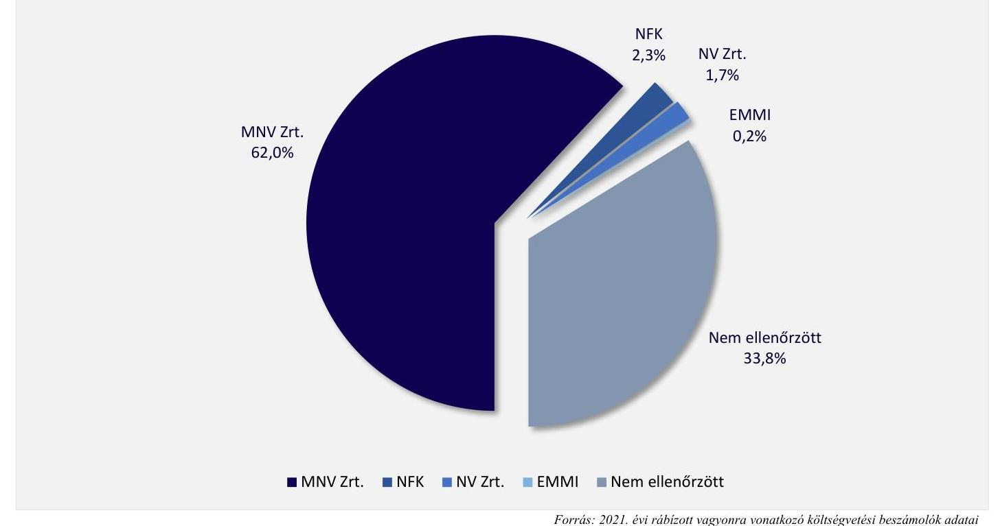
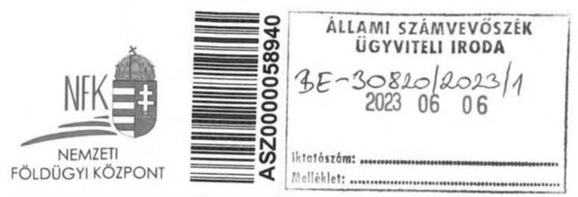
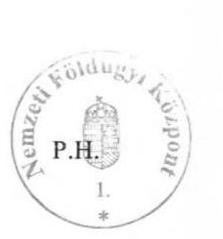

# JELENTÉS 

## Az állami vagyon ellenőrzése

Az állami vagyon feletti tulajdonosi joggyakorlással kapcsolatos tevékenységek ellenőrzése

2023.

23028
www.asz.hu
dr. Windisch László
elnök

---

# ELLENŐRZÉSI IGAZGATÓSÁG: 

ÁLLAMI VAGYONGAZDÁLKODÁST ELLENŐRZŐ IGAZGATÓSÁG

## ELLENŐRZÉSI IGAZGATÓ:

HERCZEGH ZSOLT ellenőrzési igazgató

## ELLENŐRZÉSVEZETŐ:

Jelentéseink az interneten a www.asz.hu címen olvashatók.

PENCZ MÁRIA ellenőrzésvezető

IKTATÓSZÁM: EL-3536-002/2023
TÉMASZÁM: 2628
ELLENŐRZÉS-AZONOSÍTÓ SZÁM: V-0972

---

# TARTALOMJEGYZÉK 

■ AZ ELLENŐRZÉS ALAPADATAI ..... 5
■ AZ ELLENŐRZÉS HATÓKÖRE ÉS TERÜLETE ..... 8
■ ÖSSZEFOGLALÁS ..... 11
■ AZ ELLENŐRZÉS FÓKUSZTERÜLETEI/FÓKUSZKÉRDÉSEI ..... 12
■ MEGÁLLAPÍTÁSOK ..... 13
JAVASLATOK ..... 20
MELLÉKLETEK ..... 22
I. sz. melléklet: Értelmező szótár ..... 22
II. sz. melléklet: Az ellenőrzött szervezetek jegyzéke ..... 24
III. sz. melléklet: A tulajdonosi joggyakorló szervezetek jegyzéke és 2021. évi mérlegadatai ..... 25
■ FÜGGELÉK: ÉSZREVÉTELEK ..... 27
■ RÖVIDÍTÉSEK JEGYZÉKE ..... 41

---

.

---

# AZ ELLENŐRZÉS ALAPADATAI 

## AZ ELLENŐRZÉS CÉLJA

Az ellenőrzés célja annak értékelése volt, hogy az állami vagyon felett tulajdonosi jogokat gyakorló szervezeteknél kialakított kontrollok biztosították-e a szabályszerű tulajdonosi joggyakorlást, feladatellátásuk során érvényesültek-e a jogszabályi előírások.

## AZ ELLENŐRZÉS TÍPUSA

Szabályszerűségi ellenőrzés.

## AZ ELLENŐRZÖTT IDŐSZAK

Az állami vagyon feletti tulajdonosi joggyakorlás vonatkozásában a 2021. év.
Az utóellenőrzés tekintetében az utóellenőrzés alapját képező 20213. számú ÁSZ ${ }^{1}$ jelentés közzétételének napjától (2020.12.03.) az ellenőrzésről szóló adatszolgáltatásra felhívó levél keltének napjáig (2022.06.28.) terjedő időszak. Az utóellenőrzés alapját képező 21083. számú ÁSZ jelentés tekintetében a figyelemfelhívó levél ellenőrzött szervezet általi kézhezvételének napjától (2021.09.22.) az ellenőrzésről szóló adatszolgáltatásra felhívó levél keltének napjáig (2022.06.28.) terjedő időszak.

## AZ ELLENŐRZÉS TÁRGYA

Az ellenőrzés kiterjedt a Magyar Állam tulajdonosi joggyakorlásában érintett szervezetek közül négy tulajdonosi joggyakorló szervezet állami vagyonra vonatkozó tulajdonosi joggyakorlással kapcsolatos intézkedéseinek megtételére, a tulajdonosi joggyakorlási feladatok szabályszerű ellátását támogató belső szabályozási, közzétételi kontrollokra, továbbá a tulajdonosi ellenőrzési rendszerre.

A tulajdonosi joggyakorlás szabályozási rendszerének működtetését biztosító kontrollok egyes elemeinek ellenőrzése az MNV Zrt. ${ }^{2}$, az NFK $^{3}$, a vizsgált évben tulajdonosi joggyakorlói feladatot ellátó $\mathrm{EMMI}^{4}$ és az NV Zrt. ${ }^{5}$ szervezetekre vonatkozóan történt.

Az állami vagyonnal kapcsolatos nyilvántartások kialakítását és vezetését, az adatszolgáltatásokat, a beszámolási kötelezettség teljesítését az MNV Zrt., az NFK, az EMMI (2022.05.25-től a szervezeti jogutód a $\mathrm{KIM}^{6}$ lett változott feladatrendszerrel, egyes feladatátcsoportosítás okán hatásköri jogutód lett a $\mathrm{BM}^{7}$ ) és az NV Zrt. szervezeteknél ellenőriztük. Az állami vagyonnal való gazdálkodásról az Országgyűlés felé történő beszámolási kötelezettség teljesítését az állami vagyonnal való gazdálkodás szabályozásáért és az állami vagyon felügyeletéért felelős miniszternél ellenőriztük (2022.05.24-ig a nemzeti vagyon kezeléséért felelős tárca nélküli miniszter, 2022.05.25-től a gazdaságfejlesztési miniszter felelt a területekért).

Az állami ingatlanvagyon nyilvántartásával és vagyonkezelésbe adásával kapcsolatos intézkedések, valamint az állami tulajdonú ingatlanok tulajdonjogának átruházásával kapcsolatos intézkedések

---

szabályszerűségét az MNV Zrt. és az NFK szervezetek tekintetében mintavételes ellenőrzési tapasztalatok alapján értékeltük.

Az állami tulajdonú gazdasági társaságok feletti tulajdonosi joggyakorlást az MNV Zrt., az EMMI, és az NV Zrt. esetében mintatételek alapján ellenőriztük és értékeltük.

Az utóellenőrzés tekintetében az ellenőrzés tárgyát az érintett számvevőszéki jelentéshez kapcsolódó figyelemfelhívásokra vállalt intézkedések végrehajtásának ellenőrzése képezte. Utóellenőrzéssel volt érintett az MNV Zrt., az ITM ${ }^{8}\left(2022.05 .24\right.$-től $\mathrm{TIM}^{9}$ ), a $\mathrm{KKM}^{10}$ az NFK, és az $\mathrm{OKF}^{11}$, mint az ÁEEK ${ }^{12}$ jogutódja.

# AZ ELLENŐRZÉS JOGALAPJA 

Az ellenőrzés jogszabályi alapját az ÁSZ tv. ${ }^{13} 5 . \S$ (4) bekezdés a) pontja, a Vtv. ${ }^{14} 3 . \S$ (4) bekezdése és az Nfatv. ${ }^{15} 14 . \S$ (1) bekezdése képezték. Az utóellenőrzés jogszabályi alapja az ÁSZ tv. 1. § (3) bekezdése volt.

## AZ ELLENŐRZÉS MÓDSZERE

Az ellenőrzés végrehajtása az ellenőrzött időszakban hatályos jogszabályok, az ellenőrzés szakmai szabályai, a jelen ellenőrzésre irányadó ÁSZ módszertanok és az ellenőrzési programban foglalt értékelési szempontok szerint történt.

Az ellenőrzési kérdések megválaszolásához szükséges bizonyítékok megszerzése az ellenőrzött által rendelkezésre bocsátott dokumentumokra, adatokra alapozva megfigyelés, kérdésfeltevés, interjú (információkérés), valamint elemző eljárás útján történt.

A tulajdonosi ellenőrzéssel, a többségi állami tulajdonú társasági részesedések feletti tulajdonosi joggyakorlással, az állami tulajdonú ingatlanok vagyonkezelésbe adásával és az ezzel összefüggő nyilvántartási kötelezettséggel, valamint az állami tulajdonú ingatlanok értékesítésével kapcsolatos intézkedések szabályszerűségének ellenőrzése a tanúsítványokon bekért adatok alapján mintavétellel történt.

Ha az ellenőrzött sokaság elemszáma az előírt minta elemszám alatt volt, teljes körű ellenőrzésre került sor, ha a sokaság elemszáma meghaladta az előírt minta elemszámot, az ellenőrzés mintavétellel történt. A tulajdonosi joggyakorló szervezetek ellenőrzési rendszerének szabályszerűségét az NFK esetében, az állami tulajdonú ingatlanok nyilvántartását és vagyonkezelésbe adását, valamint az ingatlanok értékesítését az MNV Zrt. és NFK esetében mintavételes ellenőrzés alapján értékeltük, az ellenőrzés eredménye kivetítésre került. A többi mintával érintett területet az egyes joggyakorló szervezeteknél tételes ellenőrzés alapján értékeltük, a megállapítások kizárólag az ellenőrzött mintatételekre vonatkoztak.

A mintavételi eredmények értékelését 95\%-os megbízhatósági szint mellett végeztük el. Az ellenőrzött szervezetek tulajdonosi joggyakorló tevékenységéhez kapcsolódó belső kontrollok lényeges területeinek működtetésére vonatkozó értékelése az alábbiak szerint történt:

- „szabályszerűnek" minősült az értékelt terület, amennyiben az elért „igen" válaszok százalékban kifejezett, egész számra kerekített aránya legalább $85 \%$ volt,
- „nem szabályszerű" volt az értékelés, amennyiben nem érte el a $85 \%$-ot.

Az ellenőrzés lefolytatásához az ellenőrzött szervezetek a tanúsítványok elektronikus kitöltésével, az ÁSZ által kért teljességi és hitelességi nyilatkozattal alátámasztott dokumentumok rendelkezésre bocsátásával, valamint a helyszínen elhangzott kérdésekre adott válaszokkal szolgáltattak adatot, információt.

---

Az ellenőrzés kitért minden olyan körülményre, amely a program végrehajtása kapcsán felmerült és az ellenőrzés céljaival összhangban volt.

Az utóellenőrzés keretében - az ÁSZ által, a 2019. és 2020. évekre megfogalmazott figyelemfelhívásokkal kapcsolatban - a tulajdonosi joggyakorló szervezetek által megtett intézkedéseket értékeltük abból a szempontból, hogy a feltárt hibák kijavítása megtörtént-e, a hiányosságokat megszüntették-e.

---

# AZ ELLENŐRZÉS HATÓKÖRE ÉS TERÜLETE 

Az ÁSZ tv.-ben rögzített előírás alapján az ÁSZ ellenőrzése kiterjedt többek között az állami vagyonnal való gazdálkodásra, a vagyon kezelésének, a vagyonkezelőnél a vagyont érintő szerződések vizsgálatára. Az állami vagyon feletti tulajdonosi joggyakorlással kapcsolatos tevékenységek ellenőrzésének kötelezettségét a Vtv., illetve Nfatv. is előírja az ÁSZ számára.

A nemzeti vagyon meghatározó részét képező állami vagyonnal való gazdálkodás szabályozási rendszere sokrétű. A vagyon megőrzésének, védelmének és az állami vagyonnal való felelős gazdálkodásnak az Alaptörvényben ${ }^{16}$ foglaltak szerinti biztosítása több pilléren nyugszik. A nemzeti vagyont, annak rendeltetését és a nemzeti vagyonnal való gazdálkodás keretszabályait az Nvtv. ${ }^{17}$ határozza meg. Az állami tulajdonban álló vagyon feletti tulajdonosi joggyakorlásra vonatkozó általános szabályokat a Vtv. tartalmazza, amely rögzíti a tulajdonosi joggyakorlás módját és szervezetét, a vagyonnal való gazdálkodás szabályait, a vagyon védelmére vonatkozó előírásokat. A Vtv. a rábízott állami vagyon tulajdonosi joggyakorlójaként - ha törvény vagy miniszteri rendelet ettől eltérően nem rendelkezik - az MNV Zrt.-t nevesíti. Az állami vagyonnal való gazdálkodásra vonatkozó további részletszabályokat a Vtv.vhr. ${ }^{18}$ tartalmazza.

Az állami tulajdonban álló termőföldvagyonról - mint speciális vagyonelemről - az Nfatv. rendelkezik. A Nemzeti Földalapba tartoznak többek között az állam tulajdonában lévő termőföldek, mező-, erdőgazdasági művelés alatt álló belterületi földek. A Nemzeti Földalap felett a Magyar Állam nevében a tulajdonosi jogokat és kötelezettségeket az agrárpolitikáért felelős miniszter az NFK útján gyakorolja. A Nemzeti Földalapba tartozó földrészletek hasznosításának részletes szabályait az Nfatv.vhr. ${ }^{19}$ tartalmazza.
Az állam tulajdonában lévő vagyon felett 2021. évben összesen 53 szervezet gyakorolta a tulajdonosi jogokat, amelyeket a III. számú melléklet tartalmaz. Jelen ellenőrzés négy, kockázatelemzést követően kiválasztott, az ellenőrzött időszakban tulajdonosi joggyakorlásban érintett szervezet, valamint az állam nevében tulajdonosi jogokat gyakorló szervezetek működéséről, az állami vagyon állományának alakulásáról, az állami vagyonnal való gazdálkodás folyamatairól szóló 2021. évre vonatkozó beszámoló összeállításáért felelős gazdaságfejlesztési miniszter ellenőrzésére terjedt ki.

AZ MNV ZRT. a Magyar Állam nevében az állami vagyon felügyeletéért felelős miniszter által alapított egyszemélyes társaság. Az MNV Zrt. tevékenységei közé tartozik többek között, hogy előkészíti, illetve végrehajtja az Országgyűlés, a Kormány és a miniszter állami vagyonnal kapcsolatos döntéseit, nyilvántartja mind a tulajdonosi joggyakorlása alá tartozó, mind az egyéb tulajdonosi joggyakorlókra rábízott állami vagyont, továbbá gondoskodik az egységes állami vagyonnyilvántartás vezetéséhez létrehozott Országleltár működtetéséről. Az MNV Zrt. felel a Vtv. és a Vtv.vhr. szerint - a tulajdonosi joggyakorló szervezetek által megküldött adatszolgáltatások összesítésével - az állami vagyon egységes nyilvántartásáért. Az MNV Zrt-nél a részvényesi jogokat - a Vtv.-ben meghatározott kivételekkel - az állami vagyon felügyeletéért felelős miniszter gyakorolja, az ügyvezetést az Igazgatóság látja el.

AZ NFK az agrárpolitikáért felelős miniszter irányítása alatt álló központi költségvetési szerv, amely a Nemzeti Földalapkezelő Szervezet (NFSZ) általános jogutódjaként 2019. július 1-jével jött létre. Az NFK a Magyar Állam nevében gyakorolja a tulajdonosi jogokat a Nemzeti Földalapba tartozó állami földvagyon felett. A Nemzeti Földalapba tartozó földrészleteket az Nfatv.-ben felsorolt földbirtok-politikai irányelvek szerint kell hasznosítani. Az Nfatv.-ben meghatározott feladatok ellátására BPT $^{20}$ működik. A BPT felelős többek között a földbirtok-politikai irányelveken alapuló, a földrészletek hasznosításával kapcsolatos középtávú stratégiai terv

---

elkészítéséért, véleményezi az NFK által készített, a Nemzeti Földalapba tartozó földrészletek hasznosításával kapcsolatos éves tervet, dönt a Nemzeti Földalapba tartozó földrészletek hasznosításával kapcsolatos egyedi ügyekben, ha az annak tárgyát képező földrészlet vagy földrészletek együttes értéke eléri a 100 millió forintot.

AZ NV ZRT. a Magyar Állam tulajdonában lévő, 2020.11.26-án alapított egyszemélyes gazdasági társaság. 2021.01.01-től a Vtv. rendelkezései szerint gyakorolja a Magyar Államot megillető tulajdonosi jogokat az állami tulajdonú víziközmű-szolgáltató társaságok, illetve a víziközmű-szolgáltatásról szóló 2011. évi CCIX. törvény 87/D. §-a alapján az állami tulajdonú víziközmű rendszerek felett. A Vtv. szerinti tulajdonosi jogokat a 2021. évben öt állami tulajdonú regionális víziközmű társaság és nyolc kisebbségi állami tulajdonban lévő víziközműszolgáltató társaság állami tulajdonú társasági részesedése felett gyakorolta.

AZ EMMI az 1/2018. NVTNM rendelet ${ }^{21}$ alapján 2021.12.31-én 26 gazdasági társaság részesedése felett gyakorolta a tulajdonosi jogokat. Ezen felül az ÁEEK-val kötött megbízási szerződések alapján további két társaság felett gyakorolt szerződésekben meghatározott tulajdonosi jogokat. A társadalombiztosítás pénzügyi alapjainak és a társadalombiztosítás szerveinek állami felügyeletéről szóló 1998. évi XXXIX törvény 3. §-a alapján az Egészségbiztosítási Alaphoz tartozó állami vagyonnal kapcsolatos tulajdonosi jogokat az egészségbiztosítási ágazat tekintetében az egészségbiztosításért felelős Emberi Erőforrások minisztere gyakorolta. E törvény 5. §-a alapján az Alap kezeléséért felelős társadalombiztosítási szerv - a Nemzeti Egészségbiztosítási Alapkezelő - végezte az Alaphoz tartozó vagyonnal kapcsolatos nyilvántartási, illetőleg jogszabályban meghatározott vagyonkezelési, pénzügyi feladatokat.
A NEMZETI VAGYON KEZELÉSÉÉRT FELELŐS TÁRCA NÉLKÜLI MINISZTER a - vizsgált időszakban hatályos - 94/2018. (V.22.) Korm. rendelet ${ }^{22}$ alapján felelt az ellenőrzött időszakban az állami vagyon felügyeletéért, valamint az állami vagyonnal való gazdálkodás szabályozásáért. E felelőssége kiterjedt többek között az állami vagyonra, az állami vagyonnal
 való gazdálkodásra vonatkozó jogszabályok előkészítésére, a Kormány vagyongazdálkodási politikájának alakítására és végrehajtására.

A GAZDASÁGFEJLESZTÉSI MINISZTER a 182/2022. (V. 24.) Korm. rendelet ${ }^{23}$ alapján felelt az állam nevében tulajdonosi jogokat gyakorló szervezetek működéséről, az állami vagyon állományának alakulásáról, az állami vagyonnal való gazdálkodás folyamatairól készített 2021. évre vonatkozó beszámoló elkészítésért.

Az ellenőrzéssel érintett tulajdonosi joggyakorló szervezetek rábízott vagyonba tartozó befektetett eszközeinek arányát a teljes állami vagyonba tartozó befektetett eszközök állományához viszonyítva az 1. ábra szemlélteti:

---

1. ábra

AZ ELLENŐRZÖTT TULAJDONOSI JOGGYAKORLÓK RÁBÍZOTT ÁLLAMI VAGYONBA TARTOZÓ BEFEKTETETT ESZKÖZÖK ARÁNYA A TELJES ÁLLAMI VAGYON BEFEKTETETT ESZKÖZÖK ÁLLOMÁNYÁHOZ VISZONYÍTVA \%-BAN

Forrás: 2021. évi rábízott vagyonra vonatkozó költségvetési beszámolók adatai

---

# ÖSSZEFOGLALÁS 

Az ÁSZ törvényi kötelezettsége alapján ellenőrizte négy tulajdonosi joggyakorló szervezet állami vagyon feletti tulajdonosi joggyakorlással kapcsolatos tevékenységét a 2021. évre vonatkozóan.

Az MNV Zrt., az EMMI, az NV Zrt., valamint az NFK által kialakított kontrollok biztosították a szabályszerű tulajdonosi joggyakorlást, feladatellátásuk során érvényesültek a jogszabályi előírások.

Az ellenőrzött tulajdonosi joggyakorló szervezetek a tulajdonosi joggyakorlás kereteit - az NV Zrt. kivételével - szabályszerűen alakították ki és működtették.

Az ellenőrzött tulajdonosi joggyakorló szervezetek a jogszabályi előírásokkal összhangban rendelkeztek SZMSZ-szel. Elkészítették számviteli politikájukat és annak keretében elkészítendő szabályzataikat. A szabályzatok - az NV Zrt. számviteli politikája, értékelési szabályzata, leltározási szabályzata és számlarendje kivételével - a tulajdonosi joggyakorlás tekintetében megfeleltek a hatályos jogszabályoknak. Az ellenőrzött tulajdonosi joggyakorlók rendelkeztek hatályos vagyonnyilvántartási szabályzattal, közérdekű adatok megismerésére irányuló igények teljesítésének rendjéről szóló és a közzététel rendjéről szóló szabályzattal. A tulajdonosi joggyakorlók integrált kockázatkezelési szabályzata és az integrált kockázatkezelési rendszer működtetése - az NV Zrt. kivételével - szabályszerű volt. Az NV Zrt. és az NFK honlapjaikon a rábízott vagyonra vonatkozó beszámolót nem tették közzé. Az EMMI honlapján nem tette közzé a saját, illetve a rábízott vagyonra vonatkozó 2020. évi költségvetési beszámolót.

Az NV Zrt. a rábízott vagyona tekintetében közzétételi kötelezettségének a jelentéstervezet megküldését követően, az észrevételezés időszakában eleget tett, ezzel a jelentéstervezet megállapítása az ellenőrzés során hasznosult.

Valamennyi ellenőrzött tulajdonosi joggyakorló tulajdonosi ellenőrzéssel kapcsolatos feladatait szabályszerűen végezte el.

Az MNV Zrt. és az NFK az állami tulajdonú ingatlanok vagyonkezelésbe adását és értékesítését a vonatkozó jogszabályi rendelkezések betartásával végezte. Az EMMI és az NV Zrt. a többségi állami tulajdonban álló társaságban lévő társasági részesedések feletti tulajdonosi joggyakorlással kapcsolatos tevékenységét szabályszerűen

Az állami tulajdonú ingatlanok vagyonkezelésbe adása és értékesítése megfelelt a jogszabályi előírásoknak. A társasági részesedések feletti tulajdonosi joggyakorlás - egy eset kivételével - szabályszerű volt.
látta el. Az MNV Zrt. részesedések feletti tulajdonosi joggyakorlása - egy társaság kivételével, ahol nem intézkedett a társaság tőke helyzetének rendezése érdekében - szabályszerű volt.

Az ellenőrzött tulajdonosi joggyakorló szervezetek a rábízott vagyonra vonatkozó beszámolási, adatszolgáltatási kötelezettségüket a 2021. évre vonatkozóan szabályszerűen teljesítették. A rábízott vagyon nyilvántartása megfelelt a jogszabályi előírásoknak. A rábízott állami vagyon 2021. december 31-i állományáról készített adatszolgáltatását az NFK, az NV Zrt. és az EMMI a Vtv.vhr. -ben előírt határidőig megküldte az MNV Zrt. részére.

Az állam nevében tulajdonosi jogokat gyakorló szervezetek működéséről, az állami vagyon állományának alakulásáról, az állami vagyonnal való gazdálkodás folyamatairól szóló 2021. évi beszámolót a gazdaságfejlesztési miniszter elkészítette.

A 2019. és 2020. évre vonatkozó tulajdonosi joggyakorlás ellenőrzésével kapcsolatos, ÁSZ figyelemfelhívásokkal érintett szervezetek intézkedtek a jogszabálysértő gyakorlat megszüntetése érdekében.

---

# AZ ELLENŐRZÉS 

## FÓKUSZTERÜLETEI/FÓKUSZKÉRDÉSEI

1.  Az állam tulajdonosi jogait gyakorló szervezetek működtették-e a tulajdonosi joggyakorlással kapcsolatos tevékenységek szabályszerű ellátását biztosító kontrollok lényeges elemeit?
2.  Az állam tulajdonosi jogait gyakorló szervezetek tulajdonosi joggyakorlással kapcsolatos egyes tevékenységüket szabályszerűen látták-e el?
3.  Az állam tulajdonosi jogait gyakorló szervezetek szabályszerűen tartották-e nyilván az állami vagyont, a jogszabályokban előírt beszámolási és adatszolgáltatási kötelezettségüket teljesítették-e?
4.  Az állami vagyonnal való gazdálkodásról az Országgyűlés felé történő beszámolás szabályszerűen megtörtént-e?
5.  A 2019. és 2020. évekre a szabálytalan működésre vonatkozó ÁSZ figyelemfelhívásokkal kapcsolatban a tulajdonosi joggyakorló szervezetek intézkedtek-e, a hiányosságokat megszüntették-e?

---

# MEGÁLLAPÍTÁSOK 

## 1. Az állam tulajdonosi jogait gyakorló szervezetek működtették-e a tulajdonosi joggyakorlással kapcsolatos tevékenységek szabályszerű ellátását biztosító kontrollok lényeges elemeit?

Összegző megállapítás Az ellenőrzött tulajdonosi joggyakorló szervezetek - az NV Zrt. kivételével - szabályszerűen alakították ki és működtették a tulajdonosi joggyakorlással kapcsolatos lényeges kontrollokat.
1.1. számú megállapítás

A tulajdonosi joggyakorlók - az NV Zrt. kivételével - szabályszerűen alakították ki a tulajdonosi joggyakorlás kereteit, a joggyakorlással kapcsolatos lényeges kontrollokat szabályszerűen működtették.

AZ MNV ZRT., AZ NFK, AZ NV ZRT. ÉS AZ EMMI a jogszabályi előírásokkal összhangban megalkotta a tulajdonosi joggyakorlás szervezeti kereteit biztosító szabályzatokat. Valamennyi tulajdonosi joggyakorló rendelkezett SZMSZ ${ }^{24}$-szel. Az SZMSZ-szek a jogszabályi előírásokkal összhangban tartalmazták az állami vagyon feletti tulajdonosi joggyakorláshoz kapcsolódó feladatokat és hatásköröket.

A tulajdonosi joggyakorló szervezetek a Számv.tv. ${ }^{25}$-ben, továbbá az Áhsz. ${ }^{26}$-ben előírt kötelezettségeiknek eleget téve elkészítették a számviteli politikát, illetve a számviteli politika keretében elkészítendő eszközök és források leltárkészítési és leltározási szabályzatát, eszközök és források értékelési szabályzatát, valamint rendelkeztek számlarenddel.

Az MNV Zrt., az EMMI és az NFK számviteli politikája tartalmazta a rábízott vagyonnal kapcsolatos elszámolási és értékelési sajátosságokat, illetve a kapcsolódó beszámolási és adatszolgáltatási kötelezettségeket.

Az NV Zrt. a Számv.tv. 14. § (11) bekezdés előírása ellenére megalakulásának időpontjától számított 90 napos határidőt meghaladóan - 2021. december 16-án - készítette el a Számviteli politikáját ${ }^{27}$ és annak keretében elkészítendő szabályzatokat. Az NV Zrt. Számviteli politikájában 2021. év tekintetében az Áhsz. 50. § (1) bekezdés előírása ellenére a rábízott állami vagyonnal kapcsolatos sajátos szabályokat nem rögzítette.

Az MNV Zrt., az EMMI és az NFK eszközök és források leltárkészítési és leltározási szabályzata az Áhsz. előírásaival összhangban tartalmazta a vagyonkezelésbe adott eszközök leltározásának szabályait, gyakoriságát. Az NV Zrt. 2021. évre vonatkozó Leltározási szabályzata ${ }^{28}$ az Áhsz. 50. § (1) bekezdésében foglaltak ellenére nem tartalmazta az Áhsz. 22. § (2) bekezdés a) pontja előírásainak megfelelő leltározási szabályokat a koncesszióba, vagyonkezelésbe adott eszközök vonatkozásában.

Az MNV Zrt., az EMMI és az NFK értékelési szabályzata a Számv.tv. és az Áhsz. előírásaival összhangban tartalmazta a követelések értékelési elveit, szempontjait, továbbá az Áhsz. előírásainak megfelelően a vagyonkezelésbe adott eszközök vagyonértékelése során alkalmazott értékelési eljárások elveit, módszerét, dokumentálási szabályait és felelőseit. Az NV Zrt. 2021. évben hatályos Értékelési szabályzatában ${ }^{29}$

---

az Áhsz. 50. § (1) bekezdésében és az Áhsz. 50. § (2) bekezdés d) pontjában foglaltakkal ellentétben nem szabályozta a vagyonkezelésbe adott eszközök értékelési szabályait.

Az MNV Zrt., az EMMI és az NFK számlarendje az Áhsz. előírásaival összhangban tartalmazta a vagyonkezelésbe adott eszközök vonatkozásában a részletező nyilvántartások vezetési módját, a Számv.tv. előírásával összhangban a bizonylati rend a számlarendben foglaltakat alátámasztotta. Az NV Zrt. a Számv.tv. 161. § (5) bekezdés előírása ellenére a megalakulás időpontjától számított 90 napon túl - 2021. december 16-án - készítette el Számlarendjét ${ }^{30}$. Az NV. Zrt. Számlarendje és annak részét képező Bizonylati rend nem az Áhsz. 51. § (2) bekezdése szerinti tartalommal készült, mert nem tartalmazta a rábízott állami vagyonra vonatkozó költségvetési számlarendet.

Az MNV Zrt., az NFK és az NV Zrt. rendelkezett vagyonnyilvántartási szabályzattal, amely megfelelt a Vtv.vhr, illetve a 11/2011. (II.22.) Korm. rendelet ${ }^{31}$ előírásainak. Az EMMI 2021. évben nem volt tulajdonosi joggyakorlója olyan vagyonelemeknek, amelyekre vonatkozóan a Vtv.vhr. szerinti vagyonnyilvántartási szabályzat készítési kötelezettsége keletkezett volna.

Az MNV Zrt., az NFK és az EMMI a Gbkr. ${ }^{32}$, illetve a Bkr. ${ }^{33}$ előírásaival, valamint az integrált kockázatkezelési szabályzatukkal összhangban működtették az integrált kockázatkezelési rendszert, amely kiterjedt a tulajdonosi joggyakorlással kapcsolatos tevékenységekre is. Az MNV Zrt., az NFK. és az EMMI felmérték a tevékenységükben rejlő kockázatokat, meghatározták az egyes feltárt kockázatokkal kapcsolatban szükséges intézkedéseket, valamint az intézkedések folyamatos nyomon követésének módját.

Az NV Zrt. nyilatkozata alapján feladatellátása során alkalmazta a Gbkr. előírásait, ennek ellenére nem tartotta be a Gbkr. 3. § (1) bekezdés b) pont és a Gbkr. 5. §-ban foglaltakat, mivel az Integrált kockázatkezelési szabályzatában ${ }^{34}$ nem határozta meg az egyes kockázatokkal kapcsolatban szükséges intézkedések és az intézkedéssel érintett szervezeti egységek körére vonatkozó szabályokat. Az NV Zrt.-nél nem volt szabályszerű az integrált kockázatkezelési rendszer működtetése, mivel a Gbkr. 3. § (1) bekezdés b) pontjában, valamint az 5. §-ában foglaltak ellenére nem mérte fel a tevékenységében rejlő kockázatokat a tulajdonosi joggyakorlása vonatkozásában, ezáltal nem határozta meg az egyes feltárt kockázatokkal kapcsolatban szükséges intézkedéseket és az intézkedések folyamatos nyomon követési módját.

Az ellenőrzött tulajdonosi joggyakorlók az Info tv. ${ }^{35}$-ben foglaltaknak megfelelően szabályozták a közérdekű adatok megismerésére irányuló igények teljesítésének rendjét, valamint a közzétételi kötelezettségükre vonatkozó szabályokat.

Az MNV Zrt. a saját, illetve a rábízott vagyonra vonatkozó, Info tv. szerinti beszámoló közzétételi kötelezettségének eleget tett.

Az NV Zrt. és az NFK honlapjaikon a rábízott vagyonra vonatkozó beszámolót az Info tv. 37. § (1) bekezdése, valamint az Infot tv. 1. sz. melléklete III/1. pontjában előírtak ellenére nem tette közzé.

Az EMMI az Info tv. 37. § (1) bekezdés, illetve az EMMI Közétételi szabályzat ${ }^{36}$ 2. függelék III.1. pontja előírásaival ellentétben honlapján a saját, illetve a rábízott vagyonra vonatkozó 2020. évi költségvetési beszámolót nem tette közzé.

Az ellenőrzött időszakban az ellenőrzött tulajdonosi joggyakorló szervezetek szabályzatainak meglétét, azok szabályszerűségét az 1. számú táblázat szemlélteti:

---

1. táblázat

TULAJDONOSI JOGGYAKORLÓK SZABÁLYZATAI A 2021. ÉVBEN

| SZABÁLYZAT ELNEVEZÉSE | MNV ZRT. | NV ZRT. | NFK | EMMI |
| :--: | :--: | :--: | :--: | :--: |
| Szervezeti és működési szabályzat (SZMSZ) | $\checkmark$ | $\checkmark$ | $\checkmark$ | $\checkmark$ |
| Számviteli politika | $\checkmark$ | $\times$ | $\checkmark$ | $\checkmark$ |
| Számlarend | $\checkmark$ | $\times$ | $\checkmark$ | $\checkmark$ |
| Bizonylati rend | $\checkmark$ | $\times$ | $\checkmark$ | $\checkmark$ |
| Leltárkészítési és leltározási szabályzat | $\checkmark$ | $\times$ | $\checkmark$ | $\checkmark$ |
| Értékelési szabályzat | $\checkmark$ | $\times$ | $\checkmark$ | $\checkmark$ |
| Vagyonnyilvántartási szabályzat | $\checkmark$ | $\checkmark$ | $\checkmark$ | - |
| Közérdekű adatok megismerésére irányuló igények teljesítésének rendje | $\checkmark$ | $\checkmark$ | $\checkmark$ | $\checkmark$ |
| Integrált kockázatkezelési szabályzat | $\checkmark$ | $\times$ | $\checkmark$ | $\checkmark$ |
| Közzétételi szabályzat | $\checkmark$ | $\checkmark$ | $\checkmark$ | $\checkmark$ |

$\checkmark$ szabályszerű $\times$ nem szabályszerű - nem volt kötelezett Vagyon-nyilvántartási szabályzat készítésére
1.2. számú megállapítás

A tulajdonosi joggyakorlók tulajdonosi ellenőrzéseiket szabályszerűen látták el.

AZ MNV ZRT., AZ NFK, AZ NV ZRT. ÉS AZ EMMI az Nvtv. és a Vtv.vhr. előírásainak megfelelően gondoskodott a tulajdonosi joggyakorlással összefüggő ellenőrzések végrehajtásáról.

Az MNV Zrt. a Vtv. vhr. előírásaival összhangban elkészítette Stratégiai ellenőrzési tervét ${ }^{37}$, valamint Éves ellenőrzési tervét ${ }^{38}$. A Vtv. vhr.-ben előírtaknak megfelelően ellenőrzéseiről elkészítette az ellenőrzési jelentést, az éves ellenőrzési tapasztalatokról készült beszámolót megküldte a Nemzeti vagyon kezeléséért felelős tárca nélküli miniszternek.

Az NFK az Nfatv. vhr. előírása szerint elkészítette Éves ellenőrzési tervét ${ }^{39}$, melyben előírtak szerinti ellenőrzéseket végrehajtotta. Az NFK az ellenőrzési tapasztalatokról beszámolt az agrárpolitikáért felelős miniszter felé.

Az NV Zrt. a Tulajdonosi ellenőrzési szabályzatában ${ }^{40}$ előírt 2021. évi Tulajdonosi ellenőrzési tervét ${ }^{41}$ elkészítette, az abban foglaltak szerint az ellenőrzéseket elvégezte. Az EMMI a 2021. évben - az Nvtv. és a Vtv. vhr.-ben foglaltakkal összhangban - az Egészségbiztosítási Alap ellátási, illetve működési vagyona tekintetében végzett a 2020. évre vonatkozóan tulajdonosi ellenőrzést.

---

# 2. Az állam tulajdonosi jogait gyakorló szervezetek tulajdonosi joggyakorlással kapcsolatos egyes tevékenységüket szabályszerűen látták-e el?

Összegző megállapítás
Az MNV Zrt., az NFK, az NV Zrt. és az EMMI a tulajdonosi joggyakorlással kapcsolatos tevékenységüket a 2021. évben szabályszerűen látták el.
2.1. számú megállapítás

Az MNV Zrt. és az NFK esetében az állami tulajdonú ingatlanok vagyonkezelésbe adása megfelelt a jogszabályok és belső szabályzatok előírásainak.

AZ MNV ZRT. a vagyonkezelési szerződéseket az Nvtv., a Vtv. és a Vtv. vhr. előírásainak megfelelően kötötte meg. A szerződések tartalmazták többek között a vagyonkezelés részletes szabályait, a vagyon használatának ellenőrzését, valamint a tulajdonosi ellenőrzés eljárásrendjét.

A vagyonkezelési szerződésekben a Vtv.-ben foglaltaknak megfelelően rögzítették a Vtv.-ben előírt visszapótlási kötelezettség teljesítése alóli mentesülés tényét, amennyiben a vagyonkezelő nem központi költségvetési vagy önkormányzati szerv volt. A költségvetési szervvel kötött vagyonkezelési szerződések tartalmazták a vagyonkezelő által teljesített értéknövelő beruházás, felújítás elszámolásához a Vtv. vhr.-ben foglalt adatszolgáltatási kötelezettséget, amely minden esetben megvalósult.
AZ NFK az állami tulajdonú ingatlanok vagyonkezelésbe adása, valamint a vagyonkezelési szerződések megkötése során érvényesítette az Nvtv., Nfatv. és a Nfatv. vhr. előírásait. A vagyonkezelési szerződésekben az Nfatv. vhr-ben előírtaknak megfelelően rögzítették a vagyonkezelő ellenszolgáltatásának formáját, értéknövelő beruházás, felújítás, új eszköz létrehozása esetén a beszámolás módját, gyakoriságát, valamint a tulajdonosi ellenőrzés eljárásrendjét. Amennyiben a vagyonkezelt vagyonnal kapcsolatos, a 2021. év végi adatokat tartalmazó, a szerződésben meghatározott adatszolgáltatás nem történt meg, az NFK az Nfatv. vhr-ben előírtaknak megfelelően felszólította a vagyonkezelőt az adatszolgáltatás pótlására.
2.2. számú megállapítás

Az MNV Zrt. és az NFK az állami tulajdonú ingatlanok tulajdonjogának átruházásával kapcsolatos feladatait szabályszerűen végezte el.

AZ MNV ZRT. az ingatlanok értékesítése során betartotta a Vtv. és a Vtv. vhr. előírásait. Az értékesítések során a Vtv. vhr. előírásaival összhangban belső vagy független szakértő készítette el az értékbecsléseket, amelyekben meghatározott értékek képezték az árverések során a kikiáltási árakat. Az eredményhirdetést követően a legmagasabb licit összegen, a legmagasabb ajánlatot tevő személyével került a szerződés megkötésre a Vtv. vhr. előírásainak megfelelően. Az MNV Zrt. a Vtv. vhr.-ben foglaltaknak megfelelően ellenőrizte, hogy a vevők igazolták-e a köztartozásmentességüket és a tulajdonosi joggyakorlóval szembeni tartozásmentességüket. AZ NFK az ingatlanok értékesítését az Nfatv. és az Nfatv. vhr. előírásainak és a Vagyonkezelésbe vételi kérelmek eljárásrendje ${ }^{42}$ előírásainak megfelelően végezte. Az Nfatv. vhr. előírásainak megfelelően az árverés útján történő értékesítéshez kapcsolódó szerződésekben és a földhivatali ingatlan nyilvántartásban rögzítették az ingatlanra a tulajdonjog megszerzésétől számított 20 évig fennálló elidegenítési és terhelési tilalmát, valamint az állam visszavásárlási jogát. A szerződések az Nfatv.-ben illetve az Nfatv. vhr-ben előírtaknak megfelelően tartalmazták a rendelkezést a befizetett pályázati biztosítékról, valamint a szerződő fél nyilatkozatát arról, hogy

---

a szerződés létrejöttével nem lépi túl a mező- és erdőgazdasági földek forgalmáról szóló törvényben meghatározott birtokmaximumot.
2.3. számú megállapítás

Az EMMI és az NV Zrt. a többségi állami tulajdonban álló társaságban lévő társasági részesedések feletti tulajdonosi joggyakorlása szabályszerű volt. Az MNV Zrt. többségi állami tulajdonban lévő részesedések feletti tulajdonosi joggyakorlása - egy társasági részesedés kivételével szabályszerű volt.

AZ EMMI ÉS AZ NV ZRT. a 2021. évben jogszabály alapján tulajdonosi joggyakorlásuk alá helyezett többségi állami tulajdonú gazdasági társaságok létesítő okiratainak kiadásánál, valamint a felügyelő bizottsági tagok és a könyvvizsgálók kijelölésénél a Ptk. ${ }^{43}$ előírásaival összhangban, szabályszerűen járt el. A Tak.tv. ${ }^{44}$ szerinti, a vezető tisztségviselők, felügyelőbizottsági tagok, valamint az Mt. ${ }^{45}$ hatálya alá eső munkavállalók javadalmazásáról szóló szabályzatot megalkották.
AZ EMMI, AZ NV ZRT. ÉS AZ MNV ZRT. a tulajdonosi joggyakorlásuk alá tartozó gazdasági társaságok legfőbb szerveként eljárva a Ptk. előírásainak megfelelően a felügyelő bizottság jelentésének birtokában döntött az éves beszámoló jóváhagyásáról és társaságok nyereségének felosztásáról.
AZ MNV ZRT. tulajdonosi joggyakorlása alá tartozó társaságok közül a Dél-Pest Megyei Térségi Integrált Szakképző Központ Nonprofit Korlátolt Felelősségű Társaság esetében nem került sor a Ptk. 3:189. § (2) bekezdésében előírt döntéshozatalra, illetve annak három hónapon belüli végrehajtására - azaz a pótbefizetés előírására, vagy a törzstőke mértékét elérő saját tőke más módon való biztosítására, vagy a törzstőke leszállítására - annak ellenére, hogy a társaság saját tőkéje a törzstőke minimális összege alá csökkent. A felügyelő bizottság írásbeli jelentésében a legfőbb szerv felé jelezte a vagyonvesztést. A társaság taggyűlése az 1/2021. (V.07.) sz. határozatával döntött a beszámoló elfogadásáról, de ezzel egyidejűleg nem határoztak a társaság jövőjéről, pótbefizetésről. A jogellenes állapot a 2021. évi beszámoló adatai alapján változatlanul fenn állt.

# 3. Az állam tulajdonosi jogait gyakorló szervezetek szabályszerűen tartották-e nyilván az állami vagyont, a jogszabályokban előírt beszámolási és adatszolgáltatási kötelezettségüket teljesítették-e?

## Összegző megállapítás

Az állam tulajdonosi jogait gyakorló szervezetek az állami vagyont szabályszerűen tartották nyilván, beszámolási és adatszolgáltatási kötelezettségüket teljesítették.

Az MNV Zrt. és az NFK a jogszabályi és a belső szabályozás előírásaival összhangban, szabályszerűen tettek eleget a rábízott állami vagyonnal kapcsolatos nyilvántartási kötelezettségeiknek.

AZ MNV ZRT. ÉS AZ NFK a rábízott vagyonnal kapcsolatos nyilvántartási kötelezettségének a jogszabályoknak, továbbá a belső szabályozás előírásai szerint szabályszerűen tett eleget. A részletező nyilvántartások az Áhsz. és a Vtv. vhr. előírásainak megfelelően tartalmazták - többek között - a vagyon

---

használóinak, vagyonkezelőinek azonosítására alkalmas adatokat, illetve a vagyonelemek azonosító adatait, a kapcsolódó jogokat, a lényeges számviteli adatokat.
AZ NFK az állami vagyon nyilvántartásának szabályait a 33/2017. (XII.13.) NFA utasításban ${ }^{46}$ határozta meg. A vagyon nyilvántartására kialakított rendszer biztosította az Nfatv.-ben, valamint a 11/2011. (II. 22.) Korm. rendeletben foglalt kötelezettségek teljesítését, mivel a Nemzeti Földalapba tartozó földrészletekről és az azokon fennálló jogok jogosultjairól vezetett nyilvántartás naprakész volt, továbbá a nyilvántartásban a földrészletek települések szerint, azon belül helyrajzi számmal szerepeltek.
3.2. számú megállapítás

Az MNV Zrt., az NFK, az NV Zrt., és az EMMI a rábízott állami vagyonra vonatkozó év végi beszámolási és adatszolgáltatási kötelezettségeiket a jogszabályi előírásoknak megfelelően teljesítették.

AZ MNV ZRT., NV ZRT., AZ NFK, ÉS AZ EMMI elkészítette az Áhsz. szerinti, a rábízott állami vagyonra vonatkozó 2021. évi költségvetési beszámolót. Az ellenőrzött tulajdonosi joggyakorló szervezetek a 2021. évi költségvetési beszámolóikat a Kincstár által működtetett elektronikus adatszolgáltató rendszerbe - az előírt június 30-i határidőig - feltöltötték.

Az MNV Zrt., az NFK, az NV Zrt., és az EMMI az Ávr. ${ }^{47}$ szerinti, rábízott állami vagyonra vonatkozó időközi mérlegjelentés készítési és adatszolgáltatási kötelezettségeiknek szabályszerűen eleget tettek.

A rábízott állami vagyon 2021. december 31-i állományáról készített adatszolgáltatását az NFK, az NV Zrt. és az EMMI a Vtv. vhr.-ben előírt határidőig megküldte az MNV Zrt. részére.

# 4. Az állami vagyonnal való gazdálkodásról az Országgyűlés felé történő beszámolás szabályszerűen megtörtént-e?

Összegző megállapítás

A gazdaságfejlesztési miniszter elkészítette az állam nevében tulajdonosi jogokat gyakorló szervezetek működéséről, az állami vagyon állományának alakulásáról, az állami vagyonnal való gazdálkodás folyamatairól szóló 2021. évre vonatkozó beszámolót, azonban annak OGY ${ }^{48}$ felé történő beterjesztése késedelmesen történt meg.

A GAZDASÁGFEJLESZTÉSI MINISZTER a 182/2022 (V. 24.) Korm. rendelet alapján a Kormány állami vagyon felügyeletéért felelős tagjaként elkészítette az állam nevében tulajdonosi jogokat gyakorló szervezetek működéséről, az állami vagyon állományának alakulásáról, az állami vagyonnal való gazdálkodás folyamatairól szóló 2021. évre vonatkozó beszámolót.

A 2021. évre vonatkozó beszámoló benyújtására késedelmesen, a Vtv. 19. § (3) bekezdésben meghatározott Országgyűlés elé terjesztés határidejét - a tárgyévet követő év december 31. napját - követően, 2023. január 25-én került sor a Miniszterelnöki Kormányirodának a beszámoló parlamenti beterjesztése iránti intézkedés végett. A 2021. évre vonatkozó beszámoló OGY felé történő beterjesztésének időpontja 2023. január 31. volt.

---

# 5. A 2019. és 2020. évekre a szabálytalan működésre vonatkozó ÁSZ figyelemfelhívásokkal kapcsolatban a tulajdonosi joggyakorló szervezetek intézkedtek-e, a hiányosságokat megszüntették-e?

## Összegző megállapítás Az ÁSZ figyelemfelhívással érintett szervezetek a megfelelő intézkedéseket megtették, a hiányosságokat megszüntették.

A 2019. ÉVRE VONATKOZÓ, az állami vagyon feletti tulajdonosi joggyakorlás ellenőrzése során, a 20213. számú jelentéshez kapcsolódóan, az ÁSZ egy szervezet, az MNV Zrt. vezetője részére küldött figyelemfelhívó levelet. Az MNV Zrt. vezérigazgatója intézkedett a figyelemfelhívásban szereplő jogszabálysértő gyakorlat megszüntetése érdekében.
A 2020. ÉVRE VONATKOZÓAN, a 21083. számú jelentéshez kapcsolódóan öt szervezet - NFK, OKF, MNV Zrt., KKM, ITM - volt figyelemfelhívással érintett. Az érintett szervezetek első számú vezetői intézkedtek a jogszabálysértő gyakorlat megszüntetése érdekében.

---

# JAVASLATOK

Az ÁSZ tv. 33. § (1) bekezdésében foglaltak értelmében az ellenőrzött szervezet vezetője köteles a jelentésben foglalt megállapításokhoz kapcsolódó intézkedési tervet összeállítani és azt a jelentés kézhezvételétől számított 30 napon belül az ÁSZ részére megküldeni. Amennyiben az ellenőrzött szervezet vezetője nem küldi meg határidőben az intézkedési tervet, vagy továbbra sem elfogadható intézkedési tervet küld, az Állami Számvevőszék elnöke az ÁSZ tv. 33. § (3) bekezdése a) és b) pontjaiban foglaltakat érvényesítheti.

## AZ NV ZRT. VEZÉRIGAZGATÓJA RÉSZÉRE

1.  Intézkedjen, hogy az Áhsz. 50. § (1) bekezdésben foglaltaknak megfelelően a Számviteli politika tartalmazza a rábízott vagyonnal kapcsolatos sajátosságokat, a vagyonelemek nyilvántartásával, leltározásával, értékelésével kapcsolatos szabályokat. Az intézkedés terjedjen ki az Áhsz 22. (2) bekezdés a) pontjában előírt szabályokra a koncesszióba, vagyonkezelésbe adott eszközök leltározása tekintetében, valamint az Áhsz 50. § (2) bekezdés d) pontjában előírtak szerint a vagyonkezelésbe adott eszközök értékelése során alkalmazott értékelési eljárás elveire, módszerére, dokumentálásának szabályaira, felelőseire. (1.1. sz. megállapítás 4. bekezdés 2. mondata, és 5. bekezdés 2. mondata, 6. bekezdés 2. mondata alapján)
2.  Intézkedjen, hogy az Áhsz. 51. § (2) bekezdésben foglaltaknak megfelelően a Számlarend és annak részét képező Bizonylati rend tartalmazzák a rábízott állami vagyonra vonatkozó költségvetési számlarendet és bizonylati rendet. (1.1. sz. megállapítás 7. bekezdés 3. mondata alapján)
3.  Intézkedjen a Gbkr. 3. § (1) bekezdés b) pontjában és 5. §-ában foglaltak szerinti, az egyes kockázatok tekintetében szükséges intézkedések és az azokkal érintett szervezeti egységek körének belső szabályzatban történő meghatározásának szabályozásáról, valamint a szervezet tevékenységében rejlő kockázatok
 felméréséről, egyúttal határozza meg az egyes kockázatokkal kapcsolatban szükséges intézkedéseket és az intézkedések folyamatos nyomon követésének módját. (1.1. sz. megállapítás 10. bekezdése alapján)

## A NEMZETI FÖLDÜGYI KÖZPONT ELNÖKE RÉSZÉRE

1.  Intézkedjen az Info tv. 37. § (1) bekezdésében és az 1. melléklet III/1. pontjában foglaltak szerint a rábízott vagyon tekintetében elkészített éves költségvetési beszámoló honlapon történő közzétételéről. (1.1. sz. megállapítás 13. bekezdése alapján)

---

# AZ MNV ZRT. VEZÉRIGAZGATÓJA RÉSZÉRE

1.  Intézkedjen, hogy a legfőbb szerv vegye napirendre, hozza meg a szükséges döntéseket és érvényesítse azok végrehajtását a Dél-Pest Megyei Térségi Integrált Szakképző Központ Nonprofit Korlátolt Felelősségű Társaságnál, a társaság saját tőkéjének a jegyzett tőke törvényben meghatározott szintje alá csökkenésével kapcsolatban, figyelemmel a 2021. év során a Ptk. 3:189. § (2) bekezdésében előírt intézkedések elmulasztása miatt fennálló jogellenes állapot megszüntetése érdekében, de az idő múlására tekintettel a Ptk. 3:133. § (2) bekezdés szerinti előírásokat figyelembe véve. (2.3. sz. megállapítás 3. bekezdése alapján)

---

# MELLÉKLETEK

## I. SZ. MELLÉKLET: ÉRTELMEZŐ SZÓTÁR

állami vagyon
nemzeti vagyon
tulajdonosi joggyakorló

Az állami vagyonba tartozik:
a) az állam tulajdonában lévő dolog, valamint dolog módjára hasznosítható természeti erő;
b) az a) pont hatálya alá tartozó mindazon vagyon, amely vonatkozásában törvény az állam kizárólagos tulajdonjogát nevesíti;
c) az állam tulajdonában lévő tagsági jogviszonyt megtestesítő értékpapír, illetve az államot megillető egyéb társasági részesedés;
d) az államot megillető olyan immateriális, vagyoni értékkel rendelkező jogosultság, amelyet jogszabály vagyoni értékű jogként nevesít;
e) az állam tulajdonában lévő pénzügyi eszközök.
(Forrás: A Vtv. 1. § (2) bekezdése)
A nemzeti vagyonba tartozik:
a) az állam vagy a helyi önkormányzat kizárólagos tulajdonában álló dolgok,
b) az a) pont hatálya alá nem tartozó, az állam vagy a helyi önkormányzat tulajdonában lévő dolog,
c) az állam vagy a helyi önkormányzat tulajdonában lévő pénzügyi eszközök, továbbá az államot vagy a helyi önkormányzatot megillető társasági részesedések,
d) az államot vagy a helyi önkormányzatot megillető bármely vagyoni értékkel rendelkező jogosultság, amelyet jogszabály vagyoni értékű jog-ként nevesít,
e) Magyarország határa által körbezárt terület feletti légtér,
f) az üvegházhatású gázok kibocsátási egységeinek kereskedelméről szóló törvény szerinti kibocsátási egység és légiközlekedési kibocsátási egység, valamint az ENSZ Éghajlat-változási Keretegyezménye és annak Kiotói Jegyzőkönyve végrehajtási keretrendszeréről szóló törvény szerinti kiotói egység,
g) állami vagy helyi önkormányzati fenntartású közgyűjtemény (muzeális intézmény, levéltár, közgyűjteményként működő kép- és hangarchívum, valamint könyvtár) saját gyűjteményében nyilvántartott kulturális javak körébe tartozó dolog, kivéve, ha a dolog más tulajdonában áll,
h) a régészeti lelet,
i) a nemzeti adatvagyon körébe tartozó állami nyilvántartások fokozottabb védelméről szóló törvény szerinti nemzeti adatvagyon.
(Forrás: Az Nvtv. 1. § (2) bekezdése)
Aki a nemzeti vagyon felett az államot vagy a helyi önkormányzatot megillető tulajdonosi jogok és kötelezettségek összességének gyakorlására jogosult. (Forrás: Az Nvtv. 3. § (1) bekezdés 17. pontja)

---

tulajdonosi joggyakorlás és vagyongazdálkodás feladata

## tulajdonosi ellenőrzés

Az állami vagyon rendeltetésének megfelelő - az állami feladatok ellátásához, a társadalmi szükségletek kielégítéséhez, valamint a Kormány gazdaságpolitikája megvalósításának elősegítéséhez szükséges, egységes elveken alapuló, önálló ágazatként megjelenő - hatékony, költségtakarékos, értékmegőrző, értéknövelő felhasználásának biztosítása (közvetlen felhasználás), illetve közvetett hasznosítása (beleértve a vagyoni kör változását eredményező értékesítést), valamint az állami vagyon gyarapítása (ideértve a vagyoni kör bővítését is).
(Forrás: A Vtv. 2. § 1) bekezdése)
A tulajdonosi ellenőrzés célja az állami vagyonnal való gazdálkodás vizsgálata, ennek keretében a rendeltetésellenes, jogszerűtlen, szerződésellenes, vagy a tulajdonos érdekeit sértő, illetve a költségvetést hátrányosan érintő vagyongazdálkodási intézkedések feltárása és a jogszerű állapot helyreállítása, továbbá a vagyonnyilvántartás hitelességének, teljességének és helyességének biztosítása.
(Forrás: A Vtv. vhr. 20. §. (2) bekezdése)
A tulajdonosi ellenőrzés célja a földrészlettel való gazdálkodás vizsgálata, ennek keretében a rendeltetésellenes, jogszerűtlen, szerződésellenes, vagy a tulajdonos érdekeit sértő intézkedések feltárása és a jogszerű állapot helyreállítása, továbbá a vagyonnyilvántartás hitelességének, teljességének és helyességének biztosítása.
(Forrás: Az Nfatv. vhr. 47. § (2) bekezdése)

---

# II. SZ. MELLÉKLET: AZ ELLENŐRZÖTT SZERVEZETEK JEGYZÉKE

## MEGNEVEZÉS

Magyar Nemzeti Vagyonkezelő Zártkörűen működő Részvénytársaság
Nemzeti Földügyi Központ
Nemzeti Vízművek Zártkörűen Működő Részvénytársaság
Emberi Erőforrások Minisztériuma (a 2022.05.24-től a szervezeti jogutód a Kulturális és Innovációs Minisztérium lett változott feladatrendszerrel, illetve feladatátcsoportosítást követően hatásköri jogutód a Belügyminisztérium)

Nemzeti vagyon kezeléséért felelős tárca nélküli miniszter (2022.05.25-től az állami vagyonnal való gazdálkodás szabályozása, az állami vagyon felügyelete a gazdaságfejlesztési miniszter feladat- és hatásköre)

Külgazdasági és Külügyminisztérium
Innovációs és Technológiai Minisztérium (2022.05.25-től Technológiai és Ipari Minisztérium)
Országos Kórházi Főigazgatóság (2020.12.31-vel az Állami Egészségügyi Ellátó Központ az OKF-be történő beolvadással megszűnt)

---

#### **III. SZ. MELLÉKLET: A TULAJDONOSI JOGGYAKORLÓ SZERVEZETEK JEGYZÉKE ÉS 2021. ÉVI MÉRLEGADATAI**

| Ssz. | A | B
NEMZETI VAGYONBA
TARTOZÓ BEFEKTETETT
ESZKÖZÖK /
M Ft | C
A „B“ OSZLOPRÓL
BEFEKTETETT PÉNZÜGYI
ESZKÖZÖK/
M Ft |
| --- | --- | --- | --- |
| 1. | Beruházási Ügynökség (BMSK Beruházási, Műszaki
Fejlesztési, Sportüzemeltetési és Közbeszerzési
Zártkörűen Működő Részvénytársaság) | 193 016 | 0 |
| 2. | BMSK Beruházási, Műszaki Fejlesztési,
Sportüzemeltetési és Közbeszerzési Zártkörűen
Működő Részvénytársaság | 46 | 46 |
| 3. | Büntetés-Végrehajtás Országos Parancsnoksága | 17 560 | 17 560 |
| 4. | Digitális Kormányzati Ügynökség Zártkörűen Működő
Részvénytársaság | 11 570 | 11 570 |
| 5. | dr. Maróth Gáspár, a védelmi fejlesztésekért felelős
kormánybiztos | 337 | 337 |
| 6. | dr. Seszták Miklós, egyes Kárpát-medencei
gazdaságélénkítő programok és összhangolt fejlesztési
feladatok, valamint turisztikai fejlesztések
koordinációjáért felelős kormánybiztos | 2 167 | 2 167 |
| 7. | ÉMI Építésügyi Minőségellenőrző Innovációs
Nonprofit Korlátolt Felelősségű Társaság | 5 534 | 0 |
| 8. | ÉRDI SZAKKÉPZÉSI CENTRUM | 3 | 3 |
| 9. | Esztergomi Szakképzési Centrum | 1 | 1 |
| 10. | Győri Szakképzési Centrum | 2 | 2 |
| 11. | HEPA Magyar Exportfejlesztési Ügynökség Nonprofit
Zártkörűen Működő Részvénytársaság | 17 026 | 0 |
| 12. | HUMDA Magyar Autó-Motorsport és Zöld Mobilitás
fejlesztési Ügynökség Zártkörűen Működő
Részvénytársaság | 21 003 | 21 003 |
| 13. | Országgyűlés | 505 | 505 |
| 14. | Készenléti Rendőrség | 114 | 114 |
| 15. | Közbeszerzési és Ellátási Főigazgatóság | 437 | 437 |
| 16. | Lechner Tudásközpont Területi, Építészeti és
Informatikai Nonprofit Korlátolt Felelősségű Társaság | 0 | 0 |
| 17. | Magyar Államkincstár | 9 070 | 54 |
| 18. | Magyar Turisztikai Ügynökség Zártkörűen Működő
Részvénytársaság | 13 382 | 13 382 |
| 19. | Médiaszolgáltatás-támogató és Vagyonkezelő Alap | 2 032 | 16 |
| 20. | Miniszterelnöki Kabinetiroda | 7 770 | 7 770 |
| 21. | Nemzeti Adó- és Vámhivatal | 4 912 | 4 912 |
| 22. | Nemzeti Sportközpontok | 13 | 13 |
| 23. | NEMZETI SZOCIÁLPOLITIKAI INTÉZET | 92 | 92 |
| 24. | Nemzeti Útdíjfizetési Szolgáltató Zártkörűen Működő
Részvénytársaság | 18 427 | 0 |

---

| 25. | Nemzeti vagyon kezeléséért felelős tárca nélküli
miniszter | 4359766 | 3877022 |
| --- | --- | --- | --- |
| 26. | Nemzeti Védelmi Ipari Innovációs Zártkörűen
Működő Részvénytársaság | 110142 | 110142 |
| 27. | Nemzeti Vízművek Zrt. Zártkörűen Működő
Részvénytársaság | 304812 | 22072 |
| 28. | ORSZÁGOS MENTÁLIS, IDEGGYÓGYÁSZATI
ÉS IDEGSEBÉSZETI INTÉZET | 1375 | 1375 |
| 29. | Országos Vízügyi Főigazgatóság | 369 | 369 |
| 30. | Révész Máriusz, aktív Magyarországért felelős
kormánybiztos | 19 | 19 |
| 31. | Somogy Megyei Kormányhivatal | 179 | 179 |
| 32. | SZABADTÉRI NÉPRAJZI MÚZEUM | 40 | 40 |
| 33. | Szociális és Gyermekvédelmi Főigazgatóság | 131 | 131 |
| 34. | Társadalmi Esélyteremtési Főigazgatóság | 32 | 32 |
| 35. | Tolna Megyei Szakképzési Centrum | 5 | 5 |
| 36. | VOLÁNBUSZ Közlekedési Zártkörűen Működő
Részvénytársaság | 1849 | 1849 |
| 37. | Igazságügyi Minisztérium | 3846 | 3846 |
| 38. | Miniszterelnökség | 63348 | 63348 |
| 39. | PAKS II | 360999 | 360999 |
| 40. | Agrárminisztérium | 50417 | 50410 |
| 41. | Nemzeti Élelmiszer-biztonsági Hivatal | 50 | 50 |
| 42. | Honvédelmi Minisztérium | 526 | 526 |
| 43. | Belügyminisztérium | 23853 | 23853 |
| 44. | Magyar Nemzeti Vagyonkezelő Zártkörűen Működő
Részvénytársaság | 11266179 | 321419 |
| 45. | Nemzeti Földügyi Központ | 421211 | 0 |
| 46. | Pénzügyminisztérium | 270569 | 270569 |
| 47. | Innovációs és Technológiai Minisztérium | 102632 | 102632 |
| 48. | Külgazdasági és Külügyminisztérium | 275197 | 275197 |
| 49. | Emberi Erőforrások Minisztériuma | 29283 | 29283 |
| 50. | Országos Kórházi Főigazgatóság | 7128 | 270 |
| 51. | Magyar Fejlesztési Bank | 196918 | 196918 |
| 52. | Központi Statisztikai Hivatal | 33 | 33 |
| 53. | Nemzeti Kutatási, Fejlesztési és Innovációs Hivatal | 618 | 618 |

Forrás: Magyar Államkincstár 2021. évi költségvetési beszámolók adatházia (tulajdonosi joggyakorló szervezetek által készített beszámolók), ÁSZ szerkesztés

---

# FÜGGELÉK: ÉSZREVÉTELEK

A jelentéstervezetet a Számvevőszék 15 napos észrevételezésre megküldte az ellenőrzött szervezet vezetőjének az ÁSZ tv. 29. §* (1) bekezdése előírásának megfelelően.

A jelentéstervezet megállapításaira a Külgazdasági és Külügyminisztérium, valamint az Országos Kórházi Főigazgatóság nem tett észrevételt.

A jelentéstervezet megállapításaira a Magyar Nemzeti Vagyonkezelő Zrt., a Nemzeti Földügyi Központ, valamint a Nemzeti Vízművek Zrt. észrevételt tett. Az ÁSztv. 29. § (3) bekezdésével összhangban az Állami Számvevőszék a Függelékben feltünteti a megállapításokkal kapcsolatban tett, el nem fogadott észrevételeket, és megindokolja, hogy azokat miért nem fogadta el.

[^0]
[^0]: * 29. § (1) Az Állami Számvevőszék az ellenőrzési megállapításait megküldi az ellenőrzött szervezet vezetőjének vagy az általa megbízott személynek, és annak, akinek személyes felelősségét állapította meg.
    (2) Az ellenőrzött szervezet vezetője és a felelősként megjelölt személy az ellenőrzés megállapításaira tizenöt napon belül írásban észrevételt tehet.
    (3) Az Állami Számvevőszék az észrevételre a beérkezésétől számított harminc napon belül írásban válaszol. A figyelembe nem vett észrevételeket köteles a jelentésben
 feltüntetni, és megindokolni, hogy azokat miért nem fogadta el.

---

# Herczegh Zsolt ellenőrzési igazgató részére

részére

## Állami Számvevőszék

1052 Budapest
Apáczai Csere János u. 10.
Tárgy: Adatszolgáltatás „Az állami vagyon feletti tulajdonosi joggyakorlással kapcsolatos tevékenységek ellenőrzése" tárgyában

Ikt. sz.: MNV/01/25415/1/2023.
Hiv. sz.: EL-3722-159/2023.

## Tisztelt Ellenőrzési Igazgató Úr!

Hivatkozással „Az állami vagyon feletti tulajdonosi joggyakorlással kapcsolatos tevékenységek ellenőrzése" tárgyban, 2023. május 19. napján az Magyar Nemzeti Vagyonkezelő Zrt.-hez (a továbbiakban: MNV Zrt.) érkezett EL-3722-159/2023. iktatószámú megkeresésére, a Dél-Pest Megyei Térségi Integrált Szakképző Központ Nonprofit Korlátolt Felelősségű Társasággal (a továbbiakban: Társaság) kapcsolatos - az MNV Zrt. vezérigazgatója részére tett - 1. sz. javaslat kapcsán az MNV Zrt. az alábbi észrevételt teszi:

A Társaság 81,67 \%-os részesedése 2012. január 1-jétől került a megyei önkormányzatok konszolidációjáról, a megyei önkormányzati intézmények és a Fővárosi Önkormányzat egyes egészségügyi intézményeinek átvételéről szóló 2011. évi CLIV. törvény alapján a Pest Megyei Önkormányzat tulajdonából a Magyar Állam tulajdonába. A Társaság tulajdonosi joggyakorlója 2013. július 31-ig a Pest Megyei Intézményfenntartó Központ volt, azt követően 2018. augusztus 1-ig az MNV Zrt., 2018. augusztus 1-től 2018. december 21-ig az Innovációs és Technológiai Minisztérium, majd 2018. december 22-től ismét az MNV Zrt.

A Társaság által végzett szakképzési alapfeladat közfeladatnak minősül, figyelemmel a szakképzésről szóló 2019. évi LXXX. törvény 2. § (1) bekezdésére, amely akként rendelkezik, hogy az állam az Alaptörvény szerinti ingyenes és mindenki számára hozzáférhető középfokú oktatás keretében a szakképzési alapfeladat-ellátás kereteit és garanciáit - a hatékonyság, a szakszerűség, a magas szintű minőség és az egyenlő eséllyel történő hozzáférés követelményére figyelemmel - biztosítja. A Társaság által ellátott közfeladatok folyamatos biztosítására is figyelemmel kellett lenni a Társaság működése kapcsán tett intézkedések mérlegelésekor.

A Társaság legfőbb szerve már 2013-ban döntött a Társaság jogutód nélkül, végelszámolással történő megszüntetéséről, a végelszámolás kezdő időpontja 2013. április 1. volt.

A végelszámolási eljárás - a cégbíróság felhívására - 2016. május 23. napján a Társaság továbbműködésével zárult, mert - a még a Társaság állami tulajdonba kerülése előtt keletkezett, a CIB Bank Zrt.-vel szemben fennálló tartozás - nem került kiegyenlítésre, a kényszertörlés pedig - a Társaság közfeladat-ellátására tekintettel - nem volt vállalható megoldás.

---

# VÉZÉRIGAZGATÓ

Az MNV Zrt. a Társaság tőkehelyzetének rendezéséért, - a pótbefizetésen kívül - a törzstőke mértékét elérő saját tőke más módon való biztosítása, és a végelszámolási eljárás eredményes lefolytatása érdekében az alábbiak szerint járt el:

- Az MNV Zrt. 2019-ben - az állami vagyonnal való felelős gazdálkodás követelményeinek figyelembevételével - megkísérelte a társasági részesedés értékesítését azon tagok (Nagykáta és Gyál önkormányzatai) részére, amely települések életében a szakképző iskolák jelentős szerepet játszanak, és amelyek leginkább érdekeltek lehettek a tőkehelyzet rendezésében. Az önkormányzatok részéről nem volt fogadókészség a társasági részesedések átvételére.
- A Nemzeti Adó- és Vámhivatal (a továbbiakban: NAV) 2019. február 22. napján kelt, ügyszámú határozata alapján állammal szembeni kötelezettséggé vált Ft hiteltartozás meg nem fizetése miatt végrehajtási eljárást kezdeményezett a Társasággal szemben.
- A Társaság a NAV-tól a kötelezettség méltányosságból történő mérséklését, elengedését kérte. A kérelem elfogadása a Társaság tőkehelyzetének javítását, a jogszabályi megfelelést szolgálta volna. Az MNV Zrt. 2019. június 4. napján a NAV részére írt levelében a Társaság kérelmének kedvező elbírálását kérte. A NAV a követelést nem engedte el.
- Az MNV Zrt. 2021.06.23. napján kelt levelében, felkérte a Társaság ügyvezetését, hogy a NAV fenti ügyszámú határozata alapján állammal szembeni kötelezettséggé vált Ft hiteltartozás meg nem fizetése miatt elrendelt végrehajtási eljárás tekintetében intézkedjen Az adóhatóság által foganatosítandó végrehajtási eljárásról szóló 2017. évi CLIII. törvény 23. §-a szerinti egyezség megkötése érdekében. Az adóhatóság által foganatosítandó végrehajtási eljárásokról szóló 2017. évi CLIII. törvény 23. §-a akként rendelkezik, hogy „Az adóhatóság és az adós a végrehajtási eljárás során az adópolitikáért felelős miniszter, illetve az önkormányzat képviselő-testületének a hozzájárulásával az adós vagyonából lefoglalt ingó vagy ingatlan vagyontárgy tulajdon-, kezelői jogának az állam vagy az önkormányzat javára történő átruházására - a becsértéknek megfelelő értéken - egyezséget köthet, ha a vagyontárgy valamely állami vagy önkormányzati feladat ellátását természetben szolgálja. Az egyezségben szereplő összegben a központi költségvetést vagy az önkormányzat költségvetését megillető adótartozás megfizetettnek minősül."
- Az MNV Zrt. a 2021.06.23-ai levelében azt is jelezte a Társaság felé, hogy az egyezségkötés után, vagy az egyezségkötési kísérlet meghiúsulása esetén a Társaság jogutód nélkül történő megszüntetési eljárásának megindítását látja célszerűnek, továbbá azt is, hogy amennyiben a folyamatok eredményeként nem marad a végelszámolási eljárás lefolytatásához elegendő értékű, a közfeladat ellátásában részt nem vevő, értékesíthető eszköz, akkor felszámolási eljárás megindítása válna szükségessé. Az egyezségkötéshez a NAV az iskoláktól, az iskolák fenntartóitól (szakképzési centrumok, egyházközség), és az illetékes minisztériumoktól nyilatkozatokat kért be arról, hogy a lefoglalt eszközök állami feladat ellátását szolgálják. A nyilatkozattételre felhívottak 2023. március 8. napjával bezárólag nyilatkoztak a Társaság és a NAV felé. A szakképző iskolákban az eszközök használata az egyezség megkötéséig is folyamatos, azok elszállítására, illetve zárolására a NAV által foganatosított foglaláskor nem került sor.
- Az MNV Zrt. több alkalommal sürgette a Társaságot, hogy az egyezségkötést proaktívan segítse elő, tekintettel arra is, hogy a NAV végrehajtási eljárás lezárulását megelőzően megindított végelszámolási eljárás a cégnyilvánosságról, a bírósági eljárásról és a végelszámolásról
 szóló 2006. évi V. törvény 108. § (1) bekezdése alapján felszámolási eljárásba fordulhatna, amely kapcsán számolni kell azzal a kockázattal, hogy a közfeladat-ellátáshoz szükséges szakképzési eszközök jelentős része nem maradhatna az oktatásban.

---

# Vezérigazgató

- A NAV végrehajtási eljárásban az egyezség megkötése elől időközben elhárultak az akadályok, figyelemmel arra, hogy minden, a NAV által eddig kért feltétel teljesítésre került, ezzel lehetővé válik a Társaság végelszámolása. A cél továbbra is a Társaság jogutód nélküli megszüntetése.

- Tekintettel arra, hogy a NAV által kért nyilatkozatok NAV részére való megküldése már megtörtént a fentiek szerint, a Társaság várja, hogy a NAV megküldje a Társaság részére az egyezségről a – NAV által a Pénzügyminisztériummal egyeztetett – megállapodástervezetet.

A 2023. május 23. napján kelt, MNV/01/25707/1/2023. iktatószámú levelében az MNV Zrt. vezérigazgatója arra kérte a NAV elnökét, segítse elő, hogy az állami feladat ellátását természetben szolgáló, lefoglalt ingóságokra az egyezség mielőbb aláírásra kerülhessen. Az egyezség megkötését követően – miután a lefoglalt eszközök köre véglegessé válik – az MNV Zrt. felkéri a Társaság ügyvezetését, hogy 10 munkanapon belül mérje fel, hogy a Társaság jogutód nélkül, végelszámolással történő megszüntetésére lát-e lehetőséget. A Társaság ügyvezetése tájékoztatása alapján haladéktalanul taggyűlés kerül összehívásra a Társaság jogutód nélkül történő megszüntetése tárgyban, az ügyvezetés tájékoztatásától függően annak végelszámolással vagy felszámolással történő megvalósításáról. Az MNV Zrt. Igazgatósága a Társaság megszüntetési eljárásának formájáról szóló döntéssel kapcsolatos mandátum kiadásról a Társaság ügyvezetése által adott tájékoztatás alapján, az abban foglaltakat mérlegelve fog határozni.

Az MNV Zrt. a NAV és a Társaság által aláírt egyezségi megállapodás birtokában haladéktalanul intézkedni fog a Társaság jogutód nélküli megszüntetését célzó döntés meghozataláról.

A fentiekre tekintettel kérjük, hogy az MNV Zrt. részére megküldött jelentés-tervezet véglegesítése során a megküldött észrevételeinket figyelembe venni szíveskedjenek.

Budapest, 2023. május 31.

| Üdvözlettel: | Dr. Lakner Zsuzsa |
| --- | --- |
| | Zsuzsa |
| | dr. Lakner Zsuzsa |
| | vezérigazgató |

Dr. Király Zsolt Adriennek, 130000 Zsolt Adriennek, 130000 Zsolt Adriennek, 130000 Zsolt Adriennek, 130000 Zsolt Adriennek, 130000 Zsolt Adriennek, 130000 Zsolt Adriennek, 130000 Zsolt Adriennek, 130000 Zsolt Adriennek, 130000 Zsolt Adriennek, 130000 Zsolt Adriennek, 130000 Zsolt Adriennek, 130000 Zsolt Adriennek, 130000 Zsolt Adriennek, 130000 Zsolt Adriennek, 130000 Zsolt Adriennek, 130000 Zsolt Adriennek, 130000 Zsolt Adriennek, 130000 Zsolt Adriennek, 130000 Zsolt Adriennek, 130000 Zsolt Adriennek, 130000 Zsolt Adriennek, 130000 Zsolt Adriennek, 130000 Zsolt Adriennek, 130000 Zsolt Adriennek, 130000 Zsolt Adriennek, 130000 Zsolt Adriennek, 130000 Zsolt Adriennek, 130000
 Zsold Adriennek, 130000 Zsold Adriennek, 130000 Zsold Adriennek, 130000 Zsold Adriennek, 130000 Zsold Adriennek, 130000 Zsold Adriennek, 130000 Zsold Adriennek, 130000 Zsold Adriennek, 130000 Zsold Adriennek, 130000 Zsold Adriennek, 130000 Zsold Adriennek, 130000 Zsold Adriennek, 130000 Zsold Adriennek, 130000 Zsold Adriennek, 130000 Zsold Adriennek, 130000 Zsold Adriennek, 130000 Zsold Adriennek, 130000 Zsold Adriennek, 130000 Zsold Adriennek, 130000 Zsold Adriennek, 130000 Zsold Adriennek, 130000 Zsold Adriennek, 130000 Zsold Adriennek, 130000 Zsold Adriennek, 130000 Zsold Adriennek, 130000 Zsold Adriennek, 130000 Zsold Adriennek, 130000 Zsold Adriennek, 130000 Zsold Adriennek, 130000 Zsold Adriennek, 130000 Zsold Adriennek, 130000 Zsold Adriennek, 130000 Zsold Adriennek, 130000 Zsold Adriennek, 130000 Zsold Adriennek, 130000 Zsold Adriennek, 130000 Zsold Adriennek, 130000 Zsold Adriennek, 130000 Zsold Adriennek, 130000 Zsold Adriennek, 130000 Zsold Adriennek, 130000 Zsold Adriennek, 130000 Zsold Adriennek, 130000 Zsold Adriennek, 130000 Zsold Adriennek, 130000 Zsold Adriennek, 130000 Zsold Adriennek, 130000 Zsold Adriennek, 130000 Zsold Adriennek, 130000 Zsold Adriennek, 130000 Zsold Adriennek, 130000 Zsold Adriennek, 130000 Zsold Adriennek, 130000 Zsold Adriennek, 130000 Zsold Adriennek, 130000 Zsold Adriennek, 130000 Zsold Adriennek, 130000 Zsold Adriennek, 130000 Zsold Adriennek, 130000 Zsold Adriennek, 130000 Zsold Adriennek, 130000 Zsold Adriennek, 130000 Zsold Adriennek, 130000 Zsold Adriennek, 130000 Zsold Adriennek, 130000 Zsold Adriennek,
 130000 Zsold Adriennek, 130000 Zsold Adriennek, 130000 Zsold Adriennek, 130000 Zsold Adriennek, 130000 Zsold Adriennek, 130000 Zsold Adriennek, 130000 Zsold Adriennek, 130000 Zsold Adriennek, 130000 Zsold Adriennek, 130000 Zsold Adriennek, 130000 Zsold Adriennek, 130000 Zsold Adriennek, 130000 Zsold Adriennek, 130000 Zsold Adriennek, 130000 Zsold Adriennek, 130000 Zsold Adriennek, 130000 Zsold Adriennek, 130000 Zsold Adriennek, 130000 Zsold Adriennek, 130000 Zsold Adriennek, 130000 Zsold Adriennek, 130000 Zsold Adriennek, 130000 Zsold Adriennek, 130000 Zsold Adriennek, 130000 Zsold Adriennek, 130000 Zsold Adriennek, 130000 Zsold Adriennek, 130000 Zsold Adriennek, 130000 Zsold Adriennek, 130000 Zsold Adriennek, 130000 Zsold Adriennek, 130000 Zsold Adriennek, 130000 Zsold Adriennek, 130000 Zsold Adriennek, 130000 Zsold Adriennek, 130000 Zsold Adriennek, 130000 Zsold Adriennek, 130000 Zsold Adriennek, 130000 Zsold Adriennek, 130000 Zsold Adriennek, 130000 Zsold Adriennek, 130000 Zsold Adriennek, 130000 Zsold Adriennek, 130000 Zsold Adriennek, 130000 Zsold Adriennek, 130000 Zsold Adriennek, 130000 Zsold Adriennek, 130000 Zsold Adriennek, 130000 Zsold Adriennek, 130000 Zsold Adriennek, 130000 Zsold Adriennek, 130000 Zsold Adriennek, 130000 Zsold Adriennek, 130000 Zsold Adriennek, 130000 Zsold Adriennek, 130000 Zsold Adriennek, 130000 Zsold Adriennek, 130000 Zsold Adriennek, 130000 Zsold Adriennek, 130000 Zsold Adriennek, 130000 Zsold Adriennek, 130000 Zsold Adriennek, 130000 Zsold Adriennek, 130000 Zsold Adriennek, 130000 Zsold Adriennek, 130000 Zsold Adriennek, 130000 Zsold Adriennek, 130000 Zsold Adriennek, 130000 Zsold Adriennek, 130000 Zsold Adriennek, 130000 Zsold Adriennek, 130000 Zsold Adriennek, 130000 Zsold Adriennek, 130000 Zsold Adriennek, 130000 Zsold Adriennek, 130000 Zsold Adriennek, 130000 Zsold Adriennek, 130000 Zsold Adriennek, 130000 Zsold Adriennek, 130000 Zsold Adriennek, 130000 Zsold Adriennek, 130000 Zsold Adriennek, 130000 Zsold Adriennek, 130000 Zsold Adriennek, 130000 Zsold Adriennek, 130000 Zsold Adriennek, 130000 Zsold Adriennek, 130000 Zsold Adriennek, 130000 Zsold Adriennek, 130000 Zsold Adriennek, 130000 Zsold Adriennek, 130000 Zsold Adriennek, 130000 Zsold Adriennek, 130000 Zsold Adriennek, 130000 Zsold Adriennek, 130000 Zsold Adriennek, 130000 Zsold Adriennek, 130000 Zsold Adriennek, 130000 Zsold Adriennek, 130000 Zsold Adriennek, 130000 Zsold Adriennek, 130000 Zsold Adriennek, 130000 Zsold Adriennek, 130000 Zsold Adriennek, 130000 Zsold Adriennek, 130000 Zsold Adriennek, 130000 Zsold Adriennek, 130000 Zsold Adriennek, 130000 Zsold Adriennek, 130000 Zsold Adriennek, 130000 Zsold Adriennek, 130000 Zsold Adriennek, 130000 Zsold Adriennek, 130000 Zsold Adriennek, 130000 Zsold Adriennek, 130000 Zsold Adriennek, 130000 Zsold Adriennek, 130000 Zsold Adriennek, 130000 Zsold Adriennek, 130000 Zsold Adriennek, 130000 Zsold Adriennek, 130000 Zsold Adriennek, 130000 Zsold Adriennek, 130000 Zsold Adriennek, 130000 Zsold Adriennek, 130000 Zsold Adriennek, 130000 Zsold Adriennek, 130000 Zsold Adriennek, 130000 Zsold Adriennek, 130000 Zsold Adriennek, 130000 Zsold Adriennek, 130000 Zsold Adriennek, 130000 Zsold Adriennek, 130000
 Zsold Adriennek, 130000 Zsold Adriennek, 130000 Zsold Adriennek, 130000 Zsold Adriennek, 130000 Zsold Adriennek, 130000 Zsold Adriennek, 130000 Zsold Adriennek, 130000 Zsold Adriennek, 130000 Zsold Adriennek, 130000 Zsold Adriennek, 130000 Zsold Adriennek, 130000 Zsold Adriennek, 130000 Zsold Adriennek, 130000 Zsold Adriennek, 130000 Zsold Adriennek, 130000 Zsold Adriennek, 130000 Zsold Adriennek, 130000 Zsold Adriennek, 130000 Zsold Adriennek, 130000 Zsold Adriennek, 130000 Zsold Adriennek, 130000 Zsold Adriennek, 130000 Zsold Adriennek, 130000 Zsold Adriennek, 130000 Zsold Adriennek, 130000 Zsold Adriennek, 130000 Zsold Adriennek, 130000 Zsold Adriennek, 130000 Zsold Adriennek, 130000 Zsold Adriennek, 130000 Zsold Adriennek, 130000 Zsold Adriennek, 130000 Zsold Adriennek, 130000 Zsold Adriennek, 130000 Zsold Adriennek, 130000 Zsold Adriennek, 130000 Zsold Adriennek, 130000 Zsold Adriennek, 130000 Zsold Adriennek, 130000 Zsold Adriennek, 130000 Zsold Adriennek, 130000 Zsold Adriennek, 130000 Zsold Adriennek, 130000 Zsold Adriennek, 130000 Zsold Adriennek, 130000 Zsold Adriennek, 130000 Zsold Adriennek, 130000 Zsold Adriennek, 130000 Zsold Adriennek, 130000 Zsold Adriennek, 130000 Zsold Adriennek, 130000 Zsold Adriennek, 130000 Zsold Adriennek, 130000 Zsold Adriennek, 130000 Zsold Adriennek, 130000 Zsold Adriennek, 130000 Zsold Adriennek, 130000 Zsold Adriennek, 130000 Zsold Adriennek, 130000 Zsold Adriennek, 130000 Zsold Adriennek, 130000 Zsold Adriennek, 130000 Zsold Adriennek, 130000 Zsold Adriennek, 130000 Zsold Adriennek, 130000 Zsold Adriennek,
 130000 Zsold Adriennek, 130000 Zsold Adriennek, 130000 Zsold Adriennek, 130000 Zsold Adriennek, 130000 Zsold Adriennek, 130000 Zsold Adriennek, 130000 Zsold Adriennek, 130000 Zsold Adriennek, 130000 Zsold Adriennek, 130000 Zsold Adriennek, 130000 Zsold Adriennek, 130000 Zsold Adriennek, 130000 Zsold Adriennek, 130000 Zsold Adriennek, 130000 Zsold Adriennek, 130000 Zsold Adriennek, 130000 Zsold Adriennek, 130000 Zsold Adriennek, 130000 Zsold Adriennek, 130000 Zsold Adriennek, 130000 Zsold Adriennek, 130000 Zsold Adriennek, 130000 Zsold Adriennek, 130000 Zsold Adriennek, 130000 Zsold Adriennek, 130000 Zsold Adriennek, 130000 Zsold Adriennek, 130000 Zsold Adriennek, 130000 Zsold Adriennek, 130000 Zsold Adriennek, 130000 Zsold Adriennek, 130000 Zsold Adriennek, 130000 Zsold Adriennek, 130000 Zsold Adriennek, 130000 Zsold Adriennek, 130000 Zsold Adriennek, 130000 Zsold Adriennek, 130000 Zsold Adriennek, 130000 Zsold Adriennek, 130000 Zsold Adriennek, 130000 Zsold Adriennek, 130000 Zsold Adriennek, 130000 Zsold Adriennek, 130000 Zsold Adriennek, 130000 Zsold Adriennek, 130000 Zsold Adriennek, 130000 Zsold Adriennek, 130000 Zsold Adriennek, 130000 Zsold Adriennek, 130000 Zsold Adriennek, 130000 Zsold Adriennek, 130000 Zsold Adriennek, 130000 Zsold Adriennek, 130000 Zsold Adriennek, 130000 Zsold Adriennek, 130000 Zsold Adriennek, 130000 Zsold Adriennek, 130000 Zsold Adriennek, 130000 Zsold Adriennek, 130000 Zsold Adriennek, 130000 Zsold Adriennek, 130000 Zsold Adriennek, 130000 Zsold Adriennek, 130000 Zsold Adriennek, 130000 Zsold Adriennek, 130000 Zsold Adriennek, 130000 Zsold Adriennek, 130000 Zsold Adriennek, 130000 Zsold Adriennek, 130000 Zsold Adriennek, 130000 Zsold Adriennek, 130000 Zsold Adriennek, 130000 Zsold Adriennek, 130000 Zsold Adriennek, 130000 Zsold Adriennek, 130000 Zsold Adriennek, 130000 Zsold Adriennek, 130000 Zsold Adriennek, 130000 Zsold Adriennek, 130000 Zsold Adriennek, 130000 Zsold Adriennek, 130000 Zsold Adriennek, 130000 Zsold Adriennek, 130000 Zsold Adriennek, 130000 Zsold Adriennek, 130000 Zsold Adriennek, 130000 Zsold Adriennek, 130000 Zsold Adriennek, 130000 Zsold Adriennek, 130000 Zsold Adriennek, 130000 Zsold Adriennek, 130000 Zsold Adriennek, 130000 Zsold Adriennek, 130000 Zsold Adriennek, 130000 Zsold Adriennek, 130000 Zsold Adriennek, 130000 Zsold Adriennek, 130000 Zsold Adriennek, 130000 Zsold Adriennek, 130000 Zsold Adriennek, 130000 Zsold Adriennek, 130000 Zsold Adriennek, 130000 Zsold Adriennek, 130000 Zsold Adriennek, 130000 Zsold Adriennek, 130000 Zsold Adriennek, 130000 Zsold Adriennek, 130000 Zsold Adriennek, 130000 Zsold Adriennek, 130000 Zsold Adriennek, 130000 Zsold Adriennek, 130000 Zsold Adriennek, 130000 Zsold Adriennek, 130000 Zsold Adriennek, 130000 Zsold Adriennek, 130000 Zsold Adriennek, 130000 Zsold Adriennek, 130000 Zsold Adriennek, 130000 Zsold Adriennek, 130000 Zsold Adriennek, 130000 Zsold Adriennek, 130000 Zsold Adriennek, 130000 Zsold Adriennek, 130000 Zsold Adriennek, 130000 Zsold Adriennek, 130000 Zsold Adriennek, 130000 Zsold Adriennek, 130000 Zsold Adriennek, 130000 Zsold Adriennek, 130000 Zsold Adriennek, 130000 Zsold Adriennek, 130000 Zsold Adriennek, 130000 Zsold Adriennek, 130000
 Zsold Adriennek, 130000 Zsold Adriennek, 130000 Zsold Adriennek, 130000 Zsold Adriennek, 130000 Zsold Adriennek, 130000 Zsold Adriennek, 130000 Zsold Adriennek, 130000 Zsold Adriennek, 130000 Zsold Adriennek, 130000 Zsold Adriennek, 130000 Zsold Adriennek, 130000 Zsold Adriennek, 130000 Zsold Adriennek, 130000 Zsold Adriennek, 130000 Zsold Adriennek, 130000 Zsold Adriennek, 130000 Zsold Adriennek, 130000 Zsold Adriennek, 130000 Zsold Adriennek, 130000 Zsold Adriennek, 130000 Zsold Adriennek, 130000 Zsold Adriennek, 130000 Zsold Adriennek, 130000 Zsold Adriennek, 130000 Zsold Adriennek, 130000 Zsold Adriennek, 130000 Zsold Adriennek, 130000 Zsold Adriennek, 130000 Zsold Adriennek, 130000 Zsold Adriennek, 130000 Zsold Adriennek, 130000 Zsold Adriennek, 130000 Zsold Adriennek, 130000 Zsold Adriennek, 130000 Zsold Adriennek, 130000 Zsold Adriennek, 130000 Zsold Adriennek, 130000 Zsold Adriennek, 130000 Zsold Adriennek, 130000 Zsold Adriennek, 130000 Zsold Adriennek, 130000 Zsold Adriennek, 130000 Zsold Adriennek, 130000 Zsold Adriennek, 130000 Zsold Adriennek, 130000 Zsold Adriennek, 130000 Zsold Adriennek, 130000 Zsold Adriennek, 130000 Zsold Adriennek, 130000 Zsold Adriennek, 130000 Zsold Adriennek, 130000 Zsold Adriennek, 130000 Zsold Adriennek, 130000 Zsold Adriennek, 130000 Zsold Adriennek, 130000 Zsold Adriennek, 130000 Zsold Adriennek, 130000 Zsold Adriennek, 130000 Zsold Adriennek, 130000 Zsold Adriennek, 130000 Zsold Adriennek, 130000 Zsold Adriennek, 130000 Zsold Adriennek, 130000 Zsold Adriennek, 130000 Zsold Adriennek, 130000 Zsold Adriennek,
 130000 Zost Adriennek, 130000 Zost Adriennek, 130000 Zost Adriennek, 130000 Zost Adriennek, 130000 Zost Adriennek, 130000 Zost Adriennek, 130000 Zost Adriennek, 130000 Zost Adriennek, 130000 Zost Adriennek, 130000 Zost Adriennek, 130000 Zost Adriennek, 130000 Zost Adriennek, 130000 Zost Adriennek, 130000 Zost Adriennek, 130000 Zost Adriennek, 130000 Zost Adriennek, 130000 Zost Adriennek, 130000 Zost Adriennek, 130000 Zost Adriennek, 130000 Zost Adriennek, 130000 Zost Adriennek, 130000 Zost Adriennek, 130000 Zost Adriennek, 130000 Zost Adriennek, 130000 Zost Adriennek, 130000 Zost Adriennek, 130000 Zost Adriennek, 130000 Zost Adriennek, 130000 Zost Adriennek, 130000 Zost Adriennek, 130000 Zost Adriennek, 130000 Zost Adriennek, 130000 Zost Adriennek, 130000 Zost Adriennek, 130000 Zost Adriennek, 130000 Zost Adriennek, 130000 Zost Adriennek, 130000 Zost Adriennek, 130000 Zost Adriennek, 130000 Zost Adriennek, 130000 Zost Adriennek, 130000 Zost Adriennek, 130000 Zost Adriennek, 130000 Zost Adriennek, 130000 Zost Adriennek, 130000 Zost Adriennek, 130000 Zost Adriennek, 130000 Zost Adriennek, 130000 Zost Adriennek, 130000 Zost Adriennek, 130000 Zost Adriennek, 130000 Zost Adriennek, 130000 Zost Adriennek, 130000 Zost Adriennek, 130000 Zost Adriennek, 130000 Zost Adriennek, 130000 Zost Adriennek, 130000 Zost Adriennek, 130000 Zost Adriennek, 130000 Zost Adriennek, 130000 Zost Adriennek, 130000 Zost Adriennek, 130000 Zost Adriennek, 130000 Zost Adriennek, 130000 Zost Adriennek, 130000 Zost Adriennek, 130000 Zost Adriennek, 130000 Zost Adriennek, 130000 Zost Adriennek, 130000 Zost Adriennek, 130000 Zost Adriennek, 130000 Zost Adriennek, 130000 Zost Adriennek, 130000 Zost Adriennek, 130000 Zost Adriennek, 130000 Zost Adriennek, 130000 Zost Adriennek, 130000 Zost Adriennek, 130000 Zost Adriennek, 130000 Zost Adriennek, 130000 Zost Adriennek, 130000 Zost Adriennek, 130000 Zost Adriennek, 130000 Zost Adriennek, 130000 Zost Adriennek, 130000 Zost Adriennek, 130000 Zost Adriennek, 130000 Zost Adriennek, 130000 Zost Adriennek, 130000 Zost Adriennek, 130000 Zost Adriennek, 130000 Zost Adriennek, 130000 Zost Adriennek, 130000 Zost Adriennek, 130000 Zost Adriennek, 130000 Zost Adriennek, 130000 Zost Adriennek, 130000 Zost Adriennek, 130000 Zost Adriennek, 130000 Zost Adriennek, 130000 Zost Adriennek, 130000 Zost Adriennek, 130000 Zost Adriennek, 130000 Zost Adriennek, 130000 Zost Adriennek, 130000 Zost Adriennek, 130000 Zost Adriennek, 130000 Zost Adriennek, 130000 Zost Adriennek, 130000 Zost Adriennek, 130000 Zost Adriennek, 130000 Zost Adriennek, 130000 Zost Adriennek, 130000 Zost Adriennek, 130000 Zost Adriennek, 130000 Zost Adriennek, 130000 Zost Adriennek, 130000 Zost Adriennek, 130000 Zost Adriennek, 130000 Zost Adriennek, 130000 Zost Adriennek, 130000 Zost Adriennek, 130000 Zost Adriennek, 13000 Zost Adriennek, 130000 Zost Adriennek, 130000 Zost Adriennek, 130000 Zost Adriennek, 130000 Zost Adriennek, 13000 Zost Adriennek, 13000 Zost Adriennek, 13000 Zost Adriennek, 13000 Zost Adriennek, 13000 Zost Adriennek, 13000 Zost Adriennek, 13000 Zost Adriennek, 13000 Zost Adriennek, 13000 Zost Adriennek, 13000 Zost Adriennek, 13000 Zost Adriennek, 13000 Zost Adriennek, 13000 Zost Adriennek, 13000 Zost Adriennek, 13000 Zost Adriennek, 13000 Zost Adriennek, 13000 Zost Adriennek, 13000 Zost Adriennek, 13000 Zost Adriennek, 13000 Zost Adriennek, 13000 Zost Adriennek, 13000 Zost Adriennek, 13000 Zost Adriennek, 13000 Zost Adriennek, 13000 Zost Adriennek, 13000 Zost Adriennek, 13000 Zost Adriennek, 13000 Zost Adriennek, 13000 Zost Adriennek, 13000 Zost Adriennek, 13000 Zost Adriennek, 13000 Zost Adriennek, 13000 Zost Adriennek, 13000 Zost Adriennek, 13000 Zost Adriennek, 13000 Zost Adriennek, 13000 Zost Adriennek, 13000 Zost Adriennek, 13000 Zost Adriennek, 13000 Zost Adriennek, 13000 Zost Adriennek, 13000 Zost Adriennek, 13000 Zost Adriennek, 13000 Zost Adriennek, 13000 Zost Adriennek, 13000 Zost Adriennek, 13000 Zost Adriennek, 13000 Zost Adriennek, 13000 Zost Adriennek, 13000 Zost Adriennek, 13000 Zost Adriennek, 13000 Zost Adriennek, 13000 Zost Adriennek, 13000 Zost Adriennek, 13000 Zost Adriennek, 13000 Zost Adriennek, 13000 Zost Adriennek, 13000 Zost Adriennek, 13000 Zost Adriennek, 13000 Zost Adriennek, 13000 Zost Adriennek, 13000 Zost Adriennek, 13000 Zost Adriennek, 13000 Zost Adriennek, 13000 Zost Adriennek, 13000 Zost Adriennek, 13000 Zost Adriennek, 13000 Zost Adriennek, 13000 Zost Adriennek, 13000 Zost Adriennek, 13000 Zost Adriennek, 13000 Zost Adriennek, 13000 Zost Adriennek, 13000 Zost Adriennek, 13000 Zost Adriennek, 13000 Zost Adriennek, 13000 Zost Adriennek, 13000 Zost Adriennek, 13000 Zost Adriennek, 13000 Zost Adriennek, 13000 Zost Adriennek, 13000 Zost Adriennek, 13000 Zost Adriennek, 13000 Zost Adriennek, 13000 Zost Adriennek, 13000 Zost Adriennek, 13000 Zost Adriennek, 13000 Zost Adriennek, 13000 Zost Adriennek, 13000 Zost Adriennek, 13000 Zost Adriennek, 13000 Zost Adriennek, 13000 Zost Adriennek, 13000 Zost Adriennek, 13000 Zost Adriennek, 13000 Zost Adriennek, 13000 Zost Adriennek, 13000 Zost Adriennek, 13000 Zost Adriennek, 13000 Zost Adriennek, 13000 Zost Adriennek, 13000 Zost Adriennek, 13000 Zost Adriennek, 13000 Zost Adriennek, 13000 Zost Adriennek, 13000 Zost Adriennek, 13000 Zost Adriennek, 13000 Zost Adriennek, 13000 Zost Adriennek, 13000 Zost Adriennek, 13000 Zost Adriennek, 13000 Zost Adriennek, 13000 Zost Adriennek, 13000 Zost Adriennek, 13000 Zost Adriennek, 13000 Zost Adriennek, 13000 Zost Adriennek, 13000 Zost Adriennek, 13000 Zost Adriennek, 13000 Zost Adriennek, 13000 Zost Adriennek, 13000 Zost Adriennek, 13000 Zost Adriennek, 13000 Zost Adriennek, 13000 Zost Adriennek, 13000 Zost Adriennek, 13000 Zost Adriennek, 13000 Zost Adriennek, 13000 Zost Adriennek, 13000 Zost Adriennek, 13000 Zost Adriennek, 13000 Zost Adriennek, 13000 Zost Adriennek, 13000 Zost Adriennek, 13000 Zost Adriennek, 13000 Zost Adriennek, 13000 Zost Adriennek, 13000 Zost Adriennek, 13000 Zost Adriennek, 13000 Zost Adriennek, 13000 Zost Adriennek, 13000 Zost Adriennek, 13000 Zost Adriennek, 13000 Zost Adriennek, 13000 Zost Adriennek, 13000 Zost Adriennek, 13000 Zost Adriennek, 13000 Zost Adriennek, 13000 Zost Adriennek, 13000 Zost Adriennek, 13000 Zost Adriennek, 13000 Zost Adriennek, 13000 Zost Adriennek, 13000 Zost Adriennek, 13000 Zost Adriennek, 13000 Zost Adriennek, 13000 Zost Adriennek, 13000 Zost Adriennek, 13000 Zost Adriennek, 13000 Zost Adriennek, 13000 Zost Adriennek, 13000 Zost Adriennek, 13000 Zost Adriennek, 13000 Zost Adriennek, 13000 Zost Adriennek, 13000 Zost Adriennek, 13000 Zost Adriennek, 13000 Zost Adriennek, 13000 Zost Adriennek, 13000 Zost Adriennek, 13000 Zost Adriennek, 13000 Zost Adriennek, 13000 Zost Adriennek, 13000 Zost Adriennek, 13000 Zost Adriennek, 13000 Zost Adriennek, 13000 Zost Adriennek, 13000 Zost Adriennek, 13000 Zost Adriennek, 13000 Zost Adriennek, 13000 Zost Adriennek, 13000 Zost Adriennek, 13000 Zost Adriennek, 13000 Zost Adriennek, 13000 Zost Adriennek, 13000 Zost Adriennek, 13000 Zost Adriennek, 13000 Zost Adriennek, 13000 Zost Adriennek, 13000 Zost Adriennek, 13000 Zost Adriennek, 13000 Zost Adriennek, 13000 Zost Adriennek, 13000 Zost Adriennek, 13000 Zost Adriennek, 13000 Zost Adriennek, 13000 Zost Adriennek, 13000 Zost Adriennek, 13000 Zost Adriennek, 13000 Zost Adriennek, 13000 Zost Adriennek, 13000 Zost Adriennek, 13000 Zost Adriennek, 13000 Zost Adriennek, 13000 Zost Adriennek, 13000 Zost Adriennek, 13000 Zost Adriennek, 13000 Zost Adriennek, 13000 Zost Adriennek, 13000 Zost Adriennek, 13000 Zost Adriennek, 13000 Zost Adriennek, 13000 Zost Adriennek, 13000 Zost Adriennek, 13000 Zost Adriennek, 13000 Zost Adriennek, 13000 Zost Adriennek, 13000 Zost Adriennek, 13000 Zost Adriennek, 13000 Zost Adriennek, 13000 Zost Adriennek, 13000 Zost Adriennek, 13000 Zost Adriennek, 13000 Zost Adriennek, 13000 Zost Adriennek, 13000 Zost Adriennek, 13000 Zost Adriennek, 13000 Zost Adriennek, 13000 Zost Adriennek, 13000 Zost Adriennek, 13000 Zost Adriennek, 13000 Zost Adriennek, 13000 Zost Adriennek, 13000 Zost Adriennek, 13000 Zost Adriennek, 13000 Zost Adriennek, 13000 Zost Adriennek, 13000 Zost Adriennek, 13000 Zost Adriennek, 13000 Zost Adriennek, 13000 Zost Adriencek, 13000 Zost Adriencek, 13000 Zost Adriencek, 13000 Zost Adriencek, 13000 Zost Adriencek, 13000 Zost Adriencek, 13000 Zost Adriencek, 13000 Zost Adriencek, 13000 Zost Adriencek, 13000 Zost Adriencek, 13000 Zost Adriencek, 13000 Zost Adriencek, 13000 Zost Adriencek, 13000 Zost Adriencek, 13000 Zost Adriencek, 13000 Zost Adriencek, 13000 Zost Adriencek, 13000 Zost Adriencek, 13000 Zost Adriencek, 13000 Zost Adriencek, 13000 Zost Adriencek, 13000 Zost Adriencek, 13000 Zost Adriencek, 13000 Zost Adriencek, 13000 Zost Adriencek, 13000 Zost Adriencek, 13000 Zost Adriencek, 13000 Zost Adriencek, 13000 Zost Adriencek, 13000 Zost Adriencek, 13000 Zost Adriencek, 13000 Zost Adriencek, 13000 Zost Adriencek, 13000 Zost Adriencek, 13000 Zost Adriencek, 13000 Zost Adriencek, 13000 Zost Adriencek, 13000 Zost Adriencek, 13000 Zost Adriencek, 13000 Zost Adriencek, 13000 Zost Adriencek, 13000 Zost Adriencek, 13000 Zost Adriencek, 13000 Zost Adriencek, 13000 Zost Adriencek, 13000 Zost Adriencek, 13000 Zost Adriencek, 13000 Zost Adriencek, 13000 Zost Adriencek, 13000 Zost Adriencek, 13000 Zost Adriencek, 13000 Zost Adriencek, 13000 Zost Adriencek, 13000 Zost Adriencek, 13000 Zost Adriencek, 13000 Zost Adriencek, 13000 Zost Adriencek, 13000 Zost Adriencek, 13000 Zost Adriencek, 13000 Zost

---

# 2 
## 3   4   5   6   7   8   9   10   11   12   13   14   15   16   17   18   19   20   21   22   23   24   25   26   27   28   29   30   31   32   33   34   35   36   37   38   39   40   41   42   43   44   45   46   47   48   49   50   51   52   53   54   55   56   57   58   59   60   61   62   63   64   65   66   67   68   69   70   71   72   73   74   75   76   77   78   79   80   81   82   83   84   85   86   87   88   89   90   91   92   93   94   95   96   97   98   99   100   101   102   103   104   105   106   107   108   109   110   111   112   113   114   115   116   117   118   119   120   121   122   123   124   125   126   127   128   129   130   131   132   133   134   135   136   137   138   139   140   141   142   143   144   145   146   147   148   149   150   151   152   153   154   155   156   157   158   159   160   161   162   163   164   165   166   167   168   169   170   171   172   173   174   175   176   177   178   179   180   181   182   183   184   185   186   187   188   189   190   191   192   193   194   195   196   197   198   199   200   201   202   203   204   205   206   207   208   209   210   211   212   213   214   215   216   217   218   219   220   221   222   223   224   225   226   227   228   229   230   231   232   233   234   235   236   237   238   239   240   241   242   243   244   245   246   247   248   249   250   251   252   253   254   255   256   257   258   259   260   261   262   263   264   265   266   267   268   269   270   271   272   273   274   275   276   277   278   279   280   281   282   283   284   285   286   287   288   289   290   291   292   293   294   295   296   297   298   299   300   301   302   303   304   305   306   307   308   309   310   311   312   313   314   315   316   317   318   319   320   321   322   323   324   325   326   327   328   329   330   331   332   333   334   335   336   337   338   339   340   341   342   343   344   345   346   347   348   349   350   351   352   353   354   355   356   357   358   359   360   361   362   363   364   365   366   367   368   369   370   371   372   373   374   375   376   377   378   379   380   381   382   383   384   385   386   387   388   389   390   391   392   393   394   395   396   397   398   399   310   311   312   313   314   315   316   317   318   319   320   321   322   323   324   325   326   327   328   329   330   331   332   333   334   335   336   337   338   339   340   341   342   343   344   345   346   347   348   349   350
 351  
352  
353  
354  
355  
356  
357  
358  
359  
360  
361  
362  
363  
364  
365  
366  
367  
368  
369  
370  
371  
372  
373  
374  
375  
376  
377  
378  
379  
380  
381  
382  
383  
384  
385  
386  
387  
388  
389  
390  
391  
392  
393  
394  
395  
396  
397  
398  
399  
310  
311  
312  
313  
314  
315  
316  
317  
318  
319  
320  
321  
322  
323  
324  
325  
326  
327  
328  
329  
330  
331  
332  
333  
334  
335  
336  
337  
338  
339  
340  
341  
342  
343  
344  
345  
346  
347  
348  
349  
350  
351  
352  
353  
354  
355  
356  
357  
358  
359  
360  
361  
362  
363  
364  
365  
366  
367  
368  
369  
370  
371  
372  
373  
374  
375  
376  
377  
378  
379  
380  
381  
382  
383  
384  
385  
386  
387  
388  
389  
390  
391  
392  
393  
394  
395  
396  
397  
398  
399  
310  
311  
312  
313  
314  
315  
316  
317  
318  
319  
320  
321  
322  
323  
324  
325  
326  
327  
328  
329  
321  
322  
323  
324  
325  
326  
327  
328  
329  
321  
322  
323  
324  
325  
326  
327  
328  
329  
321  
322  
323  
324  
325  
326  
327  
328  
329  
321  
322  
323  
324  
325  
326  
327  
328  
329  
321  
322  
323  
324  
325  
326  
327  
328  
329  
321  
322  
323  
324  
325  
326  
327  
328  
329  
321  
322  
323  
324  
325  
326  
327  
328  
329  
321  
322  
323  
324  
325  
326  
327  
328  
329  
321  
322  
323  
324  
325  
326  
327  
328  
329  
321  
322  
323  
324  
325  
326  
327  
328  
329  
321  
322  
323  
324  
325  
326  
327  
328  
329  
321  
322  
323  
324  
325  
326  
327  
328  
329  
321  
322  
323  
324  
325  
326  
327  
328  
329  
321  
322  
323  
324  
325  
326  
327  
328  
329  
321  
322  
323  
324  
325  
326  
327  
328  
329  
321  
322  
323  
324  
325  
326  
327  
328  
329  
321  
322  
323  
324  
325  
326  
327  
328  
329  
321  
322  
323  
324  
325  
326  
327  
328  
329  
321  
322  
323  
324  
325  
326  
327  
328  
329  
321  
322  
323  
324  
325  
326  
327  
328  
329  
321  
322  
323  
324  
325  
326  
327  
328  
329  
321  
322  
323  
324  
325  
326  
327  
328  
329  
321  
322  
323  
324  
325  
326  
327  
328  
329  
321  
322  
323  
324  
325  
326  
327  
328  
329  
321  
322  
323  
324  
325  
326  
327  
328  
329  
321  
322  
323  
324  
325  
326  
327  
328  
329  
321  
322  
323  
324  
325  
326  
327  
328  
329   321   322   323   324   325   327   328   329   321   322   323   324   325   326   327   328   329   321   322   325   327   328   329   321   321   322   323   324   325   326   327   328   329   321   321   322   323   324   325   326   327   328   329   321   322   323   325   324   327   328   329   321   321   322   323   326   327   328   329   321   321   322   321   321   322   323   325   327   328   329   321   321   321   322   323   324   325   326   327   328   329   321   321   322   323   325   327   328   329   321   321   321 322
321
321
321
322
323
324
325
326
327
328
329
321
321
321
322
323
325
328
327
329
321
321
321
321
322
323
321
321
321
321
321
321
321
321
321
321
321
321
321
321
321
321
321
321
321
321
321
321
321
321
321
321
321
321
321
321
321
321
321
321
321
321
321
321
321
321
321
321
321
321
321
321
321
321
321
321
321
321
321
321
321
321
321
321
321
321
321
321
321
321
321
321
321
321
321
321
321
321
321
321
321
321
321
321
321
321
321
321
321
321
321
321
321
321
321
321
321
321
321
321
321
321
321
321
321
321
321
321
321
321
321
321
321
321
321
321
321
321
321
321
321
321
321
321
321
321
321
321
321
321
321
321
321
321
321
321
321
321
321
321
321
321
321
321
321
321
321
321
321
321
321
321
321
321
321
321
321
321
321
321
321
321
321
321
321
321
321
321
321
321
321
321
321
321
321
321
321
321
321
321
321
321
321
321
321
321
321
321
321
321
321
321
321
321
321
321
321
321
321
321
321
321
321
321
321
321
321
321
321
321
321
321
321
321
321
321
321
321
321
321
321
321
321
321
321
321
321
321
321
321
321
321
321
321
321
321
321
321
321
321
321
321
321
321
321
321
321
321
321
321
321
321
321
321
321
321
321
321
321
321
321
321
321
321
321
321
321
321
321
321
321
321
321
321
321
321
321
321
321
321
321
321
321
321
321
321
321
321
321
321
321
321
321
321
321
321
321
321
321
321
321
321
321
321
321
321
321
321
321
321
321
321
321
321
321
321
321
321
321
321
321
321
321
321
321
321
321
321
321
321
321
321
321
321
321
321
321
321
321
321
321
321
321
321
321
321
321
321
321
321
321
321
321
321
321
321
321
321
321
321
321
321
321
321
321
321
321
321
321
321
321
321
321
321
321
321
321
321
321
321
321
321
321
321
321
321
321
321
321
321
321
321
321
321
321
321
321
321
321
321
321
321
321
321
321
321
321
321
321
321
321
321
321
321
321
321
321
321
321
321
321
321
321
321
321
321
321
321
321
321
321
321
321
321
321
321
321
321
321
321
321
321
321
321
321
321
321
321
321
321
321
321
321
321
321
321
321
321
321
321
321
321
321
321
321
321
321
321
321
321
321
321
321
321
321
321
321
321
321
321
321
321
321
321
321
321
321
321
321
321
321
321
321
321
321
321
321
321
321
321
321
321
321
321
321
321
321
321
321
321
321
321
321
321
321
321
321
321
321
321
321
321
321
321
321
321
321
321
321
321
321
321
321
321
321
321
321
321
321
321
321
321
321
321
321
321
321
321
321
321
321
321
321
321
321
321
321
321
321
321
321
321
321
321
321
321
321
321
321
321
321
321
321
321
321
321
321
321
321
321
321
321
321
321
321
321
321
321
321
321
321
321
321
321
321
321
321
321
321
321
321
321
321
321
321
321
321
321
321
321
321
321
321
321
321
321
321
321
321
321
321
321
321
321
321
321
321
321
321
321
321
321
321
321
321
321
321
321
321
321
321
321
321
321
321
321
321
321
321
321
321
321
321
321
321
321
321
321
321
321
321
321
321
321
321
321
321
321
321
321
321
321
321
321
321
321
321
321
321
321
321
321
321
321
321
321
321
321
321
321
321
321
321
321
321
321
321
321
321
321
321
321
321
321
321
321
321
321
321
321
321
321
321
321
321
321
321
321
321
321
321
321
321
321
321
321
321
321
321
321
321
321
321
321
321
321
321
321
321
321
321
321
321
321
321
321
321
321
321
321
321
321
321
321
321
321
321
321
321
321
321
321
321
321
321
321
321
321
321
321
321
321
321
321
321
321
321
321
321
321
321
321
321
321
321
321
321
321
321
321
321
321
321
321
321
321
321
321
321
321
321
321
321
321
321
321
321
321
321
321
321
321
321
321
321
321
321
321
321
321
321
321
321
321
321
321
321
321
321
321
321
321
321
321
321
321
321
321
321
321
321
321
321
321
321
321
321
321
321
321
321
321
321
321
321
321
321
321
321
321
321
321
321
321
321
321
321
321
321
321
321
321
321
321
321
321
321
321
321
321
321
321
321
321
321
321
321
321
321
321
321
321
321
321
321
321
321
321
321
321
321
321
321
321
321
321
321
321
321
321
321
321
321
321
321
321
321
321
321
321
321
321
321
321
321
321
321
321
321
321
321
321
3

#### Original text:

A  Számvevőszék az  Alaptörvényben  foglaltak  szerint  külső  kontrollt  gyakorol  a  kormány  gazdálkodása felett.  Az  Állami  Számvevőszék  (ÁSZ)  ellenőrzi,  hogy  a  kormány  a  pénzügyi  szabályokat betartja-e,  és  az  ÁSZ  jelentései  alapján  a  parlament  megfelelő  intézkedéseket  tud  foganatosítani.

#### Corrected version:

A Számvevőszék az Alaptörvényben foglaltak szerint külső kontrollt gyakorol a kormány gazdálkodása felett. Az Állami Számvevőszék (ÁSZ) ellenőrzi, hogy a kormány a pénzügyi szabályokat betartja-e, és az ÁSZ jelentései alapján a parlament megfelelő intézkedéseket tud foganatosítani.
 321
321
321
321
321
321
321
321
321
321
321
321
321
321
321
321
321
321
321
321
321
321
321
321
321
321
321
321
321
321
321
321
321
321
321
321
321
321
321
321
321
321
321
321
321
321
321
321
321
321
321
321
321
321
321
321
321
321
321
321
321
321
321
321
321
321
321
321
321
321
321
321
321
321
321
321
321
321
321
321
321
321
321
321
321
321
321
321
321
321
321
321
321
321
321
321
321
321
321
321
321
321
321
321
321
321
321
321
321
321
321
321
321
321
321
321
321
321
321
321
321
321
321
321
321
321
321
321
321
321
321
321
321
321
321
321
321
321
321
321
321
321
321
321
321
321
321
321
321
321
321
321
321
321
321
321
321
321
321
321
321
321
321
321
321
321
321
321
321
321
321
321
321
321
321
321
321
321
321
321
321
321
321
321

---

Tekintettel arra, hogy Vezérigazgató asszony az észrevételében a jelentéstervezetben megfogalmazott megállapítások helytállóságát nem vitatta, a jelentéstervezeten nem szükséges módosítani.
Egyidejűleg megköszönöm Vezérigazgató asszonynak és munkatársainak az ellenőrzésünk eredményes lefolytatásához nyújtott segítségét.

Kelt: Budapest, időbélyegző szerint

Tisztelettel:
az Állami Számvevőszék elnöke nevében:

Herczegh Zsolt
ellenőrzési igazgató, kiadmányozó
Állami Számvevőszék
Állami vagyongazdálkodást ellenőrző igazgatóság

---

Ügyiratszám: NFK-02045/007/2023

Állami Számvevőszék 1364 Budapest 4. Pf. 54.

Tárgy: „Az állami vagyon feletti tulajdonosi joggyakorlással kapcsolatos tevékenységek ellenőrzése” tárgyú EL-3722-160/2023. iktatószámú vizsgálathoz kapcsolódó észrevétel megküldése.

Tisztelt Ellenőrzési Igazgató Úr!

A „Az állami vagyon feletti tulajdonosi joggyakorlással kapcsolatos tevékenységek ellenőrzése” tárgyú EL-3722-160/2023. iktatószámú jelentés tervezetre a törvényes határidőn belül az alábbi észrevételt tesszük.

A megküldött Jelentésben Az Állami Számvevőszék kifogásolta, hogy „Az NV Zrt. és az NFK a honlapjaikon a rábízott vagyonra vonatkozó beszámolót nem tették közzé.”

A fenti 1.1. megállapításhoz tartozó részletes leírás szerint: „Az NV Zrt. és az NFK a honlapjaikon a rábízott vagyonra vonatkozó beszámolót az Infotv. 37. § (1) bekezdése, valamint az Infotv. 1. sz. melléklet III/1. pontjában előírtak ellenére nem tette közzé.” Az Infotv. 37. § (1) bekezdés szerint: „37. § (1) A 33. § (2)-(4) bekezdésében meghatározott szervek (a továbbiakban együtt: közzétételre kötelezett szerv) - a (4) és (4a) bekezdésben meghatározott kivétellel tevékenységükhöz kapcsolódóan az 1. melléklet szerinti általános közzétételi listában meghatározott adatokat az 1. mellékletben foglaltak szerint közzéteszik.”

Az Infotv. 1. melléklet III. (Gazdálkodási adatok) 1. pontja szerinti közzéteendő adat: III. Gazdálkodási adatok

|  Adat | Frissítés | Megőrzés  |
| --- | --- | --- |
|  A közfeladatot ellátó szerv éves költségvetése, számviteli törvény szerint beszámolója vagy éves költségvetés beszámolója | A változásokat követően azonnal | A közzétételt követő 10 évig  |

Az Állami Számvevőszék által hivatkozott fenti táblázati adat „a közfeladatot ellátó szerv éves költségvetése, számviteli törvény szerint beszámolója vagy éves költségvetés

Székhely: 1149 Budapest, Bosnyák tér 5. Levelezési cím: 1590 Budapest, Pf. 195 Telefon: +36 1 467 67 00, Honlap: www.nfk.gov.hu; E-mail cím: ugyfelszolgalat@nfk.gov.hu Törzskönyvi azonosító szám:840363

„Az eredeti papíralapú dokumentummal egyező”

---

beszámolója", így ez az előírás az NFK mint költségvetési szerv (intézmény) beszámolójára vonatkozik, így a megállapítás - a megjelölt jogszabályi rendelkezések alapján, a rábízott vagyon tekintetében - az Állami Számvevőszék részéről álláspontunk szerint nem helytálló.

Az NFK-ra rábízott vagyon, azaz a Nemzeti Földalapba tartozó vagyonra vonatkozó „beszámoló" honlapon való közzétételét más jogszabály, így az Nfatv. vagy a Nemzeti Földalap vagyonnyilvántartásának szabályairól szóló 11/2011. (II. 22.) Korm. rendelet sem írja elő, és arról az NFK honlapjáról letölthető Nemzeti Földalapkezelő Szervezet Vagyonnyilvántartási Szabályzata sem rendelkezik.

Az NFK és az MNV Zrt. rábízott vagyon beszámolói az alábbi felületen érhetők el: https://www.mnv.hu/gazdalkodas/mnvgazdalkodasa/beszamolok/beszamolok
Azok tulajdonosi jóváhagyásáról a Vagyontv. 20/D. § (4) bekezdés rendelkezik. Fentiek alapján ez egy rábízott vagyonkörre vonatkozó, de költségvetés típusú beszámoló, ami az államháztartás számviteléről szóló 4/2013. (I. 11.) Korm. rendelet (Áhsz.) alapján készül.

Kérem a fenti észrevételem szíves figyelembe vételét, és a megállapítás jelentésből való törlését.

Budapest, 2023. május 30.
Tisztelettel:

Nagy János
NFK (E)ndk

---

# Nagy János 

elnök
Nemzeti Földügyi Központ

## Budapest

Tárgy: Válaszlevél ellenőrzéssel kapcsolatos észrevételek kezeléséről

## Tisztelt Elnök Úr!

„Az állami vagyon feletti tulajdonosi joggyakorlással kapcsolatos tevékenységek ellenőrzése" című számvevőszéki jelentéstervezettel kapcsolatos, 2023. június 6 -ai keltezésű észrevételét köszönettel megkaptam.
Az Állami Számvevőszék észrevételekre vonatkozó álláspontjáról az alábbi tájékoztatást adom:
Elnök úr a rábízott vagyonra vonatkozó beszámoló közzétételét érintő megállapítással kapcsolatban észrevételében jelezte, hogy álláspontja szerint az információs önrendelkezési jogról és az információszabadságról szóló 2011. évi CXII. törvény (a továbbiakban: Info.tv.) 37. § (1) bekezdésében, illetve az Info.tv. 1. sz. melléklet III/1. pontjában foglaltak a Nemzeti Földügyi Központ, mint költségvetési szerv beszámolójára és nem a rábízott vagyonról szóló beszámolóra vonatkozik. Észrevételében jelezte továbbá, hogy - álláspontja szerint - a rábízott vagyon, azaz a Nemzeti Földalapba tartozó vagyonra vonatkozó beszámoló honlapon való közzétételét jogszabály nem írja elő, és kérte a megállapítás jelentéstervezetből való törlését.
Az Info.tv. 37. § (1) bekezdése alapján, ahogy azt Elnök úr is jelezte, a Nemzeti Földügyi Központnak (a továbbiakban: NFK) a tevékenységéhez kapcsolódóan az Info.tv. 1. melléklet szerinti közzétételi listában meghatározott adatokat az 1. mellékletben foglaltak szerint kell közzé tennie.
A NFK tevékenységi körét az Alapító Okiratának 4.1. pontja rögzíti, amelyben szerepel a Nemzeti Földalap felett a Magyar Állam nevében történő tulajdonosi joggyakorlás. Az NFK a Nemzeti Földalapról szóló 2010. évi LXXXVII. törvény (a továbbiakban: Nfa.tv.) 7. § (1) bekezdés f) pontja szerint elkészíti az Áhsz. szerinti - saját vagyonával összefüggésben - az elemi költségvetési beszámolóját, valamint a rábízott földvagyonról szóló éves beszámolóját is.
Mindezek alapján az Info.tv. szerinti, tevékenységéhez kapcsolódó közzétételi kötelezettségbe beletartozik - a saját vagyonról szóló elemi költségvetési beszámoló mellett - a rábízott vagyonról szóló költségvetési beszámoló is.
A rábízott vagyonról szóló beszámoló közzététele vonatkozásában Elnök Úr észrevételében jelzett https://www.mnv.hu/gazdalkodas/mnvgazdalkodasa/beszamolok/beszamolok útvonalon a Magyar Nemzeti Vagyonkezelő Zrt. (a továbbiakban: MNV Zrt.) saját vagyonára, illetve az MNV

---

Zrt. kezelésében lévő rábízott vagyonra vonatkozó beszámolók érhetők el.
Az előzőekben foglaltakra tekintettel a jelentéstervezet módosítása nem indokolt.
Tájékoztatom Elnök Urat, hogy a számvevőszéki jelentésben a figyelembe nem vett észrevételt szerepeltetjük az elutasítás indokának feltüntetésével.

Kelt: Budapest, időbélyegző szerint

Tisztelettel:
az Állami Számvevőszék elnöke nevében:

Herczegh Zsolt
ellenőrzési igazgató, kiadmányozó
Állami Számvevőszék
Állami vagyongazdálkodást ellenőrző igazgatóság

---

EL-3722-161/2023. iktatószámú jelentéstervezetre észrevétel Nemzeti Vízművek címzett: allvagyon2022@asz.hu 2023. 06. 06 15:07

Feladó: Nemzeti Vízművek <nemzetivizmuvek@nvmzrt.hu> Címzett: "allvagyon2022@asz.hu" <allvagyon2022@asz.hu>

7 Attachments

Nyilatkozat számviteli politikáról 2023-06-05.pdf Értékelési szabályzata_KKE.pdf

Leltárkészítési és leltározási szabályzat_KKE_V1_2022.11.18-tól.pdf

Leltárkészítési és leltározási szabályzat_KKE_V1_mellékletek_2022.11.18-tól.pdf Pénzkazalási szabályzat_KKE.pdf Számlarend KKE.pdf

Számviteli politika_KKE_2022.06.09-től.pdf

Tisztelt Állami Számvevőszék,
Az EL-3722-161/2023. iktatószámú, „Az állami vagyon feletti tulajdonosi joggyakorlással kapcsolatos tevékenységek ellenőrzése" című számvevőszéki jelentés tervezetével kapcsolatban a Nemzeti Vízművek Zrt. az alábbi észrevétellel kíván élni:

- A jelentéstervezet 1. és 2. számú javaslataival kapcsolatban az NV Zrt. a csatolt nyilatkozatot teszi tekintettel arra, hogy a rábízott vagyonra vonatkozó Számviteli Politika 2022-ben elfogadásra került. Az NV Zrt. rábízott vagyonhoz kapcsolódó számviteli politikát, valamint annak mellékleteit csatolva megküldöm további szíves felhasználásra.
- A jelentéstervezet 3. számú javaslatával kapcsolatban intézkedési terv kerül meghatározásra.
- A jelentéstervezet 4. számú javaslatával kapcsolatban a rábízott vagyon tekintetében elkészített éves költségvetési beszámoló a honlapon időközben közzétételre került. Eves-koltsegvetesibeszamolo_104322_2021-ev.pdf (nemzetivizmu.hu)

Üdvözlettel,

# NEMZETI VÍZMŰVEK 

Nemzeti Vízművek Zrt.
1118 Budapest, Homonna utca 2-4.

---

# Nyilatkozat 

Alulírott Volencsik Zsolt, mint a Nemzeti Vízművek Zártkörűen Működő Részvénytársaság (1118 Budapest, Homonna utca 2-4., cégjegyzékszám: 01-10-141112, adószám: 28950334-243) vezérigazgatója nyilatkozom, hogy a Társaság a 2021. december 31-i fordulónappal készített főkönyvi kivonattal alátámasztott költségvetési beszámoló készítésekor a Társaság Igazgatóságának 34/2022. (VI. 9.) számú határozatával 2022. június 9. napján elfogadott Számviteli politika - központi kezelésű előirányzat dokumentum és a hozzá kapcsolódó szabályzatok, úgy mint Számlarend, Az eszközök és források leltárkészítési és leltározási szabályzata, Az eszközök és források értékelési szabályzata és a Pénzkezelési szabályzat rendelkezéseiben foglaltak alapján járt el.

Budapest, 2023. június 5.
Volencsik Digitálisan aláírta:
Volencsik Volencsik Zsolt
Zsolt Mihály
Mihály
Dátum: 2023.06.05
16.42.37 -02'00'

## Volencsik Zsolt

vezérigazgató

---

# Völencsik Zsolt Mihály 

vezérigazgató
Nemzeti Vízművek Zártkörűen Működő Részvénytársaság

## Budapest

Tárgy: Válaszlevél ellenőrzéssel kapcsolatos észrevétel kezeléséről

## Tisztelt Vezérigazgató Úr!

„Az állami vagyon feletti tulajdonosi joggyakorlással kapcsolatos tevékenységek ellenőrzése" című jelentéstervezetre tett, 2023. június 6-i keltezésű észrevételét köszönettel megkaptam.

Az Állami Számvevőszék (továbbiakban: ÁSZ) észrevételekre vonatkozó álláspontjáról az alábbi tájékoztatást adom:

1.  Az észrevétel a jelentéstervezetben foglalt 1. és 2. számú javaslatot érinti, tájékoztatást ad arról, hogy a 2021. évi beszámoló a 2022. június 9. napján elfogadott számviteli politika és a kapcsolódó szabályzatok alapján készült, amelyeket csatoltan megküldtek.

Az észrevételben rögzített tájékoztatás az ÁSZ megállapításait nem érinti, mivel a jelentéstervezet a 2021. évi beszámolóra vonatkozóan nem tartalmaz megállapítást. Az ÁSZ javaslatai a 2021. évi szabályozási környezet hiányosságain alapulnak. A megküldött szabályzatok az ellenőrzött időszakot követően készültek.

Tájékoztatom Vezérigazgató urat, hogy az észrevétel mellékleteként megküldött szabályzatokat értékeltük és az alapján a jelentéstervezet 1. és 2. számú javaslatát továbbra is fenntartjuk. A megküldött számviteli politika és annak keretében elkészítendő szabályzatok, valamint a számlarend a rábízott vagyonnal kapcsolatos sajátosságokat továbbra sem tartalmazza. A számviteli politika és a számlarend nem tartalmazza vagyonkezelésbe/koncesszióba adás/vétel, részesedések elszámolási
 szabályait, sajátosságait. Az értékelési szabályzat nem tartalmaz előírásokat a vagyonkezelésbe adott eszközök értékelése során alkalmazott értékelési eljárás elveire, módszerére, dokumentálásának szabályaira, felelőseire. A Leltározási szabályzat a vagyonkezelők leltározási

---

szabályait rögzíti és nem a Nemzeti Vízművek Zrt. leltározási folyamatait (koncesszióba/vagyonkezelésbe adott eszközök leltározását).
2. Az észrevétel a jelentéstervezet 3. számú javaslatát érinti, tájékoztatást ad arról, hogy a javaslatban foglaltakkal kapcsolatban intézkedési terv kerül meghatározásra.
A tájékoztatást köszönjük, a közölt információ nem befolyásolja az Állami Számvevőszék vonatkozó megállapítását és a megfogalmazott javaslat szerinti intézkedések szükségességét. Tájékoztatom Vezérigazgató urat, hogy az Állami Számvevőszékről szóló 2011. évi LXVI. törvény (továbbiakban: ÁSZ tv.) 33. § (1) bekezdése alapján a végleges jelentés megküldésre kerül az Önök részére. Ezt követően az ellenőrzött szervezet vezetője köteles a végleges jelentésben foglalt megállapításokhoz kapcsolódóan intézkedési tervet összeállítani, és azt a jelentés kézhezvételétől számított harminc napon belül az ÁSZ részére megküldeni. Kérem, hogy ezen előírás figyelembevételével legyen szíves majd összeállítani és eljuttatni az ÁSZ részére az összeállított intézkedési terveket.
3. Az észrevétel a jelentéstervezet 4. számú javaslatát érinti, tájékoztatást ad arról, hogy a rábízott vagyon tekintetében elkészített éves beszámoló időközben a Nemzeti Vízművek Zrt. honlapján közzétételre került.

Köszönjük Vezérigazgató úrnak, hogy intézkedett a feltárt szabálytalanság megszüntetése érdekében. A közölt információ nem befolyásolja az Állami Számvevőszék vonatkozó megállapítását. A jelentéstervezetben szereplő 4. számú javaslat a megtett intézkedés következtében okafogyottá vált, így azt a végleges jelentésben már nem fogjuk szerepeltetni.

Tájékoztatom Vezérigazgató urat, hogy a számvevőszéki jelentésben a figyelembe nem vett észrevételt szerepeltetjük az elutasítás indokának feltüntetésével.

Kelt: Budapest, időbélyegző szerint

Tisztelettel:
az Állami Számvevőszék elnöke nevében:

Herczegh Zsolt
ellenőrzési igazgató, kiadmányozó
Állami Számvevőszék
Állami vagyongazdálkodást ellenőrző igazgatóság

---

# RÖVIDÍTÉSEK JEGYZÉKE 

${ }^{1}$ ÁSZ
${ }^{2}$ MNV Zrt.
${ }^{3}$ NFK
${ }^{4}$ EMMI
${ }^{5}$ NV Zrt.
${ }^{6}$ KIM
${ }^{7}$ BM
${ }^{8}$ ITM
${ }^{9}$ TIM
${ }^{10}$ KKM
${ }^{11}$ OKF
${ }^{12}$ ÁEEK
${ }^{13}$ ÁSZ tv.
${ }^{14}$ Vtv.
${ }^{15}$ Nfatv.
${ }^{16}$ Alaptörvény
${ }^{17}$ Nvtv.
${ }^{18}$ Vtv.vhr.
${ }^{19}$ Nfatv.vhr.
${ }^{20}$ BPT
${ }^{21}$ 1/2018. NVTNM rendelet
${ }^{22}$ 94/2018. (V. 22.) Korm. rendelet
${ }^{23}$ 182/2022. (V.24.) Korm. rendelet
${ }^{24}$ SZMSZ
${ }^{25}$ Számv.tv.
${ }^{26}$ Áhsz.
${ }^{27}$ NV Zrt. Számviteli politika
${ }^{28}$ NV Zrt. Leltározási szabályzata
${ }^{29}$ NV Zrt. Értékelési szabályzata
${ }^{30}$ NV Zrt. Számlarendje
${ }^{31}$ 11/2011. (II. 22.) Korm.rend.
${ }^{32}$ Gbkr.
${ }^{33}$ Bkr.

Állami Számvevőszék
Magyar Nemzeti Vagyonkezelő Zártkörűen működő Részvénytársaság
Nemzeti Földügyi Központ
Emberi Erőforrások Minisztériuma
Nemzeti Vízművek Zártkörűen Működő Részvénytársaság
Kulturális és Innovációs Minisztérium
Belügyminisztérium
Innovációs és Technológiai Minisztérium
Technológiai és Ipari Minisztérium
Külgazdasági és Külügyminisztérium
Országos Kórházi Főigazgatóság
Állami Egészségügyi Ellátó Központ (megszűnt 2020.12.31-én beolvadással, jogutód szervezet: Országos Kórházi Főigazgatóság)
2011. évi LXVI. törvény - az Állami Számvevőszékről (hatályos: 2011.07.01-től)
2007. évi CVI. törvény - az állami vagyonról (hatályos: 2007.09.25-től)
2010. évi LXXXVII. törvény - a Nemzeti Földalapról (hatályos: 2010.09.01-től)

Magyarország Alaptörvénye (hatályos: 2012.01.01-től)
2011. évi CXCVI. törvény - a nemzeti vagyonról (hatályos: 2011.12.31-től)

254/2007. (X.4.) Korm. rendelet az állami vagyonnal való gazdálkodásról (hatályos: 2007.10.04-től)

262/2010. (XI.17.) Korm. rendelet - a Nemzeti Földalapba tartozó földrészletek hasznosításának részletes szabályairól (hatályos: 2010.12.02-től)
Birtokpolitikai Tanács
1/2018. (VI.25.) NVTNM rendelet - az egyes állami tulajdonban álló gazdasági társaságok felett az államot megillető tulajdonosi jogok és kötelezettségek összességét gyakorló személyek kijelöléséről (hatályos: 2018.06.26-tól 2022.05.26-áig)
94/2018. (V.22.) Korm. rendelet - a Kormány tagjainak feladat- és hatásköréről (hatályos: 2018.05.22-től 2022.05.24-éig)
182/2022. (V.24.) Korm. rendelet - a Kormány tagjainak feladat- és hatásköréről (hatályos: 2022.05.25-étől)
Szervezeti és Működési Szabályzat
2000. évi C. törvény - a számvitelről (hatályos: 2001.01.01-től)

4/2013. (I.11.) Korm. rendelet - az államháztartás számviteléről (hatályos: 2014.01.01-től)
a 26/2021. (XII.16.) számú igazgatósági határozattal elfogadott Számviteli politika (hatályos: 2021. december 16-ától)
a 26/2021. (XII.16.) számú igazgatósági határozattal elfogadott Számviteli politika 2. sz. melléklete (hatályos: 2021.12.16-tól)
a 26/2021. (XII.16.) számú igazgatósági határozattal elfogadott Számviteli politika 3. sz. melléklete (hatályos: 2021.12.16-tól)
a 26/2021. (XII.16.) számú igazgatósági határozattal elfogadott Számviteli politika 1. sz. melléklete (hatályos: 2021.12.16-tól)
11/2011. (II. 22.) Korm. rendelet - a Nemzeti Földalap vagyonnyilvántartásának szabályairól (hatályos: 2011.03.09-től)
339/2019. (XII. 23.) Korm. rendelet - a köztulajdonban álló gazdasági társaságok belső kontrollrendszeréről (hatályos: 2020.01.01-től)
370/2011. (XII. 31.) Korm. rendelet - a költségvetési szervek belső kontrollrendszeréről és belső ellenőrzéséről (hatályos: 2012.01.01-től)

---

${ }^{34}$ NV Zrt. Integrált kockázatkezelési szabályzata
${ }^{35}$ Info tv.
${ }^{36}$ EMMI Közzétételi szabályzat
${ }^{37}$ Stratégiai ellenőrzési terv
${ }^{38}$ Éves ellenőrzési terv
${ }^{39}$ Éves ellenőrzési terv
${ }^{40}$ Tulajdonosi ellenőrzési szabályzat
${ }^{41}$ Tulajdonosi ellenőrzési terv
${ }^{42}$ Vagyonkezelésbe vételi kérelmek eljárásrendje:
${ }^{43}$ Ptk.
${ }^{44}$ Taktv.
${ }^{45} \mathrm{Mt}$.
${ }^{46}$ 33/2017. (XII.13.) NFA utasítás
${ }^{47}$ Ávr.
${ }^{48}$ OGY
az NV. Zrt. Integrált Kockázatkezelési Szabályzata (hatályos: 2021.02.17-től)
2011. évi CXII. törvény - az információs önrendelkezési jogról és az információszabadságról (hatályos: 2011.07.27-től)
a közérdekű adatok közzétételének rendjéről szóló szabályzatról szóló 22/2012 (XII.18.) EMMI utasítás melléklete (hatályos: 2012.12.19-től)
az MNV Zrt. 2021-2024 évekre szóló Tulajdonosi Stratégiai Ellenőrzési Terve
az MNV Zrt. 2021. évi Tulajdonosi Ellenőrzési Terve
az NFK 2021. évi Éves ellenőrzési terve
„A többségi állami tulajdonában álló regionális vízközmű szolgáltató társaságok feletti tulajdonosi joggyakorlás ellenőrzési, adatszolgáltatási és beszámolási feladatainak teljesítéséhez" című szabályzat (hatályos: 2021.02.04-től)
az NV Zrt. 2021. évi Tulajdonosi ellenőrzési terve
38/2015.(IX.22) NFA utasítás a Magyar Állam tulajdonában lévő és a
Nemzeti Földalapkezelő szervezet tulajdonosi joggyakorlása alá tartozó földrészleteket érintő vagyonkezelésbe vételi kérelmek ügyintézésének eljárási ügyintézésének eljárásrendje rendjéről (hatályos: 2015.09.22-től)
2013. évi V. törvény - a Polgári Törvénykönyvről (hatályos: 2014.03.15-től)
2009. évi CXXII. törvény - a köztulajdonban álló gazdasági társaságok takarékosabb működéséről (hatályos: 2009.12.04-től)
2012. évi I. törvény - a munka törvénykönyvéről (hatályos: 2012.07.01-től)
a Nemzeti Földalapkezelő Szervezet elnökének a Nemzeti Földalapkezelő Szervezet Vagyon-nyilvántartási Szabályairól szóló 33/2017. (XII.13.) NFA utasítása (hatályos: 2017.12.13-tól)
368/2011. (XII. 31.) Korm. rendelet - az államháztartásról szóló törvény végrehajtásáról (hatályos: 2012.01.01-től)
Országgyűlés

---

1052 Budapest, Apáczai Csere János u. 10. | 1364 Budapest 4., Pf. 54
www.asz.hu | szamvevoszek@asz.hu
telefon: +36 14849100