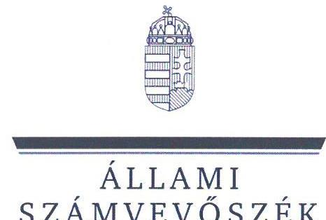
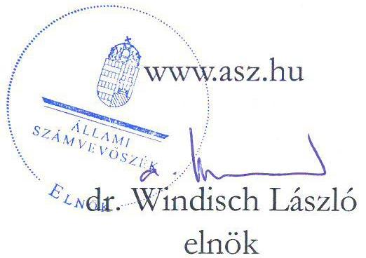
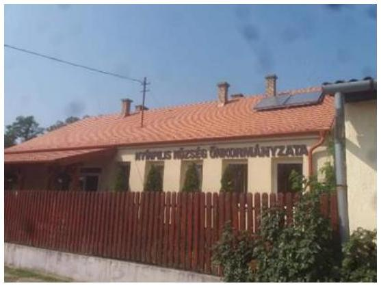
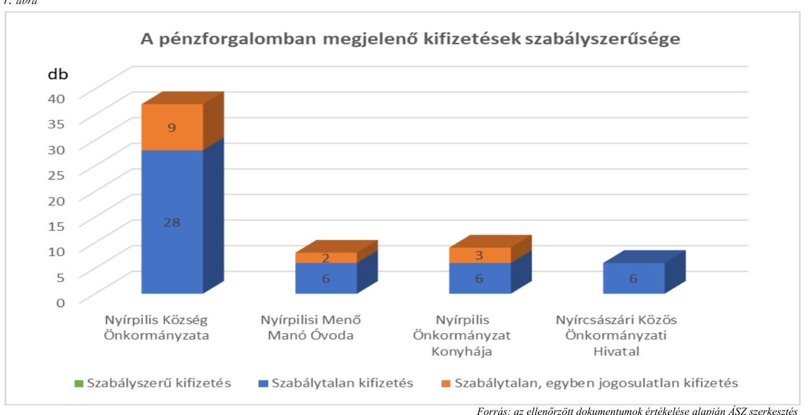

# JELENTÉS 

## Az önkormányzatok gazdálkodásának célvizsgálata

Az önkormányzatok ellenőrzése - a pénzforgalomban megjelenő kiadások teljesítésének és elszámolásának megfelelősége

Nyírpilis Község Önkormányzata

2023. 

23029
www.asz.hu

---

ÁLLAMI
SZÁMVEVŐSZÉK

# JELENTÉS 

## Az önkormányzatok gazdálkodásának célvizsgálata

Az önkormányzatok ellenőrzése - a pénzforgalomban megjelenő kiadások teljesítésének és elszámolásának megfelelősége

Nyírpilis Község Önkormányzata

2023.

23029

---

# ELLENŐRZÉSI IGAZGATÓSÁG: 

## ÁLLAMHÁZTARTÁS HELYI SZINTJÉT ELLENŐRZŐ IGAZGATÓSÁG

ELLENŐRZÉSI IGAZGATÓ:
KISGERGELY ISTVÁN igazgató

ELLENŐRZÉSVEZETŐ:
LAJTERNÉ HUDÁK MAGDOLNA ellenőrzésvezető

IKTATÓSZÁM: EL-3891-008/2023.
TÉMASZÁM: 2658
ELLENŐRZÉS-AZONOSÍTÓ SZÁM: V100202

---

# TARTALOMJEGYZÉK 

- AZ ELLENŐRZÉS ALAPADATAI ..... 5
- AZ ELLENŐRZÖTT SZERVEZETEK ..... 7
- ÖSSZEFOGLALÁS ..... 9
- AZ ELLENŐRZÉS FÓKUSZKÉRDÉSEI ..... 11
- MEGÁLLAPÍTÁSOK ..... 12
- JAVASLATOK ..... 28
- MELLÉKLETEK ..... 33
I. sz. melléklet: Az ellenőrzött szervezetek jegyzéke ..... 33
II. sz. melléklet: Összefoglaló táblázat az ellenőrzött szervezetek gazdálkodási jogköreinek gyakorlásáról ellenőrzött gazdasági eseményenként ..... 34
III. sz. melléklet: Nyírpilis Község Önkormányzatánál ellenőrzött, késedelmesen könyvelt gazdasági események ..... 42
- FÜGGELÉK: ÉSZREVÉTELEK ..... 43
- RÖVIDÍTÉSEK JEGYZÉKE ..... 44

---

.

---

# AZ ELLENŐRZÉS ALAPADATAI 

## AZ ELLENŐRZÉS CÉLJA

Az ellenőrzés célja annak értékelése, hogy az Önkormányzatnál ${ }^{1}$, a Hivatalánál², az Óvodánál ${ }^{3}$ és a Konyhánál ${ }^{4}$ a pénzforgalomban megjelenő kiadások teljesítése, elszámolása, megfelelő volt-e, az önkormányzat, a hivatal, illetve az intézmények közfeladat-ellátásához kapcsolódott-e.

## AZ ELLENŐRZÉS TÍPUSA

Megfelelőségi ellenőrzés.

## AZ ELLENŐRZÖTT IDŐSZAK

Az ellenőrzött időszak a 2020. november-december, 2021-2022. évek és a 2023. év, az ellenőrzés megállapításainak az ÁSZ tv. ${ }^{5}$ 29. § (1) bekezdése szerinti megküldése napjáig.

## AZ ELLENŐRZÉS TÁRGYA

Az Önkormányzat, a Hivatal, az Óvoda és a Konyha pénzforgalmában megjelenő kiadások teljesítésének, elszámolásának, a közfeladat-ellátás céljára történő felhasználásának megfelelősége.

## AZ ELLENŐRZÉS JOGALAPJA

Az ellenőrzés jogalapját az ÁSZ tv. 1. § (3) bekezdése, és 5. § (2)-(3), (6) bekezdései képezik.

## AZ ELLENŐRZÉS MÓDSZERE

Az ellenőrzés végrehajtása az ellenőrzési programban foglaltak, az ellenőrzött időszakban hatályos jogszabályoknak és az ellenőrzött szervezet belső szabályozásainak, az ellenőrzés szakmai szabályainak, valamint a jelen ellenőrzésre irányadó ÁSZ ${ }^{6}$ módszertanoknak figyelembevételével történt.

Az ellenőrzési kérdések megválaszolásához szükséges bizonyítékok megszerzése az ellenőrzött szervezetek által rendelkezésre bocsátott dokumentumokra, adatokra, valamint a közreműködő szervezetektől ${ }^{7}$ kapott adatokra alapozva a következő ellenőrzési eljárások alkalmazásával történt: dokumentumok vizsgálata, elemzése, helyszíni ellenőrzés, interjúk, mintavételi eljárás, elemző eljárás, szemle, szemrevételezés, rovancs.

Az ellenőrzés során bizonyítékként felhasználható adatforrások közé tartoztak az Önkormányzat, a Hivatal és az intézmények, valamint a megkeresett közreműködő szervezetek által átadott dokumentumok, továbbá minden - az ellenőrzés szempontjából releváns információkat tartalmazó - dokumentum. Az

---

ellenőrzés ideje alatt az Önkormányzatot érintően bűncselekmény gyanúja miatt a rendőrség ${ }^{8}$ nyomozást folytatott. Az eljárás keretében iratlefoglalásra is sor került, amelyekbe betekintést, illetve iratmásolatot kértünk, és amelyeket az ellenőrzés során a megállapítások alátámasztásához felhasználtunk.

Az ellenőrzött szervezetek által az ÁSZ rendelkezésére bocsátott dokumentumok valódiságát és teljeskörűségét az ellenőrzött szervezetek képviseletében a polgármester által tett teljességi és hitelességi nyilatkozat igazolta. A rendelkezésre bocsátott adatok, információk kontrolljára helyszíni ellenőrzés keretében is sor került.

A pénzforgalomban megjelenő kiadások teljesítése megfelelőségének ellenőrzése során a működés, a gazdálkodás kockázatos területeinek meghatározását követően az ellenőrzött szervezetekre vonatkozó főkönyvi adatbázisból irányított mintavételi eljárás alapján történt a mintatételek kiválasztása. A lényeges és kockázatos tételek beazonosítására egyedi kockázatértékelés alapján került sor.

Az ellenőrzés kiemelten kezelte a kifizetések közfeladat ellátáshoz való közvetlen kapcsolódásának, kötelezettségvállalás szerinti teljesülésének, jogosságának és szabályszerűségének értékelését, figyelemmel a kiadások teljesítésével összefüggő kontrollok gyakorlati működésére.

Az ellenőrzés kitért minden olyan körülményre és kérdésre is, amely a program végrehajtása kapcsán felmerült újabb összefüggéseknek az ellenőrzés céljaival összhangban lévő feltárásához szükséges volt.

---

# AZ ELLENŐRZÖTT SZERVEZETEK 

Fervás: Önkormányzat honlapja
Nyírpilis község az Észak-Alföldi régióban, Szabolcs-Szatmár-Bereg vármegyében, Nyírbátor járásban található. A Vármegye és a Nyírség dél-délkeleti részén fekvő zsáktelepülés, a legközelebbi város Nyírbátor 8,5 km-re van tőle. Lakosságszáma 2022. január 1-jén 915 fő, a lakások száma 224 db volt. A település területe 1634 hektár.

Az Önkormányzat társadalmi-gazdasági és infrastrukturális szempontból elmaradott, jelentős munkanélküliséggel sújtott település ${ }^{9}$-ek között szerepel, mivel a munkanélküliségi ráta meghaladta az országos átlag 1,75-szeresét. A település szerepel a Felzárkózó Települések Kormányprogramban.

Az ellenőrzött időszakban a polgármesteri feladatok ellátásáért öt fő felelt. A 2019. évi önkormányzati választásokon megválasztott polgármester ${ }_{1}{ }^{10}$ 2020. november 17-ig, ezt követően 2020. november 18. - 2021. június 5. között az alpolgármester ${ }^{11}$, illetve 2021. június 6. - 2022. június 25. között a Szabolcs-Szatmár-Bereg Megyei Kormányhivatal kijelölése alapján egy képviselő látta el a polgármesteri feladatokat. Az új polgármester ${ }_{2}{ }^{12}$ megválasztása a 2022. június 26 -ai időközi választáson történt, majd 2022. őszén a képviselőtestület feloszlatásra került. A jelenlegi polgármester ${ }_{3}{ }^{13}$ a 2022. december 11-ei időközi önkormányzati választás óta tölti be tisztségét. A képviselő-testületnek a polgármesteren kívül négy fő képviselő tagja van.

Az Önkormányzat működésével kapcsolatos feladatokat a Hivatal végzi, a jegyző 2013. március 1-jétől tölti be a tisztségét. A Hivatal létszáma a jegyzővel együtt a 2022. évben 12 fő volt. A Hivatalhoz négy települési önkormányzat tartozott, így Nyírpilis Önkormányzatának ügyeivel foglalkozó dolgozói létszám átlagosan három fő volt.

Az Önkormányzat fenntartásában két költségvetési szerv működött, az 1990. október 25-én alapított Óvoda és a Konyha, amelyet 2019. február 12-én hoztak létre. Az intézmények gazdálkodási feladatait a Hivatal látta el.

Az Önkormányzat a területfejlesztési feladatait, szociális-, gyermek- és ifjúságvédelmi, egészségügyi feladatait, továbbá a pénzügyi-gazdasági ellenőrzési feladatait a Kelet-Nyírségi Többcélú Kistérségi Társulás útján biztosította.

Az Önkormányzat 2021. és 2022. évi konszolidált beszámolójának főbb adatait az 1. táblázat mutatja be.

---

| 1. táblázat |  | Adatok MFt-ban |
| :--: | :--: | :--: |
| MEGNEVEZÉS | 2021. IVY KONSZOLIDÁLT ÖNKORMÁNYZATI BESZÁMDLÓ | 2022. IVY KONSZOLIDÁLT ÖNKORMÁNYZATI BESZÁMDLÓ |
| Költségvetési bevétel | 501,1 | 459,5 |
| Ebből: önkormányzati feladatok múködési támogatása | 188,2 | 212,8 |
| hosszabb időtartamú közfoglalkoztatás támogatása | 41,0 | 78,8 |
| közfoglalkoztatási mintaprogram támogatása | 152,8 | 151,8 |
| telepszerű lakókörnyezet felszámolását célzó programok | 70,1 |  |
| településfejlesztési projektek | 44,6 | 6,0 |
| Költségvetési kiadás | 535,6 | 463,0 |

Az Önkormányzat müködési támogatása rendkívüli települési támogatást is tartalmazott, amelyet az Önkormányzat a közüzemi díjak finanszírozására, valamint szociális tűzifa vásárlásra kapott.

Az ellenőrzött időszakban a „Szegregált élethelyzetek, felszámolása komplex programok." EFOP pályázat ${ }^{14}$ keretében - hat szociális bérlakás kialakítására, szolgáltatóház felújítására, illetve képzésre, digitális felzárkóztatásra - összesen 398,0 M Ft vissza nem térítendő pályázati támogatást nyert el az Önkormányzat, valamint „A cél közös, együtt a jövőnkért!" című Széchenyi 2020. pályázatban ${ }^{15}$ konzorciumi tagként vett részt, amelynek támogatása a konzorciumra összesen $496,8 \mathrm{M} \mathrm{Ft}$ volt. A program tartalma hátrányos helyzetű csoportok foglalkoztatásra való felkészítése, szakemberhiány enyhítése, munkaerőpiaci esélyek javítása volt.

---

# ÖSSZEFOGLALÁS 

Az ellenőrzött gazdasági események tekintetében az Önkormányzat, a Hivatal, az Óvoda és a Konyha pénzforgalmában megjelenő kiadások teljesítése és elszámolása nem volt megfelelő, az ellenőrzött 60 gazdasági esemény esetében egyetlen egy teljesítése és elszámolása sem volt szabályszerű.

Az Önkormányzatnál a vásárlásra kiadott előlegek elszámolásánál, a hivatali gépjárművekkel kapcsolatos üzemanyag elszámolásnál, és a rendkívüli települési támogatások kifizetéseinél, a Hivatalnál a kiküldetések elszámolásánál, a Konyhánál pedig az élelmiszer beszerzéseknél nem érvényesült, hogy az Alaptörvény ${ }^{16}$ szerint „A közpénzeket és a nemzeti vagyont az átláthatóság és a közélet tisztaságának elve szerint kell kezelni", mivel nem voltak a közpénzfelhasználással kapcsolatos döntések alátámasztottak, nem volt biztosított a közpénzek felhasználásának szabályszerűsége, ellenőrizhetősége. Az Önkormányzatnál az előlegek és az üzemanyagköltségek elszámolásánál, valamint a települési támogatások odaítélésénél számos alkalommal megsértették az Ávr. ${ }^{17}$ összeférhetetlenségi követelményeit is.

Az Önkormányzatnál és a Konyhánál a gazdálkodás során megsértették az Áht. ${ }^{18}$-t és nem tartották be az Ávr. előírásait sem, nem volt biztosított, hogy a közpénzek kizárólag közfeladatellátásra kerüljenek felhasználására, mivel az ellenőrzött kiadások csaknem felénél - 21 531,4 E Ft kifizetés esetében - a bizonylatok teljes hiánya miatt nem volt ellenőrizhető az önkormányzati feladatellátáshoz kötöttség sem.

Az ellenőrzött szervezetek fizetési számlájáról és pénztárából a kiadási előirányzatok terhére teljesített kifizetéseknél a gazdálkodás nem volt szabályszerű, mivel az előzetes kötelezettségvállalást igénylő esetek többségénél az Ávr. -ben foglaltak ellenére nem vállaltak írásban kötelezettséget, és nem végezték el a kötelezettségvállalások pénzügyi ellenjegyzését. Az Ávr.-ben és a gazdálkodási szabályzatban foglaltak ellenére az ellenőrzött gazdasági események 88,3\%-ánál elmaradt, vagy nem megfelelő dokumentumok alapján végezték el a teljesítésigazolást, így nem ellenőrizték, hogy a kifizetések az arra jogosultak részére, a megfelelő összegben történtek-e, illetve, hogy az ellenszolgáltatást az ellenőrzöttek részére teljesítették-e. Az Önkormányzat, az Óvoda és a Konyha a Számv.tv. ${ }^{19}$ előírása ellenére a gazdasági események több mint felénél a teljesített kifizetéseket megalapozó dokumentumokat nem őrizte meg.

A jogszabályokban előírt kifizetéseket megelőző kontrollok müködtetésének hiánya miatt az Önkormányzatnál, a Hivatalnál és a Konyhánál jogosulatlan kifizetésekre került sor.

A szabálytalan gazdasági eseményeket a pénzforgalomban megjelenő kifizetések teljesítése során ellenőrzött szervezetenként az 1. ábra mutatja be.

---

A gazdálkodás részletes rendjét meghatározó szabályzatokat az ellenőrzött szervezetek nem aktualizálták, nem vezették naprakészen a gazdálkodási jogkörök gyakorlói aláírás mintáit tartalmazó nyilvántartásokat. A jegyző nem építette ki azokat a kontrolltevékenységeket, amelyek csökkentették volna a kifizetések szabálytalanságának kockázatait. Az ellenőrzött szervezetek pénzkezelési szabályzatai nem rendelkeztek egyértelműen a pénzforgalom (készpénzben, illetve bankszámlán történő) lebonyolításának rendjéről, a pénzkezelés személyi és tárgyi feltételeiről, felelősségi szabályairól.

Az Önkormányzat a mérlegben kimutatandó tételeket az ellenőrzött, költségvetési beszámolóval lezárt években a Számv. tv. és az Áhsz. ${ }^{20}$ előírásai ellenére nem támasztotta alá leltárral, és az Áhsz. szerinti tárgyi eszköz nyilvántartással sem rendelkezett. A nyilvántartás, valamint a leltár hiánya miatt a 2020-2022. évi költségvetési beszámolók mérlegének egyes eszközcsoportjai nem voltak alátámasztottak, ezáltal nem volt biztosított, hogy a beszámolók az Önkormányzat vagyoni, pénzügyi és jövedelmi helyzetéről megbízható és valós képet mutatnak.

Az Önkormányzatnál a belső ellenőrzés nem múködött megfelelően, nem töltötte be a Bkr. ${ }^{21}$-ben meghatározott feladatát, mivel annak ellenére nem tárta fel a gazdálkodásban lévő számtalan súlyos hiányosságot, szabálytalanságot, hogy a 2021. évben ellenőrizte az előirányzat felhasználást, a készpénzkezelést és a bankszámla kezelést, a 2022. évben a főkönyvi könyvelés és analitikus nyilvántartások vezetését. A belső ellenőrzés az Önkormányzat kötelezettségvállalási gyakorlatát, a kiadások teljesítéséhez kapcsolódó teljesítés igazolási, érvényesítési, utalványozási feladatok ellátását, előlegek elszámolását, az analitikus nyilvántartások vezetését és az értékcsökkenés elszámolását megfelelőnek találta. Ezzel szemben ezeken a területeken az ÁSZ ellenőrzés szabálytalanságokat tárt fel.

---

# AZ ELLENŐRZÉS FÓKUSZKÉRDÉSEI 

1.- Az Önkormányzat pénzforgalmában megjelenő kiadások teljesitése és elszámolása megfelelően, az Önkormányzat feladatellátásához kapcsolódóan valósult-e meg?
2.- A Hivatal pénzforgalmában megjelenő kiadások teljesitése és elszámolása megfelelően, a Hivatal feladatellátásához kapcsolódóan valósult-e meg?
3.- Az Óvoda pénzforgalmában megjelenő kiadások teljesitése és elszámolása megfelelően, az Óvoda feladatellátásához kapcsolódóan valósult-e meg?
4.- A Konyha pénzforgalmában megjelenő kiadások teljesitése és elszámolása megfelelően, a Konyha feladatellátásához kapcsolódóan valósult-e meg?

---

# MEGÁLLAPÍTÁSOK 

## 1. Az Önkormányzat pénzforgalmában megjelenő kiadások teljesítése és elszámolása megfelelően, az Önkormányzat feladatellátásához kapcsolódóan valósult-e meg?

| Összegző megállapítás | Az ellenőrzött gazdasági események tekintetében az Önkormányzat pénzforgalmában megjelenő kiadások teljesítése és elszámolása nem volt megfelelő, mivel azok Áht.-ban és Ávr.-ben előírt, a közpénzfelhasználás ellenőrzésére alkalmas dokumentumokkal történő alátámasztása hiányos volt, és a kiadások több mint harmadánál nem volt igazolható az sem, hogy a közpénzfelhasználás az önkormányzati feladatellátáshoz kapcsolódott. A bizonylati rendet nem készítették el, illetve a gazdálkodási szabályzatot nem aktualizálták, a kötelező nyilvántartásokat nem vezették, a költségvetési beszámolókat alátámasztó leltárakat nem készítették el, a számviteli elszámolások nem feleltek meg a jogszabályi előírásoknak. Ezáltal nem volt biztosított a közpénzek felhasználásának szabályszerűsége, átláthatósága, ellenőrizhetősége. |
| :--: | :--: |

1.1. számú megállapítás

Közfeladat ellátáshoz való kapcsolódás
Az ellenőrzés 37 gazdasági esemény ellenőrzését végezte el, amelyek nettó összértéke 37 891,2 E Ft volt. Az Önkormányzatnál a könyvelést és kifizetést alátámasztó bizonylatok a 37 ellenőrzött gazdasági eseményből 14 esetben (20 841,3 E Ft összértékben) nem, vagy csak a banki tranzakciók vonatkozásában álltak rendelkezésre. Ezekben az esetekben megsértették a Számv. tv. 169. § (2) bekezdésének iratmegőrzésére vonatkozó előírását. Ebből kilenc esetben, 16 076,1 E Ft összértékben a Mötv ${ }^{22}$. 111. § (2) bekezdésében foglaltak ellenére nem ellenőrizhető, hogy a költségvetési forrásokat a törvényben meghatározott kötelező, valamint önként vállalt feladatai ellátására használta fel.

- Az összesen 16 076,1 E Ft összértékű (ÖNK_01, ÖNK_04, ÖNK_05, ÖNK_06, ÖNK_09, ÖNK_10, ÖNK_15, ÖNK_18, ÖNK_21) kilenc gazdasági eseménynél a közfeladatellátásra történő felhasználás a kiadásokat megalapozó bizonylatok teljes hiánya miatt nem volt alátámasztott.
- Az ÖNK_7, az ÖNK_13, az ÖNK_17 az ÖNK_19 és az ÖNK_20 gazdasági eseményeknél csak a számla és a banki átutalás dokumentuma állt rendelkezésre.
Két esetben az ÖNK_PÖT_3 és az ÖNK_PÖT_4 tételeknél összesen 90,7 E Ft kifizetése hivatali dolgozó kiküldetéséhez kapcsolódott, a költségeket azonban az Önkormányzatnál számolták el. A kiküldetési szabályzat ${ }^{23}$-ban előírt „kiküldetési utasítás" és „Kiküldetési rendelvény" nem állt rendelkezésre, így a kiküldetés célja, indokoltsága nem volt igazolt.

---

1.2. számú megállapítás

Az Önkormányzatnál az előzetes írásbeli kötelezettségvállalást igénylő 30 gazdasági eseményből 24 esetben (36 007,5 E Ft összegű kifizetésnél) az Ávr. 52. § (1) bekezdés c) pontjában foglaltak ellenére nem rendelkeztek írásos kötelezettségvállalási dokumentummal. Az Ávr. 55. § (1) bekezdésében előírtak ellenére nem végezték el a pénzügyi ellenjegyzéshez kapcsolódó ellenőrzési feladatokat, és az Áht. 37. $\S$ (1) és (1a) bekezdésének előírását megsértve - egyetlen esetben sem győződtek meg a szabad előirányzat rendelkezésre állásáról, illetve, hogy a kötelezettségvállalás nem sérti a gazdálkodásra vonatkozó szabályokat.
Az Önkormányzatnál a teljesítésigazolást az Áht. 38. § (1) bekezdés és az Ávr. 57. § (1) bekezdés előírása ellenére nem, vagy nem megfelelő dokumentumok alapján végezték el. Az Önkormányzat gazdálkodási szabályzat ${ }_{3}$-ben úgy rendelkezett, hogy a teljesítésigazolást a 200,0 Ft-ot el nem érő esetekben is el kell végezni. A vizsgált 37 gazdasági eseményből hat esetben a teljesítésigazolás elvégzésére a gazdasági esemény tartalmára tekintettel - foglalkoztatottnak adott és vásárlási előlegek - nem volt szükség, a fennmaradó 31 esetben a teljesítés igazolást el kellett végezni. Ebből 21 esetben, 20 337,3 E Ft összegben a teljesítésigazolás nem történt meg, további 10 esetben, 15 568,9 E Ft összegben a teljesítés igazolás formális volt, mivel a megfelelő kötelezettségvállalási dokumentum (szerződés) hiányában nem lehetett megállapítani, hogy a számlát az arra jogosult, a megfelelő összegben állította-e ki, illetve, hogy milyen ellenszolgáltatást kellett teljesíteni. Összességében a vizsgált gazdasági események 83,8\%-ában, 35 906,2 E Ft közpénz elköltését megelőzően nem ellenőrizték, hogy a kifizetések az arra jogosultak részére, a megfelelő összegben történtek-e, illetve, hogy az ellenszolgáltatást az Önkormányzat részére teljesítették-e. Az Ávr. 58. § (1) bekezdésében foglaltak ellenére az érvényesítést egyetlen esetben sem végezték el.
Az ellenőrzött 37 gazdasági eseményből az utalványozás négy esetben felelt meg az előírásoknak. Az Ávr. 57. § (1) és (3) bekezdéseiben foglalt előírások ellenére 18 esetben nem állt rendelkezésre az utalványrendelet, 15 esetben volt utalványrendelet, de azok a kifizetés elrendelésére utaló aláírást, dátumot, nem tartalmaztak, vagy az aláírásminta hiányzott. Az ellenőrzött időszakban utalványozói jogosultsága csak a polgármester ${ }_{3,2,3}$-nak volt. Aláírásaikat az ellenőrzés az aláírásminta hiányában egyéb dokumentumokból (Képviselő-testületi jegyzőkönyvek, szociális támogatásról szóló határozatok) tudta beazonosítani. Ez utóbbi 15 esetből három esetben az Ávr. 60. § (2) bekezdésében előírtakat megsértve a polgármester ${ }_{3}$ saját maga, illetve közeli hozzátartozói részére utalványozott.

- Az Ávr. 60. § (2) bekezdésében előírtak ellenére a 2023. március 03-án teljesített 137,2 E Ft kiadás során (ÖNK_PÓT_13) 97,5 E Ft hóközi illetmény kifizetését a polgármester ${ }_{3}$ önmaga, a 2023. február 14-ei 40,0 E Ft rendkívüli települési támogatásból (ÖNK_PÓT_14) 20,0 E Ft-ot, valamint a 2023. február 28-ai 190,0 E Ft-ból (ÖNK_PÓT_15) 50,0-50,0 E Ft-ot a közeli hozzátartozói javára utalványozta, illetve a rendkívüli támogatások esetében a döntést is Ő hozta.
Az ellenőrzés által feltárt hiányosságok alapján az Önkormányzatnál az Áht. 36-38. §-aiban és az Ávr. 5260. §-aiban előírt gazdálkodási jogköri feladatokat nem látták el, ezáltal nem volt biztosított a közpénzek felhasználásának szabályszerűsége, átláthatósága, ellenőrizhetősége.
(Az ellenőrzött gazdasági eseményeket és feltárt hiányosságokat tételesen a gazdasági események azonosítására szolgáló adatok megadásával a II. számú melléklet 1. számú táblázata tartalmazza.)

---

# 1.3. számú megállapítás 

## a) Az ellenőrzés szabálytalanságokat tárt fel az önkormányzati gépjárművek használata és az üzemanyag beszerzések elszámolása során.

Az Önkormányzat az ellenőrzött időszakban egy Toyota kisbusszal, és egy traktorral rendelkezett. Az Önkormányzat a gépjárművekhez menetleveleket csak 2023-tól vezetett, ezért a 2022. évre vonatkozóan nem állapítható meg 219,4 E Ft összegben az üzemanyag felhasználás indokoltsága, közfeladat ellátáshoz való kapcsolódása, illetve a számlák alapján az sem, hogy az üzemanyagot milyen járműbe tankolták. A gazdasági események elszámolása különböző időpontokban kiállított készpénzes számlák alapján utólag, havi gyakorisággal történt, pénztári kifizetéssel. A három mintatételből két esetben az utalványozó és a pénzt felvevő is az alpolgármester, illetve a polgármester ${ }_{2}$ volt, amellyel megsértették az Ávr. 60. § (2) bekezdésében foglalt összeférhetetlenségi szabályokat. Az Önkormányzattól a 2020-2021-2022. évekre az üzemeltetési anyagokról bekért tételes főkönyvi kartonok és a mintatételek alapján az üzemanyagsásárlások életszerütlenek, azok egy-két naponta csekély mértékű vásárlásokat takartak, illetve egyszerre a gépjármú üzemanyagtankja űrtartalmának sokszorosát kitevő mennyiségű vásárlást.

- Az Önkormányzat Toyota kisbusza 2020. március 26-án került forgalomba. A gépjármúhöz menetlevelet a 261/2011 (XII. 7.) Kormányrendelet ${ }^{24}$ 33. § (1) bekezdésének előirása ellenére 2023. február 10-ét megelőzően nem vezettek. A 2023. február 10-e és 2023. március 09-e között vezetett menetlevelek szerint 20 munkanap alatt 3371 km -t tettek meg. A mérhető időszakokban napi 130-170 km között volt a futásteljesítmény. Az Önkormányzat tulajdonában volt a helyszíni ellenőrzés időpontjában egy 2014-ben forgalomba helyezett traktor is. A km óra állás alapján ( 2071 km ) a traktor a forgalomba helyezésétől kezdődően évente átlagosan 230 km -t tett meg. A traktor menetleveleit a polgármester nyilatkozata alapján nem őrizték meg, megsértve ezzel a Számv.tv. 169. § (1) bekezdésében előírtakat.
- Az ellenőrzés három üzemanyag vásárlással kapcsolatos mintatételt vizsgált - az ÖNK_PÓT_1 ÖNK_PÓT_2, ÖNK_PÓT_7 - mindösszesen 30,7 E Ft értékben, azonban az ellenőrzött mintatételekhez kapcsolódóan a tárgynapi kiadási pénztárbizonylatok még további összesen 188,7 E Ft üzemanyag elszámolást tartalmaztak. Így az érintett közpénz összesen 219,4 E Ft. A legutolsó 2022. június 02-án kiegyenlített beszerzés 480,0 Ft-os literenkénti egységárral számolva 251,6 1 üzemanyag vásárlást jelentett. A TOYOTA PROACE V kisbusz interneten elérhető műszaki adatai alapján a megvásárolt 251,61 üzemanyag 4838 km megtételéhez lett volna elegendő. Ez egy havi felhasználás esetén átlagosan (munkanapokra számolva) csaknem napi 220 km megtételét jelentette, amely jelentősen meghaladta a 2023. évben már vezetett menetlevelek alapján számítható napi futásteljesítményt.
- Az ÖNK_PÓT_1 mintatétel esetében mind az utalványozó, mind a pénz felvevője az adott időszakban polgármesteri feladatokat ellátó alpolgármester volt, az ÖNK_PÓT_2 mintatétel esetében az utalványozó az alpolgármester volt, az ÖNK_PÓT_7 mintatétel esetében mind az utalványozó, mind a pénz felvevője a polgármester ${ }_{2}$ volt, ezzel megsértették az Ávr. 60. § (2) bekezdésében foglalt összeférhetetlenségi szabályokat.

---

# b) Az ellenőrzés szabálytalanságokat tárt fel az utólagos elszámolásra kiadott előlegeknél. 

Az utólagos elszámolásra kiadott hat ellenőrzött vásárlási előleg tétel esetében az előleg kifizetésekhez a megfelelő bizonylatok nem álltak rendelkezésre, megsértve ezzel a Számv.tv. 165. § (1) bekezdésének előírását. Egy esetben - 1000,0 E Ft-ot érintően - az Önkormányzat költségvetése terhére olyan kifizetést teljesítettek, amelynél nem megállapítható, hogy azt milyen céllal, és ki vette fel, és az sem, hogy azt mire költötték.

- Az ellenőrzött pénztári kifizetések közül az (ÖNK_10, ÖNK_PÓT_8, ÖNK_PÓT_9, ÖNK_PÓT_10, ÖNK_PÓT_12, ÖNK_PÓT_11 mintatételek) utólagos elszámolásra adott előlegek esetében - melyek összértéke 1985,0 E Ft volt - nem tartották be a pénzkezelési szabályzat1 4.4. pontjában rögzítetteket, mely szerint előleg felvételére csak a polgármester írásos engedélye alapján van lehetőség, és az előleg felvételére és elszámolására a B.13-134/V.r.sz. nyomtatványt kell alkalmazni. Az ÖNK_10 mintatétel - 2021. május 12-ei 1000,0 E Ft - esetében (foglalkoztatottaknak adott előlegnél) nem állt rendelkezésre a polgármester engedélye, és az előleg felvételét, célját megalapozó dokumentum, illetve a kiadási pénztárbizonylat sem, így az összeg átvevőjének személye is ismeretlen, illetve az sem igazolt, hogy azt mire költötték. Az előleg elszámolásával kapcsolatban az Önkormányzat nem bocsájtott rendelkezésre dokumentumot.

## c) Az ellenőrzés szabálytalanságokat tárt fel a megbízási szerződések megkötésével kapcsolatban.

Az Önkormányzat a Hivatal dolgozójával (pénzügyi, szociális és igazgatási ügyintéző) 2021. május 03-án, havi bruttó 125,0 E Ft összegű (mindösszesen bruttó 500,0 E Ft összegű) megbízási szerződést kötött az EFOP-1.5.3-16-2017-00119 azonosítójú „A cél közös, együtt a jövőnkért" című pályázat működésével kapcsolatos feladatok elvégzésére. A megbízási szerződés nem felelt meg az Ávr. 51. § (2) bekezdésében előírtaknak, amely szerint „A költségvetési szerv állományába tartozó személy részére megbizási dij vagy más szerzödés alapján dijazás a munkaköri leirása szerint számára elöirható feladatra nem fizethető".
d) Az ellenőrzés szabálytalanságokat tárt fel a rendkívüli települési támogatások kifizetésével kapcsolatban.

A rendkívüli települési támogatások indokoltsága, a támogatottak jogosultsága nem volt alátámasztott, mivel az Önkormányzat a támogatásokat megalapozó kérelmekkel nem rendelkezett. A határozatok alakilag, tartalmilag egyik esetben sem voltak megfelelőek. Egyes települési támogatások utalványozásánál a polgármester megsértette az Ávr. 60. § (2) bekezdésében foglalt összeférhetetlenségi szabályokat, amikor közeli hozzátartozói javára utalványozott.

- 2022. március 17-én 400,0 E Ft (ÖNK_PÓT_6), 2022. május 12-én 200,0 E Ft (ÖNK_PÓT_5) összegben fizettek ki rendkívüli települési támogatást nyolc, illetve négy fő részére egyenként 50,0-50,0 E Ft összegben. A támogatásokat megalapozó kérelmekkel az Önkormányzat a Szociális rendeletben ${ }^{25}$ előírtak ellenére nem rendelkezett. Az Önkormányzatnál a szociális támogatásokról átruházott hatáskörben a polgármester döntött, akinek támogatást megállapító határozatait a kifizetésekhez csatolták. A határozatok azonban tartalmilag egyik esetben sem voltak megfelelőek, mivel a fellebbezés benyújtásának címzettjeként az eljárásban nem érintett Nyírcsászári Községi Önkormányzat Képviselő-testületét, és nem a Nyírpilisi Önkormányzat Képviselő-testületét jelölték meg.
- A 2023. február 14-én kifizetett 40,0 E Ft-ból 20,0 E Ft (ÖNK_PÓT_14) és a 2023. február 28-ai 190,0 E Ft-ból 50,0-50,0 E Ft (ÖNK_PÓT_15) rendkívüli települési támogatás kifizetését a polgármestere a közeli hozzátartozói (édesanyja és testvérei) javára utalványozta.

---

A polgármester ${ }_{3}$ 2023. április 4-én nyilatkozott arról, hogy 2023. január 1-március 31-e között adott szociális pénzbeli és természetbeni ellátásokból közeli hozzátartozói is részesültek.

# 1.4. számú megállapítás Szabályozottság, nyilvántartások vezetése 

Az Önkormányzatnál a számlarend ${ }_{1}{ }^{28}$ elkészítése nem volt megfelelő, mivel a Számv.tv. 161. § (2) bekezdése d) pontjának előírása ellenére az nem tartalmazta a számlarend ${ }_{1}$-ben foglaltakat alátámasztó bizonylati rendet.
Az Önkormányzat az Ávr. 13. § (2) bekezdésében foglaltak alapján elkészítette a gazdálkodás részletes rendjét meghatározó szabályzatát (továbbiakban gazdálkodási szabályzat ${ }_{1}{ }^{27}$ ), azonban az Ávr. 53. § (2) bekezdésben meghatározottakkal ellentétben nem rögzítették a bruttó 200,0 E Ft alatti kifizetésekhez az előzetes írásbeli kötelezettségvállalást nem igénylő kifizetések rendjét, azt, hogy ki jogosult, milyen esetekben és milyen formában a 200,0 E Ft alatti beszerzéseket engedélyezni, valamint, hogy az engedélyezés dokumentálása hogyan történik. A szabályzat azonban tartalmazott rendelkezést arra vonatkozóan, hogy a teljesítésigazolást a 200,0 E Ft-ot el nem érő kifizetések esetében is el kell végezni. Az Ávr. 60. § (3) bekezdésében előírtakkal ellentétben nem vezették naprakészen a gazdálkodási jogkörök gyakorlói aláírás mintáit tartalmazó nyilvántartást. A gazdálkodási szabályzat ${ }_{1}$-ot nem aktualizálták, abban kötelezettségvállalóként és teljesítésigazolóként a polgármester ${ }_{1}$ van megjelölve, illetve az Ő esetében áll rendelkezésre aláírásminta. Az ellenőrzött időszakban kötelezettségvállalói, teljesítésigazolói, utalványozói jogosultsága csak az alpolgármesternek és a polgármester ${ }_{1223}$-nak volt. A polgármester ${ }_{23}$ és az alpolgármester aláírásait az ellenőrzés az aláírásminta hiányában egyéb dokumentumokból (Képviselő-testületi jegyzőkönyvek, szociális támogatásról szóló határozatok) tudta beazonosítani.
Az Önkormányzat az Ávr. 56. § (1) bekezdésének előírása ellenére nem gondoskodott a kötelezettségvállalások nyilvántartásba vételéről. Az Ávr. 56. § (2) bekezdésében rögzítettek ellenére a kötelezettségvállalás időpontjában a kötelezettségvállalás értékének meghatározásához nem vették számba az abból származó valamennyi fizetési kötelezettséget.

- Az Önkormányzat csak a 2022. évre vonatkozó kötelezettségvállalás nyilvántartást bocsájtotta az ellenőrzés rendelkezésére, azonban abban minden tétel esetében kötelezettségvállalóként a polgármester ${ }_{1}$-t tüntették fel, aki a tisztséget csak 2020. november 18-ig látta el. Rögzítették a nyilvántartásban a pénzügyi ellenjegyzést végző személyét is, azonban a mintavételes ellenőrzés során megállapítást nyert, hogy a pénzügyi ellenjegyzést egyetlen ellenőrzött gazdasági eseménynél sem végezték el. A nyilvántartásban a pénzügyi ellenjegyzés elvégzésének időpontjaként az előzetes írásbeli kötelezettségvállalást igénylő esetekben is a pénzügyi kiegyenlítés időpontját jelölték meg, ebből következően a kötelezettségvállalás nyilvántartása a 2022. évben nem töltötte be a szerepét, mivel az nem volt alkalmas újbóli kötelezettségvállalást megelőzően az Áht. 36. § (1) bekezdésében foglalt szabad előirányzat megállapítására.
Az Önkormányzat az ellenőrzött időszakban az Ávr. 122. § (2) bekezdésének előírása ellenére likviditási tervet nem készített.
1.5. számú megállapítás A beszámoló alátámasztása, számviteli elszámolások megfelelősége

Az Önkormányzat az ellenőrzött, költségvetési beszámolóval lezárt években a mérlegben kimutatandó eszközöket a Számv. tv. 69. § (1) bekezdésének, és az Áhsz. 22. § (1) bekezdésének előírása ellenére leltárral nem támasztotta alá, és az Áhsz. 45. § (3) bekezdésében meghatározott, az Áhsz. 14.

---

számú mellékletének VII. pontjában részletezett tartalmú tárgyi eszköz nyilvántartással sem rendelkezett.
A tárgyi eszköz nyilvántartás és a leltár hiánya miatt nem ismert az Önkormányzat tárgyi eszközeinek köre, mennyisége és értéke, nem ellenőrizhető az egyes vagyonelemek megléte, ezáltal nem biztosított a Nvtv. ${ }^{28}$ 7. $\$ (2) bekezdésében előírt nemzeti vagyongazdálkodási feladatok végrehajtása, különös tekintettel a vagyon megőrzésének elvére.
A Magyar Államkincstár részére megküldött éves beszámoló adatok szerint az Önkormányzatnál a tárgyi eszközök értéke 2020-ban 548 748,4 E Ft, 2021-ben 625 276,6 E Ft, 2022-ben 658 033,1 E Ft volt, amelynek összege a leltár és tárgyi eszköz nyilvántartás hiányában, valamint az értékcsökkenési leírás elszámolása adatainak megbízhatatlansága miatt nem volt alátámasztott. A Számv. tv. 18. §-ában előírtak ellenére a nyilvántartás, valamint a leltár elkészítésének hiánya miatt a 2020-2022. évi költségvetési beszámolók mérlegének egyes eszközcsoportjai nem voltak alátámasztottak, ezáltal nem volt biztosított, hogy a beszámolók az Önkormányzat vagyoni, pénzügyi és jövedelmi helyzetéről megbízható és valós képet mutatnak.

- Az ellenőrzés a rendőrségtől kikérte a lefoglalt tárgyi eszközök anyagait, amelyek nem tartalmaztak leltározással kapcsolatos dokumentumokat, csak tárgyi eszköz kartonokat. Ezek nem tartalmazták az ingatlanokat, a járműveket, ezért a tárgyi eszköz kartonok nem teljes körűek. A tárgyi eszköz kartonok vezetése nem volt megfelelő, mivel azok a tárgyi eszközök egyedi beazonosításához szükséges egyedi nyilvántartási számot (azonosító számot) nem tartalmaztak. Az ellenőrzés rendelkezésére bocsájtott 52 tárgyi eszköz kartonból 30 esetében azokon nem szerepelt az elszámolt amortizáció és az eszközök nettó értéke.
- Az értékcsökkenési leírás összegének megállapítását alátámasztó dokumentum nem állt rendelkezésre. A tárgyi eszköz kartonok a kisértékű (200,0 E Ft egyedi értékű) tárgyi eszközök esetében a bekerülési érték egyösszegű értékcsökkenésként való elszámolását nem tartalmazták, a 200,0 E Ft feletti egyedi értékủ tárgyi eszközöknél az értékcsökkenés elszámolása évente egy összegben történt annak ellenére, hogy az Áhsz. 53. § (6) bekezdés d) pontja értelmében az értékcsökkenési leírást negyedévente kell elszámolni. A helyszíni ellenőrzés során a polgármester3, és a jegyző úgy nyilatkoztak, hogy a rendőrségi iratbeszolgáltatást követően a tárgyi eszköz nyilvántartást nem vezették, az értékcsökkenési leírás elszámolása a főkönyvi kivonat, illetve a főkönyvi könyvelés adatai alapján történt. Ezek azonban nem tartalmaztak olyan adatokat, amelyek alapján az értékcsökkenést el lehetett volna számolni (pl. eszköz bekerülési ideje, leírási kulcs, a már elszámolt értékcsökkenés). A 2021. évi önkormányzati beszámoló 15. űrlap alapján a 2021. évben 9591,1 E Ft terv szerinti értékcsökkenés került elszámolásra, ezzel szemben a 2022. évi önkormányzati beszámoló 15. űrlapja már csak terven felüli értékcsökkenési leírás elszámolást tartalmazott (5720,3 E Ft összegben). Az ellenőrzés rendelkezésére bocsájtott 52 tárgyi eszköz karton egyike sem tartalmazott a 2022. évre vonatkozóan értékcsökkenési leírás elszámolást (sem terv szerintit, sem terven felülit) annak ellenére, hogy a tárgyi eszköz kartonok beszolgáltatására 2023. február 7-én került sor, tehát a 2022. évre vonatkozóan azokon már legalább a 2022. I_III. negyedévi értékcsökkenési leírás elszámolásának szerepelnie kellett volna.
Az Önkormányzat az Áhsz. 31. § (1) bekezdésében előírtakat megsértve nem rendelkezett az arra jogosult által aláírt, a 2020-2022. évekre vonatkozó éves költségvetési beszámolóval, azonban a beszámolókat elkészítették és a Magyar Államkincstár részére elektronikus úton benyújtották.
A házipénztárból és a fizetési számláról teljesített 37 ellenőrzött gazdasági esemény közül 17 esetben, 23 138,4 E Ft összértékben a Számv. tv. 165. § (3) bekezdés a) pontja előírása ellenére nem

---

biztosították a pénzeszközöket érintő gazdasági múveletek, események bizonylati adatainak a könyvekben történő késedelem nélküli - legkésőbb tárgyhót követő hónap 15-ig történő - rögzítését. A késedelmesen rögzített tételek közül 15 esetben a gazdasági események rögzítése csak több hónapos késéssel történt meg. Ez a késedelem befolyásolta az államháztartás információs rendszerébe teljesített havi adatszolgáltatások (időszaki költségvetési jelentések) adattartalmát, az adatszolgáltatások nem valós adatokon alapultak.
(A Nyírpilis Község Önkormányzatánál ellenőrzött, késedelmesen könyvelt gazdasági események bemutatását a III. számú melléklet tartalmazza.)

# 1.6. számú megállapítás Bankszámla kezelés, készpénzkezelés 

Az Önkormányzat pénzkezelési szabályzat ${ }_{1}$ a $^{20}$ a bankszámlák feletti rendelkezési jog gyakorlójaként a 2020. november 18 -ig a polgármesteri feladatokat ellátó polgármester ${ }_{1}$-t nevesítette, valamint a bankszámla nyitásával és vezetésével kapcsolatos feladatok ellátására a szociális ügyintéző került kijelölésre, akinek munkaköri leírása ezeket a feladatokat nem tartalmazta, így a Számv.tv. 14. § (8) bekezdésében foglaltak ellenére nem rendelkeztek egyértelműen a pénzforgalom (készpénzben, illetve bankszámlán történő) lebonyolításának rendjéről, a pénzkezelés személyi és tárgyi feltételeiről, felelősségi szabályairól.
Az Önkormányzat pénzkezelési szabályzata 2.4. pontjában előírtak ellenére a jegyző a pénztárellenőri feladatokat nem látta el, az ellenőrzött 3190,9 E Ft összértékủ, 18 gazdasági esemény egyike sem tartalmazott a pénztárellenőrzés elvégzésére történő utalást és aláírást.
Az Önkormányzat fizetési számlájának 2022. évi záró egyenlege 775,6 E Ft-tal meghaladta a 2022. évi fökönyvi kivonatában rögzített 50 639,9 E Ft-ot. Az eltérésre magyarázatot nem adtak.

### 1.7. számú megállapítás

A belső ellenőrzés működésének megfelelősége
A belső ellenőrzés az Önkormányzatnál a 2021. évben kockázatelemzésen alapuló ellenőrzési terv alapján ellenőrizte az előirányzat felhasználást, a készpénzkezelést és a bankszámlakezelést, a 2022. évben a főkönyvi könyvelés és az analitikus nyilvántartások vezetését. Az éves ellenőrzési tervet megalapozó kockázatelemzésekben mindkét évben a pénzügyi szabálytalanságok miatti, valamint a szabályozottságból eredő kockázatokat alacsonynak, vagy közepesnek, a munkatársakat nagyon tapasztaltnak és képzettnek értékelte. A belső ellenőr a 2021. évben „Az elöirányzatok szabályos, gazdaságos felhasználásával" kapcsolatos ellenőrzése során az Önkormányzat kötelezettségvállalási gyakorlatát, a kiadások teljesítéséhez kapcsolódó teljesítésigazolási, érvényesítési, utalványozási feladatok ellátását, „A készpénzkezelés ellenörzése" során az előlegek elszámolását, a 2022. évben „Az adatszolgáltatások, fökönyvi könyvelés, analitikus nyilvántartás, beszámoló készités" vizsgálata során az analitikus nyilvántartások vezetését és az értékcsökkenés elszámolását megfelelőnek értékelte.
Az Ellenőrzés véleménye szerint az Önkormányzatnál a belső ellenőrzés - az ÁSZ ellenőrzés által a gazdálkodás során feltárt számtalan szabálytalanságra tekintettel - nem múködött megfelelően, nem töltötte be a Bkr. 21. § (2) bekezdés c) pontjában foglalt feladatát, mivel a vizsgált folyamatokkal kapcsolatban nem fogalmazott meg megállapításokat, következtetéseket és javaslatokat a kockázati tényezők, hiányosságok megszüntetése, kiküszöbölése vagy csökkentése, a szabálytalanságok megelőzése, illetve feltárása érdekében.

---

# 2. A Hivatal pénzforgalmában megjelenő kiadások teljesítése és elszámolása megfelelően, a Hivatal feladatellátásához kapcsolódóan valósult-e meg? 

## Összegző megállapítás

Az ellenőrzött gazdasági események tekintetében a Hivatal pénzforgalmában megjelenő kiadások teljesítése és elszámolása nem volt megfelelő, mivel azok Áht.-ban és Ávr.ben előírt, a közpénzfelhasználás ellenőrzésére alkalmas dokumentumokkal történő alátámasztása hiányos volt. Így a kiadásoknál nem volt igazolható, hogy azokat az Hivatal feladatellátásához használták fel. Ezáltal nem volt biztosított a közpénzek felhasználásának szabályszerűsége, átláthatósága, ellenőrizhetősége.
2.1. számú megállapítás

A Hivatal pénzforgalomban megjelenő kiadások teljesítésének megfelelősége

A Hivatal fizetési számlájáról a kiadási előirányzatok terhére teljesített kifizetések nem voltak megfelelőek, az ellenőrzött időszakban a vizsgált hat - összesen 980,0 E Ft összértékủ - gazdasági eseménynél egyik esetben sem álltak rendelkezésre a kifizetést megalapozó dokumentumok ${ }^{30}$. Az ellenőrzött gazdasági események a 2021-2022. évben a hivatali dolgozónak havi rendszerességgel - jogosulatlanul - kiküldetési költségátalányként elszámolt összegek voltak. A szabálytalan kifizetésekkel megsértették a Kttv. ${ }^{31}$ 232. § (4) bekezdésében foglalt előírásokat. A 2021-2022. években jogosulatlanul kifizetett teljes összeg 5200,0 E Ft volt. A jogosulatlan költségátalányt a Képviselő-testület a 2023. évre is megszavazta a dolgozó részére.
A jegyző az ellenőrzött gazdasági események vonatkozásában 2023. március 20-án nyilatkozott arról, hogy költségelszámolást a kiküldetésekről nem vezetnek, és hogy az összegeket a Hivatal dolgozója a Nyírpilis és Bátorligeti kirendeltségeken végzett munkájáért, költségeinek fedezetére kapta az érintett polgármesterek szóbeli hozzájárulásával. A Kttv. 232. § (4) bekezdésében foglaltak szerint nem minősül kiküldetésnek, ha a köztisztviselő a közös önkormányzati hivatalhoz tartozó településen látja el munkaköri feladatait. Továbbá a kiküldetési szabályzat szerint a kiküldetést a munkáltatói jog gyakorlójának írásban kellett volna elrendelnie, valamint a szabályzat nem tette lehetővé az átalány jellegű kifizetést sem. A kiküldetés elszámolásához menetjegyeket, vagy útnyilvántartást és számlákat nem csatoltak.
A Hivatalnál az ellenőrzött gazdasági események tekintetében a kötelezettségvállalás dokumentumával nem rendelkeztek, nem végezték el az Ávr. 55. § (1) bekezdésében rögzített pénzügyi ellenjegyzéshez kapcsolódó ellenőrzési feladatokat. Illetve nem végezték el az Ávr. 57. § (1) bekezdésében foglalt teljesítés igazolási feladatokat sem, nem vizsgálták, hogy a kifizetés a jogosult részére, illetve a megfelelő összegben történt-e, valamint nem kontrollálták, hogy a kifizetés alapjául szolgáló ellenszolgáltatás ténylegesen megtörtént-e. A Képviselő-testület 5/2023. (II.24) számú határozatával a 2023. évre megszavazta, hogy a Hivatal pénzügyi előadója, könyvelője havi 200,0 E Ft adómentes költségtérítést kapjon. A döntés ellentétes a Kttv. 232. § (4) bekezdésében foglaltakkal.
(Az ellenőrzött gazdasági eseményeket és feltárt hiányosságokat tételesen a gazdasági események azonosítására szolgáló adatok megadásával a II. számú melléklet 2. számú táblázata tartalmazza.)

---

# 2.2. számú megállapítás Szabályozottság, nyilvántartások vezetése 

A Hivatal rendelkezett 2019. március 1-jétől hatályos, a jegyző által kiadmányozott számviteli politika ${ }_{2}$ $\mathrm{val}^{32}$ és az annak keretében elkészítendő szabályzatokkal, valamint számlarend ${ }_{2}$-vel ${ }^{33}$, amely azonban a Számv. tv. 161. § (2) bekezdése d) pontjának előírása ellenére nem tartalmazta a számlarendben foglaltakat alátámasztó bizonylati rendet.
A Hivatal az Ávr. 13. § (2) bekezdésében foglaltak alapján elkészítette a gazdálkodás részletes rendjét meghatározó szabályzatát (továbbiakban: gazdálkodási szabályzat ${ }^{34}$ ), amely az Ávr. előírásai szerint rögzítette a gazdálkodási jogkörgyakorlók felhatalmazásait, kijelöléseit és tartalmazta a gazdálkodási jogkörök gyakorlói aláírás mintáiról szóló nyilvántartást. A Hivatal a teljesítésigazolás rendjének szabályozása során élt az Ávr. 57. § (3) bekezdése szerinti szigorúbb teljesítésigazolás előírásával, abban az esetben is előírta a gazdálkodási szabályzat ${ }_{2}$ IV. fejezete a teljesítésigazolást, ha a gazdasági esemény tekintetében nem volt szükséges az előzetes írásbeli kötelezettségvállalás.
A Hivatal 2020-2022. évre vonatkozó kötelezettségvállalás nyilvántartása nem volt megfelelő, mivel abban az Ávr. 52. § (1) bekezdés a) pontjában foglaltak ellenére a jegyző helyett a Nyírcsászári Község Önkormányzatának polgármestere szerepelt kötelezettségvállalóként. Nyírcsászári Község Önkormányzatának polgármestere a gazdálkodási szabályzat ${ }_{2}$-ban nem került a Hivatal tekintetében kötelezettségvállalóként felhatalmazásra.

### 2.3. számú megállapítás Beszámoló alátámasztása, számviteli elszámolások megfelelősége

A Hivatal a Számv.tv. 20. § (6) bekezdésében előírtakat megsértve nem rendelkezett az arra jogosult által aláírt, a 2021. évre vonatkozó éves költségvetési beszámolóval, azonban a Magyar Államkincstár részére a beszámoló elektronikus úton átadásra került. A Hivatal 2022. évi éves költségvetési beszámolója a költségvetési szerv vezetőjének aláírását tartalmazta, azonban azt az Áhsz. 31. § (1) bekezdése ellenére a Hivatal gazdasági vezetője nem írta alá.
A Számv.tv. 165. § (3) bekezdés a) pontja előírása ellenére nem biztosították a pénzeszközöket érintő gazdasági műveletek, események bizonylatai adatainak a könyvekben történő késedelem nélküli rögzítését. A Számv. tv. 165. § (3) bekezdése a) pontja értelmében a pénzeszközöket érintő gazdasági műveletek, események bizonylatainak adatait késedelem nélkül a pénzmozgással egyidejűleg, az egyéb pénzeszközöket érintő tételeknek legkésőbb a tárgyhót követő hó 15 -éig kell a könyvekben rögzíteni. A Hivatalnál az ellenőrzött hat tételből négy esetében (KÖH_01, KÖH_02, KÖH_03, KÖH_06) a gazdasági események rögzítése egy-öt hónapos késéssel történt meg. Ez befolyásolta az államháztartás információs rendszerébe teljesített havi adatszolgáltatások (időszaki költségvetési jelentések) adattartalmát, az adatszolgáltatások nem valós adatokon alapultak.

### 2.4. számú megállapítás Bankszámla kezelés, készpénz kezelés

A Hivatal a Számv.tv. 14. § (8) bekezdésében foglaltak ellenére nem rendelkezett egyértelműen a pénzforgalom (készpénzben, illetve bankszámlán történő) lebonyolításának rendjéről, a pénzkezelés személyi és tárgyi feltételeiről, felelősségi szabályairól, mivel a pénzkezelési szabályzat ${ }_{2}$-ában ${ }^{35}$ a bankszámla felett rendelkezésre jogosult személyek között szerepel többek között Nyírcsászári Önkormányzat polgármestere, aki 2019. október 13-áig töltötte be tisztségét. A pénzkezelési szabályzat ${ }_{2}$ ban név szerint meghatározott, a pénztárosi-, illetve a pénztárhelyettesi feladatokat ellátó személyek munkaköri leírással, felelősségi nyilatkozattal nem rendelkeztek.

---

A 2023. március 7-én a Hivatalnál lefolytatott helyszíni ellenőrzés során a pénztárellenőrzés (rovancs) eltérést nem mutatott, azonban a pénztárhelyiség nem felelt meg a pénzkezelési szabályzat: 1.4. pontjában rögzítetteknek, mivel nem volt ablakán és ajtaján ráccsal védett helyiség, valamint a készpénzt nem páncélszekrényben tárolták.
2.5. számú megállapítás A gazdálkodási feladatok szervezésének megfelelősége

Az Önkormányzat intézményeinek gazdálkodási feladatait a Hivatal látta el, azonban az Ávr. 9. § (5) bekezdés a) pontjában foglaltak ellenére sem az Óvodával, sem a Konyhával nem rendelkeztek a munkamegosztást és a felelősségvállalás rendjét rögzítő munkamegosztási megállapodással.

# 3. Az Óvoda pénzforgalmában megjelenő kiadások teljesítése és elszámolása megfelelően, az Óvoda feladatellátásához kapcsolódóan valósult-e meg? 

Összegző megállapítás Az ellenőrzött gazdasági események tekintetében az Óvoda pénzforgalmában megjelenő kiadások teljesítése és elszámolása nem volt megfelelő, mivel azok Áht.-ban és Ávr.ben előírt, a közpénzfelhasználás ellenőrzésére alkalmas dokumentumokkal történő alátámasztása hiányos volt, a kiadások csaknem harmadánál nem volt igazolható az Óvoda feladatellátásához való kapcsolódás. Ezáltal nem volt biztosított a közpénzek felhasználásának szabályszerűsége, átláthatósága, ellenőrizhetősége.
3.1. számú megállapítás Közfeladat ellátáshoz való kapcsolódás

Az ellenőrzött nyolc gazdasági eseményből kettő esetben az (Óvoda_02, Óvoda_07) 282,3 E Ft összértékű gazdasági eseményből összesen 47,1 E Ft összértékű belföldi kiküldetésre irányuló kifizetés tekintetében kiküldetést elrendelő dokumentummal a kiküldetési szabályzatban foglaltak ellenére nem rendelkeztek, emiatt a kiküldetések Mötv. 13. § (1) bekezdésében rögzített kötelező, vagy önként vállalt feladathoz kapcsolódását nem lehetett megállapítani.
3.2. számú megállapítás Az Óvoda pénzforgalmában megjelenő kiadások teljesítésének megfelelősége

Az Óvoda fizetési számlájáról és pénztárából a kiadási előirányzatok terhére teljesített kifizetések nem voltak megfelelőek, az ellenőrzött időszakban a vizsgált nyolc - összesen 820,1 E Ft értékű - gazdasági eseményből hét esetben (770,2 E Ft értékben) nem álltak rendelkezésre a kifizetést megalapozó dokumentumok, az Ávr. 52. § (1) bekezdés a) pontjában foglaltak ellenére nem vállaltak írásban kötelezettséget, és nem végezték el az Ávr. 55. § (1) bekezdésében rögzített pénzügyi ellenjegyzéshez kapcsolódó ellenőrzési feladatokat. Az Áht. 38. § (2) bekezdés és az Ávr. 57. § (1) bekezdés előírása és a gazdálkodási szabályzat ${ }^{36}$-ban foglaltak ellenére hat esetben nem végezték el a kifizetéseket megelőzően a teljesítés igazolást, így 700,1 E Ft összegű közpénz kifizetés esetében nem vizsgálták, hogy az a jogosult részére, illetve a megfelelő összegben történt-e, valamint nem

---

kontrollálták, hogy a kifizetés alapjául szolgáló ellenszolgáltatás ténylegesen megtörtént-e. Egy esetben az intézményvezető az Ávr. 60. § (2) bekezdésében előírtakat megsértve saját maga részére utalványozott.

- Az Óvoda a gazdálkodási szabályzat3-ban úgy rendelkezett, hogy a teljesítésigazolást a 200,0 E Ft-ot el nem érő esetekben is el kell végezni. A vizsgált nyolc gazdasági eseményből kettő esetben a teljesítés igazolást a gazdasági esemény tartalmára tekintettel - (Óvoda_05, Óvoda_06) vásárlási előlegek - nem kellett elvégezni, hat esetben el kellett végezni.
- Az Ávr. 57. § (1) és (3) bekezdéseiben foglaltak ellenére az utalványozást nem végezték el.

Az ellenőrzött, fizetési számláról és pénztárból a kiadási előirányzat terhére teljesített tételek egyikénél sem végezték el az Ávr. 58. § (1) bekezdésében foglalt érvényesítési feladatokat.
(Az ellenőrzött gazdasági eseményeket és feltárt hiányosságokat tételesen a gazdasági események azonosítására szolgáló adatok megadásával a II. számú melléklet 3. számú táblázata tartalmazza.)

# 3.3. számú megállapítás Szabályozottság, nyilvántartások vezetése 

Az Óvoda rendelkezett hatályos, az arra jogosult által készített számviteli politikával (továbbiakban számviteli politika3 ${ }^{57}$ ), az ennek keretében elkészítendő szabályzatokkal és a gazdálkodás szabályszerűségéért felelős által összeállított számlarenddel (továbbiakban számlarend ${ }^{58}$ ), azonban a Számv.tv. 161. § (2) bekezdése d) pontjának előírása ellenére a számlarend nem tartalmazta a számlarendben foglaltakat alátámasztó bizonylati rendet.
Az Óvoda az Ávr. 13. § (2) bekezdésében foglaltak alapján elkészítette a gazdálkodás részletes rendjét meghatározó szabályzatá3-t, az Ávr. 60. § (3) bekezdésében előírtaknak megfelelően a kötelezettségvállalásra, pénzügyi ellenjegyzésre, teljesítés igazolására, érvényesítésre, utalványozásra jogosult személyekről és aláírás-mintájukról a belső szabályzatában foglaltak szerint naprakész nyilvántartást vezetett.
Az Óvoda a 2021. és 2022. évre vonatkozó elektronikus kötelezettségvállalás nyilvántartást az ellenőrzés rendelkezésére bocsájtotta, azok viszont minden tétel esetében a polgármester,-t tüntették fel kötelezettségvállalóként. Az Óvoda esetében kötelezettségvállalásra az Ávr. 52. § (1) bekezdés a) pontjában foglaltak szerint a költségvetési szerv vezetője volt jogosult.
3.4. számú megállapítás Beszámoló alátámasztása, számviteli elszámolások megfelelősége

Az Óvoda a Számv.tv. 20. § (6) bekezdésében előírtakat megsértve nem rendelkezett az arra jogosult által aláírt, a 2021-2022. évekre vonatkozó éves költségvetési beszámolóval, azonban azokat elkészítette, és elektronikus úton a Magyar Államkincstár részére átadta.
A házipénztárból és a fizetési számláról teljesített nyolc ellenőrzött gazdasági esemény közül öt esetben (Óvoda_01, Óvoda_02, Óvoda_03, Óvoda_05, Óvoda_06) a Számv. tv. 165. § (3) bekezdés a) pontja előírása ellenére nem biztosították a pénzeszközöket érintő gazdasági műveletek, események bizonylatai adatainak a könyvekben történő késedelem nélküli rögzítését. A Számv. tv. 165. § (3) bekezdése a) pontja értelmében a pénzeszközöket érintő gazdasági műveletek, események bizonylatainak adatait késedelem nélkül a pénzmozgással egyidejűleg, az egyéb pénzeszközöket érintő tételeknek legkésőbb a tárgyhót követő hó 15 -éig kell a könyvekben rögzíteni. Ez befolyásolta az államháztartás információs rendszerébe teljesített havi adatszolgáltatások (időszaki költségvetési jelentések) adattartalmát, az adatszolgáltatások nem valós adatokon alapultak.

---

Az összesen 488,5 E Ft összértékű, üzemeltetési anyagok beszerzésére, belföldi kiküldetések kiadásaira, vásárlási előlegre, munkabér kifizetésre, intézményi kifizetésre irányuló hat gazdasági eseménynél (Óvoda_01, Óvoda_02, Óvoda_05, Óvoda_06, Óvoda_07, Óvoda_08) a Számv. tv. 167. § (1) bekezdés h) pontjában foglaltakkal ellentétesen nem szerepelt a könyvviteli elszámolást közvetlenül alátámasztó bizonylat általános alaki és tartalmi kellékei közül a könyvelés módjára, az érintett könyvviteli számlákra történő hivatkozás.

# 3.5. számú megállapítás Bankszámla kezelés, készpénz kezelés 

Az Óvoda pénzkezelési szabályzata (továbbiakban pénzkezelési szabályzat ${ }^{39}$ ) a bankszámlák feletti rendelkezési jog gyakorlójaként a polgármester ${ }_{1}$-t nevesítette, a hivatkozott szabályzat szerint a bankszámla nyitásával és vezetésével kapcsolatos feladatok ellátására kijelölt szociális ügyintéző munkaköri leírása ezeket a feladatokat nem tartalmazta, ezáltal a Számv.tv. 14. § (8) bekezdésében foglaltak ellenére nem rendelkeztek egyértelműen a pénzforgalom (készpénzben, illetve bankszámlán történő) lebonyolításának rendjéről, a pénzkezelés személyi és tárgyi feltételeiről, felelősségi szabályairól. Az Óvoda pénzkezelési szabályzat ${ }_{3}$-ban a pénztárellenőri feladatok ellátására a jegyző került megjelölésre, aki a feladatot nem látta el, az ellenőrzött öt, 488,5 E Ft összértékű pénztárbizonylat (Óvoda_02, Óvoda_05, Óvoda_06, Óvoda_07, Óvoda_08) egyike sem tartalmazott a pénztárellenőrzés elvégzésére történő utalást és aláírást.
A pénzkezelési szabályzat ${ }_{3}$ IV. fejezet 2.2. pontja nevesítette a pénztáros személyét, a Számv. tv. 14. § (8) bekezdésének megfelelően meghatározta feladatait, felelősségét. A pénztáros munkaköri leírással és felelősségvállalási nyilatkozattal rendelkezett.
3.6. számú megállapítás A gazdálkodási feladatok szervezésének megfelelősége

Az Óvoda pénzügyi gazdálkodási feladatait - az alapító okirata szerint - a Hivatal látta el, azonban az Ávr. 9. § (5) bekezdés a) pontjában foglaltak ellenére nem rendelkeztek a munkamegosztást és a felelősségvállalás rendjét rögzítő munkamegosztási megállapodással.

---

# 4. A Konyha pénzforgalmában megjelenő kiadások teljesítése és elszámolása megfelelően, a Konyha feladatellátásához kapcsolódóan valósult-e meg? 

Összegző megállapítás

Az ellenőrzött gazdasági események tekintetében a Konyha pénzforgalmában megjelenő kiadások teljesítése és elszámolása nem volt megfelelő mivel azok Áht.-ban és Ávr.ben előírt, a közpénzfelhasználás ellenőrzésére alkalmas dokumentumokkal történő alátámasztása hiányos volt, a kiadások harmadánál nem volt igazolható a közfeladatellátáshoz való kötöttség. Ezáltal nem volt biztosított a közpénzek felhasználásának szabályszerűsége, átláthatósága, ellenőrizhetősége. A teljesítés igazolás elmaradása miatt több esetben nem a jogosult részére utalták el az áru ellenértékét.
4.1. számú megállapítás
4.1. Közfeladat ellátáshoz való kapcsolódás

Az ellenőrzött kilenc gazdasági eseményből három esetben az (Konyha_06, Konyha_07, Konyha_08), 1080,0 E Ft összértékú előlegfelvételre irányuló kifizetés tekintetében a pénzkezelési szabályzat ${ }^{40}$ ben foglaltak ellenére nem rendelkeztek az intézményvezető írásos engedélyével, emiatt a vásárlási előlegek Mötv. 13. § (1) bekezdésében rögzített kötelező, vagy önként vállalt feladathoz kapcsolódását nem lehetett ellenőrizni. A Konyha_06, és a Konyha_08 gazdasági eseményeknél nem állt rendelkezésre dokumentum, a Konyha_07 gazdasági eseménynél csak a kiadási pénztárbizonylat állt rendelkezésre, amely szerint az előleget a polgármester ${ }_{2}$ vette fel. Az előleg visszavételezésével és elszámolásával kapcsolatos bizonylatokat nem bocsájtottak az ellenőrzés rendelkezésére, ezért egyik esetben sem lehet megállapítani, hogy az előleget mire költötték. Továbbá a pénzkezelési szabályzat ${ }_{4} 4.4$ pontjának rendelkezése szerint az intézmény költségvetése terhére vásárlási előleget csak az intézmény dolgozójának lehetett volna kifizetni. A polgármester ${ }_{2}$ nem állt az intézmény alkalmazásában.
4.2. számú megállapítás

A Konyha pénzforgalmában megjelenő kiadások teljesítésének megfelelősége

A Konyha fizetési számlájáról és pénztárából a kiadási előirányzatok terhére teljesített kilenc - összesen 5883,9 E Ft értékű - gazdasági esemény mindegyike előzetes írásbeli kötelezettségvállalást igénylő volt, amelyből nyolc esetben (Konyha_01, Konyha_02, Konyha_03, Konyha_04, Konyha_06, Konyha_07, Konyha_08, Konyha_09) 3985,4 E Ft összegű kifizetésnél az Áht. 37. § (1) bekezdésben foglaltak ellenére nem vállaltak írásban kötelezettséget, valamint nem végezték el az Ávr. 55. § (1) bekezdésében rögzített pénzügyi ellenjegyzéshez kapcsolódó ellenőrzési feladatokat. Egy gazdasági eseménynél nettó 1898,5 E Ft értékben (Konyha_05) a szolgáltatási szerződést az Ávr. 52. § (1) bekezdés c) pontja szerinti kötelezettségvállalási felhatalmazással nem rendelkező élelmezésvezető írta alá.
A Konyha házipénztára és fizetési számlája terhére teljesített kifizetések során Ávr. 57. § (1) bekezdésében és a Konyha gazdálkodási szabályzata ${ }^{41}$-ban foglaltak ellenére a teljesítés igazolást nem, vagy nem megfelelően végezték el, mivel két gazdasági eseménynél (Konyha_06 Konyha_08) a teljesítésigazolást

---

tartalmazó dokumentum nem állt rendelkezésre, hét gazdasági eseménynél (Konyha_01, Konyha_02, Konyha_03, Konyha_04, Konyha_05, Konyha_07 Konyha_09) a bizonylat a teljesítésigazolásra való utalást, dátumot és aláírást nem tartalmazott, így 5883,9 E Ft összegű közpénz kifizetés esetében nem vizsgálták, hogy az a jogosult részére, illetve a megfelelő összegben történt-e, valamint nem kontrollálták, hogy a kifizetés alapjául szolgáló ellenszolgáltatás ténylegesen megtörtént-e. A Konyha bankszámlájáról hét alkalommal - a 2021-2022. években összesen 3974,1 E Ft összegben - nem a szerződésben lévő vállalkozó bankszámlájára utalták el az ellenértéket.

- Az ellenőrzés a banki átutalási listák alapján megállapította, hogy a 2021-2022. évben a Konyha_09 gazdasági eseménynél szereplő vállalkozás részére még összesen hét alkalommal utaltak át összesen 3974,1 E Ft-ot olyan bankszámlaszámokra, amelyek a közhiteles cégnyilvántartás alapján nem voltak az adott vállalkozáshoz köthetők.
Az ellenőrzött tételek egyikénél sem végezték el az Ávr. 58. § (1) bekezdésében foglalt érvényesítési feladatokat. Az érvényesítési feladatok elmaradása miatt nem észrevételezték, hogy a számlán nem szerepel a kiállító számlaszáma, annak aljára utólag vezettek fel egy folyószámla számot. Így a Konyha_09 gazdasági eseménynél a gyermekétkeztetéshez kapcsolódó élelmiszer beszerzésre kifizetett nettó 425,7 E Ft összeg nem a jogosult számára került átutalásra.
Az ellenőrzött kilenc gazdasági eseményből hét esetben nem állt rendelkezésre az utalványozás megtörténtét igazoló dokumentum. Két esetben volt dokumentum, de az utalványozás elvégzésére utaló aláírást nem tartalmazott, ezzel megsértették az Ávr. 59. § (2) bekezdését és (3) bekezdés g) pontjában foglaltakat.
(Az ellenőrzött gazdasági eseményeket és feltárt hiányosságokat tételesen a gazdasági események azonosítására szolgáló adatok megadásával a II. számú melléklet 4. számú táblázata tartalmazza.)
4.3. számú megállapítás Szabályozottság, nyilvántartások vezetése

Az ellenőrzött időszakban a Konyha rendelkezett a jegyző által kiadmányozott számviteli politika ${ }_{4}$-val ${ }^{42}$, gazdálkodási szabályzat ${ }_{4}$-tal és pénzkezelési szabályzat ${ }_{4}$-tal.
A Konyha a Számv. tv. 161. § (1) bekezdésének előírása ellenére nem rendelkezett az ellenőrzött időszakban hatályos számlarenddel. A számlarend ${ }^{43}$-ként megküldött dokumentum az Áhsz. 31. § (1) bekezdésében foglaltaknak megfelelően a jegyző, mint a Konyha gazdálkodási feladatait ellátó költségvetési szerv vezetője által nem került kiadmányozásra.
Az Ávr. 60. § (3) bekezdésében, valamint a gazdálkodási szabályzat ${ }_{4}$-ben előírtakkal ellentétben nem vezették naprakészen a gazdálkodási jogkörök gyakorlói aláírás mintáit tartalmazó nyilvántartást. A gazdálkodási szabályzat ${ }_{4}$-ot nem aktualizálták, abban kötelezettségvállalóként, teljesítésigazolóként és utalványozóként a 2020. augusztus 31-éig hivatalban lévő intézményvezető, valamint a 2019. évi önkormányzati választásokig alpolgármesteri tisztséget betöltő személy van megjelölve. A gazdálkodási szabályzat ${ }_{4}$ tartalmazta a jogkör gyakorlók aláírás mintáját is, azonban a szabályzat aktualizálásának elmaradása miatt a jogkörgyakorlók személyében beállt változásokra tekintettel az új aláírás minták nem állnak rendelkezésre.
A Konyhánál az Ávr. 56. § (1) bekezdésének előírása ellenére nem gondoskodtak a kötelezettségvállalások haladéktalan nyilvántartásba vételéről, emiatt az az Ávr. 56. § (2) bekezdésében rögzítettek ellenére nem volt alkalmas a kötelezettségvállalás időpontjában a szabad előirányzat megállapítására.

---

A Konyha 2020-2022. évre vonatkozó elektronikus kötelezettségvállalás nyilvántartást az ellenőrzés rendelkezésére bocsájtotta, azok viszont minden tétel esetében a polgármester ${ }_{1}$-t tüntették fel kötelezettségvállalóként, azonban a Konyha esetében kötelezettségvállalásra az Ávr. 52. § (1) bekezdés a) pontjában foglaltak szerint a költségvetési szerv vezetője jogosult.
4.4. számú megállapítás Beszámoló alátámasztása, számviteli elszámolások megfelelősége
A Konyha a Számv. tv. 20. § (6) bekezdésében és az Áhsz. 31. § (1) bekezdésében előírtak ellenére a helyszíni ellenőrzést megelőző 2022. évre vonatkozóan az arra jogosult által aláírt éves költségvetési beszámolóval nem rendelkezett, azonban a beszámolót elkészítették és elektronikus úton a Magyar Államkincstár részére átadták.
A Konyhánál nem érvényesültek a Számv. tv. 15. § (3) bekezdésében, az Áhsz. 14. melléklet V. 1. pontban foglaltak, nem igazolt az egyezőség a pénztár nyitó és záró készpénzállományának egyenlege és a Forintpénztár főkönyvi számlán nyilvántartott nyitó és záró egyenlegek között, mivel 2022. évre a nyitó és záró pénztárjelentés dokumentuma nem állt rendelkezésre, ezzel megsértették a Számv. tv. 169. § (2) bekezdésében foglalt bizonylat megőrzési kötelezettséget is.
A házipénztárból és a fizetési számláról teljesített kilenc ellenőrzött gazdasági esemény közül öt, összesen 2905,4 E Ft összértékű, üzemeltetési anyagok beszerzésére irányuló gazdasági eseménynél (Konyha_01, Konyha_02, Konyha_03, Konyha_04, Konyha_09) a Számv. tv. 165. § (3) bekezdés a) pontja előírása ellenére nem biztosították a pénzeszközöket érintő gazdasági műveletek, események bizonylatai adatainak a könyvekben történő késedelem nélkül - a tárgyhót követő hó 15 -éig - történő rögzítését. A Konyha_06, Konyha_07, Konyha_08 tételek esetében a Számv. tv. 166. § (1) bekezdésének megfelelő, a gazdasági esemény számviteli elszámolását alátámasztó bizonylat nem állt rendelkezésre.
4.5. számú megállapítás Bankszámla kezelés, készpénz kezelés

A pénzkezelési szabályzat ${ }_{4}$-ban a Számv.tv. 14. § (8) bekezdésében foglaltak ellenére nem rendelkeztek egyértelműen a pénzforgalom (készpénzben, illetve bankszámlán történő) lebonyolításának rendjéről, a pénzkezelés személyi és tárgyi feltételeiről, felelősségi szabályairól, mert

- a bankszámla felett rendelkezésre jogosult személyek között szerepelt a tisztséget már 2020. november 18 -át követően el nem látó polgármester ${ }_{1}$,
- a bankszámla felett rendelkezésre jogosult személyek között szereplő szociális ügyintéző munkaköri leírásában ezeket a feladatokat nem rögzítették,
- az utalványozási és pénzügyi ellenjegyzői joggal rendelkező személyek között az ellenőrzött időszakban is szerepel többek között Nyíresászári Önkormányzat előző polgármestere, aki az ellenőrzött időszak előtt, 2019. október 13-áig töltötte be tisztségét.
A Konyha pénzkezelési szabályzat ${ }_{4}$ a szerint a pénztárellenőri feladatokat a jegyzőnek kellett ellátnia. Az ellenőrzött három pénztári gazdasági esemény (Konyha_06, Konyha_07, Konyha_08) 1080,0 E Ft összértékủ pénztári kifizetés egyike sem tartalmazott a pénztárellenőrzés elvégzésére történő utalást és aláírást.

---

# 4.6. számú megállapítás A gazdálkodási feladatok szervezésének megfelelősége 

A Konyha pénzügyi gazdálkodási feladatait - az alapító okirata szerint - a Hivatal látta el, azonban az Ávr. 9. § (5) bekezdésében foglaltak ellenére nem rendelkeztek a munkamegosztást és a felelősségvállalás rendjét rögzítő munkamegosztási megállapodással.

---

# JAVASLATOK 

Az ÁSZ tv. 33. § (1) bekezdésében foglaltak értelmében az ellenőrzött szervezet vezetője köteles a jelentésben foglalt megállapításokhoz kapcsolódó intézkedési tervet összeállítani és azt a jelentés kézhezvételétől számított 30 napon belül az ÁSZ részére megküldeni. Amennyiben az ellenőrzött szervezet vezetője nem küldi meg határidőben az intézkedési tervet, vagy továbbra sem elfogadható intézkedési tervet küld, az Állami Számvevőszék elnöke az ÁSZ tv. 33. § (3) bekezdése a) és b) pontjaiban foglaltakat érvényesítheti.

## NYÍRPILIS KÖZSÉG ÖNKORMÁNYZATÁNAK POLGÁRMESTERE RÉSZÉRE

1. Intézkedjen az Állami Számvevőszék jelentésének, és az arra készült intézkedési tervnek a kézhezvételt követő 30 napon belül a Képviselő-testület elé terjesztéséről. A napirend tárgyalásáról szóló jegyzőkönyvvel együtt tájékoztatásul a jelentést küldje meg a Kormányhivatalnak is.
(Összefoglalás alapján)
2. Intézkedjen a Számv.tv. 161. § (2) bekezdése d) pontjának előirása szerint a számlarendben foglaltakat alátámasztó bizonylati rend elkészitéséről.
(1.4. sz. megállapítás 1. bekezdés alapján)
3. Intézkedjen az Ávr. 53. § (2) bekezdésének előirása szerint az előzetes írásbeli kötelezettségvállalást nem igénylő kifizetések rendjének belső szabályzatban való rögzítéséről.
(1.4. sz. megállapítás 2. bekezdés 1. mondata alapján)
4. Intézkedjen Bkr. 6. § (1) bekezdés b) pontjában foglaltakra tekintettel az egyértelmü felelősségi, hatásköri viszonyok és feladatok meghatározása érdekében az Önkormányzat gazdálkodási szabályzatának aktualizálásáról.
(1.4. sz. megállapítás 2. bekezdés 3. mondata alapján)
5. Intézkedjen belső szabályzatban a gazdálkodói jogkörök gyakorlására jogosult személyek aláírásmintáit tartalmazó Ávr. 60. § (3) bekezdés szerinti nyilvántartás naprakész vezetéséről.
(1.4. sz. megállapítás 2. bekezdés 2. mondata alapján)
6. Intézkedjen az Ávr. 56. § (1) bekezdése szerint a kötelezettségvállalások haladéktalan nyilvántartásba vételéről, valamint az Ávr. 56. § (2) bekezdésében rögzítettek szerint a kötelezettségvállalás értékének meghatározásához az abból származó valamennyi fizetési kötelezettség számbavételéről.
(1.4. sz. megállapítás 3. bekezdés alapján)
7. Intézkedjen az Ávr. 122. § (2) bekezdésének előirása szerinti likviditási terv elkészitéséről.
(1.4. sz. megállapítás 4. bekezdés alapján)

---

8. Intézkedjen az Önkormányzat esetében az Áht. 36-38. §-aiban és az Ávr. 52-60. §-aiban előirt gazdálkodási jogkörök szabályszerü gyakorlásáról és annak az ellenőrzési feladatok elvégzését átlátható módon alátámasztó, dokumentumokon alapuló Ávr. szerinti bizonylatolásáról.
(1.2. sz. megállapítás 1-4. bekezdései alapján)
9. Intézkedjen az éves költségvetési beszámoló Áhsz. 31. § (1) bekezdése szerinti aláírásáról.
(1.5. sz. megállapítás 4. bekezdés alapján)
10. Intézkedjen a Számv. tv. 20. § (1) bekezdése és az Áhsz. 22. § (1) bekezdése szerint éves költségvetési beszámoló elkészitéséhez, a mérleg tételeinek alátámasztásához olyan leltár összeállításáról és megőrzéséről, amely tételesen, ellenőrizhető módon tartalmazza a mérlegben szereplő eszközöket és forrásokat.
(1.5. sz. megállapítás 1. bekezdés első része alapján)
11. Intézkedjen az Áhsz. 45. § (3) bekezdésében meghatározott, az Áhsz. 14. számú mellékletének VII. pontjában részletezett tartalmú tárgyi eszköz nyilvántartás vezetéséről.
(1.5. sz. megállapítás 1. bekezdés második része alapján)
12. Intézkedjen az önkormányzat pénzkezelési szabályzatának aktualizálásáról, és abban a Számv.tv. 14. § (8) bekezdésében foglaltaknak megfelelően rendelkezzen a pénzkezelés személyi és tárgyi feltételeiről, felelősségi szabályairól.
(1.6. sz. megállapítás 1. bekezdés alapján)
13. Intézkedjen a könyvelést és kifizetést alátámasztó bizonylatok Számv.tv. 165. § (1) bekezdésének előirása szerinti kiállításáról és a Számv. tv. 169. § (2) bekezdése előirása alapján a számviteli bizonylatok 8 évig, visszakereshető módon történő megőrzéséről.
(1.1. sz. megállapítás 1. bekezdés 1-2. mondata alapján)
14. Intézkedjen a 261/2011. (XII. 7.) Kormányrendelet 33. § (1) bekezdésének előirása szerint a gépjárművek közúti forgalomban történő használata esetében menetlevél folyamatos vezetéséről.
(1.3. sz. megállapítás a) pont 2. mondata alapján)
15. Intézkedjen a pénzkezelési szabályzatban foglaltak szerint a vásárlásra kiadott előlegek kifizetése előtt az előlegfelvétel engedélyeztetésétől.
(1.3. sz. megállapítás b) pont alapján)
16. Intézkedjen az Ávr. 51. § (2) bekezdésében foglaltak szerint arról, hogy az Önkormányzat állományába tartozó munkavállaló részére megbizási dij, vagy más szerződés alapján dijazás a munkaköri leírása szerint számára előírható feladatra ne legyen kifizethető. Továbbá a jogszerü állapot helyreállítása érdekében a Kttv. 232. §-ában foglaltakra tekintettel terjessze a Képviselő-testület elé a hivatali dolgozó költségtérítéséről szóló 5/2023. (II. 24.) számú Képviselő-testületi határozat visszavonására vonatkozó javaslatát.
(1.3. sz. megállapítás c) pont, valamint a 2.1. sz. megállapítás 3. bekezdés 3. mondata alapján)
17. Intézkedjen a gazdálkodási jogkörök gyakorlása során az Ávr. 60. §-ában foglalt összeférhetetlenségi szabályok érvényesítéséről.
(1.3. sz. megállapítás d) pont alapján)

---

# NYÍRCSÁSZÁRI KÖZÖS ÖNKORMÁNYZATI HIVATAL JEGYZŐJE RÉSZÉRE 

1. Az Önkormányzat, az Óvoda és a Konyha pénzkezelési szabályzatában előirtak szerint a pénztárellenőri feladatokat a szabályzatokban elöirtaknak megfelelően lássa el.
(1.6. sz. megállapítás 2. bekezdés, 3.5. sz. megállapítás 2. bekezdés és 4.5. sz. megállapítás 2. bekezdés alapján)
2. Intézkedjen a Számv.tv. 161. § (2) bekezdése d) pontjának elöirása szerint a számlarendben foglaltakat alátámasztó bizonylati rend elkészitéséről.
(2.2. sz. megállapítás 1. bekezdés alapján)
3. Intézkedjen a Hivatal kötelezettségvállalás nyilvántartása adatainak Ávr. 52. § (1) bekezdés szerinti megfelelőségéről.
(2.2. sz. megállapítás 3. bekezdés alapján)
4. Intézkedjen a Hivatal esetében az Áht. 36-38. §-aiban és az Ávr. 52-60. §-aiban elöirt gazdálkodási jogkörök szabályszerü gyakorlásáról, és annak az ellenőrzési feladatok elvégzését átlátható módon alátámasztó, dokumentumokon alapuló Ávr. szerinti bizonylatolásáról.
(2.1. sz. megállapítás 3. bekezdés 1-2. mondata alapján)
5. Intézkedjen a belföldi kiküldetések során a Kttv. 232. § (4) bekezdésében foglaltak betartásáról.
(2.1. sz. megállapítás 1-2. bekezdés alapján)
6. A Kttv. 232. § (4) bekezdésében foglaltakra tekintettel vizsgálja felül a Hivatal dolgozójának költségátalányként kifizetett összegek elszámolását, és a felülvizsgálatot követően intézkedjen a közterhek megfizetéséről.
(2.1. sz. megállapítás 1-2. bekezdés és 3. bekezdés 3. mondata alapján)
7. Intézkedjen az éves költségvetési beszámoló Áhsz. 31. § (1) bekezdése szerinti aláírásáról.
(2.3. sz. megállapítás 1. bekezdés alapján)
8. Intézkedjen a Hivatal, az Óvoda és a Konyha pénzkezelési szabályzatának aktualizálásáról, és abban a Számv.tv. 14. § (8) bekezdésében foglaltaknak megfelelően egyértelmüen határozza meg a pénzkezelés személyi és tárgyi feltételeit, felelősségi szabályait, valamint az Óvoda és a Konyha esetében gondoskodjon a szabályzatok intézményvezetők általi jóváhagyásáról.
(2.4. sz. megállapítás 1. bekezdés, 3.5. sz. megállapítás 1. bekezdés, 4.5. sz. megállapítás 1. bekezdés alapján)
9. Intézkedjen a pénztárhelyiség tekintetében a pénzkezelési szabályzat 1.4. pontjában rögzítettek betartásáról.
(2.4. sz. megállapítás 2. bekezdés alapján)

---

10. Intézkedjen a Számv.tv. 165. § (3) bekezdés a) pontjában foglaltak szerint a pénzeszközöket érintő gazdasági müveletek, események bizonylatai adatainak a könyvekben történő késedelem nélküli rögzítéséről az Önkormányzat, a Hivatal, az Óvoda és a Konyha esetében.
(1.5. sz. megállapítás 5. bekezdés, 2.3. sz. megállapítás 2. bekezdés, 3.4. sz. megállapítás 2. bekezdés, 4.4. sz. megállapítás 3. bekezdés alapján)
11. Intézkedjen az Ávr. 9. § (5) bekezdése szerint a munkamegosztást és a felelősségvállalás rendjét rögzítő munkamegosztási megállapodás elkészítéséről a Hivatal, valamint az Óvoda és a Konyha vonatkozásában.
(2.5. sz. megállapítás 1. bekezdés, 3.6. sz. megállapítás 1. bekezdés, 4.6. sz. megállapítás 1. bekezdés alapján)
12. Intézkedjen a Hivatalnál és az Önkormányzatnál a belső ellenőrzés Bkr. 21. § (2) bekezdés c) pontja szerinti müködéséről az önkormányzat müködése eredményességének növelése és a belső kontrollrendszerek javítása, továbbfejlesztése érdekében.
(1.7. sz. megállapítás 2. bekezdés alapján)

# NYÍRPILISI MENŐ MANÓ ÓVODA VEZETŐJE RÉSZÉRE 

1. Intézkedjen a Számv.tv. 161. § (2) bekezdése d) pontjának előirása szerint a számlarendben foglaltakat alátámasztó bizonylati rend elkészítéséről.
(3.3. sz. megállapítás 1. bekezdése alapján)
2. Intézkedjen az Óvoda kötelezettségvállalás nyilvántartása adatainak Ávr. 52. § (1) bekezdés szerinti megfelelőségéről.
(3.3. sz. megállapítás 3. bekezdés alapján)
3. Intézkedjen az Óvoda esetében az Áht. 36-38. §-aiban és az Ávr. 52-60. §-aiban elöirt gazdálkodási jogkörök szabályszerü gyakorlásáról.
(3.2. sz. megállapítás 1-2. bekezdései alapján)
4. Intézkedjen az éves költségvetési beszámoló Áhsz. 31. § (1) bekezdése szerinti aláírásáról.
(3.4. sz. megállapítás 1. bekezdés alapján)

---

# NYÍRPILISI ÖNKORMÁNYZAT KONYHÁJA VEZETŐJE RÉSZÉRE 

1. Intézkedjen a Számv.tv. 161. § (1) bekezdésének előirása szerint a számlarend elkészitéséről.
(4.3. sz. megállapítás 2. bekezdése alapján)
2. A Bkr. 6. § (1) bekezdés b) pontjában foglaltakra tekintettel az egyértelmú felelősségi, hatásköri viszonyok és feladatok meghatározása érdekében aktualizálja a Konyha gazdálkodási szabályzatát
(4.3. sz. megállapítás 3. bekezdése alapján)
3. Intézkedjen az Ávr. 56. § (1) bekezdése szerint a kötelezettségvállalások haladéktalan nyilvántartásba vételéről, valamint az Ávr. 56. § (2) bekezdésében rögzítettek szerint a kötelezettségvállalás értékének meghatározásához az abból származó valamennyi fizetési kötelezettség számbavételéről.
(4.3. sz. megállapítás 4. bekezdés alapján)
4. Intézkedjen a Konyha esetében az Áht. 36-38. §-aiban és az Ávr. 52-60. §-aiban előirt gazdálkodási jogkörök szabályszerű gyakorlásáról.
(4.2. sz. megállapítás 1-4. bekezdései alapján)
5. Intézkedjen az éves költségvetési beszámoló Áhsz. 31. § (1) bekezdése szerinti aláírásáról.
(4.4. sz. megállapítás 1. bekezdés alapján)
6. Gondoskodjon a Konyha pénzkezelési szabályzatának aktualizálásáról, a Számv.tv. 14. § (8) bekezdésében foglaltak szerinti egyértelmú rendelkezés elkészitéséről a pénzforgalom (készpénzben, illetve bankszámlán történő) lebonyolításának rendjéről, a pénzkezelés személyi és tárgyi feltételeiről, felelősségi szabályairól
(4.5. sz. megállapítás 1. bekezdés alapján)

---

# MELLÉKLETEK 

I. SZ. MELLÉKLET: AZ ELLENŐRZÖTT SZERVEZETEK JEGYZÉKE

## MEGSEVEZÉS

Nyírpilis Község Önkormányzata
Nyírcsászári Közös Önkormányzati Hivatal
Nyírpilisi Menő Manó Óvoda
Nyírpilis Önkormányzat Konyhája

---

# II. SZ. MELLÉKLET: ÖSSZEFOGLALÓ TÁBLÁZAT AZ ELLENŐRZÖTT SZERVEZETEK GAZDÁLKODÁSI JOGKÖREINEK GYAKORLÁSÁRÓL ELLENŐRZÖTT GAZDASÁGI ESEMÉNYENKÉNT

1. táblázat

## NYÍRPILIS KÖZSÉG ÖNKORMÁNYZATA

|  SOR
SZAM | MEGNEVEZÉS | TÁRGYA | DÁTUMA | KÍFZETÉS
MODJA | ÖSSZEGE
(FT) | KÖTELEZETTÉG-
VÁLLALÁS | PÉNZÜGYI
ELLENJEGYZÉS | TÉLJESÍTÉS-
IGAZOLÁS | ÉRVÉNYESÍTÉS | UTAUVÁNYOZÁS  |
| --- | --- | --- | --- | --- | --- | --- | --- | --- | --- | --- |
|  1. | ÖNK_01 | Hosszabb időtartamú közfoglalkoztatás | 2021.05.01 | bank | $\begin{aligned} & 8398 \ & 073 \end{aligned}$ | Nincs dokumentum | Nincs dokumentum | Nincs dokumentum | Nincs dokumentum | Nincs dokumentum  |
|  2. | ÖNK_02 | Ingatlanok beszerzése, létesítése | 2021.02.08 | bank | $\begin{aligned} & 6587 \ & 153 \end{aligned}$ | Nincs dokumentum | Nincs dokumentum | Nem megfelelő dokumentum | Nincs dokumentum | Nincs dokumentum  |
|  3. | ÖNK_03 | Ingatlanok felújítása | 2021.02.03 | bank | $\begin{aligned} & 1510 \ & 402 \end{aligned}$ | Nincs dokumentum | Nincs dokumentum | Nem megfelelő dokumentum | Nincs dokumentum | Nincs dokumentum  |
|  4. | ÖNK_04 | Egyéb külső személyi juttatások | 2021.03.02 | bank | $\begin{aligned} & 1244 \ & 336 \end{aligned}$ | Nincs dokumentum | Nincs dokumentum | Nincs dokumentum | Nincs dokumentum | Nincs dokumentum  |
|  5. | ÖNK_05 | Egyéb külső személyi juttatások | 2022.01.02 | bank | 150000 | Nincs dokumentum | Nincs dokumentum | Nincs dokumentum | Nincs dokumentum | Nincs dokumentum  |
|  6. | ÖNK_06 | Egyéb külső személyi juttatások | 2021.10.02 | bank | 350000 | Nincs dokumentum | Nincs dokumentum | Nincs dokumentum | Nincs dokumentum | Nincs dokumentum  |
|  7. | ÖNK_07 | Egyéb szolgáltatások | 2021.07.13 | bank | 363023 | Nincs dokumentum | Nincs dokumentum | Nincs dokumentum | Nincs dokumentum | Nincs dokumentum  |
|  8. | ÖNK_08 | Üzemeltetési anyagok beszerzése | 2021.07.14 | bank | 813953 | Nincs dokumentum | Nincs dokumentum | Nem megfelelő dokumentum | Nincs dokumentum | Nincs dokumentum  |
|  9. | ÖNK_09 | Munkavégzésre irányuló egyéb jogviszonyban nem saját foglalkoztatottnak fizetett juttatások | 2022.01.02 | bank | 400000 | Nincs dokumentum | Nincs dokumentum | Nincs dokumentum | Nincs dokumentum | Nincs dokumentum  |
|  10. | ÖNK_10 | Foglalkoztatottaknak adott előlegek | 2021.05.12 | pénztár | $\begin{aligned} & 1000 \ & 000 \end{aligned}$ | Nincs dokumentum | Nincs dokumentum | Nem releváns | Nincs dokumentum | Nincs dokumentum  |

---

|  SOR
SZÁM | MEGNEVEZÉS | TÁRGYA | DÁTUMA | KÍFIZETÉS
MÓDJA | ÖSSZEGE
(ET) | KÖTELEZETTSÉG-
VÁLLALÁS | PÉNZÜGYI
ELLENJEGYZÉS | TÉLJESÍTÉS-
IGAZOLÁS | ÉRVÉNYESÍTÉS | ÚTALVÁNYOZÁS  |
| --- | --- | --- | --- | --- | --- | --- | --- | --- | --- | --- |
|  11. | ÖNK_11 | Egyéb
szolgáltatások | 2022.09.05 | bank | 190000 | Nem releváns | Nem releváns | Nincs
dokumentum | Nem
megfelelő
dokumentum | Nem megfelelő
dokumentum  |
|  12. | ÖNK_13 | Kiküldetések
kiadásai | 2022.05.23 | bank | 300000 | Nincs
dokumentum | Nincs
dokumentum | Nincs
dokumentum | Nincs
dokumentum | Nincs
dokumentum  |
|  13. | ÖNK_14 | Egyéb nem
intézményi ellátások | 2022.07.25 | bank | 625000 | Megfelelő
dokumentum | Nem
megfelelő
dokumentum | Nem
megfelelő
dokumentum | Nem
megfelelő
dokumentum | Nem megfelelő
dokumentum  |
|  14. | ÖNK_15 | Egyéb nem
intézményi ellátások | 2022.07.25 | bank | 625000 | Nincs
dokumentum | Nincs
dokumentum | Nincs
dokumentum | Nincs
dokumentum | Nincs
dokumentum  |
|  15. | ÖNK_16 | Üzemeltetési
anyagok beszerzése | 2022.06.02 | pénztár | 47244 | Nem releváns | Nem releváns | Nincs
dokumentum | Nem
megfelelő
dokumentum | Nem megfelelő
dokumentum  |
|  16. | ÖNK_17 | Üzemeltetési
anyagok beszerzése | 2020.11.23 | bank | 362205 | Nincs
dokumentum | Nincs
dokumentum | Nincs
dokumentum | Nincs
dokumentum | Nincs
dokumentum  |
|  17. | ÖNK_18 | Egyéb
szolgáltatások | 2020.12.02 | bank | 500000 | Nincs
dokumentum | Nincs
dokumentum | Nincs
dokumentum | Nincs
dokumentum | Nincs
dokumentum  |
|  18. | ÖNK_19 | Egyéb
szolgáltatások, terv
kamerarendszerhez | 2020.11.23 | bank | $\begin{aligned} & 3100 \ & 000 \end{aligned}$ | Nincs
dokumentum | Nincs
dokumentum | Nincs
dokumentum | Nincs
dokumentum | Nincs
dokumentum  |
|  19. | ÖNK_20 | Egyéb nem
intézményi ellátások | 2020.11.23 | bank | 640000 | Nincs
dokumentum | Nincs
dokumentum | Nincs
dokumentum | Nincs
dokumentum | Nincs
dokumentum  |
|  20. | ÖNK_21 | Ingatlanok
beszerzése,
létesítése, Az
önkormányzati
vagyonnal való
gazdálkodással
kapcsolatos
feladatok | 2020.11.23 | bank | 3408712 | Nincs
dokumentum | Nincs
dokumentum | Nincs
dokumentum | Nincs
dokumentum | Nincs
dokumentum  |
|  21. | ÖNK_22 | Egyéb tárgyi
eszközök
beszerzése,
létesítése | 2020.11.23 | bank | 5132400 | Nincs
dokumentum | Nincs
dokumentum | Nem
megfelelő
dokumentum | Nincs
dokumentum | Nincs
dokumentum  |

---

|  SOR
ZÁM | MEGNEVEZÉS | TÁRGYA | DÁTUMA | KÍTZETÉS
MÓDJA | ÖSSZEGE
(FT) | KÖTELEZETTSÉG-
VÁLLALÁS | PÉNZÜGYI
ELLENJEGYZÉS | TÉLJESÍTÉS-
IGAZOLÁS | ÉRVÉNYESÍTÉS | ÚTALVÁNYOZÁS  |
| --- | --- | --- | --- | --- | --- | --- | --- | --- | --- | --- |
|  22. | ÖNK_PÖT_1 | Üzemeltetési anyagok beszerzése | 2020.12.08 | pénztár | 15457 | Nem releváns | Nem releváns | Nincs dokumentum | Nem megfelelő dokumentum | Megfelelő dokumentum  |
|  23. | ÖNK_PÖT_2 | Üzemeltetési anyagok beszerzése | 2020.12.03 | pénztár | 7654 | Nem releváns | Nem releváns | Nincs dokumentum | Nem megfelelő dokumentum | Megfelelő dokumentum  |
|  24. | ÖNK_PÖT_3 | Kiküldetések kiadásai | 2020.06.23 | pénztár | 47535 | Nem releváns | Nem releváns | Nincs dokumentum | Nem megfelelő dokumentum | Megfelelő dokumentum  |
|  25. | ÖNK_PÖT_4 | Kiküldetések kiadásai | 2020.06.22 | pénztár | 43215 | Nem releváns | Nem releváns | Nincs dokumentum | Nem megfelelő dokumentum | Megfelelő dokumentum  |
|  26. | ÖNK_PÖT_5 | Egyéb nem intézményi ellátások, rendkívüli települési támogatás | 2022.05.12 | pénztár | 200000 | Nem megfelelő dokumentum | Nem megfelelő dokumentum | Nem megfelelő dokumentum | Nem megfelelő dokumentum | Nem megfelelő dokumentum  |
|  27. | ÖNK_PÖT_6 | Egyéb nem intézményi ellátások, rendkívüli települési támogatás | 2022.03.17 | pénztár | 400000 | Nem megfelelő dokumentum | Nem megfelelő dokumentum | Nem megfelelő dokumentum | Nem megfelelő dokumentum | Nem megfelelő dokumentum  |
|  28. | ÖNK_PÖT_7 | Üzemeltetési anyagok beszerzése | 2022.06.02 | pénztár | 7551 | Nem releváns | Nem releváns | Nincs dokumentum | Nem megfelelő dokumentum | Nem megfelelő dokumentum  |
|  29. | ÖNK_PÖT_8 | Vásárlási előleg | 2023.01.30 | pénztár | 100000 | Nincs dokumentum | Nem releváns | Nem releváns | Nem megfelelő dokumentum | Nem megfelelő dokumentum  |
|  30. | ÖNK_PÖT_9 | Vásárlási előleg | 2023.01.19 | pénztár | 65000 | Nincs dokumentum | Nem releváns | Nem releváns | Nem megfelelő dokumentum | Nem megfelelő dokumentum  |
|  31. | ÖNK_PÖT_10 | Vásárlási előleg | 2022.09.08 | pénztár | 360000 | Nincs dokumentum | Nem releváns | Nem releváns | Nem megfelelő dokumentum | Nem megfelelő dokumentum  |
|  32. | ÖNK_PÖT_11 | Vásárlási előleg | 2023.01.11 | pénztár | 100000 | Nincs dokumentum | Nem releváns | Nem releváns | Nem megfelelő dokumentum | Nem megfelelő dokumentum  |

---

|  SOR
SZÁM | MEGNEVEZÉS | TÁRGYA | DÁTUMA | KIFIZETÉS MODJA | ÖSSZEGE
(FY) | KÖTELEZETTSÉG-
VÁLLALÁS | PÉNZÜGYI ELLENJEGYZÉS | TÉLJESÍTÉS-
IGAZOLÁS | ÉRVÉNYESÍTÉS | ÚTALVÁNYOZÁS  |
| --- | --- | --- | --- | --- | --- | --- | --- | --- | --- | --- |
|  33. | ÖNK_PÖT_12 | Vásárlási előleg | 2022.08.08 | pénztár | 360000 | Nincs dokumentum | Nem releváns | Nem releváns | Nem megfelelő dokumentum | Nem megfelelő dokumentum  |
|  34. | ÖNK_PÖT_13 | Intézményi kifizetéspolgármester, alpolgármester átalány összegű juttatás | 2023.03.03 | pénztár | 137250 | Nincs dokumentum | Nem releváns | Nincs dokumentum | Nem megfelelő dokumentum | Nem megfelelő dokumentum  |
|  35. | ÖNK_PÖT_14 | Rendkívüli települési támogatás | 2023.02.14 | pénztár | 40000 | Nem megfelelő dokumentum | Nem megfelelő dokumentum | Nem megfelelő dokumentum | Nem | Nem  |
|  36. | ÖNK_PÖT_15 | Rendkívüli települési támogatás | 2023.02.28 | pénztár | 190000 | Nem megfelelő dokumentum | Nem 2023.02.28 | Nem 2023.02.28 dokumentum | Nem 2023.02.28 dokumentum | Nem 2023.02.28  |
|  37. | ÖNK_PÖT_16 | gyógyszertámogatás | 2023.01.09 | pénztár | 70000 | Nem 2023.01.09 | Nem 2023.01.09 | Nem 2023.01.09 | Nem 2023.01.09 2023.01.09 dokumentum | Nem 2023.01.09  |
|   |  |  |  | Összesen: 37891163 |  |  |  |  |  |   |
|   | Nyírpilis Község Önkormányzata |  |  | Megfelelő dokumentum: |  | 1 | 0 | 0 | 0 | 4  |
|   | összesen (db): |  |  | Nem megfelelő dokumentum: |  | 5 | 6 | 10 | 19 | 15  |
|   |  |  |  | Nincs dokumentum: |  | 24 | 18 | 21 | 18 | 18  |
|   |  |  |  | Nem releváns: |  | 7 | 13 | 6 | 0 | 0  |
|   |  |  |  | Összesen: |  | 37 | 37 | 37 | 37 | 37  |

---

# 2. táblázat

## Nyírcsászári Közös Önkormányzati Hivatal

|  SZT
KÉZŐ | MEGNEVEZÉS | TÁRGYA | DÁTUMA | KIJZETTÉS MOGYA | ÖSSZEGE
(FT) | KÖTELEZETTŐEL-
VALAALÁS | PÉSZTÉNY
ELLENJEGYÉS | TELEKHÉS-
JÓZSOLÁS | ÉRVÉNYEHÉTÉS | ÚTADVÁNYÓZÁS  |
| --- | --- | --- | --- | --- | --- | --- | --- | --- | --- | --- |
|  1. | KÖH_01 | Nyírpilis kirendeltség kiküldetés | 2021.09.02 | bank | 180000 | Nincs dokumentum | Nincs dokumentum | Nincs dokumentum | Nem megfelelő dokumentum | Nem megfelelő dokumentum  |
|  2. | KÖH_02 | Bátorligeti kirendeltség kiküldetés | 2022.02.02 | bank | 110000 | Nincs dokumentum | Nincs dokumentum | Nincs dokumentum | Nem megfelelő dokumentum | Nem megfelelő dokumentum  |
|  3. | KÖH_03 | Nyírpilis kirendeltség kiküldetés | 2022.02.02 | bank | 200000 | Nincs dokumentum | Nincs dokumentum | Nincs dokumentum | Nem megfelelő dokumentum | Nem megfelelő dokumentum  |
|  4. | KÖH_04 | Bátorligeti kirendeltség kiküldetés | 2022.03.02 | bank | 110000 | Nincs dokumentum | Nincs dokumentum | Nincs dokumentum | Nem megfelelő dokumentum | Nem megfelelő dokumentum  |
|  5. | KÖH_05 | Nyírpilis kirendeltség kiküldetés | 2022.03.02 | bank | 200000 | Nincs dokumentum | Nincs dokumentum | Nincs dokumentum | Nem megfelelő dokumentum | Nem megfelelő dokumentum  |
|  6. | KÖH_06 | Nyírpilis kirendeltség kiküldetés | 2021.07.02 | bank | 180000 | Nincs dokumentum | Nincs dokumentum | Nincs dokumentum | Nem megfelelő dokumentum | Nem megfelelő dokumentum  |
|   |  |  |  | Összesen: 980000 |  |  |  |  |  |   |
|   |  |  |  | Megfelelő dokumentum: |  | 0 | 0 | 0 | 0 | 0  |
|   |  |  |  | Nem megfelelő dokumentum: |  | 0 | 0 | 0 | 6 | 6  |
|  Nyírcsászári Közös Önkormányzati Hivatal összesen (db): |  |  |  | Nincs dokumentum: |  | 6 | 6 | 6 | 0 | 0  |
|   |  |  |  | Nem releváns: |  | 0 | 0 | 0 | 0 | 0  |
|   |  |  |  | Összesen: |  | 6 | 6 | 6 | 6 | 6  |

---

### *Mellékletek*

#### 3. *táblázat*

### **Nyírpilisi Menő Manó Óvoda**

|  SZL
MÁG | MEGNEVEZÉS | TÁRGYA | DÁTUMA | KISZETÉS
MÓRJA | ÖSSZESR
(TV) | KÜTELEZETESEL
VÁLLALEJ | PÉNZÜRAT
KLÍKNYEGYZÉS | ÉRMESÍTÉS
IGÁZOLÁS | ÉRVÉNVESTÉS | ÚTAJAÁNKOZÁS  |
| --- | --- | --- | --- | --- | --- | --- | --- | --- | --- | --- |
|  1. | Óvoda_01 | Üzemeltetési
anyagok
beszerzése | 2021.09.30 | bank | 49 903 | Nem releváns | Nem releváns | Nincs
dokumentum | Nincs
dokumentum | Nincs
dokumentum  |
|  2. | Óvoda_02 | Kiküldetések
kiadásai | 2022.03.07 | pénztár | 47 130 | Nincs dokumentum | Nincs
dokumentum | Nem
megfelelő
dokumentum | Nem megfelelő
dokumentum | Nem megfelelő
dokumentum  |
|  3. | Óvoda_03 | Foglalkoztatotta
k egyéb
személyi
juttatásai | 2022.10.02 | bank | 193 901 | Nincs dokumentum | Nincs
dokumentum | Nincs
dokumentum | Nem megfelelő
dokumentum | Nem megfelelő
dokumentum  |
|  4. | Óvoda_04 | Foglalkoztatotta
k egyéb
személyi
juttatásai | 2022.11.02 | bank | 137 695 | Nincs dokumentum | Nincs
dokumentum | Nincs
dokumentum | Nem megfelelő
dokumentum | Nem megfelelő
dokumentum  |
|  5. | Óvoda_05 | Vásárlási előleg | 2022.09.26 | pénztár | 60 000 | Nincs dokumentum | Nem releváns | Nem releváns | Nem megfelelő
dokumentum | Nem megfelelő
dokumentum  |
|  6. | Óvoda_06 | Vásárlási előleg | 2022.08.10 | pénztár | 60 000 | Nincs dokumentum | Nem releváns | Nem releváns | Nem megfelelő
dokumentum | Nem megfelelő
dokumentum  |
|  7. | Óvoda_07 | Munkabér
kifizetés | 2023.02.03 | pénztár | 235 145 | Nincs dokumentum | Nincs
dokumentum | Nincs
dokumentum | Nem megfelelő
dokumentum | Nem megfelelő
dokumentum  |
|  8. | Óvoda_08 | Intézményi
kifizetés
(ütiköltség) | 2023.02.06 | pénztár | 36 345 | Nincs dokumentum | Nincs
dokumentum | Nincs
dokumentum | Nem megfelelő
dokumentum | Nem megfelelő
dokumentum  |
|   |  |  |  | Összesen: 820 119 |  |  |  |  |  |   |
|   |  |  |  | Megfelelő dokumentum: |  | 0 | 0 | 0 | 0 | 0  |
|   |  |  |  | Nem megfelelő dokumentum: |  | 0 | 0 | 1 | 7 | 7  |
|   | Nyírpilisi Menő Manó Óvoda |  |  | Nincs dokumentum: |  | 7 | 5 | 5 | 1 | 1  |
|   | összesen (db): |  |  |  |  |  |  |  |  |   |
|   |  |  |  | Nem releváns: |  | 1 | 3 | 2 | 0 | 0  |
|   |  |  |  | Összesen: |  | 8 | 8 | 8 | 8 | 8  |

---

# 4. táblázat

## NYÍRPILIS ÖNKORMÁNYZAT KONYHÁJA

|  SZPÉZÁM | MEGNEVEZÉS | TÁBÚA | DÁTÚMA | KIJEZETÉS MÓDIA | ÖSSZERE
(ÉV) | KÖTELEZETTÉS-
VÁLÁLÁS | PÉNZÉRÍT
ELÉSÍRÉZTÉS | TELÍRÉTÉS-
IÓSZOLÁS | ÉRVÉNYÉSTÉS | ÚTALVÁNVOZÁS  |
| --- | --- | --- | --- | --- | --- | --- | --- | --- | --- | --- |
|  1. | Konyha_01 | Üzemeltetési anyagok beszerzése | 2021.08.05 | bank | 758560 | Nincs dokumentum | Nincs dokumentum | Nem megfelelő dokumentum | Nem megfelelő dokumentum | Nem megfelelő dokumentum  |
|  2. | Konyha_02 | Üzemeltetési anyagok beszerzése | 2021.12.15 | bank | 407510 | Nincs dokumentum | Nincs dokumentum | Nem megfelelő dokumentum | Nem megfelelő dokumentum | Nem megfelelő dokumentum  |
|  3. | Konyha_03 | Üzemeltetési anyagok beszerzése | 2021.06.04 | bank | 503088 | Nincs dokumentum | Nincs dokumentum | Nem megfelelő dokumentum | Nem megfelelő dokumentum | Nem megfelelő dokumentum  |
|  4. | Konyha_04 | Üzemeltetési anyagok beszerzése | 2022.05.13 | bank | 810482 | Nincs dokumentum | Nincs dokumentum | Nem megfelelő dokumentum | Nem megfelelő dokumentum | Nem megfelelő dokumentum  |
|  5. | Konyha_05 | Üzemeltetési anyagok beszerzése | 2022.12.30 | bank | 1898520 | Nem megfelelő dokumentum | Nem megfelelő dokumentum | Nem megfelelő dokumentum | Nem megfelelő dokumentum | Nem megfelelő dokumentum  |
|  6. | Konyha_06 | Foglalkoztatottaknak adott előlegek | 2022.11.30 | pénztár | 390000 | Nincs dokumentum | Nincs dokumentum | Nincs dokumentum | Nincs dokumentum | Nincs  |
|  7. | Konyha_07 | Vásárlási előleg | 2022.10.11 | pénztár | 390000 | Nincs dokumentum | Nincs dokumentum | Nem 2022.10.11 | Nem 2022.10.11 | Nem 2022.10.11  |
|  8. | Konyha_08 | Vásárlási előleg | 2022.11.08 | pénztár | 300000 | Nincs dokumentum | Nincs dokumentum | Nincs 2022.11.08 | Nincs 2022.11.08 | Nincs 2022.11.08  |
|  9. | Konyha_09 | Üzemeltetési anyagok beszerzése | 2021.03.02 | bank | 425740 | Nincs dokumentum | Nincs dokumentum | Nem 2021.03.02 | Nem 2021.03.02 | Nem 2021.03.02  |
|   |  |  |  | Összesen: 5883900 |  |  |  |  |  |   |
|   |  |  | Megfelelő dokumentum: |  |  | 0 | 0 | 0 | 0 | 0  |
|   |  |  | Nem megfelelő dokumentum: |  |  | 1 | 1 | 7 | 7 | 7  |
|  Nyírpilis Önkormányzat Konyhája |  |  | Nincs dokumentum: |  |  | 8 | 8 | 2 | 2 | 2  |
|  összesen (db): |  |  |  |  |  |  |  |  |  |   |
|   |  |  |  |  |  |  |  |  |  | 0  |
|   |  |  |  |  |  |  |  |  |  | 9  |

---

# 5. táblázat

## ELLENŐRZÓTT SZERVEZETEK MINDÖSSZESEN

|   |  | KÜTELEZETTSEG-
VÁLLALÁS | PÉSZÜGYI
ELLENJEGYZÉS | TÉRJESTTÉS-
IGAZOLÁS | ÉRVÉNVESTÉS | UTAIYÁNVOZÁS  |
| --- | --- | --- | --- | --- | --- | --- |
|   | Megfelelő dokumentum: | 1 | 0 | 0 | 0 | 4  |
|   | Nem megfelelő dokumentum: | 6 | 7 | 17 | 39 | 35  |
|   | Nincs dokumentum: | 45 | 37 | 36 | 21 | 21  |
|   | Nem releváns: | 8 | 16 | 7 | 0 | 0  |
|   | Mindösszesen: | 60 | 60 | 60 | 60 | 60  |
|  Nem megfelelő dokumentum: | ha rendelkezésre áll dokumentum, de azt a gazdálkodási jogkör gyakorlók aláírással, dátummal nem látták el/ vagy ha aláírással ellátták, azonban a gazdálkodási jogkörrel kapcsolatos ellenőrzési feladatok elvégzéséhez szükséges háttérdokumentumok nem állnak rendelkezésre, és ezért nem megállapítható, hogy azt elvégezték-e/ vagy a háttér dokumentumokból az állapítható meg, hogy az ellenőrzési feladatot ténylegesen nem végezték el, mert a kifizetés nem a jogosultnak, nem megfelelő összegben történt, vagy az ellenszolgáltatás nem történt meg. Nem megfelelő a dokumentum akkor sem, ha aláírással ellátták, de azt nem az arra jogosult írta alá. |  |  |  |  |   |
|  Nem releváns: | az adott gazdasági eseménynél jogszabályi előírás, vagy belső szabályzat szerint nem kell az adott gazdálkodási jogkört gyakorolni (pl. 200 eFt alatti tételek esetében nem kell írásbeli kötelezettségvállalás, ha egyébként azt belső szabályzat sem írja elő.) |  |  |  |  |   |

Forrás: ASZ adatgyűjtés

---

III. SZ. MELLÉKLET: NYÍRPILIS KÖZSÉG ÖNKORMÁNYZATÁNÁL ELLENŐRZÖTT, KÉSEDELMESEN KÖNYVELT GAZDASÁGI ESEMÉNYEK

| $\begin{gathered} \text { SOR } \\ \text { SZÁM } \end{gathered}$ | GAZDASÁGI ESEMÉNY AZONOSÍTÓJA | GAZDASÁGI ESEMÉNY TÁRGYA | PÉNZÜGYI TELJESÍTÉS IDÓPONTJA | ÖSSZEGE   (Ft) | RÖGZÍTÉS   JOGSZABÁLYI   HATÁRIDEJE | TÉNYLEGES RÖGZÍTÉS (KÖNYVELÉS) IDÓPONTJA |
| :--: | :--: | :--: | :--: | :--: | :--: | :--: |
| 1. | ÖNK_02 | Ingatlanok beszerzése, létesítése | 2021.02.08 | 6587153 | 2021.03.15 | 2021.08.05 |
| 2. | ÖNK_03 | Ingatlanok felújítása | 2021.02.03 | 1510402 | 2021.03.15 | 2021.08.05 |
| 3. | ÖNK_07 | Egyéb szolgáltatások | 2021.07.13 | 363023 | 2021.08.15 | 2021.11.01 |
| 4. | ÖNK_08 | Üzemeltetési anyagok beszerzése | 2021.07.14 | 813953 | 2021.08.15 | 2021.11.01 |
| 5. | ÖNK_11 | Egyéb szolgáltatások | 2022.09.05 | 190000 | 2022.10.15 | 2022.10.22 |
| 6. | ÖNK_13 | Kiküldetések kiadásai | 2022.05.23 | 300000 | 2022.06.15 | 2022.10.16 |
| 7. | ÖNK_14 | Egyéb nem intézményi ellátások | 2022.07.25 | 625000 | 2022.08.15 | 2022.10.21 |
| 8. | ÖNK_16 | Üzemeltetési anyagok beszerzése | 2022.06.02 | 47244 | 2022.07.15 | 2022.08.10 |
| 9. | ÖNK_17 | Üzemeltetési anyagok beszerzése | 2020.11.23 | 362205 | 2020.12.15 | 2020.12.20 |
| 10. | ÖNK_19 | Egyéb szolgáltatások, terv kamerarendszerhez | 2020.11.23 | 3100000 | 2020.12.15 | 2021.03.03 |
| 11. | ÖNK_21 | Ingatlanok beszerzése, létesítése, Az önkormányzati vagyonnal való gazdálkodással kapcsolatos feladatok | 2020.11.23 | 3408712 | 2020.12.15 | 2021.03.03 |
| 12. | ÖNK_22 | Egyéb tárgyi eszközök beszerzése, létesítése | 2020.11.23 | 5132400 | 2020.12.15 | 2021.01.18 |
| 13. | ÖNK_PÖT_3 | Kiküldetések kiadásai | 2020.06.23 | 47535 | 2020.07.15 | 2020.09.30 |
| 14. | ÖNK_PÖT_4 | Kiküldetések kiadásai | 2020.06.22 | 43215 | 2020.07.15 | 2020.09.30 |
| 15. | ÖNK_PÖT_5 | Egyéb nem intézményi ellátások, rendkívüli települési támogatás | 2022.05.12 | 200000 | 2022.06.15 | 2022.08.04 |
| 16. | ÖNK_PÖT_6 | Egyéb nem intézményi ellátások, rendkívüli települési támogatás | 2022.03.17 | 400000 | 2022.04.15 | 2022.08.19 |
| 17. | ÖNK_PÖT_7 | Üzemeltetési anyagok beszerzése | 2022.06.02 | 7551 | 2022.07.15 | 2022.08.10 |
| Összesen: |  |  |  | 23138393 |  |  |

---

# FÜGGELÉK: ÉSZREVÉTELEK 

A jelentéstervezetet a Számvevőszék 15 napos észrevételezésre megküldte az ellenőrzött szervezet vezetőjének az ÁSZ tv. 29. §* (1) bekezdése előírásának megfelelően.

Az ellenőrzött szervezetek a jelentéstervezet megállapításaira észrevételt nem tettek.

[^0]
[^0]:    * 29. § (1) Az Állami Számvevőszék az ellenőrzési megállapításait megküldi az ellenőrzött szervezet vezetőjének vagy az általa megbízott személynek, és annak, akinek személyes felelősségét állapította meg.
    (2) Az ellenőrzött szervezet vezetője és a felelősként megjelölt személy az ellenőrzés megállapításaira tizenöt napon belül írásban észrevételt tehet.
    (3) Az Állami Számvevőszék az észrevételre a beérkezésétől számított harminc napon belül írásban válaszol. A figyelembe nem vett észrevételeket köteles a jelentésben feltüntetni, és megindokolni, hogy azokat miért nem fogadta el.

---

# RÖVIDÍTÉSEK JEGYZÉKE 

${ }^{1}$ Önkormányzat ${ }^{2}$ Hivatal ${ }^{3}$ Óvoda ${ }^{4}$ Konyha ${ }^{5}$ ÁSZ tv. ${ }^{6}$ ÁSZ ${ }^{7}$ közreműködő szervezetek

8 rendőrség
${ }^{9}$ társadalmi-gazdasági és infrastrukturális szempontból elmaradott, jelentős munkanélküliséggel sújtott települések
${ }^{10}$ polgármester ${ }_{1}$
${ }^{11}$ alpolgármester
${ }^{12}$ polgármester ${ }_{2}$
${ }^{13}$ polgármester ${ }_{3}$
${ }^{14}$ EFOP pályázat
${ }^{15}$ Széchenyi 2020. pályázat
${ }^{16}$ Alaptörvény
${ }^{17}$ Ávr.
${ }^{18}$ Áht.
${ }^{19}$ Számv. tv.
${ }^{20}$ Áhsz.
${ }^{21}$ Bkr.
${ }^{22}$ Mótv.
${ }^{23}$ kiküldetési szabályzat
${ }^{24}$ 261/2011 (XII. 7.) Kormányrendelet
${ }^{25}$ Szociális rendelet

Nyírpilis Község Önkormányzata
Nyíresászári Közös Önkormányzati Hivatal
Nyírpilisi Menő Manó Óvoda
Nyírpilis Önkormányzat Konyhája
az Állami Számvevőszékről szóló 2011. évi LXVI. törvény (hatályos: 2011. július 1jétől)
Állami Számvevőszék
Magyar Államkincstár, Nemzeti Adó- és Vámhivatal, Szabolcs-Szatmár-Bereg Vármegyei Kormányhivatal, Szabolcs-Szatmár-Bereg Vármegyei RendőrFőkapitányság, Nyíregyházi Törvényszék
Szabolcs-Szatmár-Bereg Vármegyei Rendőr-Főkapitányság
a kedvezményezett települések besorolásáról és a besorolás feltételrendszeréről szóló 105/2015. (IV. 23.) Korm. rendelet

A 2019. októberétől 2020. november 17-ig a polgármesteri tisztséget betöltő személy 2020. november 18- 2021. június 5. között a polgármesteri tisztséget ellátó alpolgármester
2022. június 26 -ától 2022. december 10 -ig, a Képviselő-testület feloszlatásáig a polgármesteri tisztséget betöltő személy
2022. december 11-étől a polgármesteri tisztséget jelenleg is betöltő személy

EFOP-1.6.2-16-2017-00052 - Komplex fejlesztés Nyírpilisen című pályázat, elnyert összeg: 198,0 M Ft
EFOP-2.4.1-16-2017-00070 - - Komplex fejlesztés Nyírpilisen címü pályázat, elnyert összeg: 200,0 M Ft
EFOP-1.5.3-16-2017-00119 - A cél közös, együtt a jövőnkért! - Piricse Község Önkormányzata konzorciumi partnereivel, Vissza nem térítendő támogatás összege: 496,8 M Ft
Magyarország Alaptörvénye (2011. április 25.)
az államháztartásról szóló törvény végrehajtásáról szóló 368/2011. (XII. 31.) Korm. rendelet (hatályos: 2012. január 1-jétől)
az államháztartásról szóló 2011. évi CXCV. törvény (hatályos: 2011. december 31étől)
a számvitelről szóló 2000. évi C. törvény (hatályos: 2001. január 1-jétől)
az államháztartás számviteléről szóló 4/2013. (I. 11.) Korm. rendelet (hatályos: 2014. január 1-jétől)
a költségvetési szervek belső kontrollrendszeréről és belső ellenőrzéséről szóló 370/2011. (XII. 31.) Korm. rendelet (hatályos 2012. január 1-től)
Magyarország helyi önkormányzatairól szóló 2011. évi CLXXXIX. törvény (hatályos 2012. január 1-jétől)

Nyíresászári Közös Önkormányzati Hivatal Belföldi és külföldi kiküldetések elrendelésének és lebonyolításának szabályzata (hatályos 2019. március 1-jétől) A szabályzat kiterjesztve Nyírpilis Község Önkormányzatára, Nyírpilis Menő Manó Óvodára, Nyírpilis Község Önkormányzatára
a díj ellenében végzett közúti árutovábbítási, a saját számlás áruszállítási, valamint az autóbusszal díj ellenében végzett személyszállítási és a saját számlás személyszállítási tevékenységről, továbbá az ezekkel összefüggő jogszabályok módosításáról szóló 261/2011. (XII. 7.) Korm. rendelet (hatályos: 2011. december 8-ától)
a települési támogatás és önkormányzat által nyújtott egyéb szociális ellátások helyi szabályairól szóló 2/2015. ((II.27.) Ök. rendelet (hatályos 2015. 03.01-től)

---

${ }^{26}$ számlarend $_{1}$
${ }^{27}$ gazdálkodási szabályzat ${ }_{1}$
${ }^{28} \mathrm{Nvtv}$.
${ }^{29}$ pénzkezelési szabályzat ${ }_{1}$
${ }^{30}$ kifizetést megalapozó dokumentumok
${ }^{31} \mathrm{Kttv}$.
${ }^{32}$ számviteli politika $_{2}$
${ }^{33}$ számlarend $_{2}$
${ }^{34}$ gazdálkodási szabályzat ${ }_{2}$
${ }^{35}$ pénzkezelési szabályzat ${ }_{2}$
${ }^{36}$ gazdálkodási szabályzat ${ }_{3}$
${ }^{37}$ számviteli politika $_{3}$
${ }^{38}$ számlarend $_{3}$
${ }^{39}$ pénzkezelési szabályzat ${ }_{3}$
${ }^{40}$ pénzkezelési szabályzat ${ }_{4}$
${ }^{41}$ gazdálkodási szabályzat ${ }_{4}$
${ }^{42}$ számviteli politika $_{4}$
${ }^{43}$ számlarend $_{4}$

Nyírpilis Község Önkormányzatának 2019. március 1-jétől hatályos számlarendje
Nyírpilis Község Önkormányzatának 2019. március 1-jétől hatályos gazdálkodási szabályzata
a nemzeti vagyonról szóló 2011. évi CXCVI. törvény (hatályos: 2011. december 31étől)
Nyírpilis Község Önkormányzata 2019. március 1-től hatályos Pénzkezelési szabályzata
kötelezettségvállalás dokumentuma, számla, utalványrendelet, teljesítés igazolás, az ellenszolgáltatás megtörténtét igazoló dokumentum
a közszolgálati tisztviselőkről szóló 2011. évi CXCIX. törvény (hatályos: 2012. március 1-jétől)
Nyírcsászári Közös Önkormányzati Hivatal - Számviteli politika (hatályos: 2019. március 1-jétől)
Nyírcsászári Közös Önkormányzati Hivatal - Számlarend (hatályos: 2019. március 1jétől
Nyírcsászári Közös Önkormányzati Hivatal - Gazdálkodási Szabályzat a kötelezettségvállalás, pénzügyi ellenjegyzés, teljesítés igazolása, érvényesítés, utalványozás, átláthatósági nyilatkozat és adatszolgáltatás rendjéről (hatályos: 2019. március 1 -jétől)
Nyírcsászári Közös Önkormányzati Hivatal - Pénzkezelési Szabályzat (hatályos: 2019. március 1 -jétől)

Nyírpilisi Menő Manó Óvoda Gazdálkodási szabályzat, hatályos 2019. március 01-től
Nyírpilisi Menő Manó Óvoda Számviteli Politika, hatályos 2019. március 01-től
Nyírpilis Önkormányzat Konyhája Számlarend, hatályos 2019. március 01-től
Nyírpilisi Menő Manó Óvoda Pénzkezelési szabályzat, hatályos 2019. március 01-től
Nyírpilis Önkormányzat Konyhája Pénzkezelési szabályzat, hatályos 2019. március 01-től
Nyírpilis Önkormányzat Konyhája Gazdálkodási szabályzat, hatályos 2019. március 01-től
Nyírpilis Önkormányzat Konyhája Számviteli Politika, hatályos 2019. március 01-től
Nyírpilis Önkormányzat Konyhája Számlarend, készült: 2019. március 01.

---

1052 Budapest, Apáczai Csere János u. 10. | 1364 Budapest 4., Pf. 54
www.asz.hu | szamvevoszek@asz.hu
telefon: +36 14849100