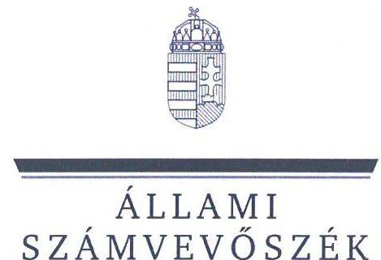
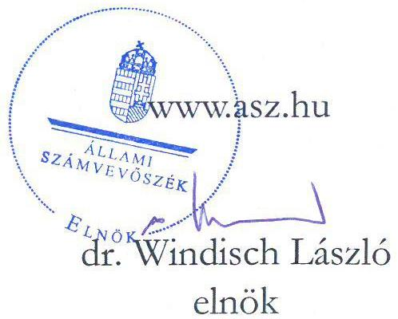
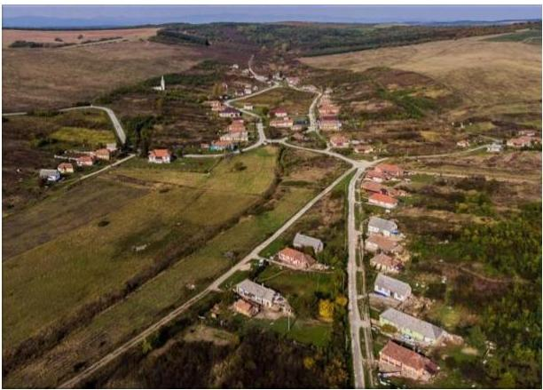
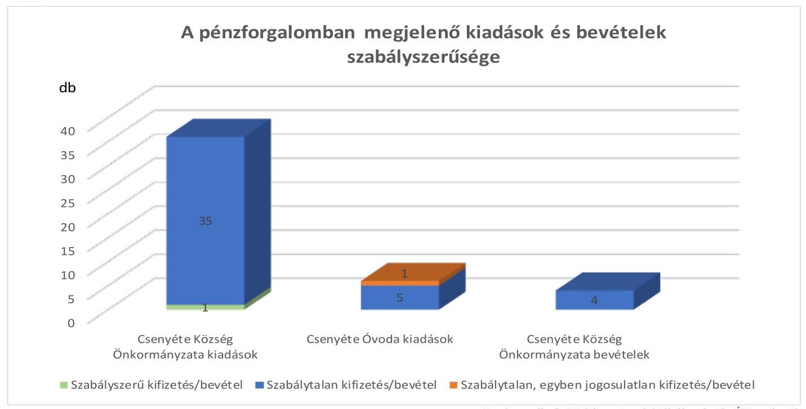

# JELENTÉS 

## Az önkormányzatok gazdálkodásának célvizsgálata

Az önkormányzatok ellenőrzése - a pénzforgalomban megjelenő kiadások teljesítésének és elszámolásának megfelelősége
A pénzforgalomban megjelenő vagyonhasznosítási bevételek beszedésének és elszámolásának megfelelősége

Csenyéte Község Önkormányzata
2023.

23030
www.asz.hu

---

ÁLLAMI
SZÁMVEVÔSZÉK

# JELENTÉS 

## Az önkormányzatok gazdálkodásának célvizsgálata

Az önkormányzatok ellenőrzése - a pénzforgalomban megjelenő kiadások teljesítésének és elszámolásának megfelelősége

A pénzforgalomban megjelenő vagyonhasznosítási bevételek beszedésének és elszámolásának megfelelősége

Csenyéte Község Önkormányzata
2023.

23030

---

# ELLENŐRZÉSI IGAZGATÓSÁG: 

## ÁLLAMHÁZTARTÁS HELYI SZINTJÉT ELLENŐRZŐ IGAZGATÓSÁG

ELLENŐRZÉSI IGAZGATÓ:
KISGERGELY ISTVÁN igazgató

ELLENŐRZÉSVEZETŐ:
LAJTERNÉ HUDÁK MAGDOLNA ellenőrzésvezető

IKTATÓSZÁM: EL-3893-007/2023.
TÉMASZÁM: 2658
ELLENŐRZÉS-AZONOSÍTÓ SZÁM: V100201

---

# TARTALOMJEGYZÉK 

- AZ ELLENŐRZÉS ALAPADATAI ..... 5
- AZ ELLENŐRZÖTT SZERVEZETEK ..... 7
- ÖSSZEFOGLALÁS ..... 9
- AZ ELLENŐRZÉS FÓKUSZKÉRDÉSEI ..... 11
- MEGÁLLAPÍTÁSOK ..... 12
- JAVASLATOK ..... 24
- MELLÉKLETEK ..... 27
I. sz. melléklet: Az ellenőrzött szervezetek jegyzéke ..... 27
II. sz. melléklet: Összefoglaló táblázat az ellenőrzött szervezetek gazdálkodási jogköreinek gyakorlásáról ellenőrzött gazdasági eseményenként ..... 28
- FÜGGELÉK: ÉSZREVÉTELEK ..... 35
- RÖVIDÍTÉSEK JEGYZÉKE ..... 36

---

.

---

# AZ ELLENŐRZÉS ALAPADATAI 

## AZ ELLENŐRZÉS CÉLJA

Az ellenőrzés célja annak értékelése, hogy az Önkormányzatnál ${ }^{1}$ és az Óvodánál ${ }^{2}$ a pénzforgalomban megjelenő kiadások teljesítése és elszámolása, továbbá az Önkormányzatnál a pénzforgalomban megjelenő vagyonhasznosítási bevételek beszedése és elszámolása megfelelő volt-e, azok az Önkormányzat, illetve az Óvoda közfeladat-ellátásához kapcsolódtak-e.

## AZ ELLENŐRZÉS TÍPUSA

Megfelelőségi ellenőrzés.

## AZ ELLENŐRZÖTT IDŐSZAK

Az ellenőrzött időszak a 2021-2022. évek és a 2023. év, az ellenőrzés megállapításainak az ÁSZ tv. ${ }^{3} 29 . \S$ (1) bekezdése szerinti megküldése napjáig.

## AZ ELLENŐRZÉS TÁRGYA

Az Önkormányzat és az Óvoda pénzforgalmában megjelenő kiadások teljesítésének és elszámolásának, továbbá az Önkormányzat pénzforgalmában megjelenő vagyonhasznosítási bevételek megalapozottságának és elszámolásának, azok közfeladat-ellátás céljára történő felhasználásának a megfelelősége.

## AZ ELLENŐRZÉS JOGALAPJA

Az ellenőrzés jogalapját az ÁSZ tv. 1. § (3) bekezdése, és 5. § (2)-(3), (6) bekezdései képezik.

## AZ ELLENŐRZÉS MÓDSZERE

Az ellenőrzés végrehajtása az ellenőrzési programban foglaltaknak, az ellenőrzött időszakban hatályos jogszabályoknak és az ellenőrzött szervezet belső szabályozásainak, az ellenőrzés szakmai szabályainak, valamint a jelen ellenőrzésre irányadó ÁSZ ${ }^{4}$ módszertanoknak a figyelembevételével történt.

Az ellenőrzési kérdések megválaszolásához szükséges bizonyítékok megszerzése az ellenőrzött szervezetek által rendelkezésre bocsátott dokumentumokra, adatokra, valamint az ellenőrzést támogató szervezetektől ${ }^{5}$ kapott adatokra alapozva a következő ellenőrzési eljárások alkalmazásával történt: dokumentumok vizsgálata, helyszíni ellenőrzés, interjú, mintavételi eljárás, elemző eljárás, szemle, szemrevételezés, rovancs.

---

Az ellenőrzés során bizonyítékként felhasználható adatforrások közé tartoztak a megkeresett ellenőrzést támogató szervezetek, az önkormányzat és az intézmény által átadott dokumentumok, továbbá minden - az ellenőrzés szempontjából releváns információkat tartalmazó - dokumentum.

Az ellenőrzött szervezetek által az ÁSZ rendelkezésére bocsátott dokumentumok valódiságát és teljes körűségét az ellenőrzött szervezetek által tett teljességi és hitelességi nyilatkozat igazolta. A rendelkezésre bocsátott adatok, információk kontrolljára helyszíni ellenőrzés keretében is sor került.

A pénzforgalomban megjelenő kiadások teljesítése és a vagyonhasznosítási bevételek megalapozottsága megfelelőségének ellenőrzése során a működés, gazdálkodás kockázatos területeinek meghatározását követően az ellenőrzött szervezetekre vonatkozó főkönyvi adatbázisokból irányított mintavételi eljárás alapján történt a mintatételek kiválasztása. A lényeges és kockázatos tételek beazonosítására egyedi kockázatértékelés alapján került sor.

Az ellenőrzés kiemelten kezelte a kifizetések és a vagyonhasznosítási bevételek közfeladat ellátáshoz való közvetlen kapcsolódásának, kötelezettségvállalás szerinti teljesülésének, jogosságának és szabályszerűségének értékelését, figyelemmel a kontrollok gyakorlati működésére is.

Az ellenőrzés kitért minden olyan körülményre és kérdésre is, amely a program végrehajtása kapcsán felmerült újabb összefüggéseknek az ellenőrzés céljaival összhangban lévő feltárásához volt szükséges.

---

# AZ ELLENŐRZÖTT SZERVEZETEK 

Csenyéte Község a Keleti-Cserehát középső részében, Borsod-Abaúj-Zemplén Vármegyében, az Encsi járásban, közúton Miskolctól 57 kilométerre, Encstől 20 kilométerre északra található zsáktelepülés. Lakóinak száma a Központi Statisztikai Hivatal adatai alapján 2022. január 1-jén 557 fő volt. Közigazgatási területe $9,97 \mathrm{~km}^{2}$.

Az Önkormányzat társadalmi-gazdasági és infrastrukturális szempontból elmaradott, jelentős munkanélküliséggel sújtott település. A munkanélküliségi ráta a 2023. februári adatok szerint $41,78 \%$ volt.

A település polgármestere ${ }^{6}$ 2019. október 13-tól látja el tisztségét, a Képviselő-testületnek ${ }^{7}$ a polgármesteren kívül négy fő képviselő tagja van. Az Önkormányzat működésével kapcsolatos feladatokat a Krasznokvajdai Közös Önkormányzati Hivatal (továbbiakban: Hivatal ${ }^{8}$ ) végzi, a jegyző, ${ }^{9}$ 2019. június 1-jétől vezeti a Hivatalt. A jegyző,-t tartós távollétében kormánymegbízotti kinevezés keretében 2021. szeptember 12022. március 10. között a jegyző, ${ }^{10}$ helyettesítette.

Az Önkormányzat fenntartásában egy költségvetési szerv működik, a 2013. augusztus 29-én alapított Óvoda, amelynek gazdálkodási feladatait a Krasznokvajdai Közös Önkormányzati Hivatal Felsőgagyi Kirendeltsége látja el. Az Óvoda intézményvezetői feladataira kiírt pályázat több alkalommal sikertelen volt, az intézmény vezetésének feladatait 2022. augusztus 16-ától megbízott vezetővel látják el.

Az Önkormányzat kötelező feladatai közül az alábbiakat társulás útján látja el:

- Orvosi ügyelet, belső ellenőrzés, óvoda szakmai feladatok támogatása, fogorvosi ügyelet (Encsi Többcélú Kistérségi Társulással);
- Hulladékgazdálkodás (Hernád Völgye és Térsége Szilárd Hulladék- Kezelési Társulással);
- Ivóvízellátás (Borsod-Abaúj-Zemplén Térségi Ivóvízkezelési Önkormányzati Társulással).

Az Önkormányzat 2021-2022. évi konszolidált beszámolóinak főbb adatait az 1. sz. táblázat mutatja be.

---

| 1. táblázat |  | adatok MFt-ban |
| :--: | :--: | :--: |
| MEGNEVEZÉS | 2021. EVI   KONSZOLIDÁLT   ÖNKORMÁNYZATI   BESZÁMOLÓ | 2022. EVI   KONSZOLIDÁLT   ÖNKORMÁNYZATI   BESZÁMOLÓ |
| Költségvetési bevétel | 358,6 | 224,3 |
| Ebből: önkormányzati feladatok működési támogatása | 129,5 | 132,6 |
| hosszabb időtartamú közfoglalkoztatás támogatása | 87,2 | 77,6 |
| közfoglalkoztatási mintaprogram támogatása | 17,1 | 4,9 |
| településfejlesztési projektek | 115,0 | 0,0 |
| Költségvetési kiadás | 271,4 | 268,1 |

Az Önkormányzat a települési önkormányzatoknak jóváhagyott rendkívüli támogatásokból a 2021. évben 5,2 M Ft, a 2022. évben 10,2 M Ft összegben, a települési önkormányzatok szociális tüzelőanyag vásárláshoz kapcsolódó támogatásaiból 2021. évben 7,8 M Ft, 2022. évben 6,2 M Ft összegben részesült. Közfoglalkoztatási programhoz kapcsolódóan az Önkormányzat a 2021. évben 104,3 M Ft, a 2022. évben 82,5 M Ft támogatást kapott. Településfejlesztési projektek megvalósítására a 2021. évben 115,0 M Ft költségvetési támogatás érkezett az Önkormányzathoz. Ebből a Magyar Falu Óvoda pályázat ${ }^{11}$ keretében óvoda felújításra és bővítésre 99,9 M Ft-ot nyert az Önkormányzat.

---

# ÖSSZEFOGLALÁS 

Az ellenőrzött gazdasági események tekintetében az Önkormányzat és az Óvoda pénzforgalmában megjelenő kiadások és bevételek teljesítése és elszámolása nem volt megfelelő, az ellenőrzött 42 kiadási gazdasági eseményből 41, az ellenőrzött négy vagyonhasznosítási bevételből egyetlen beszedése sem volt szabályszerű.

Az Önkormányzatnál közterület karbantartásnál, egyes tárgyi eszközök vásárlásánál, egyes pénzbeli szociális ellátások kifizetésekor, egyes vásárlásra kiadott előlegek elszámolásánál, egyes megbízási díjak, jutalmak kifizetésénél, az Óvodánál a tanácsadásra kifizetett összegnél nem érvényesült az Alaptörvény ${ }^{12}$ azon előirása, hogy „A közpénzeket és a nemzeti vagyont az átláthatóság és a közélet tisztaságának elve szerint kell kezelni", mivel nem voltak a közpénzfelhasználással kapcsolatos döntések alátámasztottak, nem volt biztosított a közpénzek felhasználásának szabályszerűsége, átláthatósága, ellenőrizhetősége. Az Önkormányzatnál a polgármesteri jutalmak elszámolásánál és egyes szociális ellátások odaítélésénél, az Óvodánál az intézményvezető jutalmának elszámolása során megsértették az Ávr. ${ }^{13}$ összeférhetetlenségi követelményeit is. Az ellenőrzött gazdasági események tekintetében az Önkormányzat pénzforgalmában megjelenő kiadások az önkormányzati feladatellátáshoz kapcsolódtak. Az Óvodánál egy 1000,0 E Ft összértékủ foglalkoztatottnak adott előleg felvételénél a pénz felvevője az Óvoda állományába nem tartozó polgármester volt, valamint az ebből az előlegből teljesített 150,0 E Ft értékű megbízási díj esetében a kifizetés jogosulatlan volt, mivel megbízási szerződés hiányában az Óvoda feladatellátásához való kapcsolódás nem igazolható.

Az ellenőrzött szervezetek fizetési számlájáról és pénztárából teljesített kifizetések nem voltak szabályszerűek, mivel az előzetes kötelezettségvállalást igénylő 35 eset harmadánál az Ávr. előírásai ellenére nem történt meg az írásbeli kötelezettségvállalás. Az írásbeli kötelezettségvállalást igénylő 35 gazdasági eseményből azok pénzügyi ellenjegyzését egyetlen esetben sem végezték el. Az Ávr-ben és a gazdálkodási szabályzatban foglaltak ellenére az ellenőrzött gazdasági események többségénél elmaradt, vagy nem a megfelelő dokumentumok alapján végezték el a teljesítés igazolást, így nem ellenőrizték, hogy a kifizetések az arra jogosultak részére, a megfelelő összegben történtek-e, illetve, hogy az ellenszolgáltatást az ellenőrzöttek részére teljesítették-e.

A jogszabályokban előírt kifizetéseket megelőző kontrollok szabályszerű múködtetése nem volt biztosított, így nem akadályozta meg az Önkormányzatnál és az Óvodánál előfordult szabálytalan kifizetéseket.

Az Önkormányzat pénzforgalmában megjelenő, ellenőrzött vagyonhasznosítási bevételek esetében a döntésekhez a Bkr. ${ }^{14}$-ben foglaltak ellenére a szükséges kontrollokat nem építették ki, ezért azok célszerűségi, gazdaságossági, hatékonysági és eredményességi szempontból nem voltak megalapozottak, a versenyeztetési kötelezettség szükségességét nem vizsgálta, a bevételek felhasználását az Áht. előírása ellenére az Önkormányzat célhoz nem kötötte. Egy ingatlan bérbeadásáról az önkormányzati érdekek háttérbe szorításával döntöttek, a bérleti díjat úgy állapították meg, hogy az nem nyújtott fedezetet az ingatlanhoz kapcsolódó költségekre, így az Önkormányzatot jelentős kár érte.

---

A pénzforgalomban megjelenő kifizetésekkel és bevételekkel kapcsolatos gazdasági események szabályszerűségét ellenőrzött szervezetenként az 1. ábra mutatja be.
1. ábra

A gazdálkodás belső szabályainak kialakítása nem volt teljeskörű, mivel a Számv. tv-ben foglaltak ellenére az Önkormányzatnál és az Óvodánál nem készítették el a számlarendet, az Óvodánál nem volt hatályos pénzkezelési szabályzat és gazdálkodási szabályzat. A vagyonnal való gazdálkodásra, vagyonhasznosításra vonatkozó szabályozás hiányos volt, az Önkormányzat a tulajdonában lévő helyiség bérbeadásának és a bérbeadó hozzájárulásának a feltételeit az Nvtv. ${ }^{15}$ és az Mötv. ${ }^{16}$ előirrása ellenére nem szabályozta. A kötelezettségvállalás nyilvántartásának vezetése nem felelt meg az Ávr. előírásainak, mivel a kötelezettségvállalásokat nem, vagy késedelmesen vették nyilvántartásba, emiatt az nem volt alkalmas a kötelezettségvállalás időpontjában a szabad előirányzat megállapítására.

A belső ellenőrzés csak részben töltötte be a Bkr.-ben meghatározott feladatát, mivel az ellenőrzések alacsony számuk, illetve egy részterületre irányultságuk miatt nem voltak alkalmasak arra, hogy a bevételek és a kiadások teljesítése során rendszerszerszinten jelentkező hiányosságokat beazonosítsák és javaslatot tegyenek ezek kijavítására. A pénzforgalomban megjelenő kiadások és bevételek teljesítése során az ÁSZ ellenőrzés rendszerszintű hiányosságokat tárt fel.

---

# AZ ELLENŐRZÉS FÓKUSZKÉRDÉSEI 

1.- Az Önkormányzat pénzforgalmában megjelenő kiadások teljesitése és elszámolása megfelelően, az Önkormányzat feladatellátásához kapcsolódóan valósult-e meg?
2.- Az Önkormányzat pénzforgalmában megjelenő vagyonhasznosítási bevételekkel kapcsolatos döntés megalapozott volt-e, a bevételek beszedése és elszámolása megfelelően, az Önkormányzat feladatellátásához kapcsolódóan valósult-e meg?
3.- Az Óvoda pénzforgalmában megjelenő kiadások teljesitése és elszámolása megfelelően, az Óvoda feladatellátásához kapcsolódóan valósult-e meg?

---

# 1. Az Önkormányzat pénzforgalmában megjelenő kiadások teljesítése és elszámolása megfelelően, az Önkormányzat feladatellátásához kapcsolódóan valósult-e meg? 

Összegző megállapítás Az Önkormányzatnál az ellenőrzésre kiválasztott kiadások a számlák, egyéb bizonylatok tartalma alapján az önkormányzati feladatellátáshoz kapcsolódtak, azok számviteli rendszerben való rögzítése többségében az előírásoknak megfelelően történt. Azonban a kifizetések szabályszerű végrehajtását igazoló - az Áht.-ban és Ávr.-ben előírt - dokumentumok teljeskörűen nem álltak rendelkezésre. Ezért az Önkormányzat pénzforgalmában megjelenő ellenőrzésre kiválasztott kiadások teljesítése és elszámolása összességében nem volt megfelelő. A gazdálkodás belső szabályainak kialakítása hiányos volt, mert nem készítették el a számlarendet, és a kötelezettségvállalás nyilvántartás vezetése nem felelt meg az Ávr.-ben foglaltaknak. Ezáltal nem volt biztosított a közpénzek felhasználásának szabályszerűsége, átláthatósága, ellenőrizhetősége.
1.1. számú megállapítás

A pénzforgalomban megjelenő kiadások teljesítésének megfelelősége általános megállapítások

Az Önkormányzat esetében 36 db gazdasági esemény ellenőrzése történt meg 70 437,4 E Ft összértékben. Az Önkormányzat fizetési számlájáról és pénztárából teljesített kifizetések nem voltak megfelelőek, az előzetes kötelezettségvállalást igénylő 32 esetből 12 esetben - 11 222,8 E Ft összértékben - Ávr. 52. $\$ \mathbf{( 1 )}$ bekezdésében foglaltak ellenére az írásbeli kötelezettségvállalás dokumentuma nem állt rendelkezésre, ebből egy esetben - 61,9 E Ft összértékben - a kötelezettségvállalás az Ávr. 51. § (2) bekezdésében foglaltakat megsértve történt. A kötelezettségvállalások pénzügyi ellenjegyzését 12 esetben a kötelezettségvállalási dokumentum hiányában nem végezték el, 20 esetben pedig nem végezték el, vagy nem az arra jogosult személy végezte el.

- Az Önkormányzatnál 12 db ellenőrzött kifizetés (ÖNK_01, ÖNK_04, ÖNK_06, ÖNK_08, ÖNK_12, ÖNK_13, ÖNK_14, ÖNK_16, ÖNK_23, ÖNK_25, ÖNK_31, ÖNK_32) gazdasági eseményre vonatkozóan nem tudták bemutatni az előzetes írásbeli kötelezettségvállalás dokumentumát annak ellenére, hogy azt az Áht. 37. § (1) bekezdése és az Ávr. 52. $\$$ (1) bekezdése előírásai alapján el kellett volna készíteni.

---

- Egy esetben - ÖNK_28 gazdasági eseménynél - a jegyző ${ }_{1}$-vel a megbízási szerződést folyamatban lévő pályázatokkal kapcsolatos lebonyolítói feladatokban való közreműködésre az Ávr. 51. § (2) bekezdésében foglaltak ellenére feladatkörébe tartozó feladatra és visszamenőleges hatállyal kötötték meg. A megbízási szerződésben az érintett pályázatokat tételesen nem nevesítették.
- Az előzetes írásbeli kötelezettségvállalást igénylő 32 gazdasági esemény közül 20 esetben (ÖNK_02, ÖNK_03, ÖNK_05, ÖNK_07, ÖNK_09, ÖNK_10, ÖNK_11, ÖNK_15, ÖNK_17, ÖNK_18, ÖNK_19, ÖNK_20, ÖNK_21, ÖNK_22, ÖNK_24, ÖNK_27, ÖNK_28, PÖT_01, Polgármesteri jutalom 2021, Polgármesteri jutalom 2022) a pénzügyi ellenjegyzés elvégzését nem igazolták, vagy azt nem az arra jogosult személy (a pénzügyi ellenjegyzésre felhatalmazással nem rendelkező érvényesítő) végezte.

Az Áht. 38. § (1)-(2) bekezdések és az Ávr. 57. § (1), (3)-(4) bekezdések, valamint a Gazdálkodási szabályzat ${ }_{2}$ IV. pontjának előírásai ellenére az ellenőrzött 36 gazdasági eseményből 11, 18 504,6 E Ft összértékű gazdasági esemény esetében a teljesítésigazolást nem végezték el, 12, 29 810,3 E Ft összértékủ kifizetés vonatkozásában pedig a teljesítésigazolás formális volt a kötelezettségvállalási dokumentum hiánya, vagy az Ávr. 57. § (3) bekezdésében előírt feltételek be nem tartása miatt. Tehát összességében 48 314,9 E Ft közpénz elköltését megelőzően nem ellenőrizték, hogy a kifizetés az arra jogosult részére, illetve a megfelelő összegben történt-e, valamint nem ellenőrizték, hogy a kifizetés alapjául szolgáló ellenszolgáltatást ténylegesen elvégezték-e. Nem volt szükség teljesítés igazolásra az Áht. 36. § (1) bekezdésében és az Ávr. 57. § (3) bekezdésében foglalt 200,0 E Ft-os értékhatárra tekintettel 11 kifizetés vonatkozásában, két, 11 614,3 E Ft összértékủ gazdasági esemény teljesítés igazolása az előírásoknak megfelelően történt.

- Nem állt rendelkezésre a teljesítés igazolás dokumentuma 11 esetben az ÖNK_06, ÖNK_08, ÖNK_10, ÖNK_11, ÖNK_18, ÖNK_19, ÖNK_22, ÖNK_25, ÖNK_28, ÖNK_31, PÖT_01 gazdasági eseményeknél.
- A teljesítésigazolás nem volt megfelelő 12 gazdasági eseménynél (ÖNK_01, ÖNK_2, ÖNK_04, ÖNK_12, ÖNK_13, ÖNK_16, ÖNK_20, ÖNK_23, ÖNK_24, ÖNK_27, ÖNK_29, ÖNK_32), ebből hét esetben (ÖNK_01, ÖNK_04, ÖNK_12, ÖNK_13, ÖNK_16, ÖNK_23, ÖNK_32) a teljesítés igazolás a kötelezettségvállalás dokumentumának hiánya miatt ténylegesen nem volt elvégezhető, további öt esetben a teljesítésigazolást nem végezték el megfelelően. Az ÖNK_24 gazdasági esemény esetében a teljesítés igazolást jogosultsággal nem rendelkező személy végezte, az ÖNK_02 gazdasági eseménynél a teljesítés igazolás nem tartalmazta a teljesítés tényére történő utalást, az ÖNK_29 gazdasági eseménynél nem tartalmazta a teljesítés igazolás dátumát. Az ÖNK_20, ÖNK_27 tételek esetében a teljesítés igazoló a kötelezettségvállalás dokumentuma alapján nem ellenőrizte a kiadások teljesítésének összegszerűségét, mivel a leszámlázott és kiegyenlített összeg a vállalkozási szerződéstől magasabb egységárakat tartalmazott.
- Az ellenőrzött 36 db gazdasági esemény közül két esetben (Polgármesteri jutalom 2021, Polgármesteri jutalom 2022) az érvényesítés dokumentuma az Áht. 38. § (1) bekezdésében előírtak ellenére nem állt rendelkezésre. Egy esetben az érvényesítést nem kellett elvégezni. További 33, a kötelezettségvállalás, pénzügyi ellenjegyzés és a teljesítés igazolás hiányával, szabálytalanságaival érintett gazdasági esemény vonatkozásában az érvényesítő nem végezte el a feladatát, mivel - az Ávr. 58. § (2) bekezdésében és a Gazdálkodási szabályzat ${ }_{1,2}$ V. pontjában foglaltak ellenére - nem jelezte az utalványozónak, hogy a megelőző ügymenetben nem tartották

---

be az Áht. és az Ávr. előírásait. Nem kifogásolta, hogy kötelezettségvállalásra az Áht. 37. § (1) bekezdésében és az Ávr. $55 \S$ (1) bekezdésében foglaltak ellenére pénzügyi ellenjegyzés hiányában került sor, továbbá, hogy az Ávr. 58. § (2) bekezdésében foglaltak ellenére a megelőző ügymenetben a teljesítés igazolást nem, vagy nem szabályszerűen végezték el.

Az utalványozás dokumentuma nem állt rendelkezésre a Polgármesteri jutalom 2021, Polgármesteri jutalom 2022 gazdasági események esetében. Az utalványozó aláírása hiányzott, vagy az utalványozás a kifizetést követően történt 15, 10 313,1 E Ft összértékủ gazdasági esemény (ÖNK_10, ÖNK_14, ÖNK_17, ÖNK_18, ÖNK_19, ÖNK_20, ÖNK_23, ÖNK_27, ÖNK_28, ÖNK_29, ÖNK_30, ÖNK_31, ÖNK_32, ÖNK_33, PÖT_01) esetében, ezzel megsértették az Áht. 38. § (1) bekezdés előírását. Ezen túlmenően az ÖNK_32 gazdasági esemény keretében - 320,0 E Ft összegű előleg felvételénél - a polgármester a saját javára utalványozta a kifizetést, megsértve ezzel az Ávr. 60. § (2) bekezdésében foglaltakat.
(Az ellenőrzött gazdasági eseményeket és feltárt hiányosságokat tételesen a gazdasági események azonosítására szolgáló adatok megadásával a II. számú melléklet 1. számú táblázata tartalmazza.)
1.2. számú megállapítás

A pénzforgalomban megjelenő kiadások teljesítésének megfelelősége az egyes gazdálkodási területekre vonatkozó megállapítások
a) Az ellenőrzés szabálytalanságokat tárt fel a 2021-2022. évi polgármesteri jutalmazások és a 2023. évi fedezet nélküli kötelezettségek vállalása során

A polgármester részére 2021. évi jutalom címén két részletben nettó 397,9 E Ft-ot, majd nettó 795,7 E Ftot, 2022. I. félévi jutalom címén nettó 1297,2 E Ft-ot fizettek ki. A polgármesteri jutalomról a Képviselő-testület annak ellenére döntött, hogy az időarányos gazdálkodásról szóló előterjesztésekből tudomása volt arról, hogy az Önkormányzat kötelező, alapvető működést biztosító feladatainak, költségvetéssel szembeni kötelezettségek teljesítésének nem volt megfelelő fedezete, és hogy az Önkormányzat már a működésének finanszírozására is a pályázati forrásból származó, célhoz kötött összeget használta. A jegyzö ${ }_{1-2}$ az Ávr. 54. § (3) bekezdésében foglaltaknak megfelelően a Képviselő-testület részére a testületi ülésekről szóló jegyzőkönyvek szerint többször jelezte, hogy a jutalom kifizetéséhez szükséges fedezet az Önkormányzat költségvetésében nem áll rendelkezésre. A Képviselő-testület sem az Önkormányzat pénzügyi helyzetére, sem ellátandó feladataira, sem a jegyző figyelemfelhívására nem volt tekintettel a polgármesteri jutalmak megszavazásakor annak ellenére, hogy az Mötv. 115. § (1) bekezdése alapján a helyi önkormányzat gazdálkodásának biztonságáért a Képviselő-testület felelős. Az érintett közpénz nagysága a két ellenőrzött gazdasági esemény tekintetében (a 2021. és 2022. évi jutalom kifizetés) bruttó $4343,8 \mathbf{E} \mathbf{F t}$ bér és ennek munkaadót terhelő járulékai. A jutalom kifizetésekkel kapcsolatos Képviselő-testületi döntés pénzügyi ellenjegyzést nem tartalmazott.

- Polgármesteri jutalom 2021. megnevezésű gazdasági esemény: A Képviselő-testület 2021. november 30-i ülésének 1. napirendi pontja keretében beszámoltak az Önkormányzat 2021. évi költségvetésének időarányos végrehajtásáról. Az előterjesztés alapján megállapítható, hogy 2021. október 31-én az Önkormányzatnak a bankszámláján az önkormányzati feladatok ellátására mindösszesen 2887,6 E Ft állt rendelkezésre, és ebből szavazta meg a Képviselő-testület 84/2021. (XI.30.) számú határozatában a polgármester részére a 2021. évre hat havi jutalom kifizetését bruttó 2393,2 E Ft összegben. A jegyző2 a döntést megelőzően többször jelezte, hogy a

---

jutalmazáshoz sem az előirányzati, sem a pénzügyi fedezet nem áll rendelkezésre, ennek ellenére a kifizetések megtörténtek.

- A Polgármesteri jutalom 2022. megnevezésű gazdasági esemény: A Képviselő-testület 2022. december 1-jei ülésén tárgyalta „Az Önkormányzat 2022. évi pénzügyi beigyztének ismertetését". Az előterjesztésből megállapítható, hogy a döntés meghozatalakor az Önkormányzatnak az önkormányzati feladatok ellátására már semmilyen fedezet nem állt rendelkezésre, sőt a pályázati források más célra történő felhasználásából eredően az Önkormányzatnál összesen 19 110,0 E Ft hiány keletkezett. (A pénzkészlet levezetése alapján 2022. október 31-én az Önkormányzat pénztárában és bankszámláján együttesen szereplő 77 897,5 E Ft volt, azonban az Óvoda pályázatra kapott, még fel nem használt összegként 85 927,8 E Ft-nak kellett volna rendelkezésre állnia. Továbbá a falugondnoki gépkocsi vásárlására vállalt összesen 14 999,9 E Ft kötelezettségből még 11 080,0 E Ft-ot nem teljesítettek. Ezek egyenlegeként az adott időpontban 19 110,0 E Ft hiány mutatható ki.) A Képviselő-testület ennek ellenére a polgármester 2022. I. félévi, három havi munkabérnek megfelelő jutalmazásáról döntött az 50/2022. (VI. 27.) számú határozatában. A jegyző ${ }_{1}$ ebben az esetben is jelezte, hogy a kifizetés fedezete nem áll rendelkezésre.
A kifizetések során az átutalás engedélyezője a polgármester volt, aki azzal, hogy saját jutalmának átutalását engedélyezte, megsértette az Ávr. 60. § (2) bekezdésében foglalt összeférhetetlenségi szabályokat. Összességében a Magyar Falu Óvoda pályázatból más célokra használt összegek egyenlege 2023. áprilisában 16 600,5 E Ft volt.

|  SORZÁM | MEGNEVEZÉS | Összeg (E Ft)  |
| --- | --- | --- |
|  1. | Önkormányzat bankszámla egyenleg 2023. 04.13-án | 41487,5  |
|  2. | Magyar Falu Óvoda pályázatra kapott összeg | 99955,8  |
|  3. | Pályázati forrásból pályázati célra költött összeg 2023.04.13-ig | 41867,8  |
|  4. | Pályázati forrásból fel nem használt rész 2023.04.13-ig | 58088,0  |
|  5. | Pályázati forrásból más célra használt (1-4) | $-16600,5$  |

Fonrás: A Képviselö-testület 2023. április 13-i ülésén tárgyalt rendkívüli kiadásokkal kapcsolatos elöterjesztés

- A Képviselő-testület a 2023. április 13-án megtartott ülésének jegyzőkönyve szerint - a Hivatal által bemutatott fedezethiány és a jegyző ${ }_{1}$ jelzése ellenére - ismételten fedezet nélküli kötelezettségvállalásokról döntött. A döntések összesen 1329,8 E Ft fedezet nélküli kötelezettségvállalást jelentettek az Önkormányzat számára. Ezek tételesen: a falugondnok jutalmazása 339,8 E Ft összegben, három fő szociális támogatása 300,0 E Ft összegben, továbbá 69 fő közfoglalkoztatott részére munkabér előleg fizetése (összeg meghatározása nélkül).
A Képviselő-testület döntéseivel a központi költségvetést megillető tartozások, és az önkormányzati érdekek körébe tartozó, a müködőképesség fenntartását célzó kifizetések elé sorolt nem kötelező személyi jellegű kifizetéseket.
b) Az ellenőrzés szabálytalanságokat tárt fel az élelmezési anyagok számlázása és kifizetése során

Az Önkormányzat által teljesített két, élelmezési anyagok vásárlására irányuló gazdasági eseménynél az Önkormányzat felé a számlázás nem a szerződésben szereplő egységárakon történt. A számlákat az

---

Önkormányzat kifizette, holott azok nem az utolsó érvényes vállalkozási szerződés módosításban megállapított egységárakat, hanem azoknál magasabb egységárakat tartalmaztak. A szabálytalan kifizetés miatt az Önkormányzatot bruttó 350,6 E Ft kár érte.

- Két esetben (ÖNK_20, ÖNK_27) egy gazdasági társaság élelmezési anyagokat számlázott ki az Önkormányzat részére bruttó 1397,4 E Ft, illetve 593,1 E Ft (nettó 1100,3 E Ft, illetve 467,0 E Ft) összegben. 2022. augusztus 26-án szerződésmódosítás készült, amelyet azonban az Önkormányzat nem, csak a vállalkozó írt alá, és a számlázás ez alapján a hatályba nem lépett szerződésmódosítás alapján történt.
Ezáltal az Önkormányzat részéről a teljesítés igazoló az Ávr. 57. § (1) bekezdésében és a Gazdálkodási szabályzat ${ }_{2}$ IV. pontjában foglaltak ellenére az ellenőrizhető okmányok alapján nem ellenőrizte a kiadások összegszerűségét.

# c) Az ellenőrzés szabálytalanságokat tárt fel a szociális támogatások kifizetése során 

Az ellenőrzött gazdasági események között szereplő, Önkormányzat által kifizetett ellátások, támogatások (öt gazdasági esemény) 12 467,0 E Ft-ot tettek ki. Az Önkormányzat két, 5 320,0 E Ft összegű támogatás esetében a jogosultsági feltételek fennállását nem vizsgálta. Három gazdasági eseménynél az Ávr. 60. § (2) bekezdésében foglaltakat megsértve a polgármester a közeli hozzátartozója részére utalványozott.

- Az Önkormányzat két támogatás (ÖNK_06, ÖNK_09) esetén a jogosultsági feltételeket nem vizsgálta. Az ÖNK_06 gazdasági esemény esetében beiskolázási támogatás kifizetése történt meg, amelyhez kapcsolódóan a jogosultságot alátámasztó jövedelemigazolások a 6/2021. (II.26.) önkormányzati rendelet ${ }^{17}$ 10. §-ának előirása ellenére nem álltak rendelkezésre. Az ÖNK_09 gazdasági esemény keretében a lakosság rendkívüli pénzbeli támogatására került sor, amelyhez szintén nem csatolták a jövedelemigazolásokat a 6/2021. (II.26.) önkormányzati rendelet 17. §-ában foglaltak ellenére.
- A jegyző ${ }_{1} 2023$. március 23-án kelt nyilatkozata alapján az ÖNK_05 tétel esetében (óvoda és iskolakezdési támogatás) hat fővel, az ÖNK_06 tétel esetében (óvoda és iskolakezdési támogatás) nyolc fővel, az ÖNK_07 tétel esetében (húsvéti támogatás) hat fő esetében, az ÖNK_8 tétel esetében (karácsonyi ajándékpénz) hat fő esetében, és az ÖNK_09 tétel esetében (rendkívüli pénzbeli támogatás) hat fő esetében volt az utalványozó polgármesterrel rokoni kapcsolatban. Ebből az ÖNK_7, ÖNK_8 és ÖNK_9 gazdasági eseményeknél a támogatottak között a polgármester közeli hozzátartozója is szerepelt.

### 1.3. számú megállapítás Szabályozottság, nyilvántartások vezetése

Az Önkormányzat az ellenőrzött időszakban elkészítette a Számv. tv. 14. § (3) bekezdésében és az Áhsz. ${ }^{18}$ 50. § (1) bekezdésében előírt számviteli politikát, azonban a Számv. tv. 161. § (1) bekezdésében foglaltak ellenére nem készítette el a Számv. tv. 161. § (2)-(4) bekezdés, 161/A. § (2) bekezdés, valamint az Áhsz. 51. (1)-(3) bekezdés előírásainak megfelelő számlarendet. Az Önkormányzat az ellenőrzött időszakban az Áht. 10. § (5) bekezdésében és az Ávr. 13. § (2) bekezdés a) pontjában foglaltaknak megfelelően rendelkezett a gazdálkodás részletes rendjét meghatározó szabályzattal. A Gazdálkodási szabályzat ${ }_{1,2}$ II. fejezet 1. pontjában rögzítette, hogy az Ávr. 53. § (1) bekezdés a) pontja és (2) bekezdése előírásaival összhangban a kétszázezer forintot el nem érő kifizetés teljesítéséhez előzetes írásbeli kötelezettségvállalás

---

nem szükséges. A pénzügyi ellenjegyzésre és teljesítésigazolásra vonatkozó meghatalmazások a Gazdálkodási szabályzat ${ }_{1,2}$ III., valamint IV. fejezeteiben foglaltak ellenére nem álltak rendelkezésre.
A kötelezettségvállalás nyilvántartás vezetése nem felelt meg az Ávr. 56. § (1) bekezdésében előírtaknak, mivel a kötelezettségvállalásokat a nyilvántartásba nem, vagy nem haladéktalanul vezették fel, így a nyilvántartás nem volt alkalmas a kötelezettségvállalás időpontjában a szabad előirányzat megállapítására.

- Az Önkormányzat kötelezettségvállalások nyilvántartásában feltüntetett adatok alapján az Ávr. 56. $\S$ (1) bekezdésében előírtak ellenére hat, 6149,4 E Ft összértékủ gazdasági eseményt (ÖNK_10, ÖNK_11, ÖNK_14, ÖNK_28, Polgármesteri jutalom 2021., Polgármesteri jutalom 2022.) a kötelezettségvállalás nyilvántartásba nem vezették fel, 19, 52 077,7 E Ft összértékủ gazdasági eseményt (ÖNK_01, ÖNK_03, ÖNK_04, ÖNK_06, ÖNK_07, ÖNK_12, ÖNK_13, ÖNK_15, ÖNK_16, ÖNK_17, ÖNK_18, ÖNK_19, ÖNK_22, ÖNK_24, ÖNK_25, ÖNK_23, ÖNK_27, ÖNK_29, PÓT_01) a kötelezettségvállalás nyilvántartásba nem vezették fel haladéktalanul.
1.4. számú megállapítás

A beszámoló alátámasztása, számviteli elszámolások megfelelősége
Az Önkormányzat a 2021. évre vonatkozóan rendelkezett a polgármester által aláírt éves költségvetési beszámolóval. A 2022. év vonatkozásában az aláírt éves költségvetési beszámoló a helyszíni ellenőrzés lezárásáig még nem állt rendelkezésre, a 2022. december 31-i főkönyvi kivonatot rendelkezésre bocsátották. Az ellenőrzött gazdasági események keretében beszerzett eszközöket a Számv. tv. 69. § (1) bekezdésében foglaltak alapján az év végi zárást alátámasztó leltárban kimutatták, a helyszíni ellenőrzés során az eszközök fellelhetők voltak.
Az ellenőrzött gazdasági események tekintetében az Önkormányzat pénzforgalmában megjelenő kiadások számviteli elszámolása többségében szabályzzerűen, a gazdasági esemény tartalmának megfelelően történt. Azonban az Önkormányzat fizetési számlája terhére teljesített kettő, bruttó 3147,3 E Ft összegű kifizetés vonatkozásában a számviteli elszámolást alátámasztó bizonylatok hiányosak voltak, ezzel megsértették a Számv. tv. 167. § (1) bekezdés h)- i) pontjai és az Áhsz. 52. §-a előírásait. A házipénztárból három, összesen 750,0 E Ft összegű elszámolásra kiadott előleg kifizetése, elszámolása nem felelt meg a Pénzkezelési szabályzatban ${ }^{19}$ rögzítetteknek az elszámolási határidők, a felhasználási célok és a bizonylatolás vonatkozásában.

- A fizetési számla terhére teljesített kifizetések közül a két polgármesteri jutalmazás (Polgármesteri jutalom 2021, Polgármesteri jutalom 2022), összesen nettó 2092,9 E Ft, bruttó 3147,3 E Ft összegű kifizetés esetében nem csatolták az utalványrendeletet, vagy más, a számviteli elszámolás módjára, az érintett könyvviteli számlákra történő hivatkozást tartalmazó bizonylatot. A fenti hiányosságokkal megsértették a Számv. tv. 167. § (1) bekezdés h) pontjában és az Áhsz. 52. §-ában előírtakat. A bizonylatok hiányosságai miatt az Áhsz. 39. §-ának, 45. §-ának, 15-16. mellékletének előírásai, valamint a 38/2013. (IX.19.) NGM rendeletben ${ }^{20}$ foglaltak ellenére nem igazolható, hogy a gazdasági eseményeket a megfelelő főkönyvi számlákra számolták el.
- A házipénztárból teljesített három elszámolásra kiadott előleg közül az ÖNK_33 gazdasági esemény keretében, a falugondnok részére 2022. április 09-én kiadott 30,0 E Ft összegű ruhapénz előleg esetében az elszámolás a Pénzkezelési szabályzat 76. pontjában és a Képviselő-testület 32/2022.(IV.08.) Kt. határozatában előírt határidőben, 2022. május 15-ig, és azt követően a helyszíni ellenőrzés napjáig, 2023. március 13-ig sem történt meg. A polgármester az Mótv. 115. § (1) bekezdése, a jegyző́ az Mótv. 81. § (1) bekezdése, valamint az Ávr. 9. § (4) bekezdése és 11. §-

---

a szerinti felelősségi körében nem gondoskodott a jogsértő gyakorlat megszüntetéséről, a jogtalanul használt közpénz visszafizettetéséről. Továbbá, mivel az előleg elszámolása 30 napon belül nem történt meg, az SZJA. tv. ${ }^{21}$ 72. $\int$ (4) bekezdés c) pontjában foglaltak alapján az kamatjövedelemnek minősül, amely után adófizetési kötelezettség keletkezett. Az előleg összegét a 2022. december 31-i főkönyvi kivonatban a megfelelő főkönyvi számla egyenlegében szerepeltette az Önkormányzat.
Az ÖNK_31 gazdasági esemény esetében kiadott 400,0 E Ft összegű előleg elszámolására a Pénzkezelési szabályzat 76. pontjában előírtakkal ellentétben 30 napon túl került sor, továbbá az előleget segély fizetés céljából vették igénybe, ami a Pénzkezelési szabályzat 70-71. pontjainak előírásába ütközött.
Az ÖNK_32 - 320,0 E Ft összegű - gazdasági eseményhez kapcsolódó előleg esetében az elszámolt tételek közül a 14,8 E Ft összegű kifizetés számviteli bizonylata nem állt rendelkezésre a Számv.tv. 165. $\int(1)$ bekezdésében foglaltak ellenére.

# 1.5. számú megállapítás Készpénzkezelés 

A helyszíni ellenőrzés keretében került sor az Önkormányzatnál működtetett három házipénztár (Önkormányzat, Közfoglalkoztatás, Óvoda) pénztárrovancsának elvégzésére. Az ellenőrzés időpontjában a pénztárakban lévő ellenőrzött összeg megegyezett a pénztárjelentés szerinti záró adat, valamint az utolsó pénztárzárás és a megszámlálás közötti időszakban keletkezett bizonylatok összevont egyenlegével.
A pénztáros rendelkezett a pénztári feladatok ellátására vonatkozó jegyző: által aláírt megbízással, valamint anyagi felelősség vállalást tartalmazó nyilatkozattal.

### 1.6. számú megállapítás Belső ellenőrzés

Az Önkormányzatnál a belső ellenőrzés a 2022-2023. években egy-egy ellenőrzést végzett, a szociális feladatellátás szabályszerűségére, valamint a hivatali gépjármủ használatra vonatkozóan. A szociális feladatellátás szabályszerűségével kapcsolatos ellenőrzés során megállapították, hogy azok dokumentálása hiányos, a támogatási kérelmeket, illetve a jogosultság vizsgálatát nem tartalmazzák. A hivatali gépjármủ használattal kapcsolatban megállapították, hogy az Önkormányzatnál menetleveleket csak 2022. márciusától, a belső ellenőrzés megkezdésétől kezdve vezettek, az üzemanyag előlegek felvétele és elszámolása nem volt szabályos. A belső ellenőri jelentésben foglaltakra intézkedési tervek készültek. A belső ellenőri megállapítások összhangban vannak az ÁSZ-nak az ezen vizsgált területek vonatkozásában tett megállapításaival.
Összességében azonban a belső ellenőrzés csak részben töltötte be a Bkr.-ben meghatározott feladatát, mivel az ellenőrzések alacsony számuk, illetve egy részterületre irányultságuk miatt nem voltak alkalmasak arra, hogy a bevételek és a kiadások teljesítése során rendszerszerszinten jelentkező hiányosságokat beazonosítsák és javaslatot tegyenek ezek kijavítására. A pénzforgalomban megjelenő kiadások és bevételek teljesítése során az ÁSZ ellenőrzés rendszerszintű hiányosságokat tárt fel.

---

# 2. Az Önkormányzat pénzforgalmában megjelenő vagyonhasznosítási bevételekkel kapcsolatos döntés megalapozott volt-e, a bevételek beszedése és elszámolása megfelelően, az Önkormányzat feladatellátásához kapcsolódóan valósult-e meg? 

Összegző megállapítás Az ellenőrzött vagyonhasznosításra vonatkozó döntések célszerűségi, gazdaságossági, hatékonysági és eredményességi szempontból nem voltak megalapozottak, a versenyeztetési kötelezettség szükségességét az Önkormányzat nem vizsgálta, a vagyonhasznosítási bevételek felhasználását célhoz nem kötötte.

Az ellenőrzött négy gazdasági esemény közül három önkormányzati nem lakás céljára szolgáló helyiség bérbeadásához, egy pedig önkormányzati vagyontárgy (gépjármű) értékesítéséhez kapcsolódott.
Az Önkormányzat megalkotta Vagyonrendeletét ${ }^{22}$, amelyben meghatározták a vagyonhasznosítás kereteit, a döntési jogosultságokat, azonban a szabályozás nem volt teljes körű, mivel az Önkormányzat a tulajdonában lévő helyiségek bérbeadásának és a bérbeadó hozzájárulásának a feltételeit rendeletben nem szabályozta. Továbbá nem biztosította az önkormányzati vagyon Nvtv. 7. § (2) bekezdésében előírtak szerinti egységes elveken alapuló, átlátható, értéknövelő hasznosításának feltételeit. A rendeletalkotás elmaradását a Kormányhivatal nem észrevételezte.
A helyiség bérbeadásokról - egy kivétellel - valamint a jármú értékesítésről a Vagyonrendelet 5. §, 8. $\S$ (4) bekezdés és 17. $\$ 1$ (1) bekezdésében foglaltaknak megfelelően a Képviselő-testület döntött. A vagyonhasznosításra vonatkozó döntések során a Bkr. 8. § (2) bekezdés b) pontjában foglaltak ellenére nem építették ki azokat a kontrollokat, amelyek a döntések célszerúségi, és gazdaságossági szempontú megalapozottságát biztosították volna. A vagyonhasznosítási döntések indokoltságát nem támasztották alá, a bérleti díj megállapítására háttérszámításokat nem végeztek, nem rendelkeztek a bérbeadott helyiségek közüzemi díjainak bérlő általi megtérítéséről, így nem vizsgálták azt sem, hogy a bérleti díjakból az Önkormányzat kapcsolódó költségei megtérülnek-e. Az ingatlannal kapcsolatos bevételek és kifizetett közüzemi díjak különbözeteként az Önkormányzatnak összességében 5186,3 E Ft kára keletkezett.

- Az Önkormányzat öt hónapra bérbe adta az Önkormányzat épületében lévő helyiségét (BEV_01) egy Szakképző Intézmény részére integrációs képzés céljából 365,0 E Ft bérleti díj ellenében. A bérleti szerződés a bérelt helyiség beazonosítására alkalmas adatokat nem tartalmazott. A bérleti díj megállapítását számításokkal, kalkulációval nem támasztották alá. A bérbeadásra vonatkozó szerződést szabályszerűen a polgármester írta alá. A bérleti szerződés a közüzemi díjak megfizetésével kapcsolatos rendelkezést nem tartalmazott, azokat az Önkormányzat fizette meg. Előzetesen önköltségszámítást nem végeztek, nem mérték fel, hogy a helyiség üzemeltetésével kapcsolatban milyen, és mekkora összegű költségek merülnek fel, így azt sem mérlegelték, hogy a bérleti díj fedezetet nyújt-e a költségekre.
- Két másik - 28,3 E Ft és 50,0 E Ft összegű - gazdasági esemény (BEV_02 és BEV_05) ugyanazon bérbeadáshoz kapcsolódott. Az Önkormányzat bérbe adta - törzsvagyon

---

körébe nem tartozó - üzlethelyiségét magánszemély részére 2021. október 05-től határozatlan időtartamra. A bérbeadásra vonatkozóan a Vagyonrendelet, az Mötv., valamint a Gazdálkodási szabályzat ${ }_{1}$ előírásainak megfelelően a Képviselő-testület 64/2021. (X.05.) sz. határozatában döntött, 5,0 E Ft/hó bérleti díj megállapításával. A határozat felhatalmazta az alpolgármestert a szerződés „lehető legkedvezőbb feltételekkel való megkötésére". A bérleti díjat az 56/2022. (VIII.01.) sz. határozat alapján 2022. augusztus 29-től 10,0 E Ft/hó összegre emelték. A bérleti díj megállapításának módjára, alátámasztására vonatkozó előírás, adat, számítás nem állt rendelkezésre, nem vizsgálták, hogy a bérbeadásból származó bevétel fedezi-e a bérbeadott ingatlannal kapcsolatosan felmerült költségeket.

A döntésben a polgármester nem vett részt, mivel az ülés jegyzőkönyve, továbbá a polgármester helyszíni ellenőrzésen tett, jegyzőkönyvben rögzített kijelentése alapján a bérlő a polgármester hozzátartozója volt.

Az ingatlan közüzemi díjainak viseléséről a bérleti szerződés nem rendelkezett, azonban azt - a polgármester helyszíni ellenőrzés során tett nyilatkozata alapján - az Önkormányzat fizette. A bérleti szerződés fennállásának időszakában - 2021. október 05. és 2022. november 10. között - a bérlemény villamosenergia közüzemi díja, annak folyószámlakimutatása alapján 5264,6 E Ft-ot tett ki, míg a bérleti díjból származó bevétele az Önkormányzatnak 78,4 E Ft volt. A polgármester helyszíni ellenőrzés során tett nyilatkozata szerint az érintett időszakban az ingatlan vonatkozásában áramlopás történt, azonban az Önkormányzat feljelentést nem tett, így az ingatlannal kapcsolatosan az Önkormányzatnak 5186,3 E Ft kára keletkezett. A Képviselő-testület 60/2022 (VIII.30.) sz. határozatában az ingatlan értékesítési szándékáról döntött, a bérleti szerződést a bérlő 2022. november 10. napjával felmondta.

A jármű értékesítés során a Bkr. 8. § (2) bekezdés b) pontjában előírása ellenére nem biztosították az ügyletből származó bevétel közgazdasági megalapozottságát, mivel a jármű eladási árának megállapítását nem támasztották alá, valamint a jármű tulajdonjogának változásáról adás-vételi szerződést nem készítettek. A vagyonhasznosítási bevételek felhasználását azok megtervezésekor az Áht. 4. § (3) bekezdése előírása ellenére nem kötötte célhoz az Önkormányzat. Az Nvtv. 11. § (16) bekezdésében, valamint a Vagyonrendelet 29. § (2) bekezdésében előírtak ellenére a versenyeztetési kötelezettség fennállását a tulajdonosi joggyakorló nem vizsgálta.

- A tárgyi eszköz értékesítésre vonatkozóan ellenőrzött gazdasági esemény (BEV_03) keretében az Önkormányzat egy - a törzsvagyon körébe nem tartozó - forgalomból ideiglenesen kivont GAZ-SOBOL- 231 típusú 2007. évben gyártott, 2011-ben vásárolt gépjármúvet értékesített 20,0 E Ft összegben. Az értékesítésről az Mötv. 41. § (3) bekezdése, valamint a Vagyonrendelet 5. §, 8. § (4) bekezdés és (6) bekezdés a) pont előírásainak megfelelően a Képviselő-testület 52/2020. (VII.28.) sz. határozatban döntött. Az eladási árat a Képviselő-testület döntése tartalmazta, azonban az ár megállapításának módjára vonatkozó adatok, információk nem álltak rendelkezésre. Az Önkormányzat a Kknyt. ${ }^{23}$ 33. § (6) bekezdése, valamint a 304/2009. (XII. 22.) Korm. rendelet ${ }^{24}$ 3. §-a előírásai szerinti teljes bizonyító erejú magánokiratot a tulajdonjog változásáról, a jármú értékesítéséről nem készített. A nyilvántartásokból az eszköz kivezetésre került, azonban a Számv. tv. 81. § (3) c) pontjában előírt elszámolás az adás-vételi szerződés hiányában nem volt szabályszerű.

---

Az ellenőrzött vagyonhasznosítási ügyletek előkészítése és lebonyolítása (a döntések meghozatala, a bérleti díjak, egyéb, pl. költségviselésre vonatkozó feltételek megállapítása) során a döntéseket nem támasztották alá, így nem valósult meg az Nvtv. 7. § (1)-(2) bekezdéseiben foglaltak szerinti, a nemzeti vagyonnal felelős módon történő, rendeltetésszerú gazdálkodás, a vagyonnak az önkormányzat mindenkori teherbíró képességéhez igazodó, elsődlegesen a közfeladatok ellátásához szükséges, egységes elveken alapuló, átlátható, hatékony és költségtakarékos, értéknövelő használata, hasznosítása, gyarapítása.
(Az ellenőrzött gazdasági eseményeket és feltárt hiányosságokat tételesen a gazdasági események azonosítására szolgáló adatok megadásával a II. számú melléklet 2. számú táblázata tartalmazza.)

# 3. Az Óvoda pénzforgalmában megjelenő kiadások teljesítése és elszámolása megfelelően, az Óvoda feladatellátásához kapcsolódóan valósult-e meg? 

Összegző megállapítás

Az Óvodánál az ellenőrzésre kiválasztott kiadások a számlák, egyéb bizonylatok tartalma alapján egy kivétellel az intézményi feladatellátáshoz kapcsolódtak, azok számviteli rendszerben való rögzítése többségében az előírásoknak megfelelően történt. Azonban a kifizetések szabályszerűségét igazoló - az Áht.-ban és Ávr.-ben előírt dokumentumok teljeskörűen nem álltak rendelkezésre. Ezért az Óvoda pénzforgalmában megjelenő ellenőrzésre kiválasztott kiadások teljesítése és elszámolása összességében nem volt megfelelő. A gazdálkodás belső szabályainak kialakítása hiányos volt, mert nem készítették el a számlarendet, nem volt hatályos pénzkezelési szabályzat és gazdálkodási szabályzat, valamint a kötelezettségvállalás nyilvántartás vezetése nem felelt meg az Ávr.-ben foglaltaknak. Ezáltal nem volt biztosított a közpénzek felhasználásának szabályszerűsége, átláthatósága, ellenőrizhetősége.
3.1. számú megállapítás

Az Óvoda pénzforgalmában megjelenő kiadások teljesítésének megfelelősége, közfeladat ellátáshoz való kapcsolódása

Az ellenőrzött időszakban az Óvoda fizetési számlájáról és pénztárából teljesített kifizetések nem voltak megfelelőek, az ellenőrzött hat - összesen 1713,6 E Ft összértékủ - gazdasági eseményből az előzetes kötelezettségvállalást igénylő négy gazdasági eseményből három kifizetése szabálytalan volt. Egy gazdasági esemény (ÓVODA_05) esetében az Áht. 36. § (1) bekezdésében és az Ávr. 52. § (1) bekezdésben foglaltak ellenére nem áll rendelkezésre az előleg felvételének engedélyezése, valamint az előlegelszámoláshoz bemutatott 150,0 E Ft megbízási dí tekintetében nem áll rendelkezésre a megbízási szerződés sem, emiatt a megbízási díj tekintetében a közfeladata ellátáshoz való kapcsolódás sem igazolható.

---

Ugyanezen gazdasági eseménynél a kiadási pénztárbizonylat szerint az 1000,0 E Ft előleg felvevője a polgármester volt, aki nem az Óvoda dolgozója. Az Áhsz. 48. § (8) bekezdés a) pontja értelmében az utólagos elszámolásra kiadott előleg a foglalkoztatottnak adott előlegek körébe tartozik. Két óvodai dolgozó jutalmazására irányuló gazdasági esemény (ÓVODA_01, ÓVODA_03) esetében az előzetes írásbeli kötelezettségvállalást elkészítették, azonban azok nem voltak megfelelőek, mivel az iratot kötelezettségvállalóként nem az Ávr. 52. § (1) bekezdése szerint jogosult személy írta alá. Az Óvoda költségvetése terhére az intézményvezető részére jutalom kifizetéséről a polgármester döntött, akinek az intézmény költségvetése terére nem vállalhatott volna kötelezettséget.
Az ellenőrzött gazdasági események egyikénél sem végezték el a pénzügyi ellenjegyzést, így Áht. 37. § (1) bekezdésében és az Ávr. 53/A. § előírásaival ellentétben előzetesen nem vizsgálták, hogy a kifizetések várható időpontjában a költségvetési fedezet rendelkezésre áll-e, illetve, hogy a kötelezettségvállalás nem sérti-e a gazdálkodásra vonatkozó szabályokat.
Teljesítésigazolást a hat ellenőrzött gazdasági eseményből négynél a kiadás értékére tekintettel (200,0 E Ft alatti kifizetések) nem kellett elvégezni. Két esetben a teljesítés igazolás nem volt megfelelő. Az ÓVODA_5 gazdasági eseménynél az Ávr. 57. § (1) bekezdésében foglaltak ellenére nem állt rendelkezésre a kötelezettségvállalás dokumentuma, amely alapján a kifizetések jogosságát, az összegszerűséget, valamint a beszerzés, ellenszolgáltatás teljesítésének megfelelőségét ellenőrizni lehetett volna. Az ÓVODA_2 gazdasági eseménynél az Áht. 38. § (1) bekezdésében foglaltak ellenére a teljesítést a kifizetést követően, és nem az utalványozást megelőzően igazolták, valamint a teljesítés igazolás az Ávr. 57. § (3) bekezdésében foglaltak ellenére nem volt megfelelő, mivel a teljesítésigazolás a teljesítés tényére történő utalást nem tartalmazott.
Az utalványozás szabálytalanul történt három, összesen 1150,0 E Ft összegű kifizetés esetében. Az ÓVODA_01 és az ÓVODA_03 gazdasági esemény esetében az intézményvezető az utalványozást az Ávr. 60. § (2) bekezdés előírását megszegve a maga javára (saját jutalmára vonatkozóan) végezte, valamint az Ávr. 59. § (1) bekezdésében és 52. §-ában előírtak ellenére az ÓVODA_05 gazdasági eseménynél az utalványozó a polgármester, és nem az arra jogosult intézményvezető volt. Az utalványozás nem történt meg két gazdasági esemény (ÓVODA_06, ÓVODA_07) esetében, 163,2 E Ft összegben az Áht. 38. § (1) bekezdés szabályozásával ellentétben.
(Az ellenőrzött gazdasági eseményeket és feltárt hiányosságokat tételesen a gazdasági események azonosítására szolgáló adatok megadásával a II. számú melléklet 3. számú táblázata tartalmazza.)

# 3.2. számú megállapítás Szabályozottság, nyilvántartások vezetése 

Az Óvoda az ellenőrzött időszakban az Óvoda vezető által kiadmányozott a Számv. tv. 14. § (3) bekezdésében és (5) bekezdés d) pontjában szereplő pénzkezelési szabályzattal, és a Számv. tv. 161. § (1) bekezdésében foglalt számlarenddel nem rendelkezett. A Hivatal számviteli politikája tartalmazta, hogy annak hatálya az Óvodára is kiterjed, az Óvoda vezető az ezzel kapcsolatos megismerési nyilatkozatot aláírta.
Az Óvoda az Áht. 10. § (5) bekezdésében, valamint az Ávr. 13. § (2) bekezdés a) pontjában foglaltakkal ellentétben az ellenőrzött időszakban nem rendelkezett a gazdálkodás részletes rendjét meghatározó szabályzattal.

- Az Óvoda által készített, 2015. augusztus 04-én kelt Gazdálkodási szabályzat3 kiadmányozása, ezáltal hatályba léptetése nem történt meg, így az Óvoda 2022. június 19-ig hatályos, a gazdálkodás

---

részletes rendjét meghatározó szabályzattal nem rendelkezett. A 2022. június 20-tól hatályos önkormányzati Gazdálkodási szabályzat2 hatályát az Óvodára kiterjesztették, azonban azt - az Ávr. 13. $\int$ (2) bekezdése alapján - az arra jogosult intézményvezető nem írta alá, így a szabályozást nem lehet az Óvodára hatályosnak tekinteni.
Az Óvoda a kötelezettségvállalásra, pénzügyi ellenjegyzésre, teljesítés igazolásra, érvényesítésre és utalványozásra jogosult személyekről és aláírás-mintájukról az Ávr. 60. § (3) bekezdése előírása ellenére nyilvántartást nem vezetett.
Az Óvoda a kötelezettségvállalások nyilvántartásába az Ávr. 56. § (1) bekezdésében előírtak ellenére egy 200,0 E Ft összértékủ gazdasági eseményt (ÓVODA_01) nem vezetett fel, négy, 1413,6 E Ft összértékủ gazdasági eseményt (ÓVODA_02, ÓVODA_05, ÓVODA_06, ÓVODA_07) a kötelezettségvállalás nyilvántartásba nem haladéktalanul rögzített, így a nyilvántartás nem töltötte be szerepét a szabad előirányzatok kimutatásában.

# 3.3. számú megállapítás Beszámoló alátámasztása, számviteli elszámolások megfelelősége 

Az Óvoda a 2021. évre vonatkozóan rendelkezett az intézményvezető által aláírt éves költségvetési beszámolóval. A 2022. év vonatkozásában az aláírt éves költségvetési beszámoló a helyszíni ellenőrzés lezárásáig még nem állt rendelkezésre, a 2022. december 31-i főkönyvi kivonatot rendelkezésre bocsátották. Az ellenőrzött gazdasági események keretében beszerzett eszközöket a Számv. tv. 69. § (1) bekezdésében foglaltak alapján az év végi zárást alátámasztó leltárban kimutatták.
Az ellenőrzött hat gazdasági eseményből négy esetben az Óvoda pénzforgalmában megjelenő kiadások számviteli elszámolása szabályszerűen, a gazdasági esemény tartalmának megfelelően történt. Két esetben a Számv. tv. 166. § (1)-(3) bekezdései, 167. § (1) bekezdés g)-h) pontjai Áhsz. 52. §-a előírásai ellenére a gazdasági esemény számviteli elszámolását alátámasztó, alakilag, tartalmilag megfelelő bizonylatok nem álltak rendelkezésre.

- Az Óvoda kifizetéseinek bizonylatolása két, összesen 1200,0 E Ft összegű pénztári kifizetés (ÓVODA_01, ÓVODA_05) esetében nem volt megfelelő, mivel az ÓVODA_01 gazdasági esemény kiadási pénztárbizonylaton az átvevők a pénz felvételét nem igazolták aláírásukkal, ezáltal a bizonylat nem felelt meg a Számv. tv.-ben előírtaknak. Az ÓVODA_05 gazdasági esemény esetében kifizetett előleg bizonylatolása nem felelt meg a Számv. tv. 166. § (1)-(3) bekezdéseiben foglaltaknak, azokat nem a gazdasági művelet, esemény megtörténtének időpontjában állították ki, így a gazdasági esemény számviteli elszámolását megbízhatóan nem támasztották alá.

---

# JAVASLATOK 

Az ÁSZ tv. 33. § (1) bekezdésében foglaltak értelmében az ellenőrzött szervezet vezetője köteles a jelentésben foglalt megállapításokhoz kapcsolódó intézkedési tervet összeállítani és azt a jelentés kézhezvételétől számított 30 napon belül az ÁSZ részére megküldeni. Amennyiben az ellenőrzött szervezet vezetője nem küldi meg határidőben az intézkedési tervet, vagy továbbra sem elfogadható intézkedési tervet küld, az Állami Számvevőszék elnöke az ÁSZ tv. 33. § (3) bekezdése a) és b) pontjaiban foglaltakat érvényesítheti.

## CSENYÉTE KÖZSÉG ÖNKORMÁNYZATÁNAK POLGÁRMESTERE RÉSZÉRE

1. Intézkedjen az Állami Számvevőszék jelentésének, és az arra készült intézkedési tervnek a kézhezvételt követő 30 napon belül a Képviselő-testület elé terjesztéséről. A napirend tárgyalásáról szóló jegyzőkönyvvel együtt tájékoztatásul a jelentést küldje meg a Kormányhivatalnak is.
(Összefoglalás alapján)
2. Intézkedjen Számv.tv. 161. § (1) bekezdése elöirása szerint a számlarend elkészitéséről.
(1.3. sz. megállapítás 1. bekezdés 1. mondata alapján)
3. Tegyen intézkedéseket az Áht. 37. § (1) és 38. § (1) bekezdésében foglalt kontrolltevékenységek kiépítésére és megfelelő müködtetésére, amelyek megelőzik a jelentésben leírt, az Ávr. 52. §-ában, 57. §ában, valamint 59. §-ában foglalt kötelezettségvállalási, teljesítésigazolási és utalványozási jogkörök gyakorlásával és az Ávr. 60. §-ában foglalt összeférhetetlenségi követelményekkel összefüggő szabálytalanságok ismételt előfordulását.
(1.3. sz. megállapítás 1. bekezdés 4. mondata, 1.1. sz. megállapítás 1-4. bekezdései, 1.2. sz. megállapítás a) pont 2. bekezdése alapján)
4. Intézkedjen az Ávr. 56. § (1) bekezdése szerint a kötelezettségvállalások haladéktalan nyilvántartásba vételéről.
(1.3. sz. megállapítás 2. bekezdés 1. mondata alapján)
5. Intézkedjen a megbízási jogviszony létesítése során az Ávr. 51. § (2) bekezdésében foglaltak betartásáról.
(1.1. sz. megállapítás 1. bekezdés 2. részbekezdése alapján)
6. Intézkedjen a könyvelést és kifizetést alátámasztó, alakilag, tartalmilag a Számv. tv. 167. § (1) bekezdés h)-i) pontjában elöírtaknak megfelelő bizonylatok kiállításáról.
(1.4. sz. megállapítás 2. bekezdés 2. mondata alapján)
7. Intézkedjen az előlegek kiadása és elszámolása tekintetében a Pénzkezelési szabályzat 70-71. és 76. pontjában foglaltak betartásáról.
(1.4. sz. megállapítás 2. bekezdés 3. mondata és 1-2. részbekezdése alapján)

---

8. A Bkr. 8. § (2) bekezdés b) pontjában foglaltakra tekintettel gondoskodjon az Önkormányzat vagyonhasznosítási döntéseinek célszerüségi és gazdaságossági szempontból történő megalapozottságáról. Intézkedjen az Önkormányzat vagyonhasznosításból származó bevételei tekintetében azok közgazdasági megalapozottságáról az Áht. 4. § (2) bekezdésében foglaltaknak, célhoz kötöttségének biztositásáról az Áht. 4. § (3) bekezdésében foglaltaknak megfelelően.
(2. sz. megállapítás 4. bekezdés 1-2. mondata alapján)
9. Intézkedjen, hogy az Önkormányzat vagyonának hasznosítását megelőzően vizsgálják meg, hogy az Nvtv. 11. § (16) bekezdésében, valamint a Vagyonrendelet 29. § (2) bekezdésében elöirt versenyeztetési kötelezettség fennáll-e?
(2. sz. megállapítás 4. bekezdés 3. mondata alapján)
10. Intézkedjen az önkormányzat tulajdonába tartozó gépjármüvek értékesitése esetén a Kknyt. 33. § (6) bekezdése, valamint a 304/2009. (XII. 22.) Korm. rendelet 3. §-a elöírásai szerinti dokumentumok elkészitéséről, valamint a Számv. tv. 81. § (3) c) pontjában elöirt elszámolás szabályszerű elvégzéséről.
(2. sz. megállapítás 4. bekezdés 1. részbekezdése alapján)

# KRASZNOKVAJDAI KÖZÖS ÖNKORMÁNYZATI HIVATAL JEGYZŐJE RÉSZÉRE 

1. Gondoskodjon az Önkormányzat tulajdonában lévő helyiség bérbeadása és a bérbeadó hozzájárulása feltételeinek rendeletben történő szabályozásának előkészitéséről a Lakás tv. 3. § (1) bekezdésének elöírásai alapján.
(2. sz. megállapítás 2. bekezdése alapján)
2. Tegyen intézkedéseket az Áht. 37. § (1) és 38. § (1) bekezdésében foglalt kontrolltevékenységek kiépitésére és megfelelő müködtetésére, amelyek megelőzik a jelentésben leirt, az Ávr. 53/A. §-ában, 55. $\S$-ában, valamint 58. §-ában foglalt pénzügyi ellenjegyzési és érvényesitési jogkörök gyakorlásával összefüggő szabálytalanságok ismételt elöfordulását.
(1.1. sz. megállapítás 1. bekezdés 1. és 3. részbekezdése, 1.1. sz. megállapítás 2. bekezdés 3. részbekezdése, 1.2. sz. megállapítás a) pont 1. bekezdés, 3.1. sz. megállapítás 2. bekezdése, 3.2. sz. megállapítás 3. bekezdése alapján)
3. Intézkedjen az előlegek kiadása és elszámolása tekintetében a Pénzkezelési szabályzat 70-71. és 76. pontjában foglaltak betartásáról.
(1.4. sz. megállapítás 2. bekezdés 3. mondata és 3. részbekezdése alapján)
4. Intézkedjen az Önkormányzatnál a belső ellenőrzés Bkr. 21. § (2) bekezdés c) pontja szerinti müködéséről az önkormányzat müködése eredményességének növelése és a belső kontrollrendszerek javitása, továbbfejlesztése érdekében.
(1.6. sz. megállapítás alapján)

---

# CSENYÉTE ÓVODA MEGBÍZOTT VEZETŐJE RÉSZÉRE 

1. Intézkedjen Számv.tv. 161. § (1) bekezdése előirása szerint a számlarend elkészitéséről.
(3.2. sz. megállapítás 1. bekezdése alapján)
2. Intézkedjen Számv.tv. 14. § (5) bekezdés d) pontjának előirása szerint a pénzkezelési szabályzat elkészitéséről.
(3.2. sz. megállapítás 1. bekezdése alapján)
3. Intézkedjen az Áht. 10. § (5) bekezdésében és az Ávr. 13. § (2) bekezdés a) pontjában elöirt, a gazdálkodás részletes rendjét meghatározó szabályzat elkészitéséről.
(3.2. sz. megállapítás 2. bekezdése alapján)
4. Intézkedjen az Ávr. 56. § (1) bekezdése szerint a kötelezettségvállalások haladéktalan nyilvántartásba vételéről.
(3.2. sz. megállapítás 4. bekezdése alapján)
5. Tegyen intézkedéseket az Áht. 37. § (1) és 38. § (1) bekezdésében foglalt kontrolltevékenységek kiépitésére és megfelelő müködtetésére, amelyek megelőzik a jelentésben leirt, az Ávr. 52. §-ában, 57. §ában, valamint 59. §-ában foglalt kötelezettségvállalási, teljesítésigazolási és utalványozási jogkörök gyakorlásával és az Ávr. 60. §-ában foglalt összeférhetetlenségi követelményekkel összefüggő szabálytalanságok ismételt előfordulását.
(3.1. sz. megállapítás 1-4. bekezdései alapján)
6. Intézkedjen a megbizási jogviszony létesitése során az Ávr. 52. § (1) bekezdés c) pontjában foglaltak betartásáról.
(3.1. sz. megállapítás 1. bekezdés 2. mondat alapján)
7. Intézkedjen a könyvelést és kifizetést alátámasztó, alakilag, tartalmilag a 167. § (1) bekezdés g)-h) pontjában elöirtaknak megfelelő bizonylatok kiállításáról.
(3.3. sz. megállapítás 2. bekezdése alapján)

---

# MELLÉKLETEK 

I. SZ. MELLÉKLET: AZ ELLENŐRZÖTT SZERVEZETEK JEGYZÉKE

## MEGSEVEZÉS

Csenyéte Község Önkormányzata
Csenyéte Óvoda
Krasznokvajdai Közös Önkormányzati Hivatal

---

# II. SZ. MELLÉKLET: ÖSSZEFOGLALÓ TÁBLÁZAT AZ ELLENŐRZÖTT SZERVEZETEK GAZDÁLKODÁSI JOGKÖREINEK GYAKORLÁSÁRÓL ELLENŐRZÖTT GAZDASÁGI ESEMÉNYENKÉNT

## 1. táblázat

## CSENYÉTE KÖZSÉG ÖNKORMÁNYZATA - KIADÁSI TÉTELEK

|  SZÁM | MINTATÉTEL AZONOSÍTÓ SZÁMA | GAZDASÁGI ESEMÉNY |  |  |  | GAZDÁLKODÁSI JOGKÖRÖK GYAKORLÁSA |  |  |   |
| --- | --- | --- | --- | --- | --- | --- | --- | --- | --- |
|   |  | TÁRGYA | DÁTUMA | ÖSSZEGE (Ft) | KÖTELEZETTSÉG-
VÁLLALÁS | PÉNZÜGYI ELLENJEGYZÉS | TEJJESÍTÉSIGAZOLÁS | ÉRVÉNYESÍTÉS | UTAIYÁNVOZÁS  |
|  1. | ÖNK_01 | Közterület karbantartás | 2021.07.02 | 400000 | Nincs dokumentum | Nincs dokumentum | Nem megfelelő dokumentum | Nem megfelelő dokumentum | Megfelelő dokumentum  |
|  2. | ÖNK_02 | Tűzifa vásárlás | 2021.11.19 | 1260000 | Megfelelő dokumentum | Nem megfelelő dokumentum | Nem megfelelő dokumentum | Nem megfelelő dokumentum | Megfelelő dokumentum  |
|  3. | ÖNK_03 | Faluház felújítás (részteljesítés) | 2021.04.19 | 10984252 | Megfelelő dokumentum | Nem megfelelő dokumentum | Megfelelő dokumentum | Nem megfelelő dokumentum | Megfelelő dokumentum  |
|  4. | ÖNK_04 | Hang és fénytechnikai kellékek | 2021.12.17 | 405512 | Nincs dokumentum | Nincs dokumentum | Nem megfelelő dokumentum | Nem megfelelő dokumentum | Megfelelő dokumentum  |
|  5. | ÖNK_05 | Iskola és óvodakezdési támogatás | 2021.08.25 | 2520000 | Megfelelő dokumentum | Nem megfelelő dokumentum | Nem releváns | Nem megfelelő dokumentum | Megfelelő dokumentum  |
|  6. | ÖNK_06 | Beiskolázási támogatás | 2022.08.23 | 2735000 | Nincs dokumentum | Nincs dokumentum | Nincs dokumentum | Nem megfelelő dokumentum | Megfelelő dokumentum  |
|  7. | ÖNK_07 | Húsvéti támogatás | 2022.04.26 | 2032000 | Megfelelő dokumentum | Nem megfelelő dokumentum | Nem releváns | Nem megfelelő dokumentum | Megfelelő dokumentum  |
|  8. | ÖNK_08 | Karácsonyi pénzbeli juttatás | 2021.12.17 | 2595000 | Nincs dokumentum | Nincs dokumentum | Nincs dokumentum | Nem megfelelő dokumentum | Megfelelő dokumentum  |
|  9. | ÖNK_09 | Lakosság rendkívüli pénzbeli támogatása | 2021.03.31 | 2585000 | Megfelelő dokumentum | Nem megfelelő dokumentum | Nem releváns | Nem megfelelő dokumentum | Megfelelő dokumentum  |
|  10. | ÖNK_10 | 2021. 03. havi közmunkabér kifizetés (a könyvelési tétele került kiválasztásra) | 2021.04.28 | 1077375 | Megfelelő dokumentum | Nem megfelelő dokumentum | Nincs dokumentum | Nem megfelelő dokumentum | Nem megfelelő dokumentum  |

---

|  11. | ÖNK_11 | 2022.09. havi munkabér | 2022.10.04 | 3235039 | Megfelelő dokumentum | Nem megfelelő dokumentum | Nincs dokumentum | Nem megfelelő dokumentum | Megfelelő dokumentum  |
| --- | --- | --- | --- | --- | --- | --- | --- | --- | --- |
|  12. | ÖNK_12 | Cement, sóder vásárlás | 2022.04.25 | 402205 | Nincs dokumentum | Nincs dokumentum | Nem megfelelő dokumentum | Nem megfelelő dokumentum | Megfelelő dokumentum  |
|  13. | ÖNK_13 | Zúzott kő, fürészáru vásárlás | 2021.03.16 | 730347 | Nincs dokumentum | Nincs dokumentum | Nem megfelelő dokumentum | Nem megfelelő dokumentum | Megfelelő dokumentum  |
|  14. | ÖNK_14 | Jutalom | 2021.12.30 | 80000 | Nincs dokumentum | Nincs dokumentum | Nem megfelelő dokumentum | Nem megfelelő dokumentum | Nem megfelelő dokumentum  |
|  15. | ÖNK_15 | Óvoda felújításhoz kapcsolódó megbízás (közbeszerzés lebonyolítása) kifizetése | 2022.04.25 | 630000 | Megfelelő dokumentum | Nem legaler kifizetése | Megfelelő dokumentum | Nem legaler dokumentum | Megfelelő dokumentum  |
|  16. | ÖNK_16 | Zúzás (MVH) | 2021.04.19 | 405000 | Nincs dokumentum | Nincs dokumentum | Nem legaler dokumentum | Nem legaler dokumentum | Megfelelő dokumentum  |
|  17. | ÖNK_17 | Falugondnok helyettesítés megbízási díj | 2022.06.02 | 166180 | Megfelelő dokumentum | Nem legaler kifizetése | Nem releváns | Nem legaler dokumentum | Nem legaler dokumentum  |
|  18. | ÖNK_18 | Hosszabb időtartamú közmunkabér | 2021.05.03 | 2506715 | Megfelelő dokumentum | Nem legaler kifizetése | Nincs dokumentum | Nem legaler dokumentum | Nem legaler dokumentum  |
|  19. | ÖNK_19 | Szociális közmunkabér | 2021.03.31 | 986470 | Megfelelő dokumentum | Nem legaler kifizetése | Nincs dokumentum | Nem legaler dokumentum | Nem legaler dokumentum  |
|  20. | ÖNK_20 | Vásárolt élelmezés (iskolai) | 2022.10.27 | 1100308 | Megfelelő dokumentum | Nem legaler kifizetése | Nem legaler dokumentum | Nem legaler dokumentum | Nem legaler dokumentum  |
|  21. | ÖNK_21 | Encsi Többcélú Kistérségi Társulás IV. n. évi hozzájárulás inkasszója | 2022.12.21 | 211550 | Megfelelő dokumentum | Nem legaler kifizetése | Nem releváns | Nem legaler dokumentum | Megfelelő dokumentum  |

---

|  22. | ÖNK_22 | Tüzifa vásárlás | 2022.11.18 | 4007500 | Megfelelő dokumentum | Nem megfelelő dokumentum | Nincs dokumentum | Nem megfelelő dokumentum | Megfelelő dokumentum  |
| --- | --- | --- | --- | --- | --- | --- | --- | --- | --- |
|  23. | ÖNK_23 | Eke, tárcsa, szárzúzó vásárlás | 2021.03.22 | 2080000 | Nincs dokumentum | Nincs dokumentum | Nem megfelelő dokumentum | Nem megfelelő dokumentum | Nem megfelelő dokumentum  |
|  24. | ÖNK_24 | Óvoda felújítás (részteljesítés) | 2022.12.19 | 21921103 | Megfelelő dokumentum | Nem becomeslótalám | Nem megfelelő dokumentum | Nem megfelelő dokumentum | Megfelelő dokumentum  |
|  25. | ÖNK_25 | Pb gáz feltöltés | 2022.02.02 | 669724 | Nincs dokumentum | Nincs dokumentum | Nincs dokumentum | Nem megfelelő dokumentum | Megfelelő dokumentum  |
|  26. | ÖNK_26 | Készpénz felvétel | 2023.03.08 | 700000 | Nem releváns | Nem releváns | Nem releváns | Nem releváns | Nem releváns  |
|  27. | ÖNK_27 | Vásárolt élelmezés (óvodai) | 2023.03.01 | 593143 | Megfelelő dokumentum | Nem becomeslótalám | Nem megfelelő dokumentum | Nem megfelelő dokumentum | Nem megfelelő dokumentum  |
|  28. | ÖNK_28 | Jegyzői megbízási díja | 2023.02.24 | 61918 | Nem megfelelő dokumentum | Nem beszeresítési dokumentum | Nincs dokumentum | Nem megfelelő dokumentum | Nem megfelelő dokumentum  |
|  29. | ÖNK_29 | Autójavítás | 2023.02.17 | 192679 | Nem releváns | Nem releváns | Nem megfelelő dokumentum | Nem megfelelő dokumentum | Nem megfelelő dokumentum  |
|  30. | ÖNK_30 | Jogosulatlanul igénybe vett támogatás visszafizetése (részlet) - MÁK | 2023.02.15 | 488415 | Nem releváns | Nem releváns | Nem releváns | Nem megfelelő dokumentum | Nem megfelelő dokumentum  |
|  31. | ÖNK_31 | Előleg | 2021.01.01 | 400000 | Nincs dokumentum | Nincs dokumentum | Nincs dokumentum | Nem megfelelő dokumentum | Nem megfelelő dokumentum  |
|  32. | ÖNK_32 | Előleg | 2021.06.13 | 320000 | Nincs dokumentum | Nincs dokumentum | Nem megfelelő dokumentum | Nem megfelelő dokumentum | Nem megfelelő dokumentum  |
|  33. | ÖNK_33 | Előleg ruhapénz | 2022.04.08 | 30000 | Nem releváns | Nem releváns | Nem releváns | Nem megfelelő dokumentum | Nem megfelelő dokumentum  |
|  34. | PÖT_01 | Levéltári átadás előkészítése | 2021.12.23 | 229880 | Megfelelő dokumentum | Nem beszeresítési dokumentum | Nincs dokumentum | Nem megfelelő dokumentum | Nem megfelelő dokumentum  |

---

|  35. | Polgármesteri jutalom 2021 | Polgármester 2021. évi jutalma | 2021.12.29 | 397870 | Megfelelő dokumentum | Nem megfelelő dokumentum | Nem releváns | Nincs dokumentum | Nincs dokumentum  |
| --- | --- | --- | --- | --- | --- | --- | --- | --- | --- |
|  36. | Polgármesteri jutalom 2022 | Polgármester 2022. I. félévi jutalma | 2022.12.02 | 1297182 | Megfelelő dokumentum | Nem cekelö dokumentum | Nem releváns | Nincs dokumentum | Nincs dokumentum  |
|   |  |  | Összesen: | 70437367 |  |  |  |  |   |
|   |  |  | Megfelelő dokumentum: |  | 19 | 0 | 2 | 0 | 18  |
|   |  |  | Nem megfelelő dokumentum: |  | 1 | 20 | 13 | 33 | 15  |
|  Csenyéte Község Önkormányzata kiadási tételek összesen (db): |  |  | Nincs dokumentum: |  | 12 | 12 | 11 | 2 | 2  |
|   |  |  | Nem releváns: |  | 4 | 4 | 10 | 1 | 1  |
|   |  |  | Kiadási tételek összesen: |  | 36 | 36 | 36 | 36 | 36  |

---

### 2. táblázat

# **CSENYÉTE KÖZSÉG ÖNKORMÁNYZATA – BEVÉTELI TÉTELEK**

|  SZÁM | MENTATÉTEL
AZONOSÍTÓ
SZÁMA | GAZDASÁGI ESEMÉNY |  |  |  | GAZDÁLKODÁSI JÓGKÖRÖK GYÁKORLÁSA |  |  |   |
| --- | --- | --- | --- | --- | --- | --- | --- | --- | --- |
|   |  | TÁRGYA | DÁTUMA | ÖSSZEGE (FT) | KÖTELEZETTSÉG-
VÁLLALÁS | PÉNZÜGYI
ELLENJEGYZÉS | TELJESÍTÉS-
IGAZOLÁS | ÉRVÉNYESÍTÉS | ÚTALVÁNYOZÁS  |
|  1. | BEV_01 | Ingatlan helyiség bérbeadása | 2022.02.09 | 365 000 | Nem megfelelő
dokumentum | Nem
megfelelő
dokumentum | Nem releváns | Nem releváns | Nem megfelelő
dokumentum  |
|  2. | BEV_02 | Ingatlan helyiség bérbeadása | 2022.11.10 | 28 335 | Nem megfelelő
dokumentum | Megfelelő
dokumentum | Nem releváns | Nem releváns | Nincs
dokumentum  |
|  3. | BEV_03 | Gépjármű értékesítés | 2021.08.02 | 20 000 | Nincs
dokumentum | Nincs
dokumentum | Nem releváns | Nem releváns | Nincs
dokumentum  |
|  4. | BEV_05 | Ingatlan helyiség bérbeadása | 2022.06.08 | 50 000 | Nem megfelelő
dokumentum | Megfelelő
dokumentum | Nem releváns | Nem releváns | Nincs
dokumentum  |
|   |  |  | Összesen: | 463 335 |  |  |  |  |   |
|   |  |  | Megfelelő dokumentum: |  | 0 | 2 | 0 | 0 | 0  |
|   |  |  | Nem megfelelő dokumentum: |  | 3 | 1 | 0 | 0 | 1  |
|  Csenyéte Önkormányzat bevételi tételek összesen (db): |  |  | Nincs dokumentum: |  | 1 | 1 | 0 | 0 | 3  |
|   |  |  | Nem releváns: |  | 0 | 0 | 4 | 4 | 0  |
|   |  |  | Bevételek összesen: |  | 4 | 4 | 4 | 4 | 4  |

*Forrás: ÁSZ adatgyűjtés*

---

### 3. táblázat

# **CSENYÉTE ÓVODA**

|  SZÁM | MENTATÉTEL
AZONOSÍTÓ
SZÁMA | GAZDASÁGI ESEMÉNY |  |  |  | GAZDÁLKODÁSI JÓGKÖRÖK GYÁKORLÁSA |  |  |   |
| --- | --- | --- | --- | --- | --- | --- | --- | --- | --- |
|   |  | TÁRGYA | DÁTUMA | ÖSSZEGE (Ft) | KÖTELEZETTSÉG-
VÁLLALÁS | PÉNZÜGYI
ELLENJEGYZÉS | TÉLJESÍTÉS-
IGAZOLÁS | ÉRVÉNYESÍTÉS | ÚTALVÁNYOZÁS  |
|  1. | ÓVODA_01 | Óvodai dolgozók részére jutalom kifizetés | 2022.12.15 | 200 000 | Nem megfelelő
dokumentum | Nem
megfelelő
dokumentum | Nem releváns | Nem megfelelő
dokumentum | Nem megfelelő
dokumentum  |
|  2. | ÓVODA_02 | Mikulás csomag vásárlás | 2022.12.01 | 250 402 | Megfelelő
dokumentum | Nem
megfelelő
dokumentum | Nem
megfelelő
dokumentum | Nem megfelelő
dokumentum | Megfelelő
dokumentum  |
|  3. | ÓVODA_03 | Óvodavezető jutalma | 2021.08.27 | 100 000 | Nem megfelelő
dokumentum | Nem
megfelelő
dokumentum | Nem releváns | Nem megfelelő
dokumentum | Nem megfelelő
dokumentum  |
|  4. | ÓVODA_05 | Előleg felvétel és elszámolás (eszköz vásárlás,
megbízási díj) | 2021.12.17 | 1 000 000 | Nincs
dokumentum | Nincs
dokumentum | Nem
megfelelő
dokumentum | Nem megfelelő
dokumentum | Nem megfelelő
dokumentum  |
|  5. | ÓVODA_06 | Higiénés szerek és eszközök vásárlása | 2023.03.02 | 62 902 | Nem releváns | Nem releváns | Nem releváns | Nem megfelelő
dokumentum | Nem megfelelő
dokumentum  |
|  6. | ÓVODA_07 | Tanácsadás | 2023.02.17 | 100 330 | Nem releváns | Nem releváns | Nem releváns | Nem megfelelő
dokumentum | Nem megfelelő
dokumentum  |
|   |  |  | Összesen: | 1 713 634 |  |  |  |  |   |
|   |  |  | Megfelelő dokumentum: |  | 1 | 0 | 0 | 0 | 1  |
|   |  |  | Nem megfelelő dokumentum: |  | 2 | 3 | 2 | 6 | 5  |
|  Csenyéte Óvoda kiadási tételek összesen (db): |  |  | Nincs dokumentum: |  | 1 | 1 | 0 | 0 | 0  |
|   |  |  | Nem releváns: |  | 2 | 2 | 4 | 0 | 0  |
|   |  |  | Kiadási tételek összesen: |  | 6 | 6 | 6 | 6 | 6  |

*Forrás: ÁSZ adanygépzés*

---

# CSENYÉTE KIADÁSI TÉTELEK MINDÓSSZESEN

|   | KÖTELEZETTSED-
VÁLLALÁS | PÉNZÜGYL-
KLLENJEGYZÉS | TELJESÍTÉS-
JÓZOLÁS | ÉRVÉNYESÍTÉS | ÚTALYÁNVOZÁS  |
| --- | --- | --- | --- | --- | --- |
|  Megfelelő dokumentum: | 20 | 0 | 2 | 0 | 19  |
|  Nem megfelelő dokumentum: | 3 | 23 | 15 | 39 | 20  |
|  Nincs dokumentum: | 13 | 13 | 11 | 2 | 2  |
|  Nem releváns: | 6 | 6 | 14 | 1 | 1  |
|  Mindösszesen: | 42 | 42 | 42 | 42 | 42  |

Nem megfelelő dokumentum: ha rendelkezésre áll dokumentum, de azt a gazdálkodási jogkör gyakorlók aláirással, dátummal nem látták el/ vagy ha aláirással ellátták, azonban a gazdálkodási jogkörrel kapcsolatos ellenőrzési feladatok elvégzéséhez szükséges háttérdokumentumok nem állnak rendelkezésre, és ezért nem megállapítható, hogy azt elvégezték-e/ vagy a háttér dokumentumokból az állapítható meg, hogy az ellenőrzési feladatot ténylegesen nem végezték el, mert a kifizetés nem a jogosultnak, nem megfelelő összegben történt, vagy az ellenszolgáltatás nem történt meg. Nem megfelelő a dokumentum akkor sem, ha aláirással ellátták, de azt nem az arra jogosult írta alá.

Nem releváns: az adott gazdasági eseménynél jogszabályi előírás, vagy belső szabályzat szerint nem kell az adott gazdálkodási jogkört gyakorolni (pl. 200 eFt alatti tételek esetében nem kell írásbeli kötelezettségvállalás, ha egyébként azt belső szabályzat sem írja elő.)

---

# FÜGGELÉK: ÉSZREVÉTELEK 

A jelentéstervezetet a Számvevőszék 15 napos észrevételezésre megküldte az ellenőrzött szervezetek vezetőinek az ÁSZ tv. 29. §* (1) bekezdése előírásának megfelelően.

Az ellenőrzött szervezetek a jelentéstervezet megállapításaira észrevételt nem tettek.

[^0]
[^0]:    * 29. § (1) Az Állami Számvevőszék az ellenőrzési megállapításait megküldi az ellenőrzött szervezet vezetőjének vagy az általa megbízott személynek, és annak, akinek személyes felelősségét állapította meg.
    (2) Az ellenőrzött szervezet vezetője és a felelősként megjelölt személy az ellenőrzés megállapításaira tizenöt napon belül írásban észrevételt tehet.
    (3) Az Állami Számvevőszék az észrevételre a beérkezésétől számított harminc napon belül írásban válaszol. A figyelembe nem vett észrevételeket köteles a jelentésben feltüntetni, és megindokolni, hogy azokat miért nem fogadta el.

---

# RÖVIDÍTÉSEK JEGYZÉKE 

${ }^{1}$ Önkormányzat ${ }^{2}$ Óvoda ${ }^{3}$ ÁSZ törvény ${ }^{4}$ ÁSZ ${ }^{5}$ ellenőrzést támogató szervezetek ${ }^{6}$ polgármester ${ }^{7}$ Képviselő-testület ${ }^{8}$ Hivatal ${ }^{9}$ jegyző $_{1}$

10 jegyző $_{2}$
${ }^{11}$ Magyar Falu Óvoda pályázat
${ }^{12}$ Alaptörvény
${ }^{13}$ Ávr.
${ }^{14}$ Bkr.
${ }^{15}$ Nvtv
${ }^{16}$ Mötv.
${ }^{17}$ 6/2021. (II.26.) önkormányzati rendelet
${ }^{18}$ Áhsz.
${ }^{19}$ Pénzkezelési szabályzat
${ }^{20}$ 38/2013. (IX.19.) NGM rendelet
${ }^{21}$ SZJA tv
${ }^{22}$ Vagyonrendelet
${ }^{23}$ Kknyt.
${ }^{24}$ 304/2009. (XII. 22.) Korm. rendelet

Csenyéte Község Önkormányzata
Csenyéte Óvoda
az Állami Számvevőszékről szóló 2011. évi LXVI. tv. (hatályos 2011. július 1jétől)
Állami Számvevőszék
Magyar Államkincstár, Nemzeti Adó- és Vámhivatal, Borsos-Abaúj-Zemplén Vármegyei Kormányhivatal, Borsod-Abaúj-Zemplén Vármegyei RendőrFőkapitányság,
Csenyéte Község polgármestere
Csenyéte Község Önkormányzatának Képviselő-tetülete
Krasznokvajdai Közös Önkormányzati Hivatal
a Krasznokvajdai Közös Hivatalt 2019. június 1-jétől 2021. augusztus 31-ig, majd 2022. március 11-től jelenleg is vezető jegyző.
a jegyző ${ }_{1}$-t a Krasznokvajdai Közös Hivatal vezetésében 2021. szeptember 12022. március 10.-e között helyettesítő jegyző ${ }_{2}$

Magyar Falu Program „Önkormányzati tulajdonban lévő ingatlanok fejlesztése 2021." MFP-ÖTIK-2021.
Magyarország Alaptörvénye (2011. április 25.)
az államháztartásról szóló törvény végrehajtásáról szóló 368/2011. (XII. 31.) Korm. rendelet (hatályos: 2012. január 1-jétől)
a költségvetési szervek belső kontrollrendszeréről és belső ellenőrzéséről szóló 370/2011. (XII. 31.) Korm. rendelet (hatályos 2012. január 1-től)
a nemzeti vagyonról szóló 2011. évi CXCVI. törvény
Magyarország helyi önkormányzatairól szóló 2011. évi CLXXXIX. törvény
Csenyéte Község Önkormányzata Képviselő-testületének 6/2021. (II. 26.) rendelete a szociális ellátásról
az államháztartás számviteléről szóló 4/2013. (I. 11.) Korm. rendelet
Csenyéte Község Önkormányzata Pénzkezelési szabályzat (hatályos: 2019. 11. 01-től)
az államháztartásban felmerülő egyes gyakoribb gazdasági események kötelező elszámolási módjáról szóló 38/2013. (IX.19.) NGM rendelet
a személyi jövedelemadóról szóló 1995. évi CXVII. törvény
11/2007(XII.18.) sz. rendelet az Önkormányzat vagyonáról, a vagyonhasznosítás rendjéről és a vagyontárgyak feletti tulajdonosi jogok gyakorlásának szabályairól (hatályos 2007. december 18-tól)
a közúti közlekedési nyilvántartásról szóló 1999. évi LXXXIV. törvény
a közúti közlekedési nyilvántartásba bejegyzett jármű tulajdonjogának, illetve üzembentartó személyének változását igazoló teljes bizonyító erejű magánokiratnak a közlekedési igazgatási eljárásban történő felhasználhatóságához szükséges kötelező tartalmi elemekről szóló 304/2009. (XII. 22.) Korm. rendelet

---

1052 Budapest, Apáczai Csere János u. 10. | 1364 Budapest 4., Pf. 54
www.asz.hu | szamvevoszek@asz.hu
telefon: +36 14849100