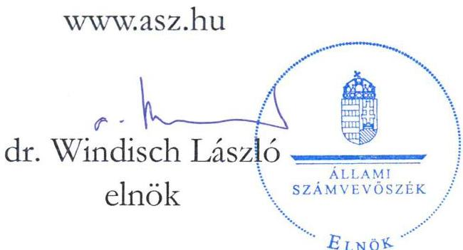
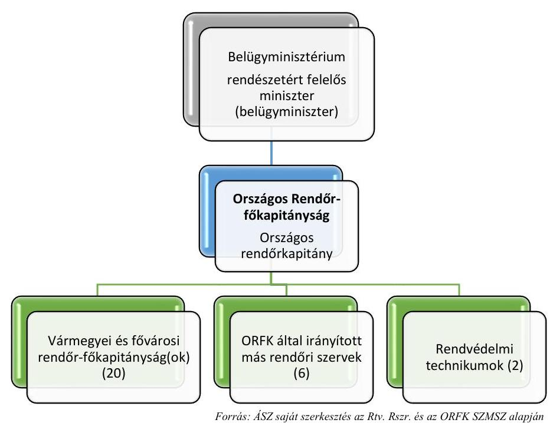
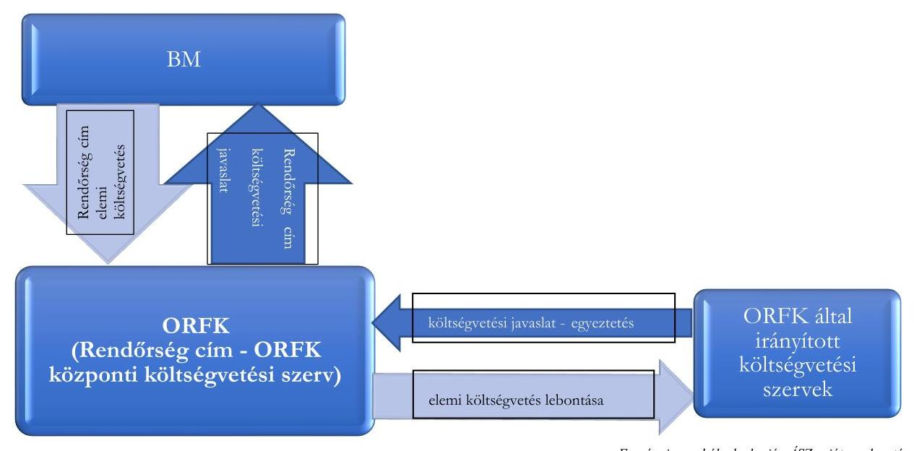
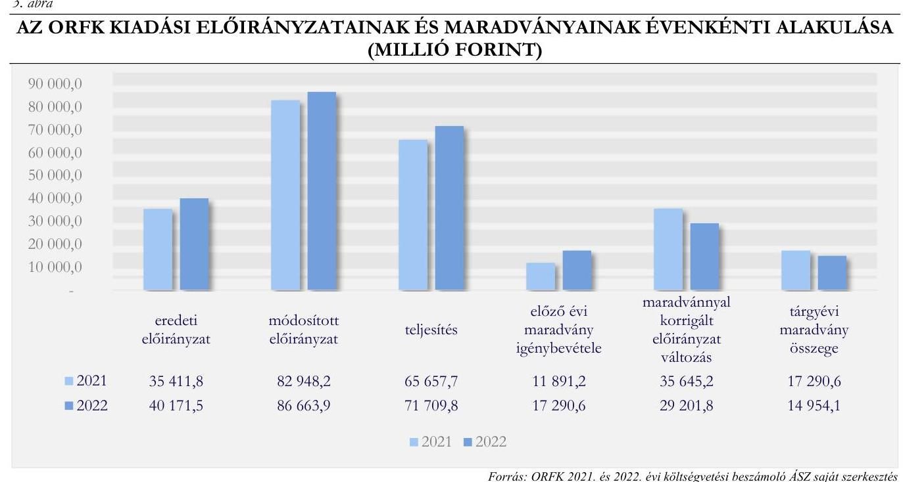
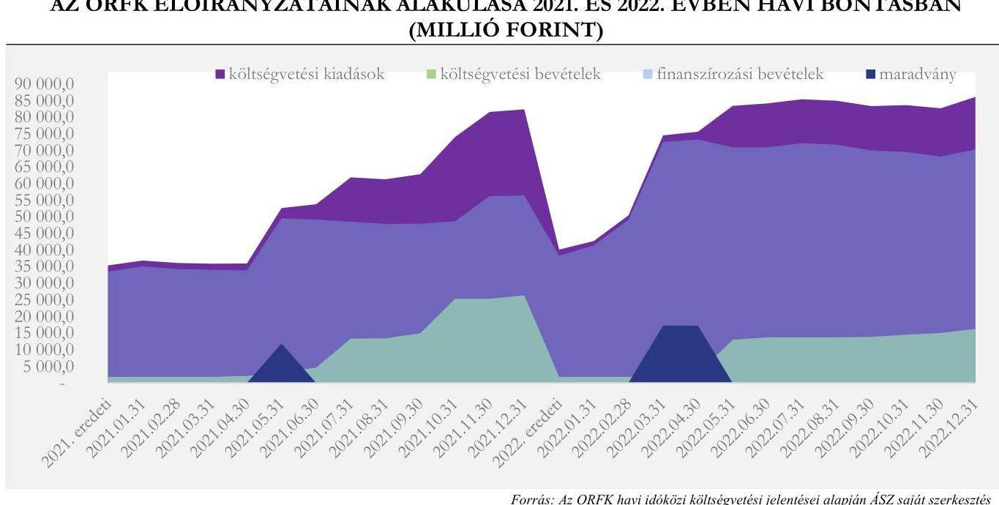
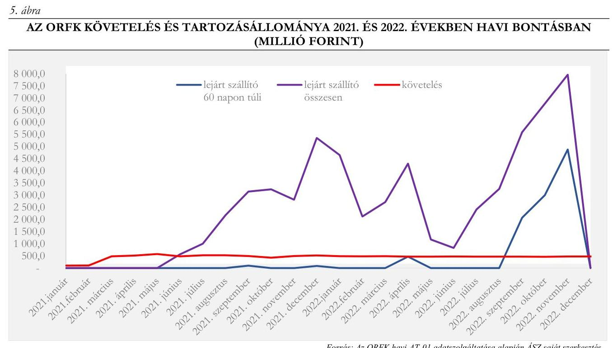
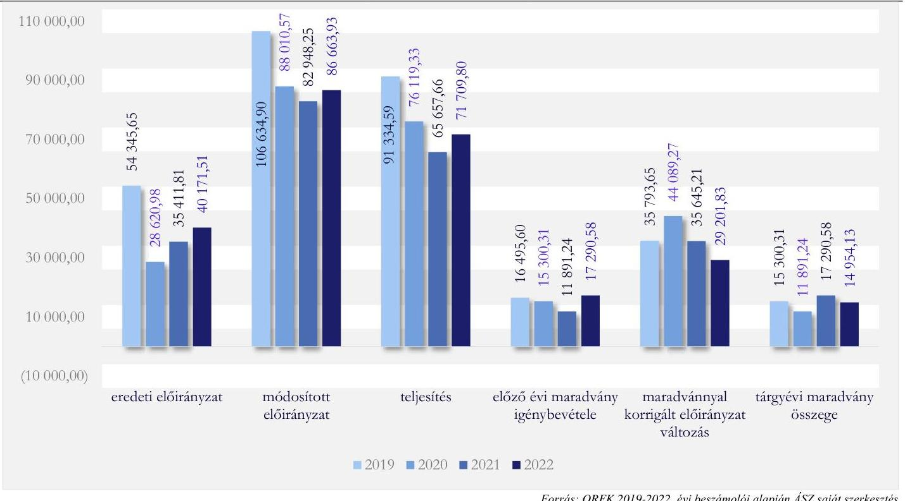
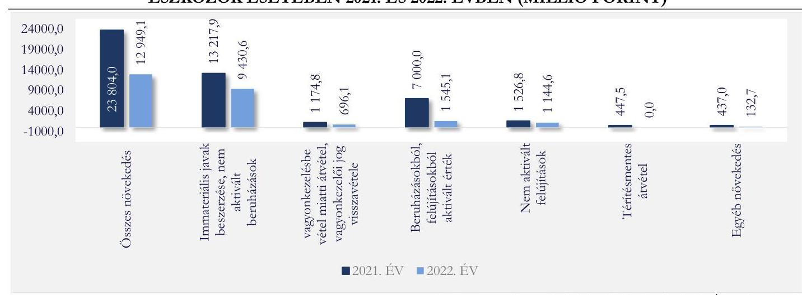
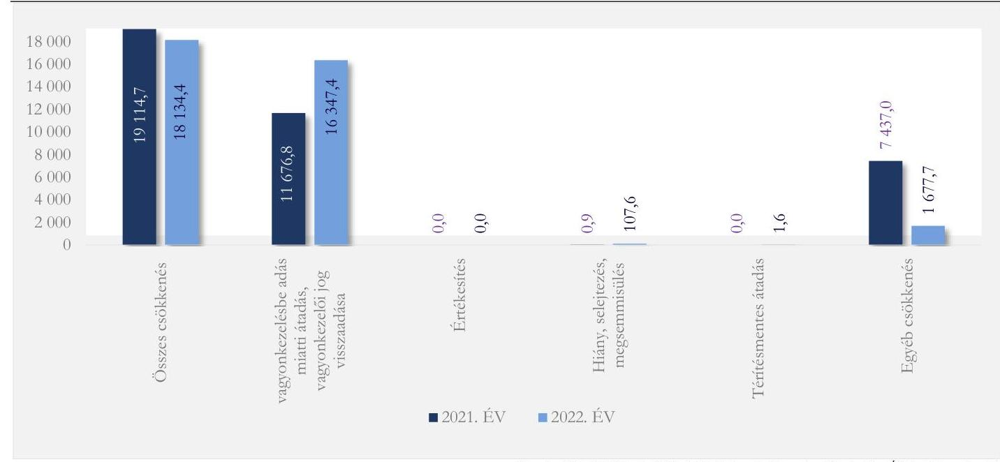

# JELENTÉS 

## Központi költségvetési szervek ellenőrzése Középirányítói feladatok ellenőrzése Országos Rendőr-főkapitányság

2023.

---

ÁLLAMI
SZÁMVEVŐSZÉK

# JELENTÉS 

## Központi költségvetési szervek ellenőrzése Középirányítói feladatok ellenőrzése Országos Rendőr-főkapitányság

2023. 

23031

---

# ELLENŐRZÉSI IGAZGATÓSÁG: 

## ÁLLAMHÁZTARTÁS KÖZPONTI SZINTJÉT ELLENŐRZŐ IGAZGATÓSÁG

## ELLENŐRZÉSI IGAZGATÓ:

## SINKÁNÉ DR. CSENDES ÁGNES igazgató

## ELLENŐRZÉSVEZETŐ:

Jelentéseink az interneten a www.asz.hu címen olvashatók.

LACZI HEDVIG ANNA ellenőrzésvezető

IKTATÓSZÁM: EL-3973-001/2023
TÉMASZÁM: 36.
ELLENŐRZÉS-AZONOSÍTÓ SZÁM: V0995

---

# TARTALOMJEGYZÉK 

AZ ELLENŐRZÉS ALAPADATAI ..... 5
AZ ELLENŐRZÖTT SZERVEZET ..... 7
ÖSSZEFOGLALÁS ..... 9
AZ ELLENŐRZÉS FÓKUSZTERÜLETEI ..... 12
MEGÁLLAPÍTÁSOK ..... 13
JAVASLATOK ..... 44
MELLÉKLETEK ..... 46
I. sz. melléklet: Értelmező szótár ..... 46
II. sz. melléklet: Az ellenőrzött szervezetek jegyzéke ..... 49
III. sz. melléklet: Ellenőrzési kritériumok ..... 50
IV. sz. melléklet: Fókuszterületekhez kapcsolódó kiegészítő információk ..... 55
V. sz. melléklet: Az ORFK által irányított központi költségvetési szervezetek ..... 63
FÜGGELÉK: ÉSZREVÉTELEK ..... 64
RÖVIDÍTÉSEK JEGYZÉKE ..... 65

---

.

---

# AZ ELLENŐRZÉS ALAPADATAI 

## AZ ELLENŐRZÉS CÉLJA

AZ ELLENŐRZÉS CÉLJA annak értékelése volt, hogy az Országos Rendőr-főkapitányság, mint központi költségvetési szerv gazdálkodásának keretei és gazdálkodása a jogszabályi előírásoknak megfelelő volt-e. Az ellenőrzés célja volt továbbá annak értékelése, hogy az Országos Rendőr-főkapitányság, mint középirányító szerv a középirányítói feladatellátását a jogszabályi előírásoknak megfelelően végezte-e; a középirányítói hatásköröket, a közpénzekkel való megbízható gazdálkodás előmozdítása, valamint a nemzeti vagyonnal való felelős gazdálkodás érdekében gyakorolta-e az irányítása alá tartozó költségvetési szerveknél.

## AZ ELLENŐRZÉS TÍPUSA

Megfelelőségi ellenőrzés

## AZ ELLENŐRZÖTT IDŐSZAK

2021-2022. évek, kitekintéssel a helyszíni ellenőrzés lezárásának időpontjáig

## AZ ELLENŐRZÉS TÁRGYA

Az ORFK ${ }^{1}$ működési és gazdálkodási tevékenysége kereteinek kialakítása, továbbá azoknak a jogszabályi előírásokkal való összhangja. Az ORFK elemi költségvetésének tervezése és gazdálkodási tevékenysége feltételeinek kialakítása. Az ORFK pénzügyi gazdálkodásának és a nemzeti vagyonnal való gazdálkodásának jogszabályi előírásokkal és belső szabályozásokkal való összhangja. Az ORFK költségvetésének végrehajtásáról szóló beszámolóinak jogszabályi és az irányító szervi előírásoknak való megfelelősége.
Az ORFK középirányítói feladatellátása keretei kialakításának a jogszabályi és az irányító szervi előírásokkal való összhangja. Az ORFK középirányítói feladatellátásának jogszabályi előírásnak való megfelelősége, a középirányítói feladatellátás a közpénzekkel való megbízható gazdálkodáshoz való hozzájárulása, továbbá a nemzeti vagyon felelős kezelése érdekében történő gyakorlása az irányítása alá tartozó költségvetési szerveknél. Az ORFK tevékenységéről szóló beszámoló elkészítése.

Az ellenőrzés kiterjedt minden olyan körülményre és adatra, amely az ÁSZ ${ }^{2}$ jogszabályban meghatározott feladatainak teljesítéséhez, valamint a program végrehajtása folyamán felmerült újabb összefüggések feltárásához volt szükséges.

## AZ ELLENŐRZÉS JOGALAPJA

Az ellenőrzés jogszabályi alapját az ÁSZ tv. ${ }^{3} 1 . \int(3)$ bekezdésének, 5. $\int(2)$-(3) bekezdéseinek, (4) bekezdés a) pontjának, valamint az Áht. ${ }^{4} 61 . \int(2)$ bekezdésének előírásai képezték.

---

# AZ ELLENŐRZÉS MÓDSZERE 

Az ellenőrzést a nemzetközi standardokat irányadónak tekintve az ellenőrzési program szempontjai, az ellenőrzött időszakban hatályos jogszabályok, az ellenőrzés szakmai szabályok és módszertanok figyelembevételével hajtotta végre az ÁSZ.

Az ellenőrzési kérdések megválaszolásához szükséges bizonyítékok megszerzése az ellenőrzött szervezet által rendelkezésre bocsátott dokumentumokra és adatokra alapozva, továbbá megfigyelés, szemle (szemrevételezés), kérdésfeltevés (információkérés), valamint elemző eljárás útján történt.

Az ellenőrzési bizonyítékként felhasználható adatforrások közé tartoztak egyrészt az ellenőrzés során kért dokumentumok, valamint adatforrás volt még minden - az ellenőrzés folyamán feltárt -, az ellenőrzés szempontjából releváns információkat tartalmazó dokumentum.

Az ellenőrzés lefolytatásához az ellenőrzött szervezet és az ellenőrzést támogató szervezetek tanúsítványok kitöltésével, valamint az ÁSZ által kért dokumentumok, adatok, információk megküldésével szolgáltattak adatokat az ellenőrzés során. Az ellenőrzésben, mint ellenőrzést támogató szervezetek közreműködtek az ORFK irányítása alá tartozó, a II. számú mellékletben felsorolt vármegyei (fővárosi) rendőr-főkapitányságok. Az ellenőrzést támogató szervezetként közreműködött az ORFK irányító szerve, a $\mathrm{BM}^{5}$.

Az egyes fókuszterületeken a kiadási előirányzatok körébe tartozó személyi juttatások előirányzatok, a dologi kiadási előirányzatok, a felhalmozási kiadási előirányzatok felhasználását, a múködési és felhalmozási bevételi előirányzatok felhasználását, az előirányzat-átcsoportosítások és -módosítások szabályszerűségét, a vagyonnövekedést, a vagyoncsökkenést és a vagyonhasznosítást, a maradványelszámolás szabályszerűségét, a követelések és kötelezettségek, a behajthatatlanként leírt követelések, a passzív időbeli elhatárolások, az adott és kapott előlegek év végi értékelését, és a vagyonelemek év végi értékelését a 2021. és a 2022. évre vonatkozóan évente 30-30 elemű, mintavételi eljárással kiválasztott tételek alapján ellenőrizte az ÁSZ. Amennyiben valamely sokaság elemszáma kisebb volt, mint az előírt mintaelemszám, a sokaságot tételesen ellenőrizte az ÁSZ. A pénzügyi gazdálkodás területén a stornó és a helyesbítő tételek esetében kockázati szempont alapú mintavételi eljárásra került sor. Az ORFK, mint középirányító szerv irányítási, szervezési és nyomon követési feladatellátásának szabályszerűsége az ellenőrzést támogató költségvetési szervek vonatkozásában került ellenőrzésre. A középirányító szervi további feladatellátás az ORFK által végrehajtott előirányzat átcsoportosítások területén a 2021. és a 2022. évre vonatkozóan évente 30-30 elemű, mintavételi eljárással kiválasztott tételek alapján, az általa végzett belső ellenőrzések területén - az ellenőrzések számára tekintettel - tételesen került ellenőrzésre. A tények feltárása és azok összegzése során a megállapítások az ellenőrzött mintatételekre vonatkozóan kerültek megfogalmazásra.

Az ÁSZ a megfelelőségi ellenőrzése során az egyes fókuszterületeken az ellenőrzést szabályszerűségi szempontok szerint végezte. A fókuszterületeken az értékelést a lényegesség, a szabálytalanságok súlyossága, gyakorisága, illetve elemzési tapasztalatok határozták meg.

---

# AZ ELLENŐRZÖTT SZERVEZET 

## ÖRSZÁGOS RENDŐR-FŐKAPITÁNYSÁG

Az ORFK az Rtv ${ }^{6}$. 4/A. $\$ 1$ ) bekezdés szerint az általános rendőrségi feladatok ellátására létrehozott szerv központi szervre, (vár)megyei (fővárosi) rendőr-főkapitányságokra, rendőrkapitányságokra és határrendészeti kirendeltségekre tagozódik. Egyes feladatok ellátására törvény vagy kormányrendelet más rendőri szervet is létrehozhat. Az Rtv. 6. $\$ 1$ ) bekezdése szerint az általános rendőrségi feladatok ellátására létrehozott szervet az országos rendőrfőkapitány vezeti. Az ORFK az RSzr. ${ }^{7}$ 1. §-a szerint az általános rendőrségi feladatok ellátására létrehozott szerv központi szerve, az 5/A. $\$ 1$ ) bekezdésében foglaltak alapján a rendőr-főkapitányságok és az általános rendőri szerv egyes feladatok ellátására létrehozott szervei középirányító szerve. A Kormány által kijelölt középirányító szervként az irányítása alá tartozó költségvetési szervek tekintetében az Áht.-ban meghatározott irányítási, valamint a pénzügyi ellenőrzési hatásköröket is gyakorolja.

Az Rtv. 4. § (3) bekezdésében foglaltak szerint a Kormány a rendőrséget a rendészetért felelős miniszter útján irányítja. A Kormány tagjainak feladat- és hatásköréről szóló 94/2018. (V. 22.) Korm. rendelet 40. § (1) bekezdés 20. pontja, illetve a Kormány tagjainak feladat- és hatásköréről szóló 182/2022. (V. 24.) Korm. rendelet 66. § (1) bekezdés 16. pontja alapján a belügyminiszter volt a Kormány rendészetért felelős tagja. Az ORFK-t, az irányító szervét, valamint az általa irányított szerveit az 1. ábra tartalmazza.
1. ábra

AZ ORFK, MINT KÖZÉPIRÁNYÍTÓI SZERV

Az ORFK által irányított rendőri szervek a 19 vármegyei és a fővárosi (Budapesti) rendőrfőkapitányságok. Továbbá ORFK által irányított más rendőri szerv a Készenléti Rendőrség, a Repülőtéri Rendőr Igazgatóság, a Nemzetközi Bűnügyi Együttműködési Központ, a Rendőrségi Oktatási és Kiképző Központ, a Nemzetközi Oktatási Központ és a Nemzeti Szakértői Kutató Központ. Az ORFK irányítása alá tartozik a Körmendi Rendvédelmi Technikum és a Miskolci Rendvédelmi Technikum, mint rendvédelmi technikumok. Az ORFK irányítása alatt álló szervezetek felsorolását az V. számú melléklet tartalmazza.

---

A költségvetési törvény szerint a XIV. fejezet Belügyminisztérium és azon belül a Rendőrség cím alá tartozó költségvetési szerv, az ORFK. A Rendőrség címet az ORFK és az általa irányított központi költségvetési szervek együttesen alkotják. Az ORFK elemi költségvetése 2021. évre 35 411,8 M Ft-ot, 2022. évre 40 171,5 M Ft bevétele előirányzatot tartalmazott, amelyből a finanszírozási, állami támogatási bevételek 2021. évben $94,9 \%$-ot, 2022. évben $95,4 \%$-ot jelentettek. Az éves módosított előirányzata 2021. évben 82 948,2 M Ft, 2022. évben 86 663,9 M Ft volt. A költségvetés a 2021. évre 35 411,8 M Ft, 2022. évre 40 171,5 M Ft kiadási előirányzatot tartalmazott. Az éves módosított kiadási előirányzat a 2021. és a 2022. évben az eredeti előirányzat több mint kétszerese volt. A kiadások pénzügyi teljesítése 2021. évben 65 657,7 M Ft, 2022. évben 71 709,8 M Ft volt. A 2021. évben keletkezett maradványa 17 290,58 M Ft, amelyből kötelezettségvállalással terhelt 11 146,03 M Ft volt. A 2022. évben keletkezett 14 954,13 M Ft-ból 14 810,44 M Ft volt kötelezettségvállalással terhelt. Az ORFK eredeti és módosított előirányzatait, valamint a teljesítések értékét főbb kiemelt előirányzatonként, valamint a mérlegfőösszeg értékét és a foglalkoztatottak számát a 2021. és 2022. évekre az 1. táblázat tartalmazza.

|  AZ ORFK FŐBB GAZDÁLKODÁSI ÉS LÉTSZÁM ADATAI 2021. ÉS 2022. ÉV (MILLIÓ FORINT/FŐ) |  |  |  |  |  |   |
| --- | --- | --- | --- | --- | --- | --- |
|  MEGNEVEZÉS | 2021 |  |  | 2022 |  |   |
|   | EREdETI
Előirányzat | Módosított
Előirányzat | TELjesítés | EREdETI
Előirányzat | Módosított
Előirányzat | TELJESítés  |
|  Személyi juttatások | 12023,1 | 10392,5 | 10352,8 | 13579,6 | 13716,8 | 13716,8  |
|  ebből foglalkoztatottak | 11448,5 | 9433,4 | 9393,6 | 13057,8 | 12454,6 | 12454,6  |
|  ebből: külső | 574,7 | 959,1 | 959,1 | 521,8 | 1262,2 | 1262,2  |
|  Dologi kiadások | 14000,0 | 27305,6 | 22587,7 | 17624,8 | 31958,9 | 29062,8  |
|  ebből: készletbeszerzés | 1674,8 | 2813,0 | 2806,2 | 2144,4 | 2498,2 | 2110,6  |
|  Működési célú kiadásokból támogatások Áht-n belülre | 826,6 | 15437,4 | 15437,4 | 826,6 | 3869,9 | 3869,9  |
|  Beruházások | 4222,4 | 19520,8 | 12325,1 | 4048,8 | 25669,2 | 14520,7  |
|  Felújítások | 1451,7 | 6777,7 | 1939,1 | 1301,7 | 2362,6 | 1453,7  |
|  Egyéb felhalmozási célú kiadások | 105,0 | 1251,8 | 1248,4 | 105,0 | 115,8 | 115,1  |
|  Költségvetési kiadások | 35411,8 | 82453,1 | 65657,7 | 40171,5 | 86 168,7 | 71214,6  |
|  KIADÁSOK
ÖSSZESEN | 35411,8 | 82948,2 | 65657,7 | 40171,5 | 86663,9 | 71709,8  |
|  Költségvetési bevételek | 1809,3 | 26418,0 | 26418,0 | 1834,3 | 16281,5 | 16281,5  |
|  Finanszírozási bevételek | 33602,5 | 56530,2 | 56530,2 | 38337,2 | 70382,4 | 70392,4  |
|  BEVÉTELEK
ÖSSZESEN | 35411,8 | 82948,2 | 82948,2 | 40171,5 | 86663,9 | 86663,9  |
|  Létszám (fő) |  | 1419 |  |  | 1482 |   |
|  MÉRLEGFŐÖSSZEG |  | 69784,3 |  |  | 53 929,7 |   |

Forrás: A: ORFK 2021. és 2022. évi költségvetési beszámolói alapján ÁSZ szerkesztés Az ORFK működésére és feladatainak ellátására az Rtv., az RSzr. és a 4/2015. (IV. 10.) BM utasítás ${ }^{8}$, a költségvetésének tervezésére és gazdálkodására vonatkozó alapvető jogszabályi előírásokat az Áht. és az Ávr. ${ }^{9}$, az Áhsz. ${ }^{10}$ és a Számv.tv. ${ }^{11}$, az ORFK vagyonkezelésére vonatkozó jogszabályi előírásokat az Nvtv. ${ }^{12}$ és Vtv. ${ }^{13}$, illetve a Vtvr. ${ }^{14}$ tartalmazza.

---

# ÖSSZEFOGLALÁS 

A középirányító szervek a feladataik ellátásával elősegítik az irányításuk alá tartozó költségvetési szervek gazdálkodási feladatainak szabályszerű ellátását. Ezzel hozzájárulnak ahhoz, hogy mind a költségvetési szervekre, mind a középirányító szervi feladatok ellátására fordított közpénzek, az általuk kezelt nemzeti vagyon cél szerint hasznosuljanak. Az ORFK, mint költségvetési szerv az 1. táblázatban bemutatott gazdálkodási adatai alapján jelentős közpénzzel gazdálkodik, és nemzeti vagyont kezel. Ezek támasztották alá az ORFK ellenőrzését.

Az ellenőrzés 2021-2022. évekre vonatkozóan az ORFK múködési és gazdálkodási tevékenysége kereteinek kialakítását, az elemi költségvetésének tervezését, a pénzügyi gazdálkodását és a nemzeti vagyonnal való gazdálkodását, a költségvetésének végrehajtásáról szóló beszámolóinak jogszabályi és az irányító szervi előírásoknak való megfelelőségét, továbbá az ORFK középirányítói feladatellátását hat fókuszterületen ellenőrizte. A megfelelőségi ellenőrzés kiterjedt ezen feladatoknak az értékelésére a lényegesség, a szabálytalanságok súlyossága, gyakorisága, illetve elemzési tapasztalatok és összefüggések alapján.

Az ORFK, mint központi költségvetési szerv a gazdálkodásának kereteit az ellenőrzött időszakban kisebb hiányosságokkal a jogszabályi előírások szerint kialakította. Az ellenőrzött tételek vonatkozásában az ORFK pénzügyi gazdálkodása és kontrolltevékenysége - a gazdálkodási jogkörök gyakorlása kapcsán feltárt hiányosságok miatt -, valamint a nemzeti vagyonnal való gazdálkodása - a vagyonkezelői jog átruházása, a bekerülési érték megállapítása és a gazdasági események elszámolása miatt - nem teljeskörűen felelt meg a jogszabályi előírásoknak. Az ORFK, mint középirányító szerv elősegítette, hogy az irányítása alá tartozó költségvetési szervek a gazdálkodási feladataikat a jogszabályi előírásoknak megfelelően lássák el. A középirányítói ellenőrzési tevékenysége kapcsán feltárt hiányosságok miatt a középirányító szervi feladatok ellátása nem teljeskörűen az irányító szerv utasítása alapján történt.

Az ORFK a feladatainak és a jogszabályi előírásoknak megfelelően alakította ki müködési és gazdálkodási tevékenységének szabályozási kereteit. Az ORFK-nál ugyanakkor a kötelezettségvállalásra, teljesítés igazolására jogosult személyekről és aláírás-mintájukról vezetett nyilvántartás nem teljes körűen felelt meg az Ávr.-ben foglalt előírásnak, mivel annak naprakész vezetése nem volt biztosított.

Az ORFK tevékenységének nyomon követését és belső ellenőrzését a jogszabályoknak megfelelően kialakította, múködési feltételeit szabályzataiban biztosította. A belső ellenőrzés múködtetése során a 20212022. évi éves belső ellenőrzési tervek nem feleltek meg a BM utasításnak ${ }^{15}$, mert az ORFK az ellenőrzési terveiben nem elkülönítetten szerepeltette az irányítása alá tartozó költségvetési szerveket. Az ORFK belső ellenőrzése a tevékenysége ellátása keretében az ORFK belső kontrollrendszerére, a költségvetési tervezésére, a beszámolók vizsgálatára vonatkozó ellenőrzéseket nem végzett az ellenőrzött időszakban.
Az ORFK a jogszabályi előírásoknak megfelelően kialakította és múködtette az integrált kockázatkezelési rendszerét. Az ORFK információs és kommunikációs rendszere kialakításának és múködtetésének ellenőrzése során a befektetett eszközök és készletek nyilvántartása, a leltáreltérések kivizsgálása, valamint a leltározás információs és kommunikációs folyamatai tekintetében a leltáreltérésekre érkezett visszajelzések, dokumentumok kezelésének elmaradása miatt merültek fel hiányosságok.

A 2021. és 2022. évi elemi költségvetéseit szabályszerűen állította össze. Az ORFK a cím szintű költségvetési javaslatait a jogszabályi előírások, továbbá az irányító szerv által meghatározott szempontok szerint készítette, mivel a Rendőrség címet az ORFK és az általa irányított központi költségvetési szervek együttesen alkották. A költségvetési javaslatokban az ORFK által javasolt többletigények az irányító szerv által nem kerültek

---

elfogadásra, ezért azok az elemi költségvetésekben nem kerültek figyelembevételre az eredeti előirányzatok megállapításakor az ORFK-nál. Az ORFK a 2021. és 2022. évi elemi költségvetéseit bázis alapon határozta meg, azonban elemi költségvetései a jogszabályokból, valamint egyéb szervezeti és feladatellátással összefüggő szerkezeti változásokból adódóan módosításra kerültek. Az ORFK a feladatellátásához kapcsolódóan, a jogszabályból adódó és az irányító szerv által meghatározott többletfeladatokhoz (többek között határvédelmi feladatok, egyéb védelmi feladatok), - amelyekre az elemi költségvetés nem biztosított fedezetet - év közben kormányzati, illetve fejezeti hatáskörben többletelőirányzatot kapott. Továbbá finanszírozási forrásokat biztosítottak részére a BM fejezeti kezelésű előirányzatból célhoz kötött felhasználással, így a 2021. évben 24 476,5 M Ft, 2022. évben 12 928,1 M Ft többletbevétele keletkezett. Az ellenőrzött időszak mindkét évében az év közi előirányzat-módosítások hatására az ORFK módosított előirányzatai az eredeti előirányzatai kétszeresét meghaladták, ezáltal az ORFK módosított előirányzatai a 2021. évben 82 948,2 M Ft-ot, 2022. évben 86 663,9 M Ft-ot tettek ki. A többlet források hatására az ORFK kiadásainak teljesítése 2021. évben 65 657,7 M Ft, 2022. évben 71 709,8 M Ft volt - ezáltal az eredeti előirányzat 2021. évben 185,4\%-on, 2022. évben $178,5 \%$-on teljesült.

Az ORFK, mint központi költségvetési szerv a saját hatáskörben végrehajtott előirányzat-módosításait és az előirányzat-átcsoportosításait a jogszabályi előírásoknak megfelelően hajtotta végre.

Az ORFK pénzügyi gazdálkodása és az abhoz kapcsolódó kontrolltevékenységek tekintetében az ellenőrzés hiányosságokat tárt fel, amelyek jellemzően a gazdálkodási jogkörök Ávr. előírásainak nem megfelelő gyakorlásából adódtak az ellenőrzött tételekkel kapcsolatban. Az ORFK a feladatellátásához szükséges pénzügyi források rendelkezésre állását és a likviditását nyomon követte. A fennálló követeléseinek behajtásáról intézkedett, valamint a követelések kiegyenlítését folyamatosan figyelemmel kísérte.
A tartozásállományát is folyamatosan nyomon követte és kezelte az ellenőrzött időszakban, ezáltal 2021. év végén és 2022. év végén a 60 napon túli lejárt tartozásállománya nem haladta meg az Ávr.-ben meghatározott mértéket. Az ORFK 2022 decemberében a múködési kiadások fedezetére kormányzati szintű többlettámogatásban részesült.

A nemzeti vagyon növekedésével és csökkenésével kapcsolatosan az ORFK vagyonkezelői jogainak átruházása nem teljeskörűen felelt meg az Nvtv., a Vtvr. és az Ávr-ben foglalt előírásoknak, mivel az ORFK és az általa irányított költségvetési szervek közötti vagyonkezelői jogok átruházása aláírt szerződés nélkül történt. Az ellenőrzött időszakban a vagyonnövekedési gazdasági események nem teljeskörűen feleltek meg több esetben a Számv. tv. és az Áhsz. előírásainak, a szerződések és egyéb dokumentumok hiányában az eszközök bekerülési értékének megállapítása, valamint az üzembe helyezés nem alátámasztott dokumentáltsága miatt.
A vagyoncsökkenések tekintetében több esetben a gazdasági esemény elszámolása nem a gazdasági esemény bekövetkeztekor, illetve nem a Számv. tv. és az Áhsz.-ben meghatározott határidőig és nem a megfelelő dokumentum alapján történt meg.

Az ORFK 2021. és 2022. évi költségvetéseinek végrehajtásáról határidőre beszámolt az irányító szervnek, továbbá az Info. tv. előírásának megfelelően gondoskodott az éves költségvetési beszámolóinak a honlapján történő közzétételéről.

Az ORFK 2021. és 2022. évi költségvetési beszámolói mérlegsorainak leltárral történő alátámasztása és értékelése nem teljeskörűen felelt meg a Számv. tv. és az Áhsz. előírásainak a befektetett eszközök és készletek vonatkozásában. Az ORFK az ellenőrzés megkezdését követően már megkezdte az intézkedéseket a leltáreltérések rendezése vonatkozásában.

---

A követelések és az adott előlegek mérlegsorainak év végi értékelése a jogszabályi előírásoknak nem teljeskörűen felelt meg, mivel a több éve fennálló követelések év végi értékelése, minősítése nem a Számv. tv. és az Áhsz. előírásainak megfelelően volt dokumentált.

A kötelezettségek, a kapott előlegek és a passzív időbeli elhatárolások az éves beszámolókban a jogszabályi előírásoknak megfelelően kerültek kimutatásra. A 2021. és 2022. évi maradványkimutatás megfelelt a jogszabályi előírásoknak.

Az ORFK a jogszabályi előírások szerint alakította ki a kö̋̋épirányitóo feladatellátásának szabályozási kereteit.
Az ORFK, mint középirányító szerv az irányítása alá tartozó költségvetési szerveknél nem teljeskörűen látta el az irányító szerv által előírt ellenőrzési feladatait a költségvetési beszámolók (mérlegek) alátámasztottságának ellenőrzésével kapcsolatban.

Az ORFK a jogszabály által átruházott irányítói hatáskörében gondoskodott arról, hogy az irányítása alá tartozó költségvetési szervek rendelkezzenek jóváhagyott szervezeti és müködési szabályzattal, valamint meghatározta a gazdálkodási keretszabályokat, követelményeket. A költségvetési javaslatok és az elemi költségvetések elkészítésével kapcsolatos középirányító szervi feladatait megfelelően látta el. Az ORFK az irányítása alá tartozó költségvetési szervek által ellátandó szakmai alapfeladatok végrehajtásához szükséges pénzügyi feltételek biztosítása érdekében ellátta a szervezési, irányítási és ellenőrzési középirányítói feladatait.

Az ORFK által utasításban meghatározott, a költségvetés végrehajtásával kapcsolatosan megfogalmazott követelmények, gazdálkodási előírások az irányítása alá tartozó költségvetési szerveknél az ellenőrzött időszakban érvényesültek.

Az ORFK az irányítása alá tartozó költségvetési szervek vonatkozásában meghatározta a szakmai szervezeti teljesitményééldekat és értékelte azok teljesítését.

Az ORFK az ellenőrzött időszakban középirányítói feladatellátása keretében az irányítása alá tartozó költségvetési szervek gazdálkodásával kapcsolatos beszámolási feladatait teljesítette, valamint a középirányító szervi tevékenységére vonatkozóan az irányító szerv felé beszámolt.

---

# AZ ELLENŐRZÉS FÓKUSZTERÜLETEI 

1.- Az Országos Rendőr-főkapitányság, mint központi költségvetési szerv kontrollkörnyezete - szabályozottság -, integrált kockázatkezelési rendszere, monitoring rendszere - nyomon követés és belső ellenőrzési tevékenység -, információs és kommunikációs rendszere
2.- Az Országos Rendőr-főkapitányság költségvetés tervezési folyamata
3.- Az Országos Rendőr-főkapitányság pénzügyi gazdálkodása és a kontrolltevékenységek
4.- Az Országos Rendőr-főkapitányságnál a nemzeti vagyonnal való gazdálkodás
5.- Az Országos Rendőr-főkapitányság költségvetési beszámolóinak ellenőrzése
6.- Az Országos Rendőr-főkapitányság, mint középirányító szerv feladatellátása

---

# MEGÁLLAPÍTÁSOK 

## 1. Az Országos Rendőr-főkapitányság, mint központi költségvetési szerv kontrollkörnyezete - szabályozottság -, integrált kockázatkezelési rendszere, monitoring rendszere - nyomon követés és belső ellenőrzési tevékenység -, információs és kommunikációs rendszere

Összegző megállapítás

Az ORFK-nál az ellenőrzött időszakban a kontrollkörnyezet és szabályozottság kialakítása, a belső ellenőrzési tevékenység múködtetése, valamint az információs és kommunikációs rendszer kialakítása és múködtetése kapcsán merültek fel hiányosságok. A belső ellenőrzési tevékenység kialakítása, a nyomon követés, és az integrált kockázatkezelési rendszer kialakítása és múködtetése megfelelő volt.
1.1. számú megállapítás

Az ORFK a jogszabályi előírásoknak megfelelően alakította ki a működési és a gazdálkodási tevékenységének szabályozási kereteit. A működtetés kapcsán az ORFK által a kötelezettségvállalásra, a teljesítés igazolására jogosult személyekről és aláírás-mintájukról vezetett nyilvántartás nem teljeskörűen felelt meg a jogszabályi előírásnak.

Az ORFK az Áht. 9. § b) pont, valamint a 10. § (5) bekezdés és az Ávr. 13. § (1) bekezdés előírásainak megfelelő, az irányító szerv által jóváhagyott SZMSZ-szel ${ }^{16}$, valamint az Áht. 10. § (5) bekezdése, valamint az Ávr. 10/A. §. és 13. § (5) bekezdése előírásainak megfelelő gazdasági szervezeti ügyrenddel ${ }^{17}$ rendelkezett.
Az RSzr. 15/A. § (1) bekezdése alapján az ORFK gazdálkodási feladatait a $\mathrm{KR}^{18}$ látja el. Az Ávr. 9. § (5) bekezdés b) pont előírása alapján Munkamegosztási megállapodás ${ }^{19}$ készült. A Munkamegosztási megállapodás az Ávr. 9. § (5a) bekezdés előírása alapján az irányító szerv által jóváhagyásra került, és tartalmazta, hogy az Ávr. 9. § (1) bekezdés szerinti feladatok közül melyik feladatot melyik költségvetési szerv látja el.
Az ORFK a Bkr. ${ }^{20}$ 6. § (4) bekezdésének megfelelően rendelkezett integrált kockázatkezelési eljárásrenddel ${ }^{21}$ és a szervezeti integritást sértő események kezelésének eljárásrendjével ${ }^{22}$, amely a Bkr. 6. § (4a) bekezdés a)-h) pontjaiban foglaltaknak megfelelt. Az ORFK-nál az etikai elvárások szervezeti szinten meghatározásra kerültek a Bkr. 6. § (1) bekezdésének c) pont előírása szerint.
Az ORFK az Áht. 10. § (5) bekezdés előírása szerint rendelkezett az arra jogosult által kiadott, hatályos, az Ávr. 13. § (2) bekezdés a) pont szerinti gazdálkodás részletes rendjét meghatározó szabályzattal ${ }^{23}$, amely az Ávr. 53. § (2) bekezdésében foglaltakat is tartalmazta. Az ORFK a 47/2013. (XI.09.) ORFK utasítás-24ban szabályozta az Ávr. 13. § (2) bekezdés a) pont alapján, valamint az Ávr. 52. § (1) bekezdés, 55. § (1) bekezdés és (2) bekezdés ba) és ca) pontja, 57. § (3)-(4) bekezdései, 58. § (3)-(4) bekezdései, és

---

59. § (1) bekezdés szerint a kötelezettségvállalás, a pénzügyi ellenjegyzés, a teljesítés igazolás, az érvényesítés, és az utalványozás módját, eljárási, és dokumentálási szabályait.

Az ORFK kötelezettségvállalásra, teljesítés igazolására jogosult személyekről és aláírásmintájukról vezetett nyilvántartásának naprakész vezetése az Ávr. 60. § (3) bekezdés előírásának nem teljeskörűen felelt meg, mivel az ORFK a kötelezettségvállalásra, valamint a teljesítés igazolására jogosult személyekről vezetett nyilvántartásai, valamint a jogkörgyakorlásra vonatkozó megbízások dokumentumai tartalmilag nem voltak összhangban egymással.
Az ORFK rendelkezett a Kbt. ${ }^{25}$ 27. § (1) bekezdés előírásának megfelelő, a jogosult által kiadott közbeszerzési szabályzattal ${ }^{26}$, valamint az Ávr. 13. § (2) bekezdés b) pont szerinti a Kbt. hatálya alá nem tartozó beszerzések lebonyolításával kapcsolatos eljárásrenddel ${ }^{27}$.
Az Áhsz. 50. § (1) bekezdés és a Számv. tv. 14. § (3) bekezdés előírásainak megfelelően az ORFK rendelkezett az arra jogosult által kiadott, hatályos Számviteli politikával ${ }^{28}$. A Számviteli politika az Áhsz. 50. § (7) bekezdés előírásainak megfelelt, azonban az Áhsz. 50. § (1) bekezdés szerinti, a Számv.tv. 14. § (4) bekezdés előírásának megfeleltethető teljeskörű szabályozást nem rögzítette, azaz, hogy mit tekint a számviteli elszámolás, az értékelés szempontjából kivételes nagyságú vagy előfordulású bevételnek, költségnek és ráfordításnak.
Az Áhsz. 50. § (1) bekezdés és a Számv. tv. 14. § (5) bekezdés a) pont előírása szerint az ORFK rendelkezett, az arra jogosult által kiadott, hatályos Eszközök és források leltározási és leltárkészítési szabályzattal ${ }^{29}$, amely az Áhsz. 22. § (2) bekezdés és a Számv. tv. 69. § (3) bekezdés előírásainak megfelelt. Az ellenőrzött években a befektetett eszközök és a készletek leltározása kapcsán - a feltárt hiányosságok alapján - a leltár készítésével, valamint a nyilvántartások vezetésével kapcsolatos tevékenységét az ORFK nem teljeskörűen az Eszközök és források leltározási és leltárkészítési szabályzatában foglalt előírások szerint végezte, többek között a leltárral szemben támasztott tartalmi követelmények, a leltározás folyamatában a használaton kívüli, esetleg nem a rendeltetési helyén tárolt eszközök leltározása, valamint a leltár lezárása során jóváhagyott leltáreltérések átvezetése kapcsán.
Az Áhsz. 50. § (1) bekezdés és a Számv. tv. 14. § (5) bekezdés b) pont előírásai szerint az ORFK rendelkezett, az arra jogosult által kiadott, hatályos Eszközök és források értékelési szabályzattal ${ }^{30}$, amely az Áhsz. 50. § (2) bekezdés a-c) pontjainak, valamint az Áhsz. 20-21. §-ban foglalt követelményeknek megfelelt.
Az Áhsz. 50. § (1) bekezdés és a Számv. tv. 14. § (5) bekezdés d) pontja előírásai szerint az ORFK rendelkezett az arra jogosult által kiadott, hatályos Pénzkezelési szabályzattal ${ }^{31}$, amely a Számv. tv. 14. § (8) bekezdés előírásainak megfelelt. A Szabályzat tartalmazta, hogy a készpénzkezelés lebonyolításának rendjével, a valuták valutapénztárban történő kezelésével, a pénzkezelési munkakörökkel és feladatokkal, a vezetői ellenőrzéssel, az egyéb - pénzkezeléssel és fizetési forgalommal kapcsolatos - szabályokkal, valamint a pénzkezelés szigorú számadás alá vont nyomtatványaival kapcsolatos feladatokat az ORFK megbízása és felhatalmazása alapján a KR látja el, a KR Pénzkezelési Szabályzatában előírtak alapján.
Az ORFK rendelkezett az Áhsz. 50. § (1) bekezdés és a Számv. tv. 14. § (5) bekezdés c) pont előírásai szerint az arra jogosult által kiadott, hatályos Önköltségszámítás rendjére vonatkozó szabályzattal ${ }^{32}$.
Az ORFK rendelkezett az Áhsz. 51. § (1)-(2) bekezdés és a Számv. tv. 161. § (1) bekezdés előírásai szerint az arra jogosult által kiadott, hatályos Számlarenddel ${ }^{33}$, azonban a Számlarend az Áhsz. 51. § (3) bekezdésében előírtak ellenére az Áhsz. 14. melléklete szerinti, IV. Az adott és kapott előlegek nyilvántartása rendjét nem tartalmazta. Továbbá a Számlarendben meghatározott, az Immateriális javak

---

nyilvántartása, a Tárgyi eszköz nyilvántartása és Készletek nyilvántartása kapcsán a Forras.NET ügyviteli rendszer tárgyi eszköz modulban vezetendő tartalmi elemek nem egyeztek meg a Bizonylati rendben előírt, az Áhsz. 14. melléklete alapján meghatározott tartalmi elemekkel.
1.2. számú megállapítás

Az ORFK a jogszabályi előírásoknak megfelelően kialakította és múködtette az integrált kockázatkezelési rendszerét.

A Bkr. 6. § (4) bekezdés előírásának megfelelően az ORFK rendelkezett integrált kockázatkezelés eljárásrenddel, amelyben a Bkr. 7. § (2) és (3) bekezdéseiben foglaltak alapján rögzítésre kerültek a jogszabályi kritériumok. Az ORFK vezetője az integrált kockázatkezelési rendszer koordinálásának felelősét a Bkr. 7. § (4) bekezdés előírása alapján kijelölte.
Az ORFK szabályozta a szervezet működésével összefüggő integritási és korrupciós kockázatokra vonatkozó bejelentések fogadásának és kivizsgálásának rendjét, egyrészt az 1/2017. (II.14.) ORFK intézkedés a szervezeti integritás bejelentések kezelésének eljárásrendjéről szóló, valamint a 20/2013. (V.17.) ORFK utasítás a rendőri korrupciós cselekmények megelőzésével és visszaszorításával kapcsolatos feladatokról szóló szabályzatban. Továbbá az ORFK integrált kockázatkezelési szabályzatáról szóló 3/2017. (X.16.) ORFK intézkedés is kiterjedt az integritási kockázatok azonosítása, értékelése, a kockázatokkal kapcsolatban szükséges intézkedések, valamint azok végrehajtása folyamatos nyomon követésének módjára is.
Az ORFK az integrált kockázatkezelési rendszerét múködtette a Bkr. 7. § (2) és (3) bekezdéseiben foglaltak szerint. Az ORFK ellenőrzési nyomvonalai alapján a kockázat-nyilvántartását elkészítette, melyben tevékenységeihez kapcsolódóan meghatározásra kerültek a kockázatok, valamint megtörtént azok értékelése és besorolása.
Az ORFK 2021. évi és 2022. évi leltározási tevékenységénél az ÁSZ ellenőrzés által feltárt hiányosságok miatt kockázatként merült fel az ORFK kockázat-nyilvántartásában meghatározott kockázati tényezők besorolása, különös tekintettel arra, hogy a leltározással, valamint a leltár elkészítésével kapcsolatosan meghatározott kockázati tényezők besorolása alacsony, illetve közepes kockázati kategóriába történt az ellenőrzött időszakban.
Az ORFK a rendőri korrupciós cselekmények megelőzésével és visszaszorításával kapcsolatos feladatokról szóló 20/2013. (V. 17.) ORFK utasítás 36. pontjában előírtak alapján, a Rendőrség gazdasági szakterületét érintő korrupciós helyzetről, valamint annak kockázatáról az ellenőrzött időszak évei tekintetében jelentést készített.
1.3. számú megállapítás

Az ORFK tevékenységének nyomon követése és belső ellenőrzése feltételeit a jogszabályoknak megfelelően kialakította. Az ORFK belső ellenőrzésének múködtetése kapcsán hiányosságok voltak mindkét évben.

Az ORFK tevékenységének, ezen belül a gazdálkodási feladatok végrehajtásának nyomon követését biztosító rendszer múködésének szabályait kialakította az ORFK vezetője a Bkr. 10. §-ában foglaltaknak megfelelően. Az ORFK vezetője a Bkr. 6. § (3) bekezdés előírása szerint elkészítette és aktualizálta az ellenőrzési nyomvonalakat, amelyek az információs szintek és kapcsolatok meghatározásán kívül tartalmazták a Bkr. 6. § (3) bekezdésnek megfelelő tartalmi elemeket.
Az ORFK vezetője a belső ellenőrzés múködési feltételeit biztosította a Bkr. 10. §, valamint a Bkr. 15. § (1)-(2) bekezdés előírásai alapján. Az Ávr. 13. § (1) bekezdés e) pontban foglaltak szerint az ORFK

---

SZMSZ tartalmazta a belső ellenőrzés feladatait. Az ORFK rendelkezett a Bkr. 17. § (1) szerint, a költségvetési szerv vezetője által jóváhagyott, és a Bkr. 22. § (1) bekezdés a) pont szerint, a belső ellenőrzési vezető által elkészített, hatályos belső ellenőrzési kézikönyvvel ${ }^{34}$.
Az ORFK belső ellenőrzésének múködtetése kapcsán a Bkr. 22.§ (1) bekezdés b) pont és a Bkr. 32. § (1) bekezdésben előírtak alapján elkészített éves belső ellenőrzési tervek ${ }^{35}$ a 14/2011. (V. 23.) BM utasítás ${ }^{36}$ 3. $\$ (1) bekezdés előírásainak nem feleltek meg, mivel az ORFK, mint középirányító szerv éves ellenőrzési tervében nem elkülönítetten szerepeltette az irányítása alá tartozó költségvetési szervekre vonatkozó ellenőrzési tervet.
Az ORFK belső ellenőrzési tervei kockázatelemzéssel alátámasztásra kerültek, azonban azokban a „Leltározás folyamat" értékelése az ellenőrzés gyakoriság tekintetében közepes prioritású volt, a meghatározott javasolt ellenőrzési gyakoriság pedig 3 év volt.
A Bkr. 21. § (1) bekezdés, valamint (2) bekezdés a) pontja szerinti, az ORFK belső kontrollrendszerét érintő ellenőrzést, valamint a Bkr. 21. § (1) bekezdése szerinti, a költségvetési tervezésre vonatkozó ellenőrzést, a Bkr. 21. § (1) bekezdése (2) bekezdés b) pontja szerinti, a beszámolók vizsgálatára vonatkozó ellenőrzést az ORFK belső ellenőrzése az ellenőrzött időszakban nem végzett. Továbbá a Bkr. 21. § (1) bekezdésében előírtak ellenére, a középirányítói feladatellátására vonatkozó ellenőrzést sem végzett az ORFK, valamint a középirányítói feladatellátására vonatkozó folyamatok kockázatértékelésére nem került sor.
A Bkr. 22. § (2) bekezdés b) pont előírása alapján a belső ellenőrzési vezető kialakította és a Bkr. 50. § (1)(2) bekezdésében foglaltaknak megfelelően vezette az elvégzett belső ellenőrzésekről a tartalmi előírások szerinti nyilvántartást. Az ORFK belső ellenőrzési vezetője által, a belső ellenőrzésekről vezetett 2021. évi nyilvántartásban, - a Belső Kontrollrendszer, a feladatellátás feltételrendszerének kidolgozottsága, szabályozottsága a veszélyhelyzet esetére, valamint a szolgálatszervezés, a túlszolgálatok elrendelésének és elszámolásának gyakorlata tárgyában végzett ellenőrzések esetében - a Bkr. 50. § (2) bekezdés b) pont előírása alapján az ellenőrzött szervnél feltüntetésre került az ORFK, azonban a belső ellenőrzésekről szóló jelentésekben az ORFK-ra vonatkozóan megállapítások nem voltak. Az ORFK belső ellenőrzési vezetője a Bkr. 47. § (1) bekezdés előírása szerinti, a belső ellenőrzési jelentésekben tett megállapítások, javaslatok, a vonatkozó intézkedési tervek és azok végrehajtása nyomon követését biztosító nyilvántartást éves bontásban vezette, amely nyilvántartás a Bkr. 47. § (2) bekezdésében előírtaknak megfelelt.
Az éves belső ellenőrzési tervek és a Bkr. 21. § (1) bekezdése és (2) bekezdés b) pontja előírása alapján az ORFK belső ellenőrzése az ellenőrzött időszakban ellenőrzéseket végzett az ORFK gazdálkodását érintően, a költségvetési bevételek és kiadások felhasználásának és elszámolásának, valamint az eszközökkel és forrásokkal való gazdálkodás témakörében. ${ }^{37}$ Az ORFK belső ellenőrzése továbbá a 2022. évben a Bkr. 21. § (1) bekezdés előírása alapján, a működési és gazdálkodási szabályozási kereteinek kialakítására irányuló ellenőrzéseket is végzett. ${ }^{38}$
A Bkr. 33. § (2) bekezdésében foglaltaknak megfelelően a belső ellenőrzési programok rendelkezésre álltak, azonban a Bkr. 33. § (2) bekezdés b) pont előírásától eltérően az ellenőrzési program több ellenőrzés esetében tartalmazta ellenőrzött szervezetként az ORFK-t, azonban a belső ellenőrzésekről szóló jelentések alapján az ORFK nem volt ellenőrzött szervezet. A Bkr. 39. § (1) és (2) bekezdésében foglaltaknak megfelelően az ellenőrzési jelentések elkészültek az ellenőrzésekhez, a Bkr. 43. § (4) bekezdése előírása alapján a megállapításokat, következtetéseket és javaslatokat tartalmazó ellenőrzési jelentések megküldésre kerültek az ORFK vezetője részére. A Bkr. 45. § (1) és (4) bekezdésében

---

foglaltaknak megfelelő intézkedési tervek elkészítésére sor került ${ }^{39}$, és a Bkr. 45. § (1) bekezdésében előírtaknak megfelelően a megtett intézkedésekről beszámolók készültek. ${ }^{40}$
A Bkr. 49. § (1) bekezdés előírása alapján az ORFK belső ellenőrzési vezetője az ellenőrzött időszakra vonatkozóan az éves ellenőrzési jelentést elkészítette, amelyeket a Bkr. 49. § (2) bekezdésében foglaltaknak megfelelően az ORFK vezetője megküldött a fejezetet irányító szerv belső ellenőrzési vezetője részére a tárgyévet követő év február 15-ig.
1.4. számú megállapítás

Az ORFK információs és kommunikációs rendszere kialakítása és a működtetése az ellenőrzött időszakban nem teljeskörűen felelt meg a jogszabályi előírásoknak a leltáreltérésekhez kapcsolódó információs és kommunikációs folyamatok tekintetében.

A Bkr. 9. § (1) bekezdés szerinti követelmény annak biztosítása az információs és kommunikációs rendszer kialakítása és múködtetése során, hogy a megfelelő információk a megfelelő időben eljussanak az illetékes szervezethez, szervezeti egységhez, illetve személyhez. Ugyanakkor az ORFK nyilvántartási és leltározási tevékenysége során az információs és kommunikációs folyamatok kialakítása és múködtetése a befektetett eszközök és készletek nyilvántartása, valamint a leltározás információs és kommunikációs folyamata tekintetében, a leltáreltérések kivizsgálása során a Bkr. 9. § (1) bekezdés szerinti követelménynek nem felelt meg. Tekintettel arra, hogy a Munkamegosztási megállapodás alapján a leltározást végző KR által jelzett leltáreltérésekre a témakörben érintett szervektől a válaszok - amelyeknél a befektetett eszközök és készlet a nyilvántartás alapján fellelhető volt - nem érkeztek meg, illetve az érkezett válaszok nem kerültek feldolgozásra, azok alapján a nyilvántartásokat nem módosították. A leltáreltérésekre érkezett visszajelzések, dokumentumok alapján a leltáreltérések az információ áramlás hiányosságaira, valamint a bizonylati fegyelem figyelmen kívül hagyására is visszavezethetők.
A Bkr. 9. § (2) bekezdés előírása szerint az ORFK információs és kommunikációs rendszerében meghatározásra kerültek a beszámolási szintek, határidők és módok.
Az ORFK rendelkezett az Ávr. 13. § (2) bekezdés h) pontjában foglaltak alapján a közérdekú adatok megismerésére irányuló kérelmek intézésének, továbbá a kötelezően közzéteendő adatok nyilvánosságra hozatalának rendjével ${ }^{41}$. Az ORFK a 1995. évi LXVI. tv. ${ }^{42} 0$. § (4) bekezdés, valamint a 10. § (2) bekezdés a) pont előírásai szerinti, az ORFK vezetője által kiadott iratkezelési szabályzattal ${ }^{43}$ rendelkezett, amely az Ikr. ${ }^{44}$ 39-50. §, 52-54. §, valamint a 59-63/B. § iktatást, kiadmányozást és irattározást érintő előírásainak megfelelt. Az ORFK a 2013. évi L. tv ${ }^{45}$. 11. § (1) bekezdés f) pontban előírtak szerint, az ORFK vezetője által kiadott, hatályos informatikai rendszer biztonsági szabályzattal ${ }^{46}$, valamint az Info tv ${ }^{47}$. 25/A. § (3) bekezdésben foglaltak alapján, az ORFK vezetője által kiadott, hatályos adatvédelmi és adatbiztonsági szabályzattal ${ }^{48}$ rendelkezett.

---

# 2. Az Országos Rendőr-főkapitányság költségvetés tervezési folyamata 

## Összegző megállapítás

Az ORFK az elemi költségvetéseit a jogszabályi előírások szerint elkészítette. Továbbá az ellenőrzött időszakra vonatkozó költségvetési javaslatait az irányító szerv által meghatározott szempontok szerint készítette el.
2.1. számú megállapítás

Az ORFK az elemi költségvetéseinek tervezése során betartotta a jogszabályi előírásokat.

Az ORFK az elemi költségvetéseit az Áht. 28/A. §, valamint az Ávr. 31/A. §-ban és 32. §-ban foglaltak szerint előírt határidőben, formában és tartalommal elkészítette. Az ORFK az elemi költségvetései adatszolgáltatási kötelezettségét a KGR K11 rendszerbe történő feltöltéssel határidőben teljesítette. Az összeállított 2021. és 2022. évi elemi költségvetést a Munkamegosztási megállapodás 14. pontjában foglaltaknak megfelelően az ORFK terjesztette fel a BM fejezet felé.
2.2. számú megállapítás

Az ORFK az éves költségvetési tervjavaslatait a jogszabályi előírásoknak megfelelően készítette. A teljesült bevételek tekintetében az előirányzatmódosításait a jogszabályi előírásoknak megfelelően hajtotta végre. Az ORFK előirányzat-módosításait számításokkal részben támasztotta alá a bevételek tekintetében. Az előirányzatokról vezetett nyilvántartása a 2021. évben nem felelt meg a jogszabályi előírásnak az előirányzatmódosítások hatásköri jogosultjának helytelen rögzítése miatt, a 2022. évben szabályszerű volt.

Az ellenőrzés az ORFK költségvetés tervezésének megalapozottságát, a tervezés folyamatát és az előirányzat-módosításokat értékelte az alábbi szempontok, javaslatok szerint:

ORFK költségvetési tervezési folyamata
$\cdot$költségvetési javaslatokhoz az irányító szerv által meghatározott szempontok
$\cdot$költségvetési javaslatok

- elemi költségvetések
$\cdot$ módosított előirányzatok
$\bullet$ előirányzat-módosítások
Az ORFK a 4/2015. (IV. 10.) BM utasítás 6. §-ában foglaltak alapján ellátta és koordinálta a Rendőrség cím szintű költségvetési tervezési és beszámolási feladatait. Az Ávr. 16. § (1) bekezdés alapján a fejezetet irányító szerv (BM) által a Rendőrség címre vonatkozóan a tervezett bevételek és kiadások megállapításához az általános és kötelezően érvényesítendő tervezési követelmények, előfeltételek, módszertan és előírások meghatározásra kerültek. Az ORFK a Rendőrség cím 2021. és 2022. évi költségvetési javaslatában a $\mathrm{PM}^{49}$ és az irányító szerv szempontjai alapján számításokkal kiadásait alátámasztotta, bevételei az ellenőrzött időszak két évében módosításra kerültek, amelyekre számítások nem készültek.
Az ORFK az irányítószervi szempontok alapján bázis alapon készítette el a Rendőrség cím költségvetési javaslatait a tervezési időszakot megelőző év elemi költségvetésén, eredeti előirányzatain alapulva. A

---

Rendőrség cím költségvetési javaslatai az ellenőrzött időszak éveiben tavasszal kerültek elkészítésre, ezért nem tartalmazhatták, tartalmazták az adott évre vonatkozóan a jogszabályi változásokból eredő valamennyi módosítás (pl. az infláció mértéke, a minimálbér és garantált bérminimum értéke) hatását. A Rendőrség cím költségvetési javaslatai összeállításakor a jogszabályi előírásokból és kormányzati döntések alapján, valamint szerkezeti változásból adódó többleteket, továbbá rendkívül indokolt esetben priorizáltan egyedi többletigényeket lehetett feltüntetni.
A költségvetési javaslatokban az ORFK által javasolt többletigények az irányító szerv által nem kerültek elfogadásra, ezért azok az elemi költségvetésekben nem kerültek figyelembevételre az eredeti előirányzatok meghatározásakor. A költségvetési javaslatban megtervezett és jóvá nem hagyott főbb többletigények az illetmények, képzési rendszer átalakítása, fegyverzet és lőszerbeszerzés, ruházat, légimentés feladatellátása, gépjárművek beszerzése, helikopter alkatrészbeszerzés, informatikai és tervezett beruházások, határátkelőhelyek, felújítási szükségletek és projektek önereje voltak.
A Rendőrség címre vonatkozóan az ORFK által összeállított éves költségvetési javaslatok a Rendőrség címet alkotó költségvetési szervekre együttesen készültek, az ORFK-t, mint központi költségvetési szervet tartalmazták, azonban az ORFK-ra, mint önálló költségvetési szervre vonatkozóan nem kerültek lebontásra a forrás igények. A Rendőrség cím szintű az ORFK által készített költségvetési javaslatainak bemutatását a IV. sz. melléklet 2. fókuszterület A. pontja tartalmazza részletesen. A költségvetési javaslat és az elemi költségvetés készítésének és lebontásának folyamatait a 2. ábra szemlélteti.
2. ábra

RENDŐRSÉG CÍM KÖLTSÉGVETÉSI JAVASLAT ÉS ELEMI KÖLTSÉGVETÉS FOLYAMATA

Forrás: jogszabályok alapján ÁSZ saját szerkestés
Az ORFK a 2021. és a 2022. évi elemi költségvetéseinek, az eredeti előirányzatainak tervezését a megelőző év tervezési és végrehajtási tapasztalatainak összegzése alapján, a szóbeli szakmai egyeztetések, valamint szervezeti egységek közötti belső koordináció keretében végezte elemző-értékelő táblázatok készítésével, az irányító szerv által meghatározott szempontok szerint.
Az ORFK költségvetésének eredeti kiadási előirányzatai a 2021. évben 47 536,4 M Ft-tal, a 2022. évben 46 492,4 M Ft-tal nőttek az eredeti előirányzathoz viszonyítva. Az ORFK kiadási előirányzatainak és maradványainak évenkénti alakulását a 3. ábra tartalmazza.

---

*Forrás: ORFK 2021. és 2022. évi költségvetési beszámoló ÁSZ saját szerkesztés*

Az ORFK előirányzat-módosításait hatáskörönként a 2. táblázat tartalmazza 2021. és 2022. években.

# 2. táblázat

## AZ ORFK ELŐIRÁNYZAT MÓDOSÍTÁSAINAK HATÁSKÖR SZERINTI ALAKULÁSA 2021. ÉS 2022. ÉVBEN (MILLIÓ FORINT/%)

|  MEGNEVEZÉS | 2021 | 2022 | VÁLTOZÁS % | MEGOSZLÁS % (2021) | MEGOSZLÁS % (2022)  |
| --- | --- | --- | --- | --- | --- |
|  ELŐIRÁNYZAT-MÓDOSÍTÁS HATÁSKÖR SZERINT | 47 536,4 | 46 492,4 | 97,8 | 100,0 | 100,0  |
|  KORMÁNY | 17 182,2 | 16 692,4 | 97,2 | 36,2 | 35,9  |
|  IRÁNYÍTÓ SZERV | -6 662,4 | -1 731,1 | 26,0 | -14,0 | -3,7  |
|  INTÉZMÉNYI (SAJÁT) | 37 016,6 | 31 531,1 | 85,2 | 77,9 | 67,8  |

*Forrás: ORFK 2021. és 2022. évi költségvetési beszámolói alapján ÁSZ saját szerkesztés*

**Kormányzati hatáskörben** biztosított többletforrások kormányhatározatok alapján meghatározott feladatokkal, továbbá illetményekkel, minimálbér, garantált bérminimum és bérkompenzációval voltak kapcsolatosak.

2022. évben kormányhatározatokban meghatározott feladatokhoz kapcsolt *forrásnövekedések* többek között: a fegyverbeszerzés 4 499,8 M Ft összegben, a Soproni RIK^{30} kialakítása 6 204,1 M Ft értékben, az adósságrendezésre kapott támogatás 3 252,4 M Ft összegben, a határátkelőhelyek és határvadász kiadásokra biztosított fedezet 782,2 M Ft értékben, az ukrán válsághelyzet miatt a feladatnövekedéssel kapcsolatos kiadások 68,6 M Ft összegben, valamint 21 fő feladattal történő átvétele 121,7 M Ft volt. Az illetményekre év közben biztosított póttámogatás 3 592,1 M Ft volt.

A 2022. évben zárolás címen a 1325/2022. (VII.11.) Korm. határozat alapján a stabilitási intézkedések végrehajtására július hónapban *kormányzati hatáskörben forráselvonás történt* 4 043,8 M Ft összegben. Ez az összeg október hónapban csökkentésre került 1 817,9 M Ft-ra. Továbbá kormányhatározatok alapján összesen 20,0 M Ft értékben forrás elvonás történt.

---

2021. évben kormányhatározatokban meghatározott feladatok és az ahhoz kapcsolt forrásnövekedések többek között: a COVID-19 járvány elleni védekezés $3151,4 \mathrm{M}$ Ft, a Soproni RIK kialakítása 4616,1 M Ft, a fegyverkorszerűsítés 2999,8 M Ft, a tiszthelyettesi utánpótlással kapcsolatos képzés 681,3 M Ft, a túlszolgálat 2000,0 M Ft, valamint egyéb ellátandó feladatok (KAGRA 640,0 M Ft, Planet Expo 112,3 M Ft, UEFA 951,2 M Ft) volt. Az illetményekre év közben biztosított póttámogatás 513,3 M Ft volt.
2022. évben az elemi költségvetésben biztosított forrásokból az elvonás a költségvetési szervek közötti létszám átadása miatt 132,0 M Ft, a címzett, meg nem valósult feladat ellátására biztosított 3,0 M Ft volt. A 2022. december hónapban az ORFK tartozásállomány rendezése címen 3252,4 M Ft támogatásban részesült a K355 rovatra az előirányzatnyilvántartás szerint.

Fejezeti, irányító szervi hatáskör alapján az ORFK költségvetése 2022. évben 1737,1 M Ft értékben csökkent összességében az átcsoportositások és a többletforrások egyenlegeként. 2022. évben az ORFK költségvetésében az ORFK és az irányítása alá tartozó költségvetési szervek közötti elöirányzatátcsoportositások összgege 9 128,1 M Ft forráscsökkenést okozott. Az év folyamán biztosított többletforrások, többek között: a teljesítményjuttatás (szakmai teljesítmények értékelése alapján) fedezete címen kapott 231,2 M Ft, a légimentési feladatok ellátására juttatott 893,1 M Ft póttámogatás, a BM-től müködési kiadások finanszírozására biztosított 5531,9 M Ft többletforrás, az év során az elemi költségvetés bevételét meghaladó 206,7 M Ft többletbevétel, valamint az irányító szerv és az ORFK közötti feladatellátással kapcsolatos forrásrendezések 534,1 M Ft értékben történtek.
A 2021. évi fejezeti hatáskörú előirányzat-módosítások kapott többlettámogatások és az elvonások összesitett értékben 6 662,4 M Ft-tal csökkentették az ORFK rendelkezésre álló forrásait. A 2021. évben az ORFK és az irányítása alá tartozó költségvetési szervek közötti elöirányzat-átcsoportositások összességében 10 577,9 M Ft-tal csökkentették az ORFK költségvetését, valamint bevétel elmaradás okán további 34,5 M Ft-tal volt szükséges csökkenteni a felhasználható forrásokat. A 2021. évben az ORFK költségvetése többek között a következő jogcímen és összegben növekedett: az ingatlan értékesítés miatt 1470,0 M Ft-tal, a légimentéssel összefüggő feladatok alapján 2003,9 M Ft-tal, a teljesítményjuttatás (szakmai teljesítmények értékelése alapján) fedezete címen kapott 240,0 M Ft-tal, a BM és az ORFK között feladatellátással kapcsolatosan 223,2 M Ft-tal. Az ORFK 2021. évben államháztartáson belüli megelőlegezés személyi jellegű kifizetésekre tárgyban 495,2 M Ft támogatásban részesült, amelynek elszámolása 2022. évben történt meg.
Az ORFK a BM-től a migrációs célú kiadásokra 2022. évben 23 161,68 M Ft, 2021. évben 20 084,8 M Ft támogatásban részesült. Továbbá az ORFK támogatási szerződéssel projekt támogatásokban részesült a BM-től EU-s programok hazai finanszírozása címen 2022. évben 1762,5 M Ft és 2021. évben 4383,5 M Ft értékben.

Az intézményi hatáskörben történt előirányzat-módosítások 2022. évben a többletbevételek teljesüléséből 14 240,5 M Ft összegben, az előző évi pénzmaradvány előirányzatosításából 16 795,4 M Ft összegben származtak. 2021. évben a teljesült többletbevételek az előirányzatokat 24 630,2 M Ft-tal, az előző évi maradvány elszámolása 11891,2 M Ft-tal növelte. Az intézményi hatáskörű előirányzatmódosításokat jogcímenként és kiemelt előirányzatonként a IV. sz. melléklet 2. fókuszterület B. pontja tartalmazza részletesen.
Az ORFK a BM-hez Rendörség cím szinten 2021. év közben többlet támogatási igényt terjesztett elő 60 931,9 M Ft összegben, amely támogatási igényét részletes számításokkal nem minden jogcímre

---

vonatkozóan támasztotta alá, az igényelt támogatást és a tervezett felhasználást feladatonként, jogcímenként kimutatta. A támogatási igényt többek között a hivatásos állomány teljesítményjuttatására, az egészségkárosodási ellátás kiadására, az illetményekkel kapcsolatos kiadásokra, a hivatásos állomány lakástámogatására, a tiszthelyettes utánpótlás elősegittés kiadásaira, a rendőri állomány kiképzési lőszereinek, egyéni védőfelszerelések többletkiadásaira nyújtotta be.

Az ORFK bevételei a 2021. évben 47 536,4 M Ft-tal növekedtek, amelyből a jóváhagyott többlet költségvetési támogatás 22 927,7 M Ft-tal, és a költségvetési többletbevételek 24 608,7 M Ft-tal növelték az eredeti előirányzatokat. Az ORFK-nak a bevételi előirányzatai a 2022. évben 46 492,4 M Ft-tal növekedtek, amelyből 14 447,2 M Ft többletbevétel és 32 045,3 M Ft többlet költségvetési támogatás volt. A Rendőrség címen belül a többletbevételek 2021. évben 52,2\%-a, 2022. évben 30,5\%-a volt az ORFK által előirányzatosított többletbevétel.

Az ORFK kiadások esetében az ellenőrzött időszakban az ORFK módosított előirányzatai a KSH által közzétett 2021. évben 5,1\%-os, a 2022. évben 14,5\%-os inflációs mértéknél alacsonyabb mértékben változtak 2021. évről 2022. évre. Az ORFK módosított előirányzatai 2021. évről 2022. évre vonatkozóan 4,5\%-kal nőttek, 2020. évről 2021. évre 5,8\%-kal, az inflációnál alacsonyabb mértékben csökkentek. A rendelkezésre álló források kiadásait kiemelt előirányzatonként a 2021. és 2022. évre vonatkozóan a IV. sz. melléklet 2. fókuszterület B.) pontja tartalmazza részletesen.

Az ORFK eredeti előirányzataihoz képest év közben jelentős előirányzat-módosítás történt az ellenőrzött időszak mindkét évében.

Az ORFK eredeti előirányzatait a módosított előirányzatainál lényegesen alacsonyabb szinten hagyta jóvá az irányító szerv az éves költségvetési törvényben meghatározottak alapján. A 4. ábra jól szemlélteti azt is, hogy az adott időszak költségvetési kiadásai milyen forrásból, azaz költségvetési bevételből, vagy állami támogatásból, illetve pénzmaradványból kerültek finanszírozásra.
2021. évben a rendelkezésre álló források (módosított előirányzat alapján) kiugróan 2021 májusában mintegy 17 729,1 M Ft-tal volt magasabb, októberre pedig az eredeti előirányzat kétszeresére és év végére 234,2\%-ára nőtt a módosított előirányzat az év közben keletkezett többletbevételek, a támogatási szerződéssel, továbbá a kormányhatározatokkal és irányító szerv által biztosított többletforrások hatására. A 2022. év folyamán februárra a módosított előirányzat már 10 793,0 M Ft-tal, márciusra 35 871,8 M Fttal, év végére 46 492,4 M Ft-tal haladta meg az eredeti előirányzatokat a kormányhatározatokkal és irányító szerv által biztosított többlettámogatásokkal, továbbá a realizált többletbevételek előirányzatosításával.
A 2022. év végére a módosított előirányzatok az eredeti előirányzatok 215,7\%-a voltak. Az előirányzatok alakulását meghatározták az év közben a feladatellátáshoz, illetve célhoz kötötten biztosított többletforrások, így a póttámogatás és a támogatói okirattal rendelkezésre bocsátott előirányzatok.
Az eredeti és a módosított bevételi és kiadási előirányzatok havi alakulását, továbbá a pénzmaradványt havonta a havi $\mathrm{IKJ}^{51}$ alapján készített 4. ábra szemlélteti.

---

*Forrás: Az ORFK havi időkőzi költségvetési jelentései alapján ÁSZ saját szerkesztés*

Az ORFK 60 napon túli lejárt tartozásállománya 2022. évben májusban és októberétől december hónapig haladta meg az Ávr.

56/A. §-ában foglalt 100,0 M Ft-ot. A december hónapban adósságrendezésre kormányhatározattal biztosított többlettámogatás felhasználásának hatására 2022. év végére 60 napon túli lejárt tartozásállománnyal az ORFK nem rendelkezett.

Az ORFK előirányzat nyilvántartása nem felelt meg az Áhsz. 14. melléklet I. 2. b) pontjának, mivel az ORFK előirányzat részletező nyilvántartásában 2021. évre vonatkozóan nem az alap dokumentumoknak megfelelően jelölték meg a kormányzati hatáskörű előirányzat-módosításokat 22 esetben, 16 710,8 M Ft értékben.

---

# 3. Az Országos Rendőr-főkapitányság pénzügyi gazdálkodása és a kontrolltevékenységek 

## Összegző megállapítás

Az ORFK pénzügyi gazdálkodása és a kontrolltevékenységek nem teljeskörűen feleltek meg a jogszabályi előírásoknak a gazdálkodási jogkörök nem megfelelő gyakorlásából adódó hiányosságok miatt. Az ellenőrzött időszak müködési bevételeinek elszámolása a jogszabályi előírásoknak megfelelt. Az ORFK pénzügyi gazdálkodásának monitorozása megtörtént.

Az ellenőrzés az ORFK pénzügyi gazdálkodása és a kontrolltevékenységek tekintetében a következő területekre terjedt ki az ellenőrzött mintatételekkel kapcsolatban:
pénzügyi gazdálkodás

- személyi jellegú kiadások felhasználása és elszámolása
- dologi kiadások felhasználása és elszámolása
- felhalmozási kiadások felhasználása és elszámolása
- müködési és felhalmozási bevételek elszámolása
kontrolltevékenység
- gazdálkodási jogkörök gyakorlása
pénzügyi gazdálkodás monitorozása
- likviditás
- előirányzat-módosítások, előirányzat-átcsoportositások
3.1. számú megállapítás

Az ORFK-nál a személyi juttatások, a dologi kiadások és a felhalmozási kiadások kiadási előirányzatainak felhasználása és azok elszámolása nem teljeskörűen feleltek meg a jogszabályokban és a belső szabályozásokban előírtaknak.

A foglalkoztatottak személyi juttatásaival kapcsolatos kiadások felhasználása nem teljeskörűen felelt meg a jogszabályi előírásoknak a gazdálkodási jogkörök gyakorlása tekintetében, mivel a 2021. évben két esetben (összesen nettó $0,6 \mathrm{M}$ Ft értékben), a 2022. évben egy esetben ( $0,4 \mathrm{M}$ Ft nettó értékben) a kötelezettségvállalás elektronikus irata - kinevezés és értesítés személyi alapbér változásáról - nem tartalmazta a kötelezettségvállaló elektronikus aláírását az Áht. 37. § (1) bekezdése és az Ávr. 52. § (9) bekezdés ellenére. Ezeknek az eseteknek a dokumentumai, továbbá 2021. évben egy eset, 2022. évben két eset dokumentumai nem tartalmazták a pénzügyi ellenjegyző aláírását az Ávr. 55. § (1) és (4) bekezdés ellenére a 2021. évben nettó 1,2 M Ft értékben, a 2022. évben nettó 0,9 M Ft értékben. Ezen esetekben a könyvviteli nyilvántartásba vétel, az elszámolás nem szabályszerűen kiállított bizonylat alapján történt az Áhsz. 52. §, valamint a Számv. tv. 165. § (2) bekezdés, 166. § (1) és (2) bekezdés, a 167. § (1) bekezdés c) pont előírásainak ellenére.

A külső személyi juttatással kapcsolatos kiadások - ösztöndíj, egészségkárosodási járadék, deviza napidíj, jutalom - nem teljeskörűen feleltek meg a jogszabályi előírásoknak a gazdálkodási jogkörök gyakorlása tekintetében, a 2021. évben 14 esetben (összesen nettó 4,7 M Ft értékben), a 2022. évben kilenc esetben (összesen nettó 1,6 M Ft értékben) a következő esetekben:

---

- 2022. évben egy esetben a kötelezettségvállalás dokumentuma nem tartalmazta az Ávr. 55. § (1) és (4) bekezdés ellenére a pénzügyi ellenjegyzést, 2021. évben két esetben a pénzügyi ellenjegyzés keltét,
- 2022. évben a kötelezettségvállalás dokumentuma egy esetben nem tartalmazta az Áht. 37. § (1) bekezdés és Számv. tv. 165. § (2) és az Áhsz. 14. melléklet II/4 a) és b) pont ellenére a kötelezettségvállalás keltét,
- 2022. évben négy, 2021. évben hat esetben az Áht. 38. § (1) bekezdés, Ávr. 58. § (1), (6), 59. § (2) bekezdés előírásai ellenére a kifizetéshez nem állt rendelkezésre az érvényesitett és utalványozott dokumentum,
- 2021. évben hat, 2022. évben négy esetben az Ávr. 59. § (3) bekezdés g) pont ellenére az utalványozás keltét nem tartalmazta az utalványrendelet,
- a 2021. évben hét, 2022. évben hat esetben az utalványozás nem érvényesített dokumentum alapján történt az Ávr. 59. § (2) bekezdés ellenére, továbbá
- 2022. évben kilenc esetben, 2021. évben 13 esetben az utalványozó és 2021. évben nyolc, 2022. évben hét esetben az érvényesítő, 2022. évben két esetben a kötelezettségvállaló nem szerepelt a gazdálkodási jogkör gyakorlók személyéről az Ávr. 60. § (3) bekezdés alapján vezetett nyilvántartásban.

2021. évben egy esetben a gazdasági esemény elszámolása nem az Áhsz. 15. melléklet egységes rovatrend szerinti rovatra került elszámolásra, az ORFK állományába tartozó személy részére kifizetett juttatást K123 egyéb külső személyi juttatásként vették nyilvántartásba.
A dologi kiadási előirányzatok felhasználása nem teljeskörűen felelt meg a jogszabályi előírásoknak a gazdálkodási jogkörök gyakorlása tekintetében, mivel a teljesítésigazolást (teljesítés igazolásra felhatalmazás, teljesítés igazolás dátuma) 2021. évben hét esetben (összesen 5,2 M Ft értékben), a 2022. évben nyolc esetben (összesen 1,3 M Ft értékben) nem az Áht. 38. § (1)-(2) bekezdés és az Ávr. 57. § (3)(5) bekezdés előírásainak megfelelően végezték. Továbbá ezekben az esetekben az Ávr. 60. § (3) bekezdésével ellentétesen a teljesítésigazolásra jogosult személyekről és aláírás-mintájukról vezetett nyilvántartás nem tartalmazta az Áht. 38. § (1)-(2) bekezdése és az Ávr. 57. § (4) bekezdésének megfelelően a kötelezettségvállaló által írásban kijelölt személy aláírását.
A 2021. évben négy esetben (összesen 8,6 M Ft értékben) az Ávr. 59. § (3) bekezdés g) pont ellenére az utalványozás kelte hiányzott a kiadási utalványon.
Az ORFK az ellenőrzött dologi kiadások felhasználása során a Kbt., a menedékjogi törvény ${ }^{52}$ és a 316/2016. (X. 30.) Korm. rendelet ${ }^{53}$ előírásait betartotta. Az ORFK a közbeszerzési értékhatárt elérő vagy azt meghaladó értékű beszerzéseknél a központosított közbeszerzési eljáráshoz csatlakozott, továbbá a tömeges bevándorlás okozta válsághelyzetre tekintettel a beszerzést a Kbt. mellőzésével valósította meg a menedékjogi törvény 80/E. § C.) pontja és a 316/2016. (X. 30.) Korm. rendelet 3. §-a előírásai alapján. Az ORFK a Kbt. 19. § (2) bekezdésében foglaltakat betartotta, mivel a szerződések részekre bontásával nem kerülték meg a közbeszerzési eljárás lefolytatását.
A felhalmozási kiadások előirányzat felhasználása nem teljeskörűen felelt meg a jogszabályi előírásoknak a gazdálkodási jogkörök gyakorlása tekintetében, a 2021. évben két esetben (összesen 16,4 M Ft értékben), a 2022. évben hét esetben (összesen 65,2 M Ft értékben) a következők alapján:
A 2021. évben egy esetben (7,5 M Ft értékben) a kötelezettségvállalás dokumentuma - adásvételi szerződés - az Ávr. 55. § (1) bekezdés ellenére nem tartalmazta a pénzügyi ellenjegyzés keltét. Továbbá a 2021. évben egy esetben ( 8,9 M Ft értékben) a teljesítés igazolást az Ávr. 57. § (4) bekezdés ellenére nem a kötelezettségvállaló vagy az általa írásban kijelölt személy végezte.

---

A 2022. évben öt esetben (összesen 25,7 M Ft értékben) az utalványrendelet nem tartalmazta az Ávr. 59. § (3) bekezdés g) pontban előírt az utalványozó aláírásának keltezését, így nem igazolt, hogy a kifizetést megelőzően történt az utalványozás. Továbbá a 2022. évben két esetben (összesen 39,5 M Ft értékben) az Ávr. 50. § (1a) bekezdés előírása ellenére a szerződés/megrendelés nem tartalmazta a szervezet képviselőjének nyilatkozatát arra vonatkozóan, hogy átlátható szervezetnek minősül.
Az ORFK az ellenőrzött felhalmozási kiadások felhasználása kapcsán a Kbt. előírásait betartotta. Az ORFK a Kbt. 19. §-ában foglaltak szerint járt el abban az esetben is, amikor a szerződött összeg alapján a beszerzés nem tartozott a Kbt. hatálya alá. Az ellenőrzött felhalmozási kiadások tételei esetében, amennyiben a termék a 168/2004. (V. 25.) Korm. rendelet ${ }^{54}$ 1. számú mellékletében meghatározott a központosított közbeszerzések hatálya alá tartozó kiemelt termékek közé tartozott, az ORFK a központosított közbeszerzési eljáráshoz csatlakozott.
A dologi és a felhalmozási kiadások tekintetében a kötelezettségvállalást az Áht. és Ávr. előírása alapján a jogkör gyakorlására jogosult személy végezte. A kötelezettségvállalásra jogosultak köre - az Áht. 36. § (7) bekezdése, az Ávr. 52. § (1) a) pontjának és az Ávr. 52. § (9) bekezdésének - megfelelt.
A dologi kiadások kapcsán az ORFK az Áht. 41. § (6) bekezdésében foglaltaknak megfelelően úgy teljesített szerződött szervezet részére kifizetést, hogy meggyőződött arról, hogy a szervezet átlátbatónak minösïlt. A gazdálkodási jogkörök gyakorlása során betartották az Áht. 37. § (2), 38. § (2) bekezdései és az Ávr. 60. § (1) bekezdés szerinti összeférhetetlenségi szabályokat. Az Ávr. 56. § (1) bekezdés előírásainak megfelelően, a dologi és felhalmozási kiadásokhoz kapcsolódó kötelezettségvállalások, nyilvántartásba vételéről gondoskodtak. A pénzügyi ellenjegyzésre jogosultak körét az Áht. 37. § (2) bekezdésének és az Ávr. 55. § (2) bekezdésének ba) pontjának megfelelően jelölték ki. A teljesitésigazolást a szerződésben vagy a megrendelőben meghatározott szervezet nevében - ORFK, megyei rendőr-főkapitányságok, KR - a szerződésben vagy a megrendelőben meghatározott személy írta alá, az írásbeli kijelölések - az ellenőrzés által nem a jogszabályoknak megfelelőnek minősített tételek kivételével 2021. évben hét, 2022. évben nyolc esetben - rendelkezésre álltak. Az érvényesitést az Áht. és az Ávr. előírása alapján a jogkör gyakorlására jogosult személy végezte. Az érvényesítőt az Áht. 37. § (2) bekezdés és az Ávr. 58. § (4) bekezdéseinek megfelelően jelölték ki. Az utalványozást az Ávr. 59. § (3) bekezdés g) pontja alapján a jogkör gyakorlására jogosult személy végezte. Az utalványozás az Áht. 38. § (1) bekezdése, az Ávr. 59. § (1b) és (2) bekezdése és az Ávr. 59. § (3) bekezdés h) pontjában foglaltakat betartva érvényesített dokumentum alapján történt. A Számv. tv. 165. § (1)-(2) és (4) bekezdéseinek és a 166. § (1) bekezdésnek megfelelve az elszámolt összeg megegyezett az elszámolást megalapozó számviteli bizonylatban szereplő összeggel. A Számv. tv. 165. § (2) bekezdés és az Áhsz. 52. § rendelkezéseinek megfelelően a gazdasági esemény számviteli (könyvviteli) nyilvántartásba vételét szabályszerűen kiállított bizonylat alapján végezték. Az Áhsz. 39. § (1) bekezdés és a 40. § (1) bekezdés szerint a gazdasági esemény elszámolása - a költségvetési számvitelben - az egységes rovatrend előírásainak megfelelő nyilvántartási számlákon történt. Az Áhsz. 45. § és 16. melléklet alapján a gazdasági esemény elszámolása - a pénzügyi számvitelben - az egységes számlatükör előírásainak megfelelő nyilvántartási számlákon történt.
A múködési és felhalmozási bevételek elszámolása megfelelt a Számv. tv. 165. § (1)-(2) és (4) bekezdés, 166. § (1) bekezdés, Áht. 6. § (1)-(4), (7)-(8) bekezdések, 38. § (1) bekezdés, Áhsz. 25. §, 40. § (1) bekezdés és a 15. melléklet előírásainak. A múködési bevételek közgazdasági jelleg szerinti besorolása megfelelt az Áht. 6. § (3) bekezdés a)-d) pontjaiban foglaltaknak. A bevételek elszámolását alátámasztó számviteli bizonylat minden esetben rendelkezésre állt és a bevétel számviteli (könyvviteli) nyilvántartásokba történő bejegyzése minden esetben szabályszerűen kiállított bizonylat alapján történt.

---

A sztornó és helyesbítő tételek elszámolása megfelelt a jogszabályi előírásoknak mivel, a gazdasági eseményt megalapozó, a módosítás indokát tartalmazó az Áhsz. 52. §-ában és a Számv. tv. 165-166. §ában meghatározottak szerinti számviteli bizonylatok rendelkezésre álltak.
Az ORFK a gazdálkodás részletes rendjét meghatározó szabályzatában, a Számviteli politikájában, a Pénzkezelési szabályzatában, a Számlarendjében, továbbá a beszerzések lebonyolításával kapcsolatos eljárásrendjében, valamint a Munkamegosztási megállapodásban előírtak az előforduló hiányosságok miatt - jellemzően a gazdálkodási jogkörök gyakorlása területén - nem teljeskörűen érvényesültek.
3.2. számú megállapítás

Az ORFK pénzügyi gazdálkodásának monitorozása megtörtént.
Az ORFK a pénzügyi gazdálkodási helyzetét felmérte, elemezte és értékelte, a feladatellátásához szükséges pénzügyi források rendelkezésre állását és a likviditását nyomon követte a 2021. és 2022. évben. Az ORFK tájékoztatást adott a BM részére a működési költségvetésében fennálló problémákról, azok megoldási lehetőségeiről, valamint a szükséges forrásigényekről. Fizetőképességének fenntartása érdekében intézkedett a fennálló követeléseinek behajtására, a követelések kiegyenlítését folyamatosan figyelemmel kísérték az Áht. 4/A. § (3) bekezdése és a Bkr. 10. §-a alapján. A határidőre nem fizető partnerek részére fizetési felszólító levelet küldtek. A követelés behajtására - amennyiben szükség volt rá - közjegyzőnél fizetési meghagyásos eljárást kezdeményeztek.

Az ORFK a likviditási helyzetét folyamatosan figyelte, elemezte és értékelte, amely a Belügyminisztérium fejezet költségvetési gazdálkodásának rendjéről szóló 4/2015. (IV. 10.) BM utasítás 6. § cg) pontjának megfelelt. Az ORFK számításokat végzett a költségvetési források, támogatások, póttámogatások, valamint a kiadások és elvonások alakulásáról. Az ORFK a 4/2015. (IV. 10.) BM utasítás 6. § cg) pontjában meghatározottak szerint 2021. május 11-én tájékoztatást adott a BM gazdasági helyettes államtitkára részére a működési költségvetésében fennálló, illetve egyes kiemelt beruházások finanszírozását gátló problémákról, azok megoldási lehetőségeiről, valamint a szükséges forrásigényekről. Az ORFK költségvetési évben esedékes követelése 2021. év közben folyamatosan emelkedett, azonban 2022. év végére az előző évhez viszonyítva 10,3 M Ft-tal, 454,4 M Ft-ra csökkent.

Az ORFK tartozásállománya 2021. évben emelkedett, azonban 2022. év végére lejárt kötelezettséggel nem rendelkezett. Az ORFK az Ávr. 56/A. § (1) bekezdésének megfelelően a 60 napja lejárt esedékességű elismert tartozásállománya esetén, a tartozásállomány csökkentésére intézkedési tervet készített 2022. évben két alkalommal. Az intézkedések, továbbá a december hónapban adósságállomány rendezésére kapott többlettámogatás hatására 2022. év végére 100,0 M Ft-ot meghaladó 60 napon túli lejárt tartozásállománnyal az ORFK nem rendelkezett.
Az ORFK kötelezettségállománya 2021. évben 11 472,0 M Ft volt, amely 2022.12.31-ére 9 055,3 M Fttal 2 416,7 M Ft-ra csökkent. A költségvetési évben esedékes kötelezettsége 2022.12.31-én 80,8 M Ft volt, 2021. évben nem rendelkezett ilyen kötelezettséggel. A költségvetési évet követően esedékes kötelezettség állománya a 2021.12.31-ei 9 618,9 M Ft-ról 2022.12.31-ére 9 155,6 M Ft-tal 463,4 M Ft-ra csökkent. Az ORFK követeléseinek és lejárt kötelezettségeinek alakulását az 5. ábra tartalmazza havi bontásban.

---

Forrás: Az ORFK havi AT-01 adatszolgáltatása alapján ÁSZ saját szerkesztés
Az ellenőrzött előirányzat-átcsoportosítások és előirányzat-módosítások, valamint azok nyilvántartásba vétele megfelelt a jogszabályi előírásoknak. Az ORFK a 2021. év vonatkozásában 15 előirányzat-átcsoportosítást, és a 2022. év vonatkozásában 12 előirányzat-átcsoportosítást a költségvetési kiadások kiemelt előirányzatai és a kiemelt előirányzaton belüli rovatok között hajtotta végre, amely megfelelt az Áht. 1. § 5. pontja, az Ávr. 43. § (2) bekezdés előírásának. Az ORFK által saját hatáskörben a 2021. évben 15 előirányzat-módosítás, és a 2022. évben 18 előirányzat-módosítás megfelelt az Áht. 1. § 6. pont, az Ávr. 36. § (1) bekezdésében - az Ávr. 34/A. § és a 34/B. § szerint - előírtaknak. Az ORFK előirányzat-átcsoportosításokat és előirányzat-módosításokat az Áhsz. 42. § (1) bekezdésében előírtaknak megfelelően nyilvántartásba vette. Az ORFK a saját hatáskörében végrehajtott előirányzatátcsoportosításokról és előirányzat-módosításokról az intézkedés meghozatalát követő őt munkanapon belül az Ávr. 167. § (4) bekezdés és a 4/2015. (IV. 10.) BM utasítás 13. § (4) előírását betartva tájékoztatta a Magyar Államkincstárt. Az ORFK hatáskörébe tartozó 2021. és 2022. évben négy-négy előirányzatátcsoportosításnál, valamint 2021. évben 15, 2022. évben 12 előirányzat-módosításnál az ORFK az Ávr. 167. §-ban, valamint a 4/2015. (IV. 10.) BM utasítás 13. §-ában előírt, a fejezetet irányító szerv felé történő tájékoztatási kötelezettségének késedelmesen tett eleget, az Ávr. 167. § (4) bekezdésben előítt őt munkanapos határidőn túl teljesült.

---

# 4. Az Országos Rendőr-főkapitányságnál a nemzeti vagyonnal való gazdálkodás 

## Összegző megállapítás

Az ORFK-nál a nemzeti vagyon növekedésével és a vagyon csökkenésével, továbbá a vagyon hasznosításával kapcsolatos feladatainak ellátása az ellenőrzött években a jogszabályi és a belső szabályzatokban foglalt előírásoknak nem teljeskörűen felelt meg.

Az ORFK nemzeti vagyonnal való gazdálkodása az ellenőrzött mintatételek tekintetében az alábbi területekre terjedt ki:

| Vagyon növekedése |
| :--: |
| -Befektetett eszközök   - Készletek |
| Vagyon csökkenése |
| - Befektetett eszközök   - Készletek |
| Vagyonhasznosítás |

4.1. számú megállapítás

Az ORFK a nemzeti vagyon növekedésével és a vagyon csökkenésével kapcsolatos feladatainak ellátása nem teljeskörűen felelt meg a jogszabályi és a belső szabályzatokban foglalt előírásoknak, mert a vagyonkezelői jog átruházására vonatkozó szerződések, a bekerülési érték megállapítása, a gazdasági esemény elszámolása tekintetében hiányosságokat tárt fel az ellenőrzés.

A vagyonnövekedés elszámolása nem teljeskörűen felelt meg a jogszabályi előírásoknak a 2021. évben kilenc befektetett eszköz esetében (összesen 48,9 M Ft értékben), a 2022. évben 13 befektetett eszköz (összesen 135,7 M Ft értékben), továbbá a 2022. évi készletnövekedésből hat esetben (összesen 0,9 M Ft értékben).

Befektetett eszközök vagyonkezelése és elszámolása nem teljeskörűen felelt meg a jogszabályi előírásoknak a 2021. évben négy esetben (összesen 1,7 M Ft értékben) az Nvtv. 11. § (9) bekezdés, a Vtvr. 7. $\int(1)$ bekezdés és az Ávr. 52. $\int(1)$ bekezdés, előírásainak ellenére, mivel az ORFK és az irányítása alatt lévő központi költségvetési szervek - VRFK ${ }^{55}$ - a vagyonkezelői jogok egymás közötti átruházását szerződéskötés nélkül végezték, ezáltal a vagyonkezelői jog nem szabályosan jött létre. Az ORFK a költségvetési beszámoló mérlegeiben az Áhsz. 10. § (2) bekezdés előírása ellenére ezeket a befektetett eszközöket vagyonkezelésbe kapott nemzeti vagyonba tartozó befektetett eszközökként mutatta ki, annak ellenére, hogy a vagyonkezelői jog az Nvtv. 11. § (1) bekezdése alapján csak szerződéssel jöhet létre. A vagyonkezelési szerződés hiányában a befektetett eszközök bekerülési értékének megállapítása nem felelt meg az Áhsz. 1. § (1) bekezdés 7.pontja és a 15. § (2) bekezdésében, a Számv. tv. 47. §-ában előírtaknak.

Az ORFK a 2021 évben négy esetben a befektetett eszközök átvételének elszámolásakor, valamint a 2022. évben négy esetben (összesen 129,6 M Ft értékben) az üzembe helyezés tényleges dátumát igazoló, a

---

Számv. tv. 165. § (2) bekezdésének megfelelő alátámasztó dokumentummal nem rendelkezett. A 2022. évben feltárt négy esetben a 2015-2016. évi teljesítés igazolások és vagyonkezelői jog átruházási szerződésben foglaltak ellenére a beruházások aktiválása 2022. november hónapban történt meg.
A 2021. évben öt esetben (összesen 7,7 M Ft értékben), a 2022. évben 10 esetben (összesen 131,2 M Ft értékben) a vagyonnövekedést az eszközök nyilvántartásába bizonylat, illetve nem szabályszerűen kiállított bizonylat hiányában jegyezték be, amely nem felelt meg az Áhsz. 52. §, a Számv. tv. 165. § (1)-(2) és a 166. $\int$ (1) bekezdés előírásainak. 2022. évben egy esetben, 2,2 M Ft értékben a gazdasági esemény elszámolása nem az Áhsz. 53. § (6) bekezdésében foglaltaknak megfelelően történt, mivel a befektetett eszköz változását hat hónappal később vették nyilvántartásba.
A 2021. évben egy 2,0 M Ft értékű befektetett eszköz vagyonnövekedés gazdasági esemény elszámolása nem felelt meg az Áhsz. 17. § (5) bekezdése, a Számv. tv. 53. § (1) b) pont, a Számviteli politika 111. b) pont előírásának, mert az ingatlanra aktivált tervdokumentáció a beruházás meghiúsulása miatt feleslegessé vált, azonban az ORFK a tárgyi eszköznél terven felüli értékcsökkenést nem számolt el. Az ORFK a tervdokumentációt az Áhsz. 15. § (1) bekezdés és a Számv. tv. 47. § (9) bekezdése szerint az ingatlan bekerülési értékét növelő tételként mutatta ki, az Áhsz. 17. § (5) bekezdésében foglalt terven felüli értékcsökkenés elszámolása helyett.
Az ORFK a vagyonelemek nyilvántartásba vétele során a bekerülési értéket az Áhsz. 15-16/A. § és a Számv. tv. 47. § előírásainak megfelelően állapította meg 2021. évben hét eset (összesen 42,63 M Ft értékben az Áhsz. 15. § (2) bekezdés ellenére), 2022. évben három eset (összesen 128,0 M Ft értékben az Áhsz. 15. § (2) bekezdés ellenére) kivételével. 2022. évben három esetben (összesen 128,0 M Ft értékben), az „eszköz növekedés szétosztás" jogcímen elszámolt gazdasági eseményeknél a vagyonelem üzembehelyezését az Áhsz. 17. § (1) bekezdés és a Számv. tv. 52. § (2) bekezdés ellenére nem megfelelően dokumentálták.
A 2021. évi vagyonnövekedési gazdasági események elszámolása nem teljeskörűen felelt meg a 4/2015. (IV. 10.) BM utasítás 28. § (1) bekezdés, 34. § (1) bekezdés és a 36. § (1) bekezdés szerinti irányítószervi utasításoknak, mivel az ORFK ingatlanállományáról vezetett nyilvántartás hat esetben nem volt naprakész és valós, mert aláírt szerződés nélkül, illetve a vagyonmozgástól eltérő időpontban vették nyilvántartásba a vagyonelemeket.
Az ORFK a vagyonnövekedés gazdasági eseményeit az értékelési szabályzat 12. és 38. pontjában foglaltaknak megfelelően számolta el a befektetett eszközök tekintetében 2022. évben három eset (összesen 128,0 M Ft értékben), illetve 2021. évben hét eset (összesen 47,8 M Ft értékben) kivételével.
Az ORFK befektetett eszközeinek vagyonnövekedése 2021. évben 23 804,0 M Ft, 2022. évben 12 949,1 M Ft volt. A vagyonnövekedés főbb jogcímeinek alakulását a IV. sz. melléklet 4. fókuszterület tartalmazza.

A készletek vagyonnövekedésének elszámolása a 2021. évben megfelelt a jogszabályi előírásoknak, a 2022. évben nem teljeskörűen felelt meg a jogszabályi előírásoknak. A 2022. évben egy esetben $0,2 \mathrm{M} \mathrm{Ft}$ értékű ingóságok vagyonkezelői jogának átruházásáról szóló szerződés nem tartalmazta az Ávr. 52. § (1) bekezdés előírása ellenére a kötelezettségvállaló aláírását.
A készletek esetében az ellenőrzés mindkét évében a vagyonnövekedés elszámolása megfelelt a Számv. tv. 165. § (1)-(2) és a 166. § (1) bekezdésekben előírtaknak. Az ORFK a vagyonelemek nyilvántartásba vétele során a készletek bekerülési értéket az Áhsz. 15-16/A. § és a Számv. tv. 47-51. § előírásainak megfelelően állapította meg. Az ORFK a készletek vagyonnövekedéséhez kapcsolódó gazdasági

---

események elszámolását és nyilvántartását az értékelési szabályzat 12. és 38. pontjában foglaltaknak megfelelően végezte.

A vagyoncsökkenés elszámolása nem teljeskörűen felelt meg a jogszabályi előírásoknak a 2021. évben 10 esetben (összesen 589,5 M Ft értékben) a befektetett eszközök és 12 esetben (összesen 4,9 M Ft értékben) a készletek, míg 2022. évben 11 esetben (összesen 210,4 M Ft értékben) a befektetett eszközök és 19 esetben (összesen 75,5 M Ft értékben) a készletek vonatkozásában.

A befektetett eszközök vagyonkezelése és elszámolása nem teljeskörűen felelt meg a jogszabályi előírásoknak, mivel az Nvtv. 11. $\int$ (1) és (9) bekezdéseiben foglaltak ellenére a központi költségvetési szervek a vagyonkezelői jogokat egymás között szerződés megkötése nélkül ruházták át a 2021. évben hét esetben (összesen 487,1 M Ft értékben), és a 2022. évben két esetben (összesen 0,7 M Ft értékben). Ezeknél a tételeknél az ORFK a Számv. tv. 165. § (1) bekezdés előírása ellenére a számviteli (könyvviteli) nyilvántartásba bizonylat nélkül (vagyonkezelői jog szerződéses jogutódlására vonatkozó megállapodás) jegyeztek be gazdasági eseményeket annak ellenére, hogy a vagyonkezelői jog az Nvtv. 11. § (1) bekezdése alapján csak szerződéssel jöhet létre.
A 2021. évben hét esetben, a 2022. évben négy esetben a vagyoncsökkenés elszámolása nem felelt meg az Áhsz. 53. § (6) bekezdés b) pontjában, a Számviteli politika 245. és 250. a) pontjában foglaltaknak, mivel a vagyoncsökkenés elszámolása a negyedéves zárlati teendők keretében a tárgynegyedévet követő hónap 15. napjáig nem történt meg.

Az ORFK a vagyoncsökkenéshez kapcsolódó gazdasági események elszámolását és nyilvántartását az értékelési szabályzat 12. és 38. pontjában foglaltaknak megfelelően végezte a befektetett eszközök tekintetében 2021. évben egy 99,5 M Ft értékű eszköz és 2022. évben négy eszköz (összesen 36,0 M Ft értékben) kivételével, mert a vagyoncsökkenés elszámolása nem történt meg az Áhsz. 53. $\int(6)$ bekezdésében előírt határidőig.

A készletek vagyonkezelése és elszámolása nem teljeskörűen felelt meg a jogszabályi előírásoknak, mivel a 2021. évben két esetben (összesen 1,2M Ft értékben) és a 2022. évben nyolc esetben (összesen 5,5 M Ft értékben) a vagyonkezelői jogokat az ORFK és az irányítása alá tartozó központi költségvetési szervek (VRFK) egymás között szerződés megkötése nélkül ruházták át az Nvtv. 11. § (1) és (9) bekezdéseiben, a Vtvr. 7. § (1)-(3) bekezdéseiben előírtak ellenére.
2021. évben egy esetben ( $0,48 \mathrm{MFt}$ ), 2022. évben három esetben (összesen 19,11 M Ft értékben) a vagyoncsökkenés elszámolása nem felelt meg az Áhsz. 53. § (6) bekezdés a) és b) pontjában, a Számviteli politika 245. és 250. a) pontjában, továbbá a Számlarend 142. pontjában foglaltaknak, mivel a vagyoncsökkenés elszámolása nem történt meg a negyedéves zárlati teendők keretében a tárgynegyedévet követő hónap 15. napjáig - 2022. januári átadás-átvételi bizonylatok alapján a raktári kiadást 2022.04.25ei keltezéssel számolták el -, amely befolyásolta a negyedéves mérlegjelentés tartalmát.
A vagyoncsökkenések esetében az Áhsz. 52. § és a Számv. tv. 165. § (1)-(2) bekezdés, 167. § (1) bekezdés a), d), e) f) pontok előírásainak megfelelően a vagyonelemek számviteli nyilvántartásból történő kivezetésének bizonylatán szerepeltek az általános alaki és tartami kellékek.
Az ORFK a 2021. és 2022. évi vagyoncsökkenései elszámolását és nyilvántartását az értékelési szabályzat 12. és 38. pontjában foglaltaknak megfelelően végezte a készletek tekintetében 2021. évben hét eset (összesen 2,2 M Ft értékben) és 2022. évben egy 0,3 M Ft értékủ készlet kivételével, amelyeknél a készlet csökkenés elszámolása nem történt meg az Áhsz. 53. § (6) bekezdésében foglalt határidőig, továbbá a

---

bizonylati szabályzatban foglaltaknak nem megfelelően kiállított bizonylat hiányában vették nyilvántartásba a csökkenést.
Az ORFK vagyoncsökkenése az értékcsökkenés nélkül a 2021. évben 19 114,7 M Ft, a 2022. évben 18 134,4 M Ft volt. Az ORFK vagyoncsökkenését jogcímenként a IV. sz. melléklet 4. fókuszterület tartalmazza.
4.2. számú megállapítás

Az ORFK vagyonhasznosítása az ellenőrzött időszakban nem teljeskörűen felelt meg a jogszabályi előírásoknak.

Az ORFK az állami tulajdonú ingatlan hasznosításánál figyelembe vette a jogszabályi korlátozásokat és a Vagyonkezelési szerződésben foglaltakat, azonban a 2021. évben (1,5 M Ft értékben) és a 2022. évben (1,8 M Ft értékben) ugyanazon vagyonhasznosítás esetében nem állt rendelkezésre a hatályos, aláírt bérleti szerződés, ami nem felelt meg az Nvtv. 11. § (14)-(15) bekezdés, 4/2015.(IV.10) BM utasítás 31. §-ban és a Vagyonkezelési szerződésben, illetve a Számv. tv. 165. § (2) bekezdésében foglaltaknak.
A 2021. évben négy, a 2022. évben három esetben a vagyon hasznosítás ellenértékei a jogszabályi előírásoknak nem feleltek meg, mivel a Vtvr. 1. § (7) bekezdés e)-f) pont, és az Ávr. 63. § (1) bekezdés ellenére nem a szerződésekben meghatározott feltételekkel - összegben és időszakban - történt a bérleti díj számlázása és annak pénzügyi teljesítése.
A 2021. évben és a 2022. évben két-két esetben került sor ingyenesen történő hasznosításra az Nvtv. 11. § (13) bekezdésnek megfelelően közfeladat ellátása, valamint e feladatok ellátásához szükséges infrastruktúra biztosítása céljából azzal, hogy más központi költségvetési szerv részére lőtér és épület használatát biztosították.
A 2021. évben kilenc és a 2022. évben 10 esetben valósult meg a vagyonhasznosítás során versenyeztetés, amelynek során betartották az Nvtv. 11.§ (11), (16) bekezdésében és a Vtvr. 40. § (1), és a 41. § (2) bekezdésben foglaltakat. A 2021. évben és a 2022. évben három-három esetben került sor a vagyonhasznosítás során versenyeztetés mellőzésére. Ezekben az esetekben az Nvtv. 11. § (17)-(18) bekezdés rendelkezéseinek, valamint az általános rendőrségi feladatok ellátására létrehozott szerv vagyonkezelésében lévő sportcélú létesítmények hasznosításáról szóló 40/2013. (X. 18.) ORFK utasítás ${ }^{56}$ 3. pontja, és annak bb) előírásainak megfelelően jártak el.

---

# 5. Az Országos Rendőr-főkapitányság költségvetési beszámolóinak ellenőrzése 

## Összegző megállapítás

Az ORFK éves költségvetési beszámolói - a befektetett eszközök és készletek vonatkozásában leltárral való alátámasztottság tekintetében feltárt hiányosság miatt - a jogszabályi előírásoknak és a belső szabályozókban foglaltaknak nem teljeskörűen feleltek meg.
5.1. számú megállapítás

Az ORFK az éves költségvetési beszámolóit elkészítette és a költségvetéseinek végrehajtásáról a jogszabályi és irányító szervi előírásoknak megfelelően beszámolt.

Az ORFK a jogszabályi és az irányító szervi előírásoknak megfelelően elkészítette a 2021. és 2022. évi éves költségvetési beszámolóit az Áht. 87. §-a, az Ávr. 157. §-a, és a 4/2015. (IV. 10.) BM utasítás 16. $\int$-a szerint az Áhsz. 5. és 6. $\int$-ában meghatározott formában és tartalommal. Az Áht. 6. $\$ 1$ ) bekezdés rendelkezésének megfelelően a beszámolás során a bevételi előirányzatokat és a kiadási előirányzatokat azok közgazdasági jellege szerint közgazdasági és felmerülési helyük szerint adminisztratív, a bevételeket és kiadásokat közgazdasági, adminisztratív és a kormányzati funkciók szerinti funkcionális osztályozás elkülönítésben tartotta nyilván és mutatta be.
Az elkészített és aláírt éves költségvetési beszámolókat az ellenőrzött időszak éveire az irányító szerv az Áhsz. 32. § (1a) bekezdés és a 4/2015. (IV. 10.) BM utasítás 16. § (4) bekezdése szerint jóváhagyta.
Az ORFK maradványkimutatásai a jogszabályi előírásoknak megfelelően elkészültek, az Ávr. 149. § (1) bekezdésének, valamint az Áhsz. 6. § (2) bekezdés ab) pontjának és a 8. § (3) bekezdésének és 3. mellékletének megfeleltek. A kötelezettségvállalással terhelt költségvetési maradvány alátámasztásához az Áhsz. 39. § (3) bekezdés előírásainak megfelelően az ORFK részletező nyilvántartást vezetett. A 2021. és a 2022. évi költségvetési beszámolóban kimutatott maradvány jelentős része kötelezettségvállalással terhelt volt, amely a 2021. évben 11 146,0 M Ft-ot (az összes maradvány 64,5\%-a), a 2022. évben 14 810,4 M Ftot (az összes maradvány 99,0\%-a) tett ki. Az Ávr. 56. § (1) bekezdése előírásának megfelelően a 2021. és a 2022. évben is a kötelezettségvállalások nyilvántartásba vétele megtörtént.
5.2. számú megállapítás

Az ORFK éves költségvetési beszámolóinak leltárral történő alátámasztása és értékelése a befektetett eszközök és készletek, valamint a követelések vonatkozásában nem teljeskörűen felelt meg a jogszabályi előírásoknak.

Az ORFK a mérlegeiben szereplő eszközöket és forrásokat - a befektetett eszközök és a készletek kivételével - a jogszabályi előírások és a belső szabályozók szerinti leltárral alátámasztotta, azonban a befektetett eszközök és a készletek esetében az alátámasztás nem teljeskörűen felelt meg a jogszabályi előírásoknak. Az Áhsz. 22. § (1)-(2) bekezdés, a Számv. tv. 69. § (1) és (3) bekezdés, valamint az Eszközök és források leltározási és leltárkészítési szabályzat 210. pont előírásaira tekintettel az ORFK a költségvetési beszámolói alátámasztásához elkészítette az eszközeiről és a forrásairól a leltárakat, amelyek esetében a befektetett eszközöknél, valamint a készleteknél mindkét évben hiányosságokat tárt fel az ellenőrzés.
Az ORFK a leltározási tevékenység során a leltárhiányokat és a leltártöbbleteket kimutatta, azonban a megállapított leltáreltéréseket az év végi zárlati teendők keretében nem számolta el az Áhsz. 53. § (8)

---

bekezdés b) pont, a Számviteli politika 238., 247., 252. pontok, az Eszközök és források leltározási és leltárkészítési szabályzat 185. és 192. pontjában foglaltaknak megfelelően. Ezáltal a mérlegben olyan eszközöket is kimutattak, amelyek nem voltak fellelhetőek - leltárhiány -, továbbá olyan eszközöket nem szerepeltettek a mérlegben, amelyeket többletként felleltek.
Az ORFK 2021. évi és a 2022. évi befektetett eszközök tételes leltára „az elö nem talált", nem leltározott eszközöket „ismeretlen helyen tárolt" eszközként tartalmazta, a tételes éves leltárai, valamint az éves leltár kiértékelés dokumentumai alapján. A 2021. és a 2022. évben az ily módon összeállított tételes leltárak egyezőséget mutattak a költségvetési beszámolók befektetett eszközök mérlegsoraival, ezáltal az ORFK éves mérlegeinek befektetett eszközök sorai olyan eszközöket is tartalmaztak, amelyeket a leltározások során nem leltek fel, ezért a beszámolók befektetett eszközök mérlegsorainak leltárral való alátámasztása nem teljeskörűen felelt meg az Áhsz. 22. § (1)-(2) bekezdés, és az 53. § (8) bekezdés b) pont, valamint a Számv. tv. 69. § (1) és (3) bekezdés előírásainak.
A 2021. évi leltár szerint az „elő nem talált" eszközök nettó értéke 4 414,0 M Ft, a 2022. évi leltár szerint csökkent az „elő nem talált" eszközök nettó értéke 1911,7 M Ft-ra. A 2021. és 2022. évi beszámolók mérlegsorait alátámasztó tételes leltárak, valamint a beszámolók mérlegeinek befektetett eszközök mérlegsorai a leltár összefoglaló jelentésekben bemutatott „elő nem talált" eszközöket tartalmaztak.
Az ORFK költségvetési beszámolói készletek mérlegsorai egyező összeget mutattak az éves tételes leltárak összegével. Az ORFK az éves leltározási tevékenységeiről készített összefoglaló jelentéseiben - a mennyiségi leltárfelvétel kiértékelése tekintetében - az egyes készlet csoportoknál hiányt, illetve többletet állapított meg mindkét ellenőrzött évben. A 2021. évi készleteknél az ORFK által kimutatott hiány értéke 294,3 M Ft, míg a többletek értéke 68,9 M Ft volt, ezért a hiányból és a többletből adódó készlet eltérés a 2021. évben összesen 363,2 M Ft volt. A 2022. évi készleteknél, az ORFK által kimutatott hiány értéke 527,6 M Ft, míg a többletek értéke 57,8 M Ft volt, ezért a hiányból és a többletből adódó készlet eltérés összesen 585,4 M Ft volt. A 2021. és 2022. évi beszámolók mérlegsorait alátámasztó tételes leltárak, valamint a beszámolók mérlegeinek készletsorai a leltár összefoglaló jelentésekben bemutatott hiányokat, illetve többleteket nem tartalmazták. Ezáltal az ORFK befektetett eszközeinek és készleteinek leltározása és értékelése nem felelt meg az Áhsz. 20. § (1) bekezdésében, valamint a Számv. tv. 46. § (3) bekezdésében előírtaknak.
Az ORFK éves költségvetési beszámolói a Számv. tv. 15. § (3) bekezdés és a 18. § előírásainak, továbbá a belső szabályozókban foglaltaknak nem teljeskörűen feleltek meg az éves beszámolók befektetett eszközök és készletek mérlegsorainak alátámasztottsága és értékelése miatt. A befektetett eszközökre és a készletekre vonatkozó kiegészítő információkat a IV. sz. melléklet 5. fókuszterület tartalmazza.
Az ORFK követelésállományának leltára, továbbá a követelések nyilvántartása adatállomány összesített értéke az éves beszámoló értékével megegyezett. Az ORFK beszámolóinak követelésállományát a 3. táblázat tartalmazza.
3. táblázat

| AZ ORFK KÖVETELÉSEINEK ALAKULÁSA 2021. ÉS 2022. ÉVEKBEN (MILLIÓ FORINT) |  |  |
| :-- | :--: | :--: |
| MEGNEVEZÉS | $\mathbf{2 0 2 1 .}$ ÉV | $\mathbf{2 0 2 2 .}$ ÉV |
| KÖVETELÉSEK | 511,3 | 475,3 |
| ebből költségvetési éven belül esedékes | 464,7 | 454,3 |
| ebből költségvetési évet követöen esedékes | 46,6 | 21,0 |
| ADOTT ELŐLEGEK | 1963,8 | 2423,1 |
| KÖVETELÉSEK ÉVES BESZÁMOLÓ D.) SORA | $\mathbf{2 4 7 5 , 1}$ | $\mathbf{2 9 0 1 , 2}$ |
| ÉRTÉKVESZTÉS | $\mathbf{0 , 0}$ | $\mathbf{0 , 0}$ |

---

Az ORFK kötelezettségállományának leltára, továbbá a kötelezettségek nyilvántartása adatállomány összesített értéke az éves beszámoló értékével megegyezett. Az ORFK beszámolóinak kötelezettségállományát a 4. táblázat tartalmazza.
4. táblázat

# AZ ORFK KÖTELEZETTSÉGEINEK ALAKULÁSA 2021. ÉS 2022. ÉVEKBEN (MILLIÓ FORINT) 

| MEGNEVEZÉS | 2021. FV | 2022. FV |
| :-- | --: | --: |
| KÖTELEZETTSEGEK | 9618,9 | 544,2 |
| ebből költségvetési éven belül esedékes | 0,0 | 80,8 |
| ebből költségvetési évet követöen esedékes | 9618,9 | 463,4 |
| KAPOTT ELŐLEGEK | 11,3 | 20,2 |

Forrás: ORFK 2021. és 2022. évi beszámolói alapján ÁsZ saját szerkesztés
Az ORFK lejárt kötelezettségeinek havi változásait, valamint a lejárt tartozásállományait és azok alakulását a 3. fókuszterület likviditást bemutató 5. ábrája tartalmazza.
5.3. számú megállapítás

A befektetett eszközök, a készletek, a követelések és az adott előlegek év végi értékelése nem teljeskörűen felelt meg a jogszabályi előírásoknak és a belső szabályozókban foglaltaknak. Az ORFK éves költségvetési beszámolóinak alátámasztása a kötelezettségek, a kapott előlegek és a passzív időbeli elhatárolások tekintetében szabályszerű volt.

Az ORFK vagyonelemeinek év végi értékelése az ellenőrzött mintatételek kapcsán került értékelésre az alábbi területeken.
Az ORFK kötelezettségeinek értékelése, a könyvekben történő kimutatása mindkét évben megfelelt az Áhsz. 14. $\$ (9) és a 16. $\$ (10) bekezdése előírásainak, azokat könyv szerinti értéken mutatták ki.
Az ORFK a követeléseket - néhány kivétellel - a jogszabályi előírásoknak megfelelően mutatta ki. 2021. évben két esetben (összesen 13,1 M Ft értékben) a követelés nyilvántartott értéke nem felelt meg az Áhsz. 21. $\$ 8$ bekezdésében és a Számv. tv. 55. $\$ 1$ bekezdésében foglaltaknak. Egy esetben a 2021. évi beszámolóban egy 2020. évben pénzügyileg teljesült követelést mutattak ki 0,6 M Ft értékben. 2021. évben egy további esetben $12,5 \mathrm{M}$ Ft értékben a másik fél által mind összegszerűségében, mind jogalapjában vitatott kötbér követelés kimutatása történt az Áhsz. 1. § (1) bekezdés 6. pont ellenére.
A 2021. évben hét esetben (összesen 14,6 M Ft értékben) és a 2022. évben öt esetben (összesen 10,1 M Ft értékben) az ORFK az Áhsz. 18. $\$ (1)-(2), 53 . \$(1), (3), (8) bekezdés, a 20. $\$ (1) bekezdés és a Számv. tv. 46. $\$ (3) bekezdés, 55. $\$ (1)-(2)$ bekezdés ellenére a követelés év végi értékelését és minősítését nem dokumentálta, a tartósan és jelentős összegben fennálló várhatóan meg nem térülő követeléseire értékvesztést nem képzett. Ezekben az esetekben az ORFK nem az értékelési szabályzat 101.-127. pontjainak megfelelően járt el. A behajthatatlanként leírt követelések ellenőrzése keretében megállapításra került, hogy azokra a korábbi években az ORFK értékvesztést nem képzett, a követeléseit év végén nem az Áhsz. 53. § (8) bekezdésében foglaltak szerint értékelte és minősítette. Az ORFK követelését, az értékvesztés és a behajthatatlan követelések alakulását az 5. táblázat mutatja be.

---

# 5. táblázat 

AZ ORFK VEVŐI KÖVETELÉSEI, AZ ÉRTÉKVESZTÉS ÉS A BEHAJTHATATLAN KÖVETELÉSEK ALAKULÁSA AZ ÉVES KÖLTSÉGVETÉSI BESZÁMOLÓK ALAPJÁN 2021. ÉS 2022. ÉV (MILLIÓ FT)

| MEGNEVEZES | 2021. EV | 2022. EV |
| :-- | :--: | :--: |
| VEVŐI KÖVETELÉSEK | 511,4 | 475,3 |
| ÉRTÉKVESZTÉS | 0,0 | 0,0 |
| BEHAJTHATATLANKÉNT LEÍRT ÉS | 29,2 | 2,2 |
| ELENGEDETT KÖVETELÉSEK |  |  |
| ebből behajthatatlan követelésként leírt összege | 29,2 | 1,6 |
| ebből elengedett követelések összego | 0,0 | 0,6 |

A követelések behajthatatlan követeléssé történő minősítése megfelelt az Áhsz és a Számv. tv. előírásainak. A behajthatatlanként leírt követelések jellemzően perköltség, kötbérigény, végrehajtási költség, cafeteria és illetmény túlfizetéséből származtak. Az ORFK az Áhsz. 43. § (2) bekezdése előírásának megfelelően a behajthatatlanként leírt követelés tényét és mértékét alátámasztotta, a behajthatatlannak minősítést vezetői döntés előzte meg. A behajthatatlanná minősítés alapja volt többek között, ha a végrehajtás veszteséget eredményezett volna, a követelés végrehajtására nem volt fedezet, valamint a követelések elévültek. Az Áhsz. 26. § (11) bekezdése előírásának megfelelően a behajthatatlan követeléseket a különféle egyéb ráfordítások között számolta el az ORFK. A behajthatatlanként leírt követelésekre a korábbi években az ORFK értékvesztést nem képzett, mivel értékvesztés feloldására nem került sor a beszámolók alapján. Az Áhsz. 26. § (11) bekezdése előírásának megfelelően 2021. évben behajthatatlanként leírt 29,2 M Ft-ból kötbér igényként előírt és behajthatatlanként leírt követelés értéke $28,3 \mathrm{M}$ Ft volt, amelyből három követelési igény elévült, egy esetben a vevő felszámolás miatt a cégjegyzékből is kivezetésre került.

Az ellenőrzött időszakban az ORFK-nál aktív időbeli elhatárolás nem volt, így sem éves beszámolói, sem az éves beszámolót alátámasztó főkönyvi kivonatai nem tartalmazták azt.

Az ORFK a passzív időbeli elhatárolást az Áhsz. 21. § (9) bekezdés előírásának megfelelően könyv szerinti értéken mutatta ki a mérlegben. A passzív időbeli elhatárolások elszámolásai megfeleltek az Áhsz. 14. § (13)-(14) bekezdés előírásainak. A passzív időbeli elhatárolások elszámolásai megfeleltek az ORFK Számviteli politikájában és az értékelési szabályzatában foglaltaknak mindkét évben.

Az ORFK az Áhsz. 48. § (8) bekezdés a) pont előírásának megfelelően a követelés jellegű sajátos elszámolások között mutatta ki az adott előlegeket. Az adott előlegeknél az igénybe vett szolgáltatásokra adott előlegek, a likvid pénzeszközök átadása, és a foglalkoztatottaknak adott előlegek szerepeltek mindkét évben. Az adott előlegeknél a 2021. évben három, 2022. évben nyolc olyan eset volt, amelyet érintett az év végi értékelés, a többi eset az év végén követelésként már nem állt fenn. 2021. évben két esetben (összesen 66,8 M Ft értékben), 2022. évben három esetben (összesen 11,0 M Ft értékben) az adott előleg év végi értékelése nem felelt meg az Áhsz. 18. § (1)-(2) bekezdésben, 20. § (1) bekezdésben és a Számv. tv. 46. § (3) bekezdésben, valamint az 55. § (1) bekezdésben foglaltaknak, mivel az év végi értékelést, minősítést alátámasztó dokumentációval nem rendelkeztek. Az Áhsz22. § (1)-(2) bekezdése és a Számv. tv. 69. § (1) bekezdés előírása ellenére az adott előleg nem volt beazonosítható a leltár alapján, valamint a nyitó tételt alátámasztó analitika sem állt rendelkezésre a 2021. évben egy esetben (66,7 M Ft értékủ adott

---

előleg), és a 2022. évben két esetben (összesen 10,8 M Ft értékű adott előlegek). A többi esetben az év közben adott előleg elszámolása megtörtént mindkét évben.

A 2021. és a 2022. évben az ORFK az Áhsz. 48. § (10) bekezdés a) pont előírásának megfelelően a kötelezettség jellegű sajátos elszámolások között mutatta ki a kapott előlegeket.
A befektetett eszközökre és a készletekre feltárt hiányosságok rövid bemutatását a IV. sz. melléklet 5. fókuszterület tartalmazza. Az ORFK a befektetett eszközeinek és készleteinek év végi értékelését nem teljeskörűen a jogszabályoknak és az ORFK belső szabályzatainak megfelelően végezte, mert a 2021. és 2022. évi leltározás során feltárt leltáreltéréseket az Áhsz. 53. § (1), (3) bekezdés c) pont és (8) bekezdés b) pont, az ORFK számviteli politika 238., 247. és 252. pont a) alpont, az Eszközök és források leltározási és leltárkészítési szabályzat 185. és 192. pont előírásai ellenére nem számolták el. A leltározás keretében „fel nem lelt" befektetett eszközöket továbbra is nyilvántartották a könyvekben és terv szerinti értékcsökkenést számoltak el az Áhsz. 17. § (1)-(4) bekezdések és a Számv. tv. 53. § (1) bekezdés b) pontjában foglaltak szerint a terven felüli értékcsökkenés helyett. Ezáltal az Áhsz. 17. § (5) bekezdés és a Számv. tv. 53. § (1) bekezdés b) pont, a Számviteli politika 111-112. pont szerinti terven felüli értékcsökkenési leírás elszámolása nem történt meg.

Az ORFK befektetett eszközök év végi értékelése a 2021. évben négy esetben (összesen 31,5 M Ft bruttó értékű) és 2022. évben négy esetben (összesen 32,3 M Ft bruttó értékű eszköz) „elő nem talált", nem leltározott eszközt tartalmazott, ezekben az esetekben az elszámolás nem felelt meg az Áhsz. 20. § (1) bekezdésének, 53. $\S$ (8) bekezdés b) pontjának, továbbá a Számv. tv. 46. § (3) bekezdésének.
A készletek év végi értékelése a 2021. évben hat esetben (összesen 10,9 M Ft könyv szerinti értékű) és 2022. évben 10 esetben (összesen 4,3 M Ft könyv szerinti értékű) az elszámolás nem felelt meg az Áhsz. 20. § (1) bekezdésének, az53. § (8) bekezdés b) pontjának, valamint a Számv. tv. 46. § (3) bekezdésének.

---

# 6. Az Országos Rendőr-főkapitányság, mint középirányító szerv feladatellátása 

## Összegző megállapítás

Az ORFK a jogszabályi előírásoknak megfelelően alakította ki a középirányítói feladatellátásának szabályozási kereteit. Az ORFK középirányító szervi feladatait - a középirányítói ellenőrzési tevékenység kivételével - a jogszabályi előírásoknak és az irányítószervi utasításnak megfelelően látta el. Az ORFK a középirányító szervi tevékenységére vonatkozóan az irányító szerv felé beszámolt.

Az ellenőrzés az ORFK középirányító szervi feladatellátása tekintetében az alábbi területekre terjedt ki:

## Középirányítói feladatellátás szabályozási kereteinek kialakítása

ORFK középirányítói feladatellátása az irányítása alá tartozó szervek tekintetében:

- működési és gazdálkodási kereteinek biztosítása
- költségvetés tervezésében való közreműködés
- szakmai alapfeladatok végrehajtásához szükséges pénzügyi feltételek biztosításának feladatai
- éves költségvetési beszámoló vonatkozásában végzett feladatok
- ellenőrzési feladatok
- gazdálkodásukkal kapcsolatos beszámolási feladatok az irányító szerv felé
- szakmai szervezeti teljesítménycélok meghatározása és értékelése

ORFK beszámolása középirányítói tevékenységéről az irányító szerv felé
6.1. számú megállapítás

Az ORFK a jogszabályi előírásoknak megfelelően alakította ki a középirányítói feladatellátásának szabályozási kereteit.

Az ORFK SZMSZ-e tartalmazta a középirányító szervi feladatokat ellátó szervezeti egységek megnevezését és a szervezeti egységek által ellátott középirányító szervi feladatokat az Áht. 10. § (5) bekezdés, valamint az Ávr. 13. $\$ (1) bekezdés e) pont előírásai alapján. Az ORFK az Ávr. 13. § (5) bekezdés előírása szerint meghatározta a középirányító szervi feladatokat ellátó szervezeti egységek vezetőinek, valamint alkalmazottainak feladat-és hatáskörét.

A középirányítói feladatokhoz kapcsolódó munkafolyamatok leírását meghatározta az Áht. 10. § (5) bekezdés, valamint az Ávr. 13. § (5) bekezdés előírásai alapján az ORFK a 4/2015. (IV.10.) BM utasítás 6. $\S \mathrm{bb}), \mathrm{bd})$, cg), ch), cn), da) pontjaiban, valamint a 14/2011. (V. 23.) BM utasítás 3. § (5) bekezdésben előírt középirányítói feladataihoz.

A középirányítói feladatainak leírásához kapcsolódó ellenőrzési nyomvonalakat az ORFK vezetője a Bkr. 6. § (3) bekezdésének megfelelően a 4/2015. (IV.10.) BM utasítás 6. § bb), bd), cg), ch), cn) és da) pontjaiban, valamint az ORFK 14/2011. (V. 23.) BM utasítás 3. § (5) bekezdésben előírt középirányítói feladataihoz elkészítette és aktualizálta.

---

Az ORFK a Bkr. 17. § (1) bekezdés szerinti Belső Ellenőrzési Kézikönyvei a 14/2011. (V. 23.) BM utasítás 9. § (1) bekezdésének megfelelően tartalmazták a középirányító szerv részéről történő belső ellenőrzési jogosítványok átruházása alapján végzett ellenőrzések részletes eljárási rendjét.
6.2. számú megállapítás

Az ORFK az ellenőrzött időszakban a középirányító szervi feladatait nem teljeskörűen az irányítószervi utasítás alapján látta el, a nem teljeskörű középirányítói ellenőrzési tevékenység miatt.

Az ORFK, mint középirányító szerv, a jogszabály által átruházott irányítói hatáskörében a szabályszerű működés kereteinek biztosítása érdekében gondoskodott arról, hogy az irányítása alá tartozó, ellenőrzést támogató költségvetési szervek rendelkezzenek jóváhagyott szervezeti és működési szabályzattal. Az országos rendőrfőkapitány az Rtv. 6. § (1) bekezdés i) pontjában foglaltaknak megfelelően az irányítása alá tartozó, ellenőrzést támogató költségvetési szervek ellenőrzött időszakban hatályos SZMSZ-eit jóváhagyta.
Az ORFK, mint középirányító szerv a szabályszerű gazdálkodás kereteinek biztosítása érdekében meghatározta az irányítása alá tartozó szervek vonatkozásában az ellenőrzött időszakban hatályos gazdálkodási keretszabályokat, követelményeket. Az Rtv. 6. § (1) bekezdés b) pontjában rögzített hatáskör alapján az országos rendőrfőkapitány az általános rendőrségi feladatok ellátására létrehozott szerv számára az ellenőrzött időszakban adott ki hatályos gazdálkodást érintő utasításokat. Az országos rendőrfőkapitány, mint a középirányító szerv vezetője, a 4/2015. (IV. 10.) BM utasítás 5. §-ában előírtak szerint - a középirányítása alá tartozó költségvetési szervekre is kiterjedő hatállyal - meghatározta belső szabályzatban a gazdálkodásra vonatkozó ellenőrzött időszakban hatályos részletes szabályokat, valamint a 6. § f) pontjában foglaltak szerint az irányítása alá tartozó költségvetési szervek vonatkozásában meghatározta a költségvetési tervezés részletes rendjét; az előirányzatok módosítása, átcsoportosítása részletes rendjét; a finanszírozás rendjére vonatkozó előírásokat, valamint az éves költségvetési beszámolók elkészítésének részletes rendjét.
Az ORFK a költségvetési javaslatok, valamint az elemi költségvetések ellenőrzésével és elkészítésével kapcsolatos középirányító szervi feladatait a jogszabályi előírásoknak megfelelően látta el. Az ORFK a 4/2015. (IV. 10.) BM utasítás 6. § bb) pontjában és 8. § (3) bekezdésében előírtak szerint a 2021-2022. évi költségvetési javaslatok elkészítése során egyeztetett az irányítása alá tartozó kiválasztott költségvetési szervekkel. Az ORFK a 4/2015. (IV. 10.) BM utasítás 6. § bb) pontjában és 8. § (4) bekezdésében foglalt előírások szerint elkészítette a cím szinten összesített költségvetési javaslatokat, melyeket az Ávr. 17. § (1) bekezdése, valamint a 4/2015. (IV. 10.) BM utasítás 6. § be) pontjában és 8 . § (4) bekezdésében előírtak szerint megküldte a fejezetet irányító szervnek a BM gazdasági helyettes államtitkára által meghatározott határidőre.
Az Áht. 28/A. § (2) bekezdésében foglalt előírások alapján az államháztartás központi alrendszerébe tartozó költségvetési szervek által készítendő 2021-2022. évi elemi költségvetéseket a 4/2015. (IV. 10.) BM utasítás 6. § bd) pontjában foglalt előírás szerint az ORFK elkészíttette az irányítása alá tartozó költségvetési szervekkel, valamint ellenőrizte azokat. Az ORFK a 4/2015. (IV. 10.) BM utasítás 6. §bd) pontjában előírtak szerint elkészítette a költségvetési cím szinten összesített elemi költségvetéseket, melyeket az Ávr. 32. § (1) bekezdésében, valamint a 4/2015. (IV. 10.) BM utasítás 6. § be) pontjában és 10. § (2) bekezdésében előírtak szerint a fejezetet irányító szerv által meghatározott időpontig megküldött a BM-nek. Az ORFK a 4/2015. (IV. 10.) BM utasítás 10. § (5) bekezdésében foglaltak szerint tájékoztatta az irányítása alá tartozó kiválasztott költségvetési szervezetet azelemi költségvetésük jóváhagyását követően.

---

Az ORFK irányítása alá tartozó intézmények által ellátandó szakmai alapfeladatok végrehajtásához szükséges pénzügyi feltételek biztosítása érdekében az ORFK ellátta a szervezési, az irányítási és az ellenőrzési középirányítói feladatait. Az ORFK a 4/2015. (IV. 10.) BM utasítás 6. § ca) pontjában előírtak szerint gondoskodott a középirányító szervnél kezelt előirányzatoknak a középirányítása alá tartozó költségvetési szervek részére történő évközi átadásáról.
Az ORFK a 4/2015. (IV. 10.) BM utasítás 6. § cc) pontjában foglaltak szerint javaslatot tett a BM KF/BM FÖF ${ }^{57}$ részére az irányító szervi hatáskörben elvégzendő évközi előirányzat-módosítások költségvetési intézményi szintre történő lebontására, a 6. § cd) pontjában előírtak szerint gondoskodott az időarányostól eltérő többletkifizetések miatti előirányzatkeret-előrehozatali kérelmek koordinálásáról. Az ORFK a 4/2015. (IV. 10.) BM utasítás 11. § (2) bekezdésében foglaltak szerint az előirányzatkeret előrehozatalokat a költségvetési szervek indokolással alátámasztott kérelmeinek a BM KF/BM FÖF részére történő megküldésével kezdeményezte.
Az ORFK a 4/2015. (IV. 10.) BM utasítás 6. § ce) pontjában előírtaknak megfelelően ellenőrizte az irányítása alá tartozó költségvetési szerveknél a havi előirányzat-felhasználási keretnyitásokat, a 6. § cf) pontjában előírtak szerint nyilvántartotta az irányítása alá tartozó költségvetési szervek saját hatáskörben végrehajtott előirányzat-módosításait.
Az ORFK az ellenőrzött időszakban a 4/2015. (IV. 10.) BM utasítás 6. § cl) pontjában előírtaknak megfelelően figyelemmel kísérte az irányítása alá tartozó költségvetési szervek számára megállapított költségvetési keret és a szakmai feladatok ellátásának összhangját, továbbá a 6. § ck) pontjában foglaltak alapján adott ki intézkedést/iránymutatást a kiadások rangsorolása vonatkozásában. Az ORFK a 2021. évben a 4/2015. (IV. 10.) BM utasítás 6. § ck) pontjában foglaltak alapján nem adott ki, a 2022. évben adott ki intézkedést kötelező tartalék képzésére, illetve a tartalék felhasználásának rendjére vonatkozóan, intézkedett a bérjellegủ kifizetések fedezetének központosítása iránt a Rendőrség állományát megillető bérjellegủ kifizetések maradéktalan teljesítése érdekében.
Az ORFK az ellenőrzött időszakban az RSzr. 6. § (4) bekezdés b) pontjában foglalt előírásoknak megfelelően figyelemmel kísérte az irányítása alá tartozó költségvetési szervek előirányzatokkal való gazdálkodását. A 4/2015. (IV. 10.) BM utasítás 6. § c) pontja értelmében középirányítói hatáskörben intézkedett a szakmai alapfeladatok végrehajtásához fel nem használt, szabad források elvonása érdekében, mindkét évben a fel nem használt felhalmozási keretek visszavonásra kerültek. A 2021-2022. évek végére az ORFK irányítása alá tartozó költségvetési szerveknél nem keletkezett olyan szabad maradvány, amelynek felhasználására vonatkozóan az ORFK-nak intézkedni kellett volna. A 2021. évben 42,8 MFt, a 2022. évben 19,6 MFt volt a szabad maradvány összege, amely összegek jellemzően meghatározott célra kapott források fel nem használt, másra fel nem használható részei voltak (például az Eucharisztikus konferenciával, Krimit tud? 2021 megnevezésű bűnmegelőzési pályázattal, Családbarát munkahelyek kialakításának és fejlesztésének támogatásával kapcsolatosak), illetve a december hónapban képződött többletbevételből származott, amelynek előirányzatosítására, felhasználásra már nem volt lehetőség.
Az ORFK az ellenőrzött időszakban a 4/2015. (IV. 10.) BM utasítás 6. § cg) pontjában előírtaknak megfelelően figyelemmel kísérte, elemezte, értékelte az irányítása alá tartozó, ellenőrzést támogató költségvetési szervek likviditási helyzetét, likviditási problémák esetén megtette a szükséges intézkedéseket. Az ORFK havi bontásban, költségvetési szervenként követte nyomon az ellenőrzést támogató, irányítása alá tartozó költségvetési szervek likviditási helyzetét. A rendelkezésre álló záró egyenleg, a várható bevételek, tovább utalandó tételek és likviditásba nem vonható egyéb tételek alapján

---

határozták meg a költségvetési szervek rendelkezésére álló egyenlegét. A kiadásokat személyi jellegű kifizetések, kiemelt szállítói számlák, illetve 30 napon túli, 30 napon belüli és határidőn belüli fizetési kötelezettség bontásban követték nyomon, amely alapján meghatározták a biztosítandó likvid pénzeszköz várható egyenlegét. Az ORFK a 2021. évben két alkalommal, összesen 90,0 M Ft összeget vont el az ellenőrzést támogató költségvetési szervek tekintetében a többi költségvetési szerv likviditási problémái kezelésére, valamint 25 alkalommal biztosított likvid pénzeszközt, összesen 4 723,6 M Ft összegben részükre. Az ORFK a 2022. évben az irányítása alá tartozó, ellenőrzést támogató költségvetési szervek likviditási problémái megoldására 31 alkalommal biztosított likvid pénzeszközt, összesen 4 984,5 M Ft összegben.

Az ORFK az irányítása alá tartozó költségvetési szervek éves költségvetési beszámolói vonatkozásában a középirányító szervi feladatait nem teljeskörűen, az irányító szervi utasításnak megfelelően látta el a mérlegek alátámasztottságának ellenőrzése, valamint a belső ellenőrzési tevékenysége tekintetében. Az irányítása alá tartozó költségvetési szervek 2021-2022. évi éves költségvetési beszámolóinak a 4/2015. (IV. 10.) BM utasítás 6. § cm ) és da) bekezdése szerinti ellenőrzését nem teljeskörűen látta el az ORFK. Az ORFK a 4/2015. (IV. 10.) BM utasítás 6. § da) pontjában előírtak szerint elkészíttette az irányítása alá tartozó költségvetési szervek éves költségvetési beszámolóit, valamint elkészítette az összesített, Rendőrségi cím szintű költségvetési beszámolókat.
Az ORFK a 4/2015. (IV. 10.) BM utasítás 6. § e) pontjában foglaltak szerint javaslatot tett az irányítása alá tartozó, ellenőrzést támogató költségvetési szervek 2021-2022. évi költségvetési maradványának megállapítása tekintetében, valamint jóváhagyta a költségvetési szervek által megállapított maradványokat. Az ORFK a 4/2015. (IV. 10.) BM utasítás 6. § db) pontjában előírtak szerint a költségvetési maradványok jóváhagyását követően gondoskodott az irányítása alá tartozó kiválasztott költségvetési szervek költségvetési maradványának visszaigazolásáról.

Az ORFK, mint középirányító szerv ellátta az irányítása alá tartozó költségvetési szerveknél az irányító szerv által előírt ellenőrzési kötelezettségét, ugyanakkor az ORFK belső ellenőrzése az ellenőrzött időszakban a Bkr. 21. § (1) bekezdésében meghatározott, a költségvetési tervezésre és a Bkr. 21. § (1) bekezdése és (2) bekezdés b) pontja szerinti, a költségvetési beszámolókra vonatkozó ellenőrzést nem végzett.
Az ORFK, mint középirányító szerv által végzett belső ellenőrzések folyamata tekintetében az ellenőrzött időszakban a Bkr. 33. § (2) bekezdés g) pontja, a 39. § (1) bekezdés, és (3) bekezdés d), g), j) és m) pontjai, a 42. § (1) bekezdés, a 42. § (8) bekezdés, a 43. § (4) bekezdés, a 44. § (1) bekezdés, a 47. § (2) bekezdés, a 50. § (1) bekezdés, valamint a 14/2011. (V. 23.) BM utasítás 3. § (1) bekezdés, az 5. § (1) és (2) bekezdések, valamint a 6. § (2) bekezdés alapján kisebb hiányosságok voltak. A 2021. évben 17 esetben, a 2022. évben 19 esetben az ORFK az éves ellenőrzési tervében a 14/2011. (V. 23.) BM utasítás 3. § (1) bekezdésében előírtak ellenére nem elkülönítetten szerepeltette az ORFK és az irányítása alá tartozó költségvetési szervekre vonatkozó ellenőrzés terveket. A 2021. évben egy esetben, a 2022. évben három esetben az ORFK belső ellenőrzési vezetője a Bkr. 42. § (1) bekezdésében foglaltak ellenére a jelentés tervezetét egyeztetés céljából nem küldte meg az ellenőrzött középirányított szervek vezetőinek, valamint 2021. évben két esetben a vizsgálatvezető a Bkr. 42. § (8) bekezdésében foglaltak ellenére az elfogadott észrevételeket nem vezette át az ellenőrzési jelentéstervezeten. A 2022. évben két esetben az ORFK vezetője 14/2011. (V. 23.) BM utasítás 6. § (2) bekezdésében foglaltak ellenére nem hagyta jóvá az ellenőrzött költségvetési szerv intézkedési tervét.

---

Az ORFK belső ellenőrzési vezetője a 14/2011. (V. 23.) BM utasítás 3. § (2) bekezdésében előírtak szerint a párhuzamos ellenőrzések elkerülése érdekében a tervévet megelőző év október 15-ig az éves ellenőrzési tervet egyeztette a BM belső ellenőrzési vezetőjével, valamint a 3. § (5) bekezdésében előírtak szerint elkészítette a középirányító szerv és az irányítása alá tartozó költségvetési szervek éves ellenőrzési tervei alapján az összefoglaló éves ellenőrzési terveket, amelyeket október 31-ig megküldött a BM belső ellenőrzési vezetőjének.
Az ORFK, mint középirányító szerv által végzett belső ellenőrzések a 14/2011. (V. 23.) BM utasítás 2. § (1) bekezdés alapján, a Bkr. 21. § (1) bekezdés, valamint (2) bekezdés a) pontja szerinti, a belső kontrollrendszert, a Bkr. 21. § (1) bekezdése és (2) bekezdés b) pontja alapján a gazdálkodást érintően, a költségvetési bevételek és kiadások felhasználásának és elszámolásának, valamint az eszközökkel és forrásokkal való gazdálkodásnak a vizsgálatát érintették.
Az ORFK belső ellenőrzési vezetője a 14/2011. (V. 23.) BM utasítás 7. § (2) bekezdésében foglaltak szerint elkészítette a saját, valamint az általa irányított költségvetési szervekre vonatkozó éves ellenőrzési jelentések alapján az éves összefoglaló ellenőrzési jelentéseket.
Az ORFK a középirányítói feladatellátása keretében eleget tett az irányítása alá tartozó költségvetési szervek gazdálkodásával kapcsolatos beszámolási feladatainak. Az ORFK a 2021. évben a 4/2015. (IV. 10.) BM utasítás 6. § cg) pontjában előírtak szerint tájékoztatást adott a BM gazdasági helyettes államtitkára részére az irányítása alá tartozó költségvetési szervek likviditási helyzetéről. A BM-nek adott tájékoztatásban leírtak alapján a Rendőrségi cím szinten összesen 904,3 M Ft volt a lejárt fizetési határidejű fizetési kötelezettségek összege 2021. januárban, amelynek közel $9 \%$-a volt nem igazolt, nem elismert státuszú. Két költségvetési szerv jelentett - nem számottevő, a teljes számlaállomány $0,1 \%$-át el nem érő - 30 napnál régebbi lejáratú, nem elismert fizetési kötelezettséget.

Az Ávr. 152. § (1) bekezdése szerinti, kötelezettségvállalással terhelt, azonban a költségvetési évet követő év december 31-éig pénzügyileg nem teljesült költségvetési maradványáról a BM KF ${ }^{58} /$ BM gazdasági helyettes államtitkár által meghatározott határidőig az ORFK a 4/2015. (IV. 10.) BM utasítás 18. § (1) bekezdésében előírtak szerint elkészítette és megküldte 2021. évben a 2019. év vonatkozásában, 2022. évben a 2020. év vonatkozásában a saját, valamint az általa irányított költségvetési szervek elszámolását.
Az ORFK a 4/2015. (IV. 10.) BM utasítás 35/B. § (1) bekezdésében foglaltak szerint elkészítette az ellenőrzött időszakra vonatkozóan az éves beruházási és $50,0 \mathrm{M}$ Ft-ot meghaladó felújítási tevékenységéről az összesített - a középirányítása alá tartozó költségvetési szervek adatszolgáltatását is tartalmazó - beszámoló jelentést, mely a folyamatban lévő beruházási és felújítási tevékenységek aktuális állapotát tartalmazta.
Az ORFK a 4/2015. (IV. 10.) BM utasítás 40. § (1) előírtak szerinti a saját, valamint az általa irányított költségvetési szervek vonatkozásában az egyéb vagyontárgyat érintő, ellenőrzött időszakban történt rendkívüli eseményekről szóló éves összegző jelentést mindkét évre vonatkozóan egy dokumentumban készítette el. Az ORFK a 4/2015. (IV. 10.) BM utasítás 40. § (1) bekezdésében előírtak szerint elkészítette a saját, valamint az általa irányított költségvetési szervek vonatkozásában a szolgálati járművet érintő, ellenőrzött időszakban történt káreseményekről szóló éves összegző jelentéseit, melyeket a 40. § (3) bekezdésében előírtak szerint a tárgyévet követő január 15-ig megküldött a BM gazdasági helyettes államtitkár részére.
Az ORFK az irányítása alá tartozó, ellenőrzést támogató költségvetési szervek vonatkozásában meghatározta a szakmai szervezeti teljesítménycélokat és értékelte azok teljesítését. A 26/2013. (VI.

---

26.) BM rendelet 14. $\int$ (2) bekezdés előírásának megfelelően az országos rendőrfőkapitány - a BM által készített - a rendvédelmi feladatokat ellátó szerv számára meghatározott ágazati célkitűzések figyelembevételével tájékoztatta az ellenőrzést támogató költségvetési szerveket a szakmai szervezeti teljesítménycélokról a jogszabályi határidőben. Az ágazati célkitűzések többek között olyan szakmai teljesítménycélokat tartalmaztak, mint a Rendőrség külső és belső megítélésének javítása, az állománymegtartó képesség javítása érdekében tett célkitűzések; a határőrizeti, határforgalmi és mélységi ellenőrzési feladatok következetes végrehajtása; a lakosság szubjektív biztonságérzetét leginkább befolyásoló bűncselekmények, szabálysértések és baleseti okok előfordulásának csökkentése, valamint a büntetőeljárások törvényes, szakszerű, időszerű és hatékony lefolytatása célkitűzései. A 26/2013. (VI. 26.) BM rendelet 17. $\int$ (3) bekezdésének megfelelően megtörtént az ellenőrzést támogató költségvetési szervek teljesítményértékelése, amelyek minden szervnél $88 \%$ felettiek voltak.
Az ORFK által meghatározott követelmények az ellenőrzést támogató költségvetési szerveknél érvényesültek. Az irányítása alá tartozó költségvetési szervek finanszírozásának és likviditásának figyelemmel kísérése, illetve a szükséges beavatkozás biztosítása érdekében az ORFK mindkét évben a finanszírozáshoz kapcsolódóan a likviditásra és a tartozásállományra vonatkozó adatszolgáltatást írt elő az irányítása alá tartozó költségvetési szerveknek, mely követelmény az ellenőrzést támogató szerveknél érvényesült.
Az ellenőrzést támogató költségvetési szerveknél érvényesült a hatékony és eredményes gazdálkodás biztosítása érdekében, a 2021. évben az ORFK kiadások rangsorolására vonatkozóan kiadott utasítás követelménye a gépjármú értékesítésből származó árbevétel felhasználása során, az ellenőrzést támogató költségvetési szervek a kiadott utasításnak megfelelően jártak el. A 2022. évben az ORFK kiadások rangsorolására vonatkozóan kiadott utasítás követelményének megfelelően a 2022. év adósságmentesen zárult mindegyik szervnél.
Az ORFK tartalék képzésére vonatkozó utasítást a 2021. évben nem adott ki. Az ellenőrzést támogató költségvetési szerveknél a 2022. évben az ORFK által a tartalékképzésre kiadott intézkedés - miszerint a Rendőrség állományát megillető bérjellegủ kifizetések maradéktalan teljesítése érdekében középirányítói hatáskörben az ORFK „beközpontosította" a kifizetések fedezetét összesen 15824 M Ft összegben követelményei érvényesültek, az ORFK által meghatározott összeg „beutalása" az ORFK részére a kiválasztott költségvetési szervek által teljesítésre került.
Az ORFK által végzett belső ellenőrzések megállapításai a 2022. évben az ellenőrzést támogató szerveknél a megállapítások alapján készített intézkedési tervek végrehajtása folytán hasznosultak. Az ORFK által középirányító szervként végzett belső ellenőrzések megállapításai az ellenőrzést támogató költségvetési szervek közül két szervnél nem hasznosultak a 2021. év során, mivel a belső ellenőrzések kapcsán készített intézkedési tervekben szereplő intézkedések nem kerültek végrehajtásra. Mindkét szerv esetében az intézkedések végrehajtásának feltétele egy ORFK norma megjelenése volt, amely azonban a 2021. év folyamán nem jelent meg.
6.3. számú megállapítás

Az ORFK a középirányító szervi tevékenységére vonatkozóan az irányító szerv felé beszámolt.

Az ellenőrzött időszakra vonatkozóan 2022. június 29-étől a rendészeti államtitkár gyakorolta az ORFK tekintetében a Ksztv. ${ }^{59}$ 2. § (1) bekezdés h) pontjában rögzített jelentéstételre vagy beszámolóra való kötelezési hatáskört. Az ORFK beszámoló készítési kötelezettségét a 4/2015. (IV. 10.) BM utasítás 6. § d) pontja, illetve V. Fejezete alapján teljesítette.

---

# JAVASLATOK 

Az ÁSZ tv. 33. § (1) bekezdésében foglaltak értelmében az ellenőrzött szervezet vezetője köteles a jelentésben foglalt megállapításokhoz kapcsolódó intézkedési tervet összeállítani és azt a jelentés kézhezvételétől számított 30 napon belül az ÁSZ részére megküldeni. Amennyiben az ellenőrzött szervezet vezetője nem küldi meg határidőben az intézkedési tervet, vagy továbbra sem elfogadható intézkedési tervet küld, az Állami Számvevőszék elnöke az ÁSZ tv. 33. § (3) bekezdése a) és b) pontjaiban foglaltakat érvényesítheti.

## ORSZÁGOS RENDŐR-FŐKAPITÁNYSÁG VEZETŐJE

1. 

Tegyen intézkedéseket azon kontrolltevékenységek kiépítésére és megfelelő müködtetésére, amelyek megelőzik a jelentésben leírt, a gazdálkodási jogkörök gyakorlásával összefüggő hiányosságok ismételt előfordulását. Gondoskodjon az Ávr. 60. § (3) bekezdésének megfelelően a kötelezettségvállalásra és teljesítés igazolására jogosult személyekről és aláírás-mintájukról vezetett nyilvántartás naprakész vezetéséről. Intézkedjen a kontrolltevékenységek erősítése érdekében a gazdálkodási jogkörök gyakorlása tekintetében az Áht. 37. § (1) bekezdése, 38. § (1)-(2) bekezdése, az Ávr. 52. § (1) és (9) bekezdése, 55. § (1) és (4) bekezdései, 57. § (3)-(5) bekezdései, 58. § (1) és (6) bekezdései, 59. § (2) bekezdése, (3) bekezdés g) pont előírásainak folyamatos betartásáról és betartatásáról a Munkamegosztási megállapodásban foglaltak alapján.
2. Az ORFK és az irányítása alá tartozó szervek éves ellenőrzése kerüljön elkülönítésére az éves belső ellenőrzési tervben a 14/2011. (V. 23.) BM utasítás 3. § (1) bekezdésének, valamint a belső ellenőrzésekről vezetett nyilvántartásban a Bkr. 50. § (2) bekezdés b) pontjának megfelelően.
3. A Bkr. 21. § (1) bekezdése alapján az ORFK belső ellenőrzési tevékenysége terjedjen ki az ORFK középirányitói feladatellátásának ellenőrzésére, ezzel kapcsolatban kerüljön sor a vonatkozó feltételek megteremtésére, azaz a kapcsolódó folyamatok kockázati értékelésére, és azok eredményének belső ellenőrzési tervbe való illesztésére. Továbbá kerüljön sor a Bkr. 21. § (1) és (2) bekezdés b) pontja szerinti költségvetési beszámolási, valamint leltározási tevékenységek kockázatainak újraértékelésére, és annak eredményeinek ellenőrzési tervbe való illesztésére.
4. Intézkedjen, az Nvtv. 11. § (9) bekezdésének és a Vtvr. 7. § (1) bekezdésének megfelelően, hogy az ORFK és az irányítása alatt álló költségvetési szervek közötti vagyonkezelői jogok átruházása minden esetben aláírt szerződéssel történjen, valamint a vagyonmozgások elszámolására dokumentumok alapján kerüljön sor.

---

5. Intézkedjen, hogy a vagyon hasznosítása az Nvtv. 11. § (11) bekezdésének, a Vtvr. 1. § (7) bekezdés e)f) pontjaiban elöirt követelmények szerint érvényesüljön, továbbá minden esetben készüljön szerzödés és a vagyonhasznosítás ellenértékét a megkötött szerzödések szerint érvényesitsék.
6. Intézkedjen, hogy az Áhsz. 53. § (8) bekezdés b) pontjának megfelelően a leltáreltérések évente elszámolásra kerüljenek. Tegyen intézkedést a leltározás teljeskörüségére - az Áhsz. 22. § (1)-(2) bekezdés és Számv.tv. 69. § (3) bekezdés -, a leltár kiértékelések felülvizsgálatára, az eltérések okainak feltárására és a tényleges hiányok és többletek számviteli és analitikus nyilvántartásban történő átvezetésére. Gondoskodjon arról, hogy a belső ellenörzése ezen feladatok végrehajtását ellenörizze.
7. Intézkedjen, hogy a Számv. tv. 55. § és az Áhsz. 18. § és 21. § elöirásának megfelelően a követelések év végi minösitése, értékelése folyamatosan biztositott legyen, valamint gondoskodjon a feladatellátás folyamatos kontrolljáról.
8. Intézkedjen, hogy az irányítása alá tartozó költségvetési szervek éves költségvetési beszámolói alátámasztottságának ellenörzése, valamint belső ellenörzése a 4/2015. (IV. 10.) BM utasitás 6. § cm) és da) bekezdése szerint megtörténjen.

---

# MELLÉKLETEK 

## I. SZ. MELLÉKLET: ÉRTELMEZŐ SZÓTÁR

előirányzat
éves költségvetési beszámoló
irányító szerv
költségvetés
közfeladat

Országos Rendőr-főkapitányság középirányító szerv
maradványkimutatás

A központi költségvetésről szóló törvényben a költségvetési bevételi előirányzatok és a költségvetési kiadási előirányzatok központi kezelésű előirányzatként, fejezeti kezelésű előirányzatként, társadalombiztosítás pénzügyi alapjai előirányzataiként, elkülönített állami pénzalapok előirányzataiként, az államháztartás központi alrendszerébe tartozó költségvetési szervek előirányzataiként jelennek meg. (Forrás: Áht. 6/A. § (1) bekezdés)
A vagyonról és a költségvetés végrehajtásáról a számviteli jogszabályok szerinti éves költségvetési beszámolót kell készíteni. (Forrás: Áht. 87. § a) pont)
A költségvetési év zárását követően az államháztartás központi alrendszerében a költségvetési szerv, valamint a központi kezelésű előirányzat, fejezeti kezelésű előirányzat, elkülönített állami pénzalap, társadalombiztosítás pénzügyi alapja kezelő szerve éves költségvetési beszámolót és zárszámadáshoz kapcsolódó adatszolgáltatást készít. (Forrás: Ávr. 157. § a) pont)
A költségvetési év kezdetétől a mérleg fordulónapjáig - az év utolsó napja terjedő időszakról a könyvek zárását követően bizonylatokkal, szabályszerű könyvvezetéssel, e rendelet szabályai szerint folyamatosan vezetett részletező nyilvántartásokkal, a könyvviteli zárlat során készített főkönyvi kivonattal, valamint leltárral alátámasztott éves költségvetési beszámolót kell készíteni. (Forrás: Áhsz. 5. § (1) bekezdés)
A költségvetési szerv tekintetében az Áht-ban meghatározott irányítási hatáskört gyakorló szerv. (Forrás: Áht. 1. § 9. pontja) Az ORFK irányító szerve a BM.
Az államháztartásban a tervezést, a gazdálkodást és a beszámolást középtávú tervezés és ezen alapuló éves költségvetés alapján kell folytatni. (Forrás: Áht. 4. § (1) bekezdés)

A jogszabályban meghatározott állami és önkormányzati feladat. A közfeladatot meghatározó jogszabályban meg kell határozni a közfeladat ellátásának módját és rendelkezni kell az ellátásához szükséges pénzügyi fedezet biztosításáról. (Forrás: Áht. 3/A. § (1), (3) bekezdés)
A rendőr-főkapitányságok és az általános rendőri szerv egyes feladatok ellátására létrehozott szervei középirányító szerve az ORFK. (Forrás: A Rendőrség szerveinek feladat- és hatásköréről szóló 329/2007. (XII.13.). Korm. rendelet 5/A.§ (1) bekezdés)
A maradványkimutatás a 3. melléklet szerinti formában az alaptevékenység és a vállalkozási tevékenység bevételeit és kiadásait tartalmazza, továbbá bemutatja a kötelezettségvállalással terhelt maradványt, a szabad maradványt és a vállalkozási maradványt terhelő befizetési kötelezettséget. (Forrás: Áhsz. 8. § (3) bekezdés)

---

nemzeti vagyon
vagyonhasznosítás
vagyonnövekedés központi költségvetési szerveknél

Nemzeti vagyonba tartozik:
a) az állam vagy a helyi önkormányzat kizárólagos tulajdonában álló dolgok,
b) az a) pont hatálya alá nem tartozó, az állam vagy a helyi önkormányzat tulajdonában lévő dolog,
c) az állam vagy a helyi önkormányzat tulajdonában lévő pénzügyi eszközök, továbbá az államot vagy a helyi önkormányzatot megillető társasági részesedések, d) az államot vagy a helyi önkormányzatot megillető bármely vagyoni értékkel rendelkező jogosultság, amelyet jogszabály vagyoni értékủ jogként nevesít,
e) Magyarország határa által körbezárt terület feletti légtér,
f) az üvegházhatású gázok kibocsátási egységeinek kereskedelméről szóló törvény szerinti kibocsátási egység és légiközlekedési kibocsátási egység, valamint az ENSZ Éghajlatváltozási Keretegyezménye és annak Kiotói Jegyzőkönyv végrehajtási keretrendszeréről szóló törvény szerinti kiotói egység,
g) állami vagy helyi önkormányzati fenntartású közgyűjtemény (muzeális intézmény, levéltár, közgyűjteményként működő kép- és hangarchívum, valamint könyvtár) saját gyűjteményében nyilvántartott kulturális javak körébe tartozó dolog, kivéve, ha a dolog más tulajdonában áll,
h) a régészeti lelet,
i) a nemzeti adatvagyon körébe tartozó állami nyilvántartások fokozottabb védelméről szóló törvény szerinti nemzeti adatvagyon (Forrás: Nvtv. 1. § (2) bekezdés a)-i) pontok).
Az állami vagyon bármely - a tulajdonjog átruházását nem eredményező - módon, jogcímen történő átadása, átengedése, ide nem értve a haszonélvezeti jog létesítését, valamint a vagyonkezelésbe adást.
(Forrás: Vtvr. 1. § (7) bekezdés e) pont)
Vagyonnövekedést a vagyonkezelésbe vett eszközök, a beszerzett, létesített és üzembe helyezett eszközök, az eszközökön végzett és befejezett felújítás eredményezhet. Az államháztartáson belüli vagyonkezelésbe adás esetén a vagyonkezelésbe vett eszközöket a vagyonkezelő mutatja ki az éves költségvetési beszámoló mérlegében. Központi költségvetési szerv esetén a müködéséhez szükséges, az Áhsz. szerinti immateriális jószág, tárgyi eszköz (különösen műszaki berendezés, gép, felszerelés, készlet) - ingatlan kivételével -, valamint egyéb ingóság szerződéssel történő megvásárlása. Ezen vagyonelem e törvény erejénél fogva az állam tulajdonába és vagyonkezelési szerződés megkötése nélkül a központi költségvetési szerv vagyonkezelésébe és a fennálló vagyonkezelési szerződése hatálya alá kerül.
(Forrás: Áhsz. 10. § (2) bekezdés, 11. § (3)-(4) bekezdés, 8. sz. melléklet, Nvtv. 11. § (6) bekezdés)

---

vagyoncsökkenés központi költségvetési szerveknél
„eszköz átvétel címen belül"
„eszköz növekedés szétosztás"
„befejezetlen beruházások aktiválása"
„elő nem talált"
„ismeretlen helyen tárolt"
„fel nem lelt"
„beközpontosította"
összeszámítás, kompenzáció
„beutalása"

Vagyoncsökkenést a vagyonkezelésbe vett eszközök vagyonkezelésének megszủnése, eszközök értékesítése, eszközök selejtezése eredményezhet. Vagyonkezelésben lévő eszközök vagyonkezelésének megszủnése esetén ezen eszközök az addigi vagyonkezelő mérlegében már nem jelennek meg. Központi költségvetési szerv vagyonkezelő esetén a müködéséhez már nem szükséges, az Nvtv. 11. § (6) bekezdése szerinti immateriális jószágok, tárgyi eszközök, készletek - amennyiben azok egyedi, könyv szerinti bruttó értéke az éves költségvetési törvényben meghatározott értékhatárt nem haladja meg -, az állam nevében és javára történő értékesítése a tulajdonosi joggyakorlóval kötött megbízási szerződés alapján és az Nvtv. 34-35. § alkalmazásával. Központi költségvetési szerv esetén a müködéséhez már nem szükséges, az Áhsz. szerinti immateriális jószág, tárgyi eszköz, készlet (továbbiakban együtt: ingóság) vagyonkezelői jogának megszüntetése a költségvetési szerv által a tulajdonosi joggyakorlónál történő kezdeményezés és a tulajdonosi joggyakorló által a vagyonkezelési szerződés megszüntetése. Központi költségvetési szerv vagyonkezelő köteles harminc napon belül írásban, az érintett ingatlan pontos megjelölésével, részletes indokolással ellátva jelezni a tulajdonosi joggyakorló felé, ha az általa ellátandó állami feladathoz vagy a közvetlen intézményi elhelyezéséhez kilencven napot meghaladóan nem szükséges az ingatlan vagyonkezelése. (Forrás: Áhsz. 10. § (2) bekezdés, 8. sz. melléklet, Vtv. 33. § (2) bekezdés, Vtvr. 9. § (12), (16) bekezdés)
Vagyonnövekedés jogcímkódja eszközkartonon az ORFK Forrás SQL nyilvántartásából

Vagyonnövekedés jogcímkódja eszközkartonon az ORFK Forrás SQL nyilvántartásából

Vagyonnövekedés jogcímkódja eszközkartonon az ORFK Forrás SQL nyilvántartásából

ORFK által használt fogalom
ORFK által használt fogalom
ORFK által használt fogalom
ORFK által használt fogalom
a leltáreltérések (hiány, többlet) összeszámított értéke, ORFK Eszközök és források leltározási és leltárkészítési szabályzatában használt fogalom

ORFK által használt fogalom

---

# II. SZ. MELLÉKLET: AZ ELLENŐRZÖTT SZERVEZETEK JEGYZÉKE 

## ELLENŐRZÖTT SZERVEZET MEGNEVEZÉSE

Országos Rendőr-főkapitányság

## ELLENŐRZÉST TÁMOGATÓ SZERVEZET/EK

## IRÁNYÍTÓ SZERV

Belügyminisztérium
AZ ORFK ÁLTAL IRÁNYÍTOTT KIVÁLASZTOTT KÖZPONTI KÖLTSÉGVETÉSI SZERVEK
Borsod-Abaúj-Zemplén Vármegyei Rendőr-főkapitányság
Budapesti Rendőr-főkapitányság
Csongrád-Csanád Vármegyei Rendőr-főkapitányság
Pest Vármegyei Rendőr-főkapitányság
Vas Vármegyei Rendőr-főkapitányság

---

# FOKUSZTERÜLET 

## 1. Az Országos Rendőr-főkapitányság, mint központi költségvetési szerv kontrollkörnyezete szabályozottság -, integrált kockázatkezelési rendszere, monitoring rendszere - nyomon követés és belső ellenőrzési tevékenység -, információs és kommunikációs rendszere

Az Országos Rendőr-főkapitányság a feladataival és a jogszabályi előírásokkal összhangban alakította-e ki múködési és gazdálkodási tevékenységének szabályozási kereteit?

Áht. 9. § b) pont, 10. § (5) bek., Ávr. 9. § (1), (5) bek. b) pont, (5a) bek., 10/A. $\S, 13 . \S$ (1) bek., 13. § (2) bek. a), b) pont, 13. § (5) bek., 52. § (1) bek., 53. § (2) bek., 55. § (1)(2) bek., 57. § (3)-(4) bek., 58. § (3)-(4) bek., 59. § (1) bek., 60. § (3) bek., Számv. tv. 14. § (3)-(5), (8), 69. § (3) bek., 161. § (1) bek., Áhsz. 20-21. §, 22. § (2) bek., 50. § (1), (2) és (7) bek., 51. § (1)-(3) bek., Bkr. 6. § (1) bek. e) pont, (4) bek., (4a) bek. a)-h) pont, Kbt. 27. § (1) bek.

Az Országos Rendőr-főkapitányság a jogszabályi előírásoknak megfelelően kialakította és múködtette-e az integrált kockázatkezelés rendszerét?

Az Országos Rendőr-főkapitányság tevékenységének nyomon követését és belső ellenőrzését kialakította és múködtette-e?

Az Országos Rendőr-főkapitányság a jogszabályi előírásoknak megfelelően kialakította és múködtette-e az információs és kommunikációs rendszerét?

Bkr. 6. § (4) bek., 7. § (2)-(4) bek., 20/2013. (V. 17.) ORFK utasítás 36. pont

Bkr. 6. § (3), 10. §, 15. § (1)-(2), 17. § (1) bek., 21. § (1) bek., (2) bek. a)-b) pont, 22. § (1) bek. a), b) pont, 32. § (1) bek., 33. § (2) bek., 39. § (1)-(2) bek., 43. § (4) bek., 45. § (1) és (4) bek., 47. § (1)-(2) bek., 49. § (1)-(2) bek., 50. § (1)(2) bek., 14/2011. (V. 23.) BM utasítás 3. § (1) bek., Ávr. 13. § (1) bek. e) pont

Az Országos Rendőr-főkapitányság a jogszabályi előírásoknak megfelelően kialakította és múködtette-e az információs és kommunikációs rendszerét?

Bkr. 9. §, Ávr. 13. § (2) bek. h) pont, 1995. évi LXVI. tv., 9. § (4) bek., 10. § (2) bek. a) pont, Ikr. 39-50. §, 52-54. §, 59-63/B. §, 2013. évi L. tv. 11. § (1) bek. f) pont, Info tv. 25/A. § (3) bek.

## 2. Az Országos Rendőr-főkapitányság költségvetés tervezési folyamata

Az ORFK a 2021. és 2022. évi elemi költségvetésének tervezése során betartotta-e a jogszabályi előírásokat?

Az ORFK 2021. és 2022. évi költségvetési javaslatának és elemi költségvetésének tervezése és az előirányzatok módosítása alátámasztott és megalapozott volt-e?

Áht. 28/A. § (2) bek., Ávr. 31/A. §, 32. § (1) bek.

Áht. 13. § (2) bek., 16. § (2) bek., Ávr. 16. § (1) bek. a) pont, b) pont és 33/B. § és 56/A. §, Áhsz.14. melléklet I. 2. b) pont, 4/2015. (IV. 10.) BM utasítás 10. § (2) bek., Az irányító szerv által meghatározott 2021. és 2022. évre vonatkozó tervezési követelmények előírásai, Az elemi költségvetés elkészítéséhez kiadott irányító szervi irányelvek, egyéb dokumentumok.

---

# 3. Az Országos Rendőr-főkapitányság pénzügyi gazdálkodása és a kontrolltevékenységek 

Az Országos Rendőr-főkapitányság pénzügyi gazdálkodása a jogszabályi előírásokkal és a belső szabályzatokkal összhangban volt-e?

Személyi juttatásokkal kapcsolatos kiadási előirányzatok felhasználása és elszámolása:

Áht. 36. $\$ 1$ (1), (7) bek., 37. $\$ 1$ (1), (2) bek., 38. $\$ 1$ (1)-(2) bek., Ávr. 50. $\$ 1$ (1),(2) bek., 51. $\$ 2$ (2) bek., 52. $\$ 1$ (1) bek. a) pont, (9) bek., 53. $\$ 1$ (1) bek., 55. $\$ 1$ (1) bek., (2) bek. a), c), j) pontok, (3)-(4) bek., 56. $\$ (1)-(2)$ és (6) bek., 57. $\$ 1$ (1), (3)(5) bek., 58. $\$ 1$ (1)-(6) bek., 59. $\$ 1$ (1), (1b), (2) bek., (3) bek. g), h) pont, (4) bek., 60. § (1), (3) bek., Számv. tv. 165. § (1)-(2) és (4) bek., 166. § (1)-(2)-(3) bek., 167. $\$ 1$ (1) bek., Áhsz. 39. §(1), (3) bek., 40. §(1) bek., 45. §, 52. §, 54/A. § (1) bek., 14. sz. melléklet II. pont, 15. melléklet, 16. melléklet,
38/2013. (IX. 19.) NGM rendelet

Dologi és felhalmozási kiadási előirányzatok felhasználása és elszámolása

Áht. 36. §(1), (6), (7) bek., 37. §(1), (2) bek., 38. §(1)-(2) bek., Ávr. 50. §(1), (1a) bek., 52. §(1) bek. a) pont, (9) bek., 53. §(1) bek. a)-c) pont, 55. §(1) bek., (2) bek. a), c), j) pontok, (4) bek., 56. §(1)-(2) és (5)-(6) bek., 57. §(3)-(5) bek., 58. §(1), (3),- (6) bek., 59. § (1), (1b), (2) bek., (3) bek. g), h) pont, (4) bek., 60. §(1), (3) bek., Számv. tv. 161. §(1)-(2) bek., 161/A. §(1) bek., 165. §(1)-(2) és (4) bek., 166. §(1)-(3) bek, 167. §(1) bek., Áhsz. 39. §(1), (3) bek., 40. §(1) bek., 45. §, 52. §, 54/A. §(1) bek., 14. sz. melléklet II. pont, 15. melléklet, 16. melléklet
168/2004. (V. 25.) Korm. rendelet 2. §(1) bek., 7. §(1) bek. b) pont és (3) bek., 1. számú melléklet 38/2013. (IX. 19.) NGM rendelet
Kbt. 15. §, 19. §, 130.§ (1) bek., 131. §,
44/2011. (III. 23.) Korm. rendelet 1. §(1), (4) bekezdés, 3. §(1)-(2), (5) bekezdés, 9/2011. (III. 23.) BM rendelet 1. melléklet
28/2021. (XII. 22) ORFK utasítás

Működési és felhalmozási bevételi előirányzatok elszámolása

Áht. 6. §(1)-(2) bek., (3) bek. a)-d) pont, (4) bek. a)-c) pont, (7)-(8) bek, 38. §(1) bek, 45. §(4) bek., 48. §(1) bek., 48/A. §(1) bek., Ávr. 57. §(2) bek., 59. §(1b), (2) bek., (3) bek. e) pont, (4)-(5) bek., Számv. tv. 161. §(1)-(2) bek., 161/A. $\$ 1$ (1) bek., 165. §(1)-(2) és (4) bek., 166. §(1)-(3) bek., 167. $\$ 1$ (1) bek., Áhsz. 25. §, 40. §(1) bek., 45. §, 52. §, 54/A. § (1) bek., 15. melléklet, 16.melléklet, Nvtv . 7. § (2) bek., 11. $\$ 8$ (8) bek. a) pont, (10)-(11) bek., (14) bek., (15) bek. a) és c) pontok, (16)-(17) bek., 13. §(1)-(3) bek., Vtv . 23. § (4) bek., 24. §(1), (2), (5) bek., 25. §(4) bek., 33. §(1), (2), (3) bek., 34. §, 35. §(1), (2), (2b)-(5), (7) bek., 38. §, Vtvr . 3. §

---

(1) bek., 24. $\$ 1$ (1) bek., 25. $\$ 1$ (1)-(3) bek., 26. $\$ 1$ (1) bek., (2) bek. a) pont, (3) bek., $27 . \$$

Az Országos Rendőr-főkapitányság pénzügyi gazdálkodásának monitorozása megtörtént-e?

Az Országos Rendőr-főkapitányságnál a nemzeti vagyonnal való gazdálkodás
Az Országos Rendőr-főkapitányság a nemzeti vagyon növekedésével és vagyon csökkenésével kapcsolatos feladatait a jogszabályi előírásokkal és a belső szabályzatokkal összhangban végezte-e?

Az ORFK a 2021. és 2022. évi vagyonnövekedéshez kapcsolódó feladatait a jogszabályi előírásoknak megfelelően hajtotta-e végre?

Az ORFK-nál a vagyoncsökkenés gazdasági eseményeinek lebonyolítása és elszámolása, illetve nyilvántartása a jogszabályi előírásoknak megfelelő volt-e?

Kezettség, és megvalósulás, és megvalósulás, és megvalósulás, és megvalósulás, és megvalósulás, és megvalósulás, és megvalósulás.

## 4.Az Országos Rendőr-főkapitányságnál a nemzeti vagyonnal való gazdálkodás

Az Országos Rendőr-főkapitányság a nemzeti vagyon növekedésével és vagyon csökkenésével kapcsolatos feladatait a jogszabályi előírásokkal és a belső szabályzatokkal összhangban végezte-e?

Az Országos Rendőr-főkapitányságnál a nemzeti vagyonnal való gazdálkodás
Az Országos Rendőr-főkapitányság a nemzeti vagyon növekedésével és vagyon csökkenésével kapcsolatos feladatait a jogszabályi előírásokkal és a belső szabályzatokkal összhangban végezte-e?

Az ORFK a 2021. és 2022. évi vagyonnövekedéshez kapcsolódó feladatait a jogszabályi előírásoknak megfelelően hajtotta-e végre?

Kezettség, és megvalósulás, és megvalósás, és megvalósás, és megvalósás, és megvalósás, és megvalósás, és megvalósás.

## 5. Számv. 11. § (1), (6), bek., Ávr. 52. § (1) bek.

Vtvr. 7.§ (1)-(3) bek., 9. § (3) bek., 14. § (2) bek., vagyonnövekedésre vonatkozó jogszabályok,
Számv.tv. 26. §, 47. §, 52. § (2) bek., 161/A. §, 165-166. §, Áhsz. 1. § (1) bek. 7. pont, 15-16/A. §, 17. § (1) és (5) bek., 45. $\$ \mathbf{( 2 )}$-(3) bek., 51. $\$ \mathbf{( 1 )}$ bek., 53. $\$ \mathbf{( 1 )}$ bek. b) pont, (6) bek., 14. melléklet, 16. melléklet,
A vagyonelemek megvásárlására vonatkozó irányítószervi döntések/ utasítások előírásai, 4/2015.(IV.10) BM utasítás 28. §, 34. §, 36. §
38/2013. (IX. 19.) NGM rendelet

Nvtv. 11. § (1), (9) bek., 13. § (1)-(2),
Vtv. 27. § (6) bek., 33.§ (2) bek., 35. §, Vtvr. 7.§ (1)-(3) bek., 9. § (12) és (16) bek., 24. § (1) bek., 25. § (1)-(2) bek., 26. § (2) bek. a) pont, (3) bek., 40. § (1) bek., 41. § (2) bek., 46. § (5) bek.,
4/2015.(IV.10) BM utasítás 32.§, 36. §

Vagyonkezelési szerződésben meghatározott jogok és kötelezettségek, a vagyoncsökkenésre vonatkozó jogszabályok (2020. évi LXXVI. tv. 148-149. §-ok)
Számv.tv. 52. § (1), (2) bek. és (5)-(7) bek., 53. § (1) bek., 165.§ (1)-(2) bek., 166. § (1)-(2) bek., 167. § (1) bek. a), d), e) f) pontok

Áhsz. 17. § (1), (2), (3) és (5) bek., 26. § (10a) bek, 45. § (1)(3), 14. melléklet VII. pont 1. alpont, X. pont 2-3.alpont 38/2013. (IX. 19.) NGM rendelet

---

Az Országos Rendőr-főkapitányság vezetője
gondoskodott-e a vagyonelemek jogszabályi előírásokkal összhangban lévő hasznosításáról?

## 5. Az Országos Rendőr-főkapitányság költségvetési beszámolóinak ellenőrzése

Az Országos Rendőr-főkapitányság a jogszabályi előírásoknak és az irányító szervi előírásoknak megfelelően számolt-e be a költségvetéseinek végrehajtásáról?

KVtv. 11.§ (10)-(11) bek., (13)-(18) bek.
Vtvr. 1. § (7) bek. e)-f) pont, 40. § (1) bek., 41. § (2) bek. Vagyonkezelési szerződés és mellékletei tartalmi előírásai 4/2015.(IV.10) BM utasítás 31. §
Ávr. 50. § (1)-(1a) bek, 63. § (1)-(2) bek.

Éves költségvetési beszámoló
Áht. 87. § a) pont,
Ávr. 157. § a) pont, 160. §,
Számv. tv. 4. § (1), (4) bek., 155. § (2) bek.,
Áhsz. 5. §, 6. § (1) bek. a) pont, 6. § (2) bek. aa)-ad), b) pontok, 8. § (1) bek. a)-b) pont, 29. § (2)-(3) bek., 31. § (1) bek., 32. § (1) bek., BM utasítás az éves költségvetési beszámoló készítéséhez, 4/2015. (IV.10.) BM utasítás 16. $\S(2)$ bek.
Info tv. 33. § (2) bek., 37. § (1) bek.
Áht. 6. § (1) bek., Ávr. 5. § (1) bek. f) pont, 15/2019. (XII. 7.) PM rendelet

Maradványkimutatás
Áht. 36. § (1) bek., 37. § (1) bek.,
Ávr. 3. § (3) bek., 46. § (2) bek., a)-b) pont, 56. § (1)-(2) és (5)-(6) bek., 149-150. §,
Áhsz. 6. § (2) bek. ab) pont, 8. § (3) bek., 32. § (1) bek., 39. § (3) bek., 3. melléklet, 14. melléklet II. pont

Az Országos Rendőr-főkapitányság a jogszabályi előírásoknak megfelelően támasztotta-e alá költségvetéseinek végrehajtását?
a mérlegeiben szereplő eszközök és források leltárral történő alátámasztása
Számv. tv. 46. § (3) bek., 69. § (1), (3) bek., 164. § (1) bek., Áhsz. 5. § (1) bek., 22. § (1)-(2) bek, 53. § (8) bek. b) pont, 5. melléklet
a követelések és kötelezettségek, az aktív és passzív időbeli elhatárolások, az adott és kapott előlegek év végi értékelése Számv. tv. 3. § (4) bek. 10. pont, 33. § (1) bek., 45. § (1) és (2) bek., 46. § (3) bek., 55. § (1)-(2) bek., 57. § (2) és 58. § (2) és (3) bek., 67. § (1) bek., 164. § (1) bek., 165. § (1)-(2) bek., 166. § (1) bek.
Áhsz. 1. § (1) bek., 13. § (5), (7)-(10) bek, 14. § (12)-(14) bek., 18-19. §, 21. § (8)-(9) bek., 26. § (11) bek., 43. § (1)(2) bek., 48. § (8), (10) bek., 52. §, 10. melléklet, 14. melléklet III. fejezet 4. bek. I) pont
Áht. 97. § (1), (3) bek.,
Ávr. 56/A. § (1) bek., 5. melléklet 4. pont
a befektetett eszközeinek és készleteinek év végi értékelése Számv tv. 46. §, 52. §, 53. §, 56. §,
Áhsz. 17. §, 18. § (2) bek., 20-21. §, 25. § (9) bek. d) pont, 26. § (11a) bek. d) pont, 48. § (8) bek. a) pont, 14. melléklet X. pont, 38/2013. (IX. 19.) NGM rendelet

---

# 6. Az Országos Rendőr-főkapitányság, mint középirányító szerv feladatellátása 

Az Országos Rendőr-főkapitányság a jogszabályi és az irányító szervi előírásokkal összhangban alakította-e ki a középirányítói feladatellátásának szabályozási kereteit?

Áht. 10. $\S$ (5) bek., Ávr. 13. $\$ (1) bek. e) pont, (5) bek., Bkr. 6. $\$ (3) bek., 17. $\$ (1) bek., 14/2011. (V. 23.) BM utasítás 3. $\$ (5) bek., 9. $\$ (1) bek.

Az Országos Rendőr-főkapitányság a középirányító szervi feladatait a jogszabályi és az irányító szervi előírásoknak megfelelően látta-e el az ellenőrzött időszakban?

Áht. 28/A. $\$ (2) bek., Ávr. 17. $\$ (1) bek., 32. $\$ (1) bek., Áhsz. 152. $\$ (1) bek., Rtv. 6. $\$ (1) bek. b), i) pont, RSzr. 6. $\$$ (4) bek. b) pont, 4/2015 (IV. 10.) BM utasítás 5. $\$$, 6. $\$$ bb), bd)-be), c), ca), cc)- cf), cg), ck)-cl), cm), da)-db), e), f) pont, $8 \$$ (3)-(4) bek., 10. $\$ (2),(5)$ bek., 11. $\$$ (2) bek., 18. $\$$ (1) bek., 35/B. $\$ (1)$ bek., 40. $\$ (1),(3)$ bek., Bkr. 21. $\$$ (1) bek., (2) bek. a)-b) pont, 33. $\$$ (2) bek. g) pont, 39. $\$$ (1) bek., (3) bek. d), g), j), m) pont, 42. $\$$ (1), (8) bek., 43. $\$$ (4) bek., 44. $\$$ (1) bek., 47. $\$$ (2) bek., 50. $\$$ (1) bek., 14/2011. (V. 23.) BM utasítás 2. $\$ (1) bek., 3. $\$$ (1)-(2), (5) bek., 6. $\$$ (2) bek., 7. $\$$ (2) bek., 26/2013. (VI. 26.) BM rendelet 14. $\$$ (2) bek., 17. $\$$ (3) bek.

Beszámolt-e az Országos Rendőr-főkapitányság a 4/2015. (IV. 10.) BM utasítás 6. § d) pontja, V. Fejezete középirányító szervi tevékenységére vonatkozóan az irányító szerv felé?

---

# IV. SZ. MELLÉKLET: FÓKUSZTERÜLETEKHEZ KAPCSOLÓDÓ KIEGÉSZÍTŐ INFORMÁCIÓK 

## 2. FÓKUSZTERÜLET: A költségvetés tervezése, tendenciák bemutatása

## A.) A rendőrség cím költségvetési javaslatai 2021. és 2022.

A Rendőrség cím költségvetési javaslatai bázis alapról, az előző év így 2022. évre vonatkozóan a 2021. évi és 2021. évre a 2020. év eredeti előirányzataira épültek. Az ORFK többek között ellátja a Rendőrség cím költségvetési szervei működésének és szakmai tevékenységének központi irányítását és ellenőrzését is. Az ORFK által készített Rendőrség cím költségvetési javaslatát Rendőrség cím szinten és cím szintű elemi költségvetés főbb adatait 2021-2022. évre a 6. táblázat tartalmazza.
6. táblázat

RENDŐRSÉG CÍM KÖLTSÉGVETÉSI JAVASLATA ÉS ELEMI KÖLTSÉGVETÉSE (MILLIÓ FT)

| MEGNEVEZÉS | 2021 |  |  |  | 2022 |  | ELEMI KÖLTSÉGVETÉ |
| :--: | :--: | :--: | :--: | :--: | :--: | :--: | :--: |
|  | BM ÁLTAL MEGKÜLDÖTT   1. VÁLTOZAT | BM ÁLTAL MEGKÜLDÖTT   2. VÁLTOZAT | ORFK   JAVASLAT   RENDŐRSÉG   CÍMBL | ELEMI   KÖLTSÉGVETÉS | BM   ÁLTAL   KÜLDÖTT | ORFK   JAVASLAT   RENDŐRSÉG   CÍMBL |  |
| BÁZIS   (ELŐZŐ ÉV) | 338779,4 | 338779,4 | 338779,4 | 338779,4 | 360 175,3 | 360 175,3 | 360 175,3 |
| SZERKEZETI   VÁLTOZÁS | $-260,0$ | $-7314,9$ | $-260,0$ | $-7314,9$ | $-1833,6$ | $-1833,6$ | $-2794,3$ |
| JOGSZABÁLYBÓL   ADÓDÓ | 0,0 | 25800,4 | 29749,5 | 25800,4 | 5767,9 | 6667,9 | 4301,0 |
| KORMÁNY   DÖNTÉSÉBŐL   ADÓDÓ | 768,0 | 700,0 | 768,0 | 700,0 | 0,0 | 0,0 | 0,0 |
| MÓDOSÍTÓ   INDÍTVÁNYOK | 0,0 | 0,0 | 0,0 | 2210,4 | 0,0 | 0,0 | 0,0 |
| EGYÉB TÖBBLET | 293,6 | 0,0 | 186 814,3 | 0,0 | 0,0 | 92 642,4 | 0,0 |
| ÖSSZESEN | 339 581,0 | 357 964,9 | 555 851,2 | 360 175,3 | 364 109,6 | 457 652,0 | 361 682,0 |
| KÖLTSÉGVETÉSI   JAVASLAT ÉS AZ   ELEMI   KÖLTSÉGVETÉS   ELTÉRÉSE | 195 675,9 |  |  |  | 95 970,0 |  |  |

Forrás: ORFK által rendelkezésre bocsátott dokumentumok alapján ÁSZ saját szerkezéss
Az ellenőrzött időszakban a Rendőrség cím feladatai kormány határozatok alapján jelentősen bővültek az illegális migráció, az ukrán válsághelyzet és iskolaőrök alkalmazása okán, ezekre a forrást kormányhatározatokkal, továbbá a PM kormányzati hatáskörben külön biztosította. Az ORFK a Rendőrség címen belül a Rendőrség cím teljesített kiadásainak 2021. évben a 14,7 \%-át, 2022. évben a 11,8 \%-át képviselte. A Rendőrség cím bevételeinek 2021. évben 49,8 \%-át, 2022. évben 30,6 \%-át képviselte az ORFK. A Rendőrség cím fennmaradó teljesítési kiadási és bevételek hányadát az ORFK által irányított központi költségvetési szervek képezték.
Fejezeti hatáskörben a Rendőrség cím tartozásállomány enyhítésére jogcímen a BM-től 2022. október hónapban 411,4 M Ft többletforrást biztosítottak, amelyből az ORFK költségvetési szervként nem részesült, azt az általa irányított költségvetési szervek részére adta át. Rendőrség cím szinten működési kiadások finanszírozására a BM-től 2022. március hónapban 10 861,8 M Ft többletforrás biztosítása történt fejezeti hatáskörben, amelyből az ORFK költségvetését 5532 M Ft növelte, a fennmaradó összeget az általa irányított költségvetési szervek felé továbbította. Kormányhatározat alapján adósságrendezésre biztosított többletforrás 2022. december hónapban 13 000,0 M Ft volt, ebből az ORFK 3 252,4 M Ft támogatást kapott, a többit az általa irányított költségvetési szervek felé továbbította.

---

A központi költségvetési törvények és zárszámadások alapján a fejezet, cím és az ORFK főbb adatait 2019. és 2022. évekre vonatkozóan a 7. táblázat tartalmazza. A táblázat továbbá bemutatja a költségvetési tervezés bázis szintű tervezésének tendenciáját is.
7. táblázat

A FEJEZET, CÍM ÉS AZ ORFK FŐBB ADATAI 2019-2022. ÉVEK (MILLIÓ FORINT)

|  | 2019 |  | 2020 |  | 2021 |  | 2022 |  |
| :--: | :--: | :--: | :--: | :--: | :--: | :--: | :--: | :--: |
|  | EXEDETI | TEIJESÍTÉS | EXEDETI | TEIJESÍTÉS | EXEDETI | TEIJESÍTÉS | EXEDETI | MÓDOSÍVOTT |
| BELÜGYMINISZTÉRIUM |  |  |  |  |  |  |  |  |
| MŰKÖDÉSI KIADÁS | 721567,7 | 996809,2 | 724087,8 | 998774,0 | 823832,2 | 969979,1 | 3277212,8 | 4237 425,8 |
| FELHALMOZÁSI KIADÁS | 51571,5 | 211997,1 | 37300,4 | 251995,0 | 35973,2 | 205590,4 | 59792,1 | 626 002,3 |
| KIADÁS ÖSSZESEN | 773139,2 | 1208806,3 | 761388,2 | 1250769,0 | 859805,4 | 1175569,5 | 3337004,9 | 4863 428,1 |
| MÜKÖDÉSI BEVÉTEL | 26540,5 | 148249,9 | 28180,5 | 144186,2 | 28180,5 | 144959,3 | 1213368,9 | 1432 052,1 |
| FELHALMOZÁSI   BEVÉTEL | 608,8 | 91234,8 | 343,3 | 75117,6 | 243,0 | 98997,2 | 25,0 | 339 995,2 |
| BEVÉTEL ÖSSZESEN | 27149,3 | 239484,7 | 28523,8 | 219303,8 | 28423,5 | 243956,5 | 1213393,9 | 1772 047,3 |
| KÖLTSÉGVETÉSI EGYENLEG | $-745989,9$ | $-969321,6$ | $-732864,4$ | $-1031465,2$ | $-831381,9$ | $-931613,0$ | $-2123611,0$ | $-3091380,8$ |
| RENDÖRSÉG |  |  |  |  |  |  |  |  |
| MÜKÖDÉSI KIADÁS | 324035,8 | 414955,7 | 329111,5 | 433574,3 | 352929,4 | 414858,9 | 556089,2 | 575394,5 |
| FELHALMOZÁSI   KIADÁS | 7563,2 | 49207,7 | 9667,9 | 26247,1 | 7245,9 | 30524,3 | 5592,8 | 47545,5 |
| KIADÁS ÖSSZESEN | 331599,0 | 464163,4 | 338779,4 | 459821,4 | 360175,3 | 445383,2 | 361682,0 | 638002,3 |
| MÜKÖDÉSI BEVÉTEL | 6134,4 | 45227,3 | 6134,4 | 45410,4 | 6134,4 | 40636,1 | 6134,4 | 43103,5 |
| FELHALMOZÁSI   BEVÉTEL | 0,0 | 28056,7 | 0,0 | 17291,1 | 0,0 | 12375,3 | 0,0 | 10129,9 |
| BEVÉTEL ÖSSZESEN | 6134,4 | 73284,0 | 6134,4 | 62701,5 | 6134,4 | 53011,4 | 6134,4 | 53233,4 |
| KÖLTSÉGVETÉSI   EGYENLEG | $-325464,6$ | $-390879,4$ | $-332645,0$ | $-397119,9$ | $-354040,9$ | $-392371,8$ | $-355547,6$ | $-584768,9$ |
| ORFK |  |  |  |  |  |  |  |  |
| MÜKÖDÉSI KIADÁS | 47024,8 | 53735,9 | 28621,0 | 60853,2 | 29632,7 | 50145,1 | 34716,0 | 58021,1 |
| FELHALMOZÁSI KIADÁS | 7320,9 | 37598,7 | 8124,3 | 15266,1 | 5779,1 | 15512,5 | 5455,5 | 28147,6 |
| KIADÁS ÖSSZESEN | 54345,7 | 91334,6 | 28621,0 | 76119,3 | 35411,8 | 65657,6 | 40171,5 | 86663,9 |
| MÜKÖDÉSI BEVÉTEL | 1389,1 | 21299,0 | 1520,5 | 19224,5 | 1809,3 | 17643,6 | 1834,3 | 11544,3 |
| FELHALMOZÁSI   BEVÉTEL | 0,0 | 23822,4 | 0,0 | 12259,5 | 0,0 | 8774,2 | 0,0 | 4737,2 |
| BEVÉTEL ÖSSZESEN | 1389,1 | 45121,4 | 1520,5 | 31484,0 | 1809,3 | 26418,0 | 1834,3 | 16281,5 |
| KÖLTSÉGVETÉSI EGYENLEG | $-52956,6$ | $-46213,2$ | $-27100,5$ | $-44635,3$ | $-33602,5$ | $-49701,3$ | $-38337,2$ | $-69887,2$ |
| RENDÖRSÉG CÍM ARÁNYA A FEJEZETEN BELÜL (\%) KIADÁSOK | 42,9 | 38,4 | 44,5 | 36,8 | 41,9 | 37,9 | 10,8 | 13,1 |
| RENDÖRSÉG CÍM ARÁNYA A FEJEZETEN BELÜL (\%) BEVÉTELEK | 22,6 | 30,6 | 21,5 | 28,6 | 21,6 | 21,7 | 0,5 | 3,0 |
| ORFK ARÁNYA A CÍMEN   BELÜL (\%) KIADÁSOK | 16,4 | 19,7 | 8,4 | 16,6 | 9,8 | 14,7 | 11,1 | 13,6 |
| ORFK ARÁNYA A CÍMEN   BELÜL (\%) BEVÉTELEK | 22,6 | 61,6 | 24,8 | 50,2 | 29,5 | 49,8 | 29,9 | 30,6 |

Forrás: ÁSZ saját szerkesztés ORFK adatzzolgáltatása és a Magyar Államkincstár adatai alapján

---

# B.) Az ORFK költségvetése 

## B/1.) Az ORFK saját hatáskörú előirányzat-módosítása

Az ORFK saját - intézményi - hatáskörú előirányzat-módosítása a költségvetését 2021. évben 36 521,4 M Fttal, 2022. évben 31 035,9 M Ft-tal növelte. Az intézményi hatáskörú előirányzat-módosításokat jogcímenként és kiemelt előirányzatonként a 8. táblázat tartalmazza.
R. táblázat

## AZ ORFK SAJÁT HATÁSKÖRŰ ELŐIRÁNYZAT MÓDOSÍTÁSAI JOGCÍMENKÉNT 2021. ÉS 2022. ÉVBEN (MILLIÓ FORINT)

| JOGCIM | KIADÁSOK | BEVÉTELEK | SZEMÉLVI   JELLEGÚ | MUNEA   ADOT   TERHELÓ   ADÓT | DOLOGI   KIADÁSOK | ELLÁTOTTAK   PENZHELL   JUTTATÁSAI | EGYÉR   MÉKÖDÉSI   CELÚ   KIADÁSOK | BERUHÁ-   ZÁS | FELÜJÍ-   TÁS | EGYÉR   FELHÁSMÚZÁS   KIADÁSOK |
| :--: | :--: | :--: | :--: | :--: | :--: | :--: | :--: | :--: | :--: | :--: |
| TÖBBLETBEVÉTEL | 24630,2 | 24630,2 | 2,1 | 0,2 | 13077,6 | 0,0 | 7576,3 | 3974,0 | 0,0 | 0,0 |
| PÉNZMARADVÁNY | 11891,2 | 0,0 | 0,0 | 0,0 | 2927,9 | 0,0 | 30,7 | 1557,8 | 6674,8 | 700,0 |
| KORREKCIÓ   BENYÜJTÁSÁVAL | 0,0 | 0,0 | 39,7 | 0 | 1553,5 | 0,0 | $-390,2$ | $-1474,9$ | 317 | $-45,1$ |
| KIEMELT   ELŐIRÁNYZATOK   KÖZÖTTI   ÁTCSOPORTOSÍTÁSOK | 0,0 | 0,0 | $-2002,3$ | $-1209,7$ | $-8076,3$ | 10,9 | 7575,9 | 3125,0 | $-7,1$ | 583,7 |
| 2021. ÉV | 36521,4 | 24630,2 | $-1960,6$ | $-1209,5$ | 9482,7 | 10,9 | 14792,7 | 7182,0 | 6984,7 | 1238,6 |
| TÖBBLETBEVÉTEL | 14240,5 | 14240,5 | 15,8 | 0,9 | 8723,6 | 0,0 | 32,7 | 5436,0 | 31,3 | 0,0 |
| PÉNZMARADVÁNY | 16795,4 | 0,0 | 0,0 | 0,0 | 4589,5 | 0,0 | 6144,6 | 6061,4 | 0,0 | 0,0 |
| KIEMELT   ELŐIRÁNYZATOK   KÖZÖTTI   ÁTCSOPORTOSÍTÁSOK | 0,0 | 0,0 | $-540,6$ | $-238,7$ | $-8205,3$ | 17,5 | 3490,9 | 1592,1 | 3789,8 | 94,2 |
| 2022. ÉV | 31035,9 | 14240,5 | $-524,7$ | $-237,8$ | 5107,8 | 17,5 | 9668,2 | 13089,5 | 3821,1 | 94,2 |

Fonrás: ORFK 2021. és 2022. évi elöirányzat nyilvántartása és költségvetési beszámolói alapján ÁSZ saját szerkesztés

## B/2.) Bevételek és kiadások

Az ORFK közhatalmi bevételei az igazgatási szolgáltatási díjakból befolyt összegek az elemi költségvetésében nem kerültek meghatározásra, az e jogcímen érkezett bevételeket előirányzatosították, amely 2021. évben 10,2 M Ft és 2022. évben 11,1 M Ft értékben növelte a rendelkezésre álló előirányzatokat.
Múködési bevételei 2021. évben az elemi költségvetésben meghatározott érték alatt teljesültek, ezért bevétel elmaradás jogcímen e bevételi sor előirányzatát 34,5 M Ft-tal csökkentették. 2022. évben az ORFK múködési bevételei az eredeti előirányzatot 193,5 M Ft-tal haladták meg, amelynek előirányzatosítása után az ORFK múködési bevételek módosított előirányzata 414,0 M Ft volt.
A 2021. és 2022. évben múködési célú átvett pénzeszköz eredeti előirányzata az ORFK-nak nem volt. 2021. évben 9,7 M Ft Frontex elszámolásból és 144,1 M Ft EU-tól érkezett pénzeszköz. 2022. évben 1 312,3 M Ftot képviselt a Frontex elszámolásra beérkezett pénzeszköz. Az ORFK felhalmozási célú átvett pénzeszközt egyik évben sem számolt el. Az ORFK bevételeinek kiemelt előirányzatonkénti alakulását a 9. táblázat mutatja be.

---

# AZ ORFK BEVÉTELEINEK KIEMELT ELŐIRÁNYZATONKÉNTI ALAKULÁSA (MILLIÓ FORINT) 

| KIEMELT   BEVÉTELI   ELŐIRÁNYZATOK | 2021. ÉV |  |  |  | 2022. ÉV |  |  |   |
| --- | --- | --- | --- | --- | --- | --- | --- | --- |
|   | EREDETI | MÓDOSÍTOTT | TELJESÜLT ÉS   EREDETI   KÜLÖNBÖZETE | KÜLÖNBÖZET   RENDEZÉSE | EREDETI | MÓDOSÍTOTT | TELJESÜLT ÉS   EREDETI   (KÜLÖNBÖZETE) | KÜLÖNBÖZET   RENDEZÉSE  |
|  Múködési célú támogatások állambáztartáson belülről (B1) | 1588,8 | 17293,7 | 15704,9 | többlet-   bevételként | 1613,8 | 9806,7 | 8192,9 | többlet-   bevételként  |
|  Felhalmozási célú támogatások állambáztartáson belülről (B2) | 0,0 | 8771,6 | 8771,6 | többlet-   bevételként | 0,0 | 4735,2 | 4735,2 | többlet-   bevételként  |
|  Közbarálmi bevételek (B3) | 0,0 | 10,2 | 10,2 | többlet-   bevételként | 0,0 | 11,1 | 11,1 | többlet-   bevételként  |
|  Múködési bevételek (B4) | 220,5 | 186,0 | $-34,5$ | bevétel elmaradásként | 220,5 | 414,0 | 193,5 | többlet-   bevételként  |
|  Felhalmozási bevételek(B5) | 0,0 | 2,8 | 2,8 | többlet-   bevételként | 0,0 | 2,0 | 2,0 | többlet-   bevételként  |
|  Múködési célú átvett pénzeszközök (B6) | 0,0 | 153,7 | 153,7 | többlet-   bevételként | 0,0 | 1312,4 | 1312,4 | többlet-   bevételként  |
|  Külsüjzstéé bevételek (B1-B7) | 1809,3 | 26418,0 | 24608,7 | - | 1834,3 | 16281,5 | 14447,2 | -  |
|  Finanszírozási bevételek (B8) | 33602,5 | 56530,2 | 22927,7 | - | 38337,2 | 70382,4 | 32045,3 | -  |
|  BEVÉTELEK ÖSSZESEN | 35411,8 | 82948,2 | 47536,4 | - | 40171,5 | 86663,9 | 46492,4 | -  |

A személyi jellegú juttatások 2021. és 2022. évi növekedését többek között a rendvédelmi szolgálati juttatásra, jutalmazásokra, hivatásos állomány juttatásaira, iskolakezdési támogatásra, nyugdíj előtti rendelkezési állományban lévők bérére, túlszolgálatra, ruházati utánpótlási ellátmányra év közben juttatott források biztosították.
A dologi kiadások kiadási előirányzat növekedését mindkét évben többek között a légimentéssel összefüggő feladatokra támogatói okirattal biztosított források, a megelőző év kötelezettségvállalással terhelt előirányzatosított maradványa képezte. 2021. évben dologi kiadásokat többek között a tiszthelyettesi utánpótlás érdekében szervezett képzések, üzemanyag áremelkedés ellentételezése, fejezeten belüli és címek közötti megállapodások alapján átvett dologi előirányzatok, többletbevétel előirányzatosítása növelték, a bevétel elmaradás, a képzésre átadott forrás, továbbá a kiemelt előirányzatok átcsoportosítása csökkentették. 2022. évben a dologi kiadások többek között a Soproni RIK kialakítására, a határvadász kiadásokra, az ukrán válsághelyzet miatti többletfeladatokra, a határátkelőhelyekkel kapcsolatos üzemeltetésre és építészeti koncepció kialakítására, a mentők üzemeltetésére, az emberkereskedelem elleni feladatokra, a szolgálati gépjármủ üzemeltetésére, a bűnmegelőzésre kapott előirányzatok, a többletbevételek, a működési kiadások biztosítására és adósságrendezésre biztosított többletforrások növelték. Csökkentette a zárolás, a hivatásos állomány továbbképzésére történő elvonás, valamint kiemelt előirányzatok közötti átcsoportosítás.
Az ORFK teljesült kiadásainak növekedésére a fedezetet a költségvetési bevételek és az év közben kapott támogatások biztosították. Az ORFK 2021. és 2022. évi költségvetési kiadási adatait a 10. táblázat tartalmazza.

---

10. táblázat

AZ ORFK KIADÁSAI KIEMELT ELŐÍRÁNYZATONKÉNT 2021. ÉS 2022. ÉVBEN (MILLIÓ FORINT)

| KIEMELT KIADÁSI ELŐÍRÁNYZATOS | 2021 |  |  | 2022 |  |  | MÓDOSÍTOTT   ELŐÍRÁNYZAT   VÁLTOZÁSA |
| :--: | :--: | :--: | :--: | :--: | :--: | :--: | :--: |
|  | Eredeti | Módosított | Teljesítés | Eredeti | Módosított | Teljesítés | $\%$ |
| Személyi juttatások (K1) | 12023,1 | 10392,5 | 10352,8 | 13579,6 | 13716,8 | 13716,8 | 132,0 |
| Munkaadókat terhelő járulékok és szociális hozzájárulási adó (K2) | 2783,0 | 1558,3 | 1558,3 | 2685,0 | 1834,9 | 1834,9 | 117,8 |
| Dologi kiadások (K3) | 14000,0 | 27305,6 | 22587,7 | 17624,8 | 31958,9 | 29062,8 | 117,0 |
| Ellátottak pénzbeli juttatásai (K4) | 0,0 | 27,0 | 27,0 | 0,0 | 17,5 | 17,5 | 64,8 |
| Egyéb működési célú kiadások (K5) | 826,6 | 15619,6 | 15619,3 | 826,6 | 10493,0 | 10493,0 | 67,2 |
| Beruházások (K6) | 4222,4 | 19520,8 | 12325,1 | 4048,8 | 25669,2 | 14520,7 | 131,5 |
| Felújítások (K7) | 1451,7 | 6777,7 | 1939,1 | 1301,7 | 2362,6 | 1453,7 | 34,9 |
| Egyéb felhalmozási célú kiadások (K8) | 105,0 | 1251,8 | 1248,4 | 105,0 | 115,8 | 115,1 | 9,3 |
| KÖLTSÉGVETÉSI   KIADÁSOK   (K1-K8) | 35411,8 | 82453,1 | 65657,7 | 40171,5 | 86 168,7 | 71214,6 | 104,5 |
| Finanszírozási kiadások (K9) | 0,0 | 495,2 | 0,0 | 0,0 | 495,2 | 495,2 | 100,0 |
| KIADÁSOK   ÖSSZESEN | 35411,8 | 82 948,2 | 65657,7 | 40171,5 | 86 663,9 | 71709,8 | 104,5 |
| zárólétszám |  | 1419 |  |  | 1482 |  | 104,4 |

A beruházások teljesítése 2021. évben 12 325,1 M Ft, 2022. évben 14 520,7 M Ft volt. 2021. évben a kép-és hangtorzító rendszer, az EES informatikai szoftver fejlesztése, a "KAGRA" objektum tervdokumentációinak elkészítésének kiadásai, a "Röszke-Tompa határátkelőhelyek" vázlatterv készítése, a professzionális komplex okmányvizsgáló berendezés beszerzése, a sokkoló pisztoly és tartozékainak vétele, a laptop és EDR rádiók beszerzése, az építési kivitelezés, az ESR infrastruktúra megújítása, a motorkerékpár és gépjárművek beszerzése témában merült fel. 2022. évben az Office Tsd Dev SL, a Fotó- és videószerkesztő szoftverlicence és az Archiváló mentő szoftver beszerzése, a "KAGRA" objektum tervdokumentációinak elkészítése, a Soproni RIK megvalósítása, a „Röszke és Tompa határátkelők" tervezése, a Magyarország közúti határátkelőhelyek akadálymentesítése, az informatikai eszközök, a gépek, berendezések és felszerelések, a mobiltelefonok, a mobil okmány- és ujjlenyomat olvasók, a szolgálati fegyverek, a vonalkódolvasók, a testvédők, az ütésálló pajzsok, az EDR rádió és jármű beszerzések valósultak meg többek között.
A felújítások pénzügyileg teljesített értéke 2021. évben 1939,1 MFt - a stabil hőkamera rendszer rekonstrukciója, a dunai vízirendészet paksi őrs felújítása és a nyírbátori őrzött szállás felújítás tervezése - volt. A 2022. évben a nyírbátori őrzött szállás és a hőkamera felújítása címen 1 453,7 M Ft kiadás merült fel.

---

# B/3.) Az ORFK költségvetési kiadások előirányzat változása 2019-2022. években, amely alátámasztja az előirányzat bázis jellegú tervezését 

Az ORFK költségvetési kiadásai kitekintéssel az ellenőrzött időszakot megelőző két év adataira is alátámasztják a bázis jellegű tervezést. Az éves előirányzat-módosítások hatására a módosított előirányzatok az eredeti előirányzatok 2019. évben majdnem kétszerese, 2020. évben több mint háromszorosa és az ellenőrzött időszakban több mint kétszerese volt. Az arányok jelzik, hogy a feladatellátáshoz szükséges források rendelkezésre állását év közben egyéb feladat és célhoz kötött felhasználással biztosították az ORFK részére. A kitekintett időszakokban a legmagasabb eredeti és módosított előirányzattal 2019. évben rendelkezett. A 2021. és 2022. évi módosított előirányzatai nem érték el a 2019. és 2020. évi szintet úgy, hogy a tendenciaként kiemelt időszakban jelentős többlet feladat hárult az ellenőrzött szervezetre (2020. évben COVID-19, továbbá a migráció okán határátkelőhelyek és határvédelmi feladatok növekedett ellátása, az egyéb védelmi feladatok okán, továbbá az állomány illetményváltozása). Ezekhez a feladatokhoz az ellenőrzött időszak tapasztalatai alapján év közben célhoz kötötten biztosították a forrásokat, továbbá 2021. évben a finanszírozatlan feladatokhoz szükséges forrásigényt, a pénzügyi fedezetet - ORFK finanszírozatlan kimutatás és többletigény alapján - a megkezdendő feladatellátáshoz kapcsolódóan időben később, akár más költségvetési évben biztosították.
Az ORFK előirányzatainak tendenciáját a 2019.-2022. évekre vonatkozóan a 6. ábra szemlélteti.
6. ábra

AZ ORFK ELŐÍRÁNYZATAINAK ALAKULÁSA 2019-2022. ÉVEK TENDENCIA (MILLIÓ FORINT)

Forrás: ORFK 2019-2022. évi beszámolói alapján ÁSZ saját szerkesztés

---

# 4. FÓKUSZTERÜLET: Az Országos Rendőr-főkapitányságnál a nemzeti vagyonnal való gazdálkodás 

Az ORFK befektetett eszközeinek vagyonnövekedése 2021. évben 23 804,0 M Ft, 2022. évben 12 949,1 M Ft volt. A vagyonnövekedés főbb jogcímeit a 7. ábra tartalmazza.
7. ábra

AZ ORFK VAGYONNÖVEKEDÉS AZ ORFK VAGYONNÖVEKEDÉS JOGCÍMEI A BEFEKTETETT ESZKÖZÖK ESETÉBEN 2021. ÉS 2022. ÉVBEN (MILLIÓ FORINT)

Forrás: ORFK 2021. és 2022. évi költségvetési beszámolói alapján ÁSZ saját szerkesztés
Az ORFK vagyoncsökkenése az értékcsökkenés nélkül a 2021. évben 19 114,7 M Ft, a 2022. évben 18 134,4 M Ft volt. Az ORFK vagyoncsökkenését jogcímenként a 8. ábra szemlélteti.
8. ábra

AZ ORFK BEFEKTETETT ESZKÖZÖK VAGYONCSÖKKENÉS JOGCÍMEI 2021. ÉS 2022. ÉVBEN

Forrás: ORFK 2021. és 2022. évi költségvetési beszámolói alapján ÁSZ saját szerkesztés

---

# 5. FÓKUSZTERÜLET: Az Országos Rendőr-főkapitányság költségvetési beszámolói 

## Az ORFK éves költségvetési beszámoló mérlegeiben szereplő eszközök leltárral történő alátámasztása

Befektetett eszközök a 2021. évi leltárak kiértékelését követően a leltáreltéréseket jellemzően 2022. 08. hó elején küldte meg az érintett szervezeti egységeknek a munkamegosztási megállapodás alapján a KR Költségvetési Igazgatóság Leltár és Analitikai Osztálya. Az eltérések magyarázatul szolgáló hiteles dokumentumokat 2022. szeptember elejéig kérte megküldeni. Az „ismeretlen helyen tárolt" eszközök, valamint a készletek hiánya tekintetében az érintett szervezeti egységek az eszközök, készletek egy részét előtalálták, illetve részben magyarázattal szolgáltak az eltérések okaira.
A 2022. évi leltár kiértékelések a mérleg készítésének idejére elkészültek. A kiértékelések 2023. február 10-éig kiküldésre kerültek az érintett szervezeti egységek részére. A 2022. évi leltár kiértékelésnél a 13 kiküldött megkeresésre hét szervezeti egységtől érkezett válasz, amelyből hat a mérlegkészítés időpontját megelőzően. Az érintett szervezeti egységektől a leltár eltérések okaira a szervezeti egységek levélben adtak választ, illetve magyarázatot.
Készletek és kisértékủ eszközök esetében az ORFK Eszközök és források leltározási és leltárkészítési szabályzata 15. pont rendelkezik arról, hogy „kompenzálással lehetséges a leltárhiány, illetve a leltártöbblet rendezése abban az esetben, ha az eszközök, anyagok azonos cikkcsoportba tartoznak, megközelítőleg hasonló értékűek, minőségűek, rendeltetésűek, felcserélhetőek. Csak raktárban kezelt készleteknél és kis értékủ tárgyi eszközöknél szabad kompenzálni." Az ellenőrzött időszakban az ORFK kompenzációt nem végzett, az ellenőrzés rendelkezésére álló leltár dokumentumok alapján sem voltak kompenzálható tételek.

---

# AZ ORFK ÁLTAL IRÁNYÍTOTT KÖZPONTI KÖLTSÉGVETÉSI SZERVEZETEK MEGNEVEZÉSE 

AZ ORFK ÁLTAL IRÁNYÍTOTT RENDŐRI SZERVEK
Baranya Vármegyei Rendőr-főkapitányság
Bács-Kiskun Vármegyei Rendőr-főkapitányság
Békés Vármegyei Rendőr-főkapitányság
Budapesti Rendőr-főkapitányság
Borsod-Abaúj-Zemplén Vármegyei Rendőr-főkapitányság
Csongrád-Csanád Vármegyei Rendőr-főkapitányság
Fejér Vármegyei Rendőr-főkapitányság
Győr-Moson-Sopron Vármegyei Rendőr-főkapitányság
Hajdú-Bihar Vármegyei Rendőr-főkapitányság
Heves Vármegyei Rendőr-főkapitányság
Jász-Nagykun-Szolnok Vármegyei Rendőr-főkapitányság
Komárom-Esztergom Vármegyei Rendőr-főkapitányság
Nógrád Vármegyei Rendőr-főkapitányság
Pest Vármegyei Rendőr-főkapitányság
Somogy Vármegyei Rendőr-főkapitányság
Szabolcs-Szatmár-Bereg Vármegyei Rendőr-főkapitányság
Tolna Vármegyei Rendőr-főkapitányság
Vas Vármegyei Rendőr-főkapitányság
Veszprém Vármegyei Rendőr-főkapitányság
Zala Vármegyei Rendőr-főkapitányság
AZ ORFK ÁLTAL IRÁNYÍTOTT MÁS RENDŐRI SZERVEK
Készenléti Rendőrség
Nemzetközi Bűnügyi Együttműködési Központ
Nemzetközi Oktatási Központ
Nemzeti Szakértői Kutató Központ
Rendőrségi Oktatási és Kiképző Központ
Repülőtéri Rendőr Igazgatóság
AZ ORFK ÁLTAL IRÁNYÍTOTT RENDVÉDELMI TECHNIKUMOK
Körmendi Rendvédelmi Technikum
Miskolci Rendvédelmi Technikum

---

# FÜGGELÉK: ÉSZREVÉTELEK 

A jelentéstervezetet a Számvevőszék 15 napos észrevételezésre megküldte az ellenőrzött szervezet vezetőjének az ÁSZ tv. 29. §* (1) bekezdése előírásának megfelelően.

Az észrevételezésre megküldött jelentéstervezet megállapításaira az ellenőrzött szervezet vezetője nem tett észrevételt.

[^0]
[^0]:    * 29. § (1) Az Állami Számvevőszék az ellenőrzési megállapításait megküldi az ellenőrzött szervezet vezetőjének vagy az általa megbízott személynek, és annak, akinek személyes felelősségét állapította meg.
    (2) Az ellenőrzött szervezet vezetője és a felelősként megjelölt személy az ellenőrzés megállapításaira tizenöt napon belül írásban észrevételt tehet.
    (3) Az Állami Számvevőszék az észrevételre a beérkezésétől számított harminc napon belül írásban válaszol. A figyelembe nem vett észrevételeket köteles a jelentésben feltüntetni, és megindokolni, hogy azokat miért nem fogadta el.

---

# RÖVIDÍTÉSEK JEGYZÉKE 

${ }^{1}$ ORFK
${ }^{2}$ ÁSZ
${ }^{3}$ ÁSZ tv.
${ }^{4}$ Áht.
${ }^{5}$ BM
${ }^{6}$ Rtv.
${ }^{7}$ RSzr.
${ }^{8} 4 / 2015$. (IV. 10.) BM utasítás
${ }^{9}$ Ávr.
${ }^{10}$ Áhsz.
${ }^{11}$ Számv.tv.
${ }^{12}$ Nvtv.
${ }^{13}$ Vtv.
${ }^{14}$ Vtvr.
${ }^{15} 14$ /2011. (V. 23.) BM utasítás
${ }^{16}$ ORFK SZMSZ
${ }^{17}$ gazdasági szervezeti ügyrend
${ }^{18} \mathrm{KR}$
${ }^{19}$ Munkamegosztási megállapodás
${ }^{20} \mathrm{Bkr}$.
${ }^{21}$ integrált kockázatkezelési eljárásrend
${ }^{22}$ szervezeti integritást sértő események kezelésének eljárásrend
${ }^{23}$ gazdálkodás részletes rendjét meghatározó szabályzat
${ }^{24} 47 / 2013$. (XI. 09.) ORFK utasítás
${ }^{25} \mathrm{Kbt}$.
${ }^{26}$ közbeszerzési szabályzat
${ }^{27}$ beszerzések lebonyolításával kapcsolatos eljárásrend

Országos Rendőr-főkapitányság
Állami Számvevőszék
az Állami Számvevőszékről szóló 2011. évi LXVI. törvény
az államháztartásról szóló 2011. évi CXCV. törvény
Belügyminisztérium
a Rendőrségről szóló 1994. évi XXXIV. törvény
a Rendőrség szerveinek feladat- és hatásköréről szóló 329/2007. (XII. 13.) Korm. rendelet
a Belügyminisztérium fejezet költségvetési gazdálkodásának rendjéről szóló 4/2015. (IV. 10.) BM utasítás
az államháztartásról szóló törvény végrehajtásáról szóló 368/2011. (XII. 31.) Korm. rendelet
az államháztartás számviteléről szóló 4/2013. (I. 11.) Korm. rendelet
a számvitelről szóló 2000. évi C. törvény
a nemzeti vagyonról szóló 2011. évi CXCVI. törvény
az állami vagyonról szóló 2007. évi CVI. törvény
az állami vagyonnal való gazdálkodásról szóló 254/2007. (X. 4.) Korm. rendelet
a Belügyminisztérium fejezetéhez tartozó középirányító szervek részére történő egyes
belső ellenőrzési jogosítványok átruházásáról szóló 14/2011. (V. 23.) BM utasítás
az Országos Rendőr-főkapitányság Szervezeti és Működési Szabályzatáról szóló 20/2015. (IX.10.) ORFK utasítás
az Országos Rendőr-főkapitányság Gazdasági Főigazgatóság ügyrendjéről szóló 1/2015 (XI.13.) ORFK-GF intézkedés
Készenléti Rendőrság
29000/27411/27/2015. számú, az Országos Rendőr-főkapitányság és Készenléti Rendőrség közötti, 2015. július 1. napján hatályba lépett Munkamegosztási megállapodás
a költségvetési szervek belső kontrollrendszeréről és belső ellenőrzéséről szóló 370/2011. (XII.31.) Korm. rendelet
az Országos Rendőr-főkapitányság integrált kockázatkezelési szabályzatáról szóló 3/2017. (X.16.) ORFK intézkedés
a szervezeti integritás bejelentések kezelésének eljárásrendjéről szóló 1/2017. (II.14.) ORFK intézkedés
a gazdálkodási szabályzatról szóló 7/2018. (II.28) ORFK utasítás
a kötelezettségvállalás, a pénzügyi és jogi ellenjegyzés, az utalványozás, az érvényesítés és a teljesítés igazolás rendjének meghatározásáról szóló 47/2013. (XI. 29.) ORFK utasítás
a közbeszerzésekről szóló 2015. évi CXLIII. törvény (hatályos: 2015.november 1-jétől)
az Országos Rendőr-főkapitányság Közbeszerzési Szabályzatáról szóló 8/2017. (I.31.) ORFK utasítás, továbbá 2022.01.06. napjától az Országos Rendőrfőkapitányság Közbeszerzési és Beszerzési Szabályzatáról szóló 28/2021. (XII.22.) ORFK utasítás
az Országos Rendőr-főkapitányság Közbeszerzési Szabályzatáról szóló 8/2017.
az Országos Rendőr-főkapitányság Közbeszerzési Szabályzatáról szóló 8/2017.
(I.31.) ORFK utasítás, továbbá 2022.01.06. napjától az Országos Rendőrfőkapitányság Közbeszerzési és Beszerzési Szabályzatáról szóló 28/2021. (XII.22.)

---

ORFK utasítás hatálya kiterjedt, továbbá rendelkezéseket tartalmazott a 26/2016. (10.14.)
a 29000/15156/6/2019. számú Országos Rendőr-főkapitányság Számviteli Szabályzatainak Kézikönyve tartalmazza 2019. június 26-i hatállyal az ORFK pénzügyi-számviteli szabályzatait, a Számviteli politika az ORFK Számviteli Szabályzatainak Kézikönyve I. Fejezete.
a 29000/15156/6/2019. számú Országos Rendőr-főkapitányság Számviteli Szabályzatainak Kézikönyve tartalmazza 2019. június 26-i hatállyal az ORFK pénzügyi-számviteli szabályzatait, az eszközök és források leltározási és leltárkészítési szabályzata, az ORFK Számviteli Szabályzatainak Kézikönyve VII. Fejezete.
a 29000/15156/6/2019. számú Országos Rendőr-főkapitányság Számviteli Szabályzatainak Kézikönyve tartalmazza 2019. június 26-i hatállyal az ORFK pénzügyi-számviteli szabályzatait, az eszközök és források értékelési szabályzata, az ORFK Számviteli Szabályzatainak Kézikönyve VI. Fejezete.
a 29000/15156/6/2019. számú Országos Rendőr-főkapitányság Számviteli Szabályzatainak Kézikönyve tartalmazza 2019. június 26-i hatállyal az ORFK pénzügyi-számviteli szabályzatait, a pénzkezelési szabályzat az ORFK Számviteli Szabályzatainak Kézikönyve V. Fejezete.
a 29000/15156/6/2019. számú Országos Rendőr-főkapitányság Számviteli Szabályzatainak Kézikönyve tartalmazza 2019. június 26-i hatállyal az ORFK pénzügyi-számviteli szabályzatait, a pénzkezelési szabályzat az ORFK Számviteli Szabályzatainak Kézikönyve V. Fejezete.
a 29000/15156/6/2019. számú Országos Rendőr-főkapitányság Számviteli Szabályzatainak Kézikönyve tartalmazza 2019. június 26-i hatállyal az ORFK pénzügyi-számviteli szabályzatait, a pénzkezelési szabályzat az ORFK Számviteli Szabályzatainak Kézikönyve II. Fejezete.
a 29000/15156/6/2019. számú Országos Rendőr-főkapitányság Számviteli Szabályzatainak Kézikönyve tartalmazza 2019. június 26-i hatállyal az ORFK pénzügyi-számviteli szabályzatait, a számlarend az ORFK Számviteli Szabályzatainak Kézikönyve IV. Fejezete, a Bizonylati rend az ORFK Számviteli Szabályzatainak Kézikönyve II. Fejezete.
a 29000/20263/2020 számú Belső ellenőrzési Kézikönyv 2020. július 28-tól volt hatályos, a 29000/30678/2022 számú Belső ellenőrzési Kézikönyv 2022. december 22-től volt hatályos.
a 29000/24244-21/2020. ált. számú Belső Ellenőrzési Terv, az ORFK vezetője 2020. október 28. napján jóváhagyta, valamint a 29000/24783-22/2021. ált. számú Belső Ellenőrzési Terv, az ORFK vezetője 2021. október 27. napján jóváhagyta.
a Belügyminisztérium fejezetéhez tartozó középirányító szervek részére történő egyes belső ellenőrzési jogosítványok átruházásáról szóló 14/2011. (V. 23.) BM utasítás

Az ellenőrzések 2021. évben az adományok elfogadásának, felhasználásának és elszámolásának vizsgálata; a gépjárművekkel kapcsolatos kártérítési eljárás ellenőrzése; a Járműkövető Rendszer alkalmazása a Rendőrség vagyonkezelésébe tartozó gépjárművek; valamint 2020. évről áthúzódó ellenőrzésként a leszerelések miatt visszavett vagyontárgyak kezelésének, felhasználásának vizsgálata, és a személyi állomány tagjainak fogászati ellátással, valamint szemüvegkészítéssel kapcsolatos költségek számfejtésének és folyósításának vizsgálat tárgyában kerültek lefolytatásra. A Bkr. 21. § (1) bekezdése és (2) bekezdés b) pontja alapján az ORFK belső ellenőrzése a 2022. évben a Belügyminisztérium által koordinált, Belső Biztonsági Alapok támogatásával megvalósuló határátkelőhely-fejlesztések költségvetési szempontú ellenőrzése tárgyában végzett ellenőrzést, valamint áthúzódó ellenőrzésekként folytatta ellenőrzéseit a gépjárművekkel kapcsolatos kártérítési eljárás ellenőrzése; valamint a Járműkövető Rendszer alkalmazása a Rendőrség vagyonkezelésébe tartozó gépjárművek tárgyában.
2022. évben az elektronikus ügyintézés hatékonyságának vizsgálata tárgyában

---

${ }^{39}$ intézkedési tervek elkészítésére sor került
${ }^{40}$ megtett intézkedésekről beszámoló készült
${ }^{41}$ közérdekủ adatok megismerésére irányuló kérelmek intézésének, továbbá a kötelezően közzéteendő adatok nyilvánosságra hozatalának rendje
${ }^{42}$ 1995. évi LXVI. tv.
${ }^{43}$ iratkezelési szabályzat
${ }^{44}$ Ikr.
${ }^{45}$ 2013. évi L. tv.
${ }^{46}$ informatikai rendszer biztonsági szabályzat
${ }^{47}$ Info tv.
${ }^{48}$ adatvédelmi és adatbiztonsági szabályzat
${ }^{49} \mathrm{PM}$
${ }^{50}$ Soproni RIK
${ }^{51}$ IKJ
${ }^{52}$ menedékjogi törvény
${ }^{53}$ 316/2016. (X.30.) Korm. rendelet
a Bkr. 21. § (1) bekezdése és 22. § (2) bekezdés b) pontja szerint az ORFK gazdálkodását érintően, a költségvetési bevételek és kiadások felhasználásának és elszámolásának, valamint az eszközökkel és forrásokkal való gazdálkodásnak a vizsgálatára elvégzett a gépjárművekkel kapcsolatos kártérítési eljárás ellenőrzése tárgyában végzett belső ellenőrzés esetében, valamint a 2020. évről áthúzódó ellenőrzésként a leszerelések miatt visszavett vagyontárgyak kezelésének, felhasználásának vizsgálata tárgyában végzett belső ellenőrzésekről, valamint a személyi állomány tagjainak fogászati ellátással, valamint szemüvegkészítéssel kapcsolatos költségek számfejtésének és folyósításának vizsgálat tárgyában végzett belső ellenőrzések esetében, a 2022. évben végzett a Belügyminisztérium által koordinált, Belső Biztonsági Alapok támogatásával megvalósuló határátkelőhelyfejlesztések költségvetési szempontú ellenőrzése tárgyában, valamint a Bkr. 21. § (1) bekezdés alapján, a múködési és gazdálkodási szabályozási kereteinek kialakítására irányuló ellenőrzés, az elektronikus ügyintézés hatékonyságának vizsgálata tárgyában. A további ellenőrzések (az adományok elfogadásának, felhasználásának és elszámolásának vizsgálata, a Járműkövető Rendszer alkalmazása a Rendőrség vagyonkezelésébe tartozó gépjárművek tárgyában végzett belső ellenőrzés) kapcsán intézkedési terv készítése az ORFK tekintetében nem merült fel.
a Bkr. 21. § (1) bekezdése és 22. § (2) bekezdés b) pontja szerint, az ORFK gazdálkodását érintően, a költségvetési bevételek és kiadások felhasználásának és elszámolásának, valamint az eszközökkel és forrásokkal való gazdálkodásnak a vizsgálatára elvégzett a gépjárművekkel kapcsolatos kártérítési eljárás ellenőrzése tárgyában végzett belső ellenőrzés esetében, valamint a 2020. évről áthúzódó ellenőrzésként a személyi állomány tagjainak fogászati ellátással, valamint szemüvegkészítéssel kapcsolatos költségek számfejtésének és folyósításának vizsgálat tárgyában végzett belső ellenőrzésekről, a 2022. évben végzett a Belügyminisztérium által koordinált, Belső Biztonsági Alapok támogatásával megvalósuló határátkelőhelyfejlesztések költségvetési szempontú ellenőrzése tárgyában, valamint a leszerelések miatt visszavett vagyontárgyak kezelésének, felhasználásának vizsgálata tárgyában, valamint a Bkr. 21. § (1) bekezdés alapján, a múködési és gazdálkodási szabályozási kereteinek kialakítására irányuló ellenőrzés, az elektronikus ügyintézés hatékonyságának vizsgálata tárgyában.
az ORFK vezetője által kiadott, az adatvédelmi szabályzatról szóló 39/2019. (XI.19.) ORFK utasítás 19. és 20. rész, valamint a szabályzat 1-5. számú mellékletei tartalmazzák a vonatkozó előírásokat
a köziratokról, a közlevéltárakról és a magánlevéltári anyag védelméről szóló 1995. évi LXVI. törvény
az Iratkezelési Szabályzatról szóló 40/2017. (XII.29.) ORFK utasítás
a közfeladatot ellátó szervek iratkezelésének általános követelményeiről szóló 335/2005. (XII. 29.) Korm. rendelet
az állami és önkormányzati szervek elektronikus információbiztonságáról szóló 2013. évi L. törvény
az Informatikai Biztonsági Szabályzatról szóló 18/2018. (V.31.) ORFK utasítás
az információs önrendelkezési jogról és az információszabadságról szóló 2011. évi CXII. törvény
az adatvédelmi szabályzatról szóló 39/2019. (XI.19.) ORFK utasítás
Pénzügyminisztérium
Soproni Rendészeti Integrált Központ
időközi költségvetési jelentés
menedékjogról szóló 2007. évi LXXX. törvény (hatályos: 2008. január 1-jétől)
a tömeges bevándorlás okozta válsághelyzettel összefüggő intézkedésekhez kapcsolódó beszerzésekről szóló 316/2015. (X.30.) Korm. rendelet (hatályos: 2015. október 15 -től)

---

54 168/2004. (V. 25.) Korm. rendelet

55 VRFK
${ }^{56} 40 / 2013$. (X. 18.) ORFK utasítás
${ }^{57}$ BM FÖF
${ }^{58}$ BM KF
${ }^{59}$ Ksztv.
a központosított közbeszerzési rendszerről, valamint a központi beszerző szervezet feladat- és hatásköréről szóló 168/2004. (V. 25.) Korm. rendelet (hatályos: 2004. június 2-tól)
vármegyei rendőr-főkapitányságok
az általános rendőrségi feladatok ellátására létrehozott szerv vagyonkezelésében lévő sportcélú létesítmények hasznosításáról szóló 40/2013. (X. 18.) ORFK utasítás
Belügyminisztérium Fejezeti Összefoglaló Főosztály
Belügyminisztérium Közgazdasági Főosztály
a központi államigazgatási szervekről, valamint a Kormány tagjai és az államtitkárok jogállásáról szóló 2010. évi XLIII. törvény

---

1052 Budapest, Apáczai Csere János u. 10. | 1364 Budapest 4., Pf. 54
www.asz.hu | szamvevoszek@asz.hu
telefon: +36 14849100